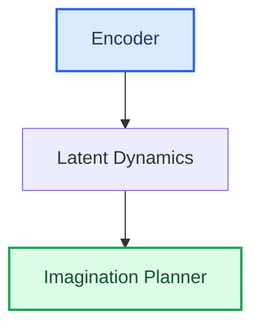

<!--
TEMPLATE — person_vault/{key}/report.md  (branch1, written by scripts/output/branch1_report.py::write_branch1)
The human-facing illustrated Chinese report. Section ORDER and headings below match the writer.
The engine 核心结论-block anchor convention and the "number-free derivation" rule are
LOAD-BEARING — see ../references/branch1-quality.md (they keep the branch1 忠实门 green,
ADR-0012: prose numbers must be GROUNDED, not anchored). Worked instance:
../examples/worked-example.md.
-->
# {candidate.title} — 深度解读

## 摘要翻译
<!-- analysis.claims, woven into prose. ADR-0012 (忠实门): every prose number MUST be
     GROUNDED — its value must appear in the frozen {ID}.md — or the gate hard-blocks
     (AnchorGateError). Prose no longer needs a <!--ref--> marker; the engine 核心结论
     block is still anchored (shape \d+(?:\.\d+)?, integers AND decimals) so 最终门 resolves it: -->
本文方法在 Minecraft Diamond 上取得 9.1<!--ref:r1--><!--anchor:quote:9.1--> 的回合回报,强于最强基线的 7.1<!--ref:r2--><!--anchor:quote:7.1-->。…

## 整体架构
本文方法的核心组件构成如下(原图为 ground truth,以下为简化示意,以原图为准):

## 模型结构图
原图见论文 Figure(忠实锚点,ground truth)。下为统一风格简化重绘(简化示意,以原图为准):

<!-- classDef-only palette (双输出-D1, Apache-2.0 from scientific-agent-skills): required=blue input,
     output=green terminal, optional=yellow. First node -> required, last -> output. -->

### 数学方法
<!-- analysis.math_intuition + analysis.math_toy_example + the $$…$$ pulled from analysis.algorithm.
     DELIBERATELY number-free / metric-cue-free so the section reads as illustration, not a
     performance claim the 忠实门 would demand grounding for. -->

> ⚠ AI 推导,需人工复核(公式保真已对照 branch2 algorithm.md 源公式)。

源公式(引自 ai_package algorithm.md):$$ \mathcal{L} = \dots $$

**逐步推导**:
- 由源公式 $$ \mathcal{L} = \dots $$ 出发,目标是最小化训练目标对应的误差。
- 沿优化方向迭代,在每一步上减小该误差,得到分阶段的优化目标。

**比喻(直觉辅助,非严格对应)**:{analysis.math_intuition}

**玩具例子**:{analysis.math_toy_example}

### Loss 亮点解释
<!-- analysis.loss_highlight is a dict (keys: direction/mechanism/baseline). Number-free.
     The 4th 证据 bullet is engine-supplied and cross-links to the paired ai_package evidence
     at ../../ai_package/{key}/ara/evidence/ (same vault key, up to repo root). -->
- **修复方向**:{loss_highlight.direction}
- **机制**:{loss_highlight.mechanism}
- **对比基线**:{loss_highlight.baseline}
- **证据**:对比数据见 [ai_package evidence](../../ai_package/{key}/ara/evidence/)(branch1 不复制精确数字,交由审计层双分支一致性门核对)。

## 趋势与定位
{analysis.trend}
