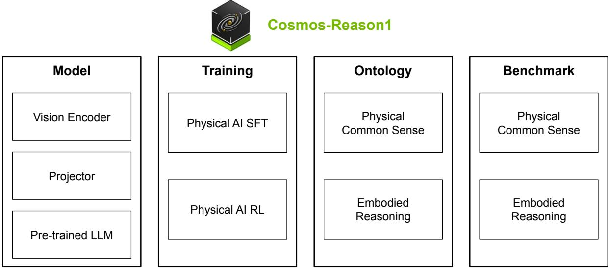
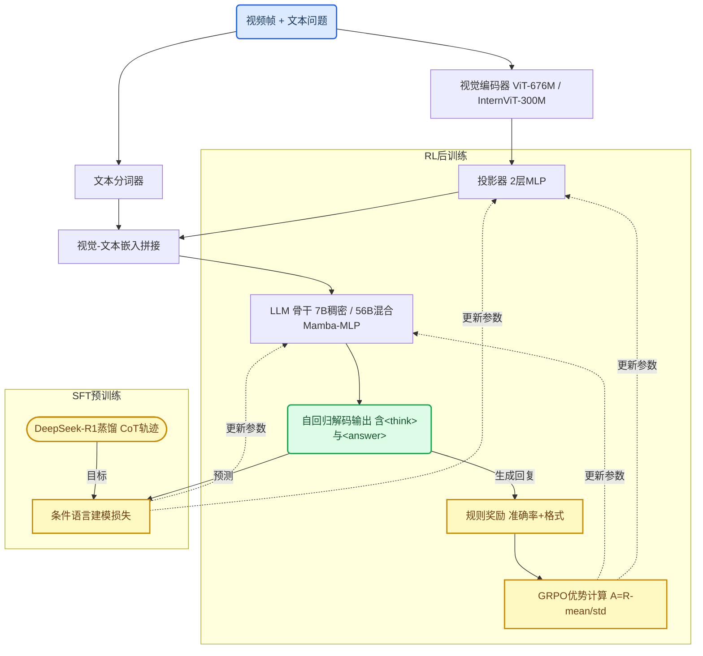
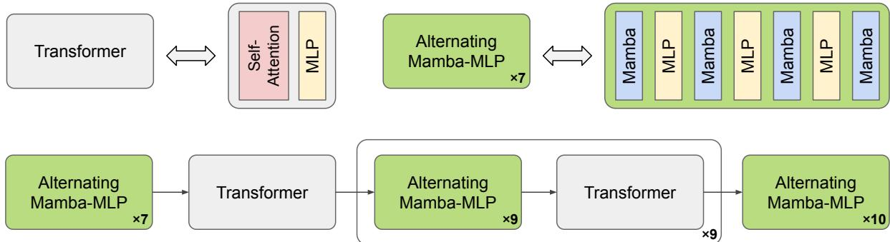
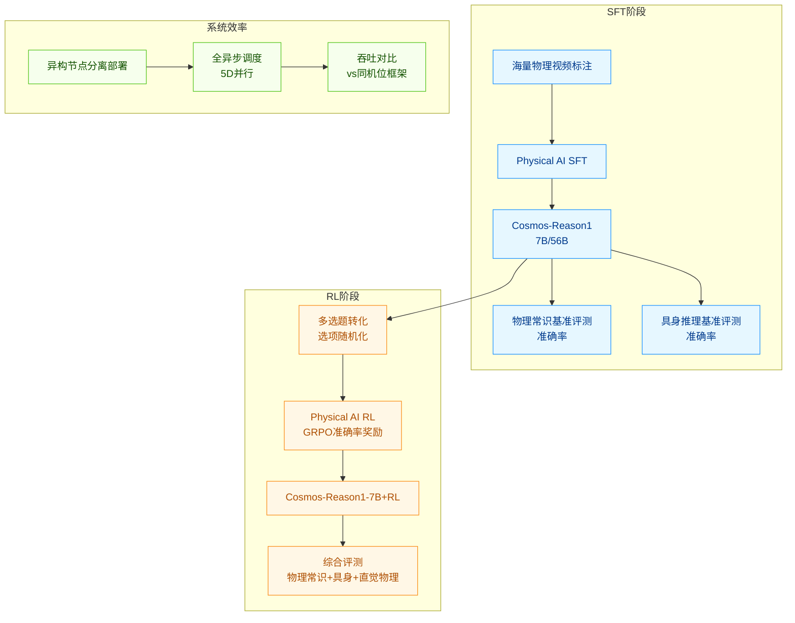
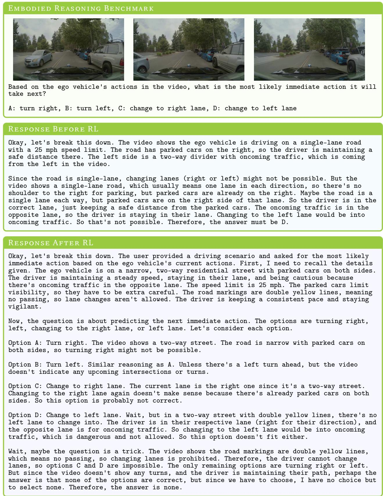
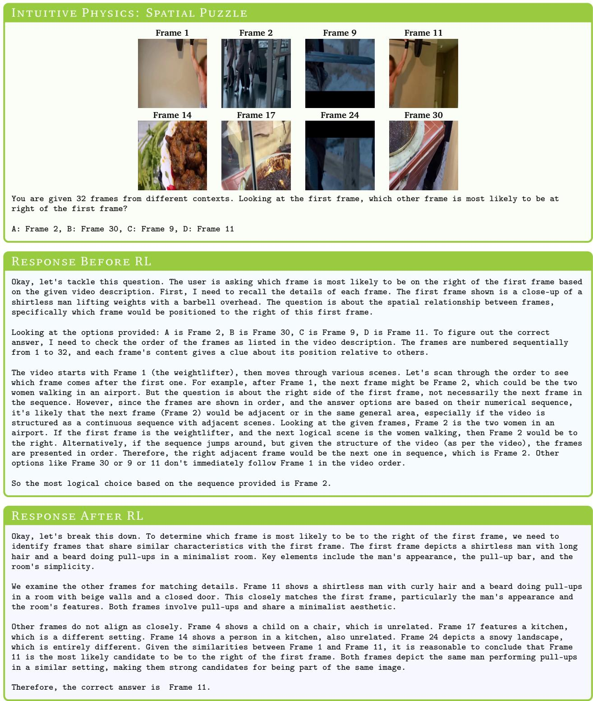
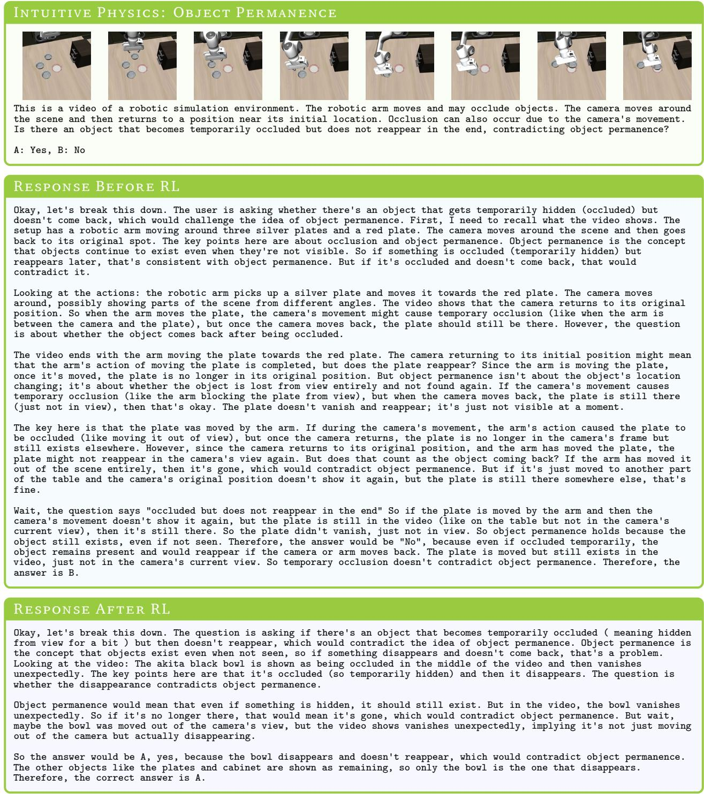
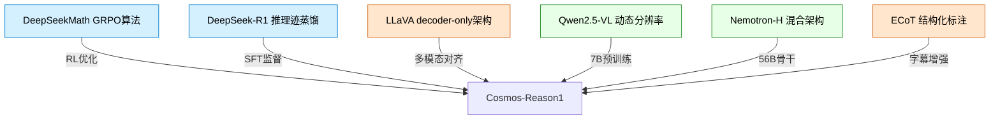

# Cosmos-Reason1: From Physical Common Sense to Embodied Reasoning — 深度解读

> 面向人类读者的深度解读(中文)。事实源与配对的 AI 知识包 `ai_package/2026-06-07_CosmosReason1_2503.15558/ara/` 同源,均已通过数据保真审计。

## 核心结论

> 每条结论后的隐形锚点把数字回链到论文原文(忠实性保证)。

1. 基于精心整理的约400万条物理常识VQA与具身推理SFT数据对骨干VLM进行有监督微调后,Cosmos-Reason1在具身推理基准上相较各自骨干模型均提升超过10个百分点,在物理常识基准上亦有显著提升。<!--ref:r-cosmos-reason1-from-ph--><!--anchor:quote:Cosmos%2DReason1%3A%20From%20Physical%20Common%20Sense%20To%20Embodied%20Reasoning--><!--ref:r-in-order-to-evaluate-o--><!--anchor:quote:In%20order%20to%20evaluate%20our%20models%2C%20we%20build%20new%20benchmarks%20for%20evaluating%20Physical%20AI%20capabilities%20in%20Sec.%206.%20For%20physical-->
2. 使用基于规则的可验证奖励(准确率奖励+格式奖励)进行强化学习后训练,可在SFT模型基础上进一步提升物理常识、具身推理与直觉物理任务的综合准确率。
3. 在时间箭头(二分类)和物体恒常性任务上,包括Gemini 2.0 Flash、GPT-4o在内的当前最优VLM准确率接近随机猜测基线,揭示了现有评测体系未能有效衡量模型对物理世界的理解能力。<!--ref:r-sub-physical-sub-sub--><!--anchor:quote:%3Csub%3EPhysical%3C%2Fsub%3E%20%3Csub%3ECommon%3C%2Fsub%3E%20%3Csub%3ESense%3C%2Fsub%3E%20%3Csub%3ERL%3C%2Fsub%3E%20%3Csub%3EData.%3C%2Fsub%3E%20We%20collect%205133%20human%20annotated%20binary%20and%20multiple%2Dchoice%20questions%20from%201989%20videos.%20To%20help%20control--><!--ref:r-physical-ai-systems-ar--><!--anchor:quote:Physical%20AI%20systems%20are%20designed%20to%20interact%20with%20the%20physical%20world.%20To%20effectively%20follow%20instructions%20and%20take%20appropriate%20actions%20to-->
4. 经Physical AI SFT训练后,Cosmos-Reason1-7B在直觉物理综合基准(时间箭头、空间拼图、物体恒常性)上平均准确率相较骨干Qwen2.5-VL-7B提升超过30个百分点,验证了自监督直觉物理数据整理策略的有效性。<!--ref:r-cosmos-reason1-from-ph--><!--anchor:quote:Cosmos%2DReason1%3A%20From%20Physical%20Common%20Sense%20To%20Embodied%20Reasoning--><!--ref:r-physical-ai-systems-ne--><!--anchor:quote:Physical%20AI%20systems%20need%20to%20perceive%2C%20understand%2C%20and%20perform%20complex%20actions%20in%20the%20physical%20world.%20In%20this%20paper%2C%20we%20present--><!--ref:r-for-cosmos-reason1-7b--><!--anchor:quote:For%20Cosmos%2DReason1%2D7B%2C%20we%20choose%20Qwen2.5%2DVL%20%28Bai%20et%20al.%2C%202025%29%20as%20our%20pre%2Dtrained%20model%20and%20follow%20the%20same%20image%20and%20video--><!--ref:r-physical-ai-systems-ne--><!--anchor:quote:Physical%20AI%20systems%20need%20to%20perceive%2C%20understand%2C%20and%20perform%20complex%20actions%20in%20the%20physical%20world.%20In%20this%20paper%2C%20we%20present--><!--ref:r-for-cosmos-reason1-7b--><!--anchor:quote:For%20Cosmos%2DReason1%2D7B%2C%20we%20choose%20Qwen2.5%2DVL%20%28Bai%20et%20al.%2C%202025%29%20as%20our%20pre%2Dtrained%20model%20and%20follow%20the%20same%20image%20and%20video-->
5. 通过分离策略训练节点与Actor Rollout节点的异构部署,并使用统一调度器实现端到端异步并行,所提出的RL训练框架相比主流同机位框架训练效率提升约160%,同时支持节点故障自动重配置和动态扩缩容。<!--ref:r-to-make-more-efficient--><!--anchor:quote:To%20make%20more%20efficient%20use%20of%20RL%20training%20data%2C%20we%20also%20propose%20a%20novel%2C%20fully%20asynchronous%20and%20highly%20robust%20RL-->
6. 经Physical AI RL训练后,模型在遇到歧义性多选问题时能主动评估每个选项的合理性,选择拒绝全部给定选项并给出问题之外的保守回答,而非强行从不充分选项中作答。

## 一句话总结与导读

**TL;DR：Cosmos-Reason1 是一套专为让 AI“理解物理世界”而生的多模态大模型，它通过定义层级化的物理常识能力图谱，并让模型像人类一样进行多步长链推理，首次将大模型的直觉物理理解从“随机瞎猜”推进到初步可用的水平，为具身智能和物理 AI 推理开辟了系统化的数据构造与训练路径。**

今天的顶尖视觉语言模型（比如 GPT-4o 或 Gemini）可以流畅地描述一段视频、写诗作画，但若让它们判断视频是正放还是倒放，或者推理一个暂时被遮挡的物体是否依然存在，它们的表现几乎和抛硬币一样随机。这暴露了一个深层痛点：这些模型从海量图文中学到的“书本知识”，与真实世界中物体运动、因果顺序、空间占位等底层物理规律之间存在断裂——它们懂文字，却不具备**直觉物理学**（Intuitive Physics）。这种断裂直接阻碍了具身智能的落地，因为机器人抓取动态物体、自动驾驶预判行人意图等场景，需要的不是文字描述，而是即时的感知‑推理‑决策闭环。Cosmos-Reason1 的诞生，正是为了把观看视频的多模态模型，从“画面解说员”训练成具备物理世界推理能力的“具身思考者”。

最核心的思路可以用“本体论→蒸馏→规则化进化”这三个动作概括。研究团队没有盲目地收集数据，而是先构建了一个层级化的**物理 AI 本体论**（Physical AI Ontology），将物理常识拆解为空间、时间、基础物理三大类十六项子能力，并配套定义了具身推理的二维能力框架。在这个明晰的能力地图指导下，他们整合了约四百万条视频‑文本推理数据。为了让模型学会多步思考，团队借用了 DeepSeek-R1 的长链推理能力，蒸馏出包含中间观察、分析与结论的思维轨迹（Chain-of-Thought），让模型在监督微调阶段就养成“所见→所思→所答”的推理习惯。最巧妙的是强化学习阶段：物理推理的答案往往是开放式的，难以自动判分，Cosmos-Reason1 选择将绝大多数任务重新设计为多选题格式，从而能够利用“答案是否正确”和“思考格式是否规范”这类纯粹的**规则化可验证奖励**，进行大规模强化学习后训练。这套组合拳让模型在物理常识、具身推理和直觉物理三项评测上均取得显著且一致的进步（具体提升幅度见后续章节），初步展示了一种可自我进化的物理世界理解能力。放眼未来，当具身智能体需要“眼见为实、深入思考、反思调整”时，这种从本体论出发、以推理为核心、由规则化奖励驱动的训练范式，可能成为物理 AI 真正走进现实世界的第一块跳板。

**论文总体架构(原图):**

*图1展示了Cosmos-Reason1的整体架构。该模型包括7B和56B两种规模的多模态大语言模型，通过物理AI监督微调和强化学习两个阶段训练。图中还定义了两个本体（物理常识和具身推理）并构建了相应的基准测试。*

## 问题背景与动机

大语言模型和视觉-语言模型虽然能从海量网络文本中汲取丰富的物理世界常识，但这份知识往往停留在“纸上谈兵”的层面——它们很难将其与真实的物理交互和动态过程建立联系（直觉,非严格对应）。例如，在判断一段视频中事件是正向播放还是倒放（时间箭头）、推断被遮挡后重新出现的物体是否仍是原来那个（物体永恒性）等直觉物理任务上，当前主流的VLM表现几乎与随机猜测无异，说明标准训练范式并未赋予模型对熵增、因果和物体持续存在等底层规律的真实理解。与此同时，以OpenAI o1和DeepSeek-R1为代表的长链式思维推理模型在代码、数学等STEM领域屡获突破，但这一范式在物理AI方向却迟迟未见系统化探索。

究其根源，有三个环环相扣的缺失阻碍了长链推理强化学习（RL）进入物理AI：

- **能力框架与评测缺失**：物理常识与具身推理长期缺乏一个统一的能力定义和评测基准。没有清晰的能力边界，就无法系统衡量进展，更无法为RL设定对应的奖励目标。
- **训练数据难以规模化**：物理AI的推理答案多为自由格式文本，现有数据集无法直接提供可复用的思维链（CoT）轨迹，导致高质量的监督训练数据难以规模化生成。
- **规则化验证奖励缺位**：数学题有唯一解，代码可通过测试用例验证，但物理推理问题本身具有开放性，很难通过规则自动判别对错，这让依靠大量试错反馈的RL训练无从落脚。

这三个缺口共同指向一条解决路径：若想将长链推理RL成功引入物理AI，就必须同时攻克定义、数据和验证三大难题。基于此，本文提出了一个系统性方案——首先，通过构建层级化本体论框架明确定义物理AI的能力范畴；其次，借助DeepSeek-R1的知识蒸馏，生成大规模带CoT的推理训练数据；最后，将物理推理问题统一转化为多选题格式，使得每一个答案都能被规则自动验证，从而获得稳定且可规模化的奖励信号。这一组合设计使得“监督微调 + 强化学习”的两阶段训练范式首次在物理常识推理、具身推理和直觉物理理解上落地，为物理AI的推理能力训练打开了可复现、可规模化的技术通路。

## 核心概念速览

Cosmos-Reason1 的整个框架建立在若干精心设计的概念之上。为了帮助读者快速建立直觉，我们先逐一拆解这些核心概念，并附上生活化或工程化的比喻。

**物理AI本体论** 相当于能力的“分类账本”——它将物理智能划分为 **物理常识**（空间、时间、基础物理三大类，共16个子类）和 **具身推理**（四类能力×五类主体的二维矩阵）。物理常识好比“物理世界交通规则手册”，告诉你什么情况合理、什么违反常理；具身推理则像一位“经验丰富的技工”，能从感官输入中预判动作效果，并判断动作是否遵从物理约束。二者共同为后续训练圈定了清晰的目标边界。

**长链推理**（Long CoT）让模型学会“先打草稿再答题”——在 `<think>` 标签中展开逐步分析，最后在 `<answer>` 里给出结论。这相当于给模型安装了“慢思考”（System 2）的开关，用显式的中间推理来弥补单步直觉推断（System 1）可能出现的偏差。

**Physical AI 监督微调**（Physical AI SFT）是训练的第一阶段：用约400万条视频‑文本配对数据（包含物理常识VQA和由 DeepSeek-R1 蒸馏出的长链推理轨迹）对预训练模型做特化，好比“先通读足够多的带笔记教科书”，让模型在海量多模态样本中习得物理与具身的先验。

**GRPO**（组内相对策略优化）与 **规则化可验证奖励** 共同构成第二阶段的强化学习核心。GRPO 不需要单独训练一个“裁判”（critic），而是对同一问题的多个回答做组内比较——归一化分数后计算优势，好比“篮球训练中的队内对抗赛，队员互相参照进步，无需专职评委”。奖励设计则高度自动化：准确率靠多选题字符串匹配，格式靠正则检测 `<think>` / `<answer>` 标签，像一台“高速自动阅卷机”。但这也意味着，那些无法转成多选题的复杂感知场景，奖励信号可能失灵。

**直觉物理**（Intuitive Physics）是专为 RL 设计的三项自监督任务——空间拼图（打乱视频块复原）、时间箭头（判断视频正放/倒放）、物体恒常性（检测物体违规消失）。这些任务的数据标签都由结构本身自动生成，好比“用拼图游戏和倒放视频自我训练物理直觉”，为强化学习提供了源源不断的可验证信号。

**混合 Mamba‑MLP‑Transformer 架构** 是 Cosmos-Reason1-56B 的“神经系统”。它以线性时间复杂度的 Mamba 状态空间模型为主干，高效吞吐长序列，再嵌入少量 Transformer 层来弥补局部细节捕捉的不足，恰似“耐力长跑选手与爆发短跑选手组队——Mamba 负责持续跟进的‘长跑’，Transformer 负责关键时刻的‘精细冲刺’”。

**异步 RL 训练框架** 则是支撑整个 RL 后训练的工程骨架。它将数据调度（Dispatcher）、答案生成与奖励计算（Actor Rollout）、策略优化（Policy Training）三大组件解耦并行，并支持五维分布式计算，带来显著的训练吞吐提升。整套架构就像一个“高度自动化的工厂：调度员、生产车间和质检优化部门同时作业，互不阻塞”。

以上概念彼此咬合：本体论框定问题范围，SFT 注入物理知识，RL 通过 GRPO 和规则化奖励强化推理，直觉物理提供自监督数据引擎，混合架构保障长序列下的训练效率，异步框架则让全流程能够规模化落地。后续各节将逐一展开这些机制的细节。

## 方法与整体架构

**结论前置**：Cosmos‑Reason1 构建了一条从视频到结构化推理答案的完整流水线，其核心是一套“视觉编码→跨模态对齐→大模型自回归解码”的 VLM 架构，再配合“知识蒸馏监督微调（SFT）+ 基于规则的组相对策略优化强化学习（GRPO RL）”两阶段训练，让模型习得物理常识与多步推理能力。推理时，模型会先在 `<think>` 标签内“打草稿”，再于 `<answer>` 标签中给出最终判断；通过多次采样平均来稳定评估结果。

**模型如何“看见”并“理解”视频？**  
当一段视频与一个文本问题送入模型时，视觉编码器首先将每一帧转化为一组高维特征向量（token）。具体到不同参数规模的实现上，7B 版本搭载 **ViT‑676M**，56B 版本则采用 **InternViT‑300M‑V2.5**。这些视觉 token 此时仍处于视觉语义空间，与语言模型熟悉的文本向量存在“方言隔阂”。为此，一个由两层 MLP 构成的**投影器**会介入，对视觉 token 进行下采样与线性映射，将它们投射到与文本 token 相同的嵌入维度——本质上充当了“视觉‑语言翻译器”。紧接着，来自分词器的文本 token 与投影后的视觉 token 被简单拼接，形成统一的混合序列，喂入**语言模型骨干**。7B 模型使用经典的稠密 Transformer，56B 模型则升级为混合 Mamba‑MLP‑Transformer，以更高效地处理长序列。骨干网络以自回归方式逐个预测下一个 token，最终生成一段包含 `<think>...</think>` 推理链与 `<answer>...</answer>` 答案的自然语言回复。

**训练流水线：先“拜师”，再“自修”**  
要让模型自发写出高质量的推理链，仅仅训练它预测下一个词远远不够。论文设计了两阶段训练方案：

1. **物理 AI 监督微调（Physical AI SFT）——拜师学艺**  
研究者收集了涵盖物理常识、具身推理等领域的约 4M 视频‑文本对，但原始数据并不包含推理过程。为了低成本获得“解题步骤”，团队采用了一种知识蒸馏策略：先借助已有 VLM 将视频转为文字描述，再将描述与问题输入 **DeepSeek‑R1**，由这位强推理模型生成详细的链式思维（CoT）轨迹。这些蒸馏而来的“标准答案”随后被用作 SFT 目标，模型通过标准的条件语言建模损失从中模仿推理格式与常识推理。为防止单一领域数据偏斜，该阶段对各数据域进行了均衡采样（直觉：就像让学生均衡练习代数、几何，而非只做一类题）。

2. **物理 AI 强化学习（Physical AI RL）——自我纠错**  
仅靠模仿可能“知其然不知其所以然”，且难以保证推理正确性。第二阶段引入了 **GRPO（Group Relative Policy Optimization）** 算法，让模型在无需人工标注的情况下，通过与规则奖励的交互自我提升。具体运作方式为：对于一道多选题（或可自动判定的直觉物理任务），模型一次性采样多条回复（组大小为 9），每条回复会依据 `<answer>` 内的选项是否与标准答案匹配获得“准确率奖励”，同时依据 `<think>` 和 `<answer>` 标签规范性获得“格式奖励”。随后，系统计算组内标准化优势

$$A_i = \frac{R(o_i) - \text{mean}(\mathcal{G})}{\text{std}(\mathcal{G})}$$

并以此更新模型参数，放大优质推理的生成概率，抑制劣质推理。一个关键 trick 是训练时对选项进行**即时随机打乱**，这强迫模型依靠内容而非位置做判断，避免“一直选 A”的投机行为。此外，大量 RL 数据来自**自监督直觉物理任务**（如判断视频时间箭头是否倒放、图像空间拼图是否合理），其答案天然可验证，实现了零标注成本的数据规模化。

**推理时的稳健策略**  
在最终评测阶段，由于自回归解码带有随机性，单次回答未必反映模型真实水平。论文采用“多次采样取平均”的共识策略：对同一问题以 temperature=0.6、top‑p=0.95 的配置采样 5 次，计算平均准确率，从而获得更稳定的性能读数。

下面的流程图直观展示了从数据输入到模型生成，再闭环到训练反馈的完整路径。

图中实线表示数据前向流动，虚线代表训练阶段的参数更新；两个训练子图仅在模型学习时激活，推理时不经过。

**模型结构与关键子图(原图):**

*图3是多模态大语言模型的架构示意图。输入视频通过视觉编码器和投影器转换为视频令牌，与文本令牌拼接后送入大语言模型进行处理。*

*图4展示了Cosmos-Reason1-56B中使用的混合Mamba-MLP-Transformer骨干网络。它包括自注意力层和MLP层的Transformer块，以及交替的Mamba-MLP模块。*

*图5是提出的强化学习训练框架架构。主要包括三个部分：调度器负责数据调度和状态管理，Actor采样生成响应并计算奖励和优势，以及策略更新等组件。*

## 算法目标与推导

**GRPO 在这里的核心任务不是“让模型变聪明”，而是“让模型学会守规矩”。** 在 SFT 阶段模型已经见过大量正确的解题示例，但实际生成时仍可能出现<think>标签残缺、<answer>遗漏或选择题选项对不齐等格式错误，以及偶尔的推理失误。RL 后训练的目标非常务实：**通过可自动计算的规则奖励，强化那些既符合格式规范又答对的生成路径，同时约束模型不要为了讨好奖励而变成另一个“人格”（即防止与 SFT 策略偏离过远）。** 为此论文采用了组相对策略优化（GRPO），它不像传统 PPO 那样需要一个额外的价值网络来估计收益基线，而是直接在同一个提示的多个回复之间进行“相对比较”，既节省显存又天然具备了归一化特性。

论文显式给出的唯一数学公式就是 GRPO 中使用的优势计算：

$$A_i = \frac{R(o_i) - \mathsf{mean}(\mathcal{G})}{\mathsf{std}(\mathcal{G})}$$

其中 $\mathcal{G} = \{o_1, o_2, \dots, o_G\}$ 是对于同一条输入提示采样的 $G$ 条回复（论文中 $G=9$），$R(o_i)$ 是第 $i$ 条回复获得的奖励。这个公式的本质是在一个小组内做 **z-score 标准化**：超过平均就得到正优势，低于平均就得到负优势，差异大小被组内标准差所缩放。下面我们把整个训练回路拆开，一步步看清每一项的含义与设计理由。<!--ref:r-cosmos-reason1-from-ph--><!--anchor:quote:Cosmos%2DReason1%3A%20From%20Physical%20Common%20Sense%20To%20Embodied%20Reasoning--><!--ref:r-physical-ai-systems-ar--><!--anchor:quote:Physical%20AI%20systems%20are%20designed%20to%20interact%20with%20the%20physical%20world.%20To%20effectively%20follow%20instructions%20and%20take%20appropriate%20actions%20to--><!--ref:r-images-58faf324399999--><!--anchor:quote:%21%5B%5D%28images%2F58faf324399999ff83bc7e7dc9071f898f0f574b2ca50d4c5a66407e315f58ad.jpg%29-->

**第一环：采样组与奖励计算。**  
对于每一条从训练集中取出的提示（一道选择题），模型首先生成 $G=9$ 个不同的回复。每条回复由两个标签包裹：`<think>` 内是推理过程，`<answer>` 内是最终选项。奖励 $R(o_i)$ 完全由规则函数给出，不需要人工评判或偏好模型。它由两部分相加而成：
- **准确率奖励**：利用正则表达式抽取出 `<answer>` 标签内的文本，与标准答案做字符串匹配（MCQ 选项如 A/B/C/D），匹配正确得 1，否则得 0。
- **格式奖励**：用另一套正则检查 `<think>` 与 `<answer>` 标签是否成对出现、格式是否严格符合要求，格式全对得 1，否则得 0。

这一定义意味着：**奖励信号极其稀疏且严格**，不奖励“过程好看但答错”的输出，也不奖励“答对但标签乱写”的输出。模型必须同时满足两个条件才能拿到满分。

**第二环：组内优势计算——为什么不能直接用奖励？**  
如果直接把每条回复的奖励当作优化信号，不同提示的难度差异会导致奖励尺度剧烈波动：对于简单题，模型随手就能得 2 分；对于难题，多条回复可能都是 0 分。直接用原始奖励更新会使简单题主导梯度，让训练失去平衡。GRPO 的解决方式是在每个 $G$ 条的小组**内部**进行标准化：减去组内平均奖励 $\mathsf{mean}(\mathcal{G})$，再除以组内标准差 $\mathsf{std}(\mathcal{G})$。这样一来，即使某道题全组都得了低分，那些“相对不那么低”的回复依然能获得正优势，从而保留该题上的学习信号；反之，简单题上全组高分，优势会压低那些刚过平均线的回复，避免模型在已经擅长的题上过度自信。

**第三环：从优势到策略更新——最大化“好行为”的概率，同时拴上缰绳。**  
获得了每条回复的优势 $A_i$ 之后，GRPO 的策略梯度目标变得直观：**增大正优势回复的生成概率，减小负优势回复的生成概率**。论文虽然未写出显式的策略梯度损失公式，但从文本说明中可以明确其组成：训练最大化由规则奖励驱动的目标，并施加一个 KL 散度惩罚项（系数为 $0.005$），约束当前策略不要与原始 SFT 策略产生太大偏移。换句话说，更新信号类似于：

- 对每条回复 $o_i$，让模型提升 $\log \pi_\theta(o_i|\text{prompt})$ 的概率，提升的力度正比于 $A_i$；
- 同时从目标中扣除一项：$\beta \cdot \text{KL}(\pi_\theta || \pi_{\text{ref}})$，防止模型为了贪图格式奖励而退化成一味输出固定模板的“取巧者”。

**直觉比喻（非严格对应）**：  
想象一位老师给全班 9 个学生布置同一道数学题，作业本上既要求写下思考草稿（`<think>`），也要求把最终答案圈出来（`<answer>`）。老师改作业时只根据两点打分：最终答案对不对（准确率奖励），草稿和答案框是否写完整（格式奖励）。每道题收齐后，老师不在全班公开排名，而是在**这 9 个学生的内部**比较：“你们组里平均分是 1.2，你做对了还写全了，你是 +1.5 的突出表现；你虽然答对了但草稿没写完整，你比平均还低了 -0.3。”随后老师会按照这个相对分数去反复调整自己的讲解思路：强化高分的解题习惯，抑制低分的马虎行为，但同时要求自己不能突然改得面目全非，否则之前教会的基础功就废了（KL 惩罚）。这样就使得整个班级既越来越擅长把题答对、把格式写好，又不会在训练中丢失原本已学会的推理根基。

**具体小玩具例子**：  
假设提示是“$2+3=?$ A.3 B.4 C.5 D.6”，模型采样了 3 条回复（简化 $G=3$）：
- $o_1$：`<think>二加三等于五</think><answer>C</answer>` → 格式正确，答案正确 → $R=2$
- $o_2$：`<think>不知道</think><answer>B</answer>` → 格式正确，答案错误 → $R=1$
- $o_3$：`答案是C`（缺失标签） → 格式错误，但答案字面上是 C → 格式奖励 0，但由于正则抽不到 `<answer>` 标签，可能被视作无答案，最终准确率奖励也受损 → $R$ 极低（如 0）

计算组均值 $\mathsf{mean}=\frac{2+1+0}{3}=1$，标准差约为 $0.82$。优势分别为：
- $A_1 = (2-1)/0.82 \approx +1.22$
- $A_2 = (1-1)/0.82 = 0$
- $A_3 = (0-1)/0.82 \approx -1.22$

模型随后会“鼓励”自己多产出像 $o_1$ 这样工整且正确的回答，而对 $o_3$ 这类格式散乱的输出降低生成概率。由于 $A_2$ 接近零，那条“答错但格式正确”的回复对更新的影响很微弱——这正是组内相对比较的典型效果：**只有在同一条件下比平均值显著好或坏的样本才会强有力地驱动学习**，这天然过滤了模棱两可的信号，使训练更聚焦、更稳定。

## 实验设计与结果解读

Cosmos‑Reason1 的实验体系遵循一条清晰的验证链路：**先通过大规模物理交互视频的监督微调（Physical AI SFT）赋予基础模型物理常识，再利用基于稠密奖励的强化学习（Physical AI RL）精细化对齐推理行为，同时在专门的直觉物理基准上暴露通用视觉‑语言模型的常识盲区，并以工程侧的全异步 RL 框架保障训练规模与效率**。以下依次拆解各实验的设计动机、对照逻辑与核心发现。

### 监督微调如何让模型“长”出物理常识（E1, E2）

这两项实验回答一个朴素的问题：用物理场景视频与对应推理标注做 SFT，模型到底学到了什么？实验选取 Cosmos‑Reason1 的两个规模（7B 和 56B），分别在物理常识基准和具身推理基准上进行零样本思维链评测，并将结果与未经 SFT 的骨干模型（Qwen2.5‑VL‑7B、Nemotron‑H‑56B）以及主流闭源模型（Gemini 2.0 Flash、GPT‑4o、OpenAI o1）直接对比。物理常识基准覆盖空间、时间、基础物理三大类别，源自数百段真实视频；具身推理基准则汇集 BridgeData V2、RoboVQA 等六个不同操作场景的数据集，以多选题形式考察多模态输入下的因果推断能力。

**关键对照**在于“同一骨架模型 SFT 前后的能力差”。实验结果表明，Physical AI SFT 在所有子维度上均稳定超越了各自的骨干模型。尤其值得关注的是，在具身推理任务上，7B 规模的 SFT 模型已经展现出极具竞争力的表现——尽管受限于模型体量，其多模态对齐后的推理潜力被充分释放。这一现象暗示，大规模、高质量的视频推理标注数据或许是弥补视觉‑语言模型在物理常识上短板的关键要素，而非单纯增加模型参数。

<strong>SFT 实验配置细节</strong>

- **训练数据**：约 1.81M 条理解标注 + 1.93M 条推理标注，全部源自物理交互视频。  
- **模型**：Cosmos‑Reason1‑7B（基于 Qwen2.5‑VL‑7B），Cosmos‑Reason1‑56B（基于 Nemotron‑H + InternViT‑300M‑V2.5）。  
- **硬件**：7B 模型使用张量并行（TP=4）；56B 模型使用张量并行（TP=8）与流水线并行（PP=2）。  
- **推理设置**：自研模型取 5 次推理均值（temperature=0.6, top‑p=0.95）；对比模型使用零样本思维链提示（API 调用或开源权重），评测样本与训练集无重叠。  

### 强化学习后训练：让推理从“答对”走向“想清楚”（E3）

SFT 让模型学会模仿正确答案的表达形式，但并不保证模型面对歧义选项时足够鲁棒。E3 正是为此设计：以 SFT 模型为起点，将原有推理数据改造为约三万道多选题，采用 GRPO 算法，奖励信号由字符串匹配的准确率和格式规范两部分构成，并在每个训练步在线随机打乱选项顺序，以防止模型“记住”选项位置而非推理内容。

实验的对照组是 SFT 阶段的同模型。结果显示，RL 后训练的综合均分进一步攀升，且定性分析发现，RL 后的模型在遇到多个看似合理的选项时，推理链条明显更冗长、更倾向于拆解物理过程而非直接给出标签——这种“慢思考”行为与奖励设计中强调准确率而非简洁性的导向一致。不过，必须指出，该 RL 流程仍以字符串匹配作为唯一准确性判据，可能忽略语义等价但表述不同的正确推理；论文也未单独剥离各类奖励（准确率 vs. 格式）的贡献，给读者留下了进一步探索的空间。

<strong>RL 训练超参</strong>

- 全局 batch size：128 个问题，每题采样 9 个输出，最大 token 长度 6,144。  
- 学习率：4×10⁻⁶；KL 惩罚系数：0.005；训练 500 轮。  
- 奖励函数：准确率奖励（预测选项与标准答案的精确字符串匹配） + 格式奖励。  

### 直觉物理基准：戳破通用大模型的“常识泡沫”（E4）

这套实验的价值不仅在于展示 Cosmos‑Reason1 的领先，更在于系统性地暴露了当前主流 VLM 在基础物理直觉上的惊人缺失。实验设置三个对成人而言近乎本能的子任务：**时间箭头**（判断视频是正向还是倒放）、**空间拼图**（识别场景中的空间布局）和**物体恒常性**（判断被遮挡物体是否依然存在）。评测对象包括 Gemini 2.0 Flash、GPT‑4o、OpenAI o1 等行业顶尖模型，以及随机猜测基线，所有评测数据已确认与训练数据无重叠。

结果极具冲击力：前述顶尖模型在时间箭头和物体恒常性两项任务上，正确率与随机猜测并无显著差异，表明它们虽然能生成复杂的自然语言描述，却未能从视频像素中真正习得时间不可逆性或物体永久性这类底层物理规律。而 Cosmos‑Reason1‑7B 的 SFT 模型已大幅超越其骨干模型，RL 后训练更将性能推向在该基准上近乎实用的水平。这一鲜明对比有力地论证了：通用多模态预训练并不能自动覆盖所有常识维度，针对“物理直觉”的定向数据注入与训练策略，是通向可信赖物理 AI 的必经之路。当然，这三项任务虽直观，尚不能囊括物理直觉的全部面貌，其结论的泛化边界仍需要在更丰富的场景中检验。

### 异步 RL 框架：把大规模训练的效率瓶颈推开（E5）

上述 RL 后训练的实验规模，对训练系统提出了严苛要求。传统 RLHF 类框架多采用策略网络与生成器（Rollout）部署在同一组节点上的“同机位”模式，同步等待产生大量 GPU 空闲。E5 验证的自研全异步框架则通过将策略训练节点与 Rollout 节点物理分离、引入统一调度器实现异构并行，端到端消除了同步阻塞。实验中框架支持包括数据并行、流水线并行、张量并行在内的五维并行策略，并具备节点故障自动重配置与动态扩缩容能力。与主流同机位框架相比，全异步设计带来了显著的吞吐量提升（具体幅度见实验表），从而保障了数千轮 RL 训练的稳定推进。该实验的局限在于，加速比源于整体架构的重新设计，论文未分别量化分离部署、5D 并行等因素各自的收益，也未详细讨论异构部署带来的通信开销与成本增加的权衡。

**如何读这张图**：图中三个并行区域分别对应本文的三大实验主线——SFT 阶段构建基础物理理解，RL 阶段对齐推理行为并泛化至直觉物理任务，系统效率实验支撑整个 RL 训练流程。箭头表示“数据→模型→评测”的推进顺序，以及从 SFT 模型到 RL 模型的继承关系。

整体来看，这些实验从能力注入、行为对齐、常识缺口检验和训练基础四个层面，构建了一个相对完整的验证闭环。Cosmos‑Reason1 在物理推理上表现出的优势并非源自某个单点突破，而是数据、算法与系统协同设计的结果。同时，评测中暴露出的现有模型短板、RL 奖励设计的简单化，以及框架加速比的颗粒度不足，也为后续研究留下了明确的路标。各实验的精确性能数值汇总于下文表格，供读者逐一对照。

### 实验数据表(原始数值,引自论文)

#### Physical AI RL后训练对物理常识与具身推理的提升
- **Source**: Table 9
- **Caption**: "Physical AI RL对Cosmos-Reason1-7B的提升效果,综合均分(含物理常识和6个具身推理子集)从60.7提升至65.7(+5.0)。括号内为相对SFT模型的提升。"

| Models | Common Sense | BridgeData V2 | RoboVQA | Agibot | HoloAssist | AV | RoboFail | Avg. |
| --- | --- | --- | --- | --- | --- | --- | --- | --- |
| Cosmos-Reason1-7B | 54.3 | 58.8 | 83.8 | 49.4 | 63.0 | 55.6 | 60.0 | 60.7 |
| + Physical AI RL | 56.2 | 73.5 | 86.8 | 54.2 | 60.0 | 67.0 | 62.0 | 65.7 (+5.0) |

#### 具身推理基准评测结果
- **Source**: Table 8
- **Caption**: "具身推理基准(BridgeData V2/RoboVQA/Agibot/HoloAssist/AV/RoboFail六个子集,共610道题)上各模型准确率比较。Cosmos-Reason1模型括号内数值为相对各自骨干模型的提升。"

| Models | BridgeData V2 | RoboVQA | Agibot | HoloAssist | AV | RoboFail | Avg. |
| --- | --- | --- | --- | --- | --- | --- | --- |
| Gemini 2.0 Flash | 25.0 | 78.2 | 29.0 | 44.0 | 37.0 | 67.0 | 46.7 |
| GPT-4o | 42.0 | 71.8 | 32.0 | 65.0 | 46.0 | 63.0 | 53.3 |
| OpenAI o1 | 42.0 | 80.0 | 44.0 | 63.0 | 37.0 | 61.0 | 54.5 |
| Qwen2.5-VL-7B | 38.0 | 82.5 | 40.4 | 50.0 | 36.0 | 57.6 | 50.8 |
| Nemotron-H-56B | 37.0 | 77.2 | 37.0 | 65.0 | 41.0 | 64.0 | 53.5 |
| Cosmos-Reason1-7B | 58.8 | 83.8 | 49.4 | 63.0 | 55.6 | 60.0 | 61.8 (+11.0) |
| Cosmos-Reason1-56B | 65.0 | 80.0 | 47.6 | 57.8 | 65.8 | 66.2 | 63.7 (+10.2) |

#### 物理常识基准评测结果
- **Source**: Table 7
- **Caption**: "物理常识基准(Space/Time/Fundamental Physics三大类,共604道题,来自426段视频)上各模型准确率比较。Cosmos-Reason1模型括号内数值为相对各自骨干模型的提升。"

| Methods | Space | Time | Other Physics | Avg. |
| --- | --- | --- | --- | --- |
| Gemini 2.0 Flash | 53.8 | 50.0 | 46.9 | 50.2 |
| GPT-4o | 61.3 | 54.7 | 50.9 | 55.6 |
| OpenAI o1 | 63.8 | 58.1 | 58.0 | 59.9 |
| Qwen2.5-VL-7B | 48.8 | 56.4 | 37.2 | 47.4 |
| Nemotron-H-56B | 61.3 | 68.1 | 45.1 | 58.2 |
| Cosmos-Reason1-7B | 54.2 | 58.7 | 50.0 | 54.3 (+6.9) |
| Cosmos-Reason1-56B | 61.3 | 65.5 | 53.9 | 60.2 2(+2.0) |

#### 直觉物理基准评测结果
- **Source**: Table 10
- **Caption**: "直觉物理基准(时间箭头/空间拼图/物体恒常性各100道)上各模型准确率比较。Cosmos-Reason1-7B括号内为相对骨干Qwen2.5-VL-7B(42.1)的提升。"

| Models | Arrow of Time | Spatial Puzzle | Object Permanence | Avg. |
| --- | --- | --- | --- | --- |
| Random Guess | 50.0 | 25.0 | 50.0 | 41.7 |
| Gemini 2.0 Flash | 50.0 | 31.0 | 48.0 | 43.0 |
| Qwen2.5-VL-7B | 50.2 | 27.2 | 48.8 | 42.1 |
| Cosmos-Reason1-7B | 56.0 | 85.4 | 82.0 | 74.5 (+32.4) |
| + Physical AI RL | 64.5 | 94.0 | 86.0 | 81.5 (+7.0) |

**效果示例(论文原图):**

*图9展示了强化学习前后模型的有趣对比。当面对模棱两可的问题时，RL后的模型能够基于知识拒绝所有提供的选项，学会了主动拒答。*

*图10显示，在理解时间顺序和反动作关联上，RL前的模型存在困难，而RL后的模型能够避开干扰（如静止的文字），进行正确的时间推理。*

*图11对比了空间问题上的推理能力。RL前的模型错误地将空间问题归因于时间推理，而RL后的模型能识别第一帧的关键特征并与后续帧比较，正确推理空间信息。*

*图12展示了物体恒存在推理上的改进。RL前模型在长思维链中无法正确推理物体消失原因，RL后模型用简洁直接的推理正确判断物体消失并非相机移动所致。*

## 相关工作与定位

Cosmos-Reason1 的技术体系并非凭空而来，而是系统性地整合了来自高效强化学习、长链推理蒸馏、成熟多模态架构、大规模预训练基座以及机器人数据增强等方向的六项重要先前工作。这套“站在巨人肩膀上”的组合创新，使其能够在 Physical AI 推理任务上同时获得稳健的优化范式与强大的视觉‑语言理解能力，在现有的研究谱系中填补了“具身推理 VLM”这一关键拼图。

下图梳理了 Cosmos‑Reason1 与这些前驱工作之间具体的继承关系——它们分别贡献了 RL 优化算法、推理迹监督信号、多模态融合设计、预训练起点以及数据增强流程。

**RL 优化与推理监督信号的来源**  
在强化学习层面，Cosmos‑Reason1 直接采用了 DeepSeekMath 提出的 GRPO 算法，利用组内归一化奖励来计算优势函数，从而避免了单独训练一个价值网络（Critic）带来的复杂性与不稳定——这相当于把“奖励比较”的参考系从全局 switch 到了同一组内的样本之间，让训练信号更纯净且易于并行。与此同时，论文从 DeepSeek-R1 继承了“长链推理蒸馏”的策略：借助 R1 作为教师模型，为视频对应的文字描述生成包含显式物理常识推理步骤的 CoT 迹，这些迹被用作 SFT 阶段的高质量监督信号。更重要的是，R1 所代表的“基于规则可验证奖励”的训练范式被一并引入：在物理推理中，大量规则（空间占据、动作顺序、因果约束）可以靠程序自动校验，恰好规避了传统 RLHF 中奖励模型昂贵且容易过拟合人类偏好的问题。

**多模态架构与视觉处理**  
在模型结构上，Cosmos‑Reason1 坚守了 LLaVA 推广的 decoder‑only 多模态路线：视觉编码器将视频/图像映射为 token，再通过投影层（含 PixelShuffle 下采样）注入大语言模型的文本嵌入空间，图文被统一为同一个自回归序列来处理。相比需要交叉注意力的方案，这种架构更简洁，且已被社区证明在多模态推理任务上表现更强。针对视觉输入的具体处理方式，两个体量的模型分别选择了不同的成熟基座——7B 版本以 Qwen2.5‑VL 为预训练起点，沿用其动态分辨率与帧采样策略，天然具备对高分辨率、变长视频的适应力；而 56B 版本则采用 NVIDIA 的 Nemotron‑H 作为 LLM 骨干，其内部的 Mamba‑MLP‑Transformer 混合设计在处理长视频序列时能够以线性复杂度替代传统自注意力的二次复杂度，显著降低计算瓶颈。

**数据侧的结构化增强**  
高质量推理迹的提取高度依赖视频字幕的精细度。为此，Cosmos‑Reason1 在 BridgeData V2 字幕生成阶段引入了 ECoT 提供的物体检测与动作序列标注信息，让自动生成的字幕能够更准确地反映“哪个物体在何时被怎样操作”，从而在 SFT 数据层面就为推理迹蒸馏提供了更扎实的时空粒度。

**在谱系中的位置**  
综合来看，Cosmos‑Reason1 处于“视觉语言模型”与“具身推理”的交叉地带。它没有像纯语言推理模型那样忽视物理世界的连续视觉信号，也没有像传统机器人策略那样仅依赖小规模、单任务闭环训练。通过将 DeepSeek 系列在数学/代码领域被验证的推理增强技术，迁移到 Qwen/Nemotron 等强大的 VLM 基座之上，并辅以机器人领域的结构化先验，Cosmos‑Reason1 试图系统性地回答一个核心问题：如何让一个观看物理视频的模型，不仅“看得见”物体与运动，更能“想得明”其背后的物理常识与因果意图。

## 研究探索历程

要让一个多模态大模型真正理解物理世界并在其中推理、行动，不是靠一堆静态的知识点就能糊弄过去的。研究团队面对的核心问题很直白：**现有的语言模型和视觉语言模型能把数学题、代码写得风生水起，但一碰到物理常识和具身推理就原形毕露——它们缺少对“世界如何运转”的那种直觉。** 于是，整项研究就围绕一个主问题展开：如何设计数据、训练流程和模型架构，才能把这类「Physical AI 推理」能力塞进模型？

### 两条腿走路：为什么是“先 SFT，再 RL”？

从一开始，团队就没有把所有赌注压在单一路线上。摆在面前的有纯监督微调（SFT）、直接对预训练模型做强化学习（RL），或者干脆训一个端到端的视觉-语言-动作模型。但直接 RL 缺乏常识根基，端到端动作模型又没法将“心智推理”与“物理执行”解耦，于是他们选择了**两阶段范式：先用精心构建的物理常识与具身推理数据做 SFT 建立基础认知，再用基于可验证规则奖励的 RL 后训练来精细校准推理质量**（类比先学理论再上路驾驶，而非直接把你扔在马路上）。

这一选择很快得到了验证。物理常识 SFT 之后，模型在空间、时间、基础物理等维度上相较各自的基础模型取得全面提升，其中 56B 版本的表现甚至小幅超越同期顶尖闭源模型。具身推理 SFT 同样大幅度拉高了在不同具身数据集、不同机器人平台上的推理准确率，说明第一阶段的数据注入相当“解渴”。

### 绕过死胡同：当纯文本“压扁”了视觉信息

但在准备 SFT 训练数据时，一个细小的裂缝开始扩大。对于“箭头时间”“空间拼图”这类直觉物理任务，研究者原本沿袭常见流程：先将视频中的视觉上下文压缩为一段文字描述，再交给外部推理模型（DeepSeek-R1）去生成推理性迹作为 SFT 监督信号。这个办法在普通图文推理上行得通，**可一遇到“物体永久性”任务就失灵了**。物体永久性的核心难点恰好在于识别视频中某个物体何时消失、消失前的视觉证据是什么，而一旦把视觉线索粗暴地压成文本，信息的流失足以让 R1 生成的推理迹毫无营养。

这是一个典型的**死胡同**：工具链本身造成的失真，比模型能力不足更隐蔽。团队随即做了一个关键**方向转折**——不再依赖外部模型和中间文本压缩，而是直接使用 Cosmos-Reason1 中间训练版本自身从原始视频中提取推理迹。这步 pivot 直接绕开了信息瓶颈，保证了 SFT 监督信号的质量。

### 奖励的“有限魔法”：RL 带来了什么，又卡在哪？

SFT 让模型“懂”了物理常识，但团队还希望模型能“想得更仔细、更保守”。他们设计了一套朴素但不容易作弊的 RL 奖励机制：把推理 SFT 数据转成单一正确答案的选择题，用字符串匹配判断对错（准确率奖励），再辅以正则匹配的格式奖励，强迫模型保持 think/answer 的清晰思考结构。这套“可验证规则奖励”方案避开了 LLM 评判器的主观性、过程奖励模型的昂贵成本以及人工标注的低效。

RL 后训练的效果是真实的。在大多数物理常识与具身推理子集上，模型准确率在 SFT 基础上再次拔高，而且展现出一种更老练的行为——**当问题模糊到任何选项都站不住脚时，模型学会了拒绝所有选项，给出一个保守而合理的拒绝判定**。这意味着它并非单纯背答案，而是发展出了某种对“不确定性”的意识。

但 RL 的魔法有清晰的边界。最具代表性的是 **RoboFail 这个硬骨头**。RoboFail 里的场景涉及复杂的物理约束与细粒度的动作可供性判断，需要极强的感知敏锐度。RL 后训练几乎没能在这个基准上推动任何有效提升。分析显示，通用 RL 训练数据中严重缺乏此类复杂物理约束的代表性样本，导致模型要么对精细的可供性场景推理不足，要么在分布外的细粒度问题上过度思考，掉入“想太多反而错”的陷阱。**死胡同的教训很明确：仅靠一套奖励机制远远不够，困难任务的突破必须回头补特定场景的训练数据。**

类似的分化也出现在直觉物理推理中：空间拼图和物体永久性在 RL 后持续进步，而“箭头时间”这类需要推断视频时序动态的任务依旧举步维艰，说明当前 RL 配方对时序推理的短板更加深层。

### 训练系统的“容错革命”：异步分离如何撑起实验

理论试错之外，实验能跑起来本身就是一个工程挑战。主流的协同部署框架将策略训练和生成放在一起，同步开销大，一个节点宕机往往意味着整个训练步重启，代价高昂。团队为 RL 训练专门设计了一套**全异步异构分离部署框架**：策略训练节点与 Actor rollout 节点完全解耦，通过一个统一的 Dispatcher（调度器）进行端到端异步调度。训练网格管理逻辑允许任意节点故障时无需重启即可继续当前步，而 Dispatcher 本身的冗余机制进一步增强了系统的鲁棒性。同时，框架天然支持动态扩缩容，实验规模可以随需涨缩。这套定制框架带来的训练效率增益十分显著，相比传统协同部署方式实现了多倍提速，为前面那堆繁琐的消融实验和快速迭代提供了底座。

回顾整条探索链，研究从一个大问题出发，用两阶段路线打下骨架，在数据构建阶段因视觉信息流失撞墙后迅速调转方向，又在 RL 阶段看清了通用奖励信号的边界，并透过系统层的创新让全流程跑得转。每一步都踩着上一阶段的限制和失败向前走，没有过分美化，反而把“当前方法还解决不了什么”说得相当直白——这正是让探索历程可信的关键。

## 工程与复现要点

对于希望复现 Cosmos-Reason1 的团队，论文提供了足够具体的模型架构“配方”与训练超参路线图，但**源码未开源**，需要自行搭建分布式训练基础设施——尤其是其自研的异构 RL 框架。以下从模型结构、关键超参、运行环境与依赖、代码入口四个维度展开，帮助工程师评估复现工作量与难点。

### 模型规模与关键结构

Cosmos-Reason1 推出 7B 和 56B 两种规模，均采用“视觉编码器→投影层→LLM 主干”的经典多模态管线，但内部组件为不同容量做了深度定制：

- **7B 版本**：视觉编码器继承 Qwen2.5-VL 的 ViT-676M（32 层，patch 14×14，动态分辨率输入）。投影层为 2 层 MLP，加入 2×2×2 时空下采样，将视频 token 总数压缩至原始 1/8，以此控制送入 LLM 的序列长度。LLM 主干为纯密集 Transformer（28 层，模型维度 3584，28 注意力头），结构成熟，前向推理稳定。视频输入统一采样最多 32 帧（≤2 fps），每帧缩放至 448×448，经 PixelShuffle 后单帧仅贡献 256 个视觉 token，兼顾时空信息与计算预算。

- **56B 版本**：视觉侧改用轻量的 InternViT-300M-V2.5（24 层，固定 448×448 输入），LLM 主干则首次引入混合 Mamba‑MLP‑Transformer（Nemotron‑H，118 层，模型维度 8192，64 注意力头）。其设计直觉是让 Mamba 以线性复杂度高效消化长序列，少量 Transformer 层专注跨步长依赖，形成“快思考 + 慢回溯”的互补机制（直觉，非严格对应）。投影层仅在空间维度做 2×2×1 下采样（时间维保留），以对齐高维嵌入空间。静态图像采用动态分块策略（1~12 个 448×448 分块 + 全局缩略图），以保留细粒度细节和全局上下文。

两种规模的工程设计折射出明确的取舍：7B 追求纯 Transformer 的稠密推理能力与简洁部署；56B 通过混合架构在长序列效率与模型容量之间寻找平衡。

### 训练关键超参与作用

训练分为监督微调（SFT）和强化学习（RL）两阶段，论文披露了大部分关键超参，对稳定复现至关重要。

**SFT 阶段**：7B 使用余弦退火学习率（从 1×10⁻⁵ 衰减至 1×10⁻⁶），配合全局批次 256；56B 因显存限制将批次降至 32，并采用两阶段固定学习率（先 1×10⁻⁵，后 1×10⁻⁶）以在前期保持较大更新步长、后期精细收敛。优化器统一为 fused Adam（β₁=0.9，β₂=0.95，weight decay=0.1），并实施均衡数据采样——各子域以等概率抽取样本，防止数据量差异导致梯度偏向，这对物理常识与具身推理等多域混合场景尤为关键。

**RL 阶段**：基于 GRPO 算法，每问题采样 9 条响应（组大小 G=9），在组内归一化奖励以估计优势，全局批次覆盖 128 个问题。学习率进一步降低至 4×10⁻⁶，配合 KL 惩罚系数 0.005，细致约束策略不远离 SFT 后的基础行为，抑制奖励 hacking。输出截断设为 6144 tokens，为长链推理预留充裕 token 预算。此外，多选题选项在训练时动态随机打乱，各 RL 数据集等概率采样，共同促使模型习得位置无关的推理能力。整个 RL 训练迭代 500 步。评估时采用 5 次随机采样（temperature=0.6，top-p=0.95）取平均准确率，以降低单次采样的方差。

这些超参设计处处体现“稳定性优先”：大 batch 保障梯度质量，小学习率 + KL 惩罚保护已有能力，随机化消除捷径学习，每一处都对应物理推理场景中高度敏感的策略漂移风险。

### 运行环境与依赖

论文自研了一套全异步 RL 训练框架，其核心创新在于将策略训练节点与 Actor rollout 节点**异构分离部署**，通过统一的 Dispatcher 进行提示调度与结果回收。框架支持训练网格自动容错（节点故障时无须重启整个训练步）和 Dispatcher 冗余。并行策略上，7B 使用张量并行 TP=4；56B 则采用 TP=8 结合流水线并行 PP=2，rollout 节点额外允许上下文并行（CP）和全分片数据并行（FSDP），以应对大参数量下的显存墙。所有实验均在 NVIDIA GPU 上完成（具体型号未标注），SFT 基础设施参考了此前的 NVLM-D 方案。

关键依赖项包括：Qwen2.5‑VL（提供 7B 视觉与 LLM 基座）、Nemotron‑H 和 InternViT‑300M‑V2.5（56B 基座）、DeepSeek‑R1（用于推理迹蒸馏标注）、GRPO 算法、PixelShuffle 以及 Libero、Cosmos‑Predict1 等数据生成平台。由于依赖链横跨多个预训练模型和仿真环境，复现时需要仔细对齐各组件版本。

### 代码与复现入口

**代码库未公开**。论文明确属于闭源项目，没有提供可下载的代码仓库或在线 demo。这意味着复现者必须依据论文中的架构描述、超参表格和并行策略，从零搭建训练管线，尤其需要实现异构节点调度、5D 并行等高级工程模块。唯一现实的起点是：先获取各个开源预训练模型权重，按照论文给出的数据处理流程构建训练集，再逐步组装 SFT 和 RL 设施，最后通过反复调参逼近论文中的训练配置。整体而言，Cosmos‑Reason1 为复现提供了一份详尽的“配方”，但缺少开箱即用的工程实现，适合拥有大规模分布式训练经验的团队投入。

## 局限与适用边界

尽管 Cosmos-Reason1 在物理常识与具身推理上迈出了重要一步，但它目前更像一个“只能读视频解说词的推理者”——边界清晰、短板明确。在考虑将它嵌入真实物理任务（如机器人操控、实时交互）之前，必须诚实面对以下局限与已知失效模式。

### 能力拼图缺了一块：无“学习自交互”，时间箭头仍是软肋
模型覆盖了三类具身推理（物理常识、具身推理、时间箭头），但**“从交互中学习”（Learn from Interactions）被显式留待未来工作**——这意味着它无法在与环境试错中动态更新认知，只能对给定视频做一次性静态推断。对于需要闭环反馈的操控场景，这一缺失让它无法直接胜任。  
同时，**时间箭头推理**（判断事件先后与因果）在强化学习后依然改善有限，仍是最具挑战性的子任务。换句话说，它对“动作—后果”链条的把握尚不稳固，在动作规划、结果预测类任务中容易犯错。

### 数据瓶颈：成本锁死了性能与规模验证
具身推理的强化学习数据依赖人工验证的多选题，高昂成本导致两个直接后果：  

- **RoboFail 基准（复杂可供性、任务完成验证）在强训后未见明显提升**，根因是缺乏足够的代表性训练样本；  
- **RL 实验仅报告了 Cosmos-Reason1-7B 的结果**，56B 大模型经 RL 后的表现未被评估——更大容量模型能否突破数据瓶颈、还是会同样停滞，至今仍是未知数。

### 评估的“只看答案”陷阱
所有评测均以最终答案准确率为准，**思维链的质量从未被量化**。这好比只检查学生选择题的对错，不看他中间的推导是否合理、有没有取巧。该模式可能高估模型的真实物理理解水平，报告也坦承链式思维评估“留待未来工作”。

### 模态孤岛：只能看视频，还要先“翻译”成文字
输入仅支持视频模态，力觉、触觉等对物理交互至关重要的传感通道完全缺席。更致命的是，**视觉信息必须先压缩为文字 caption 才能送入 DeepSeek-R1 提取推理轨迹**，这一策略在需要细粒度空间判断的任务中已暴露短板：在“对象永久性”等测试中效果欠佳。直觉上，这相当于让一个只能读画面文字描述的人去判断“被挡住的球还在不在桌下”，细节丢失难以避免。

### 小基准与大推论的张力
物理常识基准（604 题）和具身推理基准（610 题）规模有限，可能无法覆盖足够多样的物理现象，统计稳健性受限，评估结论的泛化意义应谨慎对待。

**适用边界速览：** 当前模型更宜作为视频驱动的物理常识问答器、简要具身推理器（短时程）。若你的场景涉及实时交互、精细空间操作、多传感器融合或开放式环境自适应，它尚不是一个“可落地”的具身智能体——它更像一本带推理能力的物理说明书，而非拥有身体的机器人。

## 趋势定位与展望  

Cosmos-Reason1 的登场，实质上是在两条技术路线的交叉口竖起了一面路标：**多模态大模型从“百科问答式回忆”迈向“物理规则驱动推理”，且这一跃迁用系统化本体论与可验证奖励锚定，不再是散点拼凑**。它并非另起炉灶打造全新的物理AI基石，而是将 DeepSeek-R1 所代表的扩展推理范式（长链式思维 + 规则化可验证 RL）从数学/代码/STEM 领域剥离，嫁接到物理常识与具身推理的新土壤上，并为此专门搭建了两个紧密咬合的齿轮——物理常识层级本体论和具身推理二维本体论。这一定位使其成为一座“桥梁”：桥的一端是日趋成熟的多模态视觉语言预训练（如 Qwen2.5-VL、Nemotron-H 混合架构），另一端则是亟需破局的 Physical AI 推理。

### 定位：在“感知-推理-行动”缺口处架起第一块积木  

先看地基。现有 VLM 尽管借助大规模图文/视频数据积攒了海量物理现象的表面知识，却难以将“苹果从桌上掉落会砸到地板”这类静态陈述与真实世界中的动态因果、时序演化挂钩（观察 O1）。更扎心的是，Gemini 2.0 Flash 等前沿模型在直观物理任务（时间箭头判别、物体恒常性）上准确率直接跌至随机猜测水平（观察 O2），暴露出纯统计预测的脆弱——模型并没有建立对底层物理法则的“理解”，只是在匹配片段化的视觉-文本共现模式。  
Cosmos-Reason1 的思路鲜明：**不让模型继续盲人摸象**。它首先通过三大类、16 子类的物理常识本体论和二维具身推理分类体系，将模糊的“物理 AI 能力”切割成一圈圈可测量、可优化的维度（弥合 Gap 1）。紧接着，投入大量工程把晦涩的物理视频数据转化为适合 CoT 推理训练的“视频-文字描述-推理迹”三明治：先为原始视频生成结构化字幕，再由 DeepSeek-R1 从中蒸馏出包含步骤性解释的长链思维迹，最终形成约 400 万条监督微调对话（弥合 Gap 2）。更巧妙的是，它把原本开放问答的物理推理任务转化为多选题形式，从而获得确定性的规则化可验证奖励（准确率+格式奖励），使 GRPO 强化学习后训练得以平稳落地（弥合 Gap 3）。由此，这套“本体论→数据→SFT→RL”的流水线成功将推理增强技术移植到 Physical AI 领域，印证了长链式物理推理是可学习、可规模化的。<!--ref:r-cosmos-reason1-from-ph--><!--anchor:quote:Cosmos%2DReason1%3A%20From%20Physical%20Common%20Sense%20To%20Embodied%20Reasoning--><!--ref:r-in-this-paper-we-begin--><!--anchor:quote:In%20this%20paper%2C%20we%20begin%20by%20defining%20the%20fundamental%20capabilities%20essential%20for%20Physical%20AI%20systems.%20Unlike%20designing%20models%20that%20excel--><!--ref:r-cosmos-reason1-from-ph--><!--anchor:quote:Cosmos%2DReason1%3A%20From%20Physical%20Common%20Sense%20To%20Embodied%20Reasoning--><!--ref:r-cosmos-reason1-from-ph--><!--anchor:quote:Cosmos%2DReason1%3A%20From%20Physical%20Common%20Sense%20To%20Embodied%20Reasoning--><!--ref:r-physical-ai-systems-ar--><!--anchor:quote:Physical%20AI%20systems%20are%20designed%20to%20interact%20with%20the%20physical%20world.%20To%20effectively%20follow%20instructions%20and%20take%20appropriate%20actions%20to--><!--ref:r-images-58faf324399999--><!--anchor:quote:%21%5B%5D%28images%2F58faf324399999ff83bc7e7dc9071f898f0f574b2ca50d4c5a66407e315f58ad.jpg%29-->

### 意义：证明了可复现的路线，也更清晰地照见边界  

该工作的直接意义在于给出了一个扎根于现有骨干、可直接复用的技术配方。无论是 7B 规模基于 Qwen2.5-VL，还是 56B 规模依托 Nemotron-H 混合 Mamba-MLP-Transformer 架构，SFT 后模型在物理常识和具身推理基准上相较各自骨干**均有明显跃升**（部分量化细节见论文实验表格），RL 阶段又能再进一步。尤其值得留意的是混合骨干的选择：面对现实物理视频常常伴随的长序列、复杂时序依赖，纯 Transformer 的二次复杂度很容易变成瓶颈，而 Mamba-MLP-Transformer 混合方案在控制计算开销的同时维持了强序列建模能力，这一架构取舍为后续物理 AI 的模型设计提供了实打实的参考。

然而，它更深远的意义或许是“撕开认知假面”。论文毫不避讳地指出，即便性能顶尖的 VLM 在直觉物理任务上也会溃败，这实质上对现有评测范式提出了尖锐质问：我们用来看作“物理理解”的那些高分，究竟是模型真正理解了规则，还是仅仅在分布内玩记忆拼图？Cosmos-Reason1 通过 MCQ 格式和可验证奖励暂时回避了开放性问题评测的难题，但同时也把这一局限摆上了台面——**物理世界充满了连续动作、多模态反馈和不确定性，而一张多选题答卷远不能还原真实交互中的推理全貌**。因此，这项工作既是里程碑，也是一面镜子，映照出后续 Physical AI 必须啃下的硬骨头。

### 展望：从选择题走向闭环，从本体论回归世界  

回头看这条轨迹，几个明确的下一个发力点已经浮现：

- **突破 MCQ 的代偿陷阱**：目前通过多选题格式获得的规则化奖励是“方便之门”，但它过滤掉了真实物理推理中大量复杂度。下一步几乎必然是构建与物理引擎或仿真环境对接的可验证奖励机制，比如让模型预测物体下一帧的空间坐标、受力方向、稳定性边际等，再用模拟器输出自动计算误差。唯有如此，模型才能输出连续的动作序列和解释，而不只是从几个选项中“猜对”答案。

- **让模型亲手拨动世界**：当前训练中所有物理知识都来自静态视频和文字蒸馏——模型是一个纯粹的观察者。若将 Cosmos-Reason1 这样的推理引擎接入机器人操作系统 / 仿真平台，使其通过自身动作获取交互反馈并纳入 RL 优化循环，从“被动观察”切换到“主动实验”，其物理常识才有可能从语义层面下沉为可执行的身体图式。

- **统一物理常识与具身推理**：目前两大本体论相对独立，但深层逻辑是贯通的：理解物体恒常性、因果传递等物理常识，本质是在为规划动作构建心理模拟。未来联合训练框架可将常识判别任务设为具身决策的前置铺垫，使模型在解释“为何杯子掉落会碎”的同时，生成“该如何接住杯子”的末端轨迹。

- **让常识扎根预训练**：眼下物理知识主要靠微调阶段灌入，而骨干模型的视野仍由互联网数据塑造。若在预训练中便混入大量基于物理规则的合成视频或模拟数据，甚至引入因果结构建模，底层表征将不再只是辨认猫和桌子，而会内化“支撑”“遮挡”“弹性碰撞”等概念，从根基上改变模型看待世界的方式。

- **重构评测，重定义进步**：当现有基准已无法区分真实理解与统计侥幸，社区亟需一套新的尺子：不再问“这张图里球会不会掉？”，而是给出一段未剪辑的连续视频，要求模型预测接下来30秒内的关键事件，并解释物理依据。只有这样，提升才不只是报告中的数字，而是模型真正与物理世界对齐的信号。

Cosmos-Reason1 的一条腿踩稳了“知识蒸馏+RL”的可复现路线，另一条腿则迈入了物理 AI 还布满暗礁的水域。它不完美——但它用大范围的实验证明了物理推理可以被设计、训练和衡量，也坦率地标出了当前技术栈的失效点。接下来的篇章，或许该由“在物理世界中奔跑的模型”来书写。