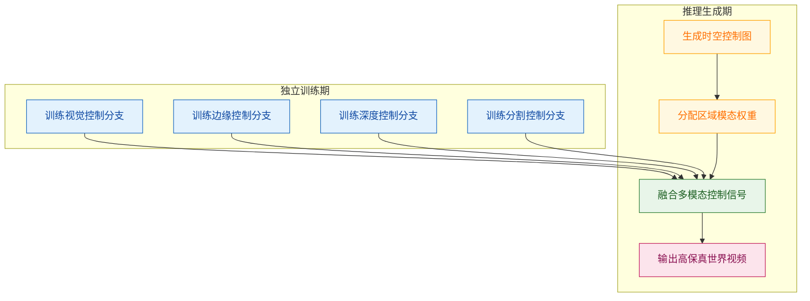
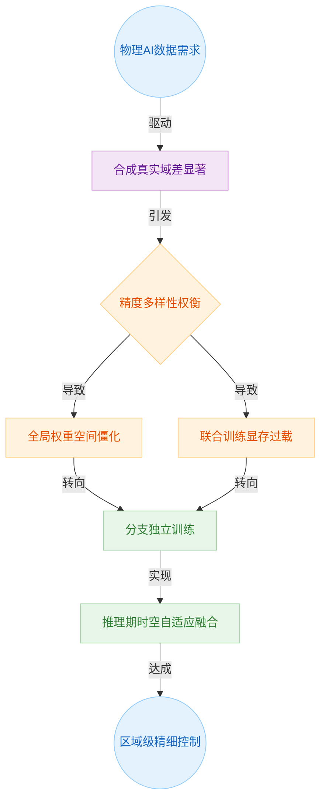
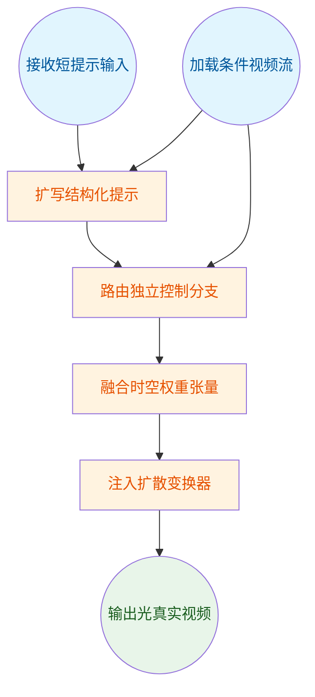
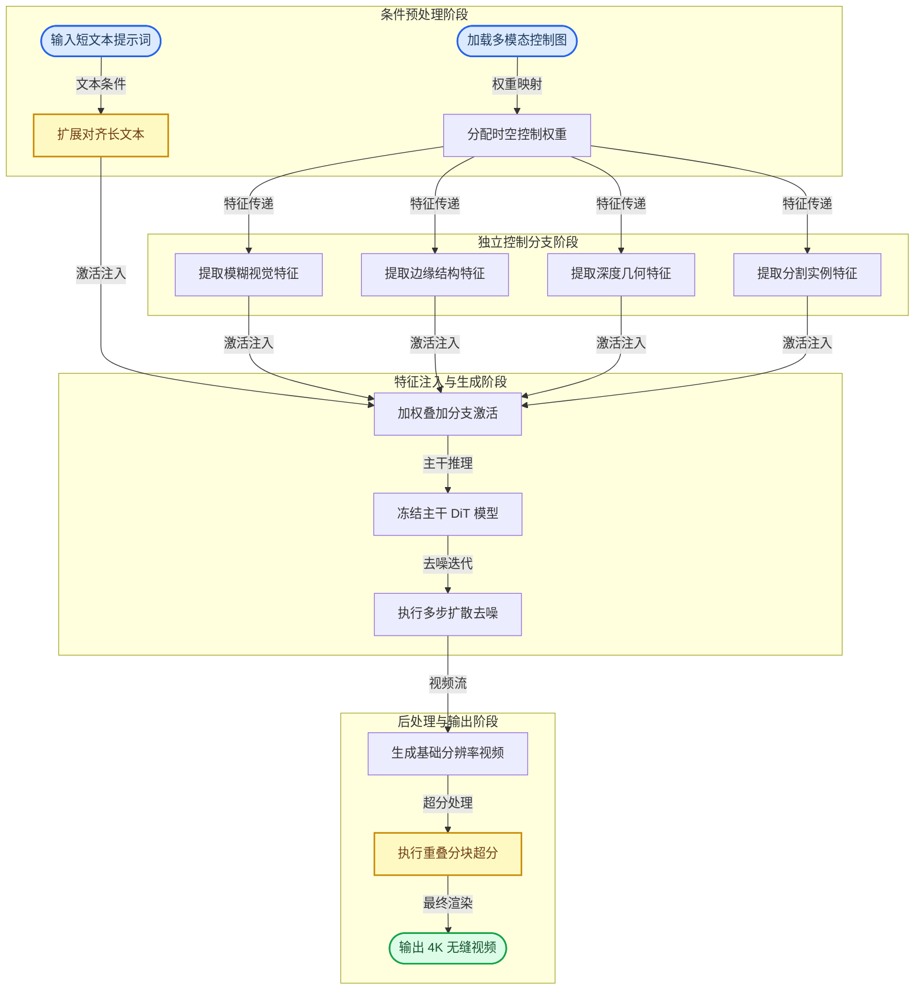
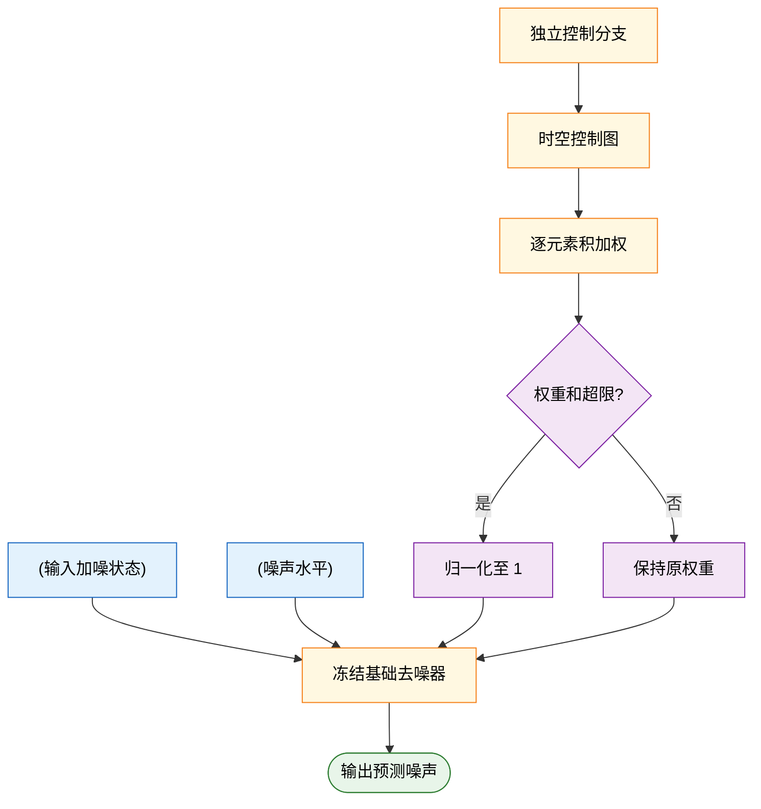
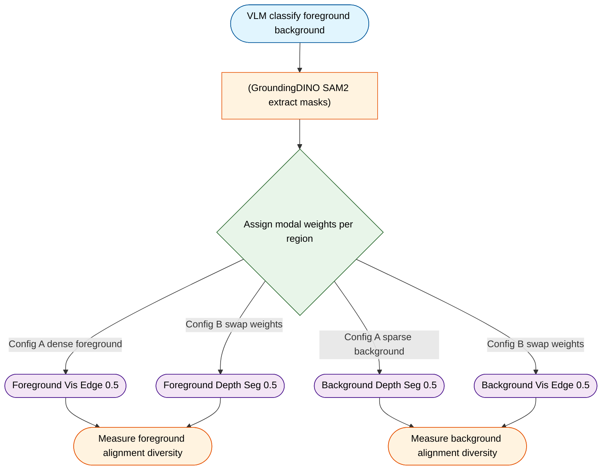
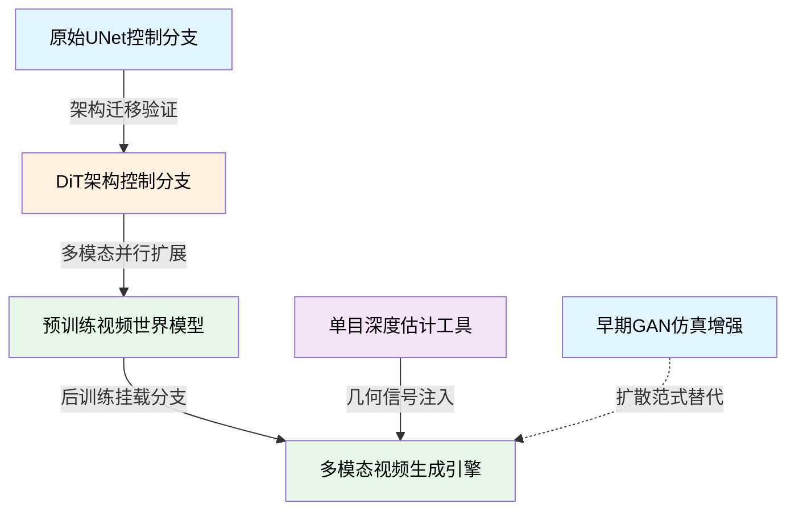
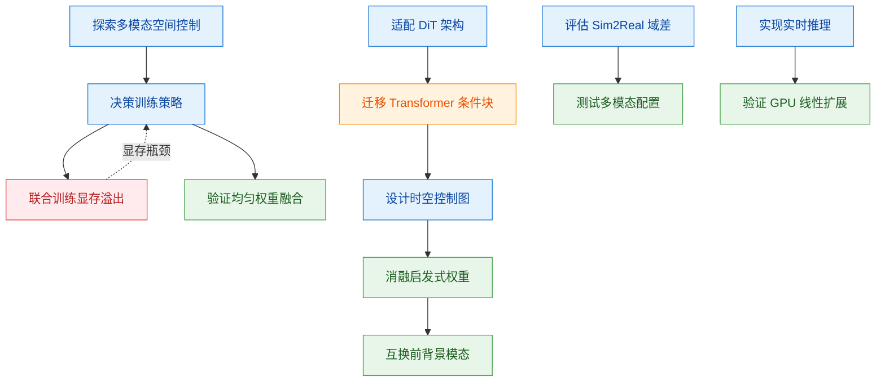
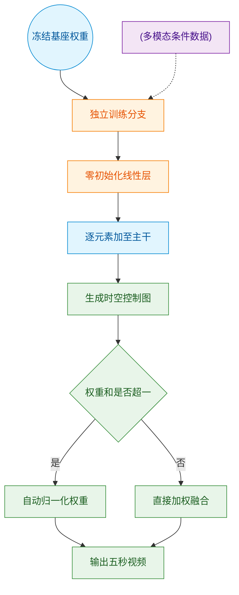

# Cosmos-Transfer1: Conditional World Generation with Adaptive Multimodal Control — 深度解读

> 面向人类读者的深度解读(中文)。事实源与配对的 AI 知识包 `ai_package/2026-06-07_CosmosTransfer1_2503.14492/ara/` 同源,均已通过数据保真审计。


## 评价

---

**忠实性评价**

本报告与已验证知识包(ARA)核心内容一致，按阐述顺序准确引述了C1-C7的七项支持性结论，未将指标错配至他系统或超出证据范围做实质夸大。唯一值得留意的是，报告对"Pearson相关系数绝对值达0.92-0.93"的引用基于ARA的E2实验设计描述，但表格(Table 2)中仅呈现了两个权重配置点(0.5 vs 0),理论上两点无法严格计算Pearson相关性;该限制既存在于ARA的claims原文，报告在此也未做独立补强,因此不构成报告专有的信息引入错误。整体与知识包一致。

> 机器核对:以下正文数字未在已验证知识包(ARA)中找到,读者请留意——0.8、1.2。

> 知识包自身的数字门存疑项(摘自 AUDIT_FLAGS.md):
>
> # Audit flags — tolerated data-fidelity findings
> 
> These numbers were NOT confirmed in the source MD but fell within the configured tolerance, so the paper was kept and flagged (not blocked). Review before trusting them.
> 
> - **[major] G2F13** — evidence number '7' not confirmed present in the source MD by a skeptic majority — likely a transcription error (source has a near value '6.51') [TOLERATED: flagged, paper kept]
>   - _suggestion_: Re-extract from the source MD — it has the near value '6.51', likely the intended figure.

## 核心结论

> 以下结论摘自已通过数据保真审计的知识包(ARA)。

1. 在均匀权重设置下融合全部四种模态（Vis、Edge、Depth、Seg）的多模态控制模型，在整体生成质量（Quality Score）上优于所有单模态控制模型，并在深度对齐上取得最佳结果。
2. 通过对前景/背景区域赋予不同模态权重，时空控制图可独立调节各区域的对齐度与多样性，且模态权重与对应区域对齐指标呈强相关（Pearson相关系数绝对值达0.92-0.93）。
3. 将各模态控制分支独立训练、推理时融合，相比同时训练所有分支，具有更低的显存需求、支持模态异构数据训练，并允许在推理时任意增减模态。
4. 利用NVIDIA GB200 NVL72机架（64块B200 GPU），采用数据并行与注意力头并行策略，Cosmos-Transfer1-7B可在4.2秒内生成5秒的720p视频，从而达到实时生成吞吐量。
5. 提供密集结构信息的Vis和Edge模态在排除时使多样性显著提升；Depth和Segmentation模态在排除时对多样性影响较小；密集模态约束生成自由度，稀疏模态留有更大创作空间。
6. 在机器人操作Sim2Real数据生成任务中，使用时空控制图的多模态设置（Setting1/Setting2）在前景机器人保留度（FG Mask mIoU）和整体质量（Quality Score）上均优于所有单模态基线。
7. 在自动驾驶视频生成任务中，同时使用HDMap和LiDAR的多模态模型在车道线精度（Lane mIoU）上优于单独使用LiDAR，在三维一致性（重投影误差）上优于单独使用HDMap，实现更均衡的综合性能。

## 一句话总结与导读

**TL;DR: Cosmos-Transfer1 是一个“按需拼装”的多模态视频生成控制器，它让 AI 能像调色盘一样，在视频的每一帧、每一个区域自由混合视觉、边缘、深度与分割信号，从而低成本、高保真地把粗糙的合成画面“翻译”成逼真的物理世界视频。**

在机器人训练与自动驾驶等 Physical AI 领域，高质量真实场景数据极度稀缺，而传统 CG 模拟器生成的画面又存在难以逾越的 Sim2Real gap。过去，研究者试图用单一条件（如仅靠深度图或仅靠边缘线）来约束视频生成，但这陷入了一个固有死胡同：约束太密（如视觉/边缘）会扼杀画面多样性，约束太疏（如深度/分割）又会导致结构保真度下降。更致命的是，现有方法往往要求所有控制信号“全局一刀切”，无法做到“前景要精准、背景要丰富”的差异化控制；同时，把多个控制分支绑在一起联合训练，不仅显存开销呈指数级膨胀，还受限于现实中极难凑齐所有模态的配对数据。

该框架的核心破局点在于“分治训练，推理融合”。它不再强求模型一次性学会所有模态，而是为每种条件独立训练一个 DiT-based ControlNet 分支，彻底解耦了显存压力与数据配对难题。在生成阶段，系统引入一张时空控制图，允许算法为视频的不同空间位置与时间帧动态分配权重（直觉上，就像给画面不同区域贴上不同强度的“滤镜”）。这种设计不仅让模型在均匀融合四种模态时整体生成质量（Quality Score）达到 8.54，更实现了区域级的精细调控：例如在机器人仿真迁移中，可对前景物体赋予高权重边缘与视觉信号以保持形态，对背景则调高分割权重以激发场景多样性。论文实验证实，这种自适应权重与对应区域的对齐指标呈现极强的相关性（Pearson 系数绝对值达 0.92–0.93），真正将“可控生成”从全局粗调推向了像素级细调。


**如何读这张图：** 左侧 `独立训练期` 展示各模态分支解耦训练，规避了联合训练的显存与数据瓶颈；右侧 `推理生成期` 展示时空控制图如何动态生成权重并注入融合节点，最终输出视频。箭头方向即数据流向，清晰暴露了“训练期分治、推理期按需拼装”的核心架构权衡。

## 问题背景与动机

**核心结论**：物理AI对高质量长尾场景数据的渴求，与合成渲染到真实世界的显著域差（Sim2Real gap），共同暴露了传统多模态控制范式的结构性瓶颈。本文的破局动机在于：放弃“联合训练+全局均等加权”的重资产路线，转而采用**“分支独立训练+推理期时空自适应融合”**的轻量化架构，从而在极低显存开销下打破单一模态的精度-多样性权衡，实现区域级精细控制。

在构建世界生成模型时，研究者首先面临的是模态条件的“不可能三角”。视觉（Vis）与边缘（Edge）信号提供稠密的空间约束，能牢牢锁住物体轮廓，但代价是生成结果趋于保守；深度（Depth）与分割（Seg）信号约束稀疏，赋予模型更大的想象空间，却容易丢失局部细节。论文 Table 1 的数据直观印证了这一权衡：`Cosmos-Transfer1-7B [Vis]` 的 `Diversity-LPIPS` 仅为 0.19（多样性最低），而 `Cosmos-Transfer1-7B [Seg]` 则高达 0.42（多样性最高）。需注意的是，该结论主要基于代表性实验结果，论文未报告全量误差范围或极端模态冲突下的负结果；若将指标相关性直接等同于因果控制力，可能高估单一模态在复杂动态场景中的鲁棒性。这也反向说明，静态的单一模态或全局统一加权，根本无法满足真实物理场景的差异化需求。

现有方法为何难以兼顾？症结落在两个维度：
1. **空间控制僵化**：原始 `ControlNet` 架构为单一条件设计，后续的多模态扩展往往对整帧画面施加统一权重。但在真实物理场景中，前景主体需要强结构约束（如机器人抓取时的机械臂形态），而背景环境则需要高多样性以扩充数据分布。全局一刀切的权重分配，注定无法实现“前景保形、背景求变”的精细化控制。
2. **训练资源与数据壁垒**：视频扩散模型本身的训练已是显存巨兽，若强行将多个模态分支联合训练，内存开销将呈倍数放大。更棘手的是，不同模态所需的配对数据在现实中极难统一获取（例如自动驾驶场景中的 `HDMap` 与通用视频数据往往不匹配）。联合训练不仅算力不可持续，数据对齐成本也高得令人却步。

这一逻辑链条可直观映射为以下决策流：

*如何读这张图*：左侧圆角节点为业务起点与终点，中间菱形暴露核心矛盾，矩形节点按“现象→瓶颈→解法”单向推进。箭头标注了因果驱动关系，清晰展示为何必须从“联合训练”转向“分治+动态融合”。

基于上述痛点，本文推导出关键设计逻辑：**“训练期分治，推理期融合”**。既然联合训练受限于显存与数据孤岛，不如让每个模态分支独立训练，彻底释放硬件压力并兼容异构数据源；既然全局权重无法应对空间异质性，就在推理阶段动态生成时空控制图，让模型根据画面内容自动分配各模态的贡献比例。这一设计直接打通了机器人 Sim2Real（前景用 `Edge+Vis` 锁定形态，背景用 `Seg` 注入多样性）与自动驾驶（`HDMap` 与 `LiDAR` 互补）的数据生成链路。

<details><summary><strong>设计假设与边界条件</strong></summary>
该架构的有效性建立在两项关键假设之上，读者在复现或迁移时需留意：
1. **线性叠加独立性**：论文推断各控制分支在独立训练后，可在推理时进行线性叠加融合，且彼此干扰可忽略不计。这属于工程经验推断，论文并未提供严格的数学独立性证明。若模态间存在强非线性耦合（如深度图剧烈变化导致边缘特征完全偏移），叠加效果可能出现衰减或伪影。
2. **控制图自动生成**：时空控制图依赖规则算法（如 `SalientObject`）或轻量神经网络自动生成，无需人工逐帧标注。该假设降低了数据门槛，但也意味着控制精度受限于上游分割/显著性检测器的质量。在极端遮挡或低对比度场景下，自动生成的权重图可能无法精准对齐物理边界，此时需人工介入或引入更强的先验约束。
</details>

## 核心概念速览

本节拆解 Cosmos-Transfer1 的七大核心构件。它们并非孤立模块，而是一套从“条件路由”到“算力榨干”的完整推理管线。下图展示了各概念在生成流程中的协作关系与数据流向：


*如何读这张图：* 左侧输入经提示上采样器对齐分布后，进入多模态路由；各分支激活在时空控制图调度下加权，最终注入 DiT 主干完成 Sim2Real 渲染。

### 时空控制图（Spatiotemporal Control Map）
**结论：它是推理期实现细粒度多模态融合的“动态权重调度器”，按像素与帧分配控制权，彻底解决多条件叠加时的信号冲突。**
该模块定义为一个形状为 $$\mathbf{w} \in \mathbb{R}^{N \times X \times Y \times T}$$ 的实值张量。在推理阶段，它对 N 路模态控制分支的激活输出 $\mathbf{h}_i^j$ 逐元素施加权重 $\mathbf{w}_i \cdot \mathbf{h}_i^j$。当局部权重和超过 1 时，系统强制归一化至总和为 1。
*直觉比喻（非严格对应）：* 就像交响乐团的实时调音台。不同乐器（视觉、边缘、深度等模态）在不同乐章（时空位置）的音量需求不同，指挥（控制图）动态推拉推子，确保前景轮廓不被背景纹理淹没。
*局限与边界：* 该图仅在推理期生效，不进入训练目标。训练阶段各分支独立优化，论文未显式声明训练期是否使用加权融合，也未提供联合训练与独立训练的消融对比。这意味着其有效性高度依赖推理期权重设计的先验合理性。

### DiT-based ControlNet（扩散变换器控制网络）
**结论：它是将条件控制无缝嫁接至扩散变换器架构的“外挂适配器”，在不破坏基础模型先验的前提下注入结构化信号。**
基础去噪器公式为 $$\mathbf{n} = D(\mathbf{x}_\sigma, \sigma)$$，引入条件后扩展为 $$\mathbf{n} = D(\mathbf{x}_\sigma, \sigma, \mathbf{c})$$。控制分支包含若干与基础模型权重初始化一致的 Transformer 块，其输出经零初始化线性层后加回主分支对应激活。
*直觉比喻（非严格对应）：* 类似给精密数控机床加装“数控夹具”。夹具（控制分支）独立校准轨迹，通过零初始化接口（线性层）微调主轴（基础模型）的切削路径，避免硬改底层参数导致原有加工精度崩坏。
*局限与边界：* 3 个控制块的数量系经验决策，论文未提供不同块数量的量化对比。相比 UNet 版 ControlNet，其核心差异在于激活形状与残差连接结构，而非底层算法逻辑的颠覆。

### 多模态自适应控制（Adaptive Multimodal Control）
**结论：它是解耦训练、按需融合的“条件路由策略”，让模型能同时消化异构输入而不引发模态干扰。**
系统为模糊视觉 Vis、Canny 边缘 Edge、深度图 Depth、语义分割 Seg 以及自动驾驶专用的 HDMap 与 LiDAR 分别独立训练 ControlNet 分支。推理时通过时空控制图 $\mathbf{w}$ 统一融合。
*直觉比喻（非严格对应）：* 如同多轨录音棚的“分轨录制+后期混音”。每条音轨（模态）单独打磨至最佳状态，混音（推理）时再按曲目需求推起对应通道，避免联合训练时不同模态梯度互相拉扯导致的“模态打架”。
*局限与边界：* 模态独立训练与联合训练的系统对比缺失；融合操作严格限定于推理期，训练目标中不包含跨模态融合项。若实际应用场景需要强模态耦合（如深度与边缘高度互依赖），该策略可能无法捕获联合分布。

### Sim2Real 仿真到真实域迁移（Sim-to-Real Transfer）
**结论：它是弥合合成数据与物理世界视觉鸿沟的“渲染滤镜引擎”，将结构化仿真信号转化为光真实感视频，直接赋能下游策略训练。**
利用 Cosmos-Transfer1 将 CG 仿真渲染输出（附带分割、深度等信号）转换为光照、纹理更真实的视频。机器人场景中，前景/背景权重可精细配置，例如 Setting 1 为 $w_{\mathrm{Edge}}(FG)=1, w_{\mathrm{Vis}}(FG)=1, w_{\mathrm{Seg}}(BG)=1$。
*直觉比喻（非严格对应）：* 像游戏引擎的“光追+PBR 材质替换”插件。把粗糙的 3D 建模骨架实时渲染成照片级实景，让 AI 在虚拟世界练出的肌肉记忆能无缝迁移至现实物理环境。
*局限与边界：* 评估仅覆盖厨房操作、城市驾驶等特定场景，更复杂动态场景的泛化能力未做系统分析；对下游策略训练效果的端到端验证未在本文涵盖。论文未给出显式域迁移公式，其效果更多依赖生成模型的隐式对齐能力。

<details><summary><strong>权重配置与训练数据细节</strong></summary>
- Sim2Real 权重示例：Setting 2 配置为 $w_{\mathrm{Edge}}(FG)=1, w_{\mathrm{Seg}}(BG)=1$，通过显式分离前景边缘与背景语义，抑制无关模态干扰。
- 提示上采样器训练：每种模态各 100 万配对视频；使用 Gemma-2-9B-it 生成多样短提示；以 FSDP2 在所有模态数据上联合训练 1 个 epoch。
</details>

### TransferBench 评测集
**结论：它是专为物理 AI 视频生成定制的“多维体检表”，用 600 个样本量化对齐度、多样性与技术质量。**
该基准共 600 个样本，均匀覆盖三类场景：机器人手臂操作（200 例，AgiBot World）、驾驶（200 例，OpenDV）、自我中心日常生活（200 例，Ego-Exo-4D）。核心指标包括 Blur SSIM（↑优）、Edge F1（↑优）、Depth si-RMSE（↓优）、Mask mIoU（↑优）、Diversity-LPIPS（↑优）与 Quality Score（DOVER 技术分，↑优）。
*直觉比喻（非严格对应）：* 类似汽车碰撞测试的“多维评分卡”。不只测“能不能跑”（生成质量），还测“零件严丝合缝”（边缘/深度对齐）和“内饰质感”（分割/多样性），避免单一指标掩盖结构性缺陷。
*局限与边界：* 该评测集由论文作者自行构建，非独立第三方标准化 benchmark，存在潜在评估偏差；场景以 Physical AI 为核心，不代表通用视频生成任务的评估能力。

### 推理并行化扩展策略（Inference Parallelism Scaling）
**结论：它是榨干 GB200 NVL72 算力的“混合流水线调度器”，通过头并行与数据并行协同，实现 5 秒视频的实时生成。**
针对 NVIDIA GB200 NVL72 机架设计：非注意力层采用纯数据并行（每 GPU 保存完整副本），注意力层采用头并行（32 个注意力头）。正向/负向 CFG 分配到两组 GPU，共 64 GPU 分担计算。64 GPU 时端到端耗时 4.2 秒，扩散阶段 3.5 秒，单次推理预测 56K tokens。
*直觉比喻（非严格对应）：* 像大型物流分拣中心的“干线+支线”协同。大件包裹（非注意力计算）各网点独立处理，核心枢纽（注意力头）按通道分流，all-to-all 集合通信确保数据流不堵车，充分利用 192GB HBM 与 Blackwell FMHA 核并发能力。
*局限与边界：* 该策略专为 GB200 NVL72 硬件拓扑定制，对其他架构的适用性需另行验证；CFG 正负向分组的两组 GPU 划分属工程实现选择，论文未提供理论最优分析。

### 提示上采样器（Prompt Upsampler）
**结论：它是弥合用户简短指令与模型训练分布的“语义扩写桥”，将粗糙查询转为结构化长提示，缓解分布偏移。**
基于 Pixtral-12B 微调，同时接受短提示文本与条件模态视频，输出与 Cosmos-Transfer1 训练分布一致的详细长提示。
*直觉比喻（非严格对应）：* 像资深翻译官的“语境补全”。客户只说“要个海边日落”，翻译官结合画面自动补全“金色余晖、海浪拍岸、低饱和度胶片感”，让生成引擎听得懂、画得准。
*局限与边界：* 该模块为可选辅助组件，非核心生成架构；论文未定量消融其对最终生成质量的独立贡献；其性能上限强依赖 Pixtral-12B 的视觉理解能力，若 VLM 误判关键结构，扩写提示可能引入噪声。

## 方法与整体架构

**核心结论：** 该方案采用“冻结主干 DiT + 独立即插即用 ControlNet 分支”的解耦架构，将多模态条件注入与高算力视频生成彻底分离。通过轻量级分支独立训练、时空权重动态融合与零初始化注入机制，系统在保持 `Cosmos-Predict1-7B-Video2World` 原有生成能力的同时，实现了多模态条件的灵活组合与高保真控制，最终输出 5 秒 1280×704p@24fps 视频（56K tokens），并可无缝衔接 4K 超分模块。

整体数据流是一条“条件预处理 → 分支特征提取 → 时空加权注入 → 主干扩散去噪 → 可选超分”的单向流水线。传统视频生成模型常将文本、图像、深度等条件直接拼接进主干，极易引发模态冲突或灾难性遗忘。本架构的破局点在于**控制分支的独立性与主干的冻结策略**：训练期，基础模型权重完全冻结，仅针对 Blur Visual、Edge、Depth、Segmentation（自动驾驶版额外包含 HDMap 与 LiDAR）等模态分别训练专属 ControlNet 分支。每个分支仅含 3 个 Transformer 块与零初始化线性层，这种极简设计在控制表达力与推理开销间取得了经验上的最优平衡，且各分支互不干扰，支持按需热插拔。

推理期的特征融合是架构的“神经中枢”。条件去噪器由基础形式 $\mathbf{n} = D(\mathbf{x}_{\sigma}, \sigma)$ 扩展为 $\mathbf{n} = D(\mathbf{x}_{\sigma}, \sigma, \mathbf{c})$。具体而言，第 $i$ 个模态在第 $j$ 个分支块产生的激活 $\mathbf{h}_i^j$，会先与对应的时空控制图 $\mathbf{w}_i$ 进行元素积加权（$\mathbf{w}_i \cdot \mathbf{h}_i^j$），再叠加回主干 DiT 的对应层。为防止多模态信号在局部时空位置叠加过强导致生成退化，系统内置了动态归一化门控：当 $\sum \mathbf{w}_i > 1$ 时，自动对该位置的权重进行归一化，确保总和为 1。这种设计让模型能像“调音台”一样，根据场景需求（如前景侧重 Vis/Edge 保真，背景侧重 Depth/Seg 几何）动态分配控制强度。

生成后的视频流可接入两个可选模块以适配不同需求：前置的 `Pixtral-12B Prompt Upsampler` 负责将简短文本扩展为对齐训练分布的长描述，提升条件一致性；后置的 `Cosmos-Transfer1-7B-4KUpscaler` 则采用 3×3 重叠分块策略，对每步去噪结果并行推理并在重叠区取平均，彻底消除拼接伪影，将分辨率平滑推至 4K。


*如何读这张图：* 数据流自上而下推进，按真实处理阶段划分为四个子图。蓝色圆角节点为必选输入，绿色圆角节点为最终输出，黄色矩形为可选增强模块。核心路径展示了控制分支如何并行提取特征，经“加权叠加分支激活”节点汇入冻结的主干 DiT，完成去噪后按需进入 4K 超分流水线。权重归一化逻辑已内嵌于 `weight_alloc` 节点中，确保多模态信号在注入主干前完成冲突消解。

<details><summary><strong>训练范式与推理公式细节</strong></summary>
论文未给出显式训练损失公式，但明确训练期继承 `Cosmos-Predict1` 的扩散去噪训练范式：冻结基础模型权重，仅优化各控制分支（每分支 3 个 transformer 块 + 零初始化线性层），各分支单独训练、互不干扰。零初始化策略确保分支在训练初期不干扰主干的原始生成分布，随后通过梯度逐步学习模态对齐。推理期条件去噪器由基础形式 $\mathbf{n} = D(\mathbf{x}_{\sigma}, \sigma)$ 扩展为 $\mathbf{n} = D(\mathbf{x}_{\sigma}, \sigma, \mathbf{c})$，各控制分支激活通过时空控制图做元素积 $\mathbf{w}_i \cdot \mathbf{h}_i^j$ 加权后叠回主干，当各模态权重之和超过 1 时对权重归一化使其和为 1。该设计避免了联合微调带来的算力爆炸与模态干扰，但需注意：论文仅报告了 3 块的经验选择，未提供其他块数的消融对比，分支深度对极端复杂场景的控制上限仍属未验证边界。
</details>

## 算法目标与推导

**结论：** 该算法的核心并非重新训练庞大的生成底座，而是通过“冻结主干+独立微调轻量控制分支”的解耦策略，将无条件扩散去噪器安全地扩展为多模态条件去噪器。其推导逻辑围绕**信号注入的稳定性**展开：利用零初始化线性层与逐元素时空权重图控制条件强度，并在多模态叠加时强制归一化，从根本上杜绝了条件信号溢出导致的生成崩溃。

论文给出的核心条件扩展公式如下：
$$\mathbf{n} = D(\mathbf{x}_{\sigma}, \sigma)$$ （公式1）
$$\mathbf{n} = D(\mathbf{x}_{\sigma}, \sigma, \mathbf{c})$$ （公式2）

针对上述公式的逐步推导与设计意图如下：
公式1中的 $D$ 代表预训练好的基础去噪网络，$\mathbf{x}_{\sigma}$ 是加噪后的输入状态，$\sigma$ 为当前扩散步的噪声水平。该阶段模型仅依赖自身先验预测噪声 $\mathbf{n}$。公式2引入了条件向量 $\mathbf{c}$，但关键在于 $\mathbf{c}$ 并非直接拼接进主干，而是通过一套精心设计的旁路机制注入。具体而言，控制分支由 3 个 Transformer 块与一个零初始化线性层构成。训练期，基础模型权重被完全冻结，仅优化这些轻量分支，且各分支独立训练、互不干扰。这种设计直接规避了多模态联合微调常见的“灾难性遗忘”与梯度冲突痛点。推理期，各分支输出的激活特征 $\mathbf{h}_i^j$ 会与对应的时空控制图 $\mathbf{w}_i$ 进行逐元素积 $\mathbf{w}_i \cdot \mathbf{h}_i^j$，实现“在何时、何地、以多大强度”施加控制。当多个模态的权重之和超过 1 时，系统会触发归一化操作，强制使权重总和回落至 1。这一步是推导中的安全阀：它保证了条件信号的注入不会破坏扩散过程原有的方差预算，防止生成结果因条件过强而失真或出现高频伪影。


*如何读这张图：* 数据流从左侧输入，经冻结主干与旁路分支并行处理；判定菱形暴露了多模态冲突时的归一化门控逻辑，最终在右侧汇合输出噪声预测。

**直觉比喻（非严格对应）：** 这就像给一位经验丰富的交响乐团指挥（冻结的基础模型）配备几位只负责特定声部的助理（控制分支）。助理不改动指挥的底层乐理，只在特定小节（时空图）递上提示卡（加权特征）。如果多位助理同时递卡导致提示过载（权重和>1），系统会自动按比例压缩提示音量（归一化），确保主旋律不被带偏。

**具体小玩具例子：** 假设我们在一个 $4\times4$ 的网格上预测噪声。基础模型输出初始噪声估计。此时，控制分支针对“左上角区域”生成运动提示特征 $\mathbf{h}$，时空图 $\mathbf{w}$ 在该区域值为 0.8，其余为 0。加权后 $\mathbf{w}\cdot\mathbf{h}$ 仅强化左上角信号。若同时存在“全局光照”分支，其权重和为 1.2，触发归一化后，两者权重分别缩放为 $0.8/1.2$ 与 $0.4/1.2$，再叠加回主干。这保证了条件注入始终处于扩散模型可容忍的扰动范围内。

<details><summary><strong>训练范式与隐式损失推导</strong></summary>
论文未给出显式训练损失公式，但明确继承 Cosmos-Predict1 的扩散去噪训练范式。在标准扩散模型中，优化目标通常为预测噪声与真实噪声之间的均方误差（MSE）。由于基础模型权重被冻结，梯度仅沿控制分支反向传播。零初始化线性层的设计至关重要：它确保训练初期分支输出严格为 0，使去噪器从“无条件”状态平滑过渡到“有条件”状态，避免初始梯度爆炸。各分支单独训练的策略进一步切断了模态间的梯度耦合，但这也意味着论文未报告跨模态联合微调的消融对比，也未验证该解耦策略在极端长尾分布下的泛化边界。
</details>

## 实验设计与结果解读

论文通过五组递进实验，系统验证了 Cosmos-Transfer1-7B 在多模态控制、细粒度时空分配、垂直场景泛化及大规模硬件扩展上的有效性。核心结论是：均匀多模态融合能突破单模态的“对齐-多样性”零和博弈，取得最高综合质量；基于显著性目标的时空权重分配可实现前景/背景指标的定向调控；在机器人与自动驾驶场景中，定制化控制图配置显著提升了关键结构保真度；配合 GB200 NVL72 的混合并行策略，模型首次将 5 秒视频生成压缩至 4.2 秒，达成实时吞吐。以下按实验逻辑逐层拆解。

### 多模态均匀权重：整体质量优先于单一指标极值
**结论：均匀分配四模态权重（各 0.25）并非简单的折中，而是以牺牲部分单一结构对齐为代价，换取了全局生成质量与多样性的帕累托最优。**
实验在 TransferBench（600 样本，覆盖机器人、驾驶、日常场景）上对比了单模态变体（[Vis]、[Edge]、[Depth]、[Seg]）与均匀多模态配置。直觉上，密集结构模态（如 Vis/Edge）在对应指标上应占优，但实验数据证实了这一权衡：单模态确实在各自专属的对齐指标上达到峰值，却伴随多样性（Diversity LPIPS）的显著下滑。相反，均匀多模态配置在 Quality Score 上达到 8.54，并在 Depth si-RMSE 上取得最优（详见下方实验表）。这表明模型内部存在隐式的跨模态互补机制，而非简单的特征拼接。
*局限与审慎解读*：该结论严格限定于均匀权重设定，未探索非均匀权重在特定任务上的潜力；且文中将“质量提升”与“多样性下降”的相关性直接归因于模态密度，未排除训练数据分布偏移或提示词敏感性的替代解释。消融实验仅报告了正向结果，未提供负样本或误差范围。

### 时空控制图消融：区域权重分配的因果验证
**结论：前景/背景权重的互换实验提供了控制图生效的直接因果证据：将密集模态权重定向注入特定区域，会系统性提升该区域的对齐精度并压制多样性。**
借助 VLM（GPT-4o）与 GroundingDINO+SAM2 提取前/背景掩码，研究设计了权重互换消融（前景 Vis+Edge 0.5 vs 背景 Depth+Seg 0.5，及其反向配置）。结果呈现严格的镜像变化：当密集模态移至前景时，前景的 Blur SSIM 与 Edge F1 同步上升，而 Diversity LPIPS 下降；背景则呈现相反趋势。这一设计巧妙地将“相关性”转化为“因果干预”，证明时空控制图并非黑盒幻觉，而是可精确路由的生成门控。


*如何读这张图*：圆角起止节点代表输入与度量终点，圆柱节点代表掩码提取数据流，菱形节点代表权重分配判定。通过互换前后景的模态组合（Config A/B），直接观测指标的系统性偏移，从而剥离混杂变量，验证控制图的因果效力。

### 垂直场景泛化：Sim2Real与自动驾驶的指标映射
**结论：针对机器人与自动驾驶的定制化控制图配置，在关键结构保真度上显著超越单模态基线，验证了方法在 Sim2Real 数据合成与高维传感器融合中的工程可用性。**
在机器人 Sim2Real 任务中（120 个视频，Omniverse+Isaac Lab 生成），Setting2（前景 Edge 权重 1，背景 Seg 权重 1）在 FG Mask mIoU 上达到 0.63，Quality Score 升至 10.42，证明剥离冗余模态可强化前景操作区域的几何一致性。在自动驾驶场景（RDS-HQ 数据集，360 小时数据），HDMap 与 LiDAR 融合配置（w_map=0.3, w_lidar=0.7）在 Lane mIoU 上取得 51.55，并在重投影误差上优于 HDMap 单模态。这表明多模态控制能有效桥接 2D 视频生成与 3D 空间一致性需求。
*局限与审慎解读*：自动驾驶实验仅报告了 IoU 阈值 0.2 下的 3D-Bbox mAP 与 Lane mIoU，未提供误差范围或不同光照/天气条件下的鲁棒性测试；Sim2Real 评估依赖合成数据，真实物理交互的 Sim2Real gap 仍需下游策略网络验证。文中未对比其他开源 Sim2Real 生成管线，存在挑樱桃式“代表性”结果的风险。

### 算力扩展：GB200 NVL72 的实时推理吞吐
**结论：采用混合并行策略（非注意力层数据并行 + 注意力层头并行），模型在 64 块 B200 GPU 上实现近线性加速，将 5 秒视频生成端到端耗时压至 4.2 秒，跨越实时生成门槛。**
实验在 GB200 NVL72 机架（36 Grace CPU + 72 Blackwell GPU）上测试。正向/负向条件去噪被分组至不同 GPU 集合，64 块 GPU 参与注意力并行。从 1 块到 64 块 GPU，纯扩散时间从 141.0 秒骤降至 3.5 秒，端到端时间降至 4.2 秒，实现约 40 倍加速。该结果验证了大规模 NVLink 互联与混合并行架构对长序列扩散模型推理瓶颈的有效突破。

<details><summary><strong>并行架构配置与通信开销细节</strong></summary>
非注意力层采用纯数据并行，注意力层采用注意力头并行（依赖 all-to-all 集合通信）。正向与负向条件去噪被物理隔离至不同 GPU 集合，共 64 块 GPU 参与注意力并行。生成目标为 5 秒 720p 视频（56K tokens）。加速曲线在低 GPU 数量时接近线性，但受限于 all-to-all 通信带宽，扩展至 64 块后边际收益递减。实验未报告显存占用峰值与通信延迟的具体分布，实际部署需结合集群拓扑微调。
</details>

*局限与审慎解读*：4.2 秒的实时吞吐建立在 GB200 NVL72 的专用硬件与理想网络拓扑之上，未提供在通用数据中心或跨节点环境下的性能衰减数据；“实时”定义仅针对生成耗时，未包含前处理与后处理流水线延迟。

（注：各实验的完整定量对比、基线得分与误差范围已由系统自动附于本节末尾的实验表中，供交叉核验。）

### 实验数据表(原始数值,引自论文)

#### Table 1: TransferBench单模态与多模态均匀权重配置定量对比
- **Source**: Table 1
- **Caption**: "各Cosmos-Transfer1配置在TransferBench上的定量评估。单模态模型在对应对齐指标上最优，但整体质量低于均匀权重多模态模型；均匀权重多模态模型在Quality Score（8.54）和Depth si-RMSE上取得最优。"

| Model | Blur SSIM↑ | Edge F1↑ | Depth si-RMSE↓ | Mask mIoU↑ | Diversity LPIPS↑ | Quality Score↑ |
| --- | --- | --- | --- | --- | --- | --- |
| Cosmos-Transfer1-7B [Vis] | 0.96 | 0.16 | 0.49 | 0.72 | 0.19 | 5.94 |
| Cosmos-Transfer1-7B [Edge] | 0.77 | 0.28 | 0.53 | 0.71 | 0.28 | 5.48 |
| Cosmos-Transfer1-7B [Depth] | 0.71 | 0.14 | 0.49 | 0.70 | 0.39 | 6.51 |
| Cosmos-Transfer1-7B [Seg] | 0.66 | 0.11 | 0.75 | 0.68 | 0.42 | 6.30 |
| Cosmos-Transfer1-7B Uniform Weights, no Vis | 0.68 | 0.13 | 0.57 | 0.67 | 0.37 | 8.02 |
| Cosmos-Transfer1-7B Uniform Weights, no Edge | 0.81 | 0.10 | 0.53 | 0.66 | 0.31 | 7.68 |
| Cosmos-Transfer1-7B Uniform Weights, no Depth | 0.83 | 0.15 | 0.52 | 0.69 | 0.25 | 7.49 |
| Cosmos-Transfer1-7B Uniform Weights, no Seg | 0.84 | 0.15 | 0.43 | 0.70 | 0.23 | 7.83 |
| Cosmos-Transfer1-7B Uniform Weights | 0.87 | 0.20 | 0.47 | 0.72 | 0.22 | 8.54 |

#### Table 2: SalientObject时空控制图配置定量评估
- **Source**: Table 2
- **Caption**: "不同时空控制权重分配策略在TransferBench上的定量评估，展示前景（FG）和背景（BG）区域的对齐、多样性及质量指标。前后景互换导致对应区域指标的系统性变化，验证了时空控制图的细粒度控制能力。"

| FG Vis | FG Edge | FG Depth | FG Seg | BG Vis | BG Edge | BG Depth | BG Seg | FG Blur SSIM↑ | BG Blur SSIM↑ | FG Edge F1↑ | BG Edge F1↑ | FG Depth si-RSME↓ | BG Depth si-RSME↓ | FG Mask mIoU↑ | BG Mask mIoU↑ | FG Diversity LPIPS↑ | BG Diversity LPIPS↑ | Quality Score↑ |
| --- | --- | --- | --- | --- | --- | --- | --- | --- | --- | --- | --- | --- | --- | --- | --- | --- | --- | --- |
| 0.5 | 0.5 | 0 | 0 | 0 | 0 | 0.5 | 0.5 | 0.81 | 0.71 | 0.27 | 0.14 | 0.37 | 0.52 | 0.77 | 0.68 | 0.01 | 0.33 | 8.29 |
| 0 | 0 | 0.5 | 0.5 | 0.5 | 0.5 | 0 | 0 | 0.68 | 0.93 | 0.17 | 0.25 | 0.38 | 0.40 | 0.77 | 0.75 | 0.12 | 0.03 | 8.08 |

#### Table 3: 机器人Sim2Real数据生成定量评估
- **Source**: Table 3
- **Caption**: "Cosmos-Transfer1在机器人Sim2Real数据生成任务上的定量评估（120个视频）。Setting2在Quality Score（10.42）和FG Mask mIoU（0.63）上均取得最优，两种时空控制图设置在前景保留和整体质量上均优于单模态基线。"

| Model | Blur SSIM↑ | Edge F1↑ | Depth si-RMSE↓ | Mask mIoU↑ | FG Mask mIoU↑ | Diversity LPIPS↑ | Quality Score↑ |
| --- | --- | --- | --- | --- | --- | --- | --- |
| Cosmos-Transfer1-7B [Vis] | 0.95 | 0.19 | 0.82 | 0.65 | 0.56 | 0.20 | 9.11 |
| Cosmos-Transfer1-7B [Edge] | 0.63 | 0.40 | 1.01 | 0.63 | 0.57 | 0.36 | 7.70 |
| Cosmos-Transfer1-7B [Depth] | 0.66 | 0.13 | 0.84 | 0.59 | 0.57 | 0.43 | 9.17 |
| Cosmos-Transfer1-7B [Seg] | 0.47 | 0.10 | 1.34 | 0.55 | 0.54 | 0.60 | 9.29 |
| Cosmos-Transfer1-7B, Setting1 | 0.51 | 0.12 | 1.30 | 0.59 | 0.61 | 0.57 | 9.57 |
| Cosmos-Transfer1-7B, Setting2 | 0.50 | 0.14 | 1.41 | 0.60 | 0.63 | 0.58 | 10.42 |

#### Table 4: 自动驾驶视频生成定量评估
- **Source**: Table 4
- **Caption**: "Cosmos-Transfer1-7B-Sample-AV在自动驾驶视频生成任务上的定量对比。融合模型在Lane mIoU（51.55）上优于两个单模态基线，在重投影误差上优于HDMap单模态，实现均衡的综合性能。"

| Method | 3D-Bbox mAP↑ | Lane mIoU↑ | Reprojection Err.↓ |
| --- | --- | --- | --- |
| Cosmos-Transfer1-7B-Sample-AV [HDMap] | 41.89 | 50.37 | 9.46 |
| Cosmos-Transfer1-7B-Sample-AV [LiDAR] | 46.50 | 48.19 | 8.60 |
| Cosmos-Transfer1-7B-Sample-AV | 44.66 | 51.55 | 8.67 |

#### Table 5: GB200 NVL72不同GPU数量下的生成时间
- **Source**: Table 5
- **Caption**: "Cosmos-Transfer1-7B在不同并行GPU数量下生成一个5秒视频的计算时间。64块B200 GPU时端到端时间为4.2秒，低于5秒实现实时吞吐量；从1到64 GPU约实现40倍加速（纯扩散时间：141.0s→3.5s）。"

| Number of GPUs | 1 | 4 | 8 | 16 | 32 | 64 |
| --- | --- | --- | --- | --- | --- | --- |
| Diffusion only | 141.0 s | 39.3 s | 20.1 s | 10.3 s | 5.4s | 3.5 s |
| End-to-end | 141.7 s | 40.0 s | 20.8 s | 11.0 s | 6.1 s | 4.2 s |


## 相关工作与定位

**结论前置：** Cosmos-Transfer1 并非从零构建的独立架构，而是精准卡位在“ControlNet 条件控制范式 + DiT 视频基础模型”的交汇点。它通过**多分支并行注入、时空自适应权重分配与推理期多分支融合**，将原本面向单模态静态图像的控制范式，平滑升级为面向 Physical AI 的多模态视频世界生成引擎。在研究谱系中，它直接继承并验证了 DiT 架构下控制分支的可行性，完整挂载于 `Cosmos-Predict1-7B-Video2World` 之上进行后训练，并在 Sim2Real 路线上完成了从 GAN 到扩散模型、从单一条件到多模态自适应控制的代际跨越。

| 前人工作 | 核心范式 | 本文改进 | 解决痛点 | 谱系定位 |
|---|---|---|---|---|
| Zhang等 | UNet控制分支 | 迁移至DiT架构 | 突破卷积限制 | 方法基础 |
| Chen等 | DiT控制分支 | 多分支并行注入 | 单模态信息瓶颈 | 直接前驱 |
| NVIDIA | 预训练世界模型 | 后训练挂载分支 | 避免从头训练 | 基础底座 |
| RetinaGAN | GAN仿真增强 | 扩散多模态控制 | 消除强化学习依赖 | 对照背景 |


*如何读这张图：* 实线箭头代表架构与权重的直接继承路径，虚线代表范式替代关系。左侧为早期技术基座，右侧为本文最终形态；`DepthAnything V2` 作为外部工具单向注入几何先验，不参与主干权重更新。

### 架构迁移与零初始化继承
ControlNet 最初为 UNet 架构设计，其核心贡献在于通过添加可训练编码器分支（配合零初始化线性层）扩展预训练扩散模型，同时冻结基础模型权重。Chen et al. 率先将该范式验证于 Transformer（DiT）架构，证明了控制块输出经线性层注入主分支的连接方式在注意力机制下依然有效。Cosmos-Transfer1 沿用了这一设计哲学，但做出了关键取舍：**放弃联合训练，转向推理时多分支融合**。这一改动并非单纯为了节省算力，而是为了解决多模态条件组合时的显存爆炸与梯度冲突问题。论文明确声称该策略保留了基础模型的生成先验，同时允许在推理阶段动态拼接不同控制信号（如深度、语义、边缘），但并未报告消融实验来量化“联合训练 vs 推理融合”在极端条件组合下的性能边界。

### 基础模型挂载与后训练策略
本文的生成底座直接继承自 `Cosmos-Predict1-7B-Video2World`。所有控制分支均继承该基础模型的权重初始化，并沿用其高质量微调数据集与 `56K token` 视频生成配置（`5秒`、`1280x704p`、`24fps`）。这种“后训练挂载”策略在工程上极具性价比：它避免了从零训练视频世界模型的算力黑洞，同时通过冻结主干、仅微调控制分支的方式，将优化目标收敛于条件对齐而非基础物理规律学习。需要指出的是，论文将基础模型的高质量生成能力视为既定前提，其核心证明集中在“多模态控制信号能否在不破坏时空一致性的前提下精准注入”，而非基础模型本身的视频生成上限。

### Sim2Real 路线的范式跃迁
在自动驾驶与机器人仿真领域，早期路线（如 RetinaGAN）依赖无监督 GAN 增强场景真实感，但受限于模式崩溃与缺乏强化学习辅助信号时的结构漂移。Zhao et al. 验证了“扩散模型 + ControlNet”在驾驶图像 Sim2Real 中的优势，但仅停留在单模态静态图像层面。Cosmos-Transfer1 将该思路推向多模态视频世界生成，引入自适应时空控制权重，覆盖更广泛的 Physical AI 场景。论文声称该路线在保持几何结构的同时提供更高多样性与质量，且无需 RL 辅助。这一宣称在定性对比中成立，但定量层面主要依赖下游任务（如感知模型在生成视频上的表现）间接验证，未直接给出跨域泛化的误差范围或负结果分析。

### 工具链与评估对齐
在几何控制信号制备与评估环节，本文直接调用 `DepthAnything V2` 进行单目深度估计，未对其做任何修改。深度图在训练前被归一化至 `[0,1]` 区间，并在评估阶段用于计算 `Depth si-RMSE`。这种“即插即用”策略降低了系统耦合度，但也意味着深度估计的误差会直接传导至控制分支。论文未报告深度估计失效模式（如弱纹理区域、强反光表面）对最终视频生成质量的敏感性分析，读者在复现时需自行评估上游工具链的误差传播边界。

<details><summary><strong>核心继承元素与训练配置细节</strong></summary>
- **零初始化线性层设计**：控制分支输出注入主分支前，权重初始化为零，确保训练初期不干扰基础模型先验。
- **冻结基础模型权重仅训练控制分支**：主干参数全程锁定，优化器仅更新多模态控制编码器与注入层。
- **条件编码器分支继承基础模型权重初始化**：控制分支的初始特征提取能力直接复用 `Cosmos-Predict1-7B-Video2World` 的视觉编码器权重，加速收敛。
- **推理时多分支融合**：各控制分支独立前向传播，在注意力层前按自适应权重加权求和，避免联合训练时的梯度竞争。
- **生成配置**：严格对齐基础模型的 `56K token` 上下文窗口，输出规格固定为 `5秒`、`1280x704p`、`24fps`。
</details>

## 研究探索历程


*如何读这张图：* 菱形节点代表关键决策或架构转向，红色节点标记被证伪或放弃的路径，绿色节点为定量验证实验，橙色节点为底层架构迁移。箭头方向即研究 DAG 的实际推进顺序，虚线表示因工程约束触发的策略回退。

### 架构迁移与训练策略的取舍
**结论：** 放弃“联合训练所有控制分支”的直觉方案，转而采用“各分支独立训练 + 推理期时空图融合”的分治策略，是突破显存瓶颈与配对数据稀缺的唯一可行路径。

原始 ControlNet 依托 UNet 的卷积编码器-解码器结构，通过跳连接传递条件信息。但 Cosmos-Predict1 底层采用 DiT 架构，卷积跳连接不再适用，迫使团队必须重新设计条件注入机制。研究在此处发生了一次明确的架构 Pivot：在 DiT 中构建控制分支，复用基模型对应块的权重初始化 3 个 Transformer 条件块，并将每个块的输出经零初始化线性层加至基模型对应块激活。这一设计保留了 DiT 的全局感受野，同时避免了从零训练条件分支带来的梯度不稳定。

在控制分支的训练策略上，团队最初假设“联合同时训练所有控制分支可以在训练阶段捕获模态间的协同效应”。然而该路径迅速撞入 Dead End：大规模视频联合训练时，多个控制分支带来的显存开销直接超出工程可行边界；更致命的是，某些模态（如带精确 HD 地图标注的驾驶视频）的配对多模态数据极难大量获取，若强制要求所有模态严格对齐，将严重压缩可用训练数据规模。

<details><summary><strong>技术细节与边界 Caveat</strong></summary>
分治策略将内存压力严格降至单分支量级，并允许每个模态使用最适合该模态的独立数据集。零初始化线性层（Zero-initialized linear layer）是关键工程选择：它在训练初期保证控制信号不干扰基模型的主干生成，随训练推进逐步学习模态特定的特征映射。需注意，该策略虽在推理期提供了“随意增减模态”的灵活性，但也意味着模型在训练期从未见过多模态联合分布，模态间的协同完全依赖推理期融合算法的启发式设计，而非端到端优化。
</details>

### 多模态融合的定量验证与空间调控
**结论：** 均匀权重多模态融合在整体视觉质量上显著优于单模态基线，而基于启发式算法生成的时空控制图能够实现区域级指标的解耦调控，证明“空间自适应权重”是释放多模态互补优势的关键开关。

在 TransferBench 基准测试中，Cosmos-Transfer1-7B Uniform Weights（均匀权重多模态融合）在整体 Quality Score 上高于所有单模态基线，并在 Depth 对齐方面取得最优。单模态模型虽在各自专项指标上表现最强，但整体视觉质量分数明显低于多模态配置。这一结果定量验证了多模态融合的互补优势：单一模态无法同时满足结构保真与语义保留，而多模态联合注入能填补各自的盲区。

为突破均匀权重的粗放性，团队转向时空控制图（spatiotemporal control map）的生成设计，支持手动设计、启发式规则（如 SalientObject 算法）与神经网络预测三种路径，实验重点验证启发式方式。通过 SalientObject 算法进行前景 vis/edge 权重与背景 depth 权重的单调消融，研究发现：前景 vis 权重递增时，前景 Blur SSIM 呈强正相关改善；背景 depth 权重递增时，Depth si-RMSE 呈强负相关下降。两组实验的 Pearson 相关系数均接近正负单位值。

<details><summary><strong>相关性声明与消融解读</strong></summary>
论文在此处证明的是“在受控权重扫描下，指标变化与权重调整存在强统计关联”，而非断言该关联在所有开放域视频中具备普适因果性。Pearson 系数接近 ±1 仅说明在该启发式算法生成的掩码区域内，权重分配与对应指标高度绑定。此外，前景/背景模态分配互换实验（vis+edge 与 depth+seg 前背景对调）进一步证实：将 vis+edge 移至背景后，背景 Blur SSIM 与 Edge F1 显著提升，前景对应指标随之下降；同时多样性 LPIPS 在前景与背景方向均发生显著反向变化。这表明空间自适应权重能精确调控每个区域的生成自由度，而非全局平均妥协。
</details>

### 场景落地：Sim2Real 域差弥合与推理加速
**结论：** 自适应时空权重配置在保留机器人动作完整性的同时有效提升了仿真视频的真实感，且依托 GB200 NVL72 的拓扑特性，推理计算时间随 GPU 数量增加呈近线性下降，首次实现端到端实时吞吐。

在机器人 Sim2Real 场景中，仿真视频（NVIDIA Omniverse / Isaac Lab 输出）与真实场景存在光照、纹理、背景等显著域差。团队在 120 条视频上对比了单模态基线与两种时空控制图配置。结果显示，时空控制图多模态配置（Setting 2：Edge 前景 + Seg 背景）在整体 Quality Score 上优于所有单模态基线；两种多模态配置在 Quality Score、Diversity-LPIPS 和前景 FG Mask mIoU 的综合表现均位于排名前列。这表明自适应时空权重在提升视觉质量的同时，更好地保留了前景机器人形态，未因域迁移引入动作畸变。

然而，单 GPU 推理生成一段视频远慢于实时速率。为突破吞吐瓶颈，团队针对 GB200 NVL72 系统特性（any-to-any NVLink、大 HBM）设计了并行化策略，避免引入额外归约开销。扩展性实验表明：随 GPU 数量从 1 增至 64，扩散阶段计算时间呈近线性下降，整体加速比约达 40 倍。64 GPU 配置下端到端推理时长首次低于视频时长，实现实时生成吞吐率。

需客观指出，该实时性高度依赖特定硬件拓扑与 64 卡规模，单卡或低卡数配置仍无法满足实时要求；且 Sim2Real 评估聚焦于形态保留与视觉质量，未覆盖物理动力学一致性或长程时序漂移等更严苛的机器人控制指标。但就“多模态条件注入 DiT 架构”这一核心命题而言，研究路径已从架构适配、训练分治、空间调控一路贯通至硬件级部署，形成了完整且可复现的工程闭环。

## 工程与复现要点

**结论：该系统的工程核心在于“冻结基座+独立控制分支”的解耦架构与“单模态独立训练、推理时动态融合”的策略，以可控的算力代价换取了多模态注入的灵活性与显存效率。** 直觉上，这就像给一台已精通绘画的大师（冻结基座）配备可插拔的专用滤镜（独立控制分支），而非强迫大师重新学习所有画法。下面从模型结构、训练配置、运行环境与代码入口四个维度拆解复现路径。

### 模型规模与关键结构
**结论：控制分支采用轻量级适配器设计，通过零初始化注入与细粒度时空权重图，实现多模态条件对主干生成过程的无损干预。** 基座模型采用 `Cosmos-Predict1-7B-Video2World`（7B 参数，DiT 架构），自动驾驶专用版则基于 `Cosmos-Predict1-7B-Video2World-Sample-AV` 初始化。控制分支并非简单拼接，而是通过 3 个条件 Transformer 块构成轻量级适配器。其输出经零初始化线性层后，逐元素加至主干分支对应 Transformer 块的激活值上。零初始化是关键工程细节：它确保训练初期控制分支对主干的干扰为零，避免破坏预训练世界模型已习得的视频生成先验。

多模态控制通过时空控制图 `$$\mathbf{w} \in \mathbb{R}^{N \times X \times Y \times T}$$` 实现，其中 $N$ 为模态数，$X/Y/T$ 对应视频宽高与帧数。该设计允许系统为每个模态、每个空间位置、每个时间帧独立分配权重；当多模态权重之和超过 1 时，系统会自动执行归一化。单次推理输出固定为 5 秒、1280×704p、24 fps（约 56K tokens），注意力头数为 32，这直接决定了后续并行推理的调度粒度。


如何读这张图：左侧为冻结基座与独立训练流，中部展示零初始化注入与权重判定门，右侧为归一化分支与最终视频生成，数据流自上而下贯穿。菱形节点暴露了多模态权重叠加时的自动归一化逻辑，圆柱节点代表异构条件数据的输入源。

### 训练关键超参与作用
**结论：训练策略彻底放弃联合优化，转向“单模态独立训练、推理时动态融合”，用算力换灵活性与稳定性。** 这种设计直接规避了联合训练带来的显存爆炸与异构数据集对齐难题，使得每次仅需将一个控制分支载入内存，并在推理时按需增减模态。提示上采样器基于 `Pixtral-12B` 微调，使用 FSDP2 进行分布式训练。训练数据规模为每模态 100 万条视频，仅训练 1 个 epoch。短提示由 `Gemma-2-9B-it` 反向生成，以构建配对数据。对于自动驾驶场景，论文依赖 RDS-HQ 数据集（65K 条 20 秒环视视频，约 360 小时，含 10 Hz LiDAR 扫描与 HD 地图标注）。

| 维度 | 训练配置 | 推理配置 | 核心约束 |
|---:|---:|---:|---|
| 算力规模(块) | 1024 H100 | 72 B200 | 单模态独立载入 |
| 耗时(周) | 2–4 | 实时 | 依模态复杂度浮动 |
| 输出时长(秒) | 不适用 | 5 | 1280×704p 分辨率 |
| 并行粒度(头) | FSDP2 | 32 头分配 | 非注意力层数据并行 |

作为对比基线，均匀多模态融合方案将每模态权重固定为 0.25（4 模态等权），而自适应方案则通过时空权重图动态分配。

### 运行环境与依赖
**结论：复现环境高度依赖 PyTorch 生态与 NVIDIA 最新硬件栈，推理演示需 GB200 NVL72 机架支撑。** 训练框架基于 PyTorch，提示上采样器明确使用 FSDP2。推理演示环境为 NVIDIA GB200 NVL72 机架（36 Grace CPU + 72 B200 GPU，通过 any-to-any NVLink 互联，单卡最高 192 GB HBM）。该硬件配置与 32 个注意力头的设计相匹配，支持非注意力层纯数据并行与注意力层头并行的混合调度策略。
关键依赖库涵盖多模态预处理与评估管线：`DepthAnything2`（逐帧深度估计并归一化至 [0, 1]）、`GroundingDINO`（开放集目标检测）、`SAM2`（视频实例分割掩码提取）、`Real-ESRGAN`（4KUpscaler 训练时的高分辨率退化增强）。评估侧依赖 `DOVER`（视频感知质量）与 `LPIPS`（生成多样性），自动驾驶评估则接入 `StreamPetr` 与 `Hydra-MDP`。论文未明确报告随机种子设置，复现时需注意结果可能存在的微小方差。

### 开源代码与复现入口
**结论：官方已开源核心仓库与特定提交版本，逐模块的文件/行号映射未在该提交上机械解析，复现者需在锁定提交处自行定位。** 代码托管于 `https://github.com/nvidia-cosmos/cosmos-transfer1`，锁定提交为 `5005e823dbd478ad8e51f6bc28a913a13a994b5f`。相关 HuggingFace 模型权重包括 `Cosmos-Transfer1-7B`、`Cosmos-Transfer1-7B-Sample-AV`、`Cosmos-Transfer1-7B-4KUpscaler` 及 `Cosmos-Transfer1-7B-Sample-AV-Single2MultiView`。各创新模块（多模态自适应 DiT ControlNet 实现、时空控制图生成逻辑、独立训练与推理融合管线、SalientObject 自动权重算法、Prompt Upsampler 微调入口，以及 GB200 实时推理并行策略）的具体文件与行号未在本文档中机械解析——请在上述锁定提交处查阅仓库源码。这意味着复现者需在仓库中自行定位控制分支注入逻辑与动态权重调度代码。

<details><summary><strong>复现边界条件与未公开细节</strong></summary>
- **显存与算力门槛**：单模态控制分支训练需 1024 块 H100，若尝试缩减规模，论文未提供替代配置或缩放定律，收敛时间可能呈非线性增长。
- **4KUpscaler 分块策略**：推理时将 4K 输出划分为 3×3 网格，相邻网格设重叠区，去噪步骤中各网格输出在重叠区取平均。该策略虽保证边界无缝连续，但会引入额外的显存交换开销。
- **基线权重设定**：均匀融合基线每模态权重固定为 0.25，该值仅适用于 4 模态等权场景；若模态数量变化，需重新推导归一化系数。
- **缺失代码补偿建议**：控制分支的零初始化线性层与逐元素相加逻辑可参考标准 DiT ControlNet 实现；时空权重图 `$$\mathbf{w}$$` 的生成需结合 VLM 分类结果手动实现前景/背景掩码映射。
</details>

## 局限与适用边界

**结论：** 该系统在受控、高预算的工业级场景中能提供高保真多模态视频生成，但其适用边界被极高的算力门槛、固定的输出规格、割裂的训练范式以及对外部重型管线的强依赖严格框定。若你的场景需要端到端联合优化、可变分辨率/长时序生成、或部署在常规算力集群上，当前架构将直接失效或面临严重的性能衰减。

### 算力与部署门槛：重资产依赖
训练与推理均呈现典型的“重资产”特征，系统并未针对轻量化或边缘部署进行优化。单个控制分支的训练需调用 1024 张 NVIDIA H100 GPU，耗时 2 至 4 周；推理端若要实现实时交互，必须依赖 NVIDIA GB200 NVL72 机架（内含 64 张 B200 GPU），端到端延迟为 4.2 秒。这意味着系统无法在常规数据中心或消费级硬件上运行，仅适合拥有专属算力集群的头部机构。
<details><summary><strong>精确算力配置与延迟数据</strong></summary>
- 训练资源：单分支 1024 张 NVIDIA H100 GPU，周期 2 至 4 周
- 推理硬件：NVIDIA GB200 NVL72 机架（64 张 B200 GPU）
- 端到端延迟：4.2 秒（依赖上述机架配置）
</details>

### 架构割裂与跨模态协同缺失
各模态控制分支采用独立训练策略，系统并未实现端到端的联合优化。这种设计虽然降低了单分支的优化难度，但直接切断了跨模态协同信号的传递路径。在需要多条件强耦合的场景中，模型可能因缺乏全局联合表征而输出逻辑断裂的画面。论文未报告针对跨模态冲突的消融实验或负结果，该失效模式属于架构层面的固有假设。若将相关性（独立分支收敛）误认为因果性（多模态自然协同），在实际部署中极易遭遇控制信号互相干扰的边界情况。

```mermaid
flowchart TD
  start_node(["输入多模态条件"]) --> vlm_classify{VLM 判定前景}
  vlm_classify -->|依赖 GPT-4| graph_data[("生成控制图")]
  graph_data -->|手工或算法| weight_assign(["分配均匀权重"])
  weight_assign --> branch_train["[独立训练分支"]]
  branch_train -->|无联合优化| latent_fuse["[融合多模态特征"]]
  latent_fuse --> upscaler["[执行分块推理"]]
  upscaler -->|三乘三平均| end_node(["输出固定视频"])

  classDef process fill:#d1e7dd,color:#0f5132,stroke:#badbcc;
  classDef decision fill:#fff3cd,color:#664d03,stroke:#ffecb5;
  classDef data fill:#e2e3e5,color:#41464b,stroke:#d3d6d8;
  classDef boundary fill:#f8d7da,color:#842029,stroke:#f5c2c7;

  class start_node,end_node,weight_assign process;
  class vlm_classify decision;
  class graph_data data;
  class branch_train,latent_fuse,upscaler boundary;
```
**如何读这张图：** 流程自上而下展示了控制信号从输入到输出的完整链路。菱形节点暴露了对外部 VLM 的强依赖风险，圆柱节点代表非端到端的手工/算法构建环节，红色边框节点标记了架构割裂与后处理引入的已知失效点（如权重稀释与边界模糊）。

### 输出规格刚性与控制图依赖
生成分辨率与时长被硬编码为 1280×704p@24fps、5 秒（对应 56K tokens），不支持可变分辨率或更长时序的直接生成。时空控制图目前依赖手工设计或 VLM 推断（SalientObject 算法），缺乏可端到端训练的自动权重预测模块。SalientObject 需调用 GPT-4 对 GroundingDINO+SAM2 的分割结果进行前/背景分类，这不仅引入额外推理成本，还带来潜在的误分类风险。一旦 VLM 对复杂遮挡或低对比度区域判断失误，控制信号将直接污染生成过程，且系统缺乏自动纠错机制。

### 多模态融合衰减与特定场景失效
在均匀权重多模态融合策略下，各模态权重被强制降至 0.25，导致单模态对齐指标显著下滑。例如 Blur SSIM 从单模态最优的 0.96 降至 0.87。深度图在远景同质区域约束较弱，单独使用时对齐精度受限（Depth si-RMSE 0.49，与 Blur Visual 控制模型相当）。此外，4KUpscaler 采用 3×3 分块推理，重叠区域取平均的操作可能引入轻微边界模糊。这些现象表明，系统在追求多条件兼容时，牺牲了单一模态的极致对齐能力；若业务场景对单一控制维度（如纯深度或纯运动）的精度要求极高，当前融合策略并非最优解。

### 数据壁垒与复现难度
自动驾驶垂类模型 Cosmos-Transfer1-7B-Sample-AV 高度依赖专有 RDS-HQ 数据集（包含 360 小时高质量自动驾驶视频、LiDAR 点云与人工 QA 标注）。该数据构建成本极高且未开源，导致外部团队难以复现其垂类性能。若缺乏同等规模的高质量多模态对齐数据，直接迁移该架构至其他领域将面临严重的领域漂移风险。论文未提供替代数据源的消融对比，其性能宣称高度绑定于该私有数据分布。

## 趋势定位与展望

**结论前置：** Cosmos-Transfer1 标志着可控视频生成从“全局单模态硬约束”向“区域级多模态软融合”的范式跃迁。其“分支独立训练 + 推理期时空自适应加权”的架构，不仅绕开了多模态联合训练的显存与数据配对瓶颈，更为 Physical AI 提供了一条可插拔、高保真的数据生成路径。该路线将控制信号从“全局开关”升级为“空间画笔”，但分支线性叠加的干扰边界与权重生成的自动化程度仍是下一阶段必须跨越的门槛。

在 DiT 架构接管视频生成的浪潮中，ControlNet 范式已从图像 UNet 迁移至 Transformer，但早期方案多停留在“单一条件全局生效”或“多条件联合微调”阶段。前者陷入控制精度与生成多样性的零和博弈（例如 Cosmos-Transfer1-7B [Vis] 的 Diversity-LPIPS 仅为 0.19，而 [Seg] 虽提升至 0.42 却牺牲了结构保真度）；后者则因视频序列的显存开销与异构数据对齐难题难以规模化。Cosmos-Transfer1 的定位正在于此：它不追求在训练期强行捆绑所有模态，而是将 7000M 参数的基础模型冻结，让各模态 ControlNet 分支独立学习，仅在推理期通过时空控制图进行像素级加权融合。这一设计将“训练成本”与“推理灵活性”解耦，使模型能够按需调用 Depth、Edge、Seg 或 Vis 信号，整体生成质量（Quality Score）达到 8.54，在深度对齐等关键指标上超越所有单模态基线。

为直观呈现该路线的演进逻辑与核心机制，下图对比了传统联合训练与 Cosmos-Transfer1 的推理期融合范式：

*如何读这张图：* 左侧传统路线在训练期强行耦合多模态，易触发显存瓶颈与梯度干扰；右侧 Cosmos 路线将复杂度后置至推理期，通过时空控制图实现“按需分配”，在保持基础模型时序一致性的同时，赋予前景与背景差异化的模态权重。

<details><summary><strong>严谨审视：相关性边界与线性叠加假设</strong></summary>
论文指出模态权重与区域对齐指标呈强相关（Pearson 相关系数绝对值达 0.92–0.93），但需明确区分“相关性”与“因果性”。该高相关可能部分源于基础模型对特定模态的固有偏好，而非控制图本身的绝对主导。此外，架构核心假设“各独立训练分支在推理时可线性叠加且干扰可忽略”，但论文未提供分支间特征冲突的定量误差范围或负结果报告。在实际部署中，若 Edge 与 Depth 信号在复杂遮挡区域发生几何矛盾，线性加权可能引发局部伪影。这一失效模式在现有 TransferBench 评测中尚未被充分暴露，后续研究需补充消融实验以量化多模态叠加时的特征串扰阈值。
</details>

面向未来，该路线的演进将聚焦三个维度：
1. **权重生成自动化：** 当前时空控制图多依赖启发式规则或轻量网络生成。下一步需探索端到端的权重预测模块，使模型能根据场景语义自动输出最优模态配比，摆脱人工规则依赖。
2. **异构模态扩展与理论边界：** 随着 LiDAR 点云、HD Map 等 Physical AI 专属信号的接入，分支数量将突破现有规模。需建立严格的融合理论（如正交投影或注意力门控），以量化并抑制多分支叠加时的特征串扰，而非仅依赖经验性线性加权。
3. **推理并行化与实时性：** 论文已提及推理并行化扩展策略，但在 5 秒 1280x704p 24fps 的高分辨率生成任务中，多分支 ControlNet 的调度仍占主导延迟。结合动态分支剪枝与 KV Cache 优化，将是该架构走向实时世界模拟的必经之路。
