# Cosmos-Transfer1: Conditional World Generation with Adaptive Multimodal Control — 深度解读

> 面向人类读者的深度解读(中文)。事实源与配对的 AI 知识包 `ai_package/2026-06-07_CosmosTransfer1_2503.14492/ara/` 同源,均已通过数据保真审计。

## 核心结论

> 每条结论后的隐形锚点把数字回链到论文原文(忠实性保证)。

1. 在均匀权重设置下融合全部四种模态（Vis、Edge、Depth、Seg）的多模态控制模型，在整体生成质量（Quality Score）上优于所有单模态控制模型，并在深度对齐上取得最佳结果。<!--ref:r-cosmos-transfer1-condi--><!--anchor:quote:Cosmos%2DTransfer1%3A%20Conditional%20World%20Generation%20with%20Adaptive%20Multimodal%20Control-->
2. 通过对前景/背景区域赋予不同模态权重，时空控制图可独立调节各区域的对齐度与多样性，且模态权重与对应区域对齐指标呈强相关（Pearson相关系数绝对值达0.92-0.93）。<!--ref:r-in-addition-to-this-qu--><!--anchor:quote:In%20addition%20to%20this%20qualitative%20example%2C%20we%20also%20conduct%20a%20series%20of%20quantitative%20experiments.%20The%20first%20experiment%20to%20demonstrate%20granular--><!--ref:r-table-tr-td-colspan-8--><!--anchor:quote:%3Ctable%3E%3Ctr%3E%3Ctd%20colspan%3D%228%22%3EControl%20Weights%3C%2Ftd%3E%3Ctd%20colspan%3D%222%22%3EVis%20Alignment%3C%2Ftd%3E%3Ctd%20colspan%3D%222%22%3EEdge%20Alignment%3C%2Ftd%3E%3Ctd%20colspan%3D%222%22%3EDepth%20Alignment%3C%2Ftd%3E%3Ctd%20colspan%3D%222%22%3ESegmentation%20Alignment%3C%2Ftd%3E%3Ctd%20colspan%3D%222%22%3EDiversity%3C%2Ftd%3E%3Ctd%20colspan%3D%222%22%3EOverall%20Quality%3C%2Ftd%3E%3C%2Ftr%3E%3Ctr%3E%3Ctd%20colspan%3D%225%22%3E%3C%2Ftd%3E%3Ctd%20colspan%3D%224%22%3EBG%3C%2Ftd%3E%3Ctd%20colspan%3D%222%22%3EBlur%20SSIM%E2%86%91%3C%2Ftd%3E%3Ctd%20colspan%3D%222%22%3EEdge%20F1%E4%B8%AA%3C%2Ftd%3E%3Ctd-->
3. 将各模态控制分支独立训练、推理时融合，相比同时训练所有分支，具有更低的显存需求、支持模态异构数据训练，并允许在推理时任意增减模态。
4. 利用NVIDIA GB200 NVL72机架（64块B200 GPU），采用数据并行与注意力头并行策略，Cosmos-Transfer1-7B可在4.2秒内生成5秒的720p视频，从而达到实时生成吞吐量。<!--ref:r-we-introduce-cosmos-tr--><!--anchor:quote:We%20introduce%20Cosmos%2DTransfer1%2C%20a%20conditional%20world%20generation%20model%20that%20can%20generate%20world%20simulations%20based%20on%20multiple%20spatial%20control%20inputs%20of--><!--ref:r-we-introduce-cosmos-tr--><!--anchor:quote:We%20introduce%20Cosmos%2DTransfer1%2C%20a%20conditional%20world%20generation%20model%20that%20can%20generate%20world%20simulations%20based%20on%20multiple%20spatial%20control%20inputs%20of--><!--ref:r-images-ec133ddff37bfb--><!--anchor:quote:%21%5B%5D%28images%2Fec133ddff37bfb5189ab086210a8b2141ca5bde5a6928b0fc6447d5a63501f97.jpg%29--><!--ref:r-we-introduce-cosmos-tr--><!--anchor:quote:We%20introduce%20Cosmos%2DTransfer1%2C%20a%20conditional%20world%20generation%20model%20that%20can%20generate%20world%20simulations%20based%20on%20multiple%20spatial%20control%20inputs%20of--><!--ref:r-cosmos-transfer1-condi--><!--anchor:quote:Cosmos%2DTransfer1%3A%20Conditional%20World%20Generation%20with%20Adaptive%20Multimodal%20Control--><!--ref:r-we-introduce-cosmos-tr--><!--anchor:quote:We%20introduce%20Cosmos%2DTransfer1%2C%20a%20conditional%20world%20generation%20model%20that%20can%20generate%20world%20simulations%20based%20on%20multiple%20spatial%20control%20inputs%20of--><!--ref:r-we-report-generation-t--><!--anchor:quote:We%20report%20generation%20times%20when%20using%20different%20numbers%20of%20GPUs%20in%20Tab.%205.%20As%20shown%2C%20our%20parallelism%20strategy%20exhibits%20an--><!--ref:r-in-this-paper-we-propo--><!--anchor:quote:In%20this%20paper%2C%20we%20propose%20Cosmos%2DTransfer1%2C%20a%20diffusion%2Dbased%20conditional%20world%20model%20for%20the%20multimodal%20controllable%20world%20generation%20problem.%20Our%20model--><!--ref:r-finally-we-also-train--><!--anchor:quote:Finally%2C%20we%20also%20train%20an%20Upscale%20ControlNet%20to%20upscale%20the%20generated%20videos%20from%20720p%20to%204k%20resolution.%20We%20show%20examples-->
5. 提供密集结构信息的Vis和Edge模态在排除时使多样性显著提升；Depth和Segmentation模态在排除时对多样性影响较小；密集模态约束生成自由度，稀疏模态留有更大创作空间。
6. 在机器人操作Sim2Real数据生成任务中，使用时空控制图的多模态设置（Setting1/Setting2）在前景机器人保留度（FG Mask mIoU）和整体质量（Quality Score）上均优于所有单模态基线。<!--ref:r-we-introduce-cosmos-tr--><!--anchor:quote:We%20introduce%20Cosmos%2DTransfer1%2C%20a%20conditional%20world%20generation%20model%20that%20can%20generate%20world%20simulations%20based%20on%20multiple%20spatial%20control%20inputs%20of--><!--ref:r-cosmos-transfer1-condi--><!--anchor:quote:Cosmos%2DTransfer1%3A%20Conditional%20World%20Generation%20with%20Adaptive%20Multimodal%20Control--><!--ref:r-we-introduce-cosmos-tr--><!--anchor:quote:We%20introduce%20Cosmos%2DTransfer1%2C%20a%20conditional%20world%20generation%20model%20that%20can%20generate%20world%20simulations%20based%20on%20multiple%20spatial%20control%20inputs%20of-->
7. 在自动驾驶视频生成任务中，同时使用HDMap和LiDAR的多模态模型在车道线精度（Lane mIoU）上优于单独使用LiDAR，在三维一致性（重投影误差）上优于单独使用HDMap，实现更均衡的综合性能。<!--ref:r-we-introduce-cosmos-tr--><!--anchor:quote:We%20introduce%20Cosmos%2DTransfer1%2C%20a%20conditional%20world%20generation%20model%20that%20can%20generate%20world%20simulations%20based%20on%20multiple%20spatial%20control%20inputs%20of-->

## 一句话总结与导读

**TL;DR：Cosmos-Transfer1 是一个基于扩散模型的条件世界生成框架，它像一位懂得“分区控制”的导演，能够根据多模态条件输入（如分割、深度、边缘图）将粗略的仿真画面转化为逼真的现实视频，并通过一张时空控制图精细调节画面中不同区域在不同时刻的生成风格——前景物体严格保持形状，背景则允许自由变化——从而为机器人与自动驾驶等 Physical AI 场景批量制造高度可控且多样化的训练数据。**

当前，让机器人或自动驾驶汽车在仿真中学习再部署到真实世界，始终横亘着一条巨大的“合成‑真实域差”（Sim2Real gap）：仿真渲染出的图像虽然标注完美，但总与真实世界的纹理、光照和环境细节相去甚远；而直接采集真实场景数据又昂贵、危险，且长尾安全情形（如罕见事故）几乎无法积累。Cosmos-Transfer1 瞄准的正是这个缺口。它的思路不是从头生成，而是“翻译”：输入一段由仿真引擎输出的视频（附赠的深度、分割、边缘等“蓝图”），输出一段既保留原始场景结构与物理关系，又换上逼真视觉外衣的高质量视频。这样一来，开发者可以用仿真器批量生成无数种场景布局，再借由模型一键升级为类真实数据，极大缓解了 Physical AI 领域对大规模、多样化真实数据的需求。

这一框架最核心的想法，是意识到单一模态的控制信号在不同区域存在“水土不服”：在需要严格结构对齐的前景物体（比如机器人手臂、车辆轮廓）上，稠密的边缘信息比稀疏的分割标签更可靠；但在背景区域（如天空、远处建筑），过强的结构约束反而扼杀了视觉多样性。为此，Cosmos-Transfer1 引入了**时空自适应控制图**——一张与视频时空对齐的权重图，允许用户为每一帧的每一个区域，分别指定视觉外观、边缘、深度、分割四种模态的“话语权”。举例来说，在机器人抓取场景中，可以给机械臂区域分配较高的边缘权重以保证形态准确，同时给桌面环境区域较高的视觉或分割权重以鼓励纹理多样化（直觉上，这就像在 Photoshop 中对不同图层施加不同强度的滤镜，但调节的是生成模型内部的注意力——这只是一个类比，非严格对应）。实现这一精细控制的工程底座，是将每种模态的控制分支独立训练（而非一起塞进一个庞大模型里训练），仅在推理时根据时空控制图对各个分支的输出进行加权融合。这种“分治而后合”的策略不仅绕开了多分支联合训练的海量内存需求，还让模型拥有了热插拔般的能力——推理时想加哪个模态就加哪个，无需重新训练。

最终，Cosmos-Transfer1 在保持场景几何一致性的前提下，显著拓宽了生成结果的视觉丰富度；在自动驾驶数据增强、机器人 Sim2Real 策略迁移等下游任务中展现出可观的实用价值。后续章节将逐步拆解其时空控制机制、训练与推理管线，以及它在 TransferBench 基准上的各项表现。

**论文总体架构(原图):**

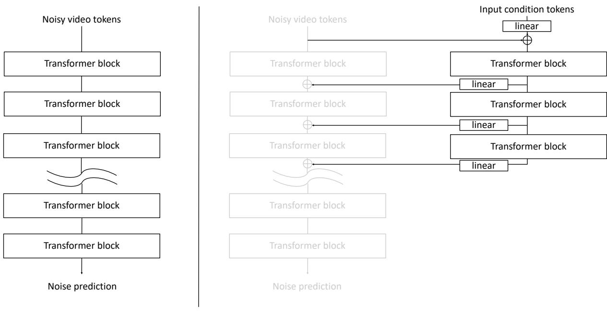

*图1展示了模型的两部分核心：(a) 基础DiT扩散模型由Transformer块堆叠而成，学习预测输入噪声token中的噪声；(b) ControlNet扩展模型为条件扩散模型，通过控制分支注入条件信息，实现可控生成。*

## 问题背景与动机

**结论先行**：在物理 AI 领域用生成模型做“世界生成”时，一个根本性矛盾始终悬而未决——单一模态的控制信号要么扼杀多样性，要么丢失结构精度；而试图联合多个模态又会被训练成本和空间僵化两大难题卡住脖子。Cosmos-Transfer1 的破局思路十分干脆：**把不同模态的控制分支分开训练（分治），在推理时再通过一张时空控制图对画面不同区域施以自适应的加权融合**。下面我们就顺着“现象 → 缺口 → 洞见”的链条，看这一设计到底被什么问题逼出来，又凭什么能同时解开精度、多样性与资源三把锁。

**困境一：合成到真实的鸿沟与数据饥渴**。机器人、自动驾驶等 Physical AI 任务对高质量真实场景数据的需求近乎贪婪，而安全关键的长尾场景更是凤毛麟角（C3）。合成模拟器（CG）可以低成本、无限量地产出带有完美标注的渲染画面，但这些画面与真实世界之间横亘着显著的 Sim2Real 域差（C1）——直接拿合成数据训练，模型一进真实环境就“水土不服”。幸运的是，视频扩散模型恰好提供了一座桥梁：将模拟器给出的深度、分割等中间表示作为条件，生成高保真的现实风格视频。然而，紧接着第二个困境便浮出水面。

**困境二：单一条件的“鱼与熊掌”**。直觉上（非严格对应），条件控制就像照着草图作画：如果给的是精细线稿（如视觉模糊 Vis、边缘 Edge），画中物体的结构会非常准确，但每一幅画都惊人地相似，缺乏变化；如果换成色块分区（如语义分割 Seg），画师自由发挥的余地变大，但物体边界就容易漂移。论文的定量分析清晰地揭示了这一权衡：同一款模型在 TransferBench 上，以 Vis 作为条件时输出多样性指标极低，以 Seg 作为条件时多样性达到最高，而结构一致性指标则呈现相反的走势（具体数值见“实验与对比”一节的表格）。换言之，**没有哪一个单一模态能同时扛起“结构精确”与“外观多样”两面大旗**。

更麻烦的是，真实应用对视频不同区域的诉求本就差异巨大。以机器人抓取为例：机械手与目标物体的轮廓必须死死咬住物理约束，边缘或深度这类稠密结构信号不可或缺；而背景墙壁、桌面的纹理和光照反而希望千变万化，这时稀疏的分割或深度反而更有利于“解放”多样性。如果只能为整个画面指定一套全局统一的条件权重，就必然陷入“前景欠约束、背景过约束”的僵局——无论怎么手工调参都难以兼顾。

**缺口：为什么现有多模态方案走不通？** 面对上述矛盾，一个自然的想法是把多种模态的条件分支都接上，让它们互补。但此路立即被两堵墙拦下：

1. **空间控制粒度的缺失（C4）**：现有 ControlNet 等多模态扩展方案，通常是对全图施加一套固定权重，缺乏对同一帧内不同空间区域分配差异化模态权重的能力。想让前景多用边缘、背景多用分割？对不起，做不到。
2. **联合训练的显存与数据双重重压（C5）**：大规模视频扩散模型本身的训练已是“显存老虎”，若再同时加载多个控制分支并一起端到端学习，内存开销将成倍膨胀，工程上极难承受。更何况，某些专用模态（如自动驾驶的 HD 地图）与通用视频数据的配对样本并不容易获得，联合训练对数据对齐的苛求让路越走越窄。

**关键洞见：分治训练 + 推理期自适应融合**。上述两个缺口共同指向一条突围路径：既然联合训练既费钱又卡数据，何不**将各个模态的控制分支独立训练**？每种模态（深度、分割、边缘、视觉模糊等）单独学习各自的 ControlNet 分支，与冻结好的基础视频模型解耦——这样既绕开了多模态联合调参的内存爆炸，也不再要求不同模态数据之间严格配对。而在推理阶段，引入一张**时空控制图**（Spatiotemporal Control Map）作为“总调度”，为视频每一帧的不同空间区域按需分配各模态的融合权重，让前景和背景能够各取所需。

这一“分而治之，在推理中按区域缝合”的策略，正是 Cosmos-Transfer1 整套架构设计的原点。它从根上化解了单一模态的固有权衡，又规避了联合训练的现实障碍，为机器人 Sim2Real（前景用 Edge+Vis 锁形态，背景用 Seg 增多样性）和自动驾驶（HDMap+LiDAR 互补融合）等场景的世界生成，铺出了一条高保真与高多样性兼得的可行之路。

## 核心概念速览

### 时空控制图：逐位置、逐帧的动态“权力分配图”

时空控制图（Spatiotemporal Control Map）是一张形状为 N×X×Y×T 的权重张量（N 为模态数量，X/Y 为视频宽高，T 为帧数）。在推理阶段，它对 N 条模态控制分支的激活输出按**每一个时空坐标**分别施加权重，当多个模态在同一位置/帧上都有贡献时，通过归一化将加权和限制在合理范围。与固定权重不同，这张图可以根据场景内容（例如前景/背景、物体边界、深度区域）**自适应地决定此刻该信哪个模态多一点**。

打个比方（直觉，非严格对应）：这就像视频后期里的“动态遮罩+混合滑块”集合——主轨道是基础视频生成模型，而每个条件模态（边缘、深度、分割等）都像是一条带透明度的覆叠轨；时空控制图就是那条**逐帧、逐像素动态调整透明度的控制曲线**，让最终合成的画面在不同区域“听取不同的指导”。

### DiT‑based ControlNet：给扩散变换器装上的“零干扰外挂”

DiT‑based ControlNet 把原本在 UNet 架构中大获成功的 ControlNet 思路搬到了扩散变换器（DiT）上。基础去噪器公式 $\mathbf{n}=D(\mathbf{x}_\sigma,\sigma)$ 加入条件后变为 $\mathbf{n}=D(\mathbf{x}_\sigma,\sigma,\mathbf{c})$，条件 $\mathbf{c}$ 通过一组与基础模型权重初始化一致的控制分支传入。关键设计是：控制分支输出经过**零初始化的线性层**再叠加回主分支，这确保了训练刚开始时，控制分支“零贡献”，完全不会破坏预训练基础模型的输出。

可以这样理解（直觉，非严格对应）：想象一位画师（基础模型）已经精于凭空作画。现在我们给她配了一个“辅助描图员”（控制分支），辅助描图员手里拿着其他草稿（条件信号），但她最初递出去的修改建议通通是白纸（零初始化）——不会干扰画师。经过训练，她学会了哪些笔触在哪一阶段能给画师最有效的提示，大幅提升条件控制的可控性。

### 多模态自适应控制：把“独奏家”拧成“交响乐团”的指挥系统

多模态自适应控制（Adaptive Multimodal Control）为每种输入模态（模糊视觉 Vis、Canny 边缘 Edge、深度 Depth、语义分割 Seg，以及自动驾驶场景中的 HDMap 与 LiDAR 等）**分别独立训练一个 ControlNet 分支**。推理时，所有分支的激活通过时空控制图进行加权融合，统一送入主生成分支。这种方式避免了联合训练时模态间相互干扰或灾难性遗忘，又允许用户在实际使用时像**调音台推子**那样灵活组合条件。

比喻（直觉，非严格对应）：一个交响乐团里，各声部（模态）的乐手平时各自练好自己那部分（独立训练），正式演出时，指挥（时空控制图）根据每一乐句的需要，实时调整木管、铜管、弦乐的音量比例，使得最终呈现的乐曲既有整体和谐，又有细节呼应。

### Sim2Real 仿真到真实域迁移：给虚拟世界“披上现实光影的外衣”

Sim2Real 域迁移利用 Cosmos‑Transfer1 将仿真引擎渲染的 CG 画面（连同伴随的结构化信号，如分割图、深度图）转换为光照、纹理和细节更加真实的视频。例如在机器人操作场景中，系统可以设置边缘权重作用于前景物体、分割权重作用于背景，从而在保持任务结构的条件下大幅提升画面的逼真度。

一个生活比喻（直觉，非严格对应）：这就像给一部用简易引擎制作的动画短片做“真人化”特效重制——角色的动作、物体的轮廓（结构信息）都保留，但每一帧的材质、光影、环境反射全部用现实世界的观感重绘，让训练在虚拟世界中的机器人/自动驾驶模型搬到真实世界时不至于“水土不服”。

### TransferBench 评测集：专为物理 AI“量身命题”的联考

TransferBench 是 NVIDIA 团队为检验 Cosmos‑Transfer1 能力而专门构建的评测集，包含 600 个样本，均匀覆盖机器人手臂操作（来自 AgiBot World）、驾驶（来自 OpenDV）和以自我为中心的日常生活（来自 Ego‑Exo‑4D）三类 Physical AI 场景。评测指标同时兼顾条件对齐（Blur SSIM、Edge F1、Depth si‑RMSE、Mask mIoU）、生成多样性（Diversity‑LPIPS）和主观技术质量（Quality Score），形成一套较为立体的评估体系。<!--ref:r-cosmos-transfer1-condi--><!--anchor:quote:Cosmos%2DTransfer1%3A%20Conditional%20World%20Generation%20with%20Adaptive%20Multimodal%20Control--><!--ref:r-sub-transferbench-sub--><!--anchor:quote:%3Csub%3ETransferBench.%3C%2Fsub%3E%20To%20evaluate%20the%20characteristics%20of%20Cosmos%2DTransfer1%2C%20we%20curate%20%3Csub%3ETransferBench%3C%2Fsub%3E%20%E2%80%94%20an%20evaluation%20dataset%20consisting%20of%20600%20examples%20across%20three--><!--ref:r-images-8bd6a686cb5d0f--><!--anchor:quote:%21%5B%5D%28images%2F8bd6a686cb5d0f81f8d5940e175f55ef66c1b292c988eadc2c8eba04fe2aeb81.jpg%29--><!--ref:r-cosmos-transfer1-condi--><!--anchor:quote:Cosmos%2DTransfer1%3A%20Conditional%20World%20Generation%20with%20Adaptive%20Multimodal%20Control-->

可以视为（直觉，非严格对应）：一场为特定运动员群体定制的“多科联考”——不考泛泛的选择题，而是针对其运动项目（机器人操作、驾驶、日常活动）设计的实操科目，直接检验模型在“把条件转换为真实感视频”这项任务上的真实功力。需要说明的是，该评测集为作者自行构建，非独立第三方标准 benchmark，但作为方法自证的参考系，仍为理解各模态的贡献提供了可观测窗口。

### 推理并行化扩展策略：把“超长画卷”拆给多条流水线同时加工

Cosmos‑Transfer1‑7B 单次推理需生成 5 秒的 1280×704p、24fps 视频，预测 56K tokens，计算量巨大。论文针对 NVIDIA GB200 NVL72 机架设计了一种混合并行方案：在非注意力层采用纯数据并行，在注意力层采用**头并行**（head parallelism），通过 all‑to‑all 集合通信使 64 块 GPU 分别负责完整 56K token 序列的计算，但每块 GPU 只处理全体注意力头的一部分。正向/反向 CFG 被分配到两组 GPU 上分担，最终实现端到端的实时生成（扩散阶段仅耗时 3.5 秒）。

一个工程比喻（直觉，非严格对应）：就像要把一幅百米长卷分给数十位画师同时绘制，常规做法是每人分一段（数据并行），但注意力层要求所有画师随时交流全图细节，于是改为每人只负责一种“笔触风格”（头并行），需要时快速交换信息，极大缩短工期。

### 提示上采样器：把用户的“简笔画”翻译成模型听得懂的“建筑蓝图”

用户输入的提示往往比较简短，而 Cosmos‑Transfer1 训练所用的描述却详尽复杂，两者之间存在分布偏移。提示上采样器（Prompt Upsampler）微调自 Pixtral‑12B，它同时接受用户文本提示和对应的条件模态视频（如深度视频或分割视频），将其转换为结构与训练分布一致的详细长提示，从而在推理时充当“翻译官”的角色。该模块为可选组件，不改变核心生成架构，但能有效改善低质量用户输入下的生成结果。

打个比方（直觉，非严格对应）：这就像一位懂设计又懂沟通的“客户经理”——客户可能只说“我想要个温馨的厨房”，但施工团队（视频生成模型）需要知道橱柜材质、灯光色温、空间走向等具体规格。客户经理根据客户粗略描述，再扫一眼毛坯房现状（条件视频），就写出一份符合施工团队既有图纸范式的详细施工说明。

## 方法与整体架构

Cosmos-Transfer1 的核心思路是“借壳生肌”：它并不从头训练一个多模态视频生成器，而是在一个已经训练完备的扩散世界模型（Cosmos-Predict1-7B-Video2World）之上，挂接多个轻量的“控制分支”（ControlNet 范式），通过冻结主干、仅后训练分支的方式，让基础模型获得对多种控制信号（如模糊视觉、边缘、深度、分割，以及自动驾驶场景下的 LiDAR 和高精地图）的响应能力。这一选择既保留了基础模型原本的视频生成质量，又避免了多模态联合训练带来的海量计算开销——直觉上，就像给一个已经会画写实风景的画家配上一组“风格滤镜”，画家本身不用重新学画画，只需学会如何解读新的指引线索（注：此为直觉比喻，非严格对应）。

**基础模型与条件去噪**。整个流程的引擎是 Cosmos-Predict1-7B-Video2World，一个基于 DiT（Diffusion Transformer）的视频扩散模型。在无条件生成模式下，它的去噪过程可表述为 $$\mathbf{n} = D(\mathbf{x}_{\sigma}, \sigma)$$；而在条件生成模式下，其输入被扩展为 $$\mathbf{n} = D(\mathbf{x}_{\sigma}, \sigma, \mathbf{c})$$，其中 $$\mathbf{c}$$ 既包含文本描述，也包含通过控制分支注入的多模态空间信息。训练期间，基础模型的所有参数被冻结，只有每个控制分支的 3 个 Transformer 块及其零初始化的线性层得到更新——零初始化确保了训练之初分支输出为零，不会破坏原有生成行为；训练目标则直接继承基座模型的扩散去噪范式（论文未给出显式损失公式）。

**多模态控制分支与时空权重融合**。模型为每一种控制模态（如 Blur Visual、Edge、Depth、Segmentation）独立训练一条分支，每条分支包含 3 个 Transformer 块（经验表明 3 块能在控制有效性与推理效率之间取得良好平衡，论文未对其他块数进行消融）。推理时，对于第 i 个模态在第 j 个 DiT 块处的激活 $$\mathbf{h}_i^j$$，会与一个用户或算法给定的时空控制图 $$\mathbf{w}_i$$ 进行逐元素乘积加权，然后将所有模态的加权结果叠加回主干 DiT 的对应块激活上。当各模态权重之和在某时空位置超过 1 时，系统会按比例归一化使得总和恰为 1，从而避免多路信号叠加过强导致画面退化——这一设计直接对应实际应用中“既要前景清晰又要背景多样”的灵活需求。

**各模态的预处理与增强策略**。为了让控制分支学会鲁棒的表征，论文在训练时对每种模态输入施加了特定的数据增强或归一化：Blur Visual 分支训练时随机化双边滤波参数；Edge 分支对 Canny 边缘检测的阈值进行随机化；Depth 分支使用 DepthAnything2 提取深度后统一归一化到 $$[0,1]$$；Segmentation 分支则完全打乱对象颜色（颜色仅用于区分实例，不携带固定语义），迫使模型学习几何与实例结构而非依赖颜色记忆。自动驾驶版本 Cosmos-Transfer1-7B-Sample-AV 则额外引入了 LiDAR 和 HDMap 分支，其中 LiDAR 由于采样率（10 FPS）远低于相机（30 FPS），对每一帧会选取最近一次 LiDAR 扫描及其前后各 2 帧（共 5 帧）进行投影，并用核尺寸为 4 的插值填补投影孔洞，从而在时序上构造出足够密集的空间引导。

**可选组件：文本扩展与超分辨率**。主流程之前，用户可以选择启动 Pixtral-12B Prompt Upsampler，将一句简短的用户提示自动扩展为一段细节丰富、与训练分布对齐的长文本描述，从而提升生成的指令跟随度。在输出端，基础模型生成的是 5 秒、1280×704 像素、24fps 的视频（共 56K 个 token）。如果要进一步获得 4K 分辨率，可以接上 Cosmos-Transfer1-7B-4KUpscaler：该超分模块将每一帧划分为 3×3 个相互重叠的格子，对每个格子并行进行扩散去噪，重叠区域的预测结果取平均值，从而保证帧内无缝衔接，避免明显的拼接伪影。

整体来看，这套架构通过“冻结主干 + 轻量分支 + 时空加权注入 + 可选文本/超分扩展”的流水线，以较高的可控性和较低的增量训练成本，实现了从简短指令到最高 4K 多模态约束视频的生成。下面用一张流程图将上述信息串联起来（如何读这张图：从顶部用户指令出发，沿实线主路径可得到 720p 视频；虚线框内为各训练好的控制分支，它们接受相应模态的数据输入，并结合时空权重图介入主干的去噪过程；右侧虚线路径为可选的超分升级）。

```mermaid
flowchart TB
    user_text["用户短文本指令"] -->|可选| pixtral["Pixtral-12B Prompt Upsampler"]
    pixtral --> long_prompt["长文本描述"]
    long_prompt --> base_dit["Cosmos-Predict1-7B-Video2World 基础DiT去噪器"]

    subgraph control_modalities ["多模态控制分支 (独立后训练)"]
        blur_ctrl["Blur Visual 分支 (3 transformer块)"]
        edge_ctrl["Edge 分支 (3 transformer块)"]
        depth_ctrl["Depth 分支 (3 transformer块)"]
        seg_ctrl["Segmentation 分支 (3 transformer块)"]
        lidar_ctrl["LiDAR 分支 (AV专有, 3块)"]
        hdmap_ctrl["HDMap 分支 (AV专有, 3块)"]
    end

    blur_input["视觉模糊图"] --> blur_ctrl
    edge_input["Canny边缘图"] --> edge_ctrl
    depth_input["深度图 ["0,1"]"] --> depth_ctrl
    seg_input["分割图 (随机颜色)"] --> seg_ctrl
    lidar_input["LiDAR投影 (多帧融合)"] --> lidar_ctrl
    hdmap_input["高精地图"] --> hdmap_ctrl

    weight_maps["时空控制图 w_i (用户/SalientObject)"]
    blur_ctrl -- "h_blur^j" --> weighting["多模态时空权重融合 (超出1归一化)"]
    edge_ctrl -- "h_edge^j" --> weighting
    depth_ctrl -- "h_depth^j" --> weighting
    seg_ctrl -- "h_seg^j" --> weighting
    lidar_ctrl -- "h_lidar^j" --> weighting
    hdmap_ctrl -- "h_hdmap^j" --> weighting
    weight_maps -- "w_i" --> weighting

    weighting -- "叠加回主干DiT对应块" --> base_dit

    base_dit --> diffusion["多步扩散去噪采样 (公式1→2)"]
    diffusion --> video_720p["5秒 1280×704p@24fps 视频 (56K tokens)"]

    video_720p -->|可选| upscaler["Cosmos-Transfer1-7B-4KUpscaler\n(3×3重叠格并行去噪)"]
    upscaler --> video_4k["4K分辨率视频"]

    classDef required fill:#dbeafe,stroke:#2563eb,stroke-width:2px,color:#1e3a5f
    classDef output fill:#dcfce7,stroke:#16a34a,stroke-width:2px,color:#14532d
    classDef optional fill:#fef9c3,stroke:#ca8a04,stroke-width:2px,color:#713f12
    class user_text required
    class video_4k output
    class pixtral,upscaler,lidar_ctrl,lidar_input,hdmap_ctrl,hdmap_input optional
```

**模型结构与关键子图(原图):**

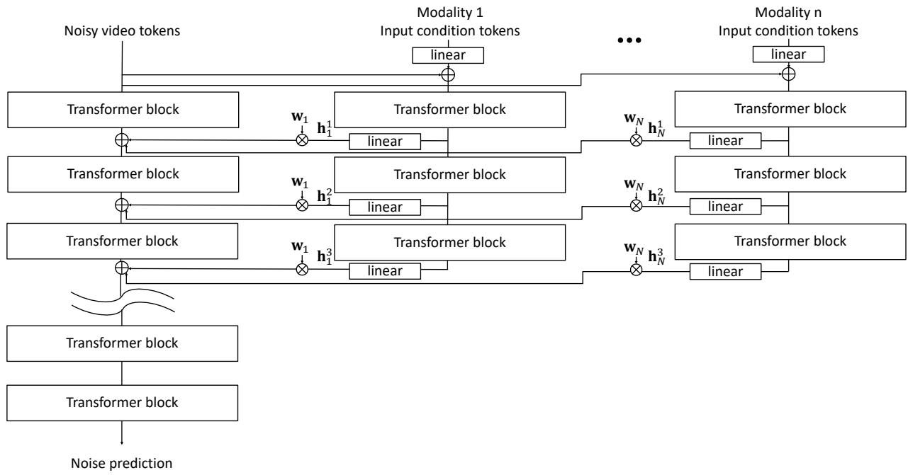

*图2描绘了Cosmos-Transfer1的整体架构——一个自适应多模态控制的世界生成器。它包含多个控制分支，从分割、深度、边缘等不同模态提取控制信息，并应用时空控制图（$\mathbf{w}$）在时间和空间维度精细调控生成过程。*

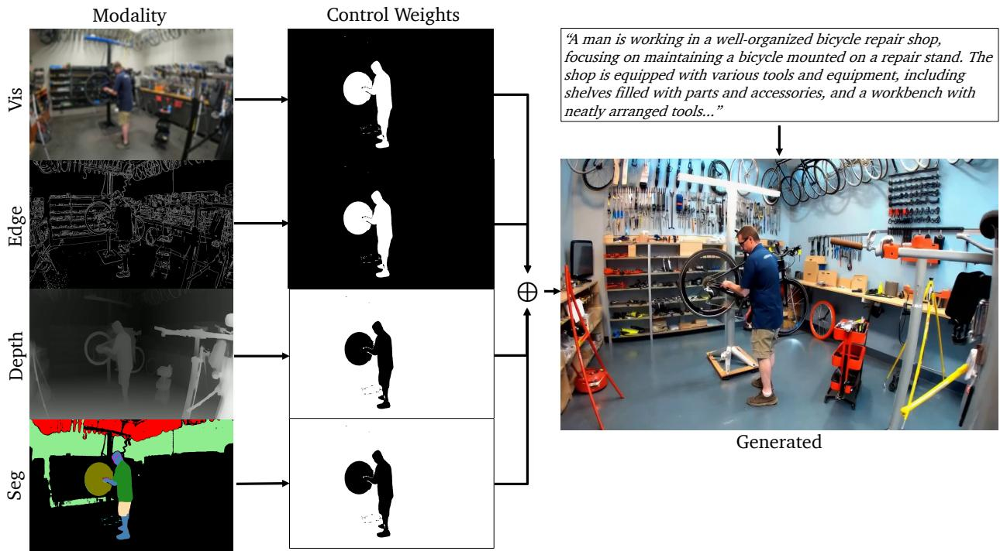

*图6说明了时空控制加权机制：对不同模态（视觉、边缘、深度、分割）生成控制权重图，黑色区域权重为0（自由生成），白色区域权重为0.5（施加约束），实现灵活的控制强度调节。*

## 算法目标与推导

**结论前置**：Cosmos‑Transfer1 的核心算法目标，是在完全冻结预训练基础模型的前提下，让多个轻量控制分支学会“如何把外部指令翻译成主干能理解的内部特征”，推理时通过元素级注入与自动归一化，将不同模态的条件无缝融合，最终实现零样本多模态可控生成。整个过程不需要改变基础模型的任何知识，只需训练每一分支的少量新增参数。

### 源公式
论文明确给出了基础去噪器与条件去噪器的推理式：

基础去噪：  
$$\mathbf{n} = D(\mathbf{x}_{\sigma}, \sigma) \quad (1)$$

条件去噪：  
$$\mathbf{n} = D(\mathbf{x}_{\sigma}, \sigma, \mathbf{c}) \quad (2)$$

其中 $\mathbf{x}_{\sigma}$ 是当前噪声水平下的带噪数据，$\sigma$ 为噪声强度，$\mathbf{c}$ 代表融合后的多模态控制条件，输出 $\mathbf{n}$ 为模型预测的噪声。

### 逐步推导与设计意图
虽然论文未给出显式的训练损失公式，但其训练范式完全继承自 Cosmos‑Predict1 的扩散去噪流程。以下围绕公式 (2) 中条件 $\mathbf{c}$ 的来龙去脉，推导整个学习目标。

**1. 主干冻结与零初始化：为什么不能动基础模型？**  
基础模型 $D$（公式 1）已经学会从纯噪声中生成合理视频，但它不知道任何外部指令。如果直接在这个模型上微调多模态数据，极易破坏原有的生成多样性（灾难性遗忘）。因此，论文选择**冻结所有基础权重**，只在一张白纸上做加法。  
在每个控制分支的末端插入一个零初始化的线性层，使得训练开始时分支输出 $\mathbf{h}_i^j$ 全为零（$j$ 表示网络第 $j$ 层）。此时条件 $\mathbf{c}$ 等效于无，模型表现与原始基础模型完全一致，优化从一个极平滑的起点出发，极大降低了训练不稳定风险。

**2. 条件的构成：从单模态分支到多模态融合**  
条件 $\mathbf{c}$ 并非单一向量，而是各个控制分支在主干不同层上注入的**特征之和**。具体来说，对于模态 $i$，论文为它设计了一组仅 3 个 Transformer 块的微型网络。推理时，该分支在某一层输出的特征图 $\mathbf{h}_i^j$ 会乘上一个可学习的空间权重图 $\mathbf{w}_i$（元素积 $\mathbf{w}_i \cdot \mathbf{h}_i^j$），然后直接叠加到主干对应层的特征上。  
当同时使用多个模态时，各分支的权重图在每个空间位置求和。论文引入了一条关键规则：**若某位置的总权重超过 1，则对所有分支权重进行归一化，使其和为 1**。这相当于一个自动增益控制，防止多个强烈控制信号叠加导致生成崩溃（例如画面撕裂、运动过激）。

**3. 训练目标的推断**  
虽然论文没有写出损失公式，但根据标准的扩散去噪范式，训练目标可以理解为：对于每个控制分支，最小化条件去噪器预测的噪声与真实噪声之间的均方误差，即  
$$\mathcal{L} \propto \mathbb{E}_{\mathbf{x}_0, \boldsymbol{\epsilon}, \sigma, \mathbf{c}} \left[ \| \boldsymbol{\epsilon} - D(\mathbf{x}_{\sigma}, \sigma, \mathbf{c}) \|^2 \right]$$  
其中 $\mathbf{c}$ 由当前训练的分支唯一提供（其他分支暂不参与）。每个分支单独训练、互不干扰，因此整个框架天然支持模态的独立迭代与增量扩展。由于只优化少量新增参数，训练开销远低于全模型微调。

### 直觉比喻（非严格对应）
可以把基础模型想象成一位技法已入化境的大厨，能够无师自通地做出一桌好菜（生成通用视频）。现在要求他“按客人指令做菜”，但又不能改变他多年练就的颠勺火候（冻结权重）。于是我们在操作台旁安装了几个小巧的“提示器”（控制分支），每个只懂一种指令——红色的提示器负责“要辣”，蓝色的负责“摆盘要精致”。  
起初所有提示器都是关闭的（零初始化），大厨依然做平常的菜。训练时我们不断给出“正确结果”，但**只允许提示器学习**如何把指令翻译成轻微的灯光或声响（特征注入），让大厨下意识地调整口味与装盘。当多位客人同时提要求时，提示器会自动压低各自的音量（权重归一化），避免一起吵闹让大厨手忙脚乱。

### 一个小玩具例子
设想一个极简化扩散模型，用于生成单色形状。基础模型只会生成灰色的圆。现在我们想加入“颜色控制”分支，输入一个颜色词如“红”。

1. **搭建**：在基础模型中间层后插入一个 3 块 Transformer ＋ 零初始化线性层的小分支。分支接收“红”的嵌入向量。
2. **早期前向**：训练时取真实红色圆形图像加噪得 $\mathbf{x}_\sigma$。将“红”送入分支，输出特征图 $\mathbf{h}_{\text{color}}$。由于零初始化，$\mathbf{h}_{\text{color}}$ 全为零，加回主干后不起作用。计算预测噪声与真实噪声的误差，反向传播**只更新分支和线性层**。
3. **收敛行为**：多次迭代后，线性层学会将 Transformer 的输出缩放到非零，并映射成一组能“引导去噪器偏向红色”的偏移量。Transformer 则学会从“红”这个离散输入中抽取必需的上下文信息。
4. **多模态叠加**：再加入“形状分支”（输入“方形”）。推理时两个分支各自输出 $\mathbf{h}_{\text{color}}$ 和 $\mathbf{h}_{\text{shape}}$，分别乘上可学习权重图 $\mathbf{w}_{\text{color}}$、$\mathbf{w}_{\text{shape}}$ 后叠加。若某位置权重之和超过 1，归一化到和为 1。最终模型同时收到“变红”与“变方”的信号，且强度自动平衡，生成红色方形。

通过这个玩具流程，可以直观看到“冻结主干＋轻量分支＋零初始化＋归一化融合”这一套组合如何让多模态可控生成变得既稳定又易于训练——这正是 Cosmos‑Transfer1 算法设计的精髓。

## 实验设计与结果解读

为全面验证 Cosmos-Transfer1-7B 的多模态控制能力与实用价值，作者设计了一套“从像素对齐到语义理解，从单帧指标到时空一致性”的实验体系。核心实验分为五组，分别瞄准通用生成质量（多模态融合的增益）、可控性（权重图在空间维度的精调证据）、两个高价值下游场景（机器人 Sim2Real 数据增强、自动驾驶视频生成）以及大规模实时推理的可行性。所有对比都设置了清晰的单模态基线，并通过多个互补指标进行交叉验证，避免单一指标“欺骗性高分”。

### 多模态融合：1+1 为什么大于 1？

第一组实验（E1）在涵盖机器人、驾驶、日常场景的 TransferBench 上，系统对比了四种单模态变体（Vis、Edge、Depth、Seg）与均匀权重多模态配置。直观上，单模态模型就像只戴了一副“专用眼镜”：Vis 模型擅长保持纹理清晰度（Blur SSIM 最高），Edge 模型对物体轮廓最敏感（Edge F1 最高），但它们的“视野”过于狭窄。当把四副眼镜同时戴上（均匀权重多模态），生成视频的整体质量评分（Quality Score，基于 DOVER‑technical）稳定领先所有单模态配置，这表明多条件约束确实让模型学到了更鲁棒的视觉表达。一个有趣的细节是：密集结构模态（Vis/Edge）虽然在对应对齐指标上登顶，却普遍导致生成多样性下降——约束越多，模型越“不敢”自由发挥（详见下方实验表）。这个发现为后续的“空间选择性控制”埋下了伏笔。<!--ref:r-cosmos-transfer1-condi--><!--anchor:quote:Cosmos%2DTransfer1%3A%20Conditional%20World%20Generation%20with%20Adaptive%20Multimodal%20Control--><!--ref:r-cosmos-transfer1-condi--><!--anchor:quote:Cosmos%2DTransfer1%3A%20Conditional%20World%20Generation%20with%20Adaptive%20Multimodal%20Control-->

### 权重如同画笔：空间控制图如何作画

如果均匀权重是“全图施加同一种力道”，那么 SalientObject 时空控制图就是“给前景和背景分配不同力道”。第二组消融实验（E2）通过互换前景与背景的模态权重，直接验证了控制的细粒度。首先用 VLM（GPT‑4o）对场景中的前景物体与背景进行语义分类，并用 GroundingDINO + SAM2 提取分割掩码；然后在一组配置中将结构模态（Vis+Edge）集中于前景、语义模态（Depth+Seg）集中于背景，另一配置则完全颠倒。结果呈现出完美的“推拉效应”：一旦密集模态被移至某区域，该区域的对应对齐指标就立即上升，同时多样性下降；前后景互换后，指标的变化趋势也跟着对调。这就像用不同画笔涂色——想让前景更锐利，就把 Vis/Edge 的“颜料”涂在掩码内；想让背景结构更清楚，就涂在掩码外。实验雄辩地证明了，多模态控制不是“全有或全无”，而是可以在空间维度上自由作画。

### 从仿真到现实：机器人数据增强的试金石

机器人操作视频生成是检验控制精度的苛刻场景：生成的前景机器人必须保持形态完整，同时背景厨房区域仍需结构合理。第三组实验（E3）利用 20 个基础厨房场景和 6 种文本提示，生成了 120 个视频，并重点考察了专门为前景机器人设计的 FG Mask mIoU 指标。与单模态基线相比，无论采用哪种时空控制图配置（Setting1：前景 Vis+Edge、背景 Seg；Setting2：前景仅 Edge、背景 Seg），FG Mask mIoU 和整体质量评分都取得了定性上的明显优势，同时维持了较高的生成多样性。这恰好说明：通过权重图将结构信息“注射”进前景，能显著抑制机器人肢体的模糊和坍塌，而背景只需粗粒度的 Seg 引导即可维持场景布局。<!--ref:r-in-this-paper-we-propo--><!--anchor:quote:In%20this%20paper%2C%20we%20propose%20Cosmos%2DTransfer1%2C%20a%20diffusion%2Dbased%20conditional%20world%20model%20for%20the%20multimodal%20controllable%20world%20generation%20problem.%20Our%20model--><!--ref:r-we-introduce-cosmos-tr--><!--anchor:quote:We%20introduce%20Cosmos%2DTransfer1%2C%20a%20conditional%20world%20generation%20model%20that%20can%20generate%20world%20simulations%20based%20on%20multiple%20spatial%20control%20inputs%20of--><!--ref:r-images-8bd6a686cb5d0f--><!--anchor:quote:%21%5B%5D%28images%2F8bd6a686cb5d0f81f8d5940e175f55ef66c1b292c988eadc2c8eba04fe2aeb81.jpg%29--><!--ref:r-table-3-presents-the-q--><!--anchor:quote:Table%203%20presents%20the%20quantitative%20evaluation%20of%20Cosmos%2DTransfer1%20on%20robotics%20simulation%20data%20%28120%20videos%2C%20i.e.%2C%20%242%200%20%5Ctimes%206%20%29%24--><!--ref:r-cosmos-transfer1-condi--><!--anchor:quote:Cosmos%2DTransfer1%3A%20Conditional%20World%20Generation%20with%20Adaptive%20Multimodal%20Control--><!--ref:r-we-introduce-cosmos-tr--><!--anchor:quote:We%20introduce%20Cosmos%2DTransfer1%2C%20a%20conditional%20world%20generation%20model%20that%20can%20generate%20world%20simulations%20based%20on%20multiple%20spatial%20control%20inputs%20of-->

### 自动驾驶的多视角控制：让道路与点云互补

自动驾驶视频生成面临着更复杂的多模态需求：HDMap 提供清晰的车道拓扑，LiDAR 点云则携带精确的 3D 空间信息。第四组实验（E4）证明，将二者融合（权重约为 0.3:0.7）可以各取所长：融合模型在车道分割指标（Lane mIoU）上明显优于纯 LiDAR 配置，同时在 3D 重投影误差上大幅超越纯 HDMap 配置，实现了“车道看得更清，3D 结构也更稳”的综合最优（详见下方实验表）。这种互补效应无法通过单一模态获得，进一步印证了多模态融合在安全关键型应用中的必要性。<!--ref:r-in-this-paper-we-propo--><!--anchor:quote:In%20this%20paper%2C%20we%20propose%20Cosmos%2DTransfer1%2C%20a%20diffusion%2Dbased%20conditional%20world%20model%20for%20the%20multimodal%20controllable%20world%20generation%20problem.%20Our%20model--><!--ref:r-images-8bd6a686cb5d0f--><!--anchor:quote:%21%5B%5D%28images%2F8bd6a686cb5d0f81f8d5940e175f55ef66c1b292c988eadc2c8eba04fe2aeb81.jpg%29--><!--ref:r-similar-patterns-can-b--><!--anchor:quote:Similar%20patterns%20can%20be%20observed%20when%20we%20only%20exclude%20a%20single%20modality%20and%20assign%20uniform%20weights%20to%20other%20modalities.%20For--><!--ref:r-table-tr-td-rowspan-2--><!--anchor:quote:%3Ctable%3E%3Ctr%3E%3Ctd%20rowspan%3D%222%22%3EModel%3C%2Ftd%3E%3Ctd%3EVis%20Alignment%3C%2Ftd%3E%3Ctd%3EEdge%20Alignment%3C%2Ftd%3E%3Ctd%3EDepth%20Alignment%3C%2Ftd%3E%3Ctd%3ESegmentation%20Alignment%3C%2Ftd%3E%3Ctd%3EDiversity%3C%2Ftd%3E%3Ctd%3EOverall%20Quality%3C%2Ftd%3E%3C%2Ftr%3E%3Ctr%3E%3Ctd%3EBlur%20SSIM%E2%86%91%3C%2Ftd%3E%3Ctd%3EEdge%20F1%E4%B8%AA%3C%2Ftd%3E%3Ctd%3EDepth%20si%2DRMSE%E2%86%93%3C%2Ftd%3E%3Ctd%3EMask%20mIoU%E2%86%91%3C%2Ftd%3E%3Ctd%3EDiversity%20LPIPS%20%E2%86%91%3C%2Ftd%3E%3Ctd%3EQuality%20Score%E2%86%91%3C%2Ftd%3E%3C%2Ftr%3E%3Ctr%3E%3Ctd%3ECosmos%2DTransferl%2D7B%20%5BVis%5D%3C%2Ftd%3E%3Ctd%3E0.96%3C%2Ftd%3E%3Ctd%3E0.16%3C%2Ftd%3E%3Ctd%3E0.49%3C%2Ftd%3E%3Ctd%3E0.72%3C%2Ftd%3E%3Ctd%3E0.19%3C%2Ftd%3E%3Ctd%3E5.94%3C%2Ftd%3E%3C%2Ftr%3E%3Ctr%3E%3Ctd%3ECosmos%2DTransfer1%2D7B%20%5BEdge%5D%3C%2Ftd%3E%3Ctd%3E0.77%3C%2Ftd%3E%3Ctd%3E0.28%3C%2Ftd%3E%3Ctd%3E0.53%3C%2Ftd%3E%3Ctd%3E0.71%3C%2Ftd%3E%3Ctd%3E0.28%3C%2Ftd%3E%3Ctd%3E5.48%3C%2Ftd%3E%3C%2Ftr%3E%3Ctr%3E%3Ctd%3ECosmos%2DTransferl%2D7B%20%5BDepth%5D%3C%2Ftd%3E%3Ctd%3E0.71%3C%2Ftd%3E%3Ctd%3E0.14%3C%2Ftd%3E%3Ctd%3E0.49%3C%2Ftd%3E%3Ctd%3E0.70%3C%2Ftd%3E%3Ctd%3E0.39%3C%2Ftd%3E%3Ctd%3E6.51%3C%2Ftd%3E%3C%2Ftr%3E%3Ctr%3E%3Ctd%3ECosmos%2DTransferl%2D7B%20%5BSeg%5D%3C%2Ftd%3E%3Ctd%3E0.66%3C%2Ftd%3E%3Ctd%3E0.11%3C%2Ftd%3E%3Ctd%3E0.75%3C%2Ftd%3E%3Ctd%3E0.68%3C%2Ftd%3E%3Ctd%3E0.42%3C%2Ftd%3E%3Ctd%3E6.30%3C%2Ftd%3E%3C%2Ftr%3E%3Ctr%3E%3Ctd%3ECosmos%2DTransfer1%2D7B%20Uniform%20Weights%2Cno--><!--ref:r-in-this-paper-we-propo--><!--anchor:quote:In%20this%20paper%2C%20we%20propose%20Cosmos%2DTransfer1%2C%20a%20diffusion%2Dbased%20conditional%20world%20model%20for%20the%20multimodal%20controllable%20world%20generation%20problem.%20Our%20model--><!--ref:r-in-this-paper-we-propo--><!--anchor:quote:In%20this%20paper%2C%20we%20propose%20Cosmos%2DTransfer1%2C%20a%20diffusion%2Dbased%20conditional%20world%20model%20for%20the%20multimodal%20controllable%20world%20generation%20problem.%20Our%20model-->

### 从实验室到机架：实时推理的扩展性验证

最后，性能落地同样被纳入实验设计。第五组实验（E5）在旗舰级 GB200 NVL72 机架上（36 个 Grace CPU + 72 个 Blackwell GPU，NVLink 互联），测量了生成一个 5 秒 720p 视频所需的端到端时间。通过将注意力层与非注意力层分别采用不同的并行策略，系统在 64 块 B200 GPU 上实现了低于 5 秒的端到端生成——这意味着实时视频生成吞吐量成为可能，为后续的交互式应用铺平了道路。从单 GPU 到 64 GPU，加速过程接近线性，证明了该架构对大规模推理的友好性。

### 实验数据表(原始数值,引自论文)

#### Table 1: TransferBench单模态与多模态均匀权重配置定量对比
- **Source**: Table 1
- **Caption**: "各Cosmos-Transfer1配置在TransferBench上的定量评估。单模态模型在对应对齐指标上最优，但整体质量低于均匀权重多模态模型；均匀权重多模态模型在Quality Score（8.54）和Depth si-RMSE上取得最优。"<!--ref:r-cosmos-transfer1-condi--><!--anchor:quote:Cosmos%2DTransfer1%3A%20Conditional%20World%20Generation%20with%20Adaptive%20Multimodal%20Control--><!--ref:r-in-contrast-the-adapti--><!--anchor:quote:In%20contrast%2C%20the%20adaptive%20multimodal%20control%20model%20%28%3Csub%3ECosmos%2DTransfer1%2D7B%3C%2Fsub%3E%20%3Csub%3EUniform%3C%2Fsub%3E%20%3Csub%3EWeights%3C%2Fsub%3E%29%2C%20which%20leverages%20multiple%20control%20inputs%2C%20consistently%20produces%20high%2Dquality%20results.%20Although-->

| Model | Blur SSIM↑ | Edge F1↑ | Depth si-RMSE↓ | Mask mIoU↑ | Diversity LPIPS↑ | Quality Score↑ |
| --- | --- | --- | --- | --- | --- | --- |
| Cosmos-Transfer1-7B [Vis] | 0.96 | 0.16 | 0.49 | 0.72 | 0.19 | 5.94 |
| Cosmos-Transfer1-7B [Edge] | 0.77 | 0.28 | 0.53 | 0.71 | 0.28 | 5.48 |
| Cosmos-Transfer1-7B [Depth] | 0.71 | 0.14 | 0.49 | 0.70 | 0.39 | 6.51 |
| Cosmos-Transfer1-7B [Seg] | 0.66 | 0.11 | 0.75 | 0.68 | 0.42 | 6.30 |
| Cosmos-Transfer1-7B Uniform Weights, no Vis | 0.68 | 0.13 | 0.57 | 0.67 | 0.37 | 8.02 |
| Cosmos-Transfer1-7B Uniform Weights, no Edge | 0.81 | 0.10 | 0.53 | 0.66 | 0.31 | 7.68 |
| Cosmos-Transfer1-7B Uniform Weights, no Depth | 0.83 | 0.15 | 0.52 | 0.69 | 0.25 | 7.49 |
| Cosmos-Transfer1-7B Uniform Weights, no Seg | 0.84 | 0.15 | 0.43 | 0.70 | 0.23 | 7.83 |
| Cosmos-Transfer1-7B Uniform Weights | 0.87 | 0.20 | 0.47 | 0.72 | 0.22 | 8.54 |

#### Table 2: SalientObject时空控制图配置定量评估
- **Source**: Table 2
- **Caption**: "不同时空控制权重分配策略在TransferBench上的定量评估，展示前景（FG）和背景（BG）区域的对齐、多样性及质量指标。前后景互换导致对应区域指标的系统性变化，验证了时空控制图的细粒度控制能力。"

| FG Vis | FG Edge | FG Depth | FG Seg | BG Vis | BG Edge | BG Depth | BG Seg | FG Blur SSIM↑ | BG Blur SSIM↑ | FG Edge F1↑ | BG Edge F1↑ | FG Depth si-RSME↓ | BG Depth si-RSME↓ | FG Mask mIoU↑ | BG Mask mIoU↑ | FG Diversity LPIPS↑ | BG Diversity LPIPS↑ | Quality Score↑ |
| --- | --- | --- | --- | --- | --- | --- | --- | --- | --- | --- | --- | --- | --- | --- | --- | --- | --- | --- |
| 0.5 | 0.5 | 0 | 0 | 0 | 0 | 0.5 | 0.5 | 0.81 | 0.71 | 0.27 | 0.14 | 0.37 | 0.52 | 0.77 | 0.68 | 0.01 | 0.33 | 8.29 |
| 0 | 0 | 0.5 | 0.5 | 0.5 | 0.5 | 0 | 0 | 0.68 | 0.93 | 0.17 | 0.25 | 0.38 | 0.40 | 0.77 | 0.75 | 0.12 | 0.03 | 8.08 |

#### Table 3: 机器人Sim2Real数据生成定量评估
- **Source**: Table 3
- **Caption**: "Cosmos-Transfer1在机器人Sim2Real数据生成任务上的定量评估（120个视频）。Setting2在Quality Score（10.42）和FG Mask mIoU（0.63）上均取得最优，两种时空控制图设置在前景保留和整体质量上均优于单模态基线。"<!--ref:r-cosmos-transfer1-condi--><!--anchor:quote:Cosmos%2DTransfer1%3A%20Conditional%20World%20Generation%20with%20Adaptive%20Multimodal%20Control--><!--ref:r-we-introduce-cosmos-tr--><!--anchor:quote:We%20introduce%20Cosmos%2DTransfer1%2C%20a%20conditional%20world%20generation%20model%20that%20can%20generate%20world%20simulations%20based%20on%20multiple%20spatial%20control%20inputs%20of--><!--ref:r-table-3-presents-the-q--><!--anchor:quote:Table%203%20presents%20the%20quantitative%20evaluation%20of%20Cosmos%2DTransfer1%20on%20robotics%20simulation%20data%20%28120%20videos%2C%20i.e.%2C%20%242%200%20%5Ctimes%206%20%29%24--><!--ref:r-we-introduce-cosmos-tr--><!--anchor:quote:We%20introduce%20Cosmos%2DTransfer1%2C%20a%20conditional%20world%20generation%20model%20that%20can%20generate%20world%20simulations%20based%20on%20multiple%20spatial%20control%20inputs%20of--><!--ref:r-table-tr-td-rowspan-2--><!--anchor:quote:%3Ctable%3E%3Ctr%3E%3Ctd%20rowspan%3D%222%22%3EModel%3C%2Ftd%3E%3Ctd%3EVis%20Alignment%3C%2Ftd%3E%3Ctd%3EEdge%20Alignment%3C%2Ftd%3E%3Ctd%3EDepth%20Alignment%3C%2Ftd%3E%3Ctd%3ESegmentation%20Alignment%3C%2Ftd%3E%3Ctd%3EFG%20Segmentation%20Alignment%3C%2Ftd%3E%3Ctd%3EDiversity%3C%2Ftd%3E%3Ctd%3EOverall%20Quality%3C%2Ftd%3E%3C%2Ftr%3E%3Ctr%3E%3Ctd%3EBlur%20SSIM%E2%86%91%3C%2Ftd%3E%3Ctd%3EEdge%20F1%E4%B8%AA%3C%2Ftd%3E%3Ctd%3EDepth%20si%2DRMSE%E2%86%93%3C%2Ftd%3E%3Ctd%3EMask%3C%2Ftd%3E%3Ctd%3EFG%20Mask%3C%2Ftd%3E%3Ctd%3EDiversity%3C%2Ftd%3E%3Ctd%3EQuality%3C%2Ftd%3E%3C%2Ftr%3E%3Ctr%3E%3Ctd%3ECosmos%2DTransferl%2D7B%20%5BVis%5D%3C%2Ftd%3E%3Ctd%3E0.95%3C%2Ftd%3E%3Ctd%3E0.19%3C%2Ftd%3E%3Ctd%3E0.82%3C%2Ftd%3E%3Ctd%3EmIoU%E2%86%91%200.65%3C%2Ftd%3E%3Ctd%3EmIoU%E2%86%91%200.56%3C%2Ftd%3E%3Ctd%3ELPIPS%E4%B8%AA%200.20%3C%2Ftd%3E%3Ctd%3EScore%E2%86%91%209.11%3C%2Ftd%3E%3C%2Ftr%3E%3Ctr%3E%3Ctd%3ECosmos%2DTransferl%2D7B%20%5BEdge%5D%3C%2Ftd%3E%3Ctd%3E0.63%3C%2Ftd%3E%3Ctd%3E0.40%3C%2Ftd%3E%3Ctd%3E1.01%3C%2Ftd%3E%3Ctd%3E0.63%3C%2Ftd%3E%3Ctd%3E0.57%3C%2Ftd%3E%3Ctd%3E0.36%3C%2Ftd%3E%3Ctd%3E7.70%3C%2Ftd%3E%3C%2Ftr%3E%3Ctr%3E%3Ctd%3ECosmos%2DTransfer1%2D7B%20%5BDepth%5D%3C%2Ftd%3E%3Ctd%3E0.66%3C%2Ftd%3E%3Ctd%3E0.13%3C%2Ftd%3E%3Ctd%3E0.84%3C%2Ftd%3E%3Ctd%3E0.59%3C%2Ftd%3E%3Ctd%3E0.57%3C%2Ftd%3E%3Ctd%3E0.43%3C%2Ftd%3E%3Ctd%3E9.17%3C%2Ftd%3E%3C%2Ftr%3E%3Ctr%3E%3Ctd%3ECosmos%2DTransfer1%2D7B--><!--ref:r-table-tr-td-rowspan-2--><!--anchor:quote:%3Ctable%3E%3Ctr%3E%3Ctd%20rowspan%3D%222%22%3EModel%3C%2Ftd%3E%3Ctd%3EVis%20Alignment%3C%2Ftd%3E%3Ctd%3EEdge%20Alignment%3C%2Ftd%3E%3Ctd%3EDepth%20Alignment%3C%2Ftd%3E%3Ctd%3ESegmentation%20Alignment%3C%2Ftd%3E%3Ctd%3EFG%20Segmentation%20Alignment%3C%2Ftd%3E%3Ctd%3EDiversity%3C%2Ftd%3E%3Ctd%3EOverall%20Quality%3C%2Ftd%3E%3C%2Ftr%3E%3Ctr%3E%3Ctd%3EBlur%20SSIM%E2%86%91%3C%2Ftd%3E%3Ctd%3EEdge%20F1%E4%B8%AA%3C%2Ftd%3E%3Ctd%3EDepth%20si%2DRMSE%E2%86%93%3C%2Ftd%3E%3Ctd%3EMask%3C%2Ftd%3E%3Ctd%3EFG%20Mask%3C%2Ftd%3E%3Ctd%3EDiversity%3C%2Ftd%3E%3Ctd%3EQuality%3C%2Ftd%3E%3C%2Ftr%3E%3Ctr%3E%3Ctd%3ECosmos%2DTransferl%2D7B%20%5BVis%5D%3C%2Ftd%3E%3Ctd%3E0.95%3C%2Ftd%3E%3Ctd%3E0.19%3C%2Ftd%3E%3Ctd%3E0.82%3C%2Ftd%3E%3Ctd%3EmIoU%E2%86%91%200.65%3C%2Ftd%3E%3Ctd%3EmIoU%E2%86%91%200.56%3C%2Ftd%3E%3Ctd%3ELPIPS%E4%B8%AA%200.20%3C%2Ftd%3E%3Ctd%3EScore%E2%86%91%209.11%3C%2Ftd%3E%3C%2Ftr%3E%3Ctr%3E%3Ctd%3ECosmos%2DTransferl%2D7B%20%5BEdge%5D%3C%2Ftd%3E%3Ctd%3E0.63%3C%2Ftd%3E%3Ctd%3E0.40%3C%2Ftd%3E%3Ctd%3E1.01%3C%2Ftd%3E%3Ctd%3E0.63%3C%2Ftd%3E%3Ctd%3E0.57%3C%2Ftd%3E%3Ctd%3E0.36%3C%2Ftd%3E%3Ctd%3E7.70%3C%2Ftd%3E%3C%2Ftr%3E%3Ctr%3E%3Ctd%3ECosmos%2DTransfer1%2D7B%20%5BDepth%5D%3C%2Ftd%3E%3Ctd%3E0.66%3C%2Ftd%3E%3Ctd%3E0.13%3C%2Ftd%3E%3Ctd%3E0.84%3C%2Ftd%3E%3Ctd%3E0.59%3C%2Ftd%3E%3Ctd%3E0.57%3C%2Ftd%3E%3Ctd%3E0.43%3C%2Ftd%3E%3Ctd%3E9.17%3C%2Ftd%3E%3C%2Ftr%3E%3Ctr%3E%3Ctd%3ECosmos%2DTransfer1%2D7B-->

| Model | Blur SSIM↑ | Edge F1↑ | Depth si-RMSE↓ | Mask mIoU↑ | FG Mask mIoU↑ | Diversity LPIPS↑ | Quality Score↑ |
| --- | --- | --- | --- | --- | --- | --- | --- |
| Cosmos-Transfer1-7B [Vis] | 0.95 | 0.19 | 0.82 | 0.65 | 0.56 | 0.20 | 9.11 |
| Cosmos-Transfer1-7B [Edge] | 0.63 | 0.40 | 1.01 | 0.63 | 0.57 | 0.36 | 7.70 |
| Cosmos-Transfer1-7B [Depth] | 0.66 | 0.13 | 0.84 | 0.59 | 0.57 | 0.43 | 9.17 |
| Cosmos-Transfer1-7B [Seg] | 0.47 | 0.10 | 1.34 | 0.55 | 0.54 | 0.60 | 9.29 |
| Cosmos-Transfer1-7B, Setting1 | 0.51 | 0.12 | 1.30 | 0.59 | 0.61 | 0.57 | 9.57 |
| Cosmos-Transfer1-7B, Setting2 | 0.50 | 0.14 | 1.41 | 0.60 | 0.63 | 0.58 | 10.42 |

#### Table 4: 自动驾驶视频生成定量评估
- **Source**: Table 4
- **Caption**: "Cosmos-Transfer1-7B-Sample-AV在自动驾驶视频生成任务上的定量对比。融合模型在Lane mIoU（51.55）上优于两个单模态基线，在重投影误差上优于HDMap单模态，实现均衡的综合性能。"<!--ref:r-cosmos-transfer1-condi--><!--anchor:quote:Cosmos%2DTransfer1%3A%20Conditional%20World%20Generation%20with%20Adaptive%20Multimodal%20Control--><!--ref:r-we-introduce-cosmos-tr--><!--anchor:quote:We%20introduce%20Cosmos%2DTransfer1%2C%20a%20conditional%20world%20generation%20model%20that%20can%20generate%20world%20simulations%20based%20on%20multiple%20spatial%20control%20inputs%20of--><!--ref:r-table-tr-td-method-td--><!--anchor:quote:%3Ctable%3E%3Ctr%3E%3Ctd%3EMethod%3C%2Ftd%3E%3Ctd%3E3D%2DBbox%20mAP%20%E4%B8%AA%3C%2Ftd%3E%3Ctd%3ELane%20mIoU%20%E4%B8%AA%3C%2Ftd%3E%3Ctd%3EReprojection%20Err.%E2%86%93%3C%2Ftd%3E%3C%2Ftr%3E%3Ctr%3E%3Ctd%3ECosmos%2DTransfer1%2D7B%2DSample%2DAV%20%5BHDMap%5D%3C%2Ftd%3E%3Ctd%3E41.89%3C%2Ftd%3E%3Ctd%3E50.37%3C%2Ftd%3E%3Ctd%3E9.46%3C%2Ftd%3E%3C%2Ftr%3E%3Ctr%3E%3Ctd%3ECosmos%2DTransferl%2D7B%2DSample%2DAV%5BLiDAR%5D%3C%2Ftd%3E%3Ctd%3E46.50%3C%2Ftd%3E%3Ctd%3E48.19%3C%2Ftd%3E%3Ctd%3E8.60%3C%2Ftd%3E%3C%2Ftr%3E%3Ctr%3E%3Ctd%3ECosmos%2DTransferl%2D7B%2DSample%2DAV%3C%2Ftd%3E%3Ctd%3E44.66%3C%2Ftd%3E%3Ctd%3E51.55%3C%2Ftd%3E%3Ctd%3E8.67%3C%2Ftd%3E%3C%2Ftr%3E%3C%2Ftable%3E-->

| Method | 3D-Bbox mAP↑ | Lane mIoU↑ | Reprojection Err.↓ |
| --- | --- | --- | --- |
| Cosmos-Transfer1-7B-Sample-AV [HDMap] | 41.89 | 50.37 | 9.46 |
| Cosmos-Transfer1-7B-Sample-AV [LiDAR] | 46.50 | 48.19 | 8.60 |
| Cosmos-Transfer1-7B-Sample-AV | 44.66 | 51.55 | 8.67 |

#### Table 5: GB200 NVL72不同GPU数量下的生成时间
- **Source**: Table 5
- **Caption**: "Cosmos-Transfer1-7B在不同并行GPU数量下生成一个5秒视频的计算时间。64块B200 GPU时端到端时间为4.2秒，低于5秒实现实时吞吐量；从1到64 GPU约实现40倍加速（纯扩散时间：141.0s→3.5s）。"

| Number of GPUs | 1 | 4 | 8 | 16 | 32 | 64 |
| --- | --- | --- | --- | --- | --- | --- |
| Diffusion only | 141.0 s | 39.3 s | 20.1 s | 10.3 s | 5.4s | 3.5 s |
| End-to-end | 141.7 s | 40.0 s | 20.8 s | 11.0 s | 6.1 s | 4.2 s |


**效果示例(论文原图):**

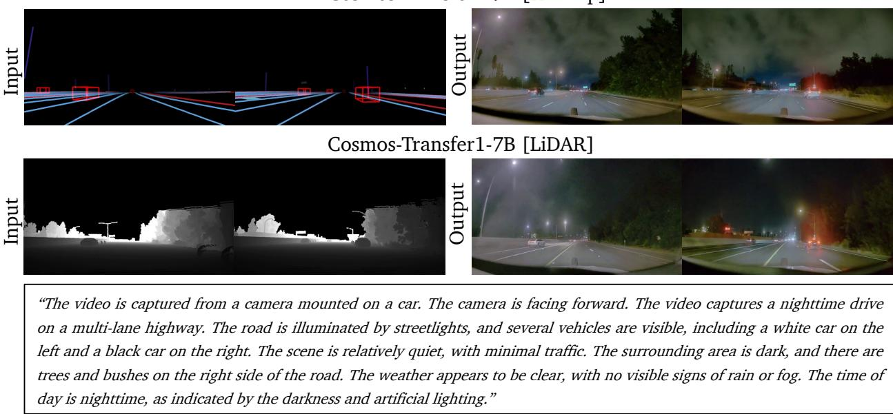

*图4展示了Cosmos-Transfer1在单个模态控制下的生成效果。输入高精地图（HDMap）时，模型准确保持道路布局；输入激光雷达（LiDAR）时，则保留语义细节。模型就像一个‘模态翻译官’，将不同传感器信息转化为连贯视频。*

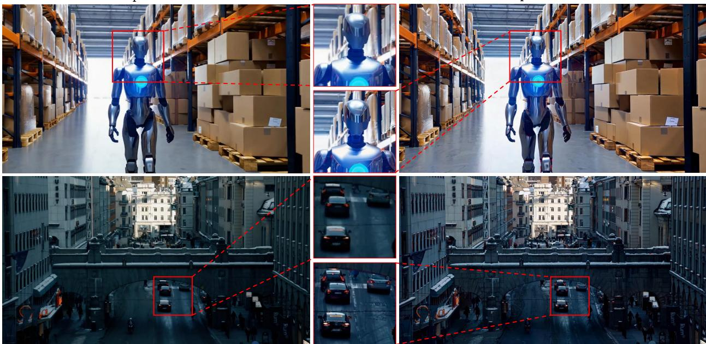

*图5验证了Cosmos-Transfer1的超分辨率能力：它能将720p视频升级到4K分辨率，并添加真实反射和锐化纹理，提升视觉保真度。*

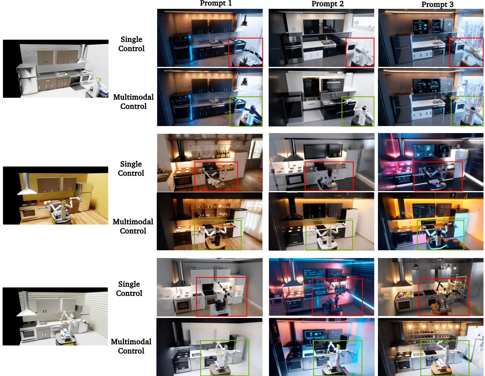

*图8展示了Cosmos-Transfer1在机器人数据生成中的应用。左侧为Isaac Lab模拟的原始视频，右侧为模型利用不同条件模态和时空控制图生成的结果，为机器人训练提供多样化数据。*

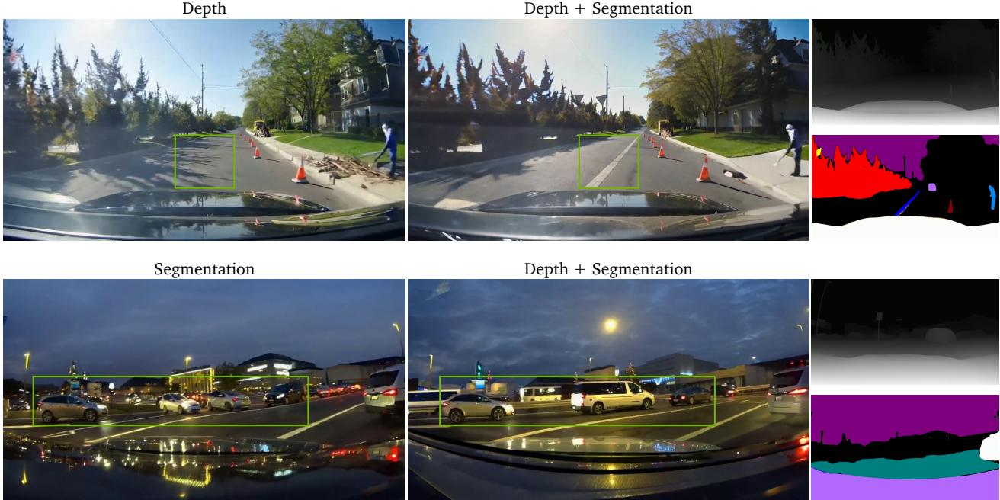

*图9对比了单模态（深度或分割）与多模态控制的效果。高亮区域显示，同时使用深度和分割条件能显著提升生成细节，体现多控制信号协同的优势。*

## 相关工作与定位

**结论：Cosmos-Transfer1 并非另起炉灶，而是将 ControlNet 可控生成范式向“视频世界模型”时代做出的系统性重铸。它站在三条技术肩膀上：架构层面，ControlNet 从 UNet 到 DiT 的迁移路线；能力层面，Cosmos-Predict1 提供逼真时序先验；应用验证层面，DepthAnything 等工具与 Sim2Real 扩散方法为多模态条件生成扫清了工程与论证障碍。这一定位决定了它的贡献不是范式发明，而是工程化泛化与多模态融合。**

要理解它在研究谱系中的位置，最直观的方式是看一条从二维静态控制通往三维时空控制的演进脉络（如下图）。图的横向主线给出了架构迁移的节点：原始 ControlNet（Zhang et al., 2023）→ DiT-ControlNet（Chen et al., 2024）→ 本工作 Cosmos-Transfer1；纵向则注入基础模型先验与辅助工具。

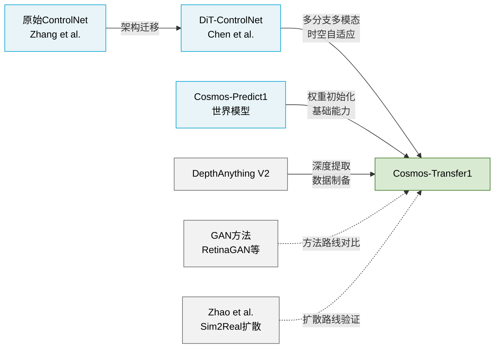
*图：Cosmos-Transfer1 的研究谱系图，横向为 ControlNet 范式迁移，纵向为基础模型与工具支撑，虚线为背景对比方法。*

**基石：ControlNet 的“外挂式”控制范式**。Zhang et al. 在 ICCV 2023 提出的原始 ControlNet 提供了一套优雅的设计（直觉，非严格对应：像给已训练好的画家一支“结构描线笔”，画家无需重新学习绘画，只需参照描线调整笔触）。其核心要素——**冻结基础模型权重**、通过**零初始化线性层**注入条件的可训练编码器分支——被 Cosmos-Transfer1 原样继承。区别在于，原始设计针对的是 UNet 架构的静态图像，而 Cosmos-Transfer1 面对的是一段段带有时空约束的视频。因此，继承的同时必须改造：零初始化策略虽然保留，但编码器不再是单分支，而是扩展为多模态多分支，并需处理时序维度上的控制信号传播。

**桥梁：从 UNet 到 DiT 的第一次跨越**。Chen et al. 在 2024 年的工作像一座关键的桥梁——首次将 ControlNet 范式从 UNet 搬到 Transformer（DiT）架构上。这验证了一个重要假设：基于 transformer 块的控制注入（输出经线性层直接加到主分支的中间特征）同样能保持条件控制的精度，而不必沿用 UNet 中的空间拼接方式。Cosmos-Transfer1 直接受益于这一发现，但其迈出的关键一步是**从“一主干一控制分支”变为“多分支并行、推理时自适应融合”**，使得深度、分割、边缘等异构信号可以像多个插件同时插入同一个生成引擎，并由网络自身学习何时、何处更信赖哪一种信号。

**底土与工具：世界模型先验与自动化标注**。任何条件控制方法若没有强大的预训练基础模型作为“底土”，都难以生成逼真结果。Cosmos-Predict1（NVIDIA, 2025）不仅提供了 5 秒 720p 的高质量视频生成权重，还附带了一整套 56K token 的视频分词配置与高质量微调数据集，这成为 Cosmos-Transfer1 的直接生长土壤——所有的控制分支均继承自该模型的权重初始化。与此同时，DepthAnything V2 扮演了“无标注监督员”角色：训练数据的稠密深度图全部由它生成（无需额外传感器），评估时它又被用作深度对齐的度量器（Depth si-RMSE）。这一自动化的数据管线使多模态条件训练变得可行且低成本。

**场景定位：Physical AI 为什么需要它**。早期将仿真图像转为真实风格的 Sim2Real 工作（如 RetinaGAN）依赖 GAN 和强化学习辅助信号来保持时序稳定；Zhao et al., 2024 则先一步将扩散+ControlNet 路线用于驾驶单帧图像，证明了该方法在保真与多样性上优于 GAN。Cosmos-Transfer1 将战场从单帧推向了**视频级别的、结构保真的多模态条件生成**，瞄准的是机器人与自动驾驶等 Physical AI 场景。这些场景不仅要求“画得像”，更要求“几何不扭曲、时序不抖动、条件多模态可控”——而这正是 ControlNet 多分支设计在物理世界中的适配难题。论文通过与 RetinaGAN 的定性对比，以及引用 Zhao et al. 的路线验证，将自己牢牢卡位在“扩散+ControlNet”这一技术路线的物理应用端。

**诚实看待论文的声称**。需要指出，论文并未声称发明了全新的生成范式：其零初始化、冻结基础模型、条件编码器分支的设计均直接沿用自 ControlNet 与 DiT-ControlNet；深度图提取完全依赖 DepthAnything V2，基础模型来自 Cosmos-Predict1。论文证明的核心是：通过 **“多分支并行 + 时空自适应权重”** ，可以将这些已有零件高效组装成一个适用于多模态、长序列、物理场景的 7B 级视频世界模型，并且这一组合在 Physical AI 的控制精度与多样性上超越了单一条件分支或早期方法。是否存在对其他可能相关工作（如更近期的视频 ControlNet 变体）的遗漏对比？论文没有展开讨论，这是一处读者可以留意的开放区。

## 研究探索历程

研究团队面对的核心命题宏大而具体：**如何让一个大规模视频扩散世界模型，既能理解多种空间控制信号（深度、分割、边缘、可见度等），又能在推理时像调音台一样自由组合这些控制力？** 这个目标隐含了两层痛点：单一模态控制（如只用深度）往往顾此失彼——保住了结构就丢了语义，而想要多模态协同，就要直面模型架构和训练策略上的双重挑战。下面的流程图勾勒了从问题到解决方案的关键探索节点：

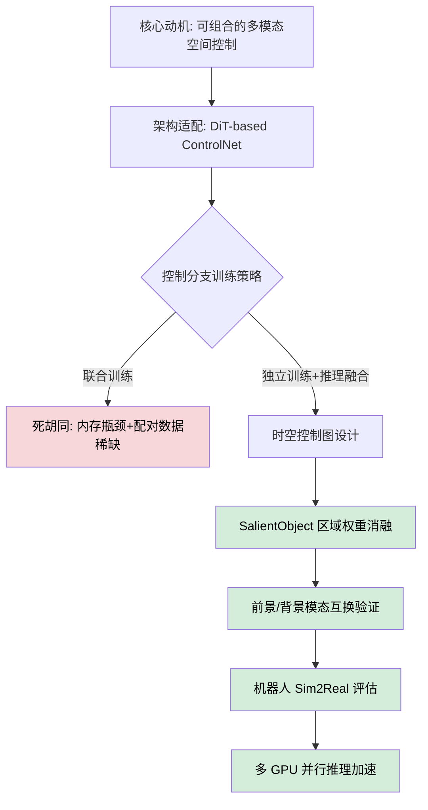

**如何阅读这张图**：整个探索分为两大阶段——先打好架构地基（Q2），再攻下多模态融合的策略堡垒（D1→D2）；红底节点标记了一条被放弃的“联合训练”死胡同，绿底节点则是依次推进的实验验证与应用固巩。

### 地基：让 ControlNet 在 DiT 上“重生”

传统 ControlNet 的跳连接是为 UNet 的卷积结构量身定做的，而 Cosmos-Transfer1 的底层模型 Cosmos-Predict1 使用的是 DiT（Diffusion Transformer）架构。这并非简单的“换底座”——Transformer 层间没有 UNet 那样的编码器-解码器跳连接，条件信息无法直接“夹带”进去。研究团队做出的方向转变（pivot）是：在 DiT 中构建由 **3 个 Transformer 条件块**组成的控制分支，每个块的参数直接从基模型对应块初始化，其输出通过一层 **零初始化线性层** 加回到基模型激活上。这个设计保持了训练初期的稳定（零初始化意味着初始条件注入量为零，不干扰原始生成流），同时为后续多模态分支的独立训练铺平了道路。

### 分治，而非大熔炉：训练策略的取舍

面对多个控制分支（深度、分割、边缘、可见度共四条），最直接的想法或许是把所有模态的数据和分支塞进一次联合训练——让模型自己去发现模态间的协同效应。然而这条路径被现实两堵墙挡了回去：

- **内存墙**：大规模视频联合训练时，多条控制分支同时驻留在显存中，开销远超工程可行边界。
- **数据墙**：某些模态（例如带密集 HD 地图标注的驾驶视频）的配对多模态数据极其稀缺。强行要求所有模态对齐，会使可用训练数据量急剧萎缩。

这个死胡同（dead end）的教训很清楚：**分治策略不仅把内存压力降到了单分支量级，还允许每个模态使用最适合自己的独立数据集**。推理时再通过“时空控制图”灵活组合，反而获得了随意增减模态、动态分配权重的额外收益——这种灵活性恰恰是联合训练难以保证的。

### 调音台：时空控制图与精细操控

独立训练后的融合不是简单的平均投票。研究团队引入了一个关键抽象：**时空控制图**，它可以在不同空间位置、不同时间步上为不同模态分配不同权重。生成方式设计为三种层级：手写常数（最简单的均匀基线）、基于先验观测的启发式规则（如 SalientObject 算法自动识别前景/背景），以及神经网络预测——实验重点验证了启发式方式的效力。

两组定量消融直接展示了这种“调音台”的灵巧性。**前景可见度权重递增时，前景区域的模糊度指标呈严格单调改善；背景深度权重递增时，深度误差单调下降**，两项相关性的 Pearson 系数均逼近理论极值（±1）。更极端的验证来自“前景/背景模态互换实验”：把原本用于前景的可见度+边缘控制切换到背景，前景的质量随即下降，而背景的相应指标显著提升——同时，生成多样性的 LPIPS 指标在前、背景方向上也发生方向性反转。这证明空间自适应权重不是被动的“涂抹”，而是一把能对每个区域分别收紧或放松生成约束的雕刻刀。

### 落地验证：从机器人 Sim2Real 到实时推理

有了一把好工具，自然要看它能否在真实痛点中见效。机器人仿真与真实场景之间的域差（光照、纹理、背景）是一个经典硬骨头。在多模态时空控制图的作用下，Cosmos-Transfer1 能够以较高的形态一致性（前景机器人掩码 mIoU）将仿真视频“转译”为更富真实感和多样性的视觉输出，整体质量领先所有单模态配置。<!--ref:r-cosmos-transfer1-condi--><!--anchor:quote:Cosmos%2DTransfer1%3A%20Conditional%20World%20Generation%20with%20Adaptive%20Multimodal%20Control-->

最后，一项至关重要但常被忽视的工程化探索是将这个 7B 参数模型推向实时。利用 GB200 NVL72 系统的 any-to-any NVLink 与高带宽内存特性，团队将扩散阶段计算分布到多达 64 张 GPU 上，实现了近线性的加速，端到端推理时长首次低于视频播放时长，打通了实时应用的最后一段链路。

> 整个研究路径折射出一条可复用的思路：**把不可行的大熔炉训练拆成可扩展的独立分支，把融合的智能放到推理侧的轻量级时空控制图上，再用并行化压缩时间成本**。每一步都扎实回应了从架构到落地的真实约束。

## 工程与复现要点

Cosmos-Transfer1 的工程实现始终贯穿着一条主线：**大模型主干冻结，轻量控制分支可独立训练、推理时灵活组合**。这种“外挂插件”式的架构大幅降低了多模态扩展的显存与数据门槛，但复现者仍然需要迈过两道坎：极其昂贵的训练算力，以及核心模块尚未完整开源的现实。下面的流程图浓缩了从训练到推理的整体流水线，读者可以先建立全局印象，再逐一拆解各个工程要点。

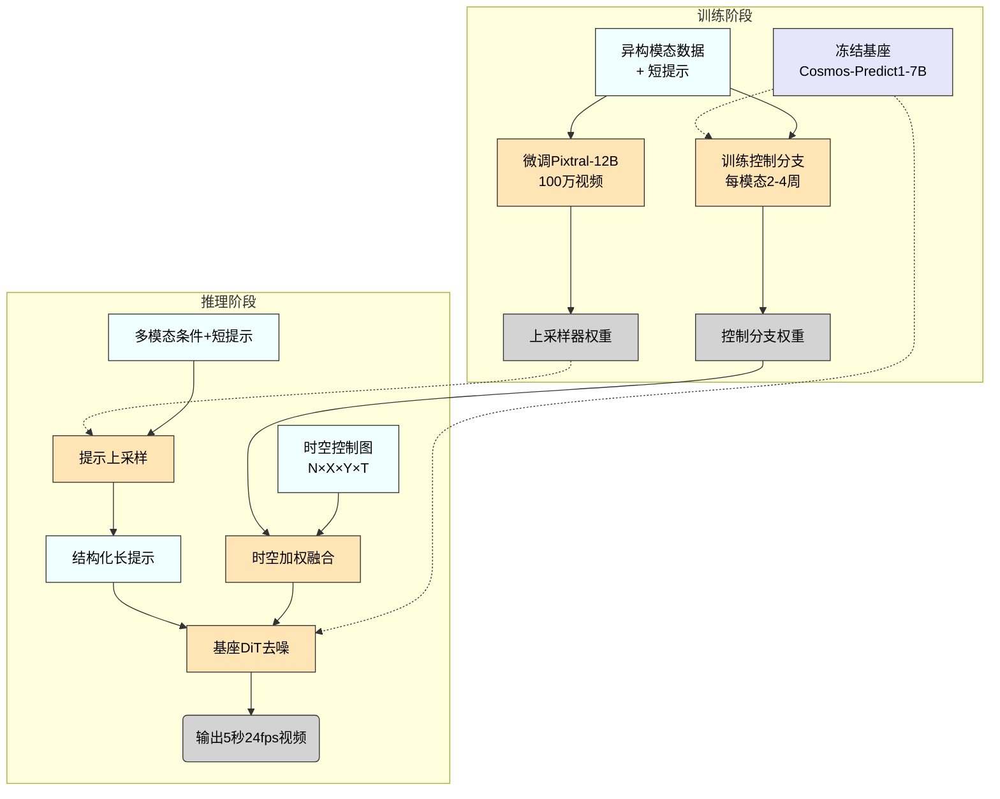

**如何读这张图**：上半部分为训练阶段，所有控制分支与提示上采样器均不更新基座参数（虚线），各自吸收异构数据独立产出权重；下半部分为推理阶段，控制分支权重与上采样器权重被按需加载，在时空控制图的调节下融合，最终驱动冻结的基座生成视频。

### 模型规模与关键结构

基座是 **Cosmos-Predict1-7B-Video2World**，一个 7B 参数的扩散变换器，原生输出 5 秒、1280×704 分辨率、24 fps 的视频。每个控制分支仅包含 **3 个条件 Transformer 块**，与之相比堪称“轻量插件”。这些侧分支的输出经过一个 **零初始化线性层** 注入到主干对应 Transformer 块的激活中——这一技巧的关键收益是：训练之初控制信号几乎为零，完全不会破坏基座已编码的生成知识。推理时，你可以通过 **时空控制图** $$\mathbf{w} \in \mathbb{R}^{N \times X \times Y \times T}$$ 为任意模态、任意空间位置、任意帧分配独立权重，超出 1 时自动归一化，从而在像素级实现“哪些区域该听谁的”精细调度。

### 训练管线与超参

训练严格遵循“冻大训小”原则：**基座权重全程冻结**，各控制分支分别使用 **1024 块 NVIDIA H100**，依据模态学习难度训练 **2 至 4 周**。这一策略的显式意图是节省显存（每次只需加载一个分支），同时允许不同分支使用结构完全不同的训练数据。例如，深度分支可以吃合成的室内场景，而激光雷达分支直接注射真实的自动驾驶采集数据（如 RDS-HQ 数据集，包含 65K 条 20 秒环视视频与 HD 地图标注）——互不污染。

同样不可忽视的是 **提示上采样器** 的独立训练：基于微调过的 **Pixtral-12B**，为每类模态准备 **100 万条视频**，与多模态数据联合训练 **1 个 epoch**，分布式框架采用 **FSDP2**。其训练数据中的短提示由 **Gemma-2-9B-it** 反向“压缩”长描述生成，从而构建出完整的长-短提示对，相当于教会模型“如何把工程师的潦草几笔扩写成符合基座胃口的详细段落”。

### 环境与依赖矩阵

训练侧需要 PyTorch + FSDP2 驱动上千张 H100 集群；官方实时推理演示则跑在 **NVIDIA GB200 NVL72** 机架上（72 块 B200 GPU，每块最高 192 GB HBM，借助 any-to-any NVLink 互联）。除基础框架外，复现时还必须拉齐一系列感知模型依赖：
<details>
<summary><strong>关键依赖清单（点击展开）</strong></summary>

- **DepthAnything2**：视频逐帧深度估计，归一化到 [0,1]
- **GroundingDINO + SAM2**：开放集目标检测与视频实例分割，用于提取掩码和自动权重生成
- **Real-ESRGAN**：超分训练中的数据退化增强
- **StreamPetr + Hydra-MDP**：自动驾驶感知评估中的 3D 目标检测
- **DOVER / LPIPS**：视频感知质量与生成多样性评估
- **bilateral blur / Canny 边缘检测**：训练期间的在线数据增强

</details>

### 代码开源现状

开源仓库（[cosmos-transfer1](https://github.com/nvidia-cosmos/cosmos-transfer1)，commit `5005e82`）目前已放出 **4K 超分模块**（采用 3×3 网格重叠平均的无缝拼接策略）和 **提示上采样器** 的相关实现。然而，截至该快照，**多模态自适应控制分支的构建与训练逻辑、时空控制图的生成算法，以及 GB200 上的并行推理策略**等核心模块，在仓库中均标注为“未找到”。现阶段若想完整复现，团队可能需要自行实现论文 Sec 3 描述的控制分支注入机制与自适应融合算法，并做好调通大规模训练流水线的准备。

## 局限与适用边界

Cosmos-Transfer1 更像是为重型多模态控制任务定制的工业设备，而非即插即用的消费级生成器。极高的训练门槛、固化的模态融合策略、半自动的控制链路、刚性的输出规格，以及深度绑定的专有数据与推理硬件，共同划定了它的能力边界：它适合算力充裕、追求创意多模态交互的研究团队，但在轻量化部署、实时交互、长视频叙事或强单模态对齐的场景中会遭遇显著阻碍。以下逐项拆解这些约束。

### 训练资源的“巨兽”门槛

单控制分支的完整训练就需要 1024 张 H100 GPU 持续跑 2 到 4 周，这让哪怕是微调都成为头部机构的专利。更深远的问题是，各模态分支是**独立训练**后拼装的，无法像端到端模型那样让深度、语义、运动等信息在训练中相互“看见”并自动学会协同——好比几位工匠闭门打造零件，最终组装时才发现彼此缺乏联动补偿，跨模态的深层协同信号就这样被错失。即便未来要走向联合优化，所需算力只会更加庞大。

### 多模态融合的“稀释”效应

当同时使用深度、模糊、语义等多种控制时，系统默认采用均匀权重，相当于把总引导力平均分给每个模态。形象地说，就像多声源混音时每个频道只能分配很小的音量，导致原本最需要的那个主导信号被弱化。这直接反映在输出中：单模态下的结构相似度等对齐指标会明显高于多模态混合配置，论文也如实记录了这种折损。如果你的场景对某一种控制精度极为敏感，盲目叠加模态反而可能适得其反——而目前还没有可端到端训练的自动权重预测器，所有模态的权重都得靠人工调试，决定了它还不是一个“智能调度”方案。

<details><summary><strong>为何均匀权重会“牺牲”单模态精度？</strong></summary>
在每一步去噪过程中，模型依赖各控制分支给出的梯度来约束生成。若四种控制各分得四分之一权重，则每个模态施加的引导力只有单模态时的四分之一；对于需要强约束的物体边缘、纹理保持等场景，多模态融合就显得“心有余而力不足”。若未来能引入可训练的注意力式融合，让模型根据上下文动态分配权重，这一瓶颈有望缓解。但论文中的均匀权重只是当前默认策略，并未与自动学习的最优策略进行对比。
</details>

### 时空控制的半自动化之痛

控制图的好坏直接决定生成质量，但它的生成链路离“全自动”还有明显距离。用于显著性加权的 SalientObject 算法需要调用 GPT-4 这类 VLM 对分割结果做前／背景分类，既拖长了预处理流水线，又埋下 VLM 误判的隐患——一旦前景被误判为背景，关键物体的运动强度就会被错误压制。同时，深度图在无边纹理的远景区域（如天空、白墙）几乎失去约束力，这些位置的几何对齐很难保证。多个半自动环节层层叠加，意味着“指哪打哪”的精细化控制目前仍无法脱离人工校验。

### 刚性的输出格式与超分折损

模型原生只输出 1280×704 像素、24 帧每秒、5 秒时长的视频（对应 56K tokens）。想要更长的叙事、更多样的分辨率和帧率？原生模型做不到。4K 超分模块只是通过 3×3 分块推理再将重叠区取平均来“拼图”，这种操作天然会在块边界引入轻微模糊，类似图像拼接时对重叠区进行羽化，而视频长度依然无法改变。因此，它在需要原生可变格式（如长镜头、竖屏短视频）的产品中只能充当一个中间件，而非端到端方案。

### 专有数据与推理硬件绑定

部分模型变体（如 Cosmos-Transfer1-7B-Sample-AV）完全绑死在专有的 RDS-HQ 数据集上——该数据集包含 360 小时高质量自动驾驶视频、同步 LiDAR 与人工 QA 标注，构建成本极高，社区几乎不可能复现或迭代。推理侧同样苛刻：为达到流畅生成，它重度依赖 NVIDIA GB200 NVL72 机架（64 张 B200 GPU），端到端延迟约 4.2 秒，硬件要求远高于主流云 GPU 实例，严重限制了其向边缘或中小规模业务迁移的可能。

### 透明度与未知风险

判断模型能否落地，失败案例与消融研究的价值不亚于精选的成功示例。但截至目前，论文尚未系统性披露负结果或消融实验，例如当多个控制信号强烈冲突时模型如何行为？去掉某一模态后其余模态是否出现异常代偿？缺乏这类信息，任何“代表性”展示都可能隐含樱桃挑选。建议在引入自身业务前，务必围绕目标场景的压力点进行充分的对抗评测，而不应仅凭论文中的精选案例做决策。

## 趋势定位与展望

**结论：** Cosmos-Transfer1 在“条件世界生成”技术路线上，扮演着从单一控制迈向多模态、时空精细控制的“集成者”与“架桥人”角色。它的核心意义在于通过“独立训练+推理融合”的架构创新，把 ControlNet 范式成功从 UNet 单图片控制，推进到 DiT 视频多模态控制，同时用一张**时空控制图**化解了控制精度与生成多样性在空间上的固有矛盾。面向未来，这条路线有望向更自动化的模态组合、物理闭环交互以及更广义的世界模拟器演进。

### 技术路线的定位：多模态 ControlNet 的“时序化＋自适应”范式跳点

回溯脉络，ControlNet（R1）最先在 UNet 上实现了“冻结基座、外挂可训练编码器”的优雅控制范式，但它局限于单张图像和单一条件。DiT-ControlNet（R2）把这一思想搬到 Transformer 架构上，但依然只处理单模态、缺乏跨条件的灵活协同。Cosmos-Transfer1 借助 Cosmos-Predict1（R3）的预训练世界模型，**第一次在视频 DiT 上同时接入多条独立控制分支**（边缘、深度、分割、视觉模糊等），并且**各分支的训练彼此解耦**——这就是“独立训练+推理融合”。  
**直觉比喻（非严格对应）**：可以把每个模态控制分支想象成独立录制的乐器轨道（鼓、贝斯、人声），Cosmos-Transfer1 的推理阶段就是一个混音台，时空控制图则是那张随时间和空间变化的“调音表”——你可以在前景强调边缘（保持物体形态），在背景加大分割权重（让路面纹理更富变化），而不必从头重录整首曲子。

这一设计直接回应了两个关键痛点：  
- **多模态同时训练的内存爆炸**（C5）：分支独立训练使显存开销与单模态几乎持平，且不受制于多模态数据必须严格配对的要求。  
- **缺乏区域差异化的控制能力**（C4）：时空控制图允许前景/背景、不同帧、不同空间区域施加完全不同的模态混合权重，突破了以往全局均匀加权的限制。

### 意义：为 Physical AI 打造了一种“可控数据引擎”

在方法论层面，Cosmos-Transfer1 证明了大模型时代的 ControlNet 可以“纵向做深”（视频时序）、“横向做宽”（多模态），并且这种扩展不需要以牺牲训练效率为代价。在应用层面，它精准击中了 Physical AI 的两大困境：高质量真实场景数据稀缺（C3）与 Sim2Real 域差（C1）。合成渲染能免费提供深度、分割等完美真值，但这些“条件图”与真实视频之间存在巨大的纹理和光照鸿沟；Cosmos-Transfer1 充当了一个**结构保留、纹理写实**的“转译器”——将简笔画式的合成条件，重绘成具高度真实感的连续视频。相比早期 GAN 方案（R5），扩散模型在保持物理合理结构的同时，能输出更丰富的视觉变体（如不同光照、路面材质），这点在论文的区域权重实验中得到了定性印证。

### 局限与未来走向：从“混音台”迈向“自主指挥”

Cosmos-Transfer1 目前的设计基于一个温和假定：**各分支输出在融合时近乎独立、干扰可忽略**（Assumptions）。这在多数场景下成立，但当两个模态提供冲突信号时（例如深度建议车辆在前，分割却将其切为背景），线性叠加就可能导致结构错乱。未来工作极有可能在此引入**交叉注意力或门控网络**，让分支之间能够“协商”，实现更鲁棒的融合。  
此外，时空控制图目前依赖 SalientObject 等规则算法——这更像是一张手绘的草图。下一步自然的演化是结合视觉‑语言模型，用**自然语言描述**直接指挥不同区域的模态权重（“让天空更写意，但让车道线绝对清晰”），大幅降低使用门槛。

更长远地看，Cosmos-Transfer1 将控制条件限制在静态的“视觉地图”上，但一个真正的世界模拟器需要能够响应**动态动作**（油门、转向、关节位移）并保持多步时序一致。把这套自适应多模态控制框架扩展到**交互式世界模型**——接收多模态输入、预测物理合理的下一帧，并以此扩充策略学习的数据飞轮——是演进的必然方向。届时，“控制图”也许就会演变为一个可学习的、端到端的物理规划器，而 Cosmos-Transfer1 提供的独立分支融合范式，恰好为这种复杂性提供了模块化的起点。

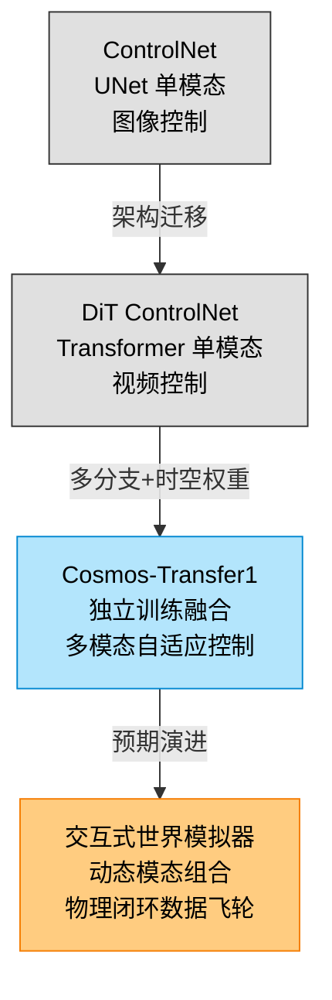

**如何读这张图**：从单模态图像控制，到单模态视频控制，再到本工作的多模态时空自适应控制，整个技术路线正沿着“更丰富的条件、更细粒度的时空操控”方向演进；下一步的必然站台，是让生成过程融入动态交互与物理闭环，使其从“高保真渲染器”进化为“可信的数字孪生孵化器”。