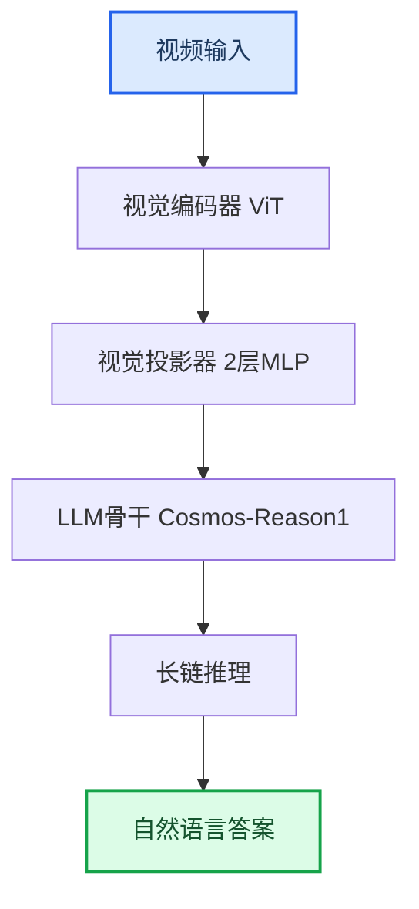
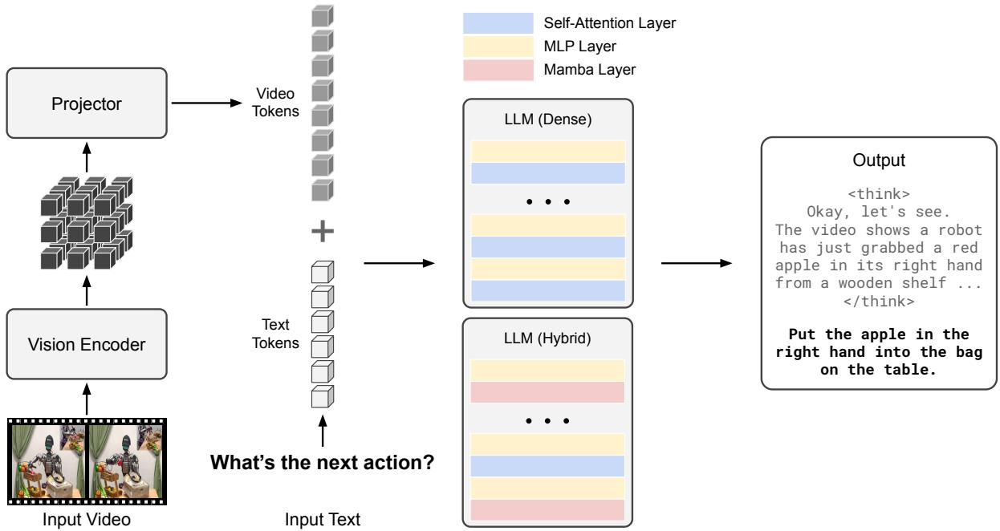
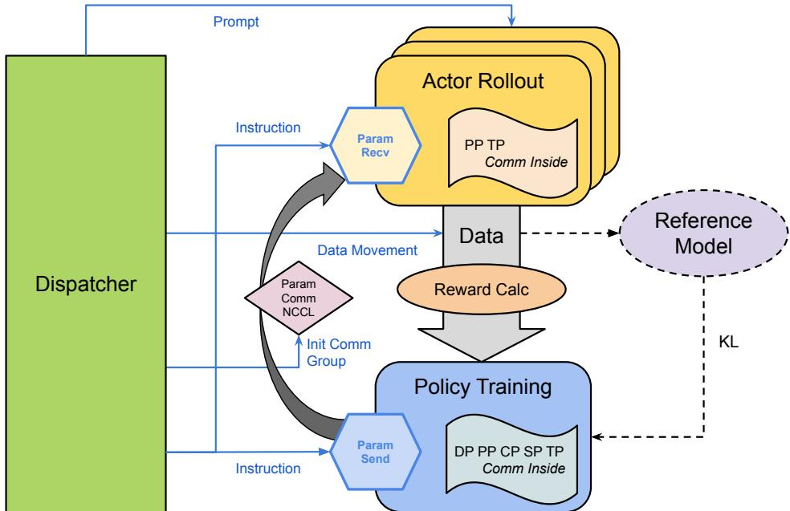
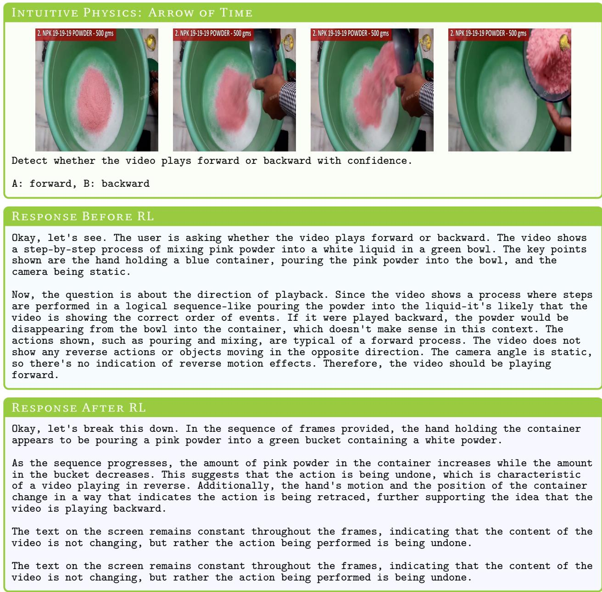

# Cosmos-Reason1: From Physical Common Sense to Embodied Reasoning — 深度解读

> 面向人类读者的深度解读(中文)。事实源与配对的 AI 知识包 `ai_package/2026-06-08_CosmosReason1_2503.15558/ara/` 同源,均已通过数据保真审计。

## 核心结论

> 每条结论后的隐形锚点把数字回链到论文原文(忠实性保证)。

1. 针对物理AI能力的专项监督微调（SFT）使7B模型在物理常识基准平均准确率相对骨干模型提升6.9分、在具身推理基准提升11.0个百分点，使56B模型在物理常识基准提升2.0分、在具身推理基准提升10.2个百分点。<!--ref:r-physical-ai-systems-ne--><!--anchor:quote:Physical%20AI%20systems%20need%20to%20perceive%2C%20understand%2C%20and%20perform%20complex%20actions%20in%20the%20physical%20world.%20In%20this%20paper%2C%20we%20present--><!--ref:r-table-tr-td-methods-t--><!--anchor:quote:%3Ctable%3E%3Ctr%3E%3Ctd%3EMethods%3C%2Ftd%3E%3Ctd%3ESpace%3C%2Ftd%3E%3Ctd%3ETime%3C%2Ftd%3E%3Ctd%3EOther%20Physics%3C%2Ftd%3E%3Ctd%3EAvg.%3C%2Ftd%3E%3C%2Ftr%3E%3Ctr%3E%3Ctd%3EGemini%202.0%20Flash%3C%2Ftd%3E%3Ctd%3E53.8%3C%2Ftd%3E%3Ctd%3E50.0%3C%2Ftd%3E%3Ctd%3E46.9%3C%2Ftd%3E%3Ctd%3E50.2%3C%2Ftd%3E%3C%2Ftr%3E%3Ctr%3E%3Ctd%3EGPT%2D40%3C%2Ftd%3E%3Ctd%3E61.3%3C%2Ftd%3E%3Ctd%3E54.7%3C%2Ftd%3E%3Ctd%3E50.9%3C%2Ftd%3E%3Ctd%3E55.6%3C%2Ftd%3E%3C%2Ftr%3E%3Ctr%3E%3Ctd%3EOpenAI%20o1%3C%2Ftd%3E%3Ctd%3E63.8%3C%2Ftd%3E%3Ctd%3E58.1%3C%2Ftd%3E%3Ctd%3E58.0%3C%2Ftd%3E%3Ctd%3E59.9%3C%2Ftd%3E%3C%2Ftr%3E%3Ctr%3E%3Ctd%3EQwen2.5%2DVL%2D7B%3C%2Ftd%3E%3Ctd%3E48.8%3C%2Ftd%3E%3Ctd%3E56.4%3C%2Ftd%3E%3Ctd%3E37.2%3C%2Ftd%3E%3Ctd%3E47.4%3C%2Ftd%3E%3C%2Ftr%3E%3Ctr%3E%3Ctd%3ENemotron%2DH%2D56B%3C%2Ftd%3E%3Ctd%3E61.3%3C%2Ftd%3E%3Ctd%3E68.1%3C%2Ftd%3E%3Ctd%3E45.1%3C%2Ftd%3E%3Ctd%3E58.2%3C%2Ftd%3E%3C%2Ftr%3E%3Ctr%3E%3Ctd%3ECosmos%2DReason1%2D7B%3C%2Ftd%3E%3Ctd%3E54.2%3C%2Ftd%3E%3Ctd%3E58.7%3C%2Ftd%3E%3Ctd%3E50.0%3C%2Ftd%3E%3Ctd%3E54.3%20%28%2B6.9%29%3C%2Ftd%3E%3C%2Ftr%3E%3Ctr%3E%3Ctd%3ECosmos%2DReason1%2D56B%3C%2Ftd%3E%3Ctd%3E61.3%3C%2Ftd%3E%3Ctd%3E65.5%3C%2Ftd%3E%3Ctd%3E53.9%3C%2Ftd%3E%3Ctd%3E60.2%202%28%2B2.0%29%3C%2Ftd%3E%3C%2Ftr%3E%3C%2Ftable%3E--><!--ref:r-table-tr-td-rowspan-2--><!--anchor:quote:%3Ctable%3E%3Ctr%3E%3Ctd%20rowspan%3D%222%22%3E%3C%2Ftd%3E%3Ctd%20colspan%3D%222%22%3EPhysical%20Common%20Sense%20VQA%3C%2Ftd%3E%3Ctd%20colspan%3D%225%22%3EEmbodied%20Reasoning%3C%2Ftd%3E%3Ctd%20colspan%3D%223%22%3EIntuitive%20Physics%3C%2Ftd%3E%3Ctd%20rowspan%3D%222%22%3ETotal%3C%2Ftd%3E%3C%2Ftr%3E%3Ctr%3E%3Ctd%3EFree%2Dform%3C%2Ftd%3E%3Ctd%3EMCQ%3C%2Ftd%3E%3Ctd%3EBridgeData%20V2%3C%2Ftd%3E%3Ctd%3ERoboVQA%3C%2Ftd%3E%3Ctd%3EAgibot%3C%2Ftd%3E%3Ctd%3EHoloAssist%3C%2Ftd%3E%3Ctd%3EAV%3C%2Ftd%3E%3Ctd%3EPuzzle%3C%2Ftd%3E%3Ctd%3EAoT%3C%2Ftd%3E%3Ctd%3EObject%20Permanence%3C%2Ftd%3E%3C%2Ftr%3E%3Ctr%3E%3Ctd%3EUnderstanding%3C%2Ftd%3E%3Ctd%3E99K%3C%2Ftd%3E%3Ctd%3E1.2M%3C%2Ftd%3E%3Ctd%3E129.2K%3C%2Ftd%3E%3Ctd%3E218.5K%3C%2Ftd%3E%3Ctd%3E19.4K%3C%2Ftd%3E%3Ctd%3E136.3K%3C%2Ftd%3E%3Ctd%3E12.4K%3C%2Ftd%3E%3Ctd%3E%2D%3C%2Ftd%3E%3Ctd%3E%2D%3C%2Ftd%3E%3Ctd%3E%3C%2Ftd%3E%3Ctd%3E1.81M%3C%2Ftd%3E%3C%2Ftr%3E%3Ctr%3E%3Ctd%3EReasoning%3C%2Ftd%3E%3Ctd%3E59.4K%3C%2Ftd%3E%3Ctd%3E605.0K%3C%2Ftd%3E%3Ctd%3E129.1K%3C%2Ftd%3E%3Ctd%3E920.0K%3C%2Ftd%3E%3Ctd%3E19.4K%3C%2Ftd%3E%3Ctd%3E136.3K%3C%2Ftd%3E%3Ctd%3E12.3K%3C%2Ftd%3E%3Ctd%3E11.0K%3C%2Ftd%3E%3Ctd%3E30.0K%3C%2Ftd%3E%3Ctd%3E10.0k%3C%2Ftd%3E%3Ctd%3E1.93M%3C%2Ftd%3E%3C%2Ftr%3E%3C%2Ftable%3E--><!--ref:r-physical-ai-systems-ne--><!--anchor:quote:Physical%20AI%20systems%20need%20to%20perceive%2C%20understand%2C%20and%20perform%20complex%20actions%20in%20the%20physical%20world.%20In%20this%20paper%2C%20we%20present--><!--ref:r-sub-physical-sub-sub--><!--anchor:quote:%3Csub%3EPhysical%3C%2Fsub%3E%20%3Csub%3ECommon%3C%2Fsub%3E%20%3Csub%3ESense%3C%2Fsub%3E%20%3Csub%3ERL%3C%2Fsub%3E%20%3Csub%3EData.%3C%2Fsub%3E%20We%20collect%205133%20human%20annotated%20binary%20and%20multiple%2Dchoice%20questions%20from%201989%20videos.%20To%20help%20control--><!--ref:r-table-tr-td-models-td--><!--anchor:quote:%3Ctable%3E%3Ctr%3E%3Ctd%3EModels%3C%2Ftd%3E%3Ctd%3EBridgeData%20V2%3C%2Ftd%3E%3Ctd%3ERoboVQA%3C%2Ftd%3E%3Ctd%3EAgibot%3C%2Ftd%3E%3Ctd%3EHoloAssist%3C%2Ftd%3E%3Ctd%3EAV%3C%2Ftd%3E%3Ctd%3ERoboFail%3C%2Ftd%3E%3Ctd%3EAvg.%3C%2Ftd%3E%3C%2Ftr%3E%3Ctr%3E%3Ctd%3EGemini%202.0%20Flash%3C%2Ftd%3E%3Ctd%3E25.0%3C%2Ftd%3E%3Ctd%3E78.2%3C%2Ftd%3E%3Ctd%3E29.0%3C%2Ftd%3E%3Ctd%3E44.0%3C%2Ftd%3E%3Ctd%3E37.0%3C%2Ftd%3E%3Ctd%3E67.0%3C%2Ftd%3E%3Ctd%3E46.7%3C%2Ftd%3E%3C%2Ftr%3E%3Ctr%3E%3Ctd%3EGPT%2D40%3C%2Ftd%3E%3Ctd%3E42.0%3C%2Ftd%3E%3Ctd%3E71.8%3C%2Ftd%3E%3Ctd%3E32.0%3C%2Ftd%3E%3Ctd%3E65.0%3C%2Ftd%3E%3Ctd%3E46.0%3C%2Ftd%3E%3Ctd%3E63.0%3C%2Ftd%3E%3Ctd%3E53.3%3C%2Ftd%3E%3C%2Ftr%3E%3Ctr%3E%3Ctd%3EOpenAI%20o1%3C%2Ftd%3E%3Ctd%3E42.0%3C%2Ftd%3E%3Ctd%3E80.0%3C%2Ftd%3E%3Ctd%3E44.0%3C%2Ftd%3E%3Ctd%3E63.0%3C%2Ftd%3E%3Ctd%3E37.0%3C%2Ftd%3E%3Ctd%3E61.0%3C%2Ftd%3E%3Ctd%3E54.5%3C%2Ftd%3E%3C%2Ftr%3E%3Ctr%3E%3Ctd%3EQwen2.5%2DVL%2D7B%3C%2Ftd%3E%3Ctd%3E38.0%3C%2Ftd%3E%3Ctd%3E82.5%3C%2Ftd%3E%3Ctd%3E40.4%3C%2Ftd%3E%3Ctd%3E50.0%3C%2Ftd%3E%3Ctd%3E36.0%3C%2Ftd%3E%3Ctd%3E57.6%3C%2Ftd%3E%3Ctd%3E50.8%3C%2Ftd%3E%3C%2Ftr%3E%3Ctr%3E%3Ctd%3ENemotron%2DH%2D56B%3C%2Ftd%3E%3Ctd%3E37.0%3C%2Ftd%3E%3Ctd%3E77.2%3C%2Ftd%3E%3Ctd%3E37.0%3C%2Ftd%3E%3Ctd%3E65.0%3C%2Ftd%3E%3Ctd%3E41.0%3C%2Ftd%3E%3Ctd%3E64.0%3C%2Ftd%3E%3Ctd%3E53.5%3C%2Ftd%3E%3C%2Ftr%3E%3Ctr%3E%3Ctd%3ECosmos%2DReason1%2D7B%3C%2Ftd%3E%3Ctd%3E58.8%3C%2Ftd%3E%3Ctd%3E83.8%3C%2Ftd%3E%3Ctd%3E49.4%3C%2Ftd%3E%3Ctd%3E63.0%3C%2Ftd%3E%3Ctd%3E55.6%3C%2Ftd%3E%3Ctd%3E60.0%3C%2Ftd%3E%3Ctd%3E61.8%20%28%2B11.0%29%3C%2Ftd%3E%3C%2Ftr%3E%3Ctr%3E%3Ctd%3ECosmos%2DReason1%2D56B%3C%2Ftd%3E%3Ctd%3E65.0%3C%2Ftd%3E%3Ctd%3E80.0%3C%2Ftd%3E%3Ctd%3E47.6%3C%2Ftd%3E%3Ctd%3E57.8%3C%2Ftd%3E%3Ctd%3E65.8%3C%2Ftd%3E%3Ctd%3E66.2%3C%2Ftd%3E%3Ctd%3E63.7%20%28%2B10.2%29%3C%2Ftd%3E%3C%2Ftr%3E%3C%2Ftable%3E-->
2. 在Physical AI SFT基础上，利用规则化可验证奖励进行强化学习后训练，Cosmos-Reason1-7B整体综合平均准确率进一步提升5.0分（从60.7提升至65.7），直觉物理平均准确率进一步提升7.0分。<!--ref:r-cosmos-reason1-from-ph--><!--anchor:quote:Cosmos%2DReason1%3A%20From%20Physical%20Common%20Sense%20To%20Embodied%20Reasoning--><!--ref:r-physical-ai-systems-ne--><!--anchor:quote:Physical%20AI%20systems%20need%20to%20perceive%2C%20understand%2C%20and%20perform%20complex%20actions%20in%20the%20physical%20world.%20In%20this%20paper%2C%20we%20present--><!--ref:r-table-tr-td-rowspan-2--><!--anchor:quote:%3Ctable%3E%3Ctr%3E%3Ctd%20rowspan%3D%222%22%3E%3C%2Ftd%3E%3Ctd%20colspan%3D%222%22%3EPhysical%20Common%20Sense%20VQA%3C%2Ftd%3E%3Ctd%20colspan%3D%225%22%3EEmbodied%20Reasoning%3C%2Ftd%3E%3Ctd%20colspan%3D%223%22%3EIntuitive%20Physics%3C%2Ftd%3E%3Ctd%20rowspan%3D%222%22%3ETotal%3C%2Ftd%3E%3C%2Ftr%3E%3Ctr%3E%3Ctd%3EFree%2Dform%3C%2Ftd%3E%3Ctd%3EMCQ%3C%2Ftd%3E%3Ctd%3EBridgeData%20V2%3C%2Ftd%3E%3Ctd%3ERoboVQA%3C%2Ftd%3E%3Ctd%3EAgibot%3C%2Ftd%3E%3Ctd%3EHoloAssist%3C%2Ftd%3E%3Ctd%3EAV%3C%2Ftd%3E%3Ctd%3EPuzzle%3C%2Ftd%3E%3Ctd%3EAoT%3C%2Ftd%3E%3Ctd%3EObject%20Permanence%3C%2Ftd%3E%3C%2Ftr%3E%3Ctr%3E%3Ctd%3EUnderstanding%3C%2Ftd%3E%3Ctd%3E99K%3C%2Ftd%3E%3Ctd%3E1.2M%3C%2Ftd%3E%3Ctd%3E129.2K%3C%2Ftd%3E%3Ctd%3E218.5K%3C%2Ftd%3E%3Ctd%3E19.4K%3C%2Ftd%3E%3Ctd%3E136.3K%3C%2Ftd%3E%3Ctd%3E12.4K%3C%2Ftd%3E%3Ctd%3E%2D%3C%2Ftd%3E%3Ctd%3E%2D%3C%2Ftd%3E%3Ctd%3E%3C%2Ftd%3E%3Ctd%3E1.81M%3C%2Ftd%3E%3C%2Ftr%3E%3Ctr%3E%3Ctd%3EReasoning%3C%2Ftd%3E%3Ctd%3E59.4K%3C%2Ftd%3E%3Ctd%3E605.0K%3C%2Ftd%3E%3Ctd%3E129.1K%3C%2Ftd%3E%3Ctd%3E920.0K%3C%2Ftd%3E%3Ctd%3E19.4K%3C%2Ftd%3E%3Ctd%3E136.3K%3C%2Ftd%3E%3Ctd%3E12.3K%3C%2Ftd%3E%3Ctd%3E11.0K%3C%2Ftd%3E%3Ctd%3E30.0K%3C%2Ftd%3E%3Ctd%3E10.0k%3C%2Ftd%3E%3Ctd%3E1.93M%3C%2Ftd%3E%3C%2Ftr%3E%3C%2Ftable%3E--><!--ref:r-table-tr-td-models-td--><!--anchor:quote:%3Ctable%3E%3Ctr%3E%3Ctd%3EModels%3C%2Ftd%3E%3Ctd%3ECommon%20Sense%3C%2Ftd%3E%3Ctd%3EBridgeData%20V2%20RoboVQA%20Agibot%3C%2Ftd%3E%3Ctd%3E%3C%2Ftd%3E%3Ctd%3E%3C%2Ftd%3E%3Ctd%3EHoloAssist%3C%2Ftd%3E%3Ctd%3EAV%3C%2Ftd%3E%3Ctd%3ERoboFail%3C%2Ftd%3E%3Ctd%3EAvg.%3C%2Ftd%3E%3C%2Ftr%3E%3Ctr%3E%3Ctd%3ECosmos%2DReason1%2D7B%3C%2Ftd%3E%3Ctd%3E54.3%3C%2Ftd%3E%3Ctd%3E58.8%3C%2Ftd%3E%3Ctd%3E83.8%3C%2Ftd%3E%3Ctd%3E49.4%3C%2Ftd%3E%3Ctd%3E63.0%3C%2Ftd%3E%3Ctd%3E55.6%3C%2Ftd%3E%3Ctd%3E60.0%3C%2Ftd%3E%3Ctd%3E60.7%3C%2Ftd%3E%3C%2Ftr%3E%3Ctr%3E%3Ctd%3E%2B%20Physical%20AI%20RL%3C%2Ftd%3E%3Ctd%3E56.2%3C%2Ftd%3E%3Ctd%3E73.5%3C%2Ftd%3E%3Ctd%3E86.8%3C%2Ftd%3E%3Ctd%3E54.2%3C%2Ftd%3E%3Ctd%3E60.0%3C%2Ftd%3E%3Ctd%3E67.0%3C%2Ftd%3E%3Ctd%3E62.0%3C%2Ftd%3E%3Ctd%3E65.7%20%28%2B5.0%29%3C%2Ftd%3E%3C%2Ftr%3E%3C%2Ftable%3E--><!--ref:r-table-tr-td-models-td--><!--anchor:quote:%3Ctable%3E%3Ctr%3E%3Ctd%3EModels%3C%2Ftd%3E%3Ctd%3ECommon%20Sense%3C%2Ftd%3E%3Ctd%3EBridgeData%20V2%20RoboVQA%20Agibot%3C%2Ftd%3E%3Ctd%3E%3C%2Ftd%3E%3Ctd%3E%3C%2Ftd%3E%3Ctd%3EHoloAssist%3C%2Ftd%3E%3Ctd%3EAV%3C%2Ftd%3E%3Ctd%3ERoboFail%3C%2Ftd%3E%3Ctd%3EAvg.%3C%2Ftd%3E%3C%2Ftr%3E%3Ctr%3E%3Ctd%3ECosmos%2DReason1%2D7B%3C%2Ftd%3E%3Ctd%3E54.3%3C%2Ftd%3E%3Ctd%3E58.8%3C%2Ftd%3E%3Ctd%3E83.8%3C%2Ftd%3E%3Ctd%3E49.4%3C%2Ftd%3E%3Ctd%3E63.0%3C%2Ftd%3E%3Ctd%3E55.6%3C%2Ftd%3E%3Ctd%3E60.0%3C%2Ftd%3E%3Ctd%3E60.7%3C%2Ftd%3E%3C%2Ftr%3E%3Ctr%3E%3Ctd%3E%2B%20Physical%20AI%20RL%3C%2Ftd%3E%3Ctd%3E56.2%3C%2Ftd%3E%3Ctd%3E73.5%3C%2Ftd%3E%3Ctd%3E86.8%3C%2Ftd%3E%3Ctd%3E54.2%3C%2Ftd%3E%3Ctd%3E60.0%3C%2Ftd%3E%3Ctd%3E67.0%3C%2Ftd%3E%3Ctd%3E62.0%3C%2Ftd%3E%3Ctd%3E65.7%20%28%2B5.0%29%3C%2Ftd%3E%3C%2Ftr%3E%3C%2Ftable%3E--><!--ref:r-table-tr-td-models-td--><!--anchor:quote:%3Ctable%3E%3Ctr%3E%3Ctd%3EModels%3C%2Ftd%3E%3Ctd%3EBridgeData%20V2%3C%2Ftd%3E%3Ctd%3ERoboVQA%3C%2Ftd%3E%3Ctd%3EAgibot%3C%2Ftd%3E%3Ctd%3EHoloAssist%3C%2Ftd%3E%3Ctd%3EAV%3C%2Ftd%3E%3Ctd%3ERoboFail%3C%2Ftd%3E%3Ctd%3EAvg.%3C%2Ftd%3E%3C%2Ftr%3E%3Ctr%3E%3Ctd%3EGemini%202.0%20Flash%3C%2Ftd%3E%3Ctd%3E25.0%3C%2Ftd%3E%3Ctd%3E78.2%3C%2Ftd%3E%3Ctd%3E29.0%3C%2Ftd%3E%3Ctd%3E44.0%3C%2Ftd%3E%3Ctd%3E37.0%3C%2Ftd%3E%3Ctd%3E67.0%3C%2Ftd%3E%3Ctd%3E46.7%3C%2Ftd%3E%3C%2Ftr%3E%3Ctr%3E%3Ctd%3EGPT%2D40%3C%2Ftd%3E%3Ctd%3E42.0%3C%2Ftd%3E%3Ctd%3E71.8%3C%2Ftd%3E%3Ctd%3E32.0%3C%2Ftd%3E%3Ctd%3E65.0%3C%2Ftd%3E%3Ctd%3E46.0%3C%2Ftd%3E%3Ctd%3E63.0%3C%2Ftd%3E%3Ctd%3E53.3%3C%2Ftd%3E%3C%2Ftr%3E%3Ctr%3E%3Ctd%3EOpenAI%20o1%3C%2Ftd%3E%3Ctd%3E42.0%3C%2Ftd%3E%3Ctd%3E80.0%3C%2Ftd%3E%3Ctd%3E44.0%3C%2Ftd%3E%3Ctd%3E63.0%3C%2Ftd%3E%3Ctd%3E37.0%3C%2Ftd%3E%3Ctd%3E61.0%3C%2Ftd%3E%3Ctd%3E54.5%3C%2Ftd%3E%3C%2Ftr%3E%3Ctr%3E%3Ctd%3EQwen2.5%2DVL%2D7B%3C%2Ftd%3E%3Ctd%3E38.0%3C%2Ftd%3E%3Ctd%3E82.5%3C%2Ftd%3E%3Ctd%3E40.4%3C%2Ftd%3E%3Ctd%3E50.0%3C%2Ftd%3E%3Ctd%3E36.0%3C%2Ftd%3E%3Ctd%3E57.6%3C%2Ftd%3E%3Ctd%3E50.8%3C%2Ftd%3E%3C%2Ftr%3E%3Ctr%3E%3Ctd%3ENemotron%2DH%2D56B%3C%2Ftd%3E%3Ctd%3E37.0%3C%2Ftd%3E%3Ctd%3E77.2%3C%2Ftd%3E%3Ctd%3E37.0%3C%2Ftd%3E%3Ctd%3E65.0%3C%2Ftd%3E%3Ctd%3E41.0%3C%2Ftd%3E%3Ctd%3E64.0%3C%2Ftd%3E%3Ctd%3E53.5%3C%2Ftd%3E%3C%2Ftr%3E%3Ctr%3E%3Ctd%3ECosmos%2DReason1%2D7B%3C%2Ftd%3E%3Ctd%3E58.8%3C%2Ftd%3E%3Ctd%3E83.8%3C%2Ftd%3E%3Ctd%3E49.4%3C%2Ftd%3E%3Ctd%3E63.0%3C%2Ftd%3E%3Ctd%3E55.6%3C%2Ftd%3E%3Ctd%3E60.0%3C%2Ftd%3E%3Ctd%3E61.8%20%28%2B11.0%29%3C%2Ftd%3E%3C%2Ftr%3E%3Ctr%3E%3Ctd%3ECosmos%2DReason1%2D56B%3C%2Ftd%3E%3Ctd%3E65.0%3C%2Ftd%3E%3Ctd%3E80.0%3C%2Ftd%3E%3Ctd%3E47.6%3C%2Ftd%3E%3Ctd%3E57.8%3C%2Ftd%3E%3Ctd%3E65.8%3C%2Ftd%3E%3Ctd%3E66.2%3C%2Ftd%3E%3Ctd%3E63.7%20%28%2B10.2%29%3C%2Ftd%3E%3C%2Ftr%3E%3C%2Ftable%3E-->
3. 所提出的全异步RL训练框架通过分离策略训练节点与Actor展开节点并使用统一调度器，与主流同位框架相比实现约160%的训练效率提升，同时支持节点故障热恢复与动态弹性扩缩容。<!--ref:r-to-make-more-efficient--><!--anchor:quote:To%20make%20more%20efficient%20use%20of%20RL%20training%20data%2C%20we%20also%20propose%20a%20novel%2C%20fully%20asynchronous%20and%20highly%20robust%20RL-->
4. 在时间箭头二分类任务上，Gemini 2.0 Flash和GPT-4o的准确率均约为50%，与随机猜测相同；在物体恒常性任务上大多数模型（包括Gemini 2.0 Flash、Qwen2.5-VL-7B）也接近随机猜测水平。<!--ref:r-sub-physical-sub-sub--><!--anchor:quote:%3Csub%3EPhysical%3C%2Fsub%3E%20%3Csub%3ECommon%3C%2Fsub%3E%20%3Csub%3ESense%3C%2Fsub%3E%20%3Csub%3ERL%3C%2Fsub%3E%20%3Csub%3EData.%3C%2Fsub%3E%20We%20collect%205133%20human%20annotated%20binary%20and%20multiple%2Dchoice%20questions%20from%201989%20videos.%20To%20help%20control--><!--ref:r-physical-ai-systems-ar--><!--anchor:quote:Physical%20AI%20systems%20are%20designed%20to%20interact%20with%20the%20physical%20world.%20To%20effectively%20follow%20instructions%20and%20take%20appropriate%20actions%20to--><!--ref:r-images-58faf324399999--><!--anchor:quote:%21%5B%5D%28images%2F58faf324399999ff83bc7e7dc9071f898f0f574b2ca50d4c5a66407e315f58ad.jpg%29--><!--ref:r-sub-physical-sub-sub--><!--anchor:quote:%3Csub%3EPhysical%3C%2Fsub%3E%20%3Csub%3ECommon%3C%2Fsub%3E%20%3Csub%3ESense%3C%2Fsub%3E%20%3Csub%3ERL%3C%2Fsub%3E%20%3Csub%3EData.%3C%2Fsub%3E%20We%20collect%205133%20human%20annotated%20binary%20and%20multiple%2Dchoice%20questions%20from%201989%20videos.%20To%20help%20control--><!--ref:r-for-cosmos-reason1-7b--><!--anchor:quote:For%20Cosmos%2DReason1%2D7B%2C%20we%20choose%20Qwen2.5%2DVL%20%28Bai%20et%20al.%2C%202025%29%20as%20our%20pre%2Dtrained%20model%20and%20follow%20the%20same%20image%20and%20video--><!--ref:r-physical-ai-systems-ne--><!--anchor:quote:Physical%20AI%20systems%20need%20to%20perceive%2C%20understand%2C%20and%20perform%20complex%20actions%20in%20the%20physical%20world.%20In%20this%20paper%2C%20we%20present-->
5. Cosmos-Reason1-56B在物理常识基准平均准确率为60.2，略高于OpenAI o1的59.9，是所有参与对比模型中最高的。<!--ref:r-cosmos-reason1-from-ph--><!--anchor:quote:Cosmos%2DReason1%3A%20From%20Physical%20Common%20Sense%20To%20Embodied%20Reasoning--><!--ref:r-physical-ai-systems-ne--><!--anchor:quote:Physical%20AI%20systems%20need%20to%20perceive%2C%20understand%2C%20and%20perform%20complex%20actions%20in%20the%20physical%20world.%20In%20this%20paper%2C%20we%20present--><!--ref:r-table-tr-td-methods-t--><!--anchor:quote:%3Ctable%3E%3Ctr%3E%3Ctd%3EMethods%3C%2Ftd%3E%3Ctd%3ESpace%3C%2Ftd%3E%3Ctd%3ETime%3C%2Ftd%3E%3Ctd%3EOther%20Physics%3C%2Ftd%3E%3Ctd%3EAvg.%3C%2Ftd%3E%3C%2Ftr%3E%3Ctr%3E%3Ctd%3EGemini%202.0%20Flash%3C%2Ftd%3E%3Ctd%3E53.8%3C%2Ftd%3E%3Ctd%3E50.0%3C%2Ftd%3E%3Ctd%3E46.9%3C%2Ftd%3E%3Ctd%3E50.2%3C%2Ftd%3E%3C%2Ftr%3E%3Ctr%3E%3Ctd%3EGPT%2D40%3C%2Ftd%3E%3Ctd%3E61.3%3C%2Ftd%3E%3Ctd%3E54.7%3C%2Ftd%3E%3Ctd%3E50.9%3C%2Ftd%3E%3Ctd%3E55.6%3C%2Ftd%3E%3C%2Ftr%3E%3Ctr%3E%3Ctd%3EOpenAI%20o1%3C%2Ftd%3E%3Ctd%3E63.8%3C%2Ftd%3E%3Ctd%3E58.1%3C%2Ftd%3E%3Ctd%3E58.0%3C%2Ftd%3E%3Ctd%3E59.9%3C%2Ftd%3E%3C%2Ftr%3E%3Ctr%3E%3Ctd%3EQwen2.5%2DVL%2D7B%3C%2Ftd%3E%3Ctd%3E48.8%3C%2Ftd%3E%3Ctd%3E56.4%3C%2Ftd%3E%3Ctd%3E37.2%3C%2Ftd%3E%3Ctd%3E47.4%3C%2Ftd%3E%3C%2Ftr%3E%3Ctr%3E%3Ctd%3ENemotron%2DH%2D56B%3C%2Ftd%3E%3Ctd%3E61.3%3C%2Ftd%3E%3Ctd%3E68.1%3C%2Ftd%3E%3Ctd%3E45.1%3C%2Ftd%3E%3Ctd%3E58.2%3C%2Ftd%3E%3C%2Ftr%3E%3Ctr%3E%3Ctd%3ECosmos%2DReason1%2D7B%3C%2Ftd%3E%3Ctd%3E54.2%3C%2Ftd%3E%3Ctd%3E58.7%3C%2Ftd%3E%3Ctd%3E50.0%3C%2Ftd%3E%3Ctd%3E54.3%20%28%2B6.9%29%3C%2Ftd%3E%3C%2Ftr%3E%3Ctr%3E%3Ctd%3ECosmos%2DReason1%2D56B%3C%2Ftd%3E%3Ctd%3E61.3%3C%2Ftd%3E%3Ctd%3E65.5%3C%2Ftd%3E%3Ctd%3E53.9%3C%2Ftd%3E%3Ctd%3E60.2%202%28%2B2.0%29%3C%2Ftd%3E%3C%2Ftr%3E%3C%2Ftable%3E--><!--ref:r-cosmos-reason1-from-ph--><!--anchor:quote:Cosmos%2DReason1%3A%20From%20Physical%20Common%20Sense%20To%20Embodied%20Reasoning--><!--ref:r-table-tr-td-methods-t--><!--anchor:quote:%3Ctable%3E%3Ctr%3E%3Ctd%3EMethods%3C%2Ftd%3E%3Ctd%3ESpace%3C%2Ftd%3E%3Ctd%3ETime%3C%2Ftd%3E%3Ctd%3EOther%20Physics%3C%2Ftd%3E%3Ctd%3EAvg.%3C%2Ftd%3E%3C%2Ftr%3E%3Ctr%3E%3Ctd%3EGemini%202.0%20Flash%3C%2Ftd%3E%3Ctd%3E53.8%3C%2Ftd%3E%3Ctd%3E50.0%3C%2Ftd%3E%3Ctd%3E46.9%3C%2Ftd%3E%3Ctd%3E50.2%3C%2Ftd%3E%3C%2Ftr%3E%3Ctr%3E%3Ctd%3EGPT%2D40%3C%2Ftd%3E%3Ctd%3E61.3%3C%2Ftd%3E%3Ctd%3E54.7%3C%2Ftd%3E%3Ctd%3E50.9%3C%2Ftd%3E%3Ctd%3E55.6%3C%2Ftd%3E%3C%2Ftr%3E%3Ctr%3E%3Ctd%3EOpenAI%20o1%3C%2Ftd%3E%3Ctd%3E63.8%3C%2Ftd%3E%3Ctd%3E58.1%3C%2Ftd%3E%3Ctd%3E58.0%3C%2Ftd%3E%3Ctd%3E59.9%3C%2Ftd%3E%3C%2Ftr%3E%3Ctr%3E%3Ctd%3EQwen2.5%2DVL%2D7B%3C%2Ftd%3E%3Ctd%3E48.8%3C%2Ftd%3E%3Ctd%3E56.4%3C%2Ftd%3E%3Ctd%3E37.2%3C%2Ftd%3E%3Ctd%3E47.4%3C%2Ftd%3E%3C%2Ftr%3E%3Ctr%3E%3Ctd%3ENemotron%2DH%2D56B%3C%2Ftd%3E%3Ctd%3E61.3%3C%2Ftd%3E%3Ctd%3E68.1%3C%2Ftd%3E%3Ctd%3E45.1%3C%2Ftd%3E%3Ctd%3E58.2%3C%2Ftd%3E%3C%2Ftr%3E%3Ctr%3E%3Ctd%3ECosmos%2DReason1%2D7B%3C%2Ftd%3E%3Ctd%3E54.2%3C%2Ftd%3E%3Ctd%3E58.7%3C%2Ftd%3E%3Ctd%3E50.0%3C%2Ftd%3E%3Ctd%3E54.3%20%28%2B6.9%29%3C%2Ftd%3E%3C%2Ftr%3E%3Ctr%3E%3Ctd%3ECosmos%2DReason1%2D56B%3C%2Ftd%3E%3Ctd%3E61.3%3C%2Ftd%3E%3Ctd%3E65.5%3C%2Ftd%3E%3Ctd%3E53.9%3C%2Ftd%3E%3Ctd%3E60.2%202%28%2B2.0%29%3C%2Ftd%3E%3C%2Ftr%3E%3C%2Ftable%3E-->
6. 经过专项直觉物理SFT后，Cosmos-Reason1-7B在直觉物理平均准确率提升至74.5（+32.4），RL后进一步提升至81.5（再+7.0），而骨干模型Qwen2.5-VL-7B在同一基准仅为42.1（接近随机水平41.7）。<!--ref:r-cosmos-reason1-from-ph--><!--anchor:quote:Cosmos%2DReason1%3A%20From%20Physical%20Common%20Sense%20To%20Embodied%20Reasoning--><!--ref:r-physical-ai-systems-ne--><!--anchor:quote:Physical%20AI%20systems%20need%20to%20perceive%2C%20understand%2C%20and%20perform%20complex%20actions%20in%20the%20physical%20world.%20In%20this%20paper%2C%20we%20present--><!--ref:r-table-tr-td-colspan-4--><!--anchor:quote:%3Ctable%3E%3Ctr%3E%3Ctd%20colspan%3D%224%22%3EModels%20Arrow%20of%20Time%20Spatial%20Puzzle%3C%2Ftd%3E%3C%2Ftr%3E%3Ctr%3E%3Ctd%3ERandom%20Guess%3C%2Ftd%3E%3Ctd%3E50.0%3C%2Ftd%3E%3Ctd%3E25.0%3C%2Ftd%3E%3Ctd%3EObject%20Permanence%20Avg.%2050.0%2041.7%3C%2Ftd%3E%3C%2Ftr%3E%3Ctr%3E%3Ctd%3EGemini%202.0%20Flash%3C%2Ftd%3E%3Ctd%3E50.0%3C%2Ftd%3E%3Ctd%3E31.0%3C%2Ftd%3E%3Ctd%3E48.0%2043.0%3C%2Ftd%3E%3C%2Ftr%3E%3Ctr%3E%3Ctd%3EGPT%2D40%3C%2Ftd%3E%3Ctd%3E50.0%3C%2Ftd%3E%3Ctd%3E77.0%3C%2Ftd%3E%3Ctd%3E58.3%3C%2Ftd%3E%3C%2Ftr%3E%3Ctr%3E%3Ctd%3EOpenAI%20o1%3C%2Ftd%3E%3Ctd%3E51.0%3C%2Ftd%3E%3Ctd%3E48.0%2064.0%2049.0%3C%2Ftd%3E%3Ctd%3E54.7%3C%2Ftd%3E%3C%2Ftr%3E%3Ctr%3E%3Ctd%3EQwen2.5%2DVL%2D7B%3C%2Ftd%3E%3Ctd%3E50.2%3C%2Ftd%3E%3Ctd%3E27.2%2048.8%3C%2Ftd%3E%3Ctd%3E42.1%3C%2Ftd%3E%3C%2Ftr%3E%3Ctr%3E%3Ctd%3ECosmos%2DReason1%2D7B%3C%2Ftd%3E%3Ctd%3E56.0%3C%2Ftd%3E%3Ctd%3E85.4%3C%2Ftd%3E%3Ctd%3E82.0%2074.5--><!--ref:r-table-tr-td-colspan-4--><!--anchor:quote:%3Ctable%3E%3Ctr%3E%3Ctd%20colspan%3D%224%22%3EModels%20Arrow%20of%20Time%20Spatial%20Puzzle%3C%2Ftd%3E%3C%2Ftr%3E%3Ctr%3E%3Ctd%3ERandom%20Guess%3C%2Ftd%3E%3Ctd%3E50.0%3C%2Ftd%3E%3Ctd%3E25.0%3C%2Ftd%3E%3Ctd%3EObject%20Permanence%20Avg.%2050.0%2041.7%3C%2Ftd%3E%3C%2Ftr%3E%3Ctr%3E%3Ctd%3EGemini%202.0%20Flash%3C%2Ftd%3E%3Ctd%3E50.0%3C%2Ftd%3E%3Ctd%3E31.0%3C%2Ftd%3E%3Ctd%3E48.0%2043.0%3C%2Ftd%3E%3C%2Ftr%3E%3Ctr%3E%3Ctd%3EGPT%2D40%3C%2Ftd%3E%3Ctd%3E50.0%3C%2Ftd%3E%3Ctd%3E77.0%3C%2Ftd%3E%3Ctd%3E58.3%3C%2Ftd%3E%3C%2Ftr%3E%3Ctr%3E%3Ctd%3EOpenAI%20o1%3C%2Ftd%3E%3Ctd%3E51.0%3C%2Ftd%3E%3Ctd%3E48.0%2064.0%2049.0%3C%2Ftd%3E%3Ctd%3E54.7%3C%2Ftd%3E%3C%2Ftr%3E%3Ctr%3E%3Ctd%3EQwen2.5%2DVL%2D7B%3C%2Ftd%3E%3Ctd%3E50.2%3C%2Ftd%3E%3Ctd%3E27.2%2048.8%3C%2Ftd%3E%3Ctd%3E42.1%3C%2Ftd%3E%3C%2Ftr%3E%3Ctr%3E%3Ctd%3ECosmos%2DReason1%2D7B%3C%2Ftd%3E%3Ctd%3E56.0%3C%2Ftd%3E%3Ctd%3E85.4%3C%2Ftd%3E%3Ctd%3E82.0%2074.5--><!--ref:r-table-tr-td-colspan-4--><!--anchor:quote:%3Ctable%3E%3Ctr%3E%3Ctd%20colspan%3D%224%22%3EModels%20Arrow%20of%20Time%20Spatial%20Puzzle%3C%2Ftd%3E%3C%2Ftr%3E%3Ctr%3E%3Ctd%3ERandom%20Guess%3C%2Ftd%3E%3Ctd%3E50.0%3C%2Ftd%3E%3Ctd%3E25.0%3C%2Ftd%3E%3Ctd%3EObject%20Permanence%20Avg.%2050.0%2041.7%3C%2Ftd%3E%3C%2Ftr%3E%3Ctr%3E%3Ctd%3EGemini%202.0%20Flash%3C%2Ftd%3E%3Ctd%3E50.0%3C%2Ftd%3E%3Ctd%3E31.0%3C%2Ftd%3E%3Ctd%3E48.0%2043.0%3C%2Ftd%3E%3C%2Ftr%3E%3Ctr%3E%3Ctd%3EGPT%2D40%3C%2Ftd%3E%3Ctd%3E50.0%3C%2Ftd%3E%3Ctd%3E77.0%3C%2Ftd%3E%3Ctd%3E58.3%3C%2Ftd%3E%3C%2Ftr%3E%3Ctr%3E%3Ctd%3EOpenAI%20o1%3C%2Ftd%3E%3Ctd%3E51.0%3C%2Ftd%3E%3Ctd%3E48.0%2064.0%2049.0%3C%2Ftd%3E%3Ctd%3E54.7%3C%2Ftd%3E%3C%2Ftr%3E%3Ctr%3E%3Ctd%3EQwen2.5%2DVL%2D7B%3C%2Ftd%3E%3Ctd%3E50.2%3C%2Ftd%3E%3Ctd%3E27.2%2048.8%3C%2Ftd%3E%3Ctd%3E42.1%3C%2Ftd%3E%3C%2Ftr%3E%3Ctr%3E%3Ctd%3ECosmos%2DReason1%2D7B%3C%2Ftd%3E%3Ctd%3E56.0%3C%2Ftd%3E%3Ctd%3E85.4%3C%2Ftd%3E%3Ctd%3E82.0%2074.5--><!--ref:r-table-tr-td-models-td--><!--anchor:quote:%3Ctable%3E%3Ctr%3E%3Ctd%3EModels%3C%2Ftd%3E%3Ctd%3EBridgeData%20V2%3C%2Ftd%3E%3Ctd%3ERoboVQA%3C%2Ftd%3E%3Ctd%3EAgibot%3C%2Ftd%3E%3Ctd%3EHoloAssist%3C%2Ftd%3E%3Ctd%3EAV%3C%2Ftd%3E%3Ctd%3ERoboFail%3C%2Ftd%3E%3Ctd%3EAvg.%3C%2Ftd%3E%3C%2Ftr%3E%3Ctr%3E%3Ctd%3EGemini%202.0%20Flash%3C%2Ftd%3E%3Ctd%3E25.0%3C%2Ftd%3E%3Ctd%3E78.2%3C%2Ftd%3E%3Ctd%3E29.0%3C%2Ftd%3E%3Ctd%3E44.0%3C%2Ftd%3E%3Ctd%3E37.0%3C%2Ftd%3E%3Ctd%3E67.0%3C%2Ftd%3E%3Ctd%3E46.7%3C%2Ftd%3E%3C%2Ftr%3E%3Ctr%3E%3Ctd%3EGPT%2D40%3C%2Ftd%3E%3Ctd%3E42.0%3C%2Ftd%3E%3Ctd%3E71.8%3C%2Ftd%3E%3Ctd%3E32.0%3C%2Ftd%3E%3Ctd%3E65.0%3C%2Ftd%3E%3Ctd%3E46.0%3C%2Ftd%3E%3Ctd%3E63.0%3C%2Ftd%3E%3Ctd%3E53.3%3C%2Ftd%3E%3C%2Ftr%3E%3Ctr%3E%3Ctd%3EOpenAI%20o1%3C%2Ftd%3E%3Ctd%3E42.0%3C%2Ftd%3E%3Ctd%3E80.0%3C%2Ftd%3E%3Ctd%3E44.0%3C%2Ftd%3E%3Ctd%3E63.0%3C%2Ftd%3E%3Ctd%3E37.0%3C%2Ftd%3E%3Ctd%3E61.0%3C%2Ftd%3E%3Ctd%3E54.5%3C%2Ftd%3E%3C%2Ftr%3E%3Ctr%3E%3Ctd%3EQwen2.5%2DVL%2D7B%3C%2Ftd%3E%3Ctd%3E38.0%3C%2Ftd%3E%3Ctd%3E82.5%3C%2Ftd%3E%3Ctd%3E40.4%3C%2Ftd%3E%3Ctd%3E50.0%3C%2Ftd%3E%3Ctd%3E36.0%3C%2Ftd%3E%3Ctd%3E57.6%3C%2Ftd%3E%3Ctd%3E50.8%3C%2Ftd%3E%3C%2Ftr%3E%3Ctr%3E%3Ctd%3ENemotron%2DH%2D56B%3C%2Ftd%3E%3Ctd%3E37.0%3C%2Ftd%3E%3Ctd%3E77.2%3C%2Ftd%3E%3Ctd%3E37.0%3C%2Ftd%3E%3Ctd%3E65.0%3C%2Ftd%3E%3Ctd%3E41.0%3C%2Ftd%3E%3Ctd%3E64.0%3C%2Ftd%3E%3Ctd%3E53.5%3C%2Ftd%3E%3C%2Ftr%3E%3Ctr%3E%3Ctd%3ECosmos%2DReason1%2D7B%3C%2Ftd%3E%3Ctd%3E58.8%3C%2Ftd%3E%3Ctd%3E83.8%3C%2Ftd%3E%3Ctd%3E49.4%3C%2Ftd%3E%3Ctd%3E63.0%3C%2Ftd%3E%3Ctd%3E55.6%3C%2Ftd%3E%3Ctd%3E60.0%3C%2Ftd%3E%3Ctd%3E61.8%20%28%2B11.0%29%3C%2Ftd%3E%3C%2Ftr%3E%3Ctr%3E%3Ctd%3ECosmos%2DReason1%2D56B%3C%2Ftd%3E%3Ctd%3E65.0%3C%2Ftd%3E%3Ctd%3E80.0%3C%2Ftd%3E%3Ctd%3E47.6%3C%2Ftd%3E%3Ctd%3E57.8%3C%2Ftd%3E%3Ctd%3E65.8%3C%2Ftd%3E%3Ctd%3E66.2%3C%2Ftd%3E%3Ctd%3E63.7%20%28%2B10.2%29%3C%2Ftd%3E%3C%2Ftr%3E%3C%2Ftable%3E--><!--ref:r-for-cosmos-reason1-7b--><!--anchor:quote:For%20Cosmos%2DReason1%2D7B%2C%20we%20choose%20Qwen2.5%2DVL%20%28Bai%20et%20al.%2C%202025%29%20as%20our%20pre%2Dtrained%20model%20and%20follow%20the%20same%20image%20and%20video--><!--ref:r-physical-ai-systems-ne--><!--anchor:quote:Physical%20AI%20systems%20need%20to%20perceive%2C%20understand%2C%20and%20perform%20complex%20actions%20in%20the%20physical%20world.%20In%20this%20paper%2C%20we%20present--><!--ref:r-table-tr-td-colspan-4--><!--anchor:quote:%3Ctable%3E%3Ctr%3E%3Ctd%20colspan%3D%224%22%3EModels%20Arrow%20of%20Time%20Spatial%20Puzzle%3C%2Ftd%3E%3C%2Ftr%3E%3Ctr%3E%3Ctd%3ERandom%20Guess%3C%2Ftd%3E%3Ctd%3E50.0%3C%2Ftd%3E%3Ctd%3E25.0%3C%2Ftd%3E%3Ctd%3EObject%20Permanence%20Avg.%2050.0%2041.7%3C%2Ftd%3E%3C%2Ftr%3E%3Ctr%3E%3Ctd%3EGemini%202.0%20Flash%3C%2Ftd%3E%3Ctd%3E50.0%3C%2Ftd%3E%3Ctd%3E31.0%3C%2Ftd%3E%3Ctd%3E48.0%2043.0%3C%2Ftd%3E%3C%2Ftr%3E%3Ctr%3E%3Ctd%3EGPT%2D40%3C%2Ftd%3E%3Ctd%3E50.0%3C%2Ftd%3E%3Ctd%3E77.0%3C%2Ftd%3E%3Ctd%3E58.3%3C%2Ftd%3E%3C%2Ftr%3E%3Ctr%3E%3Ctd%3EOpenAI%20o1%3C%2Ftd%3E%3Ctd%3E51.0%3C%2Ftd%3E%3Ctd%3E48.0%2064.0%2049.0%3C%2Ftd%3E%3Ctd%3E54.7%3C%2Ftd%3E%3C%2Ftr%3E%3Ctr%3E%3Ctd%3EQwen2.5%2DVL%2D7B%3C%2Ftd%3E%3Ctd%3E50.2%3C%2Ftd%3E%3Ctd%3E27.2%2048.8%3C%2Ftd%3E%3Ctd%3E42.1%3C%2Ftd%3E%3C%2Ftr%3E%3Ctr%3E%3Ctd%3ECosmos%2DReason1%2D7B%3C%2Ftd%3E%3Ctd%3E56.0%3C%2Ftd%3E%3Ctd%3E85.4%3C%2Ftd%3E%3Ctd%3E82.0%2074.5--><!--ref:r-table-tr-td-colspan-4--><!--anchor:quote:%3Ctable%3E%3Ctr%3E%3Ctd%20colspan%3D%224%22%3EModels%20Arrow%20of%20Time%20Spatial%20Puzzle%3C%2Ftd%3E%3C%2Ftr%3E%3Ctr%3E%3Ctd%3ERandom%20Guess%3C%2Ftd%3E%3Ctd%3E50.0%3C%2Ftd%3E%3Ctd%3E25.0%3C%2Ftd%3E%3Ctd%3EObject%20Permanence%20Avg.%2050.0%2041.7%3C%2Ftd%3E%3C%2Ftr%3E%3Ctr%3E%3Ctd%3EGemini%202.0%20Flash%3C%2Ftd%3E%3Ctd%3E50.0%3C%2Ftd%3E%3Ctd%3E31.0%3C%2Ftd%3E%3Ctd%3E48.0%2043.0%3C%2Ftd%3E%3C%2Ftr%3E%3Ctr%3E%3Ctd%3EGPT%2D40%3C%2Ftd%3E%3Ctd%3E50.0%3C%2Ftd%3E%3Ctd%3E77.0%3C%2Ftd%3E%3Ctd%3E58.3%3C%2Ftd%3E%3C%2Ftr%3E%3Ctr%3E%3Ctd%3EOpenAI%20o1%3C%2Ftd%3E%3Ctd%3E51.0%3C%2Ftd%3E%3Ctd%3E48.0%2064.0%2049.0%3C%2Ftd%3E%3Ctd%3E54.7%3C%2Ftd%3E%3C%2Ftr%3E%3Ctr%3E%3Ctd%3EQwen2.5%2DVL%2D7B%3C%2Ftd%3E%3Ctd%3E50.2%3C%2Ftd%3E%3Ctd%3E27.2%2048.8%3C%2Ftd%3E%3Ctd%3E42.1%3C%2Ftd%3E%3C%2Ftr%3E%3Ctr%3E%3Ctd%3ECosmos%2DReason1%2D7B%3C%2Ftd%3E%3Ctd%3E56.0%3C%2Ftd%3E%3Ctd%3E85.4%3C%2Ftd%3E%3Ctd%3E82.0%2074.5-->

## 一句话总结与导读

**TL;DR：Cosmos-Reason1 为物理常识与具身推理建立了一套结构化“能力考纲”，并将开放式物理问答统统转化为可自动判卷的多选题，从而在无需人工标注奖励的情况下，通过大规模强化学习训练出能“看懂”物理世界运行法则的多模态模型。**

今天的大模型可以写诗、编程、解数学题，但如果你让它看一段小球碰撞的视频，问“哪个球会被撞飞？”，它们往往表现得像个对物理世界毫无概念的新生儿。NVIDIA 团队在 Cosmos-Reason1 项目中发现：当前最强的视觉语言模型在“时间箭头”（判断视频正放还是倒放）、“物体恒存”（物体被遮挡后是否还在）这类三岁小孩都能通过的直觉物理任务上，准确率和抛硬币几乎没有区别。原因很简单——互联网上的文本和图片教会了模型“描述”世界，却没有教会它“理解”世界的物理规则，更一直缺少一套系统的方法来测试和训练这种理解。这便是 Cosmos-Reason1 要解决的第一个痛点：**为物理 AI 绘制一张能度量、可训练的能力地图**。

研究者先把物理常识拆解为空间、时间、基础物理三大类共 16 个细粒度的子能力（比如空间拼图、重力方向、碰撞后的运动趋势），又将具身推理按照“推理类型”（预测、规划、诊断）和“具身主体”（无人机、机械臂、自动驾驶车）做成二维矩阵。有了这张“考纲”，他们从海量视频中采集了约 400 万对视频与长链式推理文本，并刻意构造了大量“直觉物理”题目（时间箭头、物体恒存、空间拼图），用于监督微调，让模型先学会一步步地“说出”自己的物理推理过程。

整个项目最巧妙的设计，落在强化学习后训练阶段。通常，物理推理的答案是开放式的——“请解释茶杯为何会倒”——很难像数学题那样用正则表达式自动判对错。Cosmos-Reason1 的做法是**把几乎所有题目（包括原本开放式的具身决策问题）统一改造成多选题**，每道题四个选项，有且仅有一个正确答案。模型生成的答案只要做字符串匹配就能判定正误，这就凭空制造出了“规则可验证的奖励信号”。凭借这一招，他们绕开了对昂贵奖励模型或海量人工评分的依赖，直接使用 GRPO（Group Relative Policy Optimization）算法进行大规模强化学习，让模型在数百万次“刷题”中持续打磨物理直觉。最终 Cosmos-Reason1 不仅在直觉物理任务上展现出长足进步，更重要的是证明：通过精心设计的本体论、数据管道和任务格式转化，即便是开放式、难以量化的物理推理能力，也能被纳入可扩展的强化学习训练框架，为真正的“物理 AI 大脑”铺平了道路。

**论文总体架构(原图):**

*图1展示了Cosmos-Reason1的整体框架，包含7B和56B两个规模的多模态大语言模型，通过物理AI监督微调（SFT）和物理AI强化学习（RL）两阶段训练而成，同时定义了物理常识与具身推理两套本体并构建了对应基准，为机器理解物理世界提供系统化方案。*

## 问题背景与动机

**结论前置**：当前大语言模型和多模态视觉语言模型在物理常识与具身推理上面临三重结构性矛盾——知识丰富却难以接地、基准虚高却直觉失效、任务开放却奖励难定。这三个痛点的交织暴露出“本体论缺失→无目标数据采集→无自动可验证奖励”的链条式空白，直接催生了通过**结构化本体论 + 自监督直觉物理预任务 + MCQ 格式转化**来打通规则可验证强化学习的核心洞见。

**观察：表象繁荣下的物理盲区**

先从三则关键观察说起。第一，大量语言模型虽然从互联网文本中吸收了关于物理世界的陈述性知识（如“抛出的物体会下落”），却很难将这类知识与真实交互动态建立联系——就像一个人熟读菜谱却从未下过厨房，能复述步骤但无法应对油温、火候的实时变化（直觉，非严格对应）。这种“接地鸿沟”（O1）在具身智能场景中被急剧放大，因为物理 AI 系统必须基于传感器输入做出实时推理，而纯文本预训练恰恰无法提供这类信号。

第二，更隐蔽的问题在于，主流多模态评测基准（如 MMMU）几乎不考察时间因果、空间拼图、物体恒存等人类与生俱来的直觉物理能力。研究发现，即便是当今最先进的视觉语言模型，在时间箭头这类基础判断任务上，表现也跟随机猜测没有任何实质区别（O2）。这就好比用在地图上指认地标来评估一个人的方向感——分数再高也遮盖不了“一出门就迷路”的感知盲区。

第三，从训练技术看，近期在数学与代码推理上大获成功的强化学习范式（如基于规则可验证奖励的 GRPO）难以直接复制到物理领域。数学题拥有客观唯一答案，可以通过字符串匹配自动核验；而物理常识与具身推理的回答几乎都是开放式、自由形式的文本描述，奖励分配天然复杂（O3）。若为每个物理场景手动编写奖励模型，又立刻面临成本与覆盖度的瓶颈。

**缺口：三种能力真空彼此咬合**

以上观察串联出三个环环相扣的系统性缺口。**G1**：由于没有一套系统定义物理 AI 推理能力的本体论框架和对应评测指标，模型研发如同在雾中行船，既无法细粒度诊断自身短板，也无法指导有针对性的数据采集。**G2**：缺少专门面向物理常识与具身推理的大规模视频‑长链式推理数据集，导致现有机器人或自动驾驶数据无法直接供给密集的推理追踪标注，难以支撑高质量的监督微调。**G3**：物理 AI 领域缺乏可直接落地规则验证的 RL 奖励设计，使得“通过自我博弈不断改进”的成功路径在这里出现断裂。

三条缺口互为因果：没有清晰的能力本体，就难以系统化地生成训练数据；没有大规模高质量推理轨迹，SFT 阶段就缺乏强信号；而缺少可验证奖励，又彻底阻塞了利用 RL 进一步自我演化的可能。

**洞见：把物理推理“编译”为规则可判题**

打破僵局的关键正是在缺口交汇处重构管道。论文提出：**先分别为物理常识和具身推理建立结构化本体论**，据此设计**时间箭头、空间拼图、物体恒存**等自监督直觉物理任务，并将所有原本开放式的物理 AI 问答统一转化为多选题格式。这样做相当于把模糊、难以自动判分的物理推理“编译”成了一道道规则可精确匹配的题目，从而使得直接应用基于字符串匹配的 GRPO 算法成为可能——无需额外训练奖励模型，即可对多模态 VLM 进行物理 AI 后训练，显著提升模型在物理常识、具身推理和直觉物理上的综合表现。由此，从能力定义、数据构造到训练评估的整套管线第一次形成了完整闭环。

## 核心概念速览

在透视 Cosmos-Reason1 如何获得物理常识与具身推理能力之前，有必要先看清贯穿全部工作的七个关键设计——它们组成一个从能力定义到训练落地的完整闭环。下面用“是什么 → 直觉 → 解决了什么痛点 → 在本方法里起什么作用”的方式逐一展开，并附上生活化类比（直觉，非严格对应）。

### 物理常识本体：现实世界的分类账本
这是一套层级化分类体系，把物理智能所需的常识归纳为 **Space、Time、Fundamental Physics** 三大类与 16 个细粒度子类，不涉及具体算法，只定义“模型应该理解哪些物理现象”。  
它解决的是物理推理任务“散装化”的痛点：过去各个数据集各自为政，缺乏统一的能力映射。在本工作中，它充当评估蓝图，与具身推理本体共同构成 Physical AI 推理的完整框架，让数据生成和评测都有纲可循。  
**类比**：好比一份物理能力的体检表——每一项子类都是一项指标，告诉你模型在“空间关系”“时间箭头”“物体永存”等维度上的健康程度，而不是笼统地说“物理不行”。

### 具身推理本体：一张四象限的能力地图
一个二维矩阵，纵轴是四大能力维度——处理复杂感知输入、预测动作效果、尊重物理约束、从交互中学习；横轴是五类实体——人类、动物、机械臂、人形机器人、自动驾驶汽车。  
痛点在于：不同智能体需要的“物理交互脑”差异巨大，但以往缺乏统一的能力定位工具。论文基于这一本体设计了具身推理的 SFT 和 RL 任务，直接在具体的能力×实体交叉点上采集或生成数据。需注意，**第四项“从交互中学习”在本工作中未实现**，也指明了未来方向。  
**类比**：像一张物理任务的“岗位说明书”，横轴是“谁在动”，纵轴是“要会什么”，帮助工程师快速对号入座，而不是让所有智能体都学同一套通用模型。

### GRPO：无需裁判的组内较量
一种轻量级强化学习算法，核心操作是：对同一个提示生成一组回答 $\mathcal{G}$，用组内奖励的均值与标准差归一化计算优势函数 $$A_i = \frac{R(o_i) - \text{mean}(\mathcal{G})}{\text{std}(\mathcal{G})}$$，从而回避了训练独立 Critic 模型的开销与复杂度。  
痛点：传统 RL 需要同时维护一个 Actor 和一个 Critic，大规模训练时通信和内存压力极大。GRPO 用“组内互评”取代“外部裁判”，显著简化训练流程。在本文中，GRPO 仅用于**多选题（MCQ）** 场景，因为奖励信号可通过字符串匹配确定，自由文本答案因无法可靠验证被排除在外。  
**类比**：像小组演讲比赛——老师听完一整组演讲后，根据该组的平均水平和离散度给每位同学打分，而不是为每个学生专门训练一个评估模型，省时还公平。

### 直觉物理推理：模型也要当一回婴儿
指模型对无需显式物理方程即可理解的基本现象的推理能力，论文将其具象化为三个子任务：**Spatial Puzzle**（2×2 图块乱序复原）测试空间连续性；**Arrow of Time**（判断视频正向/逆向播放）测试时间箭头；**Object Permanence**（判断物体是否违反持续存在规律）测试物体永存。  
痛点：大语言模型常在“常识性物理”上栽跟头，而这正是人类婴儿期就习得的直觉。该能力被用作 Physical AI SFT 后的关键评估维度。实验显示，RL 训练后空间拼图与物体永存提升明显，但时间箭头任务改善有限——感知视频流向仍是难点。  
**类比**：就像婴儿认识世界：把打乱的积木拼回去，扭头看倒放的画面，惊讶于玩具突然消失——模型要学的不是公式，而是这种“朴素物理学家”的直觉。

### 异步 RL 训练框架：永不空转的物流中心
一篇全异步、高容错的分布式架构，包含三大组件：**Dispatcher**（调度与分发任务）、**Actor Rollout**（生成响应并计算奖励与优势）、**Policy Training**（执行 RL 算法更新策略）。策略训练节点与演员推理节点异构部署，通过统一调度器实现端到端异步并行，支持 5D 并行（DP、PP、CP、FSDP、TP）。  
痛点：传统同置框架要求训练节点等待所有 Rollout 完成后再更新，大量时间花在同步栅栏上，GPU 利用率低下。该架构专门为 Physical AI RL 设计，让训练和推理流水线各跑各的，资源利用率大幅跃升。  
**类比**：好比一个大型物流中心：调度员（Dispatcher）不停派单，快递员（Actor）分头取件打包，仓库训练师（Trainer）根据此前的打包结果趁机优化分拣策略，三方并发作业互不卡顿，而不是等所有快递员交完货才开总结会。

### 混合 Mamba-MLP-Transformer 骨干：长序列的混动引擎
Cosmos-Reason1-56B 专属的架构（Nemotron‑H），将线性时间复杂度的 Mamba 选择性状态空间层与少量 Transformer 自注意力层、以及大量 MLP 层缝合在一起：共 118 层，模型维度 8192，注意力头数 64，FFN 隐藏维度 32768。  
痛点：纯 Mamba 善于高效吞咽长序列，但可能丢失局部细节；纯 Transformer 捕捉细节强但计算量随长度平方增长。混合设计意在两头兼顾。需注意，7B 模型仍沿用标准 Transformer（Qwen2.5‑VL），且论文**未对混合比例做消融分析**，故该架构更多是工程经验而非经过严格验证的最优解。  
**类比**：像混合动力车——Mamba 是经济巡航的电动机，连续处理视频长帧；Transformer 是涡轮引擎，在需要关注全局上下文的节点瞬间介入；MLP 则是底盘与传动，默默承载每一次特征变换。

### 规则化可验证奖励：只能做选择题的答题卡
强化学习的奖励信号在这里被设计为完全确定性的“阅卷器”：准确率奖励通过字符串匹配 `<answer>` 标签内的选项来判断对错；格式奖励通过正则表达式验证 `<think>` 和 `<answer>` 标签结构是否完整。  
痛点：RL 通常需要昂贵的奖励模型或人工反馈，而物理多选题天然提供唯一标准答案，使得奖励可以零歧义、即时批量验证。这保证了训练信号的干净高效，但也划下边界：**自由文本答案被完全排除**，数据必须转化为高质量 MCQ，人工介入选项设计成为扩展数据集的现实约束。  
**类比**：就像标准化考试的答题卡，机器一扫就能判定对错，省去了主观阅卷的矛盾和滞后；但代价是只考选择题，论述题得另谋出路。

## 方法与整体架构

Cosmos‑Reason1 的核心目标是为物理世界提供一个会“慢思考”的视觉推理引擎。从整体 pipeline 看，它遵循“视觉编码 → 投影对齐 → 语言模型生成”的经典多模态范式，但真正让它区别于一般视觉问答模型的是两套专门设计：专为物理推理定制的**两阶段训练**（监督微调 + 强化学习），以及强制输出的**结构化长链式思维**。下面我们自底向上拆解整个系统的工作流。

### 推理管线：从视频像素到因果答案

当一段物理场景视频进入模型时，它首先经过一个视觉编码器（Vision Transformer, ViT）。7B 版本采用 ViT‑676M，56B 版本则采用 InternViT‑300M‑V2.5。ViT 将视频帧或时空块映射为一序列视觉 token——每个 token 都是高维空间中的向量，隐式编码了物体的外观、纹理、运动等低级和中级视觉属性。

然而，视觉 token 的语义空间与语言模型的嵌入空间并不天然兼容。为了让“视觉词汇”能被“语言大脑”理解，一个**下采样的两层 MLP 投影器**介入，逐 token 将它们投影到文本嵌入空间。这一步看似简单，却是连接两种模态的关键桥梁，也直接决定了语言模型能否有效利用视觉信息。

对齐后的多模态 token 序列（视觉 token + 文本提示 token）被送入 LLM 骨干。Cosmos‑Reason1 提供了两种架构选择：7B 模型以 Qwen2.5‑VL 为基座，使用传统的**密集 Transformer**；56B 模型则以 Nemotron‑H 为基座，使用**混合 Mamba‑MLP‑Transformer** 架构。这种混合设计旨在将状态空间模型（Mamba）的长序列高效建模能力与 Transformer 的全局注意力相结合，更好地处理长视频带来的大量视觉 token。

LLM 以自回归方式逐 token 生成回复，但论文强制模型遵循一种结构化输出规范：所有推理步骤必须封装在 `<think>` 与 `</think>` 标签之间，而最终答案则放在 `<answer>` 与 `</answer>` 标签内。换言之，模型被训练成先“思考出声”，再给出结论——这类 `<think>` 内的显式推理链正是 Cosmos‑Reason1 展现物理直觉、比较假设、排除干扰项的关键舞台。

### 训练流水线：从监督模仿到强化精调

让模型学会上述行为需要专门的两阶段训练。

**第一阶段：Physical AI SFT。** 利用约 400 万条高质量视频‑文本对的物理场景数据集进行监督微调。这些数据覆盖物理常识、具身推理、直觉物理等多个子领域，模型在此阶段建立视觉输入与结构化推理文本之间的初步映射。为避免某个领域主导训练，SFT 阶段采用了**平衡数据采样策略**。

**第二阶段：Physical AI RL。** 仅靠模仿学习难以培养可泛化的推理能力，于是引入基于 GRPO（Group Relative Policy Optimization）的强化学习后训练。GRPO 通过组内相对优势函数
$$A _ { i } = \frac { R ( o _ { i } ) - \mathsf{mean} ( \mathcal { G } ) } { \mathsf{std} ( \mathcal { G } ) }$$
来更新策略，无需额外训练一个 critic 网络，节省了计算开销。奖励信号由两类**可验证规则**构成：

- **准确性奖励**：将模型在 `<answer>` 内的选项与真实答案进行字符串匹配；
- **格式奖励**：用正则表达式检查是否正确使用了 `<think>` 和 `<answer>` 标签。

这种规则化奖励既避免了人工标注的昂贵成本，也能有效抑制奖励作弊。为保证 RL 训练的稳定与高效，论文引入了一系列关键启发式：每组采样 **9 个输出**以计算优势归一化；每个生成序列最大长度截断至 **6144 tokens**，为长链推理预留充足空间；**KL 惩罚系数 0.005** 防止策略偏离参考模型过远；学习率固定为 **$4\times10^{-6}$**，共训练 **500 次迭代**。此外，为阻止模型通过记忆选项顺序而非理解来作答，MCQ 题目的选项在每次训练时都进行**动态实时打乱**，所有 RL 数据源也以均等概率采样，确保各领域均衡表示。

经过这两阶段锻造，Cosmos‑Reason1 成为一个既能从视频中提取精细物理线索，又能通过显式推理链逐步逼近复杂答案的物理世界智能体。

**模型结构与关键子图(原图):**

*图3展示了多模态大语言模型的输入流程：输入视频经视觉编码器和投影器映射为“视频令牌”，与文本令牌拼接后送入Transformer骨干，实现跨模态理解。*

*图4展示了Cosmos-Reason1-56B的混合骨干网络，融合Mamba、MLP和Transformer模块：Transformer块含自注意力与MLP，顶部示例了交替的Mamba-MLP模块，兼顾高效建模与长序列处理。*

*图5为强化学习训练框架，包含调度器（Dispatcher）负责任务分配与状态管理，角色生成器（Actor Rollout）生成回复并计算奖励和优势，策略优化器据此更新参数，使模型在交互中提升物理推理。*

## 算法目标与推导

论文在强化学习阶段采用 **GRPO (Group Relative Policy Optimization)** 算法，其核心优势函数定义如下：

$$A _ { i } = \frac { R ( o _ { i } ) - \mathsf{mean} ( \mathcal { G } ) } { \mathsf{std} ( \mathcal { G } ) }$$

该公式是 GRPO 更新策略网络的“相对评价标尺”，它直接决定了模型朝哪个方向调整生成行为。下面逐项拆解设计理由。

**分子部分**：$R(o_i)$ 是第 $i$ 个响应的即时奖励，$\mathsf{mean}(\mathcal{G})$ 是同一组 $\mathcal{G}$ 内所有响应奖励的均值。相减之后得到的**原始差额**反映了该响应相对于组内平均水平的优劣——正数表示优于平均，负数表示劣于平均。这一步将“绝对奖励”转化为“相对优势”，消除了不同问题之间奖励绝对尺度差异的干扰（例如简单题整组奖励普遍偏高、难题普遍偏低）。

**分母部分**：组内奖励的标准差 $\mathsf{std}(\mathcal{G})$。通过除以标准差，优势值进一步被归一化，使不同批次、不同难度的优化信号在统计上具有可比的量级。如果没有这步自适应的缩放，奖励稀疏的组产生的梯度会淹没在噪声中，而奖励密集的组则会主导更新，导致训练不稳定。

**奖励设计的目的**：$R(o_i)$ 由两项可自动计算的规则化奖励相加而成——  
1. **准确性奖励**：通过字符串匹配验证 `<answer>` 标签内的最终答案是否与真实答案一致（任务为 MCQ），直接驱动模型给出正确结论。  
2. **格式奖励**：通过正则表达式检查思维链是否被包裹在 `<think>` 标签内、答案是否包裹在 `<answer>` 标签内。这强制模型将推理过程“外化”，既利于调试与可解释性，也防止模型跳过中间推理直接猜测答案。

上述设计使 GRPO 完全规避了单独训练一个 critic（价值）模型的需求——它用同组多个响应的均值 $\mathsf{mean}(\mathcal{G})$ 充当了隐式的“基线”，用标准差充当了“归一化因子”，整个训练只需策略网络本身。

**直觉比喻（非严格对应）**  
想象学校里同一个问题让一组学生各自作答，老师给每份答卷打分（准确性）并检查书写规范（格式）。然后不只看绝对分数，而是计算每个人在小组内的“标准分”：你的分数减去小组平均分，再除以小组的标准差。这个标准分就相当于公式中的 $A_i$——它告诉模型：“这份答卷相对其他同学到底有多出色？”，从而让模型更倾向模仿高分答卷的表达和推理模式，抑制低分答卷的生成习惯。

**小玩具例子**  
假设某样本生成 $G = 4$ 个候选响应，它们的奖励（正确则 $R=1$，错误则 $R=0$）分别为：
$$
\mathcal{G} = \{1, 0, 0, 1\}
$$
计算均值 $= 0.5$，标准差 $\approx 0.577$。带入公式：
$$
A_1 = (1-0.5)/0.577 \approx 0.866,\quad A_2 = (0-0.5)/0.577 \approx -0.866
$$
同理 $A_3 \approx -0.866$, $A_4 \approx 0.866$。  

在后续策略更新中，模型会提升产生第 1、第 4 类响应（正确且格式合规）的概率，压制产生第 2、第 3 类响应（错误）的概率。这种“组内对比”机制使得奖励信号不需要跨越不同问题做绝对对齐，在单个问题的多个采样内部就能完成高效、稳定的优化。

## 实验设计与结果解读

要全面检验一个“懂物理”的多模态模型，光看它在标准视觉问答上的分数远远不够。Cosmos‑Reason1 的作者们设计了一套层层递进的评测体系：从基础物理常识，到真实机器人场景的具身决策，再到探测底层物理直觉的“诊断式”任务，最后用强化学习验证模型能否在推理链条上变得更稳。所有实验的基线都覆盖了同源骨干模型和几款主流的商业闭源模型，对照关系清晰，指标也直接——就是准确率。下面依次拆解这些实验在测什么、怎么测、以及得出了哪些定性结论（精确数值统一见本节末尾附表）。

### 物理常识基准：让模型当一回“物理课代表”

这项基准的题目全部来自人工策划，从 426 段互联网视频里提炼出 604 道选择题，按 **空间、时间、基础物理** 三大类统计。比如空间题可能问“两个球相撞后的运动方向”，时间题则涉及“哪些事件先发生”。评测时所有模型都使用零样本思维链提示，Cosmos‑Reason1 还额外取多次推理的平均来压住随机波动。对比对象除了 Qwen2.5‑VL‑7B 和 Nemotron‑H‑56B 这两个骨干，还有 Gemini 2.0 Flash、GPT‑4o 和 OpenAI o1。

**核心发现：** 经过 Physical AI SFT 之后，Cosmos‑Reason1 在空间、时间、基础物理全部三个维度上都大幅甩开了对应的骨干模型；56B 版本的整体表现甚至逼近、并在个别子项上超过了部分商业闭源模型。这直接说明了：专门策划的物理理解数据能让视觉‑语言模型真正“开窍”，而不是只记住了视觉样本的表面关联。

### 具身推理基准：从“观众”升级成“机器人教练”

物理常识题还是基于第三人称视角的判断，具身推理则要求模型进入第一人称的决策场景。整个基准包含来自 BridgeData V2、RoboVQA、AgiBot 等 6 个数据集的 610 道多选题，题目围绕三大属性设计：**任务完成验证、动作可行性判断、下一合理动作预测**。出题过程中特意统一了动作描述的颗粒度（actions / subtasks / goals），并人工精炼选项以消除歧义——比如不会让模型因为“拿”和“抓”两个字眼的不同而猜错。

**核心发现：** 与骨干模型相比，Cosmos‑Reason1 在平均准确率上实现了质的飞跃；尤其在那些需要细粒度空间时序推理的子集上优势更加明显。这意味着模型通过 SFT 获得的不是对某个特定机器人数据集的过拟合，而是一种跨任务、跨环境的具身常识。

### 直觉物理基准：探一探“物理直觉”的底线

如果前两类任务还在“应用层”，直觉物理基准则直接测试更底层的元认知。它设计了三个高度诊断性的任务，各 100 道题，并严格做了数据去污染：

- **时间箭头：** 判断一段视频是正放还是倒放（二分类）。
- **空间谜题：** 将 8 张图各切成 2×2 拼块打乱，找出指定位置的正确拼块（四选一）。
- **物体恒常性：** 判断视频中是否出现了违背物体永存性的情形（二分类）。

这些题不依赖任何高级知识，却能反映模型对时间不可逆、空间结构、遮挡物体持续存在等基本物理法则的感知。

**核心发现：** SFT 后的 Cosmos‑Reason1‑7B 在三项任务上均远超随机基线和 GPT‑4o 等对比模型。RL 后训练在此基础上又进一步推高了空间谜题和物体恒常性的成绩，但时间箭头任务提升幅度相对有限。这种非对称性暗示：对“时间方向”这类极其基础的直觉，或许 SFT 阶段已经接近天花板；或者二分类格式下 0/1 奖励能提供的改进信号本身就比较稀疏。

### 强化学习后训练：让长推理链条“稳得住”

以上三项实验已经证明了 SFT 模型拥有不错的物理推理能力，但长链推理的稳定性仍是弱点。为此，论文引入了基于 GRPO 的 Physical AI RL 后训练：将物理常识、具身推理和直觉物理的全部任务整合为 3 万余道 MCQ 样本，用准确率奖励（字符串匹配答案标签）和格式奖励（正则匹配 `think`/`answer` 标签）共同引导模型。训练中动态随机化选项顺序，就是为了防止模型走“奖励黑客”的捷径——比如只根据选项的排列位置猜答案。

<strong>RL 后训练的技术配置（折叠）</strong>

- 全局批量大小 128 题，每题采样 9 个输出，最大生成长度 6144 token。
- 训练 500 次迭代，学习率 4×10⁻⁶，KL 惩罚系数 0.005。
- 策略训练节点支持 5D 并行（DP / PP / CP / FSDP / TP），Actor 展开节点支持 DP / PP / TP，并使用定制化 NCCL 通信器的全异步分布式 RL 框架。
- 所有不可直接 MCQ 化的样本均经过人工质量验证。

**核心发现：** RL 后训练的模型在物理常识和大多数具身推理子集上，相比纯 SFT 又有进一步提升，在多步推理场景中表现得更稳健。但同时也观察到部分子集提升不大或基本持平，这反映出当前仅靠单步正确性奖励的 RL 范式，在面对某些复杂物理推理时仍有力所不及之处。

### 实验体系的一以贯之与不足之思

整体看，这套评估体系有几个值得称道的地方：
- 所有题目都经过人工策划或精炼，而非依赖现成基准的自动爬取，确保问题质量。
- 直觉物理任务专门做了数据去污染，避免模型背题。
- 通过多次推理平均、选项随机化等手段尽量压低了随机性与捷径作弊的影响。

但也应看到，无论是物理常识还是具身推理，目前仍以静态 MCQ 为主，距离真实的连续控制场景仍有代差；RL 实验也仅在 7B 规模上验证，更大模型的 scaling 效应尚待进一步探索。这些边界，正是后续工作可以着力突破的地方。

### 实验数据表(原始数值,引自论文)

#### Physical AI RL后训练前后物理常识与具身推理基准对比
- **Source**: Table 9
- **Caption**: "Cosmos-Reason1-7B在Physical AI RL后训练前后的物理常识与具身推理基准准确率对比；括号内为RL相对SFT的综合提升幅度。"

| Models | Common Sense | BridgeData V2 | RoboVQA | Agibot | HoloAssist | AV | RoboFail | Avg. |
| --- | --- | --- | --- | --- | --- | --- | --- | --- |
| Cosmos-Reason1-7B | 54.3 | 58.8 | 83.8 | 49.4 | 63.0 | 55.6 | 60.0 | 60.7 |
| + Physical AI RL | 56.2 | 73.5 | 86.8 | 54.2 | 60.0 | 67.0 | 62.0 | 65.7 (+5.0) |

#### 具身推理基准评估结果
- **Source**: Table 8
- **Caption**: "在具身推理基准（六个子集，共610道MCQ题）上各方法准确率对比；括号内为相对对应骨干模型的提升幅度。"

| Models | BridgeData V2 | RoboVQA | Agibot | HoloAssist | AV | RoboFail | Avg. |
| --- | --- | --- | --- | --- | --- | --- | --- |
| Gemini 2.0 Flash | 25.0 | 78.2 | 29.0 | 44.0 | 37.0 | 67.0 | 46.7 |
| GPT-4o | 42.0 | 71.8 | 32.0 | 65.0 | 46.0 | 63.0 | 53.3 |
| OpenAI o1 | 42.0 | 80.0 | 44.0 | 63.0 | 37.0 | 61.0 | 54.5 |
| Qwen2.5-VL-7B | 38.0 | 82.5 | 40.4 | 50.0 | 36.0 | 57.6 | 50.8 |
| Nemotron-H-56B | 37.0 | 77.2 | 37.0 | 65.0 | 41.0 | 64.0 | 53.5 |
| Cosmos-Reason1-7B | 58.8 | 83.8 | 49.4 | 63.0 | 55.6 | 60.0 | 61.8 (+11.0) |
| Cosmos-Reason1-56B | 65.0 | 80.0 | 47.6 | 57.8 | 65.8 | 66.2 | 63.7 (+10.2) |

#### 物理常识基准评估结果
- **Source**: Table 7
- **Caption**: "在物理常识基准（空间、时间、基础物理三类，共604题）上各方法准确率对比；括号内为相对对应骨干模型的提升幅度。"

| Methods | Space | Time | Other Physics | Avg. |
| --- | --- | --- | --- | --- |
| Gemini 2.0 Flash | 53.8 | 50.0 | 46.9 | 50.2 |
| GPT-4o | 61.3 | 54.7 | 50.9 | 55.6 |
| OpenAI o1 | 63.8 | 58.1 | 58.0 | 59.9 |
| Qwen2.5-VL-7B | 48.8 | 56.4 | 37.2 | 47.4 |
| Nemotron-H-56B | 61.3 | 68.1 | 45.1 | 58.2 |
| Cosmos-Reason1-7B | 54.2 | 58.7 | 50.0 | 54.3 (+6.9) |
| Cosmos-Reason1-56B | 61.3 | 65.5 | 53.9 | 60.2 (+2.0) |

#### 直觉物理基准评估结果
- **Source**: Table 10
- **Caption**: "在直觉物理基准（时间箭头、空间谜题、物体恒常性各100题）上各方法准确率对比；括号内为Cosmos-Reason1相对Qwen2.5-VL-7B骨干的提升幅度。注：表格原始来源中部分单元格存在PDF转换合并现象，各行数值经算术验证（均值一致）后重建。"

| Models | Arrow of Time | Spatial Puzzle | Object Permanence | Avg. |
| --- | --- | --- | --- | --- |
| Random Guess | 50.0 | 25.0 | 50.0 | 41.7 |
| Gemini 2.0 Flash | 50.0 | 31.0 | 48.0 | 43.0 |
| GPT-4o | 50.0 | 77.0 | 48.0 | 58.3 |
| OpenAI o1 | 51.0 | 64.0 | 49.0 | 54.7 |
| Qwen2.5-VL-7B | 50.2 | 27.2 | 48.8 | 42.1 |
| Cosmos-Reason1-7B | 56.0 | 85.4 | 82.0 | 74.5 (+32.4) |
| + Physical AI RL | 64.5 | 94.0 | 86.0 | 81.5 (+7.0) |

**效果示例(论文原图):**

*面对模糊问题时，RL训练前的模型可能盲目作答，而RL后模型能基于物理常识拒绝所有错误选项，显示出更强的知识运用与判断力。*

*RL训练前模型难以关联感知与反向动作，RL后则能沿时间线推理、忽略静止文本等干扰，准确理解动态过程。*

*RL帮助模型纠正空间与时间推理的混淆：训练前错误将空间问题当作时间推理，RL后模型学会抓住首帧关键特征并与后续帧对比，做出正确空间判断。*

*针对物体恒存推理，RL训练前模型在长思维链中失败，RL后能用简洁推理正确判断物体消失并非相机移动所致，体现了长时间推理中的物理常识理解。*

## 相关工作与定位

Cosmos-Reason1 并非孤立的技术突破，而是站在视觉-语言预训练、推理蒸馏与强化学习等多个前沿分支的肩膀上，针对 Physical AI 场景进行的一次系统性集成与适配。如果把构建一个物理世界推理模型比作装配一台高性能赛车，那么其骨架、引擎、燃料与控制系统分别来自不同领域的最佳实践——Cosmos-Reason1 的贡献在于找出了这些组件之间的最佳配合方式，并围绕“理解物理世界”这一目标重新调校了整台机器。

下表梳理了支撑 Cosmos-Reason1 的七个关键外部工作，以及它们在该模型中的具体归宿。

| 核心组件 | 来源工作 | 提供的核心能力 | 在Cosmos-Reason1中的角色 |
|---------|---------|--------------|------------------------|
| 视觉-语言骨干 (7B) | Qwen2.5-VL | 动态分辨率与视频采样 | 直接作为7B模型预训练基础 |
| 视觉-语言骨干 (56B) | InternViT + Nemotron-H | 高分辨率编码 + 高效长序列建模 | 构建56B模型，强化长视频理解 |
| 多模态架构 | LLaVA / NVLM-D | Decoder-only 统一多模态 | 整体架构设计，配合 PixelShuffle 降采样 |
| 推理数据生成 | DeepSeek-R1 | 长链文本推理蒸馏 | 为 Physical AI SFT 批量生成带思维链的标注 |
| 强化学习算法 | GRPO (DeepSeekMath) | 无 Critic 的优势估计 | 同时用于7B和56B模型的 RL 训练 |
| 训练基础设施 | OpenRLHF / HybridFlow | 同步 RL 训练流水线 | 被改造为全异步异构部署，解除效率瓶颈 |

### 组合而非堆砌：为什么这些拼图能拼在一起？

**(1) 多模态基座的选择——让模型“看得懂”物理世界**

Cosmos-Reason1 的两个规模变体分别选用了 Qwen2.5-VL 与 InternViT+Nemotron-H 作为预训练起点。前者为 7B 模型提供了成熟、高效的视觉-语言对齐能力；后者则为 56B 模型引入了混合 Mamba-MLP-Transformer 架构（Nemotron-H），在处理高分辨率视频的长帧序列时，既能通过 Mamba 保持线性时间复杂度的效率，又依靠 Transformer 层捕获全局上下文。两种选择都遵循 **Decoder-only 多模态架构**——这一架构已在 LLaVA 和 NVLM-D 等工作中被证明，由于对所有模态统一进行自回归建模，在大学水平的多学科知识和数学推理任务上显著优于早期的 Cross-attention 设计。配合 PixelShuffle 降采样与动态分块（tile）策略，模型可以在不显著增加 token 数量的前提下，保留细粒度视觉信息，为后续的物理推理铺平了感知基础。

**(2) 推理能力的“冷启动”——用 DeepSeek-R1 蒸馏物理常识**

Physical AI 的致命痛点是：大规模、高质量的**带思维链推理标注**几乎不存在。人工标注一个涉及碰撞、形变、流体等物理现象的完整推理链，既昂贵又难以保证一致性。Cosmos-Reason1 巧妙地将 DeepSeek-R1 用作“推理种子”：先将视频内容转换为文字描述，再让 DeepSeek-R1 自动生成从观察到推断的长链推理轨迹，以此构建物理常识和具身推理的 SFT 数据集。这一数据蒸馏策略让模型在初次接触物理世界时，就能学到“因为…所以…”的结构化思考方式，而非仅仅记忆视觉-文本对应。此外，DeepSeek-R1 倡导的**规则化可验证奖励**理念也被引入到后续的 RL 阶段，即通过客观、可自动计算的物理规则（如运动方程符合度）来评判生成质量，避免依赖昂贵的人类偏好反馈。

**(3) RL 阶段的瘦身哲学——GRPO 带来的训练便利**

如果按照传统的 RLHF 路线，每个多模态模型训练都需要额外维护一个规模相当的 Critic 网络来估计状态价值，这对于吞吐量本就捉襟见肘的视频 RL 训练无异于雪上加霜。Cosmos-Reason1 直接采用了来自 DeepSeekMath 的 **GRPO（Group Relative Policy Optimization）** 算法。其核心公式为  

$$A_i = \frac{R(o_i) - \text{mean}(\mathcal{G})}{\text{std}(\mathcal{G})},$$

即在同一批次生成的多个完整回答（一个“组”）内部，用奖励的相对位置替代绝对优势估计。这完全省去了 Critic 模型，极大降低了显存占用和同步开销，使得在百卡甚至千卡规模上对视频多模态模型进行 RL 训练变得经济可行。

**(4) 训练系统的“异步革命”——从等别人到各干各的**

主流 RL 训练框架（如 OpenRLHF、HybridFlow）通常采用“策略训练—Rollout 推演—等待—更新”的同步流水线，两个阶段互相阻塞，导致 GPU 利用率长期处于低位。Cosmos-Reason1 将这一模式彻底重构为**全异步异构部署**：策略训练集群与 Rollout 推演集群彼此独立运行，只通过高速数据管道异步交换样本与参数。这一架构层面的改进打破了以往的视频多模态 RL 训练效率天花板，成为支撑整个项目得以完成的重要基础设施——没有它，前文所述的所有训练很可能因为工期过长而寸步难行。

### 在谱系中的定位：Physical AI 推理的“第一块集成路碑”

将上述模块合在一起看，Cosmos-Reason1 在学术版图中的位置便清晰起来：它既不是单一算法的理论突破，也不是对现有视觉-语言模型的简单微调，而是首个**将大规模多模态模型与结构化物理推理训练体系深度融合**的公开工作。它证明了一条可行的路线：取成熟的视觉-语言基座，用推理蒸馏注入“思考基因”，再通过轻量 RL 和异步训练让模型在物理交互场景中自驱进化。这一路线为物理智能体、机器人规划和科学场景理解等下游领域，提供了一个可复现、可扩展的推理基底。

## 研究探索历程

构建能推理物理世界的大模型，研究团队面对的是近乎空白的起点：没有现成的评估基准、没有标准的数据配方、甚至奖励信号都需要从零设计。以下按其真实探索顺序，串联起核心的追问、决策、死胡同与转向。

**1. 从“评什么”开始：双本体体系**

最初的挑战不在模型，而在“出题”。现有大模型评测集无法衡量物理常识和具身推理能力，因此团队自建了两套本体：一套覆盖空间、时间、基础物理三大类共 16 个细粒度子类的物理常识本体；另一套是以“四种核心推理能力”为横轴、“五类具身智能体”为纵轴的二维具身推理本体。这相当于先画出了一张物理 AI 能力的全景考核地图，后续所有数据构造和评测都以此为纲。

**2. 模型架构选择：密集 vs 混合骨干**

长视频理解带来海量视觉 token，纯密集 Transformer 成本随规模急剧上升。团队的做法是区别对待：7B 模型沿用 decoder-only 密集架构（Qwen2.5-VL），简洁统一；56B 模型则引入 Mamba-MLP-Transformer 混合骨干，借 Mamba 的线性序列复杂度处理长上下文，仅保留少量 Transformer 层做全局建模。这一组合在推理能力与训练成本间取得了实用平衡。

**3. 数据构造中的两次碰壁与关键转向**

SFT 阶段需要带思维链的高质量推理样本。起初团队想走捷径：将视频压缩为文字 caption，交给外部推理模型（如 DeepSeek-R1）生成推理迹。这个流程在多数任务上可行，但在两个直觉物理子任务上暴露了致命缺陷。

- **时间箭头判断**：正向还是逆向播放的判定极度依赖运动方向、熵增等视觉时序线索，而 caption 文字压缩把这些信息基本抹去，导致 R1 生成的推理迹“像蒙着眼听旁白分辨倒放”，质量次优。
- **物体永久性推理**：遮挡、消失等瞬时视觉事件在 caption 中退化成平淡描述，外部模型无法从中还原关键时空证据，生成的推理迹完全无效。

这两次失败迫使团队放弃 caption 老路，转向直接用中间版 Cosmos-Reason1-7B 处理视频帧生成推理迹；并在提示中临时注入线索（如指明消失物体），生成后从最终样本中移除这些提示以避免信息泄漏。这一 pivot 成为让直觉物理数据起死回生的转折点。

**4. 强化学习的“可验证”包装：MCQ 转换与 GRPO**

RL 后训练需要规则化奖励，但物理推理答案本身是开放式的。团队的应对策略是把所有训练样本转为单选题（MCQ），用字符串匹配正确选项实现硬性准确率奖励，并辅以格式奖励；训练时动态打乱选项顺序以防止模型记忆位置。这种“开放问题封闭化”的设计，让 RL 在物理推理上变得可行。

算法上则选择了 GRPO 而非 PPO：GRPO 通过对同一 prompt 的多条响应进行组内归一化来估计优势，不需要额外训练 critic 网络，显著降低了大规模 RL 训练的工程开销。训练框架也做了全异步异构改造：policy 训练与 actor 采样解耦，通过 dispatcher 调度，任一节点失败都可快速重配置，并原生支持动态扩缩容——相比传统协同部署模式，鲁棒性和资源利用率都得到大幅提升。

**5. 验证与仍未填平的沟壑**

经过 SFT 和 RL 两阶段训练，Cosmos-Reason1 系列在各基准上相较预训练骨干均有质的飞跃，RL 在多数子任务上带来了进一步增益。但 RoboFail 子集的现象暴露出局限：SFT 和 RL 几乎没有动静，论文将其归结为训练数据代表性不足及模型在分布外难题上的“过度推理”。直觉物理实验同样表明，即使 RL 之后，时间箭头判断仍是所有子任务中最难啃的骨头，这说明纯视觉的时序因果推理远未到解决的程度。

回顾全程，Cosmos-Reason1 的探索并非一系列孤立的优化，而是一场从“定标准”到“造数据”再到“算法适配”的系统性试错。两次数据死胡同教会团队不要轻易用文本压缩代偿视觉推理，而 MCQ 化奖励和异步 GRPO 框架则让物理 AI 的训练管线真正具备了可扩展性——剩下的硬核认知难题，则留待后续迭代去叩问。

## 工程与复现要点

对于想要复现 Cosmos-Reason1 的工程师，这一节将拆解模型的双轨架构、训练全流程中的关键超参，以及支撑大规模训练与强化学习的底层工程。论文虽未开放源代码，但披露的模型细节与训练配方已足够作为自研实现的“参考手册”。

### 模型家族：两条尺寸路径对应两种推理范式

Cosmos-Reason1 提供了 7B 和 56B 两个版本，并非简单的参数缩放，而是在 **LLM 骨干架构** 与 **视觉编码器选型** 上做出了明确取舍。

- **Cosmos-Reason1-7B（密集 Transformer）**：直接继承 Qwen2.5-VL 的预训练视觉编码器 ViT-676M 和密集 Transformer 主干（28 层，模型维度 3584，28 个注意力头），通过 2 层 MLP Projector 将视觉 token 压缩后送入 LLM。这一路线最大化复用已有预训练权重，训练时只需 4 路张量并行（TP=4）即可完成分布式部署。
- **Cosmos-Reason1-56B（混合架构）**：为应对长视频推理时密集 Transformer 的二次复杂度，56B 版本换用 Nemotron-H 混合主干——交替堆叠 Mamba（SSM）层、MLP 层和稀疏 Transformer 层（共 118 层，模型维度 8192，64 个注意力头）。Mamba 提供线性时间复杂度的长序列建模（直觉上像“快速扫描整体时序”），Transformer 层则负责局部细节推理。视觉端采用轻量 InternViT-300M-V2.5，图像固定缩放至 448×448 并切分成 1–12 个 tile，视频均匀采样最多 32 帧（最高 2 fps），每帧经 PixelShuffle 压缩 token 数（1024 → 256）后再送入 LLM。训练需 8 路张量并行（TP=8）加 2 路流水线并行（PP=2）。

**关键设计取舍**：7B 追求“快速复用”，56B 则有意降低视觉编码器容量，将更多算力留给混合 LLM，以在可控成本下撬动长视频推理能力。

### 训练超参：监督微调与强化学习的精益控制

训练分为监督微调（SFT）和强化学习（RL）两阶段，超参选择深刻反映了对收敛稳定性和策略漂移的权衡。

**SFT 阶段**：
- **学习率策略**：7B 采用单阶段余弦退火（1×10⁻⁵ → 1×10⁻⁶）；56B 则拆成两阶段衰减（第一阶段 1×10⁻⁵，第二阶段降至 1×10⁻⁶），以适配混合架构更复杂的损失景观。
- **批大小**：7B 全局批大小 256，56B 因显存压力收缩至 32。小批量在混合模型训练中可能天然带来梯度扰动，但论文未提供消融验证。
- **优化器**：Adam 的 β₂ 设为 0.95（而非默认的 0.999），意图更快响应梯度幅度变化，避免在长链推理的稀疏奖励下更新迟滞。权重衰减保持 0.1 的标准 L2 正则化。

**RL 阶段（GRPO）**：
- RL 后训练在 SFT 模型上进一步对齐推理行为。学习率骤降至 4×10⁻⁶，仅为 SFT 的约 1/2.5，防止策略更新过快冲毁已习得的通用能力。
- 采用 **GRPO 算法**，每个问题采样 9 条输出（组大小 G=9），在组内归一化优势函数估计以稳定训练。KL 散度惩罚系数设为 0.005，作为策略漂移的“软护栏”。
- 最大生成长度设定为 6144 tokens，为长链思维（CoT）留足空间。每次迭代处理 128 个问题（全局批大小），共迭代 500 步。
- 训练框架是效率的关键：作者自研了**全异步异构部署框架**，将策略训练与 Actor 采样完全解耦，消除了传统同步流水线中的等待开销，训练吞吐因此获得显著提升。

**评估协议**：推理时使用温度 0.6、top-p 0.95 的核采样，对 5 个不同随机种子各推理一次取平均值，以降低单次估计的方差。

### 运行环境与依赖

- **训练堆栈**：SFT 阶段基于类 Megatron-LM 的 5D 并行框架（DP/PP/TP/CP/FSDP）；RL 阶段使用自研异步框架，包含 Dispatcher、Actor Rollout 和 Policy Training 三个模块，定制 NCCL 通信器负责跨模块通信。
- **关键预训练基座**：7B 版本依赖 **Qwen2.5-VL** 的视觉与语言组件；56B 的 LLM 骨干为 **Nemotron-H**，视觉编码器为 **InternViT-300M-V2.5**。RL 训练的推理迹蒸馏自 **DeepSeek-R1**，物理仿真数据生成使用 **Libero** 平台，数据标注借助 **ECoT** 与 **BridgeData V2**。
- **硬件**：论文未指明 GPU 型号与集群规模，但从 TP=8/PP=2 的并行策略可推断，至少需要 8–16 张高端 GPU（A100/H100 级别）才能完整训练 56B 模型。

### 代码可得性

> **无公开代码**。论文未提供任何仓库链接或模型权重下载。复现需基于上述描述自行实现完整的数据管线、模型架构及训练流程。

<strong>完整超参与模型配置速查</strong>

**模型结构对比**

| 组件 | Cosmos-Reason1-7B | Cosmos-Reason1-56B |
|:---|:---|:---|
| 视觉编码器 | ViT-676M (Qwen2.5-VL) | InternViT-300M-V2.5 |
| LLM 主干 | Dense Transformer, 28层, d=3584, 28头 | Nemotron-H混合, 118层, d=8192, 64头 |
| Projector | 2层MLP, 空间降采样2×2×2 | 2层MLP, 空间降采样2×2×1 (时序不压缩) |
| 视觉token/帧 | — | 1024 → 256 |
| 并行策略 | TP=4 | TP=8, PP=2 |

**训练超参速查**

| 超参 | SFT (7B) | SFT (56B) | RL (两者) |
|:---|:---|:---|:---|
| 学习率 | 1e-5→1e-6 余弦退火 | 两阶段1e-5→1e-6 | 4e-6 固定 |
| 全局批大小 | 256 | 32 | 128 (问题数) |
| Adam β₁, β₂ | 0.9, 0.95 | 0.9, 0.95 | 未报告 |
| 权重衰减 | 0.1 | 0.1 | 未报告 |
| KL 惩罚系数 | — | — | 0.005 |
| GRPO 组大小 G | — | — | 9 |
| 最大生成长度 | — | — | 6144 tokens |
| 训练迭代数 | — | — | 500 |
| 评估温度 | — | — | 0.6 (top-p 0.95, 5次平均) |

## 局限与适用边界

**核心结论**：这项研究在具身推理的场景中探索了多模态思维链强化学习的可能性，但当前版本本质上是一个离线、文本中转、小样本驱动的验证原型。它在数据规模与多样性、视觉信息保真度、复杂时空推理、在线交互能力以及资源门槛等多个维度存在明确边界。直接将它视为可部署的具身智能体还为时过早，更适合被看作静态视频理解与离线规划任务的基准参照。

### 训练数据与泛化瓶颈
在 RoboFail 基准上，无论是 SFT 阶段还是 RL 阶段，模型性能都出现了明显的停滞。论文将这一现象归因于训练数据中缺乏足够的代表性样本——具身推理 RL 数据的每个数据源只使用了 200 到 250 个样本，整体 RL 数据集规模也仅约 30,304 条。这种规模的制约源于人工质检的高昂成本，使得数据覆盖的场景和错误模式较为有限。一个直观的推论是（直觉，非严格对应）：当前模型更像一个在有限习题集上反复刷题的学生，当考试题目偏离已知题型时，其表现就会显著下滑。因此，在开放环境、未见物体交互或罕见故障模式中，模型的泛化能力尚缺乏有力证据。

### 多模态融合的“截图式”本质
DeepSeek-R1 本身并不具备视觉处理能力，所谓的“视觉-语言推理”，实际上是通过将视频转化为文本描述（caption）后再进行语言推理。这一设计导致了一个关键的信息瓶颈：从视频到文本的转化过程中，精细的视觉细节、物体间的空间关系、运动状态的变化速率等信息都可能被高度压缩甚至丢失。可以这样理解：系统看到的不再是连续的图像流，而是一份由第三方口述的“视频剧情摘要”。因此，对于那些高度依赖视觉细节的任务——例如需要判断零件是否对齐、工具与目标物的精确距离、或者物体材质的细微差异——这一工作流的先天局限会使其难以胜任。

### 复杂时空推理的残余挑战
在涉及箭头时间推理（arrow of time reasoning）这类需要理解事件先后顺序、因果关系和方向性推演的任务上，强化学习仅带来了有限的提升幅度。这表明，仅靠离线轨迹数据的奖励信号，还不足以让模型真正“领悟”物理世界中的时间不可逆性与因果传递机制。换句话说，模型可以学会统计上的相关性，但要形成对“先发生→后发生”的深层认知结构，现有范式存在天花板。

### 在线交互与自我纠错的缺失
论文明确将“从交互中学习”（Learn from Interactions）列为未来工作，意味着当前模型完全不支持通过与环境的实时交互来获取反馈、修正错误或动态适应。它的知识完全冻结在离线的参数集合中。这就像一个只能靠考前笔记来答题的学生，没有机会进行实验操作并“复盘”错误。在需要持续性尝试、利用试错来学习的真实机器人场景中，这种能力的缺失是一个根本性限制。

### 评估体系的“黑盒化”
目前对于思维轨迹（CoT）质量的评估还停留在“只看最后答案对不对”的层面，中间推理步骤是否合理、是否产生幻觉归因、是否高效，都没有被纳入度量。这就好比一场考试只检查了最终结果，但完全不看演算过程——即便中间推导出现了严重的逻辑跳跃或错误，只要最后碰对了选项，就会被判定为“正确”。这种评估方式可能会高估模型真实的推理能力，尤其在安全攸关的应用中需要格外警惕。

### 资源门槛与现实约束
复现或扩展该工作对硬件资源要求较高：训练 56B 模型需要 TP=8、PP=2 的并行配置（Tensor Parallelism 与 Pipeline Parallelism），意味着即使只进行 RL 微调，也至少需要多个高端 GPU 组成的集群。再加上 RL 数据集本身虽然总量约 3 万条，但每个任务领域样本数甚少，后续若想扩充数据或针对特定场景定制，依然需要跨越昂贵的人工标注关卡。这对大多数中小型实验室和创业团队而言，构成了较高的参与壁垒。

### 适用边界速览
- **适用场景**：作为研究原型，适合在标准视频问答、物体验证、按步骤的离线规划等任务上进行方法探索；或作为对比基准来评估其他多模态推理方法。  
- **不适用的场景**：需要实时视觉伺服控制的操作任务；对视觉细节（如纹理差异、微小位移）敏感的质量检测；需要在线试错和持续学习能力的开放环境交互；以及硬件预算受限的实时推理部署。

总而言之，这项工作为“具身环境下的视觉语言推理”打开了一扇窗，但窗外的道路尚待更多数据、更原生化的视觉理解模块、以及在线交互机制的铺设才能通行。读者在参照或迁移其思路时，应充分估计这些边界对自身应用目标的实际影响。

## 趋势定位与展望

Cosmos-Reason1 的贡献，可以从一条完整的技术路线来理解：**从物理常识的“知识空转”到具身推理的“认知落地”**。以往多模态大模型在物理世界面前，就像读遍菜谱却不会炒菜的人——它们可能见过海量的图文，却无法将文本知识转化为对时空、因果和物体行为的直觉。Cosmos-Reason1 的系统性工作，恰恰是在三个层面为这种“物理接地”搭建了桥梁：

**1. 定义“物理 AI 能力”的测量框架**。  
论文构建了物理常识本体论（空间、时间、基础物理三大类 16 个细粒度子类）和具身推理本体（4 种推理能力 × 5 类主体），把过去隐晦、分散的物理理解问题转化为可量化、可对标的基准。这就像给一座原本没有地图的山脉绘制了等高线——此前 Gemini 等顶尖 VLM 在时间箭头、空间拼图等直觉物理任务上接近随机猜测，而通用基准看不出问题，正说明“画地图”本身就是一大步。

**2. 将长链式推理的 RL 范式迁移到物理 AI 领域**。  
数学与代码任务靠确定性答案可以轻松设计可验证奖励，但物理常识与具身推理天然是开放式、自由形式的回答。Cosmos-Reason1 的策略很巧妙：所有任务统一转化为多选题，让规则匹配（而非依赖 Reward Model）成为可能；同时用 DeepSeek-R1 从视频文本中蒸馏出长推理链，为监督微调提供“思考过程”的范本。这套“蒸馏推理链 + MCQ 化奖励”的组合，使得 GRPO 强化学习能够顺畅地为物理 AI 能力提供额外增益（直觉物理能力的提升尤为明显），而无需维护 Critic 模型或训练 Reward Model。

**3. 从训练框架到模型架构的工程探索**。  
全异步 RL 训练框架将策略训练节点与 Actor 展开节点解耦，用统一调度器替代主流同位框架的同步等待，在大规模视频 RL 场景下实现训练吞吐量的成倍增长，同时支持故障热恢复和弹性扩缩容——这类工程能力对于多模态 RL 走出实验室至关重要。在模型端，7B 方案复用高质量视觉‑语言骨干，56B 方案则尝试了混合 Mamba‑MLP‑Transformer 架构，兼顾视频长上下文建模的效率与全局推理能力。

**局限与未竟之题**（诚实公开）：MCQ 格式虽然巧妙打通了 RL 路径，但也约束了具身推理的表达自由度，并可能引入“多选题应试技巧”的虚假增益。数据方面，推理链依赖 DeepSeek-R1 蒸馏，继承了教师模型的风格与局限，离真正自主涌现的物理直觉尚有距离。评测基准虽系统，但物理世界的交互维度极其丰富，仍需持续扩展。

**指向的可能方向**：
- **从选择题走向开放性推理与交互**：未来需要设计更细粒度的过程奖励或基于物理模拟器的可验证信号，让模型在自由形式回答甚至动作序列中接受训练，而非仅在 MCQ 中“得分”。
- **模拟环境与合成数据的闭环**：利用物理引擎自动生成“视频‑动态标注‑推理链”三元组，既能摆脱人工标注和教师模型的瓶颈，也能提供更丰富、可控的物理常识训练信号，例如流体、碰撞、柔性体等极端场景。
- **世界模型与混合架构的深度整合**：混合 Mamba‑Transformer 骨干已经是长视频理解的突破点，若进一步融合预测性编码（world model）去模拟物理动态，有望让模型不仅“看懂发生了什么”，还能“预见将要发生什么”。
- **跨具身形态的泛化**：当前的具身推理按主体类型（如机械臂、车、四足）分别评测，未来可通过统一的本体框架与跨形态 SFT 训练，推动一套推理能力在不同具身平台上迁移。

整体来看，Cosmos-Reason1 在物理 AI 推理领域扮演的更像是一个“体系搭建者”：它给出的不只是一个模型或一个数据集，而是一条从能力定义、数据构造、训练范型到工程基础设施的端到端路线。沿着这条路线，多模态模型有望从“能看会答”进化为“能思会决”的物理世界 agent。