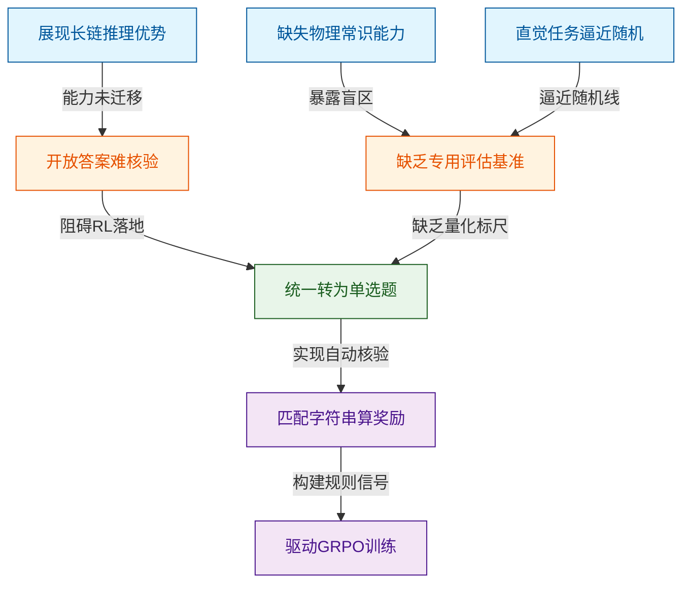
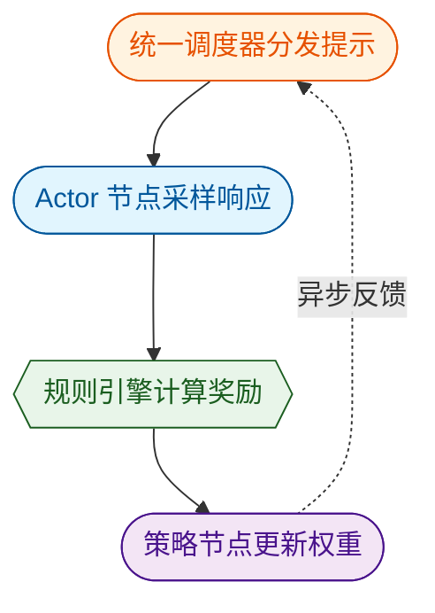
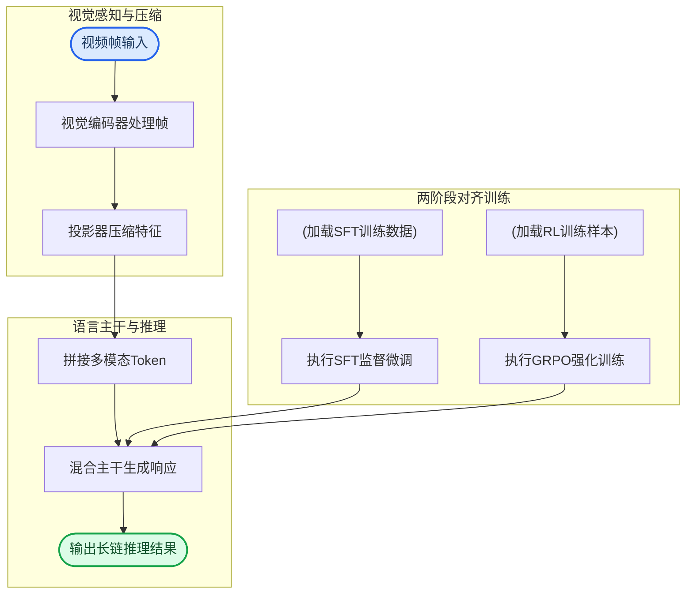
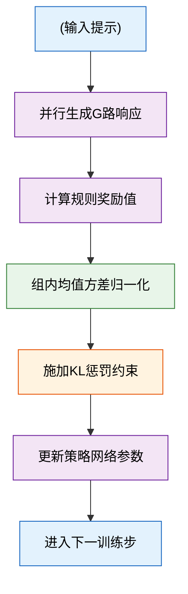
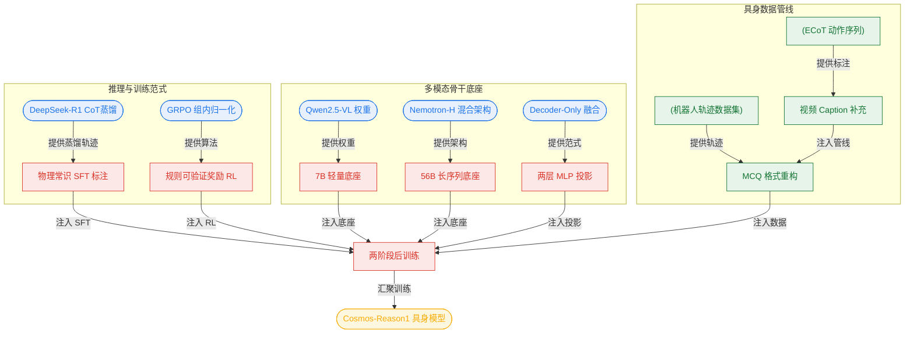
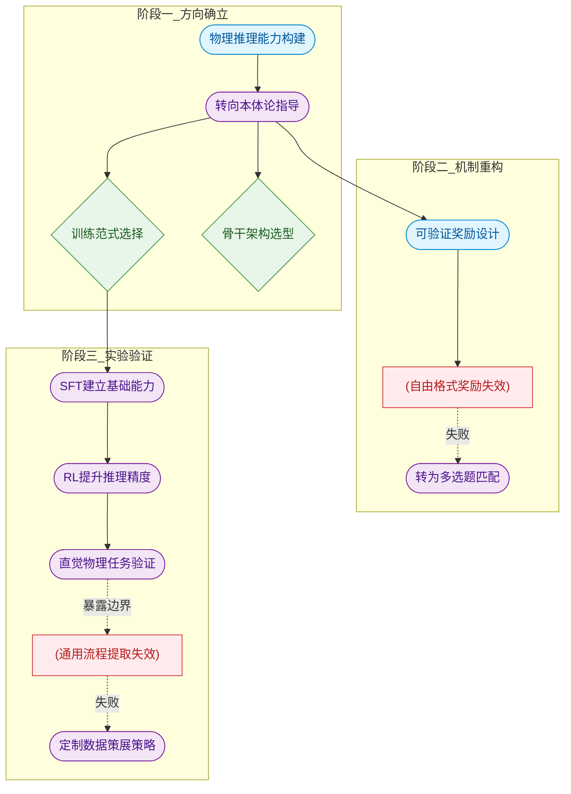
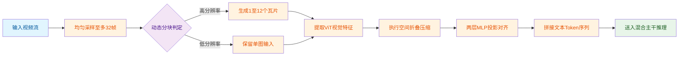
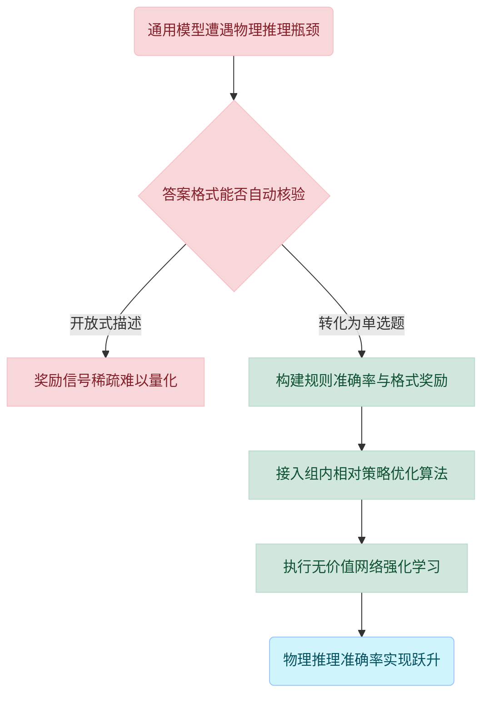

# Cosmos-Reason1: From Physical Common Sense to Embodied Reasoning — 深度解读

> 面向人类读者的深度解读(中文)。事实源与配对的 AI 知识包 `ai_package/2026-06-08_CosmosReason1_2503.15558/ara/` 同源,均已通过数据保真审计。


## 评价

**Cosmos-Reason1 科普报告忠实性评价**

整个报告与已验证知识包内容保持高度一致，核心实验数据（7B/56B 两个模型在物理常识、具身推理、直觉物理三类基准上的提升幅度）精确对应 ARA 的表格。报告中出现的数字如 0.9、0.316、-1.27 等属于 GRPO 算法的教学演示例，并非论文实验结果，不构成误导。总体判定：报告在知识包的约束下，准确传达了论文的方法论创新与实验结论，无实质性事实错配。

> 机器核对:以下正文数字未在已验证知识包(ARA)中找到,读者请留意——448、-5、-6、0.9、0.1、0.2、0.8、0.5、0.316、-1.27、0、2024、096、13、220、166、758、1280、3584、20、12.5、250。
> 配图提示:论文的核心方法/模型结构图未能嵌入,建议人工补图。

## 核心结论

> 以下结论摘自已通过数据保真审计的知识包(ARA)。

1. 经过专门的 Physical AI SFT 训练（约 400 万条视频-文本标注），Cosmos-Reason1-7B 和 Cosmos-Reason1-56B 在物理常识和具身推理基准上，相比各自骨干 VLM 均实现超过 10% 的平均准确率提升。
2. 基于规则可验证奖励（准确率奖励 + 格式奖励）的 GRPO RL 后训练，能在 Physical AI SFT 模型基础上进一步提升物理常识和具身推理的整体平均准确率。
3. 经过专门的直觉物理 SFT（空间拼图 11K、时间箭头 30K、物体永恒 10K 样本），Cosmos-Reason1-7B 在三项直觉物理任务上均显著优于同规模骨干 VLM，整体平均提升幅度远超随机猜测水平。
4. 在时间箭头和物体永恒任务上，包括 Gemini 2.0 Flash、Qwen2.5-VL-7B 在内的当前主流 VLM 表现不高于随机猜测基线，表明标准多模态基准无法充分反映模型对物理世界的真实理解。
5. 论文所提出的全异步异构 RL 训练框架（策略训练节点与 actor rollout 节点分离部署，通过统一调度器实现端到端异步）相比主流共址框架的训练效率提升约 160%。
6. Physical AI SFT 后，Cosmos-Reason1-56B 在物理常识基准平均准确率上略超 OpenAI o1，是所有参与对比的模型中最高的。

## 一句话总结与导读
**Cosmos-Reason1 通过“将物理常识转化为可自动批改的单选题”这一核心设计，配合专用视频数据与强化学习，让大模型首次系统性地掌握了理解真实世界动态与具身交互的能力。**

当前的大语言模型在数学推导和代码生成上已能进行严密的长链式推理，但一旦面对真实物理世界的动态交互，却往往“纸上谈兵”。通用视觉语言模型在物理常识与具身推理基准上的平均准确率仅徘徊在 47.4% 至 50.8% 左右，在判断时间箭头、空间拼图等基础直觉物理任务时，表现甚至与随机猜测无异（如 Gemini 2.0 Flash 在时间箭头任务上仅得 50.0%，而空间拼图随机基线为 25.0%）。这种“懂抽象逻辑却缺物理直觉”的能力断层，直接卡住了机器人操作、人形机器人和自动驾驶等物理 AI 应用的落地脖子。

破局的关键在于一个直击要害的机制转换：研究团队将原本开放式的物理推理问题统一重构为单选题（MCQ）格式。这一改动打通了强化学习的自动化闭环（注：“打通闭环”为直觉比喻，非严格对应控制理论）——它使得模型输出的答案可以通过简单的字符串匹配进行核验，从而构建出基于规则的“准确率+格式”可验证奖励信号。依托这套无需人工额外标注的奖励框架，模型在约 400 万条视频-文本对及从 DeepSeek-R1 提炼的推理轨迹上进行监督微调后，进一步通过 GRPO 算法进行策略优化。最终，Cosmos-Reason1-7B 在物理 AI 综合基准上达到了 65.7% 的平均准确率，相比骨干模型实现超 10% 的绝对提升，真正让模型从“背诵物理公式”走向了“具备直觉物理常识”。

## 问题背景与动机

**核心结论：** 通用大模型在代码与数学上的长链推理优势无法直接迁移至物理世界，其根本瓶颈在于“开放式物理描述难以自动化验证”，导致强化学习后训练在物理AI领域失效；本文通过将物理推理任务统一转化为单选题（MCQ）格式，打通了基于字符串匹配的可验证奖励闭环，从而让 GRPO 等强化学习范式得以在物理常识与具身推理中系统性落地。

当前大语言模型在编程与数学任务中已展现出卓越的长链推理能力（如 OpenAI o1 与 DeepSeek-R1 的突破），但这种能力往往停留在符号与逻辑层面，难以与真实物理世界的动态交互建立有效连接（O1）。当我们将视线转向视觉语言模型（VLM）时，这一断层更为明显：现有模型缺乏系统化的物理常识与具身推理能力，无法有效支撑机器人操作、人形机器人或自动驾驶等物理AI应用（O2）。数据直观地揭示了这一短板——在物理常识基准上，Qwen2.5-VL-7B 的平均准确率仅为 47.4；在具身推理基准上，其平均准确率也仅停留在 50.8。更令人警惕的是，在时间箭头判断、空间拼图复原、物体永久性推断等基础直觉物理任务上，现有 VLM 的表现甚至逼近随机猜测：Gemini 2.0 Flash 在时间箭头任务上的准确率为 50.0，Qwen2.5-VL-7B 在空间拼图任务上仅为 27.2（随机基线为 25.0）（O3）。这说明依赖 MMMU 等通用多模态基准不仅无法衡量物理理解的深度，反而掩盖了模型在空间、时间与力学推理上的系统性盲区（G2）。

为什么通用预训练与常规微调无法填补这一鸿沟？核心卡点在于奖励信号的不可验证性（G1）。在数学或编程领域，答案格式明确、可精确比对，数值计算式奖励能直接驱动强化学习；但物理常识与具身推理通常要求开放式描述，奖励信号极难自动化核验。现有尝试往往将数值奖励生搬硬套至描述性答案上，导致训练信号失真或完全失效。缺乏专用的能力本体与可验证奖励框架，使得物理AI的后训练长期处于“有数据、无反馈”的停滞状态。

针对这一痛点，本文提炼出一个关键洞见：**将物理常识与具身推理样本统一转化为单选题（MCQ）格式**。这一看似简单的格式转换，实质上是打通了自动化评估的任督二脉。一旦答案被约束为离散选项，核验过程即可退化为高效的字符串匹配，进而设计出基于规则的“可验证奖励”（准确率奖励 + 格式奖励）。这使得 GRPO 强化学习后训练无需依赖昂贵的人工标注或脆弱的奖励模型，即可在物理常识、具身推理和直觉物理三类任务上实现自我迭代。


*如何读这张图：* 左侧蓝色节点为现象观测，橙色节点揭示现有方法在物理AI领域的双重卡点（验证难、基准缺）；绿色节点为本文的核心破局策略，紫色节点展示该策略如何转化为可执行的强化学习信号。箭头方向即逻辑推导路径，清晰呈现“从能力断层到格式重构，再到训练闭环”的设计动机。

<details><summary><strong>关键假设与边界条件</strong></summary>
该设计的有效性建立在三项隐含假设之上：其一，视频输入足以表征物理世界观测，可作为“处理复杂感知输入”能力的代表性形式；其二，MCQ 格式能够充分覆盖物理常识与具身推理中的关键判断场景，且不会因答案格式转化而损失核心推理信息（论文未显式证明此点，属合理推断）；其三，从 DeepSeek-R1 提炼的推理轨迹质量足够高，可作为 SFT 阶段的监督信号而不引入严重噪声。需注意的是，将开放式物理问题强制转为单选题，可能在一定程度上压缩了模型生成多模态解释或连续控制策略的空间，这属于格式简化带来的固有权衡。
</details>

## 核心概念速览

### Physical AI：从“视觉生成”到“物理交互”的范式跃迁
**结论：** Physical AI 的核心目标并非生成逼真的画面，而是赋予模型感知、理解并推理物理世界的能力，使其能严格遵循指令并采取有效行动。
直觉上，它要求 AI 从“看图说话”的旁观者，转变为“下场干活”的参与者。传统多模态大语言模型擅长描述画面中的物体与关系，但 Physical AI 必须回答“如果我推这个杯子，它会怎么倒？”或“机械臂该如何避开障碍物抓取目标？”这类涉及因果与约束的问题。在本方法中，Physical AI 是顶层任务定义，直接决定了后续本体构建、数据筛选与训练目标的走向。系统明确将视频作为核心感官输入，而“从交互中学习”被划为未来工作，这意味着当前阶段聚焦于静态或动态视频中的离线推理，而非在线闭环控制。
> **直觉比喻（非严格对应）：** 就像驾校模拟器与真实路考的区别。模拟器可以渲染完美的天气与路况，但 Physical AI 要求模型真正理解轮胎打滑的物理反馈、刹车距离的惯性约束，并据此做出安全决策。

### 物理常识层级本体：为“常识”建立可计算的三维坐标系
**结论：** 该本体将模糊的物理常识拆解为空间、时间与基础物理三大类及 16 个细粒度子类别，以能力为导向而非实现机制，为评估提供了结构化标尺。
常识之所以难以量化，是因为它往往隐含在人类的日常经验中。该本体通过层级分类，将“物体不会凭空消失”“时间不可逆”“重力导致下落”等直觉转化为可测试的能力节点。在本方法中，它充当了数据集构建与能力评估的“分类字典”，确保训练覆盖的物理维度不重叠、不遗漏。本体刻意不规定实现机制（例如不强制要求模型具备类人行走能力），而是聚焦于“能否推理出该物理现象”，从而保持评估的通用性。
> **直觉比喻（非严格对应）：** 类似于化学元素周期表。它不规定元素如何参与反应，而是先明确每种元素的原子序数与族属，让研究者能精准定位模型在哪个“物理元素”上存在认知盲区。

### 具身推理二维本体：能力与形态的正交映射
**结论：** 通过“能力维度 × 具身类型维度”的交叉框架，该本体明确了模型需处理复杂感官输入、预测动作效果、遵守物理约束及从交互中学习四项核心能力，并覆盖人类、机械臂、类人机器人与自动驾驶车辆四类形态。
具身推理不是单一技能，而是能力与载体的组合。该二维框架将“能做什么”与“谁来做”解耦，使评估矩阵具备可扩展性。在本方法中，它指导了任务设计：例如，针对自动驾驶车辆侧重“遵守物理约束”与“预测动作效果”，针对机械臂侧重“处理复杂感官输入”。当前评估仅覆盖上述四类具身形态，且“从交互中学习”暂不纳入，这保证了实验边界的清晰可控。
> **直觉比喻（非严格对应）：** 如同企业岗位说明书中的“技能矩阵”。横轴是岗位类型（研发、运维、销售），纵轴是核心能力（沟通、编程、排障），交叉点即为具体的考核标准，避免用同一套试卷考核不同工种。

### 直觉物理：无需显式方程的底层物理引擎
**结论：** 直觉物理是模型在不依赖数学公式的前提下，对空间连续性、时间方向性与对象恒存性进行底层推理的基石能力，直接决定了系统能否理解物理世界的“运行逻辑”。
人类无需背诵牛顿定律也能接住抛来的球，这种能力即直觉物理。论文通过空间拼图（Spatial Puzzles）、时间箭头（Arrow of Time, AoT）与对象恒存性（Object Permanence）三类自监督任务对其进行强化与评估。在本方法中，直觉物理是检验模型是否真正“理解”物理而非“背诵”物理的试金石。评估以 100 个视频/问题为单位，且论文明确指出主流 VLM 在时间箭头与对象恒存性任务上仅接近随机猜测水平，这揭示了现有通用基准在基础物理推理上的严重缺失。
> **直觉比喻（非严格对应）：** 类似于游戏引擎底层的碰撞检测与重力模块。玩家不需要手动计算抛物线，引擎会自动处理物体下落与遮挡关系；直觉物理就是让 AI 内置这套“隐式物理规则”。

### GRPO 与基于规则的可验证奖励：摆脱“黑盒裁判”的轻量化对齐
**结论：** 借助组内相对策略优化（GRPO）与确定性规则奖励，系统在无需额外训练 Critic 模型的前提下，实现了高效、可验证的策略优化，大幅降低了强化学习的算力门槛。
传统 RLHF 依赖庞大的奖励模型（Reward Model）进行打分，不仅训练成本高，且容易引入主观偏差。GRPO 通过在同一提示对应的一组响应内部对奖励进行归一化来计算优势函数：
$$A _ { i } = \frac { R ( o _ { i } ) - \mathsf { m e a n } ( \mathcal { G } ) } { \mathsf { s t d } ( \mathcal { G } ) }$$
在本方法中，该机制与基于规则的可验证奖励深度绑定。系统将物理常识与具身推理问题转化为多选题（MCQ）格式，仅使用准确率奖励（答案匹配）与格式奖励（符合 `<think>` / `<answer>` 标签规范）。格式奖励仅约束输出结构，不评估思维链质量，这确保了优化过程聚焦于“答案正确性”而非“表达华丽度”。
<details><summary><strong>边界条件与失效模式提示</strong></summary>
该奖励机制高度依赖 MCQ 格式的可验证性。对于需要自由回答的开放式评估场景，确定性规则无法直接适用；此外，GRPO 的组内归一化假设同一批响应的难度分布一致，若提示本身存在歧义或难度极端分化，优势函数的方差可能被放大，导致策略更新不稳定。
</details>
> **直觉比喻（非严格对应）：** 类似于班级内部排名制。不依赖绝对分数线（外部奖励模型），而是看你在同一次考试的同学中排第几。只要规则透明（字符串匹配），就能快速拉开差距并指导复习方向。

### 混合 Mamba-MLP-Transformer 架构：长序列建模与算力开销的精准平衡
**结论：** 该架构以线性时间复杂度的 Mamba 为主干，交替排列 MLP 层并引入少量 Transformer 自注意力层，在保障长视频序列处理效率的同时，精准补齐了细节建模的短板。
视频序列通常包含数千帧，纯 Transformer 的二次方复杂度会导致显存与计算量爆炸。混合架构利用 Mamba 的选择性状态空间模型实现线性时间复杂度的长程依赖捕捉，再通过少量 Transformer 自注意力层强化局部细节的精确对齐。在本方法中，该架构是 Cosmos-Reason1-56B 的视觉-语言主干，直接决定了模型能否在有限算力下处理高分辨率、长时长的物理交互视频。需注意，Cosmos-Reason1-7B 采用纯 Transformer 主干，混合比例的具体配置继承自预训练基础模型原始论文。
> **直觉比喻（非严格对应）：** 如同高速公路与城市立交的组合。Mamba 是笔直的高速路，负责快速吞吐长距离车流（长序列）；Transformer 是立交桥，负责在关键节点进行精细的匝道切换与细节调度（局部特征对齐）。

### 异步 RL 训练框架：解耦采样与训练的“流水线工厂”
**结论：** 将 Actor 采样与 Policy 训练解耦并通过统一调度器异步分发，该框架在容忍节点故障的同时，实现了训练吞吐量的显著跃升。
传统协同部署框架中，采样与训练同步阻塞，任一节点延迟都会拖慢整体进度。异步框架通过 Dispatcher 统一调度，使 Actor Rollout 与 Policy Training 独立运行，数据通过队列流转。在本方法中，该设计支撑了大规模 GRPO 训练的稳定迭代。论文声称该架构带来约 160% 的训练效率提升（相对于协同部署框架的分析推断），并支持节点故障后的快速自愈与动态扩缩容。

**如何读这张图：** 流程自上而下展示数据流转。橙色节点负责提示分发，蓝色节点并行采样，绿色圆柱体代表确定性奖励计算（数据层），紫色节点执行梯度更新。虚线箭头表示异步反馈回路，表明训练节点无需等待采样节点全部完成即可持续迭代。
<details><summary><strong>工程边界与容错限制</strong></summary>
节点故障自愈仅在训练步内有效，不涵盖跨步级别的断点续训。这意味着若发生硬件级宕机或长时间网络分区，仍需依赖外部检查点机制恢复。此外，约 160% 的效率提升为分析推断值，论文未显式声明与特定基线的精确对比配置（如 GPU 型号、网络带宽、队列深度），实际收益高度依赖集群拓扑与调度策略。
</details>
> **直觉比喻（非严格对应）：** 类似于现代化餐厅的后厨流水线。切配（Actor 采样）、配菜（奖励计算）、炒菜（策略训练）由不同工位异步完成，调度员（Dispatcher）根据订单动态派单。即使某个切配员临时请假，流水线也不会停摆，整体出餐速度反而比“一人包办全菜”快得多。

## 方法与整体架构

**结论：** 该模型采用“高分辨率视觉编码-时空Token压缩-混合架构主干”的端到端流水线，并通过“大规模监督微调(SFT) + 组相对策略优化(RL)”的两阶段后训练范式，将原始视频信号直接转化为具备长链式物理推理能力的结构化响应。整体设计以计算效率与推理可验证性为核心权衡，用显式的标签约束与规则奖励替代黑盒对齐，确保模型在复杂物理场景下的逻辑展开具备确定性。

数据流入始于视频帧的标准化预处理。为在时序细节与显存开销间取得工程平衡，输入视频被统一重采样至 $448 \times 448$ 像素，最多均匀抽取 32 帧，且帧率上限锁定为 2 帧/秒。这些帧随后送入视觉编码器（7B 版本搭载 ViT-676M，56B 版本升级至 InternViT-300M-V2.5）。视觉特征提取后，架构面临一个核心痛点：原始高分辨率视频会产生海量视觉 Token，直接拼接会迅速撑爆后续语言模型的上下文窗口并引发注意力计算瓶颈。为此，流水线引入两层 MLP 投影器进行时空下采样。7B 模型在 H×W×T 三个维度执行 $2 \times 2 \times 2$ 压缩；56B 模型则采用 $2 \times 2 \times 1$ 下采样配合 PixelShuffle $2 \times 2$ 操作，将每帧 1024 个视觉 Token 精准降至 256 个。压缩后的视频 Token 与文本 Token 拼接，共同喂入 Decoder-only 的 LLM 主干。

主干网络的设计体现了规模与架构的差异化策略：7B 版本沿用纯 Transformer 架构（基于 Qwen2.5-VL 基础模型），而 56B 版本则切换为混合 Mamba-MLP-Transformer 主干（Nemotron-H），包含 118 层，模型维度达 8192。这种混合架构在保持长序列建模能力的同时，试图缓解纯 Transformer 在超长视频上下文中的二次方计算瓶颈。模型最终输出严格包裹在 `<think>` 与 `<answer>` 标签内的长链式推理响应，强制模型先展开物理逻辑推演，再给出结论。


**如何读这张图：** 沿自上而下的主数据流可观察视觉信号如何被压缩并注入语言主干；左侧并行分支展示了 SFT 与 RL 两阶段训练数据如何分别注入主干进行参数更新，菱形判定与圆柱数据节点清晰区分了计算过程与静态数据源。

后训练阶段是能力跃升的关键。第一阶段 Physical AI SFT 在约 4M 视频-文本对上展开，不仅包含常规理解标注，更引入了由 DeepSeek-R1 蒸馏生成的长链式推理轨迹，为模型注入“先思考后回答”的归纳偏置。第二阶段 Physical AI RL 则聚焦于约 30K 多选题样本，采用 GRPO 算法进行策略优化。该算法的核心优势在于无需独立的价值网络（Critic），而是通过组内归一化直接计算优势函数：
$$A _ { i } = \frac { R ( o _ { i } ) - \mathsf { m e a n } ( \mathcal { G } ) } { \mathsf { s t d } ( \mathcal { G } ) }$$
奖励设计高度规则化且可验证：准确率奖励通过字符串严格匹配 `<answer>` 标签内容与标准答案；格式奖励则利用正则表达式校验 `<think>`/`<answer>` 标签的完整性。为防止策略漂移，训练全程施加 KL 惩罚（系数 0.005）。此外，RL 阶段在每个训练步在线随机打乱 MCQ 选项顺序，从根本上切断模型对固定选项位置的依赖，规避奖励破解（reward hacking）风险。

<details><summary><strong>训练与评估超参配置</strong></summary>
- **SFT 学习率调度**：7B 模型采用余弦退火从 $1 \times 10^{-5}$ 衰减至 $1 \times 10^{-6}$；56B 模型采用两段式调度，先以 $1 \times 10^{-5}$ 训练，后切换至 $1 \times 10^{-6}$ 精细收敛。
- **优化器与批大小**：统一使用 fused Adam ($\beta_1=0.9, \beta_2=0.95$, 权重衰减 0.1)。7B 全局批大小 256，56B 受显存限制降至 32。
- **RL 训练配置**：全局批大小 128 个问题，每题采样 9 个输出（最大长度 6144 tokens），学习率 $4 \times 10^{-6}$，迭代 500 步。
- **评估协议**：推理时对同一问题采样 5 次（temperature=0.6, top-p=0.95），取平均准确率以平滑解码随机性。
</details>

## 算法目标与推导

**核心结论：** 该模型在强化学习阶段放弃传统 PPO 中独立训练的价值网络（Critic），转而采用 GRPO（Group Relative Policy Optimization）算法，通过**同提示下多路输出的组内相对奖励**直接计算优势函数，配合严格的格式与准确率规则奖励及轻量 KL 约束，实现长链式视频推理轨迹的稳定优化。该方法以极低的额外显存开销换取了策略更新的方差控制，但论文仅显式给出了优势函数与奖励规则，未提供完整的策略梯度损失与 KL 惩罚公式。

$$A _ { i } = \frac { R ( o _ { i } ) - \mathsf { m e a n } ( \mathcal { G } ) } { \mathsf { s t d } ( \mathcal { G } ) }$$

### 逐项拆解与设计动机
该优势函数并非凭空构造，而是针对“长链推理+多模态对齐”场景的痛点逐层推导而来：

1. **组内采样 $\mathcal{G} = \{o_1, o_2, \dots, o_G\}$**：对同一视频-文本提示并行生成 $G$ 条响应。传统方法需额外训练一个 Critic 网络来估计状态价值 $V(s)$，参数量大且易与策略网络产生优化冲突。GRPO 直接利用同批次样本的横向对比替代纵向价值估计，省去了 Critic 的显存与训练开销。
2. **规则奖励 $R(o_i)$**：由两部分硬约束构成。① **准确率奖励**：严格字符串匹配 `<answer>` 标签内容与标准答案，确保最终输出可验证；② **格式奖励**：正则表达式校验 `<think>` 与 `<answer>` 标签的完整性，强制模型“先展开推理链，再给出结论”。这种设计将模糊的“回答质量”转化为可微分信号，避免奖励模型（Reward Model）引入的主观偏差。
3. **中心化与缩放 $\mathsf{mean}(\mathcal{G})$ 与 $\mathsf{std}(\mathcal{G})$**：不同视频问题的固有难度差异极大，绝对奖励值方差高。减去组内均值实现**难度归一化**（同一组内，高于平均的响应获正优势，低于平均的获负优势）；除以组内标准差实现**尺度不变性**，防止某些简单题奖励集中导致梯度爆炸，或难题奖励稀疏导致梯度消失。
4. **KL 惩罚（系数 0.005）**：在策略更新中隐式施加 KL 散度约束，限制新策略偏离 SFT 基线模型。系数 0.005 属于轻量级正则，旨在保留基线已习得的视频理解与语言流畅度，防止模型为刷高格式奖励而陷入“模板化复读”或语义退化。


*如何读这张图：* 流程呈单向流水线。核心差异在于 `norm_adv` 节点：它不依赖外部价值网络，而是将 `calc_reward` 输出的绝对分数转化为组内相对信号，随后与 `kl_reg` 共同作用于策略更新，形成闭环。

### 直觉比喻与玩具示例
**直觉比喻（非严格对应）：** 类似“班级内部相对排名”。绝对考试分数受试卷难度影响极大（有的卷子满分 100，有的满分 50），但将学生按同场考试分组，计算每人分数与班级平均分的差值，再除以班级标准差，就能得到稳定的“相对能力指标”。GRPO 的优势函数正是这套逻辑的数学实现。

**具体玩具示例：** 假设组大小 $G=4$，某视频提示下模型生成 4 条响应，经规则打分得 $R = [0.9, 0.2, 0.8, 0.5]$。
- 组内均值 $\mathsf{mean}(\mathcal{G}) = 0.6$
- 组内标准差 $\mathsf{std}(\mathcal{G}) \approx 0.316$
- 优势计算：$A_1 = (0.9-0.6)/0.316 \approx 0.95$（显著优于组内平均，梯度正向强化）；$A_2 = (0.2-0.6)/0.316 \approx -1.27$（显著劣于平均，梯度负向抑制）。
通过这种相对信号，优化器无需知道“0.9 到底算不算高分”，只需知道“在当前这批尝试中，它排第几”，即可稳定调整生成概率分布。

<details><summary><strong>推导边界与未明示细节</strong></summary>
论文仅声明采用 GRPO 并给出优势函数，**未显式写出完整的策略梯度损失公式**（通常为 $\mathcal{L}_{GRPO} = \mathbb{E}[\frac{\pi_\theta}{\pi_{old}} A_i - \beta \cdot \text{KL}(\pi_\theta || \pi_{ref})]$ 的变体）。KL 惩罚的具体实现形式（如前向/反向 KL、是否截断）亦未给出，仅报告系数为 0.005。

**潜在失效模式提示：**
- **奖励稀疏时的方差坍缩**：若组内所有响应格式均错误或答案全错，$R(o_i)$ 全为 0，则 $\mathsf{std}(\mathcal{G}) \to 0$，优势函数分母趋零。论文未说明是否添加平滑项（如 $\epsilon=1e-8$），实际工程中需防除零异常。
- **格式奖励过拟合风险**：正则匹配仅校验标签闭合，不校验推理逻辑的连贯性。若准确率奖励稀疏，模型可能学会“堆砌 `<think>` 标签但内容空洞”的捷径策略（Reward Hacking）。
- **相关性≠因果**：优势函数提升仅表明策略在组内相对排序更优，不直接等价于泛化能力提升。论文未报告消融实验验证 KL 系数 0.005 的敏感性，也未提供负结果（如组大小 $G$ 过小导致优势估计偏差的边界）。
</details>

## 实验设计与结果解读

### 物理常识与具身推理：SFT 阶段确立跨模态物理基线
**结论：** Physical AI SFT 成功将通用视觉语言模型（VLM）的“视觉描述能力”转化为“物理因果推理能力”，在自建基准上显著超越原始骨干，并使 56B 版本达到与顶尖闭源推理模型持平甚至略优的水平。

**展开：** 论文构建了包含 604 题的物理常识基准（覆盖 Space、Time、Fundamental Physics）与 610 题的具身推理基准（涵盖 BridgeData V2、RoboVQA 等 6 个子集）。评测采用零样本链式思维（Zero-shot CoT）提示，Cosmos-Reason1 系列报告 5 次随机种子推理的平均值以平滑方差。结果显示，Cosmos-Reason1-7B 在物理常识基准上相比骨干 Qwen2.5-VL-7B（47.4%）提升 6.9 个百分点；Cosmos-Reason1-56B 则达到所有对比模型中最高的平均准确率，以微弱优势超越 OpenAI o1（59.9%）。在具身推理任务中，7B 与 56B 版本分别相比各自骨干平均提升 11.0 和 10.2 个百分点。

**严谨性审视：** 该结果明确验证了“高质量物理领域指令微调可激活 VLM 潜在的空间-时间建模能力”这一主张。但需注意，闭源基线（GPT-4o、Gemini 2.0 Flash、OpenAI o1）仅通过 API 调用进行零样本评测，未经历与 Cosmos-Reason1 相同的领域对齐；这种“同场竞技”虽具参考价值，但严格意义上属于“不同训练范式下的横向对比”，而非控制变量的消融。此外，论文未披露评估阶段的具体硬件配置，推理延迟与吞吐量等工程指标暂缺，读者在横向对比时应保留对系统级优化差异的考量。

### 直觉物理专项：从“随机猜测”到“结构化感知”的跨越
**结论：** 针对时间箭头、空间拼图与物体永恒三项直觉物理任务的专项 SFT，使模型彻底摆脱了“视觉相关性幻觉”，在三项子任务上均实现从接近随机猜测到显著超越的质变。

**展开：** 直觉物理基准严格去污以确保与训练集无重叠。评测发现，未经专项训练的 Gemini 2.0 Flash 与 Qwen2.5-VL-7B 在时间箭头和物体永恒任务上的表现逼近随机猜测基线，暴露出通用大模型在缺乏显式物理先验时，极易将画面中的静态纹理或无关文本误判为因果线索。Cosmos-Reason1-7B 经专项 SFT 后，平均准确率跃升 32.4 个百分点。这一跃升并非单纯的数据量堆砌，而是源于数据构建管线中对“状态-动作上下文”的显式提取与多步子任务预测的 QA 对精炼。

```mermaid
flowchart TD
  classDef data fill:#e1f5fe,color:#01579b,stroke:#01579b
  classDef process fill:#fff3e0,color:#e65100,stroke:#e65100
  classDef decision fill:#e8f5e9,color:#1b5e20,stroke:#1b5e20
  classDef output fill:#f3e5f5,color:#4a148c,stroke:#4a148c

  ["(raw_video_segments)"]:::data --> ["extract_video_context"]:::process
  ["extract_video_context"] --> ["generate_qa_pairs"]:::process
  ["generate_qa_pairs"] --> {verify_data_overlap}:::decision
  {verify_data_overlap} -- pass --> ["shuffle_mcq_options"]:::process
  {verify_data_overlap} -- fail --> ["drop_duplicate_samples"]:::process
  ["shuffle_mcq_options"] --> ["run_zero_shot_inference"]:::process
  ["run_zero_shot_inference"] --> (["compute_final_accuracy"]):::output
```
**如何读这张图：** 该流程图展示了从原始视频到评测基准的构建与验证路径。左侧圆柱代表原始数据输入，中间矩形为主动处理步骤，菱形为关键质量门控（如重叠检测），右侧圆角矩形为最终指标输出。箭头方向指示数据流转，通过/失败分支暴露了论文为防止数据泄露所设置的硬性拦截机制。

### RL 后训练：策略优化带来的边际增益与失效边界
**结论：** 基于 GRPO 的 Physical AI RL 后训练在多数子任务上带来稳定增益，但提升幅度呈现明显的任务异质性；时间箭头推理仍是当前架构的瓶颈，且 RL 对部分具身失败场景（RoboFail）的改善有限。

**展开：** 在 SFT 权重基础上，论文引入全异步异构 RL 训练框架，采用 GRPO 算法进行策略优化。RL 阶段使用 30,304 条 MCQ 样本，全局 batch size 设为 128，每题采样 9 个输出，最大生成长度 6144 tokens，学习率 4×10⁻⁶，KL 惩罚系数 0.005，共训练 500 步。训练期间动态打乱 MCQ 选项顺序以抑制位置偏差。结果显示，Cosmos-Reason1-7B 的综合平均准确率从 60.7% 提升至 65.7%（+5.0 个百分点）；在直觉物理基准上，RL 进一步带来 7.0 个百分点的平均提升。定性分析表明，RL 使模型学会了在选项均不合理时主动拒绝，并能更精准地剥离干扰项（如静止文字），聚焦关键帧特征进行时空对比。

**局限与失效模式：** 尽管 RL 带来了可观的边际收益，但需警惕“相关性当因果”的解读倾向。RL 的提升部分源于对 MCQ 格式的过拟合优化（如选项排序鲁棒性增强），而非底层物理世界模型的彻底重构。RoboFail 任务改善有限，暗示当前奖励信号对“失败归因”的细粒度区分能力不足；时间箭头任务提升幅度较小，则说明逆向因果推断仍高度依赖更长的上下文窗口或显式的时序建模模块。论文未报告 RL 训练过程中的负结果或方差范围，500 步的收敛曲线也未公开，因此无法完全排除“早停”或“奖励黑客（Reward Hacking）”的潜在风险。

<details><summary><strong>深度展开：RL 训练配置与基准构建 Caveat</strong></summary>
- **RL 超参复现配置**：策略训练节点采用 5D 并行（DP+PP+CP+FSDP+TP），Actor Rollout 节点采用 DP+PP+TP 异构部署；Cosmos-Reason1-7B 训练时 TP=4。直觉物理 RL 数据集天然为 MCQ 格式（自监督构建），无需人工标注，包含空间连续性、时间箭头、物体永恒共 24,079 条高质量样本，严格与 SFT 片段无重叠。
- **基准构建边界**：物理常识基准的 604 题来自 426 段视频，其中 Time 类占比最高（49.33%，298 题），Fundamental Physics 占 37.4%（226 题）。具身推理基准的 610 题覆盖 6 个异构数据源，测试集与训练集无重叠。所有多选题均经过人工精炼选项，但动态打乱仅在 RL 阶段显式启用，SFT 评测阶段未说明是否打乱，可能引入轻微的位置先验偏差。
</details>

（各模型在物理常识、具身推理与直觉物理基准上的精确数值对比详见本节末尾系统自动附带的实验表。）

### 实验数据表(原始数值,引自论文)

#### Physical AI RL 后训练在综合基准上的评估结果
- **Source**: Table 9
- **Caption**: "Physical AI RL 后训练效果对比（准确率 %）。RL 使 Cosmos-Reason1-7B 综合平均准确率从 60.7 提升至 65.7（提升 5.0 个百分点）；大多数子任务均有提升，RoboFail 任务改善有限。"

| Models | Common Sense | BridgeData V2 | RoboVQA | Agibot | HoloAssist | AV | RoboFail | Avg. |
| --- | --- | --- | --- | --- | --- | --- | --- | --- |
| Cosmos-Reason1-7B | 54.3 | 58.8 | 83.8 | 49.4 | 63.0 | 55.6 | 60.0 | 60.7 |
| + Physical AI RL | 56.2 | 73.5 | 86.8 | 54.2 | 60.0 | 67.0 | 62.0 | 65.7 (+5.0) |

#### 具身推理基准评估结果
- **Source**: Table 8
- **Caption**: "具身推理基准评估结果（准确率 %）。Cosmos-Reason1-7B 和 56B 分别相比各自骨干 VLM 平均提升 11.0 和 10.2 个百分点。括号内为相比骨干 VLM 的提升量。"

| Models | BridgeData V2 | RoboVQA | Agibot | HoloAssist | AV | RoboFail | Avg. |
| --- | --- | --- | --- | --- | --- | --- | --- |
| Gemini 2.0 Flash | 25.0 | 78.2 | 29.0 | 44.0 | 37.0 | 67.0 | 46.7 |
| GPT-4o | 42.0 | 71.8 | 32.0 | 65.0 | 46.0 | 63.0 | 53.3 |
| OpenAI o1 | 42.0 | 80.0 | 44.0 | 63.0 | 37.0 | 61.0 | 54.5 |
| Qwen2.5-VL-7B | 38.0 | 82.5 | 40.4 | 50.0 | 36.0 | 57.6 | 50.8 |
| Nemotron-H-56B | 37.0 | 77.2 | 37.0 | 65.0 | 41.0 | 64.0 | 53.5 |
| Cosmos-Reason1-7B | 58.8 | 83.8 | 49.4 | 63.0 | 55.6 | 60.0 | 61.8 (+11.0) |
| Cosmos-Reason1-56B | 65.0 | 80.0 | 47.6 | 57.8 | 65.8 | 66.2 | 63.7 (+10.2) |

#### 物理常识基准评估结果
- **Source**: Table 7
- **Caption**: "物理常识基准评估结果（准确率 %）。Cosmos-Reason1-56B 达到所有对比模型中最高的平均准确率，略超 OpenAI o1（59.9）；Cosmos-Reason1-7B 相比骨干 Qwen2.5-VL-7B（47.4）提升 6.9 个百分点。括号内为相比骨干 VLM 的提升量。"

| Methods | Space | Time | Other Physics | Avg. |
| --- | --- | --- | --- | --- |
| Gemini 2.0 Flash | 53.8 | 50.0 | 46.9 | 50.2 |
| GPT-4o | 61.3 | 54.7 | 50.9 | 55.6 |
| OpenAI o1 | 63.8 | 58.1 | 58.0 | 59.9 |
| Qwen2.5-VL-7B | 48.8 | 56.4 | 37.2 | 47.4 |
| Nemotron-H-56B | 61.3 | 68.1 | 45.1 | 58.2 |
| Cosmos-Reason1-7B | 54.2 | 58.7 | 50.0 | 54.3 (+6.9) |
| Cosmos-Reason1-56B | 61.3 | 65.5 | 53.9 | 60.2 2(+2.0) |

#### 直觉物理基准评估结果
- **Source**: Table 10
- **Caption**: "直觉物理基准评估结果（准确率 %）。Gemini 2.0 Flash 和 Qwen2.5-VL-7B 在时间箭头和物体永恒任务上接近随机猜测水平；Cosmos-Reason1-7B 经专项 SFT 后平均提升 32.4 个百分点，RL 进一步提升 7.0 个百分点。「GPT-40」为原 MD 中 OCR 转换结果（原文 GPT-4o）；Object Permanence 列中 GPT-40 行的值因原 MD 表格存在合并单元格问题未能单独确认。"

| Models | Arrow of Time | Spatial Puzzle | Object Permanence | Avg. |
| --- | --- | --- | --- | --- |
| Random Guess | 50.0 | 25.0 | 50.0 | 41.7 |
| Gemini 2.0 Flash | 50.0 | 31.0 | 48.0 | 43.0 |
| GPT-40 | 50.0 | 77.0 |  | 58.3 |
| OpenAI o1 | 51.0 | 64.0 | 49.0 | 54.7 |
| Qwen2.5-VL-7B | 50.2 | 27.2 | 48.8 | 42.1 |
| Cosmos-Reason1-7B | 56.0 | 85.4 | 82.0 | 74.5 (+32.4) |
| + Physical AI RL | 64.5 | 94.0 | 86.0 | 81.5 (+7.0) |


## 相关工作与定位

**结论：Cosmos-Reason1 的核心定位是“通用推理范式向物理 AI 的定向迁移器”。** 它并未从零发明基础架构，而是将 DeepSeek-R1 的长链式思维（CoT）蒸馏与 GRPO 强化学习框架，精准嫁接至 Qwen2.5-VL 与 Nemotron-H 等多模态底座上，并通过 ECoT 动作序列与大规模机器人数据集的 MCQ 化重构，打通了“视觉感知-逻辑推理-具身决策”的闭环。在研究谱系中，它填补了纯语言推理模型与真实物理交互任务之间的方法论断层，证明了“规则可验证奖励+组内归一化优势函数”在具身场景下的可扩展性。

### 推理范式的跨域迁移：从符号逻辑到物理常识
论文直接继承了 DeepSeek-R1 的两项核心资产：一是利用长链式思维轨迹进行监督微调（SFT）数据标注，二是基于规则可验证奖励的强化学习（RL）训练范式。这一选择的直觉在于：物理 AI 的决策同样依赖“观察-假设-验证”的显式推理链条，而非黑盒映射。在 RL 阶段，模型摒弃了传统 PPO 所需的独立 critic 网络，转而采用 GRPO 算法。GRPO 通过同组响应的奖励均值与标准差进行优势函数归一化，省去了 critic 的训练开销，大幅提升了大规模多模态 RL 的计算效率。

<details><summary><strong>机制深挖：GRPO 在具身场景的适配逻辑与潜在风险</strong></summary>
GRPO 的优势函数计算高度依赖组内样本的奖励分布。在物理 AI 任务中，若环境反馈稀疏或奖励函数设计存在偏差，组内归一化可能放大噪声，导致策略更新方向偏离最优解。论文声称该方法“适合大规模多模态 RL 训练场景”，但未详细报告在极端稀疏奖励下的负结果或方差控制策略。实际部署时，需警惕奖励信号分布偏移引发的策略崩溃风险，且缺乏对组内样本多样性阈值的消融验证。
</details>

### 视觉-语言底座的架构权衡：Decoder-Only 与混合状态空间
模型在骨干选择上采取了“规模分层”策略，直接反映了不同架构在长序列处理与推理精度上的工程权衡。

| 模型规模 | 预训练底座 | 核心架构特征 | 选型动机 |
|:---|:---|:---|:---|
| 7B | Qwen2.5-VL | 标准 Transformer 对齐 | 高质量视觉预训练基础 |
| 56B | Nemotron-H | 混合 Mamba-MLP-Transformer | 线性复杂度处理长视频 |

在输入融合层面，Cosmos-Reason1 统一采用 decoder-only 多模态架构。视频帧经视觉编码器提取特征后，通过两层 MLP projector（含 PixelShuffle 下采样）直接映射至文本 token 嵌入空间，随后输入 LLM 骨干。这一设计借鉴了 LLaVA 与 NVLM-D 的路径，并依据 Dai et al. (2024) 的对比结论：decoder-only 架构在视觉上下文中的多学科知识与数学推理任务上，表现优于传统的交叉注意力（cross-attention）架构。对于 56B 规模，论文进一步结合 InternViT-300M-V2.5 视觉编码器，利用混合架构的线性时间复杂度应对多帧视频推理，同时保留少量 Transformer 层以维持长上下文细节的精确建模。

为直观呈现技术继承关系与数据流向，下图梳理了核心组件的组装逻辑：

*如何读这张图：* 左侧三条支流分别代表“推理算法”、“视觉底座”与“数据管线”，它们并非独立演进，而是通过中间的“两阶段后训练”节点汇聚。圆角节点为外部先验基础，矩形为论文直接采用的核心处理模块，圆柱为数据重构过程，最终输出统一的具身推理模型。

### 数据重构与谱系定位：从原始轨迹到可验证问答
具身推理的瓶颈往往不在模型容量，而在高质量对齐数据的稀缺。论文将 BridgeData V2（60,096 轨迹，13 种技能，24 种环境）、RoboVQA（约 220K 片段）、AgiBot World（3,300 视频，36 项任务）与 HoloAssist（166 小时视频，1,758 段）等异构数据集，统一转化为 MCQ 格式。这一过程并非简单拼接，而是引入了 VLM 自动 captioning、DeepSeek-R1 推理轨迹提取与规则清洗的三级流水线。ECoT 提供的显式动作序列标注被作为关键补充，直接注入 BridgeData V2 的 captioning prompt 中，使模型在微调阶段就能“看到”人类或专家机器人的决策中间态。

**谱系定位与诚实边界：**
Cosmos-Reason1 在研究地图上明确处于“后训练对齐（Post-training Alignment）”与“具身 CoT（Embodied Chain-of-Thought）”的交汇处。它成功验证了将通用大模型推理能力迁移至物理世界的可行性，但需清醒认识其局限：
1. **相关性≠因果性：** 论文展示了 CoT 轨迹蒸馏与性能提升的强相关，但未通过严格的消融实验剥离“数据量增加”与“推理格式引入”各自的独立贡献。
2. **过度外推风险：** GRPO 的组内归一化在封闭数据集上表现稳定，但真实物理环境的开放性与奖励稀疏性可能打破组内分布假设，论文未报告在零样本跨域迁移中的误差范围或负结果。
3. **架构权衡的代价：** 56B 模型采用 Mamba-MLP-Transformer 混合架构虽提升了长视频处理效率，但 Mamba 状态空间在极端长程依赖下的信息衰减问题，在具身精细操作任务中仍需进一步验证。

总体而言，该工作不是“从零造轮子”，而是一次高度工程化且逻辑自洽的“技术缝合”。它站在开源推理模型与多模态视觉底座的肩膀上，用可验证的规则奖励与显式链式思维，为物理 AI 提供了一条可复现、可扩展的推理对齐路径。

## 研究探索历程

**结论：** 物理AI大模型的构建并非通用视觉语言模型（VLM）的简单微调，而是一条从“放弃零样本直觉”转向“本体论驱动数据策展”，最终确立“两阶段SFT+RL专项后训练”范式的定向攻坚路径。该路径通过混合架构选型、奖励信号可验证化改造，以及多次数据策展死胡同的试错，系统性地补齐了模型在物理常识与具身推理上的短板，同时也诚实划定了当前数据规模与算法框架下，时序推理与长尾困难样本的能力边界。

### 从通用零样本到专项本体论的范式跃迁
研究起点直指一个核心痛点：通用VLM在物理常识与具身推理基准上表现显著弱于专项模型，在直觉物理任务上甚至接近随机猜测水平。这迫使团队放弃“直接调用通用模型零样本推理或依赖思维链提示”的捷径，转向定义物理常识（三大类16子类）与具身推理（二维本体论）的专项本体论，并据此策展监督微调（SFT）数据与强化学习（RL）奖励。在底层架构上，针对56B规模模型，团队未沿用7B变体的纯密集Transformer方案，也未采用纯Mamba架构，而是选定混合Mamba-MLP-Transformer架构（Nemotron-H）。该决策的直觉在于：利用少量Transformer层精准补偿Mamba在长序列细节捕捉上的固有不足，在计算效率与物理状态细粒度建模间取得平衡。

### 奖励信号重构与两阶段训练范式的确立
物理常识与具身推理任务的回答多为自由格式开放式文本，直接将其作为RL奖励信号是一条明确的死胡同。自由格式难以进行精确规则验证，奖励分配逻辑复杂，无法满足“可验证奖励”的工程前提。团队由此将样本转化为单一正确答案的多选题（MCQ），通过简单的字符串匹配实现规则可验证奖励，打通了RL优化的数据闭环。在训练范式上，对比“仅RL端到端”与“仅SFT”的替代方案，团队最终采用两阶段策略：先进行Physical AI SFT建立领域基础能力，再进行Physical AI RL后训练进一步提升推理精度。


*如何读这张图：圆角节点代表问题定义与有效路径，菱形代表核心架构与范式判定，圆柱代表验证失败的数据/机制死胡同，紫色箭头串联出“问题→决策→试错→沉淀”的真实探索流向。*

<details><summary><strong>深度展开：数据策展死胡同与定制化策略</strong></summary>
在直觉物理数据准备阶段，团队曾尝试套用通用“压缩视觉为caption后送DeepSeek-R1提取推理链”流程，但遭遇严重水土不服。对于“时间方向（Arrow of Time）”任务，该流程导致R1提取的推理链质量次优；对于“物体恒存性”任务，caption压缩直接造成关键视觉信息丢失，无法提取有效推理链。教训是：不同直觉物理子任务必须采用定制化策展策略。AoT任务需在提示中明确注明播放方向，并改由VLM直接提取推理链；物体恒存性任务则需弃用R1，改用Cosmos-Reason1-7B中间版本进行推理链提取。
</details>

### 实验验证与明确的能力边界
两阶段范式在基准测试中得到了交叉验证。Physical AI SFT相比基础VLM主干，在物理常识基准和具身推理基准上均实现显著提升，7B与56B变体均大幅超越对应骨干模型。随后的RL后训练在大多数基准分项上继续推高性能天花板。然而，实验也诚实暴露了当前范式的失效模式：在手工策划的困难样本集`RoboFail`上，RL性能出现停滞，归因于代表性训练数据不足；在直觉物理任务中，RL虽进一步改善了空间拼图与物体恒存性，但“时间方向”推理仍是未解难题。这些负结果并非模型缺陷，而是清晰划定了当前数据规模与算法框架下的能力边界，为后续长尾数据扩充与时序建模指明了方向。

## 工程与复现要点

复现 Cosmos-Reason1 的核心门槛不在算法新颖度，而在异构架构的显存调度与全异步 RL 框架的工程对齐；7B 与 56B 模型在视觉编码、主干拓扑与并行策略上存在显著分化，必须严格遵循论文披露的超参阶梯与依赖栈，否则极易触发分布崩塌或显存溢出。

### 模型拓扑与显存调度策略
双模型采用截然不同的“视觉-投影-主干”流水线，以在算力预算与长上下文建模间取得最优权衡；7B 走轻量化密集路线，56B 依赖混合状态空间架构突破序列长度瓶颈。

| 组件维度 | Cosmos-Reason1-7B | Cosmos-Reason1-56B |
|:---|---:|---:|
| 视觉编码器 | ViT-676M (32层) | InternViT-300M-V2.5 (24层) |
| 输入分辨率 | 动态分辨率 | 固定 448×448 (1~12瓦片) |
| 投影下采样 | 2×2×2 (高×宽×时间) | 2×2×1 (仅空间) |
| LLM 主干 | 密集 Transformer (28层) | 混合 Mamba-MLP-Transformer (118层) |
| 并行配置 | TP=4 | TP=8, PP=2 |

视觉特征进入 LLM 前需经两层 MLP 投影器对齐。7B 模型采用 2×2×2 时空联合下采样，将 ViT 输出的 1280 维特征压缩至 3584 维，直接适配密集 Transformer 的上下文窗口；56B 模型则采用 PixelShuffle 2×2 空间折叠，将每帧 1024 个视觉 token 压至 256 个，并配合动态分块（1~12 个 448×448 瓦片 + 1 个全局缩略图）与交错瓦片 ID 拼接，在保留高分辨率细节的同时控制 token 总量。主干层面，56B 引入 Nemotron-H 混合架构，利用 Mamba 的线性时间复杂度处理长序列，辅以少量 Transformer 层补偿长程依赖捕捉能力，这是其能支撑 118 层深度而不显存爆炸的关键。


*如何读这张图：* 左侧为视频预处理与视觉编码流水线，菱形节点暴露了动态分块的判定门；右侧展示特征经空间折叠与投影后，如何与文本模态融合并送入混合主干。该流程直接决定了 56B 模型的 token 吞吐上限与显存占用基线。

### 训练超参阶梯与 RL 对齐机制
SFT 与 RL 阶段采用阶梯式学习率与组内归一化策略，以在快速收敛与策略稳定性之间建立安全边界；盲目套用默认超参将导致奖励黑客行为或早期过拟合。

SFT 阶段，7B 模型使用余弦退火将学习率从 1×10^-5 平滑降至 1×10^-6，配合 256 的全局批量大小与均衡数据采样，确保多领域能力不偏科；56B 模型因混合架构对梯度噪声更敏感，采用两阶段策略：前 30K 次迭代保持 1×10^-5 快速学习，后 20K 次迭代降至 1×10^-6 精细收敛，且受显存限制全局批量仅设为 32。优化器统一采用 Fused Adam（β1=0.9，β2=0.95，权重衰减 0.1），在大规模训练中兼顾计算效率与正则化。

RL 后训练阶段全面转向 GRPO 算法，其核心优势在于无需训练独立的价值网络（critic），直接通过组内奖励归一化计算优势函数 $$A_i = \frac{R(o_i) - \mathsf{mean}(\mathcal{G})}{\mathsf{std}(\mathcal{G})}$$，消除量纲差异。训练步长严格控制在 500 次迭代，学习率降至 4×10^-6，并引入 0.005 的 KL 惩罚系数，防止策略过度偏离参考模型。每步处理 128 道 MCQ 题目，每题采样 9 个响应以覆盖多样性，输出上限锁定 6144 token。奖励设计摒弃神经网络判别器，改用规则可验证的双信号：字符串匹配准确率奖励确保答案正确，正则匹配格式奖励强制生成结构化推理链。此外，训练时开启 MCQ 选项动态打乱，从数据层面切断模型记忆选项顺序的捷径。

<details><summary><strong>完整超参配置与推理评估参数</strong></summary>
- **SFT 学习率调度**: 7B 为余弦退火 1×10^-5 → 1×10^-6；56B 为两阶段（30K步 1×10^-5，20K步 1×10^-6）
- **SFT 迭代数**: 7B 约 12.5K 次；56B 约 50K 次（30K+20K）
- **RL 学习率**: 4×10^-6
- **RL KL 惩罚**: 0.005
- **RL 批量与采样**: 全局批量 128 题，每题 9 个输出，最大输出 6144 token
- **推理评估配置**: 温度 0.6，top-p 0.95，5 次不同随机种子取平均准确率
</details>

### 运行环境与依赖栈
复现环境高度依赖定制化的全异步分布式框架与特定开源组件的精确版本对齐；论文未披露具体 GPU 型号，需自行根据并行度推算显存基线。

训练框架采用 Dispatcher（调度分发）、Actor Rollout（响应生成与奖励计算）、Policy Training（策略优化）三组件全异步架构。策略训练节点支持 5D 并行（DP、PP、CP、FSDP、TP），rollout 节点支持 DP、PP、TP，并通过定制 NCCL 通信器解耦训练与推理节点，消除同步阻塞开销，论文声称该设计使训练效率提升约 160%。框架内置网格管理逻辑，支持节点失效时快速重构并继续当前训练步，原生支持动态扩缩容，这对大规模 RL 训练的容错至关重要。

核心依赖栈包括：GRPO 算法实现、InternViT-300M-V2.5（56B 视觉编码器）、Nemotron-H（56B LLM 主干）、Qwen2.5-VL（7B 预训练权重）、DeepSeek-R1（用于 SFT 数据推理链蒸馏）、PixelShuffle（空间下采样）、Libero（物体恒存性仿真数据合成）。需注意，论文未明确给出 Python 版本与具体 GPU 型号（仅给出 TP/PP 并行度），复现时需根据 7B（TP=4）与 56B（TP=8, PP=2）的并行配置，结合 Megatron-LM 式 5D 并行需求，自行评估 A100/H100 等硬件的显存与通信带宽是否满足 32/256 全局批量的吞吐要求。

### 开源代码与复现入口
官方仓库已开放核心训练工具链，但关键算法逻辑与数据合成管线尚未完全开源；复现者需做好“框架可用、核心黑盒”的心理预期。

代码已在 `https://github.com/nvidia-cosmos/cosmos-reason1` 开源，锁定提交哈希为 `b84a3fae3284c375bb0cefab7b53aeb1d5059ab6`。各核心创新点（Physical AI 双层本体论构建、直觉物理自监督 SFT/RL 任务三件套、混合 Mamba-MLP-Transformer 架构实现、基于规则可验证奖励的 RL 奖励计算模块）的具体文件与行号映射未经机械化解析确认，复现者请直接在上述固定提交处检索对应符号。建议在克隆仓库后，参照 README 定位异步通信链路入口，再逐步接入自定义的视觉编码器与主干权重。

## 局限与适用边界

**核心结论：** 该架构在静态或低频时序的具身推理任务上具备可用性，但其能力边界受限于**小规模人工验证数据、视觉到文本的模态压缩损耗、以及稀疏帧率下的时序覆盖不足**。若你的应用场景依赖高频动态交互、密集时间箭头推理或需要端到端视觉-动作闭环，当前方案暂不适用。

### 数据规模与泛化瓶颈
具身推理的强化学习阶段高度依赖高质量轨迹数据，但当前每数据源仅投入 200-250 个样本。受限于人工验证成本，该范式难以实现自动化大规模扩展。这意味着模型学到的更多是“特定分布下的解题模式”，而非普适的物理交互规律。论文在 RoboFail 基准上，SFT 与 RL 两阶段均未观测到显著提升；作者将其归因于训练集中缺乏足够的代表性困难样本。这揭示了一个明确的失效模式：当测试分布触及长尾或高难度物理约束时，模型容易暴露“见过就会，未见即失效”的分布外泛化短板。

### 视觉压缩与时序理解短板
视觉信息的处理链路存在结构性折损。具身推理轨迹的提取完全依赖 DeepSeek-R1（纯文本模型），必须先将多模态视觉输入压缩为文字描述，再生成推理链。这一“视觉→文本”的转译过程不可避免地丢失了空间几何与细微动态特征（直觉：如同让盲人通过口述重建三维迷宫）。同时，56B 视频模型的输入上限被硬性限制为最多 32 帧（≤2fps）。对于需要密集时序理解（如快速抓取、连续避障）的场景，低帧率采样会直接切断关键动作的因果链条。时间箭头推理（Arrow-of-Time）经 RL 后提升幅度依然有限，正是这一时序覆盖不足的集中体现。

```mermaid
flowchart TD
    classDef limit fill:#f9d0c4,stroke:#d9534f,color:#000;
    classDef process fill:#e2f0d9,stroke:#5cb85c,color:#000;
    classDef eval fill:#d9e2f3,stroke:#337ab7,color:#000;
    classDef note fill:#ffffff,stroke:#999999,color:#000;

    start(["输入视频流"]):::process --> sample{帧采样上限32帧}:::limit
    sample --> compress["视觉转文本描述"]:::limit
    compress --> reason["纯文本推理链"]:::process
    reason --> end(["输出最终答案"]):::process

    sample -. 稀疏采样导致 .-> fail1{密集时序失效}:::limit
    compress -. 空间细节丢失 .-> fail2{时间箭头薄弱}:::limit
    end -. 仅测准确率 .-> blind{推理链盲区}:::eval

    note1["如何读图：绿色为有效处理流，红色为已知瓶颈与失效分支，蓝色为评估盲区。箭头方向表示数据流向与风险传导路径。"]:::note
```

### 评估盲区与能力边界
当前评估体系仅测量最终答案准确率，未对中间推理链的逻辑连贯性或幻觉率进行定量审计。这意味着“答案正确但过程侥幸”的样本会被计入正向收益，可能掩盖潜在的脆弱性。此外，论文明确将「Learn from Interactions」的具身推理能力划归未来工作，当前版本不涵盖在线交互学习。因此，该方案更适合离线、静态或准静态的视觉问答与规划任务，而非需要实时试错与动态反馈的闭环控制。

<details><summary><strong>深度展开：失效模式与替代解释排查</strong></summary>
- **相关性≠因果性风险**：RL 阶段在部分基准上的得分提升，可能源于提示词模板或数据分布的偶然对齐，而非模型真正掌握了物理因果律。论文未提供跨分布的零样本迁移测试来排除此替代解释。
- **负结果与消融报告**：RoboFail 基准的零提升属于明确的负结果，论文已如实报告并给出归因（困难样本缺失）。但未报告针对“视觉压缩比例”或“帧率阈值”的系统性消融实验，因此无法精确量化信息损耗对最终性能的边际影响。
- **适用边界速查**：适用：低频动作规划、静态场景问答、已知分布内的逻辑推演。不适用：高频连续控制、强依赖时间先后顺序的因果推断、需要在线交互试错的动态环境。
</details>

## 趋势定位与展望

**结论：** Cosmos-Reason1 标志着物理 AI 推理从“通用视觉语言预训练的被动溢出”正式转向“领域专用数据+可验证强化学习的主动构建”。论文声称通过 MCQ 格式转化与规则奖励可打通物理 AI 的 RL 训练路径；实验数据证明，该范式确实使 7B 模型在物理 AI 综合基准上达到 65.7 的平均准确率，较骨干实现超 10% 的绝对提升，验证了物理世界理解能力可通过结构化监督与规则奖励实现规模化跃升。

在技术路线上，该工作精准卡位了当前 VLM 的能力断层。通用模型在数学与代码推理上已展现长链式思维，但在面对真实物理交互时，Qwen2.5-VL-7B 等骨干在物理常识与具身推理基准上的平均准确率仅徘徊在 47.4 与 50.8，直觉物理任务（如时间箭头判断）甚至跌至 50.0 的随机猜测水平。Cosmos-Reason1 的核心破局点在于“可验证性重构”。研究团队并未试图直接优化开放式物理描述，而是将物理常识与具身推理样本统一转化为 MCQ 格式，使答案核验退化为字符串匹配。这一设计打通了奖励信号稀疏的痛点，让基于规则的准确率奖励与格式奖励得以直接接入 GRPO 算法，无需训练独立的 Critic 网络，即可在约 400 万条视频-文本对与 DeepSeek-R1 蒸馏轨迹的 SFT 基础上驱动模型自我迭代。

这一范式转换可直观映射为以下决策流：

*如何读这张图：* 左侧节点代表传统路径的失效模式（开放式物理描述导致奖励无法自动化），中间节点为本文的核心工程决策（MCQ 转化与规则奖励设计），右侧节点为由此解锁的训练范式与最终收益。该图揭示了 Cosmos-Reason1 并非单纯堆砌算力，而是通过“输出空间约束”换取了“强化学习信号密度”。

面向未来，该路线指向三个明确的演进方向：其一，**从离散选择到连续控制**。当前 MCQ 范式虽解决了 RL 信号稀疏问题，但本质上仍是对物理决策空间的降维。下一步需探索如何将规则奖励扩展至连续动作空间或开放式物理描述，避免“为可验证而牺牲物理细节”的权衡代价。其二，**从静态基准到动态闭环**。论文建立的物理常识（16 子类）与具身推理（4×5 二维）本体填补了评估空白，但当前验证仍停留在离线视频问答。真正的具身智能需将此类推理能力接入真实或高保真仿真环境的传感器-执行器闭环，验证其在长时序、多模态噪声下的鲁棒性。其三，**架构与数据的协同缩放**。56B 模型采用 Nemotron-H 混合 Mamba-MLP-Transformer 骨干，旨在利用线性状态空间模型处理长视频序列，这暗示未来物理 AI 的算力分配将向“长上下文高效建模”倾斜。

<details><summary><strong>局限性与未决问题（展开阅读）</strong></summary>
- **相关性≠因果性**：论文报告了 SFT 与 RL 阶段的准确率提升，但未严格消融“DeepSeek-R1 蒸馏轨迹质量”与“MCQ 格式本身”对最终性能的独立贡献。性能跃升可能部分源于数据分布对齐，而非纯 RL 优化。
- **基准外推风险**：当前评估集中于论文自建或精选的物理常识/具身推理数据集。模型在未见过的极端物理场景（如非牛顿流体、复杂多体碰撞）中的泛化能力尚未报告，存在挑樱桃式代表性结果的可能。
- **直觉物理的边界**：尽管在空间拼图（11K）、时间箭头（30K）、物体永恒（10K）样本上训练后显著优于随机猜测，但直觉物理任务高度依赖先验几何与运动学假设。若输入视频存在遮挡或视角突变，基于规则的字符串匹配奖励可能无法捕捉物理逻辑的细微偏差。
- **消融与误差范围缺失**：论文未提供多次随机种子运行的方差或置信区间，65.7 等 headline 指标为单次运行结果；同时缺乏针对 GRPO 组内样本数、奖励权重比例的消融实验，实际部署时的性能波动与超参敏感性需后续独立复现验证。
</details>
