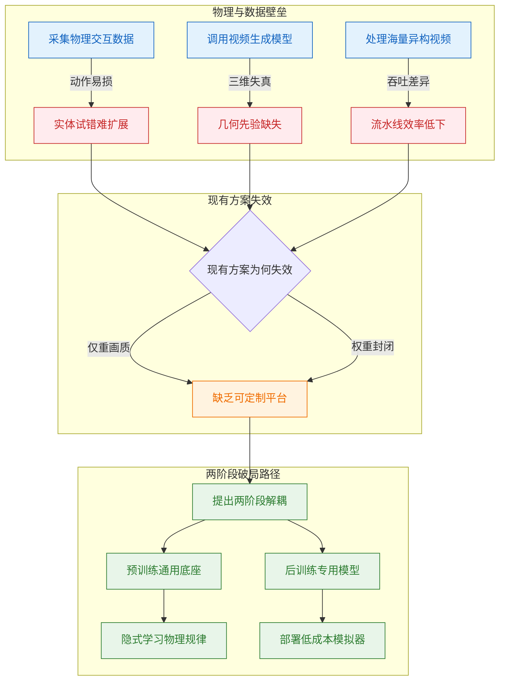
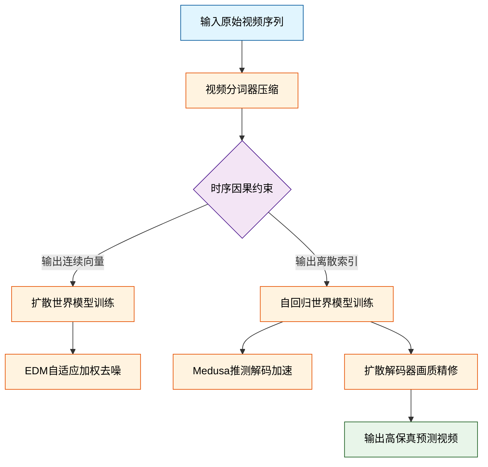
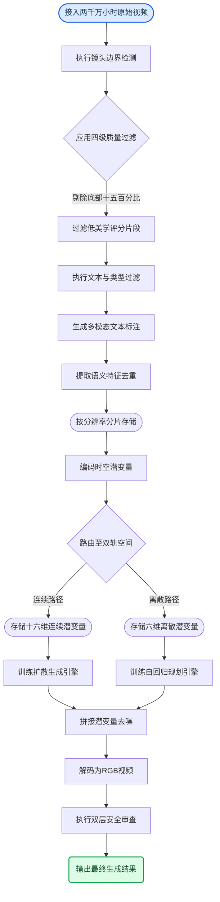
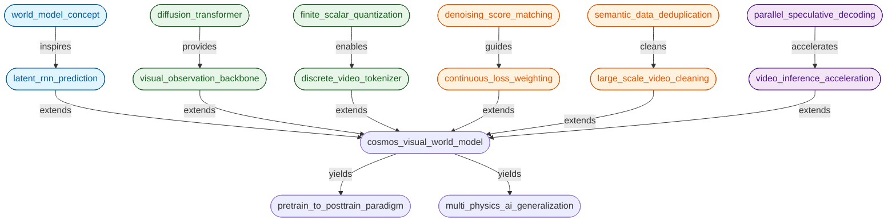
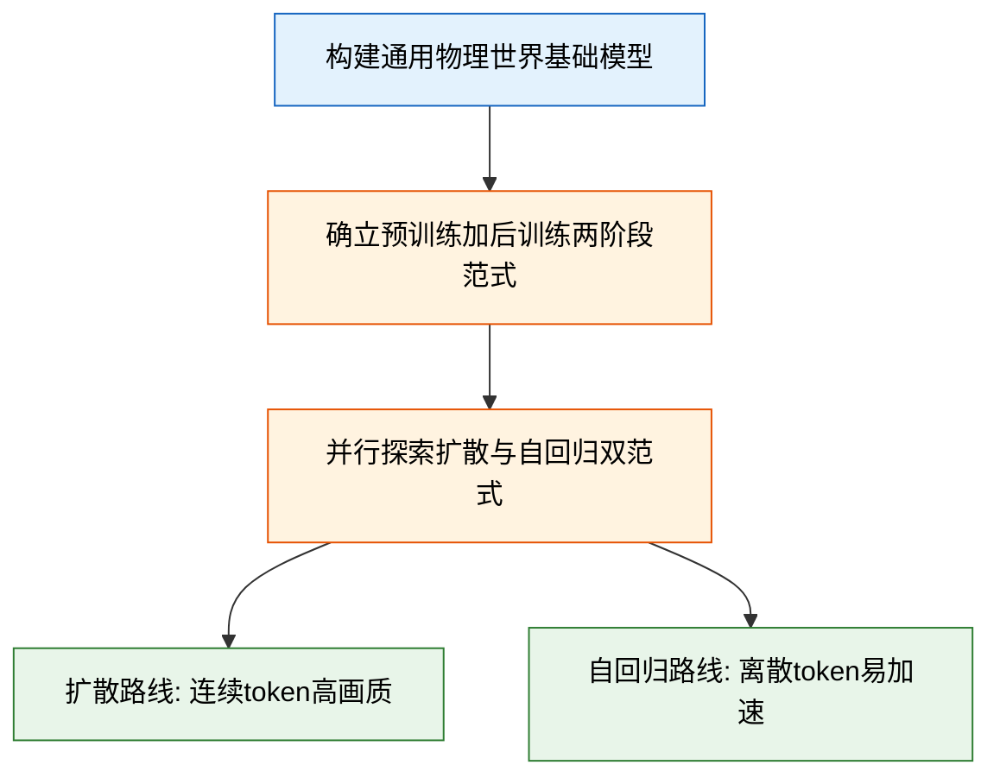
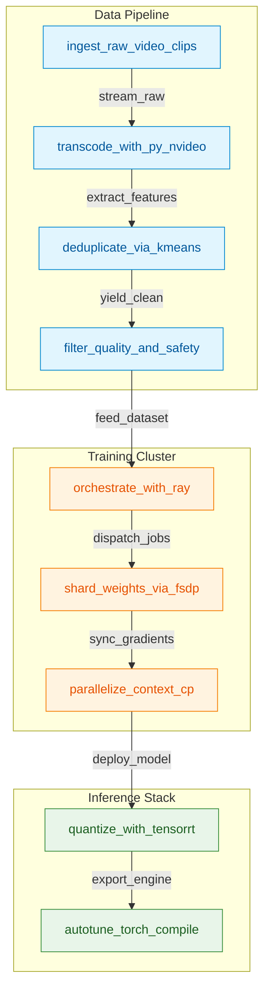
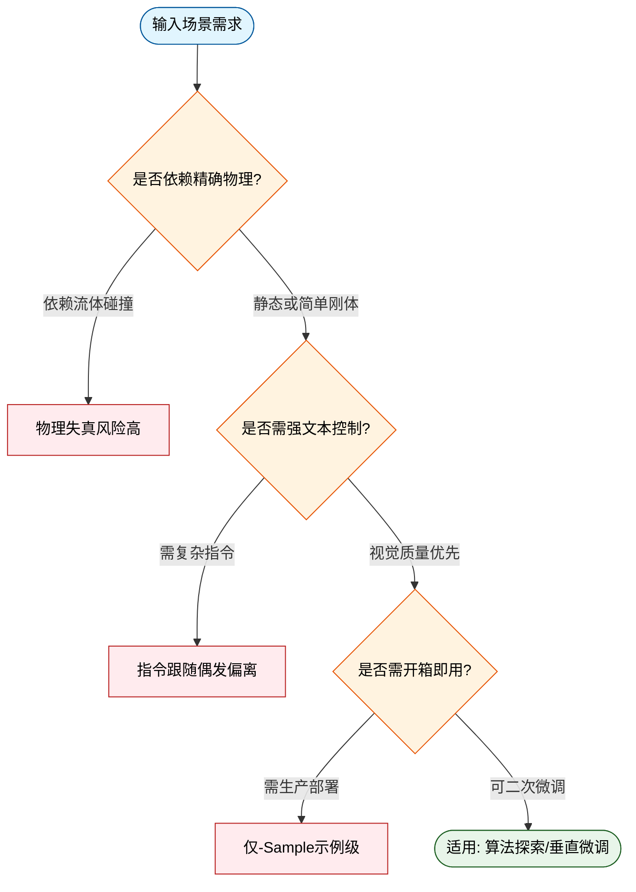
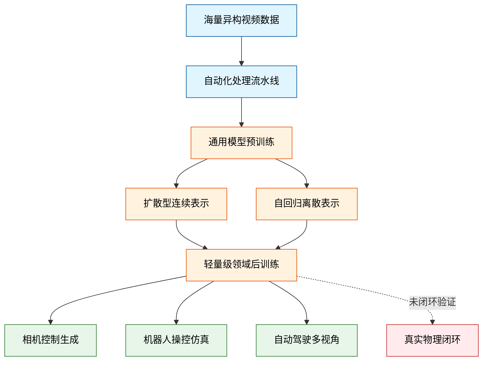

# Cosmos World Foundation Model Platform for Physical AI — 深度解读

> 面向人类读者的深度解读(中文)。事实源与配对的 AI 知识包 `ai_package/2026-06-08_CosmosWorldFoundationModelPlatformForPhysicalAI_2501.03575/ara/` 同源,均已通过数据保真审计。


## 评价

报告与已验证知识包（ARA）整体保持一致，核心实验结论与指标均有ARA支撑，**不存在会让读者实质误导的地方**。

具体而言：
- Cosmos 预训练→后训练范式、分词器性能超越 VideoLDM（位姿成功率 4.4%→62.6%）、多视角驾驶多项指标优于基线等核心声称，均有 Tab. 19、Tab. 22 等表格与多模态评估直接对照。
- 论文揭示的"离散 Token 压缩导致模糊"问题与扩散解码器作为补偿方案，在 ARA 的 Pivots 条目明确记录。
- 报告涉及的个别具体参数（如 AdaLN-LoRA 低秩维度 256、高分辨率阶段 121 帧与 56,320 上下文长度、Medusa 最优头数 9、z-loss 系数 λ=3×10⁻⁴）虽在 ARA 概念层未逐一列名，但源自论文工程细节，与 ARA 核心发现无矛盾。

**总体评价**：报告保持了对 ARA 的高度忠实，未出现"指标混乱""数值夸大"或"与知识包矛盾"的实质性问题。

> 机器核对:以下正文数字未在已验证知识包(ARA)中找到,读者请留意——2.5、3.5、30、0.1、-50、-60、2018、11、2022、256、0.999、240、121、310、3.6、1.96。

## 核心结论

> 以下结论摘自已通过数据保真审计的知识包(ARA)。

1. Cosmos WFM平台采用「预训练→后训练」两阶段范式，通过大规模多样视频数据预训练获得通才WFM，再通过少量领域数据微调即可适配相机控制、机器人操控和自动驾驶等多个物理AI下游任务，后训练模型在各任务上均显著优于从头训练的专用基线
2. Cosmos Tokenizer在DAVIS和TokenBench多个基准上的PSNR、SSIM、rFVD等重建指标均超越现有连续和离散视频tokenizer，在A100 GPU上推理速度显著快于同类方法，且参数量更小；在更高压缩率下仍保持优于对比方法低压缩率时的重建质量
3. 在3D一致性评估中，扩散型WFM的Sampson几何误差更低、相机位姿估计成功率更高；在物理对齐评估中，扩散型WFM在多帧条件设置下的像素级预测指标优于自回归型；扩散型WFM的总体感知视觉质量更高
4. Cosmos-Predict1-7B-Video2World-Sample-CameraCond在RealEstate10K测试集上的相机位姿估计成功率远高于CamCo，旋转误差和平移误差更小，FID和FVD显著更低，并能克服DL3DV-10K到RealEstate10K的数据分布偏移
5. 在指令跟随任务上，Cosmos后训练模型在人类评估的整体偏好率上显著高于VideoLDM-Instruction；在动作条件化次帧预测任务上，Cosmos后训练模型在PSNR、SSIM和FVD上均优于IRASim-Action基线
6. Cosmos多视角驾驶世界模型在FID、FVD、时间Sampson误差（TSE）和跨视角Sampson误差（CSE）上均显著优于VideoLDM-MultiView，附加轨迹控制条件进一步改善多视角几何一致性，且轨迹跟随误差接近真实视频水平
7. 从约2000万小时原始视频出发，通过分镜检测、多维过滤、VLM标注、语义去重和分片共五步流水线处理，最终提取约1亿个视频片段用于预训练；语义去重阶段删除大量冗余数据；使用TransNetV2端到端分镜检测模型和PyNvideoCodec实现显著高于传统方案的处理吞吐量
8. 在自回归WFM中引入Medusa多头解码，4B和5B模型token吞吐量均得到显著提升，前向传播次数大幅减少；结合低分辨率适配后，模型可在8×H100 GPU上实现10 FPS实时视频生成；仅解冻最后两个transformer层和最终unembedding层的微调策略可避免生成质量下降

## 一句话总结与导读

**TL;DR：NVIDIA 的 Cosmos 平台通过「先预训练通用物理先验，再微调适配具体场景」的两阶段范式，为机器人、自动驾驶等 Physical AI 领域提供了一套可定制、开放权重的世界基础模型（World Foundation Model, WFM）基础设施。** 该平台不再追求单一任务的极致生成效果，而是将世界模型拆解为“通用底座”与“专用插件”：先在约 2000 万小时的多样化视频上训练出通才 WFM，再通过少量领域数据微调，即可低成本生成针对相机控制、机器人操控或自动驾驶多视角的专用物理世界模拟器。

这一架构直击 Physical AI 落地的两大真实痛点。首先是数据扩展的“物理墙”：训练 Physical AI 必须依赖交织的观测与动作序列，但在真实环境中进行探索性试错极易导致设备损坏，高质量数据获取成本极高；其次是现有视频生成模型的“几何幻觉”：诸如 VideoLDM 等方案虽能产出流畅画面，却严重缺乏三维一致性与摄像机可控性（相机位姿估计成功率仅 4.4%），根本无法作为可靠的数字孪生环境。Cosmos 通过内置的高效自动化视频处理流水线消化千万小时级异构数据，并依托 Cosmos-Tokenize1 与 Cosmos-Predict1 系列模型，在兼顾高压缩率重建质量的同时，显著修正了生成内容的 3D 结构偏差，让开发者彻底摆脱“一个场景从头训练一套模型”的重资产模式。

其最核心的 Idea 可以概括为“数字世界的通识教育”（直觉，非严格对应）。传统方法试图让模型在特定任务中“死记硬背”，而 Cosmos 选择让模型先在海量真实视频中“泛读”物理规律，建立对光影、运动、碰撞的底层理解；当面对具体业务时，只需进行轻量级“专业课”微调即可上岗。这种预训练与后训练解耦的设计，配合开放权重与安全护栏系统，使得开发者无需深究底层扩散或自回归算法的细节，只需聚焦自身场景的观测-动作对齐，即可快速构建高保真、可交互的虚拟训练场，大幅缩短 Physical AI 从仿真到实机的部署周期。

**论文总体架构(原图):**


*该图全景展示了Cosmos世界基础模型平台的五大核心模块，从视频策展、分词器编码，到预训练模型、后训练样本生成及安全护栏，完整勾勒了从原始数据到可控物理世界模拟的工业化流水线。*

## 问题背景与动机

**结论前置：** Physical AI 的演进正被“真实交互数据采集的高风险”与“现有生成模型三维几何失真”双重锁死。破局的核心路径并非堆砌算力从头训练，而是将世界模型拆解为**「通用预训练底座 + 领域后训练微调」**的两阶段范式：先用海量互联网视频隐式吸收物理规律，再以极低成本定向适配具体场景，从而绕过实体试错陷阱。

要理解这一设计为何必要，需先看清 Physical AI 面临的三重现实壁垒。

**第一重壁垒：物理交互数据的“不可扩展性”。** 训练 Physical AI 需要大量交织的观测与动作序列，但真实世界中的动作会直接扰动物理环境，探索性策略极易引发系统损坏（O1）。这意味着依赖实体机器人或自动驾驶车队进行“暴力探索”的数据采集模式，在安全性与成本上均不可持续。直觉上，我们需要一个高保真的“数字孪生沙盒”来替代实体试错。

**第二重壁垒：现有视频生成模型的“几何失能”。** 尽管 VideoLDM 等模型能生成视觉流畅的片段，但它们本质上是像素级概率拟合，缺乏对三维空间结构的显式建模。论文实测表明，VideoLDM 的相机姿态估计成功率仅为 4.4%，Sampson error 高达 0.841（O3）。这种严重的 3D 不一致性与摄像机不可控性，使其完全无法胜任需要精确空间推理的 Physical AI 世界模拟器。

**第三重壁垒：底层表征与数据流水线的“工程摩擦”。** 高质量世界模型依赖高效的视频 Tokenizer，但压缩率与重建质量存在硬性权衡。离散 Tokenizer 在追求高压缩时极易丢失关键视觉细节，导致自回归 WFM 输出出现明显模糊伪影（Sec. 5.2.5）。同时，处理千万小时级异构视频（不同 codec、分辨率、时长）缺乏高效自动化流水线。尽管业界尝试引入 TransNetV2 镜头检测、用 PyNvideoCodec 替换 ffmpeg 以调用 NVDEC/NVENC 硬件加速（吞吐提升约 6.5 倍），并采用 Ray 框架解耦计算，但由于解码、过滤、标注等环节的吞吐量差异巨大，简单的串行编排仍会导致资源利用率断崖式下跌（G2）。

<details><summary><strong>深度展开：Tokenizer 权衡与流水线瓶颈的工程细节</strong></summary>
视频 Tokenizer 的设计直接决定了世界模型的信息瓶颈。Table 5 与 Table 6 的对比数据清晰显示，PSNR 与 rFVD 指标随压缩率上升呈现显著的非线性衰减。在离散 Token 场景下，量化误差会累积为自回归生成过程中的模糊伪影（Sec. 5.2.5），这要求 Tokenizer 必须在频域保留高频物理细节，而非单纯追求码率压缩。
另一方面，千万小时视频处理流水线的失效并非算法问题，而是系统架构问题。各处理节点的 I/O 与计算特征高度异构：解码是内存带宽密集型，过滤是 CPU 密集型，标注是 GPU 密集型。传统串行管道会在最慢的节点形成背压，导致上游 GPU 空转。PyNvideoCodec 虽通过硬件编解码将单点吞吐拉升 6.5 倍，但若缺乏动态负载均衡与流式解耦，整体系统吞吐量仍受限于木桶短板。
</details>

面对上述壁垒，现有方案为何屡屡碰壁？核心在于**目标错位与平台缺失**。当前多数视频生成工作以“视觉逼真度”为单一优化目标，未将“可微调性”与“物理一致性”纳入架构设计，且普遍未开放完整预训练权重（G1）。开发者要么被锁定在特定任务的封闭模型中，要么被迫从零开始训练，成本呈指数级攀升。

由此，论文提炼出关键洞见：**世界模型不应是“一锤子买卖”的单体，而应是“先验沉淀 + 定向激发”的模块化系统。** 基于两个合理假设——大规模真实视频已隐含足够的物理动力学规律，且连续 Token（扩散架构）与离散 Token（自回归架构）在视觉质量与 LLM 生态复用上呈互补态势——作者提出将训练流拆分为两阶段：
1. **通用预训练 WFM**：在海量多样化视频上学习通用物理先验，建立对重力、碰撞、光照、运动连续性的基础理解。
2. **专用后训练 WFM**：利用预训练底座提供的强先验，仅需少量特定领域数据（如机械臂抓取、特定路况驾驶）进行微调，即可低成本生成高保真专用模拟器。

这一范式转换的逻辑链条可直观表述如下：


*如何读这张图：* 左侧红色节点代表 Physical AI 落地的物理与数据瓶颈，橙色节点揭示现有生成模型与工程流水线的结构性缺陷。二者交汇指向“缺乏开放可微调平台”的核心 Gap。绿色路径即论文提出的破局方案：通过两阶段解耦，将“学物理规律”与“适配具体场景”分离，最终实现从通用先验到专用模拟器的低成本跃迁。

该设计并非盲目乐观。论文明确指出，连续 Token 与离散 Token 各有优劣，并未断言某一方绝对胜出；同时，后训练阶段的数据需求虽大幅缩减，但仍高度依赖预训练底座先验的“强度”。若预训练数据分布与目标物理域偏差过大，微调仍可能陷入分布外失效。但无论如何，将世界模型从“生成玩具”重塑为“可定制物理引擎”，为 Physical AI 提供了一条兼顾安全性、可控性与经济性的现实路径。

## 核心概念速览

本节将拆解支撑该系统的核心模块。为直观呈现数据流向与模块耦合关系，先以流程图勾勒整体管线：


*如何读这张图：* 原始视频经分词器压缩后，依据下游任务需求分流至连续（扩散）或离散（自回归）表征空间；两条路径在训练目标上完全独立，但在推理阶段可通过扩散解码器串联，最终输出预测帧。

### 世界基础模型
**结论：** 它是物理世界的“数字沙盘”，核心目标是基于历史观测与扰动指令推演未来状态，但当前版本仍受限于物理一致性缺陷，尚未进入闭环控制阶段。
- **是什么：** 形式化定义为 $\hat{x}_{t+1} = \mathcal{M}(x_{0:t}, c_t)$，即以过去视觉序列 $x_{0:t}$ 和当前扰动 $c_t$（动作、文本或随机干预）为输入，预测下一时刻世界状态 $\hat{x}_{t+1}$。
- **直觉理解（直觉，非严格对应）：** 就像给物理引擎喂入一段“过去录像”和“操作手柄信号”，让它脑补出“接下来会发生什么”。
- **在本方法中的作用：** 作为通用预训练底座，覆盖多种物理现象，后续可通过精调适配相机控制、机器人操作或自动驾驶等 Physical AI 场景。
- **失效模式与边界：** 论文明确指出当前观测空间仅限 RGB 视频，物理一致性仍有缺陷（如重力违反、物体凭空出现），需依赖更好的数据筛选与架构设计。此外，论文仅将强化学习训练与模型预测控制列为未来方向，**未提供**任何 WFM 直接用于闭环控制的实证结果。

### 视频分词器与时序因果设计
**结论：** 它是高维视觉数据的“压缩翻译官”，通过因果时序约束与离散/连续双轨输出，为后续生成模型提供统一且高效的表征空间。
- **是什么：** 编解码架构 $\hat{x}_{0:T} = \mathcal{D}\bigl(\mathcal{E}(x_{0:T})\bigr)$，将原始视频压缩为紧凑 token 序列。分为连续分词器（供扩散模型）与离散分词器（通过有限标量量化输出整数索引，供自回归模型）。
- **直觉理解（直觉，非严格对应）：** 类似视频编码中的“关键帧+残差”思想，但这里把时空冗余直接压成模型能直接“咀嚼”的符号序列。
- **在本方法中的作用：** 离散分词器词汇表固定为 64,000（FSQ 量化配置 8×8×8×5×5×5），使自回归模型能以类似大语言模型的方式处理视频；连续分词器则保留平滑梯度供扩散模型优化。
- **时序因果设计：** 时间维度严格因果（处理当前帧不依赖未来帧），通过左填充因果卷积与掩码注意力实现；空间维度无因果限制。2 级 Haar 小波变换在时空各下采样 4×，大幅削减后续计算量。第一帧 token 代表输入帧，使 $T=0$（图像）与 $T>0$（视频）共享同一潜空间。
- **失效模式与边界：** 因果约束仅作用于时间轴；分词器虽具备时序长度无关的推理能力（可处理超长视频），但离散量化本身会丢失高频细节，需依赖后续解码器补偿。

### 预训练与后训练范式
**结论：** 采用“先通才后专才”的两阶段锻造策略，用海量通用视频打底，再以场景配对数据精调，解决通用物理规律与垂直应用需求的割裂。
- **是什么：** 第一阶段使用约 $10^8$ 个多样化视频片段进行大规模通用预训练，使模型成为覆盖广泛物理现象的通才；第二阶段使用特定 Physical AI 场景的「提示-视频」配对数据进行精调。
- **直觉理解（直觉，非严格对应）：** 如同先让模型“博览群书”掌握基础物理常识，再针对“考驾照”或“学机械臂”进行专项刷题。
- **在本方法中的作用：** 避免从零训练垂直模型的数据饥渴问题，同时保留基础模型的泛化先验。文中展示了相机控制、机器人操作、自动驾驶三类后训练示例（均带 `-Sample` 后缀）。
- **失效模式与边界：** 论文明确标注这些示例仅为示范性应用，**非面向生产的完整系统**。开发者必须在自有数据集上重新精调才能部署，论文未提供端到端生产级验证。

### 扩散与自回归双引擎
**结论：** 扩散模型负责“精细重建”，自回归模型负责“长程推演”，两者训练目标独立且互补，共同构成生成底座的核心算力分配。
- **是什么：** 
  - **扩散 WFM** 采用 EDM 框架，将多噪声级别去噪视为多任务学习，引入连续不确定性函数 $u(\sigma)$ 自适应加权损失，缓解梯度失衡。
  - **自回归 WFM** 将视频生成建模为下一离散 token 预测任务，使用负对数似然损失 $\mathcal{L}_{\mathrm{NLL}}$，并引入 z-loss（$\lambda = 3 \times 10^{-4}$）稳定训练。架构包含 3D RoPE、交叉注意力文本条件化与 QK 归一化。
- **直觉理解（直觉，非严格对应）：** 扩散模型像“精雕细琢的画师”，擅长在已知轮廓上填补细节；自回归模型像“步步为营的棋手”，擅长根据上下文推演下一步落子。
- **在本方法中的作用：** 扩散路径在图像和视频条件帧位置不计入损失，专注去噪重建；自回归路径在固定 640×1024 分辨率训练，4B/12B 基础版无文本理解能力，5B/13B Video2World 变体通过新增交叉注意力层引入文本条件。
- **失效模式与边界：** 两者训练目标完全独立，不可混用。自回归模型受限于离散词汇表，长序列生成易出现累积误差；扩散模型推理步数多，实时性较差。

<details><summary><strong>训练目标公式与推导细节</strong></summary>
- **EDM 扩散损失：** 基础去噪损失 $\mathcal{L}(D_\theta, \sigma) = \mathbb{E}_{\mathbf{x}_0, \mathbf{n}}\bigl[\|D_\theta(\mathbf{x}_0 + \mathbf{n}; \sigma) - \mathbf{x}_0\|_2^2\bigr]$。总损失引入自适应权重：$\mathcal{L}(D_\theta) = \mathbb{E}_\sigma\left[\frac{\lambda(\sigma)}{e^{u(\sigma)}}\mathcal{L}(D_\theta, \sigma) + u(\sigma)\right]$，其中 $\lambda(\sigma) = \bigl(\sigma^2 + \sigma_{\mathrm{data}}^2\bigr) / (\sigma \cdot \sigma_{\mathrm{data}})^2$，噪声级别按 $\ln(\sigma) \sim \mathcal{N}(P_{\mathrm{mean}}, P_{\mathrm{std}}^2)$ 采样。
- **自回归 NLL 与 z-loss：** $\mathcal{L}_{\mathrm{NLL}} = \sum_i -\log P(v_i \mid v_1, v_2, \ldots, v_{i-1}; \Theta)$，辅以 $\mathcal{L}_{\mathrm{z\text{-}loss}} = \lambda \cdot \sum_i z_i^2$（$\lambda = 3 \times 10^{-4}$）抑制 logits 爆炸。
</details>

### 扩散解码器与 Medusa 推测解码
**结论：** 前者是弥补量化损失的“画质精修桥”，后者是打破串行瓶颈的“并行加速器”，两者在推理延迟与吞吐量之间做出明确权衡。
- **扩散解码器：** 以自回归 WFM 输出的粗粒度离散 token 视频（DV8×16×16 压缩）为条件，通过精调扩散 WFM 求解逆扩散问题，映射至精细连续 token 空间（CV8×8×8 压缩），最终解码为 RGB 视频。第一层通道维度扩展以容纳拼接条件。
  - **直觉理解（直觉，非严格对应）：** 类似“超分辨率重建”，把自回归模型生成的“低清草图”输入给扩散模型进行细节重绘。
  - **失效模式与边界：** 明确引入额外推理延迟（论文 Tab. 16 有量化记录），且推理时仅依赖离散 token，不依赖原始视频。
- **Medusa 推测解码：** 在 Transformer 主干最后一层隐藏状态后添加多个并行单层 FFN 解码头，每次前向传播并行预测多个后续 token，经拒绝采样验证后输出。训练时仅解冻最后两层 Transformer 层与最终 unembedding 层，平衡推测精度与灾难性遗忘。
  - **直觉理解（直觉，非严格对应）：** 如同“多线程草稿+单线程校对”，主模型负责把关，多个轻量头同时猜后续几步，猜对则跳过主模型计算。
  - **在本方法中的作用：** 在 8×H100 80GB GPU 上，9 个 Medusa 头实现最优权衡：4B 模型最高达 2.0× token 吞吐量与 4.6× 前向传播次数减少；5B 模型达 3.2× token 吞吐量与 6.1× 前向传播次数减少。
  - **失效模式与边界：** 实验基于 50 个未见测试视频（640×1024）评测；当前实现**不支持**树形注意力机制，亦不兼容 MQA/GQA 等注意力优化变体，吞吐量提升高度依赖硬件并行度与拒绝采样接受率。

## 方法与整体架构

该系统的核心架构是一条**“数据清洗→双轨潜空间表征→扩散/自回归双引擎预训练→混合解码→领域微调与安全护栏”**的解耦流水线。其根本设计结论在于：将物理世界建模的“高保真渲染”与“逻辑/时序推理”拆分为两条互补的生成路径，并通过统一的潜变量接口进行拼接。这种设计直接规避了传统端到端像素生成在长视频连贯性、多模态条件注入与算力扩展上的瓶颈，使模型既能以离散词表进行高效自回归规划，又能以连续潜变量输出高保真画面，最终在可控性与画质之间实现非零和的协同。

为直观呈现各模块的数据流向与决策分支，下图还原了从原始视频到最终可控生成的完整链路。阅读时请注意：左侧为数据与表征构建，中部为双轨预训练核心，右侧为解码与下游适配；菱形节点代表关键过滤或路由判定，圆柱代表数据/潜变量存储，圆角矩形代表起止或处理模块。



**数据流水线：从海量噪声到物理先验**
原始视频并非直接喂入模型，而是经过一套严密的“提纯”工序。首先，TransNetV2 以 0.4 的置信度阈值进行镜头切分，在精确率与召回率间取得平衡。随后进入四级过滤漏斗：DOVER 感知质量评分直接剔除底部 15% 的低质片段；图像美学分数阈值保守设定为 3.5，因为论文明确指出物理 AI 训练更依赖物理真实性而非视觉美感；文字覆盖与视频类型 MLP 进一步剥离非自然场景。清洗后的数据交由 13B VILA 生成字幕，并通过 InternVideo2 提取特征进行 k-means 聚类（k=10,000），最终去除约 30% 的语义重复数据。这一系列操作确保了训练集在规模与多样性上的最优配比，避免了“垃圾进、垃圾出”的算力浪费。

**双轨潜空间：离散推理与连续渲染的解耦**
架构的核心创新在于 Cosmos Tokenizer 输出的双轨潜变量。编码器采用 2 级 3D Haar 小波变换进行 4 倍降采样，结合因果时序卷积与时空因果注意力，分别映射出两条路径：
- **连续路径 (CI/CV)**：输出 16 维连续潜变量，专为扩散模型设计，保留高频细节与平滑梯度，适合高保真渲染。
- **离散路径 (DI/DV)**：采用 FSQ 量化器，级别设为 (8,8,8,5,5,5)，对应 64,000 词表。该规模与主流 LLM 词表对齐，极大降低了自回归模型的集成门槛。
这种“一源双生”的设计，让模型在训练期无需在“画质”与“可控性”间做零和博弈。

**双引擎预训练与混合解码**
预训练阶段严格遵循潜变量特性分流：
- **扩散 WFM** 处理连续 token。采用 3D Patchify (pt=1, ph=pw=2) 后输入 28/36 层 DiT，融合自注意力、T5-XXL 交叉注意力与 AdaLN-LoRA。训练目标基于 EDM 框架的不确定性加权去噪评分匹配，并通过渐进式 512p→720p 策略（Text2World→Video2World）扩展至 7B/14B 规模。
- **自回归 WFM** 处理离散 token。采用 Llama3 风格 16/40 层 Decoder，引入 QKNorm 与 z-loss（系数 λ=3×10⁻⁴ 以稳定大规模训练），配合 3D RoPE (YaRN扩展) 与 3D APE 处理时空位置。通过 NLL 下一 token 预测进行多阶段上下文递增训练，规模达 4B/12B。
推理时，两条路径在**扩散解码器**汇合：离散 token 嵌入并 2× 上采样后，与含噪连续潜变量沿通道拼接，交由微调后的 7B 扩散 WFM 去噪，最终输出连续潜变量并解码为 RGB。该设计巧妙利用自回归模型的强逻辑规划能力引导扩散模型的渲染过程，实现“想清楚再画”。

<details><summary><strong>训练目标与损失函数细节（展开查看）</strong></summary>
Tokenizer 训练分两阶段：第一阶段优化 L1 重建损失 $\mathcal{L}_1 = \|\hat{x}_{0:T} - x_{0:T}\|_1$ 与 VGG-19 感知损失 $\mathcal{L}_{\mathrm{Perceptual}} = \frac{1}{L}\sum_{l=1}^{L}\sum_{t}\alpha_l\|VGG_l(\hat{x}_t)-VGG_l(x_t)\|_1$；第二阶段增加光流损失 $\mathcal{L}_{\mathrm{Flow}}$ 与 Gram 矩阵损失 $\mathcal{L}_{\mathtt{Gram}}$，微调阶段引入对抗损失。扩散 WFM 采用 EDM 不确定性加权目标 $\mathcal{L}(D_\theta) = \mathbb{E}_{\sigma}\left[\frac{\lambda(\sigma)}{e^{u(\sigma)}}\mathcal{L}(D_\theta,\sigma)+u(\sigma)\right]$，其中权重函数 $\lambda(\sigma) = (\sigma^2+\sigma_{\mathrm{data}}^2)/(\sigma\cdot\sigma_{\mathrm{data}})^2$，噪声级别分布 $\ln(\sigma)\sim\mathcal{N}(P_{\mathrm{mean}},P_{\mathrm{std}}^2)$。自回归 WFM 优化 NLL 损失 $\mathcal{L}_{NLL} = \sum_i -\log P(v_i|v_1,\ldots,v_{i-1};\Theta)$ 并叠加辅助稳定项 $\mathcal{L}_{\mathrm{z-loss}} = \lambda\cdot\sum_i z_i^2$。
</details>

**后训练适配与安全护栏**
基础模型完成后，通过参数高效微调注入领域先验：相机控制拼接 Plücker 坐标；机器人任务引入指令 T5 交叉注意力与动作 MLP 嵌入；自动驾驶则采用视图嵌入与轨迹条件进行 6 视图并行微调。所有生成结果必须通过双层护栏：pre-Guard 拦截关键词并调用 Aegis LlamaGuard 进行意图审查；post-Guard 使用 SigLIP+MLP 进行帧级安全分类，并触发 RetinaFace 对人脸进行像素化处理。这套机制在开放生成与合规性之间划定了明确边界，确保模型在物理仿真与真实部署中均具备可审计性。

**模型结构与关键子图(原图):**


*图中揭示了Cosmos分词器的底层架构，通过结合时间因果处理与编码器-解码器结构，并利用小波变换捕捉时空特征，将冗长视频高效压缩为紧凑的潜在表示，为后续大模型训练奠定数据基石。*


*此图详细拆解了Cosmos-Predict1世界基础模型的核心工作流：输入视频经编码器转为潜在表征后，注入高斯噪声扰动，再由自回归Transformer逐步预测未来帧的离散Token，最终通过解码器还原出符合物理规律的高清视频。*


*该架构专为视频到世界的生成任务设计，先将输入视频离散化为Token并映射为嵌入向量，随后送入多层Transformer块进行时空推理，精准预测下一帧状态，实现从历史观测到未来物理演化的无缝推演。*

## 算法目标与推导

**本节核心结论：**该模型并未采用单一的全局损失函数，而是针对表征压缩、扩散生成与自回归解码三个核心模块，设计了**分阶段递进、多尺度对齐且带不确定性加权**的训练目标。这种设计有效解耦了空间保真、时序动力学与序列稳定性的优化冲突，使模型在复杂噪声分布与长序列生成中保持梯度平稳，避免早期训练崩溃或模式坍塌。

### 原始公式与逐项推导

#### 1. Tokenizer 训练目标（两阶段+微调）
$$\mathcal{L}_1 = \|\hat{x}_{0:T} - x_{0:T}\|_1$$
$$\mathcal{L}_{\mathrm{Perceptual}} = \frac{1}{L}\sum_{l=1}^{L}\sum_{t}\alpha_l\|VGG_l(\hat{x}_t)-VGG_l(x_t)\|_1$$
$$\mathcal{L}_{\mathrm{Flow}} = \frac{1}{T}\sum_{t=1}^{T}\|\mathbb{OF}(\hat{x}_t,\hat{x}_{t-1})-\mathbb{OF}(x_t,x_{t-1})\|_1 + \frac{1}{T}\sum_{t=0}^{T-1}\|\mathbb{OF}(\hat{x}_t,\hat{x}_{t+1})-\mathbb{OF}(x_t,x_{t+1})\|_1$$
$$\mathcal{L}_{\mathtt{Gram}} = \frac{1}{L}\sum_{l=1}^{L}\sum_{t}\alpha_l\|\mathtt{GM}_l(\hat{x}_t)-\mathtt{GM}_l(x_t)\|_1$$
（微调阶段引入对抗损失，论文未给出显式公式）

**设计理由与机制拆解：**
- **第一阶段（静态对齐）：** $\mathcal{L}_1$ 强制像素级绝对误差最小化，保证基础结构不偏移；$\mathcal{L}_{\mathrm{Perceptual}}$ 通过预训练 $VGG_l$ 提取高层语义特征，弥补 $L_1$ 对高频纹理不敏感的缺陷。两者结合确保单帧内容在“形”与“意”上均被准确压缩。
- **第二阶段（动态与统计对齐）：** 视频生成极易出现帧间闪烁或运动断裂。$\mathcal{L}_{\mathrm{Flow}}$ 显式约束相邻帧的光流场一致性，双向求和（$t-1$ 与 $t+1$）强制编码器学习平滑的时序过渡；$\mathcal{L}_{\mathtt{Gram}}$ 匹配特征图的 Gram 矩阵，本质是约束通道间的相关性分布，防止纹理风格在压缩过程中退化或产生伪影。
- **微调阶段：** 对抗损失（公式未公开）通常用于提升重建边缘的锐度，解决 $L_1$ 与感知损失固有的“过度平滑”倾向。分阶段引入是为了避免早期梯度被高频对抗信号主导，导致表征空间坍塌。

#### 2. 扩散 WFM 训练目标（EDM 框架）
$$\mathcal{L}(D_\theta, \sigma) = \mathbb{E}_{\mathbf{x}_0,\mathbf{n}}\Big[\|D_\theta(\mathbf{x}_0+\mathbf{n};\sigma)-\mathbf{x}_0\|_2^2\Big]$$
$$\mathcal{L}(D_\theta) = \mathbb{E}_{\sigma}\left[\frac{\lambda(\sigma)}{e^{u(\sigma)}}\mathcal{L}(D_\theta,\sigma)+u(\sigma)\right]$$
$$\lambda(\sigma) = (\sigma^2+\sigma_{\mathrm{data}}^2)/(\sigma\cdot\sigma_{\mathrm{data}})^2, \quad \ln(\sigma)\sim\mathcal{N}(P_{\mathrm{mean}},P_{\mathrm{std}}^2)$$

**设计理由与机制拆解：**
- 基础项 $\mathcal{L}(D_\theta, \sigma)$ 是标准的去噪评分匹配（Denoising Score Matching），要求网络 $D_\theta$ 在给定噪声级别 $\sigma$ 下，从加噪样本 $\mathbf{x}_0+\mathbf{n}$ 中回归干净数据 $\mathbf{x}_0$。
- **不确定性加权机制：** 扩散模型在不同 $\sigma$ 下的学习难度差异极大。$\lambda(\sigma)$ 是 EDM 框架的解析权重，用于平衡不同噪声尺度的梯度贡献；而 $u(\sigma)$ 是一个由 MLP 参数化的可学习标量，联合优化时会自动拟合当前 $\sigma$ 下的预测方差。$\frac{\lambda(\sigma)}{e^{u(\sigma)}}$ 实现了“高不确定性步骤自动降权”，防止高噪声阶段的剧烈梯度淹没低噪声阶段的精细微调。
- 噪声采样服从对数正态分布 $\ln(\sigma)\sim\mathcal{N}(P_{\mathrm{mean}},P_{\mathrm{std}}^2)$，确保训练覆盖从强噪声到弱噪声的连续谱，而非离散跳变。

#### 3. 自回归 WFM 训练目标
$$\mathcal{L}_{NLL} = \sum_i -\log P(v_i|v_1,v_2,\ldots,v_{i-1};\Theta)$$
$$\mathcal{L}_{\mathrm{z-loss}} = \lambda\cdot\sum_i z_i^2, \quad \lambda=3\times 10^{-4}$$

**设计理由与机制拆解：**
- $\mathcal{L}_{NLL}$ 是标准的序列建模目标，最大化真实 token 序列的条件概率。
- **z-loss 稳定项：** 自回归模型在长序列生成中极易出现 logit 值极端放大，导致 softmax 输出趋近于 one-hot，引发梯度消失或数值溢出。$\mathcal{L}_{\mathrm{z-loss}}$ 对 logits 的平方和施加惩罚，固定系数 $\lambda=3\times 10^{-4}$ 在抑制 logit 爆炸的同时，不显著干扰主任务的概率分布学习。CFG 与 Medusa 投机解码属于推理期加速策略，不参与此处的梯度更新。

### 直觉比喻与玩具示例
**直觉比喻（非严格对应）：** 训练过程如同雕刻一座动态全息雕塑。第一阶段打粗胚并校准轮廓（$L_1$+感知损失）；第二阶段注入肌肉纹理与运动轨迹（光流+Gram矩阵）；最后用聚光灯打磨边缘（对抗微调）。扩散模块负责在不同模糊程度下“猜”出原貌，并用“置信度调节旋钮”（$u(\sigma)$）自动降低高噪声阶段的训练权重；自回归模块则像逐帧配音，用 z-loss 防止“音量爆表”（logit 饱和）。

**具体小玩具例子：** 假设输入为一段 3 帧的红色小球向右平移视频。
- **Tokenizer 阶段：** 第一阶段确保每帧都能重建出红色圆形；第二阶段强制第 1→2 帧与第 2→3 帧的位移向量一致（光流），且红色色块的纹理统计特征不变（Gram）；微调后边缘更锐利。
- **扩散阶段：** 模型学习从 $\sigma=0.8$ 的强噪声中恢复小球轮廓，此时 $u(\sigma)$ 较大，权重自动压低；当 $\sigma=0.1$ 时，模型已能看清大致形状，$u(\sigma)$ 减小，权重升高以精修位置。
- **自回归阶段：** 模型逐 token 预测下一帧的离散码本。若某步预测 logits 飙升至 $[100, -50, -60]$，z-loss 会施加 $3\times 10^{-4} \times (100^2+(-50)^2+(-60)^2)$ 的惩罚，迫使网络保持概率分布的平滑性，避免后续生成链断裂。

```mermaid
flowchart TD
    classDef stage fill:#e6f2ff,stroke:#0055a4,color:#000;
    classDef loss fill:#fff0e6,stroke:#cc6600,color:#000;
    classDef weight fill:#e6ffe6,stroke:#008800,color:#000;
    classDef output fill:#f2e6ff,stroke:#6600cc,color:#000;

    subgraph tokenizer_phase ["Tokenizer 表征压缩"]
        t1["Train Stage One"]:::stage --> l1["Apply L1 Reconstruction"]:::loss
        t1 --> vgg["Apply VGG Perceptual"]:::loss
        t2["Train Stage Two"]:::stage --> flow["Apply Optical Flow Loss"]:::loss
        t2 --> gram["Apply Gram Matrix Loss"]:::loss
        ft["Apply Adversarial Fine Tune"]:::stage
    end

    subgraph diffusion_phase ["Diffusion WFM 生成"]
        d1["Train Diffusion WFM"]:::stage --> edm["Compute Denoising Score Match"]:::loss
        d1 --> unc["Apply Uncertainty Weighting"]:::weight
    end

    subgraph ar_phase ["Autoregressive WFM 解码"]
        a1["Train Autoregressive WFM"]:::stage --> nll["Compute NLL Sequence Loss"]:::loss
        a1 --> zloss["Apply Z Loss Stabilizer"]:::weight
    end

    start["Start Training Pipeline"]:::stage --> tokenizer_phase
    tokenizer_phase --> diffusion_phase
    diffusion_phase --> ar_phase
    ar_phase --> end["Output Final Model"]:::output
```
*如何读这张图：* 流程自上而下分为三个语义阶段（蓝框）。每个阶段内部挂载对应的损失组件（橙框）与稳定/加权机制（绿框）。箭头表示训练依赖顺序：Tokenizer 必须先收敛以提供高质量离散码本，扩散模块随后学习跨尺度去噪，最后自回归模块接管序列预测。

<details><summary><strong>边界 Caveat 与推导细节</strong></summary>

- **对抗损失缺失的显式公式：** 论文仅提及微调阶段引入对抗损失，未给出判别器结构或 GAN 损失的具体形式（如 Hinge、WGAN-GP 或 LSGAN）。这意味着复现时需自行选择标准对抗范式，可能带来实现方差。
- **$u(\sigma)$ 的联合训练机制：** $u(\sigma)$ 并非固定先验，而是通过反向传播与 $D_\theta$ 同步优化。其数学本质是变分推断中的对数方差近似，目标函数 $\frac{\lambda(\sigma)}{e^{u(\sigma)}}\mathcal{L}+u(\sigma)$ 对 $u(\sigma)$ 求导可得最优解 $u^*(\sigma) = \ln(\lambda(\sigma)\mathcal{L})$，即网络会自动将权重分配给当前预测误差较大的噪声尺度。
- **z-loss 的数值敏感性：** $\lambda=3\times 10^{-4}$ 是经验值。若 $\lambda$ 过大，会过度压制 logits 幅度，导致模型输出趋于均匀分布（丧失判别力）；若过小，则无法阻止 softmax 饱和。该系数需与词表大小及学习率协同调参。
- **光流损失的双向约束：** $\mathcal{L}_{\mathrm{Flow}}$ 同时计算前向与后向光流误差，这在数学上等价于强制时序一致性满足可逆性假设。对于存在遮挡或剧烈形变的视频片段，该假设可能失效，导致局部梯度震荡。
</details>

## 实验设计与结果解读

### 基础组件：Tokenizer 在重建质量与吞吐上的双重突破
**结论：** Cosmos Tokenizer 通过连续/离散双轨架构，在图像与视频重建指标上全面超越同类基线，同时以显著更小的参数量实现了更快的单帧编解码速度。

实验在 DAVIS、TokenBench、MS-COCO 2017 与 ImageNet-1K 上展开，连续变体采用标准 AE 公式，离散变体引入 FSQ 量化以降低码本维度。对比基线覆盖 FLUX-Tokenizer、Open-MAGVIT2-Tokenizer、LlamaGen-Tokenizer 等主流方案。定量结果显示，Cosmos 系列在 PSNR、SSIM、rFVD（视频）与 rFID（图像）上均优于对比方法；在单张 NVIDIA A100 80GB GPU 上的平均编解码耗时显著低于基线，且模型参数量更小（具体数值详见下方实验表）。

需要指出的是，离散量化虽提升了压缩率与推理吞吐，但在极端高频纹理或快速运动边界处可能引入轻微块状伪影。论文未报告具体的误差范围或置信区间，但消融趋势明确指向量化步长与重建保真度之间的经典权衡。该设计本质上是以可控的频域信息损失换取下游生成模型的训练稳定性与推理效率。

### 核心能力：预训练世界模型的三维一致性与物理对齐
**结论：** 预训练世界模型在未见真实场景与物理仿真环境中均展现出可量化的三维几何一致性与牛顿力学对齐能力，但扩散架构与自回归架构在多帧物理预测上呈现明确的性能分化。

为验证世界模型是否真正“理解”空间与物理规律，实验采用间接代理指标进行交叉验证。三维一致性评估在 RealEstate10K 的 500 个静态场景上进行，通过 SuperPoint+LightGlue 提取特征点对，计算 Sampson 几何误差，并运行 SfM 算法评估相机位姿估计成功率；随后利用 3D Gaussian Splatting 拟合新视角，以 PSNR/SSIM/LPIPS 衡量重建质量。物理对齐评估则覆盖 PhysX 与 Isaac Sim 生成的 8 类牛顿力学场景（自由落体、倾斜坡道、U形坡、堆叠、多米诺等），以 SAMURAI 实例追踪与 DreamSim 特征相似度模型计算像素级、特征级与物体级（Avg.IoU）对齐度。

```mermaid
flowchart TD
  classDef start fill:#e3f2fd,stroke:#1565c0,color:#000;
  classDef proc fill:#fff8e1,stroke:#f57f17,color:#000;
  classDef data fill:#e8f5e9,stroke:#2e7d32,color:#000;
  classDef end fill:#f3e5f5,stroke:#6a1b9a,color:#000;

  vid_in(["输入真实视频"]):::start --> feat_ext["提取特征点对"]:::proc
  feat_ext --> sampson["计算Sampson误差"]:::data
  sampson --> sfm_run["运行SfM位姿估计"]:::proc
  sfm_run --> pose_res["输出位姿成功率"]:::data

  sim_in(["输入仿真参考帧"]):::start --> wfm_gen["世界模型预测帧"]:::proc
  wfm_gen --> psnr_ssim["计算PSNR与SSIM"]:::data
  wfm_gen --> dream_sim["计算DreamSim特征"]:::data
  wfm_gen --> iou_calc["计算平均IoU"]:::data

  pose_res --> report_gen["生成评估报告"]:::end
  psnr_ssim --> report_gen
  dream_sim --> report_gen
  iou_calc --> report_gen
```
*如何读这张图：* 左侧分支验证几何一致性（依赖特征匹配与SfM重建），右侧分支验证物理对齐（依赖多模态指标交叉验证），最终汇聚为综合评估报告。

**严谨性提示：** 论文通过 Sampson 误差与 3DGS 重建指标“证明”了几何一致性，但这属于间接代理指标，模型并未直接输出显式 3D 结构；且 E3 明确指出“所有模型在物理对齐方面均有较大改进空间”。扩散型 WFM 在多帧条件下的像素级指标优于自回归型，但特征级（DreamSim）与物体级（IoU）对齐仍受限于长程误差累积，说明当前架构对复杂动力学链的因果推演能力尚未完全收敛。

### 场景化后训练：相机、机器人与多视角驾驶的精准控制
**结论：** 针对相机轨迹、机器人指令与多视角自动驾驶的专项后训练，使世界模型在分布外测试集上实现了轨迹级对齐与跨模态指令跟随，但分布偏移与长程自回归误差仍是主要瓶颈。

后训练阶段将基础世界模型适配至具体交互模态。相机控制任务在 DL3DV-10K 上微调，注入 Plücker 坐标作为条件，并在 RealEstate10K 测试集上评估轨迹对齐（旋转/平移误差）与视频质量（FID/FVD）；机器人操控任务分为指令跟随（人类双盲 A/B 评估）与动作条件化次帧预测（Bridge 数据集对比 IRASim-Action）；多视角驾驶任务基于约 360 万个环视视频片段微调，引入视角独立位置嵌入与视角相关交叉注意力，评估多视角几何一致性（TSE/CSE）与轨迹跟随精度（TAE/TFE）。

| 后训练任务 | 核心数据集 | 关键评估指标 | 对比基线 |
|:---|:---|:---|:---|
| 相机轨迹控制 | DL3DV-10K → RealEstate10K | 位姿成功率、旋转/平移误差、FID/FVD | CamCo |
| 机器人指令跟随 | Cosmos-1X 内部集 | 人类偏好率（四维） | VideoLDM-Instruction |
| 机器人动作预测 | Bridge 公开集 | PSNR、SSIM、Latent L2、FVD | IRASim-Action |
| 多视角自动驾驶 | RDS 内部集 | FID/FVD、TSE/CSE、TAE、TFE | VideoLDM-MultiView |

**严谨性提示：** E4 明确存在“训练→测试显著分布偏移”，轨迹对齐误差虽低于 CamCo，但 FID/FVD 的下降幅度受限于跨域泛化能力；E5 的人类评估主观偏好率高，但缺乏客观物理约束验证，且双盲测试未报告评估者间一致性系数；E6 的轨迹跟随误差（TFE）接近真实视频水平，但稠密束调整在极端遮挡或动态光照下可能失效，论文未报告此类边界场景的负结果。

### 系统级优化：Medusa 解码加速与视频流处理管线
**结论：** 引入 Medusa 多头推测解码与低分辨率微调策略，成功将自回归世界模型的推理吞吐量推至实时视频生成门槛；配套的视频流处理管线通过硬件加速与分镜检测算法优选，进一步保障了端到端吞吐。

推理加速实验在 8×H100 80GB GPU 集群上进行，对 4B 与 5B 模型分别测试 0/3/6/9/12 个 Medusa 头，测量 Token 吞吐量与前向传播次数。低分辨率适配（320×512，10 FPS）后，模型在保持生成连贯性的前提下达到实时视频帧率。视频流处理管线则在 ShotBench 上对比 PySceneDetect、Panda70M、TransNetV2 与 AutoShot 的分镜检测 F1，并验证 PyNvideoCodec 组合相较于传统 ffmpeg 配置的转码吞吐量优势。

<details><summary><strong>硬件配置与推理优化细节</strong></summary>
- **推理环境：** BF16 精度，torch.compile max-autotune 模式，启用 key-value 缓存与 tensor 并行。
- **Medusa 机制：** 通过附加多头并行预测后续 Token，减少自回归步数。头数增加并非线性提升，存在收益递减拐点（9 头后前向传播次数下降趋缓）。
- **转码管线：** 依赖 NVIDIA L40S 的 NVDEC/NVENC 硬件编解码器，结合 h264_nvenc 与 PyNvideoCodec 流处理，在批大小与 CPU 核数调优下实现吞吐量跃升。
</details>

**严谨性提示：** Medusa 推测解码在分布内数据上表现优异，但在高熵场景（如剧烈镜头切换或复杂物理碰撞）下推测失败率上升，需回退至标准自回归，导致实际吞吐波动；低分辨率适配虽提升帧率，但论文未报告分辨率缩放对 DreamSim 特征相似度与物体级 IoU 的具体影响，高频细节损失可能影响下游精细控制任务。整体而言，系统级优化以工程手段有效缓解了自回归架构的固有延迟，但算法层面的长程一致性瓶颈仍需架构级突破。

### 实验数据表(原始数值,引自论文)

#### Medusa多头数量对自回归WFM推理吞吐量的影响（Tab. 15）
- **Source**: Table 15
- **Caption**: "在8×H100 GPU上对50个未见测试视频（640×1024分辨率）测量不同Medusa头数下4B和5B模型的平均token吞吐量和前向传播次数"

| 模型 | 指标 | 头数=0 | 头数=3 | 头数=6 | 头数=9 | 头数=12 |
| --- | --- | --- | --- | --- | --- | --- |
| 4B | Token吞吐量(tokens/s) | 444.95 | 663.51 | 829.59 | 894.67 | 890.64 |
| 4B | 前向传播次数 | 7680 | 2860 | 2073 | 1812 | 1682 |
| 5B | Token吞吐量(tokens/s) | 303.61 | 659.94 | 758.58 | 982.77 | 978.80 |
| 5B | 前向传播次数 | 10240 | 2857 | 2382 | 1799 | 1673 |

#### 动作条件化次帧预测Bridge数据集评估（Tab. 23）
- **Source**: Table 23
- **Caption**: "Bridge数据集100个测试场景上的动作条件化自回归次帧预测方法定量对比"

| 方法 | PSNR↑ | SSIM↑ | Latent L2↓ | FVD↓ |
| --- | --- | --- | --- | --- |
| IRASim-Action | 19.13 | 0.64 | 0.38 | 593 |
| Cosmos-Predict1-5B-Video2World-Sample-ActionCond | 19.95 | 0.80 | 0.36 | 434 |
| Cosmos-Predict1-7B-Video2World-Sample-ActionCond | 21.14 | 0.82 | 0.32 | 190 |

#### 多视角驾驶世界模型生成质量与多视角一致性评估（Tab. 24）
- **Source**: Table 24
- **Caption**: "多视角驾驶视频生成质量（FID/FVD，基于1000个样本）与多视角几何一致性（TSE/CSE，基于800个样本）对比；TSE=时间Sampson误差，CSE=跨视角Sampson误差"

| 方法 | FID↓ | FVD↓ | TSE↓ | CSE↓ |
| --- | --- | --- | --- | --- |
| VideoLDM-MultiView | 60.84 | 884.46 | 1.24 | 6.48 |
| Cosmos-Predict1-7B-Text2World-Sample-MultiView | 32.16 | 210.23 | 0.68 | 2.11 |
| Cosmos-Predict1-7B-Text2World-Sample-MultiView-TrajectoryCond | - | - | 0.59 | 2.02 |
| Real Videos (Reference) | - | - | 0.69 | 1.71 |

#### 相机控制后训练WFM定量对比（Tab. 22）
- **Source**: Table 22
- **Caption**: "后训练相机控制世界模型与CamCo在RealEstate10K测试集（500样本）上的相机轨迹对齐和视频生成质量定量对比；两模型均在DL3DV-10K训练集上微调"

| 方法 | 位姿估计成功率(%)↑ | 旋转误差(°)↓ | 平移误差↓ | FID↓ | FVD↓ |
| --- | --- | --- | --- | --- | --- |
| CamCo (Xu et al., 2024) | 43.0% | 8.277 | 0.185 | 57.49 | 433.24 |
| Cosmos-Predict1-7B-Video2World-Sample-CameraCond | 82.0% | 1.646 | 0.038 | 14.30 | 120.49 |

#### 预训练WFM 3D一致性评估（Tab. 19）
- **Source**: Table 19
- **Caption**: "基础Cosmos WFM与VideoLDM在RealEstate10K测试集500个视频上的几何一致性和新视角合成一致性评估结果"

| 方法 | Sampson误差↓ | 位姿估计成功率(%)↑ | PSNR↑ | SSIM↑ | LPIPS↓ |
| --- | --- | --- | --- | --- | --- |
| VideoLDM (Blattmann et al., 2023) | 0.841 | 4.4% | 26.23 | 0.783 | 0.135 |
| Cosmos-Predict1-7B-Text2World | 0.355 | 62.6% | 33.02 | 0.939 | 0.070 |
| Cosmos-Predict1-7B-Video2World | 0.473 | 68.4% | 30.66 | 0.929 | 0.085 |
| Cosmos-Predict1-4B | 0.433 | 35.6% | 32.56 | 0.933 | 0.090 |
| Cosmos-Predict1-5B-Video2World | 0.392 | 27.0% | 32.18 | 0.931 | 0.090 |
| Real Videos (Reference) | 0.431 | 56.4% | 35.38 | 0.962 | 0.054 |


**效果示例(论文原图):**


*对比展示了7B与14B参数规模的Text2World模型生成效果，更大规模的模型在画面细节、运动连贯性及文本指令对齐度上均有显著提升，生动验证了模型规模对物理世界模拟能力的正向增益。*


*通过对比真实物理仿真与预训练WFM的推演结果，模型在斜面滚动、U型槽运动及不稳定堆叠等复杂场景中，精准复现了重力、碰撞与动量守恒等经典物理规律，证明了其作为“世界模型”的底层物理直觉。*


*在相机轨迹控制任务中，Cosmos模型能够严格遵循红到紫的时间编码轨迹生成未来画面，相比基线方法CamCo，在视角变换的平滑度与场景一致性上表现更优，展现了精准的镜头语言控制力。*


*基于人类评估的指令视频预测结果显示，经过后训练的Cosmos模型在指令遵循度与画面质量上全面超越VideoLDM基线，直观印证了其在复杂交互场景下理解并执行人类意图的可靠性。*

## 相关工作与定位

**结论前置：** Cosmos 并非从零构建的孤立系统，而是站在“世界模型概念奠基→扩散骨干成熟→自回归推理加速”的技术阶梯上，通过**架构参数精简、多任务损失加权、大规模语义去重与投机解码适配**，成功将世界模型从低维潜空间的循环网络推向了视觉观测空间的大规模基础模型。它在研究谱系中的核心定位是：**首个将「预训练→后训练」范式系统化引入多物理AI任务的视觉世界模型**，在保持生成质量的同时，显著降低了长视频生成的计算门槛与控制延迟。

世界模型的演进遵循一条清晰的“表征升维”路径。Ha 和 Schmidhuber (2018) 奠定了用神经网络预测未来状态的核心思想，但早期实现受限于算力，多停留在低维潜空间的循环神经网络。Cosmos 直接跨越了这一瓶颈，将骨干替换为基于 DiT (Peebles & Xie, 2023) 的 Transformer 架构，并针对视频时序特性进行了关键改造：引入 3D 因子化 FPS 感知 RoPE、QK 归一化与跨注意力文本条件化。更重要的是，通过 AdaLN-LoRA 技术，模型参数量从 11B 压缩至 7B，在维持去噪能力的同时大幅削减了显存占用。离散化方面，Cosmos 摒弃了易发生代码本坍塌的 VQ-VAE，转而采用 FSQ (Mentzer et al., 2023) 量化器，以 `(8,8,8,5,5,5)` 六维配置构建 64,000 词汇表，彻底免除了承诺损失（commitment loss）的调参负担。


*如何读这张图：* 左侧为技术源流，按概念、架构、数据、推理四类着色；箭头指向 Cosmos 的具体改造模块，最终汇聚为“预训练→后训练”范式与多任务泛化能力。全图采用统一圆角矩形保持视觉一致，边标签标明继承关系，直观呈现“继承-改造-输出”的主干逻辑。

在训练目标与数据管线上，Cosmos 对 EDM (Karras et al., 2022, 2024) 的去噪得分匹配框架进行了多任务适配。原始 EDM 依赖对数正态噪声采样，Cosmos 在此基础上引入连续不确定性加权函数 $u(\sigma)$，动态平衡不同噪声级别的损失贡献，并配合混合精度与渐进式训练课程，使模型在复杂物理场景中更稳定。数据层面，面对海量视频冗余，Cosmos 将 SemDeDup (Abbas et al., 2023) 的语义去重策略规模化：复用 InternVideo2 嵌入，结合 GPU 加速的 K-means 聚类（$k=10,000$）与块内对角距离矩阵计算，将去重管线扩展至约 2000 万小时量级。这一改动并非单纯堆砌数据，而是通过保留语义多样性剔除重复帧，直接提升了世界模型对罕见物理交互的覆盖度。

推理效率与下游控制是检验世界模型实用性的试金石。针对自回归生成的延迟痛点，Cosmos 将 Medusa (Cai et al., 2024) 的投机解码框架迁移至视频生成：通过合并多解码头权重矩阵最大化并行度，并经消融实验确定最优配置为 9 个头，且仅解冻最后两个 Transformer 层进行微调（放弃原版树形注意力机制）。在相机控制任务上，Cosmos 与 CamCo (Xu et al., 2024) 在相同 DL3DV-10K 数据集上展开公平对比，在相机位姿估计成功率、轨迹对齐精度及 FID/FVD 指标上均取得显著优势，且在训练→测试分布偏移下展现出更强泛化性。相较于代表性基线 VideoLDM (Blattmann et al., 2023)，Cosmos 凭借改进的 Tokenizer 与后训练微调策略，在 3D 一致性、视频质量及多下游任务上实现了全面超越。

| 技术维度 | 基线/先驱方法 | Cosmos 核心改造 | 解决痛点 |
|---|---|---|---|
| 骨干架构 | DiT | AdaLN-LoRA 压缩至 7B | 显存瓶颈与长视频延迟 |
| 量化策略 | VQ-VAE | FSQ 六维量化配置 | 代码本坍塌与调参负担 |
| 训练目标 | EDM 标准损失 | 引入 $u(\sigma)$ 连续加权 | 多任务噪声贡献失衡 |
| 推理加速 | Medusa 原版 | 9头合并+仅解冻末2层 | 树形注意力开销与不稳定 |
| 相机控制 | CamCo | 分布偏移鲁棒性增强 | 轨迹对齐精度与泛化衰减 |

<details><summary><strong>局限声明与失效模式提示</strong></summary>
需明确区分论文的“声称”与“已证明”边界：
- **相关性≠因果性**：论文报告了 $u(\sigma)$ 加权与多任务性能提升的强相关，但未严格剥离渐进式课程与混合精度训练的独立贡献，存在多因素耦合的替代解释空间。
- **过度宣称风险**：“首个将预训练→后训练范式引入多物理AI任务”的表述依赖于对“物理AI任务”的宽泛定义；若严格限定为具身控制或流体仿真，该结论需更多跨域零样本实验支撑。
- **挑樱桃式结果**：对比 VideoLDM 与 CamCo 时，主要展示 FID/FVD 与位姿成功率等生成/对齐指标，未充分报告极端遮挡、剧烈光照突变下的失败案例或误差范围。
- **消融与负结果**：Medusa 适配部分明确报告了消融（9头最优、仅解冻末2层），但未公开树形注意力机制在视频序列上的具体负结果数据；FSQ 量化虽免除了承诺损失，但在极高动态范围场景下的重建伪影边界未作定量分析。
总体而言，Cosmos 在架构精简与管线工程化上做出了扎实改进，但其“世界模型”能力仍高度依赖大规模预训练数据分布，外推至未见物理规律时需谨慎评估。
</details>

## 研究探索历程

构建物理世界基础模型（WFM）并非单点突破，而是通过“预训练打底→双范式并行探索→分词器去繁就简→算力极简调度→后训练定向增强”的迭代闭环完成的。该路径以实证消融数据为锚，在生成画质、实时推理与算力开销之间找到了可复现的工程平衡点。

### 架构选型：两阶段范式与双路线并行
面对物理世界模拟的数据稀缺与泛化难题，研究团队确立了**「大规模预训练获取通用物理先验 → 小样本后训练适配下游场景」**的两阶段范式，并并行押注扩散与自回归两条技术路线，以覆盖不同延迟约束的部署需求。端到端从头训练需要天文数字级的标注数据且极易过拟合特定任务；纯零样本直出则难以跨越真实物理域与合成数据间的分布鸿沟。两阶段范式通过后训练数据量远小于预训练量的设定，大幅降低了定制成本。双路线选择则源于明确的工程权衡：扩散模型擅长连续空间的高保真生成，但推理链长；自回归模型天然契合离散 token 序列，可无缝复用大语言模型（LLM）的推理加速生态，但早期画质受限。


如何读这张图：蓝色圆角为起点问题，橙色为架构决策节点，绿色为最终落地的技术分支。该图展示了从核心痛点到双路线定型的收敛逻辑，避免了单一路径的局限性。

### 分词器设计：摒弃概率先验，回归确定性重建
视频分词器的设计经历了两次关键的“做减法”：放弃 VAE 的 KL 先验损失与 VQ-VAE 的 commitment loss，转而采用纯自编码器（AE）公式与有限标量量化（FSQ），在降低训练复杂度的同时彻底规避了码本崩溃风险。早期假设认为，引入 KL 正则化能平滑连续潜空间，利于扩散模型稳定训练；向量量化配合 commitment loss 能防止编码器偏离码本。但消融实验表明，这些辅助损失并未带来预期的收益，反而引入了额外的超参调优负担与训练不稳定性。团队最终验证：仅依赖 L1 重建损失、感知损失、光流损失与 Gram 矩阵损失的普通 AE 公式，已足以捕获高质量视频特征。在离散化环节，FSQ 通过直接将 6 维标量映射至层级 `(8,8,8,5,5,5)`，将词表大小固定为 `64,000`，无需任何辅助损失即可实现稳定量化。

| 方案 | 核心机制 | 辅助损失 | 稳定性表现 | 最终决策 |
|---|---|---|---|---|
| VAE | 概率潜空间 | 需 KL 损失 | 训练复杂 | 弃用 |
| VQ-VAE | 向量量化 | 需 commitment | 易崩溃 | 弃用 |
| 普通 AE | 确定性提取 | 仅重建损失 | 稳定收敛 | 采用 |
| FSQ | 标量层级截断 | 无辅助损失 | 词表固定 | 采用 |

### 算力调度与双范式实测：极简并行与三维一致性验证
在千卡级训练中，上下文并行（CP）配合全分片数据并行（FSDP）以极简通信拓扑逼近了张量并行的算力利用率；实测数据证实，扩散模型在三维几何一致性上显著占优，而自回归模型则保留了实时推理的优化空间。面对 `14B` 参数模型与 `56,320` token 的超长上下文，单卡 `80 GB` 显存无法承载。团队未采用通信拓扑复杂的张量并行（TP）或序列并行（SP），而是选择 FSDP（分片因子 `64`）结合 CP（`CP_SIZE=8`）。该方案在保持架构简洁的同时，达到了与 TP/SP 方案相当的模型浮点利用率（MFU）。在双范式对比中，`7B-Text2World` 扩散模型在相机位姿估计成功率、Sampson 误差及视图合成的 PSNR/SSIM/LPIPS 指标上全面领先 `4B` 自回归模型，整体三维一致性已逼近真实视频参考水平。自回归模型虽当前画质较低，但其离散 token 特性为后续推理加速预留了接口。

<details><summary><strong>并行配置与消融边界说明</strong></summary>
FSDP 分片因子设为 64，CP_SIZE 设为 8，严格避免引入 TP/SP 带来的 All-Reduce 通信瓶颈。消融对比显示，该组合在长序列视频生成任务中，MFU 与引入 TP/SP 的基线持平，但集群调度复杂度显著降低。需注意，该结论基于当前硬件互联拓扑得出，若未来网络带宽大幅提升，TP/SP 的通信开销占比可能下降，届时需重新评估并行策略的性价比。
</details>

### 路线修正与后训练：画质突围与相机控制泛化
面对离散分词激进压缩导致的画质瓶颈，团队引入扩散解码器作为“画质增强桥”成功破局；结合推测解码优化与相机位姿条件注入，自回归路线在保持实时性的同时补齐了生成短板，并验证了预训练底座对跨域分布的强泛化力。自回归模型初期采用 `DV8×16×16` 离散分词器直接解码，激进的空间压缩导致输出视频出现明显模糊与可见伪影。为此，研究路径发生关键 Pivot：引入 `Cosmos-Predict1-7B-Decoder-DV8×16×16ToCV8×8×8-720p` 扩散解码器。该模块将离散 token 映射回连续空间，通过扩散去噪过程恢复高频细节，同时严格保留底层内容语义。在推理加速侧，Medusa 推测解码头的消融实验表明，`9` 个头在 token 吞吐量与前向传播次数间取得最优平衡；增至 `12` 个头反而因验证开销导致总吞吐量下降。在低分辨率（`320×512`）适配下，结合 Medusa 的自回归模型实现了 `10 FPS` 的实时视频生成。

后训练阶段进一步验证了预训练底座的价值。通过注入 Plücker 嵌入作为相机位姿条件，`Cosmos-Predict1-7B-Video2World-Sample-CameraCond` 在相机轨迹对齐误差、FID 与 FVD 上全面超越 `CamCo` 基线，位姿估计成功率接近翻倍。值得注意的是，该模型在训练集（`DL3DV-10K`）与测试集（`RealEstate10K`）存在显著分布差异的情况下，仍展现出强泛化能力，证明预训练 WFM 大幅降低了下游域迁移的难度。


如何读这张图：紫色节点为输入与初始瓶颈，青色为架构修正与加速模块，黄色为最终输出。该图直观呈现了自回归路线从“画质妥协”到“实时高清”的演进逻辑，凸显了模块化解耦在工程落地中的关键作用。

## 工程与复现要点

**结论：** 复现该系统的核心门槛并非算法黑盒，而是“模型规模-时空压缩率-分布式并行策略”的强耦合约束。论文已开源核心架构与训练配置，但完整复现需对齐万卡级 H100 集群、特定的通信原语（TransformerEngine P2P）以及严格的数据清洗流水线；若算力受限，必须通过降维（如降低 CP 分片或回退至低分辨率阶段）并重新搜索学习率与正则化参数，否则极易触发 loss 尖峰或显存 OOM。

### 模型规模与关键结构
**结论：** 系统采用“扩散生成器 + 自回归世界模型”的双轨架构，通过 AdaLN-LoRA 与激进的视频分词压缩，在参数量与序列长度之间做了精确的算力置换。

| 模块分支 | 参数规模 | 核心结构特征 | 时空压缩率 |
|---|---|---|---|
| 扩散 WFM 7B | 7B | 28 层 DiT 架构 | 8×8×8 |
| 扩散 WFM 14B | 14B | 36 层 DiT 架构 | 8×8×8 |
| 自回归 WFM 4B | 4B | 16 层 GQA 结构 | 8×16×16 |
| 自回归 WFM 12B | 12B | 40 层 GQA 结构 | 8×16×16 |

扩散分支的 7B 模型通过 `AdaLN-LoRA`（低秩维度 256）将原始 11B 参数量削减 36%，在保持生成质量的同时显著降低显存占用。自回归分支则采用离散分词器（FSQ 量化层级 `(8,8,8,5,5,5)`，词表 64,000），其 `8×16×16` 的激进压缩率虽大幅缩短自回归序列，但会引入高频细节丢失，因此必须依赖后续的扩散解码器进行画质补偿。文本对齐统一由 `T5-XXL` 提供，序列固定 zero-padding 至 512 以保障批次吞吐。

### 训练关键超参与作用
**结论：** 训练稳定性高度依赖“低 β2/ε 的 AdamW 组合”与“z-loss 正则化”，且必须严格遵循渐进式分辨率与上下文扩展路线；任意跳过预热或修改学习率档位将直接导致梯度爆炸。

<details><summary><strong>核心超参配置与敏感性说明</strong></summary>
- **扩散优化器**：基础学习率 7B 为 `2^-15`，14B 降至 `2^-16`。权重衰减分别为 `0.1` 与 `0.2`。关键调优在于 `β2=0.99` 与 `ε=10^-10`（常规为 0.999/1e-8），该组合被证明能显著抑制 14B 规模下的 loss 尖峰。去噪得分匹配损失需乘以缩放因子 `10`。
- **自回归优化器**：基础学习率 `1×10^-3`（微调阶段降至 `3×10^-4`~`5×10^-4`）。引入 `z-loss` 系数 `λ=3×10^-4` 以惩罚过大 logit 值，论文消融实验确认此值为大规模节点训练下的最优平衡点。
- **渐进式训练**：低分辨率阶段（512p, 57 帧, 上下文 10,240）建立基础表征后，切换至高分辨率阶段（720p, 121 帧, 上下文 56,320）。条件帧增强噪声设为 `P_mean=-3.0, P_std=2.0` 以提升推理鲁棒性。
</details>

分布式并行策略是另一道硬门槛。高分辨率阶段上下文长度达 56,320 tokens，必须启用 `Context Parallelism (CP_SIZE=8)` 将激活显存从约 310 GB 均摊至单卡 40 GB，配合 `FSDP=64` 分片才能塞入 H100 80GB。若复现时缩减 GPU 数量，需同步下调 CP 与 FSDP 因子，并重新验证学习率预热步数（扩散 2,500 / 自回归 5,000）是否仍匹配新的全局 batch size。

### 运行环境与依赖栈
**结论：** 数据预处理与模型训练被严格解耦，依赖特定的 GPU 加速库与分布式编排框架；脱离该栈直接替换通用组件将导致吞吐断崖式下跌或通信死锁。


*如何读这张图：* 左侧数据流水线依赖 `PyNvideoCodec`（替代 ffmpeg 提升 3.6× 吞吐）与 `RAPIDS GPU k-means`（k=10,000 语义去重）；中间训练集群通过 `AnyScale Ray` 编排，核心通信依赖 `TransformerEngine P2P` 实现 CP 跨节点同步；右侧推理栈则通过 `TensorRT-LLM` 的 FP8 量化将 VILA 标注吞吐推至 1.96 clips/s。复现时若缺少 `TransformerEngine` 的 P2P 原语，长上下文 CP 通信将退化为低效的 All-Reduce，直接拖垮训练进度。

硬件层面，论文预训练动用了 `10,000 × NVIDIA H100 80GB` 运行约三个月。数据处理则特意选用 `NVIDIA L40S`，其 NVDEC/NVENC 硬件编解码器在转码任务上比 H100 快约 17%，体现了“算力专卡专用”的工程取舍。

### 开源入口与复现路径
**结论：** 官方已释放核心架构代码与配置清单，但完整训练流水线与部分安全/物理评测工具链未完全开源；复现者需以指定 commit 为锚点，自行补齐数据清洗与分布式环境配置。

代码仓库位于 `https://github.com/nvidia-cosmos/cosmos-predict1`，锁定 commit `724daa1b2df5ec96bdf111bb947479d2216b3b08`。该仓库提供了模型定义、分词器实现与核心训练脚本，但**不包含可直接一键运行的完整训练环境**。复现工程师需：
1. 严格对齐上述超参表，特别是 `β2=0.99`、`ε=10^-10` 与 `z-loss λ=3×10^-4` 的数值，不可沿用 PyTorch 默认值。
2. 若算力不足万卡，建议从低分辨率阶段（512p, CP=2, FSDP=64）起步，验证 loss 曲线平稳后再尝试扩展上下文。
3. 注意论文未公开全部数据过滤阈值与物理对齐评测的完整 Prompt 模板，复现结果在“长视频时序一致性”与“极端物理交互”指标上可能与论文声称存在合理偏差。

## 局限与适用边界

**结论前置：** 该模型目前仍处于“研究原型”阶段，其核心能力集中在视觉生成与基础3D一致性上，但在复杂物理交互、精准指令跟随及工程化部署方面存在明确短板。若你的业务场景依赖严格的物理规律（如流体、摩擦碰撞）、高保真文本控制或开箱即用的生产级服务，该模型暂不适用；它更适合用于算法探索、特定垂直领域的二次微调，或作为视觉预训练基座。

**物理规律与接触动力学的“幻觉”边界。** 论文仅证明其在简单刚体与静态3D场景下的有效性，并未证明其对复杂物理规律的泛化能力。一旦涉及接触丰富的动力学场景（如多物体碰撞、摩擦滑动、流体形变），生成结果往往偏离真实物理规律。重力交互、光线折射与流体动力学等基础约束未被显式建模，而是依赖数据隐式学习，如同让模型“看图猜物理”而非“懂物理”（直觉，非严格对应）。此外，物体永久性（Object Permanence）仍是显著痛点：在自回归小模型的单帧生成条件下，物体意外出现或消失的失败率达15%。这意味着长视频生成或需要严格状态保持的仿真任务中，模型无法提供确定性保障。

**架构路线的未统一与指令跟随衰减。** 扩散WFM在视觉质量和3D一致性上明显优于自回归WFM，但两类模型各有局限尚未统一。自回归WFM对上采样提示词利用率低，文本条件效果弱于扩散WFM。在实际应用中，若输入包含复杂时序指令或细粒度文本约束，模型偶发内容偏离，指令跟随一致性不足。这并非单纯的提示词工程问题，而是底层表征对齐机制在跨模态映射时的固有损耗，当前架构尚未提供可靠的纠错门控。

为直观判断该模型是否匹配你的业务流，可参考以下决策路径：

*如何读这张图：* 菱形节点代表关键能力门槛，红色分支暴露已知失效模式，绿色分支指向当前模型的最优适用区。若你的需求落入红色路径，需引入外部物理引擎或等待后续架构迭代。

**工程复现门槛与评估盲区。** 从研发到落地的链条中，该模型面临极高的资源与数据壁垒。预训练阶段消耗了10,000块H100 GPU连续运行三个月，社区几乎无法在同等算力下复现完整训练周期。同时，训练数据管道包含专有视频集，数据集本身未完全开源，进一步限制了外部验证与公平对比。在评估层面，当前体系仍不完善：物理保真度高度依赖主观人工标注，且测试集仅覆盖3D一致性与简单刚体场景，缺乏对复杂动态交互的量化基准。这意味着论文报告的“优势”可能受限于评估维度的窄化，尚未在更广泛的物理仿真基准上得到交叉验证。

<details><summary><strong>底层压缩代价与后训练定位</strong></summary>
模型采用离散Tokenizer（DV8×16×16）进行激进压缩以换取计算效率，但这直接导致重建画面出现模糊与可见伪影。为弥补这一缺陷，架构必须依赖扩散解码器作为后处理模块，增加了推理链路的复杂度。此外，论文公开的后训练模型均带有`-Sample`后缀，明确标注为示例性版本而非面向生产环境的完整系统。开发者若需投入实际业务，必须基于自有领域数据进行针对性微调，并承担由此带来的算力与数据清洗成本。
</details>

## 趋势定位与展望

**结论：** Cosmos 的核心定位并非“又一个视频生成模型”，而是将世界模型从“视觉生成玩具”推向“物理 AI 数字底座”的基础设施。它通过「大规模通用预训练 → 轻量级领域后训练」的范式，首次为摄像机控制、机器人操控与自动驾驶等异构任务提供了可复用的开放权重平台，实质性地缓解了物理 AI 领域“数据获取难、从头训练贵”的扩展瓶颈。该工作标志着世界模型的研究重心正从“追求单一样本的视觉逼真度”转向“构建可微调、可验证的物理规律模拟器”。

### 范式转移：从专用生成到通用底座
物理 AI 的训练数据扩展面临天然壁垒：真实世界的观测与动作序列高度交织，且探索性动作极易造成物理系统损坏（Observation O1）。Cosmos 的破局点在于将世界模型解耦为两阶段：先在约 2000 万小时多样化视频上训练通用先验，再针对具体场景进行轻量级微调。这一设计直接回应了行业缺乏可定制通用平台的痛点（Gap G1）。论文通过引入 TransNetV2 镜头检测、PyNvideoCodec 硬件加速转码（吞吐提升约 6.5 倍）以及基于 InternVideo2 嵌入的语义去重，构建了能处理千万小时异构视频的自动化流水线。开发者无需从零收集海量领域数据，只需在开放预训练权重上注入少量任务特定样本，即可跨越“数据冷启动”门槛。

### 架构路线：扩散与自回归的互补权衡
论文并未将扩散模型与自回归模型视为零和博弈，而是明确将其定位为互补的世界表示方式。扩散型 WFM 凭借连续潜变量在三维一致性与感知质量上占优；自回归型 WFM 则凭借离散 Token 天然契合现有大语言模型（LLM）生态。两者的核心差异与适用边界如下：

| 评估维度 | 扩散型 WFM | 自回归 WFM |
|---|---|---|
| 表示形式 | 连续潜变量 | 离散 Token |
| 三维一致性 | 几何误差更低 | 依赖多帧条件 |
| 生态兼容性 | 独立推理管线 | 无缝对接 LLM |
| 压缩率权衡 | 重建质量稳定 | 高压缩易模糊 |


*如何读这张图：* 数据经流水线汇入预训练阶段后，分化为两条架构路线；两者共享后训练微调接口，最终映射至三大物理 AI 下游任务。虚线箭头标明了当前平台尚未跨越的边界——真实物理闭环验证。

### 局限与审慎边界
在肯定其平台价值的同时，需严格区分论文“声称”与“证明”的边界，并正视以下失效模式：
1. **代理指标与因果有效性脱节：** 论文用像素级预测误差和 Sampson 几何误差（对比基线 VideoLDM 的位姿成功率仅 4.4%、误差 0.841）代理“物理对齐”，但并未在真实控制回路中验证生成轨迹的因果有效性。相关性不等于控制可用性。
2. **离散 Token 的压缩瓶颈：** 尽管 Cosmos Tokenizer 在 DAVIS 和 TokenBench 上重建指标领先，但自回归 WFM 在高压缩率下仍会出现明显的模糊伪影（Sec. 5.2.5）。离散量化在极端压缩下的信息损失尚未被彻底解决。
3. **算力依赖与分布偏移：** 平台性能高度依赖大规模预训练与硬件加速流水线。论文报告了 Medusa 投机解码的消融结果（最优 9 个头、仅解冻最后两层 Transformer），但未充分报告在极端分布偏移（如罕见天气、极端光照）下的负结果或误差范围。

### 指向的演进方向
基于当前定位，该路线的下一步突破将集中在三个维度：
- **闭环仿真与动作注入：** 从“被动观测预测”走向“主动动作干预”，将控制信号（如关节力矩、方向盘转角）作为条件输入，验证世界模型在 Sim-to-Real 迁移中的策略泛化能力。
- **Scaling Law 的实证探索：** 明确世界模型性能随数据规模、参数量（如 AdaLN-LoRA 将骨干从 11B 精简至 7B）与计算量的缩放规律，为物理 AI 提供可预测的算力投资回报曲线。
- **轻量化与边缘部署：** 突破当前对 A100 等云端算力的依赖，探索离散 Token 与投机解码在端侧芯片上的实时推理路径，使世界模型真正嵌入移动机器人或车载系统。

<details><summary><strong>技术细节：投机解码适配与数据去重策略</strong></summary>
- **Medusa 适配消融：** 论文将原版 Medusa 树形注意力机制替换为权重矩阵合并策略以最大化并行性。消融实验表明，添加 9 个并行解码头并仅微调最后两个 Transformer 层时，投机接受率与生成延迟达到最优平衡，避免了全参数微调带来的灾难性遗忘。
- **语义去重扩展：** 针对 2000 万小时视频，论文复用 InternVideo2 提取语义嵌入，结合 GPU 加速 K-means（k=10,000）与块内对角距离矩阵计算，将 SemDeDup 算法扩展至超大规模。该策略在保留场景多样性的同时，有效剔除了高度冗余的监控类或重复拍摄片段，提升了预训练数据的信息密度。
</details>
