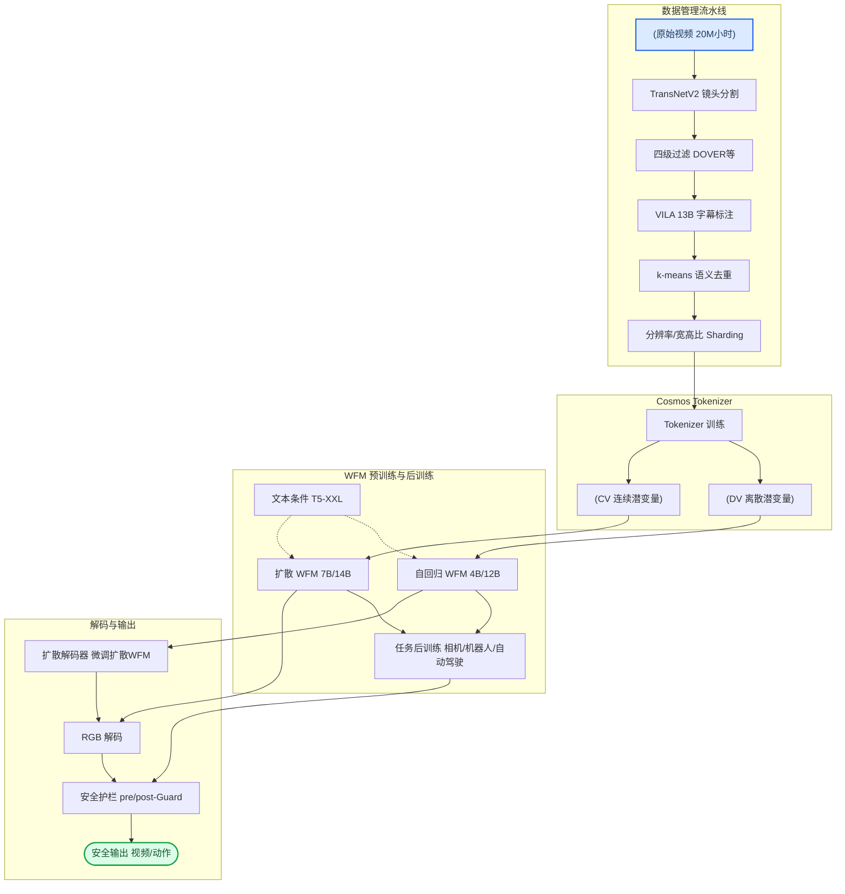
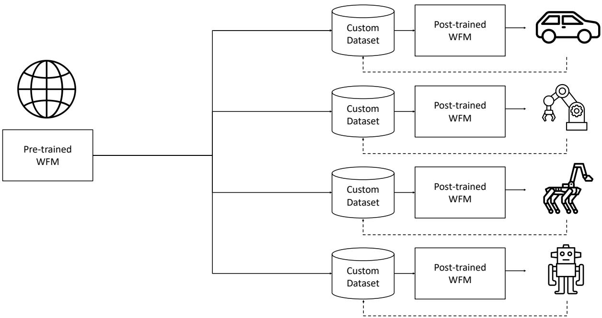
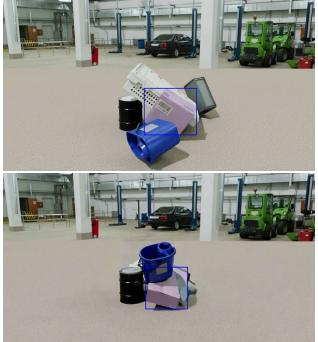
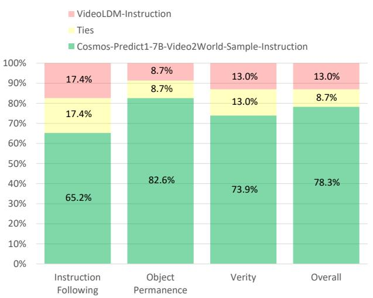

# Cosmos World Foundation Model Platform for Physical AI — 深度解读

> 面向人类读者的深度解读(中文)。事实源与配对的 AI 知识包 `ai_package/2026-06-08_CosmosWorldFoundationModelPlatformForPhysicalAI_2501.03575/ara/` 同源,均已通过数据保真审计。

## 核心结论

> 每条结论后的隐形锚点把数字回链到论文原文(忠实性保证)。

1. Cosmos WFM平台采用「预训练→后训练」两阶段范式，通过大规模多样视频数据预训练获得通才WFM，再通过少量领域数据微调即可适配相机控制、机器人操控和自动驾驶等多个物理AI下游任务，后训练模型在各任务上均显著优于从头训练的专用基线
2. Cosmos Tokenizer在DAVIS和TokenBench多个基准上的PSNR、SSIM、rFVD等重建指标均超越现有连续和离散视频tokenizer，在A100 GPU上推理速度显著快于同类方法，且参数量更小；在更高压缩率下仍保持优于对比方法低压缩率时的重建质量<!--ref:r-data-determines-the-ce--><!--anchor:quote:Data%20determines%20the%20ceiling%20of%20an%20AI%20model.%20To%20build%20a%20high%2Dceiling%20pre%2Dtrained%20WFM%2C%20we%20develop%20a%20video%20data%20curation-->
3. 在3D一致性评估中，扩散型WFM的Sampson几何误差更低、相机位姿估计成功率更高；在物理对齐评估中，扩散型WFM在多帧条件设置下的像素级预测指标优于自回归型；扩散型WFM的总体感知视觉质量更高<!--ref:r-data-determines-the-ce--><!--anchor:quote:Data%20determines%20the%20ceiling%20of%20an%20AI%20model.%20To%20build%20a%20high%2Dceiling%20pre%2Dtrained%20WFM%2C%20we%20develop%20a%20video%20data%20curation-->
4. Cosmos-Predict1-7B-Video2World-Sample-CameraCond在RealEstate10K测试集上的相机位姿估计成功率远高于CamCo，旋转误差和平移误差更小，FID和FVD显著更低，并能克服DL3DV-10K到RealEstate10K的数据分布偏移<!--ref:r-nvidia-sup-1-sup--><!--anchor:quote:NVIDIA%3Csup%3E1%3C%2Fsup%3E--><!--ref:r-data-determines-the-ce--><!--anchor:quote:Data%20determines%20the%20ceiling%20of%20an%20AI%20model.%20To%20build%20a%20high%2Dceiling%20pre%2Dtrained%20WFM%2C%20we%20develop%20a%20video%20data%20curation--><!--ref:r-in-this-paper-we-intro--><!--anchor:quote:In%20this%20paper%2C%20we%20introduce%20the%20Cosmos%20World%20Foundation%20Model%20%28WFM%29%20Platform%20for%20building%20Physical%20AI.%20We%20are%20mainly%20concerned--><!--ref:r-data-determines-the-ce--><!--anchor:quote:Data%20determines%20the%20ceiling%20of%20an%20AI%20model.%20To%20build%20a%20high%2Dceiling%20pre%2Dtrained%20WFM%2C%20we%20develop%20a%20video%20data%20curation--><!--ref:r-data-determines-the-ce--><!--anchor:quote:Data%20determines%20the%20ceiling%20of%20an%20AI%20model.%20To%20build%20a%20high%2Dceiling%20pre%2Dtrained%20WFM%2C%20we%20develop%20a%20video%20data%20curation--><!--ref:r-data-determines-the-ce--><!--anchor:quote:Data%20determines%20the%20ceiling%20of%20an%20AI%20model.%20To%20build%20a%20high%2Dceiling%20pre%2Dtrained%20WFM%2C%20we%20develop%20a%20video%20data%20curation--><!--ref:r-data-determines-the-ce--><!--anchor:quote:Data%20determines%20the%20ceiling%20of%20an%20AI%20model.%20To%20build%20a%20high%2Dceiling%20pre%2Dtrained%20WFM%2C%20we%20develop%20a%20video%20data%20curation-->
5. 在指令跟随任务上，Cosmos后训练模型在人类评估的整体偏好率上显著高于VideoLDM-Instruction；在动作条件化次帧预测任务上，Cosmos后训练模型在PSNR、SSIM和FVD上均优于IRASim-Action基线
6. Cosmos多视角驾驶世界模型在FID、FVD、时间Sampson误差（TSE）和跨视角Sampson误差（CSE）上均显著优于VideoLDM-MultiView，附加轨迹控制条件进一步改善多视角几何一致性，且轨迹跟随误差接近真实视频水平
7. 从约2000万小时原始视频出发，通过分镜检测、多维过滤、VLM标注、语义去重和分片共五步流水线处理，最终提取约1亿个视频片段用于预训练；语义去重阶段删除大量冗余数据；使用TransNetV2端到端分镜检测模型和PyNvideoCodec实现显著高于传统方案的处理吞吐量<!--ref:r-nvidia-sup-1-sup--><!--anchor:quote:NVIDIA%3Csup%3E1%3C%2Fsup%3E--><!--ref:r-in-this-paper-we-intro--><!--anchor:quote:In%20this%20paper%2C%20we%20introduce%20the%20Cosmos%20World%20Foundation%20Model%20%28WFM%29%20Platform%20for%20building%20Physical%20AI.%20We%20are%20mainly%20concerned-->
8. 在自回归WFM中引入Medusa多头解码，4B和5B模型token吞吐量均得到显著提升，前向传播次数大幅减少；结合低分辨率适配后，模型可在8×H100 GPU上实现10 FPS实时视频生成；仅解冻最后两个transformer层和最终unembedding层的微调策略可避免生成质量下降<!--ref:r-data-determines-the-ce--><!--anchor:quote:Data%20determines%20the%20ceiling%20of%20an%20AI%20model.%20To%20build%20a%20high%2Dceiling%20pre%2Dtrained%20WFM%2C%20we%20develop%20a%20video%20data%20curation--><!--ref:r-data-determines-the-ce--><!--anchor:quote:Data%20determines%20the%20ceiling%20of%20an%20AI%20model.%20To%20build%20a%20high%2Dceiling%20pre%2Dtrained%20WFM%2C%20we%20develop%20a%20video%20data%20curation--><!--ref:r-images-c27a4b232180e0--><!--anchor:quote:%21%5B%5D%28images%2Fc27a4b232180e091954de9aabc78f14915f74a97301423c8dfb9f94a6ecb2e40.jpg%29--><!--ref:r-data-determines-the-ce--><!--anchor:quote:Data%20determines%20the%20ceiling%20of%20an%20AI%20model.%20To%20build%20a%20high%2Dceiling%20pre%2Dtrained%20WFM%2C%20we%20develop%20a%20video%20data%20curation--><!--ref:r-data-determines-the-ce--><!--anchor:quote:Data%20determines%20the%20ceiling%20of%20an%20AI%20model.%20To%20build%20a%20high%2Dceiling%20pre%2Dtrained%20WFM%2C%20we%20develop%20a%20video%20data%20curation-->

## 一句话总结与导读

**TL;DR: Cosmos 是 NVIDIA 为 Physical AI 打造的一个开放“世界模拟器”平台——它先用数千万小时的视频看尽世间万象，学会物体如何运动、光影如何变化、场景如何流转，然后你只需花极少成本就能教会它专精你的具体场景，从而在数字世界里无限试错：教机器人抓取、让自动驾驶感知街角，而不必再为真实世界的每一次碰撞买单。**

Physical AI 的尴尬在于：想让机器人在真实世界里学会走路、想让自动驾驶学会应对千奇百怪的路况，就必须反复与环境交互，而每一次交互都可能损坏设备、危及安全，采集那些“动作如何扰动世界”的数据更是成本高昂。如果能在数字世界里高精度地模拟未来会发生什么，就能把试错搬到虚拟空间——这正是世界基础模型（World Foundation Model, WFM）存在的终极理由。然而，过去的视频生成模型虽然在生成视觉上越来越惊艳，一旦用作物理世界的“模拟器”就露出短板：视频看着逼真，但几何结构脆弱、相机一偏就穿帮，根本无法稳定支撑 Physical AI 所需的 3D 一致性与物理对齐。

Cosmos 平台的思路简单却关键：「先通才，后专才」。它在一套端到端的视频数据流水线上，用连续与离散两种视频分词器（Cosmos-Tokenize1）先将千奇百怪的视频压成紧凑的“世界 token”，再以扩散与自回归两条技术路线分别预训练出通用世界模型（Cosmos-Predict1 系列）。这个预训练阶段就像一个通才大脑，在海量视频中吸收了物体动力学、场景几何、光影因果等隐式物理规律。到了后续微调阶段，开发者只需注入极少量的领域视频或控制信号——比如摄像机运动轨迹、机器人关节角度、多视角驾驶数据——就能快速得到一个特定场景下的专用世界模拟器。得益于预训练提供的强大先验，微调所需数据量远少于从头训练，使得小团队也能定制自己的物理仿真环境，而不再被数据饥渴锁死。这种“预训练→后训练”的两阶段范式，把 Physical AI 从拼数据规模的泥潭里拔了出来，让开发者可以站在开放预训练巨人的肩膀上，专注解决真正顶层的物理决策问题。

**论文总体架构(原图):**

*Cosmos系列世界基础模型（WFM）的整体展示，包含扩散模型和自回归Transformer两种架构，分别基于连续和离散潜在表示，能够生成高质量、三维一致且物理准确的视频。*

## 问题背景与动机

让机器人在真实世界中通过试错来学习——这听起来振奋人心，但实操起来却昂贵且危险：机械臂的一次误操作可能损坏设备，自动驾驶的激进探索更会直接威胁人身安全。这就是**Physical AI**面临的核心窘境：训练所需的“观测-动作”交织数据极度稀缺，真实采集不仅慢，而且探索性动作的风险让数据扩展举步维艰。于是，一个自然而然的出路浮出水面——能否构造一个足够逼真的**数字孪生世界模型**，让它替代真实环境，安全、高效地生成海量交互数据？

然而，用生成模型构建这种世界模拟器，远比生成一段好看的艺术视频要苛刻得多。现有视频生成模型——即便在画质上已经十分惊艳——一旦被当作世界模型来审视，立刻暴露出两重结构性短板。**第一重是压缩带来的细节磨皮。** 为了把高维视频塞进可处理的Token序列，Tokenizer必须在压缩率与重建质量之间作出艰难取舍；过度压缩会抹去物理世界中至关重要的细微线索，比如物体边界的微小位移或接触面的纹理变化，而在离散Token方案下，模糊伪影尤其明显，直接导致后续世界模型“看不清”物理交互的关键瞬间。**第二重是几何一致性的塌陷。** 一个合格的世界模拟器必须遵循三维空间的物理法则：从不同视角看同一个场景，物体的位置、形状应当稳定一致。但实测表明，主流视频模型在相机姿态估计上成功率极低，生成的画面经不起多视图几何的检验，三维结构扭曲变形——这在地面真理要求严苛的机器人、自动驾驶任务中是不可接受的。

困难不止于模型本身。站在Physical AI开发者的视角，就算有了好用的世界模型架构，仍然面临“无米之炊”的困境：一方面，现有工作要么锁定在特定传感器或场景上，要么根本未开放可微调的**预训练权重**，每个团队被迫从零开始复现与适配，相当于每次造车都要重新发明轮子；另一方面，训练世界模型所需的视频数据规模动辄**千万小时**，格式、分辨率、时长千差万别，缺乏高效、自动化的流水线会让数据预处理沦为一场资源黑洞——即使引入了神经网络镜头检测与硬件加速编解码，各环节吞吐量的天然不匹配仍使资源利用率长期低位徘徊。

将这些碎片拼接起来，一条关键的转折性洞见便清晰起来：既然一次性训练一个“万事通”世界模型既不经济也不可行，不如**将世界模型分解为“通用预训练”与“专用后训练”两个彼此解耦的阶段**。首先用大规模、多场景的真实视频训练一个“通才”世界基础模型（WFM），让它在数据驱动下自发地内化物理世界的基本规律；然后，Physical AI开发者只需要拿自己特定环境的小批量领域数据，在这个开放的预训练底座上快速微调，就能以极低的成本得到一个专属的、高保真的物理世界模拟器。这一思路不仅绕开了从头训练的数据与算力壁垒，更巧妙地将“通用物理先验”与“窄域高精度”的冲突拆解为连续的学习阶段——用一个预训练基座，服务千行百业的Physical AI下游。

## 核心概念速览

理解 Cosmos 如何将“物理世界数字孪生”推向工程现实，需要先看清几个彼此咬合的核心组件。以下八个概念按“数据压缩→通用预训练→双路线生成→质量/速度补丁”的顺序展开。

###  世界基础模型 (WFM)
WFM 是整个体系的终极目标——给定过去视觉观测 $$x_{0:t}$$ 和当前扰动 $$c_t$$（动作、文本指令等），预测下一时刻的世界状态 $$\hat{x}_{t+1}$$。直觉上，它就像一个 **“物理世界的梦境模拟器”** ：你喂给它一段开头视频和“我想让相机左移”的意图，它便续写出未来可能发生的高清画面。在约 10⁸ 个多样化视频片段上预训练后，这个通才具备了泛化多种物理现象的能力；再经后训练精调，就能收缩为面向机器人操作、自动驾驶等 Physical AI 场景的专用世界模型。需要诚实指出的是，当前版本仍会犯物理错误——物体偶尔违反重力或凭空出现，说明它本质上是一个初步搭建的梦境引擎，距离严格遵循牛顿力学还有距离。

###  视频分词器
视频分词器是连接原始高维像素与世界模型内部“潜空间”的编解码桥梁。它将冗长的像素序列压缩为紧凑的 token 序列（空间压缩比 $$s_{HW}$$，时间压缩比 $$s_T$$），使得 WFM 不必直面海量原始数据，而是在低维的“概念符号”上推理。类比来看，这好比 **“视频的 MP3 压缩算法”**——剔除像素冗余、保留核心动态，让后续“作曲家”（WFM）能专注于内容创作。根据下游模型的不同，分词器分为两种：输出连续向量的**连续分词器**服务于扩散模型，而通过有限标量量化（FSQ，词汇表大小 64,000）产出整数索引的**离散分词器**则供自回归模型使用。

<strong>时序因果设计的直觉</strong>

分词器内部有一条关键约束：**时序因果**（Temporal Causal Tokenization）。它强制编码当前帧时不依赖未来帧，通过因果卷积和因果注意力掩码实现。这种设计的两个好处：一是让分词本身符合“过去决定未来”的物理直觉；二是令第一帧 token 恰好代表输入的第一帧，使图像（$$T=0$$）和视频（$$T>0$$）能共享同一个潜空间，模型面对静态图与动态视频时无需切换“方言”。在此之上，2 级 Haar 小波变换先在时空方向各 4× 降采样，等于在送入重网络前做了一次“智能缩略图”预处理，进一步削减计算量。

###  预训练与后训练范式
WFM 并不直接端到端训练，而是遵循“先通才、后专才”的两阶段策略。**预训练**阶段在海量无标注的多样化视频上训练一个通晓万般物理规律的通用模型；**后训练**阶段则用特定 Physical AI 场景的“提示‑视频”配对数据（如相机移动指令 + 对应视频）精调，使其收敛为专用世界模型。这好比 **“先让模型博览百科全书成为万事通，再通过导师带教塑造成特定领域的专家”**。论文中展示的相机控制、机器人操作、自动驾驶等示例都带有“-Sample”后缀，明确标识它们是示范性应用，开发者需在自有数据集上复现这一精调流程。

###  EDM 扩散训练目标
扩散 WFM 采用基于 Elucidated Diffusion Model (EDM) 框架的去噪得分匹配损失。扩散模型通过逐步加噪再学会去噪来生成内容，但不同噪声级别的去噪任务难度悬殊——极高噪声下近乎盲猜，极低噪声时则需精雕细琢。若对所有级别一视同仁，梯度会被个别极度难或极度易的任务主导。EDM 目标引入连续不确定性函数 $$u(\sigma)$$，相当于 **给每个噪声级别配上一个“动态难度权重”**，自动平衡各任务对训练的贡献，让模型能均匀地漫游整个噪声谱。直觉上，这像一位因材施教的教练：不让所有人跑同一套训练，而是根据学员当下的能力动态调节强度。

###  自回归世界基础模型 (AR WFM)
与从纯噪声起步的扩散路线不同，自回归 WFM 把视频生成建模为“下一 token 预测”问题——先用离散分词器将视频压缩为整数序列，再让 Transformer 解码器以过去 token 为上下文逐 token 预测未来。这一设定直接继承了大语言模型在扩展性、训练稳定性和推理速度上的工程积累（3D RoPE 位置编码、QK 归一化、z‑loss 等），使其可以视为 **“视频界的 GPT”**：以学习物理世界序列的统计规律为目标，预测下一帧或下一动作的象征。为了引入文本控制，某些变体（Video2World）会在主干中额外插入交叉注意力层，让模型听懂人类语言指令。

###  扩散解码器
AR WFM 虽高效，但离散 token 的粗粒度表达会丢失纹理细节，好比用低清颜料作画。**扩散解码器便是补救这一缺陷的“精修滤镜”**：它以 AR WFM 产出的粗粒度离散 token（DV8×16×16 压缩）为条件，复用精调后的扩散 WFM，求解逆向扩散过程，将画面映射到更精细的连续 token 空间（CV8×8×8），再交给连续分词器解码为 RGB 视频。整个过程相当于先用底稿快速勾勒轮廓（AR），再请一位擅长刻画肌理与光影的画师上色细化（扩散解码器），最终交付一幅更接近真实质感的动态画卷。代价是推理时多跑一次扩散过程，延迟有所增加，但换来了显著的画质提升。

###  Medusa 推测解码
自回归模型固有的逐 token 顺序解码是推理速度的主要瓶颈。Medusa 推测解码提供了一种 **“并行猜测”** 的加速方案：在 AR WFM 的 Transformer 主干最后一层隐藏状态之后挂载多个并行的单层 FFN 预测头（Medusa heads），每次前向传播主模型产出当前 token，而多个头同时抛出后续几步的候选，再通过拒绝采样验证一致性。这大幅减少了所需的串行前向传播次数，从而显著提升吞吐量。用生活中的场景来比喻—— **原本厨师必须一锅一菜地炒，现在多了几位配菜工趁主厨炒菜时并行备料，主厨最后只需检查并快速装盘，整个出餐节奏自然成倍增长**。

这八个概念共同构成了 Cosmos 系统的主干：用视频分词器压缩世界，用预训练+后训练通专结合，以扩散和自回归双路线实现世界模拟，再靠扩散解码器和 Medusa 推测解码分别补足质量与速度的短板。正是它们精密咬合，才让世界基础模型从纸上蓝图走向可运行的工程系统。

## 方法与整体架构

**结论**：Cosmos 构建了一套从海量视频到物理 AI 任务的端到端系统。它先通过严格的数据筛选与标注流水线提炼训练素材，再利用统一视频分词器产生连续与离散两种互补的潜空间表示，分别送入扩散和自回归世界模型进行预训练；最后通过任务微调和多级安全护栏实现可控、合规的多样化应用。整条流水线环环相扣，每个模块都旨在解决从现实复杂性到生成可靠性之间的关键矛盾。

整体流程如下图所示（图后详述各阶段）：

**如何读这张图**：从顶部原始视频数据开始，经过数据管理的层层筛选，进入 Tokenizer 将视频压缩为潜变量；随后文本条件注入，双轨 WFM 分别基于连续和离散潜变量进行生成或预测；离散分支需通过扩散解码器转回连续空间，再统一进行像素解码；所有输出均经过任务微调与安全护栏，最终交付视频或控制指令。

**数据管理流水线：去粗取精**  
原始视频库规模高达数千万小时，但充斥着低画质、静态画面或文字叠加的片段。为此，流水线先基于 TransNetV2 进行精确的镜头边界检测（置信度阈值 $0.4$），接着执行四级过滤：用 DOVER 评估感知质量并移除底部约 $15\%$ 的片段；以偏低的美学分数阈值（$3.5$）剔除极低美感内容，却保留大量“不美但物理真实”的素材；再通过专门的多层感知机（MLP）剔除文字覆盖率过高或视频类型不适用的剪辑。  
过滤后的片段由 13B 参数的 VILA 模型自动生成字幕，赋予视频语义标签。接着，InternVideo2 嵌入与 $k$‑means（$k=10000$）聚类联手进行语义去重，最终移除约 $30\%$ 的冗余数据，保证训练集多样性。最后，数据按分辨率和宽高比被分桶（Sharding），适配后续模型的多尺度训练需求。

**统一视频分词器：连续与离散的二元表示**  
清洗后的视频通过 Cosmos Tokenizer 被压缩到低维潜空间。Tokenizer 采用两阶段训练：先以 $L_1$ 重建、VGG‑19 感知损失学习基础压缩，再引入光流损失与 Gram 矩阵损失来提升时序一致性和纹理质量。它输出两种潜变量：  
- **CV 连续潜变量**：经过 3D Haar 小波变换、因果时序卷积和时空注意力编码，形成高保真连续表示，供扩散世界模型去噪生成。  
- **DV 离散潜变量**：通过有限标量量化（FSQ，级别 $(8,8,8,5,5,5)$，词表大小 $64000$）将视频映射为 token 序列，使视频可被自回归模型像文本一样逐 token 预测。  
这种双轨设计让物理动态既可以按细腻的连续信号建模，也能借助离散化继承大语言模型的训练稳定性与扩展能力（直觉，非严格对应）。

**世界模型预训练：扩散与自回归双引擎**  
系统同时训练两组世界模型，均由文本条件（T5‑XXL 编码）驱动，并操作对应的潜变量空间：  
- **扩散世界模型**（7B／14B 参数）：采用 DiT 架构，对 CV 潜变量逐步加噪并学习去噪，通过 EDM 框架下的不确定性加权评分匹配优化。训练中按视频帧数平方根缩放视频批次的噪声级别，弥合视频帧间冗余导致的收敛不一致。该模型直接输出去噪后的 CV 潜变量，经 RGB 解码器还原为高清视频。  
- **自回归世界模型**（4B／12B 参数）：基于 Llama3 风格 Decoder，以 NLL 损失逐 token 预测 DV 序列，并加入 $z$‑loss（系数 $\lambda=3\times10^{-4}$）稳定大规模训练；推理时可采用 Medusa 投机解码（最优 9 头）提升效率。但离散 token 离像素空间仍有“最后一公里”——为此，一个微调的 7B 扩散解码器充当桥梁：它接收 DV token 嵌入并上采样，再与含噪 CV 潜变量沿通道拼接，通过微调去噪重建 CV 连续表示，最后交由 RGB 解码器。

**后训练与护栏：从生成到可控应用**  
预训练基座通过注入特定控制信号实现任务适配：  
- **相机控制**：将 Plücker 光线坐标与潜变量拼接，微调 7B Video2World 模型，即可根据外参生成新视角。  
- **机器人**：用 T5 交叉注意力编码指令，将动作嵌入 MLP 注入模型，支持从视频预测动作或按指令规划运动。  
- **自动驾驶**：引入视图嵌入和视图相关交叉注意力，并行处理六路环视图像，以轨迹条件生成未来驾驶场景。  
所有生成内容在输出前需经过两级护栏：Pre‑Guard 采用关键词封锁和 Aegis LlamaGuard；Post‑Guard 则通过 SigLIP+MLP 逐帧安全分类，并用 RetinaFace 对面部进行像素化处理，确保最终交付的视频或控制指令符合安全规范。

**模型结构与关键子图(原图):**

*预训练的世界基础模型是一个“通才”，它在海量、多样的视频数据上训练，捕捉真实世界的物理规律，随后可以通过后训练来适配特定的物理AI任务，实现从通用到专用的转变。*

*Cosmos世界基础模型平台由视频策展器、视频分词器、预训练世界基础模型、后训练样本集和安全护栏等核心组件构成，为开发和应用WFM提供了完整的工具链。*

*视频策展流程包含五个关键步骤：分割（将长视频分为镜头）、过滤（清除低质量片段）、标注、去重和分片，最终产出高质量的训练数据集。*

*视频分词管道（Tokenization Pipeline）将输入视频编码为紧凑的令牌（Tokens），再利用解码器从令牌中重建视频，训练目标是在压缩的同时最大限度保留视觉信息。*

*连续分词器和离散分词器的可视化对比，展示了令牌在空间和时间维度上的排列方式，其中连续分词器使用连续向量，离散分词器使用离散索引，各有不同的压缩策略。*

*Cosmos分词器的整体架构融合了时序因果性（左侧）和编码器-解码器结构（右侧）。时序因果性模块处理连续的帧序列，编码器-解码器利用小波变换和因果卷积/注意力捕捉时空特征，实现高效的视频压缩与重建。*

*Cosmos-Predict1世界基础模型的整体架构：输入视频先经过Cosmos-分词器编码得到潜在表示（连续或离散特征），随后通过扩散或自回归Transformer模型，在潜在空间中模拟未来帧的演变，最后经解码器生成视频。*

*Cosmos-Predict1-Video2World模型的架构：输入视频通过离散分词器（DV8×16×16）编码为离散令牌，转化为嵌入向量后送入多层Transformer模块，逐步生成未来的视频令牌，再通过扩散解码器重建为视频帧。*

*扩散解码器的训练方案：每个输入视频同时经过两种分词器——目标离散分词器和更少约束的连续分词器。扩散解码器学习在连续潜在特征的辅助下，将离散令牌高质量地重建为视频，提升生成保真度。*

*扩散解码器的推理流程：从Cosmos-Predict1模型输出的离散令牌直接作为条件输入到去噪器（Denoiser），通过迭代去噪生成清晰的视频帧，实现从离散表示到视频的高效转换。*

*Cosmos安全护栏包括预护栏和后护栏：预护栏基于Aegis安全模型和关键词列表过滤输入，后护栏通过视频内容安全分类器检测并屏蔽有害输出，同时对视频中的人脸进行模糊处理，构建全方位的安全防线。*

## 算法目标与推导
Cosmos‑Transfer1 的训练体系遵循“先压缩、后生成”的路线：先训练一个视频 Tokenizer，将冗长的像素序列蒸馏为紧凑的离散 Token；再在 Token 空间训练世界模型（WM），分扩散与自回归两种范式学习这些 Token 的分布。整条损失链的设计不是一堆惩罚项的堆砌，而是**逐层递进地解决不同维度的失真**——低层保证像素对齐，中层注入运动感知，高层强调纹理真实与语义稳定。

### 视频 Tokenizer 的多阶段训练损失

Tokenizer 的训练分成三个阶段，每个新阶段都在前一阶段的基础上“加码”，迫使重建视频在越来越精细的层次上贴近原片。

#### 第一阶段：像素对齐与深层感知
起步阶段用两个基础损失让模型先“形似”：
- **L1 重建损失**  
  $$\mathcal{L}_1 = \|\hat{x}_{0:T} - x_{0:T}\|_1$$  
  它直接衡量每一帧每一像素的绝对误差，相当于要求临摹作品的颜色、明暗尽量像原画。直觉上，这是“用直尺量距离”，对所有偏差一视同仁，容易导致模糊的平均色块。
- **VGG‑19 感知损失**  
  $$\mathcal{L}_{\mathrm{Perceptual}} = \frac{1}{L}\sum_{l=1}^{L}\sum_{t}\alpha_l\|VGG_l(\hat{x}_t)-VGG_l(x_t)\|_1$$  
  这里不再比较像素，而是把原视频和重建视频都送进预训练的 VGG‑19 网络，取中间若干层的特征图，计算 L1 差。不同层负责不同抽象程度：浅层对比纹理边缘，深层对比物体形状与布局。参数 `α_l` 控制各层的权重。这个损失让模型不要只是抹平误差，而要复现出深层结构，就像临摹时除了“画得像”，还要让人一眼看出画的是同一只猫而不是一团毛绒。  
  直觉比喻：L1 是“尺规”，感知损失是“美术老师的眼睛”。

#### 第二阶段：运动与纹理的显式约束
第一阶段的结果往往在处理动态纹理时出现“鬼影”或“泥巴纹”——颜色对了但运动轨迹扭曲、布料质感丢失。因此第二阶段额外加入两项：
- **光流损失**  
  $$\mathcal{L}_{\mathrm{Flow}} = \frac{1}{T}\sum_{t=1}^{T}\|\mathbb{OF}(\hat{x}_t,\hat{x}_{t-1})-\mathbb{OF}(x_t,x_{t-1})\|_1 + \frac{1}{T}\sum_{t=0}^{T-1}\|\mathbb{OF}(\hat{x}_t,\hat{x}_{t+1})-\mathbb{OF}(x_t,x_{t+1})\|_1$$  
  它先用外部光流估计器 `𝕆𝔽` 算出原视频的前向/后向运动矢量，再对重建视频同样计算，然后比较两者。这相当于要求：你的“翻拍”版本中，手的挥动方向、速度必须和原片一致，不能出现滑步或抖动。  
- **Gram 矩阵损失**  
  $$\mathcal{L}_{\mathtt{Gram}} = \frac{1}{L}\sum_{l=1}^{L}\sum_{t}\alpha_l\|\mathtt{GM}_l(\hat{x}_t)-\mathtt{GM}_l(x_t)\|_1$$  
  与感知损失类似，这里也提取 VGG 各层的特征，但比较的不再是特征本身，而是特征的**格拉姆矩阵**（通道间的相关性）。格拉姆矩阵刻画了纹理的统计特性（某类笔触是否出现在画面中），而不关心它们的空间位置。损失下降意味着重建纹理的“质感”与原始更近——例如草地的颗粒密度、织物的编织纹路被保留了下来，而不是被磨平。  
  直觉比喻：光流损失是检查“动作回放”的裁判，Gram 损失是鉴定“材质表面”的触摸传感器。

#### 第三阶段（微调）：对抗生成增强真实感
两个阶段后 Tokenizer 已能高度保真，但重建画面常微带模糊或人工平滑感。此时引入对抗损失（原始论文中未给出显式公式，属于常见的生成对抗范式），让一个判别器学习区分原始帧和重建帧，生成器（即 Tokenizer 解码端）则尝试混淆判别器。这相当于“请一位严苛的鉴赏家来挑刺”，迫使重建画面添上原片特有的自然噪点、发丝等高频细节，人眼才觉得“像实拍”。

**小玩具例子**：假定我们有一段 5 帧的简笔画视频——一个圆在方框里从左移到右。第一阶段只要求像素值尽量接近，但圆形可能变成椭圆，边框变得模糊；加上感知损失后，圆/框的轮廓变得清晰；第二阶段加上光流损失后，圆的移动速度与原来一致，不会忽快忽慢；加上 Gram 损失后，边框的铅笔纹理（断续的细线）也被保留；最后对抗微调让画面出现微小的纸张纹理，避免过于光滑的数字感。

### 世界模型（WFM）的训练目标

Tokenizer 把视频变成离散 Token 后，世界模型的任务就是“在 Token 世界里学会语法”——预测未来的 Token、填补缺失的 Token，或者在噪声中还原出干净的 Token 序列。

#### 扩散 WFM：从噪声中回推干净信号（EDM 框架）
扩散模型的核心思想是：先给干净 Token 逐步加噪，直到完全变成随机噪声；然后训练模型逆向去噪。具体设计如下：

- **去噪评分匹配损失**  
  对于给定噪声级别 `σ`，模型 `Dθ` 接收“干净数据 `x0` + 高斯噪声 `n`”，要求它直接输出对干净 `x0` 的预测：  
  $$\mathcal{L}(D_\theta, \sigma) = \mathbb{E}_{\mathbf{x}_0,\mathbf{n}}\Big[\|D_\theta(\mathbf{x}_0+\mathbf{n};\sigma)-\mathbf{x}_0\|_2^2\Big]$$  
  这里采用的是 **EDM（Elucidating the Design Space of Diffusion Models）** 框架的惯用形式，损失衡量预测干净数据与真实数据之间的均方误差。注意：不是预测噪声，而是直接预测 `x0`，这在实践中能让模型更专注于整体结构。
- **不确定性加权的总目标**  
  不同噪声级别的去噪难度差异巨大（极低噪声时几乎原样输出即可，极高噪声时则纯靠猜），因此需要自动平衡各噪声级别的贡献。论文引入一个可学习的噪声级别相关的不确定性权重 `u(σ)`，由一个小型 MLP 参数化，并暴露在总损失中让梯度同时优化：  
  $$\mathcal{L}(D_\theta) = \mathbb{E}_{\sigma}\left[\frac{\lambda(\sigma)}{e^{u(\sigma)}}\mathcal{L}(D_\theta,\sigma)+u(\sigma)\right]$$  
  式中 `λ(σ) = (σ²+σ_data²)/(σ·σ_data)²` 是一个常设的预权重（增大低噪区域的损失，补偿其天然更小的误差幅度），而 `1/e^{u(σ)}` 则是一个**自适应因子**：当某个 `σ` 的损失波动剧烈或不好优化时，对应的 `u(σ)` 会减小，从而降低该噪声级别的训练力度；反之若很稳定，`u(σ)` 会增大，让模型多练习该难度。最后加的 `u(σ)` 项作为一个正则化项，防止 `u(σ)` 一路跑到负无穷（阻止网络把所有损失都摆烂）。训练期间噪声级别的采样服从对数正态分布 `ln(σ) ~ N(P_mean, P_std²)`，使网络经常看到中等噪声区间，同时也能覆盖极端值。

直觉比喻：扩散训练就像让学生在不同浓度的雾中辨识物体。`λ(σ)` 是给“雾很淡但必须看清细节”的题目更高的基础分；`u(σ)` 是一个动态的份数调节器——如果某类雾浓度题目经常全错（损失居高不下），就暂时少做这类题；等整体稳定后再提高其权重。

**小玩具例子**：假设只有一帧图像，表达为一维 3 个像素 `[0.9, 0.2, 0.7]`，当前噪声级 `σ=0.1`，加噪后变成 `[0.85, 0.23, 0.68]`。模型 `Dθ` 输入这个加噪序列和 `σ`，需要预测原始值。损失就计算预测值与 `[0.9, 0.2, 0.7]` 的平方误差。如果预测值为 `[0.88, 0.22, 0.69]`，损失很小；如果预测值为 `[0.5, 0.5, 0.5]`，损失很大。接下来 `u(σ)` 会根据这段训练时间内的损失波动，决定未来遇到 `σ=0.1` 时是否加大练习。

#### 自回归 WFM：下一个 Token 的预测与数值稳定
另一种世界模型范式是像语言模型那样，从左到右预测视频 Token 序列：
- **负对数似然损失（NLL）**  
  $$\mathcal{L}_{NLL} = \sum_i -\log P(v_i|v_1,v_2,\ldots,v_{i-1};\Theta)$$  
  本质上就是教模型：给定前文 `v1…v_i-1`，猜对 `v_i` 的概率越高越好（即负对数概率越小越好）。这是典型的自回归语言模型根基。
- **辅助 z‑loss 稳定项**  
  $$\mathcal{L}_{\mathrm{z-loss}} = \lambda\cdot\sum_i z_i^2, \quad \lambda=3\times 10^{-4}$$  
  在 Transformer 的内部表示中，logits 或中间状态可能因训练不稳定而“爆炸”（数值变大），导致 softmax 过度尖锐或梯度消失。`z_i` 通常指代输出 logits 值（或某一层的输出），对其施加 L2 惩罚，可以有效抑制数值过冲，就像给震荡的弦加上阻尼。效果上它几乎不改变收敛方向，但极大减少训练中断的概率。

直觉比喻：NLL 像是老师检查学生听前文后，补上被遮住的词。如果学生猜“天空”的概率是 0.9，则惩罚较低；若只给 0.3，则重罚。z‑loss 则是“说话不要突然吼叫”——即使学生猜对了，也不能让对应 Token 的分数高到离谱，以免后续学习失衡。

> 注意：两种推理增强技术——**Classifier‑Free Guidance（CFG）** 与 **Medusa 投机解码**——不参与训练目标，仅在生成阶段使用。CFG 通过混合有条件/无条件预测来强化控制力，Medusa 用辅助轻量头并行猜测多个 future token 以加速推理，二者不影响上述所有损失的设计。

<strong>权重函数 λ(σ) 的推导速览</strong>

在 EDM 论文中，权重函数 `λ(σ) = (σ² + σ_data²) / (σ ⋅ σ_data)²` 的引入是为了让损失对不同噪声级别的梯度范数保持平衡。简单的去噪目标在低噪声时梯度幅值会极大，导致训练不稳定。分子 `(σ² + σ_data²)` 和分母 `(σ ⋅ σ_data)²` 的组合恰好可以将不同 `σ` 下的有效学习率归一到相近水平，避免模型只关注最容易/最难的去噪区间。论文继承此设置，进一步用可学的不确定性 `u(σ)` 做更细粒度的动态调整。

## 实验设计与结果解读

Cosmos 世界模型的实验体系如同一套逐层递进的“体检”：先确认视觉分词器能否高保真地压缩世界，再考察预训练模型对时空一致性到底内化了多少，随后通过后训练验证其能否在具体任务中跟随人的控制信号——同时，全程不忘为实时推理扫除效率瓶颈。下文按这四个层次展开。

### 视频分词器：在压缩与保真间走钢丝

Tokenizer 是视频生成的第一道门槛：既要把高维像素流压缩至极低维度的 token 序列，又必须在解码时尽可能还原细节。团队在 DAVIS、TokenBench 等视频基准以及 MS‑COCO、ImageNet‑1K 图像基准上，让连续/离散两类 Cosmos Tokenizer 与 FLUX‑Tokenizer、Open‑MAGVIT2 等一众方案同场竞技（E1）。评估覆盖了像素级重建、视频时序一致性（rFVD）和图像分布质量（rFID），并在单张 A100 上测量编解码延迟。结果呈现出一个清晰的趋势：Cosmos Tokenizer 在多种配置下均以更小的参数量收获了更好的重建质量，且推理速度具有明显优势——这为后续世界模型的高效训练奠定了基础（具体对比见下方实验表）。

### 预训练世界模型：织起一张时空一致的网

有了高性能的分词器后，更核心的问题是：预训练的世界模型是否真正建立了关于 3D 结构与物理运动的内部表征？论文用两项实验来回答。

第一项聚焦 **3D 一致性**（E2）。在 RealEstate10K 测试集的静态场景视频上，研究者用 SuperPoint+LightGlue 提取几何特征并计算 Sampson 误差，同时通过 SfM 估计相机位姿；更进一步，用生成的多帧画面拟合 3D 高斯泼溅模型，再评估留出视图的 PSNR、SSIM 和 LPIPS。结果显示，Cosmos 世界模型在所有几何一致性指标上均大幅领先 VideoLDM 基线，新视角合成的质量在多个维度上逼近真实视频——当然，差距仍然存在，说明模型对场景 3D 骨架的掌握尚未完全。<!--ref:r-data-determines-the-ce--><!--anchor:quote:Data%20determines%20the%20ceiling%20of%20an%20AI%20model.%20To%20build%20a%20high%2Dceiling%20pre%2Dtrained%20WFM%2C%20we%20develop%20a%20video%20data%20curation--><!--ref:r-in-this-paper-we-intro--><!--anchor:quote:In%20this%20paper%2C%20we%20introduce%20the%20Cosmos%20World%20Foundation%20Model%20%28WFM%29%20Platform%20for%20building%20Physical%20AI.%20We%20are%20mainly%20concerned--><!--ref:r-data-determines-the-ce--><!--anchor:quote:Data%20determines%20the%20ceiling%20of%20an%20AI%20model.%20To%20build%20a%20high%2Dceiling%20pre%2Dtrained%20WFM%2C%20we%20develop%20a%20video%20data%20curation--><!--ref:r-data-determines-the-ce--><!--anchor:quote:Data%20determines%20the%20ceiling%20of%20an%20AI%20model.%20To%20build%20a%20high%2Dceiling%20pre%2Dtrained%20WFM%2C%20we%20develop%20a%20video%20data%20curation--><!--ref:r-data-determines-the-ce--><!--anchor:quote:Data%20determines%20the%20ceiling%20of%20an%20AI%20model.%20To%20build%20a%20high%2Dceiling%20pre%2Dtrained%20WFM%2C%20we%20develop%20a%20video%20data%20curation-->

第二项考察 **物理对齐**（E3）。团队利用 PhysX 与 Isaac Sim 生成了涵盖自由落体、多米诺骨牌等八类牛顿力学场景的仿真视频，让模型仅依据前几帧预测后续帧。评估不仅包括像素级 PSNR/SSIM，还引入了感知特征相似度（DreamSim）和物体级平均 IoU。内部对比表明，扩散型模型在多帧条件下的像素指标更优，但无论何种架构，整体物理对齐得分都远未饱和——这说明现有模型对“推一下会不会倒”这类常识性物理因果的把握还很初步，也是世界模型最坚硬的一块天花板。<!--ref:r-data-determines-the-ce--><!--anchor:quote:Data%20determines%20the%20ceiling%20of%20an%20AI%20model.%20To%20build%20a%20high%2Dceiling%20pre%2Dtrained%20WFM%2C%20we%20develop%20a%20video%20data%20curation-->

### 后训练世界模型：在相机、机器人与方向盘后

基础世界模型展现了感知世界的潜质，但实际应用要求模型学会响应特定的控制指令。论文通过三组大规模后训练实验检验了这一目标。

**相机控制**（E4）。在使用 H100 集群的规模上，团队在 DL3DV‑10K 数据集上微调 7B 模型，注入 Plücker 坐标作为相机条件，并在 RealEstate10K 上进行跨分布测试。与同期方法 CamCo 相比，Cosmos 相机控制模型的相机位姿估计成功率更高、旋转与平移误差更小，同时生成的视频在 FID 和 FVD 指标上均更优——即使面对显著的训练‑测试分布偏移，模型依然能精确跟随给定的相机轨迹。<!--ref:r-data-determines-the-ce--><!--anchor:quote:Data%20determines%20the%20ceiling%20of%20an%20AI%20model.%20To%20build%20a%20high%2Dceiling%20pre%2Dtrained%20WFM%2C%20we%20develop%20a%20video%20data%20curation--><!--ref:r-data-determines-the-ce--><!--anchor:quote:Data%20determines%20the%20ceiling%20of%20an%20AI%20model.%20To%20build%20a%20high%2Dceiling%20pre%2Dtrained%20WFM%2C%20we%20develop%20a%20video%20data%20curation--><!--ref:r-data-determines-the-ce--><!--anchor:quote:Data%20determines%20the%20ceiling%20of%20an%20AI%20model.%20To%20build%20a%20high%2Dceiling%20pre%2Dtrained%20WFM%2C%20we%20develop%20a%20video%20data%20curation--><!--ref:r-data-determines-the-ce--><!--anchor:quote:Data%20determines%20the%20ceiling%20of%20an%20AI%20model.%20To%20build%20a%20high%2Dceiling%20pre%2Dtrained%20WFM%2C%20we%20develop%20a%20video%20data%20curation--><!--ref:r-data-determines-the-ce--><!--anchor:quote:Data%20determines%20the%20ceiling%20of%20an%20AI%20model.%20To%20build%20a%20high%2Dceiling%20pre%2Dtrained%20WFM%2C%20we%20develop%20a%20video%20data%20curation--><!--ref:r-data-determines-the-ce--><!--anchor:quote:Data%20determines%20the%20ceiling%20of%20an%20AI%20model.%20To%20build%20a%20high%2Dceiling%20pre%2Dtrained%20WFM%2C%20we%20develop%20a%20video%20data%20curation-->

**机器人操控**（E5）。利用约 200 小时的人形机器人数据和公开的 Bridge 数据集，后训练模型分别应对“指令跟随”与“动作预测”两类任务。人类评估中，Cosmos 模型在指令跟随、物体持久性、真实感和整体质量四个维度上的偏好率全面超过 VideoLDM‑Instruction；在 Bridge 的动作条件生成中，其像素级重建、潜空间一致性与视频保真度也均优于 IRASim‑Action。世界模型开始显现作为机器人“想象引擎”的雏形。

**多视角自动驾驶**（E6）。在约两万小时环视视频的 RDS 数据集上微调的多视角世界模型，通过视角相关交叉注意力实现了六路画面的同步生成。评估除了常规的 FID/FVD，还特别设计了跨视角 Sampson 误差（CSE）与时间 Sampson 误差（TSE）来量化多视角几何一致性，并用轨迹跟随误差衡量模型对自车运动的响应。结果上，Cosmos 多视角模型在生成质量与几何一致性上全面超越 VideoLDM‑MultiView，其轨迹跟随精度甚至在部分指标上逼近真实驾驶数据——表明模型已经开始习得道路场景中的基础几何与运动约束。<!--ref:r-data-determines-the-ce--><!--anchor:quote:Data%20determines%20the%20ceiling%20of%20an%20AI%20model.%20To%20build%20a%20high%2Dceiling%20pre%2Dtrained%20WFM%2C%20we%20develop%20a%20video%20data%20curation-->

### 推理加速与数据前置：让世界模型真正跑起来

强大的模型如果不能实时运行，就很难从实验室走向产品。团队通过消融实验检验了自回归“Medusa 头”对推理吞吐的影响（E7）。在 8 卡 H100 上测试 4B 与 5B 模型时发现，增加 Medusa 头可将 token 吞吐量提升至基线的数倍，并大幅减少前向传播次数；当进一步将模型适配到更低分辨率后，甚至实现了实时视频生成。与此同时，数据处理管线也不能成为瓶颈：在 ShotBench 分镜检测基准上，对比了 PySceneDetect、TransNetV2 等四种算法，并测试了不同视频转码配置的吞吐（E8）。TransNetV2 凭借对复杂镜头变换的敏感获得最高的 F1 分数，而将 PyNvideoCodec 与硬件编码加速相结合后，转码效率明显优于传统 ffmpeg 流水线。这些工程底座确保了从原始视频到模型输入的数据流稳定且高效。<!--ref:r-data-determines-the-ce--><!--anchor:quote:Data%20determines%20the%20ceiling%20of%20an%20AI%20model.%20To%20build%20a%20high%2Dceiling%20pre%2Dtrained%20WFM%2C%20we%20develop%20a%20video%20data%20curation--><!--ref:r-images-c27a4b232180e0--><!--anchor:quote:%21%5B%5D%28images%2Fc27a4b232180e091954de9aabc78f14915f74a97301423c8dfb9f94a6ecb2e40.jpg%29--><!--ref:r-data-determines-the-ce--><!--anchor:quote:Data%20determines%20the%20ceiling%20of%20an%20AI%20model.%20To%20build%20a%20high%2Dceiling%20pre%2Dtrained%20WFM%2C%20we%20develop%20a%20video%20data%20curation--><!--ref:r-data-determines-the-ce--><!--anchor:quote:Data%20determines%20the%20ceiling%20of%20an%20AI%20model.%20To%20build%20a%20high%2Dceiling%20pre%2Dtrained%20WFM%2C%20we%20develop%20a%20video%20data%20curation--><!--ref:r-data-determines-the-ce--><!--anchor:quote:Data%20determines%20the%20ceiling%20of%20an%20AI%20model.%20To%20build%20a%20high%2Dceiling%20pre%2Dtrained%20WFM%2C%20we%20develop%20a%20video%20data%20curation--><!--ref:r-in-this-paper-we-intro--><!--anchor:quote:In%20this%20paper%2C%20we%20introduce%20the%20Cosmos%20World%20Foundation%20Model%20%28WFM%29%20Platform%20for%20building%20Physical%20AI.%20We%20are%20mainly%20concerned--><!--ref:r-images-c27a4b232180e0--><!--anchor:quote:%21%5B%5D%28images%2Fc27a4b232180e091954de9aabc78f14915f74a97301423c8dfb9f94a6ecb2e40.jpg%29--><!--ref:r-in-this-paper-we-intro--><!--anchor:quote:In%20this%20paper%2C%20we%20introduce%20the%20Cosmos%20World%20Foundation%20Model%20%28WFM%29%20Platform%20for%20building%20Physical%20AI.%20We%20are%20mainly%20concerned--><!--ref:r-nvidia-sup-1-sup--><!--anchor:quote:NVIDIA%3Csup%3E1%3C%2Fsup%3E-->

整体来看，Cosmos 的实验设计环环相扣：从视觉压缩的基石，到内在世界的一致性，再到外部任务的可控性，最后贯通实时推理与数据预处理，为世界模型的实用化提供了系统性的论证。

### 实验数据表(原始数值,引自论文)

#### Medusa多头数量对自回归WFM推理吞吐量的影响（Tab. 15）
- **Source**: Table 15
- **Caption**: "在8×H100 GPU上对50个未见测试视频（640×1024分辨率）测量不同Medusa头数下4B和5B模型的平均token吞吐量和前向传播次数"

| 模型 | 指标 | 头数=0 | 头数=3 | 头数=6 | 头数=9 | 头数=12 |
| --- | --- | --- | --- | --- | --- | --- |
| 4B | Token吞吐量(tokens/s) | 444.95 | 663.51 | 829.59 | 894.67 | 890.64 |
| 4B | 前向传播次数 | 7680 | 2860 | 2073 | 1812 | 1682 |
| 5B | Token吞吐量(tokens/s) | 303.61 | 659.94 | 758.58 | 982.77 | 978.80 |
| 5B | 前向传播次数 | 10240 | 2857 | 2382 | 1799 | 1673 |

#### 动作条件化次帧预测Bridge数据集评估（Tab. 23）
- **Source**: Table 23
- **Caption**: "Bridge数据集100个测试场景上的动作条件化自回归次帧预测方法定量对比"

| 方法 | PSNR↑ | SSIM↑ | Latent L2↓ | FVD↓ |
| --- | --- | --- | --- | --- |
| IRASim-Action | 19.13 | 0.64 | 0.38 | 593 |
| Cosmos-Predict1-5B-Video2World-Sample-ActionCond | 19.95 | 0.80 | 0.36 | 434 |
| Cosmos-Predict1-7B-Video2World-Sample-ActionCond | 21.14 | 0.82 | 0.32 | 190 |

#### 多视角驾驶世界模型生成质量与多视角一致性评估（Tab. 24）
- **Source**: Table 24
- **Caption**: "多视角驾驶视频生成质量（FID/FVD，基于1000个样本）与多视角几何一致性（TSE/CSE，基于800个样本）对比；TSE=时间Sampson误差，CSE=跨视角Sampson误差"<!--ref:r-images-20047458ad9610--><!--anchor:quote:%21%5B%5D%28images%2F20047458ad961000e3b9ae4af3c5b05c45af3b335aaf5c5635551e5b423385c1.jpg%29--><!--ref:r-table-tr-td-configura--><!--anchor:quote:%3Ctable%3E%3Ctr%3E%3Ctd%3EConfiguration%3C%2Ftd%3E%3Ctd%3E4B%3C%2Ftd%3E%3Ctd%3E5B%2DVideo2World%3C%2Ftd%3E%3Ctd%3E12B%3C%2Ftd%3E%3Ctd%3E13B%2DVideo2World%3C%2Ftd%3E%3C%2Ftr%3E%3Ctr%3E%3Ctd%3ENumber%20of%20Layers%3C%2Ftd%3E%3Ctd%3E16%3C%2Ftd%3E%3Ctd%3E16%3C%2Ftd%3E%3Ctd%3E40%3C%2Ftd%3E%3Ctd%3E40%3C%2Ftd%3E%3C%2Ftr%3E%3Ctr%3E%3Ctd%3EModel%20Dimension%3C%2Ftd%3E%3Ctd%3E4%2C096%3C%2Ftd%3E%3Ctd%3E4%2C096%3C%2Ftd%3E%3Ctd%3E5%2C120%3C%2Ftd%3E%3Ctd%3E5%2C120%3C%2Ftd%3E%3C%2Ftr%3E%3Ctr%3E%3Ctd%3ECross%20Attention%20Layers%3C%2Ftd%3E%3Ctd%3EX%3C%2Ftd%3E%3Ctd%3E%E2%88%9A%3C%2Ftd%3E%3Ctd%3EX%3C%2Ftd%3E%3Ctd%3E%E2%88%9A%3C%2Ftd%3E%3C%2Ftr%3E%3Ctr%3E%3Ctd%3EBase%20Learning%20Rate%3C%2Ftd%3E%3Ctd%3E%20%241%20%5Ctimes%201%200%20%5E%20%7B%20%2D%203%20%7D%24%20%3C%2Ftd%3E%3Ctd%3E%20%243%20%5Ctimes-->

| 方法 | FID↓ | FVD↓ | TSE↓ | CSE↓ |
| --- | --- | --- | --- | --- |
| VideoLDM-MultiView | 60.84 | 884.46 | 1.24 | 6.48 |
| Cosmos-Predict1-7B-Text2World-Sample-MultiView | 32.16 | 210.23 | 0.68 | 2.11 |
| Cosmos-Predict1-7B-Text2World-Sample-MultiView-TrajectoryCond | - | - | 0.59 | 2.02 |
| Real Videos (Reference) | - | - | 0.69 | 1.71 |

#### 相机控制后训练WFM定量对比（Tab. 22）
- **Source**: Table 22
- **Caption**: "后训练相机控制世界模型与CamCo在RealEstate10K测试集（500样本）上的相机轨迹对齐和视频生成质量定量对比；两模型均在DL3DV-10K训练集上微调"

| 方法 | 位姿估计成功率(%)↑ | 旋转误差(°)↓ | 平移误差↓ | FID↓ | FVD↓ |
| --- | --- | --- | --- | --- | --- |
| CamCo (Xu et al., 2024) | 43.0% | 8.277 | 0.185 | 57.49 | 433.24 |
| Cosmos-Predict1-7B-Video2World-Sample-CameraCond | 82.0% | 1.646 | 0.038 | 14.30 | 120.49 |

#### 预训练WFM 3D一致性评估（Tab. 19）
- **Source**: Table 19
- **Caption**: "基础Cosmos WFM与VideoLDM在RealEstate10K测试集500个视频上的几何一致性和新视角合成一致性评估结果"

| 方法 | Sampson误差↓ | 位姿估计成功率(%)↑ | PSNR↑ | SSIM↑ | LPIPS↓ |
| --- | --- | --- | --- | --- | --- |
| VideoLDM (Blattmann et al., 2023) | 0.841 | 4.4% | 26.23 | 0.783 | 0.135 |
| Cosmos-Predict1-7B-Text2World | 0.355 | 62.6% | 33.02 | 0.939 | 0.070 |
| Cosmos-Predict1-7B-Video2World | 0.473 | 68.4% | 30.66 | 0.929 | 0.085 |
| Cosmos-Predict1-4B | 0.433 | 35.6% | 32.56 | 0.933 | 0.090 |
| Cosmos-Predict1-5B-Video2World | 0.392 | 27.0% | 32.18 | 0.931 | 0.090 |
| Real Videos (Reference) | 0.431 | 56.4% | 35.38 | 0.962 | 0.054 |

**效果示例(论文原图):**

*文本到视频模型生成示例，比较了7B和14B两种参数量的Cosmos-Predict1模型。两者都能生成视觉质量高、运动动态真实且与文本指令对齐的视频，14B模型在细节呈现上更胜一筹。*

*物理场景展开对比展示了三种复杂度的案例（斜坡滚物、U形滑道、不稳定堆叠），预训练世界模型Cosmos-Predict1-7B生成的视频帧序列与物理仿真结果高度吻合，表明模型具备了基础的物理常识。*

*相机控制模型定性比较图：给定输入帧和目标相机轨迹（颜色从红到紫表示时间先后），Cosmos模型生成的未来帧和重新估计的相机轨迹均优于对比方法CamCo，显示其精准的视角控制能力。*

*人类评估结果图：在指令视频预测任务上，Cosmos微调模型在视觉质量、运动动态、指令对齐和总体喜好度四个指标上均超过基线VideoLDM-instruction，说明后训练有效提升了模型的任务适配能力。*

## 相关工作与定位

构建一个能理解物理世界的生成模型，并非从零开始另起炉灶，而是需要系统性地汲取多个领域的关键突破。Cosmos 的独特定位在于：它首次将世界模型的宏大构想、扩散生成框架、Transformer 架构、视频操控能力以及高效工程管线有机整合，并对每一个环节进行了面向“长视频、高保真、可控性”的定向强化。以下从概念到工程，逐层梳理其与前人工作的继承与超越关系。

### 概念缘起：世界模型的视觉再奠基
让 AI 在“脑海中”模拟未来，这一思路可追溯到 **Ha 与 Schmidhuber (2018)** 开创性的世界模型概念。不过早期实现只能蜷缩在低维潜空间与循环神经网络里，难以直观对应复杂的视觉现实。Cosmos 将这一概念推入全新阶段：世界模型直接操作高维视觉观测，并以大规模基础模型的姿态出现；更重要的是，它确立了“预训练→后训练”的范式，即先在海量非结构化视频上建立通用世界理解，再轻量微调适配自动驾驶、机器人等下游物理 AI 任务。这意味着世界模型不再是一个特定迷宫的专用模拟器，而成长为可迁移的“视觉数字孪生”基座。

### 训练与架构的“动力系统”：EDM 与 DiT 的深度定制
扩散型世界模型的训练与网络骨干，直接屹立在两块基石之上：

- **训练目标**：**Karras 等人的 EDM 框架**提供了严谨的去噪得分匹配损失、预条件化设计和噪声级别的对数正态采样策略，奠定了稳定的训练理论。Cosmos 的关键改良在于引入连续不确定性加权函数 $$u(\sigma)$$，让模型能根据当前噪声强弱自动平衡多任务的损失贡献，避免某一难度层级“喧宾夺主”；再结合混合精度训练与渐进式课程调度，使学习过程在超大规模下仍保持高效收敛。
- **网络结构**：**Peebles 与 Xie (2023) 的 DiT** 将 Transformer 成功引入扩散模型，以自适应层归一化（AdaLN）等设计展现了卓越的可扩展性。Cosmos 为了驯服时空一致视频的长程依赖，对 DiT 进行了大刀阔斧的“视频化”改造：引入 **3D 因子化的帧率感知旋转位置编码**，让模型理解时间流速；通过 **AdaLN-LoRA 低秩适配**将参数总量从 11B 规模压缩至 7B，同时守住表达能力；加上 **QK 归一化**与跨注意力文本条件，以及适配视频的 **3D 分块化处理**。这一系列手术刀式的调整，让原本为图像而生的 DiT 骨架，成功承载起生动、可控的长视频生成。

### 视频生成与相机操控的直面对比基线
在视频生成这条支线上，Cosmos 与两个代表性方法正面交锋并取得了系统性提升：

- **VideoLDM**（Blattmann 等, 2023）是视频潜在扩散模型的重要标杆。Cosmos 通过更庞大的预训练数据规模、更鲁棒的离散 tokenizer（见下文）以及精心设计的后训练微调策略，在 3D 一致性、视频自然度等维度实现了全面领先，印证了通用世界模型比专用模型具备更强的底层构造能力。
- **CamCo**（Xu 等, 2024）专注于相机可控视频生成。Cosmos 的相机控制模型在相同训练集（DL3DV-10K）下，不仅相机位姿估计正确率与轨迹对齐精度明显占优，更难得的是，当测试场景与训练分布发生偏移时，其泛化能力显著更优。这源于 Cosmos 先构建起对场景空间关系的深厚先验，再轻量注入控制，而非仅靠外部位姿线索仓促拼合。

### “后勤”工程：数据、量化与推理的使能革新
真正让世界模型从实验室玩具跃入千万小时级真实世界的，是以下几项看似幕后却决定成败的基础设施改良：

- **语义去重**：**Abbas 等人的 SemDeDup** 通过语义嵌入聚类识别并剔除重复数据。Cosmos 将其扩展至约 2000 万小时视频的惊天体量：复用 InternVideo2 嵌入作为语义表征，借助 GPU 加速 K-means（聚类数 k=10,000）和块内对角距离矩阵计算，在锁定数据多样性的前提下高效清洗冗余，确保预训练“食粮”的每一口都营养密度极高。
- **离散 Tokenization**：**Mentzer 等人的有限标量量化（FSQ）** 直接对话 VQ-VAE 常见的代码本坍塌难题。Cosmos 采用六维 FSQ（量化级别 (8,8,8,5,5,5)），撸起 64,000 个离散码字，且完全弃用传统的承诺损失，显著降低了大规模视频 tokenizer 的训练不稳定性。直觉上，这就像设计了一套精巧的“缩写系统”，既能用短码忠实还原视频帧，又不会让码本在训练中陷入死循环。
- **高效推理**：**Cai 等人的 Medusa** 框架原本通过多头并行预测来加速文本模型。Cosmos 将其改制为视频自回归世界模型专用的加速利器：通过合并多头权重矩阵最大化并行性，经消融敲定最优头数为 9，并仅微调最后两个 Transformer 层——同时果断抛弃原版的树形注意力机制，进一步避免冗余计算。这一套精简的“投机解码”方案，在保持生成质量的同时，将前向传播次数削至传统方案的一小部分，直接回应了视频生成落地对实时性的苛刻要求。

### 定位：融合与增强谱系中的新基线
综上所述，Cosmos 的诞生不是某篇论文的简单延伸，而是在世界模型的概念指引下，有机融合了 EDM/DiT 的生成范式、超越 VideoLDM/CamCo 的应用效果，并借助对 SemDeDup、FSQ、Medusa 的实质性改良，打通了数据、训练、推理的全链路。它建立起一套面向物理世界 AI 的、可伸缩、可复现的研究基座，其核心贡献不在于单个点的发明，而在于如何把多股技术支流汇聚成一条能奔涌入海的洪流。

## 研究探索历程

构建一个通用且可定制的物理世界基础模型平台，本质上是在回答一个层层嵌套的问题：如何用有限的数据和算力，让模型既能理解物理世界的通用规律，又能快速适配到机器人、自动驾驶等具体场景？团队的真实探索路径并非一条直线，而是在“预训练→后训练”两阶段范式（决策 D1）的框架下，同时押注扩散与自回归两条技术路线（决策 D2），并在一连串死胡同与关键转折中逐步逼近最优解。

**连续与离散分词：两次撞墙后走向简洁**。要为扩散模型准备连续 token，最初考虑 VAE 加 KL 先验损失是自然想法，但实验表明普通 AE 仅靠 L1、感知损失和光流损失便已足够，KL 正则化反而徒增训练复杂度（死胡同 DE1）。另一侧，为自回归模型设计离散分词器时，VQ-VAE 的 commitment loss 和码本崩溃风险成为巨大负担。团队转而使用有限标量量化（FSQ），通过直接量化 6 维标量到固定层级，无需任何辅助损失便获得稳定、词表大小确定的离散化方案（死胡同 DE2）。这两次碰壁的共同教训是：对视频分词而言，优雅的简洁设计往往比复杂的正则化更可靠。

**并行策略取舍：在复杂通信与简洁架构间找平衡**。扩散 WFM 的 14B 参数模型需要处理超过 5 万 token 的长上下文，单卡显存远远不够。一种选择是引入张量并行（TP）与序列并行（SP），但这会大幅增加通信拓扑的复杂性；团队最终采用全分片数据并行（FSDP）结合上下文并行（CP），在分片因子 64、CP_SIZE=8 的配置下，实现了与 TP/SP 方案相当的硬件利用率（MFU），同时保持架构极简（决策 D3）。这为后续的快速迭代扫清了工程障碍。

**双范式对决与一次关键“救场”**。在 3D 一致性评测上，扩散 WFM 在相机位姿估计和视图合成等指标上全面领先自回归 WFM，其表现已接近真实视频参考（实验 E1）；但自回归模型的优势在于能直接复用 LLM 推理加速技术——通过 Medusa 推测解码，在 9 个 Medusa 头时达到吞吐量与计算量的最佳平衡，低分辨率下甚至可实时生成 10 FPS 视频（实验 E2）。然而，自回归模型激进的高压缩离散分词器（DV8×16×16）使得直接解码的视频存在明显模糊和伪影。这一困局催生了整个项目最巧妙的转折：引入扩散解码器，将离散 token 先映射到连续空间，再通过条件扩散去噪过程恢复细节，在保留内容语义的同时将画质提升到可用水平（转折 P1）。这本质上是用扩散模型的强项去弥补自回归模型的弱项，两种范式在此处形成了互为补充的“共生”关系。

**后训练验证预训练的价值**。在相机控制任务上，基于预训练 WFM 的模型仅用少量领域数据后训练，便在相机轨迹对齐误差和视频质量上大幅超越专有基线 CamCo，且在训练集与测试集分布差异明显时依然保持强泛化能力（实验 E3）。这直接证实了“预训练→后训练”范式的核心假说：通用物理知识一旦在预训练中被编码，便极大降低了域迁移的样本需求与难度。整条探索之路表明，平台的成功不仅依赖单项算法的突破，更取决于在设计空间中对失败候选的果断舍弃与对架构组合的创造性重组。

## 工程与复现要点

**结论先行：这篇文章在工程上呈现出一套“双轨世界模型”的完整蓝图，但对试图复现的团队而言，它同时意味着极高的资源门槛与闭源壁垒。** 模型侧同时维护扩散与自回归两条路线，各自拥有一整套精心调谐的超参与配套硬件加速方案；训练侧从学习率、优化器参数到渐进式分辨率策略都针对大规模视频生成做了专门设计。然而，代码并未开源，所有关键依赖库、数据管线及预训练权重只能从论文描述中反推，复现的工作量与不确定性和训练成本同样巨大。

### 模型架构与关键结构

Cosmos-Transfer1 构建在四种基础世界模型（WFM）之上，分为“扩散”与“自回归”两条技术路线，每条路线又提供大小两个规模，以便在质量与效率之间取舍：

- **扩散 WFM**：7B 版采用 28 层、模型维度 4096、FFN 维度 16384，注意力头数 32；14B 版加大到 36 层、维度 5120、FFN 20480，头数 40。两者均基于 DiT 架构，使用 3D Patchify 将视频在时空上打成 token，其中时间维不压缩（p_t=1），空间维做 2×2 patch（p_h/p_w=2），以保留帧间动态信息。文本条件统一由 T5-XXL 编码，并 zero-padding 到固定长度 512，保证批处理效率。
- **自回归 WFM**：4B 版 16 层、维度 4096，12B 版则扩展为 40 层、维度 5120；两者均采用 SwiGLU 激活的 FFN（隐藏维 14336），并引入分组查询注意力（GQA，KV 头数 8）以降低推理时 KV 缓存的内存压力。RoPE 位置编码的基频设为 500,000，专为长上下文外推设计。

一个值得关注的工程巧思是 **AdaLN-LoRA** 的应用：在扩散 WFM 的 7B 版本中，通过在 AdaLN 层注入低秩分解（秩 256），将原本约 11B 的参数量“压”回到 7B 量级，参数节省约三分之一，而性能并未明显打折。这种做法相当于在模型表达能力和训练/推理成本之间做了一次精细的拆解——直觉上，它让 AdaLN 的调制参数共享一个低秩隐空间，类似于给模型上了一个“动态适配器”，而非为每个通道建立独立映射。

视频分词器同样区分两套方案，以匹配各自生成范式。**连续分词器（CV）** 供给扩散 WFM，在时空上做 8×8×8 压缩，潜空间维度仅为 16，在画质与计算量之间取得平衡；**离散分词器（DV）** 供给自回归 WFM，压缩率更激进（8×16×16），通过 FSQ 量化产生一个 64,000 大小的离散码表，避免了 VQ-VAE 常见的码本崩溃问题——这得益于 FSQ 本身无需承诺损失（commitment loss）的特性。离散 token 序列再由扩散解码器弥补画质损失，形成“自回归规划 + 扩散精修”的级联设计。

### 训练超参与其动机

论文披露了极为详细的超参配置，并且对每一个“非主流”选择都给出了明确动机——这对复现者来说是一份宝贵的线索，但也意味着任何偏离都可能诱发训练不稳定或收敛退化。

**扩散 WFM 的优化器设置堪称“激进微调”**：AdamW 的 β₂ 从惯用的 0.999 降至 0.99，同时 ε 缩小到 10⁻¹⁰。论文明确指出，这一组合能显著消除 loss 尖峰，对于 14B 大模型的稳定训练尤为关键。学习率也分模型规模独立设定：7B 用 2⁻¹⁵，14B 则进一步降至 2⁻¹⁶，配上更高的权重衰减（0.2 vs 0.1），体现了“越大越谨慎”的尺度律经验。此外，扩散损失（去噪得分匹配）额外乘上缩放因子 10，进一步平滑梯度；条件帧注入增强噪声（P_mean=-3.0, P_std=2.0）则用于提升推理时对输入扰动的鲁棒性。学习率预热 2,500 步，线性爬坡，防止初期梯度爆炸。

**自回归 WFM 的训练则更贴近当今 LLM 的实践，但又针对视频模态做了关键修正**。基础学习率对预训练阶段（4B/12B）统一设为 1×10⁻³，微调 Video2World 任务时则降低到 3×10⁻⁴ 或 5×10⁻⁴，遵循从预训练权重继续训练的惯常做法。权重衰减仅为 0.01，反映出与扩散模型不同的正则化需求。最值得复现者关注的是 **z-loss** 系数 λ=3×10⁻⁴：该损失惩罚过大的 logit 值，防止梯度爆炸，尤其是在跨大量 GPU 节点的分布式训练中几乎不可或缺。论文通过消融实验确认该值为“最优平衡点”，意味着复现时若未认真调整此参数，很可能遭遇训练崩溃或质量掉坑。训练末尾还引入 30,000 步的“冷却阶段”，让学习率线性衰减至零，用高质量数据微调，类似 LLM 训练中的退火流程。

**渐进式训练策略** 则是应对长视频高分辨率生成的关键：先在 512p 分辨率、57 帧的设定下建立基础能力（上下文长度 10,240），再推高到 720p、121 帧（上下文暴涨至 56,320）。两个阶段均采用 FSDP 分片（扩散 WFM 7B 分片因子 32，14B 分片 64），高分辨率阶段额外启用 Context Parallelism（CP_SIZE=8），将原本单 GPU 无法承受的约 310GB 激活内存分摊到每卡 40GB 水平，这才使得长上下文训练在 H100 80GB 集群上成为可能。

### 运行环境与依赖全景

训练环境用到的硬件规模令人印象深刻：**10,000 块 NVIDIA H100 80GB**，训练周期约三个月——这本身就决定了复现不可能在小型集群上完全复刻。数据处理则采用配备硬件编解码器（NVDEC+NVENC）的 L40S GPU，因为其视频转码吞吐比 H100 高出约 17%；分词器推理评测反而用单张 A100 80GB，表明不同算力需求的任务被细致地分流到了不同硬件上。<!--ref:r-data-determines-the-ce--><!--anchor:quote:Data%20determines%20the%20ceiling%20of%20an%20AI%20model.%20To%20build%20a%20high%2Dceiling%20pre%2Dtrained%20WFM%2C%20we%20develop%20a%20video%20data%20curation--><!--ref:r-we-adopt-the-approach--><!--anchor:quote:We%20adopt%20the%20approach%20from%20SemDeDup%20%28Abbas%20et%20al.%2C%202023%29%20and%20DataComp%20%28Gadre%20et%20al.%2C%202024%29%20for%20scalable%20semantic%20deduplication.--><!--ref:r-data-determines-the-ce--><!--anchor:quote:Data%20determines%20the%20ceiling%20of%20an%20AI%20model.%20To%20build%20a%20high%2Dceiling%20pre%2Dtrained%20WFM%2C%20we%20develop%20a%20video%20data%20curation--><!--ref:r-images-c27a4b232180e0--><!--anchor:quote:%21%5B%5D%28images%2Fc27a4b232180e091954de9aabc78f14915f74a97301423c8dfb9f94a6ecb2e40.jpg%29--><!--ref:r-images-c27a4b232180e0--><!--anchor:quote:%21%5B%5D%28images%2Fc27a4b232180e091954de9aabc78f14915f74a97301423c8dfb9f94a6ecb2e40.jpg%29--><!--ref:r-data-determines-the-ce--><!--anchor:quote:Data%20determines%20the%20ceiling%20of%20an%20AI%20model.%20To%20build%20a%20high%2Dceiling%20pre%2Dtrained%20WFM%2C%20we%20develop%20a%20video%20data%20curation--><!--ref:r-data-determines-the-ce--><!--anchor:quote:Data%20determines%20the%20ceiling%20of%20an%20AI%20model.%20To%20build%20a%20high%2Dceiling%20pre%2Dtrained%20WFM%2C%20we%20develop%20a%20video%20data%20curation--><!--ref:r-data-determines-the-ce--><!--anchor:quote:Data%20determines%20the%20ceiling%20of%20an%20AI%20model.%20To%20build%20a%20high%2Dceiling%20pre%2Dtrained%20WFM%2C%20we%20develop%20a%20video%20data%20curation--><!--ref:r-images-c27a4b232180e0--><!--anchor:quote:%21%5B%5D%28images%2Fc27a4b232180e091954de9aabc78f14915f74a97301423c8dfb9f94a6ecb2e40.jpg%29-->

软件依赖链同样庞杂且处处带有“定制化”痕迹。视频转码弃用通用 ffmpeg，转而调用 PyNvideoCodec，直接获取约 3.6 倍的吞吐提升。数据标注管线中，VILA 13B 模型被部署在 FP8 TensorRT-LLM 引擎上，达到近 2 clips/s 的吞吐，可见对标注速度的极致追求。相机姿态标注依赖 GLOMAP，物理对齐评测则引入 PhysX + Isaac Sim 仿真环境。整个链路如同一个精心编排的工业流水线，每一步都针对具体瓶颈做了专门优化——复现时若随意替换其中任何一个组件，都需要重新评估对总体效率和质量的影响。

### 开源现状与复现挑战

**代码目前完全闭源，论文并未提供任何公开仓库入口**。也就是说，上文所述的所有模型实现、训练脚本、数据管线，均需复现团队从论文文字与配置表中反向工程。尽管论文给出了高度结构化的超参表格和架构细节，但大量隐式的工程选择（如分布式训练中 FSDP 与 CP 的交互实现、AdaLN-LoRA 的具体插入位置、分词器的预处理流程等）仍需自行摸索。对于希望以此为基础的研发团队，这意味着复现不仅是科研问题，更是一场工程量巨大的系统性工程——需要对大规模训练系统有深刻理解，并且做好长期投入的心理准备。

## 局限与适用边界

Cosmos-Transfer1 在视频生成质量与灵活性上展现了令人印象深刻的潜力，但若误将其视为一个物理准确、指令完美跟随的“万能视频引擎”，在实际场景中可能会遭遇明显挫败。综合来看，该工作的局限主要划分为**物理规律遵循的上限**、**指令与架构的内在约束**，以及**工程生态与评估体系**三个层面，这些也直接划定了它的当前适用边界。

在物理模拟方面，模型存在几个典型失效模式。最直观的是**物体永久性不足**：生成视频中物体可能突然出现或消失，尤其在自回归小模型单帧条件下，这种现象尤为显著。其次，碰撞、摩擦等**接触丰富动力学**仍缺乏准确刻画，模型并不完全遵守重力、光线交互与流体动力学等基本物理法则——它不会因为你写“球沿抛物线落地”就保证轨迹物理正确。同时，文本条件生成也并非万无一失：自回归世界模型对上采样提示词的利用率偏低，扩散世界模型虽在视觉质量和 3D 一致性上占优，同样可能偏离指令内容。这种不稳定性本质上是不同架构各自携带的偏置所致：两类模型尚未统一为单一优势框架，开发者常需在视觉质量与文本跟随能力之间做非此即彼的取舍。

除了算法能力的天花板，一系列工程与生态因素也限制了模型从研究走向生产。预训练对算力的需求极其高昂：论文使用 10,000 块 H100 GPU 训练长达三个月，这对绝大多数机构构成不可逾越的复现壁垒。此外，训练数据包含专有视频集，数据管道并未完全开源，进一步削弱了外部研究者从数据层面改进系统的可能性。离散 Tokenizer（DV8×16×16）的激进压缩会导致模糊与可见伪影，必须额外依赖扩散解码器后处理，既增加了系统复杂度，也意味着生成管道中存在两级关联的脆性。后训练提供的模型均以“-Sample”后缀表明其示例属性，并非面向生产环境的完整解决方案，开发者需基于自有数据进一步微调方能适配实际需求。

最后，评估体系本身仍有缺口。目前的物理保真度评估高度依赖人工标注，主观性强，且仅覆盖 3D 一致性与简单刚体物理场景，对于更复杂的交互行为缺乏客观、可重复的自动度量。这导致模型能力的横向对比与进步判断尚存在不确定性。

综上，Cosmos-Transfer1 的适用边界清晰：在创意设计、视觉概念探索以及允许“够好就行”的视频生成任务中，它可以作为强有力的灵感引擎；但若你的场景对物理真实性、指令精确跟随或生产稳定性有刚性要求（如工程仿真、精准广告制作、教育内容），则需要慎重评估其失效风险，并做好二次调校的准备。

## 趋势定位与展望

Cosmos 平台的出现，可以理解为世界模型从“实验室概念验证”走向“工程级通用基座”的一次关键跨越。它最核心的定位不是单一模型，而是**开放、可分发的预训练世界先验**：用千万小时视频喂出一个具备基本物理常识的通用视频生成器，再让下游开发者用极少的领域数据“微调”出特定的世界模拟器。这相当于给 Physical AI 装上了一套“先验物理直觉”——就像人类不需要重新学习重力就能判断物体坠落，微调后的世界模型也不需要从像素开始理解三维遮挡与运动一致性。

### 从“专用仿真”到“世界基座”的范式位移
过去为机器人或自动驾驶构建世界模型，本质上是在做专用仿真器的参数拟合：数据来自特定传感器、训练针对单一场景，模型很难泛化到没见过的光照、视角或物体组合。Cosmos 把这条路反过来走——先用互联网量级的异构视频训练一个“通才”，再通过Camera Control、机器人操控、多视角自动驾驶等后训练案例，证明这套通才先验可以低成本地适配到截然不同的具身任务上。这种“预训练 → 后训练”的范式在语言模型领域已被反复验证，但在 Physical AI 中，Cosmos 是最早把它工程化落地的开放平台之一。

平台化的另一层意义在于**拆解了世界模型的组件栈**：它把视频Tokenizer（连续与离散）、扩散与自回归生成骨干、以及后训练策略解耦成可独立选型、可组合的模块。例如，当应用需要极高的视觉质量时，可选用连续Tokenizer搭配扩散WFM；若想复用LLM生态的推理优化（如Medusa推测解码），则可选用离散Tokenizer搭配自回归WFM。这种灵活性让平台不再是单一“模型”，而是一个支撑不同物理AI场景的“世界引擎工场”。

### 现实裂缝与未来引力
Cosmos 重新拉高了物理世界模拟的基线，但论文中有几处“诚实交代”恰好指明了需要填补的裂缝：

**连续与离散的合流**：扩散型WFM视觉质量更高、3D一致性更强，而自回归型WFM在策略学习等需要离散思维链的任务中有天然接口优势，但其输出存在明显的模糊伪影（论文 Sec. 5.2.5 明确讨论）。未来极有可能出现两种模型的深度融合架构，例如用自回归骨架做粗粒度的“事件规划”，再用扩散解码器做精细的“视觉渲染”，同时兼顾推理效率与像素级保真。

**从“看片”到“下场交互”**：目前的预训练世界模型本质上是**开环视频预测器**——它不接收真实环境的即时反馈，无法根据自身动作产生的物理后果自我修正。Physical AI 的训练数据之所以昂贵，恰恰在于动作会“搅动”世界（见 O1），这一点是纯粹的视频生成难以完全替代的。可以预见，下一步必然是将这类世界模型嵌入主动学习或强化学习闭环，让模型边“想象”边收真实反馈，真正迭代物理常识。

**推理成本的平民化**：Cosmos 在Medusa推测解码上的适配尝试（消融了最优头数与微调层数）已经指向一个方向：让世界模型能在边缘设备上实时想象未来。随着物理AI应用从云端走向具身机器人，模型必须学会在极度受限的算力下保持时间一致性和几何合理性——这需要在分块化注意力、时序因果Token化压缩、以及3D感知的位置编码上做更深层的联合设计。

**真实与生成的边界安全**：平台内置的“安全护栏”系统虽然只是第一步，但它承认了一个事实：能被用作物理世界模拟器的模型，必然携带被滥用来生成深度伪造或错误仿真信号的风险。未来的世界模型研究将无法忽视这种“物理级幻觉”的后果——例如自动驾驶规划中，一个看似微小、但违背物理规律的生成错误可能比语言模型中的事实错误危险得多。

综合来看，Cosmos 与其说是一个结论，不如说是 Physical AI 走向“大规模型仿真时代”的启动声明。它把开源的世界先验、可组合的模型组件、可微调的任务适配流程摆上台面，让开发者不必重复发明“物理常识轮子”——接下来的竞争大概率会从“谁有世界模型”转移到“谁的模型能更快与真实世界闭环”。