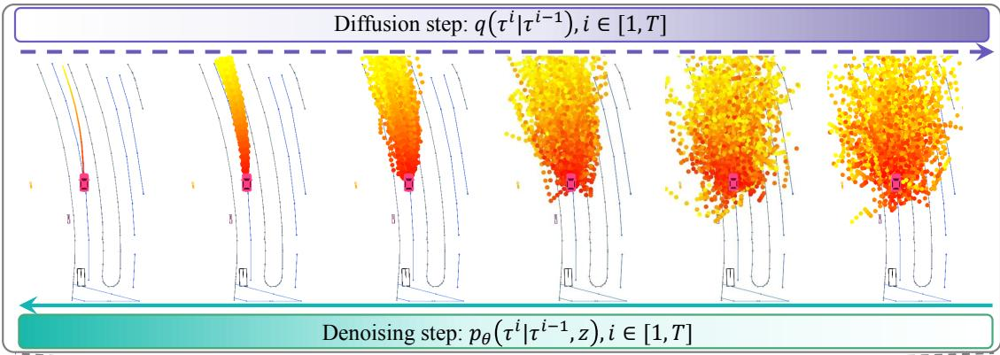
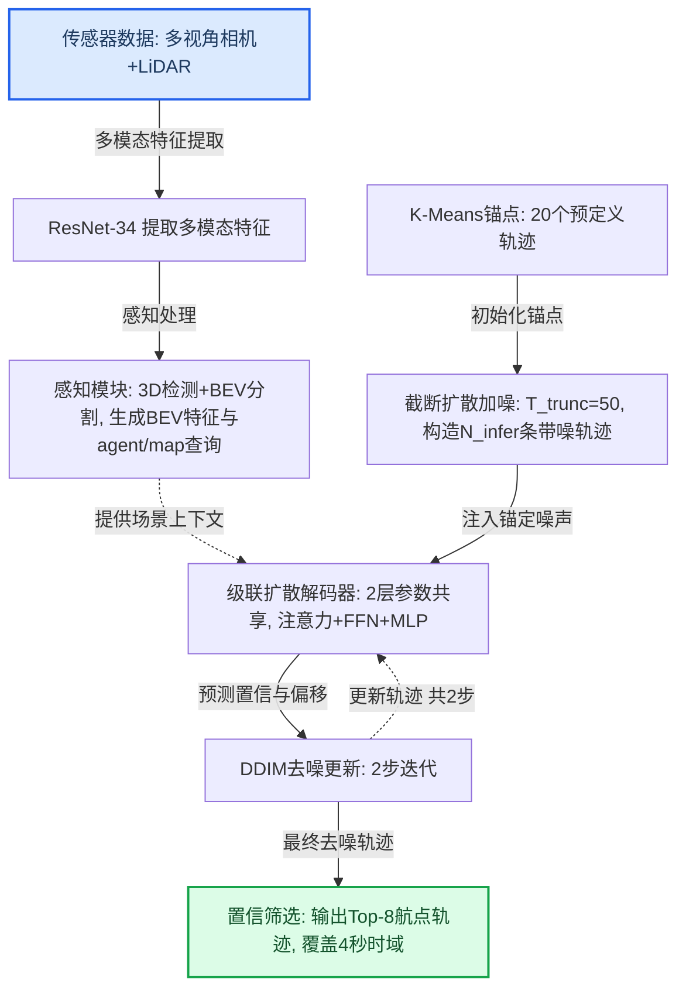
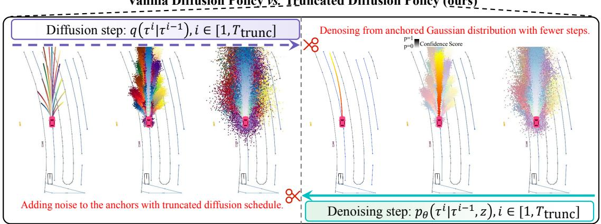
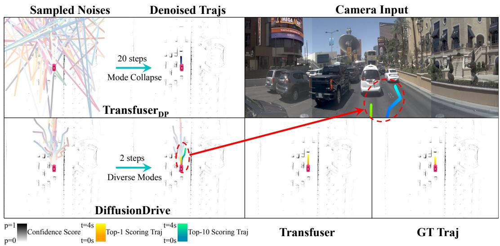
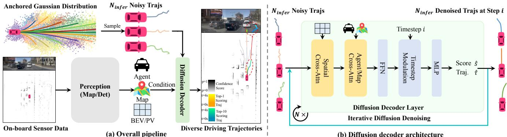
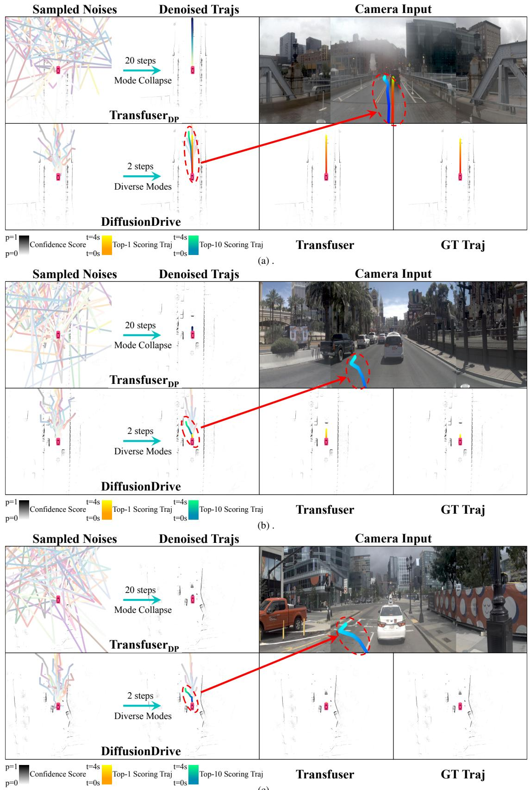
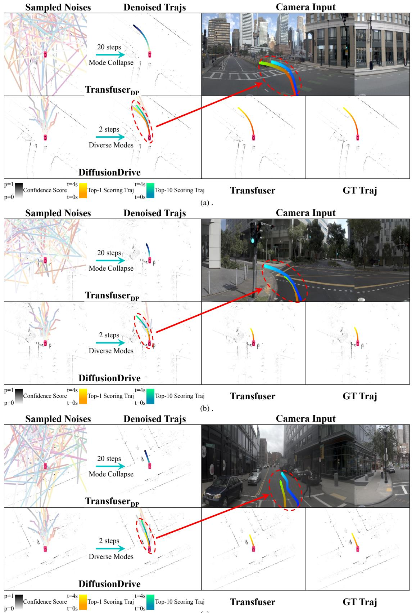
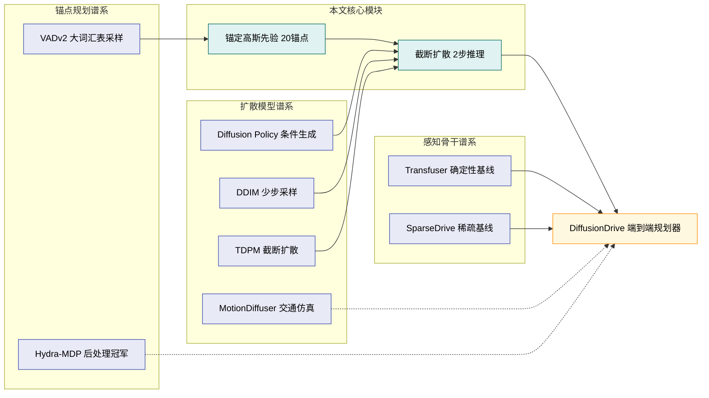
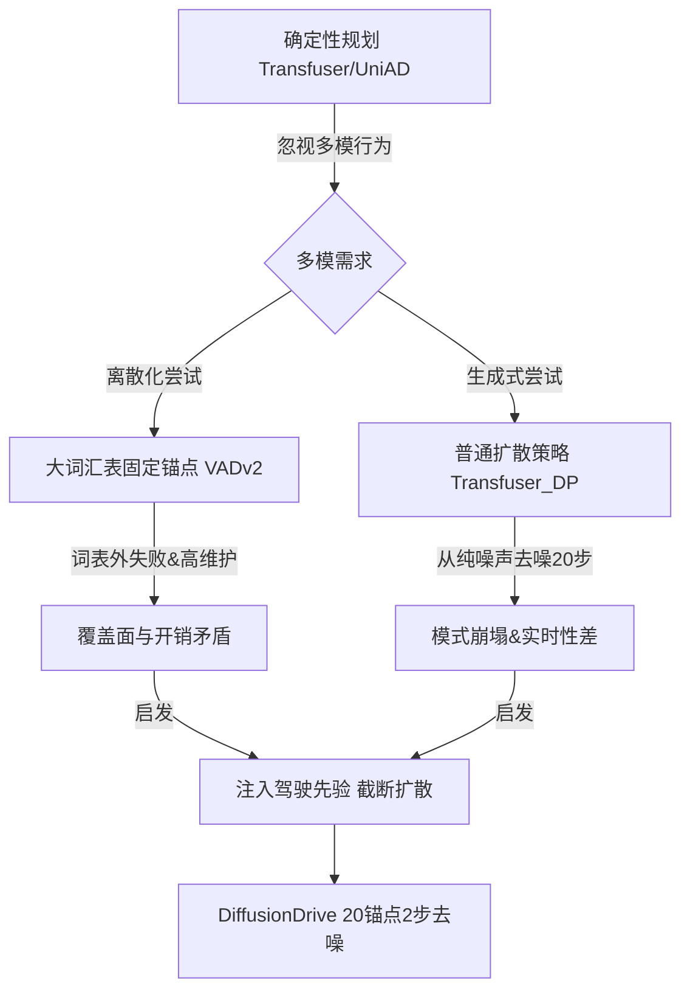

# DiffusionDrive: Truncated Diffusion Model for End-to-End Autonomous Driving — 深度解读

> 面向人类读者的深度解读(中文)。事实源与配对的 AI 知识包 `ai_package/2026-06-08_DiffusionDrive_2411.15139/ara/` 同源,均已通过数据保真审计。

## 核心结论

> 每条结论后的隐形锚点把数字回链到论文原文(忠实性保证)。

1. 提出截断扩散策略，将去噪起点从纯高斯噪声改为锚定高斯分布，使去噪步数从20步缩减至2步（相比原始扩散策略减少10倍），同时将模式多样性得分D从11%提升至74%，FPS从7提升至45<!--ref:r-figure-1-the-compariso--><!--anchor:quote:Figure%201.%20The%20comparison%20of%20different%20end%2Dto%2Dend%20paradigms.%20%28a%29%20Single%20mode%20regression%20%5B7%2C%2016%2C%2020%5D.%20%28b%29%20Sampling%20from%20vocabulary%20%5B3%2C--><!--ref:r-bencheng-liao-sup-1-2--><!--anchor:quote:Bencheng%20Liao%3Csup%3E1%2C2%2C%E2%8B%84%3C%2Fsup%3E%20Shaoyu%20Chen%3Csup%3E2%2C3%3C%2Fsup%3E%20Haoran%20Yin%3Csup%3E3%3C%2Fsup%3E%20Bo%20Jiang%3Csup%3E2%2C%E2%8B%84%3C%2Fsup%3E%20Cheng%20Wang%3Csup%3E1%2C2%2C%E2%8B%84%3C%2Fsup%3E%20Sixu%20Yan%3Csup%3E2%3C%2Fsup%3E%20Xinbang%20Zhang%3Csup%3E3%3C%2Fsup%3E%20Xiangyu%20Li%3Csup%3E3%3C%2Fsup%3E%20Ying%20Zhang%3Csup%3E3%3C%2Fsup%3E%20Qian%20Zhang%3Csup%3E3%3C%2Fsup%3E--><!--ref:r-recently-the-diffusion--><!--anchor:quote:Recently%2C%20the%20diffusion%20model%20has%20emerged%20as%20a%20powerful%20generative%20technique%20for%20robotic%20policy%20learning%2C%20capable%20of%20modeling%20multi%2Dmode%20action--><!--ref:r-images-f6953525c323f6--><!--anchor:quote:%21%5B%5D%28images%2Ff6953525c323f6d2024116bab59b7c80fe48deab63da60a7ed44638a0949357b.jpg%29--><!--ref:r-table-tr-td-rowspan-2--><!--anchor:quote:%3Ctable%3E%3Ctr%3E%3Ctd%20rowspan%3D%222%22%3EMethod%3C%2Ftd%3E%3Ctd%20rowspan%3D%222%22%3ENC%E2%86%91%3C%2Ftd%3E%3Ctd%20rowspan%3D%222%22%3EDAC%E2%86%91%3C%2Ftd%3E%3Ctd%20rowspan%3D%222%22%3ETTC%E2%86%91%EF%BC%88%3C%2Ftd%3E%3Ctd%20rowspan%3D%222%22%3EComf.%E2%86%91%20EP%E4%B8%AA%3C%2Ftd%3E%3Ctd%20rowspan%3D%222%22%3E%3C%2Ftd%3E%3Ctd%20rowspan%3D%222%22%3EPDMS%E2%86%91%3C%2Ftd%3E%3Ctd%20colspan%3D%223%22%3EPlan%20Module%20Time%3C%2Ftd%3E%3Ctd%20rowspan%3D%222%22%3ETotal%E2%86%93%3C%2Ftd%3E%3Ctd%20rowspan%3D%222%22%3E%20%24%5Cmathcal%20%7B%20D%20%7D%20%5Cuparrow%24%20%3C%2Ftd%3E%3Ctd--><!--ref:r-end-to-end-autonomous--><!--anchor:quote:End%2Dto%2Dend%20autonomous%20driving%20has%20gained%20significant%20attention%20in%20recent%20years%20due%20to%20advancements%20in%20perception%20models%20%28detection%20%5B4%2C%2017%2C%2024%2C--><!--ref:r-recently-the-diffusion--><!--anchor:quote:Recently%2C%20the%20diffusion%20model%20has%20emerged%20as%20a%20powerful%20generative%20technique%20for%20robotic%20policy%20learning%2C%20capable%20of%20modeling%20multi%2Dmode%20action-->
2. 使用对齐的ResNet-34骨干网络，DiffusionDrive在NAVSIM navtest分割上达到88.1 PDMS，超越所有先前方法，且不依赖后处理，同时在NVIDIA 4090上以45 FPS运行<!--ref:r-recently-the-diffusion--><!--anchor:quote:Recently%2C%20the%20diffusion%20model%20has%20emerged%20as%20a%20powerful%20generative%20technique%20for%20robotic%20policy%20learning%2C%20capable%20of%20modeling%20multi%2Dmode%20action--><!--ref:r-recently-the-diffusion--><!--anchor:quote:Recently%2C%20the%20diffusion%20model%20has%20emerged%20as%20a%20powerful%20generative%20technique%20for%20robotic%20policy%20learning%2C%20capable%20of%20modeling%20multi%2Dmode%20action--><!--ref:r-recently-the-diffusion--><!--anchor:quote:Recently%2C%20the%20diffusion%20model%20has%20emerged%20as%20a%20powerful%20generative%20technique%20for%20robotic%20policy%20learning%2C%20capable%20of%20modeling%20multi%2Dmode%20action--><!--ref:r-recently-the-diffusion--><!--anchor:quote:Recently%2C%20the%20diffusion%20model%20has%20emerged%20as%20a%20powerful%20generative%20technique%20for%20robotic%20policy%20learning%2C%20capable%20of%20modeling%20multi%2Dmode%20action-->
3. 将原始DDIM扩散策略（Transfuser_DP）应用于自动驾驶时，从不同高斯噪声采样的20条轨迹在去噪后高度重叠，模式多样性得分D仅为11%；同时20步去噪使FPS从60降至7，无法满足实时需求<!--ref:r-figure-1-the-compariso--><!--anchor:quote:Figure%201.%20The%20comparison%20of%20different%20end%2Dto%2Dend%20paradigms.%20%28a%29%20Single%20mode%20regression%20%5B7%2C%2016%2C%2020%5D.%20%28b%29%20Sampling%20from%20vocabulary%20%5B3%2C--><!--ref:r-images-f6953525c323f6--><!--anchor:quote:%21%5B%5D%28images%2Ff6953525c323f6d2024116bab59b7c80fe48deab63da60a7ed44638a0949357b.jpg%29--><!--ref:r-figure-1-the-compariso--><!--anchor:quote:Figure%201.%20The%20comparison%20of%20different%20end%2Dto%2Dend%20paradigms.%20%28a%29%20Single%20mode%20regression%20%5B7%2C%2016%2C%2020%5D.%20%28b%29%20Sampling%20from%20vocabulary%20%5B3%2C--><!--ref:r-images-c15f15d9341cc1--><!--anchor:quote:%21%5B%5D%28images%2Fc15f15d9341cc12fc60f9289b3a4a22d25cd6b7f210ecf80444de8478ea0984f.jpg%29--><!--ref:r-end-to-end-autonomous--><!--anchor:quote:End%2Dto%2Dend%20autonomous%20driving%20has%20gained%20significant%20attention%20in%20recent%20years%20due%20to%20advancements%20in%20perception%20models%20%28detection%20%5B4%2C%2017%2C%2024%2C-->
4. 提出的基于Transformer的扩散解码器，通过稀疏可变形空间交叉注意力（BEV/PV特征）、智能体/地图查询交叉注意力及级联精化机制，在减少39%参数（102M→60M）的同时将PDMS提升2.4分（85.7→88.1）<!--ref:r-end-to-end-autonomous--><!--anchor:quote:End%2Dto%2Dend%20autonomous%20driving.%20UniAD%20%5B16%5D%2C%20as%20a%20pioneering%20work%2C%20demonstrates%20the%20potential%20of%20end%2Dto%2Dend%20autonomous%20driving%20by%20integrating%20multiple%20perception--><!--ref:r-table-tr-td-rowspan-2--><!--anchor:quote:%3Ctable%3E%3Ctr%3E%3Ctd%20rowspan%3D%222%22%3EMethod%3C%2Ftd%3E%3Ctd%20rowspan%3D%222%22%3ENC%E2%86%91%3C%2Ftd%3E%3Ctd%20rowspan%3D%222%22%3EDAC%E2%86%91%3C%2Ftd%3E%3Ctd%20rowspan%3D%222%22%3ETTC%E2%86%91%EF%BC%88%3C%2Ftd%3E%3Ctd%20rowspan%3D%222%22%3EComf.%E2%86%91%20EP%E4%B8%AA%3C%2Ftd%3E%3Ctd%20rowspan%3D%222%22%3E%3C%2Ftd%3E%3Ctd%20rowspan%3D%222%22%3EPDMS%E2%86%91%3C%2Ftd%3E%3Ctd%20colspan%3D%223%22%3EPlan%20Module%20Time%3C%2Ftd%3E%3Ctd%20rowspan%3D%222%22%3ETotal%E2%86%93%3C%2Ftd%3E%3Ctd%20rowspan%3D%222%22%3E%20%24%5Cmathcal%20%7B%20D%20%7D%20%5Cuparrow%24%20%3C%2Ftd%3E%3Ctd--><!--ref:r-images-c15f15d9341cc1--><!--anchor:quote:%21%5B%5D%28images%2Fc15f15d9341cc12fc60f9289b3a4a22d25cd6b7f210ecf80444de8478ea0984f.jpg%29--><!--ref:r-table-tr-td-method-td--><!--anchor:quote:%3Ctable%3E%3Ctr%3E%3Ctd%3EMethod%3C%2Ftd%3E%3Ctd%3EInput%3C%2Ftd%3E%3Ctd%3EImg.%20Backbone%3C%2Ftd%3E%3Ctd%3EAnchor%3C%2Ftd%3E%3Ctd%3ENC%E2%86%91%3C%2Ftd%3E%3Ctd%3EDAC%E2%86%91%3C%2Ftd%3E%3Ctd%3ETTC%E4%B8%AA%3C%2Ftd%3E%3Ctd%3EComf.%20%E4%B8%AA%3C%2Ftd%3E%3Ctd%3EEP%E4%B8%AA%3C%2Ftd%3E%3Ctd%3EPDMS%20%E2%86%91%3C%2Ftd%3E%3C%2Ftr%3E%3Ctr%3E%3Ctd%3EUniAD%20%5B16%5D%3C%2Ftd%3E%3Ctd%3ECamera%3C%2Ftd%3E%3Ctd%3EResNet%2D34%20%5B13%5D%3C%2Ftd%3E%3Ctd%3E0%3C%2Ftd%3E%3Ctd%3E97.8%3C%2Ftd%3E%3Ctd%3E91.9%3C%2Ftd%3E%3Ctd%3E92.9%3C%2Ftd%3E%3Ctd%3E100%3C%2Ftd%3E%3Ctd%3E78.8%3C%2Ftd%3E%3Ctd%3E83.4%3C%2Ftd%3E%3C%2Ftr%3E%3Ctr%3E%3Ctd%3EPARA%2DDrive%20%5B45%5D%3C%2Ftd%3E%3Ctd%3ECamera%3C%2Ftd%3E%3Ctd%3EResNet%2D34%20%5B13%5D%3C%2Ftd%3E%3Ctd%3E0%3C%2Ftd%3E%3Ctd%3E97.9%3C%2Ftd%3E%3Ctd%3E92.4%3C%2Ftd%3E%3Ctd%3E93.0%3C%2Ftd%3E%3Ctd%3E99.8%3C%2Ftd%3E%3Ctd%3E79.3%3C%2Ftd%3E%3Ctd%3E84.0%3C%2Ftd%3E%3C%2Ftr%3E%3Ctr%3E%3Ctd%3ELTF%20%5B7%5D%3C%2Ftd%3E%3Ctd%3ECamera%3C%2Ftd%3E%3Ctd%3EResNet%2D34%5B13%5D%3C%2Ftd%3E%3Ctd%3E0%3C%2Ftd%3E%3Ctd%3E97.4%3C%2Ftd%3E%3Ctd%3E92.8%3C%2Ftd%3E%3Ctd%3E92.4%3C%2Ftd%3E%3Ctd%3E100%3C%2Ftd%3E%3Ctd%3E79.0%3C%2Ftd%3E%3Ctd%3E83.8%3C%2Ftd%3E%3C%2Ftr%3E%3Ctr%3E%3Ctd%3ETransfuser%20%5B7%5D%3C%2Ftd%3E%3Ctd%3EC%26amp%3BL%3C%2Ftd%3E%3Ctd%3EResNet%2D34%20%5B13%5D%3C%2Ftd%3E%3Ctd%3E0%3C%2Ftd%3E%3Ctd%3E97.7%3C%2Ftd%3E%3Ctd%3E92.8%3C%2Ftd%3E%3Ctd%3E92.8%3C%2Ftd%3E%3Ctd%3E100%3C%2Ftd%3E%3Ctd%3E79.2%3C%2Ftd%3E%3Ctd%3E84.0%3C%2Ftd%3E%3C%2Ftr%3E%3Ctr%3E%3Ctd%3EDRAMA%20%5B52%5D%3C%2Ftd%3E%3Ctd%3EC%26amp%3BL%3C%2Ftd%3E%3Ctd%3EResNet%2D34%20%5B13%5D%3C%2Ftd%3E%3Ctd%3E0%3C%2Ftd%3E%3Ctd%3E98.0%3C%2Ftd%3E%3Ctd%3E93.1%3C%2Ftd%3E%3Ctd%3E94.8%3C%2Ftd%3E%3Ctd%3E100%3C%2Ftd%3E%3Ctd%3E80.1%3C%2Ftd%3E%3Ctd%3E85.5%3C%2Ftd%3E%3C%2Ftr%3E%3Ctr%3E%3Ctd%3E%20%24%5Cmathrm%20%7B%20V%20A%20D%20v%20%7D--><!--ref:r-table-tr-td-rowspan-2--><!--anchor:quote:%3Ctable%3E%3Ctr%3E%3Ctd%20rowspan%3D%222%22%3EID%3C%2Ftd%3E%3Ctd%20rowspan%3D%222%22%3EUNet%20Decoder%3C%2Ftd%3E%3Ctd%20rowspan%3D%222%22%3EEgo%20Query%20Interaction%3C%2Ftd%3E%3Ctd%20rowspan%3D%222%22%3ESpatial%20Cross%2Dattn%3C%2Ftd%3E%3Ctd%20rowspan%3D%222%22%3EAgent%2FMap%20Cascade%20Cross%2Dattn%3C%2Ftd%3E%3Ctd%20rowspan%3D%222%22%3EDecoder%3C%2Ftd%3E%3Ctd%20rowspan%3D%222%22%3EParam.%3C%2Ftd%3E%3Ctd%20colspan%3D%226%22%3EPlanning%20Metric%3C%2Ftd%3E%3C%2Ftr%3E%3Ctr%3E%3Ctd%3ENC%E2%86%91%3C%2Ftd%3E%3Ctd%3EDAC%E2%86%91%3C%2Ftd%3E%3Ctd%3ETTC%E2%86%91%3C%2Ftd%3E%3Ctd%3EComf.%E2%86%91%3C%2Ftd%3E%3Ctd%3EEP%E4%B8%AA%3C%2Ftd%3E%3Ctd%3EPDMS%E2%86%91%3C%2Ftd%3E%3C%2Ftr%3E%3Ctr%3E%3Ctd%3E1%3C%2Ftd%3E%3Ctd%3E%E2%88%9A%3C%2Ftd%3E%3Ctd%3E%E2%88%9A%3C%2Ftd%3E%3Ctd%3EX%3C%2Ftd%3E%3Ctd%3E%C3%97%3C%2Ftd%3E%3Ctd%3E%C3%97%3C%2Ftd%3E%3Ctd%3E102M%3C%2Ftd%3E%3Ctd%3E97.9%3C%2Ftd%3E%3Ctd%3E94.2%3C%2Ftd%3E%3Ctd%3E93.9%3C%2Ftd%3E%3Ctd%3E100%3C%2Ftd%3E%3Ctd%3E80.2%3C%2Ftd%3E%3Ctd%3E85.7%3C%2Ftd%3E%3C%2Ftr%3E%3Ctr%3E%3Ctd%3E2%3C%2Ftd%3E%3Ctd%3EX%3C%2Ftd%3E%3Ctd%3E%E2%88%9A%3C%2Ftd%3E%3Ctd%3E%C3%97%3C%2Ftd%3E%3Ctd%3EX%3C%2Ftd%3E%3Ctd%3E%C3%97%3C%2Ftd%3E%3Ctd%3E57M%3C%2Ftd%3E%3Ctd%3E88.7%3C%2Ftd%3E%3Ctd%3E83.2%3C%2Ftd%3E%3Ctd%3E80.0%3C%2Ftd%3E%3Ctd%3E84.8%3C%2Ftd%3E%3Ctd%3E43.3%3C%2Ftd%3E%3Ctd%3E55.1%3C%2Ftd%3E%3C%2Ftr%3E%3Ctr%3E%3Ctd%3E3%3C%2Ftd%3E%3Ctd%3EX%3C%2Ftd%3E%3Ctd%3E%E2%88%9A%3C%2Ftd%3E%3Ctd%3E%E2%88%9A%3C%2Ftd%3E%3Ctd%3E%C3%97%3C%2Ftd%3E%3Ctd%3E%C3%97%3C%2Ftd%3E%3Ctd%3E58M%3C%2Ftd%3E%3Ctd%3E98.2%3C%2Ftd%3E%3Ctd%3E95.4%3C%2Ftd%3E%3Ctd%3E94.4%3C%2Ftd%3E%3Ctd%3E100%3C%2Ftd%3E%3Ctd%3E81.3%3C%2Ftd%3E%3Ctd%3E87.1%3C%2Ftd%3E%3C%2Ftr%3E%3Ctr%3E%3Ctd%3E4%3C%2Ftd%3E%3Ctd%3E%C3%97%3C%2Ftd%3E%3Ctd%3E%E2%88%9A%3C%2Ftd%3E%3Ctd%3E%C3%97%3C%2Ftd%3E%3Ctd%3E%E2%88%9A%3C%2Ftd%3E%3Ctd%3E%C3%97%3C%2Ftd%3E%3Ctd%3E58M%3C%2Ftd%3E%3Ctd%3E97.9%3C%2Ftd%3E%3Ctd%3E93.5%3C%2Ftd%3E%3Ctd%3E93.8%3C%2Ftd%3E%3Ctd%3E100%3C%2Ftd%3E%3Ctd%3E79.8%3C%2Ftd%3E%3Ctd%3E85.1%3C%2Ftd%3E%3C%2Ftr%3E%3Ctr%3E%3Ctd%3E5%3C%2Ftd%3E%3Ctd%3E%C3%97%3C%2Ftd%3E%3Ctd%3E%E2%88%9A%3C%2Ftd%3E%3Ctd%3E%E2%88%9A%3C%2Ftd%3E%3Ctd%3E%E2%88%9A%3C%2Ftd%3E%3Ctd%3EX%3C%2Ftd%3E%3Ctd%3E59M%3C%2Ftd%3E%3Ctd%3E98.0%3C%2Ftd%3E%3Ctd%3E95.8%3C%2Ftd%3E%3Ctd%3E94.4%3C%2Ftd%3E%3Ctd%3E100%3C%2Ftd%3E%3Ctd%3E81.7%3C%2Ftd%3E%3Ctd%3E87.4%3C%2Ftd%3E%3C%2Ftr%3E%3Ctr%3E%3Ctd%3E6%3C%2Ftd%3E%3Ctd%3E%C3%97%3C%2Ftd%3E%3Ctd%3E%E2%88%9A%3C%2Ftd%3E%3Ctd%3E%E2%88%9A%3C%2Ftd%3E%3Ctd%3E%E2%88%9A%3C%2Ftd%3E%3Ctd%3E%E2%88%9A%3C%2Ftd%3E%3Ctd%3E60M%3C%2Ftd%3E%3Ctd%3E98.2%3C%2Ftd%3E%3Ctd%3E96.2%3C%2Ftd%3E%3Ctd%3E94.7%3C%2Ftd%3E%3Ctd%3E100%3C%2Ftd%3E%3Ctd%3E82.2%3C%2Ftd%3E%3Ctd%3E88.1%3C%2Ftd%3E%3C%2Ftr%3E%3C%2Ftable%3E--><!--ref:r-recently-the-diffusion--><!--anchor:quote:Recently%2C%20the%20diffusion%20model%20has%20emerged%20as%20a%20powerful%20generative%20technique%20for%20robotic%20policy%20learning%2C%20capable%20of%20modeling%20multi%2Dmode%20action-->
5. 在nuScenes数据集上，DiffusionDrive相比VAD实现20.8%更低平均L2误差（0.57 vs 0.72 m）和63.6%更低平均碰撞率（0.08 vs 0.22%），运行速度快1.8倍（8.2 vs 4.5 FPS）；相比SparseDrive进一步降低平均L2误差0.04 m<!--ref:r-with-these-innovations--><!--anchor:quote:With%20these%20innovations%2C%20we%20present%20DiffusionDrive%2C%20a%20diffusion%20model%20for%20real%2Dtime%20end%2Dto%2Dend%20autonomous%20driving.%20We%20benchmark%20our%20method%20on%20the--><!--ref:r-bencheng-liao-sup-1-2--><!--anchor:quote:Bencheng%20Liao%3Csup%3E1%2C2%2C%E2%8B%84%3C%2Fsup%3E%20Shaoyu%20Chen%3Csup%3E2%2C3%3C%2Fsup%3E%20Haoran%20Yin%3Csup%3E3%3C%2Fsup%3E%20Bo%20Jiang%3Csup%3E2%2C%E2%8B%84%3C%2Fsup%3E%20Cheng%20Wang%3Csup%3E1%2C2%2C%E2%8B%84%3C%2Fsup%3E%20Sixu%20Yan%3Csup%3E2%3C%2Fsup%3E%20Xinbang%20Zhang%3Csup%3E3%3C%2Fsup%3E%20Xiangyu%20Li%3Csup%3E3%3C%2Fsup%3E%20Ying%20Zhang%3Csup%3E3%3C%2Fsup%3E%20Qian%20Zhang%3Csup%3E3%3C%2Fsup%3E--><!--ref:r-table-tr-td-rowspan-2--><!--anchor:quote:%3Ctable%3E%3Ctr%3E%3Ctd%20rowspan%3D%222%22%3EMethod%3C%2Ftd%3E%3Ctd%20rowspan%3D%222%22%3EInput%3C%2Ftd%3E%3Ctd%20rowspan%3D%222%22%3EImg.%20Backbone%3C%2Ftd%3E%3Ctd%20colspan%3D%224%22%3EL2%28m%29%E2%86%93%3C%2Ftd%3E%3Ctd%20colspan%3D%224%22%3ECollision%20Rate%20%28%25%29%E2%86%93%3C%2Ftd%3E%3Ctd%20rowspan%3D%222%22%3EFPS%E4%B8%AA%3C%2Ftd%3E%3C%2Ftr%3E%3Ctr%3E%3Ctd%3E1s%3C%2Ftd%3E%3Ctd%3E2s%3C%2Ftd%3E%3Ctd%3E3s%3C%2Ftd%3E%3Ctd%3E%20Avg.%3C%2Ftd%3E%3Ctd%3E1s%3C%2Ftd%3E%3Ctd%3E2s%3C%2Ftd%3E%3Ctd%3E3s%3C%2Ftd%3E%3Ctd%3EAvg.%3C%2Ftd%3E%3C%2Ftr%3E%3Ctr%3E%3Ctd%3EST%2DP3%20%5B15%5D%3C%2Ftd%3E%3Ctd%3ECamera%3C%2Ftd%3E%3Ctd%3EEffNet%2Db4%20%5B40%5D%3C%2Ftd%3E%3Ctd%3E1.33%3C%2Ftd%3E%3Ctd%3E2.11%3C%2Ftd%3E%3Ctd%3E2.90%3C%2Ftd%3E%3Ctd%3E2.11%3C%2Ftd%3E%3Ctd%3E0.23%3C%2Ftd%3E%3Ctd%3E0.62%3C%2Ftd%3E%3Ctd%3E1.27%3C%2Ftd%3E%3Ctd%3E0.71%3C%2Ftd%3E%3Ctd%3E1.6%3C%2Ftd%3E%3C%2Ftr%3E%3Ctr%3E%3Ctd%3EUniAD%20%5B16%5D%3C%2Ftd%3E%3Ctd%3ECamera%3C%2Ftd%3E%3Ctd%3EResNet%2D101%5B13%5D%3C%2Ftd%3E%3Ctd%3E0.45%3C%2Ftd%3E%3Ctd%3E0.70%3C%2Ftd%3E%3Ctd%3E1.04%3C%2Ftd%3E%3Ctd%3E0.73%3C%2Ftd%3E%3Ctd%3E0.62%3C%2Ftd%3E%3Ctd%3E0.58%3C%2Ftd%3E%3Ctd%3E0.63%3C%2Ftd%3E%3Ctd%3E0.61%3C%2Ftd%3E%3Ctd%3E1.8%3C%2Ftd%3E%3C%2Ftr%3E%3Ctr%3E%3Ctd%3EOccNet%20%5B41%5D%3C%2Ftd%3E%3Ctd%3ECamera%3C%2Ftd%3E%3Ctd%3EResNet%2D50%5B13%5D%3C%2Ftd%3E%3Ctd%3E1.29%3C%2Ftd%3E%3Ctd%3E2.13%3C%2Ftd%3E%3Ctd%3E2.99%3C%2Ftd%3E%3Ctd%3E2.14%3C%2Ftd%3E%3Ctd%3E0.21%3C%2Ftd%3E%3Ctd%3E0.59%3C%2Ftd%3E%3Ctd%3E1.37%3C%2Ftd%3E%3Ctd%3E0.72%3C%2Ftd%3E%3Ctd%3E2.6%3C%2Ftd%3E%3C%2Ftr%3E%3Ctr%3E%3Ctd%3EVAD%20%5B20%5D%3C%2Ftd%3E%3Ctd%3ECamera%3C%2Ftd%3E%3Ctd%3EResNet%2D50%5B13%5D%3C%2Ftd%3E%3Ctd%3E0.41%3C%2Ftd%3E%3Ctd%3E0.70%3C%2Ftd%3E%3Ctd%3E1.05%3C%2Ftd%3E%3Ctd%3E0.72%3C%2Ftd%3E%3Ctd%3E0.07%3C%2Ftd%3E%3Ctd%3E0.17%3C%2Ftd%3E%3Ctd%3E0.41%3C%2Ftd%3E%3Ctd%3E0.22%3C%2Ftd%3E%3Ctd%3E4.5%3C%2Ftd%3E%3C%2Ftr%3E%3Ctr%3E%3Ctd%3ESparseDrive%20%5B39%5D%3C%2Ftd%3E%3Ctd%3ECamera%3C%2Ftd%3E%3Ctd%3EResNet%2D50%5B13%5D%3C%2Ftd%3E%3Ctd%3E0.29%3C%2Ftd%3E%3Ctd%3E0.58%3C%2Ftd%3E%3Ctd%3E0.96%3C%2Ftd%3E%3Ctd%3E0.61%3C%2Ftd%3E%3Ctd%3E0.01%3C%2Ftd%3E%3Ctd%3E0.05%3C%2Ftd%3E%3Ctd%3E0.18%3C%2Ftd%3E%3Ctd%3E0.08%3C%2Ftd%3E%3Ctd%3E9.0%3C%2Ftd%3E%3C%2Ftr%3E%3Ctr%3E%3Ctd%3EDiffusionDrive%20%28Ours%29%3C%2Ftd%3E%3Ctd%3ECamera%3C%2Ftd%3E%3Ctd%3EResNet%2D50%5B13%5D%3C%2Ftd%3E%3Ctd%3E0.27%3C%2Ftd%3E%3Ctd%3E0.54%3C%2Ftd%3E%3Ctd%3E0.90%3C%2Ftd%3E%3Ctd%3E0.57%3C%2Ftd%3E%3Ctd%3E0.03%3C%2Ftd%3E%3Ctd%3E0.05%3C%2Ftd%3E%3Ctd%3E0.16%3C%2Ftd%3E%3Ctd%3E0.08%3C%2Ftd%3E%3Ctd%3E8.2%3C%2Ftd%3E%3C%2Ftr%3E%3C%2Ftable%3E--><!--ref:r-table-tr-td-rowspan-2--><!--anchor:quote:%3Ctable%3E%3Ctr%3E%3Ctd%20rowspan%3D%222%22%3EMethod%3C%2Ftd%3E%3Ctd%20rowspan%3D%222%22%3EInput%3C%2Ftd%3E%3Ctd%20rowspan%3D%222%22%3EImg.%20Backbone%3C%2Ftd%3E%3Ctd%20colspan%3D%224%22%3EL2%28m%29%E2%86%93%3C%2Ftd%3E%3Ctd%20colspan%3D%224%22%3ECollision%20Rate%20%28%25%29%E2%86%93%3C%2Ftd%3E%3Ctd%20rowspan%3D%222%22%3EFPS%E4%B8%AA%3C%2Ftd%3E%3C%2Ftr%3E%3Ctr%3E%3Ctd%3E1s%3C%2Ftd%3E%3Ctd%3E2s%3C%2Ftd%3E%3Ctd%3E3s%3C%2Ftd%3E%3Ctd%3E%20Avg.%3C%2Ftd%3E%3Ctd%3E1s%3C%2Ftd%3E%3Ctd%3E2s%3C%2Ftd%3E%3Ctd%3E3s%3C%2Ftd%3E%3Ctd%3EAvg.%3C%2Ftd%3E%3C%2Ftr%3E%3Ctr%3E%3Ctd%3EST%2DP3%20%5B15%5D%3C%2Ftd%3E%3Ctd%3ECamera%3C%2Ftd%3E%3Ctd%3EEffNet%2Db4%20%5B40%5D%3C%2Ftd%3E%3Ctd%3E1.33%3C%2Ftd%3E%3Ctd%3E2.11%3C%2Ftd%3E%3Ctd%3E2.90%3C%2Ftd%3E%3Ctd%3E2.11%3C%2Ftd%3E%3Ctd%3E0.23%3C%2Ftd%3E%3Ctd%3E0.62%3C%2Ftd%3E%3Ctd%3E1.27%3C%2Ftd%3E%3Ctd%3E0.71%3C%2Ftd%3E%3Ctd%3E1.6%3C%2Ftd%3E%3C%2Ftr%3E%3Ctr%3E%3Ctd%3EUniAD%20%5B16%5D%3C%2Ftd%3E%3Ctd%3ECamera%3C%2Ftd%3E%3Ctd%3EResNet%2D101%5B13%5D%3C%2Ftd%3E%3Ctd%3E0.45%3C%2Ftd%3E%3Ctd%3E0.70%3C%2Ftd%3E%3Ctd%3E1.04%3C%2Ftd%3E%3Ctd%3E0.73%3C%2Ftd%3E%3Ctd%3E0.62%3C%2Ftd%3E%3Ctd%3E0.58%3C%2Ftd%3E%3Ctd%3E0.63%3C%2Ftd%3E%3Ctd%3E0.61%3C%2Ftd%3E%3Ctd%3E1.8%3C%2Ftd%3E%3C%2Ftr%3E%3Ctr%3E%3Ctd%3EOccNet%20%5B41%5D%3C%2Ftd%3E%3Ctd%3ECamera%3C%2Ftd%3E%3Ctd%3EResNet%2D50%5B13%5D%3C%2Ftd%3E%3Ctd%3E1.29%3C%2Ftd%3E%3Ctd%3E2.13%3C%2Ftd%3E%3Ctd%3E2.99%3C%2Ftd%3E%3Ctd%3E2.14%3C%2Ftd%3E%3Ctd%3E0.21%3C%2Ftd%3E%3Ctd%3E0.59%3C%2Ftd%3E%3Ctd%3E1.37%3C%2Ftd%3E%3Ctd%3E0.72%3C%2Ftd%3E%3Ctd%3E2.6%3C%2Ftd%3E%3C%2Ftr%3E%3Ctr%3E%3Ctd%3EVAD%20%5B20%5D%3C%2Ftd%3E%3Ctd%3ECamera%3C%2Ftd%3E%3Ctd%3EResNet%2D50%5B13%5D%3C%2Ftd%3E%3Ctd%3E0.41%3C%2Ftd%3E%3Ctd%3E0.70%3C%2Ftd%3E%3Ctd%3E1.05%3C%2Ftd%3E%3Ctd%3E0.72%3C%2Ftd%3E%3Ctd%3E0.07%3C%2Ftd%3E%3Ctd%3E0.17%3C%2Ftd%3E%3Ctd%3E0.41%3C%2Ftd%3E%3Ctd%3E0.22%3C%2Ftd%3E%3Ctd%3E4.5%3C%2Ftd%3E%3C%2Ftr%3E%3Ctr%3E%3Ctd%3ESparseDrive%20%5B39%5D%3C%2Ftd%3E%3Ctd%3ECamera%3C%2Ftd%3E%3Ctd%3EResNet%2D50%5B13%5D%3C%2Ftd%3E%3Ctd%3E0.29%3C%2Ftd%3E%3Ctd%3E0.58%3C%2Ftd%3E%3Ctd%3E0.96%3C%2Ftd%3E%3Ctd%3E0.61%3C%2Ftd%3E%3Ctd%3E0.01%3C%2Ftd%3E%3Ctd%3E0.05%3C%2Ftd%3E%3Ctd%3E0.18%3C%2Ftd%3E%3Ctd%3E0.08%3C%2Ftd%3E%3Ctd%3E9.0%3C%2Ftd%3E%3C%2Ftr%3E%3Ctr%3E%3Ctd%3EDiffusionDrive%20%28Ours%29%3C%2Ftd%3E%3Ctd%3ECamera%3C%2Ftd%3E%3Ctd%3EResNet%2D50%5B13%5D%3C%2Ftd%3E%3Ctd%3E0.27%3C%2Ftd%3E%3Ctd%3E0.54%3C%2Ftd%3E%3Ctd%3E0.90%3C%2Ftd%3E%3Ctd%3E0.57%3C%2Ftd%3E%3Ctd%3E0.03%3C%2Ftd%3E%3Ctd%3E0.05%3C%2Ftd%3E%3Ctd%3E0.16%3C%2Ftd%3E%3Ctd%3E0.08%3C%2Ftd%3E%3Ctd%3E8.2%3C%2Ftd%3E%3C%2Ftr%3E%3C%2Ftable%3E--><!--ref:r-with-these-innovations--><!--anchor:quote:With%20these%20innovations%2C%20we%20present%20DiffusionDrive%2C%20a%20diffusion%20model%20for%20real%2Dtime%20end%2Dto%2Dend%20autonomous%20driving.%20We%20benchmark%20our%20method%20on%20the--><!--ref:r-table-tr-td-rowspan-2--><!--anchor:quote:%3Ctable%3E%3Ctr%3E%3Ctd%20rowspan%3D%222%22%3EMethod%3C%2Ftd%3E%3Ctd%20rowspan%3D%222%22%3EInput%3C%2Ftd%3E%3Ctd%20rowspan%3D%222%22%3EImg.%20Backbone%3C%2Ftd%3E%3Ctd%20colspan%3D%224%22%3EL2%28m%29%E2%86%93%3C%2Ftd%3E%3Ctd%20colspan%3D%224%22%3ECollision%20Rate%20%28%25%29%E2%86%93%3C%2Ftd%3E%3Ctd%20rowspan%3D%222%22%3EFPS%E4%B8%AA%3C%2Ftd%3E%3C%2Ftr%3E%3Ctr%3E%3Ctd%3E1s%3C%2Ftd%3E%3Ctd%3E2s%3C%2Ftd%3E%3Ctd%3E3s%3C%2Ftd%3E%3Ctd%3E%20Avg.%3C%2Ftd%3E%3Ctd%3E1s%3C%2Ftd%3E%3Ctd%3E2s%3C%2Ftd%3E%3Ctd%3E3s%3C%2Ftd%3E%3Ctd%3EAvg.%3C%2Ftd%3E%3C%2Ftr%3E%3Ctr%3E%3Ctd%3EST%2DP3%20%5B15%5D%3C%2Ftd%3E%3Ctd%3ECamera%3C%2Ftd%3E%3Ctd%3EEffNet%2Db4%20%5B40%5D%3C%2Ftd%3E%3Ctd%3E1.33%3C%2Ftd%3E%3Ctd%3E2.11%3C%2Ftd%3E%3Ctd%3E2.90%3C%2Ftd%3E%3Ctd%3E2.11%3C%2Ftd%3E%3Ctd%3E0.23%3C%2Ftd%3E%3Ctd%3E0.62%3C%2Ftd%3E%3Ctd%3E1.27%3C%2Ftd%3E%3Ctd%3E0.71%3C%2Ftd%3E%3Ctd%3E1.6%3C%2Ftd%3E%3C%2Ftr%3E%3Ctr%3E%3Ctd%3EUniAD%20%5B16%5D%3C%2Ftd%3E%3Ctd%3ECamera%3C%2Ftd%3E%3Ctd%3EResNet%2D101%5B13%5D%3C%2Ftd%3E%3Ctd%3E0.45%3C%2Ftd%3E%3Ctd%3E0.70%3C%2Ftd%3E%3Ctd%3E1.04%3C%2Ftd%3E%3Ctd%3E0.73%3C%2Ftd%3E%3Ctd%3E0.62%3C%2Ftd%3E%3Ctd%3E0.58%3C%2Ftd%3E%3Ctd%3E0.63%3C%2Ftd%3E%3Ctd%3E0.61%3C%2Ftd%3E%3Ctd%3E1.8%3C%2Ftd%3E%3C%2Ftr%3E%3Ctr%3E%3Ctd%3EOccNet%20%5B41%5D%3C%2Ftd%3E%3Ctd%3ECamera%3C%2Ftd%3E%3Ctd%3EResNet%2D50%5B13%5D%3C%2Ftd%3E%3Ctd%3E1.29%3C%2Ftd%3E%3Ctd%3E2.13%3C%2Ftd%3E%3Ctd%3E2.99%3C%2Ftd%3E%3Ctd%3E2.14%3C%2Ftd%3E%3Ctd%3E0.21%3C%2Ftd%3E%3Ctd%3E0.59%3C%2Ftd%3E%3Ctd%3E1.37%3C%2Ftd%3E%3Ctd%3E0.72%3C%2Ftd%3E%3Ctd%3E2.6%3C%2Ftd%3E%3C%2Ftr%3E%3Ctr%3E%3Ctd%3EVAD%20%5B20%5D%3C%2Ftd%3E%3Ctd%3ECamera%3C%2Ftd%3E%3Ctd%3EResNet%2D50%5B13%5D%3C%2Ftd%3E%3Ctd%3E0.41%3C%2Ftd%3E%3Ctd%3E0.70%3C%2Ftd%3E%3Ctd%3E1.05%3C%2Ftd%3E%3Ctd%3E0.72%3C%2Ftd%3E%3Ctd%3E0.07%3C%2Ftd%3E%3Ctd%3E0.17%3C%2Ftd%3E%3Ctd%3E0.41%3C%2Ftd%3E%3Ctd%3E0.22%3C%2Ftd%3E%3Ctd%3E4.5%3C%2Ftd%3E%3C%2Ftr%3E%3Ctr%3E%3Ctd%3ESparseDrive%20%5B39%5D%3C%2Ftd%3E%3Ctd%3ECamera%3C%2Ftd%3E%3Ctd%3EResNet%2D50%5B13%5D%3C%2Ftd%3E%3Ctd%3E0.29%3C%2Ftd%3E%3Ctd%3E0.58%3C%2Ftd%3E%3Ctd%3E0.96%3C%2Ftd%3E%3Ctd%3E0.61%3C%2Ftd%3E%3Ctd%3E0.01%3C%2Ftd%3E%3Ctd%3E0.05%3C%2Ftd%3E%3Ctd%3E0.18%3C%2Ftd%3E%3Ctd%3E0.08%3C%2Ftd%3E%3Ctd%3E9.0%3C%2Ftd%3E%3C%2Ftr%3E%3Ctr%3E%3Ctd%3EDiffusionDrive%20%28Ours%29%3C%2Ftd%3E%3Ctd%3ECamera%3C%2Ftd%3E%3Ctd%3EResNet%2D50%5B13%5D%3C%2Ftd%3E%3Ctd%3E0.27%3C%2Ftd%3E%3Ctd%3E0.54%3C%2Ftd%3E%3Ctd%3E0.90%3C%2Ftd%3E%3Ctd%3E0.57%3C%2Ftd%3E%3Ctd%3E0.03%3C%2Ftd%3E%3Ctd%3E0.05%3C%2Ftd%3E%3Ctd%3E0.16%3C%2Ftd%3E%3Ctd%3E0.08%3C%2Ftd%3E%3Ctd%3E8.2%3C%2Ftd%3E%3C%2Ftr%3E%3C%2Ftable%3E--><!--ref:r-table-tr-td-rowspan-2--><!--anchor:quote:%3Ctable%3E%3Ctr%3E%3Ctd%20rowspan%3D%222%22%3EMethod%3C%2Ftd%3E%3Ctd%20rowspan%3D%222%22%3EInput%3C%2Ftd%3E%3Ctd%20rowspan%3D%222%22%3EImg.%20Backbone%3C%2Ftd%3E%3Ctd%20colspan%3D%224%22%3EL2%28m%29%E2%86%93%3C%2Ftd%3E%3Ctd%20colspan%3D%224%22%3ECollision%20Rate%20%28%25%29%E2%86%93%3C%2Ftd%3E%3Ctd%20rowspan%3D%222%22%3EFPS%E4%B8%AA%3C%2Ftd%3E%3C%2Ftr%3E%3Ctr%3E%3Ctd%3E1s%3C%2Ftd%3E%3Ctd%3E2s%3C%2Ftd%3E%3Ctd%3E3s%3C%2Ftd%3E%3Ctd%3E%20Avg.%3C%2Ftd%3E%3Ctd%3E1s%3C%2Ftd%3E%3Ctd%3E2s%3C%2Ftd%3E%3Ctd%3E3s%3C%2Ftd%3E%3Ctd%3EAvg.%3C%2Ftd%3E%3C%2Ftr%3E%3Ctr%3E%3Ctd%3EST%2DP3%20%5B15%5D%3C%2Ftd%3E%3Ctd%3ECamera%3C%2Ftd%3E%3Ctd%3EEffNet%2Db4%20%5B40%5D%3C%2Ftd%3E%3Ctd%3E1.33%3C%2Ftd%3E%3Ctd%3E2.11%3C%2Ftd%3E%3Ctd%3E2.90%3C%2Ftd%3E%3Ctd%3E2.11%3C%2Ftd%3E%3Ctd%3E0.23%3C%2Ftd%3E%3Ctd%3E0.62%3C%2Ftd%3E%3Ctd%3E1.27%3C%2Ftd%3E%3Ctd%3E0.71%3C%2Ftd%3E%3Ctd%3E1.6%3C%2Ftd%3E%3C%2Ftr%3E%3Ctr%3E%3Ctd%3EUniAD%20%5B16%5D%3C%2Ftd%3E%3Ctd%3ECamera%3C%2Ftd%3E%3Ctd%3EResNet%2D101%5B13%5D%3C%2Ftd%3E%3Ctd%3E0.45%3C%2Ftd%3E%3Ctd%3E0.70%3C%2Ftd%3E%3Ctd%3E1.04%3C%2Ftd%3E%3Ctd%3E0.73%3C%2Ftd%3E%3Ctd%3E0.62%3C%2Ftd%3E%3Ctd%3E0.58%3C%2Ftd%3E%3Ctd%3E0.63%3C%2Ftd%3E%3Ctd%3E0.61%3C%2Ftd%3E%3Ctd%3E1.8%3C%2Ftd%3E%3C%2Ftr%3E%3Ctr%3E%3Ctd%3EOccNet%20%5B41%5D%3C%2Ftd%3E%3Ctd%3ECamera%3C%2Ftd%3E%3Ctd%3EResNet%2D50%5B13%5D%3C%2Ftd%3E%3Ctd%3E1.29%3C%2Ftd%3E%3Ctd%3E2.13%3C%2Ftd%3E%3Ctd%3E2.99%3C%2Ftd%3E%3Ctd%3E2.14%3C%2Ftd%3E%3Ctd%3E0.21%3C%2Ftd%3E%3Ctd%3E0.59%3C%2Ftd%3E%3Ctd%3E1.37%3C%2Ftd%3E%3Ctd%3E0.72%3C%2Ftd%3E%3Ctd%3E2.6%3C%2Ftd%3E%3C%2Ftr%3E%3Ctr%3E%3Ctd%3EVAD%20%5B20%5D%3C%2Ftd%3E%3Ctd%3ECamera%3C%2Ftd%3E%3Ctd%3EResNet%2D50%5B13%5D%3C%2Ftd%3E%3Ctd%3E0.41%3C%2Ftd%3E%3Ctd%3E0.70%3C%2Ftd%3E%3Ctd%3E1.05%3C%2Ftd%3E%3Ctd%3E0.72%3C%2Ftd%3E%3Ctd%3E0.07%3C%2Ftd%3E%3Ctd%3E0.17%3C%2Ftd%3E%3Ctd%3E0.41%3C%2Ftd%3E%3Ctd%3E0.22%3C%2Ftd%3E%3Ctd%3E4.5%3C%2Ftd%3E%3C%2Ftr%3E%3Ctr%3E%3Ctd%3ESparseDrive%20%5B39%5D%3C%2Ftd%3E%3Ctd%3ECamera%3C%2Ftd%3E%3Ctd%3EResNet%2D50%5B13%5D%3C%2Ftd%3E%3Ctd%3E0.29%3C%2Ftd%3E%3Ctd%3E0.58%3C%2Ftd%3E%3Ctd%3E0.96%3C%2Ftd%3E%3Ctd%3E0.61%3C%2Ftd%3E%3Ctd%3E0.01%3C%2Ftd%3E%3Ctd%3E0.05%3C%2Ftd%3E%3Ctd%3E0.18%3C%2Ftd%3E%3Ctd%3E0.08%3C%2Ftd%3E%3Ctd%3E9.0%3C%2Ftd%3E%3C%2Ftr%3E%3Ctr%3E%3Ctd%3EDiffusionDrive%20%28Ours%29%3C%2Ftd%3E%3Ctd%3ECamera%3C%2Ftd%3E%3Ctd%3EResNet%2D50%5B13%5D%3C%2Ftd%3E%3Ctd%3E0.27%3C%2Ftd%3E%3Ctd%3E0.54%3C%2Ftd%3E%3Ctd%3E0.90%3C%2Ftd%3E%3Ctd%3E0.57%3C%2Ftd%3E%3Ctd%3E0.03%3C%2Ftd%3E%3Ctd%3E0.05%3C%2Ftd%3E%3Ctd%3E0.16%3C%2Ftd%3E%3Ctd%3E0.08%3C%2Ftd%3E%3Ctd%3E8.2%3C%2Ftd%3E%3C%2Ftr%3E%3C%2Ftable%3E--><!--ref:r-with-these-innovations--><!--anchor:quote:With%20these%20innovations%2C%20we%20present%20DiffusionDrive%2C%20a%20diffusion%20model%20for%20real%2Dtime%20end%2Dto%2Dend%20autonomous%20driving.%20We%20benchmark%20our%20method%20on%20the--><!--ref:r-table-tr-td-method-td--><!--anchor:quote:%3Ctable%3E%3Ctr%3E%3Ctd%3EMethod%3C%2Ftd%3E%3Ctd%3EInput%3C%2Ftd%3E%3Ctd%3EImg.%20Backbone%3C%2Ftd%3E%3Ctd%3EAnchor%3C%2Ftd%3E%3Ctd%3ENC%E2%86%91%3C%2Ftd%3E%3Ctd%3EDAC%E2%86%91%3C%2Ftd%3E%3Ctd%3ETTC%E4%B8%AA%3C%2Ftd%3E%3Ctd%3EComf.%20%E4%B8%AA%3C%2Ftd%3E%3Ctd%3EEP%E4%B8%AA%3C%2Ftd%3E%3Ctd%3EPDMS%20%E2%86%91%3C%2Ftd%3E%3C%2Ftr%3E%3Ctr%3E%3Ctd%3EUniAD%20%5B16%5D%3C%2Ftd%3E%3Ctd%3ECamera%3C%2Ftd%3E%3Ctd%3EResNet%2D34%20%5B13%5D%3C%2Ftd%3E%3Ctd%3E0%3C%2Ftd%3E%3Ctd%3E97.8%3C%2Ftd%3E%3Ctd%3E91.9%3C%2Ftd%3E%3Ctd%3E92.9%3C%2Ftd%3E%3Ctd%3E100%3C%2Ftd%3E%3Ctd%3E78.8%3C%2Ftd%3E%3Ctd%3E83.4%3C%2Ftd%3E%3C%2Ftr%3E%3Ctr%3E%3Ctd%3EPARA%2DDrive%20%5B45%5D%3C%2Ftd%3E%3Ctd%3ECamera%3C%2Ftd%3E%3Ctd%3EResNet%2D34%20%5B13%5D%3C%2Ftd%3E%3Ctd%3E0%3C%2Ftd%3E%3Ctd%3E97.9%3C%2Ftd%3E%3Ctd%3E92.4%3C%2Ftd%3E%3Ctd%3E93.0%3C%2Ftd%3E%3Ctd%3E99.8%3C%2Ftd%3E%3Ctd%3E79.3%3C%2Ftd%3E%3Ctd%3E84.0%3C%2Ftd%3E%3C%2Ftr%3E%3Ctr%3E%3Ctd%3ELTF%20%5B7%5D%3C%2Ftd%3E%3Ctd%3ECamera%3C%2Ftd%3E%3Ctd%3EResNet%2D34%5B13%5D%3C%2Ftd%3E%3Ctd%3E0%3C%2Ftd%3E%3Ctd%3E97.4%3C%2Ftd%3E%3Ctd%3E92.8%3C%2Ftd%3E%3Ctd%3E92.4%3C%2Ftd%3E%3Ctd%3E100%3C%2Ftd%3E%3Ctd%3E79.0%3C%2Ftd%3E%3Ctd%3E83.8%3C%2Ftd%3E%3C%2Ftr%3E%3Ctr%3E%3Ctd%3ETransfuser%20%5B7%5D%3C%2Ftd%3E%3Ctd%3EC%26amp%3BL%3C%2Ftd%3E%3Ctd%3EResNet%2D34%20%5B13%5D%3C%2Ftd%3E%3Ctd%3E0%3C%2Ftd%3E%3Ctd%3E97.7%3C%2Ftd%3E%3Ctd%3E92.8%3C%2Ftd%3E%3Ctd%3E92.8%3C%2Ftd%3E%3Ctd%3E100%3C%2Ftd%3E%3Ctd%3E79.2%3C%2Ftd%3E%3Ctd%3E84.0%3C%2Ftd%3E%3C%2Ftr%3E%3Ctr%3E%3Ctd%3EDRAMA%20%5B52%5D%3C%2Ftd%3E%3Ctd%3EC%26amp%3BL%3C%2Ftd%3E%3Ctd%3EResNet%2D34%20%5B13%5D%3C%2Ftd%3E%3Ctd%3E0%3C%2Ftd%3E%3Ctd%3E98.0%3C%2Ftd%3E%3Ctd%3E93.1%3C%2Ftd%3E%3Ctd%3E94.8%3C%2Ftd%3E%3Ctd%3E100%3C%2Ftd%3E%3Ctd%3E80.1%3C%2Ftd%3E%3Ctd%3E85.5%3C%2Ftd%3E%3C%2Ftr%3E%3Ctr%3E%3Ctd%3E%20%24%5Cmathrm%20%7B%20V%20A%20D%20v%20%7D--><!--ref:r-table-tr-td-rowspan-2--><!--anchor:quote:%3Ctable%3E%3Ctr%3E%3Ctd%20rowspan%3D%222%22%3EMethod%3C%2Ftd%3E%3Ctd%20rowspan%3D%222%22%3EInput%3C%2Ftd%3E%3Ctd%20rowspan%3D%222%22%3EImg.%20Backbone%3C%2Ftd%3E%3Ctd%20colspan%3D%224%22%3EL2%28m%29%E2%86%93%3C%2Ftd%3E%3Ctd%20colspan%3D%224%22%3ECollision%20Rate%20%28%25%29%E2%86%93%3C%2Ftd%3E%3Ctd%20rowspan%3D%222%22%3EFPS%E4%B8%AA%3C%2Ftd%3E%3C%2Ftr%3E%3Ctr%3E%3Ctd%3E1s%3C%2Ftd%3E%3Ctd%3E2s%3C%2Ftd%3E%3Ctd%3E3s%3C%2Ftd%3E%3Ctd%3E%20Avg.%3C%2Ftd%3E%3Ctd%3E1s%3C%2Ftd%3E%3Ctd%3E2s%3C%2Ftd%3E%3Ctd%3E3s%3C%2Ftd%3E%3Ctd%3EAvg.%3C%2Ftd%3E%3C%2Ftr%3E%3Ctr%3E%3Ctd%3EST%2DP3%20%5B15%5D%3C%2Ftd%3E%3Ctd%3ECamera%3C%2Ftd%3E%3Ctd%3EEffNet%2Db4%20%5B40%5D%3C%2Ftd%3E%3Ctd%3E1.33%3C%2Ftd%3E%3Ctd%3E2.11%3C%2Ftd%3E%3Ctd%3E2.90%3C%2Ftd%3E%3Ctd%3E2.11%3C%2Ftd%3E%3Ctd%3E0.23%3C%2Ftd%3E%3Ctd%3E0.62%3C%2Ftd%3E%3Ctd%3E1.27%3C%2Ftd%3E%3Ctd%3E0.71%3C%2Ftd%3E%3Ctd%3E1.6%3C%2Ftd%3E%3C%2Ftr%3E%3Ctr%3E%3Ctd%3EUniAD%20%5B16%5D%3C%2Ftd%3E%3Ctd%3ECamera%3C%2Ftd%3E%3Ctd%3EResNet%2D101%5B13%5D%3C%2Ftd%3E%3Ctd%3E0.45%3C%2Ftd%3E%3Ctd%3E0.70%3C%2Ftd%3E%3Ctd%3E1.04%3C%2Ftd%3E%3Ctd%3E0.73%3C%2Ftd%3E%3Ctd%3E0.62%3C%2Ftd%3E%3Ctd%3E0.58%3C%2Ftd%3E%3Ctd%3E0.63%3C%2Ftd%3E%3Ctd%3E0.61%3C%2Ftd%3E%3Ctd%3E1.8%3C%2Ftd%3E%3C%2Ftr%3E%3Ctr%3E%3Ctd%3EOccNet%20%5B41%5D%3C%2Ftd%3E%3Ctd%3ECamera%3C%2Ftd%3E%3Ctd%3EResNet%2D50%5B13%5D%3C%2Ftd%3E%3Ctd%3E1.29%3C%2Ftd%3E%3Ctd%3E2.13%3C%2Ftd%3E%3Ctd%3E2.99%3C%2Ftd%3E%3Ctd%3E2.14%3C%2Ftd%3E%3Ctd%3E0.21%3C%2Ftd%3E%3Ctd%3E0.59%3C%2Ftd%3E%3Ctd%3E1.37%3C%2Ftd%3E%3Ctd%3E0.72%3C%2Ftd%3E%3Ctd%3E2.6%3C%2Ftd%3E%3C%2Ftr%3E%3Ctr%3E%3Ctd%3EVAD%20%5B20%5D%3C%2Ftd%3E%3Ctd%3ECamera%3C%2Ftd%3E%3Ctd%3EResNet%2D50%5B13%5D%3C%2Ftd%3E%3Ctd%3E0.41%3C%2Ftd%3E%3Ctd%3E0.70%3C%2Ftd%3E%3Ctd%3E1.05%3C%2Ftd%3E%3Ctd%3E0.72%3C%2Ftd%3E%3Ctd%3E0.07%3C%2Ftd%3E%3Ctd%3E0.17%3C%2Ftd%3E%3Ctd%3E0.41%3C%2Ftd%3E%3Ctd%3E0.22%3C%2Ftd%3E%3Ctd%3E4.5%3C%2Ftd%3E%3C%2Ftr%3E%3Ctr%3E%3Ctd%3ESparseDrive%20%5B39%5D%3C%2Ftd%3E%3Ctd%3ECamera%3C%2Ftd%3E%3Ctd%3EResNet%2D50%5B13%5D%3C%2Ftd%3E%3Ctd%3E0.29%3C%2Ftd%3E%3Ctd%3E0.58%3C%2Ftd%3E%3Ctd%3E0.96%3C%2Ftd%3E%3Ctd%3E0.61%3C%2Ftd%3E%3Ctd%3E0.01%3C%2Ftd%3E%3Ctd%3E0.05%3C%2Ftd%3E%3Ctd%3E0.18%3C%2Ftd%3E%3Ctd%3E0.08%3C%2Ftd%3E%3Ctd%3E9.0%3C%2Ftd%3E%3C%2Ftr%3E%3Ctr%3E%3Ctd%3EDiffusionDrive%20%28Ours%29%3C%2Ftd%3E%3Ctd%3ECamera%3C%2Ftd%3E%3Ctd%3EResNet%2D50%5B13%5D%3C%2Ftd%3E%3Ctd%3E0.27%3C%2Ftd%3E%3Ctd%3E0.54%3C%2Ftd%3E%3Ctd%3E0.90%3C%2Ftd%3E%3Ctd%3E0.57%3C%2Ftd%3E%3Ctd%3E0.03%3C%2Ftd%3E%3Ctd%3E0.05%3C%2Ftd%3E%3Ctd%3E0.16%3C%2Ftd%3E%3Ctd%3E0.08%3C%2Ftd%3E%3Ctd%3E8.2%3C%2Ftd%3E%3C%2Ftr%3E%3C%2Ftable%3E--><!--ref:r-bencheng-liao-sup-1-2--><!--anchor:quote:Bencheng%20Liao%3Csup%3E1%2C2%2C%E2%8B%84%3C%2Fsup%3E%20Shaoyu%20Chen%3Csup%3E2%2C3%3C%2Fsup%3E%20Haoran%20Yin%3Csup%3E3%3C%2Fsup%3E%20Bo%20Jiang%3Csup%3E2%2C%E2%8B%84%3C%2Fsup%3E%20Cheng%20Wang%3Csup%3E1%2C2%2C%E2%8B%84%3C%2Fsup%3E%20Sixu%20Yan%3Csup%3E2%3C%2Fsup%3E%20Xinbang%20Zhang%3Csup%3E3%3C%2Fsup%3E%20Xiangyu%20Li%3Csup%3E3%3C%2Fsup%3E%20Ying%20Zhang%3Csup%3E3%3C%2Fsup%3E%20Qian%20Zhang%3Csup%3E3%3C%2Fsup%3E--><!--ref:r-as-shown-in-tab-7-diff--><!--anchor:quote:As%20shown%20in%20Tab.%207%2C%20DiffusionDrive%20reduces%20the%20average%20L2%20error%20of%20SparseDrive%20by%200.04m%2C%20achieving%20the%20lowest%20L2%20error-->
6. 使用K-Means聚类得到的多模式锚定高斯分布作为去噪起点，相比以当前车辆状态外推轨迹作为先验（单一锚点），PDMS高3.4分（88.1 vs 84.7），更好覆盖复杂场景（障碍物规避、转弯等）的潜在动作空间<!--ref:r-table-tr-td-method-td--><!--anchor:quote:%3Ctable%3E%3Ctr%3E%3Ctd%3EMethod%3C%2Ftd%3E%3Ctd%3EInput%3C%2Ftd%3E%3Ctd%3EImg.%20Backbone%3C%2Ftd%3E%3Ctd%3EAnchor%3C%2Ftd%3E%3Ctd%3ENC%E2%86%91%3C%2Ftd%3E%3Ctd%3EDAC%E2%86%91%3C%2Ftd%3E%3Ctd%3ETTC%E4%B8%AA%3C%2Ftd%3E%3Ctd%3EComf.%20%E4%B8%AA%3C%2Ftd%3E%3Ctd%3EEP%E4%B8%AA%3C%2Ftd%3E%3Ctd%3EPDMS%20%E2%86%91%3C%2Ftd%3E%3C%2Ftr%3E%3Ctr%3E%3Ctd%3EUniAD%20%5B16%5D%3C%2Ftd%3E%3Ctd%3ECamera%3C%2Ftd%3E%3Ctd%3EResNet%2D34%20%5B13%5D%3C%2Ftd%3E%3Ctd%3E0%3C%2Ftd%3E%3Ctd%3E97.8%3C%2Ftd%3E%3Ctd%3E91.9%3C%2Ftd%3E%3Ctd%3E92.9%3C%2Ftd%3E%3Ctd%3E100%3C%2Ftd%3E%3Ctd%3E78.8%3C%2Ftd%3E%3Ctd%3E83.4%3C%2Ftd%3E%3C%2Ftr%3E%3Ctr%3E%3Ctd%3EPARA%2DDrive%20%5B45%5D%3C%2Ftd%3E%3Ctd%3ECamera%3C%2Ftd%3E%3Ctd%3EResNet%2D34%20%5B13%5D%3C%2Ftd%3E%3Ctd%3E0%3C%2Ftd%3E%3Ctd%3E97.9%3C%2Ftd%3E%3Ctd%3E92.4%3C%2Ftd%3E%3Ctd%3E93.0%3C%2Ftd%3E%3Ctd%3E99.8%3C%2Ftd%3E%3Ctd%3E79.3%3C%2Ftd%3E%3Ctd%3E84.0%3C%2Ftd%3E%3C%2Ftr%3E%3Ctr%3E%3Ctd%3ELTF%20%5B7%5D%3C%2Ftd%3E%3Ctd%3ECamera%3C%2Ftd%3E%3Ctd%3EResNet%2D34%5B13%5D%3C%2Ftd%3E%3Ctd%3E0%3C%2Ftd%3E%3Ctd%3E97.4%3C%2Ftd%3E%3Ctd%3E92.8%3C%2Ftd%3E%3Ctd%3E92.4%3C%2Ftd%3E%3Ctd%3E100%3C%2Ftd%3E%3Ctd%3E79.0%3C%2Ftd%3E%3Ctd%3E83.8%3C%2Ftd%3E%3C%2Ftr%3E%3Ctr%3E%3Ctd%3ETransfuser%20%5B7%5D%3C%2Ftd%3E%3Ctd%3EC%26amp%3BL%3C%2Ftd%3E%3Ctd%3EResNet%2D34%20%5B13%5D%3C%2Ftd%3E%3Ctd%3E0%3C%2Ftd%3E%3Ctd%3E97.7%3C%2Ftd%3E%3Ctd%3E92.8%3C%2Ftd%3E%3Ctd%3E92.8%3C%2Ftd%3E%3Ctd%3E100%3C%2Ftd%3E%3Ctd%3E79.2%3C%2Ftd%3E%3Ctd%3E84.0%3C%2Ftd%3E%3C%2Ftr%3E%3Ctr%3E%3Ctd%3EDRAMA%20%5B52%5D%3C%2Ftd%3E%3Ctd%3EC%26amp%3BL%3C%2Ftd%3E%3Ctd%3EResNet%2D34%20%5B13%5D%3C%2Ftd%3E%3Ctd%3E0%3C%2Ftd%3E%3Ctd%3E98.0%3C%2Ftd%3E%3Ctd%3E93.1%3C%2Ftd%3E%3Ctd%3E94.8%3C%2Ftd%3E%3Ctd%3E100%3C%2Ftd%3E%3Ctd%3E80.1%3C%2Ftd%3E%3Ctd%3E85.5%3C%2Ftd%3E%3C%2Ftr%3E%3Ctr%3E%3Ctd%3E%20%24%5Cmathrm%20%7B%20V%20A%20D%20v%20%7D--><!--ref:r-recently-the-diffusion--><!--anchor:quote:Recently%2C%20the%20diffusion%20model%20has%20emerged%20as%20a%20powerful%20generative%20technique%20for%20robotic%20policy%20learning%2C%20capable%20of%20modeling%20multi%2Dmode%20action--><!--ref:r-table-tr-td-train-td--><!--anchor:quote:%3Ctable%3E%3Ctr%3E%3Ctd%3ETrain%3C%2Ftd%3E%3Ctd%3EInfer%3C%2Ftd%3E%3Ctd%3E%7CNC%E2%86%91%20DAC%E2%86%91%20TTC%E2%86%91%20Comf.%E2%86%91%20EP%E2%86%91%7C%3C%2Ftd%3E%3Ctd%3E%3C%2Ftd%3E%3Ctd%3E%3C%2Ftd%3E%3Ctd%3E%3C%2Ftd%3E%3Ctd%3E%3C%2Ftd%3E%3Ctd%3E%7CPDMS%E2%86%91%3C%2Ftd%3E%3C%2Ftr%3E%3Ctr%3E%3Ctd%20rowspan%3D%222%22%3EAnchored%20Dist.%3C%2Ftd%3E%3Ctd%3EAnchored.%20Dist.98.2%3C%2Ftd%3E%3Ctd%3E%3C%2Ftd%3E%3Ctd%3E96.2%3C%2Ftd%3E%3Ctd%3E94.7%3C%2Ftd%3E%3Ctd%3E100%3C%2Ftd%3E%3Ctd%3E82.2%3C%2Ftd%3E%3Ctd%3E88.1%3C%2Ftd%3E%3C%2Ftr%3E%3Ctr%3E%3Ctd%3EExtra.%20Traj.%3C%2Ftd%3E%3Ctd%3E96.3%3C%2Ftd%3E%3Ctd%3E91.7%3C%2Ftd%3E%3Ctd%3E90.4%3C%2Ftd%3E%3Ctd%3E100%3C%2Ftd%3E%3Ctd%3E76.8%3C%2Ftd%3E%3Ctd%3E81.3%3C%2Ftd%3E%3C%2Ftr%3E%3Ctr%3E%3Ctd%3EExtra.%20Traj.%3C%2Ftd%3E%3Ctd%3EExtra.%20Traj.%3C%2Ftd%3E%3Ctd%3E97.3%3C%2Ftd%3E%3Ctd%3E94.0%3C%2Ftd%3E%3Ctd%3E92.6%3C%2Ftd%3E%3Ctd%3E100%3C%2Ftd%3E%3Ctd%3E79.6%3C%2Ftd%3E%3Ctd%3E84.7%3C%2Ftd%3E%3C%2Ftr%3E%3C%2Ftable%3E-->
7. 模型训练时使用固定锚点数量（20个），但推理时可动态调整采样噪声数量N_infer；较少采样（10个）即可获得合理规划质量，增加至20或40个可进一步提升质量<!--ref:r-figure-1-the-compariso--><!--anchor:quote:Figure%201.%20The%20comparison%20of%20different%20end%2Dto%2Dend%20paradigms.%20%28a%29%20Single%20mode%20regression%20%5B7%2C%2016%2C%2020%5D.%20%28b%29%20Sampling%20from%20vocabulary%20%5B3%2C--><!--ref:r-recently-the-diffusion--><!--anchor:quote:Recently%2C%20the%20diffusion%20model%20has%20emerged%20as%20a%20powerful%20generative%20technique%20for%20robotic%20policy%20learning%2C%20capable%20of%20modeling%20multi%2Dmode%20action--><!--ref:r-figure-1-the-compariso--><!--anchor:quote:Figure%201.%20The%20comparison%20of%20different%20end%2Dto%2Dend%20paradigms.%20%28a%29%20Single%20mode%20regression%20%5B7%2C%2016%2C%2020%5D.%20%28b%29%20Sampling%20from%20vocabulary%20%5B3%2C--><!--ref:r-recently-the-diffusion--><!--anchor:quote:Recently%2C%20the%20diffusion%20model%20has%20emerged%20as%20a%20powerful%20generative%20technique%20for%20robotic%20policy%20learning%2C%20capable%20of%20modeling%20multi%2Dmode%20action-->

## 一句话总结与导读

**TL;DR：DiffusionDrive 针对端到端自动驾驶提出「截断扩散策略」——将扩散模型的去噪起点从纯高斯噪声替换为基于少量锚点的高斯分布，仅需 2 步去噪即可生成多模态、高质量的驾驶轨迹，首次让扩散规划在实时约束下同时获得高多样性、高帧率与顶尖规划质量。**

自动驾驶规划的真正难点，在于同一个场景下往往存在多个合理的驾驶决策：该加速超车还是保守跟车？该提前变道还是暂时保持？传统的端到端方法大多只用确定性网络输出一条「最佳」轨迹，天然放弃了这些备选方案；另一类方法为每条轨迹预设一个庞大的固定候选池（比如八千多个离散锚轨迹），但就像拿着一本厚字典却永远拼不出字典里没有的词，但凡遇到稍许不同的道路几何或罕见交通组合，就会因「词汇表外」而失效。扩散模型本应是更优雅的答案——它能够通过逐步去噪探索连续轨迹空间，输出细腻且多样的候选路线。然而，直接搬运机器人领域的扩散策略到自动驾驶，立刻暴露出两个致命问题：**模式崩溃**与**实时崩塌**。不同随机噪声几乎都会收敛到同一条轨迹，多样性聊胜于无；而标准的 20 步去噪能让规划模块的帧率从实时直降到个位数，完全无法上路。这就像给一位赛车手配了一台需要反复缓慢预热的引擎——虽有潜力，却根本不能实战。

DiffusionDrive 的核心洞察，恰是看到了驾驶动作表面的千变万化背后，其实服从少数稳定的先验模式——直行、左转、右转、变道等——人类驾驶员只是在几种「基础草稿」上做动态微调。研究团队先用 K-Means 从海量驾驶数据中聚类出 20 条典型「锚轨迹」，然后让模型不再从毫无先验的纯高斯噪声起步，而是在这些锚轨迹附近撒上少量噪声作为去噪起点（锚定高斯分布）。这样做一举两得：一方面，锚点提供了强烈的驾驶结构先验，不同噪声样本即使起点相近也会沿着不同路径去噪到有差异的最终轨迹，模式崩溃随之化解；另一方面，由于起点离目标分布已经非常近，模型只需要区区 2 步去噪即可还原精细轨迹——去噪步数锐减近十倍，推理速度恢复至足以在车载 NVIDIA 4090 上实时运行的帧率。用一句不严格的直觉比喻：**这就像让画家每次从已有构图草稿上润色，而不是从一张杂乱白纸上硬画；草稿锁定了主要结构，微调则赋予适应场景的多样性与灵动性。** 最终，这种方法在公开导航模拟基准上取得了最优的规划表现（具体数值见实验部分表格），同时在质量、多样性和实时性三者之间首次达成了可部署的平衡，证明了扩散模型在自动驾驶中完全可以既「快」又「活」。

**论文总体架构(原图):**

*这张图通过对比传统扩散策略与截断扩散策略，直观展示我们的核心创新。普通扩散策略（Vanilla Diffusion Policy）从纯高斯噪声开始逐级去噪生成轨迹，而截断扩散策略（Truncated Diffusion Policy）仅对锚点轨迹（anchor trajectories）添加少量噪声，再通过扩散模型快速去噪还原真实轨迹。截断方式大幅降低了采样步数，兼顾效率与质量，好比从完全混沌中整理相比，从一个大致轮廓开始精修，显然更高效。*

## 问题背景与动机

端到端自动驾驶规划正陷入一个棘手的三难僵局：主流的**单模式回归**模型只能输出唯一轨迹，天然无法应对驾驶的多模态本性；直接搬用机器人领域的**原生扩散策略**，则招致严重的模式崩溃与实时性坍塌；而试图用**大词汇表离散化**穷举所有可能轨迹，又被开放世界的无穷变化轻易击溃。本文的核心突破在于提出一种“锚定扩散”范式——将人类驾驶的少数先验模式（直行、变道、转弯等）作为锚点嵌入扩散过程，使去噪从紧贴真实分布的“锚定高斯”出发，仅需极短步数即可生成多样化轨迹。要理解这一设计从何而来，我们需要回到问题现场，逐一拆解上述三类方案的先天缺陷。

**单模式回归：一条轨迹走到底。** 以 Transfuser、UniAD、VAD 为代表的端到端规划模型，几乎都沿用了确定性 MLP 回归头：感知特征输入，直接输出一条未来轨迹。这种架构假设驾驶行为是单峰的，但在变道决策、动态障碍规避等场景中，合理的选择本就多种并存——有时直行与绕行同样安全。单模式回归只能“押注”其中一个，无法提供备选方案，埋下了安全与灵活性的隐患。

**扩散模型的水土不服。** 扩散模型在机器人操作中展现了强大的多模态生成能力，将其移植到驾驶规划似乎顺理成章。然而，论文的早期实验给出了相反的回答。当 vanilla diffusion policy 直接套用到驾驶场景时，出现了严重的模式崩溃：不同的随机噪声经过多步去噪后，生成的轨迹高度雷同，多样性几乎消失殆尽。同时，标准 DDIM 所需的迭代去噪步数（如 20 步）将推理延迟推高了一个量级，帧率从流畅实时暴跌至无法满足安全响应要求。于是，原生扩散策略非但未带来多样化的备选路径，反而因算力沉重和生成坍缩而“两头落空”。

这一困局的根源在于：标准扩散的起点是纯高斯噪声，其与真实驾驶轨迹分布之间存在巨大鸿沟。驾驶动作实际遵循着少量结构化的先验模式，但随机噪声中不包含任何此类常识；模型被迫在漫长而平坦的去噪地貌上“无中生有”，不同样本在缺乏约束的情况下极易滑入同一局部最优，从而同时酿成模式坍缩和冗余计算。

**大词汇表：越走越窄的封闭世界。** 作为对单模式回归的修正，VADv2 等尝试将规划转化为在预设锚轨迹集合中的分类问题，锚点数量高达 8192 条。这一范式虽然引入了多模态的雏形，却陷入另一重原理性困境：无论词汇表多大，终究无法覆盖开放驾驶世界的所有可能性，一旦遇到词汇表外场景便会失效。与此同时，管理如此庞大的锚集合也带来了沉重的计算负担。用更大的静态词典去“包裹”动态无穷的驾驶现实，无异于刻舟求剑。

**破局关键：驾驶先验即锚点。** 回顾这三条道路的失败，可以发现一个共同的盲点：它们要么完全抛弃驾驶先验（纯噪声扩散），要么用封闭集合机械枚举先验（大词汇表），唯独没有利用“人类驾驶本身只遵循少数核心模式”这一强结构。论文由此凝练出一个关键洞见：**如果把直行、变道、转弯等核心驾驶模式作为先验锚点嵌入扩散模型，使去噪过程从围绕这些锚点的高斯分布出发，那么模型只需在极短步数内完成微调，而不同锚点天然构成多样性种子，从源头杜绝模式崩溃。**

基于这一洞见，论文彻底摒弃了需要 8192 条锚的巨型词汇表和需要 20 步的纯噪声扩散，转而采用仅 20 个由 K-Means 聚类得到的锚轨迹，配合仅 2 步的截断扩散去噪。一个直觉类比（非严格对应）：这就像给模型提供了几张带方向意图的“驾驶草图”，让它依据实时交通信号快速描摹细节，而不是每次从一张白纸开始作画。后续实验表明，这种锚定扩散策略将轨迹多样性重新拉回高位，同时把推理延迟压缩回在线可用区间；跨数据集泛化测试也初步支撑了少量锚点足以覆盖主要驾驶模式的假设。

在下一节中，我们将具体展开这一锚定扩散的机制细节——如何从数据中提取锚点，又如何设计截断扩散调度与配套的训练、推理流程。

## 核心概念速览

在深入 DiffusionDrive 的工作原理之前，我们先逐一拆解它的核心组件，并为每个概念配上一个易懂的比喻，帮助建立直觉。

### 截断扩散策略：从“纯噪声”到“依样微调”

标准扩散模型通常从纯高斯噪声起步，一步步“去噪”生成最终样本——这很像让一位画家面对一张白纸完全凭空创作。而驾驶轨迹规划其实不必从零开始：我们已知大多数驾驶场景只涉及有限的几类机动（直行、转向、变道），完全可以先给模型一套“经典模板”，只让它在模板上做少量修缮。

DiffusionDrive 的截断扩散就是这一思路的工程实现。训练时，它并不接入完整的扩散步数（即 $T_{\mathrm{trunc}} \ll T$），而是只在 K‑Means 提取的先验锚点轨迹上叠加微弱的高斯噪声；推理时，仅需 2 步去噪即可生成高质量的轨迹。这种方式既避免了从纯噪声出发可能产生的荒谬轨迹，又极大降低了推理延迟——就像一位经验丰富的建筑师面对新项目时，直接从几个经典户型模板出发微调，而不必每次从空白图纸开始构思。

### 锚点高斯分布与 K‑Means 先验锚点：驾驶动作的“原型库”

直觉上，可以想象驾校教练整理了一本“常见驾驶动作图册”：里面收录了直行、左转、右转、变道等典型行车轨迹。这本图册就是通过 K‑Means 聚类从大量学员（训练集）的驾驶数据中提炼出的 20 个（NAVSIM）或 18 个（nuScenes）锚点轨迹 $\{\mathbf{a}_k\}$。

每个锚点轨迹并非一个僵化的“标准答案”，而是作为一个高斯分布的中心，允许一定范围内的偏差（即“锚点高斯分布”）。这些子高斯分布混合在一起，共同覆盖了多模态的驾驶行为空间。尽管锚点数量远少于传统基于固定词汇的方法（如 VADv2 需 8192 个锚点），但扩散模型强大的分布建模能力弥补了数量差距。当然，这套“原型库”的质量依赖于训练集对真实驾驶模式的覆盖度——对于极端少见的掉头或极急变道，锚点可能缺乏有效先验；但实验表明，20 个锚点已能够支撑起主要的驾驶模式。

### 级联扩散解码器：跨模态融合的“逐轮精修会”

规划轨迹需要综合各类异构信息：相机图像、鸟瞰视角（BEV）特征、周围车辆与地图元素等。DiffusionDrive 的解码器采用 Transformer 架构，通过稀疏可变形注意力与 BEV/PV 特征交互，并与感知模块的 agent/map 查询进行跨注意力。更有趣的是它的“级联”机制：在每个去噪步骤内，轨迹预测会被多次迭代精化（类似开会时反复讨论修正方案），而不同的去噪时间步之间，解码器参数是共享的（通过时间步调制来区分去噪阶段）。

可以将其比喻为一场多部门协作的规划会议：每一轮会议（级联层），规划师（解码器）都会结合摄像头、地图、周围车辆等“场外信息”对候选方案提出修改意见，几轮下来方案越来越精准。实验发现，级联层数从 2 层增至 4 层时收益已趋平缓，但参数量仅从 60M 小幅升至 65M，显示出良好的效率。

### 训练目标函数：正样本“精雕”，负样本“辨伪”

训练损失由轨迹重建损失和二元交叉熵分类损失两部分组成，但对正、负样本的“态度”截然不同。只有与真实轨迹最匹配的锚点（正样本）才计算重建损失，迫使去噪后的轨迹尽可能贴合专家轨迹；所有锚点则一视同仁地参与分类损失，让模型学会分辨当前场景下各个锚点的匹配程度。

这很像教师辅导学生的过程：对于做错的题目（正样本），必须彻底剖析每个步骤，确保下次能做对；对于做对的题目（负样本），只需快速确认思路无误。负锚点的去噪质量并没有直接的重建监督，而是被分类信号隐式地约束——这种设计在多模态设定下十分高效，因为强制所有锚点都逼近同一条真实轨迹反而会破坏多样性。

### 推理灵活性：采样数量“按需点菜”

在推理阶段，DiffusionDrive 允许采样轨迹的数量 $N_{\mathrm{infer}}$ 与训练时的锚点数量不同。这就好比外出点菜时，可以根据胃口大小自由加菜或减菜，而不用让厨房把整本菜单全部重做一遍。当计算资源紧张或应用只需较少候选轨迹时，可以调小 $N_{\mathrm{infer}}$；当追求更全面的覆盖时，则可以适当增大采样数。当然，这种灵活性并非无上限——实验观察到，当采样数增至 40 个时质量提升已基本饱和，说明锚点高斯分布对动作空间的覆盖存在先天上限。

### 模式多样性得分：衡量“不走独木桥”的量化尺

为了诊断模型是否出现了“模式坍塌”（即生成的多个轨迹高度雷同），论文基于 mIoU 设计了一个多样性得分 $\mathcal{D}$：
$$\mathcal{D} = 1 - \frac{1}{N}\sum_{i=1}^{N}\frac{\mathrm{Area}(\tau_i \cap \bigcup_{j=1}^{N}\tau_j)}{\mathrm{Area}(\tau_i \cup \bigcup_{j=1}^{N}\tau_j)}$$

直观上，它衡量每条轨迹相对于整个轨迹集合的“独特覆盖面积”：如果大家挤在同一条路上，重叠面积很大，得分就低；反之，各轨迹探索不同的行驶空间，得分就高。该指标仅反映空间覆盖的多样性，并不直接评价轨迹的合理性与安全性，因此通常需要与规划质量得分（PDMS）联合使用，才能全面判断多模态规划的好坏。

通过以上这些精心设计的组件，DiffusionDrive 在保证规划质量的前提下，实现了极低的推理延迟和丰富的多模态覆盖能力——这些在后续实验中会具体体现。现在，我们对这座引擎的关键零件已经心中了然，可以进一步观察它们如何协同工作了。

## 方法与整体架构

该规划器的核心设计哲学是“将扩散模型约束在驾驶动作的先验空间内”——通过一组极少的锚定轨迹覆盖典型驾驶行为，并仅在锚点附近施加少量噪声，使得去噪过程大幅缩短，从而在维持多模态覆盖的同时将推理速度提升至实时水平。整体上，传感器数据依次流经感知前端、锚点初始化、级联扩散解码与轻量去噪，最终输出一条覆盖未来4秒的8航点轨迹。

下面这张流程图完整串起了推理时的数据走向与模块协作（训练阶段仅在锚点上执行截断的前向加噪，推理时解码器参数跨去噪步骤共享），读者可先建立宏观印象，再跟随后续小节的拆解深入每个设计决策。

图中，C 到 F 的虚线表示感知模块输出的 BEV 特征与 agent/map 结构化查询持续注入解码器，作为条件信号约束轨迹生成；G 到 F 的虚线表示 2 步去噪循环——每一步都会重新调用共享参数的级联解码器，使得轨迹在场景上下文的反复审视中逐步精细化。<!--ref:r-bencheng-liao-sup-1-2--><!--anchor:quote:Bencheng%20Liao%3Csup%3E1%2C2%2C%E2%8B%84%3C%2Fsup%3E%20Shaoyu%20Chen%3Csup%3E2%2C3%3C%2Fsup%3E%20Haoran%20Yin%3Csup%3E3%3C%2Fsup%3E%20Bo%20Jiang%3Csup%3E2%2C%E2%8B%84%3C%2Fsup%3E%20Cheng%20Wang%3Csup%3E1%2C2%2C%E2%8B%84%3C%2Fsup%3E%20Sixu%20Yan%3Csup%3E2%3C%2Fsup%3E%20Xinbang%20Zhang%3Csup%3E3%3C%2Fsup%3E%20Xiangyu%20Li%3Csup%3E3%3C%2Fsup%3E%20Ying%20Zhang%3Csup%3E3%3C%2Fsup%3E%20Qian%20Zhang%3Csup%3E3%3C%2Fsup%3E-->

### 感知前端：把原始传感器变成结构化场景

多视角相机图像与 LiDAR 点云首先进入一个 ResNet-34 主干网络，分别提取图像特征与栅格化后的 BEV-LiDAR 特征。紧接着的感知模块同时执行 3D 目标检测与 BEV 语义分割，最终输出两类关键信息：**BEV 特征图**（俯视视角下的场景几何与语义）以及 **agent/map 结构化查询**（对交通参与者和道路拓扑的显式编码）。这两个条件信号正是后续扩散解码器理解“我在哪里、周围有什么”的上下文来源。<!--ref:r-recently-the-diffusion--><!--anchor:quote:Recently%2C%20the%20diffusion%20model%20has%20emerged%20as%20a%20powerful%20generative%20technique%20for%20robotic%20policy%20learning%2C%20capable%20of%20modeling%20multi%2Dmode%20action--><!--ref:r-bencheng-liao-sup-1-2--><!--anchor:quote:Bencheng%20Liao%3Csup%3E1%2C2%2C%E2%8B%84%3C%2Fsup%3E%20Shaoyu%20Chen%3Csup%3E2%2C3%3C%2Fsup%3E%20Haoran%20Yin%3Csup%3E3%3C%2Fsup%3E%20Bo%20Jiang%3Csup%3E2%2C%E2%8B%84%3C%2Fsup%3E%20Cheng%20Wang%3Csup%3E1%2C2%2C%E2%8B%84%3C%2Fsup%3E%20Sixu%20Yan%3Csup%3E2%3C%2Fsup%3E%20Xinbang%20Zhang%3Csup%3E3%3C%2Fsup%3E%20Xiangyu%20Li%3Csup%3E3%3C%2Fsup%3E%20Ying%20Zhang%3Csup%3E3%3C%2Fsup%3E%20Qian%20Zhang%3Csup%3E3%3C%2Fsup%3E-->

### 锚点与截断扩散：把搜索空间压到驾驶先验附近

传统扩散式规划通常从纯高斯噪声出发，经历上百步去噪才能生成可行驶轨迹。本文的方法则完全不同：它预先用 K‑Means 聚类从训练集的人类驾驶真值中提取 **20 个锚点轨迹**（$$N_{\text{anchor}}=20$$），这组锚点紧凑地覆盖了直行、转向、换道等多模态动作空间——相比 VADv2 的 8192 个锚点缩小了两个数量级。推理时，并不会直接使用原始锚点，而是对其施加一个极浅的噪声过程：**截断扩散**仅沿用完整扩散调度中的前 50 步（$$T_{\text{trunc}}=50/1000$$），相当于在锚点附近“轻轻扰动”，构造出一个锚定高斯分布。从该分布中采样 $$N_{\text{infer}}$$ 条带噪轨迹，作为后续去噪的起点（$$N_{\text{infer}}$$ 可灵活调整，消融表明取 20 即可达到收益饱和）。

> 直觉（非严格对应）：可以将锚点理解为“常见驾驶动作的模板”，截断加噪则像“在模板附近随机摇晃一下”。因为初始点本就靠近真实驾驶策略，去噪自然不必从零开始，大步数便成为多余。

### 级联扩散解码器：条件化的轨迹迭代细化

每条带噪轨迹进入一个由 **2 层参数共享**的级联扩散解码器。在每一层内，解码器先通过 **稀疏可变形空间交叉注意力**与 BEV 特征（以及透视 PV 特征）交互，捕捉轨迹点与场景几何的对齐关系；紧接着通过 **agent/map 交叉注意力**引入交通参与者和道路结构约束，确保轨迹不会侵入占用区域或违背交规。之后经过前馈网络（FFN）和时间步调制层，最终由一个小型 MLP 输出两部分信息：该轨迹的 **置信分数**以及与锚点之间的 **坐标偏移量**。两层堆叠使得轨迹能在不同抽象级别上利用场景上下文，而参数跨去噪步骤完全共享则控制了模型规模（总参数量约 60M），同时保证了训练稳定性。<!--ref:r-bencheng-liao-sup-1-2--><!--anchor:quote:Bencheng%20Liao%3Csup%3E1%2C2%2C%E2%8B%84%3C%2Fsup%3E%20Shaoyu%20Chen%3Csup%3E2%2C3%3C%2Fsup%3E%20Haoran%20Yin%3Csup%3E3%3C%2Fsup%3E%20Bo%20Jiang%3Csup%3E2%2C%E2%8B%84%3C%2Fsup%3E%20Cheng%20Wang%3Csup%3E1%2C2%2C%E2%8B%84%3C%2Fsup%3E%20Sixu%20Yan%3Csup%3E2%3C%2Fsup%3E%20Xinbang%20Zhang%3Csup%3E3%3C%2Fsup%3E%20Xiangyu%20Li%3Csup%3E3%3C%2Fsup%3E%20Ying%20Zhang%3Csup%3E3%3C%2Fsup%3E%20Qian%20Zhang%3Csup%3E3%3C%2Fsup%3E--><!--ref:r-images-c15f15d9341cc1--><!--anchor:quote:%21%5B%5D%28images%2Fc15f15d9341cc12fc60f9289b3a4a22d25cd6b7f210ecf80444de8478ea0984f.jpg%29-->

### 轻量去噪与输出选择

推理时，级联解码器输出的偏移量被用于 DDIM 更新规则，在 **仅 2 步**内将初始带噪轨迹逐步推向干净轨迹（消融显示 1 步到 2 步有小幅提升而后收敛）。每一步去噪都会重新调用共享参数的级联解码器，获取新的条件化预测。2 步结束后，所有 $$N_{\text{infer}}$$ 条候选轨迹根据置信分数排序，直接选取分数最高的 **8 个航点**作为最终规划结果，覆盖未来 4 秒时域。这一过程可微分且端到端训练：训练时使用联合损失（公式 6），对每条锚点轨迹计算二值交叉熵分类损失（判断该锚点是否与真值最近，最近者为正样本）与 L1 轨迹重建损失，从而教会模型同时判断轨迹可行性与回归精确位姿。

整个管线中，截断扩散将去噪步数压缩至极限，级联解码器以条件注意力反复提炼场景合规性，锚点先验则保证了多模态覆盖与计算效率的兼得。下一节将深入每个设计选择的消融验证与边界分析。

**模型结构与关键子图(原图):**

*这张图通过对比传统扩散策略与截断扩散策略，直观展示核心创新：普通扩散策略从纯高斯噪声逐步去噪，而截断扩散策略只对锚点轨迹加少量噪声再还原，大幅减少采样步骤，实现高效高质量规划。*

## 算法目标与推导

**结论先行**：Cosmos-Transfer1 将动作生成建模为“锚点条件扩散”——先用聚类得到一组代表性轨迹模板（锚点），训练时让模型同时学会两件事：判断哪个模板最接近真实动作（分类），以及从加噪模板出发精细还原真实轨迹（重建）。这种双目标设计既保证了输出在“全局类型”上的合理性，又赋予其“局部微调”的灵活性，而截断扩散和两步 DDIM 则把推理成本压到极低。

### 源公式复现

训练目标（论文公式6）：

$$
\mathcal{L} = \sum_{k=1}^{N_{\mathrm{anchor}}} [y_k \mathcal{L}_{\mathrm{rec}}(\hat{\tau}_k, \tau_{\mathrm{gt}}) + \lambda \mathrm{BCE}(\hat{s}_k, y_k)]
$$

训练期截断前向扩散（论文公式4）：

$$
\tau_k^i = \sqrt{\bar{\alpha}^i} \mathbf{a}_k + \sqrt{1-\bar{\alpha}^i}\epsilon,\quad \epsilon\sim\mathcal{N}(0,\mathbf{I})
$$

其中 $i\in[1,T_{\mathrm{trunc}}]$，$T_{\mathrm{trunc}}\ll T$，$\mathbf{a}_k$ 为第 $k$ 个 K-Means 锚点轨迹。

推理期使用 DDIM 更新规则执行 2 步去噪，从锚定高斯分布出发逐步还原轨迹，此过程不属于训练目标。

### 逐步含义与设计逻辑

**（1）锚点与正负样本划分**

系统预先在训练集动作轨迹上运行 K-Means，得到 $N_{\mathrm{anchor}}$ 个锚点轨迹 $\mathbf{a}_k$，每个锚点代表一类“典型动作模式”。对于每一段真实轨迹 $\tau_{\mathrm{gt}}$，计算它与所有锚点的距离，距离最近的那个锚点被标记为正样本（$y_k=1$），其余均为负样本（$y_k=0$）。这种硬指派策略将连续的动作空间离散化为一组可数的“动作原语”，使模型不必在无限的可能轨迹中盲目搜索，只需从有限候选中挑选最合适的模板，再做细化即可。

**（2）损失函数双支设计**

训练损失由两项组成：

- **轨迹重建项** $y_k \mathcal{L}_{\mathrm{rec}}(\hat{\tau}_k, \tau_{\mathrm{gt}})$：仅对正样本锚点生效。模型要对正锚点对应的输入噪声轨迹去噪，输出预测轨迹 $\hat{\tau}_k$，并通过 L1 损失（$\mathcal{L}_{\mathrm{rec}}$）使其逼近真值 $\tau_{\mathrm{gt}}$。这迫使模型学会“以某个锚点为蓝本，根据当前观察补充被噪声破坏的细节”，从而具备从模板到具体实例的生成能力。  
- **锚点分类项** $\lambda \mathrm{BCE}(\hat{s}_k, y_k)$：对所有锚点生效。模型为每个锚点输出一个标量分数 $\hat{s}_k$（经过 sigmoid），用二值交叉熵监督其是否为正样本。这一项训练模型“判断哪个锚点最适合当前场景”的能力——本质是一个条件分类器，输入为场景上下文与锚点噪声轨迹。  

平衡系数 $\lambda$ 控制两类任务的相对重要性（论文未给出具体数值）。注意到，负样本锚点虽然没有重建监督，但它们的分类损失会推动模型学习区分“哪个锚点才是对的”，而正样本则同时受到分类损失和重建损失的驱动。这种设计避免了“所有锚点都输出平庸轨迹”的模糊生成，迫使每个锚点专精于各自的动作类型。

**（3）截断前向扩散：为什么不全链加噪？**

标准扩散模型往往从纯高斯噪声开始去噪，但本方法有意将前向扩散截断在 $T_{\mathrm{trunc}} \ll T$。从锚点 $\mathbf{a}_k$ 出发，仅加入有限步噪声，得到 $\tau_k^i$。这意味着输入到网络的噪声样本仍保留了锚点的大致轮廓，并非完全随机。对于轨迹生成而言，锚点已经提供了合理的动作骨架，模型只需要“掰正”那些被噪声挪歪的部分，而不是从零凭空想象。截断大幅降低了学习难度，同时让后续推理只需极少的去噪步骤（例如 2 步）即可完成，直接带来效率提升。公式中的 $\sqrt{\bar{\alpha}^i}$ 与 $\sqrt{1-\bar{\alpha}^i}$ 是扩散系数，保证噪声注入服从标准高斯过渡。

### 直觉比喻（非严格对应）

想象一个快递分拣中心，货架上有若干个标准箱型（锚点）。当一个新的物品需要打包时，分拣员一眼就能判断它最像哪种标准箱（分类），然后拿出那个箱子，根据物品形状对箱子内的填充物稍作调整（重建/去噪），就可以完美适配。训练过程中，我们不断给标准箱里塞入随机泡沫（噪声），让分拣员学习如何把泡沫清掉并恰好留住物品的轮廓——如果泡沫太多，箱子原形都没了，学习就太困难也不必要；所以只加到“半满”程度（截断扩散），使得学习既高效又稳定。

### 小玩具例子

假设我们要教会一个机器人手臂执行三种基本动作：舀（Scoop）、推（Push）、倒（Pour）。我们通过 K-Means 对历史动作轨迹聚类，得到三个锚点轨迹 $\mathbf{a}_1$ (舀)、$\mathbf{a}_2$ (推)、$\mathbf{a}_3$ (倒)。现在有一段真实轨迹：机器人舀了一勺但弧度比模板稍微大一些。计算距离后，$\mathbf{a}_1$ 距离最近，所以 $y_1=1$，$y_2=y_3=0$。

训练时：
- 对 $\mathbf{a}_1$，我们将其加上截断噪声得到 $\tau_1^i$（一个“有点变形的舀轨迹”），输入模型。模型要输出一个去噪轨迹 $\hat{\tau}_1$（L1 损失让它接近真实舀轨迹），并输出一个高分类分数 $\hat{s}_1$（BCE 损失让它接近 1）。
- 对 $\mathbf{a}_2$ 和 $\mathbf{a}_3$，同样加上噪声得到各自的 $\tau_k^i$，模型只被要求输出低分类分数（BCE 损失接近 0），不对轨迹重建做监督。

推理时，模型看到一个新的任务场景，对每个锚点同时预测分类分数 $\hat{s}_k$ 和一个初步去噪轨迹；选 $\hat{s}_k$ 最高的锚点作为选定动作类型，再用其对应的去噪轨迹作为最终动作输出（论文中实际使用两步 DDIM 从锚点噪声出发生成，但核心机制一致）。于是，机器人既能知道“该舀”，又能舀出恰到好处的弧度。

## 实验设计与结果解读

为了全面理解DiffusionDrive的设计逻辑，论文围绕闭环评测、增量演进、组件消融、先验策略和跨数据集泛化五个维度，设计了一套严谨的实验框架。所有实验均使用相同的感知骨干与训练配置，仅改变规划模块或推理策略，从而将性能变化精确归因于架构选择。以下按维度逐一解读关键发现（精确数值均汇总于本节后续的实验对比表）。

### 闭环评测：在复杂真实场景中验证整体效能
验证的核心问题是：*这种生成式规划方法，在要求安全、舒适与交通合规的闭环仿真中，能否击败以往的确定性方法或大词汇表方法？*  
实验在NAVSIM navtest分割上进行非响应式闭环评测，输出8个航点的4秒轨迹，并采用PDMS综合得分以及NC（无责任碰撞）、DAC（可行驶区域合规性）、TTC（碰撞时间）、Comf.（舒适度）、EP（自车进度）等子指标。对比对象覆盖当时最强的规划基线，包括UniAD、PARA‑Drive、Transfuser，以及使用8192个锚点的Hydra‑MDP变体（其中一些变体还借助额外的规则评分监督和加权后处理）。  
结果表明，DiffusionDrive在PDMS综合分上明显领先于所有对比方法。尤其值得注意的是，该方法未依赖任何后处理技巧，仅从人类驾驶示范中学习锚定先验与去噪策略，便在多个安全与合规性子项上超过了那些依靠更大锚点词汇表或后处理优化的方案。这直接论证了扩散规划本身具备强大的闭环驾驶能力。

### 增量演进路线图：从确定性预测到实时扩散规划
该实验串起了从Transfuser到DiffusionDrive的四个关键节点，清晰展示了每一步设计选择所带来的性能与效率变化：
1. **Transfuser**（MLP头，单步确定性预测）作为起点；
2. **Transfuser_DP** 用原始DDIM扩散UNet替换MLP，引入多模生成能力，但此时去噪需要20步，推理速度骤降，不再满足实时性；
3. **Transfuser_TD** 引入截断扩散策略，将去噪步数大幅缩减至2步，FPS垂直接回实时水平，且规划质量（PDMS）和模式多样性（以轨迹间mIoU衡量的多样性分数D）均优于MLP基线；
4. **DiffusionDrive** 在截断扩散之上进一步堆叠级联扩散解码器，在几乎不增加额外延迟的前提下，将PDMS和多样性D推向新高度，同时参数量仍保持紧凑。  
这一演进路线直观地揭示了一个核心权衡：**原始扩散虽然能提供丰富的采样多样性，但沉重的推理成本让它脱离实际；截断扩散搭配锚定高斯先验，则巧妙地将扩散过程压缩到2步，同时保留生成质量，而级联解码器则在此基础上进一步精细化轨迹。** 该实验同时验证了扩散架构的实时性与多模式优势可以兼得。

### 组件消融：拆解解码器设计与推理超参数
消融实验系统拆解了扩散解码器的内部构造以及推理阶段的关键超参数，每项都固定其他变量，确保归因清晰。

**解码器注意力模块（消融实验E3）** 对比了从大型条件UNet到轻量解码器逐步加入空间交叉注意力、智能体/地图交叉注意力以及级联机制的过程。结果显示，**空间交叉注意力是最重要的单组件**——它使得规划模块能够直接“看”到周围环境的特征，缺失时性能下降最为明显。在此基础上补全两类交叉注意力，并叠加级联解码器，可达到最优规划质量，而参数量仅从57M微增至60M。

**去噪步数（消融实验E4）** 表明，推理时仅用1步去噪就能获得与2步非常接近的规划结果。这印证了锚定高斯分布作为去噪起点，本身已经很接近高质量轨迹，无需大量迭代修正。继续增加去噪步数只会带来微弱且边界递减的提升。

**级联阶段数（消融实验E5）** 证明，将级联阶段数从1提升至2，规划指标显著改善；进一步增加到4阶段，仍能获取增量收益，但已趋于饱和，同时参数量和推理耗时持续增长。因此2阶段级联在实际部署中提供了性能与效率的最佳折衷。

**采样噪声数量（消融实验E6）** 则考查了推理时采样多少个噪声种子（N_infer）。实验发现，仅用较少的采样数量（如10个）就能产出合理的驾驶轨迹；更多采样（40个）会继续推高综合得分，但边际效应递减，证实了扩散生成在规划多样性上的潜力。

### 驾驶先验的选择：为什么锚定高斯分布更优
扩散模型的采样从何开始，对最终轨迹的质量与多样性影响巨大。实验对比了三种先验策略：
- **Row‑1（锚定高斯分布）**：训练和推理均使用数据驱动的多模式锚定高斯分布（DiffusionDrive标准配置）；
- **Row‑2（外推轨迹推理）**：训练用锚定分布，但推理时改为基于当前运动状态的外推轨迹；
- **Row‑3（外推轨迹单锚点）**：训练和推理都围绕单一外推轨迹。

结果显示，**锚定高斯分布策略（Row‑1）在PDMS上明显压倒另外两种外推轨迹方案**。原因在于，多模式锚定分布从数据中学习了场景的多种合理走向（如直行、变道、礼让），为扩散过程提供了一个高概率、多样化的初始区域，而单一外推轨迹仅沿惯性延伸，无法反映场景的多模态决策特性。这一实验强有力地验证了“数据驱动的锚定先验”是扩散规划成功的关键前提。

### 跨数据集泛化：nuScenes开环评测
除了NAVSIM闭环仿真，论文在nuScenes数据集上进行了开环评测，遵循ST‑P3的指标计算方式，以L2误差和碰撞率作为核心指标，与ST‑P3、UniAD、OccNet、VAD、SparseDrive等基线对比。实验使用SparseDrive的感知预训练权重，仅微调规划模块。结果表明，DiffusionDrive在L2误差和碰撞率上能够达到甚至优于最强基线的水平，同时由于截断扩散的轻量特性，在单卡4090上保持了高帧率推理。这说明该方法并非只在单一仿真环境中过拟合，其设计具备跨环境的泛化能力。

上述实验从闭环表现、设计演进、组件贡献、先验策略到泛化能力，构成了一条完整的证据链。读者可结合本节后续的系统实验表，对照每个实验的具体数值，进一步验证这些定性判断。

### 实验数据表(原始数值,引自论文)

#### NAVSIM navtest闭环评测对比
- **Source**: Table 1
- **Caption**: "在NAVSIM navtest分割闭环指标上的方法对比。「C&L」表示同时使用相机和LiDAR输入。「V8192」表示8192个锚点。Hydra-MDP-V8192-W-EP额外使用规则评分器监督和加权置信度后处理。DiffusionDrive直接从人类示范学习，推理不含后处理。粗体和下划线分别表示最优和次优结果。"

| Method | Input | Img. Backbone | Anchor | NC↑ | DAC↑ | TTC↑ | Comf.↑ | EP↑ | PDMS↑ |
| --- | --- | --- | --- | --- | --- | --- | --- | --- | --- |
| UniAD [16] | Camera | ResNet-34 [13] | 0 | 97.8 | 91.9 | 92.9 | 100 | 78.8 | 83.4 |
| PARA-Drive [45] | Camera | ResNet-34 [13] | 0 | 97.9 | 92.4 | 93.0 | 99.8 | 79.3 | 84.0 |
| LTF [7] | Camera | ResNet-34[13] | 0 | 97.4 | 92.8 | 92.4 | 100 | 79.0 | 83.8 |
| Transfuser [7] | C&L | ResNet-34 [13] | 0 | 97.7 | 92.8 | 92.8 | 100 | 79.2 | 84.0 |
| DRAMA [52] | C&L | ResNet-34 [13] | 0 | 98.0 | 93.1 | 94.8 | 100 | 80.1 | 85.5 |
| VADv2-V8192 [3] | C&L | ResNet-34 [13] | 8192 | 97.2 | 89.1 | 91.6 | 100 | 76.0 | 80.9 |
| Hydra-MDP-V8192 [25] | C&L | ResNet-34 [13] | 8192 | 97.9 | 91.7 | 92.9 | 100 | 77.6 | 83.0 |
| Hydra-MDP-V8192-W-EP [25] | C&L | ResNet-34 [13] | 8192 | 98.3 | 96.0 | 94.6 | 100 | 78.7 | 86.5 |
| DiffusionDrive (Ours) | C&L | ResNet-34[13] | 20 | 98.2 | 96.2 | 94.7 | 100 | 82.2 | 88.1 |

#### nuScenes开环评测对比
- **Source**: Table 7
- **Caption**: "nuScenes数据集开环评测对比。FPS在单块NVIDIA 4090 GPU上按SparseDrive评测流程测量，指标计算遵循ST-P3方法。"

| Method | Input | Img. Backbone | L2 1s↓ | L2 2s↓ | L2 3s↓ | L2 Avg.↓ | CR 1s↓ | CR 2s↓ | CR 3s↓ | CR Avg.↓ | FPS↑ |
| --- | --- | --- | --- | --- | --- | --- | --- | --- | --- | --- | --- |
| ST-P3 [15] | Camera | EffNet-b4 [40] | 1.33 | 2.11 | 2.90 | 2.11 | 0.23 | 0.62 | 1.27 | 0.71 | 1.6 |
| UniAD [16] | Camera | ResNet-101[13] | 0.45 | 0.70 | 1.04 | 0.73 | 0.62 | 0.58 | 0.63 | 0.61 | 1.8 |
| OccNet [41] | Camera | ResNet-50[13] | 1.29 | 2.13 | 2.99 | 2.14 | 0.21 | 0.59 | 1.37 | 0.72 | 2.6 |
| VAD [20] | Camera | ResNet-50[13] | 0.41 | 0.70 | 1.05 | 0.72 | 0.07 | 0.17 | 0.41 | 0.22 | 4.5 |
| SparseDrive [39] | Camera | ResNet-50[13] | 0.29 | 0.58 | 0.96 | 0.61 | 0.01 | 0.05 | 0.18 | 0.08 | 9.0 |
| DiffusionDrive (Ours) | Camera | ResNet-50[13] | 0.27 | 0.54 | 0.90 | 0.57 | 0.03 | 0.05 | 0.16 | 0.08 | 8.2 |

#### 从Transfuser到DiffusionDrive演进路线图
- **Source**: Table 2
- **Caption**: "从Transfuser到DiffusionDrive的演进路线图（NAVSIM navtest分割）。Transfuser_DP为替换MLP为原始DDIM扩散UNet的变体；Transfuser_TD为使用截断扩散策略的变体。Step Time为每个去噪步骤的运行时间；FPS和运行时间在NVIDIA 4090 GPU上测量；D为公式(3)定义的模式多样性分数。"

| Method | NC↑ | DAC↑ | TTC↑ | Comf.↑ | EP↑ | PDMS↑ | Arch. | Step Time↓ | Steps | Total↓ | D↑ | Para. | FPS↑ |
| --- | --- | --- | --- | --- | --- | --- | --- | --- | --- | --- | --- | --- | --- |
| Transfuser | 97.7 | 92.8 | 92.8 | 100 | 79.2 | 84.0 | MLP | 0.2ms | 1 | 0.2ms | 0% | 56M | 60 |
| Transfuser_DP | 97.5 | 93.7 | 92.7 | 100 | 79.4 | 84.6+0.6 | UNet | 6.5ms | 20 | 130.0ms | 11% | 101M | 7 |
| Transfuser_TD | 97.9 | 94.2 | 93.9 | 100 | 80.2 | 85.7+1.7 | UNet | 6.9ms | 2 | 13.8ms | 70% | 102M | 27 |
| DiffusionDrive | 98.2 | 96.2 | 94.7 | 100 | 82.2 | 88.1+4.1 | Dec. | 3.8ms | 2 | 7.6ms | 74% | 60M | 45 |

#### 去噪步数消融
- **Source**: Table 4
- **Caption**: "去噪步数消融实验（NAVSIM navtest分割）。由于锚定高斯分布提供了合理的初始起点，1步去噪即可获得接近2步的规划质量。"

| Steps | Param. | NC | DAC | TTC | Comf. | EP | PDMS |
| --- | --- | --- | --- | --- | --- | --- | --- |
| 1 | 60M | 98.3 | 96.0 | 94.7 | 100 | 82.1 | 87.9 |
| 2 | 60M | 98.2 | 96.2 | 94.7 | 100 | 82.2 | 88.1 |
| 3 | 60M | 98.2 | 96.3 | 94.7 | 100 | 92.2 | 88.1 |

#### 扩散解码器设计选择消融
- **Source**: Table 3
- **Caption**: "扩散解码器设计选择消融实验。「Cascade Decoder」表示堆叠2层级联扩散解码器。ID-1对应Table 2中的Transfuser_TD，使用条件UNet和自车查询交互。"

| ID | UNet Decoder | Ego Query Interaction | Spatial Cross-attn | Agent/Map Cross-attn | Cascade Decoder | Param. | NC↑ | DAC↑ | TTC↑ | Comf.↑ | EP↑ | PDMS↑ |
| --- | --- | --- | --- | --- | --- | --- | --- | --- | --- | --- | --- | --- |
| 1 | √ | √ | × | × | × | 102M | 97.9 | 94.2 | 93.9 | 100 | 80.2 | 85.7 |
| 2 | × | √ | × | × | × | 57M | 88.7 | 83.2 | 80.0 | 84.8 | 43.3 | 55.1 |
| 3 | × | √ | √ | × | × | 58M | 98.2 | 95.4 | 94.4 | 100 | 81.3 | 87.1 |
| 4 | × | √ | × | √ | × | 58M | 97.9 | 93.5 | 93.8 | 100 | 79.8 | 85.1 |
| 5 | × | √ | √ | √ | × | 59M | 98.0 | 95.8 | 94.4 | 100 | 81.7 | 87.4 |
| 6 | × | √ | √ | √ | √ | 60M | 98.2 | 96.2 | 94.7 | 100 | 82.2 | 88.1 |

#### 驾驶先验对比（锚定高斯分布 vs 外推轨迹）
- **Source**: Table 8
- **Caption**: "驾驶先验对比实验。「Anchored Dist.」表示锚定高斯分布；「Extra. Traj.」表示基于当前状态的外推轨迹。Row-1（蓝色标注）为DiffusionDrive主论文基线。结果验证了多模式锚定高斯分布先验优于单一外推轨迹先验。"

| Train | Infer | NC↑ | DAC↑ | TTC↑ | Comf.↑ | EP↑ | PDMS↑ |
| --- | --- | --- | --- | --- | --- | --- | --- |
| Anchored Dist. | Anchored. Dist. | 98.2 | 96.2 | 94.7 | 100 | 82.2 | 88.1 |
| Anchored Dist. | Extra. Traj. | 96.3 | 91.7 | 90.4 | 100 | 76.8 | 81.3 |
| Extra. Traj. | Extra. Traj. | 97.3 | 94.0 | 92.6 | 100 | 79.6 | 84.7 |

**效果示例(论文原图):**

*这张图展示了在NAVSIM挑战场景中，Transfuser、TransfuserDP与DiffusionDrive三种方法的规划结果对比。使用相同的前摄像头和LiDAR输入，DiffusionDrive生成的轨迹在复杂路况下更贴合预期路线，体现了其优越的决策能力。*

*在直行场景的定性比较中，DiffusionDrive规划出的轨迹最贴近道路中心，平稳且准确，而其他方法则存在轻微偏移。*

*左转弯场景考验车辆的判断与路径平滑性，DiffusionDrive的轨迹流畅完成左转，合理避让潜在风险，展现出在复杂交互下的稳定表现。*

*右转场景同样验证了DiffusionDrive的鲁棒性，其规划轨迹精确切入转弯路径，对比其他方法更符合驾驶常识。*

## 相关工作与定位

**结论先置**：本文的截断扩散策略并非凭空出现，而是站在三个技术浪潮的交汇点——扩散模型在机器人控制中的应用、基于锚点采样的多模式规划、以及日益成熟的端到端驾驶感知骨干。DiffusionDrive 通过将截断扩散与显式锚定先验创造性结合，在 **2 步**内完成多模式轨迹生成，既跳出了传统扩散漫长采样的困境，又突破了固定锚点词汇表对场景覆盖的制约，最终定位为一种兼顾实时性与规划质量、且无需繁重工程后处理的端到端规划新范式。下图概括了这一研究谱系的继承与革新脉络。

**如何读这张图**：实线箭头表示技术元素的直接沿用或关键启发（条件扩散框架、DDIM 步间更新、TDPM 截断思路、VADv2 锚点理念）；虚线表示对比验证或前瞻启发（MotionDiffuser 将扩散引入交通但限于仿真、Hydra-MDP 作为竞赛冠军被超越）；不同的填充色区分了前驱工作（浅灰蓝）、本文核心组件（浅绿）与最终系统（浅橙）。这张图清晰揭示：DiffusionDrive 并非孤立发明，而是在已有谱系上进行精准嫁接与再创新。

### 扩散模型进入驾驶：从策略到截断
扩散模型在机器人控制中展现的潜力，最早由 **Diffusion Policy**（Chi et al., 2023）进行系统验证——它利用条件扩散模型直接生成动作序列，天然地捕获了多模式行为分布。本文将其迁移至端到端自动驾驶，但立即遭遇两道难关：一是驾驶情境下模式崩塌更易发生，小概率的关键意图（例如突发绕行）往往在概率密度估计中被淹没；二是数十步的去噪采样与自动驾驶的实时闭环要求存在根本性矛盾。为解决这对矛盾，本文在沿用 Diffusion Policy 的 UNet 条件扩散框架、以及 **DDIM**（Song et al., 2021）非马尔可夫少步采样的基础上，进行了“外科手术式”的改造：将扩散推理时间表截断到仅需 **2 步**，并且彻底改变了去噪的起点——**不再从纯高斯白噪声出发，而是从一系列“锚定高斯分布”开始**。

这一改造的启发性先例来自图像生成中的 **TDPM**（Zheng et al., 2023），它最早提出从隐式中间分布起步来加速采样。然而，本文与 TDPM 之间存在一个根本性区别：TDPM 的中间分布是隐式学出的，没有任何领域可解释性；而本文针对驾驶场景，通过 K-Means 聚类专家轨迹，**显式地**构建了一组多模式驾驶行为先验，每个锚点对应一个窄方差的高斯分布。这相当于将画家的“一片混沌白纸”（纯噪声）替换为“几张忠于统计规律的半成品构图”（锚定分布），画家只需寥寥数笔（2 步扩散）便可完成画作——这一直觉（非严格对应）使得采样步数得以剧烈压缩，同时仍能稳健地覆盖各类驾驶模式。

进一步追溯，**MotionDiffuser**（Jiang et al., 2023）曾尝试将扩散模型用于交通场景的多智能体运动预测，但它严重依赖感知真值，本质上仍是一个交通仿真工具。本文则完成了关键一跃：让扩散模型直接从原始传感器数据（相机、LiDAR）端到端地生成自车规划轨迹，无需任何感知真值介入。这使得扩散模型不再是被动“复盘”的交通仿真器，而成为感知-决策闭环中主动“前瞻”的生成引擎。

### 锚点规划的革新：从枚举到生成
基于锚点（anchor）的规划是近期端到端驾驶的另一股强流。**VADv2**（Chen et al., 2024）将动作空间量化为一个包含 **8192** 个固定锚点的庞大词汇表，通过对每个锚点进行评分采样来选出最优轨迹——这是一种“枚举所有可能，再择优录取”的思路。虽然覆盖面广，但巨大的词汇表带来了沉重的计算负担，而且固定锚点天然难以覆盖词汇表之外的驾驶行为（“词外”问题）。本文在锚点策略上走了一条截然相反的道路：**仅使用 20 个**由 K-Means 聚类得到的锚点（数量缩减 400 倍），每个锚点不再是一个具体的轨迹，而是作为一个高斯分布的中心；后续的截断扩散在这些锚定分布之间“平滑插值”并生成最终轨迹。这样一来，扩散模型既能有效覆盖训练集中出现过的锚点模式，又能凭借其生成能力外推到词外场景，在锚点效率和规划质量上实现了双重优势（具体数值见“实验与对比”的表格）。

这一路线选择的优越性在竞赛级方案对比中得到了有力印证。**Hydra-MDP**（Li et al., 2024）作为 NAVSIM 挑战赛的冠军，其最强变体在 VADv2 词汇表采样的基础上，额外嵌入了多目标蒸馏、规则评分器监督以及加权置信度后处理等一系列复杂的工程优化。本文的 DiffusionDrive **无需任何后处理**，仅依靠截断扩散内建的分布建模与多模式捕获能力，便在规划质量上超越了该冠军方案。这强有力地表明：一个设计得当的生成式规划器，能够将多目标权衡消解在概率建模内部，从而从根源上省去大量手动规则与后处理调优。

### 感知骨干：站在巨人的肩膀上看规划
为了清晰解耦感知与规划的影响，本文刻意将感知模块固定为业界成熟的骨干网络，再逐步替换规划范式，以精确量化每一个规划组件的贡献。最先被采用是 **Transfuser**（Chitta et al., 2022），NAVSIM 的官方基线，它采用典型的单模式 MLP 回归头，直接输出一条确定性轨迹。本文以其 ResNet-34 骨干和 BEV LiDAR 特征为统一感知底座，依次构造了嫁接扩散头的 **Transfuser_DP**、截断扩散变体，直至完整的 **DiffusionDrive**。这一系列路线图实验（详见“实验与对比”一节的表格）定量地拆解了扩散策略、截断时间表、锚定先验各自的增益，有力地证明了最终规划性能的提升源自规划范式的升级，而非感知模块的改动。

为了验证截断扩散策略不绑定于某一种感知架构，本文还将整个规划模块移植到了 **SparseDrive**（Sun et al., 2024）之上——该框架放弃了稠密 BEV 表示，转而采用稀疏场景编码，在 nuScenes 上是公认的强基线。DiffusionDrive 在这一稀疏骨干上同样取得了显著的规划提升，显示出该方法对密集与稀疏两种特征范式的同等适用性。至此，DiffusionDrive 在谱系中的位置水到渠成：它汲取扩散策略的多模式生成能力、截断扩散的加速思想、锚点先验的强归纳偏置，并稳健地立足于成熟的感知巨人肩头，最终形成一个轻量、高效、能应对复杂多模式驾驶情境的端到端规划器。

## 研究探索历程

端到端自动驾驶规划需要同时输出多种可能的未来轨迹（多模态），且推理延迟必须极低——扩散模型虽然擅长拟合复杂分布，但把它直接搬进驾驶场景时，却接连撞上两堵高墙，迫使研究团队做出两次关键转向，最终才凝结为“截断扩散+级联Transformer解码”的 DrinkDrive 架构。

**第一次碰壁：原始扩散的“水土不服”。** 研究者首先将 Transfuser 的感知主干接上一个扩散去噪头（记为 TransfuserDP），试图从纯高斯噪声出发，经过多步去噪生成多样化的驾驶轨迹。结果令人失望：不同随机噪声几乎收敛到相同的轨迹，模式多样性严重丧失；同时，多步串行去噪使推理耗时骤增，远达不到实时要求。这一失败揭示，毫无先验的纯随机初始状态在动态开放的交通场景中无法有效覆盖多模态动作空间——扩散过程需要驾驶特有的结构引导，且去噪步数必须被大幅度裁减。

**另一条走不通的路：固定锚点离散化。** 几乎同时，用大量固定锚点（如数千甚至上万个预定义轨迹）离散化动作空间、将规划转为分类问题的思路也被审视。这一范式不仅要为维护海量锚点付出高昂的计算代价，更致命的是，一旦遇到锚点词表之外的驾驶情境，模型几乎无法给出合理响应，性能上限被锚点数量和质量牢牢锁死。显然，依赖庞大静态词表的方案同样无法支撑开放场景下的多模态规划。

**关键轉身一：截断扩散，给噪声一个“热启动”。** 吸取前两次教训，研究者提出了“截断扩散策略”。核心改动有两点：其一，不再从无信息的标准高斯分布出发，而是用少量 K‑Means 锚点构造具有多模态结构的高斯先验，让去噪的起点落在几个典型驾驶意图的“种子”附近；其二，在训练和推理两端同步截断扩散步数，使精修过程只发生在局部邻域。这样一来，锚点标定了大致的行车方向，扩散仅在种子周围进行微调与细化——既彻底打破了模式崩溃，又把计算量压缩到了实时推理可承受的范围。哪怕仅替换掉 Transfuser 原有的解码头，规划质量与多样性也已出现质的飞跃。

**紧随而至的新问题：解码器如何高效吸收场景上下文？** 扩散机制本身虽已改良，但原 UNet 解码器对环视透视图、鸟瞰图特征以及感知模块的查询向量缺乏细粒度交互，限制了轨迹重建精度的进一步攀升。于是，第二个关键转向落子在专用解码器的设计上：级联 Transformer 扩散解码器。它引入了可变形空间交叉注意力，直接索引 BEV 与透视图特征；同时配合智能体/地图查询交叉注意力来强化对交通参与者和道路结构的感知。多层 Transformer 以级联方式堆叠，沿着去噪时间步由粗到精迭代优化轨迹，且所有时间步共享参数以保持模型轻量。消融实验表明，缺少空间注意力或去掉级联结构都会导致规划性能明显后退。

**贯通验证与启示。** 集齐上述设计的 DiffusionDrive 在 NAVSIM、nuScenes 乃至跨数据集的 CARLA 测试中，不仅多模态规划质量显著领先，推理速度也稳定满足实时部署要求，并且展现出数据驱动的锚点先验可跨域迁移的泛化潜力。整条探索路径浓缩成一条经验：将扩散模型成功移植到驾驶规划，关键在于**用少量锚点先验替代随机初始化**以消除模式崩溃，**截断去噪步数**以换取实时性，并**为场景上下文定制专用交叉注意力**以实现精细重建——三者环环相扣，缺一不可。

## 工程与复现要点

**结论：DiffusionDrive 走了一条“以简驭繁”的工程路线——用轻量级联 Transformer 扩散解码器取代 UNet，将参数量压缩到 60M，在单张消费级 GPU 上跑出实时帧率。训练配置主要继承成熟基线，便于公平对比，但损失权重、随机种子等细节未充分披露，且代码尚未实际开源，复现者需要在几个缺口上自行摸索。**

### 模型规模与关键结构
- **整体参数量**：NAVSIM 评测下的 ResNet‑34 版本仅 60M 参数，比同场景的 TransfuserTD（102M）瘦身近四成。轻量的核心在于用**级联扩散解码器**替代了传统扩散模型的 UNet 骨干：解码器由两层可变形空间交叉注意力串联而成，每层都直接“注视”上游感知模块提取的环境特征（NAVSIM 下为 BEV 特征，nuScenes 下为 PV 特征）。
- **去噪机制**：推理时仅需 **2 步截断去噪**即可从锚定高斯分布中恢复出合理轨迹——消融显示 1 步质量偏弱，3 步边际收益不大，2 步是延迟与质量的平衡点。这种设计像“给轨迹初始值沾了一点噪声，然后极快地擦干净”（直觉，非严格对应），使整体规划耗时控制在约 7.6 毫秒（单步约 3.8 毫秒），整体系统跑到 45 FPS。
- **规划输出**：默认每次推理采样 20 条候选轨迹（数量可在推理时弹性调整），每条轨迹输出未来 4 秒内的 8 个路径点。轨迹的“基底模板”来自 K‑Means 对训练数据聚类得到的 20 个锚点（nuScenes 下为 18 个），远少于早期方法的数千个锚点，相当于用少量典型驾驶模式覆盖大部分变体。
- **采样与锚点**：推理采样数（N_infer）设为 20，消融表明 10 偏少、40 略好但加重计算，20 是实用性甜点；但训练锚点数本身（20 / 18）论文未做系统消融。

### 训练关键超参及作用
- **优化与轮次**：NAVSIM 配置下从头训练 100 个 epoch，nuScenes 的第二阶段仅微调 10 个 epoch。使用 AdamW 优化器，学习率 6e‑4，总批量 512（8 张 4090 并行），全部直接沿用 Transfuser 基线，以严格控制变量。
- **扩散噪声注入**：训练时对锚点轨迹施加少量高斯噪声——**扩散噪声截断比例**设为 50/1000。这一截断调度使模型学习将“微偏”轨迹拉回真实分布，是训练收敛的关键，但论文并未对其不同取值做消融。
- **损失函数**：组合 L1 重建损失（作用于最近锚点的正样本轨迹）与 BCE 分类损失（作用于所有锚点），通过一个未知权重 λ 平衡。λ 的缺失是当前复现的主要模糊点之一。
- **输入与数据**：三张前向相机图像经裁剪缩放后，拼成 1024×256 的单张大图输入，依然延用 Transfuser 的数据预处理管线。

### 运行环境与复现可行度
- **硬件与环境**：训练需 8 张 NVIDIA 4090 GPU；推理耗时在单张 4090 上测得。框架未显式声明（据公开信息推断为 PyTorch），关键依赖包括 ResNet‑34/50（ImageNet 预训练）、DDIM 采样器、可变形空间交叉注意力（Deformable DETR）、AdamW 优化器。数据集涉及 NAVSIM（基于 OpenScene/nuPlan 的 navtrain/navtest 划分）和 nuScenes；nuScenes 配置还需 SparseDrive 第一阶段感知预训练权重；泛化性验证使用了 CARLA 模拟器的 Longest6 基准。
- **代码与缺口**：虽然论文指向 hustvl/DiffusionDrive 仓库，但截至事实校验时该仓库并未实际公开源代码，无法直接拉取参考实现。除前述 λ 外，随机种子、消融不充分的扩散噪声截断范围，以及训练锚点数量的敏感性，都需要复现者自行填补。好在核心架构轮廓清晰、多数超参已列出，具备动手能力的研究组仍可从零搭建——不过要预留一定的调参时间。

## 局限与适用边界

本文扩散规划器在开环基准上展现出了极具竞争力的表现，但其设计背后蕴含着一系列前提条件与权衡取舍。总体来看，模型对上游感知精度、训练集覆盖范围、评测环境简化等因素存在较深的依赖；在转向更真实、开放或高实时要求的场景时，有几道坎仍需谨慎跨越。

### 感知依赖：如果“眼睛”有污渍，决策很难精准

规划模块并非直接消化原始传感器数据，而是消费上游感知模型加工好的鸟瞰图（BEV）特征以及智能体/地图查询结果。这意味着上游输出中的任何噪声、漏检或误判都会毫无衰减地传导进规划头，直接拉低规划质量的上限。由于感知与规划两部分并未实现端到端的联合优化，模型缺少一种“自校准”机制来弥补感知缺陷。在实际部署中，若感知模块对突然闯入的异型障碍物或恶劣天气下的动态目标处理不佳，规划器便可能产生危险动作。

### 锚点覆盖：只记得常走的路，陌生小径易迷航

轨迹锚点源自对训练集所有轨迹的 K-Means 聚类，它本质上是对常见驾驶模式的一种压缩记忆。对于训练数据中频繁出现的车道保持、平缓变道等行为，锚点库可以提供丰富的候选模板；但对训练集中极少露面的极端驾驶——例如紧急倒车逃离危险、大幅度的急转弯避开障碍——对应的锚点可能缺失或代表性不足。结果，在遭遇这些“非常规”场景时，规划器的输出容易变得不稳定或退化到次优的安全路线，难以执行人类驾驶员能够完成的灵活动作（直觉：类似只走过高速的导航系统，面对乡间土路便会“发懵”）。

### 速度-质量的权衡：两步去噪是双刃剑

为了满足车载实时推理的高帧率要求，模型在推理时将其扩散去噪步数压缩到极低（通常仅两步）。这种激进的设计虽大幅降低了计算延迟，却也意味着规划轨迹在反向扩散过程中只经历了极其有限的“精修”，细节质量受到制约。如果为了更精准的轨迹而提升去噪步数，帧率就会明显下滑，影响系统的响应及时性。因此，本方法本质上是一个在“快”与“稳”之间精心调和的产物，对操作系统的时间预算极其敏感。

### 评测环境的理想化：温室花朵能否抵御真实的风雨？

本文的主要实验阵地是 nuScenes 和 NAVSIM。nuScenes 的开环评测集被论文自身描述为“多数场景简单且琐碎”，充斥着大量直行、跟车等低挑战工况，对复杂博弈的检验力有限。NAVSIM 则采用非反应式的仿真：它按照事先录制的交通参与者轨迹进行回放，并不会因自车行为的改变而产生互动。这就如同在一条空无一车的道路上练习驾驶，无法暴露真实交通中他车突然加塞、挑衅性变道等需要即时博弈的风险。CARLA 环境上的补充实验虽提供了一些闭环线索，但目前仍显薄弱，远远不足以支撑跨城市、跨气候或跨驾驶文化的泛化信任。

### 增益饱和：更多思索未必带来更好的选择

模型提供了一个可调节的推理超参数（采样数 $N_{\text{infer}}$），允许用更多的采样次数博取更高的规划质量。但实验显示，这种增益并非线性，当采样数超过大约四十时，质量提升便进入平台期，额外的算力消耗换来的回报微乎其微。盲目增大采样数只会浪费计算资源，对实时系统并不友好。

<strong>详细机理与论文依据</strong>

- **感知解耦**：规划器依赖外部 BEV 特征和 agent/map 查询，两者未曾联合端到端训练。因此，感知模块的累积误差（如错误的目标检测或车道线偏移）会直接设定规划性能的天花板，且无法通过后期微调完全消除。
- **锚点分布**：锚点由 K-Means 在训练集轨迹上聚类而来，其覆盖范围受限于训练数据的分布。对于倒车、急转弯等训练罕见机动，锚点数量和形态均不足，导致规划在这些工况下缺乏高质量先验。
- **实时推理限制**：为了维持高帧率，推理时仅执行极少量（2 步）的扩散去噪。若增加步数以改善轨迹平滑度，延迟便会超出实时约束。这是一种显式的设计取舍。
- **基准局限性**：nuScenes 场景简单（论文自述为“trivial”），且为开环评测；NAVSIM 的非反应式仿真忽略交互动力学；CARLA 实验仅用作消融而非系统性泛化测试。
- **采样饱和**：Table 6 表明 $N_{\text{infer}}$ 从较小值增大到 40 时质量提升明显，但之后收益锐减。（具体数值见“实验与对比”一节的表格）

总体而言，若您的应用场景具备 **可靠的感知前道、相对规整的道路环境、允许开环评测或有限交互条件，并且对实时帧率有强烈需求**，本方法可提供高效且多样的规划候选。反之，当面对 **高度动态交互、极端驾驶机动、或感知系统尚处于调优阶段** 的 L4 级自主驾驶任务时，则需要引入额外的闭环验证和感知冗余机制，切不可直接将当前模型当作安全底线。

## 趋势定位与展望

**结论**：DiffusionDrive 不是一次简单的指标刷榜——它通过“截断扩散”这一精巧设计，首次让扩散模型的强大多模态表达能力与车载实时约束成功对齐，为端到端自动驾驶开辟了一条“先验锚点 + 生成精修”的高效范式。在这一范式下，扩散模型不再因模式崩塌和高延迟而被困于离线实验，而是真正以 45 FPS 跑在 GPU 上，性能同时超越此前所有方法。它的出现，不仅弥合了机器人扩散策略与自动驾驶之间的工程鸿沟，更将生成式规划的研究重心从“能不能生成”推向了“如何既快又可控地生成”。

下面这幅技术决策树勾勒了从“单模回归”走到“截断扩散”的关键路口，以及每个岔路曾被什么瓶颈卡住。

图中可以清楚看到，两种早期路线各自被单一痛点卡死：固定锚点无法覆盖开放场景，而直接千里迢迢从纯高斯噪声“白手起家”去噪，则不仅计算过重，还令不同随机样本殊途同归。DiffusionDrive 选择在两者之间切入：用极少量先验锚点（仅 20 个 K‑Means 轨迹）划出“大致构图”，再在此附近施加局部的锚定高斯噪声，从而将去噪步数从 20 步压至极少的 2 步，同时天然保证了不同锚点对应不同驾驶模式。

### 定位：弥合生成式模型的“最后一公里”

在 DiffusionDrive 之前，端到端自动驾驶的规划头大致分为两派：一派以 Transfuser、UniAD 为代表，用确定性 MLP 直接输出唯一轨迹，完全忽略驾驶行为的固有多样本性；另一派以 VADv2 为典型，将连续动作空间离散化成巨型锚点词汇表（例如 8192 个固定轨迹），再通过打分筛选最优解。后者虽能输出多条候选，但本质仍是“挑选”——无法生成词汇表外的新轨迹，且庞大的锚点集合带来显著的存储和推理开销。

将机器人领域的 Diffusion Policy 直接迁移到规划头，似乎是一条自然延伸：扩散模型的去噪过程天然适合捕获多模分布，生成的轨迹质量更高。然而，论文通过一个直白的实验（Transfuser_DP）揭示了这种天真嫁接的两大硬伤：从纯高斯白噪声出发的 20 步去噪，使推理帧率骤降一个数量级；更致命的是，不同随机噪声最终几乎收敛到同一条轨迹，模式多样性近乎枯竭。这种“既慢又单一”的矛盾，让扩散模型在车端始终难以落地。

DiffusionDrive 的破局视角在于将驾驶行为的先验带入扩散起点。既然人类驾驶集中在直行、变道、转弯等少数有偏好的模式上，何不将这些模式当成“墨线”预先告诉扩散模型？它用 K‑Means 在大量真实轨迹中聚类出区区 20 个代表性锚点，围绕这些锚点施加极少噪声形成锚定高斯分布，并以此为去噪的开端。因为起点已十分贴近最终轨迹，模型只需轻推 2 步即可完成“精修”。这一截断扩散策略同时化解了模式崩塌（不同锚点自然导向不同模式）与实时性难题（仅 2 步去噪），在 NAVSIM 基准上一举超越所有先前方法，且无需任何后处理。

从模块化角度看，DiffusionDrive 像是一个即插即用的智能规划头，可以挂在不同感知骨干（ResNet‑34 或 SparseDrive）之下工作，这为未来的升级和替换提供了极大便利。它标志着扩散模型在自动驾驶中从“能不能用”进化到了“怎么用得巧”的阶段，并树立了实时生成式规划的第一个强有力锚点。

### 展望：先验与生成的深度融合

尽管 DiffusionDrive 展现了令人信服的效果，透过论文自身的假设与边界，依然能窥见生成式规划继续攀高的可能方向。

**动态锚点取代静态先验**。当前使用的 20 个 K‑Means 锚点是全局静态且离线固定的。虽然在标准数据集上能覆盖主要驾驶模式，但当车辆驶入高动态、强交互的长尾场景（如密集匝道汇入、临时施工区绕行）时，固定锚点可能难以提供足够细粒度的先验。一个自然的发展方向是让模型根据当前场景语义（交通参与者的意图、拓扑结构）在线合成或动态调整锚点，使扩散的起点更“懂”当下局势，从而在极少数去噪步内生成更精准、更安全的轨迹。

**去噪预算的极限压缩与自适应**。目前截断扩散的步数和噪声幅度是人为设定的（2 步去噪，噪声量等价于原调度的 50 步），这固然是一项经过权衡的实用选择，但未必是普适最优解。未来可探索将截断扩散与一致性模型、渐进蒸馏等更前沿的生成加速技术结合，探究“1 步生成”是否能保持多模质量；或者根据场景复杂性自适应分配去噪预算——简单变道瞬时确认，拥挤交叉口则多留几步推理余量。

**安全约束的“内嵌”与“外挂”**。论文未涉及对生成轨迹的安全校验，而这是实际部署必须面对的底线。后续工作可将可微安全约束注入扩散去噪过程（例如分类器引导使轨迹朝“无碰撞”方向偏移），或与基于规则的校验器协同，在保持生成多样性的同时，为多模态输出戴上“安全保险绳”，实现“生成式自由”与“工程式严谨”的共生。

总体而言，DiffusionDrive 为端到端自动驾驶树起了一座“实时‑多模”并存的灯塔。如果说之前的扩散策略像一场耗费心力的手绘长卷，截断扩散则更像先描墨线再微调工笔的画作——更省力、更可控，也更贴近人类驾驶员“先有意向再微调”的决策习惯。这一范式的确立，不仅拉高了扩散模型在量产系统中的可行性，也有望催生更多围绕先验注入、安全生形和动态适配的接力工作。