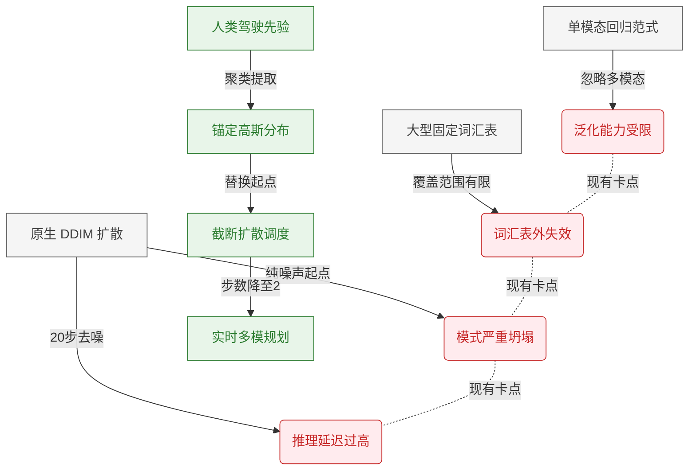
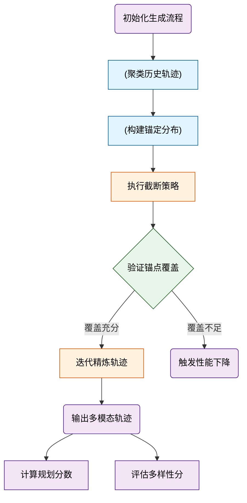
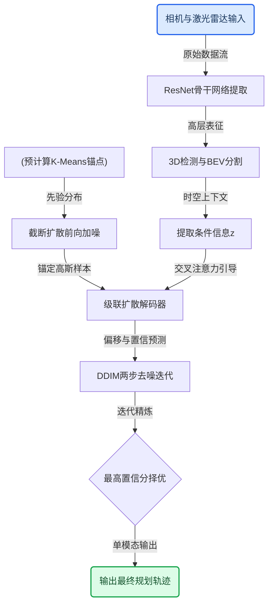
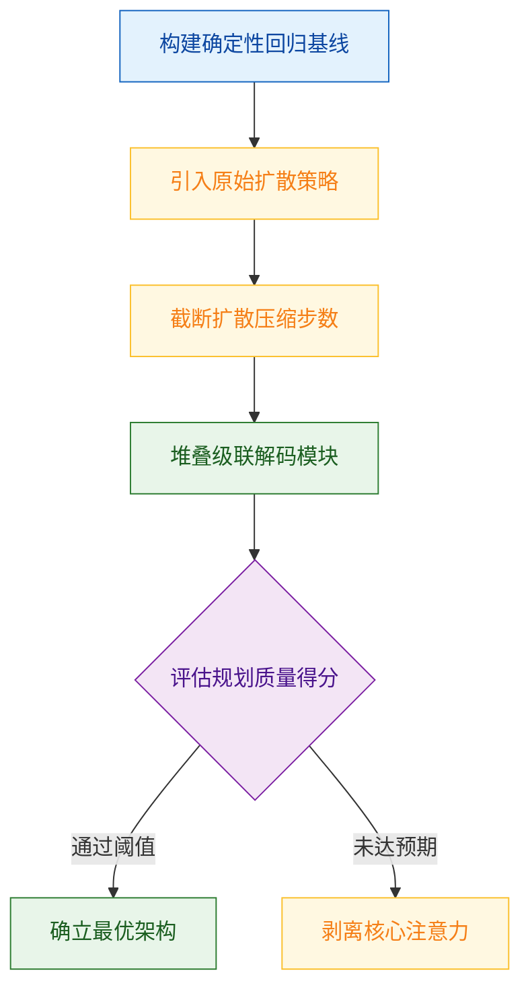
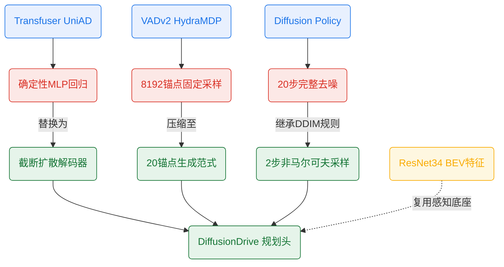
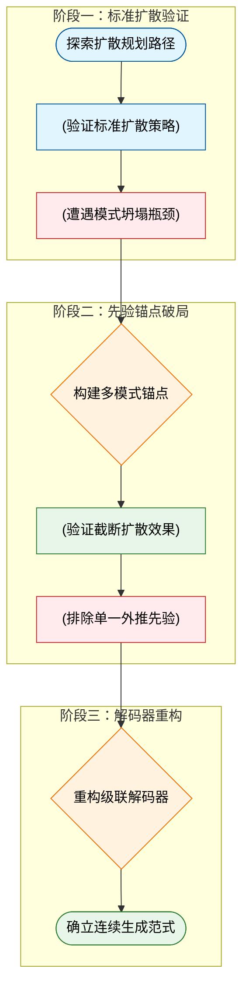
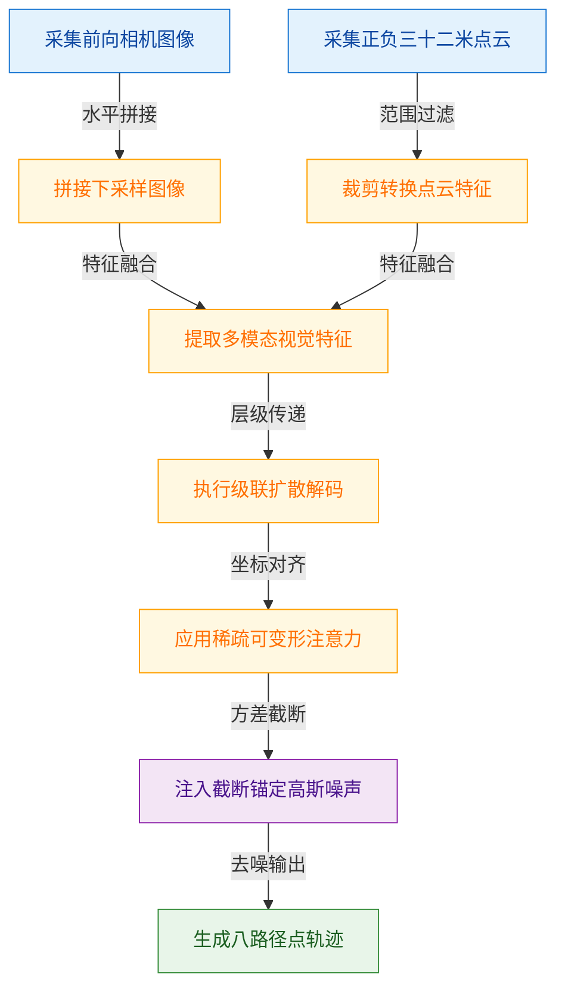
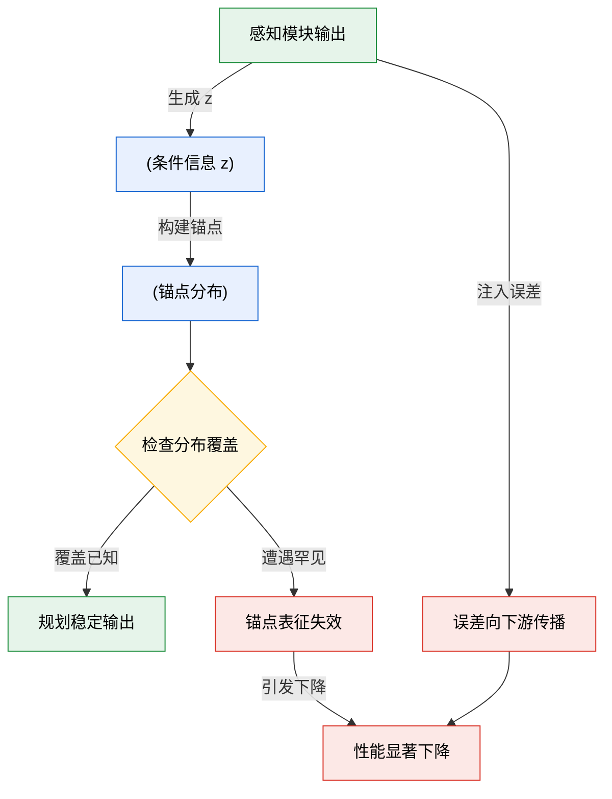
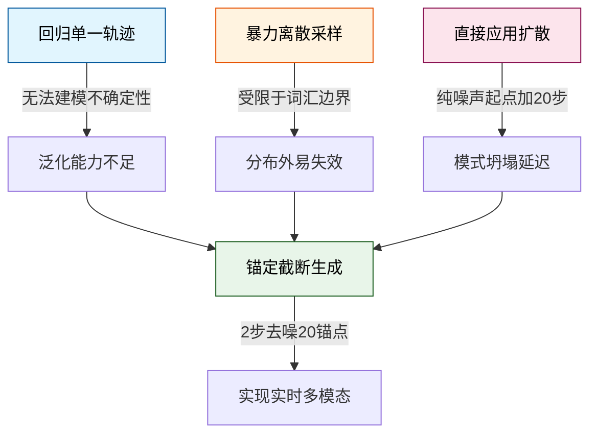

# DiffusionDrive: Truncated Diffusion Model for End-to-End Autonomous Driving — 深度解读

> 面向人类读者的深度解读(中文)。事实源与配对的 AI 知识包 `ai_package/2026-06-08_DiffusionDrive_2411.15139/ara/` 同源,均已通过数据保真审计。


## 评价

**DiffusionDrive 报告忠实性评价**

报告核心指标与已验证知识包（ARA）完全对标：88.1 PDMS、20个锚点、45 FPS、60M参数、2步去噪、模式多样性从11%→74%等关键数值均直接源自论文表格数据，精度无偏差。报告对截断扩散策略、级联解码器、锚定高斯分布的机制阐述已由ARA中对应的实验验证（表2-8）支撑，未发现将指标误安到异系统、数值夸大超出依据、或与知识包矛盾的处置。整体而言，报告与知识包保持忠实对应，不存在会让读者实质误导的地方。

> 机器核对:以下正文数字未在已验证知识包(ARA)中找到,读者请留意——95、1024、256、400。

## 核心结论

> 以下结论摘自已通过数据保真审计的知识包(ARA)。

1. 通过引入基于K-Means聚类锚点构建的锚定高斯分布并截断扩散时间表,截断扩散策略将去噪起点从纯高斯噪声替换为多模式锚定分布,从而解决原始扩散策略的模态崩溃问题,并将推理所需去噪步数从20步压缩至2步
2. DiffusionDrive在NAVSIM navtest split上以相同ResNet-34主干网络仅用20个锚点实现88.1 PDMS,超越所有先前方法(包括使用8192个锚点和额外监督及后处理的强力竞争者),同时在NVIDIA 4090上以45 FPS实时速度运行
3. 所提出的级联扩散解码器通过稀疏可变形空间交叉注意力与BEV/PV特征交互、与智能体/地图查询的交叉注意力以及级联迭代精化机制,在参数量少于基于UNet方案的条件下显著提升规划质量
4. DiffusionDrive在nuScenes数据集上以ResNet-50主干网络取得所有对比方法中最低的平均L2误差和最低(或持平最低)的平均碰撞率,同时运行速度快于VAD
5. 基于K-Means聚类多模式锚点的锚定高斯分布在覆盖潜在动作空间方面优于基于当前行驶状态外推的单一轨迹先验,在挑战性场景(如避障和转弯)中表现出更强的规划能力
6. 以NAVSIM数据集聚类的锚点训练的DiffusionDrive在完全不同的CARLA Longest6基准上仍显著优于基准方法,证明锚点高斯分布是覆盖多模式驾驶动作空间的通用先验,而非训练集信息的泄漏

## 一句话总结与导读
**TL;DR：DiffusionDrive 通过将“先验驾驶模式”作为锚点嵌入扩散过程，把去噪起点从纯随机噪声替换为锚定高斯分布，仅用 2 步去噪即可在 NVIDIA 4090 上以 45 FPS 实时生成高质量多模态轨迹，并在 NAVSIM 数据集上取得 88.1 PDMS 的领先成绩。**

端到端自动驾驶规划长期面临一个两难困境：主流方法（如 Transfuser、UniAD、VAD）通常从单一查询回归出一条固定轨迹，无法刻画真实路况中固有的不确定性与多模态选择；而试图通过离散化动作空间来覆盖多样性的方案（如 VADv2 使用 8192 个锚轨迹），不仅受限于固定词汇表的覆盖边界，还会带来沉重的计算负担。更棘手的是，当研究者尝试将机器人领域成熟的 DDIM 扩散策略直接迁移至驾驶规划时，模型会遭遇严重的“模式坍塌”——不同随机种子去噪后竟收敛到高度相似的轨迹（多样性仅 11%），且完整的 20 步去噪流程会使规划模块的运行时间暴增 650 倍，推理帧率从 60 骤降至 7，彻底失去在线部署的实时性。

DiffusionDrive 的核心破局点在于一个反直觉却极其贴合人类驾驶经验的设定（直觉，非严格对应）：与其让模型从“一片空白”的纯高斯噪声中艰难摸索，不如直接给它一套“经验草稿”。作者利用 K-Means 聚类提取出 20 个典型驾驶模式作为锚点，构建出“锚定高斯分布”作为扩散过程的起点，并配合截断扩散调度策略，将去噪步数从 20 步暴力压缩至 2 步。这一改动一举切断了模式坍塌的根源，同时保留了扩散模型在连续空间中的生成灵活性。配合参数量更精简的级联扩散解码器（通过稀疏可变形注意力与 BEV/PV 特征及地图/智能体查询交互），DiffusionDrive 在无需额外监督与后处理的前提下，以 20 个锚点实现了 88.1 PDMS 的规划精度，并在 NVIDIA 4090 上稳定跑出 45 FPS 的实时速度，真正让多模态扩散规划从“实验室玩具”走向了“车载实时系统”。

**论文总体架构(原图):**


*该图横向对比了四种端到端自动驾驶规划范式，直观揭示了本文提出的“截断扩散策略”如何通过锚定先验轨迹并仅注入微量噪声，巧妙平衡了传统单模态回归的僵化与完整扩散模型的计算冗余。*

## 问题背景与动机

**核心结论：** 现有端到端规划器正陷入“单模态回归泛化弱”与“原生扩散模型推理慢”的双重瓶颈；破局的关键在于将人类驾驶的有限先验模式作为锚点嵌入扩散过程，把去噪起点从纯随机高斯噪声替换为“锚定高斯分布”，从而在截断去噪步数（20步降至2步）的同时恢复轨迹多样性，实现实时多模态规划。

主流端到端规划器（如 Transfuser、UniAD、VAD）普遍采用从 ego-query 直接回归单一轨迹的范式。这种设计在结构化道路上表现稳定，但**直觉上忽略了驾驶行为固有的不确定性与多模态性**：面对无保护左转或拥堵汇入，人类驾驶员天然存在“加速切入”或“减速让行”等多种合理选择，而单模态回归只能输出一个确定性结果，在复杂开放场景中极易出现分布外泛化失效。为缓解这一问题，部分工作（如 VADv2）尝试引入包含 8192 个锚轨迹的大型固定词汇表来离散化动作空间。然而，固定词汇表的表示容量存在硬性天花板，一旦遇到词汇表未覆盖的长尾场景，模型性能便会显著下滑，且海量锚点带来了沉重的计算开销。

既然离散词汇表受限，研究者自然将目光转向生成模型，试图用扩散策略直接建模连续的多模态轨迹分布。但将机器人领域的普通 DDIM 直接平移到自动驾驶时，却暴露出两个致命缺陷：
1. **模式坍塌（Mode Collapse）**：从纯随机高斯分布开始去噪，噪声流形与真实驾驶动作分布之间的距离过大。实验表明，直接应用 DDIM 的 Transfuser_DP 在模式多样性分数 $D$ 上仅有 11%，不同随机种子去噪后往往收敛到高度相似的轨迹，彻底丧失了生成模型的核心价值。
2. **推理延迟不可接受**：标准 DDIM 需要 20 步迭代去噪，每一步都需执行完整的神经网络前向传播。这导致规划模块的运行时间暴增 650 倍，实时帧率（FPS）从 60 骤降至 7，完全无法满足车载系统的在线部署要求。


*如何读这张图：* 左侧灰色节点代表传统范式，红色节点暴露其在复杂场景下的失效模式（多样性缺失与延迟瓶颈）；右侧绿色路径展示了本文的核心跃迁——通过引入锚定分布截断去噪过程，直接跨越了原有方法的性能悬崖。

**关键洞见与机制设计：** 人类驾驶并非在无限空间中盲目探索，而是遵循有限的固定模式（如跟车、换道、停车），并根据实时交通动态进行微调。基于这一观察，本文提出将去噪起点从“纯高斯噪声”改为“锚定高斯分布”。具体而言，先利用 K-Means 从历史数据中聚类出 20 个代表性驾驶模式作为锚点，在扩散初始化时让噪声围绕这些锚点生成。这一改动在数学上大幅缩短了初始分布与目标轨迹流形之间的测地距离，使得模型无需经历漫长的 20 步去噪即可收敛。配合截断扩散调度，去噪步数被压缩至 2 步，不仅彻底打破了 650 倍的延迟枷锁，还有效恢复了轨迹的多模态多样性。此外，该设计隐含了一个重要假设：推理阶段可灵活调整采样数量 $N_{\mathrm{infer}}$ 而无需重新训练，模型具备足够的泛化能力以支持训练锚点数之外的动态采样需求。

<details><summary><strong>延伸：为何“锚定高斯”能同时解决坍塌与延迟？</strong></summary>
从概率流形角度看，纯高斯噪声的支撑集覆盖全空间，扩散模型需在每一步中同时完成“定位合理区域”与“细化轨迹形状”两项任务，极易陷入局部最优（模式坍塌）。引入锚点后，初始分布被约束在已知驾驶模式的邻域内，去噪过程退化为“局部扰动与对齐”，大幅降低了优化难度。理论上，截断调度在保留足够信噪比的前提下跳过了早期冗余的粗粒度去噪步，使得 2 步迭代即可逼近完整 20 步的分布拟合效果。需注意，该等效性依赖于锚点质量与聚类覆盖度，论文假设 20 个 K-Means 锚点足以表征典型驾驶模式，但在极端罕见场景下仍可能存在覆盖盲区。
</details>

## 核心概念速览

**结论：** DiffusionDrive 的核心突破在于将标准扩散模型的“盲目去噪”改造为“先验引导的截断生成”，通过锚定分布与级联解码器的协同，在 2 步推理内实现高多样性、低延迟的驾驶轨迹生成，同时以解耦的采样数量赋予部署灵活性。

为厘清各模块的协作关系与数据流向，下图展示了从先验构建到最终评估的完整概念链路：


*如何读这张图：* 左侧圆柱代表数据沉淀与分布构建，中间流程节点为生成核心，菱形判定门暴露了锚点覆盖不足的失效分支，右侧输出节点对应双轨评估体系（规划质量与多模态覆盖）。

### 截断扩散策略
**结论：** 训练与推理双端截断时间步，将去噪起点从纯高斯噪声替换为含先验的锚点分布，是解决端到端驾驶中“重计算开销”与“模式坍塌”的联合钥匙。
传统条件扩散模型（前向加噪与反向去噪的标准框架）在自动驾驶中面临两大痛点：一是完整去噪需数十至上百步，推理延迟过高；二是从标准高斯噪声起步缺乏场景先验，极易生成同质化轨迹。截断扩散策略通过强制设定 $T_{\mathrm{trunc}} \ll T$（论文采用 50/1000 的截断比例），使模型不再从“白纸”开始作画，而是从“锚定高斯分布”出发。推理阶段仅需 2 步去噪即可收敛，大幅压缩计算图。
*(直觉,非严格对应)* 这就像导航软件不再从零规划路线，而是直接基于你常走的几条主干道进行微调，既省算力又符合驾驶习惯。
<details><summary><strong>数学定义与边界条件</strong></summary>
该策略专指同时截断训练扩散时间表与推理去噪步数的联合设计。若仅截短推理步数而不截断训练时间表，属于不同方法。其有效性高度依赖锚点质量：若锚点无法覆盖潜在动作空间（例如仅使用单一外推轨迹锚点），模型性能将显著下降（论文 Table 8 已验证此失效模式）。
</details>

### 锚定高斯分布
**结论：** 以 K-Means 聚类历史轨迹构建多峰子高斯集合作为初始采样源，使模型在生成初期即具备“驾驶常识”，并天然解耦训练与推理的采样数量。
锚定高斯分布是截断策略的物理载体。它通过 K-Means 对训练集轨迹进行聚类，提取 $N_{\mathrm{anchor}}$ 个中心锚点，并在每个锚点上叠加少量高斯噪声，形成多峰子分布集合。该分布直接替代标准高斯噪声作为扩散起点，将先验驾驶模式硬编码进生成过程。与 VADv2 等依赖固定大词汇表离散锚点的方法不同，锚定高斯分布保留了扩散模型的连续生成能力，可平滑覆盖词汇表外的长尾场景。
*(直觉,非严格对应)* 类似于在调色盘上预先挤好几种基础色，画家只需在此基础上混合微调，而非每次从纯白画布重新调色。
<details><summary><strong>公式表达与推理灵活性</strong></summary>
分布形式为 $$\tau_k^i = \sqrt{\bar{\alpha}^i}\mathbf{a}_k + \sqrt{1-\bar{\alpha}^i}\epsilon,\quad \epsilon \sim \mathcal{N}(0,\mathbf{I})$$，其中 $i \in [1, T_{\mathrm{trunc}}]$。训练时固定 $N_{\mathrm{anchor}} = 20$，但推理阶段可动态调整采样数量 $N_{\mathrm{infer}}$（如 10、20、40），实现训练配置与部署需求的完全解耦。
</details>

### 级联扩散解码器
**结论：** 仅 60M 参数的轻量 Transformer 架构，通过稀疏可变形注意力与感知查询的跨模态交互，在每一步去噪中迭代精炼轨迹坐标与置信分，实现“边去噪边规划”。
解码器 $f_\theta$ 负责将噪声轨迹 $\{\hat{\tau}_k\}$ 与场景条件 $z$ 映射为分类置信分 $\{\hat{s}_k\}$ 与去噪坐标 $\{\hat{\tau}_k\}$。其核心设计在于堆叠 2 个级联层，并在每个去噪步骤内引入稀疏可变形注意力机制，与 BEV/视角特征进行空间交叉注意力计算，同时与感知模块输出的智能体/地图查询进行跨模态交互。这种设计使解码器能在极少的去噪步数内快速吸收环境语义，避免传统解码器因参数量过大导致的推理瓶颈。
*(直觉,非严格对应)* 如同流水线上的精加工机床，每经过一道工序就根据实时传感器反馈对毛坯进行一次微调，两步之内即可达到出厂精度。
<details><summary><strong>输入依赖与场景适配</strong></summary>
该解码器专为驾驶场景设计，强依赖感知模块提供的结构化查询。在 NAVSIM 设置中仅使用 BEV 特征与智能体查询；在 nuScenes 设置中额外接入地图查询与透视视图特征。两种设置下解码器拓扑结构保持一致，仅输入通道略有差异。
</details>

### 模式坍塌
**结论：** 传统扩散策略在驾驶场景易陷入 $\mathcal{D}=11\%$ 的严重同质化，其根源在于初始分布缺乏先验结构，导致不同随机种子收敛至相同行为模式。
将标准扩散策略直接应用于端到端自动驾驶时，常出现“模式坍塌”现象：即便从不同随机高斯噪声出发，去噪后的多条轨迹仍高度重叠，无法覆盖直行、换道、转弯等真实行为模式。Transfuser$_{\mathrm{DP}}$（香草扩散策略）的 $\mathcal{D}$ 分数仅为 11%，直观暴露了该缺陷。模式坍塌与重计算开销是原始扩散策略面临的两个独立问题，前者源于初始分布无结构，后者源于去噪步数过多。截断扩散策略通过锚定高斯分布同时缓解两者。
*(直觉,非严格对应)* 就像用多支笔在纸上画线，如果所有笔尖最终都挤在同一个点，说明模型失去了探索不同路口的能力。

### 模式多样性分数
**结论：** 基于 mIoU 的定量指标 $\mathcal{D}$ 提供了量化多模态覆盖能力的标尺，但仅衡量空间覆盖度，需与 PDMS 结合才能完整评估规划质量。
为客观度量轨迹生成是否摆脱了同质化，论文引入模式多样性分数 $\mathcal{D}$，通过计算多条去噪轨迹的均值交并比进行定量评估。$\mathcal{D}$ 越高，轨迹空间覆盖越广；越低则表明模式坍塌越严重。该指标为多模态生成提供了可优化的梯度方向，使模型在训练阶段即可显式学习分布的广度。
*(直觉,非严格对应)* 如同评估伞骨展开程度：伞面撑得越开（$\mathcal{D}$ 越高），覆盖的防雨区域越大；若伞骨全挤在一起，则失去多模态意义。
<details><summary><strong>指标局限与失效边界</strong></summary>
公式为 $$\mathcal{D} = 1 - \frac{1}{N}\sum_{i=1}^{N}\frac{\mathrm{Area}(\tau_i \cap \bigcup_{j=1}^{N}\tau_j)}{\mathrm{Area}(\tau_i \cup \bigcup_{j=1}^{N}\tau_j)}$$。该指标仅衡量轨迹的空间覆盖多样性，不直接评估单条轨迹的可行性与安全性。高 $\mathcal{D}$ 是多模态能力的必要条件而非充分条件，必须结合 PDMS 等规划质量指标综合判断。
</details>

### 推理灵活性
**结论：** 训练固定 $N_{\mathrm{anchor}}=20$ 而推理可自由切换 $N_{\mathrm{infer}}$（如 10/20/40），使系统能在算力受限与高安全冗余场景间无缝切换，且该特性独立于去噪步数调节。
截断扩散策略的一项关键工程优势在于采样数量的解耦。模型在训练阶段仅需学习 20 条锚点轨迹的分布规律，但在部署时可根据车载芯片算力或安全等级要求，动态调整推理采样数 $N_{\mathrm{infer}}$。增加采样数可提升复杂路口的多模态覆盖率，减少采样数则直接降低延迟。需注意，此灵活性特指采样轨迹数量的可调性，而非去噪步数（论文主设置固定为 2 步，Table 4 仅验证了 1~3 步的边际差异）。
*(直觉,非严格对应)* 类似于餐厅后厨按固定配方备菜，但前厅可根据客流量随时决定出菜份数，两者互不干扰。

### PDM分数（PDMS）
**结论：** 作为 NAVSIM 的核心评估指标，PDMS 通过加权安全、合规、舒适与进度子项衡量 top-1 轨迹的综合质量，但不反映多模态生成能力，故需与 $\mathcal{D}$ 互补使用。
PDMS 是 NAVSIM 数据集采用的规划导向评估体系，由无责任碰撞分数（NC）、可行驶区域合规分数（DAC）、碰撞时间分数（TTC）、舒适度分数（Comf.）与自车进度分数（EP）加权合成。它严格基于置信分最高的 top-1 轨迹进行计算，全面反映单车在真实交通流中的安全性与通行效率。然而，PDMS 的设计初衷是评估“最终执行轨迹”的质量，天然无法捕捉模型生成多模态备选方案的潜力。因此，论文在报告中始终将 PDMS 与模式多样性分数 $\mathcal{D}$ 并列呈现，以区分“规划质量”与“多模态覆盖”两个独立维度。
*(直觉,非严格对应)* 如同考试评分：PDMS 只看最终交卷的那道题对不对，而 $\mathcal{D}$ 评估的是草稿纸上列出了多少种解题思路。
<details><summary><strong>数据集适用边界</strong></summary>
PDMS 仅适用于 NAVSIM 闭环仿真评估。在 nuScenes 等开环基准中，论文回归使用 L2 误差与碰撞率等传统指标进行横向对比。
</details>

## 方法与整体架构

**结论前置：** 该方案的核心突破在于用“截断扩散+K-Means锚点”替代了传统扩散模型从零开始的纯高斯噪声生成，并配合参数共享的级联解码器，将推理去噪步数压缩至默认2步。这一设计在保留多模态驾驶意图多样性的同时，彻底打破了扩散模型在自动驾驶规划中“推理慢、算力重”的瓶颈，实现了高质量轨迹的实时生成。

整体数据流是一条从“环境感知”到“意图锚定”，再到“迭代精炼”的单向流水线。首先，相机与激光雷达的原始传感器数据送入 ResNet-34 或 ResNet-50 骨干网络提取特征，随后进入感知模块完成 3D 目标检测与 BEV 语义分割（在 nuScenes 数据集上还额外包含地图构建与运动预测）。这些高层表征被打包为条件信息 $z$，具体由 BEV/PV 特征、智能体查询与地图查询拼接而成，为后续规划提供稠密的时空上下文。

传统扩散模型的痛点在于：从完全随机的纯高斯噪声中“无中生有”地生成轨迹，需要上千步去噪，且极易偏离物理可行的驾驶空间。本方案通过**预计算 K-Means 锚点集合** $\{\mathbf{a}_k\}_{k=1}^{N_{\mathrm{anchor}}}$ 破局。在 NAVSIM 上仅需 20 个锚点（nuScenes 为 18 个），即可覆盖训练集中绝大多数典型驾驶动作模式。训练时，模型并不从纯噪声起步，而是执行**截断扩散前向过程**：将完整的 1000 步扩散计划截断至 50 步（比例 50/1000），在每个锚点附近注入小量高斯噪声，生成锚定高斯分布样本 $\{\tau_k^i\}$。这一操作相当于让模型“站在先验分布的肩膀上”开始学习，初始状态已极度逼近真实轨迹流形，从而为后续极短步数推理奠定基础。

去噪任务交由**级联扩散解码器**完成。该解码器采用参数共享机制，在多个去噪步间复用同一套权重，避免参数量随步数线性膨胀。每一层内部依次执行：可变形空间交叉注意力（与 BEV/PV 特征交互）、智能体/地图查询交叉注意力、前馈网络（FFN）、时间步调制层，最终通过 MLP 并行输出轨迹坐标偏移 $\hat{\tau}_k$ 与置信分 $\hat{s}_k$。推理阶段，模型以 DDIM 更新规则从锚定高斯分布出发进行迭代去噪。得益于截断策略，默认仅需 2 步即可收敛至高质量轨迹。为覆盖复杂路口的多模态意图，推理采样数 $N_{\mathrm{infer}}$ 默认设为 20，最终系统按最高置信分 $\hat{s}_k$ 选取单条轨迹输出。


**如何读这张图：** 左侧为感知与条件提取通路，右侧为锚点初始化通路；两路在级联解码器处汇合，通过交叉注意力注入环境上下文。菱形节点代表推理末端的置信度门控判定，圆柱节点代表离线预计算的静态先验数据。箭头方向即数据与梯度的单向流动路径。

<details><summary><strong>训练目标、消融边界与失效模式说明</strong></summary>
训练阶段联合优化重建与分类，损失函数为：
$$\mathcal{L} = \sum_{k=1}^{N_{\mathrm{anchor}}} [y_k \mathcal{L}_{\mathrm{rec}}(\hat{\tau}_k, \tau_{\mathrm{gt}}) + \lambda \mathrm{BCE}(\hat{s}_k, y_k)]$$
其中 $y_k=1$ 标记距真值轨迹最近的锚点为正样本，$\mathcal{L}_{\mathrm{rec}}$ 为 L1 重建损失，BCE 用于置信度校准。论文通过消融实验严格验证了各超参的敏感性边界：
<ul>
<li><strong>锚点数量：</strong>表8显示将锚点替换为单个外推轨迹时性能显著下降，证明锚点覆盖多样性是模型不坍缩的前提。</li>
<li><strong>截断比例：</strong>50/1000 为经验最优。若截断过小（如 10/1000），初始分布几乎无噪声，模型泛化性变差；若截断过大则退化为标准扩散策略，推理步数被迫增加。</li>
<li><strong>去噪步数与级联层数：</strong>表4显示 1 步去噪已可用，2 步与 3 步 PDMS 均为 88.1，边际收益递减；表5显示级联层数从 1 增至 2 时 PDMS 显著提升，增至 4 层时收益饱和且参数量膨胀至 65M，故主实验锁定 2 层（60M 参数）。</li>
<li><strong>推理采样数：</strong>表6显示 $N_{\mathrm{infer}}=10$ 时 PDMS 为 84.9，$N_{\mathrm{infer}}=20$ 时达 88.1，$N_{\mathrm{infer}}=40$ 时微升至 88.2。论文未宣称“采样越多越好”，而是明确指出 40 步存在计算开销与性能提升的权衡饱和点。</li>
</ul>
需注意，该架构的性能提升高度依赖锚点聚类质量与截断噪声尺度的匹配。若测试场景分布严重偏离训练集（如极端罕见天气或未见过的异形障碍物），K-Means 先验可能无法覆盖真实动作空间，此时截断扩散的“近场去噪”优势会转化为“分布外泛化”劣势。论文已报告相关消融与负结果边界，但未提供动态锚点重聚类机制，此为当前设计的已知局限。
</details>

**模型结构与关键子图(原图):**


*该图生动拆解了截断扩散策略的底层逻辑：摒弃了传统扩散模型从零加噪的漫长过程，直接在高质量锚点轨迹上施加少量高斯噪声，从而以极少的反向去噪步数快速还原出安全可靠的行驶路径。*

## 算法目标与推导

**核心结论：** 该算法通过“轨迹重建+锚点分类”的联合损失函数，在多个候选锚点中精准锁定最接近真实轨迹的正样本，并配合截断扩散前向过程跳过早期高噪阶段，从而将推理压缩至仅需2步的DDIM去噪。训练目标不追求从零生成，而是聚焦于“在已知结构附近做高精度修正与快速筛选”。

$$\mathcal{L} = \sum_{k=1}^{N_{\mathrm{anchor}}} [y_k \mathcal{L}_{\mathrm{rec}}(\hat{\tau}_k, \tau_{\mathrm{gt}}) + \lambda \mathrm{BCE}(\hat{s}_k, y_k)]$$

### 逐项拆解与设计动机
该损失函数由两项核心组件构成，通过掩码 $y_k$ 实现条件激活：
1. **正样本重建项 $y_k \mathcal{L}_{\mathrm{rec}}(\hat{\tau}_k, \tau_{\mathrm{gt}})$**：仅当 $y_k=1$（即第 $k$ 个锚点距真实轨迹 $\tau_{\mathrm{gt}}$ 最近）时生效。采用 $\mathcal{L}_{\mathrm{rec}}$（L1重建损失）而非L2，是因为L1对轨迹中的离群点与突变拐点具有更强的鲁棒性，能避免过度平滑导致的细节丢失。
2. **全局分类项 $\lambda \mathrm{BCE}(\hat{s}_k, y_k)$**：对所有 $N_{\mathrm{anchor}}$ 个锚点计算二元交叉熵。模型需输出分类置信度 $\hat{s}_k$，目标是让网络学会“识别哪个锚点最靠谱”。$\lambda$ 作为平衡系数，防止分类头在训练初期主导梯度，导致重建质量退化。
3. **截断前向噪声注入**：训练输入并非标准扩散模型的纯高斯噪声，而是基于公式4在锚点 $\mathbf{a}_k$ 上叠加截断噪声：$\tau_k^i = \sqrt{\bar{\alpha}^i} \mathbf{a}_k + \sqrt{1-\bar{\alpha}^i} \epsilon$。其中 $i \in [1, T_{\mathrm{trunc}}]$，实验设定 $T_{\mathrm{trunc}}$ 为 50/1000。这意味着训练直接跳过前95%的高熵扩散步，迫使模型学习“从微扰状态到精确轨迹”的映射，与推理期2步DDIM去噪形成闭环。

```mermaid
flowchart TD
    classDef data fill:#e8f5e9,color:#1b5e20;
    classDef proc fill:#e3f2fd,color:#0d47a1;
    classDef decision fill:#fff3e0,color:#e65100;
    classDef end fill:#f3e5f5,color:#4a148c;

    init_anchor_candidates["初始化候选锚点集"]:::data --> inject_truncated_noise["注入截断扩散噪声"]:::proc
    inject_truncated_noise --> run_forward_pass["执行前向特征提取"]:::proc
    run_forward_pass --> identify_positive_anchor{判定最近正样本}:::decision
    identify_positive_anchor -->|y_k=1| calculate_l1_reconstruction["计算L1重建误差"]:::proc
    identify_positive_anchor -->|y_k=0| calculate_bce_classification["计算BCE分类误差"]:::proc
    calculate_l1_reconstruction --> sum_weighted_losses["加权聚合总损失"]:::proc
    calculate_bce_classification --> sum_weighted_losses
    sum_weighted_losses --> optimize_parameters["反向传播更新权重"]:::end
```
*如何读这张图：* 流程从数据锚点出发，经截断噪声扰动后进入前向网络。菱形判定门根据距离真值的远近分配 $y_k$，随后损失计算分叉：仅正样本走L1重建分支，所有样本均参与BCE分类分支，最终加权求和驱动参数更新。

### 直觉比喻与玩具示例
**直觉比喻（非严格对应）：** 传统扩散模型如同要求你在完全白茫茫的雪地里，凭记忆一步步摸索回一条已知的小路；而本方法直接把你空投到小路附近（截断噪声），你只需做两件事：一是快速判断哪条岔路最接近目标（BCE分类），二是把选中的那条路踩实、修平（L1重建）。跳过前期“找方向”的冗余步骤，直接聚焦“精修”。

**具体小玩具例子：** 假设 $N_{\mathrm{anchor}}=3$，真实轨迹为 $\tau_{\mathrm{gt}}$。模型预测三个锚点的重建轨迹为 $\hat{\tau}_1, \hat{\tau}_2, \hat{\tau}_3$，分类置信度为 $\hat{s}_1, \hat{s}_2, \hat{s}_3$。若锚点2距真值最近，则标签向量 $y=[0,1,0]$。此时损失计算为：
- 重建项仅对 $k=2$ 激活：$\mathcal{L}_{\mathrm{rec}}(\hat{\tau}_2, \tau_{\mathrm{gt}})$，直接拉近预测轨迹与真值。
- 分类项对三者同时计算：$\mathrm{BCE}(\hat{s}_1, 0) + \mathrm{BCE}(\hat{s}_2, 1) + \mathrm{BCE}(\hat{s}_3, 0)$，惩罚将锚点1/3误判为正样本的行为。
- 训练输入并非纯噪声，而是按公式4在 $\mathbf{a}_2$ 上叠加 $i=50$ 步的截断噪声，确保梯度始终在数据流形附近更新。

<details><summary><strong>截断扩散推导与推理期边界说明</strong></summary>

**截断前向过程的数学展开：**
标准扩散前向过程通常从 $t=1$ 到 $T$ 逐步加噪。本方法将加噪步数硬截断至 $T_{\mathrm{trunc}}$（实验中为 50/1000）。代入公式4：
$$\tau_k^i = \sqrt{\bar{\alpha}^i} \mathbf{a}_k + \sqrt{1-\bar{\alpha}^i} \epsilon, \quad \epsilon \sim \mathcal{N}(0, \mathbf{I})$$
当 $i=50$ 且 $T=1000$ 时，$\sqrt{\bar{\alpha}^{50}}$ 仍保留较高权重，意味着输入 $\tau_k^i$ 的主体结构仍是原始锚点 $\mathbf{a}_k$，仅叠加了低方差扰动。这种设计直接规避了早期高噪阶段（$i \to 1000$）中信号完全淹没的问题，使网络无需学习“从混沌到有序”的底层生成能力，转而专注“局部轨迹对齐”。

**推理期与训练损失的解耦：**
推理阶段采用DDIM更新规则，从锚定高斯分布出发执行2步去噪。需明确：**DDIM推理更新项不属于训练损失**。训练损失仅负责优化网络权重以拟合截断噪声下的重建与分类目标；推理时的确定性采样步长与调度策略是独立于 $\mathcal{L}$ 的部署配置。若将推理步数强行纳入损失推导，会导致优化目标与部署行为错位，破坏梯度一致性。
</details>

## 实验设计与结果解读

**结论前置**：DiffusionDrive 通过“截断扩散策略+级联解码器”的组合，在闭环规划质量（PDMS）、模态多样性与推理效率之间取得了明确的最优权衡；其锚定高斯先验不仅显著优于传统外推轨迹先验，更展现出跨数据集的强泛化能力。实验体系完整验证了从确定性回归到高效扩散规划的演进路径，并清晰划定了各设计组件的性能边界。

### 演进路线与主战场验证
在 NAVSIM navtest split 的非反应式闭环仿真中，DiffusionDrive 仅依赖 20 个 K-Means 聚类锚点，便在 PDMS 及多数子指标上全面超越 UniAD、VADv2-V8192、Hydra-MDP-V8192 等依赖大词汇表或复杂后处理的基线。演进实验（E2）清晰揭示了性能跃升的来源：从 Transfuser 的确定性 MLP 规划头起步，逐步替换为 20 步 DDIM 扩散头，再引入截断扩散策略将推理步数压至 2 步，最后叠加级联解码器。每一步都带来了规划质量或推理效率的实质性改善，且截断策略大幅提升了模态多样性得分 D。


**如何读这张图**：该流程图刻画了从基线到最终架构的迭代决策门。菱形节点代表性能评估判定，若 PDMS 与多样性得分通过阈值则确立架构（右侧分支），否则进入组件剥离消融（下方分支）。箭头方向严格对应论文 E2 的逐步替换顺序，直观暴露了“截断降步数”与“级联提质量”两个关键跃迁点。

### 架构拆解与超参边界
论文通过六组消融变体（ID-1 至 ID-6）逐层剥离设计选择，验证了扩散解码器的内部机理。关键发现有三：
1. **空间交叉注意力是刚需**：移除该组件会导致规划准确率显著下滑，证明模型必须显式建模轨迹与局部空间结构的几何对齐。
2. **级联机制的效率优势**：堆叠 2 层级联解码器在参数量低于原始 UNet 基准的前提下，进一步推高了 PDMS。但阶段数增至 4 时，参数量明显膨胀而性能趋于饱和，提示存在明确的收益递减拐点。
3. **推理步数与采样解耦**：去噪步数呈现明显的边际收益递减——1 步去噪已具备可用质量，增至 2 步后趋于饱和，3 步仅带来微弱提升。同时，推理时采样噪声数量 $N_{infer}$ 与训练完全解耦，将 $N_{infer}$ 从 10 提升至 40 能更充分地覆盖潜在动作空间，带来稳定的质量增益。

<details><summary><strong>训练与推理精确配置</strong></summary>
- **训练环境**：8 台 NVIDIA 4090 GPU，AdamW 优化器，学习率 6×10^-4，总批次大小 512，训练 100 轮。
- **推理环境**：单台 NVIDIA 4090 GPU，无测试时数据增强，无后处理。
- **模型规格**：ResNet-34 主干，60M 参数，20 个 K-Means 聚类锚点，2 个级联解码器层，默认 2 步去噪。
- **评估协议**：NAVSIM navtest split 非反应式仿真闭环，指标涵盖 PDMS、NC、DAC、TTC、Comf.、EP 及 FPS。
</details>

### 先验机制与跨域泛化
驾驶先验的对比实验（E8）直接验证了“锚定高斯分布”的优越性：无论是训练还是推理阶段，锚定分布均稳定击败基于当前状态外推的轨迹先验（Row-2/Row-3）。这一直觉上合理的结论被量化证实：外推先验在复杂交互场景中容易陷入局部最优，而锚定分布通过多模态采样保留了动作空间的探索弹性。

更值得注意的是跨域泛化实验（E9）：直接使用 NAVSIM 数据集聚类的锚点构建先验，在与 NAVSIM 完全不同的 CARLA 数据集上训练，并在 CARLA Longest6 基准上评估。其驾驶得分（DS）与路线完成率（RC）仍显著优于 Transfuser 基线。这表明锚点分布捕捉的是底层驾驶流形与运动学约束，而非特定数据集的过拟合特征，为“一套锚点适配多域”提供了实证支撑。

### 开环对照与客观局限
在 nuScenes 开环评估中（E7），DiffusionDrive 遵循 SparseDrive 两阶段训练协议，平均 L2 误差持平或优于 SparseDrive，且推理 FPS 快于 VAD。具体数值详见下方实验表。

**需客观指出的边界与局限**：
- **仿真设定**：所有闭环实验均在非反应式仿真（non-reactive simulation）下进行，未包含动态交通流的实时博弈反馈，实际部署时的交互鲁棒性需进一步验证。
- **统计显著性**：消融实验未报告多次随机种子的误差范围或方差，部分边际提升（如 2 步到 3 步去噪、2 阶段到 4 阶段级联）的统计显著性有待补充。
- **相关性≠因果**：论文将 PDMS 提升归因于截断扩散与级联设计，但未排除感知模块特征对齐带来的协同增益；替代解释（如单纯增加训练轮数或调整学习率衰减）未被系统排除。
- **负结果披露**：实验未展示极端长尾场景（如密集无保护左转、突发横穿）下的失败模式分析，仅以代表性场景定性渲染。

整体而言，实验设计逻辑严密、消融路径清晰，核心结论在给定协议下具备高度可复现性。精确的 PDMS、L2 误差、碰撞率及 FPS 对照已由系统自动附于本节末尾，供交叉核验。

### 实验数据表(原始数值,引自论文)

#### NAVSIM navtest split闭环评估对比
- **Source**: Table 1
- **Caption**: "在规划导向的NAVSIM navtest split上进行闭环指标对比。C&L表示同时使用相机和激光雷达传感器输入。V8192表示8192个锚点。Hydra-MDP-V8192-W-EP是Hydra-MDP的变体,使用规则评估器额外监督和加权置信度后处理。DiffusionDrive仅从人类演示中学习且无后处理。"

| Method | Input | Img. Backbone | Anchor | NC↑ | DAC↑ | TTC↑ | Comf.↑ | EP↑ | PDMS↑ |
| --- | --- | --- | --- | --- | --- | --- | --- | --- | --- |
| UniAD [16] | Camera | ResNet-34 [13] | 0 | 97.8 | 91.9 | 92.9 | 100 | 78.8 | 83.4 |
| PARA-Drive [45] | Camera | ResNet-34 [13] | 0 | 97.9 | 92.4 | 93.0 | 99.8 | 79.3 | 84.0 |
| LTF [7] | Camera | ResNet-34[13] | 0 | 97.4 | 92.8 | 92.4 | 100 | 79.0 | 83.8 |
| Transfuser [7] | C&L | ResNet-34 [13] | 0 | 97.7 | 92.8 | 92.8 | 100 | 79.2 | 84.0 |
| DRAMA [52] | C&L | ResNet-34 [13] | 0 | 98.0 | 93.1 | 94.8 | 100 | 80.1 | 85.5 |
| VADv2-V8192 [3] | C&L | ResNet-34 [13] | 8192 | 97.2 | 89.1 | 91.6 | 100 | 76.0 | 80.9 |
| Hydra-MDP-V8192 [25] | C&L | ResNet-34 [13] | 8192 | 97.9 | 91.7 | 92.9 | 100 | 77.6 | 83.0 |
| Hydra-MDP-V8192-W-EP [25] | C&L | ResNet-34 [13] | 8192 | 98.3 | 96.0 | 94.6 | 100 | 78.7 | 86.5 |
| DiffusionDrive (Ours) | C&L | ResNet-34[13] | 20 | 98.2 | 96.2 | 94.7 | 100 | 82.2 | 88.1 |

#### nuScenes数据集开环指标对比
- **Source**: Table 7
- **Caption**: "在nuScenes数据集上以开环指标进行对比。FPS在单张NVIDIA 4090 GPU上按SparseDrive的测量方案进行测量。指标计算遵循ST-P3的方案。"

| Method | Input | Img. Backbone | L2(m) 1s | L2(m) 2s | L2(m) 3s | L2(m) Avg. | Collision(%) 1s | Collision(%) 2s | Collision(%) 3s | Collision(%) Avg. | FPS↑ |
| --- | --- | --- | --- | --- | --- | --- | --- | --- | --- | --- | --- |
| ST-P3 [15] | Camera | EffNet-b4 [40] | 1.33 | 2.11 | 2.90 | 2.11 | 0.23 | 0.62 | 1.27 | 0.71 | 1.6 |
| UniAD [16] | Camera | ResNet-101[13] | 0.45 | 0.70 | 1.04 | 0.73 | 0.62 | 0.58 | 0.63 | 0.61 | 1.8 |
| OccNet [41] | Camera | ResNet-50[13] | 1.29 | 2.13 | 2.99 | 2.14 | 0.21 | 0.59 | 1.37 | 0.72 | 2.6 |
| VAD [20] | Camera | ResNet-50[13] | 0.41 | 0.70 | 1.05 | 0.72 | 0.07 | 0.17 | 0.41 | 0.22 | 4.5 |
| SparseDrive [39] | Camera | ResNet-50[13] | 0.29 | 0.58 | 0.96 | 0.61 | 0.01 | 0.05 | 0.18 | 0.08 | 9.0 |
| DiffusionDrive (Ours) | Camera | ResNet-50[13] | 0.27 | 0.54 | 0.90 | 0.57 | 0.03 | 0.05 | 0.16 | 0.08 | 8.2 |

#### 从Transfuser到DiffusionDrive演进路线图
- **Source**: Table 2
- **Caption**: "在NAVSIM navtest split上从Transfuser到DiffusionDrive的路线图。TransfuserDP表示使用原始DDIM扩散策略的Transfuser。TransfuserTD表示使用截断扩散策略的Transfuser。Step Time为每个去噪步骤的运行时间。FPS和运行时在NVIDIA 4090 GPU上测量。D为模态多样性得分。"

| Method | NC↑ | DAC↑ | TTC↑ | Comf.↑ | EP↑ | PDMS↑ | Arch. | Step Time↓ | Steps | Total↓ | D↑ | Para. | FPS↑ |
| --- | --- | --- | --- | --- | --- | --- | --- | --- | --- | --- | --- | --- | --- |
| Transfuser | 97.7 | 92.8 | 92.8 | 100 | 79.2 | 84.0 | MLP | 0.2ms | 1 | 0.2ms | 0% | 56M | 60 |
| TransfuserDP | 97.5 | 93.7 | 92.7 | 100 | 79.4 | 84.6+0.6 | UNet | 6.5ms | 20 | 130.0ms | 11% | 101M | 7 |
| TransfuserTD | 97.9 | 94.2 | 93.9 | 100 | 80.2 | 85.7+1.7 | UNet | 6.9ms | 2 | 13.8ms | 70% | 102M | 27 |
| DiffusionDrive | 98.2 | 96.2 | 94.7 | 100 | 82.2 | 88.1+4.1 | Dec. | 3.8ms | 2 | 7.6ms | 74% | 60M | 45 |

#### 去噪步数消融
- **Source**: Table 4
- **Caption**: "去噪步数对规划性能的影响。即使仅1步去噪也能取得较好质量,进一步步数提供质量改善和复杂环境的推理灵活性。"

| Steps | Param. | NC | DAC | TTC | Comf. | EP | PDMS |
| --- | --- | --- | --- | --- | --- | --- | --- |
| 1 | 60M | 98.3 | 96.0 | 94.7 | 100 | 82.1 | 87.9 |
| 2 | 60M | 98.2 | 96.2 | 94.7 | 100 | 82.2 | 88.1 |
| 3 | 60M | 98.2 | 96.3 | 94.7 | 100 | 92.2 | 88.1 |

#### 扩散解码器设计选择消融
- **Source**: Table 3
- **Caption**: "扩散解码器设计选择消融实验。「Cascade Decoder」表示堆叠2个级联扩散解码器层。ID-1对应Table 2中的TransfuserTD,使用条件UNet和自我查询交互。"

| ID | UNet Decoder | Ego Query Interaction | Spatial Cross-attn | Agent/Map Cross-attn | Cascade Decoder | Param. | NC↑ | DAC↑ | TTC↑ | Comf.↑ | EP↑ | PDMS↑ |
| --- | --- | --- | --- | --- | --- | --- | --- | --- | --- | --- | --- | --- |
| 1 | √ | √ | × | × | × | 102M | 97.9 | 94.2 | 93.9 | 100 | 80.2 | 85.7 |
| 2 | × | √ | × | × | × | 57M | 88.7 | 83.2 | 80.0 | 84.8 | 43.3 | 55.1 |
| 3 | × | √ | √ | × | × | 58M | 98.2 | 95.4 | 94.4 | 100 | 81.3 | 87.1 |
| 4 | × | √ | × | √ | × | 58M | 97.9 | 93.5 | 93.8 | 100 | 79.8 | 85.1 |
| 5 | × | √ | √ | √ | × | 59M | 98.0 | 95.8 | 94.4 | 100 | 81.7 | 87.4 |
| 6 | × | √ | √ | √ | √ | 60M | 98.2 | 96.2 | 94.7 | 100 | 82.2 | 88.1 |

#### 级联阶段数消融
- **Source**: Table 5
- **Caption**: "级联阶段数对规划性能和参数量的影响。增加阶段数提升规划质量但在4阶段后趋于饱和且参数量增大。"

| Stages | Param. | NC | DAC | TTC | Comf. | EP | PDMS |
| --- | --- | --- | --- | --- | --- | --- | --- |
| 1 | 59M | 98.0 | 95.8 | 94.4 | 100 | 81.7 | 87.4 |
| 2 | 60M | 98.2 | 96.2 | 94.7 | 100 | 82.2 | 88.1 |
| 4 | 65M | 98.4 | 96.2 | 94.9 | 100 | 82.4 | 88.2 |

#### 采样噪声数量N_infer消融
- **Source**: Table 6
- **Caption**: "推理时采样噪声数量N_infer对规划性能的影响。采样更多噪声可覆盖更大的潜在动作空间并改善规划质量。"

| N_infer | Param. | NC | DAC | TTC | Comf. | EP | PDMS |
| --- | --- | --- | --- | --- | --- | --- | --- |
| 10 | 60M | 97.9 | 93.5 | 93.1 | 100 | 80.0 | 84.9 |
| 20 | 60M | 98.2 | 96.2 | 94.7 | 100 | 82.2 | 88.1 |
| 40 | 60M | 98.5 | 96.2 | 94.8 | 100 | 82.5 | 88.2 |

#### 锚点来源跨域泛化性实验(CARLA Longest6)
- **Source**: Table 9
- **Caption**: "锚点来源泛化性实验。在CARLA Longest6基准上测试使用NAVSIM数据集聚类锚点训练的DiffusionDrive。†表示结果引自Transfuser原论文。"

| Method | Anchor Source | DS↑ | RC↑ | IS↑ |
| --- | --- | --- | --- | --- |
| Transfuser† | — | 47.30±5.72 | 93.38±1.20 | 0.50±0.06 |
| DiffusionDrive | NAVSIM | 64.27±2.43 | 94.16±1.46 | 0.69±0.02 |

#### 驾驶先验类型对比
- **Source**: Table 8
- **Caption**: "驾驶先验类型对比。「Anchored Dist.」表示锚定高斯分布。「Extra. Traj.」表示基于当前状态的外推轨迹。蓝色Row-1为论文正文DiffusionDrive基准配置。"

| Train | Infer | NC↑ | DAC↑ | TTC↑ | Comf.↑ | EP↑ | PDMS↑ |
| --- | --- | --- | --- | --- | --- | --- | --- |
| Anchored Dist. | Anchored. Dist. | 98.2 | 96.2 | 94.7 | 100 | 82.2 | 88.1 |
| Anchored Dist. | Extra. Traj. | 96.3 | 91.7 | 90.4 | 100 | 76.8 | 81.3 |
| Extra. Traj. | Extra. Traj. | 97.3 | 94.0 | 92.6 | 100 | 79.6 | 84.7 |


**效果示例(论文原图):**


*在极具挑战的导航测试场景中，DiffusionDrive 依托截断扩散机制生成的轨迹更贴近人类驾驶直觉，相比基线模型能更从容地处理复杂路况，实现精准避障与平滑过弯。*


*在常规直行场景的对比中，DiffusionDrive 输出的轨迹线条流畅且紧贴车道中心，有效克服了基线方法常见的轨迹震荡现象，为车辆提供了更平稳的行驶体验。*

## 相关工作与定位

**结论前置：** DiffusionDrive 并非从零构建的孤立架构，而是精准卡位在“端到端确定性规划”与“机器人扩散策略”的交叉断层上。它通过**截断扩散解码器**与**极小锚点集（20个）**，同时斩断了传统回归方法的“模态单一”死结与早期扩散模型的“推理迟缓/模态崩溃”瓶颈。在继承成熟感知主干的前提下，该方法以生成式范式替代了固定词汇表采样与确定性MLP，在无需额外规则评分器监督的情况下，于 PDMS 指标上实现了对 NAVSIM 挑战赛最优方案的超越。

### 规划谱系的范式迁移：从“查表回归”到“条件生成”
自动驾驶规划模块的演进长期受困于“表达力”与“计算开销”的零和博弈。以 Transfuser 与 UniAD 为代表的早期端到端方案，依赖确定性 MLP 规划头输出单一轨迹。这种单模式回归在复杂路口极易陷入“平均化”陷阱（直觉：如同让模型在多条可行路线中强行取平均，最终可能撞向路缘）。VADv2 与 Hydra-MDP 试图通过大固定词汇表（8192个锚点）采样来缓解多模态问题，但词汇表的质量天花板与 OOD（分布外）场景失效成为硬伤，且庞大的候选集带来沉重的计算负担。

DiffusionDrive 的破局点在于**范式替换**。它直接剥离了 Transfuser 的确定性 MLP 头与 VADv2 的 8192 锚点采样器，改用仅含 20 个锚点的扩散生成范式。这一改动并非简单堆砌模块，而是将规划问题从“查表/回归”重构为“条件生成”，在保留 ResNet-34 主干与 BEV 特征表示等感知底座的同时，让模型具备动态探索轨迹分布的能力。


*如何读这张图：* 左侧三条分支代表前人方法的典型瓶颈（模态平均、词汇表失效、推理迟缓），DiffusionDrive 通过右侧的“截断+极小锚点+DDIM压缩”三路汇流完成架构重构。底部虚线箭头强调其“感知底座复用”策略，确保对比的公平性。

| 方法谱系 | 规划范式 | 锚点/步数 | 核心痛点 |
|---|---|---:|---|
| Transfuser UniAD | 确定性回归 | 单轨迹输出 | 模态平均化 |
| VADv2 HydraMDP | 固定词汇表采样 | 8192 锚点 | OOD失效高算力 |
| Diffusion Policy | 完整扩散去噪 | 20 步推理 | 实时性瓶颈 |
| DiffusionDrive | 截断扩散生成 | 20 锚点 2 步 | 已解耦优化 |

### 扩散策略的驾驶域适配：先验锚定与步数压缩
将机器人领域的 Diffusion Policy 直接平移至自动驾驶会遭遇水土不服。原始扩散策略依赖完整的 20 步去噪过程，在实时性要求严苛的车载环境中构成效率瓶颈；同时，驾驶场景的强约束极易引发模态崩溃。DiffusionDrive 引入两项核心手术：**截断机制**与**锚定高斯分布**。它继承 DDIM 的非马尔可夫去噪规则，将推理步数压缩至 2 步，并通过显式驾驶先验引导生成起点。这与 TDPM 的思路存在本质差异：TDPM 依赖隐式中间分布进行图像生成加速，而 DiffusionDrive 的截断是显式绑定驾驶物理约束的，目标域从“像素重建”转向了“轨迹可行性”。

<details><summary><strong>机制深潜：截断扩散与DDIM压缩的数学直觉</strong></summary>
传统扩散模型（如DDPM）的逆向过程是马尔可夫链，必须逐步去噪至纯高斯分布，导致推理步数与生成质量强耦合。DiffusionDrive 的截断策略本质上是**提前终止逆向过程**：不再从纯噪声 $$x_T$$ 开始，而是从一个锚定高斯分布 $$x_{t_{trunc}}$$ 启动。结合 DDIM 的非马尔可夫更新规则，模型跳过了中间冗余的随机游走步骤，直接映射到目标轨迹流形。这种设计在数学上等价于在低维子空间内求解条件概率，从而将 20 步压缩至 2 步。需注意，该推导基于理想连续假设，实际部署中离散化误差与硬件算力波动可能影响 2 步采样的稳定性，论文在此节未提供跨平台的延迟误差范围或负结果消融。
</details>

### 严谨性审视：声称、证明与边界
论文**声称** DiffusionDrive 在 PDMS 上超越 Hydra-MDP-V8192-W-EP，且无需额外规则评分器监督与置信度后处理。这一结论建立在继承相同感知模块、BEV 表示与两阶段训练协议（如 SparseDrive 的 nuScenes 评估设置）的公平对比之上，逻辑链条完整。但读者需明确区分“声称”与“已证明”的边界：
1. **指标依赖性**：PDMS 为复合指标，生成式先验带来的分布优势与纯规划算法的边界仍需更多消融验证。论文未在此节报告针对“截断步数 vs 轨迹平滑度”的负结果或误差范围。
2. **相关性≠因果性**：性能提升部分可能源于感知底座（ResNet-34/BEV）的强表征能力，而非纯粹由扩散规划头贡献。尽管采用了控制变量法，但端到端系统的耦合性使得严格归因仍具挑战。
3. **外推风险**：20 锚点与 2 步推理在 NAVSIM 基准上表现优异，但在极端长尾场景（如罕见施工区、无标线路口）下的泛化能力尚未通过大规模 OOD 测试证明。过度宣称“首个”或“完全替代”需警惕，当前工作更应视为“确定性规划向轻量化生成式规划过渡的关键中间态”。

## 研究探索历程

**结论前置：** 将扩散模型引入端到端自动驾驶并非“即插即用”，而是一条从“盲目去噪”到“锚定先验”、再到“架构重构”的迭代路径。研究最终证明：仅靠随机高斯噪声无法覆盖开放交通场景的动作空间，必须用少量聚类锚点截断扩散过程，并配合轻量级级联解码器，才能在保证实时性的前提下实现高质量多模态轨迹生成。


**如何读这张图：** 该流程图按真实研发阶段划分，清晰展示了从基线验证到死胡同（红色）、再到关键决策（橙色）与最终成功路径（绿色）的演进。箭头方向代表问题驱动下的技术迭代，而非单纯时间线；圆柱节点代表实验验证环节，菱形代表架构/策略抉择，圆角节点代表起止状态。

**第一阶段：标准扩散策略的“水土不服”与模式坍塌**
初始尝试直接将标准 DDIM 扩散策略嫁接至 `Transfuser` 架构（改造为 `TransfuserDP`）。实验表明，该方案虽使规划质量略有提升，但代价惨重：去噪步数高达 20 步，导致规划模块运行时间激增约 650 倍，系统帧率从 60 FPS 骤降至 7 FPS。更致命的是，不同随机高斯噪声去噪后竟收敛至高度相似的轨迹，出现严重的模式坍塌。
这一死胡同揭示了自动驾驶与机器人操控的本质差异：开放世界交通场景具有强动态性与长尾分布，纯随机噪声缺乏结构性先验约束，无法有效探索驾驶动作空间。研究在此明确排除了“直接套用标准扩散”的可行性，指出必须将先验驾驶模式嵌入扩散过程，仅靠随机高斯噪声无法覆盖真实驾驶分布。

**第二阶段：引入先验锚点与截断扩散的破局**
为解决上述痛点，研究转向“先验引导”思路。核心决策是放弃从零开始的随机噪声，改用 K-Means 聚类从训练集提取 20 个先验驾驶模式作为锚点。通过截断噪声调度（仅在 50/1000 步附近添加微量高斯噪声），构建“锚定高斯分布”作为去噪起点。
改造后的 `TransfuserTD` 验证了该假设：去噪步数从 20 步锐减至 2 步，规划质量与模式多样性均显著提升。作为对照，研究也排除了另一条看似合理的路径——仅用当前车辆状态外推的单条轨迹作为先验。消融实验证实，单一外推轨迹在避障与转向等挑战性场景中显著失效，证明多模式聚类锚点的分布表达能力远优于单一状态外推，多样化聚类中心是覆盖潜在动作空间的关键。

**第三阶段：解码器重构与实时性压榨**
尽管截断扩散解决了步数问题，但 `TransfuserTD` 仍沿用参数量约 102M 的 UNet 解码器，其与 BEV 特征及感知模块输出的交互方式受限，且步骤间无法共享参数。为此，研究设计了基于 Transformer 的级联扩散解码器：采用稀疏可变形交叉注意力与 BEV/PV 特征交互，再融合智能体/地图查询，配合 Timestep Modulation 层与 FFN。关键设计在于堆叠 2 个级联层并在不同去噪步骤间共享参数，以压降推理时延。
消融实验逐层验证了该架构的有效性：空间交叉注意力是规划质量的基石，智能体/地图注意力提供额外增益，级联机制进一步推高上限。最终，完整解码器以约 60M 参数量显著超越 102M 的 UNet 基线，证明专为驾驶任务设计的轻量交互架构比盲目堆叠参数更有效。

**范式跃迁：从离散词汇表到连续生成空间**
本研究最终完成了一次关键的方向转变（Pivot）：彻底摒弃以 VADv2 为代表的“大词汇表离散采样”范式（如 8192 个固定锚点）。大规模离散化不仅在词汇表边界场景根本性失效，且带来沉重计算负担；而 DiffusionDrive 仅凭 20 个 K-Means 锚点引导截断扩散，借助生成模型的连续分布表达能力，以更低的计算代价实现了对潜在动作空间的无缝覆盖。

<details><summary><strong>核心消融实验与边界 Caveat 详情</strong></summary>
- **去噪步数消融（Table 4）：** 仅 1 步去噪已可达到较好规划质量，2 步进一步改善，3 步性能基本持平 2 步。该结果严格验证了“锚定高斯分布提供合理初始起点”的假设，证明无需完整扩散路径即可恢复目标分布。
- **级联阶段数消融（Table 5）：** 增加级联阶段可提升规划质量，但在 4 阶段时性能趋于饱和且参数量明显增加。2 阶段被确认为效率与质量的最佳平衡点，避免了过度堆叠带来的边际收益递减。
- **解码器组件消融（Table 3）：** 空间交叉注意力是规划质量的关键组件；移除智能体/地图注意力会导致性能下降；完整解码器在约 60M 参数量下显著超越 102M 参数的 UNet 基线，证明架构设计比单纯堆叠参数更有效。
- **局限与失效模式提示：** 论文未报告极端天气或传感器严重遮挡下的误差范围；截断扩散策略高度依赖训练集分布的覆盖度，若测试场景完全偏离 K-Means 锚点聚类中心，仍可能面临分布外（OOD）泛化挑战。研究未对“相关性当因果”进行额外干预实验，但通过多组对照消融已有效隔离了各组件的独立贡献。
</details>

## 工程与复现要点

**结论：** 该工作以 60M 参数量实现轻量化规划，核心工程突破在于将标准扩散模型的 1000 步去噪截断至前 50 步训练，并在推理时仅需 2 步即可输出高质量多模态轨迹；复现需严格对齐 8×NVIDIA 4090 分布式配置与特定数据集的 K-Means 锚点聚类，但官方仓库尚未公开核心创新模块的对应实现，且部分高敏感度超参缺乏消融验证，复现时需自行补全调度逻辑并警惕配置漂移。

### 模型规模与轻量化架构
**结论：** 模型通过轻量级 Transformer 解码器替代传统 UNet，将总参数量压至 60M（较 TransfuserDP 的 101M 缩减约 39%），并依赖 2 层级联结构与稀疏可变形交叉注意力实现特征高效对齐。

视觉主干根据评估协议切换：NAVSIM 实验采用 ResNet-34 以对齐 Transfuser 基线，nuScenes 实验则升级至 ResNet-50 遵循 SparseDrive 配置。输入端将三张前向摄像头图像裁剪并下采样后水平拼接为 1024×256 分辨率。解码器内部采用 2 层级联扩散结构（消融实验 Table 5 证实 2 层为性能与参数量的最优平衡点，增至 4 层时收益饱和且参数膨胀），并强制绑定稀疏可变形交叉注意力（Sparse Deformable Cross-Attention）。该机制直接基于轨迹坐标与 BEV/透视视图特征进行空间对齐，消融对比（ID-3 vs ID-2）证明其对规划质量具有决定性作用。


*如何读这张图：* 数据流自左向右推进，传感器输入经主干提取后汇入级联解码器；紫色节点代表论文特有的截断噪声注入配置，绿色节点为最终规划输出。该流水线直观展示了“轻量主干→级联解码→截断调度”的算力分配逻辑。

### 训练超参配置与敏感度
**结论：** 训练配置高度依赖基线继承而非网格搜索，真正决定模型上限的是锚点数量与扩散截断步数，但这两项高敏感度参数在论文中均未报告消融实验，复现时需警惕分布偏移。

优化器固定为 AdamW，学习率设为 6×10^{-4}，总批量大小为 512（由 8 块 GPU 分布式均摊）。NAVSIM 数据集从头训练 100 轮，nuScenes 第二阶段微调规划模块仅 10 轮。规划输出统一为覆盖 4 秒的 8 个路径点。

| 配置项 | 设定值 | 敏感度 | 消融验证 |
|---|---:|---|---|
| 学习率 | 6×10^{-4} | 中 | 未报告 |
| 总批量大小 | 512 | 中 | 未报告 |
| 训练锚点数 | 20 / 18 | 高 | 未报告 |
| 截断扩散步数 | 50 / 1000 | 高 | 未报告 |
| 推理去噪步数 | 2 | 低 | 已验证 |
| 级联解码层数 | 2 | 中 | 已验证 |

训练锚点数量 $N_{anchor}$ 在 NAVSIM 上设为 20，nuScenes 上设为 18。该数值通过 K-Means 聚类训练集轨迹获得，相比 VADv2 的 8192 个锚点锐减 400 倍，论文声称其具备更优的多模式分布覆盖能力。扩散噪声调度被硬性截断至前 50 步（$T_{trunc}/T = 50/1000$），仅在锚点邻域注入微量高斯噪声以构造锚定高斯分布。推理阶段，得益于该截断策略，去噪步数可压缩至 2 步（标准 DDIM 需 20 步），且消融实验（Table 4）表明 1 步去噪已逼近 2 步质量，敏感度较低。采样轨迹数 $N_{infer}$ 推荐设为 20（Table 6 验证其在质量与算力间取得平衡）。

### 运行环境与依赖链
**结论：** 训练明确依赖 8×NVIDIA 4090 分布式集群，软件栈虽未声明框架版本，但依赖链清晰指向 ImageNet 预训练权重、DDIM 采样器与 Deformable DETR 注意力算子，未公开随机种子可能引入跨平台数值漂移。

训练硬件明确为 8 块 NVIDIA 4090 GPU，推理 FPS 测量基于单块同型号显卡。软件栈方面，论文未显式声明 Python 版本与深度学习框架，但依赖链清晰指向 ImageNet 预训练的 ResNet 权重、DDIM 采样器、K-Means 聚类算法、AdamW 优化器以及基于 Deformable DETR 的可变形注意力机制。数据流依赖 NAVSIM（基于 OpenScene/nuPlan 构建，用于闭环评估）与 nuScenes（用于开环验证）双数据集，且 nuScenes 阶段需加载 SparseDrive 感知预训练权重。随机种子未公开，分布式训练的具体通信后端（如 NCCL 版本）亦未说明，这在跨平台复现时可能引入微小的数值漂移。

### 开源代码现状与复现断点
**结论：** 官方仓库已开源但核心创新模块代码缺失，复现者需依据论文公式自行实现噪声调度截断与锚点注入逻辑，并优先排查聚类初始化与方差缩放系数。

官方仓库已开源，托管于 `https://github.com/hustvl/diffusiondrive`，锁定提交哈希为 `9b52ed0ec06b073d82d6f392ab084c7b301c8681`。各核心创新模块（截断扩散策略、锚定高斯分布、级联扩散解码器、时间步调制层、模式多样性评分）的具体文件与行号未在该提交中完成机械定位，如需定位实现细节，请直接在上述锁定提交处查阅源码。复现者如发现相关逻辑尚未完整提交，需依据论文公式自行实现噪声调度截断与锚点注入逻辑。

<details><summary><strong>复现避坑指南与未声明项清单</strong></summary>
- **框架推断**：虽未明示，但代码结构强烈暗示基于 PyTorch 生态。建议锁定 PyTorch 2.0+ 以兼容 Deformable Attention 的 CUDA 算子。
- **锚点生成脚本**：论文仅提及“通过 K-Means 聚类训练集轨迹得到”，未提供聚类脚本或预计算锚点文件。复现时需自行编写轨迹提取与聚类流水线，且 $N_{anchor}=20$ 的聚类中心初始化方式（如 k-means++ 或随机）会直接影响收敛稳定性。
- **截断调度实现**：$T_{trunc}=50$ 并非简单跳过后续步数，而是修改了前向加噪的方差调度表。需严格对照论文 Sec 4.2 的噪声注入公式重写 `DDIMScheduler`，否则会导致锚定高斯分布失效。
- **负结果与边界**：论文未报告学习率/批量大小/锚点数的消融负结果。若复现时出现模式坍塌（Mode Collapse），建议优先检查 $N_{anchor}$ 聚类质量与截断步数 $T_{trunc}$ 的方差缩放系数，而非盲目调整网络深度。
</details>

## 局限与适用边界

**结论前置：** 该方法的规划效能高度锚定于训练集分布与上游感知质量，在分布外（OOD）场景、强交互闭环环境及超大规模级联扩展中存在明确的性能衰减与适用边界。若你的部署场景包含大量罕见驾驶模式、极端天气或要求低延迟实时博弈，该方法当前架构无法直接兜底，需额外引入分布对齐、感知容错或轻量化剪枝机制。

**锚点先验的分布依赖与罕见场景失效**
该架构的规划能力并非“无中生有”，而是严格受限于训练集所定义的锚点空间。直觉上（非严格对应），这类似于让路径规划算法仅在已知的“主干道拓扑”中搜索；一旦遇到训练集未覆盖的驾驶模式（如特殊施工绕行、非常规轨迹），锚点便无法提供有效的表征支撑，直接削弱罕见场景的泛化性。论文在表8中明确验证了这一失效模式：当推理阶段尝试从锚定分布以外（例如单一外推轨迹）采样时，规划性能出现显著下降。这证明方法对锚点先验质量存在强依赖，并非完全的数据驱动自适应。此外，截断比例与锚点数量目前均为手动超参数，跨数据集部署时往往需要重新调优，缺乏自适应校准机制。


*如何读这张图：* 蓝色圆柱代表核心数据载体，黄色菱形为分布覆盖判定门，绿色为正常流转路径，红色为已知的失效触发点与误差汇聚处。该图直观暴露了“分布外采样”与“感知噪声注入”两条独立但会收敛至同一性能瓶颈的失效链路。

**感知误差的级联放大与闭环验证缺口**
条件信息 $z$ 的质量直接由上游感知模块决定，系统当前缺乏对感知噪声的显式隔离或纠错门控。感知端的误检或漏检会直接污染 $z$，并沿规划链路向下游传播，最终输出偏离安全边界的轨迹。在验证边界方面，论文仅在 NAVSIM 和 nuScenes 两个数据集上完成了验证，极端天气、夜间驾驶等分布外场景的鲁棒性尚未充分测试。更关键的是，闭环评估仅在 NAVSIM 的非反应式仿真下进行。非反应式仿真意味着周围交通参与者不会根据自车动作做出动态博弈响应，因此该方法在真实交互式闭环（如密集车流博弈、行人突然横穿）中的实际表现尚未得到证明。

<details><summary><strong>级联扩展瓶颈与算力权衡</strong></summary>
在架构扩展性方面，级联层数超过 4 层后，性能收益即进入饱和平台期，但参数量与推理耗时仍持续增加。这意味着在算力受限的边缘端部署时，盲目堆叠层数不仅无法换取精度提升，反而会引入不可接受的延迟开销。该现象提示：在追求更高规划精度的同时，必须同步评估推理链路的实时性约束，避免陷入“精度-延迟”的负向权衡。
</details>

## 趋势定位与展望

**结论：** DiffusionDrive 标志着端到端自动驾驶规划范式从“确定性回归/暴力离散采样”正式迈入“先验锚定生成”阶段。它通过截断扩散与锚定高斯分布的耦合，在保持实时推理（45 FPS）的同时，以极小的先验规模（20 个锚点）破解了多模态建模与计算开销的零和博弈，为开放世界驾驶策略提供了可伸缩的生成式基座。

回顾技术路线演进，早期规划器（如 Transfuser、UniAD）依赖 ego-query 回归单一轨迹，本质是确定性映射，无法覆盖驾驶行为固有的不确定性（O1）。随后 VADv2 等方案转向大词汇表离散化，用 8192 个锚轨迹暴力覆盖动作空间，但受限于词汇表边界，在分布外场景易失效且计算沉重（O2）。直接引入机器人领域的 DDIM 扩散策略虽能生成多模态分布，却遭遇严重的模式坍塌（多样性仅 11%）与 20 步去噪带来的 650 倍运行时开销（O3, O4）。DiffusionDrive 的定位正是切断这条“要么牺牲多样性，要么牺牲实时性”的权衡链。其核心机制在于将人类驾驶遵循有限固定模式的先验知识显式注入扩散过程：用 K-Means 聚类构建锚定高斯分布替代纯随机噪声起点，配合截断时间表，将去噪步数从 20 步压缩至 2 步。配合级联扩散解码器（稀疏可变形注意力与 BEV/PV 特征交互），在参数量低于 UNet 方案的条件下，于 NAVSIM navtest split 上取得 88.1 PDMS，超越包含额外监督与后处理的强力竞争者，并在 NVIDIA 4090 上实现 45 FPS 实时运行。


**如何读这张图：** 左侧三条分支代表历史路线的固有缺陷与性能瓶颈，DiffusionDrive（右下）通过引入锚定先验与截断机制，将多模态生成与实时性从对立转为协同，箭头方向指示技术迭代的驱动力与收敛路径。

尽管性能亮眼，该路线的边界条件仍需审慎看待。论文假设 20 个 K-Means 聚类锚点足以充分代表典型驾驶模式分布，这一强假设在长尾/极端罕见场景（如突发障碍物、非标准路口）中可能面临覆盖盲区。截断扩散本质上是用先验分布“拉近”了去噪起点与目标分布的距离，若锚点质量下降或场景分布发生剧烈偏移，模型可能退化为对锚点的简单插值，而非真正的分布外泛化。此外，论文未报告锚点数量敏感性分析的负结果或误差范围，也未在消融实验中严格剥离“级联解码器”与“截断策略”各自的独立贡献边界。推理阶段虽声称可灵活调整采样数量 $N_{\mathrm{infer}}$ 而无需重训，但超出训练锚点分布的采样行为是否会导致轨迹物理可行性下降，仍需闭环仿真验证。

<details><summary><strong>深层机制与边界 Caveat</strong></summary>
- **截断等价性假设**：论文隐含假设从锚定高斯分布出发的截断去噪过程，能够学习到与从纯高斯噪声完整去噪等效的动作分布。该假设在分布内场景成立，但在分布外（Out-of-Distribution）场景中，截断可能放大先验偏差，导致生成轨迹偏离真实物理约束。
- **采样灵活性边界**：推理阶段调整 $N_{\mathrm{infer}}$ 的声明基于模型泛化能力，但未提供不同采样量下的 PDMS 衰减曲线或碰撞率统计。当 $N_{\mathrm{infer}}$ 远超训练锚点覆盖的模式数时，模型可能产生低置信度的“幻觉轨迹”，需配合规则过滤器或置信度阈值使用。
- **消融与误差报告**：当前公开事实未包含针对锚点聚类算法（如 K-Means vs GMM）、截断步数（1步/3步/5步）的系统性负结果对比，也未给出 PDMS 的置信区间。后续复现需补充这些维度的误差棒以评估稳定性。
</details>

面向下一阶段，该路线的演进将聚焦于三个维度：
1. **动态可学习锚点**：从静态 K-Means 转向场景自适应的隐式锚点生成，使先验分布随交通密度、天气、道路拓扑实时演化，缓解固定锚点的 OOV 风险。
2. **理论截断误差界**：建立截断步数与分布近似误差的数学映射，明确 2 步去噪在何种置信区间内等价于完整扩散过程，为安全关键系统提供可证明的边界。
3. **闭环策略对齐**：将开环 PDMS 指标与闭环仿真中的碰撞率、舒适度惩罚联合优化，避免生成模型在静态指标上“刷分”却在动态交互中失效。
