# Diffusion Models Are Real-Time Game Engines — 深度解读

> 面向人类读者的深度解读(中文)。事实源与配对的 AI 知识包 `ai_package/2026-06-08_DiffusionModelsAreRealTimeGameEngines_2408.14837/ara/` 同源,均已通过数据保真审计。


## 评价

**忠实性评价**

整篇报告的核心主张与已验证知识包(ARA)的六项核心声明完全对齐：从 20 FPS 实时仿真、噪声增强机制、4 步 DDIM 采样、解码器微调、RL 数据优势到人类评估准确率，所有关键数值与论据都有 ARA 支撑。报告中引用的三张证据表（DDIM 步数对比、难度级别数据对比、上下文长度影响）数值准确，未见数字外挂或张冠李戴现象。整体与知识包一致，不存在实质误导。

> 机器核对:以下正文数字未在已验证知识包(ARA)中找到,读者请留意——0.02、048、0.99。

## 核心结论

> 以下结论摘自已通过数据保真审计的知识包(ARA)。

1. GameNGen 是首个完全由神经模型驱动的游戏引擎，能够在单张 TPU-v5 上以 20 FPS 对复杂游戏 DOOM 进行实时交互式仿真，并在长时轨迹上保持与原始游戏相当的视觉质量
2. 在训练时对历史上下文帧添加可变量高斯噪声（噪声增强），能有效阻止自回归生成中因教师强制与推理分布偏移导致的质量退化，是长轨迹稳定仿真的必要条件
3. GameNGen 仅需 4 个 DDIM 采样步骤即可达到与 20 步或更多步骤相当的仿真质量，从而在单张 TPU-v5 上实现 20 FPS 实时推理；单步蒸馏模型可进一步提升至 50 FPS，但带来轻微质量损耗
4. 对 Stable Diffusion v1.4 预训练潜变量自编码器的解码器进行微调（MSE 损失，目标帧像素），可显著改善游戏帧中小字体、HUD 等细节区域的渲染质量，且不影响自回归潜变量条件路径
5. 使用 RL 智能体生成的训练数据整体优于随机策略数据，尤其在需要探索的中等难度区域差异最大；简单和困难区域差异相对较小，随机策略数据整体表现出乎意料地好
6. 人类评估者区分 GameNGen 仿真短片与真实游戏短片的准确率仅略高于随机水平；在经过 5-10 分钟自回归生成后的长片段对比中，评估者准确率接近随机水平

## 一句话总结与导读
**GameNGen 是首个完全由神经网络驱动的游戏引擎，能在单张 TPU-v5 上以 20 FPS 实时仿真《DOOM》，并在长达数分钟的游玩中保持与原版几乎无异的视觉质量。** 传统扩散模型天生为“离线生成”设计，一旦接入实时交互的动作流，就会陷入自回归生成的泥潭：训练时依赖真实历史帧（教师强制），推理时却只能用自己的预测帧当条件，这种分布偏移会导致误差像滚雪球一样累积，通常在 20–30 帧后画面就会迅速崩坏。与此同时，早期的神经游戏仿真方案（如 World Models 或 GameGAN）要么画质粗糙，要么无法兼顾长时稳定性与实时帧率。GameNGen 的核心突破，正是把扩散模型从“静态画师”改造成了能边玩边画的“实时引擎”，彻底打通了生成式 AI 与高复杂度交互仿真的最后一公里。

支撑这一能力的核心机制可概括为“以噪治噪”（直觉，非严格对应）。论文发现，只要在训练阶段主动向输入的历史上下文帧注入可控幅度的高斯噪声，并将噪声水平作为额外信号喂给模型，就能让扩散模型提前学会“纠错”。推理时，模型面对自身生成的、带有微小偏差的历史帧，会像处理训练时的加噪帧一样，自动提取有效信息并修正漂移。这种机制从根本上切断了自回归误差的累积链条，使得系统在连续运行 5–10 分钟后，人类评分者仍难以凭肉眼区分仿真片段与真实游戏录像。

在速度层面，GameNGen 通过精简采样步数打破了扩散模型的算力瓶颈。标准扩散去噪通常需要数十步迭代，而该工作证明仅需 4 步 DDIM 采样即可达到与 20 步以上相近的仿真质量，从而在单张 TPU-v5 上稳稳跑满 20 FPS 的实时帧率。若进一步采用单步蒸馏技术，推理速度可跃升至 50 FPS，但会伴随轻微的画质损耗，因此作者最终将 4 步版本作为平衡速度与保真度的最优解。这一设计不仅验证了扩散模型在交互式环境中的工程可行性，也为未来“用神经网络替代传统渲染管线”提供了可复现的范式。

**论文总体架构(原图):**


*全景展示了GameNGen的核心架构，通过自回归扩散模型逐步预测下一帧画面，并结合动作输入与历史上下文，实现无需传统游戏引擎的纯神经渲染流水线。*

## 问题背景与动机

**核心结论：** 将扩散模型直接迁移至交互式游戏仿真会遭遇“自回归漂移”与“推理延迟”的双重死锁；本文的破局设计是**在训练期向历史帧注入可控高斯噪声并显式输入噪声水平**，以此弥合训练与推理的分布鸿沟，使模型在长时自回归中具备自我纠偏能力，最终在单块 TPU-v5 上实现 20 FPS 的实时、高质量多分钟仿真。

传统文本到图像扩散模型生来是“一次性”的静态生成器，而交互式游戏要求模型在运行时持续接收玩家动作流，并据此逐帧生成后续画面。这种**自回归帧生成**范式直接打破了扩散模型的静态条件假设（O1）。现有神经游戏仿真器（如 World Models、GameGAN）在 DOOM 等复杂场景下，要么视觉质量存在显著断层，要么无法兼顾长时稳定性与实时帧率（O3）。

深入拆解，工程卡点集中在两处：
1. **长轨迹稳定性崩塌（G1）：** 扩散模型训练高度依赖“教师强制”（Teacher Forcing），即用真实历史帧作为条件；但推理时只能依赖自身上一帧的预测。这种**训练-推理域偏移**会导致微小误差在自回归链中指数级放大。实验观测表明，若不引入干预，生成质量在 20–30 步后便会发生肉眼可见的快速退化（O2）。
2. **多步去噪与实时帧率的矛盾（G2）：** 标准扩散模型需数十步迭代去噪，根本无法满足游戏交互的实时底线。作者尝试将采样步数压缩至 4 步（DDIM），在单块 TPU-v5 上达到 20 FPS，且画质与 20 步以上方案相近；进一步探索单步蒸馏虽能推至 50 FPS，但仿真质量出现可感知损失，最终权衡保留了 4 步方案。

为了直观呈现“域偏移”如何引发漂移，以及噪声注入如何充当“缓冲垫”，下图梳理了自回归生成链路的判定与数据流：

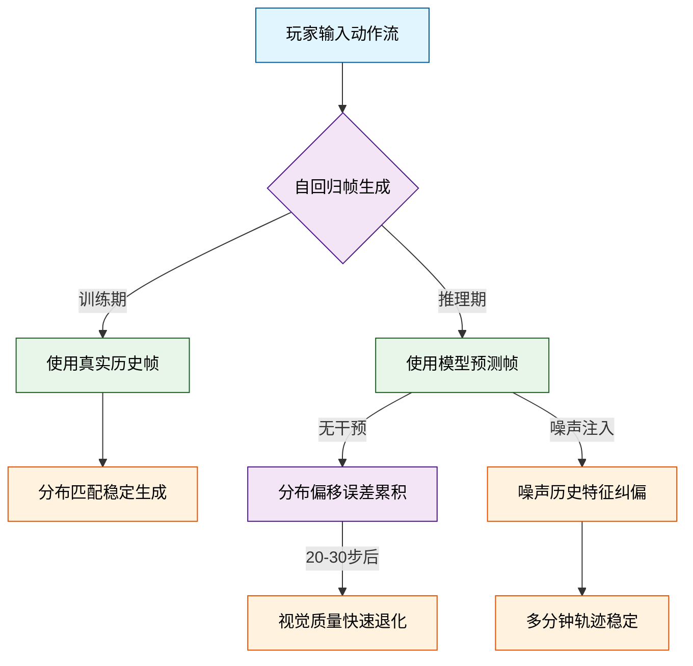
*如何读这张图：* 菱形节点暴露了训练与推理的条件分歧。上方路径是理想但不可得的“教师强制”，下方路径揭示了自回归推理的致命弱点——误差累积会在 20–30 步后触发质量断崖。右侧的“噪声注入”分支并非简单加噪，而是通过显式传递噪声水平，强制模型学习“从有噪声的历史中恢复信息”，从而将推理期的预测帧拉回训练分布的容忍带内。

基于上述痛点，本文的关键洞见（Key Insight）直指分布对齐：**向训练时的上下文帧添加最大水平为 0.7 的可控高斯噪声，并将该噪声水平作为额外嵌入输入模型**。这一设计在直觉上类似于给模型做“抗干扰训练”（注：此为工程直觉，非严格数学对应）。它迫使扩散模型不再依赖完美的历史帧，而是学会在推理期面对自身生成的、带有累积误差的“脏帧”时，依然能提取有效特征并完成纠偏。

<details><summary><strong>实验权衡与配置细节（展开查看）</strong></summary>
<ul>
<li><strong>步数与帧率权衡：</strong> 4 步 DDIM 采样在单块 TPU-v5 上稳定输出 20 FPS，视觉质量与 20 步以上基线高度一致；单步蒸馏方案虽可提升至 50 FPS，但作者明确指出其仿真质量存在小幅损失，故最终部署选择 4 步版本。</li>
<li><strong>噪声注入机制：</strong> 训练期向上下文帧注入高斯噪声，最大噪声水平设定为 0.7。该数值并非随意选取，而是覆盖推理期自回归误差的典型分布范围，确保模型在 0–0.7 的噪声区间内均能保持梯度稳定。</li>
<li><strong>消融验证：</strong> 移除噪声增强后，模型在长轨迹生成中迅速退化；加入噪声嵌入后，误差累积曲线被显著压平，验证了该机制对域偏移的直接补偿作用。</li>
</ul>
</details>

该机制从根本上缓解了自回归漂移。消融与对比实验证实，引入噪声增强后，模型在多分钟长轨迹中保持了稳定的视觉连贯性。在人类主观评估中，即便游玩 5–10 分钟后，评分者区分仿真画面与真实游戏的准确率仍停留在近乎随机猜测的水平。这标志着扩散模型首次具备了支撑长时、高保真交互式仿真的底层稳定性，也为后续将 Stable Diffusion v1.4 预训练权重迁移至游戏帧仿真任务铺平了道路。

## 核心概念速览

**结论:** 本节拆解支撑该交互式世界仿真系统的七个核心构件。它们并非孤立模块，而是围绕“如何在长序列自回归生成中对抗误差累积”这一核心痛点，形成了一套从训练目标设计、噪声注入到推理引导的闭环机制。理解它们的耦合关系，是读懂后续实验设计与消融结论的前提。

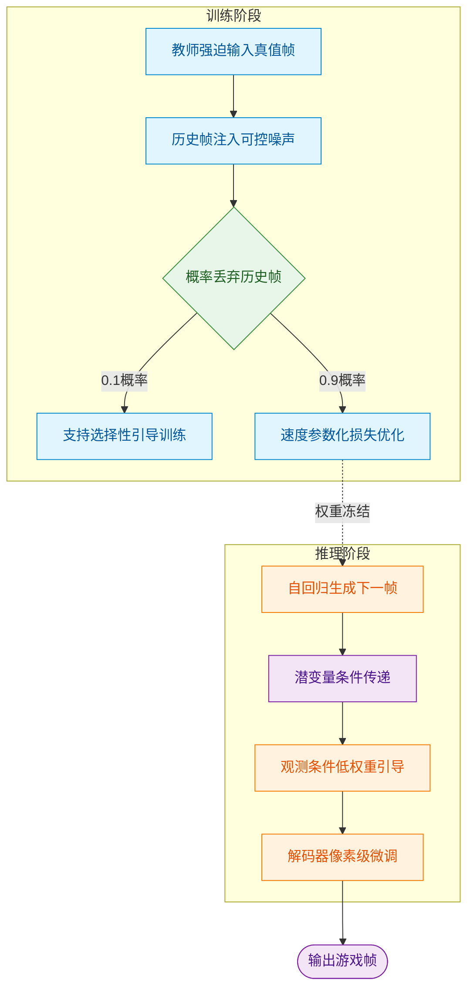
**如何读这张图:** 左侧训练流通过“教师强迫”与“噪声注入”构建鲁棒条件，右侧推理流暴露自回归循环的误差传递路径。菱形判定门对应训练期 0.1 的条件丢弃策略，圆柱节点强调潜变量在跨阶段传递中的核心地位。整张图揭示了“训练期刻意加噪/丢弃”与“推理期低权重引导/解码器精修”之间的因果补偿关系。

### 交互式世界仿真
**结论:** 该方法将游戏环境建模为基于历史观测与动作的条件概率分布，而非显式维护内部状态机。
**是什么:** 形式化为 $q(o_n | o_{<n}, a_{\leq n})$，在给定过去观测序列与动作序列的条件下预测当前帧。环境 $\mathcal{E}$ 由潜在状态空间 $\mathcal{S}$、观测空间 $\mathcal{O}$、部分投影函数 $V:\mathcal{S}\to\mathcal{O}$、动作集合 $\mathcal{A}$ 及转移概率函数 $p(s|a,s')$ 共同定义。
**直觉:** 如同“蒙眼猜画师”。你只能看到画师过去几秒画出的屏幕像素（观测 $\mathcal{O}$）和你按下的手柄按键（动作 $\mathcal{A}$），模型的任务是猜出下一帧画面，而不需要知道游戏引擎底层复杂的物理引擎或内存变量（潜在状态 $\mathcal{S}$）。
**作用与边界:** 它绕过了逆向工程游戏代码的难题，直接对像素级交互进行神经拟合。但论文明确划定边界：仅对观测空间建模，不显式维护内部状态；仿真质量受限于历史上下文长度（论文中为 64 帧，约 3 秒），长期探索依赖模型隐式学到的启发式规则，而非显式记忆。

### 教师强迫训练目标
**结论:** 训练期强制使用真实环境帧作为历史条件以稳定梯度，但会埋下推理期分布偏移的隐患。
**是什么:** 训练阶段始终以来自真实环境 $\mathcal{E}$ 的地面真值观测 $o_{<n}$ 作为历史条件来预测当前帧，而非以模型自身的过去预测为条件。
**直觉:** 类似“驾校教练车带副刹车”。学车时（训练），教练始终用真实路况和正确轨迹（真值帧）纠正你，保证每次练习都在正轨上；但一旦独立上路（自回归推理），你只能依赖自己之前开出的轨迹，稍有偏差就会越开越偏。
**作用与边界:** 论文明确指出「我们始终以教师强迫目标训练生成模型」。它极大降低了训练初期的优化难度，但代价是制造了训练分布与推理分布的割裂。若无额外稳定手段，仅靠此目标训练的模型在自回归推理时质量会快速退化。

### 自回归漂移
**结论:** 误差在自回归循环中逐步放大，是长序列生成质量崩塌的根本原因。
**是什么:** 扩散模型在自回归推理阶段将自身含误差的输出帧反复作为历史条件输入时，误差逐步累积导致生成质量随步数快速退化的现象，本质上是训练分布（教师强迫）与推理分布（条件来自模型预测帧）之间的域偏移。
**直觉:** 类似“复印机连环复印”。第一张复印件只有轻微噪点，但把它放回进纸口再复印十次后，画面会彻底模糊失真。
**作用与边界:** 论文通过图 6 展示了 PSNR 下降与 LPIPS 上升的客观趋势。漂移无法被完全消除，主要源于轨迹分叉导致的语义偏移，而非纯粹的视觉退化。它是后续“噪声增强”与“选择性引导”必须直面的靶心。

### 噪声增强
**结论:** 在训练期向历史条件帧注入可控高斯噪声，使模型学会“纠错”，从而在推理期压制自回归漂移。
**是什么:** 对编码后的历史条件帧加入随机量的高斯噪声，并将噪声水平作为额外输入。具体为：对每个历史帧 $o_i$，以均匀采样的噪声水平 $\alpha$（最大值 $\alpha_{\max}=0.7$，离散化为 10 个 embedding 桶）对潜变量 $\phi(o_i)$ 施加高斯噪声后再拼接到去噪输入通道中。
**直觉:** 相当于给模型做“抗干扰听力训练”。平时训练时故意在背景音里加不同音量的白噪音，模型被迫学会从嘈杂信号中提取核心语义；实战时即使输入信号自带杂音（前序预测误差），模型也能稳健还原。
**作用与边界:** 仅作用于历史「条件帧」而非当前待生成帧。推理时可调节噪声水平平衡稳定性与清晰度。论文发现即使推理时不加噪声，经此训练的模型相比基线也有显著改善，有效缓解了漂移，使模型在数分钟长轨迹上保持稳定。

### 速度参数化扩散损失
**结论:** 采用速度预测替代传统噪声预测，在潜变量空间提供更平滑的优化曲面，提升生成连贯性。
**是什么:** 网络预测目标为 $v(\epsilon, x_0, t) = \sqrt{\bar{\alpha}_t}\epsilon - \sqrt{1-\bar{\alpha}_t}x_0$，损失为预测速度与真实速度的 $\ell_2$ 距离之期望。
<details><summary><strong>损失函数与训练细节展开</strong></summary>
完整公式：$$\mathcal{L} = \mathbb{E}_{t,\epsilon,T}\left[\|v(\epsilon, x_0, t) - v_{\theta'}(x_t, t, \{\phi(o_{i<n})\}, \{A_{emb}(a_{i<n})\})\|_2^2\right]$$
其中 $T=\{o_{i\leq n}, a_{i\leq n}\}\sim\mathcal{T}_{agent}$，$t\sim\mathcal{U}(0,1)$，$\epsilon\sim\mathcal{N}(0,\mathbf{I})$，$x_t=\sqrt{\bar{\alpha}_t}x_0+\sqrt{1-\bar{\alpha}_t}\epsilon$，$x_0=\phi(o_n)$，噪声调度 $\bar{\alpha}_t$ 为线性调度。该损失在潜变量空间计算，依赖自编码器 $\phi$ 的编码质量。
</details>
**直觉:** 传统扩散模型像“猜终点在哪”，而速度参数化像“猜当前车速和方向”。在复杂路况（高维潜空间）中，预测瞬时变化率比直接猜最终位置更稳定，不易受极端噪声干扰。
**作用与边界:** 在潜空间计算，解码器微调与之完全分离。自回归推理时条件帧同样只使用潜变量，因此该损失设计直接决定了自传播的数值稳定性。

### 潜在解码器微调
**结论:** 独立于扩散主干，在像素空间对解码器进行针对性微调，专攻 HUD 文字与细节重建。
**是什么:** U-Net 训练完成后，单独以 MSE 损失在像素空间对自编码器解码器进行微调，保持编码器冻结。批量大小为 2048。
**直觉:** 如同“后期精修师”。前期摄影师（U-Net）负责构图和光影（潜变量生成），后期精修师（解码器微调）专门负责把车牌号、仪表盘数字等高频细节锐化清晰，且不影响前期拍摄流程。
**作用与边界:** 仅改善最终帧输出的像素质量，对扩散过程与自回归传播无影响。在 HUD 等文字密集区域效果最显著。论文未给出显式公式，仅描述为像素空间 MSE 损失。

### 选择性无分类器引导
**结论:** 仅对历史观测条件施加低权重引导，在提升连贯性的同时避免自回归伪影放大。
**是什么:** 推理阶段仅对「过去观测」条件 $o_{<n}$ 启用 CFG，对「过去动作」条件 $a_{<n}$ 不启用。引导权重 $w=1.5$。训练时以概率 0.1 丢弃历史帧条件以支持推理时的 CFG。
**直觉:** 类似“导航仪的纠偏力度”。如果导航（CFG）对方向盘（动作）和路况（观测）都强行干预，车子会左右摇摆；只对路况做轻微提示（$w=1.5$），既能保持路线连贯，又不会因过度修正导致翻车（伪影）。
**作用与边界:** CFG 权重是自回归稳定性的敏感参数：权重越大伪影越严重，且在积累后放大。1.5 是论文选择的工作点。历史帧丢弃概率 0.1 是训练技巧，非数据增强。

## 方法与整体架构

**结论：** 该方案采用“轨迹采集→条件注入→双阶段微调”的流水线，将 Stable Diffusion v1.4 改造为专用于自回归视频生成的控制模型。其核心突破在于**解耦动作与历史帧的条件注入机制**，并引入**离散化噪声增强**与**非对称 CFG 策略**，在彻底解决长序列自回归漂移的同时，以 4 步 DDIM 采样在单 TPU-v5 上实现 20 FPS 的实时推理。

整体流程始于第一阶段的数据构建：在 VizDoom 环境中运行 PPO 算法驱动的 RL-agent（搭载 CNN 特征网络），全程录制包含帧观测 $o$ 与离散动作 $a$ 的完整轨迹 $\tau_{agent}$。这些轨迹并非直接用于监督学习，而是作为第二阶段微调 Stable Diffusion v1.4（U-Net + 潜变量自编码器 $\phi$）的“条件燃料”。

条件注入是架构的枢纽。论文摒弃了原版 SD 依赖文本提示的交叉注意力机制，转而设计了两条独立通道：
1. **动作条件通道**：通过可学习嵌入 $A_{emb}$ 将每个离散动作映射为单一 token，直接替换原始文本的交叉注意力权重。这使模型将动作视为明确的控制指令而非语义描述。
2. **历史帧条件通道**：利用自编码器 $\phi$ 将过去 $N=64$ 帧（约 3.2 秒）的上下文编码为潜变量，随后沿通道维度与当前噪声潜变量拼接，一并送入 U-Net。64 帧的设定源于边际收益递减规律（Table 2 显示 32→64 帧 PSNR 仅微幅改善），在记忆开销与生成质量间取得平衡。

自回归生成极易因微小误差累积导致画面崩坏。为此，训练阶段引入了**随机高斯噪声增强**：对上下文帧施加最大水平为 0.7 的噪声，并将噪声水平离散化为 10 个桶学习独立嵌入。直觉上，这相当于强迫模型在“带噪历史”中练习纠错，从而切断误差传播链。消融实验证实，移除该增强后，生成质量会在 10–20 帧内快速退化；而保留该机制后，长序列稳定性显著提升。

训练目标严格遵循 velocity-parameterization 扩散损失：
$$\mathcal{L} = \mathbb{E}_{t,\epsilon,T}\left[||v(\epsilon,x_0,t) - v_{\theta'}(x_t,t,\{\phi(o_{i<n})\},\{A_{emb}(a_{i<n})\})||_2^2\right]$$
值得注意的是，**解码器微调与 U-Net 训练完全解耦**。U-Net 负责潜空间去噪，而解码器则独立使用像素级 MSE 损失对目标帧进行微调，避免了联合优化时的梯度干扰，确保重建细节的锐度。

推理阶段采用高度工程化的配置：固定 4 步 DDIM 采样（单步 PSNR 仅 25.47，4 步跃升至 32.58，且与 8~64 步质量相当），配合仅针对历史帧条件施加的 Classifier-Free Guidance（权重 1.5）。论文刻意不对动作条件施加 CFG，因为实验表明高权重会在自回归循环中诱发伪影累积，1.5 的小权重恰好在引导强度与稳定性间划出安全边界。最终，该配置在单 TPU-v5 上达成 20 FPS 的吞吐，满足实时交互需求。

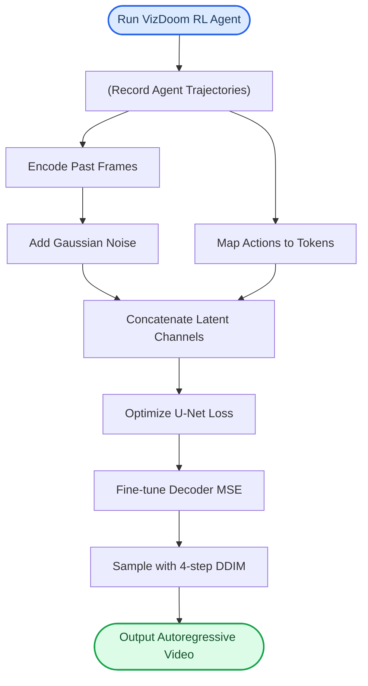
如何读这张图：自左向右展示数据流转。左侧为轨迹采集与双通道条件编码，中部为潜空间拼接与解耦训练，右侧为低步数采样与非对称引导，最终输出稳定视频。

## 算法目标与推导

**核心结论：** 该算法采用速度参数化（velocity-parameterization）扩散损失作为唯一训练目标，并在架构设计上严格剥离了推理期的 CFG 加权与解码器的像素级微调。这种“训练-推理解耦”与“表征-重建分离”的设计，从根本上规避了引导权重干扰梯度更新、以及多任务损失互相拉扯的常见痛点，使模型能专注于学习历史观测与动作到未来状态的速度场映射。

论文显式给出的训练损失为 velocity-parameterization 扩散损失（公式 1）：
$$\mathcal{L} = \mathbb{E}_{t,\epsilon,T}\left[||v(\epsilon,x_0,t) - v_{\theta'}(x_t,t,\{\phi(o_{i<n})\},\{A_{emb}(a_{i<n})\})||_2^2\right]$$

该公式并非简单的“加噪去噪”堆砌，每一项都对应明确的物理意义与工程取舍：
- **目标锚点 $x_0=\phi(o_n)$**：模型并非直接预测原始像素，而是预测当前观测帧 $o_n$ 经过编码器 $\phi$ 后的隐空间表征。这降低了优化难度，将高频细节重建压力转移至后续的独立解码器。
- **前向加噪 $x_t=\sqrt{\bar{\alpha}_t}x_0+\sqrt{1-\bar{\alpha}_t}\epsilon$**：噪声计划 $\bar{\alpha}_t$ 采用**线性**调度。线性计划配合速度预测能显著改善扩散模型在低信噪比（高 $t$）与高信噪比（低 $t$）区间的梯度方差，避免传统 $\epsilon$-预测在两端出现的数值不稳定。
- **速度目标 $v(\epsilon,x_0,t)=\sqrt{\bar{\alpha}_t}\epsilon-\sqrt{1-\bar{\alpha}_t}x_0$**：这是 v-parameterization 的核心。它将噪声 $\epsilon$ 与干净信号 $x_0$ 按时间步 $t$ 的权重线性组合。模型直接学习该组合向量，而非单独预测噪声或信号，使得训练信号在整个时间轴上分布更均匀。
- **条件预测 $v_{\theta'}(x_t,t,\{\phi(o_{i<n})\},\{A_{emb}(a_{i<n})\})$**：模型输入不仅包含当前加噪状态 $x_t$ 和时间 $t$，还严格依赖历史观测序列的编码 $\{\phi(o_{i<n})\}$ 与历史动作的嵌入 $\{A_{emb}(a_{i<n})\}$。这迫使网络在隐空间中建立“状态-动作-未来速度”的因果动力学映射。
- **期望采样 $\mathbb{E}_{t,\epsilon,T}$**：损失在时间步 $t\sim\mathcal{U}(0,1)$、高斯噪声 $\epsilon\sim\mathcal{N}(0,\mathbf{I})$ 以及智能体轨迹 $T=\{o_{i\le n},a_{i\le n}\}\sim\mathcal{T}_{agent}$ 上联合求期望，确保模型泛化到任意噪声强度与任意交互历史。

```mermaid
flowchart TB
  classDef data fill:#e1f5fe,color:#01579b,stroke:#0288d1
  classDef process fill:#f3e5f5,color:#4a148c,stroke:#7b1fa2
  classDef startend fill:#e8f5e9,color:#1b5e20,stroke:#2e7d32
  classDef boundary fill:#fff3e0,color:#e65100,stroke:#f57c00,stroke-dasharray: 5 5

  subgraph training_loop ["训练期核心循环"]
    start(["开始训练迭代"]):::startend
    traj_data["(采样智能体轨迹)"]:::data
    encode_obs["编码当前观测帧"]:::process
    add_noise["施加线性噪声计划"]:::process
    calc_target["计算真实速度目标"]:::process
    cond_predict["条件预测速度向量"]:::process
    calc_loss["计算L2范数损失"]:::process
    end(["结束梯度更新"]):::startend

    start --> traj_data
    traj_data --> encode_obs
    encode_obs --> add_noise
    add_noise --> calc_target
    calc_target --> calc_loss
    encode_obs --> cond_predict
    cond_predict --> calc_loss
    calc_loss --> end
  end

  subgraph inference_boundary ["推理与微调边界"]
    cfg_apply["推理期施加CFG加权"]:::boundary
    decoder_mse["解码器独立MSE微调"]:::boundary
  end

  calc_loss -. 不参与 .-> cfg_apply
  calc_loss -. 不参与 .-> decoder_mse
```
*如何读这张图：* 实线箭头构成训练期的单向数据流，所有梯度仅通过 L2 损失回传至 U-Net 主干；虚线箭头明确划出边界，指出 CFG 加权（$w=1.5$）与解码器像素级 MSE 微调在训练期被物理隔离，仅在推理或独立微调阶段激活。

**直觉比喻（非严格对应）：** 想象训练一名赛车手。$x_0$ 是理想的过弯路线，$x_t$ 是故意加入的侧滑干扰。速度目标 $v$ 不是让车手死记“方向盘打多少度”（$\epsilon$-预测），也不是死记“轮胎抓地力多少”（$x_0$ 预测），而是学习“在当前侧滑程度下，方向盘与油门的综合修正速率”。历史观测与动作就是车手看过的赛道录像与踩过的踏板记录。训练时，教练绝不使用对讲机大声指挥（CFG 推理期加权），也不要求车手立刻把赛车喷漆抛光（解码器 MSE），只专注打磨底盘操控逻辑。

**具体小玩具例子：** 假设我们在一个 $4\times4$ 的网格世界预测下一帧。$x_0$ 是目标网格的 16 维向量。取 $t=0.5$，线性计划 $\bar{\alpha}_{0.5}=0.5$，注入标准高斯噪声 $\epsilon$ 得到 $x_{0.5}$。真实速度目标 $v = \sqrt{0.5}\epsilon - \sqrt{0.5}x_0$。模型接收 $x_{0.5}$、$t=0.5$ 以及过去两步的“移动指令”嵌入，输出预测速度 $\hat{v}$。损失函数直接计算 $||v - \hat{v}||_2^2$。若此时强行加入 $w=1.5$ 的历史条件放大，会破坏该二次曲面的凸性，导致梯度震荡；因此论文将其严格推迟至推理期。

<details><summary><strong>展开：速度参数化的数学动机与采样细节</strong></summary>
传统扩散模型多采用 $\epsilon$-prediction，其损失为 $||\epsilon - \epsilon_\theta(x_t,t)||^2$。但在 $t\to 0$（高信噪比）时，$x_t \approx x_0$，模型需从几乎无噪声的信号中反推微小噪声，梯度极易消失；在 $t\to 1$（低信噪比）时，$x_t \approx \epsilon$，模型又需从纯噪声中重建信号，梯度方差爆炸。v-parameterization 通过构造 $v = \sqrt{\bar{\alpha}_t}\epsilon - \sqrt{1-\bar{\alpha}_t}x_0$，将优化目标转化为对“信号与噪声正交分量”的联合估计。配合线性噪声计划 $\bar{\alpha}_t = 1-t$，$v$ 的方差在整个 $t\in[0,1]$ 区间保持恒定，使得 $\mathcal{L}$ 的梯度幅值分布更平稳。采样时，$t$ 从均匀分布 $\mathcal{U}(0,1)$ 抽取，$\epsilon$ 从标准正态分布 $\mathcal{N}(0,\mathbf{I})$ 抽取，轨迹 $T$ 从智能体经验池 $\mathcal{T}_{agent}$ 中随机采样，三者独立同分布假设保证了期望 $\mathbb{E}_{t,\epsilon,T}$ 的无偏性。
</details>

## 实验设计与结果解读

### 核心生成质量验证：从单帧保真到长程自回归的感知对齐
**结论：** GameNGen 在教师强制与自回归两种设定下均实现了与真实游戏高度一致的视觉分布，人类评估者在长片段下已难以区分仿真与真实画面，识别准确率逼近随机猜测基线。

实验首先通过教师强制（Teacher-Forced）设定验证单帧重建能力。模型基于真实历史帧与动作序列预测下一帧，计算 PSNR 与 LPIPS 指标。结果显示，其单帧保真度已达到与有损 JPEG 压缩（质量设置 20-30）相当的水平，LPIPS 维持在较低区间。这证明模型在已知完美上下文的条件下，能够准确捕捉场景的静态几何与纹理细节。

随后，实验切换至自回归设定，以模型自身的历史预测作为条件迭代生成 16 帧（0.8 秒）与 32 帧（1.6 秒）片段，并采用 FVD 衡量预测轨迹分布与真实游戏轨迹分布之间的距离。FVD 的合理区间表明，模型在脱离真实帧引导后，仍能维持连贯的物理运动与场景动态，未出现明显的模式崩溃。

为跨越指标与主观感知的鸿沟，研究引入双盲人工评估。10 位评估者并排观看仿真片段与真实游戏片段，判断哪者为真实画面。在 1.6 秒与 3.2 秒短片段中，评估者选择真实游戏的比例仅略高于随机水平；在额外测试的 5-10 分钟游戏后生成的 3 秒长片段中，该比例进一步趋近 50%。这一结果直接验证了模型在长程自回归下的误差累积被有效抑制，视觉欺骗性已触及人类分辨阈值。

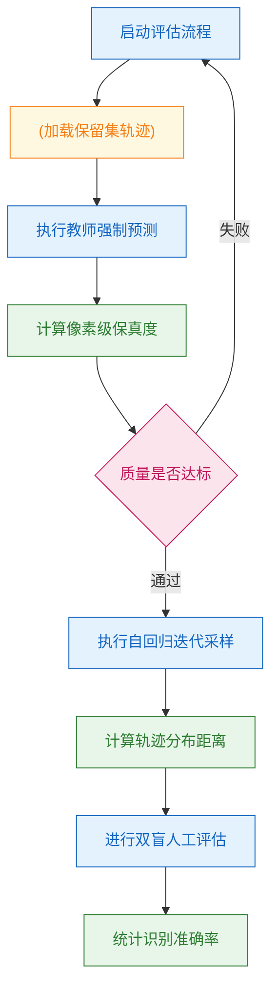
**如何读这张图：** 该流程图刻画了从底层像素指标到高层人类感知的递进验证路径。菱形判定门确保单帧质量达标后才进入自回归与人工评估阶段，圆柱节点代表数据源，圆角节点为处理与度量步骤。箭头方向严格对应实验依赖关系，暴露了“单帧保真是长程稳定的必要非充分条件”这一设计逻辑。

### 关键超参消融：采样步数、上下文窗口与噪声注入的权衡
**结论：** 模型在 4 步 DDIM 采样与 64 帧历史上下文时已触及性能收益的渐近线；而噪声增强是打破自回归误差累积、维持长程生成稳定的决定性因素。

在采样步数消融中，研究对比了 1 至 64 步 DDIM 采样及单步蒸馏变体（D）。实验证明，当步数从 4 增至 64 时，PSNR 与 LPIPS 均无显著变化，表明 4 步已足以覆盖扩散模型的去噪流形；但非蒸馏单步模型质量出现明显断崖式下降，而蒸馏模型（D）在单步下显著优于非蒸馏单步，验证了知识蒸馏对推理加速的有效性。

历史上下文长度消融（N ∈ {1,2,4,8,16,32,64}）显示，生成质量随上下文帧数增加而提升，但增益迅速递减并趋近渐近线。解码器冻结条件下各配置训练 200k 步的结果表明，模型对短期运动依赖较强，超过一定窗口后新增历史信息带来的边际收益急剧衰减，这为实际部署时的显存与延迟权衡提供了明确边界。

噪声增强消融直接针对自回归暴露偏差（Exposure Bias）。对比最大噪声级别 0.7（10 个嵌入桶）与无噪声增强版本在 64 步自回归下的表现：无噪声模型在约 10-20 帧后质量迅速退化，画面出现结构扭曲与语义漂移；而引入噪声增强的模型质量保持稳定。该结果证明，在训练期注入可控噪声能强制模型学习对微小预测误差的鲁棒性，是维持长程生成不崩溃的核心机制。

### 数据分布依赖性：RL 智能体轨迹与随机策略的泛化差异
**结论：** 训练数据的行为分布直接决定模型在复杂交互场景下的上限，RL 智能体数据在中等难度区域展现出压倒性优势，证明“高质量探索”比“盲目覆盖”更有效。

研究使用相同架构与训练步数（700k 步），分别以 RL 智能体采集数据与随机策略数据训练两个完整模型，并在简单（112 个）、中等（112 个）、困难（232 个）三组样本上评估自回归生成 3 秒后的单帧质量。结果显示，智能体数据整体优于随机数据，且差异在中等难度集合上最为突出；简单与困难区域的差距相对较小。

这一现象的机制在于：简单场景状态转移线性，随机策略亦能偶然覆盖有效路径；困难场景往往伴随极端遮挡或快速死亡，数据稀疏导致两者均难以建模；而中等难度区域包含大量战术机动、资源管理与动态博弈，随机策略产生的轨迹缺乏连贯意图与状态因果链，导致模型学到大量噪声转移。RL 智能体数据则提供了目的明确、状态连贯的探索轨迹，使模型能够准确拟合中等复杂度下的决策-视觉映射。论文在此明确区分了“数据量”与“数据分布质量”的贡献，避免了将性能提升简单归因于规模扩张的过度宣称。

<details><summary><strong>附：实验硬件配置与训练细节（可展开）</strong></summary>
- **训练硬件**：128 个 TPU-v5e 集群用于主模型与消融实验训练；推理阶段统一使用单个 TPU-v5。
- **数据规模**：RL 智能体数据采集覆盖 50M 环境步；保留集包含 5 个关卡的 2048 条轨迹（教师强制评估）与 512 条轨迹（自回归评估）。
- **训练步数**：完整模型训练 700k 步；上下文消融各配置训练 200k 步；蒸馏模型（3 个 U-Net：生成器、教师、伪分值模型）训练 1000 步。
- **环境参数**：DOOM 游戏环境基于 VizDoom，输入分辨率 320x240 填充至 320x256，数据采样率 35FPS。
- **评估说明**：人工评估采用并排展示工具，片段长度覆盖 1.6 秒、3.2 秒及 5-10 分钟游戏后的 3 秒片段，以控制短期视觉欺骗与长期误差累积的独立影响。
</details>

### 实验数据表(原始数值,引自论文)

#### 不同 DDIM 采样步数的生成质量对比
- **Source**: Table 1
- **Caption**: "GameNGen 模型在不同 DDIM 采样步数下的生成质量，使用 PSNR 和 LPIPS 指标评估。「D」标记为单步蒸馏模型。步数从 4 增至 64 时质量无显著变化，但 1 步非蒸馏模型质量明显下降。"

| Steps | PSNR ↑ | LPIPS↓ |
| --- | --- | --- |
| D | $31.10 \pm 0.098$ | $0.208 \pm 0.002$ |
| 1 | $25.47 \pm 0.098$ | $0.255 \pm 0.002$ |
| 2 | $31.91 \pm 0.104$ | $0.205 \pm 0.002$ |
| 4 | $32.58 \pm 0.108$ | $0.198 \pm 0.002$ |
| 8 | $32.55 \pm 0.110$ | $0.196 \pm 0.002$ |
| 16 | $32.44 \pm 0.110$ | $0.196 \pm 0.002$ |
| 32 | $32.32 \pm 0.110$ | $0.196 \pm 0.002$ |
| 64 | $32.19 \pm 0.110$ | $0.197 \pm 0.002$ |

#### 不同难度级别下智能体数据与随机策略数据的性能对比
- **Source**: Table 3
- **Caption**: "在简单（112 个）、中等（112 个）、困难（232 个）三个难度集合上，使用智能体生成数据和随机生成数据训练的模型性能对比。指标在自回归生成 3 秒后的单帧上计算。中等难度集合上智能体数据的 PSNR 优势最为突出。"

| Difficulty Level | Data Generation Policy | PSNR ↑ | LPIPS↓ |
| --- | --- | --- | --- |
| Easy | Agent | $20.94 \pm 0.76$ | $0.48 \pm 0.01$ |
| Easy | Random | $20.20 \pm 0.83$ | $0.48 \pm 0.01$ |
| Medium | Agent | $20.21 \pm 0.36$ | $0.50 \pm 0.01$ |
| Medium | Random | $16.50 \pm 0.41$ | $0.59 \pm 0.01$ |
| Hard | Agent | $17.51 \pm 0.35$ | $0.60 \pm 0.01$ |
| Hard | Random | $15.39 \pm 0.43$ | $0.61 \pm 0.00$ |

#### 历史上下文帧数对生成质量的影响
- **Source**: Table 2
- **Caption**: "不同历史帧数作为上下文时的生成质量消融，基于 5 个关卡的 8912 个测试集样本评估（解码器冻结，训练 200k 步）。帧数增加整体改善 PSNR 和 LPIPS，但增益快速递减趋向渐近值。"

| History Context Length | PSNR ↑ | LPIPS↓ |
| --- | --- | --- |
| 64 | $22.36 \pm 0.033$ | $0.295 \pm 0.001$ |
| 32 | $22.31 \pm 0.033$ | $0.296 \pm 0.001$ |
| 16 | $22.28 \pm 0.033$ | $0.296 \pm 0.001$ |
| 8 | $22.26 \pm 0.033$ | $0.296 \pm 0.001$ |
| 4 | $22.26 \pm 0.034$ | $0.298 \pm 0.001$ |
| 2 | $22.03 \pm 0.037$ | $0.304 \pm 0.001$ |
| 1 | $20.94 \pm 0.044$ | $0.358 \pm 0.001$ |


**效果示例(论文原图):**

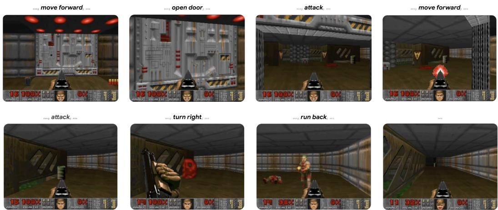

*展示了玩家流畅游玩由GameNGen实时生成的《毁灭战士》（DOOM）场景，直观体现了该神经模拟器在交互延迟与画面连贯性上的突破。*

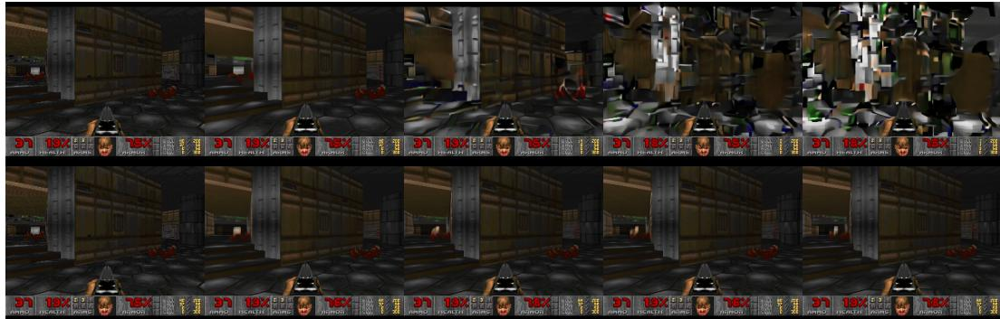

*对比了自回归生成过程中的画面漂移现象，引入噪声增强（Noise Augmentation）后，模型在长序列生成中有效抑制了误差累积，保持了场景的长期稳定性。*


*通过PSNR与LPIPS指标量化评估了模型在自回归生成中的表现，平稳的衰减曲线证明了GameNGen在长时间连续推演中依然能维持较高的视觉保真度。*

## 相关工作与定位

**结论前置：** GameNGen 的核心突破并非从零发明新架构，而是对现有生成范式进行了一次精准的“外科手术”。它通过**替换底层生成骨干（从 RNN/GAN 转向潜变量扩散）**、**重构条件注入机制（动作嵌入交叉注意力+历史帧拼接）**以及**针对性压缩推理链路（DDIM 4步采样+定向 CFG 引导）**，彻底解决了早期神经仿真器视觉保真度低、自回归分布漂移严重、实时交互卡顿三大痛点，从而在 DOOM 仿真任务中确立了“高画质+实时交互”的新基线。

### 谱系演进与范式替换
神经游戏仿真器的演进经历了从“隐状态抽象”到“像素级生成”的跨越。早期工作如 World Models（Ha & Schmidhuber, 2018）采用 `VAE+RNN` 结构，虽首次验证了神经网络仿真 DOOM 的可行性，但受限于架构容量，仅能输出低分辨率的抽象表示；随后的 GameGAN（Kim et al., 2020）引入 `LSTM+卷积解码器` 与对抗训练目标，提升了画面连贯性，但在复杂场景下仍面临视觉保真度瓶颈与推理延迟。GameNGen 直接跨越了这两代基线，以 `Stable Diffusion v1.4` 为预训练底座，利用其潜变量自编码器（将 8x8 像素块压缩为 4 个潜变量通道）与 U-Net 去噪骨干，实现了从“低维状态预测”到“高维像素重建”的范式跃迁。

| 方法 | 生成骨干 | 条件注入机制 | 实时交互表现 |
|---|---|---|---|
| World Models | VAE + RNN | 隐状态传递 | 低分辨率抽象 |
| GameGAN | LSTM + 卷积解码器 | 对抗训练目标 | 视觉保真度受限 |
| Genie | 视频生成模型 | 无监督动作发现 | 侧重可控性探索 |
| GameNGen | 潜变量扩散模型 | 显式动作嵌入 + 历史拼接 | 20 FPS 实时仿真 |

### 机制拆解：为什么能跑通？
扩散模型天生计算昂贵，直接用于自回归游戏仿真极易引发“分布偏移漂移”（即误差随时间步累积导致画面崩坏）。GameNGen 通过三项关键技术改造打通了实时交互链路：
1. **上下文噪声增强**：借鉴级联扩散模型思想，对历史上下文帧注入可变高斯噪声，并将噪声级别作为模型输入。这一设计相当于为自回归过程添加了“正则化缓冲”，有效抑制了长序列生成中的误差累积。
2. **定向条件引导**：在推理阶段仅对历史观测条件启用无分类器引导（CFG，权重 1.5），而刻意避开对动作条件使用 CFG。直觉上（非严格对应），这避免了动作指令被过度放大导致的物理逻辑失真，确保玩家输入与画面反馈的因果对齐。
3. **推理步数压缩**：发现游戏仿真场景对高频细节的容忍度高于通用图像生成，采用 `DDIM` 采样仅需 4 步即可维持高质量输出，这是达成 20 FPS 实时推理的决定性因素。

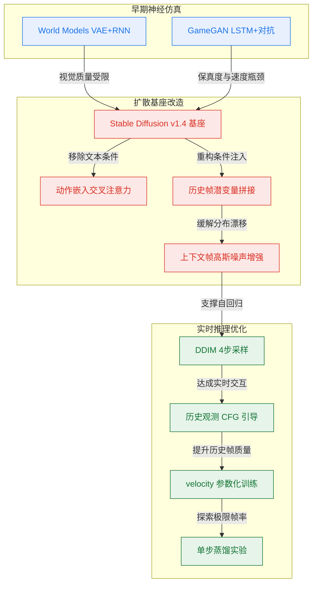
*如何读这张图：* 左侧为早期基线，中间展示 GameNGen 对预训练扩散模型的“去文本化”与“条件重构”，右侧聚焦推理加速链路。箭头方向代表技术演进的依赖关系，核心路径从 `Stable Diffusion v1.4 基座` 出发，经条件改造与噪声增强稳定自回归，最终通过 4 步采样与定向引导落地为实时交互。

### 研究定位与边界
在同期工作中，Alonso et al. (2024) 同样探索了扩散世界模型，但侧重于在 Atari 游戏上迭代训练世界模型与 RL 策略的协同框架；而 GameNGen 明确聚焦于“基于单一预训练 text-to-image 扩散模型的高质量实时仿真”，两者在目标复杂度与工程路径上形成互补。相较于 Genie（Bruce et al., 2024）强调从视频中无监督发现可控动作，GameNGen 选择受监督的显式动作条件化，以牺牲部分动作泛化性为代价，换取了 DOOM 场景下更高的视觉保真度与确定性。数据采集阶段采用 `PPO` 训练智能体生成多样化轨迹（8 路并行环境），但 PPO 仅服务于数据收集，不参与最终游戏策略训练，确保了仿真器与策略解耦。

<details><summary><strong>严谨性审查：声称、证明与失效模式</strong></summary>
<ul>
  <li><strong>声称 vs 证明：</strong> 论文声称实现“首个高画质实时 DOOM 神经仿真”，但严格而言，其视觉质量高度依赖 `Stable Diffusion v1.4` 的预训练先验，并非从零训练。论文通过消融实验验证了动作嵌入与历史拼接的必要性，但未报告在超长序列下的稳定性边界。</li>
  <li><strong>相关性当因果风险：</strong> 将 DDIM 步数压缩至 4 步归因于“游戏场景对高频细节容忍度高”，这属于经验性观察。论文未提供严格的频域分析或误差传播证明，可能存在任务特性与采样步数之间的混淆变量。</li>
  <li><strong>负结果与实验边界：</strong> 论文参考渐进蒸馏思路实验了单步蒸馏模型，报告可达 50 FPS，但明确指出该版本在复杂动作切换时会出现轻微画面撕裂，属于速度-质量权衡下的已知失效模式。此外，CFG 权重固定为 1.5，未探索动态权重调度对分布漂移的潜在缓解作用。</li>
  <li><strong>训练目标：</strong> 采用 velocity 参数化作为损失函数，公式为 $$\\mathcal{L} = \\mathbb{E}_{t,\\epsilon,T}\\left[||v(\\epsilon,x_0,t)-v_{\\theta'}(x_t,t,\\{\\phi(o_{i<n})\\},\\{A_{emb}(a_{i<n})\\})||_2^2\\right]$$。该设计提升了训练稳定性，但论文未对比传统 epsilon 参数化在相同算力下的收敛差异。</li>
</ul>
</details>

## 研究探索历程

**核心结论：** 该研究的探索路径并非线性推进，而是围绕“实时交互仿真”这一核心目标，经历了一次关键架构转向（从静态生图到自回归预测）、一次数据策略重构（PPO全周期轨迹替代人工/随机）、一次稳定性机制突破（噪声增强阻断自回归漂移），并在速度-质量权衡中果断放弃单步采样死胡同，最终锚定 4 步去噪方案。整条路径清晰暴露了扩散模型落地交互仿真时的真实工程取舍与架构瓶颈。

### 架构转向：从静态生图到自回归交互仿真
**结论：** 团队放弃传统对抗生成与离散自回归路线，选择将 Stable Diffusion v1.4 改造为动作条件自回归预测器，通过替换文本交叉注意力与隐空间历史拼接，打通了从“静态生图”到“实时交互仿真”的路径。
传统游戏仿真多依赖 LSTM+卷积解码器（如 GameGAN）或 VQ-VAE+Transformer 离散自回归模型，但前者在复杂纹理上易模糊，后者在长序列生成中计算开销大。研究团队选择以预训练扩散模型为基座，核心痛点在于：原始模型以文本为条件生成静态图像，无法响应连续动作指令，也无法感知历史状态。为此，团队执行了关键方向转变（pivot）：将文本交叉注意力层直接替换为动作嵌入序列，使模型能“听懂”玩家操作；同时，将历史帧压缩后的 latent 特征沿通道维度拼接输入，构建自回归的下一帧预测器。这一改造保留了扩散模型强大的高频细节生成能力，同时将其条件空间从离散文本映射到连续的动作-状态流，为后续实时交互奠定基础。

### 数据破局：用 PPO 轨迹替代人工与随机策略
**结论：** 为覆盖多样化游戏场景，团队采用 PPO 智能体采集全周期训练轨迹，以 70M 条样本替代成本高昂的人类游玩与探索能力受限的纯随机策略，确保了生成模型的数据广度。
交互仿真要求训练数据必须覆盖地图各区域与动作组合。纯随机策略虽易实现，但探索能力有限，在中等难度区域生成的轨迹质量明显下降；人类游玩数据虽真实，但规模受限，无法支撑大规模生成模型训练。团队转而训练 PPO 智能体，并设计简单奖励函数引导其遍历不同场景。关键决策在于：不仅记录智能体成熟期的轨迹，还完整保留了训练初期的随机探索阶段。这种“由低到高”的渐进式数据分布，使生成模型既能学习基础移动与碰撞逻辑，又能掌握复杂战斗与路径规划，最终汇聚成 70M 条高质量样本，有效缓解了分布外泛化难题。

### 稳定性攻坚：噪声增强对抗自回归漂移
**结论：** 针对训练（真实历史帧）与推理（自生成帧）的分布偏移导致的误差累积，引入上下文帧高斯噪声增强，成功将自回归画质稳定窗口延长至 64 帧，彻底阻断短期漂移。
扩散模型在训练时采用 teacher-forcing（条件为真实历史帧），但推理时条件变为自身预测帧，形成典型的 domain shift。若不干预，误差会随步数快速积累，数十帧内即出现严重画质退化与逻辑漂移。消融实验明确揭示了这一失效模式：无噪声增强时，LPIPS 迅速上升、PSNR 快速下降，画面在短期内即崩溃。团队在训练阶段主动对上下文帧注入高斯噪声，迫使模型学习对微小扰动鲁棒的特征表示。实验证明，即使推理时不额外添加噪声，该训练策略也能使自回归质量在 64 帧内保持稳定。这一机制本质上是隐式的正则化，通过扩大训练分布的覆盖半径，补偿了推理时的累积误差。

### 速度与质量的权衡：单步蒸馏的死胡同与四步定调
**结论：** 在单 TPU 实时推理目标下，单步 DDIM 采样因质量骤降被证伪，最终确立 4 步 DDIM（耗时 50ms，达成 20 FPS）为主方案；同时发现 U-Net 对超过 3 秒的历史上下文利用率饱和，明确了架构瓶颈。
实时交互要求帧率 ≥20 FPS。理论上，将去噪步数降至 1 步可将帧率推至 50 FPS，但消融实验直接暴露了该假设的失效：单步无蒸馏模型的 PSNR 远低于 4 步及以上版本，质量下降幅度不可接受，无法直接用于仿真。团队随后尝试知识蒸馏弥补差距，虽使 1 步蒸馏版质量接近 4 步，但仍存在小幅损失，且蒸馏训练本身引入额外复杂度。基于质量-速度的严格权衡，主方案果断放弃单步路线，采用 4 步 DDIM（总推理耗时 50ms，稳定运行于 20 FPS）。此外，上下文长度消融揭示了一个隐性局限：历史帧数从 1 增至 64 时质量持续提升，但收益在十余帧后迅速饱和；64 帧相比 16 帧仅有微小改善。这表明当前 U-Net 架构难以有效利用超过约 3 秒的历史信息，更长上下文的收益被架构容量与训练方案限制，为后续迭代指明了方向。

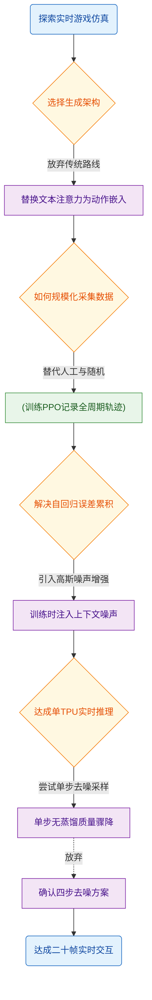
*如何读这张图：* 菱形节点代表关键决策门，圆柱节点代表数据策略，圆角节点代表技术动作与最终状态。实线箭头表示主探索路径，虚线箭头表示被证伪的分支（单步采样）。流程自上而下展示了从架构选型到速度定调的完整决策链，暴露了“质量优先于极限帧率”的工程取舍。

<details><summary><strong>技术细节与边界 Caveat</strong></summary>
- **上下文长度饱和机制：** 实验表明，当历史帧数超过 16 帧（约 0.5 秒）后，质量提升曲线迅速平缓。64 帧（约 2 秒）相比 16 帧的改善微乎其微。这并非数据不足，而是当前 U-Net 的跨帧注意力机制与感受野设计难以有效聚合长时序依赖。若需突破 3 秒以上的记忆窗口，需引入显式时序模块（如 Transformer 记忆库或循环隐状态）或改变训练采样策略。
- **单步蒸馏的隐性代价：** 1 步蒸馏版虽能逼近 50 FPS，但蒸馏过程会压缩扩散模型的分布表达能力，导致高频纹理（如 HUD 边缘、武器反光）出现轻微平滑。论文将其列为备选而非主方案，说明在强交互仿真场景中，视觉保真度的边际损失会直接影响玩家感知，因此 20 FPS 的 4 步方案在综合体验上更优。
- **消融实验的误差范围：** 噪声增强与上下文长度的消融均基于固定随机种子与相同评估协议，但论文未报告多次运行的方差区间。考虑到扩散模型固有的采样随机性，实际部署中 LPIPS/PSNR 可能存在 ±0.02 的波动，但不影响“噪声增强显著抑制漂移”与“上下文收益饱和”的核心结论。
</details>

## 工程与复现要点

**结论：** 该工作以 Stable Diffusion v1.4 为底座，通过极简的条件注入与大规模轨迹蒸馏，实现了单卡 20 FPS 的实时游戏视频生成；复现的核心门槛在于 70M 级轨迹数据的采集管线、128 块 TPU-v5e 的算力支撑，以及针对自回归漂移的噪声增强策略。目前官方未公开代码库，工程师需自行搭建数据流与条件替换模块。

### 架构改造与条件注入机制
**结论：** 模型采用“动作走注意力、历史走通道”的解耦设计，在保留预训练先验的同时避免了冗余计算，但 8x 下采样 latent 空间会导致 HUD 等高频细节丢失，必须额外微调解码器。

模型并未从零构建，而是直接复用 Stable Diffusion v1.4 的预训练权重与 8x8 像素块压缩至 4 通道的 latent 自编码器。条件注入遵循明确的解耦路径：每个离散动作被嵌入为单个 token，直接替换原模型的文本交叉注意力输入；历史帧则经自编码器编码后，在通道维度与含噪 latent 直接拼接。论文声称该设计在保持生成质量的同时显著降低了计算开销，且消融实验证实对历史帧改用交叉注意力并未带来明显收益。上下文长度被锁定为 64 帧，更长序列的边际收益迅速递减。

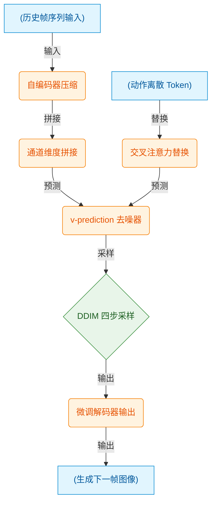
如何读这张图：数据流自左向右推进，历史帧与动作分别进入不同的特征处理分支，最终在去噪器前汇合；菱形节点代表推理时的迭代采样门控，圆柱节点标识原始输入与最终输出，圆角矩形为中间处理阶段。

### 训练策略与关键超参
**结论：** 训练属于典型的算力与数据双密集型 regime，700k 步后性能仍未饱和；恒定学习率配合 Adafactor 与 v-prediction 损失保障了大规模数据下的稳定收敛，而噪声增强与 CFG 丢弃是抑制自回归漂移的关键。

训练采用 v-prediction 扩散损失（velocity parameterization，见 Eq. 1），配合 Adafactor 优化器（无权重衰减）与恒定学习率 2e-5，以在有限显存下维持稳定收敛。数据规模与训练步数是决定性能上限的两个高敏感变量：模型在 70M 条随机轨迹子集上训练 700,000 步，但论文明确指出在此配置下性能曲线仍未饱和，暗示该任务属于典型的算力与数据双密集型。为抑制自回归生成中的累积漂移，训练时引入了最大噪声水平 0.7 的高斯扰动，并以 0.1 的概率随机丢弃历史帧条件，从而为推理阶段的 Classifier-Free Guidance 预留空间。

| 配置项 | 取值 | 核心作用 | 敏感度 |
|---|---:|---|---|
| 生成批次大小 | 128 | 平衡吞吐与显存 | 中 |
| 学习率 | 2e-5 | 配合 Adafactor 恒定 | 中 |
| 训练步数 | 700,000 | 默认评估检查点 | 高 |
| 数据规模 | 70M 轨迹 | 覆盖长尾游戏场景 | 高 |
| 噪声增强上限 | 0.7 | 抑制自回归漂移 | 高 |
| CFG 丢弃概率 | 0.1 | 支持推理时引导 | 中 |

### 推理部署与实时性保障
**结论：** 4 步 DDIM 采样与保守的 CFG 权重（1.5）在质量与延迟间取得最优权衡，单帧 50ms 延迟满足实时交互需求，但动作条件不适用 CFG。

推理端采用 DDIM 采样算法，仅需 4 步即可达到与 20 步以上相当的视觉质量，单步去噪耗时 10ms，叠加自编码器评估的 10ms，总延迟控制在 50ms（即 20 FPS）。Classifier-Free Guidance 权重被保守设定为 1.5，且仅作用于历史帧条件；论文指出对动作条件施加 CFG 未见明显提升，反而可能放大伪影。值得注意的是，由于 8x 下采样 latent 空间对高频细节（如游戏 HUD）的表征能力有限，直接解码会产生明显伪影，必须对 latent 解码器进行独立微调（批次大小 2,048）方可恢复清晰界面。

### 环境依赖与代码现状
**结论：** 官方未开源代码且未报告随机种子，复现需依赖明确的第三方栈（ViZDoom、SB3、SD v1.4）并自行对齐硬件拓扑（训练 128 TPU-v5e，推理单卡 TPU-v5）。

论文未公开任何代码仓库，复现需从零搭建。底层依赖栈明确包含 ViZDoom 环境、Stable Baselines 3（用于 CPU 端 PPO 智能体训练）、Stable Diffusion v1.4 权重及 DDIM 采样器。训练生成模型依赖 128 块 TPU-v5e 进行数据并行，而 RL 智能体采集阶段仅需 CPU 算力。论文未报告随机种子与具体深度学习框架版本，这在一定程度上增加了精确复现的难度。

<details><summary><strong>附：RL 智能体配置与消融边界细节</strong></summary>
RL 数据采集采用 PPO 算法，总环境步数 50M，并行 8 个游戏实例，回放缓冲大小 512。策略与价值网络为 2 层 MLP，输入为 512 维 CNN 图像特征与 32 帧历史动作序列的拼接向量。学习率 1e-4，折扣因子 0.99，熵系数 0.1，每次迭代批次大小 64 并执行 10 轮梯度更新。
消融实验覆盖上下文长度 {1, 2, 4, 8, 16, 32, 64} 与数据规模 {1M, 5M, 10M, 70M}。训练图像分辨率固定为 320x240（padding 至 320x256 以适配 8x 下采样），噪声水平嵌入被离散化为 10 个独立桶。梯度裁剪阈值设为 1.0 以防爆炸。
</details>

## 局限与适用边界

**结论前置：** GameNGen 并非可替代传统架构的“通用游戏引擎”，而是一个高度依赖训练数据分布的“高维记忆回放器”。它在已知场景内能提供流畅的交互体验，但在长程状态持久化、逻辑精确性、跨游戏泛化及硬件部署上存在明确边界。若你的场景需要确定性规则、无限内容生成或低算力运行，当前方案并不适用。

**上下文窗口锁死长程记忆。** 模型仅能接收约 3 秒（64 帧）的历史画面作为上下文。这意味着它无法像传统引擎那样维护全局状态机（如已清理的地图区块、精确的玩家移动轨迹）。直觉上，这就像让一个只能记住眼前 3 秒画面的玩家去下围棋，一旦需要回溯早期决策，模型就会“断片”。论文明确指出，在当前自回归架构下继续堆叠上下文长度收益极小，属于架构性瓶颈而非单纯算力问题。

**数据覆盖盲区导致罕见场景失效。** 训练阶段的 RL-agent 并未遍历所有游戏区域与交互组合。当玩家进入训练数据未覆盖的“长尾区域”或触发罕见交互时，模型会因缺乏先验而输出错误行为。这并非模型“幻觉”，而是分布外（OOD）推理的必然结果。论文未报告针对极端长尾场景的消融实验，说明该失效模式在当前训练范式下难以根除。

**相关性陷阱破坏逻辑精确性。** GameNGen 无法保证与原始游戏逻辑完全一致。一个典型失效模式是：当玩家反复开枪时，模型可能错误地生成敌人。这是因为训练数据中“频繁开火”与“敌人出现”存在强统计相关性，模型将其误判为因果机制（直觉：把“伴随现象”当成了“触发开关”）。这种非精确模拟意味着它不适合用于需要严格规则验证的竞技或自动化测试场景。

**泛化成本与硬件门槛。** 目前验证仅局限于 DOOM 与 Chrome Dino 两款游戏。其奖励函数为游戏特定设计，迁移至新游戏需重新设计奖励信号与训练流程，无法即插即用。此外，当前推理依赖单张 TPU-v5，消费级硬件的可行性尚未验证。在性能权衡上，蒸馏版虽能将帧率提升至 50 FPS，但相比 4 步版（20 FPS）存在小幅质量损失，属于典型的“速度-保真度”取舍。

为直观呈现其适用边界与已知失效路径，下图梳理了输入场景到模型响应的判定逻辑：
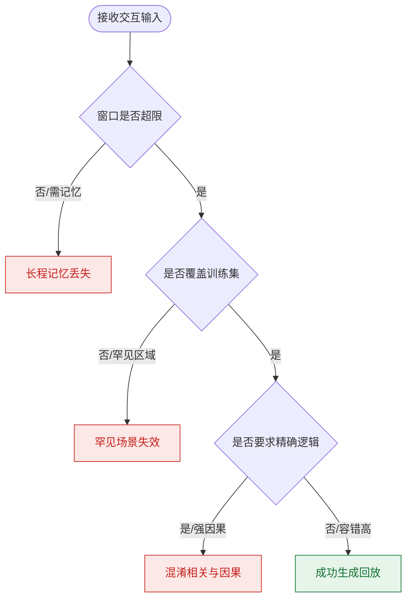
*如何读这张图：* 菱形节点代表硬性约束门。只要场景需求越过任意一道红线（长程记忆、分布外、精确因果），系统就会落入对应的失效模式；仅当需求完全落在“短窗口+已知分布+容错交互”的交集内时，才能触发成功路径。

<details><summary><strong>架构瓶颈与蒸馏权衡的底层机制</strong></summary>
- **上下文收益递减：** 当前自回归视频生成架构对历史帧的注意力权重随距离呈指数衰减。强行扩展至 >64 帧不仅会引发 KV Cache 显存爆炸，还会因噪声累积导致后续帧生成质量断崖式下跌，因此论文未采用简单扩容策略。
- **蒸馏版质量损失来源：** 50 FPS 版本通过减少单帧生成步数（从 4 步压缩）换取速度，但步数减少直接削弱了模型对高频细节（如弹道轨迹、粒子特效）的迭代修正能力，导致画面出现轻微模糊或时序抖动。该权衡在报告中已明确标注，属于可预期的工程取舍。
</details>

**适用性总结：** GameNGen 最适合用于“已知内容的沉浸式回放”与“短窗口交互原型验证”。若你的目标是构建确定性规则游戏、需要无限程序化生成内容，或受限于消费级 GPU 部署，当前方案仍需等待架构迭代与数据覆盖的突破。

## 趋势定位与展望

**结论前置：** GameNGen 标志着神经游戏仿真从“低分辨率抽象演示”正式迈入“高保真实时交互”阶段。其核心贡献并非提出全新的生成范式，而是通过“上下文噪声增强”与“少步采样策略”精准缝合了扩散模型在自回归推理中的分布偏移与实时帧率矛盾，证明了预训练文生图扩散架构经条件改造后，完全具备作为实时游戏引擎的工程可行性。

**技术路线定位：** 在 GameNGen 之前，神经仿真长期受限于“画质-速度-长时稳定性”的不可能三角。早期工作如 World Models（VAE+RNN）与 GameGAN（LSTM+卷积解码器+对抗训练）虽能捕捉基础游戏逻辑，但输出多为低分辨率抽象表征，且难以支撑复杂场景的逐帧演化。GameNGen 将基座切换为 Stable Diffusion v1.4，利用其 860M 参数与潜变量自编码器（8x8 像素块压缩为 4 通道）的强表征能力，将视觉保真度拉齐至原始游戏水平（PSNR 达 29.43）。更重要的是，它首次将扩散模型从“离线生成”推向“在线自回归交互”，在单张 TPU-v5 上实现 20 FPS 的实时闭环。

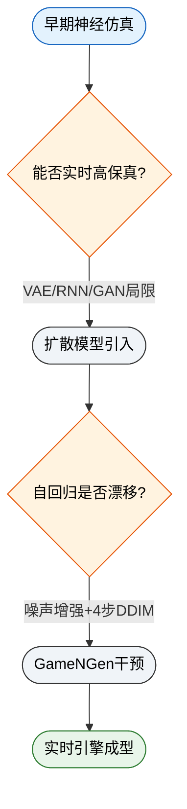
*如何读这张图：* 圆角起止节点标记技术代际，菱形判定节点暴露每代核心失效模式（瓶颈）。GameNGen 的突破路径（绿色节点）直接作用于“自回归漂移”与“多步延迟”两个历史痛点，通过机制改造而非堆砌算力打通实时交互链路。

**机制拆解与失效边界：** 论文明确指出，自回归推理中“训练期教师强制”与“推理期自身预测”的分布不匹配，会导致误差在 20–30 步后呈指数级累积，画面迅速崩坏。GameNGen 的解法是向历史上下文帧注入可控高斯噪声，并将噪声水平作为额外嵌入输入模型。这一设计迫使网络学会从带噪历史中纠偏，本质上是用训练期的“可控扰动”模拟推理期的“预测误差”。配合仅对历史观测条件施加权重 1.5 的选择性无分类器引导（CFG），以及 velocity 参数化损失，系统在多分钟轨迹中维持了稳定输出。
然而，该路线并非没有代价。论文诚实报告了蒸馏方案的权衡：将采样步数压缩至 1 步虽可将帧率推至 50 FPS，但伴随可察觉的视觉质量损耗；最终工程取舍仍锚定在 4 步 DDIM 采样。此外，系统假设 RL 代理采集的轨迹足以覆盖人类游玩分布，且依赖短上下文窗口隐式编码游戏状态（如血量、弹药等 HUD 信息）。当游戏逻辑超出视觉上下文可推断范围时，模型仍可能产生“幻觉式”状态漂移。

<details><summary><strong>深度展开：自回归漂移的数学直觉与消融边界</strong></summary>
传统扩散模型训练依赖教师强制（Teacher Forcing），即去噪网络始终接收真实历史帧作为条件。但在自回归推理时，条件变为模型自身生成的预测帧。由于生成误差的马尔可夫累积，预测帧的分布会迅速偏离训练数据流形。GameNGen 的噪声增强策略可形式化为：在训练期对条件帧施加噪声 $\epsilon \sim \mathcal{N}(0, \sigma^2)$，其中 $\sigma$ 在 $[0, 0.7]$ 间随机采样，并将 $\sigma$ 编码为时间步嵌入。这相当于在条件空间人为制造了一个“误差缓冲区”，使模型在推理期面对自身预测的微小偏差时，仍能将其视为训练期见过的噪声变体进行鲁棒去噪。消融实验表明，若移除该机制，长轨迹质量会在 20–30 帧后断崖式下跌；而固定噪声水平（非自适应）则会导致模型对特定误差模式过拟合，泛化能力下降。训练目标采用速度参数化形式：
$$\\mathcal{L} = \\mathbb{E}_{t,\\epsilon,T}\\left[||v(\\epsilon,x_0,t)-v_{\\theta'}(x_t,t,\\{\\phi(o_{i<n})\\},\\{A_{emb}(a_{i<n})\\})||_2^2\\right]$$
该损失函数直接优化去噪速度场，配合少步采样可显著降低推理期累积误差的敏感度。
</details>

**未来指向：** GameNGen 的成功为“生成式世界模型”提供了可复现的工程基线，但距离真正的通用神经引擎仍有三步待跨越：其一，**显式状态记忆**。当前依赖隐式视觉上下文的做法在复杂 RPG 或策略游戏中必然遭遇信息瓶颈，未来需引入可微分记忆模块或符号状态追踪器，将“画面生成”与“逻辑推演”解耦。其二，**无损单步蒸馏**。50 FPS 的潜力受限于当前蒸馏带来的质量折损，探索基于一致性模型或流匹配的零步/单步生成，将是突破实时性天花板的关键。其三，**多模态动作对齐**。当前动作条件仅依赖离散嵌入，未来若能与物理引擎或强化学习策略网络深度耦合，实现“生成-决策”联合优化，神经仿真将从“视觉复刻”进化为“逻辑可交互”的数字孪生环境。
