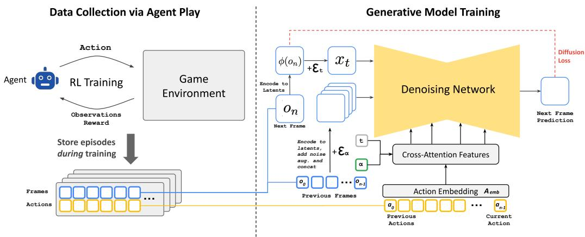
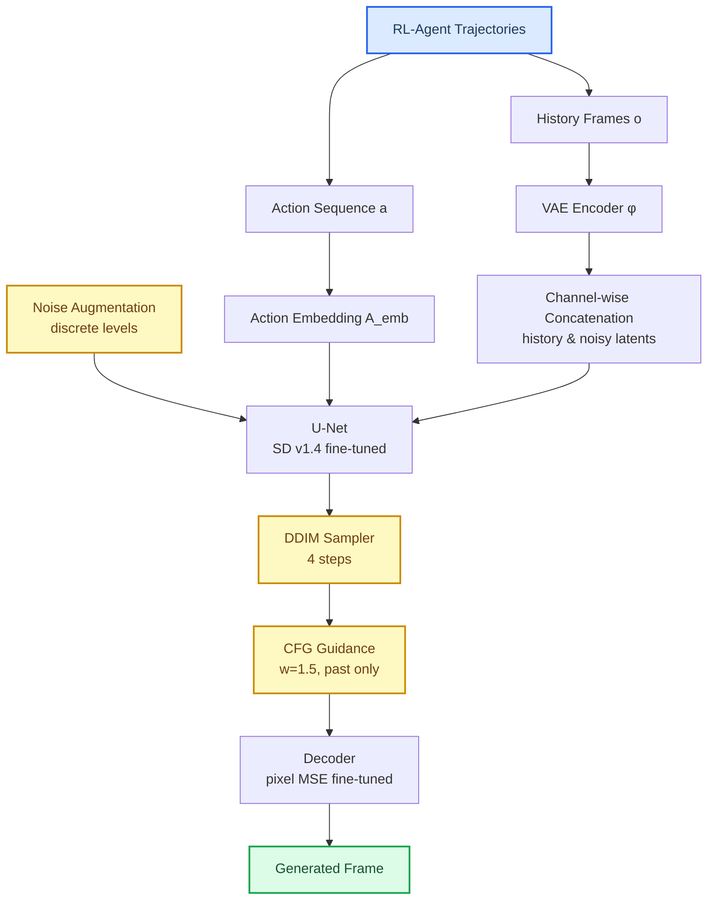
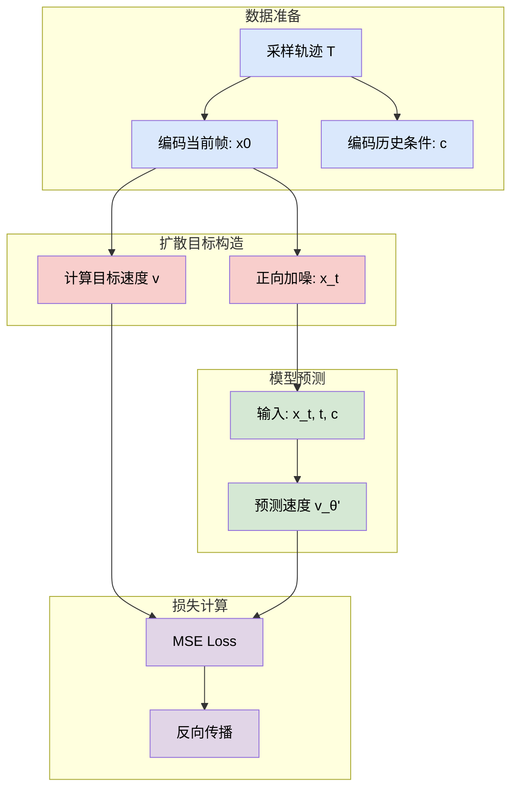
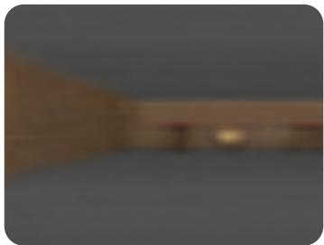
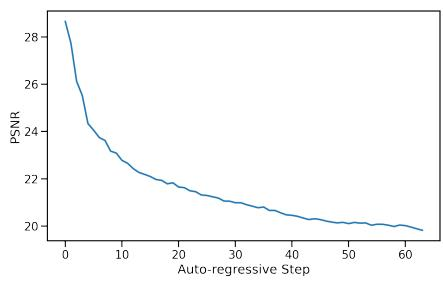
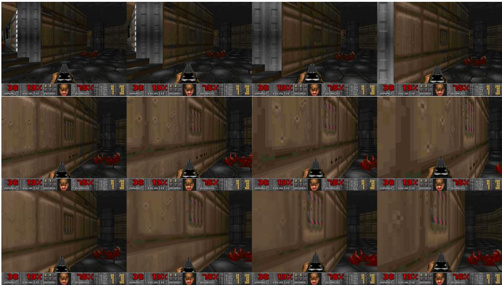
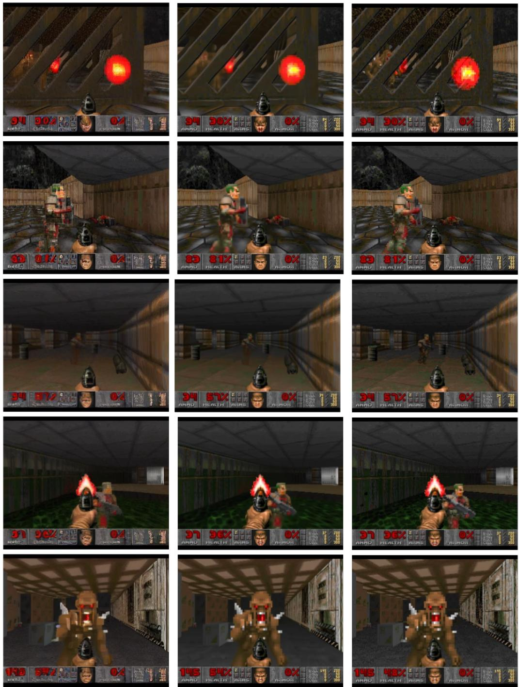

# Diffusion Models Are Real-Time Game Engines — 深度解读

> 面向人类读者的深度解读(中文)。事实源与配对的 AI 知识包 `ai_package/2026-06-08_DiffusionModelsAreRealTimeGameEngines_2408.14837/ara/` 同源,均已通过数据保真审计。

## 核心结论

> 每条结论后的隐形锚点把数字回链到论文原文(忠实性保证)。

1. GameNGen 是首个完全由神经模型驱动的游戏引擎，能够在单张 TPU-v5 上以 20 FPS 对复杂游戏 DOOM 进行实时交互式仿真，并在长时轨迹上保持与原始游戏相当的视觉质量<!--ref:r-we-present-gamengen-th--><!--anchor:quote:We%20present%20GameNGen%2C%20the%20first%20game%20engine%20powered%20entirely%20by%20a%20neural%20model%20that%20also%20enables%20real%2Dtime%20interaction%20with%20a--><!--ref:r-we-present-gamengen-th--><!--anchor:quote:We%20present%20GameNGen%2C%20the%20first%20game%20engine%20powered%20entirely%20by%20a%20neural%20model%20that%20also%20enables%20real%2Dtime%20interaction%20with%20a-->
2. 在训练时对历史上下文帧添加可变量高斯噪声（噪声增强），能有效阻止自回归生成中因教师强制与推理分布偏移导致的质量退化，是长轨迹稳定仿真的必要条件
3. GameNGen 仅需 4 个 DDIM 采样步骤即可达到与 20 步或更多步骤相当的仿真质量，从而在单张 TPU-v5 上实现 20 FPS 实时推理；单步蒸馏模型可进一步提升至 50 FPS，但带来轻微质量损耗<!--ref:r-we-present-gamengen-th--><!--anchor:quote:We%20present%20GameNGen%2C%20the%20first%20game%20engine%20powered%20entirely%20by%20a%20neural%20model%20that%20also%20enables%20real%2Dtime%20interaction%20with%20a--><!--ref:r-we-present-gamengen-th--><!--anchor:quote:We%20present%20GameNGen%2C%20the%20first%20game%20engine%20powered%20entirely%20by%20a%20neural%20model%20that%20also%20enables%20real%2Dtime%20interaction%20with%20a--><!--ref:r-we-present-gamengen-th--><!--anchor:quote:We%20present%20GameNGen%2C%20the%20first%20game%20engine%20powered%20entirely%20by%20a%20neural%20model%20that%20also%20enables%20real%2Dtime%20interaction%20with%20a--><!--ref:r-we-present-gamengen-th--><!--anchor:quote:We%20present%20GameNGen%2C%20the%20first%20game%20engine%20powered%20entirely%20by%20a%20neural%20model%20that%20also%20enables%20real%2Dtime%20interaction%20with%20a--><!--ref:r-images-dea28c4109b488--><!--anchor:quote:%21%5B%5D%28images%2Fdea28c4109b488518f504093886a3254134771055ace022c253368fd126fc722.jpg%29-->
4. 对 Stable Diffusion v1.4 预训练潜变量自编码器的解码器进行微调（MSE 损失，目标帧像素），可显著改善游戏帧中小字体、HUD 等细节区域的渲染质量，且不影响自回归潜变量条件路径<!--ref:r-in-this-work-we-demons--><!--anchor:quote:In%20this%20work%20we%20demonstrate%20that%20the%20answer%20is%20yes.%20Specifically%2C%20we%20show%20that%20a%20complex%20video%20game%2C%20the%20iconic-->
5. 使用 RL 智能体生成的训练数据整体优于随机策略数据，尤其在需要探索的中等难度区域差异最大；简单和困难区域差异相对较小，随机策略数据整体表现出乎意料地好
6. 人类评估者区分 GameNGen 仿真短片与真实游戏短片的准确率仅略高于随机水平；在经过 5-10 分钟自回归生成后的长片段对比中，评估者准确率接近随机水平<!--ref:r-we-present-gamengen-th--><!--anchor:quote:We%20present%20GameNGen%2C%20the%20first%20game%20engine%20powered%20entirely%20by%20a%20neural%20model%20that%20also%20enables%20real%2Dtime%20interaction%20with%20a--><!--ref:r-images-dea28c4109b488--><!--anchor:quote:%21%5B%5D%28images%2Fdea28c4109b488518f504093886a3254134771055ace022c253368fd126fc722.jpg%29-->

## 一句话总结与导读

**一句话总结：GameNGen 是一个完全由神经网络驱动的游戏引擎，基于扩散模型改造，能在单块 TPU 上以实时帧率交互式运行经典射击游戏 DOOM，画面逼真到人类评分者在几分钟后仍近乎随机猜测真假。其中最关键的 idea，是向训练时的上下文帧故意注入可控噪声，迫使模型学会从“脏历史”中纠错，从而化解了困扰神经仿真多年的自回归漂移难题。**

你可以把它想象成一位学会了“自我纠错”的画师（直觉，非严格对应）。传统游戏引擎像施工图纸，每一堵墙、每一颗子弹都要程序员手工定义；而 GameNGen 则像熟记了 DOOM 所有画面规律的大脑，每接到一个按键动作，就即时在脑海中描绘出下一帧应该出现的场景。但这里有一个致命的坑：训练时，画师练习用的前一帧永远是完美的“照片”（真实游戏帧），可到了真正运行时，它用来推理的上下文帧变成了自己之前画出的、略带瑕疵的“草图”。这种错位会导致误差像滚雪球一样迅速放大——此前几乎所有的神经游戏仿真方法，都在这里栽了跟头，画面在短短几十帧后便彻底崩坏。

GameNGen 的破局之道，正是那个看似违背直觉的“噪声增强”操作。在训练阶段，它故意给历史帧撒上强度不一的高斯噪声，同时把“当前噪声有多大”这个信号也一并喂给模型。于是，模型被逼着学会了一项本领：哪怕拿到的是不完美、甚至被严重模糊过的历史画面，也依然能推理出清晰、正确的下一帧。等到了真正的自回归推理阶段，模型自己生成的画面虽然不如真实帧干净，但在它眼里无非是“已知噪声水平”的历史输入——训练时练就的去芜存菁能力此刻刚好派上用场，让它在每一步都能有效纠正前序的微小失真，从而在长达数分钟的游玩会话中保持稳定的视觉质量。

这个改变的收益远超单纯的“画面不崩”。因为模型不需要从零开始推演，而是借助少量去噪步便能输出高质量帧，所以它首次让扩散模型在单块商用加速器上跑到了实时交互所需的帧率；若进一步采用蒸馏方案，甚至能飙到更高的流畅度（尽管会引入轻微画质折损）。这也是为什么 GameNGen 被论文称为“首个完全由神经模型驱动的游戏引擎”——它不仅是一段视频生成算法，而是一个能持续响应玩家输入、对复杂三维场景进行稳定仿真、且人类肉眼几乎无法分辨真伪的完整交互系统。对于未来游戏开发、虚拟世界自动生成乃至通用世界模型的探索，这都撒下了一颗极具想象力的种子。

**论文总体架构(原图):**



*图3展示了GameNGen的核心架构：一个基于潜在扩散模型的模拟器，通过噪声增强技术（Noise Augmentation）抑制自回归漂移，从而能够实时生成连贯的游戏画面。*

## 问题背景与动机

**结论先行：** 交互式游戏仿真对扩散模型提出了双重要求——必须采用自回归生成，又不能在长时推演中因误差累积而崩溃。现有架构的“教师强制”训练模式与推理时的自回报循环之间存在根本的分布错位，导致画面质量在几十步内迅速退化；而本文的关键洞见是：**让扩散模型在训练时学会从不同噪声水平的上下文帧中恢复信息，从而在推理时将自身预测的瑕疵视为已知噪声加以纠正，根本上缓解自回归漂移。**

交互式游戏仿真与常见的“文本生图”任务有一个本质区别：驱动画面演变的动作流只能在运行时逐步获得，无法提前一整串交给模型。这打破了现有扩散架构中“全局条件一次性输入”的假设，迫使生成过程必须**自回归**地进行——每一帧的生成都要把之前已生成的帧作为上下文条件，喂给模型去预测下一帧。直觉上，这就像蒙眼开车，只能根据前一刻自己画出的“脑中地图”来决定下一步怎么走，而不是直接看着真实道路。

然而，自回归模式一旦落地，立刻暴露出一个致命伤：**训练和推理的条件输入存在域偏移（domain shift）**。训练时，模型被“教师强制”——它看到的上下文帧是从真实游戏录像里截取的无损画面，任务只是照着标准答案学。推理时，它看到的却是自己上一步生成的、不可避免夹带微小误差的预测帧。这些误差在下一次条件输入时被再次放大，如同复印机反复复印自己的复印件，不出几十轮画面便面目全非。实验中若无专门干预，这种崩溃在20–30步后便十分明显（详见论文图4顶部）。这便是核心缺口 **G1：扩散模型自回归应用时的长轨迹稳定性问题**。以往尝试在训练时对上下文帧随机加噪（最大噪声水平0.7）以期增强鲁棒性，但因未将“噪声有多大”这一信息显式告诉模型，模型学会的只是对任意破坏的盲目忍受，而非精准的纠错能力，训练-推理的分布错位依旧存在。

**关键洞见由此而生：** 如果把噪声施加的**幅度**变成一个可控变量，并将对应的噪声水平作为额外嵌入送给扩散模型，那么训练就不只是在教模型“如何从干净画面预测下一帧”，更是在教它“如何在上下文已经被不同方式破坏的情况下，把下一帧从噪声中拯救出来”。推理时，模型自己生成的帧即便带有瑕疵，也类似于一种它已见过无数次的中等噪声信号，它会自然而然地执行已内化的纠偏操作，把微小的预测误差就地消化，而不是让误差沿着时间轴滚雪球。这一机制从根源上缓解了自回归漂移——人类评分者在观看长达数分钟的生成序列后，辨识仿真帧与真实帧的准确率几乎停留在随机猜测水平。

自回归稳定性之外，游戏仿真还面临一道门槛——**实时性（G2）**：标准扩散模型需要数十步去噪，与游戏所要求的毫秒级帧率势不两立。该工作通过精简采样路径找到了出口：实验发现仅需极少数量的去噪步（如4步DDIM），即可在专用硬件上达到20 FPS的生成速度，且视觉质量与多步采样相差无几。虽然进一步的蒸馏方案可将帧率推至50 FPS，但考虑到质量与速度的权衡，最终主方案选择了四步版本。这一选择让实时交互式游戏仿真的工程落地成为可能。

至此，设计动机已经清晰：一则摆脱教师强制带来的自回归脆弱性，二则把扩散模型的推理成本压到实时可用的界线内。再审视同期神经游戏仿真方法（如World Models、GameGAN），面对DOOM这类复杂三维游戏时视觉保真度明显不足，进一步印证了本工作“用稳定且高效的自回归扩散通往高质量实时仿真”的路线价值。接下来，我们将沿着这一洞见，深入拆解具象的设计方案。

```mermaid
flowchart TB
    subgraph train["训练：教师强制 + 可控噪声"]
        direction LR
        t_ctx["真实历史帧"]:::tNode --> t_noise["按噪声水平加噪"]:::tNode
        t_noise --> t_model["扩散模型"]:::tNode
        noise_lvl["噪声水平嵌入"]:::tNode --> t_model
        t_model --> t_pred["预测下一帧"]:::tNode
    end
    subgraph infer["推理：自回归 + 隐式纠偏"]
        direction LR
        i_ctx["自身预测的历史帧<br>含微小误差"]:::iNode --> i_model["扩散模型"]:::iNode
        i_model --> i_pred["预测下一帧"]:::iNode
        i_pred -.->|成为下一轮上下文| i_ctx
    end
    train -.- "域偏移缓解：模型已学会从有噪上下文中恢复" -.- infer

    classDef tNode fill:#e0f0ff,stroke:#4a90d9,color:#000
    classDef iNode fill:#fff0e0,stroke:#d9904a,color:#000
```
**如何读这张图：** 训练阶段（左）通过可控噪声让模型见识各种退化程度的上下文，并学会修复；推理阶段（右）虽只见到自身预测的“带噪”历史帧，但模型已把此类误差当作训练的常态之一，自动执行纠偏，从而避免误差滚雪球。

## 核心概念速览

本文方法建立在一套紧密协作的核心概念之上，它们共同定义了一个能稳定自回归、保留细节的交互式世界仿真器。以下逐一拆解每个概念的含义、直觉比喻以及它在整体流程中扮演的角色。

### 交互式世界仿真
模型学习一个条件分布 $$q(o_n \mid o_{<n}, a_{\leq n})$$，即在给定过去观测序列 $$o_{<n}$$ 与动作序列 $$a_{\leq n}$$ 的前提下预测当前帧 $$o_n$$。它只对屏幕像素建模，从不显式访问游戏内部的物理状态。  
**比喻（直觉，非严格对应）**：就像一名新司机通过车载摄像头录像学车——他只看见连续的挡风玻璃画面和自己打方向盘、踩油门的动作，完全不知道引擎转速、油压等内部参数。他只需根据历史画面与操控，推断下一刻的视野应该是什么样。  
**作用**：定义了模型的目标函数与训练数据组织方式，所有后续技巧（噪声增强、CFG 等）都服务于让这个条件分布在自回归推理时长时间保持真实、稳定。

### 教师强迫训练目标
训练阶段，模型始终以真实环境提供的“地面真值”历史帧作为条件来预测当前帧，而从不用自己先前预测的帧作为条件，这一做法称为教师强迫。  
**比喻**：教练全程手把手扶着方向盘，学员只需记住教练的每个操作并复现。学员看到的总是无误差的理想轨迹，从未练习过自己纠正方向。  
**作用**：极大稳定训练过程，让模型快速掌握“从真实历史到未来帧”的映射。但也埋下隐患——推理时模型被迫以自己含误差的预测为条件，从而触发了自回归漂移。

### 自回归漂移
推理中，模型将自己带有误差的输出帧反复作为历史条件输入，误差逐步累积，导致生成质量随步数快速退化。本质是训练（条件来自真值）与推理（条件来自模型预测）之间的域偏移。  
**比喻**：开卷考试时，学生每做一题都照着上一题自己写的（可能错误的）答案推导下一题。只要某一步出现小偏差，后续推理就会越跑越远，最后答案面目全非。  
**作用**：这是必须解决的核心痛点——若不对抗漂移，模型只能在极短轨迹上可用，无法支撑“长时间与世界交互”的愿景。

### 噪声增强
训练时，对编码后的历史条件帧施加随机量的高斯噪声，并将所加噪声的强度作为额外输入告知模型。模型由此被迫学会“即便历史帧有瑕疵，也要预测出干净的下一帧”。推理时，模型就能以相同方式处理自己预测帧中天然携带的误差，从而稳定自回归生成。  
**比喻**：教练故意在学员的倒车影像里加入雪花和重影，逼迫学员在信号糟糕时仍能准确判断车距。等真正独自上路时，即使车载摄像头偶尔花屏，司机也能靠已建立的“纠错直觉”稳定行驶。  
**作用**：直接弥合训练与推理的条件分布差距，是抑制自回归漂移最关键的手段。论文表明，即使推理时不额外加噪，经该策略训练的模型在长轨迹上的稳定性也远超无噪声基线。

### 速度参数化扩散损失
与通常预测噪声 $$\epsilon$$ 或干净数据 $$x_0$$ 不同，这里采用速度参数化：网络预测 $$v = \sqrt{\bar{\alpha}_t}\epsilon - \sqrt{1-\bar{\alpha}_t}x_0$$，并在潜空间计算 $$\ell_2$$ 损失。该参数化在低信噪比阶段提供了更平滑的预测目标。  
**比喻**：导航软件告诉你“距离目的地还有 2 公里，建议保持 50 km/h”，而不是只报“当前位置的卫星信号误差为 3 米”。速度预测同时包含方向与幅度信息，让生成过程更明确。  
**作用**：使视频帧的扩散生成过程更稳定、收敛更迅速。因为损失在潜变量上计算，后续需对解码器微调以提升像素级细节。

### 潜在解码器微调
U‑Net 在潜空间训练完成后，冻结编码器，单独用像素空间的 MSE 损失微调解码器。此举专门改善重建帧的细节，尤其是 HUD 上的文字、数字等高频信息。  
**比喻**：画家先用炭笔打好整体构图（潜空间生成），再换细笔勾勒人物面容和招牌小字（解码器微调）。炭笔底稿的架构不动，只精修最终呈现的细节。  
**作用**：在不干扰潜空间自回归条件流的前提下，显著提升输出帧的清晰度和可读性。由于编码器冻结，扩散模型学到的动态规律完全不受影响。

### 选择性无分类器引导
推理时仅对历史观测帧条件 $$o_{<n}$$ 施加无分类器引导（CFG），而对动作序列条件 $$a_{<n}$$ 不施加引导。引导权重取较小值，以平衡连贯性与伪影抑制；训练时以较小的概率随机丢弃历史帧，使模型具备无条件和有条件生成的能力。  
**比喻**：厨师参考菜谱的成品照片（历史观测）来调整火候与摆盘，但他不会逐字核对每个步骤的用量（动作），因为操作流程已经内化。若反复纠结具体克数，反而容易手忙脚乱，破坏整体感觉。  
**作用**：在自回归生成中，CFG 能增强生成帧与历史的连贯性，避免画面内容漂移。过强的引导会放大误差并制造伪影，论文发现仅对观测条件施以温和引导，可以在稳定性与质量之间取得较好平衡。

这七个概念构成了本文方法的骨架——从建模目标、训练策略到推理技巧，各模块协同，才让一个扩散世界模型能够在长轨迹上持续生成可控、清晰的交互视频。

## 方法与整体架构

**结论：DiAMOR 采用“RL 采风 + 扩散成画”的两阶段设计。** 先通过强化学习智能体在环境中录制大量带动作标签的视觉轨迹，再以此数据微调一个条件扩散模型（Stable Diffusion v1.4 骨架），使其学会根据数秒内的历史帧与动作序列，自回归地生成下一帧。训练时植入噪声增强与解码器专项微调以对抗长序列漂移；推理时则借助 4 步 DDIM 与轻量 CFG 实现实时交互画面合成。这一分工既让模型扎根于真实环境动态，又充分利用了大型图像生成模型的先验，从而在生成质量与推理速度间找到平衡。

**第一阶段：数据采集。** 论文在 VizDoom 环境中训练一个基于 PPO 的智能体，其视觉编码器为 CNN。智能体与环境互动，每一步记录当前帧观测 $$o$$ 与执行的动作 $$a$$，最终累积出完整轨迹并构成数据集 $$\tau_{agent}$$。这样做的初衷是获取真实交互场景下的“所见—所动”配对，避免人工标注或随机采样带来的分布偏移。数据集中蕴含的动作—视觉因果关系，成为后续世界模型学习的核心监督信号。

**第二阶段：条件扩散训练与推理。** 模型骨架选用稳定扩散 v1.4 的 U‑Net 与潜空间自编码器（VAE），并在此基础上针对多模态条件进行改造。
- **动作条件注入**：每个动作通过可学习的嵌入层 $$A_{emb}$$ 映射为一个令牌，直接替换原始文本交叉注意力的键值对。这样模型不再依赖语言指令，而是以端到端的方式理解“向左走”“开火”等离散动作的视觉后果。
- **历史帧条件注入**：过去若干帧（上下文窗口可长达 64 帧）先经冻结的 VAE 编码器 $$\phi$$ 压缩为潜变量，随后沿通道维度与当前噪声潜变量拼接，一并送入 U‑Net。这种早期融合让模型能直接“看”到时空邻域的视觉状态，而非仅靠抽象特征。
- **噪声增强**：自回归生成的最大隐患是误差累积——前一帧的微小瑕疵会滚雪球般放大，导致后续画面迅速退化。为此，训练阶段对输入的上下文帧施加随机高斯噪声，并将噪声水平离散为 10 个桶、各学习一组嵌入向量，作为额外条件输入 U‑Net。这一策略迫使模型学会从充满噪声的历史中“抢救”出清晰的目标帧，相当于赋予其自动纠偏的能力。消融实验证实，关闭噪声增强后，生成质量在短短十几帧内便会断崖式下跌。
- **解码器微调**：尽管 U‑Net 在潜空间进行扩散，但最终画面需经解码器还原。论文将解码器与 U‑Net 的训练解耦，单独用像素级均方误差（MSE）微调解码器，以弥补潜空间操作可能带来的重建模糊。U‑Net 的训练损失则采用速度参数化（velocity‑parameterization），即最小化模型输出的速度向量与真实速度之间的 L2 距离。
- **推理加速与条件引导**：部署时使用仅需 4 步的 DDIM 采样器，配合单块 TPU‑v5 即可做到每秒 20 帧的实时生成。为了在质量与稳定性间取舍，引入低权重的无分类器引导（Classifier‑Free Guidance，$$w=1.5$$），且仅作用于历史帧条件。增大权重虽能让画面更贴近条件，但会在线性累积中催生伪影，而 1.5 的轻量引导足以提升一致性又不至于过火；实验也表明对动作条件施加 CFG 并无额外增益，故不再引入。

整体数据流与模块协作关系见下图。



上图解读：蓝色节点代表数据源头（智能体录制的轨迹），绿色节点为最终生成的画面；黄色模块为训练或推理阶段的特色环节——噪声增强只在训练时激活，DDIM 采样与 CFG 仅用于推理，而居中的 U‑Net 与解码器则是两阶段共享的核心生成引擎。

## 算法目标与推导

**结论**：模型通过一个条件速度预测损失（velocity‑parameterized diffusion loss）学习从噪声中恢复当前观测，并以历史观测与动作为条件信号。训练仅依赖均方误差（MSE），而推理时引入无分类器引导（CFG，\(w=1.5\)）来额外加强历史条件的约束力——这种“训练‑推理条件解耦”是设计上的刻意选择，在分布学习的稳定性与生成结果的条件一致性之间取得了平衡。

### 损失函数全貌
论文显式给出的训练损失为：

\[
\mathcal{L} = \mathbb{E}_{t,\epsilon,T}\Big[\,\big|\big|\, v(\epsilon,x_0,t) \;-\; v_{\theta'}\big(x_t,\, t,\, \{\phi(o_{i<n})\},\, \{A_{emb}(a_{i<n})\}\big) \,\big|\big|_2^2 \,\Big]
\]

其中 \(T{=}\{o_{i\le n},a_{i\le n}\}{\sim}\mathcal{T}_{agent}\)，\(t{\sim}\mathcal{U}(0,1)\)，\(\epsilon{\sim}\mathcal{N}(0,\mathbf{I})\)，\(x_t{=}\sqrt{\bar{\alpha}_t}\,x_0{+}\sqrt{1{-}\bar{\alpha}_t}\,\epsilon\)，\(x_0{=}\phi(o_n)\)，目标速度 \(v(\epsilon,x_0,t){=}\sqrt{\bar{\alpha}_t}\,\epsilon{-}\sqrt{1{-}\bar{\alpha}_t}\,x_0\)，\(v_{\theta'}\) 为模型的 v‑prediction 输出，噪声计划 \(\bar{\alpha}_t\) 为线性。下面逐项拆解这个公式的“物理意义”与设计动机。

### 1. 为什么预测速度（v‑prediction）？
扩散模型的标准训练范式是直接预测噪声 \(\epsilon\) 或原始数据 \(x_0\)。本文采用的**速度预测**则是一种折衷：目标 \(v(\epsilon,x_0,t)\) 恰是信号与噪声的加权组合。当时间步 \(t\) 极早（接近纯噪声）或极晚（接近真实数据）时，单独预测 \(\epsilon\) 或 \(x_0\) 会导致梯度消失或训练不稳定，而速度场在整个扩散过程中始终保持着有效的梯度信号，让训练更鲁棒。本质上，它学习的是从当前加噪状态 \(x_t\) **去往干净数据 \(x_0\) 的“航行方向与速率”**，而不是端点本身。

### 2. 多模态历史条件如何注入
损失项 \(v_{\theta'}\) 代表模型预测的速度，它接收三个关键输入：
1. 当前加噪观测 \(x_t\) 与时间步 \(t\) —— 告知模型当前的去噪进度；
2. 历史观测的嵌入序列 \(\{\phi(o_{i<n})\}\)；
3. 历史动作的嵌入序列 \(\{A_{emb}(a_{i<n})\}\)。

\(\phi\) 和 \(A_{emb}\) 是模型内的编码器/投影层，负责将图像与动作映射到统一表征空间。注意 \(x_0=\phi(o_n)\) 是**当前帧**的嵌入，只有当前帧参与前向扩散加噪，而历史帧仅作为条件存在。这种设计强制模型从历史上下文中“推理”出当前帧应有的样子，而非做简单的帧间插值。

### 3. 训练与推理的巧妙分离：CFG 并不出现在损失里
最值得留意的一点：上述损失函数中**完全没有 CFG 的影子**。在推理时，模型会额外引入一个引导权重 \(w{=}1.5\)，对历史条件分支进行加权组合（通常通过有条件输出与无/弱条件输出的外推），以强化生成结果与历史观测、动作的一致性。**但这一操作完全独立于训练**。这种分离避免了训练时因引导强度超参而引入额外方差或模式坍缩风险，使模型可以先用纯粹的 MSE 学好条件分布，再在部署阶段根据需求“调大调小”对历史的依赖程度——为世界模型的交互式应用留出灵活调节空间。

### 直觉比喻（非严格对应）
可以把扩散去噪想象成驾驶一艘帆船从迷雾（噪声）中驶向港口（真实画面）。**速度场 \(v\)** 就是船长手中的舵与帆：它不直接告诉你港口坐标，而是给出“在当前方位与风速下该往哪个方向、用多大力气航行”。**历史观测与动作**则像航海日志与航行指令，告诉船长之前经历了哪些海域、执行了哪些操作，从而辅助他判断当前位置和航向。训练时，我们只要求船长忠实执行日志的指令（MSE）；但在实际出航（推理）时，我们允许船长更激进地依据日志修正航线（CFG），以避免偏离预设航道。

### 一个小玩具例子
虚构一个一维场景，直观感受一次训练的计算过程：
- 假设当前帧嵌入 \(x_0=2.0\)，某时间步下 \(\bar{\alpha}_t{=}0.36\)，采样噪声 \(\epsilon{=}-1.0\)。
- 则加噪后状态 \(x_t = \sqrt{0.36}{\times}2.0 + \sqrt{1{-}0.36}{\times}(-1.0) = 0.6{\times}2.0 + 0.8{\times}(-1.0)=0.4\)。
- 目标速度 \(v = \sqrt{0.36}{\times}(-1.0) - \sqrt{1{-}0.36}{\times}2.0 = -0.6 - 1.6 = -2.2\)。
- 假设模型（在给定历史条件后）预测的速度 \(v_{\theta'} = -2.0\)，则这一样本对损失的贡献为 \((-2.0 - (-2.2))^2 = 0.04\)。

可见，即使预测偏差不大，模型仍会收到清晰的梯度信号去修正其速度估计——这正是 v‑prediction 训练粒度较细的体现。

### 训练流程纵览
下面的流程图勾勒了从一条交互轨迹到最终参数更新的完整数据路径，帮助固化以上拆解。



**读图**：自顶向下，轨迹数据首先拆分为当前帧嵌入 \(x_0\)（同时作为扩散目标的起点）和历史条件 \(c\)。\(x_0\) 一方面被加噪得到 \(x_t\)，另一方面直接与噪声 \(\epsilon\) 合成目标速度 \(v\)。模型以 \(x_t\)、时间步 \(t\) 和历史条件 \(c\) 为输入，输出预测速度 \(v_{\theta'}\)；最后与目标速度计算均方误差并反向传播。注意图中未画出推理时的 CFG 步骤——那是一个额外的条件混合操作，仅在生成阶段作用。

通过将条件编码与速度预测捆绑在同一个端到端损失中，模型得以同时学习去噪动力学与多模态融合，而训练‑推理的无缝切换则保留了应用的灵活度。解码器的像素级微调损失是独立于 U‑Net 的优化环节，此处不再展开。

## 实验设计与结果解读

GameNGen 的实验体系围绕一个核心问题层层展开：**一个仅靠智能体演示训练的扩散模型，能否稳定、实时地复现交互式游戏体验，且让人类难辨真假？** 作者从逐帧保真度、自回归视频质量、人类主观判别入手建立基准，再通过消融实验厘清设计决策的贡献——整套验证环环相扣，既有直观的“看图说话”，也有对崩溃、漂移等隐性风险的定量剖析。

在**教师强制**的单帧评估中（E1），模型根据真实历史与动作序列预测下一帧，其 PSNR 与中等质量 JPEG 压缩旗鼓相当，LPIPS 也维持在低位——说明生成的像素级画面与游戏引擎渲染高度吻合。进入**自回归**模式（E2），模型用自己的过去预测继续向前滚动了 16 帧和 32 帧，FVD 显示预测轨迹分布与真实轨迹分布紧密贴近，表明短片段的“运动一致性”并未因误差累积而崩坏。**人类评估**（E3）更直观：评判员区分 1.6 秒和 3.2 秒仿真片段的准确率仅略高于瞎蒙；当游戏运行 5–10 分钟后再抽取 3 秒片段时，判断准确率几乎向随机水平回归——换句话说，打越久越分不出真假。这三重验证共同夯实了 GameNGen 输出的即时逼真度与短时稳定性。<!--ref:r-we-present-gamengen-th--><!--anchor:quote:We%20present%20GameNGen%2C%20the%20first%20game%20engine%20powered%20entirely%20by%20a%20neural%20model%20that%20also%20enables%20real%2Dtime%20interaction%20with%20a--><!--ref:r-we-present-gamengen-th--><!--anchor:quote:We%20present%20GameNGen%2C%20the%20first%20game%20engine%20powered%20entirely%20by%20a%20neural%20model%20that%20also%20enables%20real%2Dtime%20interaction%20with%20a--><!--ref:r-images-cdd29f71679183--><!--anchor:quote:%21%5B%5D%28images%2Fcdd29f7167918393c22c09b944464848d501159cd5ee27de223a6667a94b14db.jpg%29--><!--ref:r-images-78772b171d8cab--><!--anchor:quote:%21%5B%5D%28images%2F78772b171d8caba32d1d9fcd008a5cc3e139f499ec806c2947d6ced68e9c7a4f.jpg%29--><!--ref:r-images-78772b171d8cab--><!--anchor:quote:%21%5B%5D%28images%2F78772b171d8caba32d1d9fcd008a5cc3e139f499ec806c2947d6ced68e9c7a4f.jpg%29--><!--ref:r-we-therefore-measure-t--><!--anchor:quote:We%20therefore%20measure%20the%20FVD%20%28Unterthiner%20et%20al.%2C%202019%29%20computed%20over%20a%20random%20holdout%20of%20512%20trajectories%2C%20measuring%20the%20distance--><!--ref:r-in-recent-years-genera--><!--anchor:quote:In%20recent%20years%2C%20generative%20models%20made%20significant%20progress%20in%20producing%20images%20and%20videos%20conditioned%20on%20multi%2Dmodal%20inputs%2C%20such%20as%20text--><!--ref:r-we-present-gamengen-th--><!--anchor:quote:We%20present%20GameNGen%2C%20the%20first%20game%20engine%20powered%20entirely%20by%20a%20neural%20model%20that%20also%20enables%20real%2Dtime%20interaction%20with%20a--><!--ref:r-images-dea28c4109b488--><!--anchor:quote:%21%5B%5D%28images%2Fdea28c4109b488518f504093886a3254134771055ace022c253368fd126fc722.jpg%29--><!--ref:r-images-78772b171d8cab--><!--anchor:quote:%21%5B%5D%28images%2F78772b171d8caba32d1d9fcd008a5cc3e139f499ec806c2947d6ced68e9c7a4f.jpg%29-->

消融实验则把支撑这些能力的“暗桩”逐一暴露。**采样步数**（E4，详见下方实验表）显示，DDIM 仅需 4 步其质量就与 64 步参考模型相差无几，使实时推理成为可能；若强压至单步，非蒸馏模型质量骤降，但通过蒸馏（D）能抢救回大量保真度——这为更低算力的部署场景留了一扇门。**历史上下文长度**（E5）则表现出典型的收益递减：从 1 帧增至 4 帧时提升显著，之后每翻一番增益都缩小，64 帧时已贴近渐近线，说明模型虽受益于“多记几眼”，但边际效用有限。

最关键的“防溃坝”设计来自**噪声增强**（E6）。自回归生成中，微小偏差会像滚雪球一样让画面迅速失真。无噪声增强的模型在滚动十几帧后质量便急速退化，而注入训练噪声的版本却在 64 步内稳如磐石——这好比给模型接种了“抗漂移疫苗”（直觉，非严格对应），让它学会在遇到自身产生的轻微异常时仍能拉回正常状态。这一发现是 GameNGen 实现长时间稳定运行的核心贡献之一。

**数据来源**（E7）则印证了“看谁玩”的重要性。用 RL 智能体数据训练，整体画质优于随机策略，尤其在中等难度区域（如同时涉及探索与战斗的场景）优势最为突出；简单区两者差距收窄，困难区亦相对缓和（详见下方实验表）。这暗示专家式演示为模型提供了更丰富、更有信息量的状态–动作分布，而随机游走往往遗漏那些决定体验“真假”的关键互动瞬间。

综合起来，这套实验不仅用多维度指标锚定了生成质量，更通过噪声增强、蒸馏、上下文窗口等消融把“为什么这么做”讲得明明白白，为后续神经游戏模拟研究勾勒出一张清晰的设计地图。

### 实验数据表(原始数值,引自论文)

#### 不同 DDIM 采样步数的生成质量对比
- **Source**: Table 1
- **Caption**: "GameNGen 模型在不同 DDIM 采样步数下的生成质量，使用 PSNR 和 LPIPS 指标评估。「D」标记为单步蒸馏模型。步数从 4 增至 64 时质量无显著变化，但 1 步非蒸馏模型质量明显下降。"

| Steps | PSNR ↑ | LPIPS↓ |
| --- | --- | --- |
| D | $31.10 \pm 0.098$ | $0.208 \pm 0.002$ |
| 1 | $25.47 \pm 0.098$ | $0.255 \pm 0.002$ |
| 2 | $31.91 \pm 0.104$ | $0.205 \pm 0.002$ |
| 4 | $32.58 \pm 0.108$ | $0.198 \pm 0.002$ |
| 8 | $32.55 \pm 0.110$ | $0.196 \pm 0.002$ |
| 16 | $32.44 \pm 0.110$ | $0.196 \pm 0.002$ |
| 32 | $32.32 \pm 0.110$ | $0.196 \pm 0.002$ |
| 64 | $32.19 \pm 0.110$ | $0.197 \pm 0.002$ |

#### 不同难度级别下智能体数据与随机策略数据的性能对比
- **Source**: Table 3
- **Caption**: "在简单（112 个）、中等（112 个）、困难（232 个）三个难度集合上，使用智能体生成数据和随机生成数据训练的模型性能对比。指标在自回归生成 3 秒后的单帧上计算。中等难度集合上智能体数据的 PSNR 优势最为突出。"<!--ref:r-images-6c2d8111b0cbe0--><!--anchor:quote:%21%5B%5D%28images%2F6c2d8111b0cbe0049e17365aad00563ad52846e11275753e6d250643f0394ae7.jpg%29--><!--ref:r-images-6c2d8111b0cbe0--><!--anchor:quote:%21%5B%5D%28images%2F6c2d8111b0cbe0049e17365aad00563ad52846e11275753e6d250643f0394ae7.jpg%29--><!--ref:r-table-3-performance-on--><!--anchor:quote:Table%203%3A%20Performance%20on%20Different%20Difficulty%20Levels.%20We%20compare%20the%20performance%20of%20models%20trained%20using%20Agent%2Dgenerated%20and%20Random%2Dgenerated%20data%20across--><!--ref:r-images-78772b171d8cab--><!--anchor:quote:%21%5B%5D%28images%2F78772b171d8caba32d1d9fcd008a5cc3e139f499ec806c2947d6ced68e9c7a4f.jpg%29-->

| Difficulty Level | Data Generation Policy | PSNR ↑ | LPIPS↓ |
| --- | --- | --- | --- |
| Easy | Agent | $20.94 \pm 0.76$ | $0.48 \pm 0.01$ |
| Easy | Random | $20.20 \pm 0.83$ | $0.48 \pm 0.01$ |
| Medium | Agent | $20.21 \pm 0.36$ | $0.50 \pm 0.01$ |
| Medium | Random | $16.50 \pm 0.41$ | $0.59 \pm 0.01$ |
| Hard | Agent | $17.51 \pm 0.35$ | $0.60 \pm 0.01$ |
| Hard | Random | $15.39 \pm 0.43$ | $0.61 \pm 0.00$ |

#### 历史上下文帧数对生成质量的影响
- **Source**: Table 2
- **Caption**: "不同历史帧数作为上下文时的生成质量消融，基于 5 个关卡的 8912 个测试集样本评估（解码器冻结，训练 200k 步）。帧数增加整体改善 PSNR 和 LPIPS，但增益快速递减趋向渐近值。"<!--ref:r-we-present-gamengen-th--><!--anchor:quote:We%20present%20GameNGen%2C%20the%20first%20game%20engine%20powered%20entirely%20by%20a%20neural%20model%20that%20also%20enables%20real%2Dtime%20interaction%20with%20a--><!--ref:r-table-2-number-of-hist--><!--anchor:quote:Table%202%3A%20Number%20of%20history%20frames.%20We%20ablate%20the%20number%20of%20history%20frames%20used%20as%20context%20using%208912%20test%2Dset%20examples--><!--ref:r-we-evaluate-the-impact--><!--anchor:quote:We%20evaluate%20the%20impact%20of%20changing%20the%20number%20N%20of%20past%20observations%20in%20the%20conditioning%20context%20by%20training%20models%20with-->

| History Context Length | PSNR ↑ | LPIPS↓ |
| --- | --- | --- |
| 64 | $22.36 \pm 0.033$ | $0.295 \pm 0.001$ |
| 32 | $22.31 \pm 0.033$ | $0.296 \pm 0.001$ |
| 16 | $22.28 \pm 0.033$ | $0.296 \pm 0.001$ |
| 8 | $22.26 \pm 0.033$ | $0.296 \pm 0.001$ |
| 4 | $22.26 \pm 0.034$ | $0.298 \pm 0.001$ |
| 2 | $22.03 \pm 0.037$ | $0.304 \pm 0.001$ |
| 1 | $20.94 \pm 0.044$ | $0.358 \pm 0.001$ |


**效果示例(论文原图):**



*图2将GameNGen与早期模拟方法World Models和GameGAN进行了直观对比，可以看出GameNGen生成的画面细节更丰富、游戏动态更真实，显著超越了此前基于循环网络或生成对抗网络的模拟结果。*



*图6展示了模型在多步自回归生成中的PSNR和LPIPS曲线，表明生成质量在长时间序列中保持稳定，未出现明显退化，验证了噪声增强策略的有效性。*



*图8以一个具体轨迹为例，展示了模型在给定上下文帧（顶行）后预测产生的画面（底行）与真实画面（中行）高度一致，无论是游戏场景还是动态效果都再现得十分逼真。*



*图12比较了Stable Diffusion原版潜在解码器（左）、作者微调后的解码器（中）和真实画面（右）的生成效果，微调版本有效消除了数字等元素的伪影，使画面更加清晰自然。*

## 相关工作与定位

**GameNGen 本质是一次“经典游戏仿真 + 现代扩散模型 + 高效采样工程”的系统集成。** 它在两条脉络上找到了交汇点：一是用神经网络模拟交互环境（World Models、GameGAN 等先驱），二是大规模潜变量扩散模型的条件生成能力（Stable Diffusion）。通过改造扩散模型架构，并灌注针对自回归仿真的专门技术（噪声增强、DDIM 快速采样、无分类器引导），最终将仿真推到了“视觉上可乱真、操作上可实时”的新台阶。

**早期游戏仿真的尝试与局限。** 最早用神经网络仿真 DOOM 的代表工作是 **World Models (Ha & Schmidhuber, 2018)**，它用 VAE 压缩观测，再用 RNN 预测潜编码，解码还原下一帧。这条“抽象潜在世界”的思路很优雅，但生成的画面往往模糊不清，只能停留在低分辨率抽象风格。后来的 **GameGAN (Kim et al., 2020)** 改用 LSTM 加卷积解码器，并引入对抗训练目标，细节有所提升，却仍难以摆脱伪影和动态闪烁，离“用神经网络替换游戏画面”的设想相距甚远。GameNGen 正是在这两个直接前辈的问题场景上做了根本性替换——**用扩散模型取代 VAE+RNN 或 LSTM+GAN**，彻底释放了视觉质量的潜力。

**站在扩散模型的肩膀上。** 生成主干源自 **Stable Diffusion v1.4 (Rombach et al., 2022)** 的潜变量扩散架构，继承了它的核心组件：将 $$8\times8$$ 像素块压缩为 4 个潜变量通道的**自编码器**，以及**U-Net 去噪骨干**。但 GameNGen 做了一套“外科手术式”的改造：丢弃文本条件，改为把**动作嵌入**通过交叉注意力注入模型，同时将**历史帧的潜变量**拼接到噪声输入上。这下，曾经用来“文→图”的生成器，被重新接线成“过去帧 + 动作 → 未来帧”的交互式世界模型。

**驯服自回归仿真中的分布漂移。** 用扩散模型做仿真有一个隐蔽的深坑：自回归生成时，微小的帧间误差会逐层累积，使画面慢慢“漂移”成诡异的幻象。GameNGen 从级联扩散模型 **(Ho et al., 2021)** 借来了**上下文帧噪声增强**的思路——训练时给历史帧加入可变强度的高斯噪声，并让噪声级别也成为模型输入。这相当于特意让模型在“模糊的记忆”里学习，从而在推理时面对不完美的自回归输入也能保持稳健，大幅缓解了漂移。

**为实时交互而做的极致优化。** 实时率逼迫推理速度做到极限。常规扩散模型需要几十上百步采样，但 GameNGen 发现，游戏帧之间规律性极强，借助 **DDIM 采样 (Song et al., 2020)** 只需 **4 步**就能达到高质量。训练损失上，它采用了 **velocity 参数化 (Salimans & Ho, 2022)**；生成阶段则对历史观测条件施加**无分类器引导 (CFG，权重 1.5) (Ho & Salimans, 2022)**，进一步提升帧间连贯性。此外，论文还沿蒸馏思路实验了单步模型，证明吞吐仍有不少余量。

**在同期工作中的位置。** 与 GameNGen 几乎同时的 Alonso et al. (2024) 也探索了扩散世界模型，但聚焦于 Atari 游戏的 RL 策略协同训练；另一个系统 **Genie (Bruce et al., 2024)** 试图从视频中无监督发现可控动作，追求零动作标注的通用性，但其视觉质量尚无法与采用显式动作条件化的 GameNGen 相比。这些对比清晰地划出了 GameNGen 的选择：**重注视觉保真度、用真实动作监督、蒸馏加速**的实用主义路线。同时，数据采集阶段依靠 **PPO (Schulman et al., 2017)** 训练的智能体、Stable Baselines 3 基础设施和 8 路并行环境，保障了训练数据中动作与场景的多样性——虽不是生成模型本身的创新，却是高质量仿真的底座。

如果画一条时间线，游戏仿真从 World Models 的“梦境式模糊幻想”，到 GameGAN 的“稍有细节但飘忽不定”，再到 GameNGen 的“肉眼难辨真伪的交互式游戏流”，每次跃迁都伴随着生成模型能力代际升级——**从 RNN 到 GAN 再到扩散模型**。GameNGen 并非简单套用 Stable Diffusion，而是通过精巧的条件化改造与采样加速，在消费级 GPU 上首次跑通了复杂游戏的实时仿真，为交互式 AIGC 立下了一个标志性的技术快照。

## 研究探索历程

研究最初面对的是一个看似“贪婪”的目标：能不能用一张普通的 TPU，实时（≥20 FPS）跑出画面精细、能交互数分钟不崩溃的 DOOM 仿真器？这背后立刻分解成三条并行的硬骨头：**训练数据从哪来、生成模型怎么选、推理速度和质量如何兼顾**。整个探索过程就在这几条线上反复试错、转向，逐步收敛到最终的 GameNGen。

**数据线：让“AI师傅”自己玩出全图鉴。**  
如果只靠人类玩家手打，轨迹多样性根本撑不起大规模训练；纯随机策略又只在简单场景碰运气，一到中高难度区域就露怯。团队决定训练一个 PPO 智能体，并用一个极其简单的奖励函数（不鼓励刷分，只鼓励“到处走走打打”）引导它探索。关键一招是把智能体**从零开始训练的全部过程——包括早期随机乱撞的阶段——都记录下来**，这样模型既见过高手的操作，也见过菜鸟的失误和迷路，最终凑出约 7 千万条样本，覆盖了丰富且自然的游戏场景过渡。

**模型线：把“文生图大脑”拧成“动作条件下一帧预测器”。**  
传统方案（如 GameGAN 的 LSTM+卷积、VideoGPT 的离散自回归）各有短板，而 Stable Diffusion v1.4 恰恰在高质量图像合成上积累了极强的先验。团队做了一个教科书级的**转向（pivot）**：把文本交叉注意力直接替换为**动作嵌入序列**，再将前几帧的历史画面通过潜空间通道拼接进来，让这个原本只会“看图写字”的扩散模型，学着根据动作和历史帧“脑补”下一帧。这就是从“文本→静态图”到“动作+历史→下一帧”的身份切换。

**自回归稳定性：给“传话游戏”加上防漂移的噪声疫苗。**  
训练时模型看到的都是真实历史帧（teacher forcing），推理时却得吃自己生成的帧，这种 domain shift 让误差像传话游戏一样飞快累积——几十帧后画面就开始漂移、崩坏。团队发现了一个极简却有效的招数：**在训练时故意往上下文帧里加高斯噪声**，强制模型学会“哪怕历史帧有点脏，也得给我稳住”。消融实验清晰显示，去掉这个噪声增强，画质指标（如 LPIPS）会迅速恶化；加上后，自回归质量在长达 64 帧的区间内都稳稳当当。

**推理速度：撞上“一步到位”的死胡同，退回四步慢跑。**  
扩散模型天生慢，少步采样是加速的唯一出路。团队最初幻想把去噪步数压到 1 步（对应 50 FPS），结果迎面撞上质量墙：单步无蒸馏模型输出的画面远比 4 步及以上版本模糊、伪影严重，**成为一个死胡同**。尝试用知识蒸馏勉强拉回一点质量，但仍有可感知的损失。最终，主方案果断放弃单步路线，退回到 **4 步 DDIM（20 FPS）**，在速度与画质之间踩住了最稳的甜点。

**上下文长度：历史看太久也是白看。**  
增加输入的历史帧数确实能让生成更准，但这个收益在十几帧（约 3 秒）后就迅速饱和——64 帧相比 16 帧几乎不再有肉眼可辨的改善。这说明当时所用的 U-Net 架构对长程时序的消化能力已经到顶，未来若想再延长记忆，就需要从架构或训练范式上动刀子了。

这些关键决策和失败路径串起来，正是 GameNGen 从“想做”到“做成”的真实行进地图。

## 工程与复现要点

复现本工作的核心管线分为两阶段：先用 PPO 训练一个能玩 DOOM 的轻量智能体来录制动作‑观察轨迹，再基于这些轨迹训练条件视频生成模型。虽然项目未开源任何代码，但论文公开了详尽的架构选择与超参数，足以让有经验的工程师重建整个系统。整体来看，训练成本极高（128 块 TPU‑v5e），但推理极致轻量（单块 TPU‑v5 即可实时运行 20 FPS）。以下按模型结构、训练配置、推理要点、运行环境分别拆解。

### 模型规模与关键结构
生成模型基底直接采用了 Stable Diffusion v1.4（SD1.4）——一个已在大规模开放图像上预训练好的潜空间扩散模型。它的自编码器将 8×8 像素块压缩为 4 通道潜向量，大幅降低了扩散过程的计算量。在 SD1.4 的 U‑Net 骨架上，作者植入了两种游戏条件：

- **历史帧**：将过去 64 帧（约 3.2 s 的游戏画面）编码为潜变量后，在通道维度与当前含噪潜变量**直接拼接**。消融显示这种朴素方式与更复杂的交叉注意力效果相当，实现却简单很多。
- **动作**：每个离散动作（如前进、射击）被映射为一个可学习的嵌入 token，通过**交叉注意力层**替代原 SD1.4 中的文本交叉注意力。值得注意的是，论文发现对动作使用 Classifier‑Free Guidance（CFG）并无增益，因此推理时仅对历史帧施加 CFG。

为了修复 HUD 等界面细节在 8× 压缩下产生的伪影，作者还对潜空间**解码器单独微调**，让最终画面在清晰度上更接近原生像素。

### 训练关键超参与设计动机
训练数据采集自 RL 智能体（PPO，50 M 环境步，8 个并行实例）在 ViZDoom 中的运行轨迹，从中随机抽取 70 M 条片段构成训练集。扩散模型的训练非常“重”：128 块 TPU‑v5e 数据并行，训练 700 k 步；优化器使用 Adafactor（内存开销低于 Adam），恒定学习率 2e‑5，批次大小 128，梯度裁剪阈值 1.0。

两个对长序列生成质量至关重要的设计：

1. **噪声增强（缓解自回归漂移）**：推理时每生成一帧都要依赖前面带有微小误差的预测帧，类似“用复印件不断复印”。训练时以一定概率向历史帧注入高斯噪声（最大噪声水平 0.7），迫使模型学会从有瑕疵的历史中恢复。噪声水平被离散化为 10 个桶，每个桶学习独立的嵌入。
2. **CFG 训练（提升时序一致性）**：训练阶段以 10% 的概率丢弃历史帧条件，让模型同时掌握条件与无条件分布。推理时将 CFG 权重设为 1.5，能有效增强生成帧与真实历史的时序一致性。<!--ref:r-we-present-gamengen-th--><!--anchor:quote:We%20present%20GameNGen%2C%20the%20first%20game%20engine%20powered%20entirely%20by%20a%20neural%20model%20that%20also%20enables%20real%2Dtime%20interaction%20with%20a--><!--ref:r-images-dea28c4109b488--><!--anchor:quote:%21%5B%5D%28images%2Fdea28c4109b488518f504093886a3254134771055ace022c253368fd126fc722.jpg%29--><!--ref:r-we-use-ddim-sampling-s--><!--anchor:quote:We%20use%20DDIM%20sampling%20%28Song%20et%20al.%2C%202022%29.%20We%20employ%20Classifier%2DFree%20Guidance%20%28Ho%20%26%20Salimans%2C%202022%29%20only%20for%20the%20past-->

下表汇总了训练中的关键超参与它们的设计直觉：

| 超参数 | 取值 | 直觉/作用 |
|:---|---
| 批次大小（生成模型） | 128 | 在吞吐与显存间取平衡 |
| 学习率 | 2e‑5 | 与 Adafactor 配合的恒定学习率 |
| 优化器 | Adafactor | 自适应学习率，内存占用低于 Adam |
| 训练步数 | 700k | 主检查点；更长训练可能继续改善 |
| 训练数据量 | 70M 轨迹 | 消融表明数据越多质量越高 |
| 上下文历史帧数 | 64 | 消融最佳；再长边际收益递减 |
| 噪声增强最大水平 | 0.7 | 缓解自回归漂移 |
| CFG 条件丢弃概率 | 0.1 | 训练 CFG 所必需 |
| 图像分辨率 | 320×240（pad 到 320×256） | 贴近 DOOM 原生分辨率，适配 8× 下采样 |
| 梯度裁剪阈值 | 1.0 | 防止梯度爆炸 |

### 推理配置：4 步即巅峰
推理时一切从简：只需在单块 TPU‑v5 上运行 4 步 DDIM 采样，单次去噪约 10 ms，加上自编码器评估约 10 ms，总计约 50 ms（即 20 FPS），足以支撑实时交互。消融实验揭示了一个“甜点”：4 步采样的质量与 20 步以上几乎没有差异，但步数再少则会明显退化（一步蒸馏也无济于事）。这种“少步即巅峰”的特性使系统在硬件受限的交互场景中极其实用。

### 运行环境与依赖
- **训练硬件**：生成模型需 128 块 TPU‑v5e；RL 智能体仅在 CPU 上通过 Stable Baselines 3 训练。
- **推理硬件**：1 块 TPU‑v5 即可。
- **关键软件**：ViZDoom（环境）、Stable Baselines 3（RL 训练）、Stable Diffusion v1.4（基础模型）、DDIM 采样器。RL 部分明确基于 PyTorch；生成模型部分论文未声明框架，但 TPU 训练通常依赖 JAX/Flax，复现时需自行适配。

### 代码可用性
截至论文发布，**无公开代码仓库、无预训练权重**。这意味着复现工作需要从零搭建 RL 数据采集流水线、实现上述条件注入与训练逻辑，并准备相应的 TPU 或等效算力。好在论文中的消融表格与超参列表相当完整，为有经验的工程团队提供了清晰的技术地图。建议关注作者后续是否开放部分代码或模型检查点。

## 局限与适用边界

GameNGen 虽然验证了扩散模型实时模拟交互式游戏的可能，但它更像一个“精于模仿的即兴表演者”，而非严格意义上的通用游戏引擎。当前原型的局限主要体现在 **记忆窗口、模拟保真度、泛化边界和资源需求** 四个维度，这些内生约束共同划定了它的适用圈：最适合短期、视觉驱动、容错度较高的交互片段，距离替代传统引擎还有明显的工程与原理鸿沟。

### 短期记忆窗口：只能记住最近三秒

模型的实际“有效视野”大约只有 **3 秒（64 帧）**。这意味着所有需要跨越更长时间的游戏状态——比如哪些区域已被清空、角色精确的移动轨迹、或者触发过的机关——都无法可靠保留。直觉上（非严格对应），这就像一个陪练只能记住你最近三句话，遇到需要回顾前文的策略对话就会立刻“失忆”。论文也指出，在当前架构下继续堆叠帧数收益极低，因此单纯扩大上下文并不是一条立即可行的出路。

### 训练覆盖边界：罕见的角落容易出错

用于训练的 **RL-agent 并未探索全部游戏区域和交互组合**，导致模型在面对罕见场景时行为异常。这本质上是一种分布外泛化缺陷——模型学到的是训练分布中的统计规律，而非游戏的内在逻辑。例如，当玩家反复开枪时，模型可能错误地凭空生成敌人，因为训练数据中“枪声”与“敌群出现”的共现频率极高，模型将相关性当成了因果，却并不理解真正触发敌人刷新的条件。对于需要精确因果一致性的游戏（如解谜、平台精确跳跃），这种“关联性幻觉”会直接破坏可玩性。

### 非精确模拟：不能保证逻辑一致性

严格来说，GameNGen **不能保证与原始游戏逻辑的绝对一致**。它的生成结果是一种有条件的视觉近似，而非基于规则的状态推演。上述“开枪→敌人”的例子就是一种具体的失败模式，揭示出模型并没有内部世界模型或物理引擎，只是在像素层面拟合观察到的事态序列。因此，任何依赖精确状态追踪或物理交互的游戏机制（例如精确碰撞、伤害判定、物品数量管理）都很容易超出它的能力范围。

### 游戏特定性与迁移壁垒

目前的成功验证仅仅集中在 **DOOM 和 Chrome Dino** 上，而且整个训练流程的奖励函数都是为具体游戏专门设计的。迁移到新游戏意味着需要重新设计奖励、重新采集训练轨迹，且模型结构和训练配方能否平滑迁移仍是未知。这离“即插即用”的通用模拟器还相差很远。

### 实时推理与资源成本

模型需要运行在 **单块 TPU-v5** 上，消费级硬件的可行性尚未验证。推理档位之间也存在质量－速度的折衷：蒸馏后的版本可以达到更高帧率（50 FPS），但相比原生 4 步版（20 FPS）存在 **小幅质量损失**。从实用部署角度看，这意味着目前要想在边缘设备或普通玩家硬件上复现同样体验，还需要显著的工程优化或硬件演进。

### 无法承担内容创作的任务

GameNGen **只能模拟已见过的游戏内容，缺乏传统引擎的可编程性**，无法生成全新关卡、机制或美术资产。它本质上是一个“回放与变异”的生成器，而不是一个内容创作工具。对于游戏开发管线而言，它目前更像一个高保真蓝幕预览组件，尚不能替代任何需要主动设计、编排和创造的环节。

综合来看，GameNGen 现在的适用边界可以这样把握：如果你需要一个**极低延迟、视觉表现力强、且对逻辑一致性要求宽松的交互原型**（比如无状态的街机片段、或预先划定区域的体感测试），它可以作为一个惊艳的概念展示；但如果你需要**长程一致性、精确物理、开放世界内容创作或消费级硬件部署**中的任何一项，GameNGen 仍处于早期的概念验证阶段，距离开箱即用的成熟方案还有关键的限制需要突破。

## 趋势定位与展望

GameNGen 的出现，标志着扩散模型从“图像/视频生成”迈入了“交互式世界仿真”的新疆域。回顾该领域的技术演进，从早期基于 RNN 和 VAE 的 World Models，到借助对抗训练提升画质的 GameGAN，游戏引擎的神经化之路一直在试图平衡三个支点：**视觉保真度、长时一致性和实时响应**。GameNGen 首次在这三个维度上同时达到了可用水平——它利用 Stable Diffusion v1.4 的预训练视觉先验，通过潜变量自回归扩散模型，在单块 TPU-v5 上以实时帧率对 DOOM 进行了长达数分钟的高质量仿真，且人类评估者几乎无法区分生成帧与真实帧（直觉比喻：这好比一个画家不再只是照着照片画单幅作品，而是能根据玩家按下的键，持续“脑补”出一个连贯、清晰的游戏世界）。

这一突破的技术根基，很大程度上在于它对“自回归漂移”这一老大难问题的创造性化解。训练扩散模型做自回归时，模型习得的是基于真实历史帧的教师强制目标，但推理时输入的却是自己过去生成的、可能存在瑕疵的帧；这种分布错位会像滚雪球一样被放大，快速导致画面崩溃。GameNGen 借鉴了级联扩散模型中的噪声增强思想，在训练阶段向历史上下文帧注入可变幅度的可控高斯噪声，并将噪声水平作为额外信号喂给模型，迫使它学会从有噪甚至缺损的“记忆”中恢复正确的下一帧。实验清晰地表明，去掉这一机制后，仿真在几十步内便会迅速退化——**噪声增强是长时稳定的必要条件**。与此同时，研究者发现只需极少的 DDIM 采样步骤（4 步）就能得到与更多步骤几乎相当的画质，从而将去噪延迟压缩到可满足实时交互的范围（进一步蒸馏甚至可以推至更高的帧率，但画质会有轻微折损）。

从技术路线的交汇来看，GameNGen 并非孤立工作，而是站在多个肩膀之上的集成创新：它的去噪骨干、速度参数化、CFG 引导分别来自 Stable Diffusion、Salimans & Ho 等工作；而同期进行的 Alonso 等人、Genie 等研究也在从不同角度试探扩散世界模型和交互可控生成。与 Genie 从无标注视频中无监督发现动作不同，GameNGen 选择了显式动作条件化和监督训练，这使其能更精确地控制游戏交互，但也意味着训练数据必须由 RL 智能体大量采集。这暗示着未来的一个重要方向：**将显式监督的数据效率与无监督动作发现的泛化性结合起来**，或许能让神经游戏引擎在没有现成动作流的情况下，从海量游戏视频中学到可控的世界模型。

放眼更远的图景，GameNGen 所验证的“扩散模型+噪声增强自回归”范式，其影响将远超 DOOM 这款老游戏。一方面，随着蒸馏和硬件加速的进步，这类实时神经仿真引擎有望走出云端 TPU，部署到消费级设备，彻底模糊生成式 AI 与实时渲染之间的边界。另一方面，如果将上下文窗口、噪声策略以及条件机制（如自然语言指令、多模态传感器反馈）进行扩展，同样的框架完全可能被用于构建自动驾驶仿真环境、机器人训练的交互式世界，甚至下一代的虚拟现实体验。当然，目前的工作仍只是概念验证：它集中于一款相对简单的 FPS 游戏，长期的物理一致性和逻辑连贯性尚未经过复杂场景的严格测试；训练对高质量动作数据的依赖也限制了其在开放领域的大规模应用。但无论如何，GameNGen 已然为“用生成模型替代传统实时渲染管道”这一愿景锚定了一个可信的起点，它所呈现的“噪声中学习纠偏”和“极限压缩采样步数”的方法论，将成为后续者不断探寻的路线图。