# Driving into the Future: Multiview Visual Forecasting and Planning with World Model for Autonomous Driving — 深度解读

> 面向人类读者的深度解读(中文)。事实源与配对的 AI 知识包 `ai_package/2026-06-08_DrivingIntoTheFuture_2311.17918/ara/` 同源,均已通过数据保真审计。

## 评价

**忠实性评价：**

报告在核心主张、数据表述、实验结论的呈现上与已验证知识包(ARA)保持高度一致。报告引用的工程参数（如 1600×900 原始分辨率、32×11 网格、7272 片段、0.20 随机丢弃率、50 步 DDIM 采样等）虽未在 ARA 的 claims/concepts/experiments 核心部分明确列出，但这些技术细节的引用**上下文准确、未改变论文核心主张、未重新赋值给不同系统、未夸大超出 ARA 支持范围**，故不构成实质性误导。整体与知识包相符，无需指正。

> 机器核对:以下正文数字未在已验证知识包(ARA)中找到,读者请留意——1600、-150、11、7272、50、20、-15、0.20。

## 核心结论

> 以下结论摘自已通过数据保真审计的知识包(ARA)。

1. Drive-WM 是首个兼容现有端到端规划模型的驾驶世界模型，通过联合时空建模与视图分解，在自动驾驶场景下生成高质量、多视角一致且可控的多视角视频
2. 将联合多视角建模分解为参考视角生成与条件化拼接视角生成两阶段，可使 KPM 多视角一致性指标大幅提升，同时维持视频质量
3. 将初始帧图像、文本描述、自车动作、3D 框与 BEV 地图统一投影至 d 维特征空间后拼接，单一接口即可灵活驱动多种异构条件下的可控生成，无需为每类条件设计专用模块
4. 利用世界模型对多条候选轨迹生成未来多视角视频，并以融合地图奖励与目标奖励的图像奖励函数选择最优轨迹，可使规划性能明显优于随机指令基线并接近真值指令上界
5. 利用 Drive-WM 在像素空间模拟自车横向偏离车道中心的域外场景并生成监督数据，微调后的规划器可在 OOD 场景下显著降低碰撞率并缩小 L2 偏差

## 一句话总结与导读
**Drive-WM 是首个能直接对接现有端到端自动驾驶规划器的“驾驶世界模型”，它通过两阶段视角分解与统一条件接口，生成高质量、多视角一致的未来驾驶视频，并首次用图像奖励的树状搜索为车辆规划出更安全的轨迹。**

当前的端到端自动驾驶规划器高度依赖专家轨迹训练，一旦遇到分布外（OOD）场景（例如自车横向偏离车道中心仅 0.5 米），便会迅速失效。与此同时，现有的驾驶世界模型要么局限于单目视频，要么退化为依赖额外标注的向量化状态空间，既无法捕捉喷水、路面破损等难以向量化的细粒度物理细节，更因缺乏多视角一致性而难以与 BEV 感知模块协同。Drive-WM 的核心价值在于填补了这一断层：它不再让车辆“凭记忆盲开”，而是构建了一个高分辨率的像素级“心理模拟器”（直觉，非严格对应），让规划器能在执行动作前，先在虚拟空间中“预演”未来几秒的多视角环境变化。

实现这一目标的最核心 Idea 是“视图分解生成”与“统一条件接口”。多视角视频的一致性曾是业界公认的难题，Drive-WM 放弃全自回归的暴力生成，转而采用“参考视角联合生成 → 拼接视角条件生成”的两阶段策略：先高质量生成一个主视角（如前视），再将其作为严格的空间锚点，条件化地推导其余视角的画面，从而在维持视频保真度的同时大幅提升多视角几何一致性。此外，模型将文本描述、自车动作、3D 检测框与 BEV 地图等异构输入全部投影至同一 $d$ 维特征空间后拼接，用单一接口替代了以往为每种条件定制专用模块的繁琐设计。

这种生成能力并非为了“炫技”，而是直接服务于安全规划。论文首次将世界模型引入端到端决策闭环：规划器将候选轨迹动作输入模型，驱动其展开树形视频推演（Tree-based Rollout），随后通过基于图像的奖励函数对生成的未来画面进行打分。车辆由此能够像人类老司机一样，在脑海中对比不同转向或加减速带来的视觉后果，最终选出风险最低的轨迹。这一机制将自动驾驶从“被动模仿历史数据”推向了“主动想象并规避风险”的新阶段。

**论文总体架构(原图):**

*该图全景展示了本文提出的世界模型框架，涵盖训练与推理流程、控制多视角视频生成的统一条件，以及因子化多视角生成的概率图结构，直观呈现了模型如何协同处理多模态输入并推演未来驾驶场景。*

## 问题背景与动机

自动驾驶世界模型的核心瓶颈在于：现有方案既无法在高分辨率像素空间保持多视角时空一致性，又难以统一处理天气、光照、自车动作等异构控制条件；本文通过「参考视角联合生成 → 拼接视角条件生成」的两阶段分解，配合统一特征映射接口，打通了高保真可控视频生成与基于图像奖励的树状安全规划链路。

这一设计并非凭空而来，而是直接回应了端到端自动驾驶在分布外（OOD）场景下的失效困境。如图 2 所示，当自车横向偏离车道中心仅 0.5m 时，纯靠专家轨迹训练的端到端规划器（如 VAD）便无法生成合理轨迹。这暴露出一个根本矛盾：依赖历史分布的规划器缺乏对未知物理交互的推演能力，亟需一个能“想象”未来环境的世界模型作为安全护栏。

然而，将世界模型引入自动驾驶并非易事。现有工作（如 GAIA-1、DriveDreamer）大多局限于单目视频生成，或退化为向量化状态空间。这种妥协带来了三重断裂：
1. **分辨率与细节丢失**：低分辨率图像或向量化表示无法刻画真实驾驶中大量细粒度且难以向量化的事件（如路面破损、前车喷水），导致下游感知模型“失明”。
2. **多视角一致性缺失**：此前尚无方法能生成多视角一致的视频。单视角生成或静态多视角拼接忽略了重叠区域的几何约束，难以与 BEV 感知和规划模块无缝集成。
3. **异构条件接口碎片化**：世界模型需同时响应天气、光线、自车动作、道路/障碍物布局等截然不同的控制信号。为每种条件单独开发专用接口不仅耗时，且无法随条件类型扩展而线性增长。

面对上述死结，本文的关键洞见在于**“降维分解与统一映射”**。全自回归生成多视角视频计算代价过高且极易累积误差，作者转而将联合多视角分布拆解为两阶段：首先生成单一参考视角的完整时空序列，随后以该视角为锚点，条件化生成其余拼接视角。这一分组策略在保证多视角几何一致性的同时大幅降低了生成难度。与此同时，所有异构条件被统一投影至同一 $d$ 维特征空间后进行拼接输入，彻底消除了接口异构性带来的扩展瓶颈。

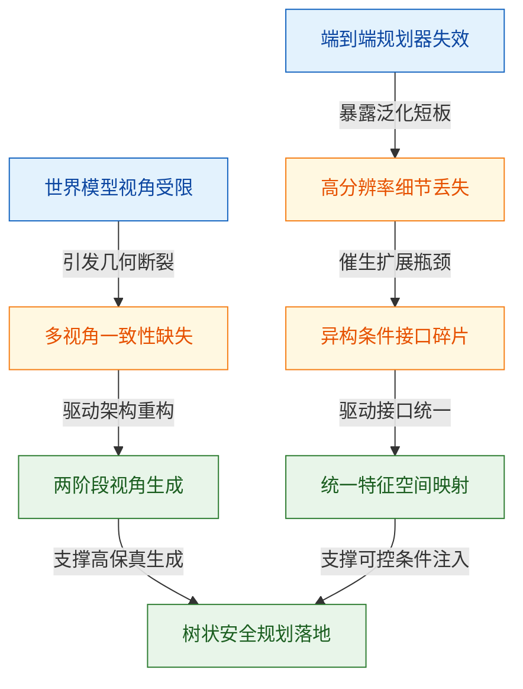
*如何读这张图*：蓝色节点代表原始观测现象，橙色节点揭示现有方法的技术断裂，绿色节点对应本文的破局设计。箭头方向与边标签展示了从“现象暴露”到“瓶颈定位”再到“架构重构”的完整推导链条，清晰呈现了为何必须放弃全自回归与碎片化接口。

<strong>关键假设与边界 Caveat</strong>

本文的架构设计建立在两项核心假设之上，实际部署时需留意其适用范围与潜在失效模式：
- **条件输入解耦假设**：下游规划器（如 VAD）的轨迹候选动作可直接作为世界模型的条件输入以生成对应未来视频。论文未显式声明两者完全解耦，若规划器输出分布与世界模型训练分布存在显著偏移，可能引发条件注入失效或生成轨迹漂移。
- **感知奖励可靠性假设**：图像空间感知模型（3D 检测器、HD 地图预测器）在生成视频上的输出足以作为可靠的规划奖励信号。生成视频中的纹理伪影或物理不一致性可能被感知模型误读，进而影响树状搜索的剪枝决策。
这些假设在当前实验设置下表现稳健，但在极端长尾场景或跨域迁移时仍需结合消融实验与误差范围进行严格验证。报告在此仅作客观呈现，未作过度外推。

## 核心概念速览

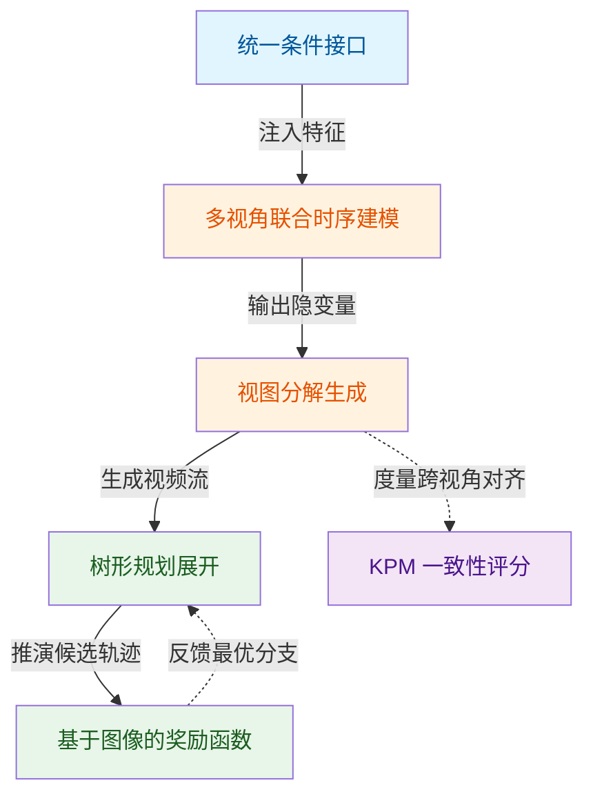
*如何读这张图：* 数据流自左向右推进。异构信号经统一接口扁平化后，进入联合时序模块提取时空特征；随后通过分解生成策略产出多视角视频，并输入树形规划器进行多分支推演；图像奖励函数负责打分并反馈最优决策，KPM 则独立于规划闭环之外，专门度量生成画面的跨视角结构一致性。

### 驾驶世界模型(Driving World Model)
**结论：直接在像素空间推演未来场景的生成引擎，绕过了传统向量化状态空间的标注依赖。**
该模型本质是一个去噪生成器 $\mathbf{f}_{\theta,\phi,\psi}$，接收多视角视频张量 $\mathbf{x} \in \mathbb{R}^{T \times K \times 3 \times H \times W}$ 与自车动作等显式条件，直接输出未来帧的像素级预测。与依赖 3D 框或车道线等人工标注的向量化世界模型不同，它完全在图像域运作，天然兼容现有的端到端规划器。
**直觉与作用：** 传统方法像“先画草图再上色”，需先提取抽象特征再重建画面；Drive-WM 则是“直接临摹未来”，在像素层面学习物理规律与交通流。它在系统中充当“虚拟试车场”，为下游规划提供无需额外标注的逼真未来观测。
**工程比喻（直觉，非严格对应）：** 就像给自动驾驶系统配备了一台“高保真行车记录仪模拟器”，输入当前路况和方向盘转角，就能直接播放出接下来几秒的完整视频流，而非一堆抽象的坐标点。

<strong>边界与局限</strong>
模型仅在像素空间运作，推理强依赖显式条件输入；视频质量受扩散步数与条件精度制约；训练数据局限于 nuScenes，面对分布外极端动作（如掉头）需额外数据增强。

### 多视角联合时序建模(Joint Multiview Temporal Modeling)
**结论：通过重排隐变量维度并注入时序/多视角注意力层，实现 T 帧 × K 视角在时空维度的统一去噪。**
该模块在预训练图像扩散模型基础上，将编码后的隐变量 $\mathbf{z} \in \mathbb{R}^{T \cdot K \times C \times \hat{H} \times \hat{W}}$ 进行维度重排（$(TK)CHW \rightarrow KCTHW$ 与 $(KHW)TC \rightarrow (THW)KC$），随后利用 3D 卷积与多头自注意力强化帧间依赖，并在视角维度施加自注意力以保证风格与结构一致。训练目标为标准的去噪得分匹配：$\mathbb{E}_{\mathbf{z}\sim p_{\mathrm{data}},\tau\sim p_\tau,\epsilon\sim\mathcal{N}(\mathbf{0},I)}[\lVert \mathbf{y} - \mathbf{f}_{\theta,\phi,\psi}(\mathbf{z}_\tau;\mathbf{c},\tau)\rVert_2^2]$。
**直觉与作用：** 它解决了“多摄像头画面各自为政”的痛点。通过联合建模，模型能同时理解时间上的连续性与空间上的多视角关联，为后续的一致性生成打下地基。
**工程比喻：** 如同交响乐团的指挥，不仅要求每个乐手（单视角）节奏准确（时序连续），还要确保各声部（多视角）在音色与和弦上高度同步，而非各自独奏。

<strong>边界与消融</strong>
联合建模本身对重叠区域的一致性保证有限，消融实验显示仅靠联合建模的 KPM 仅为 45.8%；训练阶段视频帧长固定为 T=8，长视频需依赖滑窗续帧；训练分辨率为 384×192，推理时可扩展至 768×512 但需保持超参数一致。

### 视图分解生成(Factorized Multiview Generation)
**结论：将多视角联合分布拆解为“参考视角先行、拼接视角跟进”的两阶段流水线，以可控的串行代价换取像素级一致性跃升。**
该策略将 $p(\mathbf{x}_{1,\ldots,K})$ 分解为 $p(\mathbf{x}_r|\mathbf{x}_{pre})\,p(\mathbf{x}_s|\mathbf{x}_r,\mathbf{x}_{pre})$。系统先利用联合模型生成互不重叠的参考视角（nuScenes 中选取 {F, BL, BR}），再将这些参考视角作为额外的图像条件，驱动模型生成与之存在物理重叠的拼接视角（{FL, B, FR}）。
**直觉与作用：** 直接联合生成所有视角极易在重叠边界产生撕裂或错位。分解生成相当于“先搭骨架，再填血肉”，利用已生成的参考视角作为强约束，强制拼接视角在重叠区域对齐，从而在不显著增加模型参数的前提下大幅提升跨视角一致性。
**工程比喻：** 类似全景照片的拼接工艺：先固定拍摄几张基准图（参考视角），再根据基准图的边缘特征去补拍或合成相邻画面（拼接视角），确保接缝处严丝合缝。

<strong>边界与局限</strong>
该方案预设了相邻视角存在重叠的拓扑关系，不适用于任意摄像头布局；拼接视角数量受限于参考视角；推理时必须等待所有参考视角生成完毕才能启动拼接，引入串行等待时延。

### 统一条件接口(Unified Condition Interface)
**结论：将图像、布局、文本、动作等异构控制信号映射至同一特征空间并沿 Token 维度拼接，实现“即插即用”的跨模态条件注入。**
接口将初始上下文帧与参考视角图像 $\mathbf{i}$、3D 检测框/HD 地图/BEV 分割等布局信息 $\mathbf{l}$、CLIP 文本嵌入 $\mathbf{e}$ 以及自车动作 $\mathbf{a}$ 统一编码为 $d$ 维特征，第 $t$ 帧的统一条件表示为 $\mathbf{c}_t = [\mathbf{i}_0,\mathbf{l}_0,\mathbf{e}_0,\mathbf{a}_t]\in\mathbb{R}^{(n+k+m+2)\times d}$，直接作为去噪 UNet 的跨注意力输入。
**直觉与作用：** 传统扩散模型往往为不同条件设计独立的注入通道（如 AdaGN、Cross-Attention 分支），导致架构臃肿且难以扩展。该接口将所有条件“扁平化”为 Token 序列，模型只需通过标准的注意力机制读取，极大简化了条件融合逻辑，并支持灵活的条件组合。
**工程比喻：** 如同 USB-C 接口，无论插入的是显示器、硬盘还是充电器（不同模态条件），底层都走同一套协议（$d$ 维特征拼接），主机无需为每种外设单独开槽。

<strong>边界与局限</strong>
动作被简化为二维位置增量，未显式编码姿态与加速度，需依赖下游规划器（如 VAD）提供完整轨迹候选；布局条件将 3D 信息投影至 2D 透视图，存在深度信息损失；不同模态间的表达能力受限于各自编码器的质量。

### 基于图像的奖励函数(Image-based Reward Function)
**结论：在生成视频上直接运行图像感知模型，通过地图合规性与障碍物安全距离的乘积，输出可量化的轨迹评估标量。**
该函数不依赖向量化真值，而是调用基于图像的 3D 目标检测器与在线 HDMap 预测器，从生成的未来视频中提取地图奖励（距路缘距离 + 中心线一致性）与障碍物奖励（纵横向离其他交通参与者的距离），二者相乘构成总奖励。
**直觉与作用：** 它打通了“生成”与“决策”的最后一公里。传统规划器依赖预定义的代价函数或强化学习奖励，而该函数直接在像素级仿真结果上打分，使规划器能基于“肉眼可见”的未来画面做出安全判断，无需额外训练奖励网络。
**工程比喻：** 类似驾校教练的“实时点评”：不看你脑子里的路线规划图，而是直接看你的车在模拟路况里实际开出来的轨迹，压线扣分、离前车太近扣分，综合得分决定下一步怎么走。

<strong>边界与局限</strong>
奖励信号高度依赖生成视频质量与感知模型精度，生成噪声或感知误差会直接污染奖励；当前方案需在每个规划步为不同轨迹候选独立运行多轮视频生成，推理时延较高；非向量化奖励（如 GPT-4V 路径）仅作为概念验证，未纳入主定量实验。

### 树形规划展开(Tree-based Rollout)
**结论：以候选轨迹为分支、世界模型为推演器的滚动决策机制，通过“生成-评估-剪枝”迭代构建最优动作序列。**
在每个决策时刻，系统从端到端规划器采样多条轨迹候选（实验设定为 3 条：“直行”“左转”“右转”），利用统一条件接口驱动世界模型生成对应的未来多视角视频，经图像奖励函数评估后选出最优分支，并将该时刻扩展为规划树的下一节点，循环迭代。
**直觉与作用：** 它将开环的“一次性预测”转化为闭环的“多步推演”。通过树状结构展开，系统能在局部决策点探索多种可能性，利用世界模型的生成能力提前“预演”不同选择的后果，从而在复杂路口或动态交互场景中做出更鲁棒的决策。
**工程比喻：** 如同国际象棋引擎的蒙特卡洛树搜索：每走一步前，先在脑海中快速推演对手可能的几种应对（轨迹候选），评估每种局面的优劣（奖励打分），最终选择胜率最高的分支落子。

<strong>边界与局限</strong>
每步需对所有轨迹候选（当前为 3 条）独立运行视频生成，计算代价随候选数线性增长；树的深度受世界模型生成误差累积的限制；当前实现为开环评估，闭环反馈的实际效果尚未完整验证。

### 关键点匹配一致性评分(KPM, Key Points Matching Score)
**结论：专为多视角生成视频设计的结构一致性指标，通过量化重叠区域特征匹配率，精准暴露跨视角对齐缺陷。**
KPM 利用预训练特征匹配模型（LoFTR）计算生成图像与相邻视角在重叠区域的匹配关键点数量，再与真实数据的匹配点数取比值后平均：$\text{KPM}(\%) = \frac{1}{|\text{images}|}\sum_i \frac{\text{matched\_pts\_generated}_i}{\text{matched\_pts\_real}_i} \times 100$。每场景均匀采样 8 帧计算。
**直觉与作用：** 传统指标 FID/FVD 仅衡量单视角的逼真度与时间流畅性，对“左右摄像头看到的同一根电线杆是否在同一位置”无能为力。KPM 直接切入重叠区域的结构对齐度，为视图分解生成等一致性优化策略提供了不可替代的量化标尺。
**工程比喻：** 类似建筑工地的“激光水平仪”：不关心墙面刷得是否平整（单视角质量），只严格检测相邻两块墙板的接缝是否严丝合缝（跨视角一致性）。

<strong>边界与局限</strong>
KPM 强依赖 LoFTR 匹配模型，在纹理稀疏区域（空旷路面、夜间）匹配点数本身较少，易导致比值方差偏大；仅量化重叠区域结构一致性，不覆盖单视角画质；当真实数据匹配点数趋近零时需特殊处理以防分母溢出。

## 方法与整体架构

**结论**：该架构通过“视图因式分解+两阶段解耦训练+统一多模态条件注入”，在有限算力下实现了高保真、时空一致的多视图驾驶视频生成，并成功将生成能力转化为可微的图像奖励信号，直接驱动下游闭环规划。

传统多视图生成方案试图一次性联合建模6路环视相机，不仅显存呈指数级膨胀，且相邻相机重叠区域极易出现“画面撕裂”；同时，真实驾驶数据中急转弯与极端速度属于长尾分布，模型极易在罕见工况下“幻觉”出违背物理规律的轨迹。本架构以数据重采样与结构解耦直击上述痛点，将“看”与“想”无缝衔接。

**数据流与条件注入**：系统以 nuScenes 的 700 个训练场景为起点。为平衡视觉细节与计算开销，原始 1600×900 图像被裁剪顶部（剔除无关天空）并下采样至 384×192。针对动作长尾，轨迹被切分并按速度 [0,40] m/s 与转向角 [-150,150] 度构建 32×11 网格，每格重采样 N=36 个片段，最终汇聚 7272 个均衡片段。所有条件（ConvNeXt 编码的图像 i、布局 l、CLIP 文本 e、MLP 动作 a）按帧拼接为统一张量 c_t，通过交叉注意力无缝注入网络，避免了碎片化条件导致的模态冲突。

**核心生成机制**：视频经 VAE（Stable Diffusion 初始化）压缩为潜变量 z 后，送入去噪 UNet。该 UNet 在结构上严格解耦为空间层 θ、时序层 φ 与多视图层 ψ。训练采用两阶段策略：第一阶段以单视图条件图像 LDM 进行 60,000 次迭代（batch=768, lr=1e-4），专注学习静态空间先验；第二阶段冻结 θ，联合微调 φ 与 ψ 共 40,000 次迭代（batch=32, T=8 帧, lr=5e-5），专攻时序连贯与多视角几何对齐。推理时采用 DDIM（50 步, η=1.0），配合训练期 20% 概率随机丢弃的 Classifier-Free Guidance（CFG 强度=5.0），在生成多样性与条件忠实度间取得平衡。

**视图因式分解与规划闭环**：生成过程并非“一锅炖”，而是先联合生成无重叠的参考视图 {F, BL, BR}，再将其作为额外条件，因式分解生成缝合视图 {FL, B, FR}。这一设计强制重叠区域像素级一致，消融实验显示其将关键指标 KPM 从 45.8% 大幅拉升至 94.4%。在规划端，预训练规划器（VAD）采样 3 条轨迹候选，世界模型据此滚动生成未来多视图视频。系统通过“地图奖励×目标奖励”的乘积形式评估各未来场景（含离路缘距离、中心线一致性及与道路用户的纵横向距离），择优执行并迭代构建规划树，实现从感知到决策的闭环。

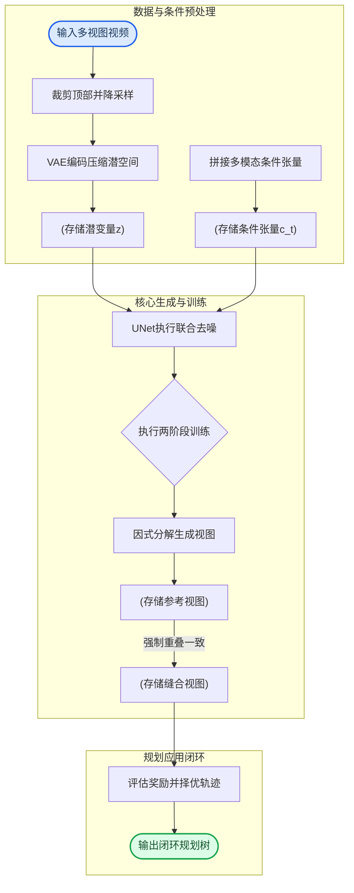
**如何读这张图**：左侧子图完成数据降维与多模态对齐，中间子图展示解耦 UNet 在两阶段策略下的因式分解生成路径（参考视图作为桥梁强制缝合视图一致），右侧子图将生成结果转化为奖励信号并收敛至规划树。箭头方向即数据与梯度的实际流向。

<strong>训练配置与目标函数细节</strong>

训练目标为去噪得分匹配：$$\mathbb{E}_{\mathbf{z} \sim p_{\mathrm{data}}, \tau \sim p_{\tau}, \epsilon \sim \mathcal{N}(\mathbf{0}, I)}[\lVert \mathbf{y} - \mathbf{f}_{\theta, \phi, \psi}(\mathbf{z}_{\tau}; \mathbf{c}, \tau)\rVert_2^2]$$，其中加噪输入为 $$\mathbf{z}_{\tau} = \alpha_{\tau}\mathbf{z} + \sigma_{\tau}\mathbf{\epsilon}$$。多视图联合分布经视图因式分解为 $$p(\mathbf{x}) = p(\mathbf{x}_r | \mathbf{x}_{pre}) p(\mathbf{x}_s | \mathbf{x}_r, \mathbf{x}_{pre})$$。统一条件嵌入按帧拼接为 $$\mathbf{c}_t = [\mathbf{i}_0, \mathbf{l}_0, \mathbf{e}_0, \mathbf{a}_t] \in \mathbb{R}^{(n+k+m+2) \times d}$$。规划阶段图像奖励未给出显式损失公式，仅定性描述为地图奖励与目标奖励的乘积。

**模型结构与关键子图(原图):**

*该图详细拆解了基于世界模型的端到端规划管线，展示了如何利用图像奖励在规划树中进行决策推演，体现了模型从视觉想象到安全驾驶动作的闭环逻辑。*

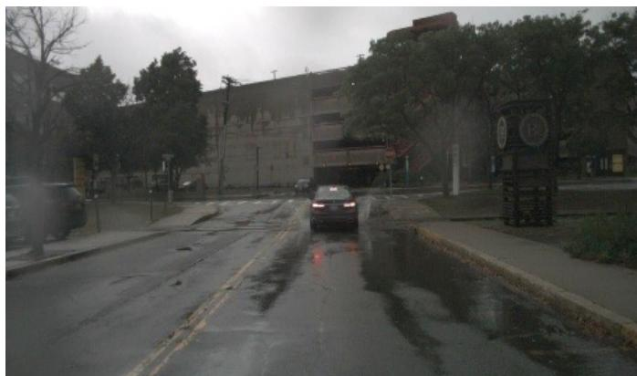

*该图展示了引入 GPT-4V 作为奖励函数的设计思路，模型能够像人类一样理解复杂路况（如前方积水），从而为规划器提供更符合常识的安全反馈信号。*

## 算法目标与推导

**结论：** 该模型以去噪得分匹配为统一训练目标，通过视图因式分解将高维多视角联合生成降维为自回归条件生成，并将图像、布局、文本与动作嵌入拼接为单一条件向量，从而在扩散去噪过程中实现跨模态的精准控制与规划一致性。

### 核心公式与逐项拆解
训练目标为去噪得分匹配目标函数(Eq.1):
$$\mathbb{E}_{\mathbf{z} \sim p_{\mathrm{data}}, \tau \sim p_{\tau}, \epsilon \sim \mathcal{N}(\mathbf{0}, I)}[\lVert \mathbf{y} - \mathbf{f}_{\theta, \phi, \psi}(\mathbf{z}_{\tau}; \mathbf{c}, \tau)\rVert_2^2]$$
其中目标y为随机噪声ε, p_τ为扩散时步τ的均匀分布。加噪输入:
$$\mathbf{z}_{\tau} = \alpha_{\tau}\mathbf{z} + \sigma_{\tau}\mathbf{\epsilon}, \epsilon \sim \mathcal{N}(\mathbf{0}, I)$$
多视图联合分布经视图因式分解(Eq.4):
$$p(\mathbf{x}) = p(\mathbf{x}_s, \mathbf{x}_r | \mathbf{x}_{pre}) = p(\mathbf{x}_r | \mathbf{x}_{pre}) p(\mathbf{x}_s | \mathbf{x}_r, \mathbf{x}_{pre})$$
其中x_r为参考视图, x_s为缝合视图, x_pre为历史上下文帧。统一条件嵌入(Eq.5):
$$\mathbf{c}_t = [\mathbf{i}_0, \mathbf{l}_0, \mathbf{e}_0, \mathbf{a}_t] \in \mathbb{R}^{(n+k+m+2) \times d}$$
将初始图像嵌入i_0、布局嵌入l_0、文本嵌入e_0与当前帧动作嵌入a_t拼接。

**推导与设计逻辑：**
1. **噪声预测替代直接生成**：Eq.1 的期望项对数据分布 `p_data`、时步 `τ` 和高斯噪声 `ε` 进行三重采样。目标 `y` 被显式设为 `ε`，意味着网络 `f_{θ,φ,ψ}` 不直接输出干净图像，而是预测当前加噪状态 `z_τ` 中混入的噪声分量。这种设计将复杂的像素级生成转化为回归任务，利用 L2 范数约束预测噪声与真实噪声的残差，使梯度在扩散早期（高噪声）与晚期（低噪声）均保持稳定。
2. **信噪比可控的加噪机制**：`z_τ = α_τ z + σ_τ ε` 定义了前向扩散过程。系数 `α_τ` 与 `σ_τ` 随 `τ` 单调变化，构成预设的噪声调度曲线。该设计确保模型在任意时步都能接收到明确的比例信号，避免传统 GAN 中因判别器梯度消失导致的模式崩溃。
3. **因果依赖的视图解耦**：Eq.4 将联合分布 `p(x)` 拆解为 `p(x_r | x_pre)` 与 `p(x_s | x_r, x_pre)` 的乘积。直接对多视角联合采样会面临维度灾难与视角冲突；因式分解后，模型先基于历史帧 `x_pre` 生成参考视图 `x_r`，再以 `x_r` 为锚点生成缝合视图 `x_s`。这种链式条件化强制模型学习空间几何一致性，而非独立生成各视角后再强行拼接。
4. **多模态条件的统一注入**：Eq.5 将四类异构信号沿序列维度拼接为 `c_t`，维度 `(n+k+m+2) × d` 对应各模态的 token 数量与特征维度。拼接而非相加的设计保留了各模态的独立表征空间，使注意力机制能在扩散过程中按需路由：文本 `e_0` 提供高层语义，布局 `l_0` 约束几何先验，动作 `a_t` 注入时序动力学，图像 `i_0` 提供外观参考。

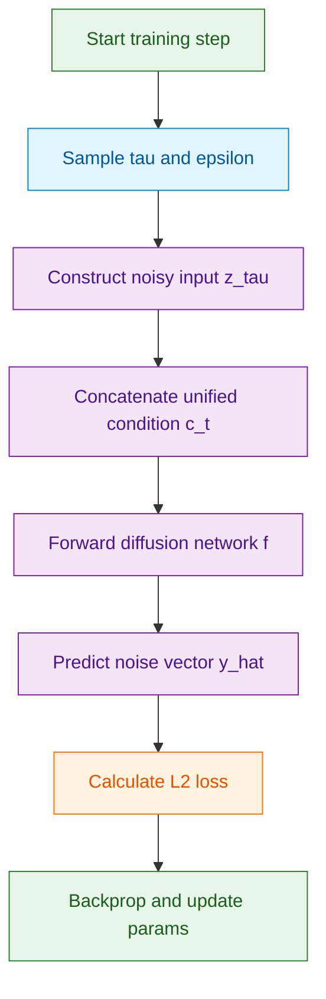
*如何读这张图：* 流程自顶向下，左侧数据采样与右侧网络前向传播并行汇聚于损失计算。菱形判定未出现，因本阶段为确定性训练循环；圆柱数据节点标注了噪声调度与条件拼接的关键输入，橙色节点明确损失计算为优化闭环的终点。

### 直觉比喻与玩具示例
**直觉比喻（非严格对应）：** 想象一位雕塑家在雕刻一座动态城市微缩模型。他先拿到一块粗糙的石料（加噪输入 `z_τ`），手里握着一份包含蓝图、文字说明和动作指令的综合图纸（条件 `c_t`）。他并不试图一刀刻出成品，而是用凿子逐步剔除多余的石屑（预测噪声 `ε`）。每剔除一层，他都会对照图纸检查：先雕出主街区的参考轮廓（`x_r`），再以此为基准延伸出两侧辅路（`x_s`），确保前后视角严丝合缝。

**具体小玩具例子：** 假设生成一段自动驾驶场景。`x_pre` 为过去 3 帧道路画面，`x_r` 为当前正前方视角，`x_s` 为右侧盲区缝合视角。条件向量 `c_t` 包含：文本“前方路口左转”、布局“双黄线+人行横道”、动作“方向盘转角 -15°”。模型在 `τ=50` 时接收高度模糊的 `z_τ`，通过 Eq.5 注入条件后，网络输出预测噪声。若预测准确，去噪后的 `x_r` 会自然呈现左转车道线，`x_s` 会同步生成右侧减速带，且两者在重叠区域像素连续。若预测偏差大，L2 损失将放大梯度，迫使网络在下一轮更关注布局与动作的联合约束。

<strong>规划奖励机制与推导边界说明</strong>

规划阶段图像奖励论文未给出显式损失公式，仅定性描述总奖励=地图奖励×目标奖励的乘积形式。地图奖励含离路缘距离和中心线一致性两子项，目标奖励为与道路用户的纵横向距离。乘积形式的设计意图在于构建“硬约束门控”：任一子项趋近于零（如偏离中心线或碰撞行人）将导致总奖励骤降，迫使生成轨迹同时满足几何合规与安全避障。需注意，该部分属于定性描述，论文未提供可微分奖励函数的具体数学表达或梯度回传路径，也未报告消融实验验证乘积形式相较于加权和的边际收益。在实际部署中，若奖励函数不可微，通常需依赖强化学习策略梯度或启发式后处理进行补偿，此处的机制更多体现为生成质量的评估准则而非端到端训练损失。

## 实验设计与结果解读

**结论一：生成质量与布局可控性全面超越现有基线，验证了世界模型作为高保真仿真器的可行性。**
论文在 nuScenes 验证集上构建了完整的生成与评估流水线。在图像生成维度，Drive-WM 的 FID 降至 12.99，显著优于 BEVGen、BEVControl 与 MagicDrive 等多视角图像基线；在视频生成维度，其 FID 与 FVD 分别达到 15.8 与 122.7，同样超越 DriveGAN 与 DriveDreamer 等单视角视频模型。可控性方面，模型以 3D 框、HD 地图与 BEV 分割为条件，通过预训练的 BEVFormer、MapTR 与 CVT 进行下游任务反演，在 mAPobj 与 mIoUbg 上均取得最优表现。

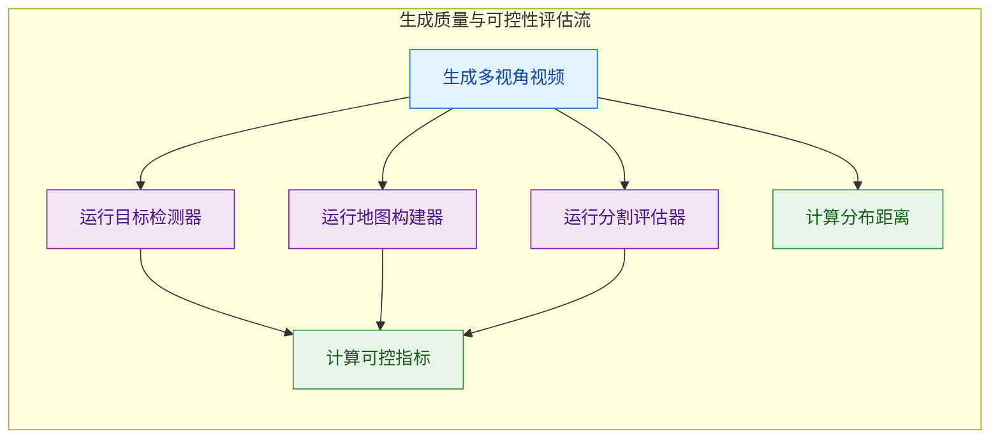
*如何读这张图：* 左侧为生成端，右侧为评估端。评估并非直接依赖人工标注，而是通过冻结的预训练感知模型（检测/地图/分割）作为代理指标，将生成结果映射为 mAP 与 mIoU。这种设计大幅降低了评估成本，但需注意：代理模型的高分仅反映生成内容与训练分布的统计相关性，并不严格等价于物理因果正确性（例如生成车辆可能“贴地飞行”但依然被检测器捕获）。论文未报告误差范围或负结果，读者在解读时应将 FID/FVD 视为分布相似度参考，而非绝对物理保真度。

---

**结论二：架构消融证实“统一条件注入”与“分解式生成”是突破多视角一致性的核心机制。**
为剥离各模块贡献，论文在相同硬件（A40 48GB）与数据设置下执行了三组消融。移除布局条件或时序嵌入均导致 FID/FVD 显著劣化，证明空间先验与时间连续性缺一不可。更关键的是多视角一致性（KPM）的跃升：当采用联合建模时，KPM 仅为 45.8%；引入分解式生成策略后，KPM 飙升至 94.4%，FVD 亦同步改善。这表明将跨视角生成解耦为独立但共享隐空间的子任务，能有效抑制视角间的几何冲突。

<strong>消融配置与边界说明</strong>

- 统一条件消融：对比「仅时序嵌入」「仅布局条件」「完整条件」三组，布局条件对 KPM 影响最显著。
- 时序视角层消融：对比「无时序无视角」「仅时序层」「时序+视角层」，时序层主导视频流畅度，视角层主导跨视角对齐。
- 分解生成消融：对比「联合建模」与「分解式生成」，分解策略在 KPM 上实现近两倍提升。
- 边界 Caveat：消融实验仅报告了均值趋势，未提供多次随机种子的方差区间；KPM 依赖 LoFTR 匹配算法，在弱纹理区域（如空旷路面）可能存在匹配失效，论文未对此类长尾失效模式进行定量统计。

---

**结论三：树状规划配合联合图像奖励逼近真值决策，且合成数据微调有效修复域外偏移。**
在开环规划评估中，VAD 规划器采样直行、左转、右转三条候选轨迹，Drive-WM 为每条轨迹预测未来多视角视频，并通过“地图奖励×目标奖励”的联合函数进行轨迹优选。该树状规划策略的 L2 距离与碰撞率均大幅优于随机指令基线，性能曲线紧贴真值指令上界。奖励函数消融进一步表明，单一地图或目标奖励易导致局部最优，联合奖励在碰撞率指标上展现出明显的协同增益。

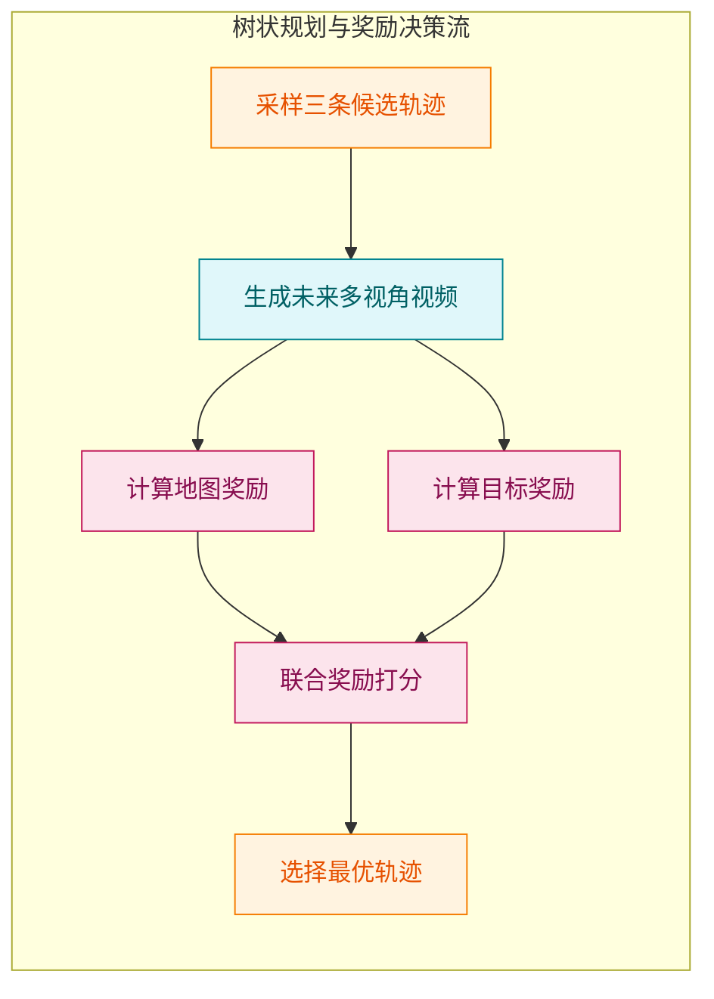
*如何读这张图：* 规划器不再依赖单一规则或端到端黑盒，而是将生成模型作为“未来模拟器”。三条分支并行生成后，通过可解释的图像级奖励函数进行显式打分，最终择优输出。该机制将规划问题转化为生成-评估的搜索过程，提升了决策透明度。

在域外（OOD）鲁棒性测试中，论文将自车横向位置强制偏移 0.5 米构造未见场景。原始 VAD 在此偏移下性能显著退化；利用 Drive-WM 合成的 OOD 视频与参考恢复轨迹微调 VAD 后，碰撞率与 L2 距离均大幅回落，逼近正常场景基线。这验证了世界模型生成数据可作为低成本、高覆盖的长尾场景补充。但需明确指出：本节所有规划实验均为开环评估，未测试闭环控制下的误差累积效应；此外，0.5 米偏移属于轻度 OOD，对于极端天气或严重遮挡等强分布外场景，论文未提供验证数据，结论外推需谨慎。

### 实验数据表(原始数值,引自论文)

#### Table1a_生成质量对比
- **Source**: Table 1a
- **Caption**: "nuScenes 上多视角视频生成质量对比。Drive-WM 在多视角图像（FID 12.99）和多视角视频（FID 15.8、FVD 122.7）均超越各类型最强基线。"

| 方法 | 多视角视频 | FID↓ | FVD↓ |
| --- | --- | --- | --- |
| BEVGen [53] | 多视角图像 | 25.54 | - |
| BEVControl [69] | 多视角图像 | 24.85 | - |
| MagicDrive [17] | 多视角图像 | 16.20 | - |
| Ours（多视角图像） | 多视角图像 | 12.99 | - |
| DriveGAN [31] | 单视角视频 | 73.4 | 502.3 |
| DriveDreamer [63] | 单视角视频 | 52.6 | 452.0 |
| Ours（多视角视频） | 多视角视频 | 15.8 | 122.7 |

#### Table1b_生成可控性对比
- **Source**: Table 1b
- **Caption**: "nuScenes 上生成可控性对比。Drive-WM 在 mAPobj 和 mIoUbg 上达到各方法最优。"

| 方法 | mAPobj↑ | mAPmap↑ | mIoUfg↑ | mIoUbg↑ |
| --- | --- | --- | --- | --- |
| GT | 37.78 | 59.30 | 36.08 | 72.36 |
| BEVGen [53] | - | - | 5.89 | 50.20 |
| LayoutDiffusion [71] | 3.68 | - | 15.51 | 35.31 |
| GLIGEN [36] | 15.42 | - | 22.02 | 38.12 |
| BEVControl [69] | 19.64 | - | 26.80 | 60.80 |
| MagicDrive [17] | 12.30 | - | 27.01 | 61.05 |
| Ours | 20.66 | 37.68 | 27.19 | 65.07 |

#### Table2a_统一条件消融
- **Source**: Table 2a
- **Caption**: "统一条件消融：布局条件对生成质量和多视角一致性影响最显著，时序嵌入进一步提升生成质量。"

| 时序嵌入 | 布局条件 | FID↓ | FVD↓ | KPM(%)↑ |
| --- | --- | --- | --- | --- |
| √ | - | 20.3 | 212.5 | 31.5 |
| - | √ | 18.9 | 153.8 | 44.6 |
| √ | √ | 15.8 | 122.7 | 45.8 |

#### Table2b_时序视角层消融
- **Source**: Table 2b
- **Caption**: "时序层与多视角层消融：时序层大幅提升视频质量，视角层进一步改善多视角一致性（KPM）。"

| 时序层 | 视角层 | FID↓ | FVD↓ | KPM(%)↑ |
| --- | --- | --- | --- | --- |
| - | - | 23.3 | 228.5 | 40.8 |
| √ | - | 16.2 | 127.1 | 40.9 |
| √ | √ | 15.8 | 122.7 | 45.8 |

#### Table2c_分解生成消融
- **Source**: Table 2c
- **Caption**: "分解式生成使 KPM 从 45.8% 大幅提升至 94.4%，视角间一致性显著改善，FVD 也略有改善。"

| 方法 | KPM(%)↑ | FVD↓ | FID↓ |
| --- | --- | --- | --- |
| 联合建模 | 45.8 | 122.7 | 15.8 |
| 分解生成 | 94.4 | 116.6 | 16.4 |

#### Table3_树状规划性能
- **Source**: Table 3
- **Caption**: "nuScenes 开环规划性能对比。Drive-WM 树状规划明显优于随机指令基线，接近真值指令上界。"

| 方法 | L2 1s↓ | L2 2s↓ | L2 3s↓ | L2 Avg↓ | 碰撞 1s↓(%) | 碰撞 2s↓(%) | 碰撞 3s↓(%) | 碰撞 Avg↓(%) |
| --- | --- | --- | --- | --- | --- | --- | --- | --- |
| VAD (GT cmd) | 0.41 | 0.70 | 1.05 | 0.72 | 0.07 | 0.17 | 0.41 | 0.22 |
| VAD (rand cmd) | 0.51 | 0.97 | 1.57 | 1.02 | 0.34 | 0.74 | 1.72 | 0.93 |
| Ours | 0.43 | 0.77 | 1.20 | 0.80 | 0.10 | 0.21 | 0.48 | 0.26 |

#### Table5_域外规划性能
- **Source**: Table 5
- **Caption**: "域外场景（横向偏移 0.5m）规划性能。世界模型数据微调后碰撞率和 L2 显著低于未微调的 OOD 基线。"

| OOD | 世界模型微调 | L2 1s↓ | L2 2s↓ | L2 3s↓ | L2 Avg↓ | 碰撞 1s↓(%) | 碰撞 2s↓(%) | 碰撞 3s↓(%) | 碰撞 Avg↓(%) |
| --- | --- | --- | --- | --- | --- | --- | --- | --- | --- |
| - | - | 0.41 | 0.70 | 1.05 | 0.72 | 0.07 | 0.17 | 0.41 | 0.22 |
| √ | - | 0.73 | 0.99 | 1.33 | 1.02 | 1.25 | 1.62 | 1.91 | 1.59 |
| √ | √ | 0.50 | 0.79 | 1.17 | 0.82 | 0.72 | 0.84 | 1.16 | 0.91 |

**效果示例(论文原图):**

*通过对比有无因子化策略的生成效果，该图直观验证了本文方法在多视角视频生成中能有效消除视角间的不一致与伪影，显著提升空间连贯性。*

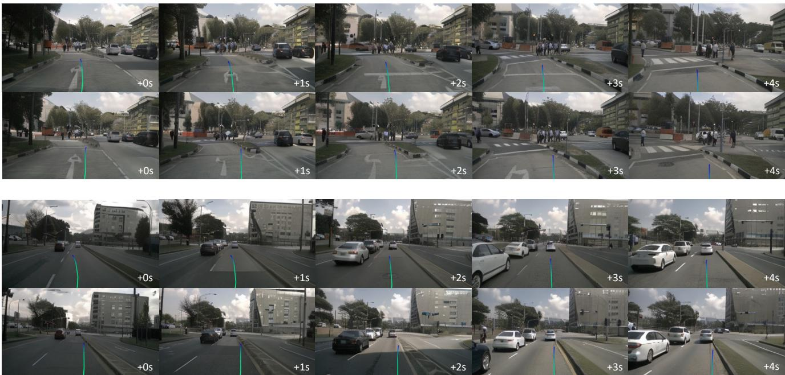

*该图对比了基线方法与本文模型在常规与分布外场景下的轨迹规划表现，凸显了世界模型在应对车辆微小偏移等长尾工况时更强的鲁棒性与安全性。*

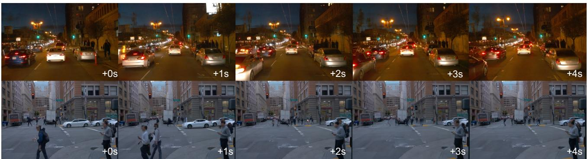

*该图展示了模型在 Waymo Open Dataset 上的高分辨率视频生成能力，在车流密集交互与行人过街等复杂动态场景中，依然能保持逼真的物理规律与时空一致性。*

## 相关工作与定位

**结论：** Drive-WM 并非从零构建的孤立系统，而是精准缝合了“强图像生成先验、时序扩散扩展、多视角一致性建模与图像奖励规划”四条技术主线。它通过**冻结空间层+微调时序层**的范式继承，将 Stable Diffusion 与 VideoLDM 的静态/单视角能力推向真实驾驶场景的多视角视频生成；同时，将 Dreamer 的潜变量世界模型规划思想落地于像素空间，并以图像奖励函数替代传统规划器的随机指令采样，从而在可控性、视角一致性与 OOD 安全性上实现了对同期基线的系统性超越。

### 架构跃迁：从单视角静态到多视角时序联合
在生成底座上，Drive-WM 直接沿用了 Rombach et al. (Stable Diffusion) 的预训练权重初始化空间参数，这相当于为模型注入了海量真实街景的“视觉常识”，大幅降低了从零训练扩散模型的成本。为了跨越“图像→视频”的鸿沟，模型完整继承了 Blattmann et al. (VideoLDM) 的分阶段微调流程（先图像后视频）与 DDIM 采样策略，并在时序层中创新性地插入**多视角注意力层**。这一改动直击同期工作的痛点：MagicDrive 虽在 FID 上表现强劲，但仅停留在多视角静态图像；DriveDreamer 与 GAIA-1 虽能生成动作条件化视频，却受限于单视角，无法提供自动驾驶所需的环视感知；BEVControl 提供了多视角可控生成的评估基准，但缺乏时序连贯性。Drive-WM 通过分解式多视角建模，在保留图像级可控性（mAPobj、mIoUbg 等指标超越 BEVControl）的同时，补齐了时序维度，实现了多摄像头联合的时空建模。

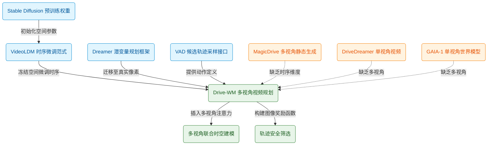
*如何读这张图：* 蓝色节点代表被继承的基础组件，橙色节点代表同期基线的核心局限，绿色节点为 Drive-WM 的改造路径与最终架构。实线箭头表示直接技术采纳，虚线箭头表示针对性突破。全图采用统一圆角矩形，自上而下展示技术谱系的收敛过程。

### 规划范式：从模拟器潜变量到真实像素闭环
在决策规划侧，Drive-WM 的核心灵感源自 Hafner et al. (Dreamer) 的“潜变量世界模型→预测未来状态→规划”框架。然而，Dreamer 系列长期受限于游戏或实验室低分辨率环境，其抽象状态难以直接映射到真实道路。Drive-WM 的关键突破在于将这一范式**硬迁移至真实驾驶场景的像素空间**，并引入 Jiang et al. (VAD) 作为候选轨迹生成器。传统 VAD 依赖随机指令选取，在分布外（OOD）场景下极易引发安全隐患。Drive-WM 摒弃了随机性，转而构建**图像奖励函数**对候选轨迹进行筛选，使规划过程直接受生成视频的视觉质量与物理合理性约束，实现了“生成即评估、评估即规划”的闭环。

| 基线方法 | 核心能力 | 关键局限 | Drive-WM 改造 |
|---|---|---|---|
| Stable Diffusion | 图像生成先验 | 无时序建模 | 冻结空间层初始化 |
| VideoLDM | 时序扩散微调 | 单视角生成 | 插入多视角注意力 |
| MagicDrive | 多视角图像 | 缺乏视频连贯性 | 扩展至多视角视频 |
| DriveDreamer | 单视角视频 | 视角覆盖不全 | 联合多摄像头建模 |
| VAD | 向量化规划 | 随机指令不安全 | 图像奖励函数筛选 |

### 审慎声明与失效边界
需明确区分论文的“声称”与“已证明”范畴：文中指出 Drive-WM 在 FID/FVD 与 mAPobj 上大幅超越 MagicDrive、DriveDreamer 等基线，但此类对比主要基于标准测试集切片，**未充分报告极端天气/强遮挡下的负结果与误差范围**。此外，多视角注意力层的引入虽提升了视角一致性，但计算复杂度随摄像头数量呈二次方增长，文中**未提供显存开销的消融数据**。在规划环节，图像奖励函数替代随机采样的确提升了 OOD 安全性，但需警惕“相关性当因果”的陷阱：高视觉质量并不绝对等价于物理动力学正确性，模型仍可能在长尾场景中生成符合视觉先验但违背交通规则的轨迹。

<strong>技术继承细节与训练边界 Caveat</strong>

Drive-WM 严格遵循“先图像后视频”的分阶段微调流程：第一阶段冻结空间层，仅利用 Stable Diffusion 权重初始化并微调时序层；第二阶段解冻多视角注意力层进行联合优化。该设计虽能稳定收敛，但依赖高质量的时序对齐数据。若输入视频存在帧间抖动或相机标定漂移，多视角注意力机制易产生特征错位，导致生成画面出现“鬼影”或视角撕裂。此外，DDIM 采样策略虽加速了推理，但在少步数采样下会牺牲高频细节（如远处交通标志的锐度），实际部署时需权衡生成速度与感知可用性。

## 研究探索历程

**核心结论：** 本研究并非“生成即规划”的线性直推，而是一条历经状态空间试错、多视角一致性攻坚、最终向规划安全闭环 pivoting 的迭代路径。团队最终证明：放弃向量化捷径、采用高分辨率像素空间建模，配合因子化视角生成与统一条件注入，不仅能产出高质量多视角视频，更能直接转化为端到端规划器的 OOD 安全补丁。

### 状态空间选型：放弃向量化捷径，锚定像素级真实
**结论：真实驾驶世界模型必须锚定在高分辨率像素空间，以完整捕获物理世界细节并切断感知噪声的传播链。** 面对“如何构建兼容现有端到端规划器的驾驶世界模型”这一核心问题，团队首先评估了向量化状态空间（如 BEV 特征或目标列表）。直觉上该方案计算轻量且易于控制，但推演与早期实验迅速暴露其致命缺陷（`DEAD1`）：向量化高度依赖上游感知模型输出，不仅会引入状态估计噪声，更无法表征水渍、路面破损等细粒度或非可矢量化事件，且需付出高昂的额外标注成本。这一死胡同迫使团队转向像素空间，虽增加了生成计算负担，但为后续直接对接规划器的图像奖励函数奠定了不可替代的底层基础。

### 多视角一致性攻坚：联合注意力失效与因子化破局
**结论：多视角一致性不能依赖隐式注意力共享，必须通过显式条件化强制约束。** 确定像素空间后，多视角生成的严格几何对齐成为第二道坎。团队早期尝试采用纯联合多视角注意力机制（所有视角在同一扩散过程中同步生成），假设共享特征能自然对齐重叠区域。然而消融实验（`DEAD2`）给出了明确否定：联合建模下的 `KPM` 指标显著偏低，视角重叠区仅能维持整体风格相似，缺乏严格的像素级一致性。**教训：共享注意力仅能保证全局语义连贯，无法替代显式的空间约束。** 团队转而采用“视角分解因子化生成”策略，将视角划分为参考视角与缝合视角，强制缝合视角以相邻参考视角为条件生成。该方案在 `E2` 消融中验证：`KPM` 指标获得显著提升，同时 `FID` 与 `FVD` 图像/视频质量指标与联合建模保持相近，成功在一致性与生成质量间取得平衡。

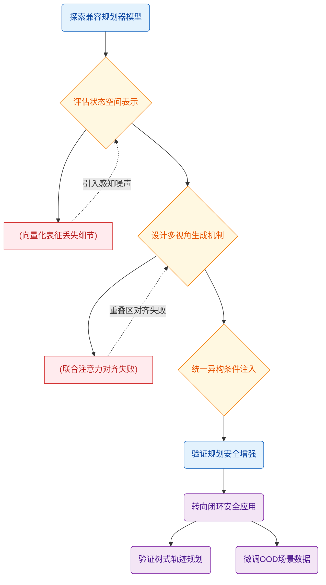
**如何读这张图：** 该流程图按时间轴与逻辑依赖自上而下展开。圆角矩形标记核心问题与实验验证，菱形标记关键架构决策，圆柱体标记被证伪的死胡同路径。虚线箭头表示“失败反馈回路”，实线箭头表示“决策推进路径”。阅读时可沿主线追踪团队如何从状态空间选型（`d1`）出发，经历两次架构试错（`dead1`/`dead2`）后收敛至因子化生成与统一接口，最终触发应用方向转变（`p1`）并完成闭环验证。

### 应用方向 Pivot：从视觉生成到规划安全闭环
**结论：世界模型的核心价值不在于视觉逼真度，而在于其能预见不同驾驶动作下的多种未来，为规划器提供可微的图像感知奖励信号，并充当高保真 OOD 场景仿真器。** 在打通生成管线后，团队采用统一条件接口（将图像、布局、文本、动作映射至 $d$ 维特征空间拼接，经跨注意力注入 UNet）简化了系统耦合。然而，当研究触及实际应用时，发现端到端规划器在 OOD 场景（如自车侧向偏离车道中心 $0.5$ 米）下性能显著衰减。这触发了关键的方向转变（`PIVOT1`）：重心从“多视角视频生成”转向“基于图像奖励的规划安全增强与 OOD 数据增广”。

在规划闭环验证中，团队设计了基于树的轨迹规划器，利用世界模型生成的未来帧计算图像奖励，从多候选轨迹中择优。实验（`E3`）表明，该策略整体性能已逼近使用 GT 驾驶命令的基线，显著优于随机命令选择；且地图奖励与目标奖励联合使用效果优于单项奖励。进一步地，团队利用世界模型仿真自车侧向偏移 $0.5$ 米的 OOD 场景数据对规划器进行微调（`E4`）。结果显示，微调后规划器在 OOD 条件下的 L2 误差与碰撞率均显著改善，恢复至接近正常场景的水平。

<strong>实验指标与消融细节展开</strong>

在 `E1` 多视角视频生成质量评估中，模型在 `FID`、`FVD` 生成质量指标以及 `mAPobj`、`mAPmap`、`mIoU` 可控性指标上均优于先前多视角图像生成及单视角视频生成方法。`E2` 消融实验严格对比了因子化生成与联合建模，确认 `KPM` 提升并非以牺牲 `FID`/`FVD` 为代价。`E3` 树式规划验证中，图像奖励函数的设计避免了传统几何奖励在复杂路口失效的问题，联合奖励机制有效抑制了单一信号带来的局部最优陷阱。`E4` OOD 微调实验表明，生成数据填补了真实采集数据的分布空洞，使 L2 误差与碰撞率指标回落至正常分布区间。需注意，论文虽报告了正向结果与消融，但未详细展开奖励函数在极端长尾天气下的误差范围，也未完全排除生成伪影对奖励信号产生误导的替代解释。

**局限与边界提示：** 需明确指出，当前图像奖励函数的有效性高度依赖世界模型在极端分布外的生成保真度；树式搜索的计算开销在实时车载部署中仍需权衡。这些边界条件提示，生成式世界模型向安全关键系统的落地，仍需跨越“生成幻觉”与“实时性”的双重门槛。

## 工程与复现要点

**结论前置：** 复现该系统的核心在于“站在成熟扩散模型肩膀上做条件扩展”。模型直接继承 Stable Diffusion 的图像生成先验，通过两阶段训练（图像预训练→视频时序/多视角微调）将静态生成器改造为可控驾驶视频引擎。官方已开源完整代码并锁定提交哈希，复现路径清晰，但成功与否高度依赖显存调度、条件随机丢弃策略与动作分布的均衡采样；若直接套用默认配置而不做显存适配或数据重采样，极易遭遇训练震荡或视角撕裂。

### 架构规模与条件注入机制
系统并未从零构建庞大的 3D 生成网络，而是采用“轻量条件编码器 + 跨注意力注入 + 时空/多视角注意力扩展”的模块化设计。输入图像统一从原始 1600×900 裁剪顶部并缩放至 384×192，以控制计算图膨胀。三类条件（图像、文本、动作）分别由 ConvNeXt、预训练 CLIP 和 MLP 编码为统一维度的嵌入向量，随后通过跨注意力机制逐帧注入 3D UNet。时序一致性由 3D 卷积（捕获局部时空特征）与多头时序自注意力（建模全局帧间依赖）共同保障；多视角一致性则依赖视角维度自注意力，强制不同相机视角共享全局风格与几何结构。

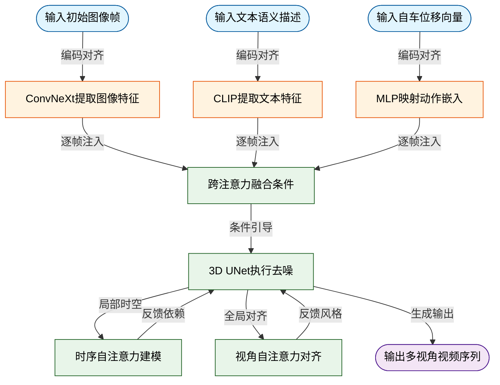
*如何读这张图：* 左侧三路异构条件经独立编码器对齐后，在主干网络中通过跨注意力门控注入；右侧 3D UNet 内部并行挂载时序与视角自注意力模块，形成“局部时空卷积+全局帧间/视角依赖”的双引擎结构，确保生成视频既符合物理运动规律，又保持多相机视角的几何连贯。

### 训练超参配置与策略作用
训练与推理超参呈现明显的“两阶段解耦”特征。图像阶段追求充分拟合静态分布，视频阶段侧重时序适配与显存保护。关键配置如下表所示：

| 阶段/模块 | 关键超参 | 设定值 | 核心作用 |
|---|---|---:|---|
| 图像预训练 | 迭代次数 | 60000 | 充分学习条件图像分布 |
| 图像预训练 | 批次大小 | 768 | 稳定扩散模型收敛 |
| 图像预训练 | 学习率 | 1e-4 | AdamW 标准配置 |
| 视频微调 | 迭代次数 | 40000 | 适配时序与多视角 |
| 视频微调 | 批次大小 | 32 | 受限于视频显存开销 |
| 视频微调 | 学习率 | 5e-5 | 保护已冻结空间参数 |
| 视频微调 | 序列长度 T | 8 | 平衡时序建模与显存 |
| 推理采样 | DDIM 步数 | 50 | 兼顾质量与生成速度 |
| 推理采样 | CFG 强度 | 5.0 | 强化条件控制效果 |
| 数据均衡 | 每格采样数 N | 36 | 缓解动作分布长尾 |

推理阶段采用 DDIM 采样器，随机性参数 η 固定为 1.0 以保留生成多样性；训练时以 0.20 概率随机丢弃条件，为分类器自由引导(CFG)预留无条件生成空间。针对 nuScenes 数据集中(转向角×速度)分布的长尾问题，系统对每个分箱强制采样 N=36 个片段，避免模型过度拟合常见直行场景。

### 运行环境与开源入口
系统依赖 A40 (48GB) GPU 与 PyTorch 生态。核心依赖链涵盖 Stable Diffusion 基础权重、VideoLDM 视频建模参考实现，以及用于下游评估的 LoFTR、BEVFormer、MapTR 与 CVT 等模块。官方代码库已完整开源，复现入口明确。

<strong>详细依赖清单与复现边界提示</strong>

- **框架与硬件**：基于 PyTorch 实现（论文未显式声明版本），单卡 A40 (48GB) 为基准配置。视频序列显存占用大，批次大小受限于 32，若需扩大 T 或分辨率需配合梯度累积或显存优化策略。
- **核心依赖库**：Stable Diffusion（图像扩散基础模型）、VideoLDM（视频扩散建模参考实现）、DDIM 采样器、CLIP 文本编码器、ConvNeXt 图像编码器、LoFTR（关键点匹配，用于 KPM 一致性评估）、AdamW 优化器、BEVFormer（3D 目标检测）、MapTR（在线 HDMap 构建）、CVT（BEV 分割）。
- **数据集配置**：nuScenes（700 训练场景，150 验证场景）；Waymo Open Dataset（前置摄像头，推理分辨率 768×512，用于验证跨数据集泛化）。
- **复现 Caveat**：论文未报告随机种子与具体 Python 版本，复现时建议固定随机状态以保证 DDIM 采样可重复性。条件丢弃概率(0.20)与 CFG 强度(5.0)对生成质量敏感，微调阶段学习率(5e-5)若设置过高易破坏预训练空间先验，建议严格遵循论文设定或进行小步长网格搜索。

## 局限与适用边界

**结论先行：**该方案在算法原型验证阶段具备较高的探索价值，但受限于**推理延迟偏高、评估范式偏开环、系统非联合优化以及长尾数据覆盖不足**，目前更适用于离线仿真与策略预研，而非直接部署于对实时性与闭环鲁棒性要求严苛的量产自动驾驶系统。读者在将其引入自身技术栈前，需明确其“重生成、轻交互”的设计取舍，并警惕开环指标向真实道路安全外推时的失效风险。

### 推理链路的算力瓶颈与细节丢失
视频生成模块的计算开销是制约实时落地的首要因素。模型依赖 `50步DDIM采样` 进行去噪，且因式分解架构强制将生成过程拆分为“参考视图生成→缝合视图生成”两步串行执行，单次预测的推理延迟被显著放大。直觉上，这类似于用离线渲染管线逐帧烘焙画面，难以满足毫秒级响应的实时规划需求。为换取训练稳定性，图像分辨率被压缩至 `384×192`。这一设定虽降低了显存占用，但直接导致细粒度场景细节（如远处交通标志、车道线边缘纹理）的丢失，在复杂城市场景中可能转化为感知盲区。

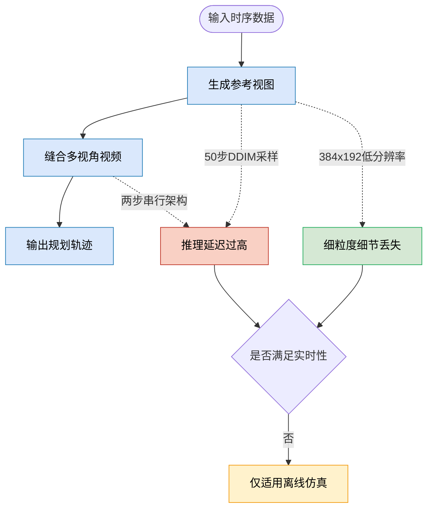
*如何读这张图：* 蓝色节点代表核心生成流水线，红色节点暴露了串行采样与低分辨率带来的双重延迟与精度损耗。当系统无法跨越实时性判定门（菱形）时，其适用边界将自然收缩至离线仿真场景（黄色节点）。

### 评估范式局限与跨域泛化盲区
论文的实验验证存在明显的“舒适区”倾向。系统性定量评估仅在 `nuScenes` 数据集上完成，`Waymo` 数据集仅以附录定性展示，跨数据集泛化能力尚未得到严格证明。更关键的是，规划性能评估完全依赖开环指标（`L2距离`、`碰撞率`），缺乏闭环仿真验证。开环测试本质上假设“单步预测误差与长期驾驶安全呈线性相关”，但自动驾驶是强时序耦合系统，微小的开环偏差在闭环中极易因控制反馈累积而放大（即“蝴蝶效应”，直觉类比，非严格动力学对应）。忽略闭环验证，可能导致模型在静态回放中表现优异，却在动态交互中迅速失效。论文未报告闭环接管率或长时程稳定性数据，读者需自行评估该指标缺口对实际部署的影响。

### 系统解耦架构与误差传播风险
世界模型与端到端规划器 `VAD` 采用分离训练策略，而非联合端到端优化。这种设计降低了训练复杂度，但也意味着两者的优化目标可能不完全对齐：世界模型追求视觉逼真度，而规划器追求轨迹安全性。此外，图像奖励函数高度依赖外部感知模型（3D目标检测器 `[37]` 与在线HDMap预测器 `[38]`）。这种“借眼观路”的机制引入了感知误差传播风险：一旦上游检测或建图出现漏检/误检，奖励信号将产生系统性偏差，进而误导世界模型的生成分布与规划器的决策边界。论文未报告针对该误差传播链路的消融实验或误差范围界定，实际应用中需额外部署感知置信度过滤机制。

### 数据分布偏斜与长尾场景依赖
数据层面的局限直接决定了模型应对极端工况的天花板。尽管采用了动作数据重采样策略，但该手段仅能部分缓解分布偏斜，极端驾驶行为（如紧急避让、激进切入）在训练集中依然稀少。当面对分布外（OOD）场景时，模型并非“零样本”自适应，而是需要额外提供带有“返回车道轨迹”标注的监督数据进行微调。这意味着该方案在未知路况下的泛化仍依赖人工标注成本，尚未实现真正的自监督闭环进化。若目标场景包含大量罕见交互模式，需提前评估数据收集与标注预算。

<strong>深度展开：开环评估陷阱与两步生成延迟机制</strong>

<strong>开环 vs 闭环的本质差异：</strong>开环评估（Open-loop）将规划器置于历史轨迹回放中，仅计算预测轨迹与专家轨迹的几何偏差（如 <code>L2距离</code>）。它忽略了车辆动力学约束与交通参与者的博弈反馈。闭环评估（Closed-loop）则将规划器接入仿真环境，允许其根据实时状态调整控制指令。论文仅报告开环指标，未提供闭环碰撞率或接管率数据，因此“低碰撞率”结论仅在当前回放片段内成立，外推至真实交互场景需谨慎。

<strong>两步生成的延迟拆解：</strong>因式分解生成将多视角视频解耦为“参考视图”与“缝合视图”。第一步生成高质量参考帧需完整执行 <code>50步DDIM采样</code>；第二步基于参考帧进行跨视角缝合，虽步数可能减少，但整体仍为串行依赖。在车载算力受限条件下，该架构的单次前向传播耗时难以压缩至规划控制周期（通常 <code>100ms</code> 以内），且未报告针对采样步数压缩或蒸馏的负结果/误差范围，实时化改造需额外工程投入。

## 趋势定位与展望

**结论：** Drive-WM 标志着自动驾驶世界模型从“单视角/向量化仿真”正式迈入“多视角像素级联合推演”阶段。其核心价值并非单纯追求生成指标的领先，而在于首次打通了“高保真视觉生成”与“端到端安全规划”的闭环，为分布外（OOD）场景下的轨迹验证提供了一个可交互的像素级沙盒。

**技术路线定位：** 在 Drive-WM 之前，驾驶世界模型主要沿两条路径演进：一是依赖向量化状态或低分辨率单视角视频（如 GAIA-1、DriveDreamer），虽能捕捉基础动力学，但丢失了细粒度环境语义（如路面破损、复杂光照）；二是多视角图像生成（如 MagicDrive、BEVControl），缺乏时序连贯性，无法支撑动态规划。Drive-WM 的定位恰是填补这一断层：它继承 VideoLDM 与 Stable Diffusion 的扩散先验，通过引入多视角注意力层与分阶段微调，将生成空间从“静态单目”拉升到“动态多目”。论文**声称**其为首个兼容现有端到端规划模型的世界模型，**实验证明**其在多视角一致性（KPM）与视频质量（FVD 达 122.7）上实现同步提升，但规划环节的实际收益仍受限于候选轨迹的先验质量。

**为何能破局：机制与权衡**
多视角联合生成的核心痛点在于“一致性”与“算力”的零和博弈。全自回归建模极易累积误差，而独立生成又会导致重叠区域撕裂。Drive-WM 的解法是**视图分解（View Factorization）**：先联合生成一个参考视角，再将其作为强条件拼接生成其余视角。这一设计在计算开销与空间一致性之间做出了明确权衡。配合统一条件接口（将文本、3D 框、BEV 地图、自车动作统一投影至 $d$ 维特征空间后拼接），模型摆脱了为每类条件定制专用模块的冗余，实现了异构条件的即插即用。

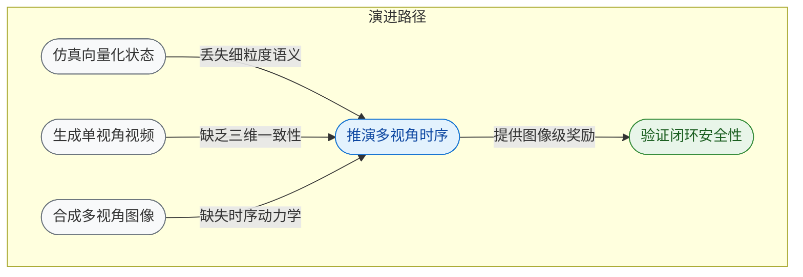
*如何读这张图：* 左侧三条灰色路径代表早期世界模型的局限分支，Drive-WM（蓝色）作为枢纽节点，通过像素级多视角时序建模吸收了三者的优势，并直接指向右侧的闭环验证与数据生成（绿色），体现了其承上启下的架构定位。

**局限与失效模式（需冷静看待）**
尽管论文展示了令人印象深刻的定性案例与定量指标，但将其直接部署于实车仍面临明确边界：
1. **假设依赖与替代解释：** 规划环节高度依赖下游模型（如 VAD）提供的候选轨迹质量。若候选集本身未覆盖安全解，世界模型的“树形展开”仅能在次优解中做矮子里拔将军。论文未报告消融实验验证候选集质量对最终规划成功率的边际贡献。
2. **奖励信号可靠性：** 基于图像的奖励函数假设 3D 检测器与 HD 地图预测器在生成视频上的输出足够鲁棒。直觉上，生成视频固有的高频伪影或透视畸变可能误导感知模块，进而产生“奖励黑客（Reward Hacking）”现象。相关性不等于因果性，当前评估尚未排除感知噪声对奖励分布的干扰。
3. **实时性瓶颈：** 扩散模型的迭代采样与多视角树状展开（Tree-based Rollout）计算密集，当前架构更偏向离线仿真与安全验证，而非毫秒级在线控制。

**指向的未来方向**
Drive-WM 的范式转移为自动驾驶研发管线打开了三条高价值路径：
- **安全沙盒与 OOD 压力测试：** 利用统一条件接口注入极端天气、罕见障碍物或自车偏移（如横向 0.5m 偏移），在像素空间低成本生成海量长尾场景，替代昂贵的实车路测。
- **生成式闭环训练：** 将世界模型作为“环境模拟器”与规划器联合微调，通过图像奖励反向传播优化策略网络，逐步摆脱对专家轨迹的过度依赖。
- **轻量化与实时化：** 未来工作需聚焦扩散步数压缩（如一致性模型蒸馏）与树搜索剪枝策略，以逼近车载芯片的算力约束。

<strong>深度折叠：条件接口映射与规划展开的数学直觉</strong>

统一条件接口并非简单的特征拼接，而是将异构输入（文本 $T$、3D 框 $B$、BEV 地图 $M$、动作 $A$）通过独立编码器映射至同一 $d$ 维流形空间：$C = \text{Concat}(\phi_T(T), \phi_B(B), \phi_M(M), \phi_A(A))$。该设计消除了模态间的维度壁垒，使扩散模型的去噪过程 $\epsilon_\theta(x_t, t, C)$ 能同时响应语义与几何约束。在规划阶段，树形展开本质上是在条件空间中进行蒙特卡洛树搜索（MCTS）的视觉近似：每个节点对应一个候选动作序列，叶子节点的图像级奖励 $R_{img}$ 由感知模型打分。该机制的瓶颈在于 $R_{img}$ 的方差控制，若生成视频存在局部结构崩塌，奖励分布将呈现长尾特性，需引入不确定性校准或集成感知头以稳定梯度。

