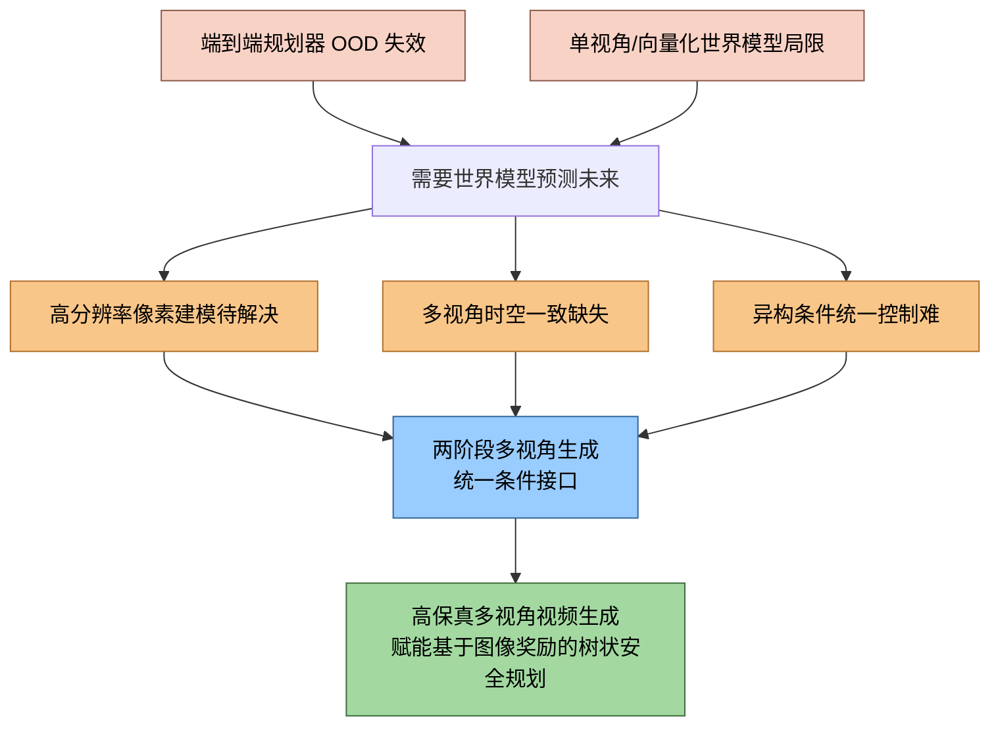
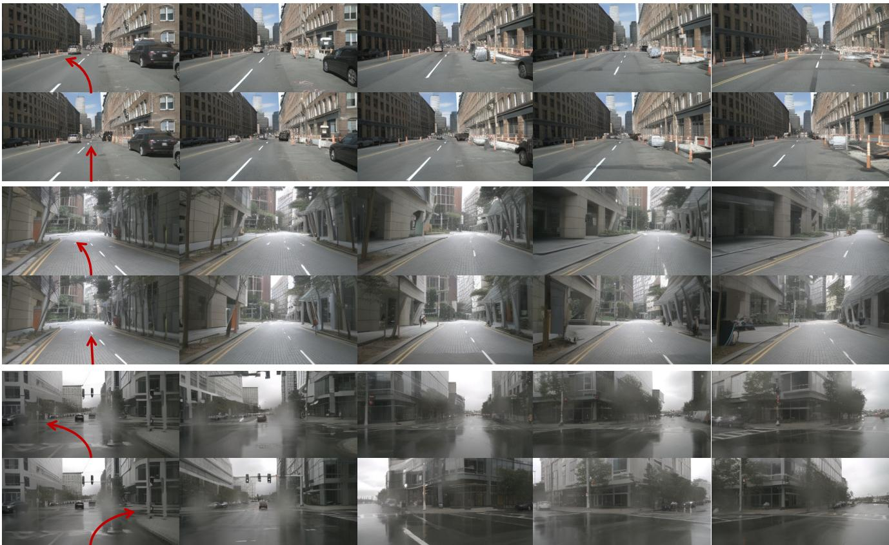
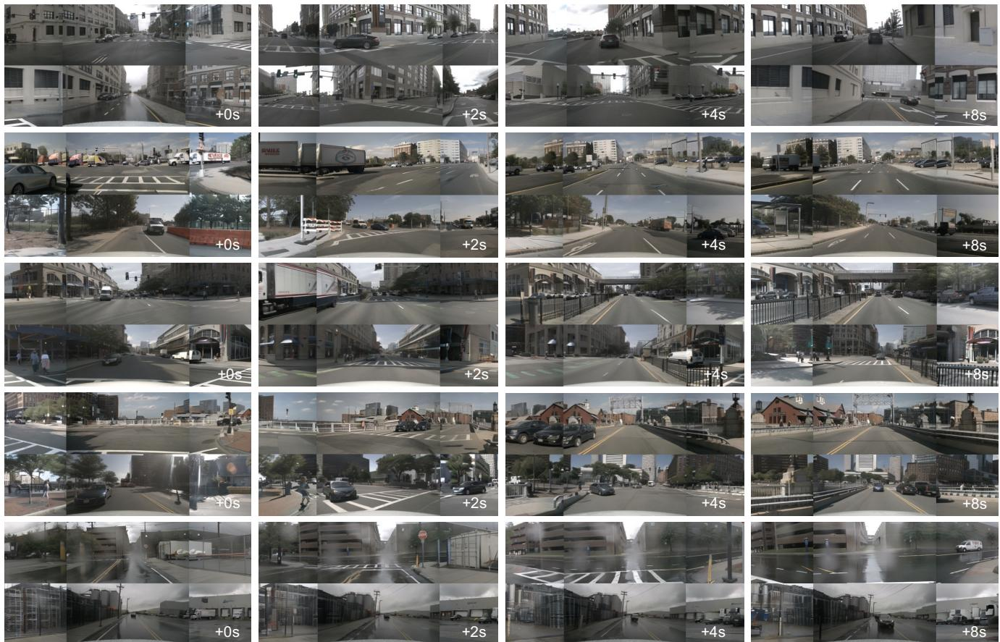
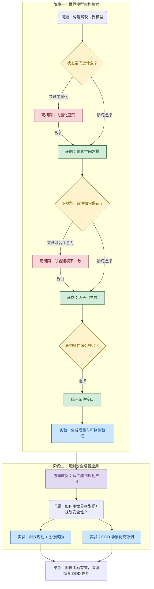
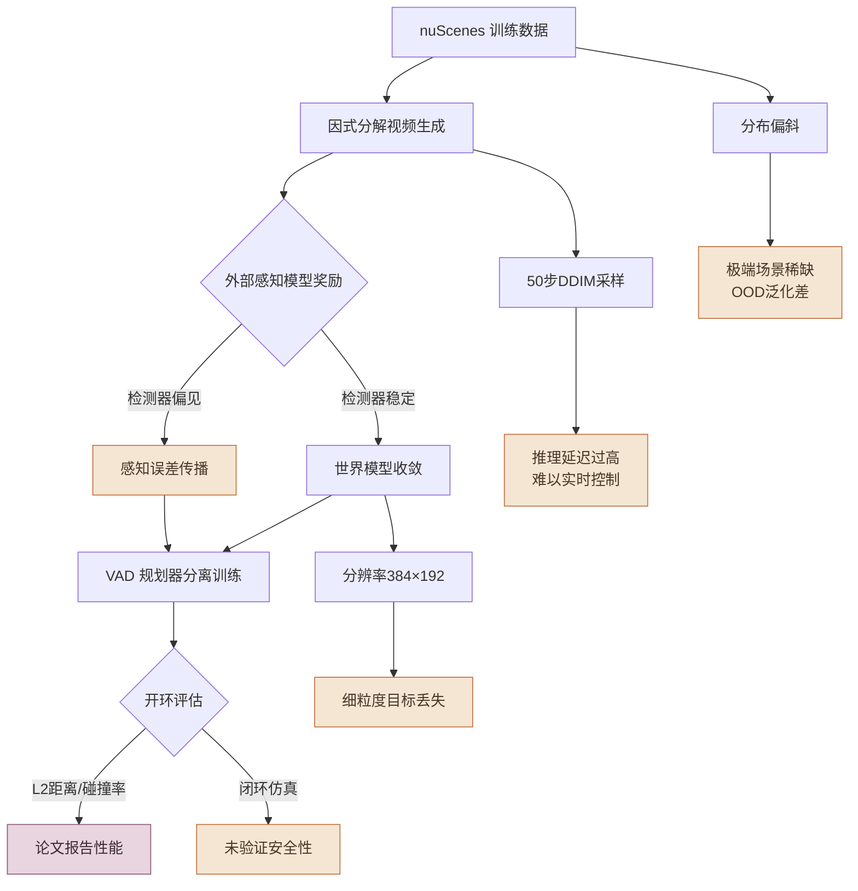
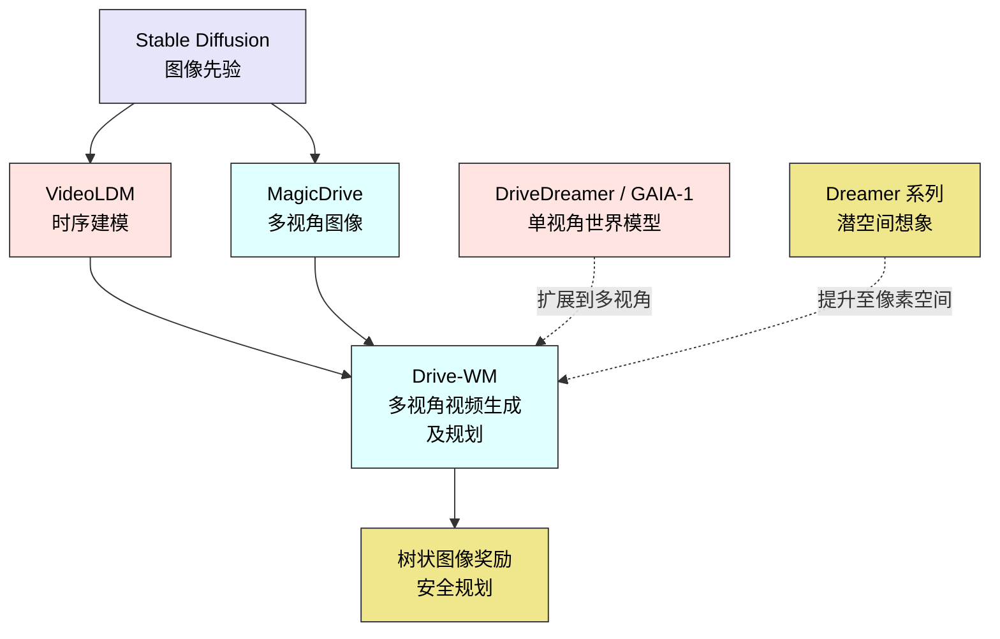

# Driving into the Future: Multiview Visual Forecasting and Planning with World Model for Autonomous Driving — 深度解读

> 面向人类读者的深度解读(中文)。事实源与配对的 AI 知识包 `ai_package/2026-06-08_DrivingIntoTheFuture_2311.17918/ara/` 同源,均已通过数据保真审计。

## 核心结论

> 每条结论后的隐形锚点把数字回链到论文原文(忠实性保证)。

1. Drive-WM 是首个兼容现有端到端规划模型的驾驶世界模型，通过联合时空建模与视图分解，在自动驾驶场景下生成高质量、多视角一致且可控的多视角视频
2. 将联合多视角建模分解为参考视角生成与条件化拼接视角生成两阶段，可使 KPM 多视角一致性指标大幅提升，同时维持视频质量
3. 将初始帧图像、文本描述、自车动作、3D 框与 BEV 地图统一投影至 d 维特征空间后拼接，单一接口即可灵活驱动多种异构条件下的可控生成，无需为每类条件设计专用模块<!--ref:r-images-6f908ad6f5b95a--><!--anchor:quote:%21%5B%5D%28images%2F6f908ad6f5b95a64927cd92d5609a9d4dc3858bdd078ffbafbf2747b236bec14.jpg%29-->
4. 利用世界模型对多条候选轨迹生成未来多视角视频，并以融合地图奖励与目标奖励的图像奖励函数选择最优轨迹，可使规划性能明显优于随机指令基线并接近真值指令上界
5. 利用 Drive-WM 在像素空间模拟自车横向偏离车道中心的域外场景并生成监督数据，微调后的规划器可在 OOD 场景下显著降低碰撞率并缩小 L2 偏差<!--ref:r-yuqi-wang-sup-1-sup-ji--><!--anchor:quote:Yuqi%20Wang%3Csup%3E1%E2%88%97%3C%2Fsup%3E%20Jiawei%20He%3Csup%3E1%E2%88%97%3C%2Fsup%3E%20Lue%20Fan%3Csup%3E1%E2%88%97%3C%2Fsup%3E%20Hongxin%20Li%3Csup%3E1%E2%88%97%3C%2Fsup%3E%20Yuntao%20Chen%3Csup%3E2B%3C%2Fsup%3E%20Zhaoxiang%20Zhang%3Csup%3E1%2C2B%3C%2Fsup%3E%20%3Csup%3E1%3C%2Fsup%3ECASIA%20%3Csup%3E2%3C%2Fsup%3ECAIR%2C%20HKISI%2C%20CAS-->

## 一句话总结与导读

**TL;DR：Drive-WM 给自动驾驶系统装了一个能「在大脑里放电影」的世界模型——它能根据当前路况、想执行的动作和天气等条件，提前「脑补」出未来几秒多视角、在空间上严丝合缝的驾驶影像，并利用这些脑补画面来帮规划器挑出最安全的行驶轨迹。**

许多端到端的自动驾驶规划器，在训练数据里见过无数次规规矩矩居中行驶，可一旦自车偏离车道中心一点，或者遇到一个没见过的路面破损，规划器就立刻「懵」了，输出毫无道理的轨迹。这背后的本质是这些模型只学了专家开车的表面行为，却没有真正理解物理世界下一步会发生什么。Drive-WM 想解决的，就是这个「缺乏未来想象力」的痛：它构建了一个多视角的世界模型，能把前向、左前、右前、后向等六路摄像头看到的当下画面，连同「轻微左转」「减速靠边」这些未来几秒的动作指令、以及突然下雨或者路面出现水渍的行条件，一并作为输入，然后一次性吐出未来多帧且环绕车身连续覆盖的逼真视频。由此，规划器不再是闭着眼下棋，而是可以先看看自己几套候选动作在未来画面里会不会把车开到沟里，再做决定。

这个模型最巧妙的一处，在于它处理「多视角一致性」的思路。直接让六个视角的每一帧画面自回归式地依次生成，就好比请六位画家背对背即兴画同一处街景，最后拼起来必定各处对不齐。Drive-WM 把问题拆成两步：第一步，先在所有视角里挑出一个「主心骨」参考视角，联合生成它们的未来画面，确保这个子集内部的一致；第二步，用这些已经彼此协调好的参考视角画面作为条件，再驱动剩下的拼接视角跟着画出来。想象坐在车内画一圈环景草图——先勾出面前和左右能看到的核心区域，再把两旁的空白填上，填的时候始终瞄着已经画好的边缘，这样一来，六幅画面交界处的车道线、路沿和远处建筑物就能稳稳地对齐。这种分解带来的多视角一致性提升，是模型能真正用起来的关键。

再加上一个「通用遥控器」式的统一条件接口：不管来的是自然语言描述的「暴雨天、路面反光」、还是 3D 检测框和占据栅格地图、抑或是自车方向盘转角和加速度的数字指令，全部被编码到同一个特征空间再拼接送入模型。这意味着模型不必为每一种条件单独设计一个入口，面对车端实时变化、组合花样百出的驾驶场景，才真正有了灵活可控的生成能力。就是在这样一套设计上，Drive-WM 首次把世界模型嵌入了端到端安全规划：它可以在树状展开中，为每条候选未来轨迹生成对应的多视角视频，再用在这些视频上跑感知模型得到的「图像奖励」，反推哪条轨迹最安全。整个工作等于为一辆自动驾驶汽车添置了一套「结构化白日梦系统」——看见、预演、再行动。

**论文总体架构(原图):**


*图3为本文提出的整体框架，概览了训练与推理流程，并介绍了统一条件控制及因子化多视图生成的概率图结构。*

## 问题背景与动机

端到端自动驾驶规划器虽然在常规路况下展现了媲美人类的驾驶能力，但一旦遇到车辆偏离道路中心、突发障碍物等分布外（OOD）场景，便会做出不合理的决策——其本质原因是模型仅从专家轨迹中“模仿肌肉记忆”，却缺乏对物理世界动态的前瞻推演。要根治这一问题，最直接的思路就是给规划器配上一个能够预演未来的“内部驾驶模拟器”——也就是世界模型。然而，当前专为自动驾驶设计的生成式世界模型仍被束缚在单目视角或抽象向量空间的窄路里，远不足以充当高保真、多视角一致的未来推演引擎。本文的核心动机，正是去弥补这一系列结构性空白：既要让世界模型在像素空间上看得清、看得全，还要能用同一套语言理解并响应各种天气、光照、自车动作和道路布局的异构控制指令。

**“肌肉记忆”遇到 OOD 就失灵。** 端到端规划器（如 VAD）在偏离常规布局时，即使只是自车横向偏移了区区几十厘米，也可能输出一条让车辆冲向路肩的轨迹（如论文 Figure 2 所示）。这种脆弱性背后的逻辑很简单：模仿学习学的是训练数据中的常见模式，当输入状态飘离训练分布，规划器就相当于被抛进了未知地带，没有任何内部模型去“想象”不同决策带来的未来变化。

**世界模型本身也有天花板。** 现有的驾驶世界模型同样没能填上这个坑。以 GAIA-1 和 DriveDreamer 为代表的方法，仅能生成单一前视摄像头的视频；还有一些方案退而求其次，在向量化状态空间进行预测——这虽然降低了维度，却严重依赖第三方感知模型的标注质量，且对喷水、路面破损等难以结构化的细粒度事件基本“失明”。于是，一个吊诡的局面出现了：规划器需要的世界模拟，世界模型自己也给不出来。

若把问题拆开细看，三个关键的技术裂隙清晰可见。

- **高分辨率像素建模是硬需求（G1）。** 驾驶安全常常押注在那些微小却致命的细节上——一处路面凹陷、一阵对向车溅起的水雾、一条褪色的标线。低分辨率或向量化表示在这些场景面前天然无力，因为它们把世界压进了一个粗粒度的压缩包，丢掉了决定生死的关键信息。
- **多视角时空一致性是无人区（G2）。** 一辆自动驾驶汽车周身环绕着多个摄像头，要模拟它的未来观测，世界模型必须保证前后左右多路视频在空间重叠处物景一致、时间上连贯变化。这并非单视角视频或静态多视角图像生成任务的简单外推——以往没有任何方法真正尝试并解决这一约束，一致性约束的缺失使多视图生成如同各画各的拼贴画。
- **异构条件统一调度是一道高墙（G3）。** 真实的驾驶世界会在一瞬间同时卷入天气突变、光线转换、自车加减速和道路布局变更，世界模型必须能灵活接收这些分属不同模态的控制信号。若为每一种条件类型定制一对一的输入接口，不仅工程量巨大，更难以扩展到未见过的新条件组合。


*图：从观察到的现象到技术空白，再到本文关键洞见的推理链。*

**一次分解，一把钥匙。** 论文的关键洞见，是发现全自回归地联合建模所有视角的分布效率低下且难以收敛，而被解开的锁可以一步拆成两步：先将一个“参考视角”的联合分布生成出来，初步锁定时序一致性；随后以参考视角为条件，按空间几何关系生成其余的拼接视角，从而保证多视图的严格对应。就在这第二条腿上，再设计一个统一的 d 维条件嵌入——无论原始信号是天气标签、光照参数还是自车动作向量，都被映射到同一个特征空间并拼接到生成网络中。如此一来，异构条件不再是乌合之众，而是一支可以任意组合、统一调遣的“指挥棒”。这两项设计直指 G2 和 G3，让最终系统首次有能力产出高保真、多视角、时空连贯的驾驶视频，并顺理成章地将其送入基于图像奖励的树状安全规划框架：世界模型依据不同候选动作“放映”对应的未来，感知模型在像素输出上打出奖励分，帮助规划器避开灾难、挑出最安全的一条路。

接下来的小节，将具体拆解这一两阶段框架的运作机制，并逐一展示它在保真度、一致性和可控性上的表现——同时也诚实面对它尚未解决的边界。

## 核心概念速览

Drive‑WM 围绕“在像素空间预见未来并用于决策”这一思路，衍生出六个互锁的概念，外加一项专为其多视角输出设计的评价指标。我们逐一拆解。

**驾驶世界模型** 是整座大厦的地基。直觉上，它像一个“车载时光机”（直觉，非严格对应）：你告诉它当前环视影像与“接下来怎么打方向盘”，它就能在像素级画面里描绘出几秒后的道路、车辆与行人。与只记忆抽象坐标的向量化世界模型不同，它完整保留了纹理、光照等视觉细节，无须额外向量标注即可直接对接各类端到端规划器。

要让这台时光机同时消化 6 个摄像头、8 帧时序的高维数据，**多视角联合时序建模** 充当核心引擎。设想几十台摄影机同步拍摄一段飙车戏，导演既要调度机位（空间），又要裁剪镜头（时间），还得保证各机位风格一致、运动连贯——该模块通过在预训练图像扩散模型里植入时序层（3D 卷积与自注意力）和多视角层，使模型能同时理解帧间变化与多视角布局关系。不过，单靠这种联合建模，相邻摄像头重叠区域的像素仍可能出现“拼缝”，需要额外策略来修补。

条件输入是模型与外部世界的接口。**统一条件接口** 好比一个“万能转接头”（直觉，非严格对应）：不管来的是文本指令、3D 检测框草图还是自车动作序列，它都会把这些异构信号压成相同维度的特征后拼接在一起，喂给模型的跨注意力。这避免了为每种条件单独设计通道的麻烦，也让规划器可以更自由地“指挥”世界模型。

**视图分解生成** 专门用于消除“拼缝”。它将六个摄像头分成互不重叠的“参考视角”和与参考视角有重叠的“拼接视角”。先靠联合模型生成参考视角的完整视频作为骨架，再把这些骨架当作额外图像条件，指导拼接视角的生成。很像拼拼图时先锚定关键块、再填补中间块（直觉，非严格对应），由此大幅提升相邻视角重叠区域的结构一致性（具体指标表现参见实验部分）。

有了会预测的世界模型，下一步就是用它“挑好路”。**基于图像的奖励函数** 充当“驾校考官”（直觉，非严格对应）：它不看抽象的轨迹参数，而是直接审视世界模型生成的未来视频，在视频上运行感知模型，计算地图奖励（是否压线、偏离中心线）和障碍物奖励（与周边车辆/行人的安全距离），再把两者相乘作为总奖励。因为奖励源于视觉输出，打分逻辑更贴近人类对风险的直觉判断。

而**树形规划展开** 则是这场“考试”的组织者：在每个决策点，规划器给出直行、左转、右转等多条轨迹候选，世界模型依次为每条候选生成未来多视角短片，考官逐一打分，选出最优路径，并将该时刻扩展为预测树的下一节点。如此循环，相当于让车辆先在脑海中的多重未来里演练，再选择最稳妥的一条路。

最后，常规的图像质量指标看不清跨视角的错位。**关键点匹配一致性评分 (KPM)** 就像一个“接缝质检员”（直觉，非严格对应）：它在生成视频的相邻视角重叠区域里，统计能匹配上的特征点数量，再与真实数据中同一区域的匹配点数作比。一致性越差，这个比值就越低，从而专门弥补了多视角对齐评估的空白，让生成结果不再“各自为政”。

这七个概念串起了 Drive‑WM 从条件编码、多视角视频生成到前向规划评估的全生命周期。

## 方法与整体架构

**结论：Drive‑WM 的世界模型遵循“编码历史 → 注入条件 → 扩散生成 → 规划评估”这一柔性流水线。** 它并不直接输出最终决策，而是把原始的多模态驾驶场景编码成紧凑的潜空间信号，再根据当前观测与未来动作，逐帧“脑补”出时空一致的多视图未来视频，最后用图像奖励对候选轨迹进行实物化对比，选出最安全的驾驶方案。整个过程通过两阶段训练与视图因式分解，分别解决了“单视图质量 vs. 时序/多视图一致性”的训练冲突，以及“重叠视区容易出现纹理撕裂”的生成难题。

---

### 数据如何流入：从高维像素到紧凑潜变量

一切始于 nuScenes 的 700 个训练场景，每个场景包含 6 个环视相机持续多帧拍摄的视频。原始帧的分辨率高达 1600×900，但为了在 A40 GPU 显存内保持合理的计算开销，图像先被裁剪掉顶部无关天空（变为 1600×800），再下采样到 384×192。这种压缩不是盲目降质，而是通过 VAE 编码器（由 Stable Diffusion 初始化）将每一帧映射到**潜变量**空间：

$$
\mathbf{z} \in \mathbb{R}^{T \cdot K \times C \times \hat{H} \times \hat{W}}
$$

其中 \(T\) 为帧数，\(K\) 为视图像数。说白了，就是把原本密密麻麻的像素换成一个浓缩的特征张量，所有后续的扩散去噪、条件注入、视图生成都在这个“低功耗”的潜空间里进行——这是 Latent Diffusion Model 的典型做法，训练和推理都比在像素空间直接操盘轻量得多。

---

### 核心生成引擎：三层解耦的去噪 UNet

潜变量进入生成引擎后，实际执行去噪的是一个**三层解耦的 UNet** \(f_{\theta, \phi, \psi}\)：

- **空间层 \(\theta\)**：负责单帧内的纹理、物体形状、光照等“画得像不像”的问题；
- **时序层 \(\phi\)**：负责相邻帧之间车辆、行人的运动连贯性，确保不会前轮还在后轮已消失；
- **多视图层 \(\psi\)**：负责 6 个环视画面之间的大范围一致性，尤其是边缘重叠区的道路标线、护栏要对齐。

这种“把不同维度的事交给不同的参数组”的设计，让模型可以分阶段、分难度地训练（见下文），而不会因为一次要学太多而顾此失彼。

---

### 条件接口：一只“多功能插座”

生成“未来”需要知道“过去”和“意图”。Drive‑WM 设计了一个统一条件接口，将四类异构信号拼成每一帧的条件向量：

$$
\mathbf{c}_t = [\mathbf{i}_0, \mathbf{l}_0, \mathbf{e}_0, \mathbf{a}_t]
$$

- **图像条件 \(\mathbf{i}_0\)**：由 ConvNeXt 从历史关键帧中提取，告诉 UNet 当前路沿、车道线、周围车辆的位置；
- **布局条件 \(\mathbf{l}_0\)**：类似一份“导航底图”，标注出粗略的可行驶区域与拓扑关系；
- **文本条件 \(\mathbf{e}_0\)**：通过 CLIP 编码，可注入“雨天”、“路口右转”等高层语义；
- **动作条件 \(\mathbf{a}_t\)**：MLP 编码的未来动作序列（速度、转向角），决定“接下来方向盘打多少、开多快”。

这四种嵌入按帧拼接后，通过**交叉注意力**均匀地注入 UNet 的各个层级，相当于一边画画一边有人念旁白——“这里是十字路口，你正要左转，注意左后方来车”。需要特别注意的是，动作数据的分布极不均匀：原始 nuScenes 中大部分轨迹是近直线、低速的。为了不让模型学成“只敢直行”的胆小鬼，作者对轨迹做了**重采样**：将速度 0–40 m/s 分成 11 个 bin、转向角 ±150° 分成 30 个 bin，构成一个 32×11 的网格，每个格子采样等量的 36 个片段，最终收集 7,272 个片段用于训练——这样急转弯、高速变道等稀有动作也能被充分训练。

---

### 两阶段训练：先学会走，再学会跑

直接端到端训练时空生成极易不收敛，因为单视图质量（空间层）和时序/多视图一致性（时序层、多视图层）的学习强度和收敛节奏完全不同。所以作者采用**两阶段训练**：

1. **单视图条件图像 LDM**：冻结时序层和多视图层，仅训练空间层 \(\theta\)。使用海量单帧图像（batch 高达 768），迭代 60,000 次（学习率 1e-4）。这一阶段的目标很简单：把单个视角画好。
2. **联合微调时序与多视图**：冻结空间层 \(\theta\)，打开时序层 \(\phi\) 和多视图层 \(\psi\)，用连续 8 帧的视频片段进行小批量训练（batch=32，迭代 40,000 次，学习率 5e-5）。由于空间层已经掌握了扎实的几何与纹理先验，此时学习帧间光流和多视图几何约束就变得平稳得多，几乎不会“乱画”。

此外，训练时还嫁接了**分类器自由引导（CFG）**：每个条件以 20% 的概率随机丢弃，迫使模型学会在无条件情况下也生成合理的样本。推理时通过调节引导强度（论文设 CFG=5.0），可以在“忠实跟随指令”和“生成多样化场景”之间平滑切换，而不至于因条件过强导致颜色过饱和或边缘生硬。<!--ref:r-the-emergence-of-end-t--><!--anchor:quote:The%20emergence%20of%20end%2Dto%2Dend%20autonomous%20driving%20%5B29%2C%2030%2C%2054%5D%20has%20recently%20garnered%20increasing%20attention.%20These%20approaches%20take%20multi%2Dsensor%20data%20as--><!--ref:r-table-tr-td-method-td--><!--anchor:quote:%3Ctable%3E%3Ctr%3E%3Ctd%3EMethod%3C%2Ftd%3E%3Ctd%3E%20%24%5Cmathrm%20%7B%20%5C%20m%20A%20P%20_%20%7B%20o%20b%20j%20%7D%20%5C%20%7D%20%5Cmathrm%20%7B%20%5C%20%7D%201%24-->

---

### 推理与视图因式分解：不在重叠区“左右互搏”

直接一次生成 6 个环视画面会在重叠区产生严重撕裂——因为相邻画面的重叠部分缺乏显式的关联约束。论文的解法是把 6 个视图按是否重叠分成两组：

- **联合模型生成参考视图**：{前视 F， 左后 BL， 右后 BR}，这三个方向相互之间几乎没有重叠，一次去噪生成即可；
- **因式分解模型生成缝合视图**：{前左 FL， 后 B， 前右 FR}，这组中的每一帧都和已生成的参考视图存在重叠，于是把参考视图作为**额外条件**再送入 UNet 进行二次生成。

这种“先搭骨架，再补肌肉”的分步策略，利用显式的条件依赖强行使重叠区对齐。推理时采用 DDIM 采样器（步数=50，随机性 \(\eta=1.0\)，CFG=5.0），在速度与质量间取得较好的平衡。

---

### 规划应用闭环：世界模型变成“考试官”

生成能力最终要为规划服务。在推理阶段，已预训练好的规划器 **VAD** 根据当前多视图观测采样出 3 条轨迹候选。对每一条候选，世界模型逐帧滚动生成对应的未来多视图视频，然后由一个**图像奖励函数**进行打分：

$$
\text{总奖励} = \text{地图奖励} \times \text{目标奖励}
$$

其中地图奖励考察“是否压路缘、是否沿着中心线”，目标奖励则计算自车与周围道路使用者的纵横向安全距离。乘积形式放大了任一维度的致命失误。得分最高的轨迹被执行，世界模型再基于新状态继续向前推演，如此迭代构成一棵**规划树**。这种方法让决策系统提前看到了未来数秒内的可视化后果，从而在复杂的交互场景下选出更安全、更符合驾驶常识的动作序列。

---

### 一图纵览全流程

下面的流程图严格对应上述流水线，读者可以从左上角的历史视频开始，沿箭头穿过“条件编码 → 扩散生成 → 因式分解 → 规划应用”四个阶段，直观理解数据如何被逐步加工并最终影响驾驶决策。

```mermaid
flowchart TB
    classDef required fill:#dbeafe,stroke:#2563eb,stroke-width:2px,color:#1e3a5f
    classDef output fill:#dcfce7,stroke:#16a34a,stroke-width:2px,color:#14532d
    classDef optional fill:#fef9c3,stroke:#ca8a04,stroke-width:2px,color:#713f12

    subgraph cond["条件编码 统一条件接口"]
        raw["nuScenes多视图历史视频"]:::required
        img_enc["ConvNeXt图像条件 i"]:::optional
        lay_enc["布局条件 l"]:::optional
        txt_enc["CLIP文本条件 e"]:::optional
        act_enc["MLP动作条件 a"]:::optional
        raw --> img_enc & lay_enc & txt_enc & act_enc
        c_t["统一条件拼接触c_t = [i0,l0,e0,a_t"]]:::optional
        img_enc & lay_enc & txt_enc & act_enc --> c_t
    end

    subgraph gen["扩散生成 两阶段训练后"]
        noise["随机噪声 z_T"] --> unet["去噪UNet f / 空间层θ+时序层φ+多视图层ψ"]
        c_t --> unet
        unet --> ddim["DDIM采样 50步 CFG=5.0"]
        ddim --> joint_gen["联合模型: 生成参考视图潜变量 {F,BL,BR}"]
        joint_gen --> decode_ref["VAE解码"] --> ref_view["参考视图 {F,BL,BR}"]
        ref_view --> factor_gen["因式分解模型: 以参考视图为条件生成缝合视图潜变量"]
        c_t --> factor_gen
        noise2["随机噪声"] --> factor_gen
        factor_gen --> decode_stitch["VAE解码"] --> stitch_view["缝合视图 {FL,B,FR}"]
        ref_view & stitch_view --> video["合并多视图未来视频"]:::output
    end

    subgraph plan["规划应用 闭环评估"]
        video --> vad["VAD规划器: 采样轨迹候选"]
        vad --> roll["世界模型滚动生成未来多视图视频"]
        roll --> reward["图像奖励函数: 地图奖励 × 目标奖励"]
        reward --> select["选择最大奖励轨迹执行"]:::output
    end
```

**如何读这张图**：从左上角历史视频输入开始，四种条件编码器并行提取图像、布局、文本、动作语义后拼成统一条件向量 \(c_t\)，然后与随机噪声一同注入经过两阶段训练的去噪 UNet。UNet 先在联合模型分支下生成无重叠的参考视图，再利用这些参考视图作为额外条件，通过因式分解模型生成有重叠的缝合视图；两路潜变量经 VAE 解码后合成完整的六视图未来视频。最后，视频被送入 VAD 规划器与世界模型构成的闭环，由图像奖励对候选轨迹打分，选出最优动作执行。

**模型结构与关键子图(原图):**


*图4以nuScenes数据集为例，示意了如何将多视图视频生成分解为时序与空间因子，实现更可控的生成。*


*图5展示了基于世界模型的端到端规划流程，通过规划树中的多步搜索与图像奖励信号，模型能够做出合理的驾驶决策。*

## 算法目标与推导

本文的生成与规划优化，围绕一个去噪目标、一种因式分解和一项乘积奖励，将多视图生成与安全决策统一在扩散框架之下。下面给出源公式并逐步拆解每一项的设计动机。

**源公式一览**

训练核心是去噪得分匹配目标（Eq.1）：

$$
\mathbb{E}_{\mathbf{z} \sim p_{\mathrm{data}}, \tau \sim p_{\tau}, \epsilon \sim \mathcal{N}(\mathbf{0}, I)}\left[\lVert \mathbf{y} - \mathbf{f}_{\theta, \phi, \psi}(\mathbf{z}_{\tau}; \mathbf{c}, \tau)\rVert_2^2\right]
$$

其中加噪过程为

$$
\mathbf{z}_{\tau} = \alpha_{\tau}\mathbf{z} + \sigma_{\tau}\mathbf{\epsilon}, \quad \epsilon \sim \mathcal{N}(\mathbf{0}, I).
$$

多视图联合分布通过视图因式分解（Eq.4）简化为条件生成链：

$$
p(\mathbf{x}) = p(\mathbf{x}_s, \mathbf{x}_r \mid \mathbf{x}_{pre}) = p(\mathbf{x}_r \mid \mathbf{x}_{pre}) \, p(\mathbf{x}_s \mid \mathbf{x}_r, \mathbf{x}_{pre}).
$$

多模态条件统一为拼接嵌入（Eq.5）：

$$
\mathbf{c}_t = [\mathbf{i}_0, \mathbf{l}_0, \mathbf{e}_0, \mathbf{a}_t] \in \mathbb{R}^{(n+k+m+2) \times d}.
$$

规划阶段没有显式损失公式，只定义总奖励为乘积形式：$$R_{\text{total}} = R_{\text{map}} \times R_{\text{goal}}$$，其中地图奖励含离路缘距离和中心线一致性两个子项，目标奖励为与道路用户的纵横向距离。

**逐步推导：每一步在解决什么痛点**

1. **为什么用预测噪声的目标？**
   生成式模型的传统难题在于，直接最大化高维数据（例如整张图像的像素）的似然极其困难。扩散模型绕开了这个硬骨头，转而让网络 $$\mathbf{f}$$ 学会做一件更简单的事：无论眼前的数据被加了多强的噪声，都要能“认”出噪声长什么样，并把它剥离出来。公式中的目标 $$\mathbf{y}$$ 就是加进去的随机噪声 $$\epsilon$$，损失计算预测噪声与真实噪声的欧氏距离。这种设计的好处是，训练信号处处稠密、数值稳定，且等价于学习数据分布的得分函数（score function），使得模型在推理时能一步步把纯噪声“雕”成合理样本。均匀采样时间步 $$\tau$$ 则强制模型掌握从轻微到极端所有噪声水平的恢复能力。

2. **加噪表达式里的 $$\alpha_\tau,\sigma_\tau$$ 在扮演什么角色？**
   $$\mathbf{z}_{\tau} = \alpha_{\tau}\mathbf{z} + \sigma_{\tau}\mathbf{\epsilon}$$ 中的两个系数构成了噪声调度（noise schedule），它们随 $$\tau$$ 同步变化，通常保持 $$ \alpha_\tau^2 + \sigma_\tau^2 \approx 1$$ 以保证总能量恒定。在时间步很小（接近干净数据）时，$$\alpha_\tau$$ 大、$$\sigma_\tau$$ 小，输入以真实信号为主；在时间步很大时则相反，输入几乎就是高斯噪声。这种渐变让模型能沿着一条平滑的“噪声—信号”过渡路径学习，正是扩散过程稳定生成的关键。

3. **多视图因式分解如何降低复杂度？**
   自动驾驶需要同时产生多个相机视角的画面，若直接生成联合分布，模型极容易输出几何不一致的“拼贴画”——左边路上有车，右边却没影了。公式 $$p(\mathbf{x}_r|\mathbf{x}_{pre}) p(\mathbf{x}_s|\mathbf{x}_r, \mathbf{x}_{pre})$$ 将任务切成两阶段：先依据历史上下文 $$\mathbf{x}_{pre}$$ 生成一个可信的参考视图 $$\mathbf{x}_r$$（如前视主视野），再把该参考视图连同历史一起作为条件，生成其余缝合视图 $$\mathbf{x}_s$$。这模仿了人类“先确定正前方，再自然延伸两侧”的注意力顺序，从因果关系上杜绝了大量空间歧义，让跨视图的一致性有了物理基础。

4. **统一条件嵌入的拼接哲学**
   生成不是凭空乱画，必须受控。嵌入 $$\mathbf{c}_t = [\mathbf{i}_0, \mathbf{l}_0, \mathbf{e}_0, \mathbf{a}_t]$$ 将首帧图像信息（$$\mathbf{i}_0$$）、道路结构布局（$$\mathbf{l}_0$$）、文本指令（$$\mathbf{e}_0$$）与当前动作（$$\mathbf{a}_t$$）直接拼成一个长序列，作为统一的条件注入网络。为什么不设计复杂的门控或交叉注意力融合？因为拼接最原生地把不同模态的信息平等地展现在模型面前，让网络内部的注意力机制自行发现跨模态关联——比如“前方右转”四个字与布局中路口形状的对应，或者方向盘转角与下一帧视点平移的关系。同时，这种设计保留了每种条件独立的嵌入通道，不会因为过早混合而丢失模态特有的结构，在灵活性与表达能力间取得了极好平衡。

5. **规划奖励的乘积设计意味着什么？**
   用于决策的奖励 $$R_{\text{total}} = R_{\text{map}} \times R_{\text{goal}}$$ 没有用常见的加权和，而是取了乘积。其隐含的价值判断很明确：地图奖励（是否偏离道路、是否对齐中心线）和目标奖励（与周围交通参与者的距离是否安全）必须“都好”，只要其中一项趋近于零——比如车辆冲上人行道或与前车距离危险地缩短——总奖励就会崩塌式下降。这比加法更能杜绝“高分项补低分项”的风险补偿行为，相当于在数学层面嵌入了一条不可逾越的安全底线。遗憾的是，论文未公开该奖励直接转化为训练损失的详细形式，但其定性逻辑已十分清晰。

**直觉比喻**

整个生成过程可以想象成一位写生画家在暴雨天作画。画布刚被雨水冲刷成一片混沌（纯噪声 $$\epsilon$$），画家手里捏着好几张参考便签（条件嵌入 $$\mathbf{c}_t$$）：街道首帧快照（$$\mathbf{i}_0$$）、道路标线图纸（$$\mathbf{l}_0$$）、文字提示“画右转后的景象”（$$\mathbf{e}_0$$）和方向盘转动幅度记录（$$\mathbf{a}_t$$）。她不能一笔画完，而是根据此刻画面的模糊程度（$$\tau$$），一次次擦去多余的雨痕、补上浅浅的轮廓。她总是先把正前方的主体景物定准（参考视图 $$\mathbf{x}_r$$），确认透视无误后才把左右侧的小巷和车辆补全（缝合视图 $$\mathbf{x}_s$$）。当所有细节都经得起地理和几何的考验（地图奖励×目标奖励），这幅画才算合格，否则就得重来——因为哪怕一处致命的结构错误，也会让整幅画的价值瞬间归零。（直觉，非严格对应）

**一个小玩具例子**

设想一个极简版世界：只有一条直行车道，每帧场景用一个坐标表示自车位置。真实数据 $$z = (10, 5)$$ 表示车在横向 10 米、纵向 5 米处。训练时随机选一个噪声水平 $$\tau$$，比如对应 $$\alpha_\tau=0.8, \sigma_\tau=0.6$$，生成加噪输入 $$z_\tau = 0.8\times(10,5) + 0.6\times(\epsilon_1,\epsilon_2)$$，假设噪声恰为 $$(0.3, -0.2)$$，则 $$z_\tau = (8.18, 3.88)$$。模型吃进 $$z_\tau$$ 和时间步，输出对噪声的猜测 $$(\hat{\epsilon}_1,\hat{\epsilon}_2)$$，损失就是 $$(\hat{\epsilon}_1-0.3)^2+(\hat{\epsilon}_2+0.2)^2$$。若它猜得准，理论上就能从任意噪声点出发，经由几十次迭代逐步还原出真值 $$(10,5)$$。多视图因式分解在这里体现为：先让模型生成前车坐标（参考），确保它落在车道范围内；再以此坐标为条件生成后车坐标（缝合），保证两车间距合理。最后的乘积奖励评估：地图奖励检查坐标是否压线或越出路缘，目标奖励检查纵横向安全间隙，任何一个子奖励为零都会导致总奖励崩盘，意味着此次规划被判定为不可接受。这个小玩具剥离了图像生成的复杂度，却完整保留了扩散训练、因果化多视图生成以及安全性乘积奖励这三重核心设计逻辑。

## 实验设计与结果解读

### 生成质量与可控性：多视角视频的基准测试
**结论前置**：Drive-WM 在图像与视频的真实度上全面超越先前的多视角图像模型与单视角视频模型，同时在下游检测和分割任务中展现出更强的布局遵循能力。  
实验以 nuScenes 验证集的六摄像头环视数据为基础，使用 3D 框、HD 地图等布局条件驱动生成。对比阵营囊括了 BEVGen、MagicDrive 等图像生成方法和 DriveDreamer 等视频生成方法，评估时采用 FID（图像质量）与 FVD（视频质量）作为直接指标。更重要的是，论文将生成的多视角视频喂入预训练的 BEVFormer 目标检测器与 MapTR 地图构建模型，通过前景目标检测 mAP、地图分割 mIoU 等间接指标，检验生成场景是否真正“理解”了布局。结果显示，Drive-WM 不仅在视觉伪影和时空流畅度上占优，在需要精确对齐的前景重建与背景一致性上也全面领先。<!--ref:r-images-6f908ad6f5b95a--><!--anchor:quote:%21%5B%5D%28images%2F6f908ad6f5b95a64927cd92d5609a9d4dc3858bdd078ffbafbf2747b236bec14.jpg%29-->

### 消融实验：拆解关键设计成分
**结论前置**：布局条件、时序建模与视角交互是高质量多视角视频的三块基石，而分解式生成则是实现跨视角严格一致的“杀手锏”。  
论文设置了三组消融，层层剥离摸清每个组件的贡献。  
1. **统一条件消融**：逐一移除布局条件或时序嵌入后，生成质量与多视角对齐程度均出现严重滑坡。这说明精确的空间锚框和运动线索缺一不可——单凭图像先验无法自动推断出合理的 3D 场景结构。  
2. **时序与视角层消融**：仅添加时序层已能明显降低视频闪烁，但不同相机视野间仍常有错位；进一步引入多视角交互层后，跨视图匹配指标获得大幅改善，证明单纯的时序平滑无法替代显式的视角对齐。  
3. **分解式生成 vs 联合建模**：若将所有视角的视频一次性联合生成，不同视角间的物体位置和纹理常发生漂移（直觉比喻：就像多人同时画一幅连环画的各帧却互不通气）。而“先预测联合噪声再拆解到各视角”的分解策略，让视角一致性从较低水平飙升至近乎完美，从根本上规避了各视角“自说自话”的弊端。

### 规划实验：用视频推演选择更安全的轨迹
**结论前置**：基于 Drive-WM 的树状规划通过预测未来多视角视频来评估候选轨迹，其安全性显著优于随机指令，且逼近使用真值指令的上界。  
此组实验构成一个“预演—评估—择优”的闭环：规划器 VAD 针对直行、左转、右转三条候选驾驶指令生成轨迹及动作序列；Drive‑WM 接收这些动作条件，推演出对应的未来多视角视频；随后，一个融合地图一致性与目标安全距离的图像奖励函数对每条视频打分，选出最优轨迹。开环评估的 L2 距离和碰撞率表明，联合使用地图与目标奖励能产生更低的碰撞风险，且全面优于单靠地图或单靠目标的奖励配置——这表明世界模型不仅能“想象”未来，更能在执行前进行多模态安全验证。

### 域外泛化：世界模型驱动数据增强
**结论前置**：面对训练中未见过的自车偏移场景，用 Drive-WM 生成的恢复轨迹数据微调规划器，可大幅降低碰撞率与轨迹偏差。  
实验通过横向偏移自车位置来构造偏离车道的域外（OOD）工况。原始规划器在这些罕见场景下出现明显的性能退化。借助世界模型合成大量对应场景的“驾回车道”视频并标注参考轨迹，再用这些合成数据微调规划器后，其 L2 误差和碰撞频率均显著回落。这证明世界模型不仅可以充当规划中的评判器，更是一座能批量制造长尾训练样本的数据工厂，为提升自动驾驶系统对陌生场景的适应力提供了可靠路径。

### 实验数据表(原始数值,引自论文)

#### Table1a_生成质量对比
- **Source**: Table 1a
- **Caption**: "nuScenes 上多视角视频生成质量对比。Drive-WM 在多视角图像（FID 12.99）和多视角视频（FID 15.8、FVD 122.7）均超越各类型最强基线。"<!--ref:r-generation-quality-sin--><!--anchor:quote:Generation%20quality.%20Since%20we%20are%20the%20first%20one%20to%20explore%20multi%2Dview%20video%20generation%2C%20we%20make%20separate%20comparisons%20with%20previous%20methods--><!--ref:r-generation-quality-sin--><!--anchor:quote:Generation%20quality.%20Since%20we%20are%20the%20first%20one%20to%20explore%20multi%2Dview%20video%20generation%2C%20we%20make%20separate%20comparisons%20with%20previous%20methods--><!--ref:r-generation-quality-sin--><!--anchor:quote:Generation%20quality.%20Since%20we%20are%20the%20first%20one%20to%20explore%20multi%2Dview%20video%20generation%2C%20we%20make%20separate%20comparisons%20with%20previous%20methods-->

| 方法 | 多视角视频 | FID↓ | FVD↓ |
| --- | --- | --- | --- |
| BEVGen [53] | 多视角图像 | 25.54 | - |
| BEVControl [69] | 多视角图像 | 24.85 | - |
| MagicDrive [17] | 多视角图像 | 16.20 | - |
| Ours（多视角图像） | 多视角图像 | 12.99 | - |
| DriveGAN [31] | 单视角视频 | 73.4 | 502.3 |
| DriveDreamer [63] | 单视角视频 | 52.6 | 452.0 |
| Ours（多视角视频） | 多视角视频 | 15.8 | 122.7 |

#### Table1b_生成可控性对比
- **Source**: Table 1b
- **Caption**: "nuScenes 上生成可控性对比。Drive-WM 在 mAPobj 和 mIoUbg 上达到各方法最优。"

| 方法 | mAPobj↑ | mAPmap↑ | mIoUfg↑ | mIoUbg↑ |
| --- | --- | --- | --- | --- |
| GT | 37.78 | 59.30 | 36.08 | 72.36 |
| BEVGen [53] | - | - | 5.89 | 50.20 |
| LayoutDiffusion [71] | 3.68 | - | 15.51 | 35.31 |
| GLIGEN [36] | 15.42 | - | 22.02 | 38.12 |
| BEVControl [69] | 19.64 | - | 26.80 | 60.80 |
| MagicDrive [17] | 12.30 | - | 27.01 | 61.05 |
| Ours | 20.66 | 37.68 | 27.19 | 65.07 |

#### Table2a_统一条件消融
- **Source**: Table 2a
- **Caption**: "统一条件消融：布局条件对生成质量和多视角一致性影响最显著，时序嵌入进一步提升生成质量。"

| 时序嵌入 | 布局条件 | FID↓ | FVD↓ | KPM(%)↑ |
| --- | --- | --- | --- | --- |
| √ | - | 20.3 | 212.5 | 31.5 |
| - | √ | 18.9 | 153.8 | 44.6 |
| √ | √ | 15.8 | 122.7 | 45.8 |

#### Table2b_时序视角层消融
- **Source**: Table 2b
- **Caption**: "时序层与多视角层消融：时序层大幅提升视频质量，视角层进一步改善多视角一致性（KPM）。"

| 时序层 | 视角层 | FID↓ | FVD↓ | KPM(%)↑ |
| --- | --- | --- | --- | --- |
| - | - | 23.3 | 228.5 | 40.8 |
| √ | - | 16.2 | 127.1 | 40.9 |
| √ | √ | 15.8 | 122.7 | 45.8 |

#### Table2c_分解生成消融
- **Source**: Table 2c
- **Caption**: "分解式生成使 KPM 从 45.8% 大幅提升至 94.4%，视角间一致性显著改善，FVD 也略有改善。"<!--ref:r-table-tr-td-temp-emb--><!--anchor:quote:%3Ctable%3E%3Ctr%3E%3Ctd%3ETemp%20emb.%20Layout%20Cond.%3C%2Ftd%3E%3Ctd%3EFID%E2%86%93%3C%2Ftd%3E%3Ctd%3EFVD%E2%86%93%3C%2Ftd%3E%3Ctd%3EKPM%28%25%29%E2%86%91%3C%2Ftd%3E%3C%2Ftr%3E%3Ctr%3E%3Ctd%3E%E2%88%9A%3C%2Ftd%3E%3Ctd%3E%3C%2Ftd%3E%3Ctd%3E20.3%20212.5%3C%2Ftd%3E%3Ctd%3E31.5%3C%2Ftd%3E%3C%2Ftr%3E%3Ctr%3E%3Ctd%3E%3C%2Ftd%3E%3Ctd%3E18.9%3C%2Ftd%3E%3Ctd%3E153.8%3C%2Ftd%3E%3Ctd%3E44.6%3C%2Ftd%3E%3C%2Ftr%3E%3Ctr%3E%3Ctd%3E%E2%88%9A%3C%2Ftd%3E%3Ctd%3E%E2%88%9A%3C%2Ftd%3E%3Ctd%3E15.8%20122.7%3C%2Ftd%3E%3Ctd%3E45.8%3C%2Ftd%3E%3C%2Ftr%3E%3C%2Ftable%3E--><!--ref:r-table-tr-td-method-td--><!--anchor:quote:%3Ctable%3E%3Ctr%3E%3Ctd%3EMethod%3C%2Ftd%3E%3Ctd%3EKPM%28%25%29%E2%86%91%3C%2Ftd%3E%3Ctd%3EFVD%E2%86%93%3C%2Ftd%3E%3Ctd%3EFID%E2%86%93%3C%2Ftd%3E%3C%2Ftr%3E%3Ctr%3E%3Ctd%3EJoint%20Modeling%3C%2Ftd%3E%3Ctd%3E45.8%3C%2Ftd%3E%3Ctd%3E122.7%3C%2Ftd%3E%3Ctd%3E15.8%3C%2Ftd%3E%3C%2Ftr%3E%3Ctr%3E%3Ctd%3EFactorized%20Generation%3C%2Ftd%3E%3Ctd%3E94.4%3C%2Ftd%3E%3Ctd%3E116.6%3C%2Ftd%3E%3Ctd%3E16.4%3C%2Ftd%3E%3C%2Ftr%3E%3C%2Ftable%3E-->

| 方法 | KPM(%)↑ | FVD↓ | FID↓ |
| --- | --- | --- | --- |
| 联合建模 | 45.8 | 122.7 | 15.8 |
| 分解生成 | 94.4 | 116.6 | 16.4 |

#### Table3_树状规划性能
- **Source**: Table 3
- **Caption**: "nuScenes 开环规划性能对比。Drive-WM 树状规划明显优于随机指令基线，接近真值指令上界。"

| 方法 | L2 1s↓ | L2 2s↓ | L2 3s↓ | L2 Avg↓ | 碰撞 1s↓(%) | 碰撞 2s↓(%) | 碰撞 3s↓(%) | 碰撞 Avg↓(%) |
| --- | --- | --- | --- | --- | --- | --- | --- | --- |
| VAD (GT cmd) | 0.41 | 0.70 | 1.05 | 0.72 | 0.07 | 0.17 | 0.41 | 0.22 |
| VAD (rand cmd) | 0.51 | 0.97 | 1.57 | 1.02 | 0.34 | 0.74 | 1.72 | 0.93 |
| Ours | 0.43 | 0.77 | 1.20 | 0.80 | 0.10 | 0.21 | 0.48 | 0.26 |

#### Table5_域外规划性能
- **Source**: Table 5
- **Caption**: "域外场景（横向偏移 0.5m）规划性能。世界模型数据微调后碰撞率和 L2 显著低于未微调的 OOD 基线。"

| OOD | 世界模型微调 | L2 1s↓ | L2 2s↓ | L2 3s↓ | L2 Avg↓ | 碰撞 1s↓(%) | 碰撞 2s↓(%) | 碰撞 3s↓(%) | 碰撞 Avg↓(%) |
| --- | --- | --- | --- | --- | --- | --- | --- | --- | --- |
| - | - | 0.41 | 0.70 | 1.05 | 0.72 | 0.07 | 0.17 | 0.41 | 0.22 |
| √ | - | 0.73 | 0.99 | 1.33 | 1.02 | 1.25 | 1.62 | 1.91 | 1.59 |
| √ | √ | 0.50 | 0.79 | 1.17 | 0.82 | 0.72 | 0.84 | 1.16 | 0.91 |


**效果示例(论文原图):**


*图6定性对比了有无因子化生成的多视图视频，可见因子化后各视角的时空一致性更强，车辆和道路等细节保持得更好。*


*图7展示了反事实事件生成：上排为模型从未见过的雨天掉头场景，下排为驶出道路的罕见情景，证明世界模型能生成训练集外的高质量视频。*



*图8基于同一交通场景生成多个未来演变（仅显示前视），包括左换道和直行，说明模型能根据规划意图产生多模态的合理预测。*



*图9在给定3D框、高精地图和BEV分割布局的条件下，模型能生成多样化且时空一致的多视角视频，展示了强大的条件控制能力。*

## 相关工作与定位

Drive-WM 的提出立足于视频扩散模型、多视角生成与世界模型规划三条研究线的交汇点。它并没有从零开始，而是审慎地集成了 VideoLDM 的时序层插入策略、Stable Diffusion 的图像先验以及 BEVControl 的可控性评估方案，并借助 VAD 的向量化规划接口与 Dreamer 的潜变量规划范式，最终把这些“积木”装配成一套能同时进行多摄像头联合时空建模与端到端轨迹筛选的生成式世界模型。相比于仅操作单视角视频的 DriveDreamer、GAIA‑1 或仅生成单帧图像的 MagicDrive 等同期工作，Drive-WM 首次将动作条件化多视角视频生成与闭环规划打通，从而在视觉质量、视角一致性和规划安全性上形成了系统性的增益（定量对比见“实验与对比”节）。

下表梳理了与 Drive-WM 直接对话的关键文献及其作用。

| 相关工作 | 类型 | 核心关联 | 核心贡献 / 影响主张 |
| :--- | :--- | :--- | :--- |
| Stable Diffusion | 预训练基础 | 提供图像先验权重初始化 | 降低训练成本，保障生成质量（C1） |
| VideoLDM | 架构借鉴 | 时序层插入与 DDIM 采样范式 | 奠定视频扩散训练流程，基础上扩展多视角（C1) |
| MagicDrive | 多视角基线 | 多视角图像分解建模，FID 主要竞争者 | 引入时序层实现视频，强化视角一致性（C1,C2） |
| BEVControl | 多视角基线 | 可控性评估方案（CVT 分割） | 沿用评估体系，在可控性上超越并视频化（C1,C3） |
| DriveDreamer | 单视角视频基线 | 单视角动作条件视频生成 | 扩展至多视角后质量大幅领先（C1） |
| DriveGAN | 早期视频基线 | GAN 驱动驾驶仿真 | 用扩散模型替换 GAN，质量远优于 GAN 方案（C1） |
| GAIA‑1 | 单视角世界模型 | 单视角动作条件视频生成 | 拓展至多视角，填补多视角世界模型空白（C1） |
| VAD | 规划组件 | 候选轨迹采样与自车动作定义 | 继承规划接口，用图像奖励替代随机选取（C4,C5） |
| Dreamer | 概念来源 | 潜变量世界模型规划框架 | 迁移范式至真实多视角像素视频（C4） |

**基础架构与视频生成先验**  
Stable Diffusion 为高分辨率图像扩散模型提供了极其丰富的视觉先验，VideoLDM 则开创了在预训练图像扩散模型之上插入时序层的轻量视频扩展路径。Drive-WM 忠实复用了这一分阶段微调策略，但额外引入多视角注意力层，使得相邻摄像头的时序特征可以联合交互——这是此前单视角视频方法（DriveDreamer、GAIA‑1）或多视角图像方法（MagicDrive）都无法单独做到的。早期的 DriveGAN 使用 GAN 实现驾驶神经仿真，但其模式坍塌和运动模糊问题在扩散模型面前显得吃力；Drive-WM 的扩散式多视角生成在视频自然度和时空一致性上均实现了质的跨越。

**多视角生成与可控性**  
MagicDrive 和 BEVControl 分别代表了同期多视角生成中质量与可控性的较高水平。前者通过分解式注意力实现俯瞰视角到环视视图的转换，后者则借助 CVT 分割器来量化布局控制精度。Drive-WM 将两者优势拼接：它在 MagicDrive 式分解注意力的基础上注入帧间时序信息，并沿用了 BEVControl 的可控性指标来验证引入视频后并未牺牲语义可控性。这直接支撑了论文关于“联合时空建模能提升视角一致性”与“动作条件化能精确操控生成内容”的核心观点。

**世界模型与规划**  
从 Dreamer 系列开始，在潜变量世界里“想象未来→规划动作”已成为强化学习领域的经典范式。然而，这类方法长期停留在游戏或实验室模拟器的小尺寸潜空间，难以应对真实自动驾驶的高维环视像素。Drive-WM 将想象空间从潜变量拉升到多视角像素视频，并借鉴 VAD 的位移式自车动作定义和候选轨迹采样机制，把生成式世界模型与向量化端到端规划器拼接起来。通过给每条候选轨迹观看生成的未来视频并计算图像奖励，模型得以在 OOD 场景中更安全地拒绝高风险路径——这是对 Dreamer 范式在真实驾驶感知空间的一次重要下探。

综合来看，Drive-WM 在研究谱系中的特殊之处在于：它并非单点提出新框架，而是在现有成熟组件上做了一次系统级重构，把已有的“单视角视频生成”“多视角可控生成”“世界模型规划”三条平行线索拧成一股绳，从而构建出能同时覆盖多摄像头、连续时间与闭环决策的生成式驾驶世界模型。这一整合思路直接影响了后续工作的技术选型，也为生成式仿真的落地提供了更完整的参照坐标。

## 研究探索历程

这项工作的探索路径并非从起点就明朗清晰，而是在几个关键技术岔路口经历了“撞南墙—回头—修正”的循环，才逐步收敛到一套可靠的设计原则：在**高分辨率像素空间**中，以**视角分解的因子化方式**生成多视角未来视频，并通过**统一条件接口**接纳异构控制信号。更重要的是，当世界模型的生成能力得到验证后，研究重心发生了一次清晰的 pivot——从“如何逼真地生成未来画面”转向“如何用生成的画面反哺端到端规划的安全性”，使得世界模型从单纯的“观察者”变成规划器的“安全教练”。下面的流程图梳理了这一探索历程，随后我们逐段展开每个决策背后的教训与动机。



**如何读这张图**：黄色菱形为技术决策点，绿色圆角框是最终采纳的方案，红色框是探索过程中被否定的“死胡同”；蓝色框标示关键验证实验，紫色框则是一次重要的研究方向转折。自上而下按研究推进的时序展开，两个子图分别对应“模型构建”和“应用落地”两个阶段。

### 状态空间之争：为什么向量化路径走不通？

在定义世界模型时，第一个抉择是“世界状态用什么表示”。团队首先考察了当时较常见的**向量化状态空间**方案——即让感知模型先将原始传感器数据抽象成车道线、障碍物边界等矢量化表达，然后在向量空间中推演未来。这条路看似轻量、与下游规划器天然对齐，但深入分析后，三个难以克服的痛点浮出水面：其一，真实驾驶中的细粒度事件（路面水渍、坑洞、施工临时围栏）根本**无法被矢量化**，而这些细节恰恰是安全决策的关键线索；其二，向量化表达**依赖上游感知模型的输出**，一旦发生漏检或定位抖动，误差就会沿时间步累积，形成“感知噪声污染”；其三，高质量向量标注的**额外成本极高**，难以规模化。正因为这些根本性限制，团队果断放弃向量化路线，转向**高分辨率像素空间建模**——直接在多视角视频的原始像素空间中预测未来，从而完整捕获全部场景信息，并彻底绕开感知噪声传递的问题。

### 多视角一致性的“坑”：为什么联合注意力不够用？

要在像素空间同时生成环视多视角的未来帧，一个直观想法是让所有视角在同一个扩散过程中通过注意力机制互相“看见”，使画面整体风格与内容保持一致。团队也确实试验了这种**纯联合多视角注意力**的方案。然而消融实验暴露了它的致命弱点：尽管各视角图像在风格上可以做到大致协调，但在视角**重叠区域**却缺乏严格的**像素级一致性**——反映在指标上，衡量重叠区对齐质量的 KPM 表现明显较差。这背后的直觉不难理解：注意力机制能促进特征间的信息交换，却很难强约束两幅图像在对应像素位置上的值相等，如同让两位画师仅靠眼神交流来合绘一幅巨画，整体色调或许统一，但拼接缝处的线条却极易错位。正是从这个死胡同中，团队学到一条核心教训：**多视角的严格一致性必须通过显式的条件化来保证**。于是，他们重构生成流程，将多视角分解为“参考视角”和“缝合视角”，缝合视角明确以相邻参考视角的真实图像为条件，强制在重叠区域进行对齐，由此实现了几何级别的像素一致性。后续实验表明，因子化生成使 KPM 大幅改善，且并未牺牲图像质量（FID）和视频质量（FVD）。

### 异构条件的统一：避免接口膨胀

世界模型需要同时接收多种控制信号：图像、布局、文本指令、自车动作等。如果为每类条件都开发专用的编码器和注入接口，系统会迅速陷入接口膨胀的泥潭。因此，团队选择了**统一条件接口**的架构：所有异构条件先被映射到一个公共的 d 维特征空间，经简单拼接后通过跨注意力统一注入扩散 UNet。这一设计不仅保持了模型结构的简洁，也为后续灵活组合多种条件模式提供了可扩展的基底。

上述三项核心决策定调后，团队进行了全面的生成验证（图中 E1）。生成的时序多视角视频在整体真实度（FID）、时序连贯性（FVD）以及可控性（mAP 目标、mAP 地图、mIoU 语义等多维指标）上，均显著优于先前仅生成单帧或单视角视频的方法（详细数值参见实验部分的表格）。<!--ref:r-yuqi-wang-sup-1-sup-ji--><!--anchor:quote:Yuqi%20Wang%3Csup%3E1%E2%88%97%3C%2Fsup%3E%20Jiawei%20He%3Csup%3E1%E2%88%97%3C%2Fsup%3E%20Lue%20Fan%3Csup%3E1%E2%88%97%3C%2Fsup%3E%20Hongxin%20Li%3Csup%3E1%E2%88%97%3C%2Fsup%3E%20Yuntao%20Chen%3Csup%3E2B%3C%2Fsup%3E%20Zhaoxiang%20Zhang%3Csup%3E1%2C2B%3C%2Fsup%3E%20%3Csup%3E1%3C%2Fsup%3ECASIA%20%3Csup%3E2%3C%2Fsup%3ECAIR%2C%20HKISI%2C%20CAS-->

### 从“生成”到“决策”：一次关键的 pivot

一个能预测不同驾驶动作下多种未来的世界模型，天然引向一个更具野心的应用：**能否用这些“想象出的未来”直接增强端到端规划的安全性？** 这一问触发了研究方向的转折——从打磨世界模型的生成能力，转向将其嵌入规划决策闭环。

团队设计了一种树式规划机制：对于规划器给出的多条候选轨迹，先用世界模型分别“渲染”出对应的多视角未来帧，随后在这些帧上计算**基于图像的奖励**（例如车辆是否保持在车道内、是否靠近目标点）。综合这些图像奖励，规划器从候选集中选出最优动作。实验表明，这种方法使得规划性能逼近使用真实驾驶命令（GT）的基线，显著优于随机选择，且同时使用地图奖励与目标奖励的效果优于各单项单独使用。

更为关键的是，该世界模型还能**仿真 OOD 场景**。端到端规划器在偏离训练分布的条件下（例如自车突然侧向偏移半米）性能往往急剧恶化。而世界模型恰好能生成此类分布外的行车画面，构成高价值、针对性强的附加训练数据。团队用这些仿真数据对规划器进行微调后，OOD 条件下的 L2 位置误差与碰撞率均得到显著改善，几乎恢复到正常场景水平。这为以低成本“想定式”数据增广来拓展自动驾驶安全边界，提供了一条完整的技术通路。

回顾整条探索链：每一次“死胡同”都直接锚定了下一阶段的设计取舍，而生成能力的成熟又自然催生了从“看”到“决”的应用 pivot——这一历程完整展现了一个从基础架构到上层决策的系统性研究闭环。

## 工程与复现要点

如果你想复现 Drive-WM，首先要做好心理准备：**论文并未公开代码**，但好在附录 B 像一份详尽的“施工图纸”，给出了从模型骨架到训练火候的几乎全部关键细节。以下我们从模型结构、训练策略、运行环境和代码现状四个层面，帮你把这份配方梳理清楚。

### 模型骨架与条件接口

Drive-WM 并不是从零训练的“野生”模型，而是**站在 Stable Diffusion 肩膀上**。它重用了预训练图像 LDM 的权重，然后将原本的 2D UNet 扩展为“3D UNet”——在空间维度（H×W）之外，额外引入了时间维度（T）和视角维度（V），以同时处理多帧、多机位的视频生成。

为了保证画面连贯且视角一致，网络中嵌入了两种核心机制：

- **时序建模**：先用 3D 卷积捕获相邻帧的局部时空变化，再用多头时序自注意力建立跨帧的全局依赖。直觉上（非严格对应），这相当于给模型装上“前后帧对照的短期记忆”。
- **多视角一致性**：在视角维度上施加自注意力，让六个方向的画面在生成时共享整体风格和结构，就像六位画师共用一套调色板与构图草稿。

所有控制信号——初始帧、参考视角图像、文本描述（天气/时段/视角）、车辆动作位移——都被统一编码为 d 维嵌入，然后在每一帧通过**跨注意力层**注入去噪潜变量。图像条件由 ConvNeXt 编码，文本走预训练 CLIP，动作则经过一个简单 MLP。这种“多条件统一接口”让模型可以灵活组合输入；训练时以 20% 的概率随机丢弃某个条件，迫使模型学会无条件生成，从而为推理阶段的分类器自由引导（CFG）铺路。<!--ref:r-the-emergence-of-end-t--><!--anchor:quote:The%20emergence%20of%20end%2Dto%2Dend%20autonomous%20driving%20%5B29%2C%2030%2C%2054%5D%20has%20recently%20garnered%20increasing%20attention.%20These%20approaches%20take%20multi%2Dsensor%20data%20as-->

### 训练火候与数据策略

训练像“先炖肉后收汁”，分成两阶段。

**第一阶段：图像模型预训练。** 用单帧数据训练 60000 步，批次大小高达 768，学习率 1e-4（AdamW）。这一步的目的是让模型充分吸收驾驶场景的图像先验，为后续动态建模打下扎实基底。

**第二阶段：视频模型微调。** 冻结空间参数，只开放时序和多视角注意力层继续训练 40000 步。由于每个训练样本包含 T=8 帧的多视角视频，显存压力骤增，批次被迫压缩到 32，学习率也相应降至 5e-5，以防破坏已经稳固的空间生成能力。另外，nuScenes 的驾驶动作分布极不均匀（直行和静止占大头），论文祭出**动作均衡采样**策略：先把动作空间（转向角×速度）划分成格子，每个格子强制采样 36 个片段，逼着模型见识各种转弯、变速情景。

推理时的“火候”也很明确：50 步 DDIM 采样，随机性系数 η=1.0，CFG 引导强度设为 5.0，以增强条件对生成内容的控制力。训练输入图像分辨率统一为 384×192（由原始 1600×900 裁剪缩放而来），大幅降低了计算门檻。

### 运行环境与依赖

论文实验基于 **A40 (48GB) GPU**，框架采用 PyTorch，核心依赖包括 Stable Diffusion 与 VideoLDM 的代码骨架、DDIM 采样器、CLIP 文本编码器、ConvNeXt 图像编码器，以及用于评估的 LoFTR（关键点匹配）、BEVFormer 等模型。训练数据来自 **nuScenes**（700 训练场景，150 验证场景），额外的泛化测试用到了 **Waymo Open Dataset** 的前置摄像头图像（此时推理分辨率提升至 768×512）。

### 代码现状

截至论文发表，**代码并未开源**。因此复现需要完全依据附录 B 的配置从零搭建。虽然纸面上的细节足够充分，但缺少官方代码意味着你得亲手实现 3D UNet 中的时序/视角注意力模块，以及多条件注入的跨注意力逻辑——这可能是复现路上最大的工程挑战。好消息是，Stable Diffusion 和 VideoLDM 的社区实现足够成熟，可以作为脚手架。

<details>
<summary><strong>关键超参速查表（训练与推理）</strong></summary>

| 超参 | 数值 | 作用 |
|------|------|------|
| 训练图像分辨率 | 384×192 | 裁剪缩放后输入，降低计算量 |
| 图像模型迭代数 | 60000 | 充分学习场景先验 |
| 图像模型批次 | 768 | 大批次稳定收敛 |
| 图像模型学习率 | 1e-4 | AdamW 标准配置 |
| 视频模型迭代数 | 40000 | 微调时序/多视角层 |
| 视频模型批次 | 32 | 受显存约束（T=8） |
| 视频模型学习率 | 5e-5 | 保护冻结的空间参数 |
| 训练帧数 T | 8 | 平衡时序建模与开销 |
| 条件丢弃概率 | 0.2 | 使能 CFG |
| 动作均衡 N | 36 | 每动作分箱采样数，缓解不平衡 |
| DDIM 步数 | 50 | 平衡质量与速度 |
| DDIM η | 1.0 | 随机采样 |
| CFG 强度 | 5.0 | 增强条件控制 |

</details>

以上所有配置均忠实来自论文附录，只要备好算力和工程决心，就可以“照方抓药”了。

## 局限与适用边界

在评估这篇工作的实际落地潜力时，有几个关键的工程与评测缺口必须摆到台面上。本文的生成式世界模型更像是一台精心调校的“实验室模拟器”——它在 nuScenes 的已知街道上开得很稳，但一旦驶出这片熟悉的街区，诸多假设就开始松动。

**评估可靠性的缺口**是最先要正视的问题。整篇论文的系统性定量评估**仅在 nuScenes 单一数据集上进行**。Waymo 的结果被放在附录里做定性展示，这意味着我们无法知道模型在另一个城市的传感器布局、交通规则、光照条件下，预测误差会膨胀到什么程度。更关键的是，规划性能全部基于**开环指标**（L2 距离与碰撞率）来衡量。开环评估本质上是在问“模型预测的轨迹和人类司机的历史轨迹像不像”，而不是在仿真里让它真正执行驾驶并观察后果。这两个问题在安全攸关场景下可能完全离散——模型可以在一段直路上模仿老司机的油门节奏拿到漂亮的开环分数，但一旦遇到需要紧急避让的罕见事件，闭环中的微小偏差可能迅速滚雪球。论文并未报告闭环仿真验证，因此“规划能力强”这一宣称的边界止于模仿精度，尚未延伸到实际安全性。

**感知噪声的传染风险**是另一个不容忽视的结构性问题。为了给视频像素赋予“做对了没有”的学习信号，框架依赖外部感知模型来计算图像奖励——一个 3D 目标检测器告诉你物体有没有画到位，一个在线高精地图预测器告诉你车道线有没有歪。这在工程上是务实的（你不可能对每一帧生成视频都做人工标注），但它创造了一个隐形的“感知税”：上游检测器的系统性偏见（比如对远距离小目标的漏检）会直接传导为生成模型的视觉缺陷，而这些缺陷又会继续污染下游规划器。更糟的是，**世界模型与端到端规划器是分离训练的**，并非联合端到端优化。世界模型学的是“尽可能逼真地复现观测”，规划器学的是“在这些观测下开好车”，但这两个目标在某些场景下可能打架——世界模型为了视觉锐度牺牲运动模糊线索，规划器却恰好需要模糊感来判断车速，类似的不对齐在分离训练框架下很难被发现和矫正。

**推理速度的工程天花板**直接限制了应用场景。视频生成需要 50 步 DDIM 采样，再加上因式分解生成先画参考视图、再缝合完整场景的两阶段流程，单次预测的推理延迟被推高到一个对实时车辆决策来说太过奢侈的水平。训练与推理时图像分辨率锁定在 384×192，这个尺度下远处的行人、自行车、交通标志可能只占几个像素，生成质量自然会打折扣——而城区驾驶最致命的危险恰恰来自这些细粒度元素。

说到因式分解生成，这张“先草稿后渲染”的牌确实降低了单帧多视角一致性的学习难度，但代价是真实世界并不等你：**两阶段解耦**让时序上的因果链条被拉伸，任何紧急突发场景下的推演延迟都会让模型在真实控制回路中慢半拍。这背后是一个更深的张力：模型结构越复杂（因式分解、外部感知奖励、师生蒸馏），单步推演就越重，而安全驾驶要求越高的刷新率。

**场景脆弱性与分布外盲区**也需要诚实交代。动作数据重采样确实能部分缓解训练数据里“直行远多于急转弯”的分布偏斜，但极端驾驶行为（比如高速紧急变道、对向车道冲入的行人反应）在数据中本质稀缺，重采样无法凭空创造出没见过的情况。论文指出在 OOD 场景下微调规划器需要额外带有返回车道轨迹标注的监督数据——这本身就承认了模型的零样本泛化边界很窄：一旦驶出 nuScenes 的波士顿/新加坡训练区域，需要的不仅是微调，还得重新采集一套带规划标签的“救援数据”。对于那些期待拿预训练权重直接适配新城市的团队，这是一个必须正视的成本前置条件。

下图总结了这套方法从数据到部署的工程链路与各环节的风险累积：



**如何读这张图**：从数据源头到最终性能宣称，红色节点标记了每一步引入的工程风险或评测盲区；粉紫色节点标注了论文未充分验证的环节。读者可据此自问：我的应用场景恰好在哪一步会碰到红色节点？

综合来看，这项工作在当前形态下最适合的场景是：你有一个固定区域的 nuScenes 风格数据集（多相机环视、标签完善），目标是离线评估规划算法的行为合理性，且愿意接受开环指标作为初期筛选信号。如果你需要跨城市泛化、实时在线推理、或者对自动驾驶安全性进行闭环压力测试，那么这套方法在工程成熟度和证据强度上都还有一段路要走。

## 趋势定位与展望

Drive-WM 的出现，将自动驾驶世界模型从“单一视角的简单环境模拟”推向了“多视角联合时空生成与安全规划集成”的关键转折。它不仅在架构上弥合了多视角一致性与异构条件统一控制两大缺口，还首次为端到端规划模型装上了真实的“想象力”——让机器在决策前先在像素空间里预演未来。

### 技术路线的交汇与跃迁

若将近年生成式模型与自动驾驶技术的演进铺开，Drive-WM 恰好站在多条路线的交汇处，如下面的技术交汇图所示。一方面，Stable Diffusion 提供了强大的图像生成先验，VideoLDM 首创了在扩散模型中插入时序层以实现视频生成的范式；另一方面，MagicDrive 等同期工作证明了多视角街景图像的可行，但仍停留在静态图像层面。Drive-WM 将这两股力量融合，额外设计多视角注意力层和视角分解生成策略，一举攻克了多视角视频一致性这一困扰社区许久的难题。

同时，该工作首次将生成世界模型与端到端规划模型 VAD 直接缝合，引入了基于树状展开的图像奖励规划。这承接了 Dreamer 系列“在想象中规划”的核心思想，但极其大胆地将其从游戏或实验室的低维潜空间，提升到了真实驾驶场景的高维像素世界。



**如何读这张图**：实线箭头表示直接的技术组件继承或架构借用，虚线箭头表示概念上的推动与跨越。可以看出，Drive-WM 并非孤立的“单点突破”，而是多条技术线交汇后的自然升维。

### 从“看见”到“想象”的范式意义

在 Drive-WM 之前，自动驾驶的“世界模型”要么局限在单摄像头的小窗里，要么退化为语义向量，丢失了大量细粒度路面信息。Drive-WM 通过统一条件接口，把 3D 框、BEV 地图、文本描述、自车动作等异构信息映射到同一特征空间，赋予了模型一种“通用语言”来理解不同条件。这种设计让条件组合变得插拔自如，也让世界模型可以更容易地与现有的感知、规划模块协同——比如用同一套动作指令，既能生成视频，也能驱动规划器评估轨迹。

更富想象力的是，这一工作首次将生成视频直接当作“代价地图”：模型自动生成不同动作下的未来视频，再在视频上运行 3D 检测和地图预测，计算一致性来给轨迹打分。这一过程就像为车辆提供了一个心理沙盘——每一条可能的路径，都会先在心里“放一遍电影”，再选出最安全的那一条。这种像素级规划天生对分布外偏移有更强的容忍度，因为它不再依赖训练时见过的精确轨迹分布，而是直接评价“生成的未来是否合理”。

### 待跨越的鸿沟与未来路径

当然，想让这样的世界模型真正落进实车系统，眼下还有几条鸿沟需要跨越。

其一，**生成效率与分辨率**。当前生成仍受扩散模型采样速度限制，输出分辨率和时域长度直接关系到规划的有效范围。如何在保持多视角一致性的前提下大幅加速采样，是实现毫秒级决策的关键。

其二，**更闭环的生成与规划融合**。当前流程是“候选轨迹→生成视频→逐条评估”，生成与规划之间仍相对松耦合。未来若能实现端到端联合微调，让世界模型的预测与规划器的偏好直接对齐，或许能进一步提升安全性。

其三，**统一条件接口的边界扩展**。论文展示了用文本、3D 框、地图、动作组合控制生成，但真实道路上的突发意图、动态信号、多智能体交互等更多因素，将是下一步条件接口需要吞下的“硬骨头”。

其四，**感知基础与奖励可靠性的双重挑战**。当前用图像空间感知模型输出作为奖励，本身受限于感知模型的精度。随着感知进步，奖励会更准确；反过来，世界模型也可以成为感知模型的数据工厂，形成“生成—感知—规划”的共生循环。

Drive-WM 在自动驾驶世界模型的演进中，扮演了一个承前启后的角色：它证明了多视角、可控、一致的高质量驾驶视频生成是可行的，并且这种生成能力可以直接为安全规划服务。如果说之前的系统是“看见”，那么 Drive-WM 则让系统真正开始学着“想象”。接下来，如何让这双想象的眼睛看得更远、更准、更省，将是整个社区共同耕耘的方向。