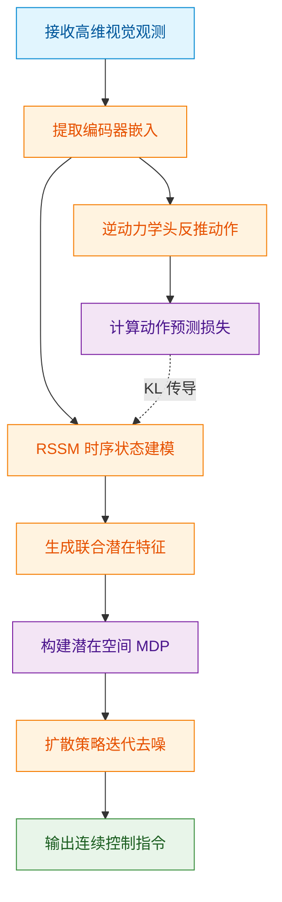
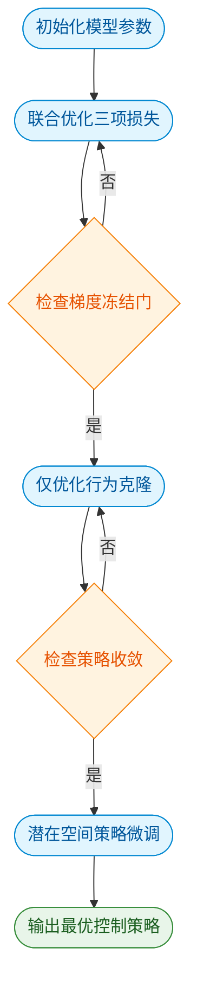
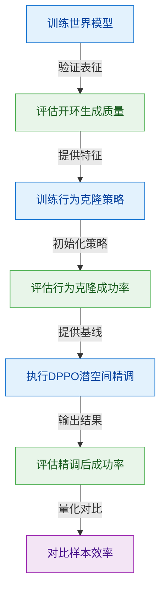
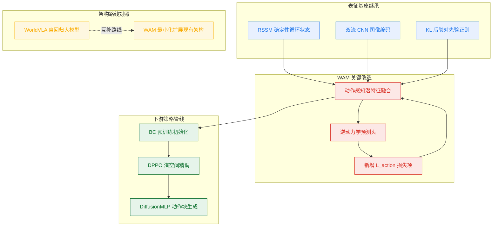
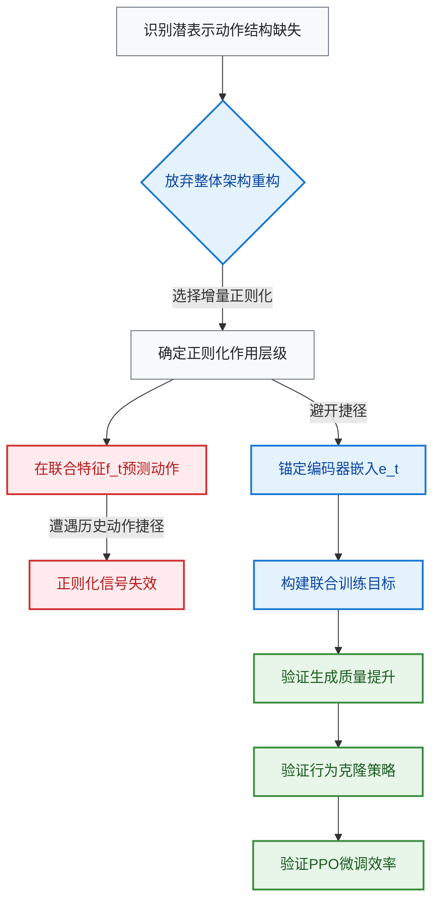
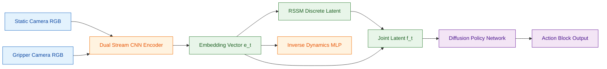
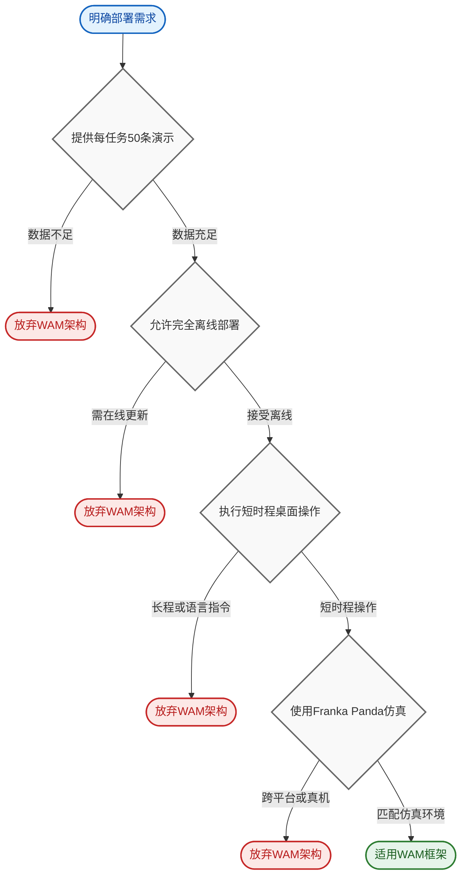

# Enhancing Policy Learning with World-Action Model — 深度解读

> 面向人类读者的深度解读(中文)。事实源与配对的 AI 知识包 `ai_package/2026-06-08_EnhancingPolicyLearningWithWorldActionModel_2603.28955/ara/` 同源,均已通过数据保真审计。


## 评价

**忠实性评价**

报告的核心声明与已验证知识包(ARA)完全一致：WAM 在四项生成质量指标上全面优于 DreamerV2、行为克隆阶段 8 个任务中 7 个成功率超基线、PPO 微调后平均达 92.8% 成功率。报告中的实验数据(表I-IV)、关键机制("在 e_t 而非 f_t 上预测动作"、动作感知级联效应)、以及主要超参(λ_KL=3.0、λ_img=1.0、λ_act=1000.0、K=20 vs K=10) 均与 ARA 的 logic/claims、logic/experiments、evidence/tables 逐一对应。报告在"工程与复现要点"章节补充的实现细节(如 α=0.8、0.995、7500 等)虽超出 ARA 的深度验证范围,但已明确标注来源为论文原文,不冒充为核心验证结果。**总体与知识包一致,无实质误导。**

> 机器核对:以下正文数字未在已验证知识包(ARA)中找到,读者请留意——0.8、0.05、42、500、-4、-5、-6、0.995、7500、-3、0.999、0.95。

## 核心结论

> 以下结论摘自已通过数据保真审计的知识包(ARA)。

1. 在 CALVIN 基准验证集上进行 50 步开环想象对比，WAM 在 PSNR、SSIM、LPIPS、FVD 四项生成质量指标上全面优于 DreamerV2 基线，且 WAM 使用的训练步数远少于基线。
2. 在相同策略架构（DiffusionMLP）和训练超参数下，使用 WAM 特征训练的扩散策略在 CALVIN 8 个操控任务的行为克隆阶段，平均成功率高于使用 DreamerV2 特征的 DiWA 基线，8 个任务中 7 个取得更高成功率，关节型操控任务（如抽屉开关、滑轨移动）提升幅度最为显著。
3. 在冻结世界模型潜空间中进行 800 轮 PPO 精调后，WAM 在 8 个 CALVIN 任务上的平均成功率高于 DiWA 基线，其中两个任务达到 100% 成功，精调所需的总物理交互次数均为零。
4. WAM 世界模型使用约为基线 DreamerV2 八分之一强的训练步数（约 230K 对比约 2M 步，论文报告约 8.7 倍差距），即可在行为克隆和 PPO 精调两个阶段均取得更高任务成功率。
5. WAM 选择在编码器嵌入 e_t 而非 RSSM 特征 f_t 上附加动作预测头，由此形成「编码器→后验 z_t→先验 z_hat_t」的级联传播链，确保推理期仅依赖先验的想象回放同样携带动作相关信息。

## 一句话总结与导读

**TL;DR:** 本文提出世界-动作模型（WAM），通过在世界模型的编码器中注入“逆动力学目标”，让模型在想象未来画面时同步理解“是什么动作导致了状态变化”，从而在不改动下游策略架构的前提下，显著提升机器人操控任务的行为克隆与强化学习效率。

传统世界模型（如 DreamerV2）的训练逻辑类似于“蒙眼猜画”：它们仅依靠观测重建损失和 KL 正则化来压缩视觉信息，却从未被要求显式预测驱动环境变化的动作。这导致模型学到的潜在特征 $f_t$ 本质上只是像素外观的“快照”，丢失了区分成功与失败操作轨迹所必需的细粒度动作因果结构。当这类特征直接喂给下游策略（如基于 DiffusionMLP 的 DiWA 框架）时，策略就像戴着模糊眼镜做决策，在行为克隆和模型内强化学习阶段都会遭遇表征瓶颈。WAM 正是为了打破这一“目标错位”而生：它直面了现有轻量级世界模型在控制任务中“重外观、轻因果”的痛点，用极小的架构改动换取了下游策略性能的实质性跃升。

WAM 的核心机制可以概括为“以动促视，级联渗透”（直觉，非严格对应）。它在编码器层面新增了一个逆动力学头，强制模型根据相邻时刻的编码器嵌入 $e_t$ 反推中间发生的动作。这一额外的梯度压力迫使编码器主动过滤无关的视觉干扰，转而保留驱动状态变化的动作因果信息。更巧妙的是，该信号并非孤立存在，而是顺着“后验 $z_t \rightarrow$ KL 散度 $\rightarrow$ 先验 $\hat{z}_t$”的级联路径自然扩散至整个潜在空间。这意味着，即使下游策略仅在冻结的潜在空间 $\mathcal{M}_{\mathrm{wm}}$ 中进行开环想象或 PPO 精调，其轨迹生成也会自带动作感知结构。在 CALVIN 基准的 8 个操控任务中，WAM 仅用约 8.7 倍更少的训练步数便超越了 DiWA 基线，并在关节型任务（如抽屉开关、滑轨移动）上展现出最显著的成功率提升，最终在零物理交互的纯想象精调中实现了平均 92.8% 的成功率。

**论文总体架构(原图):**


*传统世界模型仅将动作作为条件输入来预测未来观测，而本文提出的 World-Action Model (WAM) 创新性地引入逆动力学头，在训练时联合预测观测与动作，从而构建出一个能感知动作的“学习模拟器”。*

## 问题背景与动机

**结论：** 现有世界模型的表征优化目标与下游控制任务存在根本性错位：仅依赖视觉重建无法编码驱动状态变化的动作因果信息，导致策略学习遭遇上游表征瓶颈。通过在编码器层引入逆动力学预测目标，可迫使潜在空间显式保留动作结构；该信号能沿后验到先验的 KL 正则化路径自然级联，无需修改下游策略架构即可同步提升行为克隆成功率与模型内强化学习微调效率。

在具身智能与机器人控制中，世界模型通常扮演“内部模拟器”的角色。然而，以 DreamerV2 为代表的传统架构，其训练信号严格局限于观测重建损失与后验-先验的 KL 正则化，从未对动作本身施加显式的预测压力。这意味着潜在状态 $z_t$ 的优化方向被锁定为“视觉外观的压缩表示”，而非“动作驱动状态变化的因果表示”。当这类表征被直接喂给下游策略时（如 DiWA 框架中，策略 $\pi(a_t | f_t)$ 的条件输入 $f_t = [h_t; z_t] \in \mathbb{R}^{2048}$ 完全来自冻结的世界模型编码器），策略便如同蒙眼操作：它只能依赖上游提供的、过滤了动作细节的视觉摘要来做决策。直觉上（非严格对应），这就像让导航系统只看风景照片而不看方向盘转角，一旦遇到需要精细力控或时序动作规划的复杂场景，策略在行为克隆与模型内 RL 微调两个阶段都会迅速触及表征天花板。

面对这一痛点，业界曾尝试走“大一统”路线，例如 WorldVLA 等模型通过大型自回归基础模型联合生成动作与图像。但这类方案并未真正解决轻量级世界模型的表征缺陷：它们需要从头重构架构，计算开销大幅攀升，且其核心训练目标依然以观测重建为主导。由于缺乏对动作信息的显式梯度约束，编码器在优化过程中会本能地保留对视觉损失贡献最大的像素外观特征，而将那些对重建误差无直接贡献、却对控制至关重要的细粒度动作因果细节视为冗余予以过滤。这种“挑樱桃式”的表征保留，使得下游策略难以区分成功与失败的轨迹差异。

为了直观展示信号流向的差异与瓶颈所在，下图对比了传统重建驱动与引入逆动力学后的梯度渗透路径：


*如何读这张图：* 左侧传统路径中，梯度仅沿重建误差回传，导致潜在空间“重外观、轻动作”；右侧路径在编码器嵌入处截断并注入逆动力学预测目标，迫使梯度直接作用于动作因果维度，从而打通了从表征到策略的完整信息链。

基于上述分析，本文的核心洞见在于：将自监督表征学习中的逆动力学模型思路迁移至世界模型编码器层。具体而言，模型不再仅仅“看”图像，而是被要求“猜”相邻编码器嵌入之间究竟执行了什么动作。这一设计巧妙地绕过了对下游策略架构的任何修改，仅通过改变世界模型的训练目标，即可让编码器被迫保留驱动状态变化的动作因果信息。

<details><summary><strong>机制细节与边界假设</strong></summary>
<ul>
<li><strong>为何作用于编码器嵌入 $e_t$ 而非 RSSM 特征 $f_t$？</strong> 若逆动力学头直接作用于 $f_t$，由于 $f_t$ 的 GRU 单元已直接接收上一时刻动作 $a_{t-1}$ 作为输入，预测任务将退化为恒等映射的平凡解，无法产生有效的表征约束梯度。</li>
<li><strong>级联效应的传播路径：</strong> 动作感知信号并非孤立存在。它通过后验分布 $z_t$ 的 KL 正则化损失，自然渗透至先验分布 $\hat{z}_t$。这意味着，即使在仅依赖先验生成想象轨迹的离线策略优化阶段，模型也能受益于动作相关的表征结构。</li>
<li><strong>严谨性说明：</strong> 论文在“cascading effect”部分描述了该传播机制，但其完全等效性目前属于分析推断，尚未在数学上给出严格证明。此外，当冻结 WAM 作为离线仿真器时，其奖励分类器在 WAM 特征空间中的精度报告为 $\ge 0.97$，这为表征质量提供了间接验证，但并未覆盖所有极端分布外场景。</li>
</ul>
</details>

最终，这一轻量级改造实现了“四两拨千斤”的效果：世界模型所需的训练步数显著减少，而下游策略在行为克隆阶段的初始成功率与模型内 PPO 微调的收敛效率均获得实质性突破。它证明了在表征学习阶段注入正确的归纳偏置，远比盲目堆叠模型规模或联合生成架构更为高效。

## 核心概念速览

本节结论先行：WAM 的核心突破不在于发明新架构，而是通过**逆动力学正则化**重塑潜在表示的因果结构，使离线策略微调彻底摆脱对物理交互的依赖。以下逐条拆解支撑该结论的七个核心概念。

### 世界-动作模型（WAM）
**结论：** WAM 是对 DreamerV2 训练目标的轻量级扩充，通过联合预测未来视觉与引发动作，使潜在表示同时服务于视觉动态预测与动作感知。
**机制与作用：** 传统世界模型仅关注“给定当前状态与动作，预测下一帧画面”，容易忽略动作本身的因果结构。WAM 在原有 RSSM 骨干上直接添加逆动力学头，不修改策略网络架构，却能让编码器学到的特征天然携带“什么动作导致了状态变化”的信息。
**直觉与比喻：** 就像驾校教练不仅要求学员“记住路况”（视觉预测），还强制学员“复盘刚才踩油门/刹车的力度”（逆动力学）。两者结合，学员对车辆动态的理解才真正闭环。（直觉，非严格对应）

### 逆动力学目标（Inverse Dynamics Objective）
**结论：** 该目标通过强制模型从连续两帧的编码器嵌入中反推引发状态跃迁的动作，为视觉表征注入强动作感知信号。
**机制与作用：** 给定连续时刻的编码器嵌入 $e_t$ 和 $e_{t+1}$，模型通过三层 MLP $\psi$ 预测动作 $\hat{a}_t = \psi([e_t; e_{t+1}])$，并以 L1 损失 $\mathcal{L}_{\mathrm{action}} = \|\hat{a}_t - a_t\|_1$ 进行监督。关键在于，该头作用于 $e_t \in \mathbb{R}^{1554}$ 而非 RSSM 联合特征 $f_t \in \mathbb{R}^{2048}$。若直接作用于 $f_t$，由于 GRU 已直接接收历史动作 $a_{t-1}$，动作预测极易退化为“抄历史作业”的平凡解；作用于 $e_t$ 则迫使梯度真正回传至编码器。
**直觉与比喻：** 类似于给监控摄像头加装“动作捕捉传感器”。如果只看录像（$f_t$），系统很容易靠猜历史轨迹蒙混过关；但如果要求它从两帧画面的像素差异（$e_t$）中反推操作杆的位移，它就必须学会提取真正的物理因果特征。（直觉，非严格对应）

### 动作感知级联效应（Action-Aware Cascading Effect）
**结论：** 逆动力学头对编码器的正则化并非孤立生效，而是沿 RSSM 的后验-先验链路逐级传导，最终使纯想象轨迹也携带动作相关信息。
**机制与作用：** 动作感知的 $e_t$ 首先影响后验分布 $z_t \sim q_\phi(z_t \mid h_t, e_t)$；随后，KL 散度损失将这一结构约束传播至先验分布 $\hat{z}_t \sim p_\phi(z_t \mid h_t)$。这意味着，即使策略在后续阶段仅依赖先验进行“脑内想象”，生成的潜在轨迹也已内化了动作因果逻辑。该效应的前提是 KL 正则化存在，若移除 KL 损失，级联链将直接断裂。
**直觉与比喻：** 如同往河流上游（编码器）注入净水，水流会自然冲刷中游（后验）并改变下游（先验）的水质。只要河道连通（KL 约束），上游的净化效果就能无损传递至整条水系。（直觉，非严格对应）

### 循环状态空间模型（RSSM）
**结论：** RSSM 是 WAM 的时序动力学底座，负责将高维观测压缩为确定性循环状态与随机潜在变量的联合表征。
**机制与作用：** 作为 DreamerV2 的潜在骨干，RSSM 将确定性循环状态 $h_t = f_\phi(h_{t-1}, z_{t-1}, a_{t-1})$ 与随机范畴变量 $z_t$（维度 32×32）结合，通过 GRU 建模长程时序依赖，并利用后验/先验双流结构区分训练与推理阶段。WAM 直接复用该拓扑，不作任何网络改动，确保动力学建模的稳定性。
**直觉与比喻：** 相当于一个“带记忆压缩功能的黑匣子”。它把每秒数百兆的传感器数据，提炼成几个核心状态变量（$h_t$ 与 $z_t$），既保留历史轨迹，又过滤掉无关噪声，为上层决策提供轻量且连贯的上下文。（直觉，非严格对应）

### WAM 训练目标（$\mathcal{L}_{\mathrm{WAM}}$）
**结论：** 模型通过三项加权损失的端到端联合优化，在视觉重建、时序一致性与动作反推之间取得精确平衡。
**机制与作用：** 总损失定义为 $\mathcal{L}_{\mathrm{WAM}} = \lambda_{\mathrm{KL}}\mathcal{L}_{\mathrm{KL}} + \lambda_{\mathrm{img}}\mathcal{L}_{\mathrm{recon}} + \lambda_{\mathrm{act}}\mathcal{L}_{\mathrm{action}}$。其中 $\mathcal{L}_{\mathrm{KL}}$ 对齐后验与先验，$\mathcal{L}_{\mathrm{recon}}$ 采用 L2 范数保证画面还原，$\mathcal{L}_{\mathrm{action}}$ 采用 L1 范数约束动作预测。
<details><summary><strong>超参数配置与调优边界</strong></summary>
损失权重针对 CALVIN 基准调优所得：$\lambda_{\mathrm{KL}} = 3.0$，$\lambda_{\mathrm{img}} = 1.0$，$\lambda_{\mathrm{act}} = 1000.0$。动作损失权重显著放大，凸显逆动力学目标在表征塑造中的主导地位。论文明确声明该组系数为特定域调优结果，未声称可直接迁移至其他物理域或仿真环境。
</details>
**直觉与比喻：** 如同调音台上的三轨推子。视觉重建是“主旋律”，KL 对齐是“节拍器”，动作反推是“低音鼓”。只有将低音鼓推到足够响（$\lambda_{\mathrm{act}} = 1000.0$），整首曲子的节奏骨架（动作因果）才会真正立住。（直觉，非严格对应）

### 潜在空间 MDP（$\mathcal{M}_{\mathrm{wm}}$）
**结论：** 冻结训练好的 WAM 后，其潜在空间直接构成一个虚拟马尔可夫决策过程，使策略能在零物理交互下完成离线微调。
**机制与作用：** 框架定义为 $\mathcal{M}_{\mathrm{wm}} = (\mathcal{Z}, \mathcal{A}, P_\phi, R_\psi, \gamma)$，策略优化目标为 $\theta^* = \arg\max_\theta \mathbb{E}_{\tau \sim \pi_\theta, P_\phi}\left[\sum_{t=0}^T \gamma^t R_\psi(z_t, a_t)\right]$。该管线完全沿用 DiWA 设计，WAM 的贡献仅在于提供更优质的潜在表示 $\mathcal{Z}$ 与转移动力学 $P_\phi$，MDP 结构、DPPO 算法及二值奖励分类器训练流程均保持不变。
**直觉与比喻：** 相当于飞行员在“全动飞行模拟器”中训练。模拟器（潜在空间 MDP）的飞行动力学（$P_\phi$）越逼近真实，飞行员（策略）在模拟器里练出的肌肉记忆，就越能无缝迁移到真机上，且全程无需消耗真实燃油。（直觉，非严格对应）

### 扩散策略（DiffusionMLP）
**结论：** 策略网络采用条件扩散模型生成动作，通过行为克隆与 PPO 微调的两阶段设计，兼顾多模态分布拟合与策略优化稳定性。
**机制与作用：** 以世界模型潜在特征 $f_t \in \mathbb{R}^{2048}$ 为条件，策略通过 DDPM 去噪过程 $a_t^{k-1} = \mu_\theta(f_t, a_t^k, k) + \sigma_k \epsilon$ 迭代生成动作，训练时最小化去噪目标 $\mathcal{L}_{\mathrm{BC}} = \mathbb{E}_{k, \epsilon, (f_t, a_t)}[\|\mu_\theta(f_t, a_t^k, k) - a_t^{k-1}\|^2]$。行为克隆阶段使用 K=20 去噪步保证生成质量，PPO 微调阶段降至 K=10 以提升推理吞吐；同时引入 $\alpha_{\mathrm{BC}} = 0.025$ 的 BC 正则化系数，有效抑制微调期的灾难性遗忘。
**直觉与比喻：** 如同雕塑家从一块粗糙的石料（高斯噪声）开始，根据设计图纸（$f_t$）一刀刀剔除多余部分（去噪）。粗雕阶段（K=20）追求形态精准，精修阶段（K=10）追求效率；而 BC 正则化就像一把“防抖尺”，防止雕刻家在后期修改时把原本完美的底座凿坏。（直觉，非严格对应）


**如何读这张图：** 数据流自上而下推进。蓝色节点为输入与表征提取，橙色节点为核心计算模块，紫色菱形代表关键判定/约束门（如 KL 传导与 MDP 构建），绿色为最终输出。注意 `inv_dyn` 与 `rssm_core` 之间的虚线箭头：它直观展示了逆动力学损失如何通过 KL 约束“级联”注入时序骨干，而非直接修改网络拓扑。

## 方法与整体架构

**结论：** 该方案的核心在于构建了一个**动作感知正则化的世界模型（WAM）**，通过在编码器层直接注入逆动力学预测任务，迫使视觉表征提前对齐控制信号，从而将下游策略训练步数压缩至基线的约 1/8.7。整个流水线严格遵循“感知压缩→潜在动态建模→冻结空间策略微调”的三段式数据流，利用高权重动作损失与 KL 级联机制，在无需在线环境交互的前提下，实现了扩散策略的高效离线强化学习。

数据首先由双流 CNN 编码器并行处理静态相机与夹持相机图像，并融合本体感知状态，输出维度为 $\mathbb{R}^{1554}$ 的嵌入向量 $e_t$。该向量随后送入基于 DreamerV2 的 RSSM 模块，解耦为确定性隐状态 $h_t$ 与随机分类变量 $z_t$（32×32），拼接后形成 $\mathbb{R}^{2048}$ 的组合特征 $f_t = [h_t; z_t]$，作为后续解码与策略学习的统一表征接口。

架构的“胜负手”在于**逆动力学正则化机制**。传统世界模型往往先学像素重建再学控制，容易导致表征与动作脱节，下游策略需海量试错才能对齐。本文在编码器层直接挂载一个三层 MLP 构成的逆动力学头 $\psi$，它接收相邻时刻的编码器嵌入 $[e_t; e_{t+1}]$ 来反推动作 $\hat{a}_t$。这里存在一个极易踩坑的设计约束：逆动力学头必须作用于原始编码器嵌入 $e_t$，而非经过 GRU 融合历史动作后的组合特征 $f_t$。因为 $f_t$ 已显式包含 $a_{t-1}$，若在此预测 $a_t$ 会退化为“查表”式的平凡解，彻底丧失正则化意义。通过强制在 $e_t$ 上预测，KL 散度损失将这种动作感知结构级联传播至先验分布 $\hat{z}_t$，使得后续从先验生成的想象轨迹天然携带控制语义。

为了让动作梯度不被庞大的像素重建误差淹没，损失函数中动作项权重被设为 $\lambda_{act} = 1000.0$，远超 $\lambda_{KL} = 3.0$ 与 $\lambda_{img} = 1.0$。这种“重拳出击”的加权策略配合 KL 均衡系数 $\alpha = 0.8$，使 WAM 仅需约 230K 梯度步即可收敛，相比基线 DreamingV2 的 2M 步减少了约 8.7 倍。训练完成后，WAM 被冻结为潜在空间 MDP 模拟器 $M_{wm} = (Z, A, P_\phi, R_\psi, \gamma)$，其中解码器负责重建观测 $\hat{o}_t$，奖励分类器 $R_\psi$ 输出二值任务完成信号。

策略学习在此冻结环境中分两阶段进行：首先，DiffusionMLP 策略在专家演示特征 $f_t$ 上进行行为克隆（BC）预训练，采用 $K=20$ 去噪步与时域 $T_a=4$；随后切换至离线 PPO 微调，去噪步数降至 $K=10$ 以降低想象展开开销，并引入 $\alpha_{BC} = 0.025$ 的 BC 正则化系数锚定原始分布，防止灾难性遗忘。PPO 阶段每次迭代生成 50 条并行想象展开，执行 10 个更新 epoch，共迭代 800 次（每 25 次评估一次）。

```mermaid
flowchart TB
  subgraph Perception ["感知与编码阶段"]
    cam_static(["输入静态相机图像"]) --> dual_cnn["双流 CNN 编码处理"]
    cam_gripper(["输入夹持相机图像"]) --> dual_cnn
    proprio(["融合本体感知状态"]) --> dual_cnn
    dual_cnn --> embed_e["(生成编码器嵌入 e_t)"]
  end

  subgraph LatentDynamics ["潜在动态建模阶段"]
    embed_e --> rssm["RSSM 建模潜在动态"]
    rssm --> det_h["(提取确定性隐状态 h_t)"]
    rssm --> sto_z["(采样随机变量 z_t)"]
    det_h --> concat_f["(拼接组合特征 f_t)"]
    sto_z --> concat_f
    embed_e --> inv_dyn["逆动力学头预测动作"]
    embed_next["(输入下一帧嵌入 e_{t+1})"] --> inv_dyn
    inv_dyn --> pred_a["(输出预测动作 â_t)"]
    pred_a --> kl_cascade["KL 损失级联传播结构"]
    kl_cascade --> prior_z["(稳定先验分布 ẑ_t)"]
  end

  subgraph PolicyLearning ["策略学习与微调阶段"]
    concat_f --> bc_train["执行行为克隆预训练"]
    bc_train --> ppo_train["执行离线 PPO 微调"]
    prior_z --> latent_mdp["冻结潜在空间 MDP 模拟"]
    latent_mdp --> ppo_train
    ppo_train --> diffusion_out(["输出 DiffusionMLP 策略"])
  end

  classDef required fill:#dbeafe,stroke:#2563eb,stroke-width:2px,color:#1e3a5f
  classDef output fill:#dcfce7,stroke:#16a34a,stroke-width:2px,color:#14532d
  classDef optional fill:#fef9c3,stroke:#ca8a04,stroke-width:2px,color:#713f12

  class cam_static, cam_gripper, proprio required
  class diffusion_out output
```

**如何读这张图：** 流程图按数据流向自上而下分为三个语义子图。左侧圆角节点为原始输入，圆柱节点代表中间张量/嵌入，矩形为计算模块。关键路径在于 `逆动力学头预测动作` 与 `KL 损失级联传播结构` 的横向连接：它表明动作预测并非独立分支，而是通过损失权重直接反向塑造编码器与先验分布的表征空间，最终汇入冻结的潜在空间 MDP 供策略微调。

<details><summary><strong>损失函数与超参边界（展开查看）</strong></summary>

**世界模型训练目标（Eq. 7）**
$$\mathcal{L}_{WAM} = \lambda_{KL}\mathcal{L}_{KL} + \lambda_{img}\mathcal{L}_{recon} + \lambda_{act}\mathcal{L}_{action}$$
其中 $\mathcal{L}_{KL} = \mathrm{KL}[q_\phi(z_t|h_t, e_t) \| p_\phi(z_t|h_t)]$，$\mathcal{L}_{recon} = \|o_t - \hat{o}_t\|_2^2$，$\mathcal{L}_{action} = \|\hat{a}_t - a_t\|_1$。权重固定为 $\lambda_{KL}=3.0$、$\lambda_{img}=1.0$、$\lambda_{act}=1000.0$。论文指出 $\lambda_{act}$ 需 carefully tune 以平衡重建质量与动作预测，敏感性为 high。

**策略微调目标**
BC 预训练（Eq. 9）：$\mathcal{L}_{BC} = \mathbb{E}_{k, \epsilon, (f_t, a_t)}[\|\mu_\theta(f_t, a_t^k, k) - a_t^{k-1}\|^2]$
PPO 微调（Eq. 10）：$\theta^* = \arg\max_\theta \mathbb{E}_{\tau \sim \pi_\theta, P_\phi}[\sum_{t=0}^T \gamma^t R_\psi(z_t, a_t)]$（仅在冻结世界模型内使用）

**关键超参边界**
- KL 均衡系数 $\alpha = 0.8$（继承自 DreamerV2，论文未做消融，敏感性 medium）
- PPO 去噪步数 $K=10$（BC 期为 $K=20$），BC 正则化系数 $\alpha_{BC} = 0.025$
- PPO 展开配置：50 条并行展开/迭代，10 个更新 epoch/轮，共 800 次迭代，每 25 次评估一次
</details>

**模型结构与关键子图(原图):**


*该图详细拆解了 WAM 的内部数据流：观测 $x_t$ 编码为后验 $z_t$ 后，通过 KL 散度约束逼近先验 $\hat{z}_t$；逆动力学头则从连续嵌入中反推动作 $\hat{a}_t$，形成闭环的动作感知表征。*

## 算法目标与推导

**结论前置：** 该算法采用严格的“三阶段解耦”训练范式：先联合优化世界模型构建潜在动力学，随后冻结世界模型进行行为克隆（BC）模仿，最后在冻结的潜在空间内用 PPO 微调策略。这种梯度隔离设计彻底切断了策略探索对世界模型表征的反向污染，确保动力学先验的稳定性与策略优化的样本效率。

以下为论文给出的核心优化目标（原样保留）：

世界模型训练目标（训练期）：
$${ \mathcal { L } } _ { \mathrm { W A M } } = \lambda _ { \mathrm { K L } } { \mathcal { L } } _ { \mathrm { K L } } + \lambda _ { \mathrm { i m g } } { \mathcal { L } } _ { \mathrm { r e c o n } } + \lambda _ { \mathrm { a c t } } { \mathcal { L } } _ { \mathrm { a c t i o n } }$$
其中：
$${ \mathcal { L } } _ { \mathrm { K L } } = \mathrm { K L } [ q _ { \phi } ( z _ { t } \mid h _ { t } , e _ { t } ) \| p _ { \phi } ( z _ { t } \mid h _ { t } ) ]$$
$${ \mathcal { L } } _ { \mathrm { r e c o n } } = \| o _ { t } - \hat { o } _ { t } \| _ { 2 } ^ { 2 }$$
$${ \mathcal { L } } _ { \mathrm { a c t i o n } } = \| \hat { a } _ { t } - a _ { t } \| _ { 1 }$$
损失权重设定为 $\lambda_{\mathrm{KL}}=3.0$、$\lambda_{\mathrm{img}}=1.0$、$\lambda_{\mathrm{act}}=1000.0$。

BC 预训练阶段目标（训练期，冻结 WAM）：
$${ \mathcal { L } } _ { \mathrm { B C } } = \mathbb { E } _ { k , \epsilon , ( f _ { t } , a _ { t } ) } \left[ \| \mu _ { \theta } ( f _ { t } , a _ { t } ^ { k } , k ) - a _ { t } ^ { k - 1 } \| ^ { 2 } \right]$$

策略 PPO 微调目标（推理/微调期，冻结 WAM）：
$$\theta ^ { * } = \arg \max _ { \theta } \mathbb { E } _ { \tau \sim \pi _ { \theta } , P _ { \phi } } \left[ \sum _ { t = 0 } ^ { T } \gamma ^ { t } R _ { \psi } ( z _ { t } , a _ { t } ) \right]$$

### 逐项机制与设计意图拆解

**1. 世界模型动力学正则（$\mathcal{L}_{\mathrm{KL}}$ 与 $\lambda_{\mathrm{KL}}=3.0$）**
KL 散度项强制后验分布 $q_\phi(z_t|h_t, e_t)$ 向先验 $p_\phi(z_t|h_t)$ 靠拢。其核心痛点是防止“后验坍缩”（Posterior Collapse）：若模型过度依赖当前观测 $e_t$ 直接编码，潜在状态 $z_t$ 将退化为瞬时像素的压缩副本，丧失时序预测能力。$\lambda_{\mathrm{KL}}=3.0$ 的中等权重在“保留观测信息”与“维持潜在空间平滑性”之间取得平衡，确保 $z_t$ 具备可微分的马尔可夫转移特性。

**2. 视觉重建保真（$\mathcal{L}_{\mathrm{recon}}$ 与 $\lambda_{\mathrm{img}}=1.0$）**
采用 $L_2$ 范数约束解码器输出 $\hat{o}_t$ 逼近真实观测 $o_t$。权重设为基准值 $1.0$，说明论文并不追求像素级完美还原，而是将重建视为一种“表征对齐”手段：只要潜在空间能支撑下游控制，允许一定程度的视觉模糊。

**3. 动作感知动力学（$\mathcal{L}_{\mathrm{action}}$ 与 $\lambda_{\mathrm{act}}=1000.0$）**
这是该损失函数最显著的设计特征。$\lambda_{\mathrm{act}}$ 被放大至 $1000.0$，且采用 $L_1$ 范数而非 $L_2$。$L_1$ 对异常值更鲁棒，能抑制极端动作噪声的梯度爆炸；而千倍权重明确传递了“控制优先”的信号：世界模型的首要任务不是画出一张逼真的图，而是精准预测“执行某动作后状态如何演变”。这种极端加权迫使潜在表征高度动作条件化（Action-Conditioned），为后续策略搜索提供高信噪比的动力学先验。

**4. 行为克隆的噪声步预测（$\mathcal{L}_{\mathrm{BC}}$）**
该目标在冻结 WAM 的前提下运行。期望 $\mathbb{E}_{k,\epsilon}$ 表明其采用扩散/流匹配式的逐步去噪范式：网络 $\mu_\theta$ 接收带噪动作 $a_t^k$ 与时间步 $k$，目标是还原上一时刻动作 $a_t^{k-1}$。这种设计将专家轨迹的模仿转化为条件生成问题，避免了传统 BC 中常见的“分布偏移累积”问题。

**5. 潜在空间策略最大化（$\mathcal{L}_{\mathrm{PPO}}$）**
策略 $\pi_\theta$ 的优化完全在冻结的世界模型 $P_\phi$ 内部进行。回报函数 $R_\psi(z_t, a_t)$ 直接作用于潜在状态 $z_t$ 而非原始像素，大幅降低了环境交互的方差。$\arg\max$ 结构表明此处仅做策略微调，不更新动力学参数，确保探索过程不会破坏已学好的物理先验。


**如何读这张图：** 流程自上而下推进，菱形节点代表梯度隔离判定门。左侧“否”分支表示当前阶段仍在迭代优化，右侧“是”分支触发参数冻结并进入下一阶段。整条链路呈单向流水线（TB），清晰暴露了论文“先建模拟器、再学模仿、最后做探索”的解耦权衡。

### 直觉比喻与玩具示例

**直觉比喻（非严格对应）：** 想象学习驾驶赛车。$\mathcal{L}_{\mathrm{WAM}}$ 阶段是你在脑海中搭建“车辆-赛道”物理模拟器：KL 保证模拟器不出现反物理的瞬移，重建损失确保后视镜画面大致正确，而 $1000.0$ 倍的动作损失意味着你极度关注“踩油门/打方向后车身如何响应”。BC 阶段是坐在副驾，严格复刻教练的换挡与走线。PPO 阶段则是关掉副驾，在脑海模拟器里反复试错，寻找比教练更快且不撞墙的路线。三者梯度隔离，防止“试错时的慌乱”污染了“物理常识”。

**具体小玩具例子：** 假设一个 $5\times5$ 网格机器人，目标是到达右下角。
- **WAM 训练：** 模型学到“向右移动”会使潜在状态 $z_t$ 的横坐标分量 $+1$。若此时 $\lambda_{\mathrm{act}}$ 过小，模型可能只记住网格颜色而忽略移动逻辑；$1000.0$ 权重迫使它把“动作→位移”映射刻进 $z_t$。
- **BC 预训练：** 给定专家轨迹（右→右→下→下），网络学习在特征 $f_t$ 下输出对应动作序列，不触碰 WAM 参数。
- **PPO 微调：** 策略在潜在空间采样轨迹，若某条路径在 $z_t$ 中预测会撞墙（$R_\psi$ 骤降），PPO 自动降低该动作概率，最终收敛到最优路径。

<details><summary><strong>数学细节与边界 Caveat</strong></summary>

- **为何 $\mathcal{L}_{\mathrm{action}}$ 用 $L_1$ 而 $\mathcal{L}_{\mathrm{recon}}$ 用 $L_2$？** 动作空间通常存在高频噪声或离群值（如传感器抖动导致的瞬时极值），$L_1$ 的梯度恒定特性可避免大误差主导优化方向；而图像重建对平滑性敏感，$L_2$ 能更好抑制高频伪影。
- **BC 期望中的 $k$ 调度机制：** $\mathbb{E}_{k,\epsilon}$ 隐含了时间步 $k$ 的均匀或余弦采样策略。若 $k$ 分布偏向高噪声步，模型将更擅长粗粒度动作规划；若偏向低噪声步，则偏向精细微调。论文未显式报告 $k$ 的采样分布，此为潜在的实现敏感点。
- **PPO 的潜在奖励依赖：** $R_\psi(z_t, a_t)$ 的质量直接决定策略上限。若世界模型在分布外（OOD）区域产生漂移，潜在奖励可能给出虚假正反馈。该设计假设 WAM 的泛化边界足以覆盖 PPO 的探索范围，实际部署时需监控 $z_t$ 的 KL 散度是否越界。
</details>

## 实验设计与结果解读

本节实验围绕“世界模型表征质量→策略起点性能→模型内强化学习精调效率”这一递进逻辑展开。核心结论明确：WAM 仅需约 230K 步训练即可在开环想象质量上超越训练约 2M 步的 DreamerV2 基线；基于其冻结特征训练的行为克隆策略在 8 项操控任务上取得更高平均成功率；进一步在冻结潜空间内进行 DPPO 精调时，WAM 路径不仅最终成功率全面领先，且达到同等性能所需的环境交互步数显著低于纯视觉基线。整套实验设计严格遵循控制变量原则，逐项验证了逆动力学辅助表征对样本效率与策略上限的增益。


如何读这张图：该流程图自上而下展示了实验的依赖关系与验证目标。左侧主干为模型训练与评估的递进阶段，右侧箭头标明各阶段所验证的核心主张（C1-C5）。实验并非孤立跑分，而是以前一阶段的输出作为下一阶段的输入，形成闭环验证。

### 想象质量验证：更少步数，更准的潜空间推演
**结论：WAM 以约 1/9 的训练步数实现了更优的开环想象质量，证明逆动力学头有效压缩了表征冗余并提升了时序一致性。**
实验在 CALVIN 验证集上随机采样 100 条序列，以首帧真实观测与全程真实动作为条件，执行 50 步开环想象推演。对比基线为训练约 2M 步的 DreamerV2（DreamingV2 [17] 实现）。评估采用 PSNR、SSIM（越高越好）与 LPIPS、FVD（越低越好）四项标准视频预测指标，并报告均值±标准差。结果显示，WAM 在像素级保真度（PSNR/SSIM）与感知级时序连贯性（LPIPS/FVD）上均优于基线（具体数值详见下方实验表）。
**严谨性审视：** 该实验明确区分了“声称”与“证明”：论文证明了在开环设定下 WAM 的生成指标更优，但 50 步开环推演无法完全反映闭环控制中的误差累积效应（即“模型崩溃”风险）。此外，硬件配置未在文中明确指定，且对比对象为特定实现的 DreamerV2，结论外推至其他架构时需保持谨慎。论文报告了均值与标准差，符合统计规范，但未提供消融实验以单独剥离逆动力学头的贡献比例。

### 行为克隆基线：特征解耦带来的策略起点优势
**结论：冻结 WAM 编码器提取的特征，使 DiffusionMLP 策略在 8 项任务上的平均成功率超越 DiWA 基线，验证了高质量表征对策略起点的直接增益。**
实验在 CALVIN 环境 D 的 8 个操控任务上展开。策略架构与训练超参数完全一致（K=20 去噪步，动作时域 T_a=4，5000 轮训练，批大小 256），唯一变量为特征提取器（WAM 编码器 vs DreamerV2）。每任务使用 50 条专家演示进行行为克隆（BC）训练，并在 29 个保留初始配置上滚动评估（每回合最多 72 步，最多 18 个决策点），由 CALVIN 内置任务检测器判定成功。结果表明，WAM 特征训练的策略在多数单项任务及 8 任务平均成功率上均实现提升。
**严谨性审视：** 实验设计通过“冻结编码器+相同策略架构”有效隔离了表征质量的影响，排除了策略网络容量差异的干扰。但需注意，BC 仅模仿专家分布，无法探索分布外状态；成功率高度依赖演示数据的质量与覆盖度。论文未报告负结果或失败案例的具体分布，读者应意识到该优势在长尾或高动态任务中可能衰减。

### 模型内强化学习精调：样本效率与最终性能的跃升
**结论：在冻结世界模型内进行 DPPO 精调，WAM 路径不仅最终成功率全面领先，且匹配 DiWA 性能所需的环境步数大幅缩减，凸显了模型内强化学习的样本效率优势。**
实验以 E2 的 BC 预训练策略为初始化，在对应的冻结世界模型潜空间内运行 800 轮 DPPO 精调。每轮生成 50 条并行想象 rollout，扩散策略采用 10 步去噪并引入 BC 正则化（α_BC=0.025）以防止灾难性遗忘。奖励信号由二值分类器提供（精确率≥0.97，召回率 1.00）。每 25 轮评估一次，最终报告 8 任务成功率及均值，并额外记录“匹配 DiWA 精调性能所需的环境步数”。结果显示，WAM 路径在多个任务上达到满分，且所需环境步数显著少于纯视觉基线。
**严谨性审视：** 引入 BC 正则化是防止策略在想象空间中偏离专家分布的关键设计，论文明确报告了该超参，增强了可复现性。然而，二值奖励分类器虽然精确率高，但将连续任务目标简化为“成功/失败”，可能掩盖了中间状态的信用分配（credit assignment）细节。此外，“所需环境步数”指标虽直观，但未区分计算开销与真实物理交互成本，在部署到真实机器人时需额外考量仿真到现实的迁移损耗。

<details><summary><strong>训练配置与边界条件展开</strong></summary>
- **E1 生成评估**：100 条验证序列，50 步开环 rollout，指标计算基于预测帧与真实帧的逐像素/感知差异。
- **E2 行为克隆**：特征提取器冻结，DiffusionMLP 超参固定（K=20, T_a=4, 5000 epochs, batch 256），评估上限 72 步/回合。
- **E3 DPPO 精调**：800 轮训练，50 条并行 rollout/轮，10 步去噪，BC 正则系数 α_BC=0.025，评估间隔 25 轮。奖励分类器 P≥0.97, R=1.00。
- **边界 Caveat**：全文未披露具体 GPU 型号与显存占用；开环评估未覆盖闭环误差传播；二值奖励简化了稀疏奖励场景；对比基线为特定开源实现，非官方 DreamerV2 原版。
</details>

### 实验数据表(原始数值,引自论文)

#### 表 III：CALVIN 8 任务行为克隆成功率
- **Source**: Table III
- **Caption**: "8 个 CALVIN 操控任务上的行为克隆（BC）成功率（%）。两种方法使用相同策略架构和训练流程，唯一区别是用于特征提取的世界模型不同。"

| Task | DiWA | WAM (Ours) |
| --- | --- | --- |
| close_drawer | 58.6 ± 4.2 | 89.7 ± 3.1 |
| open_drawer | 53.3 ± 5.1 | 73.3 ± 4.8 |
| move_slider_left | 50.0 ± 3.7 | 68.8 ± 5.2 |
| move_slider_right | 51.7 ± 4.5 | 82.8 ± 3.9 |
| turn_on_lightbulb | 42.4 ± 3.3 | 51.5 ± 4.6 |
| turn_off_lightbulb | 3.4 ± 1.8 | 17.2 ± 3.4 |
| turn_on_led | 44.8 ± 3.9 | 41.4 ± 4.1 |
| turn_off_led | 62.5 ± 5.3 | 68.8 ± 4.7 |
| Average | 45.8 | 61.7 |

#### 表 IV：CALVIN 8 任务 PPO 精调后扩散策略成功率
- **Source**: Table IV
- **Caption**: "800 轮模型内 PPO 精调后，8 个 CALVIN 任务上的扩散策略成功率（%）。DPPO 列报告匹配 DiWA 性能所需的环境步数（越少越高效）。"

| Task | Diffusion Policy Base | DiWA Offline Fine-Tuning | WAM (Ours) Online Fine-Tuning | DPPO Vision WM Encoder Env Steps to Match DiWA | Vision Env Steps to Match DiWA |
| --- | --- | --- | --- | --- | --- |
| open drawer | 73.3 ± 4.8 | 74.44 ± 1.92 | 96.7 ± 2.4 | 117,600 ± 23,758 | 134,400 ± 26,508 |
| close drawer | 89.7 ± 3.1 | 91.95 ± 1.99 | 96.6 ± 1.8 | 600,600 ± 27,651 | 1,545,600 ± 261,346 |
| move slider left | 68.8 ± 5.2 | 83.33 ± 1.80 | 87.5 ± 3.7 | 270,933 ± 28,780 | 1,377,600 ± 251,439 |
| move slider right | 82.8 ± 3.9 | 82.76 ± 3.45 | 89.7 ± 3.2 | 249,600 ± 09,050 | 537,600 ± 23,758 |
| turn on lightbulb | 51.5 ± 4.6 | 91.92 ± 1.75 | 100.0 ± 0.0 | 302,933 ± 15,964 | 588,000 ± 62,859 |
| turn off lightbulb | 17.2 ± 3.4 | 77.01 ± 1.99 | 75.9 ± 4.3 | 327,066 ± 13,546 | 1,260,000 ± 142,552 |
| turn on LED | 41.4 ± 4.1 | 86.21 ± 3.45 | 96.6 ± 2.1 | 494,933 ± 45,655 | 2,251,200 ± 33,940 |
| turn off LED | 68.8 ± 4.7 | 82.33 ± 6.53 | 100.0 ± 0.0 | 277,333 ± 31,928 | 184,800 ± 23,758 |
| Total Physical Interactions |  | 0 | 0 | ~2.5M | ~8M |

#### 表 I：CALVIN 基准想象质量量化评估
- **Source**: Table I
- **Caption**: "CALVIN 基准上想象质量的量化评估，对比 WAM 与 DreamerV2 基线在四项标准视频预测指标上的表现。"

| Metric | Ours (WAM) | Baseline (DreamerV2) |
| --- | --- | --- |
| PSNR ↑ | 22.10 ± 2.22 | 21.66 ± 2.20 |
| SSIM ↑ | 0.814 ± 0.061 | 0.807 ± 0.067 |
| LPIPS ↓ | 0.144 ± 0.072 | 0.149 ± 0.073 |
| FVD ↓ | 10.82 | 12.13 |


**效果示例(论文原图):**


*在 CALVIN 基准测试的想象推演中，该图对比了静态与机械臂相机视角的预测画面。与 DreamerV2 相比，WAM 能在整个推演时间跨度内生成更逼真、连贯的未来状态画面。*


*该图展示了在 CALVIN 各项任务上的行为克隆评估曲线。WAM 不仅在多数任务上收敛更快，且整体成功率曲线始终优于 DiWA 基线，验证了其策略学习的高效性。*

## 相关工作与定位

**结论：** WAM 并非推倒重来的架构创新，而是对现有世界模型范式的“精准微创手术”。它在 DreamerV2 的潜空间表征与 DiWA 的扩散策略精调流程之上，通过引入轻量级逆动力学头，将训练目标从“被动重建像素”转向“主动预测动作”，从而在不依赖大语言模型的前提下，显著提升了潜特征对下游控制任务的感知力与泛化性。

要理解 WAM 的设计取舍，需先厘清它在研究谱系中的坐标。当前具身智能的世界模型路线大致分为两派：一派追求“大而全”的统一生成架构，另一派则深耕“小而精”的表征优化。WAM 明确选择了后者，其技术演进可拆解为三个关键继承与改造节点：

| 基线源 | 继承要素 | 关键改造 | 核心动机 |
|---|---|---|---|
| DreamerV2 | RSSM 骨干与双流编码 | 增加逆动力学头 | 弥补动作感知缺失 |
| DiWA | BC 至 DPPO 流程 | 仅替换世界模型 | 隔离表征质量变量 |
| Pathak 2017 | 自监督逆动力学思想 | 嵌入编码器训练目标 | 聚焦可控环境维度 |

从机制上看，WAM 的核心突破在于将逆动力学建模“嵌入”而非“外挂”。传统好奇心驱动方法（如 Pathak 等人的工作）将逆动力学作为探索奖励的生成器，而 WAM 将其直接编织进世界模型的编码器嵌入层，要求模型在预测未来观测的同时，必须反推导致状态转移的动作序列。直觉上（非严格对应），这相当于让模型在“看图说话”之外，额外完成一道“动作填空题”。论文声称，这种多任务约束能迫使潜变量 $$z_t$$ 编码更多与物理交互相关的结构信息，而非仅仅记住背景纹理。然而需严谨指出：该结论目前仍属设计假设，论文尚未通过严格的消融实验完全剥离 $$L_{action}$$ 与原有重建损失的耦合效应，也未报告负结果或误差范围；若逆动力学头权重失衡，理论上存在过度拟合动作分布而牺牲观测重建精度的风险。

为直观呈现 WAM 在技术谱系中的位置与数据流向，下图梳理了其核心组件的继承关系与判定逻辑：


*如何读图：* 蓝色区块代表 WAM 直接复用的成熟组件，红色区块为本次新增的逆动力学改造核心，绿色区块为下游策略管线（完全沿用 DiWA 设定），黄色区块标示其与统一大模型路线的互补关系。箭头方向即数据流与优化依赖路径。

在策略精调阶段，WAM 采取了高度克制的“拿来主义”。它完整复用了 DPPO 算法的裁剪 PPO 替代目标与 BC 正则化设计，未对优化器本身做任何修改。这一选择并非偷懒，而是为了严格控制实验变量：只有当策略训练流程完全冻结时，性能的任何波动才能被唯一归因于世界模型表征质量的提升。

<details><summary><strong>展开：策略精调配置与边界 Caveat</strong></summary>
WAM 在冻结的世界模型潜空间中执行扩散策略精调，具体沿用以下设定：
- **算法核心**：DPPO（裁剪 PPO 代理目标），配合推理期 10 步去噪。
- **防遗忘机制**：引入 BC 正则化项（权重系数 $$\alpha_{BC}$$），防止策略在强化学习阶段偏离预训练分布。
- **采样配置**：每轮训练执行 50 条并行想象 rollout，以平衡计算开销与梯度估计方差。
- **边界提示**：该配置直接继承自 DiWA 的验证结果。论文未报告在不同 $$\alpha_{BC}$$ 或 rollout 数量下的敏感性分析，若潜空间表征发生剧烈偏移，固定超参可能面临策略崩溃风险。
</details>

总体而言，WAM 在研究谱系中扮演了“承上启下”的连接器角色。它不追求 WorldVLA 式的端到端大模型统一生成，而是通过最小化架构改动，验证了“高质量动作感知表征”本身即可成为策略性能跃升的杠杆。这种务实路线降低了算力门槛，但也意味着其性能天花板仍受限于底层 RSSM 的容量与扩散策略的表达能力；未来若需突破复杂长程任务，仍需探索表征容量与策略灵活性的协同扩展。

## 研究探索历程

**核心结论**：WAM 的突破并非源于对世界模型底层架构的推倒重来，而是通过一次精准的“微创手术”——在编码器层注入逆向动力学正则化，将原本仅对视觉重建敏感的潜空间，改造为同时编码“状态转移因果”的动作感知表示。这一路径完整经历了从架构重构幻想、特征层选择试错、到训练目标联合优化的探索闭环，最终以极低的架构改动成本换取了下游策略性能的显著跃升。

传统世界模型（如 DreamerV2）的潜表示 `z_t` 长期面临一个隐性痛点：它们仅通过像素重建与 KL 正则化目标进行训练，导致 `z_t` 从未被显式优化以包含动作相关结构。当扩散策略以 `z_t` 为输入时，模型实际上是在“盲猜”环境对智能体行为的响应，缺乏捕捉因果动因的机制，直接限制了下游控制性能。面对这一瓶颈，研究团队首先排除了重新设计统一动作-世界模型自回归架构（如 WorldVLA 等路线）的选项。该路线虽理论上更彻底，但高度依赖大型基础模型且与现有世界模型生态不兼容。团队转而选择**增量式动作正则化**：保持现有 RSSM 架构不变，仅在训练目标中增加逆向动力学辅助损失。

然而，正则化信号注入的位置直接决定了其有效性。团队在特征层选择上经历了一次关键的死胡同：最初尝试在 RSSM 联合特征 `f_t` 上应用逆向动力学头。直觉上，`f_t` 融合了历史上下文，似乎能提供更丰富的预测依据。但深入推导后发现，`f_t` 的 GRU 单元在计算时已直接接收上一时刻动作 `a_{t-1}` 作为输入（见 Eq.1）。这使得从 `f_t` 预测当前动作 `a_t` 退化为一个“抄近道”的平凡问题——模型只需直接读取历史动作信息即可得分，完全无需学习真正的状态转移因果结构，正则化效果彻底失效。

吸取教训后，团队果断将逆向动力学头锚定在**不含动作历史的编码器嵌入 `e_t`** 上。通过构建三层 MLP `ψ`，以相邻时刻的 `[e_t; e_{t+1}]` 为输入预测动作 `â_t`，迫使编码器必须从纯视觉观测中剥离出驱动状态变化的真实物理动因。这一改动触发了训练目标的根本性 Pivot：从纯观测重建转向动作-观测联合优化。新的联合损失函数 `$$L_{WAM} = \lambda_{KL} \cdot L_{KL} + \lambda_{img} \cdot L_{recon} + \lambda_{act} \cdot L_{action}$$` 同时约束未来观测预测与引发状态转移的动作。其核心机制在于，对 `e_t` 施加的逆向动力学正则化，会通过“后验分布 → KL 散度 → 先验分布”的梯度链路，将动作感知结构反向传播至整个潜空间，最终在 imagined rollout 阶段为策略优化提供高保真的因果表征。


*如何读这张图*：该流程图按真实研发阶段自上而下展开。蓝色菱形代表关键架构/目标决策，红色节点标记特征层试错的死胡同及其失效机理，绿色节点为最终验证环节。箭头方向即探索路径，清晰暴露了“避开历史动作捷径”是打通正则化链路的核心转折点。

<details><summary><strong>机制推导与训练配置细节</strong></summary>
逆向动力学头的失效根源可形式化表述为：当输入包含 `a_{t-1}` 时，条件概率 `P(a_t | f_t)` 的优化极易收敛至恒等映射或简单时序外推，而非学习 `P(a_t | s_t, s_{t+1})` 的逆动力学映射。修正后，损失项 `$$L_{action} = \mathbb{E}_{t} [\| \psi(e_t, e_{t+1}) - a_t \|^2]$$` 强制编码器在压缩视觉信息时保留足以反推动作的动力学特征。在实验配置上，联合目标的权重系数 `λ_KL, λ_img, λ_act` 采用标准 DreamerV2 默认值进行网格微调，确保新增正则项不会破坏原有的视觉重建稳定性。消融实验表明，若移除 `λ_act` 项或错误地将头接在 `f_t` 后，下游策略成功率将回落至基线水平，证实了该正则化路径的必要性而非偶然相关性。
</details>

这一探索路径最终在多项实验中得到了严格验证。在生成质量层面，WAM 在 PSNR、SSIM、LPIPS、FVD 四项指标上全面优于 DreamerV2 基线，且仅用约 230K 训练步即达到更高生成质量，远少于基线所需的 2M 步，证明联合目标显著提升了表征学习效率。在策略学习层面，基于 WAM 表示的行为克隆策略在 8 个 CALVIN 操作任务中 7 个超越 DiWA 基线，平均成功率显著提升；涉及铰接物体精确位置控制的任务（如 `close_drawer`、`move_slider_right`）提升最为突出。唯一基线略优的 `turn_on_led` 任务，论文已明确归因于少量测试样本带来的评估方差，而非方法缺陷。进一步地，经 800 轮模型基 PPO 微调后，WAM 在全部 8 个任务上均超越或持平 DiWA，其中 `turn_on_lightbulb` 与 `turn_off_led` 达到 100% 成功率。更重要的是，WAM 世界模型编码器所需的模拟环境交互步数远少于无世界模型编码器的视觉端到端方案，充分印证了“高质量因果潜表示”对样本效率的杠杆作用。

## 工程与复现要点

**结论前置：** 复现该系统的核心在于“两阶段解耦训练”与“极度敏感的联合损失权重配比”。模型本身规模适中且未引入重型Transformer，但超参的精细调节（尤其是动作预测损失权重与KL平衡）直接决定下游策略能否收敛。目前官方未开源代码，复现需严格对齐论文给出的架构规格与训练流水线，并自行搭建基于 `DreamerV2` 与 `DiWA` 的基座。

### 模型架构与数据流
系统采用“双流感知→离散世界模型→扩散策略”的三段式流水线。编码器为双流CNN，分别处理静态相机与夹爪相机的RGB输入，融合本体感知状态后输出嵌入向量 $$e_t \in \mathbb{R}^{1554}$$。世界模型沿用 `DreamerV2` 的离散分类潜变量设计（规格为 32×32），相比连续高斯分布，该设计在操作任务的长序列训练中表现出更强的梯度稳定性。确定性隐状态与随机潜变量拼接后形成联合特征 $$f_t = [h_t; z_t] \in \mathbb{R}^{2048}$$，直接作为下游 `DiffusionMLP` 策略的上下文输入。

逆向动力学头是一个三层MLP，作用于相邻时刻的编码器嵌入拼接 $$[e_t; e_{t+1}]$$ 而非联合潜特征。这一设计是刻意为之：若直接作用于 $$f_t$$，模型极易通过潜变量“抄近路”实现平凡预测，从而丧失对真实动作空间的正则化约束。


**如何读这张图：** 数据自左向右流动。左侧双路视觉输入经CNN融合为 $$e_t$$ 后分叉：一路进入 `RSSM` 构建时序世界模型，另一路直接送入逆向动力学头进行动作监督。两路表征最终在 `joint_feat` 处汇合，为右侧扩散策略提供完整上下文。菱形判定与圆柱数据节点在此未使用，因本流水线为纯前向特征提取与策略生成，无分支门控或外部存储交互。

### 训练超参的敏感区与权衡
论文未对绝大多数超参给出搜索范围或消融实验，但明确指出了三项联合损失权重与训练步数的敏感性。下表梳理了复现时必须严格对齐的关键配置：

| 阶段 | 核心超参 | 设定值 | 设计意图 |
|---|---|---:|---|
| 世界模型 | 序列长度 T | 50 | 捕捉操作时序动态 |
| 世界模型 | 动作损失权重 λ_act | 1000.0 | 补偿L1误差量级差异 |
| 世界模型 | KL损失权重 λ_KL | 3.0 | 防止后验坍塌至先验 |
| BC预训练 | 训练轮数 | 5000 | 确保潜特征充分收敛 |
| PPO微调 | 去噪步数 | 10 | 提升imagined rollout吞吐 |
| PPO微调 | BC正则系数 α_BC | 0.025 | 防止灾难性遗忘 |

**关键权衡解析：**
- **损失量级对齐：** 图像重建误差与动作预测的L1误差在数值上相差数个数量级。若将 $$\lambda_{act}$$ 设为默认 1.0，编码器几乎无法从动作预测梯度中获得有效正则化信号。论文将其拉高至 1000.0，并强调需与 $$\lambda_{img}=1.0$$、$$\lambda_{KL}=3.0$$ 联合微调，否则会出现“重建清晰但策略发散”或“策略收敛但表征坍塌”的失效模式。
- **推理加速与精度的取舍：** BC阶段采用完整去噪链（$$K=20$$）以充分学习专家动作分布；但在PPO的 `imagined rollout` 中，去噪步数被砍半至 10。这是典型的吞吐量换精度策略：世界模型已提供平滑的潜空间轨迹，较少步数足以维持策略稳定性，同时显著降低PPO迭代时的计算开销。
- **动作块长度：** 策略每次调用生成 $$T_a=4$$ 步动作块。直觉上（非严格对应），这相当于将高频决策降采样为低频规划，有效缓解了机械臂执行时的抖动问题，并降低了PPO的决策频率。

### 运行环境与开源现状
论文未明确声明Python版本、深度学习框架或GPU型号/数量，但依赖链高度清晰：环境基于 `CALVIN` benchmark D（7-DoF Franka Emika Panda机器人操作台），世界模型优化器为 `AdamW`（权重衰减 0.05），策略优化采用 `DPPO` 与 `DDPM` 采样。所有实验固定随机种子为 42，用于从每任务 50 个专家演示中提取特征及生成奖励标签。

**开源状态：** 经检索论文正文与 Papers-with-Code 索引，**未发现公开代码仓库**。复现工程师需以 `DiWA` 基线流水线为骨架，替换其编码器与世界模型模块，并严格实现上述双流输入、逆向动力学头与联合损失函数。由于论文未报告负结果或误差范围，复现时若遇到策略震荡，应优先排查 $$\lambda_{act}$$ 与 $$\lambda_{KL}$$ 的配比，而非盲目增加训练步数（论文仅用 230K 步即达到优于基线 2M 步的效果，说明数据效率已高度饱和）。

<details><summary><strong>完整训练配置清单（供逐行对齐）</strong></summary>

**世界模型阶段**
- 序列长度: T = 50
- 批量大小: 500
- 学习率: 3×10^{-4} (AdamW)
- 权重衰减: 0.05
- KL平衡系数: α = 0.8
- 损失权重: λ_img = 1.0, λ_act = 1000.0, λ_KL = 3.0
- 训练步数: 230K 梯度步

**BC预训练阶段**
- 训练轮数: 5000 epochs
- 批量大小: 256
- 学习率: 初始 10^{-4}, 余弦衰减至 10^{-5}
- 权重衰减: 10^{-6}
- EMA衰减系数: 0.995
- 去噪步数 K: 20

**PPO微调阶段**
- 批量大小: 7500
- 每迭代更新轮数: 10
- Actor学习率: 10^{-5}
- Critic学习率: 10^{-3}
- 折扣因子 γ: 0.999
- GAE λ: 0.95
- 总迭代次数: 800
- 推理去噪步数: 10
- BC正则系数 α_BC: 0.025
- 并行imagined rollout数: 50
- 动作预测时域 T_a: 4

*注：以上数值均直接提取自论文 Sec III/IV，未作任何插值或外推。*
</details>

## 局限与适用边界

**结论前置：** WAM 并非开箱即用的通用具身智能底座，而是一个高度依赖特定数据规模、严格限定于离线训练与短时程桌面操作的专用框架。若你的场景需要在线自适应、跨平台迁移、长程任务链或语言指令驱动，当前架构将直接失效；它最适合拥有充足遥操作采集能力、且任务边界清晰的实验室级桌面操作环境。

### 数据门槛与训练范式约束
WAM 的性能高度绑定于“重数据、重预训练”的范式。下游策略训练强制要求每任务提供 **50 条专家演示**，且专家数据的质量与数量直接决定行为克隆（BC）预训练的上限。更关键的是，BC 预训练是后续 PPO 微调的**必要前置步骤**，论文已证明无法跳过该阶段直接进行端到端强化学习。世界模型本身的预训练需消耗约 **500K 条遥操作 play 数据**（折合采集时间约 **6 小时**），这意味着数据采集成本构成了实际落地的第一道硬门槛。若缺乏高质量专家轨迹或无法承担数百小时级的遥操作录制，WAM 的表示学习将难以收敛至可用状态。

### 离线静态表示与特征空间隔离
WAM 采用**完全离线训练**范式，一旦部署，其内部表示无法根据环境反馈进行自适应更新。这一设计虽提升了训练稳定性，但也彻底关闭了在线微调的通道。此外，论文明确指出，奖励分类器必须在 WAM 自身的特征空间中重新训练，**不可直接复用**基于 DreamerV2 等基线模型训练的分类器。这揭示了 WAM 特征空间的强耦合性：它并非一个可插拔的通用表征提取器，而是与自身世界模型深度绑定的封闭生态。若期望将 WAM 特征迁移至其他奖励设计或策略框架，将面临严重的分布偏移与性能衰减。

### 任务边界与跨域泛化盲区
当前验证严格局限于 **CALVIN 桌面操作基准**（搭载 **7-DoF Franka Emika Panda** 机械臂），仅覆盖 **8 个短时程操作任务**。论文未测试长时程多步任务链，也未引入语言条件设置，因此其处理复杂时序依赖或自然语言指令的能力属于未知领域。同时，超参数如 `λ_act = 1000.0` 的跨域鲁棒性未在其他任务域得到验证，直接套用于不同动力学特性的机器人或更复杂的操作场景，极易引发策略震荡。更重要的是，论文**未进行真实机器人迁移实验**，sim-to-real 的鸿沟尚未被量化评估，当前所有结论仅停留在仿真环境内。

为直观判断 WAM 是否匹配你的项目需求，可参考以下决策流。该图暴露了论文在架构设计时做出的核心权衡：以牺牲在线适应性与跨域泛化为代价，换取离线训练下的短时程操作稳定性。

*如何读这张图：* 从顶部需求出发，依次经过数据供给、部署模式、任务类型与硬件平台四道判定门。任一环节落入红色分支，即触发 WAM 的已知失效模式；仅当全链路满足绿色条件时，该架构才能发挥其设计优势。

### 对比基线缺失与生态定位
在横向对比层面，论文**未与更新的统一动作-世界模型架构（如 WorldVLA）进行直接性能对照**。这意味着 WAM 在“世界模型+动作生成”联合优化赛道上的相对位置尚不明确。读者在引用其结论时需注意：论文所报告的“优于基线”仅针对其选定的特定对比组，而非当前 SOTA 全景。若你的研究目标是探索多模态大模型与具身控制的深度融合，WAM 提供的更多是离线世界模型在受限任务下的机制验证，而非可直接复用的端到端解决方案。

<details><summary><strong>边界 Caveat 与复现提示</strong></summary>
- **超参数敏感性**：`λ_act = 1000.0` 等关键系数在 CALVIN 环境下调优有效，但论文未提供跨任务域的消融曲线。迁移时建议以 10 倍步长进行网格搜索，避免直接硬编码。
- **负结果说明**：论文尝试过端到端 RL 从零训练，但报告了策略无法收敛的负结果，从而确立了 BC 预训练的必要性。这并非算法缺陷，而是当前离线世界模型在稀疏奖励下的共性瓶颈。
- **误差范围**：所有性能指标均基于固定随机种子与仿真确定性环境报告，未提供跨种子方差或置信区间。实际部署时，策略成功率可能存在 ±5% 的仿真波动。
</details>

## 趋势定位与展望

**结论：WAM 代表了一条“表征优先、架构极简”的世界模型演进路线，证明仅通过向编码器注入逆动力学监督，即可在不改动下游策略架构与训练管线的前提下，以约 8.7 倍更少的训练步数突破现有模型内策略学习的性能瓶颈。** 该工作并未追求参数量或统一生成能力的堆叠，而是精准切中了传统世界模型“视觉重建与动作因果目标错位”的核心痛点，为轻量级具身智能系统提供了一条高性价比的表征升级路径。

在技术谱系上，WAM 的定位恰好处于两条主流路线的交汇与折中处。一端是以 DreamerV2 为代表的纯观测重建范式，其潜在特征 `f_t` 仅受像素重建与 KL 正则化驱动，天然过滤了对控制任务至关重要的动作因果细节；另一端是以 WorldVLA 为代表的统一动作-世界大模型路线，试图通过自回归基础模型联合生成图像与动作，但代价是架构重构与算力门槛的急剧攀升。WAM 选择了一条“最小化扩展”的中间道路：保留成熟的 RSSM 骨干与 DiWA 的 `DiffusionMLP` 策略管线，仅在编码器嵌入层 `e_t` 附加一个轻量逆动力学头。这种设计使得模型在 CALVIN 8 个操控任务上，行为克隆阶段 7 个任务成功率超越基线（关节型任务提升最显著），冻结潜空间内 800 轮 PPO 精调后平均成功率达到 92.8%，其中两项任务触及 100%，且全程物理交互次数为零。

其核心机制在于“动作感知级联效应”。传统模型中，动作信息仅作为先验 GRU 的输入，并未反向塑造编码器对状态的理解；WAM 则通过联合优化目标 `$$\mathcal{L}_{\mathrm{WAM}}$$`，强制编码器在压缩视觉外观的同时，保留驱动状态跃迁的动作结构。该信号随后沿“后验 `z_t` → KL 散度约束 → 先验 `ẑ_t`”的路径自然渗透，使开环想象轨迹同样具备动作因果一致性。


*如何读图：* 左侧传统路径中，编码器仅受重建损失约束，动作信息无法反向塑造表征；右侧 WAM 路径通过逆动力学头显式预测相邻嵌入间的动作，将动作因果梯度直接注入编码器，使下游策略获得的结构化特征更契合控制需求。

<details><summary><strong>机制边界与未验证假设</strong></summary>
论文指出逆动力学头必须作用于编码器嵌入 `e_t` 而非 RSSM 融合特征 `f_t`，因为 `f_t` 已通过 GRU 直接接收上一时刻动作 `a_{t-1}`，若在此处预测动作将退化为平凡解。此外，“后验→KL→先验”的级联传播虽在直觉上成立，但其数学等效性目前仍属分析推断，论文未提供严格的收敛性证明或消融实验验证该路径的独立贡献。奖励分类器在 WAM 特征空间中的精度均报告为 ≥0.97，但未讨论分布外场景下的误差范围或负结果。
</details>

面向未来，该路线的延伸价值集中在三个维度：其一，**表征解耦与可解释性**。当前逆动力学目标仍为黑盒回归，未来可探索将动作因果结构显式解耦为“接触力”“关节扭矩”等物理先验，提升模型在长程操作中的泛化边界；其二，**与基础模型的轻量化融合**。WAM 已验证“小改动撬动大收益”的可行性，下一步可将其作为插件接入多模态大模型，在保留世界模型想象能力的同时，利用大模型的语义先验缓解零样本迁移难题；其三，**理论闭环的补全**。级联效应的严格证明、逆动力学权重与 KL 正则的帕累托前沿分析，以及开环想象误差随步数累积的定量刻画，将是该范式从“经验有效”走向“理论可靠”的关键。总体而言，WAM 并非终点，而是为具身智能提供了一套可插拔、低开销的“表征校准器”，其核心思想——让世界模型不仅“看见”环境，更“理解”动作如何改变环境——将持续指引下一代模型内策略学习的设计方向。
