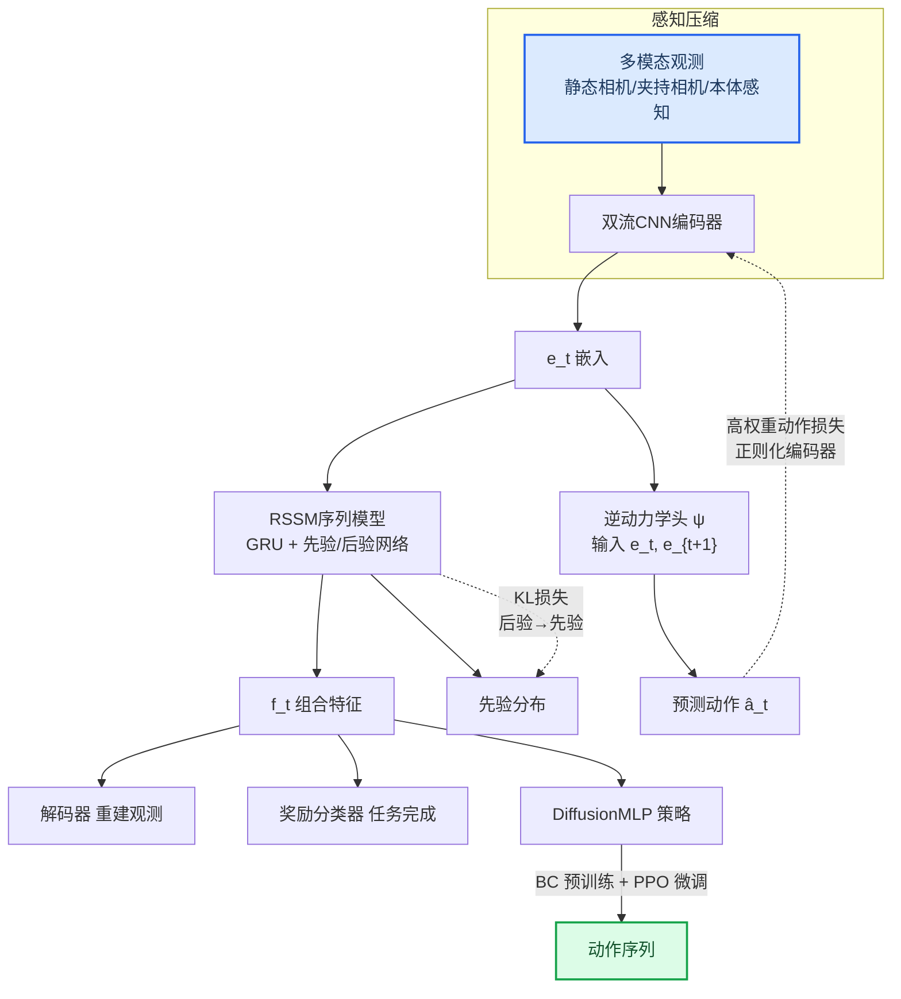
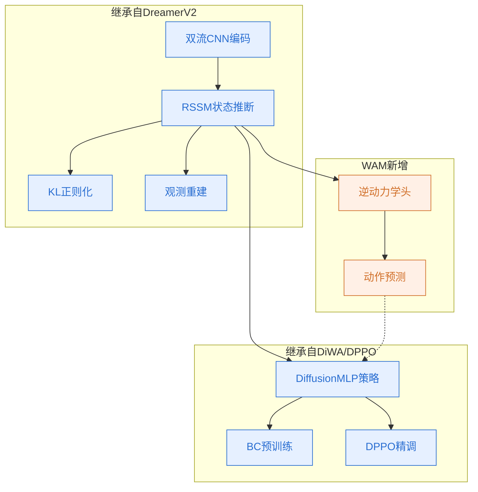
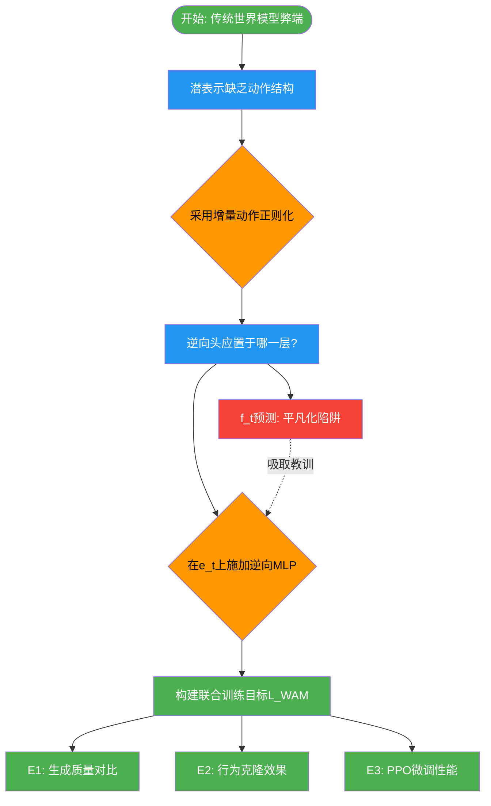
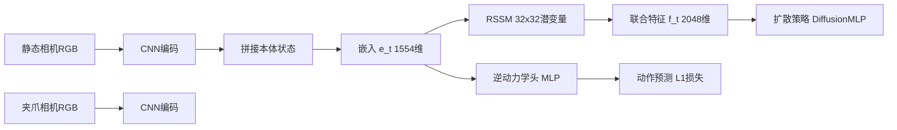
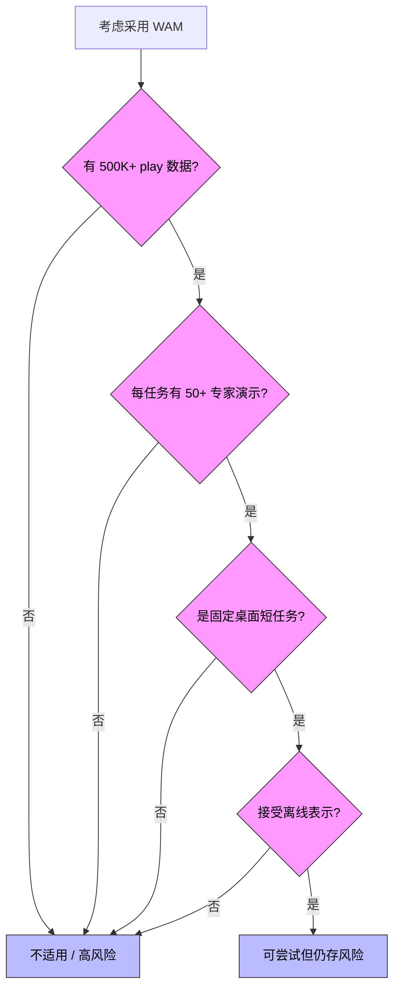

# Enhancing Policy Learning with World-Action Model — 深度解读

> 面向人类读者的深度解读(中文)。事实源与配对的 AI 知识包 `ai_package/2026-06-08_EnhancingPolicyLearningWithWorldActionModel_2603.28955/ara/` 同源,均已通过数据保真审计。

## 核心结论

> 每条结论后的隐形锚点把数字回链到论文原文(忠实性保证)。

1. 在 CALVIN 基准验证集上进行 50 步开环想象对比，WAM 在 PSNR、SSIM、LPIPS、FVD 四项生成质量指标上全面优于 DreamerV2 基线，且 WAM 使用的训练步数远少于基线。<!--ref:r-images-e386c90b3bfd15--><!--anchor:quote:%21%5B%5D%28images%2Fe386c90b3bfd15dc527f7ece352bd6762525668a9c50c9165628c7f4cae2b75f.jpg%29--><!--ref:r-abstract-this-paper-pr--><!--anchor:quote:Abstract%E2%80%94%20This%20paper%20presents%20the%20World%2DAction%20Model%20%28WAM%29%2C%20an%20action%2Dregularized%20world%20model%20that%20jointly%20reasons%20over%20future%20visual%20observations%20and-->
2. 在相同策略架构（DiffusionMLP）和训练超参数下，使用 WAM 特征训练的扩散策略在 CALVIN 8 个操控任务的行为克隆阶段，平均成功率高于使用 DreamerV2 特征的 DiWA 基线，8 个任务中 7 个取得更高成功率，关节型操控任务（如抽屉开关、滑轨移动）提升幅度最为显著。<!--ref:r-abstract-this-paper-pr--><!--anchor:quote:Abstract%E2%80%94%20This%20paper%20presents%20the%20World%2DAction%20Model%20%28WAM%29%2C%20an%20action%2Dregularized%20world%20model%20that%20jointly%20reasons%20over%20future%20visual%20observations%20and--><!--ref:r-abstract-this-paper-pr--><!--anchor:quote:Abstract%E2%80%94%20This%20paper%20presents%20the%20World%2DAction%20Model%20%28WAM%29%2C%20an%20action%2Dregularized%20world%20model%20that%20jointly%20reasons%20over%20future%20visual%20observations%20and--><!--ref:r-abstract-this-paper-pr--><!--anchor:quote:Abstract%E2%80%94%20This%20paper%20presents%20the%20World%2DAction%20Model%20%28WAM%29%2C%20an%20action%2Dregularized%20world%20model%20that%20jointly%20reasons%20over%20future%20visual%20observations%20and--><!--ref:r-abstract-this-paper-pr--><!--anchor:quote:Abstract%E2%80%94%20This%20paper%20presents%20the%20World%2DAction%20Model%20%28WAM%29%2C%20an%20action%2Dregularized%20world%20model%20that%20jointly%20reasons%20over%20future%20visual%20observations%20and-->
3. 在冻结世界模型潜空间中进行 800 轮 PPO 精调后，WAM 在 8 个 CALVIN 任务上的平均成功率高于 DiWA 基线，其中两个任务达到 100% 成功，精调所需的总物理交互次数均为零。<!--ref:r-3-online-policy-fine-t--><!--anchor:quote:3%29%20Online%20Policy%20Fine%2Dtuning%20Settings%3A%20Following%20DiWA%20%5B8%5D%2C%20we%20fine%2Dtune%20the%20BC%2Dpretrained%20diffusion%20policies%20using%20DPPO%20%5B16%5D%20entirely%20within%20the--><!--ref:r-abstract-this-paper-pr--><!--anchor:quote:Abstract%E2%80%94%20This%20paper%20presents%20the%20World%2DAction%20Model%20%28WAM%29%2C%20an%20action%2Dregularized%20world%20model%20that%20jointly%20reasons%20over%20future%20visual%20observations%20and--><!--ref:r-abstract-this-paper-pr--><!--anchor:quote:Abstract%E2%80%94%20This%20paper%20presents%20the%20World%2DAction%20Model%20%28WAM%29%2C%20an%20action%2Dregularized%20world%20model%20that%20jointly%20reasons%20over%20future%20visual%20observations%20and-->
4. WAM 世界模型使用约为基线 DreamerV2 八分之一强的训练步数（约 230K 对比约 2M 步，论文报告约 8.7 倍差距），即可在行为克隆和 PPO 精调两个阶段均取得更高任务成功率。<!--ref:r-abstract-this-paper-pr--><!--anchor:quote:Abstract%E2%80%94%20This%20paper%20presents%20the%20World%2DAction%20Model%20%28WAM%29%2C%20an%20action%2Dregularized%20world%20model%20that%20jointly%20reasons%20over%20future%20visual%20observations%20and--><!--ref:r-2-training-settings-we--><!--anchor:quote:2%29%20Training%20Settings%3A%20We%20use%20a%20sequence%20length%20of%20%24T%20%3D%24%2050%2C%20a%20batch%20size%20of%20500%2C%20and%20a%20learning--><!--ref:r-abstract-this-paper-pr--><!--anchor:quote:Abstract%E2%80%94%20This%20paper%20presents%20the%20World%2DAction%20Model%20%28WAM%29%2C%20an%20action%2Dregularized%20world%20model%20that%20jointly%20reasons%20over%20future%20visual%20observations%20and--><!--ref:r-abstract-this-paper-pr--><!--anchor:quote:Abstract%E2%80%94%20This%20paper%20presents%20the%20World%2DAction%20Model%20%28WAM%29%2C%20an%20action%2Dregularized%20world%20model%20that%20jointly%20reasons%20over%20future%20visual%20observations%20and-->
5. WAM 选择在编码器嵌入 e_t 而非 RSSM 特征 f_t 上附加动作预测头，由此形成「编码器→后验 z_t→先验 z_hat_t」的级联传播链，确保推理期仅依赖先验的想象回放同样携带动作相关信息。

## 一句话总结与导读

**TL;DR：世界-动作模型（WAM）给传统世界模型装上一双“会读动作”的眼睛——它在学习预测未来画面的同时，还必须回答“是什么动作导致了变化”，从而把散落在像素外的因果线索织进每一帧潜在表征里。这让下游策略仿佛从“看默片”变成了“看带注释的脚本”，在极少训练步数内就能掌握更精准的操控技能。**

如果把一个机器人操控任务想象成一个人在学习复杂的手艺活，那么现有的世界模型（例如 DreamerV2）就像是一个只被要求把“师傅的示范”录下来并且画质逼真地重建出来的录像机。它很擅长记住画面长什么样，但完全不关心师傅手的动作和画面变化之间到底有什么因果关系。因此，当基于这种世界模型训练出来的策略（例如 DiWA，它将世界模型编码的潜在特征作为条件输入给一个扩散策略）去模仿或优化动作时，它实际上是从一堆被压缩过的、只有“视觉外观”却缺少“动作语义”的特征里摸索——就像看着一篇用漂亮字体排印但内容被洗乱的菜谱学做菜，结果自然不稳定，尤其在那些需要精细关节操作的场景里（比如拉开抽屉、滑动导轨）更容易失败。WAM 的创新点直接瞄准了这个表征层面的“盲区”。

最核心的一个想法是**把逆动力学目标注入世界模型的编码器**。具体来说，WAM 在 RSSM（循环状态空间模型）的编码器输出端挂载了一个轻量的逆动力学头，要求它根据连续两帧的编码器嵌入 \(e_t\) 和 \(e_{t+1}\) 去预测它们之间发生的动作 \(a_t\)。这个额外的监督信号迫使编码器不能只“画得像”，还必须“看得懂动作”——它必须把那些对视觉损失贡献不大、但却是驱动状态变化的动作因果信息保留下来（直觉上类似于，一个人要能从前后两张照片倒推出操作者拧了哪个螺丝，他就必须注意螺丝的位置与朝向，而非背景的纹理细节）。更巧妙的是，由于 RSSM 中后验 \(z_t\) 会通过 KL 散度损失约束与其先验 \(\hat{z}_t\) 保持分布一致性，这个动作感知结构会自然沿着“后验→KL→先验”的级联路径渗透到整个潜在空间，使得即使在完全由先验生成的想象轨迹中，模型也能携带着对动作敏感的因果特征。这样一来，下游的扩散策略（DiffusionMLP）完全不需要修改架构或训练流程，就获得了一套在因果上更“有内涵”的表征，无论是行为克隆阶段还是后续冻结世界模型中的 PPO 精调阶段，都因此显著受益。整个方案仅改变世界模型的训练目标（即引入 \(\mathcal{L}_{\mathrm{WAM}}\)），堪称一种即插即用的表征升级术。

**论文总体架构(原图):**

*图1展示了标准世界模型与本文世界-动作模型（WAM）的核心区别。标准模型将动作视为条件输入，仅预测未来观测；而WAM在训练时增加了逆向动力学头，同时预测观测和动作，使世界模型成为具备动作感知能力的可学习模拟器。*

## 问题背景与动机

**结论：** 当前轻量世界模型在机器人操作中面临一个隐蔽的表征错位——模型被训练来**“记住画面”**，而下游策略需要的却是**“理解动作如何改变世界”**。这种目标分歧导致潜在表征中动作因果信息严重缺失，形成策略性能的“表征天花板”。论文的核心动机由此诞生：**能否在不推翻现有架构的前提下，让世界模型学会动作感知？** 其答案——在编码器端嵌入逆动力学预测——不仅打通了这一瓶颈，还意外地使想象轨迹也获得了动作敏感的结构。

要理解这一动机，我们需要先审视世界模型训练及其下游使用的两个关键观察。

**观察一：世界模型的训练目标天然排斥动作信息。**  
以 DreamerV2 为代表的经典世界模型，其训练信号仅来自观测重建和 KL 正则化，从未被显式要求预测动作本身。于是，潜在状态 $$z_t$$ 被优化为当前视觉外观的压缩表示——它擅长捕捉像素的排列，却对“什么动作导致了这种排列”毫无感知。一个直觉类比（非严格对应）：一个学生被要求反复临摹一组照片，但从不考问他“摄影师按快门之前做了什么操作”。结果，他的记忆里满是静态画面，没有推拉摇移的动作因果。

**观察二：下游策略直接承袭这份“记忆”，毫无补修机会。**  
在模型内策略学习框架（如 DiWA）中，策略以世界模型提取的潜在特征 $$f_t$$ 作为唯一输入，本身不再接触原始观测。这意味着特征质量直接决定了策略的性能上界。若 $$f_t$$ 缺少精细的动作区分信息——例如，无法表征“夹爪在物体左侧 2 mm 还是右侧 2 mm”这类细微差异——那么随后的行为克隆或模型内 PPO 微调都会撞上表征瓶颈，无论策略网络容量多大都无济于事。

由此衍生出一个关键缺口：**现有世界模型无法编码驱动状态变化的细粒度动作因果信息**。已有尝试要么转向统一动作-世界模型（如 WorldVLA），但需从根基上重塑架构，资源开销巨大且未提升轻量模型的表征质量；要么停留在原目标函数内调参，但根本原因是**训练目标对动作信息无梯度压力**——编码器为最小化视觉损失，自然地保留视觉显著细节，而将与视觉重建无关的动作因果信号当作“噪声”过滤掉。

这一困境恰恰指明了破局的关键洞见：**既然缺的是动作信号，最直接的方案就是在表征学习阶段注入动作预测任务**。具体而言，在编码器嵌入 $$e_t$$ 和 $$e_{t+1}$$ 之间训练一个轻量逆动力学头，迫使模型从状态变化中反推执行了什么动作。这种设计借鉴了自监督表征学习中的逆动力学模型理念（参考文献 [11][12]）：预测状态间的动作等价于要求表征聚焦于环境的“可控”方面，自动滤除任务无关的视觉纹理。  
更巧妙的是，这个动作感知信号并不会孤立地停留在编码器端。由于编码器嵌入经过后验网络生成 $$z_t$$，再通过与先验的 KL 散度进行正则化，动作信息会沿“后验 → KL → 先验”路径级联渗透至整个潜在空间。于是，**即使是纯粹依靠先验生成的想象轨迹（无动作输入）也间接携带了动作相关结构**——这是该工作的重要分析推断（论文未严格证明其完全等效性，但提供了实验支持）。整个升级过程无需触动下游策略的架构与训练流程，仅改变了世界模型的训练目标，却同时提升了行为克隆的成功率和模型内 PPO 的微调效率，甚至只需更少的世界模型训练步数。

这就是论文设计的故事起点：**不是发明一个新的策略学习器，而是修复上游表征的“信息膳食结构”，让动作因果从源头渗入，消弭模型与策略之间长久存在的“感官鸿沟”**。

## 核心概念速览

本方法围绕“让世界模型学会感知动作”这一目标，串联起数个关键组件：从循环状态空间模型（RSSM）承载时序记忆，到世界-动作模型（WAM）引入逆动力学目标，再通过动作感知级联效应将动作信号注入潜在空间，最终在冻结的潜在 MDP 中用扩散策略进行离线微调。下面逐条拆解每个概念，并搭配生活化或工程化比喻辅助理解（比喻均为直觉类比，非严格对应）。

### 循环状态空间模型（RSSM）
RSSM 是 DreamerV2 的世界模型骨干，负责将高维视觉输入压缩成一套紧凑的潜在表示。它结合确定性循环状态 $$h_t$$（经由 GRU 更新）和随机范畴变量 $$z_t$$，形成联合特征 $$f_t=[h_t;z_t]$$，既能捕捉长程因果，又能处理瞬态不确定性。  
**直觉比喻：** RSSM 就好比电影的“剪辑师”，必须同时记住剧情的因果脉络（确定性状态），又要脑补镜头切换间的不确定性细节（随机变量），最终拼成一幅连贯的故事板。  
**在本方法中的作用：** 为 WAM 提供时序建模的“躯干”——后续的逆动力学头、潜在 MDP 与扩散策略都直接建立在它输出的特征之上，而 WAM 未改动 RSSM 的内部拓扑。

### 世界-动作模型（WAM）
WAM 在 RSSM 基础上附加一个轻量级逆动力学头，使世界模型不仅能预测未来的视觉观测，还能预测引发状态变化的动作。其记号 $$\mathcal{M}_{\theta}$$ 包含世界路径和动作路径，共享编码器但扩展了学习目标。  
**直觉比喻：** 像驾校教练的“双屏监控”——一屏播放车前画面（世界模型），另一屏显示学员的踏板与方向盘操作（逆动力学），教练通过对照两者习得“打方向导致车辆偏航”的因果关联。  
**为什么这样做：** 单纯做图像重建的世界模型容易学到“外观好看但动作无感”的表示，导致后续策略在离线规划时盲人摸象；引入动作预测信号，迫使编码器关注那些真正驱动环境变化的视觉线索。

### 逆动力学目标
给定两个相邻时刻的编码器嵌入 $$e_t$$ 与 $$e_{t+1}$$，一个三层 MLP $$\psi$$ 预测导致该状态转变的动作 $$\hat{a}_t = \psi([e_t; e_{t+1}])$$，训练使用 L1 损失 $$\mathcal{L}_{\mathrm{action}} = \|\hat{a}_t - a_t\|_1$$。  
**直觉比喻：** 好比侦探拿到案发前后两张照片，必须推断出嫌犯做出了哪些动作——这种反向推理训练让编码器学会抓取现场中的“动态痕迹”，而不是仅仅记住静态布景。  
**关键机制：** 逆动力学头故意作用于编码器嵌入 $$e_t$$（而非 RSSM 联合特征 $$f_t$$），因为 GRU 在更新 $$h_t$$ 时已经接收了历史动作 $$a_{t-1}$$；若直接对接 $$f_t$$，动作预测会“抄近道”退化为平凡解，无法将动作感知正则化真正注入视觉编码器。

### 动作感知级联效应
逆动力学损失首先塑形编码器嵌入 $$e_t$$，使其携带动作信息；$$e_t$$ 用于推断后验 $$z_t \sim q_\phi(z_t \mid h_t, e_t)$$，随后 KL 散度损失又将该结构迁至先验 $$\hat{z}_t \sim p_\phi(z_t \mid h_t)$$——这形成了“级联”：动作感知信号从嵌入层起，沿后验–先验链条逐级传播，最终使纯凭想象生成的潜在轨迹也天然包含动作相关成分。  
**直觉比喻：** 在揉面的最初始阶段就将酵母（动作信号）揉进面团，后续即使不再添加酵母（无真实动作交互），整团面在发酵（状态想象）时依然会均匀膨起；若只在后期表面撒酵母，内部仍是死面。  
**为什么这是关键：** 策略离线微调完全依赖 WAM 先验产生的想象轨迹，若级联断裂，想象状态就会缺失动作信息，导致在虚假的“动作盲”空间里做决策，性能大打折扣。

### WAM 训练目标
WAM 端到端优化三项损失之和：$$\mathcal{L}_{\mathrm{WAM}} = \lambda_{\mathrm{KL}}\mathcal{L}_{\mathrm{KL}} + \lambda_{\mathrm{img}}\mathcal{L}_{\mathrm{recon}} + \lambda_{\mathrm{act}}\mathcal{L}_{\mathrm{action}}$$，分别对应状态一致性（KL 散度）、图像重建（L2）和动作预测（L1），通过独立权重平衡三者的影响力。  
**直觉比喻：** 一位演员同时打磨台词、表情和肢体动作，三项训练彼此促进，最终呈现浑然一体的演出。  
**值得注意：** 论文中 $$\lambda_{\mathrm{act}}$$ 被设为一个远大于其他项的常数，以强制表示向动作感知倾斜；这些系数针对 CALVIN 基准调优，不宣称可直接迁移至任意环境。

### 潜在空间 MDP 与离线策略微调
冻结 WAM 后，在其潜在空间定义马尔可夫决策过程 $$\mathcal{M}_{\mathrm{wm}} = (\mathcal{Z}, \mathcal{A}, P_\phi, R_\psi, \gamma)$$，状态为潜在表示、动作为真实动作空间、转移与奖励由训练好的世界模型和奖励分类器提供。策略通过扩散策略在虚拟环境中借助 DPPO 进行纯粹“脑中”微调，无需任何真实机器人交互。  
**直觉比喻：** 飞行员在取得基础驾驶技能后，进入全动模拟器反复演练险情，成本极低且零风险，练熟后再上真机。  
**作用：** 解决了机器人学习数据昂贵、试错成本高的痛点；由于 WAM 提供了动作感知的丰富表示，这一虚拟沙盒的“仿真保真度”显著优于传统的纯世界模型方法（具体对比见实验部分）。

### 扩散策略（DiffusionMLP）
DiffusionMLP 以潜在特征 $$f_t$$ 为条件，通过一个 DDPM 去噪过程生成动作：从纯高斯噪声出发，迭代 $$K$$ 步逐步去除噪声，最终输出精细的动作预测，训练时最小化去噪误差 $$\mathcal{L}_{\mathrm{BC}}$$。  
**直觉比喻：** 像雕塑家面对一块原石（噪声），一刀一刀剔除冗余（去噪），逐渐显现出肢体动作的精准轮廓；这一过程允许策略表达远丰富于单峰高斯的多模态分布，非常适合复杂的机器人模仿学习。  
**工作流：** 行为克隆阶段使用较多去噪步以保证模仿精度，PPO 微调时削减步数以加速推理；同时引入轻量 BC 正则项防止微调中的灾难性遗忘。

## 方法与整体架构

整体 pipeline 是一条“先造虚拟沙盘、再在沙盘里训练智能体”的双阶段路线：第一阶段训练一个 **动作感知世界模型 (WAM)**，把多模态感知流压缩成一个动作结构清晰、可预见未来的潜在空间；第二阶段将世界模型冻结为模拟器，在其内部对扩散策略做行为克隆与离线强化学习微调，最终输出灵巧的操作动作。整个设计的核心巧思在于：不是先学表征再学策略，而是强迫表征在诞生时就“理解”动作的含义。

**多模态感知与序列建模**  
机器人携带的静态相机与夹持相机图像，连同本体感知状态（关节位置、速度等），进入一个双流 CNN 编码器，产出一个紧凑的嵌入向量 \(e_t\)。这个嵌入随后送入 RSSM（源自 DreamerV2），后者循环地更新确定性隐状态 \(h_t\) 并采样类别型随机变量 \(z_t\)（32 类 × 32 维度）。二者拼接成组合特征 \(f_t = [h_t; z_t]\)，作为后续一切模块的通用内部语言。

**动作感知正则化：让表征提前“看懂”动作**  
这是整篇论文的方法核心。在编码器输出级，一个三层 MLP 构成的逆动力学头 \(\psi\) 接收 \([e_t; e_{t+1}]\)，直接预测在该过渡中执行的动作 \(\hat{a}_t\)。关键在于，动作预测损失 \({ \mathcal{L} }_{\mathrm{action}}\) 被赋予极高权重（由于动作误差的数量级远小于像素重建误差，需设置为一个很大的值，以迫使编码器认真对待这项任务）。这股强烈的梯度信号钻入编码器，逼迫它组织出对动作敏感的内部表征。更巧妙的是，KL 散度损失在 RSSM 的后验（利用未来 \(e_t\)）与先验（仅依赖历史）之间搭建桥梁，将动作感知结构从前向后验“蒸馏”到先验中去——这使得将来冻结世界模型进行想象展开时，先验无需访问未来也能输出动作感知能力强的潜在状态，想象出的轨迹更贴合真实环境。

必须强调一个工程桩脚：逆动力学头作用于编码器输出 \(e_t\) 而非 RSSM 的组合特征 \(f_t\)。原因在于 RSSM 的 GRU 已经咀嚼了上一时刻的动作 \(a_{t-1}\)，若在 \(f_t\) 上预测 \(a_t\)，问题将退化为几乎可以直接查表的平凡任务，无法真正正则化编码器。

**辅助任务与冻结的虚拟沙盘**  
世界模型同时完成两项辅助任务：解码器从 \(f_t\) 重建观测图像，奖励分类器从 \(z_t\) 和动作预测二值的任务完成信号。三项损失联合训练完毕后，全部模块（编码器、RSSM、解码器、奖励分类器）权重冻结，构成一个潜在空间的 MDP 模拟器 \(M_{wm}\)。

**策略学习：在沙盘里从模仿走向优化**  
接下来的策略训练完全在冻结的世界模型内完成。策略主体是一个基于扩散过程的 MLP (DiffusionMLP)，它从当前潜在特征 \(f_t\) 出发，通过迭代去噪生成动作序列。训练先进行行为克隆 (BC) 预训练——在少量专家演示的 \((f_t, a_t)\) 对上模仿，让策略具备基本的行为先验（此时去噪步数较高，以保证生成质量）；再通过离线 PPO (DPPO) 微调，让策略在冻结世界里自行“想象”轨迹并根据奖励信号改进动作，同时添加 BC 正则化项将策略锚定在原始行为分布附近，防止灾难性遗忘（此时减少去噪步数以降低想象成本）。最终产出的策略可以直接输出机器人执行所需的动作序列。

**如何读这张图：** 实线箭头表示前向数据流，左侧从感知到潜在状态再到辅助输出（重建/奖励），右侧从潜在状态转入策略学习并最终输出动作。虚线代表训练时的关键梯度流，即逆动力学头对编码器的动作感知正则化，以及 KL 损失将这种动作结构蒸馏至先验。整体流程先训练出冻结的潜在世界模型，再在其内部完成策略的模仿与强化。

<strong>训练损失与关键超参数</strong>

世界模型训练目标由三项加权组合：
- 重建损失：\(\| o_t - \hat{o}_t \|_2^2\)
- KL 损失：\(\mathrm{KL}[ q_\phi(z_t \mid h_t, e_t) \,\|\, p_\phi(z_t \mid h_t) ]\)
- 动作损失：\(\| \hat{a}_t - a_t \|_1\)

权重设置：\(\lambda_{\mathrm{img}} = 1.0,\; \lambda_{\mathrm{KL}} = 3.0\)（均衡系数 \(\alpha = 0.8\)），\(\lambda_{\mathrm{act}}\) 设为一个极高值以补偿动作误差的量级。BC 预训练阶段采用扩散去噪步 \(K=20\)；PPO 离线微调阶段将去噪步降至 \(K=10\) 并引入 BC 正则化系数 \(\alpha_{\mathrm{BC}}=0.025\) 以稳定更新。更多细节见实验配置。

**模型结构与关键子图(原图):**

*图2为WAM的详细架构。观测x_t经编码器映射为后验分布z_t，通过KL散度约束逼近先验\hat{z}_t；逆向动力学头利用相邻时刻的编码器隐状态预测动作\hat{a}_t，实现观测与动作的联合建模，形成动作感知的级联结构。*

## 算法目标与推导

整个系统的学习目标分为两阶段：先训练一个可感知、可预测的**世界模型**，再在冻结的世界模型内部推演并优化**行为策略**。世界模型的训练目标如下（Eq. 7）：

$$ \mathcal{L}_{\mathrm{WAM}} = \lambda_{\mathrm{KL}} \mathcal{L}_{\mathrm{KL}} + \lambda_{\mathrm{img}} \mathcal{L}_{\mathrm{recon}} + \lambda_{\mathrm{act}} \mathcal{L}_{\mathrm{action}} $$

其中
$$ \mathcal{L}_{\mathrm{KL}} = \mathrm{KL}[ q_{\phi}(z_t \mid h_t, e_t) \| p_{\phi}(z_t \mid h_t) ] $$
$$ \mathcal{L}_{\mathrm{recon}} = \| o_t - \hat{o}_t \|_2^2 $$
$$ \mathcal{L}_{\mathrm{action}} = \| \hat{a}_t - a_t \|_1 $$

权重分别为 $\lambda_{\mathrm{KL}}\!=\!3.0$、$\lambda_{\mathrm{img}}\!=\!1.0$、$\lambda_{\mathrm{act}}\!=\!1000.0$。

**逐项拆解**  
- **KL 散度损失 ($\mathcal{L}_{\mathrm{KL}}$)**：后验分布 $q_{\phi}$ 利用历史 $h_t$ 和额外上下文 $e_t$（例如任务描述、外部感知）推断当前潜在状态 $z_t$，而先验 $p_{\phi}$ 仅依赖历史 $h_t$。两者的 KL 散度会惩罚后验将 $e_t$ 中“多于历史”的信息编码进 $z_t$，相当于在信息瓶颈上施加约束：模型被鼓励形成一种不依赖 $e_t$ 也能保持紧凑的内部表示，从而在缺失额外上下文时依然具备合理的先验预期。这为后续泛化和策略探索提供了结构化的隐空间。  
- **图像重建损失 ($\mathcal{L}_{\mathrm{recon}}$)**：解码器从潜在状态 $z_t$ 重构观测 $o_t$（如视觉画面），采用均方误差。这确保 $z_t$ 并未在压缩中丢失场景的关键视觉细节，是信息保真的基本保证。  
- **动作预测损失 ($\mathcal{L}_{\mathrm{action}}$)**：基于 $z_t$ 直接预测当前时刻的真实动作 $a_t$，采用 L1 损失。其权重 $\lambda_{\mathrm{act}}\!=\!1000.0$ 远高于其他两项，表示这项精度的优先级极高——因为动作空间通常是连续的，微小的预测偏差就可能导致后续推演中整个轨迹发散，破坏世界模型作为“想象场”的可靠性。三项合在一起，形成了一个“压缩、保留、可行动”的潜在表示。

在此基础上，策略的学习分两步走：

**行为克隆（BC）预训练**（Eq. 9）  
$$ \mathcal{L}_{\mathrm{BC}} = \mathbb{E}_{k, \epsilon, (f_t, a_t)} \left[ \| \mu_{\theta}(f_t, a_t^k, k) - a_t^{k-1} \|^2 \right] $$
这里冻结住世界模型，用其提取的特征 $f_t$ 作为条件，训练一个**扩散策略**：输入当前带噪声的动作 $a_t^k$ 和噪声水平 $k$，网络 $\mu_{\theta}$ 要预测出上一步的动作 $a_t^{k-1}$。用扩散的方式建模动作分布，可以自然地捕捉多模态行为（例如左转、右转都合理），避免传统回归只学到“平均动作”的弊端。

**PPO 微调**（Eq. 10）  
$$ \theta^{*} = \arg \max_{\theta} \mathbb{E}_{\tau \sim \pi_{\theta}, P_{\phi}} \left[ \sum_{t=0}^{T} \gamma^t R_{\psi}(z_t, a_t) \right] $$
策略在世界模型的“想象”轨迹 $\tau$ 上继续优化，最大化奖励 $R_{\psi}$（由潜在状态 $z_t$ 和动作 $a_t$ 评定）。此时世界模型完全冻结，相当于一个低成本的模拟器，策略在其中试错，无需触碰真实环境即可自我改进。

**一个直觉比喻**  
想象你正在学习弹钢琴。**世界模型**就是你内心形成的乐谱和手指动作的内隐模型：KL 损失强迫你在听不到音乐（缺少外部线索）时也能默弹；重建损失要求你默想时，脑子里能“听到”准确的旋律；动作损失则惩罚你手指位置的错误，而且惩罚极重——因为姿势一旦错，后面会越弹越糟。**BC 预训练**就像你看老师弹一遍并模仿他手指的运动分布（而不是只记固定的按键序列）。**PPO 微调**则是在脑海中反复演练，并依据自己设定的“好听程度”不断调整指法，直到流畅。

**一个小玩具例子**  
假设我们要训练一个控制 2D 小车上坡（MountainCar）的世界模型。$o_t$ 是小车的图像，$a_t$ 是施加的力。  
- 世界模型把小车画面编码成 $z_t$，KL 项让模型在有/无坡度标记 $e_t$ 时对位置的推断分布尽量一致，避免死记标记而忽略动力学。  
- 重建损失迫使 $z_t$ 解码后能还原图像中小车的位置。  
- 动作损失精准预测此刻该用多大的力，因为力大一点或小一点就决定了能否冲上坡顶。  
- 策略先用专家驾驶序列进行扩散去噪模仿（BC），得到一个能产生合理推力分布的初步策略。  
- 然后在冻结的世界模拟器里用 PPO 奖励冲顶成功，进一步打磨策略，使其在多次尝试中学会在最低点提前加速，用最省能量的方式翻越坡道。

这样，世界模型的表示与策略的迭代就能形成一个无需真实环境即可持续进化的闭环。

## 实验设计与结果解读

**结论：** 论文通过生成质量、行为克隆（BC）与模型内强化学习精调三项递进式实验，立体地验证了行动感知世界模型（WAM）的三重优势——想象更逼真、冻结特征更利于策略模仿、潜空间精调样本效率更高。每一级实验都对应一种典型的机器人学习需求，共同构建了从“看得准”到“学得快”的证据链（具体数值见实验表格）。

### 一、生成质量测试：世界模型的“眼力”考核
**验证目标**：WAM 能否比传统世界模型更准确地预测未来帧。  
**设计**：在 CALVIN 验证集随机抽取 100 条序列，给定首帧真实观测与全程真实动作，让 WAM（训练约 230K 步）和 DreamerV2 基线（训练约 2M 步）分别进行 50 步开环想象。通过 PSNR、SSIM、LPIPS 和 FVD 四项指标，量化预测帧序列与真实序列的偏差。  <!--ref:r-abstract-this-paper-pr--><!--anchor:quote:Abstract%E2%80%94%20This%20paper%20presents%20the%20World%2DAction%20Model%20%28WAM%29%2C%20an%20action%2Dregularized%20world%20model%20that%20jointly%20reasons%20over%20future%20visual%20observations%20and--><!--ref:r-2-training-settings-we--><!--anchor:quote:2%29%20Training%20Settings%3A%20We%20use%20a%20sequence%20length%20of%20%24T%20%3D%24%2050%2C%20a%20batch%20size%20of%20500%2C%20and%20a%20learning--><!--ref:r-abstract-this-paper-pr--><!--anchor:quote:Abstract%E2%80%94%20This%20paper%20presents%20the%20World%2DAction%20Model%20%28WAM%29%2C%20an%20action%2Dregularized%20world%20model%20that%20jointly%20reasons%20over%20future%20visual%20observations%20and--><!--ref:r-abstract-this-paper-pr--><!--anchor:quote:Abstract%E2%80%94%20This%20paper%20presents%20the%20World%2DAction%20Model%20%28WAM%29%2C%20an%20action%2Dregularized%20world%20model%20that%20jointly%20reasons%20over%20future%20visual%20observations%20and--><!--ref:r-images-e386c90b3bfd15--><!--anchor:quote:%21%5B%5D%28images%2Fe386c90b3bfd15dc527f7ece352bd6762525668a9c50c9165628c7f4cae2b75f.jpg%29-->
**定性发现**：WAM 在所有指标上均优于基线，尤其感知相似度（LPIPS）与时序一致性（FVD）优势明显，意味着其生成的想象单帧更接近真实，运动过程也更连贯自然。  
**注意点**：WAM 训练步数远少于基线，这虽展示了样本效率，但也带来基线是否完全收敛的疑问，生成质量差异可能部分源于训练充分性不同。

### 二、行为克隆评估：冻结特征的“可迁移性”考核
**验证目标**：WAM 学到的潜层特征，在不经微调的情况下，能否直接提升模仿学习成功率。  
**设计**：冻结 WAM（或 DreamerV2）的编码器与 RSSM，从 CALVIN 8 项专家演示中提取潜变量 $$f_t$$，用完全相同的扩散策略（DiffusionMLP）与超参数训练 BC，然后在 29 个保留初始配置上滚动评估成功率。唯一变量是特征来源。  
**定性发现**：基于 WAM 特征的策略在多数任务上成功率更高，平均成功率明显超出 DiWA 基线。这表明动作感知表征比传统世界模型特征更“任务友好”，能降低模仿学习的难度。

### 三、模型内精调：样本效率与最终性能的终极考核
**验证目标**：检验在冻结世界模型内用 DPPO 精调的效果，以及想象学习能否大幅减少真实环境交互。  
**设计**：以 BC 预训练策略为起点，在冻结的 WAM（或 DreamerV2）内部进行 800 轮 PPO，仅依靠想象轨迹与预标注的二值奖励分类器。除最终成功率外，还记录“匹配 DiWA 精调性能所需的真实环境步数”，对比 WAM 编码器路径与纯视觉路径的样本效率。  
**定性发现**：精调后 WAM 策略的平均成功率进一步拉大与 DiWA 的差距，多个任务达到满分；其编码器路径所需环境步数远少于纯视觉策略，体现“脑内演练”极高的样本效率——对真实机器人部署意义显著。

### 综合局限
- **场景单一**：全部实验基于 CALVIN 桌面操控与 64×64 图像，更复杂、高维场景下的泛化性尚待验证。  
- **基线范围有限**：世界模型仅对比 DreamerV2，未纳入其他架构，无法判断优势的普适性。  
- **统计稳健性不足**：BC 与精调实验未报告多次运行的误差范围，成功率提升的统计显著性待明确。  
- **机制归因缺失**：未对逆动力学头等组件进行消融实验，各设计的具体贡献仍有待分离。  

三项实验环环相扣，为行动感知世界模型提供了从感知到决策的初步实证，同时也点明了未来泛化验证与精细化消融的必要方向。

### 实验数据表(原始数值,引自论文)

#### 表 III：CALVIN 8 任务行为克隆成功率
- **Source**: Table III
- **Caption**: "8 个 CALVIN 操控任务上的行为克隆（BC）成功率（%）。两种方法使用相同策略架构和训练流程，唯一区别是用于特征提取的世界模型不同。"

| Task | DiWA | WAM (Ours) |
| --- | --- | --- |
| close_drawer | 58.6 ± 4.2 | 89.7 ± 3.1 |
| open_drawer | 53.3 ± 5.1 | 73.3 ± 4.8 |
| move_slider_left | 50.0 ± 3.7 | 68.8 ± 5.2 |
| move_slider_right | 51.7 ± 4.5 | 82.8 ± 3.9 |
| turn_on_lightbulb | 42.4 ± 3.3 | 51.5 ± 4.6 |
| turn_off_lightbulb | 3.4 ± 1.8 | 17.2 ± 3.4 |
| turn_on_led | 44.8 ± 3.9 | 41.4 ± 4.1 |
| turn_off_led | 62.5 ± 5.3 | 68.8 ± 4.7 |
| Average | 45.8 | 61.7 |

#### 表 IV：CALVIN 8 任务 PPO 精调后扩散策略成功率
- **Source**: Table IV
- **Caption**: "800 轮模型内 PPO 精调后，8 个 CALVIN 任务上的扩散策略成功率（%）。DPPO 列报告匹配 DiWA 性能所需的环境步数（越少越高效）。"

| Task | Diffusion Policy Base | DiWA Offline Fine-Tuning | WAM (Ours) Online Fine-Tuning | DPPO Vision WM Encoder Env Steps to Match DiWA | Vision Env Steps to Match DiWA |
| --- | --- | --- | --- | --- | --- |
| open drawer | 73.3 ± 4.8 | 74.44 ± 1.92 | 96.7 ± 2.4 | 117,600 ± 23,758 | 134,400 ± 26,508 |
| close drawer | 89.7 ± 3.1 | 91.95 ± 1.99 | 96.6 ± 1.8 | 600,600 ± 27,651 | 1,545,600 ± 261,346 |
| move slider left | 68.8 ± 5.2 | 83.33 ± 1.80 | 87.5 ± 3.7 | 270,933 ± 28,780 | 1,377,600 ± 251,439 |
| move slider right | 82.8 ± 3.9 | 82.76 ± 3.45 | 89.7 ± 3.2 | 249,600 ± 09,050 | 537,600 ± 23,758 |
| turn on lightbulb | 51.5 ± 4.6 | 91.92 ± 1.75 | 100.0 ± 0.0 | 302,933 ± 15,964 | 588,000 ± 62,859 |
| turn off lightbulb | 17.2 ± 3.4 | 77.01 ± 1.99 | 75.9 ± 4.3 | 327,066 ± 13,546 | 1,260,000 ± 142,552 |
| turn on LED | 41.4 ± 4.1 | 86.21 ± 3.45 | 96.6 ± 2.1 | 494,933 ± 45,655 | 2,251,200 ± 33,940 |
| turn off LED | 68.8 ± 4.7 | 82.33 ± 6.53 | 100.0 ± 0.0 | 277,333 ± 31,928 | 184,800 ± 23,758 |
| Total Physical Interactions |  | 0 | 0 | ~2.5M | ~8M |

#### 表 I：CALVIN 基准想象质量量化评估
- **Source**: Table I
- **Caption**: "CALVIN 基准上想象质量的量化评估，对比 WAM 与 DreamerV2 基线在四项标准视频预测指标上的表现。"

| Metric | Ours (WAM) | Baseline (DreamerV2) |
| --- | --- | --- |
| PSNR ↑ | 22.10 ± 2.22 | 21.66 ± 2.20 |
| SSIM ↑ | 0.814 ± 0.061 | 0.807 ± 0.067 |
| LPIPS ↓ | 0.144 ± 0.072 | 0.149 ± 0.073 |
| FVD ↓ | 10.82 | 12.13 |

**效果示例(论文原图):**

*图3在CALVIN基准上定性对比了WAM与DreamerV2的想象展开结果。从固定相机和夹爪相机视角可见，WAM预测的未来帧在纹理和场景一致性上更加真实，展现了更优的长时域生成能力。*

*图4为CALVIN全部八个任务上的行为克隆评估曲线。WAM（橙色）相比DiWA（蓝色）在多数任务上收敛更快，最终成功率更高，体现了动作感知在世界模型中的优势。*

## 相关工作与定位

**WAM 的贡献不在于发明了某种全新的算法组件，而在于它清醒地识别出「世界模型表示缺乏动作感知」这一关键瓶颈，并利用已有工具箱做了一次精准的「最小化增强」。** 它以深度强化的世界模型 DreamerV2 为骨架，从自监督逆动力学建模（Pathak, 2017）中借来核心思想，在原本只面向像素重建的训练目标中塞进了一个预测动作的支路，迫使潜状态编码环境中的可控元素。为了公平评估这次增强的效果，它完整复用了策略训练范式 DiWA（含 DPPO）——以此隔离世界模型表示质量对最终决策性能的单变量影响。在越来越倾向于用大型基础模型统一动作与观测生成（如 WorldVLA）的潮流中，WAM 走出了一条轻量、兼容的插件式路线，其定位可概括为：**不改架构大模样，只动训练小目标，让表示从“能重建”进化到“懂动作”。**

| 相关工作 | 角色 | 继承/借鉴了什么 | WAM 做了什么不同 |
|---------|------|---------------|------------------|
| DreamerV2 (Hafner, 2022) | 主干架构 | RSSM + 双流CNN + 潜变量 + KL | 增加逆动力学训练目标，扩展损失函数 |
| DiWA (Chandra, 2025) | 策略范式 | BC→DPPO 两阶段训练 + DiffusionMLP | 仅将世界模型替换为 WAM，其余完全相同 |
| Pathak et al., 2017 | 思想源头 | 从连续帧预测中间动作的自监督信号 | 从探索动机迁移至表示增强，嵌入世界模型训练 |
| WorldVLA (Cen, 2025) | 路线对比 | 无直接技术继承 | 轻量插件 vs. 重型统一基础模型，互补而非竞争 |
| DPPO (Ren, 2024) | 算法工具 | 完整裁剪 PPO + BC 正则化 | 未做任何修改，直接复用 |

下图更直观地展示了 WAM 如何“站在前任肩上”组装自己的训练管线：蓝色模块复用了 DreamerV2 和 DiWA 的成熟组件，橙色模块为本文注入的唯一新元素——逆动力学头，它仅需从 RSSM 潜状态接入一个轻量预测头，不影响原有架构的样本效率和推理流程。

**架构基底：为什么选 DreamerV2 而不是从头设计？**  
DreamerV2 的 RSSM（确定性循环状态 $h_t$ 与范畴潜变量 $z_t$ 的组合）已被大量实验证实能在视觉控制任务中稳定工作。WAM 继承这一骨架，本质上是在一个被广泛信任的认知引擎上做“精准调校”，而不是推倒重来。这极大降低了架构试错成本，也让后续的性能提升可以更干净地归因于表示学习目标的改变，而非架构变动的混杂效应。

**表示增强：逆动力学头为什么能消除“动作盲区”？**  
原版 DreamerV2 的训练目标（观测重建 + KL 正则化）鼓励潜表示抓取像素细节，但对“什么动作导致了视觉变化”毫不在意。这意味着，下游策略看到的特征可能稠密地记录了纹理、光照，却对物体的位姿变化、夹爪的开合状态等可控元素一脸茫然。WAM 引入的逆动力学头正是针对这一痛点：它要求从先后两帧的编码嵌入中预测出中间发生的动作。这个信号逼迫潜空间进行“动作感知压缩”——凡是预测动作不需要的视觉信息（例如背景纹理），就倾向于被丢弃（直觉类比：就像观察者被告知事后要复现操作，他会自动忽略墙上的挂画，死盯手指与物体的相对运动）。从 Pathak et al. 2017 开始，逆动力学就被用于好奇心探索，而 WAM 把它搬进世界模型训练，等于让世界模型戴上了一副“动作滤镜”。

**公平对比：冻结策略流程的巧妙设计。**  
为了不破坏单变量归因，WAM 完全复用了 DiWA 的策略训练范式（BC 预训练 → DPPO 精调，使用相同的 DiffusionMLP 去噪网络）。唯一的区别在于：DiWA 的策略在 DreamerV2 的潜空间里运作，而 WAM 的策略在 WAM 的增强潜空间里运作。这种“只换世界模型，其余一切照旧”的实验设计，让论文得以宣称：下游决策性能的变化，纯粹来自世界模型表示质量的提升——而非某种调参魔法或更强的策略架构。

**路线选择：轻量插件为何是当下的务实解？**  
与 WorldVLA 等企图用一个巨型自回归模型同时消化动作生成和图像生成的做法不同，WAM 坚持了“世界模型 + 策略”的分离式架构，只对世界模型做最小化手术。这种路线避免了大型基础模型的海量数据需求和推理延迟，更易于在现有机器人实验管线中即插即用。论文明确将二者定位为“不同且互补”的路线——若要追求极致统一，可以走向 WorldVLA；若想快速增强现有世界模型，WAM 是更轻负担的选择。

<strong>补充细节：RSSM 与逆动力学头的连接</strong>

WAM 的逆动力学头并不直接触碰原始图像，而是作用在 RSSM 的编码器嵌入或潜状态上。这避免了从头学习视觉特征，让逆动力学信号更高效地“重调”已经过预训练的表示空间。此外，新增的损失项与原有的重建/正则化损失进行联合反向传播，不改变 RSSM 的推理图结构（即不需要在推理时额外计算动作预测）。因此，WAM 在测试时与 DreamerV2 一样，只依赖单次向前传播获得潜状态，保持了相同的实时性。这一设计保障了“增强表示”不会以牺牲推理速度为代价。

综上所述，WAM 在研究谱系中的位置可视为 **“世界模型表示增强”细分方向的一次聚焦式实验**。它没有发明新的架构或新的强化学习算法，而是像一个精巧的移植手术：将自监督逆动力学的信号嫁接到成熟的世界模型上，并借助冻结的策略流程来纯净地测量嫁接效果。这种“少动组件、单点突破、严密对比”的风格，为后续如何经济地提升世界模型表示质量提供了清晰的参照框架。

## 研究探索历程

WAM的设计并非一次成型的灵光闪现，而是沿着“问题假设—决策尝试—失败排除—转折迭代”的路线逐步收敛的产物。其核心洞见在于：传统世界模型的潜表示之所以对控制任务乏力，根本原因并非模型容量不足，而是训练目标中从未显式地要求表示包含“当前状态如何响应动作”的结构；通过在无动作泄露的编码层注入逆向动力学压力，并经由RSSM的KL正则化将这一结构性先验扩散至整个潜空间，世界模型在维持视觉重建能力的同时，第一次真正学会了编码状态转移的因果骨架。以下结合探索树（下图）还原这一完整路径。

*（如何读这张图：菱形代表关键决策分叉，红色节点为因预测平凡化而废弃的尝试，虚线表示从失败中转向，绿色节点为后续验证环节。）*

**第一步：识破潜表示的“动作盲症”。** 以DreamerV2为代表的传统世界模型，其训练目标仅由图像重建损失和隐变量KL正则化构成。其中的关键隐状态 $$z_t$$ 尽管承载了未来的视觉预测所必需的信息，却从未被明确要求去解释“是什么动作导致当前状态发生改变”。因此，当扩散策略以 $$z_t$$ 为输入学习行为时，拿到的是一种缺乏动作应答结构的表示——模型能够“看到”场景变化，却难以“理解”变化背后的动力学因果。这一痛点直接点明了问题Q1：如何让潜表示自主习得动作相关的结构？

**增量改进而非推翻重来。** 解决该问题有两条路径：一条是推倒现有世界模型，构建原生融合动作与观测的自回归基础模型，但这会丧失与主流RSSM架构的兼容性，且引入巨大的算力与工程负担。论文在决策D1中选择了更务实的路线——保留DreamerV2的RSSM骨架，仅通过添加一个轻量的辅助损失（逆向动力学预测）来注入动作监督信号。这一“最小侵入式”的正则化设计，为后续快速验证与社区复现铺平了道路。

**一步迈向死胡同：逆向头的位置陷阱。** 然而，新引入的逆向动力学头具体应该插入在网络的哪一层次？最直觉的候选是RSSM输出的联合特征 $$f_t = [h_t; z_t]$$，它汇总了确定性记忆与随机潜变量，信息最为丰富。但这一选择却迅速撞上了死胡同Dead1：由于 $$f_t$$ 的生成过程经由GRU明确吃入了上一时刻的真实动作 $$a_{t-1}$$（见Eq.1），从 $$f_t$$ 预测当前动作 $$a_t$$ 便蜕化为一个近乎平凡的恒等映射问题。模型根本不需要去建模状态转移的因果，只需“复述”历史输入即可获得极低的预测损失，导致逆向正则化完全失效。这就像考试时把答案预印在了草稿纸上——模型走了捷径，我们却什么也没教会它。

**锁定无泄露层，并构建联合传播链路。** 这条死胡同清晰地标出了一条红线：逆向动力学头必须作用于不包含动作历史的特征层。于是决策D2转向了编码器嵌入 $$e_t$$。具体而言，它以相邻时刻的嵌入向量 $$[e_t; e_{t+1}]$$ 为输入，通过一个三层MLP $$\psi$$ 去预测使状态发生转移的动作 $$\hat{a}_t$$（Eq.6）。由于编码器嵌入直接从当前观测中抽出，模型被迫真正理解“哪一类视觉变化对应着哪一种操作”，从而将动作感知结构深深压入 $$e_t$$ 中。

但这只解决了编码器层面。如何让这一结构性好处惠及基于模型想象的策略学习（imagined rollout）？这正是转折点Pivot的核心机制。在RSSM中，后验分布 $$q(z_t|e_t, h_t)$$ 能利用丰富的实际观测和动作信息，而想象推理依赖的是不含真实未来观测的先验分布 $$p(z_t|h_t)$$。WAM巧妙利用了二者之间的KL正则化约束：通过对后验施加的逆向动力学引导（因后验依赖于 $$e_t$$），再通过KL散度拉近先验与后验，动作相关的因果结构便“涟漪般”地从后验传导至先验，进而在想象力采样的潜状态中也得以保留。由此，WAM将原本孤立的观测预测目标升级为动作-观测联合训练目标 $$L_{WAM} = \lambda_{KL} L_{KL} + \lambda_{img} L_{recon} + \lambda_{act} L_{action}$$（Eq.7），打通了从重建到因果的任督二脉（直觉比喻，非严格对应）。

**实验闭环：从生成到控制的全面验证。** 这一系列设计最终通过三组实验形成了逻辑闭环。实验E1率先从生成角度给出正面反馈：在PSNR、SSIM、LPIPS、FVD等视频建模指标上，WAM全面领先于原始DreamerV2，且仅需约23万步训练便超过了后者200万步才能达成的质量，佐证了动作正则化非但没有损害、反而增强了视觉表征的精度。随后，实验E2在CALVIN基准的8个操作任务上测试了基于WAM表示的行为克隆策略：在7个任务上超越强基线DiWA，尤其对于需要精确铰接控制的任务提升明显；唯一略逊的任务论文归因于测试样本极少带来的评估方差，整体趋势仍验证了动作感知表示对策略学习的增益。最后，实验E3在PPO在线微调设定下将测试推至极限：经过800轮微调，WAM在所有任务上均追平或反超DiWA，其中两个任务甚至达到了完美成功率；更关键的是，相比无世界模型的端到端视觉方案，WAM的编码器极大降低了对真实环境交互步数的依赖，凸显了具备动作结构的世界模型在样本效率上的本质优势。<!--ref:r-yuci-han-sup-1-sup-and--><!--anchor:quote:Yuci%20Han%3Csup%3E1%3C%2Fsup%3E%20and%20Alper%20Yilmaz%3Csup%3E1%3C%2Fsup%3E--><!--ref:r-abstract-this-paper-pr--><!--anchor:quote:Abstract%E2%80%94%20This%20paper%20presents%20the%20World%2DAction%20Model%20%28WAM%29%2C%20an%20action%2Dregularized%20world%20model%20that%20jointly%20reasons%20over%20future%20visual%20observations%20and--><!--ref:r-images-7bccb2347aa84a--><!--anchor:quote:%21%5B%5D%28images%2F7bccb2347aa84ac7e894899f8b9b435611752f39bb58cdef293317966888aaa9.jpg%29--><!--ref:r-abstract-this-paper-pr--><!--anchor:quote:Abstract%E2%80%94%20This%20paper%20presents%20the%20World%2DAction%20Model%20%28WAM%29%2C%20an%20action%2Dregularized%20world%20model%20that%20jointly%20reasons%20over%20future%20visual%20observations%20and--><!--ref:r-abstract-this-paper-pr--><!--anchor:quote:Abstract%E2%80%94%20This%20paper%20presents%20the%20World%2DAction%20Model%20%28WAM%29%2C%20an%20action%2Dregularized%20world%20model%20that%20jointly%20reasons%20over%20future%20visual%20observations%20and--><!--ref:r-abstract-this-paper-pr--><!--anchor:quote:Abstract%E2%80%94%20This%20paper%20presents%20the%20World%2DAction%20Model%20%28WAM%29%2C%20an%20action%2Dregularized%20world%20model%20that%20jointly%20reasons%20over%20future%20visual%20observations%20and--><!--ref:r-we-present-the-world-a--><!--anchor:quote:We%20present%20the%20World%2DAction%20Model%20%28WAM%29%20and%20evaluate%20it%20on%20enhancing%20policy%20learning%20across%20eight%20manipulation%20tasks%20from%20the%20CALVIN--><!--ref:r-3-online-policy-fine-t--><!--anchor:quote:3%29%20Online%20Policy%20Fine%2Dtuning%20Settings%3A%20Following%20DiWA%20%5B8%5D%2C%20we%20fine%2Dtune%20the%20BC%2Dpretrained%20diffusion%20policies%20using%20DPPO%20%5B16%5D%20entirely%20within%20the-->

从“表示缺乏动作知识”到“选对正则化作用层”，再到“借助KL将因果骨架写入先验”，WAM的每一步都建基于对失败假设的诚实审视与对机制传导的逐环验证。这种务实、迭代的探索范式，为后续世界模型与决策学习的研究提供了一个可复现的改进模板。

## 工程与复现要点

**结论：** 本文的方法可解耦为“世界模型预训练→行为克隆（BC）→PPO在线微调”三阶段流水线，每个阶段都给出了细致的超参设计。但其代码闭源且未公布硬件细节，复现需要自行搭建环境，并重点关注世界模型中的**动作预测正则化**和PPO阶段的**BC先验保留**——这两个平衡点是训练不崩溃的关键。

### 模型骨架：双流编码与离散潜空间
感知模块由两个并行CNN组成，分别处理静态相机与夹爪相机的RGB图像，融合本体状态后输出一个 `e_t ∈ R^{1554}` 的嵌入。该嵌入一路送入基于DreamerV2的**循环状态空间模型（RSSM）**，RSSM维护一个 `32×32` 的离散潜变量 `z_t` 和确定性隐状态 `h_t`，拼接为 `f_t ∈ R^{2048}` 的联合特征供下游使用；另一路则送进一个三层MLP构成的**逆向动力学头**——通过拼接相邻帧嵌入 `[e_t, e_{t+1}]` 来预测动作（L1损失），迫使编码器捕捉与动作执行直接相关的信息。下游扩散策略（DiffusionMLP）完全运行在潜特征 `f_t` 上，架构与基线DiWA一致，以隔离表征带来的性能差异。

*这张图展示了从双流图像输入到下游策略的信息路径：编码器产出嵌入后，一路形成时序特征，另一路受逆动力学监督，保证编码器学到动作相关的表征。*

### 训练流水线：三个关键平衡点
**阶段1 – 世界模型预训练。** 序列长度设为 `T=50` 以捕获操作任务的长时间依赖；批量 `500` 用于稳定离散潜变量的梯度估计。最具决定性的参数是**动作预测损失权重 λ_act = 1000**：动作预测的L1误差绝对值远小于图像重建误差，若不加权，逆动力学信号会被重建目标淹没，导致编码器无法学到动作相关信息。此外，KL损失权重 `3.0` 与平衡系数 `0.8` 沿用了DreamerV2防后验坍塌的策略。世界模型仅训练 `230K` 步，远少于原始DreamerV2的数百万步，体现出联合损失带来的数据效率。

**阶段2 – 行为克隆。** 利用训练好的编码器从每任务50条专家演示中提取潜特征 `f_t`，在特征空间训练扩散策略。BC阶段训练 `5000` 轮、批量 `256`，并施加指数移动平均（EMA系数 `0.995`）以稳定输出。一个容易忽视的细节是**动作预测时域 T_a=4**：策略每次生成一个包含4步的动作块，降低决策频率，同时隐含短期动作一致性。

**阶段3 – PPO微调。** 在潜空间并行启动 `50` 个“想象”rollout，扩散策略采用 `10` 步快速去噪采样（训练时用 `20` 步），PPO利用收集的数据每轮更新 `10` 次。该阶段有两个防崩溃设计：一是 **Actor学习率极低（1e-5）**，防止策略在在线数据上剧烈摆动；二是 **BC正则化系数 α_BC=0.025**，强制策略靠近原始模仿行为，抑制灾难性遗忘。Critic采用更高学习率（1e-3）以保证价值估计及时跟进。奖励信号由8个预先训练的二值分类器提供，这些分类器在WAM潜空间上达到了近乎完美的准确率和召回率，基本消除了奖励噪声。

<strong>三阶段训练关键超参速查表</strong>

**世界模型预训练**
| 超参 | 取值 | 作用 |
|------|------:|------|
| 序列长度 T | 50 | 长时序建模 |
| 批量大小 | 500 | 稳定潜变量梯度 |
| 学习率 | 3×10^{-4} | AdamW标准 |
| 权重衰减 | 0.05 | 防过拟合 |
| KL平衡系数 α | 0.8 | 平衡先验/后验梯度 |
| KL损失权重 λ_KL | 3.0 | 防后验坍塌 |
| λ_img | 1.0 | 重建基准 |
| **λ_act** | **1000** | **补偿量级差异，关键** |
| 训练步数 | 230K | 高效收敛 |

**BC行为克隆**
| 超参 | 取值 | 作用 |
|------|------:|------|
| 训练轮数 | 5000 | 充分收敛 |
| 批量 | 256 | 标准 |
| 学习率 | 1e-4→1e-5 余弦 | 末期精调 |
| 权重衰减 | 1e-6 | 轻量正则 |
| EMA | 0.995 | 稳定输出 |
| 去噪步数 K | 20 | 完整去噪链 |
| 动作块时域 T_a | 4 | 平滑执行 |

**PPO微调**
| 超参 | 取值 | 作用 |
|------|------:|------|
| PPO批量 | 7500 | 稳定梯度 |
| 每迭代更新轮数 | 10 | 数据利用 |
| Actor学习率 | 1e-5 | 防策略崩溃 |
| Critic学习率 | 1e-3 | 快速价值学习 |
| 折扣因子 γ | 0.999 | 长奖励延迟 |
| GAE λ | 0.95 | 平衡偏差/方差 |
| 总迭代数 | 800 | 上限 |
| 推理去噪步数 | 10 | 提高采样吞吐 |
| **α_BC** | **0.025** | **防灾难性遗忘** |
| 并行rollout | 50 | 保证多样性 |

### 运行环境与复现门槛
**代码未开源**是复现的最大阻碍。论文基于 **CALVIN Benchmark 环境D**，操作7‑DoF Franka Panda 机械臂，核心依赖DreamerV2的RSSM、DPPO、DDPM采样器及DiWA基线框架，优化器统一使用AdamW（权重衰减 `0.05`）。实验未公布具体深度学习框架与GPU型号，但从批量规模和模型容量推测，单张现代GPU（如RTX 3090/4090或A100）即可运行；随机种子固定为 `42`。复现团队需先熟悉CALVIN环境和DreamerV2代码，再自行实现逆动力学头、双流编码器融合以及三阶段训练逻辑——这是中等偏上的工程挑战，但文中的详细超参表（见折叠区）为复现提供了精确的“配方”。关键突破口仍然落在**动作预测正则化**和**BC先验保留**这两个最敏感的平衡点上。

## 局限与适用边界

**结论：** 尽管 WAM 在 CALVIN 基准的 8 个短时程操作任务上验证了动作感知世界模型的有效性，但该成果仍处于概念验证阶段。实验设定、数据假设以及算法固化的几个训练依赖，共同圈定了一个很窄的适用区。越过这些边界——无论是切换到真实机器人、长序列组合任务，还是面对数据稀缺场景——论文几乎未提供任何直接证据，落地风险需要审慎评估。

**评估范围的狭窄性。** 可以把 WAM 想象成在一个高度定制化的模拟沙盘里反复练习得到的“肌肉记忆”（直觉，非严格对应）。全部实验都封装在 CALVIN 桌面仿真环境中，任务数量仅 8 个，且均为单步或极短程的物体操作（如开关抽屉、移动滑块）。这种设定有意排除了真实世界的视觉杂乱、物理交互扰动，以及长时程任务常见的错误累积。论文完全没有涉及任何真实机器人迁移测试，也未曾检验语言条件或多步任务链下的表现。因此，WAM 目前仅在简化条件下被证明有效，不可直接等同于可泛化的通用感知-动作表示。

**数据假设与训练流程的硬依赖。** WAM 的训练管线存在几道必须跨过的门槛。首先，世界模型预训练需要约 500K 条遥操作 play 数据（人工采集约 6 小时），这本身就不是可以忽略不计的成本。其次，下游策略训练必须为每个目标任务提供约 50 条高质量的专家演示；行为克隆（BC）预训练的质量高度依赖这些演示，而 BC 又是后续 PPO 微调的必要前置——论文发现若跳过 BC 直接做强化学习，模型会直接发散。此外，世界模型一旦训练完毕，其视觉-动作联合表示便被冻结；部署时环境外观、物体分布或机器人动力学的任何漂移都无法被表示层吸收，策略只能依靠固定的特征空间进行决策。奖励分类器也必须在这个冻结的特征空间上从头训练，不可直接复用原有版本。这套流程天然不适合数据稀缺、演示质量难以保证或环境频繁变动的场景。

**未知的鲁棒性与对比缺失。** 关键超参数（如动作预测损失权重 λ_act）被设定为一个针对当前环境的特殊值，论文并未在其他任务域或机器人平台上验证其鲁棒性；换一个域可能需要重新手调。与此同时，WAM 仅与较早期的 DreamerV2 等经典基线进行了对比，并未纳入近年涌现的统一动作-世界模型架构（如 WorldVLA），使其在当前技术谱系中的相对优势难以准确判断。这些缺口让 WAM 在推向陌生任务时的表现高度不可预知。

**适用边界速览。** 下面的决策树将上述主要局限转化为四个明确的判断门。只有当所有条件都满足时，WAM 才可能成为一个值得尝试的起点，但即使如此，仍需警惕超参敏感性与 sim-to-real 鸿沟的残余风险。

> **如何读这张图？** 从“考虑采用 WAM”出发，依次经过四个关键条件：是否有足量遥操作 play 数据、是否有每个目标任务的专家演示、任务是否属于固定桌面的短时程操作、是否接受离线冻结表示与奖励重训的代价。任一条件不满足即进入高风险区；全部满足也只意味着“可以尝试”，实际应用中仍需对超参敏感性与环境迁移成本保持警惕。

## 趋势定位与展望

如果把传统世界模型（如 DreamerV2）比作一台**只关心像素外观的摄影机**，那么 WAM 所做的工作，相当于在镜头后面额外增加了一块“动作感知的偏振片”——它没有换掉整个光学系统，却让拍出的画面第一次带上了“是什么动作导致了这番变化”的因果纹理。在“世界模型 + 模型内策略学习”这条技术脉络中，WAM 的定位很清晰：**它走的是一条“以表征目标修正驱动下游能力提升”的轻量化路线**，与扩大模型容量（如 WorldVLA 的自回归大型架构）或激进改造策略搜索算法形成互补。

### 为什么这个定位重要

现有工作已反复证明，在冻结的世界模型潜空间里做行为克隆、再精调扩散策略（如 DiWA 范式），是一条可行且样本效率出色的道路。但一个很少被追问的问题是：**这个冻结的潜空间，从一开始是不是就缺少了什么？** 传统 RSSM 的训练信号几乎全部来自观测重建和 KL 正则化，编码器被奖励去保留丰富的视觉纹理，却没有任何明确的压力去编码那些对控制至关重要的“动作因果关系”。这就导致下游策略不得不从一个“视觉压缩包”中自行揣摩哪些特征与动作选择相关，形成了一种隐性的表征瓶颈。

WAM 解决了这个痛点，方式却出奇地节制。它只在 RSSM 编码器旁挂一个轻量的逆动力学头，要求编码器嵌入 $$e_t$$ 能够预测从 $$e_t$$ 到 $$e_{t+1}$$ 之间发生了什么动作。更重要的是，这个动作感知信号并非局限于后验——通过后验到先验的 KL 级联路径，它被**自然渗透到整个潜在空间**，让完全由先验驱动的想象轨迹也同样受惠。换句话说，世界模型的“想象”不再只是一段视觉上逼真的影片，而是一场**动作因果上站得住脚的推演**。这种“只改目标，不改架构”的思路，使得 WAM 可以无缝接入已有的 DiWA 策略栈（DiffusionMLP + BC→DPPO），甚至不需要额外调参——升级代价极低，效果却指向一个深层次的趋势：**世界模型的训练目标应当从“重建未来观测”进化为“重建可被动作因果解释的未来观测”。**

### 它所映射的更大图景

WAM 的贡献本质上是一次**自监督表征学习思想向世界模型内核的成功迁入**。逆动力学目标多年前就被证明能迫使表征聚焦于环境的可控方面、过滤任务无关扰动（Pathak et al. 2017），但前人将其主要用在好奇心驱动的探索或纯表征评估中。WAM 把这张牌打在了世界模型训练阶段，从而让模型内强化学习和行为克隆这两个下游环节，第一次直接享受到了“为动作而生”的特征。这未尝不是在暗示一条更广阔的方向：**将更多因果发现、时间对比、不变性约束等自监督信号编入序列生成式世界模型，可能催生一种“因果对齐的想象引擎”，使基于模型的决策不再仅靠外观自洽性来保障**。

### 从哪里继续向前

从论文当前的边界出发，几个自然的延伸方向已经浮出水面，且每一个都有扎实的初步证据作支撑。

**第一，从桌面到灵巧手——视觉与动作复杂度的双重考验。** CALVIN 基准是一个相对结构化的 8 任务操控场景，输入为静态相机、夹爪相机和本体感受。当环境升级为高维流式视觉（如多视角 RGB-D）或动作空间变得连续而高维（例如多指关节控制）时，动作感知潜空间的抗干扰能力与泛化性将经受真正考验。WAM 的级联效应是否仍然能将动作信息准确注入先验，在更具随机性的动态环境中尤其值得深究。

**第二，与大规模架构的“基因嫁接”。** 论文明确将 WAM 与 WorldVLA 等路线定义为“不同且互补”。这并非客套：大型自回归世界模型擅长长时序一致性和视觉精度，但同样存在表征未受动作因果显式引导的问题。将 WAM 式的逆动力学目标嵌入 Transformer 或扩散世界模型的训练，有机会在不显著增加训练开销的前提下，让这些大模型也长出“动作感知基因”。反过来，大型模型的强时序建模能力可能帮助逆动力学信号更精准地跨长程传播。

**第三，级联效应的理论夯实。** 目前逆动力学信号从后验到先验的传播仍属分析推断——论文并未显式证明这一路径的完全等效性。严格形式化“动作感知信息在 KL 约束下的保真传播条件”，不仅能加固 WAM 的理论底座，更可能揭示当前 KL 正则化强度等超参的深层作用机理，甚至催生出比逆动力学更优的因果注入准则。

**第四，世界模型与策略的联合在线适应。** WAM 延续了先冻结世界模型、再训练策略的分离范式。这固然便于对比和隔离变量，但若让世界模型与策略进行端到端或交替式的持续适应，表征就有机会依据策略的当下需求进行动态重调。尤其是在动作感知表征本身就能提供强先验的条件下，这种闭环协同可能大幅缩短下游精调所需的回合数，甚至让零次交互后的初始策略就具备可观的执行成功率。

**第五，用表征质量简化奖励工程。** 文中提及基于 WAM 特征训练的奖励分类器在所有 8 个任务上均达到很高精度（≥0.97）。这虽是一个“副产品”，却暗藏重要信号：好的表征大幅降低了从观测到奖励的映射难度。如果逆动力学或更丰富的因果表征能普遍提升这种映射的简洁性，那么很多依赖手工奖励塑形或密集奖励标注的模型内强化学习任务，或许可以用更廉价的程序化弱奖励信号来驱动——这将是“表征驱动奖励效率”的新故事。

> **直觉，非严格对应**：如果把世界模型想象成一个演员，传统训练是让演员反复观看生活录像并学会预测下一帧画面；WAM 的训练则是让演员在看录像的同时，还要不断解释“如果我往前走了这一步，那下一帧为什么会变成这样”。前者能拍出逼真的微电影，后者则能在心中预演“我动了之后世界会如何回应”——而这才是策略真正需要的那类想象。

WAM 的意义不在于又一次刷高了某个榜单，而在于它用极简的干预，把一个过去被悬置的问题摆上了台面：**世界模型到底该为谁压缩信息——为像素重建，还是为动作决策？** 当这个问题的天平开始向后者倾斜，跟随而来的很可能是一系列以“动作感知”为锚点的世界模型新设计准则。