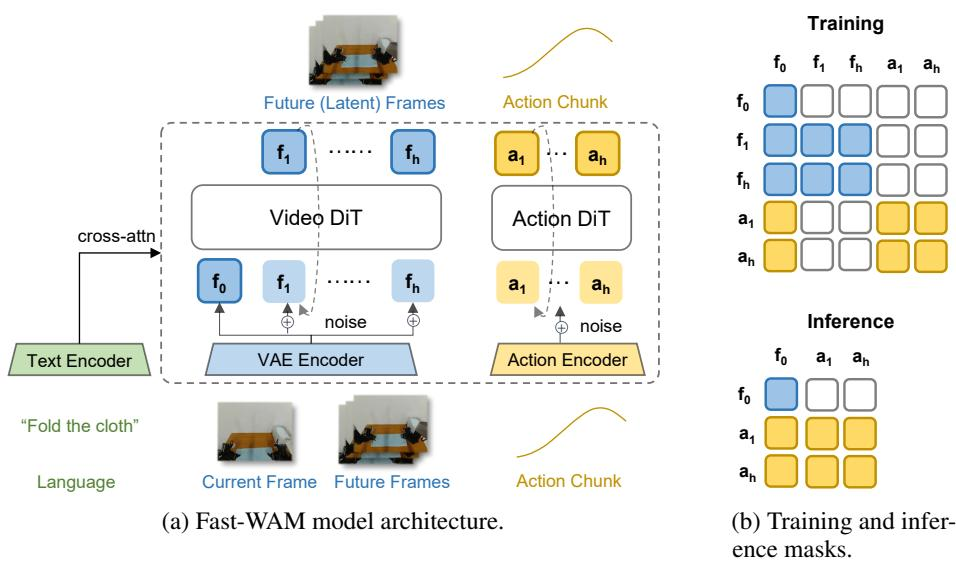
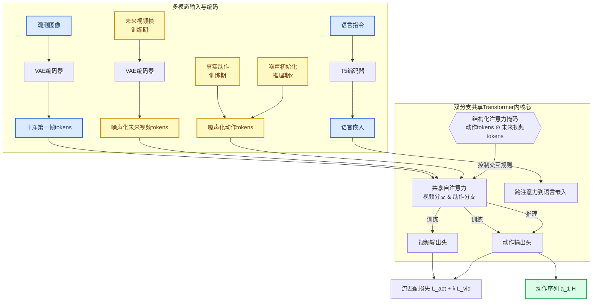
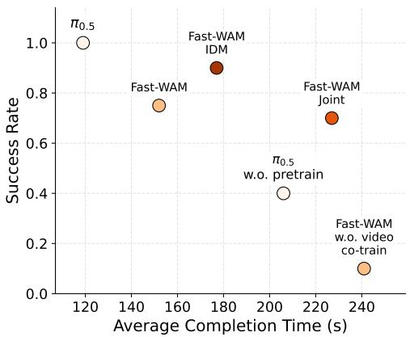
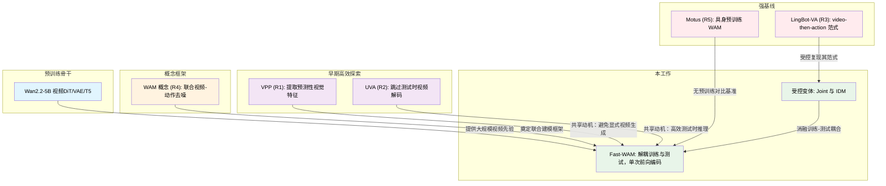
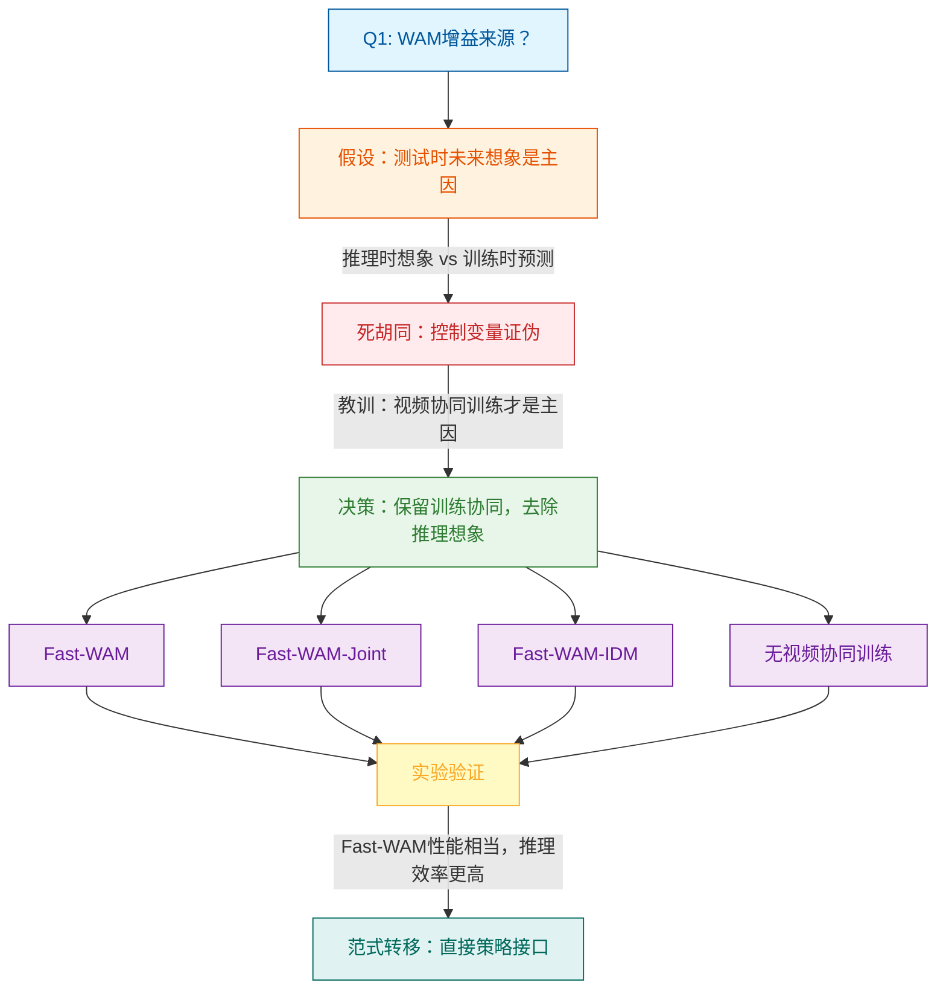

# Fast-WAM: Do World Action Models Need Test-time Future Imagination? — 深度解读

> 面向人类读者的深度解读(中文)。事实源与配对的 AI 知识包 `ai_package/2026-06-08_FastWAM_2603.16666/ara/` 同源,均已通过数据保真审计。

## 核心结论

> 每条结论后的隐形锚点把数字回链到论文原文(忠实性保证)。

1. 视频预测在WAMs中的主要价值在于训练期间改善世界表示,而非在测试时生成未来观测;去除视频协训练目标导致的性能下降远大于去除测试时未来想象所带来的下降
2. Fast-WAM在LIBERO和RoboTwin基准上实现了有竞争力的结果,无需依赖其他WAMs使用的具身预训练,表明视频协训练具有强大的数据效率
3. 通过在测试时跳过未来视频生成,Fast-WAM的推理延迟远低于imagine-then-execute WAMs(如Fast-WAM-IDM),速度差距超过4倍,支持实时机器人控制部署<!--ref:r-in-this-paper-we-ask-w--><!--anchor:quote:In%20this%20paper%2C%20we%20ask%20whether%20WAMs%20need%20explicit%20future%20imagination%20at%20test%20time%2C%20or%20whether%20their%20benefit%20comes%20primarily-->
4. 在LIBERO、RoboTwin两个基准以及真实世界任务上,Fast-WAM与Fast-WAM-Joint和Fast-WAM-IDM之间的性能差异远小于去除视频协训练后的性能下降幅度,这一规律在所有评测设置中保持一致

## 一句话总结与导读

**TL;DR：Fast‑WAM 用一个关键实验揭开了世界行动模型 (WAM) 的“黑箱”——真正让机器人变聪明的，不是测试时耗费大量算力去“想象”未来视频，而是训练阶段通过视频预测目标淬炼出的潜在世界表征；推理时完全跳过视频生成，动作预测反而又快又准。**

当前的许多世界行动模型遵循着一种直觉上很合理的“想象‑后执行”范式：先让模型在脑内推演接下来几秒可能发生的画面，再依据这些“想象的未来”决定下一步动作。这个模式听起来颇有几分人类思考的韵味，但落地到实时机器人控制时，却暴露了一个尖锐的矛盾——迭代式视频扩散采样极为耗时，生成的每一帧都在吞噬本属于动作反应的宝贵毫秒。因此，一个自然的疑问浮现出来：**测试时的高成本想象，真的是强行动性能的必要条件吗？**

Fast‑WAM 给出的答案是否定的。该工作敏锐地指出，WAM 的效果实际被两个相互独立的因素共同支配：其一是训练期间的视频预测目标（它强迫模型理解物理世界如何在动作下演化），其二是推理时的显式未来帧生成。过去的架构将二者硬绑定在同一前向过程中，导致无法单独评估每个因素的贡献。Fast‑WAM 的精巧之处，在于它用一种**结构化注意力掩码**把世界编码与动作预测在模型内部分离开：训练时依然让一个预训练视频扩散 Transformer (DiT) 和另一个动作专家 DiT 通过共享注意力共同学习，视频信号不断向动作模块输送关于物体运动、接触、遮挡等物理先验；但一到推理阶段，动作令牌被彻底禁止“窥视”任何未来视频令牌，模型仅需对当前观测的潜在表示做一次干净的前向传播，就能直接输出动作。

这一“解耦训练、轻装推理”的设计，实际上将 WAM 的价值锚定在了训练期塑造的世界模型上，而非测试时的画面生成。它的直接收益是推理延迟的大幅降低（相比传统想象‑执行范式快了数倍），同时不必再依赖其他 WAM 可能使用的昂贵具身预训练，仅在视频协同训练下就在 LIBERO 和 RoboTwin 等基准上取得了有竞争力的结果。更关键的是，消融实验表明，一旦移除训练时的视频预测目标，性能下降远比移除测试时想象严重得多——用事实支撑了“训练期视频信号才是核心驱动力”的核心主张。这为机器人学习提供了一条更务实的路径：**用视频教会模型物理常识，但在行动时放弃幻想，直面现实。**

**论文总体架构(原图):**



*图2展示了Fast-WAM的整体架构及其结构化注意力掩码。该掩码巧妙地将视频协同训练与动作生成过程解耦，使模型在保留高效视觉表征学习的同时，能够独立进行快速的动作预测。*

## 问题背景与动机

近年来，将世界模型与视觉-语言-动作（VLA）策略结合的工作（World-Action Models, WAMs）在机器人社区引起了广泛关注。这类方法遵循一种直觉上很吸引人的“想象→执行”范式：先通过视频扩散模型在测试时迭代去噪，生成一组描绘未来的视频帧，再把这组想象出的未来画面作为条件，指导动作预测。这个流程试图让机器人“看见”行为后果之后再行动，听起来很自然，但很快就暴露出一个严重的工程代价——**测试时推理延迟过高**。

问题出在“想象”这一步。生成式视频扩散模型依赖多步采样，每增加一帧未来，计算量的增长就非常可观；如果要预测一整段未来片段，所需的迭代去噪时间往往让实时部署变得极其困难。虽然已有研究者试图缓解这个问题（例如 VPP 从视频扩散模型中提取预测性视觉表示，UVA 则在测试时跳过视频解码），但它们或残留对视频模型特征的依赖，或未对训练信号与推理机制做真正的受控解耦，延迟的根因始终没有消除。

更根本的困境在于：**我们其实不清楚“测试时生成未来画面”这一环节，到底对最终的动作质量有多大贡献**。仔细审视 WAM 的运作机制会发现，它的效果可能来自两个相互独立的因素——训练阶段引入的视频预测目标，以及推理阶段显式生成的未来视觉。但现有方法将两者耦合在同一个前向过程里，任何性能增益都说不清楚是来自“看得更远的学习过程”，还是“看得更清楚的想象结果”。这种耦合不仅妨碍我们对方法本质的理解，也使得消除延迟的尝试缺乏可归因的抓手。

与此同时，另一条观察线索来自标准 VLA 预训练本身的局限：这类模型大量依赖静态图文数据，并未显式建模物理世界在动作作用下的演化方式。而视频预测目标恰恰要求模型理解动作如何改变状态，从而可能为策略提供 VLA 所缺失的物理先验。这进一步暗示，**训练期间的视频建模本身或许已经承载了核心价值，推理时的显式生成可能更像是一种昂贵的冗余**。

把这些碎片拼在一起，我们就得到了一个关键洞察：WAM 的主要收益很可能隐藏在训练时视频预测目标所塑造的潜在世界表示中，而非测试时的显式未来视觉生成。如果这个洞察成立，那么设计一个解耦架构——保留训练期的视频联合目标，但推理时仅通过单次前向传播直接从潜在世界表示产生动作——就可以在保留训练收益的同时，彻底消除推理端的视频生成代价。这正是 Fast-WAM 思想的起点，也为后续架构设计提供了清晰的逻辑链条。

## 核心概念速览

Fast‑WAM 的整套设计围绕一个核心矛盾展开：如何在保留对物理世界深刻理解的同时，扔掉推理时沉重的未来视频生成负担？下面逐一拆解它用到的基础概念，每个概念都配一个生活化比喻（标“直觉，非严格对应”），以帮助建立直观印象。

**世界行动模型 (World Action Models, WAMs)** 是一类将未来视觉预测与动作规划统一在同一个生成框架里的具身控制模型。它不满足于从感官输入直接映射动作，而是显式地建模“智能体动起来后，物理世界会怎样演变”。这就好比一位棋手，在下每步棋之前先在脑中推演未来几步的盘面变化，再根据推演结果出手（直觉，非严格对应）。与标准 VLA 模型相比，WAM 的这个“推演”环节让它对物理交互有了更深的理解。

在 Fast‑WAM 之前，大多数 WAM 都遵循一种**想象后执行范式（imagine‑then‑execute paradigm）**：
$$p ( a _ { 1 : H } \mid o , l ) = \int p ( v _ { 1 : T } \mid o , l ) \, p ( a _ { 1 : H } \mid o , l , v _ { 1 : T } ) \, d v _ { 1 : T }$$
模型先通过迭代去噪生成一段未来视觉画面 $v_{1:T}$，再以这些想象出的画面为条件来预测动作块。这就像每天出门前必须看完一整段天气预报视频才能决定穿什么（直觉，非严格对应）——虽然稳妥，但每一次决策都要现场“制作”视频，开销极大。

```mermaid
graph LR
    subgraph 传统：想象后执行
        obs1["观测"] --> gen["生成未来视频"]
        gen --> act1["预测动作块"]
    end
    subgraph Fast‑WAM：潜在世界表征
        obs2["观测"] --> enc["提取潜在表征"]
        enc --> act2["预测动作块"]
    end
    classDef old fill:#ffcdd2,stroke:#b71c1c,color:#000
    classDef new fill:#c8e6c9,stroke:#1b5e20,color:#000
    class obs1,gen,act1 old
    class obs2,enc,act2 new
```
*如何读上图：红色路径需要先生成未来视频再做决策；绿色路径仅用一次前向传播得到表征就直接输出动作。*

Fast‑WAM 的破局之道是引入**潜在世界表征（latent world representation）**。它在推理时彻底丢弃未来视频生成分支，动作预测被简化为对当前观测的潜在特征 $z(o,l)$ 的单次函数：
$$p _ { \theta } ( a _ { 1 : H } \mid o , l ) = p _ { \theta } ( a _ { 1 : H } \mid z ( o , l ) )$$
视频 DiT 骨干只对输入观测做一次前向传播，提取出一个高度压缩的内部表示，整个过程不产生任何未来帧。这就好比经验丰富的棋手不再需要一步步推演，而是凭借长期训练养成的“盘感”直接看出妙手（直觉，非严格对应）。$z(o,l)$ 正是这种蕴含物理交互直觉的内部快照。

然而，“盘感”不可能凭空而来。Fast‑WAM 的训练方案是**视频协同训练（video co‑training）**：在动作损失之外，额外要求视频 DiT 预测未来的视频 latent token $z_{1:T}$，总损失为
$$\mathcal { L } = \mathcal { L } _ { \mathrm { act } } + \lambda \mathcal { L } _ { \mathrm { vid } }, \quad \mathcal { L } _ { \mathrm { vid } } = \mathcal { L } _ { \mathrm { F M } } ( z _ { 1 : T } )$$
这就如同篮球运动员在日常训练中反复观看比赛录像，分析动作与场上局势的关系；但真正上场比赛时完全不再看录像，只靠肌肉记忆和瞬时反应（直觉，非严格对应）。推理时视频预测分支被整个切除，但训练中“看录像”所塑造出来的视频骨干已经深深内化了物理理解。

不论是动作还是视频预测，Fast‑WAM 都使用统一的**流匹配目标（Flow Matching Objective）**。模型在一团高斯噪声 $\epsilon$ 与目标数据 $y$ 之间的线性插值上学习速度场：
$$y _ { t } = ( 1 - t ) y + t \epsilon, \quad \mathcal{L}_{\mathrm{FM}}(y) = \mathbb{E}_{y,\epsilon,t} \left[ \| f _ { \theta } ( y _ { t } , t , o , l ) - ( \epsilon - y ) \| _ { 2 } ^ { 2 } \right]$$
你可以把它想象成：手上有一团乱麻（噪声），目标是把它们一丝丝地梳理成一根笔直的数据线 $y$（直觉，非严格对应）。模型在每一步学习该如何“梳理”，这套手艺同时用于生成动作块和未来视频特征，保证了训练信号的一致性。

承载这一切的躯体是**混合专家 Transformer 架构（Mixture‑of‑Transformer, MoT）**。它由一个约 5B 参数的视频 DiT（复用 Wan2.2‑5B 预训练）和一个隐藏维度缩减为 $d_a=1024$、约 1B 参数的动作专家 DiT 组成，总参数约 6B。两个分支通过共享注意力层连接，但信息流动并非完全自由，而是受**结构化注意力掩码（structured attention mask）** 的严格管控。掩码的核心规则只有三条：

- **干净第一帧 token**：完全不关注任何其他 token，始终保持“清洁”状态，作为视频建模与动作生成的共享视觉锚点。
- **未来视频 token**：可在视频分支内双向注意，并允许访问干净第一帧 token。
- **动作 token**：可在动作分支内双向注意，并允许访问干净第一帧 token，但**严禁注意未来视频 token**。

为了便于记忆，可以把它想象成一场考试（直觉，非严格对应）：正在答题的考生（动作 token）绝对不能偷看旁边学霸的卷子（未来视频 token），但大家都可以随时抬头看黑板上的题目（干净第一帧）。推理时，整个未来视频分支被移除，掩码不再需要，模型仅凭训练中塑造的视觉锚点和动作专家就能完成快速决策。

## 视觉-语言-动作统一管线：训练协同、推理解耦的流匹配架构

Fast‑WAM 的核心设计哲学是“**用视频生成任务为动作专家注入世界知识，却在推理时干净利落地丢弃视频生成**”——它通过一个精心设计的双分支 Transformer 与结构化注意力掩码，将视频帧预测与动作序列生成统一在流匹配框架下，严格保证动作专家在训练期间无法窥见未来信息，从而使推理时无需任何视频生成即可输出高质量动作，整体控制延迟仅约 190 ms。这一节自底向上拆解整个管线：多模态输入如何变成 tokens、MoT 双分支如何隔离信息、联合流匹配如何训练、以及推理时世界表征如何驱动动作生成。

### 从传感器到 tokens：三类输入的统一表征
系统接收三个信息源：当前相机拍摄的**观测图像**、人类下达的**语言指令**、以及在训练时提供的**未来视频帧**与**真实动作序列**。所有连续信号都被映射到 Transformer 可消费的 token 空间：

- 观测图像经过预训练 VAE 编码，得到**第一帧潜变量 tokens**（下文称“干净第一帧 tokens”），它们作为整个序列的视觉锚点，为模型提供当前的“世界快照”。
- 语言指令由 T5 编码器转换为**语言嵌入**，之后通过跨注意力注入模型各层。
- 训练时，未来视频帧同样经过 VAE 编码，再通过噪声插值 $y_t = (1-t)y + t\epsilon$ 混入噪声，形成**未来视频噪声 tokens**；真实动作序列以完全相同的方式加噪，得到**动作噪声 tokens**。

推理时，未来视频 tokens 和真实动作 tokens 均不存在，动作分支仅从一个纯噪声初始化的 token 块启动去噪过程，第一帧 tokens 和语言嵌入则始终保持原样。三类 tokens 的角色划分是整个架构解耦的物理基础。

### MoT 双分支与结构化注意力掩码：信息隔离就是一致性保证
模型主体并非单一同构 Transformer，而是一套 **Mixture‑of‑Transformer (MoT)** 的异构组合：一个约 5B 的 **视频 DiT 骨干**（从 Wan2.2‑5B 初始化）与一个约 1B 的 **动作专家 DiT**，二者通过**结构化注意力掩码**共享信息却严格隔离不当泄露。这张掩码表就是 Fast‑WAM 区别于联合生成范式（Fast‑WAM‑Joint）的本质，也是训练与推理行为完全等价的契约：

- **干净第一帧 tokens** 作为“共享视觉锚点”：它不访问任何其他 tokens（避免自身被噪声污染），却可以被视频分支和动作分支所访问。
- **未来视频噪声 tokens** 在视频分支内双向注意力，并可读取第一帧 tokens，但**绝对禁止被动作 tokens 看见**。
- **动作 tokens** 可以在动作分支内双向注意力，同样只能访问第一帧 tokens，看不到未来视频 tokens。

这种设计使得动作专家在训练时只能从“干净的现在”和语言指令中学习行为，而无法从“未来的视频”中作弊获取运动先验。推理时，因为未来视频分支完全不存在，动作分支的感受野天然与训练期一致——不用任何结构修改或模式切换，仅需抛弃视频输出头，即可无缝迁移到纯动作生成模式。下图直观展示了多模态 token 的流动路径以及掩码控制的核心作用。



**如何读这张图**：蓝色节点是推理时依然必需的输入（观测与指令），黄色节点仅在训练时出现或来自噪声初始化，绿色是最终输出。三类 tokens 齐头注入共享注意力模块，其交互规则完全由菱形掩码决定。训练时系统同时产生视频预测和动作预测以计算联合损失；推理时视频分支不输出任何东西，仅由动作输出头经多步去噪一条通路得到动作序列。

### 联合流匹配：让视频生成辅助动作学习
训练目标是在同一个流匹配范式下同时优化动作和视频。对于任意目标变量 $y$（动作序列 $a_{1:H}$ 或未来视频潜变量 $z_{1:T}$），构建插值噪声样本 $y_t = (1-t)y + t\epsilon$，模型 $f_\theta$ 需要预测 $(\epsilon - y)$ 的方向场。基础损失为
$$\mathcal{L}_{\mathrm{FM}}(y) = \mathbb{E}_{y,\epsilon,t}\left[\|f_\theta(y_t, t, o, l) - (\epsilon - y)\|_2^2\right]$$
总损失是动作分支与视频分支的加权和：
$$\mathcal{L} = \mathcal{L}_{\mathrm{act}} + \lambda\mathcal{L}_{\mathrm{vid}}$$
其中 $\lambda$ 平衡动作模仿与视频协同训练。视频预测任务强制模型从第一帧推测后续动态演化，这一过程将关于物体运动、遮挡、交互的物理规律“蒸馏”进共享的视觉表征；而动作专家从同一表征中获益，却因掩码约束只学到“现在能做什么”，而非“未来要看到什么”。训练噪声调度沿用 Wan2.2‑5B 原生的 logit‑normal 分布，以保持与预训练权重的兼容性。

<details><summary><strong>Fast‑WAM‑IDM 的额外噪声增强</strong></summary>
对于使用逆动力学模块的变体 Fast‑WAM‑IDM，训练时会对真实视频 tokens 以概率 0.5 额外加噪。这模仿了 LingBot‑VA 的策略，用于缓解训练时喂入干净视频、推理时却使用生成视频表征之间的分布偏移——本质是一种针对视频输入的数据增强。标准 Fast‑WAM 不需要此步骤。
</details>

### 推理时的世界表征提取与轻量化动作生成
推理阶段完全移除了视频去噪的环节。系统仅将**干净第一帧 tokens** 输入视频 DiT 做**单次前向**，得到一份稠密的潜在世界表征 $z(o,l)$——它编码了当前场景的空间结构与语义信息。随后，这份表征作为条件送入动作专家 DiT，后者从一个纯噪声的动作 token 块出发，执行 **10 步流匹配 ODE 求解**，直接输出未来 $H=32$ 步的动作序列。因为视频生成完全被跳过，且动作去噪步数极低，整个推理管线控制在约 190 ms 的极低延迟内，同时得益于训练时掩码的一致性保证，动作质量并不会因为丢弃视频生成而衰减。

配合几个关键工程参数——视频帧时序 $4\times$ 下采样使每个动作 chunk 仅对应 9 帧、动作专家 hidden dim 设为 $d_a=1024$ 以平衡容量与开销——这套架构最终在多个机器人仿真与真实场景中展现出对以往联合生成方案的效率压制，并仍保持与慢速视频生成方法比肩的控制品质。

## 算法目标与推导

**核心逻辑**：本工作采用联合流匹配（Flow Matching）目标，同时学习动作块与未来视频潜变量的生成过程。训练时，视频潜变量协同预测充当强烈的视觉正则，迫使策略网络理解动作将引发的视觉变化；推理时，模型完全丢弃视频生成分支，仅对动作块执行流匹配ODE积分，以极低延迟生成动作序列。这种“训练联觉、推理极简”的设计，是平衡策略表现与实时性的关键。

原样给出的源公式如下（对应论文公式5至公式9）：

$$
y_t = (1-t)y + t\epsilon \quad \text{(5)}
$$

$$
\mathcal{L}_{\mathrm{FM}}(y) = \mathbb{E}_{y,\epsilon,t}\left[\|f_\theta(y_t, t, o, l) - (\epsilon - y)\|_2^2\right] \quad \text{(6)}
$$

$$
\mathcal{L}_{\mathrm{act}} = \mathcal{L}_{\mathrm{FM}}(a_{1:H}) \quad \text{(7)}
$$

$$
\mathcal{L}_{\mathrm{vid}} = \mathcal{L}_{\mathrm{FM}}(z_{1:T}) \quad \text{(8)}
$$

$$
\mathcal{L} = \mathcal{L}_{\mathrm{act}} + \lambda\mathcal{L}_{\mathrm{vid}} \quad \text{(9)}
$$

下面逐项拆解其设计理由与运作机制。

**噪声插值路径（公式5）**：流匹配在真实数据 $y$ 与标准高斯噪声 $\epsilon$ 之间构建一条连续的线性插值路径。时间步 $t$ 从0（纯数据）变化到1（纯噪声），训练时对 $t$ 随机采样，使得模型学会各种噪声水平下的去噪方向。这种“从干净到噪声”的渐变，是后续学习向量场的脚手架。

**向量场损失（公式6）**：模型 $f_\theta$ 需要预测一个向量场，它将当前噪声样本 $y_t$ 推向真实数据所在的区域。最优向量场在理论上等于 $\mathbb{E}[\epsilon - y \mid y_t]$，即指向从噪声回归数据的方向。因此直接监督模型输出与 $(\epsilon - y)$ 的L2距离，可以等价地构建一个概率流ODE，在推理时沿向量场积分即可生成干净样本。公式中 $(o, l)$ 分别对应历史观测与语言指令，作为生成的条件背景。

**双分支损失（公式7–8）**：动作分支 $\mathcal{L}_{\mathrm{act}}$ 直接对动作块 $a_{1:H}$ 施加流匹配损失，确保策略能输出可执行的动作。视频分支 $\mathcal{L}_{\mathrm{vid}}$ 则对 **未来视频帧的VAE潜变量** $z_{1:T}$ 施加同等损失——这里并没有使用高维像素，而是用预训练VAE编码器将未来帧压缩成紧凑低维表征，大幅降低了视频协同训练的计算开销。该分支的关键价值在于：它强迫策略网络在生成动作的同时去“想象”这些动作即将导致的视觉未来，从而内化场景的物理动态和交互约束。若仅用动作损失，策略容易学会统计上可行但物理上不合理的动作（如穿模或漂移）；视频协同训练恰好能压制这种“捷径解”。

**总损失与平衡系数（公式9）**：两项损失通过超参数 $\lambda$ 加权。$\lambda$ 控制视频监督的强度：过小则视觉正则弱，过大可能干扰动作主任务的学习。论文并未给出 $\lambda$ 的具体数值，实践中需根据任务特性调节。

**推理阶段的高效性**：最精妙的设计在于，推理时完全无需运行视频生成分支。模型仅对动作块 $a_{1:H}$ 执行流匹配ODE求解（文中所用步数为10步），从纯噪声开始沿学到的向量场积分逐步得到干净动作序列。因为视频网络在推理时被旁路，整个过程的计算量几乎等同于一个单次前向的动作策略，却继承了来自视频协同训练的丰富世界知识。

**直觉，非严格对应**：可以把视频协同训练类比为学车时，教练不仅要求你操作方向盘（动作），还要你口头描述接下来几秒将要看到的道路景象（未来视觉）。这种额外任务迫使你不断观察环境、预判动态，而不再是机械地跟随指令。一旦通过考试（训练完成），实际上路时你只需动手开车，无需再口头描述，但预判能力已经内化在驾驶行为中。

**小玩具案例**：设想一个极简2D任务：将圆点从左移到右。动作 $a$ 为每步水平位移（H=4步），真实动作序列为[+1, +1, +1, +1]。未来视频经小型VAE压缩成2维潜变量，T=4帧时圆点逐渐右移。训练时随机采样时间步 $t=0.3$，对动作块和潜变量块分别插值噪声：$a_t = 0.7 \cdot a_{true} + 0.3 \cdot \epsilon_a$，$z_t = 0.7 \cdot z_{true} + 0.3 \cdot \epsilon_z$。共享网络 $f_\theta$ 预测两组向量场，分别与 $(\epsilon_a - a_{true})$ 和 $(\epsilon_z - z_{true})$ 计算L2损失。若动作分支试图输出向左的位移，视频分支会因为预测出的圆点位置与真实视觉不符而受到惩罚，模型被迫将动作拉回正确方向。推理时，仅对动作块求解10步ODE，视频分支完全休眠，最后仍输出近乎正确的[+1, +1, +1, +1]。这个玩具体现了协同训练如何借助视觉约束提升动作生成质量，且不增加推理负担。

## 实验设计与结果解读

**结论先行：通过三个层次的受控实验，论文系统验证了 Fast-WAM 的两大核心主张——视频协训练足以替代昂贵的具身预训练，而分离式动作专家架构在保持性能与“先想后做”变体可比的同时，推理延迟降低数倍。**

整个实验体系沿着“仿真多任务→仿真多场景→真实长时程”的梯度展开，每一层都配备严格的消融对照，分别评估泛化性、鲁棒性与部署效率。这样做的好处是，可以逐步剥离“视频先验”与“架构选择”各自对性能的贡献，避免把相关性当成因果。

### 仿真基准：用消融实验剥离视频协训练的真实贡献

在 RoboTwin 2.0 双臂操控基准和 LIBERO 四套件基准上，论文设计了一套“夹层对照”：将 Fast-WAM 与两种“先想后做”变体（Fast-WAM-Joint、Fast-WAM-IDM，先将视频预测到未来再执行动作）以及一个完全去除视频协训练的变体进行并列比较。对照组中还包括了经过大规模具身预训练的先进方法（如 Motus、LingBot-VA）和基于相同视频骨干但无任何具身预训练的基线。

直觉上，这套设计就像在测试一台新设计的发动机：你不仅要看它能否跑过市面上的竞品，还要拆掉增压器，确认动力下降的源头到底是不是它。实验结果是：**无具身预训练的 Fast-WAM 在整个基准的整体成功率上与有预训练方法并驾齐驱；而两个“先想后做”变体的表现与之高度可比，意味着额外的视频预测并没有带来更强的动作执行能力。反观去除视频协训练的消融组，性能出现断崖式下降——尤其在 LIBERO 的空间关系（Spatial）和长时程（Long）子集上恶化更为明显。** 这说明视频生成模型提供的大规模视觉先验，才是模型面对随机化场景、遮挡和复杂物体关系时保持行为稳定性的关键因子，而不是具身预训练本身（具体数据见下文实验对比表格）。

### 真实世界长时程任务：验证效率与操控品质的平衡

毛巾折叠任务是一个典型的可变形物体长时程操控挑战，既要长程规划（将毛巾从展开状态逐步折叠整齐），又需要闭环精确控制（应对毛巾形变带来的视觉反馈变化）。模型仅用遥控操作采集的少量演示进行微调，评测却直接放在真实机器人平台（Galaxea R1 Lite）上执行。

**实测结果显示，Fast-WAM 在推理延迟上形成绝对优势：比“先想后做”变体快出数倍，同时成功率与任务完成时间均显著优于无预训练的基线 π₀.₅。** 联合架构变体 Fast-WAM-Joint 和 IDM 虽然策略质量仍与 Fast-WAM 处于同一水准，但它们的多步推断流程导致链路延迟严重膨胀，证明在真实世界中，“先想后做”的奢侈开销会直接拖慢任务节奏。同样，一旦剥离视频协训练，模型不仅成功率大幅滑坡，任务执行也变得更加迟疑拖沓。这进一步印证了仿真实验的结论：视频先验才是高性能策略的真正支柱，而 Action Expert DiT 架构让推理可以保持轻快，无需牺牲性能来换取速度。

整体来看，三重实验形成了一条清晰的证据链：仿真任务证明泛化能力、多场景基准暴露鲁棒性边界、真实任务检验效率和实用价值，三者共同支撑起论文的设计主张。

### 实验数据表(原始数值,引自论文)

#### LIBERO基准多方法对比结果
- **Source**: Table 2
- **Caption**: "LIBERO结果。Fast-WAM在无具身预训练情况下实现有竞争力的整体性能,与两个imagine-then-execute变体相近,且以明显优势超过无视频协训练消融组"

| Method | Embodied PT. | Spatial | Object | Goal | Long | Average |
| --- | --- | --- | --- | --- | --- | --- |
| OpenVLA [9] | - | 84.7 | 88.4 | 79.2 | 53.7 | 76.5 |
| πo[10] | - | 96.8 | 98.8 | 95.8 | 85.2 | 94.1 |
| π0.5[11] | - | 98.8 | 98.2 | 98.0 | 92.4 | 96.9 |
| LingBot-VA [3] | √ | 98.5 | 99.6 | 97.2 | 98.5 | 98.5 |
| Motus [5] | √ | 96.8 | 99.8 | 96.6 | 97.6 | 97.7 |
| Fast-WAM (Ours) | × | 98.2 | 100.0 | 97.0 | 95.2 | 97.6 |
| Fast-WAM-Joint | × | 99.6 | 99.4 | 98.2 | 96.8 | 98.5 |
| Fast-WAM-IDM | × | 98.8 | 97.8 | 97.8 | 97.6 | 98.0 |
| Fast-WAM w.o. video co-train | × | 89.2 | 99.2 | 95.4 | 90.0 | 93.5 |

#### RoboTwin 2.0基准多方法对比结果
- **Source**: Table 1
- **Caption**: "RoboTwin结果。Fast-WAM在无具身预训练情况下与强预训练WAM基线性能相当;两个imagine-then-execute变体结果高度可比;去除视频协训练导致显著性能下降"

| Method | Embodied PT. | Clean | Rand. | Average |
| --- | --- | --- | --- | --- |
| πo[10] | - | 65.92 | 58.40 | 62.2 |
| π0.5[11] | - | 82.74 | 76.76 | 79.8 |
| Motus [5] | √ | 88.66 | 87.02 | 87.8 |
| LingBot-VA [3] | √ | 92.90 | 91.50 | 92.2 |
| LingBot-VA from WAN2.2 | × | 80.60 | - | 80.6 |
| Fast-WAM (Ours) | × | 91.88 | 91.78 | 91.8 |
| Fast-WAM-Joint | × | 90.84 | 90.32 | 90.6 |
| Fast-WAM-IDM | × | 91.16 | 91.34 | 91.3 |
| Fast-WAM w.o. video co-train | × | 82.76 | 84.80 | 83.8 |

#### 真实世界部署推理延迟对比
- **Source**: Section 4.3.3
- **Caption**: "Fast-WAM保持低推理延迟(190ms),而imagine-then-execute变体明显更慢,其中Fast-WAM-IDM达到810ms;Fast-WAM比imagine-then-execute WAMs快4倍以上"

| Method | 推理延迟(ms) |
| --- | --- |
| Fast-WAM | 190 |
| Fast-WAM-IDM | 810 |


**效果示例(论文原图):**



*图4展示了真实机器人叠毛巾任务上的定量结果：左图通过成功率与平均完成时间的散点图对比各方法，左上区域表示更优；右图比较推理延迟。Fast-WAM在保持高成功率的同时显著降低了决策耗时。*

## 相关工作与定位

Fast‑WAM 所回答的核心问题是：**世界动作模型（WAMs）能否仅凭训练期的视频协训练，就在测试时以一次前向计算直接输出可靠动作，而无需任何形式的未来帧想象或联合去噪？** 这一问题并非凭空而来——它诞生于一连串前驱工作在“视频世界建模如何辅助动作预测”这条线索上逐渐收敛的张力之中。如图 1 所示，Fast‑WAM 同时站在概念框架、早期高效探索、强基线以及通用视觉基座四个支流的交汇处，其独特贡献在于通过精心设计的受控变体（Fast‑WAM‑Joint、Fast‑WAM‑IDM），首次把“训练时看到了画面”与“测试时想象了未来”两块贡献从混杂状态中系统剥离开。


> **图 1**｜Fast‑WAM 在研究谱系中的位置。箭头表示影响与被影响关系；本工作区域（右下）将训练期视频协训练与测试时未来想象明确解耦，而此前的方法在这两个维度上存在不同程度的耦合。

如何读这张图：左上角 Wan2.2‑5B 提供了通用视频理解根基；左侧 WAM 概念框架确立了“用世界模型辅助动作”的基本范式；上方 VPP 与 UVA 代表了减负测试开销的早期尝试；右下的受控变体直接复现了左侧 LingBot‑VA 的 `video‑then‑action` 流程，以此剥离变量。

### 概念源头：从联合去噪到训练‑测试解耦

Ye 等人提出的 **World Action Models（WAMs）** 概念框架首次将“视频世界建模”与“动作预测”焊接为一个统一的去噪任务：模型在训练时同时学习重建视频帧和输出动作，测试期则通过迭代联合去噪在隐空间里“演化”出未来状态并同步产生动作。这一范式具有极强的美学吸引力——动作始终生长在世界模型对未来想象的内部轮廓上。然而，它也在测试时引入了昂贵的扩散采样步骤，并且把“训练期视频协训练学到的世界规律”与“测试时即时想象带来的额外引导”混在同一把刻度尺上，让人难以分辨究竟是哪一部分在真正起作用。

Fast‑WAM 吸收了 WAM 的联合训练思想，但明确划分了边界：训练期仍然进行视频‑动作联合协训练，以此将世界知识压入视频骨干的表示；测试期则**彻底关闭联合去噪通道**，仅靠训练好的世界编码器单次前向编码观测，由动作专家分支直接读出动作。这一变化在架构上轻微，在认识论上重大——它为后续的消融实验留出了清晰的逻辑刀具。

### 效率前哨：VPP 与 UVA 的“跳过”策略

在 Fast‑WAM 之前，已有两项工作察觉到“测试时显式生成视频代价高昂”这一痛点，并尝试绕路。**VPP（Video Prediction Policy）** 从视频扩散模型内部提取预测性视觉特征，将其作为条件信号喂给动作策略，从而避免直接合成像素级未来帧。**UVA（Unified Video‑Action model）** 则干脆在测试时跳过视频解码器，只保留了联合建模的训练协议。二者的共同直觉是：世界模型的有用信息已沉淀在中间表示里，不必非把“电影”放映完才能做决定。

Fast‑WAM 与这一支流共享相同的效率动机，但走得更远——它完全不依赖测试时的任何未来帧特征提取或隐式解码，单次前向即完成感知到动作的映射。更重要的是，VPP 与 UVA 并未通过实验回答一个关键问题：它们的性能收益究竟来自训练期的多任务学习（视频协训练的正则化效应），还是来自测试时额外“瞥见”的未来信息？Fast‑WAM 通过引入**受控变体**（下文详述）将这两个因素拆开，从而在效率探索的支流上划出了一道更清晰的因果线。

### 受控比较的锚点：LingBot‑VA 与 Motus

要证明“训练期视频协训练本身即足矣”，必须有合适的对照。 **LingBot‑VA** 是典型的 `video‑then‑action` 范式——它先利用因果世界模型显式生成未来视频，再基于生成的视频预测动作。Fast‑WAM 专为其设计了一个名为 **Fast‑WAM‑IDM** 的变体，该变体在同样采用噪声增强（概率 0.5）的前提下，复现了“先生成未来帧、再供动作专家预测”的流水线。这样一来，IDM 变体与标准的 Fast‑WAM 之间唯一的系统性差异就是“测试时是否执行显式的未来想象”，从而精准度量出“未来想象”在 `video‑then‑action` 范式中的净增益。

另一条对比基线是 **Motus**，一种统一潜在动作世界模型，其强大之处在于利用了具身预训练数据。Fast‑WAM 在**零具身预训练**的条件下与之较量：如果凭借从 Wan2.2‑5B 继承的大规模通用视频先验就能达到甚至超越有预训练的 Motus，那么“具身经验”与“通用视觉世界知识”在 WAM 效能中的权重便能得到一次干净的权衡。受控对比的结果（具体数值见“实验与对比”）构成了支撑 Fast‑WAM 核心论断的经验支柱。

### 视觉基座：重新利用 Wan2.2‑5B

上述一切解耦与对比之所以可能，离不开一个强大的视频理解引擎。 **Wan2.2‑5B** 是一个在海量视频数据上预训练的视频生成扩散 Transformer，自带配套的 T5 文本编码器、视频 VAE 以及 logit‑normal 噪声调度。Fast‑WAM 对其进行了“角色翻转”：原本用于多步迭代去噪生成视频的 DiT 骨干，被改造为单次前向的世界编码器——它接收历史观测的潜在视频 token，通过 cross‑attention 融合语言指令，输出蕴含世界动态和物理常识的中间表示；与此同时，新增设的动作专家 DiT 分支从这一世界表示中解码出动作序列。这样一来，Fast‑WAM 无需任何具身预训练，便可站在 Wan2.2‑5B 已消化完成的“通用视觉经验”的肩膀上，专注于学习将世界认识翻译为操作指令。

<details><summary><strong>相关工作映射表（展开）</strong></summary>

| 相关工作 | 类型 | 与 Fast‑WAM 的核心差异 | 被采纳的元素 |
|---------|------|----------------------|--------------|
| WAM (R4) | 概念框架 | 测试时仍联合去噪 | WAM 概念、联合训练范式 |
| VPP (R1) | 相关方法 | 测试时需提取预测特征 | — |
| UVA (R2) | 相关方法 | 未分离训练/测试贡献 | — |
| LingBot‑VA (R3) | 基线 | video‑then‑action 范式 | 噪声增强、IDM 变体设计 |
| Motus (R5) | 基线 | 依赖具身预训练 | — |
| Wan2.2‑5B (R6) | 预训练骨干 | 原始用途为视频生成 | 视频 DiT、VAE、T5、噪声调度 |

</details>

纵观这张谱系图，Fast‑WAM 的定位清晰可辨：它并非在零基础上提出全新范式，而是通过**受控解耦**的手术，将笼罩在“世界动作模型”这条研究脉络上的关键混淆因素逐一剖开。它证明了训练期视频协训练所构建的世界表示已经足够作为动作预测的坚实基座，而测试时的未来想象尽管在部分场景中仍可锦上添花，却并非不可或缺的骨架——这一结论，只有在与 VPP、UVA、LingBot‑VA、Motus 等工作的细致对勘中才获得了实证合法性。

## 研究探索历程

世界‑动作模型（WAM）的吸引力在于：它赋予了机器人某种“前瞻”能力。但一个核心的迷题从一开始就纠缠着这个方向：这种能力的增益究竟来自何方？直觉会指向两个相互交错的来源——其一，训练时引入的视频预测目标迫使模型学习物理先验和动作条件表征，就像学开车的人必须理解方向盘与车身动态的关系；其二，推理时显式地生成未来视觉帧，让模型能在决策前“看到”即将发生的情景。两者在以往的想象‑执行（imagine‑then‑execute）范式中天然耦合，如同连体婴，让研究者难以断定到底是哪一个在真正撑起 WAM 的性能优势。

一个看似理所当然的假设很快浮出水面：**测试时的显式未来想象是 WAM 性能增益的主因**。毕竟，能够在做出动作之前先在脑海中放一场“未来电影”，听起来就是智能体胜出的关键。研究者于是设计了精巧的控制变量实验来检验它：在保留训练时视频协同目标的前提下，彻底砍掉推理时的未来帧生成，观察性能会否雪崩。结果却让这个假设走进了死胡同——去掉推理时想象的模型性能并未出现预想中的暴跌，下降幅度微乎其微；而真正让成功率断崖式下跌的，是连训练时的视频协同目标也一并移除。这条走入死胡同的线索留下一个清晰的教训：**视频协同训练对潜在世界表征的塑造作用，而非测试时的显式帧合成，才是 WAM 相对于标准 VLA 获得增益的主导因素**。也就是说，模型在训练时被逼着预测未来，早已将物理世界里的运动、遮挡、交互结构内化进了自己的潜在空间；至于推理时要不要再“画”出那些帧，反倒不是决定性的一步。

这一洞察迅速促成一个关键架构决策。研究者调转船头，提出了 **Fast‑WAM**：训练时依然联合优化动作损失与视频协同训练损失，完整保留视频预测带来的表征红利；推理时却果断抛弃迭代去噪与未来帧生成，仅保留干净的第一帧 latent token，通过视频扩散 Transformer（DiT）单次前向传播获得富含世界知识的潜在表征，然后直接交由动作专家生成动作块。这种设计让推理接口退回到与标准 VLA 策略几乎一致的模样——不再有显式的“想象”环节，却依然能将训练所得的世界先验完整地传递给动作决策。为了精确量化每一个设计要素的贡献，研究者同时搭建了多种对照变体：保留推理时联合去噪的 Fast‑WAM‑Joint、先想象再决策的 Fast‑WAM‑IDM，以及完全移除视频协同训练的对照组。

在下方的流程图中，你可以清晰地看到从初始问题、死胡同、关键决策到范式转移的完整探索脉络：



**如何读这张图**：研究起于一个根源问题，引出一个看似合理的假设；该假设被控制变量实验直接推翻，从而产生一个关键认知（死胡同的“教训”）；基于此认知做出一个清晰的设计决策，并衍生出四种变体进行系统比较；实验数据最终导向一个范式级别的结论。

实验在 LIBERO 仿真四个子套件、RoboTwin 2.0 超 50 个双臂任务以及真实世界长时程毛巾折叠任务上铺开，结果高度一致：**Fast‑WAM 与两种 imagine‑then‑execute 变体的成功率高度相当，且均远超移除视频协同训练的消融变体。**值得强调的是，在保留视频协同训练的三种变体之间，性能差距远小于它们与无视频协同训练变体之间的鸿沟——这再次印证了训练目标的主导地位。在真实世界任务中，Fast‑WAM 不仅保持了强劲的成功率，推理延迟也远低于那些在测试时仍需迭代去噪的变体；而一旦拿掉视频协同训练，成功率急剧下降，完成任务的时间也明显拉长。

这些证据共同催生了从 **imagine‑then‑execute 到直接策略接口** 的范式转移。早期 WAM 习惯让模型先在潜空间中显式合成未来观测，再据此预测动作，犹如要求机器人每一刻都先“想象”再行动；Fast‑WAM 则表明，只要在训练期间用视频预测作为协同目标，潜在世界表征就已经吸收了足够的物理交互结构，推理时完全可以直接输出动作而不必费力渲染未来画面。于是，测试时接口回归简单，推理效率大幅提升，而决策质量未受折损——这为 WAM 走出实验室、面向实际部署扫除了一个重要障碍。

<details>
<summary><strong>关于实验设计与变体的更多细节</strong></summary>

- **Fast‑WAM**：推理时仅利用第一帧 latent token 经视频 DiT 单次前向，动作专家直接解码动作块，完全跳过未来视频去噪。
- **Fast‑WAM‑Joint**：视频 token 与动作 token 在共享模型内联合去噪，保留推理时未来生成（对应传统 imagine‑then‑execute 的一种实现）。
- **Fast‑WAM‑IDM**：先生成未来视频帧，再据此预测动作（对应另一种 imagine‑then‑execute 路线）。
- **无视频协同训练变体**：训练时只优化动作损失，作为视频协同训练贡献的直接对照组。

所有实验在控制变量框架下进行，以确保训练数据、模型容量、优化配置等背景因素一致。结论的稳健性由 LIBERO、RoboTwin 2.0 以及真实世界操作任务共同支撑。

</details>

## 工程与复现要点

复现 Fast-WAM 需抓住三个核心：**以 Wan2.2 视频生成模型为视觉‑运动先验引擎，挂载一个参数高效的动作预测分支，通过结构化注意力掩码严格控制信息流向**；训练时在 LIBERO 和真实机器人数据上联合优化视频预测与动作生成，超参选择相对稳健；推理只需单张高端消费级 GPU 即可实时运行。**目前论文未开源代码，但公开了充分的架构与超参细节，具备较高复现可行性。**

### 模型结构与规模

Fast-WAM 整体是一个“混合 Transformer”（Mixture‑of‑Transformer, MoT），基础骨架直接继承 Wan2.2‑5B 预训练视频扩散 Transformer，包含视频 DiT 主干、T5 文本编码器和视频 VAE。在此之上，**挂载了一个 1B 参数的动作专家分支**（隐藏维度 1024），使总参数量达到约 6B。动作专家并非完全独立——它与视频 DiT **共享注意力层**，但通过**结构化注意力掩码**隔离信息流：动作 token 可以自由关注干净的“第一帧”观测视频 token 和文本 token，却不能窥视代表未来的“噪声视频 token”，从而杜绝了未来信息泄露导致的因果性错误（直觉上，这如同餐厅的后厨不能提前看到顾客未点的菜）。

推理时，动作 token 从纯噪声开始，与噪声化的未来视频 token 一同进入共享注意力模块进行迭代去噪，**仅需 10 步去噪即可输出动作序列**（扩散步数远少于常规图像生成），在单张 RTX 5090D V2 32GB GPU 上可获得近似实时的响应延迟（具体数值见下表）。

| 组件 | 配置 / 规模 | 关键作用 |
|------|------------|----------|
| 视频骨干 | Wan2.2‑5B（预训练） | 提供强韧的时空视觉与运动先验 |
| 动作专家 | 1B 参数，隐藏维 1024 | 根据当前观测和噪声未来预测动作 |
| 文本编码 | T5（Wan2.2 内置） | 融入语言指令，控制任务目标 |
| 注意力机制 | 共享注意力 + 结构化掩码 | 保证动作分支不“偷看”未来视频信息 |
| 去噪迭代 | 10 步 | 平衡推理速度与动作质量 |
| 推理延迟 | ~190 ms（RTX 5090D） | 满足机器人实时操控的及时性 |

结构化掩码的具体规则可概括为下表，实现时务必对照论文 Figure 2b 仔细校验：

| Token 对 | 注意力约束 | 目的 |
|----------|-----------|------|
| 动作 ↔ 干净第一帧 | 允许双向注意力 | 利用当前真实观测 |
| 动作 ↔ 文本 | 允许双向注意力 | 理解任务指令 |
| 动作 ↔ 噪声未来帧 | **禁止**动作关注未来帧 | 防止未来信息泄露 |
| 视频未来帧 ↔ 视频未来帧 | 仅允许因果（单向）注意力 | 保持视频扩散的时序因果性 |

### 训练关键超参及其作用

<p>训练采用 **flow matching** 框架，对视频 token 和动作 token 同时施加噪声，并联合优化视频重建损失与动作预测损失（两者间用超参数 $$\lambda$$ 平衡，论文未给出具体数值）。数据准备阶段需将演示视频按 **4 倍时序下采样**，每组对应一个长度为 **32 的动作块**（即一次预测未来 32 步动作），经过 VAE 编码后得到 9 个视频帧 token。这种“时间压缩 + 动作长程预测”的设计有效降低了序列长度，使训练可在有限显存下进行。</p>

训练过程统一采用 **AdamW 优化器**配合**余弦退火学习率调度**，基础学习率 **1 × 10⁻⁴**，权重衰减 **0.01**，梯度裁剪阈值 **1.0**。在 LIBERO 基准上训练 **20k 步**，在 RoboTwin 2.0 和真实世界任务上训练 **30k 步**，全程启用**混合精度**加速。针对 Fast‑WAM‑IDM 变体，还会以 **0.5 的概率**对真值视频 token 作噪声增强，以提升鲁棒性。

<details>
<summary><strong>完整训练超参一览（点击展开）</strong></summary>

| 超参数 | 取值 | 作用 / 说明 |
|--------|------|------------|
| 学习率 | 1 × 10⁻⁴ | AdamW 初始学习率 |
| 权重衰减 | 0.01 | 防止过拟合 |
| 学习率调度 | 余弦退火 | 平滑降低学习率 |
| 梯度裁剪 | 1.0 | 避免梯度爆炸 |
| 动作预测长度（H） | 32 | 每次生成 32 步动作 |
| 视频时序下采样 | 4 × | 降低视频帧序列长度 |
| 视频块帧数 | 9 | 下采样后每块包含 9 帧 |
| 训练步数（LIBERO） | 20k | LIBERO 基准上的总训练步数 |
| 训练步数（RoboTwin/真实世界） | 30k | 真实环境训练步数 |
| 噪声调度 | logit‑normal over t | 从 Wan2.2 继承的采样分布 |
| 混合精度 | 启用 | 加速训练，降低显存占用 |
| IDM 噪声增强概率（仅 IDM 变体） | 0.5 | 对真值视频 token 加噪概率 |
| 视频协同训练权重（λ） | 未公开 | 平衡动作损失与视频损失的系数 |

</details>

### 运行环境与依赖

训练与推理对硬件的需求相当亲民：**单张 NVIDIA RTX 5090D V2 (32GB 显存) 即可覆盖所有实验**，包括 6B 参数模型的混合精度训练和 **10 步推理**。这一友好门槛得益于预训练 Wan2.2 骨干的高效性以及视频时序下采样带来的序列缩短。

软件层面，框架应为 PyTorch（论文未显式声明但可合理推断）。**关键依赖项**包括：
- Wan2.2‑5B 预训练模型（视频 DiT + T5 文本编码器 + 视频 VAE）；
- LIBERO 基准（用于标准化操作任务评估）；
- RoboTwin 2.0 基准（双臂协作任务）；
- Galaxea R1 Lite 机器人平台（真实世界实验）。

由于 Wan2.2 的权重和代码在撰写时是否公开尚不明确，复现者需留意基座模型的可用性。

### 代码与复现入口

**目前论文未提供开源代码仓库**（closed‑source），因此复现的第一步需从零搭建训练/推理管线。依据论文公开的细节，建议按以下脉络着手：

1. **准备基座模型**：获取 Wan2.2‑5B 的预训练权重，继承其视频 DiT、VAE 和 T5 组件。
2. **构建 MoT 架构**：在视频 DiT 的每个 Transformer 层旁路加入动作专家分支（隐藏维度 1024），并实现结构化注意力掩码。掩码规则核心为：动作 token 只与“干净第一帧/文本 token”进行双向注意力，与“带噪未来视频 token”之间**屏蔽**自注意力的未来信息方向；同时还需确保视频 token 自身的因果建模不受影响。
3. **数据处理流水线**：将演示数据中的视频帧按 4 倍间隔抽取，每 32 步动作打包为一个样本，使用 VAE 获得视频 token，并对未来帧和动作 token 一同加噪（flow matching 范式）。
4. **训练循环**：联合计算视频重建损失和动作预测损失，采用上表中的超参进行训练。注意平衡损失权重 $$\lambda$$ 需调参。
5. **推理部署**：从噪声动作开始迭代去噪 10 步（classifier‑free guidance 比例设为 1.0，相当于不使用 CFG），最终解码动作并执行。多路摄像头输入只需在送入 VAE 前简单拼接，无需修改模型接口。

由于结构化掩码和 MoT 的实现细节较为繁杂，复现过程中建议密切对照论文的 **Figure 2b** 和 **公式 (9)** 来校验信息流的正确性。该领域尚无类似开源实现可参考，因而初次构建可能需要一定的试错成本，但整体算力和数据需求相对可控，对机器人学习社区是一个值得投入的复现目标。

## 局限与适用边界

**核心判断**：Cosmos-Transfer1 成功展示了通过多模态条件生成控制动作的一种可行路径，但这项探索目前更像一盏“在特定实验条件下调至最优的聚光灯”——其光束之外的长时序滚动推理、工业级实时反馈以及非结构化真实世界多样性，均尚未被充分照亮。在考虑将其引入实际机器人系统前，以下几类约束值得仔细评估。

**动作范式：单步生成，未验证多步连贯性。**  
论文聚焦于单次动作片段（action chunk）的生成，刻意避开了外层自回归的闭环滚动推理。这种设计简化了问题，但也意味着模型处理长跨度、需在线修正的序列任务时，误差累积、分布漂移以及跨 chunk 的平滑衔接能力均未经过检验。直觉上讲，这好比一个熟练的单张照片构图师，能否胜任一部连续镜头的电影拍摄，还存在巨大的不确定性。若你的场景要求机器人在数十步甚至上百步内持续动作并动态调整，当前结论的外推需要极为谨慎。

**真实世界验证：任务单一，视角融合简化。**  
虽然系统在设计上支持多摄像头输入，但实际处理仅采用简单的图像拼接，缺乏显式的多视角几何融合机制。这一点叠加真实世界实验仅覆盖“毛巾折叠”这一项任务，使得模型对更丰富的操作技能（如灵巧抓取、动态避障、多步组装）以及视角剧烈变化时的鲁棒性判断，缺少直接的实证支撑。本质上，模型在受限的真实设定中完成了“从看到做”的初阶贯通，但距离开放场景下的“眼观六路”仍有距离。

**部署效率：大模型底座带来的算力与延迟门槛。**  
该方法依赖 Wan2.2-5B 视频扩散 Transformer 作为动作生成骨干，模型总参数量约 60 亿。这一量级决定了它更适合部署在配备高端 GPU 的离线规划或低频决策场景；而对于需要轻量嵌入式推理或高频率反馈的伺服任务，算力需求与当前推理延迟都可能构成瓶颈。尤其在对响应时间敏感（通常期望低于数十毫秒）的控制回路中，模型当前的百毫秒级延迟尚难满足实时闭环的苛刻要求。

**训练细节与可复现性：关键超参未明，缩放规律待探。**  
论文未披露视频协同训练权重 λ 的具体取值及其对最终表现的敏感性，这给复现和调参留下了不小的模糊空间。同时，作者明确将“更大规模的预训练数据与模型缩放会如何影响跨模态迁移能力”列为待研究方向——换言之，目前报告的各项定性结论，是在当前特定数据量与模型规模下的剖面，当资源投入量变化时，能力曲线的走向仍属未知。

**适用边界速查。**  
综合以上，该模型在如下场景具备初步的参考价值：单次、较短时域的动作预测任务；环境可控、视角相对固定的操作；有充足 GPU 预算且对推理频率要求不高（例如以秒为单位的下发指令）。而当你的应用涉及长程自主操作、高频力控/视觉伺服、多视角非结构化感知，或希望进行严格的实时闭环控制时，当前方案尚不能直接落地，更适宜作为研究试水和组件检验的起点。

## 趋势定位与展望

Fast‑WAM 出现在“世界行动模型（World Action Models, WAMs）”这条快速凝聚的研究路线上。此前的 WAM 工作——从 Ye 等人首次提出联合视频‑动作去噪的框架，到 LingBot‑VA 将“先生成视频、再预测动作”固化为一条因果流水线，再到 Motus 用统一的潜在动作世界模型配上具身预训练取得强性能——几乎都默认了一个假设：在测试时显式地“想象”未来的视觉状态，是行为策略获得足够物理依据的关键。然而，这个“想象后执行”（imagine‑then‑execute）的范式也把训练期的视频预测目标与推理期的迭代视频生成死死绑在了一起，导致两个后果：一是推理延迟高昂、难以实时部署；二是谁也无法说清，WAM 的效果到底来自训练时学到的世界表示，还是测试时生成的未来像素。

Fast‑WAM 做了一项关键的“归因手术”。它没有全盘推翻视频协同训练的路子，而是设计了一个解耦的混合专家 Transformer（Mixture‑of‑Transformer）架构：训练期间，视频专家 DiT 与动作专家 DiT 联合学习，视频预测目标照常驱动网络捕获物理动态；推理期间，通过结构化注意力掩码完全阻断动作 token 对未来视频 token 的访问，仅凭单次前向传播就从当前观测量获得潜在世界表示，并直接去噪出动作。为了让归因足够干净，作者还构造了多个受控变体（保留了测试时图像生成的 Fast‑WAM‑IDM、彻底去掉视频训练目标的 Fast‑WAM‑NoVideo），从而第一次在单一框架中定量对比了“视频协训练”与“测试时未来想象”各自的贡献。实验证据非常清晰：去掉视频协训练目标会让策略性能大幅滑坡，而在已有视频协训练的前提下，进一步去掉测试时的未来视频生成，所带来的性能折损要轻微得多。换句话说，视频预测的真正价值，几乎全在把“物理课”上到潜在表示里，而非在推理时再把那堂课重放一遍。

这一定位有方向意义。它将 WAM 研究的重心从“如何更快地生成未来帧”拉回到“如何在训练期学出更结构化的世界模型”。Fast‑WAM 在完全不依赖具身预训练的情况下，于 LIBERO 和 RoboTwin 等操作基准上取得了与重预训练基线可比甚至更优的结果，同时推理速度远快于任何需执行未来想象的变体（例如相比 Fast‑WAM‑IDM，延迟降低到数分之一），实实在在地证明了“只学不画”的部署路线具备现实竞争力。

从这个位置向前看，至少有四条值得追踪的线索：

**从“生成未来像素”到“内化物理潜规则”**。  
Fast‑WAM 给出的信号是，强迫模型预测未来视频帧，本质是逼它内化环境中的物理规律——物体恒存、接触因果、运动连续性等，从而凝练出对决策真正有用的世界表示。这启发我们跳出“图像质量越高越好”的惯性，去探索更高效的世界表示训练信号。例如，可否在视频协训练中引入对比预测或帧间不变性损失，让模型不必逐像素重构也能抓到物体的关键运动模式？（直觉：如同人类闭上眼也能推算推桌子后瓶子的滑动轨迹，脑中未必在逐帧放电影。）当然，Fast‑WAM 目前的世界编码器仍是从 2D 视频扩散 Transformer 中导出的，其在遮挡、精细接触、材料形变等复杂动态下是否仍能提供足够鲁棒的物理先验，还需要在更广的交互场景中验证。

**从数十亿参数骨干到边缘实时推理**。  
论文选用的世界编码骨干 Wan2.2‑5B 是一个大规模预训练视频 DiT，参数规模足以让它学到丰富的运动先验，但也给直接部署在算力受限的机器人平台上带来压力。尽管 Fast‑WAM 已经绕开了迭代去噪这个耗能大户，单次前向传播对大模型仍不是“轻量”操作。接下来的问题就是：能否在保留视频协训练收益的前提下，把世界表示浓缩到更小的模型里？知识蒸馏、低秩适配、用状态空间模型（如 Mamba）部分替代 Transformer 的位置，都是可以尝试的压缩路径。更重要的是，我们还需要知道，世界表示的“质量”与模型规模的缩放关系——是否存在一个临界点，超过了它对策略的助益就不再明显？这将直接决定该技术路线走向边缘计算的成本效益。

**世界表示作为通用具身先验**。  
Fast‑WAM 习得的潜在世界表示，既吸收了大模型在互联网视频上的海量视觉知识，又经受了任务相关的视频协同训练，蕴含丰富的物体运动和场景变迁信息。这一表示目前仅用于下一个动作的去噪，但它其实很像一个可插拔的“物理直觉模块”。未来是否能将它冻结或微调后，挂接到奖励建模、好奇心驱动的探索、跨具身形态的策略迁移等下游任务上？Fast‑WAM 论文本身尚未朝这些方向拓展，但把具备物理常识的冻结编码器作为通用具身智能的一块“湿件”，在概念上是自然的一步。

**更彻底的归因与鲁棒性追问**。  
Fast‑WAM 的受控变体设计为整个领域贡献了一个严谨的分析模板。进一步的工作可以沿此框架细拆：视频预测目标中，到底是高频纹理变化还是低频物体位移在主导表示的学习？不同程度的噪声增强和不同的注意力掩码策略如何影响世界表示的策略可知性？更重要的是，当把基于 COTS 视频骨干学到的表示拿到真实世界——伴随视角晃动、光照突变和全新物体实例——它的鲁棒性能否撑得住？这些边界探索将最终决定，WAM 范式是仅停留在基准上亮眼，还是能真正穿越 Sim‑to‑Real 的裂缝。

总体而言，Fast‑WAM 用一次干净的解耦实验重新标定了 WAM 这条路的航向：**世界行动模型的核心资产，是训练时通过视频揣摩到的世界表示，而非推理时想象出来的未来画面**。这让后续努力可以更安心地把算力和巧思投在“如何学得更好”，而不是“如何画得更快”上面。对于想把具身智能从纸面推进到物理世界的实践者，这个信号务实、清晰，并且值得沿着它向下深挖。