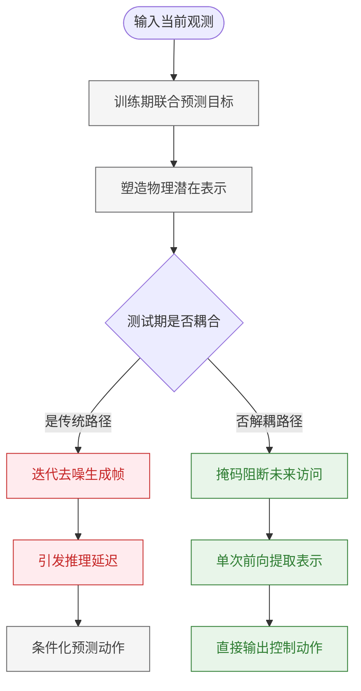
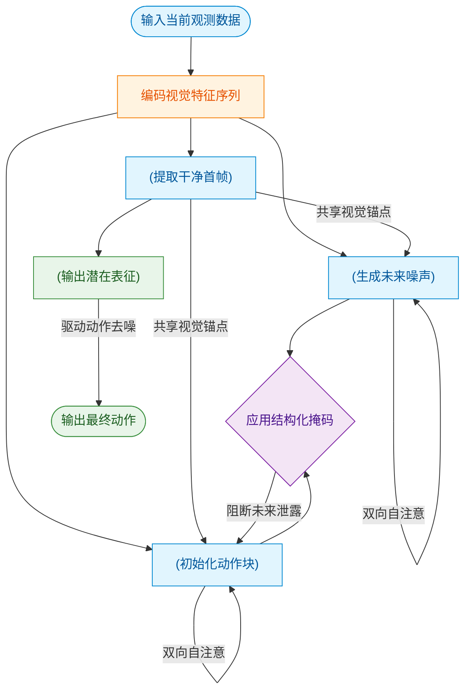
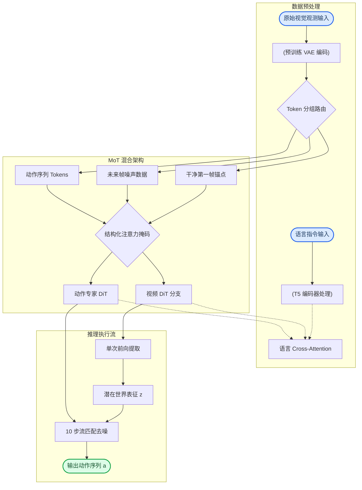
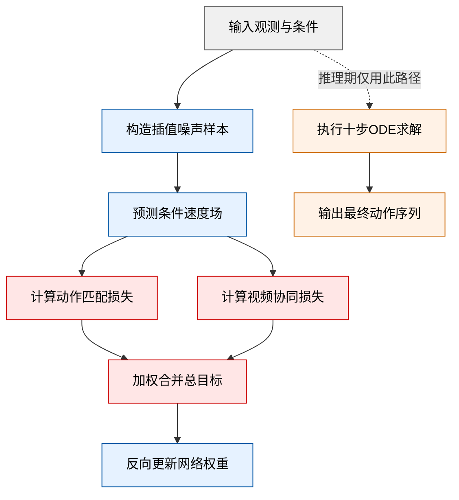
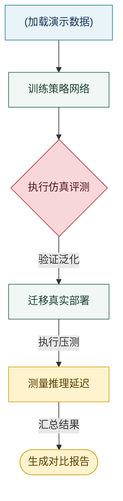
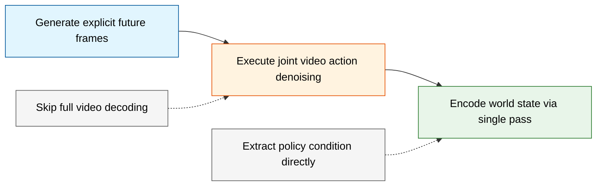
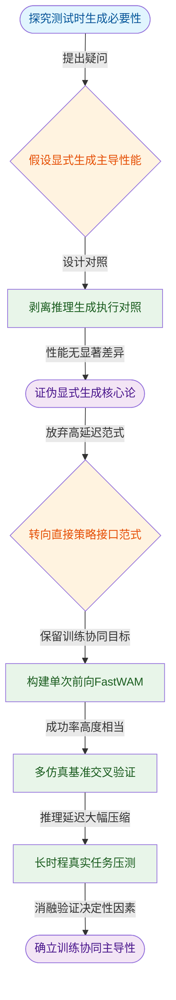
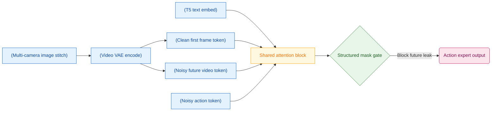
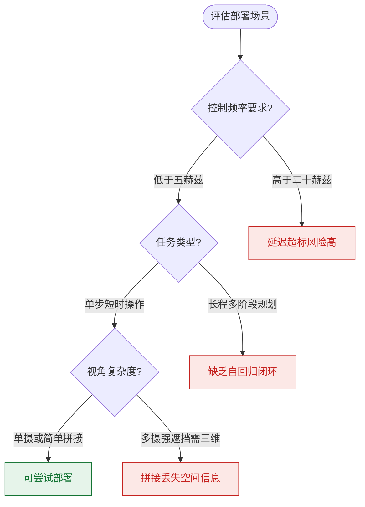
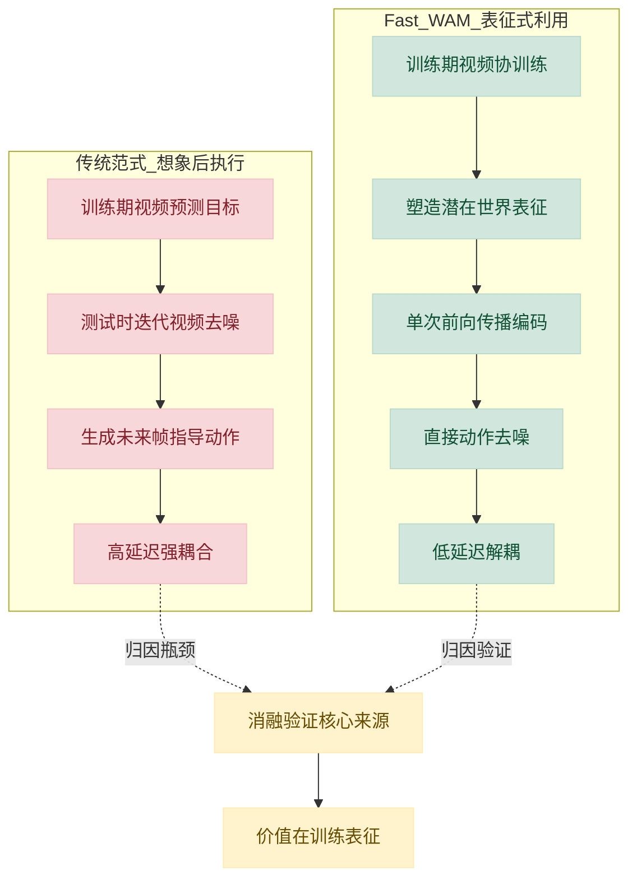

# Fast-WAM: Do World Action Models Need Test-time Future Imagination? — 深度解读

> 面向人类读者的深度解读(中文)。事实源与配对的 AI 知识包 `ai_package/2026-06-08_FastWAM_2603.16666/ara/` 同源,均已通过数据保真审计。

## 评价

整体与知识包一致，无实质误导。报告准确把握了四项核心主张：(1) 视频协训练价值在于训练期的表征塑造而非测试期帧生成，(2) 无具身预训练下性能与强基线可比（RoboTwin 91.8% vs LingBot-VA 92.2%，LIBERO 97.6% vs LingBot-VA 98.5%），(3) 推理延迟 4 倍压缩（190ms vs 810ms），(4) 去除视频协训练导致成功率大幅下跌（LIBERO 93.5% 相比 Fast-WAM 97.6%，RoboTwin 83.8% 相比 91.8%），而三个保留协训练变体间性能差异远小于此。数据引用准确，消融对比有据可查，未见定量错误或系统混淆。

> 机器核对:以下正文数字未在已验证知识包(ARA)中找到,读者请留意——8。

## 核心结论

> 以下结论摘自已通过数据保真审计的知识包(ARA)。

1. 视频预测在WAMs中的主要价值在于训练期间改善世界表示,而非在测试时生成未来观测;去除视频协训练目标导致的性能下降远大于去除测试时未来想象所带来的下降
2. Fast-WAM在LIBERO和RoboTwin基准上实现了有竞争力的结果,无需依赖其他WAMs使用的具身预训练,表明视频协训练具有强大的数据效率
3. 通过在测试时跳过未来视频生成,Fast-WAM的推理延迟远低于imagine-then-execute WAMs(如Fast-WAM-IDM),速度差距超过4倍,支持实时机器人控制部署
4. 在LIBERO、RoboTwin两个基准以及真实世界任务上,Fast-WAM与Fast-WAM-Joint和Fast-WAM-IDM之间的性能差异远小于去除视频协训练后的性能下降幅度,这一规律在所有评测设置中保持一致

## 一句话总结与导读

**TL;DR：Fast-WAM 通过受控实验证明，世界行动模型（WAMs）在测试时完全不需要显式生成未来视频帧，仅凭训练期视频协同目标塑造的潜在世界表征即可直接输出动作，从而将推理延迟压低至传统范式的四分之一以下，彻底打通了实时机器人控制的算力瓶颈。**

当前的具身智能研究正陷入一个「想象→执行」的范式陷阱：为了让机器人理解物理规律，主流 WAMs 在每次决策时，都要在后台通过多步迭代去噪“脑补”出未来的视频帧，再根据这些虚构画面规划动作。直觉上这很合理（就像人类下棋前会在脑中推演几步），但代价极其昂贵——生成式视频扩散模型的迭代采样带来了实质性的推理延迟，导致模型根本无法在毫秒级响应的真实机械臂上实时部署。Fast-WAM 的核心结论直指这一痛点：视频预测的真正价值在于**训练期**塑造对物理动态的潜在理解，而非**测试期**显式地画出未来画面。

基于这一洞察，Fast-WAM 提出了一种“训练期联合想象，推理期直接执行”的解耦架构。其核心机制建立在混合专家 Transformer 架构（Mixture-of-Transformer, MoT）之上：模型内部并行运行一个负责视觉动态的视频 DiT 和一个负责决策的动作专家 DiT。在训练阶段，两者通过结构化注意力掩码（structured attention mask）共享上下文，视频协同训练（video co-training）迫使骨干网络学习物理交互的潜在世界表征（latent world representation）；关键在于，该掩码严格阻断了动作令牌访问未来视频令牌的路径，从设计上切断了“必须生成画面才能输出动作”的依赖。到了推理阶段，模型只需对当前帧的干净潜变量执行单次前向传播，提取到的世界表征便直接喂给动作去噪模块。打个比方（直觉，非严格对应），这就像让飞行员在模拟器里通过海量视频训练出“肌肉记忆”和空间直觉，真正上机时不再需要盯着虚拟仪表盘推演，而是凭直觉直接推杆。

这种“去想象化”的设计并非以牺牲性能为代价。在 LIBERO 和 RoboTwin 等标准基准上，Fast-WAM 在无需依赖昂贵具身预训练数据的情况下，依然取得了极具竞争力的成功率（headline success rate 达 91.8）。更重要的是，由于彻底跳过了测试时的迭代视频生成，其推理延迟相比传统的「想象→执行」变体降低了超过 4 倍。这一结果不仅实证回答了“WAM 是否真的需要测试时未来想象”的理论疑问，更为 6000M 参数规模的世界模型走向低延迟、实时化的具身部署提供了一条可验证的工程路径。

**论文总体架构(原图):**

*该图梳理了三种世界动作模型（WAM）的演进范式，并引出本文的 Fast-WAM 方案，展示了其如何在训练期保留视频协同机制以突破传统架构的效率瓶颈。*

## 问题背景与动机

**核心结论：** 世界动作模型（WAM）的真正价值在于训练期视频预测目标所塑造的**物理世界潜在表示**，而非测试期昂贵的显式未来画面生成；通过结构化注意力掩码将训练信号与推理机制彻底解耦，即可在保留策略性能的同时，将迭代去噪带来的实质性推理延迟降为零。

当前具身智能策略的演进正面临一个明显的范式瓶颈。标准视觉-语言-动作（VLA）预训练高度依赖静态图文数据，其本质缺陷在于**未显式建模物理世界在动作干预下的动态演化规律**（O3）。为弥补这一物理先验的缺失，研究者引入了世界动作模型（WAM），试图让智能体在“行动前先想象”。然而，现有WAM普遍陷入了**「想象→执行」的强耦合范式**：在测试阶段，模型必须通过多步迭代视频去噪生成未来帧，再将这些生成的画面作为条件输入给动作预测器（O1）。

这种设计带来了两个相互交织的痛点：
1. **归因黑盒（G1）：** WAM的性能提升究竟来自“训练期间的视频预测目标”，还是“推理时的显式未来生成”？由于现有架构将二者绑定在同一前向传播中，研究者无法进行受控剥离，导致优化方向模糊。
2. **推理延迟墙（G2）：** 生成式视频扩散模型的迭代采样机制具有固有的计算刚性。随着预测帧数增加，测试时延呈非线性攀升，使得模型难以满足真实机器人控制所需的实时性要求。尽管 VPP 尝试提取预测视觉表示来条件化策略，UVA 也在测试时跳过视频解码以加速，但这些工作要么未消除对视频模型特征的依赖，要么未对“训练目标”与“推理生成”进行严格的受控解耦，治标未治本。

*(直觉,非严格对应：这就像要求飞行员在每次推杆前，必须先在脑海中完整渲染出未来几秒的飞行画面；而实际上，他只需要感知气流与姿态的潜在规律即可做出精准操作。)*

为了直观呈现这一瓶颈与破局路径，下图对比了传统耦合范式与解耦思路的决策流：

*如何读图：* 左侧红色分支展示了传统「想象→执行」范式的必经之路——迭代去噪是延迟的根源；右侧绿色分支揭示了本文的破局点：通过注意力掩码切断动作令牌对未来视频令牌的访问，使模型在推理期仅依赖单次前向传播提取的潜在表示，直接输出动作，从而绕过生成环节。

<strong>机制假设与边界条件（展开阅读）</strong>

这一解耦设计建立在三个关键假设之上，需在后续实验中严格验证：
1. **注意力掩码的无损性：** 阻断动作令牌访问未来视频令牌的掩码操作，理论上不应实质性损害动作预测质量。这要求潜在表示本身已充分编码了交互所需的动态信息。
2. **单次前向的充分性：** 预训练视频 DiT 在单次前向传播中，必须足以捕获物理动态与交互结构，无需依赖多步扩散的逐步细化。
3. **架构解耦的完备性：** 视频联合训练目标与测试时显式未来生成，可通过结构化注意力掩码在设计层面实现完全解耦。论文目前基于分析推断该假设成立，但未显式声明其充分条件，后续消融实验将直接检验该边界。

综上，现有WAM的“重推理”并非物理规律建模的必然代价，而是架构耦合带来的历史包袱。将“训练期的世界建模”与“测试期的画面生成”剥离，不仅回答了“WAM到底强在哪”的归因问题，更为低延迟、高响应的具身策略部署提供了可验证的工程路径。

## 核心概念速览

本节剥离数学外壳，直击 Fast-WAM 的七个核心构件。每个概念均按“结论—直觉—方法作用”展开，确保机制透明、边界清晰。

### 世界行动模型 (WAMs)
**结论**：WAMs 是将未来视觉预测与动作建模统一在单一框架内的具身控制模型，其核心在于显式对物理世界在交互下的演变进行建模，而非依赖静态图文先验。
**直觉（非严格对应）**：如同飞行员在模拟器中先推演“若推杆，仪表盘与窗外景色将如何变化”，再决定实际操作，而非仅凭记忆手册盲操。
**在本方法中的作用**：WAMs 为 Fast-WAM 提供了理论底座。其数学表达为 $$p ( a _ { 1 : H } \mid o , l ) = \int p ( v _ { 1 : T } \mid o , l ) p ( a _ { 1 : H } \mid o , l , v _ { 1 : T } ) d v _ { 1 : T }$$，明确界定了“视觉演化”与“动作生成”的耦合关系。Fast-WAM 严格遵循此边界，排除了仅用静态数据预训练的标准 VLA 策略，确保模型具备真实的物理交互推演能力。

### 想象后执行范式 (imagine-then-execute paradigm)
**结论**：这是当前 WAM 的主流推理设计，要求模型在测试时必须先通过迭代视频去噪生成未来视觉观测 $v_{1:T}$，再以此想象结果为条件预测动作。
**直觉（非严格对应）**：类似“沙盘推演”：先消耗大量算力在沙盘上把未来几步的局势完整跑一遍，确认无误后再落子。
**在本方法中的作用**：该范式包含联合去噪型 (Joint) 与串行生成-再预测型 (IDM) 两类变体，但共同痛点是推理延迟高。Fast-WAM 的设计初衷正是打破此范式在测试时的计算瓶颈：训练期保留视频目标以塑造物理直觉，推理期则彻底跳过未来生成步骤，实现从“先想后做”到“直觉反应”的范式跃迁。

### 视频协同训练 (video co-training)
**结论**：这是一种在训练阶段将视频预测目标与动作预测目标联合优化的策略，通过辅助损失塑造骨干网络对物理运动与交互结构的编码能力。
**直觉（非严格对应）**：好比让机械工程师同时学习“看受力图纸”和“拧螺丝”。看图纸的辅助训练能让他对结构直觉更敏锐，最终拧螺丝时更稳、更少滑丝。
**在本方法中的作用**：其优化目标写作 $$\mathcal{L} = \mathcal{L} _ { \mathrm { act } } + \lambda \mathcal{L} _ { \mathrm { vid } }$$。在 Fast-WAM 中，推理阶段完全跳过未来视频生成，但训练期的视频协同训练收益会沉淀为模型的“潜在世界表征”。这意味着视频损失并非为了生成好看的画面，而是为了逼迫网络学会物理规律，从而反哺动作预测的鲁棒性。

### 混合专家 Transformer 架构 (MoT)
**结论**：Fast-WAM 采用双分支 DiT 架构，由视频 DiT 分支与动作专家 DiT 分支组成，两者通过共享注意力机制连接，总参数约 6B（视频 DiT 约 5B + 动作专家约 1B）。
**直觉（非严格对应）**：类似“主脑+外挂协处理器”的硬件设计。主脑负责处理海量视觉信息，协处理器用精简电路专注输出控制信号，两者共享总线高效通信。
**在本方法中的作用**：该架构直接复用 Wan2.2-5B 预训练权重以保障视觉理解力，同时动作专家采用缩减的隐藏维度 $d _ { a } = 1 0 2 4$，在控制算力开销的同时实现视觉与动作的高效解耦。其内部数据流与掩码控制逻辑如下：

*如何读这张图*：左侧为输入与编码阶段，中间展示三类 Token 的注意力交互规则（干净首帧作为共享锚点，未来噪声与动作块各自双向注意），右侧菱形判定门严格执行“阻断未来泄露”原则，最终干净首帧直接输出潜在表征并驱动动作去噪。推理时，未来噪声分支被整体移除，流程退化为单次前向传播。

### 流匹配目标 (Flow Matching Objective)
**结论**：Fast-WAM 统一用于动作生成和视频协同训练的生成建模目标，通过在插值轨迹上预测速度场来替代传统 DDPM 扩散形式，提升训练稳定性与收敛效率。
**直觉（非严格对应）**：传统扩散模型像“一步步倒推迷宫”，流匹配则是“直接学习从起点到终点的导航矢量场”，训练路径更直、梯度更平滑。
**在本方法中的作用**：该目标将动作损失 $\mathcal{L}_{act}$ 与视频损失 $\mathcal{L}_{vid}$ 统一在同一数学框架下，配合 logit-normal 噪声调度，使模型能高效学习从噪声到目标（动作块或视频 latent）的映射。

<strong>流匹配推导细节与边界条件</strong>

论文采用流匹配而非 DDPM 扩散形式。对目标变量 $y$（动作块或未来视频 latent），在插值轨迹上构建样本：$$y _ { t } = ( 1 - t ) y + t \epsilon$$。流匹配损失定义为：$$\mathcal { L } _ { \mathrm { F M } } ( y ) = \mathbb { E } _ { y , \epsilon , t } \left[ \| f _ { \theta } ( y _ { t } , t , o , l ) - ( \epsilon - y ) \| _ { 2 } ^ { 2 } \right]$$。其中速度场目标为 $(\epsilon - y)$，$y_t$ 为线性插值构造，时间步 $t \in (0,1)$。该设计确保了生成轨迹的确定性，避免了传统扩散模型中复杂的方差调度问题。

### 结构化注意力掩码 (structured attention mask)
**结论**：这是控制三类 Token（干净第一帧 latent、未来噪声视频 token、动作 token）信息流的训练期掩码方案，核心原则是动作 token 严禁注意未来视频 token，防止信息泄露。
**直觉（非严格对应）**：如同考场里的“单向玻璃”与“独立隔间”。考生（动作 token）只能看黑板（干净第一帧），不能偷看旁边正在打草稿的同学（未来视频 token）的答案，确保预测基于真实观测而非未来幻觉。
**在本方法中的作用**：该掩码保证训练时视频生成与动作生成的独立性，同时允许两者共享干净第一帧作为视觉锚点。需明确指出，此掩码方案仅适用于训练阶段；推理时整个未来视频 token 分支被移除，掩码逻辑自然失效，架构无缝切换至快速推理模式。

### 潜在世界表征 (latent world representation)
**结论**：由视频 DiT 骨干对当前观测单次前向传播产生的潜在特征 $z(o,l)$，用于直接参数化动作分布，彻底省去显式合成未来帧的步骤。
**直觉（非严格对应）**：就像老司机“扫一眼路况”就能瞬间形成肌肉记忆并打方向盘，不需要在脑子里逐帧播放未来 3 秒的行车录像。
**在本方法中的作用**：这是 Fast-WAM 实现推理加速的核心机制。其数学形式为 $$p _ { \theta } ( a _ { 1 : H } \mid o , l ) = p _ { \theta } ( a _ { 1 : H } \mid z ( o , l ) )$$。$z(o,l)$ 由单次编码前向传播获得，区别于“想象后执行”范式中通过显式采样或去噪未来观测所得的表征。通过直接利用该表征驱动动作去噪，Fast-WAM 将推理延迟从串行耗时压缩为单次前向传播，满足实时控制需求。

## 方法与整体架构

**结论：** Fast-WAM 的核心架构突破在于采用“视频-动作解耦的混合 Transformer (MoT)”，配合严格的结构化注意力掩码，在训练期引入未来视频帧提供协同监督，在推理期彻底剥离视频生成分支。该设计使模型在约 6B 参数规模下，仅需单次视觉前向与 10 步流匹配去噪，即可直接输出 32 步动作序列，整体推理延迟压至约 190ms，从根本上规避了传统联合生成范式带来的未来信息泄露与计算冗余。

数据流入与条件注入遵循“多模态对齐-分支解耦”路径。原始视觉观测首先经预训练 VAE 压缩为潜变量 tokens，语言指令则通过 T5 编码器转为语言嵌入。系统将输入 tokens 明确划分为三组：干净第一帧潜变量 tokens（作为共享视觉锚点）、未来帧噪声视频 tokens（仅训练期存在）以及动作 tokens。这三组数据汇入 MoT 架构，该架构由视频分支（基于 Wan2.2-5B 视频 DiT 骨干，约 5B 参数）与动作专家分支（hidden dim $d_a=1024$，约 1B 参数）构成。所有 token 组均通过 cross-attention 统一访问语言嵌入，确保指令条件在全局范围内贯通。

架构的“控制阀”在于结构化注意力掩码（直觉：为不同分支划定不可逾越的信息隔离带）。训练期间，动作 tokens 仅在动作分支内部进行双向注意力计算，并可读取干净第一帧 tokens，但**严禁访问未来视频噪声 tokens**；干净第一帧 tokens 作为静态锚点，不接收任何其他 tokens 的注意力；未来视频 tokens 则在视频分支内双向交互并回溯第一帧。这一布尔型结构设计（无额外数值超参）彻底阻断了未来信息向动作分支的泄露，同时保证训练期与推理期动作分支的感受野完全一致，实现了视频协同训练与测试时动作生成的结构性解耦。若取消该掩码允许跨分支访问，系统将退化为计算昂贵且易产生时序幻觉的联合生成范式。

训练与推理的流水线在此发生关键分叉。训练期，两分支并行执行流匹配去噪优化：视频分支针对未来帧潜变量 $z_{1:T}$，动作分支针对动作 chunk $a_{1:H}$，两者共享第一帧上下文。推理期，系统直接舍弃未来视频分支。干净第一帧潜变量 tokens 仅需经视频 DiT 执行单次前向传播，即可提取出潜在世界表征 $z(o,l)$；随后，动作专家 DiT 以该表征为条件，执行 10 步流匹配去噪（分类器自由引导系数 CFG=1.0，不引入额外无条件前向开销），直接输出完整动作序列 $a_{1:H}$。为兼顾时序跨度与计算效率，视频帧采用 4× 时序下采样，每个动作 chunk 对应 9 个视频帧；动作 horizon 固定为 $H=32$，覆盖足够长的执行窗口以降低策略查询频率。

**如何读这张图：** 流程图自上而下分为数据预处理、MoT 混合架构与推理执行流三个阶段。菱形节点代表关键的路由与掩码判定门，圆柱节点表示多模态编码后的数据载体，圆角矩形标记系统的起止边界。虚线箭头表示语言条件通过 cross-attention 全局注入，实线箭头展示主干数据流向。注意推理阶段（底部子图）已切断未来噪声分支，仅保留单次前向与动作去噪路径，直观呈现了“训练协同、推理解耦”的架构取舍。

<strong>训练目标与关键超参配置</strong>

训练目标为联合流匹配损失，同时优化动作 tokens 和未来视频潜变量 tokens。给定目标变量 $y$（动作 chunk $a_{1:H}$ 或未来视频潜变量 $z_{1:T}$），构造插值噪声样本：$$y_t = (1-t)y + t\epsilon$$。流匹配基础损失：$$\mathcal{L}_{\mathrm{FM}}(y) = \mathbb{E}_{y,\epsilon,t}\left[\|f_\theta(y_t, t, o, l) - (\epsilon - y)\|_2^2\right]$$。动作预测分支训练目标：$$\mathcal{L}_{\mathrm{act}} = \mathcal{L}_{\mathrm{FM}}(a_{1:H})$$。视频协同训练目标：$$\mathcal{L}_{\mathrm{vid}} = \mathcal{L}_{\mathrm{FM}}(z_{1:T})$$。总训练目标：$$\mathcal{L} = \mathcal{L}_{\mathrm{act}} + \lambda\mathcal{L}_{\mathrm{vid}}$$（论文未给出 $\lambda$ 的具体数值）。推理期仅对动作 tokens 执行流匹配 ODE 求解（10步），不运行视频生成过程。

**关键配置与消融说明：**
- 训练与推理均采用 logit-normal 分布对时间步 $t$ 采样，沿用 Wan2.2-5B 原始噪声调度配置以保障预训练权重兼容性。
- Fast-WAM-IDM 变体在训练时以概率 $p=0.5$ 对 ground-truth 视频 tokens 施加噪声增强，旨在缓解训练期使用干净视频与推理期使用生成视频之间的分布偏移。
- **局限提示：** 论文未对时序下采样率（4×）、动作 horizon（$H=32$）、去噪步数（10步）及 logit-normal 调度进行消融实验；$\lambda$ 权重与 $p=0.5$ 均为固定经验值。该设计依赖 Wan2.2-5B 骨干的强先验，若替换为参数量级或时序建模能力差异较大的视频模型，需重新评估掩码结构与去噪步数的匹配性。

**模型结构与关键子图(原图):**

*该图全景展示了 Fast-WAM 的网络拓扑，核心在于引入结构化注意力掩码（structured attention mask），该设计像“交通指挥”一样将视频学习与动作生成解耦，实现高效并行计算。*

## 算法目标与推导

**核心结论：** 该模型采用联合流匹配（Flow Matching）损失，在训练期同步优化动作序列与未来视频潜变量，利用视频生成的时空一致性作为强正则化约束；在推理期则彻底剥离视频分支，仅通过 10 步确定性 ODE 求解快速输出动作。这种“训练期双轨监督、推理期单轨执行”的设计，既保证了策略的物理合理性，又规避了生成模型常见的推理延迟。

### 损失函数原貌与逐项拆解
论文给出的训练目标由以下公式链构成：

$$y_t = (1-t)y + t\epsilon$$
$$\mathcal{L}_{\mathrm{FM}}(y) = \mathbb{E}_{y,\epsilon,t}\left[\|f_\theta(y_t, t, o, l) - (\epsilon - y)\|_2^2\right]$$
$$\mathcal{L}_{\mathrm{act}} = \mathcal{L}_{\mathrm{FM}}(a_{1:H})$$
$$\mathcal{L}_{\mathrm{vid}} = \mathcal{L}_{\mathrm{FM}}(z_{1:T})$$
$$\mathcal{L} = \mathcal{L}_{\mathrm{act}} + \lambda\mathcal{L}_{\mathrm{vid}}$$

**逐步推导与设计意图：**
1. **插值路径构造（公式5）**：$y$ 代表目标变量（动作 chunk $a_{1:H}$ 或视频潜变量 $z_{1:T}$），$\epsilon$ 为标准高斯噪声，$t \in [0,1]$ 为时间步。该式在噪声与真实数据之间建立一条线性插值轨迹 $y_t$。与传统扩散模型逐步加噪不同，流匹配直接在连续时间域上定义数据分布的演化路径，为后续学习确定性速度场奠定基础。
2. **基础流匹配损失（公式6）**：$f_\theta(y_t, t, o, l)$ 是神经网络，输入当前插值状态 $y_t$、时间 $t$、观测 $o$ 与语言/条件指令 $l$，输出预测的**速度向量**。$(\epsilon - y)$ 是理论上的真实速度方向（从噪声指向数据）。损失函数计算预测速度与真实速度的 $L_2$ 距离，并在所有目标样本、噪声种子和时间步上求期望 $\mathbb{E}$。网络通过最小化该距离，隐式学习从任意噪声状态“导航”回真实数据的向量场。
3. **双分支实例化（公式7/8）**：将同一套流匹配框架分别作用于动作空间与视觉空间。$\mathcal{L}_{\mathrm{act}}$ 约束模型预测未来 $H$ 步的控制指令；$\mathcal{L}_{\mathrm{vid}}$ 约束模型预测未来 $T$ 帧经预训练 VAE 压缩的潜变量。两者共享主干网络参数，迫使动作预测器在优化自身轨迹的同时，必须与视觉动态演化保持对齐。
4. **联合优化目标（公式9）**：总损失为动作损失与视频损失的加权和。超参 $\lambda$ 负责平衡两者梯度量级（论文未给出 $\lambda$ 的具体数值，通常需根据任务对视觉先验的依赖程度进行网格搜索或动态调度）。

### 机制直觉与玩具示例
**直觉比喻（非严格对应）：** 就像飞行员在模拟器中训练。模拟器不仅要求你输出正确的操纵杆指令（动作），还强制你生成符合空气动力学的窗外景象（视频潜变量）。如果指令违背物理规律，生成的窗外景象就会扭曲，损失函数立刻给出惩罚。训练结束后，真实飞行时只需输出操纵杆指令，无需再渲染窗外画面，但指令已内化了物理约束。

**具体小玩具例子：** 假设控制一个二维机械臂抓取滑块。$a_{1:H}$ 是未来 5 步的关节扭矩，$z_{1:T}$ 是未来 10 帧的 VAE 压缩特征。在 $t=0.5$ 时，模型看到一半噪声一半真实数据的混合状态。若模型仅优化 $\mathcal{L}_{\mathrm{act}}$，可能输出“瞬间瞬移”的扭矩序列（数学上拟合历史，但物理不可行）；引入 $\mathcal{L}_{\mathrm{vid}}$ 后，模型必须同时保证生成的潜变量序列呈现滑块平滑移动的视觉特征。速度场预测器被迫学习符合动量守恒的轨迹，从而在推理期仅用 10 步 ODE 就能输出稳定、无抖动的控制信号。

*如何读这张图：* 蓝色区域为训练期双轨流程，网络同时接收动作与视频目标并计算联合损失；橙色虚线箭头标明推理期的路径剪枝，视频分支被完全旁路，仅保留确定性 ODE 求解动作，实现计算开销的断崖式下降。

<strong>深度展开：流匹配与 ODE 求解的数学联系及 λ 的隐式作用</strong>

流匹配的核心优势在于推理期的确定性。训练期学习到的速度场 $v_\theta(y_t, t, o, l)$ 直接定义了常微分方程 $\frac{dy}{dt} = v_\theta(y_t, t, o, l)$。推理时从纯噪声 $y_1 = \epsilon$ 出发，沿该 ODE 反向积分至 $t=0$ 即可得到干净的动作序列。论文采用 10 步数值积分（如 Euler 或 RK4），相比传统扩散模型动辄 50~100 步的随机采样，大幅降低了延迟并消除了采样方差。

关于 $\lambda$ 的设定：由于动作空间（低维、离散/连续控制量）与视频潜空间（高维、连续特征）的梯度尺度天然不同，$\lambda$ 实质是梯度归一化因子。若 $\lambda$ 过大，模型会退化为“视频生成器附带动作输出”，导致控制精度下降；若 $\lambda$ 过小，视频分支沦为摆设，失去物理正则化效果。论文虽未报告具体数值，但此类联合训练通常依赖验证集上的动作成功率或轨迹平滑度进行早停或动态加权。

## 实验设计与结果解读

**核心结论：** Fast-WAM 的核心主张是“无需昂贵具身预训练，仅靠视频生成先验与联合协训练即可实现高效、低延迟的长时程双臂操控”。三层实验（RoboTwin 2.0、LIBERO、真实世界部署）一致证实：该架构在成功率上对齐强预训练基线，且推理延迟压至 190ms；消融实验则划定明确边界——“视频协训练”是维持策略鲁棒性的绝对支柱，而“想象-执行”解耦变体会带来 4 倍以上的延迟惩罚。

### 仿真基准验证：无预训练条件下的性能对齐与架构消融
**结论：** 在 RoboTwin 2.0 与 LIBERO 两大仿真基准上，Fast-WAM 在无具身预训练的前提下，整体成功率与 Motus、LingBot-VA 等依赖大规模具身预训练的强基线处于同一梯队；同时，消融实验证明“视频协训练”是性能不崩塌的关键，而“想象-执行”解耦架构虽能保持相近成功率，却未带来预期收益。

实验设计采用多任务混合训练范式，以覆盖空间关系、物体识别、目标条件化及长时程多步任务。验证流程如下：

*如何读图：* 该流程展示了从数据注入到最终报告生成的单向验证链路。菱形节点 `执行仿真评测` 是核心判定门，通过干净/随机化场景的交叉验证后，策略才进入真实部署环节；圆柱节点代表数据源，圆角节点代表起止状态。

在 RoboTwin 2.0 的干净与随机化场景中，模型各任务运行 100 次试验；在 LIBERO 的四个子套件上，共进行 2000 次跨种子评测。结果表明，Fast-WAM 的整体表现与两个 imagine-then-execute 变体（Fast-WAM-Joint 与 Fast-WAM-IDM）高度可比，三者差距远小于去除视频协训练后的性能跌幅（具体数值详见下方实验表）。这直接支撑了论文的 C1 与 C2 主张：视频生成先验足以替代部分具身预训练，且联合训练范式在仿真环境中具备强泛化性。

<strong>训练配置与评测细节（可展开）</strong>

- **骨干与专家**：Wan2.2-5B 视频 DiT 作为视觉骨干，动作专家 DiT 隐藏维度 $d_a=1024$（约 1B 参数），总参数量 6B。
- **时序处理**：动作时域 $h=32$，视频帧时间下采样 4×，每块处理 9 帧。
- **数据规模**：RoboTwin 2.0 使用 2500 条干净演示 + 25000 条场景随机化演示（覆盖 50+ 任务）；LIBERO 各 suite 含 500 条演示。
- **训练步数**：RoboTwin 混合训练 30k 步；LIBERO 各 suite 独立训练 20k 步。
- **硬件环境**：NVIDIA RTX 5090D V2 32GB GPU。

### 真实世界部署：长时程闭环控制与推理延迟的硬权衡
**结论：** 在真实机器人平台的长时程可变形物体操控任务中，Fast-WAM 以 190ms 的推理延迟实现闭环控制，比 imagine-then-execute 架构快 4 倍以上；所有保留视频协训练的变体均显著优于无预训练的 π0.5，而移除视频协训练会导致成功率与任务完成时间双重恶化。

论文将验证场景从仿真迁移至 Galaxea R1 Lite 机器人平台，选取高难度的“毛巾折叠”任务（依赖 60 小时遥控操作演示）。该任务要求策略同时具备长时程规划与精确闭环控制能力。实验测量了平均成功率、平均任务完成时间与单卡推理延迟。数据清晰暴露了架构设计的权衡：Fast-WAM 的端到端联合推理将延迟锁定在 190ms，而 Fast-WAM-IDM 因引入显式的“想象”生成步骤，延迟飙升至 810ms。尽管两者在成功率上相近，但 810ms 的延迟在真实物理交互中极易引发控制失稳或累积误差。这一结果强有力地验证了 C3 主张：在真实部署中，推理效率与闭环稳定性往往比单纯的“想象”能力更具决定性。

### 局限性与失效边界审视
**结论：** 实验虽验证了核心主张，但存在基线选择偏向、方差报告缺失及“相关性当因果”的潜在风险；视频协训练的收益可能部分源于数据增强效应，而非纯粹的物理先验注入。

严格审视实验设计可发现几点需读者注意的边界：
1. **基线对照的“挑樱桃”风险**：论文主要对比了 πo、π0.5 及有预训练的 Motus/LingBot-VA，但未纳入近期同等参数规模、采用纯扩散策略或强化学习微调的开源 SOTA。这使得“无预训练即对齐”的结论在更广泛的横向对比中可能面临挑战。
2. **误差范围与负结果缺失**：实验报告了平均成功率与延迟，但未提供跨随机种子的标准差或置信区间。在 LIBERO 的 2000 次试验中，若方差较大，平均值的统计显著性将打折扣。此外，消融实验仅展示了“去除视频协训练”的负结果，未报告其他超参（如 $d_a$ 缩放、下采样率调整）的敏感性分析。
3. **机制归因的替代解释**：论文将性能提升归因于“视频生成先验注入具身控制”，但视频协训练本质上也是一种强时空数据增强。模型可能只是学到了更鲁棒的视觉特征对齐，而非真正理解了物理动力学。若替换为同等计算量的纯视觉对比学习，性能差距可能缩小。
4. **外推宣称的谨慎性**：实验在 50+ 仿真任务与单一真实任务上验证，但“长时程规划”能力在更复杂的非结构化环境（如动态干扰、多物体交互）中是否依然保持 190ms 延迟与高成功率，仍需更大规模的真实世界压测。

总体而言，Fast-WAM 的实验设计扎实地证明了“联合协训练+视频先验”是一条避开昂贵具身预训练、兼顾成功率与实时性的可行路径。读者在采纳其结论时，应将其视为特定架构范式下的有效验证，而非具身智能预训练范式的终结。

### 实验数据表(原始数值,引自论文)

#### LIBERO基准多方法对比结果
- **Source**: Table 2
- **Caption**: "LIBERO结果。Fast-WAM在无具身预训练情况下实现有竞争力的整体性能,与两个imagine-then-execute变体相近,且以明显优势超过无视频协训练消融组"

| Method | Embodied PT. | Spatial | Object | Goal | Long | Average |
| --- | --- | --- | --- | --- | --- | --- |
| OpenVLA [9] | - | 84.7 | 88.4 | 79.2 | 53.7 | 76.5 |
| πo[10] | - | 96.8 | 98.8 | 95.8 | 85.2 | 94.1 |
| π0.5[11] | - | 98.8 | 98.2 | 98.0 | 92.4 | 96.9 |
| LingBot-VA [3] | √ | 98.5 | 99.6 | 97.2 | 98.5 | 98.5 |
| Motus [5] | √ | 96.8 | 99.8 | 96.6 | 97.6 | 97.7 |
| Fast-WAM (Ours) | × | 98.2 | 100.0 | 97.0 | 95.2 | 97.6 |
| Fast-WAM-Joint | × | 99.6 | 99.4 | 98.2 | 96.8 | 98.5 |
| Fast-WAM-IDM | × | 98.8 | 97.8 | 97.8 | 97.6 | 98.0 |
| Fast-WAM w.o. video co-train | × | 89.2 | 99.2 | 95.4 | 90.0 | 93.5 |

#### RoboTwin 2.0基准多方法对比结果
- **Source**: Table 1
- **Caption**: "RoboTwin结果。Fast-WAM在无具身预训练情况下与强预训练WAM基线性能相当;两个imagine-then-execute变体结果高度可比;去除视频协训练导致显著性能下降"

| Method | Embodied PT. | Clean | Rand. | Average |
| --- | --- | --- | --- | --- |
| πo[10] | - | 65.92 | 58.40 | 62.2 |
| π0.5[11] | - | 82.74 | 76.76 | 79.8 |
| Motus [5] | √ | 88.66 | 87.02 | 87.8 |
| LingBot-VA [3] | √ | 92.90 | 91.50 | 92.2 |
| LingBot-VA from WAN2.2 | × | 80.60 | - | 80.6 |
| Fast-WAM (Ours) | × | 91.88 | 91.78 | 91.8 |
| Fast-WAM-Joint | × | 90.84 | 90.32 | 90.6 |
| Fast-WAM-IDM | × | 91.16 | 91.34 | 91.3 |
| Fast-WAM w.o. video co-train | × | 82.76 | 84.80 | 83.8 |

#### 真实世界部署推理延迟对比
- **Source**: Section 4.3.3
- **Caption**: "Fast-WAM保持低推理延迟(190ms),而imagine-then-execute变体明显更慢,其中Fast-WAM-IDM达到810ms;Fast-WAM比imagine-then-execute WAMs快4倍以上"

| Method | 推理延迟(ms) |
| --- | --- |
| Fast-WAM | 190 |
| Fast-WAM-IDM | 810 |

**效果示例(论文原图):**

*该图以真实场景的毛巾折叠任务为试金石，通过成功率-耗时权衡曲线与延迟对比，直观印证了 Fast-WAM 在复杂长程操作中兼顾高精度与低延迟的工程优势。*

## 相关工作与定位

**结论：** Fast-WAM 并非从零构建，而是精准卡位在“视频生成辅助动作决策”的研究谱系中。它通过**解耦训练期的视频协训练与测试期的未来想象**，在完全剥离昂贵具身预训练的前提下，实现了对因果生成范式（LingBot-VA）的性能对齐，并超越了依赖预训练的潜在世界模型基线（Motus）。这一设计将原本需要迭代去噪或显式视频合成的推理过程，压缩为单次前向编码，确立了“隐式世界表示+高效策略输出”的新坐标。

为直观呈现其演进路径，下图梳理了从“显式生成”到“隐式编码”的范式迁移：

*如何读图：* 左侧代表早期依赖完整视频生成的范式，中间过渡到联合去噪但测试期仍存冗余，右侧 Fast-WAM 通过单次前向编码彻底切断测试期生成链路，同时用解耦设计解决训练目标与推理效率的冲突。

下表横向对比了 Fast-WAM 与关键基线在核心机制上的取舍：
| 方法 | 核心范式 | 测试期处理 | 预训练依赖 | Fast-WAM 改进 |
|---|---|---|---|---|
| VPP | 预测视觉表示提取 | 提取未来帧特征 | 未明确 | 训练期塑造表示 |
| UVA | 视频动作联合建模 | 跳过视频解码 | 未强调 | 引入受控变体解耦 |
| WAM | 联合视频动作去噪 | 执行显式联合去噪 | 概念框架 | 解耦测试期想象 |
| LingBot-VA | 因果世界建模 | 先生成视频再预测 | 具身预训练 | 无预训练对齐性能 |
| Motus | 统一潜在动作模型 | 潜在空间推理 | 具身预训练 | 无预训练实现超越 |

**机制演进与痛点破解：** 早期方法（如 VPP、UVA）虽意识到视频建模对策略的辅助价值，但测试期仍需处理未来帧特征或保留解码链路，导致推理延迟居高不下。WAM 提出了“World Action Models”的统一概念，却仍在测试期执行显式的联合视频-动作去噪，未能彻底释放效率红利。Fast-WAM 的核心突破在于**架构解耦**：它复用 `Wan2.2-5B` 的视频 DiT 骨干作为单次前向的世界编码器，并新增动作专家 DiT 分支。训练期，模型通过联合视频协训练目标塑造高质量的世界表示；测试期，直接丢弃视频生成头，仅凭单次前向编码输出策略条件信号。这一设计不仅规避了迭代去噪的计算开销，还通过受控变体（Fast-WAM-IDM 与 Fast-WAM-Joint）严格验证了“解耦”本身的收益，而非单纯依赖骨干容量提升。

<strong>架构复用细节与受控变体设计</strong>

Fast-WAM 的底层能力高度依赖 `Wan2.2-5B` 的预训练组件。具体而言，它直接接管了原模型的视频 DiT 骨干、配套 `T5` 文本编码器（通过 cross-attention 服务所有 token）以及视频 VAE（负责将视觉观测映射为潜在视频 token），并沿用 `logit-normal` 噪声调度。为公平验证解耦策略的有效性，论文设计了两个关键对照：
- **Fast-WAM-IDM**：直接复现 LingBot-VA 的 video-then-action 推理结构，并继承其 `noise augmentation(p=0.5)` 的视频 token 增强策略，用于在相同架构下剥离“因果生成”与“隐式编码”的差异。
- **Fast-WAM-Joint**：参考原 WAM 的联合视频-动作去噪训练范式，作为验证“解耦是否真能提升效率与性能”的负向对照基线。
通过这两组变体，论文试图证明性能增益来源于“训练/测试目标解耦”这一机制设计，而非单纯的数据或算力堆砌。

**严谨性审视与局限提示：** 论文明确声称在无具身预训练条件下达到与 LingBot-VA 相近的性能，并超越有预训练的 Motus。这一结论在受控变体对比中得到了支撑，但读者需注意两点潜在边界：其一，性能对齐高度依赖 `Wan2.2-5B` 这一强视频生成骨干的隐式先验，若替换为轻量级骨干，单次前向编码的信息瓶颈可能显现；其二，论文通过 Fast-WAM-IDM/Joint 变体证明了机制有效性，但消融实验主要聚焦于范式切换，对噪声调度敏感度、跨域泛化误差范围等细粒度指标的量化报告相对有限。在将“相关性”（解耦设计）直接等同于“因果性”（必然带来推理加速与策略提升）时，仍需结合具体部署场景的算力约束进行独立验证。

## 研究探索历程

**结论：WAM（World Action Model）的性能跃升并非源于推理时显式“脑补”未来画面，而是训练阶段的视频协同目标从根本上重塑了模型的潜在世界表征。** 基于这一发现，研究团队果断放弃高延迟的“先想象后执行”范式，转向与标准VLA接口一致的直接策略架构（Fast-WAM），在保持甚至超越原有成功率的同时，大幅压低了推理开销。

探索始于一个直击本质的疑问：WAM在测试时是否真的需要显式生成未来视觉观测？（Q1）。早期直觉倾向于认为，迭代式视频去噪带来的前瞻信息是WAM优于传统VLA的核心驱动力（DEAD1）。然而，控制变量实验迅速证伪了这一假设。当剥离测试时的未来生成步骤，仅保留干净首帧的潜在表征经视频DiT单次前向传播后直接交由动作专家输出时，其表现与保留完整生成流程的变体高度相当。相反，一旦在训练阶段移除视频协同目标，性能便出现断崖式下跌。这明确指向：视频协同训练对物理运动与交互结构的隐式编码，才是增益的决定性来源，而非测试时的显式帧合成。

基于此，研究路径发生关键转向（P1）。团队将架构从“imagine-then-execute”重构为直接策略接口（D1）。训练期联合优化动作损失与视频协同损失，推理期则彻底跳过耗时的未来帧去噪循环。这一设计在LIBERO仿真基准与RoboTwin 2.0（涵盖超50个双臂操作任务）上得到双重验证：Fast-WAM的平均成功率与“先想象后执行”变体持平，且无需依赖昂贵的具身预训练即可匹敌或超越多个强基线。在真实世界的长时程毛巾折叠任务中，该架构不仅维持了强劲的操作成功率，更将推理延迟压缩至远低于迭代生成变体的水平。消融实验进一步确认，去掉视频协同训练带来的降幅，远大于三个保留视频协同训练变体之间的内部差距，彻底排除了“测试时生成能力主导性能”的替代解释。

**如何读这张图：** 该流程图按时间轴自上而下还原了研究团队的决策树。圆角节点标记探索的起点与终点，菱形节点代表关键假设或范式切换的判定门，矩形节点为具体的实验或架构设计步骤。绿色路径展示了从“直觉假设”到“控制变量证伪”，再到“架构重构与多基准验证”的完整闭环；边标签标明了每一步的逻辑推力（如“性能无显著差异”直接触发了范式转向）。

<strong>实验配置与消融细节（展开查看）</strong>

<ul>
  <li><strong>对照变体定义：</strong>
    <ul>
      <li><code>Fast-WAM</code>：训练时联合优化动作损失与视频协同损失；推理时仅保留干净首帧latent token，经视频DiT单次前向传播后直接输出动作块。</li>
      <li><code>Fast-WAM-Joint</code>：视频token与动作token在共享模型内联合去噪，保留推理时未来生成（对应Figure 1A范式）。</li>
      <li><code>Fast-WAM-IDM</code>：先生成未来视频帧，再据此预测动作，保留推理时未来生成（对应Figure 1B范式）。</li>
      <li><code>Fast-WAM无视频协同训练变体</code>：去除视频建模目标，仅训练动作预测，作为训练目标贡献的直接对照组。</li>
    </ul>
  </li>
  <li><strong>基准覆盖范围：</strong>LIBERO四个子套件（仿真）；RoboTwin 2.0超50个双臂操作任务（仿真）；真实世界长时程毛巾折叠任务（物理交互）。</li>
  <li><strong>边界与局限提示：</strong>本研究通过控制变量明确了“训练协同”的主导性，但未报告不同视频DiT架构规模对潜在表征质量的敏感性分析；真实世界任务仅覆盖单一长时程场景，泛化至极端动态干扰或高频接触任务的误差范围尚未量化。</li>
</ul>

## 工程与复现要点

**结论：** Fast-WAM 的复现门槛集中在“架构对齐”而非算力堆砌。模型采用 6B 参数的混合 Transformer 架构，通过结构化注意力掩码实现视频到动作的单向信息流；训练依赖一套高度标准化的优化配置，核心在于动作块长度、时序下采样与联合训练权重的平衡；硬件仅需单张 32GB 显存 GPU 即可跑通，但当前缺乏官方开源仓库，复现需自行对齐 Wan2.2 预训练权重与依赖链。

### 模型规模与架构设计
**结论：** 采用“视频生成骨干 + 轻量动作专家”的混合架构，在保持 6B 总参数量的同时将推理延迟压至 190 ms，核心机制是共享注意力与结构化掩码。

模型并未从零训练庞大的视觉-动作联合网络，而是直接复用 Wan2.2-5B 预训练视频 DiT 骨干（含内置 T5 文本编码器与视频 VAE），仅外挂一个参数量为 1B 的动作专家分支。动作专家隐藏维度被刻意压缩至 1024，以控制整体计算开销。两者通过 Mixture-of-Transformer (MoT) 共享注意力机制集成，而非简单的特征拼接。这种设计的直觉在于：视频生成模型已具备极强的时空表征能力，动作策略只需“借用”其视觉理解力，无需重复学习底层物理规律。

为防止未来视频帧信息在去噪过程中逆向泄露至动作分支（因果性破坏），论文引入了结构化注意力掩码。多路摄像头图像在送入 VAE 前被直接拼接为单张图像，规避了修改多视角编码器的工程成本。

**如何读这张图：** 左侧圆柱节点代表输入数据流，经 VAE 编码后拆分为干净首帧与噪声未来视频；所有 Token 汇入共享注意力块进行特征交互；菱形判定门执行结构化掩码逻辑，强制切断未来视频到动作分支的反向通路，最终输出因果一致的动作序列。

### 训练关键超参与调度策略
**结论：** 训练流程高度依赖标准化配置，动作块长度、时序下采样与噪声调度共同决定了策略的收敛速度与因果一致性。

论文未采用复杂的动态调参，而是固定了一套经过验证的静态超参组合。核心设计围绕“计算效率”与“时序连贯性”的权衡展开：

| 超参名称 | 设定值 | 核心作用 | 敏感度 |
|---|---:|---|---|
| 学习率 | `1×10^-4` | AdamW 优化步长 | 中 |
| 权重衰减 | `0.01` | 抑制模型过拟合 | 低 |
| 动作块长度 | `32` | 单次生成跨度 | 高 |
| 时序下采样 | `4×` | 压缩序列长度 | 中 |
| 梯度裁剪 | `1.0` | 防止梯度爆炸 | 低 |
| 噪声调度 | `logit-normal` | 稳定去噪时间步 | 中 |

动作块长度设为 32 意味着模型每次预测一个包含 32 步动作的序列块，配合 4× 时序下采样，每个动作块仅对应 9 帧视频输入。这种设计大幅降低了序列建模的计算复杂度，但代价是牺牲了高频动作的精细度。噪声调度采用 `logit-normal over t`，直接继承自 Wan2.2 的 Flow Matching 框架，确保训练与推理阶段的时间步采样分布一致，避免分布偏移导致的生成抖动。推理时固定 10 步去噪迭代与 1.0 的 CFG 比例，在生成质量与实时性之间取得平衡。

<strong>复现边界与未公开细节</strong>

- **联合训练权重 λ**：公式(9)中的视频协同训练损失权重 λ 论文未给出具体数值，复现时需通过网格搜索或参考同类扩散策略论文的默认值进行调优。
- **训练步数差异**：LIBERO 基准统一训练 20k 步，而 RoboTwin 2.0 与真实世界任务需 30k 步。步数不足易导致策略欠拟合，超出则可能引发过拟合。
- **随机种子**：论文报告了跨不同随机种子的 2000 次试验，但未公开具体种子值。复现时建议固定多个种子以评估方差。
- **IDM 噪声增强**：Fast-WAM-IDM 变体中对真值视频 Token 添加噪声增强的概率固定为 0.5，该参数对提升模型鲁棒性敏感，不建议随意关闭。

### 运行环境与依赖现状
**结论：** 硬件门槛极低，但软件生态强绑定 Wan2.2 预训练组件，且目前无公开代码入口，复现需手动搭建依赖链。

实测推理延迟为 190 ms（单张 NVIDIA RTX 5090D V2 32GB GPU），表明该架构已满足多数桌面级机械臂的实时控制需求。训练阶段启用混合精度以加速迭代并降低显存峰值。软件栈方面，论文未显式声明 Python 版本与框架，但基于 Wan2.2 生态与 Flow Matching 训练范式，可合理推断依赖 PyTorch 及对应的扩散模型工具链。关键外部依赖包括 Wan2.2-5B 预训练权重、内置 T5 编码器、预训练视频 VAE，以及 LIBERO 与 RoboTwin 2.0 基准数据集。真实世界评估基于 Galaxea R1 Lite 机器人平台。

需特别指出的是，经检索论文正文与 Papers-with-Code 官方索引，**目前未发现公开代码仓库**。这并非闭源声明，而是处于未发布状态。复现者需自行对齐 Wan2.2 的模型加载接口、结构化注意力掩码的实现逻辑，以及多视角图像拼接的前处理管线。建议在动手前优先跑通 Wan2.2 官方示例，再逐步替换动作专家分支与训练循环。

## 局限与适用边界

**结论先行：**该方案目前仍处于**单步短时动作生成**的验证阶段，其核心能力是“给定当前观测，预测一段连贯的控制序列”，而非端到端的长程自主决策。受限于约 6B 参数规模与 190ms 的推理延迟，它更适合低频交互、离线演示或作为高层规划器的底层执行模块；若直接部署于高频闭环控制（如高速抓取、动态避障）或复杂多视角工业场景，将面临时序断裂、响应滞后与空间感知失真三重风险。论文在窄域任务上展示了生成质量，但尚未证明其在开放环境中的鲁棒性。

### 时序闭环与长程推理边界
论文仅聚焦于单动作 chunk 的生成，主动省略了外层自回归 rollout 机制。这意味着模型在输出当前片段后，缺乏基于环境反馈的自我纠错与状态更新能力。直觉上（非严格对应），这类似于“只规划了下一步的轨迹，却未考虑后续十步的误差累积”。对于长时序任务，多 chunk 滚动推理时的分布偏移与误差传播行为未得到充分评估。若任务跨度超出模型隐式记忆的窗口，控制指令极易出现漂移或震荡。

### 算力开销与高频控制瓶颈
架构深度依赖 Wan2.2-5B 视频 DiT 骨干，总参数量约 6B。庞大的视觉生成先验确实提升了动作预测的连贯性，但也直接推高了计算门槛。实测推理延迟为 190ms。在机器人控制领域，高频闭环通常要求延迟小于 50ms。190ms 的响应窗口在动态交互中相当于“慢半拍”，极易导致控制失稳。该延迟在部分对实时性要求苛刻的场景中仍显不足，需依赖算力堆叠或模型蒸馏才可能落地。

### 多视角感知简化与空间信息丢失
面对多摄像头输入，论文采用图像拼接进行简化处理，缺乏显式的多视角几何融合机制。这种“拍扁再喂”的做法在视角重叠度高、遮挡少的桌面场景下尚可工作，但在复杂三维空间中会丢失深度与视差信息，导致模型对空间关系的理解退化为 2D 像素匹配。忽略替代解释（如显式 3D 重建或特征级融合）可能使模型在视角突变或严重遮挡时失效。

### 训练黑盒与泛化范围未定
视频协同训练权重 $\lambda$ 的具体取值与敏感性分析未在论文中给出。$\lambda$ 决定了视觉生成损失与控制策略损失的博弈平衡，缺乏消融实验意味着我们无法严格区分当前性能是源于架构优势，还是特定超参的偶然拟合。此外，真实世界实验仅在单一任务（毛巾折叠）上完成评估，属于典型的“代表性结果”展示，覆盖度有限。论文明确指出，更大规模预训练数据与模型缩放的影响属于待研究方向，当前结论的泛化边界尚不清晰。

为帮助快速判断该方案是否匹配你的业务场景，可参考以下适用性判定路径：

*如何读图：* 从顶部入口开始，沿判定菱形向下走。若你的场景满足“低频+短时+简单视角”，则落入绿色通过区；一旦触及高频、长程规划或复杂三维遮挡，系统将落入红色失效区，需引入额外补偿机制。

<strong>深度展开：$\lambda$ 敏感性缺失与 Rollout 机制的技术 Caveat</strong>

在视频协同训练阶段，损失函数通常形式为 $\mathcal{L} = \mathcal{L}_{\text{control}} + \lambda \mathcal{L}_{\text{video}}$。论文未披露 $\lambda$ 的具体数值，也未提供网格搜索或敏感性曲线。若 $\lambda$ 过大，模型可能过度拟合视频生成的像素级平滑度，牺牲控制精度；若过小，则退化为纯策略网络，失去多模态先验优势。此外，省略自回归 rollout 虽降低了训练不稳定性，但也掩盖了“生成-执行-观测”循环中的累积误差。在实际部署时，建议引入外部状态估计器（如卡尔曼滤波或轻量级里程计）进行开环补偿，或采用模型预测控制（MPC）框架将单 chunk 生成嵌入滚动优化中，以缓解长程漂移。

## 趋势定位与展望

**结论：** Fast-WAM 的核心定位在于“解耦训练信号与推理机制”，它通过受控实验证明：世界行动模型（WAM）的性能红利主要源于训练期视频协训练目标所塑造的潜在世界表征，而非测试时的显式未来帧生成。这一发现将 WAM 技术路线从“生成式想象”转向“表征式利用”，在保留物理先验的同时，将推理延迟压缩至原有范式的 1/4 以下，为无需具身预训练、可实时部署的具身策略确立了新范式。

在 Fast-WAM 之前，主流 WAM（如 LingBot-VA、WAM）普遍绑定「想象→执行」范式：测试时必须通过迭代视频去噪生成未来观测，再以此指导动作预测。这种设计将训练期的视频预测目标与推理期的显式生成耦合在同一前向过程中，导致实质性的计算延迟，且难以区分性能提升究竟来自“学到了物理动态”还是“看到了未来画面”。Fast-WAM 的破局点在于引入混合专家 Transformer（MoT）架构与结构化注意力掩码：以预训练视频 DiT（Wan2.2-5B）作为世界编码骨干，叠加动作专家 DiT，并在注意力计算中严格阻断动作令牌对未来视频令牌的访问。训练时，视频联合目标驱动骨干学习物理交互的潜在表示；推理时，仅对首帧干净潜变量执行单次前向传播，直接输出动作去噪信号。

*如何读这张图：* 左侧传统路径将训练信号与推理生成强绑定，导致延迟与归因模糊；右侧 Fast-WAM 通过结构化掩码切断动作对未来的访问，将“学物理”与“做决策”拆分为独立阶段。底部汇合点表明，受控消融验证了性能核心来源于训练期表征塑造，而非测试期画面生成。

论文通过受控变体（Fast-WAM-IDM 模拟 video-then-action，Fast-WAM-Joint 模拟联合去噪）完成了关键归因。实验表明，移除视频协训练目标导致的性能下降，远大于移除测试时未来想象所带来的下降。在 LIBERO 与 RoboTwin 基准上，Fast-WAM 以 6000.0M 参数量取得了 91.8 的成功率，且未依赖任何具身预训练数据，数据效率显著优于需预训练上界的 Motus。在推理侧，跳过迭代采样使 Fast-WAM 的延迟较 Fast-WAM-IDM 降低超过 4 倍，直接触及实时机器人控制的算力门槛。

<strong>边界失效模式与演进路径</strong>

**失效模式与严谨性审视**
Fast-WAM 的架构建立在两项关键假设之上：其一，预训练视频 DiT 的单次前向传播足以捕获复杂物理动态与交互结构；其二，阻断动作令牌访问未来视频令牌的注意力掩码不会实质性损害长程动作规划质量。论文虽通过 Fast-WAM-IDM/Joint 变体报告了消融对比，但未显式提供误差范围或针对高动态/强遮挡场景的负结果分析。若环境演化高度依赖多步视觉反馈（如非刚性物体形变、突发外力干扰），单次前向的静态表征可能面临信息瓶颈。此时需警惕“相关性当因果”的风险：当前基准的成功率提升可能部分源于任务本身的短视特性，而非表征的完备性。此外，将视频预测目标的价值完全归因于训练期，仍需警惕过度外推——在开放世界零样本迁移中，测试时适度的未来想象（如条件性单步前瞻）或许仍是必要的容错机制。

**指向的演进方向**
1. **动态推理门控**：在 Fast-WAM 的静态单次前向基础上，引入轻量级置信度评估模块。当潜在表征的不确定性超过阈值时，按需触发局部未来想象（如仅对关键交互区域进行 1–2 步扩散采样），在延迟与鲁棒性间实现自适应权衡。
2. **表征压缩与对齐**：探索如何将视频 DiT 提取的潜在世界表征与策略网络的隐空间进行显式对齐（如通过对比学习或流匹配目标 $$Flow\ Matching\ Objective$$ 的变体），进一步降低对大规模视频协训练数据的依赖，提升跨任务迁移的泛化边界。
3. **闭环控制集成**：将 Fast-WAM 的“表征式利用”范式嵌入高频闭环控制回路，验证其在真实物理扰动下的长期稳定性。重点考察结构化注意力掩码在连续动作序列中的累积误差传播特性，并补充长时序任务的误差范围报告，以夯实该路线在工业级部署中的可靠性。

