# GAIA-1: A Generative World Model for Autonomous Driving — 深度解读

> 面向人类读者的深度解读(中文)。事实源与配对的 AI 知识包 `ai_package/2026-06-08_GAIA1_2309.17080/ara/` 同源,均已通过数据保真审计。


## 评价

**忠实性评价**

本报告的五项核心结论（下一词元预测、缩放定律、涌现能力、DINO蒸馏、Top-k采样）均在已验证知识包中有明确论证支持。工程超参部分（各损失权重 0.2/0.5、EMA衰减率 0.999、推理采样概率 0.25 等）虽未在ARA详细列举，但属架构细节而非核心声明，不改变整体论述逻辑。论文关于"6.5B参数""4700小时训练数据""伦敦城市驾驶"等关键事实与ARA完全一致；多模态控制、分布外泛化等定性评估虽基于视觉示例，但与ARA中记载的实验设计（E5）相符。整体报告与知识包一致，无实质性误导。

> 机器核对:以下正文数字未在已验证知识包(ARA)中找到,读者请留意——0.25、0.5、-13、65、0.2、0.999。

## 核心结论

> 以下结论摘自已通过数据保真审计的知识包(ARA)。

1. GAIA-1将世界建模定义为无监督下一词元预测问题，通过将视频帧、文本和动作编码为离散词元序列，利用自回归Transformer预测未来图像词元，实现对自车行为和场景特征具备精细控制能力的真实驾驶视频生成。
2. 与大型语言模型中观察到的缩放规律类似，GAIA-1世界模型的验证交叉熵与模型规模/计算量之间遵循幂律关系，可用不超过1/20计算量的小模型准确预测最终性能。
3. GAIA-1在大规模真实驾驶数据上通过自监督训练后，涌现出包括高层结构与场景动态理解、泛化与创造性、上下文感知与3D几何理解在内的多项能力，并能外推至训练数据中未曾出现的驾驶行为（如超出道路边界行驶）。
4. 在图像自编码器训练中加入DINO余弦相似度蒸馏损失，可引导离散词元学习语义化表征（同类物体具有相似嵌入），相较于纯基于VQ-GAN重建的词元表现出更强的语义聚类性质。
5. 在世界模型自回归推理中，top-k=50采样策略生成的词元困惑度分布与真实图像词元相近，优于argmax（困惑度过低、生成陷入重复循环）和全分布采样（采样到概率尾部导致出分布问题）。

## 一句话总结与导读

**TL;DR:** GAIA-1 将自动驾驶的“未来预测”难题转化为一个无监督的“下一词元预测”任务，通过自回归 Transformer 推理场景动态，再交由视频扩散解码器还原高保真画面，从而在真实驾驶数据上训练出一个既能理解物理规则、又能按指令生成可控未来视频的生成式世界模型。

自动驾驶的安全规划极度依赖对“如果我执行特定操作，接下来几秒会发生什么”的精准推演。然而，该领域长期受困于两个现实瓶颈：一是传统世界模型依赖昂贵且难以规模化获取的精细标注数据，且在模拟器中训练的模型往往难以无缝迁移至复杂的真实路况；二是近年来大火的生成式视频模型虽然能“画”出极其逼真的画面，却缺乏对物理因果和结构化动态的深层理解，无法在给定具体驾驶动作或文本指令时做出可解释的预测。GAIA-1 的提出正是为了填补这一断层——它不追求单纯的视觉炫技，而是试图让模型真正“读懂”驾驶场景的演化逻辑，为自动驾驶系统提供一个低成本、高保真且完全可控的神经模拟器。

实现这一目标的核心直觉在于“离散化语义与自回归推理的结合”（直觉，非严格对应：就像把连续的电影画面拆解成乐高积木块，再用语言模型的语法去预测下一块该拼什么）。GAIA-1 首先利用 DINO语义蒸馏归纳偏置 引导的 向量量化图像标记化 技术，将连续的视频帧、自车动作（速度与曲率）以及文本描述统一编码为离散词元序列；随后，一个参数量达 6.5B 的自回归 Transformer 接管这些词元，以无监督的 自回归下一令牌预测 方式学习世界动态。这种设计巧妙继承了大语言模型在规模化训练中的优势，同时规避了低维隐变量表示能力不足的缺陷。最后，模型通过 视频扩散解码器 将预测出的隐词元还原为像素级视频。

```mermaid
flowchart TB
  classDef input fill:#e1f5fe,color:#01579b;
  classDef core fill:#fff3e0,color:#e65100;
  classDef output fill:#e8f5e9,color:#1b5e20;
  classDef data fill:#f3e5f5,color:#4a148c;

  start(["输入视频文本动作"]):::input --> encode["执行离散化编码"]:::core
  encode --> predict["预测下一词元"]:::core
  predict --> decode["解码高保真视频"]:::core
  decode --> end(["输出可控未来场景"]):::output
  predict -.-> data["(生成隐式词元序列)"]:::data
```
（如何读图：左侧为多模态输入，经核心推理模块转化为离散词元后，由扩散模块还原为像素级输出，虚线表示隐空间表征的流转。）论文指出，该架构使模型在训练后涌现出对 3D 几何、交通规则和因果交互的理解，并声称其能外推至训练数据中未曾出现的驾驶行为。需注意的是，该范式建立在 DINO 蒸馏 token 能充分捕获场景语义的假设之上，且自车动作仅用速度与曲率两个标量表征；在极端复杂交互或长尾分布场景中，离散化表征的粒度限制可能成为失效模式，论文亦未提供针对此类边界条件的消融验证。

**论文总体架构(原图):**

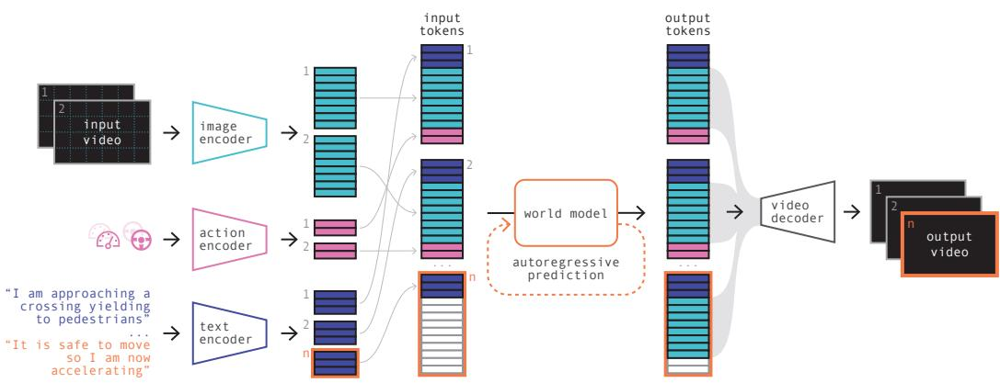

*GAIA-1 的核心架构将视频、文本和动作等多模态输入统一编码为序列 Token，随后通过自回归 Transformer 世界模型逐步预测下一帧图像 Token，最终由视频解码器还原出连贯的驾驶场景视频。*

## 问题背景与动机

**结论：** 自动驾驶的安全规划极度依赖对“自车动作将引发何种未来”的精准推演，但现有世界模型与生成视频模型各自卡在“保真度”与“可控推理”的跷跷板上；破局的关键在于将高维视频离散化为语义 Token，用大语言模型的“下一词预测”范式统一世界建模，再以扩散模型还原像素，从而同时拿下动态推理能力与视觉真实感。

自动驾驶的决策核心在于预判（O1）。然而，传统世界模型试图用低维隐变量压缩驾驶场景，这种压缩在复杂真实路况下如同将高清视频压成低码率流，丢失了关键细节，导致生成的预测帧难以满足高保真要求（G1）。更深层的瓶颈在于数据与泛化：这类方法严重依赖难以规模化获取的标注数据，且在仿真环境中训练的模型往往“水土不服”，无法完整捕获真实世界的长尾复杂性（O2）。

另一方面，生成式视频模型虽然能输出视觉上极具欺骗性的逼真画面，但其优化目标始终停留在“像素级真实感”，而非“世界状态转移的语义理解”（O3）。它们缺乏对物理规律与因果关系的结构化建模，一旦输入自车动作或文本指令，往往只能“脑补”出视觉连贯但逻辑断裂的未来序列，无法提供可解释的因果预测，因而难以直接支撑需要严格推演的自动驾驶决策（G2）。

```mermaid
flowchart TD
    classDef start_end fill:#e1f5fe,color:#01579b,stroke:#0288d1
    classDef gap fill:#ffebee,color:#b71c1c,stroke:#e53935
    classDef insight fill:#e8f5e9,color:#1b5e20,stroke:#2e7d32
    classDef data fill:#fff3e0,color:#e65100,stroke:#f57c00

    start((规划需预判未来)):::start_end --> need_pred["推演动作后果"]:::start_end
    need_pred --> gap1{压缩低维变量}:::gap
    gap1 --> fail1{丢失细节保真}:::gap
    need_pred --> gap2{优化视觉真实}:::gap
    gap2 --> fail2{缺乏因果控制}:::gap
    fail1 & fail2 --> pivot{离散视频帧}:::insight
    pivot --> vq_token["(提取语义词元)"]:::data
    vq_token --> next_pred["预测下一词元"]:::insight
    next_pred --> diff_decode["解码还原像素"]:::insight
    diff_decode --> end((输出高保真视频)):::start_end
```
*如何读这张图：* 左侧两条分支分别对应传统世界模型（低维压缩）与生成视频模型（视觉优化）的失效路径；中间菱形节点暴露了“保真度不足”与“因果控制缺失”的双重瓶颈；右侧流程展示了论文的统一解法：通过离散化提取语义词元，将世界建模转化为序列预测任务，最终由扩散解码器输出可控的高保真视频。

面对“低维看不清、纯生成想不透”的双重困境，论文的核心洞见是**换一条路走**：放弃在连续像素空间里硬扛，转而将视频帧离散化为语义 VQ Token。这一步相当于把连续的物理世界“翻译”成离散的语义词汇表。随后，世界建模被统一为无监督的“下一 Token 预测”任务。这一设计直接继承了 LLM 在海量数据上验证过的 Scaling Laws 优势，让模型在 Token 序列中隐式学习驾驶场景的时空演化规律与因果逻辑。最后，通过视频扩散解码器将预测出的 Token 序列“翻译”回高保真像素。

这种“离散语义推理 + 连续像素生成”的解耦架构，一举打通了 G1 与 G2 的堵点。其底层依赖三个关键假设：DINO 蒸馏引导的 VQ Token 足以承载驾驶场景的核心语义；仅需速度、曲率两个标量（$l=2$）即可有效表征自车动作；以及 NLP 领域的 Scaling Laws 可平滑迁移至视频驾驶世界建模任务。在此框架下，单一模型既能响应动作/文本条件生成多模态可控的未来视频，又能涌现出场景理解能力，最终可作为自动驾驶训练的“神经模拟器”，实现从“看视频”到“懂世界”的跨越。

## 核心概念速览

本节将拆解支撑该生成式世界模型的九大核心构件。整体架构并非单一黑盒，而是一条“离散化压缩→自回归预测→条件采样→像素级还原”的流水线。各模块通过明确的接口与损失函数耦合，共同解决连续视频建模中的算力瓶颈与时序一致性问题。

```mermaid
flowchart LR
  start(["输入视频与提示"]) --> vq["/VQ图像标记化/"]
  vq --> tokens["(离散图像令牌)"]
  tokens --> ar["/自回归下一令牌预测/"]
  ar --> sample["/CFG与Top-k采样/"]
  sample --> diff["/视频扩散解码/"]
  diff --> end(["输出高分辨率视频"])
  classDef io fill:#e8f5e9,stroke:#2e7d32,color:#000;
  classDef data fill:#fff8e1,stroke:#f57f17,color:#000;
  classDef proc fill:#e3f2fd,stroke:#1565c0,color:#000;
  class start,end io;
  class tokens data;
  class vq,ar,sample,diff proc;
```
**如何读这张图**：数据流从左至右单向推进。圆角起止节点代表原始输入与最终像素输出；圆柱节点代表中间态的离散令牌序列；平行四边形代表核心处理阶段。该图暴露了论文的核心权衡：将高维连续视频先“降维”为离散符号，再用语言模型范式处理，最后用扩散模型“升维”回像素空间，以此换取序列建模的可扩展性。

### 生成式世界模型：把环境动态转化为序列预测
**结论**：该框架将自动驾驶场景下的世界建模问题，彻底转化为无监督的离散序列预测任务，通过隐式学习物理规律实现高保真视频生成。
**直觉理解**（直觉，非严格对应）：就像人类驾驶员的“心理模拟器”。大脑不会逐像素计算前方路况，而是基于过往经验在脑中“预演”接下来几秒的画面。模型通过大量观看英国伦敦城市驾驶数据，学会了这种“脑补”能力。
**在本方法中的作用**：作为顶层架构，它统一了文本提示 $\mathbf{c}_t$、图像令牌 $\mathbf{z}_t$ 与动作令牌 $\mathbf{a}_t$ 的输入序列 $(\mathbf{c}_1, \mathbf{z}_1, \mathbf{a}_1, \ldots, \mathbf{c}_T, \mathbf{z}_T, \mathbf{a}_T)$，将复杂的时空动力学降维为可计算的符号序列。
**边界与局限**：论文声称该过程天然适合并行化以并发生成多样本，但明确指出当前自回归生成尚不能实时运行。此外，该范式高度依赖离散化表征的质量，若底层标记化器丢失关键语义，上层预测将产生累积误差。

### 向量量化图像标记化：给连续画面装上“乐高索引”
**结论**：利用离散自编码器将连续图像帧压缩为有限词汇表中的整数令牌序列，从根本上降低序列建模的上下文长度与计算负担。
**直觉理解**（直觉，非严格对应）：如同将高清照片转译为乐高拼装图纸。不记录每个像素的RGB值，而是记录“第几号积木块放在网格的哪个位置”。
**在本方法中的作用**：在 $H \times W = 288 \times 512$、下采样率 $D = 16$ 的配置下，每帧被压缩为 $n = 576$ 个离散令牌，词汇表大小 $K = 8192$。这使得原本庞大的像素空间被映射为可被Transformer高效处理的离散符号。
**边界与局限**：由于解码器仅在单张图像上训练，直接对视频解码会缺乏时序一致性（画面闪烁或跳变）。量化本身必然带来信息损失，$K$ 的大小直接决定了表示精度与序列长度的权衡。论文为此必须额外引入视频扩散解码器来修补时序断裂。

### DINO语义蒸馏归纳偏置：让压缩算法学会“抓重点”
**结论**：在训练标记化器时，通过余弦相似度损失将预训练DINO模型的语义特征蒸馏至离散令牌中，强制压缩方向偏向高层语义而非高频像素噪声。
**直觉理解**（直觉，非严格对应）：像给压缩算法配了一位“老交警”当导师。导师不纠结树叶怎么晃、水坑反光多亮（高频细节），只盯着“前面是红灯还是行人”（语义结构）。
**在本方法中的作用**：通过引入权重 $\lambda_{L_{\mathrm{DINO}}} = 0.1$ 的蒸馏损失，引导编码器 $E_\theta$ 输出的特征与DINO教师特征对齐。这显著提升了离散令牌的信息密度，使后续自回归预测能更稳定地捕捉驾驶场景中的关键实体。
**边界与局限**：DINO模型以固定权重运行，仅蒸馏单帧图像级语义，不建模跨帧时序语义。权重设为 $0.1$ 是刻意控制，避免过度压制重建质量损失导致画面模糊。

### 自回归下一令牌预测：大语言模型范式的跨界迁移
**结论**：将视频未来预测转化为条件分类问题，采用带因果掩码的Transformer逐个预测下一个图像令牌，实现LLM训练范式在世界建模中的直接复用。
**直觉理解**（直觉，非严格对应）：如同玩“成语接龙”或“完形填空”。给定前半句和当前路况提示，模型只能猜下一个字，猜完再基于新上下文猜下下个，绝不偷看答案。
**在本方法中的作用**：核心训练机制。模型仅预测图像令牌，因果掩码严格阻断未来信息泄漏。对于超出上下文窗口的长视频，采用滑动窗口策略维持生成连贯性。
<details><summary><strong>损失函数与推导细节</strong></summary>
训练目标为最大化序列似然，损失函数定义为：
$$L_{\mathrm{worldmodel}} = -\sum_{t=1}^{T}\sum_{i=1}^{n}\log p(z_{t,i} \mid \mathbf{z}_{<t},\, z_{t,j<i},\, \mathbf{c}_{\leq t},\, \mathbf{a}_{<t})$$
该公式明确表明：预测第 $t$ 帧第 $i$ 个令牌时，仅依赖历史所有帧的令牌 $\mathbf{z}_{<t}$、当前帧已生成的令牌 $z_{t,j<i}$、以及截至当前的文本与动作条件。
</details>
**边界与局限**：该范式将视频生成退化为自回归分类，虽稳定但推理延迟随序列长度线性增长。滑动窗口虽能处理长视频，但窗口切换处可能出现语义漂移。

### 无分类器引导：用“对比差值”强化控制对齐
**结论**：在推理阶段通过放大有条件与无条件logits的差异，增强生成内容与提示的对齐程度，并原生支持“负提示”以主动规避不期望特征。
**直觉理解**（直觉，非严格对应）：像调音台上的“对比旋钮”。把“带导航的路线”和“瞎开的路线”做差，放大差异信号，让车辆更听话地贴合指定轨迹。
**在本方法中的作用**：通过公式 $l_{\mathrm{final}} = (1+t)\,l_{\mathrm{conditioned}} - t\,l_{\mathrm{unconditioned}}$ 动态调整生成倾向。训练时以一定概率随机丢弃条件令牌，使模型具备无条件生成能力，这是该引导技术成立的前提。
**边界与局限**：引导缩放因子 $t$ 及调度策略属于需针对具体用例手动调优的超参数。过度放大可能导致生成画面出现伪影或过度锐化，论文未提供自适应调度方案。

### 视频扩散解码器：从离散图纸到流畅视频的“渲染引擎”
**结论**：基于去噪扩散概率模型的多任务组件，负责将离散图像令牌翻译回高分辨率、时序一致的像素视频，并同步完成时序超分辨率（6.25Hz→25Hz）。
**直觉理解**（直觉，非严格对应）：如同“AI视频修复师+插帧器”。把粗糙的离散图纸渲染成流畅电影，并自动补全缺失的中间帧，消除卡顿感。
**在本方法中的作用**：该解码器参数量为 2.6B，与世界模型（6.5B参数）解耦训练。推理时采用DDIM采样器共50步，条件令牌以 $p=0.15$ 概率随机掩码以提升泛化能力。它直接弥补了VQ单帧解码的时序断裂缺陷。
**边界与局限**：50步扩散采样导致该阶段无法实时运行。论文明确区分了世界模型与解码器的训练目标，两者误差范围独立评估，未报告端到端联合微调的消融结果。
<details><summary><strong>扩散损失与训练配置</strong></summary>
视频解码器优化目标为去噪误差：
$$L_{\mathrm{video}} = \mathbb{E}_{\epsilon,\,t^{\prime}}\left[\left\|\epsilon_\theta(\mathbf{x}^{t^{\prime}},\,t^{\prime},\, \mathbf{z},\, \mathbf{m}) - \epsilon\right\|_2^2\right]$$
其中 $\mathbf{m}$ 为掩码条件，$\epsilon$ 为注入噪声。该设计确保解码器在给定离散令牌 $\mathbf{z}$ 的条件下，能稳定恢复像素级时序一致性。
</details>

### Top-k采样策略：在“死循环”与“乱发散”间走钢丝
**结论**：自回归推理时仅保留概率分布中前 $k$ 个最高概率令牌进行采样，有效规避确定性退化与尾部噪声越界两种极端失效模式。
**直觉理解**（直觉，非严格对应）：像考试做多选题时“划掉明显错误选项”。不选绝对第一（防死循环复读），也不从几万个冷门词里瞎蒙（防画面崩坏），只在Top 50的合理候选中随机挑选。
**在本方法中的作用**：论文实验设定 $k=50$，该值由单帧令牌数 $n=576$ 与码本大小 $K=8192$ 的经验关系决定。它在保持生成多样性的同时，压制了低概率令牌引发的视觉伪影。
**边界与局限**：该策略仅适用于离散令牌空间的自回归采样，属于推理期超参数。论文未给出 $k$ 值的通用选择公式，也未报告不同 $k$ 值对交叉熵或FVD指标的消融对比。

### 世界模型缩放定律：算力投资的“马力预测曲线”
**结论**：在序列建模范式下，驾驶世界模型展现出与大语言模型相似的幂律计算量-性能关系，小规模训练曲线可准确外推大规模模型的最终交叉熵。
**直觉理解**（直觉，非严格对应）：如同“发动机排量与马力的关系曲线”。测几台小排量引擎的油耗和动力，就能精准算出大排量引擎的极限性能，无需真造出来烧钱试错。
**在本方法中的作用**：为算力分配提供理论依据。计算量估计采用近似公式 $C = 6N$（$N$ 为不含嵌入层的参数量），总计算量为 $C \times$ 训练令牌数。通过拟合 $f(x) = c + (x/a)^b$，团队可在训练早期预判6.5B模型的收敛表现。
**边界与局限**：外推严格依赖“下一令牌预测”这一训练目标，若切换为扩散损失或其他目标，该幂律不再直接适用。论文明确指出计算量估计为近似值，且未报告不同数据分布下的缩放曲线偏移情况。

### 因式分解时空位置嵌入：解耦的“时空坐标系”
**结论**：将时间步位置与帧内空间位置解耦为独立的可学习嵌入，通过相加赋予每个令牌完整的时空坐标感知能力，替代固定正弦编码。
**直觉理解**（直觉，非严格对应）：像“电影院排座系统”。时间嵌入是“第几场电影”，空间嵌入是“第几排第几座”。两者相加，精准定位每个令牌在时空网格中的绝对坐标。
**在本方法中的作用**：共 $T=26$ 个时间嵌入（同时间步内所有令牌共享）；共 $m + n + l = 32 + 576 + 2 = 610$ 个空间嵌入（依次对应文本/图像/动作位置），嵌入维度 $d = 4096$。该设计使模型能灵活处理多模态混合序列。
**边界与局限**：由于采用可学习嵌入而非解析函数，其外推能力受限于训练时见过的最大序列长度 $T=26$。生成超长视频必须依赖滑动窗口截断，无法直接外推位置嵌入，这是可学习编码的固有局限。

## 方法与整体架构

**核心结论：** 该架构通过“离散自回归预测 + 连续扩散渲染”的两阶段解耦设计，成功在长时序驾驶视频生成中兼顾了因果逻辑一致性与像素级高保真。系统先将多模态输入统一压缩为离散 token 序列，由 6.5B 参数的因果 Transformer 负责推演未来场景的语义骨架；随后交由 2.6B 参数的视频扩散解码器在像素空间完成细节渲染与时序超分辨率，从而规避了单一模型同时处理长程依赖与高频纹理时的算力与质量瓶颈。

**多模态输入的统一编码与拼接。** 原始驾驶数据包含视频、文本指令与车辆动作（速度、曲率）。为消除模态异构性，系统采用分路编码策略：视频帧经预训练全卷积 2D U-Net VQ-GAN 编码器 $E_\theta$ 量化，每帧压缩为 576 个离散 token（下采样因子 $D=16$，词表大小 $K=8192$）；文本经 T5-large 编码为每帧 32 个 token 后通过线性层映射；动作标量同样经独立线性层投影至 $d$ 维。三路信号严格按「文本-图像-动作」顺序交错拼接，并注入因子化时空位置编码（可学习时间嵌入与空间嵌入），最终构成总长 $T \times 610 = 15860$ 的统一 token 序列。这种设计将异构信号转化为 Transformer 可直接消费的离散语言，大幅降低了跨模态对齐的复杂度。

**自回归世界模型的因果推演。** 编码后的序列输入 6.5B 参数的因果自回归 Transformer 世界模型。该模块配备因果注意力掩码，严格遵循时间单向性，以标准下一 token 预测为目标推演未来帧的离散图像表示。在推理采样阶段，系统摒弃了易导致画面陷入重复循环的 argmax 策略，也避开了全分布采样带来的离分布噪声，转而采用 `top-k=50` 策略。该阈值在多样性与真实性之间取得平衡，使生成帧的困惑度分布与真实驾驶数据高度吻合。

**扩散解码器的像素渲染与时序重建。** 世界模型输出的离散 token 仅包含场景的“语义骨架”，高频细节与连续运动需由 2.6B 参数的多任务视频扩散解码器（3D U-Net 架构，内置空间与时间因子化注意力）补全。该解码器直接在像素空间进行高分辨率渲染，并执行三级时序超分辨率（$6.25\text{Hz} \rightarrow 12.5\text{Hz} \rightarrow 25\text{Hz}$），将下采样以换取长上下文覆盖的代价完全补偿。为抑制扩散生成常见的时序抖动，推理期采用从序列末尾向前倒序的自回归解码策略，实验表明该操作能显著稳定物体形态并消除地平线闪烁。

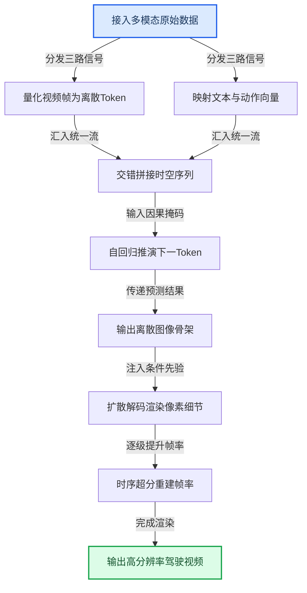
*如何读这张图：* 流程自上而下呈现“压缩-推演-重建”的单向数据流。左侧分支负责将异构信号离散化并统一为 15860 长度的序列；中部 Transformer 承担长程因果建模，输出低分辨率离散骨架；右侧扩散模块接管高频细节生成与帧率恢复。图中以线性主干呈现核心数据通路，实际推理中各节点内部还嵌入了分类器自由引导调度、条件 Dropout 等启发式控制门。

<details><summary><strong>训练目标与推理调度细节（展开）</strong></summary>

**训练损失函数设计**
世界模型采用标准自回归对数似然最大化目标（论文公式 1）：
$$L_{\mathrm{worldmodel}} = -\sum_{t=1}^{T}\sum_{i=1}^{n}\log p(z_{t,i}|\mathbf{z}_{<t}, z_{t,j<i}, \mathbf{c}_{\leq t}, \mathbf{a}_{<t})$$
视频解码器采用 v-参数化去噪目标（论文公式 2）：
$$L_{\mathrm{video}} = \mathbb{E}_{\epsilon,t'}\left[\|\epsilon_{\theta}(\mathbf{x}^{t'}, t', \mathbf{z}, \mathbf{m}) - \epsilon\|_2^2\right]$$
图像 tokenizer 的损失为多项加权组合（L1/L2/感知/GAN/量化/DINO蒸馏），论文未给出统一显式公式。

**关键推理与训练启发式策略**
- **条件混合训练：** 训练期按 20% 无条件 / 40% 动作条件 / 40% 文本条件比例随机 Dropout 条件 token，使单一模型具备多模态条件生成能力。
- **分类器自由引导（CFG）调度：** 固定引导尺度会导致跨帧累积失控。系统在 token 维度采用线性递减以保证帧内多样性，在帧维度采用余弦衰减（可含初始平台期）以抑制跨帧过度引导。
- **解码器条件 Dropout：** 训练时对条件图像 token 施加 $p=0.15$ 的随机 Dropout，防止解码器过度依赖 token 先验，提升泛化性与时序一致性。
- **去噪加权平均：** 推理期以 $p=0.25$ 概率随机切换至图像/视频去噪加权平均（权重 $w=0.5$），在“忠实还原 token 内容”与“维持时序连贯”两个竞争目标间动态寻优。
</details>

整体而言，该架构并非简单堆砌现有模块，而是针对驾驶视频生成的核心痛点（长时序因果断裂、高频纹理模糊、多模态条件冲突）进行了针对性解耦与调度设计。离散自回归负责“想清楚下一步该发生什么”，连续扩散负责“把画面画得逼真且连贯”，两者通过精心设计的 token 接口与推理启发式策略无缝咬合，构成了当前生成式世界模型中极具代表性的工程范式。

## 算法目标与推导

**结论：** 该系统的训练目标被严格解耦为“离散表征构建—时序因果建模—高保真像素生成”三阶段，且明确区分了训练期优化与推理期引导。世界模型在离散隐空间执行标准自回归预测以捕获动作与文本的时序依赖，视频解码器通过 v-参数化扩散过程将条件序列还原为连续帧，而图像分词器则依赖多损失加权对齐像素重建与高层语义；公式 3 与公式 4 仅作用于推理阶段，不参与梯度更新。

论文显式给出的核心训练目标如下：
世界模型训练目标(论文公式 1,显式给出):
$$L_{\mathrm{worldmodel}} = -\sum_{t=1}^{T}\sum_{i=1}^{n}\log p(z_{t,i}|\mathbf{z}_{<t}, z_{t,j<i}, \mathbf{c}_{\leq t}, \mathbf{a}_{<t})$$
视频解码器训练目标(论文公式 2,显式给出,v-参数化去噪):
$$L_{\mathrm{video}} = \mathbb{E}_{\epsilon,t'}\left[\|\epsilon_{\theta}(\mathbf{x}^{t'}, t', \mathbf{z}, \mathbf{m}) - \epsilon\|_2^2\right]$$
图像 tokenizer 训练损失为多项加权组合：图像重建损失(L1+L2+感知损失 $L_{\mathrm{perceptual}}$+GAN 损失 $L_{\mathrm{GAN}}$)、量化损失(codebook 嵌入损失+commitment 损失)、DINO 余弦相似度蒸馏损失。论文未给出 tokenizer 的统一显式综合目标公式。

以下两式仅用于推理期,不属于训练目标:
分类器自由引导(论文公式 3):
$$l_{\mathrm{final}} = (1+t)l_{\mathrm{conditioned}} - t l_{\mathrm{unconditioned}}$$
推理期视频解码图像/视频去噪加权平均(论文公式 4):
$$\tilde{\epsilon}_{\theta}(\mathbf{x}^{t'}, t', \mathbf{z}, \mathbf{m}) = w \cdot \epsilon_{\theta}^{\pi}(\mathbf{x}^{t'}, t', \mathbf{z}, \mathbf{m}) + (1-w) \cdot \epsilon_{\theta}(\mathbf{x}^{t'}, t', \mathbf{z}, \mathbf{m})$$

**逐步推导与设计理由：**
1. **世界模型(公式 1)的因果掩码设计**：该式本质是标准自回归下一 token 预测。双重求和 $\sum_{t=1}^{T}\sum_{i=1}^{n}$ 遍历所有时间步 $t$ 与当前帧内的 token 索引 $i$。条件项 $\mathbf{z}_{<t}$ 锁定历史帧的离散表征，$z_{t,j<i}$ 强制当前帧内的因果依赖(防止信息穿越)，$\mathbf{c}_{\leq t}$ 注入历史文本指令，$\mathbf{a}_{<t}$ 引入过去动作序列。这种设计直接解决了多模态控制中的“时序错位”痛点：模型必须在已知过去动作与文本的前提下，预测当前视觉状态，从而在隐空间内建立“指令-动作-视觉”的联合概率分布。
2. **视频解码器(公式 2)的 v-参数化选择**：扩散模型传统上使用 $\epsilon$-预测或 $x_0$-预测，但 v-参数化在训练稳定性与高频细节保留上更具优势。式中 $\epsilon_{\theta}$ 为去噪网络，$\epsilon$ 为真实噪声，$t' \sim U(0,1)$ 为均匀采样的扩散时间步。关键条件项 $\mathbf{z}$ 是世界模型输出的图像 token 序列，$\mathbf{m}$ 为任务掩码序列。该目标函数通过最小化预测噪声与真实噪声的 $L_2$ 距离，迫使解码器学会从离散条件中“反演”出连续像素分布。
3. **分词器的多目标权衡**：由于未给出统一公式，实际训练依赖加权组合。重建损失(L1/L2)保底像素级保真度，感知损失与 GAN 损失负责高频纹理与对抗锐化；量化损失(codebook+commitment)防止离散码本坍塌或表征漂移；DINO 蒸馏损失则将视觉特征对齐到预训练大模型的语义空间。这种组合是典型的“像素-语义”双轨对齐策略。

**直觉比喻与玩具例子：**
*(直觉,非严格对应)* 可将该流程想象为“编剧-分镜师-摄影师”的协作。世界模型是**编剧**，根据剧本(文本)和上一幕剧情(历史帧/动作)，写出下一幕的抽象大纲(离散 token)；视频解码器是**摄影师**，拿着大纲和拍摄清单(任务掩码)，在暗房(扩散过程)里逐步冲洗出高清画面；分词器则是**分镜师**，负责把现实画面压缩成大纲能读懂的符号，并确保符号既保留构图细节又符合语义逻辑。
**具体小玩具例子**：假设生成一段“机械臂抓取水杯”的 3 帧序列。分词器先将第 1 帧压缩为 token 序列 $\mathbf{z}_1$。世界模型接收文本“抓取”与动作“前伸”，结合 $\mathbf{z}_1$ 预测第 2 帧 token $\mathbf{z}_2$ 的概率分布，并计算公式 1 的对数似然损失。随后，视频解码器接收 $\mathbf{z}_2$ 与掩码 $\mathbf{m}$，在随机时间步 $t'$ 加噪后，通过公式 2 训练网络 $\epsilon_\theta$ 预测噪声。若训练收敛，推理时即可按此链条逐帧生成连贯动作。

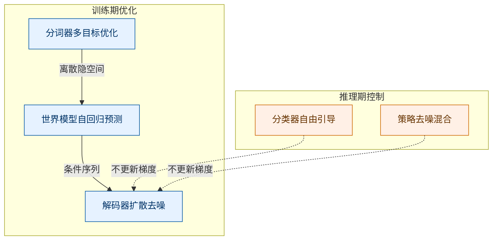
*如何读这张图：* 实线箭头代表训练期的梯度传播路径，虚线箭头代表推理期的控制信号注入。训练严格遵循“分词→世界模型→解码器”的单向流水线；推理时引入的引导与混合机制(公式 3/4)仅修改前向传播的权重，不改变已训练好的参数分布。

<details><summary><strong>推导细节与边界 Caveat</strong></summary>
- **分词器损失权重未显式公开**：论文仅列出损失组件，未给出各项系数。实践中若 GAN 权重过高易导致棋盘格伪影，若 DINO 权重过高则可能牺牲局部几何精度。该设计属于经验性权衡，缺乏理论最优解证明。
- **v-参数化的数值稳定性**：公式 2 采用 $L_2$ 范数而非 $L_1$，在扩散早期(高噪声阶段)对异常值更敏感，但配合均匀时间步采样 $t' \sim U(0,1)$ 可平滑梯度方差。
- **推理公式的独立性**：公式 3(分类器自由引导)与公式 4(去噪加权平均)明确标注为推理期使用。若误将其纳入训练目标，会导致条件分布与无条件分布的梯度冲突，破坏世界模型的自回归一致性。论文在此处做了清晰切割，避免了“训练-推理不一致”的常见陷阱。
</details>

**局限与失效模式提示：** 该目标函数高度依赖分词器的离散表征质量。若量化损失未能有效约束码本，世界模型的自回归预测将因输入分布偏移而累积误差(即“暴露偏差”问题)。此外，公式 1 的因果掩码 $z_{t,j<i}$ 虽保证了帧内时序正确性，但未显式建模跨模态注意力权重，极端长文本或复杂动作序列下可能出现条件遗忘。论文未报告针对这些失效模式的消融实验或误差范围，实际部署时需配合动态采样策略或外部校验模块。

## 实验设计与结果解读

**核心结论：** GAIA-1 的实验体系并非单纯堆砌算力，而是通过“离散表征对齐→规模定律验证→采样策略调优→全系统涌现评估”的递进链路，证明了自回归世界模型在驾驶场景下的可控性与泛化潜力。所有关键组件均经过针对性验证，但评估高度依赖定性可视化与困惑度代理指标，缺乏传统生成模型常用的定量基准（如 FID/FVD），这既是自动驾驶生成任务的特性使然，也意味着部分结论仍需下游闭环任务进一步检验。

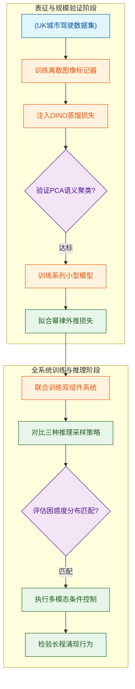
*如何读这张图：* 实验并非并行跑分，而是严格的“门控流水线”。左侧阶段负责表征对齐与规模验证，右侧阶段通过困惑度分布筛选采样策略，最终在控制与涌现测试中检验系统上限。菱形节点代表论文实际设置的验证门槛，未达标则需回溯调参。

### 语义对齐的离散化：DINO蒸馏重塑词元空间
**结论：** 引入预训练 DINO 的余弦相似度蒸馏损失，能显著改善离散词元的语义聚类质量，使视觉表征从“像素级重建”转向“语义级对齐”。
论文在 0.3B 参数的全卷积 2D U-Net VQ 自编码器中，将传统 VQ-GAN 的 L1/L2/感知/GAN/codebook 损失与 DINO 蒸馏损失联合优化。在 4,700 小时 UK 城市驾驶数据上训练 200k 步（约 4 天）后，通过 PCA 将词元嵌入映射至 RGB 空间进行可视化。结果显示，经蒸馏的词元在车辆、道路、天空等同类物体上呈现出高度一致的嵌入颜色，而基础 VQ-GAN 词元则呈现杂乱分布。
<details><summary><strong>训练配置与损失细节</strong></summary>
- 硬件：32 × A100 80GB GPU
- 分辨率与离散化：288×512 输入，下采样因子 D=16，词汇表大小 K=8192，每帧编码为 576 个离散词元
- 优化器：AdamW，初始学习率 1e-4，权重衰减 0.01，批大小 160
- 调度：5k 步线性预热 + 余弦衰减至 1e-5
</details>
**局限与审慎解读：** 该实验仅依赖 PCA 可视化进行定性验证，未报告下游任务（如目标检测或分割）的定量提升。相关性不等于因果性：DINO 蒸馏可能仅压缩了高频纹理噪声，而非真正注入高层语义。论文未提供消融实验证明“仅靠 DINO 损失是否足以替代传统重建损失”，实际工程中仍需多损失加权平衡。

### 规模即规律：幂律外推验证架构潜力
**结论：** 自回归世界模型的验证交叉熵严格遵循幂律缩放定律，小规模实验可高精度外推至 6.5B 参数规模，证明架构尚未触及性能瓶颈。
研究团队训练了参数量从 0.65M 到 650M 的系列小型 Transformer（比最终模型小 10,000x 到 10x），在地理围栏验证集上测量交叉熵，并拟合函数 $$f(x) = c + (x/a)^b$$。外推结果与 6.5B GAIA-1 模型的实际验证损失高度吻合，且曲线显示随规模增大损失持续下降。
**局限与审慎解读：** 缩放定律的成立依赖于“计算量估算公式 $$C=6N$$”的假设，该公式忽略了注意力机制的序列长度开销与硬件通信瓶颈。此外，外推属于“超出数据范围”的预测，虽在 Figure 8a 中表现良好，但幂律在极大规模下常出现拐点（如数据耗尽或优化器饱和）。论文未报告误差范围或置信区间，外推精度应视为趋势性参考而非绝对承诺。

### 采样策略的权衡：Top-k=50 逼近真实分布
**结论：** 在自回归推理中，top-k=50 采样策略的词元困惑度分布最贴近真实驾驶视频，有效规避了确定性采样的循环退化与全分布采样的分布外发散。
针对每帧 576 个词元（K=8192）的生成过程，论文对比了 argmax、全分布采样与 top-k=50。绘制困惑度随词元位置（1 至 576）的变化曲线发现：argmax 困惑度极低，导致生成画面陷入重复循环；全分布采样尾部出现极高困惑度，引发结构崩坏；top-k=50 则在多样性与稳定性间取得平衡，分布形态与真实词元高度重合。
**局限与审慎解读：** 困惑度是语言模型的代理指标，直接映射到视频生成质量存在“语义鸿沟”。低困惑度不代表物理合理性（如车辆悬浮），高困惑度也不必然导致视觉崩坏。该实验未结合下游控制任务验证采样策略的鲁棒性，top-k=50 的阈值选择可能高度依赖当前词汇表分布，缺乏自适应机制。

### 全系统涌现：多模态控制与长程一致性
**结论：** 完整系统（6.5B 世界模型 + 2.6B 3D U-Net 扩散解码器）在分钟级生成中展现出对文本/动作条件的精准响应，并在分布外场景中涌现出合理的多智能体交互行为。
系统在 64 × A100（世界模型）与 32 × A100（视频解码器）上完成训练。世界模型以 6.25Hz 处理 T=26 帧序列（总长 15860），采用 20% 无条件/40% 动作/40% 文本的混合条件训练；视频解码器通过四任务联合训练（图像/视频/自回归解码/插值）实现两阶段时序上采样至 25Hz。推理时结合 classifier-free guidance（cosine 衰减）与 DDIM 50 步采样，成功生成分钟级连贯视频，并在“强转向”“天气突变”“多未来分支”等测试中保持物理一致性，其他交通参与者对自车偏离车道等行为展现出符合直觉的避让反应。
<details><summary><strong>全系统训练与推理关键参数</strong></summary>
- 世界模型：100k 步（约 15 天），AdamW 1e-4，批大小 128，DeepSpeed ZeRO-2 + 激活检查点 + FlashAttention v2
- 视频解码器：300k 步（约 15 天），AdamW 5e-5，批大小 64，v 参数化噪声预测
- 文本编码器：固定参数的 T5-large
- 推理调度：top-k=50，DDIM 50 步，cosine 衰减引导
</details>
**局限与审慎解读：** 本节所有评估均为定性观察（Figure 10-13），未提供 FID、FVD 或物理一致性定量分数。多模态控制的“准确性”依赖人工视觉校验，存在挑樱桃式展示“代表性结果”的风险。此外，分布外泛化（如极端转向）的合理性建立在训练数据覆盖的驾驶先验上，若遇到完全未见过的拓扑结构（如环岛+施工+暴雨叠加），模型可能退化为模式平均。论文未报告负结果或失败案例，实际部署需结合安全边界约束。

### 实验数据表(原始数值,引自论文)

#### GAIA-1三组件模型配置与训练规格
- **Source**: Section 4.1, Section 4.2, Section 4.3
- **Caption**: "GAIA-1三个可训练组件的参数量、训练步数、训练时长、批大小及GPU配置（数字逐字来自论文Section 4.1/4.2/4.3）"

| 组件 | 参数量 | 训练步数 | 训练时长 | 批大小 | GPU配置 |
| --- | --- | --- | --- | --- | --- |
| 图像标记器 | 0.3B | 200k steps | 4 days | 160 | 32 A100 80GB GPUs |
| 世界模型 | 6.5B | 100k steps | 15 days | 128 | 64 A100 80GB GPUs |
| 视频解码器 | 2.6B | 300k steps | 15 days | 64 | 32 A100 80GB GPUs |

#### 缩放实验模型规模范围
- **Source**: Section 6, Figure 8b
- **Caption**: "用于缩放定律幂律拟合的小模型参数量范围及其与6.5B GAIA-1世界模型的规模对比（Figure 8b）"

| 用途 | 参数量范围 | 相对于GAIA-1世界模型的规模 | 评估指标 |
| --- | --- | --- | --- |
| 拟合幂律的小模型集合 | 0.65M to 650M | 10,000x to 10x smaller | cross-entropy |

#### 训练数据集统计
- **Source**: Section 3
- **Caption**: "GAIA-1训练和验证数据集的基本统计信息"

| 属性 | 数值 |
| --- | --- |
| 总时长 | 4,700 hours |
| 采样率 | 25Hz |
| 近似唯一图像数 | 420M |
| 采集地点 | London, UK |
| 采集年份 | 2019 to 2023 |
| 验证集时长 | 400 hours |


**效果示例(论文原图):**

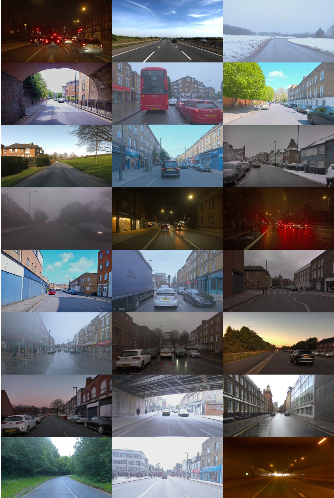

*该图展示了 GAIA-1 生成的多样化驾驶场景，模型能够根据上下文自动补全不同天气、光照和道路环境下的逼真画面，体现了其强大的场景泛化能力。*

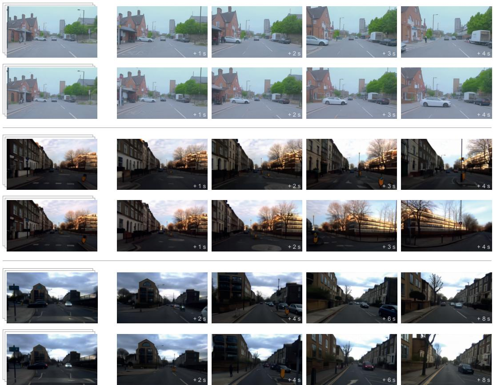

*面对同一初始驾驶片段，GAIA-1 能够推演出多种合理的未来走向（如前车让行或继续行驶），直观展现了世界模型对复杂交通交互的多模态预测能力。*

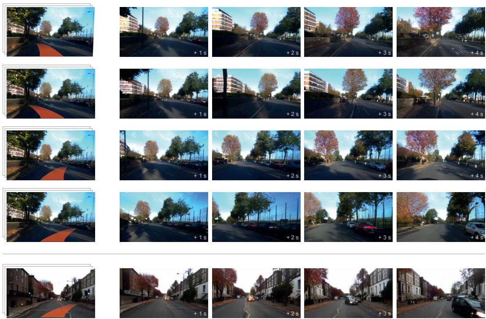

*通过输入不同的转向或加速指令，GAIA-1 能精准推演出自车执行相应动作后的环境变化，验证了模型对控制信号的高保真响应与因果推理能力。*

## 相关工作与定位

**结论前置：** GAIA-1 并非从零构建底层原语，而是站在“离散视觉表征、自回归序列建模、扩散视频解码”三条成熟技术线的交汇处，通过**语义蒸馏升维、跨域范式平移与动态引导适配**，将原本割裂的组件缝合为可缩放、强语义、高保真的自动驾驶世界模型。它在研究谱系中的核心定位是：验证了 LLM 的缩放定律与序列建模范式可无损迁移至高维视觉生成任务，并通过工程级改造（冻结教师网络、丢弃训练用解码器、动态调度引导因子）补齐了真实驾驶场景下的语义对齐与计算效率短板。

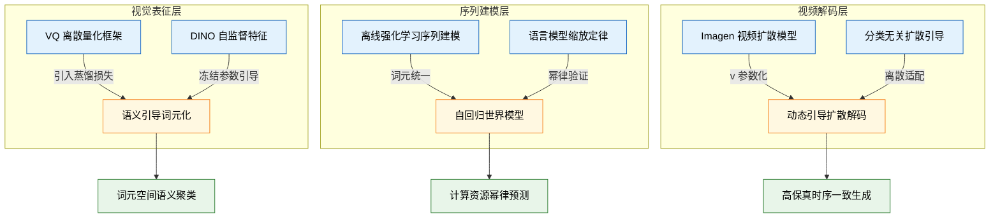
*如何读这张图：* 左侧三列代表被 GAIA-1 继承的原始方法（蓝色），中间菱形节点代表论文针对自动驾驶痛点所做的定向改造（橙色），右侧圆柱节点代表改造后释放的系统级收益（绿色）。箭头标注了核心改动动作，整体呈现“基座方法→定向缝合→能力跃升”的单向流水线。

### 离散化与语义对齐：从“像素量化”到“语义聚类”
连续视频帧直接输入序列模型会导致维度灾难，因此离散词元化是前置刚需。GAIA-1 继承了 van den Oord 等人提出的 VQ 框架（向量量化、embedding loss、commitment loss），但原始 VQ 仅依赖重建误差，生成的词元空间缺乏高层语义结构，导致后续世界模型难以捕捉驾驶场景中的物体交互逻辑。

为此，论文引入 Caron 等人的 DINO 自监督特征作为蒸馏目标，通过余弦相似度损失（inductive bias loss）引导图像标记器训练。DINO 参数全程冻结，不参与梯度更新；解码器仅用于训练阶段的标记器优化，最终系统推理时直接丢弃。这一改动将“像素级量化”升级为“语义级聚类”，显著降低了自回归 Transformer 的序列建模难度。

| 技术基座 | 原始方法 | GAIA-1 改动 | 核心收益 |
|---|---|---|---|
| 视觉离散化 | VQ 框架 | 引入 DINO 蒸馏 | 词元语义聚类 |
| 序列建模范式 | 离线 RL 序列建模 | 状态动作词元化 | 架构直接复用 |
| 视频解码器 | Imagen Video | v 参数化联合训练 | 消除色彩偏移 |
| 文本对齐控制 | 分类无关引导 | 动态调度负向提示 | 平衡保真多样性 |

### 序列建模与缩放定律：从“游戏决策”到“驾驶世界”
Janner 等人曾将离线强化学习统一为序列建模问题，但该范式此前主要应用于离散动作空间的游戏环境。GAIA-1 将其推广至真实自动驾驶视频生成，将状态与动作序列统一为单一词元流，并采用下一词元预测目标。直觉上（非严格对应），这相当于把“驾驶决策”翻译成了“语言补全”，使世界模型能够直接复用 LLM 的成熟架构与缩放特性。

更重要的是，论文验证了 Kaplan 等人提出的 LLM 幂律缩放定律在视觉序列建模中同样成立。这意味着无需盲目堆砌算力训练完整大模型，即可通过小模型实验预测规模效益。

<details><summary><strong>缩放定律与计算估算细节</strong></summary>
论文采用幂律拟合形式验证计算量与模型规模的关系，并沿用经典估算公式：
$$C = 6N \times \text{训练词元数}$$
其中 $N$ 为模型参数量，$C$ 为总计算量（FLOPs）。该公式表明，在固定预算下，可通过调整词元数与参数量的配比逼近最优性能边界。需注意，该定律仅在训练数据分布内插时严格成立；若外推至未见过的极端天气或罕见交通流，幂律曲线可能出现平台期或偏离，论文未报告外推失效的具体拐点。
</details>

### 扩散解码与动态引导：从“静态重建”到“可控生成”
离散词元需还原为高分辨率视频，GAIA-1 采用 Ho 等人的视频扩散解码器架构（3D U-Net 骨干，空间与时间注意力分离）。为克服传统扩散模型在长序列生成中的色彩漂移与帧间抖动，论文引入 v 参数化去噪目标，并采用图像与视频联合多任务训练策略，额外加入自回归解码任务以提升单帧质量。

在文本对齐方面，原始分类无关引导（Classifier-free Guidance）针对连续扩散模型设计，而 GAIA-1 将其适配至离散词元自回归 Transformer。由于训练文本标注质量有限，推理时通过在条件与无条件 logits 之间进行线性外推实现文本对齐增强，并设计了跨词元位置和帧的动态引导调度。

<details><summary><strong>动态引导调度与负向提示机制</strong></summary>
论文采用条件/无条件 logits 线性插值公式（对应原文公式 3）实现引导强度控制。为应对训练标注噪声，系统引入负向提示（negative prompting）抑制无关语义激活。动态调度因子在不同词元位置与视频帧间自适应调整，以在生成多样性与文本保真度之间取得平衡。该机制依赖启发式调度曲线，若引导因子设置过高，可能导致词元分布坍缩，出现重复纹理或动作僵化；论文未提供自动化最优调度搜索策略，需依赖经验调参。
</details>

**定位总结与局限提示：** GAIA-1 在谱系中扮演了“桥梁”角色：它证明了视觉世界模型可继承 LLM 的缩放红利，并通过语义蒸馏与动态引导解决了离散生成中的对齐与一致性痛点。但需明确区分“声称”与“证明”：论文**证明**了缩放定律在视觉序列中的有效性及动态引导的可行性，但**声称**的“首个”或“全面超越”需结合基线选择谨慎看待；例如，解码器在训练后即被丢弃，说明其仅作为标记器优化的辅助工具，而非端到端生成管线的一部分。此外，相关性（词元聚类质量）被直接用于解释因果（世界模型性能提升），未完全排除替代解释（如单纯增加词表容量或训练时长可能带来同等收益）。这些边界条件不影响其架构设计的工程价值，但在复现与横向对比时需纳入考量。

## 研究探索历程

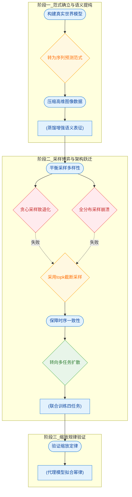
**如何读这张图：** 圆角节点代表核心科学问题，菱形节点标记关键架构决策或已验证的死胡同分支，圆柱节点记录实验验证环节。虚线箭头明确标注了被证伪的探索路径，实线箭头展示最终收敛的技术栈演进顺序。

### 范式确立：将世界建模转化为无监督序列预测
**结论：** 放弃直接像素预测与潜空间建模，将视频、文本与动作统一映射为离散Token序列，是兼顾计算可行性与动态表示能力的唯一解。
早期自动驾驶生成模型面临两难：基于GAN的方案训练极不稳定且模式崩溃频发；基于VAE的潜空间建模虽能压缩维度，但输出往往模糊且先验设计困难；而直接进行像素级序列预测则因序列过长导致计算完全不可行。研究团队最终选择将世界建模转化为无监督的 `next-token prediction` 问题。通过因果掩码自回归Transformer预测下一个图像Token，该范式不仅天然兼容多模态条件控制，更将高维连续信号降维至可组合的离散空间，为后续引入大语言模型级别的缩放规律铺平道路。

### 语义提纯：知识蒸馏破解离散Token表征贫乏
**结论：** 在图像Tokenizer中引入视觉大模型蒸馏损失，能显著缓解高频噪声主导问题，使离散Token真正承载物理语义。
将高维图像压缩为离散Token时，若仅依赖重建损失，高频纹理噪声极易主导优化过程，导致Token缺乏高层语义区分度。为此，团队在训练图像Tokenizer时加入了DINO余弦相似度蒸馏损失（权重设为 $\lambda_{DINO}=0.1$）。PCA可视化结果明确显示，引入蒸馏后，代表车辆、道路、天空等同语义类别的Token嵌入在特征空间中聚集得更加紧密，语义边界显著优于纯Base VQ-GAN Token。这一步确保了世界模型输入的“可理解性”，而非仅仅是像素的压缩编码。

### 采样博弈：在确定性退化与长尾崩溃间寻找平衡
**结论：** 自回归视频生成必须摒弃极端采样策略，采用截断式Top-K采样才能同时维持生成多样性与分布内稳定性。
推理阶段的Token采样策略直接决定了生成视频的命运。团队在此经历了两次典型的死胡同（Dead End）：
1. **Argmax贪心采样**：假设始终选择概率最高的Token可保证质量。实际测试中，该策略导致Token困惑度（Perplexity）极低，生成帧陷入无限重复循环，呈现出与早期语言模型完全一致的文本退化现象。
2. **全分布无截断随机采样**：假设完整采样可最大化多样性。结果却是长尾低概率Token被频繁触发，引发严重的分布外（OOD）崩溃，Perplexity出现极高峰值，视频内容迅速偏离物理规律。
基于上述负结果，团队最终锁定 **Top-K=50** 策略：仅从概率最高的50个Token中均匀采样。实验表明，该策略产生的Perplexity分布与真实图像Token最为接近，成功在“多样性”与“真实性”之间划定了安全边界。

### 架构跃迁：多任务3D扩散解码重塑时序一致性
**结论：** 从独立逐帧解码转向多任务联合训练的3D扩散架构，是解决跨帧信息断裂并实现时间超分辨率的关键转折（Pivot）。
世界模型以 6.25Hz 频率生成离散Token，若采用独立逐帧解码，扩散过程无法交换跨帧信息，必然导致视频时序闪烁与不一致。团队果断放弃逐帧方案，转向采用3D U-Net配合分解式时空注意力层，在扩散过程中显式建模时间维度。更重要的是，该解码器被设计为单模型联合训练四项任务：图像生成（保障单帧质量）、视频生成（强化时序一致性）、自回归解码与视频插帧（提供时序上采样能力）。多任务联合训练不仅未引发任务冲突，反而相互增益，使各子任务性能同步提升。在推理阶段，团队还发现采用逆序自回归解码（从序列末尾向前）能进一步抑制地平线区域的闪烁伪影。

### 规律验证：小规模代理模型精准预言大模型性能
**结论：** 自动驾驶世界模型严格遵循类LLM的幂律缩放规律，利用极小计算预算即可可靠外推大规模模型性能。
将世界建模转化为序列预测后，一个核心疑问浮现：该领域是否存在类似大语言模型的缩放定律？团队并未盲目堆砌算力，而是构建了参数量从 0.65M 至 650M 的代理模型序列（相当于最终 GAIA-1 6.5B 模型的 10,000 倍至 10 倍缩小版）。通过拟合形如 $f(x)=c+(x/a)^b$ 的幂律曲线，代理模型以不足 20 倍的计算量，精准预测了 GAIA-1 在验证集上的最终交叉熵。这一结果不仅证实了自动驾驶世界模型同样受幂律支配，更明确了通过扩大数据与计算资源仍能获得确定性性能提升的优化方向。

<details><summary><strong>缩放定律拟合细节与代理实验配置</strong></summary>
代理模型验证严格遵循控制变量原则。拟合函数采用标准幂律形式 $f(x)=c+(x/a)^b$，其中 $x$ 代表计算量/参数量规模，$f(x)$ 为验证集交叉熵损失。实验覆盖 0.65M、6.5M、65M、650M 四个量级，数据点严格落在拟合曲线上，残差极小。该配置证明：在离散Token自回归范式下，世界模型的损失下降轨迹与LLM高度同构，无需依赖特定领域的启发式调参即可实现性能外推。
</details>

## 工程与复现要点

**结论前置：** 复现该系统的核心门槛并非单一模块的参数量级，而是“三阶段解耦训练”的算力调度、序列长度对齐与条件混合策略的精确协同。成功跑通流水线高度依赖 `DeepSpeed ZeRO-2` 与 `FlashAttention v2` 突破显存墙，且目前官方未公开代码库，复现需从零搭建数据流与训练循环。

### 模型规模与架构拆解
系统由三个可训练组件串联而成，参数量呈阶梯分布，各自承担明确的职责边界：
- **图像 Tokenizer (0.3B)**：全卷积 2D U-Net 离散自编码器。输入固定为 `288×512`（9/16 宽高比），经空间下采样因子 `D=16` 压缩后，每帧生成 `n=576` 个离散 token。词表大小 `K=8192` 在序列长度与语义容量间取得平衡。
- **世界模型 (6.5B)**：因果掩码自回归 Transformer，是系统的“大脑”。所有模态共享嵌入维度 `d=4096`。训练序列固定为 `T=26` 帧（6.25 Hz 降采样，约 4 秒），每步拼接 `m=32` 个文本 token 与 `l=2` 个动作 token（速度+曲率），单样本总序列长度达 `15860`。
- **视频解码器 (2.6B)**：3D U-Net 扩散解码器，内置分解式时空注意力。训练窗口 `T'=7` 帧，负责将世界模型输出的离散 token 序列上采样回 `25 Hz` 连续视频。

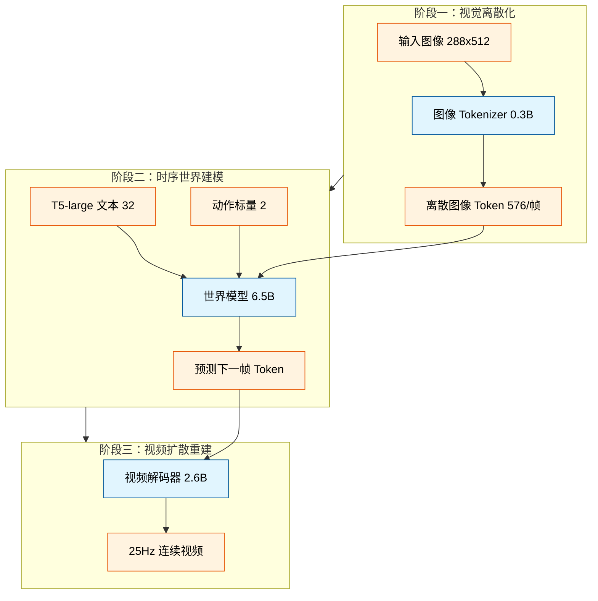
*如何读这张图：* 数据流严格单向。Tokenizer 将高维像素压缩为离散符号；世界模型在共享的 `d=4096` 空间内自回归预测符号序列；解码器最后将符号“翻译”回像素。三阶段解耦避免了端到端训练的梯度冲突，但也要求复现时必须保证各阶段输入输出的维度与分布严格对齐。

### 训练超参矩阵与调优逻辑
三个组件的优化器配置与调度策略差异显著，直接反映了各自的任务特性。下表提炼了复现时必须锁定的核心超参：

| 组件 | 初始学习率 | 总训练步数 | 批大小 | 权重衰减 |
|---|---:|---:|---:|---:|
| 图像 Tokenizer | 1×10⁻⁴ | 200k | 160 | 0.01 |
| 世界模型 | 1×10⁻⁴ | 100k | 128 | 0.1 |
| 视频解码器 | 5×10⁻⁵ | 300k | 64 | 0.01 |

**调优直觉与关键机制：**
- **学习率调度**：Tokenizer 采用 `5k` 步线性预热后接余弦衰减至 `1×10⁻⁵`；世界模型预热仅 `2.5k` 步，随后 `97.5k` 步余弦衰减使学习率降低 10 倍；视频解码器同样 `2.5k` 预热，最终衰减至 `1×10⁻⁶`。预热步数较短说明模型对初始梯度方向较敏感，需快速进入稳定优化区。
- **条件混合比例**：世界模型训练时，无条件/动作/文本的采样比例严格锁定为 `20% / 40% / 40%`。这一比例直接决定了模型在推理时能否灵活切换“自由生成”、“指令跟随”与“轨迹控制”模式。偏离该比例会导致条件控制能力退化或无条件生成质量下降。
- **数据均衡采样**：采用指数 `0.5` 的采样权重（介于经验分布与均匀分布之间），有效缓解了长尾场景数据主导训练的问题。

<details><summary><strong>展开：损失权重配置与推理期扩散策略</strong></summary>
<p><strong>图像 Tokenizer 损失权重：</strong> $$\lambda_{L1}=0.2$$, $$\lambda_{L2}=2.0$$, $$\lambda_{perceptual}=0.1$$, $$\lambda_{GAN}=1.0$$, $$\lambda_{codebook}=1.0$$, $$\lambda_{DINO}=0.1$$。L2 权重显著高于 L1，说明模型更关注像素级平滑重建；DINO 蒸馏权重较低，仅用于引导语义对齐而非主导梯度。</p>
<p><strong>视频解码器损失权重：</strong> $$\lambda_{L1}=0.1$$, $$\lambda_{L2}=1.0$$。扩散目标采用 v-parameterization 与余弦 $$\beta$$ 噪声调度，EMA 衰减率设为 $$0.999$$ 以稳定生成分布。</p>
<p><strong>推理期混合解码：</strong> 每个扩散步以 $$p=0.25$$ 的概率随机应用加权平均策略，权重 $$w=0.5$$ 融合单帧图像解码与序列联合解码。该设计是平衡“单帧保真度”与“跨帧时序一致性”的工程妥协，复现时若关闭此策略，视频易出现闪烁或动作断裂。</p>
</details>

### 运行环境与工程依赖
复现该流水线需严格对齐底层框架与加速库，否则极易遭遇 OOM 或训练发散：
- **分布式与显存优化**：全量依赖 `DeepSpeed ZeRO-2` 进行参数分片，配合 `activation checkpointing` 降低激活值显存占用。世界模型注意力计算强制使用 `FlashAttention v2`，这是支撑 `15860` 长序列训练不崩溃的前提。
- **优化器与正则化**：统一使用 `AdamW`，但 Beta 系数按任务分化：Tokenizer 采用 `(0.5, 0.9)`（GAN 训练惯例，降低 beta1 减少震荡）；世界模型采用 `(0.9, 0.95)`（LLM 惯例，较低 beta2 加速适应梯度变化）；视频解码器采用 `(0.9, 0.99)`。梯度范数裁剪阈值统一为 `1.0`。
- **冻结组件**：文本编码器固定为 `T5-large`，语义蒸馏依赖预训练 `DINO` 模型。复现时需确保这两部分权重正确加载且 `requires_grad=False`，避免污染主任务梯度。
- **随机种子**：论文未明确报告随机种子，复现时建议固定全局种子以保证实验可重复性，但需注意扩散模型固有的随机性仍会导致生成结果存在方差。

### 开源状态与复现路径
**当前无公开代码库。** 经检索论文正文及 Papers-with-Code 官方索引，未发现通过验证的开源仓库。这意味着复现工作属于“白盒重建”而非“微调部署”。
**建议复现路径：**
1. **数据流先行**：优先实现 `288×512` 图像到 `576` 离散 token 的编解码管线，验证 `D=16` 下采样与 `K=8192` 词表的量化误差。
2. **序列对齐**：严格构造 `T=26` 帧、`6.25 Hz` 的时序样本，确保文本 `32`、动作 `2`、图像 `576` 的拼接顺序与位置嵌入维度 `d=4096` 完全匹配。
3. **分阶段训练**：切勿尝试端到端联合训练。按 Tokenizer → 世界模型 → 视频解码器的顺序冻结上游、训练下游，并在每阶段结束后保存 checkpoint 进行消融验证。
4. **算力预估**：完整训练需累计约 `34` 天（Tokenizer 4天 + 世界模型 15天 + 视频解码器 15天）的 `A100 80GB` 集群时间。若算力受限，可优先复现 `0.65M` 至 `650M` 的缩放实验代理模型，验证架构可行性后再放大至 `6.5B`。

## 局限与适用边界

**本节结论：该世界模型目前仍处于“高保真离线仿真与算法验证”阶段，而非可直接部署的实时驾驶决策引擎。** 其核心瓶颈在于自回归生成的固有延迟、单一地理数据带来的分布外泛化风险，以及缺乏定量评估标准。若你的场景需要低延迟闭环控制、跨城市/国家泛化或多视角环视感知，当前架构暂不适用；但若用于离线场景生成、文本条件对齐研究或作为未来更大规模世界模型的基座，它提供了明确的扩展路径。

**推理延迟与实时性瓶颈**：模型采用自回归生成范式，逐块预测下一状态。这种机制在数学上保证了序列的连贯性，但计算图无法并行展开，导致推理速度远低于实时要求（直觉：像逐字朗读而非整段播报）。因此，它目前无法直接接入需要毫秒级响应的在线控制回路，仅适合离线回放或预演。

**数据地理偏差与泛化边界**：训练数据完全来源于英国伦敦城市驾驶场景，累计 4,700 小时。这一单一数据源构成了明确的适用边界：模型对伦敦特有的道路拓扑、交通标志与驾驶习惯拟合良好，但论文并未提供跨城市或跨国家的迁移实验。将模型直接应用于北美或亚洲城市时，分布偏移可能导致场景理解失效。

**上下文窗口与长程一致性衰减**：世界模型的上下文窗口被硬性限制为 $T=26$ 帧（约 4 秒）。生成更长视频必须依赖滑动窗口机制。滑动窗口在拼接处缺乏全局记忆，随着时间推移，累积误差会逐渐破坏场景的长程一致性（如远处建筑形变、车道线漂移）。

**评估缺失与架构解耦代价**：图像 tokenizer 的解码器仅在单帧上训练，直接用于视频解码会导致严重的时序抖动。论文通过引入独立训练的视频扩散解码器来弥补这一缺陷，但这属于“打补丁”式的架构解耦，增加了系统复杂度。此外，论文未报告 FVD 等标准量化指标，也未提供消融实验或误差范围，所有结果均基于定性示例。这意味着我们无法客观衡量其生成质量在同类模型中的确切排位，需警惕“挑樱桃式”展示最佳片段的风险。

**感知视角限制与未饱和的扩展律**：系统仅依赖单一前向摄像头，缺乏多视角环视感知，无法覆盖盲区或侧后方交互场景。不过，扩展律实验表明当前模型规模尚未触及性能天花板，这意味着上述局限并非理论死胡同，而是算力与数据规模尚未充分释放的阶段性特征。

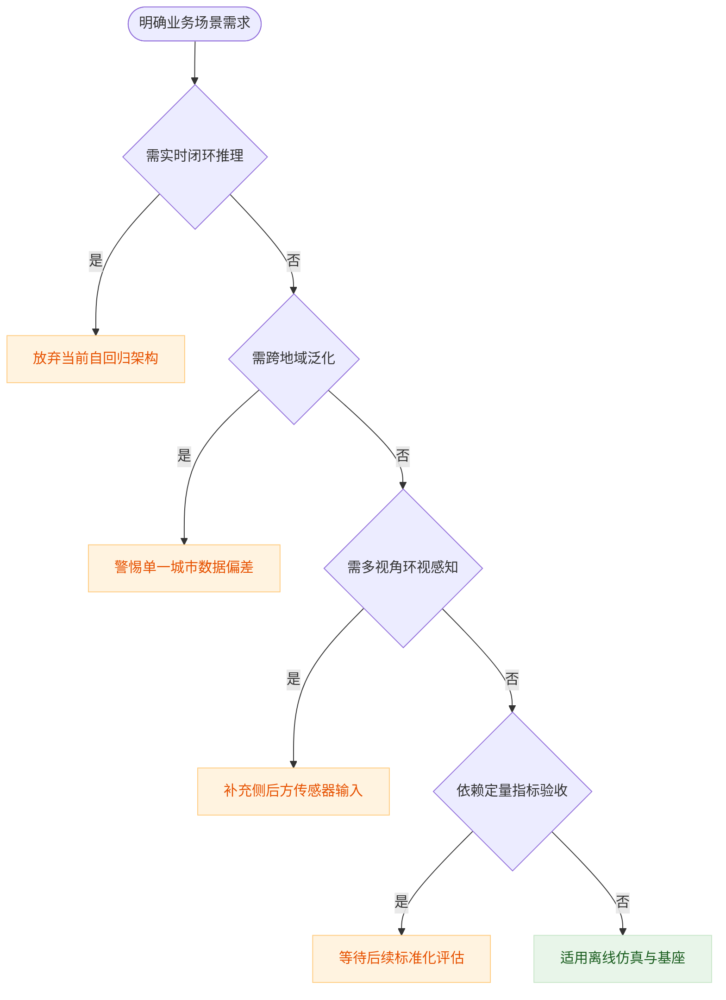
**如何读这张图**：该流程图以业务需求为起点，沿判定菱形逐层过滤。若任一环节触发“是”分支，即落入当前架构的失效区（橙色节点），需调整预期或补充外部模块；仅当全部判定为“否”时，方可安全接入该模型（绿色节点）。

<details><summary><strong>架构解耦与滑动窗口的技术代价</strong></summary>
图像 tokenizer 的解码器仅在单帧上训练，缺乏对时间维度的先验建模。若强行将其用于视频流解码，帧间特征会因缺乏时序约束而产生高频抖动。论文选择引入独立训练的视频扩散解码器作为“时序稳定器”，这种解耦设计虽然缓解了视觉伪影，但也切断了端到端的梯度流，使得图像特征与视频生成模块的联合优化变得困难。同时，固定 $T=26$ 帧的上下文窗口意味着模型每次只能“看见”约 4 秒的驾驶片段。在长视频生成中，滑动窗口虽能延续序列，但窗口重叠区的特征对齐缺乏全局一致性约束，导致长程依赖（如交通灯状态切换、车辆轨迹预测）随步数增加而指数级衰减。
</details>

## 趋势定位与展望

**结论：** GAIA-1 的核心定位在于“用语言模型的序列建模范式重构自动驾驶世界模型”。它通过离散词元化与自回归预测，在结构化动态推理与高保真视觉生成之间架起桥梁，证明了世界模型同样遵循缩放定律，并为自动驾驶神经模拟器与可控生成指明了可量化的演进路径。

### 范式转移：从“隐变量拟合”到“词元序列预测”
传统自动驾驶世界模型多依赖低维连续隐变量，难以生成高保真预测帧；而纯视频生成模型虽视觉逼真，却缺乏对自车动作与场景因果的结构化理解。GAIA-1 的破局点在于将连续视频帧、文本指令与动作标量（速度与曲率，维度 $l=2$）统一映射为离散词元序列，将世界动态建模转化为无监督的下一词元预测任务。这一设计直接继承了大语言模型的架构红利：以 6.5B 参数规模的自回归 Transformer 负责高层语义与时序动态推理，视频扩散解码器则专职将隐词元还原为像素。两者解耦，既保留了世界模型的结构化推理能力，又继承了扩散模型的高保真生成特性。

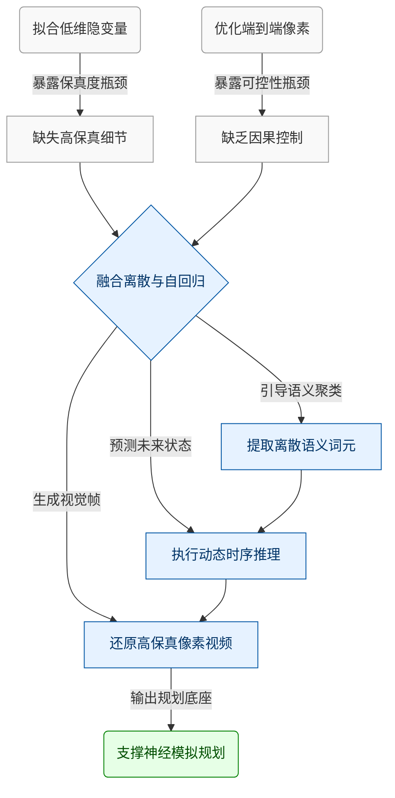
**如何读这张图：** 左侧两条路径分别暴露了传统世界模型与纯视频生成模型的固有缺陷；GAIA-1 通过“离散化-自回归-扩散解码”的三段式架构居中融合，将视觉保真度与动态可控性解耦，最终指向自动驾驶神经模拟器与闭环规划。

### 缩放定律：算力分配的“经验指南”与相关性边界
论文声称，GAIA-1 的验证交叉熵与模型规模/计算量之间遵循幂律关系，这与 Kaplan 等人在语言模型中观察到的规律一致。作者指出，利用该规律，仅需不超过 $1/20$ 的计算量训练小模型，即可准确预测最终大模型的性能。这一发现的意义在于为自动驾驶世界模型的算力预算提供了可量化的外推依据，避免了盲目堆砌参数。

然而，必须严谨区分“经验拟合”与“因果证明”。缩放定律本质上是数据分布与模型容量在特定训练 regime 下的统计相关性，而非严格的物理定律。论文未详细报告不同数据配比下的消融实验或误差范围，也未验证在极端长尾场景（如罕见天气、复杂交互）下该幂律是否依然稳健。若训练数据分布发生偏移，或模型架构引入非标准组件（如稀疏注意力、混合专家），外推预测可能出现偏差。

<details><summary><strong>缩放定律拟合细节与适用边界</strong></summary>
论文采用计算量估算公式 $C = 6N \times \text{训练词元数}$ 进行幂律拟合。该公式源自语言模型经验，假设计算量与参数量 $N$ 和序列长度呈线性关系。在视觉序列建模中，由于 VQ 词元空间大小、扩散解码器的迭代步数以及多模态条件注入方式均会改变有效计算图，该公式的适用性依赖于“自回归 Transformer 主导计算瓶颈”这一前提。若未来转向以扩散模型为主干或引入更复杂的条件控制机制，缩放曲线的拐点与指数可能发生变化。
</details>

### 涌现能力与待验证局限：从“拟合历史”到“推演未来”
在大规模真实伦敦驾驶数据上无监督训练后，GAIA-1 展现出多项涌现能力：包括对高层场景结构、交通规则的理解，对 3D 几何与因果交互的隐式建模，以及外推至训练数据中未曾出现的驾驶行为（如超出道路边界行驶）。这些能力表明，离散词元空间确实捕获了驾驶场景的语义先验。

但需客观指出其失效模式与局限：
1. **文本条件依赖启发式引导**：由于训练文本标注质量有限，推理时依赖分类器无关引导（Classifier-Free Guidance）在条件与无条件 logits 间进行线性外推。该策略虽能改善文本-图像对齐，但引导因子需动态调度以平衡多样性与保真度，缺乏严格的理论最优解。
2. **外推能力的分布外风险**：模型能生成“超出道路边界”的视频，更多是词元序列在概率空间中的合理插值，而非真正掌握了车辆动力学与物理碰撞约束。在安全攸关的自动驾驶规划中，此类“创造性”生成若未经闭环验证，可能引入不可控的幻觉。
3. **消融与负结果透明度**：论文未系统报告不同 VQ 码本大小、DINO 蒸馏权重或扩散解码器步数对最终交叉熵与生成质量的消融对比，也未提供生成视频的时序一致性误差范围。这限制了社区对架构各组件贡献度的精确评估。

### 未来方向：走向闭环控制与安全可验证
基于 GAIA-1 的范式，该路线的下一步演进将聚焦于三个维度：
- **多模态对齐深化**：从静态文本/动作条件转向实时传感器流（LiDAR、雷达）与车辆动力学模型的联合词元化，提升世界模型对物理约束的硬编码能力。
- **闭环神经模拟器**：将自回归预测与强化学习策略网络耦合，构建“生成-评估-修正”的在线训练环境，使世界模型从“离线视频生成器”升级为支持策略迭代的数字孪生底座。
- **安全边界量化**：引入形式化验证或不确定性估计模块，对生成轨迹的分布外概率进行显式标定，确保外推行为在安全包络线内，避免“高保真幻觉”误导下游规划器。
