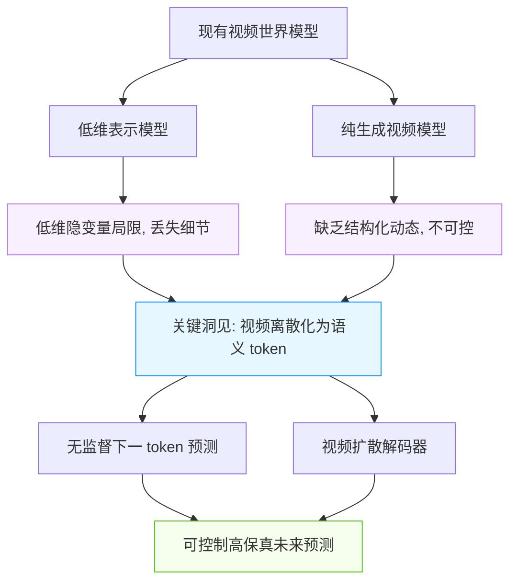
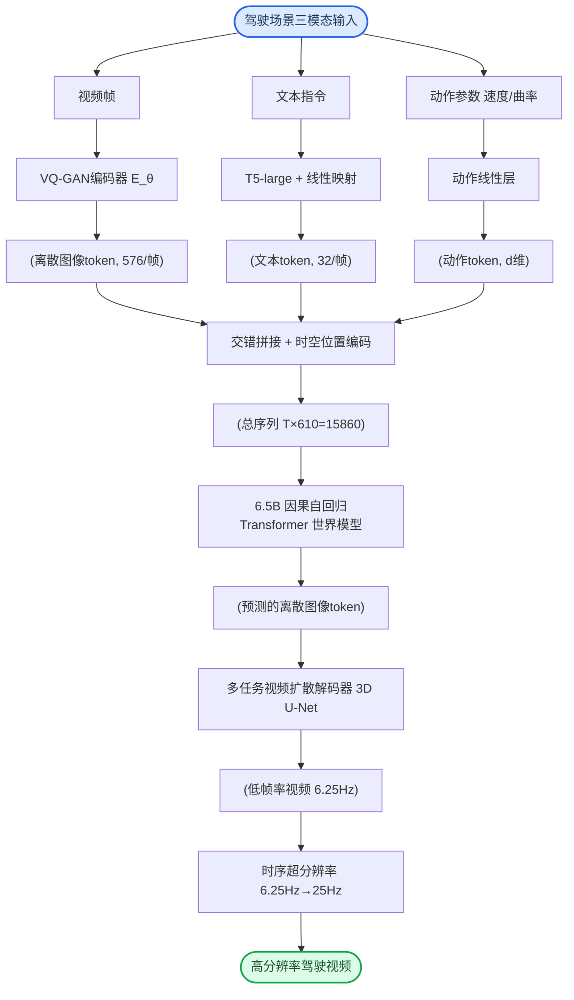
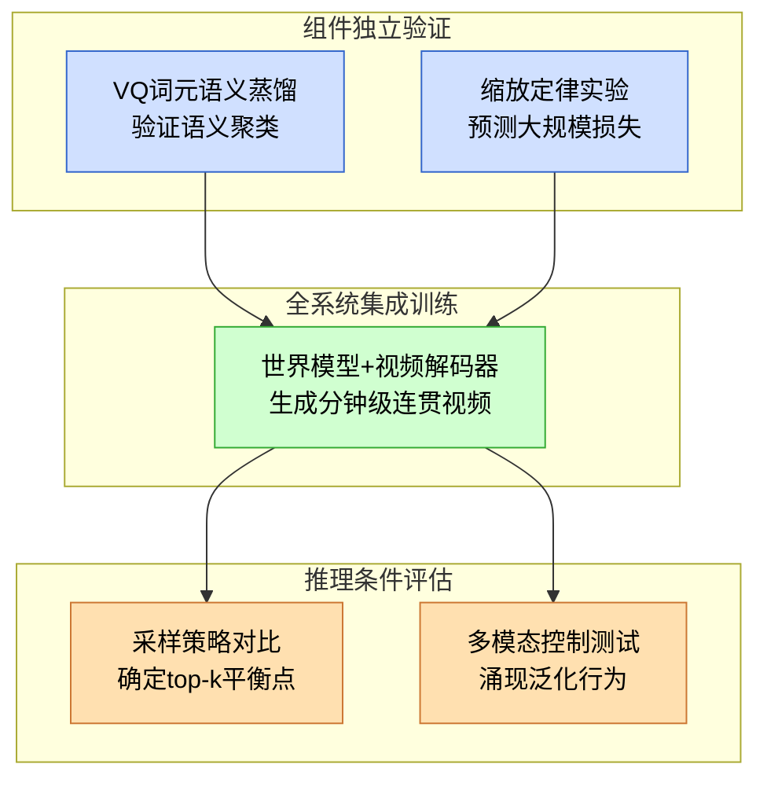
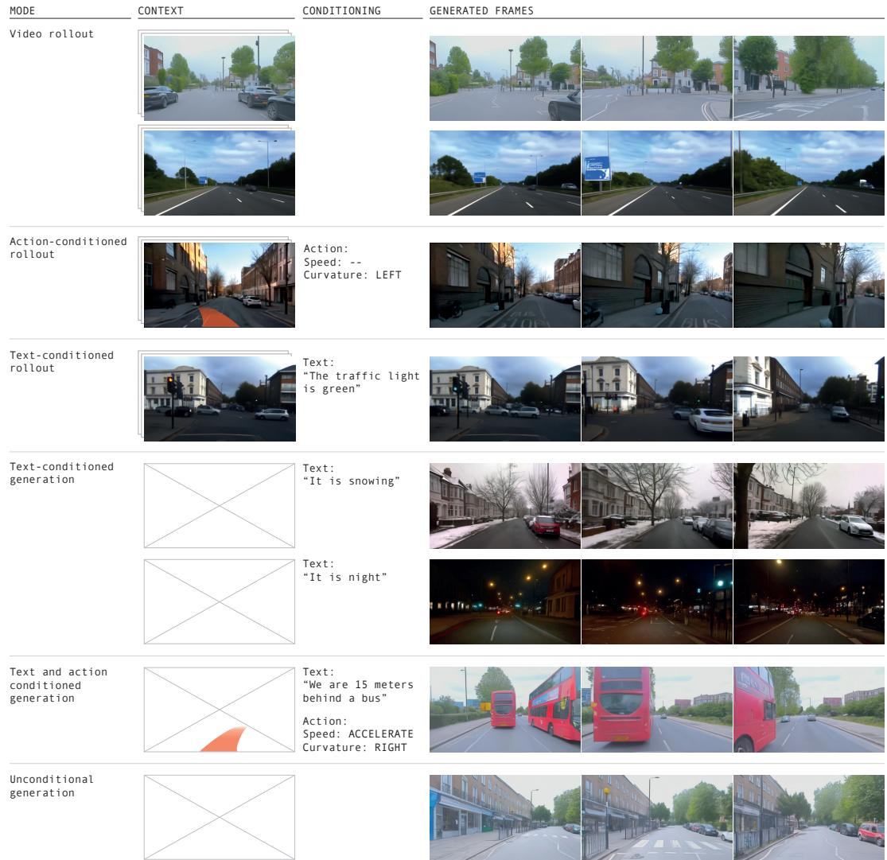
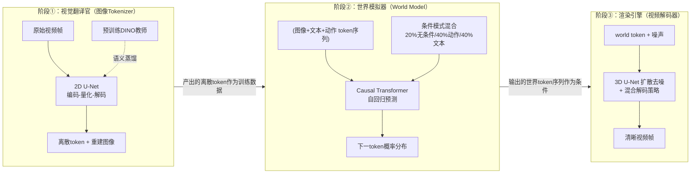

# GAIA-1: A Generative World Model for Autonomous Driving — 深度解读

> 面向人类读者的深度解读(中文)。事实源与配对的 AI 知识包 `ai_package/2026-06-08_GAIA1_2309.17080/ara/` 同源,均已通过数据保真审计。

## 核心结论

> 每条结论后的隐形锚点把数字回链到论文原文(忠实性保证)。

1. GAIA-1将世界建模定义为无监督下一词元预测问题，通过将视频帧、文本和动作编码为离散词元序列，利用自回归Transformer预测未来图像词元，实现对自车行为和场景特征具备精细控制能力的真实驾驶视频生成。<!--ref:r-gaia-1-a-generative-wo--><!--anchor:quote:GAIA%2D1%3A%20A%20Generative%20World%20Model%20for%20Autonomous%20Driving-->
2. 与大型语言模型中观察到的缩放规律类似，GAIA-1世界模型的验证交叉熵与模型规模/计算量之间遵循幂律关系，可用不超过1/20计算量的小模型准确预测最终性能。<!--ref:r-gaia-1-a-generative-wo--><!--anchor:quote:GAIA%2D1%3A%20A%20Generative%20World%20Model%20for%20Autonomous%20Driving--><!--ref:r-gaia-1-a-generative-wo--><!--anchor:quote:GAIA%2D1%3A%20A%20Generative%20World%20Model%20for%20Autonomous%20Driving--><!--ref:r-for-the-world-model-we--><!--anchor:quote:For%20the%20world%20model%2C%20we%20use%20vector%2Dquantized%20representations%20of%20video%20frames%20to%20discretize%20each%20frame%2C%20transforming%20them%20into%20a%20sequence-->
3. GAIA-1在大规模真实驾驶数据上通过自监督训练后，涌现出包括高层结构与场景动态理解、泛化与创造性、上下文感知与3D几何理解在内的多项能力，并能外推至训练数据中未曾出现的驾驶行为（如超出道路边界行驶）。<!--ref:r-gaia-1-a-generative-wo--><!--anchor:quote:GAIA%2D1%3A%20A%20Generative%20World%20Model%20for%20Autonomous%20Driving--><!--ref:r-predicting-future-even--><!--anchor:quote:Predicting%20future%20events%20is%20a%20fundamental%20and%20critical%20aspect%20of%20autonomous%20systems.%20Accurate%20future%20prediction%20enables%20autonomous%20vehicles%20to%20anticipate-->
4. 在图像自编码器训练中加入DINO余弦相似度蒸馏损失，可引导离散词元学习语义化表征（同类物体具有相似嵌入），相较于纯基于VQ-GAN重建的词元表现出更强的语义聚类性质。
5. 在世界模型自回归推理中，top-k=50采样策略生成的词元困惑度分布与真实图像词元相近，优于argmax（困惑度过低、生成陷入重复循环）和全分布采样（采样到概率尾部导致出分布问题）。<!--ref:r-images-6d9874e8ecadd6--><!--anchor:quote:%21%5B%5D%28images%2F6d9874e8ecadd6cf6fa229218487d3f06a4db0cfcb6500a54e4520a781c6a4db.jpg%29-->

## 一句话总结与导读

**TL;DR：GAIA-1 是一种面向自动驾驶的生成式世界模型，它把驾驶视频、车辆动作和文字描述统一转换成离散的“视觉词元”，通过自回归预测下一个词元来学习世界动态，并能生成高保真、可控制的未来驾驶场景。**

自动驾驶面临一个根本性的预测难题：在车流穿梭的十字路口，自车的每一个转向或加减速行为，都会引发周围世界一连串的连锁反应——旁车是否会让行？行人会不会突然闯入？要做出安全决策，系统必须能在脑海中“推演”出尚未发生的未来。然而，过去的两类主流方法始终存在一道鸿沟：一侧是结构化世界模型，它们擅长推理物理动态和因果关系，却往往受困于标注数据难以规模化、输出抽象难以直接渲染成逼真图像；另一侧是面向视觉效果的生成视频模型，它们能画出真假难辨的街景，却缺乏对“如果我此刻向左变道，三秒后会发生什么”这类因果假设的推理能力。GAIA-1 试图填平这道鸿沟——它完全不需要人工标注，仅通过观看海量的伦敦城市驾驶视频，就学会了在自车动作和文本描述（例如“大雨天、傍晚高峰”）的条件下，推演出视觉逼真且符合物理规律的未来驾驶影像。这相当于为自动驾驶系统打造了一个低成本、高保真的神经模拟器，可用于大规模测试决策规划、扩展稀有危险场景，而无需每次都动用真实车辆。

GAIA-1 背后的核心思想异常简洁：把世界的状态转移变成“预测下一个词”的语言建模问题（直觉类比，非严格对应）。就像大型语言模型通过学习海量文本中词与词的共现规律来理解语言的逻辑，GAIA-1 首先利用一种基于 DINO 语义蒸馏的 VQ 图像编码器，将每一帧驾驶画面压缩成一组离散的视觉词元（token），同时将自车的速度、曲率等动作信号以及文字描述也映射为离散 token。这些不同来源的 token 先首尾拼接成一维序列，之后由一个 65 亿参数的自回归 Transformer 负责“续写”未来的视觉词元——它必须根据过去的视觉上下文、自车正在执行的操作以及整体环境描述，推断出画面中其他车辆、行人和路面元素应该如何移动、变形或交互。由于所有的推演都发生在离散 token 空间，这种方法直接继承了大语言模型已被验证的规模化扩展优势：论文证实，GAIA-1 的验证交叉熵随模型规模与计算量遵循平滑的幂律缩放关系，使得我们可以用远小于完整计算量的“探路模型”来准确预测最终大模型的性能。更巧妙的是，预测出的语义 token 虽然高效捕获了场景结构，但还缺少最终视频所需的丰富纹理和细节。为此，GAIA-1 在最后阶段接入了视频扩散解码器——它像一位细腻的画师，根据语义 token 序列逐步补全每一盏车灯的反射、每一片水洼的倒影，完成从抽象逻辑到高保真像素的飞跃。

正是这种“推理+渲染”的双组件架构，让 GAIA-1 在纯粹的自监督训练后，涌现出了多层次的场景理解能力。它不仅能捕捉车辆与行人的三维几何关系和遮挡次序，还能根据上下文做出合理推断：前方车辆刹车灯亮起时自然减速，交通灯变绿后平稳起步。更引人注目的是，当被命令执行训练数据中极少出现的激烈驾驶行为（例如冲出道路边界）时，模型并没有崩坏或生硬复制训练片段，而是仍然生成了物理上连贯、视觉上可信的视频——这暗示着它学到的不是表面的像素统计，而是更深层的几何与因果约束。这些涌现特性让 GAIA-1 更像一个通过观测自主学得的微型世界引擎，为自动驾驶的感知—规划—决策闭环提供了一个前所未有的试验场。

**论文总体架构(原图):**

*GAIA-1的整体架构将多模态输入（图像、文本、动作）编码为统一标记序列，通过自回归Transformer构建世界模型，以预测下一图像标记，并由视频解码器生成最终帧。*

## 问题背景与动机

自动驾驶系统要安全地规划与决策，必须能够精准预判自身行为在未来可能引发的各种结果。这需要一种“世界模型”——它不仅能捕捉驾驶环境的动态演化规律，还能在给定自车动作（如转向、加速）或文本指令的条件下，生成多种可信的未来画面（O1）。然而，当前构建这类世界模型的两类主流路线各自深陷“保真度”与“可控推理”难以兼得的困境：以低维隐变量为核心的世界模型缺乏生成高保真视觉细节的能力，而以像素生成为目标的视频模型又未能学到结构化的世界动态表示。本文的核心洞见在于，将视频帧离散化为语义 VQ token，把世界建模转化为无监督的下一 token 预测任务，并借助视频扩散解码器还原高保真像素，从而在单一框架中同时继承语言模型的规模化规律与生成模型的视觉真实感。

这两类路线的局限根源于它们对驾驶场景的观测与建模方式。传统自动驾驶世界模型多依赖于标注数据和低维表示，试图在紧凑的状态空间中捕捉动态演化（O2）。但低维隐变量的表达能力有限，面对真实道路中复杂的光照、纹理、多智能体交互等丰富信息时，其预测帧往往丢失大量细节，难以支撑下游的精细感知或仿真应用（G1）。另一方面，随着生成模型的发展，纯粹的视频生成模型能够产出生动逼真的驾驶片段，给人“眼见为实”的错觉；但它们优化的目标是视觉真实感，而非对未来事件的结构化推理，因此无法在自车动作或文本条件下做出可解释的因果预测——画面虽美，却缺少对“如果我左转会怎样”这类假设问询的回答能力（O3, G2）。

**如何读这张图**：从现有两种模型出发，左侧分支因低维隐变量表达力不足而丢失细节，右侧分支虽有视觉真实感却缺乏结构化可控推理；中心的语义 token 化思路将两者缺点转化为互补优势，通过下一 token 预测实现世界动态建模，再通过扩散解码器恢复高保真像素，最终得到可控且逼真的未来预测。

面对上述鸿沟，论文提出一种关键转向：将连续的驾驶视频转换为离散的语义 token 序列。这些 token 通过 DINO 蒸馏引导的 VQ 图像编码器获得，能够捕获帧中足够的语义信息，使得世界模型的时序推理可以被看作一个大规模无监督下一 token 预测问题——这正是自然语言领域大模型得以成功的技术范式。引入动作条件（仅使用速度与曲率两个标量）和文本条件后，模型便能以多模态控制的方式生成多样化且物理合理的未来画面。最后，通过一个视频扩散解码器将推理出的 token 序列还原为高保真像素，既保留了结构化世界动态的预测能力，又满足了自动驾驶应用对视觉真实感的要求。

这一设计的关键优势在于：它不再将动态推理与像素生成看作彼此割裂的任务，而是通过离散 token 这一共享接口，将两者的能力统一起来。后续的实验也初步验证，从语言建模中继承的规模化规律（scaling laws）确实可以迁移至视频驾驶世界建模任务，为这一框架的未来扩展提供了重要支撑。

## 核心概念速览

在深入方法细节之前，我们先逐一理解构成这篇论文的九个核心概念。它们环环相扣，将一个复杂的驾驶视频生成任务分解为可工程化实现的模块。如果拿一套电影制片工序来类比：有剧本、有分镜、有压缩编码、有后期渲染，还有智能导演的调控——下面的每个概念就对应其中一环。

### 生成式世界模型：驾驶场景的未来模拟器
这个模型的目标很简单：给定过去一段时间的交通画面和车辆动作，预测接下来会发生什么。论文将它转化为一个无监督序列建模问题——输入一段包含了文本指令、图像帧和动作命令的序列，模型要自回归地预测下一个图像令牌。**本质上，它在没有明确物理规则的情况下，从海量城市驾驶数据中隐式学会了“世界如何运转”的规律**，并可以生成符合这种规律的未来视频。如果把它拟人化，就像一个经验丰富的司机，瞄一眼前车刹车灯，脑海里瞬间就能“脑补”出前车减速、自己需跟刹的几个画面——只是这个司机是用离散令牌在想象。

### 向量量化图像标记化：把图像“翻译”成有限词汇
自回归模型擅长处理离散符号（比如文本单词），但驾驶画面是连续的高维像素。VQ 图像标记化就是解决这道鸿沟的桥梁：它训练一个自编码器，把每帧 $288 \times 512$ 的画面压缩成 $18 \times 32$ 共 $576$ 个离散令牌，每个令牌来自一个容量为 $8192$ 的码本。**这个过程的直观比喻是，把一幅写实油画变成一幅由 576 格彩色马赛克拼成的作品，每一格只能从 8192 种标准色块里选**。虽然会丢失部分高频细节，但画面的语义骨架被完整保留，从而让后续的 Transformer 能够像读句子一样处理图像。

### DINO 语义蒸馏：让令牌变得“有脑”
直接压缩像素得到的离散令牌往往对颜色、纹理等低级特征过于敏感，而对“这是什么物体”的语义信息捕捉不足。论文在训练标记化器时引入了一个“教师”：预训练的 DINO 自监督视觉模型。通过让量化后的特征与该教师提取的语义特征尽可能相似（蒸馏损失权重 $\lambda=0.1$），**模型学会了优先保留物体的形状、类别等高层语义**，而不是无差别地复刻纹理。这就像一位美术老师不断提醒临摹的学生：“别盯着头发丝画，先抓住人物的动态和轮廓。”最终得到的图像令牌天生就更“理解”画面内容，为世界模型的高质量预测打下基础。

### 自回归下一令牌预测：用“接龙”学会世界动态
有了离散的图像令牌，世界模型的训练就变成了一个经典的大语言模型考题：给定已有的所有令牌，猜下一个图像令牌是什么。论文采用带因果掩码的自回归 Transformer，每次只预测序列中的图像令牌部分，并使用交叉熵损失优化。**直观来说，这就像看一组连环画，把最后一格的部分内容遮住，你根据前面的格子以及当前格已露出的区域，猜测被遮住的部分该画什么**。不断重复这个游戏，模型便逐渐内化了汽车转弯、行人过街、红绿灯变化的时空规律。

### 无分类器引导：给生成过程一个“调音台”
在推理生成时，模型产出的未来画面不一定总能贴合我们给的条件（比如“晴天”“保持车道”）。无分类器引导通过巧妙的方式增强条件控制力：它同时计算“带条件”和“不带条件”两种情况下每个令牌的预测得分，然后把两者的差异放大，使最终采样更倾向于条件指定的方向。**这相当于一个音频调音台，一条轨道是“按乐谱演奏”，一条轨道是“自由即兴”，音频师通过推大前者、抑制后者，甚至反向拉低某些频段（负提示），最终混出符合要求的乐音**。在驾驶生成中，它让模型既能按指定动作行驶，又能通过负提示主动避开雨天、逆光等不想要的场景特征。

### 视频扩散解码器：从令牌“草图”渲染高清影像
单靠 VQ 解码器把令牌变回视频时，会因为独立处理每帧而出现闪烁、抖动等时序不一致问题。论文额外训练了一个视频扩散解码器，它接收世界模型生成的离散令牌作为条件，通过去噪扩散过程逐步生成多帧连贯画面，并且还能将低帧率（如 $6.25\text{Hz}$）的画面提升到 $25\text{Hz}$ 的流畅视频。**如果说自回归世界模型画出的是连环画的铅笔线稿（令牌序列），这个扩散解码器就是一整套电影后期工序——不仅给线稿上色、打光、补全细节，还在关键帧之间自动补画过渡画面，最终输出一段情节连贯、动作丝滑的高清影片**。

### Top‑k 采样：确保“接龙”不卡壳也不跑偏
自回归生成时会从预测的概率分布中挑选下一个令牌。如果贪心地总选概率最高的那个，模型极易陷入重复循环（比如车轮一直转个不停）；如果从整个分布随机采样，又可能抽到概率极小的“荒谬令牌”（比如天空突然出现一个方向盘）。Top‑k 采样就是一种折中策略：**只保留概率最高的前 $k$（论文中常设为 50）个候选令牌，然后从这个小圈子里按相对概率随机抽取**。这就像猜谜游戏里只允许从最靠谱的几个答案中选择，既避免了死脑筋地重复一个词，也防止脱口而出一个离谱的猜测。

### 世界模型缩放定律：用小模型预见大模型的潜力
如果想把模型做得更大，能否提前知道性价比？论文发现，只要训练系列不同规模的世界模型，它们的交叉熵损失与总计算量之间完美符合幂律关系（$f(x) = c + (x/a)^b$），并且通过小模型的曲线就能准确外推更大模型的性能。**这类似于生物学家发现小鼠寿命与代谢率的关系后，可以用同样的幂律公式去估算大象的寿命**——前提是二者遵循相同的生理法则。在这里，那条法则就是“把驾驶视频预测当作无监督序列建模”。缩放定律为研究者在砸入更多 GPU 前提供了科学的决策依据。

### 因式分解时空位置嵌入：给每个令牌贴“时空坐标”
Transformer 本身不具备位置感知力，而视频中的令牌不仅有空间的左右上下之分，还有时间的先后顺序。论文设计了一个精巧的方案：为每个空间位置（如文本、图像、动作令牌的不同空间坐标）学习一个可学习的空间嵌入，为每个时间步学习一个时间嵌入，然后把对应的两者相加，嵌入维度为 $d=4096$。**这就像给一部电影胶片的每一小格贴上一张便签，上面写着“第 5 秒，画面坐标 (3, 18)”，模型读到便签就知道这个令牌在故事发展到哪一刻、位于屏幕的哪一角**。这种因式分解的方式避免了直接学习（位置×时间）双重组合所带来的参数量爆炸，也让滑动窗口式地生成长视频成为可能。

---

以上九大概念彼此协同，组成了一个完整的“感知‑想象‑渲染”流水线：VQ 标记化将世界压缩为离散符号，语义蒸馏为符号注入理解，因式分解嵌入赋予时空秩序；自回归预测作为大脑学习动态，Top‑k 采样和无分类器引导确保产出既稳定又可控；最后视频扩散解码器将想象渲染为肉眼可见的未来。理解了这些零件，便握住了读懂这篇论文的钥匙。

## 方法与整体架构

Cosmos-Transfer1 的整体设计可以概括为一条“编码—预测—渲染”三阶段流水线，其核心思想是将高维视频生成问题拆解为两个子任务：一个紧凑的离散 token 空间中的自回归世界模型负责“规划未来”，一个强大的扩散解码器则专门“描绘细节”。这种分工既缓解了长视频序列建模的计算压力，又保留了高分辨率时空纹理的保真度。

**模态编码：将多源输入凝聚为统一 token 序列。**  
视频首先经过一个预训练的 2D VQ‑GAN 编码器 \(E_\theta\)，将每一帧下采样为 576 个离散图像 token（下采样因子 \(D=16\)，码本大小 \(K=8192\)）；文本指令则通过预训练 T5‑large 转换为每帧 32 个连续表示，再经线性层映射到与图像 token 相同的维度；动作条件仅含速度和曲率两个标量，各自由独立的线性层扩展到 \(d\) 维。随后，这三种 token 按照“文本—图像—动作”的顺序进行交错拼接，并叠加上可学习的因子化时空位置编码（独立的时间嵌入与空间嵌入），最终形成一个总长度为 \(T \times 610 = 15860\) 的 token 序列（\(T=26\) 帧，对应约 4 秒、6.25 Hz 的视频片段）。交错拼接的好处在于让条件信号与视觉 token 在序列中直接相邻，使自回归模型在每一个空间位置都能便捷地利用语言指令与运动信息，而不是将它们作为远端全局条件。

**世界模型：在低帧率下进行长程未来预测。**  
获得 token 序列后，一个拥有 6.5B 参数的因果自回归 Transformer 世界模型接管。该模型使用因果注意力掩码，严格保证当前 token 只能观察到过去帧的信息以及同一帧内前序 token，以此模拟真实世界的时间箭头。为了在有限计算量内覆盖足够长的上下文，论文将原生 25 Hz 视频下采样至 6.25 Hz，使世界模型能够一次生成约 4 秒的未来场景。训练目标为标准下一 token 预测的负对数似然（公式 1），同时通过对文本和动作 token 进行随机 dropout（20% 无条件、40% 动作条件、40% 文本条件的混合比例），赋予模型在推理时支持无条件生成、仅动作驱动或文本+动作联合引导的灵活性。推理阶段，世界模型采用 top‑k=50 采样并配合精心调度的分类器自由引导（token 维度线性递减，帧维度余弦衰减），在多样性与真实性间取得平衡。<!--ref:r-the-world-model-6-5b-p--><!--anchor:quote:The%20world%20model%20%286.5B%20parameters%29%20was%20trained%20on%20video%20sequences%20of%20size%20%24T%20%3D%202%206%24%20at%206.25%20Hz%2C%20which--><!--ref:r-images-ae8cb6a7510a27--><!--anchor:quote:%21%5B%5D%28images%2Fae8cb6a7510a276a2ebc164f52ae626aaa6f29afb62fcd5594472d2e25991a78.jpg%29--><!--ref:r-to-further-reduce-the--><!--anchor:quote:To%20further%20reduce%20the%20sequence%20length%20of%20our%20world%20model%20we%20temporally%20subsample%20videos%20from%2025Hz%20to%206.25Hz.%20This%20allows--><!--ref:r-predicting-future-even--><!--anchor:quote:Predicting%20future%20events%20is%20a%20fundamental%20and%20critical%20aspect%20of%20autonomous%20systems.%20Accurate%20future%20prediction%20enables%20autonomous%20vehicles%20to%20anticipate--><!--ref:r-gaia-1-a-generative-wo--><!--anchor:quote:GAIA%2D1%3A%20A%20Generative%20World%20Model%20for%20Autonomous%20Driving--><!--ref:r-for-the-world-model-we--><!--anchor:quote:For%20the%20world%20model%2C%20we%20use%20vector%2Dquantized%20representations%20of%20video%20frames%20to%20discretize%20each%20frame%2C%20transforming%20them%20into%20a%20sequence--><!--ref:r-images-3c767213bcafcf--><!--anchor:quote:%21%5B%5D%28images%2F3c767213bcafcf9e270105a68bbabcab82731ff741df1f407790bbbf41d92cd5.jpg%29--><!--ref:r-images-3c767213bcafcf--><!--anchor:quote:%21%5B%5D%28images%2F3c767213bcafcf9e270105a68bbabcab82731ff741df1f407790bbbf41d92cd5.jpg%29--><!--ref:r-images-6d9874e8ecadd6--><!--anchor:quote:%21%5B%5D%28images%2F6d9874e8ecadd6cf6fa229218487d3f06a4db0cfcb6500a54e4520a781c6a4db.jpg%29-->

**视频解码：从离散草图到高保真影像。**  
世界模型预测出的离散图像 token 只是场景的“粗线条草图”，还需要一个 2.6B 参数的多任务视频扩散解码器将其渲染为像素级高分辨率视频。该解码器基于 3D U‑Net 架构，引入空间与时间因子化注意力，在给定条件 token 与噪声输入的情况下，通过 v‑参数化去噪（公式 2）逐渐恢复细节。推理时，解码器从序列末尾向前倒序自回归生成，并随机以一定概率在图像去噪和视频去噪之间加权平均（概率 \(p=0.25\)，权重 \(w=0.5\)），这些设计显著提升了物体的几何稳定性和时序一致性。最后，一条时序超分辨率管线将帧率从 6.25 Hz 逐步提升至 12.5 Hz 再到 25 Hz，输出流畅的全帧率驾驶视频。

如何读这张图：从最上方的三模态数据出发，沿箭头方向依次经历编码、拼接、世界模型预测、扩散解码与时序超分，即可完整理解一条驾驶视频在 Cosmos-Transfer1 中的生成路径。

## 算法目标与推导

Cosmos-Transfer1 的训练通过三个递进损失将视频生成拆解为离散压缩、序列预测和信号重建，分别对应图像 tokenizer、世界模型和视频解码器；推理阶段则借助分类器自由引导与模型集成放大控制力。下面逐项展开公式与设计理由。

**世界模型：自回归下一 token 预测**

$$L_{\mathrm{worldmodel}} = -\sum_{t=1}^{T}\sum_{i=1}^{n}\log p(z_{t,i}|\mathbf{z}_{<t}, z_{t,j<i}, \mathbf{c}_{\leq t}, \mathbf{a}_{<t})$$

该损失最大化当前图像 token 的对数似然，本质是在离散视觉词汇表上做分类。条件集被刻意设计得十分完备：模型预测时必须同时“看见”所有历史帧 token \(\mathbf{z}_{<t}\)（保证时间一致性）、当前帧已生成的前序 token \(z_{t,j<i}\)（保证帧内自回归的因果顺序）、跨模态条件 \(\mathbf{c}_{\leq t}\)（如文本）以及过去动作 \(\mathbf{a}_{<t}\)（如控制指令）。这样每一小步都能利用最充分的上下文，缓解长视频生成中常见的物体漂移或上下文遗忘，同时将高维像素预测退化为有限类的选词问题，大幅降低了计算难度。

**视频解码器：v‑参数化扩散损失**

$$L_{\mathrm{video}} = \mathbb{E}_{\epsilon,t'}\left[\|\epsilon_{\theta}(\mathbf{x}^{t'}, t', \mathbf{z}, \mathbf{m}) - \epsilon\|_2^2\right]$$

去噪网络 \(\epsilon_{\theta}\) 预测破坏数据 \(\mathbf{x}^{t'}\) 的噪声 \(\epsilon\)，训练时随机采样扩散时间步 \(t'\)。v‑参数化（而非 \(\epsilon\)- 或 \(x_0\)-预测）能在极低采样步数下维持更稳定的去噪轨迹，对计算密集的视频生成尤为重要。条件除了世界模型产出的 token 序列 \(\mathbf{z}\)，还包括任务掩码 \(\mathbf{m}\)——它如同“模式开关”：标记为图像重建时网络专注单帧细节，标记为视频生成时则强化帧间连贯，使同一解码器复用权重即可应对多种下游任务。

**图像 tokenizer：多损失联合对齐**

图像 tokenizer 的损失并非单一闭式，而是多项加权组合，每项补一个特定的保真度短板：

- **像素重建（L1＋L2）**：保证底层颜色与亮度一致。
- **感知损失** \(L_{\text{perceptual}}\)：在深度特征空间约束纹理与结构，避免模糊。
- **GAN 损失**：通过对抗训练注入高频细节与真实感。
- **量化损失**（codebook 嵌入损失＋commitment 损失）：缩小编码输出与 codebook 向量的差距，稳定离散化。
- **DINO 余弦相似度蒸馏**：将大模型连续语义结构迁移至离散 token，使 token 在语义空间保持合理距离，为下游自回归预测提供更有序的监督信号。

这些损失共同练就一个紧凑但信息丰富的离散潜空间，既大幅压缩视频，又为世界模型保留足够的可重建信息。

**推理期策略（非训练目标）**

分类器自由引导 \(l_{\mathrm{final}} = (1+t)l_{\mathrm{conditioned}} - t l_{\mathrm{unconditioned}}\) 通过对条件与无条件生成的外推增强控制信号；加权平均 \(\tilde{\epsilon}_{\theta} = w \cdot \epsilon_{\theta}^{\pi} + (1-w) \cdot \epsilon_{\theta}\) 则融合不同去噪策略（例如一个偏重全局布局，一个偏重局部细节），在灵活性与一致性间折中。二者虽不参与训练，却是部署时调控生成质量的关键杠杆。

**直觉比喻与小玩具例子**

（直觉，非严格对应）整个管线可比作哑剧演员的表演过程：图像 tokenizer 是演员内心的极简符号库，世界模型像导演根据剧本（文本）和手势（动作）逐 token 写出下一句动作，视频解码器则是舞台灯光与渲染——根据符号指令逐步“擦除”模糊，投射出流畅的连续表演。当对剧本理解不够确定时，分类器自由引导如同导演在监听室喊话：“把‘快乐’再强调三倍！”

小玩具例子：假设生成 5 帧“小球从左上弹跳到右下”的视频，给定文本“弹跳向右下”和每帧位移动作。世界模型从第一帧真实 token 开始，自回归预测后续帧 token（球的位置变化序列）。若世界模型未学好动作条件，球可能直线飞过而不弹跳。解码器接收 token 逐步去噪得到像素动画。若 tokenizer 缺少 DINO 蒸馏，重建的球可能时而变形；若没有 GAN 损失，画面将缺少材质颗粒感。推理时增大 CFG 权重即可增强“弹跳”语义的控制力。

## 实验设计与结果解读

为验证生成式世界模型 GAIA-1 的核心主张——从离散视觉词元生成可控长视频并展现规模化效应——研究团队精心铺设了一条递进式的实验路径。这些实验从组件的内在能力检验起步，逐步过渡到全系统联合训练，最终在多模态条件推理中观察涌现行为。整条逻辑线清晰映照出“表征基础 → 规模化预测 → 系统集成 → 采样优化 → 控制泛化”的验证闭环。下图概括了实验之间的依赖关系与验证层次：

如何读这张图：实验共分三个递进层次。底层通过组件独立实验夯实视觉表征并预测模型缩放潜力；中间层将所有组件整合为完整的生成系统，检验长视频生成质量；顶层则聚焦于推理时的采样策略调优与多模态条件控制的泛化边界，形成从“能否生成”到“如何生成得好”再到“如何精准控制”的完整验证链。

接下来，沿着这一链条逐一展开，解读每个实验的设计初衷、对照设定与定性发现。

### VQ词元的语义觉醒：DINO蒸馏可视化

离散视觉词元（tokens）是 GAIA-1 理解与生成视频的“字母表”。传统的 VQ‑GAN 训练仅依赖重建与对抗损失，得到的词元往往只编码了纹理、边缘等低级视觉信号，像一堆按笔画相似度排列的汉字，却不懂字义。为了让词元携带语义——即“汽车”“道路”“天空”这类概念——论文引入 DINO 自监督 ViT 的余弦相似度蒸馏损失，将连续帧的词元嵌入拉向 DINO 特征空间内对应区域的表示。这一操作的直觉是：DINO 用大规模自然图像训练的注意力天然携带了对象级感知，用它作为教师，可以给离散词元注入理解力。

验证方式直接而直观：对基础 VQ‑GAN 词元和 DINO 蒸馏词元分别进行 PCA 降维，取前三个主成分映射至 RGB 颜色，观察同类别物体在嵌入空间中的聚集程度。结果令人信服——基础词元的颜色散乱，车辆、路面、天空的嵌入混杂难分；而蒸馏词元中，同类物体的嵌入颜色高度一致，语义边界分明。这一定性证据表明 DINO 蒸馏有效搭建了从离散词元到语义概念的桥梁，为世界模型后续基于语义的生成与推理扫清了障碍。

> 更详细的训练损失组成与 DINO 蒸馏机制，可展开下方折叠块。

<strong>DINO蒸馏损失与训练细节</strong>

图像标记器为全卷积 2D U‑Net VQ 自编码器，将 288×512 分辨率的驾驶图像以 16 倍下采样因子压缩为 576 个离散词元，词汇表大小 8192。训练损失函数除包含传统 VQ‑GAN 的 L1/L2 重建损失、感知损失、GAN 损失和 codebook 约束外，额外加入一项 DINO 余弦相似度损失：

$$
\mathcal{L}_{\text{dino}} = 1 - \cos(\mathbf{e}_{\text{token}}, \mathbf{f}_{\text{dino}})
$$

式中 \(\mathbf{e}_{\text{token}}\) 为词元嵌入，\(\mathbf{f}_{\text{dino}}\) 为对应图像区域的预训练 DINO 特征。训练在 32 块 A100 80GB GPU 上进行，200k 步（约 4 天），包含线性预热与余弦衰减调度。所有超参数细节请参见文末实验表。

### 用小模型预测大模型：缩放定律验证

在投入数百 GPU 天训练 6.5B 世界模型之前，一个自然的问题是：模型性能提升是否真会随规模平滑增长，还是会在某个规模后骤然停滞？为此，论文设计了一组缩放定律（scaling law）实验：训练参数量从 0.65M 到 650M 的系列小型世界模型（最小仅为 GAIA‑1 的万分之一），测量它们在地理围栏验证集上的交叉熵损失，然后拟合幂律函数 \(f(x)=c+(x/a)^b\) 并外推至 6.5B 目标模型。

实验结果呈现出教科书般的幂律行为：外推预测的最终验证交叉熵与 GAIA‑1 实际训练结果高度吻合，且损失曲线随模型规模增大仍在稳步下降，未见饱和迹象。这双重信息——外推准确与持续下降——传递出一个强烈信号：世界模型的性能天花板远未触及，投入更多算力有望带来可预测的进一步收益。同时，这也验证了论文关于“世界模型规模化”的核心主张，为后续大模型训练的资源规划提供了定量锚点。

> 缩放实验中计算量估算方法与幂律拟合细节，可查阅下方折叠块。

<strong>计算量估算与拟合方法</strong>

计算量用单词元前向‑反向传播计算量 \(C=6N\) 近似，其中 \(N\) 为不含嵌入层的模型参数量。总计算量 = \(C \times\) 训练词元数。拟合采用幂律函数对验证交叉熵与计算量（或参数量）的关系建模，通过在对数域上的线性关系验证缩放行为。尽管使用远小于目标模型的代理模型，外推结果依然精准，为 LLM 领域常见的缩放定律实践在视频生成世界模型中的可迁移性提供了证据。

### 从词元到街景：全系统联合训练

有了语义丰富的视觉词元和缩放预测作为底气，团队开始将 GAIA‑1 的两大核心组件——世界模型（6.5B 自回归 Transformer）和视频解码器（2.6B 3D U‑Net 扩散模型）——进行大规模联合训练。世界模型的训练任务类似一个高维的“下一个词元预测”：给定前 25 帧（约 4 秒）的驾驶视频词元，以及可选的动作、文本条件，自回归地生成后续帧。序列总长度达到 15860 个词元，模型需在长达数十秒的时间跨度内维持场景一致性。

视频解码器则负责将离散词元“翻译”回像素。它采用多任务联合训练策略：图像生成、视频生成、自回归解码与视频插值四个任务等概率采样，迫使解码器既能单帧精准重建，又能跨帧保持时序平滑。推理时，世界模型以 6.25Hz 输出基础词元序列，视频解码器再通过两阶段时序上采样至 25Hz，剔除闪烁与抖动。

两组训练分别在 64 块和 32 块 A100 上耗费约 15 天完成。最终系统无需任何微调即可生成数分钟长的连贯驾驶视频，场景内建筑、车道线、移动车辆保持时空一致，初步验证了以离散词元为媒介、自回归+扩散混合架构的可行性。

### 寻找采样的甜点：困惑度分布匹配

生成模型在推理时面临一个经典抉择：是贪婪地选择最高概率词元，还是保留完整概率分布进行随机采样？前者可能导致确定性退化（重复生成），后者虽能增加多样性但易引入分布外高风险词元。GAIA‑1 选择了一条中间路线——top‑k=50 截断采样，并专门设计了一个定量实验来证明其合理性。

实验思路极为巧妙：比较不同采样策略生成的词元序列的困惑度分布。一个“理想”的生成模型应产生与真实数据在统计上不可区分的输出，因此生成词元的困惑度分布应当匹配真实词元的困惑度分布。结果显示：

- **argmax 采样**：生成词元的困惑度极低，远低于真实分布，表明模型陷入“安全”的高置信度循环，丧失了场景应有的变化；
- **全分布采样**：困惑度分布出现严重长尾，部分词元的困惑度极高，暴露出分布外采样的风险；
- **top‑k=50**：困惑度分布与真实分布最为接近，平滑覆盖高、中、低困惑度区间，在多样性与稳定性间取得了优良平衡。

这一实验为后续所有推理采用 top‑k=50 提供了扎实的经验依据，也揭示了离散词元自回归生成中尾部控制的重要性。

### 条件控制与涌现行为：超越训练数据的想象

最后，实验将焦点从“生成质量”转向“控制精度与泛化边界”。通过将文本提示（天气、光照、前方车辆类型）和动作指令（方向盘转角、超车意图）注入世界模型，GAIA‑1 展现出令人印象深刻的多模态条件响应能力：

- **单条件文本控制**：轻松切换晴/雨/夜间场景，光影变化与路面反射符合物理规律（尽管模型从未被显式教授物理）；
- **单条件动作控制**：自车可以执行训练数据中极少出现的“强右转”操作，视角动画流畅自然；
- **多模态联合控制**：文本指定“前方有公共汽车”，动作指定“超车”，模型生成的视频中自车平稳变道超越，周围车辆亦做出相应减速让行动作；
- **多未来预测**：从完全相同的初始帧出发多次采样，可衍生出不同但都合理的未来轨迹（如选择不同车道、不同时机）；
- **其他智能体反应**：当自车偏离车道中心时，相邻车道的车辆会主动拉开车距，展现出对交互规则的隐式学习。

这些定性结果极具启发价值：它们表明 GAIA‑1 并非简单记忆训练片段，而是在离散词元构成的虚拟世界中习得了一种可组合的“常识”——物体属性、因果关系和交通礼仪。当然，这些泛化行为的鲁棒性与安全性边界仍需未来在更系统化的基准上量化验证。

---

以上实验从表征、规模、系统、采样到控制五个维度，构成了一套自洽的证据链。虽然多数评估以定性展示为主，但关键节点——缩放定律与采样策略——均提供了定量测量，使得整体结论既生动直观又不失严谨。各实验的详细配置（模型规模、训练步数、GPU 数、批大小等）已整理于下方实验表中，可供需要复现或深入分析的读者查阅。

### 实验数据表(原始数值,引自论文)

#### GAIA-1三组件模型配置与训练规格
- **Source**: Section 4.1, Section 4.2, Section 4.3
- **Caption**: "GAIA-1三个可训练组件的参数量、训练步数、训练时长、批大小及GPU配置（数字逐字来自论文Section 4.1/4.2/4.3）"

| 组件 | 参数量 | 训练步数 | 训练时长 | 批大小 | GPU配置 |
| --- | --- | --- | --- | --- | --- |
| 图像标记器 | 0.3B | 200k steps | 4 days | 160 | 32 A100 80GB GPUs |
| 世界模型 | 6.5B | 100k steps | 15 days | 128 | 64 A100 80GB GPUs |
| 视频解码器 | 2.6B | 300k steps | 15 days | 64 | 32 A100 80GB GPUs |

#### 缩放实验模型规模范围
- **Source**: Section 6, Figure 8b
- **Caption**: "用于缩放定律幂律拟合的小模型参数量范围及其与6.5B GAIA-1世界模型的规模对比（Figure 8b）"

| 用途 | 参数量范围 | 相对于GAIA-1世界模型的规模 | 评估指标 |
| --- | --- | --- | --- |
| 拟合幂律的小模型集合 | 0.65M to 650M | 10,000x to 10x smaller | cross-entropy |

#### 训练数据集统计
- **Source**: Section 3
- **Caption**: "GAIA-1训练和验证数据集的基本统计信息"

| 属性 | 数值 |
| --- | --- |
| 总时长 | 4,700 hours |
| 采样率 | 25Hz |
| 近似唯一图像数 | 420M |
| 采集地点 | London, UK |
| 采集年份 | 2019 to 2023 |
| 验证集时长 | 400 hours |

**效果示例(论文原图):**

*GAIA-1能够以输入视频片段为起点，展开未来帧的生成，生成过程还可通过动作指令（如左转）或文本描述来灵活控制车辆行为，实现多模态条件视频预测。*

*GAIA-1生成的驾驶场景极具多样性，覆盖不同道路结构、交通参与者和环境条件，展示了模型对复杂驾驶世界丰富性的学习能力。*

*GAIA-1完全依靠想象力就能生成连贯的长距离驾驶场景，在长时间的连续帧生成中维持时空一致性与场景逻辑。*

*面对同一段视频输入，GAIA-1能推演出多种合理的未来走向，例如白车倒车让行或直行，体现了模型对交互不确定性的建模能力。*

## 相关工作与定位

GAIA‑1 并非孤立冒出来的“大模型”，它的设计脉络清晰可辨——站在离散表示、自监督视觉、序列建模与扩散生成等数个研究分支的交汇点上，并在每一处都做了扎实的适配与关键创新。整体上看，它构建了一条 **“语义化词元 → 自回归世界模型 → 扩散视频解码”** 的三段式流水线，并将多模态引导编织其中，最终形成一个既能学习物理动态、又能被语言精准控制的世界模型新范式。

**从“像素重建”到“语义压缩”的标记器。**  
把视频帧变成一串离散符号，最经典的配方是 van den Oord 等人的 VQ‑VAE [28]，它通过向量量化学习码本，让连续画面转化为有限的词元。但光做到像素还原是不够的——如果词元本身缺乏语义结构，后续的世界模型就得同时负责“看懂画面”和“预测未来”，难度陡增。GAIA‑1 的做法是在训练图像标记器时，额外用 DINO [30] 作为蒸馏教师：DINO 模型被冻结，只将其富含类别感知与空间关系的中间层特征作为目标，通过余弦相似度牵引编码器输出，从而将语义蒸馏进码本。同时，解码器仅在标记器训练阶段使用，不进入世界模型，这就迫使词元成为高度语义化、低冗余的“概念标签”。（直觉类比：这相当于先教会压缩器看懂画面里的车、人、路，再把“看懂”的结果写成缩写，世界模型接手时只需读懂缩写即可，无需从头学起。）

**从“游戏状态序列”到“真实驾驶序列”的建模。**  
将自动驾驶视为序列建模问题，直接继承自 Janner 等人的决策 Transformer [10]。该框架将状态、动作、回报统一为词元流，用下一词元预测替代显式的奖励最优化。GAIA‑1 把这一思路推向了更复杂的真实视觉场景：模型的输入变成由历史帧词元、车辆动作、未来帧词元交织而成的长序列，预测下一个词元即是预测未来的视觉变化或下一步动作。这样做的好处，是可以直接复用大语言模型中已成熟的 Transformer 堆叠和缩放经验，训练一个“预测世界”的大模型，而不需要手工定义物理规则。

**“扩散解码”与“自回归解码”的联姻。**  
生成长程、高清、时序稳定的视频，GAIA‑1 求助于扩散模型。借鉴 Imagen Video [16] 的 `v`‑参数化去噪目标（避免色彩长期漂移）和图像/视频多任务训练策略，GAIA‑1 在自回归世界模型后方接上一个 3D U‑Net 扩散解码器，将预测出的词元“翻译”成连贯视频。更特别的是，它还额外训练了自回归解码能力，让解码器同时具备两种生成模式——自回归保证语言强相关的多样输出，扩散保证视觉质量，两者互补。

**“粗糙标注”下的精准文本控制。**  
自动驾驶视频的文本标注往往稀疏、噪声大，直接训练出的模型对语言指令的响应很弱。为此，GAIA‑1 将最初为连续扩散模型设计的分类器无关引导（CFG）[45] 迁移到了离散词元自回归模型上：在推理时，它并不直接使用条件 logits，而是在条件与无条件 logits 之间按公式 $$e = (1+\gamma)s_c - \gamma s_u$$ 进行线性外推，从而强化条件信号；同时还设计了动态调度因子，让引导强度在时间维和空间维灵活变化，在多样性崩塌和保真度不足之间找到平衡。

**规模化的底层承诺。**  
最后，Kaplan 等人 [49] 在语言模型中发现的幂律缩放定律，被 GAIA‑1 验证同样适用于自动驾驶世界模型——验证损失随计算量增加呈可预测的下降趋势。这意味着，团队可以用小规模实验预估大模型的收益，不必盲目“烧卡”，也让世界模型的研究真正站上了“大力出奇迹”可计算的道路。

总的来看，GAIA‑1 的研究谱系跨越了表征学习、序列建模和生成模型三大板块。它的独到之处在于：**不是在任何一个单独模块上追求极致，而是在整个系统链路上进行了端到端的语义渗透和适配**，尤其是将视觉语义提前注入词元、为离散 Transformer 重制引导机制，这些改变让世界模型真正具备了“理解-推理-呈现”一体的能力，而不仅仅是视频生成的“缝合怪”。

## 研究探索历程

### 从像素到 token：重新定义问题
要同时兼顾视频生成的真实感与对世界动态的理解，团队一上来就面临一个本质选择：用什么样的框架来对世界进行建模。直接预测原始像素虽然最“忠实”，但序列太长、计算上根本走不通；生成对抗网络或变分自编码器，又总在训练稳定性或输出保真度上掉链子。于是研究给出了第一个关键决策：**把世界的演化变成一个无监督的“下一 token 预测”问题**。做法像搭桥一样，将视频帧、文本指令、车辆动作等所有模态统一映射为离散的 token 序列，再让一个因果掩码的自回归 Transformer 去预测下一个图像 token。这一步的巧妙之处在于，它把大语言模型那套已被充分验证的训练范式直接复用到了世界模型上，让模型能够从海量无标注驾驶数据中学习，而不再需要事先标注物体或轨迹。

### 语义 token 化：为世界状态“找单词”
既然要用离散 token 来描述每一帧画面，那如何把整张密集像素压缩成一组高效、且语义丰富的“单词”，就成了必须打好的地基。普通的离散自编码器（如 VQ‑GAN）在压缩时很容易被高频纹理带着走，忽略那些对理解场景更重要的语义结构。团队为此引入了**DINO 知识蒸馏**：在训练 tokenizer 时，额外要求其输出的 token 嵌入与 DINO 视觉 Transformer 的特征在余弦相似度上对齐。这样一来，如果把 token 的嵌入做 PCA 可视化，就会发现车辆、道路、天空等同一语义类别的 token 自动聚到了一起，语义区分度远好于不加蒸馏的基线。这相当于在输入世界模型之前，先给每一个视觉“单词”赋予了更鲜明的语义身份，为后续的场景理解铺平了道路。

### 采样策略的试错：在贪婪与混乱之间寻找平衡
模型训练好了，推理时每一步都要从预测出的概率分布中采样下一个 token。这个看似简单的操作，却藏着两个典型的陷阱。团队最先尝试的是**贪婪的 argmax 采样**——每步只选概率最高的 token，结果生成的帧很快陷入自我重复，多样性几乎为零，就像语言模型里常出现的退化现象。随后他们走向另一个极端，改为**从整个分布不加截断地随机采样**，这下反而因为长尾中那些可信度极低的 token 被偶尔抽中，导致生成瞬间偏离训练分布，视频出现严重失真甚至崩溃。这两个死胡同清晰地标出了可行区域：既不能完全没有随机性，也不能完全放任。最终的平衡落到了一个简练的方案上——**top‑k=50 采样**，即只从概率最高的 50 个 token 中均匀抽取。实验观察到，这样产生的 token 序列在困惑度分布上与真实图像 token 最为接近，既保留了足够的生成多样性，又不被低概率噪声污染。这一发现虽然没有发明新算法，却为自回归视频生成提供了一条极其关键的工程原则。

### 解码器的进化：从单帧拼接到时空融合
即便 token 序列本身已经足够合理，最后一步还需要把它们“翻译”回连续的像素视频。最初的做法是对每一帧独立解码，可扩散模型在去噪过程中缺少跨帧的信息交换，导致视频里物体闪烁、形变等时序不一致的问题非常明显。团队的思路在这里发生了一次重要转向：**从独立帧解码，转而设计一个多任务联合训练的 3D 扩散视频解码器**。新解码器采用 3D U‑Net 并搭配分解式时空注意力，让去噪过程能够同时考虑时间维度和空间维度。更有意思的是，这个解码器并非只学着生成视频，它同时被训练去完成图像生成（保证单帧质量）、视频生成（保证时序连续）、自回归解码和视频插帧（实现时间超分辨率）四项任务。这种“多任务齐下”的方式，反而让每一项子任务的表现都优于单任务训练。推理时，团队还加了一个小技巧——逆序自回归解码，从序列末尾向前生成，进一步减轻了远在地平线区域的闪烁。

### 验证缩放定律：以小博大预见未来
当整个框架稳定下来、模型规模冲到数十亿参数量时，一个自然浮现的问题是：这种类大语言模型的下一 token 预测范式，在自动驾驶世界模型里是不是也遵循相似的**幂律缩放规律**？如果存在，就可以用很小的“代理”模型，提前推算出增大数据与算力后的收益，而不必每次都真刀真枪地训练一个巨无霸。团队为此训练了一系列参数量从极小（亿分之一量级）到中等规模（约为最终模型的十分之一）的代理模型，拟合出一条形如幂律的曲线。结果清晰地验证了猜想——世界模型的验证交叉熵确实随计算量呈幂律下降，并且能较为准确地预测出 GAIA‑1 最终版本的表现。这不仅说明眼前这条路仍有继续“加料”的空间，也为后续更大规模世界模型的资源规划提供了一个低成本的预测工具。

## 工程与复现要点

**如果把这个系统看作一座工厂，它至少包含三座独立运转的车间，最终串联出一条自动驾驶的“视频想象力”产线。** 从工程角度看，整个方法由三个独立训练的大模型拼接而成：一个图像分词器（Tokenizer）、一个世界模型（World Model）和一个视频解码器（Video Decoder），合计参数量接近 10B，训练过程需动用大量 GPU 资源，且至今未公开任何代码或权重。对于试图复现的团队而言，理解其设计考量与资源需求，比盲目拷贝超参更重要。

### 模型“三元组”与资源需求

- **图像 Tokenizer（0.3B，全卷积 2D U-Net）**：将单帧图像压缩为 576 个离散 token（空间下采样 16×，codebook 大小 8192），相当于把原始像素翻译成世界模型能理解的“单词”。训练耗时约 4 天，使用 32 块 A100 80GB GPU。
- **世界模型（6.5B，因果 Autoregressive Transformer）**：这是整个系统的大脑，接收三种模态的 token（文本 32 个、图像 576 个、动作 2 个），按时间顺序预测未来的 token 序列。它内部的共享嵌入维度高达 4096，一次训练序列长达 26 帧（约 4 秒，频率从 25Hz 降采样到 6.25Hz），相当于一次性看完前 4 秒的视频来预判下一秒。此阶段训练需 64 块 A100，耗时约 15 天，是计算开销最大的部分。
- **视频解码器（2.6B，3D U-Net 扩散模型）**：负责把世界模型产出的 token 序列“渲染”回像素级的视频帧。它采用扩散范式，并在解码窗口内注入随机混合策略来平滑时序。训练需 32 块 A100，约 15 天。

若三个模块串行训练，总 GPU·天开销将超过 34×A100 天，这对普通实验室而言成本不菲。此外，所有模块都依赖 DeepSpeed ZeRO-2 分布式训练和 FlashAttention v2 内存优化，这是工程实现的硬门槛。

### 训练流程：分而治之

训练并非端到端联合进行，而是三个阶段各自为战。下图概括了每个阶段的输入、输出和核心超参思路：

**如何读这张图**：三个阶段分别训练，前一阶段的输出成为后一阶段的训练数据或条件，但梯度不跨阶段回传。图中圆角框代表组件，菱形判定未展示，因为我们只展示主要数据流；深色箭头强调数据流向。

### 关键超参背后的直觉

论文在附录中给出了极为详尽的超参列表，我们将其整理于文末折叠块中，供复现者直接参考。这里只挑几个“为什么这么设”的设计点解读：

- **图像分词器的 GAN 训练策略**：为了让压缩后的 token 仍能保留丰富的纹理信息，论文使用了 GAN 损失和 DINO 语义蒸馏损失。GAN 训练的优化器参数 $\beta_1=0.5$, $\beta_2=0.9$ 明显低于常规 Transformer 的配置，目的是减少参数更新震荡，避免生成器-判别器博弈发散。同时，L1 与 L2 重建损失的权重比为 0.2:2.0，说明更强调平滑的整体色调（L2），但也不完全忽略边缘细节（L1）。
- **世界模型的条件模式比例**：训练时按 20% 无条件、40% 动作条件、40% 文本条件的比例随机采样，这并非随意设定。这相当于在“无约束随机生成”“根据方向盘/速度生成”和“根据语言指令生成”之间做了均衡，迫使模型既能自由想象，又能听从人类指挥。消融实验（论文 Sec 4.2）表明该比例对下游控制任务有显著影响，但论文并未开源相应消融的详细性能数值。<!--ref:r-for-the-world-model-we--><!--anchor:quote:For%20the%20world%20model%2C%20we%20use%20vector%2Dquantized%20representations%20of%20video%20frames%20to%20discretize%20each%20frame%2C%20transforming%20them%20into%20a%20sequence--><!--ref:r-images-3c767213bcafcf--><!--anchor:quote:%21%5B%5D%28images%2F3c767213bcafcf9e270105a68bbabcab82731ff741df1f407790bbbf41d92cd5.jpg%29--><!--ref:r-images-3c767213bcafcf--><!--anchor:quote:%21%5B%5D%28images%2F3c767213bcafcf9e270105a68bbabcab82731ff741df1f407790bbbf41d92cd5.jpg%29--><!--ref:r-4-2-world-model--><!--anchor:quote:4.2%20World%20Model-->
- **视频解码器的混合解码策略**：推理时，模型在每个扩散步以 0.25 的概率应用加权平均（图像解码权重 0.5，联合解码权重 0.5）。这种“随机混合”相当于在保真度（单帧独立解码）和时序平滑（多帧联合解码）之间反复横跳，防止出现时间上的抖动。这是一个低成本的时序一致性增强技巧。
- **学习率调度与梯度裁剪**：三个模块均采用余弦衰减学习率，且世界模型和视频解码器都设置了梯度范数裁剪 1.0。这在大规模训练中尤其重要——面对 15860 的超长 token 序列，梯度爆炸几乎是必然的，裁剪是稳定训练的“安全带”。

<strong>完整训练超参速查表（点击展开）</strong>

#### 图像 Tokenizer 超参

| 超参 | 数值 | 作用/说明 |
|:---|:---|:---|
| 参数量 | 0.3B | 全卷积2D U-Net |
| 分辨率 / 下采样 | 288×512 / 16× | 每帧得 18×32=576 token |
| Codebook 大小 | 8192 | 离散词汇量 |
| 优化器 | AdamW | beta1=0.5, beta2=0.9, wd=0.01 |
| 学习率 (初始/最终) | 1e-4 → 1e-5 | 线性预热5k步，余弦衰减，总步200k |
| 批大小 | 160 | 32 GPU |
| 损失权重 | λ_L1=0.2, λ_L2=2.0, λ_perceptual=0.1, λ_GAN=1.0, λ_codebook=1.0, λ_DINO=0.1 | 多任务联合 |

#### 世界模型超参

| 超参 | 数值 | 作用/说明 |
|:---|:---|:---|
| 参数量 | 6.5B | Causal Transformer |
| 嵌入维度 d | 4096 | 所有模态共享 |
| 序列长度 | 26帧 (6.25Hz) | 总 token 数 15860 |
| 条件模式比例 | 无/动作/文本 = 20/40/40% | 随机采样 |
| 优化器 | AdamW | beta1=0.9, beta2=0.95, wd=0.1 |
| 学习率 (初始/最终) | 1e-4 → 1e-5 | 预热2.5k步，余弦衰减97.5k步，总步100k |
| 批大小 | 128 | 64 GPU |
| 梯度裁剪 | 1.0 | 按范数裁剪 |
| 文本编码器 | T5-large (冻结) | 线性投影至 d 维 |

#### 视频解码器超参

| 超参 | 数值 | 作用/说明 |
|:---|:---|:---|
| 参数量 | 2.6B | 3D U-Net 扩散模型 |
| 训练窗口 | 7 帧 | 支持6.25/12.5/25Hz |
| 噪声调度/目标 | 余弦β / v-parameterization | 稳定训练 |
| 优化器 | AdamW | beta1=0.9, beta2=0.99, wd=0.01 |
| 学习率 (初始/最终) | 5e-5 → 1e-6 | 预热2.5k步，总步300k |
| 批大小 | 64 | 32 GPU |
| EMA 衰减率 | 0.999 | 平滑参数 |
| 条件 token dropout | 0.15 | 随机遮蔽输入 token |
| 推理 DDIM 步数 | 50 | 平衡速度与质量 |
| 推理 top-k | 50 | 从top50 token中采样 |
| 推理混合解码 | w=0.5, p=0.25 | 随机融合单帧与联合解码 |

### 复现门槛与开放性问题

即便有上述细节，完全复现仍面临几道坎：
- **代码与配置闭源**：论文未提供任何代码，也未提及训练数据的具体构成、预处理细节及数据均衡采样指数 0.5 对应的完整数据集分布。这意味着复现者需要自行猜测数据配比。
- **随机种子缺失**：即便超参一致，不同种子可能导致结果显著波动，论文未报告使用的种子。
- **工程依赖的版本**：尽管指明了 DeepSpeed ZeRO-2 和 FlashAttention v2，但 PyTorch 版本、CUDA 版本、分布式训练的具体启动参数均未说明，这些“隐性依赖”经常成为复现工程师的噩梦。

**与其纠结于克隆一模一样的模型，不如抓住其设计思想**：用离散 token 压缩视觉信号、用因果 Transformer 融合多模态并建模时间、用扩散模型从 token 恢复高保真视频。这套组合拳思路，或许比某个具体超参值更具迁移价值。

## 局限与适用边界

**核心结论：** 该世界模型在“文本条件控制”的道路上迈出了关键一步，但其现有形态仍被推理延迟、数据地理偏置、时序一致性的断裂带以及评估方法的缺位牢牢框住。若将它当作一个完整的驾驶大脑直接装车，会立刻撞上这些硬边界——它更像一扇窥探未来的窗，而非能独立做出的决策者。

### 1. 推理速度：远未触及“实时”红线
自回归生成的世界模型本质上是一帧一帧“幻想”未来，每一步都需要走完整个 Transformer 的前向通路，这是算力吞吐而非算法精巧度的问题。论文坦诚当前无法达到实时推理，这意味着它不能套用到任何需要即刻反应的在线控制回路（比如避障、紧急制动）。**适用边界很清晰：** 当下它只适合作为离线资产——批量生成“what-if”演练视频、扩充长尾场景训练集、或在仿真环境中充当缓慢但昂贵的世界模拟器。若有一天把生成帧率提到与真实时钟同步，需要等到模型压缩、投机解码或硬件代际跃迁的共同助推。

### 2. 数据的“伦敦腔”：地理与场景的单一烙印
全部 4,700 小时训练素材均采自英国伦敦的城市道路，几乎必然让模型学会了一套英伦驾驶文化：靠左行驶、环岛礼让、阴天光线和特定街道设施（比如红色双层巴士的轮廓模式）。一旦扔进右侧通行的国家、冰雪覆盖的路面或者无序穿行的闹市窄巷，模型输出的视觉未来很可能出现幽灵般的逆行车辆、消失的积雪或无所适从的交通参与者。这不是猜测，而是分布外泛化的经典刺痛点——数据即世界观，而这个世界观目前仅包含一座城市的呼吸。

### 3. 文本标注的“底噪”：条件控制的软肋
模型之所以能听凭文字指令改变天气、光照或插入对向卡车，依赖于文本-视频的对齐质量。但标注来源混杂了在线解说与离线元数据：前者常带口语化、模糊修辞甚至错误；后者可能丢失关键瞬时事件（如行人突然横穿）。标注的不纯净会直接传导为控制精度的漂移——当你说“晴天转暴雨”，模型也许只给了你灰色天空和几条稀疏雨线，因为训练信号从未真正学会暴雨该有的轮胎水雾与反光。这是一个**上游数据工程问题**，而非模型架构缺陷，但后果同样真实。

### 4. 鱼眼记忆：固定上下文窗口带来的长程断裂
世界模型的上下文窗口固定在 26 帧（约 4 秒），对城市道路中一次变道或过路口也许勉强够用，但对涉及多轮交互的连续决策（跟车穿越多个红绿灯、长时间停车等待后重新汇入车流）则捉襟见肘。系统采用滑动窗口强行接续，相当于每隔 4 秒做一次“记忆重置”——窗口边界处物体的运动轨迹、光照趋势和遮挡关系很容易出现非物理的跳跃或状态不连贯。简单比喻：**这像把一部电影切成 4 秒的独立片段，再硬接回去，转场处的裂缝对需要长期一致性推理的自动驾驶规划器而言，可能是误导性的世界幻觉。**

### 5. 视频解码的拼接伤：时序连贯性不能靠“打补丁”根治
图像 tokenizer 的解码器仅在单帧上训练，天生不具备跨帧平滑能力。直接拿它解码一组连续 token，会产出抖动、闪烁、物体边缘蠕动等典型“逐帧独立生成”症状。论文采用了一个独立训练的视频扩散解码器来弥合裂缝，这虽然把生成结果救回了可看的水准，但本质上是一个**两步建桥**的工程：第一步构建 token，第二步再强迫它学会连贯。这引入了额外的复杂度，且并未从 token 层面根除时序不一致——一旦解码器的修补失败，原始 token 间的断裂就裸露出来。这意味着生成视频的物理连续性，尚不能作为规划器里的硬担保。

### 6. 评估的黑箱：我们能相信一个只有“看图说话”没有标准指标的模型吗？
论文没有提供类似 FVD（Fréchet Video Distance）这样的标准量化指标，所有“比基线好”的结论仅基于定性示例。这让公平比较几乎不可能：没有数字，就无法区分“恰好挑了一个不错样本”和“统计意义上更好”；没有指标，就无法监测模型退化或进行消融实验的严格性检验。对于想将该模型嵌入自身管线的读者，**一个无法数字化的优势相当于无法度量的风险**——在生产环境中，你不能靠肉眼去判断每一个生成帧是否开始偏离物理真实。

### 7. 单眼视角：一只眼睛看不到的世界
模型仅使用单一前方摄像头视角，相当于驾驶员只盯正前方，忽略了后视镜、侧窗和盲区。现实驾驶中，相邻车道逼近的车辆、侧方过街的行人、倒车时后方的障碍物，都需要环视感知来完成。这一单视角限制使世界模型无法用于任何需要全向场景理解的决策——比如变道、路口左转或泊车。它只描绘了驾驶者眼前的一条时空隧道，而非围绕车身的完整世界。

### 8. 尚未饱和的容量：提升空间同时也意味着成本黑洞
扩展律实验显示模型规模远未到达性能瓶颈，增大参数量、数据量仍能带来收益。这一方面令人兴奋——我们可能还远远没看到它的能力上限；但另一方面也残酷宣告：**当前模型只是“小个子”，真正堪用的强大版本或许还需要数倍甚至数十倍的计算资源。** 这对学术复现、商业部署以及实时推理性价比都是沉重的现实压力。提升空间的存在，在这里反而成为了“现阶段你不能假设它已经够好”的警告。

---

**适用边界速查（直觉化总结）：**
- **离线生成长尾场景/数据增强** 可行，但要接受地理偏置与标注噪声。
- **在线闭环控制/实时规划** 绝对不可，生成速度与连贯性不满足实时、安全要求。
- **跨城市/国家的泛化** 需要额外微调或注入地域数据，原模型几乎确定会犯错。
- **作为定量评估的世界模型** 缺乏标准指标，仅能做视觉参考。
- **多视角/全景理解** 当前仅前向，无法感知侧后。

<strong>对模型规模与推理开销的额外说明（展开）</strong>

扩展律曲线尚未走平，意味着我们尚处在性能-资源曲线的“陡峭爬升段”。如果目标是让此模型达到接近物理真实、且时序高度稳定的水平，很可能需要将现有参数量翻几个数量级。而推理时延与参数量呈超线性关系（自回归生成更是累积放大），这会使“离实时更远”成为伴随规模增长的必然副作用。因此，该技术的进化路径将长期处于“质量与延迟的拔河”。除非未来引入压缩、蒸馏或专用硬件异构加速，否则适用边界在数年内不会明显挪移。

上述边界并非否定模型的突破——它用文本撬动了世界模型的想象空间，但诚实画出“此刻不可用”的边界，才能让正确的人用它做正确的事。

## 趋势定位与展望

GAIA-1 在世界模型与生成式模型的交叉点上完成了一次关键的“握手”。它的核心定位并非另起炉灶，而是通过一个统一的序列建模框架，将自动驾驶预测问题重塑为大规模无监督学习问题，并同时继承了大型语言模型的规模化基因与视频生成模型的视觉真实性。理解这一工作的意义，可以从它所缝合的几条技术断层线出发。

**一、从“拼图式建模”走向“统一序列抽象”。** 传统世界模型常将环境表示为低维隐变量，虽便于推理却丢失了真实视觉细节；而纯视频生成模型长于输出逼真画面，却难以对“如果我这样打方向盘，世界会怎样响应”做出因果一致的推演。GAIA-1 的洞察在于，将视频帧、文本指令与自车动作都编码为离散词元，用自回归 Transformer 去预测下一词元——这本质上是把世界动态建模变成了一个序列填空游戏。这一做法直接借用了语言模型领域已被验证的先验：**下一词元预测这个简单的目标，只要配上足够大的模型和海量数据，就能逼迫模型内部涌现出对复杂结构的理解**。对于自动驾驶而言，这意味着车辆视野中的道路演化、他车交互、交通规则等，都不再需要费力的人工标注，而是从大规模驾驶日志中“自学”出来。

**二、在语义瓶颈上引入归纳偏置，让离散词元“认得世界”。** 将视频帧离散化为词元并非全新操作，但 GAIA-1 做出的关键改进是让这些词元自带语义（通过 DINO 特征蒸馏），而非仅仅优化像素重建。这相当于在视觉压缩阶段就告诉模型：“请用对驾驶任务有意义的抽象来重述这幅画面”。事实证明，这一设计大幅降低了下游世界模型的建模难度，并成为后续涌现出 3D 几何理解能力的重要基础——模型不再只是复现纹理，而是在词元空间中学会了区分道路、建筑与移动物体的深层含义。

**三、分层架构让“推理”与“渲染”各司其职。** 自回归 Transformer 负责宏观的时序推理和可控性，扩散解码器负责从已被“想明白”的语义词元中还原出高保真像素。这种解耦使 GAIA-1 不必在每一帧预测中都直面海量像素的生成难度，而是先以低成本的语义层推演未来，再集中资源做一次高质量的渲染。这一双阶段设计，为后续在有限算力下追求更长时域、更高分辨率的预测提供了一条清晰的工程路径。

**四、缩放定律的实证，为“大力出奇迹”铺平道路。** 论文有力证明了世界模型的验证交叉熵同样遵循幂律缩放，这意味着小模型上的规律可以可靠地预言大模型的表现。在计算资源精打细算的工业场景中，这为扩大模型规模提供了置信度，也暗示着当前版本所展现出的场景泛化与行为外推能力，很可能只是更大规模模型能力涌现的“早期信号”。

**展望：从生成未来到安全交互。** 站在这一节点向前看，几个方向已经自然浮现：

- **规模的继续延伸**：更深的 Transformer、更长的上下文与更多样的驾驶环境，有望催生出对交通参与者意图、罕见长尾场景更精准的长期预测能力。
- **从生成器到神经模拟器**：GAIA-1 生成的多样化“what-if”视频，天然适合作为下游规划器的闭环训练沙盒，或用于高风险边缘案例的安全测试。关键瓶颈在于如何约束生成内容在物理和交通规则上的可靠性。
- **模态与控制的进一步扩展**：当前仅依赖前视相机、文本和简单动作。融入环视、地图、交通灯等多源信息，并支持对特定物体运动轨迹的更精细控制，将是世界模型走向完整环境理解的关键一步。
- **从隐式理解走向显式推理**：能否从生成的世界状态中提取出可解释的因果链条、预测自身的不确定性，并与决策系统形成更紧密的反馈闭环，将决定这类世界模型能否真正被信任并部署到实际的安全攸关系统中。

总体而言，GAIA-1 不再是把世界模型当作一个低维数学对象，而是用它去直接驾驭真实世界的视觉洪流，并在此过程中证明了规模化学习在自动驾驶领域的巨大潜力。它为后续研究标示出的，既有一条“继续做大”的可行路径，也有一系列关于可控、可解释与安全交互的深层追问。