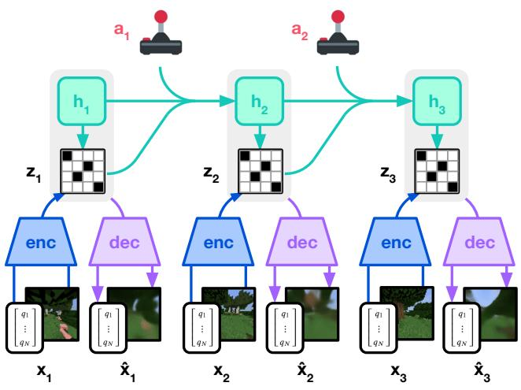
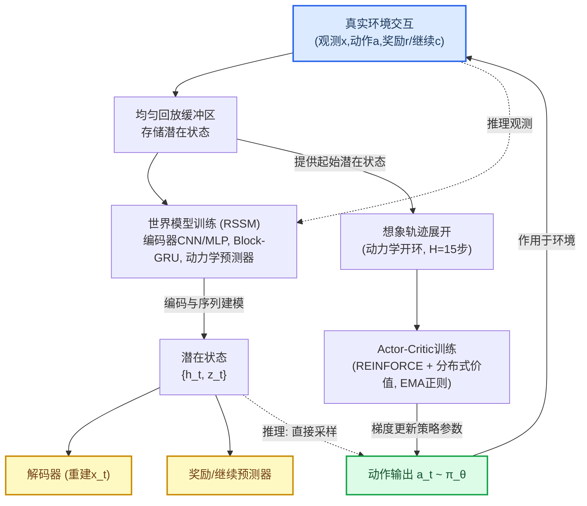
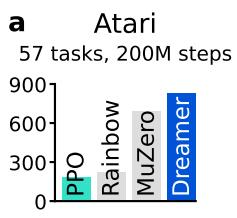
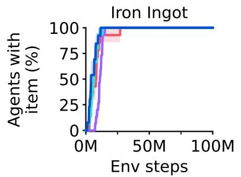
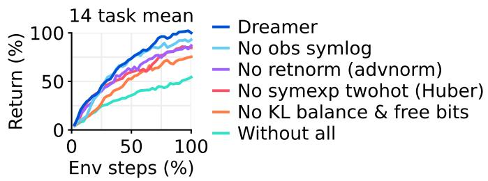
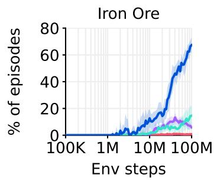
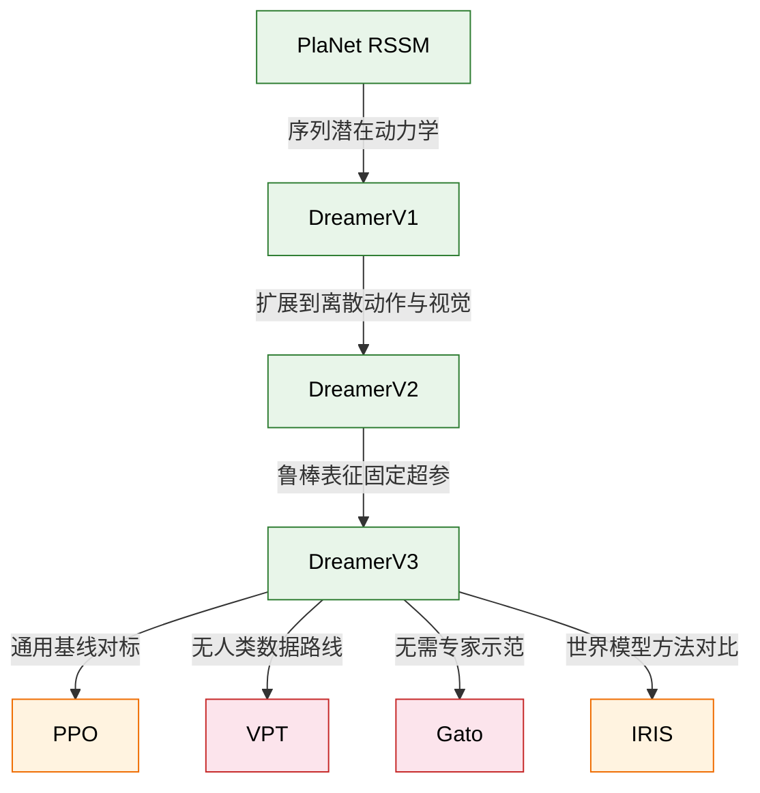
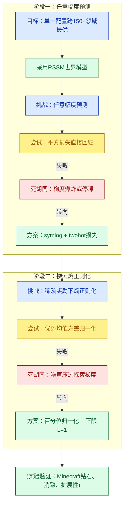
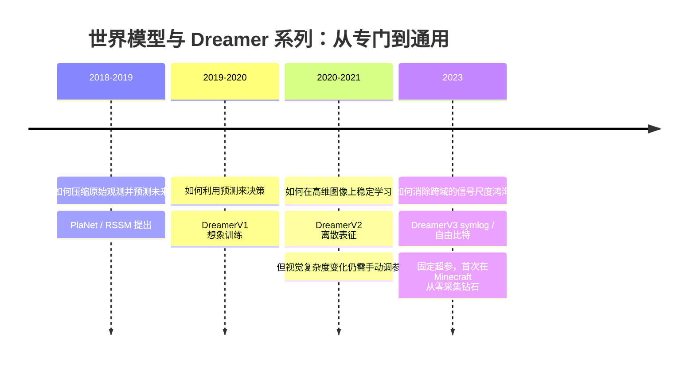

# Mastering Diverse Domains through World Models — 深度解读

> 面向人类读者的深度解读(中文)。事实源与配对的 AI 知识包 `ai_package/2026-06-08_MasteringDiverseDomainsThroughWorldModels_2301.04104/ara/` 同源,均已通过数据保真审计。

## 核心结论

> 每条结论后的隐形锚点把数字回链到论文原文(忠实性保证)。

1. DreamerV3是一种通用强化学习算法，在固定超参数的条件下，可在超过150个多样化任务中超越针对各领域专门设计并调优的专家算法，并大幅优于通用的PPO算法。<!--ref:r-images-33fe14790da7e3--><!--anchor:quote:%21%5B%5D%28images%2F33fe14790da7e3b05487f76d0fac1d27a37e801f3cdd3209dada1e1c5185db88.jpg%29--><!--ref:r-we-present-dreamer-a-g--><!--anchor:quote:We%20present%20Dreamer%2C%20a%20general%20algorithm%20that%20outperforms%20specialized%20expert%20algorithms%20across%20a%20wide%20range%20of%20domains%20while%20using%20fixed-->
2. DreamerV3是首个在不使用人类数据、不使用自适应课程学习的条件下，从稀疏奖励出发、从零开始在Minecraft中采集到钻石的算法；所有DreamerV3运行均在100M环境步内发现钻石，而所有对比基线均未能发现钻石。<!--ref:r-images-33fe14790da7e3--><!--anchor:quote:%21%5B%5D%28images%2F33fe14790da7e3b05487f76d0fac1d27a37e801f3cdd3209dada1e1c5185db88.jpg%29--><!--ref:r-images-33fe14790da7e3--><!--anchor:quote:%21%5B%5D%28images%2F33fe14790da7e3b05487f76d0fac1d27a37e801f3cdd3209dada1e1c5185db88.jpg%29--><!--ref:r-protocols-summarized-i--><!--anchor:quote:Protocols%20Summarized%20in%20Table%202%2C%20we%20follow%20the%20standard%20evaluation%20protocols%20for%20the%20benchmarks%20where%20established.%20Atari38%20uses%2057%20tasks-->
3. DreamerV3中的一系列鲁棒性技术——包括KL平衡与自由位、1%均匀混合分布、百分位数回报归一化（带分母下限）、symexp twohot损失——共同使得算法在多样领域下无需超参数调优即可稳定学习。每种技术对部分任务至关重要，但不一定对所有任务均有显著影响。<!--ref:r-images-33fe14790da7e3--><!--anchor:quote:%21%5B%5D%28images%2F33fe14790da7e3b05487f76d0fac1d27a37e801f3cdd3209dada1e1c5185db88.jpg%29--><!--ref:r-images-33fe14790da7e3--><!--anchor:quote:%21%5B%5D%28images%2F33fe14790da7e3b05487f76d0fac1d27a37e801f3cdd3209dada1e1c5185db88.jpg%29-->
4. 随着模型参数量从12M增加到400M，DreamerV3的任务性能单调提升，同时所需环境交互量减少；增大Replay Ratio同样可进一步提升数据效率。两者共同提供了一种可预测的「计算资源换性能」途径，且固定超参数下的扩展表现鲁棒。<!--ref:r-images-f0b0409c723464--><!--anchor:quote:%21%5B%5D%28images%2Ff0b0409c7234644b17dc64c23a6c8cb76036afd1190b1251957e61c3b4f64caf.jpg%29--><!--ref:r-atarilookthis-data-ef--><!--anchor:quote:%C2%B7%20AtarilookThis%20data%2Defficiency%20benchmark%20comntains%2026%20Atari%20games%20and%20a%20budget%20of%20only%20400K%20frames%2Camounting%20to%202%20hours%20of%20game--><!--ref:r-images-33fe14790da7e3--><!--anchor:quote:%21%5B%5D%28images%2F33fe14790da7e3b05487f76d0fac1d27a37e801f3cdd3209dada1e1c5185db88.jpg%29-->
5. DreamerV3的性能主要依赖于世界模型的无监督重建目标，而非任务相关的奖励和价值预测梯度；停止重建梯度对性能的损害远大于停止奖励/价值梯度。这与大多数先前仅使用任务特定学习信号的强化学习算法形成鲜明对比。<!--ref:r-images-33fe14790da7e3--><!--anchor:quote:%21%5B%5D%28images%2F33fe14790da7e3b05487f76d0fac1d27a37e801f3cdd3209dada1e1c5185db88.jpg%29-->

## 一句话总结与导读

**TL;DR：DreamerV3 是一套基于世界模型的通用强化学习算法，仅凭固定超参数，就能在跨越连续控制、2D/3D 游戏与开放世界 Minecraft 的 150+ 多样化任务中超越专为各领域调优的专家策略；它还是首个不借助人类数据与自适应课程，从零开始在 Minecraft 中成功采集钻石的 AI。其核心思路是通过一组信号变换与归一化技巧，将不同任务中数量级悬殊的奖励和观测“消化”为统一内部语言，让智能体无需为每个新环境重新手动调参。**

强化学习（RL）领域长期面临一个尴尬：一个在 A 游戏上出类拔萃的算法，换到 B 任务上往往立刻“失聪”或“失控”，调参工程师不得不为每个新环境手动调节奖励缩放、探索系数和网络容量，仿佛为每款游戏重新设计方向盘。这种超参数脆弱性极大阻碍了 RL 走向真实世界中多样化的应用。DreamerV3 正是为了打破这一藩篱而生——它用**同一套超参数配置**，就在超过 150 个任务上匹配或超越了那些专门为单个领域精细调优的专家算法，覆盖了连续运动控制、离散动作游戏、稀疏奖励和三维开放世界等迥异的挑战。

DreamerV3 得以实现跨域通用的秘密，在于它不再单纯依赖任务奖励的梯度来驱动表示学习。它首先让一个“世界模型”通过无监督的图像重建来理解环境——就像给智能体装上了一个可以自行想象的“大脑皮层”，无需环境奖励告诉它什么重要，该皮层就能从原始像素中提炼出丰富的语义表征。在此基础上，一系列处理信号幅度的技术被整合进学习流程：`symlog` 变换将数量级差异极大的奖励映射到近似对数空间，使梯度不会因奖励数值过大而爆炸、过小而消失；KL 自由比特（Free Bits）为世界模型的表示学习设定一个信息容量的下限，防止模型为了追求重建精度而抛弃掉对长期决策至关重要的细节；百分位回报归一化则让 Actor-Critic 聚焦于“在近期经验中表现相对好”的行为，而非受绝对奖励数值的左右。这些技术叠加起来，相当于为算法植入了一套自动信号调节系统，无论面对的是每步都有反馈的稠密奖励，还是只在成功时给出一次性信号的稀疏奖励，都能在内部保持稳定的学习节奏。（直觉比喻，非严格对应：就像在一辆能自动适应沙漠、冰雪和赛道的越野车上，底盘高度、油门响应和刹车的协同调节全由一套中央控制器根据地形自动完成，而无需驾驶员每次下车手动改装。）

这套方法的威力在最具挑战性的试验场——Minecraft 中寻找钻石——得到了象征性验证。该任务要求从原始屏幕像素出发，依次完成砍木、造镐、采矿、进入下界、合成钻石等跨越十余个技术阶段的长期探索，期间仅有极度稀少的奖励信号。此前，没有任何算法能在完全不依赖人类专家数据或手工课程设置的条件下完成该目标。DreamerV3 的所有独立运行都稳定地实现了从零到钻石的完整链条，这一成就标志着世界模型驱动的通用 RL 开始触碰“开放世界中长期自主探索”这一人工智能的圣杯。它暗示着，通过无监督的感知学习与对信号幅度的鲁棒归一化，我们可能正迈向一种无需大量人工定制即可适应无数复杂场景的智能体范式。

**论文总体架构(原图):**

*训练过程总览：Dreamer的世界模型将感官输入编码为离散表示z_t，并用带循环状态h_t的序列模型结合动作a_t预测未来表示，同时重构输入来塑造表示。演员和评论家在该世界模型的潜空间中学习。*

## 问题背景与动机

强化学习（RL）在游戏、机器人等领域取得了令人瞩目的成果，但一个长期困扰研究者的痛点是：**每换一个新的应用场景，算法往往需要大量的人工调参才能正常工作**。将性能调优到满意水平，不仅消耗大量算力，更依赖领域专家的经验直觉。为什么一个在Atari游戏上表现优异的算法，换到连续控制任务就“水土不服”？

根本原因在于，不同领域之间的**信号特征存在数量级差异**。有的任务只在最终给出一个成功或失败的二元信号（稀疏奖励），而有的任务每一步都反馈细粒度分数（稠密奖励）；输入可能是一堆低维的关节角度，也可能是高维像素画面；动作空间或是连续的力矩，或是离散的方向按键。这种极端的多样性使得任何一组固定的学习率、探索噪声或奖励缩放方式，都很难覆盖所有情形——如同一种药方无法包治百病。

更棘手的是，即使在“世界模型”这类更先进的方法中，也需**根据环境的视觉复杂度手动调节表示学习损失中的权重**。世界模型的核心思想是让智能体在学到的“环境模拟器”里进行想象训练，但前代方法在训练这个模拟器时，必须在“图像重建”与“表示正则化”两个目标间人工权衡：复杂3D场景需要强正则化来压缩干扰，而静态背景则需弱正则化以保留关键细节。这种手动调节进一步加固了跨域迁移的壁垒。

上述现象共同指向一个核心缺口：**现有方法无法用一套固定超参数，同时在连续控制、离散动作游戏、稀疏奖励和三维开放世界等多元化任务上都取得竞争性能**。在某类任务上可行的参数，换到另一类任务便会因训练不稳定而完全失效。缺乏“通用超参数配置”成为RL走向更广泛应用的巨大鸿沟。

这一缺口在极其苛刻的Minecraft“收集钻石”任务中被放大到极致。智能体需在无人类示教、仅靠极其稀疏奖励的条件下，从原始像素学会一个历经12个里程碑、跨越数十分钟时长的复杂策略。此前，VPT等方法需要海量人类专家数据才能初见成效，而其他自适应课程方法也未能从根本上解决超长程探索的难题。

那么，能否找到一种统一的方式，让算法**自动适应不同领域的信号尺度**，从而真正实现“一次配置，处处运行”？

这正是研究所瞄准的核心洞见：**通过信号变换与归一化，消除跨域差异对学习动态的干扰**。具体而言，用 `symlog` 函数将量级悬殊的奖励和观测值压缩到相近范围；引入 `KL free bits` 策略稳定表示空间的训练；并采用百分位回报归一化，使算法在面对极度稀疏奖励时仍能合理衡量策略的进步。这套组合拳在固定超参数下，让同一个智能体在超过150种多样任务上稳定学习，不再需要逐任务调参。

更本质的是，世界模型通过无监督图像重建学到的感知表示，本身已蕴含丰富的环境结构信息。这使策略学习（Actor-Critic）所需的“看”和“理解”能力，不再完全依赖任务奖励信号驱动，解耦了表示学习与控制目标，从而为跨域鲁棒性奠定了更坚实的基础。

正是沿着“观察跨域失效现象 → 定位信号差异根因 → 提出归一化解耦方案”这一逻辑链条，研究者构建了一套在固定超参数下横扫多样任务的新算法框架。

## 核心概念速览

DreamerV3 的通用性并非来自某个孤立突破，而是七个设计精妙的组件精密咬合的结果。它们分别驯服了世界模型学习中的数值不稳定、表征崩塌、奖励尺度混乱等核心难题。下面逐一拆解这些概念，并借助生活化比喻建立直观理解（以下比喻均为直觉类比，非严格对应）。

**循环状态空间模型 (RSSM)**  
世界模型的心脏。它同时维护确定性循环状态 \(h_t\) 和随机隐变量 \(z_t\)：\(h_t\) 像一本连续书写的日志，保留长程脉络；\(z_t\) 则像每次翻开日志时根据当下观察绘制的速写，捕捉瞬时的随机性。编码器从输入 \(x_t\) 中提炼 \(z_t\)，而动态预测器在不看真实输入的前提下预测下一时刻的 \(z_t\)，使模型能“闭眼想象”未来轨迹。直觉比喻：好比一位侦探，边听目击者叙述边记要点（\(h_t\)），每听到新线索就画一张嫌疑人草图（\(z_t\)）；事后他仅凭笔记与草图就能推演案情发展。

**symlog/symexp 变换**  
强化学习中的奖励与观测常跨越多个数量级，且正负混杂。标准对数不能处理负数，线性回归则被大值绑架。symlog 变换定义为 \(\operatorname{symlog}(x) \doteq \operatorname{sign}(x) \ln(|x|+1)\)，像一把自带方向的对数尺：在零附近近似线性，远处则强烈压缩，始终保留符号。其逆变换 symexp 用于恢复原始尺度。该技术被嵌入编码器、解码器和奖励/价值预测损失中，让网络不必为极端数值分心。比喻：记账时，日常几十元要精确，但一笔几十万的装修款也可用同一本账记录——这把尺子自动压缩大额影响，同时分清“收入”还是“支出”。

**symexp twohot 损失**  
对于奖励和评论家预测这类随机连续目标，直接回归一个标量极易被离群值与噪声干扰。symexp twohot 损失转而预测一个在指数间隔分箱上的 softmax 分布，预测值为各箱中心的加权均值；训练时，连续目标被 twohot 编码为相邻两箱上的软标签，再计算交叉熵。比喻：不猜明天的确切温度，而是说“有 60% 概率在 20–22℃，30% 概率在 22–24℃”——这种分布式表述天然更稳健，不会被单个极端值牵着走。<!--ref:r-images-f0b0409c723464--><!--anchor:quote:%21%5B%5D%28images%2Ff0b0409c7234644b17dc64c23a6c8cb76036afd1190b1251957e61c3b4f64caf.jpg%29--><!--ref:r-images-33fe14790da7e3--><!--anchor:quote:%21%5B%5D%28images%2F33fe14790da7e3b05487f76d0fac1d27a37e801f3cdd3209dada1e1c5185db88.jpg%29--><!--ref:r-images-f865de2818af20--><!--anchor:quote:%21%5B%5D%28images%2Ff865de2818af204ef015228ffee4850c7a721b8c45e18291f596d4fb7350b046.jpg%29--><!--ref:r-images-6527c41b7af6fd--><!--anchor:quote:%21%5B%5D%28images%2F6527c41b7af6fdd074f306161a8188cbf75a2fda104fd814869895ad102f919d.jpg%29--><!--ref:r-images-f865de2818af20--><!--anchor:quote:%21%5B%5D%28images%2Ff865de2818af204ef015228ffee4850c7a721b8c45e18291f596d4fb7350b046.jpg%29--><!--ref:r-images-02594c1f7a7568--><!--anchor:quote:%21%5B%5D%28images%2F02594c1f7a7568da7b0a6c4338e36fea7a78678b24c3c1be36bf96b34d229766.jpg%29-->

**回报百分位归一化**  
不同任务甚至同一任务的不同阶段，回报尺度差异悬殊。演员学习若直接使用原始回报，梯度容易爆炸或消失。该归一化持续追踪回报的 5% 与 95% 分位数之差（经指数移动平均平滑），并用这个动态范围缩放回报，同时设置下限 1，防止稀疏奖励时噪声被放大。注意，它只作用于演员的策略梯度，不改动评论家。比喻：跨科目考试评分时，根据年级前 5% 与后 5% 的成绩差距来调整每科的权重，让“优秀”的标准不受满分值差异的影响。<!--ref:r-images-33fe14790da7e3--><!--anchor:quote:%21%5B%5D%28images%2F33fe14790da7e3b05487f76d0fac1d27a37e801f3cdd3209dada1e1c5185db88.jpg%29--><!--ref:r-images-6527c41b7af6fd--><!--anchor:quote:%21%5B%5D%28images%2F6527c41b7af6fdd074f306161a8188cbf75a2fda104fd814869895ad102f919d.jpg%29--><!--ref:r-images-33fe14790da7e3--><!--anchor:quote:%21%5B%5D%28images%2F33fe14790da7e3b05487f76d0fac1d27a37e801f3cdd3209dada1e1c5185db88.jpg%29--><!--ref:r-images-33fe14790da7e3--><!--anchor:quote:%21%5B%5D%28images%2F33fe14790da7e3b05487f76d0fac1d27a37e801f3cdd3209dada1e1c5185db88.jpg%29--><!--ref:r-images-33fe14790da7e3--><!--anchor:quote:%21%5B%5D%28images%2F33fe14790da7e3b05487f76d0fac1d27a37e801f3cdd3209dada1e1c5185db88.jpg%29-->

**自由比特 (Free Bits)**  
世界模型训练需最小化先验与后验的 KL 散度，但若该项被过度优化，模型会让随机表征完全坍缩，丧失输入信息。自由比特在动态损失和表征损失上强制设置 1 nat（约 1.44 比特）的下限：一旦 KL 低于该阈值，该项停止下降，优化重心转向重建质量。比喻：跑步机设定了最低速度，你可以跑得更快，但不能完全停下来，从而保证每次训练都维持有效运动量。

**想象训练 (Imagination Training)**  
演员和评论家完全在世界模型模拟的抽象轨迹中学习，无需额外真实交互。从重放缓冲区里的真实状态出发，世界模型开环预测 15 步的想象轨迹，演员和评论家在这些虚拟轨迹上进行梯度更新。比喻：飞行员绝大多数时间在模拟器中练习，无需频繁升空，既安全又经济。

**1% Unimix 均匀混合**  <!--ref:r-images-33fe14790da7e3--><!--anchor:quote:%21%5B%5D%28images%2F33fe14790da7e3b05487f76d0fac1d27a37e801f3cdd3209dada1e1c5185db88.jpg%29-->
凡是需要输出类别分布的网络——编码器、动态预测器、演员——统一把 softmax 输出与 1% 的均匀分布混合。这杜绝了任何一类概率恰好为零的可能，避免后续 KL 计算出现 \(-\infty\)。比喻：自助餐里每道菜都至少尝一口，哪怕最爱某一道，也要给其余菜留下存在感，防止后续评价链条突然断裂。<!--ref:r-images-33fe14790da7e3--><!--anchor:quote:%21%5B%5D%28images%2F33fe14790da7e3b05487f76d0fac1d27a37e801f3cdd3209dada1e1c5185db88.jpg%29-->

这七项设计像一组精密棘轮，各自只解决一个小问题，但组合起来就让 DreamerV3 能在零人工干预下，适应从连续控制到高维离散游戏的广阔任务谱系。

## 方法与整体架构

Dreamer 将强化学习从真实环境“搬进”世界模型的想象空间里：先训练一个能预测未来观测与奖励的紧凑世界模型，再让它产生虚拟轨迹，供策略与价值函数在其中安全试错。整个系统由世界模型、Actor、Critic 三个模块并发更新，推理阶段只靠 Actor 单步前向——不规划、不搜索，简洁到极致。

**感知压缩与序列建模**  
真实环境交互相继得到观测（图像或向量）、动作、奖励与继续信号，一律存入均匀回放缓冲区。世界模型采用 **RSSM**（Recurrent State‑Space Model）对这些序列建模：编码器（CNN/MLP）将高维观测映射为随机离散潜在状态 $z_t$，Block‑GRU 维护循环状态 $h_t$ 捕捉时间依赖；动力学预测器则从 $h_t$ 开环推断下一时刻的 $z_t$，这是后续“想象”的基石。为了训练世界模型，解码器从 $\{h_t,z_t\}$ 重建原始观测，奖励预测器与继续预测器同步给出监督信号。  
*直觉上，RSSM 好比一个学会在脑中跑“简化版现实”的模拟器，用极低维的状态保留决策所需信息，同时丢弃无关纹理。*

为使潜在表示既不坍塌也不噪声化，论文在两个 KL 散度项上应用 free bits（截断于 1 nat）：一旦先验与后验已足够接近，便停止加压，防止编码器将后验收缩成无信息常量。同时引入 symlog 变换处理跨数量级的观测与奖励——如同装上一枚“对数缩放镜”，既保留符号，又把爆炸式跨度压缩到平静区间，使梯度更新远离发散。

**想象轨迹中的行为学习**  
行为学习完全在潜在空间完成，不与真实环境交互。从缓冲区的任意起始状态出发，动力学预测器在潜在空间开环展开 $H=15$ 步的“想象轨迹”。Actor（REINFORCE 策略网络）与 Critic（分布式价值网络）就在这些想象数据上并行训练：

- **Critic** 使用 $\lambda$‑回报（$\lambda=0.95$）和 symexp twohot 损失学习价值分布，输出权重矩阵初始为零，避免早期虚假价值信号；同时以自身参数的指数移动平均（EMA 衰减 0.98）作为软目标，抑制自举震荡。
- **Actor** 按 REINFORCE 梯度上升，回报归一化采用百分位区间 $[5\%,95\%]$ 的 EMA 尺度——这对稀疏奖励尤其重要，因为它对离群值鲁棒，且分母下限 $L=1$ 防止微小方差放大噪声。$1\%$ 的均匀混合（Unimix）在所有 categorical 分布上铺出安全垫，消除 KL 尖刺。

三个模块的梯度更新并发执行，没有顺序等待，完全释放硬件并行。而在推理阶段，一切回归极简：当前观测经编码器得 $\{h_t,z_t\}$，Actor 采样出动作 $a_t$，延迟仅相当于一次网络前向，无任何前向搜索。

下面的流程图串联起数据流、训练闭环与推理捷径。实线代表训练期必经路径，虚线为推理期的极简通道；蓝色节点是数据源头，绿色节点是最终决策输出，黄色节点则是世界模型训练中必需的辅助目标，推理阶段不再使用。

**如何读这张图**：真实环境（蓝）向缓冲流入经验，驱动世界模型学习紧凑表示；想象过程在潜在空间独立运作，产出训练信号供策略与价值函数更新；最终动作（绿）既返回真实环境收集新数据，又构成推理时唯一前向通路（虚线），省略一切辅助组件。

## 算法目标与推导

该论文的训练目标由世界模型、Critic 和 Actor 三部分构成，各自承担不同的职责：世界模型学习环境的紧凑表示与动态，Critic 评估状态的价值，Actor 输出动作以最大化回报。以下先给出关键公式，再逐项展开其设计逻辑。

### 世界模型损失

世界模型损失 $\mathcal{L}(\phi)$ 综合了预测、动态和表示三个子目标：

$$
\mathcal{L}(\phi) \doteq \mathrm{E}_{q_\phi}\!\left[\sum_{t=1}^{T}\bigl(\beta_{\mathrm{pred}}\mathcal{L}_{\mathrm{pred}}(\phi)+\beta_{\mathrm{dyn}}\mathcal{L}_{\mathrm{dyn}}(\phi)+\beta_{\mathrm{rep}}\mathcal{L}_{\mathrm{rep}}(\phi)\bigr)\right]
$$

其中

$$
\mathcal{L}_{\mathrm{pred}}(\phi) \doteq -\ln p_\phi(x_t|z_t,h_t) - \ln p_\phi(r_t|z_t,h_t) - \ln p_\phi(c_t|z_t,h_t)
$$

$$
\mathcal{L}_{\mathrm{dyn}}(\phi) \doteq \max\!\bigl(1,\mathrm{KL}[\mathrm{sg}(q_\phi(z_t|h_t,x_t))\|p_\phi(z_t|h_t)]\bigr)
$$

$$
\mathcal{L}_{\mathrm{rep}}(\phi) \doteq \max\!\bigl(1,\mathrm{KL}[q_\phi(z_t|h_t,x_t)\|\mathrm{sg}(p_\phi(z_t|h_t))]\bigr)
$$

权重 $\beta_{\mathrm{pred}}=1$, $\beta_{\mathrm{dyn}}=1$, $\beta_{\mathrm{rep}}=0.1$。解码器和奖励预测器对确定性目标使用 symlog 均方损失（公式 (8)）：

$$
\mathcal{L}(\theta) \doteq \tfrac{1}{2}\bigl(f(x,\theta)-\mathrm{symlog}(y)\bigr)^{2}
$$

对随机目标（如奖励预测器和 Critic）使用 symexp twohot 交叉熵损失（公式 (11)）：

$$
\mathcal{L}(\theta) \doteq -\mathrm{twohot}(y)^{T}\log\mathrm{softmax}(f(x,\theta))
$$

**逐步推导与设计理由：**

世界模型的核心任务是学习从观测到潜变量 $z_t$ 的编码器 $q_\phi$，以及潜空间中的转移模型 $p_\phi(z_t|h_t)$。$h_t$ 是历史信息的确定性汇总，$x_t$ 是原始观测，$r_t$ 是奖励，$c_t$ 是累积折扣因子。$\mathcal{L}_{\mathrm{pred}}$ 驱使模型从 $(z_t, h_t)$ 重建 $x_t, r_t, c_t$，保证潜表示保留环境的关键信息。这里不使用普通均方误差，而是对图像等信号采用 symlog 均方损失（公式 (8)），对离散随机变量采用 twohot 交叉熵（公式 (11)），以稳定训练并处理多模态分布。

$\mathcal{L}_{\mathrm{dyn}}$ 和 $\mathcal{L}_{\mathrm{rep}}$ 成对出现：前者最小化后验 $q_\phi(z_t|h_t,x_t)$ 与先验转移 $p_\phi(z_t|h_t)$ 的 KL 散度，并用 $\max(1, \cdot)$ 裁剪防止 KL 被过度压缩；梯度停止 $\mathrm{sg}(\cdot)$ 使先验网络“学习靠近”后验，而不影响编码器。对称地，$\mathcal{L}_{\mathrm{rep}}$ 通过 KL 拉近编码器输出和先验分布，同样带裁剪，但停止先验梯度，迫使表示向先验靠拢。这种非对称设计避免了模式坍塌，同时保持表示的可预测性。权重 $\beta_{\mathrm{rep}}=0.1$ 较小，因为表示正则化过强会损害重建质量。

### Critic 损失

Critic 网络 $\psi$ 采用 $\lambda$-回报作为目标，损失函数为：

$$
\mathcal{L}(\psi) \doteq -\sum_{t=1}^{T}\ln p_\psi(R_t^\lambda|s_t), \quad R_t^\lambda \doteq r_t + \gamma c_t\bigl((1-\lambda)v_t + \lambda R_{t+1}^\lambda\bigr), \quad R_T^\lambda \doteq v_T
$$

其中 $\gamma=0.997$, $\lambda=0.95$。$v_t$ 是 Critic 自身对状态 $s_t$ 的价值估计，$R_t^\lambda$ 结合了实际奖励和自举价值，通过 $\lambda$ 控制偏置-方差权衡：$\lambda$ 接近 1 时更依赖蒙特卡洛估计（方差大但无偏），接近 0 时更依赖自举（偏差大但方差小）。损失同时对**想象轨迹**（权重 $\beta_{\mathrm{val}}=1$）和**回放缓冲区轨迹**（$\beta_{\mathrm{repval}}=0.3$）计算，防止世界模型偏差导致策略过拟合内部模拟。

选择分布式输出 $p_\psi(R_t^\lambda|s_t)$ 而非标量损失，可捕获价值的不确定性和多模态分布，增强训练稳定性。$\lambda$ 取值较大（0.95）表明倾向于长程信用分配，在稀疏奖励场景下尤为重要。

### Actor 损失

Actor 网络 $\theta$ 通过优势加权最大化回报，并附加熵正则项：

$$
\mathcal{L}(\theta) \doteq -\sum_{t=1}^{T} \mathrm{sg}\!\left(\frac{R_t^\lambda - v_\psi(s_t)}{\max(1,S)}\right) \log\pi_\theta(a_t|s_t) + \eta\,\mathrm{H}[\pi_\theta(a_t|s_t)]
$$

其中

$$
S \doteq \mathrm{EMA}\bigl(\mathrm{Per}(R_t^\lambda,95) - \mathrm{Per}(R_t^\lambda,5),\,0.99\bigr)
$$

$\eta=3\times10^{-4}$，分母下限 $L=1$。推理期仅需采样 $a_t \sim \pi_\theta(a_t|s_t)$，无需计算损失。

优势项 $R_t^\lambda - v_\psi(s_t)$ 用 Critic 作为基线降低方差。分母 $S$ 是回报 $R_t^\lambda$ 的 95 分位数与 5 分位数之差（经指数移动平均平滑），用于自适应缩放优势，避免不同回合或任务间回报尺度差异导致梯度规模不一致。$\mathrm{sg}$ 阻止梯度流向价值估计，让 Actor 专注策略改进。熵项 $\mathrm{H}[\pi_\theta]$ 鼓励探索，极小权重 $\eta$ 则避免过度随机化。

### 直觉比喻

可以将整个训练想象成一位棋手（Actor）在脑内复盘（世界模型），旁边坐着一位教练（Critic）。棋手心中推演几步后的局面，教练根据经验给每个局面打分（价值 $v$），并告知这步棋最终可能导致的优劣（$R_t^\lambda$）。世界模型负责保证脑内推演的画面（重建 $x_t$）、得失（重建 $r_t$）和回合是否结束（重建 $c_t$）都贴近真实对局；同时它还要确保思维链条连贯（动态损失）且每一次的局势理解前后一致（表示损失）。Actor 根据“这步棋实际比预期好多少”（优势）来调整落子倾向，并保留一点乱下的冲动（熵）以防止套路僵化。

### 小玩具例子

假设一个 1×3 网格世界，智能体从最左出发，最右是终点（奖励 +1），其余位置奖励 0。折扣 $\gamma=0.9$，$\lambda=0.8$。某次交互产生轨迹：$s_1$（左）向右移动到 $s_2$（中），再向右到 $s_3$（终），获得 $r_3=1$。

**世界模型** 接收观测（如独热编码），预测下一帧和奖励。若 $t=2$ 时预测奖励为 0，则 $\mathcal{L}_{\mathrm{pred}}$ 中奖励项惩罚很小；若 $t=3$ 处预测错误则惩罚大。动态损失确保从 $s_2$ 到 $s_3$ 的潜变量变化不偏离先验转移的预测太多。

**Critic** 从后向前计算 $\lambda$-回报：$R_3^\lambda = v_3$；$R_2^\lambda = 0 + 0.9 \times 1 \times [(0.2)v_2 + 0.8 \times 0]$；$R_1^\lambda$ 依此类推。Critic 损失推动 $v_\psi(s_2)$ 去逼近这些目标，从而在靠近终点时给出更高价值。

**Actor** 在 $s_2$ 有两个动作（左/右），向右才能成功。若 $R_2^\lambda - v_\psi(s_2)$ 为正，则负优势乘以 $\log\pi$ 的形式会最大化向右动作的 log 概率，策略便倾向向右。缩放项 $S$ 将优势归一化，使学习步调平稳。这个小例子展露了三个损失组件如何各司其职、协同优化。

## 实验设计与结果解读

要验证“单一固定配置通吃各类任务”这一大胆主张，DreamerV3 需要一张覆盖广、深且严苛的试卷。论文通过大规模跨领域基准、极限稀疏奖励挑战、内部组件拆解和扩展曲线描绘，层层递进地交代了它究竟能做什么、为什么能做到，以及它的能力边界在哪。

### 多领域“通考”：一套配置打天下
DreamerV3 的“入学考试”横跨 Atari、ProcGen、DMLab、Atari100K、BSuite、本征控制、视觉控制等 8 个领域，合计超过 150 个任务。所有训练均使用**完全相同的超参数**（参见论文 Table 4），每项任务仅在单块 A100 上独立运行，不允许任何针对特定游戏的调节。作为大反差对照，PPO 同样固定超参数，但在多数任务上被远远甩开，反向凸显出世界模型方法的天生稳定性。而每个领域另有此前经历重度调优的专家基线——包括 MuZero、Rainbow、IMPALA、DrQ-v2 等。

结果定性地表明：即便不带任何“领域特供”调参，DreamerV3 仍在绝大多数领域上与精心雕琢的专家算法持平甚至超越。例如在 DMLab 的 30 个任务上，只消耗 100M 环境步就超越了 IMPALA 之前需要 1B 步才能触及的性能；在 ProcGen 上与高度调优的 PPG 旗鼓相当；在视觉控制套件中更是建立了当时的新最优水平。（各领域具体得分详见下方实验表）这套全局统一的配置能顺利通过如此分散的考验，本身就是对算法跨任务泛化力的有力证词。

### Minecraft 寻宝：无人类先验的稀疏奖励迷宫
最引人注目的或许是 Minecraft 钻石采集实验。在这个定制任务里，智能体只看到第一人称像素画面，并要从砍树开始，历经合成木镐、建造熔炉、冶炼铁矿……直到最终挖到钻石矿脉。每一步只有极其稀薄的信息：达成 12 个里程碑中的某一个才给 1 分奖励，其余步骤一无所得。与此同时，训练全程**不使用任何人类示范数据，也没有手工设计的课程学习**。

在 100M 步的预算内，DreamerV3 成功发现了钻石，并且所有随机种子都稳定复现，而调参后的 IMPALA、Rainbow 等基线则一次也未能挖到。该结果更像是世界模型在长程因果链条上自学成才的自然流露——它先“弄懂”了砍树能得木头，木头能合成工具，工具进而打开新资源……而稀疏奖励只不过是一座座路标，而非唯一的学习驱动力。值得一提的是，论文对该环境做了若干修正（例如修复原基准中的早终止问题），为所有算法的公平比较扫清了障碍，但这也让结论严格绑定在修复后的设定下。

### 鲁棒性拆解：哪些组件功不可没？
DreamerV3 中植入了一整套旨在消除训练脆性的技术，包括 KL 目标、回报归一化、symexp twohot 回归、观测 symlog、unimix 正则化、Critic EMA 等。为了辨别谁是真正的定海神针，作者在 14 个跨领域任务上逐一移除这些组件（每次只去除一项），观察平均性能的下滑幅度。

结果呈现清晰的梯队：所有消融均导致性能下降，驳斥了“某些设计无关紧要”的猜测。其中，与世界模型训练相关的 **KL 目标** 影响最为剧烈，是保持整个系统稳定的第一支柱；随后是回报归一化与 symexp twohot 回归，它们共同驯服了价值预测中的尺度问题。部分技术（如观测 symlog）在个别高动态范围任务上如虎添翼，但在全体任务上平均贡献稍小。这张消融图谱本质上是一份“故障模式分布图”，让读者直观感知到：DreamerV3 的鲁棒不是魔法，而是一组相互咬合的技术共同作用的结果。

### 规模定律：参数与经验的双重红利
算法能否单纯通过“堆规模”获得可预测的提升，关乎其工程潜力和未来上限。DreamerV3 在 Crafter 和 DMLab 两个环境上，将模型参数量从 12M 一路扩充到 400M（遵循统一的维度参数化），并同时扫掠了 Replay Ratio（每步环境交互对应多少梯度更新步数）的影响。

实验呈现单调平滑的改善曲线：更大的模型直接转化为更高的任务得分，而且达到同一性能所需的环境交互步数大幅减少；提升 Replay Ratio 像是在同样的环境数据上多读了几遍书，让数据效率进一步跃升。这种近乎“扩展定律”的行为说明，DreamerV3 眼下还未撞到性能天花板，具备向更大计算投入持续要收益的结构化特质。当然也需冷静看待：当前扩展实验仅在两个领域上完成，其在更多任务上的普适性仍有待后续检验。<!--ref:r-images-33fe14790da7e3--><!--anchor:quote:%21%5B%5D%28images%2F33fe14790da7e3b05487f76d0fac1d27a37e801f3cdd3209dada1e1c5185db88.jpg%29-->

### 世界模型的学习养料：看与做的权衡
世界模型的表征学习同时受两种梯度的牵引：一是来自图像重建的**无监督信号**，另一是来自奖励与价值预测的**任务信号**。究竟哪一方才是核心“教材”？作者设计了一组扼要的消融：分别阻断奖励/价值梯度或重建梯度向世界模型表征的反传，其余环节不变。

结果直白而有力：阻断重建梯度对性能的损害远大于阻断任务相关梯度。这直接证明，DreamerV3 的世界模型本质上是先“学会看懂世界”的通用感知引擎，而后才叠加“为任务而微调”的策略神经；无监督重建才是它表征丰富性的根本源泉，也自然解释了为何在奖励极其稀薄时，模型仍能稳步探索，而非原地打转。

整体来看，这一系列实验由表及里，从宏大基准到微观消融，从场景极限到规模法则，编织出一张严密的自证网络：DreamerV3 不仅“能做”，而且让人们看清楚“凭什么做”和“还能怎么更好”。

### 实验数据表(原始数值,引自论文)

#### Atari100K Gamer 均值与中位数 (%) 对比（400K步）
- **Source**: Table 9
- **Caption**: "Atari100K（26个游戏，400K步）的Gamer均值和中位数百分比得分。Dreamer在gamer均值上达到125%，超过IRIS（105%）。"<!--ref:r-protocols-summarized-i--><!--anchor:quote:Protocols%20Summarized%20in%20Table%202%2C%20we%20follow%20the%20standard%20evaluation%20protocols%20for%20the%20benchmarks%20where%20established.%20Atari38%20uses%2057%20tasks--><!--ref:r-images-d14520b5b37965--><!--anchor:quote:%21%5B%5D%28images%2Fd14520b5b37965647f32fc62e51a9943cd0a6b50f526979e4a2a41e2db777af5.jpg%29--><!--ref:r-atarilookthis-data-ef--><!--anchor:quote:%C2%B7%20AtarilookThis%20data%2Defficiency%20benchmark%20comntains%2026%20Atari%20games%20and%20a%20budget%20of%20only%20400K%20frames%2Camounting%20to%202%20hours%20of%20game--><!--ref:r-images-f0b0409c723464--><!--anchor:quote:%21%5B%5D%28images%2Ff0b0409c7234644b17dc64c23a6c8cb76036afd1190b1251957e61c3b4f64caf.jpg%29--><!--ref:r-41-will-dabney-georg-o--><!--anchor:quote:41.%20Will%20Dabney%2C%20Georg%20Ostrovski%2C%20David%20Silver%2C%20and%20R%C3%A9mi%20Munos.%20Implicit%20quantile%20networks%20for%20distributional%20reinforcement%20learning.%20In%20International%20conference-->

| Metric | PPO | SimPLe | SPR | TWM | IRIS | Dreamer |
| --- | --- | --- | --- | --- | --- | --- |
| Gamer mean (%) | 11 | 33 | 62 | 96 | 105 | 125 |
| Gamer median (%) | 2 | 13 | 40 | 51 | 29 | 49 |

#### BSuite 任务均值与类别均值 (%) 对比
- **Source**: Table 13
- **Caption**: "BSuite 23个环境（468个配置）的任务均值和类别均值百分比得分。Dreamer在scale鲁棒性类别上尤为突出。"

| Metric | Random | PPO | AC-RNN | DQN | Boot DQN | Dreamer |
| --- | --- | --- | --- | --- | --- | --- |
| Task mean (%) | 3 | 49 | 32 | 54 | 60 | 66 |
| Category mean (%) | 3 | 47 | 30 | 49 | 57 | 63 |

#### DMLab Human Mean Capped (%) 对比
- **Source**: Table 8
- **Caption**: "DMLab 30个任务在100M及更大环境步数下的人类标准化均值得分。Dreamer在100M步时超过了IMPALA在1B步时的性能。"

| Method (Steps) | Human mean capped (%) |
| --- | --- |
| R2D2+ (10B) | 85.4 |
| IMPALA (10B) | 85.1 |
| IMPALA (1B) | 66.3 |
| IMPALA (100M) | 31.0 |
| PPO (100M) | 35.9 |
| Dreamer (100M) | 71.4 |

#### Minecraft Diamond 得分对比
- **Source**: Table 5
- **Caption**: "Minecraft Diamond 任务在100M环境步数时的各算法episode回报得分。"

| Method | Return |
| --- | --- |
| Dreamer | 9.1 |
| IMPALA | 7.1 |
| Rainbow | 6.3 |
| PPO | 5.1 |

#### ProcGen 归一化均值得分对比（50M步）
- **Source**: Table 7
- **Caption**: "ProcGen 16个游戏在50M步数下的归一化均值得分。Dreamer与调优专家算法PPG持平，均大幅超过PPO。"

| Task | Original PPO | PPO | PPG | Dreamer |
| --- | --- | --- | --- | --- |
| Normalized mean | 41.16 | 42.80 | 64.89 | 66.01 |

#### 视觉控制套件（DeepMind Control Suite 视觉输入）汇总得分（1M步）
- **Source**: Table 12
- **Caption**: "DeepMind Control Suite 20个任务在视觉输入、1M步数下的均值和中位数得分。Dreamer建立了该基准新的最优水平。"

| Metric | PPO | SAC | CURL | DrQ-v2 | Dreamer |
| --- | --- | --- | --- | --- | --- |
| Task mean | 94 | 81 | 479 | 770 | 861 |
| Task median | 206 | 226 | 525 | 705 | 786 |

**效果示例(论文原图):**

*Benchmark summary图：Dreamer使用固定超参数在多领域和多数据预算下超越调参专家算法，并大幅优于广泛适用的PPO算法。子图展示了详细的性能对比。*

*Minecraft钻石任务结果：Dreamer是唯一能稳定发现钻石的算法，而其他算法最多进展到铁镐。该图展示了训练智能体发现关键物品的比例，凸显Dreamer在长时推理任务中的突破。*

*消融与扩展性分析：所有鲁棒性技术对Dreamer的最终性能都有贡献。同时，Dreamer的性能随着环境步数呈近似线性增长，无需调整超参数即可良好扩展。*

*物品成功率图：Dreamer获得各物品的成功率显著高于基线方法，并持续改进直至预算用尽。即使钻石挑战难关，Dreamer也能成功获得，为未来研究留下空间。*

## 相关工作与定位

DreamerV3 并非凭空出世的“天降奇兵”，而是站在世界模型方法近五年的持续积累之上。它通过对架构鲁棒性的系统性加固，首次以单一固定超参数配置跨越了从 Atari 到 3D 游戏、从稀疏奖励到高维连续控制的多样领域；同时在性能上对标、甚至在许多任务中超越了各领域的专门调优方法，且完全摒弃了对人类示范数据的依赖。这使它成为强化学习中一个极具特色的“通用智能体”基准。下表梳理了本文与最相关工作的关系：

| 相关工作 | 类型 | 与 DreamerV3 的关键差异与角色 |
|----------|------|-------------------------------|
| PPO (Schulman et al.) | 通用基线 | 无模型通用算法，固定超参，代表性能上界 |
| MuZero (Schrittwieser et al.) | 规划基线 | 基于树搜索，计算密集，在 Atari 上对比 |
| VPT (Baker et al.) | 对比 | 需大量人类数据与高算力，突出无人类路线 |
| DreamerV1 (Hafner et al.) | 前身 | 仅支持连续控制，奠定潜在想象学习框架 |
| DreamerV2 (Hafner et al.) | 前身 | 引入离散世界模型，但需按环境调节损失权重 |
| RSSM / PlaNet (Hafner et al.) | 构建基础 | 提供核心序列架构，为世界模型奠基 |
| EfficientZero (Ye et al.) | 数据效率基线 | 修改环境配置对比困难，代表规划派前沿 |
| IRIS (Micheli et al.) | 世界模型基线 | Transformer 离散模型，计算量更大 |
| PPG (Cobbe et al.) | 专门调优 | ProcGen 专家算法，固定超参持平 |
| DrQ-v2 (Yarats et al.) | 视觉控制基线 | 无模型 + 数据增强，专攻视觉连续控制 |
| Gato (Reed et al.) | 竞争范式 | 模仿学习跨任务，需专家示范数据 |

**世界模型的内在演进：从专用到通用的鲁棒化之路。**  
故事始于 PlaNet 提出的 **Recurrent State-Space Model (RSSM)**，它将环境建模为潜在状态空间中的序列模型，让智能体“在想象中学习”。DreamerV1 首次在此框架上训练 actor-critic，但受限于连续控制任务。DreamerV2 通过引入离散类别表征和直通梯度，将世界模型推向图像输入（Atari），表现超越人类水平；然而，面对视觉复杂度的变化，它仍需要人工调节表征损失权重，这成为跨领域部署的卡点。  
DreamerV3 的关键突破就是**用一系列鲁棒性技术终结了这种手动调参**。它把 free bits 与小权重表征损失相结合，使得世界模型在不同场景下都能稳定学习，无需针对具体环境重设超参数。这就好比从“每到一个新星球就得重新设计宇航服”升级为“一套宇航服适应全宇宙”（直觉，非严格对应）。正是这种底层鲁棒性，让固定超参数的通用训练成为可能。

**与无模型方法的全面对标——通用 ≠ 妥协。**  
PPO 是强化学习的“瑞士军刀”，本次对比中作者使用 Acme 实现的固定超参数版本，确保公平。DreamerV3 在所有测试领域与 PPO 直接比较，不仅没有掉队，反而在多数场景中更胜一筹。对于 ProcGen 这类需要强泛化的感知复杂环境，专门调优的 PPG 算法曾是公认的专家基线；DreamerV3 不改一行超参数，便取得了相当水平。同样，在专为连续视觉控制设计的 DrQ-v2 面前，DreamerV3 也表现出整体领先。这些结果直接回击了“基于模型的 RL 往往不如无模型方法专精”的旧印象——至少当模型足够鲁棒时，通用性可以与专门化掰手腕。

**与规划及离散世界模型路线的对比——效率即优势。**  
MuZero 和 EfficientZero 等基于规划的方法靠在线树搜索获得了骄人成绩，但往往伴随巨大的计算开销或对标准环境配置的修改，使公平比较变得困难。DreamerV3 坚持在原始环境设定下运行，用较少的计算资源就达到了更具竞争力的分数（具体数值见实验与对比节表格）。IRIS 是另一个基于离散世界模型的强手，采用 Transformer 架构，在 Atari 100k 数据效率基准上表现抢眼；但 DreamerV3 所需的训练计算量远低于 IRIS，同时获得了显著更高的游戏得分。这暗示世界模型的效率不一定来自更复杂的序列模型，**潜在想象 + 鲁棒训练**的组合可能更具弹性。

**与模仿学习范式的路线差异——拒绝捷径，拥抱探索。**  
Gato 和 VPT 代表了“大模型 + 海量专家数据”的浪潮。前者通过拟合多任务专家示范来跨任务执行，但它受限于专家数据的可得性；VPT 为了在 Minecraft 里获得钻石，先用人类键鼠轨迹做行为克隆，再动用了 720 个 GPU 训练 9 天。DreamerV3 则坚持纯粹的强化学习：**不使用一条人类示范，只用 1 个 GPU 训练 9 天便从稀疏奖励出发成功采集钻石**。这一对比明确划出了两条路线：一是依赖人类数据“外挂”起步，二是依靠内在世界模型和学习信号从零探索。后者虽可能在过程上更缓慢，但在任务完全未知或人类示范难以获取的开放场景中，展示出不可替代的潜力。

**如何读这张图：** 图中纵向主线展示了 Dreamer 系列从专用到通用的技术积累——每一步都解决一个痛点。横向虚线则将 DreamerV3 连接到其他范式的代表方法，揭示其与外界对比的维度：通用能力（PPO）、数据自主性（VPT）、任务适应性（Gato）、以及同类别方法的效率（IRIS）。

综上所述，DreamerV3 在强化学习谱系中占据了一个承上启下的关键位置。它既忠实继承了 RSSM 及其后续版本“在潜在想象中学习”的核心框架，又通过系统性的鲁棒性改造，摆脱了前辈们对人工调参的依赖，成为首个以固定超参数横跨众多领域的基于模型的 RL 方案。更为重要的是，它明确与模仿学习等依赖外部数据的范式划清界限，坚持从零探索可能性的技术路线——这或许比单点性能提升更富长线意义。

## 研究探索历程

DreamerV3 的跨域通用能力并非一蹴而就，它来自对“任意幅度预测”与“稀疏奖励熵正则化”两大痛点的反复试错。团队在每个痛点上先碰壁，再从失败机理中提炼出针对性的非线性变换与自适应归一化，最终在 RSSM 世界模型的框架下完成了固定超参数横扫 150+ 领域的闭环。下图概括了这条探索路径中的两次关键转折。

图中上、下两个阶段分别对应两次关键死胡同（红色节点），它们直接催生了绿色方案节点的诞生——先看整体骨架，再展开每个抉择的细节。

### 为什么选择 RSSM 世界模型？

面对“单一配置跨域通用”的宏大目标，研究者首先对比了三条路径。无模型算法（PPO、SAC 等）唯一的参数更新信号来自任务奖励，当奖励稀疏或幅度跨域剧变时，同一套超参几乎无法存活。MuZero 式的在线树搜索虽性能强悍，但工程实现复杂且未公开；Gato 式的多任务行为克隆则需要海量专家数据，不具备从零探索的能力。DreamerV3 坚定地站在基于模型的重放上：RSSM 世界模型通过任务无关的重建损失学习环境表示，让行为者与评论家在“想象”的轨迹中优化，大幅弱化了对奖励信号的直接强依赖。但这一选择也引出了下一个核心挑战——如何让世界模型在不同领域中稳定预测任意幅度的观测和奖励？

### 死胡同之一：标准损失驯服不了任意幅度

不同环境的观测值（像素、关节角度等）与奖励值幅度可相差数个量级。团队起初直接尝试标准回归损失：均方误差在碰到大幅度目标时梯度爆炸、小幅度目标时学习近乎停滞；换成绝对损失或 Huber 损失，在极端值处又会遭遇梯度消失。基于运行统计的在线归一化虽然能压平幅度，却会引入非平稳扰动，让世界模型在漂移的尺标上学习。这个死胡同逼出一条清晰的教训：跨域预测需要一种不依赖动态统计、能双向压缩极端值同时保留符号的变换。最终方案是 symlog 变换——在零附近近似线性，在远离零时近似对数压缩；配合指数间隔 bin 上的 symexp twohot 分布损失，让奖励预测器和评论家的梯度尺度与目标量级彻底解耦（直觉：好比用一把“弹性尺子”测量世界，无论多长多短都能读出有效分辨率）。

### 死胡同之二：优势归一化在稀疏奖励下帮倒忙

世界模型的训练稳定后，行为者需要熵正则化来鼓励探索，且探索强度应随奖励可达性自适应调整：稀疏时多探索，密集时多利用，同时不受奖励的任意缩放（如乘 1000）影响。借鉴 PPO 的思路，团队起初对优势函数做均值-方差归一化，试图消去量纲。然而在稀疏奖励环境中，回报的标准差几乎为零——归一化操作反倒将微小的随机波动放大到与熵梯度相当的量级，噪声直接压过探索信号，造成“找不到奖励也从不探索”的恶性循环。这一失败揭示了更深层的需求：归一化方案必须保留“奖励是否可达”的信息，而不仅仅是消除幅度。最终方案改为百分位数区间（5th–95th）归一化：用批次回报 5% 与 95% 分位点的指数移动平均作为分母 S，并设下限 L=1。当 S<1 时（正是稀疏奖励的典型特征），不缩小回报值，从而完整保留偶发的正向信号，杜绝噪声放大。<!--ref:r-table-tr-td-task-td-t--><!--anchor:quote:%3Ctable%3E%3Ctr%3E%3Ctd%3ETask%3C%2Ftd%3E%3Ctd%3ERandom%3C%2Ftd%3E%3Ctd%3EGamer%3C%2Ftd%3E%3Ctd%3ERecord%3C%2Ftd%3E%3Ctd%3EPPO%3C%2Ftd%3E%3Ctd%3EMuZero%3C%2Ftd%3E%3Ctd%3EDreamer%3C%2Ftd%3E%3C%2Ftr%3E%3Ctr%3E%3Ctd%3EEnvironment%20steps%3C%2Ftd%3E%3Ctd%3E%3C%2Ftd%3E%3Ctd%3E%3C%2Ftd%3E%3Ctd%3E%E4%B8%A8%3C%2Ftd%3E%3Ctd%3E200M%3C%2Ftd%3E%3Ctd%3E200M%3C%2Ftd%3E%3Ctd%3E200M%3C%2Ftd%3E%3C%2Ftr%3E%3Ctr%3E%3Ctd%3EAlien%3C%2Ftd%3E%3Ctd%3E228%3C%2Ftd%3E%3Ctd%3E7128%3C%2Ftd%3E%3Ctd%3E251916%3C%2Ftd%3E%3Ctd%3E5476%3C%2Ftd%3E%3Ctd%3E56835%3C%2Ftd%3E%3Ctd%3E10977%3C%2Ftd%3E%3C%2Ftr%3E%3Ctr%3E%3Ctd%3EAmidar%3C%2Ftd%3E%3Ctd%3E6%3C%2Ftd%3E%3Ctd%3E1720%3C%2Ftd%3E%3Ctd%3E104159%3C%2Ftd%3E%3Ctd%3E817%3C%2Ftd%3E%3Ctd%3E1517%3C%2Ftd%3E%3Ctd%3E3612%3C%2Ftd%3E%3C%2Ftr%3E%3Ctr%3E%3Ctd%3EAssault%3C%2Ftd%3E%3Ctd%3E222%3C%2Ftd%3E%3Ctd%3E742%3C%2Ftd%3E%3Ctd%3E8647%3C%2Ftd%3E%3Ctd%3E6673%3C%2Ftd%3E%3Ctd%3E42742%3C%2Ftd%3E%3Ctd%3E.26010%3C%2Ftd%3E%3C%2Ftr%3E%3Ctr%3E%3Ctd%3EAsterix%3C%2Ftd%3E%3Ctd%3E2%3C%2Ftd%3E%3Ctd%3E8503%3C%2Ftd%3E%3Ctd%3E1000000%3C%2Ftd%3E%3Ctd%3E47190%3C%2Ftd%3E%3Ctd%3E879375%3C%2Ftd%3E%3Ctd%3E441763%3C%2Ftd%3E%3C%2Ftr%3E%3Ctr%3E%3Ctd%3EAsteroids%3C%2Ftd%3E%3Ctd%3E%3C%2Ftd%3E%3Ctd%3E47389%3C%2Ftd%3E%3Ctd%3E10506650%3C%2Ftd%3E%3Ctd%3E2479%3C%2Ftd%3E%3Ctd%3E374146%3C%2Ftd%3E%3Ctd%3E348684%3C%2Ftd%3E%3C%2Ftr%3E%3Ctr%3E%3Ctd%3EAtlantis%3C%2Ftd%3E%3Ctd%3E12850%3C%2Ftd%3E%3Ctd%3E29028%3C%2Ftd%3E%3Ctd%3E10604840%3C%2Ftd%3E%3Ctd%3E539721%3C%2Ftd%3E%3Ctd%3E1353617%3C%2Ftd%3E%3Ctd%3E1553222%3C%2Ftd%3E%3C%2Ftr%3E%3Ctr%3E%3Ctd%3EBank%20Heist%3C%2Ftd%3E%3Ctd%3E14%3C%2Ftd%3E%3Ctd%3E753%3C%2Ftd%3E%3Ctd%3E82058%3C%2Ftd%3E%3Ctd%3E946%3C%2Ftd%3E%3Ctd%3E1077%3C%2Ftd%3E%3Ctd%3E1083%3C%2Ftd%3E%3C%2Ftr%3E%3Ctr%3E%3Ctd%3EBattle%20Zone%3C%2Ftd%3E%3Ctd%3E2360%3C%2Ftd%3E%3Ctd%3E37188%3C%2Ftd%3E%3Ctd%3E801000%3C%2Ftd%3E%3Ctd%3E27816%3C%2Ftd%3E%3Ctd%3E167412%3C%2Ftd%3E%3Ctd%3E419653%3C%2Ftd%3E%3C%2Ftr%3E%3Ctr%3E%3Ctd%3EBeam%20Rider%3C%2Ftd%3E%3Ctd%3E364%3C%2Ftd%3E%3Ctd%3E16926%3C%2Ftd%3E%3Ctd%3E999999%3C%2Ftd%3E%3Ctd%3E7973%3C%2Ftd%3E%3Ctd%3E201154%3C%2Ftd%3E%3Ctd%3E37073%3C%2Ftd%3E%3C%2Ftr%3E%3Ctr%3E%3Ctd%3EBerzerk%3C%2Ftd%3E%3Ctd%3E124%3C%2Ftd%3E%3Ctd%3E2630%3C%2Ftd%3E%3Ctd%3E1057940%3C%2Ftd%3E%3Ctd%3E1186%3C%2Ftd%3E%3Ctd%3E1698%3C%2Ftd%3E%3Ctd%3E10557%3C%2Ftd%3E%3C%2Ftr%3E%3Ctr%3E%3Ctd%3E%3C%2Ftd%3E%3Ctd%3E%3C%2Ftd%3E%3Ctd%3E161%3C%2Ftd%3E%3Ctd%3E300%3C%2Ftd%3E%3Ctd%3E118%3C%2Ftd%3E%3Ctd%3E133%3C%2Ftd%3E%3Ctd%3E%3C%2Ftd%3E%3C%2Ftr%3E%3Ctr%3E%3Ctd%3EBowling%3C%2Ftd%3E%3Ctd%3E%3C%2Ftd%3E%3Ctd%3E12%3C%2Ftd%3E%3Ctd%3E100%3C%2Ftd%3E%3Ctd%3E98%3C%2Ftd%3E%3Ctd%3E100%3C%2Ftd%3E%3Ctd%3E250%3C%2Ftd%3E%3C%2Ftr%3E%3Ctr%3E%3Ctd%3EBoxing%20Breakout%3C%2Ftd%3E%3Ctd%3E%3C%2Ftd%3E%3Ctd%3E30%3C%2Ftd%3E%3Ctd%3E864%3C%2Ftd%3E%3Ctd%3E299%3C%2Ftd%3E%3Ctd%3E%3C%2Ftd%3E%3Ctd%3E100%3C%2Ftd%3E%3C%2Ftr%3E%3Ctr%3E%3Ctd%3E%3C%2Ftd%3E%3Ctd%3E2091%3C%2Ftd%3E%3Ctd%3E12017%3C%2Ftd%3E%3Ctd%3E1301709%3C%2Ftd%3E%3Ctd%3E51833%3C%2Ftd%3E%3Ctd%3E799%3C%2Ftd%3E%3Ctd%3E384%3C%2Ftd%3E%3C%2Ftr%3E%3Ctr%3E%3Ctd%3ECentipede%3C%2Ftd%3E%3Ctd%3E811%3C%2Ftd%3E%3Ctd%3E7388%3C%2Ftd%3E%3Ctd%3E999999%3C%2Ftd%3E%3Ctd%3E12667%3C%2Ftd%3E%3Ctd%3E774421%3C%2Ftd%3E%3Ctd%3E554553%3C%2Ftd%3E%3C%2Ftr%3E%3Ctr%3E%3Ctd%3EChopper%20Command%3C%2Ftd%3E%3Ctd%3E%3C%2Ftd%3E%3Ctd%3E35829%3C%2Ftd%3E%3Ctd%3E219900%3C%2Ftd%3E%3Ctd%3E93176%3C%2Ftd%3E%3Ctd%3E8945%3C%2Ftd%3E%3Ctd%3E802698%3C%2Ftd%3E%3C%2Ftr%3E%3Ctr%3E%3Ctd%3ECrazy%20Climber%20Defender%3C%2Ftd%3E%3Ctd%3E10780%3C%2Ftd%3E%3Ctd%3E18689%3C%2Ftd%3E%3Ctd%3E6010500%3C%2Ftd%3E%3Ctd%3E%3C%2Ftd%3E%3Ctd%3E184394%3C%2Ftd%3E%3Ctd%3E193204%3C%2Ftd%3E%3C%2Ftr%3E%3Ctr%3E%3Ctd%3EDemon%20Attack%3C%2Ftd%3E%3Ctd%3E2874%20152%3C%2Ftd%3E%3Ctd%3E1971%3C%2Ftd%3E%3Ctd%3E1556345%3C%2Ftd%3E%3Ctd%3E38270%3C%2Ftd%3E%3Ctd%3E554492%3C%2Ftd%3E%3Ctd%3E579875%3C%2Ftd%3E%3C%2Ftr%3E%3Ctr%3E%3Ctd%3EDouble%20Dunk%3C%2Ftd%3E%3Ctd%3E%2D19%3C%2Ftd%3E%3Ctd%3E%3C%2Ftd%3E%3Ctd%3E22%3C%2Ftd%3E%3Ctd%3E8229%3C%2Ftd%3E%3Ctd%3E142509%3C%2Ftd%3E%3Ctd%3E142109%3C%2Ftd%3E%3C%2Ftr%3E%3Ctr%3E%3Ctd%3EEnduro%3C%2Ftd%3E%3Ctd%3E0%3C%2Ftd%3E%3Ctd%3E%2D16%20860%3C%2Ftd%3E%3Ctd%3E9500%3C%2Ftd%3E%3Ctd%3E16%201887%3C%2Ftd%3E%3Ctd%3E23%202369%3C%2Ftd%3E%3Ctd%3E24%20216%3C%2Ftd%3E%3C%2Ftr%3E%3Ctr%3E%3Ctd%3EFishing%20Derby%3C%2Ftd%3E%3Ctd%3E%2D92%3C%2Ftd%3E%3Ctd%3E%2D39%3C%2Ftd%3E%3Ctd%3E71%3C%2Ftd%3E%3Ctd%3E43%3C%2Ftd%3E%3Ctd%3E%3C%2Ftd%3E%3Ctd%3E%3C%2Ftd%3E%3C%2Ftr%3E%3Ctr%3E%3Ctd%3EFreeway%3C%2Ftd%3E%3Ctd%3E0%3C%2Ftd%3E%3Ctd%3E30%3C%2Ftd%3E%3Ctd%3E38%3C%2Ftd%3E%3Ctd%3E33%3C%2Ftd%3E%3Ctd%3E58%3C%2Ftd%3E%3Ctd%3E%3C%2Ftd%3E%3C%2Ftr%3E%3Ctr%3E%3Ctd%3EFrostbite%3C%2Ftd%3E%3Ctd%3E65%3C%2Ftd%3E%3Ctd%3E4335%3C%2Ftd%3E%3Ctd%3E454830%3C%2Ftd%3E%3Ctd%3E1123%3C%2Ftd%3E%3Ctd%3E0%3C%2Ftd%3E%3Ctd%3E%3C%2Ftd%3E%3C%2Ftr%3E%3Ctr%3E%3Ctd%3E%3C%2Ftd%3E%3Ctd%3E258%3C%2Ftd%3E%3Ctd%3E2412%3C%2Ftd%3E%3Ctd%3E355040%3C%2Ftd%3E%3Ctd%3E24792%3C%2Ftd%3E%3Ctd%3E17087%3C%2Ftd%3E%3Ctd%3E41888%3C%2Ftd%3E%3C%2Ftr%3E%3Ctr%3E%3Ctd%3EGopher%3C%2Ftd%3E%3Ctd%3E%3C%2Ftd%3E%3Ctd%3E3351%3C%2Ftd%3E%3Ctd%3E162850%3C%2Ftd%3E%3Ctd%3E%3C%2Ftd%3E%3Ctd%3E122025%3C%2Ftd%3E%3Ctd%3E87600%3C%2Ftd%3E%3C%2Ftr%3E%3Ctr%3E%3Ctd%3EGravitar%3C%2Ftd%3E%3Ctd%3E173%201027%3C%2Ftd%3E%3Ctd%3E30826%3C%2Ftd%3E%3Ctd%3E1000000%3C%2Ftd%3E%3Ctd%3E3436%3C%2Ftd%3E%3Ctd%3E10301%3C%2Ftd%3E%3Ctd%3E12570%3C%2Ftd%3E%3C%2Ftr%3E%3Ctr%3E%3Ctd%3EHero%20Ice%20Hockey%3C%2Ftd%3E%3Ctd%3E%2D11%3C%2Ftd%3E%3Ctd%3E%3C%2Ftd%3E%3Ctd%3E36%3C%2Ftd%3E%3Ctd%3E31967--><!--ref:r-images-33fe14790da7e3--><!--anchor:quote:%21%5B%5D%28images%2F33fe14790da7e3b05487f76d0fac1d27a37e801f3cdd3209dada1e1c5185db88.jpg%29--><!--ref:r-images-6527c41b7af6fd--><!--anchor:quote:%21%5B%5D%28images%2F6527c41b7af6fdd074f306161a8188cbf75a2fda104fd814869895ad102f919d.jpg%29--><!--ref:r-images-33fe14790da7e3--><!--anchor:quote:%21%5B%5D%28images%2F33fe14790da7e3b05487f76d0fac1d27a37e801f3cdd3209dada1e1c5185db88.jpg%29--><!--ref:r-images-6527c41b7af6fd--><!--anchor:quote:%21%5B%5D%28images%2F6527c41b7af6fdd074f306161a8188cbf75a2fda104fd814869895ad102f919d.jpg%29--><!--ref:r-images-33fe14790da7e3--><!--anchor:quote:%21%5B%5D%28images%2F33fe14790da7e3b05487f76d0fac1d27a37e801f3cdd3209dada1e1c5185db88.jpg%29--><!--ref:r-images-33fe14790da7e3--><!--anchor:quote:%21%5B%5D%28images%2F33fe14790da7e3b05487f76d0fac1d27a37e801f3cdd3209dada1e1c5185db88.jpg%29-->

### 三个实验，一次闭环

在 Minecraft 钻石挑战中，DreamerV3 无需人类演示或领域课程，所有智能体均在 1 亿步内从零学会获取钻石，远超以往基线算法。跨 14 个任务的消融实验进一步表明：KL 目标、返回值归一化和 symexp twohot 损失各有所长，且必须组合才形成完整的鲁棒性拼图，其中 KL 目标的贡献最突出。固定超参下，将模型从 12M 参数扩展至 400M、提升重放比率，性能单调递增，更大模型所需的环境交互数据量甚至更少——这说明 DreamerV3 的方法栈不仅“蛮力通用”，而且具备可预期的扩展规律，为未来更大规模的通用 RL 奠定了实验基础。

## 工程与复现要点

**一句话结论：DreamerV3 的工程核心在于用一套固定的超参数和结构，同时解决视觉控制、低维连续控制、稀疏奖励探索、甚至 3D 开放世界等跨度极大的任务——复现者无需为每个新领域重做代价高昂的超参搜索，这是它与其他深度强化学习方法最本质的动手门槛差异。**

下面分别从模型规模与关键结构、训练关键超参与作用、运行环境与复现条件来展开。为了让主线可略读、细节可深挖，我把精确配置表和推导细节藏进了折叠块中——展开前不影响阅读节奏，复现时打开就能照着配。

### 模型规模与关键结构

**规模选择**：DreamerV3 并未限定单一尺寸，而是通过一个基准参数“模型维度 $$d$$”来控制整体参数量，并在四个规模下验证：12M（$$d=256$$）、200M（$$d=1024$$，默认）、400M（$$d=1536$$）。所有超参数（包括学习率、批次大小、损失权重等）在这四个规模上**完全固定**，意味着你可以先用小模型快速验证管线，再无缝切换到大模型追求样本效率。论文同时指出，更大的模型不仅最终性能更高，而且**需要更少的环境交互步数**就能达到同等表现——这与“模型越大越吃数据”的直觉在 RL 场景下恰好相反（直觉：更大的世界模型能更准确提取环境的通用规律，从而让策略学习更高效，非严格对应）。

<strong>不同规模下的维度分配表</strong>

| 规模 | 模型维度 $$d$$ | GRU 单元数 | CNN 基础通道 | 每个潜态类别数 |
|------|---------------|-----------|-------------|---------------|
| 12M  | 256           | 1024      | 16          | 16            |
| 200M | 1024          | 8192      | 64          | 64            |
| 400M | 1536          | 12288     | 96          | 96            |

GRU 单元数 = $$8 \times d$$，CNN 基础通道 = $$d/16$$，每个潜态类别数 = $$d/16$$。层数和潜态数量在不同规模下保持固定。所有 $$d$$ 选为 8 的倍数以保证硬件张量计算效率。

**世界模型三大组件**：

1. **序列模型与块对角 GRU**：这是 DreamerV3 相较前代的关键架构升级。序列模型采用块对角 GRU，将 $$d$$ 维的隐状态分为 8 块，每块内部全连接但块间权重矩阵为零。这样做的好处是**记忆容量与参数量线性增长而非平方暴增**——200M 模型下 GRU 单元数已到 8192，若用普通全连接 GRU 参数量会大到不可接受。块间信息流动通过各步输入（潜态 $$z_t$$、动作 $$a_t$$、隐态 $$h_t$$）的线性嵌入拼接实现，确保了整体仍能共享信息。

2. **编码器与解码器**：图像输入经步长为 2 的 CNN 逐层压缩至高阶表示，解码时用转置卷积上采样再加 sigmoid 输出。向量观测则用 3 层 MLP 处理，**进入 MLP 前先做 symlog 变换**——这把大数值压缩到对数空间，防止重建梯度过大，是训练稳定的重要设计。

3. **离散潜态与 unimix**：每个时间步的连续表示经直通梯度量化为一组 softmax 分布组成的离散类别向量，各类别向量混入 1% 均匀分布。这被称为“unimix”，作用是杜绝 softmax 出现概率为零的情况，从而避免 KL 散度计算中出现无穷，让世界模型的学习在数学上始终良好定义。<!--ref:r-images-33fe14790da7e3--><!--anchor:quote:%21%5B%5D%28images%2F33fe14790da7e3b05487f76d0fac1d27a37e801f3cdd3209dada1e1c5185db88.jpg%29--><!--ref:r-images-33fe14790da7e3--><!--anchor:quote:%21%5B%5D%28images%2F33fe14790da7e3b05487f76d0fac1d27a37e801f3cdd3209dada1e1c5185db88.jpg%29-->

**策略网（行为者与评论家）**：二者均为 3 层 MLP，运行在世界模型的压缩表示之上，网络本身极轻量。评论家的输出权重矩阵初始化为零，防止训练初期产出异常大的价值估计——一个四两拨千斤的加速启动技巧。

**输出分布的关键创新——twohot 编码**：奖励和价值预测不是回归一个标量，而是输出分类分布。具体做法是在 symlog 变换后的 $$[-20, +20]$$ 区间按指数间隔设 bin，用 twohot 编码（真值落入相邻 bin 的概率混合）训练。这带来两个好处：**梯度不再随预测值量级缩放**（回归用 MSE 时大数字产生大梯度），且分布能自然表示多模态不确定性。symlog 压缩与 twohot 训练相配合，是 DreamerV3 跨奖励尺度适应的关键设计。

### 训练关键超参与作用

**核心哲学：所有超参默认值跨任务固定，且论文主动放弃了学习率退火、优先重放、权重衰减和 dropout**——删减本身就是设计选择，目的是证明“世界模型 + 策略的端到端学习不需要这些技巧也能鲁棒”。

<strong>完整训练超参默认值 (Table 4)</strong>

| 超参 | 值 | 作用简述 |
|------|----|----------|
| 学习率 | $$4 \times 10^{-5}$$ | 全局统一，配合 AGC 裁剪 |
| 批次大小 (B) | 16 | 并行序列轨迹数 |
| 批次长度 (T) | 64 | 每条序列的时间步数，控制 BPTT 截断 |
| 重放缓冲区容量 | $$5 \times 10^6$$ | 均匀回放，存轨迹及对应潜态 |
| 优化器 | LaProp ($$\epsilon = 10^{-20}, \beta_1=0.9, \beta_2=0.99$$) | RMSProp 归一化 + 动量平滑，避免 Adam 偶发不稳定 |
| AGC 裁剪阈值 | 0.3, $$\epsilon = 10^{-3}$$ | 单张量梯度超权重 L2 范数 30% 即裁剪，与损失量级解耦 |
| 世界模型损失权重 | $$\beta_{\text{pred}}=1, \beta_{\text{dyn}}=1, \beta_{\text{rep}}=0.1$$ | $$\beta_{\text{rep}}$$ 小权重 + free bits 替代旧调参方案 |
| Free nats | 1 nat (≈1.44 bits) | KL 下限，防止潜空间退化为平凡预测 |
| 想象时域 (H) | 15 | 行为者-评论家在世界模型中展开步数 |
| 折扣因子 $$\gamma$$ | ≈0.997 (时域 333) | 高折扣鼓励长视行为 |
| $$\lambda$$-回报系数 | 0.95 | 平衡多步回报与自举偏差 |
| 评论家损失权重 | $$\beta_{\text{val}}=1, \beta_{\text{repval}}=0.3$$ | 同时在想象与重放轨迹上训练评论家 |
| 评论家 EMA 衰减 | 0.98 | 稳定价值估计的指数移动平均 |
| 熵正则系数 $$\eta$$ | $$3 \times 10^{-4}$$ | 固定值，须配合返回值归一化才能跨域稳定 |

以下三个机制值得单独展开，因为它们分别解决了跨任务稳定性的不同痛点：

**LaProp + AGC = 损失设计自由度**：LaProp（先用 RMSProp 归一化梯度再用动量平滑）配合自适应梯度裁剪，解决了两个问题。其一，Adam 在某些情况下偶发不稳定，LaProp 更温和。其二，AGC 将与损失量级解耦——不管你是给稀疏奖励乘 10 还是加一个辅助损失，都不必重新调裁剪阈值，因为它只关心“梯度相对权重本身的大小”，不关心“损失本身是多少”。这对复现者意味着：改损失函数时不用连优化器一起调。

**Free bits + 小 $$\beta_{\text{rep}}$$ = KL 正则化自动化**：世界模型要同时学好“动态预测”与“表示压缩”，KL 散度是关键。但 KL 太强会迫使模型忽视环境细节，太弱则潜空间分散。旧方案需要根据视觉复杂度和任务类型手调权重。DreamerV3 用 free nats（相当于 KL 的免罚配额：低于 1 nat 时停止该梯度）配合极小的表示损失权重 $$\beta_{\text{rep}} = 0.1$$，让 KL 正则化在跨域时自动找到合适强度——消融表明这个设计对性能贡献最显著。

**返回值归一化 = 熵正则能跨域的关键**：策略损失的熵正则系数 $$\eta = 3 \times 10^{-4}$$ 是个固定小量。但不同任务的奖励量级差异极大（连续控制几十，稀疏任务可能零奖励几百步），如果没有返回值归一化，$$\eta$$ 要么大任务不够探索，要么小任务因噪声淹没。DreamerV3 的返回值归一化使用第 5 到第 95 百分位区间经指数移动平均平滑后作为归一化分母，下限锁为 1——对离群值鲁棒，且分母有下限防止稀疏奖励时噪声被放大。消融证实这对稀疏奖励任务性能影响极大。

### 运行环境与复现条件

**算力需求**：单个 agent 使用一张 **Nvidia A100 GPU**。在 Minecraft 这类需要大量环境并行的实验中，额外配 64 个 CPU worker 做环境采样。绝大多数基准每个方法跑 5 个随机种子（ProcGen 因计算限制只跑 1 个，BSuite 按基准要求跑 10 个，Minecraft 跑 10 个以保证钻石发现率的统计可靠性）。

**软件环境**：论文未说明具体的 Python 版本和深度学习框架，但提供了公开网站。Minecraft 实验依赖 **MineRL v0.4.4** 和 **Minecraft 1.11.2**。值得注意的是，**文中未提及任何代码仓库地址**——这意味着以当前公开信息，完整复现需要从论文描述中独立实现所有模块（世界模型编码器/解码器、块对角 GRU、symlog twohot 输出层、LaProp 优化器、AGC 裁剪等），工作量不低。不过在论文网站或社区中寻找公开实现仍是比从零建造更实际的起点。

## 局限与适用边界

在深入 Dreamer 的机制并看到它在多类任务上的表现之后，认清它的适用边界和已知弱点同样重要。这里不加粉饰地梳理 Dreamer 在探索能力、世界模型可迁移性、计算开销、表示学习偏向以及与其他前沿方法对比中暴露的局限，帮助读者判断它是否适合自己的场景。

**系统性探索的缺失。** Dreamer 的世界模型赋予了智能体“在想象中试错”的能力，但它本身并不内置系统性的探索策略。当环境反馈极其稀疏、需要深度探索时，这一弱点会显著暴露。例如，在专门考验探索记忆的 BSuite Deep Sea 任务上，Dreamer 的表现接近随机策略——模型无法有目的地追踪线索或排除分支。在实际的 Minecraft 钻石收集任务中，多数 episode 都以失败告终，成功收集钻石的 episode 比例极低。这两个典型案例印证了稀疏奖励下的长时域探索依然是一个开放难题。因此，如果你的任务天然需要智能体在广阔未知空间中做主动发现（比如机器人在新环境中搜寻目标），Dreamer 的原生探索能力可能不足，需要额外引入好奇心驱动、不确定性估计或分层子目标等辅助机制。

**世界模型的孤立性。** 当前版本 Dreamer 为每一个任务环境从头训练一个独立的世界模型，并不支持跨任务或跨领域的单一世界模型共享。这意味着即便两个环境在视觉或动态上高度相似，模型也无法复用已学到的“常识”，必须重新消耗大量交互数据和计算。论文也将“训练跨域单一世界模型”列为未来工作方向。如果你的场景需要智能体在零样本或少量样本下快速适应多个变体任务，现有的 Dreamer 并不直接适用，往往需要针对每个新任务开展完整训练。

**计算开销与资源门槛。** 训练世界模型的过程本身计算量不轻。例如，在 Minecraft 环境下训练一个 Dreamer 智能体，单张 Nvidia A100 需运行约 8.9 天；完成论文中全套基准评估的代价则更高。这意味着对个人研究者、小团队或需要快速迭代原型的场景，从头训练的 Dreamer 可能构成较高的硬件门槛。虽然较简单的控制环境（如 DeepMind Control Suite）上成本会相应降低，但大体上它依旧定位在中大规模的计算资源下运行。

**表示学习的偏向与策略梯度方差。** Dreamer 的表示学习主要由无监督的图像重建损失驱动，来自任务奖励的梯度贡献占比很低。论文作者明确指出这一点，并认为这暗示了“任务无关的无监督预训练”可能是一条可行路径。然而从实用角度看，这也会带来风险：世界模型学到的表示更倾向于重建视觉细节，而非提取对决策最关键的任务相关特征。在奖励信号复杂或稀疏的场景中，这种偏向可能导致表征不够高效，拉长学习周期。  
另一方面，Dreamer 使用 REINFORCE 类估计器统一处理离散与连续动作，但策略梯度的方差相对较高，且没有结合重要性采样等技术进行 off-policy 纠偏。这限制了样本效率的上限，也让训练过程的稳定性有时欠佳。对样本极其昂贵或对策略更新稳健性要求极高的应用（如实机在线学习），需要谨慎评估。

**粗糙的视觉抽象。** 为了兼顾计算效率，Dreamer 对图像输入使用了逐层 stride-2 的卷积编码，最终将高维观测压缩到仅 6×6 或 4×4 的特征图。这种粗糙的“鸟瞰图”足以应对许多控制任务，但在需要分辨精细空间结构或细微纹理变化的场景（如精密抓取、高分辨率视频分析、细粒度物体识别与操作）中，信息损失不可忽略。直接把 Dreamer 搬到这些领域，可能会遇到明显的性能瓶颈，需要升级编码器架构或增大特征图分辨率。

**与基于搜索方法对比时的边界。** 在数据极其有限的 Atari100k 设定下，同样使用世界模型的 EfficientZero 取得了整体领先的表现。但需要留意，EfficientZero 额外融合了在线树搜索，并针对环境配置做了改动；而 Dreamer 仅依赖模型内的 latent imagination 进行无搜索规划。这一对比勾勒出另一条适用边界：在那些允许甚至需要即时规划深度的场景中，纯“想象”方式可能并非最优；但 Dreamer 的优势在于架构相对简洁，并避免了树搜索带来的额外实现复杂度和计算开销。

综上，Dreamer 为基于世界模型的强化学习提供了一套优雅且通用的方案，但它在深度探索、任务迁移、精细视觉和超高样本效率等维度上仍有明确的改进空间。读者在考虑应用时，可以将上述边界与自身场景的奖励密度、视觉要求、多任务需求和计算资源做一次务实的交叉比对。

## 趋势定位与展望

DreamerV3 在世界模型技术路线上建立了一个“以不变应万变”的通用范式：它用一套精心设计的信号规范化机制，让智能体在视觉样式、动作空间、奖励密度截然不同的数百个任务上，仅凭单一固定超参数配置就能取得竞争性表现，甚至在 Minecraft 这样的漫长沙盒里，从零开始自主攻克了采集钻石的里程碑。这背后不是单个魔法的胜利，而是沿着世界模型路线，对“跨域信号尺度鸿沟”持续追问后的一次集中收敛。

*如何阅读这张图：自下而上看，世界模型路线每一代都由一个具体的跨域痛点驱动——从单纯预测未来，到利用预测做决策，再到处理高维图像，最终在 DreamerV3 中通过 symlog 变换、KL 自由比特、百分位回报归一化与 1% 均匀混合等信号规范化手段，达成了无需手动调参的通用性。*<!--ref:r-images-33fe14790da7e3--><!--anchor:quote:%21%5B%5D%28images%2F33fe14790da7e3b05487f76d0fac1d27a37e801f3cdd3209dada1e1c5185db88.jpg%29--><!--ref:r-images-33fe14790da7e3--><!--anchor:quote:%21%5B%5D%28images%2F33fe14790da7e3b05487f76d0fac1d27a37e801f3cdd3209dada1e1c5185db88.jpg%29-->

### 站在巨人肩膀上的通用化一跃
Dreamer 系列的核心一直是将环境动力学学成一个可“做梦”的世界模型，并在想象出的未来轨迹中训练 Actor‑Critic。前两代已经证明了这条路径在连续控制（V1）和离散游戏（V2）上的潜力，却始终被一个现实卡住：环境视觉复杂度一变，表征损失的正则化强度就得手动重调，否则模型要么欠拟合、要么细节被抹平。DreamerV3 的关键动作，是把“稳定学习”的秘诀从小心翼翼的手动配参，转变为一套内建的鲁棒性管道：用 symlog/symexp 变换把数量级差异巨大的奖励和观测压缩到统一尺度，用自由比特（Free Bits）给表征学习维持最低的信息吞吐，再通过百分位归一化平抑偶然的巨幅回报对策略更新的冲击。这些技术看似各自独立，实则共同瞄准了一个核心痛点——让智能体不被不同领域的“信号音量差”和“稀疏探索的脉冲噪声”拖垮。

### 自主探索的试金石与范式启示
最能体现这一进步的，莫过于 Minecraft 钻石任务。在此之前，任何想让 AI 从原始像素出发，在无限地图中完成“伐木→合成→挖矿→炼铁→采钻”这一长程技术树的方法，要么需要海量人类示教数据（VPT 动用了 720 块 GPU 协同训练 9 天），要么依赖人工设计的课程学习。DreamerV3 仅用单块 GPU 训练同等天数，在无任何人类数据、无任何课程辅助的条件下，所有运行都稳定发现了钻石。这一成就并非运气——它证明了当世界模型的表示学习与奖励信号适度解耦后，智能体可以通过“想象”来预演探索路径，此时百分位归一化如同一个自动保险丝，让偶然的惊喜不会烧毁整个学习进程。这不仅是一次 Minecraft 通关，更向具身智能、开放世界游戏等需要长程自主探索的领域释放了一个信号：无需专家数据，通用 RL 也能完成此前被认为“不可能”的探索。

### 通往更广泛智能的地图
从 DreamerV3 今天的立足点向外看，至少有三条延伸线索清晰可见。
- **从模拟到真实**：算法目前跑在仿真器里，但它的信号规范化机制天然抗拒噪声扰动，若与域随机化或少量真实样本微调结合，可能是世界模型走向物理机器人控制的关键跳板。
- **世界模型即基座**：无监督重建目标使学到的世界模型独立于特定奖励，这意味着同一个模型可以在同一环境里快速切换任务，甚至作为“预训练世界模型”复用——就像语言模型那样，在预训练后轻量微调或直接规划。
- **记忆与交互的升维**：基于循环状态空间的 RSSM 在超长时依赖上可能达到边界，未来若引入 Transformer 等长程记忆架构或堆叠成分层模型，有望支撑起多智能体博弈、持续数小时的人机协作等更复杂的动态。

当然，DreamerV3 的“通用性”还处在仿真环境的舒适区，其固定超参数配方是否能在更极端的稀疏奖励、连续控制极高精度要求或真实世界的随机性中继续“无招胜有招”，仍是一个充满吸引力的开放问题——而这也正是该路线下一处值得深耕的无人区。