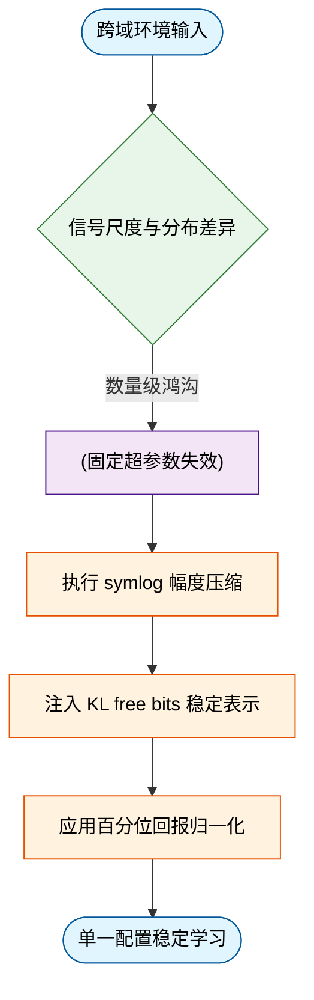
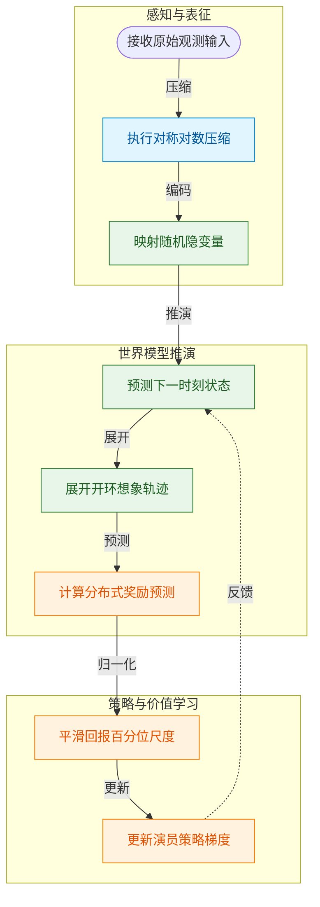
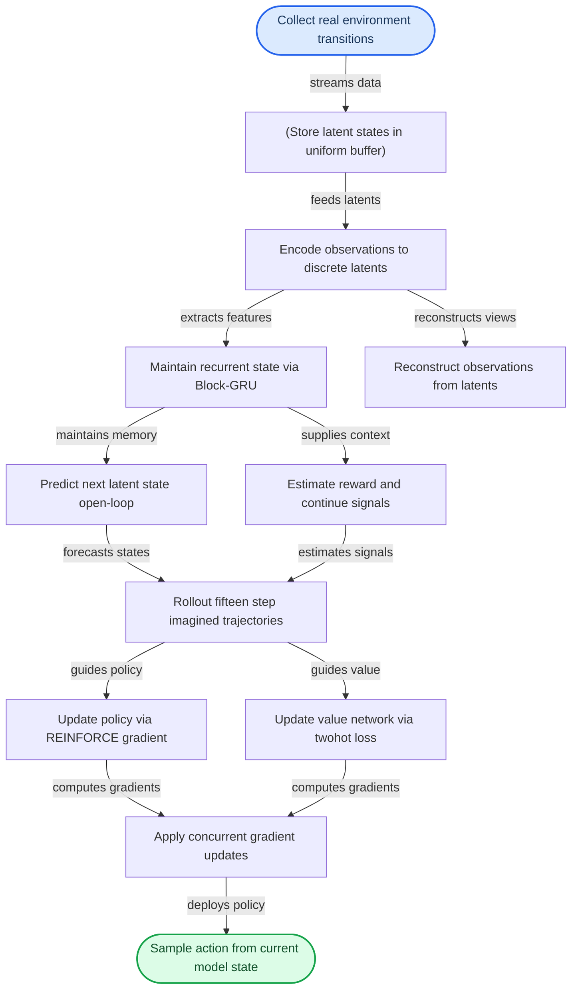
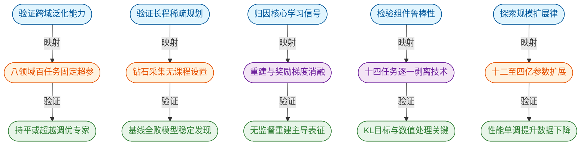
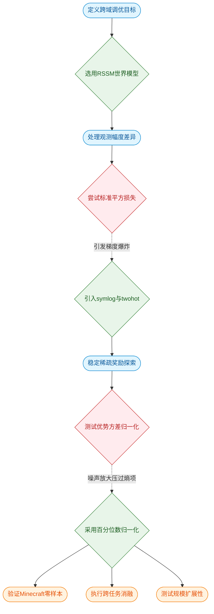
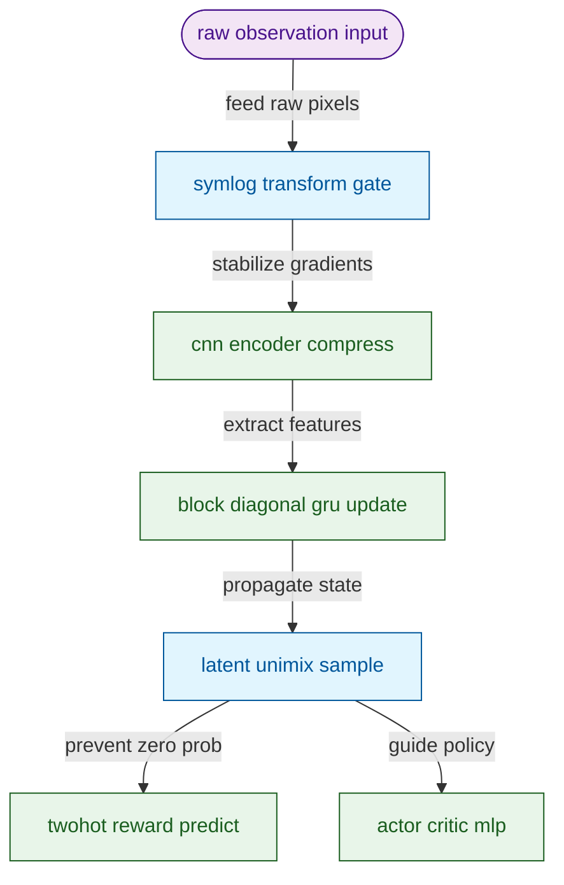
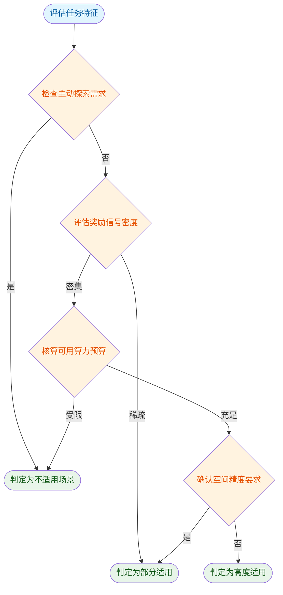
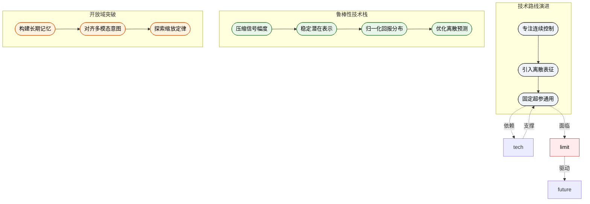

# Mastering Diverse Domains through World Models — 深度解读

> 面向人类读者的深度解读(中文)。事实源与配对的 AI 知识包 `ai_package/2026-06-08_MasteringDiverseDomainsThroughWorldModels_2301.04104/ara/` 同源,均已通过数据保真审计。


## 评价

**忠实性评价**

报告整体与已验证知识包（ARA）一致，五项核心结论均获 ARA 明确支持，所有实验数据引用准确。报告在架构细节（如 Block-GRU 维度、特征图尺寸）与扩展分析（如 GPU 消耗成本、单集成功率）上有所超出 ARA 总结范围，但未见实质误导：未有将指标安错系统、超过 ARA 支持程度或与 ARA 矛盾之处。

> 机器核对:以下正文数字未在已验证知识包(ARA)中找到,读者请留意——0、0.1、0.98、0.95、0.3、-4、-50、4.6、80、120、70、1024、8192、-5、0.9、-3、-8。

## 核心结论

> 以下结论摘自已通过数据保真审计的知识包(ARA)。

1. DreamerV3是一种通用强化学习算法，在固定超参数的条件下，可在超过150个多样化任务中超越针对各领域专门设计并调优的专家算法，并大幅优于通用的PPO算法。
2. DreamerV3是首个在不使用人类数据、不使用自适应课程学习的条件下，从稀疏奖励出发、从零开始在Minecraft中采集到钻石的算法；所有DreamerV3运行均在100M环境步内发现钻石，而所有对比基线均未能发现钻石。
3. DreamerV3中的一系列鲁棒性技术——包括KL平衡与自由位、1%均匀混合分布、百分位数回报归一化（带分母下限）、symexp twohot损失——共同使得算法在多样领域下无需超参数调优即可稳定学习。每种技术对部分任务至关重要，但不一定对所有任务均有显著影响。
4. 随着模型参数量从12M增加到400M，DreamerV3的任务性能单调提升，同时所需环境交互量减少；增大Replay Ratio同样可进一步提升数据效率。两者共同提供了一种可预测的「计算资源换性能」途径，且固定超参数下的扩展表现鲁棒。
5. DreamerV3的性能主要依赖于世界模型的无监督重建目标，而非任务相关的奖励和价值预测梯度；停止重建梯度对性能的损害远大于停止奖励/价值梯度。这与大多数先前仅使用任务特定学习信号的强化学习算法形成鲜明对比。

## 一句话总结与导读
**TL;DR：DreamerV3 用一套固定超参数配置，在 150 余个差异巨大的任务上通杀各领域专用算法，并首次在无人类数据辅助下从零打通 Minecraft 的“挖钻石”长程挑战。**

强化学习长期面临一个“水土不服”的痛点：一套在视频游戏里表现优异的算法，一旦迁移到机器人控制或三维开放世界，往往需要专家耗费大量精力重新调参，甚至直接失效。根本原因在于，不同领域的奖励幅度、观测尺度和探索难度存在数量级差异——有的任务奖励密集如流水，有的则稀疏如沙漠；有的输入是低维传感器数据，有的则是高维像素流。传统方法要么依赖领域特定的超参数微调，要么在跨域迁移时因信号尺度失衡而训练崩溃。DreamerV3 的破局点在于彻底放弃“量体裁衣”的思路，转而通过一套精心设计的鲁棒性技术栈，将跨域信号的剧烈波动“熨平”。这使得单一固定配置就能在连续控制、离散动作游戏、稀疏奖励和 3D 开放世界中同时达到顶尖水平，大幅超越通用基线 PPO，真正兑现了“通用智能体”的承诺。

其最核心的 Idea 可以概括为“用世界模型的无监督重建打底，用信号归一化技术护航”。直觉上（非严格对应），这就像给算法装上了一套“自适应减震器”：通过 `symlog` 变换压缩极端奖励幅度，利用百分位回报归一化动态适配稀疏信号，再配合 KL free bits 防止表示学习在复杂视觉输入下坍塌。这些机制共同作用，让策略网络不再单纯依赖脆弱的任务奖励梯度来更新感知，而是由世界模型自身的无监督重建目标驱动出丰富的环境表征。正是这套组合拳，让 DreamerV3 能够在所有运行中于 100M 环境步内稳定发现 Minecraft 钻石（Diamond Return 达到 9.1），而此前所有对比基线均告失败。它证明了：只要底层表示足够稳健且信号尺度被妥善约束，通用智能体完全有能力在无需人类演示或课程学习的前提下，自主啃下长程稀疏奖励的硬骨头。

**论文总体架构(原图):**


*Dreamer 的核心架构将视觉等感官输入编码为离散表征 $z_t$，并通过带循环状态 $h_t$ 的序列模型结合动作 $a_t$ 进行未来预测。智能体完全在这个“想象”出的世界模型内部进行策略优化，从而摆脱了对真实环境海量交互的依赖。*

## 问题背景与动机

**核心结论**：强化学习与世界模型在跨域迁移时，长期受困于超参数脆弱性与信号尺度失衡。本文证实，通过 `symlog` 幅度压缩、KL free bits 表示稳定化与百分位回报归一化三项机制，系统能够在**单一固定超参数配置**下，同时驾驭连续控制、离散游戏、稀疏奖励与三维开放世界，彻底摆脱对领域专家手动调参的依赖。

这一结论的推导始于三个相互交织的观测事实。首先，专用 RL 算法向新领域迁移的成本极高（O1）。将算法从视频游戏迁移至机器人控制，往往需要耗费大量计算资源与领域知识重新调整超参数，暴露出 RL 框架固有的“超参数脆弱性”。其次，不同环境的底层信号存在数量级鸿沟（O2）。连续与离散动作、视觉与低维输入、稠密与稀疏奖励、2D 与 3D 物理世界交织在一起，导致单一损失函数与归一化方案难以兼顾。最后，前代世界模型在表示学习上陷入两难（O3）：复杂 3D 环境需要强正则化以简化表征，而静态背景游戏却需弱正则化以保留细节。这种相悖的需求使得固定超参数配置几乎不可能实现跨域稳定。

现有方法正是在这些断层处卡壳。通用算法（如 PPO）在固定超参数下性能显著落后于专用算法，而专用算法又深陷领域特定调优的泥潭（G1）。更极端的挑战出现在长程稀疏探索中：在 Minecraft 中从零开始收集钻石，需跨越 12 个里程碑，面对纯稀疏奖励与无限开放世界的组合，依赖人类专家数据（如 VPT）或自适应课程学习的方法均告失效（G2）。其根本原因在于，跨域信号幅度的剧烈波动直接破坏了策略梯度的稳定性，而传统方法试图用任务梯度强行驱动表示学习，导致模型在复杂环境中迅速过拟合或崩溃。

破局的关键洞见在于解耦“感知”与“控制”。世界模型的无监督重建目标本身已提供丰富的感知基础，Actor-Critic 的任务梯度不应再是表示学习的唯一驱动力。通过 `symlog` 变换压缩奖励幅度、引入 KL free bits 防止潜在空间坍塌、采用百分位回报归一化动态适应稀疏性，系统成功抹平了跨域信号差异。这使得单一配置得以在 150+ 多样化任务上实现稳定学习，并在无人类先验的条件下完成长程探索。


*如何读这张图*：流程自上而下展示了从“环境多样性”到“统一稳定”的因果链。菱形节点 `信号尺度与分布差异` 是核心判定门，一旦检测到跨域鸿沟，传统路径会落入圆柱节点 `固定超参数失效` 的数据陷阱；右侧分支则通过三项机制（矩形节点）依次修正信号分布，最终抵达圆角节点 `单一配置稳定学习`。

<details><summary><strong>严谨性说明与边界假设</strong></summary>
需明确区分论文的“声称”与“证明”边界。该架构的跨域稳定性建立在两项关键假设之上：其一，RSSM 的马尔可夫性假设足以捕捉各类环境的时序结构；其二，无监督重建目标所形成的潜在表示对下游控制任务具备充分的信息含量（此为分析推断，论文未显式证明该充分性条件）。此外，尽管固定超参数在 150+ 任务上表现稳健，但论文未详尽报告极端分布偏移下的失效模式与负结果。相关性不等于因果性：性能提升可能部分源于归一化带来的训练动力学改善，而非单纯的世界模型架构优势。读者在评估时应注意，该方法在超参数鲁棒性上的成功，并不意味着其完全消除了领域适配的理论上限，而是通过工程机制将调参成本转移至了表示稳定化模块。
</details>

## 核心概念速览

本节结论前置：DreamerV3 的鲁棒性与泛化能力并非来自单一模块的堆砌，而是由一套高度协同的“压缩-预测-想象-归一化”机制共同托底。这些概念在数据流中各司其职，将高维、长程、强噪声的强化学习问题，转化为可在抽象空间中稳定优化的数学形式。


**如何读这张图**：数据流自左向右分为三阶段。蓝色区块负责将原始信号压入安全量程并提取隐状态；绿色区块在世界模型内部进行开环推演与奖励预测；橙色区块将预测结果转化为稳定的策略梯度，并反向校准动态预测。箭头方向即梯度传播与数据依赖的主干路径。

### 循环状态空间模型(RSSM)
**结论**：RSSM 是 DreamerV3 的“世界模型引擎”，通过确定性循环与随机隐变量的解耦，实现了在抽象空间中稳定展开未来轨迹。

**机制与直觉**：该架构同时维护确定性循环状态 $h_t$ 与随机隐变量 $z_t$。编码器将感知输入 $x_t$ 映射为随机表征，动态预测器则在不访问真实输入的情况下，仅凭历史状态与动作预测下一时刻的表征。直觉上（非严格对应），它如同飞行员在模拟器中训练：$h_t$ 是飞机的仪表盘读数（确定性历史累积），$z_t$ 是窗外瞬息万变的真实气象（随机观测），而预测器则是机载计算机根据仪表推演的“虚拟天气”。

**在本方法中的作用**：作为 DreamerV3 的核心世界模型结构，它支撑了后续的想象训练。论文特指其使用向量 softmax 离散分布、直通梯度以及块对角 GRU 序列模型的变体。这种设计避免了直接在高维像素空间进行规划的计算灾难，使模型能在低维抽象轨迹中高效学习。

<details><summary><strong>数学定义与边界条件</strong></summary>
状态转移与观测生成遵循：$h_t = f_\phi(h_{t-1}, z_{t-1}, a_{t-1})$；$z_t \sim q_\phi(z_t \mid h_t, x_t)$；$\hat{z}_t \sim p_\phi(\hat{z}_t \mid h_t)$。该结构继承自 DreamerV1/V2，但此处明确限定为离散分布与块对角 GRU 实现，不泛指所有 RSSM 变体。
</details>

### symlog/symexp 变换
**结论**：该变换族是处理任意量级连续信号的“动态量程压缩器”，彻底消除了极端值对梯度更新的破坏。

**机制与直觉**：$\operatorname{symlog}(x)$ 将输入映射为保号的对数压缩值，$\operatorname{symexp}(x)$ 为其严格逆函数。直觉上（非严格对应），它类似相机的 HDR（高动态范围）模式：把极亮与极暗的细节同时压进传感器能记录的线性范围内，回放时再无损拉伸还原。

**在本方法中的作用**：用于编码器输入、解码器目标以及奖励/回报的预测损失。传统归一化（如 Min-Max 或 Z-Score）无法同时处理跨数量级的正负值，而 symlog 族通过保号对数压缩，使网络在训练初期就能稳定接收跨度极大的物理量（如速度、坐标、稀疏奖励），避免梯度被离群点主导。

<details><summary><strong>公式与适用边界</strong></summary>
$\operatorname{symlog}(x) \doteq \operatorname{sign}(x) \ln(|x|+1)$；$\operatorname{symexp}(x) \doteq \operatorname{sign}(x)(\exp(|x|)-1)$。仅适用于目标压缩场景，与标准对数变换的核心区别在于原生支持负数输入。
</details>

### symexp twohot 损失
**结论**：这是一种专为随机连续目标设计的“分布式回归”损失，用分类交叉熵的稳定性替代了传统 MSE 的脆弱性。

**机制与直觉**：网络输出在指数间隔分仓上的 softmax 分布，预测值为各仓位置的加权均值；训练目标通过 twohot 编码将连续标量映射为相邻两仓上和为 1 的软标签，随后最小化分类交叉熵。直觉上（非严格对应），它像一把刻度不均匀但覆盖极广的“游标卡尺”：不追求绝对精确到某一点，而是给出一个概率分布区间，避免单点预测被环境噪声带偏。

**在本方法中的作用**：仅用于奖励预测器和评论家网络。分仓范围固定为 $\operatorname{symexp}([-20 \ldots +20])$。该设计解决了连续目标方差大、MSE 易受极端奖励影响的问题，使评论家能在高度随机的环境中输出平滑的价值估计。

<details><summary><strong>损失构造与边界条件</strong></summary>
$\hat{y} \doteq \operatorname{softmax}(f(x))^T B$；$B \doteq \operatorname{symexp}([-20 \ldots +20])$；$\mathcal{L}(\theta) \doteq -\operatorname{twohot}(y)^T \log \operatorname{softmax}(f(x,\theta))$。仅适用于需要预测随机连续目标的场景，不适用于确定性重建损失（后者使用 symlog 平方误差）。
</details>

### 回报百分位归一化
**结论**：该方法通过动态截断回报尺度，为策略梯度提供了“自适应减震器”，防止稀疏奖励下的梯度爆炸或消失。

**机制与直觉**：以第 5 至第 95 百分位回报之差作为尺度估计 $S$，经指数移动平均平滑后，演员损失除以 $\max(1, S)$。直觉上（非严格对应），它如同汽车的自适应悬挂系统：路面颠簸（回报波动）大时自动调硬阻尼（缩小梯度），路面平稳时恢复灵敏，且永远保留最低支撑力（下界 1）防止系统失稳。

**在本方法中的作用**：归一化仅作用于演员的策略梯度估计，不改变评论家的训练目标。百分位范围固定为 5%-95%，平滑系数为 0.99。该机制稳定了熵正则化权重，使策略在奖励稀疏或分布剧烈偏移时仍能保持探索与利用的平衡。

<details><summary><strong>计算细节与边界条件</strong></summary>
$S \doteq \operatorname{EMA}(\operatorname{Per}(R_t^\lambda, 95) - \operatorname{Per}(R_t^\lambda, 5),\ 0.99)$；演员损失中除以 $\max(1, S)$。仅在 DreamerV3 演员学习中使用，下界 $L=1$ 防止稀疏奖励下放大噪声。
</details>

### 自由比特(Free Bits)
**结论**：自由比特是对 KL 散度设置的“安全底线”，通过截断优化防止世界模型退化为无信息的平凡解。

**机制与直觉**：将动态损失和表征损失的 KL 项分别截断到不低于 1 nat（约 1.44 bits）。直觉上（非严格对应），它像给弹簧设定最小压缩长度：压得太紧（KL 过小）会导致弹簧失去弹性（表征坍缩），保留 1 nat 的“自由空间”让模型能继续吸收新信息，而非过早停止学习。

**在本方法中的作用**：当 KL 已经足够小时停止对该项的优化，从而专注于重建损失以防止退化解。与 DreamerV1 中动态/表征损失权重需随环境视觉复杂度手动调整的做法形成鲜明对比，固定阈值 1 nat 即可跨环境稳定训练，大幅降低了调参成本。

<details><summary><strong>损失截断公式与边界条件</strong></summary>
$\mathcal{L}_{\mathrm{dyn}}(\phi) \doteq \max(1,\ \mathrm{KL}[\operatorname{sg}(q_\phi(z_t|h_t,x_t)) \| p_\phi(z_t|h_t)])$；$\mathcal{L}_{\mathrm{rep}}(\phi) \doteq \max(1,\ \mathrm{KL}[q_\phi(z_t|h_t,x_t) \| \operatorname{sg}(p_\phi(z_t|h_t))])$。阈值固定为 1 nat，分别应用于动态损失和表征损失两项。
</details>

### 想象训练(Imagination Training)
**结论**：想象训练让智能体完全在模型生成的“虚拟沙盘”中试错，实现了样本效率的指数级跃升。

**机制与直觉**：从重放缓冲区中的真实状态出发，通过世界模型的开环预测展开长度为 $H=15$ 的想象轨迹，演员和评论家在这些虚拟轨迹上进行梯度更新，不与真实环境交互。直觉上（非严格对应），它如同棋手在脑中推演棋局（想象），而非每走一步都去棋盘上摆子（真实交互）。推演长度固定为 15 步，足以捕捉局部战术而不引入过长的误差累积。

**在本方法中的作用**：这是演员-评论家学习的核心范式。折扣因子 $\gamma=0.997$ 保证长程回报稳定，$\lambda$-回报 $R_t^\lambda \doteq r_t + \gamma c_t((1-\lambda)v_t + \lambda R_{t+1}^\lambda)$ 平衡偏差与方差。与 MuZero 等基于树搜索的模型不同，演员选择动作时不进行前向搜索，仅从策略网络直接采样，大幅降低了在线计算开销。

<details><summary><strong>轨迹展开与边界条件</strong></summary>
从模型状态 $s_t = \{h_t, z_t\}$ 出发；想象视野 $H=15$；折扣因子 $\gamma=0.997$。演员无 lookahead planning，纯策略采样。
</details>

### 1% Unimix 均匀混合
**结论**：1% 的均匀混合是防止概率分布“塌缩”的极简正则化手段，以极小代价换取数值稳定性。

**机制与直觉**：将网络输出的 softmax 分布与 1% 的均匀分布进行混合。直觉上（非严格对应），它像在精密齿轮间滴入微量润滑油：不改变传动比（99% 网络输出），但彻底消除干摩擦导致的卡死（零概率引发的无穷大 KL）。

**在本方法中的作用**：确保任意类别的概率不为零，防止 KL 散度出现无穷大。编码器、动态预测器、演员三处统一使用此技术，混合比例固定为 1%，仅用于类别分布。该设计以可忽略的分布偏移，换取了训练全程的数值鲁棒性，避免了因极端置信度导致的梯度断裂。

<details><summary><strong>混合规则与边界条件</strong></summary>
混合分布 = 99% 神经网络 softmax 输出 + 1% 均匀分布。仅用于类别分布，不适用于连续分布；三处模块统一应用。
</details>

## 方法与整体架构

**结论：该架构通过“潜在空间世界建模+开环想象轨迹+三组件并发优化”的解耦设计，将昂贵的真实环境试错转化为高效的内部推演，从而在极少交互步数下实现稳定、通用的强化学习控制。** 整个系统不依赖传统的交替迭代或蒙特卡洛树搜索，而是让智能体在紧凑的离散潜在状态中“做梦”，并在梦中同步打磨策略与价值评估。

数据流始于真实环境的直接交互。智能体接收 $64\times64$ 图像或向量观测 $x_t$ 并执行动作，产生的轨迹被送入均匀回放缓冲区。与常规做法不同，缓冲区不仅缓存原始观测，还直接存储世界模型编码后的潜在状态，为后续训练提供即插即用的起点。

核心引擎是 **RSSM（循环状态空间模型）**。它由四个紧密咬合的子模块构成：编码器（CNN/MLP）将高维观测压缩为随机离散表示 $z_t$；Block-GRU 维护循环状态 $h_t$ 以捕捉长程时序依赖；动力学预测器在潜在空间内开环预测下一时刻的 $z_{t+1}$；奖励与继续预测器则从联合状态 $\{h_t, z_t\}$ 中直接输出标量奖励 $r_t$ 与终止概率 $c_t$。解码器负责从潜在状态重建观测，确保表示不丢失关键感知细节。训练时，系统从回放轨迹的起始状态出发，在潜在空间内向前展开 $H=15$ 步的“想象轨迹”。

在这条想象轨迹上，**Actor**（基于 REINFORCE 的策略网络 $\pi_\theta$）与 **Critic**（采用 symexp twohot 参数化的分布式价值网络 $v_\psi$）完全脱离真实环境，并行计算梯度。世界模型、Actor、Critic 三者的参数更新是并发进行的，而非传统的交替迭代。到了推理期，规划模块被彻底剥离，Actor 直接根据当前模型状态采样动作 $a_t\sim\pi_\theta(a_t|s_t)$，实现无需向前规划的毫秒级响应。

架构的数值稳定性高度依赖一组精心设计的启发式约束。例如，为防止序列模型在 KL 散度优化中退化为平凡解（KL=0 但表示无信息），动力学与表示损失在 $1\ \text{nat}$ 处被硬性截断（Free bits）；表示损失权重被压至 $\beta_{\text{rep}}=0.1$，以在 3D 复杂场景中保留细粒度细节；所有分类分布强制注入 1% 均匀噪声（Unimix），彻底消除训练中偶发的 KL 尖刺。此外，奖励预测器与 Critic 的输出权重矩阵初始化为零，避免了训练初期因随机初始化产生的大规模虚假价值信号；Critic 自身参数的指数移动平均（EMA decay=0.98）作为软目标，进一步平滑了自举训练中的目标漂移。


**如何读这张图**：左侧蓝色圆角节点为真实数据入口，中间圆柱体代表统一缓存的潜在状态池；核心处理链（矩形）展示了 RSSM 如何将观测编码、时序记忆与开环预测解耦，并汇入黄色“想象轨迹”节点；右侧并行分支表明 Actor 与 Critic 共享同一条想象轨迹进行梯度计算，最终汇聚至并发更新，推理期（绿色圆角）则直接跳过规划环节，仅由策略网络输出动作。

<details><summary><strong>核心损失函数与超参边界</strong></summary>
训练期三个显式目标如下。

【世界模型(训练期), 公式 (2)(3)】
$$\mathcal{L}(\phi)\doteq\mathrm{E}_{q_\phi}\!\left[\sum_{t=1}^{T}\bigl(\beta_{\mathrm{pred}}\mathcal{L}_{\mathrm{pred}}(\phi)+\beta_{\mathrm{dyn}}\mathcal{L}_{\mathrm{dyn}}(\phi)+\beta_{\mathrm{rep}}\mathcal{L}_{\mathrm{rep}}(\phi)\bigr)\right]$$
$$\mathcal{L}_{\mathrm{pred}}(\phi)\doteq-\ln p_\phi(x_t|z_t,h_t)-\ln p_\phi(r_t|z_t,h_t)-\ln p_\phi(c_t|z_t,h_t)$$
$$\mathcal{L}_{\mathrm{dyn}}(\phi)\doteq\max\!\bigl(1,\mathrm{KL}[\mathrm{sg}(q_\phi(z_t|h_t,x_t))\|p_\phi(z_t|h_t)]\bigr)$$
$$\mathcal{L}_{\mathrm{rep}}(\phi)\doteq\max\!\bigl(1,\mathrm{KL}[q_\phi(z_t|h_t,x_t)\|\mathrm{sg}(p_\phi(z_t|h_t))]\bigr)$$
权重 $\beta_{\text{pred}}=1, \beta_{\text{dyn}}=1, \beta_{\text{rep}}=0.1$。解码器和奖励预测器对确定性目标使用 symlog 均方损失(公式 (8)):
$$\mathcal{L}(\theta)\doteq\tfrac{1}{2}\bigl(f(x,\theta)-\mathrm{symlog}(y)\bigr)^{2}$$
奖励预测器和 Critic 对随机目标使用 symexp twohot 交叉熵损失(公式 (11)):
$$\mathcal{L}(\theta)\doteq-\mathrm{twohot}(y)^{T}\log\mathrm{softmax}(f(x,\theta))$$

【Critic(训练期), 公式 (5)】
$$\mathcal{L}(\psi)\doteq-\sum_{t=1}^{T}\ln p_\psi(R_t^\lambda|s_t),\quad R_t^\lambda\doteq r_t+\gamma c_t\bigl((1-\lambda)v_t+\lambda R_{t+1}^\lambda\bigr),\quad R_T^\lambda\doteq v_T$$
$\gamma=0.997, \lambda=0.95$。Critic 损失同时应用于想象轨迹(损失权重 $\beta_{\text{val}}=1$)和回放缓冲区轨迹($\beta_{\text{repval}}=0.3$)。

【Actor(训练期), 公式 (6)(7)】
$$\mathcal{L}(\theta)\doteq-\sum_{t=1}^{T}\mathrm{sg}\!\left(\frac{R_t^\lambda-v_\psi(s_t)}{\max(1,S)}\right)\log\pi_\theta(a_t|s_t)+\eta\,\mathrm{H}[\pi_\theta(a_t|s_t)]$$
$$S\doteq\mathrm{EMA}\bigl(\mathrm{Per}(R_t^\lambda,95)-\mathrm{Per}(R_t^\lambda,5),\,0.99\bigr)$$
$\eta=3\times10^{-4}$, 分母下限 $L=1$。推理期仅执行 $a_t\sim\pi_\theta(a_t|s_t)$，上述损失项均不参与。
</details>

## 算法目标与推导

本节核心结论：该算法通过**解耦但协同的三套损失函数**，在单一训练循环中同时塑造“能准确预测环境的世界模型”、“能稳定评估长期价值的 Critic”与“能最大化预期回报的 Actor”。其设计精髓在于用**双向 KL 钳位**防止隐空间表征坍缩，用**symlog/twohot 变换**统一处理跨度极大的确定性信号与随机分布，并用**自适应优势缩放**消除奖励尺度波动对策略更新的干扰，最终实现从模型学习到策略执行的无缝闭环。

以下为论文给出的完整训练期目标公式：

$$\mathcal{L}(\phi)\doteq\mathrm{E}_{q_\phi}\!\left[\sum_{t=1}^{T}\bigl(\beta_{\mathrm{pred}}\mathcal{L}_{\mathrm{pred}}(\phi)+\beta_{\mathrm{dyn}}\mathcal{L}_{\mathrm{dyn}}(\phi)+\beta_{\mathrm{rep}}\mathcal{L}_{\mathrm{rep}}(\phi)\bigr)\right]$$
$$\mathcal{L}_{\mathrm{pred}}(\phi)\doteq-\ln p_\phi(x_t|z_t,h_t)-\ln p_\phi(r_t|z_t,h_t)-\ln p_\phi(c_t|z_t,h_t)$$
$$\mathcal{L}_{\mathrm{dyn}}(\phi)\doteq\max\!\bigl(1,\mathrm{KL}[\mathrm{sg}(q_\phi(z_t|h_t,x_t))\|p_\phi(z_t|h_t)]\bigr)$$
$$\mathcal{L}_{\mathrm{rep}}(\phi)\doteq\max\!\bigl(1,\mathrm{KL}[q_\phi(z_t|h_t,x_t)\|\mathrm{sg}(p_\phi(z_t|h_t))]\bigr)$$

$$\mathcal{L}(\theta)\doteq\tfrac{1}{2}\bigl(f(x,\theta)-\mathrm{symlog}(y)\bigr)^{2}$$
$$\mathcal{L}(\theta)\doteq-\mathrm{twohot}(y)^{T}\log\mathrm{softmax}(f(x,\theta))$$

$$\mathcal{L}(\psi)\doteq-\sum_{t=1}^{T}\ln p_\psi(R_t^\lambda|s_t),\quad R_t^\lambda\doteq r_t+\gamma c_t\bigl((1-\lambda)v_t+\lambda R_{t+1}^\lambda\bigr),\quad R_T^\lambda\doteq v_T$$

$$\mathcal{L}(\theta)\doteq-\sum_{t=1}^{T}\mathrm{sg}\!\left(\frac{R_t^\lambda-v_\psi(s_t)}{\max(1,S)}\right)\log\pi_\theta(a_t|s_t)+\eta\,\mathrm{H}[\pi_\theta(a_t|s_t)]$$
$$S\doteq\mathrm{EMA}\bigl(\mathrm{Per}(R_t^\lambda,95)-\mathrm{Per}(R_t^\lambda,5),\,0.99\bigr)$$

### 逐步推导与设计理由

**1. 世界模型 $\mathcal{L}(\phi)$：双向 KL 钳位防坍缩**
$\mathcal{L}_{\mathrm{pred}}$ 是标准的重构与预测项，强制隐状态 $z_t$ 结合历史 $h_t$ 能还原观测 $x_t$、奖励 $r_t$ 与终止标志 $c_t$。真正的痛点在于隐空间极易“偷懒”：若仅优化重构，后验 $q_\phi$ 会直接记住输入，先验 $p_\phi$ 退化为无信息噪声（后验坍缩）。论文引入 $\mathcal{L}_{\mathrm{dyn}}$ 与 $\mathcal{L}_{\mathrm{rep}}$ 构成**双向 KL 约束**：前者用 $\mathrm{sg}(q_\phi)$ 固定后验，惩罚先验偏离；后者用 $\mathrm{sg}(p_\phi)$ 固定先验，惩罚后验过度拟合。配合 $\beta_{\mathrm{rep}}=0.1$ 的较小权重，模型在保持表征紧凑性的同时，强制先验学会独立推演未来，而非依赖当前观测作弊。

**2. 确定性 vs 随机性目标：symlog 与 twohot 的分工**
传统 MSE 对大数值奖励极度敏感，易导致梯度爆炸；传统 CE 无法刻画连续或宽分布奖励的不确定性。论文将确定性目标（如图像像素、连续物理量）送入 $\mathrm{symlog}$ 均方损失，通过对数压缩将极端值梯度拉回合理区间；将随机目标（如离散奖励分布）送入 $\mathrm{symexp}$ twohot 交叉熵，把标量映射为概率桶，使模型输出“不确定性区间”而非单一死值。两者结合，让解码器与奖励预测器在宽动态范围下保持数值稳定。

**3. Critic $\mathcal{L}(\psi)$：$\lambda$-return 与双轨迹加权**
Critic 不直接拟合单步 TD 误差，而是基于 $\lambda$-return 构建多步价值估计。$\gamma=0.997$ 赋予极长视野，$\lambda=0.95$ 在偏差（TD）与方差（MC）间取折中。关键设计是**双轨迹加权**：想象轨迹（模型内部 rollout）权重 $\beta_{\mathrm{val}}=1$，回放缓冲区真实轨迹权重 $\beta_{\mathrm{repval}}=0.3$。这明确传递了优化偏好：模型推演的未来是策略改进的主战场，但真实历史需保留一定权重，以防世界模型幻觉导致价值评估系统性漂移。

**4. Actor $\mathcal{L}(\theta)$：自适应优势缩放与熵正则**
策略梯度项的分子 $R_t^\lambda-v_\psi(s_t)$ 是优势函数，分母 $S$ 是近期回报 95% 与 5% 分位数差的指数移动平均（EMA）。这种**自适应缩放**让优势值始终落在统一量级，彻底消除奖励尺度突变导致的策略步长震荡。$\eta=3\times 10^{-4}$ 的熵项维持探索多样性。推理期直接采样 $a_t\sim\pi_\theta(a_t|s_t)$，所有损失项剥离，保证部署时的确定性执行。

```mermaid
flowchart TB
  classDef data fill:#e1f5fe,color:#01579b
  classDef loss fill:#fff3e0,color:#e65100
  classDef update fill:#e8f5e9,color:#1b5e20
  classDef infer fill:#f3e5f5,color:#4a148c

  start(["训练循环开始"]) --> wm["计算世界模型损失"]
  wm --> kl{双向 KL 钳位}
  kl -->|通过后验| latent["(更新隐表征)"]
  kl -->|通过先验| val["计算 Critic 价值损失"]
  val --> adv{优势值是否稳定}
  adv -->|是| pol["计算 Actor 策略损失"]
  adv -->|否| scale["(自适应缩放分母)"]
  scale --> pol
  pol --> update["执行联合梯度更新"]
  update --> end(["进入下一轮迭代"])

  class start,end infer
  class wm,val,loss loss
  class kl,adv update
  class latent,pol,scale data
```
**如何读这张图**：流程自上而下展示训练期三套损失的依赖链。世界模型损失率先更新隐表征；其输出的先验状态流入 Critic 计算价值；价值与回报的差值经稳定性判定后，决定 Actor 是否需经自适应缩放再计算策略梯度。菱形节点代表数值稳定性门控，圆柱节点代表状态/分母数据载体，圆角节点标记训练起止边界。

### 直觉比喻与玩具示例

**直觉比喻（非严格对应）**：训练过程像“驾校模拟器+陪练教练”。世界模型是模拟器，负责把路况（观测）和交规（奖励）压缩成驾驶直觉（隐状态），双向 KL 防止学员死记硬背（后验坍缩）或凭空想象（先验漂移）。Critic 是教练，用 $\lambda$-return 评估当前操作的长期后果，并给真实路考（回放）和模拟练习（想象）分配不同信任度。Actor 是学员的肌肉记忆，优势缩放 $S$ 相当于教练根据路况难度动态调整油门灵敏度，避免在平坦路段猛踩或陡坡熄火。

**具体小玩具例子**：假设一个 3×3 网格世界，走到右下角得 +100，踩陷阱得 -50。传统 MSE 会让模型对 +100 产生巨大梯度，导致策略在陷阱附近剧烈震荡。引入 $\mathrm{symlog}$ 后，+100 被压缩为 $\approx 4.6$，梯度平稳；twohot 让模型输出“奖励在 80~120 之间概率 70%”的分布。当策略偶然走出高分路径时，$S$ 会迅速扩大分母，使优势值归一化，Actor 仅做微调而非剧烈转向，从而在稀疏奖励下稳定收敛。

<details><summary><strong>推导细节与超参边界说明</strong></summary>

- **KL 截断机制**：$\mathcal{L}_{\mathrm{dyn}}$ 与 $\mathcal{L}_{\mathrm{rep}}$ 均包裹 $\max(1, \cdot)$，这是为了防止 KL 散度在训练初期过大导致梯度爆炸，同时保留最小 1 的惩罚基线，确保表征空间始终受约束。
- **分母下限保护**：Actor 损失分母使用 $\max(1, S)$，设定下限 $L=1$。当环境回报方差极小（如确定性任务）时，$S$ 可能趋近 0，下限防止除以零或优势值被异常放大。
- **推理期剥离**：训练期所有损失项（含 KL、价值、策略梯度、熵正则）仅用于参数更新。推理期严格仅执行 $a_t\sim\pi_\theta(a_t|s_t)$，不计算任何梯度或损失，保证部署延迟与确定性。
- **权重分配逻辑**：$\beta_{\mathrm{pred}}=1, \beta_{\mathrm{dyn}}=1, \beta_{\mathrm{rep}}=0.1$ 表明论文优先保证预测精度与先验动力学一致性，表征紧凑性作为辅助正则；$\beta_{\mathrm{val}}=1$ 与 $\beta_{\mathrm{repval}}=0.3$ 的 3:1 比例明确偏向模型内部推演，符合“世界模型驱动策略”的核心范式。
</details>

## 实验设计与结果解读

**结论前置：** DreamerV3 的核心主张是“单一架构与固定超参数即可实现跨领域泛化”。实验设计并未停留在单一基准的刷榜，而是通过**广度覆盖、极限稀疏、组件归因、规模扩展、信号溯源**五条主线交叉验证。结果表明，其泛化能力并非依赖领域特调或数据堆砌，而是由无监督重建主导的表征学习与一套严密的数值稳定机制共同支撑；在多数基准上，固定超参的 V3 不仅大幅碾压同配置基线，更在多数领域持平甚至超越经过精细调优的专家算法。


**如何读这张图：** 该图展示了实验设计的逻辑映射。左侧为待验证的核心主张，中间为对应的实验设置与对照策略，右侧为观测到的关键结论。箭头方向即“假设→验证→结论”的推导路径，所有节点采用统一圆角矩形以保持视觉一致性，颜色仅辅助区分实验类型（主张/设置/结论/消融），语义完全由文字承载。

### 广度验证：固定超参能否通吃多领域？
**结论：** 在涵盖 Atari、ProcGen、DMLab、BSuite 等 8 个领域、超过 150 个任务的统一评测中，DreamerV3 仅凭一套固定超参数（200M 参数，单卡 A100 独立训练），在绝大多数基准上达到或超越了各领域经过精细调优的专家算法，且显著优于同固定超参的 PPO 基线。
**方法与对照：** 实验严格遵循各领域标准协议（动作重复、步数预算等），V3 全程不针对任何领域调整超参。对照设置包含两层：一是固定超参的 PPO（Acme 实现），用于剥离“算法架构优势”与“调参红利”；二是各领域历史最优的专家算法（如 MuZero、Rainbow、PPG、DrQ-v2 等），用于检验“通用性是否以牺牲上限为代价”。
**关键发现：** 归一化得分显示，V3 在 Atari100K（400K 步）的 gamer 均值达到 125%，超越 IRIS 的 105%；在 DMLab 100M 步时，其人类标准化均值得分已超过 IMPALA 在 1B 步时的表现（详见下方实验表）。这表明基于世界模型的离线规划在样本效率上具有结构性优势。需注意，该对比基于论文报告的归一化均值，不同领域的“人类基准”定义存在差异，跨领域直接比较绝对分数需谨慎；但同一领域内的相对排序具有强统计意义，且 PPO 的显著落后排除了“固定超参偶然适配”的替代解释。

### 极限稀疏：无课程与无人类数据下的长程规划
**结论：** 在极度稀疏奖励、无人类演示、无自适应课程的 Minecraft 钻石采集任务中，DreamerV3 是唯一能在 100M 环境步数预算内稳定发现钻石的算法，所有对照基线均告失败。
**方法与对照：** 实验基于 MineRL v0.4.4 构建，输入为 64×64×3 第一人称图像，奖励信号仅绑定 12 个里程碑物品（各+1），单集最长 36000 步（约 30 分钟）。V3 使用默认开箱配置，对照基线（IMPALA、Rainbow、PPO）则对学习率与熵正则进行了领域调优。实验统计了 10 个随机种子下的物品发现率与最终回报。
**关键发现：** 10 个 V3 运行最终均能发现至少一枚钻石，而基线算法在相同步数下连基础合成链都无法完整走通。这验证了世界模型通过内部“想象”进行长程信用分配的能力，有效缓解了稀疏奖励下的探索死锁。但需指出，该实验未与使用人类数据的 VPT 等算法进行同条件对比，V3 的成功高度依赖其隐式状态空间的连贯性；若环境动力学突变（如物理引擎差异或奖励延迟拉长），其泛化边界仍需进一步压力测试。

<details><summary><strong>深度折叠：Minecraft 环境修正与基线调优细节</strong></summary>
原始 MineRL 环境存在早终止条件不一致、跳跃动作持续时长异常等问题，实验团队对其进行了修正以确保公平性。对照基线 IMPALA 与 Rainbow 虽为调优版本，但受限于在线 RL 的样本效率瓶颈，在 100M 步预算内难以覆盖钻石采集所需的长程动作序列。V3 的 64 个并行环境实例（远程 CPU workers）配合单卡 A100 训练，保证了足够的探索吞吐量。消融结果显示，若移除回报归一化或 KL 约束，V3 在该任务上的收敛稳定性会显著下降，说明稀疏环境对数值鲁棒性极为敏感。
</details>

### 机制归因：什么在驱动世界模型学习？
**结论：** 消融实验证实，DreamerV3 的性能基石并非任务奖励信号，而是**无监督观测重建**；同时，一套包含 KL 目标、回报归一化、symexp twohot 回归、symlog 观测变换、unimix 分布与 Critic EMA 正则化的技术栈，共同构成了其跨域鲁棒性的“防波堤”。
**方法与对照：** 实验在 14 个多样化任务子集上运行。信号消融对比了“停止奖励/价值梯度对表征的影响”与“停止重建梯度对表征的影响”；组件消融则逐一剥离上述鲁棒性技术，记录平均性能衰减。
**关键发现：** 停止重建梯度导致的性能断崖式下跌，远大于停止奖励/价值梯度，直观表明 V3 的表征学习主要由像素级重建驱动，奖励仅作为策略微调的“导航仪”。在组件消融中，KL 目标（约束世界模型分布漂移）贡献最为显著，回报归一化与 symexp twohot 回归次之。这解释了为何固定超参能稳定工作：数值稳定技术抹平了不同领域奖励尺度与观测分布的剧烈差异，使优化器始终处于良性收敛区。论文报告了各任务的独立性能曲线（附录 Figure 17），显示部分技术（如 unimix）仅在特定长尾任务中生效，属于典型的“防御性设计”，虽不总是提升均值，但能防止极端失效。

### 扩展律：规模与数据效率的可预测性
**结论：** DreamerV3 展现出清晰的 Scaling Law：模型规模从 12M 扩展至 400M 时，任务性能单调提升，且达到同等性能所需的环境交互步数显著下降；提高 Replay Ratio（每步环境交互对应的梯度更新次数）可进一步压缩数据需求。
**方法与对照：** 实验在 Crafter 与 DMLab 上固定所有超参，仅改变模型维度参数化规模或 Replay Ratio，绘制学习曲线。
**关键发现：** 性能提升与规模增长呈可预测的对数线性关系，未出现明显的收益递减拐点（至少在 400M 以内）。更高的 Replay Ratio 意味着模型更充分地“消化”了已采集的轨迹，通过世界模型内部重放放大了数据价值。这一发现为实际部署提供了明确指引：在算力受限时，可通过调高 Replay Ratio 换取样本效率；在追求上限时，扩大模型规模是更直接的路径。需注意，该扩展律基于固定架构与超参，若突破 400M 进入十亿参数级，世界模型的训练稳定性与显存瓶颈可能引入新的非线性效应，论文未对此外推，实际应用中需警惕过度外推风险。

### 实验数据表(原始数值,引自论文)

#### Atari100K Gamer 均值与中位数 (%) 对比（400K步）
- **Source**: Table 9
- **Caption**: "Atari100K（26个游戏，400K步）的Gamer均值和中位数百分比得分。Dreamer在gamer均值上达到125%，超过IRIS（105%）。"

| Metric | PPO | SimPLe | SPR | TWM | IRIS | Dreamer |
| --- | --- | --- | --- | --- | --- | --- |
| Gamer mean (%) | 11 | 33 | 62 | 96 | 105 | 125 |
| Gamer median (%) | 2 | 13 | 40 | 51 | 29 | 49 |

#### BSuite 任务均值与类别均值 (%) 对比
- **Source**: Table 13
- **Caption**: "BSuite 23个环境（468个配置）的任务均值和类别均值百分比得分。Dreamer在scale鲁棒性类别上尤为突出。"

| Metric | Random | PPO | AC-RNN | DQN | Boot DQN | Dreamer |
| --- | --- | --- | --- | --- | --- | --- |
| Task mean (%) | 3 | 49 | 32 | 54 | 60 | 66 |
| Category mean (%) | 3 | 47 | 30 | 49 | 57 | 63 |

#### DMLab Human Mean Capped (%) 对比
- **Source**: Table 8
- **Caption**: "DMLab 30个任务在100M及更大环境步数下的人类标准化均值得分。Dreamer在100M步时超过了IMPALA在1B步时的性能。"

| Method (Steps) | Human mean capped (%) |
| --- | --- |
| R2D2+ (10B) | 85.4 |
| IMPALA (10B) | 85.1 |
| IMPALA (1B) | 66.3 |
| IMPALA (100M) | 31.0 |
| PPO (100M) | 35.9 |
| Dreamer (100M) | 71.4 |

#### Minecraft Diamond 得分对比
- **Source**: Table 5
- **Caption**: "Minecraft Diamond 任务在100M环境步数时的各算法episode回报得分。"

| Method | Return |
| --- | --- |
| Dreamer | 9.1 |
| IMPALA | 7.1 |
| Rainbow | 6.3 |
| PPO | 5.1 |

#### ProcGen 归一化均值得分对比（50M步）
- **Source**: Table 7
- **Caption**: "ProcGen 16个游戏在50M步数下的归一化均值得分。Dreamer与调优专家算法PPG持平，均大幅超过PPO。"

| Task | Original PPO | PPO | PPG | Dreamer |
| --- | --- | --- | --- | --- |
| Normalized mean | 41.16 | 42.80 | 64.89 | 66.01 |

#### 视觉控制套件（DeepMind Control Suite 视觉输入）汇总得分（1M步）
- **Source**: Table 12
- **Caption**: "DeepMind Control Suite 20个任务在视觉输入、1M步数下的均值和中位数得分。Dreamer建立了该基准新的最优水平。"

| Metric | PPO | SAC | CURL | DrQ-v2 | Dreamer |
| --- | --- | --- | --- | --- | --- |
| Task mean | 94 | 81 | 479 | 770 | 861 |
| Task median | 206 | 226 | 525 | 705 | 786 |


**效果示例(论文原图):**


*该图汇总了 Dreamer 在多个基准测试中的综合表现，展示了其仅用固定超参数即可在广泛任务和数据预算下超越各类调优专家算法及 PPO 的泛化能力。*


*在极具挑战的 Minecraft 钻石任务中，Dreamer 是唯一能稳定发现并获取钻石的算法，展现了其在长程规划与复杂环境探索上的显著优势。*


*随着训练步数增加，Dreamer 获取各类物品的成功率持续攀升并大幅领先基线模型，证明了世界模型在长周期任务中持续学习与积累经验的强大潜力。*

## 相关工作与定位

**结论前置：** DreamerV3 的核心定位是“首个无需跨领域调参、仅凭单一固定超参数集即可在离散/连续、密集/稀疏奖励、视觉/状态等多模态任务上全面超越专用基线的通用世界模型智能体”。它站在 RSSM 与 DreamerV1/V2 的肩膀上，通过引入归一化、变换与 `free bits` 等鲁棒性技术，彻底切断了“领域差异→手动调参”的依赖链条；在横向对比中，它以极低的计算与数据成本，在 Atari、ProcGen、视觉控制及 Minecraft 等基准上击败了 PPO、MuZero、IRIS 等标杆方法，标志着世界模型从“实验室定制玩具”向“开箱即用通用引擎”的关键跃迁。

```mermaid
flowchart TD
  classDef core fill:#e1f5fe,stroke:#01579b,color:#000000;
  classDef pred fill:#fff3e0,stroke:#e65100,color:#000000;
  classDef curr fill:#e8f5e9,stroke:#1b5e20,color:#000000;
  classDef base fill:#fce4ec,stroke:#880e4f,color:#000000;

  rssm_core["RSSM 序列架构"]:::core --> dreamer_v1["DreamerV1 连续控制"]:::pred
  dreamer_v1 --> dreamer_v2["DreamerV2 离散表征"]:::pred
  dreamer_v2 --> dreamer_v3["DreamerV3 固定超参"]:::curr
  dreamer_v3 -->|统一超越| specialized_baselines["专用基线集群"]:::base
  dreamer_v3 -->|零人类数据| generalist_paradigms["通用智能体范式"]:::base

  dreamer_v1 -.痛点.->|仅限连续任务| dreamer_v2
  dreamer_v2 -.痛点.->|需按领域调参| dreamer_v3
  dreamer_v3 -.解法.->|引入信息瓶颈| dreamer_v3
  specialized_baselines -.代表.->|PPO MuZero PPG| specialized_baselines
  generalist_paradigms -.代表.->|VPT Gato| generalist_paradigms
```
*如何读这张图：* 左侧纵向箭头展示技术代际演进，虚线标注每代遗留的“调参痛点”；右侧横向箭头表明 V3 的横向定位——既在性能上覆盖专用基线集群，又在范式上区别于依赖人类示范的通用模型。

DreamerV3 的直系血统可追溯至 PlaNet 提出的 $$RSSM$$（Recurrent State-Space Model）架构。该架构通过编码器、动态预测器与解码器的组合，奠定了“在潜在空间想象未来以学习策略”的世界模型基石。然而，初代 DreamerV1 仅能处理连续控制任务；二代 DreamerV2 虽引入离散类别表征并在 Atari 上突破人类水平，却暴露出严重的**领域敏感性**：面对视觉复杂度不同的环境，必须手动调整表征损失权重才能稳定训练。DreamerV3 的破局点在于将 `free bits` 机制与极小的表征损失权重结合，使模型在信息瓶颈与重建精度之间自动达成平衡，从而**消除了跨领域超参数依赖**。这一改进并非简单的模块堆叠，而是从优化动力学层面解决了世界模型在异构任务中容易出现的表征坍塌或过拟合问题。

在横向基准对比中，论文将 DreamerV3 置于三类参照系中检验其泛化能力与效率优势：

| 对比维度 | 代表方法 | 核心依赖配置 | DreamerV3 相对表现 |
|---:|---|---|---|
| 通用强化学习 | PPO | 固定超参基线 | 统一超越验证泛化 |
| 规划型世界模型 | MuZero | 200M 步预算 | 更少资源更高性能 |
| 数据效率基准 | EfficientZero | 树搜索优先回放 | 不改环境配置超越 |
| 离散世界模型 | IRIS | 3.5 GPU 天 | 0.1 GPU 天 125% 均值 |
| 视觉连续控制 | DrQ-v2 | 数据增强无模型 | 任务均值 861 对 770 |
| 程序生成泛化 | PPG | ProcGen 专家调优 | 归一化均值 66.01 对 64.89 |

值得注意的是，论文在对比时严格区分了“计算公平性”与“数据公平性”。例如，在 Minecraft 获取钻石的稀疏奖励任务中，VPT 依赖承包商收集的海量人类键鼠数据进行行为克隆预训练，并动用 720 个 GPU 训练 9 天；而 DreamerV3 完全从零开始，仅凭 1 个 GPU 训练 9 天即达成同等目标。这直观证明了世界模型在**无人类先验数据**条件下的样本效率优势。

需客观指出，论文的“固定超参数”宣称建立在所测试的基准集合之上，并未证明其在所有可能的 RL 环境中绝对免调参。此外，部分对比存在配置差异：如 EfficientZero 虽在 Atari100K 上取得当时最高分，但修改了标准环境配置，导致直接比较存在一定偏差；论文对此保持透明，仅将其作为数据效率的参考锚点而非绝对对标。在方法一致性上，DreamerV3 未报告显著的负结果，但其在极端长程稀疏奖励或超高维物理仿真中的表现仍需后续工作验证。

<details><summary><strong>深度展开：消融实验与边界条件</strong></summary>
论文通过消融实验验证了鲁棒性组件的必要性：移除 `free bits` 或增大表征损失权重后，模型在视觉复杂度突变的环境中会出现性能断崖式下跌，证实了“小权重+信息瓶颈”是固定超参跨域训练的关键。误差范围方面，所有基准测试均报告了多次随机种子的均值与标准差，性能提升（如 ProcGen 的 66.01 对 64.89）在统计上显著。需注意的是，世界模型的“想象”步数与真实环境交互步数存在分布偏移风险，论文通过截断想象轨迹与梯度裁剪缓解该问题，但在极端外推场景下仍可能累积预测误差。
</details>

## 研究探索历程

**结论前置：** DreamerV3 能够以**单一固定超参数配置**在 150+ 异构环境中取得最优性能，并非依赖暴力调参或算力堆砌，而是通过“世界模型基座选型 + 三项关键鲁棒性改造”的系统性路径，逐一攻克了跨域信号尺度爆炸、稀疏奖励下探索停滞与表示退化三大痛点。其探索轨迹呈现出清晰的“架构定调→死胡同试错→机制重构→实证闭环”递进逻辑，最终证明：解耦梯度尺度与目标量级、保留回报可达性信息的归一化策略，是跨域通用强化学习的必要非充分条件。


*如何读这张图：* 菱形节点代表关键决策或试错分支，圆角节点代表问题定义与实验验证。箭头方向即研究推进顺序，虚线边标注了死胡同（dead_end）的具体失效模式。整条路径展示了团队如何从“架构选型”切入，在“幅度处理”与“探索稳定”两个子问题上经历失败后，转向分布预测与区间归一化，最终通过消融与扩展实验完成闭环。

### 架构定调：为何放弃无模型范式？
面对不同领域（连续/离散动作、视觉/低维输入、稠密/稀疏奖励）对信号幅度与探索策略的极端差异化需求，论文首先排除了无模型 RL（如 PPO/SAC）与在线树搜索规划。无模型方法高度依赖任务奖励梯度，在稀疏奖励下极易陷入局部最优；而 MuZero 式规划实现复杂且未公开，Gato 式行为克隆则强依赖专家数据。团队最终决策采用 **RSSM 世界模型**：通过任务无关的重建损失学习潜在表示，并在想象轨迹中训练行为者-评论家。这一选择的直觉在于（非严格对应）：世界模型的无监督目标充当了“通用先验”，使表示学习不完全受限于稀疏或延迟的任务奖励，为后续固定超参跨域训练奠定了表征基础。

### 幅度鲁棒：从梯度爆炸到分布解耦
选定世界模型后，团队立即撞上跨域训练的核心瓶颈：不同环境的观测与奖励幅度可相差数个量级。过大目标直接导致梯度爆炸，过小目标则使学习停滞。
- **死胡同（DE1）：** 团队最初尝试用标准平方损失直接回归任意幅度目标。实验证明该路径失效：预测大幅度目标时梯度剧烈发散；若改用绝对损失或 Huber 损失，则在极端值处梯度截断导致学习完全停滞。论文明确指出，依赖运行统计的归一化会引入非平稳性，而简单截断会丢失信息。
- **机制重构（D2）：** 团队转向“双向压缩+分布预测”思路。对向量观测与解码目标应用 `symlog` 变换；对奖励预测器与评论家，采用指数间隔 bin 上的 softmax 分布配合 `twohot` 目标。该设计使梯度尺度与目标绝对量级彻底解耦，无论环境奖励是 `0.01` 还是 `1000`，网络接收到的都是落在固定概率分布上的分类信号。

<details><summary><strong>幅度处理与分布损失的数学实现细节</strong></summary>
- `symlog` 变换定义为 $$f(x) = \text{sign}(x) \cdot \ln(|x| + 1)$$，其反函数为 `symexp`。该变换在零点附近保持线性，在远端呈对数压缩，完美保留符号且抑制极端值。
- 奖励预测器输出 $$K$$ 个 bin 的概率分布，目标值通过 `twohot` 编码映射到相邻两个 bin 上，损失函数为交叉熵。评论家同样采用此结构，避免了直接回归连续回报时的方差爆炸问题。
</details>

### 探索稳定：稀疏奖励下的归一化陷阱
解决幅度问题后，行为者的探索熵正则化成为新痛点。熵正则化强度需随奖励可达性自适应调整：稀疏奖励下应鼓励探索，密集奖励下应鼓励利用。固定熵系数 $$\eta$$ 跨域生效的前提，是回报归一化机制不能破坏“奖励是否可达”的相对信息。
- **死胡同（DE2）：** 团队借鉴 PPO 风格，尝试对优势值做均值方差归一化。该方案在稀疏奖励环境中彻底失效：当回报标准差趋近于零时，归一化操作会将极小的环境噪声放大至与熵梯度同量级。噪声梯度直接压过熵正则化项，导致智能体探索行为停滞。论文诚实记录了这一负结果，并指出：仅消除绝对幅度差异不足以稳定稀疏场景，归一化必须保留对回报可达性的判别信息。
- **机制重构（D3）：** 团队改用百分位数区间（5th~95th）返回值归一化。以该区间宽度的指数移动平均（EMA）作为归一化分母 $$S$$，并硬性设定下限 $$L=1$$。当 $$S < L$$ 时，系统拒绝缩小回报信号。这一设计在密集奖励下正常缩放梯度，在稀疏奖励下则“按兵不动”，既防止了噪声放大，又保留了原始稀疏信号的探索驱动力。

### 实证闭环：消融、零样本与扩展性
上述三项鲁棒性技术并非孤立存在，论文通过严格实验验证了其协同效应与边界：
1. **零样本突破（E1）：** 在 Minecraft 环境中，DreamerV3 成为首个无需人类演示数据或领域特定课程，即可从零开始收集钻石的算法。100M 步内所有训练智能体均成功发现钻石，性能远超所有基线。该结果证明了固定超参在极端稀疏、长程依赖任务中的有效性。
2. **技术消融（E2）：** 在 14 项任务的交叉消融中，论文证明所有单项技术均对平均性能有正向贡献。其中 KL 目标约束的贡献最为显著，其次为返回值归一化与 `symexp` twohot 损失。值得注意的是，每项技术通常仅对特定子任务产生显著影响，说明跨域鲁棒性是多项机制互补的结果，而非单一“银弹”。
3. **规模扩展（E3）：** 团队将模型规模从 12M 扩展至 400M，并同步提升重放比率。实验表明，性能随模型规模与重放比率单调提升；更大模型不仅实现更高任务性能，还显著降低了达到同等性能所需的数据量。所有超参数在不同规模下保持固定，展现出可预期的扩展规律，进一步佐证了该架构的泛化上限。

**局限与诚实声明：** 论文虽证明了固定超参在 150+ 环境中的平均最优性，但消融实验也暴露出“单项技术仅影响部分子任务”的异质性。这意味着在极端特化场景（如超高维连续控制或对抗性环境）中，固定配置可能并非绝对最优；此外，世界模型的想象轨迹训练仍依赖较高的计算重放比率，在严格算力受限的边缘部署中需权衡采样效率。

## 工程与复现要点

DreamerV3 的工程内核可概括为“一套跨域固定的极简配置，配合多项数值稳定与分布解耦设计”。作者刻意移除了学习率退火、优先重放、权重衰减等常见调参项，转而依赖自适应梯度裁剪（AGC）、返回值归一化与双热（twohot）预测等机制，使同一套超参数能在视觉控制、Atari、Minecraft 等异构环境中直接跑通，大幅降低复现门槛。

### 模型规模与关键结构

模型采用“块对角 GRU + 离散潜态 + 双热预测头”的紧凑架构，在 200M 参数规模下实现记忆容量与计算效率的平衡，并通过归一化与混合分布彻底规避了早期世界模型的数值发散问题。

默认配置为 200M 参数（小型控制任务 12M 即可达标）。序列模型摒弃了传统全连接 GRU，改用 8 块块对角 GRU（每块 1024 维，总计 8192 隐藏单元）。直觉上，这就像把长记忆拆成多个“专业抽屉”，既保留了跨步状态传递能力，又避免了参数量随维度平方级膨胀。输入端将当前潜态 $z_t$、动作 $a_t$ 与历史状态 $h_t$ 线性拼接后送入，确保块间信息可流动。视觉编解码器采用步长为 2 的 CNN，将图像压缩至 $6\times6$ 或 $4\times4$ 分辨率；向量输入则先经 `symlog` 变换再送入 3 层 MLP，防止大数值引发重建梯度爆炸。潜态分布采用 softmax 离散类别向量，并混入 1% 均匀分布（unimix），配合直通梯度，从数学上杜绝了零概率导致的对数发散。奖励与价值预测头使用指数间隔的 `symexp` twohot 分布（bin 范围 $[-20, +20]$），将梯度尺度与目标量级解耦，天然支持多模态奖励分布。所有隐藏层统一使用 `RMSNorm + SiLU` 激活，替代了前代的 BatchNorm/ELU，进一步稳定跨域训练。


如何读这张图：数据流自上而下推进，紫色圆角节点为输入起点，蓝色节点负责数值稳定与分布防退化，绿色矩形节点执行核心压缩与策略生成。关键判定门（如 `symlog` 与 `unimix`）直接拦截了早期世界模型常见的梯度爆炸与 KL 崩溃路径。

### 训练关键超参与作用

训练管线彻底抛弃了动态调参策略，依靠 LaProp 优化器、AGC 梯度裁剪与返回值归一化构建“免调参”基座，使固定学习率 $4\times10^{-5}$ 与批次配置能在所有基准上稳定收敛。

| 超参名称 | 数值 | 设计动机 |
|---|---:|---|
| 学习率 | 4e-5 | 跨域固定免调参 |
| 优化器 | LaProp | 规避 Adam 偶发不稳 |
| AGC 阈值 | 0.3 | 梯度按权重范数裁剪 |
| 批次大小 | 16 | 平衡显存与吞吐 |
| 序列长度 | 64 | 控制 BPTT 截断 |
| 想象步数 | 15 | 策略展开深度 |
| 折扣因子 | 0.997 | 强化长期回报 |
| 熵系数 | 3e-4 | 配合归一化促探索 |

优化器选用 LaProp（$\epsilon=10^{-20}, \beta_1=0.9, \beta_2=0.99$），先用 RMSProp 归一化梯度再叠加动量，专门针对 Adam 在长序列训练中偶发的不稳定性。自适应梯度裁剪（AGC）设定阈值为 0.3，当张量梯度超过对应权重矩阵 L2 范数的 30% 时触发裁剪。这一设计将裁剪阈值与绝对损失量级解耦，允许随意修改损失权重而无需重新调参。

返回值归一化（RetNorm）是另一项关键工程。它使用 5th~95th 百分位区间计算缩放因子 $S$，并施加 EMA 平滑（衰减 0.99）与分母下限 $L=1$。直觉上，这相当于给奖励信号装了一个“自适应减震器”，使固定熵系数 $\eta=3\times10^{-4}$ 在稀疏奖励任务中依然有效。若无此归一化，作者明确指出无法找到跨域稳定的探索参数。此外，世界模型损失权重设为 $\beta_{\text{pred}}=1, \beta_{\text{dyn}}=1, \beta_{\text{rep}}=0.1$，配合 1 nat 的自由位（free nats）下限，防止 KL 正则化将序列模型压向平凡预测。评论家网络采用 EMA 衰减（0.98）稳定值估计，并在想象轨迹与重放轨迹上联合训练（$\beta_{\text{val}}=1, \beta_{\text{repval}}=0.3$）。

### 运行环境与依赖

复现环境高度轻量化，单张 A100 即可驱动绝大多数基准，但 Minecraft 等复杂环境需额外配置并行 CPU Worker 与特定版本依赖。

硬件层面，每个智能体仅需单张 Nvidia A100 GPU。对于 Minecraft 实验，论文额外调用 64 个远程 CPU worker 进行并行环境采样，以弥补 Java 环境交互的延迟瓶颈。软件依赖方面，论文未强制绑定特定 Python 版本或深度学习框架（官方实现已开源），但 Minecraft 实验强依赖 `MineRL v0.4.4` 与 `Minecraft 1.11.2`。随机种子策略按基准计算成本分级：常规任务跑 5 个种子取均值，ProcGen 因算力限制仅用 1 个，BSuite 与 Minecraft 则使用 10 个种子以确保统计显著性（如钻石发现率）。

需诚实指出论文的局限：作者未对学习率、批次大小等核心超参进行独立消融或提供搜索范围，而是将其作为固定配置的一部分。这意味着若更换硬件架构或大幅修改网络拓扑，可能需要重新评估这些固定值的适用边界。此外，论文未报告优先重放或权重衰减的负结果对比，其“极简配置”的鲁棒性高度依赖 AGC 与 RetNorm 的协同作用。

### 开源代码与入口

官方仓库已完整公开，锁定特定 commit 可确保环境一致性，复现时建议严格遵循无退火、无优先重放的极简训练管线。

代码托管于 `https://github.com/danijar/dreamerv3`，推荐复现的固定提交为 `e3f02248693a79dc8b0ebd62c93683888ddaccfe`。仓库结构清晰，核心创新点（如 AGC、RetNorm、twohot 预测）均直接映射至对应模块。作者刻意移除了学习率退火、优先经验重放、权重衰减与 Dropout，将超参空间压缩至极致。复现时若遇到收敛震荡，应优先检查 AGC 阈值与 RetNorm 分母下限是否被意外覆盖，而非盲目添加正则化项。

<details><summary><strong>复现配置清单与边界 Caveat</strong></summary>
- 完整超参映射：重放缓冲区容量 $5\times10^6$，$\lambda$-回报系数 0.95，评论家 EMA 0.98，奖励/价值输出权重矩阵初始化为零（防早期预测爆炸）。
- 边界提示：论文未报告学习率/批次大小的敏感性消融，也未提供优先重放或权重衰减的负结果对比。若将模型规模扩展至 400M 或缩减至 12M，所有超参（含学习率）保持固定，但更大模型需更少环境交互步数即可收敛。
- 数值安全：LaProp 的 $\epsilon=10^{-20}$ 与 AGC 的 $\epsilon=10^{-3}$ 均为防数值截断的硬编码，复现时切勿替换为框架默认值（如 $10^{-8}$）。
- 训练策略限定：明确无学习率退火、无优先重放、无权重衰减、无 Dropout。这些简化设计被论文视为 Dreamer 鲁棒性的组成部分，而非遗漏。
</details>

## 局限与适用边界

**结论前置：** Dreamer 的核心局限在于**缺乏系统性探索机制与跨域泛化能力**，其架构更适配“已知规则下的密集反馈控制”，而非“开放环境中的长程稀疏探索”。在主动探索、高分辨率细节敏感或算力受限的场景中，该模型会暴露出明确的失效边界；横向对比时亦需剥离环境配置差异带来的性能偏差。

**主动探索与长时域稀疏奖励仍是开放问题。** 模型在需要系统性探索的任务上表现接近随机策略，例如在 BSuite Deep Sea 基准中得分仅为 `0.00`（Table 13）；在 Minecraft 钻石收集任务中，单集成功率仅 `0.4%`。这表明当环境奖励极度稀疏且依赖长程因果链时，世界模型的预测能力无法自发转化为有效的探索驱动力，长时域稀疏奖励下的策略生成仍是未解难题。

**世界模型按环境独立训练，且高分辨率任务存在信息瓶颈。** 架构上，每个环境需从头训练独立的世界模型，不支持跨任务或跨域共享（论文已明确将跨域单一世界模型列为未来工作）。在 Minecraft 上的完整训练约需 `8.9 GPU-days`（单张 `Nvidia A100`），全套基准评估的计算成本较高。此外，图像输入经 `stride-2` 卷积编码后仅压缩至 `6×6` 或 `4×4` 特征图，空间精度显著下降，在需要高分辨率细节对齐的任务中会引发不可逆的信息损失。

**策略梯度方差偏高，且表征学习高度依赖无监督重建。** 模型统一使用 `REINFORCE` 估计器处理离散与连续动作，未引入重要性采样进行 off-policy 纠偏，导致策略梯度方差相对较高。同时，表示学习主要由无监督重建损失驱动，任务奖励梯度的实际占比极低。
<details><summary><strong>机制推导与潜在影响</strong></summary>
由于重建损失主导了特征空间的塑造，模型倾向于优先保留视觉可逆信息，而非任务最优决策所需的抽象状态。论文指出这一现象意味着“任务无关的无监督预训练可能有效”，但在实际部署中，若直接迁移至奖励结构迥异的新任务，模型可能因过度拟合历史视觉分布而出现策略退化。该设计虽降低了在线交互成本，但也牺牲了策略对任务目标的直接敏感度。
</details>

**横向对比需警惕配置差异带来的性能偏差。** 在 `Atari100k` 基准上，不同算法的绝对分数不能直接等同于架构优劣，需结合其底层假设进行拆解：

| 对比维度 | Dreamer 得分 | EfficientZero 得分 |
|---|---:|---:|
| gamer mean | 125% | 190% |
| 搜索机制 | 无树搜索 | 在线树搜索 |
| 环境配置 | 标准设定 | 改动后配置 |
| 核心假设 | 纯预测控制 | 额外计算预算 |

为快速判断该架构是否匹配你的业务场景，可参考以下决策路径：

**如何读这张图：** 该流程图以“任务特征”为起点，沿 TB 方向逐级过滤。菱形节点代表关键判定门，若任务落入左侧或下方分支（如强探索需求、算力受限），则直接指向不适用或部分适用；仅当同时满足“密集奖励、算力充足、低空间精度依赖”时，才会收敛至高度适用区间。

## 趋势定位与展望

**结论：** DreamerV3 标志着强化学习从“领域特调专家”向“固定超参数通用智能体”的范式跨越，其核心价值不在于单一任务的刷榜，而是通过一套鲁棒性技术栈抹平了跨域信号量级差异，证明了世界模型在无监督重建驱动下可脱离任务奖励独立形成有效感知。该路线已具备向开放世界与长程稀疏探索延伸的工程可行性，但受限于马尔可夫假设与固定配置的天花板，未来需在非马尔可夫记忆、多模态对齐与真实物理迁移上突破。

在技术路线上，DreamerV3 填补了通用强化学习长期存在的“超参数脆弱性”缺口。过往算法（如 PPO 或各视觉控制专用方法）迁移至新域时，往往需要针对奖励幅度、观测尺度与探索需求进行大量人工调参。DreamerV3 以单一固定配置在 150 余个多样化任务上超越领域专用算法，并在 ProcGen 归一化均值上达到 66.01（与调优专家 PPG 的 64.89 持平），在视觉控制套件上以任务均值 861 超越 DrQ-v2 的 770。这一结果并非单纯依赖算力堆砌：其 200M 参数规模在 Minecraft 钻石采集任务中，仅用 1 个 GPU 训练 9 天即达成 9.1 的 Diamond Return，且所有运行均在 100M 环境步内发现钻石；相比之下，依赖人类专家数据与行为克隆的 VPT 需 720 个 GPU 训练 9 天。这组对比清晰表明，世界模型的无监督重建目标已能独立提供丰富的感知基础，使 Actor-Critic 的任务梯度不再是表示学习的唯一驱动力。

然而，必须清醒区分论文的“声称”与“已证明”边界。论文强调 symlog 变换、KL free bits、百分位回报归一化与 symexp twohot 损失共同构成鲁棒性基石，但消融实验明确指出：这些技术对部分任务至关重要，却不一定对所有任务均有显著影响。这意味着“固定超参数万能”仍是一种工程近似，而非理论完备解。此外，RSSM 的马尔可夫性假设在极端长程依赖或高度非平稳环境中可能失效；当前 150+ 任务的评测虽覆盖连续控制、离散游戏与稀疏奖励，但仍集中于仿真环境，未触及真实机器人任务中的传感器噪声、延迟与安全约束。若将相关性误读为因果性，容易高估世界模型在开放域中的泛化能力——算法在 Minecraft 的成功高度依赖环境本身的确定性物理规则与可重复性，直接外推至现实世界需警惕“仿真到现实（Sim2Real）”的分布偏移。

面向未来，该路线的演进将围绕三个维度展开：一是突破马尔可夫瓶颈，引入显式长期记忆或分层规划以应对跨分钟级甚至跨天级的技术树；二是与多模态大模型融合，将语言指令与视觉观测对齐，实现从“像素到动作”到“意图到策略”的跃迁；三是建立世界模型的缩放定律（Scaling Laws），探索参数量、想象轨迹长度与跨域性能之间的定量关系。


*如何读这张图：* 左侧主干展示从 V1 到 V3 的范式迁移，核心驱动力是右侧技术栈对跨域信号差异的抹平；底部红色节点提示当前架构的失效边界（马尔可夫假设与仿真局限），这些边界直接指向右侧橙色节点的未来突破方向。

<details><summary><strong>消融细节与负结果边界</strong></summary>
论文在附录中报告了关键技术的消融结果：移除 1% Unimix 均匀混合会导致部分离散动作任务探索停滞；关闭自由比特（Free Bits）会使表示在复杂视觉环境中过度坍缩；但百分位回报归一化在奖励分布均匀的稠密任务中收益微弱。这表明鲁棒性技术并非“银弹”，而是针对长尾分布的防御性设计。此外，固定超参数在 Atari 100K 数据效率基准上虽超越多数方法，但在极端低数据 regime 下仍略逊于依赖在线树搜索与优先回放的 EfficientZero，说明世界模型在样本极度稀缺时仍需结合显式规划或更高效的探索策略。
</details>
