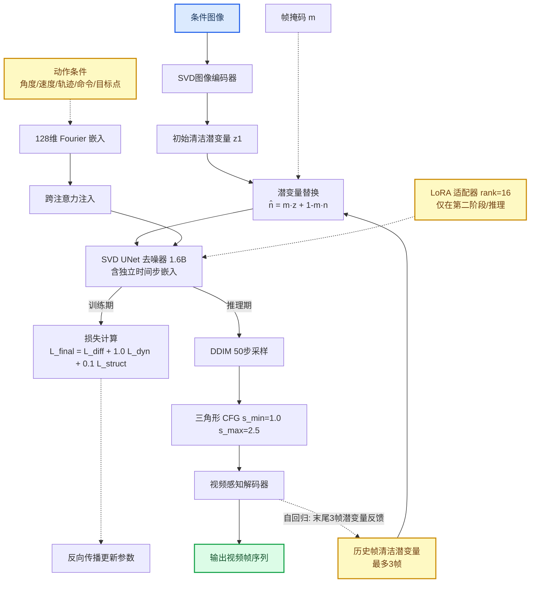
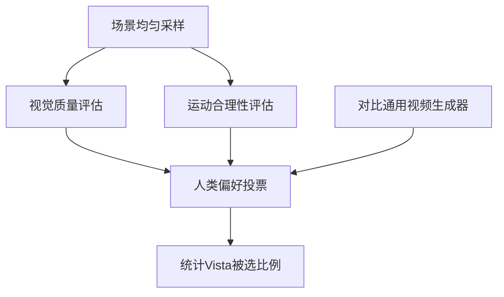
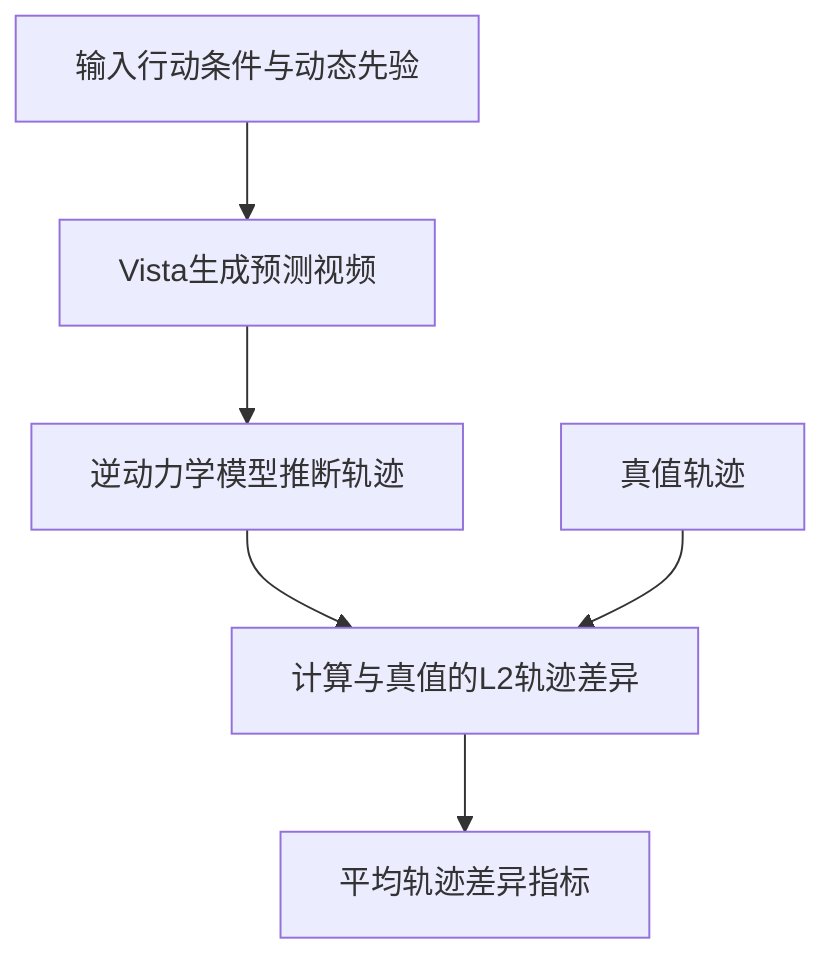
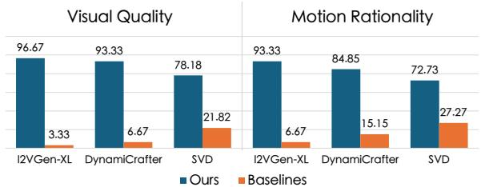
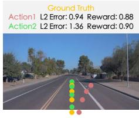
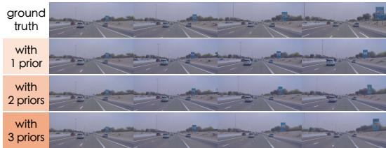
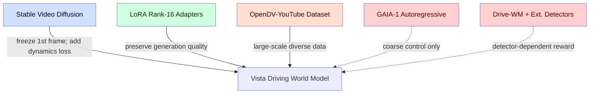
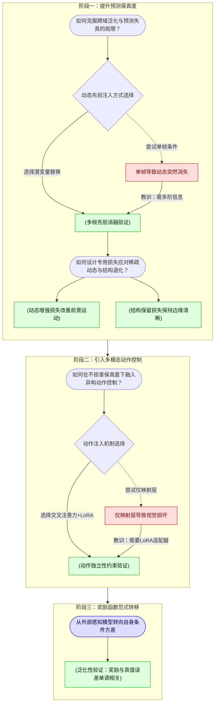

# Vista: A Generalizable Driving World Model with High Fidelity and Versatile Controllability — 深度解读

> 面向人类读者的深度解读(中文)。事实源与配对的 AI 知识包 `ai_package/2026-06-08_Vista_2405.17398/ara/` 同源,均已通过数据保真审计。

## 核心结论

> 每条结论后的隐形锚点把数字回链到论文原文(忠实性保证)。

1. Vista 在 nuScenes 验证集的 FID 和 FVD 指标上超越所有已报告的驾驶世界模型，FID 相较最优基线提升 55%，FVD 相较最优基线提升 27%<!--ref:r-world-models-can-fores--><!--anchor:quote:World%20models%20can%20foresee%20the%20outcomes%20of%20different%20actions%2C%20which%20is%20of%20paramount%20importance%20for%20autonomous%20driving.%20Nevertheless%2C%20existing%20driving--><!--ref:r-world-models-can-fores--><!--anchor:quote:World%20models%20can%20foresee%20the%20outcomes%20of%20different%20actions%2C%20which%20is%20of%20paramount%20importance%20for%20autonomous%20driving.%20Nevertheless%2C%20existing%20driving-->
2. Vista 在跨越 nuScenes、Waymo、OpenDV-YouTube-val 及 CODA 四个数据集的人类评估中，对视觉质量和运动合理性两个维度均超过最先进通用视频生成器超过 70% 的比较次数<!--ref:r-table-tr-td-rowspan-2--><!--anchor:quote:%3Ctable%3E%3Ctr%3E%3Ctd%20rowspan%3D%222%22%3EMethod%3C%2Ftd%3E%3Ctd%20rowspan%3D%222%22%3EData%20Scale%3C%2Ftd%3E%3Ctd%20rowspan%3D%222%22%3EModel%20Setups%20FrameRate%3C%2Ftd%3E%3Ctd%20rowspan%3D%222%22%3EResolution%3C%2Ftd%3E%3Ctd%20colspan%3D%224%22%3EAction%20Control%20Modes%3C%2Ftd%3E%3C%2Ftr%3E%3Ctr%3E%3Ctd%3EAngle%26amp%3BSpeed%20Trajectory%3C%2Ftd%3E%3Ctd%3E%3C%2Ftd%3E%3Ctd%3ECommand%3C%2Ftd%3E%3Ctd%3EGoal%20Point%3C%2Ftd%3E%3C%2Ftr%3E%3Ctr%3E%3Ctd%3EDriveSim%5B102%5D%3C%2Ftd%3E%3Ctd%3E%3C%2Ftd%3E%3Ctd%3E%3C%2Ftd%3E%3Ctd%3E80%C3%97160%3C%2Ftd%3E%3Ctd%3E%3C%2Ftd%3E%3Ctd%3E%3C%2Ftd%3E%3Ctd%3E%3C%2Ftd%3E%3Ctd%3E%3C%2Ftd%3E%3C%2Ftr%3E%3Ctr%3E%3Ctd%3EDriveGAN%20%5B68%5D%3C%2Ftd%3E%3Ctd%3E7h%20160h%3C%2Ftd%3E%3Ctd%3E5Hz%208Hz%3C%2Ftd%3E%3Ctd%3E256%C3%97256%3C%2Ftd%3E%3Ctd%3E%E3%80%90%20%E2%88%9A%3C%2Ftd%3E%3Ctd%3E%3C%2Ftd%3E%3Ctd%3E%3C%2Ftd%3E%3Ctd%3E%3C%2Ftd%3E%3C%2Ftr%3E%3Ctr%3E%3Ctd%3EDriveDreamer%5B125%5D%3C%2Ftd%3E%3Ctd%3E5h%205h%3C%2Ftd%3E%3Ctd%3E12%20Hz%202Hz%3C%2Ftd%3E%3Ctd%3E128%C3%97192%3C%2Ftd%3E%3Ctd%3E%3C%2Ftd%3E%3Ctd%3E%3C%2Ftd%3E%3Ctd%3E%3C%2Ftd%3E%3Ctd%3E%3C%2Ftd%3E%3C%2Ftr%3E%3Ctr%3E%3Ctd%3EDrive%2DWM%5B127%5D%3C%2Ftd%3E%3Ctd%3E%3C%2Ftd%3E%3Ctd%3E%3C%2Ftd%3E%3Ctd%3E192%C3%97384%3C%2Ftd%3E%3Ctd%3E%3C%2Ftd%3E%3Ctd%3E%E2%88%9A%3C%2Ftd%3E%3Ctd%3E%3C%2Ftd%3E%3Ctd%3E%3C%2Ftd%3E%3C%2Ftr%3E%3Ctr%3E%3Ctd%3EWoVoGen-->
3. 与仅使用标准扩散损失相比，引入动态增强损失后，模型对运动实例（如移动车辆）的预测更加真实，能够生成符合物理规律的运动（如车辆正常前行、场景几何随转向正确偏移）
4. 在高分辨率驾驶场景预测中，引入基于高频特征的结构保留损失可抑制运动物体轮廓的模糊与崩溃，保留车辆边缘等结构信息
5. 将最多三帧历史帧的干净潜在编码替换对应位置的噪声潜在，可为模型提供位置、速度、加速度三阶运动先验，从而在自回归长时域预测中保持与历史帧的连贯性；引入越多先验帧，轨迹一致性越好
6. Vista 在 nuScenes 上学习到的多模态行动控制（轨迹、角度与速度、命令、目标点）可以零样本方式泛化到训练域以外的 Waymo 数据集，行动控制仍能有效引导预测运动
7. 利用 Vista 自身对同一条件帧与动作的多轮去噪的条件方差可定义奖励函数，该奖励随轨迹 L2 误差的增大而单调下降，无需访问真值动作，且能泛化到训练域外的 Waymo 数据集<!--ref:r-shenyuan-gao1-2jiazhi--><!--anchor:quote:Shenyuan%20Gao1%2C2Jiazhi%20Yang%C2%B2%20Li%20Chen2%2C5%20Kashyap%20Chitta3%2C4%20Yihang%20Qiu2%20Andreas%20Geiger3%2C4t%20Jun%20Zhang1%E2%80%A0%20Hongyang%20Li2%2C5%E2%80%A0-->

## 一句话总结与导读

**TL;DR：Vista 是一个以视频扩散模型为骨架的自动驾驶世界模型，它能按用户的“驾驶意图”（方向盘转角、行驶轨迹、目标点等）生成高清（576 × 1024）、流畅（10 Hz）的未来行车画面，并能零样本迁移到从未见过的城市与数据集上，甚至还能充当“评判官”来评估一条驾驶轨迹有多安全——且这一切不需要真实世界的动作标签。**

如果你了解自动驾驶，一定知道“世界模型”这个词这些年被提得越来越多。它就像自动驾驶系统大脑中的“梦境模拟器”：给定当前看到的道路景象和你打算采取的操作（加速、转向、变道），它能推演出几秒钟后周围车辆、行人、车道线会如何变化。然而，此前多数世界模型都有一个尴尬的“近视眼”问题：输出的画面分辨率不高、帧率只有个位数，一旦你需要更清晰、更连贯的长期预测，模型就开始“糊弄”——运动物体的边缘变得模糊、远方景物扭曲、长时序预测中车辆甚至会“漂移”到不该去的地方。更麻烦的是，它们往往只能接受一种控制信号（比如方向盘角度加车速），而现实中的规划算法形式多样（路径点序列、高层指令“左转”等），导致世界模型成了一个挑三拣四的“挑剔乘客”，很难与真正的决策模块无缝配合。此外，它们大多在固定几个城市的数据上训练，一换到不同风格的街景就会“水土不服”。（直觉，非严格对应：好比一个只在上海练车的驾校学员，突然被扔到巴黎的环岛，立刻手足无措。）

Vista 的出发点正是同时解决这三个缺陷：保真度不够、控制不灵活、泛化不出来。为此，研究者给它注入了三项关键“内力”。其一，**动态增强损失**——普通的扩散模型对所有像素一视同仁，但驾驶场景中真正要命的是那些移动的车辆和行人，静态背景却占了大半画面；Vista 通过相邻帧的差异自动识别“运动热区”，训练时给这些区域加码，逼着模型把运动前景学得更真实。其二，**结构保留损失**——在高分辨率下，移动物体的轮廓细节极易退化成马赛克；Vista 额外在频域里监督高频结构成分，相当于给图像上了一道“锐化滤镜”，让车辆边缘和车道线即便在剧烈运动中也不至于断裂。其三，**潜变量替换**——为了避免自回归生成时因为“单帧输入缺乏速度和加速度信息”而出现运动歧义，Vista 在每次预测时直接将前三帧的历史潜变量（分别携带位置、速度、加速度先验）植入模型输入，这样一来，模型就始终知道各物体正在往哪儿走、走多快，长序列预测才能像播放连贯视频般自然。

这三板斧让 Vista 在生成质量上大幅甩开了此前的驾驶世界模型。但更巧妙的是它在“可控性”上的设计：模型通过一个统一的傅里叶嵌入条件接口，可以接受从高层意图（“直行通过路口”）到低层操控（连续的方向角、速度序列）的各种动作模态，且在训练时每个样本只激活一种模态，迫使模型学会各模态的独立语义而不会相互混淆。再加上 LoRA 适配器的轻量化微调，Vista 甚至可以在从未见过的数据集上快速泛化，而不必在每个新城市都从头训练一个巨型模型。最后值得一提的是，它还利用了预测中的不确定性构建出一个**可泛化的奖励函数**：对于一段驾驶轨迹，模型自己预测多帧未来，并依据预测的不一致程度来评估该轨迹的安全性——相当于让模型充当“直觉评判员”，无需收集真值动作标签就能为规划器打分，这在实际应用中价值显著。

总而言之，Vista 的核心洞察在于：通过对扩散损失进行运动感知的重加权、在频域保留结构细节，并以多帧潜变量显式注入动力学先验，一个统一的视频扩散框架就能同时实现高保真、长时连贯与多模态可控。这种设计让世界模型从一个“固定剧本播放器”升级为“可交互的开放世界导演”，为自动驾驶的闭环仿真与安全评估提供了新的可能性。

**论文总体架构(原图):**

*图3（左）为Vista的整体流程：除初始帧外，通过潜在替换注入更多未来动态先验；预测由不同动作控制，并可自回归地扩展至长时域。右图则展现了训练过程。*

## 问题背景与动机

当前自动驾驶世界模型在泛化能力、预测保真度和控制兼容性上普遍存在三大瓶颈，其根源并非单纯的模型容量或数据量不足，而在于损失函数设计、时序条件建模和动作条件学习策略中存在系统性的盲区。本文通过重新审视这些盲区，提炼出三项关键洞察——动力学感知的损失重加权、频域结构显式监督、以及多帧运动先验注入——并在统一框架内同步解决保真度与长时序连贯性问题，同时通过独立条件训练实现多模态动作的高效可控。

**观察：三条互为掣肘的泛化边界。**  
首先，从宏观数据层面看，现有驾驶世界模型的训练数据规模从几小时到几千小时不等，且大多固定采集于特定地域（如单一城市或高速公路场景），导致模型在全新地理环境或天气条件下的外推能力严重受限（O1）。更关键的是，这些方法普遍运行在较低的分辨率和帧率下——多数模型输出分辨率不足 256×512、帧率仅 2–8 Hz——而真实驾驶中关键决策往往依赖数米内的高清视觉线索和零点几秒内的动态变化，低时空分辨率的预测直接抹去了刹车灯闪烁、行人微动作、远处交通标志等精细信息（O2）。再者，几乎所有既有方案仅接受单一类型的控制信号（如方向盘转角与速度），无法直接对接现代规划器输出的多样化表示，比如轨迹点序列、指令或目标点坐标，这极大限制了世界模型作为评估平台时的算法兼容性（O3）。

**根源：三个长期被忽视的设计缺口。**  
这些表面瓶颈的背后，是方法设计上的三个缺口（Gaps）。  
- **均匀损失忽略运动临界区（G1）**：标准扩散训练使用的均方误差或类似损失，对预测帧的所有空间位置一视同仁。然而在驾驶视频里，绝大部分像素属于静态或缓慢变化的背景（路面、天空），真正需要精细建模的动态前景（车辆、行人）往往只占极小区域。均匀加权的梯度更新让模型把大量容量浪费在重建背景上，而对运动物体的位移、形变学习不足——直觉上，这就像一位画家反复描摹画布的底色，却很少润色前景人物的神态。  
- **时序结构退化（G2）**：当模型需要输出高分辨率动态画面时，运动物体的边缘和轮廓会随时间迅速模糊或断裂——这是扩散生成中感知质量与运动幅度之间已知的权衡。因为标准扩散损失并未对高频结构（如锐利边缘、车道线纹理）施加显式约束，导致预测序列里运动区域的结构退化严重。  
- **单帧条件的运动歧义（G3）**：主流方法仅将当前观察帧作为条件输入，但单一帧相当于一张静态快照，无法传递物体的速度和加速度信息；这就像只看一张照片来推测下一秒的物体位置，必然出现多种合理但相互矛盾的运动可能。在自回归地反复用预测帧作为下一轮条件的长时序展开中，这种运动歧义被逐级放大，最终造成物体漂移、轨迹不连贯或形态瓦解。

**关键洞见：从局部修补到统一框架。**  
基于上述分析，论文形成了一条贯穿方法设计的核心洞见：如果可以**自适应地根据场景动力学调整损失权重**（让模型“关注所当关注”）、**在频域显式保持高频结构**（抵抗时序退化）、并以**多帧潜变量同时注入位置、速度、加速度先验**（消除运动歧义），就有可能在统一的扩散框架内同时攻克保真度与长时序连贯性难题。更进一步，针对多模态动作的兼容性需求，论文观察到不同控制表示（角度/速度、轨迹、目标点）虽然形式上互异，但若在训练时将其视为互相独立的通道并采用“每个样本只激活一种模态”的策略，则可以避免不同模态之间的相互干扰，最大化各自的样本效率和条件遵循能力，再配合轻量的 LoRA 适配器即可实现对新动作空间的快速泛化。这一系列设计不仅使模型能在 576×1024 分辨率、10 Hz 的高规格下输出跨域泛化的高质量驾驶视频，还意外衍生出一种无需真值动作标注的可泛化奖励函数，为下游规划评估开辟了新可能。

## 核心概念速览

深入理解 Vista 这类驾驶世界模型，需要先把握其背后的几个关键机制。它们如同精密机械中的齿轮，各司其职又紧密咬合，共同支撑起长程、可控的视频生成。下面我们逐一拆解，并为每个概念配上一个直觉比喻（标注“直觉，非严格对应”），帮助建立直观感受。

### 潜变量替换：像“胶片剪辑师”一样注入历史
扩散模型通常用拼接额外通道的方式引入条件信息，Vista 则选择了一种更“干净”的做法——**潜变量替换**。对于一段包含条件帧和待预测帧的潜变量序列，它将历史条件帧经图像编码器得到的“干净”潜变量 \(z\)，直接替换掉对应时刻的噪声潜变量 \(n\)，生成混合输入 \(\hat{n} = m \cdot z + (1-m) \cdot n\)（\(m\) 为帧掩码）。  
**直觉比喻**：好比剪辑师修复老电影，不是在原片旁贴满注释，而是找到胶片上对应的几帧，直接粘贴高清晰的修复画面。后续去噪过程从真实的历史信息出发，自然流畅。  
**作用**：在输入构造阶段将历史帧作为“锚点”注入，避免了通道拼接可能引入的分布偏移。但该方法对图像编码器的精度有隐性要求——若编码器量化误差较大，锚点本身不准，预测质量也会打折。

### 动态先验注入：三帧背后的“位置、速度、加速度”
自回归长视频预测要用多少历史信息？Vista 选择**至多三帧连续历史图像**，通过潜变量替换机制注入。这三帧分别暗含了场景中运动物体的位置（第1帧）、速度（相邻两帧的一阶差分）和加速度（三帧的二阶差分）先验。  
**直觉比喻**：物理老师用频闪照片的三个连续时刻的小球位置，就能推断出整个抛体轨迹。三帧构成一个微小的“运动快照”，足以让模型捕捉局部动力学。  
**作用**：保证自回归预测的时序连贯性。训练时随机采样 0 至 3 帧条件（概率递增），推理时则取上一预测片段的最后三帧作为动态先验。不过，“三帧对应三种导数”是论文给出的定性理解，并非严格推导；并且推理时使用的是自己生成的帧而非真实帧，累积误差可能逐渐削弱先验质量。

### 动态增强损失：给“运动目标”打上聚光灯
标准的扩散损失对所有像素一视同仁，但驾驶场景中，运动车辆和行人的预测远比静态背景重要。**动态增强损失**通过计算预测帧与真实帧之间相邻差分的差异，自适应地生成权重 \(w_i\)：运动越剧烈、预测越困难的区域，权重越大，从而施加更强的监督（损失公式为 \(\mathcal{L}_{\text{dynamics}} = \mathbb{E}_{z,\sigma,\hat{n}}\big[\sum_{i=2}^{K} \text{sg}(w_i) \odot (1-m_i) \odot \|D_\theta(\hat{n}_i;\sigma) - z_i\|^2\big]\)）。  
**直觉比喻**：健身教练观察学员深蹲，会把注意力集中在膝关节和腰部的运动轨迹上，对保持不动的脚踝则放松要求。差别化的指导让关键动作更精准。  
**作用**：显著提升模型对动态前景（如转向车辆、横穿行人）的预测精度。权重使用停止梯度 \(\text{sg}(\cdot)\) 冻结，避免与预测形成退化循环，并通过归一化保证数值稳定。

### 结构保留损失：在“频率空间”里勾勒轮廓
高分辨率预测中，物体边缘模糊是常见痛点。**结构保留损失**将预测潜变量和真实潜变量分别通过二维傅里叶变换（FFT）映射到频域，再用理想高通滤波器 \(\mathcal{H}\) 提取高频成分（边缘、纹理等），对高频空间的差异施加均方误差（\(\mathcal{L}_{\text{structure}} = \mathbb{E}_{z,\sigma,\hat{n}}\big[\sum_{i=1}^{K}(1-m_i)\odot\|\mathcal{F}(D_\theta(\hat{n}_i;\sigma)) - \mathcal{F}(z_i)\|^2\big]\)）。  
**直觉比喻**：画家检查线稿——先用粗笔勾勒轮廓（高频信息），再对比真实轮廓是否清晰、连续。如果轮廓线断开或模糊，就需要修正。  
**作用**：有效对抗生成帧中物体轮廓断裂或模糊的现象。其训练权重 \(\lambda_2=0.1\)，相比动态增强损失贡献较小，但作为一种“细节守卫”不可或缺。

### 可泛化奖励函数：用“生成方差”当裁判
在评估驾驶动作质量时，传统方法需对齐真实动作标注，成本高昂。Vista 利用世界模型自身对同一条件帧和动作进行多次（\(M=5\)）独立去噪采样，计算预测潜变量的条件方差。**方差越大，意味着模型对该动作的“意见”越分歧，该动作越可能偏离训练分布**（不利于驾驶），奖励值 \(R(c,a)\) 就取方差的负指数均值。  
**直觉比喻**：让多位资深驾驶员观看同一段路况做决策，若大家操作五花八门，说明场景风险高、缺乏“标准答案”；反之若高度一致，则该动作是公认的安全选择。  
**作用**：无需真值动作标注即可跨场景评估动作质量。奖励值满足 Kolmogorov 概率公理且有界（0 到 1）。其局限在于，并非所有不良动作都必然导致高方差，且奖励值仅相对对比有意义。

### 动作独立性约束：分科学习，避免混淆
Vista 支持轨迹、角度与速度、命令、目标点四种动作格式。为避免组合爆炸和相互干扰，训练时强制**每个样本只激活一种动作格式**，其余格式以零向量填充。  
**直觉比喻**：学车时，教练不会让你同时练习倒库、侧方停车和百米加减挡，而是每次只练一个项目，等技能扎实了再综合运用。  
**作用**：最大化每种动作模式的学习效率。其隐含假设是各格式可独立学习且互不干扰；若某格式本身存在覆盖不全（如“命令”中的“停止”因无可见目标点而退化为无条件生成），模型仍能通过其他格式弥补。

### 三角分类器无关引导方案：先扬后抑的“引导曲线”
在自回归长序列采样中，Classifier‑Free Guidance (CFG) 是常用质量提升手段，但多步累积容易导致末尾帧“过饱和”和颜色漂移。Vista 设计了一条**三角形引导尺度曲线** \(s(i)\)：在一个预测片段的帧索引上，从 \(s_{\min}=1.0\) 线性增至中点 \(s_{\max}=2.5\)，再线性降回 \(s_{\min}\)。  
**直觉比喻**：一场演讲，开场用平稳语调，高潮处提高音量渲染氛围，结尾又缓缓收束，避免让听众感到压迫。如果一直高音量喊到底，听众只会觉得刺耳。  
**作用**：在保持生成多样性与逼真度的同时，抑制了自回归传播末端的过暴露问题。该方案仅作用于推理采样阶段，不影响训练，且其对称性基于帧索引，不保证感知质量均匀分布，但实践经验表明效果稳健。

（以上概念的具体参数配置与定量效果，请参见“实验与对比”一节的对应表格和消融分析。）

## 方法与整体架构

为了在驾驶场景中生成既时间连贯又可精细控制的视频，本文设计了一套两阶段训练范式，并配合自回归推理与三角形 Classifier‑Free Guidance (CFG) 来扩展生成长度。整个 pipeline 的核心思路是：先让模型在无动作信号的大规模视频数据上学会“如何让世界动起来”（动态先验建模），再通过轻量适配器注入异构动作指令，使模型能根据驾驶意图生成相应轨迹。

**第一阶段：动态先验预训练。** 输入一张条件图像，先经过 SVD 图像编码器转换为初始清洁潜变量 \(z_1\)。为了向模型提供历史上下文，系统从同一视频样本中截取最多 3 帧的清洁潜变量，并通过帧掩码 \(m\) 驱动潜变量替换 \(\hat{n} = m \cdot z + (1-m) \cdot n\)，将这些历史帧潜变量“粘贴”到含噪序列的对应位置。训练时，历史帧数以递增概率随机选取（0、1、2、3 帧概率分别为 \(1/15\)、\(2/15\)、\(4/15\)、\(8/15\)），确保模型大多数时间见到足够的动态先验，从而易于学习一致的长时序运动。替换后的带噪序列 \(\hat{n}\) 送入核心组件——SVD UNet 去噪器（总参数量 2.5B，其中 UNet 1.6B），条件帧与待预测帧采用彼此独立的时间步嵌入注入，使模型能区分已知与未知帧的扩散状态。训练损失除标准 \(L_{\mathrm{diffusion}}\) 外，还引入两项关键损失：动态增强损失 \(L_{\mathrm{dynamics}}\) 通过计算帧间预测残差的自适应权重 \(w_i\)（梯度截断），自动加大对高运动区域的监督强度，缓解常规扩散模型在运动剧烈处易产生模糊或伪影的痛点；结构保留损失 \(L_{\mathrm{structure}}\) 则对预测与真实潜变量分别施加频域高通滤波，再用 MSE 约束，迫使模型保留纹理与边缘等高频细节，避免输出过度平滑。最终总损失为 \(L_{\mathrm{final}} = L_{\mathrm{diffusion}} + 1.0\cdot L_{\mathrm{dynamics}} + 0.1\cdot L_{\mathrm{structure}}\)。

**第二阶段：动作可控性微调。** 在获得坚实的动态生成基座后，模型进入动作适应阶段。此时冻结 UNet 全部预训练权重，并在所有注意力块中插入低秩适配器 LoRA（秩 \(r=16\)）与新增投影层。五种异构的动作格式——包括角度/速度、轨迹、高层命令、目标点——首先被统一编码为 128 维 Fourier 嵌入，再通过新加的跨注意力层注入到 UNet 中。受益于 LoRA，模型既能在学习动作‑运动映射时保留原有生成质量（消融实验表明，直接微调投影层会导致严重视觉损坏），又可在训练后直接将适配器合并到权重中，推理零额外延迟。训练期间严格执行动作独立性约束：每个样本仅激活单一动作类型，其余动作输入置零，并以 15% 概率随机 dropout 动作信号，为后续无分类器引导铺路。这一设计源自真实自动驾驶场景无法同时获取所有格式动作的事实，它让训练预算集中到每种动作模式的有效学习上，而非浪费于无意义的组合。训练采用两步式分辨率课程——先以 \(320 \times 576\) 低分辨率训练 120K 步，再升至 \(576 \times 1024\) 高分辨率微调 10K 步。低分辨率阶段吞吐量提升约 3.5 倍，使模型在同等算力下充分接触动作语义，避免直接高分辨率调整导致预训练高保真度降级。数据侧，大规模 OpenDV‑YouTube 数据以零动作条件参与训练，保持模型的无条件生成能力；nuScenes 则提供精确动作标注，共同驱动可控学习。<!--ref:r-table-tr-td-rowspan-2--><!--anchor:quote:%3Ctable%3E%3Ctr%3E%3Ctd%20rowspan%3D%222%22%3EMethod%3C%2Ftd%3E%3Ctd%20rowspan%3D%222%22%3EData%20Scale%3C%2Ftd%3E%3Ctd%20rowspan%3D%222%22%3EModel%20Setups%20FrameRate%3C%2Ftd%3E%3Ctd%20rowspan%3D%222%22%3EResolution%3C%2Ftd%3E%3Ctd%20colspan%3D%224%22%3EAction%20Control%20Modes%3C%2Ftd%3E%3C%2Ftr%3E%3Ctr%3E%3Ctd%3EAngle%26amp%3BSpeed%20Trajectory%3C%2Ftd%3E%3Ctd%3E%3C%2Ftd%3E%3Ctd%3ECommand%3C%2Ftd%3E%3Ctd%3EGoal%20Point%3C%2Ftd%3E%3C%2Ftr%3E%3Ctr%3E%3Ctd%3EDriveSim%5B102%5D%3C%2Ftd%3E%3Ctd%3E%3C%2Ftd%3E%3Ctd%3E%3C%2Ftd%3E%3Ctd%3E80%C3%97160%3C%2Ftd%3E%3Ctd%3E%3C%2Ftd%3E%3Ctd%3E%3C%2Ftd%3E%3Ctd%3E%3C%2Ftd%3E%3Ctd%3E%3C%2Ftd%3E%3C%2Ftr%3E%3Ctr%3E%3Ctd%3EDriveGAN%20%5B68%5D%3C%2Ftd%3E%3Ctd%3E7h%20160h%3C%2Ftd%3E%3Ctd%3E5Hz%208Hz%3C%2Ftd%3E%3Ctd%3E256%C3%97256%3C%2Ftd%3E%3Ctd%3E%E3%80%90%20%E2%88%9A%3C%2Ftd%3E%3Ctd%3E%3C%2Ftd%3E%3Ctd%3E%3C%2Ftd%3E%3Ctd%3E%3C%2Ftd%3E%3C%2Ftr%3E%3Ctr%3E%3Ctd%3EDriveDreamer%5B125%5D%3C%2Ftd%3E%3Ctd%3E5h%205h%3C%2Ftd%3E%3Ctd%3E12%20Hz%202Hz%3C%2Ftd%3E%3Ctd%3E128%C3%97192%3C%2Ftd%3E%3Ctd%3E%3C%2Ftd%3E%3Ctd%3E%3C%2Ftd%3E%3Ctd%3E%3C%2Ftd%3E%3Ctd%3E%3C%2Ftd%3E%3C%2Ftr%3E%3Ctr%3E%3Ctd%3EDrive%2DWM%5B127%5D%3C%2Ftd%3E%3Ctd%3E%3C%2Ftd%3E%3Ctd%3E%3C%2Ftd%3E%3Ctd%3E192%C3%97384%3C%2Ftd%3E%3Ctd%3E%3C%2Ftd%3E%3Ctd%3E%E2%88%9A%3C%2Ftd%3E%3Ctd%3E%3C%2Ftd%3E%3Ctd%3E%3C%2Ftd%3E%3C%2Ftr%3E%3Ctr%3E%3Ctd%3EWoVoGen--><!--ref:r-table-tr-td-rowspan-2--><!--anchor:quote:%3Ctable%3E%3Ctr%3E%3Ctd%20rowspan%3D%222%22%3EMethod%3C%2Ftd%3E%3Ctd%20rowspan%3D%222%22%3EData%20Scale%3C%2Ftd%3E%3Ctd%20rowspan%3D%222%22%3EModel%20Setups%20FrameRate%3C%2Ftd%3E%3Ctd%20rowspan%3D%222%22%3EResolution%3C%2Ftd%3E%3Ctd%20colspan%3D%224%22%3EAction%20Control%20Modes%3C%2Ftd%3E%3C%2Ftr%3E%3Ctr%3E%3Ctd%3EAngle%26amp%3BSpeed%20Trajectory%3C%2Ftd%3E%3Ctd%3E%3C%2Ftd%3E%3Ctd%3ECommand%3C%2Ftd%3E%3Ctd%3EGoal%20Point%3C%2Ftd%3E%3C%2Ftr%3E%3Ctr%3E%3Ctd%3EDriveSim%5B102%5D%3C%2Ftd%3E%3Ctd%3E%3C%2Ftd%3E%3Ctd%3E%3C%2Ftd%3E%3Ctd%3E80%C3%97160%3C%2Ftd%3E%3Ctd%3E%3C%2Ftd%3E%3Ctd%3E%3C%2Ftd%3E%3Ctd%3E%3C%2Ftd%3E%3Ctd%3E%3C%2Ftd%3E%3C%2Ftr%3E%3Ctr%3E%3Ctd%3EDriveGAN%20%5B68%5D%3C%2Ftd%3E%3Ctd%3E7h%20160h%3C%2Ftd%3E%3Ctd%3E5Hz%208Hz%3C%2Ftd%3E%3Ctd%3E256%C3%97256%3C%2Ftd%3E%3Ctd%3E%E3%80%90%20%E2%88%9A%3C%2Ftd%3E%3Ctd%3E%3C%2Ftd%3E%3Ctd%3E%3C%2Ftd%3E%3Ctd%3E%3C%2Ftd%3E%3C%2Ftr%3E%3Ctr%3E%3Ctd%3EDriveDreamer%5B125%5D%3C%2Ftd%3E%3Ctd%3E5h%205h%3C%2Ftd%3E%3Ctd%3E12%20Hz%202Hz%3C%2Ftd%3E%3Ctd%3E128%C3%97192%3C%2Ftd%3E%3Ctd%3E%3C%2Ftd%3E%3Ctd%3E%3C%2Ftd%3E%3Ctd%3E%3C%2Ftd%3E%3Ctd%3E%3C%2Ftd%3E%3C%2Ftr%3E%3Ctr%3E%3Ctd%3EDrive%2DWM%5B127%5D%3C%2Ftd%3E%3Ctd%3E%3C%2Ftd%3E%3Ctd%3E%3C%2Ftd%3E%3Ctd%3E192%C3%97384%3C%2Ftd%3E%3Ctd%3E%3C%2Ftd%3E%3Ctd%3E%E2%88%9A%3C%2Ftd%3E%3Ctd%3E%3C%2Ftd%3E%3Ctd%3E%3C%2Ftd%3E%3C%2Ftr%3E%3Ctr%3E%3Ctd%3EWoVoGen--><!--ref:r-table-tr-td-metric-td--><!--anchor:quote:%3Ctable%3E%3Ctr%3E%3Ctd%3EMetric%3C%2Ftd%3E%3Ctd%3EDriveGAN%20%5B102%5D%3C%2Ftd%3E%3Ctd%3EDriveDreamer%20%5B125%5D%3C%2Ftd%3E%3Ctd%3EWoVoGen%20%5B90%5D%3C%2Ftd%3E%3Ctd%3EDrive%2DWM%20%5B127%5D%3C%2Ftd%3E%3Ctd%3EGenAD%20%5B136%5D%3C%2Ftd%3E%3Ctd%3EVista%20%28Ours%29%3C%2Ftd%3E%3C%2Ftr%3E%3Ctr%3E%3Ctd%3EFID%E2%86%93%20FVD%E2%86%93%3C%2Ftd%3E%3Ctd%3E73.4%20502.3%3C%2Ftd%3E%3Ctd%3E52.6%20452.0%3C%2Ftd%3E%3Ctd%3E27.6%20417.7%3C%2Ftd%3E%3Ctd%3E15.8%20122.7%3C%2Ftd%3E%3Ctd%3E15.4%20184.0%3C%2Ftd%3E%3Ctd%3E6.9%2089.4%3C%2Ftd%3E%3C%2Ftr%3E%3C%2Ftable%3E--><!--ref:r-images-22084c21219444--><!--anchor:quote:%21%5B%5D%28images%2F22084c2121944405adb4c984320bc4adcef5dd650fbc4b634a3bf570b3a64c55.jpg%29--><!--ref:r-table-tr-td-rowspan-2--><!--anchor:quote:%3Ctable%3E%3Ctr%3E%3Ctd%20rowspan%3D%222%22%3EMethod%3C%2Ftd%3E%3Ctd%20rowspan%3D%222%22%3EData%20Scale%3C%2Ftd%3E%3Ctd%20rowspan%3D%222%22%3EModel%20Setups%20FrameRate%3C%2Ftd%3E%3Ctd%20rowspan%3D%222%22%3EResolution%3C%2Ftd%3E%3Ctd%20colspan%3D%224%22%3EAction%20Control%20Modes%3C%2Ftd%3E%3C%2Ftr%3E%3Ctr%3E%3Ctd%3EAngle%26amp%3BSpeed%20Trajectory%3C%2Ftd%3E%3Ctd%3E%3C%2Ftd%3E%3Ctd%3ECommand%3C%2Ftd%3E%3Ctd%3EGoal%20Point%3C%2Ftd%3E%3C%2Ftr%3E%3Ctr%3E%3Ctd%3EDriveSim%5B102%5D%3C%2Ftd%3E%3Ctd%3E%3C%2Ftd%3E%3Ctd%3E%3C%2Ftd%3E%3Ctd%3E80%C3%97160%3C%2Ftd%3E%3Ctd%3E%3C%2Ftd%3E%3Ctd%3E%3C%2Ftd%3E%3Ctd%3E%3C%2Ftd%3E%3Ctd%3E%3C%2Ftd%3E%3C%2Ftr%3E%3Ctr%3E%3Ctd%3EDriveGAN%20%5B68%5D%3C%2Ftd%3E%3Ctd%3E7h%20160h%3C%2Ftd%3E%3Ctd%3E5Hz%208Hz%3C%2Ftd%3E%3Ctd%3E256%C3%97256%3C%2Ftd%3E%3Ctd%3E%E3%80%90%20%E2%88%9A%3C%2Ftd%3E%3Ctd%3E%3C%2Ftd%3E%3Ctd%3E%3C%2Ftd%3E%3Ctd%3E%3C%2Ftd%3E%3C%2Ftr%3E%3Ctr%3E%3Ctd%3EDriveDreamer%5B125%5D%3C%2Ftd%3E%3Ctd%3E5h%205h%3C%2Ftd%3E%3Ctd%3E12%20Hz%202Hz%3C%2Ftd%3E%3Ctd%3E128%C3%97192%3C%2Ftd%3E%3Ctd%3E%3C%2Ftd%3E%3Ctd%3E%3C%2Ftd%3E%3Ctd%3E%3C%2Ftd%3E%3Ctd%3E%3C%2Ftd%3E%3C%2Ftr%3E%3Ctr%3E%3Ctd%3EDrive%2DWM%5B127%5D%3C%2Ftd%3E%3Ctd%3E%3C%2Ftd%3E%3Ctd%3E%3C%2Ftd%3E%3Ctd%3E192%C3%97384%3C%2Ftd%3E%3Ctd%3E%3C%2Ftd%3E%3Ctd%3E%E2%88%9A%3C%2Ftd%3E%3Ctd%3E%3C%2Ftd%3E%3Ctd%3E%3C%2Ftd%3E%3C%2Ftr%3E%3Ctr%3E%3Ctd%3EWoVoGen--><!--ref:r-103-axel-sauer-freder--><!--anchor:quote:%5B103%5D%20Axel%20Sauer%2CFrederic%20Boesel%2CTim%20Dockhorn%2CAndreas%20Blattmann%2CPatrick%20Esser%2Cand%20Robin%20Rombach.%20Fast%20High%2DResolution%20Image%20Synthesis%20with%20Latent%20Adversarial%20Diffusion%20Distillation.arXiv%20preprint%20arXiv%3A2403.12015%2C2024.20--><!--ref:r-table-tr-td-rowspan-2--><!--anchor:quote:%3Ctable%3E%3Ctr%3E%3Ctd%20rowspan%3D%222%22%3EMethod%3C%2Ftd%3E%3Ctd%20rowspan%3D%222%22%3EData%20Scale%3C%2Ftd%3E%3Ctd%20rowspan%3D%222%22%3EModel%20Setups%20FrameRate%3C%2Ftd%3E%3Ctd%20rowspan%3D%222%22%3EResolution%3C%2Ftd%3E%3Ctd%20colspan%3D%224%22%3EAction%20Control%20Modes%3C%2Ftd%3E%3C%2Ftr%3E%3Ctr%3E%3Ctd%3EAngle%26amp%3BSpeed%20Trajectory%3C%2Ftd%3E%3Ctd%3E%3C%2Ftd%3E%3Ctd%3ECommand%3C%2Ftd%3E%3Ctd%3EGoal%20Point%3C%2Ftd%3E%3C%2Ftr%3E%3Ctr%3E%3Ctd%3EDriveSim%5B102%5D%3C%2Ftd%3E%3Ctd%3E%3C%2Ftd%3E%3Ctd%3E%3C%2Ftd%3E%3Ctd%3E80%C3%97160%3C%2Ftd%3E%3Ctd%3E%3C%2Ftd%3E%3Ctd%3E%3C%2Ftd%3E%3Ctd%3E%3C%2Ftd%3E%3Ctd%3E%3C%2Ftd%3E%3C%2Ftr%3E%3Ctr%3E%3Ctd%3EDriveGAN%20%5B68%5D%3C%2Ftd%3E%3Ctd%3E7h%20160h%3C%2Ftd%3E%3Ctd%3E5Hz%208Hz%3C%2Ftd%3E%3Ctd%3E256%C3%97256%3C%2Ftd%3E%3Ctd%3E%E3%80%90%20%E2%88%9A%3C%2Ftd%3E%3Ctd%3E%3C%2Ftd%3E%3Ctd%3E%3C%2Ftd%3E%3Ctd%3E%3C%2Ftd%3E%3C%2Ftr%3E%3Ctr%3E%3Ctd%3EDriveDreamer%5B125%5D%3C%2Ftd%3E%3Ctd%3E5h%205h%3C%2Ftd%3E%3Ctd%3E12%20Hz%202Hz%3C%2Ftd%3E%3Ctd%3E128%C3%97192%3C%2Ftd%3E%3Ctd%3E%3C%2Ftd%3E%3Ctd%3E%3C%2Ftd%3E%3Ctd%3E%3C%2Ftd%3E%3Ctd%3E%3C%2Ftd%3E%3C%2Ftr%3E%3Ctr%3E%3Ctd%3EDrive%2DWM%5B127%5D%3C%2Ftd%3E%3Ctd%3E%3C%2Ftd%3E%3Ctd%3E%3C%2Ftd%3E%3Ctd%3E192%C3%97384%3C%2Ftd%3E%3Ctd%3E%3C%2Ftd%3E%3Ctd%3E%E2%88%9A%3C%2Ftd%3E%3Ctd%3E%3C%2Ftd%3E%3Ctd%3E%3C%2Ftd%3E%3C%2Ftr%3E%3Ctr%3E%3Ctd%3EWoVoGen--><!--ref:r-table-tr-td-rowspan-2--><!--anchor:quote:%3Ctable%3E%3Ctr%3E%3Ctd%20rowspan%3D%222%22%3EMethod%3C%2Ftd%3E%3Ctd%20rowspan%3D%222%22%3EData%20Scale%3C%2Ftd%3E%3Ctd%20rowspan%3D%222%22%3EModel%20Setups%20FrameRate%3C%2Ftd%3E%3Ctd%20rowspan%3D%222%22%3EResolution%3C%2Ftd%3E%3Ctd%20colspan%3D%224%22%3EAction%20Control%20Modes%3C%2Ftd%3E%3C%2Ftr%3E%3Ctr%3E%3Ctd%3EAngle%26amp%3BSpeed%20Trajectory%3C%2Ftd%3E%3Ctd%3E%3C%2Ftd%3E%3Ctd%3ECommand%3C%2Ftd%3E%3Ctd%3EGoal%20Point%3C%2Ftd%3E%3C%2Ftr%3E%3Ctr%3E%3Ctd%3EDriveSim%5B102%5D%3C%2Ftd%3E%3Ctd%3E%3C%2Ftd%3E%3Ctd%3E%3C%2Ftd%3E%3Ctd%3E80%C3%97160%3C%2Ftd%3E%3Ctd%3E%3C%2Ftd%3E%3Ctd%3E%3C%2Ftd%3E%3Ctd%3E%3C%2Ftd%3E%3Ctd%3E%3C%2Ftd%3E%3C%2Ftr%3E%3Ctr%3E%3Ctd%3EDriveGAN%20%5B68%5D%3C%2Ftd%3E%3Ctd%3E7h%20160h%3C%2Ftd%3E%3Ctd%3E5Hz%208Hz%3C%2Ftd%3E%3Ctd%3E256%C3%97256%3C%2Ftd%3E%3Ctd%3E%E3%80%90%20%E2%88%9A%3C%2Ftd%3E%3Ctd%3E%3C%2Ftd%3E%3Ctd%3E%3C%2Ftd%3E%3Ctd%3E%3C%2Ftd%3E%3C%2Ftr%3E%3Ctr%3E%3Ctd%3EDriveDreamer%5B125%5D%3C%2Ftd%3E%3Ctd%3E5h%205h%3C%2Ftd%3E%3Ctd%3E12%20Hz%202Hz%3C%2Ftd%3E%3Ctd%3E128%C3%97192%3C%2Ftd%3E%3Ctd%3E%3C%2Ftd%3E%3Ctd%3E%3C%2Ftd%3E%3Ctd%3E%3C%2Ftd%3E%3Ctd%3E%3C%2Ftd%3E%3C%2Ftr%3E%3Ctr%3E%3Ctd%3EDrive%2DWM%5B127%5D%3C%2Ftd%3E%3Ctd%3E%3C%2Ftd%3E%3Ctd%3E%3C%2Ftd%3E%3Ctd%3E192%C3%97384%3C%2Ftd%3E%3Ctd%3E%3C%2Ftd%3E%3Ctd%3E%E2%88%9A%3C%2Ftd%3E%3Ctd%3E%3C%2Ftd%3E%3Ctd%3E%3C%2Ftd%3E%3C%2Ftr%3E%3Ctr%3E%3Ctd%3EWoVoGen--><!--ref:r-table-tr-td-rowspan-2--><!--anchor:quote:%3Ctable%3E%3Ctr%3E%3Ctd%20rowspan%3D%222%22%3EMethod%3C%2Ftd%3E%3Ctd%20rowspan%3D%222%22%3EData%20Scale%3C%2Ftd%3E%3Ctd%20rowspan%3D%222%22%3EModel%20Setups%20FrameRate%3C%2Ftd%3E%3Ctd%20rowspan%3D%222%22%3EResolution%3C%2Ftd%3E%3Ctd%20colspan%3D%224%22%3EAction%20Control%20Modes%3C%2Ftd%3E%3C%2Ftr%3E%3Ctr%3E%3Ctd%3EAngle%26amp%3BSpeed%20Trajectory%3C%2Ftd%3E%3Ctd%3E%3C%2Ftd%3E%3Ctd%3ECommand%3C%2Ftd%3E%3Ctd%3EGoal%20Point%3C%2Ftd%3E%3C%2Ftr%3E%3Ctr%3E%3Ctd%3EDriveSim%5B102%5D%3C%2Ftd%3E%3Ctd%3E%3C%2Ftd%3E%3Ctd%3E%3C%2Ftd%3E%3Ctd%3E80%C3%97160%3C%2Ftd%3E%3Ctd%3E%3C%2Ftd%3E%3Ctd%3E%3C%2Ftd%3E%3Ctd%3E%3C%2Ftd%3E%3Ctd%3E%3C%2Ftd%3E%3C%2Ftr%3E%3Ctr%3E%3Ctd%3EDriveGAN%20%5B68%5D%3C%2Ftd%3E%3Ctd%3E7h%20160h%3C%2Ftd%3E%3Ctd%3E5Hz%208Hz%3C%2Ftd%3E%3Ctd%3E256%C3%97256%3C%2Ftd%3E%3Ctd%3E%E3%80%90%20%E2%88%9A%3C%2Ftd%3E%3Ctd%3E%3C%2Ftd%3E%3Ctd%3E%3C%2Ftd%3E%3Ctd%3E%3C%2Ftd%3E%3C%2Ftr%3E%3Ctr%3E%3Ctd%3EDriveDreamer%5B125%5D%3C%2Ftd%3E%3Ctd%3E5h%205h%3C%2Ftd%3E%3Ctd%3E12%20Hz%202Hz%3C%2Ftd%3E%3Ctd%3E128%C3%97192%3C%2Ftd%3E%3Ctd%3E%3C%2Ftd%3E%3Ctd%3E%3C%2Ftd%3E%3Ctd%3E%3C%2Ftd%3E%3Ctd%3E%3C%2Ftd%3E%3C%2Ftr%3E%3Ctr%3E%3Ctd%3EDrive%2DWM%5B127%5D%3C%2Ftd%3E%3Ctd%3E%3C%2Ftd%3E%3Ctd%3E%3C%2Ftd%3E%3Ctd%3E192%C3%97384%3C%2Ftd%3E%3Ctd%3E%3C%2Ftd%3E%3Ctd%3E%E2%88%9A%3C%2Ftd%3E%3Ctd%3E%3C%2Ftd%3E%3Ctd%3E%3C%2Ftd%3E%3C%2Ftr%3E%3Ctr%3E%3Ctd%3EWoVoGen--><!--ref:r-efficient-learning-we--><!--anchor:quote:Efficient%20Learning.We%20learn%20action%20controllability%20after%20the%20first%20training%20phase.%20Since%20the%20number%20of%20total%20iterations%20is%20crucial%20for%20diffusion-->

**推理与自回归长时序生成。** 实际生成时，模型以 DDIM 采样器执行 50 步去噪，并采用三角形 CFG 方案：对片段首、中、尾帧分别施加不同的引导强度（\(s_{\min}=1.0,\; s_{\max}=2.5\)），形成中间强、两端弱的引导曲线。线性或固定高引导在长时序自回归中极易导致色彩逐渐饱和漂移，而三角形 CFG 对将用作下一轮条件的中间帧给予适中引导，其质量通过时序交互自然传播到低引导帧，维持长视频的视觉一致性。自回归循环每次输出 \(K=25\) 帧片段，取末尾 3 帧的清洁潜变量作为下一轮的动态先验，经视频感知解码器解码后，重叠帧在像素级进行均值拼接，最终汇成完整的长驾驶视频。

**模型结构与关键子图(原图):**

*图4对比了损失函数的设计：标准扩散损失（b）均匀分布，而动态增强损失（d）能够自适应地聚焦于关键区域（如运动车辆与路沿）进行动态建模，并提供显式监督。*

## 算法目标与推导

训练 Cosmos-Transfer1 时，模型需要从部分遮挡的视频片段中预测未来帧，同时保持运动连贯与边缘锐利。为此论文设计了一套多目标联合损失，将像素级重建、时序动态差异感知和高频结构保留融为一体。下面先原样给出核心公式，再逐项拆解其设计意图与计算机制。

**潜变量替换：构造“已知”与“未知”的输入**
$$\pmb { \hat { n } } = \pmb { m } \cdot \pmb { z } + ( 1 - \pmb { m } ) \cdot \pmb { n }$$

训练时随机施加时空掩码 $\pmb{m}$（已知区域为 1，未知区域为 0）。真实干净潜变量 $\pmb{z}$ 在已知位置保留原值，未知位置完全用高斯噪声 $\pmb{n}$ 填充，得到模型输入 $\pmb{\hat{n}}$。这种“半清晰半噪声”的输入迫使扩散模型从观测中推断缺失内容，天然适配条件生成任务。

**标准扩散损失（Eq.1）**
$$\mathcal { L } _ { \mathrm { d i f f u s i o n } } = \mathbb { E } _ { z , \sigma , \hat { n } } \Big [ \sum _ { i = 1 } ^ { K } ( 1 - m _ { i } ) \odot \| D _ { \theta } ( \hat { n } _ { i } ; \sigma ) - z _ { i } \| ^ { 2 } \Big ]$$

这是扩散模型的根基。对每一帧 $i$ 和噪声等级 $\sigma$，模型 $D_\theta$ 预测干净潜变量，损失只在未知区域 $(1-m_i)$ 上计算均方误差。所有帧、所有噪声等级的期望构成 $\mathcal{L}_{\mathrm{diffusion}}$，保障逐帧的像素级还原精度。

**动态增强损失（Eq.2 & Eq.3）**
$$w _ { i } = \| ( D _ { \theta } ( \hat { n } _ { i } ; \sigma ) - D _ { \theta } ( \hat { n } _ { i - 1 } ; \sigma ) ) - ( z _ { i } - z _ { i - 1 } ) \| ^ { 2 }$$

$$\mathcal { L } _ { \mathrm { d y n a m i c s } } = \mathbb { E } _ { z , \sigma , \hat { n } } \Big [ \sum _ { i = 2 } ^ { K } \mathrm { s g } ( w _ { i } ) \odot ( 1 - m _ { i } ) \odot \| D _ { \theta } ( \hat { n } _ { i } ; \sigma ) - z _ { i } \| ^ { 2 } \Big ]$$

单纯的逐帧重建容易导致视频在时间轴上抖动或不连贯。$w_i$ 衡量相邻两帧之间模型预测的变化与真实变化之间的差异——差异越大，说明模型对当前帧的运动趋势捕捉越不准。Eq.3 中，$w_i$ 经停止梯度 ($\mathrm{sg}$) 截断（不参与反向传播，仅作为外侧常数）后，作为权重乘回该帧的重建损失。这意味着“动态复杂”的区域会被自动赋予更高的惩罚，驱动模型优先提升这些区域的时序连贯性。

**频域结构保留（Eq.4 & Eq.5）**
$$z _ { i } ^ { \prime } = \mathcal { F } ( z _ { i } ) = \mathrm { I F F T } \big ( \mathcal { H } \odot \mathrm { F F T } ( z _ { i } ) \big )$$

$$\mathcal { L } _ { \mathrm { s t r u c t u r e } } = \mathbb { E } _ { z , \sigma , \hat { n } } \Big [ \sum _ { i = 1 } ^ { K } ( 1 - m _ { i } ) \odot \| \mathcal { F } ( D _ { \theta } ( \hat { n } _ { i } ; \sigma ) ) - \mathcal { F } ( z _ { i } ) \| ^ { 2 } \Big ]$$

扩散模型的去噪过程常会抹平高频细节（边缘、纹理）。为对抗这种平滑倾向，Eq.4 定义了一种频域高通滤波 $\mathcal{F}(\cdot)$：先对潜变量做快速傅里叶变换（FFT），乘上一个高通滤波器 $\mathcal{H}$（仅保留高频分量），再逆变换回空间域，得到突出结构的高频特征。Eq.5 的结构保留损失要求模型预测的高频特征与真实高频特征保持一致，且同样只约束未知区域——这相当于在缺失内容的修复上额外施加“保持锐利边缘”的硬约束。

**最终训练目标（Eq.6）**
$$\mathcal { L } _ { \mathrm { f i n a l } } = \mathcal { L } _ { \mathrm { d i f f u s i o n } } + \lambda _ { 1 } \mathcal { L } _ { \mathrm { d y n a m i c s } } + \lambda _ { 2 } \mathcal { L } _ { \mathrm { s t r u c t u r e } }$$

三项损失通过超参数 $\lambda_1$、$\lambda_2$ 线性组合。训练全程端到端优化 $\mathcal{L}_{\mathrm{final}}$。第二阶段引入动作可控性时，网络复用完全相同的损失函数，仅额外更新 LoRA 与投影层参数；推理阶段使用的奖励函数与三角形 CFG 引导方案不参与训练——这种“生成质量”与“控制精度”的解耦设计避免了训练目标的相互干扰。

**直觉比喻**  
可以把训练比作壁画修复：标准损失像检查补上的颜色是否和原作一致；动态增强损失像重点审查壁画中人物的动作是否连贯，若手臂在相邻帧间错位就会自动加重扣分；结构保留损失像透过“高频放大镜”单独检查衣褶、飘带的边缘是否锐利，若边缘模糊即便颜色对了也要受罚。三项加权打分，促使模型学会画得准、画得连贯、且笔触清晰的修复技巧（直觉，非严格对应）。

**小玩具例子**  
设想一个极简的两帧视频：第一帧中一个白色方块位于画面左侧；第二帧方块跳到了右侧，但右半边被 mask 遮住（未知），填入了高斯噪声。模型看到帧 1 完整画面以及帧 2 左半边的清晰方块，需要补全右侧缺失的方块。

- **标准扩散损失**惩罚“预测的右半边不是白色方块”；
- **动态感知权重**计算真实帧间差异是方块从左向右移动，若模型预测的方块位置错误或变形，$w_i$ 变大，放大该帧损失，迫使模型关注运动；
- **结构保留损失**要求预测出的方块边缘是锐利的直角，不能是模糊的亮斑。

三重约束协同作用，最终让模型从运动线索中推理出缺失的方块，同时保持清晰、连贯。这浓缩了三项损失的核心动机：像素保真、运动一致、结构清晰，三者缺一不可。

## 实验设计与结果解读

整组实验的设计逻辑首先回答一个根本问题：Vista生成的驾驶视频是否在“看起来真实”和“动得合理”上同时站住脚？在此基础上，再层层验证其可控性、组件必要性，以及意料之外的能力。

### 从像素质量到运动感知的双重关卡
论文首先在标准的nuScenes验证集上展开了经典指标比拼。与DriveGAN、DriveDreamer等一系列专用驾驶世界模型相比，Vista在图像保真度（FID）与视频时序一致性（FVD）上均取得最优。但这组数字仅能反映固定数据集内的拟合程度。为了跳出“刷榜”陷阱，作者引入了大规模人类评估，且刻意混合了四个风格迥异的数据源：nuScenes的规整道路、Waymo的多变城市、CODA的极端天气，以及YouTube开放世界的任意视角。在视觉质量和运动合理性两个维度上，评估者对Vista的偏好比例均大幅领先于SVD、DynamiCrafter等强劲通用基线（具体得分见实验表）。这一设计实质上将问题从“特定分布下谁得分高”转为“面对未知场景时人类更信任谁的预测”，更贴近驾驶任务对泛化能力的真实诉求。

*图注：人类评估双线并行，同时考核静态视觉质量与动态运动合理性，结果直接衡量人类信任度。*

### 行动控制的闭环测试：从生成到倒推
可控性是驾驶模型与通用视频生成器的最本质区别。这里，评估并未止步于观察生成视频是否“看起来在转弯”，而是引入了一个拟闭环测试：利用逆动力学模型（IDM）从预测视频中倒推出车辆轨迹，再与真实指令对应的轨迹进行比对。加入目标点、转角速度或完整轨迹等行动条件后，轨迹偏差显著缩小，且该效应在模型完全未见的Waymo数据集上同样成立。这意味着，Vista不只记住了驾驶场景的视觉表象，还内化了一套将抽象行动信号转化为物理位移的机制。动态先验帧数的消融也在此得到了验证——历史帧越多，轨迹一致性越高，说明模型确实在利用更长的时序上下文建立长时域预测（量化对比见实验表）。

*图注：行动控制一致性评估链条。通过“生成-反推-比对”将可控制度转化为客观的轨迹恢复误差。*

### 奖励函数：扩散模型的另一种身份
一个更意外的能力来自扩散模型内部。论文将Vista的去噪过程本身视作评分函数：对一组给定的条件帧和候选行动，多次去噪并评估条件方差，便可获得一个反映“合理性”的平均奖励。在Waymo数据集上，通过刻意扰动真值轨迹得到不同误差级别的劣质命令，实验发现平均奖励与轨迹的L2误差呈稳定负相关，且真值命令获得的奖励始终高于随机命令。尽管这并非为分类任务训练的标准奖励模型，但它揭示出生成模型内嵌的判别潜力，为未来将生成模型直接用于驾驶策略筛选提供了切入口。

### 消融：每砍掉一块，便看清一种作用
任何模型在引入多个新组件时，都面临“也许只是堆砌”的质疑。为此，论文用两组定性消融进行了自证。当动态增强损失被剥离时，移动前景物体的运动预测立刻出现拖影与模糊；而去除结构保留损失后，运动物体的边缘清晰度急剧下降，甚至出现轮廓崩塌。这表明标准扩散损失在动态场景和几何结构上存在固有短板，定制化设计并非可有可无。动态先验帧数的对比则直观验证了从单帧到多帧的边际收益，轨迹差异持续下降，排除了“历史信息无用”的替代假说。

<strong>消融实验设置详情</strong>

**辅助损失消融**：从相同的SVD预训练权重初始化，在OpenDV-YouTube数据集上以576×1024分辨率训练10K步，使用8块A100 GPU。两种消融变体分别移除动态增强损失与结构保留损失，均在相同条件帧上进行定性对比。

**动态先验消融**：在nuScenes和Waymo子集上测试，分别使用1帧、2帧或3帧历史帧作为条件，利用同一IDM推断流程计算平均轨迹差异。

### 实验数据表(原始数值,引自论文)

#### Waymo 命令奖励对比
- **Source**: Table 4
- **Caption**: "真值命令在 Waymo 上通常获得比随机命令更高的奖励，说明奖励函数可用于命令选择"

| Condition | Average Reward |
| --- | --- |
| GT Com. | 0.892 |
| random Com. | 0.878 (-0.014) |

#### nuScenes 验证集 FID 与 FVD 对比
- **Source**: Table 2
- **Caption**: "nuScenes 验证集预测保真度比较。Vista 以显著优势超过最优驾驶世界模型"

| Metric | DriveGAN | DriveDreamer | WoVoGen | Drive-WM | GenAD | Vista (Ours) |
| --- | --- | --- | --- | --- | --- | --- |
| FID↓ | 73.4 | 52.6 | 27.6 | 15.8 | 15.4 | 6.9 |
| FVD↓ | 502.3 | 452.0 | 417.7 | 122.7 | 184.0 | 89.4 |

#### 不同行动条件与动态先验帧数下的平均轨迹差异
- **Source**: Table 3
- **Caption**: "不同行动条件与动态先验帧数对预测一致性的影响。加入行动条件和更多动态先验均可降低轨迹差异"

| Dataset | Condition | with 1 prior | with 2 priors | with 3 priors |
| --- | --- | --- | --- | --- |
| nuScenes | GT video | 0.379 | 0.379 | 0.379 |
| nuScenes | action-free | 3.785 | 2.597 | 1.820 |
| nuScenes | + goal point | 2.869 | 2.192 | 1.585 |
| nuScenes | + command | 3.129 | 2.403 | 1.593 |
| nuScenes | +angle& speed | 1.562 | 1.123 | 0.832 |
| nuScenes | + trajectory | 1.559 | 1.148 | 0.835 |
| Waymo | GT video | 0.893 | 0.893 | 0.893 |
| Waymo | action-free | 3.646 | 2.901 | 2.052 |
| Waymo | + command | 3.160 | 2.561 | 1.902 |
| Waymo | + trajectory | 1.187 | 1.147 | 1.140 |

#### 按命令类别划分的子集 FVD 完整分数
- **Source**: Table 6
- **Caption**: "各行动条件在按命令类别划分的子集上的 FVD 分数。所有行动控制类型在所有类别上均有效"

| Dataset | Condition | forth | right | left | stop | average |
| --- | --- | --- | --- | --- | --- | --- |
| nuScenes | action-free | 135.6 | 405.6 | 513.8 | 414.1 | 367.2 |
| nuScenes | + goal point | 122.4 | 315.6 | 439.6 | 413.5 | 322.7 |
| nuScenes | + command | 122.2 | 299.7 | 485.6 | 261.6 | 292.2 |
| nuScenes | +angle& speed | 122.8 | 285.6 | 397.8 | 114.1 | 230.0 |
| nuScenes | + trajectory | 125.2 | 229.2 | 357.7 | 118.5 | 207.6 |
| Waymo | action-free | 145.9 | 407.6 | 529.9 | 164.1 | 311.8 |
| Waymo | + command | 122.5 | 331.5 | 496.9 | 143.9 | 273.7 |
| Waymo | + trajectory | 126.3 | 285.5 | 527.6 | 136.5 | 268.9 |

**效果示例(论文原图):**

*图2展示了Vista的核心能力：给定任意环境起始帧，它能以高时空分辨率预测出真实且连续的未來动态，并且支持多模态动作输入进行控制，还可作为可泛化的奖励函数用于评估真实驾驶动作。*

*图5以同一条件帧展示了不同模型的预测结果对比：Vista能生成对齐、无损坏的未来帧，而其他模型则出现错位和破坏。*

*图6上方展示了Vista的长时预测能力：可精细预测较长时间的未来驾驶帧，且蓝线对比已有方法的预测长度。下方展示了长时扩展的详细结果。*

*图7展示了人类评估结果，表中数值为某一模型被更偏好的百分比。Vista在两个指标上均优于已有工作。*

*图10左图显示在Waymo上不同L2误差下的平均奖励；右图案例表明，我们的奖励能正确判别L2误差无法区分的动作。*

*图10左图显示在Waymo上不同L2误差下的平均奖励；右图案例表明，我们的奖励能正确判别L2误差无法区分的动作。*

*图10左图显示在Waymo上不同L2误差下的平均奖励；右图案例表明，我们的奖励能正确判别L2误差无法区分的动作。*

*图10左图显示在Waymo上不同L2误差下的平均奖励；右图案例表明，我们的奖励能正确判别L2误差无法区分的动作。*

## 相关工作与定位

Vista 并非孤立创新，它精巧地站在了扩散视频生成、低秩高效微调与大规模开放驾驶数据这三块“积木”之上。相比于主流自回归路线和外部奖励路线，Vista 在控制粒度、评估泛化性上做出了针对性重构，最终形成一个高分辨率、高可控的驾驶世界模型。下图和表格勾勒出它在前人工作中的位置与继承关系。

**如何读这张图**：实线箭头表示 Vista 继承或直接采用的基座与工具，虚线表示竞争路线的典型方案及其主要局限。这些关系构成了 Vista 的设计动机。

### 继承与重塑：从 SVD 到驾驶世界模型

Vista 的生成能力源于 Blattmann 等人提出的 Stable Video Diffusion（SVD）。SVD 提供了成熟的 EDM 扩散框架、UNet 去噪架构以及强大的图像到视频先验，但它并不是为驾驶场景设计的——它缺乏对第一帧的精确对齐，也无法理解方向盘角度、轨迹等控制信号。为此，Vista 对 SVD 实施了一系列“外科手术”式的改造：**强制锁定第一帧预测**，消除预测漂移；**禁用训练时的噪声增强**，防止破坏驾驶视频中本就不足的低频动态；**引入动态先验潜在替换**，将速度、转向角等信息注入潜在空间；并额外添加**动态增强损失**和**结构保留损失**，分别强化车辆运动建模和道路静态结构的保持。这些改动让扩散模型能够生成分辨率 576×1024、帧率 10 Hz 的连续驾驶影像，为后续注入行动控制提供了高保真的“画布”。

### 高效微调：LoRA 的“外挂”智慧

让一个庞大的预训练扩散模型学会响应油门、转角等多模态指令，最直接的方式是连同 UNet 一起微调。但这极易引发灾难性遗忘——SVD 原有的高保真视频生成能力可能被破坏；如果完全冻结 UNet 而仅在新增层上学习，控制信号又难以传递至深层生成过程。Vista 借鉴了 Hu 等人提出的 LoRA（Low-Rank Adaptation）思路，在 UNet 的**所有注意力块**中插入一组秩为 16 的低秩适配器，训练时仅更新这些轻量参数。这相当于给模型“挂载”了一个理解驾驶指令的外挂模块：既保住了 SVD 的生成本底，又能灵活适应轨迹点、目标朝向、角度/速度等多种控制形式。这种兼顾生成质量与可控性的微调策略，是后续与 GAIA-1 等方案拉开控制粒度差距的技术关键。

### 数据基座与基线标杆

训练一个泛化能力强的驾驶世界模型，离不开大规模、多样化的真实驾驶数据。Vista 直接基于 Yang 等人开源的 **OpenDV-YouTube** 数据集进行训练，这是目前最大的公开驾驶视频合集，省去了从零散场景抓取的工程成本。与此同时，同作者提出的 **GenAD** 模型作为 nuScenes 上的最强基线，其配套的**逆动力学模型（IDM）**也被复用于行动控制效果的评估，保证了对比的公平性。Vista 正是在这一数据与评估基线上，通过结构保留损失等设计，实现了对驾驶动作的更准确响应。

### 直面竞争：在控制与评估上另辟蹊径

当前驾驶世界模型主要有两条技术路线，Vista 对两者都做了针对性回应：

- **控制粒度（对比 GAIA-1）**  
  GAIA-1 采用自回归 Transformer 架构生成驾驶视频，但仅能接受“直行”“左转”等高层命令，无法处理连续的速度值或精确的轨迹坐标。Vista 借助扩散模型天然的多模态条件注入能力，配合新增的行动控制投影层，可自然接收轨迹、目标点、角度/速度等细粒度信号，实现了类似“指哪走哪”的精细操控。同时，扩散架构使其更容易生成高时空分辨率的稳定序列。

- **评估泛化（对比 Drive-WM）**  
  Drive-WM 利用外部感知检测器（如 BEVFormer、MapTR）构建奖励函数来评估驾驶动作，这一机制严重依赖特定数据集上训练的模型，导致跨城市、跨天气的泛化能力受限。Vista 则独辟蹊径，**直接以扩散模型自身的预测不确定性作为奖励**——模型对生成的未来帧越“确信”，代表当前动作越合理。这种“无模型”评估无需任何外部标注或检测器，因此理论上能泛化到任意场景，展现出更通用、更“世界化”的评估能力。

| 相关工作 | 类型/用途 | 核心痛点 | Vista 的针对性改进 |
|----------|-----------|----------|--------------------|
| SVD (Blattmann 等) | 扩散预训练模型 | 缺乏行动对齐与动态建模 | 冻结首帧、动态增强损失、结构保留损失、行动控制投影 |
| GAIA-1 (Hu 等) | 自回归世界模型 | 仅支持高层命令，控制粗 | 扩散架构 + 多模态行动控制，更高时空分辨率 |
| Drive-WM (Wang 等) | 外部奖励评估 | 奖励依赖特定检测器，泛化受限 | 利用自身预测不确定性作为奖励，无需外部模型 |
| LoRA (Hu 等) | 低秩微调组件 | — (作为高效适应工具) | 在所有注意力块插入秩-16 适配器，避免破坏生成质量 |

<strong>Vista 对 SVD 的关键改造清单</strong>

- 第一帧预测强制锁定为条件图像（消除漂移）
- 训练时禁用噪声增强（保护低频动态）
- 引入动态先验潜在替换（将速度/转向角编码注入潜在空间）
- 添加动态增强损失（强化车辆自运动建模）
- 添加结构保留损失（维护道路、车道线等静态结构）
- 新增行动控制投影层与 LoRA 适配器（注入多模态驾驶指令）

总体来看，Vista 通过“吸收 SVD 生成骨架 + 嫁接 LoRA 控制接口 + 扎根 OpenDV 大数据”的递进式设计，以及对自回归控制和外部评估两类方案痛点的精准回应，确立了其在驾驶世界模型谱系中兼顾保真度与可控性的独特位置。

## 研究探索历程

Vista 的研发并非线性推进，而是围绕“预测失真”“控制异构”“奖励不可泛化”三大挑战，经历了一场从基础保真度到高层决策的试错与重构。团队在三个交织的阶段中做出若干关键决策，两次撞上“死胡同”后主动调整，并在奖励设计上完成了一次从依赖外部感知到挖掘自身不确定性的重大转向。下图将这一探索路径凝练为一张路线图。

**如何读这张图**：圆角矩形为研究问题或范式转折，菱形为关键决策，圆柱为实验验证块，矩形为失败探索（红色高亮）。实线箭头表示最终采纳的路径，虚线箭头标出了早期失败尝试及其教训；三个子图分属保真度、可控性与奖励设计三个递进阶段。

**阶段一：用对的历史，才不会开进“死胡同”**。最初，团队假设仅用当前帧作为条件，扩散模型就能生成合理的长期驾驶动态。但实验很快暴露了问题：单帧条件下模型对未来运动趋势存在严重歧义，例如超车行为在下一预测步骤中突然消失——这就是图中第一个“死胡同”。教训很明确：一致的未来预测至少需要位置、速度、加速度三阶动态先验，也就是三帧历史条件。基于此，团队在动态先验注入方式上选择了**潜变量替换**：将条件帧的干净潜变量直接替换噪声潜变量的对应位置，并为条件帧和预测帧分配独立的时间步嵌入，而非简单的通道拼接。消融实验证实，条件帧数从一增至三，预测视频与真值的平均轨迹差异持续下降，且三帧条件在所有动作类别下都更优。  
紧接着，团队发现标准扩散损失对所有区域均匀监督，无法应对驾驶视频中“远景单调、前景稀疏”的特点，导致高分辨率下运动物体边缘模糊甚至断裂。为此，他们设计了**动态增强损失**和**结构保留损失**：前者提升前景动态的真实性（例如前车正常行驶而非静止），后者在高分辨率预测中保持移动物体轮廓清晰。消融表明，移除任一损失都会使对应问题复现，两者缺一不可。

**阶段二：给控制指令装上“适配器”，而非硬搭“积木”**。在获得高保真预测基础后，团队转入多模态动作可控性——模型需要理解角度、速度、轨迹、命令乃至目标点等多种异构指令。最直接的思路是冻结预训练 UNet，仅训练新增的动作映射层。然而，训练结果出现明显的视觉损坏，在跨数据集推理（如 Waymo）上更为严重——这是第二次死胡同（图中 X2）。它揭示了一个关键洞察：让大容量生成模型“顺从”新的控制信号，不能只靠外挂一个翻译层，模型内部权重也需要适度的自适应。因此，团队转向**交叉注意力注入 + LoRA 适配器**的方案：将动作的 Fourier 嵌入通过 UNet 的交叉注意力层馈入，同时冻结原始权重并在所有注意力块中附加低秩适配器（秩 16）。此外，为了保证每种动作指令都能被充分学习，他们引入**动作独立性约束**，每次训练样本只激活一种动作模式，避免组合爆炸浪费训练开销。实验显示，这一约束让各动作类别的子集评估指标均得到改善。

**阶段三：从“眼睛”转向“自信”——奖励函数的范型转移**。早期的奖励函数依赖外部感知模型对生成的视频进行感知推理后再评估，这类模型绑定特定数据集，严重限制跨域泛化。团队面临一个关键 pivot：能否不借助任何外部模型，仅用 Vista 自身来衡量一次动作的好坏？他们利用 Vista 对同一“条件-动作”对进行多轮去噪，将去噪结果的**条件方差**作为不确定性代理——模型越确定，方差越小，奖励越高。在从未参与训练的 Waymo 验证集上，随着轨迹扰动 L2 误差增大，平均奖励单调递减，且真值命令的奖励始终高于随机命令。这证明该奖励函数可以在无真值参考的情况下，跨域、可泛化地评估动作质量，为后续的规划优化打开了大门。

## 工程与复现要点

**结论前置**：这套世界模型的工程复杂度集中在“两阶段训练 + 双模态条件精调 + 自回归推理”三条线上。模型本体基于 Stable Video Diffusion（SVD），总参数量约 **2.5B**（其中 UNet 占 1.6B），训练分两阶段——先在高分辨率下全量学习视频先验，再在低分辨率下用 LoRA 注入动作控制能力，最后通过一次短时高分辨率微调对齐可控性。目前**代码完全闭源**，依赖 OpenDV‑YouTube 等大规模驾驶数据与 nuScenes 标注，复现需要极高的工程与资源门槛。

---

### 模型骨架与框架选择

模型没有从零训练，而是**站在 SVD 的肩膀上**：SVD 是一个在超大规模视频数据上预训练好的潜在扩散视频生成模型，UNet 噪声预测网络是其核心。本工作继承了该 UNet（1.6B 参数），并沿用 EDM 连续时间扩散框架与 AdamW 优化器。这种选择把“稳定生成视频片段”的底层能力一次性继承下来，后续所有工作聚焦于“如何让生成内容按驾驶动作演化”。

直觉上（非严格对应），这就像拿一部已经会拍电影的基础版摄像机，然后通过两个阶段的“导演课”与“控制手柄驱动”，让它学会按方向盘/油门指令去拍摄未来的路况画面。

---

### 两阶段训练：为什么这么分

如果直接在 576×1024 的高分辨率下同时学习视频先验和动作控制，GPU 内存与时间成本极高。因此训练被劈成两块：

1. **阶段一（视频先验适应）**：在目标推理分辨率 576×1024 下，**全量训练** UNet 参数，步数 20K。这一阶段不涉及任何动作控制，只是让模型“熟悉”驾驶场景的视频分布（主要用 OpenDV‑YouTube 的 1735 小时无标注驾驶片段）。通过动态先验随机采样（0/1/2/3 条件帧的概率分别为 1/15, 2/15, 4/15, 8/15），模型被迫学会从不同数量历史帧预测未来，为后续可控预测铺路。

2. **阶段二（动作控制注入）**：大幅降低分辨率至 **320×576**（吞吐量提升约 3.5 倍），步数 120K。此时冻结 UNet 主干，只训练 **LoRA 低秩适配器**（秩 16），额外附加 Fourier 动作嵌入（128 通道）作为控制信号。数据上采用 **协同训练**：OpenDV‑YouTube 与 nuScenes 按 1:1 混合采样，既维持泛化性，又用标注数据教会模型“某种动作序列会对应怎样的视觉变化”。最后再用 **10K 步** 的高分辨率微调，把低分辨率学到的控制能力平滑迁移到 576×1024。

这种分阶段 + 分分辨率的策略本质上是一种**课程学习**——先学会“看”，再学会“动”，同时用高分辨率微调弥合域间隙。

---

### 关键超参与设计动机（复现必读）

<strong>展开：训练阶段的关键配置与作用</strong>

**阶段一**

- **全局学习率 1×10⁻⁵**：对所有 UNet 参数生效，低学习率避免破坏 SVD 预训练权重中的强先验。
- **空间层学习率折扣 0.1**：视觉主干的空间层（如卷积、自注意力）乘以 0.1 的额外折扣。这样做是为保留预训练模型出色的纹理与几何生成能力，仅让时序层承担更多“时序一致性”的学习。
- **有效批量 256（128 块 A100，梯度累积 2 步）**：大分辨率下稳定训练的必要条件。
- **偏移噪声 0.02**：在扩散噪声注入时添加小的恒定偏移，它像一种“时序平滑正则”，帮助减少生成视频的闪烁或跳变。
- **动态增强损失权重 λ₁=1.0，结构保留损失权重 λ₂=0.1**：最终损失为扩散损失加两项辅助损失；λ₂ 较小，说明主要目标仍是生成逼真未来帧，结构保留只是软约束。

**阶段二**

- **学习率提升至 5×10⁻⁵**：LoRA 参数需要更快收敛，且主干冻结，所以可以承受更高学习率。
- **批量大小降至 8（8 块 A100）**：低分辨率节省显存，加上混合训练需要频繁切换数据源，小批量更灵活。
- **动作模式 dropout 15%**：在训练中有 15% 的概率抹去动作条件，这是为实现**无分类器引导（CFG）** 做准备——推理时通过条件/无条件输出的差值来强化对动作的跟随。<!--ref:r-table-tr-td-metric-td--><!--anchor:quote:%3Ctable%3E%3Ctr%3E%3Ctd%3EMetric%3C%2Ftd%3E%3Ctd%3EDriveGAN%20%5B102%5D%3C%2Ftd%3E%3Ctd%3EDriveDreamer%20%5B125%5D%3C%2Ftd%3E%3Ctd%3EWoVoGen%20%5B90%5D%3C%2Ftd%3E%3Ctd%3EDrive%2DWM%20%5B127%5D%3C%2Ftd%3E%3Ctd%3EGenAD%20%5B136%5D%3C%2Ftd%3E%3Ctd%3EVista%20%28Ours%29%3C%2Ftd%3E%3C%2Ftr%3E%3Ctr%3E%3Ctd%3EFID%E2%86%93%20FVD%E2%86%93%3C%2Ftd%3E%3Ctd%3E73.4%20502.3%3C%2Ftd%3E%3Ctd%3E52.6%20452.0%3C%2Ftd%3E%3Ctd%3E27.6%20417.7%3C%2Ftd%3E%3Ctd%3E15.8%20122.7%3C%2Ftd%3E%3Ctd%3E15.4%20184.0%3C%2Ftd%3E%3Ctd%3E6.9%2089.4%3C%2Ftd%3E%3C%2Ftr%3E%3C%2Ftable%3E--><!--ref:r-table-tr-td-metric-td--><!--anchor:quote:%3Ctable%3E%3Ctr%3E%3Ctd%3EMetric%3C%2Ftd%3E%3Ctd%3EDriveGAN%20%5B102%5D%3C%2Ftd%3E%3Ctd%3EDriveDreamer%20%5B125%5D%3C%2Ftd%3E%3Ctd%3EWoVoGen%20%5B90%5D%3C%2Ftd%3E%3Ctd%3EDrive%2DWM%20%5B127%5D%3C%2Ftd%3E%3Ctd%3EGenAD%20%5B136%5D%3C%2Ftd%3E%3Ctd%3EVista%20%28Ours%29%3C%2Ftd%3E%3C%2Ftr%3E%3Ctr%3E%3Ctd%3EFID%E2%86%93%20FVD%E2%86%93%3C%2Ftd%3E%3Ctd%3E73.4%20502.3%3C%2Ftd%3E%3Ctd%3E52.6%20452.0%3C%2Ftd%3E%3Ctd%3E27.6%20417.7%3C%2Ftd%3E%3Ctd%3E15.8%20122.7%3C%2Ftd%3E%3Ctd%3E15.4%20184.0%3C%2Ftd%3E%3Ctd%3E6.9%2089.4%3C%2Ftd%3E%3C%2Ftr%3E%3C%2Ftable%3E-->
- **协同训练比例 1:1**：均等采样确保模型不偏废：既不会因为过度拟合 nuScenes 而丧失泛化性，也不会因为大量无标注数据而学不到动作语义。

---

### 推理管线：从单段延伸到长序列，并评估安全性

推理时模型每次生成 **25 帧（10 Hz，2.5 秒）**，空间分辨率保持 576×1024。实现长视频生成需要**自回归预测**：前一段的末尾 3 帧与下一段的起始 3 帧重叠，对重叠区域做像素级均值融合，以此压制漂移。

动作控制的使用方式也很讲究——采用**三角形 CFG 引导**，在时序维度上对引导尺度进行动态调度：起始帧附近引导较弱（最小尺度 1.0），向预测末端逐渐增强（最大尺度 2.5）。这是因为越远的未来越依赖控制信号来避免发散，而过度增强又会导致饱和漂移，三角窗是一种温和的平衡。

另一个独特设计是**基于不确定性的奖励估计**：在自回归过程中，从同一个起始点出发，用 M=5 个独立噪声种子做 **10 步快速去噪**，通过这 5 个结果的方差来估计当前预测的“可信度”。这相当于为预测结果附上一张“置信度地图”，后续可据其决定是否需安全干预或更换动作。注意这里的 10 步去噪远非完整生成（通常用 50 步 DDIM），其目的不是画质，而是高效探测局部条件的不确定性。

<strong>展开：推理超参与工程技巧</strong>

- **DDIM 采样 50 步，起始噪声尺度 σ_max=700**：标准扩散采样设置，50 步在速度与画质间取得平衡。
- **自回归重叠 3 帧**：相邻片段的重叠长度。3 帧在 10 Hz 下对应 0.3 秒，足够保持运动连贯而不引入过多计算。
- **奖励估计集成数 M=5，去噪步数 10**：论文验证过 M=5 与 M=10 效果接近，选则更经济的方案。
- **关联策略系数 β=0.5**：在奖励估计中控制轨迹扰动方向的一致性，具体机理在附录中略有展开，可视为对不确定性建模的一种软先验。

---

### 硬件需求与代码现状

- **阶段一训练**：128 张 A100（80G）约 8 天。
- **阶段二训练**：8 张 A100 约 10 天（低分辨率 8 天 + 高分辨率微调 2 天）。
- **消融实验**：均在 8×A100 上完成。

目前**没有任何公开代码仓库或模型权重**，论文引用 SVD 的非商用许可，但未提供自己部分的训练/推理入口。这意味着复现者需要：
1. 自行实现两阶段训练框架及 LoRA / Fourier 动作嵌入；
2. 准备并处理 OpenDV‑YouTube 的约 1735 小时驾驶视频（涉及手工过滤）；
3. 获取 nuScenes 数据集并构建动作‑视频配对；
4. 具备百卡级 A100 集群的调度能力。

不过，虽然代码闭源，论文在附录中给出了极为详尽的超参表、训练配方与消融实验配置（以上数字均来自附录 C/D），对于有决心和资源的团队来说，复现并非完全无迹可寻。建议优先从阶段二的 LoRA 训练开始验证可控性，再逐步补齐全量预训练流程——这或许是在有限资源下摸清系统核心逻辑的最务实路径。

## 局限与适用边界

尽管 Cosmos-Transfer1 在多模态条件世界生成上展现了令人印象深刻的灵活性，但在迈向实际部署——尤其是自动驾驶等安全关键系统——的过程中，当前版本仍存在一系列明确的局限。这些局限直接定义了模型的适用边界：它当下更适合作为离线数据增强工具、仿真环境生成器或人类在环的创意辅助，而不宜直接承担实时闭环控制任务。以下逐一展开关键限制。

### 计算开销与实时约束
模型以高分辨率（如 576×1024）和 10 Hz 帧率进行世界状态推演，每一次预测都依赖扩散模型的多步去噪（典型场景下可达 5 轮 × 10 步）。这不仅带来巨大的 GPU 计算负载，更导致推理延迟远超实时闭环系统的容忍范围。若直接部署于车载环境，这一延迟将切断“观测‑预测‑决策”的实时链路，使模型仅能工作于离线回放或非时敏的场景生成任务。

### 长时序预测退化与极端视角失效
随着预测时长延伸，世界模型生成序列的时空一致性会出现明显退化：车道线漂移、运动物体逐渐模糊或形态失常。在剧烈视角变换（如快速转向或变道）时，预测质量尤为脆弱。这一现象表明模型对长程物理规律和几何约束的建模仍不充分，限制了其在复杂交互场景（如多回合变道、无保护左转）中的可靠应用。

### 动作可控性的不稳定
模型宣称支持多种控制模态，但在实际操作中，对高层语义指令（如“跟随前方车辆”）、目标点引导等模糊意图的执行成功率仍有显著波动。论文 Fig.8 专门分析了这一失效模式，指出当前控制能力在清晰几何约束（如轨迹点）下较为稳定，而一旦上升到抽象意图，生成结果往往偏离预期，说明该方法尚不能像传统规划器那样精确响应指令。

### 感知模态的单目前视局限
模型仅接受前视单目摄像头输入，未利用环视多摄像头提供的全景时空信息。这直接导致侧向车辆、后方逼近物体以及斜向切入等典型驾驶场景的空间感知不完整，生成的世界状态天然带有“管状视野”偏差。对于需要全景理解的任务（如城市交叉口博弈），这一短板尤为突出。

### 训练数据规模与泛化天花板
模型训练数据集约 1735 小时，远未覆盖互联网规模驾驶数据的多样性与长尾分布。论文在 Q7 中坦诚，受限于数据体量，模型在许多罕见但关键的场景（如异形车辆、恶劣天气、非结构化道路）中的泛化能力尚未被充分挖掘，潜在的分布外表现存在较大不确定性。

### 扩散随机性与安全部署风险
扩散模型内在的随机采样机制使得每一次生成结果都可能存在不可忽视的偏差，且这种偏差难以预先量化。加之前述推理延迟，将此类模型直接嵌入自动驾驶决策链路会引入难以预测的安全风险。论文 Q9 明确承认了这一部署风险，指出当前方案更适用于离线仿真与数据合成，而非实时车辆控制。

### 奖励信号的内部闭环风险（分析推断）
该模型在对齐人类偏好时，依赖模型自身基于条件方差估计的不确定性作为奖励函数成分。这种“以模型自身度量驱动自身优化”的闭环设计，虽然在不引入外部标注的情况下实现了部分对齐效果，却在分布外场景中面临奖励信号失真的风险——当模型对自身预测过于自信或过于不确定时，优化方向可能偏离真实世界的最优解。论文尚未显式探讨这一隐患，但在安全攸关的系统中，这一“内循环奖励”的可靠性需要外部真实信号的交叉验证。

## 趋势定位与展望

Vista 的出现，标志着驾驶世界模型从单一数据集、低分辨率、有限控制模式向高保真、高帧率、强泛化和多模态可控的大规模预训练范式迈出了关键一步。在它之前，多数驾驶世界模型的视野被窄化在特定地理区域的训练数据中，空间分辨率难以突破 256×512 的瓶颈，帧率也常年徘徊在 2–8 Hz 的低频区间，无法捕捉真实驾驶所需的时空细节。更重要的是，这些模型通常只认一种“语言”——要么是方向盘转角与速度，要么是简单的高层指令——难以与输出现代规划器多样化的控制信号直接对接。Vista 则站在 Stable Video Diffusion 这个巨人的肩上，并汲取 OpenDV-YouTube 海量多域数据带来的多样性，首次以 576×1024 分辨率和 10 Hz 的设置，展现出令人瞩目的跨数据集零样本泛化能力：即便面对从未见过的道路环境，它也能生成视觉上可信、运动上合理的未来帧序列。

这一突破不是单点技术的成功，而是三项核心机制精准协同的结果。**动态增强损失**利用相邻帧间的微妙差异作为运动“热点图”，自适应地为车辆、行人等高动态区域分配更高的训练权重，解决了标准扩散损失对全图像素“一视同仁”所导致的关键动态学习低效。**结构保持损失**将监督信号从像素空间推进到频域，显式约束高频结构成分，有效遏制了运动物体边缘模糊和轮廓断裂的经典退化。**潜变量替换**则像给模型装上了“运动记忆”，通过注入多帧历史帧，使去噪过程同时携带位置、速度与加速度的三重先验，从而在长时序自回归中避免了单帧条件引发的方向歧义与运动漂移。这三项设计并非简单堆砌，而是对驾驶视频特有“动-静异质性”与“长时依赖”痛点的靶向回应。

在技术路线的版图上，Vista 坚定地走了一条“以扩散模型为骨架、以多模态控制为接口、以通用视觉预训练为引擎”的道路。相比于以 GAIA-1 为代表的自回归 Transformer 路线，Vista 在维持高视觉保真度的同时，通过统一的 Fourier 嵌入接口和 LoRA 低秩适配，高效扩展了对指令、目标点、轨迹、角度/速度等多种动作模态的支持。这种“通用基础模型 + 轻量任务适配”的理念，让世界模型不再是封闭的预测黑箱，而是一个可以与各类规划算法灵活对话的交互环境。

更具前瞻意义的是，Vista 将自身预测不确定性淬炼为一种**可泛化的奖励函数**——无需真值动作标注，即可评估驾驶策略的可靠性。这跳出了以往奖励模块必须依赖特定数据集训练的外部检测器（如 Drive-WM）的套路，让世界模型从“预测未来”的终点，演变成为“评价行为”的起点。这一思路为基于模型的安全评估与决策优化打开了一扇新窗，预示着自动驾驶系统有望从单纯的模仿学习逐渐走向以世界模型为内核的推理与规划。

展望未来，Vista 所开辟的方向至少存在三重深化空间。其一，目前的动作控制采用“每样本仅激活一种模态”的独立训练策略以保证学习效率，未来如何实现多种条件的自由组合（例如高级指令与精确轨迹同时作用），并解耦其交互影响，将成为提升控制灵活性的关键命题。其二，尽管潜变量替换已大幅缓解长时序预测中的运动漂移，但二维图像生成框架天然缺乏显式的三维几何与物理约束；将世界模型向 3D 表示空间（如 NeRF、3D 高斯溅射）延展，或与轻量物理引擎耦合，有望在急转弯、严重遮挡等复杂场景下筑牢几何一致性的根基。其三，以预测不确定性为信号的奖励函数已初步展露锋芒，但其潜力远未释放；未来若能与规划器的训练形成闭环，或以更结构化的场景表征定义风险，或可孕育出真正具备“想象-评估-优化”循环的自主驾驶智能体。Vista 不是这些远景的终点，但它已经为它们铺下了扎实的实验地基。