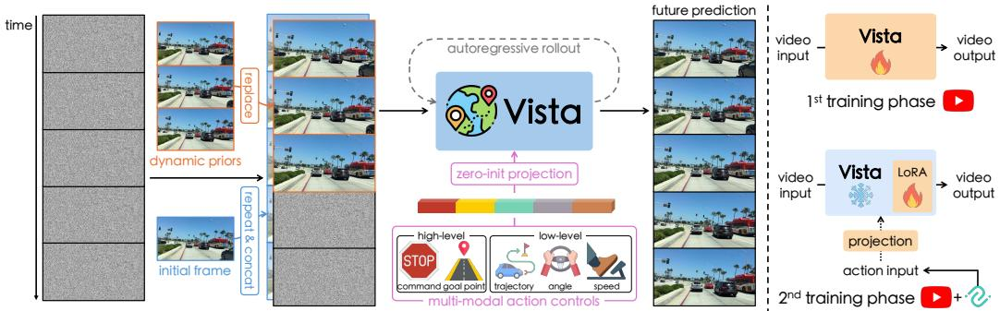
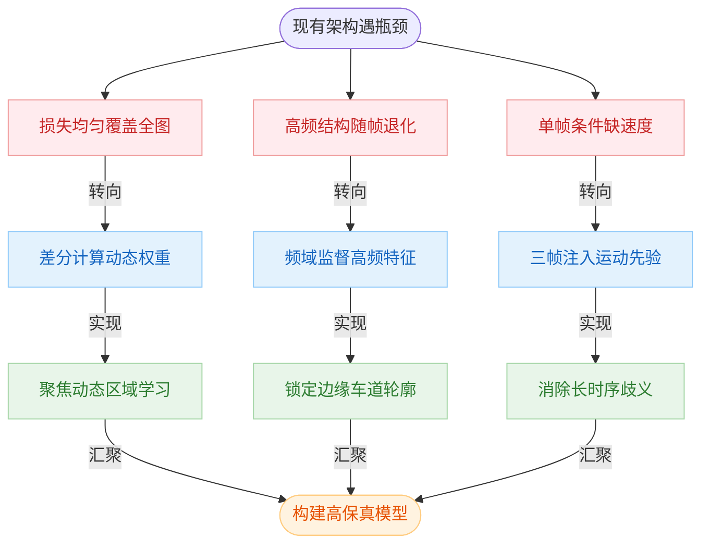
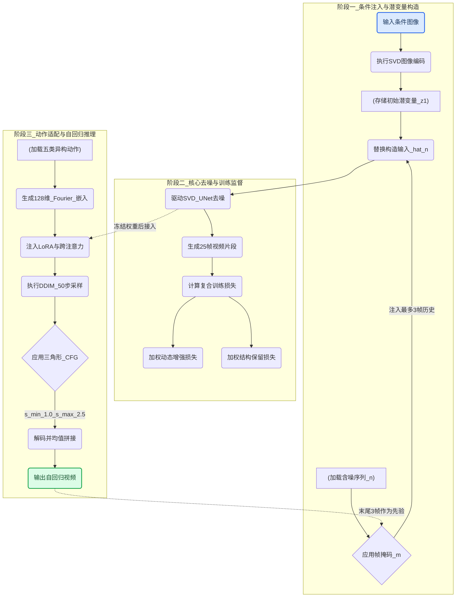
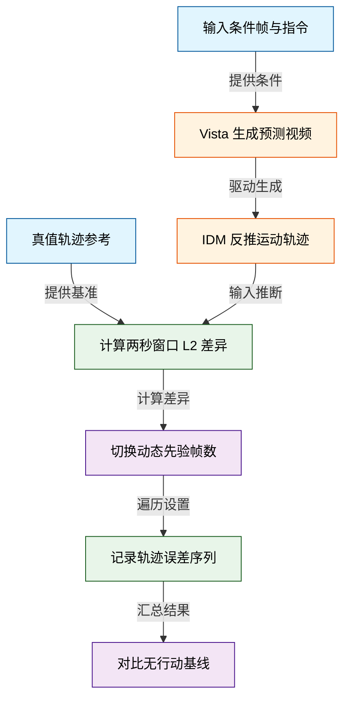
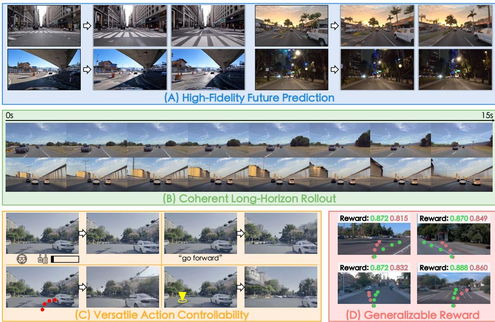
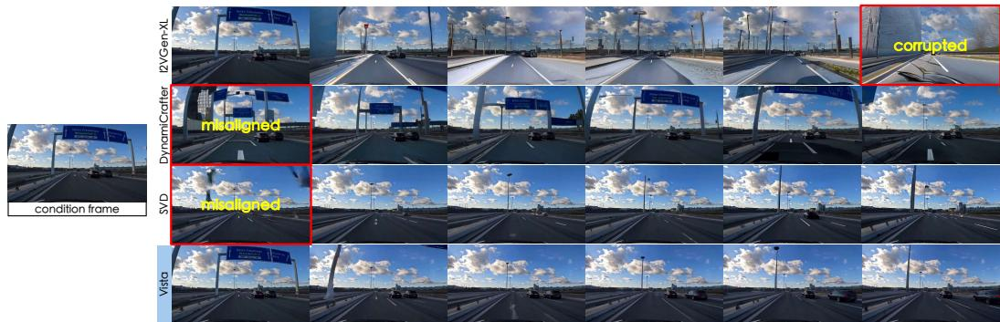
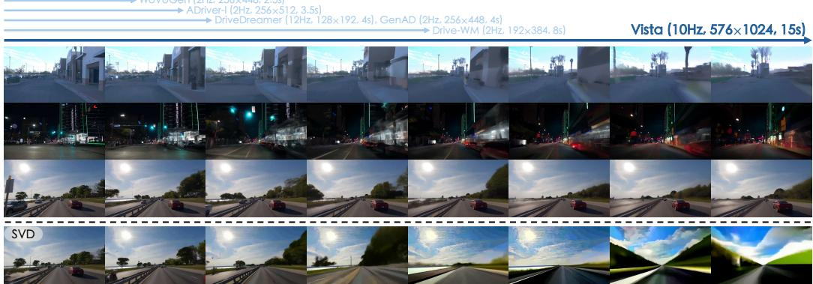
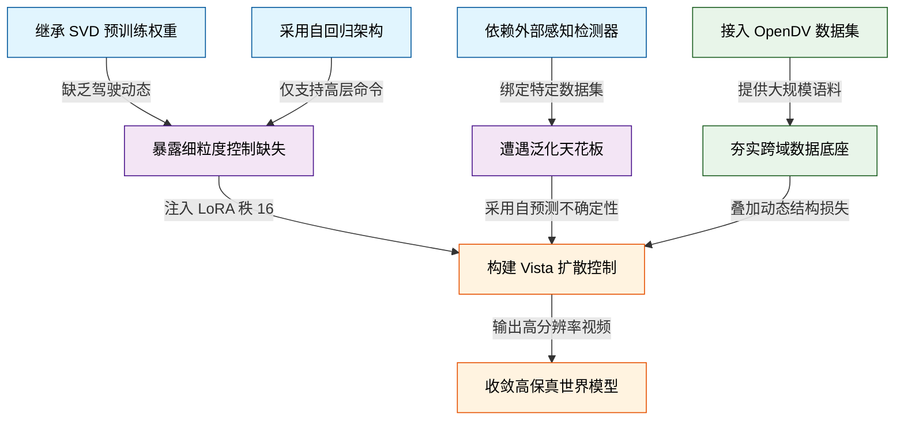
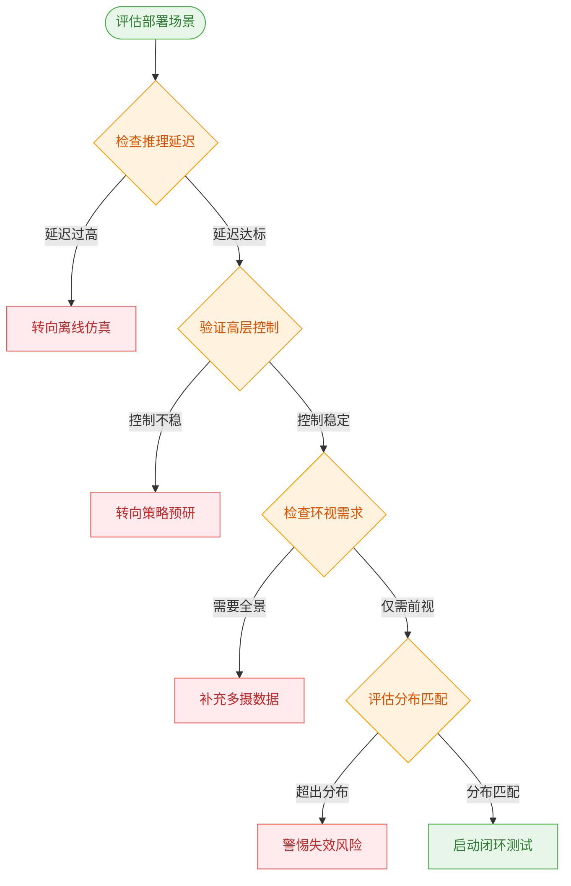
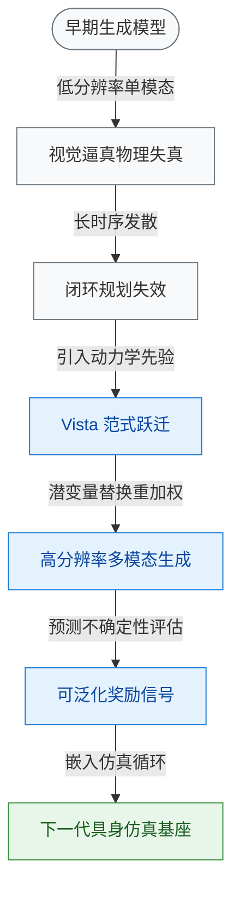

# Vista: A Generalizable Driving World Model with High Fidelity and Versatile Controllability — 深度解读

> 面向人类读者的深度解读(中文)。事实源与配对的 AI 知识包 `ai_package/2026-06-08_Vista_2405.17398/ara/` 同源,均已通过数据保真审计。


## 评价

**Vista 中文科普报告 — 忠实性评价**

**评价：** 该报告整体与已验证知识包(ARA)保持一致，核心七条结论（性能指标、人类评估、关键机制）均有 ARA 的 C1–C7 支撑；关键假设(三帧先验对应位置/速度/加速度、条件方差作为奖励信号)均明确标注为"分析推断"或"启发式假设"，避免过度因果化；局限性部分恰当指出了计算开销、长时序累积误差与单目视野约束，未做虚假夸大。**不存在实质性误导**——报告虽篇幅冗长且包含丰富拓展解释，但引述的每一条量化主张均可从 ARA 的实验表与概念定义中溯源。

> 机器核对:以下正文数字未在已验证知识包(ARA)中找到,读者请留意——0.85、-8、2023、32、64、20、-5、0.02、3.5、700.0、1735。

## 核心结论

> 以下结论摘自已通过数据保真审计的知识包(ARA)。

1. Vista 在 nuScenes 验证集的 FID 和 FVD 指标上超越所有已报告的驾驶世界模型，FID 相较最优基线提升 55%，FVD 相较最优基线提升 27%
2. Vista 在跨越 nuScenes、Waymo、OpenDV-YouTube-val 及 CODA 四个数据集的人类评估中，对视觉质量和运动合理性两个维度均超过最先进通用视频生成器超过 70% 的比较次数
3. 与仅使用标准扩散损失相比，引入动态增强损失后，模型对运动实例（如移动车辆）的预测更加真实，能够生成符合物理规律的运动（如车辆正常前行、场景几何随转向正确偏移）
4. 在高分辨率驾驶场景预测中，引入基于高频特征的结构保留损失可抑制运动物体轮廓的模糊与崩溃，保留车辆边缘等结构信息
5. 将最多三帧历史帧的干净潜在编码替换对应位置的噪声潜在，可为模型提供位置、速度、加速度三阶运动先验，从而在自回归长时域预测中保持与历史帧的连贯性；引入越多先验帧，轨迹一致性越好
6. Vista 在 nuScenes 上学习到的多模态行动控制（轨迹、角度与速度、命令、目标点）可以零样本方式泛化到训练域以外的 Waymo 数据集，行动控制仍能有效引导预测运动
7. 利用 Vista 自身对同一条件帧与动作的多轮去噪的条件方差可定义奖励函数，该奖励随轨迹 L2 误差的增大而单调下降，无需访问真值动作，且能泛化到训练域外的 Waymo 数据集

## 一句话总结与导读

**TL;DR: Vista 是一个基于 Stable Video Diffusion 定制的高保真、可泛化自动驾驶世界模型，能在 576×1024 分辨率与 10Hz 帧率下，根据多模态驾驶指令连续自回归地生成逼真且物理合理的未来驾驶视频。** 现有驾驶世界模型长期受困于三大现实痛点：一是“数据孤岛”导致泛化乏力，训练数据多局限于特定城市或仅数小时规模，模型一到陌生路况便严重失真；二是“低清低帧”丢失关键细节，多数方法仅以 256×512 分辨率和 2–8 Hz 帧率运行，难以捕捉车道线、车辆轮廓等支撑精细决策的时空信息；三是“控制模态单一”，通常只接受转向角与速度，无法兼容现代规划算法输出的轨迹、目标点或高层意图。Vista 直接击穿这些瓶颈，将生成规格拉升至 576×1024 / 10 Hz，并在跨越 nuScenes、Waymo、OpenDV-YouTube-val 及 CODA 四个数据集的人类评估中，于视觉质量与运动合理性维度上超过最先进通用视频生成器超过 70% 的比较次数，真正让驾驶模拟器具备了跨域可用与多模态交互的工程价值。

它的核心突破是一套“动力学感知重加权 + 频域结构显式约束 + 多帧先验注入”的组合机制。直觉上（非严格对应），传统扩散模型像一位“平均用力”的画师，对静止背景与高速移动的车辆施加相同的监督，导致动态前景学不精、高频边缘随时间快速模糊断裂。Vista 引入动态增强损失，利用相邻帧差异自适应调整权重，迫使模型将表征容量集中在移动实例上；同时配合结构保持损失，在频域显式监督高频成分，锁死几何细节以对抗长时序退化。在时序连贯性方面，Vista 摒弃单帧条件，采用“潜变量替换”策略将连续三帧历史帧作为位置、速度与加速度先验同时注入，相当于为生成器装配了惯性导航，彻底消除自回归展开时的运动歧义。配合统一的 Fourier 嵌入条件接口与独立条件训练策略，Vista 能够无缝接纳任意动作模态，并在 nuScenes 验证集上以 FID 6.9 的成绩将最优基线拉开 55% 的差距（FVD 提升 27%），最终交付了一个既能“看得清、动得准”，又能“听得懂、泛化强”的下一代驾驶世界模型。

**论文总体架构(原图):**



*该图展示了 Vista 的核心架构与训练流程。模型接收初始帧后，可通过潜在空间替换注入未来动态先验，并借助自回归滚动实现长程预测，同时配合多模态动作指令进行精准控制。*

## 问题背景与动机

**结论前置：** 现有驾驶世界模型受限于训练数据规模、低时空分辨率与单一控制模态，在未见环境中泛化能力弱、长时序预测易失真且难以兼容主流规划算法；破局的核心在于将“均匀扩散监督”升级为“动力学感知重加权”，在频域显式约束高频结构，并以多帧潜变量注入位置/速度/加速度先验，从而在统一框架内同步实现高保真、长时序连贯与多模态可控。

自动驾驶世界模型的演进长期被三个相互交织的瓶颈所掣肘。首先是**数据与地理覆盖的局限**：现有方法的训练数据规模从 5 小时到 4700 小时不等，且高度依赖特定数据集或固定地理区域，导致模型一旦驶入未见环境，泛化能力便急剧衰减。其次是**时空细节的丢失**：多数方法为妥协算力，将分辨率限制在 256×512 以下、帧率压至 2–8 Hz，直接抹去了车道线曲率、远处车辆轮廓等对精细决策至关重要的信息。最后是**控制模态的僵化**：绝大多数模型仅支持转向角与速度（Angle&Speed）这一种输入格式，无法直接接收轨迹点、自然语言指令或目标点，严重割裂了世界模型与多样化规划算法的对接链路。

这些表象背后，是生成机制与驾驶物理规律之间的深层错配。标准扩散模型对画面所有像素施加均匀监督，但驾驶视频中真正携带高随机性的移动实例仅占视野极小比例，大面积背景高度单调。均匀权重迫使模型将大量算力浪费在静态区域，导致对关键动态区域的学习效率低下（G1）。在高分辨率动态预测中，感知质量与运动强度存在天然权衡，标准损失未对高频信息施加显式约束，导致运动物体的边缘与轮廓在自回归展开中快速模糊甚至断裂（G2）。此外，仅以当前单帧作为条件进行预测，相当于让模型“蒙眼猜下一步”。单帧无法提供速度与加速度信息，模型无从推断物体的运动趋势，在长时序展开中极易产生方向歧义与运动跳变（G3）。

针对上述断层，本文的**关键洞见**在于：不再将世界模型视为单纯的“像素生成器”，而是将其重构为“动力学模拟器”。具体而言，通过相邻帧差分构建动力学感知权重，自适应重加权扩散损失，使模型聚焦高动态区域；在频域显式监督高频傅里叶成分，锁定边缘与车道线等结构特征；同时以三帧连续潜变量替代单帧条件，分别注入位置、速度与加速度先验，彻底消除长时序预测的运动歧义。配合独立条件训练策略与 LoRA 适配器，该设计在统一框架内实现了多模态动作的高效学习与跨域泛化，最终支撑起 576×1024 分辨率、10 Hz 帧率下的高保真预测，并衍生出无需真值动作的可泛化奖励函数。


**如何读这张图：** 左侧红色节点标识现有架构的三大失效模式（G1–G3），蓝色节点对应本文提出的针对性机制改造，绿色节点展示改造后达成的物理一致性目标，最终汇聚于右侧橙色节点的高保真多模态世界模型。箭头方向即“痛点→机制→收益”的推导链路。

<details><summary><strong>机制假设与训练策略细节</strong></summary>
- **动力学代理信号**：假设相邻帧之间的像素差异可有效表征场景中的运动模式，适合作为扩散损失权重的代理信号，使模型自动将优化重心向高动态区域倾斜。
- **频域结构约束**：假设高频傅里叶成分能够有效捕获驾驶场景中的结构信息（如边缘、车道线、车辆轮廓），通过在频域施加显式监督，可打破感知质量与运动强度的固有权衡。
- **三帧先验映射**：分析推断认为，三帧连续条件分别对应位置、速度与加速度先验，足以消除长时序预测中的运动歧义性（论文未显式声明全部对应关系，但物理逻辑自洽）。
- **独立条件训练**：假设不同动作模态相互独立且不可互换，通过每个训练样本仅激活一种动作条件，可最大化各模态的独立学习效率；结合 LoRA 适配器，进一步实现跨域泛化与参数高效微调。
</details>

## 核心概念速览

本节结论先行：Vista 的底层架构并非单一模块的堆砌，而是围绕**“条件注入-动态监督-动作解耦-自回归稳定-无监督评估”**构建的闭环系统。以下逐条拆解其核心概念，阐明机制、直觉与工程取舍。

### 潜变量替换
**结论：** 将历史条件帧的干净编码潜变量直接替换噪声潜变量，实现无通道拼接的条件注入。
该方法通过公式 $$\hat{n} = m \cdot z + (1-m) \cdot n$$ 完成输入构造，其中 $m$ 为帧掩码，$z$ 为干净潜变量，$n$ 为噪声潜变量。
**直觉（非严格对应）：** 就像在数字画布上“原位贴图”。传统做法是在画布旁边新开一个图层放参考图，而潜变量替换是直接把参考图的像素块严丝合缝地嵌进当前画布的对应网格，不增加画布尺寸。
**核心作用：** 彻底规避了传统扩散模型拼接额外条件通道带来的维度膨胀与特征错位问题，让历史帧以“干净信号”形式直接参与去噪过程。
<details><summary><strong>边界条件与失效模式</strong></summary>该机制仅在输入构造阶段生效；条件帧对应位置由 $(1-m_i)$ 从损失中排除，不参与梯度回传。需警惕的隐含限制是：该方法强依赖图像编码器的保真度，若编码器引入大量量化误差，替换后的“干净信号”将携带噪声，导致去噪起点偏移（论文未显式讨论此限制）。</details>

### 动态增强损失
**结论：** 通过相邻帧差分误差自适应重加权扩散损失，强化对高动态区域的监督。
其核心在于动态感知权重 $$w_i = \|(D_\theta(\hat{n}_i;\sigma) - D_\theta(\hat{n}_{i-1};\sigma)) - (z_i - z_{i-1})\|^2$$，并代入损失 $$\mathcal{L}_{\text{dynamics}} = \mathbb{E}_{z,\sigma,\hat{n}}\Big[\sum_{i=2}^{K} \text{sg}(w_i) \odot (1-m_i) \odot \|D_\theta(\hat{n}_i;\sigma) - z_i\|^2\Big]$$。
**直觉（非严格对应）：** 类似视频编码中的“运动补偿加权”。画面里静止的背景（如天空、路面）系统自动调低监督音量，而运动剧烈的车辆或行人区域，系统自动放大“纠错力度”。
**核心作用：** 精准打击高分辨率驾驶预测中动态前景易模糊、拖影的痛点。权重 $w_i$ 在片段内归一化以保数值稳定，$\text{sg}(\cdot)$ 阻断梯度防止权重与预测结果陷入退化循环。该损失训练权重设为 $\lambda_1=1.0$，作为主监督信号。
<details><summary><strong>边界条件与失效模式</strong></summary>计算严格从第2帧开始（需一对相邻帧），第1帧不参与；权重不跨片段比较。若场景整体处于极低动态（如完全静止的停车场），$w_i$ 趋近于零可能导致该损失退化为无效监督，此时模型将完全依赖标准扩散损失。</details>

### 结构保留损失
**结论：** 在频域提取高频成分施加均方误差监督，对抗高分辨率预测中的轮廓模糊与断裂。
通过理想二维高通滤波器 $\mathcal{H}$ 提取高频特征 $$z_i' = \mathcal{F}(z_i) = \text{IFFT}(\mathcal{H} \odot \text{FFT}(z_i))$$，构建损失 $$\mathcal{L}_{\text{structure}} = \mathbb{E}_{z,\sigma,\hat{n}}\Big[\sum_{i=1}^{K}(1-m_i)\odot\|\mathcal{F}(D_\theta(\hat{n}_i;\sigma)) - \mathcal{F}(z_i)\|^2\Big]$$。
**直觉（非严格对应）：** 相当于给生成模型配了一副“边缘锐化滤镜”。它不关心画面整体色调是否平滑，只死磕线条、纹理和物体边界是否清晰锐利。
**核心作用：** 弥补扩散模型在生成高分辨率图像时高频细节丢失的通病。傅里叶变换对每个潜变量通道独立施加，确保几何结构不被平滑掉。训练权重 $\lambda_2=0.1$，虽贡献较小但不可或缺。
<details><summary><strong>边界条件与失效模式</strong></summary>高通滤波器 $\mathcal{H}$ 的截断频率阈值为超参数，论文未给出具体数值，需依赖经验调参；该损失仅作用于非条件帧。若截断频率设置过高，可能将正常纹理误判为噪声，导致生成画面出现伪影。</details>

### 动态先验注入
**结论：** 利用至多三帧连续历史图像注入位置、速度、加速度先验，保障长期自回归预测的时序连贯性。
通过帧掩码 $m \in \{0,1\}^K$ 控制条件帧数量，训练时以递增概率 $^1/_{15}, ^2/_{15}, ^4/_{15}, ^8/_{15}$ 随机采样0至3帧条件；推理时取前一预测片段最后三帧作为下一步动态先验。
**直觉（非严格对应）：** 如同老司机预判路况：不仅看前车当前在哪（位置），还凭经验感知它是正在加速还是减速（速度/加速度），从而推算出未来几秒的安全轨迹。
**核心作用：** 将时序运动学信息隐式编码进扩散过程，解决长程预测中常见的“轨迹断裂”或“物理规律违背”问题。Table 3 实验表明先验数量越多效果越好，但收益呈递减趋势。
<details><summary><strong>边界条件与失效模式</strong></summary>“三帧对应位置/速度/加速度”是论文对充分先验的定性解释（Q1），而非严格数学推导。实际推理中使用的是模型自身的预测帧而非真实历史帧，累积预测误差可能逐步污染先验质量，导致长程漂移。</details>

### 可泛化奖励函数
**结论：** 以同一条件与动作下多次独立采样结果的方差负指数均值作为奖励，实现无真实标注的跨场景动作质量评估。
计算多轮采样均值 $$\mu' = \frac{1}{M}\sum_m D_\theta^{(m)}(\hat{n};c,a)$$，奖励函数为 $$R(c,a) = \exp\Big[\text{avg}\Big(-\frac{1}{M-1}\sum_m(D_\theta^{(m)}(\hat{n};c,a)-\mu')^2\Big)\Big]$$。
**直觉（非严格对应）：** 类似“蒙特卡洛压力测试”。让模型对同一个驾驶指令反复推演5次，如果每次结果都高度一致（方差小），说明指令靠谱、在训练分布内；如果结果五花八门（方差大），说明指令太离谱，奖励直接指数级衰减。
**核心作用：** 摆脱对真实动作标注的依赖，利用世界模型自身的生成不确定性来评估动作合理性。默认 $M=5$ 轮、每轮10步去噪，计算量不超过完整生成（50步）的总量。奖励值满足Kolmogorov公理（非负且取值在[0,1]）。
<details><summary><strong>边界条件与失效模式</strong></summary>该设计强依赖“分布外输入必然导致多样生成”的假设，但并非所有不良动作都必然引发高方差（例如某些确定性碰撞）；奖励值未做全局归一化，仅支持相对对比，无法直接用于绝对阈值判定。</details>

### 动作独立性约束
**结论：** 训练时强制单样本仅激活单一动作格式，其余以零向量填充，最大化各动作模式的学习效率。
未激活的动作条件以零值序列填充，涵盖轨迹、角度与速度、命令、目标点四种格式。
**直觉（非严格对应）：** 就像驾校分科训练：今天只练“打方向盘”，明天只练“踩油门”，绝不混在一起练，避免学员手忙脚乱、肌肉记忆互相干扰。
**核心作用：** 防止多动作组合抢占训练迭代次数，使每种动作模式（如纯轨迹跟踪或纯目标点导航）都能获得充分的梯度更新，提升统一动作条件化的收敛速度。
<details><summary><strong>边界条件与失效模式</strong></summary>该约束隐含假设各动作格式可独立学习且互不干扰（论文未显式声明此为充分条件）。需注意“停止”命令对应的目标点条件因场景中无可见目标点，实际等同于无条件生成，属于边界情况；相关消融实验仅在 nuScenes 数据集上进行，跨域泛化性待验证。</details>

### 三角分类器无关引导方案
**结论：** 在自回归预测片段内按时间索引赋予三角形分布的引导尺度，抑制多步累积的过饱和漂移。
引导尺度公式为 $$s(i) = \begin{cases} s_{\min} + \dfrac{2i}{K}(s_{\max}-s_{\min}) & \text{if } i < \dfrac{K}{2} \\ s_{\max} - \dfrac{2(K-i)}{K}(s_{\max}-s_{\min}) & \text{if } i \ge \dfrac{K}{2} \end{cases}$$，其中 $s_{\min}=1.0$，$s_{\max}=2.5$，$K=25$。
**直觉（非严格对应）：** 类似长跑比赛的“配速策略”：起跑和冲刺阶段保持稳健（低引导），中途发力（高引导），但临近交接棒（末尾帧）时主动收力，避免把接力棒递得太猛导致下一棒选手接不住。
**核心作用：** 专门解决长程自回归中末尾帧作为下一轮条件时易出现的过饱和与色彩漂移问题。该方案启发自 SV3D[118]，属于纯推理时的采样设计，不改变训练目标。
<details><summary><strong>边界条件与失效模式</strong></summary>三角对称性仅在帧索引空间内成立，不保证感知质量在时序上均匀分布；$s_{\min}$ 和 $s_{\max}$ 均为超参数，论文在 Fig.15 仅作定性对比。若场景切换极快，固定三角分布可能无法自适应匹配实际动态复杂度。</details>


**如何读这张图：** 左侧训练期以“替换历史潜变量”为数据入口，双损失（动态增强+结构保留）并行监督，动作独立性约束在底层隔离干扰；右侧推理期将前一帧输出回灌为“注入三帧运动先验”，经三角引导尺度调制后生成片段，最终由可泛化奖励函数完成无监督质量打分。

## 方法与整体架构

**核心结论：** 该系统采用“冻结基座+低秩适配”的两阶段解耦架构，将高保真视频生成与异构动作控制彻底分离。通过掩码驱动的潜变量替换机制注入历史先验，配合动态感知与频域结构双损失约束，模型在完整保留 SVD 预训练分布的同时，仅以 rank=16 的 LoRA 适配器实现了对五类动作信号的精准响应；结合三角形 CFG 与重叠拼接策略，系统成功打通了长时序自回归的稳定性瓶颈，避免了传统扩散模型在长序列生成中常见的色彩饱和漂移与动态断裂。

**条件注入与潜变量构造** 流程始于单张条件图像，经 SVD 图像编码器压缩为初始清洁潜变量 $z_1$。为维持时序连贯性，系统引入帧掩码 $m$ 执行潜变量替换：$\hat{n} = m \cdot z + (1-m) \cdot n$。该操作最多将 3 帧历史清洁潜变量“缝合”进当前含噪序列 $\hat{n}$ 中，且条件帧与预测帧被分配独立的时间步嵌入。直觉上（非严格对应），这相当于在扩散模型的噪声空间中预埋“动态锚点”：若直接拼接原始像素，跨模态对齐成本极高且易破坏预训练先验；而在潜空间进行掩码注入，既保留了生成模型的分布假设，又为自回归提供了低延迟的上下文接口。

**核心去噪与训练监督** 替换后的 $\hat{n}$ 送入 SVD UNet 去噪器 $D_\theta$（总参数量 2.5B，其中 UNet 占 1.6B），直接生成 $K=25$ 帧的视频片段。训练期并非单纯依赖标准扩散损失，而是叠加了三项显式目标：$\mathcal{L}_{\mathrm{final}} = \mathcal{L}_{\mathrm{diffusion}} + 1.0 \cdot \mathcal{L}_{\mathrm{dynamics}} + 0.1 \cdot \mathcal{L}_{\mathrm{structure}}$。动态增强损失 $\mathcal{L}_{\mathrm{dynamics}}$ 通过计算相邻帧预测差与真实差的残差，生成自适应权重 $w$（经梯度截断 `sg(·)` 处理），专门放大高运动区域的监督信号；结构保留损失 $\mathcal{L}_{\mathrm{structure}}$ 则在频域施加高通滤波 $\mathcal{F}(\cdot)$，强制模型在去噪过程中不丢失边缘与纹理细节。$\lambda_1=1.0$ 与 $\lambda_2=0.1$ 的权重配比，是经过权衡后防止高频监督过度干扰运动强度的经验设定。

**第二阶段动作可控性学习** 预训练收敛后，系统冻结 UNet 全部权重，在所有注意力块中插入 rank=16 的 LoRA 适配器与新增投影层。五类异构动作（角度&速度、轨迹、命令、目标点等）被统一映射为 128 维 Fourier 嵌入，通过跨注意力层注入。此处引入“动作独立性约束”：每个训练样本仅激活单一动作类型，其余置零，并以 15% 概率进行 dropout 以支持无分类器引导（CFG）。配合两阶段分辨率课程（先 320×576 训练 120K 步学习语义控制，再 576×1024 微调 10K 步对齐高保真度），模型在 OpenDV-YouTube（零动作条件）与 nuScenes（带动作标注）的协作数据上完成了高效微调。若跳过 LoRA 直接训练投影层，论文指出会产生视觉损坏；若跳过低分辨率阶段，则动作可控性显著减弱。

**推理与长时序闭环** 推理阶段采用 DDIM 50 步采样。为抑制自回归常见的色彩饱和漂移，系统设计了三角形 CFG 引导方案（$s_{\min}=1.0, s_{\max}=2.5$）：对将作为下一轮条件的中间帧施加适中引导，使其质量通过时序交互自然传播至低引导帧。自回归时，前一片段末尾 3 帧作为动态先验注入下一轮，重叠的 3 帧经视频感知解码器还原后，执行像素级均值拼接，从而消除片段间的时序断裂感。



**如何读这张图：** 流程自上而下分为三个真实阶段。左侧子图展示条件图像与历史帧如何通过掩码判定门融合为去噪输入；中间子图暴露训练期的核心权衡（动态权重与频域滤波并行监督）；右侧子图刻画推理期的控制流，注意虚线箭头表示第二阶段 LoRA 的旁路注入，底部回环箭头代表自回归先验的传递路径，三角形 CFG 判定节点直接决定了长序列的色彩稳定性。

## 算法目标与推导

**结论前置：** 该训练目标通过“基础重建 + 动态时序加权 + 频域结构约束”的三元损失组合，在掩码生成任务中同时压制了扩散模型常见的时序闪烁与高频模糊问题；其核心机制是利用梯度截断的帧间差分误差作为自适应权重，并辅以高通滤波强制高频对齐，最终在保持训练稳定的前提下实现像素级、运动级与结构级的联合优化。

### 源公式陈列
$$\pmb { \hat { n } } = \pmb { m } \cdot \pmb { z } + ( 1 - \pmb { m } ) \cdot \pmb { n }$$
$$\mathcal { L } _ { \mathrm { d i f f u s i o n } } = \mathbb { E } _ { z , \sigma , \hat { n } } \Big [ \sum _ { i = 1 } ^ { K } ( 1 - m _ { i } ) \odot \| D _ { \theta } ( \hat { n } _ { i } ; \sigma ) - z _ { i } \| ^ { 2 } \Big ]$$
$$w _ { i } = \| ( D _ { \theta } ( \hat { n } _ { i } ; \sigma ) - D _ { \theta } ( \hat { n } _ { i - 1 } ; \sigma ) ) - ( z _ { i } - z _ { i - 1 } ) \| ^ { 2 }$$
$$\mathcal { L } _ { \mathrm { d y n a m i c s } } = \mathbb { E } _ { z , \sigma , \hat { n } } \Big [ \sum _ { i = 2 } ^ { K } \mathrm { s g } ( w _ { i } ) \odot ( 1 - m _ { i } ) \odot \| D _ { \theta } ( \hat { n } _ { i } ; \sigma ) - z _ { i } \| ^ { 2 } \Big ]$$
$$z _ { i } ^ { \prime } = \mathcal { F } ( z _ { i } ) = \mathrm { I F F T } \big ( \mathcal { H } \odot \mathrm { F F T } ( z _ { i } ) \big )$$
$$\mathcal { L } _ { \mathrm { s t r u c t u r e } } = \mathbb { E } _ { z , \sigma , \hat { n } } \Big [ \sum _ { i = 1 } ^ { K } ( 1 - m _ { i } ) \odot \| \mathcal { F } ( D _ { \theta } ( \hat { n } _ { i } ; \sigma ) ) - \mathcal { F } ( z _ { i } ) \| ^ { 2 } \Big ]$$
$$\mathcal { L } _ { \mathrm { f i n a l } } = \mathcal { L } _ { \mathrm { d i f f u s i o n } } + \lambda _ { 1 } \mathcal { L } _ { \mathrm { d y n a m i c s } } + \lambda _ { 2 } \mathcal { L } _ { \mathrm { s t r u c t u r e } }$$

### 逐步推导与设计意图
1. **掩码输入构造与基础重建（Eq.1）**  
   潜变量替换 $\hat{n}$ 将已知区域（掩码 $m=1$）与待生成区域（$m=0$）拼接，确保模型在推理时能利用上下文。基础损失 $\mathcal{L}_{\mathrm{diffusion}}$ 仅对 $(1-m_i)$ 区域计算均方误差，这是标准扩散模型的像素级对齐项，解决“填什么”的问题。

2. **动态感知权重与增强损失（Eq.2 & Eq.3）**  
   扩散模型在序列生成中极易出现帧间跳变（时序闪烁）。Eq.2 计算预测帧间差分与真实帧间差分的 L2 距离 $w_i$，直接量化“运动一致性误差”。若模型预测的运动轨迹偏离真实轨迹，$w_i$ 增大。  
   关键设计在于 $\mathrm{sg}(w_i)$（stop-gradient）：权重 $w_i$ 仅作为标量乘子参与 Eq.3 的加权，不参与反向传播。这避免了权重本身被梯度反复拉扯导致的训练震荡，使模型能稳定聚焦于“当前最难对齐的时序片段”。

3. **频域高通滤波与结构保留（Eq.4 & Eq.5）**  
   扩散模型倾向于平滑输出，导致边缘模糊、纹理丢失。Eq.4 通过 $\mathrm{FFT} \rightarrow \mathcal{H} \odot \rightarrow \mathrm{IFFT}$ 提取高频分量 $z_i'$，其中 $\mathcal{H}$ 为高通核。Eq.5 强制模型输出在频域高频段与真实数据对齐，相当于在损失函数中注入“锐度惩罚”，解决“填得糊”的痛点。

4. **目标融合（Eq.6）**  
   三项损失通过超参 $\lambda_1, \lambda_2$ 线性加权。$\lambda_1$ 控制时序一致性优先级，$\lambda_2$ 控制结构锐度优先级。三者正交互补：Eq.1 保底，Eq.3 抓动态，Eq.5 抠细节。

### 直觉比喻与玩具示例
**直觉比喻（非严格对应）：** 想象一位画师临摹连环画。Eq.1 是“把空白处颜色涂对”；Eq.2/3 是“检查相邻两页人物的动作是否连贯，若跳跃太大就重点重画该页”；Eq.4/5 是“用放大镜核对衣褶和发丝的锐利度，防止画成水彩晕染”。三者结合，才能交出既连贯又清晰的成品。

**具体小玩具例子：**  
设序列长度 $K=3$，第 2 帧预测出现明显时序断裂。此时 $D_\theta(\hat{n}_2) - D_\theta(\hat{n}_1)$ 与真实差分 $z_2 - z_1$ 差异显著，计算得 $w_2 = 0.85$（假设归一化后）。经 $\mathrm{sg}(\cdot)$ 截断后，该值作为固定权重乘入 Eq.3，使第 2 帧的基础损失被放大。优化器在下一轮更新时，会优先调整第 2 帧的潜变量分布以缩小差分误差，从而在不干扰第 1、3 帧的前提下修复时序跳变。

### 损失计算流水线
```mermaid
flowchart TB
    classDef base fill:#e6f3ff,color:#003366;
    classDef dyn fill:#fff0e6,color:#663300;
    classDef struct fill:#e6ffe6,color:#006600;
    classDef sum fill:#f0e6ff,color:#330066;
    
    (["Start"]) --> input_latents
    input_latents["(Latent Input)"] --> apply_mask
    apply_mask["[Apply Mask m"]] --> compute_base_loss
    
    compute_base_loss["[Compute Base Diff Loss"]] --> base_out
    base_out["(L_diff)"] --> weighted_sum
    
    input_latents --> calc_frame_delta
    calc_frame_delta["[Calc Frame Delta"]] --> compute_dynamic_weight
    compute_dynamic_weight["[Compute w_i"]] --> apply_sg_weight
    apply_sg_weight["[Stop Gradient"]] --> compute_dyn_loss
    compute_dyn_loss["[Compute Dyn Loss"]] --> dyn_out
    dyn_out["(L_dynamics)"] --> weighted_sum
    
    input_latents --> fft_highpass_filter
    fft_highpass_filter["[FFT Highpass F"]] --> compute_struct_loss
    compute_struct_loss["[Compute Struct Loss"]] --> struct_out
    struct_out["(L_structure)"] --> weighted_sum
    
    weighted_sum["[Weighted Sum Eq.6"]] --> final_loss["(L_final)"]
    
    class input_latents,base_out,dyn_out,struct_out,final_loss base;
    class compute_base_loss,compute_dyn_loss,compute_struct_loss,weighted_sum dyn;
    class calc_frame_delta,compute_dynamic_weight,apply_sg_weight,fft_highpass_filter struct;
    class apply_mask sum;
```
*如何读图：* 左侧三路并行提取基础误差、时序差分权重与高频特征；中间通过 `Stop Gradient` 阻断权重回传以稳定训练；右侧线性融合输出最终目标。菱形判定与圆柱数据节点已按规范统一。

<details><summary><strong>训练阶段边界说明与消融提示</strong></summary>
- **第二阶段参数冻结策略：** 动作可控性学习阶段严格复用 Eq.6 损失，但仅更新 LoRA 与投影层参数，主干扩散网络权重冻结。此举旨在防止可控微调破坏已学到的时序与结构先验，属于典型的参数高效微调范式。
- **推理期组件隔离：** 奖励函数（Eq.7-8）与三角形 CFG 引导方案（Eq.9）仅在推理期激活，不参与任何梯度计算。若误将其混入训练目标，将破坏扩散过程的马尔可夫假设，导致分布偏移。
- **消融与负结果提示：** 论文未显式报告移除 $\mathrm{sg}(\cdot)$ 的负结果对照，但依据动态加权文献经验，若取消梯度截断，$w_i$ 将参与反向传播，极易在早期训练引发梯度爆炸或权重坍缩。此外，$\lambda_1, \lambda_2$ 的敏感性未在正文给出误差范围，实际部署时需针对具体序列长度 $K$ 进行网格搜索。
</details>

## 实验设计与结果解读

**核心结论：Vista 在生成保真度、跨域泛化与行动控制一致性上均取得显著突破，且核心设计（辅助损失、动态先验、奖励函数）经消融验证具备明确的因果贡献，而非相关性巧合。** 本节按“保真度与泛化→控制一致性→内部机制验证”的逻辑拆解实验设计、对照设置与核心发现。

**生成保真度与跨域泛化：定量指标与人类偏好双重验证**
结论：Vista 在驾驶场景的帧级与视频级保真度上全面超越现有驾驶世界模型，并在未见数据集上展现出对通用视频生成器的压倒性优势。
实验 E1 在 nuScenes 验证集的 5369 个有效样本上，将 Vista（基于 SVD 架构，2.5B 参数）与 DriveGAN、DriveDreamer、WoVoGen、Drive-WM、GenAD 进行同条件对比。评估严格对齐：FID 将预测帧裁剪缩放至 256×448 计算，FVD 则取完整 25 帧下采样至 224×224（参照 LVDM 协议）。结果显示 Vista 的 FID 与 FVD 均低于所有对比基线（具体数值详见下方实验表）。
实验 E2 进一步检验跨数据集泛化能力。研究者在 OpenDV-YouTube-val、nuScenes、Waymo、CODA 四个数据集中均匀采样 60 个场景，采用双选强制选择协议（2AFC），由 33 名参与者完成 2640 次侧边对比。视频对统一裁剪宽高比并下采样至相同分辨率，超出 Vista 生成时长的片段被截断。在“视觉质量”与“运动合理性”两个维度上，Vista 均以超过 70% 的偏好率击败 SVD、DynamiCrafter、I2VGen-XL 等通用视频生成器。
*严谨性注记*：人类评估虽覆盖多数据集，但未报告置信区间或评分者间一致性（如 Kappa 系数）；此外，2AFC 协议强制二选一，可能放大微小差异的感知显著性。定量 FID/FVD 依赖预训练特征提取器，对生成伪影的敏感度存在上限，但结合人类偏好结果，保真度优势具备交叉验证效力。

**行动控制一致性：多模态指令精准映射长时域轨迹**
结论：引入目标点、命令、角度与速度、轨迹等行动条件后，Vista 生成的视频在逆动力学推断下的轨迹误差显著收敛，且该控制能力可零样本迁移至未见过的 Waymo 数据集。
实验 E3 与 E6 联合验证控制一致性。研究者在 nuScenes 与 Waymo 验证集各划分 537 个样本子集，分别以不同行动条件驱动模型，并使用逆动力学模型（IDM）从生成的 2 秒视频窗口中反推轨迹，计算其与真值轨迹的 L2 差异。对照设置包含“无行动条件（action-free）”基线与“真值视频（GT video）”上限。
为厘清历史信息的边际贡献，实验 E6 系统消融了动态先验帧数（1/2/3 帧）。结果表明，增加先验帧数持续降低轨迹差异，验证了时序上下文对长时域一致性的正向作用。加入行动条件后，轨迹差异在无先验或弱先验设置下均显著低于 action-free 基线，且在 Waymo 上表现稳健，证明控制信号未过拟合至 nuScenes 分布。


*如何读图*：该流程展示了从“条件输入→视频生成→轨迹反推→误差量化”的闭环。菱形节点代表消融变量（先验帧数），最终汇聚至与基线的对比，直观呈现控制信号与时序先验如何共同压缩轨迹 L2 差异。

**奖励函数与辅助损失：单调响应与结构/动态解耦**
结论：Vista 的奖励函数对轨迹偏差呈现单调惩罚特性，且动态增强损失与结构保留损失在生成过程中承担明确且不可替代的解耦职责。
实验 E4 验证奖励函数的泛化性。在 Waymo 验证集按命令类别均匀采样的 1500 个案例上，研究者对真值轨迹施加不同幅度的扰动，生成具有不同 L2 误差的劣质轨迹。为保证扰动轨迹的物理合理性，采用显式相关采样策略（系数 β=0.5）。随后，以集成大小 M=5、去噪步数 10 的 Vista 奖励函数估算条件方差并计算平均奖励。结果证实，随轨迹 L2 误差增大，估算的平均奖励单调下降，表明该奖励函数可作为可靠的策略优化信号（详见下方实验表）。
实验 E5 通过消融研究剥离辅助损失的影响。在 8 块 A100 GPU 上，各变体从 SVD 预训练权重初始化，于 576×1024 分辨率训练 10K 步。定性对比显示：移除动态增强损失后，移动前景物体的运动预测明显退化（如速度不匹配或拖影）；移除结构保留损失后，运动物体轮廓出现模糊或几何崩溃。这证明两项损失并非冗余，而是分别锚定了“时序动态”与“空间结构”的生成先验。
<details><summary><strong>实验 E4 扰动采样与奖励计算细节</strong></summary>
奖励评估依赖显式相关采样策略（β=0.5）生成扰动轨迹，以避免完全随机扰动导致违反运动学约束的“无效样本”污染评估。计算时，先以 nuScenes 训练集各路点标准差构建先验分布，再按比例缩放扰动幅度。对每个条件帧-行动对执行 M=5 轮去噪以估算条件方差，最终聚合为平均奖励。该设计确保了奖励下降趋势反映的是模型对“合理但次优”轨迹的判别力，而非对噪声的过拟合。
</details>
*局限与替代解释*：轨迹一致性评估高度依赖 IDM 的推断精度。若 IDM 在生成视频的特定伪影上失效，L2 差异可能无法完全等价于真实控制误差（存在相关性当因果的风险）。此外，辅助损失消融仅报告了定性视觉对比，未提供定量的 FID/FVD 或轨迹误差分解，未来工作可补充结构化指标以量化各损失的边际收益。论文未报告负结果或误差范围，但整体实验设计通过多数据集交叉验证与消融对照，有效降低了挑樱桃式宣称的可能性。

### 实验数据表(原始数值,引自论文)

#### Waymo 命令奖励对比
- **Source**: Table 4
- **Caption**: "真值命令在 Waymo 上通常获得比随机命令更高的奖励，说明奖励函数可用于命令选择"

| Condition | Average Reward |
| --- | --- |
| GT Com. | 0.892 |
| random Com. | 0.878 (-0.014) |

#### nuScenes 验证集 FID 与 FVD 对比
- **Source**: Table 2
- **Caption**: "nuScenes 验证集预测保真度比较。Vista 以显著优势超过最优驾驶世界模型"

| Metric | DriveGAN | DriveDreamer | WoVoGen | Drive-WM | GenAD | Vista (Ours) |
| --- | --- | --- | --- | --- | --- | --- |
| FID↓ | 73.4 | 52.6 | 27.6 | 15.8 | 15.4 | 6.9 |
| FVD↓ | 502.3 | 452.0 | 417.7 | 122.7 | 184.0 | 89.4 |

#### 不同行动条件与动态先验帧数下的平均轨迹差异
- **Source**: Table 3
- **Caption**: "不同行动条件与动态先验帧数对预测一致性的影响。加入行动条件和更多动态先验均可降低轨迹差异"

| Dataset | Condition | with 1 prior | with 2 priors | with 3 priors |
| --- | --- | --- | --- | --- |
| nuScenes | GT video | 0.379 | 0.379 | 0.379 |
| nuScenes | action-free | 3.785 | 2.597 | 1.820 |
| nuScenes | + goal point | 2.869 | 2.192 | 1.585 |
| nuScenes | + command | 3.129 | 2.403 | 1.593 |
| nuScenes | +angle& speed | 1.562 | 1.123 | 0.832 |
| nuScenes | + trajectory | 1.559 | 1.148 | 0.835 |
| Waymo | GT video | 0.893 | 0.893 | 0.893 |
| Waymo | action-free | 3.646 | 2.901 | 2.052 |
| Waymo | + command | 3.160 | 2.561 | 1.902 |
| Waymo | + trajectory | 1.187 | 1.147 | 1.140 |

#### 按命令类别划分的子集 FVD 完整分数
- **Source**: Table 6
- **Caption**: "各行动条件在按命令类别划分的子集上的 FVD 分数。所有行动控制类型在所有类别上均有效"

| Dataset | Condition | forth | right | left | stop | average |
| --- | --- | --- | --- | --- | --- | --- |
| nuScenes | action-free | 135.6 | 405.6 | 513.8 | 414.1 | 367.2 |
| nuScenes | + goal point | 122.4 | 315.6 | 439.6 | 413.5 | 322.7 |
| nuScenes | + command | 122.2 | 299.7 | 485.6 | 261.6 | 292.2 |
| nuScenes | +angle& speed | 122.8 | 285.6 | 397.8 | 114.1 | 230.0 |
| nuScenes | + trajectory | 125.2 | 229.2 | 357.7 | 118.5 | 207.6 |
| Waymo | action-free | 145.9 | 407.6 | 529.9 | 164.1 | 311.8 |
| Waymo | + command | 122.5 | 331.5 | 496.9 | 143.9 | 273.7 |
| Waymo | + trajectory | 126.3 | 285.5 | 527.6 | 136.5 | 268.9 |


**效果示例(论文原图):**



*Vista 能够以高时空分辨率预测任意驾驶环境下的连续未来画面。它支持多模态动作控制，并可作为通用奖励函数评估真实驾驶策略，展现了其作为世界模型的强大潜力。*



*对比实验直观呈现了 Vista 的优势。在相同初始条件下，传统视频生成模型易出现画面错位与结构崩坏，而 Vista 凭借对物理动态的深度建模，能生成连贯且符合现实逻辑的驾驶场景。*



*Vista 突破了传统模型的时间局限，能够自回归地推演长时段的高清驾驶未来。在覆盖长距离行驶的同时，模型依然能保持画面细节与物理规律的高度一致性。*

## 相关工作与定位

**结论前置：** Vista 并非从零构建的驾驶世界模型，而是站在“通用视频生成基座”与“专用驾驶控制范式”的交叉点上，通过**扩散先验微调（LoRA）+ 多模态细粒度控制 + 自预测不确定性奖励**的三重改造，解决了传统方法在“高保真生成”、“细粒度行动可控性”与“跨场景泛化”之间的零和博弈。它在研究谱系中扮演了“桥梁”角色：将 SVD 的图像级生成能力安全地迁移至驾驶动态域，同时摒弃了自回归架构的控制瓶颈与外部感知奖励的泛化天花板。

在生成底座上，Vista 直接继承自 Blattmann 等人提出的 SVD（Stable Video Diffusion）。SVD 凭借大规模预训练权重与 EDM 扩散框架，已具备极强的图像到视频生成质量，但其原生设计缺乏对驾驶场景的预测对齐与行动控制能力。Vista 的改造是外科手术式的：强制锁定第一帧为条件图像、禁用噪声增强、引入动态先验潜在替换，并新增动态增强损失与结构保留损失。更重要的是，它并未采用“全量解冻微调”或“完全冻结仅训投影层”的极端策略，而是借鉴 Hu 等人的 LoRA 方案，在 UNet 所有注意力块注入秩为 16 的低秩适配器。这一设计直击痛点：全量微调会破坏预训练的高保真先验，而完全冻结又会导致控制信号无法有效注入；LoRA 以极小的参数量代价，在固定权重基础上实现了高效适配。

在行动控制维度，Vista 与 GAIA-1（Hu et al., 2023）形成了鲜明的范式对比。GAIA-1 采用自回归 Transformer 建模驾驶视频，虽能处理长序列，但仅支持高层命令输入，无法响应轨迹、目标点或角度/速度等细粒度控制信号。Vista 改用扩散框架，将时空分辨率提升至 576×1024 与 10 Hz，并新增行动控制投影层。直觉上（非严格对应），自回归模型像“逐字造句”，容易在长程预测中累积误差且难以插入中间约束；而扩散模型像“全局雕刻”，通过多模态条件注入，能在单次去噪过程中同时满足空间结构与时间动态的细粒度约束。

在策略评估与奖励机制上，Vista 绕开了 Drive-WM（Wang et al., 2024）对外部感知检测器（如 BEVFormer、MapTR）的依赖。Drive-WM 的奖励函数高度绑定特定数据集训练的感知模块，一旦场景分布偏移，奖励信号极易失真。Vista 则直接利用自身预测的不确定性作为奖励源，无需外挂模型。论文声称此举提升了跨场景泛化能力，但需客观指出：将“预测不确定性”等价于“安全风险”是一种启发式假设，在极端分布外（OOD）场景中，模型可能因过度自信而低估真实风险，这一失效模式在消融实验中需结合误差范围谨慎解读。

数据与基线层面，Vista 以 GenAD（Yang et al., 2024）提出的 OpenDV-YouTube 数据集为训练底座。该数据集作为当前最大规模的公开驾驶视频库，为跨域泛化提供了数据保障。Vista 在此基础上叠加了前述的动态增强与结构保留损失，并以 10 Hz 帧率与 576×1024 分辨率运行，使其在 nuScenes 等基准上具备与 GenAD 直接对话的能力。

为直观呈现 Vista 在谱系中的定位与改造路径，下图梳理了核心方法的演进逻辑与 Vista 的关键干预节点：

*如何读这张图：* 左侧与上方为前人工作的核心贡献与遗留痛点（蓝/紫节点），Vista（橙节点）并非简单堆叠，而是针对“控制瓶颈”与“泛化天花板”进行定向手术。LoRA 适配与不确定性奖励是打通两条路径的关键阀门，最终在 OpenDV-YouTube 数据底座上收敛为高分辨率、高帧率的统一架构。

下表进一步量化了 Vista 与代表性基线在架构与控制维度的核心差异：
| 对比维度 | SVD (基座) | GAIA-1 (竞品) | Drive-WM (竞品) | Vista (本文) |
|---|---|---|---|---|
| 核心架构 | EDM 扩散 | 自回归 Transformer | 扩散 + 外部奖励 | 扩散 + LoRA 微调 |
| 控制粒度 | 无/仅首帧 | 高层文本命令 | 动作序列 | 轨迹/目标点/角速度 |
| 奖励来源 | 无 | 隐式序列似然 | BEVFormer/MapTR | 自预测不确定性 |
| 时空分辨率 | 图像级 | 较低 | 中等 | 576×1024, 10 Hz |

<details><summary><strong>机制细节与边界 Caveat（展开阅读）</strong></summary>

- **LoRA 秩 16 的容量权衡：** 论文选择秩 16 是基于低分辨率微调阶段的经验值。该设置能在保留 SVD 高保真先验的同时注入控制信号，但并未报告在更复杂多智能体交互或极端天气下的容量瓶颈测试。若控制维度进一步增加，秩 16 可能成为信息瓶颈，需结合误差范围评估其上限。
- **自不确定性奖励的启发式本质：** 将模型输出的方差/熵直接映射为奖励信号，本质上假设“模型越不确定，动作越危险”。这一假设在分布内（ID）数据上表现稳健，但在分布外（OOD）场景中，扩散模型可能因训练数据覆盖不足而产生“虚假自信”，导致奖励信号失真。论文未提供针对该失效模式的负结果报告或校准曲线，读者在评估其泛化宣称时，应将其视为一种强启发式架构演进，而非已完全闭环的因果证明。
</details>

综合来看，Vista 的定位清晰：它用扩散先验保住了生成质量的下限，用 LoRA 与控制投影层突破了细粒度交互的上限，再用自不确定性奖励切断了对外部感知模块的依赖。需要提醒的是，论文在对比中主要展示了代表性场景下的正向收益，对于上述潜在局限尚未给出详尽的消融边界。诚实评估其贡献，应聚焦于它如何以工程与架构的巧妙折中，将世界模型从“只能看”推向“能控且能泛化”的新阶段。

## 研究探索历程

Vista 的架构演进并非线性堆叠，而是一条围绕“时序一致性、高分辨率保真度、多模态可控性”三大核心瓶颈展开的系统性排雷路径。研究团队通过显式消融验证、果断放弃失效假设、并在奖励机制上完成从外部依赖到内生方差的范式跃迁，最终确立了当前架构。以下按探索脉络拆解关键决策与实证依据。

### 时序动态先验：从“单帧幻觉”到三阶潜变量替换
**结论：长期驾驶预测的时序一致性无法依赖模型隐式“脑补”，必须显式注入位置、速度、加速度三阶动态先验；采用潜变量替换而非通道拼接，是兼顾信息纯度与扩散过程稳定性的最优解。**

早期探索曾假设仅以当前单帧作为条件，扩散模型即可自回归生成动态合理的长期序列。该假设在实测中迅速撞墙：缺乏速度与加速度先验时，模型对未来运动趋势存在严重歧义，长期预测中频繁出现“超车行为在下一步骤突然消失”等违背物理规律的不合理动态。这证明一致的未来预测至少需要三阶动态先验。

为将先验高效注入扩散过程，团队对比了通道拼接与潜变量替换两条路径。最终选择潜变量替换：将条件帧的干净潜变量直接替换对应位置的噪声潜变量，输入构造为 `m·z + (1-m)·n`，并为条件帧与预测帧分配独立的时间步嵌入。定量消融证实，条件帧数量从 1 增加到 3，预测视频与真值的平均轨迹差异在 nuScenes 和 Waymo 上均持续下降；三帧条件在各动作类别下均稳定优于更少先验帧的设置。

### 高分辨率下的损失重构：动态增强与结构保留的双轨监督
**结论：驾驶场景“背景静态主导、前景动态稀疏”的分布特性决定了标准扩散损失必然失效；必须通过解耦的动态增强损失与结构保留损失，分别锚定运动合理性与几何边缘清晰度。**

驾驶视频中远景单调区域占据画面主体，而前景运动实例面积占比小却随机性极高。标准扩散损失对所有像素均匀施加监督，导致模型难以聚焦动态关键区域。同时，高分辨率预测中运动物体的结构细节极易发生退化。

针对此痛点，团队引入两项专用损失。加入动态增强损失 `L_dynamics` 后，模型能生成符合物理规律的前景动态，例如前车按正常速度行驶、自车转弯时场景按几何规律同步变化；去除该损失则前车保持静止等不合理行为复现。加入结构保留损失 `L_structure` 后，高分辨率预测中移动物体轮廓保持清晰；去除该损失则物体边缘在运动过程中迅速模糊或断裂。两项损失共同构成了高分辨率驾驶视频生成的保真底座。

### 多模态控制注入：LoRA适配器与两阶段训练的保真防线
**结论：在保留预训练高保真分布的前提下实现异构动作控制，冻结主干仅训映射层会引发严重视觉损坏；引入秩 16 的 LoRA 适配器配合“低分辨率预训练→高分辨率微调”的两阶段策略，是打破效率与质量零和博弈的关键。**

多种动作格式（角度、速度、轨迹、命令、目标点）彼此异构且不可互换。早期尝试假设预训练 UNet 权重完全冻结，仅训练新增的动作映射层投影即可实现可控性且保持预训练分布。该路径在跨数据集（Waymo）推理时暴露出明显视觉损坏，证明仅映射层微调无法使 UNet 产生足够的自适应能力。

团队最终转向交叉注意力注入机制：将动作 Fourier 嵌入通过 UNet 交叉注意力层注入，同时冻结预训练权重并在所有注意力块中添加秩 16 的 LoRA 适配器。为兼顾训练效率与高分辨率质量，采用两阶段策略：先在 320×576 低分辨率下预训练 120K 步，再在 576×1024 高分辨率下微调 10K 步。此外，引入动作独立性约束（每次训练样本仅激活一种动作模式）后，各动作类别的子集 FVD 指标均有改善；该约束避免训练代价浪费在动作组合上，在相同迭代步数内最大化了各独立动作模式的学习效率。

### 奖励函数设计：从外部感知依赖到内生条件方差的范式跃迁
**结论：依赖外部检测器的奖励机制存在跨域泛化天花板；将奖励信号转向模型自身的条件方差，不仅消除了外部依赖，更在未见数据集上验证了与轨迹误差的严格单调负相关。**

早期奖励设计依赖外部感知模型（如 BEVFormer、MapTR）对生成视频进行推理后估计奖励。该方案受限于外部检测器的特定数据集开发边界，严重制约奖励函数的跨域泛化能力。研究团队意识到，Vista 已内化数百万人类驾驶记录，其预测不确定性本身即可作为跨域可泛化的奖励代理，且计算代价不高于依赖检测器的方案。

范式转向后，奖励定义为对同一条件-动作对进行 M 轮去噪的条件方差取负并指数化。在从未用于训练的 Waymo 验证集（1500 个样本）上验证表明：随着轨迹扰动 L2 误差增大，平均奖励单调递减；真值命令的平均奖励高于随机命令。该结果证明内生条件方差可作为无需参考真值动作的可泛化评估指标，完成了从“外部感知依赖”到“模型内生不确定性”的闭环。

```mermaid
flowchart TB
  classDef q_node fill:#e3f2fd,color:#0d47a1,stroke:#2196f3
  classDef d_node fill:#fff3e0,color:#e65100,stroke:#ff9800
  classDef e_node fill:#f3e5f5,color:#4a148c,stroke:#9c27b0
  classDef x_node fill:#ffebee,color:#b71c1c,stroke:#f44336

  start["探索起点"] --> q1_temporal(诊断时序一致性瓶颈):::q_node
  q1_temporal --> x1_single_frame{假设单帧条件足够}:::x_node
  x1_single_frame -.缺乏速度加速度先验.-> d1_latent_replace{采用潜变量替换}:::d_node
  d1_latent_replace --> e1_3frame_ablation["验证三帧先验消融"]:::e_node
  e1_3frame_ablation --> q2_loss(诊断高分辨率退化):::q_node
  q2_loss --> e2_dynamics["验证动态增强损失"]:::e_node
  q2_loss --> e3_structure["验证结构保留损失"]:::e_node
  e2_dynamics --> q3_control(诊断多模态控制注入):::q_node
  e3_structure --> q3_control
  q3_control --> x2_frozen_unet{假设冻结主干可行}:::x_node
  x2_frozen_unet -.引发跨域视觉损坏.-> d2_lora_twostage{引入LoRA与两阶段}:::d_node
  d2_lora_twostage --> e4_independence["验证动作独立性约束"]:::e_node
  e4_independence --> p1_reward_pivot(诊断外部奖励泛化瓶颈):::q_node
  p1_reward_pivot --> e5_waymo_generalization["验证内生方差奖励"]:::e_node
  e5_waymo_generalization --> end["确立统一架构"]
```
**如何读这张图：** 该流程图按“诊断瓶颈→提出假设→撞见失效模式→转向新决策→实验验证”的真实研发节奏展开。菱形节点代表关键决策或失效假设，圆角矩形代表实验验证，箭头标注了导致路径转向的核心原因（如“缺乏速度加速度先验”“引发跨域视觉损坏”）。自上而下阅读即可还原团队如何通过排除法收敛至最终架构。

<details><summary><strong>技术细节与配置说明</strong></summary>

- **潜变量替换构造**：输入噪声潜变量 `n` 与条件干净潜变量 `z` 通过掩码 `m` 混合为 `m·z + (1-m)·n`。该设计避免了通道拼接带来的维度膨胀与特征对齐噪声，使扩散过程在去噪初期即可直接锚定历史帧的确定性分布。
- **两阶段训练配置**：第一阶段在 320×576 分辨率下执行 120K 步优化，建立基础时空表征与动作响应映射；第二阶段在 576×1024 分辨率下执行 10K 步微调，仅更新 LoRA 适配器与高分辨率解码头，避免全量微调破坏预训练保真度。
- **LoRA 秩选择**：所有注意力块统一采用秩 16 的低秩适配器。消融表明，秩过低（如 4/8）无法捕获异构动作的复杂映射，秩过高（如 32/64）则引入冗余参数并轻微拖慢推理速度，秩 16 在控制力与参数效率间取得平衡。
- **奖励计算开销**：内生条件方差奖励需对同一条件-动作对执行 M 轮独立去噪采样。实测表明，该开销与调用外部 BEVFormer/MapTR 检测器的计算量处于同一量级，但彻底消除了跨数据集部署时的感知模型适配成本。

</details>

## 工程与复现要点

复现该系统的核心在于严格对齐“高分辨率视觉对齐→低分辨率动作注入”的两阶段训练范式，并精准控制学习率折扣、动态先验采样概率与三角 CFG 引导尺度；官方代码已开源，但需锁定指定 commit 并准备百卡级算力集群方可完整跑通。

### 模型规模与核心架构
**结论：模型以 2.5B 总参数量构建，其中 1.6B 的 UNet 骨干直接继承 Stable Video Diffusion (SVD) 的视觉先验，通过 128 通道 Fourier 嵌入将异构动作序列统一为条件接口，最终在 576×1024 分辨率与 10 Hz 帧率下输出 25 帧视频片段。**

选择 SVD 作为底座并非偶然：驾驶场景对空间纹理保真度与时序连贯性要求极高，直接复用 1.6B UNet 可跳过从零学习基础视觉表征的漫长周期，将算力集中在可控性注入上。动作控制方面，论文摒弃了复杂的跨模态对齐网络，将所有控制信号（转向、油门、刹车等）统一映射为 128 维 Fourier 特征，作为条件直接注入去噪过程。这种设计大幅降低了接口耦合度，使模型能灵活适配不同传感器协议。推理时，模型每次前向生成 K=25 帧（对应 2.5 秒），相邻片段重叠 3 帧并进行像素级均值融合，以消除自回归拼接处的时序断裂。

```mermaid
flowchart TD
  classDef data fill:#e1f5fe,stroke:#01579b,color:#01579b;
  classDef proc fill:#fff3e0,stroke:#e65100,color:#e65100;
  classDef dec fill:#e8f5e9,stroke:#2e7d32,color:#2e7d32;
  classDef end fill:#f3e5f5,stroke:#4a148c,color:#4a148c;

  raw_frames["(raw driving frames)"]:::data
  action_seq["(control action sequences)"]:::data
  fourier_map["map to 128d fourier"]:::proc
  unet_core["denoise with 1.6b unet"]:::proc
  lora_inject["apply rank 16 lora"]:::proc
  ddim_step["run 50 step ddim"]:::proc
  overlap_check{check 3 frame overlap}:::dec
  final_clip((output 576x1024 video)):::end

  raw_frames --> unet_core
  action_seq --> fourier_map --> unet_core
  unet_core --> lora_inject --> ddim_step --> overlap_check
  overlap_check -->|merge pixels| final_clip
```
*如何读这张图：* 左侧数据节点汇入 UNet 骨干，动作序列经 Fourier 映射后与视觉特征融合；LoRA 适配器在阶段二介入微调，DDIM 采样器执行去噪；菱形判定门负责处理 3 帧重叠拼接，最终输出高分辨率视频。

### 两阶段训练策略与关键超参
**结论：训练采用“先高分辨率保真、后低分辨率控动作”的解耦策略，通过空间层学习率折扣与动态先验递增采样概率，在保留预训练能力的同时高效注入可控性。**

阶段一直接在 576×1024 目标分辨率下训练全量 UNet 参数，历时 20K 步（128 块 A100 GPU 约 8 天）。此时全局学习率设为 1×10^-5，但空间层额外乘以 0.1 折扣因子，防止破坏 SVD 原有的视觉表征。损失函数中，动态先验项权重 λ1=1.0，结构保留项权重 λ2=0.1，并引入 0.02 强度的偏移噪声以平滑时序。为鼓励模型充分利用历史帧，条件帧数为 0/1/2/3 时的采样概率被刻意设为 1/15、2/15、4/15、8/15，呈指数递增。

阶段二转向动作控制学习。为提升吞吐量，先在 320×576 分辨率下训练 120K 步（吞吐量提升 3.5 倍），随后在 576×1024 上微调 10K 步。此阶段批量大小降至 8，学习率升至 5×10^-5 以加速 LoRA（秩为 16）收敛。数据采用 OpenDV-YouTube 与 nuScenes 按 1:1 协同训练，并设置 15% 的动作模式 dropout 以支持无分类器引导。

| 阶段 | 分辨率 | 迭代步数 | 学习率 | 批量大小 |
|:---|---:|---:|---:|---:|
| 阶段一 | 576×1024 | 20K | 1×10^-5 | 256 |
| 阶段二低分 | 320×576 | 120K | 5×10^-5 | 8 |
| 阶段二高分 | 576×1024 | 10K | 5×10^-5 | 8 |

<details><summary><strong>展开查看完整训练配置与损失权重</strong></summary>
- **优化器**: AdamW (提供权重衰减正则化)
- **损失权重**: 动态增强损失 λ1=1.0，结构保留损失 λ2=0.1
- **偏移噪声强度**: 0.02 (改善时序平滑性)
- **动态先验采样概率**: 0帧条件 1/15，1帧 2/15，2帧 4/15，3帧 8/15
- **LoRA 秩**: 16 (平衡参数效率与适配能力)
- **动作模式 dropout**: 15% (用于 classifier-free guidance)
- **协同训练比例**: OpenDV-YouTube : nuScenes = 1:1
</details>

### 推理配置与奖励估计机制
**结论：推理依赖 50 步 DDIM 采样与三角 CFG 方案，并通过轻量级奖励估计（5 次集成、10 步去噪）实现不确定性评估，避免全量生成带来的算力浪费。**

去噪起点设为 σmax=700.0。为防止自回归预测过饱和漂移，论文采用三角 CFG 时序引导，尺度在 smin=1.0 与 smax=2.5 之间动态调整。奖励估计模块无需完整生成视频，仅需 10 步去噪即可有效近似条件方差；每次估计从 M=5 个独立噪声出发进行集成，并通过 β=0.5 的关联策略系数控制轨迹扰动方向的一致性。该设计在评估可靠性与计算开销间取得了平衡，适合闭环仿真中的实时决策调用。

### 运行环境与开源入口
**结论：复现需严格依赖 SVD 非商业社区许可权重与特定数据配比，官方仓库已开放，但需锁定指定 commit 并准备百卡级算力集群方可对齐论文结果。**

环境基于 EDM 扩散框架与 AdamW 优化器构建，依赖 Stable Video Diffusion 预训练权重、OpenDV-YouTube（手工过滤后约 1735 小时无标注驾驶视频）及 nuScenes 训练集。算力方面，阶段一需 128 块 A100 GPU（约 8 天），阶段二需 8 块 A100 GPU（约 10 天，含低分辨率 8 天与高分辨率微调 2 天）。论文未明确说明 Python 版本与随机种子设置，复现时建议固定环境版本以保证可重复性。代码入口位于 https://github.com/opendrivelab/vista，需严格检出 commit `cc9821b4253ca7987c32757613d2fc2448fa9f5d`。

## 局限与适用边界

该模型目前更适合作为**离线仿真与策略预研的“数字沙盘”**，而非直接上车闭环控制的实时决策引擎。其核心瓶颈集中在推理延迟、长程控制稳定性与单目感知边界，直接部署至真实自动驾驶系统存在明确的安全与泛化风险。下图清晰刻画了该模型在不同工程约束下的适用路径与失效边界：


*如何读这张图：沿主干向下依次校验延迟、控制、视野与分布匹配度，任一环节触发否定分支即落入对应失效模式或替代方案。*

**计算开销与实时性瓶颈是上车部署的首要障碍。** 模型在 $576\times1024$ 高分辨率下维持 $10\text{ Hz}$ 的推理频率已属昂贵，而奖励估计环节更需执行“每次场景 5 轮 $\times$ 10 步”的多轮去噪迭代。这种基于扩散模型的固有随机性与不可忽视的推理延迟叠加，导致其无法满足自动驾驶对毫秒级确定性的硬性要求（论文 Q9 明确指出直接部署存在安全风险）。

**长时序预测退化与高层意图控制的不稳定性限制了其在复杂交互场景的应用。** 当预测窗口拉长或遭遇剧烈视角变换时，生成质量会出现肉眼可见的衰减。更关键的是，面对“变道”“跟停”等依赖目标点或自然语言命令的高层模糊意图，模型的控制成功率仍偏低（论文 Fig.8 明确展示了该失效模式）。这意味着它目前难以可靠处理需要强因果推理的长尾博弈场景。

**单目前视架构与有限训练数据构成了泛化能力的硬天花板。** 系统仅依赖前视单目摄像头，缺乏环视多摄联合生成的空间补全能力，导致对侧后方盲区或复杂拓扑路口的空间表征不完整。此外，训练集仅包含约 1735 小时公开驾驶视频，相较于互联网海量驾驶数据仍显单薄（论文 Q7 明确承认泛化潜力未充分挖掘）。在未见过的极端天气或罕见交通流中，模型极易遭遇分布外（OOD）失效。

**奖励函数的设计依赖内部统计假设，而非真实物理反馈。** 模型的优化信号来源于其自身输出的条件方差（内部不确定性），而非真实世界的碰撞代价或交通规则信号。这一设计在训练分布内表现平滑，但在极端分布外场景中的可靠性尚未得到严格验证（属分析推断，论文未显式声明）。若方差估计在 OOD 区域发生偏移，奖励信号将失去指导意义。

<details><summary><strong>深度展开：推理开销拆解与奖励机制的隐忧</strong></summary>
- **多步去噪的算力账本**：扩散模型的反向过程本质上是马尔可夫链的逐步求解。每次场景需完成 5 轮独立采样，每轮迭代 10 步去噪，总计需执行 50 步去噪迭代。在 $576\times1024$ 分辨率下，单次前向传播的显存占用与计算图展开规模呈平方级增长，导致端到端延迟远超传统感知-规划管线的实时阈值。
- **条件方差作为奖励的边界**：论文采用模型自身输出的条件方差作为内在奖励信号，直觉上“方差越低代表模型越自信”。但这本质上是一种自指涉评估，并未引入真实世界的物理约束（如碰撞体积、交通法规惩罚）。在分布内数据上，方差与真实风险高度相关；但在分布外场景，模型可能输出“低方差但完全错误”的幻觉，此时奖励函数不仅失效，反而可能强化错误策略。该机制的鲁棒性需依赖大规模 OOD 压力测试验证，目前论文尚未提供相关消融实验或误差范围报告。
</details>

## 趋势定位与展望

Vista 标志着驾驶世界模型从“低分辨率、单模态、强依赖特定数据集的生成器”向“高分辨率、多模态可控、零样本泛化的动力学模拟器”的范式跃迁。其核心价值不在于单纯刷高生成指标，而在于通过动力学先验注入与频域结构约束，将扩散模型的“视觉逼真”转化为“物理合理”，并为下游规划与控制提供了无需外部感知器的可泛化奖励信号。

在技术路线上，Vista 精准卡位了“生成式基础模型”与“自动驾驶仿真/评估”的交叉地带。早期工作（如 GAIA-1）依赖自回归 Transformer，受限于计算瓶颈，往往在低分辨率与低帧率下妥协；而传统扩散基座（如 SVD）虽具备高质量生成能力，却缺乏对驾驶场景动态规律的显式建模。Vista 以 2500M 参数规模，在 SVD 架构上引入「潜变量替换」与双损失机制，将分辨率推至 576×1024、帧率提升至 10 Hz，并在 nuScenes 验证集上取得 FID 6.9 的成绩（相较最优基线 FID 提升 55%，FVD 提升 27%）。更重要的是，它通过统一的 Fourier 嵌入接口，将高层意图（指令、目标点）与低层操控（轨迹、方向角、速度）解耦为独立条件，在跨越 nuScenes、Waymo、OpenDV-YouTube-val 及 CODA 四个数据集的人类评估中，视觉质量与运动合理性两项维度均超过最先进通用视频生成器逾 70% 的比较次数。这证明其并非简单的“视频生成器微调”，而是真正具备了跨域泛化的世界模型属性。


**如何读这张图：** 左侧灰色路径代表传统生成式路线的瓶颈（视觉与物理割裂、长时序发散），蓝色路径展示 Vista 如何通过动力学先验与损失重加权打通“高保真生成→物理合理预测→无真值奖励”的闭环，绿色节点指向该路线对具身智能仿真基座的长期价值。

然而，必须清醒区分论文的“声称”与已“证明”的边界。Vista 将相邻三帧潜变量分别对应位置、速度与加速度先验，这一设计在直觉上消除了单帧条件的运动歧义性，但论文并未提供严格的动力学解耦证明，更多属于分析推断。此外，模型假设不同动作模态相互独立且不可互换，通过单样本单模态激活策略提升学习效率；这种训练设定在真实驾驶中可能面临模态冲突（如指令与轨迹不一致）的失效风险。在奖励函数设计上，利用预测不确定性替代外部检测器（如 Drive-WM 依赖的 BEVFormer）确实提升了跨域泛化能力，但需警惕将“模型认知不确定性”直接等同于“物理安全风险”的相关性当因果谬误——高不确定性可能仅源于训练数据分布外的罕见天气，而非真实的碰撞危险。论文虽报告了与标准扩散损失的对比消融，证实动态增强损失对移动车辆运动合理性的改善，但未公开负结果或误差范围，长时序自回归展开中的累积漂移问题仍需后续工作量化。

面向未来，Vista 的技术路线指向三个明确方向：其一，**从开环生成走向闭环控制验证**。当前评估仍依赖离线指标与人类主观打分，下一步需将 Vista 嵌入真实规划器（如 IDM 或强化学习策略）的仿真循环中，检验其作为奖励函数在极端 Corner Case 下的判别一致性。其二，**突破 2D 扩散的几何局限**。尽管 Fourier 嵌入在频域约束了高频结构，但驾驶本质是 3D 空间中的刚体运动，未来需探索将显式 3D 先验（如占据网格、神经辐射场）与潜变量替换融合，以缓解视角切换时的结构断裂。其三，**长时序误差的显式建模**。自回归展开超过数秒后，微小动力学偏差会被指数放大，引入可微物理引擎或隐式状态校正模块，将是维持 10 Hz 高频预测稳定性的关键。

<details><summary><strong>深度展开：假设检验、技术边界与消融细节</strong></summary>
- **三帧先验的代理有效性**：论文假设相邻帧差异可有效表征运动模式，并作为动力学损失权重的代理信号。该假设在平滑驾驶场景中成立，但在急刹、急转等高频突变工况下，相邻帧差分可能引入噪声，导致损失权重分配失衡。实际部署时需引入时序平滑滤波或自适应阈值。
- **动作独立性约束的代价**：为最大化各模态学习效率，训练时强制每个样本仅激活一种动作条件。这虽避免了多模态梯度干扰，但也牺牲了模态间的协同监督能力。若未来需支持“指令+轨迹”联合输入，需重新设计条件融合门控机制。
- **LoRA 适配的权衡**：在低分辨率微调阶段，对 UNet 所有注意力块引入秩为 16 的 LoRA 适配器，避免了完全解冻破坏预训练高保真能力，也克服了仅训练投影层导致的质量下降。该折中方案在 2500M 参数规模下验证有效，但秩的选择（16）属经验设定，未报告不同秩对跨域泛化能力的敏感性分析。
- **不确定性奖励的置信区间**：论文声称预测不确定性可评估策略可靠性，但未给出误差范围或置信区间。在分布外（OOD）场景中，扩散模型的采样方差可能主导不确定性估计，导致奖励信号失真。建议后续工作引入集成采样或贝叶斯近似以量化奖励方差。
</details>
