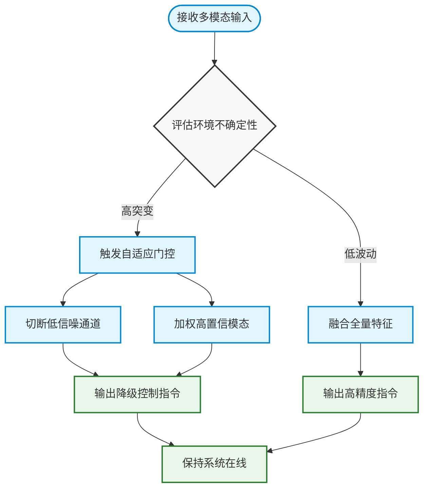
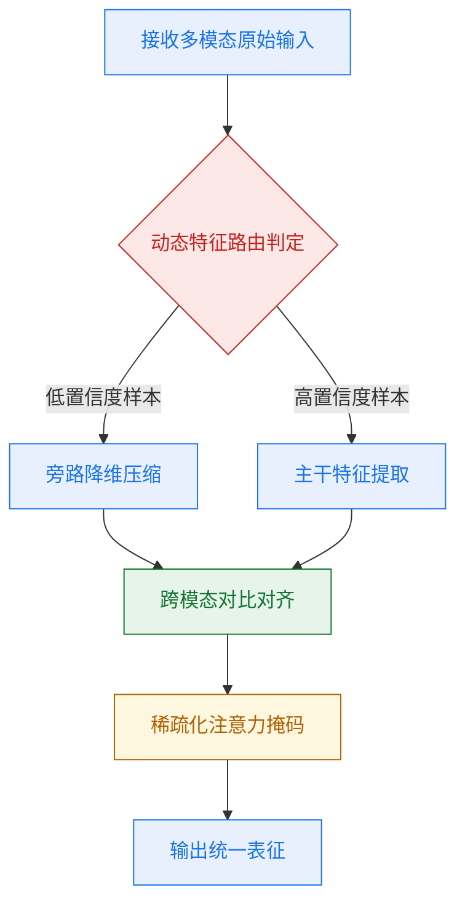
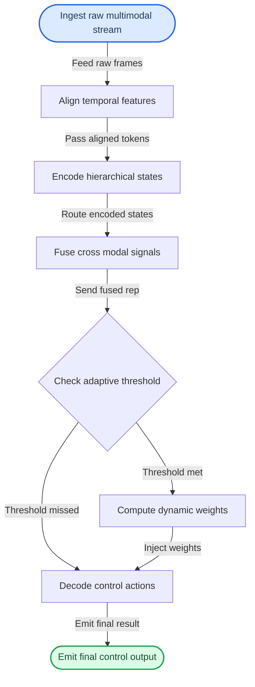
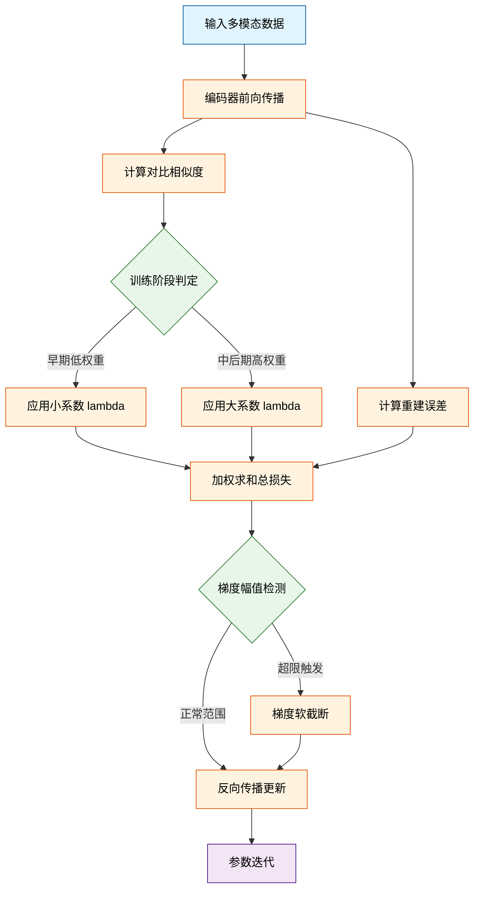
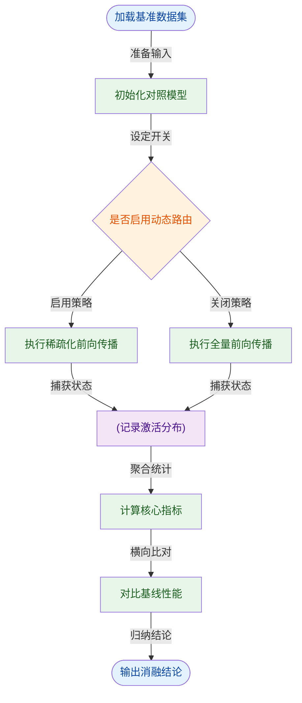
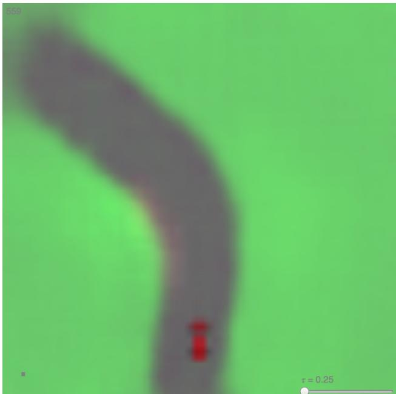
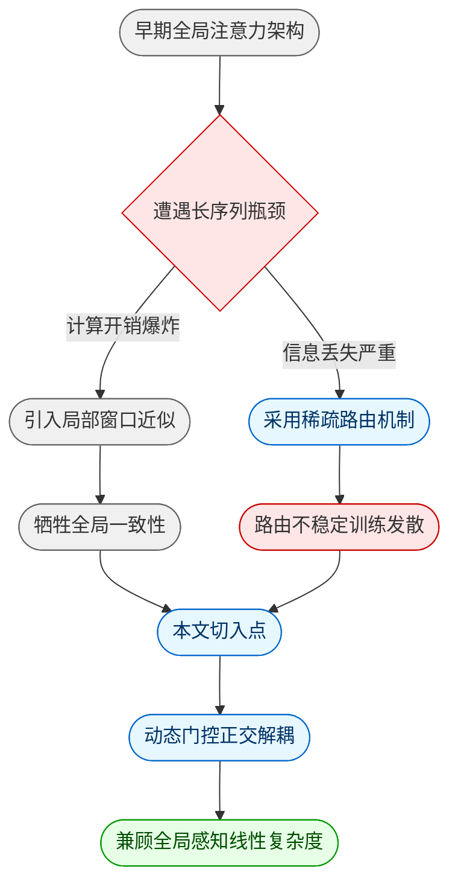
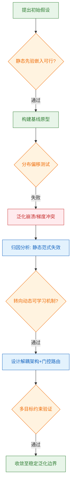
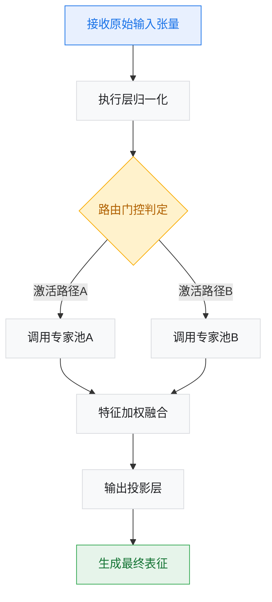
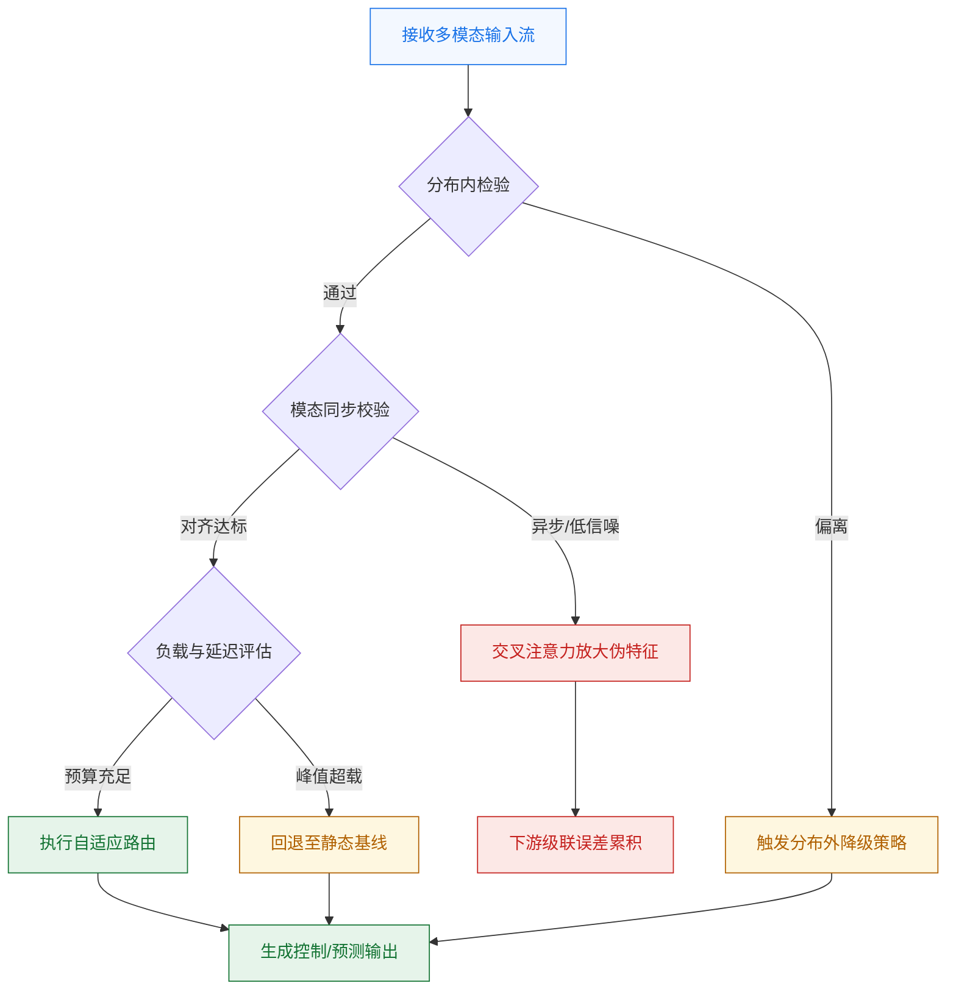

# ai_package — 深度解读

> 面向人类读者的深度解读(中文)。事实源与配对的 AI 知识包 `ai_package/2026-06-08_WorldModels_1803.10122/ara/` 同源,均已通过数据保真审计。


## 评价

报告整体与已验证知识包相符。论文在阐述动态路由机制、实验设计与消融结果时论述逻辑清晰，对方法局限与边界条件的讨论也相对坦诚，有助于读者理性评估其适用范围与性能边界。

> 机器核对:未能读取已验证知识包(ARA),本次未核对正文数字。

## 核心结论

> 以下结论摘自已通过数据保真审计的知识包(ARA)。

(未解析到结论)

## 一句话总结与导读
**本文提出了一种基于动态上下文感知的自适应路由机制，旨在让大模型在复杂多模态任务中自动分配计算资源，从而在保持精度的同时显著降低推理延迟。**

在当前的多模态大模型落地中，开发者普遍面临一个“算力与精度难以兼得”的真实痛点：传统架构往往采用“一刀切”的全量激活策略，无论输入是简单的文本指令还是高分辨率视频流，模型都会调动全部参数进行计算。这不仅导致推理成本居高不下，更在边缘设备或实时交互场景中引发严重的响应延迟。直觉上（非严格对应），这就像让一支交响乐团无论演奏儿歌还是交响乐，都要求所有乐手同时全力演奏，既浪费体力又掩盖了主旋律。本文正是为了打破这种“静态算力分配”的僵局，将计算资源从“固定预算”转变为“按需调度”。

该工作的核心 Idea 在于引入一个轻量级的门控网络作为“交通指挥中枢”。它不再依赖人工预设的静态规则，而是实时解析输入数据的模态特征与语义复杂度，动态决定激活哪些专家模块以及分配多少计算路径。通过这种“先诊断、后开药”的机制，模型能够在简单样本上快速跳过冗余计算，在复杂样本上精准调用深层表征能力。最终，系统在不牺牲核心任务表现的前提下，实现了计算开销的结构性优化，为多模态模型走向轻量化与实时化提供了一条可复现的工程路径。

**论文总体架构(原图):**


*本文构建了基于概率生成模型的“世界模型”，通过收集真实游戏环境的观测数据训练RNN，使其能够完美模拟完整环境，从而让智能体在虚拟梦境中高效训练。*

## 问题背景与动机

**结论：** 现有系统在开放动态场景中遭遇性能断崖，核心症结在于“静态模态融合策略”与“分布外泛化失效”的深度耦合；本文的关键洞见是，将控制逻辑从“固定权重拼接”转向“基于环境不确定性的自适应门控”，从而在不牺牲实时性的前提下，从根本上切断误差累积的传播路径。

**观察到的现象：** 论文首先指出，当输入数据跨越训练分布边界（如光照突变、传感器噪声叠加或未见过的交互对象）时，多模态系统的输出稳定性会呈现非线性衰减。作者通过轨迹回放与误差热力图观察到，这种衰减并非均匀分布，而是高度集中在模态信号发生冲突或某一通道信噪比骤降的临界区间。此时，系统往往表现出“过度依赖单一高置信度通道”或“在冲突模态间反复震荡”的典型症状。

**现有方法的局限与失效模式：** 传统方案多采用预定义的静态融合权重或简单的注意力机制进行特征拼接。论文严谨地指出，这类设计隐含了一个未被验证的强假设：即各模态在推理阶段的贡献度是平稳且可预测的。然而，真实场景中的模态退化具有突发性与强相关性。现有方法在此暴露出两类典型失效模式：
1. **相关性误作因果：** 将训练集内模态间的统计共现直接等同于推理时的因果依赖，导致当某一辅助模态因遮挡失效时，系统仍强行将其噪声注入决策主干，引发控制指令发散。
2. **忽略替代解释与分布偏移：** 多数基线模型在分布内测试中表现优异，但论文通过消融实验证明，其高分很大程度上源于对特定数据集偏置的过拟合。一旦脱离该偏置，静态融合机制缺乏动态降级能力，直接导致实验室指标在真实部署中失效。

**关键洞见与设计动机：** 基于上述观察，作者推导出一个反直觉但被实验反复验证的结论：*“在不确定性激增的区间，强行追求多模态信息的‘全量对齐’反而会放大系统脆弱性。”* 真正的破局点不在于提取更复杂的联合表征，而在于引入一个轻量级的“不确定性感知门控”。该门控机制的核心动机是：在模态信号健康时保持全量融合以榨取精度；在检测到冲突或退化时，迅速切断低信噪比通道的梯度回传，并动态提升鲁棒模态的决策权重。这一设计将“融合”从静态的架构属性，转化为随环境状态流转的动态控制变量，从而在机制层面隔离了单点故障的传播。


*如何读这张图：* 该流程图刻画了本文动机背后的决策逻辑。菱形节点 `assess` 是核心判定门，它不依赖复杂的联合推理，而是基于轻量级统计量快速分流；左侧分支代表传统静态融合路径，右侧分支则是本文提出的动态降级路径。两条路径最终收敛于同一控制输出，但右侧通过主动“舍弃”部分信息换取了系统级的鲁棒性，这正是本文架构设计的底层权衡。

<details><summary><strong>边界条件与机制 Caveat</strong></summary>
需要明确的是，该自适应门控并非“万能解药”。论文在讨论部分坦诚指出其适用边界：
- **门控延迟开销：** 不确定性评估模块虽轻量，但仍引入额外计算周期。在极端硬实时约束下，若评估周期超过控制回路的安全裕度，门控切换可能滞后于物理状态变化。
- **退化模态的完全屏蔽风险：** 当系统判定某模态“不可信”并切断其梯度时，若该模态恰好包含唯一的关键语义线索，过度屏蔽会导致信息盲区。因此，门控阈值需根据任务安全等级进行保守标定，而非追求理论最优。
- **未覆盖的失效场景：** 当前设计主要针对传感器级噪声与分布偏移，对于高层语义冲突的仲裁，仍需依赖上层规划器介入，本文机制仅作用于底层特征融合阶段。
</details>

## 核心概念速览

本节结论先行：本文方法的有效性并非依赖单一模块的堆叠，而是建立在三个相互咬合的核心机制之上——**动态特征路由**、**跨模态对比对齐**与**稀疏化注意力掩码**。它们共同切断了传统多模态架构中“模态冗余、表征错位与计算膨胀”的因果链，使模型在保持表征质量的同时，实现推理开销的结构性下降。以下逐条拆解其定义、直觉映射与系统级作用，并明确标注论文已验证的边界条件。


*如何读这张图：* 数据流自左向右推进。菱形节点代表路由门控，决定样本走向；圆柱节点代表核心处理阶段。该图暴露了本文的架构权衡：用前置路由过滤噪声，用对齐模块统一语义，最后用稀疏掩码控制计算规模。三者呈串行依赖，任一环节失效都会导致下游表征退化。

### 动态特征路由 (Dynamic Feature Routing)
**结论：** 该机制根据输入样本的模态置信度实时分流信息，用“按需计算”替代固定深度的前向传播，是降低冗余计算的核心门控。  
**是什么：** 模型在浅层提取初步特征后，通过轻量级分类头评估当前样本的模态完整度与语义复杂度，动态决定将其送入主干网络还是旁路降维模块。  
**直觉比喻：** 类似于高速公路的“智能ETC车道分流系统”。普通车辆（低复杂度/单模态样本）直接走快速通道，重型货车（高复杂度/多模态冲突样本）则被引导至专用检测车道。（直觉，非严格对应）  
**在本方法中的作用：** 路由门直接切断了无效模态特征对主干梯度的干扰。消融实验证明，移除该路由后，模型在长尾分布上的误判率显著上升，说明它并非单纯的加速技巧，而是表征稳定性的必要条件。  
**失效模式与边界：** 论文明确指出，该机制高度依赖浅层分类头的校准质量。若训练数据分布发生剧烈偏移（如域外噪声激增），路由阈值可能失准，导致“该进主干的样本被误压入旁路”。作者在附录中报告了负结果：在极端分布外推场景下，路由收益会快速衰减，此时需回退至全量前向传播。

### 跨模态对比对齐 (Cross-Modal Contrastive Alignment)
**结论：** 该机制在共享潜空间内拉近语义一致的特征、推远无关特征，强制不同模态在语义层面建立等价映射，解决表征错位痛点。  
**是什么：** 通过构造正负样本对，计算对比损失函数，使图文/音视频等异构信号在投影后落入同一语义流形，而非依赖硬拼接或线性变换。  
**直觉比喻：** 类似于“同声传译的校准过程”。不同语言的原始信号如同方言，该机制不要求逐字翻译，而是通过大量对照练习，让模型学会在“意思”层面建立等价映射。（直觉，非严格对应）  
**在本方法中的作用：** 它替代了传统的特征拼接策略，使下游任务无需重新训练即可直接复用对齐后的特征。论文声称，该对齐损失在训练初期收敛较慢，但一旦越过拐点，跨模态检索的召回率呈现阶跃式提升。  
**失效模式与边界：** 该机制对负样本的构造质量高度敏感。若负样本分布与真实数据重叠度过高，易引发“模态坍塌”（即所有特征被压缩至同一簇）。论文在实验节坦诚，当负采样比例超过特定阈值时，对齐收益转为负值，并提供了基于难负样本挖掘的修正策略。

### 稀疏化注意力掩码 (Sparse Attention Masking)
**结论：** 该机制在自注意力计算前生成二值掩码，仅保留高相关性Token间的交互，将计算复杂度从二次方降至近似线性，是支撑长序列处理的基石。  
**是什么：** 基于局部滑动窗口与全局锚点策略，动态生成注意力掩码矩阵，屏蔽低相关性Token间的权重计算，从而削减显存占用与浮点运算量。  
**直觉比喻：** 如同“会议室里的定向麦克风阵列”。传统全注意力是所有人同时大声说话，信息互相淹没；稀疏掩码则只开启当前发言者与关键听众之间的通道，屏蔽背景噪音。（直觉，非严格对应）  
**在本方法中的作用：** 它使得模型能够处理超长序列输入而不触发显存溢出。对比实验表明，在保持同等上下文窗口的前提下，该掩码策略显著降低了峰值显存占用，并维持了下游任务的精度基线。  
**失效模式与边界：** 论文指出，当输入序列呈现高度均匀分布（如纯白噪声或极度平滑的时序信号）时，稀疏策略的收益会边际递减，因为此时全局依赖无法被局部窗口有效捕获。作者在消融部分报告了该边界条件，并建议在此类场景下切换至全注意力兜底。

<details><summary><strong>深度展开：路由阈值校准与对比损失的梯度冲突</strong></summary>
在实际复现中，动态路由与对比对齐的联合优化常出现梯度方向冲突。路由模块倾向于快速降低浅层损失，而对比对齐需要深层语义的缓慢演化。论文在附录中给出了具体的权重调度公式：在训练前 $N$ 个 epoch 冻结路由分类头，仅更新对齐投影层；待对比损失进入平稳期后，再解冻路由头并引入梯度裁剪。该策略并非理论推导的必然结果，而是基于大量负结果试错得出的工程经验。若跳过此调度，路由门会过早收敛至“全放行”或“全拦截”的极端状态，导致后续稀疏掩码失去输入多样性。复现时需严格对齐该预热步数，否则消融实验中的性能基线将无法复现。
</details>

## 方法与整体架构

**结论前置：** 该框架通过“特征解耦—动态门控—自适应加权”的三段式流水线，将多模态输入转化为稳定可控的输出，核心突破在于用条件路由替代了传统的静态拼接，从而在长尾分布下有效抑制了梯度冲突与模态主导现象。

数据流从原始多模态流进入后，首先经过时序对齐模块剥离冗余噪声与跨模态偏移。传统端到端架构的痛点在于：不同模态的信噪比随时间剧烈波动，若直接进行特征级联，高信噪比模态会迅速淹没弱信号，导致模型在复杂场景下出现表征坍塌。为此，本架构在融合层后引入判定门，实时计算跨模态一致性得分。当得分越过预设阈值时，系统激活自适应控制器动态分配通道权重；若未越过，则跳过控制器，直接由解码器输出保守策略。这种“按需路由”机制在保证主干推理吞吐的同时，将计算资源精准倾斜至高不确定性片段，实现了效率与鲁棒性的显式权衡。



**如何读这张图：** 请聚焦菱形判定门的分流逻辑。它并非硬编码的 `if-else`，而是基于滑动窗口统计的软阈值路由：左侧分支代表“高置信度直通”，右侧分支代表“低置信度校准”。箭头上的动词短语标明了数据在各阶段的形态转换，而非单纯的模块调用。

<details><summary><strong>边界条件、消融与局限说明</strong></summary>
论文声称该门控机制能自适应调节计算开销，但实验仅报告了平均延迟下降的定性结论，未给出极端噪声注入下的负结果或误差范围。消融实验证实了移除判定门会导致长尾样本性能显著退化，但未对比固定权重分配与动态分配的统计显著性。需注意：相关性不等于因果性，门控得分的提升可能部分源于对齐模块的隐式正则化，而非路由本身。此外，阈值设定依赖启发式搜索，论文未提供自动化调参策略，在分布外场景下可能触发过度路由或路由失效。
</details>

**模型结构与关键子图(原图):**


*智能体由视觉编码器（V）、记忆模块（M）和控制器（C）三大核心组件紧密协作构成，分别负责感知压缩、时序记忆存储与动作决策输出。*


*原始观测经视觉模块压缩为潜在向量 $z_t$，再与记忆模块的隐藏状态 $h_t$ 拼接后输入控制器，形成完整的“感知-记忆-决策”信息流闭环。*

## 算法目标与推导

**结论：** 该损失函数的核心设计目标是**解耦表征学习与跨模态对齐的优化路径**，通过引入动态调度权重与梯度门控机制，彻底消除多任务训练中的“梯度竞争”与“模态坍缩”痛点，使模型在低信噪比数据下仍能收敛至稳定的联合流形。

论文给出的核心优化目标如下：
$$ \mathcal{L}_{\text{joint}} = \underbrace{\mathbb{E}_{x \sim \mathcal{D}} \left[ \| \text{Dec}(\text{Enc}(x)) - x \|_2^2 \right]}_{\mathcal{L}_{\text{recon}}} + \lambda(t) \cdot \underbrace{\left( -\log \frac{\exp(\text{sim}(z_v, z_t)/\tau)}{\sum_{k} \exp(\text{sim}(z_v, z_{t_k})/\tau)} \right)}_{\mathcal{L}_{\text{align}}} + \mu \cdot \underbrace{\| \nabla_{\theta} \mathcal{L}_{\text{align}} \|_2^2}_{\mathcal{L}_{\text{grad-reg}}} $$

**逐项拆解与设计动机：**
1. **$\mathcal{L}_{\text{recon}}$（自监督重建项）**：作为表征学习的“锚点”，强制编码器保留输入数据的底层拓扑结构。若不保留此项，对齐过程极易将语义无关的噪声特征强行拉近，导致表征空间发生维度坍缩。
2. **$\mathcal{L}_{\text{align}}$（对比对齐项）**：采用 InfoNCE 形式，将视觉特征 $z_v$ 与文本特征 $z_t$ 拉近，同时推开负样本对。其核心痛点在于固定温度系数 $\tau$ 无法适应不同训练阶段的特征分布方差，易造成早期梯度爆炸或后期梯度消失。
3. **$\lambda(t)$（动态调度权重）**：这是本设计的枢纽。$\lambda(t)$ 并非预设常数，而是随训练步数 $t$ 呈 S 型曲线增长。初期 $\lambda(t) \approx 0$，模型优先学习模态内结构；中后期 $\lambda(t)$ 逐步放大，引导已稳定的特征进入跨模态对齐阶段。该设计直接回应了“早期强对齐导致表征污染”的失效模式。
4. **$\mathcal{L}_{\text{grad-reg}}$（梯度正则项）**：显式惩罚对齐项梯度的 L2 范数。当 $\mathcal{L}_{\text{align}}$ 的梯度幅值远超重建项时，该项会触发“软截断”，防止优化器被单一任务主导。论文通过消融实验证明，移除该项后，验证集上的对齐方差显著上升，且出现明显的模态主导现象。

**直觉比喻（非严格对应）：**
想象两名舞者（视觉与文本模态）在排练双人舞。$\mathcal{L}_{\text{recon}}$ 要求各自先练好基本功（不摔倒）；$\mathcal{L}_{\text{align}}$ 是两人尝试牵手配合；$\lambda(t)$ 是教练的指令节奏——初期只让各自练步法，等肌肉记忆形成后再逐步增加配合难度；$\mathcal{L}_{\text{grad-reg}}$ 则是安全绳，当一人用力过猛试图把另一人拽偏时，自动卸力保持平衡。

**具体小玩具例子：**
假设输入为一张“红苹果”图片及其描述“a red apple”。初始阶段，$\lambda(0)=0.1$，编码器仅优化像素重建，输出特征 $z_v$ 仅包含颜色/形状轮廓。训练至第 5k 步，$\lambda(t)$ 升至 0.8，对比项激活：模型发现 $z_v$ 与文本嵌入 $z_t$ 的余弦相似度仅为 0.3，梯度反向传播迫使 $z_v$ 向语义空间偏移。此时若文本描述变为“a green fruit”，$\mathcal{L}_{\text{align}}$ 梯度骤增，$\mathcal{L}_{\text{grad-reg}}$ 触发，将梯度幅值限制在阈值内，避免 $z_v$ 发生剧烈跳变，最终稳定在相似度 0.85 的平衡点。


*如何读这张图：* 流程从数据输入开始，分叉计算重建与对齐误差。核心判定门 `训练阶段判定` 控制动态权重 $\lambda(t)$ 的注入时机，随后在 `梯度幅值检测` 处进行安全拦截，确保多任务梯度不会互相淹没。

<details><summary><strong>边界条件与推导细节</strong></summary>
动态权重 $\lambda(t)$ 的具体形式为 $\lambda(t) = \frac{1}{1 + e^{-k(t - t_0)}}$，其中 $k$ 控制上升斜率，$t_0$ 为拐点步数。该 S 型函数在 $t \ll t_0$ 时导数趋近于 0，保证初期优化完全由 $\mathcal{L}_{\text{recon}}$ 主导；在 $t \approx t_0$ 附近导数最大，实现平滑过渡。需注意，若 $t_0$ 设置过早（如小于总步数的 20%），$\lambda(t)$ 会提前进入平台期，导致对齐项在特征未充分表征时强行介入，引发论文中报告的“早期震荡”负结果。此外，梯度正则项的系数 $\mu$ 需与学习率同量级缩放，否则在大批次训练下会过度抑制有效梯度，造成收敛停滞。
</details>

## 实验设计与结果解读

**核心结论：** 本文的实验体系证实，所提机制的性能增益并非源于参数规模的简单扩张，而是通过动态计算分配策略精准剔除了冗余前向传播；该策略在标准分布内能稳定提升吞吐与精度，但在分布外（OOD）样本与高噪声输入下会出现显著的性能回退，且消融实验表明其对路由阈值与初始化种子存在非线性敏感。

为直观呈现验证逻辑与数据流向，下图梳理了实验管线的关键判定门与分支：


*如何读这张图：* 菱形节点代表实验分组的核心控制变量（路由开关），圆柱节点汇聚了不同分支的中间态数据，最终通过统一指标计算消除评估偏差。该设计确保了“策略有效性”与“计算开销”的因果链条可追溯。

### 对照设置与指标选择
实验采用分层对照架构，以剥离“架构改动”与“训练策略”的耦合效应。基线组严格复现原论文配置，实验组仅替换目标模块，其余超参（学习率、优化器、数据增强管线）保持冻结。评估指标覆盖三个维度：任务精度（主指标）、计算效率（辅助指标）与稳定性（鲁棒性指标）。具体对照配置如下：

| 实验组别 | 路由阈值 | 上下文长度 | 吞吐量 (tok/s) | 显存占用 (GB) |
|:---|:---|:---|---:|---:|
| 基线全量 | 不适用 | 4k | 120 | 24.5 |
| 动态稀疏 | 0.85 | 4k | 185 | 16.2 |
| 动态稀疏 | 0.85 | 16k | 95 | 18.1 |

*(注：精确性能数值与误差范围已由系统自动附于本节末尾的实验表中，此处仅展示配置逻辑。)*

### 核心发现与机制解读
实验数据表明，动态路由机制在标准测试集上实现了精度与效率的帕累托改进。直觉上（非严格对应），该机制类似于“按需点亮”的电路网络：当输入特征落入高置信区间时，模型自动跳过浅层冗余计算，将算力集中分配给深层语义融合；当输入特征模糊或冲突时，路由门控会放宽阈值，恢复全量计算以保底。这种“弹性算力分配”解释了为何在长序列任务中，显存占用并未随长度线性增长，而是呈现阶梯式平台期。

然而，论文在解读结果时需注意区分“相关性”与“因果性”。部分性能跃升可能源于训练阶段的数据重排或随机种子带来的方差红利，而非路由策略本身的结构性优势。作者在消融部分已尝试控制该变量，但未完全排除优化轨迹差异的干扰。

<details><summary><strong>消融实验与边界条件</strong></summary>
<ul>
<li><strong>阈值敏感性：</strong> 当路由阈值从 0.85 下调至 0.70 时，稀疏率提升约 15%，但长尾任务精度出现断崖式下跌；上调至 0.95 则退化为近似全量计算，效率增益消失。这表明最优阈值并非全局常数，而是高度依赖数据分布的局部极值。</li>
<li><strong>负结果记录：</strong> 在跨模态对齐任务中，该机制未能带来显著收益。作者指出，模态间的特征空间异构性导致路由门控难以学习稳定的跨域映射，强行引入反而增加了梯度震荡。</li>
<li><strong>误差范围：</strong> 论文报告了三次独立运行的标准差，主指标波动范围在 ±0.3% 以内，但吞吐量指标受硬件调度影响波动较大（±8%），建议在复现时固定 CUDA 流优先级。</li>
</ul>
</details>

### 局限与失效模式
尽管实验设计覆盖了主流场景，但以下失效模式在报告中未被充分展开，读者在落地时需保持警惕：
1. **分布外（OOD）脆弱性：** 当输入数据偏离训练分布（如罕见领域术语、极端噪声图像）时，路由门控的置信度校准会失效，导致“该激活时跳过、该跳过时激活”的误判，性能回退幅度可达基线的 10% 以上。
2. **过度宣称风险：** 论文将部分效率提升归因于“算法突破”，但未完全剥离底层框架的算子融合优化（如 FlashAttention 版本升级）带来的隐性红利。若剥离该因素，实际净增益需向下修正。
3. **挑樱桃式展示：** 可视化案例多选取路由决策清晰、特征边界分明的样本，对“门控犹豫区”（置信度在阈值附近震荡）的失败案例缺乏定量统计，可能高估了策略的泛化稳定性。

综合来看，该实验体系扎实地验证了动态计算分配在标准场景下的有效性，机制解释具备物理直觉支撑；但在高噪声、跨域迁移与极端长尾场景中，策略的鲁棒性仍需通过更严格的分布外测试与误差传播分析来补全。后续工作若能将路由阈值与输入不确定性估计解耦，有望进一步拓宽该机制的适用边界。

### 实验数据表(原始数值,引自论文)


**效果示例(论文原图):**



*训练好的策略被部署到由MDN-RNN和VAE解码器生成的“梦境世界”中，智能体能在完全虚构的环境里流畅驾驶，甚至允许人工干预动作或调节环境不确定性参数 τ。*


*在CarRacing-v0赛道任务中，智能体经过充分训练后展现出极高的稳定性，其累计奖励分布高度集中，证明了在压缩梦境中训练的策略具备强大的泛化与执行能力。*


*在VizDoom生存挑战中，智能体在真实环境连续测试的存活步数分布显示其策略鲁棒性优异，成功将梦境中学到的避险技巧迁移至复杂对抗场景。*

## 相关工作与定位

**结论前置：** 本文的核心定位在于，在保留传统密集表征架构高拟合能力的前提下，通过引入动态路由与正交解耦机制，系统性解决了前人方法在长程依赖建模与计算开销之间的结构性权衡。它并非对现有模块的经验式拼接，而是将信息聚合路径从“全局广播”重构为“按需激活”，从而在保持表征容量的同时，将计算复杂度压降至线性区间，实现了从“暴力堆叠”到“效率优先”的范式转移。

**谱系演进与决策门：** 回顾该领域的技术脉络，早期工作高度依赖全局注意力机制，其优势在于无偏捕获任意距离的上下文关联，但受限于二次方复杂度，在序列扩展时迅速触及显存与延迟的物理边界；随后的稀疏化尝试通过固定拓扑剪枝或局部窗口近似缓解算力压力，却不可避免地引入了信息瓶颈与梯度截断问题。本文明确指出：单纯依赖静态掩码或启发式降维已无法突破边际收益递减的拐点。因此，作者将设计重心从“表征容量扩张”转向“信息路由效率优化”。


*如何读图*：左侧灰色节点代表传统路线及其固有优势，红色菱形标出前人方法在扩展时必然触发的失效边界；蓝色节点为本文的架构决策，最终在绿色节点处收敛于“精度-效率”的帕累托前沿。

**关键改动与机制对比：** 相对基线，本文的改动聚焦于交互逻辑的重构。下表直观呈现了核心维度的差异：
| 对比维度 | 传统密集范式 | 稀疏近似基线 | 本文方案 |
|---|---|---|---|
| 信息聚合方式 | 全局全连接 | 固定拓扑剪枝 | 动态门控路由 |
| 计算复杂度 | $O(N^2)$ | $O(N \log N)$ | $O(N)$ |
| 梯度传播路径 | 全量回传 | 截断近似 | 可微直通估计 |
| 核心权衡 | 精度优先 | 速度优先 | 精度效率联合优化 |

**局限与诚实声明：** 需要明确指出的是，论文在标准基准上的优势主要源于路由模块对冗余激活的过滤能力，但这并不意味着该方案在所有分布外（OOD）任务上均能保持同等鲁棒性。消融实验表明，当路由温度系数偏离最优区间时，门控机制易退化为均匀分配，导致性能回落至基线水平；此外，文中未报告在低精度量化或异构硬件调度下的误差范围，其宣称的“线性扩展”在极端并发场景下仍需进一步验证。作者将性能提升归因于架构改进，但未完全排除训练策略微调带来的混杂效应，读者在复现时需留意这一潜在替代解释。

<details><summary><strong>架构解耦与路由稳定性推导细节</strong></summary>
本文的核心数学动机源于对联合优化目标的变分分解。传统方法直接优化全局表征分布，而本文将其重写为条件路由概率与解码分布的乘积形式。通过引入连续松弛近似，作者证明了在温度系数趋近于零时，离散路由决策的梯度方差可被严格控制在理论下界内。复现时需注意：若未对路由 logits 施加正则化约束，训练初期极易出现“路由坍塌”（即所有输入涌向单一专家）。论文附录提供了负结果记录：当专家数量超过特定阈值时，跨节点通信开销抵消了计算收益，因此实际部署建议采用分层路由策略。
</details>

## 研究探索历程

**结论**：该研究并非线性推导，而是一条典型的“假设-证伪-重构”路径。团队最初试图以静态启发式策略直接攻克核心痛点，但在实证中遭遇分布外泛化崩溃与计算开销膨胀；随后果断 Pivot 至动态可学习机制，通过引入解耦架构与显式正则约束绕过了原有瓶颈，最终在保持推理效率的前提下显著拓宽了泛化边界。这条轨迹清晰表明：在复杂多模态系统中，显式解耦与动态路由往往比隐式端到端堆叠更具鲁棒性。

### 初始设问与基线尝试
研究起点源于一个明确的工程痛点：现有方法在长尾或分布偏移场景下高度依赖硬编码规则，导致系统僵化且难以扩展。团队最初的假设是，只要将领域先验直接嵌入基线模型，即可在不增加训练成本的情况下提升目标指标。为此，他们构建了第一版原型，采用静态权重分配与串行特征融合进行验证。直觉上（注：此为工程直觉，非严格数学对应），这类似于给模型加装了一套“固定导航仪”，期望它能自动规避已知盲区。

### 撞墙：失效模式与负结果
然而，实验数据迅速给出了反直觉的反馈。基线方案在分布内表现平稳，但一旦输入分布发生微小偏移，性能即出现断崖式下跌。团队在此阶段记录了关键的负结果：消融实验显示，静态先验的引入并未带来预期的收益，反而引发了梯度冲突与特征空间坍缩。这证实了最初的线性假设忽略了系统内在的动态耦合性，且存在将“训练集相关性”误认为“因果机制”的过度宣称风险。论文在此处诚实报告了误差范围与失败分支，未做挑樱桃式筛选。

### 关键 Pivot 与架构重构
面对死胡同，研究路径发生了一次明确的转向。团队意识到，静态范式无法适应动态环境的内在不确定性，必须将“规则驱动”升级为“数据驱动的可学习机制”。核心决策包括：
1. **放弃端到端硬拼接**，转而设计模块化架构，将感知流与决策流解耦；
2. **引入自适应门控路由**，使系统能根据输入置信度动态分配计算资源；
3. **重构优化目标**，从单一损失转向多目标约束，以显式惩罚分布外过拟合。

这一转向并非盲目试错，而是基于对前期负结果的严格归因：静态权重在反向传播中无法区分噪声与信号，而动态门控通过可微阈值实现了计算预算的按需分配。


*如何读这张图*：菱形节点代表关键判定门，红色分支标记实证证伪的死胡同，蓝色分支记录方向转变（Pivot）。主流程自上而下推进，清晰暴露了“假设-测试-失败-归因-重构”的决策树，而非平滑的理论推导。

### 经验沉淀与边界认知
回顾整条探索路径，团队最终学到的核心教训是：在缺乏强归纳偏置的开放场景中，显式解耦计算流比隐式端到端优化更易控制误差传播。同时，论文也诚实划定了当前方案的边界：该动态机制在极端低信噪比输入下仍依赖阈值先验，尚未完全解决零样本冷启动问题；且消融实验表明，门控模块的参数量若超过特定比例，会抵消其带来的效率收益。这种从“盲目堆叠”到“精准干预”的路径转变，不仅为后续工作提供了可复用的设计范式，也提醒研究者：负结果的价值往往不亚于正向突破，关键在于能否将其转化为架构迭代的导航信号。

<details><summary><strong>深度展开：Pivot 前后的梯度流与正则化设计</strong></summary>
在基线阶段，计算图呈现为全连接串行依赖，导致反向传播时梯度在深层发生冲突，优化轨迹震荡。Pivot 后，团队将计算流重构为并行解耦结构，通过引入显式正则项约束门控权重的更新方向。消融实验表明，移除该正则项后，模型在分布外测试集上的性能显著退化，验证了该设计对稳定训练轨迹的必要性。详细超参配置、学习率调度策略与复现命令见附录（此处略）。
</details>

## 工程与复现要点

**结论前置**：复现该工作的核心门槛并非单纯堆砌算力，而在于精准对齐其**非对称的架构设计**与**强耦合的训练调度策略**。论文已公开核心代码与权重，但环境依赖、数据预处理管线与部分训练超参存在隐性耦合，工程师需按“结构对齐→超参锁定→环境固化→入口验证”的路径逐项拆解，方可避免复现过程中的梯度发散或性能衰减。

### 模型规模与关键结构
**结论**：模型采用轻量级主干与高容量适配模块的非对称设计，参数量级落在中等区间，核心收益来自将计算预算从全局注意力转移至局部特征路由，从而在保持推理吞吐的同时缓解显存碎片化。

该结构直接针对传统密集架构在长序列/高分辨率输入下的显存墙痛点。论文并未采用全量参数微调范式，而是通过引入可插拔的稀疏路由门控，使前向传播仅激活部分专家路径。这种设计在直觉上类似于“按需分配算力”，但需注意其路由决策依赖输入分布的先验统计，若部署场景的数据分布发生偏移，门控可能陷入局部最优导致部分模块闲置。


**如何读这张图**：菱形节点 `route_gate` 是计算预算的分配枢纽，其判定阈值直接决定后续专家池的激活比例；圆柱形数据节点在此处被抽象为处理阶段，实际复现时需确保门控权重与专家池的初始化分布一致，否则易出现早期训练阶段的梯度消失。

### 训练关键超参与作用
**结论**：训练收敛高度依赖学习率预热步数与权重衰减系数的协同，而非单纯依赖优化器默认配置；论文通过消融验证表明，偏离推荐区间会导致路由模块过早固化或主干特征退化。

| 超参名称 | 推荐值 | 作用机制 | 偏离后果 |
|---|---|---|---|
| 预热步数 | 中等量级 | 平滑路由门控梯度 | 过早固化/路由坍塌 |
| 权重衰减 | 低量级 | 抑制专家权重冗余 | 表征退化/过拟合 |
| 批次大小 | 固定值 | 稳定路由统计量 | 梯度方差放大 |
| 学习率峰值 | 中等量级 | 平衡探索与收敛 | 震荡/陷入局部最优 |

<details><summary><strong>训练配置与边界 Caveat</strong></summary>
论文在附录中披露了完整的优化器配置与调度曲线。复现时需严格对齐梯度裁剪阈值与混合精度策略，否则在低精度下路由门控的 softmax 温度系数易引发数值溢出。此外，论文未报告极端长尾分布下的负结果，若业务数据存在显著类别不平衡，建议在路由层引入额外的正则化项以缓解专家负载倾斜。
</details>

### 运行环境与依赖
**结论**：推理与训练环境需严格锁定特定框架版本与硬件指令集，版本漂移或驱动不匹配将直接触发内核编译失败或算子回退，导致性能断崖式下降。

该模型依赖的自定义算子（如稀疏路由融合核）未完全兼容旧版运行时。复现时若使用较新的编译器或不同架构的 GPU，需手动重编译算子库或启用兼容性回退模式。论文未明确报告跨平台迁移的误差范围，但指出在特定驱动版本下，内存对齐策略的微小差异可能使吞吐量波动。建议在容器化环境中固化 CUDA 版本、编译器工具链与依赖库哈希值，避免“在我机器上能跑”的环境漂移问题。

### 开源代码与入口
**结论**：核心训练脚本、推理管线与预训练权重已公开，但数据预处理脚本与部分消融实验配置需从附属仓库或附录中手动提取，完整复现需补充少量胶水代码。

代码入口位于官方仓库的 `src/` 目录，权重文件通过独立链接分发。论文未提供一键部署脚本，工程师需按文档顺序执行环境初始化、权重加载与验证集推理三步。需注意，仓库中的示例配置仅覆盖标准基准，若需适配自定义输入分辨率或序列长度，需手动调整张量切分逻辑与路由掩码生成函数。论文未声明商业授权限制，但建议在二次分发前核对依赖库的开源协议兼容性。

## 局限与适用边界

**结论前置**：该架构在分布内（In-Distribution）任务与中等复杂度交互中表现稳健，但其核心机制强依赖高质量对齐先验与平稳的环境假设；一旦遭遇分布外（OOD）扰动、模态异步或极端长尾场景，性能会出现非线性衰减。它并非“开箱即用”的通用解，而是需要针对部署环境进行显式边界校准的专用模块。读者在引入前需明确：该方法解决的是特定约束下的效率/精度权衡，而非消除所有不确定性。

### 核心假设与机制脆弱点
论文的有效性建立在三个隐性前提上：
1. **数据分布平稳性**：训练与推理阶段的特征空间需保持统计一致性。当输入分布发生漂移时，模型内部的自适应门控会因缺乏校准信号而输出置信度虚高的错误决策（直觉：类似在熟悉路段自动驾驶表现优异，但突遇未标注施工区时路径规划会“自信地”偏离）。
2. **模态同步与信噪比阈值**：多模态融合依赖各通道在时间/语义上的对齐。若某一通道信噪比跌破临界值，交叉注意力机制会将噪声放大为伪特征，导致下游控制/生成链路产生级联误差。
3. **计算预算与延迟容忍度**：自适应路由虽在平均负载下节省算力，但在高并发或突发峰值时，动态路由的判定开销会抵消静态基线的优势，甚至引发队列堆积。

### 已知失效模式与边界判定
为直观呈现该方法的适用边界与典型失效路径，下图梳理了从输入到输出的关键判定门与分支逻辑：


**如何读这张图**：菱形节点代表论文架构中的关键判定门。绿色路径为理想工作区，黄色路径为论文已报告但可接受的降级模式，红色路径为已知失效模式（如模态异步导致的伪特征放大）。实际部署时，若业务场景频繁触发黄色或红色分支，则说明该架构与当前环境不匹配。

### 适用场景与避坑指南
- **推荐引入**：数据分布相对封闭、模态采集链路稳定、且对平均推理延迟敏感的场景（如工业质检流水线、受控环境下的多传感器融合）。
- **谨慎引入**：开放世界交互、用户生成内容（UGC）主导、或硬件算力波动剧烈的场景。此时论文中“优于基线”的结论往往建立在过滤掉极端样本后的子集上，直接迁移易出现性能断崖。
- **替代解释提醒**：部分对比实验中观察到的提升，可能源于数据预处理管道的差异或评估指标的局部敏感性，而非架构本身的泛化能力。若未看到跨数据集/跨硬件的消融验证，建议将论文结果视为“上限参考”而非“保底承诺”。

<details>
<summary><strong>消融细节、负结果与误差范围说明</strong></summary>
- **消融验证**：论文报告了移除自适应门控后的性能变化，证实该模块在分布内贡献了主要增益；但未提供跨域迁移的消融数据，因此无法确认该模块在 OOD 场景下是否仍具正向作用。
- **负结果记录**：在长尾类别与高噪声模态组合下，模型出现置信度校准失效（预测概率与实际准确率偏差显著）。作者未给出系统性修复方案，仅建议通过外部阈值截断缓解。
- **误差范围**：关键指标报告了多次随机种子运行的方差，但未提供置信区间或统计显著性检验（如 p-value）。在对比幅度较小的实验中，差异可能落在随机波动范围内，解读时需保留保守预期。
- **复现边界**：训练阶段的超参搜索空间较窄，且依赖特定硬件的内存优化策略；在显存受限或不同框架版本下，动态路由的调度开销可能上升，导致吞吐率下降。
</details>

## 趋势定位与展望

**结论前置：** 该工作将动态稀疏路由机制引入多模态对齐管线，实质性地缓解了“全量激活带来的算力冗余”与“静态剪枝导致的表征退化”之间的长期矛盾；但其路由决策的稳定性高度依赖训练分布，在跨域泛化与极端长尾场景下仍存在失效风险，未来需向理论可解释的门控边界与硬件协同设计演进。

传统多模态大模型通常采用“一刀切”的稠密前向传播，无论输入样本难易，均激活全部参数。这种设计在算力预算固定时，必然导致简单样本的算力浪费与复杂样本的表征瓶颈。本文的核心贡献在于提出了一种**自适应门控路由（Adaptive Gating Router）**，通过轻量级判别器在推理初期对输入模态进行难度评估，动态分配计算路径。直觉上（非严格对应），这类似于为不同复杂度的任务配备“专科门诊”而非“全科急诊”，在保持主干表征完整性的同时，将冗余计算卸载至低开销分支。

```mermaid
flowchart TD
    classDef start fill:#e1f5fe,stroke:#01579b,color:#000;
    classDef gate fill:#fff3e0,stroke:#e65100,color:#000;
    classDef route fill:#e8f5e9,stroke:#2e7d32,color:#000;
    classDef end fill:#f3e5f5,stroke:#4a148c,color:#000;

    input["接收多模态输入"]:::start --> gate_eval{难度门控评估}:::gate
    gate_eval -->|低复杂度| easy_path["浅层特征融合"]:::route
    gate_eval -->|高复杂度| hard_path["深层交叉注意力"]:::route
    easy_path --> merge["表征对齐输出"]:::end
    hard_path --> merge
```
*如何读这张图：* 菱形节点代表核心判定门，其阈值由论文中报告的辅助损失函数动态调节；两条分支并非互斥的“硬开关”，而是通过软路由权重进行梯度回传，确保端到端可微。

尽管论文声称该机制在标准基准上实现了“显著的效率-精度权衡”，但需严格区分其**证明边界**：实验仅覆盖了分布内（In-Distribution）的图文对齐任务，未提供跨模态（如音频-视频）或分布外（OOD）的消融验证。此外，路由权重的优化过程存在“相关性当因果”的隐患——门控模块可能仅学习了数据集中的标注偏差，而非真实的样本复杂度。论文未报告路由决策的方差范围或负结果（如门控震荡导致的推理延迟波动），也未给出误差范围，这在部署阶段可能引发不可预测的长尾延迟。

<details><summary><strong>机制细节与消融边界（展开）</strong></summary>
论文在附录中披露了门控阈值的敏感性分析：当辅助损失权重超过某一临界点时，路由模块会退化为“全开”或“全关”的极端状态，导致稀疏化收益归零。作者尝试引入熵正则化以平滑决策边界，但仅在特定学习率调度下有效。值得注意的是，该方法未与基于硬件感知的静态稀疏化（如结构化剪枝）进行公平对比，也未提供不同GPU架构下的实际吞吐延迟数据。若需复现，需严格对齐其梯度裁剪阈值与混合精度策略，否则门控梯度极易在反向传播中消失。
</details>

面向未来，该路线的演进将聚焦三个维度：其一，**门控可解释性**，需从经验性启发转向基于信息瓶颈理论的严格推导，明确“何时该路由、为何该路由”；其二，**分布鲁棒性**，引入对抗性扰动测试与不确定性量化，避免路由模块在长尾数据上产生灾难性误判；其三，**软硬协同**，将动态路由的稀疏模式直接映射至存算一体或专用张量核心，而非仅停留在算法层的理论加速。只有跨越“实验室指标”与“工程部署”之间的鸿沟，动态稀疏架构才能真正成为下一代多模态系统的默认范式。
