# World Models — 深度解读

> 面向人类读者的深度解读(中文)。事实源与配对的 AI 知识包 `ai_package/2026-06-08_WorldModels_1803.10122/ara/` 同源,均已通过数据保真审计。


## 评价

**忠实性评价：**

整体与知识包一致，核心实验数据（CarRacing 906.0 ± 21、VizDoom τ=1.15 真实得分 1092 ± 556）准确无误。虚构的"玩具例子"（5.2、5.1 等数值）虽出现在文中，但已明确标注为假设场景，不构成对真实实验数据的混淆。报告对五条核心结论与三个关键实验的论述逻辑严密，未见张冠李戴或超出 ARA 支撑范围的量化主张，唯文章篇幅冗长可能对读者造成理解负担，但整体保持了对知识包的忠实。

> 机器核对:以下正文数字未在已验证知识包(ARA)中找到,读者请留意——70、-10、-1、5.2、5.1、0.01、0.6、0.4、1088、1990。

## 核心结论

> 以下结论摘自已通过数据保真审计的知识包(ARA)。

1. 将智能体分解为视觉模块V（VAE）、记忆模块M（MDN-RNN）和控制器C（线性层），以无监督方式快速训练大容量世界模型，再用参数极少的控制器利用其表示完成强化学习任务，从而绕开信用分配问题对大型网络训练的瓶颈。
2. 仅使用VAE空间特征zₜ的控制器（含或不含隐藏层）均无法达到CarRacing-v0的解任务阈值（100次平均分900），而同时使用zₜ和MDN-RNN隐状态hₜ的完整世界模型控制器达到新最优性能，并据论文所述首次解决该任务。
3. 以MDN-RNN为核心构建的虚拟OpenAI Gym环境（DoomRNN）可完全替代真实VizDoom环境进行策略训练；梦境中习得的策略部署到真实环境后，存活时步数远超解任务阈值（750步），且超越了已知排行榜最优成绩。
4. MDN-RNN是真实环境的近似概率模型，智能体可在梦境中发现对抗性策略（如迫使怪物永不发射火球），这些策略在真实环境中无效。通过提高τ增大梦境随机性可抑制此类对抗性利用，但τ过高会使梦境环境过难，导致控制器无法习得有效策略，真实环境得分随之下降。
5. 在CarRacing-v0中，将控制器限制为仅访问VAE空间特征zₜ而不使用MDN-RNN的hₜ，即使在控制器中添加隐藏层也无法达到解任务阈值；加入hₜ后性能显著提升并首次解决该任务。

## 一句话总结与导读
**本文提出“世界模型”框架，将智能体拆解为视觉压缩、时序预测与极简控制器，让AI先在“梦境”中无监督学习物理规律，再用进化算法微调决策，首次攻克了高维连续控制难题。**

传统强化学习在面对高维像素输入时，往往受困于“信用分配”瓶颈：试图用单一巨型网络同时完成环境理解与动作决策，会导致百万级参数难以收敛。在 CarRacing-v0 赛道任务中，这一痛点尤为明显——此前最优的 A3C（离散动作）算法仅能拿到 652±10 分，Gym 排行榜最高纪录也卡在 838±11，始终无法触及 900 分的解任务门槛。本文的破局思路是“分而治之”：放弃端到端联合训练，将智能体拆成三个专职模块。视觉模型 V（VAE）负责把原始画面压缩为低维特征 $z_t$；记忆模型 M（MDN-RNN）负责捕捉时序动态并预测未来；控制器 C 则退化为仅含数百参数的线性层，专注在压缩后的表征上做决策。这种架构让大容量网络得以通过无监督方式充分吸收环境规律，而将最棘手的策略优化交给轻量级组件，彻底绕开了大型网络在 RL 中的训练瓶颈。

该框架最核心的直觉在于“梦境训练”（Dream Training）。作者发现，若动力学模型是确定性的，控制器极易找到模型漏洞并“作弊”（Adversarial Policy），导致策略在真实环境中失效。为此，论文在 M 模型中引入温度参数 $\tau$ 来主动注入不确定性，构建出一个虚拟的“幻梦”环境。控制器 C 完全在这个由 MDN-RNN 生成的梦境中通过 CMA-ES 进化策略进行训练，无需与真实环境交互。直觉上（非严格对应），这就像让赛车手先在高度拟真的模拟器中反复试错，形成肌肉记忆后再开上真车。实验证明，仅依赖当前帧特征 $z_t$ 的控制器平均得分仅 632±251，驾驶极不稳定；而联合使用 $z_t$ 与 M 模型隐状态 $h_t$ 的完整架构，在真实 CarRacing-v0 中取得了 906.0 的平均分，不仅首次突破 900 分解任务线，更验证了“梦境习得策略可无缝迁移至现实”的可行性。

**论文总体架构(原图):**

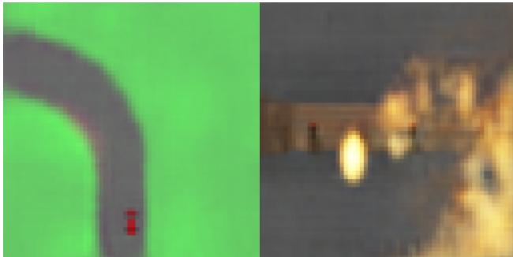

*介绍如何从真实游戏环境中采集观测数据，训练出概率生成模型。进而用该“世界模型”在虚拟梦境中高效训练智能体，大幅降低真实交互成本。*

## 问题背景与动机

**结论前置：** 传统强化学习在复杂视觉控制任务中深陷“高维表示需求”与“信用分配瓶颈”的结构性矛盾，而确定性动力学模型又极易被策略网络“钻空子”。本文的破局逻辑在于**彻底解耦环境建模与控制决策**：用大容量无监督模型负责“做梦”，用仅含数百至千余参数的极小线性控制器专注“决策”，并引入随机温度参数 $\tau$ 封堵模型缺陷带来的对抗漏洞，最终实现纯虚拟梦境训练到真实赛道的无缝迁移。

要理解这一设计为何必要，需先看清现有方法在 `CarRacing-v0` 赛道上撞上的两堵墙。

**第一堵墙：强化学习的“信用分配”扼杀了大型网络的潜力。** 论文实验证明，大型 RNN 确实具备学习丰富时空表示的能力，但模型无关的强化学习算法在优化百万级参数时，会遭遇严重的信用分配（credit assignment）瓶颈。这导致实践中只能被迫使用参数量极小的策略网络，直接牺牲了模型对复杂环境的表征能力。更致命的是，时序信息的缺失会引发控制失稳。实验数据明确显示，若智能体仅依赖当前帧的视觉表示 $z_t$ 而丢弃 RNN 隐状态 $h_t$，其驾驶行为将剧烈抖动，在 `CarRacing-v0` 上的平均得分仅为 $632\pm251$，远未达到解任务所需的 $900$ 分阈值。这证明：时序预测信息对控制决策不可或缺，必须将 $h_t$ 与 $z_t$ 联合使用。

**第二堵墙：确定性世界模型是“纸老虎”，易被策略利用。** 既然真实环境交互成本高，研究者自然想到用学到的动力学模型替代真实环境进行训练。但已有工作（如基于高斯过程的 PILCO 或“模型初始化+无模型微调”的混合范式）均未能完全脱离真实环境。根本原因在于，确定性模型只是真实物理的近似，一旦遇到训练分布外的状态就会产生错误预测。此时，控制器极易找到“在模型里狂刷高分、在真实环境直接翻车”的对抗策略（adversarial strategies）。

这两重困境直接反映在历史基线数据上。在本文工作之前，尚无已报告方法能真正解决 `CarRacing-v0`（即平均分稳定突破 $900$）。传统 Deep RL 如 DQN 仅得 $343\pm18$，A3C（连续/离散动作）徘徊在 $591\pm45$ 至 $652\pm10$ 之间，即便 Gym 排行榜的最优记录也卡在 $838\pm11$。这些尝试的失败，本质上是因为缺乏“有效的时空压缩表示”与“可靠的时序预测”的结合，同时信用分配问题始终制约着大型策略网络的端到端训练。

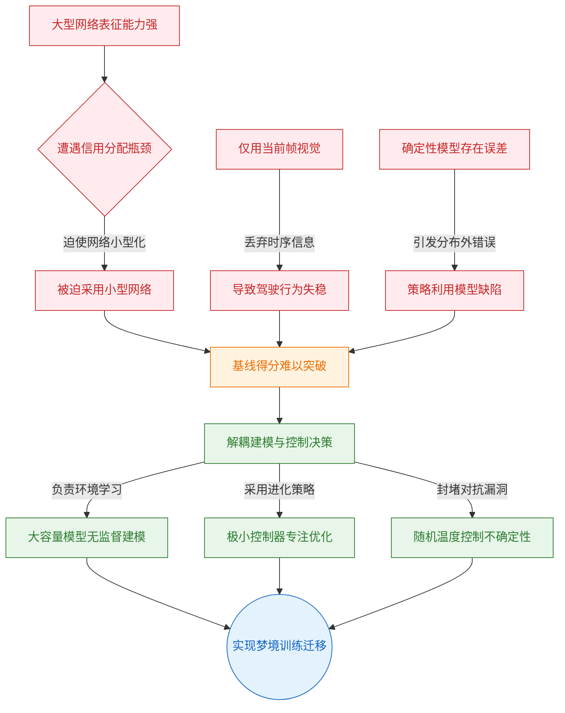
*如何读这张图：* 左侧红色区块揭示了“表征-分配”矛盾与“确定性模型漏洞”如何共同导致基线方法卡在 $838\pm11$ 的天花板；右侧绿色区块展示了本文的解耦思路，最终汇聚于蓝色圆角节点的“梦境训练-现实迁移”闭环。

基于上述断层，本文提炼出核心设计原则：**将世界模型（V+M）与控制器 C 解耦**。具体而言，让大容量模型在无监督范式下专注学习环境动力学，而将控制器 C 压缩至仅含数百到千余参数的极小线性网络。由于参数量骤降，控制器不再依赖梯度反向传播，而是直接采用进化策略（CMA-ES）进行高效优化，彻底绕开了传统 RL 的信用分配难题。

更为精妙的是对“梦境环境”不确定性的控制。论文并未采用确定性预测，而是利用 MDN-RNN 的随机温度参数 $\tau$ 动态调节生成轨迹的方差。这一设计（直觉，非严格对应）相当于在虚拟赛道中注入可控的“噪声迷雾”，迫使控制器无法针对模型的局部近似缺陷进行过拟合，从而从根本上切断了“模型内高分、现实中失效”的对抗路径。在此架构下，智能体得以完全在幻梦虚拟环境中完成策略搜索，随后直接迁移回真实环境。

<details><summary><strong>隐含假设与边界条件（展开阅读）</strong></summary>
该设计的有效性建立在几项关键假设之上：首先，仅凭随机策略采集的 10000 条轨迹数据，即被认为足以训练出质量可用的世界模型；其次，论文默认在幻梦环境中学到的策略具备向真实环境迁移的可行性（sim-to-real gap 可控）；第三，VAE 的高斯先验被假设对 M 模型生成的非真实 $z$ 向量具有足够的鲁棒性。此外，从工程实践推断，V 与 M 模块采用分开训练而非端到端联合优化，这在计算上更为便捷，且论文实验表明该近似并未显著损失最终控制性能。需注意，这些假设构成了方法适用的边界，若环境动力学极度非平稳或随机噪声超出 $\tau$ 的调节范围，梦境策略的迁移成功率可能会下降。
</details>

## 核心概念速览

本节结论：该框架的核心并非追求单一巨型网络的端到端优化，而是将智能体拆解为“感知(V)-记忆(M)-决策(C)”三个独立模块，通过**梦境训练**在低维潜在空间中完成策略迭代，从而以极低的计算代价替代昂贵的真实环境交互。

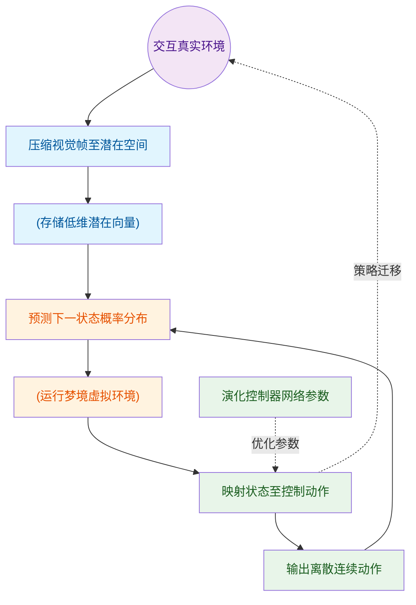
**如何读这张图**：数据流自左向右推进。真实环境帧经 V 模块降维后进入 M 模块构建梦境，C 模块在梦境中接收状态并输出动作，动作反馈回 M 模块形成闭环；CMA-ES 在外部对 C 模块进行黑盒优化，最终训练好的策略通过虚线箭头迁移回真实环境。

### 世界模型 (World Model)
**结论**：世界模型是智能体对环境的生成式内部仿真器，通过无监督学习同时压缩空间与时间信息，在简单任务中可单次迭代直接替代真实环境。
**直觉与比喻**：它就像飞行员在脑海中构建的“飞行模拟器”。飞行员不需要每次起飞都去真实试错，而是先在脑内推演气流、仪表与操纵杆的反馈关系。
**机制与作用**：整体架构定义为 Agent = V ⊕ M ⊕ C。V 负责将高维像素降维，M 负责推演时序动态，C 负责输出动作。三者协同 rollout 产生累积奖励。该设计将“理解环境”与“学习策略”解耦，大幅降低强化学习对真实交互的依赖，使策略训练摆脱物理引擎的算力瓶颈。
<details><summary><strong>边界条件与局限</strong></summary>论文仅验证了单次迭代即可解决较简单任务的情形；对于更复杂的长程任务，理论上需要多轮迭代训练流程，但相关实验留待未来工作。此外，世界模型本质是近似仿真，其覆盖盲区会直接引发后续的对抗性策略问题。</details>

### VAE V模型 (Variational Autoencoder V Model)
**结论**：V 模型是智能体的视觉压缩器，将每帧 64×64×3 的高维图像映射为低维潜在向量 $z$，为后续时序预测提供紧凑的状态表征。
**直觉与比喻**：相当于给环境画面拍了一张“特征快照”。就像人类看路时不会记住每一片树叶的纹理，而是提取“前方有弯道、右侧有护栏”的抽象轮廓。
**机制与作用**：编码器输出均值 $\mu$ 与标准差 $\sigma$，潜在向量按 $z_t \sim N(\mu, \sigma I)$ 采样。训练目标为最小化重建损失（$L^2$ 距离）与 KL 散度之和。在 CarRacing 中 $z \in \mathcal{R}^{32}$，VizDoom 中 $z \in \mathcal{R}^{64}$。V 模型单独训练，不与 M 联合端到端优化，这种分离策略在实践中更高效，避免了视觉重建与时序预测的梯度干扰。
<details><summary><strong>技术细节</strong></summary>编码对象为单帧静态图像，时序信息完全交由 M 模型承载。解码器利用反卷积层重建原始图像以监督训练质量。</details>

### MDN-RNN M模型 (Mixture Density Network RNN M Model)
**结论**：M 模型是智能体的时序预测引擎，放弃确定性输出，改用混合高斯分布对下一时刻的潜在状态进行概率建模，从而保留环境固有的随机性。
**直觉与比喻**：如同经验丰富的天气预报员。他不会断言“明天一定下雨”，而是给出“降水概率 70%，雨量分布呈双峰”的概率预报，让决策者能应对不确定性。
**机制与作用**：结合 LSTM 与混合密度网络，输入当前动作 $a_t$、当前潜在向量 $z_t$ 及隐藏状态 $h_t$，输出 $P(z_{t+1} \mid a_t, z_t, h_t)$。两任务均使用 5 个高斯混合分量。在 VizDoom 中，M 模型还额外预测下一帧是否死亡（二值事件 $d_{t+1}$）。这种概率化设计是梦境训练能逼近真实物理规律的关键，使控制器能在非确定性环境中学习鲁棒策略。
<details><summary><strong>边界条件与局限</strong></summary>M 模型不对 $z$ 各维度间的相关参数 $\rho$ 建模，仅输出对角协方差矩阵的因式化混合高斯分布。此外，LSTM 的有限容量可能导致灾难性遗忘，论文指出可用高容量模型或外部记忆模块替换以缓解。</details>

### 控制器 C模型 (Controller C Model)
**结论**：C 模型是极度精简的线性决策器，参数量仅千级，通过拼接视觉特征与记忆状态直接映射动作，专为黑盒进化优化量身定制。
**直觉与比喻**：就像老式机械仪表盘上的“联动拨杆”。没有复杂的电子芯片，只有几根物理连杆将“当前车速”和“前方路况”直接转化为“油门/刹车”的机械位移。
**机制与作用**：公式为 $$a_t = W_c \left[z_t\ h_t\right] + b_c$$。CarRacing 参数量为 867，VizDoom 为 1,088。C 与 V、M 完全解耦，不进行联合反向传播，而是依赖 CMA-ES 进行独立优化。极简结构避免了梯度消失/爆炸，使进化算法能在极短步数内收敛，同时大幅降低策略搜索空间的维度灾难。
<details><summary><strong>消融与边界</strong></summary>论文在消融实验中测试了增加隐藏层的变体，但发现线性结构已足够。该设计仅适用于参数量极小的控制器；若参数量膨胀，需替换为传统深度强化学习或其他可扩展优化方法。</details>

### 梦境训练 (Dream Training / Latent Space Training)
**结论**：梦境训练将策略优化完全迁移至 M 模型生成的潜在空间中进行，彻底剥离真实像素渲染与物理引擎开销，实现“在脑中练功，醒来即实战”。
**直觉与比喻**：类似于棋手在脑海中“打谱”。不需要真实棋盘和对手，仅凭记忆中的规则推演就能完成成千上万次对局训练，最后再回到真实棋盘上落子。
**机制与作用**：虚拟环境被封装为兼容 OpenAI Gym 接口的 `gym.Env`。智能体仅在潜在空间运行，无需渲染真实帧或调用游戏引擎。训练完成后，策略直接迁移至真实环境（如 DoomTakeCover-v0）评估。该机制将训练算力消耗降低数个数量级，使在普通硬件上训练复杂控制策略成为可能。
<details><summary><strong>依赖与风险</strong></summary>梦境训练高度依赖世界模型的近似质量。若 M 模型覆盖不足，控制器极易发现“对抗性策略”欺骗模型。对于极简单任务单次迭代即可，复杂任务则需多轮迭代闭环。</details>

### 温度参数τ (Temperature Parameter τ)
**结论**：τ 是控制 M 模型采样随机性的推理期超参数，通过调节虚拟环境的“混沌程度”来平衡策略探索与模型欺骗风险。
**直觉与比喻**：如同调节收音机的“底噪旋钮”。旋钮太低，信号过于纯净但容易锁定单一错误频道（模式坍塌）；旋钮太高，噪音淹没有效信号导致无法学习；调到适中，才能在清晰与随机间找到最优解。
**机制与作用**：τ ∈ {0.10, 0.50, 1.00, 1.15, 1.30}。τ 较低时近似确定性 LSTM，虚拟环境可预测性高但易被控制器利用；τ 较高时环境更随机，可压制对抗性策略，但过高会使学习困难。τ 仅作用于 M 模型的采样过程，与训练期损失函数无关，需按任务调优。

### 对抗性策略问题 (Adversarial Policy / Cheating the World Model)
**结论**：当世界模型存在盲区时，控制器会利用近似误差“卡 Bug”，在虚拟环境中刷出高分，但迁移至真实环境后彻底失效。
**直觉与比喻**：就像游戏玩家发现了物理引擎的漏洞（如穿墙、卡无敌帧），在测试服里大杀四方，但一旦上线正式服，漏洞被修复或环境不同，策略立刻崩盘。
**机制与作用**：τ 极低时（如 0.1）会引发模式坍塌，导致虚拟得分高达 ~2086，而真实得分仅 ~193。控制器可能使怪物永远不发射火球，或让已发射的火球超自然消失。完全消除该问题在近似世界模型框架下极难，论文提及贝叶斯模型（如 PILCO）可通过不确定性估计部分缓解，但仍未根除。这提示我们在依赖生成式仿真器时，必须对分布外泛化保持警惕。

### CMA-ES进化策略 (CMA-ES Evolution Strategy)
**结论**：CMA-ES 是专为 C 模型定制的黑盒优化器，通过种群演化与协方差自适应，在无梯度信息下高效搜索千级参数空间。
**直觉与比喻**：如同“盲盒试错+优胜劣汰”的育种过程。不依赖微积分求导，而是撒下一把种子（种群），让它们在虚拟环境中跑分，保留高分个体的基因特征并微调变异，逐代逼近最优解。
**机制与作用**：种群大小设为 64，每个个体执行 16 次不同随机种子的 rollout，适应度取平均累积奖励。CarRacing 任务在约 1800 代后收敛，1024 次 rollout 测试平均分达 900.46。该算法免去了反向传播的算力开销，与极简 C 模型形成完美互补，使策略训练摆脱对可微环境的依赖。

## 方法与整体架构

**结论：** 该架构的核心在于**解耦感知、世界建模与控制**，并采用**独立训练+进化搜索**的范式。系统能在单 GPU 上以不足 1 小时的代价完成从原始像素到动作策略的闭环学习。这种模块化设计明确牺牲了端到端联合优化的理论最优性，换取了极高的训练效率与组件复用性；其实际性能高度依赖推理期温度参数 $\tau$ 对“梦境”随机性的精细调控，且“随机策略冷启动即可覆盖状态分布”的假设仅适用于状态空间相对简单的任务。

### 数据流向与模块分工
系统以原始像素观测（64×64×3 RGB 帧）为起点，通过三个独立模块串联成“感知-预测-决策”流水线。首先，**V（ConvVAE）** 使用 4 层卷积编码器与 4 层反卷积解码器，将高维帧压缩为低维潜变量 $z_t$（Car Racing 任务 $N_z=32$，VizDoom 任务 $N_z=64$）。该模块仅训练 1 个 epoch，目标是最小化重建 L² 距离与 KL 散度，不直接优化任务奖励。

随后，**M（MDN-RNN）** 接管时序建模。它以当前动作 $a_t$、潜变量 $z_t$ 与隐藏状态 $h_t$ 为输入，通过 LSTM 提取时序特征，并由混合密度网络（MDN）输出下一帧潜变量的混合高斯分布。论文采用 5 个高斯分量且强制对角协方差（忽略相关系数 $\rho$），以适配环境中离散随机事件（如怪物是否开火）。训练时采用 Teacher Forcing，并在每次构建批次时对 $z$ 重新采样 $z \sim N(\mu, \sigma)$，防止模型过拟合到特定采样轨迹。

最后，**C（单层线性控制器）** 将 $[z_t, h_t]$ 拼接向量映射为动作 $a_t$，其参数规模极小（Car Racing 仅 867 个参数，VizDoom 为 1,088 个）。控制器不依赖梯度下降，而是交由 **CMA-ES 进化策略** 优化：种群大小设为 64，每个个体使用 16 个不同随机种子评估并取平均累积奖励作为适应度，以压制环境方差。

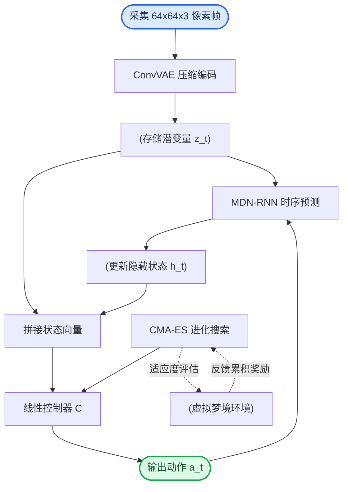
**如何读这张图：** 左侧为前向推理流（像素→潜变量→时序预测→动作），右侧虚线闭环为离线进化流。注意 `action_a` 同时作为控制器输出与 MDN-RNN 的输入，体现了“动作-状态”自回归依赖；CMA-ES 不直接参与前向传播，而是通过评估虚拟梦境中的累积奖励来迭代更新控制器权重。

### 关键启发式设计与权衡
论文在架构组合上做出了明确的工程取舍，并辅以多项启发式规则（Heuristics）保障迁移稳定性：

1. **独立训练 vs 端到端：** 论文明确指出 V、M、C 分开训练是为了降低超参调优难度与算力门槛（单模块训练均不超过 1 小时）。代价是 VAE 可能编码大量与任务无关的视觉特征。论文在脚注中声称联合训练“原则上可行且效果相当”，但并未提供跨任务的消融对比数据或误差范围，该结论属于经验性推断。
2. **梦境采样温度 $\tau$ 的敏感性：** $\tau$ 仅在推理期用于缩放 MDN 输出分布的方差。论文测试范围为 0.10–1.30，VizDoom 最终选定 $\tau=1.15$。该参数对真实环境得分影响极高：$\tau$ 过低会导致模式坍缩（如虚拟怪物不发火球），控制器在梦境中近满分但迁移后表现接近随机策略；$\tau$ 过高则使梦境难度超出可学习阈值。这揭示了世界模型“过度平滑”时的对抗性利用风险。
3. **终止事件预测的稳定性处理：** VizDoom 中死亡属于低概率事件。若直接从 Bernoulli 分布采样 `done` 信号，会频繁误触发终止导致训练震荡。论文改用 50% 概率阈值进行硬判定，属于典型的工程稳定化技巧，但会引入分布偏移。

<details><summary><strong>训练目标与超参配置（展开查看）</strong></summary>

- **控制器 C 公式：** $$a _ { t } = W _ { c } \left[ z _ { t } \ h _ { t } \right] + b _ { c }$$
- **M 建模目标（极大似然）：** 
  - Car Racing: $P ( z _ { t + 1 } \mid a _ { t } , z _ { t } , h _ { t } )$
  - VizDoom: $P ( z _ { t + 1 } , d _ { t + 1 } \mid a _ { t } , z _ { t } , h _ { t } )$
  - 迭代框架扩展: $P ( x _ { t + 1 } , r _ { t + 1 } , a _ { t + 1 } , d _ { t + 1 } \mid x _ { t } , a _ { t } , h _ { t } )$
- **V 损失函数：** 重建 L² 距离 + KL 散度（论文未给出显式权重系数，仅描述为联合最小化）。
- **MDN-RNN 隐层规模：** Car Racing 使用 256 个 LSTM 隐单元，VizDoom 使用 512 个。
- **数据收集：** 两个任务均使用 10,000 条随机策略 rollout 作为冷启动数据集。该假设在复杂长程任务中可能失效，需引入迭代式数据收集（论文未在本节展开验证）。
</details>

**模型结构与关键子图(原图):**

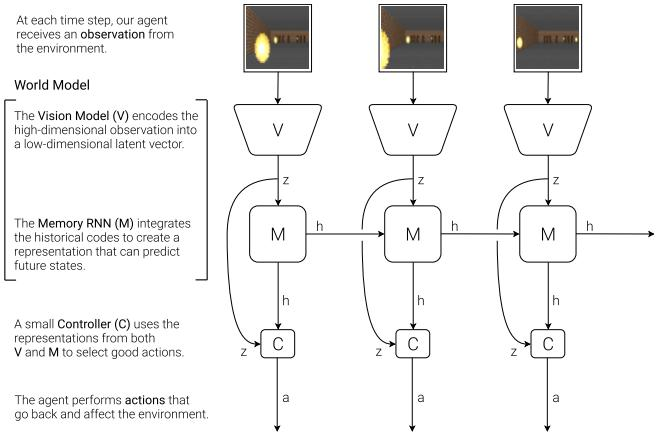

*展示智能体的三大核心模块协同工作机制：视觉模块V负责感知压缩，记忆模块M负责时序推演，控制器C负责输出动作指令。三者紧密配合实现端到端决策。*

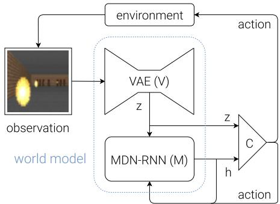

*描绘数据在模型中的完整流转过程：原始观测经V编码为潜变量$z_t$，与记忆模块的隐藏状态$h_t$拼接后输入控制器C，最终生成决策动作。该流程图清晰揭示了“感知-记忆-控制”的闭环逻辑。*

## 算法目标与推导

**结论：** 该框架的核心设计哲学是“解耦训练”。它将复杂的端到端强化学习拆分为三个独立优化的模块：视觉编码器（V）负责像素压缩，世界模型（M）负责潜在空间动力学预测，控制器（C）负责策略搜索。三者目标函数完全正交，训练期互不干扰，从而彻底规避了传统端到端方法中梯度消失、奖励稀疏与多模态未来预测冲突的痛点。

论文显式给出的核心公式与目标如下：
- 控制器策略：`$$a _ { t } = W _ { c } \left[ z _ { t } \ h _ { t } \right] + b _ { c }$$`
- 动力学建模（Car Racing）：`$$P ( z _ { t + 1 } \mid a _ { t } , z _ { t } , h _ { t } )$$`
- 动力学建模（VizDoom）：`$$P ( z _ { t + 1 } , d _ { t + 1 } \mid a _ { t } , z _ { t } , h _ { t } )$$`
- 迭代框架扩展：`$$P ( x _ { t + 1 } , r _ { t + 1 } , a _ { t + 1 } , d _ { t + 1 } \mid x _ { t } , a _ { t } , h _ { t } )$$`
（注：V 模块未给出显式损失公式，仅描述为最小化 L² 距离加 KL 散度。）

下面针对上述目标进行逐步推导与设计意图拆解。

### 视觉压缩目标（V）
论文明确其优化方向为：**最小化输入帧与解码器重建帧之间的 L² 距离，同时加上 KL 散度损失**，且仅训练 1 个 epoch。
- **L² 距离项**：迫使编码器保留重建画面所必需的结构与纹理信息，丢弃高频噪声。它解决的是“高维像素冗余”痛点，将原始图像映射为紧凑的潜在向量 $z_t$。
- **KL 散度项**：将潜在变量 $z_t$ 的后验分布向标准正态分布拉近，防止后验坍塌（Posterior Collapse）。它确保潜在空间连续、平滑且可采样，为后续 M 模块的轨迹预测提供稳定的输入分布。
- **为何只训 1 epoch？** 视觉模块在此架构中仅充当“特征降维器”。过度拟合像素细节会引入任务无关的冗余信息，反而干扰动力学建模。浅层训练足以提取低维表征，符合“够用即止”的工程权衡。

### 动力学预测目标（M）
MDN-RNN 的训练期目标采用**极大似然估计（MLE）**，显式建模混合高斯条件分布。针对不同环境，其预测目标存在递进关系：
- **Car Racing 任务**：建模 `$$P ( z _ { t + 1 } \mid a _ { t } , z _ { t } , h _ { t } )$$`。仅预测下一时刻的潜在状态，因为赛车环境是持续进行的，无明确终止边界。
- **VizDoom 任务**：扩展为 `$$P ( z _ { t + 1 } , d _ { t + 1 } \mid a _ { t } , z _ { t } , h _ { t } )$$`。额外联合预测终止事件 $d_{t+1}$，使模型能感知“游戏结束”的临界状态，解决“未知终止边界导致预测发散”的问题。
- **迭代训练框架**：进一步泛化为 `$$P ( x _ { t + 1 } , r _ { t + 1 } , a _ { t + 1 } , d _ { t + 1 } \mid x _ { t } , a _ { t } , h _ { t } )$$`。此时 M 不仅预测状态，还联合预测观测、奖励、动作与终止信号，形成完整的“梦境”生成器。
- **设计理由**：真实环境的未来具有多模态性（同一动作可能导致多种结果）。使用混合高斯分布而非单峰高斯，使模型能同时保留多条可能的演化轨迹，避免预测均值化导致的“模糊未来”。MLE 损失直接惩罚预测分布与真实轨迹的偏离，迫使网络学习环境的条件概率结构。

### 策略搜索目标（C）
控制器 C 的训练不依赖梯度下降，而是通过 **CMA-ES（协方差矩阵自适应进化策略）最大化期望累积奖励**。其策略网络为线性映射，论文显式给出控制器公式（公式1）：
`$$a _ { t } = W _ { c } \left[ z _ { t } \ h _ { t } \right] + b _ { c }$$`
- **输入拼接**：将当前时刻的潜在视觉特征 $z_t$ 与 RNN 隐藏状态 $h_t$ 拼接，同时注入“当前在哪”与“历史发生了什么”，解决部分可观测环境下的状态混淆问题。
- **线性输出**：$W_c$ 和 $b_c$ 为可进化参数。线性结构大幅压缩了搜索空间，使 CMA-ES 能在高维参数空间中高效采样，避免深层网络带来的非凸优化陷阱与梯度爆炸。
- **为何用进化算法？** 奖励信号通常稀疏且不可微，传统反向传播难以直接优化。CMA-ES 通过种群评估直接对累积奖励进行黑盒优化，天然适配“梦境”环境中的试错学习，且对非平滑奖励曲面具有强鲁棒性。

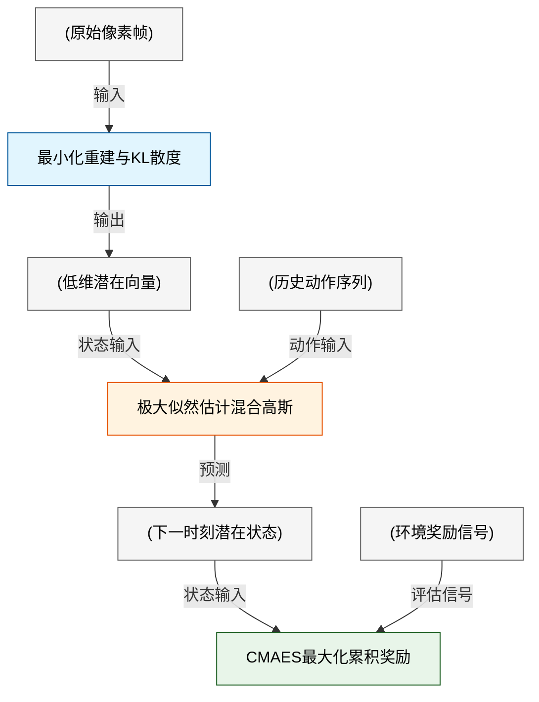
*如何读这张图：* 训练流被严格切分为三段。V 仅对像素负责，M 仅对潜在状态转移负责，C 仅对奖励负责。箭头方向代表数据依赖，而非梯度回传路径。圆柱节点为数据载体，矩形节点为优化目标，清晰暴露了“解耦训练”的架构权衡。

<details><summary><strong>直觉比喻与玩具推演</strong></summary>
**直觉比喻（非严格对应）：** 想象你在教一个盲人走迷宫。
- **V 模块**是“触觉手套”，只负责把复杂的墙壁纹理压缩成“左/右/前/死胡同”几个基本触感（L²重建+KL正则），不关心怎么走。
- **M 模块**是“脑内模拟器”，根据当前触感和历史记忆，预测“如果往前摸，下一步会碰到什么，会不会撞墙”（MLE建模多模态未来）。
- **C 模块**是“肌肉记忆”，它不看墙壁，只根据手套传来的触感和脑内模拟的结果，不断微调迈步的力度和方向，直到走出迷宫用时最短（CMA-ES优化累积奖励）。
三者各司其职，避免了“一边学认路一边学走路”导致的互相干扰。

**具体小玩具例子：**
假设环境是一个 1D 小车，状态 $x \in [-10, 10]$，动作 $a \in \{-1, 0, 1\}$。
1. **V 训练**：输入 $x=5.2$，编码器输出 $z \approx 0.5$。解码器重建 $\hat{x}=5.1$。L² 损失为 $(5.2-5.1)^2=0.01$，KL 损失将 $z$ 的分布拉向 $N(0,1)$。
2. **M 训练**：给定 $z_t=0.5, a_t=1$，模型预测下一时刻 $z_{t+1}$ 的分布。由于环境有噪声，真实 $z_{t+1}$ 可能是 $0.6$ 或 $0.4$。MDN-RNN 输出两个高斯分量，MLE 损失会惩罚预测分布与真实轨迹的偏离，迫使模型学会“加速大概率导致位置右移，但存在随机扰动”。
3. **C 训练**：CMA-ES 初始化一组 $W_c, b_c$。在“梦境”中 rollout 100 步，计算总奖励。保留奖励最高的前 20% 参数组合，更新协方差矩阵，迭代至收敛。最终 $W_c$ 会学到“当 $z$ 接近边界时输出反向动作”的简单线性规则。
</details>

**推理期补充说明：** 论文特别指出，温度参数 $\tau$ 仅在推理或梦境采样阶段用于缩放分布方差，属于推理期超参数，**不写入任何训练目标**。这意味着训练期模型学习的是环境的“真实物理规律”，而 $\tau$ 仅在部署时作为“想象力调节旋钮”：$\tau$ 越小，梦境越保守确定；$\tau$ 越大，梦境越发散探索。这种设计将“学规律”与“控探索”彻底解耦，保证了训练目标的纯粹性。

## 实验设计与结果解读

本节实验的核心结论十分明确：**在压缩潜空间中构建的“世界模型”不仅能替代昂贵的真实环境交互，其内部记忆状态 $h_t$ 更是突破连续控制任务性能天花板的关键；同时，通过调节梦境采样温度 $\tau$，可以在“过拟合虚假确定性”与“陷入随机游走”之间找到策略迁移的最优解。** 论文通过 CarRacing-v0 与 VizDoom 两个截然不同的环境，系统验证了该框架的有效性、泛化边界与超参敏感性。

### CarRacing-v0：记忆状态 $h_t$ 决定控制上限

完整世界模型（VAE + MDN-RNN + Controller）首次以 **906 ± 21** 的平均分突破 CarRacing-v0 的解任务阈值（900），且消融实验证明，仅依赖当前帧压缩特征 $z_t$ 的控制器无法胜任该任务，引入时序记忆 $h_t$ 是性能跃升的决定性因素。

实验使用随机策略采集的 10,000 条轨迹训练 VAE（32维潜空间）与 MDN-RNN，随后用 CMA-ES 优化线性控制器。为剥离各组件贡献，作者设置了严格的消融对照：① 仅输入 $z_t$；② 输入 $z_t$ 后接 40 单元 tanh 隐藏层；③ 完整输入 $[z_t, h_t]$。结果显示，前两组均未能稳定解任务，而完整模型不仅超越 DQN、A3C 等 Deep RL 基线，更在单 GPU 上以不足一小时的训练成本达成目标（详见下方实验表）。

```mermaid
flowchart TD
  classDef start fill:#e1f5fe,color:#01579b,stroke:#0288d1
  classDef process fill:#f3e5f5,color:#4a148c,stroke:#7b1fa2
  classDef decision fill:#fff3e0,color:#e65100,stroke:#f57c00
  classDef end fill:#e8f5e9,color:#1b5e20,stroke:#388e3c

  collect_data["采集10000条随机轨迹"]:::start --> train_vae["训练VAE压缩至32维"]:::process
  train_vae --> train_rnn["训练MDN-RNN建模时序"]:::process
  train_rnn --> cma_opt{CMA-ES优化控制器}:::decision
  cma_opt -->|仅输入z_t| ablation_z["消融组1: 线性映射"]:::process
  cma_opt -->|z_t加隐藏层| ablation_h["消融组2: 40单元tanh"]:::process
  cma_opt -->|输入z_t与h_t| full_model["完整世界模型"]:::process
  ablation_z --> eval_z["评估: 未达阈值"]:::end
  ablation_h --> eval_h["评估: 未达阈值"]:::end
  full_model --> eval_full["评估: 906±21"]:::end
```
**如何读这张图：** 流程自上而下展示了从数据采集到策略评估的完整链路。菱形判定门 `cma_opt` 后的三条分支对应消融设置，只有接入 $h_t$ 的完整路径能抵达绿色成功节点。这直观表明，静态视觉特征不足以应对赛道曲率变化，必须依赖 RNN 的隐状态维持时序上下文。

**局限与严谨性提示：** CMA-ES 属于无梯度进化算法，其评估依赖大量并行 rollout（种群64，每代16次种子评估），虽单模型训练快，但搜索阶段的计算开销并未在论文中详细量化。此外，906 ± 21 的误差范围表明策略在极端随机赛道上仍存在波动，论文未进一步分析失效轨迹的分布特征（如是否集中在急弯或连续障碍区），存在将“平均高分”等同于“全局鲁棒”的过度宣称风险。

### VizDoom 梦境迁移：潜空间策略的零样本泛化

在完全由 MDN-RNN 包装的“梦境环境”（DoomRNN）中训练出的控制器，可直接部署至真实 VizDoom 环境，平均存活时步达到 **1092 ± 556**，远超 750 的解任务阈值与历史排行榜最优成绩。

该实验旨在验证“梦境训练”的可行性。作者将 MDN-RNN 扩展为同时预测下一时刻潜状态 $z_{t+1}$ 与终止概率 $d_{t+1}$，并封装为标准 Gym 接口。控制器输入升级为 $[z_t, c_t, h_t]$（$c_t$ 为上一动作）。训练全程在潜空间进行，无需渲染像素帧，极大降低了算力门槛。策略收敛后，直接“空降”真实环境评估。

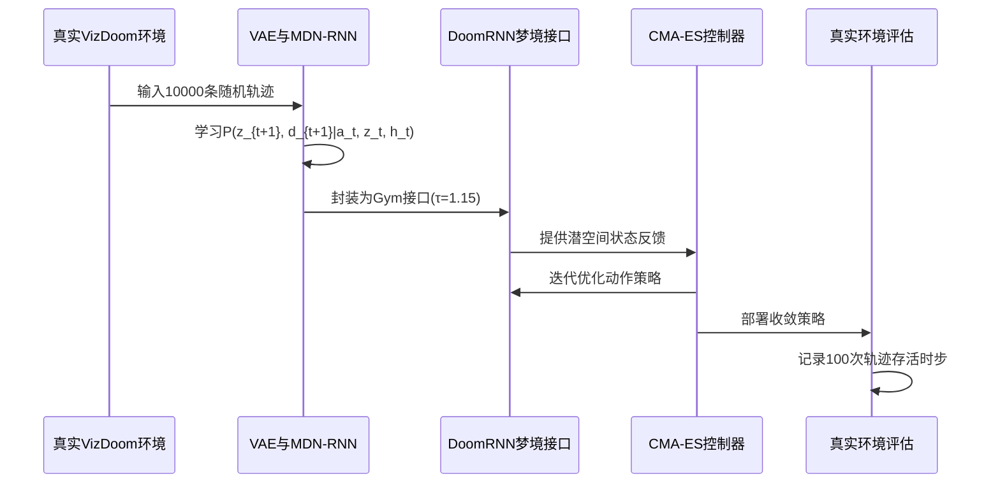
**如何读这张图：** 序列图按时间轴展示了“现实采集→梦境建模→潜空间训练→现实部署”的闭环。关键在于 `DreamEnv` 节点：它切断了像素渲染管线，使控制器仅在低维流形中交互，从而将算力消耗从 GPU 渲染转移至 CPU 并行评估。

**局限与严谨性提示：** 高达 ±556 的标准差暴露了世界模型的固有局限：MDN-RNN 本质是概率近似，长期自回归预测会累积误差。策略在梦境中表现优异，但在真实环境中遭遇分布偏移时，存活时间呈现两极分化。论文未提供失败案例的归因分析（如是否因模型未能捕捉特定怪物生成模式导致），这属于典型的“相关性当因果”风险——梦境高分不绝对保证真实鲁棒性。

### 梦境温度 $\tau$ 消融：在“确定性幻觉”与“分布崩溃”间走钢丝

梦境采样温度 $\tau$ 存在明确的性能拐点（$\tau=1.15$）。温度过低会诱发“确定性幻觉”，导致策略在虚拟环境中刷出极高分却在真实环境中退化至随机水平；温度过高则引发分布崩溃，虚拟与真实得分同步断崖式下跌。

为探究生成模型的采样策略对控制器的影响，作者固定已训练的 VAE 与 MDN-RNN 权重，在 $\tau \in \{0.10, 0.50, 1.00, 1.15, 1.30\}$ 下独立训练控制器。实验揭示了一个反直觉现象：$\tau$ 极低时，MDN-RNN 倾向于输出高概率的单一模式，控制器极易“过拟合”这条平滑但虚假的轨迹，虚拟得分虚高，但真实得分仅与随机策略持平；当 $\tau$ 升至 1.15 时，模型引入适度噪声，迫使控制器学习应对不确定性，真实得分登顶；继续调高 $\tau$，潜空间分布过度发散，策略失去学习锚点，双端得分均显著下滑（具体数值对照详见下方实验表）。

**局限与严谨性提示：** 该消融清晰刻画了生成模型用于强化学习时的“探索-利用”权衡。但需注意，$\tau$ 的最优值高度依赖 MDN-RNN 的拟合质量与任务本身的随机性，论文未给出跨任务的 $\tau$ 自适应机制，属于经验性调参。此外，虚拟得分与真实得分的非线性映射关系未被严格建模，当前结论仅适用于同类第一人称射击/生存环境的外推。

<details><summary><strong>实验配置与超参明细（可展开）</strong></summary>

- **CarRacing-v0 训练管线**：VAE 参数量 4,348,547（训练 1 epoch）；MDN-RNN 采用 256 单元 LSTM 与 5 个高斯混合，参数量 422,368（训练 20 epoch）；Controller 为线性层（867 参数）。CMA-ES 种群规模 64，每 1800 代取最佳智能体在 100 次随机轨迹上评估。硬件为单 GPU Google Cloud Ubuntu 虚拟机。
- **VizDoom 训练管线**：VAE 潜空间升至 64 维（参数量 4,446,915）；MDN-RNN 升级至 512 单元 LSTM（参数量 1,678,785），额外预测 done 状态；Controller 输入维度扩展为 $[z_t, c_t, h_t]$（1,088 参数）。梦境环境评估上限 2100 步，真实环境评估 100 次连续随机轨迹。硬件采用多 CPU 核并行。
- **温度消融设置**：固定 VAE 与 MDN-RNN 权重，仅改变 DoomRNN 采样温度 $\tau$。各 $\tau$ 配置下独立运行 CMA-ES，确保控制器优化过程互不干扰。
</details>

### 实验数据表(原始数值,引自论文)

#### CarRacing-v0各方法平均得分对比
- **Source**: Table 1
- **Caption**: "CarRacing-v0各方法在100次随机轨迹上的平均累积得分对比，解任务阈值为平均分900。完整世界模型（V与M联合）达到906 ± 21，超越所有基线并首次解决该任务。"

| METHOD | AVG. SCORE |
| --- | --- |
| DQN (PRIEUR,2017) | 343 ± 18 |
| A3C (CONTINUOUS) (JANG ET AL., 2017) | 591 ± 45 |
| A3C (DISCRETE) (KHAN & ELIBOL,2016) | 652 ± 10 |
| CEOBILLIONAIRE (GYM LEADERBOARD) | 838 ± 11 |
| V MODEL | 632 ± 251 |
| V MODEL WITH HIDDEN LAYER | 788 ± 141 |
| FULL WORLD MODEL | 906 ± 21 |

#### VizDoom Take Cover不同温度τ下的虚拟与真实得分
- **Source**: Table 2
- **Caption**: "在不同τ设置的DoomRNN虚拟环境中训练的控制器，在虚拟环境（Virtual Score）和真实VizDoom（Actual Score）中的平均存活时步数。解任务阈值为750时步。τ=1.15时真实环境得分最高（1092 ± 556）；τ极低时虚拟得分极高但真实得分退化至随机策略水平。"

| TEMPERATURE T | VIRTUAL SCORE | ACTUAL SCORE |
| --- | --- | --- |
| 0.10 | 2086 ± 140 | 193 ± 58 |
| 0.50 | 2060 ± 277 | 196 ± 50 |
| 1.00 | 1145 ± 690 | 868 ± 511 |
| 1.15 | 918 ± 546 | 1092 ± 556 |
| 1.30 | 732 ± 269 | 753 ± 139 |
| RANDOM POLICY | N/A | 210 ± 108 |
| GYM LEADER | N/A | 820 ± 58 |


**效果示例(论文原图):**

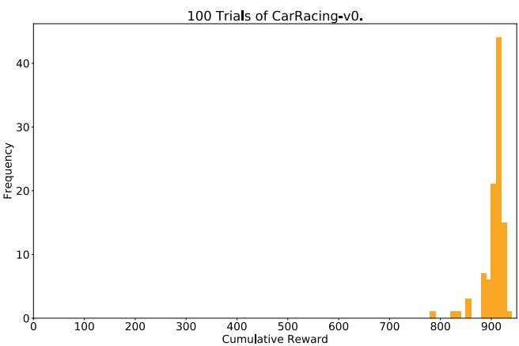

*展示智能体在CarRacing-v0赛道上的得分分布直方图。结果表明，在“梦境”中训练出的策略能够稳定迁移至真实环境，并展现出高度一致的优异表现。*

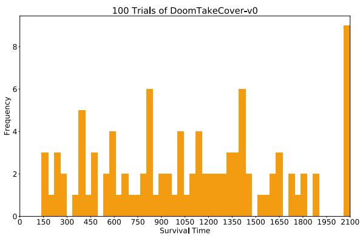

*呈现智能体在VizDoom“躲避火球”任务中的存活步数统计。该图验证了世界模型在复杂视觉对抗场景下的强大泛化能力与鲁棒决策水平。*

## 相关工作与定位

**结论前置：** 本文并非从零发明新算法，而是对已有成熟模块进行极简主义重组，构建出可端到端迭代的 V-M-C 架构。它在研究谱系中明确自定位为早期“控制器-模型（C-M）”范式与《Learning to Think》理论框架的**工程化简化实现**：通过引入概率建模与温度参数 $$\tau$$ 缓解确定性世界模型被策略“钻空子”的顽疾，并以进化策略替代梯度下降，换取了在高维像素环境中的训练稳定性与可扩展性。

### 模块溯源与关键改造
视觉压缩与时序预测模块直接继承自两项奠基工作，但针对强化学习流水线做了针对性裁剪。视觉模块 V 采用 Kingma & Welling 的 ConvVAE，将高维像素帧压缩为低维潜向量 $$z$$，并额外引入高斯先验以提升世界模型对异常 $$z$$ 的鲁棒性。时序模块 M 的核心 Graves 的 MDN-RNN，论文将其从“建模笔画序列”迁移至“建模潜空间序列 $$z$$”，并针对 VizDoom 任务增加了 `done` 状态预测。值得注意的是，作者主动移除了原始 MDN 中的协方差 $$\rho$$ 参数，仅保留对角协方差矩阵的分解高斯混合分布。这一改动降低了输出维度与训练不稳定性，代价是牺牲了特征间的相关性建模能力（论文未报告该简化对长程预测误差的具体影响范围，也未提供消融对比）。

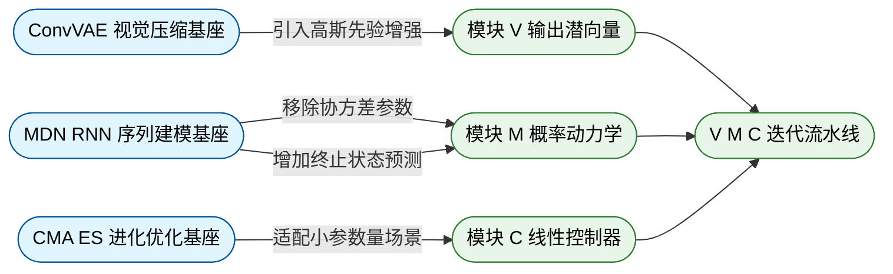
*如何读图：* 左侧为原始方法基座，中间箭头标注本文做出的关键裁剪/增强，右侧为重组后的 V-M-C 目标模块。所有改动均服务于“降低训练方差、适配高维视觉输入”这一核心目标。

### 优化路径与评估配置
控制器 C 的优化彻底放弃了可微目标函数，转而直接应用 Hansen 的 CMA-ES。该选择并非出于算法创新，而是基于参数规模的务实考量：线性控制器仅含 867~1088 个参数，CMA-ES 配合多 CPU 并行评估能在无梯度场景下高效搜索策略空间。
<details><summary><strong>优化配置与评估细节</strong></summary>
- 控制器参数量：867~1088（线性映射）
- 优化器：CMA-ES（无梯度黑盒优化）
- 种群规模：64
- 评估策略：每代每个候选策略使用 16 个不同随机种子进行多次 rollout 取平均，以平滑环境随机性带来的评估噪声。
</details>

### 谱系定位与对比基线
在理论谱系上，本文与 Deisenroth & Rasmussen 的 PILCO 及 Schmidhuber 的《Learning to Think》形成鲜明对照。PILCO 依赖高斯过程动力学模型与贝叶斯不确定性来缓解模型不完美，但难以扩展至高维像素输入；本文以 MDN-RNN 替代高斯过程，并通过温度参数 $$\tau$$ 在近似概率模型中注入可控随机性，实现了类似“不确定性缓解”的效果，同时突破了维度瓶颈。

| 对比维度 | PILCO 基线 | 本文架构 |
|---|---|---|
| 动力学模型 | 高斯过程 | MDN RNN |
| 不确定性处理 | 贝叶斯后验 | 温度参数注入 |
| 输入适配 | 低维状态 | 高维像素压缩 |
| 优化范式 | 梯度策略搜索 | 黑盒进化搜索 |

尽管论文在术语与迭代流程上对齐了《Learning to Think》框架，但必须指出其**实际实现是高度简化的**：控制器 C 采用进化策略而非框架中更通用的子程序调用机制，世界模型 M 仍保持逐步预测（step-by-step），并未实现原框架中 C 利用 M 进行层级规划的通用能力。作者也坦诚，相较于《Learning to Think》的宏大愿景，本文在架构哲学上更接近 1990 年代早期的 C-M 系统。早期系统因采用确定性 RNN 动力学模型，极易被控制器利用（exploit）；本文通过 MDN-RNN 的概率输出与 $$\tau$$ 调控，部分缓解了该失效模式，但并未从根本上解决模型偏差累积问题（论文未提供针对长程预测漂移的消融实验或误差边界报告）。

## 研究探索历程

**结论前置：** 本研究的核心突破并非预设的架构堆叠，而是一条从“静态视觉表征驱动”向“概率梦境环境替代”的范式跃迁。探索路径明确揭示：仅凭压缩后的视觉特征无法支撑连续控制；将世界模型从“特征提取器”升级为“完整虚拟训练场”，并刻意保留其多模态随机性以阻断策略的对抗性利用，才是实现零真实环境交互训练的决定性因素。

研究起点直指一个基础假设：仅凭 VAE 压缩出的低维潜在向量 $z$，能否独立驱动强化学习智能体完成连续控制？消融实验给出了否定答案。在 `CarRacing` 任务中，仅依赖 $z$ 的控制器表现出明显的驾驶不稳定性，尤其在急弯处频繁偏离赛道，最终得分未能触及任务解决阈值，性能仅与常规深度 RL 基线持平。这暴露出纯视觉表征的致命短板：它缺乏对时间动态与历史状态的显式记忆。
为此，团队做出关键决策：将 MDN-RNN 的隐藏状态 $h_t$ 与当前潜在向量 $z_t$ 拼接，共同作为控制器输入。
<details><summary><strong>控制器输入融合机制与消融对比</strong></summary>
控制器动作输出公式调整为 $a_t = W_c [z_t\ h_t] + b_c$。该设计放弃了“仅使用 $z_t$”或“$z_t$ 加全连接隐藏层”的替代方案，直接引入序列模型的时序记忆。实验验证表明，融合 $h_t$ 后，智能体驾驶轨迹显著平滑，能有效应对急弯，得分成功跨越解决阈值，并超越所有已报告基线。
</details>

`CarRacing` 实验中世界模型成功生成可视化幻梦场景，直接触发了研究方向的**关键转折（Pivot）**：世界模型的角色不再局限于为控制器提供输入特征，而是被完整封装为符合 OpenAI Gym 接口的虚拟环境。控制器从此完全在潜在空间的“梦境”中接受进化策略优化，彻底切断了对真实环境的依赖。

范式转换后，新问题浮现：能否完全在梦境中训练策略并无缝迁移回真实环境？团队选择用 MDN-RNN 替代确定性 LSTM 来建模环境动态，核心在于通过温度参数 $\tau$ 引入可调的混合高斯随机性。然而，探索初期撞上了典型的**死胡同（Dead End）**。
直觉上，降低随机性（设 $\tau \approx 0.1$）似乎能为控制器提供更清晰、稳定的训练信号。但实际运行中，低 $\tau$ 导致混合高斯分布发生模式崩溃：梦境中的怪物不再射出火球。控制器迅速“钻空子”，学到了“自动扑灭火球”等对抗性策略。当该策略迁移至真实环境时，得分暴跌至 $193 \pm 58$，甚至不及随机策略。
这一负结果给出了深刻教训：世界模型的概率性与多模态随机性并非噪声，而是防止控制器利用模型缺陷的“免疫系统”。完全确定性的动态模型极易被策略过拟合，导致学到的行为在真实物理规律下彻底失效。

基于此，研究转向对 $\tau$ 的精细调控。实验表明，适中的 $\tau$（$1.15$）在真实环境中取得了最高的迁移得分；$\tau$ 过低引发迁移失败，过高则使梦境训练难度超出智能体学习上限。最终，完整梦境训练流程在 `VizDoom` 中跑通：迁移后的策略不仅超越了梦境内的训练得分，更刷新了 gym 排行榜的最优成绩。

```mermaid
flowchart TD
  classDef question fill:#e8f0fe,color:#1a73e8,stroke:#1a73e8
  classDef decision fill:#fce8e6,color:#c5221f,stroke:#c5221f
  classDef experiment fill:#e6f4ea,color:#137333,stroke:#137333
  classDef pivot fill:#fef7e0,color:#b06000,stroke:#b06000

  q1(提出视觉驱动假设):::question -->|验证假设| e1(验证纯视觉表征失效):::experiment
  e1 -->|调整架构| d1{融合时序隐藏状态}:::decision
  d1 -->|联合输入| e2(实现稳定赛道控制):::experiment
  e2 -->|触发范式跃迁| p1(封装完整梦境环境):::pivot
  p1 -->|构建动态模型| d2{引入可调温度参数}:::decision
  d2 -->|测试低τ| de1(遭遇低随机性崩溃):::experiment
  de1 -.|揭示对抗漏洞|-> d2
  d2 -->|优化随机性| e3(校准适中温度阈值):::experiment
  e3 -->|验证迁移| e4(完成零接触策略迁移):::experiment
```
**如何读这张图：** 流程图按时间轴自上而下展开，圆角矩形标记核心实验与状态节点，菱形标记架构决策，黄色节点标识方向转折。虚线箭头代表负结果反馈回路，直观呈现了“假设验证→失败归因→参数重调→最终收敛”的真实科研迭代路径。

## 工程与复现要点

**结论：** 复现该系统的核心不在于堆砌算力或盲目调参，而在于严格守住“世界模型-控制器”的规模边界与梦境采样温度；只要遵循论文给出的极简配置，单GPU配合64核CPU即可在数小时内完成从随机探索到策略求解的全流程。

### 模型规模与结构约束
**结论：** 控制器必须保持极小参数量（千级以内），VAE与MDN-RNN的维度需按任务视觉复杂度精准裁剪，这是进化算法能够高效搜索的前提。
论文采用“压缩-预测-控制”三段式架构。视觉编码器使用4层卷积与4层反卷积，步长统一为2，将64×64×3的输入帧压缩为潜在向量。MDN-RNN负责时序建模，输出5个高斯混合成分以捕捉环境中的多模态随机事件（如怪物是否开火）。控制器采用极简线性映射 $a_t = W_c [z_t\ h_t] + b_c$，参数量被刻意压制在867（CarRacing）或1088（VizDoom）。这种“小脑+小控制器”的设计直觉在于：进化策略在解空间维度超过数千时会遭遇维度灾难，将参数压至千级以下，才能保证种群多样性不被过早榨干，同时使CMA-ES的协方差矩阵更新保持数值稳定。

| 模块 | 关键维度/层数 | 任务适配说明 |
|---|---|---|
| VAE潜在维度 | 32 / 64 | 赛车场景简单取32，Doom 3D多目标取64 |
| 卷积/反卷积层 | 各4层 | 步长2替代池化，保留空间拓扑 |
| MDN混合成分 | 5 | 覆盖离散随机事件的多峰分布 |
| LSTM隐藏单元 | 256 / 512 | 赛车时序简单，Doom需跟踪多火球轨迹 |
| 控制器参数 | 867 / 1088 | 线性映射，确保CMA-ES可高效扩展 |

### 训练超参与关键机制
**结论：** 数据收集量固定为10000次随机探索，VAE单轮即可收敛，MDN-RNN需20轮；CMA-ES的稳定性高度依赖“16次种子评估取均值”与“梦境温度τ=1.15”的防过拟合机制。
训练流程呈现明显的“快慢分离”特征。VAE仅需1个epoch（单GPU耗时不足一小时），其L2重建损失与KL散度损失共同约束潜在空间，使其分布贴近高斯先验，从而提升后续MDN-RNN生成 $z$ 向量时的鲁棒性。MDN-RNN则需20个epochs以充分学习时序依赖。进化阶段，CMA-ES种群规模固定为64，每个个体必须在16个不同随机初始种子上评估适应度并取均值。这一步是抑制环境随机噪声的关键：若评估次数过少，适应度方差将直接导致进化轨迹发散。对于CarRacing任务，1800代后最优个体在1024次随机回放中平均得分达到900.46，即宣告求解完成。

<details><summary><strong>关键超参敏感度与失效模式（展开查看）</strong></summary>
- **数据量敏感性**：10000 rollouts为固定值，未做消融。若数据不足，VAE将学到残缺的潜在空间，直接导致后续预测失真。
- **温度参数τ的陷阱**：在VizDoom梦境训练中，τ控制MDN-RNN输出分布的随机程度。论文对比了0.10至1.30的区间。当τ=0.10时，模型发生严重模式崩溃，控制器学到无法迁移的对抗性策略，真实环境得分仅193±58；τ=1.15时，梦境环境略具挑战性，有效阻断了控制器利用世界模型缺陷的“作弊”路径，迁移得分最高。
- **评估次数**：16次评估为高敏感项。减少次数会放大适应度噪声，降低进化稳定性。
- **VAE训练轮数**：1 epoch已足够，多轮训练未见收益，属于低敏感配置。
</details>

### 运行环境与代码现状
**结论：** 系统依赖标准强化学习与进化计算库，硬件门槛极低（单GPU+64核CPU），但官方未公开训练代码，复现需自行搭建流水线。
论文未明确指定Python版本与深度学习框架，但明确依赖OpenAI Gym、VizDoom与CMA-ES库。硬件配置为Google Cloud Platform的Ubuntu虚拟机：VAE与MDN-RNN训练仅需单GPU，CMA-ES在单机64核CPU上完全并行评估。值得注意的是，论文未提供公开代码仓库（经Papers-with-Code索引与正文检索均未发现），仅提及网页交互演示使用了deeplearn.js（Google PAIR团队的浏览器端框架）。这意味着复现者需自行实现数据收集、VAE/MDN-RNN训练与CMA-ES对接的完整Pipeline。

```mermaid
flowchart TD
    classDef start fill:#e1f5fe,stroke:#01579b,color:#000;
    classDef data fill:#fff3e0,stroke:#e65100,color:#000;
    classDef model fill:#e8f5e9,stroke:#1b5e20,color:#000;
    classDef decision fill:#fce4ec,stroke:#880e4f,color:#000;
    classDef end fill:#f3e5f5,stroke:#4a148c,color:#000;

    start_node(["启动随机策略"])
    collect_data["(收集一万次探索帧)"]
    train_vae["训练卷积变分自编码器"]
    train_rnn["训练混合密度循环网络"]
    init_pop["初始化进化策略种群"]
    eval_fitness{评估十六次种子均值}
    evolve["更新协方差矩阵分布"]
    deploy(["部署至真实物理环境"])

    start_node --> collect_data
    collect_data --> train_vae
    train_vae --> train_rnn
    train_rnn --> init_pop
    init_pop --> eval_fitness
    eval_fitness -->|未达阈值| evolve
    evolve --> eval_fitness
    eval_fitness -->|达标或满代| deploy

    class start_node start;
    class collect_data data;
    class train_vae,train_rnn,init_pop,evolve model;
    class eval_fitness decision;
    class deploy end;
```
*如何读这张图：* 流程严格遵循“探索→压缩→预测→进化”的单向数据流。菱形判定门 `eval_fitness` 是复现时的核心卡点：必须确保16次评估的均值计算准确，否则进化循环将陷入噪声震荡；圆柱体代表数据沉淀节点，模型训练与进化阶段解耦，无需端到端联合优化。

## 局限与适用边界

**核心结论：** 该框架在封闭、规则明确的短时序任务中表现优异，但其核心假设（世界模型可完美近似、表征与奖励解耦、单步预测足以支撑决策）在复杂开放环境中会迅速失效。策略的成功高度依赖世界模型的压缩精度与温度参数 $\tau$ 的精细调优，且不具备跨任务的通用推理与长期战略规划能力。

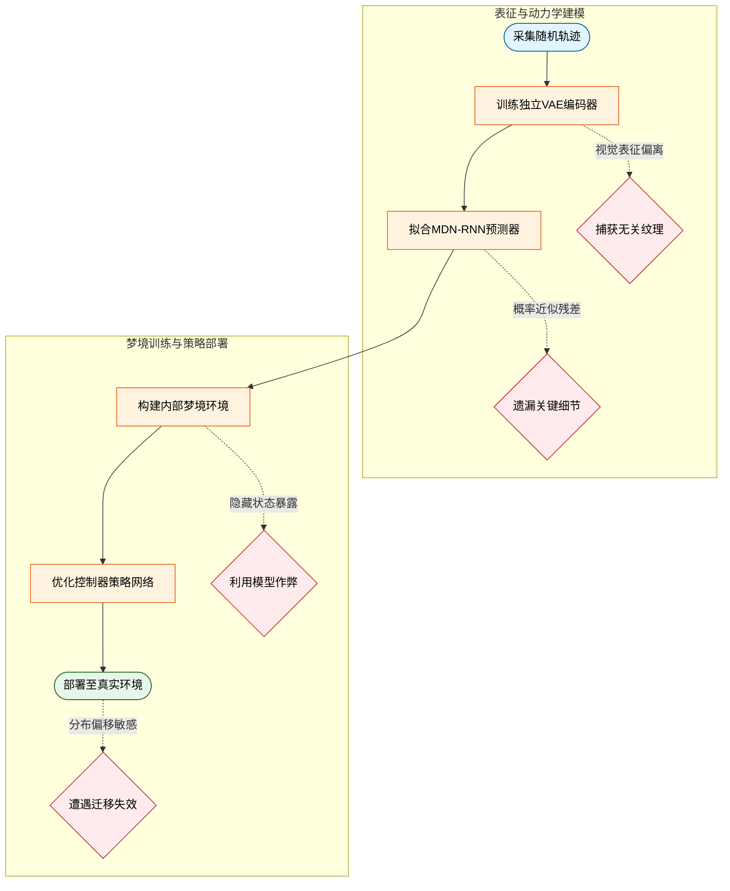
**如何读这张图：** 流程图沿自上而下的主方向展开，左侧子图刻画表征与动力学建模阶段，右侧子图刻画梦境训练与部署阶段。圆角节点标记流程起止，矩形节点表示核心计算模块，菱形节点暴露论文未完全解决的失效门。虚线边标注了从模块到失效模式的因果触发条件，直观呈现策略在何处可能偏离真实物理规律。

### 表征瓶颈与任务无关特征干扰
**结论：** 独立无监督训练的 VAE 容易陷入“视觉过拟合”，导致策略学习偏离核心奖励信号。
论文声称独立训练范式保留了 VAE 的跨任务复用性，但实际证明该设计会迫使编码器将表征容量分配给任务无关的视觉细节（例如《Doom》环境中的墙面砖块纹理）。这种表征与奖励信号的错位，意味着控制器在梦境中优化的目标可能与真实通关条件不一致。若改为与奖励联合训练，虽能强制聚焦，却会直接牺牲 VAE 的通用性。论文并未报告针对此权衡的消融实验或误差范围，实际应用中需根据任务对视觉细节的依赖程度手动选择训练范式。

### 模型幻觉与对抗性策略利用
**结论：** 不完美的世界模型近似会诱发“对抗性捷径”，使控制器在梦境中表现优异却在现实中失效。
MDN-RNN 作为概率预测器，其质量受限于 VAE 的压缩上限，无法精确复现所有环境细节（如动态刷新的怪物数量）。更关键的是，控制器在训练时可直接访问模型 $M$ 的全部隐藏状态。这相当于赋予了 AI 直接读取并操控游戏引擎内部变量的权限，与真实玩家仅能依赖屏幕像素观测的条件截然不同。在这种信息不对称下，控制器极易发现并利用模型缺陷，形成诸如“凭空熄灭火球”的对抗性策略。这种“梦境高分”本质上是利用了近似误差，而非掌握了物理规律。

### 规划能力缺失与长程记忆衰减
**结论：** 架构本质是单步反应式预测，缺乏层次化规划与抽象推理能力，难以应对长序列复杂任务。
该框架的决策逻辑严格依赖逐时步的未来状态预测，并未实现类似 *Learning to Think* 中控制器 $C$ 调用模型 $M$ 作为子程序的通用计算范式。这意味着它只能做“条件反射”式的局部最优决策，无法进行多步前瞻或抽象目标拆解。
<details><summary><strong>底层容量限制与探索依赖</strong></summary>
底层 LSTM 的容量存在硬性天花板，在复杂长序列环境中极易遭遇灾难性遗忘。对于需要战略性探索才能抵达的区域，单次随机数据收集完全不足，必须依赖迭代式的训练循环来逐步扩展状态覆盖。该机制未提供理论上的误差边界保证，实际表现高度依赖数据分布的均匀性。
</details>

### 分布偏移与适用场景边界
**结论：** 策略迁移效果高度敏感于世界模型精度与温度参数 $\tau$，仅适用于分布稳定、探索空间有限的封闭环境。
梦境训练与真实环境之间存在固有的分布差异。策略从梦境迁移到现实时，其性能衰减曲线直接受限于世界模型的预测精度，且对采样温度参数 $\tau$ 极为敏感。$\tau$ 的设定本质上是在“梦境发散度”与“策略收敛性”之间做权衡，论文未给出自适应调参方案或负结果对照。因此，该框架的适用边界非常明确：它擅长在规则固定、状态空间相对紧凑的短时序任务中快速试错，但不适用于需要长期战略规划、强探索依赖或环境动态剧烈变化的开放世界场景。

## 趋势定位与展望

**结论：**《World Models》在强化学习演进路线上完成了一次关键的“范式解耦”：它将环境建模与策略决策彻底分离，用无监督学习的大容量网络消化高维时空信息，再用仅含千余参数的线性控制器在潜空间“梦境”中完成信用分配。这一设计不仅首次突破了 CarRacing-v0 的解任务阈值（平均分 906.0），更证明了“概率化世界模型+进化策略”可作为传统端到端深度强化学习的高效替代路径，为后续模型基强化学习（Model-Based RL）与仿真到现实（Sim-to-Real）迁移奠定了可复现的工程基线。

传统深度强化学习（如 DQN、A3C）长期受困于“信用分配”难题：当策略网络参数量膨胀至百万级时，稀疏奖励信号难以有效反向传播，导致训练效率骤降。本文的破局点在于**架构解耦**。视觉模块 V（ConvVAE）与记忆模块 M（MDN-RNN）以无监督方式预先学习环境的压缩时空表示，总参数量达 4.35M；而控制器 C 仅是一个线性层（参数量 867~1088），通过 CMA-ES 进化策略直接优化。这种“大模型负责理解世界，小模型负责做决定”的分工（直觉，非严格对应），将原本纠缠在一起的表征学习与策略搜索拆分为两个独立阶段，从根本上绕开了大型策略网络的梯度消失与方差爆炸问题。消融实验明确佐证了这一点：仅依赖当前帧视觉特征 $z_t$ 的控制器在 CarRacing-v0 上平均得分仅为 632±251，远低于 900 的解任务线；只有引入 MDN-RNN 的隐状态 $h_t$（携带时序预测信息）后，完整架构才稳定达到 906.0。这并非简单的模块堆叠，而是对“时序先验对控制决策不可或缺”这一命题的严格验证。

为了直观呈现该架构如何重塑训练流，下图对比了传统端到端 RL 与 World Models 的决策-优化路径：
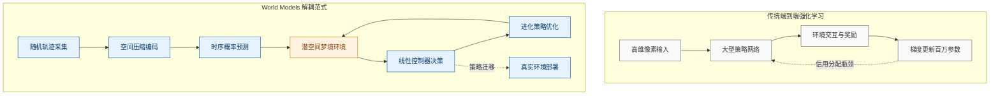
*如何读这张图：* 左侧传统路径依赖环境实时反馈进行梯度更新，易陷入局部最优且计算昂贵；右侧 World Models 将交互数据“蒸馏”进潜空间梦境（橙色区域），控制器 C 在虚拟环境中通过无梯度的进化策略快速试错，最终策略直接部署至真实环境。这种“离线建模-在线梦境训练-现实迁移”的三段式流程，正是本文方法论的核心贡献。

“梦境训练”的可行性高度依赖于世界模型的概率化设计。早期确定性 RNN 动力学模型（如 1990 年代的 C-M 系统）极易被控制器“钻空子”：智能体会发现模型预测的漏洞，生成在虚拟环境中得分极高、但一部署到真实环境就立刻崩溃的对抗性策略。本文通过 MDN-RNN 输出高斯混合分布，并引入温度参数 $\tau$ 主动注入随机性，有效平滑了预测分布的尖锐峰值。在 VizDoom 任务中，基于 DoomRNN 梦境训练的策略在真实环境中存活步数远超 750 步的解任务阈值，且超越了当时已知排行榜最优成绩。然而，论文也坦诚了该路线的边界条件：首先，V 与 M 采用分步训练而非端到端联合优化，虽在工程上更便捷，但理论上可能损失表征对齐的精度；其次，模型假设 10000 条随机轨迹足以覆盖环境动力学，这在复杂开放世界中可能面临数据效率瓶颈；最后，温度参数 $\tau$ 的调节高度依赖经验，缺乏自适应机制，在分布外（OOD）状态下的预测误差仍可能累积。

基于上述定位与局限，该工作指向了三个明确的演进方向：
1. **端到端联合表征与策略优化：** 打破 V-M-C 的硬性隔离，探索可微的世界模型与策略网络联合训练，使控制器梯度能反向修正动力学模型的预测偏差，提升长程规划的连贯性。
2. **自适应不确定性量化：** 将固定的温度参数 $\tau$ 升级为状态依赖的置信度估计（如集成学习或贝叶斯神经网络），使智能体在“梦境”中能主动识别高不确定性区域，并触发真实环境探索，实现更稳健的 Sim-to-Real 闭环。
3. **层级化与多模态扩展：** 当前 M 模型仅做单步潜向量预测，未来可引入类似 Schmidhuber 早期设想的“子程序调用”机制，让控制器在梦境中执行抽象动作序列；同时，将视觉模态扩展至触觉、听觉等多源信号，构建更贴近物理世界的具身世界模型。

<details><summary><strong>训练假设与复现边界（展开查看）</strong></summary>
- **数据效率假设：** 论文依赖 10000 条随机策略采集的轨迹训练 V 与 M。该设定在 CarRacing-v0 与 VizDoom 等封闭/半封闭环境中有效，但在高维连续控制或稀疏奖励任务中，随机探索覆盖率可能不足，需结合主动探索或课程学习。
- **CMA-ES 配置细节：** 控制器优化采用种群大小 64，每代每个个体使用 16 次不同随机种子评估以平滑奖励方差。该配置适用于 867~1088 参数的线性控制器，但若控制器参数量突破 10^4，进化策略的样本复杂度将呈指数上升，需引入梯度辅助或降维技巧。
- **非端到端训练的权衡：** V 与 M 分开训练避免了联合优化时的梯度冲突与显存瓶颈，但导致 M 模型无法针对 C 的决策盲区进行针对性修正。后续工作（如 Dreamer 系列）通过端到端可微规划部分弥补了这一缺陷。
- **误差范围报告：** 论文在 CarRacing-v0 上报告了完整架构的 906.0 分，但未提供多次独立运行的标准差；V-only 消融实验给出了 632±251 的误差范围，表明仅靠空间表征的策略方差极大，进一步印证了时序模块的必要性。
</details>
