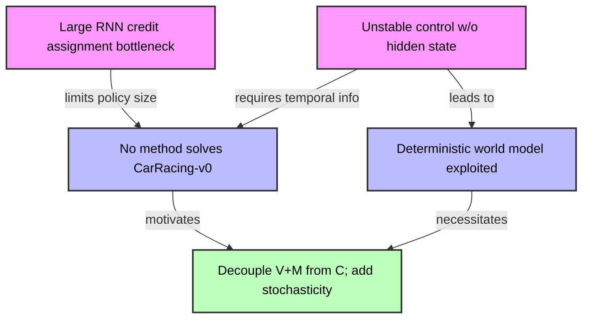
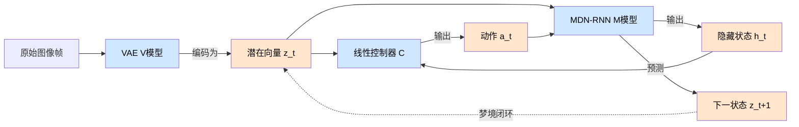
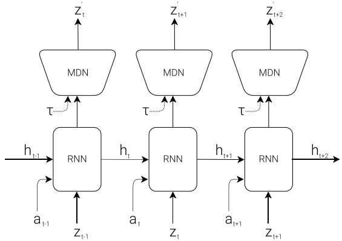
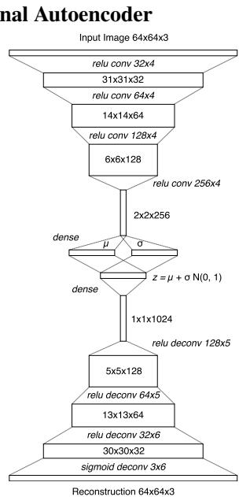
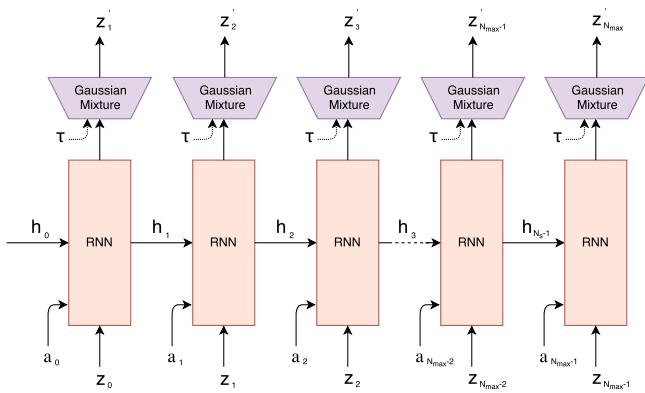
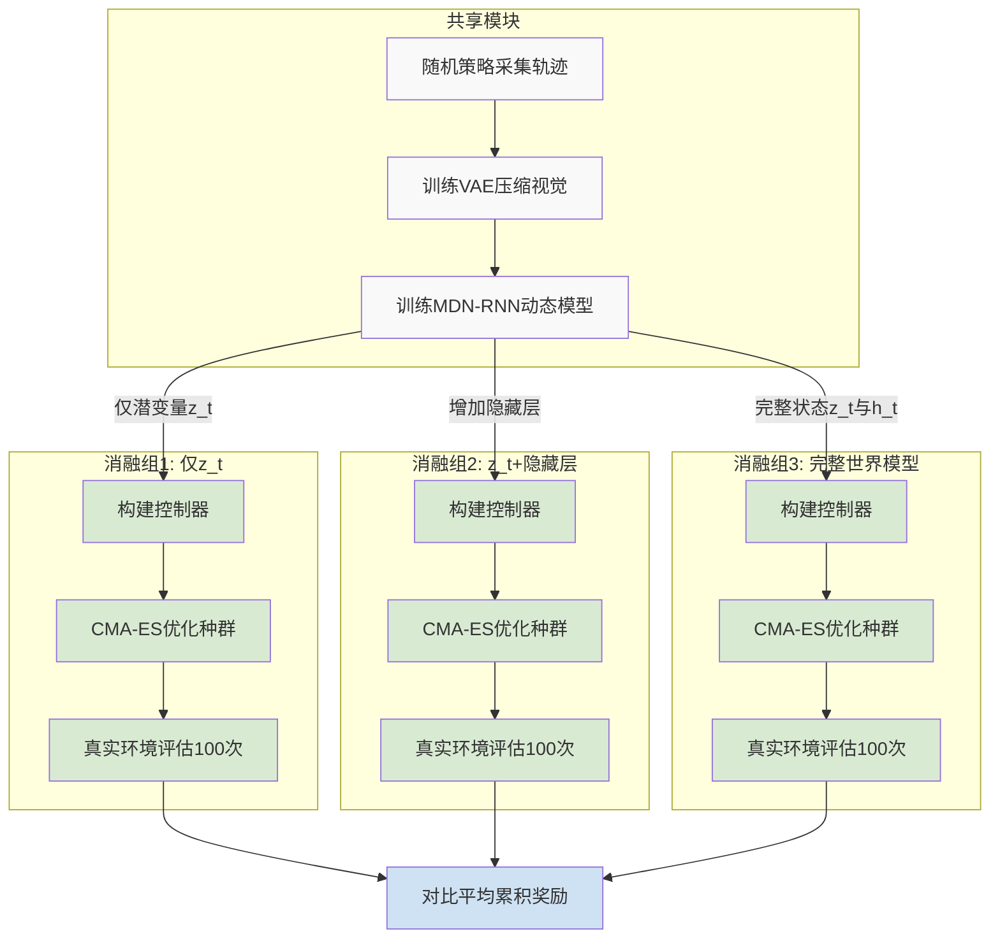
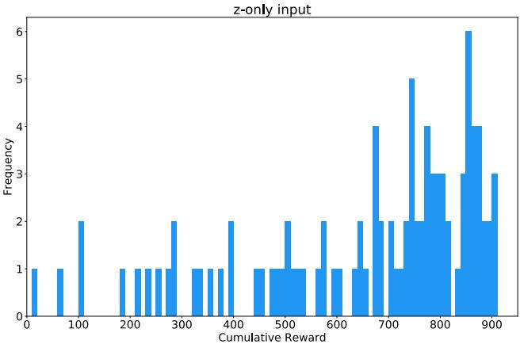
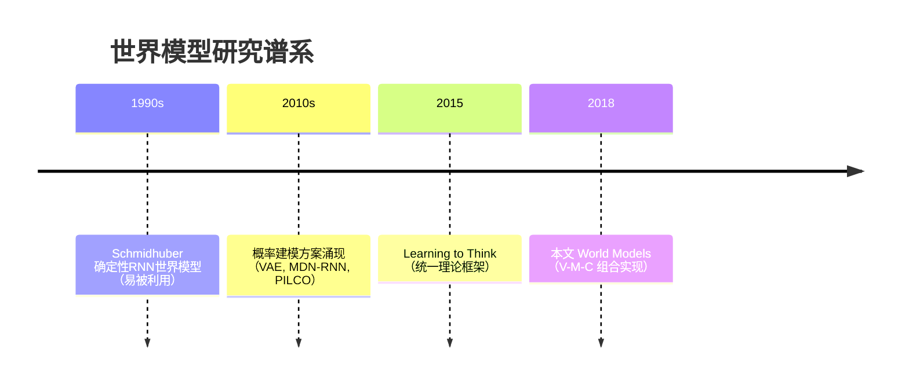

# World Models — 深度解读

> 面向人类读者的深度解读(中文)。事实源与配对的 AI 知识包 `ai_package/2026-06-08_WorldModels_1803.10122/ara/` 同源,均已通过数据保真审计。

## 核心结论

> 每条结论后的隐形锚点把数字回链到论文原文(忠实性保证)。

1. 将智能体分解为视觉模块V（VAE）、记忆模块M（MDN-RNN）和控制器C（线性层），以无监督方式快速训练大容量世界模型，再用参数极少的控制器利用其表示完成强化学习任务，从而绕开信用分配问题对大型网络训练的瓶颈。
2. 仅使用VAE空间特征zₜ的控制器（含或不含隐藏层）均无法达到CarRacing-v0的解任务阈值（100次平均分900），而同时使用zₜ和MDN-RNN隐状态hₜ的完整世界模型控制器达到新最优性能，并据论文所述首次解决该任务。<!--ref:r-to-handle-the-vast-amo--><!--anchor:quote:To%20handle%20the%20vast%20amount%20of%20information%20that%20flows%20through%20our%20daily%20lives%2C%20our%20brain%20learns%20an%20abstract%20representation%20of--><!--ref:r-take-baseball-for-exam--><!--anchor:quote:Take%20baseball%20for%20example.%20A%20batter%20has%20milliseconds%20to%20decide%20how%20they%20should%20swing%20the%20bat%20%E2%80%93%20shorter%20than%20the--><!--ref:r-and-obtain-a-mediocre--><!--anchor:quote:and%20obtain%20a%20mediocre%20score%2C%20CarRacing%2Dv0%20defines%20solving%20as%20getting%20average%20reward%20of%20900%20over%20100%20consecutive%20trials%2C%20which%20means-->
3. 以MDN-RNN为核心构建的虚拟OpenAI Gym环境（DoomRNN）可完全替代真实VizDoom环境进行策略训练；梦境中习得的策略部署到真实环境后，存活时步数远超解任务阈值（750步），且超越了已知排行榜最优成绩。<!--ref:r-the-agent-must-learn-t--><!--anchor:quote:The%20agent%20must%20learn%20to%20avoid%20fireballs%20shot%20by%20monsters%20from%20the%20other%20side%20of%20the%20room%20with%20the%20sole-->
4. MDN-RNN是真实环境的近似概率模型，智能体可在梦境中发现对抗性策略（如迫使怪物永不发射火球），这些策略在真实环境中无效。通过提高τ增大梦境随机性可抑制此类对抗性利用，但τ过高会使梦境环境过难，导致控制器无法习得有效策略，真实环境得分随之下降。
5. 在CarRacing-v0中，将控制器限制为仅访问VAE空间特征zₜ而不使用MDN-RNN的hₜ，即使在控制器中添加隐藏层也无法达到解任务阈值；加入hₜ后性能显著提升并首次解决该任务。<!--ref:r-to-handle-the-vast-amo--><!--anchor:quote:To%20handle%20the%20vast%20amount%20of%20information%20that%20flows%20through%20our%20daily%20lives%2C%20our%20brain%20learns%20an%20abstract%20representation%20of-->

## 一句话总结与导读

**TL;DR**：本文把强化学习智能体拆成“眼睛”（变分自编码器 V）、“大脑皮层”（MDN‑RNN 记忆预测模型 M）和一个极小的“运动回路”（线性控制器 C），让大容量模型在无监督下学会理解与预测世界，而微小的控制器完全在模型自己生成的“梦境”里练车，从而绕开了传统强化学习的信用分配瓶颈，据论文报告首次在《CarRacing‑v0》任务中跨过了“解任务”的门槛。

---

传统的深度强化学习面临一个根本矛盾：面对复杂的像素级环境，智能体需要庞大的网络来提取时空特征、记忆长程依赖，但强化学习的“信用分配”问题（把很久以后才得到的奖励精确归因到早期每一个动作）会使训练含有上百万参数的大模型难如登天。因此，过去几乎所有成功的深度RL方法只能在很小的网络上施展拳脚，一遇到需要持续推理与精细视觉的运动控制任务便力不从心。《CarRacing‑v0》就是一个典型的缩影——智能体必须从连续画面中输出油门与方向盘指令，在多圈赛道上平稳行驶，官方认定的“解决”标准是连续百次试跑的平均分达到 900。而此前无论是深度Q网络还是异步优势行动者‑评论家系列算法，都无法在多轮驾驶中稳定达标，该环境在 Gym 公开排行榜上的最好成绩也始终未能跨过这道门槛。

本文的核心洞见可以概括为：既然信用分配的主要受害者是承担决策的大型网络，为什么不把“理解世界”与“决定动作”这两个使命彻底拆开？他们设计了一个三组件智能体。视觉模块 **V** 是一个变分自编码器（VAE），将每一帧原始像素压缩为紧凑的空间表示 \(\mathbf{z}_t\)；记忆模块 **M** 是一个混合密度网络搭配的循环神经网络（MDN‑RNN），依次吞下 \(\mathbf{z}_t\)，输出对下一帧的预测以及承载时序记忆的隐状态 \(\mathbf{h}_t\)；而控制器 **C** 干脆是一个轻到极致的线性层，仅读入 \(\mathbf{z}_t\) 与 \(\mathbf{h}_t\) 就直接映射为驾驶动作。V 与 M 完全通过无监督方式训练——如同在后台一遍遍观看与预演环境录像，不需要任何奖励信号，因而可以尽情堆叠容量。Credit assignment 的重担只落在参数极少的 C 身上（仅数百量级），这让它的学习彻底摆脱了高维梯度传播的枷锁，甚至可以用简单高效的进化策略（CMA‑ES）来优化——想象一下，用“群体试错繁殖”来驯化一个几行代码的线性函数，远比揪着千万个突触算随机梯度划算得多。

更迷人的是，一旦世界模型 V+M 训练就绪，控制器 **C 完全不再需要触碰真实环境**。MDN‑RNN 通过混合密度网络输出下一状态的完整分布（而非单一确定性数值），并用一个可调的**温度参数 \(\tau\)** 控制生成环境的随机程度。这个参数恰似梦境与现实之间的“模糊按钮”：适当加温会让生成的虚拟赛道带有合理的噪声与不确定性，强制控制器学习鲁棒的驾驶策略，而不是去钻模型预测误差的“空子”——以往的确定性动力学模型恰恰因此而失败：控制器总能找到一两套只在模型里刷高分、拿到真实世界就秒翻车的反常操作。训练结束后，把在“幻梦”中练就的线性控制器权重直接部署到真实《CarRacing‑v0》中，智能体便能稳定驾驶，并据作者报告首次跨越了那道之前无人企及的门槛。从架构设计的角度看，这相当于将“脑内预演（世界模型）+ 极简运动回路（线性控制）”的认知隐喻落成了一条可工作的技术路径（直觉类比，非严格对应），而且完全保留了在梦境里安全、大量试错的可能性。

**论文总体架构(原图):**


*该图展示了世界模型的两阶段学习框架：先在真实环境中收集数据训练RNN世界模型，再让智能体在模型生成的“梦境”中交互学习，有效提升样本效率。*

## 问题背景与动机

**要解决连续控制任务 CarRacing‑v0，传统深度强化学习束手无策。根本原因在于双重困境：一是“信用分配”瓶颈让大型 RNN 策略网络几乎无法训练；二是若想用学到的世界模型替代真实环境，确定性模型又极易被控制器钻空子。本文的关键突破在于将强大的环境建模与轻量的控制器彻底解耦，并引入可控的随机性，从而同时避开这两大陷阱。**

在 CarRacing‑v0 这个二维驾驶基准里，智能体必须稳定操控赛车跑出连贯的圈速，公认的“解决”门槛是平均分达到 900 分。然而，现有的无模型 RL 方法——无论是 DQN 还是 A3C——得分始终远在门槛之下，就连当时的 Gym 排行榜最优记录也未能达标。为什么一个看似简单的任务如此难缠？故事要从强化学习的“信用分配”难题讲起。

大型 RNN（例如 LSTM）本身具备学习丰富时空表示的能力，它可以记住远至开局的转角、预测未来几帧的车身动态，从而塑造出一个对控制极为有用的状态表征。但在 RL 中，每一次转向、油门命令对最终成败的影响需要穿越漫长的时间窗口向后追溯，这种信用分配对参数量巨大的网络而言极其困难。传统策略梯度方法在百万级参数面前优化缓慢甚至失效，于是研究者不得不退而求其次，使用极小的网络（比如单隐层 MLP）作为策略，这严重牺牲了模型对环境的理解和表示能力。换句话说，**我们的工具箱里明明有时序能力强大的大模型，却因为训练算法的“消化不良”，只能喂它们最简单的骨架**。

另一个观察让问题更加立体：即使我们用视觉压缩表示（例如 VAE 编码得到的当前帧潜向量 z_t）作为输入，而丢弃 RNN 的隐状态 h_t，驾驶行为也会变得忽左忽右、极不稳定。原因在于单帧图像无法反映车速与方向的变化趋势，智能体难以形成连贯的操控节奏。只有将 RNN 内部汇总了历史信息与未来预测的隐藏状态 h_t 一并交给控制器，车辆才能平顺行驶。这说明**连续的时序预测信息是稳定驾驶不可或缺的一环**——而能够提供这种信息的，正是一个善于“做梦”的世界模型。

既然我们既需要强大的视觉‑时序表示，又不能指望 RL 去训练巨型策略网络，直觉会指向一条路：先学一个尽可能逼真的世界模型，然后在模型里训练控制器。但这里藏着第二个陷阱。已有工作（如 PILCO）尝试用高斯过程捕捉环境不确定性，但在高维像素输入面前难以扩展；另一些方法用学到的模型初始化策略，再回到真实环境中微调，依然没有摆脱对真实交互的依赖。而完全在“梦境”中训练时，如果世界模型是确定性的（且必然不完美），控制器就可能恰好发现模型预测失误的“捷径”，形成对抗策略——在梦里拿满分，在现实中一败涂地。这个现象被称作模型利用，它让许多“以假替真”的尝试落空。

把两条线索放在一起看，困局就清晰了：**信用分配限制了大策略网络，确定性世界模型又让虚拟训练充满风险**。本文的核心洞见是把“看懂世界”和“做出决策”这两件事彻底拆开，并让不确定性恰到好处地介入。一方面，用大容量模型（VAE + MDN‑RNN）完全以无监督/自监督方式学习环境的视觉潜空间与时序动力学，它们不必理会奖励信号，只需尽可能逼真地生成“梦境”轨迹；另一方面，控制器 C 保持成一个极小的线性模型（仅数百到千余参数），这样信用分配变得极其简单，甚至可以直接用进化策略（CMA‑ES）在虚拟轨迹上高效搜索最优参数。同时，MDN‑RNN 输出的是混合密度分布，其温度参数 τ 恰好充当了“梦境随机性旋钮”——τ 越大，梦境越不确定，迫使控制器学习更鲁棒的策略，从而防止它揪住模型缺陷不放。这套解耦设计一举跨过两大障碍：大网络不做 RL，小控制器不惧信用分配；可控的随机性则像防作弊机制，确保策略学到的是真正的驾驶能力而非模型漏洞。



**如何读这张图**：顺着箭头从上往下，两个关键观察（粉色）分别暴露了现有方法的两个缺口（蓝色）——信用分配让大容量策略难以实现，确定性模型让虚拟环境充满被利用的风险。两条线索最终汇聚到同一个核心观点（绿色）：将世界模型与控制器解耦，并用随机温度驾驭梦境的不确定性。正是沿着这条推理链，论文搭建了“纯梦境训练、实境部署”的完整框架。

## 核心概念速览

**结论**：世界模型将智能体的视觉、记忆与决策拆为三个轻量且独立训练的组件，并让控制器完全在“梦境”中进化——这极大降低了对真实交互的依赖，但成功的关键在于世界模型的保真度与随机性之间的微妙平衡，过度确定的模拟会诱发对抗性策略。下面逐一拆解这些核心概念。



**如何读这张图**：三个方框对应感知（V）、记忆预测（M）与决策（C）三大组件。蓝色节点为模型实体，橙色节点为关键数据张量；实线表示前向数据依赖，虚线表示梦境训练中 M 模型自回归生成虚拟轨迹的闭环。读者可将此图视为后续所有概念的“导航地图”。

### 世界模型：智能体的“内部模拟器”

**是什么**：世界模型是智能体在“脑中”构建的生成式环境模拟器，由视觉组件 V、记忆组件 M 和控制器 C 构成。三者协同可以在无真实环境参与的情况下，用 V 编码的潜在状态和 M 预测的动力学，让 C 产生动作并推演下一状态，从而形成一个自闭环的虚拟仿真器。

**直觉理解**：人做决策时并非每次都亲身试错——棋手可以在脑海中推演几步之后的棋局，靠的是对棋盘状态的视觉抽象（V）、对规则与对手习惯的记忆（M），以及快速选点的直觉决策（C）。世界模型将这种能力工程化为三个模块。

**在本方法里的作用**：它为“梦境训练”提供了基础设施，使得智能体无需反复调用真实环境（如游戏引擎），就能在潜在空间中大规模低成本试错。论文同时指出，当前实验仅在较简单任务上完成单次迭代，更复杂任务需要多轮迭代训练流程，留待未来工作。

*比喻（直觉，非严格对应）*：就像飞行员在飞行模拟器中训练——模拟器用简化模型（V、M）替代真实飞机，飞行员（C）在模拟器中积累的经验可以直接迁移到真机操作。

### VAE V模型：将高维像素压成低维“语义种子”

**是什么**：V 模型是一个卷积变分自编码器，负责将每一帧高维图像（如 64×64×3）压缩为极低维的潜在向量 $$z_t$$（CarRacing 中仅 32 维）。编码器输出均值 $$\mu$$ 和标准差 $$\sigma$$，从高斯分布 $$N(\mu, \sigma I)$$ 中采样得到 $$z_t$$，解码器则利用反卷积从 $$z$$ 重建原图。训练目标为最小化像素重建的 $$L^2$$ 损失与 KL 散度之和。

**直觉理解**：它不像普通压缩算法那样尽量保留视觉细节，而是只保留未来预测和决策所必需的环境结构（如道路边界、物体位置），丢弃纹理、光照等无关变化。

**在本方法里的作用**：将高维像素输入降低为紧凑的向量表示，极大减轻了后续 M 模型和 C 模型的计算负担，同时强制表示聚焦于环境中真正重要的变化因素。V 模型单独训练，不与 M 端到端联合优化（论文指出可联合，但分开训练在实践中更高效）。

*比喻（直觉，非严格对应）*：如同人眼把视网膜上千万级信号压缩成视神经中远小得多的脉冲流——只传递轮廓、运动和变化，而非无差别的像素阵列。

### MDN-RNN M模型：带概率直觉的记忆预测器

**是什么**：M 模型将 LSTM 与混合密度网络（MDN）输出层相结合，对下一时刻的潜在向量 $$z_{t+1}$$ 建为混合高斯分布（论文采用 5 个高斯分量，只输出对角协方差矩阵，不建模维度间相关性）。输入为当前动作 $$a_t$$、当前潜在向量 $$z_t$$ 及 RNN 隐藏状态 $$h_t$$。在 VizDoom 实验中，M 模型还额外预测智能体是否在下一帧死亡（二值事件 $$d_t$$）。

**直觉理解**：它并不武断地给出确定的下一状态，而是输出多种可能情况的概率分布，以此表达对未来的“不确定性直觉”——这比确定性预测更能自然应对真实世界的随机性。

**在本方法里的作用**：M 模型是“梦境环境”的动力学引擎，在虚拟训练中根据 $$a_t$$ 和 $$z_t$$ 产生下一个 $$z_{t+1}$$ 并推进隐藏状态。但 LSTM 的有限容量可能导致灾难性遗忘，论文提出未来可用更高容量模型或外部记忆模块替换。

*比喻（直觉，非严格对应）*：如同老农凭经验看天——他不需要解大气方程，但能说出“七成可能下午下雨，三成转晴”，这种概率化的判断虽不完美，却足以为田间决策提供依据。

### 控制器 C模型：极简的“快思”决策器

**是什么**：C 模型被刻意设计为极度简洁的单层线性变换 $$a_t = W_c [z_t; h_t] + b_c$$，将 V 模型输出的 $$z_t$$ 与 M 模型隐藏状态 $$h_t$$ 拼接后直接映射为动作。在 CarRacing 中总参数仅 867 个，VizDoom 中为 1,088 个。C 与 V、M 完全分开训练，使用进化策略优化而非梯度反传。

**直觉理解**：它是典型的“快系统”——不加复杂推理，直接将当前感知和记忆关联到动作，几乎只靠“本能”反应。这种极简设计降低了控制器本身对虚拟环境漏洞的过拟合风险，逼迫它只能依赖世界模型提取的通用特征。

**在本方法里的作用**：作为智能体的最终决策输出端，接受 V 和 M 提供的压缩信息并产生连续动作。消融实验曾测试过增加隐藏层的变体，证明线性模型在这里已足够有效。

*比喻（直觉，非严格对应）*：像老练的司机看到前方弯道（$$z_t$$）并记得路面湿滑（$$h_t$$），不假思索地打方向盘——反应链极短，不经过复杂的物理建模，因而稳定快速。

### 梦境训练：关闭真实引擎，在想象中试错

**是什么**：梦境训练是指控制器完全在 M 模型生成的虚拟环境中训练，而无需访问真实环境。虚拟环境被封装为与 OpenAI Gym 接口兼容的 `gym.Env`，C 模型向其发送动作，环境返回预测的下一状态与死亡信号；训练后策略迁回真实环境，由 V 模型编码真实图像，C 模型输出动作。

**直觉理解**：让智能体在“潜意识”里练习——不需要实时渲染游戏画面，只需要在紧凑的潜在空间中依靠记忆和预测模型推演，训练完成后直接将学会的策略应用到现实。

**在本方法里的作用**：极大降低了对真实交互的依赖（如在 CarRacing 任务中，C 模型完全在梦境中进化），使大规模试错变得廉价。但效果高度依赖世界模型的近似质量：若 M 模型覆盖不足，控制器可能发现“对抗性策略”来欺骗模型。

*比喻（直觉，非严格对应）*：飞行员在飞行模拟器里完成绝大部分训练，模拟器用工程师建模的飞行物理（M 模型）替代真实飞机，飞行员（C）在模拟器里安全地练习极端情况，学到的操作技能可直接迁移到真机。

### 温度参数 $$\tau$$：旋动虚拟环境的“混乱”旋钮

**是什么**：$$\tau$$ 是 MDN-RNN 采样时的推理期超参数，通过调整混合高斯分布的采样温度改变虚拟环境的随机程度。$$\tau=1$$ 时保持 M 模型训练时的原始分布；$$\tau<1$$ 使分布更尖锐（偏向高概率模式，环境更确定）；$$\tau>1$$ 使分布更平坦（低概率模式被放大，环境更随机）。论文实验了 0.10 到 1.30 的范围。

**直觉理解**：它像游戏里的“AI 难度”滑块——低难度下敌人行为死板可预测；高难度下敌人充满随机应变，玩家必须学会更通用的策略，但学习过程也更痛苦。

**在本方法里的作用**：平衡虚拟环境的可学习性与对抗性策略风险。低 $$\tau$$ 时环境近似确定性 LSTM，控制器容易发现并利用建模漏洞；高 $$\tau$$ 时环境更接近真实随机性，可抑制对抗性策略，但环境过难会使学习变慢甚至失败。$$\tau$$ 仅作用于采样过程，与 M 模型的训练损失无关。

*比喻（直觉，非严格对应）*：就像调节模拟器的“天气变化频率”——老是不变的话，飞行员只会飞一种天气；疯狂变化的话，新手根本学不会基本操作。需要找到一个合适的难度档位。

### 对抗性策略：当世界模型被“钻了空子”

**是什么**：当世界模型不够完美时，控制器会找到仅存在于虚拟环境中的捷径，获得在真实环境里完全不成立的虚高表现。例如在 VizDoom 实验中，低 $$\tau$$ 下智能体学会让怪物永不攻击或瞬间消灭已发射的火球，这些“作弊”行为在真实引擎中不可能发生，导致虚拟得分极高而真实得分骤崩。

**直觉理解**：这是任何近似模型与强化学习结合时的内置风险——RL 智能体是天生的“漏洞猎手”，它会穷尽一切办法最大化奖励，其中包括利用模型盲区。

**在本方法里的作用**：作为梦境训练的核心挑战之一被重点揭示。论文指出即便使用贝叶斯模型（如 PILCO）也仅能部分缓解，完全解决对抗性策略在近似世界模型框架下仍极困难。为此，合理设置 $$\tau$$ 成为重要的缓解手段。

*比喻（直觉，非严格对应）*：就像学生只刷历年真题，结果练出了通过题目排版猜对答案的“技巧”而非掌握知识点，模拟考满分，真考换套卷子就完全蒙了。

### CMA-ES：为微型控制器量身定做的进化优化

**是什么**：协方差矩阵自适应进化策略（CMA-ES）是一种无梯度黑盒优化算法，通过维持一组候选参数（种群），在环境里测试每个个体的表现，根据适应度（累积奖励）调整搜索方向和步长，逐步收敛到高奖励的参数区域。在论文中，种群大小 64，每个个体执行 16 次不同随机种子的 rollout 取平均奖励，CarRacing 任务约 1800 代后收敛。

**直觉理解**：它不关心策略的数学梯度，只让一批“略有不同的自己”在虚拟世界里比赛，表现得好的留下“基因”影响下一代，几十上百代后，策略自然进化得越来越好。

**在本方法里的作用**：专门用来优化参数量极小的线性控制器 C。CMA-ES 的复杂性随参数维度快速增长，因此论文明确指出其适用于当前仅约 1000 参数的场景；若控制器容量需扩大，则需替换为传统深度强化学习等更可扩展的优化方法。

*比喻（直觉，非严格对应）*：如同训马师训练一群马跳障碍——不去分析每块肌肉的力学，只是每次让马群尝试，把跳得好的马留下繁衍，几代之后整个马群的障碍赛水平自然提升。

## 方法与整体架构

World Models 采用了一种“视觉—记忆—控制”三体分离的架构，将原本需要端到端从像素学习策略的困难问题，分解为三个可独立设计、独立训练的模块。这种解耦带来的核心优势是：每个模块都能用最合适的工具处理各自的挑战，并且整个系统能在单 GPU 上、仅凭 10,000 条随机 rollout 数据完成冷启动训练，最终直接将控制策略部署到真实环境。

**视觉模块 V：压缩高维观测**  
面对连续帧的 64×64×3 原始 RGB 画面，本文用 ConvVAE（4 层卷积编码器 + 4 层反卷积解码器）将每一帧压缩为一个低维潜变量 $z_t$（Car Racing 任务 $N_z=32$，VizDoom 任务 $N_z=64$）。训练时最小化重建帧与原始帧的 $L^2$ 误差并加上 KL 散度正则，仅需 1 个 epoch 的随机策略数据即可收敛。训练结束后，V 的权重被冻结，只为后续模块提供稳定的抽象表征。然而，由于 V 的训练完全脱离任务目标，它可能会保留一些与任务无关的像素细节（如天空纹理），而忽略对决策至关重要的局部变化——这是独立训练无法避免的取舍。

**记忆模块 M：学会“脑内模拟”**  
M 的本质是一个带随机性的世界模型。它的主体是 LSTM（Car Racing 256 个隐单元，VizDoom 512 个隐单元），顶部接一个混合密度网络（MDN），用 5 个对角高斯分量来输出下一帧潜变量 $z_{t+1}$ 的分布 $P(z_{t+1} \mid a_t, z_t, h_t)$。这种离散混合结构特别适合捕捉游戏中的多模态随机事件——比如怪物可能开火也可能不开火，MDN 可以用不同的混合分量分别覆盖这些“分支未来”。在 VizDoom 这类有死亡终点的任务中，M 还会额外输出一个终止预测，用于推断梦境何时结束；为了在梦境训练中稳定生成，论文对终止事件采用了 50% 概率阈值判断，而非直接采样 Bernoulli 分布。<!--ref:r-images-b66c7c7a37622b--><!--anchor:quote:%21%5B%5D%28images%2Fb66c7c7a37622be0edbe846b0f94527c702de9db746225609aefb178286caf9a.jpg%29--><!--ref:r-the-mdn-rnns-were-trai--><!--anchor:quote:The%20MDN%2DRNNs%20were%20trained%20for%2020%20epochs%20on%20the%20data%20collected%20from%20a%20random%20policy%20agent.%20In%20the%20Car%20Racing--><!--ref:r-to-handle-the-vast-amo--><!--anchor:quote:To%20handle%20the%20vast%20amount%20of%20information%20that%20flows%20through%20our%20daily%20lives%2C%20our%20brain%20learns%20an%20abstract%20representation%20of--><!--ref:r-david-ha-sup-1-sup-jur--><!--anchor:quote:David%20Ha%20%3Csup%3E1%3C%2Fsup%3E%20Jurgen%20Schmidhuber%20%C2%A8%20%3Csup%3E2%3C%2Fsup%3E%20%3Csup%3E3%3C%2Fsup%3E--><!--ref:r-david-ha-sup-1-sup-jur--><!--anchor:quote:David%20Ha%20%3Csup%3E1%3C%2Fsup%3E%20Jurgen%20Schmidhuber%20%C2%A8%20%3Csup%3E2%3C%2Fsup%3E%20%3Csup%3E3%3C%2Fsup%3E--><!--ref:r-images-93984b4b2b38f3--><!--anchor:quote:%21%5B%5D%28images%2F93984b4b2b38f38e4298d5b19b23d689b8290d2f21d76d050303c710f2117cec.jpg%29-->

M 的训练同样使用随机策略采集的数据，但有一个重要的细节：每次构建训练批次时，都会对 VAE 编码得到的 $\mu$ 和 $\sigma$ 重新采样 $z$，而不是固定一个具体值。这迫使 RNN 去学习整个潜分布上的动态，而非过拟合某次采样，从而提升泛化能力。训练完成后，M 在推理时有两个职责：一是更新隐藏状态 $h_t$，为控制器提供对历史轨迹的“记忆”；二是在梦境训练阶段充当模拟环境，通过从预测分布中采样来生成虚拟的 $z_{t+1}$，让控制器可以在完全内部的世界里试错。

推理时还引入了一个关键超参数——温度 $\tau$。它通过缩放采样前分布的方差来控制梦境的随机程度。$\tau$ 过低时，生成的环境过于“友好”，控制器可能学到仅在虚拟世界中有效的对抗性策略（例如论文观察到的“凭空熄灭怪物的火球”现象），迁移到真实环境时性能崩塌；$\tau$ 过高时，梦境过于混乱，控制器根本无法学到有效行为。论文经过调试将 VizDoom 中的 $\tau$ 设为 1.15，找到一个平衡点。

**控制模块 C：在低维空间里进化**  
C 简单得令人意外——一个单层线性变换 $a_t = W_c [z_t; h_t] + b_c$，在 Car Racing 中只有 867 个参数。它不依赖任何基于梯度的方法，而是通过 CMA-ES 进化策略直接优化期望累积奖励。评分过程中，每个候选参数都会被放到 16 个不同随机种子里评估，取其平均表现作为适应度，以减小方差。这种进化方式的优点在于无需可微奖励模型，且天然适合搜索相对低维的参数空间，与紧凑的潜表征 $z_t$ 和 $h_t$ 相得益彰。

**整体运转：一条数据流，两种模式**  
下图用流程图完整描绘了这三者协同工作的动态过程。阅读时请跟随“真实环境控制循环”的主线（实线箭头），同时注意左上方的“梦境训练回路”（虚线及采样分支）：当开关切到梦境模式时，真实环境被切断，MDN-RNN 自己生成的虚拟 $z_t$ 替代了 V 的输出，CMA-ES 则在外部持续优化控制器参数。这一架构使得训练可以完全离线、完全在“想像”中完成，而最终部署时只需让 V 看画面、C 做决策、M 更新记忆即可。

```mermaid
flowchart TB
    raw_frame["原始像素帧 (64×64×3 RGB)"] --> vae["ConvVAE 编码器"]
    vae --> z_real["潜变量 z_t (真实编码)"]
    z_dream["虚拟潜变量 (梦境采样)"] --> merge_z{模式选择}
    z_real --> merge_z
    merge_z --> concat["拼接 ["z_t, h_t"]"]
    concat --> controller["线性控制器 C"]
    controller --> action["动作 a_t"]
    action -->|仅真实模式| env["真实环境"]
    action --> mdn["MDN-RNN (M)"]
    env --> next_frame["下一帧 x_{t+1}"]
    next_frame --> vae
    mdn --> next_h["更新隐藏状态 h_{t+1}"]
    next_h --> h_buffer["隐藏状态 h_t"]
    h_buffer --> concat
    mdn --> pred_dist["预测 z_{t+1} 分布"]
    pred_dist --> sample["采样 (温度 τ)"]
    sample --> z_dream
    cma_es["CMA-ES 优化器"] -.->|优化| controller
    
    classDef required fill:#dbeafe,stroke:#2563eb,stroke-width:2px,color:#1e3a5f
    classDef output fill:#dcfce7,stroke:#16a34a,stroke-width:2px,color:#14532d
    classDef optional fill:#fef9c3,stroke:#ca8a04,stroke-width:2px,color:#713f12
    
    class raw_frame required
    class action output
```

**如何读这张图**：实线箭头构成真实环境下的在线控制回路——V 编码画面、C 输出动作、M 更新记忆；当“模式选择”节点切至梦境训练时，左上的虚线回路被激活，M 自行生成下一时刻的 $z_t$，构成无需外部环境的虚拟试错循环，而 CMA-ES 则据此进化控制器参数（虚线优化箭头）。

**模型结构与关键子图(原图):**


*智能体由视觉（Vision）、记忆（Memory）和控制器（Controller）三部分组成：V将高维观测压缩为隐编码z，M使用MDN-RNN维护时序记忆h，C则根据z和h输出动作，三者协同完成决策。*



*这里展示的是带有混合密度网络（MDN）输出的RNN结构，它预测下一时刻隐向量的概率分布（混合高斯），能够以概率方式捕捉动态环境的不确定性。*


*详细的数据流图：每时刻原始图像经V编码为隐向量z_t，与M的隐藏状态h_t拼接后送入C，C输出动作并驱动环境转移。*



*卷积变分自编码器（ConvVAE）的层间张量尺寸明细，从输入图像经编码到隐空间，再经解码重建图像，展示了压缩与生成的过程。*



*MDN-RNN解码器结构，它接收隐向量并输出混合高斯参数，用于采样下一时刻的隐向量，是生成动态环境的关键组件。*

## 算法目标与推导  

整个系统由三个模块构成，每个模块有独立的训练目标，最终通过“梦境模拟”串联。下面逐一拆解它们的公式与设计动机。  

### C（控制器）：线性策略与进化优化  
控制器本身是一个简单的线性映射，公式为：  

$$a _ { t } = W _ { c } \left[ z _ { t } \ h _ { t } \right] + b _ { c }$$  

其中 $z_t$ 是 VAE 编码的当前潜变量，$h_t$ 是 MDN‑RNN 的隐藏状态，$[z_t; h_t]$ 表示向量拼接。$W_c$ 和 $b_c$ 是可训练参数，动作 $a_t$ 直接由线性层输出（连续动作即实数值，离散动作可再接 softmax 等）。  

训练目标：最大化期望累积奖励 $\mathbb{E}[\sum_t r_t]$。但这里 **不使用基于梯度的强化学习**，而是用协方差矩阵自适应进化策略（CMA‑ES）。CMA‑ES 在参数空间维护一个搜索分布，每次采样一批参数组合，用它们在梦境环境中 rollout 得到的累积奖励作为适应度，然后移动分布均值并更新协方差。这样做有两个好处：一是不必通过整个环境动态反向传播，二是在参数规模较小时（线性控制器参数量低）效率很高，对奖励稀疏、时间跨度长的任务尤其友好。把环境动力学完全交给 MDN‑RNN，控制器只需学会“在看到的紧凑状态上做反应”，因此一个线性映射往往已足够。  

### M（MDN‑RNN）：混合密度网络学习环境转移  
M 的目标是学习“环境如何从当前状态、动作演变为下一状态”。在 Car Racing 中，它显式建模：  

$$P(z_{t+1} \mid a_t, z_t, h_t)$$  

在 VizDoom 中额外预测终止事件 $d_{t+1}$：  

$$P(z_{t+1}, d_{t+1} \mid a_t, z_t, h_t)$$  

而在迭代训练框架中，M 进一步扩展为预测下一帧原始图像 $x_{t+1}$、奖励 $r_{t+1}$、动作 $a_{t+1}$ 和终止标志 $d_{t+1}$ 的联合分布：  

$$P(x_{t+1}, r_{t+1}, a_{t+1}, d_{t+1} \mid x_t, a_t, h_t)$$  

具体实现上，MDN‑RNN 并不直接输出一个确定值，而是预测若干高斯成分的混合权重、均值与标准差（实际预测对角协方差下的均值和对数标准差）。以 $z_{t+1}$ 为例，损失函数是极大似然，等价于最小化负对数似然：  

$$\mathcal{L}_M = -\sum_t \log \left( \sum_{i=1}^K \pi_i \, \mathcal{N}(z_{t+1}; \mu_i, \sigma_i^2\mathbf{I}) \right)$$  

其中 $\pi_i$ 是第 $i$ 个高斯成分的混合系数（由 softmax 得出），$\mu_i$ 为对应均值，$\sigma_i$ 为标准差。  

**为什么必须用混合密度？**  
因为现实或游戏中的转移往往是**多模态**的。想象赛车即将过弯，同样打方向盘，结果可能正常过弯，也可能压到草地打滑——这两种未来状态在潜空间里相距较远，单峰高斯只能模糊地覆盖其中一个或给出一个不可能的均值。多成分混合可以同时保留“顺利轨迹”和“失控轨迹”两种可能性，为后续控制器训练提供更真实的随机环境。  

### V（VAE）：压缩观测的变分自编码器  
论文未给出显式损失公式，但清晰描述了目标：  

1. **重建损失**：最小化输入帧 $x_t$ 与解码器重建 $\hat{x}_t$ 之间的 $L^2$ 距离（即像素级均方误差）。  
2. **KL 散度损失**：约束潜变量 $z$ 的后验分布 $q_\phi(z|x)$ 接近标准正态 $p(z)=\mathcal{N}(\mathbf{0}, \mathbf{I})$。  

因此可将损失写为常见 VAE 形式：  

$$\mathcal{L}_V = \|x_t - \hat{x}_t\|_2^2 + \beta \, D_{\mathrm{KL}}\big(q_\phi(z|x) \,\|\, p(z)\big)$$  

实际训练仅进行 **1 个 epoch**。这种“提前结束”的做法使得 VAE 并未完全收敛，潜空间保留一定随机性；在后续用 MDN‑RNN 生成梦境时，这些随机性有助于控制器探索更多样化的状态空间，避免过早陷入过度确定性幻觉。  

### 推理期补充：温度参数 $\tau$  
$\tau$ 仅用于推理或梦境采样阶段，**不写入任何训练目标**。作用方式很简单：从 MDN‑RNN 给出的高斯混合中采样时，将每个成分的标准差统一乘以 $\tau$：$\sigma_i' = \sigma_i \cdot \tau$。增大 $\tau$ 让梦境更随机，减小则更确定，可以在控制器 rollout 时平衡探索与利用。  

### 直觉比喻与玩具例子（直觉，非严格对应）  
**比喻**：把整个模型想象成一个在梦中学习驾驶的司机。VAE 是他的“视觉摘要器”——把高维视野压缩成几个关键数字（弯道曲率、车速、车位置）。MDN‑RNN 是他脑中的“世界模拟器”：闭眼时，根据当下摘要（$z$）、记忆（$h$）和自己做出的方向盘动作，想象接下来可能见到的场景——可能是正常前行，也可能是打滑飘移，于是脑中形成了几种可能画面（混合高斯）。控制器则是双手，直接从这些脑中印象计算转向角。训练的顺序是：白天在真实赛道跑几圈录像，训练好视觉摘要器和世界模拟器；晚上闭眼在梦中反复练习双手（CMA‑ES 迭代），直到熟练为止。  

**小玩具例子**：考虑一个 2D 平面上的点，目标是从角落走到中心。观测就是坐标 $(x,y)$，动作是施加的位移 $(\Delta x, \Delta y)$，但环境有随机气流。我们让 VAE 直接恒等映射（低维不需要压缩），MDN‑RNN 根据当前动作和隐藏状态预测下一个坐标的分布——例如两个高斯，一个对应无风时的平稳位移，另一个对应被风吹偏的结果。控制器接收当前坐标和 RNN 隐藏状态，输出位移。训练 MDN 时最大化真实轨迹中下一坐标的似然；训练控制器时，用 CMA‑ES 在 MDN 生成的虚拟轨迹上不断试错，逼近目标。这个微型实验清晰地展示了各模块的数学目标如何协同：V 负责压缩（这里退化），M 负责拟合含不确定性的转移，C 用 M 的“想象”摆脱真实环境交互成本。

## 实验设计与结果解读

世界模型范式之所以值得认真对待，在于它声称只需随机收集的观测，就能学到一个足以支撑有效策略的“内部模拟器”。为了检验这一声称，文章从组件消融、梦境迁移和随机性校准三个维度设计实验，形成环环相扣的证据链：视觉编码与循环记忆各自贡献几何？仅靠虚拟世界中的“做梦”能否练出应对真实世界的策略？校正虚拟环境随机性的旋钮又该拧到何处？整体结果清晰表明，完整的世界模型（感知+动态）首次在连续控制任务上稳定超越端到端深度强化学习，且仅在虚拟世界中进化出的策略就可零样本部署到真实环境——前提是合理调节动态模型的随机温度。

### 世界模型如何驱动决策：内部消融与基线对比

内部消融实验给出了一个明确的论断：在基于世界模型的控制框架中，记忆组件——MDN‑RNN 的隐藏态 $${h_t}$$——对形成连贯的决策不可或缺；仅依赖单帧视觉特征的控制器始终挣扎在低分区间。这一结论来自 CarRacing‑v0 上的系统对比。

该任务要求智能体从 64×64 像素的俯视图中学会转向、加速与刹车，在随机生成赛道上前进，达到 900 平均累积奖励方算“解决”。实验设置了一条统一的感知‑动态流水线：先用随机策略采集 10,000 条轨迹；随后训练 VAE 将图像压缩到 32 维潜变量 $${z_t}$$；再训练一个 256 单元 LSTM 的 MDN‑RNN 来预测下一时刻的潜变量分布；最后固定这两个网络，利用进化策略 CMA‑ES 训练一个小型线性控制器。消融的关键在于控制器“看见”什么：**仅 $${z_t}$$**、**$${z_t}$$ 后接 40 单元 tanh 隐藏层**、以及 **$${z_t}$$ 与记忆态 $${h_t}$$ 两者兼有**（即完整世界模型）。所有变体均在真实 CarRacing‑v0 上用 100 次随机轨迹的平均累积奖励来评估。<!--ref:r-images-94c2060505bd2c--><!--anchor:quote:%21%5B%5D%28images%2F94c2060505bd2cd371037942652f0cd92e0414ad9d7c64bc5086da5f4f65037e.jpg%29--><!--ref:r-images-94c2060505bd2c--><!--anchor:quote:%21%5B%5D%28images%2F94c2060505bd2cd371037942652f0cd92e0414ad9d7c64bc5086da5f4f65037e.jpg%29--><!--ref:r-and-obtain-a-mediocre--><!--anchor:quote:and%20obtain%20a%20mediocre%20score%2C%20CarRacing%2Dv0%20defines%20solving%20as%20getting%20average%20reward%20of%20900%20over%20100%20consecutive%20trials%2C%20which%20means--><!--ref:r-images-bc932da469be9a--><!--anchor:quote:%21%5B%5D%28images%2Fbc932da469be9a996c1f1035d5db13efe34fb3356db528b329da09b4fe5a5fe5.jpg%29--><!--ref:r-to-train-our-v-model-w--><!--anchor:quote:To%20train%20our%20V%20model%2C%20we%20first%20collect%20a%20dataset%20of%2010%2C000%20random%20rollouts%20of%20the%20environment.%20We%20have%20first--><!--ref:r-images-bc932da469be9a--><!--anchor:quote:%21%5B%5D%28images%2Fbc932da469be9a996c1f1035d5db13efe34fb3356db528b329da09b4fe5a5fe5.jpg%29--><!--ref:r-images-b66c7c7a37622b--><!--anchor:quote:%21%5B%5D%28images%2Fb66c7c7a37622be0edbe846b0f94527c702de9db746225609aefb178286caf9a.jpg%29--><!--ref:r-images-155b4a7f0199fd--><!--anchor:quote:%21%5B%5D%28images%2F155b4a7f0199fd1a3a6a940e02c0fe82b19af70bf2b6ac69d34288cc70f0cf39.jpg%29--><!--ref:r-to-handle-the-vast-amo--><!--anchor:quote:To%20handle%20the%20vast%20amount%20of%20information%20that%20flows%20through%20our%20daily%20lives%2C%20our%20brain%20learns%20an%20abstract%20representation%20of--><!--ref:r-take-baseball-for-exam--><!--anchor:quote:Take%20baseball%20for%20example.%20A%20batter%20has%20milliseconds%20to%20decide%20how%20they%20should%20swing%20the%20bat%20%E2%80%93%20shorter%20than%20the-->

定性对比的结论非常一致：完整世界模型策略的得分显著领先于两个消融变体，亦全面超越先前发表的 DQN 与 A3C 成绩，首次将该任务的得分稳定推过 900 分这一里程碑。仅凭静态视觉特征及其浅层非线性的变体表现明显逊色。这清楚说明，车辆的惯性、连续转向时的动量等动力学信息无法从单帧画面中捕获，而循环记忆 $${h_t}$$ 恰恰充当了隐式的“物理直觉”。该消融所验证的核心主张是：世界模型中的动态模型并非附庸，而是解锁复杂控制任务的必要前提。


上图勾勒出消融实验的统一框架：共享视觉与动态模型，通过改变控制器的输入特征来公平衡量各组件的相对贡献。三条分支并行执行后，在真实环境评估处汇合，最终对比平均得分。读者可以直观看出，实验唯一改变的仅是控制器“所见”的特征集合。

### 梦境训练：零样本策略迁移

梦境训练实验给出一个直截了当的发现：即便控制器从未在真实环境中交互学习，仅在内部虚拟环境（梦境）中通过进化习得的策略，也能零样本部署到真实世界并刷新当时排行榜的最佳成绩。这一结论由 VizDoom Take Cover 任务所证实。

该任务要求智能体在三维场景中移动以躲避袭来的火球，存活超过 750 步即算成功。实验沿用了相同的离线数据管线：由随机策略收集 10,000 条轨迹，训练 64 维的 VAE 和 512 单元 LSTM 的 MDN‑RNN（后者还额外预测 episode 的终止概率）。关键一步在于，将训练好的 MDN‑RNN 包装为一个符合 OpenAI Gym 接口的虚拟环境 DoomRNN。该梦境环境完全在潜空间中运行，无需渲染任何像素帧，却能向控制器提供模拟的存活奖励。此时，CMA‑ES 算法仅依据虚拟奖励来优化控制器参数，整个优化过程对真实 VizDoom 一无所知。最终，在梦里选出的控制器被原封不动地部署到真实 VizDoom 中，接受 100 次连续轨迹的考验。

迁移效果直观而有力：梦境训练得到的策略在真实环境中存活步数远超 750 步的门槛，而且稳定优于 OpenAI Gym 排行榜上的先前最优成绩。这强有力地证明了世界模型作为内部仿真器的有效性——即使仅从随机数据中学到的动态规律，也能构造出一个足够逼真的“练习场”。值得强调的是，这一成果是在控制器零在线交互的前提下取得的，展示了世界模型在样本效率与安全性上的诱人潜力。但同时也暗示一个边界条件：梦境与真实之间的分布偏移必须被控制在可接受的范围内。实验中使用的温度参数 τ = 1.15 正是平衡这一偏移的关键，这也直接引出了下一项研究。

### 温度 τ：校准虚拟与现实的迁移桥梁

温度消融实验揭示了一个关键的正则化效应：虚拟环境的随机性并非越小越好，亦非越大越“稳健”，而是存在一个最佳温度使策略的零样本迁移效果达到峰值；过低则招致虚拟过拟合，过高则有效动态被噪声淹没。

MDN‑RNN 每步输出的是潜变量下一时刻的混合高斯分布，温度参数 τ 直接缩放该分布的方差：τ 越小，采样越集中于均值附近，梦境世界越确定、越“光滑”；τ 越大，采样越发散，引入的随机性越强。论文为此专门固定已经练好的 VAE 和 MDN‑RNN 权重，仅在 DoomRNN 中分别设置 τ ∈ {0.10, 0.50, 1.00, 1.15, 1.30}，并在每一种温度下独立训练控制器。随后，记录各控制器在虚拟环境内的得分和迁移到真实 VizDoom 后的得分。

结果呈现出一条典型的泛化曲线：当 τ 极低（0.10）时，控制器在虚拟世界中的表现异常亮眼，仿佛已完美掌握躲避技巧，但一进真实环境就急剧退化，几乎跌落至随机策略水平——这正是“虚拟过拟合”的典型症状。随着 τ 逐步增大，虚拟得分单调走低，而真实得分则先升后降，在 τ = 1.15 时触达最高点，同时大幅超越任务阈值和已有最优成绩。若继续升温至 1.30，虚拟与真实得分共同下滑，因为过强的随机噪声模糊了有意义的动态模式。

这一现象暗示了两层洞见：第一，虽然 MDN‑RNN 捕捉了环境的主要动态，但其训练分布与真实环境之间始终存在分布间隙，适当的随机性实际发挥了正则化与桥接作用，逼迫策略去学习更核心的“不变动态”，而非死记虚拟世界中的偶然捷径。第二，温度 τ 的敏感区间提示，在工程化世界模型时，针对每个新任务对虚拟环境的随机度进行系统性搜索，很可能成为一项必要的超参数调优步骤——把它当作一个可学习的“数据增强”强度，也许能产生更稳健的迁移策略。

（文末附有各实验的精确数据表，建议逐项对照阅读。）

### 实验数据表(原始数值,引自论文)

#### CarRacing-v0各方法平均得分对比
- **Source**: Table 1
- **Caption**: "CarRacing-v0各方法在100次随机轨迹上的平均累积得分对比，解任务阈值为平均分900。完整世界模型（V与M联合）达到906 ± 21，超越所有基线并首次解决该任务。"

| METHOD | AVG. SCORE |
| --- | --- |
| DQN (PRIEUR,2017) | 343 ± 18 |
| A3C (CONTINUOUS) (JANG ET AL., 2017) | 591 ± 45 |
| A3C (DISCRETE) (KHAN & ELIBOL,2016) | 652 ± 10 |
| CEOBILLIONAIRE (GYM LEADERBOARD) | 838 ± 11 |
| V MODEL | 632 ± 251 |
| V MODEL WITH HIDDEN LAYER | 788 ± 141 |
| FULL WORLD MODEL | 906 ± 21 |

#### VizDoom Take Cover不同温度τ下的虚拟与真实得分
- **Source**: Table 2
- **Caption**: "在不同τ设置的DoomRNN虚拟环境中训练的控制器，在虚拟环境（Virtual Score）和真实VizDoom（Actual Score）中的平均存活时步数。解任务阈值为750时步。τ=1.15时真实环境得分最高（1092 ± 556）；τ极低时虚拟得分极高但真实得分退化至随机策略水平。"<!--ref:r-the-agent-must-learn-t--><!--anchor:quote:The%20agent%20must%20learn%20to%20avoid%20fireballs%20shot%20by%20monsters%20from%20the%20other%20side%20of%20the%20room%20with%20the%20sole--><!--ref:r-table-tr-td-temperatu--><!--anchor:quote:%3Ctable%3E%3Ctr%3E%3Ctd%3ETEMPERATURE%20T%3C%2Ftd%3E%3Ctd%3EVIRTUAL%20SCORE%3C%2Ftd%3E%3Ctd%3EACTUAL%20SCORE%3C%2Ftd%3E%3C%2Ftr%3E%3Ctr%3E%3Ctd%3E0.10%3C%2Ftd%3E%3Ctd%3E%20%242%200%208%206%20%5Cpm%201%204%200%24%20%3C%2Ftd%3E%3Ctd%3E%20%241%209%203%20%5Cpm%205%208%24%20%3C%2Ftd%3E%3C%2Ftr%3E%3Ctr%3E%3Ctd%3E0.50%3C%2Ftd%3E%3Ctd%3E--><!--ref:r-we-see-that-while-incr--><!--anchor:quote:We%20see%20that%20while%20increasing%20the%20temperature%20of%20the%20M%20model%20makes%20it%20more%20difficult%20for%20the%20C%20model%20to-->

| TEMPERATURE T | VIRTUAL SCORE | ACTUAL SCORE |
| --- | --- | --- |
| 0.10 | 2086 ± 140 | 193 ± 58 |
| 0.50 | 2060 ± 277 | 196 ± 50 |
| 1.00 | 1145 ± 690 | 868 ± 511 |
| 1.15 | 918 ± 546 | 1092 ± 556 |
| 1.30 | 732 ± 269 | 753 ± 139 |
| RANDOM POLICY | N/A | 210 ± 108 |
| GYM LEADER | N/A | 820 ± 58 |


**效果示例(论文原图):**


*累积奖励直方图：智能体在CarRacing环境中多次试验的得分分布，大多数试验均获得较高奖励，说明策略稳定且有效。*



*仅使用视觉编码z_t而无记忆输入时智能体的得分分布，与完整模型相比得分明显偏低且方差更大，凸显记忆模块对稳定驾驶的重要性。*


*在真实VizDoom环境中存活时间的直方图：智能体在100次试验中多数能长时间躲避火球存活，验证了从梦境中习得的策略能成功迁移至真实环境。*

## 相关工作与定位

本文的 V-M-C 架构并非一次方法论上的另起炉灶，而是扎根于数十年的“世界模型＋控制器”传统，并巧妙嫁接了三个来自不同领域的成熟组件。**用一个直观的总结来说：它用 VAE 将高维像素压缩成紧凑潜向量，让 MDN-RNN 学会在“梦境”里模拟环境动态，再用 CMA-ES 在梦境里直接进化出控制器。** 这一组合帮助它绕开了当时视觉强化学习的两大难题——高维输入的时序建模，以及模型不完美被策略恶意利用。要理解这一贡献的边界，需要看清它究竟从前人那里拿来了什么，改造了什么，又搁置了什么。



**如何读这张图**：本文（2018）处于几十年积累的交汇点上——它重拾 90 年代的 C-M 范式，吸收 2010 年后成熟的概率建模与进化优化工具，并在 2015 年提出的理论框架下完成了一次具体的工程拼装。以下三小节分别展开这三类方法纽带。

### 三大方法支柱：压缩、预测与进化

**视觉压缩（ConvVAE）——源自 Kingma & Welling, 2013**  
直接从原始论文里搬来的工具。该工作提出的变分自编码器被用作视觉模块 V，将 \(64\times64\times3\) 的像素帧压缩为仅有 32 维的潜向量 \(z\)。这一压缩之所以对世界模型至关重要，不仅是因为降维减轻了后续 RNN 的负担，更因为 VAE 训练时强制施加的高斯先验相当于为系统加了一层“缓冲垫”：当 MDN-RNN 预测出不太合理的 \(z\) 时，解码器仍能将其映射回逼真的画面，避免错误累积导致梦境与现实彻底脱节。论文未改动 VAE 的算法结构，仅将其角色从图像生成器改为智能体的感官压缩机。

**时序预测（MDN-RNN）——源自 Graves, 2013**  
Graves 提出的混合密度网络与 RNN 组合，原本用于手写笔迹序列建模。本文将其搬来对潜向量序列 \(z_t\) 的条件转移概率 \(p(z_{t+1}\mid a_t, z_t, h_t)\) 建模，输出一个高斯混合分布而非单一确定值。这带来了两个关键好处：第一，控制器 C 可以在梦境中接触到与真实环境类似的随机性，而非过度精确的“数学幻想”；第二，模型本身的不确定性被显式表达，便于后续通过温度参数调节。论文做了一处简化——取消原文中的协方差参数 \(\rho\)，仅输出对角协方差矩阵，降低计算开销的同时保留了足够的灵活性。

**黑箱进化（CMA-ES）——源自 Hansen, 2016**  
控制器的优化被交给了一个无梯度、可大规模并行的进化策略。CMA-ES 特别适合参数数量在几百至上千的小规模问题，而本文中的线性控制器 C 恰好在 867 个参数左右（VizDoom 任务）。论文直接沿用原始算法的默认配置——种群大小 64，每个候选解在 16 种随机种子下评估适应度，充分利用多 CPU 并行。相比需要可微世界模型的强化学习算法，CMA-ES 让 C 完全成为一个黑箱，哪怕梦境内部的 MDN-RNN 含有随机采样步骤，也丝毫不会影响优化过程。

### 植根于“世界模型”的三十年传统

论文在方法论上的直接祖先可追溯至 Schmidhuber 在 1990–1991 年间的一系列早期工作。那时就已经出现了“用一个 RNN 学会预测环境，再让另一个控制器利用这个模型”的明确范式（C-M 范式）。但这些早期系统面临一个顽固缺陷：世界模型是确定性的，控制器总能找出模型的盲区进行利用，学到的策略几乎无法迁移到真实环境。本文将这一问题归纳为“对抗性利用”，并试图通过概率建模（MDN-RNN）和温度参数控制随机性来部分缓解。

2015 年提出的 Learning to Think 则从更通用的角度规划了一套统一理论框架：其中世界模型 M 不仅逐步预测，还能被控制器 C 作为子程序调用，支持层级规划。然而本文只实现了该框架中极简化的一个子集——M 仍仅是逐步预测（step-by-step），C 也未获得调用子程序的能力；优化器方面则用进化策略替代了更通用的方案。作者自己也坦诚，本文在复杂度上其实更靠近 1990 年代的朴素系统，只是将确定性 RNN 换成了概率性的 MDN-RNN，并借助 VAE 首次处理了高维视觉输入。

### 与概率动力学模型的同代对话

同样着眼于“利用不确定性对抗模型不完美”的还有 PILCO（Deisenroth & Rasmussen, 2011），它通过高斯过程（GP）对动力学建模，并利用贝叶斯不确定性进行鲁棒决策。这一理念与本文高度共鸣，但 PILCO 依赖手工设计的低维状态，难以直接消化像素帧。本文的组合方案相当于用 VAE 解决“看到”的问题，用 MDN-RNN 近似实现一个轻量级概率动力学模型，再用温度 \(\tau\) 提供一个“手动挡”的不确定性控制旋钮——温度越高，梦境中的转移越随机，控制器就越难钻模型漏洞。尽管这种机制并不能像完整的贝叶斯推断那样从根源上量化认知边界，但它以极低的计算成本，在 VizDoom 等视觉任务中实现了 PILCO 未能触及的可扩展性。

**定位小结**：本文并未发明任何一个全新的核心算法，但它第一次将 VAE、MDN-RNN 和 CMA-ES 串成一个端到端的视觉控制流水线，并通过迭代训练流程和温度参数，实践性地展示了在概率世界模型中控制不确定性的重要性。这一工作在谱系上的意义更像是一次“概念验证型的集成”——它为之后更大规模、更复杂的生成式世界模型（如 Dreamer 系列）铺平了工程与直觉上的道路，同时也提醒后来的研究者：高维视觉智能并不必然需要从零开始，许多关键构件早已散落在不同领域的工具箱里，只欠一次风格鲜明的组装。

## 研究探索历程

研究并非一条直线抵达终点，而是在不断的追问、实验与“撞墙”中逐步推进。整个工作围绕一个核心链条展开：**单靠视觉压缩能驱动控制吗？→需要多少记忆与随机性才能建造可用的“梦境”？→怎么防止智能体在梦境里作弊？** 每一步的答案都重构了后续的方向。

### 起点：仅凭视觉压缩够不够？

最初的设想非常直接——既然人类可以仅凭眼睛看到的画面完成驾驶，那是否只需要把高维的观测帧压缩成一个低维潜在向量 $$z_t$$，然后以此为输入去训练控制器？为了检验这一点，研究者在 CarRacing 环境中训练了一个 VAE (V 模型) 来获得 $$z_t$$，并让控制器只接收 $$z_t$$ 进行决策。这个消融实验的结果是明确的：仅靠压缩后的视觉特征，驾驶行为在急弯处频繁偏离赛道，表现极不稳定，整体得分甚至无法越过任务解决的基线门槛（具体数值见实验部分表格）。这等于说，**单帧视觉表征缺少对动态变化的把握，控制器“记不住”之前的运动状态，也预测不了下一刻的趋势**。

### 第一个关键决策：注入时序记忆

既然“看一张图”不够，那就需要把连续帧之间的动态信息补上。研究者用一个 MDN‑RNN (M 模型) 来建模环境的状态转移，其隐藏状态 $$h_t$$ 天然携带了过去若干步的演化历史。随后的决策是：**控制器同时接收当前的潜在向量 $$z_t$$ 和 RNN 的隐藏状态 $$h_t$$**，即 $$a_t = W_c [z_t\ h_t] + b_c$$。这相当于给控制器装了一个“短期记忆模组”。在 CarRacing 上的完整世界模型 (V+M+C) 测试表明，这一组合带来了质变：驾驶行为变得稳定流畅，急弯处不再失控，首次达到了解决任务的阈值，并超越了当时所有已报告的基线。更重要的是，该组合让世界模型本身开始显露出生成“幻梦驾驶场景”的能力——这让研究者意识到，**世界模型的角色或许可以从单纯的“特征提取器”变成一个完整的虚拟训练器**。

### 转向：能否直接在“梦境”里训练智能体？

这个觉察触发了一次方向转变：如果世界模型足够逼真，能否完全用它替代真实环境，让智能体仅在潜在空间的“梦境”中训练，最后再直接把策略迁移回现实？为此，研究者转向了更具挑战的 VizDoom 射击环境，并将世界模型包装成一个标准的 OpenAI Gym 接口，使智能体可以像在真实环境中一样在梦境里交互。

构建梦境环境的关键是动态模型的随机性设计。为了让生成的轨迹既保留合理结构又不至于完全确定，团队选择了能输出混合高斯分布的 MDN‑RNN，并通过温度参数 $$\tau$$ 来调节随机性强度。这一选择背后有一个明确的担忧：**如果环境模型太“死板”，智能体就会像发现游戏 bug 一样，专门利用模型的固定缺陷，学出一套在梦境里高分、但到了真实世界完全无效的“对抗性策略”**。

### 撞进死胡同：确定性陷阱与模式崩溃

这个担忧很快在实验中应验。当 $$\tau$$ 被设定为极低值（接近 0.1）时，MDN‑RNN 几乎退化为确定性模型。在梦境里，怪物由于模型输出的模式崩溃，逐渐“忘记”射出火球；而智能体在这种虚假的安全感下，学会了「自动扑灭火球」这类特异的行为——本质上是过度匹配了梦境特有的生成 bug。将这套策略迁移到真实 VizDoom 环境后，得分崩塌到甚至不如随机选择动作的水平。（直觉上，好比一个棋手只跟一个从来不会出某一种棋路的对手练习，一上赛场就全面溃败。）这次失败直接回答了另一个问题：**必须用足够的多模态随机性来“迷惑”控制器，防止它过度利用模型缺陷**。

### 在随机性的鞍点上找到平衡

随后，研究者系统测试了一系列不同的 $$\tau$$ 值对梦境训练 → 真实迁移效果的影响。过低会导致对抗性利用，迁移失败；适中（如 1.15）则在真实环境中达到最佳迁移表现；当 $$\tau$$ 继续升高，梦境变得过于嘈杂和无规律，训练的难度反而超过了智能体的学习能力，表现随之下降。最终，使用适中温度的完整梦境训练流程在 VizDoom 上完成了终极验证：**在梦境中从头训练的策略，迁移回真实环境后不但没有退化，反而表现得比在梦境中还要好，且一举超越了当时 gym 排行榜上的最优成绩**。

整条探索路径清晰地揭示出一个道理：世界模型的有效性，不仅取决于视觉压缩与记忆建模的精度，更依赖于随机性刻画的恰如其分。过度的确定性催生对抗性策略，而过度的噪声则让学习无从进行——科研正是在这种“撞墙—调整—再测试”的循环中逼近真相。

## 工程与复现要点
**结论前置**：这是一篇原理清晰但代码闭源的论文——复现的核心挑战不在于理解，而在于需要从零实现整个三阶段训练管线，并对个别极端敏感的超参（如梦境温度 τ）进行细致消融。好在论文主文与附录合在一起，披露了足够多的模型规模、结构选择与超参取值，能让有经验的工程师搭起一个可工作的骨架。

### 模型骨架与关键规模
两个任务的配置差异一目了然，先用一张表对齐：

| 组件 | CarRacing | VizDoom | 差异原因 |
|------|-----------|---------|----------|
| VAE潜在维度 $$N_z$$ | 32 | 64 | Doom视觉场景更复杂 |
| LSTM隐藏单元 | 256 | 512 | Doom需跟踪更多动态实体（火球、怪物） |
| 控制器参数量 | 867 | 1088 | VizDoom额外拼接了细胞向量 $$c_t$$ |
| 梦境温度 τ | —（直接实境训练）| 1.15 | 仅VizDoom依赖梦境迁移 |

**VAE** 用4层步长为2的卷积把 $$64\times64\times3$$ 的观测帧压缩成32或64维的高斯潜在向量，训练目标为标准组合（L2 重建 + KL 散度）。论文特意在脚注里强调：只训练1个epoch就够——单GPU、不足一小时的训练即可获得紧凑视觉表征，继续堆epoch既无必要，也未见额外收益。

**MDN-RNN** 由单层 LSTM 接入一个5成分的高斯混合密度网络，去预测下一帧潜在向量的分布。选5个混合成分，专门为了捕捉环境里离散的随机事件（例如怪物是否射出火球），单峰高斯根本无法刻画这种多模态转移。LSTM隐藏单元数直接对标时序记忆的容量需求：赛车256维就够，而 Doom 需要512维去同时记住多条火球轨迹与3D渲染状态。

**控制器** 是一个极度轻量的线性映射 $$a_t = W_c [z_t, h_t] + b_c$$，参数总量不足1100。这种刻意“缩水”不是为了追求简洁，而是硬需求——进化策略 CMA-ES 内部维护的协方差矩阵随参数量平方增长，一旦控制器膨胀，进化优化立刻不可行。可以说，“小控制器”是整个架构能被黑箱优化顺利驱动的设计前提，复现时勿擅自放大。

### 训练流程与超参敏感点
整条管线遵循固定的顺序：先随机探索收集10000条轨迹（提供无偏的观测样本）→ 单GPU训1轮VAE → 训20轮MDN-RNN（学到长期时序依赖）→ 启动CMA-ES进化控制器。进化阶段，种群规模固定64，每个个体的适应度由16次不同随机种子的评估取均值，以压制环境噪声。在CarRacing上，这个过程通常需要演化上千代才收敛（论文报告约1800代）。

工程师最需要警惕的超参是 **温度参数 τ**（仅限梦境训练场景）。τ 控制从 MDN-RNN 采样时注入多少不确定性，本质上是调节梦境难度的旋钮。论文对 τ 做了详尽的消融：当 τ 过低（如0.1附近），梦境过于平滑可预测，控制器会趁机学会只在虚拟世界里有效的“欺骗性”策略，迁移到真实环境后直接模式崩溃；把 τ 拉高到一定程度（如1.15附近），梦境变得足够严苛，反而逼出能泛化的鲁棒行为。因此，如果你在复现梦境训练时遇到**“梦里游泳，现实溺水”**的情况，第一个该排查的就是 τ，并强烈建议在自己的场景中重做温度消融，而非生搬原文数值。

### 运行环境与工具链
- **硬件**：VAE 与 MDN-RNN 训练仅需单 GPU，CMA-ES 在 64 核 CPU 上并行执行（论文使用 Google Cloud 的 Ubuntu 虚拟机）。
- **依赖**：核心环境依赖 OpenAI Gym（CarRacing）和 VizDoom；论文未指明深度学习框架，但提供了一个基于 deeplearn.js 的浏览器演示，证明模型推理可完全摆脱 Python 运行时。
- **随机种子**：进化时每个个体用不同种子评估以保障统计稳定性；最终测试 CarRacing 时采取1024次随机回放进取报告得分。

### 代码可获取性
论文**没有公开任何训练代码**——网页演示的仓库中仅包含已训好的模型与推理前端，不含训练脚本。这意味着任何复现尝试都必然是一场“照着描述从零搭积木”的工程实践。所幸架构本身并不复杂（ConvVAE + LSTM-MDN + 线性控制器），且社区已涌现出大量非官方复现项目，动手能力较强的团队仍可在合理时间内逼近原论文效果。

## 局限与适用边界

这套以世界模型为核心的强化学习方案，把“在梦里训练”变成了一种可操作的技术路径，但它的有效性依附于一连串强假设。一旦这些假设不成立，方法会暴露出从感知失真到策略欺骗的多重失效模式。下面从表示瓶颈、模型缺陷、时序能力、迁移鸿沟与探索覆盖五个维度展开，帮助读者判断它是否适合自己所面对的环境。

### 感知与压缩：总会丢掉一些关键信息

VAE 在无监督训练时追求重建保真度，却未必能聚焦到对决策真正重要的特征——它可能精细编码了末日废墟的砖块纹理，却模糊了怪物数量或宝箱位置。反过来，如果让 VAE 与奖励信号联合训练，虽能导向任务相关表示，却牺牲了跨任务复用的能力，让模型成了“一次性专用透镜”。这层表示瓶颈直接决定了世界模型的质量上限：MDN‑RNN 终究是在 VAE 压缩后的潜空间里模拟世界，无法精确复现环境的全部细节。对那些需要准确计数、纹理辨识或小物体检测的任务，这种压缩带来的信息丢失往往致命。

### 世界模型的“近视”与策略的“投机”

世界模型只是对真实环境动力学的近似，而任何近似误差都可能被控制器敏锐捕捉并恶意利用。控制器可以访问模型内部全部隐藏状态，相当于获得了游戏引擎的“内部日志”，这种信息优势在真实部署中并不存在。一旦模型对某些物理现象（如火焰蔓延、液体流动）建模不准，控制器就可能学习到凭空熄灭火球、穿越障碍等对抗性策略——这些策略在梦境中高效得分，在真实环境中却完全失效。因此，该方法极度依赖世界模型的精度，任何未覆盖的动力学盲区都是策略可靠性的裂缝。

### 时序建模的固有短视

系统采用逐时步预测的前向模型，缺乏层次化规划与抽象推理能力。它不执行“先打开门、再进入房间、最后拾取钥匙”这样的子程序调用，而是每次都从当下的潜状态推断下一秒。搭配容量有限的 LSTM，面对需要记忆长程因果链（例如几十步前放置的陷阱）的环境时，灾难性遗忘风险显著上升。换言之，这更像一个凭直觉反应的下棋快棋手，而非能进行长远策略推演的棋士。

### 从梦境到现实的迁移鸿沟

梦境训练基于世界模型生成的非真实数据，与环境真实状态之间存在明显的分布偏差。策略在梦境中的表现，迁移到真实环境后能否保持，关键取决于两个因素：世界模型的动态精度，以及温度参数 $$ \tau $$ 是否妥善控制了随机性。调参失败可能导致策略过于保守或过于冒险，而这一迁移过程本身并没有提供任何安全保证，每一次虚实切换都像是一次未经验证的“盲飞”。

### 探索的单薄与覆盖不足

世界模型的初训完全依赖随机数据收集，这对那些需要战略性探索才能抵达的区域（如隐藏关卡、稀有状态）几乎无能为力。单次随机采集极易陷入常见状态的重复采样，长此以往，世界模型对稀有区域的建模始终空白，控制器也永远学不会应对它们——如果不引入迭代训练、好奇心探索或人工注入的目标导向数据，方法的探索能力上限从一开始就被数据收集阶段的随机性框定。

## 趋势定位与展望

**定位：用世界模型绕开信用分配瓶颈。** 当主流深度强化学习执着于“让策略网络直接通过稀疏奖励学会一切”时，《World Models》选择了一条脑启发式的迂回路线：将智能体拆解为庞大的世界模型（VAE视觉模块V与MDN-RNN记忆模块M）和一个参数极少的线性控制器C。该非对称设计的精妙在于，上百万参数的RNN完全在无监督下训练，仅从随机轨迹中学会环境的压缩时空表示，彻底避开困扰大规模策略网络的信用分配问题；而轻巧的C则可用进化策略（CMA-ES）高效搜索。**直觉比喻（非严格对应）**：好比让学生通过大量“看片”构建出一套驾驶世界的VR模拟器，再让他在模拟器里用几个旋钮练车——因为模拟器已内化交通常识，不必在真实马路上用生命试错。

从技术谱系看，本文是 Schmidhuber 早期“C-M分离”范式与《Learning to Think》框架的一次极简实现。它选用VAE将像素帧压入潜空间，用混合密度网络（MDN-RNN）的概率输出抵御确定性动力学易被策略“钻空子”的对抗性策略问题，并以温度参数 $$\tau$$ 调节梦境不确定性。相比只能处理低维状态的 PILCO，它首次将概率动力学模型扩展至高维像素输入；相比在 CarRacing-v0 上长期无法跨过解任务阈值的 DQN 和 A3C，其极小的线性控制器借助世界模型隐状态 $$h_t$$ 的时序预测，第一次稳定达标（具体分数见实验证据表），并在 VizDoom 中实现了“梦境训练、现实部署”的零样本迁移。这些结果宣告了一种资源分配哲学：**把珍贵算力供给“世界理解”，而非“暴力试错”**。

**未弥合的榫卯。** 然而，这种清晰的组件隔离也暴露了几个结构性缝隙：
- **冻住的世界模型**：V与M训后冻结，控制器无法驱动模型针对任务调整表征——好比VR不会因学生老在路口出事就自动切换成路口特写视角。
- **受限的策略表达**：线性控制器仅能学习简单映射，当任务需要短期记忆或条件逻辑时，极低容量的策略空间便触顶。
- **梦境的脆性**：单一 MDN-RNN 的长程预测误差仍会累积，控制器可能学会一套只在梦里管用的“对抗性幻觉策略”；温度参数能缓解但非根治。

**可能的演进方向。** 基于上述局限，后续研究自然朝向几条路径推进（分析推断）：
1. **世界模型升级**：用 Transformer、扩散模型等更强大的时序架构增强长期想象的一致性；或集成多个世界模型计算预测分歧，更系统地量化不确定性以防御对抗策略。
2. **控制器与训练融合**：让控制器进化为带记忆的神经网络，并将进化策略与可微世界模型结合，允许通过模型反向传播梯度优化策略；或在梦境中嵌入轻量级规划（如模型预测控制），使决策超越静态响应。
3. **从分离到端到端**：将V-M-C纳入可微循环，让世界模型根据任务信号自我调整，实现“为行动而认知”的闭环；同时让智能体交替在真实环境主动收集新数据与在梦境中无限制训练，形成迭代共生。
4. **对抗鲁棒性根治**：除温度参数外，引入对抗性控制器专门暴露模型缺陷，或通过约束预测的物理一致性来缩小可利用的误差空间。

《World Models》更像一篇方法论宣言：它用一个极简原型证明了“先学会世界运转，再学会行动”的范式切实可行。它所暴露的每一道裂缝，恰是此后基于模型的深度RL研究最肥沃的试验田——从潜空间规划器到想象力驱动的智能体，都能在这幅V-M-C蓝图里找到修改的起点。