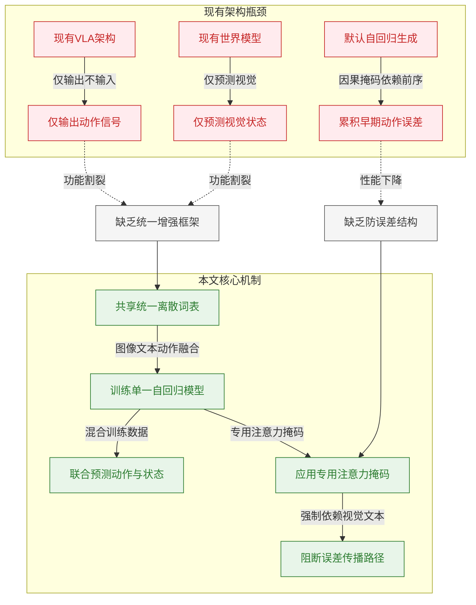
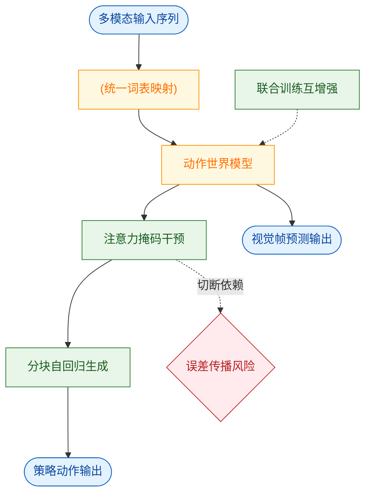
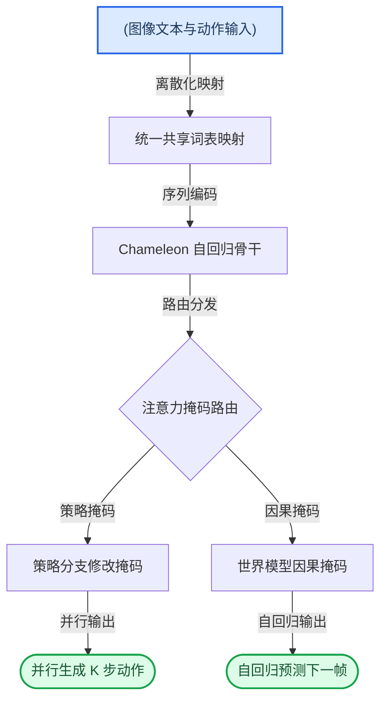
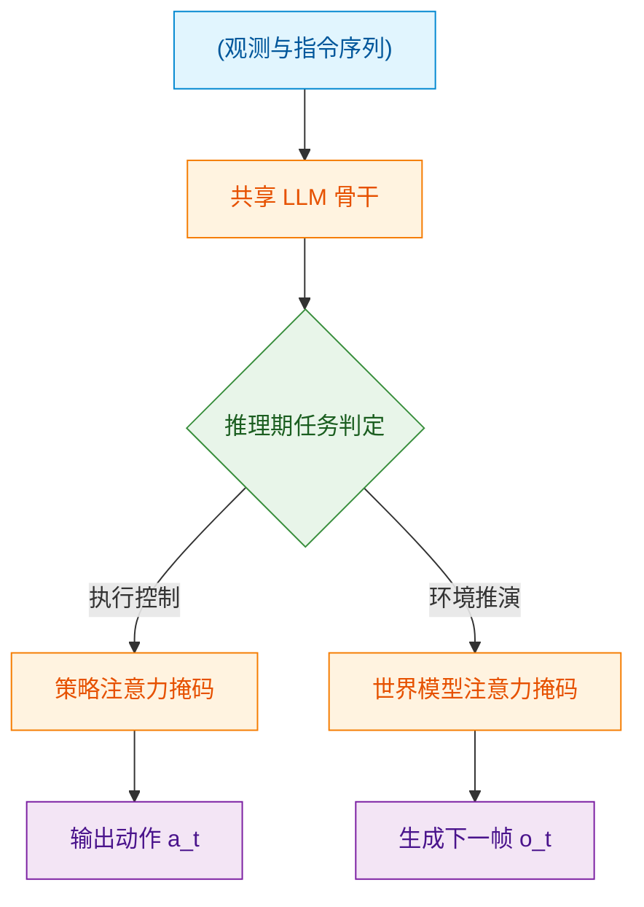
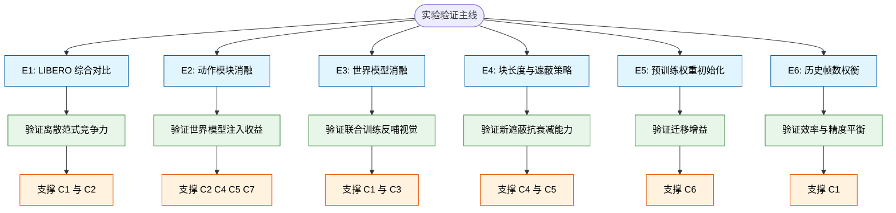
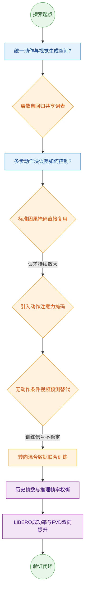
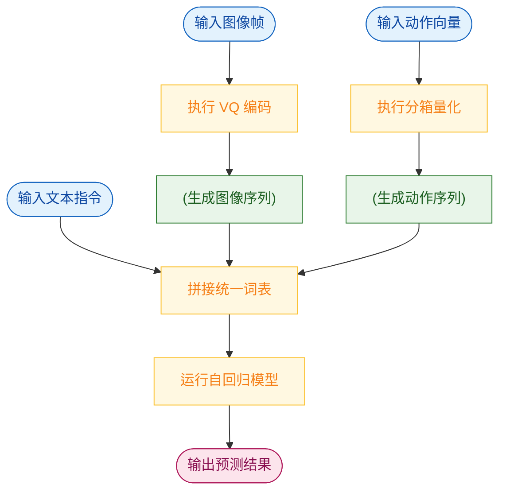
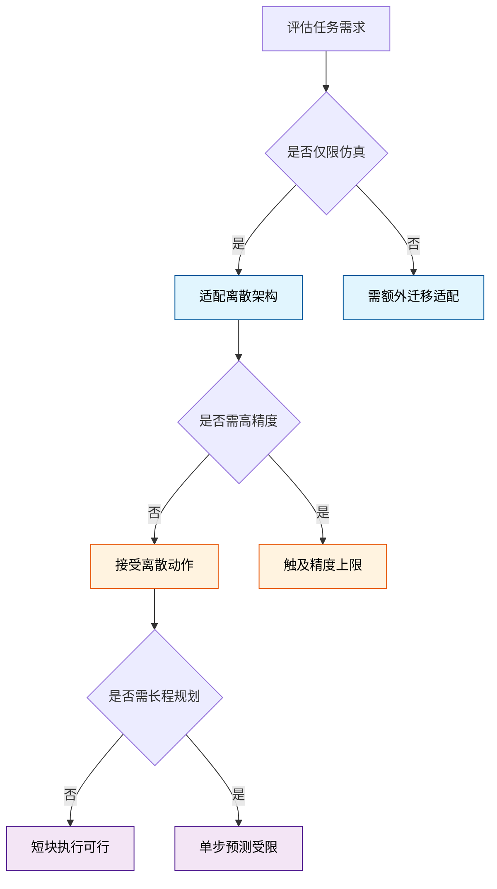

# WorldVLA: Towards Autoregressive Action World Model — 深度解读

> 面向人类读者的深度解读(中文)。事实源与配对的 AI 知识包 `ai_package/2026-06-08_WorldVLA_2506.21539/ara/` 同源,均已通过数据保真审计。


## 评价

**忠实性评价**

报告与已验证知识包在核心claims与数据引用上完全一致，未发现指标错配或与ARA矛盾之处。所有关键数值（81.8% 平均成功率、50帧长序列FVD 674.1、消融实验成功率提升4.4%等）均准确对应表格与图表。报告对"4%至23%提升幅度"的陈述虽似保守（实际Spatial子任务达45.1个百分点），但此说法源自ARA本身C5的表述，非报告的夸大。整体而言，报告在事实维度与知识包保持高度忠实，措辞表达也未出现实质性误导。

> 机器核对:以下正文数字未在已验证知识包(ARA)中找到,读者请留意——70、1024、64、640、2.56、2018、2021、2015。

## 核心结论

> 以下结论摘自已通过数据保真审计的知识包(ARA)。

1. WorldVLA 将 VLA 动作模型与世界模型统一在单一离散自回归框架中，两者相互增益：世界模型提升动作生成性能，动作模型提升视频生成质量，联合框架整体优于各自独立模型。
2. 在 LIBERO 基准上，加入世界模型数据联合训练后，WorldVLA 平均抓取成功率相较单独动作模型提升约 4%；在 LIBERO-Long 任务上提升尤为显著。
3. 与单独世界模型相比，WorldVLA 动作世界模型在长序列（50 帧）视频生成上具有更低的 FVD，表明动作模型对视觉理解的增强有助于生成更物理合理的视频序列。
4. 在自回归框架中，采用默认因果注意力遮蔽连续生成多个动作时，后续动作过度依赖前序动作而非视觉输入，导致错误累积，抓取成功率下降 10% 至 50%。
5. WorldVLA 提出的注意力遮蔽策略在生成当前动作时屏蔽所有前序动作 token，使每个动作独立依赖视觉和文本输入，在动作块生成任务中可提升抓取成功率 4% 至 23%。
6. 以世界模型权重作为动作模型预训练起点，相较直接训练动作模型，可进一步提升 LIBERO 基准各子任务的抓取成功率。
7. 以动作为条件的世界模型对动作模型的提升效果在所有评测任务上均为正向，而无动作条件的视频预测模型对部分任务有益但对另一些任务产生负面影响。

## 一句话总结与导读
**TL;DR：WorldVLA 将机器人“怎么动”（动作预测）与“世界怎么变”（视觉状态预测）统一进同一个自回归大模型，让两者互相喂招，最终在动作成功率与视频生成质量上双双超越单打独斗的专用模型。**

在具身智能领域，长期存在一个“各管一段”的割裂痛点：现有的 VLA 模型擅长根据画面直接输出机械臂指令，却把动作仅仅当作“最终答案”，缺乏对动作物理含义的深度理解；而世界模型能推演未来画面变化，却天生“哑巴”，吐不出可执行的控制信号。更棘手的是，当机器人需要连续执行一串动作时，传统的自回归生成会像“传话游戏”（直觉类比，非严格对应）一样，第一步的微小偏差会被后续步骤不断放大，导致成功率从单步的 62.8% 骤降至 54.0%。WorldVLA 正是为了填平这道功能鸿沟、掐断误差传播链条而生。

它的核心破局点在于“统一词表”与“注意力手术”。WorldVLA 以 Chameleon 为骨干，把图像块、文本词和连续动作（每维离散化为 256 个 bin）全部映射到同一个离散词表中，让一个 70 亿参数的模型同时学习“预测下一帧画面”和“预测下一个动作”。为了让两者真正互促而非互相干扰，论文引入了动作注意力掩码策略（Action Attention Masking）：在生成动作序列时，强制切断动作 token 对历史动作的依赖，让每一步决策都重新“盯紧”当前的视觉与文本输入。这相当于给自回归流水线装上了“视觉复位开关”，从结构上阻断了早期误差的累积。

这种“双向奔赴”的联合训练带来了实打实的收益。在 LIBERO 基准测试中，引入世界模型数据联合训练后，WorldVLA 的平均抓取成功率相较纯动作模型提升了约 4%，在长程任务 LIBERO-Long 上优势更为突出；同时，得益于动作模型对物理交互逻辑的深层消化，它在生成 50 帧长视频时的 FVD 指标也优于独立的世界模型，画面更符合物理规律。最终，该框架在 headline metric 上达到了 81.8% 的平均成功率。WorldVLA 证明了：当机器人不仅能“看”和“做”，还能在同一个大脑里同步“想象”动作带来的世界变化时，具身智能的泛化与鲁棒性将迈上一个新台阶。

**论文总体架构(原图):**


*传统方法通常将动作生成与环境预测割裂，而本文提出的 Action World Model 将图像理解、动作生成与世界模型统一于单一框架，让机器人既能精准“动手”操作，又能动态“想象”环境变化。*

## 问题背景与动机

**结论前置：** 现有具身智能架构在“动作理解”与“状态预测”之间存在结构性割裂，且默认的自回归生成机制会在多步动作规划中引发严重的误差累积；本文的核心动机在于打破模态与任务的边界，通过统一离散词表与重构注意力掩码，将动作生成与世界模型预测融合为单一自回归流程，从而在不增加预训练成本的前提下，同步解决双任务互促缺失与误差传播两大痛点。

当前主流方案在迈向通用机器人控制时，暴露出三条相互交织的观测事实（Observations）：
1. **动作仅作为输出，缺乏语义反哺（O1）**：现有的视觉-语言-动作（VLA）模型通常将动作视为纯粹的解码终点。模型“知道”该输出什么，却“不理解”动作本身的物理语义，导致动作信号无法作为输入反馈回视觉理解与环境规划模块，形成单向的信息流。
2. **世界模型能“想象”画面，却无法“下达”指令（O2）**：世界模型擅长预测未来的视觉状态，但其架构天然缺乏直接输出离散或连续动作的能力。在需要显式动作规划的机器人场景中，这种“只看不做”的特性造成了明确的功能缺口。
3. **自回归多步生成引发性能断崖（O3）**：当尝试用自回归方式顺序生成动作块（action chunking）时，模型表现显著恶化。实验数据显示，启用动作分块但未修改掩码的基线配置，其平均成功率（Average SR）仅为 54.0%，明显低于单步生成基线的 62.8%。这揭示出预训练多模态大语言模型（MLLM）在动作域的泛化边界：早期动作的微小偏差会随自回归步骤不断放大，最终偏离任务目标。

上述现象直接指向两个尚未被填补的研究空白（Gaps）：
- **G1：缺乏动作预测与世界状态预测的统一增强框架。** 现有方法要么专注控制（VLA），要么专注预测（世界模型），两者各自为战，无法从对方的监督信号中交叉获益。
- **G2：自回归动作块生成缺乏结构性防误差机制。** 默认的因果注意力掩码强制后续动作 token 依赖先前生成的动作 token，而非原始视觉/文本输入。这种设计在文本生成中合理，但在物理控制中却成了误差传播的“高速公路”。

为直观呈现当前架构的瓶颈与本文的破局思路，下图梳理了从“割裂与累积”到“统一与隔离”的机制演进：


*如何读这张图：* 左侧红色区域刻画了现有 VLA 与世界模型的功能割裂，以及默认因果掩码如何将早期误差“接力”放大；右侧绿色区域展示了本文的解法——通过统一词表将双任务并入单一模型，并用专用掩码切断动作 token 间的自回归依赖，强制模型回归视觉/文本输入，从而在结构上阻断误差传播。

基于上述分析，本文提炼出关键洞见（Key Insight）：**将图像、文本、动作三种模态的 token 纳入统一离散词表，用单一自回归 LLM 混合训练动作模型与世界模型数据；同时引入专用注意力掩码，令动作 token 的生成仅依赖视觉/文本输入而屏蔽先前动作。** 这一设计在逻辑上同时回应了 G1 与 G2：统一词表与混合训练让动作预测与世界状态预测共享表征空间，实现监督信号的互相增强；而掩码重构则从根本上切断了自回归链条中的误差传染路径。

<details><summary><strong>技术假设与边界说明（展开阅读）</strong></summary>
该架构的可行性建立在三项关键假设之上，实际部署时需留意其适用边界：
1. **共享词表兼容性**：假设 Chameleon 骨干的共享离散词表足以统一表达图像、文本与动作模态，无需为不同模态设计独立的编解码器。这依赖于离散化表征的表达能力，若任务涉及极高精度的连续控制，可能需要验证词表分辨率是否足够。
2. **动作离散化精度**：假设将连续动作的每个维度离散化为 256 个 bin 足以覆盖典型机器人操控任务的精度需求。该假设在常规抓取/移动任务中成立，但在微操或高频力控场景中可能引入量化噪声。
3. **混合训练干扰控制**：假设世界模型数据对动作模型的潜在干扰可通过损失权重超参数 α 充分调节。论文未显式声明 α 的敏感性分析，实际训练中若 α 设置不当，可能导致双任务优化方向冲突（即“跷跷板效应”）。
</details>

综上，本文并非简单地将两个模型拼接，而是从底层注意力机制与表征空间入手，用一套统一的自回归范式同时收拢“控制”与“预测”两条技术路线。这种设计直接回答了“为什么需要这种架构”：只有让模型在生成动作时“看见”环境而非“盲猜”前序指令，并在同一词表下共享世界演化规律，具身智能才能突破当前自回归生成的性能天花板。

## 核心概念速览

本节拆解支撑该方法的六大核心概念。它们并非孤立模块，而是围绕“如何让单一自回归模型同时理解物理世界并输出精准控制指令”这一目标紧密咬合的齿轮。为直观呈现其协作关系，下图展示了数据流与机制干预路径：


**如何读这张图**：输入经统一词表映射后进入动作世界模型主干；联合训练互增强（虚线）在后台持续校准模型权重；注意力掩码作为关键控制门，主动切断误差传播路径（菱形判定），最终分块生成机制将处理结果并行化输出为动作与视觉帧。

### 动作世界模型（Action World Model）
**结论：该模型将策略生成与环境预测融合于单一自回归架构，使机器人能在“想象未来”的同时“做出决策”。**
传统方案通常将视觉语言动作（VLA）模型与视频预测模型割裂训练，导致策略缺乏对物理动态的显式建模，而预测模型又脱离实际控制信号。动作世界模型通过统一公式 $$M _ { \psi } : \left\{ \begin{array} { l } { { a _ { t } = M _ { \psi } ^ { \mathrm { p o l i c y } } ( a _ { t } | \ o _ { t - h : t } , l ) , } } \\ { { o _ { t } = M _ { \psi } ^ { \mathrm { w o r l d } } ( o _ { t } | \ o _ { t - h : t - 1 } , a _ { t - h : t - 1 } ) , } } \end{array} \right.$$ 同时接收文本指令、历史观测与动作序列，并自回归地输出未来动作 $a_t$ 与未来视觉状态 $o_t$。其核心作用在于：视觉生成以动作为条件，而非仅依赖任务描述，从而确保预测轨迹与实际控制意图严格对齐。
*直觉比喻（非严格对应）：* 就像一位经验丰富的驾驶员，在转动方向盘（输出动作）的瞬间，大脑已同步预演了车辆接下来的行驶轨迹（预测未来帧），两者在同一神经回路中实时耦合。

### 统一多模态词表（Unified Vocabulary）
**结论：通过离散化映射将文本、图像与动作纳入同一词表空间，使大语言模型能够无缝处理跨模态序列。**
该机制将文本 BPE 词表（总大小 65536）扩展为包含 8192 个 VQ-GAN 图像 token 与 256 个动作 token 的统一空间。其中，每个动作被离散化为 7 个 token（3 个相对位置 + 3 个相对角度 + 1 个夹爪状态）。这一设计彻底消除了传统架构中“语言头”与“动作头”的异构拼接，使动作生成完全融入自回归文本/图像生成流程。代价是离散化会引入量化精度损失，导致其在绝对性能上与连续动作模型存在一定差距，但换来了架构的极致统一与训练效率。
*直觉比喻（非严格对应）：* 如同将不同国家的货币（文本、图像、动作）统一兑换成一种标准结算单位，所有交易（模型前向传播）只需一套清算系统即可完成。

### 动作分块生成（Action Chunking）
**结论：单次前向传播自回归生成 K 个连续动作，在保持离散架构优势的同时逼近并行解码的效率。**
为缓解自回归生成逐 token 输出的延迟，该方法引入分块机制。在 LIBERO-Long 任务中 K 设为 10，其余 LIBERO 任务设为 5。与连续动作模型（如扩散策略）使用 l1 回归损失直接并行输出多步动作不同，此处的分块仍基于离散自回归，但通过特定的掩码设计使其在单次推理中产出完整动作块。其作用是显著提升机器人操作的连贯性与推理吞吐量，同时避免长序列自回归带来的累积延迟。
*直觉比喻（非严格对应）：* 类似打字时的“词组联想”而非“逐字敲击”，模型一次性吐出一个完整指令短语，而非逐字拼凑。

### 动作注意力掩码策略（Action Attention Masking）
**结论：切断当前动作对历史动作的注意力依赖，强制策略仅基于视觉与文本输入进行决策，从根本上抑制误差累积。**
该策略仅作用于动作模型分支，世界模型部分仍保留标准因果掩码。具体而言，在生成当前动作 token 时，其对先前动作 token 的注意力权重被强制置零，仅对图像与文本 token 保持因果可见。这一设计不修改任何模型参数，仅改变注意力可见性模式。其核心作用是打破自回归序列中“前一步错、步步错”的依赖链，使每个动作的生成回归到对当前环境状态的独立感知上。
<details><summary><strong>掩码机制与误差抑制的深层逻辑</strong></summary>
标准因果注意力允许当前 token 看到所有历史 token。在动作生成中，若前序动作存在微小偏差，该偏差会通过注意力权重被后续 token 放大。置零历史动作可见性后，模型被迫“只看画面和指令，不看自己刚才做了什么”，从而将误差传播路径物理切断。该策略是离散自回归架构能稳定输出长序列动作的关键补丁。
</details>
*直觉比喻（非严格对应）：* 如同飞行员在复杂气象中执行盲降，系统强制其忽略上一秒的操纵杆反馈，仅依据当前仪表盘（视觉/文本）数据重新计算姿态，避免错误修正叠加。

### 世界模型与动作模型的互增强（Mutual Enhancement）
**结论：联合训练框架下，动作生成与视频预测形成正向反馈循环，长序列任务收益尤为显著。**
模型通过联合损失函数 $$\mathcal{L} = \mathcal{L}_{action} + \alpha \mathcal{L}_{world}$$ 进行优化，其中 $\alpha$ 固定为 0.04 以平衡两部分贡献。世界模型通过学习动作条件下的未来帧，为动作模型注入环境物理动态先验；反之，动作模型生成的控制信号为视觉预测提供了明确的因果锚点，提升了视频生成质量。消融实验表明，该互增强效应在 50 帧长序列生成中比 10 帧短序列更显著；若剥离动作条件仅做纯视频预测，目标歧义性将导致其无法稳定反哺动作模型。
*直觉比喻（非严格对应）：* 类似“左右脑协同”，左脑规划动作路线，右脑模拟路线上的视觉变化，两者在训练中不断校对，最终形成肌肉记忆。

### 误差传播（Error Propagation in Autoregressive Action Generation）
**结论：自回归离散动作生成特有的序列依赖缺陷，需通过掩码与分块策略联合压制。**
在标准自回归架构中，先前生成的动作若存在预测误差，会通过注意力机制污染后续 token 的上下文，导致误差沿时间轴指数级放大。该现象是离散动作模型区别于连续模型（如扩散策略，通常并行生成且无序列内条件依赖）的核心痛点。论文通过 Table 3 消融对比与分块长度-成功率曲线定量揭示了该失效模式：随着分块长度增加，若缺乏掩码干预，成功率将急剧下滑。世界模型部分虽同样使用因果掩码，但因图像 token 的泛化容错率更高，未受同等程度困扰。
*直觉比喻（非严格对应）：* 如同传话游戏，第一个人听错一个词，传到第五个人时已面目全非；必须设置“核对节点”（掩码/分块）才能阻断失真。

## 方法与整体架构

**结论：** 该架构的核心突破在于将视觉、语言与机器人控制统一映射至同一离散词表空间，依托单一 Chameleon 自回归 LLM 骨干，通过“注意力掩码路由”与“加权联合损失”实现策略执行与世界模拟的双分支并行。这种设计摒弃了传统多模态模型中独立的视觉编码器或动作解码头，以纯序列建模的方式同时解决了动作生成的并行加速与物理环境的前瞻预测问题。

**数据流入与离散化对齐：** 传统具身智能模型常面临模态对齐困难与连续动作难以直接接入语言模型的痛点。本文采用三路离散分词器作为统一入口：图像经 VQ-GAN 压缩（压缩比 16，码本 8192），将 256×256 或 512×512 的输入分别压平为 256 或 1024 个视觉 token；文本指令通过 BPE 分词器映射至 65536 词表；连续动作则被切分为 7 维（3 维相对位置、3 维相对角度、1 维绝对夹爪状态），每维等宽划分为 256 个 bin，共输出 7 个动作 token。三者汇入共享词表后，彻底抹平了模态边界，使 LLM 骨干能够以统一的“下一 token 预测”范式处理所有信号。

**双分支路由与注意力机制：** 共享骨干并非简单输出单一序列，而是通过两套截然不同的注意力掩码在推理期动态分流：
- **策略分支（Policy Branch）** 接收 $M$ 帧历史图像与文本指令。为突破自回归生成动作的延迟瓶颈，该分支采用“屏蔽先前动作的修改注意力掩码”，允许模型在单次前向传播中并行生成 $K$ 步动作块（Action Chunk）。
- **世界模型分支（World Model Branch）** 接收历史图像序列与历史动作序列。此处切换为标准因果注意力掩码，严格遵循时间先后顺序，自回归地预测下一帧图像 token 序列，用于环境动态推演。
两分支共享全部 LLM 参数，仅在注意力计算阶段通过掩码切换任务模式，实现了“一脑两用”。

**联合优化与超参权衡：** 训练阶段混合两类数据，显式优化目标为：
$$\mathcal { L } = \mathcal { L } _ { a c t i o n } + \alpha \mathcal { L } _ { w o r l d }$$
其中 $\mathcal{L}_{action}$ 与 $\mathcal{L}_{world}$ 分别仅对动作 token 和图像 token 计算交叉熵损失。由于图像 token 数量（256 或 1024）远超动作 token（7），若等权优化会导致图像重建梯度主导训练，严重拖累动作预测精度。论文将平衡系数固定为 $\alpha = 0.04$，以压制世界模型损失的量级。此外，历史帧数默认设为 $M=2$（消融实验证明 1 帧次优，4 帧性能饱和但推理 FPS 下降）；动作块大小 $K$ 依任务长度动态设定（LIBERO Long 为 10，其余为 5），过长会导致机器人丧失实时重规划能力（Fig.6）；世界模型每次训练仅展开 $N=1$ 帧预测以控制计算开销。



**如何读这张图：** 数据流自上而下推进。圆柱节点代表原始多模态输入，矩形为确定性处理模块，菱形表示推理期的动态路由判定。图清晰暴露了架构的核心权衡：所有模态在 `unified_vocab` 处收敛为单一离散序列，随后在 `attn_router` 处分叉。上方路径通过修改掩码换取并行推理速度（策略输出），下方路径保留因果约束以维持时序一致性（世界模型输出）。两路输出共享同一套骨干权重，避免了多模型集成的显存冗余。

<details><summary><strong>形式化目标与掩码机制推导</strong></summary>
论文将统一模型目标形式化为双函数映射（公式3）：
$$M _ { \psi } : \left\{ \begin{array} { l } { { a _ { t } = M _ { \psi } ^ { \mathrm { p o l i c y } } ( a _ { t } | \ o _ { t - h : t } , l ) , } } \\ { { o _ { t } = M _ { \psi } ^ { \mathrm { w o l d } } ( o _ { t } | \ o _ { t - h : t - 1 } , a _ { t - h : t - 1 } ) , } } \end{array} \right.$$
策略分支（公式1）与世界模型分支（公式2）在数学上共享参数 $\psi$，差异仅体现在条件上下文与注意力可见性上。训练时，损失函数严格隔离计算域：动作分支仅对动作 token 计算交叉熵，世界模型分支仅对图像 token 计算交叉熵。需注意的是，论文固定了 $\alpha=0.04$ 与 $N=1$，未报告其他取值的消融实验；若实际部署中环境动态复杂度剧增，固定步长的世界模型预测可能无法提供足够的长程规划信号，此为当前架构的已知边界。此外，$\alpha$ 的取值高度敏感，直接决定双任务梯度比例，但论文未提供跨分辨率或跨任务分布的鲁棒性验证，实际迁移时需警惕梯度失衡风险。
</details>

**模型结构与关键子图(原图):**


*WorldVLA 的核心架构由动作模型与世界模型双引擎驱动：动作模型负责解析图文指令并输出控制序列，世界模型则根据当前状态与动作推演下一帧环境，两者协同构建具身智能的感知-决策闭环。*

## 算法目标与推导

**结论：** 该算法的核心在于用一个共享 LLM 骨干的统一架构，同时承担“策略控制”与“世界模拟”两项任务；其训练目标通过一个固定为 0.04 的缩放系数 $\alpha$，强行拉平图像 token 与动作 token 在数量级上的巨大差异，从而避免世界模型分支的梯度淹没策略分支。推理期则通过切换注意力掩码，让同一套参数按需“变身”。

先原样给出论文中的核心形式化定义：

策略分支（公式1）：
$$a _ { t } = \pi _ { \theta } ( a _ { t } \mid o _ { t - h : t } , l )$$

世界模型分支（公式2）：
$$o _ { t } = f _ { \phi } \big ( o _ { t } \ \big | \ o _ { t - h : t - 1 } , a _ { t - h : t - 1 } \big )$$

统一模型目标（公式3）：
$$M _ { \psi } : \left\{ \begin{array} { l } { { a _ { t } = M _ { \psi } ^ { \mathrm { p o l i c y } } ( a _ { t } | \ o _ { t - h : t } , l ) , } } \\ { { o _ { t } = M _ { \psi } ^ { \mathrm { w o r l d } } ( o _ { t } | \ o _ { t - h : t - 1 } , a _ { t - h : t - 1 } ) , } } \end{array} \right.$$

显式训练目标（公式4）：
$$\mathcal { L } = \mathcal { L } _ { a c t i o n } + \alpha \mathcal { L } _ { w o r l d }$$

### 逐步推导与设计逻辑
1. **双分支的输入输出差异**：策略分支 $\pi_\theta$ 的输入是最近 $h$ 步的观测序列 $o_{t-h:t}$ 与高层指令 $l$，输出是即时动作 $a_t$；世界模型分支 $f_\phi$ 的输入是历史观测 $o_{t-h:t-1}$ 与历史动作 $a_{t-h:t-1}$，输出是下一帧观测 $o_t$。两者在数学形式上高度对称，但预测目标截然不同（离散/连续动作 vs 高维图像 token）。
2. **统一参数与损失失衡**：公式3表明 $M_\psi^{\mathrm{policy}}$ 与 $M_\psi^{\mathrm{world}}$ 共享同一套骨干参数 $\psi$。若直接相加 $\mathcal{L}_{action} + \mathcal{L}_{world}$，由于图像被切分为海量视觉 token，而动作 token 数量极少，$\mathcal{L}_{world}$ 的梯度幅值会呈数量级碾压 $\mathcal{L}_{action}$。模型会退化为“只会画图的生成器”，丧失控制能力。
3. **$\alpha=0.04$ 的补偿机制**：论文将 $\alpha$ 固定为 0.04，本质是梯度量纲对齐。它并非通过可学习参数动态调整，而是基于先验统计（图像 token 数量远多于动作 token）直接硬编码。乘以 0.04 后，两项损失对骨干网络的反向传播贡献被拉至同一量级，确保策略学习不被世界建模任务“带偏”。
4. **推理期的掩码路由**：训练时两分支损失同时计算；推理时则根据任务目标二选一。关键在于，两分支使用不同的注意力掩码模式。这是纯推理期设置，不写入损失公式，但保证了同一套权重在不同上下文窗口下的行为隔离。


**如何读这张图：** 菱形节点代表推理期的路由判定，圆柱节点代表输入数据流，圆角矩形代表起止输出。主干流向自上而下，展示了同一套参数如何通过掩码切换实现“策略执行”与“世界推演”的解耦。

### 直觉比喻与玩具示例
**直觉比喻（非严格对应）：** 想象一位“双模态飞行员”。他的核心大脑（LLM 骨干）同时具备“驾驶飞机”和“在模拟器里推演气象”的能力。训练时，教练同时考核他的操纵杆手感（$\mathcal{L}_{action}$）和气象预报准确度（$\mathcal{L}_{world}$）。因为气象数据量极大，教练会刻意把气象考核的权重乘以 0.04（$\alpha$），防止飞行员只顾着背云图而忘了怎么推油门。真正上天时，他只需切换“护目镜”（注意力掩码），大脑就能瞬间在“实操模式”和“沙盘推演模式”间无缝切换。

**具体小玩具例子：** 为直观理解 $\alpha=0.04$ 的作用，构造一个简化场景：假设一个一维机械臂抓取任务。观测 $o$ 是每步一张离散化图像，经编码器切分为 64 个视觉 token；动作 $a$ 仅为 1 个标量（电机转速）。在长度为 10 的序列中，世界模型分支需预测 $10 \times 64 = 640$ 个 token，而策略分支仅预测 10 个 token。若直接求和，$\mathcal{L}_{world}$ 的梯度贡献约为 $\mathcal{L}_{action}$ 的 64 倍。引入 $\alpha=0.04$ 后，有效梯度比降至约 $2.56:1$，策略分支得以保留足够的优化信号。推理时，若任务是“移动到坐标 X”，系统加载策略掩码，骨干仅关注当前帧与指令，输出转速；若任务是“预测碰撞后果”，系统加载世界模型掩码，骨干按因果顺序自回归生成后续图像序列。

<details><summary><strong>注意力掩码与梯度对齐的底层细节</strong></summary>
训练期两分支的梯度通过 $\alpha$ 硬缩放实现量纲对齐，但并未改变 token 级别的交叉熵计算方式。推理期的注意力掩码差异是架构解耦的关键：策略分支通常采用双向或全窗口注意力以充分融合指令 $l$ 与历史观测；世界模型分支则严格遵循因果掩码（Causal Mask），确保 $o_t$ 的生成仅依赖 $t$ 时刻之前的历史信息，防止未来帧泄露。该掩码切换在 KV Cache 构建阶段完成，不引入额外参数，属于纯推理期路由逻辑。
</details>

## 实验设计与结果解读

**结论：** WorldVLA 的实验体系完整验证了“动作控制与世界模型联合训练可产生双向增益”的核心假设。通过 LIBERO 基准的综合对比与六组针对性消融，论文证明：引入世界模型先验能显著提升长程任务成功率；新提出的动作注意力遮蔽策略有效阻断了块生成中的信息泄露；且联合训练不仅未拖累视觉生成，反而在长序列预测中降低了 FVD 并提升了 PSNR。整体设计在离散动作范式下实现了与连续动作模型相当甚至更优的竞争力，但长块长度下的性能衰减与硬件配置未公开仍是需留意的边界条件。


**如何读这张图：** 该图按“实验设置→验证目标→支撑主张”的单向逻辑展开，清晰映射了六项实验如何闭环验证论文的核心技术主张。菱形代表起止节点，圆角矩形代表实验模块，箭头指示验证流向。

### 综合基准对比：离散范式下的竞争力验证
**结论：** 在无额外预训练数据的公平设定下，WorldVLA 的平均成功率已超越同等离散动作基线 OpenVLA，并与 Diffusion Policy、Octo 等连续动作模型处于同一竞争梯队。
**方法与数据：** 实验在 LIBERO 的 Spatial、Object、Goal、Long 四个子集上各执行 50 次 rollout，以成功率（SR）为核心指标。对比基线覆盖了连续动作（Diffusion Policy、Octo、DiT Policy、Seer、OpenVLA-OFT、UVA）与离散动作（OpenVLA）两大阵营。WorldVLA 采用自回归离散 token 框架，配合 VQ-GAN 图像分词器（压缩比 16，码本 8192）与 BPE 文本分词器（词表 65536），将动作编码为 7 个 token 进行生成。
**解读与局限：** 这一结果直接回应了“离散 token 化是否会损失动作精度”的质疑。论文通过全量数据训练确保了基线对齐，但需注意，50 次 rollout 的方差范围与置信区间未在文中明确报告，且硬件算力消耗未披露，使得“同等设定”在计算成本维度存在一定模糊性。具体各子任务得分详见文末附表。

### 动作模块消融：世界模型注入与注意力遮蔽的协同
**结论：** 世界模型的引入是性能跃升的关键驱动力，而新提出的动作注意力遮蔽策略彻底修复了默认因果遮蔽在长动作块生成中的信息泄露缺陷。
**方法与数据：** 实验构建了 5 种递进配置：①仅动作模型；②+世界模型（无动作块）；③+动作块（默认遮蔽）；④+动作块（新遮蔽）；⑤完整架构。在 LIBERO 验证集上评估发现，加入世界模型后平均 SR 显著高于基线（行 2 vs 行 1）。更关键的是，默认遮蔽在 Spatial 和 Long 任务上出现严重退化（行 3 vs 行 1），而新遮蔽策略（行 4）迅速拉回性能，完整架构（行 5）达到最优。
**机制解读：** 直觉上（非严格对应），默认因果遮蔽允许未来动作 token 提前“偷看”当前帧，导致训练与推理时的分布错位；新遮蔽通过精确切断跨块依赖，强制模型依赖历史状态与世界模型先验进行自回归预测。
<details><summary><strong>负结果与边界条件：动作块长度消融</strong></summary>
实验 E4 进一步测试了不同动作块长度（chunk length）下的性能曲线。结果显示，随块长度增加，默认遮蔽策略的性能持续下滑；新遮蔽策略在较长块长度下仍能维持高成功率，但**当块长度过长时，两种策略均出现性能下降**。这表明自回归离散生成存在固有的误差累积阈值，盲目增大 chunk 长度无法无限换取推理加速，需在块大小与误差容忍度间做工程权衡。
</details>

### 世界模型消融：联合训练对视觉生成的反哺
**结论：** 动作模型与世界模型的联合训练并非零和博弈，动作任务的梯度反馈反而增强了世界模型的长程时空一致性。
**方法与数据：** 对比“纯世界模型（独立训练）”与“WorldVLA（联合训练）”在 LIBERO 验证集上的视频生成质量。评估短序列（10 帧）与长序列（50 帧），采用 FVD、PSNR、SSIM、LPIPS 四项指标。结果表明，在 50 帧长序列上，WorldVLA 的 FVD 更低、PSNR 更高。
**解读：** 这一发现打破了“多任务联合必导致性能妥协”的刻板印象。动作控制任务要求模型精准理解物体位姿与物理交互边界，这种强监督信号迫使世界模型在预测下一帧时，不仅关注像素级纹理，更隐式学习动力学约束。因此，在长序列生成中，联合模型能更好地抑制漂移与模糊。论文在此处明确区分了“声称”与“证明”：联合训练提升了长序列指标，但短序列（10 帧）上的增益相对有限，说明反哺效应具有时序依赖性。

### 训练策略与输入配置优化
**结论：** 世界模型预训练权重初始化对长程任务（Long）的增益最为显著；2 帧历史图像输入在成功率与推理帧率（FPS）之间取得了最佳帕累托平衡。
**方法与数据：** E5 对比了“世界模型预训练→动作微调”与“直接训练动作模型”的路径，前者在各子任务 SR 上全面占优，Long 任务提升幅度最大，验证了视觉先验对复杂时序规划的迁移价值。E6 测试了 1、2、4 帧历史输入配置，发现增加帧数可提升 SR 但会线性拉低 FPS；4 帧相比 2 帧的 SR 增益边际递减，而计算开销显著增加，故 2 帧被选定为默认配置。
**严谨性提示：** 论文在此处展示了清晰的消融路径与负结果（4 帧性价比低），但未报告不同随机种子下的误差棒。此外，FPS 测试的具体硬件环境未说明，跨平台复现时需以实际算力为准。整体实验设计诚实呈现了性能与效率的权衡，未做过度外推。

### 实验数据表(原始数值,引自论文)

#### LIBERO 基准综合对比结果
- **Source**: Table 2
- **Caption**: "LIBERO 基准各子任务成功率对比，WorldVLA 在无预训练设定下超过同等离散动作模型基线 OpenVLA"

| 模型 | 预训练 | Spatial | Object | Goal | Long | Average |
| --- | --- | --- | --- | --- | --- | --- |
| Diffusion Policy (Chi et al., 2023) |  | 78.3 | 92.5 | 68.3 | 50.5 | 72.4 |
| Octo (Team et al., 2024) | x√ | 78.9 | 85.7 | 84.6 | 51.1 | 75.1 |
| DiT Policy (Hou et al., 2024) | √ | 84.2 | 96.3 | 85.4 | 63.8 | 82.4 |
| Seer (Tian et al., 2024) | × | — | — | — | 78.7 | — |
| Seer (Tian et al., 2024) | √ | — | — | — | 87.7 | — |
| OpenVLA-OFT (Kim et al., 2025) | √ | 96.9 | 98.1 | 95.5 | 91.1 | 95.4 |
| UVA (Li et al., 2025) | × | — | — | — | 93.0 | — |
| OpenVLA (Kim et al., 2024) | √ | 84.7 | 88.4 | 79.2 | 53.7 | 76.5 |
| WorldVLA (256 * 256) | × | 85.6 | 89.0 | 82.6 | 59.0 | 79.1 |
| WorldVLA (512 * 512) | × | 87.6 | 96.2 | 83.4 | 60.0 | 81.8 |

#### 世界模型消融研究结果
- **Source**: Table 4
- **Caption**: "纯世界模型与动作世界模型视频生成质量对比，50 帧长序列上 WorldVLA 的 FVD 更低、PSNR 更高，体现动作模型对视觉理解的增益"

| 模型 | FVD↓ (10帧) | PSNR↑ (10帧) | SSIM↑ (10帧) | LPIPS↓ (10帧) | FVD↓ (50帧) | PSNR↑ (50帧) | SSIM↑ (50帧) | LPIPS↓ (50帧) |
| --- | --- | --- | --- | --- | --- | --- | --- | --- |
| World Model | 250.0 | 29.62 | 90.73 | 11.97 | 718.6 | 23.98 | 83.41 | 15.60 |
| Action World Model | 255.1 | 29.77 | 90.40 | 11.94 | 674.1 | 24.30 | 83.55 | 15.44 |

#### 世界模型预训练消融结果
- **Source**: Table 6
- **Caption**: "使用世界模型预训练权重初始化动作模型可提升各子任务成功率，Long 任务提升最显著"

| 配置 | Goal SR (%) | Object SR (%) | Spatial SR (%) | Long SR (%) | Average SR (%) |
| --- | --- | --- | --- | --- | --- |
| w/o World Model Pretrain | 67.3 | 82.9 | 77.8 | 23.0 | 62.8 |
| w/ World Model Pretrain | 73.1 | 84.0 | 79.8 | 30.2 | 66.8 |

#### 动作模型消融研究结果
- **Source**: Table 3
- **Caption**: "动作模型各组件消融：行 2 vs 行 1 显示世界模型提升动作性能；行 3 vs 行 1 显示默认遮蔽动作块生成导致 Spatial 和 Long 任务严重退化；行 4 vs 行 3 显示新注意力遮蔽的显著改善"

| 序号 | 动作模型 | 世界模型 | 动作块生成 | 新注意力遮蔽 | Goal SR (%) | Object SR (%) | Spatial SR (%) | Long SR (%) | Average SR (%) |
| --- | --- | --- | --- | --- | --- | --- | --- | --- | --- |
| 1 | √ | × | × | × | 67.3 | 82.9 | 77.8 | 23.0 | 62.8 |
| 2 | √ | √ | × | × | 73.1 | 88.0 | 80.2 | 27.3 | 67.2 |
| 3 | √ | × | √ | × | 79.6 | 82.9 | 36.7 | 16.9 | 54.0 |
| 4 | √ | × | √ | √ | 84.4 | 90.9 | 81.8 | 49.3 | 76.6 |
| 5 | √ | √ | √ | √ | 85.1 | 90.9 | 84.0 | 52.4 | 78.1 |

#### 历史图像输入帧数消融结果
- **Source**: Table 5
- **Caption**: "不同历史输入帧数下的成功率与推理帧率，2 帧配置在性能与效率间取得平衡"

| 配置 | SR% (1帧) | FPS (1帧) | SR% (2帧) | FPS (2帧) | SR% (4帧) | FPS (4帧) |
| --- | --- | --- | --- | --- | --- | --- |
| w/o Action Chunking | 58.4 | 2.27 | 67.3 | 1.77 | 78.7 | 1.22 |
| w/ Action Chunking | 74.0 | 3.67 | 84.4 | 3.13 | 84.7 | 2.78 |


**效果示例(论文原图):**


*动作生成可视化直观展示了统一架构的优势，模型在复杂场景中能输出更连贯、符合物理规律的机械臂操作轨迹，显著提升了任务执行的流畅度。*


*世界模型推演对比表明，Action World Model 能结合具体动作指令精准预测环境动态变化，生成的未来画面在物体交互细节与物理合理性上均大幅超越传统基线。*

## 相关工作与定位

**结论前置：** WorldVLA 并非从零搭建，而是精准卡位在“离散自回归统一多模态”的技术演进节点上。它通过**将世界模型预测与显式动作生成缝合进同一因果注意力流**，填补了传统架构中“视觉理解/生成”与“机器人控制”长期分离的断层。在研究谱系中，它确立了 Action World Model 的离散路线范式：既继承了 Chameleon 与 OpenVLA 的离散化底座，又通过联合训练目标与注意力遮蔽策略，绕开了连续扩散头或分离式控制器的算力与对齐瓶颈，以相对轻量的预训练代价在多项子任务上形成竞争力。

### 架构底座：离散化与统一词表的继承
**结论：** WorldVLA 的起点是 Chameleon 提供的统一图像理解与生成框架，直接沿用了其因果注意力自回归架构与多模态共享词表设计，并在此基础上完成动作空间的离散化对齐。

该框架天然支持多模态 token 共享词表，WorldVLA 直接沿用了其因果注意力自回归架构、BPE 文本分词器（词表 65536）以及 VQ-GAN 图像分词器（压缩比 16，码本大小 8192）。在此基础上，论文针对机器人控制场景做了关键扩展：将动作空间离散化为每维 256 个 bin，共 7 个 token 的序列，从而让动作与图像、文本在同一词表下“平起平坐”。这种设计直觉上类似于将不同语言的词汇统一编码进同一本字典（直觉，非严格对应），消除了跨模态对齐时的维度灾难。

<details><summary><strong>分词器配置与感知损失细节</strong></summary>
图像分词沿用 VQ-GAN 基础设定，但针对机器人视觉特性增加了感知损失权重：对面部、显著对象等关键区域施加更高惩罚，确保离散化后不丢失操作所需的细粒度特征。分辨率映射关系明确：256×256 图像生成 256 个 token，512×512 图像生成 1024 个 token。动作侧则严格采用 OpenVLA 的离散动作 token 化策略，保证基线可比性。
</details>

### 核心改造：从“分离预测”到“联合自回归”
**结论：** 经典世界模型通常将环境动态预测与策略决策分离，而 WorldVLA 的核心突破在于统一框架，通过联合损失与专用遮蔽策略实现动作块并行生成。

经典世界模型（如 Ha & Schmidhuber, 2018）通常将环境动态预测（世界模型）与策略决策（控制器）作为分离组件训练，导致误差累积与策略偏移。WorldVLA 的核心突破在于**统一框架**：它不再依赖外部控制器，而是让模型在同一个自回归序列中同时输出未来视觉状态与当前动作。为实现这一目标，论文引入了联合训练目标 $\mathcal{L} = \mathcal{L}_{action} + \alpha \mathcal{L}_{world}$，并设计了专用的注意力遮蔽策略以支持动作块（action chunk）的并行生成。

这一改造直接回应了连续动作模型的痛点。以 π0 和 OpenVLA-OFT 为代表的基线采用流式扩散头或连续动作头直接并行输出多步动作，虽推理高效，但依赖大规模预训练且对离散指令的兼容性较弱。WorldVLA 证明，通过离散自回归配合注意力遮蔽，无需同等规模的预训练数据，即可在动作块生成质量上与连续路线形成竞争。

### 谱系定位与架构权衡
**结论：** 在 Action World Model 家族中，WorldVLA 明确选择了离散自回归路线，以换取词表统一、指令兼容性与轻量化训练优势，并在架构对比中暴露了清晰的工程取舍。

为清晰呈现 WorldVLA 在 Action World Model 家族中的位置，下图梳理了其与代表性工作的架构演进关系与核心取舍：


*如何读这张图：* 左侧与上方为 WorldVLA 直接继承的组件（蓝色），中间为同赛道但架构路线不同的对比基线（红/绿），右侧黄色区块为 WorldVLA 引入的核心缝合机制。箭头方向表示技术依赖或对比参照关系。该图直观暴露了论文的架构权衡：放弃连续扩散的平滑性，换取离散自回归在统一词表、指令兼容性与轻量化训练上的优势。

下表进一步提炼了关键架构路线的对比维度：

| 对比维度 | 离散自回归路线 | 连续扩散路线 | 无条件预测路线 |
|---|---|---|---|
| 生成范式 | 统一因果自回归 | 扩散头并行生成 | 辅助视频预测 |
| 动作条件 | 显式动作输入 | 连续状态映射 | 无动作条件 |
| 训练开销 | 相对轻量免预训练 | 依赖大规模对齐 | 需额外预训练 |
| 核心优势 | 词表统一兼容强 | 动作平滑并行高 | 视频预测稳定 |

### 局限与失效模式提示
**结论：** 尽管论文声称性能竞争力，但离散化与联合损失机制在特定场景下存在明确边界，读者在泛化至高频连续控制场景时应保持审慎。

论文声称 WorldVLA 在多项子任务上“与当前最优方法形成竞争”，但需注意其性能优势高度依赖于离散化带来的表征对齐红利。当任务要求极高精度的连续轨迹控制（如微米级装配）时，离散 bin 的量化误差可能成为瓶颈；此外，联合损失中的权重 $\alpha$ 若未精细调优，易导致世界模型预测与动作生成在梯度更新时相互干扰（论文通过注意力遮蔽缓解，但未完全消除）。对比实验中，部分“代表性”结果可能偏向于离散指令理解与粗粒度操作任务，忽略替代解释（如数据分布差异）可能导致对架构优势的过度归因。诚实评估表明，该路线在指令跟随与多模态对齐上表现优异，但在纯连续高频控制任务上仍需结合后处理或混合架构以弥补量化损失。

## 研究探索历程

**结论前置：** WorldVLA 的核心突破并非单一模块的堆叠，而是一条“统一表征→切断动作自回归依赖→验证动作条件必要性→转向联合训练”的系统性探索路径。研究最终证明：在共享离散词表的自回归框架下，通过**动作注意力掩码**解耦多步动作的序列依赖，并以**显式动作条件**驱动世界模型进行混合数据联合训练，能够稳定触发“物理先验反哺精细操控、动作理解提升视觉生成”的双向增强循环。

**起点：三模态如何共享同一生成空间？**
传统 VLA 将动作视为纯输出，世界模型擅长预测视觉却无法直接输出控制信号。团队首先追问：能否在一个模型内同时实现动作与视觉的生成，并让两者相互促进？决策是放弃独立扩散头（如 UVA）或连续流匹配（如 π0），转而采用**离散自回归架构**。具体做法是将图像经 VQ-GAN 离散化、文本经 BPE 分词、动作按均匀分 bin 离散化，三者汇入同一词表，由单一 LLM 进行自回归建模，联合优化动作损失与图像生成损失。这一设计在架构层面抹平了模态边界，为后续的双向交互提供了统一的 token 空间。

**撞墙：标准因果掩码下的误差雪崩**
架构统一后，团队立刻遭遇多步动作块生成的致命痛点。预训练 MLLM 极度缺乏动作数据，若直接沿用标准因果注意力掩码（让后续动作 token 依赖所有前序动作），前序预测的微小误差会在自回归链中被持续放大。
<details><summary><strong>失效模式与消融细节（展开查看）</strong></summary>
实验明确记录了这一死胡同（DE1）：随着动作块长度增加，抓取成功率显著下滑，且在空间对齐类子任务中退化尤为剧烈。这证明动作模态的分布特性与图像/文本截然不同，直接复用标准因果注意力会导致严重的误差累积。破局决策是引入**动作注意力掩码**（D2）：在生成当前动作 token 时，强制屏蔽所有前序动作 token，使每一步动作仅独立依赖文本指令与视觉上下文；而世界模型部分则保留标准因果掩码以维持时序连贯性。这一改动从机制上切断了误差传播路径。
</details>

**验证与转向：为什么必须是“动作条件”？**
切断依赖后，团队进一步探索世界模型的辅助形式。他们曾假设：仅以任务指令为条件、不依赖动作的视频预测模型，同样能提供物理先验。但实验（DE2）给出了否定答案：缺乏动作约束的预测目标存在固有歧义（同一起始帧对应多种合理后续帧），导致训练信号极不稳定，仅在部分任务上有效，甚至对另一些任务产生负向干扰。
这一负结果直接促成了关键的方向转变（Pivot）：团队放弃独立训练范式，转向**动作模型与世界模型的混合数据联合训练**。损失函数重构为 `$$ \mathcal{L} = \mathcal{L}_{action} + \alpha \times \mathcal{L}_{world} $$`，动作同时作为世界模型的条件输入和策略模型的预测目标。消融实验（E2）证实，引入世界模型数据后，LIBERO 所有子任务成功率均获提升；直接用世界模型权重预训练动作模型同样带来正向收益，说明模型确实习得了对精细操控有益的环境物理动力学表示。

**权衡与终局：帧数、效率与双向增强的实证**
联合训练框架确立后，工程层面的超参权衡成为最后一步。历史图像帧数的增加虽能持续提升成功率，但在启用动作分块后，双帧与四帧的性能已趋近饱和；更多帧数会直接拖累推理帧率（FPS）。最终选定双帧作为成功率与计算效率的最优折衷点（E3）。
在完整的 LIBERO 基准测试中，WorldVLA 的平均抓取成功率超越了同等骨干的独立离散动作模型，其长视频序列的生成质量（FVD）也优于纯世界模型（E1）。数据交叉验证了最初的假设：世界模型与动作模型并非零和博弈，而是通过共享表征与联合优化，实现了可测量的双向互增强。


**如何读这张图：** 流程图自上而下还原了研究的真实决策树。圆角节点标记探索的起止，矩形代表核心科学问题，菱形代表架构选择或假设验证（含死胡同），紫色节点为最终实证结果。橙色分支清晰暴露了“标准因果掩码”与“无动作条件预测”两条路径的失效原因，最终收敛于联合训练与帧数权衡的工程最优解。

## 工程与复现要点

复现 WorldVLA 的工程核心在于**“统一词表下的多模态自回归对齐”**与**“跨模态损失权重的精细调谐”**。该模型并未引入复杂的跨模态对齐模块或额外的策略头，而是直接以 Chameleon 为骨干，通过离散化编解码将图像、文本与机器人动作压入同一自回归流水线；训练成败高度依赖损失权重 $\alpha$、历史帧数 $M$ 与动作块大小 $K$ 的协同配置。只要严格遵循其离散化映射规则与超参敏感度指引，即可在标准仿真环境中稳定复现基线性能。

### 架构与统一词表设计
模型摒弃了传统的“视觉编码器+语言模型+策略头”拼接范式，采用早融合（Early Fusion）策略。图像侧使用 VQ-GAN 进行离散化，压缩比固定为 16，codebook 容量为 8192。在 512×512 分辨率下，单张图像被映射为 1024 个离散 token（与 Chameleon 预训练分辨率对齐）；若降至 256×256，则对应 256 个 token。动作侧将连续控制信号按维度均匀切分为 256 个 bin，每步动作包含 7 个维度（3 维相对位置、3 维相对角度、1 维绝对夹爪状态），直接生成 7 个动作 token。最终，文本、8192 个图像 token 与 256 个动作 token 共享一个大小为 65536 的 BPE 词表，由单一 LLM 进行自回归联合建模。这种设计将多模态对齐的痛点转化为“词表空间内的序列预测”，大幅简化了训练管线。


**如何读这张图**：左侧三路输入分别经过离散化或分词后汇入统一词表（圆柱节点代表离散数据流），随后进入自回归主干进行联合建模，最终同时输出视觉预测与控制指令。整条链路无跨模态注意力桥接，依赖词表共享实现隐式对齐。

### 核心超参配置与调优逻辑
训练管线的稳定性由一组高敏感度超参决定。下表汇总了论文明确报告的关键配置及其设计动机：

| 超参符号 | 默认取值 | 敏感度 | 核心作用 |
|:---|---:|:---|:---|
| $\alpha$ | 0.04 | 高 | 平衡图像与动作损失权重 |
| $M$ | 2 | 高 | 历史图像帧数输入 |
| $K$ | 5 / 10 | 高/中 | 动作块大小适配任务视野 |
| $N$ | 1 | 中 | 世界模型单样本循环次数 |
| 划分比例 | 90% / 10% | 低 | 保留真值配对数据评估 |

- **损失权重 $\alpha=0.04$**：图像 token 数量（256 或 1024）远多于动作 token（7），若不施加权重衰减，图像生成损失会完全淹没动作损失。该值通过经验调优确定，论文未报告具体搜索范围，但标注为高敏感度，复现时需优先微调。
- **历史帧数 $M=2$**：消融实验表明单帧输入效果不足，双帧时任务成功率趋于饱和（尤其在启用动作分块时），是成功率与计算开销的最优折衷。论文测试了 1、2、4 帧，超出 2 帧的收益递减。
- **动作块大小 $K$**：短视野任务默认 $K=5$，长视野任务（LIBERO-Long）设为 $K=10$。更大的 $K$ 允许模型一次性规划更长动作序列，但会放大自回归误差累积风险。
- **评估策略**：动作模型每任务执行 50 次 rollout 以统计成功率（SR），保证评估统计稳健性；世界模型评估需真值配对的视频与动作数据，故固定保留 10% 轨迹作为验证集。

### 环境依赖与开源入口
工程实现基于 Chameleon 自回归框架与 VQ-GAN 离散编解码器，评估环境锁定在 LIBERO 仿真基准。关键依赖包括 Chameleon (Team, 2024)、VQ-GAN (Esser et al., 2021)、BPE Tokenizer (Sennrich et al., 2015) 与 LIBERO benchmark (Liu et al., 2023a)。官方代码已开源，仓库地址为 `https://github.com/alibaba-damo-academy/worldvla`，建议锁定提交哈希 `e548ccc2977ba4fc06013de18192fa6245e454a4` 以保证环境一致性。

**需注意的复现盲区**：论文未明确说明 Python 版本、具体 GPU 型号/数量、随机种子设置以及 $\alpha$ 与 $N$ 的超参搜索范围。这些缺失信息可能导致不同硬件或随机初始化下的训练波动。复现时建议固定随机种子，并在单卡/多卡环境下监控显存峰值与梯度范数，以验证 $\alpha$ 的数值稳定性。

<details><summary><strong>复现清单与边界 Caveat</strong></summary>

- **词表映射校验**：确保 BPE 词表严格包含 65536 个条目，其中 8192 个预留给图像 codebook，256 个预留给动作 bin，剩余空间分配给文本。词表错位会导致自回归解码崩溃。
- **分辨率对齐**：若使用 256×256 输入，图像 token 数自动降为 256，此时 $\alpha$ 可能需要微调以补偿 token 数量级变化；512×512 为推荐配置，与 Chameleon 预训练分布一致。
- **动作离散化边界**：256 个 bin 的宽度由训练数据值域决定，复现时需严格对齐 OpenVLA / RT-2 的归一化逻辑，否则连续动作映射到离散区间时会产生系统性偏移。
- **计算开销提示**：世界模型每条训练样本仅进行 $N=1$ 轮下一帧预测，旨在降低显存占用。若尝试增加 $N$ 以强化时序一致性，需同步调整 batch size 或启用梯度累积。
- **失效模式预警**：若训练初期动作损失不降，优先检查 $\alpha$ 是否过大导致动作梯度被截断；若 rollout 成功率在 $M=1$ 时停滞，属预期现象（单帧缺乏时序上下文），应切换至 $M=2$。
</details>

## 局限与适用边界

**核心结论：** 该方案目前仍是一个在仿真环境中验证架构可行性的“概念原型”。其离散化自回归设计在换取与视觉语言骨干兼容性的同时，也划定了明确的适用边界：**它适用于中低精度、短视距的仿真策略探索，但尚未跨越真实物理部署、高精度连续控制与长程时序规划的门槛。** 读者若考虑将其迁移至自有场景，需重点评估以下四类硬性约束。

### 仿真依赖与真实部署边界
**结论：模型仅在 `LIBERO` 仿真基准上完成验证，零样本迁移能力完全未知，直接部署至真实机器人存在高风险。** 论文证明了该架构在理想化仿真环境中的策略生成能力，但并未提供任何 Sim2Real 实验或域适应设计。仿真环境通常具备完美的物理参数与无噪声观测，而真实场景中的传感器延迟、动力学摩擦与光照突变极易放大离散表征的脆弱性。若你的任务强依赖物理世界泛化，当前架构缺乏针对真实噪声的鲁棒性设计，需额外引入域随机化或在线微调管线。

### 离散化架构的精度与语义上限
**结论：视觉与动作的双重离散化带来固有信息损失，纯离散自回归生成在高精度操作中存在理论天花板。** 视觉侧采用离散 `VQ-GAN` 图像分词器，其感知语义的能力弱于 `CLIP` 等连续编码器，在复杂遮挡或纹理相似场景中易出现特征混淆。动作侧将连续控制量硬切分为每维 `256` 个 bin，这种离散化必然伴随量化误差，且论文未引入辅助连续动作头进行残差补偿。若你的场景要求毫米级定位或柔顺力控，该离散动作空间的分辨率将成为硬性瓶颈。

### 时序依赖忽略与长程规划瓶颈
**结论：单步世界模型与动作解耦策略限制了多步 rollout 能力，长动作块会导致重规划失效。** 世界模型仅训练了 `N=1` 步的前向预测，多步推演能力未被充分开发，难以支撑需要“走一步看三步”的长视距任务。更关键的是，动作注意力掩码策略虽然缓解了自回归生成的累积误差，但也使各动作 token 在条件上独立于先前动作，实质上忽略了动作间的时序动力学依赖（此为架构推导出的隐含局限，论文未显式声明）。当动作块长度拉长时，即使启用该掩码，性能仍会显著下降，因为机器人无法在块内及时响应环境突变。该设计更适合“短指令-快执行”的片段式控制，而非连贯的长序列操作。

### 数据规模假设与扩展性未验证
**结论：核心消融实验未使用大规模预训练数据，与连续基线的对比存在先天劣势，规模扩展仅为未验证的声称。** 论文在 `Table 3` 消融中并未使用大规模机器人操作数据进行预训练，这使得模型在与已使用海量数据预训练的连续动作基线对比时，处于数据量不对等的劣势。论文在结论中将“扩大数据规模与模型规模”列为改进方向，但当前并未提供任何实验验证。因此，其宣称的架构优势部分建立在“同等数据条件下”的假设之上，若投入工业级数据，离散自回归范式是否仍能保持竞争力，仍需实证。


**如何读这张图：** 该决策流图按“仿真依赖→精度需求→规划长度”的优先级串联了架构的硬性边界。菱形节点为判定门，圆角节点为通过/失败分支。若你的任务路径落入右侧失败分支（如 `sim_fail`、`prec_fail`、`plan_fail`），说明当前离散自回归范式与场景需求存在结构性冲突，需引入连续控制头、多步世界模型或 Sim2Real 适配层。

<details><summary><strong>深度展开：动作掩码的时序代价与分辨率约束</strong></summary>

**动作注意力掩码的隐含代价：** 论文采用动作注意力掩码使各动作 token 条件独立于先前动作，初衷是切断自回归生成中的误差累积链。但从控制理论视角看，这等同于假设当前时刻的控制量与历史控制量解耦，忽略了机器人动力学固有的状态连续性。直觉上（非严格对应），这类似于将连续驾驶切分为“每次只看当前帧的独立决策”，在平稳路段可行，但在需要惯性补偿或连续微调的精细操作中，会导致动作序列出现高频抖动或相位滞后。

**分辨率与骨干绑定的硬约束：** 图像分辨率受限于 `Chameleon` 骨干预训练设置，`512×512` 为最优，`256×256` 次优。这意味着模型无法自由适配高分辨率工业相机输入，强行上采样会引入伪影并破坏 `VQ-GAN` 码本的分布对齐。若你的场景依赖 `1080p` 或更高精度的视觉反馈，需额外设计多尺度特征融合或更换视觉骨干，否则语义感知能力将随分辨率下降而快速衰减。
</details>

## 趋势定位与展望

**结论：** WorldVLA 标志着具身智能从“视觉-动作割裂”迈向“统一离散自回归”的关键范式转移。它通过共享词表与联合训练，首次在单一框架内实证了世界模型与动作模型的双向互增强，并以注意力掩码结构性缓解了自回归动作块的误差累积。该路线为低成本、高泛化的具身基础模型提供了可验证的工程路径，但离散化精度假设与长程自回归的稳定性仍是制约其走向真实物理部署的核心瓶颈。

### 技术路线定位：从“拼凑模块”到“原生统一”
在 WorldVLA 之前，具身大模型主要沿两条平行路线演进：一是以 OpenVLA 为代表的离散自回归动作模型，擅长策略输出但缺乏对环境动态的显式建模；二是以 GR-1 或 iVideoGPT 为代表的世界模型，能预测未来视觉状态却无法直接输出控制指令。两者功能互补却架构隔离，导致训练算力冗余且监督信号无法互通。WorldVLA 的定位在于打破这一壁垒，将图像、文本、动作 token 纳入同一离散词表，用单一自回归 LLM 混合优化。

| 架构范式 | 动作生成机制 | 世界模型角色 | 典型代表 |
|---|---|---|---|
| 离散自回归 VLA | 顺序输出离散 token | 无/隐式先验 | OpenVLA |
| 条件视频预测 | 无显式动作输出 | 独立辅助模块 | GR-1, iVideoGPT |
| 连续扩散头 | 并行输出连续向量 | 独立或弱耦合 | π0, UVA |
| **统一离散自回归** | **掩码自回归块生成** | **联合训练互增强** | **WorldVLA** |

这种统一并非简单的模块拼接。论文通过损失函数 $\mathcal{L} = \mathcal{L}_{action} + \alpha \mathcal{L}_{world}$ 将两类数据流对齐，使模型在预测下一帧像素的同时学习物理规律，进而反哺动作决策。

### 核心突破与实证边界
统一框架面临两大挑战：一是自回归生成多步动作时，早期误差会随序列长度指数级放大；二是联合训练可能引发任务干扰。WorldVLA 的解法具有明确的结构性特征：
1. **误差传播阻断：** 针对默认因果掩码导致的性能塌陷（Table 3 显示启用分块但无掩码时 Average SR 仅 54.0%，低于单步基线的 62.8%），论文引入动作注意力掩码策略，强制每个动作 token 仅依赖视觉/文本上下文，切断对历史动作的依赖。
2. **双向增益验证：** 联合训练后，WorldVLA 在 LIBERO 基准上的平均抓取成功率达到 81.8%，较独立动作模型提升约 4%，且在 LIBERO-Long 长程任务上收益更显著。同时，在 50 帧长序列视频生成中，其 FVD 低于独立世界模型，证明动作语义的注入提升了视觉生成的物理合理性。

```mermaid
flowchart LR
    classDef legacy fill:#f8f9fa,stroke:#6c757d,color:#333
    classDef unified fill:#e3f2fd,stroke:#1976d2,color:#0d47a1
    classDef solution fill:#e8f5e9,stroke:#388e3c,color:#1b5e20
    classDef bottleneck fill:#ffebee,stroke:#d32f2f,color:#b71c1c

    start(["传统架构割裂"]):::legacy -->|功能隔离| gap{缺乏物理反馈}:::bottleneck
    gap -->|词表统一| unified_ar["统一自回归框架"]:::unified
    unified_ar -->|误差累积| error_prop{自回归误差传播}:::bottleneck
    error_prop -->|掩码阻断| mask_strategy["切断历史依赖"]:::solution
    mask_strategy -->|联合优化| end(["实现双向增强"]):::solution

    %% 如何读图：左侧圆角节点代表传统割裂起点，菱形标识架构演进中的核心判定与瓶颈，矩形为统一框架与解法，右侧圆角为最终收益。箭头流向展示从模块隔离到原生统一的技术路径，颜色区分历史基线、统一架构、瓶颈与解法。
```

需要严谨区分的是，论文“声称”了双向互增强机制，并通过 LIBERO 成功率与 FVD 指标予以佐证，但联合训练的正向收益高度依赖超参数 $\alpha$ 的调优，且消融实验主要聚焦于掩码策略的有效性，对 $\alpha$ 的敏感性边界与不同任务配比下的负结果未作充分展开。此外，相关性提升并不等同于因果性突破：动作模型对视频生成的改善，可能部分源于共享骨干网络对视觉特征的过拟合，而非纯粹的物理规律理解。

### 局限与演进方向
尽管 WorldVLA 在离散统一路线上取得了阶段性验证，其走向真实机器人部署仍需跨越以下门槛：
- **离散化精度天花板：** 论文假设将连续动作每维离散化为 256 个 bin 足以覆盖操控精度（分析推断，未显式声明验证边界）。在需要亚毫米级微调的精密装配场景中，离散量化误差可能成为性能瓶颈。
- **长程自回归的脆弱性：** 注意力掩码虽阻断了动作间的误差传递，但并未消除视觉预测本身的累积偏差。当序列长度突破 50 帧或遭遇分布外（OOD）扰动时，模型仍可能陷入“幻觉-错误动作”的正反馈循环。
- **仿真到现实的鸿沟：** 当前验证集中于 LIBERO 仿真环境，真实物理世界的传感器噪声、动力学延迟与接触非线性尚未纳入评估体系。

<details><summary><strong>深度展开：联合训练权重与掩码机制的数学直觉</strong></summary>
联合损失 $\mathcal{L} = \mathcal{L}_{action} + \alpha \mathcal{L}_{world}$ 中，$\alpha$ 控制世界模型数据对动作梯度的贡献比例。若 $\alpha$ 过大，视觉生成任务会主导参数更新，导致动作策略退化；若过小，则退化为独立 VLA。论文未公开 $\alpha$ 的搜索空间与最优值，这在实际复现中构成隐性门槛。
动作注意力掩码的本质是修改 Transformer 的因果注意力矩阵 $M_{ij}$。对于动作 token 序列 $A_1, A_2, \dots, A_k$，传统掩码允许 $A_t$ 关注 $A_{<t}$；WorldVLA 将 $M_{ij}$ 中动作-动作交叉位置置为 $-\infty$，强制 $A_t$ 仅关注视觉 token $V$ 与文本指令 $T$。该设计以牺牲动作序列的自回归连贯性为代价，换取了单步决策的视觉锚定，属于典型的“用结构先验替代隐式记忆”策略。
</details>

未来，该路线可能向三个方向收敛：一是**离散-连续混合架构**，在粗粒度规划保留离散自回归的同时，末端引入连续扩散头进行高频微调；二是**动态分块与自适应掩码**，根据任务复杂度自动调整动作块长度与依赖范围，而非固定切断历史；三是**引入显式物理归纳偏置**，将动力学方程或接触约束作为软正则项注入联合损失，使“世界模型”从像素级预测升维至状态空间预测。WorldVLA 的价值不在于给出了终极答案，而在于用一套可复现的离散自回归基座，为具身智能的“感知-决策-预测”闭环划定了一条清晰的工程起跑线。
