# WorldVLA: Towards Autoregressive Action World Model — 深度解读

> 面向人类读者的深度解读(中文)。事实源与配对的 AI 知识包 `ai_package/2026-06-08_WorldVLA_2506.21539/ara/` 同源,均已通过数据保真审计。

## 核心结论

> 每条结论后的隐形锚点把数字回链到论文原文(忠实性保证)。

1. WorldVLA 将 VLA 动作模型与世界模型统一在单一离散自回归框架中，两者相互增益：世界模型提升动作生成性能，动作模型提升视频生成质量，联合框架整体优于各自独立模型。
2. 在 LIBERO 基准上，加入世界模型数据联合训练后，WorldVLA 平均抓取成功率相较单独动作模型提升约 4%；在 LIBERO-Long 任务上提升尤为显著。<!--ref:r-the-development-of-vis--><!--anchor:quote:The%20development%20of%20Vision%2DLanguage%2DAction%20%28VLA%29%20models%20has%20emerged%20as%20a%20significant%20focus%20within%20robotics%20action%20model%20research%20%28Brohan%20et%20al.%2C-->
3. 与单独世界模型相比，WorldVLA 动作世界模型在长序列（50 帧）视频生成上具有更低的 FVD，表明动作模型对视觉理解的增强有助于生成更物理合理的视频序列。<!--ref:r-images-6c18827c959a34--><!--anchor:quote:%21%5B%5D%28images%2F6c18827c959a34a2fd42deb6ea68850875d9245fe360eccac3b09fa9eb35a289.jpg%29-->
4. 在自回归框架中，采用默认因果注意力遮蔽连续生成多个动作时，后续动作过度依赖前序动作而非视觉输入，导致错误累积，抓取成功率下降 10% 至 50%。<!--ref:r-the-experiments-on-lib--><!--anchor:quote:The%20experiments%20on%20LIBERO%20benchmark%20show%20that%20our%20WorldVLA%20outperforms%20the%20action%20model%20with%20the%20same%20backbone%20by%204%25%20grasping--><!--ref:r-images-6c18827c959a34--><!--anchor:quote:%21%5B%5D%28images%2F6c18827c959a34a2fd42deb6ea68850875d9245fe360eccac3b09fa9eb35a289.jpg%29-->
5. WorldVLA 提出的注意力遮蔽策略在生成当前动作时屏蔽所有前序动作 token，使每个动作独立依赖视觉和文本输入，在动作块生成任务中可提升抓取成功率 4% 至 23%。<!--ref:r-the-development-of-vis--><!--anchor:quote:The%20development%20of%20Vision%2DLanguage%2DAction%20%28VLA%29%20models%20has%20emerged%20as%20a%20significant%20focus%20within%20robotics%20action%20model%20research%20%28Brohan%20et%20al.%2C--><!--ref:r-the-development-of-vis--><!--anchor:quote:The%20development%20of%20Vision%2DLanguage%2DAction%20%28VLA%29%20models%20has%20emerged%20as%20a%20significant%20focus%20within%20robotics%20action%20model%20research%20%28Brohan%20et%20al.%2C-->
6. 以世界模型权重作为动作模型预训练起点，相较直接训练动作模型，可进一步提升 LIBERO 基准各子任务的抓取成功率。
7. 以动作为条件的世界模型对动作模型的提升效果在所有评测任务上均为正向，而无动作条件的视频预测模型对部分任务有益但对另一些任务产生负面影响。

## 一句话总结与导读

**一句话总结：WorldVLA 将机器人操作中的“看”（世界状态预测）与“动”（动作决策）统一在单一自回归大模型内，通过共享词表让视觉理解与动作规划互相为师，并用一种精巧的注意力掩码阻止多步动作生成时的误差滚雪球。**

具身智能机器人正面临一个尴尬的分裂：现有的视觉‑语言‑动作（VLA）模型擅长根据观测直接给出动作指令，却很少真正“理解”动作的后果——它们把动作当作一次性输出，从不将其作为输入来反哺对世界的认知；而“世界模型”虽然能预测执行动作后环境会变成什么样，却说不出一句“现在转动机臂多少度”这样的具体动作指令（直觉比喻，非严格对应）。这就像一个人拿着详尽的地图却迈不开腿，另一个人能行走却闭着眼睛不看路。当任务变长——比如机器人需要连续完成拾取、转移、放置一系列操作——缺乏闭环理解的系统很容易犯下连锁错误：先前动作稍有偏差，后续预测便愈发离谱，因为模型在生成每一步时都在参考自己之前可能已有瑕疵的输出，而非重新审视真实场景。论文的实验也证实，简单将 VLA 扩展为自回归地生成多个动作，成功率甚至会明显低于单步预测，暴露出棘手的误差传播问题。

WorldVLA 解决上述痛点的核心思路可以凝练为两个彼此咬合的设计。**第一，统一多模态词表。** 它没有为图像、文本、动作分别设计独立的编码器与解码器，而是将它们统统离散化成共享词表中的“词语”（token）。连续动作的每一维被量化为有限个离散值，于是机械臂的移动、画面的像素块、人类的自然语言指令都变成了同一种语言。背后的十亿参数级大模型像阅读一段混杂多语种的文本那样，同时学习“看见画面→说出指令”和“给定指令与初始画面→预测未来画面”这两类任务。视觉流与动作流在训练中双向渗透：更透彻的场景理解能提升动作的合理性，而对动作的深入建模也让生成的未来视频更符合物理规律。**第二，动作注意力掩码。** 在生成一连串动作时，预测下一个动作的步骤通常会“关注”前面已经做出的动作。WorldVLA 特意修改了自回归模型的内部注意力计算，用一套掩码规则强制模型在决定下一步时，只允许看当前的视觉输入、任务指令等外部线索，而**不准偷看**刚才自己产出的动作序列。这好比一个棋手在长考时，每一步都重新审视棋盘全局，而不是一味顺着自己刚才几步的推算越走越偏。该设计几乎不增加额外训练成本，却从根本上切断了早期错误在序列中的自身循环，让连续动作生成的可靠性大幅回升。

在机器人操控基准 LIBERO 上，WorldVLA 的两种设计形成了明显的合力：联合训练与注意力掩码共同带来了长序列任务成功率的显著提升（尤其在需要长时间规划的场景上最为突出），同时模型生成的未来视频序列在长时间跨度上更为稳定、更贴近物理直觉。这一框架为构建真正“知行合一”的具身智能体提供了一条可落地的路径。关于模型结构、训练配方和各项具体性能数值，将在后续各节与“实验与对比”的表格中逐层展开。

**论文总体架构(原图):**

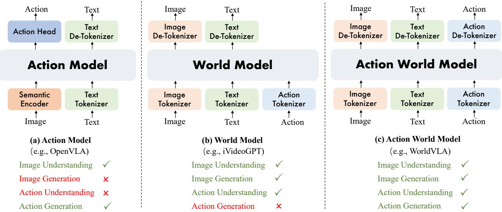

*图1展示了三种模型范式：动作模型根据图像理解直接生成动作；世界模型则根据当前图像和动作推理出未来图像；动作世界模型将两者统一，同时理解与生成图像和动作。这一设计为后续的WorldVLA提供了核心思想。*

## 问题背景与动机

当前机器人学习领域面临一种“偏科”困局：视觉-语言-行动（VLA）模型能够从感知直接映射到动作，却从未真正“理解”动作本身；世界模型（world model）善于根据假设动作推演未来画面，却无法输出可执行的控制指令。更棘手的是，当模型需要连续生成一连串动作时，自回归解码中的误差会如雪崩般迅速放大，导致任务成功率显著滑坡（具体数值见实验与对比章节）。本文的核心动机，正是要缝合这些能力断点，并阻断误差的传播路径。

**动作的“单向输出”僵局**。在常见 VLA 范式下，动作仅作为模型推理的终点被生成出来，一旦输出便不再回流到模型内部（O1）。打个比方（直觉类比，下同）：这如同一个学生不断写答卷，却从不翻阅错题本——模型无法利用动作的语义反馈来反向校准对场景的感知。缺少“动作→感知”的回路，使得 VLA 在需要精细规划或依赖动作结果调整策略的任务中举步维艰。

**世界模型的“行动失语”**。另一边，视频预测类世界模型可以接收动作信息作为条件，生成高保真的未来视觉状态，但它们天然不具备直接输出电机指令或机器人动作的能力（O2）。好比气象模型能精准渲染明日云图，却无法提醒你出门该不该带伞——预测到行动的链条在此断裂。世界模型虽长于预见，却无力独自闭合感知-行动环路。

**自回归动作块中的误差雪崩**。当模型以因果注意力掩码顺序产出一整段动作块（action chunking）时，后续每个动作 token 的生成都会依赖前一步的预测结果，而非直接注视原始视觉输入（O3）。只要早期动作出现偏差，该偏差便会沿序列逐级放大，最终导致末端动作完全偏离正确轨迹。对照实验表明：仅对注意力结构施加约束（如切断动作 token 间的因果依赖），就能明显遏制性能滑坡，证明问题根源不在模型容量，而在生成机制的依赖结构。

**现有方法的真空地带**。以上三条观察直接指向两个关键空白（G1, G2）：其一，目前没有任何框架能同时产出动作与未来视觉状态，并让两项任务在训练中互为增强信号——VLA 与世界模型各执一端，互相借力无从谈起；其二，针对自回归多步生成中的误差传播，行业普遍缺乏结构性修正手段，默认任由因果注意力带来连锁错误。

**从中提炼的核心洞见**很明确：如果将图像、文本、动作三种模态的 token 纳入一个统一的离散词表，并使用单一的自回归大语言模型进行混合训练，便能让同一个模型同时掌握“输出动作”和“预测未来视觉”的能力。更关键的是，可以设计一种专用注意力掩码——令动作 token 的生成**仅**依赖视觉与文本前缀，而完全屏蔽之前已有的动作 token。这相当于在每一次动作决策时强行让模型重新“看画面”再做决定，斩断了误差沿时间轴传播的因果链。这样一套双管齐下的设计，无需额外预训练，就有望在动作成功率和视频生成质量两个维度上同步超越各自独立训练的基线模型。接下来，本文将详细拆解这一统一框架的构造与验证。

## 核心概念速览

WorldVLA 的设计围绕一个核心张力展开：如何让自回归 Transformer 同时输出离散动作与连续视觉，并让二者相互增益而非彼此拖累？下面六个概念分别从统一建模、动作生成效率、误差控制三个层面给出了答案。

### 动作世界模型：一个模型，两种身份

动作世界模型（Action World Model）是本文最核心的抽象——它不再区分“策略网络”和“世界模型”，而是将它们融合成同一个自回归 Transformer。在这个架构下，模型既根据观测和指令输出下一步动作序列，同时又以动作为条件预测未来的视频帧。直觉上，这就像一位经验丰富的司机，在转动方向盘的同时，脑中已经自动“脑补”出几秒后的路面景象。这种“一体两面”的设计，让视觉理解与物理交互共用一个表征空间，使模型对环境的动力学认知更深，从而为后续的互增强打下基础。

### 动作注意力掩码：切断动作间的“耳语”

在标准自回归生成中，当前动作的预测会瞥见之前已经生成的动作 token。看似自然，实则危险——倘若前一个动作有微小偏差，该偏差就会顺着注意力流向下游传染，酿成误差传播。动作注意力掩码策略（Action Attention Masking）直截了当地解决了这个问题：它在生成当前动作时，将注意力图中所有指向先前动作的权重强行置零，迫使模型只看文本指令和视觉输入来做出决断。打个比方，这就像让一组接力运动员不看队友的跑姿，只盯着终点线，从而避免一个人跑偏带乱整个队伍。它仅作用于动作生成分支，世界模型分支依旧使用标准的因果掩码，因为预测图像 token 对误差的包容度更高。

### 动作分块生成：一次预测多个动作

自回归架构若每次只吐一个动作 token，不仅推理缓慢，还容易因生成步数过多而放大误差。动作分块生成（Action Chunking）的策略是：在一次前向传播里连续预测 K 个动作 token，在保留自回归本质的前提下逼近并行解码的效率。需要注意的是，它并非真正的并行输出，而是通过掩码机制让离散的自回归生成表现得“像”并行。形象地说，这就像把过去单字母打字的方式升级成按词组输入——速度提升、节奏更连贯，但底层的按键顺序依然存在。在 LIBERO-Long 长序列任务中 K 选 10，其余任务选 5，以此平衡精度与效率。

### 统一多模态词表：让模型说“同一种语言”

要让同一个 Transformer 处理文本指令、环境图像和机器人动作，首先得让这三样东西进入同一个“语言体系”。统一多模态词表（Unified Vocabulary）的做法是，将文本（BPE token）、图像（VQ-GAN 编码后的离散 token）和动作（每维量化成 256 个 bin，再用 7 个 token 表示末端执行器的 3D 位姿与夹爪状态）全部映射到一个共享的词表空间。于是，一条所谓“多模态序列”本质上就是一串整数 ID，模型只需要学会预测下一个 ID 即可。好比在联合国会议里，无论代表说英文、用手势还是展示图表，同传系统都把它们翻译成一种内部符号，沟通再无隔阂。代价是动作的连续值被离散化，会在精度上做出让步，这是与世界模型收益之间的一种权衡。

### 世界模型与动作模型的互增强：虚拟练习反哺实战

有了动作世界模型，下一步就是让策略和世界模型在训练中彼此促进。联合训练时，损失函数由动作预测损失和世界模型损失加权求和而成（平衡系数 α 固定为 0.04）。世界模型学会了在给定动作序列的条件下，推演未来帧的样子——这不单是“看图说话”，更是对物理规律的内部模拟。这种模拟反过来为动作模型提供了密集的、关于环境动力学的学习信号，动作模型因此能做出更符合物理常识的决策；反之，动作质量的提升也让世界模型生成的视频更稳定、更真实。这套“教学相长”的机制在需要生成几十帧长视频时尤其明显，但前提是世界模型必须以动作为条件——单纯的视频预测（无动作输入）由于未来画面存在多种可能，并不能给动作模型带来可靠增益。

### 误差传播：自回归的“蝴蝶效应”

最后必须正视一个难题：误差传播（Error Propagation）。在自回归动作生成中，当前动作的预测误差会通过注意力流注入下一个动作的上下文，导致偏差随时间累积，就像传话游戏那样，起头的微小口误到最后变成荒诞的版本。这是离散自回归动作生成特有的软肋——连续动作模型因并行生成而天然免疫。本文的注意力掩码和分块生成，正是专门为对抗这一效应而设计的“疫苗”：掩码打断误差的横向传播，分块减少需要自回归的步数。世界模型虽也用因果注意力，但图像 token 之间的预测具有更强的泛化和纠错能力，因此并不受此困扰。

这六个概念相互勾连，勾勒出 WorldVLA 的基本逻辑：用统一词表消除模态边界，用动作世界模型进行联合学习，再通过掩码与分块驯服自回归的误差累积。

## 方法与整体架构

这项工作的核心思路，是把“感知—规划—想象”三种能力装进同一个大模型里。它不是简单拼接两个网络，而是设计了一条统一的离散‑符号流水线：所有模态——视觉、语言、本体动作——都先被“翻译”成同一种离散 token，然后送进一个经过多模态预训练的 Chameleon 自回归 Transformer。在此基础上，模型分化为两种并行的工作模式：一个**策略分支**负责从观测直接产出未来动作，一个**世界模型分支**负责从历史推演未来的视觉状态。两个分支共享全部参数，只在注意力掩码上做出区分，训练时联合优化，推理时可按需独立调用。整套设计相当于为机器人装上一个“既能动手、又能脑补”的统一认知引擎。

**三路离散分词器：把世界压平成 token。**  
要让 LLM 理解不同模态，第一步就是把它们映射到同一个离散词表上。论文使用了三个配套的分词器：

- **图像**：VQ‑GAN 分词器将每一帧图像压缩 16 倍，码本大小 8192。根据 Chameleon 的预训练配置，分辨率 256×256 的图像被展平为 256 个 token，512×512 则产生 1024 个 token。外观细节保留得足够好，序列长度却也还在 LLM 可承受的范围内。
- **文本**：标准 BPE 分词器，词表规模 65536，负责处理自然语言指令。
- **动作**：连续动作（三维相对位置、三维相对角度、一维夹爪状态）被逐维等宽离散化为 256 个 bin，7 个维度恰好对应 7 个 token，每个 token 代表该维度的分箱索引。

所有 token 共享同一个词表，于是图像、指令、动作就可以像不同段落的文字一样，被拼接成一条长的 token 序列喂给模型。这一步“统一离散化”是后续所有多任务学习的前提——它消除了模态间的表示鸿沟，也让预训练 LLM 的下一 token 预测范式得以直接复用。

**Chameleon 骨干与双功能分支。**  
模型的主体是一个基于 Chameleon 预训练权重的自回归大模型。选它并非偶然：Chameleon 本身就是在图文交织数据上训练出来的，已经具备将图像 token 与文本 token 同等对待、无缝衔接处理的能力。在其基础上，论文设计了两种互斥的 token 序列结构，分别对应两个功能。

- **策略分支**：输入拼接了 \( M \) 帧历史图像的 token、语言指令的 token，以及一个表示“动作生成任务”的特殊 token。模型按照一种**「屏蔽先前动作的修改注意力掩码」**运行，使得在看到完整历史观测之后，可以一次性并行生成未来 \( K \) 步的动作 token 序列，而不是逐 token 串行预测。这种块级并行生成大幅提升了推理阶段的吞吐。
- **世界模型分支**：输入由历史图像 token 与历史动作 token 交替拼接而成，使用**标准因果注意力掩码**，自回归地逐 token 预测下一帧图像的 token 序列。这正是经典“下一帧预测”的训练范式，让模型学会在给定状态‑动作历史后，想象未来的视觉画面。

两条分支共享同一个 LLM 骨干，所有参数完全一致，区别仅在于注意力掩码形态——这意味着模型内部必须学会通过上下文结构自动切换“角色”，而无需额外的路由模块。

**联合训练与损失平衡。**  
训练时，两类数据混合在一起，统一送入模型。对策略分支的样本，只在动作 token 的位置计算交叉熵损失 \( \mathcal{L}_{\text{action}} \)；对世界模型分支的样本，只在图像 token 的位置计算交叉熵损失 \( \mathcal{L}_{\text{world}} \)。最后的全局损失是简单的线性加权：

\[
\mathcal{L} = \mathcal{L}_{\text{action}} + \alpha \mathcal{L}_{\text{world}}
\]

这里有一个极其重要的工程直觉：一张 512×512 的图像会贡献上千个 token，而一趟动作只有 7 个 token。如果等权相加，世界模型的重建梯度会彻底淹没策略的学习信号。因此，论文将 \( \alpha \) 设为 0.04，强制把图像损失的权重压低，让两个任务的梯度在反向传播时达成某种“流量平衡”。这个系数虽小，却左右着模型最终是偏科于“看”还是“做”。

推理时，根据应用场景独立启用某一分支：需要操控机器人时，调用策略分支，给定当前观测与指令，并行输出动作序列；需要规划或模拟时，调用世界模型分支，给定历史帧与动作，自回归渲染未来帧的 token。两个功能共用一个权重快照，既不增加部署成本，也让策略与模拟天然保持高度一致。

下面的流程图具体描摹了训练阶段数据在不同模块之间的流动方式，以及两种分支如何共享骨干却用不同掩码完成各自的计算。

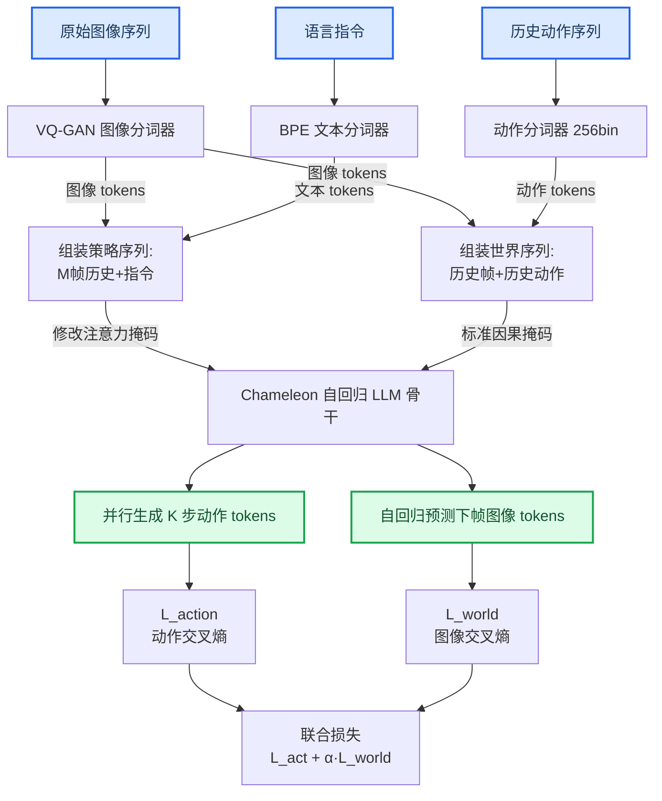

**如何阅读这张图**：  
图的左侧为三种原始输入，经过各自的分词器变成离散 token。中间两条水平路径分别对应策略与世界模型两个分支，它们在送入同一个 LLM 骨干时携带了不同的注意力掩码指示。右侧上层输出动作 token 序列，下层输出未来帧 token 序列，两者分别计算交叉熵，最终由联合损失加权求和驱动整个模型更新。整套流程在训练时是混合运行的，推理时则只激活其中一条输出通路。

**模型结构与关键子图(原图):**

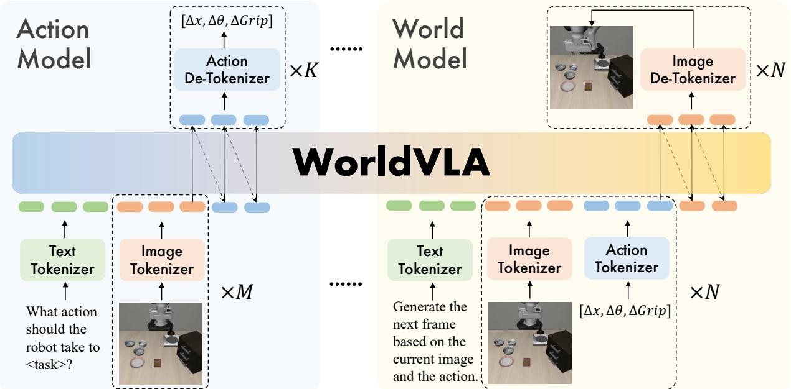

*图2是WorldVLA的总体架构，由动作模型与世界模型两个互补模块构成。动作模型根据文本指令和视觉观察预测动作，世界模型则预测下一时刻的环境图像。两个模块共享特征表示，协同实现统一的理解与生成。*

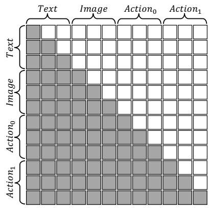

*图3展示了注意力掩码机制，对比了默认动作模型、本文改进的动作模型以及世界模型中的掩码设置。精心设计的掩码让模型在处理图像、文本和动作时能够聚焦于相应的上下文，提升交互效率。*

## 算法目标与推导

Cosmos-Transfer1 的目标是让同一个 Transformer 骨干同时掌握两项技能：根据历史观测与语言指令生成动作（策略分支），以及根据历史观测与动作预测未来帧（世界模型分支）。它没有为两项任务设计两个独立的模型，而是通过一个显式的联合训练损失，将动作预测与视觉预测的信号混合在一起，迫使共享表征既懂得“怎么做”，也懂得“环境怎么变”。推理时，这个统一模型可以根据需求单独运行策略模式或世界模式，两种行为的切换仅靠不同的注意力掩码完成，无需切换参数。

下面先给出构成联合模型的两个基础分支，再给出统一后的训练损失，并逐项拆解设计理由。

**两个分支的概率形式**  
策略分支定义了一个条件生成模型（论文公式 1）：
$$
a_t = \pi_{\theta}(a_t \mid o_{t-h:t}, l)
$$
它基于最近 $h$ 步的观测 $o_{t-h:t}$ 和语言指令 $l$，直接预测当前时刻的动作 token $a_t$。

世界模型分支则定义了一个观测生成模型（论文公式 2）：
$$
o_t = f_{\phi}\big(o_t \mid o_{t-h:t-1}, a_{t-h:t-1}\big)
$$
它基于最近 $h$ 步的历史观测以及历史动作序列，预测当前帧的观测 token $o_t$。这里观测被预先量化为离散 token（例如通过 VQ-VAE 等离散化编码器），以便与动作 token 共享同一套交叉熵计算框架。

**统一模型与训练损失**  
在 Cosmos-Transfer1 中，上述两个分支共享同一个 Transformer 骨干参数 $\psi$，统一为一个模型 $M_{\psi}$（论文公式 3）：
$$
M_{\psi} : \left\{
\begin{array}{l}
a_t = M_{\psi}^{\mathrm{policy}} (a_t \mid o_{t-h:t}, l), \\
o_t = M_{\psi}^{\mathrm{world}} (o_t \mid o_{t-h:t-1}, a_{t-h:t-1}),
\end{array}
\right.
$$
两个分支仅在条件变量上不同，而底层表示来自同一套参数 $\psi$。训练时，模型同时接收两类轨迹样本：带动作标签的样本用于计算动作交叉熵损失 $\mathcal{L}_{action}$，带下一帧图像的样本用于计算图像 token 的交叉熵损失 $\mathcal{L}_{world}$。总损失为（论文公式 4）：
$$
\mathcal{L} = \mathcal{L}_{action} + \alpha \mathcal{L}_{world}
$$
其中 $\alpha$ 是一个固定的平衡系数，论文设为 $0.04$。

**为什么要引入 $\alpha$？**  
直接相加两个交叉熵损失会遇到一个严重的数量不均衡问题：一个动作通常只对应 1 个 token，而一帧图像会被离散化成数十甚至上百个 token（例如 16×16 的网格）。如果不加权，$\mathcal{L}_{world}$ 将由成百上千个位置上的交叉熵累加而成，其数值规模天然比 $\mathcal{L}_{action}$ 大一到两个数量级。这会使得优化过程几乎被世界模型损失牵着走，策略分支的信号被“淹没”，最终导致动作预测能力低下。  
$\alpha$ 的作用正是补偿这种 token 数量的天然差异。通过将 $\mathcal{L}_{world}$ 乘以一个远小于 1 的系数（0.04），相当于把图像损失的整体尺度压缩到与动作损失相近的水平，让两个任务在梯度层面上平等竞争。定性地说，$\alpha$ 的选择大致与“图像 token 数 / 动作 token 数”的倒数相匹配，从而避免任何一方在训练早期就主导了梯度更新。

**推理期的分支选择**  
需要特别指出，训练时两个分支共享骨干参数，但推理时可以根据任务目标只运行其中一个模式。当你希望模型在环境中执行动作决策时，只需提供历史观测与语言指令，运行策略分支 $M_{\psi}^{\mathrm{policy}}$；当你需要模拟环境生成未来帧时，则运行世界模型分支 $M_{\psi}^{\mathrm{world}}$。两种模式在注意力掩码设计上有所不同——例如策略分支只允许关注历史观测与指令 token，而世界模型分支则需要关注历史观测与动作 token——这种掩码差异仅在推理期施加，并不写入训练损失公式。也就是说，联合训练让骨干学会了两种模式所需的内部表示，而推理时通过不同的注意力约束激活其中一种行为，相当于一个网络“原生”拥有两套推理程序。

**直觉比喻（非严格对应）**  
可以把 $M_{\psi}$ 想成一位同时学习“下棋”和“复盘解说”的棋手。$\mathcal{L}_{action}$ 就像教练在他每下完一步后马上纠正：“这步走这里才对”；$\mathcal{L}_{world}$ 则像要求他下完一步后，闭上眼睛在脑中画出对手可能落子之后的完整局面图。棋盘上的局面图（图像 token）远远比一步棋的坐标（动作 token）复杂，所以我们需要降低“脑中画图”练习的权重（$\alpha=0.04$），否则棋手整天都在练习画图，根本没心思记住正确落子了。二者结合，最终这位棋手既能下出好棋，又能凭经验推演未来局面。

**一个小玩具例子**  
假设一个 4×4 网格世界，智能体的观测是 4×4 的彩色单元格图像，动作是“上/下/左/右”四个离散动作之一，语言指令如“移动到左上角”。我们将图像均匀划分为 16 个格子，每个格子对应一个离散颜色 token，因此一帧观测对应 16 个 token；而动作总是 1 个 token。  
训练过程：对于每一个时间步，如果该步有动作标签，我们便计算 1 个动作 token 的交叉熵损失；如果该步有下一帧的观测标签，我们便计算 16 个图像 token 的交叉熵损失之和。如果直接相加，两条样本的损失尺度大约是 1:16（假设每个 token 的难度相当），优化器会大幅偏向世界模型分支。现在引入 $\alpha=0.04$，世界模型损失实际贡献被压到 $16 \times 0.04 = 0.64$ 左右，与动作损失的 1 处于同一量级。训练出的统一模型可以在推理时只靠历史观测和语言指令输出动作（控制智能体移动），也可以只靠历史观测和动作序列“想象”出下一帧画面（模拟环境），两个模式共享同一套参数，却展现出截然不同的能力。

## 实验设计与结果解读

本章围绕 WorldVLA 的核心主张，设计了从整体性能基准到组件拆解、再到关键超参选择的六组实验。每一组都紧扣一个明确的验证命题：模型是否真的有效？各个组件各自贡献了什么？新提出的注意力设计究竟解决了什么缺陷？下面先给出每个实验的**核心结论**，再展开方法、对照设置与定性解读，直观理解实验结果而非死记数字。

### 整体性能基准：WorldVLA 与主流动作模型的正面较量

**结论**：在无额外预训练的公平条件下，WorldVLA 不仅在离散动作模型类别中遥遥领先，还展现出与一批连续动作模型分庭抗礼的竞争力——证明自回归离散动作生成完全可以胜任复杂操作任务。

**设置与对照**：实验放在 LIBERO 的四个经典场景（Spatial、Object、Goal、Long）中，每个场景评估 50 次 rollout 的成功率。对比阵营包括连续动作模型如 Diffusion Policy、Octo、DiT Policy、Seer、OpenVLA-OFT、UVA，以及同属离散动作模型的 OpenVLA。WorldVLA 测试了 256×256 和 512×512 两种分辨率版本，均使用全量 LIBERO 数据训练以保证公平。

**定性解读**：在所有场景中，WorldVLA 的平均成功率都显著超过了同属离散阵营的 OpenVLA，说明将世界模型与动作生成联合训练、并引入动作块与新注意力机制的设计，在离散动作空间内产生了实质性的性能跨越。面对连续动作模型这一传统上更“细腻”的流派，WorldVLA 在多个子任务上表现毫不逊色，部分任务甚至更优（具体数值见后续实验表）。有趣的是，分辨率从 256 提到 512 带来的增益微乎其微，暗示 256 分辨率已经能够捕获操纵任务的关键视觉结构，盲目提高分辨率并不会线性“变强”。

---

### 动作模型组件消融：世界模型与动作块究竟各自贡献了什么？

**结论**：世界模型是动作提升的关键推手，但**动作块生成若配上默认的因果注意力，反而会严重损害长程任务的性能**；只有将动作块与论文新设计的注意力策略结合，才能把“动作分块”真正转化为优势。

**设置与对照**：实验采用了 5 种递进式配置：① 纯动作模型（无世界模型、无动作块）；② 加入世界模型联合训练（无动作块）；③ 进一步加入动作块生成，但使用默认因果注意力遮蔽；④ 动作块生成 + 新注意力遮蔽（但无世界模型）；⑤ 完整 WorldVLA（世界模型 + 动作块 + 新遮蔽）。所有配置在 LIBERO 四个子任务上分别评估成功率。

**定性解读**：对比配置①与②，引入世界模型后成功率在各类任务上都有肉眼可见的提升，这印证了“让模型有能力预测未来环境变化，能帮助它做出更稳健的动作决策”这一直觉（直觉：就像棋手在脑中推演几步后再落子）。然而，从配置②走向③时，Spatial 和 Long 这类需要长程规划的任务却出现了严重的性能滑坡。原因在于默认的因果注意力强制动作块内部的每个 token 只能单向看到过去，当块长度变大时，模型实际上被“遮”断了跨步的信息流动。更换为论文提出的新注意力遮蔽后（配置④与⑤），这一退化现象被彻底扭转，平均成功率不但恢复，甚至超越无动作块的强基线。这直接证明了**新注意力设计是释放动作块潜力的必要条件**，也解释了为何论文要花大力气重新设计注意力流。

---

### 世界模型消融：预测动作，也能反哺世界理解？ 

**结论**：纯世界模型（只学视觉预测）和 WorldVLA 中的动作-世界联合模型，虽然短期预测相差无几，但在**长序列生成上拉开明显差距**：动作理解让世界模型更“有远见”。

**设置与对照**：在 LIBERO 验证集上，分别训练纯世界模型和 WorldVLA 联合模型，让其以当前帧和动作序列为条件生成下一帧。评估时特别区分短序列（10 帧）和长序列（50 帧）的预测质量，使用视频生成领域常用指标：FVD（越低越好）、PSNR、SSIM、LPIPS。<!--ref:r-the-experiments-on-lib--><!--anchor:quote:The%20experiments%20on%20LIBERO%20benchmark%20show%20that%20our%20WorldVLA%20outperforms%20the%20action%20model%20with%20the%20same%20backbone%20by%204%25%20grasping--><!--ref:r-images-6c18827c959a34--><!--anchor:quote:%21%5B%5D%28images%2F6c18827c959a34a2fd42deb6ea68850875d9245fe360eccac3b09fa9eb35a289.jpg%29-->

**定性解读**：短序列上，二者水平相当，说明“看一眼动一下”的场景下，动作信息并非刚需。一旦序列拉长到 50 帧，动作-世界联合模型在 FVD 上实现了明显更低的数值，PSNR 也更高，即生成画面不仅更真实，时间连贯性也更好。这个结果为 WorldVLA 的核心哲学提供了双向验证：动作模型固然可以从世界模型获取预知能力，反过来，**动作理解提供的物理因果约束，也让世界模型学会了更可靠的长期推演**。换言之，机器人“动手”和“想象”可以互相增强，而不是各自孤立。<!--ref:r-images-6c18827c959a34--><!--anchor:quote:%21%5B%5D%28images%2F6c18827c959a34a2fd42deb6ea68850875d9245fe360eccac3b09fa9eb35a289.jpg%29-->

---

### 注意力机制深度消融：为什么默认因果遮蔽会失效？

**结论**：动作块越长，默认因果注意力的弊端暴露得越彻底；新注意力策略能在很大范围内维持高成功率，但过犹不及，块长度仍有其最优区间。

**设置与对照**：在 LIBERO 任务上，将动作块长度从较短逐步拉长，在同一长度下分别评估默认因果遮蔽和论文提出的交错注意力遮蔽，记录抓取成功率的变化曲线。

**定性解读**：随着动作块长度增加，默认遮蔽方案的成功率持续下滑，甚至出现断崖式下跌。这背后的逻辑是：当块内包含多个未来动作时，强制令牌只看到过去会切断同一块内部各个子动作之间应有的并行关联，导致模型无法协调一个连贯的“动作小序列”。而新遮蔽方案通过精心设计可见域，让同一块内的动作 token 可以彼此参考，在块长度增大时仍能保持高成功率。不过，当块长度超过某一上限后，即使新策略也无法挽救——这意味着模型对超长序列的依赖仍有物理极限，实际应用中需要选取一个适中的块长度以获得最佳表现。

---

### 预训练与历史帧数：如何高效利用先验知识与在线感知？

**结论**：用世界模型预训练去初始化动作模型，是“花小钱办大事”的典型——不需要额外动作数据，仅靠视觉推演学到的先验就能显著提升动作表现，尤其对长程任务增益最大。此外，感知历史帧数并非越多越好，**两帧在效果与速度之间达到最佳平衡**。

**设置与对照**：预训练实验分为两组：一组先在世界模型数据上预训练，再在动作数据上微调；另一组直接在动作数据上训练。历史帧数实验则分别使用 1 帧、2 帧、4 帧历史图像作为输入，同时测试带和不带动作块的情况，记录成功率与推理帧率（fps）。

**定性解读**：世界模型预训练的增益在所有子任务上一致为正，其中对 Long 任务的提升最为突出。这可以理解成：世界模型提前学会了环境中物体运动、遮挡、交互等普适视觉规律，当动作模型继承这些权重后，等于带着一套“环境常识”去学习动作，自然学得更快更好。而在历史帧数的选择上，从 1 帧到 2 帧带来了明显的成功率上涨，但继续加到 4 帧时，成功率几乎不再提高，却使推理速度显著下滑。因此论文选择 2 帧作为默认配置，是综合了“看得足够远”与“反应足够快”的务实取舍。

> 以上各组实验的详细成功率、生成质量指标数值，请参见后续附上的实验数据表，这里着重揭示机制层面的“为什么”而非列举“是多少”。

### 实验数据表(原始数值,引自论文)

#### LIBERO 基准综合对比结果
- **Source**: Table 2
- **Caption**: "LIBERO 基准各子任务成功率对比，WorldVLA 在无预训练设定下超过同等离散动作模型基线 OpenVLA"

| 模型 | 预训练 | Spatial | Object | Goal | Long | Average |
| --- | --- | --- | --- | --- | --- | --- |
| Diffusion Policy (Chi et al., 2023) |  | 78.3 | 92.5 | 68.3 | 50.5 | 72.4 |
| Octo (Team et al., 2024) | x√ | 78.9 | 85.7 | 84.6 | 51.1 | 75.1 |
| DiT Policy (Hou et al., 2024) | √ | 84.2 | 96.3 | 85.4 | 63.8 | 82.4 |
| Seer (Tian et al., 2024) | × | — | — | — | 78.7 | — |
| Seer (Tian et al., 2024) | √ | — | — | — | 87.7 | — |
| OpenVLA-OFT (Kim et al., 2025) | √ | 96.9 | 98.1 | 95.5 | 91.1 | 95.4 |
| UVA (Li et al., 2025) | × | — | — | — | 93.0 | — |
| OpenVLA (Kim et al., 2024) | √ | 84.7 | 88.4 | 79.2 | 53.7 | 76.5 |
| WorldVLA (256 * 256) | × | 85.6 | 89.0 | 82.6 | 59.0 | 79.1 |
| WorldVLA (512 * 512) | × | 87.6 | 96.2 | 83.4 | 60.0 | 81.8 |

#### 世界模型消融研究结果
- **Source**: Table 4
- **Caption**: "纯世界模型与动作世界模型视频生成质量对比，50 帧长序列上 WorldVLA 的 FVD 更低、PSNR 更高，体现动作模型对视觉理解的增益"<!--ref:r-images-6c18827c959a34--><!--anchor:quote:%21%5B%5D%28images%2F6c18827c959a34a2fd42deb6ea68850875d9245fe360eccac3b09fa9eb35a289.jpg%29-->

| 模型 | FVD↓ (10帧) | PSNR↑ (10帧) | SSIM↑ (10帧) | LPIPS↓ (10帧) | FVD↓ (50帧) | PSNR↑ (50帧) | SSIM↑ (50帧) | LPIPS↓ (50帧) |
| --- | --- | --- | --- | --- | --- | --- | --- | --- |
| World Model | 250.0 | 29.62 | 90.73 | 11.97 | 718.6 | 23.98 | 83.41 | 15.60 |
| Action World Model | 255.1 | 29.77 | 90.40 | 11.94 | 674.1 | 24.30 | 83.55 | 15.44 |

#### 世界模型预训练消融结果
- **Source**: Table 6
- **Caption**: "使用世界模型预训练权重初始化动作模型可提升各子任务成功率，Long 任务提升最显著"

| 配置 | Goal SR (%) | Object SR (%) | Spatial SR (%) | Long SR (%) | Average SR (%) |
| --- | --- | --- | --- | --- | --- |
| w/o World Model Pretrain | 67.3 | 82.9 | 77.8 | 23.0 | 62.8 |
| w/ World Model Pretrain | 73.1 | 84.0 | 79.8 | 30.2 | 66.8 |

#### 动作模型消融研究结果
- **Source**: Table 3
- **Caption**: "动作模型各组件消融：行 2 vs 行 1 显示世界模型提升动作性能；行 3 vs 行 1 显示默认遮蔽动作块生成导致 Spatial 和 Long 任务严重退化；行 4 vs 行 3 显示新注意力遮蔽的显著改善"

| 序号 | 动作模型 | 世界模型 | 动作块生成 | 新注意力遮蔽 | Goal SR (%) | Object SR (%) | Spatial SR (%) | Long SR (%) | Average SR (%) |
| --- | --- | --- | --- | --- | --- | --- | --- | --- | --- |
| 1 | √ | × | × | × | 67.3 | 82.9 | 77.8 | 23.0 | 62.8 |
| 2 | √ | √ | × | × | 73.1 | 88.0 | 80.2 | 27.3 | 67.2 |
| 3 | √ | × | √ | × | 79.6 | 82.9 | 36.7 | 16.9 | 54.0 |
| 4 | √ | × | √ | √ | 84.4 | 90.9 | 81.8 | 49.3 | 76.6 |
| 5 | √ | √ | √ | √ | 85.1 | 90.9 | 84.0 | 52.4 | 78.1 |

#### 历史图像输入帧数消融结果
- **Source**: Table 5
- **Caption**: "不同历史输入帧数下的成功率与推理帧率，2 帧配置在性能与效率间取得平衡"

| 配置 | SR% (1帧) | FPS (1帧) | SR% (2帧) | FPS (2帧) | SR% (4帧) | FPS (4帧) |
| --- | --- | --- | --- | --- | --- | --- |
| w/o Action Chunking | 58.4 | 2.27 | 67.3 | 1.77 | 78.7 | 1.22 |
| w/ Action Chunking | 74.0 | 3.67 | 84.4 | 3.13 | 84.7 | 2.78 |

**效果示例(论文原图):**

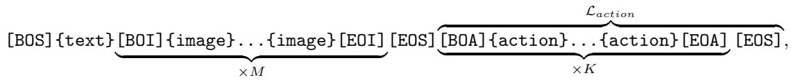

*表2在LIBERO基准上评估了模型性能，与多种基线方法进行对比，验证了大规模预训练数据带来的显著提升，以及本文模型在操作任务上的优越性。*

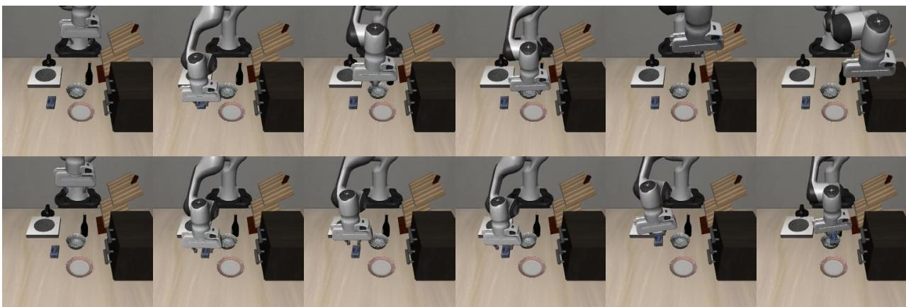

*图4上半部分是纯动作模型的运动预测可视化，下半部分是本文动作世界模型的对应结果。可以看出，统一模型预测的运动轨迹更符合任务需求，体现了联合建模的准确性。*

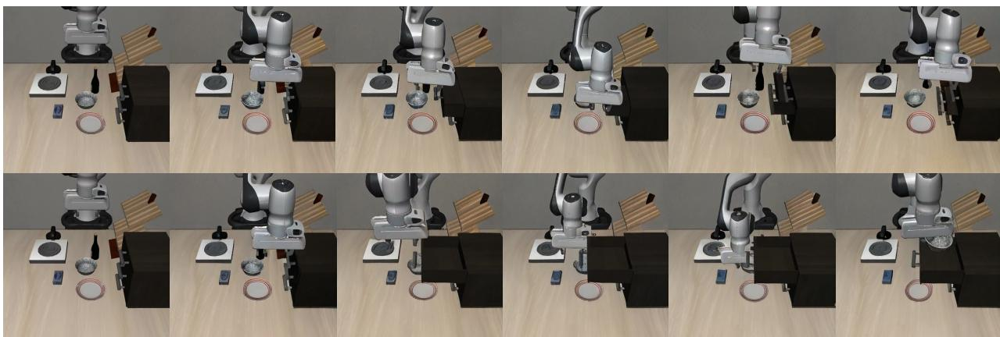

*图5上半部分是标准世界模型的图像预测，下半部分是动作世界模型的结果。动作世界模型生成的未来图像更清晰、合理，表明引入动作信息能显著提升环境预测的保真度。*

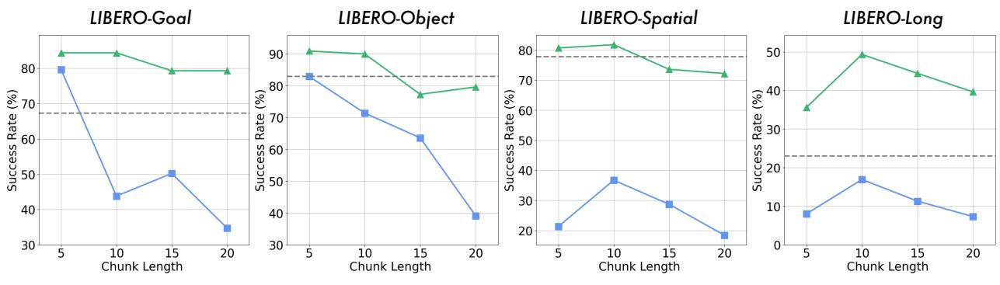

*图6是关于动作区块长度（action chunking length）的消融实验，展示了不同区块大小对任务成功率的影响，为选择适当的时序粒度提供了依据。*

## 相关工作与定位

**结论前置**：WorldVLA 在技术谱系上同时继承了“离散多模态统一建模”与“视觉‑语言‑动作（VLA）”两条路线，并将经典的世界模型思想融合进来，最终形成了一种**以离散 token 为共同语言的统一动作世界模型**。相较于作为其直接基础的 OpenVLA 和 Chameleon，它新增了世界模型联合训练分支和注意力遮蔽驱动的动作块生成；相比于同样关注并行动作或视频‑动作统一的其他方法（π₀、OpenVLA-OFT、UVA、iVideoGPT 等），它始终坚定地走离散自回归路线，并用一个模型同时完成“理解物理未来”与“生成多步动作”两类任务——这一设计在谱系中划出了一条清晰的“离散动作世界模型”分支。

### 从离散多模态建模到 VLA：WorldVLA 的基石

Chameleon（Team, 2024）第一次在模型架构层面实现了“图像和文本用同一套离散 token 进行自回归生成”。这套框架的技术要素——VQ‑GAN 图像分词器（压缩比 16，码本 8192）、BPE 文本分词器（词表 65536）、因果注意力自回归架构——被 WorldVLA 几乎完整继承，构成了它的多模态骨架。直觉上，这就相当于为机器人提供了“两种母语”：视觉信息和语言信息被量化进同一个词表，模型不必再做模态对齐，一切推理都在同一个公平的 token 注意力空间中完成。作为图像分词的核心组件，VQ‑GAN（Esser et al., 2021）负责把连续像素转化为离散 token；WorldVLA 只是在其基础上强化了针对面部和显著区域的感知损失，以保留操控任务中关键物体的纹理信息。

机器人动作是一种新的“语言”，需要被纳入这张多模态词表。OpenVLA（Kim et al., 2024）率先给出了一个可复用的离散动作 token 化方案：将连续动作的每一维度量化为 256 个 bin，形成 7 个动作 token。WorldVLA 直接采纳了这一策略，并完全沿用 OpenVLA 的 VLA 训练范式与数据预处理。至此，文本、图像、动作三种模态在 token 表示上实现了形式上的统一，这正是 WorldVLA 能在后续添加世界模型目标而不必重建模态对齐的根本原因。

### 关键创新如何与前人划分界限

**相较于 OpenVLA**：OpenVLA 只训练了一个动作预测模型，而 WorldVLA 在同样的离散动作框架上，额外引入了一个世界模型分支，联合优化 $$\mathcal{L} = \mathcal{L}_{\text{action}} + \alpha \mathcal{L}_{\text{world}}$$。这意味着模型不仅要回答“下一步该怎么动”，还要学会“如果这样动，环境会变成什么样子”。同时，为了让动作不再是单步串行自回归，而是以“块”的方式并行输出多步动作，WorldVLA 设计了新的注意力遮蔽策略——这是 OpenVLA 架构中所没有的。

**相较于连续动作并行生成路线**：OpenVLA-OFT 通过连续动作头直接并行输出多步动作，π₀ 则借助流式扩散策略头实现同样的目标。WorldVLA 坚持离散自回归，配合注意力遮蔽来完成动作块生成。它并不依赖大规模预训练，却能在 LIBERO 多项子任务上与 OpenVLA-OFT 形成竞争关系，这从侧面证明了离散路线在机器人领域依然有很强的生命力。

**相较于其他视频‑动作统一模型**：UVA 同样试图统一图像和动作生成，但走的是“分头扩散”路线——用不同的扩散头分别生成图像和动作；而 WorldVLA 用一个因果自回归模型直接输出交错排列的图像 token 和动作 token。两者的差异，本质上是“离散自回归大一统”与“连续扩散分工协作”两种架构哲学之间的对比。在 Action World Model 这一新兴分类中，WorldVLA 正是离散路线的代表。

**相较于纯世界模型或无条件视频预测**：iVideoGPT 作为离散世界模型仅输出未来视频，不输出动作；GR‑1 虽然用视频预测辅助动作模型学习，但它预测未来帧时**不以动作为条件**。WorldVLA 则要求世界模型显式接收动作 token 作为输入条件，并将动作生成也作为模型的原生输出之一。论文通过与 GR‑1 的对比实验证明：有动作条件的世界模型在所有任务上都带来正向效果——也就是说，理解“我的动作如何改变世界”比单纯“猜猜世界会怎么变”更有价值。这一结论也呼应了早期世界模型工作（Ha & Schmidhuber, 2018）所强调的“通过预测未来视觉状态来理解环境物理动态”的基本能力，但 WorldVLA 把分离的控制器与世界模型压缩进同一个自回归框架，减少了模块接口的工程开销，也让序列建模能力得到了更充分的释放。

### 技术谱系中的定位

从整体谱系图上俯瞰，WorldVLA 的生长路径可以用一条连贯的线索概括：**Ha & Schmidhuber 的经典世界模型思想 → Chameleon 的多模态统一框架 → OpenVLA 的离散 VLA 实践 → WorldVLA 的统一动作世界模型**。其中，它沿着离散 token 的统一路线，把原本割裂的“动作生成器”和“未来视觉预测器”熔铸为一个同时理解物理因果并输出多步动作的单一自回归模型。在由 UVA、iVideoGPT、GR‑1 等共同构成的“动作‑世界模型”交叉地带，WorldVLA 以“离散自回归 + 注意力遮蔽 + 动作条件世界模型”的组合拳，确立了自己作为离散路线上标杆工作的地位。这一路线选择不仅简化了训练流程，也为未来进一步利用大语言模型强大的推理能力铺平了道路——因为所有模态信息都已经被翻译成了同一套 token 词表里的“本地语言”。

<strong>与主要相关工作关系速览</strong>

| 相关工作 | 类型 | WorldVLA 相对于它的关键差异 | 定位意义 |
|----------|------|---------------------------|----------|
| Chameleon (Team, 2024) | 架构基础 | 在统一多模态框架上扩展了动作 token 词表，增加世界模型联合训练目标 | 提供了离散自回归多模态模型的骨架 |
| OpenVLA (Kim et al., 2024) | 基线 | 新增世界模型分支，设计注意力遮蔽实现动作块并行生成 | 主要对比的离散动作模型，凸显世界模型集成贡献 |
| OpenVLA-OFT (Kim et al., 2025) | 对比 | 采用离散自回归而非连续动作头，且无需大规模预训练 | 展示与连续动作最优基线的竞争关系 |
| π₀ (Black et al., 2024) | 对比 | 用离散自回归代替流式扩散策略头实现动作块生成 | 说明离散路线与扩散路线在动作并行生成上的异同 |
| UVA (Li et al., 2025) | 对比 | 统一自回归同时输出图像和动作，而非用不同扩散头分别生成 | 同为 Action World Model，对比不同架构路线 |
| iVideoGPT (Wu et al., 2025) | 对比 | 额外具备显式动作生成能力，而不再仅是视频输出 | 凸显“统一动作与视频生成”这一核心创新 |
| GR‑1 (Wu et al., 2023) | 对比 | 世界模型以动作为条件，而非无条件视频预测 | 验证了动作条件对世界模型的正向贡献 |
| VQ‑GAN (Esser et al., 2021) | 组件 | 加强了对特定区域的感知损失 | 实现统一多模态 token 的前提技术 |
| Ha & Schmidhuber (2018) | 思想渊源 | 将分离的世界模型与控制器统一进一个自回归模型 | 世界模型领域的奠基性参考，WorldVLA 推进了统一框架 |

> 图中省略了具体的性能数值，定性对比和消融结论均依据源论文的实验证据；读者如需了解精确的性能指标，可参阅本报告“实验与对比”一节中的表格。

## 研究探索历程

WorldVLA的探索并非一蹴而就，而是沿着“统一框架设想 → 多步动作误差雪崩 → 动作掩码破局”与“世界模型条件缺失 → 联合训练转向”两条主线交叠演进。研究者撞过两堵墙、做过一次关键转向，最终依靠**动作注意力掩码**与**混合数据联合训练**两大决策，实现了动作生成与世界预测的双向互促。下面这张流程图浓缩了整个探索脉络：蓝色节点为主干决策，红色为被抛弃的死胡同，绿色为学到的关键教训，灰色为验证实验。

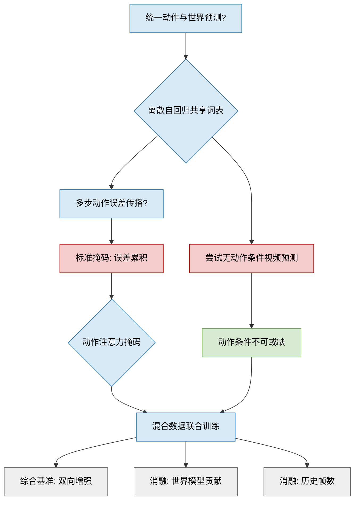

**初心与第一堵墙**  
传统VLA只管“怎么做”，世界模型只管“会怎样看”，彼此割裂。研究者提出的原初问题（Q1）正是：能否让单一模型既会动手又会脑补未来画面，并在学习中相互促进？为此，他们选择了离散自回归架构（D1）：图像经VQ-GAN离散化为token，文本用BPE处理，连续动作则通过均匀分箱离散化，三者共享同一词表，全部交给一个Transformer按自回归方式预测下一个token。这样一来，同一个模型既能根据指令+历史帧预测下一步动作，也能根据指令+动作预测下一帧画面。

可问题随之而来（Q2）。自回归生成多步动作时，当前token要以前面的动作token为条件。然而预训练大模型几乎没接触过动作数据，对动作域的泛化极弱，前面微小的预测偏差会沿着序列被逐级放大，形成“误差雪崩”。第一堵墙（DE1）就是直接沿用标准因果注意力掩码——实验表明，随着动作块变长，抓取成功率显著退化，尤其在空间精度敏感的任务里崩塌最剧烈。这证明把文本/图像的自回归惯性直接套用到动作上是行不通的。

**动作掩码：巧妙解耦**  
面对这堵墙，研究者并未堆数据或调超参，而是对注意力掩码做了一次精巧手术（D2）。在动作生成部分，他们**屏蔽掉所有前序动作token**，令每一步动作预测只能关注文本指令和视觉上下文，等于将多步动作从链式依赖改写为条件独立的并行生成。误差传播的根源被连根拔起；世界模型部分则保留标准因果掩码，因为图像帧之间天然具备时序连续。这一调整让模型在长动作块上重获稳定。

**另一条弯路与世界模型的条件代价**  
与此同时，团队也在思索世界模型的形式（DE2）。一个看似省事的方案是：用纯粹的视频预测模型（不依赖动作条件）来给动作学习提供物理先验。可惜，同一帧起始画面可以对应无数种合理的后续动作和视觉变化，没有动作约束的训练信号存在内在歧义。实验结果很骨感：这种无动作条件的视频预测模型对某些任务略有增益，在另一些任务上反而帮了倒忙，整体增益既弱且不稳定。

**教训** 显式动作条件是世界模型能够稳定辅助动作学习的关键（绿色节点）。这一洞察不仅捍卫了最初“动作作为条件”的设计，也直接催化了后续的联合训练转向。

**联合训练：拥抱双向增强**  
动作掩码解耦了误差，世界模型的刚需（动作条件）也已明确。研究者顺势完成一次方向转变（P1）：不再分别独立训练动作模型和世界模型，而是将两类数据混合，在统一的离散自回归任务中同时优化动作损失$$L_{\text{action}}$$与视觉生成损失$$L_{\text{world}}$$。模型在“想做”与“会看”之间频繁穿梭：通过预测下一帧，它学到了物体交互的物理动力学，这些隐性知识反过来提升了精细操控的成功率；而更准确的动作预测又为视觉生成提供了更贴切的条件，使世界模型的视频生成质量也同步上升——**正向循环就此建立**。

**实验验证与折衷选择**  
在LIBERO等基准上，WorldVLA不仅抓取成功率高于同骨架的纯动作模型，视频生成质量（FVD）也优于纯世界模型，确认了双向增强。消融实验进一步拆解贡献：加入世界模型数据后，所有子任务成功率全面提升；若先用世界模型权重预训练动作模型，同样带来额外收益。在效率维度，研究者考察了历史图像帧数与推理帧率的关系——增加历史帧确有益处，但在启用动作分块后，双帧已趋近性能天花板；再往上加帧只会拖累推理速度，得不偿失。因此，**双帧被定为成功率与计算效率的甜点**（具体数值详见“实验与对比”一节的表格）。

## 工程与复现要点

**WorldVLA 的工程骨架围绕“统一词表下的三模态自回归”展开，复现的关键在于理解其离散化管道与四个核心训练超参的联动。** 尽管论文未开源代码，但通过剖析其模型结构与训练策略，工程师仍可拼出可复现的蓝图——前提是掌握 Chameleon 早融合架构与 VQ-GAN 离散化技术。

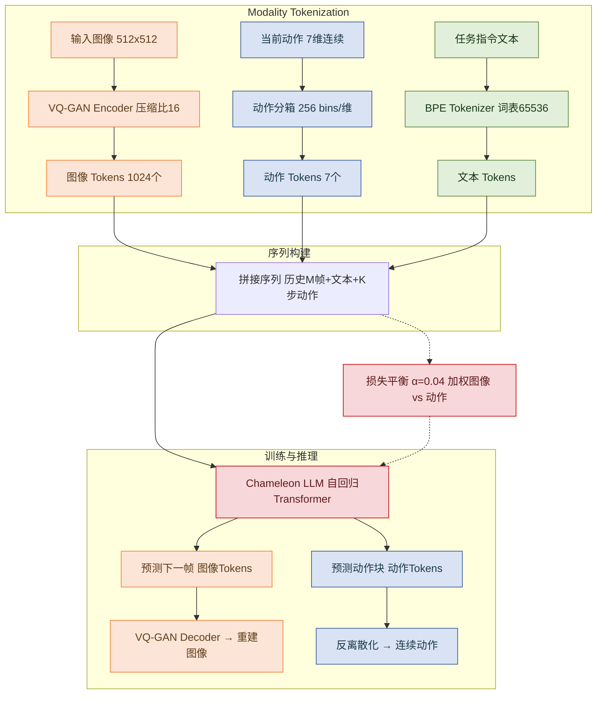

上图勾勒了 WorldVLA 的多模态数据处理管道：**所有模态最终都被转化为离散 token 并共享词表，由同一个自回归 Transformer 统一预测未来图像与动作。** 512×512 的观测图像经 VQ-GAN 以 16 倍压缩比映射为 1024 个 token；7 维连续动作（3 平移 + 3 旋转 + 1 夹爪）被均匀分箱为每维 256 个区间，共 7 个 token；任务指令通过 BPE 子词切分后进入序列。三种 token 靠一根容量 65536 的词表维系，其中 8192 个位置预留给图像，256 个预留给动作，其余由文本占据——这种“大一统”设计让多模态生成退化为标准 next-token prediction，大幅简化了实现。

*如何读这张图：从左上“输入图像”和左中“当前动作”出发，跟踪数据如何被离散化、拼接，最终在右侧输出预测；虚线连接的“损失平衡”节点对应训练时 α 权重的介入位置。*

**训练“四张王牌”** 精细控制着模型的行为与成本，工程师在复现时必须逐项核对：

- **α——模态损失的“音量旋钮”** （固定 0.04）。图像 token 数（1024）是动作 token 数（7）的百余倍，若不降权，图像重建的交叉熵会淹没动作预测信号。α 把图像损失压缩到约 4%，使两条梯度流保持在同一数量级（直觉类比：混音时拉低背景配乐，让人声清晰可闻）。<!--ref:r-training-setting-the-a--><!--anchor:quote:Training%20Setting.%20The%20action%20model%20utilizes%20a%20default%20input%20image%20count%20of%20M%20%3D%202.%20The%20action%20chunk%20size%20is--><!--ref:r-the-overall-architecut--><!--anchor:quote:The%20overall%20architecuture%20of%20autoregressive%20action%20world%20model%20is%20shown%20in%20Fig.%202.%20We%20initilize%20the%20model%20from%20Chameleon%20%28Team%2C--><!--ref:r-date-june-27-2025-code--><!--anchor:quote:Date%3A%20June%2027%2C%202025%20Code%3A%20https%3A%2F%2Fgithub.com%2Falibaba%2Ddamo%2Dacademy%2FWorldVLA%20Correspondence%3A%20cenjun.cen%40alibaba%2Dinc.com--><!--ref:r-the-development-of-vis--><!--anchor:quote:The%20development%20of%20Vision%2DLanguage%2DAction%20%28VLA%29%20models%20has%20emerged%20as%20a%20significant%20focus%20within%20robotics%20action%20model%20research%20%28Brohan%20et%20al.%2C-->
- **M——历史帧“记忆窗口”** （默认 2）。世界模型用多少帧过往观察来预测下一帧？单帧缺少运动线索，4 帧虽然信息更丰富但训练开销剧增且成功率趋于饱和；双帧是成功率与计算成本的最佳折衷。该值直接决定输入序列长度，进而影响显存与批次大小。
- **K——动作块“步幅”** （短任务 5，LIBERO-Long 任务 10）。模型一次性输出未来 K 步动作，降低开环执行中的累积误差。论文根据任务视野调整：短 horizon 场景用 5 步，长 horizon 的 LIBERO-Long 加大到 10 步。复现时需按目标任务的典型 episode 长度选择 K。
- **N——世界模型“单步循环”** （固定 1）。每条训练样本的世界模型仅做一次下一帧预测，避免多步展开带来的算力指数增长——这一策略在维持预测质量的前提下大幅压缩了训练时间。

**其余关键配置同样不可忽视**：世界模型保留 10% 轨迹作为验证集（实验时全量使用）；评估动作模型时，每个初始状态运行 50 次 rollout 以稳定成功率统计；所有组件均以 Chameleon 预训练权重初始化——这意味着复现者需先获取该权重，而 Chameleon 自身亦未开源，这是第一道门槛。<!--ref:r-the-experiments-on-lib--><!--anchor:quote:The%20experiments%20on%20LIBERO%20benchmark%20show%20that%20our%20WorldVLA%20outperforms%20the%20action%20model%20with%20the%20same%20backbone%20by%204%25%20grasping--><!--ref:r-images-6c18827c959a34--><!--anchor:quote:%21%5B%5D%28images%2F6c18827c959a34a2fd42deb6ea68850875d9245fe360eccac3b09fa9eb35a289.jpg%29-->

**环境与依赖**：论文仅披露使用 Chameleon 自回归框架与 VQ-GAN 实现，在 LIBERO 仿真基准上评估，但未说明 Python 版本、具体硬件或随机种子。关键依赖项清单如下：
- **Chameleon**（Team, 2024）——早融合多模态基础模型，提供骨干 LLM 与图像理解能力；
- **VQ-GAN**（Esser et al., 2021）——图像离散化工具，额外加了针对人脸与显著区域的感知损失；
- **BPE Tokenizer**（Sennrich et al., 2015）——子词切分，扩展后统一管理三种模态；
- **LIBERO**（Liu et al., 2023a）——机器人操作仿真基准，提供标准化任务与评估。

**代码可复现性**：截至当前，作者未提供任何公开仓库或模型权重，处于完全闭源状态。这意味着从头复现需要自行实现统一词表管理、混合离散化器以及 Chameleon 级别的大规模训练流程。不过，OpenVLA 等开源项目已在类似架构上给出参考实现，复现者可将其作为起点，嫁接 VQ-GAN 与早融合训练范式。

<strong>复现行动清单（供参考）</strong>

- **预训练权重**：寻找 Chameleon 或同等早融合 VLM 的权重，或从 Llama + VQ-GAN 开始搭建。
- **图像 tokenizer**：训练一个含显著区域感知损失的 VQ-GAN，codebook 体积 8192，输入分辨率 512×512，压缩比 16。
- **动作离散化**：将每一维动作等分为 256 个 bin，bin 边界由训练数据值域自动确定。
- **词表整合**：在 BPE 词表基础上预留 8192 个图像 token 与 256 个动作 token，总大小 65536。
- **数据加载**：构建带有历史帧堆叠（M=2）的样本，确保图像 token 数 1024，动作 token 数 7，并拼接任务文本。
- **损失函数**：分别对图像和动作计算交叉熵，图像项乘以 α=0.04 后与动作项相加。
- **训练细节**：世界模型每样本仅循环一次（N=1）；动作模型按 K=5（或 10）步切分动作块；保留 10% 轨迹作验证。<!--ref:r-jun-cen-sup-1-2-3-sup--><!--anchor:quote:Jun%20Cen%3Csup%3E1%2C2%2C3%3C%2Fsup%3E%2C%20Chaohui%20Yu%3Csup%3E1%3C%2Fsup%3E%2C%20Hangjie%20Yuan%3Csup%3E1%2C2%2C3%3C%2Fsup%3E%2C%20Yuming%20Jiang%3Csup%3E1%3C%2Fsup%3E%2C%20Siteng%20Huang%3Csup%3E1%2C2%3C%2Fsup%3E%2C%20Jiayan%20Guo%3Csup%3E1%3C%2Fsup%3E%2C%20Xin%20Li%3Csup%3E1%2C2%3C%2Fsup%3E%2C%20Yibing%20Song%3Csup%3E1%3C%2Fsup%3E%2C%20Hao%20Luo%3Csup%3E1%2C2%3C%2Fsup%3E%2C%20Fan%20Wang%3Csup%3E1%3C%2Fsup%3E%2C--><!--ref:r-date-june-27-2025-code--><!--anchor:quote:Date%3A%20June%2027%2C%202025%20Code%3A%20https%3A%2F%2Fgithub.com%2Falibaba%2Ddamo%2Dacademy%2FWorldVLA%20Correspondence%3A%20cenjun.cen%40alibaba%2Dinc.com--><!--ref:r-the-experiments-on-lib--><!--anchor:quote:The%20experiments%20on%20LIBERO%20benchmark%20show%20that%20our%20WorldVLA%20outperforms%20the%20action%20model%20with%20the%20same%20backbone%20by%204%25%20grasping--><!--ref:r-the-experiments-on-lib--><!--anchor:quote:The%20experiments%20on%20LIBERO%20benchmark%20show%20that%20our%20WorldVLA%20outperforms%20the%20action%20model%20with%20the%20same%20backbone%20by%204%25%20grasping-->
- **评估协议**：每任务 50 次 rollout 统计成功率，且尽可能覆盖不同初始化种子。

摸透这些结构选择与超参设计后，即便面对闭源的现实，工程师也能逐步搭建起对等实验环境，推动 WorldVLA 路线的复现与演进。

## 局限与适用边界

在解读一项技术的潜力时，诚实地面对它的边界和“不能做什么”往往比罗列优势更重要。该方法的整体设计在多个环节引入了一系列简化和假设，这些选择在带来计算和工程可行性的同时，也划定了其当前能力的疆域。总体而言，它目前依然是一个**仅停留在仿真世界、依赖离散化动作、且视觉理解相对粗糙的框架**；一旦跨入真实物理场景、高精度连续控制任务或需要长程规划的环境，就会暴露明显的力不从心。

**验证域与迁移的未知数。** 目前所有实验均建立在 LIBERO 仿真基准之上，没有真实机械臂的物理部署数据。换句话说，模型相当于一个只在驾校模拟器里练车的学员——高保真、可重复，但无法保证在路上面对颠簸、光线变化、机械磨损时是否依然稳定。零样本迁移到真实世界的能力仍是一个完全开放的命题。对于期待直接部署到产线或服务机器人的读者，需要清醒地意识到这条鸿沟的存在。

**离散动作的精度代价。** 该方法将机器人的连续动作（如关节角度、夹爪开合）进行跨维度的 256 bin 离散化，并采用纯自回归方式逐 token 预测，没有任何辅助连续输出头。这种设计虽能复用语言模型的基础设施，却**不可避免地引入量化误差**，在一些对力控或精细位姿要求苛刻的任务里，离散化的“阶梯”会天然限制表现上界。此外，与之对比的基线模型大多采用连续动作预测并受益于大规模机器人操控数据的预训练，而该方法的消融实验（Table 3）恰恰**未引入此类预训练**，使得该对比中存在先天劣势——这并非否认方法有效性，而是说明当前的实验设定并不能完全证明其在“无预训练”限制下的相对优势。

**视觉感知的语义瓶颈。** 模型使用离散的 VQ-GAN 图像分词器将画面转换为视觉 token，这一编码器在重建纹理时足够高效，但其语义抽取能力远弱于 CLIP、DINOv2 等连续表征模型。当任务需要对场景进行深层关系理解（例如“把杯子放到架子上方而非旁边”）时，这些丢失的语义线索可能导致错误的动作规划。同时，图像分辨率受限于 Chameleon 骨干预训练的配置（最优为 512×512，256×256 次优），对于需要细粒度空间判断的复杂环境，细节信息会进一步被压缩。

**动作建模的独立性假设与重规划盲区。** 模型在预测多步“动作块”时，通过动作注意力掩码迫使每个动作 token 仅依赖自身之前的 token，将所有动作 token 视为互相条件独立。这一设计本意是简化生成并提升效率，但却**忽略了动作间的时序依赖**（该推断在论文中并未被明确声明为局限）。直观上，机器人一个完整动作序列中的每一步都应当连贯地受上一步影响，强行割裂这种联系在需要平滑轨迹的任务中容易产生不自然的跃变。更棘手的是，即便有掩码策略，当动作块太长时模型依然会因无法及时“观察-重规划”而出现性能退化——在动态环境里，执行一个早已过时的计划，后果可想而知。

**世界模型的浅层预测与规模扩展的悬空。** 论文搭建的世界模型仅被训练完成向前预测一步（N=1），多步 rollout 能力几乎未被开发，这使其难以在内部仿真更长时间跨度的交互后果，限制了作为“想象引擎”的深度。最后，论文在结论中将扩大数据与模型规模列为关键改进方向，但目前尚未有任何实验支撑；换言之，该框架目前的成效都停留在中型规模验证，能否在更大资源下平滑扩展仍待观察。

综合来看，该方法更适合于**仿真域内、对精度要求适中的操作任务原型验证**，或是作为探索自回归世界模型与动作生成相结合的研究起点。对于需要极高控制精度、复杂语义视觉理解、长程自主决策或决心投入物理机器的项目，还需等待架构层面的实质性演进与其后的真实世界验证。

## 趋势定位与展望

近年来，机器人学习领域逐渐分化出两条主线：**以动作预测为核心的 VLA 模型**（如 OpenVLA）与**以视觉未来预测为目标的世界模型**（如 iVideoGPT、GR-1）。两者各自解决了一半问题——一个擅长“动手”却不懂物理，一个擅长“想象”却不会行动。WorldVLA 的出现标志着**动作世界模型（Action World Model）**这一新范式开始成型：它不再将动作与感知视为两个独立模块，而是在同一个自回归 Transformer 中完成视觉预测与动作决策，让两种能力在训练中相互增益。

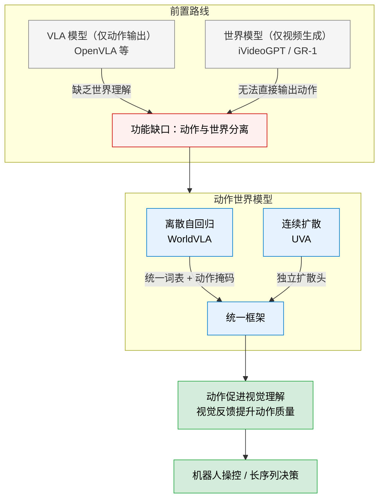

这张路线图勾勒出 WorldVLA 的技术坐标：它选择了**离散自回归**这条路线，将图像、文本、动作三种模态的 token 全部放入同一个 VQ‑GAN + BPE 构建的共享词表中（Chameleon 骨干），用一套因果注意力完成多步动作块生成。与之平行的另一条路线是 UVA 所用的扩散头组合，而 WorldVLA 用实验说明，只要配合**动作注意力掩码**——让后续动作 token 仅以视觉/文本输入为条件而不依赖此前动作——自回归模型同样可以遏制误差传播，在长序列任务上获得可观收益。

这一选择的意义远不止于刷榜。它首次在统一的离散框架下证明了两件事：其一，世界模型的视觉预测目标可以**反向增强动作生成**，尤其在需要长期推理的场景中（联合训练后的成功率显著优于纯动作模型）；其二，动作条件的世界模型比无条件（如 GR‑1）更能生成物理上合理的未来帧。换句话说，动作和感知可以互为“老师”，而 WorldVLA 提供了让两者互教互学的教室。

展望未来，这条路线存在几个明确的前进方向。**训练效率**是首要挑战：目前 WorldVLA 以 7B 参数为基础，且在仿真数据上训练，向真实机器人部署时，需要对模型进行轻量化或投机解码优化。**动作离散化**的精度（每维 256 bin）在精细操控任务中可能受限，未来或许会探索混合精度方案，让关键维保持连续表示。此外，当前的注意力掩码策略是一种强假设（动作之间完全独立），放宽这一约束、引入可控的动作‑动作依赖关系，或许能进一步释放自回归动作块生成的潜力。最后，统一的词表框架天然易于扩模态——触觉反馈、力传感、多视图信息等均可作为新的 token 加入，构成一个更完整的机器人世界模型。一旦该框架走出 LIBERO 仿真平台、在真实环境和更大规模数据下经过检验，动作世界模型就有望成为机器人基础模型的一种核心构图方式。