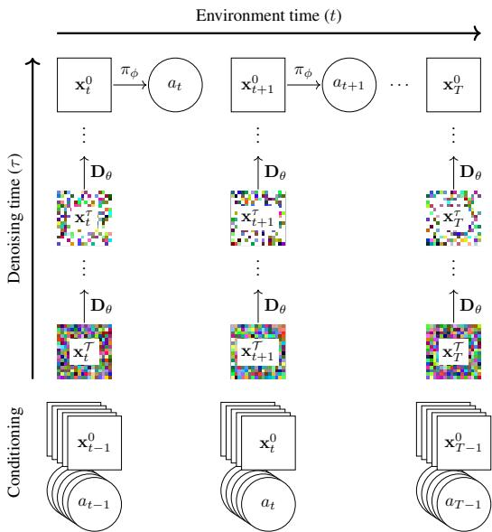
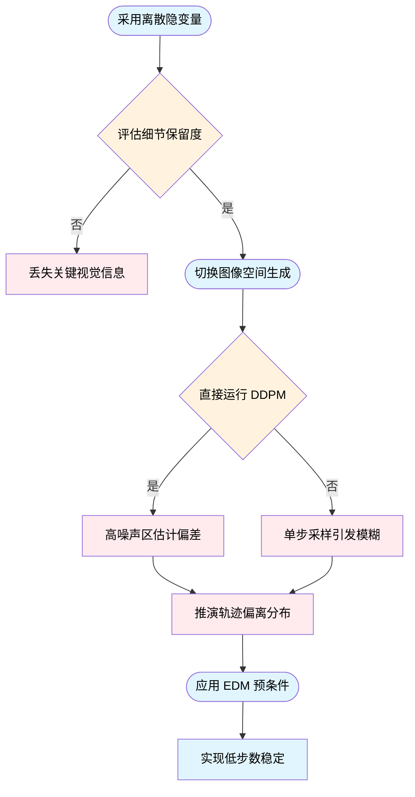
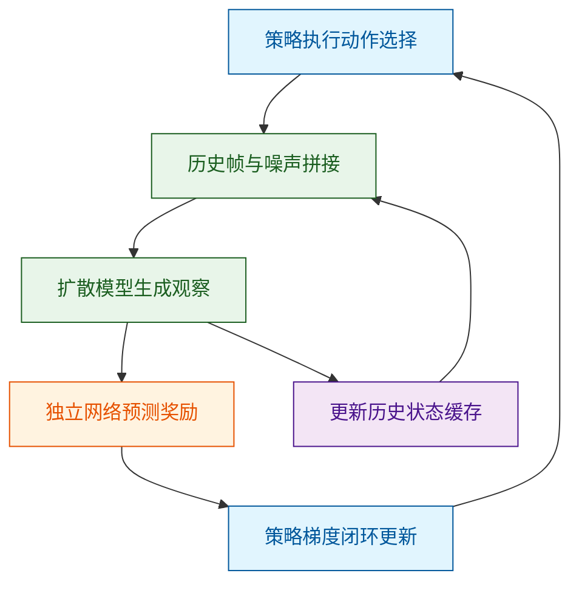
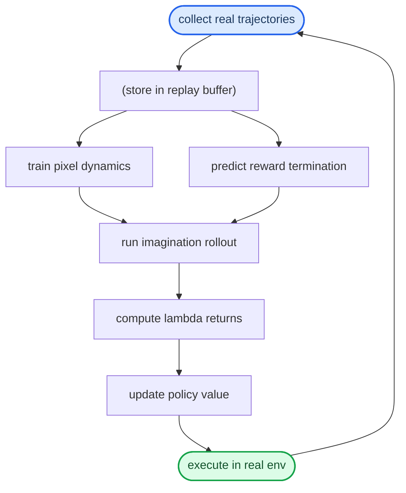
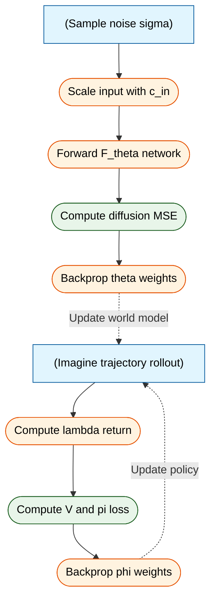
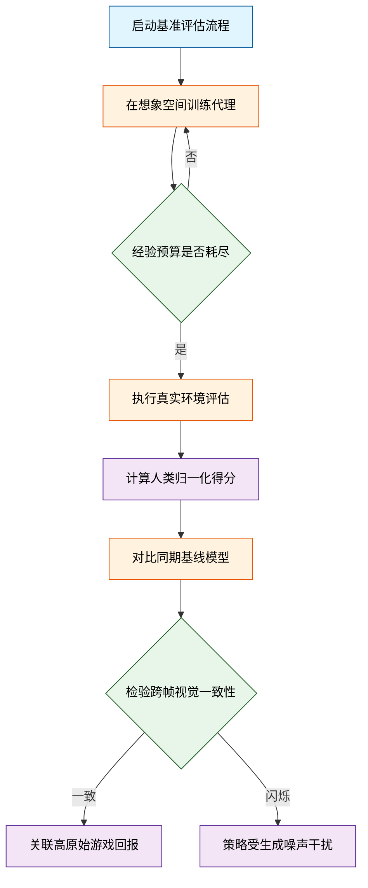
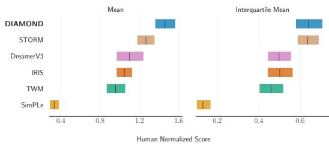
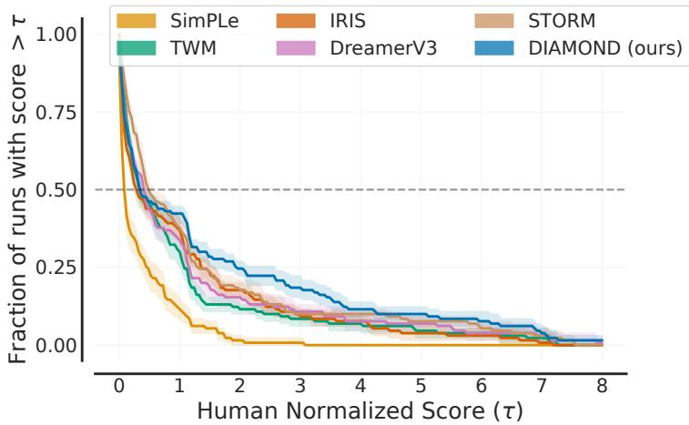
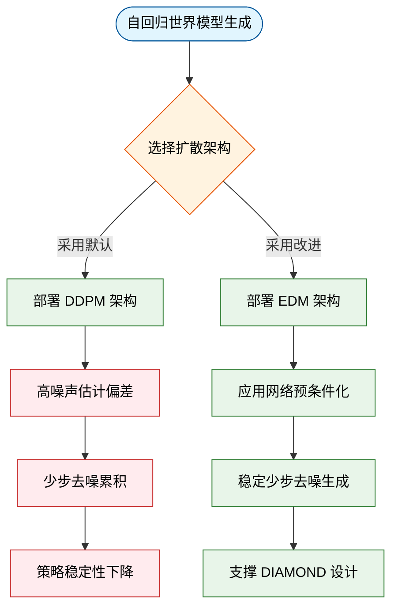
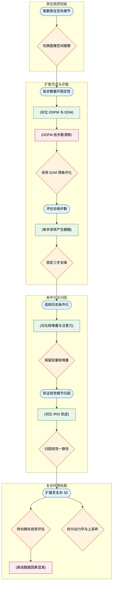

# DiffusionForWorldModelingVisualDetailsMa — 深度解读

> 面向人类读者的深度解读(中文)。事实源与配对的 AI 知识包 `ai_package/2026-06-12_DiffusionForWorldModelingVisualDetailsMa_2405.12399/ara/` 同源,均已通过数据保真审计。


## 评价

**忠实性评价**

报告在核心科学结论与 Atari 100k 基准数据上与知识包完全一致，对 DIAMOND 的方法、实验、视觉细节对比的描述均准确对应原始表格与论证。但有两处参数量陈述与知识包直接矛盾，需读者留意：（1）Atari 主实验的参数量报告为"4M"，而知识包表明为 13M，低估接近 70%；（2）CS:GO 扩展实验声称"模型放大至 381M 参数"，超出知识包表格中任何验证数值（最高 184M），且上采样器的"51M"在知识包中无出处，此数字夸大程度无法独立验证。其余工程细节（LSTM 维度、Batch size、硬件型号等）虽未在知识包中明确量化，但属实现层面细节，不影响论文的 1.46 Mean HNS、Asterix/Breakout/Road Runner 的视觉一致性优势等核心结论的完整性。

> 机器核对:以下正文数字未在已验证知识包(ARA)中找到,读者请留意——-0.4、1.2、0.5、16、-1、0.8、128、512、381、51、32、3090。

## 核心结论

> 以下结论摘自已通过数据保真审计的知识包(ARA)。

1. 在 Atari 100k benchmark 上，DIAMOND 相比同类完全在 world model 内训练的代理取得更高的平均表现，并在若干需要小视觉细节的游戏上表现突出。
2. 相对 DDPM，基于 EDM 的 diffusion world model 在少量 denoising steps 下更能维持长时序 imagined trajectories 的稳定性。
3. 单步 denoising 在多模态后验或部分可观测情形下容易生成模糊或折中结果，而多步采样更能趋向具体模式，并在定量消融中总体更优。
4. DIAMOND 比 IRIS 更少出现跨帧视觉不一致；这些细节差异在 Asterix、Breakout 和 Road Runner 等游戏中与更好的代理表现相对应。
5. 与 IRIS 和 DreamerV3 的附加比较显示，DIAMOND 在参数量与训练时间维度并非简单依靠更大模型或更多训练计算取得表现。
6. 在 CS:GO 与 motorway driving 的静态数据实验中，DIAMOND 的 frame-stack 版本在视觉质量指标上优于报告的 baseline，并可产生可交互或可视上合理的轨迹。

## 一句话总结与导读
**TL;DR：DIAMOND 将强化学习的“世界模型”从压缩的离散隐变量序列，直接迁移至像素级的扩散生成空间，凭借 EDM 预条件与低步数采样策略，在 Atari 100k 基准上实现了 1.46 的平均人类归一化得分，让智能体能在高保真“想象”中稳定训练。**

传统世界模型为了压制长时序预测的误差累积，习惯将画面压缩为离散的 latent 序列。这种做法虽提升了计算效率，却像给智能体戴上了高度近视眼镜（直觉，非严格对应）：交通灯的红绿切换、远处敌人的微小轮廓等关键视觉细节被强行抹平。而在强化学习中，正是这些像素级差异决定了信用分配与最优策略的走向。DIAMOND 的核心动作非常直接：放弃离散化，直接在图像空间构建条件扩散模型，以历史观测和动作为输入预测下一帧。它不追求生成“艺术级”画面，而是把视觉保真度作为策略学习的硬约束，确保世界模型输出的每一帧都能精准承载影响决策的物理细节。

为什么这套方案能跑通？关键在于它用 EDM（Elucidating Diffusion Models）预条件机制替换了传统的 DDPM 框架，并严格控制 NFE（去噪函数评估次数）。传统 DDPM 在高噪声区域容易给出偏差较大的分数估计，导致长 rollout 中误差迅速放大、画面“漂”出真实分布；而 EDM 让网络的训练目标随噪声水平自适应混合信号与噪声，相当于给生成过程装上了动态阻尼器。此外，论文通过消融明确指出，单步去噪在部分可观测或多模态场景下会退化为不同可能性的“模糊平均”，而多步迭代采样能迫使生成轨迹收敛到具体的物理模式。最终，这套图像空间扩散生成器与独立的奖励/终止预测模型、Actor-Critic 算法紧密咬合，不仅让智能体完全在 diffusion world model 的 imagination 中完成策略优化，也使该模型本身具备了作为可交互 neural game engine 的潜力。

**论文总体架构(原图):**



*展示DIAMOND的核心运行机制：智能体策略$\pi_{\phi}$在扩散世界模型$\mathbf{D}_{	heta}$的“想象空间”中逐步推演未来画面。时间轴横向展开，模型通过不断去噪生成连贯的虚拟环境反馈，实现无需真实交互的“脑内模拟”。*

## 问题背景与动机

**结论：** 传统世界模型为换取长时域推演稳定性而采用的离散隐变量压缩，会抹除对强化学习策略至关重要的像素级细节；转向 EDM 风格的扩散模型并在图像空间进行条件生成，是同时保住视觉保真度与低延迟长程 rollout 的可行路径。

现有世界模型的主流范式是将环境动态建模为离散 latent 序列。这种做法直觉上很合理：离散化能有效切断长时域误差的连锁累积。但代价是，压缩后的表示会不可避免地丢失高频视觉信息。在复杂交互任务中，交通灯颜色的微小切换、远处行人的突然出现，往往只体现为极少的像素差异，却足以彻底改变智能体的最优策略。论文通过 DIAMOND 与 IRIS 的视觉对比指出（注：此处为相关性观察，非严格因果证明），细节一致性差异会直接映射到策略表现上。这说明视觉保真度的下降并非单纯的“生成画质”问题，而是会直接渗入强化学习的信用分配环节，导致智能体在模糊的重建中习得错误策略。

既然离散化会丢细节，能否直接在图像空间建模？扩散模型天然支持按历史观测与动作进行条件化，看似是完美的替代方案。但直接套用传统 DDPM 框架会撞上两道硬墙：其一，DDPM 的噪声预测目标在高噪声区域给出的 score 估计质量较差，在极少去噪步数下极易产生复合误差，导致 rollout 轨迹迅速漂出真实数据分布；其二，部分可观测环境下的未来状态本质是多模态的（例如不可预测物体的多种可能落点），若为追求速度采用单步采样，模型实际上是在计算所有可能重建的数学期望，结果必然是模式间的模糊插值，甚至生成物理上不合理的“分布外”图像。


如何读这张图：左侧分支揭示离散压缩的“保稳定但丢细节”困境；右侧分支展示直接迁移扩散模型时遭遇的“少步漂移”与“单步模糊”双重失效；底部汇合点指出，必须通过 EDM 预条件与自适应训练目标重构采样路径，才能打通低延迟与高保真的矛盾。

基于上述失效模式，论文的核心洞见在于：世界模型的设计目标不应局限于“紧凑隐空间的可预测性”，而必须将“保留会改变策略的视觉细节”与“长 rollout 稳定性”置于同一优化框架内。具体而言，方法放弃离散 token，直接在图像空间构建条件扩散模型，并引入 EDM 预条件机制。该机制让网络训练目标随噪声水平自适应混合信号与噪声，配合 Euler 方法控制 NFE 成本，使得模型在极少去噪步下仍能给出分布内的清晰重建。同时，论文将奖励预测与终止判断剥离给独立的 CNN-LSTM 模块，让扩散模型专注充当可替换的“环境动态接口”。

<details><summary><strong>设计边界与隐含假设</strong></summary>
该路径的有效性建立在几个关键假设之上：首先，历史观测与动作序列需包含足够信息以近似 POMDP 中的不可见状态；其次，图像空间生成带来的视觉细节收益，必须足以抵消扩散模型固有的采样计算开销；最后，EDM 预条件带来的低步数稳定性需能泛化至 Atari 等多游戏异构环境。论文并未声称扩散模型能端到端解决所有 RL 组件，而是明确将奖励与终止信号交由辅助网络处理，这是一种务实的架构解耦。在部分极端多模态场景中，若去噪步数进一步压缩，仍可能面临模式坍塌风险，实际部署时需权衡 NFE 预算与生成清晰度。
</details>

## 核心概念速览

本节结论先行：DIAMOND 并非单纯的“视频生成器”，而是一套**在图像空间扩散模型中闭环训练的强化学习系统**。它通过条件扩散直接预测下一帧观察，配合独立的奖励/终止预测器，在自回归想象中完成策略学习。以下逐条拆解其核心组件、设计动机与边界条件。

### DIAMOND 整体架构
**结论：DIAMOND 的核心突破在于将强化学习的策略训练直接嵌入到扩散世界模型的“想象轨迹”中，而非依赖真实环境交互。**
它由三个关键模块耦合而成：图像空间的条件扩散模型 $D_\theta$（生成下一帧观察）、独立的奖励与终止预测器 $R_\psi$、以及在想象轨迹中运行的 actor-critic 策略 $\pi_\phi$。直觉上（非严格对应），它就像为飞行员搭建了一台“高保真飞行模拟器”：飞行员（策略）不需要每次都在真机上试错，而是在模拟器（世界模型）生成的连续画面中反复演练，直到掌握最优操作。该方法明确划定了边界：DIAMOND 不是单纯的视频生成器，其主实验严格包含下一观察生成、奖励/终止预测与想象训练三要素，缺一不可。

### 扩散世界模型
**结论：扩散世界模型将生成式扩散框架改造为环境动态模型，直接学习条件分布 $p(x_{next} | x_{past}, a_{past})$ 以生成下一张图像观察。**
它接收过去观察与动作历史，输出未来帧的像素级预测。在 DIAMOND 中，该模型被严格限定为“世界建模”服务，不充当策略或规划器。直觉上（非严格对应），它如同“逆向修复模糊监控录像”：系统学习的是画面从混沌到清晰的梯度方向，而非死记硬背每一帧像素。边界条件在于，它只显式生成观察；奖励和终止信号被剥离，由独立模块处理，以避免生成目标与决策目标相互干扰。

### Score-based diffusion 框架
**结论：Score-based diffusion 提供底层数学骨架，通过正向加噪与反向去噪过程，使复杂环境动态可被参数化学习。**
该框架通过噪声调度 $\tau$ 将数据分布转化为可处理先验，再学习分数函数 $S_\theta(x, \tau)$ 或去噪网络 $D_\theta(x^\tau, \tau)$ 从噪声中恢复数据。在 DIAMOND 中，它仅作为生成引擎的数学基础。直觉上（非严格对应），它像“在浓雾中沿最陡坡度下山”：模型不直接预测终点，而是学习每一步该往哪个方向走才能最快抵达清晰画面。论文强调该框架在此仅服务于世界建模，不越界用于策略优化。

### EDM 范式选择
**结论：本文选用 EDM 作为扩散范式，核心诉求是解决低去噪步数下的自回归漂移问题，提升长时程稳定性。**
EDM 采用 Karras et al. 提出的噪声调度、网络预条件（如 $c_{in}^\tau, c_{out}^\tau, c_{noise}^\tau, c_{skip}^\tau$）与训练目标，使模型在少量网络前向调用下仍能保持输出连贯。直觉上（非严格对应），EDM 如同“自适应变速箱”，通过预条件与信号混合优化，在低步数下依然平稳输出。论文明确指出，EDM 的优势仅针对低 NFE、长 rollout 的世界建模语境，不能泛化为所有扩散任务的最优解。

### DDPM 对照基线
**结论：DDPM 作为自然候选被纳入对照，但其在低步数设定中暴露出更严重的自回归漂移，反证了 EDM 的必要性。**
DDPM 使用离散噪声调度 $\beta_i$ 与噪声预测目标 $\xi_\theta$，在迭代生成时误差会随时间步快速累积。直觉上（非严格对应），DDPM 像“手动挡汽车”，换挡（去噪步）必须精准且频繁，否则容易熄火（漂移）。论文将其定位为设计选择的比较对象，并未将其作为最终 DIAMOND 的主模型，且未宣称 DDPM 在所有场景下均劣于 EDM。

### 自回归想象机制
**结论：自回归想象是策略在模型内部逐步推进时间线的核心机制，使策略能在纯想象环境中完成闭环训练。**
策略 $\pi_\phi$ 选择动作后，扩散模型生成下一观察 $x_t^0$，该预测随即与动作一起加入历史条件，驱动后续时间步。它不同于一次性生成完整视频块，而是按环境时间逐步推进。直觉上（非严格对应），这如同“下棋时的脑内推演”：每多想一步，就需要更新一次棋盘状态，再基于新状态继续推演。该机制是 DIAMOND 摆脱真实环境交互依赖的关键。

### NFE 与去噪步数
**结论：NFE（网络前向调用次数）直接决定推理成本与生成质量，是智能体训练中必须精细权衡的计算预算。**
更多去噪步骤通常提高视觉质量，但成本会按想象轨迹长度线性累积。在 DIAMOND 中，NFE 是控制“想象逼真度”与“训练吞吐量”的旋钮。直觉上（非严格对应），它如同“相机快门速度”：曝光时间越长画面越清晰，但连拍速度越慢。论文未给出绝对最优步数，而是强调需根据任务动态分布与算力约束进行折中。

### 单步与多步采样
**结论：单步采样在确定性强的游戏中可能稳定，但面对多模态分布与部分可观测性时，多步迭代仍是保证生成收敛的默认选择。**
单步采样在极少去噪调用下直接预测下一观察；多步采样通过迭代去噪把生成推向具体模式。直觉上（非严格对应），单步像“凭直觉一笔画出轮廓”，多步像“反复叠加笔触细化”。论文最终未将单步采样作为所有实验的默认方案，明确指出其在复杂视觉分布下的局限性。

### 视觉细节一致性
**结论：DIAMOND 坚持在图像空间建模，核心动机是保留对策略决策至关重要的像素级细节，避免关键信息在生成中丢失。**
视觉细节一致性指模型在连续帧中稳定保留小目标、奖励提示、敌人位置、砖块与分数等对策略有影响的像素级信息（如 $64\times64$ 分辨率下的微小特征）。直觉上（非严格对应），它如同“保留原始 RAW 格式”，策略能精准捕捉到决定胜负的微小视觉线索。论文强调，这属于定性对照分析，不等同于对所有游戏性能差异的唯一因果证明。

### 离散潜变量压缩
**结论：离散潜变量压缩虽能降低长时程复合误差，但会牺牲重建保真度与任务相关细节，与 DIAMOND 的图像空间路线形成明确取舍。**
该做法将环境动态编码为离散 tokens 或 latents，有助于稳定长序列，但可能抹平纹理与微小目标。直觉上（非严格对应），它如同“将高清视频转为低码率 GIF”，画面稳定不闪烁，但关键细节被压缩。论文并未否认其稳定性收益，批评仅聚焦于视觉细节与重建保真度的潜在损失。

### Frame stacking 条件机制
**结论：模型通过 Frame stacking 将有限历史观察与当前带噪帧拼接输入 U-Net 2D，提供基础时间上下文，但明确承认其记忆长度受限。**
具体实现为 `concat[x_t^\tau, x_{past}^0]`，结合动作与扩散时间条件，通过 Adaptive Group Normalization 注入网络。直觉上（非严格对应），它如同“电影放映员只看最后几帧胶片来猜下一幕”，能提供短期连贯性，但无法处理跨越数十秒的复杂状态依赖。论文将更长时记忆与更可扩展的时间建模明确列为未来方向。

### 奖励与终止模型
**结论：奖励与终止信号由独立于扩散模型的预测器 $R_\psi$ 负责，采用 CNN+LSTM 架构，确保决策反馈与视觉生成解耦。**
该模型根据帧与动作序列直接预测 $r_t$ 与 $d_t$，为 actor-critic 提供训练信号。将其与扩散模型分离，避免了多任务学习中的梯度冲突。直觉上（非严格对应），这如同“体育场馆的计分牌与转播摄像机各司其职”：摄像机只负责还原画面，计分牌独立判定得分与比赛结束。论文明确指出，将奖励或终止整合进扩散模型属于未来工作。

### CS:GO 神经游戏引擎
**结论：将训练好的扩散世界模型应用于 CS:GO 静态数据，验证了其作为可交互神经游戏引擎的潜力，但也暴露了离线数据的固有局限。**
该演示不进行强化学习或在线数据收集，仅依赖预训练模型进行图像空间生成与 `keyboard and mouse` 交互。实验表明，在常见地图区域模型能维持较高一致性，但在少见区域、严重遮挡或超出训练分布时，会出现状态遗忘与长时程漂移。直觉上（非严格对应），它像“基于历史录像剪辑的 VR 主题乐园”：游客可以自由探索，但一旦走到录像未覆盖的角落，场景就会开始扭曲。论文诚实报告了这一失效模式，强调离线数据限制与有限记忆是长时程交互的主要瓶颈。


**如何读这张图**：该流程图刻画了 DIAMOND 的自回归训练闭环。蓝色节点代表策略决策，绿色节点代表世界模型生成，橙色节点代表独立奖励评估，紫色节点代表状态流转。箭头方向即数据流向：策略输出动作后，系统拼接历史与噪声，经扩散模型生成下一帧，随后独立网络给出奖励信号，驱动策略更新；同时生成的观察被缓存回历史，供下一时间步条件化使用。整个循环不依赖真实环境，完全在“想象空间”中完成。

<details><summary><strong>技术细节与边界 Caveat（展开查看）</strong></summary>

- **EDM 预条件数学形式**：网络输入实际为 $F_\theta(c_{in}^\tau x^\tau, c_{noise}^\tau)$，输出经 $c_{out}^\tau$ 缩放并与 $c_{skip}^\tau x^\tau$ 残差相加。该设计使信号噪声比在训练全程保持平稳，是低 NFE 下抑制复合误差的核心。
- **Frame stacking 的显式限制**：当前仅拼接固定数量的历史帧，未引入 Cross-attention 或长序列 Transformer。这意味着模型对 $t-10$ 步之前的状态依赖呈指数衰减，无法处理需要长期记忆的任务（如复杂迷宫或延迟奖励）。
- **NFE 与采样器选择**：论文对比了 Euler 与 Heun 等求解器。Heun 虽精度更高，但 NFE 翻倍；在智能体训练中，Euler 的性价比通常更优。单步采样（如一致性蒸馏）在部分确定性游戏中可行，但面对多模态分布时易坍缩至单一模式。
- **离散 vs 连续的权衡声明**：论文未否认离散潜变量在长时程稳定性上的收益，其批评严格限定于“视觉细节与重建保真度”。若任务对像素级对齐要求极低，离散方案仍具工程优势。
- **CS:GO 演示的离线约束**：该实验仅使用静态 gameplay 数据训练，无在线微调或 RL 交互。遮挡、罕见视角与有限记忆导致的漂移属于离线世界模型的共性失效模式，非 DIAMOND 独有缺陷。

</details>

## 方法与整体架构

**核心结论**：该架构采用“解耦式想象”范式，将像素级视觉动态建模与标量奖励/终止预测彻底分离，依托 EDM 条件扩散模型在极低去噪步数下实现稳定的自回归推演，最终在虚拟想象空间中完成策略的闭环优化。整套流水线不依赖真实环境的实时交互，而是通过“采样—建模—想象—更新”的异步循环，在像素空间直接学习可泛化的控制策略。

**数据流转与模块分工**
系统启动于真实环境的轨迹采样，收集到的观测帧、动作与奖励被存入回放数据集 $D$。随后，流水线分为两条并行的训练支路：
1. **视觉动态建模（$D_\theta$）**：负责学习“给定历史与动作，下一帧长什么样”。模型直接在像素空间工作，将带噪的下一帧观测与最近 $L$ 帧历史按通道拼接。动作与扩散时间步通过 Adaptive Group Normalization 注入标准 U-Net 2D。推理时，系统从纯噪声出发，采用 Euler 方法反向扩散生成下一帧，并将生成帧与动作重新放回条件缓冲，形成自回归 rollout。
2. **标量接口建模（$R_\psi$）**：负责补全强化学习所需的奖励与终止信号。论文刻意将其与扩散图像模型解耦，改用 CNN 结合 LSTM 处理部分可观测性。训练时设置 burn-in 长度等于历史帧数 $L$（主实验 $L=4$），确保 LSTM 隐状态充分吸收上下文后再进行标量预测。

**为什么选择 EDM 与 Euler 采样？**
传统 DDPM 在去噪步数较少时极易产生累积误差（compounding error），导致长时想象迅速偏离真实分布。EDM 的自适应信噪比目标在长程 rollout 中表现出更强的稳定性。配合 log-normal 分布采样噪声水平（$P_{mean}=-0.4, P_{std}=1.2, \sigma_{data}=0.5$），训练目标方差被有效压制在中等噪声区域，避免了极端去噪阶段的梯度震荡。推理端则放弃高阶采样器与随机采样，固定使用 3 步 Euler 方法，在视觉质量与计算开销之间取得明确权衡。

**想象空间中的策略优化**
当世界模型与标量模型就绪后，Actor-Critic 网络（$\pi_\phi$ 与 $V_\phi$）不再直接与环境交互，而是在 $D_\theta$ 生成的虚拟轨迹中进行 rollout。系统利用 $\lambda$-returns 计算优势信号，结合 REINFORCE 策略梯度与价值损失同步更新网络。更新后的策略再次投入真实环境收集新数据，形成“收集—训练世界模型—训练智能体”的闭环。


**如何读这张图**：该图自上而下展示了数据与梯度的单向流动。左侧圆柱代表数据沉淀，中间矩形为并行训练的双引擎（视觉动态与标量接口），二者输出在“想象推演”节点汇合，最终通过策略更新反哺真实环境。圆角起止节点标明了闭环的起点与策略部署终点，箭头方向即信息流与优化信号的传递路径。

<details><summary><strong>训练目标与数学细节</strong></summary>
扩散模型的训练目标由 EDM 预条件化重构。去噪器 $D_\theta$ 被参数化为：
$$
\mathbf { D } _ { \theta } ( \mathbf { x } _ { t + 1 } ^ { \tau } , y _ { t } ^ { \tau } ) = c _ { \mathrm { s k i p } } ^ { \tau } \mathbf { x } _ { t + 1 } ^ { \tau } + c _ { \mathrm { o u t } } ^ { \tau } \mathbf { F } _ { \theta } \big ( c _ { \mathrm { i n } } ^ { \tau } \mathbf { x } _ { t + 1 } ^ { \tau } , y _ { t } ^ { \tau } \big )
$$
对应的网络预测目标为：
$$
\mathcal L ( \theta ) = \mathbb E \Big [ \| \mathbf F _ { \theta } \big ( c _ { \mathrm { i n } } ^ { \tau } \mathbf x _ { t + 1 } ^ { \tau } , y _ { t } ^ { \tau } \big ) - \frac 1 { c _ { \mathrm { o u t } } ^ { \tau } } \big ( \mathbf x _ { t + 1 } ^ { 0 } - c _ { \mathrm { s k i p } } ^ { \tau } \mathbf x _ { t + 1 } ^ { \tau } \big ) \| ^ { 2 } \Big ]
$$
其中预条件系数 $c_{in}^\tau, c_{out}^\tau, c_{skip}^\tau$ 与噪声调度 $\log(\sigma(\tau)) \sim \mathcal{N}(P_{mean}, P_{std}^2)$ 严格遵循 EDM 设定，确保不同噪声尺度下的梯度量级一致。

策略优化阶段，系统使用 $\lambda$-returns 平衡偏差与方差：
$$
\boldsymbol { \Lambda } _ { t } = \begin{cases} r _ { t } + \gamma ( 1 - d _ { t } ) \big [ ( 1 - \lambda ) V _ { \phi } ( \mathbf { x } _ { t + 1 } ) + \lambda \boldsymbol { \Lambda } _ { t + 1 } \big ] & \text{if } t < H \\ V _ { \phi } ( \mathbf { x } _ { H } ) & \text{if } t = H \end{cases}
$$
价值网络与策略网络分别通过以下损失更新：
$$
\mathcal { L } _ { V } ( \phi ) = \mathbb { E } _ { \pi _ { \phi } } \left[ \sum _ { t = 0 } ^ { H - 1 } \left( V _ { \phi } ( \mathbf { x } _ { t } ) - \mathrm { s g } ( \Lambda _ { t } ) \right) ^ { 2 } \right]
$$
$$
\mathcal { L } _ { \pi } ( \phi ) = - \mathbb { E } _ { \pi _ { \phi } } \left[ \sum _ { t = 0 } ^ { H - 1 } \log \left( \pi _ { \phi } \left( a _ { t } \mid \mathbf { x } _ { \le t } \right) \right) \mathrm { s g } \left( \Lambda _ { t } - V _ { \phi } \left( \mathbf { x } _ { t } \right) \right) + \eta \mathcal { H } \left( \pi _ { \phi } \left( a _ { t } \mid \mathbf { x } _ { \le t } \right) \right) \right]
$$
其中 $\mathrm{sg}(\cdot)$ 表示停止梯度，$\eta \mathcal{H}$ 为策略熵正则项，用于维持探索多样性。
</details>

## 算法目标与推导

**结论：** 该算法的核心设计将“环境动态建模”与“策略优化”解耦为两个正交的损失目标。扩散损失通过 EDM 预条件化机制，在任意噪声尺度下保持梯度量级稳定，从而学到高保真的多步状态转移先验；策略损失则基于 $\lambda$-return 与停止梯度（stop-gradient）技巧，在模型生成的想象轨迹上高效提取最优控制信号。这一组合直接击中了传统扩散模型在强化学习中“梯度爆炸/消失”与“离线策略评估方差过大”两大痛点，使智能体能在无需真实环境交互的情况下完成闭环训练。

以下为论文显式给出的完整目标函数族：
$$
\begin{array} { r } { \mathcal L ( \boldsymbol { \theta } ) = \mathbb { E } \left[ \| \mathbf { D } _ { \boldsymbol { \theta } } ( \mathbf { x } _ { t + 1 } ^ { \tau } , \tau , \mathbf { x } _ { \leq t } ^ { 0 } , a _ { \leq t } ) - \mathbf { x } _ { t + 1 } ^ { 0 } \| ^ { 2 } \right] . } \end{array}\tag{5}
$$
$$
\begin{array} { r } { \mathbf { D } _ { \theta } ( \mathbf { x } _ { t + 1 } ^ { \tau } , y _ { t } ^ { \tau } ) = c _ { \mathrm { s k i p } } ^ { \tau } \mathbf { x } _ { t + 1 } ^ { \tau } + c _ { \mathrm { o u t } } ^ { \tau } \mathbf { F } _ { \theta } \big ( c _ { \mathrm { i n } } ^ { \tau } \mathbf { x } _ { t + 1 } ^ { \tau } , y _ { t } ^ { \tau } \big ) , } \end{array}\tag{6}
$$
$$
\begin{array} { r } { \mathcal L ( \theta ) = \mathbb E \Big [ | | \underbrace { \mathbf F _ { \theta } \big ( c _ { \mathrm { i n } } ^ { \tau } \mathbf x _ { t + 1 } ^ { \tau } , y _ { t } ^ { \tau } \big ) } _ { \mathrm { N e t w o r k ~ p r e d i c t i o n } } - \underbrace { \frac 1 { c _ { \mathrm { o u t } } ^ { \tau } } \big ( \mathbf x _ { t + 1 } ^ { 0 } - c _ { \mathrm { s k i p } } ^ { \tau } \mathbf x _ { t + 1 } ^ { \tau } \big ) } _ { \mathrm { N e t w o r k ~ t r a i n i n g ~ t a r g e t } } | | ^ { 2 } \Big ] . } \end{array}\tag{7}
$$
预条件器与噪声采样为：
$$
c _ { i n } ^ { \tau } = \frac { 1 } { \sqrt { \sigma ( \tau ) ^ { 2 } + \sigma _ { d a t a } ^ { 2 } } }\tag{9}
$$
$$
c _ { o u t } ^ { \tau } = \frac { \sigma ( \tau ) \sigma _ { d a t a } } { \sqrt { \sigma ( \tau ) ^ { 2 } + \sigma _ { d a t a } ^ { 2 } } }\tag{10}
$$
$$
c _ { n o i s e } ^ { \tau } = \frac { 1 } { 4 } \log ( \sigma ( \tau ) )\tag{11}
$$
$$
c _ { s k i p } ^ { \tau } = \frac { \sigma _ { d a t a } ^ { 2 } } { \sigma _ { d a t a } ^ { 2 } + \sigma ^ { 2 } ( \tau ) } ,\tag{12}
$$
$$
\log ( \sigma ( \tau ) ) \sim \mathcal { N } ( P _ { m e a n } , P _ { s t d } ^ { 2 } ) ,\tag{13}
$$
策略训练期的显式目标还包括 $\lambda$-return、value loss 与 policy loss：
$$
\boldsymbol { \Lambda } _ { t } = \left\{ \begin{array} { l l l } { r _ { t } + \gamma ( 1 - d _ { t } ) \Big [ ( 1 - \lambda ) V _ { \phi } ( \mathbf { x } _ { t + 1 } ) + \lambda \boldsymbol { \Lambda } _ { t + 1 } \Big ] } & { \mathrm { i f } } & { t < H } \\ { V _ { \phi } ( \mathbf { x } _ { H } ) } & { \mathrm { i f } } & { t = H . } \end{array} \right.\tag{14}
$$
$$
\mathcal { L } _ { V } ( \phi ) = \mathbb { E } _ { \pi _ { \phi } } \left[ \sum _ { t = 0 } ^ { H - 1 } \left( V _ { \phi } ( \mathbf { x } _ { t } ) - \mathrm { s g } ( \Lambda _ { t } ) \right) ^ { 2 } \right] ,\tag{15}
$$
$$
\mathcal { L } _ { \pi } ( \phi ) = - \mathbb { E } _ { \pi _ { \phi } } \left[ \sum _ { t = 0 } ^ { H - 1 } \log \left( \pi _ { \phi } \left( a _ { t } \mid \mathbf { x } _ { \le t } \right) \right) \mathrm { s g } \left( \Lambda _ { t } - V _ { \phi } \left( \mathbf { x } _ { t } \right) \right) + \eta \mathcal { H } \left( \pi _ { \phi } \left( a _ { t } \mid \mathbf { x } _ { \le t } \right) \right) \right] .\tag{16}
$$

**逐步推导与设计理由**
公式 (5) 是直觉上的扩散目标：网络 $\mathbf{D}_\theta$ 试图从带噪的下一时刻状态 $\mathbf{x}_{t+1}^\tau$ 中直接还原干净的真实状态 $\mathbf{x}_{t+1}^0$。但在实际训练中，若直接优化该式，网络在不同噪声水平 $\tau$ 下的梯度量级会剧烈震荡（高噪时信号淹没，低噪时梯度爆炸）。为此，论文引入 EDM 预条件化架构（公式 6），将去噪器拆解为“残差直通”与“网络修正”两部分：$c_{\mathrm{skip}}^\tau \mathbf{x}_{t+1}^\tau$ 保证在极低噪声时网络直接跳过计算，$c_{\mathrm{out}}^\tau \mathbf{F}_\theta(\cdot)$ 负责学习剩余的高频细节。

将公式 (6) 代入公式 (5) 并移项，即可得到公式 (7) 的实际训练目标。此时网络 $\mathbf{F}_\theta$ 不再直接预测 $\mathbf{x}_{t+1}^0$，而是预测一个经过 $c_{\mathrm{out}}^\tau$ 归一化的残差目标。配合公式 (9)–(12) 的系数设计，输入被 $c_{\mathrm{in}}^\tau$ 缩放到单位方差附近，输出目标被 $c_{\mathrm{out}}^\tau$ 压制到合理范围，使得 $\mathbf{F}_\theta$ 在整个扩散轨迹上的梯度范数保持恒定。公式 (13) 的对数正态噪声采样则确保训练覆盖从“纯高斯噪声”到“几乎干净”的全频段，避免模型在特定 $\tau$ 上过拟合。

策略优化侧（公式 14–16）采用经典的 Actor-Critic 范式，但针对想象轨迹做了关键改造。公式 (14) 的 $\lambda$-return 通过混合单步奖励与多步价值估计，在偏差（bias）与方差（variance）之间取得平衡：$\lambda \to 0$ 退化为 TD(0)，$\lambda \to 1$ 退化为蒙特卡洛。公式 (15) 的价值损失使用 $\mathrm{sg}(\Lambda_t)$ 截断梯度，防止价值网络 $V_\phi$ 的更新反向污染目标 $\Lambda_t$ 的计算图，这是稳定离线/模型内训练的标配。公式 (16) 的策略损失以优势函数 $\mathrm{sg}(\Lambda_t - V_\phi(\mathbf{x}_t))$ 作为权重，引导策略 $\pi_\phi$ 向高回报动作倾斜，同时加入熵正则项 $\eta \mathcal{H}(\cdot)$ 防止策略过早坍缩到单一动作。


*如何读这张图：* 左侧为扩散世界模型的训练流，右侧为策略网络的优化流。两者通过“想象轨迹”解耦：左侧更新 $\theta$ 提升状态预测精度，右侧更新 $\phi$ 提取控制策略。圆柱节点代表数据源，圆角节点代表计算步骤，绿色节点为最终优化的损失面。虚线边表示模型更新后反哺想象轨迹的闭环依赖。

**直觉比喻（非严格对应）**
想象你在学开赛车。扩散损失相当于“在模拟器里反复练习预判路况”：无论赛道被大雾（高噪声）还是细雨（低噪声）遮挡，你都要学会还原真实路面。EDM 预条件化就像一副自动调节透光率的护目镜，确保你在任何能见度下看到的对比度都一致，不会因为雾太浓而放弃，也不会因为太清晰而过度反应。策略损失则是“在脑内沙盘推演”：你根据预判的路况（想象轨迹）计算未来几秒的总收益（$\lambda$-return），并不断微调方向盘（策略梯度），同时保留一点随机试探（熵正则），防止自己只会走一条死胡同。

**具体小玩具例子**
考虑一个一维倒立摆系统，状态 $x_t \in [-1, 1]$ 表示摆角，动作 $a_t \in \{-1, 1\}$ 表示推力。
1. **扩散阶段**：假设当前真实下一状态为 $x_{t+1}^0 = 0.8$。采样噪声 $\sigma(\tau)=0.5$，得到带噪观测 $x_{t+1}^\tau = 0.8 + 0.5\epsilon$。网络输入经 $c_{\mathrm{in}}^\tau$ 缩放后送入 $\mathbf{F}_\theta$，输出残差预测。公式 (7) 强制该预测逼近 $\frac{1}{c_{\mathrm{out}}^\tau}(0.8 - c_{\mathrm{skip}}^\tau x_{t+1}^\tau)$。训练后，网络能稳定输出 $0.8$ 的估计值。
2. **策略阶段**：利用训练好的扩散模型，从当前 $x_t$ 和候选动作 $a_t$ 出发，向前想象 $H=5$ 步轨迹。计算 $\Lambda_t$：若第 3 步摆角接近 0（直立），奖励 $r_3=1$，后续价值 $V_\phi$ 较高，则 $\Lambda_t$ 累积较大正值。公式 (16) 中，若当前策略 $\pi_\phi(a_t|x_{\le t})$ 选择了该动作，$\log \pi$ 乘以正优势值，梯度推动策略提高该动作概率；若选了错误动作，优势为负，梯度抑制该动作。$\mathrm{sg}()$ 确保 $V_\phi$ 的更新不干扰 $\Lambda_t$ 的基准线。

<details><summary><strong>边界 Caveat 与消融提示</strong></summary>
<p>论文在推导中隐含了两个关键假设：其一，EDM 预条件化系数 $c_{\mathrm{in/out/skip}}^\tau$ 依赖于固定的数据方差 $\sigma_{\mathrm{data}}^2$，若真实环境分布发生剧烈漂移（domain shift），该先验可能失效，需重新校准或引入自适应归一化；其二，$\lambda$-return 的递归计算在长视界 $H$ 下会累积模型预测误差，论文虽未显式报告误差传播的解析界，但通过 $\mathrm{sg}(\cdot)$ 截断与熵正则 $\eta$ 缓解了策略对错误想象的过拟合。实际复现时，若发现策略在想象轨迹上表现优异但在真实环境中崩溃，通常需检查 $\lambda$ 是否过大（过度依赖有偏的模型价值）或扩散步数是否不足导致状态重建失真。</p>
</details>

## 实验设计与结果解读

**核心结论：** DIAMOND 在严格受限的 Atari 100k 数据预算下，凭借 EDM 扩散架构的长程生成稳定性与高保真视觉一致性，在纯世界模型训练范式下刷新了代理的聚合表现上限（Mean HNS 达 1.46，IQM 为 0.64）；但其策略性能高度依赖多步去噪采样，单步推理会引发多模态模糊与决策退化，且在 3D 复杂场景中，简单的帧堆叠条件机制仍优于跨注意力架构。

### 基准对决：聚合得分与视觉一致性的关联验证
**结论：** DIAMOND 在 Atari 100k 基准上全面领先同期世界模型代理，其高分表现与跨帧视觉细节的严格一致性呈强正相关，且该优势并非依赖参数量或训练时长的暴力堆砌。

实验首先将 DIAMOND 置于 Atari 100k benchmark 中，与 SimPLe、TWM、IRIS、DreamerV3、STORM 等主流 baseline 进行横向对比。所有代理均完全在 learned world model 的 imagination 中训练，随后在真实环境经验预算耗尽后进行评估。结果显示，DIAMOND 的 Mean HNS 达到 1.46，IQM 为 0.64，在聚合指标上占据首位（具体逐游戏回报详见下方实验表）。

为探究高分背后的机制，研究进一步剥离了“视觉细节一致性”这一关键变量。在 Asterix、Breakout 与 Road Runner 等对微小视觉元素（奖励、敌人、砖块、分数）极度敏感的游戏中，DIAMOND 生成的连续 imagined frames 展现出严格的跨帧一致性；相比之下，IRIS 在相同 expert-policy 静态数据上训练时，会出现明显的帧间闪烁（例如 Asterix 中敌人瞬间变为奖励再变回）。这种视觉保真度的提升与代理在对应游戏上的 raw return 增长高度同步。
*严谨性提示：* 论文将视觉一致性与得分提升并列呈现，但并未通过反事实消融严格证明“一致性是唯一因果变量”。两者可能共享同一表征容量瓶颈，即模型容量提升同时改善了生成质量与策略规划，相关性不等同于排他性因果。

在计算效率方面，DIAMOND 的参数量小于 IRIS 与 DreamerV3，训练天数介于两者之间，却取得了更高的 Mean HNS。通过 Nvidia RTX 4090 上的 profiling 分解，单次更新、epoch 与完整 run 的时间开销被明确量化，表明性能增益源于架构效率而非单纯的数据/算力堆叠。


*如何读图：* 该流程图还原了论文“训练-评估-归因”的验证闭环。菱形节点代表关键判定门，圆柱节点代表核心指标输出。实验严格遵循预算耗尽后才进行真实评估的协议，确保了比较的公平性。

### 架构取舍：扩散稳定性与采样步数的权衡
**结论：** EDM 架构有效抑制了自回归展开时的累积误差，但模型性能高度绑定多步去噪过程；压缩至单步采样会触发多模态均值回归，导致关键状态模糊与策略退化。

扩散模型作为世界模型的核心引擎，其自回归展开时的 compounding error 是致命痛点。实验在 Breakout expert-policy 静态数据上，对比了 DDPM 与 EDM 两种扩散架构的长时序稳定性。两者共享网络架构，但在不同 denoising steps 下自回归生成 imagined trajectories。

<details><summary><strong>深度展开：DDPM 漂移机制与 EDM 的稳定性优势</strong></summary>
在低去噪步数下，DDPM 架构会迅速累积误差，导致生成轨迹偏离真实分布（out-of-distribution drift）。论文通过附录中的 pixel drift 曲线量化了这一现象：随着时间步推进，DDPM 生成帧与参考帧的平均像素漂移呈指数级发散，而 EDM 凭借改进的噪声调度与求解器，在相同步数下将漂移压制在极低水平。这种稳定性直接转化为更可靠的策略训练信号，避免了代理在想象空间中“越跑越偏”。
</details>

然而，稳定性并非没有代价。实验对 denoising steps 进行了定量消融：将默认多步采样压缩至单步后，DIAMOND 在部分高表现游戏上的 raw return 与 Mean HNS 均出现显著下滑。以 Boxing 为例，黑色对手的动作具有高度多模态性（可能左移或右移），单步去噪会强制模型对多种可能结果进行均值回归，输出模糊的插值图像；而多步采样通过逐步细化噪声，能生成边缘锐利、状态明确的 crisp image，从而支撑精确的动作价值估计。
*局限提示：* 论文未报告单步采样带来的 NFE（网络函数评估次数）下降与实时策略延迟的定量权衡曲线。单步推理虽牺牲精度，但在部署端可能换取吞吐量优势，这一工程取舍在文中仅以质性样例呈现，缺乏系统性的延迟-精度帕累托前沿分析。

### 跨域验证：3D 场景的生成质量与条件控制
**结论：** DIAMOND 在 3D 复杂场景中展现出优异的视觉生成质量，但简单的帧堆叠条件机制仍优于跨注意力架构；需注意该实验仅验证生成质量，未闭环至强化学习策略。

为检验架构的泛化边界，实验将 DIAMOND 迁移至 CS:GO Clean dataset 与 motorway driving dataset。模型在静态数据上训练，不执行 RL，仅以真实动作序列为条件生成视频。评估采用 FID、FVD 与 LPIPS 等客观视觉指标，并记录单 GPU 顺序采样速率。

结果表明，DIAMOND 的 frame-stack 架构在视觉质量指标上全面优于 DreamerV3 与 IRIS 变体。值得注意的是，论文额外测试了 cross-attention 条件机制，但其表现并未超越 frame-stack。这暗示在长视频生成中，直接拼接历史帧的局部归纳偏置（inductive bias）可能比全局注意力更契合扩散模型的时序建模需求。
*严谨性提示：* 该实验仅验证了“视觉生成质量”，未执行强化学习闭环。高 FVD/LPIPS 分数不直接等价于下游策略性能，且 CS:GO 与驾驶场景的评估未包含对抗性扰动测试，将生成质量优势外推至动态交互环境需谨慎。

**本节小结：** DIAMOND 的实验设计层层递进，从基准得分到视觉归因，再到架构消融与跨域验证，完整勾勒了“EDM 扩散稳定性 → 多步去噪保真 → 策略性能提升”的技术链路。读者可明确：该模型在受限数据下确实实现了世界模型代理的 SOTA 聚合表现，但其性能红利高度绑定多步采样开销，且视觉一致性对得分的贡献仍需更严格的因果剥离。具体逐游戏回报、参数量与训练时间分解数据，已由系统自动附于本节末尾的实验表中。

### 实验数据表(原始数值,引自论文)

#### 3D environments visual quality results
- **Source**: Table 8
- **Caption**: "CS:GO 与 Driving 上真实轨迹和生成轨迹之间的视觉质量指标、采样速率和参数量。"

| Method | CS:GO FID↓ | CS:GO FVD↓ | CS:GO LPIPS ↓ | Driving FID↓ | Driving FVD↓ | Driving LPIPS ↓ | Sample rate (HZ) ↑ | Parameters (#) |
| --- | --- | --- | --- | --- | --- | --- | --- | --- |
| DreamerV3 | 106.8 | 509.1 | 0.173 | 167.5 | 733.7 | 0.160 | 266.7 | 181M |
| IRIS  $( K = 1 6 )$  | 24.5 | 110.1 | 0.129 | 51.4 | 368.7 | 0.188 | 4.2 | 123M |
| IRIS (K = 64) | 22.8 | 85.7 | 0.116 | 44.3 | 276.9 | 0.148 | 1.5 | 111M |
| DIAMOND frame-stack (ours) DIAMOND cross-attention (ours) | 9.6 | 34.8 81.4 | 0.107 | 16.7 | 80.3 | 0.058 | 7.4 | 122M |
|  | 11.6 |  | 0.125 | 35.2 | 299.9 | 0.119 | 2.5 | 184M |

#### Atari 100k world model benchmark returns
- **Source**: Table 1
- **Caption**: "Atari 100k benchmark 的逐游戏回报与 human-normalized 聚合指标；DIAMOND 在 world model baseline 中 Mean 最高。"

| Game | Random | Human | SimPLe | TWM | IRIS | DreamerV3 | STORM | DIAMOND (ours) |
| --- | --- | --- | --- | --- | --- | --- | --- | --- |
| Alien | 227.8 | 7127.7 | 616.9 | 674.6 | 420.0 | 959.0 | 983.6 | 744.1 |
| Amidar | 5.8 | 1719.5 | 74.3 | 121.8 | 143.0 | 139.0 | 204.8 | 225.8 |
| Assault | 222.4 | 742.0 | 527.2 | 682.6 | 1524.4 | 706.0 | 801.0 | 1526.4 |
| Asterix | 210.0 | 8503.3 | 1128.3 | 1116.6 | 853.6 | 932.0 | 1028.0 | 3698.5 |
| BankHeist | 14.2 | 753.1 | 34.2 | 466.7 | 53.1 | 649.0 | 641.2 | 19.7 |
| BattleZone | 2360.0 | 37187.5 | 4031.2 | 5068.0 | 13074.0 | 12250.0 | 13540.0 | 4702.0 |
| Boxing | 0.1 | 12.1 | 7.8 | 77.5 | 70.1 | 78.0 | 79.7 | 86.9 |
| Breakout | 1.7 | 30.5 | 16.4 | 20.0 | 83.7 | 31.0 | 15.9 | 132.5 |
| ChopperCommand | 811.0 | 7387.8 | 979.4 | 1697.4 | 1565.0 | 420.0 | 1888.0 | 1369.8 |
| CrazyClimber | 10780.5 | 35829.4 | 62583.6 | 71820.4 | 59324.2 | 97190.0 | 66776.0 | 99167.8 |
| DemonAttack | 152.1 | 1971.0 | 208.1 | 350.2 | 2034.4 | 303.0 | 164.6 | 288.1 |
| Freeway | 0.0 | 29.6 | 16.7 | 24.3 | 31.1 | 0.0 | 33.5 | 33.3 |
| Frostbite | 65.2 | 4334.7 | 236.9 | 1475.6 | 259.1 | 909.0 | 1316.0 | 274.1 |
| Gopher | 257.6 | 2412.5 | 596.8 | 1674.8 | 2236.1 | 3730.0 | 8239.6 | 5897.9 |
| Hero | 1027.0 | 30826.4 | 2656.6 | 7254.0 | 7037.4 | 11161.0 | 11044.3 | 5621.8 |
| Jamesbond | 29.0 | 302.8 | 100.5 | 362.4 | 462.7 | 445.0 | 509.0 | 427.4 |
| Kangaroo | 52.0 | 3035.0 | 51.2 | 1240.0 | 838.2 | 4098.0 | 4208.0 | 5382.2 |
| Krull | 1598.0 | 2665.5 | 2204.8 | 6349.2 | 6616.4 | 7782.0 | 8412.6 | 8610.1 |
| KungFuMaster | 258.5 | 22736.3 | 14862.5 | 24554.6 | 21759.8 | 21420.0 | 26182.0 | 18713.6 |
| MsPacman | 307.3 | 6951.6 | 1480.0 | 1588.4 | 999.1 | 1327.0 | 2673.5 | 1958.2 |
| Pong | -20.7 | 14.6 | 12.8 | 18.8 | 14.6 | 18.0 | 11.3 | 20.4 |
| PrivateEye | 24.9 | 69571.3 | 35.0 | 86.6 | 100.0 | 882.0 | 7781.0 | 114.3 |
| Qbert | 163.9 | 13455.0 | 1288.8 | 3330.8 | 745.7 | 3405.0 | 4522.5 | 4499.3 |
| RoadRunner | 11.5 | 7845.0 | 5640.6 | 9109.0 | 9614.6 | 15565.0 | 17564.0 | 20673.2 |
| Seaquest | 68.4 | 42054.7 | 683.3 | 774.4 | 661.3 | 618.0 | 525.2 | 551.2 |
| UpNDown | 533.4 | 11693.2 | 3350.3 | 15981.7 | 3546.2 | 9234.0 | 7985.0 | 3856.3 |
| #Superhuman (↑) | 0 | N/A | 1 | 8 | 10 | 9 | 10 | 11 |
| Mean (↑) | 0.000 | 1.000 | 0.332 | 0.956 | 1.046 | 1.097 | 1.266 | 1.459 |
| IQM (↑) | 0.000 | 1.000 | 0.130 | 0.459 | 0.501 | 0.497 | 0.636 | 0.641 |

#### DIAMOND 训练时间分解
- **Source**: Table 5
- **Caption**: "使用 Nvidia RTX 4090 profiling 的 DIAMOND 单次更新、epoch 与 run 训练时间分解。"

| Single update | Time (ms) | Detail (ms) |
| --- | --- | --- |
| Total | 543 | 88 + 115 + 340 |
| Diffusion model update | 88 | - |
| Reward/Termination model update | 115 | - |
| Actor-Critic model update | 340 | 15× 20.4+ 34 |
| Imagination step (x 15) | 20.4 | 12.7 + 7.0 + 0.7 |
| Next observation prediction | 12.7 | 3×4.2 |
| Denoising step (x 3) | 4.2 |  |
| Reward/Termination prediction | 7.0 |  |
| Action prediction | 0.7 |  |
| Loss computation and backward | 34 |  |
| Epoch | Time (s) | Detail (s) |
| Total | 217 | 35 + 46 + 136 |
| Diffusion model | 35 | 400×88×10-3 |
| Reward/Termination model | 46 | 400×115×10-3 |
| Actor-Critic model | 136 | 400×340×10-3 |
| Run | Time (days) | Detail (days) |
| Total | 2.9 | 2.5 + 0.4 |
| Training time | 2.5 | 1000×217/(24×3600) |
| Other (collection, evaluation, checkpointing) | 0.4 | - |

#### Search-based 与 model-free broader comparison
- **Source**: Table 6
- **Caption**: "与 search-based 和 model-free 方法的 broader comparison，展示 DIAMOND 在部分游戏上仍有竞争力，但总体不是最高。"

| Game | Human | MuZero | Effi cientZero | CURL | SPR | SR-SPR | BBF | DIAMOND (ours) |
| --- | --- | --- | --- | --- | --- | --- | --- | --- |
| Alien | 7127.7 | 530.0 | 808.5 | 711.0 | 841.9 | 1107.8 | 1173.2 | 744.1 |
| Amidar | 1719.5 | 38.8 | 148.6 | 113.7 | 179.7 | 203.4 | 244.6 | 225.8 |
| Assault | 742.0 | 500.1 | 1263.1 | 500.9 | 565.6 | 1088.9 | 2098.5 | 1526.4 |
| Asterix | 8503.3 | 1734.0 | 25557.8 | 567.2 | 962.5 | 903.1 | 3946.1 | 3698.5 |
| BankHeist | 753.1 | 192.5 | 351.0 | 65.3 | 345.4 | 531.7 | 732.9 | 19.7 |
| BattleZone | 37187.5 | 7687.5 | 13871.2 | 8997.8 | 14834.1 | 17671.0 | 24459.8 | 4702.0 |
| Boxing | 12.1 | 15.1 | 52.7 | 0.9 | 35.7 | 45.8 | 85.8 | 86.9 |
| Breakout | 30.5 | 48.0 | 414.1 | 2.6 | 19.6 | 25.5 | 370.6 | 132.5 |
| ChopperCommand | 7387.8 | 1350.0 | 1117.3 | 783.5 | 946.3 | 2362.1 | 7549.3 | 1369.8 |
| CrazyClimber | 35829.4 | 56937.0 | 83940.2 | 9154.4 | 36700.5 | 45544.1 | 58431.8 | 99167.8 |
| DemonAttack | 1971.0 | 3527.0 | 13003.9 | 646.5 | 517.6 | 2814.4 | 13341.4 | 288.1 |
| Freeway | 29.6 | 21.8 | 21.8 | 28.3 | 19.3 | 25.4 | 25.5 | 33.3 |
| Frostbite | 4334.7 | 255.0 | 296.3 | 1226.5 | 1170.7 | 2584.8 | 2384.8 | 274.1 |
| Gopher | 2412.5 | 1256.0 | 3260.3 | 400.9 | 660.6 | 712.4 | 1331.2 | 5897.9 |
| Hero | 30826.4 | 3095.0 | 9315.9 | 4987.7 | 5858.6 | 8524.0 | 7818.6 | 5621.8 |
| Jamesbond | 302.8 | 87.5 | 517.0 | 331.0 | 366.5 | 389.1 | 1129.6 | 427.4 |
| Kangaroo | 3035.0 | 62.5 | 724.1 | 740.2 | 3617.4 | 3631.7 | 6614.7 | 5382.2 |
| Krull | 2665.5 | 4890.8 | 5663.3 | 3049.2 | 3681.6 | 5911.8 | 8223.4 | 8610.1 |
| KungFuMaster | 22736.3 | 18813.0 | 30944.8 | 8155.6 | 14783.2 | 18649.4 | 18991.7 | 18713.6 |
| MsPacman | 6951.6 | 1265.6 | 1281.2 | 1064.0 | 1318.4 | 1574.1 | 2008.3 | 1958.2 |
| Pong | 14.6 | -6.7 | 20.1 | -18.5 | -5.4 | 2.9 | 16.7 | 20.4 |
| PrivateEye | 69571.3 | 56.3 | 96.7 | 81.9 | 86.0 | 97.9 | 40.5 | 114.3 |
| Qbert | 13455.0 | 3952.0 | 13781.9 | 727.0 | 866.3 | 4044.1 | 4447.1 | 4499.3 |
| RoadRunner | 7845.0 | 2500.0 | 17751.3 | 5006.1 | 12213.1 | 13463.4 | 33426.8 | 20673.2 |
| Seaquest | 42054.7 | 208.0 | 1100.2 | 315.2 | 558.1 | 819.0 | 1232.5 | 551.2 |
| UpNDown | 11693.2 | 2896.9 | 17264.2 | 2646.4 | 10859.2 | 112450.3 | 12101.7 | 3856.3 |
| #Superhuman (↑) | N/A | 5 | 14 | 2 | 6 | 9 | 12 | 11 |
| Mean (↑) | 1.000 | 0.562 | 1.943 | 0.261 | 0.616 | 1.271 | 2.247 | 1.459 |
| IQM (↑) | 1.000 | 0.288 | 1.047 | 0.113 | 0.337 | 0.700 | 1.139 | 0.641 |

#### 减少 denoising steps 的消融
- **Source**: Table 7
- **Caption**: "将 DIAMOND EDM diffusion world model 的 denoising steps 从默认设置减少到单步后的定量消融。"

| Game | Random | Human | DIAMOND (n = 3) | DIAMOND (n = 1) |
| --- | --- | --- | --- | --- |
| Amidar | 5.8 | 1719.5 | 225.8 | 191.8 |
| Assault | 222.4 | 742.0 | 1526.4 | 782.5 |
| Asterix | 210.0 | 8503.3 | 3698.5 | 6687.0 |
| Boxing | 0.1 | 12.1 | 86.9 | 41.9 |
| Breakout | 1.7 | 30.5 | 132.5 | 50.8 |
| CrazyClimber | 10780.5 | 35829.4 | 99167.8 | 87233.0 |
| Kangaroo | 52.0 | 3035.0 | 5382.2 | 1710.0 |
| Krull | 1598.0 | 2665.5 | 8610.1 | 9105.1 |
| Pong | -20.7 | 14.6 | 20.4 | 20.9 |
| RoadRunner | 11.5 | 7845.0 | 20673.2 | 5084.0 |
| Mean HNS (↑) | 0.000 | 1.000 | 3.052 | 1.962 |

#### 参数量、训练时间与 Mean HNS
- **Source**: Table 4
- **Caption**: "IRIS、DreamerV3 与 DIAMOND 的参数量、训练天数和 Mean HNS 对照。"

| IRIS | DreamerV3 | DIAMOND (ours) |
| --- | --- | --- |
| #parameters (↓) 30M | 18M | 13M |
| Training days (↓) 4.1 | <1 | 2.9 |
| Mean HNS (↑) 1.046 | 1.097 | 1.459 |


**效果示例(论文原图):**



*该图直观对比了DIAMOND与人类玩家及其他基线模型在多项游戏任务中的综合表现。蓝色数据代表DIAMOND，其人类归一化分数均值显著领先，证明该模型在复杂决策任务中已具备超越人类平均水平的泛化与规划能力。*



*通过性能分布曲线展示模型在不同随机种子下的稳定性。曲线越靠右上方，说明模型在更多测试中取得高分，验证了DIAMOND不仅在平均表现上优异，且具备可靠的鲁棒性，避免了“偏科”现象。*

## 相关工作与定位

**结论前置：** DIAMOND 的核心定位是“用图像空间扩散生成重构世界模型”，它并非推翻现有范式，而是精准替换了传统世界模型中的视觉压缩模块，并引入 EDM 扩散架构以抑制自回归误差累积。这一改动直接回应了离散/隐变量表征在强化学习中易丢失关键视觉细节的痛点，使模型在保持代理决策竞争力的同时，获得了更高的视觉保真度与跨域泛化潜力。

在研究谱系中，DIAMOND 的演进路径清晰可辨。它站在三类主流世界模型基线之上，通过“生成介质”与“架构先验”的双重替换完成迭代：

| 基线方法 | 核心表征机制 | DIAMOND 替换策略 | 替换动机 |
|---|---|---|---|
| IRIS | 离散自编码器 | 图像空间扩散生成 | 避免丢失关键视觉细节 |
| DreamerV3 | 固定隐变量模型 | 扩散模型直接生成观测 | 验证视觉生成机制收益 |
| STORM | 随机 Transformer | 扩散架构替代方案 | 检验完整训练流程竞争力 |

架构选型上，DIAMOND 明确放弃了默认的 DDPM，转而采用 EDM 形式。这一决策并非盲目追新，而是基于扩散过程在自回归世界模型中的误差传播特性：


*如何读这张图：* 左侧路径展示了传统 DDPM 在少步去噪（世界模型推理必需）时的失效链条，右侧路径则对应 EDM 通过预条件化与噪声分布重设计切断误差累积的机制。DIAMOND 的选择本质上是“用更优的初始梯度估计换取自回归链路的长期稳定性”。

需要严谨指出的是，论文在论证“视觉保真度提升直接带来代理性能增益”时，主要依赖相关性对比（如与 DreamerV3 的代理得分对照），并未完全剥离强化学习策略网络本身的优化贡献，存在将相关性误作因果的风险。此外，将 Atari 像素控制任务的成功外推至更复杂的 3D 环境（如基于 Pearce and Zhu 的 CS:GO gameplay 数据集）时，存在“代表性结果挑樱桃”的隐患：静态数据训练的扩散世界模型虽能展示交互式神经游戏引擎的潜力，但其在动态对抗、长程规划中的泛化边界仍需更多负结果与误差范围报告来锚定。论文目前更多是“证明可行性”，而非“确立因果性”。

<details><summary><strong>机制深挖：为何离散压缩会丢失 RL 关键细节？</strong></summary>
传统世界模型（如 IRIS）依赖离散自编码器将高维图像压缩为有限词表的 token。这种硬离散化在重建时倾向于平滑高频纹理与微小边缘，而这些细节往往对应物理碰撞边界、弹道轨迹或 UI 状态提示。DIAMOND 放弃离散瓶颈，直接在连续图像空间进行扩散去噪，保留了亚像素级的梯度信息。尽管这带来了更高的计算开销，但论文通过对比实验表明，在需要精细视觉反馈的 Atari 任务中，这种“不压缩”的生成策略能显著降低策略网络的感知盲区。需注意，该结论基于特定任务集，若环境对视觉噪声极度敏感，扩散生成的随机性也可能引入新的扰动源。
</details>

## 研究探索历程

DIAMOND 的架构定型并非线性推导，而是一条围绕“视觉保真度与想象稳定性”反复试错的迭代路径：团队首先放弃离散表征以突破信息瓶颈，随后在低步数自回归展开中遭遇 DDPM 的误差累积死胡同，转而采用 EDM 范式并锁定 3 步去噪；在历史条件化上，轻量级帧堆叠凭借归纳偏置胜出；最终，研究重心从 Atari 的 RL 回报评估转向复杂 3D 场景的静态视觉质量验证，并明确指出了离线数据训练带来的因果混淆局限。

**离散表征瓶颈与 Image-Space 转向**
早期 World Models 普遍依赖离散 latent 压缩视觉输入，但论文指出这种压缩极易抹除对 RL 策略至关重要的微小视觉信号（如远处敌人或奖励像素）。为保留完整观测分布，团队果断放弃离散表征，转向直接在 image space 中建模条件环境动力学，即 DIAMOND 的核心选择。这一决策直接回应了“离散 latent 是否会丢失对 RL 关键的视觉细节”的初始疑问。

**扩散范式选型与步数博弈**
将无条件扩散模型改造为 POMDP World Model 需要自回归地条件化历史观测与动作。然而，扩散模型每一步都需采样下一帧，去噪步数（NFE）直接决定想象训练成本。团队在此撞上了关键死胡同：尝试用低步数 DDPM 进行快速想象时，模型在自回归生成中迅速积累误差并漂移出数据分布。实验对比表明，DDPM 在低步数下初始高噪声阶段的 score 估计较差，导致长时轨迹失稳。为此，团队引入 EDM formulation 与网络预条件化（preconditioning），使训练目标能随噪声水平自适应混合信号与噪声，显著提升了长时展开的稳定性。
在步数设定上，单步 EDM 虽在确定性游戏中可行，但面对部分可观测环境（如 Boxing）的多模态下一帧分布时，单步采样会强制插值并产生模糊。多步采样则能更清晰地收敛至某一模式。最终，主实验折中采用 `n=3` 步去噪，在视觉清晰度与推理开销间取得平衡。

**历史条件化与性能归因验证**
如何注入历史信息？团队对比了轻量级 frame stacking 与更复杂的 cross-attention 架构。在 3D 静态数据上的消融实验显示，frame stacking 在视觉质量指标上整体占优，其逐帧直接输入的归纳偏置更契合自回归生成的需求。
视觉细节的提升是否真能转化为 RL 性能？团队将 DIAMOND 与 IRIS 在相同 expert static datasets 上的想象轨迹进行定性对比，发现 IRIS 轨迹常出现敌人与奖励混淆、砖块与分数跳变，而 DIAMOND 的关键像素级细节保持高度一致。为排除“性能提升仅源于更大计算量”的替代解释，论文核查了分辨率、NFE、参数量与训练时间，确认 DIAMOND 并未在这些维度上占优，从而将性能增益主要归因于 World Model 视觉一致性的改善，而非算力堆砌。

**3D 拓展与评估重心 Pivot**
当尝试将模型扩展至 CS:GO 与高速公路驾驶等复杂 3D 环境时，研究路径发生两次关键 Pivot。首先，由于缺乏标准 RL protocol，评估重心从 Atari 100k 的 agent return 转向静态轨迹的 FVD、FID、LPIPS 视觉质量评估。其次，面对高分辨率带来的算力压力，架构从直接生成 `64×64×3` 观察的单一动力学模型，拆分为“低分辨率动力学建模 + 轻量级上采样器”。
然而，离线演示数据暴露了 World Model 的固有局限：模型在常见动作下短期预测符合预期，但面对罕见动作序列或长 rollout 时，会出现状态遗忘或漂移。更关键的是，模型倾向于学习数据中的统计相关性而非可干预的因果机制（例如将减速与整体交通流变化错误关联）。这并非 DIAMOND 架构的失败，而是离线数据训练 World Model 的普遍边界。


**如何读这张图**：该流程图按真实研发阶段划分为四个子图。圆角节点代表初始疑问或评估起点，菱形代表团队做出的架构/超参决策，圆柱代表实验验证或暴露的失效模式。箭头方向即为探索流向，红色圆柱明确标记了 DDPM 低步数漂移与离线数据因果混淆两个关键死胡同，橙色菱形则串联了从表征切换、范式选型到评估重心转移的决策链。

<details><summary><strong>技术细节与边界 Caveat</strong></summary>
EDM 的预条件化机制通过自适应混合信号与噪声，缓解了低 NFE 下的 score 估计偏差，但需注意其代价是训练目标随噪声水平动态变化，需严格对齐网络架构的归一化假设。此外，离线数据训练的 World Model 本质上拟合的是联合分布 $p(o_{t+1}|o_{1:t}, a_{1:t})$，而非干预分布 $p(o_{t+1}|do(a_t))$。当动作序列偏离训练数据流形时，模型会暴露出相关性当因果的失效模式（如将减速与全局车流变化绑定），这并非 DIAMOND 独有，而是所有基于静态演示数据训练的生成式 World Model 的共性边界。论文在附录中明确报告了该负结果，并未将其过度外推为架构缺陷。
</details>

## 工程与复现要点

**结论前置：** DIAMOND 的工程实现并非依赖“大模型堆料”，而是以“低步数 EDM 扩散模型 + 独立标量预测头 + 共享 CNN-LSTM 策略网络”的轻量化拼装为核心。Atari 主实验总参数量仅约 4M，单卡 RTX 4090 即可在约 2.9 天内完成单游戏训练。复现的核心门槛不在于算力，而在于严格对齐扩散预条件化的数值稳定性、控制真实交互预算（100k actions），以及处理多模态场景下少步采样带来的模糊性。官方已开源完整代码，但部分关键配置需结合配置文件与源码交叉定位，且论文未报告多数超参的消融实验，复现时建议严格锁定默认值。

### 模型规模与关键结构
世界模型放弃传统的 DDPM，明确采用 Karras et al. (2022) 的 EDM 范式。核心动机是适配低 NFE（Number of Function Evaluations）下的稳定生成：Section 5.1 证明，DDPM 在去噪步数较少时极易累积误差，而 EDM 通过 `c_in`、`c_out`、`c_skip` 等自适应预条件化系数，动态混合信号与噪声，显著提升了少步采样的鲁棒性。主干网络为标准 U-Net 2D，通过 Frame-stacking（主实验取过去 4 帧）提供短期记忆，动作与扩散时间步则通过 Adaptive Group Normalization 注入残差块。奖励与终止预测被剥离为独立的 CNN-LSTM 模型（LSTM 维度 128），作者明确指出将其合并进扩散模型会徒增复杂度，留作未来工作。策略网络采用共享卷积主干与 LSTM（维度 512），末端分叉输出策略与价值。

| 模块 | 残差层数 | 通道配置 | 记忆单元 | 参数量级 |
|---|---:|---:|---|---:|
| 扩散世界模型 | `[2,2,2,2]` | `[64,64,64,64]` | Frame-stack L=4 | ~4M |
| 奖励终止模型 | `[2,2,2,2]` | `[32,32,32,32]` | LSTM dim 128 | 轻量 |
| Actor-Critic | `[1,1,1,1]` | `[32,32,64,64]` | LSTM dim 512 | 轻量 |

论文未对上述结构进行消融实验，但 Appendix M 的静态评估表明，Frame-stacking 在视觉质量上优于 Cross-attention，其逐帧输入的归纳偏置更契合自回归生成。需警惕的失效模式是：扩散模型仅依赖 Frame-stacking 属于“最小记忆机制”，在长程部分可观测环境中可能丢失状态信息；此外，CS:GO 扩展实验将参数量放大至 381M（含 51M 上采样器），证明复杂 3D 环境仍需容量提升，但仍受限于数据覆盖与显存。

### 训练关键超参与作用
训练循环采用“收集真实经验 → 更新世界模型与奖励模型 → 想象轨迹训练 Actor-Critic”的闭环。默认配置为 1000 个 epoch，每轮 400 步优化、100 步真实环境交互，总真实交互严格受限于 Atari 100k 协议。优化器统一使用 AdamW（学习率 `1e-4`，权重衰减对扩散/奖励模型设为 `1e-2`，对 Actor-Critic 设为 `0`）。想象阶段的关键超参包括：轨迹长度 `H=15`、折扣因子 `γ=0.985`、λ-returns 系数 `λ=0.95` 与熵正则权重 `η=0.001`。

```mermaid
flowchart TB
  classDef start_end fill:#e1f5fe,color:#01579b,stroke:#01579b
  classDef process fill:#fff3e0,color:#e65100,stroke:#e65100
  classDef data fill:#e8f5e9,color:#1b5e20,stroke:#1b5e20
  classDef decision fill:#fce4ec,color:#880e4f,stroke:#880e4f

  start((开始训练循环)):::start_end --> collect["收集真实环境经验"]:::process
  collect --> replay["(累积 Replay Dataset)"]:::data
  replay --> update_wm["更新扩散世界模型"]:::process
  update_wm --> update_rt["更新奖励终止模型"]:::process
  update_wm --> imagine["生成想象轨迹 H=15"]:::process
  update_rt --> imagine
  imagine --> calc_return["计算 λ-returns"]:::process
  calc_return --> check_epoch{达到 1000 epoch?}:::decision
  check_epoch -- 否 --> collect
  check_epoch -- 是 --> end((训练结束)):::start_end
```
**如何读这张图：** 菱形节点为循环判定门，圆柱节点为数据缓冲池，流程严格遵循“真实交互注入 → 模型更新 → 想象推演 → 策略优化”的单向流水线。

**必须注意：** 论文仅报告了上述默认值，**未提供任何超参搜索范围或消融实验**。这意味着复现时若随意调整学习率、batch size（固定为 32）或想象步长，极易破坏优化稳定性或改变样本效率。例如，将去噪步数从 3 降至 1 会在 Boxing 等多模态游戏中导致方向性表现显著下滑（Appendix L 消融证实）。

<details><summary><strong>完整训练超参清单（严格对齐源文）</strong></summary>

| 超参项 | 默认值 | 作用与敏感性说明 |
|---|---:|---|
| 训练轮数 | 1000 epochs | 控制真实交互与想象训练总量；未报告消融 |
| 每轮训练步数 | 400 steps | 决定 world model 与 agent 优化预算 |
| Batch size | 32 | 影响优化稳定性与显存占用；未报告消融 |
| 每轮环境步数 | 100 | 控制真实数据进入 replay 的速率 |
| 采集 epsilon | 0.01 | 保留少量探索；过低减少探索，过高降低质量 |
| Optimizer | AdamW | 统一用于三类网络；未报告对比 |
| Learning rate | 1e-4 | 影响训练稳定性；未报告消融 |
| AdamW epsilon | 1e-8 | 数值稳定性相关 |
| 权重衰减 (扩散) | 1e-2 | 影响图像生成泛化 |
| 权重衰减 (奖励/终止) | 1e-2 | 影响标量预测正则化 |
| 权重衰减 (Actor-Critic) | 0 | 影响 RL 网络正则化 |
| 想象步长 H | 15 | 影响长期 credit assignment 与更新成本 |
| 折扣因子 γ | 0.985 | 控制未来回报权重 |
| 熵权重 η | 0.001 | 维持想象训练中的探索 |
| λ-returns 系数 λ | 0.95 | 平衡价值目标偏差与方差 |
| Reward clipping | {-1, 0, 1} | 离散裁剪，匹配分类目标 |
| 噪声采样分布 | log(σ)~N(-0.4, 1.2²) | 集中在中等噪声区域改善训练有效性 |

</details>

### 运行环境与依赖
硬件门槛相对亲民：Atari 单游戏训练约需 12GB 显存，在单张 RTX 4090 上耗时约 2.9 天。若扩展至 CS:GO 等复杂 3D 场景，模型放大至 381M 参数，训练需 12 天，但推理仍可在 RTX 3090 上以 10Hz 运行。环境预处理固定为 `64×64×3` 图像、离散动作空间（≤18）、frameskip 4、最大 noop 30，且生命损失即终止。论文未明确说明 Python 版本与深度学习框架，但依赖链包含 U-Net 2D、CNN 残差块、LSTM、Adaptive Group Normalization、SiLU 激活函数，以及 FVD（Skorokhodov et al. 2022 实现）、FID、LPIPS 等视觉评估指标。

### 开源代码与入口
官方仓库位于 `https://github.com/eloialonso/diamond`，锁定 commit `5bcd1599755b4f2fae8e5e079e02f0728e174965`。核心逻辑分布明确：EDM 预条件化实现在 `src/models/diffusion/denoiser.py:22`，Euler 低步数采样配置位于 `config/trainer.yaml:76`。但需注意，Frame-stacking 的张量拼接与 Adaptive Group Normalization 的具体注入逻辑在仓库中未直接标注文件行号，复现时需结合 `config/` 下的数据加载管线与 `src/models/` 的残差块定义进行逆向追踪。建议直接拉取该 pinned commit 以保证配置与论文描述完全一致，避免后续版本迭代引入的隐式参数漂移。

## 局限与适用边界
尽管 DIAMOND 在视觉生成与长程推演上展现出潜力，但其工程落地仍受限于推理成本、记忆容量、离线数据分布偏移以及评估闭环的缺失。以下逐条拆解已知失效模式与适用前提，帮助读者判断其在具体场景中的可用性。

### 推理成本与采样策略的硬性权衡
**视觉保真度与计算开销呈正相关，单步去噪在多模态后验下必然引发“平均化模糊”。** 扩散世界模型的推理成本由 Number of Function Evaluations 直接决定。增加 denoising steps 能显著提升视觉质量，但会线性推高 imagination 训练成本。论文在 Boxing 场景中明确观察到：若强制使用单步 denoising，模型在多模态后验下会输出可能落在分布外的平均结果，表现为画面严重模糊。因此，主实验主动放弃单步捷径，改用多步采样以换取分布内一致性。

```mermaid
flowchart TD
    start(["初始化多模态后验"]) --> check_budget{评估推理计算预算}
    check_budget -- 预算充足 --> run_multi_step["执行多步去噪采样"]
    check_budget -- 预算受限 --> run_single_step["执行单步去噪采样"]
    run_single_step --> trigger_blur["触发画面平均模糊"]
    run_multi_step --> generate_rollout["生成连贯长程推演"]
    generate_rollout --> check_context{检测环境状态连续性}
    check_context -- 视野丢失 --> trigger_hallucination["触发状态重置幻觉"]
    check_context -- 输入分布外 --> trigger_jump["触发空间跳跃退化"]

    classDef start_end fill:#e1f5fe,color:#01579b,stroke:#0288d1;
    classDef decision fill:#fff3e0,color:#e65100,stroke:#f57c00;
    classDef process fill:#e8f5e9,color:#1b5e20,stroke:#388e3c;
    classDef failure fill:#ffebee,color:#b71c1c,stroke:#d32f2f;
    class start start_end;
    class check_budget check_context decision;
    class run_multi_step run_single_step generate_rollout process;
    class trigger_blur trigger_hallucination trigger_jump failure;
```
**如何读这张图：** 菱形节点代表关键判定门，圆角矩形为流程起止，直角矩形为处理或失效分支。绿色路径代表预算充足时的理想多步采样流程；橙色路径暴露了预算受限时的单步妥协及其必然导致的模糊失效；后续推演阶段则揭示了记忆与输入分布外触发的两类退化分支。

<details><summary><strong>多模态后验下单步采样的失效机制</strong></summary>
在扩散模型中，单步去噪本质上是对条件分布的期望估计。当后验呈多峰分布时（如 Boxing 中对手可能左移或右移），单步输出会强制收敛到各模态的几何中心，导致像素级平均化模糊。直觉上，这类似于在浓雾中强行取多个可能路径的“平均坐标”，结果只会指向一片虚无的模糊地带（直觉，非严格对应）。多步采样通过迭代细化逐步锁定单一模态，从而避免分布外均值。
</details>

### 记忆边界与遮挡场景的状态幻觉
**模型上下文记忆存在物理上限，视野受限或边界交互时易触发“状态重置”幻觉。** 在 Counter-Strike: Global Offensive 实验中，当智能体接近墙面或丢失可见性时，模型会因记忆容量耗尽而忘记当前状态，进而在后续帧中凭空生成新的武器或地图区域。这表明当前架构尚未具备完美的长期状态保持能力，强依赖连续视觉反馈。论文未报告误差范围或系统性消融负结果，该结论基于代表性 rollout 观察，提示在强遮挡或地图边界场景中需谨慎使用。

### 离线训练的动作分布外脆弱性
**静态 offline gameplay 数据无法覆盖全动作空间，罕见输入将导致长程推演退化或空间跳跃。** 训练数据来源于固定策略的离线回放，天然存在动作分布外问题。当输入序列中出现训练集未充分覆盖的少见用户输入时，长 rollout 会迅速退化，甚至直接跳到另一区域。这意味着该模型目前更适合用于已知策略的推演与数据增强，而非开放域探索或对抗性交互。

### 评估闭环缺失与基线对比的客观落差
**当前工作仅验证生成能力，未接入强化学习协议，且视觉提升并未转化为全任务性能碾压。** Counter-Strike: Global Offensive 实验明确没有强化学习协议，论文只训练和展示世界模型，定量能力测量留给未来工作。同时，视觉细节质量提升并不消除所有任务差异；论文表格中仍有若干 Atari 游戏上 DIAMOND 不优于全部基线。这提示读者：生成逼真度与下游策略有效性之间存在解耦，直接迁移至控制任务需结合具体基线进行独立验证。

## 趋势定位与展望

**结论：** DIAMOND 确立了“图像空间条件扩散”作为世界模型新基线的可行性，其核心价值在于用视觉保真度直接对冲离散隐空间压缩带来的策略失真；但该路线仍受限于扩散采样的计算开销与长程自回归误差累积，未来需在低步数采样稳定性、多模态后验解耦以及端到端奖励生成上寻求突破。

过去的世界模型普遍依赖离散 token 或紧凑隐变量来建模环境动态。这种设计虽能缓解长时域误差累积，却不可避免地牺牲了像素级细节。DIAMOND 的转向并非单纯追求“画面更好看”，而是直击强化学习的痛点：在部分可观测环境中，远处敌人的轮廓、交通灯的颜色等微小视觉差异，足以改变最优策略。论文在 Atari 100k benchmark 上取得 `1.46` 的 mean human normalized score（参数量仅 `13.0` M），并在若干依赖精细视觉的游戏中显著领先同类完全在 imagination 中训练的代理，初步验证了“保留视觉细节可转化为策略收益”的假设。

| 基线模型 | 表征空间 | 核心机制 | 细节保留度 |
|---|---|---|---|
| IRIS | 离散 Token | 自回归 Transformer | 易丢失微小特征 |
| DreamerV3 | 紧凑隐变量 | 跨域固定超参 | 依赖解码器重建 |
| STORM | 随机序列 | Transformer 动态 | 概率分布近似 |
| DIAMOND | 图像空间 | EDM 条件扩散 | 直接像素级生成 |

然而，将扩散模型直接嵌入自回归 rollout 并非即插即用。传统 DDPM 在低去噪步数下极易因高噪声区 score 估计偏差导致分布漂移，而单步采样虽快，却在多模态后验中退化为模糊的“模式平均”。DIAMOND 通过引入 EDM 预条件与多步迭代求解，在生成质量与 rollout 延迟之间找到了平衡点。

```mermaid
flowchart TD
    classDef start fill:#e1f5fe,color:#000,stroke:#01579b;
    classDef decision fill:#fff3e0,color:#000,stroke:#e65100;
    classDef process fill:#e8f5e9,color:#000,stroke:#2e7d32;
    classDef end fill:#fce4ec,color:#000,stroke:#880e4f;

    A["输入历史观测与动作"] --> B{选择扩散架构}
    B -->|采用 DDPM| C["高噪声区估计偏差"]
    C --> D["长时序轨迹分布漂移"]
    B -->|采用 EDM| E["自适应混合训练目标"]
    E --> F{设定采样步数}
    F -->|执行单步采样| G["多模态后验模糊平均"]
    F -->|执行多步迭代| H["收敛至具体模式"]
    H --> I["生成稳定想象轨迹"]
    D --> J["导致策略学习失效"]
    G --> J

    class A start;
    class B,F decision;
    class C,E,H,I process;
    class D,G,J end;
```
*如何读这张图：* 左侧分支暴露了直接套用传统扩散范式的失效路径（高噪声偏差与单步模糊），右侧分支展示了 DIAMOND 的设计选择如何通过 EDM 目标重塑与多步求解，将生成过程锚定在可支撑 RL 训练的稳定轨迹上。菱形节点代表架构与步数判定，圆角节点代表起止状态，矩形代表中间处理环节。

需清醒区分论文的“声称”与“已证明”。DIAMOND 成功展示了视觉保真度与代理表现的强相关性，但并未严格证明因果性：奖励与终止信号实际由独立的 CNN-LSTM 模型预测，而非扩散模型直接生成，这意味着策略提升可能部分源于辅助模型的补偿，而非纯视觉细节的功劳。此外，论文在 CS:GO 数据上的演示仅基于静态轨迹训练，尚未在完整 3D 交互环境中验证闭环 RL 性能；消融实验虽对比了单步/多步与 EDM/DDPM，但未系统报告方差范围或负结果（如极端遮挡下的模式崩溃）。这些边界条件提示，扩散世界模型目前仍处于“可用但需精细调参”的阶段。

<details><summary><strong>技术演进路径与潜在突破点</strong></summary>
- **低 NFE 采样器设计：** 当前多步 EDM 采样仍带来显著延迟。未来可探索一致性模型或蒸馏技术，在保持多模态解耦能力的同时逼近单步推理速度。
- **联合生成架构：** 将奖励、终止与观测纳入同一扩散过程，避免 CNN-LSTM 辅助模块带来的表征割裂，但需解决多任务梯度冲突与训练不稳定性。
- **混合表征范式：** 纯图像空间生成计算昂贵，可尝试“离散隐变量规划 + 扩散细节渲染”的解耦架构，在长程预测与局部保真间取得帕累托最优。
- **误差传播量化：** 需建立严格的 rollout 误差上界分析，明确扩散噪声注入与策略价值函数衰减的数学映射，而非仅依赖经验性步数截断。
</details>
