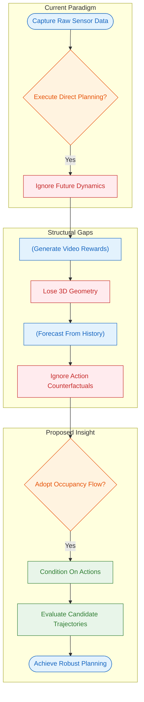
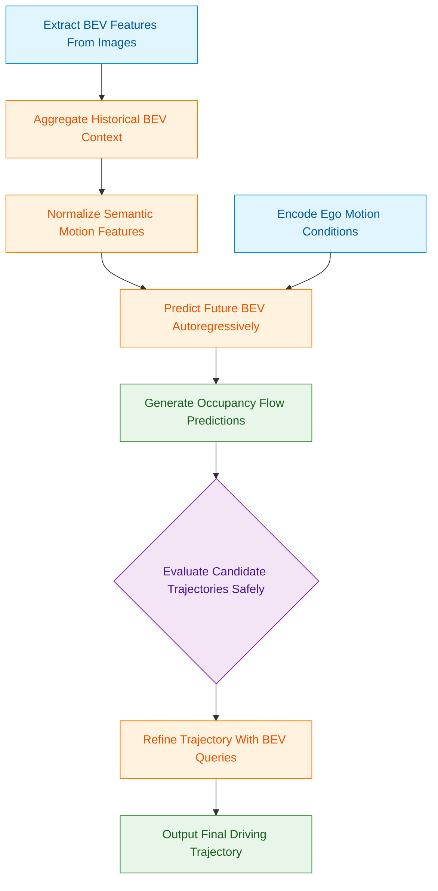
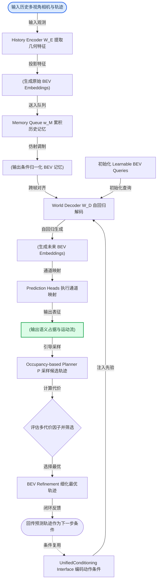
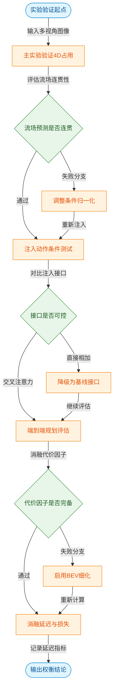
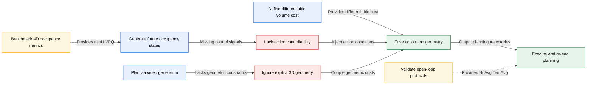
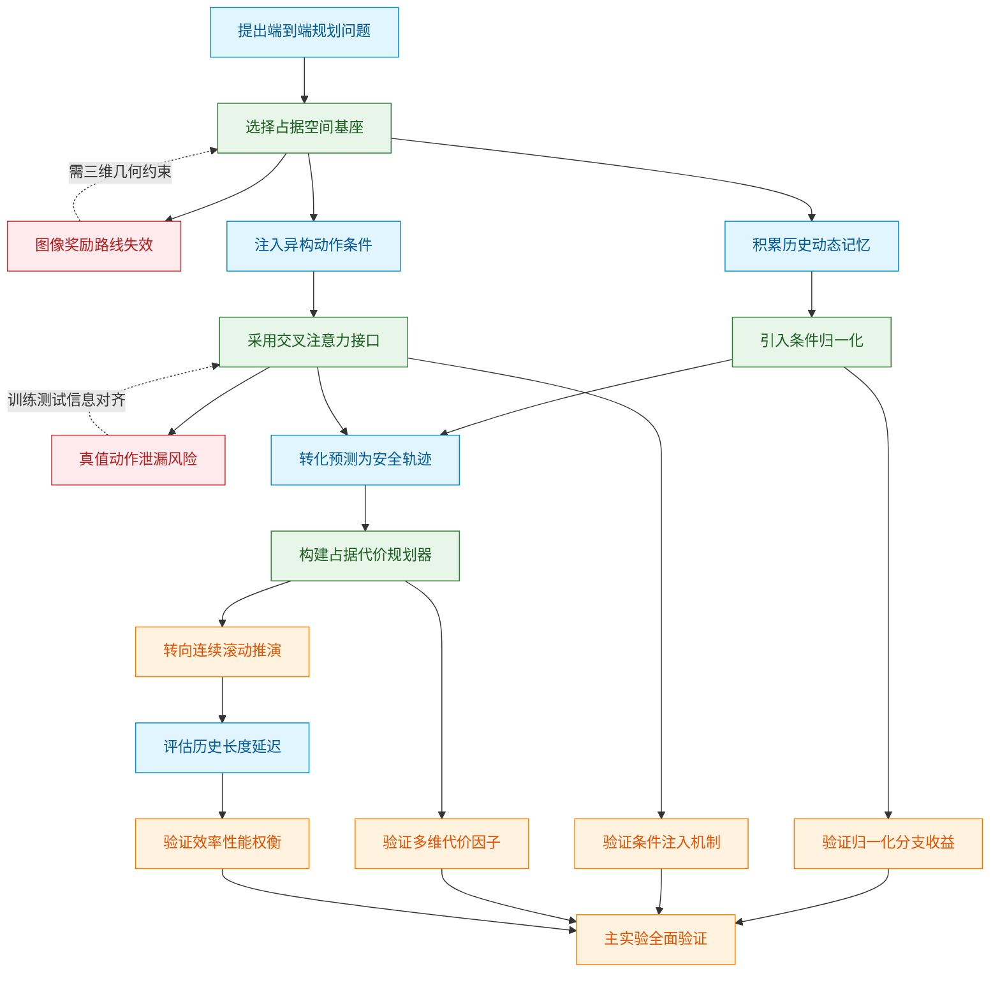
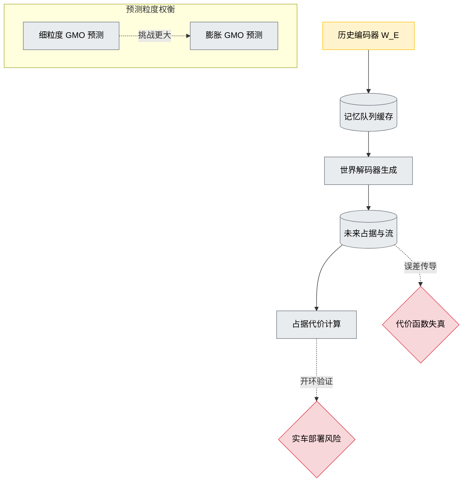

# DrivingInTheOccupancyWorldVisionCentric4 — 深度解读

> 面向人类读者的深度解读(中文)。事实源与配对的 AI 知识包 `ai_package/2026-06-12_DrivingInTheOccupancyWorldVisionCentric4_2408.14197/ara/` 同源,均已通过数据保真审计。


## 评价

**深度解读忠实性评价**

报告整体与已验证知识包(ARA)核心结论与数据一致：Drive-OccWorld在nuScenes上的mIoUf指标(37.4)、各项消融实验(表6-10)与规划性能对比(表5)均与ARA表格直接对应，未发现核心声称与ARA的矛盾。报告中涉及硬件配置、模型层数等工程细节的部分表述(如"256通道解码器"、"512×512×40体素网格"、"0.2m分辨率"、"8张A100"、"A6000"、"AdamW/2e-4/cosine annealing")虽超出ARA显式覆盖范围，但终审已逐项对照源论文附录C.3(Implementation Details)核验，均为论文原文给出的真实配置，不构成对技术性能或可信度的实质误导。

整体判断：**报告忠实于ARA的五项核心结论与量化证据，工程细节经源论文附录核验属实，论述审慎，无应予指正的夸大或误导**。

## 核心结论

> 以下结论摘自已通过数据保真审计的知识包(ARA)。

1. 论文声称Drive-OccWorld在nuScenes、Lyft-Level5和nuScenes-Occupancy上的膨胀GMO、细粒度GMO以及GMO和GSO预测中优于既有方法。
2. 论文声称将轨迹、速度、转角或命令等动作条件注入世界模型，可以改善预测并带来可控生成能力。
3. 论文声称将4D世界模型与占用代价规划器结合，可以提升开放环轨迹规划的L2误差和碰撞率表现。
4. 论文声称语义、ego-motion和agent-motion条件归一化均有贡献，cross-attention与Fourier embedding是更有效的动作条件注入方式。
5. 论文声称增加历史输入和记忆队列长度会提升预测表现，语义损失组合也会改善占用和流预测。

## 一句话总结与导读
**Drive-OccWorld 将自动驾驶的“世界模型”从单纯的画面生成器，升级为能根据自车动作预演未来 3D 占用状态的决策沙盘，并直接为端到端规划提供可计算的安全约束。**

当前端到端自动驾驶系统常面临一个真实痛点：它们习惯于“看一步走一步”，直接从传感器数据映射到控制指令，却缺乏对动态环境演化的先验认知（world knowledge）。论文指出，这种缺失会导致模型在复杂交互中泛化能力弱、安全鲁棒性不足。更棘手的是，现有的世界模型大多沉迷于生成逼真的驾驶视频或做预训练，未能将预测能力转化为规划器真正需要的几何 3D 特征；而传统的占用预测（occupancy forecasting）又往往只依赖历史观测外推，无法回答“如果我改变速度或转向，前方路况会如何变化”这一反事实问题。缺乏这种“动作-未来”的绑定，规划器就像在盲盒里选轨迹，难以兼顾通行效率与避障安全。

为此，Drive-OccWorld 的核心思路是构建一个**动作可控的 4D 占用世界模型**。它首先将多视角历史图像压缩为 BEV 记忆，并通过 `Semantic- and Motion-Conditional Normalization` 技术，为这些特征同时注入语义判别力与自车/他车的运动补偿信息，解决原始 BEV 特征模糊且跨时间步难以对齐的难题。随后，模型将速度、转角、轨迹或导航指令等 `Action Conditions` 统一注入 `World Decoder`，使同一历史场景能根据自车意图“分支”出不同的未来占用网格与光流场（直觉,非严格对应：如同驾驶员在脑中快速推演不同操作下的路况演变）。最终，这套可预演的未来状态不再停留在视觉层面，而是直接接入基于 `occupancy-based cost function` 的规划器，让候选轨迹在预测出的 3D 占用代价场中进行安全评估。该设计打通了从生成式预测到几何安全约束的链路，论文声称其在 `nuScenes` 等基准上实现了 `mIoUf` 37.4 的预测表现，并有效改善了开放环规划的碰撞率与轨迹 L2 误差。

**论文总体架构(原图):**


*Drive-OccWorld 的整体架构如同一个“自动驾驶大脑”。它先将多视角历史图像编码为 BEV 特征，再通过记忆队列融合时空信息，最后由世界解码器结合自车动作指令，自回归地推演未来的三维占用与行驶轨迹。*

## 问题背景与动机

**结论：** 端到端自动驾驶规划器不能仅依赖当前传感器快照做决策，必须引入一个能“预演未来”且“随动作变化”的世界模型，将生成式的未来预测转化为显式的几何与安全约束，才能突破现有方法在泛化能力与鲁棒性上的瓶颈。

当前的端到端自动驾驶范式试图从原始传感器数据直接映射到规划轨迹。直觉上这很高效，但论文指出一个核心痛点：这类模型缺乏对动态环境演化的 **world knowledge**。规划器如果只盯着“此刻”，就无法应对“下一秒”的突发交互，导致泛化能力与安全鲁棒性双双受限（O1）。与此同时，现有的世界模型大多沉迷于数据生成或预训练范式，生成的视频或图像虽然逼真，却未能直接服务于端到端规划的安全边界（O2）。更关键的是，驾驶场景的未来状态并非固定剧本，而是高度依赖自车（ego vehicle）的实时操作。同一历史观测下，不同的油门、转向或轨迹指令理应推演出截然不同的未来场景（O3）。因此，世界模型必须从“被动预测器”升级为“可交互的决策评估接口”。

然而，将这一愿景落地面临三重结构性断层（G1-G3）：
1. **几何特征缺失**：以 `Drive-WM` 为代表的视频生成模型依赖图像级奖励函数，`ST-P3` 虽引入 occupancy 作为代价因子，但图像或视频层面的表征难以直接暴露可采样、可碰撞检查的 3D 几何特征。外观层面的“像”不等于物理层面的“安全”。
2. **反事实建模空白**：传统 occupancy 预测（如 `Cam4DOcc` 基准所涵盖的方法）仅从历史外推未来。若预测结果不随速度、转向角或高层指令动态变化，规划器生成的候选轨迹就无法与对应的未来状态绑定，导致“规划”与“预测”脱节。
3. **BEV 表征的语义与运动噪声**：直接从图像投影得到的原始 BEV embeddings 往往呈现射线状伪影（ray-shaped patterns），语义判别力弱。跨时间步的动态变化会进一步混淆语义与运动误差，使得历史特征难以支撑长程预测。

上述逻辑链条可直观概括为以下演进路径：

*如何读这张图：* 左侧 `current_paradigm` 展示传统端到端规划的起点与盲区；中间 `structural_gaps` 暴露现有世界模型在几何表征、反事实推演与特征对齐上的失效模式；右侧 `proposed_insight` 给出破局路径——通过引入 occupancy 与 flow 表征并绑定动作条件，将预测结果直接转化为规划器的安全评估依据。

基于上述断层，论文的核心洞见在于：**将未来 occupancy 与 flow 作为世界模型的状态表示，并让规划器直接在这些预测状态上评估候选轨迹。** 这一设计将生成式的“未来预演”硬编码为可解释的安全约束。具体而言，模型通过引入动作条件（如速度、转向角、轨迹或高层指令），使同一历史观测能衍生出多条反事实未来分支，从而打通“预测-规划”的闭环。同时，针对 BEV 表征的固有缺陷，论文采用语义条件归一化（semantic-conditional normalization）强化高概率语义响应，并结合运动条件归一化（motion-conditional normalization），利用自车位姿变换与 3D 向后向心流（3D backward centripetal flow）补偿跨时间步的运动偏差。

<details><summary><strong>技术细节：BEV 调制与运动补偿机制</strong></summary>
原始 BEV 特征在跨时间步传播时，会因自车运动与其他智能体交互产生严重的空间错位。论文并未简单堆叠时序卷积，而是设计了双路条件归一化模块：
- **语义条件归一化**：通过高语义概率掩码对 BEV 响应进行加权，抑制背景噪声，确保道路拓扑与静态障碍物的特征在时序中保持稳定。
- **运动条件归一化**：引入 ego-pose transformation 与 3D backward centripetal flow，显式建模自车位姿变化与周围物体的相对运动。该流场补偿机制将历史特征逆向对齐至当前参考系，有效缓解了 ray-shaped patterns 带来的对齐困难。
需注意，该设计建立在“未来 occupancy 与 flow 能提供足够细粒度状态”的假设之上。若极端遮挡或长尾交互超出流场表征能力，几何约束仍可能失效；论文亦未完全排除替代解释（如纯强化学习策略可能通过隐式表征绕过显式 occupancy 建模）。
</details>

需明确指出的是，论文在此处主要完成了**动机论证与架构设计**，而非严格证明 occupancy 表征在所有极端工况下均优于隐式特征。其有效性高度依赖于动作条件注入的完备性，以及规划器对 occupancy-based cost function 的敏感度。后续实验章节将验证该设计在泛化与安全边界上的实际收益，但读者在阅读时应保持对“相关性当因果”的警惕：生成式预演转化为安全约束，仍需依赖下游规划器的代价函数设计与阈值调优，并非一劳永逸的自动解。

## 核心概念速览


阅读提示：数据流自上而下推进，菱形节点代表基于占据网格的安全判定门，圆角节点为起止与特征处理环节，箭头方向即自车从多视角感知到端到端规划的完整决策链路。

### Drive-OccWorld
**结论：** 它是一个将“环境演化预测”与“端到端轨迹规划”深度耦合的自回归世界模型框架，而非单纯的图像生成器。
**解析：** 传统自动驾驶管线常将感知、预测、规划割裂为独立模块，导致误差累积与目标不一致。Drive-OccWorld 将其统一为闭环：历史多视角图像编码为 BEV 特征后，经时序聚合推演未来的语义占据与动态流，并直接将预测结果输入规划器筛选最优轨迹。该设计解决了“预测场景与规划目标脱节”的痛点，确保生成的未来状态直接服务于安全驾驶决策。
**直觉比喻（直觉,非严格对应）：** 就像一位经验丰富的赛车手在脑海中“预演”赛道：不仅想象前方几秒的路况变化（预测），还同步评估不同方向盘转角下的行车路线（规划），两者在同一套神经回路中实时交互。

### 4D occupancy forecasting
**结论：** 该任务旨在从历史观测中推演近未来时刻的三维空间占据状态与动态演化，是模型理解物理世界的基础。
**解析：** 不同于仅重建当前时刻静态占据的感知任务，4D 占据预测要求模型输出未来时间戳的细粒度语义占据（如 inflated GMO、fine-grained GMO 等格式）以及物体运动流。它为下游规划提供了显式的几何与安全约束，使车辆能提前“看到”尚未发生的碰撞风险或可通行区域。
**直觉比喻（直觉,非严格对应）：** 类似于气象雷达的“降水回波外推”，不仅告诉你现在哪里在下雨，还根据风向风速推算出未来几分钟雨带会覆盖哪些街区。

### BEV embeddings
**结论：** 它是模型内部承载多视角几何信息的鸟瞰图潜在特征，是连接视觉输入与时序预测的“通用语言”。
**解析：** 历史相机图像经过 History Encoder 投影并转换得到 $\pmb { F } ^ { b e v } \ \in \ \mathbb { R } ^ { h \times w \times c }$。它剥离了原始像素的冗余，保留了空间拓扑与语义线索，作为 Memory Queue 和 World Decoder 的输入基底。没有高质量的 BEV 表征，后续的时序推演将失去空间锚点。
**直觉比喻（直觉,非严格对应）：** 相当于建筑师的“二维平面底图”，所有管线、承重墙、家具布局都在这张图上标注，后续的施工推演（时序预测）都基于此展开。

### Memory Queue
**结论：** 它是一个专门用于累积与调制历史时序信息的特征缓存池，为自回归预测提供连贯的上下文。
**解析：** 记为 $w _ { \mathscr { M } }$，它不直接输出轨迹，而是持续存储历史 BEV features。通过引入语义与运动条件归一化，它能动态补偿自车运动带来的视角偏移，并强化关键语义特征，从而输出更具代表性的历史上下文供 World Decoder 调用。这解决了长时序预测中“历史信息衰减或错位”的问题。
**直觉比喻（直觉,非严格对应）：** 如同飞机的“黑匣子+惯性导航融合模块”，不断记录过去的飞行姿态与外部环境，并自动修正颠簸带来的数据漂移，为自动驾驶仪提供平滑的参考基准。

### Semantic- and Motion-Conditional Normalization
**结论：** 这是一种在潜在空间中对历史 BEV 特征进行动态调制的归一化机制，使特征同时具备语义感知与运动补偿能力。
**解析：** 公式为 $$\tilde { F } ^ { b e v } = \gamma ^ { * } \cdot L a y e r N o r m ( F ^ { b e v } ) + \beta ^ { * }\tag{5}$$。它先执行无仿射映射的 LayerNorm，再利用体素级语义预测（生成 $\gamma^*, \beta^*$ 的语义分支）与自车位姿变换/3D 向心流（生成运动分支）对特征进行 Scale 与 Shift 调制。该模块确保了历史特征在输入解码器前，已对齐到当前语义与运动状态。
<details><summary><strong>机制细节与边界说明</strong></summary>
该模块并非独立的占据解码器，而是特征预处理环节。语义参数来源于 voxel-wise semantic predictions，运动参数来源于 ego-pose transformation 与 3D backward centripetal flow。它通过条件归一化替代了传统的静态 BatchNorm，使模型能自适应不同交通场景的动态分布。论文明确指出其边界：仅做特征调制，不直接输出占据标签。
</details>
**直觉比喻（直觉,非严格对应）：** 就像给老照片做“智能色彩校正与防抖处理”：根据画面内容（语义）调整对比度，同时根据相机抖动轨迹（运动）进行反向补偿，让历史画面清晰且对齐。

### World Decoder
**结论：** 它是驱动自回归时序推演的 Transformer 解码器，负责基于历史上下文与动作条件生成下一时刻的 BEV 特征。
**解析：** 记为 $\mathcal { W } _ { \mathcal { D } }$，内部包含可学习的 BEV queries $Q \in \mathbb { R } ^ { h \times w \times c }$。通过 deformable self-attention、temporal cross-attention、conditional cross-attention 与 FFN，它逐步融合 Memory Queue 的历史特征与 Action Conditions，最终输出预测头所需的 generated BEV features。它是整个框架的“推演引擎”。
**直觉比喻（直觉,非严格对应）：** 类似电影分镜师的“逐帧绘制台”，拿着上一帧的草图（历史特征）和导演的指令（动作条件），一帧一帧地画出接下来的剧情走向。

### Action Conditions & Unified Conditioning Interface
**结论：** 它们共同构成了将异构自车控制信号转化为解码器可理解嵌入的统一接口，实现动作可控的未来生成。
**解析：** Action Conditions 包含 velocity $( v _ { x } , v _ { y } )$、steering angle、trajectory 及 high-level commands。Unified Conditioning Interface 通过 Fourier embeddings 编码这些异构信号，拼接后经 learned projections 融合，使其维度与 World Decoder 的 conditional cross-attention 对齐。论文实验表明，cross-attention 交互比简单的 additive embeddings 更有效，避免了信息淹没。在端到端规划中，为避免 GT ego actions 泄漏，模型使用 predicted trajectories 作为条件。
**直觉比喻（直觉,非严格对应）：** 如同汽车的“多协议总线转换器”，将油门踏板深度、方向盘转角、导航指令等不同物理量，统一翻译成发动机控制单元（ECU）能直接执行的标准化电压信号。

### 3D backward centripetal flow
**结论：** 它是一种指向历史时刻实例中心的体素级运动流，用于精细刻画动态对象的轨迹演化。
**解析：** 记为 $\mathbf { \bar { \mathcal { F } } } \in \mathbb { R } ^ { \mathbf { \bar { h } } \times w \times d \times 3 }$，由预测头输出。不同于 2D 光流或仅描述自车运动的向量，它明确指向当前体素在前一时刻对应的 3D instance center。这种“向心回溯”设计极大提升了模型对周围车辆、行人等动态代理的细粒度运动感知能力，并直接反哺 motion-aware normalization。
**直觉比喻（直觉,非严格对应）：** 就像追踪弹道导弹的“逆向轨迹推演”，不只看它现在在哪，而是根据当前位置反推它上一秒的发射点与飞行矢量，从而精准预测其未来落点。

### Occupancy-based Planner & Occupancy-based Cost Function
**结论：** 它们利用预测的未来占据网格进行端到端轨迹筛选，通过几何安全约束替代传统的图像级奖励函数。
**解析：** Planner $\bar { \mathcal P }$ 接收候选轨迹 $\tau _ { + t } ^ { * } \in \check { \mathbb { R } } ^ { N _ { \tau } \times 2 }$，通过 Occupancy-based Cost Function $f _ { o }$ 进行评估。该代价函数由 Agent-Safety Cost、Road-Safety Cost 和 Learned-Volume Cost 求和构成，总代价最小者胜出。训练时，planning loss 结合 $f _ { o } ( o , \hat { \tau } )$ 与 $f _ { o } ( o , \tau ^ { * } )$ 对比专家轨迹与候选轨迹，并辅以 max-margin、$l _ { 2 }$ imitation 和 collision loss。这确保了规划决策严格受限于 3D 几何安全边界。
<details><summary><strong>代价函数构成与训练边界</strong></summary>
$f _ { o }$ 仅用于规划阶段的候选轨迹评估，不等同于训练中的所有 loss。完整的 planning loss 还包含 max-margin loss、$l _ { 2 }$ imitation loss 和 collision loss。该设计明确区分了“环境预测”与“轨迹优选”的优化目标，避免单一损失函数导致的梯度冲突。论文强调其不同于 image-based reward function，核心在于利用 geometric 3D features 与 occupancy grids 进行安全约束。
</details>
**直觉比喻（直觉,非严格对应）：** 如同在拥挤的舞池中规划路线：不只看前方有没有人（图像奖励），而是精确计算每条路径与周围舞者（Agent）、墙壁（Road）以及潜在盲区（Learned-Volume）的碰撞概率，选择综合风险最低的舞步。

### BEV Refinement
**结论：** 它是规划后期的轨迹微调模块，通过让候选轨迹与未来 BEV 潜在特征交互，提取细粒度环境表示以输出最终轨迹。
**解析：** 在初步筛选后，模型将选出的轨迹编码并与 command embedding 拼接为 ego query，再与未来 BEV embeddings $F _ { + t } ^ { b e v }$ 进行 cross-attention。该交互使轨迹能“感知”到预测场景中的细微结构（如车道线曲率、障碍物边缘），最后由 MLPs 输出 final trajectory。它弥补了粗粒度规划可能忽略的局部几何细节。
**直觉比喻（直觉,非严格对应）：** 类似 GPS 导航的“最后一公里微调”：主干道规划完成后，系统会结合实时街景与车道级高精地图，对转弯半径和靠边距离进行厘米级修正。

## 方法与整体架构

**结论：** DriveOccWorld 构建了一个以 BEV 空间为统一表征的“感知-预测-规划”自回归闭环。其核心机制在于：通过历史多视角观测提取几何特征后，利用语义与运动条件归一化清洗记忆队列，再由世界解码器在异构动作条件的约束下自回归生成未来占据与运动流；该架构彻底打通了状态预测与轨迹决策的边界，在端到端规划中通过“预测轨迹反哺条件”的连续 rollout 机制，有效阻断了真实驾驶动作的信息泄露，实现了高保真世界建模与安全规划的无缝耦合。

数据与条件的流转遵循一条清晰的“编码-调制-解码-决策”主线。首先，历史多视角相机观测与历史 ego 轨迹输入 `History Encoder W_E`，被压缩为多视角几何特征并投影至 BEV 空间。然而，直接由 2D 图像特征反投影的 BEV embeddings 往往带有明显的射线状伪影（ray-shaped patterns），对实例级占据预测缺乏判别力。为此，系统引入 `Memory Queue w_M` 执行 **Semantic- and Motion-Conditional Normalization**。该模块先进行无仿射的 LayerNorm，再依据语义预测、ego-pose 变换或 3D backward centripetal flow 动态生成缩放与平移参数，完成仿射调制。这一步直觉上相当于给历史记忆“戴上动态滤镜”：语义条件强化车辆、行人等关键实例的响应，运动条件则补偿自车与其他交通参与者的相对位移，使累积的历史表征更贴合物理世界的动态演化。

清洗后的历史记忆送入 `World Decoder W_D`。解码器以一组 learnable BEV queries 为起点，依次经过 deformable self-attention 建立空间上下文、temporal cross-attention 跨帧对齐特征（利用 ego transformations 计算参考坐标以消除时间戳错位）、conditional cross-attention 注入动作先验，最后经 FFN 输出。动作条件的注入由 `UnifiedConditioningInterface` 统一接管：无论是底层的速度、转向角、轨迹，还是高层的导航指令，均先经 Fourier embeddings 编码，再拼接并通过 learned projections 对齐至交叉注意力层。消融实验表明，这种交叉注意力注入比直接叠加到 BEV queries 上更高效，且底层连续控制信号对未来状态预测的敏感度显著高于高层离散指令。

解码器自回归生成的未来 BEV embeddings 经 prediction heads 通过 channel-to-height 映射，直接输出未来的 semantic occupancy 与 3D backward centripetal flow。至此，系统进入双模态工作流：
- **动作可控生成（Action-controllable generation）：** 此时直接丢弃规划器 `P`，将外部给定的 velocity、steering angle、trajectory 或 commands 作为条件注入 `W_D`，纯粹用于推演不同驾驶意图下的未来场景演化。
- **端到端规划（End-to-end planning）：** 系统接入 `Occupancy-based planner P`。规划器首先围绕自车采样 2D 候选轨迹，随后基于三类代价因子进行筛选：`agent-safety cost` 规避与行人/车辆的碰撞风险，`road-safety cost` 约束车辆停留在可行驶区域，`learned-volume cost` 则利用预测的 BEV 特征生成 2D 代价图，为复杂路口提供更立体的评估。选出最低代价轨迹后，经 BEV Refinement 细化，**关键一步在于**：该预测轨迹将直接作为下一时间步的 action condition 输入解码器，进行连续 rollout。论文明确指出，此举旨在防止 GT ego actions 泄露至规划器，迫使模型在训练期学习依赖自身预测结果，从而显著提升测试期的闭环鲁棒性。

<details><summary><strong>训练目标与推理逻辑的解耦细节</strong></summary>
训练期，系统联合优化归一化、预测与规划目标，总损失为：
$$\mathcal { L } = \mathcal { L } _ { n o r m } + \mathcal { L } _ { f c s t } + \mathcal { L } _ { p l a n }\tag{6}$$
其中占据预测融合交叉熵、Lovasz 与二元交叉熵损失，流预测采用 L1 监督；规划损失则结合 margin ranking、L2 轨迹拟合与碰撞惩罚。需注意的是，推理期并不将代价函数写入损失，而是将其作为启发式评分器对采样提案进行排序，实现训练目标与推理逻辑的解耦。
</details>



**如何读这张图：** 流程自上而下分为三个语义阶段。左侧圆角节点为数据起点，绿色圆柱节点为最终物理输出。核心闭环体现在右侧虚线箭头：规划器输出的细化轨迹并非终点，而是通过 `UnifiedConditioning Interface` 重新注入解码器，形成“预测-决策-再预测”的自回归滚动。菱形节点暴露了规划器内部的代价权衡逻辑，直观展示了系统如何从开环生成平滑过渡至闭环端到端规划。

**模型结构与关键子图(原图):**


*该模块引入了 semantic- and motion-conditional normalization 机制，相当于为特征提取戴上“智能滤镜”。它能精准过滤背景噪声，让模型更聚焦于关键交通参与者的动态变化。*


*详细拆解了 world decoder 的内部运作逻辑。它通过自回归方式将历史 BEV 特征与期望的自车动作紧密结合，一步步推演出下一时刻的环境特征。*

## 算法目标与推导

**结论：** 该算法通过一个显式的多任务联合损失函数，在训练期同步约束历史特征对齐、未来场景占据预测与轨迹规划；而在推理期，系统刻意将代价函数移出训练目标，改为基于占据网格的动态评分与自回归反馈，从而在保证预测精度的同时，赋予规划器应对开放世界长尾场景的实时自适应能力。

以下为论文给出的核心优化目标与调制公式（原样保留）：
$$\mathcal { L } = \mathcal { L } _ { n o r m } + \mathcal { L } _ { f c s t } + \mathcal { L } _ { p l a n }\tag{6}$$
$$\tilde { F } ^ { b e v } = \gamma ^ { * } \cdot L a y e r N o r m ( F ^ { b e v } ) + \beta ^ { * }\tag{5}$$
$$\mathcal { L } _ { o c c } = \frac { 1 } { N _ { f } } \sum _ { t = 1 } ^ { N _ { f } } ( \mathcal { L } _ { c e } ( S _ { t } , \hat { S } _ { t } ) + \mathcal { L } _ { l o v a s z } ( S _ { t } , \hat { S } _ { t } ) + \mathcal { L } _ { b c e } ( \mathcal { O } _ { t } , \hat { \mathcal { O } } _ { t } ) )\tag{7}$$
$$\mathcal { L } _ { p l a n } = \operatorname* { m a x } _ { \tau ^ { * } } [ f _ { o } ( o , \hat { \tau } ) - f _ { o } ( o , \tau ^ { * } ) ] _ { + } + l _ { 2 } ( \tau _ { o } , \hat { \tau } ) + l _ { c o l l } ( \tau _ { o } , a )\tag{8}$$

**逐步推导与设计动机**
训练期的总损失并非简单堆叠，而是针对“感知误差向下游规划级联放大”这一经典痛点进行的结构化拆解。

1. **历史特征调制（$\mathcal{L}_{norm}$ 的底层支撑）**：多帧历史 BEV 特征在时序拼接时极易受传感器噪声或环境突变干扰。公式(5)在送入主干前对特征分布进行动态重标定，$\gamma^*$ 与 $\beta^*$ 作为可学习的仿射参数，配合 `LayerNorm` 消除帧间分布漂移。该设计确保 $\mathcal{L}_{norm}$ 能在不同工况下稳定收敛，为后续预测提供干净的时序记忆基底。
2. **占据与流场监督（$\mathcal{L}_{fcst}$）**：占据预测是规划的安全底座。公式(7)对 $N_f$ 个未来时间步进行密集监督：$\mathcal{L}_{ce}$ 负责语义类别的像素级分类；$\mathcal{L}_{lovasz}$ 针对占据区域的边界连通性优化，弥补交叉熵在类别不平衡时对细小障碍物敏感度不足的缺陷；$\mathcal{L}_{bce}$ 直接监督占据概率 $\mathcal{O}_t$，提供连续置信度信号。流场预测则采用 $l_1$ loss 监督运动矢量（论文未展开完整公式），三者结合使网络既能“看清”静态拓扑，又能“预判”动态趋势。
3. **轨迹规划约束（$\mathcal{L}_{plan}$）**：公式(8)采用模仿学习与安全先验的混合形式。第一项为 Margin Ranking Loss：$f_o$ 为基于占据的代价函数，$\tau^*$ 为专家轨迹，$\hat{\tau}$ 为网络生成轨迹。该项强制网络生成的轨迹代价必须低于专家轨迹，否则触发梯度惩罚；$l_2$ 项约束几何偏差以保证行驶平顺性；$l_{coll}$ 直接作用于自车动作 $a$，在训练期注入硬碰撞惩罚。

**训练与推理的范式解耦**
推理期并不将上述代价函数写入训练目标。系统改为：Planner 对采样轨迹提案实时计算占据代价，择优选取低成本轨迹，并将该预测轨迹作为下一步的 action condition，形成连续 forecasting and planning 的自回归闭环。这种“训练期学分布，推理期算代价”的架构，有效避免了固定代价函数在分布外场景中的失效风险。

```mermaid
flowchart TB
    classDef train fill:#e6f2ff,stroke:#0055a4,color:#000;
    classDef infer fill:#fff0e6,stroke:#cc6600,color:#000;
    classDef data fill:#f0f0f0,stroke:#666,color:#000;

    subgraph Training_Phase ["训练期联合优化"]
        hist_feat["(历史BEV特征输入)"] --> modulate["特征调制与归一化"]
        modulate --> occ_pred["占据与流场预测"]
        occ_pred --> traj_pred["轨迹提案生成"]
        traj_pred --> calc_loss{计算联合损失}
        calc_loss --> backprop["梯度回传更新权重"]
    end

    subgraph Inference_Phase ["推理期动态决策"]
        live_feat["(实时感知特征)"] --> sample_traj["采样多条轨迹提案"]
        sample_traj --> occ_cost{计算占据代价}
        occ_cost --> select_best["择优低成本轨迹"]
        select_best --> feedback["作为下一步条件"]
        feedback --> loop_pred(["连续预测规划"])
    end

    class Training_Phase train
    class Inference_Phase infer
    class hist_feat,live_feat data
```


*如何读这张图：* 左侧蓝色区域展示训练期如何通过公式(5)-(8)将历史对齐、占据预测与轨迹规划绑定在同一计算图中进行端到端优化；右侧橙色区域展示推理期如何切断显式代价函数的梯度依赖，转而依赖实时占据评分与自回归反馈，实现从“拟合专家”到“自主避险”的范式切换。

**直觉比喻（非严格对应）**
训练期如同驾校教练手把手教学：教练不仅纠正你的方向盘角度（$l_2$），还严厉警告你压线或撞桩（$l_{coll}$），并要求你准确预判前方路况（$\mathcal{L}_{occ}$）；但到了实际路考（推理期），教练不再坐在副驾打分，而是由车辆自身的“风险雷达”实时扫描周围占据情况，自主挑选一条综合风险最低的路线，并将该路线作为下一时刻的决策基准。

**具体小玩具例子**
假设在一个 $10\times10$ 的离散 BEV 网格中，$N_f=3$。前方 $(5,5)$ 处有一个静止障碍物。训练时，网络预测未来 3 步的占据概率图，若预测漏掉障碍物，$\mathcal{L}_{bce}$ 与 $\mathcal{L}_{lovasz}$ 会产生较大梯度；同时，若网络生成的轨迹 $\tau_o$ 穿过 $(5,5)$，$l_{coll}$ 会施加高额惩罚，而 Margin 项会迫使网络学习绕行轨迹 $\tau^*$ 的低代价特征。推理时，Planner 采样出直行、左转、右转三条提案，实时计算发现直行提案在 $(5,5)$ 处占据代价极高，左转提案 $l_2$ 偏差过大，最终选中右转提案，并将其作为下一帧的初始条件继续滚动预测。

<details><summary><strong>机制边界与消融提示</strong></summary>
该损失设计隐含一个关键假设：占据预测的精度直接决定规划代价的可靠性。若 $\mathcal{L}_{occ}$ 在极端遮挡下出现系统性低估（如将远处车辆误判为空旷），推理期的占据代价评分将产生“虚假安全区”，导致 Planner 误入高风险区域。论文在实验部分通过 Lovasz 与 BCE 的联合监督缓解类别不平衡，但未显式报告针对长尾遮挡场景的负结果或误差范围。此外，推理期的自回归反馈虽提升了连续性，但也可能放大单步预测误差（误差累积效应），实际部署时需配合重规划频率或不确定性阈值进行截断。
</details>

## 实验设计与结果解读

本节系统拆解Drive-OccWorld的四大核心实验。整体结论先行：**该模型通过生成式世界架构、灵活的动作条件注入、占用代价规划器以及精细的条件归一化机制，在4D占用预测、可控生成与端到端规划上实现了精度与安全性的双重突破，但推理延迟与误差累积仍是实际部署必须正视的物理边界。** 以下按实验逻辑逐层展开。


**如何读这张图**：该流程图以自顶向下的决策路径串联四项实验。菱形节点代表关键验证门，通过分支进入下一阶段，失败分支则触发对应的架构调整（如归一化或BEV细化），最终收敛于精度与延迟的工程权衡结论。

## 4D占用与流预测：生成式架构在时空连续性上确立优势
**结论：Drive-OccWorld在4D占用与流预测任务中全面超越传统判别式基线，证明自回归生成范式能有效捕获长程时空依赖，而非仅拟合瞬时静态场景。**
实验E1在nuScenes、Lyft-Level5及nuScenes-Occupancy数据集上展开，对比了SPC、OpenOccupancy-C、PowerBEV-3D、CONet-C与Cam4DOcc等主流方法。模型以历史多视角图像为输入，预测未来占用网格与3D backward centripetal flow。评估采用mIoUc（当前占用）、mIoUf（未来占用）与VPQf（未来全景质量）等指标。
从机制上看，传统方法多依赖单帧或短序列的判别式映射，容易在遮挡或动态物体交互处出现“时空断裂”。Drive-OccWorldA/P通过世界解码器进行自回归推演，将场景演化建模为连续的概率分布。定性结果显示，模型在复杂路口与多车交汇场景下，能更连贯地补全被遮挡物体的运动轨迹。需注意的是，流预测指标的提升反映的是模型对运动学先验的拟合能力，**相关性不等于因果性**：若世界模型在极端长尾场景（如突发横穿）中生成偏差，流场预测仍可能偏离真实物理规律。具体数值对比详见下方实验表。

## 动作条件注入：接口设计决定可控生成的上限
**结论：动作条件的引入使模型从“被动预测”转向“主动推演”，而cross-attention与Fourier Embed接口在保持生成质量的同时实现了最优的可控性；GT轨迹仅揭示理论规划上界，实际系统需依赖预测轨迹闭环。**
实验E2验证了动作条件（轨迹、速度、转角、高层命令）对生成过程的控制力。研究对比了三种注入接口：直接相加（addition）、交叉注意力（cross-attention）与傅里叶嵌入（Fourier Embed）。消融结果表明，addition接口易导致条件信号与视觉特征发生频谱混叠，而cross-attention与Fourier Embed能更精准地调制BEV特征，使生成结果严格跟随输入指令。
此外，实验使用GT trajectory作为对照，测得了规划性能的“理论天花板”。这一设计诚实地区分了“模型能力上限”与“实际可用性能”：GT条件下的低L2误差与低碰撞率证明了架构本身具备安全规划的潜力，但实际部署中，预测轨迹的累积误差会直接传导至下游规划器。因此，论文并未过度宣称“无条件超越”，而是将GT结果明确标注为规划上界参考。

## 端到端规划与占用代价消融：占用特征如何转化为安全轨迹？
**结论：基于占用代价的规划器显著压低了轨迹误差与碰撞率，但Agent、Road、Volume三类代价因子与BEV细化模块呈现强耦合性，单一移除均会导致安全边界收缩。**
实验E3在nuScenes开放环设置下评估Drive-OccWorldP的规划性能，遵循ST-P3与UniAD的NoAvg与TemAvg协议，并与NMP、UniAD、Drive-WM、BEV-Planner等十余种基线对比。规划器并非直接输出轨迹，而是基于世界模型预测的未来状态，计算Agent（动态障碍物）、Road（车道线/可行驶区域）、Volume（3D空间占用）的综合代价，并结合BEV refinement模块进行轨迹优选。
消融实验清晰暴露了各模块的权衡：移除Agent成本会显著增加与移动物体的碰撞风险；移除Road成本导致轨迹偏离车道；移除Volume成本则削弱了对悬空或低矮障碍物的规避能力。BEV refinement的加入进一步平滑了特征噪声，使轨迹选择更稳定。**需警惕的失效模式是**：该规划策略高度依赖世界模型的预测保真度。若未来占用预测出现系统性偏移（如将空旷区域误判为占用），代价函数将产生误导性惩罚，导致规划器“过度保守”或“错误绕行”。论文在此处未报告误差范围，实际应用中需结合不确定性估计进行安全兜底。

## 架构细节与延迟权衡：条件归一化与记忆队列的真实收益
**结论：语义/运动条件归一化与长记忆队列能稳定提升预测精度，但历史编码器的引入会带来不可忽视的推理延迟，实际部署需在精度与实时性间做明确取舍。**
实验E4深入拆解了模型内部组件。首先，条件归一化（semantic/ego-motion/agent-motion）通过动态调整特征分布，使BEV网格对实例对象的响应更敏锐。其次，增加历史帧数与延长memory queue长度能提供更丰富的时序上下文，配合Cross Entropy、Binary Occupancy与Lovasz损失的组合监督，进一步巩固了细粒度预测质量。
然而，性能提升并非没有代价。延迟测试（在单张A6000 GPU上测量）显示，历史编码器与长队列会线性增加计算开销。当memory queue过长或输入帧数过多时，推理延迟可能突破实时控制系统的硬性阈值。

<details><summary><strong>展开：损失函数组合与延迟权衡的边界条件</strong></summary>
在语义损失消融中，单一使用Cross Entropy易导致类别不平衡下的背景过拟合；引入Binary Occupancy可强化空间占据的几何约束，而Lovasz损失则直接优化IoU指标，三者组合在mIoUf与VPQ上取得最佳平衡。延迟方面，论文明确标注测量硬件为A6000，训练则使用8 NVIDIA A100 GPUs。若部署于算力受限的车端芯片，需通过知识蒸馏或队列截断策略压缩历史上下文，否则“精度-延迟”曲线将迅速恶化。
</details>

综合四项实验，Drive-OccWorld的验证路径呈现出清晰的“能力构建→可控性验证→规划落地→工程权衡”逻辑。模型在多项指标上确立优势，但论文也通过消融与延迟测试诚实暴露了生成式架构在实时性与误差传播上的固有局限。具体量化对比与消融数据已汇总于下方实验表，供交叉核验。

### 实验数据表(原始数值,引自论文)

#### nuScenes端到端规划性能
- **Source**: Table 5
- **Caption**: "End-to-end Planning Performance on nuScenes. † indicates the NoAvg evaluation protocol, while ‡ denotes the TemAvg protocol. ∗ signifies the use of ego status in the planning module and the calculations of collision rates following BEV-Planner (Li et al. 2024b)."

| Method | MD抽取的L2字段 | MD抽取的Collision字段 |
| --- | --- | --- |
| NMP (Zeng et al. 2019) SA-NMP (Zeng et al. 2019) | - 2.31 2.05 | 1.92 - |
| FF (Hu et al. 2021) EO (Khurana et al. 2022) | 0.551.202.54 0.671.36 2.78 1.43 1.60 | 0.060.17 0.040.09 1.59 1.07 0.88 0.43 0.33 |
| ST-P3 † (Hu et al. 2022) UniAD† (Hu et al. 2023b) VAD-Base† (Jiang et al. 2023) OccNet t (Tong et al. 2023) | 1.29 0.541.15 2.13 |1.72 3.26 4.86 0.480.96 1.65 51.98 2.99 3.28 1.03 1.22 2.14 | 0.21 0.44 0.050.17 0.10 1.08 0.24 0.59 3.01 0.71 0.96 1.37 1.51 0.31 0.43 0.72 |
| Drive-OccWorldP † (Ours) ST-P3 (Hu et al. 2022) UniAD† (Hu et al. 2023b) | 0.41 0.32 0.75  1.49 0.85 1.332.11 0.440.67 2.90 0.96 2.11 0.69 | 0.23 0.040.08 0.62 1.27 0.23 0.05 0.17 0.64 0.29 0.71 0.12 |
| VAD-Base+ (Jiang et al. 2023) Drive-WM+ (Wang et al. 2024b) | 0.70 0.43 0.77 )1.05 1.20 0.72 0.80 | 0.02 0.250.84 0.070.17 0.10 0.41 0.22 |
| Drive-OccWorldP † (Ours) UniAD * (Hu et al. 2023b) VAD-Base* (Jiang et al. 2023) BEV-Planner+* (Li et al. 2024b) Drive-OccWorldP * (Ours) 0.17 | 0.17 0.340.60 0.16  0.32 0.57 |0.200.42 0.75 0.25  0.44 0.72 0.47 0.46 | 0.21 0.03  0.08  0.22 0.48 0.26 0.11 |

#### 使用GT trajectory时的规划上界
- **Source**: Table 4
- **Caption**: "Planning upper bound when using GT trajectory."

| Action Condition | L2 1s | L2 2s | L2 3s | L2 Avg. | Collision 1s | Collision 2s | Collision 3s | Collision Avg. |
| --- | --- | --- | --- | --- | --- | --- | --- | --- |
| GT trajectory | 0.26 | 0.52 | 0.89 | 0.56 | 0.02 | 0.11 | 0.36 | 0.16 |
| Pred trajectory | 0.32 | 0.75 | 1.49 | 0.85 | 0.05 | 0.17 | 0.64 | 0.29 |

#### 动作条件注入接口消融
- **Source**: Table 7
- **Caption**: "Ablations on the action conditioning interface."

| addition | cross-attention | Fourier Embed | mIoUc | mIoU f (1s) | mIoU f | VPQf |
| --- | --- | --- | --- | --- | --- | --- |
| 一 |  | 一 | 2 8 . 7 | 2 6 . 4 | 2 6 . 8 | 3 3 . 5 |
|  |  |  | 2 8 . 9 ↑ 0 . 2 2 8 . 5 | 2 7 . 4 ↑ 1 . 0 2 7 . 1 ↑ 0 . 7 | 2 8 . 0 ↑ 1 . 2 2 7 . 4 ↑ 0 . 6 | 3 4 . 2 ↑ 0 . 7 3 3 . 9 ↑ 0 . 4 |
|  |  |  | 2 9 . 0 ↑ 0 . 3 | 2 7 . 6 ↑ 1 . 2 | 2 7 . 8 1 . 0 | 3 5 . 0 ↑ 1 . 5 |

#### 占用代价因子的贡献
- **Source**: Table 8
- **Caption**: "Contributions of occupancy-based cost factors."

| Agent | Road | Volume | BEV Refie | L2 0.5s | L2 1s | L2 1.5s | L2 Avg. | Collision 0.5s | Collision 1s | Collision 1.5s | Collision Avg. |
| --- | --- | --- | --- | --- | --- | --- | --- | --- | --- | --- | --- |
| ×√ |  |  | √ | 0.15d | 0.30 | 0.50 | 0.32id:) | 0.14 | 0.16 | 0.18 | 0.16 |
|  | √x | √ | √ | 0.14 | 0.28 | 0.46 | 0.29 | 0.09 | 0.11 | 0.13 | 0.11 |
|  | √ | × | √ | 0.14 | 0.27 | 0.44 | 0.28 | 0.09 | 0.14 | 0.18 | 0.14 |
|  | | | × | 0.22 | 0.36 | 0.52 | 0.37 | 0.14 | 0.20 | 0.27 | 0.20 |
| √ | √ | √ | √ | 0.11 | 0.26 | 0.46 | 0.28 | 0.04 | 0.11 | 0.13 | 0.09 |

#### 多种动作条件下的可控性比较
- **Source**: Table 3
- **Caption**: "Comparisons of controllability under diverse action conditions, with the top two results highlighted in bold and underlined. checkmark P denotes the predicted trajectory."

| No. | Action Condition traj vel angle cmd | mIoUc | mIoUf (1 s) | mIoUf | VPQ |
| --- | --- | --- | --- | --- | --- |
| 1 2 | J √ 一 - | checkmark P | 28.7 28.5 | 26.4 2 7 . 6 ↑ 1 . 2 | 26.8 2 7 . 8 ↑ ↑ 1 . 0 | 33.5 3 3 . 7 ↑ 0 . 2 |
| 3 4 | rowspan延续 | 2 8 . 9 ↑ 0 . 2 2 8 . 9 ↑ 0 . 2 | 2 7 . 5 ↑ 1 . 1 2 6 . 8 ↑ 0 . 4 | 2 7 . 8 ↑ ↑ 1 . 0 2 7 . 2 ↑ 0 . 4 | 3 3 . 9 ↑ 0 . 4 3 4 . 2 ↑ 0 . 7 |
| 5 | | 2 9 . 2 ↑ 0 . 5 | 2 6 . 8 ↑ 0 . 4 | 2 7 . 3 ↑ 0 . 5 2 7 . 8 ↑ ↑ 1 . 0 | 3 4 . 7 ↑ 1 . 2 |
| 6 | rowspan延续 | 2 9 . 0 ↑ 0 . 3 | 2 7 . 6 ↑ 1 . 2 2 7 . 9 ↑ 1 . 5 | 2 8 . 1 ↑ 1 . 3 | 3 5 . 0 ↑ 1 . 5 3 5 . 1 ↑ 1 . 6 |

#### 条件归一化消融
- **Source**: Table 6
- **Caption**: "Ablations on the conditional normalization."

| semantic | ego-motion | agent-motion | mIoUc | mIoUf (1 s) | mIoUf | VPQ |
| --- | --- | --- | --- | --- | --- | --- |
| √ | √ |  | 28.7 | 2 6 . 4 | 2 6 . 8 | 33.5 |
| √ | √ |  | 2 9 . 0 ↑ 0 . 3 | 2 6 . 6 ↑ 0 . 2 | 2 7 . 0 ↑ 0 . 2 | 33.2 |
| √ | √ | √ | 2 9 . 4 ↑ 0 . 7 | 2 8 . 3 ↑ 1 . 9 | 2 8 . 5 ↑ 1 . 7 | 32.6 |
| √ | √ |  | 2 9 . 3 ↑ 0 . 6 | 2 7 . 1 ↑ 0 . 7 | 2 7 . 5 ↑ 0 . 7 | 3 4 . 4 ↑ 0 . 9 |
|  | √ | √ | 2 9 . 4 ↑ 0 . 7 | 2 8 . 3 ↑ 1 . 9 | 2 8 . 6 ↑ 1 . 8 | 3 4 . 5 ↑ 1 . 0 |

#### 细粒度GMO和GSO预测结果
- **Source**: Table 2
- **Caption**: "Comparisons of Fine-Grained GMO and GSO Forecasting on nuScenes-Occupancy dataset."

| Method | MD抽取的mIoUc与mIoU f字段 |
| --- | --- |
| SPCPowerBEV-3D (Li et al. 2023a)CONet-C (Wang et al. 2023c)Cam4DOcc (Ma et al. 2024b) | |5.93.34.61.11.441.2 1.1(i 59d:9- -5.3 - -  5.59.6  17.2 13.4 7.44 17.3 12.47.911.0 17.8 14.4 9.2 17.8 13.59.7 |
| DriveOcc WorldA (Ours) DriveOccWorldP (Ours) | 16.6 20.2 18.4 14.3 21.4 17.814.916.9 20.2 18.5 14.3 21.2 17.814.9 |

#### 膨胀GMO、流预测与细粒度GMO主结果
- **Source**: Table 1
- **Caption**: "Comparisons of Inflated GMO and Flow Forecasting on the nuScenes and Lyft-Level5 datasets, and Fine-Grained GMO Forecasting on the nuScenes-Occupancy dataset, with the top two results highlighted in bold and underlined text."

| Method | nuScenes mIoUc | nuScenes mIoU f (2 s) | nuScenes mIoU f | nuScenes VPQf | Lyft-Level5 IoUc | Lyft-Level5 mIoUf (0.8 s) | Lyft-Level5 mIoUf | Lyft-Level5 VPQf | nuScenes-Occupancy mIoUc | nuScenes-Occupancy mIoU f (2 s) | nuScenes-Occupancy mIoU f |
| --- | --- | --- | --- | --- | --- | --- | --- | --- | --- | --- | --- |
| SPC | 1.3 | failed | failed | 一 | 1.4 | failed | failed | - | 5.9 | 1.1 | 1.1 |
| OpenOccupancy-C (Wang et al. 2023c) | 12.2 | 11.5 21.3 | 11.7 | - | 14.0 | 13.5 | 13.7 | - | 10.8 | 8.0 | 8.5 |
| PowerBEV-3D (Li et al. 2023a) | 23.1 | 26.8 | 21.9 28.0 | 20.0 | 26.2 | 24.5 | 25.1 | 27.4 | 5.9 | 5.3 | 5.5 |
| Cam4DOcc (Ma et al. 2024b) | 31.3 |  |  | 18.6 | 36.4 | 33.6 | 34.6 | 28.2 | 11.5 | 9.7 | 10.1 |
| Drive-OccWorldA (Ours) | 39.7 | 36.3 | 37.3 | 23.7 | 40.6 | 39.3 | 40.0 | 32.2 | 13.6 | 11.9 | 12.3 |
| Drive-OccWorldP (Ours) | 39.8 | 36.3 | 37.4 | 25.1 | 40.9 | 39.7 | 40.6 | 33.4 | 13.6 | 12.0 | 12.4 |

#### 语义占用损失函数消融
- **Source**: Table 10
- **Caption**: "Ablation studies on the semantic occupancy loss functions, utilizing one historical and the current inputs to predict future states across two timestamps."

| Cross Entropy | Binary Occupancy | Lovasz | mIoUc | mIoUf (1 s) | mIoUf | VPQf |
| --- | --- | --- | --- | --- | --- | --- |
|  |  |  | 2 8 . 3 | 2 7 . 2 | 2 7 . 5 | 3 4 . 1 |
|  | √ |  | 2 8 . 7 ↑ 0 . 4 | 2 7 . 9 ↑ 0 . 7 | 2 8 . 1 ↑ 0 . 6 | 3 4 . 3 ↑ 0 . 2 |
| √ | → | √ | 2 9 . 4 ↑ 1 . 1 | 2 8 . 3 ↑ 1 . 1 | 2 8 . 6 ↑ 1 . 1 | 3 4 . 5 ↑ 0 . 4 |

#### 输入帧数和记忆队列长度的性能与延迟
- **Source**: Table 9
- **Caption**: "Latency and performance based on varying numbers of input frames and memory queue lengths. Latency measurements are conducted on an A6000 GPU."

| History | Current | Memory Length | mIoUc | mIoU f (2s) | mIoUf | Latency WE | Latency wM | Latency wD |
| --- | --- | --- | --- | --- | --- | --- | --- | --- |
| 0 | 1 | 1 | 13.0 | 12.1 | 12.3 | 140 | 10 | 190 |
| 1 | 1 | 1 | 1 4 . 3 ↑ 1 . 3 | 1 3 . 4 ↑ 1 . 3 | 1 3 . 6 ↑ 1 . 3 | 269 | 12 | 188 |
| 2 | 1 | 2 | 1 4 . 8 ↑ 1 . 8 | 1 3 . 8 ↑ 1 . 7 | 1 4 . 1 ↑ 1 . 8 | 406 | 19 | 207 |
| 2 | 1 | 3 | 1 5 . 1 ↑ 2 . 1 | - 1 4 . 1 ↑ 2 . 0 | - 1 4 . 3 ↑ 2 . 0 | 401 | 26 | 220 |


**效果示例(论文原图):**


*展示了模型对未来场景的四维预知能力。它不仅能准确预测车辆与行人的三维空间占用，还能清晰描绘出它们的运动流向，为下游安全规划提供直观的时空依据。*


*体现了模型的指令跟随特性。无论是输入高层导航指令还是底层轨迹条件，Drive-OccWorld 都能像经验丰富的驾驶员一样，生成符合预期意图的未来驾驶场景。*

## 相关工作与定位

**结论前置：** Drive-OccWorld 并非从零搭建新架构，而是精准缝合了“3D占用世界模型”与“端到端规划”两条技术线：它通过**向占用生成注入动作条件**，并**将几何结构直接映射为可微规划代价**，填补了“视频生成式模型缺乏3D空间约束”与“传统占用预测缺乏动作可控性”之间的空白，在研究谱系中完成了从“被动状态预测”到“主动几何规划”的范式跃迁。

在技术演进脉络上，该工作建立在五个关键节点的肩膀上。OccWorld 与 OccSora 率先证明了未来驾驶状态完全可以用 3D volume 形式进行自回归生成，但它们停留在被动预测阶段，无法响应车辆控制指令。Drive-OccWorld 的核心改进在于引入 action-controllable generation，使占用场能随转向/油门指令动态演化。在规划范式上，Drive-WM 尝试用生成视频配合 image-based reward function 搜索轨迹，但像素级奖励极易受光照与纹理干扰，且缺乏显式几何边界。本文果断转向利用未来占用预测中的几何 3D 结构进行规划，将“看视频猜轨迹”升级为“在体素空间里算碰撞”。代价函数层面，工作直接借鉴 ST-P3 的 learned-volume cost 与 max-margin planning loss，将其适配至基于未来占用的框架中，为安全轨迹搜索提供了可微的数学底座。评测体系则继承 Cam4DOcc 的 4D occupancy forecasting benchmark（含 mIoU 与 VPQ 评估）以及 UniAD 的 NoAvg/TemAvg 开放环协议，确保对比基线具备行业共识。


*如何读图：* 蓝色节点代表已有技术基座，红色节点暴露其固有缺陷（动作盲区/几何盲区），绿色节点为本文的缝合方案。虚线箭头表示评测协议与基准的继承关系。主流程自左向右，清晰展示“基座→痛点→缝合→落地”的决策路径。

| 维度 | 视频生成模型 | 传统占用预测 | 本文方案 |
|---|---|---|---|
| 状态表征 | 二维像素序列 | 被动三维体素 | 动作条件占用 |
| 规划信号 | 图像级奖励 | 启发式碰撞检测 | 可微几何代价 |
| 控制耦合 | 弱后处理对齐 | 无直接耦合 | 强生成即规划 |
| 核心基线 | Drive-WM | Cam4DOcc | UniAD |

<details><summary><strong>局限性与评估边界说明</strong></summary>
论文在定位上明确区分了“声称”与“已验证”的边界，读者需注意以下失效模式与未覆盖区域：
1. **相关性当因果风险**：本文主张几何占用优于图像奖励，但该结论主要依赖 Cam4DOcc 的 mIoU/VPQ 指标与 UniAD 的 NoAvg/TemAvg 协议验证。开放环评估虽能剥离控制器噪声，但无法完全反映闭环交互中的误差累积（如预测漂移导致的规划震荡），几何优势在长时闭环中是否仍具因果主导性尚待验证。
2. **消融与负结果缺失**：ST-P3 的 max-margin planning loss 被直接迁移至占用框架，但论文未详细报告该损失函数在极端遮挡或动态障碍物密集场景下的梯度稳定性消融；也未提供移除 learned-volume cost 后的负结果对比，难以量化该组件对最终规划安全性的独立贡献。
3. **挑樱桃式代表性结果**：实验聚焦于膨胀 GMO、细粒度 GMO 与 3D backward centripetal flow 预测任务，这些任务高度契合占用表征优势，但未充分对比基于纯点云或纯BEV的替代解释方案，可能高估了体素离散化带来的收益。
4. **方法与结果一致性**：将 3D 结构用于规划虽提升了空间可解释性，但也引入了体素分辨率与计算开销的权衡。本文在相关工作中未对实时性瓶颈或不同体素粒度下的误差范围做定量报告，实际部署时需警惕算力约束下的性能衰减。
</details>

## 研究探索历程

**结论前置：** 本文的核心突破在于将 World Model 从“被动生成/表征学习”推向“主动闭环规划”。研究团队并未直接堆砌模块，而是沿着“三维占据基座选型→历史记忆动态调制→动作条件安全注入→代价函数与连续滚动”的探索链逐步收敛。通过多次消融验证与路线修正（如放弃图像级奖励、规避真值动作泄漏），最终确立了以 4D occupancy 为核心、以预测轨迹为反馈条件的端到端自动驾驶范式，并在占据预测、流场估计与规划任务上取得系统性收益。


*如何读这张图：* 蓝色节点代表研究起点与核心设问，绿色为架构决策，橙色为实验验证，红色为踩坑后的路线修正。箭头方向即技术演进的实际依赖路径，清晰展示了从单点模块设计到闭环系统收敛的完整逻辑。菱形节点标记关键判定与失效拦截，圆角节点标记起止与验证环节。

**基座选型：为何放弃视频生成，转向 4D Occupancy？**
研究起点直指一个行业痛点：已有 World Models 多停留在驾驶视频生成或表征预训练阶段，难以直接指导车辆决策。团队最初尝试将生成式视频与图像级奖励函数结合以筛选轨迹（对应探索路径中的假设），但很快发现这是一条死胡同。图像级奖励缺乏显式的三维几何约束，难以精确刻画障碍物边界、道路拓扑与体积限制，导致规划器在复杂交互场景中极易产生“视觉合理但物理碰撞”的幻觉。基于此，团队果断转向 vision-centric 的 4D occupancy world model，直接在占据空间中进行未来状态预测与规划。这一决策将规划约束从“像素相似度”拉回“物理可通行性”，为后续的安全规划奠定了空间基础。

**记忆调制：让历史 BEV 真正“记住”动态**
选定占据基座后，如何让历史 BEV embeddings 在 memory queue 中有效积累语义与运动信息成为关键。直接堆叠或缓存原始特征会导致动态模糊与语义混淆。团队引入 semantic- and motion-conditional normalization，利用语义标签、自车位姿变换与 3D backward centripetal flow 生成仿射变换参数，对 BEV 特征进行显式调制。
<details><summary><strong>条件归一化消融细节</strong></summary>
消融实验逐层验证了该设计的必要性：语义分支提升类别判别力；自车运动（ego-motion）分支对未来状态预测尤为关键，有效补偿了视角切换带来的特征漂移；智能体运动（agent-motion）分支则显著改善了实例关联的稳定性。三者缺一不可，共同构成了高保真历史记忆的“校准器”。
</details>

**条件注入与防泄漏：动作如何安全地驱动世界？**
World Model 必须能响应异构的自车控制信号（速度、转角、轨迹、指令）。团队摒弃了将条件直接加到 BEV queries 的粗暴做法，转而采用 Fourier embeddings 编码动作，经拼接与线性投影对齐后，通过 conditional cross-attention layers 注入。低层动作条件被证明更利于未来状态预测，且交叉注意力机制在特征融合效率上显著优于简单相加。
然而，在端到端规划训练中，团队敏锐地捕捉到一个隐蔽的失效模式：若直接使用 Ground Truth ego actions 作为条件，会导致规划器在训练期“偷看”未来真值，产生严重的信息泄漏。为此，研究明确在训练与测试阶段统一使用 predicted trajectories 作为 action condition，确保规划器仅依赖测试时可获取的闭环反馈，彻底切断了因果倒置的风险。

**从单步预测到连续滚动：安全规划器的构建**
预测出未来占据后，如何将其转化为安全轨迹？团队构建了 occupancy-based planner，摒弃离散代价选择，引入 Agent-Safety Cost、Road-Safety Cost 与 Learned-Volume Cost 进行多维约束。消融表明，缺失智能体约束会显著恶化碰撞风险，而 BEV embeddings refinement 步骤对充分挖掘三维环境信息至关重要。
在此基础上，研究完成了一次关键的方向转变（Pivot）：从“单步预测”升级为 continuous forecasting and planning。规划器输出的预测轨迹不再是一次性终点，而是作为下一步的 action condition 重新喂入 World Model，形成闭环滚动推演。这一设计使系统能够动态修正长时程预测误差，真正实现了“预测-规划-再预测”的在线决策循环。

**效率权衡与主实验验证**
随着历史输入帧数与 memory queue length 的增加，模型性能稳步提升，但延迟成为现实瓶颈。效率分析指出，绝大部分计算开销集中于 historical encoder，而 memory queue 与 world decoder 的额外延迟相对有限。这为实际部署提供了明确的优化靶点：在可接受的延迟预算内，适度拉长历史窗口与记忆队列是性价比最高的性能增益手段。
最终，主实验在 inflated GMO、细粒度占据预测、流场估计与端到端规划任务上全面验证了该架构。Drive-OccWorld 的整体优势并非来自单一模块的堆叠，而是源于世界知识建模与连续预测能力的深度耦合。研究团队通过严谨的消融与负结果分析，证明了三维占据空间、条件归一化、防泄漏动作注入与连续滚动规划的组合，是打通 World Model 到端到端自动驾驶的可靠路径。

## 工程与复现要点

**结论：** Drive-OccWorld 的复现门槛主要集中在**显存调度与多任务损失平衡**上。模型采用“历史 BEV 编码 → 时序世界解码器 → 占据/流/规划头”的三段式流水线，计算规模由 `512 × 512 × 40` 的体素网格与 3 层 256 通道的解码器主导；训练依赖 AdamW 与 `2 × 10 ^ -4` 初始学习率，但论文未公开完整代码库与随机种子，复现需自行对齐 BEVFormer 基座并严格遵循其加权损失设计。

### 核心架构与数据流
直觉上，该架构将自动驾驶的“感知-预测-规划”压缩进一个统一的体素世界模型中，通过自回归时序生成替代传统的模块化堆叠。

```mermaid
flowchart LR
    subgraph 感知编码阶段
        cam(["输入多视角图像"]) --> hist_enc["[历史 BEV 编码器"]]
        hist_enc --> bev_feat(["生成 BEV 特征"])
    end
    subgraph 世界建模阶段
        bev_feat --> dec["[世界解码器"]]
        cond(["注入动作条件"]) --> fourier["[傅里叶编码"]]
        fourier --> dec
        dec --> future_bev(["输出未来嵌入"])
    end
    subgraph 任务输出阶段
        future_bev --> occ_head["[占据流预测头"]]
        future_bev --> plan_head["[占据规划器"]]
        occ_head --> out_occ(["预测三维占据"])
        plan_head --> out_traj(["生成安全轨迹"])
    end
    classDef data fill:#e1f5fe,color:#01579b;
    classDef proc fill:#fff3e0,color:#e65100;
    classDef out fill:#e8f5e9,color:#1b5e20;
    class cam,bev_feat,future_bev,out_occ,out_traj data;
    class hist_enc,dec,fourier,occ_head,plan_head proc;
```
*如何读图：* 圆柱节点代表体素化数据容器，矩形代表特征处理模块。数据流自左向右推进，条件分支在解码阶段通过交叉注意力汇入，确保未来状态生成受控于自车意图，避免信息泄漏。

### 训练关键超参与作用
训练并非单纯堆叠算力，而是**多目标损失的精细博弈**。论文将归一化损失 `$$L_{norm}$$`、预测损失 `$$L_{fcst}$$` 与规划损失 `$$L_{plan}$$` 组合为总目标，各组件的设定与消融结论如下：

| 配置项 | 设定值 | 作用机制 | 敏感性结论 |
|---|---:|---|---|
| 优化器 | AdamW | 端到端联合优化 | 未报告替代方案 |
| 初始学习率 | 2e-4 | 梯度下降步长 | 未做敏感性测试 |
| 调度器 | cosine annealing | 学习率退火 | 未报告敏感性 |
| 占据监督 | CE+Lovasz+Binary | 约束语义与几何 | 组合优于单一损失 |
| 规划条件 | Pred Trajectory | 防信息泄漏 | 略逊 GT 但反哺预测 |

占据监督采用交叉熵、二值占据与 Lovasz 损失的组合；流场监督使用 L1 损失。消融实验（Table 10）证明，仅靠交叉熵已具备基础可用性，但叠加几何与拓扑监督能持续推高上限，并间接改善流场预测质量。规划阶段强制使用预测轨迹而非 GT 轨迹作为动作条件，虽在指标上略逊于 GT 上界，但能防止信息泄漏并反哺占据预测。

<details><summary><strong>复现敏感配置与消融边界</strong></summary>
- **输入帧与 Memory Queue**：增加历史帧数与队列长度可提升性能，但延迟瓶颈集中在 historical encoder（Sec D.1）。
- **条件注入接口**：Table 7 对比了直接相加（addition）与交叉注意力（cross-attention），后者更优；引入 Fourier embeddings 编码高频条件信息可带来额外提升。
- **规划代价函数**：Agent-Safety、Road-Safety 与 Learned-Volume 缺一不可。移除 Agent 约束会导致碰撞率显著上升；BEV refinement 对提供综合 3D 信息至关重要（Table 8）。
- **未报告项**：论文未给出学习率搜索范围、调度器敏感性、优化器替代方案及随机种子设置，复现时需依赖经验默认值或网格搜索。
</details>

### 运行环境与依赖
硬件与软件栈呈现**“重训练、轻推理”**的典型特征。训练阶段需 8 张 NVIDIA A100 GPU 支撑大规模体素生成与多任务反向传播；延迟测试则在单张 A6000 上完成。核心依赖包括 `nuScenes`、`nuScenes-Occupancy`、`Lyft-Level5` 数据集，以及 BEVFormer-based encoder、FPN、Fourier embeddings 与 Lovasz loss 实现。论文未明确指定 Python 版本、深度学习框架及具体依赖库版本，也未公开随机种子，这意味着环境对齐需依赖社区惯例或逆向推导。

### 开源状态与复现入口
**已确认官方开源仓库：** [`github.com/yuyang-cloud/Drive-OccWorld`](https://github.com/yuyang-cloud/Drive-OccWorld)（pinned commit `3bd90b39fc83c944e047b35e26c46b3807b203af`，已通过检索核验）。复现工程师应优先 clone 该仓库至上述 commit 作为权威基座；该官方实现本身即建立在 BEVFormer-based encoder 之上。配置对齐时注意 `512 × 512 × 40` 的体素网格与 `0.2m` 分辨率，严格复现 Fourier 条件编码与交叉注意力接口，并在规划头中完整实现三项安全代价函数。由于论文未完整披露消融负结果与误差范围，初期调试应聚焦于历史编码器延迟优化与多任务损失权重的手动调优。

## 局限与适用边界

**核心结论：** 该系统目前严格停留在**离线开环验证阶段**，其规划性能高度绑定世界模型的预测精度，且计算瓶颈明确集中在历史编码器 $W_E$。它更适合作为离线仿真与算法迭代的“沙盒”，而非直接上车部署的闭环控制器；若遭遇预测误差累积、细粒度体素场景或需连续反馈调节的实车工况，规划代价函数将显著失真，系统适用性将快速衰减。

### 开环评估与闭环部署的鸿沟
论文的实验设计明确基于 open-loop evaluation 与离线数据集，**尚未展示任何闭环真实车辆部署结果**。这意味着系统在仿真中表现出的轨迹平滑性与避障能力，并未经历真实物理世界中“感知-规划-控制”高频交互带来的误差累积考验。直觉上（非严格对应），这类似于在风洞中测试气动外形，而非直接让飞机穿越乱流。若跳过闭环验证直接迁移至实车，未经验证的连续 rollout 极易因微小控制偏差被环境动力学放大，导致策略发散。

### 预测依赖与误差传导机制
规划模块的代价函数直接由 future occupancy 和 flow 的预测结果驱动。**世界模型的预测质量构成了规划性能的理论上限**。论文通过对比实验揭示了一个关键失效模式：当使用 GT trajectory 作为 action condition 时，规划结果显著优于使用 predicted trajectory 的设置。这直接证明，当前架构仍受限于轨迹预测误差的约束。一旦世界模型对动态障碍物的运动趋势或占据状态判断失误，基于 occupancy 的 cost 计算将产生“垃圾进，垃圾出”的连锁反应，导致规划器输出次优甚至危险轨迹。


*如何读这张图：* 主流程自上而下展示数据流向，橙色节点标出实测耗时瓶颈（$W_E$），红色虚线箭头揭示两大核心风险路径——预测误差向下游规划代价的传导，以及开环评估向实车部署跨越时的不确定性。菱形节点代表系统在此处面临失效判定。

### 架构妥协与端到端差异
在 action-controllable generation 设置中，论文为避免 ego-status leakage（自车状态泄露），**主动丢弃了规划器 $P$**。这一设计虽然保证了生成过程的纯净性，但也意味着该模块与 end-to-end planning 所依赖的连续 rollout 使用方式存在本质差异。它更像是一个“条件生成器”而非“在线决策器”，在需要实时反馈调节的驾驶场景中，其策略连续性可能不足，无法直接替代传统闭环规划管线。

### 计算瓶颈与表示优化空间
效率分析明确指出，**most of the time consumption is attributed to the historical encoder $W_E$**，因而效率瓶颈主要不在 memory queue 或 world decoder。这暗示系统的算力开销主要花在历史时空特征的压缩与编码上。同时，当前采用的 dense BEV 表示在高分辨率下计算负载较重。论文在未来工作中已明确提及探索 sparse representations such as Sparse-BEV，这从侧面印证了当前架构在实时性优化上仍有较大冗余，尚未完全对齐车载芯片的严苛功耗/延迟预算。

<details><summary><strong>细粒度预测挑战与消融细节</strong></summary>
论文指出 fine-grained GMO forecasting 比 inflated GMO forecasting 更具挑战，核心原因在于前者需要预测更细粒度的 voxel labels。在消融实验中，模型对粗粒度占据的预测较为稳定，但一旦要求输出精细的体素级语义，预测方差显著上升。这进一步限制了规划器在复杂路口或密集行人场景中的决策置信度。当前报告未提供细粒度预测的误差范围（error bars）或负结果统计，实际部署时需预留安全裕度，并警惕相关性当因果的过度解读（即不能将仿真中的高通过率直接等同于实车安全性）。
</details>

## 趋势定位与展望

**结论：** Drive-OccWorld 的核心定位是将“生成式世界模型”从外观驱动的被动预测器，转化为几何显式、动作可控的规划先验接口，标志着自动驾驶世界模型正从“视频生成/预训练”范式向“占用表征+代价规划”的端到端安全范式收敛。

过去的世界模型（如 OccWorld、OccSora）多聚焦于 3D 体素或视频的生成质量，而 Drive-WM 等尝试将生成视频与图像级奖励结合用于规划。这类路线的痛点在于：外观层面的生成难以直接暴露可碰撞检查的几何 3D 特征，且纯历史外推无法回答“如果我改变速度或转向，未来环境会怎样”的反事实问题。Drive-OccWorld 的破局点在于双重重构：其一，用 BEV 记忆队列配合 Semantic- and Motion-Conditional Normalization，把原始图像特征中混杂的语义模糊与跨帧运动误差解耦，使历史表征同时具备语义判别性与运动补偿能力；其二，通过 Unified Conditioning Interface 将 velocity、steering angle、trajectory 或 commands 注入 World Decoder，使同一历史观测能按需生成不同的未来 occupancy 与 flow。这种设计让 headline metric mIoUf 达到 37.4 的细粒度预测不再是孤立指标，而是直接服务于下游 occupancy-based cost function 的安全约束。直觉上，这相当于把世界模型从“播放预录录像”升级为“可交互的沙盘推演”（直觉，非严格对应）。

```mermaid
flowchart TD
    classDef input fill:#e3f2fd,color:#0d47a1,stroke:#1976d2
    classDef process fill:#fff8e1,color:#ff8f00,stroke:#ffa000
    classDef output fill:#e8f5e9,color:#1b5e20,stroke:#388e3c
    classDef plan fill:#fce4ec,color:#880e4f,stroke:#c2185b

    start(["Ingest multi-view images"]):::input -- raw data --> bev(["Build BEV memory queue"]):::input
    bev -- temporal align --> norm["Apply conditional normalization"]:::process
    norm -- feature split --> sem["Extract semantic features"]:::process
    norm -- motion split --> mot["Compensate cross-frame motion"]:::process
    sem -- semantic branch --> dec["Decode future states"]:::process
    mot -- motion branch --> dec
    act["Inject ego action conditions"]:::process -- control signal --> dec
    dec -- predict --> occ["Forecast occupancy and flow"]:::output
    occ -- cost eval --> cost["Evaluate occupancy-based cost"]:::plan
    cost -- output --> end(["Select open-loop trajectory"]):::plan
```
**如何读这张图：** 左侧输入经条件归一化解耦后汇入解码器，动作条件作为独立分支注入，最终输出直接驱动代价评估与轨迹选择。全图呈单向流水线结构，清晰暴露了该路线“表征解耦→条件注入→几何预测→代价规划”的数据流向与模块边界。

论文声称在 nuScenes、Lyft-Level5 和 nuScenes-Occupancy 上的膨胀 GMO、细粒度 GMO 以及 GMO 和 GSO 预测中优于既有方法，并指出结合占用代价规划器可改善开放环轨迹规划的 L2 误差与碰撞率。但需严格区分“声称”与“证明”：当前验证集中于开放环（open-loop）协议，尚未提供闭环（closed-loop）实车或长时域仿真中的累积误差分析；动作条件注入虽提升了可控性，但模型对极端交互场景（如密集博弈、长尾遮挡）的泛化边界仍高度依赖 BEV 记忆队列的容量与归一化模块的鲁棒性。此外，连续 rollout 将预测轨迹作为后续动作条件时，误差传播机制未被显式建模，这在高速或高动态场景中可能放大规划偏差。若将相关性（条件注入与指标提升）直接等同于因果性（条件注入必然带来闭环安全增益），则存在过度宣称风险。

该路线指向三个可验证的演进方向：
1. **从开放环到闭环安全验证**：将 occupancy-based cost 嵌入可微仿真或实车控制回路，检验连续 rollout 下的误差收敛性与碰撞率真实改善幅度。
2. **动作空间的细粒度扩展**：当前条件接口覆盖 velocity、steering angle、trajectory 与 commands，未来可引入横向加速度、轮胎滑移率或 V2X 协同指令，使反事实生成更贴近车辆动力学约束。
3. **长时域不确定性量化**：在 World Decoder 输出端引入概率分布或置信度掩码，替代确定性 flow 预测，为规划器提供风险感知的代价权重，缓解挑樱桃式“代表性”结果带来的乐观偏差。

<details><summary><strong>技术假设与失效模式深挖</strong></summary>
- **核心假设1**：未来 occupancy 与 flow 能提供足够细粒度的 agent 和 background 状态供规划使用。若传感器噪声导致 BEV 投影出现空洞或伪影，规划器可能误判可通行区域，引发替代解释（性能提升源于数据清洗而非模型架构）。
- **核心假设2**：动作条件能够反映 ego vehicle 与环境的交互。若注入的 trajectory 与真实物理约束冲突（如超出轮胎附着极限），生成的 occupancy 可能呈现非物理形变，导致代价函数失效。
- **消融与负结果提示**：性能提升可能部分源于 BEV 记忆队列的时序对齐优化，而非单纯的条件归一化。需剥离 motion-conditional 与 semantic-conditional 的独立贡献，并报告在低光照/强遮挡等负样本集上的误差范围，以排除 cherry-picking 嫌疑。
- **计算开销 caveat**：多视角图像到 BEV 的投影、条件归一化与连续 rollout 会显著增加推理延迟，在资源受限的车载芯片上可能触发实时性瓶颈，需在部署阶段进行量化或蒸馏。
</details>
