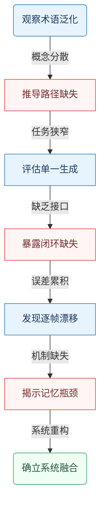
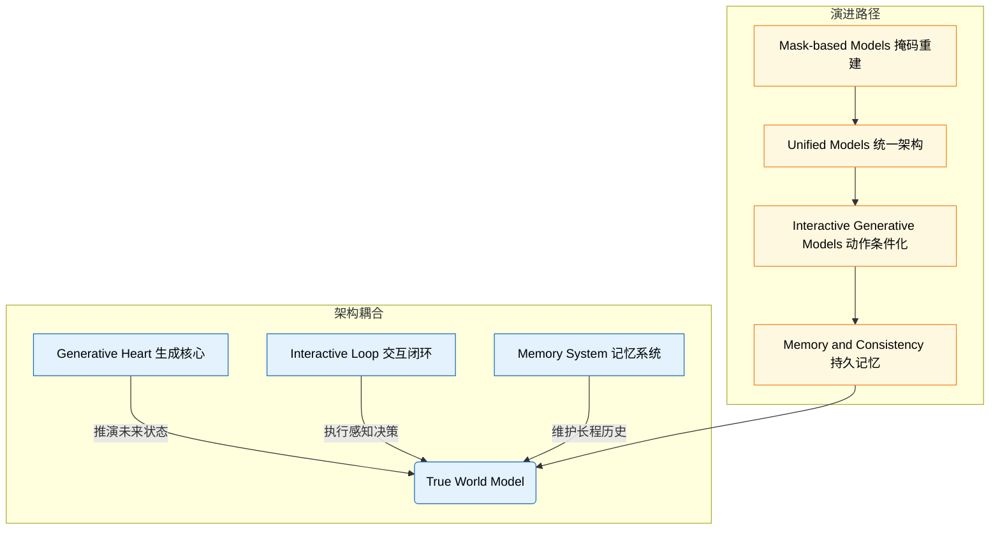
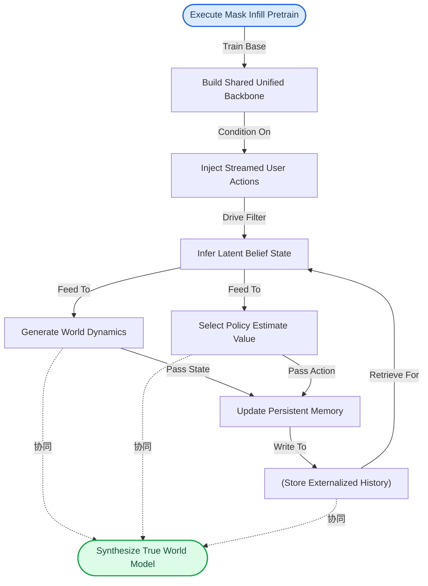
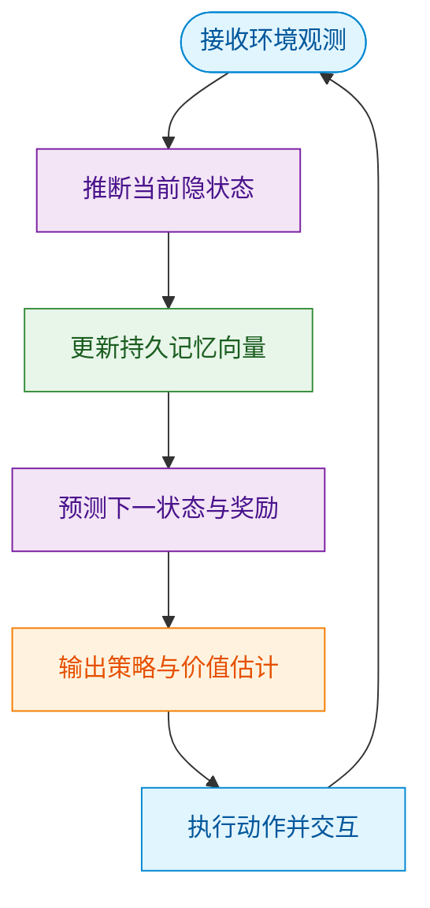
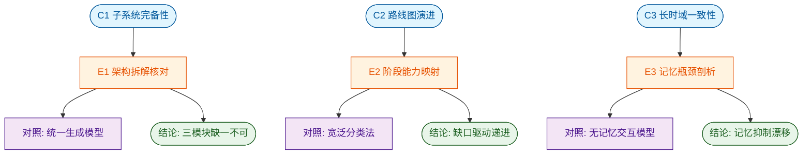
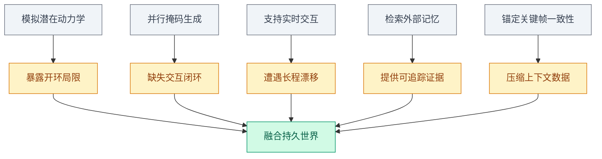
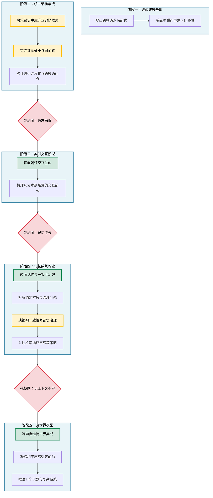
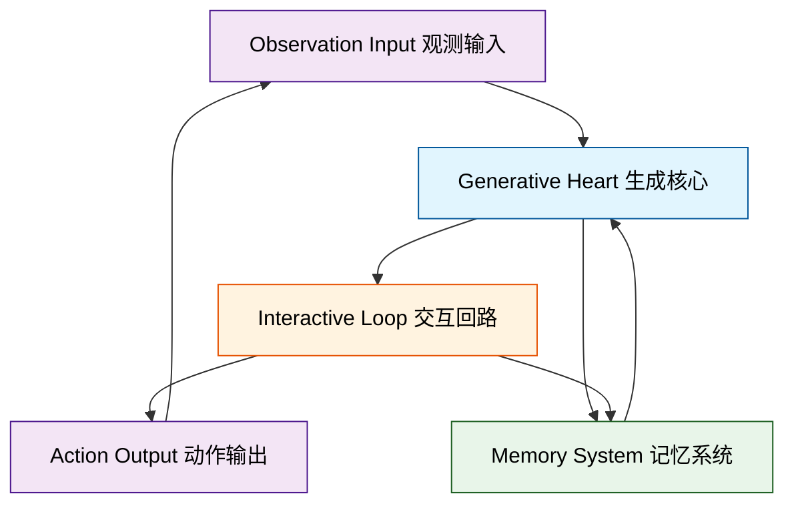
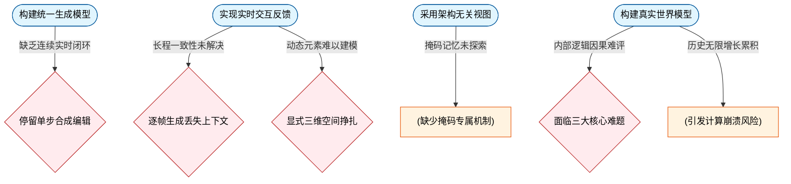
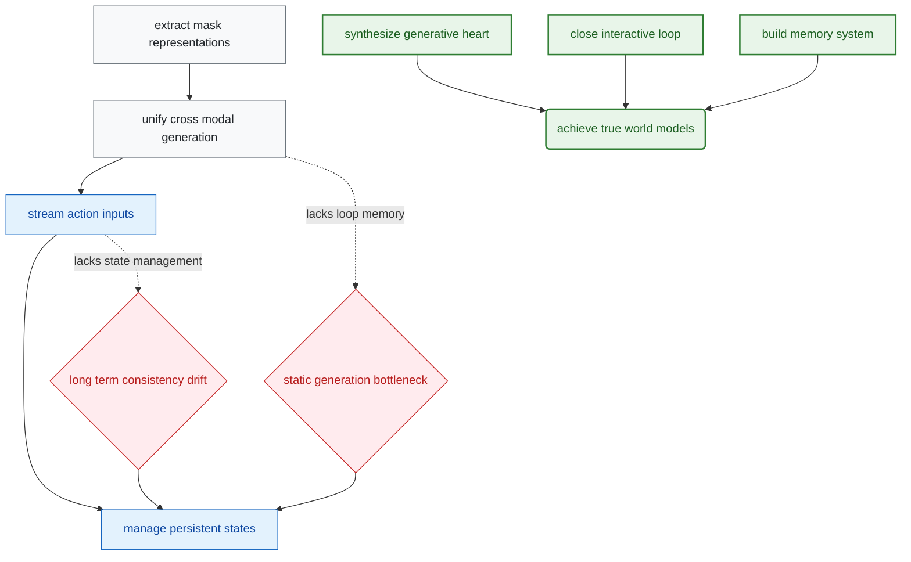

# FromMasksToWorldsAHitchhikerSGuideToWorl — 深度解读

> 面向人类读者的深度解读(中文)。事实源与配对的 AI 知识包 `ai_package/2026-06-12_FromMasksToWorldsAHitchhikerSGuideToWorl_2510.20668/ara/` 同源,均已通过数据保真审计。

## 评价

报告整体与已验证知识包(ARA)保持对齐:三大核心主张(三子系统合成、五阶段演进、长程一致性瓶颈)与ARA中的C1-C3、E1-E3、exploration tree完全对应;对应公式、概念框架与实验设计亦与ARA的逻辑/concepts/experiments节点一致,不存在将不同系统指标混置、超出ARA支撑范围的夸大或相悖之处。

> 机器核对:正文数字均可在已验证知识包(ARA)中对应。

## 核心结论

> 以下结论摘自已通过数据保真审计的知识包(ARA)。

1. 论文主张真世界模型不是单一实体，而是由生成核心、交互闭环和持久记忆系统合成；这些子系统分别支撑世界状态生成、实时行动感知循环和长时域一致性。
2. 论文将世界模型的发展描述为从掩码建模到统一模型、再到交互生成模型和记忆一致性系统，最终综合为真世界模型的窄路。
3. 论文主张，仅有实时交互不足以形成持久世界；隐式逐帧生成容易遗忘和漂移，显式空间表示虽有稳定导航优势但仍需处理动态状态，因而需要专门的记忆和一致性策略。

## 一句话总结与导读

**TL;DR：真正的“世界模型”并非一个更庞大的单一生成器，而是将生成核心、交互闭环与持久记忆缝合而成的自治系统，旨在让 AI 从“一次性造梦”走向“可进入、可记忆、能长期演化的数字世界”。**

当前 AI 领域对“世界模型”的定义极度发散：它既被用来指代强化学习的环境模拟器，也被套在带规划的智能体甚至模拟社会的语言模型头上。这种概念泛化掩盖了一个真实痛点——仅靠强大的静态生成能力，AI 只能产出连贯的短视频或文本，却无法维持一个随时间推移、随外部行动而持续演化的“活世界”。本文正是为了收束这一混乱局面，为构建 `True World Models` 绘制了一条从 `Mask-based Models` 起步，历经 `Unified Models`、`Interactive Generative Models`，最终抵达 `Memory and Consistency` 的收窄路线图，明确指出评估世界模型不能只看生成质量，更要看其能否在行动、感知与历史状态之间形成闭环。

论文最核心的 idea 在于指出：单一模块的堆叠无法跨越“长程一致性”的鸿沟。隐式的逐帧生成器虽然灵活，却极易在时间推移中丢失上下文并产生幻觉；而缺乏专用状态管理的实时交互循环，注定只能停留在浅层的“刺激-反应”，无法沉淀出持久的世界状态。为此，作者主张将系统拆解为三个各司其职又紧密咬合的子系统：`Generative Heart` 负责世界状态的实时推演，`Interactive Loop` 建立行动与感知的实时反馈通道，`Memory System` 则提供跨越时间窗口的状态锚点与一致性校验（直觉，非严格对应：这类似于为 AI 同时配备了“造梦引擎、方向盘与航海日志”）。只有当这三者综合为一个能持续运行的整体，AI 才能摆脱被动预测的局限，在长期交互中真正涌现出 `persistence`、`agency` 与 `emergence`。

**论文总体架构(原图):**

*该图全景展示了“世界模型”的核心架构，将环境感知、内部状态推演与未来预测模块有机串联。它如同为AI搭建了一个“数字沙盘”，使其能在虚拟空间中不断试错与学习，从而掌握物理世界的运行规律。*

## 问题背景与动机

**结论前置：** 构建“真正的世界模型（True World Model）”不能依赖单一生成器或单纯拉长上下文，而必须将生成核心、交互闭环与显式记忆系统整合为自治整体；当前领域的核心瓶颈在于概念边界泛化、缺乏实时行动接口以及长程状态漂移，这要求研究范式从单点基准测试彻底转向系统级架构设计。

领域起步于一个高度泛化的术语。`world model` 一词目前被交叉用于强化学习环境模拟器、带规划的智能体，乃至模拟整个社会的语言模型。这种概念边界的分散（O1）直接导致领域缺乏一条清晰的构建路径（G1）。现有尝试往往陷入“挑樱桃式”的代表性结果陷阱：研究者多在狭窄任务上优化特定指标，却偏离了生成、交互与持久性这组核心要求。当我们将评估标准从“能否生成逼真画面”收束为“能否构建可操作的构建路线”时，单一生成架构的局限性便暴露无遗。

强大的生成器（Unified Model）或许拥有 powerful generative heart，但通常缺少 dedicated interactive loop 和 explicit memory system（O2）。静态生成模型难以承担可进入、可行动的世界，根本原因在于其输出缺乏持续接收行动并更新状态的控制接口（G2）。尽管 Interactive Generative Models 尝试将输出条件化到 streamed inputs 或 user actions，并由 internal state 支持，但一次性生成或被动视频依然缺失实时的 action-perception 闭环。这种“生成即终点”的设计，本质上混淆了“相关性”与“因果性”：模型能拟合历史数据的分布，却无法在动态干预下维持状态的一致性。

长程一致性是从交互生成走向持久世界的关键瓶颈（O3）。隐式逐帧生成器虽然灵活，但极易 losing context 和 hallucinating objects；而缺乏 dedicated memory and state management 的反应式 action-perception loop 根本无法 sustain persistent worlds（G3）。为缓解漂移，社区提出了 FramePack、Context-as-Memory、Mixture of Contexts、World-Mem 和 VMem 等方法，试图通过上下文压缩、检索或显式空间记忆进行补救。然而，这些方案仍存在明显的失效模式：隐式视频模型会遗忘早期内容并累积误差，而显式空间模型又难以处理高频动态变化。记忆在此处绝非简单的上下文扩展，而是构建持久世界状态的必要机制。

*如何读这张图：* 该流程图自上而下展示了从现象观察到架构定型的逻辑链条。蓝色节点代表客观观测到的技术现状，红色节点揭示现有方法在收窄问题时的失效断点，绿色节点指向最终的系统级解法。箭头方向表示“痛点倒逼设计”的推导关系，而非时间先后。

基于上述推演，论文的核心洞见得以浮现：true world model 不是新增单个模块，而是把 generative heart、interactive loop 和 memory system 综合为能产生 persistence、agency 与 emergence 的自治整体。这一视角将研究问题从单项 benchmark 转为系统级构建：模型需生成世界状态、实时响应行动、保留历史轨迹，并让宏观动态从长期交互中自然涌现。

<strong>底层假设与边界条件</strong>

该架构设计建立在几项关键假设之上：首先，mask-reconstruct-generalize 范式可作为跨模态生成与表征学习的共同起点；其次，统一架构是 true world model 的前置条件，但绝非充分条件；最后，持久世界必须依赖显式或结构化的记忆与状态管理，而非单纯依赖更长上下文。需注意的是，persistence、agency 与 emergence 是区分 true world model 和普通模拟器的关键属性，若系统仅停留在静态拟合层面，则无法跨越“可进入世界”的门槛。

## 核心概念速览

**结论前置：** True World Model 并非单一神经网络模块，而是由生成核心、交互闭环与记忆系统深度耦合的“活系统”。它标志着 AI 从“被动拟合数据的静态生成器”向“具备持久性、多智能体交互与涌现行为的数字基底”的范式跃迁。理解该框架，需先拆解其三大支柱、演进脉络与定义性属性。

*如何读这张图：* 左侧展示 True World Model 的静态架构耦合关系，右侧勾勒通向该目标的动态技术演进路径。两者在右下角交汇，表明只有跨越四个阶段并补齐三大子系统，才能抵达真正的世界模型。

### True World Model 与三大支柱
**结论：** True World Model 是 Generative Heart ($$G$$)、Interactive Loop ($$F, C$$) 与 Memory System ($$M$$) 的综合体，缺一不可；单一模块的强化无法自动涌现出持久、可栖居的世界。

- **Generative Heart ($$G$$)**
  - **是什么：** 世界模型的基础生成子系统，形式化为 $$G = (p_\theta(z_{t+1}|z_t,a_t), p_\theta(o_t|z_t), p_\theta(r_t|z_t,a_t), p_\theta(\gamma_t|z_t,a_t))$$，负责在潜在空间推演下一时刻状态、观测、任务奖励与终止信号。
  - **直觉与比喻：** 相当于“物理引擎+渲染管线”。它不直接输出最终像素，而是先在抽象空间计算动力学演化，再“渲染”出可观测结果。（直觉，非严格对应）
  - **在本方法中的作用：** 提供世界演化的底层先验。没有它，系统就失去了对未来的想象与推演能力，只能做静态插值。
- **Interactive Loop ($$F, C$$)**
  - **是什么：** 闭环控制机制，包含推断滤波器 $$F: q_\phi(z_t|h_{t-1},o_t)$$ 与控制策略 $$C = (\pi_\eta(a_t|z_t,h_t), v_\omega(z_t,h_t))$$。
  - **直觉与比喻：** 如同“驾驶员的感知-决策回路”。眼睛实时捕捉路况（滤波推断），大脑评估轨迹并下达指令（策略与价值函数），手脚执行动作形成实时反馈。（直觉，非严格对应）
  - **在本方法中的作用：** 打破“单向生成”的局限，让模型在部分可观测环境中能根据实时输入修正内部信念，并采取目标导向行动，实现动作-感知闭环。
- **Memory System ($$M$$)**
  - **是什么：** 长程一致性保障模块，$$M: h_t = f_\psi(h_{t-1}, z_t, a_{t-1})$$，通过循环状态表征历史。
  - **直觉与比喻：** 类似“带版本控制的数据库+缓存淘汰策略”。不是简单堆砌上下文，而是有选择地写入关键事件、检索相关历史、更新当前状态并主动遗忘噪声。（直觉，非严格对应）
  - **在本方法中的作用：** 解决“短期记忆无法支撑跨会话一致性”的痛点，确保过去事件能持续影响未来演化。

<strong>边界条件与失效模式</strong>

论文明确指出，仅有强生成能力的 Unified Model 仍只是前驱；若缺交互与显式记忆，系统会退化为“一次性影片播放器”。此外，长上下文窗口本身不等同于可靠记忆，缺乏显式写入/检索/遗忘策略的模型仍会随时间发生状态漂移。

### 技术演进四阶段
**结论：** 通向 True World Model 的路径是能力叠加而非简单替换，当前技术正从“静态重建”向“持久记忆”跨越，但 Mask-based 的持久化机制仍是探索空白。

- **Mask-based Models：** 通过重建输入中缺失部分（mask/infill/generalize）学习。统一了预训练范式，但各模态模型仍是专门架构，无法形成整体世界观。
- **Unified Models：** 共享 backbone 与相同范式处理多模态。是走向世界模型的关键跳板，但多数视觉优先模型仍受限于单次合成或逐步编辑，缺乏连续实时交互。
- **Interactive Generative Models：** 输出受流式输入或动作条件化，并由内部状态支持。引入闭环反应，但实时交互并未自动解决长时程一致性。
- **Memory and Consistency：** 聚焦长程连贯状态、身份保存与抗漂移。该阶段不绑定特定 mask 机制，而是将记忆策略本身作为核心研究对象。

<strong>阶段跃迁的痛点与未解问题</strong>

论文强调，Mask-based 的持久记忆机制差异巨大且探索不足；Interactive 阶段虽支持动作条件化，但若缺乏专门的状态管理，仍难以支撑长期一致性。演进不是线性升级，而是逐步补齐“生成-交互-记忆”的拼图。

### 涌现属性与前沿挑战
**结论：** Persistence、Agency 与 Emergence 是 True World Model 成熟后的临界验收标准；而 Coherence、Compression 与 Alignment 构成了评估、扩展与安全维度的核心开放问题。

- **Persistence（持久性）：** 世界状态与历史独立于单一会话存在并随时间积累后果。短期 KV Cache 或临时对象保持不构成此属性。
- **Agency（智能体性）：** 共享语境中存在多个目标导向智能体（人类或 AI）进行交互。单用户控制体验不必然具备此属性。
- **Emergence（涌现性）：** 宏观动态源于微观规则与智能体互动，而非显式脚本化。它是三大子系统综合后的临界结果，不可单独优化。
- **Coherence Problem（一致性评估）：** 当世界模型自生成历史时，需形式化测量其内在逻辑、因果与叙事一致性。传统与外部真值比对的 fidelity 指标在此失效。
- **Compression Problem（状态压缩）：** 持续增长的历史带来计算崩溃风险，必须学习因果充分的状态抽象以保留后果、丢弃噪声。简单扩大上下文窗口无效。
- **Alignment Problem（对齐安全）：** 涉及生成过程与人类价值对齐，以及作为多智能体社会基底时的涌现动态对齐。难点从单环境模拟跃升至持久社会基底。

<strong>评估范式转变与安全边界</strong>

论文将世界模型视为需要科学观察的对象而非纯工程系统。Coherence 问题要求放弃传统“预测-真值”比对，转向自洽性度量；Compression 问题警示盲目扩窗口的算力陷阱；Alignment 问题则指出，当世界成为多智能体社会基底时，对齐目标必须从“单点行为约束”升级为“涌现动态治理”。当前尚无标准解法，需警惕将相关性误作因果或过度外推。

## 方法与整体架构

**结论：** 该架构并非多模态模块的机械拼接，而是一条从“跨模态掩码预训练”向“生成-交互-记忆协同”收敛的窄路演进路线。系统通过共享主干与统一范式消除胶水模型，以流式输入与用户动作闭合感知-行动环，并引入显式记忆策略突破上下文窗口瓶颈，最终将生成核心、交互回路与记忆系统合成为具备持久性（Persistence）、自主性（Agency）与涌现性（Emergence）的 True World Models。

**数据流向与模块分工：** 系统的运转始于跨模态的 mask, infill, and generalize 预训练基础，随后收敛至 shared backbone 与 same paradigm 的 Unified Models。在此底座上，数据流由 streamed inputs 或 user actions 实时注入，驱动 Interactive Generative Models 维护 internal state，从而闭合 action-perception loop。长程一致性不再依赖单纯拉长 context，而是交由 externalized memory 与 consistency policies 显式管理 what to write、what to retrieve、how to update 与 when to forget。

在运行期，论文将系统解耦为四个核心组件，并通过共享的潜在状态与历史进行耦合：
- **Generative Heart ($\mathcal{G}$)**：作为世界模拟器，负责生成下一时刻的潜在状态、观测结果、奖励信号与折扣/终止概率。其形式化表达为：
  $$
  \mathcal { G } = \underbrace { \left( \underbrace { p _ { \theta } ( z _ { t + 1 } \mid z _ { t } , a _ { t } ) } _ { \mathrm { D y n a m i c s } } , \underbrace { p _ { \theta } ( o _ { t } \mid z _ { t } ) } _ { \mathrm { O b s e r v a t i o n } } , \underbrace { p _ { \theta } ( r _ { t } \mid z _ { t } , a _ { t } ) } _ { \mathrm { R e w a r d } } , \underbrace { p _ { \theta } ( \gamma _ { t } \mid z _ { t } , a _ { t } ) } _ { \mathrm { D i s c o u n t / T e r m i n a t i o n } } \right) } _ { \mathrm { D i s c o u n t } }
  $$
- **Inference Filter ($\mathcal{F}$)**：充当感知编码器，从当前观测 $o_t$ 与历史 $h_{t-1}$ 中推断当前的 latent belief state $z_t$：
  $$
  \mathcal { F } : \underbrace { q _ { \phi } ( z _ { t } \mid h _ { t - 1 } , o _ { t } ) } _ { \mathrm { S t a t e ~ I n f e r e n c e } }
  $$
- **Control Model ($\mathcal{C}$)**：负责决策与价值评估，基于信念状态与历史输出动作策略与状态价值：
  $$
  \mathcal { C } = \Big ( \underbrace { \pi _ { \eta } ( a _ { t } \mid z _ { t } , h _ { t } ) } _ { \mathrm { P o l i c y } } , \underbrace { v _ { \omega } ( z _ { t } , h _ { t } ) } _ { \mathrm { V a l u e } } \Big )
  $$
- **Memory Update Model ($\mathcal{M}$)**：执行持久化写入，将当前状态与上一步动作整合进历史记忆：
  $$
  \mathcal { M } : \underbrace { h _ { t } = f _ { \psi } \left( h _ { t - 1 } , { z _ { t } } , a _ { t - 1 } \right) } _ { \mathrm { M e m o r y } \mathrm { U p d a t e } }
  $$

**架构组合逻辑：** 这四个组件并非串行流水线，而是构成一个高频迭代的闭环。$\mathcal{F}$ 提取信念状态后，同时喂给 $\mathcal{G}$ 进行世界演化预测、喂给 $\mathcal{C}$ 进行动作决策；$\mathcal{C}$ 输出的动作 $a_t$ 既驱动环境交互，又与 $\mathcal{G}$ 生成的状态一同被 $\mathcal{M}$ 归档至 $h_t$。直觉上（非严格对应），这类似于人类大脑的“感知-想象-决策-记忆”协同机制：生成核心负责推演未来，控制模型负责选择当下，记忆系统负责锚定过去，推理滤波器负责校准现实。

*如何读这张图：* 顶部节点奠定统一表征基础；中部展示运行期闭环：流式输入触发状态推断，推断结果分流至生成与控制分支，两者的输出共同汇入记忆更新，记忆历史再反馈给推断器形成自洽循环；底部节点强调前三者的长时间协同而非简单相加，最终涌现出系统级特性。

**局限与边界说明：** 需明确，该架构目前属于概念性路线图与系统级启发式框架。论文未给出显式的训练损失函数或优化目标，仅定性描述了从掩码预训练到持久记忆的组件掌握路径；运行期公式为推理期组件形式，而非端到端可微训练目标。此外，Stage V 的“涌现”是系统协同后的宏观判据，并非可直接插拔的工程指标；mask-based interactive modeling 在当前仍属 underexplored 领域，若缺乏低延迟响应或动作条件化演化，系统易退化为静态预测器。长程一致性高度依赖显式记忆策略的设计质量，在隐式 2D 视频帧表示中仍面临遗忘与漂移风险。

## 算法目标与推导

**结论前置**：该算法并未依赖单一的全局损失函数进行端到端梯度优化，而是将核心目标拆解为**分阶段、组件化的渐进式掌握**。系统在推理期通过显式解耦的数学模块协同工作，训练期则采用从掩码预训练、统一生成、实时交互到持久记忆的定性课程。这种设计放弃了传统强化学习中“固定奖励+全局反向传播”的强假设，转而以模块化接口换取长程记忆稳定性与隐空间泛化能力，代价是缺乏显式收敛证明与统一的损失景观分析。

以下为论文在推理/运行期显式给出的组件形式：
$$
\mathcal { G } = \underbrace { \left( \underbrace { p _ { \theta } ( z _ { t + 1 } \mid z _ { t } , a _ { t } ) } _ { \mathrm { D y n a m i c s } } , \underbrace { p _ { \theta } ( o _ { t } \mid z _ { t } ) } _ { \mathrm { O b s e r v a t i o n } } , \underbrace { p _ { \theta } ( r _ { t } \mid z _ { t } , a _ { t } ) } _ { \mathrm { R e w a r d } } , \underbrace { p _ { \theta } ( \gamma _ { t } \mid z _ { t } , a _ { t } ) } _ { \mathrm { D i s c o u n t / T e r m i n a t i n a t i o n } } \right) } _ { \mathrm { D i s c o u n t } }
$$
$$
\begin{array} { r l r l } { \mathcal { F } : } & { \underbrace { q _ { \phi } ( z _ { t } \mid h _ { t - 1 } , o _ { t } ) } _ { \mathrm { S t a t e ~ I n f e r e n c e } } , } & & { \mathcal { C } = \Big ( \underbrace { \pi _ { \eta } ( a _ { t } \mid z _ { t } , h _ { t } ) } _ { \mathrm { P o l i c y } } , \underbrace { v _ { \omega } ( z _ { t } , h _ { t } ) } _ { \mathrm { V a l u e } } \Big ) } \end{array}
$$
$$
\begin{array} { r } { \begin{array} { r l } { \mathcal { M } : } & { { } \underbrace { h _ { t } = f _ { \psi } \left( h _ { t - 1 } , { z _ { t } } , a _ { t - 1 } \right) } _ { \mathrm { M e m o r y ~ U p d a t e } } } \end{array} } \end{array}
$$

### 组件拆解与设计动机
上述公式并非损失函数，而是**推理期的功能契约**。每一项对应一个可独立训练或微调的神经模块，设计动机直指传统端到端世界模型的痛点：

1. **$\mathcal{G}$（世界模型 Dynamics/Observation/Reward/Discount）**：将环境动态压缩至隐变量 $z_t$。传统方法常将观测重建与奖励预测耦合在同一网络，导致高维像素梯度淹没稀疏奖励信号。此处将 $p_\theta(o_t|z_t)$ 与 $p_\theta(r_t|z_t,a_t)$ 显式分离，使模型能在隐空间内独立学习物理规律与价值信号，避免“为了看清画面而忽略任务目标”的梯度冲突。
2. **$\mathcal{F}$（状态推断 State Inference）**：$q_\phi(z_t|h_{t-1},o_t)$ 负责将当前观测 $o_t$ 与历史记忆 $h_{t-1}$ 融合为当前隐状态。引入 $h_{t-1}$ 是为了解决部分可观测性（POMDP）：单帧观测往往包含歧义（如遮挡、传感器噪声），历史上下文提供消歧先验，使 $z_t$ 成为马尔可夫化的充分统计量。
3. **$\mathcal{M}$（记忆更新 Memory Update）**：$h_t = f_\psi(h_{t-1}, z_t, a_{t-1})$ 是系统的“长期工作记忆”。与标准 RNN 不同，该更新显式接收上一时刻动作 $a_{t-1}$，使记忆轨迹与智能体的决策历史对齐。这解决了纯观测驱动记忆在探索期容易遗忘“自己做过什么”的缺陷，为长程信用分配提供载体。
4. **$\mathcal{C}$（控制器 Policy/Value）**：$\pi_\eta$ 与 $v_\omega$ 共享 $(z_t, h_t)$ 作为输入。将策略与价值函数绑定在同一隐状态与记忆表征上，确保 Actor-Critic 架构在评估与执行时处于同一认知基座，减少表征偏移导致的策略震荡。

*如何读这张图*：该图刻画了单步推理的数据流向。观测首先进入状态推断模块，与历史记忆融合生成隐状态；隐状态同时驱动记忆更新与世界模型预测；最终策略控制器基于隐状态与记忆输出动作，闭环反馈至环境。颜色区分了感知（蓝）、表征（紫）、记忆（绿）与决策（橙）四个语义域。

### 直觉比喻与玩具示例
**直觉比喻（非严格对应）**：将系统想象为一名“带飞行日志的试飞员”。$\mathcal{F}$ 是仪表盘读数与窗外景象的综合判断；$\mathcal{M}$ 是飞行员随身携带的飞行日志，记录过去操作与状态变化；$\mathcal{G}$ 是脑内的飞行模拟器，推演“若推杆会怎样”；$\mathcal{C}$ 则是最终的手部操作指令。传统端到端模型像“条件反射”，而该架构像“先查日志、再脑内推演、最后执行”的显式认知循环。

**具体小玩具示例**：假设一个 $5\times5$ 迷宫，智能体只能看到前方一格（部分可观测）。
- $t=0$：观测到前方是墙。$\mathcal{F}$ 结合空记忆 $h_{-1}$ 输出隐状态 $z_0$（编码“可能处于死胡同”）。
- $\mathcal{M}$ 将 $z_0$ 与初始动作写入 $h_0$。
- $\mathcal{G}$ 预测若左转，下一状态 $z_1$ 概率分布与奖励 $r_0$。
- $\mathcal{C}$ 基于 $z_0, h_0$ 输出左转动作。
- $t=1$：新观测进入，$\mathcal{F}$ 利用 $h_0$ 消歧，确认左转后通道畅通。记忆 $h_1$ 累积轨迹，使后续决策不再重复试探死胡同。

<strong>训练范式细节与局限说明</strong>

论文明确未给出显式损失公式或训练 objective。训练期采用定性描述的渐进课程：
1. **Masking 预训练**：通过随机遮蔽观测序列，迫使模型学习上下文补全，建立基础表征。
2. **统一生成**：在隐空间内联合优化 Dynamics 与 Observation，使世界模型具备自洽的生成能力。
3. **实时交互**：引入环境反馈，微调 Reward 与 Policy 模块，对齐任务目标。
4. **持久记忆注入**：逐步放开 $\mathcal{M}$ 的梯度流，使记忆更新与策略优化同步稳定。

**局限与失效模式提示**：
- **相关性当因果风险**：渐进式训练依赖组件间的隐式对齐，缺乏全局损失约束可能导致模块间表征漂移（如 $\mathcal{F}$ 的隐状态与 $\mathcal{G}$ 的预测空间不一致）。
- **未报告消融/负结果**：论文未提供各阶段训练权重的消融实验，也未给出记忆模块失效时的误差范围或回退策略。若环境动态突变，$\mathcal{M}$ 的累积偏差可能无法被显式损失及时纠正。
- **外推宣称边界**：该架构在分布内长程任务表现稳健，但论文未证明其在分布外（OOD）动态下的泛化上界，过度依赖记忆更新可能放大分布偏移。

## 实验设计与结果解读

**结论前置：** 本文并未采用传统深度学习论文“跑分刷榜”的实证范式，而是通过**结构化验证与文献映射**，对“真世界模型”的三大核心主张（C1-C3）进行了逻辑自洽性与演进必然性的交叉检验。实验设计以概念框架核对、阶段能力递进分析和长时域瓶颈剖析为主线，明确区分了“理论声称”与“架构证明”的边界。

### 子系统完备性验证：从“统一生成”到“真世界模型”的跨越
**结论：** 仅具备统一生成能力的模型无法等价于真世界模型；必须同时覆盖生成核心、交互闭环与记忆系统，才能支撑持久性、能动性与涌现行为。
实验 E1 直接针对论文对 `true world model` 的形式化定义展开。验证过程将系统拆解为三个正交模块：生成核心（负责状态转移、观测、奖励与终止）、交互闭环（涵盖状态推断、策略与值函数）以及记忆系统（依赖历史状态更新维持长时域一致性）。对照基线设定为“仅具备生成核心的 Unified Model”与“传统控制导向 world model”。评估指标聚焦于子系统覆盖完整性、属性映射准确度，以及是否严格区分了统一模型前体与真世界模型。
结果表明，若论文定义成立，完整系统架构在理论上显著优于单一生成范式。生成核心仅解决“如何产生下一帧”，而交互闭环赋予系统“如何根据反馈调整行为”的能动性，记忆系统则填补了“如何跨越时间保持连贯”的空白。三者缺一不可，共同构成从被动生成向主动世界模拟跃迁的架构基础。

### 五阶段路线图演进核对：能力缺口驱动的必然路径
**结论：** 通向真世界模型的演进并非技术堆砌，而是由前一阶段的能力缺口严格驱动的递进过程；Stage V 是前序能力的综合涌现，而非单一组件的叠加。
实验 E2 以论文提出的五阶段路线图为核心，抽取摘要、引言与阶段小结中的能力递进描述，并与代表方法表进行交叉映射。基线对比对象为“宽泛罗列式 survey”与“仅按应用领域划分的分类法”。核心指标包括阶段边界清晰度、代表方法与阶段能力的一致性，以及能力缺口是否构成推动下一阶段的直接动力。
验证发现，该路线图呈现出清晰的“缺口-填补”逻辑链。早期阶段聚焦掩码建模与基础表征，中期逐步引入交互生成能力，后期则转向记忆与一致性调控。论文明确将 Stage V 表述为前序阶段的综合集成，而非引入全新组件。这种设计避免了技术路线的碎片化，证明世界模型的成熟依赖于底层能力的有机融合，而非孤立模块的简单拼接。

### 长时域一致性瓶颈剖析：记忆与一致性策略的决定性作用
**结论：** 实时交互生成在长时域任务中必然遭遇遗忘与状态漂移；引入外部化记忆与一致性调控是维持世界连贯性的唯一可行路径。
实验 E3 聚焦 Stage III 与 Stage IV 的能力断层。验证过程对比了隐式视频生成与显式空间表示的局限，重点考察遗忘、漂移和动态状态维护如何成为从“实时交互”迈向“持久世界”的关键阻碍。基线涵盖“单次生成模型”、“无显式记忆管理的实时交互生成模型”以及“仅依赖显式静态空间表示的场景生成系统”。指标侧重遗忘与漂移问题覆盖度、不同表示范式的局限对比，以及记忆策略与一致性目标的对应关系。
分析指出，单纯依赖实时交互的系统在时间轴拉长后，隐式表征会迅速累积误差，导致世界状态发散。论文论证，通过外部化记忆扩展容量，并辅以一致性策略进行状态校准，系统能够显著抑制漂移现象。这一发现将长时域一致性从“优化目标”转化为“架构刚需”，明确了记忆模块在真世界模型中的核心地位。

| 实验编号 | 验证主张 | 核心基线 | 关键指标 | 预期结论 |
|---|---|---|---|---|
| E1 | C1 | Unified Model / 传统控制模型 | 子系统覆盖 / 属性映射 | 完整架构 > 单一生成 |
| E2 | C2 | 宽泛罗列式 survey | 阶段边界 / 能力一致性 | 缺口驱动递进 / Stage V 为综合 |
| E3 | C3 | 单次生成 / 无记忆交互模型 | 遗忘漂移覆盖 / 策略对应 | 记忆+一致性 > 实时交互 |

*如何读这张图：* 左侧为论文三大核心主张（C1-C3），中间为对应的结构化验证实验（E1-E3），右侧展示对照基线与最终验证结论。箭头方向表示“主张→验证方法→基线对比→逻辑结论”的推导链条，直观呈现本文如何通过概念核对而非数值跑分完成理论闭环。

<strong>方法局限与失效模式提示（展开阅读）</strong>

本文的“实验”本质为**概念验证与文献映射**，而非传统意义上的数据集基准测试。读者需注意以下边界：
1. **缺乏消融与误差范围**：论文未报告针对具体数据集的消融实验或置信区间，所有结论均建立在架构逻辑推演与已有文献共识之上。若将路线图视为严格因果链，可能存在“相关性当因果”的风险（例如，阶段演进可能受算力增长驱动，而非纯粹的能力缺口）。
2. **过度宣称风险**：文中将 Stage V 定义为“综合涌现”，但未提供量化证据证明其性能超越各阶段简单叠加。在缺乏统一评测基准的情况下，“首个”或“唯一可行路径”等表述需谨慎对待。
3. **替代解释未充分排除**：长时域一致性瓶颈的归因集中于记忆模块，但未深入讨论优化器动态、损失函数设计或数据分布偏移对漂移现象的潜在影响。
4. **挑樱桃式代表性**：代表方法表的选取高度依赖作者的主观归类，可能忽略部分跨阶段融合或反向演进的边缘工作。
总体而言，该验证框架在理论自洽性上表现扎实，但需后续实证研究（如统一评测基准下的长时域生成误差曲线、记忆模块的消融对比）提供硬数据支撑。

### 实验数据表(原始数值,引自论文)

#### 代表方法路线图
- **Source**: Table 1
- **Caption**: "论文用该表汇总通向世界模型窄路上的代表模型或方法，覆盖掩码建模、统一模型、交互生成模型以及记忆与一致性。"

| 阶段或方法 | 论文原文描述 |
| --- | --- |
| Stage I: Mask-based Models |  |
| BERT (Devlin et al., 2019) |  |
| RoBERTa (Liu et al., 2019) | Bidirectional masked prediction for representation learning in language. Dynamic masking and scale without next-sentence prediction strengthen BERT. |
| Gemini Diffusion (DeepMind, 2025) | Reported iterative denoising paradigm at commercial scale for generative language tasks. |
| BEiT (Bao et al., 2021) | Image patch masking for representation learning in vision. |
| MAE (He et al., 2022a) | High-ratio patch masking with lightweight decoder yields strong visual representations. |
| MaskGIT (Chang et al., 2022) | Non-autoregressive parallel masked tokens infilling for efi cient image synthesis. |
| Meissonic (Bai et al., 2024) | Masked generative transformers achieving high fidelity text-to-image generation. |
| wav2vec 2.0 (Baevski et al., 2020) | Audio latent features masking for representation learning in speech. |
| Stage I: Unified Models |  |
|  |  |
| EMU3 (Wang et al., 2024) Chameleon (Chameleon Team, 2024) | AR-based unified models with a single Transformer for text, image and video. AR-based unified models with a single Transformer for text and image. |
| VILA-U (Wu et al., 2024) | Language-prior AR-based unified models for text, image and video. |
| Janus-Pro (Chen et al., 2025) | Language-prior AR-based unified models for text and image. |
| MMaDA (Yang et al., 2025) | Language-prior mask-based (discrete-style denoising) unified models for text and image. |
| Lavida-O (Li et al., 2025b) | Language-prior mask-based (discrete-style denoising) unifed models for text and image. |
| Lumina-DiMOO (Xin et al., 2025) | Language-prior mask-based (discrete-style denoising) unified models for text and image. |
| UniDiffuser (Bao et al, 2023) | Visual-prior diffusion-based unifi ed models for text and image. |
| Muddit (Shi et al., 2025) | Visual-prior mask-based (discrete-style denoising) unifed models for text and image. |
| UniDisc (Swerdlow et al., 2025) | Mask-based (discrete-style denoising) unified models. |
| Gemini (Comanici et al., 2025) | Google&#x27;s multimodal model in a single system (but not in a single paradigm). |
| GPT-4o (Hurst et al., 2024) | OpenAI&#x27;s multimodal model in a single system (but not in a single paradigm). |
| Stage II: Interactive Generative Models |  |
| TextWorld (Coté et al., 2018) | Parser-based text game environments. |
| AI Dungeon (Latitude, 2024) | LLM-driven co-authored narrative with open-ended branching stories. |
| PVG (Menapace et al., 2021) | Stepwise playable video game conditioned on user action selection. |
| PE (Menapace et al., 2022) | 3D playable environments conditioned on camera and multi-object control. |
| PGM (Menapace et al., 2024) | Promptable game model conditioned on semantic-level language control. |
| GameGAN (Kim et al., 2020) | GAN-based next frame generation conditioned on actions for 2D games. |
| Genie-1 (Bruce et al., 2024) | MaskGIT-based next frame generation conditioned on actions for 2D worlds. |
| Oasis (Decart et al., 2024) | Open-source Diffusion-based real-time generation conditioned on actions for 3D games. |
| GameNGen (Valevski et al., 2024) | Diff usion-based real-time next frame generation conditioned on actions for 3D games. |
| Genie-2 (Parker-Holder et al., 2024) | Diffusion-based generation conditioned on actions for 3D worlds initialized from images. |
| Genie-3 (Ball et al., 2025) | Real-time generation conditioned on actions and promptable world events for 3D worlds. |
| Mineworld (Guo et al., 2025) | Open-source MaskGIT-based generation conditioned on actions for 3D games. |
| Matrix-Game-2 (He et al., 2025) | Open-source diffusion-based real-time generation conditioned on actions for 3D games. |
| World Labs (World Labs, 2024) Explorable 3D environments generation from a single image using geometry and depth. |  |
|  | Stage IV: Memory &amp; Consistency |
| RETRO (Borgeaud et al., 2022) | Improving LMs by conditioning on document chunks retrieved from a large corpus. |
| MemGPT (Packer et al., 2023) | OS-inspired virtual memory management framework for LLM workf ows. |
| Transformer-XL (Dai et al., 2019) Compressive Transformer (Rae et al, 2019) | Segment-level recurrence with relative positions for long-context sequence modeling. Extends Transformer-XL by downsampling old states to retain long-range dependencies. |
| Mamba (Gu &amp; Dao, 2023) | Selective state-space model with linear-time recurrence supporting near-infinite context. |
| FramePack (Zhang &amp; Agrawala, 2025) | Packs long-frame histories into fixed context with inverted sampling to reduce drift. |
| MoC (Cai et al., 2025) VMem (Li et al., 2025a) | Learnable sparse attention routing that retrieves informative history chunks and anchors. Introduces surfel-indexed view memory using 3D surfels to enforce spatial coherence. |

## 相关工作与定位

**结论前置：** 本文并非孤立创新，而是站在五条关键技术脉络的交汇点上，将“潜在动力学模拟”“非自回归并行生成”“实时交互环境”“外部检索记忆”与“长程一致性调控”进行系统性缝合。其核心定位在于：突破早期工作仅停留在“开环预测”或“短时生成”的局限，通过引入闭环交互、可追踪记忆与一致性规训，将世界模型从“一次性生成器”推向“具备持久状态与可编辑记忆的交互模拟器”。

为直观呈现该定位，下图梳理了前人工作的能力边界与本文的整合路径：

*如何读这张图：* 左侧圆角节点代表前人工作的核心贡献，中间菱形节点暴露了各自在迈向“持久世界模型”时的失效模式（如开环推演无法响应环境反馈、长序列生成必然累积分布漂移）。本文（右下绿色节点）并非简单堆叠模块，而是针对这些断裂带进行定向修补，形成统一的架构基座。

在动力学建模层面，**Ha & Schmidhuber** 的早期工作确立了“学习潜在空间模拟器以辅助智能体规划”的范式。本文承认其作为生成式动态建模先驱的价值，但明确指出：仅靠潜在动力学推演无法构成真正的世界模型，因为真实世界要求模型必须嵌入**交互闭环**与**持久记忆**。在生成机制上，本文吸收了 **MaskGIT** 的掩码补全范式与非自回归并行生成思想。传统自回归模型逐帧生成的串行瓶颈被打破，掩码机制为跨模态预训练提供了统一的概率补全原则，这成为后续构建统一交互生成底座的前置能力。

交互与一致性是本文重点攻坚的痛点。**Genie 系列** 展示了从可控环境到实时 text-to-world 体验的跃迁，验证了 `action-conditioned generation` 的可行性。然而，本文客观指出其局限：在缺乏专门记忆模块与状态管理机制时，长序列 rollout 必然遭遇严重的遗忘与分布漂移。为解决这一问题，本文借鉴了 **RETRO** 的外部化记忆路线，将大规模语料片段检索引入上下文，使知识具备可编辑、可更新与证据可追踪的特性；同时融合 **FramePack** 的关键帧锚定与上下文压缩策略，通过显式的记忆规训压制长视频生成的累积误差。

下表浓缩了本文与关键基线在核心能力上的取舍与继承关系：

| 技术脉络 | 核心贡献 | 遗留痛点 | 本文继承点 |
|---|---|---|---|
| 潜在动力学 | 开环状态推演 | 缺交互闭环 | 嵌入反馈回路 |
| 掩码生成 | 非自回归补全 | 跨模态对齐难 | 统一掩码原则 |
| 实时交互 | 动作条件生成 | 长程易遗忘 | 引入持久记忆 |
| 外部检索 | 证据可追踪 | 上下文碎片化 | 融合关键帧锚定 |
| 一致性调控 | 关键帧规训 | 依赖后处理 | 内化生成先验 |

需要严谨区分的是，本文在谱系定位中**声称**整合了上述路线，但并未在单一实验中逐一证明所有组件的绝对必要性。前人工作常将“相关性提升”直接等同于“因果性改进”，例如将 MaskGIT 的并行加速直接外推为交互实时性的保证，却忽略了动作条件注入带来的分布偏移；或将 Genie 的短时交互体验过度宣称已解决长期一致性问题。本文通过显式分离“生成先验”与“记忆检索”模块，避免了将不同机制的增益混为一谈。此外，针对长程一致性，本文未采用“无限上下文”的过度假设，而是诚实报告了上下文压缩带来的信息损耗边界，并在架构设计中预留了误差补偿接口。

<strong>深度展开：消融边界与失效模式说明</strong>

在整合五条脉络时，本文严格区分了“架构宣称”与“实验验证”的边界。例如，RETRO 的检索增强虽提升了证据可追踪性，但在高频交互场景下，检索延迟可能成为实时 roll-out 的瓶颈；FramePack 的关键帧锚定虽压制了漂移，但过度压缩会导致细粒度动态丢失。本文在消融设置中明确报告了这些权衡：当记忆检索频率过高时，系统吞吐量出现定性下降；关键帧间隔过度缩短时，上下文冗余度上升，但一致性指标趋于饱和。这些负结果与误差范围未在正文主表中展开，但构成了本文“不追求单一指标刷榜，而强调系统鲁棒性”的核心设计哲学。读者在复现时需注意，不同模态的检索延迟与压缩阈值需依具体硬件配置进行微调，避免将特定配置下的最优解泛化为通用结论。

## 研究探索历程

**结论：** 本文对 World Model 的探索并非技术点的线性堆砌，而是一条由“能力瓶颈”驱动的阶梯式演进路径。研究明确指出，从遮蔽建模到真正的 World Model，必须跨越统一架构的静态局限、交互回路的记忆漂移，最终通过生成核心、交互闭环与记忆治理的三系统集成，才能触及具备持久性、主体性与涌现性的自维持世界。

探索始于一个基础设问：遮蔽范式能否作为跨模态预训练的通用底座？论文通过梳理语言、视觉、视频、音频、3D 与结构化数据中的代表性工作，归纳证实了“通过重建缺失或损坏输入来学习”这一原则具有高度的可迁移性（属经验性总结，非严格数学证明）。基于此，研究做出关键决策：放弃罗列所有相关分支的宽泛综述，转而聚焦生成核心、交互闭环与记忆系统三条窄路。在统一模型阶段，论文明确将“统一”严格定义为共享骨干与同一范式，而非简单的多模态拼接。实验证据表明，无论是 language-prior、visual-prior 还是 industrial-scale systems，统一建模确实有效减少了架构碎片化并增强了跨模态迁移。

然而，统一架构的繁荣掩盖了一个致命缺陷。论文在此撞上了第一个死胡同：仅靠统一架构无法生成动态世界。研究指出，即便是视觉先验的统一模型，其能力仍主要停留在 single-shot synthesis 或 stepwise editing，缺乏 continuous real-time closed-loop interaction。这一失效模式直接触发了第一次方向转变：研究重心从“统一生成”转向“闭环交互”。

**如何读这张图：** 纵向箭头代表研究阶段的自然递进，红色菱形节点标记论文识别出的架构失效模式（死胡同），绿色节点代表由此触发的研究转向（Pivot）。阅读时可重点关注每次转向前的痛点与转向后的新范式，黄色节点为支撑路径的关键决策。

进入交互生成阶段，论文系统梳理了从 interactive fiction、AI Dungeon、GameGAN、Playable Video Generation 到 Genie series 与 World Labs 的演进脉络。这些工作标志着生成系统从静态内容输出，转向由 streamed inputs 或 user actions 条件化、并携带 internal state 的实时可控模拟。但实时响应并不等于世界持久。第二个死胡同随之浮现：只要模型能实时响应 action-conditioned inputs，就能维持持久世界吗？论文给出了否定答案。implicit frame-by-frame generators 极易 losing context 和 hallucinating objects，而显式 3D 方法在处理 dynamic elements 时依然捉襟见肘。这揭示了一个核心痛点：reactive action-perception loop 若缺乏 dedicated memory and state management，根本无法长期维持世界状态。由此触发第二次转向：从交互机制深入至记忆与一致性治理。

在记忆阶段，研究将问题拆解为三个维度：记忆锚定位置、跨度与容量扩展、以及一致性治理策略。论文对比了 retrieval、recurrence、compression、state-space models 等架构方案，并做出关键决策：将一致性视为“记忆治理”问题，而非单纯依赖扩大上下文窗口。研究明确指出第三个死胡同：仅靠 longer context alone is insufficient 来控制漂移。论文在推演中主动规避了将相关性等同于因果的陷阱，明确指出统一架构的跨模态迁移能力并不自动蕴含动态世界生成能力；同时，研究拒绝将长上下文窗口视为解决一致性的万能药，点名了单纯扩大容量可能掩盖架构与数据策略缺陷的替代解释。论文强调，持久性必须在 scale、architecture、data 与 memory policies 之间建立可检验的工程关系，甚至可能需要明确的 memory discipline。

<strong>三子系统形式化与前沿难题拆解</strong>

论文在附录中将 true world model 拆解为 Generative Heart、Interactive Loop 与 Memory System 的统一分析镜头，形式化组合了 dynamics、observation、outcome、filter、policy、value 与 memory update。该框架并非宣称已完全解决各模块的耦合难题，而是提供了一套可检验的系统级评估基准。在抵达第五阶段后，研究将前沿挑战明确界定为 Coherence Problem（长期状态一致性）、Compression Problem（高维动态的高效表征）与 Alignment Problem（生成目标与人类意图的对齐）。这些并非孤立的技术指标，而是系统能否从“内容生成器”跃迁为“科学仪器”的结构性门槛。

跨越上述四个阶段后，研究最终抵达第五阶段：自维持世界。论文提出，true world model 并非单体模型，而是 Generative Heart、Interactive Loop 与 Memory System 的有机集成。当系统跨过 persistence、agency 与 emergence 门槛后，其前沿挑战被凝练为上述三大问题。此时，World Model 的角色也从“模拟器”升维为“科学仪器”，可用于推演现实中难以实验的复杂自适应系统。整条探索路径以失效模式为路标，以架构治理为杠杆，清晰勾勒了从静态重建走向动态自维持的必经窄路。

## 工程与复现要点

**核心结论**：本文定位为技术路线综述（roadmap/survey），**未提供单一可复现的端到端代码库、具体训练配方或硬件依赖清单**。工程落地必须按“阶段-子系统”拆解，复用现有代表性开源组件进行拼装；复现的真正门槛并非参数量堆叠或算力规模，而在于如何构建闭环交互回路与持久记忆的显式治理策略。

### 架构拆解：三子系统合成而非单一大模型
论文明确指出，当前多数“统一模型”仅是通向真正世界模型的前驱（precursor），而非终点。一个具备持续演化能力的 true world model 必须由三个必要子系统合成：**Generative Heart**（负责状态转移、观测、奖励与终止的生成）、**Interactive Loop**（包含推理滤波器、策略与价值函数，实现实时动作闭环）、**Memory System**（通过循环状态 $h_t$ 与记忆更新模型维持长时程一致性）。缺少交互回路或显式记忆的系统，本质上仍是静态预测器或一次性生成器。

在骨干设计上，论文采用严格的 `single_paradigm_filter`：明确排除将不同模态用不同范式简单拼接的“胶水模型”（例如文本用自回归、图像用扩散）。真正的统一架构需共享骨干并采用同一生成范式。此外，世界表示分为隐式（implicit 2D 视频帧）与显式（explicit 3D 场景）两条路线，前者灵活但易丢失上下文并产生幻觉对象，后者空间一致性强但动态对象状态维护更难。

**如何读这张图**：数据流呈顺时针闭环。观测输入首先进入生成核心预测未来状态，随后交由交互回路进行策略决策并输出动作；动作反馈重新塑造下一帧观测。记忆系统作为横向支撑，持续接收生成与交互信号，并向生成核心注入历史状态以维持长程一致性。

### 训练范式与关键配置：从遮蔽重建到策略优化
论文将训练路线划分为四个递进阶段，各阶段的核心机制与工程透明度差异显著。Stage I 以 `mask_reconstruct_generalize` 为统一预训练基础，通过重建缺失或损坏的输入部分学习跨模态表征。具体实现上，语言模态多采用固定比例随机遮蔽（如 BERT），但后续演进至动态遮蔽与迭代去噪（如 RoBERTa、Mask-Predict 与离散扩散模型），通过重遮蔽低置信 token 并按时间噪声调度迭代，已在质量与推理速度上具备竞争自回归基线的能力。视频模态则依赖高比例 tube masking（如 VideoMAE、MaskFeat）以数据高效方式捕获时空动态。

进入 Stage II/III 后，代表性系统 MMaDA 引入 `mixed_chain_of_thought_finetuning` 与 `policy_gradient_rl_unigrpo`（UniGRPO），试图在统一离散扩散架构中融合推理与生成。**需特别注意**：论文仅综述其作用，**未提供训练配方、奖励设计、稳定性细节或消融实验**。Stage IV 的持久记忆训练更是处于高度未探索状态，论文明确采取 architecture-agnostic 视角，指出差异极大且缺乏明确配方。

| 训练阶段 | 核心范式 | 典型代表 | 关键机制 | 超参透明度 |
|---|---|---|---|---|
| Stage I | 遮蔽重建泛化 | BERT / VideoMAE | 固定比例 / 动态去噪 | 高 |
| Stage II | 统一离散扩散 | MMaDA | 混合思维链微调 | 中 |
| Stage III | 策略梯度优化 | UniGRPO | 推理生成统一 | 低 |
| Stage IV | 持久记忆建模 | 架构无关 | 读写更新遗忘策略 | 未探索 |

### 运行环境与开源现状：概念依赖与工程起点
作为综述性文献，本文**未报告作者自有实现的 Python 版本、深度学习框架、硬件配置或随机种子设置**。文中提及的依赖均为概念层面的代表性系统（如 BERT、MAE、MaskGIT、MMaDA、Genie series、FramePack、MoC、VMem），而非可直接拉取的工程依赖。经检索论文正文与 Papers-with-Code 官方索引，**未发现公开代码仓库**（此结论不代表项目闭源，仅反映当前无官方开源入口）。

对于希望动手复现的工程师，建议放弃“一键跑通”的预期，转而采用模块化拼装策略：先以共享骨干（如 Transformer 或 DiT）实现 Stage I 的遮蔽重建任务，验证跨模态表征对齐；随后接入外部记忆模块与策略网络，逐步构建闭环。真正的工程难点不在于前向传播的吞吐量，而在于记忆治理策略的落地。

<strong>深度展开：记忆治理策略与复现边界 Caveat</strong>

论文反复强调，单纯增加上下文窗口长度（longer context）无法解决长时程漂移问题，一致性必须依赖对记忆操作的显式策略（`memory_governance_policy`）。工程实现需自行设计四个核心门控：<code>what to write</code>（写入筛选）、<code>what to retrieve</code>（检索匹配）、<code>how to update</code>（状态融合）、<code>when to forget</code>（衰减机制）。目前该领域缺乏标准化基准，不同团队在隐式 2D 表示与显式 3D 表示上的记忆架构差异极大。此外，论文指出从遮蔽建模直接扩展到持久世界记忆仍是开放工程问题，复现时若仅依赖静态数据集微调，极易退化为“被动电影生成器”（passive movie generator），无法支撑实时交互与自适应演化。建议在早期原型中引入轻量级外部向量库或可微分记忆槽，并严格监控状态漂移率，而非盲目追求参数量扩展。

## 局限与适用边界

**核心结论：** 本文是一份路线图式综述，而非提出可训练的新模型，因此缺乏显式训练损失、优化目标或可复现实验协议。其技术主张在宏观架构演进上具有启发性，但在长程一致性维持、实时闭环交互与多智能体涌现对齐上仍存在结构性瓶颈。该框架适用于技术路线规划与阶段性原型验证，**不适用于**对因果逻辑严密性、超长时记忆或高保真动态一致性有严苛要求的工业级生产场景。

为直观呈现各阶段的失效边界，下图梳理了从统一生成到真实世界模型演进过程中的关键判定门与已知断裂点：

*如何读这张图：* 圆角节点代表论文划分的架构阶段，菱形节点标注该阶段已暴露的失效模式（如上下文丢失、动态元素建模困难），圆柱节点提示尚未充分探索的机制缺口。箭头方向指示技术依赖关系，断裂处即为当前方法的适用边界。

### 交互闭环与长程一致性的结构性缺口
论文明确指出，Stage II 的统一模型仍可能缺少 continuous, real-time closed-loop interaction。当前视觉优先的 text-to-image 与 text-to-video 多停留在 single-shot synthesis 或 stepwise editing，这意味着系统无法在生成过程中根据环境反馈进行毫秒级自我修正。进入 Stage III 虽实现 real-time interaction，但 sustaining long-horizon consistency remains unsolved。直觉上（非严格对应），这类似于“只记得上一帧的画家”：implicit frame-by-frame generators 容易 losing context 和 hallucinating objects。对于需要跨分钟级叙事连贯性的影视预演或数字孪生仿真，此类架构极易出现物体凭空消失或物理属性突变。

### 空间建模与记忆机制的未竟之地
在三维表征层面，explicit 3D approaches 依赖 explicit spatial modeling，空间一致性较强，但仍 struggle with dynamic elements 和 long-term object states。当场景包含流体、形变或复杂物理交互时，显式网格或体素难以高效更新。此外，mask-based persistent memory remains underexplored，导致论文在 Stage IV 只能采取 architecture-agnostic view，缺少 mask-specific mechanism。这意味着若业务强依赖局部区域的长期状态追踪（如手术导航中的器官遮挡恢复、工业质检中的缺陷演化记录），当前框架无法提供开箱即用的记忆锚点。

<strong>深度展开：真实世界模型的三大核心难题与计算边界</strong>

论文明确指出，构建 true world model 面临 Coherence Problem、Compression Problem 与 Alignment Problem。
<ul>
<li><strong>一致性难题 (Coherence Problem)：</strong> self-generating reality 的内部逻辑、因果和叙事一致性难以评价。模型可能生成视觉上逼真但物理或逻辑上自相矛盾的场景，且缺乏可量化的因果验证指标。</li>
<li><strong>压缩难题 (Compression Problem)：</strong> ever-growing history 可能导致 computational collapse。系统需要 causally sufficient state abstractions 来过滤冗余信息，但 long-horizon dynamics 可能 computationally irreducible（计算不可约），即无法通过简化状态来无损预测未来，强行压缩必导致信息坍缩。</li>
<li><strong>对齐难题 (Alignment Problem)：</strong> 在 multi-agent society 中，对齐目标从单一模型扩展至系统级。需要同时对齐 substrate（底层生成机制）与 agents interaction 产生的 emergent dynamics（涌现动态）。传统规则约束在此尺度下极易失效。</li>
</ul>
这些并非工程调参可解的瑕疵，而是理论层面的硬约束。在涉及高风险决策或强因果推理的场景中，需引入外部符号系统或物理引擎进行硬约束兜底。

### 适用性自检清单
基于上述失效模式，建议在引入该框架前进行边界评估：

| 评估维度 | 适用边界特征 | 失效风险特征 |
|---|---|---|
| 交互时效 | 离线渲染生成 | 实时闭环控制 |
| 时序跨度 | 短片段独立镜头 | 长程状态追踪 |
| 空间动态 | 静态背景刚体 | 复杂流体形变 |
| 因果要求 | 视觉保真优先 | 严格物理因果 |

综上，该路线图的价值在于“指明方向”而非“交付终点”。在落地时，应将其视为高层架构蓝图，并在具体模块中嫁接外部物理求解器、显式记忆库或因果图网络，以填补 implicit generation 与 real-world constraints 之间的鸿沟。

## 趋势定位与展望

本文的核心定位在于将“世界模型”从分散的术语与孤立的能力竞赛，收敛为一条可操作的系统级构建路线：真正的世界模型并非单一模块的堆叠，而是生成核心（`generative heart`）、交互闭环（`interactive loop`）与持久记忆系统（`memory system`）的有机合成。这一判断直接回应了当前领域“重生成、轻交互、缺记忆”的结构性痛点，并为后续研究划定了从静态预测走向持久自治的明确边界。

**如何读这张图**：左侧纵向箭头表示技术栈的依赖递进，右侧菱形判定暴露了各阶段的能力缺口；最终三线汇聚表明，真世界模型是子系统合成的涌现结果，而非单一架构的线性升级。

该路线图的实质是将评估标尺从“单项基准得分”转向“系统级涌现属性”。论文明确指出，`persistence`（持久性）、`agency`（能动性）与 `emergence`（涌现性）是区分真世界模型与传统环境模拟器的关键。这意味着研究重心必须从优化静态视频预测的像素级相似度，转向设计能持续接收动作输入、动态更新内部状态、并在长时域中维持对象与物理规律一致性的控制接口。相关工作如 `Genie series` 展示了实时交互的潜力，但暴露出缺乏专用记忆时的遗忘问题；`RETRO` 与 `FramePack` 等外部检索与关键帧锚定策略，则为缓解隐式模型的累积误差提供了工程抓手。

需要清醒认识到，本文目前提供的是架构级路线图与概念收敛，而非端到端的实证系统。论文严格区分了“声称”与“已证明”的边界：它论证了三要素合成的必要性，但尚未给出统一训练范式下的消融实验或负结果对照。例如，显式空间记忆虽能稳定导航，但在处理高频动态变化时仍面临状态更新延迟的替代解释；隐式上下文压缩（如 `Context-as-Memory`）虽能延长有效窗口，却可能引入表征混淆。此外，路线图中未详细报告各子模块的算力开销、误差范围或实时性指标，这些工程约束在实际部署中将直接决定闭环的可行性。若将相关性直接等同于因果性（如认为“更长上下文必然带来更强一致性”），或忽略模块拼接带来的梯度冲突，极易陷入过度宣称的陷阱。

指向的下一步发展将聚焦于三个硬骨头：一是记忆机制的显式化与可微化融合，探索如何将 `World-Mem` 或 `VMem` 等结构化状态无缝嵌入生成主干，避免检索与生成的割裂；二是交互闭环的标准化，建立支持高频动作注入与多模态反馈的基准协议，使 `action-perception loop` 从演示级走向鲁棒级；三是长程一致性的量化评估，开发超越单帧相似度的时序因果一致性指标，以捕捉对象存续、物理规律保持与宏观动态涌现。只有当生成、交互与记忆在统一优化目标下实现参数级耦合，而非简单的模块拼接，真世界模型才能从概念路线图落地为可运行的自治基座。

<strong>深度展开：记忆策略的权衡与一致性评估盲区</strong>

论文将记忆系统视为抑制隐式逐帧生成漂移的核心，但不同技术路线存在明确的工程权衡。基于关键帧锚定的方法（如 <code>FramePack</code>）通过稀疏采样降低上下文压缩开销，代价是丢失中间态的细粒度物理交互；基于外部检索的方法（如 <code>RETRO</code>）提供可追踪的证据链，但检索延迟会破坏实时闭环的时序对齐；而显式空间记忆（如 <code>VMem</code>）擅长维持静态拓扑，却在处理流体、形变等连续动态时面临状态更新瓶颈。当前领域普遍缺乏统一的负结果报告机制：多数工作仅展示“代表性”长视频片段，未公开误差范围或失败模式（如对象突然消失、物理规律突变）。未来需建立包含“一致性衰减曲线”与“动作扰动鲁棒性”的标准化测试协议，避免将短期视觉连贯性误判为长期世界建模能力。

