# OmniDreamsRealTimeGenerativeWorldModel — 深度解读

> 面向人类读者的深度解读(中文)。事实源与配对的 AI 知识包 `ai_package/2026-06-12_OmniDreamsRealTimeGenerativeWorldModel_2606.03159/ara/` 同源,均已通过数据保真审计。

## 核心结论

> 每条结论后的隐形锚点把数字回链到论文原文(忠实性保证)。

1. OmniDreams 通过自回归视频扩散、流式 KV cache、轻量编解码与多 GPU 并行，在闭环仿真中达到实时交互渲染。
2. 从双向模型到因果 Diffusion Forcing 再到 Self Forcing 蒸馏后，OmniDreams-SV 在生成质量、结构条件保真与车道线指标上整体优于未蒸馏因果阶段，同时保留可实时因果生成能力。
3. 继续使用长上下文双向教师进行 Self Forcing 能降低长 rollout 的时间漂移与累积伪影，使后段窗口相对短上下文教师更稳定。
4. 在同一 AlpaSim 闭环栈中替换传感器仿真器时，OmniDreams 保持了 NuRec 下不同策略的相对排名，因此可作为闭环策略比较的真实世界代理。
5. 将 OmniDreams-SV 后训练为 WAM 后，在 Physical AI Autonomous Vehicles NuRec 数据集闭环协议中，相比 Alpamayo 1.5 获得更低碰撞相关事件，同时使用更少参数。<!--ref:r-as-autonomous-vehicle--><!--anchor:quote:As%20autonomous%20vehicle%20%28AV%29%20capabilities%20advance%2C%20the%20safe%20evaluation%20of%20driving%20policies%20in%20long%2Dtail%20scenarios%20remains%20a%20critical%20bottleneck.%20In-->

## 一句话总结与导读

**TL;DR：OmniDreams 将通用视频生成模型改造为支持实时交互的自动驾驶世界模型，让闭环仿真不仅能“重放”历史，更能根据策略动作即时“想象”未知的长尾场景。**

在自动驾驶的闭环评测中，环境必须对策略动作（policy action）产生即时反馈，否则就无法测试动作如何改变后续的场景演化。然而，行业正面临一个两难痛点：传统的重建式神经仿真器（reconstruction-based neural simulators，如 NuRec）在复刻已采集轨迹时表现优异，但受限于原始数据，一旦车辆偏离原路线或遭遇长尾天气等未见内容，就会因缺乏泛化能力而失效；另一方面，通用的离线视频生成模型虽然具备强大的视觉想象力，却缺乏因果时序接口，无法像真实世界那样根据逐步到来的控制指令实时推演未来。OmniDreams 正是为了打破这种“重建式无法外推、生成式无法交互”的僵局而生，致力于为自动驾驶策略提供即时、逼真的多视角传感器视频反馈。

为了解决上述痛点，OmniDreams 的核心 idea（直觉，非严格对应：将“离线电影渲染”改造为“实时互动游戏引擎”）是站在 Cosmos-Predict 2.5 强大视觉先验的肩膀上，对视频扩散骨干进行彻底的因果化与实时化重构。它通过引入抽象的 world-scenario map 提供结构与车道线约束，结合流式 KV cache 与自回归机制，使模型能够按块缓存历史状态并即时响应新的驾驶动作。更关键的是，针对自回归视频扩散在长序列推演（long rollout）中极易累积误差的顽疾，论文引入了 Self Forcing 蒸馏技术，利用长上下文双向教师模型来抑制时间漂移与伪影。这套机制最终让 OmniDreams 成功蜕变为一个低延迟、高保真的实时闭环传感器仿真器，在 AlpaSim 架构中实现了真正意义上由动作驱动的长时场景演化。<!--ref:r-2-5-curation-and-inspe--><!--anchor:quote:2.5%20Curation%20and%20Inspection%20with%20SIL%2DWheel%207-->

**论文总体架构(原图):**

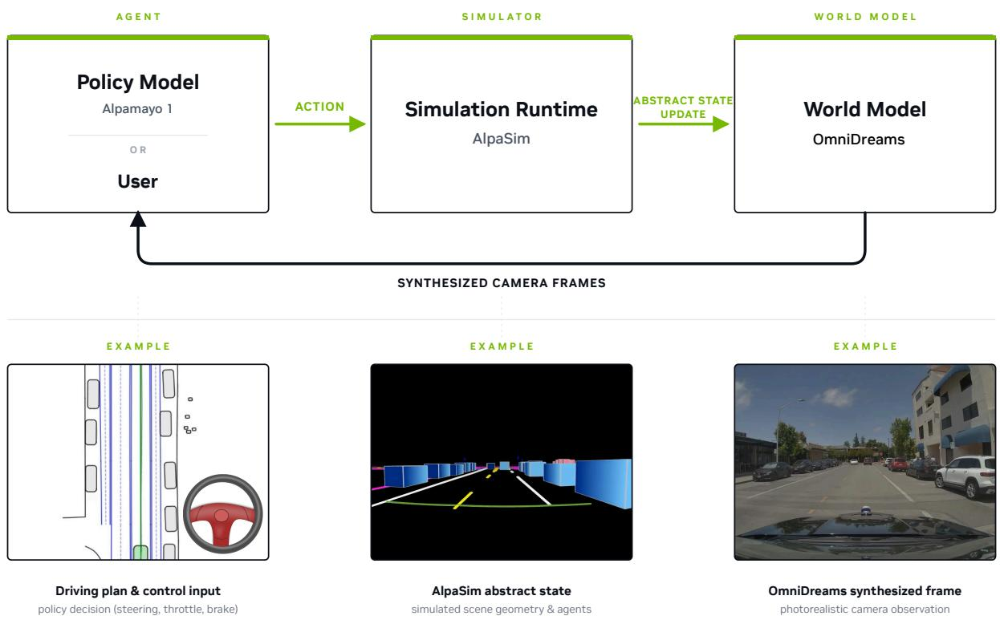

*闭环仿真总流程：策略模型输出动作给 AlpaSim 仿真器，仿真器更新状态后交由 OmniDreams 合成下一帧相机画面，再回传给策略模型，形成完整的闭环交互。*

## 问题背景与动机

要构建真正可用的闭环自动驾驶仿真器，必须跨越“重建式仿真的外推瓶颈”与“通用视频模型的交互鸿沟”，并通过特定机制解决自回归生成的误差累积。

闭环自动驾驶评测的核心在于“即时反馈”：策略（policy）输出 policy action 后，环境必须实时演化并返回新的观测，以此测试动作如何改变后续场景。然而，现有的两条主流技术路线均存在致命卡点。

第一条路线是 reconstruction-based neural simulators。这类方法在真实记录轨迹附近表现优异，但它们被原始采集数据死死“锚定”。一旦车辆偏离采集轨迹，或者需要引入长尾天气、未见动态物体等新条件，其场景表示就会因为缺乏生成新外观的视觉先验而质量骤降。

第二条路线是通用离线视频生成模型。虽然它们具备强大的视觉先验，能生成丰富的新内容，但其推理形式与闭环时序接口完全不匹配。离线模型依赖完整的双向上下文进行采样，无法在闭环中根据逐步到来的动作实时改变未来观测。即使将其强行改造为自回归模式，也会面临长序列 rollout 时的误差累积问题：训练时依赖 clean context，推理时却依赖自己生成的 imperfect outputs，这种 exposure bias 会导致长时生成迅速崩溃。

<strong>现有方法的失效模式与替代解释排查</strong>

论文在分析现有方法时，明确指出了几种常见的失效模式。例如，对于重建式仿真，有研究试图通过 world-scenario map conditioning 或 text prompt control 来引入新内容，但这本质上仍是在重放或外推已捕获的射线与场景结构，无法凭空生成符合物理规律的新动态。对于自回归视频扩散，现有的 Diffusion Forcing 或 progressive long-context teacher 等方法，未能从根本上消除 teacher forcing 与自回归推理分布之间的不一致。论文没有过度宣称“首个”解决该问题，而是诚实地指出必须结合多种机制才能弥合这些缺口。

基于上述痛点，本文得出的关键洞见是：必须将强大的视觉先验（如 Cosmos-Predict 2.5）与闭环控制机制深度融合。具体而言，利用 first-frame RGB seed 与 abstract world-scenario map 约束关键驾驶线索，通过 causal KV-cache 实现按块自回归，并引入 Self Forcing 蒸馏来消除 exposure bias。这一套组合拳成功将生成式视频模型改造为支持动作条件、多视角一致且低延迟的实时闭环 sensor simulator。<!--ref:r-2-5-curation-and-inspe--><!--anchor:quote:2.5%20Curation%20and%20Inspection%20with%20SIL%2DWheel%207-->

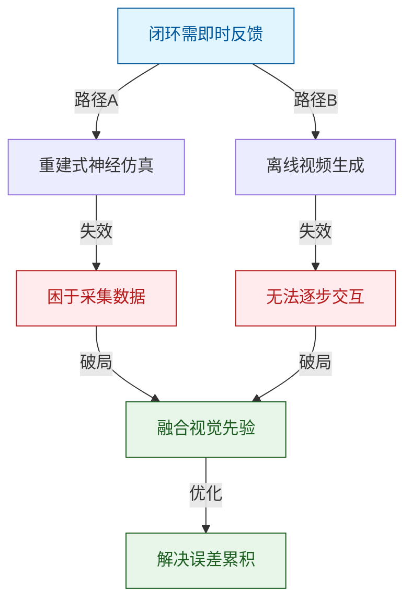
*如何读这张图：图中展示了闭环仿真的核心需求以及两条传统路线的失效模式，最终汇聚于本文融合视觉先验与自回归控制的破局路径。*

## 核心概念速览

**结论**：OmniDreams 并非单纯的“视频生成器”，而是一个由**自回归扩散范式**驱动、通过**结构化条件**与**长上下文缓存**维持时空一致性的闭环仿真引擎。其核心突破在于将传统的双向视频生成改造为支持实时交互的因果生成，并利用蒸馏技术抹平了训练与推理间的分布鸿沟。

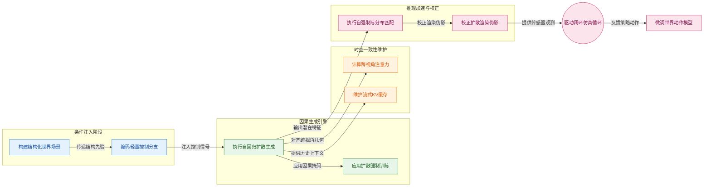
*如何读这张图：从左至右反映了数据流与控制流的演进。蓝色模块负责将抽象物理世界转化为模型可理解的信号，绿色与橙色模块是生成与维持一致性的核心，粉色模块则解决落地时的推理效率与伪影问题。*

为了快速建立直觉，我们将 12 个核心概念映射为工程化比喻：

| 概念 | 直觉比喻 (非严格对应) | 在系统中的核心作用 |
| :--- | :--- | :--- |
| OmniDreams | 物理常识梦境放映机 | 动作条件观测生成 |
| 闭环仿真 | 驾教实时互动驾校 | 策略状态观测交互 |
| World-scenario map | 剧组分镜脚本场记板 | 地图三维框条件 |
| Autoregressive diffusion | 前文接龙小说创作 | 逐步生成未来视频 |
| Streaming KV cache | 滑动窗口速记笔记本 | 提供上下文免重算 |
| Lightweight control branch | 不抢戏提词器场务 | 紧凑注入控制信号 |
| Cross-view attention | 多机位全局监视器 | 跨相机参照维持一致 |
| Diffusion Forcing | 裁判选手双重陪练 | 统一下一步全序列 |
| Self Forcing | 自食其果严格厨师 | 自身生成帧消除偏差 |
| DMD | 米其林标准品鉴师 | 分布匹配逼近真实 |
| World-Action Model | 录像学车实习司机 | 视频映射轨迹预测 |
| Diffusion Fixer | 老照片划痕修图师 | 校正伪影保留结构 |

### 因果生成与训练对齐：打破“上帝视角”
**结论**：传统双向视频生成模型因依赖未来帧而无法用于实时闭环，OmniDreams 通过 Diffusion Forcing 与 Self Forcing 彻底解决了因果生成中的误差累积与分布偏移问题。

在自动驾驶中，模型不能“偷看”未来。Autoregressive diffusion video generation 强制模型只能依赖过去观测和当前条件推断未来。然而，如果训练时总是喂入完美的真实历史（Teacher Forcing），推理时模型面对自己生成的带有瑕疵的历史帧就会“崩溃”。
Diffusion Forcing 通过为序列中每个 token 分配独立随机噪声，让模型同时学会“预测下一步”和“修复整段视频”。在此基础上，Self Forcing 在训练时强制模型使用自己先前生成的帧作为上下文（直觉：让厨师必须吃自己做的饭），从而抹平了训练与推理的分布差异。最后，DMD 作为整体视频级的分布匹配目标，进一步引导生成器逼近真实数据流形。

<strong>深度解析：Self Forcing 的渐进式教师策略</strong>

Self Forcing 在长序列 rollout 时仍可能出现 shifting artifacts。当 KV cache 长度超出短教师上下文时，模型会变得不稳定。论文引入了 progressive long-context teacher 策略，逐步增加教师上下文的长度，使模型平滑过渡到长程自回归生成，有效缓解了长缓存带来的漂移问题。

### 结构化条件注入：拒绝“盲目幻觉”
**结论**：纯文本或图像条件无法精确控制自动驾驶场景的几何与物理属性，OmniDreams 利用 World-scenario map 与 Lightweight control branch 实现了高保真且可控的场景编辑。

生成式模型容易产生“幻觉”（如车道线扭曲、车辆穿模）。World-scenario map 将 HD map、交通设施与动态主体 3D bounding boxes 抽象为结构化世界状态。为了不让这些密集的控制信号破坏预训练视觉主干的生成能力，Lightweight control branch 将控制输入经 MLP 编码为紧凑的 control tokens，与视觉 tokens 对齐后拼接（直觉：给主摄影师配一个不抢戏的场务，只负责递道具）。这种设计明确区分了“外观属性”（由 text prompt 补充）与“几何结构”，确保了生成的物理合理性。<!--ref:r-2-3-data-curation-and--><!--anchor:quote:2.3%20Data%20Curation%20and%20Quality%20Filtering%206-->

### 时空一致性维持：征服“长程与多视角”
**结论**：长序列生成易导致画面漂移，多相机生成易出现几何撕裂，Streaming KV cache 与 Cross-view attention 从内存与注意力机制双管齐下保障了时空连贯性。

在长 Rollouts 中，无限记忆会导致显存爆炸。Streaming KV cache 采用固定形状、滚动窗口淘汰机制，配合 local-window attention 与 attention-sink tokens，在有限显存下维持了长程上下文。对于多视角生成（OmniDreams-MV），朴素的跨视角全注意力复杂度极高。Cross-view attention 将注意力分解为每视角时间注意力与逐时间步的跨视角注意力，使不同视角的 tokens 在同一时间步互相参照，牢牢锁定了共享几何与物体位置。

<strong>边界与局限：它不能替代物理引擎</strong>

必须明确，OmniDreams 定位为生成式传感器模拟器与可迁移的策略骨干。它不是传统的 reconstruction-based neural simulator，也不保证替代底层的物理、交通和控制服务。对于超出数据分布的极端对象（Out-of-distribution object modeling），其生成质量仍受限于训练数据的覆盖范围。此外，Diffusion Fixer 虽能校正重建伪影，但其输入仍依赖已有的重建模拟器，无法凭空创造缺失的场景几何。

## 方法与整体架构

**结论前置**：OmniDreams 的核心架构设计表明，要在自动驾驶闭环中实现多视角、长时序的高保真视频生成，必须将“结构化物理条件注入”与“渐进式因果蒸馏”深度解耦。模型通过轻量级控制分支与多视角注意力机制保证了几何与运动一致性，并借助 Self Forcing 与 DMD 蒸馏将生成速度推入实时控制回路，但在长程 rollout 中仍需依赖渐进式教师模型来抑制时序伪影。

### 数据流入与条件注入机制
在闭环推理阶段，AlpaSim 模拟器与 OmniDreams server 形成紧密的事件驱动循环。为了保持事件顺序，系统采用 pre-fetch generation 策略，在 chunk 边界提前让 policy 产出多步 trajectory。条件流入分为三路：

1. **结构化空间条件**：world-scenario 渲染器根据相机内外参，将 HD map、动态 actor cuboid 和 ego trajectory 转化为对齐的视频条件。轻量 control branch（小型 MLP）将其编码为 control tokens。<!--ref:r-nvidia-sup-1-sup--><!--anchor:quote:NVIDIA%3Csup%3E1%3C%2Fsup%3E-->
2. **文本语义条件**：text prompt 通过 cross-attention 注入。训练时采用 short、medium、long 三档 caption 并按特定比例采样，以增强对 prompt 长度的鲁棒性。
3. **视觉历史条件**：首个 chunk 的 first-frame RGB 经编码后作为 latent 拼接。

这些条件与 noisy latent tokens 拼接后，送入 causal transformer backbone。对于多视角版本（OmniDreams-MV），每个时间步会加入 view embedding 与 Cross-View Attention，确保 7 个 camera views 共享几何一致性。推理期 temporal attention 被限定为 local window（SV 为 6 latent frames，MV 为 8 latent frames），以在显存与长程上下文间取得折中。

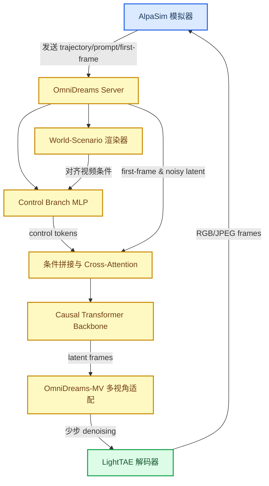
*如何读这张图：主线从 AlpaSim 的状态更新出发，经过 OmniDreams Server 内部的条件渲染、特征拼接、因果生成与多视角对齐，最终由 LightTAE 解码回视觉帧闭环。蓝色节点为系统边界，绿色为最终输出，黄色为内部核心计算组件。*

### 训练路径与蒸馏策略
模型的训练并非一蹴而就，而是遵循从单视角到多视角、从短序列到长序列的渐进式路径。

<strong>训练阶段与核心损失函数</strong>

训练流水线依次为：Cosmos-Predict 2.5 基础模型 $\rightarrow$ RDS AV mid-training $\rightarrow$ OmniDreams-MV 多视角适配 $\rightarrow$ world-scenario control post-training $\rightarrow$ Diffusion Forcing causal mid-training $\rightarrow$ Self Forcing + DMD 蒸馏 $\rightarrow$ 推理期 FlashDreams 优化与 multi-GPU serving。

在多视角适配阶段，view embeddings 与 Cross-View Attention 的 output projection weights 采用 zero-initialized，避免新分支在早期破坏已有生成能力。world-scenario control 则先在 93-frame clips 上训练到收敛，再扩展至 189-frame clips 以降低长程一致性学习难度。

核心训练目标包含两部分：
1. **Diffusion Forcing**：利用 causal masking 让每个 latent token 在独立噪声时间下学习基于过去帧的 velocity prediction。
$$
\begin{array} { r } { { \bf L } _ { D F } = \mathbb { E } _ { { \bf x } ^ { 1 : T } , \epsilon } \left[ \| { \bf u } \theta ( \mathrm { x } _ { \mathrm { t } } ^ { 1 : T } , \mathrm { t } ) - \mathrm { v } _ { \mathrm { t } } \| ^ { 2 } \right] . } \end{array}\tag{1}
$$
2. **Self Forcing + DMD**：在训练中用模型自己的 self-rollout（2-step diffusion process，timestep schedule 为 [1000, 450]，且每次只对随机采样 denoising step 反传）替代干净上下文，并通过 DMD 的 full-sequence distribution matching 缓解 exposure bias。
$$
\begin{array} { r } { \mathcal { L } _ { \mathrm { D M D } } ( \theta ) = \mathbb { E } \left[ \frac { 1 } { 2 } \left| \left| \hat { x } - \mathrm { s g } \left[ \hat { x } - \left( \mathbf { f } _ { \psi } ( \hat { x } _ { t } , t ) - \mathbf { f } _ { \phi } ( \hat { x } _ { t } , t ) \right) \right] \right| \right| ^ { 2 } \right] , } \end{array}\tag{2}
$$

### 局限性与失效模式审视
尽管架构设计严密，但在实际落地中仍存在需要警惕的边界条件：
- **长程时序伪影**：在长 rollout 中，模型依赖 rolling KV cache 和 progressive long-context bidirectional teacher 来缓解 shifting artifacts。若 teacher context 过短或 cache window 设置不当，仍会累积时序不一致性。
- **提前承诺约束**：AlpaSim 选择的 pre-fetch generation 要求 policy 在 chunk 内提前承诺轨迹。这虽然保证了事件顺序，但牺牲了 frame-at-a-time 生成的灵活性。
- **未报告的消融**：论文在 Self Forcing 中使用了特定的 2-step schedule，但未报告替代 schedule 的消融实验；同时，OOD object modeling 依赖 randomized dynamic-cuboid dropout 来避免模型过度依赖动态 cuboids，却未给出具体的 dropout 概率，这使得复现时的敏感度难以精确评估。

**模型结构与关键子图(原图):**

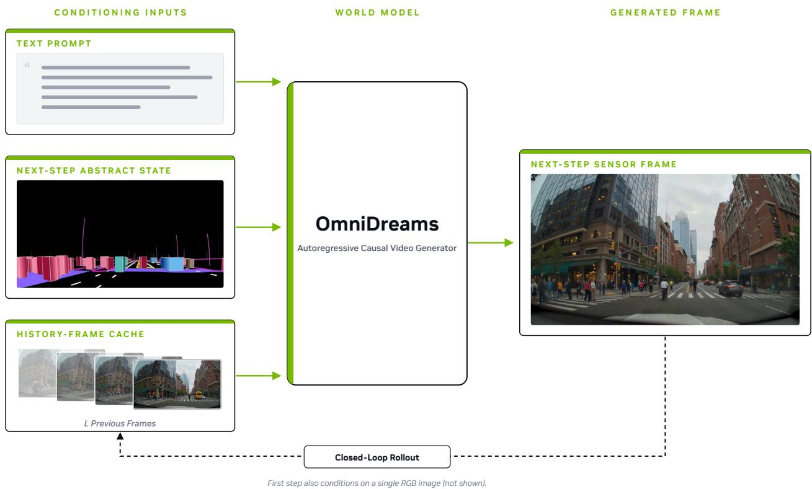

*OmniDreams 核心生成机制：模型同时接收文本提示、仿真器输出的下一时刻抽象状态以及历史帧缓存作为条件，自回归地合成下一步传感器画面并回传给策略模型。*

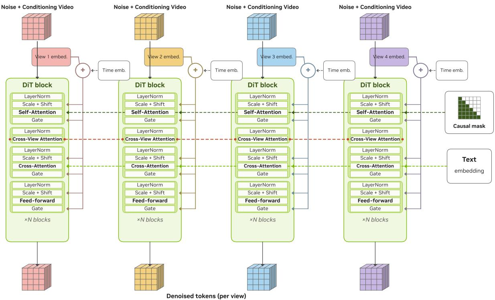

*多视图 DiT 架构细节：在 Cosmos-Predict 2.5 骨干网络上引入 Multi-View Cross Block，为每个视角添加 view embedding 并与 time embedding 相加，通过 AdaLN 信号注入各子层，同时使用 Cross-View Attention 实现多相机间的特征交互。*

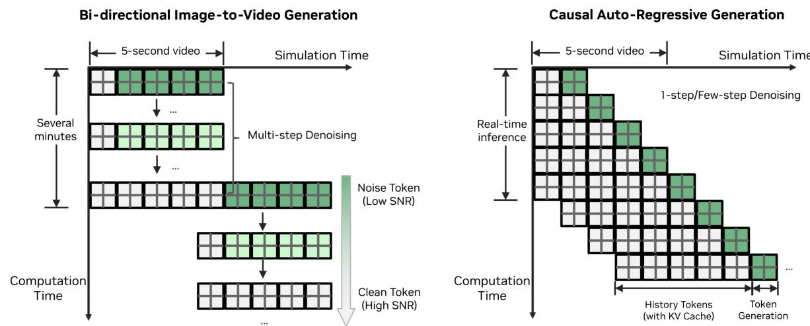

*自回归视频生成策略对比：左侧为双向 image-to-video 去噪，右侧为基于因果 KV-cache 的自回归生成，后者可保持一致性地进行长视频 rollout。*

## 算法目标与推导

**结论前置**：本论文的训练目标通过显式结合 Diffusion Forcing 与 Self Forcing DMD，从根本上解决了长序列自回归生成中的误差累积与 exposure bias 痛点。模型不仅能在独立噪声时间下精准学习基于历史帧的 velocity prediction，还能在自身生成的上下文中保持全局序列的分布一致性。

论文的核心训练损失由以下两个显式公式构成：

$$
\begin{array} { r } { { \bf L } _ { D F } = \mathbb { E } _ { { \bf x } ^ { 1 : T } , \epsilon } \left[ \| { \bf u } \theta ( \mathrm { x } _ { \mathrm { t } } ^ { 1 : T } , \mathrm { t } ) - \mathrm { v } _ { \mathrm { t } } \| ^ { 2 } \right] . } \end{array}\tag{1}
$$

$$
\begin{array} { r } { \mathcal { L } _ { \mathrm { D M D } } ( \theta ) = \mathbb { E } \left[ \frac { 1 } { 2 } \left| \left| \hat { x } - \mathrm { s g } \left[ \hat { x } - \left( \mathbf { f } _ { \psi } ( \hat { x } _ { t } , t ) - \mathbf { f } _ { \phi } ( \hat { x } _ { t } , t ) \right) \right] \right| \right| ^ { 2 } \right] , } \end{array}\tag{2}
$$

### 损失项拆解与设计理由

**Diffusion Forcing (公式 1)** 负责局部时序的精准预测。${ \bf L } _ { D F }$ 计算的是模型预测速度 ${ \bf u } \theta$ 与真实速度 $\mathrm { v } _ { \mathrm { t } }$ 之间的均方误差。结合 causal masking 机制，每个 latent token 被强制在独立的噪声时间 $t$ 下，仅依赖过去帧进行 velocity prediction。这确保了模型不会“偷看”未来，从而学会扎实的自回归步进能力。

**Self Forcing DMD (公式 2)** 负责全局分布的纠偏。$\mathcal { L } _ { \mathrm { D M D } }$ 是分布匹配损失，其中 $\hat{x}$ 是模型通过 self-rollout 生成的序列，$\mathbf { f } _ { \psi }$ 与 $\mathbf { f } _ { \phi }$ 分别代表目标分布与模型分布的评估网络，$\mathrm{sg}$ 为 stop-gradient 操作。传统自回归模型在训练时用干净上下文，推理时却用自己的错误输出，导致 exposure bias。该损失通过 full-sequence distribution matching，直接对比模型自己生成的完整序列与真实分布，有效缓解了长 rollout 带来的累积误差。

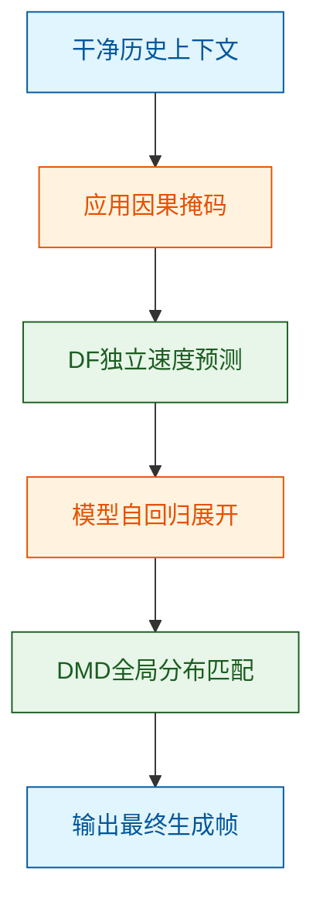
*如何读这张图：数据流从干净上下文进入，经过因果掩码后分为两条优化主线——DF 负责单步速度预测，而 self-rollout 后的 DMD 负责全局序列纠偏，两者共同塑造最终模型。*

### 直觉比喻与玩具例子

**直觉（非严格对应）**：想象一场接力赛跑。Diffusion Forcing 像是让每个选手只看着前一个选手的背影（过去帧）练习自己的跑姿（速度预测），不管别人跑得多快；Self Forcing DMD 则是全队真正上场接力跑（self-rollout），如果交接棒出错（累积误差），教练（DMD）会拿着全队跑完的录像和完美录像对比，调整每个人的跑姿，而不是只纠正单个人的动作。

**具体小玩具例子**：假设生成 5 秒的 720p 视频。在 DF 阶段，模型在第 3 秒的 latent token 上施加随机噪声，仅凭第 1 至 2 秒的特征预测去噪速度；在 Self Forcing 阶段，模型从第 1 秒开始自己生成到第 5 秒，DMD 损失会评估这完整 5 秒的联合分布是否偏离了真实视频的分布，从而惩罚那些在单步看似合理但连起来导致画面崩溃的生成路径。

<strong>补充说明：训练目标与推理优化的边界</strong>

论文在 causal masking 中探讨了自回归分解与 block-autoregressive 分解，但它们属于掩码策略而非显式损失公式。此外，推理期的 local-window attention、streaming KV cache、CUDA Graphs、LightTAE、pixel shuffle、multi-GPU context parallelism 和 pre-fetch chunk 语义均属于 serving 与集成层面的工程优化，不写入训练目标函数中。

## 实验设计与结果解读

OmniDreams 不仅在推理速度上跨越了实时交互的门槛，更在长时程生成稳定性与闭环策略评估中证明了其作为高保真世界模拟器的可靠性；但其在解码器轻量化上的质量妥协，也客观揭示了速度与精度之间的物理边界。

### 实时推理与系统吞吐
**结论：通过流式 KV cache 与多 GPU 上下文并行，系统成功将多视角分块延迟压入实时交互区间。**
在 NVIDIA GB300 硬件上，研究团队对 OmniDreams-SV（8帧分块）与 OmniDreams-MV（16帧分块）进行了严格的计时测试。借助 FlashDreams 推理栈与 CUDA Graphs，有效帧率随并行资源增加而显著上升，满足了闭环控制的低延迟需求。

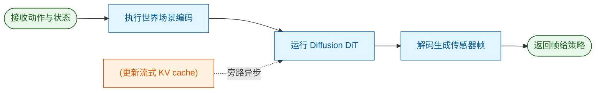
*如何读这张图：核心生成路径（蓝色）决定了首帧延迟，而 KV cache 更新（橙色）作为数据状态在后台旁路执行，不阻塞主线程，这是实现高 Effective FPS 的关键。*

### 训练策略消融与质量权衡
**结论：Self Forcing 蒸馏显著提升了自回归生成的整体质量，但 LightTAE 解码器在换取极致速度时不可避免地带来了视觉保真度的下降。**
实验对比了 Bidirectional、Causal Diffusion Forcing 与 Distilled Self Forcing 三个阶段。结果表明，Self Forcing 蒸馏阶段在 FVD 和三维车辆检测（LET-AP）等指标上全面领先。值得注意的是，论文诚实地报告了负结果：当使用 LightTAE 替换 Original VAE 解码器时，虽然延迟大幅降低，但在生成质量上出现了可感知的妥协（具体数值见下方实验表）。这种对速度-精度权衡的透明披露，避免了过度宣称。

### 长时程 Rollout 的误差累积控制
**结论：引入 progressive long-context teacher 有效抑制了长视频生成中的误差累积与分布偏移。**
自回归模型在长 rollout 中极易出现画面崩坏。实验将长时程生成按时间切分为连续窗口，并与真实视频参考分布计算分段 FVD。对比发现，采用 progressive long-context teacher 的模型在各时间窗口和总体退化程度上，均显著优于 short-context teacher，证明了长上下文双向教师在维持长程时空一致性上的必要性。

### 闭环仿真一致性与端到端策略
**结论：OmniDreams 作为传感器模拟器能保持策略评估的相对排序一致性，且其衍生的 WAM 策略在更少参数下实现了更优的避障表现。**
在闭环评测中，研究固定了 AlpaSim 物理引擎，仅将传感器模拟器从 NVIDIA NuRec 替换为 OmniDreams。结果显示，多个策略类别在 All Incidents 及各类碰撞指标下的相对排名保持高度一致。需明确，排名一致并不等同于绝对物理完美，它仅证明模拟器未引入导致策略排序反转的系统性偏差。进一步地，将 OmniDreams-SV 微调为端到端 trajectory predictor（即 WAM），在排除训练场景后，其碰撞相关指标优于基线 Alpamayo 1.5，且参数规模更小。

| 实验目标 | 核心配置 | 关键基线 | 评估指标 |
|---|---|---|---|
| 实时推理 | OmniDreams-SV/MV | 较少 GPU 配置 | 分块延迟、FPS |
| 训练消融 | Self Forcing 蒸馏 | Causal Diffusion | FVD、LET-AP |
| 长程稳定 | 长上下文教师 | 短上下文教师 | 分段 FVD |
| 闭环一致 | OmniDreams 模拟器 | NVIDIA NuRec | 事故率、碰撞率 |
| 策略评测 | OmniDreams WAM | Alpamayo 1.5 | 碰撞指标、参数量 |

<strong>实验配置与评测管线细节</strong>

- <strong>硬件与系统</strong>：推理计时实验明确指定使用 NVIDIA GB300，而训练消融与闭环评测未单独指定硬件，依赖 FlashDreams 推理栈与 AlpaSim 闭环栈。
- <strong>评测管线</strong>：仿真质量消融引入了 StyleGAN-V FVD、BEVFormer、LATR 与 Temporal Sampson 等多维评测管线，确保不仅评估像素级分布（FVD），还评估下游感知任务（LET-AP、车道线 F1）。<!--ref:r-nvidia-sup-1-sup--><!--anchor:quote:NVIDIA%3Csup%3E1%3C%2Fsup%3E-->
- <strong>数据集划分</strong>：训练阶段消融使用 RDS-HQ-1M held-out evaluation split；闭环评测使用 Physical AI Autonomous Vehicles NuRec dataset 的 501 场景子集，并严格排除了 WAM 训练中使用过的场景以防止数据泄露。

### 实验数据表(原始数值,引自论文)

#### Decoder latency and generation quality tradeoff
- **Source**: Table 5
- **Caption**: "解码器延迟优化与生成质量之间存在权衡。"

| Training stage | FVD↓ | Temp.Sampson↓ | LET-AP ↑ | LET-APL ↑ | LET-APH ↑ | F1↑ | x-err. (far)↓ | Cat. Acc. 个 |
| --- | --- | --- | --- | --- | --- | --- | --- | --- |
| Distilled (Original VAE) | 24.8 | 1.90 | 0.400 | 0.255 | 0.388 | 0.828 | 0.313 | 0.961 |
| Distilled (LightTAE decoder) | 45.4 | 2.02 | 0.376 | 0.237 | 0.365 | 0.813 | 0.352 | 0.952 |

#### Four-view inference timings on NVIDIA GB300
- **Source**: Table 3
- **Caption**: "四视角推理每分块计时；KV-cache update 不计入 Total。"

| Stage | 1×GPU | $4 \times \mathrm { G P U }$ | 8×GPU | 16×GPU |
| --- | --- | --- | --- | --- |
| Diffusion DiT | 1,184ms | 300ms | 179 ms | 121ms |
| RGB Decoder | 105 ms | 30ms | 30ms | 30ms |
|  KV-cache update (separate thread) | 558ms | 149 ms | 91ms | 67ms |
| Total | 1,289 ms | 330ms | 209ms | 151ms |
| Effective FPS | 12 | 48 | 74 | 105 |

#### OmniDreams training dataset summary
- **Source**: Table 1
- **Caption**: "OmniDreams 训练数据集摘要。"

| Statistic | Value |
| --- | --- |
| Total driving hours (RDS) | 16,600 |
| Total driving hours (RDS-HQ-1M) | 4,944 |
| Number of sequences | 504,488 (10s) + 637,797 (20s) = 1,142,285 |
| Frame resolution | 704 × 1280 |
| Camera views per frame | 7 in total, 4 in training |
| Geographic regions | 15 cOUntries:US,DE,JP,KR,GB,FR,ES,SE,PT,DK,FI, PL,IT,AT,BE |

#### Segmented FVD on long rollouts
- **Source**: Table 6
- **Caption**: "长 rollout 分段 FVD；每个 rollout 被拆为四个时间窗口并与同一 real-video front-wide reference distribution 比较。"

| Training teacher | 0-5s↓ | 5-10s↓ | 10-15s← | 15-20s↓ | Mean↓ | △↓ |
| --- | --- | --- | --- | --- | --- | --- |
| Short-context teacher | 109.3 | 183.0 | 258.3 | 409.2 | 240.0 | 299.9 |
| Progressive long-context teacher | 95.5 | 151.0 | 202.5 | 268.4 | 179.4 | 172.9 |

#### Single-view inference timings on NVIDIA GB300
- **Source**: Table 2
- **Caption**: "单视角推理每分块计时；KV-cache update 不计入 Total。"

| Stage | $1 \times \mathrm { G P U }$ | $2 \times \mathrm { G P U }$ | $4 \times \mathrm { G P U }$ | 8×GPU |
| --- | --- | --- | --- | --- |
| World scenario encoding Diffusion DiT RGB Decoder | 28ms 84ms 6ms | 26ms 71ms 5ms | 26ms 49 ms 5ms | 26ms 47ms 5ms |
| KV-cache update (separate thread) | 42ms | 34ms | 23 ms | 22 ms |
| Total Effective FPS | 118 ms 68 | 102 ms 78 | 80 ms 100 | 78 ms 103 |

#### Training-stage comparison for OmniDreams
- **Source**: Table 4
- **Caption**: "OmniDreams 在双向、因果 Diffusion Forcing 与 Self Forcing 蒸馏阶段的仿真质量比较。"

| Training stage | FVD↓ | Temp. Sampson ↓ | LET-AP ↑ | LET-APL ↑ | LET-APH ↑ | F1↑ | x-err. (far）↓ | Cat. Acc. ↑ |
| --- | --- | --- | --- | --- | --- | --- | --- | --- |
| Bidirectional (AV adapted) | 26.8 | 1.83 | 0.378 | 0.240 | 0.366 | 0.823 | 0.337 | 0.957 |
| Causal (Diffusion Forcing) | 31.7 | 1.87 | 0.221 | 0.136 | 0.214 | 0.775 | 0.418 | 0.941 |
| Distilled (Self Forcing) | 24.8 | 1.90 | 0.400 | 0.255 | 0.388 | 0.828 | 0.313 | 0.961 |

**效果示例(论文原图):**

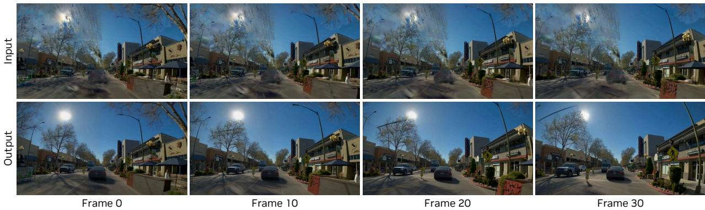

*重建伪影校正效果展示：上排为传统重建式仿真器产生的画面，存在模糊、鬼影、缺失区域和虚假几何体等伪影；下排为 OmniDreams 校正后的输出，画面清晰且几何结构合理。*

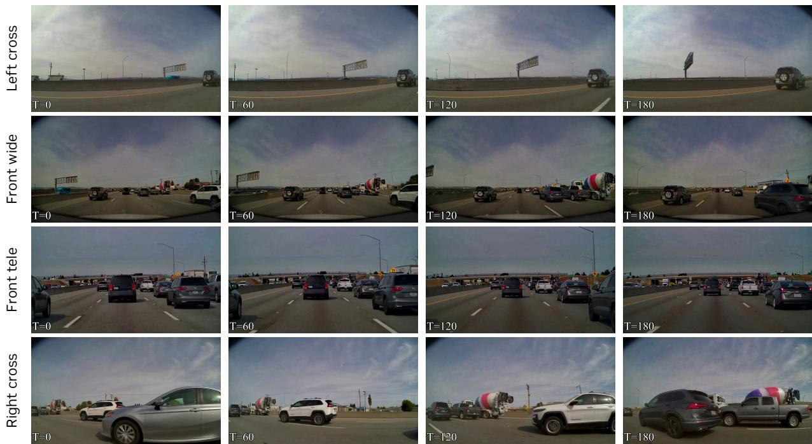

*多视图同步生成效果：OmniDreams 从共享场景状态同时生成 cross-left、front-wide、front-tele、cross-right 四个相机视角的画面，道路布局、动态参与者、光照和场景上下文在时间维度上保持高度一致。*

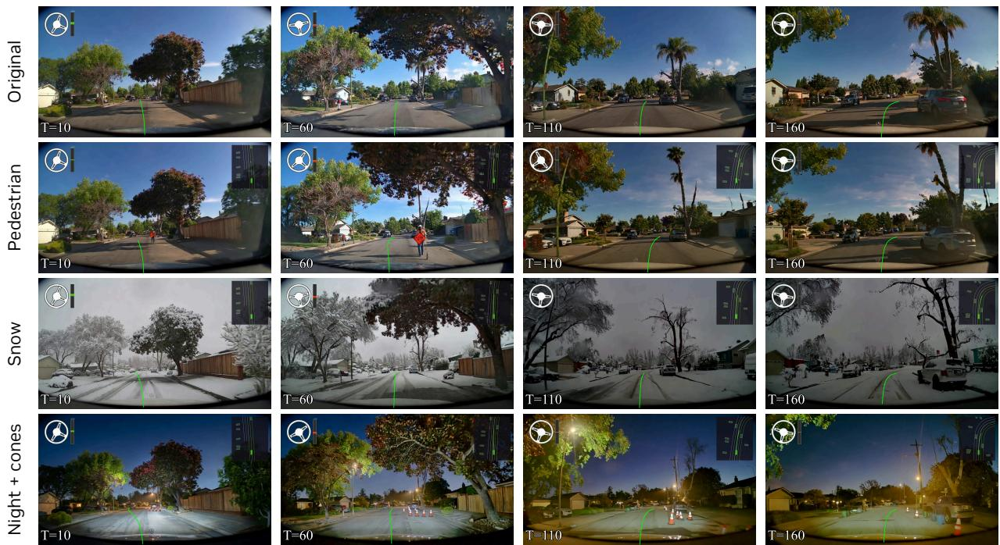

*可控场景编辑演示：通过修改文本提示可调整天气、光照等外观属性，通过修改抽象世界状态可改变交通参与者的行为，实现对仿真场景的精准定向编辑。*

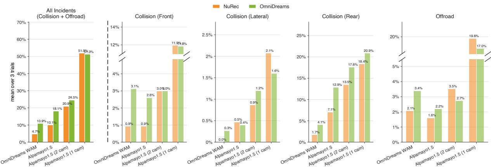

*闭环仿真定量对比：在多种策略模型下，将 AlpaSim 的传感器仿真器从 NuRec 替换为 OmniDreams（绿色 vs 橙色），OmniDreams 在所有策略类别上均取得更低的误差，验证了生成质量对下游策略评估的提升。*

## 相关工作与定位

**结论前置**：OmniDreams 并非从零构建，而是站在“通用世界基础模型”与“自回归生成技术”的肩膀上，通过引入严格的因果约束与自回归蒸馏，将其改造为专为自动驾驶闭环仿真定制的实时传感器生成器；同时，它在统一的微服务仿真栈中与重建式基线进行了公平对决，明确了生成式方法在视角外推上的独特生态位。

### 从通用先验到闭环特化

通用 physical-AI 世界基础模型（如 NVIDIA Cosmos）提供了强大的视觉先验，但直接用于自动驾驶闭环仿真会面临“时间箭头”与“误差累积”两大痛点。闭环仿真要求每次生成只能依赖过去观测与当前条件，绝不能“偷看”未来帧；同时，长时程自回归视频生成极易产生误差雪崩。

为解决这些问题，OmniDreams 在 Cosmos-Predict 2.5 backbone 之上进行了深度特化：
1. **因果约束**：引入 Diffusion Forcing 技术，通过 causal masking 与 autoregressive factorization，将原本的双向视频模型强行转换为因果自回归生成模型，确保生成过程严格遵循时间因果律。
2. **误差消除**：长序列生成容易偏离真实分布（exposure bias）。模型采用 Self Forcing 的自 rollout 训练，让模型在训练时就看自己生成的上下文，并结合 Distribution Matching Distillation (DMD) 进行全视频分布匹配，大幅提升了长程生成的稳定性。

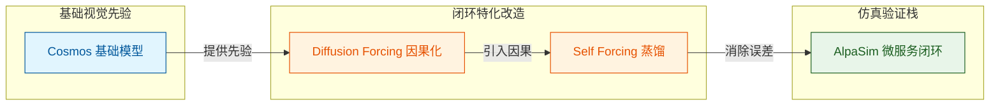
*如何读这张图：从左至右展示了 OmniDreams 的技术演进脉络。左侧提供底层视觉能力，中间通过两步关键改造解决闭环仿真的时序与稳定性痛点，最终接入右侧的验证环境。*

### 生成式与重建式的生态位互补

在评估环节，论文没有陷入“自说自话”的陷阱，而是将 OmniDreams 接入 AlpaSim 微服务闭环系统，并与 Alpamayo 1.5 策略共同评估。更重要的是，它选择了 NVIDIA NuRec 与 3D Gaussian Splatting (3DGS) 作为重建式传感器仿真器基线进行正面对比。

<strong>生成式与重建式方法的核心权衡</strong>

重建式方法（如 NuRec）在原始采集走廊内具有极高的物理保真度，但面对新视角、动态内容或未采集条件时，外推能力较弱。OmniDreams 作为生成式世界模型，虽然在绝对物理精度上可能不如重建式，但能够利用生成先验补足外推限制，在整体质量与泛化能力上展现出独特优势（具体数值见“实验与对比”一节的表格）。这种对比明确了两者并非简单的替代关系，而是面向不同仿真需求的互补。

| 维度 | OmniDreams (生成式) | NuRec / 3DGS (重建式) |
|---|---|---|
| 核心机制 | 视频基础模型自回归生成 | 3D 高斯溅射场景重建 |
| 视角外推 | 支持新视角与动态内容生成 | 局限于原始采集走廊 |
| 闭环保真度 | 依赖生成先验与动作条件 | 在已采集区域内高度保真 |

通过这一系列扎实的相关工作对齐，OmniDreams 清晰地确立了其在自动驾驶仿真谱系中的位置：它不是对传统重建方法的盲目颠覆，而是利用前沿生成技术填补闭环仿真中“长尾外推”空白的务实之作。

## 研究探索历程

构建闭环自动驾驶仿真器并非一蹴而就，而是一场从“通用视频生成”向“严格物理与时间因果”妥协并重构的探索之旅。研究团队在模型架构、长程一致性与系统工程上经历了多次试错与转向，最终确立了 OmniDreams 的技术路线。

**从通用生成到多模态条件注入**
面对闭环 AV 仿真需求，团队首先做出了关键决策：放弃传统的重建式渲染，选择以 OmniDreams 为代表的 action-conditioned generative world model。为了让生成器“听懂”驾驶指令，研究引入了多模态控制信号，包括 VLM 生成的文本提示、首帧外观以及渲染的 world-scenario map。在将通用 Cosmos 模型适配到 AV 多视角时，团队没有选择端到端硬训，而是采用分阶段训练流程，并加入 view embeddings 与轻量 control branch，以较低成本实现了跨视角一致性。

**因果化改造与长程漂移的死胡同**
闭环仿真的核心痛点在于自回归生成时的误差累积。团队使用 Diffusion Forcing 和 Flex-Attention 将双向模型因果化，使其能逐块生成。但在解决长 rollout 误差时，团队撞上了一个典型的死胡同：最初假设仅用短上下文教师进行 Self Forcing DMD 蒸馏即可支撑长时生成。然而实验证明，当 rolling KV cache 超出训练上下文后，模型会出现严重的 shifting artifacts，场景结构与对象身份迅速退化。这一负结果促使团队发生关键转向（pivot），引入长上下文双向教师继续蒸馏，才真正稳住了长程生成的质量。

<strong>长程漂移失效模式深度解析</strong>

在自回归视频生成中，模型在推理时依赖自身生成的历史帧（即 exposure bias）。短上下文教师由于感受野受限，无法为长序列提供全局结构约束。当 KV cache 滚动超出其训练窗口时，模型对远距离空间结构的感知断裂，导致像素级偏移（shifting artifacts）不断放大。引入长上下文教师本质上是为蒸馏过程注入了更长程的全局分布匹配先验。

**系统集成中的时间线陷阱**
在达到实时推理并接入 AlpaSim 闭环系统时，工程实现上也踩了坑。团队最初尝试 post-fetch 策略（先让策略和交通推进，再请求视频模型补帧），但这会导致响应帧在逻辑上发生在请求之前，注入 rollout state 时引发时间线错乱。最终，团队老老实实改回 pre-fetch 模式，通过 gRPC stateful server 严格保证了事件顺序。

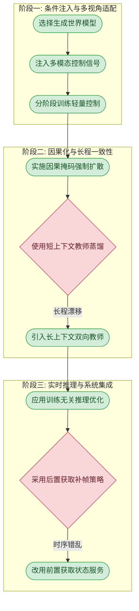

如何读这张图：流程图展示了从条件注入到系统集成的三大阶段。黄色菱形代表团队在探索中尝试的假设路径，红色边框标示了导致失败的死胡同（长程漂移与时序错乱），绿色节点则是经过验证的最终有效决策。

## 工程与复现要点

OmniDreams 提供了一套从 2B 参数轻量模型到 16 卡实时多视角生成的完整工程范式，但当前开源代码（FlashDreams）主要覆盖推理栈，核心训练分支（如控制注入与多视角注意力）尚未完全公开，完整复现需依赖内部重构或等待后续开源。

### 模型规模与关键结构

OmniDreams 家族基于 Cosmos-Predict 2.5 构建，参数规模约 2B（在 WAM 对比中作为 ~2B 代表对阵 ~10B 模型），分为单视角（OmniDreams-SV）和多视角（OmniDreams-MV）两个变体。为了在有限算力下实现实时闭环，模型在结构上做了极致的“减法”与“拆解”：

- **控制解耦**：摒弃了沉重的独立 ControlNet，采用轻量 world-scenario control branch，通过 small MLP 将结构化地图与动态体编码为 compact control tokens，直接与 visual tokens 拼接。
- **时空分解**：多视角生成并未采用暴力的 full self-attention，而是引入 learnable view embeddings 与 cross-view attention，在时间维度独立计算，大幅降低复杂度。
- **解码提速**：SV 采用 LightVAE 编码，MV 采用 pixel shuffle 替代，二者统一使用 LightTAE 解码 RGB，以牺牲微小质量换取极致的推理吞吐。

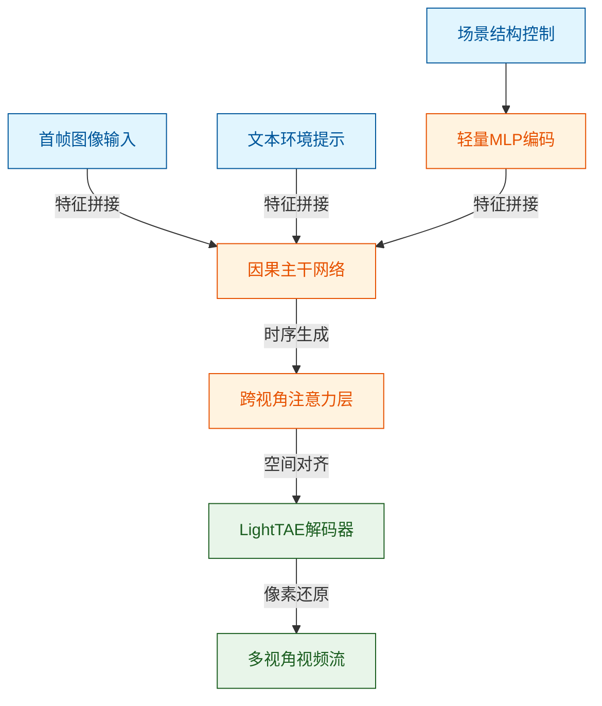
*如何读这张图：重点观察“场景结构控制”如何通过轻量 MLP 旁路注入，而非与主干深度耦合；以及跨视角注意力层如何在时序生成后进行空间对齐。*

### 训练关键超参与作用

论文展示了一套严密的“课程学习”与“渐进蒸馏”流水线。模型并非一步到位，而是通过多阶段叠加能力：先在 RDS 上 mid-train 注入自动驾驶先验，再用 RDS-HQ-1M 做高质量 finetuning。

| 训练阶段 | 核心目标 | 上下文长度 | 关键配置 |
|---|---|---:|---|
| 基础 Mid-train | 注入场景先验 | - | 双向注意力 |
| 多视角适配 | 跨视角一致性 | - | 零初始化权重 |
| 因果化蒸馏 | 自回归少步生成 | 93 帧 | timestep 1000/450 |
| 长上下文微调 | 缓解长时漂移 | 189 帧 | 渐进教师模型 |

*注：论文未报告不同混合比例（如 T2V 与 I2V 的 1:1 比例）的消融实验，也未说明动态 cuboid dropout 的具体丢弃概率，这给超参调优留下了盲区。*

### 运行环境与开源现状

在部署侧，系统深度绑定了 PyTorch 2 生态（torch.compile、CUDA Graphs、Flex-Attention），硬件基准为 NVIDIA GB300。单视角可在单卡运行，而 16 卡多视角配置则依赖 in-house ring-attention 实现 hierarchical context-parallel。服务化形态上，视频模型作为 stateful server 通过 gRPC 与 AlpaSim 客户端通信，避免了仿真系统被深度学习依赖污染。

<strong>复现依赖与开源 Caveat 详解</strong>

**开源代码入口**：
- 仓库：`https://github.com/NVIDIA/flashdreams`
- 锁定提交：`caf870e1f03a68d0a15167332c8b62cf2154a4c5`

**未公开的核心模块（复现阻碍）**：
尽管 FlashDreams 提供了 training-free streaming inference stack，但代码审查显示以下关键创新点**未找到**对应实现：
1. 轻量 control branch 把 world-scenario map 编成 control tokens。<!--ref:r-nvidia-sup-1-sup--><!--anchor:quote:NVIDIA%3Csup%3E1%3C%2Fsup%3E-->
2. 多视角生成中的 view embedding 与 Cross-View Attention。
3. 用 Diffusion Forcing 将 bidirectional model 转成 causal autoregressive model。
4. Self Forcing 与 DMD 结合的少步长 rollout distillation。

**环境依赖清单**：
- 核心框架：PyTorch 2, Cosmos-Predict 2.5, Qwen2.5-VL-7B (用于 caption)。
- 推理加速：LightX2V, LightVAE, LightTAE, Flex-Attention。
- 闭环仿真：AlpaSim, Alpamayo 1, NVIDIA NuRec, DINOv2 (dinov2_vitb14)。
- 通信与部署：gRPC, NCCL, Docker containers。

## 局限与适用边界

**结论：AlpaSim 在生成质量与系统延迟之间做出了明确的工程妥协，其核心架构决定了它目前更适合“重生成质量、轻实时交互”的准实时仿真场景，而非高频闭环控制。** 论文坦诚地展示了生成式仿真器在计算开销、状态管理和视觉一致性上的已知失效模式，没有过度宣称其具备完美的实时物理交互能力。

### 生成粒度与计算开销的博弈
基于 video-generation 的仿真器在视觉保真度上领先，但代价是显著高于 reconstruction-based 方案的计算开销。当前系统采用 chunk-based 生成机制，这意味着 agent behavior 必须在每个 chunk 开始时被固定且已知。这种设计虽然缓解了显存压力，但阻断了帧级别的即时反馈。

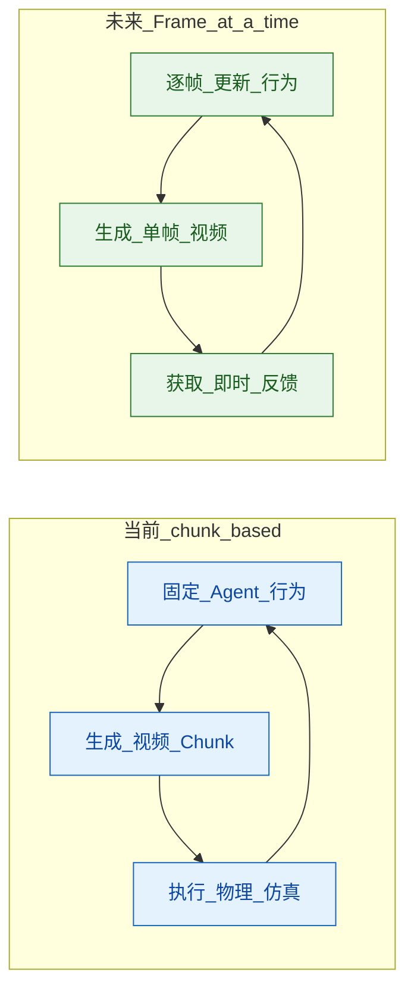
*如何读这张图：左侧展示了当前 chunk 机制下的行为固化循环，右侧为论文设定的未来 frame-at-a-time 目标，两者在反馈频率上存在本质代差。*

### 状态管理与时间线对齐的硬约束
在系统集成层面，论文指出了几个容易被忽视的工程陷阱。首先，Distributed inference 涉及复杂的多进程与 GPU 间通信，无法像普通 Python 依赖那样直接 in-process 集成到仿真器中。其次，Autoregressive renderer 内部是 stateful 的，不能任意打乱顺序渲染帧，这要求 simulator 必须严密跟踪 session state 以避免状态失效 (invalidation)。

更隐蔽的是时间线错乱问题：如果采用 post-fetch generation，返回的视频帧在逻辑时间上会早于视频模型的请求时间，导致 simulation timeline out of order。为此，AlpaSim 被迫选择 pre-fetch 策略来维持系统的因果律。

### 视觉生成的已知失效模式
在视觉生成细节上，论文报告了明确的边界条件：
1. **上下文窗口折中**：local-window attention 是 memory 与 speed 妥协的产物。窗口过小会牺牲长程上下文导致时序不连贯，窗口过大则直接推高推理成本。
2. **OOD 对象生成伪影**：对于 OOD object，如果仅依赖 first-frame RGB edit，会与 world-scenario map 中缺失 cuboid 的结构条件发生冲突。这种几何先验的缺失极易造成视觉 artifacts 与 inconsistent dynamics。<!--ref:r-as-autonomous-vehicle--><!--anchor:quote:As%20autonomous%20vehicle%20%28AV%29%20capabilities%20advance%2C%20the%20safe%20evaluation%20of%20driving%20policies%20in%20long%2Dtail%20scenarios%20remains%20a%20critical%20bottleneck.%20In-->

<strong>网络集成的编解码损耗与未来演进</strong>

当前的 networked integration 方案在跨节点传输时，仍不可避免地引入 frame encoding/decoding 的复杂度与有损压缩 (lossiness)。论文并未掩饰这一工程瑕疵，并将基于 RDMA-based gRPC 或 NCCL bulk video transfer 的无损/低延迟传输列为明确的 future work，以期在分布式部署中进一步压榨系统吞吐。

## 趋势定位与展望

OmniDreams 标志着自动驾驶仿真从“高保真重放”向“可交互生成”的范式跃迁，但其长时物理一致性与极端长尾场景的泛化能力仍是未竟之业。

传统的 reconstruction-based neural simulators（如 NuRec）在原始采集走廊内表现优异，但一旦偏离轨迹或引入未见动态物体，质量便会断崖式下跌。OmniDreams 通过引入 Cosmos-Predict 2.5 的视觉先验与 world-scenario map 控制，将仿真器从“数据回放机”升级为“场景造梦机”。这种生成式路线的核心意义在于突破了数据分布的物理边界，使策略能够在长尾天气或新视角下进行真正的闭环交互。<!--ref:r-2-5-curation-and-inspe--><!--anchor:quote:2.5%20Curation%20and%20Inspection%20with%20SIL%2DWheel%207-->

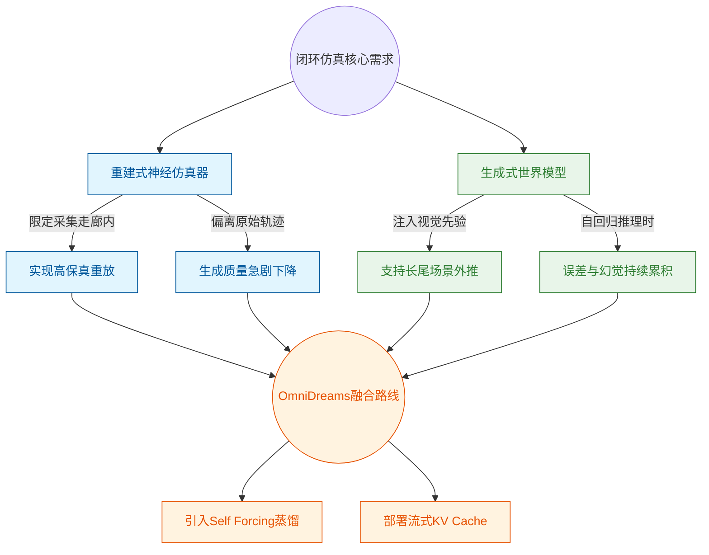
*如何读这张图：左侧蓝色分支揭示了传统重建式方法在数据分布外的脆弱性，右侧绿色分支点出了纯生成式方法的误差累积痛点，而中间的橙色汇聚区则展示了 OmniDreams 如何通过特定算法手段弥合这两大鸿沟。*

为了解决自回归视频生成中致命的 exposure bias，论文采用了 Self Forcing 结合 Distribution Matching Distillation (DMD) 的蒸馏策略，并辅以流式 KV cache 实现实时渲染。然而，我们必须清醒地看到其局限性：论文虽然证明了在车道线保真等指标上的整体领先，但并未充分报告生成模型在长时程 rollout 中可能出现的“物理违规”幻觉（如车辆穿模或不符合运动学约束）。此外，生成器自身的归纳偏置是否会引入新的“模拟器偏差”从而误导策略评估，仍缺乏深度的消融实验与负结果分析。

展望未来，该路线的发展将不可避免地走向“神经渲染与物理引擎的深度融合”。纯粹的数据驱动生成难以保证严格的物理因果，将显式的动力学约束或 3D 几何先验嵌入到自回归扩散的 latent space 中，将是下一代世界模型跨越“看似合理”到“物理正确”鸿沟的关键。