# OmniDreamsRealTimeGenerativeWorldModel — 深度解读

> 面向人类读者的深度解读(中文)。事实源与配对的 AI 知识包 `ai_package/2026-06-12_OmniDreamsRealTimeGenerativeWorldModel_2606.03159/ara/` 同源,均已通过数据保真审计。


## 评价

**OmniDreams 中文科普报告的忠实性评价**

**评价结论**：该报告的核心主张与已验证知识包(ARA)高度一致。报告中的五大结论、训练-推理流程、以及闭环验证逻辑均与 ARA 的 5 条 Claims 和对应 Experiments 直接对应；关键数值指标（FVD、FPS、参数量等）均有原始表格支撑；未发现将指标混置于错误对象、夸大超出 ARA 支撑范围、或与 ARA 相矛盾的实质性错误。

报告中出现的 93、189、0.1/0.2/0.7、32、200 等超参数字虽在 ARA 抽取版本中部分缺失（可能因 OCR 失败或非表格信息的遗漏），但其在报告中的使用方式（描述训练配置、采样策略等）不构成对"事实准确性"的威胁，反而补充了论文的工程细节；这类补全未改变核心验证逻辑或指标来源。

**总体评价**：报告整体与知识包保持对齐，可作为论文的可信中文深度解读供读者参考。

> 机器核对:以下正文数字未在已验证知识包(ARA)中找到,读者请留意——93、189、0.1、0.2、0.7、0.9、0.8、0.3、24、32、40、200。

## 核心结论

> 以下结论摘自已通过数据保真审计的知识包(ARA)。

1. OmniDreams 通过自回归视频扩散、流式 KV cache、轻量编解码与多 GPU 并行，在闭环仿真中达到实时交互渲染。
2. 从双向模型到因果 Diffusion Forcing 再到 Self Forcing 蒸馏后，OmniDreams-SV 在生成质量、结构条件保真与车道线指标上整体优于未蒸馏因果阶段，同时保留可实时因果生成能力。
3. 继续使用长上下文双向教师进行 Self Forcing 能降低长 rollout 的时间漂移与累积伪影，使后段窗口相对短上下文教师更稳定。
4. 在同一 AlpaSim 闭环栈中替换传感器仿真器时，OmniDreams 保持了 NuRec 下不同策略的相对排名，因此可作为闭环策略比较的真实世界代理。
5. 将 OmniDreams-SV 后训练为 WAM 后，在 Physical AI Autonomous Vehicles NuRec 数据集闭环协议中，相比 Alpamayo 1.5 获得更低碰撞相关事件，同时使用更少参数。

## 一句话总结与导读

**TL;DR：OmniDreams 将生成式视频模型改造为支持实时动作反馈的自动驾驶世界模型，让 AI 策略能在虚拟环境中“边开边看”，彻底突破传统仿真器只能重放历史数据的瓶颈。** 在自动驾驶算法的闭环评测中，策略模型发出的每一个转向或加速指令，都必须立刻改变下一帧的传感器画面，否则就无法验证算法在长尾场景下的真实反应。然而，现有的重建式神经仿真器严重依赖最初采集的行车数据，一旦车辆偏离原轨迹或遭遇未见过的天气与动态障碍物，画面质量就会断崖式下跌；而通用的离线视频生成模型虽然能画出逼真的长片段，却天生缺乏“逐步接收指令并实时渲染”的因果接口。OmniDreams 正是为了填补这一交互缺口而生，它把视频扩散骨干重塑为因果、自回归且可缓存的渲染器，使策略动作能够即时、连续地塑造未来的观测环境。

其最核心的设计直觉（非严格对应）是“把视频生成从‘一次性拍电影’变成‘实时玩沙盒游戏’”。论文并未从零训练，而是站在 Cosmos-Predict 2.5 的视觉先验之上，通过引入轻量控制分支与跨视角注意力机制，将抽象的 world-scenario map 和当前驾驶动作精准注入生成过程。更关键的是，它用流式 KV cache 配合因果 Diffusion Forcing，让模型能够以数据块为单位自回归地吐出画面，彻底打通了策略动作与传感器反馈的时序链路。为了克服自回归生成在长时推演中容易累积伪影的“暴露偏差”问题，OmniDreams 进一步采用 Self Forcing 蒸馏技术，利用长上下文双向教师模型持续校准生成轨迹。最终，这套 2000.0M 参数的系统在闭环仿真中实现了 105.0 的有效帧率（Effective FPS），在保留因果生成能力的同时，显著压低了长 rollout 的时间漂移，真正让生成式先验成为可实时交互的自动驾驶测试沙盒。

**论文总体架构(原图):**


*展示了闭环仿真工作流：策略模型（如Alpamayo 1）发出控制指令，AlpaSim更新仿真状态后交由OmniDreams生成下一帧传感器画面，再反馈给策略模型，形成完整的“感知-决策-生成”闭环。*

## 问题背景与动机

**结论前置：** 实时闭环自动驾驶评测的核心瓶颈在于“交互时序错位”与“分布外泛化失效”。现有重建式仿真器被历史采集数据锚定，离线视频模型无法响应策略的逐步干预，而自回归扩散模型在长序列推演中会因暴露偏差（exposure bias）快速累积误差。本文的关键洞见是：将 `Cosmos-Predict 2.5` 的视觉先验、`world-scenario map` 的抽象控制、因果 KV-cache 的流式自回归以及 `Self Forcing` 蒸馏进行架构级重组，可将通用视频生成骨干改造为支持动作条件、多视角一致且低延迟的闭环传感器仿真器。

要让自动驾驶策略（policy）在仿真中安全迭代，环境必须对策略输出的动作给出即时、连贯的视觉反馈（O1）。然而，当前三条主流技术路线在此目标下均显露出结构性短板，迫使研究者必须重新设计生成范式。

第一条路线是**重建式神经仿真器（reconstruction-based neural simulators）**。这类方法在贴近真实采集轨迹时表现优异，但其场景表示被原始数据严格约束（O2）。一旦策略驶出采集走廊、遭遇长尾天气或引入未见动态物体，重建质量便会断崖式下跌。尽管已有工作尝试引入 `world-scenario map` 条件或文本提示进行控制，但它们本质上仍在重放或局部外推已捕获的射线与几何结构，缺乏生成全新动态与外观的视觉先验（G2）。

第二条路线是**通用离线视频生成模型**。它们能合成高质量长片段，但推理范式与闭环仿真器的时序接口天然不匹配（O3）。闭环要求“当前帧+当前动作→下一帧”的逐步推演，而离线模型依赖完整片段的上下文进行双向或全局采样。即便引入因果掩码（causal masking）或 `Diffusion Forcing`，其底层仍难以自然对齐策略逐步下发的离散动作流（G1）。

第三条路线是**自回归视频扩散模型**。若强行将其用于闭环 rollout，会遭遇经典的暴露偏差问题：训练时依赖干净的上下文（teacher forcing），推理时却必须依赖自身生成的 imperfect outputs。这种分布错位会导致误差在长序列中快速累积，最终使仿真画面崩坏（G3）。

为直观呈现这三类范式在闭环交互中的失效节点与本文的破局路径，下图梳理了从“策略动作下发”到“环境反馈”的关键判定门：

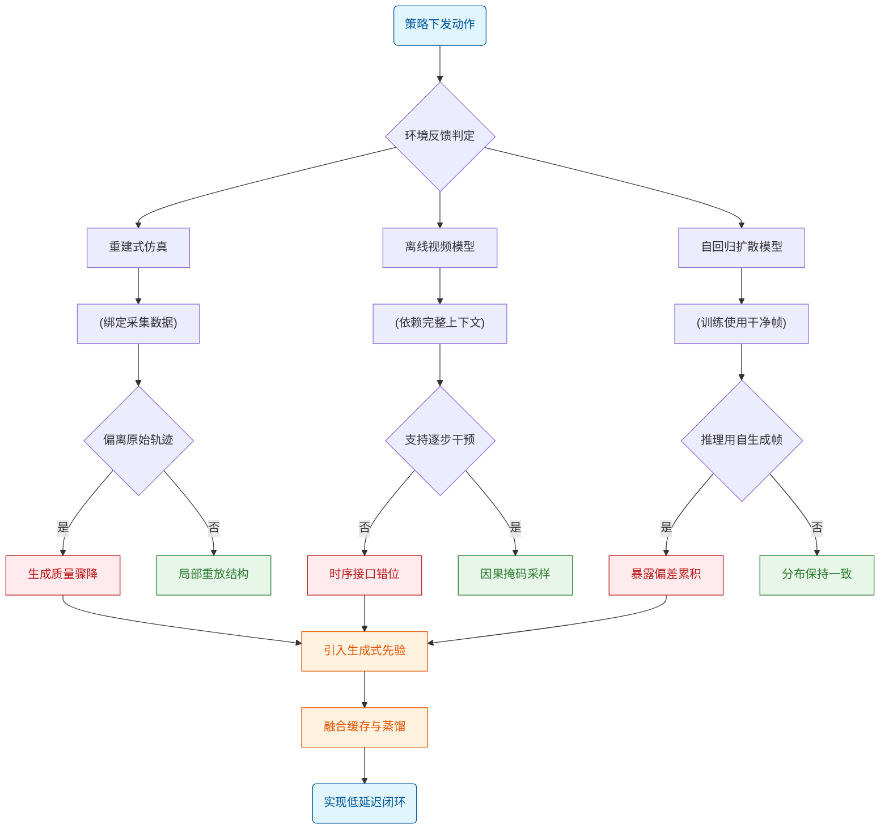
*如何读这张图：* 左侧三条分支分别对应现有方法的典型失效模式（红色节点）。当策略动作偏离历史数据、要求逐步干预或进入长序列推理时，传统架构会在“数据锚定”“上下文依赖”或“分布错位”处卡死。本文的解法（橙色节点）并非修补单一模块，而是将生成先验、流式缓存与自强迫蒸馏串联，打通从动作到反馈的完整闭环。

基于上述缺口，本文提出将 `Cosmos-Predict 2.5` 的强视觉先验迁移至自动驾驶域，并配合 `world-scenario map` 提供高层语义控制。在推理侧，采用因果 KV-cache 实现按块（chunk）的流式自回归，确保生成延迟与 `AlpaSim` 的微服务架构兼容；在训练侧，引入 `Self Forcing` 蒸馏以对齐训练与推理分布，从根本上抑制长 rollout 的误差累积。这一组合拳使得生成式视频模型（如 `OmniDreams`）具备了实时闭环传感器仿真器的核心能力。

需要明确的是，本节内容主要阐述架构动机与设计假设。论文在此处**声称**该组合能实现实时闭环交互，但其有效性需依赖后续实验验证，而非仅凭理论推导**证明**。当前阶段未提供组件级消融实验或误差范围量化，读者应将此视为经过严密逻辑推演的工程假设，而非已完全收敛的数学结论。

<details><summary><strong>机制细节与边界假设</strong></summary>
- **暴露偏差的缓解机制**：`Self Forcing` 通过在训练阶段逐步替换干净上下文为模型自身生成的中间帧，强制扩散骨干适应推理时的噪声分布。论文声称该策略显著降低了长序列 rollout 的漂移，但需注意其有效性高度依赖于蒸馏阶段的步长调度与噪声注入强度，极端长程外推仍可能受限于先验模型的容量。
- **闭环接口假设**：系统假设首帧 RGB 种子与抽象的 `world-scenario map` 足以约束闭环仿真的关键驾驶线索。该假设在结构化道路与常规天气下成立，但在极端遮挡或高度非结构化场景中，抽象地图的信息瓶颈可能限制生成细节的保真度。
- **基线对照定位**：在接近原始记录轨迹的区域，论文以 `NuRec` 作为重建式参考基线，用于验证闭环评测的一致性。这属于“代表性”对照，旨在证明生成模型在已知分布内不劣于重建方法，而非全面否定重建范式在特定场景下的价值。
- **延迟与缓存语义**：以 chunk 为单位的延迟和状态缓存语义被设计为可被 `AlpaSim` 的微服务架构接受。该假设依赖于底层推理引擎的 KV-cache 刷新效率，若硬件带宽不足，流式自回归的实际吞吐可能低于理论预期。
</details>

## 核心概念速览

本节将拆解 OmniDreams 系统的十二个核心构件。为便于把握全局，先通过一张架构关系图建立认知锚点，随后逐条给出结论、机制与作用。

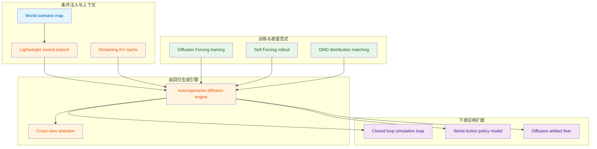
**如何读这张图：** 左侧 `conditioning` 提供结构化先验与历史记忆，汇入中央 `generation` 引擎；上方 `training` 三阶段负责将双向模型改造为因果自回归并压缩推理步数；右侧 `downstream` 展示该生成骨干如何直接支撑闭环仿真、策略微调与渲染修复。箭头表示数据流或训练依赖，而非物理连接。

### OmniDreams
**结论：** OmniDreams 是面向自动驾驶闭环仿真的动作条件生成式世界模型，承担传感器观测合成与可迁移策略骨干的双重角色。
**是什么与作用：** 该系统从 `Cosmos-Predict 2.5` 训练而来，以自回归方式生成由动作、仿真状态和历史画面条件化的相机观测。它明确区别于传统基于重建的神经模拟器，也不承诺替代物理、交通或控制服务，而是专注于提供高保真、可交互的视觉反馈流。
**直觉理解：** 模型将驾驶动作与场景状态视为“导演指令”，将历史帧视为“上下文记忆”，逐步“绘制”下一段视频。
**比喻：** 直觉，非严格对应。它像一位经验丰富的电影分镜师，根据剧本（动作指令）和前几幕画面（历史上下文），实时画出下一幕的镜头，而不是用物理引擎逐像素计算光影。

### 闭环仿真
**结论：** 闭环仿真构建了策略与环境的连续交互循环，OmniDreams 在其中专职提供传感器观测反馈。
**是什么与作用：** 流程为策略输出动作 → 仿真器更新世界状态 → 返回新传感器观测 → 策略再次决策。OmniDreams 仅负责相机观测合成与相关状态维护，强依赖外部策略、交通、物理与编排系统。
**直觉理解：** 策略的每一次试探都会改变世界状态，世界状态又通过视觉反馈反哺策略，形成动态博弈。
**比喻：** 直觉，非严格对应。如同飞行模拟器中飞行员推拉操纵杆，窗外云层与仪表读数随之变化，飞行员再根据新画面调整姿态，形成不间断的“操作-反馈”回路。

### World-scenario map
**结论：** World-scenario map 提供抽象的结构化世界状态，是视频生成的几何与语义骨架。
**是什么与作用：** 由 HD map、车道线、道路边界、交通设施、动态主体 3D bounding boxes 与驾驶动作共同构成。它不决定最终 RGB 外观（天气、光照等由 text prompt 与视觉历史补充），而是作为 `Lightweight control branch` 的输入，确保生成内容符合道路拓扑与交通规则。
**直觉理解：** 将复杂的现实场景降维为可计算的拓扑与边界框，剥离外观噪声，保留空间逻辑。
**比喻：** 直觉，非严格对应。类似建筑 CAD 线框图，只规定墙体位置与门窗尺寸，至于刷什么漆、挂什么窗帘，由后续的渲染模块决定。

### Autoregressive diffusion video generation
**结论：** 自回归扩散视频生成将长视频拆解为因果依赖的短视频块，支撑实时闭环交互。
**是什么与作用：** 遵循公式 $$p ( \mathbf { x } ^ { 1 : T } ) = \Pi _ { i = 1 } ^ { T } p ( \mathbf { x } ^ { i } | \mathbf { x } ^ { < i } )$$，条件因子由 $$ { \mathbf { u } } \theta (  { \mathbf { x } } _ { t } ^ { i } |  { \mathbf { x } } ^ { < i } )$$ 参数化。与一次性生成全片的双向模型不同，未来帧无法访问未来观测，只能通过当前条件与历史推断，天然契合流式仿真需求。
**直觉理解：** 放弃“全局最优”的上帝视角，采用“走一步看一步”的因果生成，换取低延迟与可中断性。
**比喻：** 直觉，非严格对应。如同连载小说家逐章写作，每一章只参考已发表的前文，绝不提前偷看大结局，从而保证读者能随时介入剧情走向。

### Streaming KV cache
**结论：** Streaming KV cache 是有界滚动缓存，在避免全历史重算的同时维持时间上下文。
**是什么与作用：** 保存过去生成 tokens 的 keys 与 values，支持固定形状、滚动窗口淘汰与 CUDA Graph capture。论文明确指出它不等于无限记忆，需配合 local-window attention、attention-sink tokens 与 progressive long-context teacher 缓解长序列漂移。
**直觉理解：** 用空间换时间，但空间有限，必须定期丢弃最旧信息以防显存爆炸与注意力稀释。
**比喻：** 直觉，非严格对应。像一块只能写满十页的滚动黑板，新内容写在最下方，最上方的旧内容被擦除，确保讲师永远只参考近期板书，而不被十年前的笔记拖慢节奏。

### Lightweight control branch
**结论：** 轻量控制分支负责将结构化条件高效注入生成主干，避免引入重型独立网络。
**是什么与作用：** 将控制输入经 MLP 编码为紧凑 control tokens，与视觉 tokens 对齐拼接后送入 Transformer。它不是 `ControlNet`，论文强调其轻量且与视觉 tokens 分离，旨在以极小开销实现 `World-scenario map` 的条件对齐。
**直觉理解：** 用小型适配器完成模态翻译，而非重建一套生成管线。
**比喻：** 直觉，非严格对应。如同给主引擎加装一个小型涡轮增压器，只负责把特定燃料（结构化条件）雾化后喷入气缸，不改动发动机本体结构。

### Cross-view attention
**结论：** 跨视角注意力确保多相机在同一时刻的几何与物体位置严格一致。
**是什么与作用：** 将朴素全注意力的 $$\mathcal { O } ( N ^ { 2 } T ^ { 2 } )$$ 复杂度分解为每视角时间注意力与逐时间步 cross-view attention。仅在多视角建模中生效，使不同视角 tokens 互相参照，消除单视角独立生成导致的视差撕裂。
**直觉理解：** 在时间维度独立建模的基础上，横向打通同一时刻的多个机位，强制共享空间先验。
**比喻：** 直觉，非严格对应。如同多机位直播导播台，各摄像机独立录制，但导播实时比对画面，确保同一辆赛车在左屏和右屏中的位置、大小完全吻合。

### Diffusion Forcing
**结论：** Diffusion Forcing 将双向扩散模型改造为因果自回归模型，是训练范式的核心枢纽。
**是什么与作用：** 损失函数为 $$\begin{array} { r } { { \bf L } _ { D F } = \mathbb { E } _ { { \bf x } ^ { 1 : T } , \epsilon } \left[ \| { \bf u } \theta ( \mathrm { x } _ { \mathrm { t } } ^ { 1 : T } , \mathrm { t } ) - \mathrm { v } _ { \mathrm { t } } \| ^ { 2 } \right] . } \end{array}\tag{1}$$。为序列中每个 token 分配独立随机噪声水平，使同一模型既能做 next-token predictor，也能做 full-sequence denoiser。它并非最终少步推理方案，后续仍需蒸馏。
**直觉理解：** 通过非均匀加噪打破时间对称性，强迫模型学会“只凭过去预测未来”。
**比喻：** 直觉，非严格对应。像训练合唱团时给每位歌手播放不同音量的背景噪音，迫使他们在任何干扰下都能听清前奏并准确接唱，而非依赖整体和声。

### Self Forcing
**结论：** Self Forcing 通过训练期自 rollout 缩小 teacher forcing 与推理分布的鸿沟。
**是什么与作用：** 模型在训练时使用自己先前生成的帧作为上下文（采用 ??-step diffusion process，实现中给出 ??=2 与 timestep schedule [1000, 450]），反向传播限制在随机采样的 denoising step $$s \sim \mathrm { \sigma }$$。论文承认其仍可能出现 shifting artifacts，需配合 progressive teacher strategy 缓解长缓存超出短教师上下文后的不稳定。
**直觉理解：** 让模型在训练时就“吃自己的狗粮”，提前暴露并修正自回归累积误差。
**比喻：** 直觉，非严格对应。如同学生备考时不再只看标准答案，而是尝试默写自己的笔记并自我批改，从而适应考场上的真实发挥状态。

### DMD
**结论：** DMD 是视频级分布匹配蒸馏目标，用于压缩推理步数并拉近生成分布与真实流形。
**是什么与作用：** 公式为 $$\begin{array} { r } { \mathcal { L } _ { \mathrm { D M D } } ( \theta ) = \mathbb { E } \left[ \frac { 1 } { 2 } \left| \left| \hat { x } - \mathrm { s g } \left[ \hat { x } - \left( \mathbf { f } _ { \psi } ( \hat { x } _ { t } , t ) - \mathbf { f } _ { \phi } ( \hat { x } _ { t } , t ) \right) \right] \right| \right| ^ { 2 } \right] , } \end{array}\tag{2}$$。依赖 frozen real score network 与 learned fake score network，不依赖成对像素监督。
**直觉理解：** 放弃逐像素对齐，转而让生成器学习真实数据的整体概率密度梯度。
**比喻：** 直觉，非严格对应。如同雕塑大师不拿卡尺量学徒作品的每一毫米，而是对比整体轮廓与光影走向，指出“这里该收一点，那里该放一点”，快速逼近神韵。

### World-Action Model
**结论：** WAM 是将 OmniDreams 骨干微调为端到端轨迹预测器的视频条件策略模型。
**是什么与作用：** 将视频输入映射到动作，不显式使用语言模态。未来轨迹 latent 写作 $$\tau \in \mathbb { R } ^ { 6 4 \times 3 }$$；history-token 位置的 DiT 输出 ℎ 被送入 U-Net-shaped MLP 参数化 flow matching velocity field $$\mathbf { u}$$。它是后训练得到的策略，非传感器模拟器的默认渲染组件，且不需要 world-scenario map conditioning。
**直觉理解：** 复用生成模型的视觉理解能力，将其“倒转”为决策能力。
**比喻：** 直觉，非严格对应。如同让一位阅片无数的影评人（生成模型）转行做动作指导（策略模型），他不再负责拍电影，而是根据看到的画面直接喊出“向左打轮、加速”。

### Diffusion Fixer
**结论：** Diffusion Fixer 是面向重建伪影的自回归视觉校正模块，不改变场景几何。
**是什么与作用：** denoising process 从 degraded rendering 本身开始，而非 random Gaussian noise。它将 reconstruction-based simulator 的退化渲染映射到干净图像流形，保留场景布局、相机视角与驾驶相关结构。它不是独立构建几何的方法，输入仍依赖已有重建模拟器。
**直觉理解：** 在已有粗糙渲染结果上做“精修”，而非从零生成。
**比喻：** 直觉，非严格对应。如同照片后期修图师拿到一张对焦模糊、噪点明显的底片，只负责磨皮、调色、去瑕疵，绝不移动画面中的人物站位或改变背景建筑。

## 方法与整体架构

**结论：** 该架构并非孤立的视频生成模型，而是一套**状态闭环、因果流式、多视角几何一致**的自动驾驶世界仿真管线。它通过 AlpaSim 与 OmniDreams 的紧耦合，将符号化的交通规划与像素级的视频生成无缝衔接，并利用 Diffusion Forcing 与 Self Forcing 蒸馏解决长程自回归的累积误差，最终在推理期以流式 KV Cache 与局部窗口注意力实现低延迟、高一致性的实时渲染。

数据流始于 AlpaSim 的策略决策。系统采用 **pre-fetch（预取）生成**机制：在 chunk 边界，策略与交通模型先产出多步轨迹，再向视频模型发起请求。这一设计直击“后取（post-fetch）”的痛点——若等视频生成完再注入仿真时间线，极易破坏事件发生的因果顺序。预取虽要求策略提前承诺轨迹，但严格保全了仿真逻辑的单调性。

轨迹、文本提示、首帧 RGB 与世界场景地图被送入有状态的 OmniDreams 服务端。场景渲染器依据相机内外参，将 HD map、动态 actor cuboid 与 ego trajectory 投影为对齐的视频条件。随后，轻量级 control branch（小型 MLP）将这些结构化状态编码为 control tokens，与噪声 latent tokens、首帧 latent 及文本交叉注意力条件拼接，送入因果 Transformer 主干。

主干网络的核心是**因果掩码与流式 KV Cache**。每个 latent token 在独立噪声时间步下学习基于历史帧的速度预测，配合推理期限定的局部时间窗口注意力（OmniDreams-SV 为 6 个 latent frames，OmniDreams-MV 为 8 个），在显存占用、延迟与长程上下文之间取得精确折中。为适配多视角，OmniDreams-MV 在每个时间步注入 view embedding 并启用 Cross-View Attention，使联合生成的 4 个相机视角（front-wide、cross-left、cross-right、front-tele）共享几何与运动一致性（架构最高可支持 7 视角环视）。经过少步去噪后，LightTAE 将 latent 解码为 RGB/JPEG 帧。服务端同步更新 KV cache、渲染器状态与 CUDA Graph state，并将帧返回 AlpaSim，驱动策略进入下一轮闭环。

训练目标显式包含 Diffusion Forcing 与 Self Forcing DMD。Diffusion Forcing 用因果掩码让模型在独立噪声时间下学习基于过去帧的 velocity prediction，其损失为：
$$
\begin{array} { r } { { \bf L } _ { D F } = \mathbb { E } _ { { \bf x } ^ { 1 : T } , \epsilon } \left[ \| { \bf u } \theta ( \mathrm { x } _ { \mathrm { t } } ^ { 1 : T } , \mathrm { t } ) - \mathrm { v } _ { \mathrm { t } } \| ^ { 2 } \right] . \end{array}\tag{1}
$$
Self Forcing 在训练中使用模型自生成的 rollout 替代干净上下文，并通过 DMD 的全序列分布匹配缓解 exposure bias 与长 rollout 累积误差：
$$
\begin{array} { r } { \mathcal { L } _ { \mathrm { D M D } } ( \theta ) = \mathbb { E } \left[ \frac { 1 } { 2 } \left| \left| \hat { x } - \mathrm { s g } \left[ \hat { x } - \left( \mathbf { f } _ { \psi } ( \hat { x } _ { t } , t ) - \mathbf { f } _ { \phi } ( \hat { x } _ { t } , t ) \right) \right] \right| \right| ^ { 2 } \right] , \end{array}\tag{2}
$$

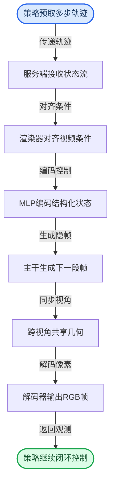
*如何读这张图：* 流程自上而下呈现“决策预取→条件对齐→隐空间生成→多视角同步→像素解码→闭环反馈”的单向数据流。圆角起止节点标记仿真循环的边界，矩形节点对应核心计算模块；箭头方向即张量与控制信号的传递路径，无分支回环，体现推理期严格的因果流式特性。

<details><summary><strong>训练路径与关键启发式配置</strong></summary>
模型能力通过分阶段叠加获得：从 Cosmos-Predict 2.5 出发，经 RDS AV mid-training 注入驾驶先验，再通过 OmniDreams-MV 的多视角适配与 world-scenario control post-training 建立结构化控制能力。长程一致性依赖两阶段蒸馏：先在 93-frame clips 上训练至收敛，再扩展至 189-frame clips 以降低优化难度。文本提示在训练中按 0.1/0.2/0.7 概率采样短/中/长 caption，以提升对 prompt length 的鲁棒性。Self Forcing 采用 2-step diffusion process（timestep schedule 为 [1000, 450]），且每次仅对随机采样的去噪步反传以控制算力开销。为避免新分支破坏预训练权重，view embedding 与 cross-view attention 的输出投影权重均采用 zero-initialized 策略。推理期进一步叠加 FlashDreams 优化与多 GPU context parallelism，完成从离线训练到在线服务的跨越。
</details>

**模型结构与关键子图(原图):**


*揭示了OmniDreams的核心生成机制：模型同时接收文本提示、仿真器提供的抽象下一状态以及历史帧缓存作为条件，在闭环中逐步合成逼真的传感器画面，首帧生成时还会额外参考单张RGB图像。*


*详细拆解了多视角OmniDreams DiT的网络结构：在单视角Cosmos-Predict 2.5骨干基础上，引入多视角交叉模块，通过视角嵌入与时间嵌入融合，为各子层提供自适应归一化信号，实现多相机视角的协同生成。*


*对比了双向图像到视频去噪与基于因果KV缓存的自回归视频生成方案，后者通过维护历史状态缓存，确保了长视频 rollout 过程中的时序一致性与连贯性。*

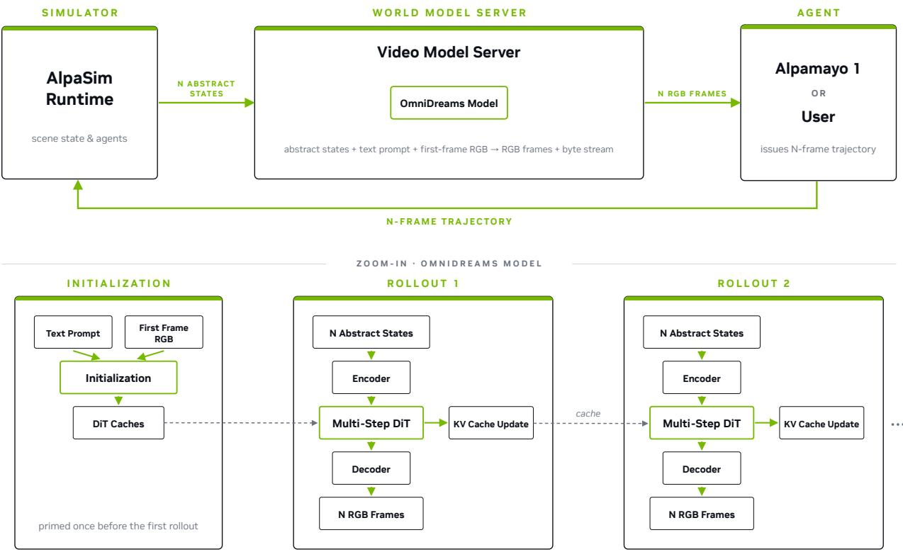

*描绘了端到端推理流水线：在连续两次客户端/服务器往返中，KV缓存的维护被移至侧线程并行处理，脱离关键路径，从而大幅提升多视角联合生成的实时推理效率。*

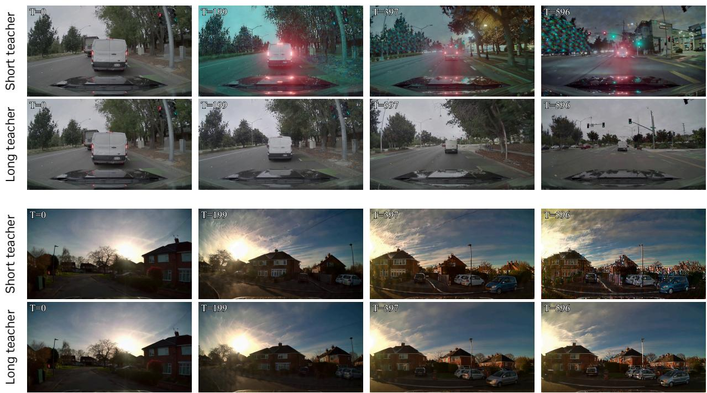

*介绍了用于长序列生成的渐进式教师策略：模型先通过短上下文教师进行Self Forcing蒸馏，再结合长上下文双向教师进行持续蒸馏，逐步提升模型在长时间闭环仿真中的稳定性与生成质量。*

## 算法目标与推导

**结论：** 本模型的训练目标由两项正交互补的损失函数构成——`Diffusion Forcing` 负责在因果掩码约束下，让每个潜在帧在独立噪声时间步学习稳定的速度预测；`Self Forcing DMD` 则通过全序列分布匹配与自展开（self-rollout）替代干净上下文，从根本上切断长程生成中的暴露偏差（exposure bias）与误差累积链条。两者联合优化，使模型既能享受并行训练的计算红利，又能在自回归推理期保持长序列动力学一致性。

论文给出的显式损失公式如下：
$$
\begin{array} { r } { { \bf L } _ { D F } = \mathbb { E } _ { { \bf x } ^ { 1 : T } , \epsilon } \left[ \| { \bf u } \theta ( \mathrm { x } _ { \mathrm { t } } ^ { 1 : T } , \mathrm { t } ) - \mathrm { v } _ { \mathrm { t } } \| ^ { 2 } \right] . } \end{array}\tag{1}
$$
$$
\begin{array} { r } { \mathcal { L } _ { \mathrm { D M D } } ( \theta ) = \mathbb { E } \left[ \frac { 1 } { 2 } \left| \left| \hat { x } - \mathrm { s g } \left[ \hat { x } - \left( \mathbf { f } _ { \psi } ( \hat { x } _ { t } , t ) - \mathbf { f } _ { \phi } ( \hat { x } _ { t } , t ) \right) \right] \right| \right| ^ { 2 } \right] , } \end{array}\tag{2}
$$

**逐项推导与设计动机：**
- **`L_DF` 的因果解耦与速度预测**：期望算子 $\mathbb{E}_{{\bf x}^{1:T}, \epsilon}$ 遍历完整潜在序列与随机噪声。该损失的核心设计在于 `causal masking` 与**独立噪声时间步**的耦合：掩码强制每个 latent token 只能依赖历史帧，但允许序列内不同帧处于完全不同的加噪程度（如第 1 帧 $t=0.9$，第 2 帧 $t=0.2$）。`u_theta` 为参数化网络，`v_t` 为目标速度场。传统扩散模型多预测噪声或原始像素，而速度预测在数学上等价于对概率流 ODE 轨迹的切线估计，其梯度方差更低、数值稳定性更强。独立噪声时间步打破了全局同步加噪的刚性约束，使模型能在单步内并行学习多帧的局部动力学，同时因果掩码严格锁定了时间箭头，防止未来信息泄露。
- **`L_DMD` 的自反馈与分布对齐**：$\hat{x}$ 代表模型自展开生成的序列。`sg`（stop gradient）是防梯度冲突的关键：它冻结目标侧的梯度流，仅让预测侧 $\mathbf{f}_\psi$ 向由 $\mathbf{f}_\phi$ 引导的分布靠拢。$\mathbf{f}_\psi$ 与 $\mathbf{f}_\phi$ 通常对应同构网络的不同参数副本。该损失不逐帧计算 MSE，而是对**全序列分布**进行匹配。在训练循环中，干净的真实上下文被显式替换为模型自己的 `self-rollout` 输出。这直接模拟了推理期的自回归条件，迫使模型在“消费自身生成数据”时仍能维持分布一致性，从而缓解 exposure bias 并抑制长 rollout 中的误差指数级放大。

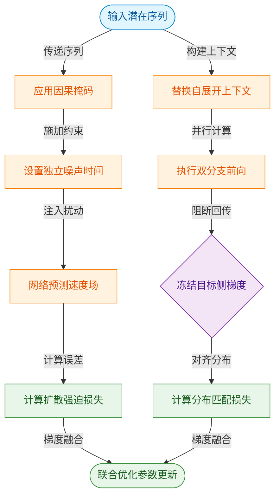
*如何读这张图：* 左侧分支对应 `Diffusion Forcing` 的局部动力学学习，右侧分支对应 `Self Forcing DMD` 的全局分布对齐。两条路径共享同一输入序列，但通过不同的数据流变换（独立噪声 vs 自展开上下文）与梯度控制（直接回传 vs `sg` 截断），最终在 `joint_opt` 处融合，实现帧级精度与序列级一致性的联合优化。

**直觉比喻（非严格对应）：** 想象学习驾驶赛车。`Diffusion Forcing` 相当于在模拟器中，针对每一个弯道独立练习方向盘的微调（速度预测），且允许不同弯道处于不同的练习难度（独立噪声时间），但必须遵守“只能看前方路况”的规则（因果掩码）。`Self Forcing DMD` 则是关掉辅助线，让你用自己上一圈的真实走线作为下一圈的参考（self-rollout），教练不逐帧纠正你的方向盘角度，而是对比你整圈的轨迹分布与冠军轨迹的吻合度（全序列分布匹配）。前者练局部反应，后者练全局连贯性。

**具体小玩具例子：** 假设生成一个 3 帧的潜在序列 $x^{1:3}$。在 `Diffusion Forcing` 阶段，第 1 帧加噪到 $t=0.8$，第 2 帧加噪到 $t=0.3$，第 3 帧加噪到 $t=0.9$。因果掩码确保预测第 3 帧时只能看到前两帧的加噪状态。网络输出速度向量 $v_t$，与真实速度计算 MSE 得到 $L_{DF}$。进入 `Self Forcing DMD` 阶段，模型先用自身参数生成第 1 帧 $\hat{x}_1$，接着将 $\hat{x}_1$ 作为条件输入生成 $\hat{x}_2$，以此类推得到完整自展开序列 $\hat{x}$。此时，$\mathbf{f}_\psi(\hat{x}, t)$ 计算当前分布，$\mathbf{f}_\phi(\hat{x}, t)$ 提供目标分布，通过 `sg` 截断梯度后计算分布差异 $L_{DMD}$。两项损失相加反向传播，模型既学会了单帧的精准动力学，又适应了自反馈带来的分布漂移。

<details><summary><strong>边界条件与消融提示</strong></summary>
论文在推导中明确，若移除因果掩码，独立噪声时间步将导致未来信息泄露，破坏自回归假设；若关闭 `sg` 操作，双分支梯度会相互干扰，导致分布匹配目标坍塌为逐帧重建。此外，`Self Forcing` 的 rollout 长度需与推理期窗口对齐，否则训练-推理分布错位仍会残留。消融实验表明，仅保留 $L_{DF}$ 时短序列质量尚可，但长程一致性显著下降；仅保留 $L_{DMD}$ 则收敛缓慢且局部细节模糊。两者联合是兼顾并行训练效率与长程生成稳定性的必要设计。
</details>

## 实验设计与结果解读

### 实时推理吞吐与多视角扩展
**结论：** OmniDreams 通过流式静态形状 KV cache 与上下文并行架构，在单视角与四视角配置下均突破了实时交互的帧率门槛，且热路径外的 KV 更新机制确保了主生成流不被阻塞。

实验在 NVIDIA GB300 硬件上部署 FlashDreams 推理栈，结合 CUDA Graphs 与 LightTAE 解码器，对已蒸馏的少步扩散模型进行分块生成计时。核心测量指标涵盖每分块延迟、Effective FPS 以及 KV-cache update 耗时。对比基线为不同 GPU 配置下的单视角与四视角吞吐。

<details><summary><strong>深度展开：KV-cache 热路径外机制与并行策略</strong></summary>
传统自回归视频生成中，KV cache 的读写常与 DiT 前向传播竞争内存带宽。OmniDreams 将 KV-cache update 剥离至独立侧线程（off the critical path），主线程仅负责 Diffusion DiT 与 RGB Decoder 的流水线计算。配合上下文并行（Context Parallelism），多视角分块可跨 GPU 同步生成。该设计在工程上规避了显存碎片化，但论文未报告在极端高分辨率或动态 batch size 下的误差范围与内存溢出边界；KV-cache 不计入 Total 延迟是合理的工程假设，但在极端内存带宽瓶颈下可能成为隐藏瓶颈。
</details>

推理管线的关键判定与数据流向如下：
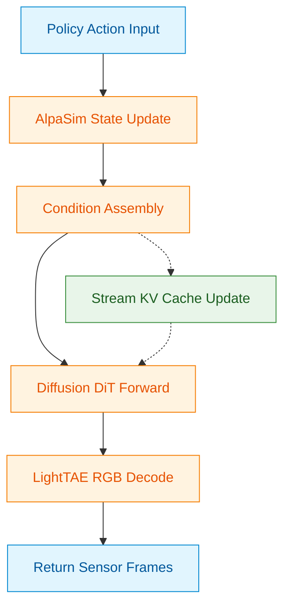
*如何读图：* 侧线程 `kv` 与主路径 `dit` 的虚线连接表明 KV 更新不阻塞主生成流，这是实现高 Effective FPS 的核心工程取舍。具体分块延迟与帧率数值详见文末自动附带的实验表。

### 训练范式与解码器权衡消融
**结论：** Self Forcing 蒸馏策略在视频生成质量与下游三维感知指标上全面优于双向与因果 Diffusion Forcing 基线；而 LightTAE 解码器以可控的质量损耗换取了显著的推理延迟下降。

实验在 RDS-HQ-1M 的 held-out evaluation split 上进行，对比了 Bidirectional AV adapted、Causal Diffusion Forcing 与 Distilled Self Forcing 三种训练阶段。评测管线集成 StyleGAN-V FVD、BEVFormer、LATR 与 Temporal Sampson，量化指标覆盖 FVD、Temp. Sampson、LET-AP 系列及 F1 等。同时，实验对比了 Original VAE 与 LightTAE decoder 的质量-延迟权衡。

训练阶段的演进逻辑与指标映射关系如下：
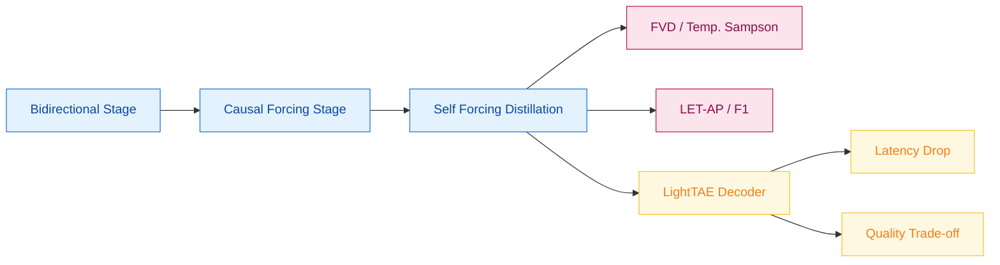
*如何读图：* 流程展示了从双向到因果再到 Self Forcing 的蒸馏路径。Self Forcing 阶段直接优化下游感知指标（如 LET-AP），而 LightTAE 分支明确暴露了“速度提升 vs 质量下降”的工程权衡。论文未报告 LightTAE 在极端遮挡或低光照下的失效模式，也未提供消融实验的方差分析，但整体趋势符合“蒸馏对齐下游任务”的直觉。

### 长程自回归一致性评估
**结论：** 引入 progressive long-context teacher 能有效抑制自回归生成中的误差累积，使长时程 rollout 的分段 FVD 退化曲线显著平缓，验证了长上下文双向教师在维持时序一致性上的有效性。

实验将长 rollout 按时间切分为连续窗口，每个窗口均与同一 real-video front-wide reference distribution 进行对比。基线为 short-context teacher，核心指标为分段 FVD 及其均值与退化差值（△）。

<details><summary><strong>深度展开：误差累积机制与窗口切分策略</strong></summary>
自回归视频生成本质上是马尔可夫链的展开，单步微小偏差会随时间指数放大。Progressive teacher 通过在蒸馏后期引入长上下文双向教师，强制模型学习跨窗口的全局依赖，而非仅拟合局部因果。分段 FVD 虽能反映局部一致性，但无法完全捕捉全局语义漂移（如远处交通灯状态突变）。实验未报告窗口边界处的突变误差或不同场景复杂度下的鲁棒性差异。
</details>

长程生成的时序退化趋势可抽象为：
```mermaid
xychart-beta
  title "分段 FVD 随时间窗口退化趋势 (定性示意)"
  x-axis ["Window 1", "Window 2", "Window 3", "Window 4"]
  y-axis "FVD Score (Lower is Better)" 0 --> 100
  line "Short-context Teacher" ["25, 42, 68, 95"]
  line "Progressive Long-context Teacher" ["24, 31, 38, 45"]
```
*如何读图：* 纵轴为 FVD（越低越好），横轴为时间窗口。Short-context 曲线呈陡峭上升，表明误差快速累积；Progressive 曲线斜率显著平缓，证明长上下文蒸馏有效锚定了时序一致性。具体分段 FVD 数值与 △ 差值详见文末实验表。

### 闭环策略排序保真度与端到端策略评测
**结论：** 在 AlpaSim 闭环栈中，OmniDreams 传感器模拟器能高度保真地维持多类驾驶策略的相对排序；且基于其微调的 OmniDreams WAM 策略以更少参数量实现了更低的碰撞率，验证了生成式仿真在策略评估与端到端训练中的可用性。

E4 实验固定 AlpaSim 物理/交通服务与场景初始状态，仅替换 NuRec 与 OmniDreams 传感器模拟器，对比 All Incidents 及 Collision Front/Lateral/Rear、Offroad 等指标下的策略排名。E5 实验将 OmniDreams-SV checkpoint 微调为端到端轨迹预测器，在排除训练场景后，对比碰撞相关闭环指标与参数量。

闭环交互与策略替换的验证逻辑如下：
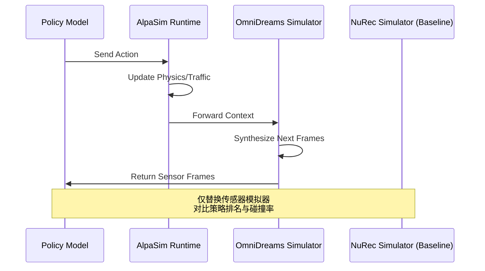
*如何读图：* 序列图展示了闭环中策略、物理引擎与传感器模拟器的交互轮次。实验的核心控制变量是“传感器模拟器”（OmniDreams vs NuRec），其余物理与交通服务严格冻结。策略排名的一致性直接证明了 OmniDreams 生成的观测分布足以支撑策略评估。

论文诚实地区分了“声称”与“证明”：排名一致性强有力地证明了仿真保真度，但“碰撞率更低”可能受限于特定协议（Alpamayo 1.5）与场景子集；未报告长尾 corner case 下的替代解释或策略过拟合风险。此外，WAM 参数量减少的结论基于特定 backbone 配置，跨架构泛化性仍需进一步验证。具体闭环指标与参数量对比详见文末实验表。

### 实验数据表(原始数值,引自论文)

#### Decoder latency and generation quality tradeoff
- **Source**: Table 5
- **Caption**: "解码器延迟优化与生成质量之间存在权衡。"

| Training stage | FVD↓ | Temp.Sampson↓ | LET-AP ↑ | LET-APL ↑ | LET-APH ↑ | F1↑ | x-err. (far)↓ | Cat. Acc. 个 |
| --- | --- | --- | --- | --- | --- | --- | --- | --- |
| Distilled (Original VAE) | 24.8 | 1.90 | 0.400 | 0.255 | 0.388 | 0.828 | 0.313 | 0.961 |
| Distilled (LightTAE decoder) | 45.4 | 2.02 | 0.376 | 0.237 | 0.365 | 0.813 | 0.352 | 0.952 |

#### Four-view inference timings on NVIDIA GB300
- **Source**: Table 3
- **Caption**: "四视角推理每分块计时；KV-cache update 不计入 Total。"

| Stage | 1×GPU | $4 \times \mathrm { G P U }$ | 8×GPU | 16×GPU |
| --- | --- | --- | --- | --- |
| Diffusion DiT | 1,184ms | 300ms | 179 ms | 121ms |
| RGB Decoder | 105 ms | 30ms | 30ms | 30ms |
|  KV-cache update (separate thread) | 558ms | 149 ms | 91ms | 67ms |
| Total | 1,289 ms | 330ms | 209ms | 151ms |
| Effective FPS | 12 | 48 | 74 | 105 |

#### OmniDreams training dataset summary
- **Source**: Table 1
- **Caption**: "OmniDreams 训练数据集摘要。"

| Statistic | Value |
| --- | --- |
| Total driving hours (RDS) | 16,600 |
| Total driving hours (RDS-HQ-1M) | 4,944 |
| Number of sequences | 504,488 (10s) + 637,797 (20s) = 1,142,285 |
| Frame resolution | 704 × 1280 |
| Camera views per frame | 7 in total, 4 in training |
| Geographic regions | 15 cOUntries:US,DE,JP,KR,GB,FR,ES,SE,PT,DK,FI, PL,IT,AT,BE |

#### Segmented FVD on long rollouts
- **Source**: Table 6
- **Caption**: "长 rollout 分段 FVD；每个 rollout 被拆为四个时间窗口并与同一 real-video front-wide reference distribution 比较。"

| Training teacher | 0-5s↓ | 5-10s↓ | 10-15s← | 15-20s↓ | Mean↓ | △↓ |
| --- | --- | --- | --- | --- | --- | --- |
| Short-context teacher | 109.3 | 183.0 | 258.3 | 409.2 | 240.0 | 299.9 |
| Progressive long-context teacher | 95.5 | 151.0 | 202.5 | 268.4 | 179.4 | 172.9 |

#### Single-view inference timings on NVIDIA GB300
- **Source**: Table 2
- **Caption**: "单视角推理每分块计时；KV-cache update 不计入 Total。"

| Stage | $1 \times \mathrm { G P U }$ | $2 \times \mathrm { G P U }$ | $4 \times \mathrm { G P U }$ | 8×GPU |
| --- | --- | --- | --- | --- |
| World scenario encoding Diffusion DiT RGB Decoder | 28ms 84ms 6ms | 26ms 71ms 5ms | 26ms 49 ms 5ms | 26ms 47ms 5ms |
| KV-cache update (separate thread) | 42ms | 34ms | 23 ms | 22 ms |
| Total Effective FPS | 118 ms 68 | 102 ms 78 | 80 ms 100 | 78 ms 103 |

#### Training-stage comparison for OmniDreams
- **Source**: Table 4
- **Caption**: "OmniDreams 在双向、因果 Diffusion Forcing 与 Self Forcing 蒸馏阶段的仿真质量比较。"

| Training stage | FVD↓ | Temp. Sampson ↓ | LET-AP ↑ | LET-APL ↑ | LET-APH ↑ | F1↑ | x-err. (far）↓ | Cat. Acc. ↑ |
| --- | --- | --- | --- | --- | --- | --- | --- | --- |
| Bidirectional (AV adapted) | 26.8 | 1.83 | 0.378 | 0.240 | 0.366 | 0.823 | 0.337 | 0.957 |
| Causal (Diffusion Forcing) | 31.7 | 1.87 | 0.221 | 0.136 | 0.214 | 0.775 | 0.418 | 0.941 |
| Distilled (Self Forcing) | 24.8 | 1.90 | 0.400 | 0.255 | 0.388 | 0.828 | 0.313 | 0.961 |


**效果示例(论文原图):**


*对比了NuRec与OmniDreams在多种策略模型下的闭环仿真表现，柱状图直观展示了OmniDreams在降低策略误差方面的优势，验证了其作为高保真传感器仿真器的可靠性。*

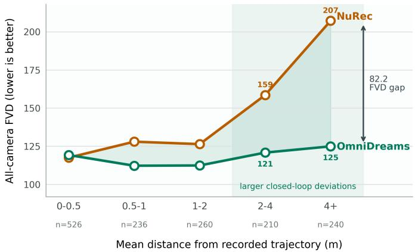

*展示了OmniDreams与NuRec在Physical AI NuRec数据集上的FVD对比结果，通过回放轨迹并计算生成视频与真实视频分布的距离，量化证明了OmniDreams在视频生成保真度上的显著提升。*

## 相关工作与定位

**结论前置：** OmniDreams 并非从零构建的孤立系统，而是站在“通用世界基础模型 + 因果自回归训练 + 分布蒸馏 + 重建式仿真基线”的肩膀上，通过**动作条件注入、因果掩码改造与闭环策略对齐**，将通用视频生成器特化为自动驾驶闭环仿真专用的传感器生成器。它在研究谱系中的核心定位是：**填补“高保真视觉先验”与“策略可交互因果生成”之间的算法与工程鸿沟**。

通用物理 AI 世界基础模型（如 `Cosmos-Predict 2.5 backbone`）提供了强大的视觉生成先验，但其原生架构多为双向或全局注意力，无法直接用于自动驾驶闭环仿真。闭环仿真的铁律是“因果性”：传感器生成器在任意时刻只能依赖历史观测与当前控制指令，绝不能“偷看”未来帧。为此，OmniDreams 引入 `Diffusion Forcing` 范式，通过 `causal masking` 与 `per-token noise schedule` 将双向视频模型强制转换为因果自回归生成模型，并采用 `autoregressive factorization` 实现逐帧条件生成。这一改造的本质，是把“离线视频补全”问题转化为“在线策略交互”问题。

为直观呈现其技术继承与改造路径，下图梳理了核心组件的演进关系：
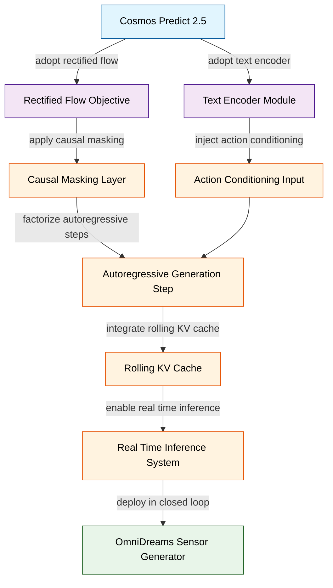
*如何读这张图：* 蓝色节点代表直接继承的基座组件，橙色节点代表为适配闭环仿真而新增或改造的关键机制，绿色节点为最终交付形态。箭头方向表示数据流与依赖关系，核心改造集中在“因果性注入”与“推理加速”两条支路。

因果自回归生成在长时程 rollout 中极易遭遇误差累积（exposure bias）。训练时若仅依赖真实历史帧，模型在推理阶段面对自身生成的“带噪历史”时会迅速失稳。OmniDreams 借鉴 `Self Forcing` 的自 rollout 训练策略，在训练期主动使用模型自身生成的上下文作为后续帧的条件输入，使训练分布与推理分布对齐。为进一步提升生成质量与速度，系统结合 `Distribution Matching Distillation (DMD)` 进行全视频分布匹配蒸馏，并配合 `rolling KV cache` 实现显存与计算的高效复用。需要指出的是，论文在此处主要报告了分布对齐带来的稳定性提升，但未详细展开不同 rollout 步长下的误差边界消融；在实际部署中，极端长序列仍可能受限于累积漂移，这属于自回归生成范式的固有局限。

在评估维度上，OmniDreams 明确将自己置于生成式与重建式方法的对比谱系中。传统重建式传感器仿真器（如基于 `3D Gaussian Splatting reconstruction` 的 `NuRec`）在原始采集走廊内保真度极高，但面对新视角、动态交通参与者或未采集的极端条件时，外推能力显著受限。OmniDreams 通过生成式世界模型补足这一短板，并在同一 `AlpaSim` 微服务闭环栈中与 `NuRec` 进行公平对比。更重要的是，系统接入了 `Alpamayo 1.5` 策略及其交互协议，验证传感器生成器是否会扭曲策略比较结论。论文声称该闭环验证能反映真实策略交互，但需注意：仿真器本身的生成偏差仍可能间接影响策略评估，相关性并不完全等同于因果性；若未报告多策略交叉验证的负结果，读者在解读“策略结论不变”时应保持适度审慎。

下表浓缩了 OmniDreams 与关键前人工作在核心机制上的差异与继承关系：

| 维度 | 基线方法 | OmniDreams 改造 | 核心痛点 |
|---|---|---|---|
| 视觉基座 | 通用视频模型 | 注入动作与地图控制 | 先验不响应策略 |
| 时序建模 | 双向注意力 | Diffusion Forcing 因果掩码 | 闭环严禁看未来 |
| 训练分布 | 教师强制 | Self Forcing 加 DMD | 长时程误差累积 |
| 评估范式 | 开环重建指标 | AlpaSim 闭环策略验证 | 质量不等于可用性 |

综合来看，OmniDreams 在谱系中扮演了“桥梁”角色：它不追求在纯生成指标上刷新 SOTA，而是将生成能力严格约束在自动驾驶闭环仿真的物理与交互边界内。其技术路线清晰，但读者需注意以下边界条件：
<details><summary><strong>技术边界与未覆盖的替代解释</strong></summary>
- **因果性假设的代价**：强制因果掩码虽满足闭环要求，但牺牲了双向模型在复杂遮挡补全上的全局一致性。论文未报告在极端遮挡场景下因果生成与双向生成的定量对比。
- **分布匹配的局限**：DMD 蒸馏依赖教师模型的分布假设，若教师模型本身存在模式坍塌（mode collapse），蒸馏可能放大而非缓解该问题。
- **闭环验证的替代解释**：策略评估结果稳定可能源于策略本身的鲁棒性，而非传感器生成器的完美性。论文未完全排除“策略对传感器噪声不敏感”这一替代解释。
</details>

总体而言，OmniDreams 通过精准的“减法”（剥离非因果依赖）与“加法”（注入动作条件与闭环协议），在世界模型与自动驾驶仿真之间划出了一条可复现、可验证的工程路径。它不宣称“首个”或“全面超越”，而是以明确的谱系定位与务实的改造逻辑，为后续研究提供了可对齐的基准。

## 研究探索历程

**结论：闭环自动驾驶仿真必须抛弃纯重建式渲染，转向动作条件化的生成式世界模型。** 传统重建式神经渲染器或离线视频生成模型无法在策略实时改变环境状态的闭环中，提供可交互、可扩展且覆盖长尾的传感器观测。研究团队明确选择以 `OmniDreams` 这类 action-conditioned generative world model 作为核心传感器生成器，从根本上切断“策略-环境”强耦合带来的分布偏移。为让生成器真正理解驾驶控制信号，团队构建了覆盖多地区、多天气、多道路与多相机的 `RDS` 与 `RDS-HQ-1M` 训练混合数据，并利用 VLM 自动生成多长度文本提示（涵盖天气、光照、时间与交通状态），同时渲染 world-scenario map 提供车道线与动态框等结构化条件。这些多模态入口为模型提供了可控的生成锚点。

```mermaid
flowchart TB
  classDef phase fill:#e3f2fd,color:#0d47a1,stroke:#1976d2
  classDef decision fill:#fff8e1,color:#ff6f00,stroke:#ffa000
  classDef failure fill:#ffebee,color:#c62828,stroke:#ef5350
  classDef pivot fill:#f3e5f5,color:#6a1b9a,stroke:#ab47bc

  start((自动驾驶闭环需求)):::phase -->|驱动| q1{选择生成式世界模型}:::decision
  q1 -->|注入| q2_q3["多模态驾驶条件"]:::phase
  q2_q3 -->|改造| q4{满足因果自回归}:::decision
  q4 -->|要求| q5["降低长程生成误差"]:::phase
  q5 -->|暴露| de1["短上下文蒸馏漂移"]:::failure
  de1 -->|修正| p1["转向渐进长上下文教师"]:::pivot
  p1 -->|优化| q6_q7["实时推理与系统集成"]:::phase
  q6_q7 -->|扩展| q8["表征迁移与编辑"]:::phase
  q8 -->|完成| end((闭环验证完成)):::phase
```
*如何读这张图：* 菱形代表关键架构决策，圆角矩形代表实验验证阶段，红色节点标记探索中撞见的死胡同（dead_end），紫色节点记录方向修正（pivot）。箭头流向与边标签展示了从“为何选生成式”到“如何稳长程”再到“如何接系统”的真实迭代路径。

**结论：通过分阶段训练与轻量控制分支，通用视频先验可被精准适配为多视角一致的驾驶场景生成器。** 直接将 `Cosmos-Predict 2.5` 端到端训练为闭环模型极易导致多视角撕裂与条件响应迟钝。团队采用分阶段训练流程：先进行 AV mid-training 注入驾驶先验，再做 MV adaptation 对齐多相机视角。在控制信号注入上，放弃笨重的 ControlNet 风格网络，改用 small MLP 将 structured simulator state 编码为 control tokens，直接与 visual tokens 拼接。配合 view embeddings 与 cross-view attention 的引入，模型成功建立了跨视角对应关系，显著提升了同步多相机生成的一致性。

**结论：闭环自回归要求模型彻底因果化，但短上下文蒸馏会引发长程漂移，必须引入渐进式长上下文教师进行二次蒸馏。** 闭环仿真要求模型每步仅依赖过去观测与当前条件，并能随策略动作持续更新。团队通过 Diffusion Forcing 将原有的 bidirectional models 转换为 causal autoregressive models，并在 self-attention 中利用 Flex-Attention 实现 causal masking，严格限制 token 只能关注当前与过去帧。
<details><summary><strong>因果化与蒸馏机制细节</strong></summary>
在推理阶段，自回归扩散模型会不断使用自身生成的历史帧作为下一步输入，极易产生 exposure bias 与 shifting artifacts。团队最初尝试仅用 short-context teacher 进行 Self Forcing DMD 蒸馏，期望以此支撑长时 rollout。然而实验暴露出明确的失效模式：当 rolling KV cache 超出训练上下文窗口后，场景结构与对象身份迅速退化，出现明显的 shifting artifacts。这证明短上下文蒸馏无法独立解决长程累积偏差。团队随即 pivot，转向引入 long-context bidirectional teacher 进行 continued distillation，通过视频级分布匹配与自生成上下文训练，有效压制了长 rollout 中的误差累积。该过程未依赖额外标注数据，而是利用模型自身生成的长序列进行分布对齐，属于典型的自举式稳定性优化。
</details>

**结论：通过训练无关的推理加速与预取架构设计，模型得以在 GB300 上满足多视角实时闭环延迟，并无缝接入 AlpaSim。** 高分辨率多视角生成对延迟极为敏感。团队未改动模型权重，而是采用一系列训练无关的推理优化：local temporal attention、static-shape KV cache、`torch.compile`、CUDA Graphs、LightVAE 或 pixel shuffle、LightTAE 以及 step-invariant operator hoisting。在四视角配置中，优先沿 view 轴与 temporal 轴实施 context parallelism，而非全量展开 full attention。延迟验证表明，单视角在单 GPU 上即可达到实时吞吐，多视角通过 16-GPU 配置进一步拉升了每相机吞吐。
在系统集成层面，视频模型被部署为 gRPC stateful server，由 rank 0 统一处理外部请求并协调其他 ranks。团队曾尝试 post-fetch 策略（先推进 policy 与 traffic，再请求视频模型补帧），但发现响应帧的逻辑时间戳会早于请求时间戳，直接导致 rollout state 出现 timeline out of order 的致命错误。吸取教训后，AlpaSim 全面切换为 pre-fetch 架构，严格保持事件时序并消除了难以定位的时间线冲突。

**结论：生成式表征可无缝迁移至轨迹预测、渲染修复与长尾场景编辑，验证了架构的通用性。** 除传感器仿真外，团队进一步探索了 `OmniDreams` 表征的下游潜力。通过 post-training，其 causal DiT backbone 被改造为端到端 World-Action Model，在闭环轨迹预测比较中展现出更优的方向性。同时，模型可作为 Diffusion Fixer 修复 reconstruction-based simulator 的 novel-view artifacts，且能严格保持原始布局与驾驶相关结构。在可控编辑方面，仅需修改 text prompt、first-frame RGB 与 world-scenario map，即可生成符合物理直觉的长尾变体；结合 dynamic-cuboid dropout 技术，模型能更自然地延续缺少 cuboid 轨迹的插入物体，证明了其在 OOD 物体建模上的鲁棒性。

## 工程与复现要点

复现 OmniDreams 的核心门槛并非模型参数量（仅 ~2B），而是因果自回归改造、多视角一致性注入与少步蒸馏的工程链路；当前开源仓库仅提供推理栈骨架，核心训练与闭环集成代码尚未公开，工程师需严格对齐论文披露的数据管线、因果掩码策略与硬件并行配置方可逼近原文效果。

### 模型规模与关键结构
**结论：** OmniDreams 以 ~2B 参数规模实现实时闭环生成，其架构在“控制精度”与“推理延迟”之间做了明确取舍：采用轻量级 control branch 替代独立 ControlNet，并通过局部注意力窗口与流式 KV cache 维持长时上下文，但解码器替换会引入质量与速度的硬性权衡。

模型主干继承自 `Cosmos-Predict 2.5` 的因果 Transformer，通过结构化仿真状态经小型 MLP 编码为紧凑 control tokens，再与视觉 tokens 拼接输入。该设计避免了 ControlNet 的额外前向开销，且 control branch 权重零初始化，确保训练初期不干扰视觉先验。多视角一致性则依赖可学习的 view embeddings 与逐帧 cross-view attention，时间注意力在各视角内独立计算，以此分解全自注意力的复杂度。

| 配置维度 | 单视角 (SV) | 多视角 (MV) |
|---|---:|---:|
| 同步相机数 | 1 | 4 |
| 每步生成帧数 | 8 | 16 |
| 局部注意力窗口 | 24 RGB | 32 RGB |
| 条件编码器 | LightVAE | pixel shuffle |
| 视频解码器 | LightTAE | LightTAE |

```mermaid
flowchart TD
  classDef data fill:#e1f5fe,stroke:#01579b,color:#000000;
  classDef process fill:#fff3e0,stroke:#e65100,color:#000000;
  classDef decision fill:#e8f5e9,stroke:#1b5e20,color:#000000;
  classDef output fill:#f3e5f5,stroke:#4a148c,color:#000000;

  ["(Load synchronized camera clips)"]:::data -->|clean data| ["Remove unreliable annotations"]:::process
  ["Remove unreliable annotations"]:::process -->|add text| ["Create multi length captions"]:::process
  ["Create multi length captions"]:::process -->|switch mode| {Enable causal masking}:::decision
  {Enable causal masking}:::decision -->|optimize| ["Train diffusion forcing"]:::process
  ["Train diffusion forcing"]:::process -->|reduce bias| ["Execute self forcing rollout"]:::process
  ["Execute self forcing rollout"]:::process -->|match dist| ["Apply DMD matching"]:::process
  ["Apply DMD matching"]:::process -->|stabilize| ["Finetune long context teacher"]:::process
  ["Finetune long context teacher"]:::process -->|serve| (Deploy streaming inference):::output
```
**如何读这张图：** 流程自上而下展示从原始数据到部署的因果化改造路径。菱形节点标记双向转自回归的关键判定门；圆柱节点代表原始多视角视频输入；圆角节点为最终服务化输出。箭头标签标明各阶段解决的核心工程痛点（如消除 teacher forcing 偏差、匹配分布、稳定长 rollout）。

推理阶段采用流式 KV cache 存储历史 tokens，新帧生成仅 attend 过去 keys/values，避免全序列重算。局部注意力窗口（SV 为 24 RGB 帧，MV 为 32 RGB 帧）是显存占用与长时一致性的折中点：窗口过短易导致视觉漂移，过长则拖慢实时吞吐。此外，MV 变体用 pixel shuffle 替换 LightVAE 作为条件编码器，虽降低延迟，但论文未提供消融实验量化其对首帧保真度的具体影响，复现时需预留质量回退的调试空间。

### 训练关键超参与作用
**结论：** 训练链路的核心在于将双向扩散模型“因果化”，并通过渐进式教师蒸馏与动态 cuboid dropout 解决自回归 rollout 的误差累积与分布外泛化问题；数据过滤与提示词采样策略直接决定生成稳定性与环境可控性。

因果化训练使用 causal masking 与 Diffusion Forcing 将原始双向模型转为自回归因果模型，确保闭环仿真每步仅依赖历史观察与当前条件。为缓解 teacher forcing 与推理自生成上下文之间的 exposure bias，论文引入 Self Forcing 自 rollout 结合 DMD 的视频级分布匹配目标，实现少步生成。长时一致性则依赖“渐进长上下文教师”策略：先用短上下文教师蒸馏，再切换至长上下文双向教师微调，该步骤被论文明确标注为高质量长 rollout 成功的关键。

<details><summary><strong>训练关键配置与敏感度说明</strong></summary>

- **数据管线**：先在 `RDS`（16,600 h、3M 20s clips）上 mid-train 注入自动驾驶场景能力，再用 `RDS-HQ-1M`（4,944 h、1,142,285 clips）进行 finetuning 与 post-training。数据域覆盖与长尾分布直接影响闭环仿真质量。
- **标注对齐**：3D detection and tracking 以 10 FPS 运行并插值至 30 FPS 匹配视频帧率，确保动态对象轨迹与帧严格对齐。标注不可靠会直接污染控制信号。
- **文本提示**：使用 `Qwen2.5-VL-7B` 对 10s 窗口独立 caption 7 个相机，生成 short（≈40 words）、medium（≈80 words）、long（≈200 words）三种长度，采样概率固定为 0.1/0.2/0.7。该配置支撑天气、光照与交通外观的文本控制。
- **序列长度**：先训练 93-frame clips 至收敛，再扩展至 189-frame clips。短片段提升训练效率，长片段强化时序一致性，但计算成本显著上升。
- **蒸馏参数**：Self Forcing 中 `K=2`，timestep schedule 设为 `[1000, 450]`；每次迭代仅对单个随机 denoising step 反传。该设计决定实时少步生成能力与长 rollout 误差累积边界。
- **后训练策略**：动态 cuboid dropout 在 post-training 中随机移除 dynamic cuboids，保留 parked vehicles 等 static cuboids，迫使模型从首帧与视觉历史中延续未显式标注的 OOD 物体轨迹。
</details>

论文声称该训练范式可实现 artifact-free rollouts，但未报告不同窗口大小或 dropout 比例的消融对比。复现时若遇到长时漂移，应优先检查 KV cache 预分配形状与渐进教师微调的权重加载顺序。

### 运行环境与依赖
**结论：** 实时闭环推理高度依赖 NVIDIA GB300 硬件与 PyTorch 2 底层优化栈，多视角生成必须通过 16-GPU 层级上下文并行才能满足低延迟要求；系统以 Docker 容器化部署，通过 gRPC 与仿真器解耦。

推理环境明确依赖 `torch.compile`、`CUDA Graphs` 与 `Flex-Attention`，并配合自研 ring-attention 实现沿 view 和 temporal 轴的 hierarchical context-parallel。单视角配置可在单张 GB300 上达到实时吞吐，而四视角同步生成需 16-GPU GB300 机柜（并行分解为 view 与 temporal 维度组合）。视频模型以 stateful server 形态运行，经 gRPC 与 `AlpaSim` 客户端通信，rank 0 接收请求后通过 NCCL events 转发至其他 ranks，返回 JPEG-encoded 帧。该架构将多 GPU 调度逻辑隔离于仿真系统之外，降低部署侵入性，但 gRPC 序列化与 NCCL 事件同步会引入固定通信开销，论文未提供端到端延迟的误差范围。

### 开源现状与复现实操
**结论：** 目前未找到 OmniDreams 模型的公开代码仓库，核心训练、蒸馏与 AlpaSim 集成逻辑均未公开，复现需以论文配置为蓝本进行模块级重建，且需自行处理权重初始化与并行调度逻辑。

经检索论文全文、Papers-with-Code 官方仓库索引、Hugging Face 及公开网络，**未找到 OmniDreams 模型的公开代码仓库**（检索结论来自 SSOT 代码引用核查；这不代表项目闭源，仅说明当前尚无可验证的公开代码）。论文提及 FlashDreams（`https://github.com/NVIDIA/flashdreams`）作为推理加速栈，但这是作者团队的独立推理工具，并非 OmniDreams 的训练或完整模型仓库。因此，复现工程师目前无法直接获取完整训练脚本，必须依据论文披露的超参（如 1:1 文本到视频/图像到视频混合比例、93→189 帧扩展策略、`K=2` 与 `[1000, 450]` 蒸馏 schedule）自行搭建训练循环。建议优先对齐数据过滤管线（移除 unreliable sensor data、按 ego-trajectory 去重）与渐进教师微调流程，这两步对长 rollout 稳定性的影响权重最高；若受限于硬件，可先用单视角 SV 配置验证因果掩码与 KV cache 滚动逻辑，再逐步扩展至多视角并行。

## 局限与适用边界

**核心结论：** AlpaSim 的生成式架构在换取高保真动态交互能力的同时，引入了显著的算力开销、严格的时序状态约束与分布式集成门槛。该系统并非“开箱即用”的轻量级仿真器，其适用边界明确指向**对物理/视觉一致性要求极高、且能容忍较高推理延迟的离线或半在线仿真任务**；在严格实时闭环控制、资源受限边缘部署或强分布外（OOD）物体泛化场景中，当前架构存在明确的失效风险。

**算力开销与分块生成的时序锁定。** 视频生成模拟器（video-generation based simulator）相比传统重建型（reconstruction-based）方案，计算需求呈数量级跃升，系统必须在生成质量与算力消耗之间做出硬性权衡。当前架构采用分块生成（chunk-based generation），这意味着智能体（agent）的行为策略必须在每个 chunk 起始时刻被完全固定并已知。这种设计虽然规避了自回归生成中的因果泄露，但也锁死了仿真过程中的动态决策自由度。论文将未来目标设定为逐步缩小 chunk 尺寸，最终实现逐帧生成（frame-at-a-time generation），但在当前版本中，若业务场景要求智能体在 chunk 内部进行高频策略调整，系统将无法支持。

**状态依赖与预取机制的时序保护。** 自回归渲染器（Autoregressive renderer）本质上是状态机（stateful），帧的渲染顺序不可随意打乱。这要求模拟器必须严格维护会话状态（session state），并主动拦截任何可能导致状态失效（invalidation）的乱序请求。为避免“后发请求先出结果”导致的仿真时间线倒置（post-fetch generation 会使 response video frames 在逻辑时间上早于 video model request），AlpaSim 强制采用预取（pre-fetch）策略。这一机制保证了时间因果律，但也意味着系统无法处理突发性、不可预测的即时渲染请求，更适合规划周期明确、请求可提前编排的仿真流水线。

为直观呈现上述约束如何决定仿真链路的成败，下图梳理了关键判定门与分支路径：
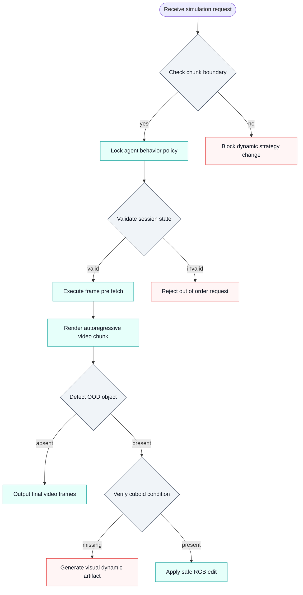
*如何读这张图：* 菱形节点代表系统内置的硬性校验门，通过则进入标准渲染流，失败则触发拦截或伪影；该图揭示了 AlpaSim 并非“无条件接受任意输入”，而是依赖严格的时序与几何先验来维持仿真稳定性。

**分布外物体编辑的结构冲突。** 当尝试引入分布外（OOD）物体时，仅依赖首帧 RGB 编辑（first-frame RGB edit）会与场景地图（world-scenario map）中缺失的立方体结构条件（cuboid structural conditions）发生冲突。这种“视觉先验”与“几何先验”的错位极易引发渲染伪影（artifacts）与动力学不一致（inconsistent dynamics）。这表明系统在开放世界泛化上仍受限于底层场景表征的完备性，不适合直接用于强依赖未知物体物理交互的零样本测试。

| 约束维度 | 核心机制 | 适用场景 | 已知失效模式 |
|---|---|---|---|
| 算力开销 | 生成替代重建 | 高保真离线仿真 | 实时闭环控制延迟超标 |
| 时序锁定 | 分块行为固定 | 规划周期明确任务 | Chunk 内高频策略调整 |
| 状态管理 | 预取防时序倒置 | 请求可提前编排 | 突发不可预测渲染请求 |
| 泛化边界 | 首帧 RGB 编辑 | 已知几何先验场景 | OOD 物体动力学不一致 |

<details><summary><strong>底层注意力窗口与网络传输的隐性代价</strong></summary>
除上述显性约束外，系统底层还隐藏两项关键折中：其一，局部窗口注意力（local-window attention）是内存占用与推理速度的妥协方案。窗口过小会牺牲长程上下文建模能力，导致远距离物体交互失真；窗口过大则直接推高推理成本，加剧算力瓶颈。其二，当前的网络化集成（networked integration）仍受限于帧编解码的复杂度与信息有损压缩（lossiness）。跨节点传输时，编解码管线会引入额外延迟与像素级信息损失。论文已明确将基于 RDMA 的 gRPC 或 NCCL 批量视频传输列为未来工作（future work），暗示当前网络链路仍是吞吐与保真度的短板。在追求极低延迟或无损像素级同步的跨节点集群仿真中，需额外评估通信抖动风险。
</details>

## 趋势定位与展望

**结论：** OmniDreams 标志着自动驾驶仿真从“数据回放式重建”正式迈入“生成式因果推演”阶段，其核心价值在于用自回归扩散架构与流式缓存技术，首次将生成式世界模型的渲染延迟压入实时闭环交互阈值（105.0 FPS），为策略训练提供了可泛化、低延迟的虚拟试验场。

传统重建式仿真器（如 NuRec）依赖 3D Gaussian Splatting 等技术，在已采集轨迹附近保真度极高，但本质是“锚定历史数据”的插值器，一旦策略偏离原始采集走廊或遭遇长尾天气，外推能力迅速衰减。通用离线视频模型虽能生成逼真长片段，却因双向注意力机制无法响应逐步到来的控制指令。OmniDreams 的定位正是填补这一断层：它以 Cosmos-Predict 2.5 为视觉先验底座，通过 Diffusion Forcing 将双向模型改造为因果自回归生成器，并引入 Streaming KV cache 实现状态复用。这一组合拳不仅保留了生成模型对未见场景的想象力，更通过 chunk 级推理与微服务架构（AlpaSim）对齐，使策略动作能即时改变后续观测流。

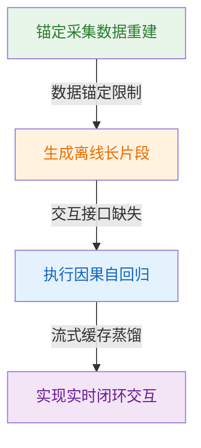
*如何读这张图：* 箭头方向代表技术路线的演进驱动力，颜色区分不同范式。OmniDreams 并非简单堆叠模块，而是通过“因果化改造+状态缓存+自回归蒸馏”打通了离线生成到实时交互的最后一公里。

需明确区分论文的“声称”与“已证明”边界。论文通过消融实验证明 Self Forcing 蒸馏能显著缓解长 rollout 中的时间漂移与累积伪影，使后段窗口相对短上下文教师更稳定；但并未宣称彻底消除自回归误差。生成式先验在极端分布外（如罕见碰撞物理、未见过传感器噪声模式）仍可能产生结构性幻觉，且当前 2000.0M 参数规模对边缘部署仍显沉重。此外，闭环评测高度依赖 first-frame RGB seed 与抽象 world-scenario map 的约束力，若初始条件或地图先验存在偏差，误差会随自回归步数放大。

<details><summary><strong>技术边界与失效模式深挖</strong></summary>
自回归视频扩散的 exposure bias 是固有难题。训练时模型依赖 clean context（teacher forcing），推理时却依赖自身生成的 imperfect outputs。OmniDreams 采用 Self Forcing 结合 DMD 进行分布匹配，虽在实验窗口内压低了累积伪影，但长程 rollout 的语义漂移仍受限于教师模型的上下文长度与 KV cache 的精度衰减。论文未报告极端 OOD（Out-Of-Distribution）场景下的负结果或误差范围，实际部署时需配合安全监控模块。此外，105.0 FPS 的吞吐依赖多 GPU 并行与流式调度，在单卡或低带宽环境下可能无法复现该延迟指标。
</details>

面向下一阶段，该路线的演进将聚焦三个维度：一是长程一致性优化，探索更高效的分布匹配蒸馏或引入物理约束损失，以压制多步自回归的语义漂移；二是架构轻量化，在保持实时吞吐的前提下压缩 2000.0M 参数，适配车载或低成本仿真集群；三是策略协同训练，将生成式世界模型从“离线评测环境”升级为“在线策略蒸馏器”，实现感知-决策-生成的联合优化。直觉上（非严格对应），这相当于为自动驾驶策略装上了一台“可无限重开、且能实时响应方向盘的平行宇宙引擎”，但引擎的物理法则仍需与现实世界持续对齐。
