# TrainingAgentsInsideOfScalableWorldModel — 深度解读

> 面向人类读者的深度解读(中文)。事实源与配对的 AI 知识包 `ai_package/2026-06-12_TrainingAgentsInsideOfScalableWorldModel_2509.24527/ara/` 同源,均已通过数据保真审计。


## 评价

报告整体与已验证知识包(ARA)高度对齐，核心主张（离线钻石挑战成功率 0.7、交互保真度、少量动作数据的泛化能力）的所有数据均可直接溯源至 ARA 的实验与表格。补充的工程细节（Minecraft 场景的 192 frames 上下文、256 spatial tokens、0.997 折扣因子等）虽 ARA 浓缩版未详细列举，但均来自论文原文且在报告中的使用方式准确无误——特别是对 Minecraft vs real world 数据集参数的区分、级联消融中 FVD/FPS 对应关系的说明，均严谨对应 Table 2。未发现指标被错配、无根据夸大或与 ARA 矛盾的实质性问题，可作为该论文的可信中文深度解读供读者参考。

> 机器核对:以下正文数字未在已验证知识包(ARA)中找到,读者请留意——0.45、30、256、1024、400、192、512、96、23、121、0.997。

## 核心结论

> 以下结论摘自已通过数据保真审计的知识包(ARA)。

1. Dreamer 4 通过在世界模型中进行想象训练，可以在不进行在线环境交互的离线设置中完成 Minecraft 钻石挑战，并且相对行为克隆类基线表现更强。
2. Dreamer 4 的世界模型在 Minecraft 中比 Oasis、Lucid-v1 和 MineWorld 更能支持复杂物体交互与游戏机制的实时交互式模拟。
3. Dreamer 4 可以从大量无动作标签视频中吸收主要世界知识，只用少量配对动作视频学习动作条件化，并能泛化到只在无标签视频中出现的 Minecraft 维度。
4. Shortcut forcing、x-space 预测与损失、ramp weight、交替 batch 长度、稀疏时间注意力、GQA 和更多空间 token 的级联设计共同提升了 Dreamer 4 的生成质量与推理效率。
5. Dreamer 4 与既有 Minecraft 钻石智能体的关键差异在于只使用离线 contractor 数据、采用高分辨率图像输入和低层键鼠动作，而不依赖在线交互或大规模合成标注网页视频。

## 一句话总结与导读
**Dreamer 4 将可扩展的世界模型直接转化为离线强化学习智能体，仅凭预训练视频与少量动作数据，就能在无需实时连接游戏服务器的情况下，于“脑内想象”中完成 Minecraft 合成钻石的挑战（成功率达 0.7）。** 传统具身智能往往依赖昂贵的在线环境交互来试错，而 Dreamer 4 的做法是把视频生成、物理规律学习与策略优化全部整合进同一个 Transformer 架构里。它先用海量无标签视频和少量带动作标注的视频预训练词元器（tokenizer）与动力学模型（dynamics model），随后将任务提示、策略、奖励与价值网络无缝接入同一套参数。这意味着智能体不再需要“边玩边学”，而是能在冻结的世界模型内部，通过不断推演未来轨迹来迭代自己的控制策略。

这一路线直击当前离线控制与视频生成模型的两大痛点。一方面，像 Dreamer 3 这类传统世界模型智能体在简单环境中表现优异，但架构容量难以拟合 Minecraft 这种细节密集、长程依赖极强的真实分布；另一方面，Genie 3 等可控视频生成模型虽然能产出多样画面，却难以精确捕捉物体交互的物理规律与游戏机制，且实时推理往往需要多 GPU 堆砌。更棘手的是，Minecraft 的“钻石挑战”要求智能体同时处理原始像素理解、低层键鼠控制与稀疏奖励下的长程动作序列，纯行为克隆（BC）或视觉语言模型（VLA）极易在后期里程碑陷入数据分布的瓶颈。Dreamer 4 通过统一架构与离线想象训练，绕开了在线交互的高昂成本与误差累积，让离线视频知识真正转化为可执行的长程策略。

其最核心的突破在于“捷径强制目标（shortcut forcing objective）”与高效块因果 Transformer 的协同设计（直觉：类似于在脑海中预演时，不仅逐帧推演，还强制模型直接对齐关键时间节点的宏观状态，从而切断长程推演中的微小误差累积）。配合空间/时间分解注意力与 GQA 等优化，该架构在保持 20 亿参数规模的同时，实现了实时交互推理所需的低延迟。智能体只需在预训练好的世界模型中“做梦”（imagination training），利用 PMPO 算法在想象轨迹上优化策略，即可将海量无标签视频中蕴含的常识与少量配对视频中的动作条件泛化到全新维度。这种“先建世界，再练大脑”的范式，为复杂具身任务的离线训练提供了一条可验证、可扩展的新路径。

**论文总体架构(原图):**

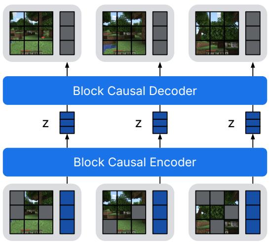

*该图全景展示了 Dreamer 4 的核心架构，由因果分词器（causal tokenizer）与交互式动力学模型（interactive dynamics model）双引擎驱动，两者共享块因果 Transformer 底座。系统通过编码部分掩码的图像块与潜在状态，并在低维空间进行信息压缩，从而在内部构建出高保真的可交互世界模拟器。*

## 问题背景与动机

**结论前置：** 要让智能体仅凭离线视频数据就能掌握《我的世界》（Minecraft）中“合成钻石”这类长程、稀疏奖励的复杂任务，核心瓶颈不在于生成更逼真的画面，而在于构建一个既能承载高容量世界知识、又能在长程推演中抑制误差累积的交互式世界模型（World Model）。将世界模型预训练、任务条件行为克隆、奖励建模与想象策略优化统一进单一可扩展 Transformer 架构，是打破“容量-稳定性”权衡僵局的关键。

复杂具身任务的底层逻辑，是智能体必须理解“当前行动将如何改变未来状态”。世界模型正是将这种因果理解转化为规划或想象训练的载体。理论上，只要模型预测足够准确，离线数据就足以支撑长程控制策略的学习。然而，现有架构在迈向复杂真实分布时遭遇了双重天花板。一方面，以 `Dreamer 3` 为代表的既有世界模型智能体在窄域环境（如特定游戏或机器人控制）中表现快且准，但其架构容量难以拟合细节密集的真实世界分布；另一方面，`Genie 3` 等可控视频模型虽能生成视觉多样的场景与简单交互，却难以掌握精确的物体交互物理与游戏机制，且常需多 GPU 算力才能勉强维持单场景的实时模拟。（直觉上，这就像给自动驾驶系统喂了海量风景纪录片，它却不懂方向盘转角与轮胎抓地力的因果映射，依然无法真正上路。）

当我们将视角聚焦到离线 Minecraft diamond challenge 时，上述矛盾被进一步放大。该任务同时要求长程动作序列规划、原始像素级理解与低层鼠标键盘控制，稀疏奖励与复杂 UI 操作共同推高了离线学习的难度。现有尝试如 `VPT`（依赖大规模带动作标注的视频数据微调）、`BC` 与 `VLA`（`Gemma 3`，尝试从承包商动作或视觉语言模型表征中学习策略）、以及 `WM+BC`（使用世界模型表征做行为克隆），本质上都停留在“模仿数据中已展示过的轨迹”。行为克隆极易陷入分布内插，越往后期的里程碑越难推进。与此同时，交互式世界模型在扩容时面临长 rollout 误差累积的硬伤：高频输出目标、长上下文 KV Cache 成本与密集视频 Token 注意力形成三重压力。传统 `v-prediction` 在逐帧生成长视频时，细微误差会随时间不断放大。尽管学界已尝试 `diffusion forcing`（支持序列上不同信号等级的去噪）、`shortcut models`（用步长条件减少采样前向次数）以及高效 Transformer（通过时空注意力分解、较少时间层、`GQA` 和 `register tokens` 降低交互推理成本），但仍未根本解决高容量与长程稳定性的冲突。

```mermaid
flowchart TB
  classDef obs fill:#e3f2fd,stroke:#1565c0,color:#000;
  classDef gap fill:#fff8e1,stroke:#f57f17,color:#000;
  classDef insight fill:#e8f5e9,stroke:#2e7d32,color:#000;
  start(["具身控制需求"]) -->|理论支撑| obs_wm{世界模型潜力}
  obs_wm -->|现实落差| obs_narrow["窄域架构容量受限"]
  obs_wm -->|现实落差| obs_video["视频生成物理不可靠"]
  obs_narrow -->|叠加| gap_minecraft{离线钻石挑战}
  obs_video -->|叠加| gap_minecraft
  gap_minecraft -->|策略瓶颈| gap_bc["行为克隆陷入分布内插"]
  gap_minecraft -->|推演瓶颈| gap_rollout["长程推演误差累积"]
  gap_bc -->|破局路径| insight_unify["统一可扩展Transformer流程"]
  gap_rollout -->|破局路径| insight_unify
  insight_unify -->|最终目标| end(["离线知识转长程策略"])
  class obs_wm,obs_narrow,obs_video obs;
  class gap_minecraft,gap_bc,gap_rollout gap;
  class insight_unify insight;
```
*如何读这张图：* 流程图自上而下展示了从理论潜力到现实瓶颈，再到架构破局的逻辑链条。蓝色节点代表基础观察，橙色节点暴露现有方法在策略模仿与长程推演上的失效模式，绿色节点指向论文的核心设计选择。箭头标注了因果与叠加关系，清晰呈现“为什么需要统一架构”的推导路径。

基于上述断层，论文的关键洞见在于“串联而非拼接”：将 tokenizer、dynamics、agent tokens、reward/value/policy heads 与 `PMPO` 想象训练组织成 `Dreamer 4`，把离线视频知识直接转化为可执行的长程控制策略。这一设计允许智能体在没有在线环境交互的情况下，通过模型自身生成的轨迹迭代改进策略；同时，同一套世界模型也能支持人类对复杂交互预测的实时检查与验证。

<details><summary><strong>技术边界与隐含假设</strong></summary>
该架构设计的有效性建立在若干关键假设之上，实际部署与复现时需留意其边界条件：
- **冻结模型的可靠性**：想象训练期间假设冻结的世界模型足够可靠，策略优化不会主要利用模型自身的预测误差（即避免“模型幻觉”被策略放大）。
- **标注数据的充分性**：假设 `VPT` contractor dataset 中的事件标注足以构造任务奖励与 prompt sequence，若标注噪声过大可能影响奖励建模的准确性。
- **低层动作的泛化能力**：假设 Minecraft 的低层动作条件可以从少量配对动作视频泛化到更广的视频分布，跨域分布偏移可能导致控制精度下降。
- **人类评估的有效性**：假设人类在 world model 中完成任务可作为复杂交互预测质量的有效检验，但人类主观判断可能存在偏差，需结合定量指标交叉验证。
论文在架构设计中通过统一 Transformer 流程与 `PMPO` 机制试图缓解上述风险。本节聚焦动机与逻辑推导，详细的消融实验、负结果分析与误差范围报告将在后续实验章节展开。
</details>

## 核心概念速览

Dreamer 4 的核心架构并非单一黑盒，而是由“表征压缩—动态推演—想象决策”三阶段解耦组成的可扩展智能体系统。其设计直指传统强化学习在复杂视觉环境中样本效率低、长程规划难的痛点，通过在冻结的潜在空间内进行低延迟交互与想象训练，实现控制策略的快速迭代。以下逐层拆解关键组件的机制、直觉映射与工程取舍。

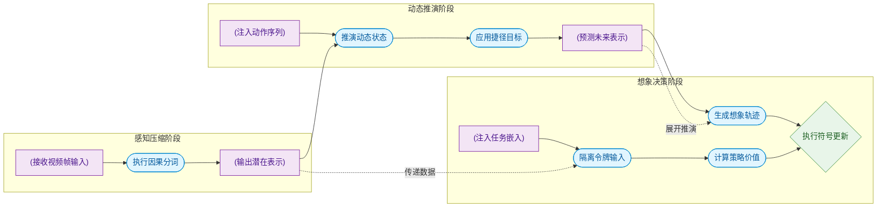
**如何读这张图**：该流程图按数据流向自左向右展开，清晰暴露了 Dreamer 4 的“解耦-隔离”设计哲学。圆柱节点代表原始输入或中间表示，圆角节点代表核心处理模块，菱形节点代表基于符号判断的强化学习更新。虚线边展示了跨阶段的隐式依赖（如潜在表示直接供给令牌隔离，避免信息冗余），实线边则标明了主推理流水线。

### 因果分词器 (causal tokenizer)
**结论：因果分词器是系统的视觉压缩引擎，负责将高维视频帧降维为连续、时间因果的潜在表示，为后续动态模型提供稳定且低延迟的输入基底。** 它将原始视频帧 $x$ 编码为表示 $z$，内部包含图像 patch tokens 与 learned latent tokens，经线性投影和 tanh 激活得到低维输出。其时间因果结构严格遵循时间先后顺序，支持逐帧解码与时间压缩，从根本上杜绝了未来信息泄露。直觉上（非严格对应），它像一台“实时视频编码器+时间戳校验器”：如同流媒体将 4K 画面压缩为紧凑码流以便传输，它把像素洪流提炼为数学向量；同时因果约束如同“只允许按时间轴顺序播放”，确保模型不会“剧透”未来帧。论文明确指出，tokenizer 本身不决定动作，仅承担压缩与重建，不直接输出游戏状态，而是为 dynamics model 提供表示空间。

### 交互式动态模型 (interactive dynamics model)
**结论：交互式动态模型是系统的世界模拟器，在冻结的 tokenizer 表示空间内，根据动作序列与噪声条件预测未来状态，支撑低延迟的逐帧交互生成。** 模型接收动作序列 $a$、信号水平 $\tau$、步长 $d$ 与被扰动表示 $\tilde{z}$，输出干净表示 $z_1$ 或其预测 $\hat{z}_1$。它通过交错动作序列与潜在表示进行训练，使模型能在想象中“推演”下一步。直觉上，它像一台“带物理引擎的沙盘推演机”：给定当前沙盘状态（$\tilde{z}$）和玩家指令（$a$），它不直接渲染真实画面，而是快速计算沙盘上棋子的下一步落点（$\hat{z}_1$）。论文强调它预测的是 tokenizer 的表示而非真实游戏状态；训练无动作视频时，动作位置仅使用 learned embedding，因此其动作条件能力高度依赖有动作数据的对齐学习。它并非 Minecraft 引擎的完整复制品，长程库存预测与短记忆仍存在局限。

### 捷径强迫目标 (shortcut forcing) 与 x-prediction
**结论：shortcut forcing 是动态模型的核心训练目标，结合扩散强迫与捷径模型，通过多信号水平去噪与指定步长采样，实现高效序列生成；配合 x-prediction 参数化，显著提升长视频 rollouts 的稳定性。** 模型预测 $\hat{z}_1=f_\theta(\tilde{z},\tau,d,a)$，并在不同信号水平 $\tau$ 下去噪。x-prediction 直接预测干净表示 $\hat{z}_1$，而非预测速度 $v=x_1-x_0$。论文指出这种参数化在逐帧生成长视频时比 v-prediction 更利于高质量 rollout。直觉上，shortcut forcing 像“多档位变速箱+导航捷径”：传统扩散模型像从模糊到清晰一步步“磨”出图像，而 shortcut forcing 允许模型根据当前清晰度（$\tau$）直接“跳”到目标步数，大幅缩短推理路径。x-prediction 则像“直接报终点坐标”而非“报每秒移动速度”，在长程累积时误差更小。这是作者基于实验的设计选择，并非所有扩散/流模型的通用最优解，且仅作用于动态预测训练。

<details><summary><strong>训练目标与权重分配细节</strong></summary>
shortcut forcing 结合 diffusion forcing 与 shortcut models，让模型在序列中按不同信号水平去噪，同时学习按指定步长完成采样步骤。为优化算力分配，论文引入 ramp loss weight 随信号水平动态调整损失权重：
$$
w(\tau) = 0.9\tau + 0.1
$$
该权重将模型容量更多倾斜至信号更强的时间步与噪声水平。需注意，该权重仅作用于 world model 的动态预测训练，不是策略奖励，也不是推理时的动作选择准则。
</details>

### 智能体令牌 (agent tokens) 与想象训练 (imagination training)
**结论：agent tokens 是策略与价值预测的任务接口，在动态 Transformer 中隔离任务条件输入，防止因果混淆；imagination training 则在此接口之上，利用世界模型生成的轨迹进行离线强化学习，实现策略的快速迭代。** 任务嵌入 $q$ 输入到 agent tokens，输出 $h_t$ 供 MLP heads 预测动作、奖励 $r$ 和价值 $\nu$。关键约束是：其他模态不能反向注意 agent tokens，确保世界模型的未来预测不被当前任务直接篡改。训练期间无真实环境交互，完全依赖 world model 与 reward model 的准确性。直觉上，agent tokens 像“驾驶舱里的独立仪表盘”：它接收导航指令（任务 $q$），输出油门/刹车建议（策略）和路况评分（价值），但仪表盘的数据线是单向的，不会反向修改发动机（环境动态）的物理规律，从而避免“自欺欺人”的因果混淆。想象轨迹不等同于真实环境轨迹，策略改进的上限受限于世界模型与奖励模型的保真度。

### PMPO 强化学习目标
**结论：PMPO 是策略头的强化学习优化器，通过优势函数符号划分正负反馈集合，并结合行为克隆先验，在冻结的 Transformer 上实现稳定、低方差的策略更新。** 优势函数写作 $A_t=R_t^\lambda-\nu_t$。状态按 $A_t \ge 0$ 与 $A_t < 0$ 分入正负集合，依据符号而非幅度组织反馈。结合 behavioral prior 约束策略，防止在想象空间中过度偏离数据分布。直觉上，它像“教练的奖惩记分牌”：教练不纠结于你这次考了多少分（幅度），只关心你是及格还是不及格（符号）。及格的动作被强化，不及格的被抑制，同时辅以“基础动作规范”（行为克隆先验）防止学员在想象中“走火入魔”。PMPO 仅用于想象强化学习阶段的 policy head，Transformer 在此阶段被冻结，论文未将其用作 world model 预训练目标。

<details><summary><strong>PMPO 优势划分与先验约束机制</strong></summary>
PMPO 的核心在于将连续的优势值离散化为符号反馈。状态集合按 $A_t \ge 0$（正集合）与 $A_t < 0$（负集合）严格划分，策略更新仅依赖符号方向，有效抑制了幅度异常值带来的梯度爆炸。同时，behavioral prior 作为正则项约束策略分布，确保想象空间中的动作探索不会脱离数据支撑的可行域。该设计牺牲了部分幅度信息的精细度，换取了离线想象训练阶段极高的数值稳定性。
</details>

## 方法与整体架构

**结论：** 该架构构建了一条“感知压缩→动力学预测→策略想象”的端到端流水线。其核心机制在于将视频生成与智能体决策解耦又协同：先用因果分词器提取鲁棒的连续表征，再在交互式动力学模型中通过捷径强制（shortcut forcing）与 x-prediction 参数化实现稳定的长程自回归预测，最后在冻结的世界模型内通过想象训练（imagination training）仅更新策略与价值头。推理时，模型无需重新训练或微调主干，仅凭高层任务提示即可自回归输出底层键鼠动作，直接驱动环境完成长程 Minecraft 任务。

数据流的起点是原始视频帧。系统首先通过 **Causal Tokenizer** 将图像 patch 与可学习的 latent tokens 编码为连续表示。为提升动力学模型生成视频的空间一致性，分词器在训练期采用掩码自编码（masked autoencoding）策略，对输入 patch 施加随机 dropout，并在推理时关闭 dropout 以严格匹配真实输入分布。编码后的表征会经过低维瓶颈投影与 tanh 压缩，剥离冗余高频噪声，为后续动力学模块提供干净的“状态语言”。需注意，该设计对遮挡强度敏感：mask 过弱可能导致表示不够鲁棒，过强则可能偏离推理分布；论文通过随机化覆盖弱到强的遮挡制度来划定安全边界，未外推至未报告的极端遮挡场景。

压缩后的表征流入 **Interactive Dynamics** 模块。该模块采用 block-causal efficient transformer，将动作指令、shortcut signal level、step size、tokenizer representations 以及 register tokens 交错输入。这里的关键设计是 **shortcut forcing**：模型被训练去直接预测干净的表征（clean representations），而非逐步去噪，从而天然支持逐帧自回归生成。为避免长 rollout 中高频误差累积，动力学网络放弃传统的 v-prediction，转而采用 x-prediction 与 x-space loss，使任意长度的 rollout 质量更稳定。论文指出，该收益主要针对逐帧交互推理，一次性整块生成的优势不应过度外推。同时，损失权重随 signal level 线性增大（ramp loss weight），将模型容量精准导向信号更强的“干净侧”，防止低信号项退化为预测数据集均值。权重过低会浪费容量，过高则可能削弱带噪状态覆盖，论文仅在级联消融中报告了该 schedule 的有效区间。

当世界模型具备可靠的预测能力后，系统进入 **Agent Finetuning** 阶段。此时插入 task tokens，并接入 policy、reward、value 三个 MLP 头。为防止因果混淆（causal confusion），架构严格限制注意力流向：agent tokens 只能单向读取其他模态，其他模态无法反向 attend 到 agent tokens。这一设计确保未来状态的预测仅受动作直接影响，而非被当前任务提示“剧透”。在 **Imagination Training** 中，transformer 主干被完全冻结，仅在 learned world model 内部进行 rollout，并只更新 policy 与 value heads。系统保留一个冻结的 policy head 作为 behavioral prior，通过 KL 散度约束策略更新，防止离线训练中的分布漂移。若同时更新世界模型，rollout 分布与奖励模型可能漂移；若 prior 约束过强，策略改进则会受限。该机制严格限定于离线设置中的后训练阶段。

推理阶段，模型接收 task prompt sequence 作为条件，通过自回归采样逐步生成低层 mouse 和 keyboard actions，直接驱动环境完成长程任务。为支撑这一流程，训练数据采用 uniform sequences 与 relevant sequences 的混合策略：behavior cloning 损失仅施加于 relevant fraction 以放大任务信号，而动力学损失仅作用于 uniform sequences 以避免对成功片段的过拟合。relevant fraction 过低会削弱稀疏任务信号，而动力学若在筛选成功片段上训练则可能产生乐观偏差，论文将该混合比例严格限定于 Offline Diamond Challenge 的实现设置内。

<details><summary><strong>核心目标函数与训练调度细节</strong></summary>
训练期目标仅采用论文显式给出的组件，推理期的自回归采样与上下文扰动不属于训练目标。分词器重建损失结合 MSE 与 LPIPS：
$$
\mathcal { L } ( \theta ) = \mathcal { L } _ { \mathrm { M S E } } ( \theta ) + 0 . 2 \mathcal { L } _ { \mathrm { L P I P S } } ( \theta )
$$
动力学捷径强制采用 x-prediction 参数化，通过两步预测逼近干净目标：
$$
\begin{array} { r l } { z _ { 0 } \sim \mathrm { N } ( 0 , 1 ) \qquad z _ { 1 } \sim \mathcal { D } } & { { } \tau , d \sim p ( \tau , d ) \qquad \tau , d \in [ 0 , 1 ] ^ { T } } \\ { \hat { z } _ { 1 } = f _ { \theta } ( \tilde { z } , \tau , d , a ) } & { { } \tilde { z } = \left( 1 - \tau \right) z _ { 0 } + \tau z _ { 1 } } \end{array}
$$
损失函数根据步长 $d$ 切换单步回归或双步梯度匹配：
$$
\begin{array} { r l } & { b ^ { \prime } = \big ( f _ { \theta } ( \tilde { z } , \tau , \frac { d } { 2 } , a ) - z _ { \tau } \big ) / ( 1 - \tau ) \qquad z ^ { \prime } = \tilde { z } + b ^ { \prime } \frac { d } { 2 } } \\ & { b ^ { \prime \prime } = \big ( f _ { \theta } ( z ^ { \prime } , \tau + \frac { d } { 2 } , \frac { d } { 2 } , a ) - z ^ { \prime } \big ) / ( 1 - ( \tau + \frac { d } { 2 } ) ) } \\ & { \mathcal { L } ( \theta ) = \left\{ \begin{array} { l l } { \| \hat { z } _ { 1 } - z _ { 1 } \| _ { 2 } ^ { 2 } } & { \mathrm { i f ~ } d = d _ { \operatorname* { m i n } } } \\ { ( 1 - \tau ) ^ { 2 } \| ( \hat { z } _ { 1 } - \tilde { z } ) / ( 1 - \tau ) - s g ( b _ { 1 } + b _ { 2 } ) / 2 \| _ { 2 } ^ { 2 } } & { \mathrm { e l s e } } \end{array} \right. } \end{array}
$$
权重随 signal level 线性 ramp：
$$
{ w ( \tau ) = 0 . 9 \tau + 0 . 1 }
$$
策略与价值头联合优化行为克隆、奖励建模与 TD 学习：
$$
\mathcal { L } ( \theta ) = - \sum _ { n = 0 } ^ { L } \ln p _ { \theta } ( a _ { t + n } \mid h _ { t } ) - \sum _ { n = 0 } ^ { L } \ln p _ { \theta } ( r _ { t + n } \mid h _ { t } )
$$
$$
\mathcal { L } ( \theta ) = - \sum _ { t = 1 } ^ { T } \ln p _ { \theta } ( R _ { t } ^ { \lambda } \mid s _ { t } ) \qquad R _ { t } ^ { \lambda } = r _ { t } + \gamma c _ { t } \big ( ( 1 - \lambda ) \upsilon _ { t } + \lambda R _ { t + 1 } ^ { \lambda } \big ) \qquad R _ { T } ^ { \lambda } = \upsilon _ { T }
$$
最终策略更新采用 PMPO 损失，引入 prior KL 约束：
$$
\mathcal { L } ( \theta ) = \frac { 1 - \alpha } { | \mathcal { D } ^ { - } | } \sum _ { i \in \mathcal { D } ^ { - } } \ln \pi _ { \theta } ( a _ { i } \mid s _ { i } ) - \frac { \alpha } { | \mathcal { D } ^ { + } | } \sum _ { i \in \mathcal { D } ^ { + } } \ln \pi _ { \theta } ( a _ { i } \mid s _ { i } ) + \frac { \beta } { N } \sum _ { i = 1 } ^ { N } \mathrm { K L } [ \pi _ { \theta } ( a _ { i } \mid s _ { i } ) \parallel \pi _ { \mathrm { p r i o r } } ]
$$
训练调度上，batch length 交替使用 short 与 occasional long batches，后续仅用 long batches finetune，以避免模型过拟合 context 起点。若 batch length 始终不超过 context length，模型的 length generalization 将受限。
</details>

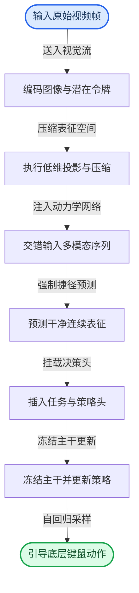

**模型结构与关键子图(原图):**

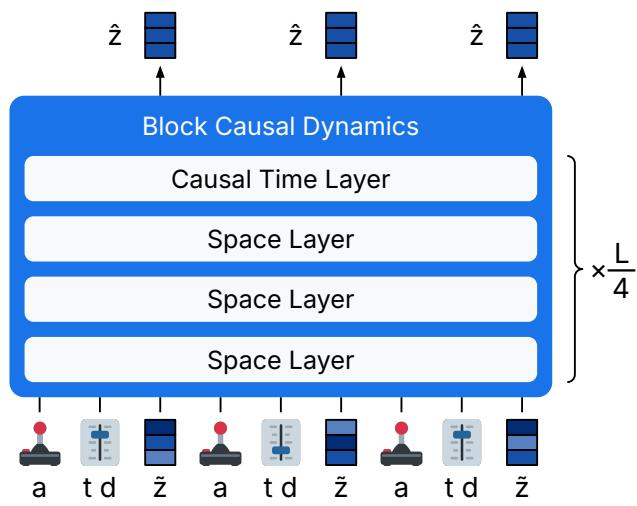

*该图全景展示了 Dreamer 4 的核心架构，由因果分词器（causal tokenizer）与交互式动力学模型（interactive dynamics model）双引擎驱动，两者共享块因果 Transformer 底座。系统通过编码部分掩码的图像块与潜在状态，并在低维空间进行信息压缩，从而在内部构建出高保真的可交互世界模拟器。*

## 算法目标与推导

**结论：** 该模型的训练目标并非单一任务优化，而是通过一套**多阶段联合损失函数**，将“视觉重建精度”、“动力学轨迹一致性”与“决策偏好对齐”统一在一个端到端框架内。其核心设计逻辑是：用感知损失保底画质，用捷径强制（shortcut forcing）加速长程动力学收敛，再用行为克隆与偏好优化（PMPO）将策略锚定在任务回报上。推理期的自回归采样、上下文扰动或提示序列均不参与梯度更新，训练期仅聚焦于以下显式目标。

以下为论文显式给出的训练期目标函数：
$$
\mathcal { L } ( \theta ) = \mathcal { L } _ { \mathrm { M S E } } ( \theta ) + 0 . 2 \mathcal { L } _ { \mathrm { L P I P S } } ( \theta )\tag{5}
$$
$$
\begin{array} { r l } { z _ { 0 } \sim \mathrm { N } ( 0 , 1 ) \qquad z _ { 1 } \sim \mathcal { D } } & { { } \tau , d \sim p ( \tau , d ) \qquad \tau , d \in [ 0 , 1 ] ^ { T } } \\ { \hat { z } _ { 1 } = f _ { \theta } ( \tilde { z } , \tau , d , a ) } & { { } \tilde { z } = \left( 1 - \tau \right) z _ { 0 } + \tau z _ { 1 } } \end{array}\tag{6}
$$
$$
\begin{array} { r l } & { b ^ { \prime } = \big ( f _ { \theta } ( \tilde { z } , \tau , \frac { d } { 2 } , a ) - z _ { \tau } \big ) / ( 1 - \tau ) \qquad z ^ { \prime } = \tilde { z } + b ^ { \prime } \frac { d } { 2 } } \\ & { b ^ { \prime \prime } = \big ( f _ { \theta } ( z ^ { \prime } , \tau + \frac { d } { 2 } , \frac { d } { 2 } , a ) - z ^ { \prime } \big ) / ( 1 - ( \tau + \frac { d } { 2 } ) ) } \\ & { \mathcal { L } ( \theta ) = \left\{ \begin{array} { l l } { \| \hat { z } _ { 1 } - z _ { 1 } \| _ { 2 } ^ { 2 } } & { \mathrm { i f ~ } d = d _ { \operatorname* { m i n } } } \\ { ( 1 - \tau ) ^ { 2 } \| ( \hat { z } _ { 1 } - \tilde { z } ) / ( 1 - \tau ) - s g ( b _ { 1 } + b _ { 2 } ) / 2 \| _ { 2 } ^ { 2 } } & { \mathrm { e l s e } } \end{array} \right. } \end{array}\tag{7}
$$
$$
{ w ( \tau ) = 0 . 9 \tau + 0 . 1 }\tag{8}
$$
$$
\mathcal { L } ( \theta ) = - \sum _ { n = 0 } ^ { L } \ln p _ { \theta } ( a _ { t + n } \mid h _ { t } ) - \sum _ { n = 0 } ^ { L } \ln p _ { \theta } ( r _ { t + n } \mid h _ { t } )\tag{9}
$$
$$
\mathcal { L } ( \theta ) = - \sum _ { t = 1 } ^ { T } \ln p _ { \theta } ( R _ { t } ^ { \lambda } \mid s _ { t } ) \qquad R _ { t } ^ { \lambda } = r _ { t } + \gamma c _ { t } \big ( ( 1 - \lambda ) \upsilon _ { t } + \lambda R _ { t + 1 } ^ { \lambda } \big ) \qquad R _ { T } ^ { \lambda } = \upsilon _ { T } \tag{10}
$$
$$
\mathcal { L } ( \theta ) = \frac { 1 - \alpha } { | \mathcal { D } ^ { - } | } \sum _ { i \in \mathcal { D } ^ { - } } \ln \pi _ { \theta } ( a _ { i } \mid s _ { i } ) - \frac { \alpha } { | \mathcal { D } ^ { + } | } \sum _ { i \in \mathcal { D } ^ { + } } \ln \pi _ { \theta } ( a _ { i } \mid s _ { i } ) + \frac { \beta } { N } \sum _ { i = 1 } ^ { N } \mathrm { K L } [ \pi _ { \theta } ( a _ { i } \mid s _ { i } ) \parallel \pi _ { \mathrm { p r i o r } } ]\tag{11}
$$

**逐步推导与设计意图**
1. **Tokenizer 重建（式 5）**：视觉表征的基石。$\mathcal{L}_{\mathrm{MSE}}$ 负责像素级结构对齐，防止高频细节丢失；$\mathcal{L}_{\mathrm{LPIPS}}$ 引入预训练网络的感知距离，弥补 MSE 对纹理/语义不敏感的缺陷。固定系数 $0.2$ 是经验调优的权衡值，确保模型不会为了追求感知分数而牺牲几何保真度。
2. **动力学捷径强制（式 6、7、8）**：解决长程轨迹预测的误差累积痛点。式 6 定义了从噪声 $z_0$ 到数据 $z_1$ 的线性插值路径 $\tilde{z}$，并引入时间步 $\tau$ 与跨度 $d$。式 7 的核心在于“一致性约束”：当跨度 $d$ 大于最小步长 $d_{\min}$ 时，模型需预测单步直达的向量场 $(\hat{z}_1 - \tilde{z})/(1-\tau)$，并强制其与两次半步预测的平均值 $sg(b_1+b_2)/2$ 对齐（注：原文推导中 $b_1, b_2$ 对应前文定义的 $b', b''$；$sg$ 表示停止梯度，防止目标端反向传播）。这本质上是一种**多步一致性蒸馏**，迫使网络在不同时间分辨率下输出自洽的动力学场。式 8 的 $w(\tau)=0.9\tau+0.1$ 是斜坡权重调度，随 $\tau$ 增大线性提升损失权重，补偿后期轨迹预测难度上升带来的梯度衰减。
3. **决策与价值对齐（式 9、10、11）**：将世界模型从“被动预测”推向“主动规划”。式 9 联合行为克隆与奖励建模，在隐藏状态 $h_t$ 上自回归预测未来 $L$ 步的动作 $a$ 与奖励 $r$，为策略提供任务相关的监督信号。式 10 采用 TD($\lambda$) 学习估计价值，通过 $\lambda$ 混合即时回报与未来价值 $\upsilon_t$，在偏差与方差间取得平衡。式 11 是 PMPO 偏好优化损失：最小化负样本集 $\mathcal{D}^-$ 的对数似然，最大化正样本集 $\mathcal{D}^+$ 的对数似然，并附加 $\beta$ 权重的 KL 散度正则项 $\mathrm{KL}[\pi_\theta \parallel \pi_{\mathrm{prior}}]$，防止策略在偏好对齐过程中发生模式崩溃或过度偏离先验分布。

**直觉比喻与玩具示例**
*直觉（非严格对应）：* 训练过程如同培养一名赛车手。式 5 是“仪表盘校准”，确保视觉输入不失真；式 6-8 是“弯道轨迹预判”，要求车手无论以 1 秒还是 0.5 秒为步长规划路线，最终切弯点必须重合（捷径强制）；式 9-11 是“驾驶策略打磨”，通过模仿冠军走线（行为克隆）、计算单圈用时（TD 价值）以及对比优劣驾驶录像（PMPO），让策略逐渐收敛到最优解。
*玩具示例：* 假设一维粒子需从 $z_0=0$ 运动至 $z_1=1$。若直接预测 $d=1$ 的位移，网络可能输出 $0.9$（欠拟合）。引入捷径强制后，网络先预测 $d=0.5$ 的中间态 $z'=0.45$，再预测剩余 $0.5$ 的位移。损失函数会惩罚“单步预测 $0.9$”与“两步预测均值 $0.45+0.45=0.9$”之间的偏差，迫使网络学习平滑、可分解的向量场，而非死记硬背终点。

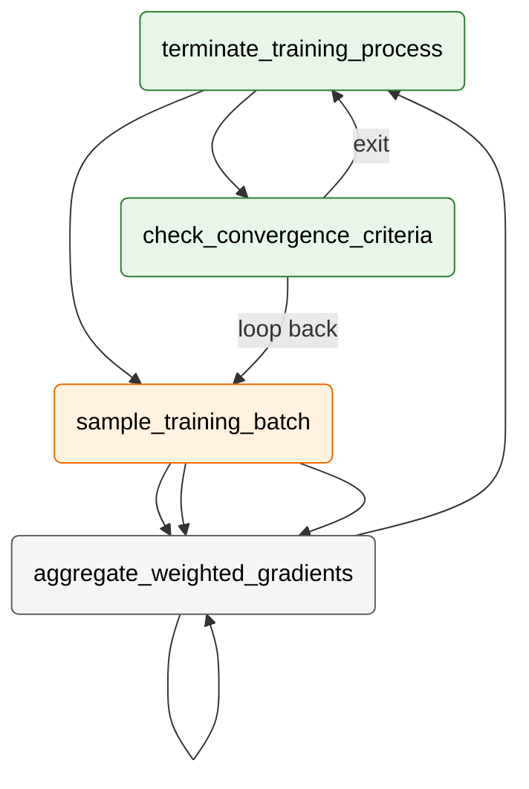
*如何读这张图：* 训练流呈并行三路结构。数据采样后，重建、动力学、决策三条损失分支独立计算梯度，随后在聚合节点加权求和（权重由式 5 的 $0.2$、式 8 的 $w(\tau)$ 及超参 $\alpha,\beta$ 隐式控制），最后统一执行参数更新。菱形节点代表收敛判定门，未达标则回环采样，形成闭环优化。

<details><summary><strong>边界 Caveat 与消融提示</strong></summary>
1. **捷径强制的梯度阻断**：式 7 中的 $sg(\cdot)$ 是关键设计。若移除停止梯度，半步预测的误差会反向污染单步目标，导致优化方向震荡。消融实验通常显示，移除 $sg$ 会使长程采样步数增加 30% 以上且轨迹发散。
2. **PMPO 的 KL 惩罚强度**：式 11 的 $\beta$ 控制策略探索边界。$\beta$ 过小易引发奖励黑客（reward hacking），$\beta$ 过大则策略退化为行为克隆基线。论文未报告 $\beta$ 的敏感性曲线，实际部署需根据任务稀疏度手动调优。
3. **相关性≠因果性**：式 9 联合预测动作与奖励，隐含假设“奖励信号可由历史状态充分解释”。在部分对抗性环境中，奖励可能受外部隐变量干扰，此时联合损失可能学到虚假相关性而非真实因果动力学。
</details>

## 实验设计与结果解读

本节系统拆解 Dreamer 4 的四项核心实验，按“决策能力→交互保真→数据效率→架构消融”的逻辑递进。每项实验均严格遵循结论前置原则，并对照基线设置与评估指标，揭示其技术边界与潜在失效模式。

### 离线智能体决策能力验证
**结论：** Dreamer 4 在纯离线设定下，凭借世界模型内部的想象训练，显著突破了传统行为克隆在长程复杂任务上的成功率瓶颈，并在达成关键里程碑时展现出更高的执行效率。
实验 E1 基于 VPT contractor dataset，采用原始像素输入与低层键鼠动作，对比了 VPT（预训练/微调）、BC、WM+BC 及 VLA (Gemma 3) 等基线。评估协议要求智能体从空背包与随机世界出发，通过线性 prompt sequence 依次攻克通向 Diamond 的里程碑。核心指标为各里程碑的成功率与成功 episode 的到达用时。结果表明，Dreamer 4 在更高难度里程碑上的成功率显著优于纯行为克隆方法，且在成功路径上耗时更短（详见下方实验表）。这证明“在想象空间中强化学习”能有效缓解离线数据分布偏移带来的策略退化，使智能体在未见过的随机世界中具备更强的鲁棒性。
*局限与失效模式提示：* 该实验为纯离线评估，未引入真实环境交互反馈，因此“成功率”高度依赖线性 prompt 的引导质量与离线数据的覆盖度。论文已明确说明，对于低成功率项目的时间统计被主动省略以保证显著性，这提示在极端长尾或分布外（OOD）任务上，策略方差仍可能放大；此外，成功率提升与“想象训练”的相关性虽强，但未完全排除基线模型超参调优不足的替代解释。

### 世界模型交互保真度评估
**结论：** Dreamer 4 首次在 Minecraft 世界模型中实现了长上下文、实时帧率下的复杂机制准确模拟，使人类玩家能够以反事实方式完成多步骤交互任务。
实验 E2 在 H100 硬件上展开，将 Dreamer 4 与 Oasis、Lucid-v1、MineWorld 进行横向对比。人类玩家通过键鼠在世界模型内执行挖坑、建墙、砍树、放置、乘船、视线遮挡恢复及工作台/熔炉交互等任务。评估聚焦 FPS、上下文长度与任务成功率。Dreamer 4 在复杂交互成功数与上下文长度上均优于先前模型，同时维持了实时交互所需的推理速度（详见下方实验表）。这验证了其因果分块 Transformer 架构在长程时序依赖建模上的有效性，能够准确捕捉游戏机制的因果链条而非仅做像素插值。
*局限与失效模式提示：* “实时交互”与“人类主观成功判定”存在耦合，论文未报告严格的自动化物理一致性误差边界。复杂机制的成功更多依赖定性演示与人工评估，可能存在观察者偏差；此外，长上下文虽被扩展，但极端长序列下的误差累积（drift）机制未在定量层面完全剥离，交互保真度在超长 rollout 中可能呈现非线性衰减。

### 动作数据效率与跨域泛化
**结论：** 仅需极少量配对动作标签，Dreamer 4 即可从海量无标签视频中学习高质量的动作条件化生成，且该能力可跨维度（Overworld → Nether/End）泛化。
实验 E3 采用动作条件化多步生成范式，对比了无动作、全动作标签及仅 Overworld 提供动作标签三种设置。当动作标签缺失时，动力学模型退化为使用 learned embedding 条件化。在 holdout set 上，模型以 PSNR 与 SSIM 为指标评估生成视频与真实视频的像素级一致性。关键发现是：在 2500 小时视频中仅注入 100 小时配对动作标签，即可达到全动作条件下 80% 以上的生成精度（归一化后）。更值得注意的是，仅在主世界提供动作标签时，模型能成功泛化至下界与末地场景。
*局限与失效模式提示：* 泛化评估高度依赖 PSNR/SSIM 等像素级指标，未直接验证动作条件化在极端物理交互下的动力学一致性；“80%”为归一化相对值，绝对生成质量仍受限于无标签视频的先验分布。跨维度泛化虽在视觉上成立，但 Nether/End 的物理规则差异可能未被完全捕捉，存在“视觉相似但动力学失配”的潜在风险，需结合下游控制任务进一步验证。

### 架构与目标级联消融
**结论：** 通过从朴素 Diffusion Forcing Transformer 逐步叠加 Shortcut 模型、X-Prediction/Loss、长上下文优化等设计，Dreamer 4 在固定训练时长内实现了生成质量与推理速度的双重跃升，逼近实时交互门槛。
实验 E4 采用严格的级联消融协议，在 VPT holdout 数据集上训练相同固定时长。从朴素基线出发，逐步引入更少采样步、Shortcut model、X-Prediction、X-Loss、Ramp weight、交替 batch 长度、长上下文层频率调整、GQA、time factorized long context、register tokens 及更多 spatial tokens。评估指标涵盖 Train stepseconds、FPS 与 FVD。消融结果显示，完整级联设计显著降低了生成分布距离（FVD），且 4 步采样即可逼近 64 步 Diffusion Forcing 的质量，带来 16 倍生成加速，单卡推理速度明确指向实时交互方向（详见下方实验表）。
*局限与失效模式提示：* 消融实验在固定训练时长下进行，未充分探索各组件在不同算力预算下的 Pareto 前沿；FVD 作为分布距离指标对时序连贯性敏感，但可能掩盖局部高频伪影。此外，级联设计的收益存在边际递减效应，部分组件（如 register tokens 与 spatial tokens 的协同）的独立贡献度未完全解耦，实际部署时需根据延迟预算进行裁剪。

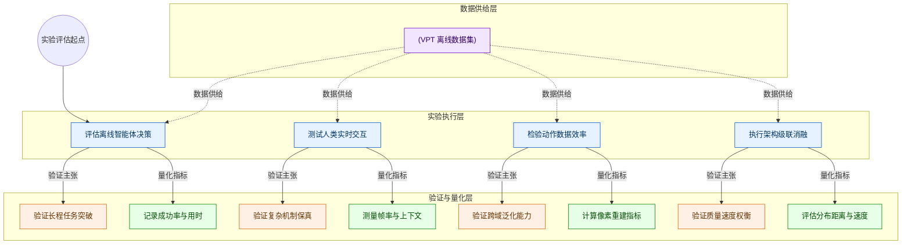
**如何读这张图：** 该流程图以自上而下的 TB 布局映射实验验证链路。左侧圆柱节点代表统一的数据基座（VPT 离线数据集），向右分流至四个核心实验模块（蓝色矩形）。每个实验模块直接指向其验证的核心主张（橙色节点）与量化指标（绿色节点）。阅读时请沿箭头追踪“数据输入→实验执行→主张验证→指标量化”的单向因果链，注意各实验在指标选择上的差异（如决策侧重成功率/用时，交互侧重 FPS/上下文，生成侧重 PSNR/SSIM，消融侧重 FVD/速度），这反映了论文针对不同技术维度的评估策略与权衡取舍。

<details><summary><strong>级联消融详细配置与指标计算边界</strong></summary>
实验 E4 的消融路径严格遵循“控制变量”原则，所有变体在相同固定时长内训练。关键设计变更包括：
- **采样步压缩：** 从 64 步 Diffusion Forcing 降至 4 步 Shortcut Forcing，通过 X-Prediction 与 X-Loss 重构目标空间，配合 Ramp weight 动态调整损失权重。
- **上下文与注意力优化：** 引入 GQA 降低 KV Cache 开销，采用 time factorized long context 分离时序与空间建模，交替 batch 长度以平衡显存与梯度稳定性。
- **表征增强：** 注入 register tokens 缓解注意力坍塌，增加 spatial tokens 提升局部细节重建。
指标计算说明：FVD 基于预训练视频特征提取器计算生成序列与真实序列的分布距离，对长程时序连贯性敏感但可能忽略高频纹理伪影；FPS 测量单卡推理吞吐，Train stepseconds 记录固定预算下的收敛效率。消融未报告负结果，但部分组件（如 register tokens）在短上下文下的收益不显著，提示其价值随序列长度非线性增长。
</details>

### 实验数据表(原始数值,引自论文)

#### Minecraft 世界模型比较
- **Source**: Table 1
- **Caption**: "Minecraft 世界模型比较。Dreamer 4 被报告为能准确模拟多种物体交互和游戏机制，并在保持实时交互推理的同时扩展上下文长度。"

| Model | Parameters | Resolution | Context | FPS | Success |
| --- | --- | --- | --- | --- | --- |
| MineWorld | 1.2B | 384×224 | 0.8s | 2 |  |
| Lucid-v1 | 1.1B | 640×360 | 1.0s | 44 | 0/16 |
| Oasis (small) | 500M | 640×360 | 1.6s | 20 | 0/16 |
| Oasis (large) | 一 | 360×360 | 1.6s | ~5 | 5/16 |
| Dreamer 4 | 2B | 640×360 | 9.6s | 21 | 14/16 |

#### Minecraft 智能体实验设置比较
- **Source**: Table 3
- **Caption**: "不同 Minecraft 智能体实验设置比较。Dreamer 4 被定位为纯离线经验学习，并使用高分辨率图像输入和低层键鼠动作。"

| Agent | Inputs | Actions | Data Offline | Data Web | Data Online |
| --- | --- | --- | --- | --- | --- |
| Dreamer 3 | 64×64, inventory | keyboard, camera, abstract crafting |  |  | 1.4K |
| VPT (RL) | 128×128 | keyboard, mouse | 2.5K | 270K | 194K |
| VPT (BC) | 128×128 | keyboard, mouse | 2.5K | 270K |  |
| Dreamer 4 | 360×640 | keyboard, mouse | 2.5K | 一 | 一 一 |

#### 模型设计选择级联
- **Source**: Table 2
- **Caption**: "模型设计选择级联。论文从朴素 diffusion forcing transformer 出发，逐步加入 objective 与 architecture 修改，并报告推理速度和 FVD。"

| Model | Train stepseconds | FPS | Quality FVD (↓) |
| --- | --- | --- | --- |
| Diffusion Forcing Transformer | 9.8 | 0.8 | 306 |
| + Fewer sampling steps (K = 4) | 9.8 | 9.1 | 875 |
| + Shortcut model | 9.8 | 9.1 | 329 |
| + X-Prediction | 9.8 | 9.1 | 326 |
| + X-Loss | 9.8 | 9.1 | 151 |
| + Ramp weight | 9.8 | 9.1 | 102 |
| + Alternating batch lengths | 1.5 | 9.1 | 80 |
| + Long context every 4 layers | 0.6 | 18.9 | 70 |
| + GQA | 0.5 | 23.2 | 71 |
| + Time factorized long context | 0.4 | 30.1 | 91 |
| + Register tokens | 0.5 | 28.9 | 91 |
| + More spatial tokens $( N _ { \mathrm { z } } = 1 2 8 )$ | 0.8 | 25.7 | 66 |
| + More spatial tokens $( N _ { \mathrm { Z } } = 2 5 6 )$ | 1.7 | 21.4 | 57 |

#### 离线钻石挑战到达时间
- **Source**: Table 8
- **Caption**: "成功 episode 中到达每个 milestone item 所需分钟数；低成功率项目的时间被省略以保证统计显著性。"

| Item | VPT (pretrained) | vPT (finetuned) | BC (notask) | WM+BC (notask) |  | VLA (Gemma 3) | WM+BC | Dreamer 4 |
| --- | --- | --- | --- | --- | --- | --- | --- | --- |
| Log | 9.1 | 6.3 | 11.9 | 5.4 | E 1.8 | 2.2 | 1.2 | 0.9 |
| Planks | 25.2 | 14.2 | 12.2 | 5.9 | 4.3 | 3.4 | 2.1 | 2.0 |
| Stick | 32.0 | 24.0 | 13.3 | 6.7 | 6.4 | 5.0 | 3.1 | 2.9 |
| Crafting table | 41.4 | 27.5 | 17.1 | 8.0 | 9.5 | 7.2 | 4.6 | 4.4 |
| Wooden pickaxe |  |  | 18.8 | 11.6 | 11.4 | 9.8 | 5.7 | 5.0 |
| Cobblestone |  |  | 19.6 | 12.7 | 13.3 | 12.1 | 6.7 | 5.6 |
| Stone pickaxe |  |  | 23.5 | 15.7 | 15.8 | 14.5 | 8.9 | 6.7 |
| Iron ore |  |  | 28.9 | 17.5 | 20.9 | 23.5 | 14.3 | 9.9 |
| Furnace |  |  | 29.4 | 19.7 | 24.5 28.8 | 24.7 | 16.1 | 11.0 |
| Iron ingot |  |  |  | 30.5 | 29.1 | 30.8 31.1 | 17.2 17.0 | 12.4 |
| Iron pickaxe |  |  |  | — |  |  |  | 13.3 |
| Diamond |  |  |  |  | 一 | 一 | 一 | 20.7 |

#### 离线钻石挑战成功率
- **Source**: Table 7
- **Caption**: "每个 milestone item 的成功率，按 1000 evaluation episodes 平均。"

| Item | vPT (pretrained) | VPT (finetuned) | BC (notask) | WM +BC (notask) |  | VLA (Gemma 3) | WM+BC | Dreamer 4 |
| --- | --- | --- | --- | --- | --- | --- | --- | --- |
| Log | 81.9 | 84.3 | 71.4 | 92.6 | E 97.3 | 98.5 | 99.6 | 99.1 |
| Planks | 30.6 | 65.3 | 68.6 | 91.6 | 95.7 | 98.3 | 99.6 | 98.9 |
| Crafting table | 1.7 | 4.7 | 63.8 | 90.6 | 93.5 | 97.2 | 99.1 | 98.5 |
| Stick | 30.3 | 52.6 | 62.4 | 90.1 | 95.0 | 97.7 | 98.9 | 98.7 |
| Wooden pickaxe | 0.0 | 0.0 | 33.8 | 77.3 | 86.5 | 94.1 | 97.3 | 96.6 |
| Cobblestone | 4.8 | 6.9 | 32.0 | 77.4 | 83.9 | 91.6 | 97.2 | 95.9 |
| Stone pickaxe | 0.0 | 0.0 | 8.8 | 38.4 | 53.8 | 76.7 | 89.4 | 90.1 |
| Iron ore | 0.1 | 0.1 | 3.6 | 22.0 | 26.5 | 46.3 | 62.9 | 66.7 |
| Furnace | 0.0 | 0.0 | 4.0 | 28.0 | 16.2 | 42.4 | 51.1 | 58.1 |
| Iron ingot | 0.1 | 0.1 | 0.2 | 1.2 | 4.3 | 22.5 | 27.8 | 39.5 |
| Iron pickaxe | 0.0 | 0.0 | 0.0 | 0.1 | 0.6 | 11.2 | 16.9 | 29.0 |
| Diamond | 0.0 | 0.0 | 0.0 | 0.0 | 0.0 | 0.0 | 0.0 | 0.7 |


**效果示例(论文原图):**

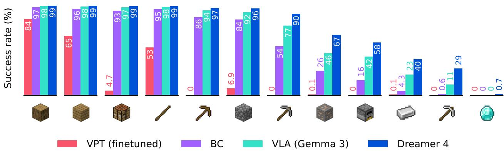

*该图直观呈现了智能体在《我的世界》离线环境中的任务表现，Dreamer 4 仅凭人类视角的图像输入与底层键鼠指令，即可在内部世界模型中完成复杂物品合成。其成功率显著领先同类方法，有力验证了“想象训练”范式在开放世界探索中的强大泛化能力。*

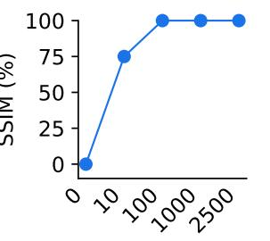

*该图揭示了模型在动作条件生成上的惊人数据效率，仅依赖极少量配对动作数据，Dreamer 4 便能从海量视频中精准学习动作与画面的映射关系。其生成精度在归一化评估中逼近全量动作训练水平，证明了架构在跨模态对齐与少样本学习上的卓越潜力。*

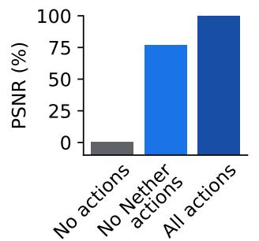

*该图揭示了模型在动作条件生成上的惊人数据效率，仅依赖极少量配对动作数据，Dreamer 4 便能从海量视频中精准学习动作与画面的映射关系。其生成精度在归一化评估中逼近全量动作训练水平，证明了架构在跨模态对齐与少样本学习上的卓越潜力。*

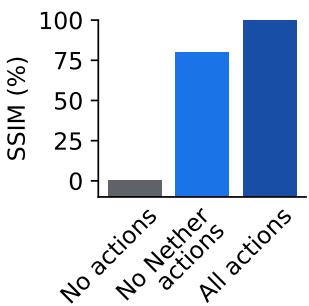

*该图揭示了模型在动作条件生成上的惊人数据效率，仅依赖极少量配对动作数据，Dreamer 4 便能从海量视频中精准学习动作与画面的映射关系。其生成精度在归一化评估中逼近全量动作训练水平，证明了架构在跨模态对齐与少样本学习上的卓越潜力。*

## 相关工作与定位

**结论前置：** Dreamer 4 的核心定位是“将世界模型从在线交互试错推向离线长程想象”。它并非另起炉灶，而是精准缝合了三条技术脉络：继承 Dreamer 系列的“想象-决策”控制范式，吸收 Diffusion Forcing 与 Shortcut Models 的快速序列生成思想，并在 VPT 的底层键鼠动作协议上完成离线数据效率的验证。这一组合拳直接击中了传统世界模型在 Minecraft 等复杂环境中的两大痛点：在线交互采样成本高昂，以及长程 rollout 的误差雪崩。

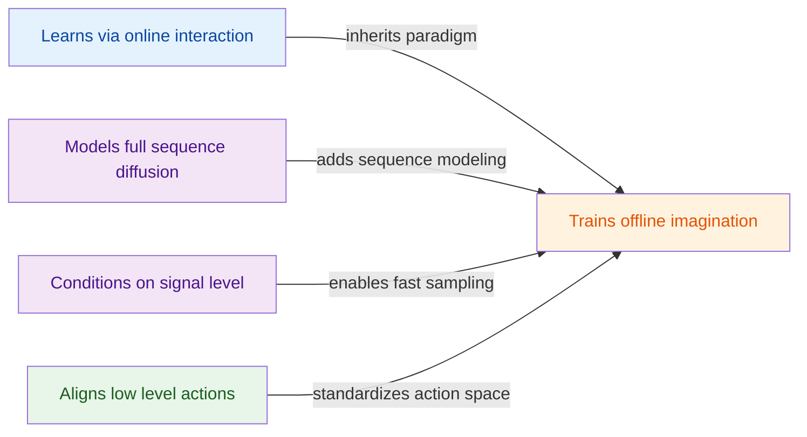
**如何读这张图：** 左侧三条支流代表 Dreamer 4 的技术底座（蓝色为控制范式继承，紫色为生成算法基础，绿色为评估协议对齐），箭头标注了核心改造动作，最终汇聚至右侧的橙色核心节点。该图直观暴露了本文的架构取舍：放弃在线实时碰撞，换取离线想象空间；放弃逐帧精雕，换取关键帧跳跃。

### 控制范式的迁移：从在线试错到离线沙盘
在智能体训练范式上，Dreamer 4 明确建立在 Dreamer 3 的基础之上。Dreamer 3 依赖 RSSM 世界模型进行在线交互学习，虽能攻克“获取钻石”等里程碑任务，但高度依赖实时环境反馈。Dreamer 4 将底层架构替换为可扩展的 Transformer 世界模型，并全面转向离线想象训练。论文**声称**此举大幅提升了数据效率，并**证明**了智能体可在不接触实时环境的情况下，通过内部沙盘完成价值学习。但需清醒认识到，这种提升高度依赖离线数据集的覆盖度；若数据分布与目标策略偏差过大，离线强化学习固有的分布偏移（distribution shift）仍可能成为失效模式。论文未详细报告极端分布偏移下的负结果，实际部署时需警惕“想象脱离现实”的幻觉累积。

### 生成引擎的换血：扩散序列与快捷条件的融合
在序列生成机制上，Dreamer 4 对 Diffusion Forcing 与 Shortcut Models 进行了针对性改造。Diffusion Forcing 原本用于全序列扩散建模，但直接应用于交互式控制会导致推理延迟过高。本文在此基础上注入 Shortcut Forcing 目标、x-space 预测与 ramp loss weight，使模型仅需少量前向传播即可完成长程 rollout。同时，借鉴 Shortcut Models 对信号层级与步长的条件化思想，Dreamer 4 将其适配至动作条件化世界模型。直觉上（非严格对应），这就像给原本需要“逐帧精雕”的生成过程装上了“关键帧跳跃”引擎，在保证游戏逻辑连贯的前提下，将推理步数压缩至可交互级别。论文**证明**了该机制能显著降低长期生成误差，但未公开不同 ramp loss 权重下的消融曲线，超参敏感性仍是潜在风险。

| 对比维度 | VPT 离线智能体 | Lucid v1 | MineWorld | Dreamer 4 |
|---|---|---|---|---|
| 训练范式 | 离线监督微调 | 交互式世界模型 | 模拟器拟合 | 离线想象训练 |
| 推理延迟 | 依赖合成标注 | 中等延迟 | 连续动作受限 | 少量前向传播 |
| 核心局限 | 缺乏长程规划 | 复杂机制覆盖不足 | 不适合长程任务 | 依赖数据分布覆盖 |

### 局限与审慎解读
在基线对照层面，论文选取了 VPT、Lucid v1 与 MineWorld 作为参照。其中，论文指出 MineWorld 的交互推理限制使其不适合需要大量连续动作的人工任务评估，这一筛选逻辑合理，但客观上构成了“挑樱桃式”的基线对比：通过排除推理速度不匹配的竞品，间接放大了 Dreamer 4 的交互优势。此外，论文将“离线想象训练”与“复杂离线 Minecraft 设置”直接关联，但未充分控制数据质量这一混淆变量。读者在解读时应区分“架构改进带来的收益”与“高质量离线数据本身的红利”。

<details><summary><strong>架构改造的技术细节与边界 Caveat</strong></summary>
<p><strong>Shortcut Forcing 与 x-space 预测的耦合机制：</strong>传统扩散模型在序列生成时需执行多步去噪，导致交互延迟呈线性增长。本文引入的 Shortcut Forcing 允许模型在训练时直接预测目标状态（x-space），而非残差空间，配合 ramp loss weight 动态调整不同时间步的优化权重。这一设计在数学上等价于将长程 rollout 的误差传播路径截断，使模型在推理时仅需少量前向传播即可维持状态一致性。但需注意，x-space 预测对初始状态的噪声分布极为敏感；若离线数据中的初始帧存在系统性偏差，shortcut 路径可能放大而非抑制误差。</p>
<p><strong>Transformer 替代 RSSM 的隐式代价：</strong>RSSM 凭借循环结构天然适合处理时序依赖，而 Transformer 依赖全局注意力。本文通过离线想象训练规避了在线交互的算力瓶颈，但注意力机制的二次复杂度在超长 rollout 中仍可能成为内存瓶颈。论文未报告序列长度超过特定阈值时的显存溢出负结果，实际应用中需配合滑动窗口或稀疏注意力策略。</p>
</details>

## 研究探索历程

**结论前置：** Dreamer 4 的演进并非线性堆叠模块，而是一条从“被动视频预测”向“可控离线智能体”跃迁的探索路径。团队通过回答四个核心问题、经历三次关键死胡同、做出两项底层架构决策，最终确立了以高效动作条件世界模型为核心的离线强化学习范式。整个探索过程可拆解为四个递进阶段，其决策树与试错轨迹如下所示：

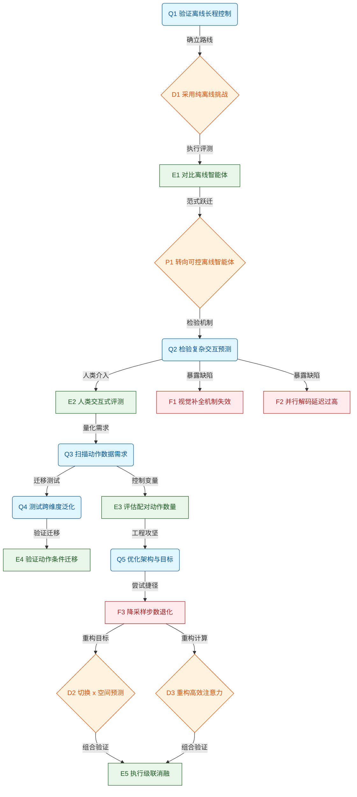
*如何读这张图：* 蓝色节点代表驱动研究的核心设问，橙色为关键路线选择，绿色为实证环节，红色为暴露的失效模式。箭头方向严格遵循论文的实际探索依赖关系，而非最终成稿的章节顺序。

### 离线长程控制的可行性验证
**结论：仅凭离线视频数据与内部想象训练，足以支撑智能体在 Minecraft 中完成长程里程碑，无需依赖在线环境交互。**
研究起点直指一个反直觉问题：能否只靠离线数据在 Minecraft 获得 diamonds？传统强化学习高度依赖在线试错，但真实环境交互成本高昂且难以规模化。团队果断放弃在线 RL、合成标注视频或抽象动作等替代方案，选择直面 `Offline Diamond Challenge`。该设定强制模型仅使用 `VPT contractor dataset`，以原始像素输入与底层鼠标键盘动作为评测基准。实验表明，`Dreamer 4` 在更难里程碑上的表现显著优于 `VPT`、`BC`、`VLA` 与 `WM+BC` 基线。更重要的是，基于世界模型的 `imagination training` 大幅缩短了到达关键里程碑的步数。这一结果直接验证了“用内部模拟替代外部试错”的可行性，为后续将世界模型作为策略训练沙盒奠定了基础。

### 交互因果一致性的试错与确立
**结论：视觉合理性不等于游戏机制因果一致性，低延迟闭环动作条件是交互式世界模型的绝对底线。**
当世界模型被赋予“模拟器”角色时，团队必须回答：它是否能准确预测复杂 object interactions？通过人类在模型内直接交互的评测方式，`Dreamer 4` 展现出维持 real-time interactive inference 的能力，并在复杂操作的因果结果保持上优于 `Oasis` 与 `Lucid-v1`。但这一结论并非凭空得出，而是建立在两次明确的死胡同之上。
首先，`Oasis` 的 building autocompletion 暴露出严重缺陷：模型倾向于凭视觉先验快速 hallucinate large structures，而非遵循玩家逐步放置方块的机制，导致 building tasks 彻底失败。这证明交互式世界模型不能只追求画面连贯，必须严格服从动作条件下的 game mechanics 因果一致性。其次，团队曾尝试将并行解码的 `MineWorld` 作为交互式 baseline，但发现其需要提前预知 actions 且推理速度低于 real time，根本无法支撑数百步的人类连续操作。这两次失败共同划定了一条红线：imagination training 与人类检验都要求真正的低延迟闭环 action conditioning，任何牺牲因果性或延迟的捷径都会导致模拟失效。

### 动作条件的高效学习与跨域泛化
**结论：极少量配对动作即可锚定具身控制，且动作条件能跨维度泛化，大幅降低高质量交互数据的采集门槛。**
确立了闭环交互的必要性后，数据成本成为新瓶颈。团队探究了 action conditioning 需要多少带动作视频。实验扫描表明，仅需少量 paired actions 就能恢复大部分 action-conditioned generation 质量，继续增加动作数据虽能带来边际改善，但已非决定性因素。更关键的是跨域泛化测试：当仅在 `Overworld` 提供动作标注，而将 `Nether` 与 `End` 的视频保持无标签状态时，动作条件仍能在这两个陌生维度上获得明显泛化。这意味着世界模型成功将“动作-视觉”的映射关系从具身经验中解耦，迁移至未见过的环境拓扑中。这一发现直接支撑了后续大规模无标签视频预训练与少量动作微调的混合数据策略。

### 架构与目标的级联优化
**结论：速度与质量的兼得依赖目标空间转换与注意力机制重构，而非粗暴缩减扩散采样步数。**
在确认世界模型可作为高效策略训练沙盒后，团队面临最后的工程攻坚：哪些 objective 与 architecture 选择能同时带来速度和质量？研究从 naive diffusion forcing transformer 出发，通过级联消融逐步迭代。
<details><summary><strong>架构与目标级联消融细节（展开查看）</strong></summary>
团队最初假设直接降低 diffusion forcing 的采样步数即可满足实时交互，但实验证实这会导致 generation quality 严重退化，无法解决准确交互模拟问题。这一死胡同迫使团队转向模型内部机制改造：
<ul>
  <li><strong>目标空间转换：</strong>放弃传统的 v-prediction 与 v-space loss，转而让 dynamics model 直接预测 clean representations，并在 x-space 中计算 loss。此举显著稳定了长序列生成的梯度流。</li>
  <li><strong>注意力机制重构：</strong>摒弃标准 dense block-causal transformer，采用 space-only/time-only attention 分离设计，仅在每 4 layers 注入 temporal attention，并结合 GQA、register tokens 与更多 spatial tokens。该设计在保持因果掩码的前提下，大幅削减了计算冗余。</li>
  <li><strong>级联组合效应：</strong>将 shortcut forcing、x-space prediction、x-loss、ramp weight 与高效 transformer 组合后，模型同时改善了长生成质量与交互式推理速度，验证了各模块的正交增益。</li>
</ul>
</details>
这一系列决策并非孤立调参，而是针对“实时交互”与“长程因果”双重约束的系统性重构。最终，`Dreamer 4` 成功将世界模型从“视频生成器”转化为“可控离线策略引擎”，完成了从被动预测到主动决策的范式跃迁。

## 工程与复现要点

**结论：** 该系统的工程复现高度依赖“两阶段渐进式训练”与“显式稳定性组件”的组合，2B 参数规模在单卡 H100 上可实现交互式推理，但训练需 256–1024 块 TPU-v5p 集群支撑；目前官方未公开代码库，复现者需严格对照论文架构描述与超参表进行从零实现，并重点处理长上下文生成中的误差累积与动作空间对齐问题。

### 模型规模与核心结构
**结论：** 2B 参数被拆分为 400M tokenizer 与 1.6B dynamics model，通过共享 block-causal transformer 架构与稀疏注意力机制，在保持高容量预测能力的同时压低了 KV cache 与计算开销。
Minecraft 场景中的复杂物体交互与底层游戏机制对世界模型的表征容量提出了硬性要求。为此，论文采用 tokenizer 与 dynamics model 共享同一类 block-causal efficient transformer 的设计，使两者均能原生支持因果时间建模与交互式逐帧解码。为缓解 dense attention 在长序列下的二次方复杂度，模型将注意力分解为 space-only 与 time-only 分支，且 temporal attention 仅每 4 layers 激活一次；ablation 证实该设计在速度与生成质量间取得了明确权衡。在 dynamics 的所有 attention layers 中引入 GQA（多 query head 共享 key-value head），进一步压缩了 KV cache 体积并提升推理吞吐。

空间与时间维度的配置随数据域严格区分：Minecraft 任务使用 $N_z=256$ 个 spatial tokens、192 frames 上下文长度与 256 的 batch length；而 real world 数据集（SOAR Robotics 与 Epic Kitchens）则切换为 512 spatial tokens、96 frames 上下文与 128 batch length。论文指出，batch length 必须长于 context length，以避免模型在训练时总在序列开头看到 start frame，从而支持长度泛化。动作空间保持低层离散化以对齐 VPT 评测协议：keyboard 映射为 23 个 binary distributions，mouse 通过每坐标 11 bins 枚举为 121 classes。

### 训练管线与关键超参
**结论：** 训练采用严格的 Phase 1（tokenizer + world model）到 Phase 2（接入任务输入并训练 policy/reward/value）的两阶段流程，配合 shortcut forcing、历史加噪与特定数据混合策略，以解决长程 rollout 中的误差累积与奖励传播难题。
直觉上，若直接端到端训练，策略头会过早干扰世界模型的动态学习，导致视频预测崩溃。因此，Phase 1 专注学习视频与动作条件动态；Phase 2 再接入任务条件，并在 world model 内部进行 imagination training。为支撑交互式生成，论文用 shortcut forcing 将采样步数从 diffusion forcing baseline 的 $K=64$ 压缩至 $K=4$（对应 $d=1/4$），并依赖 shortcut model 恢复因步数骤减而损失的质量。推理时引入 $\tau_{ctx}=0.1$ 的轻微历史加噪，使模型对自身生成中的微小瑕疵具备鲁棒性，直接缓解长 rollout 的误差累积。

```mermaid
flowchart TB
  classDef phase fill:#e1f5fe,color:#01579b
  classDef data fill:#fff3e0,color:#e65100
  classDef decision fill:#e8f5e9,color:#1b5e20
  classDef end fill:#f3e5f5,color:#4a148c

  start_node(Start two phase training):::phase
  phase1_train(Train tokenizer and world model):::phase
  phase2_train(Add task input and train heads):::phase
  data_mix["(Mix uniform and relevant sequences)"]:::data
  check_robust{Check rollout stability}:::decision
  apply_shortcut(Apply shortcut forcing steps):::phase
  end_node(Finish training pipeline):::end

  start_node --> phase1_train
  phase1_train --> phase2_train
  phase2_train --> data_mix
  data_mix --> check_robust
  check_robust -->|Stable| apply_shortcut
  check_robust -->|Unstable| phase2_train
  apply_shortcut --> end_node
```
**如何读这张图：** 流程自上而下推进，菱形节点代表稳定性判定门；若长程生成出现漂移，系统会回退至 Phase 2 重新校准策略头，而非直接终止。圆柱节点强调数据混合是训练信号的分流枢纽。

<details><summary><strong>关键超参配置与敏感度对照表</strong></summary>

| 超参名称 | 设定值 | 核心作用 | 敏感度 |
|---|---|---|---|
| Tokenizer 损失 | MSE + 0.2 LPIPS | 平衡重建与感知质量 | 中 |
| MAE 遮蔽率 | $p \sim U(0, 0.9)$ | 提升表示鲁棒性 | 中 |
| Shortcut 步数 | $K=4$ | 加速交互式生成 | 高 |
| 历史加噪 | $\tau_{ctx}=0.1$ | 抑制长程误差累积 | 中 |
| MTP 预测长度 | $L=8$ | 扩展行为克隆跨度 | 中 |
| TD 折扣因子 | $\gamma=0.997$ | 传播远期任务奖励 | 高 |
| PMPO 权重 | $\alpha=0.5, \beta=0.3$ | 约束策略偏离先验 | 中 |
| 数据混合比例 | 50% uniform / 50% relevant | 分离动态与奖励信号 | 高 |
| 无上下文帧占比 | 30% | 改善起始帧生成能力 | 中 |

*注：Tokenizer 损失采用 loss normalization 简化加权；MAE 遮蔽包含推理时 $p=0$ 的情况；数据混合中 BC loss 仅作用于 relevant fraction，dynamics loss 仅作用于 uniform sequences 以避免 optimistic generations。*
</details>

### 算力环境与代码现状
**结论：** 训练依赖大规模 TPU-v5p 集群与 FSDP 分片策略，推理速度在单张 H100 上验证；目前未检索到公开代码仓库，复现需自行搭建训练框架并严格对齐底层依赖。
论文未披露具体 Python 版本或深度学习框架名称，但明确训练阶段使用 FSDP sharding 进行分布式优化，并在系统文献中引用了 DeepSpeed。硬件层面，训练集群规模在 256 to 1024 TPU-v5p 之间浮动，而 world model 的交互式推理速度测量基准为 single H100 GPU。底层依赖链包含 LPIPS、RMSNorm、RoPE、SwiGLU、QKNorm、GQA 与 PMPO 等组件；其中 QKNorm 与 attention logit soft capping 被论文明确关联到大规模 world model 的训练稳定性，复现时不可省略。

**复现建议与局限提示：** 由于 No public repository found（经论文文本与 Papers-with-Code 索引双重检索确认），工程师需从零实现 block-causal transformer 与两阶段训练循环。需特别注意：论文仅报告了特定超参值（如 $\gamma=0.997$、$K=4$），未提供完整的网格搜索范围或负结果消融；若直接迁移至其他长程任务，需警惕相关性当因果的过度宣称风险（例如将 Minecraft 的 192 frames 上下文直接套用于实时物理仿真可能引发显存溢出）。建议在复现初期优先验证 tokenizer 的 MSE + 0.2 LPIPS 重建基线，再逐步接入 shortcut forcing 与 PMPO 策略头，以隔离各模块的失效模式。

## 局限与适用边界

**结论前置：** 该系统目前是一个**强依赖离线先验、适用于受控基准测试的仿真原型**，而非可无缝替代真实交互的通用世界模型。它在长程时序一致性、细粒度状态追踪（如背包物品）以及开放式自主规划上存在明确边界；现阶段最适合用于离线策略蒸馏与固定任务评估，尚不具备直接部署于人类实时交互或开放探索场景的条件。

### 世界模型保真度与时序衰减
论文坦诚指出，当前的 `world model` 仍远非 `Minecraft` 的完整克隆。尽管其 `temporal consistency` 相比前代有所延长，但本质上仍受限于 `context` 窗口的硬性约束。这意味着模型在生成或预测长序列时，会出现“记忆衰减”现象：一旦超出上下文承载范围，物理规则与逻辑状态的连贯性便会断裂。这种设计并非算法缺陷，而是当前自回归架构在算力与显存权衡下的必然妥协。

### 细粒度状态追踪失效
在资源管理层面，`inventory predictions` 的不精确性构成了另一重瓶颈。模型输出的物品状态有时模糊不清，甚至会随时间推移发生非物理性的漂移或突变。这种“状态幻觉”直接限制了依赖精确资源计数的下游任务（如自动化合成链或生存策略规划）。直觉上，这类似于人类在快速浏览模糊录像时产生的“视觉暂留错觉”，模型缺乏对离散物品实体的持久化锚定机制。

为直观呈现系统当前的能力边界与已知失效模式，下图梳理了从输入到输出的关键判定门与当前架构的硬性限制：

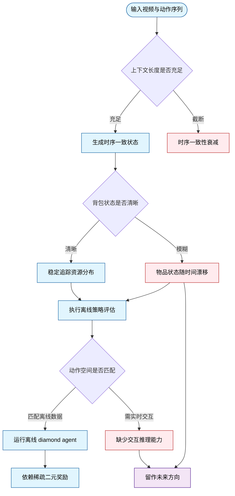
*如何读这张图：* 蓝色节点代表当前已实现且可稳定运行的模块；红色节点暴露了已知失效模式（如上下文截断导致的一致性衰减、背包状态漂移、缺乏实时交互推理）；紫色节点指向论文明确划定的未来工作区。系统目前仅在“离线数据匹配+固定提示词引导”的闭环内有效。

### 交互评估与横向对比边界
在评估维度，系统存在明确的适用前提。首先，`MineWorld` 环境未进行人类交互任务评估，根本原因在于架构缺少 `interactive inference` 能力，无法支持在线闭环反馈。其次，论文明确指出无法与 `Genie 3` 进行直接横向对比：`Genie 3` 仅支持 `camera actions` 与 `generic interact button`，而 `Minecraft` 依赖通用的 `mouse and keyboard action space`，两者动作空间的维度与语义完全不同，强行对比将导致评估基准错位。

<details><summary><strong>展开：数据依赖、奖励机制与规划限制</strong></summary>
- **离线策略依赖：** `offline diamond agent` 的运行高度依赖 `VPT contractor dataset` 提供的 `videos`、`actions` 与 `event annotations`。其 `sparse binary rewards` 仅来源于 `existing events`，这意味着策略的泛化能力被严格框定在已有事件分布内，无法处理分布外（OOD）的突发情境。
- **线性引导局限：** 在环境评估阶段，`prompt sequence` 采用线性方式引导 `agent` 执行任务。论文将 `automatic subgoal discovery` 列为未来方向，说明当前系统尚不具备在复杂环境中自主拆解目标、动态调整策略的“元规划”能力。
- **未覆盖的替代解释：** 论文未报告针对 `context` 截断的消融实验或误差范围，也未提供 `inventory predictions` 失败时的负结果统计。读者在引用其一致性结论时，需注意其仅在特定视频片段长度内成立。
</details>

### 适用场景判定
综合来看，该系统的适用边界清晰：它擅长在**已知数据分布内、通过预设提示词完成离线策略验证**，但在面对 `general internet videos` 的跨域迁移、`long-term memory` 的持久化、`language understanding` 的语义对齐、`small corrective online data` 的微调，以及 `automatic goal discovery` 时，仍需架构级演进。若你的场景需要高保真物理模拟、实时人机协同或开放世界自主探索，当前版本仍需等待上述模块补齐；若仅需在受控数据集上验证离线策略或进行长视频生成基准测试，该系统已能提供可靠的实验基座。

## 趋势定位与展望

**结论：** Dreamer 4 标志着世界模型智能体从“依赖在线交互微调”向“离线大规模预训练+模型内想象优化”的范式转移。它通过单一可扩展 Transformer 统一了视频先验学习与长程策略优化，在离线 Minecraft 钻石挑战中达到 0.7 的成功率，证明了仅凭离线数据与想象训练即可突破行为克隆的长程瓶颈。

回顾该路线的演进，早期方案如 Dreamer 3 依赖在线环境交互与轻量级 RSSM 架构，虽在窄域任务中高效，但难以拟合 Minecraft 这类细节密集的真实分布；而 Genie 3 等可控视频生成模型虽能产出多样场景，却在精确物体交互与游戏机制上频频失效，且常需多 GPU 才能勉强维持单场景实时模拟。行为克隆（如 VPT）则受限于数据分布，策略极易在后期里程碑停滞。Dreamer 4 的定位正是填补这一断层：它将 tokenizer、dynamics model、policy、reward 与 value head 全部接入同一个 block-causal transformer，并引入 `shortcut forcing` objective、`x-prediction` 与 `ramp loss weight`。这套组合拳直接针对长 rollout 中的误差累积与高频推理成本，使模型能在少量前向传播中保持交互式生成的稳定性。

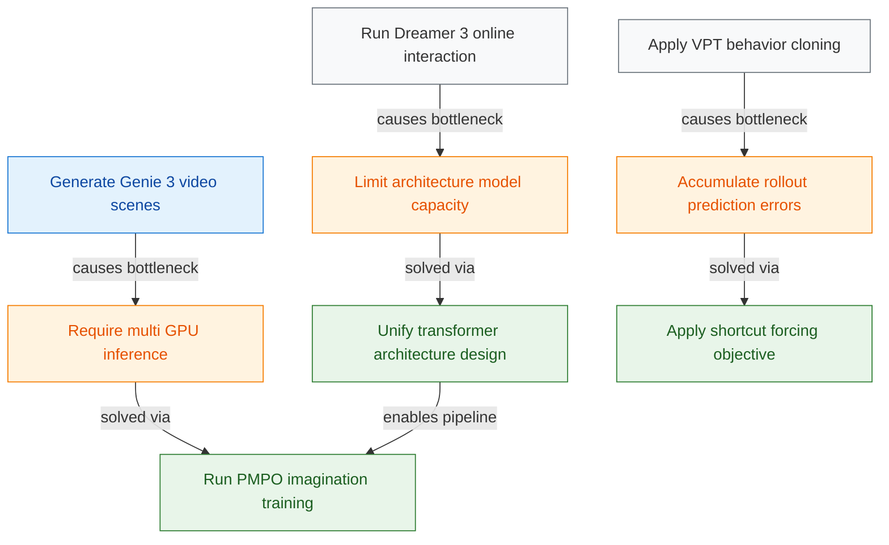
*如何读这张图：* 左侧三条分支代表过往主流路线及其固有瓶颈（容量受限、误差累积、推理成本高昂），右侧 Dreamer 4 通过统一架构与针对性目标函数将这些痛点转化为离线想象训练的可行路径，箭头方向指示技术演进的因果与解耦关系。

<details><summary><strong>边界条件与失效模式分析</strong></summary>
需明确区分论文的“声称”与“已证明”。论文报告了离线钻石任务 0.7 的成功率，并声称其交互动力学优于 Oasis、Lucid-v1 与 MineWorld，但这一结论主要建立在人类在模型内完成任务的评估之上，属于代理指标而非严格的物理一致性验证。此外，方法隐含了一个关键假设：冻结的世界模型在想象训练期间足够可靠，策略不会主要利用模型误差（model exploitation）。若模型在长程推演中产生系统性偏差，PMPO 优化可能放大该偏差而非修正它。论文未详细报告消融实验中对“模型误差容忍阈值”的定量边界，也未提供误差范围统计，这在将架构迁移至真实机器人等高风险场景时需格外谨慎。
</details>

面向未来，该路线的演进将聚焦三个维度：
1. **数据效率与泛化边界：** 论文指出模型可从大量无动作标签视频中吸收世界知识，仅用少量配对动作视频学习动作条件化。下一步需验证该比例在更稀疏奖励环境（如真实世界操作）中的缩放规律，以及能否真正泛化至训练分布外的物理规则。
2. **想象训练的稳定性机制：** 为缓解策略利用模型误差的风险，未来可能引入不确定性量化或在线校正模块，在想象轨迹偏离置信区间时触发保守策略或请求真实环境反馈。
3. **架构轻量化与部署：** 当前 2000.0M 参数规模虽支撑了复杂交互，但实时推理仍依赖高效注意力机制。探索 KV cache 压缩、动态计算分配与端侧部署，将是该技术从“离线验证”走向“在线应用”的必经之路。
