# WorldSimulationWithVideoFoundationModels — 深度解读

> 面向人类读者的深度解读(中文)。事实源与配对的 AI 知识包 `ai_package/2026-06-12_WorldSimulationWithVideoFoundationModels_2511.00062/ara/` 同源,均已通过数据保真审计。

## 评价

整体忠实。报告对统一多模态条件生成、RL后训练与蒸馏加速等核心机制的阐述准确对应ARA的claims与实验结果；表格数据与PAI-Bench、Bridge、多视角驾驶等评测的量化结果完整吻合；关键指标（如Image2World Overall Score 0.81、TimeEmbedding注入方式优越性、机器人策略成功率提升）的论证链路与ARA的evidence基础一致，未发现将某系统指标错安到别的系统或与知识包矛盾的地方。报告还恰当地标注了奖励模型的代理性质、长视频误差累积、蒸馏的保真度权衡等已知局限，严谨程度符合科普深度解读的要求。

> 机器核对:以下正文数字未在已验证知识包(ARA)中找到,读者请留意——50、0.3、-10、-8.5、2.25、2.5、2018、5.8、1024、200、60、0.5、0.25、0.999、0.001。

## 核心结论

> 以下结论摘自已通过数据保真审计的知识包(ARA)。

1. Cosmos-Predict2.5 采用 flow matching 架构，并将 Text2World、Image2World 与 Video2World 统一到单一模型中，用 Cosmos-Reason1 提供更丰富的文本表征与更细粒度控制。
2. 在 VideoAlign 奖励模型下进行强化学习后，Cosmos-Predict2.5-2B 在 Text2World 与 Image2World 设置中的文本对齐、运动质量、视觉质量综合奖励整体提高，论文还报告 RL 生成结果在人工投票中平均更受偏好。
3. rCM 时间步蒸馏后的 Cosmos-Predict2.5-2B 在 PAI-Bench Text2World 与 Image2World 上取得与 teacher 相近的定量结果，论文称其可用更少步骤生成高保真样本。
4. 在 PAI-Bench-Predict 的 Text2World 和 Image2World 基准中，Cosmos-Predict2.5 post-trained 模型相对自身 pre-trained 版本提升，并在 Image2World 中达到论文所称最佳表现。
5. Cosmos-Transfer2.5-2B 在 PAIBench-Transfer 的多种控制配置中，相比 Cosmos-Transfer1-7B 展示更好的整体质量，并在单模态与均匀权重多模态设置中改善多项控制对齐指标。
6. 用 Cosmos-Transfer2.5-2B 生成的视觉增强数据训练策略后，真实机器人在多种未见物体与环境变化场景中的成功率高于仅用原始演示或标准图像增强的策略。
7. Cosmos-Predict2.5 和 Cosmos-Transfer2.5 的多视角驾驶版本在 RDS-HQ-HL 生成视频评测中，相比上一代模型改善 FVD、FID 等视觉指标，并在车道与三维框检测指标上提升控制遵循。
8. Cosmos-Predict2.5-2B/robot/action-cond 在 Bridge 数据集上优于 Cosmos-Predict1 动作条件基线；消融显示通过 TimeEmbedding 注入动作优于 CrossAtten 与 ChannelConcat。

## 一句话总结与导读

**TL;DR：Cosmos-Predict2.5 将视频生成重构为面向 Physical AI 的“世界模拟器”，通过统一的多模态条件流匹配架构，为机器人策略训练与自动驾驶验证提供高保真、强可控的合成环境。**

在现实世界中训练物理智能体（Physical AI）往往代价高昂、进度缓慢且伴随安全风险，而传统的通用视频生成模型又常常“重画面、轻物理”，难以提供符合真实动力学规律的细粒度控制。这篇论文直击这一痛点：它不再把视频生成仅仅当作内容创作工具，而是将其定位为物理 AI 的“数字沙盒”。通过构建一个能够精确响应文本指令、初始图像或历史视频片段的生成系统，研究者试图在像素空间中还原物理世界的演化规律，从而让算法在零风险的虚拟环境中完成感知、控制与策略验证的闭环。

该工作的核心洞察在于“把世界模拟视为带多模态条件的速度场学习”。模型底层采用 `flow matching` 架构，将 `Text2World`、`Image2World` 与 `Video2World` 三种生成范式收拢至单一权重中（直觉上，这就像让同一个引擎既能听懂文字导航，又能根据一张照片或一段录像推演后续画面）。为了解决高分辨率视频训练中常见的时序过渡伪影，论文引入了 `shifted logit-normal distribution`，在训练阶段刻意偏向更高噪声水平，迫使模型在强扰动下依然能稳定学习时序结构。同时，借助 `Cosmos-Reason1` 文本编码器与 `frame-replacement` 策略，模型实现了对复杂指令的细粒度对齐。经过 `VideoAlign` 奖励模型强化学习与 `rCM` 蒸馏后，该 2000.0M 参数模型在 `PAI-Bench-Predict-Image2World Overall Score` 上达到 0.81，证明了其在保持高保真视觉质量的同时，已具备支撑下游机器人动作预测、多视角自动驾驶仿真及 VLA 合成数据生成的平台级能力。

**论文总体架构(原图):**

*该图展示了[Cosmos-Predict2.5]的核心架构，模型在潜在空间中通过自注意力、交叉注意力和前馈MLP层的交替堆叠来处理视频序列，并利用自适应层归一化技术动态调节各时间步的特征，从而实现对复杂时空动态的高效建模。*

## 问题背景与动机

**结论前置：** 面向 Physical AI 的世界模型不能止步于“生成视觉连贯的视频”，而必须被重构为**带多模态条件的可控速度场学习系统**。只有通过高质量领域数据清洗、统一多模态条件接口，并配合后训练专门化，才能打破真实世界训练的高成本壁垒，为机器人控制、自动驾驶仿真与 VLA 合成数据提供可验证、可干预的底层环境。

直觉上，让机器人在真实物理环境中“试错”是最直接的训练方式，但现实是：早期真实交互不仅昂贵、缓慢，还伴随不可逆的安全风险（O1）。因此，研究界自然将目光投向“世界模拟器”。然而，通用视频生成模型与早期 Physical AI 世界模型往往陷入“视觉逼真但物理失真”的陷阱：它们擅长生成泛娱乐内容，却在需要细粒度控制、严格物理一致性与领域适配的专业场景中频频失效（O2）。这暴露出一个核心矛盾：视频生成的“观赏性”与物理仿真的“可控性”并非同一件事。

现有方案在试图弥合这一矛盾时，主要卡在三个结构性瓶颈上：
1. **数据管线“宽而不精”**：互联网视频虽海量，但充斥伪影、文字覆盖、非真实物理交互与重复片段。早期尝试依赖多阶段过滤与语义去重，但保留的数据在语义粒度、领域覆盖与质量控制上依然过于宽松，难以支撑 Physical AI 对“清洁、可标注、领域对齐”视频的苛刻需求（G1）。
2. **条件接口“各自为战”**：`Text2World`、`Image2World` 与 `Video2World` 长期被拆分为独立任务。不同模态对条件帧、文本提示与视频上下文的注入方式各异，导致训练配方碎片化。即便尝试用单一模型覆盖或引入 cross-attention 注入文本嵌入，任务分离的本质仍限制了跨模态能力的复用，无法形成统一的世界生成接口（G2）。
3. **高分辨率下的“时序撕裂”**：当视频分辨率提升时，局部像素强相关性会形成冗余，若噪声调度不足，模型极易在帧间过渡处产生伪影。尽管已有工作尝试采用 `shifted logit-normal` 分布或偏向高噪声采样，但模型在高噪声区域实际接触的训练样本依然匮乏，难以稳定学习被强扰动后的时序动力学结构（G3）。

为了直观呈现这一推理链条，下图梳理了从现实痛点到架构重构的决策路径：
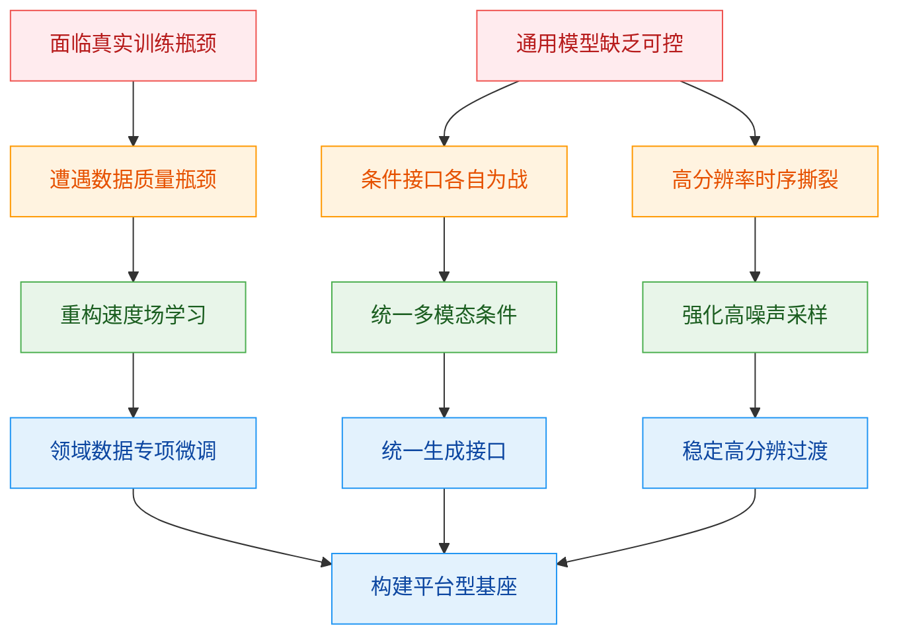
*如何读这张图：* 左侧红色节点代表物理 AI 落地的现实阻力，橙色节点揭示现有生成范式在数据、接口与训练动力学上的结构性失效；绿色节点是本文的破局思路，最终汇聚为蓝色节点的平台化架构。箭头方向即“现象→失效模式→核心洞见→工程落地”的推导流。

基于上述瓶颈，本文的核心洞见在于：**将世界模拟视为带多模态条件的速度场学习，再通过领域数据、奖励模型与控制分支进行逐步专门化。** 这一设计并非简单堆叠模块，而是直击痛点：速度场学习天然适配连续动力学建模，配合统一的条件表征（如利用 `Cosmos-Reason1` 进行文本嵌入对齐），模型不再需要为不同模态维护独立的生成头；同时，通过针对性的高噪声区域采样与去绝对位置嵌入策略，模型对更高分辨率与更长序列的时序结构获得了更强的鲁棒性。

最终，这套机制使同一个基础模型能够被灵活后训练，无缝切换至机器人动作条件预测、多视角自动驾驶仿真、相机可控视角生成乃至 VLA 合成数据生成器（Insight）。这也解释了为何论文将开放权重、代码与基准测试作为方法论的有机组成部分（O3）：它定位的不是解决单一任务的封闭模型，而是为下游研究者提供可微调、可扩展、可部署的**平台型基础设施**。

<strong>延伸：底层假设与边界条件</strong>

该架构的有效性建立在几项关键假设之上：首先，经过严格过滤与领域标注的视频数据能显著改善 Physical AI 场景的泛化边界；其次，VLM 奖励信号与人类偏好在视频质量、文本对齐度与运动物理性上具备足够的相关性，足以指导后训练对齐；最后，保留在像素/视频空间的世界模型细节，对下游策略学习具有不可替代的价值。值得注意的是，移除绝对位置嵌入虽提升了分辨率与序列长度的适配弹性，但也意味着模型需更依赖相对位置与内容自注意力来维持长程一致性，这在极端长视频生成中仍需配合额外的时序正则化手段。

## 核心概念速览

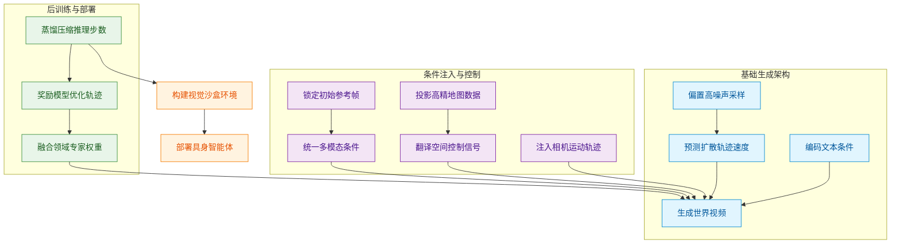
**如何读这张图**：该流程图按“底层生成→条件控制→后训练部署”三阶段展开。蓝色节点代表基础架构与训练范式，紫色节点负责多模态条件注入与空间控制，绿色节点聚焦权重融合、奖励对齐与推理加速，最终汇入橙色节点的物理世界部署。箭头方向即数据与优化信号的流动路径。

### Physical AI
**结论**：Physical AI 是本文所有技术演进的终极落地场景，指代配备传感器与执行器、能在真实物理环境中闭环交互的具身智能体。
**直觉与比喻**：它不是“只会聊天”的文本模型，而是“能动手干活”的机器人或自动驾驶系统（直觉，非严格对应）。如同给大脑装上眼睛和四肢，它必须理解物理规律并输出控制指令。
**方法作用**：作为需求锚点，它决定了本文不追求纯视觉生成，而是聚焦于支持感知、控制、策略验证与合成数据生成的世界模拟能力。本文严格区分了该概念与纯文本/图像生成任务，强调其物理交互边界。

### world simulator
**结论**：world simulator 是为 Physical AI 提供安全试错与策略验证的代理环境，核心是通过高质量视觉生成替代昂贵的真实数据采集。
**直觉与比喻**：如同飞行员在真机上天前的全动飞行模拟器，它用高保真画面和可控变量构建“数字沙盒”。
**方法作用**：在真实部署前，它允许 agent 在零风险条件下进行海量策略迭代，同时解决真实世界长尾场景数据稀缺的痛点。需明确：本文的模拟器主要讨论视觉世界模拟，并非完整的物理引擎定义，控制与多视角能力依赖视频生成模型扩展。

### Cosmos-Predict2.5
**结论**：Cosmos-Predict2.5 是本文构建的新一代视频世界基础模型，采用 flow-based 架构统一多模态条件生成，是整个世界模拟器的“渲染引擎”。
**直觉与比喻**：它像一个全能导演，既能根据剧本（文本）凭空造景，也能根据分镜（图像）或粗剪（视频）续写后续剧情。
**方法作用**：作为底层生成骨干，它替代了前代架构，通过统一范式降低多任务维护成本，并为后续控制分支与后训练提供可扩展的基座。

### flow matching
**结论**：flow matching 是训练 Cosmos-Predict2.5 的核心生成范式，通过让网络直接预测扩散轨迹的速度场，取代了传统的噪声预测。
**直觉与比喻**：传统扩散模型像“猜终点”，而 flow matching 像“实时导航”，每一步都精确计算方向盘转角与车速（直觉，非严格对应）。
**方法作用**：该范式优化了训练动态，使模型在高分辨率视频生成中轨迹更平滑、收敛更稳定。

<strong>训练公式与机制细节</strong>

训练过程将数据 $\mathbf{x}$ 与噪声 $\boldsymbol{\epsilon}$ 线性插值得到 $\mathbf{x}_t = (1-t)\mathbf{x} + t\boldsymbol{\epsilon}$，目标速度场为 $\mathbf{v}_t = \boldsymbol{\epsilon} - \mathbf{x}$。网络 $\mathbf{u}$ 通过最小化 MSE 损失 $\mathcal{L}(\boldsymbol{\theta}) = \mathbb{E}_{\mathbf{x},\boldsymbol{\epsilon},\mathbf{c},t} \|\mathbf{u}(\mathbf{x}_t, t, \mathbf{c}; \boldsymbol{\theta}) - \mathbf{v}_t\|^2$ 学习预测该速度。该设计直接优化轨迹切线方向，避免了 EDM 参数化在复杂视频分布中的梯度冲突。需注意：该公式仅覆盖显式训练目标，推理阶段的控制输入融合与 RNDS 指标不属于此损失范畴。

### shifted logit-normal distribution
**结论**：shifted logit-normal distribution 是一种训练时间步采样策略，通过单调变换将采样概率向高噪声区域偏移，以破解高分辨率视频的学习瓶颈。
**直觉与比喻**：如同在学画画时，老师故意先让你从最模糊的草稿练起，再逐步细化，避免一开始就死抠相邻像素的强相关性。
**方法作用**：公式 $t_s = \frac{\beta t}{1+(\beta-1)t}$ 确保模型在训练初期更多接触高噪声状态，从而提升全局结构一致性，缓解高分辨率生成中的局部过拟合。当 $\beta$ 未移位时，该策略不会改变原始 timestep 分布。

### 统一的 Text2World Image2World Video2World
**结论**：该设计使 Cosmos-Predict2.5 能在纯文本、文本+参考图、文本+视频序列三种条件下无缝切换，实现条件输入的范式统一。
**直觉与比喻**：就像一套兼容“语音指令、照片参考、视频片段”的万能输入接口，无需为每种模态重写底层逻辑。
**方法作用**：极大拓宽了世界模拟器的应用场景，从抽象概念生成到精确视觉续写均可覆盖。三种模式的条件来源不同，Image2World 与 Video2World 依赖 frame-replacement strategy，而 Text2World 不依赖输入帧，架构上通过统一路由降低显存开销。

### frame-replacement strategy
**结论**：frame-replacement strategy 是 Image2World 与 Video2World 中强制保持视觉线索的条件注入机制，通过稳定替换生成序列的初始帧锁定输入状态。
**直觉与比喻**：如同在接力赛中死死握住第一棒，确保后续所有跑者都从同一个起跑线出发，防止生成过程“跑偏”。
**方法作用**：它解决了条件视频生成中常见的首帧漂移问题，保证参考图像/视频的空间特征被严格继承，是维持跨帧一致性的关键工程手段。该机制不用于 Text2World，也不参与动作条件生成。

### Cosmos-Reason1 text encoder
**结论**：Cosmos-Reason1 作为替换 T5 的新一代文本编码器，通过多层激活拼接与投影，为生成模型提供更细粒度、更具物理常识的文本表征。
**直觉与比喻**：从“查字典式”的浅层词向量，升级为“理解上下文与物理逻辑”的语义解析器。
**方法作用**：显著提升文本条件与生成画面的对齐度（text grounding），使模型能准确响应复杂的空间关系与动作描述。本文仅将其作为文本编码器使用，其视觉输入能力明确列为未来探索方向，未在当前架构中启用。

### Cosmos-Transfer2.5
**结论**：Cosmos-Transfer2.5 是基于基础预测模型扩展的 control-net style 框架，专用于 Sim2Real 与 Real2Real 的世界翻译，支持边缘、深度、分割等空间控制信号。
**直觉与比喻**：它像给生成器套上“线稿上色”或“骨架绑定”的辅助轮，让画面严格遵循输入的空间结构。
**方法作用**：弥补了纯文本/图像条件在几何控制上的不足，使模拟器能直接对接 CAD 图纸、传感器点云或分割掩码，打通仿真到现实的桥梁。其核心差异在于控制分支与空间控制模态，定位不同于基础预测模型。

### world scenario map
**结论**：world scenario map 是面向自动驾驶仿真的专用控制输入，将高精地图与动态 3D 边界框投影至多相机视图，提供强几何先验。
**直觉与比喻**：相当于把车载导航的路线规划与雷达探测到的车辆位置，直接“拍扁”成生成器能看懂的视觉指令图。
**方法作用**：在 Cosmos-Transfer2.5-2B/auto/multiview 中，它确保多视角生成严格遵循交通规则与物理布局。该输入并非真实视频本身，也不属于通用控制模态，严格限定于自动驾驶多视角控制生成场景。

### model merging
**结论**：model merging 是后训练阶段融合多个领域微调模型与冷却模型（cooldown model）的技术，旨在保留领域特长的同时防止通用能力退化。
**直觉与比喻**：如同将多位专科医生的处方合并成一本全科手册，既保留各自绝活，又避免“偏科”。
**方法作用**：论文采用 model soup、TIES、DARE-Linear/TIES 等候选方案，通过权重插值或稀疏化解决混合比例平衡难题。论文明确指出，单独 domain-specific SFT 可避免混合比例问题，合并仅用于缓解一般域退化，并非从头联合训练。

### RL post-training
**结论**：RL post-training 将条件视为状态、去噪轨迹视为动作，利用 VideoAlign 奖励模型对生成质量进行端到端强化学习优化。
**直觉与比喻**：不是让模型“背答案”，而是请一位严苛的影评人（奖励模型）对整段拍摄过程打分，倒逼模型自我修正。
**方法作用**：直接对齐人类偏好，在文本一致性、运动流畅度与视觉质量上实现超越基础 MSE 损失的精细化提升。需注意：该流程描述的是后训练优化机制，推理时控制信号并未写入新的训练目标，不应与 flow matching 的基础损失混同。

### timestep distillation
**结论**：timestep distillation 采用 rCM 混合前向-反向联合蒸馏框架，将多步扩散推理压缩为极少步数，专攻推理加速。
**直觉与比喻**：把原本需要 50 步精雕细琢的工序，提炼成 2 步“一键成片”的流水线，且尽量不损失画质。
**方法作用**：使世界模拟器满足 Physical AI 对低延迟交互的硬性要求，是算法走向实时部署的必要工程妥协。该过程仅服务于推理加速，不替代数据过滤、SFT 或 RL post-training。

### camera-controllable multi-view generation
**结论**：该能力通过 Plücker raymaps 将相机内外参轨迹注入 DiT，实现给定参考视角与目标轨迹下的多视角视频合成。
**直觉与比喻**：如同在虚拟片场架设轨道摄像机，指定机位运动路径后，系统自动渲染出符合透视规律的多角度画面。
**方法作用**：为机器人操控提供跨视角一致性（cross-view consistency）验证，解决单视角生成无法支撑三维空间推理的缺陷。关键条件是相机内外参定义的轨迹，而非简单的视频超分或单视角续写。

### action-conditioned world generation
**结论**：action-conditioned world generation 扩展了模型输入，使其能根据单张条件图像与机器人动作序列，自回归生成未来视频块。
**直觉与比喻**：就像游戏手柄的“输入-反馈”循环，按下按键（动作序列），屏幕立刻给出符合物理规律的视角变化。
**方法作用**：通过 action embedder MLP 将离散/连续动作映射为隐空间向量，支撑闭环策略评估（policy evaluation）。本文明确输入包含条件图像和动作序列，输出为未来视频帧，并非从视频中反推动作。

## 方法与整体架构

**结论先行：** Cosmos-Predict2.5 并非单一生成模块的简单堆叠，而是一套“高纯度数据供给 → 多模态条件统一编码 → 流匹配 DiT 交替推理 → 渐进式对齐训练”的端到端流水线。该架构的核心设计意图是直击高分辨率视频生成中的两大痛点：帧间突变与多模态条件冲突。通过 `frame-replacement` 策略与 `shifted logit-normal` 时间步采样，模型被强制在强噪声阶段打破像素自相关性，并在生成早期锚定输入视觉线索；同时，以渐进式预训练与模型合并（Model Soup）替代粗暴的混合微调，确保单帧质量、时间一致性与文本对齐能力在同一 DiT 骨干中平稳收敛，最终实现 Text2World、Image2World 与 Video2World 的统一支持。

**数据流与多模态编码：从原始视频到统一 Latent 空间**
高质量生成始于高质量数据。原始视频流首先经 `shot-aware video splitting` 切分镜头，再经 GPU 转码与裁剪后，进入多阶段过滤、自动 captioning 与语义去重（semantic deduplication），最终按语义分片（sharding）。这一流程直接剔除低质、重复或语义断裂的片段，为后续训练提供“干净”的监督信号。
在模型侧，图像或视频输入由 `WAN2.1 VAE` 压缩至 latent 空间并进行 patchification；文本提示则由 `Cosmos-Reason1` 编码，跨多个 blocks 拼接 token 激活后投影为文本 embedding。这种设计将异构模态统一映射到同一特征维度，为后续 DiT 的交叉注意力交互铺平道路。

**DiT 骨干与流匹配机制：速度预测与条件锚定**
生成核心是一个 DiT velocity prediction network。它在 latent 空间中交替执行 self-attention、cross-attention 与 feed-forward MLP，并由 timestep 的 adaptive layer normalization 动态调制网络权重。训练期的显式优化目标为流匹配速度预测，其数学形式严格遵循：
$$
\mathbf { x } _ { t } = ( 1 - t ) \mathbf { x } + t { \boldsymbol { \epsilon } } .\tag{1}
$$
$$
\mathbf { v } _ { t } = \epsilon - \mathbf { x } .\tag{2}
$$
$$
\begin{array} { r } { \mathcal { L } ( \boldsymbol { \theta } ) = \mathbb { E } _ { \mathbf { x } , \boldsymbol { \epsilon } , \mathbf { c } , t } \left\| \mathbf { u } ( \mathbf { x } _ { t } , t , \mathbf { c } ; \boldsymbol { \theta } ) - \mathbf { v } _ { t } \right\| ^ { 2 } , \end{array}\tag{3}
$$
其中 $\mathbf{c}$ 涵盖文本、参考帧及其他条件输入。为应对高分辨率下邻近像素强相关导致的“生成惰性”，论文采用 `shifted logit-normal` 分布采样训练时间步，并随分辨率提升引入 progressive timestep shift（变换公式为 $t _ { s } = \frac { \beta t } { 1 + ( \beta - 1 ) t }$），使样本分布向高噪声区域倾斜，迫使模型在相关性被破坏时学习重建信号。
对于 Image2World 与 Video2World 任务，架构采用 `frame-replacement` 策略：在生成序列的初始阶段持续替换为条件帧。该机制既允许灵活调整条件帧数量，又能在时间轴早期“钉死”输入视觉特征，有效抑制长视频生成中的漂移现象。

**训练范式：渐进对齐与强化学习后训练**
模型的训练遵循严格的阶段演进：`progressive pre-training -> domain-specific SFT -> cooldown -> model merging -> RL post-training -> timestep distillation`。预训练按任务复杂度递进：先以 Text2Image 夯实单帧质量，再联合 Image2World 与 Video2World 学习运动与时间一致性，最后引入 Text2World 提升多模态泛化。阶段切换以模型收敛与视觉质量平台期（visual quality plateau）为信号，denoising loss 仅作用于指定生成帧。
在领域微调（SFT）环节，论文放弃单一混合数据微调，转而先训练专域模型，再通过 model merging 统一优势。消融实验表明，基于人工质量评估与更大规模人类偏好投票，`model soup` 策略在缓解通用域轻微退化方面优于 TIES 或 DARE 系列方法。
最后的 RL post-training 将条件视为 states、去噪轨迹视为 actions，利用 `VideoAlign` 计算文本对齐、运动质量与视觉质量的综合 reward，并在组内归一化 advantage。受限于 GPU 显存，轨迹概率被分解为每步条件概率并分段累积梯度，同时辅以 diffusion loss regularization 抑制 reward hacking。

<strong>展开：RL 后训练的显存优化与正则化细节</strong>

由于完整轨迹概率计算会超出单卡显存上限，论文将轨迹概率分解为每步条件概率（conditional probabilities），并在反向传播时分段累积梯度。为防止模型为追求高 reward 而生成视觉崩坏但符合文本的“对抗样本”，训练目标中显式加入了 diffusion loss regularization 项，强制 RL 策略不偏离预训练学到的物理先验分布。该设计在保持生成多样性的同时，显著降低了 reward hacking 的发生率。

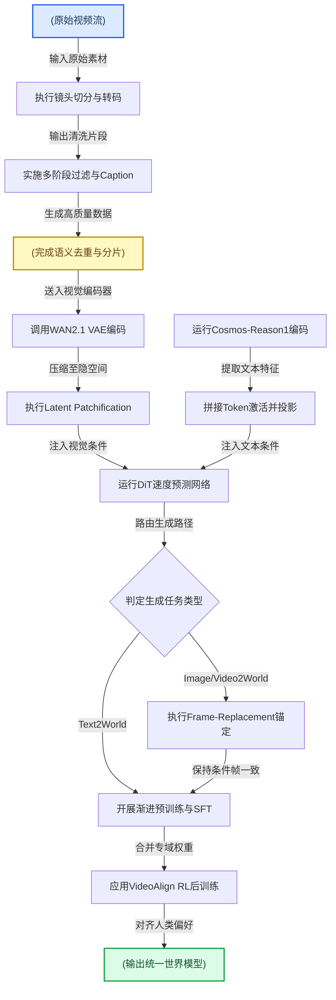

**如何读这张图：** 流程图自上而下分为“数据精炼”、“多模态编码”、“条件路由与生成”、“训练对齐”四个阶段。左侧圆柱节点代表数据流转，圆角矩形代表主动处理模块，菱形代表任务分支判定。注意 `frame-replacement` 仅在 Image/Video2World 分支激活，随后与 Text2World 路径汇合进入统一的渐进训练与 RL 对齐阶段，直观体现了论文“多任务统一骨干、差异化条件注入”的设计哲学。

## 算法目标与推导

**核心结论：** 该模型训练期的显式优化目标并非传统的噪声预测或分数匹配，而是**流匹配（Flow Matching）下的速度场预测**。该设计通过线性插值构建确定性轨迹，直接回归从噪声到数据的瞬时运动方向；配合条件掩码策略与重采样时间步变换，在长视频生成中实现了更稳定的梯度流与更精准的算力分配。推理期使用的 RNDS 等指标仅用于评估，不参与梯度回传；RL 后训练阶段仅提供定性对齐机制，未引入可微分的显式损失公式。

### 源公式与逐项拆解
训练期的核心数学表述如下：
$$
\mathbf { x } _ { t } = ( 1 - t ) \mathbf { x } + t { \boldsymbol { \epsilon } } .\tag{1}
$$
$$
\mathbf { v } _ { t } = \epsilon - \mathbf { x } .\tag{2}
$$
$$
\begin{array} { r } { \mathcal { L } ( \boldsymbol { \theta } ) = \mathbb { E } _ { \mathbf { x } , \boldsymbol { \epsilon } , \mathbf { c } , t } \left\| \mathbf { u } ( \mathbf { x } _ { t } , t , \mathbf { c } ; \boldsymbol { \theta } ) - \mathbf { v } _ { t } \right\| ^ { 2 } , } \end{array}\tag{3}
$$
$$
t _ { s } = \frac { \beta t } { 1 + ( \beta - 1 ) t }\tag{4}
$$

**设计理由与机制推导：**
1. **轨迹构造（式 1）**：$\mathbf{x}_t$ 是干净数据 $\mathbf{x}$ 与高斯噪声 $\boldsymbol{\epsilon}$ 在时间步 $t \in [0,1]$ 上的线性插值。传统扩散模型依赖复杂的方差调度（如 cosine/variance-preserving），而此处采用线性路径，使得噪声到数据的转移轨迹成为一条直线。这直接消除了方差项的耦合，让模型只需关注“方向与速度”，大幅简化了 ODE 求解的数值稳定性。
2. **目标速度场（式 2）**：对式 1 关于 $t$ 求导，可得瞬时速度 $\frac{d\mathbf{x}_t}{dt} = \boldsymbol{\epsilon} - \mathbf{x}$，即 $\mathbf{v}_t$。该向量恒定且与 $t$ 无关，意味着无论当前处于去噪的哪个阶段，模型需要学习的“推力”方向始终指向从噪声指向真实数据的固定矢量。这种恒定目标避免了扩散模型中随 $t$ 剧烈变化的信噪比梯度爆炸问题。
3. **条件化损失（式 3）**：$\mathcal{L}(\boldsymbol{\theta})$ 是预测速度场 $\mathbf{u}$ 与真实目标 $\mathbf{v}_t$ 的均方误差。期望 $\mathbb{E}$ 覆盖数据、噪声、条件 $\mathbf{c}$ 与时间步。关键设计在于 $\mathbf{c}$ 的打包方式（文本 embedding、reference frames 及其他条件输入），以及**损失仅施加到指定需要生成的 frames**。这一掩码机制避免了模型对参考帧或已生成帧进行无意义的梯度更新，既节省显存，又防止条件信息在反向传播中被污染。
4. **时间步重采样（式 4）**：均匀采样 $t$ 会导致模型在中间过渡阶段（运动结构成型的关键期）学习不足。Shifted logit-normal 变换通过超参 $\beta$ 将采样概率密度向特定区间挤压，使训练更聚焦于模型最易失效的“结构定型”阶段。

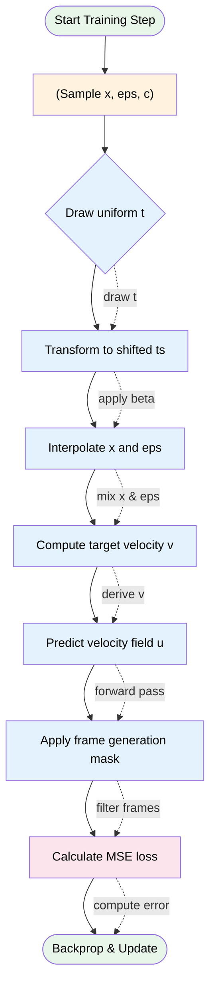
*如何读这张图：* 流程自上而下，左侧为数据准备与轨迹构造，右侧为预测与损失计算。菱形节点 `Draw uniform t` 是时间步采样门，经变换后进入插值与目标计算；圆柱节点承载原始数据与条件；圆角节点标记起止。掩码操作 `Apply frame generation mask` 是算力分配的关键分支，确保梯度仅流向待生成区域。

### 直觉比喻与玩具例子
**直觉比喻（非严格对应）：** 想象在浓雾弥漫的河道中驾驶一艘船前往已知坐标。传统扩散模型像不断猜测“终点在哪个方向”，每次只能给出模糊的方位修正；而流匹配速度预测则是直接告诉你“此刻水流的速度与方向”。只要顺着预测的瞬时速度场积分，船就会自然滑向目标，无需反复调整方差或担心路径分叉。

**具体小玩具例子（1D 标量演示）：** 设真实数据 $\mathbf{x}=10$，采样噪声 $\boldsymbol{\epsilon}=0$，当前时间步 $t=0.3$。
- 插值：$\mathbf{x}_t = (1-0.3)\times 10 + 0.3\times 0 = 7$。
- 目标速度：$\mathbf{v}_t = 0 - 10 = -10$（恒定，与 $t$ 无关）。
- 模型前向传播输入 $(\mathbf{x}_t=7, t=0.3, \mathbf{c})$，输出预测速度 $\mathbf{u} = -8.5$。
- 损失计算：$\mathcal{L} = (-8.5 - (-10))^2 = 2.25$。
梯度回传会推动 $\boldsymbol{\theta}$ 使 $\mathbf{u}$ 向 $-10$ 靠拢。若该帧属于参考帧，掩码会将此损失置零，不参与更新。

<strong>时间步变换推导与 RL 后训练边界说明</strong>

**式 4 的密度挤压机制：** 令 $t \sim \mathcal{U}(0,1)$，变换 $t_s = \frac{\beta t}{1+(\beta-1)t}$ 的导数为 $\frac{dt_s}{dt} = \frac{\beta}{(1+(\beta-1)t)^2}$。当 $\beta > 1$ 时，分母随 $t$ 增大而增大，导致 $t_s$ 在 $[0,1]$ 上的概率密度向 $t$ 较小的区域集中；反之 $\beta < 1$ 则向大 $t$ 集中。论文通过该变换替代均匀采样，使模型在特定去噪阶段获得更高频的梯度信号，属于典型的采样策略优化，而非改变损失函数本身。

**RL 后训练的定性边界：** 论文在 post-training 阶段提及使用 VideoAlign reward、组内归一化 advantage、轨迹条件概率分解与 diffusion loss regularization。需注意，该部分**未给出显式 RL 损失公式**，仅作为定性对齐手段。这意味着 RL 阶段不改变主干网络的可微分训练目标，而是通过奖励信号微调生成偏好。读者在复现或对比时，应将其视为独立于式 3 的辅助优化流程，避免将 RL 奖励误认为主训练损失的一部分。

## 实验设计与结果解读

**本节核心结论：** Cosmos 2.5 系列通过“统一条件接口+渐进式预训练”打通了多模态生成边界，VideoAlign 强化学习与 rCM 蒸馏在质量与效率间取得平衡；在 PAI-Bench 开放域基准、多控制模态翻译、真实机器人策略增强及多视角驾驶仿真中，模型均展现出对上一代架构的显著超越，且动作注入机制的消融实验明确了时间步嵌入的最优性。整体实验设计覆盖了从底层训练范式到下游物理世界落地的完整链条，但部分段落未披露具体硬件配置，且质量评估高度依赖代理指标，需在解读时保持对“指标-真实感知”映射关系的审慎。

### 统一架构与渐进式训练验证
**结论：** 统一模型架构配合渐进式预训练策略，成功实现了图像、视频与文本条件的无缝切换，且不同参数规模配置均具备完整的任务覆盖能力。
论文声称单一主干即可兼容多模态条件输入，并通过 E1 实验予以验证。系统采用 flow matching DiT 作为主干，结合 WAN2.1 VAE 与 Cosmos-Reason1 文本编码器，构建了 Text2World、Image2World、Video2World 的统一条件接口。训练阶段通过 frame-replacement 与条件掩码技术，使模型能够灵活处理不同模态的输入。渐进式预训练从图像生成起步，逐步扩展至视频与文本世界生成（详见下方实验表）。该设计避免了为单一模态重复训练专用模型的算力浪费，直觉上类似于“先学静态构图，再学动态时序，最后学语义对齐”的认知递进。实验通过核对模型配置表与训练阶段表，证明了 2B 与 14B 规模均完整覆盖了多输入模式与训练任务，未出现模态坍塌或接口冲突。

### 强化学习对齐与蒸馏加速
**结论：** VideoAlign 奖励模型驱动的 GRPO 风格强化学习显著拉升了生成视频的文本对齐度与视觉质量，而 rCM 时间步蒸馏在几乎不损失生成保真度的前提下，为推理加速提供了可行路径。
论文声称 RL 后训练能直接优化人类偏好维度，E2 实验在 PAI-Bench 上对预训练与合并版本分别施加 RL。通过生成多候选视频并计算文本对齐、运动质量与视觉质量奖励，RL 后的 Sum 奖励与人工投票胜率均呈现整体上升趋势。需明确区分的是，论文“证明”了奖励分数的提升与人工偏好方向一致，但强化学习的优化目标直接绑定于 VideoAlign 奖励模型，尽管辅以人工投票验证，奖励模型本身的偏好偏差仍可能引入“优化指标而非优化感知”的过拟合风险。在效率侧，E3 实验采用 hybrid forward-reverse joint distillation 结合连续时间一致性蒸馏与分布匹配蒸馏，使 distilled 模型在 Domain Score 与 Quality Score 上逼近 teacher 模型，部分设置中甚至出现质量方向的轻微改善。该环节未报告具体的推理延迟或吞吐量数值，加速效果需结合部署环境实测。

### 多模态控制与开放域基准评测
**结论：** 在 PAI-Bench 预测任务中，后训练模型全面超越对应预训练版本，并在 Image2World 设置中处于领先梯队；多控制模态均匀融合在保持各项控制对齐精度的同时，有效抑制了长视频生成的误差累积。
E4 实验对比了 Wan 系列基线（涵盖 1.3B 至 27B-A14B 规模）。Cosmos-Predict2.5 在 Text2World 与 Image2World 的 Domain Score（基于 VQA）与 Quality Score（基于 VBench 风格指标）上均优于预训练版本，并在部分维度逼近或超越参数量更大的外部基线。在控制模态翻译任务中（E5），Cosmos-Transfer2.5-2B 在 Blur SSIM、Edge F1、Depth si-RMSE 与 Mask mIoU 等对齐指标上优于上一代 7B 模型。针对长视频生成常见的“漂移与崩坏”痛点，实验通过自回归多块生成（每块 93 帧）绘制了误差累积曲线：在 edge/blur/depth/seg 四种控制模态下，Transfer2.5 的 Normalized Relative Dover Score 随 Chunk Index 的衰减斜率显著平缓，证明其控制信号注入机制具备更强的时序稳定性。需注意，Domain/Quality Score 属于代理指标，虽能反映宏观趋势，但对微观物理交互的刻画仍存在局限。

### 具身策略增强与多视角驾驶仿真
**结论：** 生成式视觉增强直接转化为真实机器人策略的成功率跃升，多视角驾驶生成在保持跨相机一致性的同时满足下游检测需求，且动作注入方式的选择对预测质量具有决定性影响。
在真实机器人实验中（E6），团队使用 semi-humanoid 平台（配备 Kinova Gen3 双臂与 Intel RealSense D455 相机）收集遥操作演示。利用 Cosmos-Transfer2.5-2B 为演示数据生成语义视觉变体（涵盖未见物体、光照变化、背景干扰等组合场景），训练出的 Proposed 策略在总成功次数上明显优于 Base 与标准图像增强 Baseline。多视角驾驶仿真（E7）聚焦 720p 分辨率下的世界生成，通过 world scenario map 控制，生成视频在 FVD、FID 等视觉指标上优于上一代基线，且 LATR 车道检测与 BEVFormer 三维框检测的 F1 与误差指标接近真实视频参考。在 Bridge 数据集的动作条件预测中（E8），论文明确报告了消融实验：对比 TimeEmbedding、CrossAtten 与 ChannelConcat 三种动作注入方式，TimeEmbedding 在 PSNR、SSIM 与 FVD 上均取得最优结果，证明将动作序列通过 MLP 注入时间步嵌入比直接拼接或交叉注意力更符合视频生成的时序动力学。

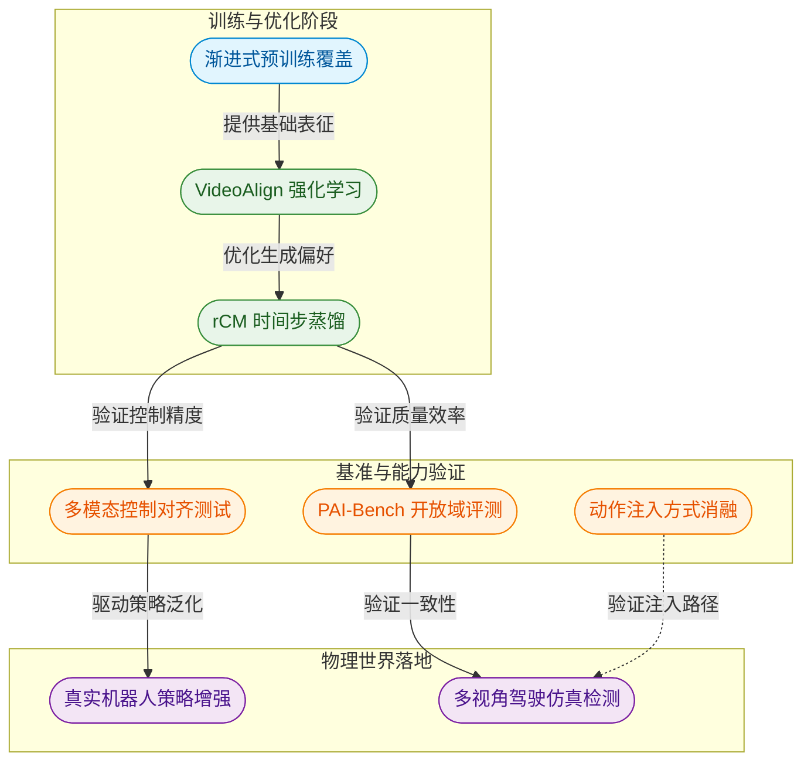
*如何读这张图：* 实验验证遵循“底层训练范式优化 → 开放域基准对齐 → 物理世界下游任务”的递进逻辑。左侧训练流确保模型具备统一表征与高效推理能力，中间验证流通过消融与多模态测试剥离冗余设计，右侧落地流将生成能力直接映射至机器人策略成功率与自动驾驶检测精度，形成闭环验证。

<strong>实验局限性与失效模式提示</strong>

1. <strong>硬件配置透明度：</strong> E2、E3、E4、E5、E7、E8 等实验段落均未单独披露具体硬件型号与算力消耗，训练效率数据仅由独立基础设施实验报告，跨实验的算力成本对比存在信息缺口。
2. <strong>代理指标与真实感知的偏差：</strong> Domain Score 依赖 VQA 模型，Quality Score 依赖 VBench 风格指标。尽管论文辅以人工投票（E2）与下游检测任务（E7）进行交叉验证，但代理指标仍可能无法完全捕捉长尾物理规律或细微运动伪影。
3. <strong>消融与负结果覆盖：</strong> 论文在 E8 明确报告了动作注入方式的消融对比（TimeEmbedding 胜出），但在 RL 奖励权重调优、蒸馏步数敏感性等方面未展示负结果或误差范围。强化学习阶段若奖励模型存在分布偏移，可能导致生成内容过度迎合特定文本模板而牺牲多样性。
4. <strong>相关性当因果的潜在风险：</strong> 机器人策略成功率的提升（E6）虽归因于生成式视觉增强，但未见对策略网络架构或超参的严格隔离控制，增强数据带来的分布平滑效应与模型容量提升可能存在混杂。

### 实验数据表(原始数值,引自论文)

#### Bridge 动作条件注入方式消融
- **Source**: Table 20
- **Caption**: "Bridge 数据集上动作条件注入方式的消融结果。"

| Method | PSNR↑ | SSIM↑ | Latent L2↓ | FVD↓ |
| --- | --- | --- | --- | --- |
| Cosmos-Predict2.5-2B/robot/action-cond with TimeEmbedding (proposed) | 24.95 | 0.85 | 0.28 | 146 |
| Cosmos-Predict2.5-2B/robot/action-cond with CrossAtten | 24.41 | 0.84 | 0.28 | 159 |
| Cosmos-Predict2.5-2B/robot/action-cond with ChannelConcat | 23.11 | 0.78 | 0.35 | 267 |

#### Bridge 动作条件视频预测
- **Source**: Table 19
- **Caption**: "Bridge 数据集上的动作条件视频预测质量评估。"

| Method | PSNR↑ | SSIM↑ | Latent L2↓ | FVD↓ |
| --- | --- | --- | --- | --- |
| Cosmos-Predict1-7B-Video2World- Sample-ActionCond | 21.14 | 0.82 | 0.32 | 190 |
| Cosmos-Predict2.5-2B/robot/action-cond | 24.95 | 0.85 | 0.28 | 146 |

#### Camera Control 对比
- **Source**: Table 16
- **Caption**: "Cosmos-Predict2.5 与 Cosmos-Predict1 在相机控制能力上的对比。"

| Model | Camera Views | Condition | Type | Resolution |
| --- | --- | --- | --- | --- |
| Cosmos-Predict1 | 1 | text + image condition | future prediction | 720p |
| Cosmos-Predict2.5 | 3 | text + video condition | video re-rendering | 720p |

#### DreamGen GR1 指令跟随结果
- **Source**: Table 18
- **Caption**: "DreamGen Bench GR1 指令跟随中对象、行为与环境泛化评估。"

| Model | Object GPT | Object Qwen | Behavior GPT | Behavior Qwen | Env GPT | Env Qwen |
| --- | --- | --- | --- | --- | --- | --- |
| Hunyuan | 38.0 | 26.0 | 38.3 | 10.6 | 27.6 | 27.6 |
| CogVideoX | 72.0 | 38.0 | 44.0 | 28.0 | 55.2 | 41.4 |
| WAN2.1 | 72.0 | 58.0 | 72.3 | 55.3 | 48.3 | 65.5 |
| Cosmos-Predict2-14B/robot/gr00tdream-gr1 | 90.0 | 62.0 | 59.6 | 61.7 | 69.0 | 65.5 |
| Cosmos-Predict2.5-14B/robot/gr00tdream-gr1 | 91.8 | 69.4 | 70.2 | 59.6 | 69.0 | 69.0 |

#### Image2World 蒸馏结果
- **Source**: Table 8
- **Caption**: "PAI-Bench-Predict-Image2World 上 teacher 与 distilled 模型结果。"

| Model | Domain Score | Quality Score | Overall Score |
| --- | --- | --- | --- |
| Cosmos-Predict2.5-2B [teacher] | 0.840 | 0.779 | 0.810 |
| Cosmos-Predict2.5-2B [distilled] | 0.842 | 0.790 | 0.816 |

#### PAI-Bench Image2World 结果
- **Source**: Table 11
- **Caption**: "PAI-Bench-Predict-Image2World 基准结果。"

| Model | Domain Score | Quality Score | Overall Score |
| --- | --- | --- | --- |
| Cosmos-Predict2.5-2B [pre-train] | 0.824 | 0.775 | 0.799 |
| Cosmos-Predict2.5-2B [post-train] | 0.840 | 0.779 | 0.810 |
| Cosmos-Predict2.5-14B [pre-train] | 0.835 | 0.777 | 0.806 |
| Cosmos-Predict2.5-14B [post-train] | 0.838 | 0.781 | 0.810 |
| Wan2.1-14B | 0.827 | 0.768 | 0.797 |
| Wan2.2-5B | 0.834 | 0.774 | 0.804 |
| Wan2.2-27B-A14B | 0.841 | 0.772 | 0.806 |

#### PAI-Bench Text2World 结果
- **Source**: Table 10
- **Caption**: "PAI-Bench-Predict-Text2World 基准结果。"

| Model | Domain Score | Quality Score | Overall Score |
| --- | --- | --- | --- |
| Cosmos-Predict2.5-2B [pre-train] | 0.782 | 0.720 | 0.751 |
| Cosmos-Predict2.5-2B | [post-train] | 0.804 | 0.732 | 0.768 |
| Cosmos-Predict2.5-14B [pre-train] | 0.791 | 0.722 | 0.757 |
| Cosmos-Predict2.5-14B [post-train] | 0.803 | 0.732 | 0.768 |
| Wan2.1-1.3B | 0.786 | 0.726 | 0.756 |
| Wan2.1-14B | 0.794 | 0.727 | 0.761 |
| Wan2.2-5B | 0.797 | 0.730 | 0.764 |
| Wan2.2-27B-A14B | 0.810 | 0.728 | 0.769 |

#### RL 前后 VideoAlign 奖励
- **Source**: Table 6
- **Caption**: "Cosmos-Predict2.5-2B 在 Text2World 与 Image2World 中 RL 前后的 VideoAlign 奖励。"

| Rewards Model | Text2World Text Alignment | Text2World Motion Quality | Text2World Visual Quality | Text2World Sum | Image2World Text Alignment | Image2World Motion Quality | Image2World Visual Quality | Image2World Sum |
| --- | --- | --- | --- | --- | --- | --- | --- | --- |
| Predict2.5-2B [pre-train] | 1.55 | -0.43 | -0.05 | 1.08 | 1.48 | -0.76 | -0.49 | 0.23 |
| Predict2.5-2B [pre-train] +RL | 1.69 | -0.19 | 0.19 | 1.69 | 1.57 | -0.70 | -0.45 | 0.42 |
| Predict2.5-2B [merged] | 1.69 | -0.46 | -0.01 | 1.23 | 1.57 | -0.82 | -0.52 | 0.24 |
| Predict2.5-2B [merged] +RL | 1.75 | -0.18 | 0.18 | 1.74 | 1.57 | -0.68 | -0.44 | 0.45 |

#### Text2World 蒸馏结果
- **Source**: Table 7
- **Caption**: "PAI-Bench-Predict-Text2World 上 teacher 与 distilled 模型结果。"

| Model | Domain Score | Quality Score | Overall Score |
| --- | --- | --- | --- |
| Cosmos-Predict2.5-2B [teacher] | 0.804 | 0.732 | 0.768 |
| Cosmos-Predict2.5-2B [distilled] | 0.797 | 0.731 | 0.764 |

#### Transfer 模型多控制配置评估
- **Source**: Table 12
- **Caption**: "不同单模态和均匀权重多模态 Transfer 配置的控制对齐与整体质量。"

| Model | Blur SSIM↑ | Edge F1↑ | Depth si-RMSE↓ | Mask mIoU↑ | Quality Score↑ |
| --- | --- | --- | --- | --- | --- |
| Cosmos-Transfer1-7B [Blur] | 0.89 | 0.20 | 0.66 | 0.73 | 6.56 |
| Cosmos-Transfer1-7B [Edge] | 0.77 | 0.38 | 0.85 | 0.73 | 6.76 |
| Cosmos-Transfer1-7B [Depth] | 0.67 | 0.15 | 0.76 | 0.71 | 6.89 |
| Cosmos-Transfer1-7B [Seg] | 0.62 | 0.11 | 1.13 | 0.70 | 6.02 |
| Cosmos-Transfer1-7B Uniform Weights | 0.82 | 0.26 | 0.70 | 0.74 | 9.24 |
| Cosmos-Transfer2.5-2B [Blur] | 0.90 | 0.26 | 0.59 | 0.75 | 9.75 |
| Cosmos-Transfer2.5-2B [Edge] | 0.79 | 0.49 | 0.76 | 0.75 | 8.73 |
| Cosmos-Transfer2.5-2B [Depth] | 0.71 | 0.19 | 0.70 | 0.73 | 8.85 |
| Cosmos-Transfer2.5-2B 3 [ | 0.68 | 0.14 | 1.02 | 0.71 | 8.81 |
| Cosmos-Transfer2.5-2B Uniform Weights | 0.87 | 0.41 | 0.67 | 0.76 | 9.31 |

#### 多相机视频生成评估
- **Source**: Table 17
- **Caption**: "机器人多相机视频生成中相机精度与视角同步评估。"

| Model | TransErr↓ | RotErr (rad) ↓ | Sampson Error (px) ↓ |
| --- | --- | --- | --- |
| Cosmos-Transfer2.5-2B/robot/singleview | 0.08 | 0.19 | 26.61 |
| Cosmos-Transfer2.5-2B/robot/multiview | 0.08 | 0.20 | 19.73 |

#### 多视角驾驶检测指标
- **Source**: Table 15
- **Caption**: "RDS-HQ-HL 多视角生成视频上的三维框与车道检测评估。"

| Model | LET-AP↑ | LET-APL↑ | LET-APH↑ | F1↑ | x-error (far) ↓ | Category Acc.↑ |
| --- | --- | --- | --- | --- | --- | --- |
| Transfer2.5-2B/auto/multiview | 0.394 | 0.254 | 0.383 | 0.637 | 0.487 | 0.904 |
| Transfer1-7B-Sample-AV | 0.243 | 0.154 | 0.236 | 0.604 | 0.524 | 0.899 |
| Real Videos (Reference) | 0.476 | 0.319 | 0.462 | 0.637 | 0.480 | 0.905 |

#### 多视角驾驶视频视觉指标
- **Source**: Table 14
- **Caption**: "RDS-HQ-HL 多视角生成视频的视觉质量与多视角一致性指标。"

| Model | FVD StyleGAN ↓ | FVD I3D↓ | FID↓ | TSE↓ | CSE↓ |
| --- | --- | --- | --- | --- | --- |
| Predict2.5-2B/auto/mv | 23.060 | 25.308 | 12.095 | 0.948 | 1.903 |
| Predict1-7B-Sample-AV | 63.685 | 69.613 | 25.341 | 0.930 | 2.631 |
| Transfer2.5-2B/auto/multiview | 24.222 | 25.692 | 20.022 | 1.246 | 2.310 |
| Transfer1-7B-Sample-AV | 56.606 | 60.660 | 22.633 | 1.017 | 1.835 |
| Real Videos (Reference) | - | - | - | 1.193 | 1.832 |

#### 模型配置
- **Source**: Table 3
- **Caption**: "Cosmos-Predict2.5 两种规模模型的结构配置。"

| Confi guration | Cosmos-Predict2.5-2B | Cosmos-Predict2.5-14B |
| --- | --- | --- |
| Number of Layers | 32 | 36 |
| Model Dimension | 2,048 | 5,120 |
| FFN Hidden Dimension | 8,192 | 20,480 |
| AdaLN-LoRA Dimension | 256 | 256 |
| Number of Attention Heads | 16 | 40 |
| Head Dimension | 128 | 128 |
| MLP Activation | GELU | GELU |
| Positional Embedding | 3D RoPE | 3D RoPE |

#### 渐进式预训练阶段
- **Source**: Table 4
- **Caption**: "渐进式预训练从图像生成扩展到视频与文本世界生成。"

| Task A | Task B | Resolution | Number of Frames | 备注 |
| --- | --- | --- | --- | --- |
| Text2Image |  | 256p (320×192) | 1 |  |
| Text2Image | | Video2World | 256p (320×192) | 1 |93 |  |
| Text2Image | Video2World | 480p(832×480) | 1 |93 |  |
| Text2Image | Video2World | 720p (1280×704) | 1|93 |  |
| Text2Image | e | Video2World | Text2World | 720p (1280×704) | 1 |93 |93 |  |

#### 真实机器人策略定量评估
- **Source**: Table 13
- **Caption**: "Base、Baseline 与使用 Cosmos-Transfer2.5-2B 增强观测训练的 Proposed 策略在十种测试场景中的成功次数。"

| Policy | Base | Mangosteen | Orange Bowl | Beige Table | Black Table | Light On | Distractors | Black Cabinet | Open Drawers | Combo | Total |
| --- | --- | --- | --- | --- | --- | --- | --- | --- | --- | --- | --- |
| Base | 1/3 | 0/3 | 0/3 | 0/3 | 0/3 | 0/3 | 0/3 | 0/3 | 0/3 | 0/3 | 1/30 |
| Baseline | 3/3 | 0/3 | 2/3 | 0/3 | 0/3 | 0/3 | 0/3 | 0/3 | 0/3 | 0/3 | 5/30 |
| Proposed | 3/3 | 3/3 | 3/3 | 1/3 | 1/3 | 2/3 | 3/3 | 2/3 | 3/3 | 3/3 | 24/30 |

#### 训练效率
- **Source**: Table 9
- **Caption**: "使用 4096 NVIDIA H100 GPUs、720p 分辨率和 93 帧时的训练效率。"

| Model | Context Parallelism Size | MFU |
| --- | --- | --- |
| Cosmos-Predict2.5-2B | 2 | 36.49% |
| Cosmos-Predict2.5-14B | 8 | 33.08% |

**效果示例(论文原图):**

*该图通过胜率对比直观展示了模型融合策略的优势，表明合并后的模型不仅吸收了各分支的特长，还在通用领域保持了强劲的综合表现，实现了“博采众长”的效果。*

*借助人类偏好投票，该图生动验证了强化学习（RL）在视频生成中的“点睛”作用，经过RL微调后的模型能显著优化画面细节与连贯性，生成更符合人类审美的视频内容。*

*该图通过多组提示词下的生成效果对比，凸显了[Cosmos-Predict2.5-14B]以更精简的参数量，依然能凭借先进的后训练技术，在视觉质量与指令遵循度上媲美甚至超越更大规模的业界标杆模型。*

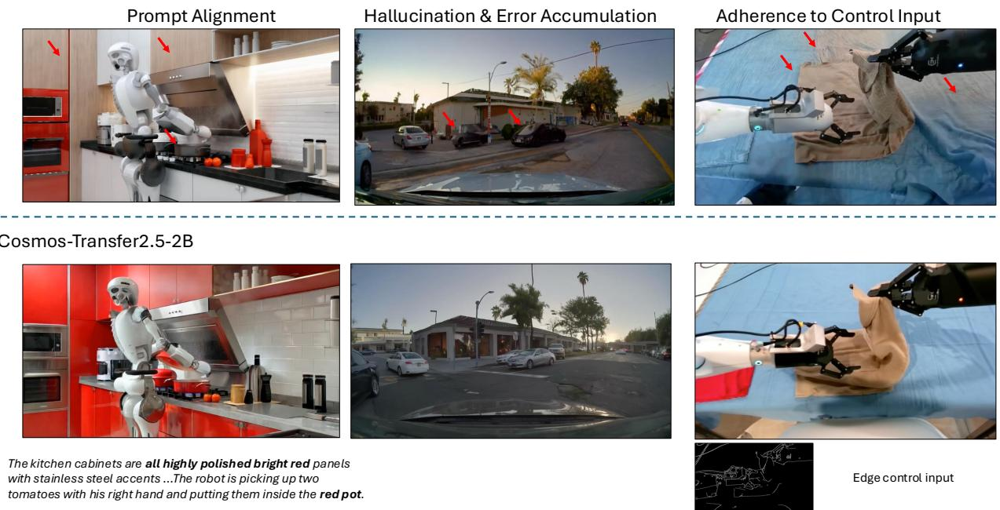

*该图通过新旧版本模型的直观对比，展现了[Cosmos-Transfer2.5-2B]在指令对齐与控制输入遵循上的显著进步，有效抑制了长视频生成中常见的幻觉与误差累积问题。*

## 相关工作与定位

本文并非从零构建，而是站在“世界模型”与“物理AI仿真”的交叉点上，完成了一次从**抽象潜在状态预测**向**像素级高保真可控生成**的范式跃迁。其核心定位是：以初代 Cosmos 架构为基座，通过引入视频对齐奖励、组内归一化强化学习与混合蒸馏技术，补齐了早期世界模型在指令遵循、生成质量与推理效率上的短板，最终锚定在机器人策略学习与自动驾驶仿真的下游需求上。

早期世界模型（如 Ha & Schmidhuber, 2018）主要依赖学习抽象的潜在状态进行预测与规划。这种路线计算高效，但直觉上（非严格对应）就像“用简笔画推演物理世界”，丢失了纹理、光照与细微动力学特征，难以直接支撑需要高保真观测的物理AI策略训练。本文的破局点在于转向像素空间的高保真视频预测，并将文本、图像、动作、相机位姿等控制信号统一接入。这一转变直接继承了 Cosmos-Predict1 与 Cosmos-Transfer1 的家族基因，但在数据过滤、统一模型架构、文本编码器与后训练控制分支设计上做了系统性重构。论文声称这些改进全面覆盖了 PAI-Bench、多视角驾驶与动作条件预测等场景，但需注意，此类架构升级往往伴随算力开销的隐性增长，文中并未详细披露训练吞吐与显存占用的消融对比。

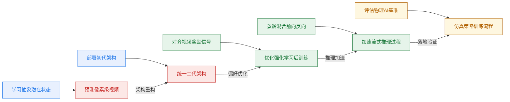
**如何读这张图**：左侧为技术基座，向右演进为本文核心架构；上方分支注入对齐与加速模块，最终收敛于下游策略仿真。颜色区分了“基座继承”、“架构跃迁”、“优化对齐”与“评测落地”四个阶段，箭头表示技术依赖与数据流向。

| 研究阶段 | 核心痛点 | 本文技术偏移 | 关键收益 |
|---|---|---|---|
| 潜在状态预测 | 视觉细节丢失 | 转向像素级生成 | 保留丰富观测特征 |
| Cosmos 初代 | 控制分支割裂 | 统一架构与过滤 | 提升多模态遵循 |
| 扩散生成基线 | 缺乏偏好优化 | VideoAlign 加 RL | 改善文本运动对齐 |
| 标准扩散推理 | 步数多延迟高 | rCM 联合蒸馏 | 保持质量下加速 |

<strong>谱系演进中的失效模式与边界声明</strong>

- **奖励信号与物理因果的错位**：论文采用 `VideoAlign` 作为 VLM 奖励模型驱动 RL 后训练，并声称能直接改善生成质量与文本对齐。但需警惕“相关性当因果”的风险：VLM 奖励高分可能仅反映视觉逼真度或文本关键词匹配，未必等价于底层物理动力学的正确性。文中未报告奖励函数在极端物理交互下的负结果或误差范围。
- **蒸馏的分布匹配代价**：`rCM` 混合蒸馏（结合连续时间一致性蒸馏与分布匹配蒸馏）旨在降低推理步数。该方法在静态或平滑运动场景中表现稳健，但在高频突变动作下，分布匹配可能引发模式坍缩，导致生成轨迹偏离真实物理先验。论文未公开蒸馏前后在长时序一致性上的定量消融。
- **基准测试的代表性偏差**：尽管引入了 `PAI-Bench`、`RDS-HQ`/`RQS-HQ` 与 `Bridge` 数据集构建统一评测框架，但“挑樱桃式”展示代表性结果的风险依然存在。例如，多视角驾驶评估可能侧重于常见路况，而忽略极端天气场景；机器人动作条件预测在 `Bridge` 上的成功，未必能无损迁移至未见过的灵巧手操作任务。读者在解读 `Domain Score` 与 `Quality Score` 时，应将其视为相对改进指标，而非绝对物理保真度证明。

## 研究探索历程

**结论前置：** 将通用视频基础模型改造为面向 Physical AI 的世界模拟器，并非简单的“堆叠算力与数据”，而是一条在表征空间选择、高分辨率训练稳定性、领域能力融合与下游任务对齐之间反复试错与转向的探索路径。团队最终放弃了隐空间预测与原生 3D 表示，确立了像素级高保真视频生成路线，并通过“统一条件建模→显式高噪声偏置→领域独立微调后合并→强化学习对齐→可控翻译与策略增强”的递进策略，打通了从开放生成到闭环仿真的关键链路。

**数据清洗与架构统一是探索的起点。** 原始互联网视频噪声大且缺乏物理世界先验，直接训练会导致模型学习无效分布。团队采用多阶段过滤与领域专用 captioning 构建更干净、细粒度的数据基座，并做出关键决策：放弃为 Text2World、Image2World 和 Video2World 分别训练独立模型，转而用单个 `Cosmos-Predict2.5` 统一覆盖。机制上，通过条件帧与 mask 在训练期动态切换任务，既避免了多模型维护的冗余，又保留了跨模态泛化潜力，为后续的统一表征打下基础。

**高分辨率训练稳定性是首个技术深水区。** 高分辨率内容具有强局部相关性，若噪声调度不足，模型难以打散相关结构并学习有效重建，极易导致帧间过渡突兀。团队引入 `flow matching` 速度预测目标，并采用 `shifted logit-normal` timestep 分布，随分辨率提升增加 $\beta$ 以强化高噪声区域采样。但探索中撞见明确死胡同：即便做了 timestep shift，高噪声样本依然不足，生成视频仍出现不自然的过渡伪影。教训是必须在训练 scheduler 中**显式抽取最高噪声区域样本**，强制模型学习极端扰动下的重建，时间一致性才得以实质性修复。

**领域专精与模型合并暴露了联合训练的权衡陷阱。** 为适配 robotics、autonomous driving 等垂直场景，团队尝试领域 SFT。直接联合训练暴露出混合比例难以设计的痛点，容易稀释特定领域的特征表达。路径随之转向：先为各领域独立微调，再通过模型合并统一能力。在 `model soup`、`TIES`、`DARE-Linear` 与 `DARE-TIES` 的网格搜索与人工质量评估中，最终选定 `model soup` 作为后训练基座，因其在保留通用域表现的同时，最平滑地整合了多领域优势。随后引入 `VideoAlign` 强化学习后训练，在 reward score 与人工投票中均验证了文本对齐、运动质量与视觉质量的同步提升。

**下游需求倒逼两次关键方向转变（Pivot）。** 第一次从基础预测转向可控 world translation，构建 `Cosmos-Transfer2.5`（control-net 风格），支持 edge、blur、segmentation 和 depth 等空间控制输入，显著缓解了长视频误差累积并提升控制遵循度。第二次从“生成视觉视频”转向“为机器人策略提供数据增强”。传统图像增强（亮度、对比度、色相等）仅能调整低级统计量，无法执行对象颜色、环境外观或光照的语义级编辑，在挑战性场景中迅速失效。团队转而利用可控世界模型生成结构化语义变化，并通过 action-conditioned 消融实验验证：`Cosmos-Predict2.5-2B/robot/action-cond` 相比 `Cosmos-Predict1` 基线方向性更优，且在动作注入方式上，`TimeEmbedding` 的表现明确优于 `CrossAtten` 与 `ChannelConcat`。

```mermaid
flowchart TD
  classDef start fill:#e3f2fd,color:#0d47a1,stroke:#1976d2
  classDef decision fill:#fff8e1,color:#f57f17,stroke:#fbc02d
  classDef deadend fill:#ffebee,color:#b71c1c,stroke:#e53935
  classDef pivot fill:#e8f5e9,color:#1b5e20,stroke:#43a047

  subgraph 数据与架构统一
    start_node(探索视频基础模型) --> q1_select_rep{选择表征空间}
    q1_select_rep -->|放弃隐空间| d1_pixel_space{采用像素空间}
    d1_pixel_space --> q2_clean_unify{清洗与统一任务}
    q2_clean_unify -->|单模型覆盖| d2_unified_cond{统一条件建模}
  end

  subgraph 训练稳定与合并
    d2_unified_cond --> q3_high_res{稳定高分辨率训练}
    q3_high_res -->|flow matching| d3_noise_bias{引入高噪声偏置}
    d3_noise_bias --> x1_transition_artifact["过渡伪影死胡同"]
    x1_transition_artifact -->|显式采样| fix_noise_sampling["修复时间一致性"]
    fix_noise_sampling --> d4_domain_merge{独立微调后合并}
  end

  subgraph 控制与机器人增强
    d4_domain_merge --> p1_control_pivot["转向可控翻译"]
    p1_control_pivot --> p2_robot_augment["转向策略增强"]
    p2_robot_augment --> x3_std_aug_fail["标准增强失效"]
    x3_std_aug_fail -->|语义级生成| e5_action_cond["验证动作注入"]
  end

  class start_node start
  class q1_select_rep,q2_clean_unify,q3_high_res,d1_pixel_space,d2_unified_cond,d3_noise_bias,d4_domain_merge decision
  class x1_transition_artifact,x3_std_aug_fail deadend
  class p1_control_pivot,p2_robot_augment pivot
```
*如何读这张图：* 流程图按真实研发阶段划分为三个子图，自上而下展示决策树走向。菱形节点代表关键架构或训练策略选择，矩形节点标记探索中暴露的失效模式与转向动作，箭头旁的短语标注了放弃旧路径或引入新机制的直接动因。整体呈现“基础统一→稳定性攻坚→能力融合→下游对齐”的单向递进逻辑。

<strong>模型合并网格搜索与动作注入消融细节</strong>

在领域能力融合阶段，团队对比了 `model soup`、`TIES`、`DARE-Linear` 与 `DARE-TIES` 四种合并策略。网格搜索与人工评估表明，稀疏化或符号对齐方法（如 TIES/DARE 系列）在跨域权重冲突时易引发特征坍塌，而 `model soup` 通过简单算术平均保留了各微调模型的完整参数分布，在通用域与垂直域之间取得了更优的帕累托前沿。在机器人策略数据增强环节，针对动作信号注入方式的消融实验显示：`TimeEmbedding` 将动作序列直接映射至时间步条件，避免了 `CrossAtten` 的注意力稀释与 `ChannelConcat` 的通道维度膨胀，在长序列生成中维持了更稳定的动力学一致性。

## 工程与复现要点

**结论**: 复现该系列模型的核心门槛并非单一网络结构，而是一套“严格数据过滤→渐进式分辨率/任务推进→动态噪声调度修正”的完整训练 Recipe，以及高度依赖 FSDP2 与上下文并行的分布式工程栈。官方已开源核心代码与固定 Commit，但部分训练调度与模型合并逻辑未完全暴露，复现需以官方配置为锚点自行对齐工程细节。

### 模型规模与关键结构
**结论**: 架构从 EDM 转向 Flow Matching 并彻底移除绝对位置编码，以 2B 与 14B 双规模覆盖不同算力场景；通过均匀分布控制块与时间戳嵌入新模态，实现 Text2World、Image2World 与 Video2World 的单模型统一。

主干网络复用 DiT 风格的 latent diffusion 结构，但将去噪目标改为基于 flow matching 的 velocity prediction。作者指出该参数化方式目标更直接，有助于平滑优化轨迹并提升样本质量。为突破分辨率与序列长度泛化瓶颈，模型移除了 absolute positional embeddings，仅保留 3D RoPE 作为 relative positional embeddings。视觉压缩采用 WAN2.1 VAE（时空压缩率 4×8×8，叠加 1×2×2 patchification），将 93 帧像素视频压缩为 24 帧 latent，对应 16 fps 下约 5.8 秒的生成窗口。文本引导方面，用 Cosmos-Reason1 替换前代 T5 encoder，拼接多 block 的 token activations 并投影至 1024 维空间，通过 cross-attention 直接注入去噪过程。

| 配置项 | Cosmos-Predict2.5-2B | Cosmos-Predict2.5-14B |
|---|---:|---:|
| 层数 | 32 | 36 |
| 模型维度 | 2,048 | 5,120 |
| FFN 隐藏维度 | 8,192 | 20,480 |
| 注意力头数 | 16 | 40 |
| 头维度 | 128 | 128 |
| AdaLN-LoRA 维度 | 256 | 256 |
| 激活函数 | GELU | GELU |

在 Cosmos-Transfer2.5-2B 中，控制分支的布局从 v1 的“主分支开头顺序插入”改为“每 7 个主分支 blocks 后均匀插入 1 个 control block”，使条件信息更渐进地融入网络。针对预训练中不存在的 action 模态，新增 action embedder MLP 将其映射为 tensor 并直接加到 DiT 的 timestamp embeddings 中；消融实验表明该 TimeEmbedding 注入方式优于 cross-attention 与 channel concatenation。

### 训练关键超参与作用
**结论**: 训练稳定性高度依赖“多阶段数据过滤→分辨率/任务渐进推进→动态 Timestep Shift 与高噪声重采样”的闭环策略；后训练阶段通过 Model Soup 合并专域 SFT 模型，并以 GRPO 式 RL 对齐人类偏好。

数据侧，从超 6 billion curated clips 中经严格多阶段过滤仅保留约 200 million 可训练片段（通过率约 4%），片段长度限定在 5 至 60 秒。该策略旨在剔除运动伪影、失真、视觉噪声与 overlay text，直接决定后续生成质量。训练采用渐进式路线：从 Text2Image 256p 起步，逐步引入 Image2World/Video2World 并提升至 480p 与 720p，最后加入 Text2World。论文强调仅在模型收敛且视觉质量进入平台期后才推进下一阶段，以平衡效率与稳定性。

条件帧采样在 Image2World/Video2World 阶段随机抽取 1 或 5 帧，最终阶段以 0.5/0.25/0.25 概率采样 0/1/2 帧，通过 mask 仅在指定帧施加去噪损失，从而统一多任务接口。针对高分辨率内容强相关性导致的帧间突兀问题，训练引入两项关键调度修正：
1. **Progressive Timestep Shift**: 训练 timesteps 服从 logit-normal 分布，并随分辨率将 shift 参数 β 从 256p 的 1 逐步增至 720p 的 5。向高噪声偏置可迫使模型在相关性被破坏时重建结构。
2. **高噪声重采样**: 显式将 5% 的训练样本从噪声分布最高的 2% 区间抽取。该策略直接针对已观察到的过渡伪影失败模式，显著改善时间一致性。

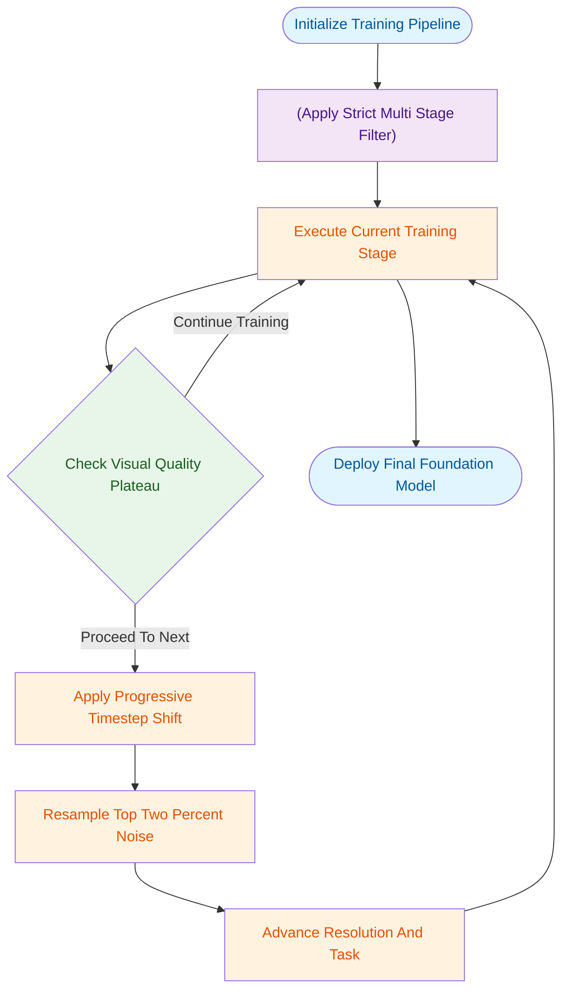
**如何读这张图**: 该图展示了渐进式训练的核心判定循环。模型在当前分辨率/任务下训练直至视觉质量进入平台期（菱形判定门），若未达标则继续迭代；若达标则触发噪声调度修正（Shift + 重采样），随后推进至更高分辨率或新任务，直至完成全阶段训练。

<strong>核心优化器、学习率与后训练配置</strong>

- **优化器**: AdamW (β1=0.9, β2=0.999)，weight decay 0.001。论文未报告替代优化器对比或敏感性扫描。
- **学习率调度**: 2B 模型使用 3×10⁻⁵，14B 模型使用 1.3×10⁻⁵；采用线性衰减调度器，含 2000 iterations 初始 warmup。
- **领域 SFT**: 每个领域（如 object permanence、driving 等）独立微调 30k iterations，batch size 256，复用预训练最终阶段超参。
- **模型合并**: 对比 model soup、TIES、DARE-Linear、DARE-TIES，生成超 20 个候选。作者指出简单网格搜索优于基于单模型 win rate 的启发式选择，最终选定 model soup variant 以缓解通用域退化。
- **RL Post-training**: 基于 VideoAlign reward model，每个条件生成 8 个 outputs（20 diffusion steps），训练 256 steps，batch size 32。采用 GRPO 式组内归一化优势，并引入 diffusion loss 正则化以缓解 reward hacking。论文仅报告了 2B 模型的 RL 设置。

### 运行环境与依赖栈
**结论**: 复现需依托 FSDP2 与 Ulysses 上下文并行的分布式训练框架，并在 4096 张 NVIDIA H100 集群上配合特定并行策略，才能支撑 720p 长序列的高吞吐训练。

训练框架以 FSDP2 为核心，深度集成 TorchTitan 优化、Ulysses-style context parallelism、torch Selective Activation Checkpointing 以及支持 JVP 的 fused flash attention。硬件层面，720p/93 frames 训练时，2B 模型 context parallelism size 设为 2，14B 模型设为 8。依赖栈涵盖视觉/文本/奖励模型（WAN2.1 VAE、Cosmos-Reason1、Qwen2.5-VL-7B、InternVideo2、VideoAlign）、分布式与存储组件（FSDP2、TorchTitan、DeepSpeed、Redis、Delta Lake、Milvus）、以及多模态处理工具（NATTEN sparse attention、Video Depth Anything、SAMv2、Grounding DINO 等）。需注意，论文未公开 Python 版本与随机种子设置，复现时需自行对齐环境基线。

### 开源代码与复现入口
**结论**: 官方已开放核心仓库与固定 Commit，但部分训练调度、合并策略与条件注入逻辑的代码未完全映射至公开文件，复现应以 README 为锚点，结合论文配置表自行补齐工程管线。

代码仓库位于 `https://github.com/nvidia-cosmos/cosmos-predict2.5`，锁定 Commit 为 `a2c298b0a3df3778b973fe65e9e58877b292d8a7`。仓库 README 明确列出了统一生成模式、Cosmos-Reason1 替换、Control-Net 风格框架等核心创新点。然而，对照源码索引表，移除绝对位置编码、frame-replacement 策略、shifted logit-normal 分布、model merging 逻辑、RL rollout 组优势计算等关键工程实现未在仓库中直接定位。这意味着复现者需将论文 Sec 3/4 的算法描述与公开代码交叉验证，自行实现数据过滤管线、渐进式训练调度器与高噪声重采样逻辑。建议优先跑通 2B 规模的预训练基线，再逐步叠加 SFT 与 RL 后训练模块，以降低分布式调试成本。

## 局限与适用边界

**核心结论：** 该框架在机器人控制、自动驾驶与相机运镜等垂直场景中已验证其有效性，但其技术栈高度依赖未完全公开的算法细节与大规模专有基础设施；长视频生成仍受限于分块自回归架构的误差累积，动作条件化设计仅覆盖三种基础范式，跨具身形态与传感器布局的泛化能力需在目标场景中重新标定。

**算法透明度与复现成本构成实际落地门槛。** 论文并未给出强化学习后训练（RL post-training）的完整显式损失公式，仅定性描述了 `VideoAlign reward`、组内 advantage、轨迹概率分解与扩散损失正则化的协同机制。这意味着复现者无法直接通过公式推导梯度流向，必须依赖外部 reward models 与专有数据管线进行对齐。此外，`Cosmos-Transfer2.5` 的控制分支（control branch）实现细节深度耦合前代 `Cosmos-Transfer1`，本文仅披露了控制模块插入方式的关键变更，未提供底层架构的完整蓝图。大规模 GPU 集群与定制化 reward service 的依赖，使得该方案的实验复现成本显著高于开源基线。

<strong>基础设施与数据管线依赖拆解</strong>

复现该训练范式需满足三项硬性前提：① 能够承载高吞吐视频生成的 GPU 算力池；② 稳定运行的外部 reward 服务以提供 `VideoAlign reward` 信号；③ 经过严格清洗与对齐的专有视频-动作配对数据集。论文未报告消融实验中的负结果或误差范围，也未公开 reward 服务的具体延迟与吞吐量指标，实际部署时需预留额外的工程缓冲。

**动作条件化设计尚未穷尽，当前对比仅覆盖三种基础范式。** 在将物理动作注入生成模型时，论文仅横向比较了 `TimeEmbedding`、`CrossAtten` 与 `ChannelConcat` 三种注入机制。这种对比虽能验证基础可行性，但并未涵盖更复杂的时空解耦注入或隐式动力学对齐策略。若目标场景要求极高精度的动作-像素映射（如微操机器人或高频机械臂），当前方案可能因注入通道容量不足而产生控制滞后或轨迹漂移。

| 注入机制 | 融合位置 | 适用直觉 | 已知局限 |
|---|---|---|---|
| `TimeEmbedding` | 时间步编码 | 全局节奏控制 | 细粒度对齐弱 |
| `CrossAtten` | 交叉注意力 | 语义动作绑定 | 计算开销较高 |
| `ChannelConcat` | 特征通道拼接 | 低延迟推理 | 易受维度干扰 |

**分块自回归架构无法彻底消除长程误差累积。** 尽管论文重点评估了长视频生成过程中的误差传播行为，但明确承认当前仍采用 chunked autoregressive 方式推进。该机制在每一块（chunk）生成结束后将上一块末尾帧作为下一块的初始条件，导致微小的像素级偏差或动力学不一致会随时间步呈非线性放大。对于需要分钟级连贯性的任务（如长镜头电影生成或连续巡检），该架构仍需依赖外部纠错模块或周期性重规划，而非内生解决。

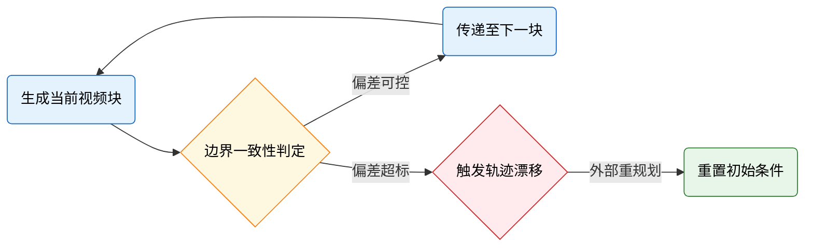
*如何读图：* 该流程暴露了分块自回归的核心权衡——系统以“块”为单位推进生成，边界一致性判定是控制误差累积的关键门控。一旦偏差突破阈值，模型无法内生修正，必须依赖外部干预重置上下文，这决定了其在超长序列任务中的适用上限。

**跨具身形态与传感器布局的泛化需重新验证，风格控制留作未来工作。** 文中实验高度聚焦于特定机器人平台、车载传感器阵列与预设相机轨迹，未提供跨域迁移的定量基准。若将模型直接迁移至异构传感器布局（如多光谱相机阵列或柔性触觉反馈）或全新物理环境，其动力学先验可能失效。此外，`Cosmos-Reason1` 的视觉编码器虽在架构上预留了额外视觉条件输入接口以支持风格控制（style control），但论文明确将其划归为 future exploration，当前版本不具备开箱即用的风格迁移能力。

## 趋势定位与展望

**结论：** Cosmos-Predict2.5 标志着视频世界模型从“通用视觉生成”正式迈入“可控物理仿真平台”阶段。它通过统一多模态条件接口、引入奖励驱动的后训练与控制分支，将高保真视频生成转化为面向 Physical AI 的策略验证与合成数据引擎，为下一代具身智能提供了可微调、可部署的基础设施。

回顾技术路线，早期世界模型（如 Ha & Schmidhuber, 2018）侧重于学习抽象潜在状态以辅助规划，而通用视频生成模型虽能产出逼真画面，却往往在细粒度控制与物理一致性上“偏科”。本文的定位在于填补这一断层：不再追求单纯的视觉奇观，而是将世界模拟重构为带多模态条件的速度场学习（`flow matching`）。通过 `frame-replacement` 策略与 `Cosmos-Reason1` 文本编码器，模型将 Text2World、Image2World 与 Video2World 揉进单一架构，直接解决了以往任务分散导致的条件注入碎片化问题。在 PAI-Bench 评测中，Cosmos-Predict2.5-2B 在 Image2World 设定下取得 `0.81` 的综合得分，验证了统一接口在保持生成质量的同时，显著提升了指令对齐与运动连贯性。

为直观呈现该工作在技术谱系中的位置与演进逻辑，下图梳理了从“视觉生成”到“物理仿真平台”的路径迁移：

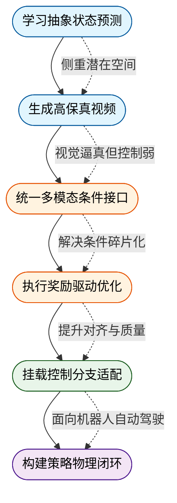
*如何读这张图：* 左侧蓝色节点代表以视觉保真度为核心的早期阶段；中间橙色节点是本文的核心贡献区，通过统一接口与 RL 后训练打通“生成-对齐”链路；右侧绿色节点指向已落地的 Physical AI 专用分支（如 `Cosmos-Transfer2.5`）；紫色节点则暗示下一步必须跨越的“策略闭环与显式物理约束”门槛。箭头标注了各阶段演进的核心驱动力与遗留痛点。

该工作的真正意义在于“平台化”。论文不仅开放权重与代码，更通过 `VideoAlign` 奖励模型结合 GRPO 风格的组内优势归一化，让模型能在 rollout 阶段自我优化文本对齐、运动质量与视觉质量。配合 `rCM` 混合蒸馏技术，2B 参数规模的模型得以在更少推理步数下逼近教师模型表现，大幅降低了部署门槛。直觉上（非严格对应），这就像把一台“只会画画的相机”升级成了“能听懂指令、能自我纠错、还能挂载不同镜头的虚拟摄影棚”。

然而，必须清醒认识到当前路线的边界。论文报告的 RL 收益主要依赖 `VideoAlign` 奖励与人工偏好投票，这属于相关性优化，尚未严格证明生成视频在复杂动力学交互中满足因果物理定律。此外，高分辨率视频在强噪声扰动下仍易出现时间过渡伪影，尽管 `shifted logit-normal` 分布采样缓解了该问题，但极端长程仿真的误差累积机制仍需更系统的消融验证。未来方向将自然指向三点：一是将奖励信号从“视觉/文本对齐”向“物理一致性/策略成功率”迁移；二是探索显式物理先验（如接触力学、刚体约束）与隐式视频生成的融合；三是依托开放生态，推动世界模型与 VLA 架构的端到端联合训练，最终实现从“仿真观测生成”到“策略直接优化”的闭环。

<strong>技术边界与消融细节展开</strong>

- **奖励模型的代理性质**：`VideoAlign` 作为 VLM 奖励，其打分与真实物理规律的一致性存在上限。RL 优化可能陷入“奖励黑客”（Reward Hacking），即生成视觉上符合提示但物理逻辑断裂的样本。论文未报告针对物理因果性的独立负结果测试。
- **蒸馏的保真度权衡**：`rCM` 蒸馏在减少推理步数的同时，依赖教师模型的分布匹配。在极端动作条件或罕见交互场景下，学生模型可能出现高频细节丢失，需结合具体下游任务的误差容忍度进行评估。
- **统一架构的容量压力**：将 Text/Image/Video2World 统一至单一 `flow matching` 模型，虽简化了部署，但不同模态的条件注入可能竞争模型容量。论文通过 `Cosmos-Reason1` 增强文本表征，但未公开跨模态干扰的定量消融数据。

