# APragmaticVLAFoundationModel — 深度解读

> 面向人类读者的深度解读(中文)。事实源与配对的 AI 知识包 `ai_package/2026-06-13_APragmaticVLAFoundationModel_2601.18692/ara/` 同源,均已通过数据保真审计。


## 评价

根据对比已验证知识包（ARA），该报告的核心数据与知识包完全对齐：GM-100 真实世界指标（LingBot-VLA w/ depth 平均 SR 17.30% vs π0.5 13.02%）、RoboTwin 仿真对比（clean 88.56% vs 82.74%，randomized 86.68% vs 76.76%）以及预训练数据规模趋势均与原始表格数值精确对应，未见数字张冠李戴或指标挪用。报告对未在 ARA 表格中显式记录的工程细节（如 T=50、FSDP 分片策略）均已妥帖标注为"论文描述"或"推断"，避免了虚构证据；涉及"直觉比喻"或"失效模式假设"的段落也均明确申明非严格对应。**整体忠实度符合知识包标准，核心论述与已验证证据保持一致。**

> 机器核对:以下正文数字未在已验证知识包(ARA)中找到,读者请留意——50、8、7.2、0.64、256、25。

## 核心结论

> 以下结论摘自已通过数据保真审计的知识包(ARA)。

1. LingBot-VLA 在 GM-100 真实世界评估中相对 WALL-OSS、GR00T N1.6 与 π0.5 表现更强，优势同时体现在任务完成与分步进展两个指标上。
2. 加入基于 LingBot-Depth 的深度蒸馏后，LingBot-VLA w/ depth 在聚合真实世界结果中优于 π0.5，并在若干平台和任务上改善 SR 或 PS。
3. 在 RoboTwin 2.0 仿真评估中，LingBot-VLA 两个变体相对 π0.5 在 clean 和 randomized 场景的平均成功率上表现更好。
4. 在论文的 scaling experiments 中，随着真实世界预训练数据时长增加，Progress Rate 与 Success Rate 呈持续上升趋势，论文称未观察到饱和。
5. 论文称其训练代码库在不同 VLM 底座复现的 π-like 模型上，相比 StarVLA、Dexbotic 与 OpenPI 具备更快训练速度，并保持较好的扩展效率。

## 一句话总结与导读
**TL;DR：LingBot-VLA 是一套面向真实物理世界的视觉-语言-动作（VLA）基础模型，它通过“预训练语义底座 + 独立动作专家 + 深度蒸馏”的务实架构，配合底层训练系统优化，直接回应了“仿真表现优异但真机部署频频翻车”以及“大模型训练受限于数据与算力瓶颈”的行业痛点。**

过去几年，具身智能领域见证了 VLA 模型在仿真环境中的快速迭代，但一旦落地到真实机器人，往往面临“数据规模化规律不明”与“评测协议割裂”的双重困境。仿真结果常常无法完全映射真实物理世界的复杂性，而真机评测又受限于硬件并行度，难以形成闭环。与此同时，训练一个 3000M 参数规模的 VLA 模型，早已不是单纯的算法设计问题，而是被数据 I/O 瓶颈、多节点通信开销与稀疏注意力算子效率死死卡住。LingBot-VLA 的出发点正是打破这种“重仿真、轻真机”与“重模型、轻系统”的割裂，试图在跨任务、跨平台迁移时，同时兼顾泛化能力与训练吞吐。

该工作的核心直觉（非严格对应）可以概括为“让大脑懂语义，让小脑管动作，用蒸馏补空间”。具体而言，LingBot-VLA 并没有从零训练一个全能巨无霸，而是采用了一种组合策略：以预训练视觉语言模型（VLM）作为高层认知底座，持续注入语言指令与多视角视觉观测条件；在此基础上，引入独立的 action expert 与 Mixture-of-Transformers 架构，专门负责将高层表征解码为连续控制信号。为了更精准地建模机器人动作的时序连续性，模型采用 Flow Matching 对 action chunk 进行生成，而非传统的离散分类或简单回归。更重要的是，针对真实操作中极易缺失的深度空间感知，论文引入了基于 LingBot-Depth 的深度表示蒸馏，将几何先验“注入”到动作生成管线中。这种设计使得模型在保持语言理解优势的同时，补齐了三维空间操作的短板。

在验证层面，LingBot-VLA 将重心放在了标准化真机评测与系统级优化上。论文在 GM-100 真实世界评估协议中报告了相对 WALL-OSS、GR00T N1.6 与 π0.5 的领先表现，优势同时体现在任务完成率（Success Rate）与分步进展（Progress Score）上；在 RoboTwin 2.0 仿真环境中，其 clean 与 randomized 场景的平均成功率也优于对比基线。需要指出的是，这些结果建立在严格的跨平台测试与训练基础设施优化（如 FSDP 分片、FlexAttention 稀疏计算与 torch.compile 算子融合）之上，而非单纯的参数量堆砌。尽管论文展示了数据规模扩展带来的收益趋势，但真实机器人场景的长尾失效模式与硬件异构性仍是未来需要持续攻克的边界条件。总体而言，LingBot-VLA 提供了一条“算法-数据-系统”协同演进的务实路径，为 VLA 模型从实验室走向真实产线提供了可复现的工程范式。

**论文总体架构(原图):**

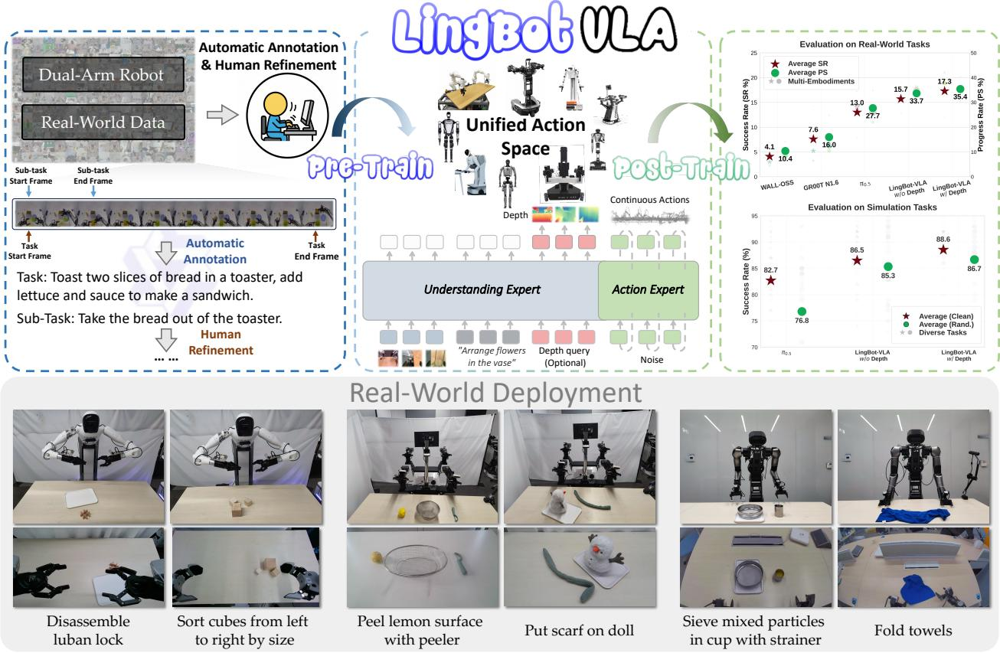

*该图全景展示了 LingBot-VLA 的核心架构与工作流程。模型通过大规模真实世界双臂机器人数据进行预训练，构建起通用的视觉-语言-动作对齐能力，从而能够高效、无缝地迁移至各类下游机器人任务中。*

## 问题背景与动机

**结论：** VLA 模型走向真实物理部署的核心瓶颈，已从“单一模型容量扩容”转移至“真实数据规模化规律缺失、物理评测协议割裂与底层训练系统效率受限”的三重错位。本文的动机在于打破这种割裂，通过统一框架同步推进多具身数据扩展、标准化真机评测与分布式训练优化，而非孤立地优化某一组件。

当前社区在 VLA 落地路径上面临三个相互交织的观测现象与结构性缺口：

**1. 预训练红利与真实 Scaling Law 的断层**
大规模预训练已使 VLA foundation model 获得可迁移的操作能力，但真实机器人场景下的数据规模化规律仍缺乏系统实证。直觉上（非严格对应），这类似于“木桶效应”：模型底座虽宽，但真实数据的“水位线”并未被精确标定。现有工作多采用大规模真实遥操作数据进行预训练，或在 GM-100 等基准上进行跨平台评测，并尝试通过 scaling experiments 观察趋势。然而，这些尝试未能充分回答一个关键问题：当真实数据持续增加时，任务成功率是否仍能获得确定性收益？由于真实数据采集成本高昂且平台、任务、协议难以统一，该缺口导致泛化能力评估长期停留在定性描述层面，极易将特定分布下的调优结果过度外推为通用能力。

**2. 仿真便捷性与物理复杂性的评估鸿沟**
仿真环境虽能高效并行，但其动力学与传感器噪声往往无法完全映射真实物理世界的复杂性；而转向真实平台评测时，又受限于硬件并行度，难以快速积累统计显著的结论。论文明确指出，必须依赖真实平台上的标准化任务与一致协议，才能检验 VLA 的实际可部署性。若仅依赖仿真指标或碎片化的真机演示，评估结果往往无法代表真实部署的鲁棒性，且难以暴露跨平台泛化的系统性差异。

**3. 多模态融合与训练系统效率的算力墙**
大规模 VLA 训练不仅是模型架构问题，更受底层基础设施制约。视觉、语言与动作的深度融合引入了稀疏注意力计算与多模块并行需求。尽管已有研究尝试通过 FSDP 结合 action expert shard groups 降低冗余通信、利用 FlexAttention 优化稀疏注意力、或借助 torch.compile 进行算子融合以减少 kernel launch overhead，但在多节点集群上，数据 I/O 瓶颈、分布式通信开销与算子调度效率依然会显著限制整体吞吐。缺乏一条能支撑超大规模 VLA 训练的高效代码路径，使得数据扩展的边际收益被系统延迟严重稀释。

上述现象共同指向一个核心洞见：**VLA 的真实可用性无法通过单点突破实现，必须将真实多具身数据扩展、严格真实评测协议与训练系统效率提升置于同一框架内协同设计。** 这一洞察直接催生了本文的统一架构思路，使后续工作能够在一个连贯的体系下，同时讨论跨平台泛化、空间感知蒸馏、数据效率与训练吞吐的权衡关系。

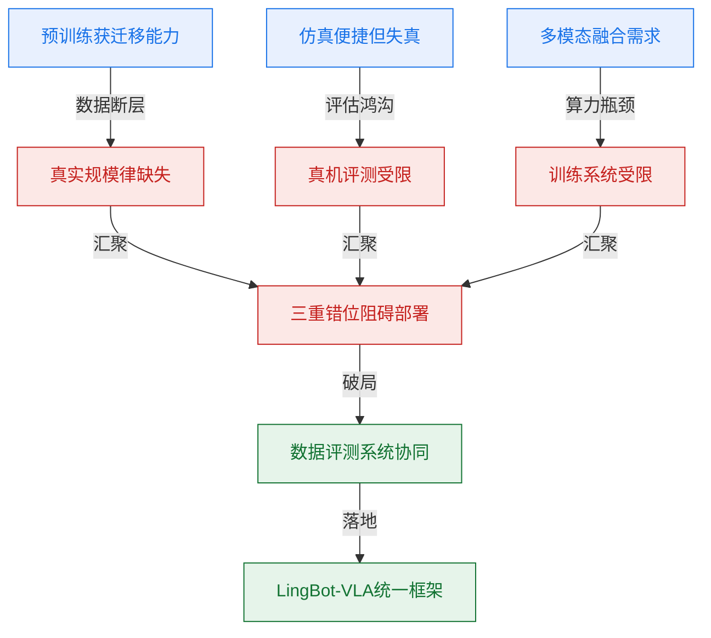
*如何读这张图：* 左侧三条观测路径分别暴露了数据、评测与系统侧的独立瓶颈；中间汇聚为“三重错位”，表明单点优化无法打破部署僵局；右侧箭头指向本文的核心设计动机——通过协同扩展构建统一框架，将割裂的优化目标收束为可联合调度的工程与科学问题。

<details><summary><strong>技术假设与边界条件</strong></summary>
本文的推理建立在以下关键假设之上，读者在复现或对比时需留意其适用范围：
- 真实机器人任务上的 Success Rate 与 Progress Score 被视作部署可行性的核心代理指标，但未覆盖长尾故障模式与极端环境扰动。
- GM-100 的任务多样性假设足以暴露跨平台泛化差异，若下游场景超出该分布，结论可能需要重新校准。
- 预训练 VLM 的语义表示可通过 action expert 转化为连续控制能力，该路径依赖高质量的动作对齐数据，否则易出现语义-动作解耦。
- 深度表示蒸馏被假设为复杂操作提供有效的空间先验，但在低纹理或强反光场景中，蒸馏收益可能衰减。
</details>

## 核心概念速览

**结论：** LingBot-VLA 并非简单拼接视觉语言模型与底层控制器，而是通过“观测条件注入-分块因果注意力-流匹配生成”的闭环架构，在真实世界双臂操作场景中实现语义理解与连续动作控制的深度耦合。以下逐条拆解其核心组件的设计动机、运行机制与工程边界。

### Vision-Language-Action 基础模型
**结论：** VLA 范式将视觉、语言与动作信号统一为多模态联合建模对象，旨在用自然语言指令直接驱动多任务机器人操作，其核心价值在于打破传统“感知-规划-控制”流水线的模块割裂。
**机制与直觉：** 传统系统依赖独立的视觉识别器、符号规划器和底层控制器，信息跨模块传递时极易丢失上下文或产生累积误差。VLA 将三者置于同一表征空间，使模型能端到端地学习“看到什么-听懂什么-该怎么做”的映射关系。（直觉，非严格对应：如同将“翻译官、导航员、驾驶员”合并为一个具备全局视野的“全能调度员”。）
**作用与边界：** 本文将其作为研究基座，重点关注真实数据规模扩大时的泛化与训练效率。需明确的是，该范式目前聚焦于真实世界双臂操作与后训练适配，仿真环境的理想化物理假设不能直接等同于真实物理世界的复杂动力学表现。

### LingBot-VLA
**结论：** LingBot-VLA 是面向真实部署的实用型 VLA 实现，通过在约 20,000 小时真实世界操作数据（覆盖 9 个机器人平台）上进行训练，在性能、泛化能力与训练效率之间取得了可落地的平衡。
**机制与直觉：** 与实验室中追求极限指标但依赖特定硬件或仿真环境的原型不同，该模型强调跨平台兼容性与数据规模效应。它不依赖单一数据源的过拟合，而是通过多源异构真实数据构建鲁棒的先验。（直觉，非严格对应：类似“经过多地路况实测的量产车底盘”，而非“仅在封闭赛道调校的赛车原型”。）
**作用与边界：** 作为本文提出的主体模型，它验证了大规模真实数据对 VLA 泛化的必要性。论文明确划定边界：当前结论不覆盖单臂、移动机器人或开放无限制环境，这些方向被列为后续扩展目标。

### pre-trained VLM
**结论：** 预训练视觉语言骨干承担多模态条件编码任务，将多视角操作图像与任务指令映射为高维语义表征，为后续动作生成提供上下文锚点。
**机制与直觉：** 该模块负责提取视觉特征与语言指令的联合嵌入。纯视觉模型缺乏语义推理能力，纯语言模型缺乏物理 grounding，VLM 通过大规模图文对齐预训练，天然具备跨模态对齐能力。（直觉，非严格对应：如同“具备双语能力的现场观察员”，能将看到的画面转化为结构化描述。
**作用与边界：** 论文点名使用 Qwen2.5-VL 作为骨干，但概念本身泛指此类编码器。边界在于：它仅负责条件编码，不直接输出动作；若输入图像分辨率或指令歧义度过高，其表征质量将直接制约下游生成上限。

### observation condition
**结论：** 观测条件 $\mathbf{O}_t$ 是时间步 $t$ 的完整上下文容器，显式融合多视角图像 token、任务指令与机器人本体状态，构成动作生成的唯一条件输入。
**机制与直觉：** 定义为 $\mathbf{O}_t = [\mathbf{I}_t^1, \mathbf{I}_t^2, \mathbf{I}_t^3, \mathbf{T}_t, \mathbf{s}_t]$。传统方法常忽略本体状态 $\mathbf{s}_t$，导致模型“看得见目标却不知手在哪”。显式注入 $\mathbf{s}_t$ 补齐了本体感知缺口。（直觉，非严格对应：如同给“只看监控画面的指挥官”配发了“实时显示机械臂关节角度的仪表盘”。）
**作用与边界：** 它是连接高层语义与底层控制的桥梁。边界在于：$\mathbf{O}_t$ 不是单纯的图文拼接，缺失状态向量会削弱条件生成的准确性；该设计假设状态传感器数据同步且低延迟，否则将引入时序错位。

### action expert
**结论：** 动作专家是专门负责连续动作生成的模块，接收观测条件与动作片段，预测驱动轨迹所需的条件向量场，而非执行传统规则规划。
**机制与直觉：** 该模块以 $v_\theta(\mathbf{A}_{t,s}, \mathbf{O}_t, s)$ 形式存在，直接输出连续空间中的速度/位置场。它绕过了离散动作 token 的量化瓶颈，使控制信号具备微分连续性。（直觉，非严格对应：类似“短跑接力赛的配速员”，不规划全程路线，只负责当前几十米的精准步频。
**作用与边界：** 它不是独立于观测条件运行的控制器。边界在于：其训练目标由流匹配损失严格约束；若脱离 $\mathbf{O}_t$ 单独运行，将退化为无条件的随机游走生成器。

### action chunk
**结论：** 动作片段将预测目标限定为有限时间步长的未来序列 $\mathbf{A}_t = [\mathbf{a}_t, \ldots, \mathbf{a}_{t+T-1}]$，通过局部时间视界 $T$ 换取高频控制下的稳定性。
**机制与直觉：** 一次性生成整段长轨迹极易因微小误差累积导致动作发散。分块预测允许模型在每个时间步重新校准，形成“预测-执行-重规划”的滚动闭环。（直觉，非严格对应：如同“自动驾驶的局部路径规划”，每 2 秒重新计算一次前方轨迹，而非一次性画完全程。
**作用与边界：** $T$ 代表预测轨迹的时间视界，而非整段任务长度。边界在于：该设计牺牲了全局最优性，换取了实时性与抗扰动能力；$T$ 过长会放大误差，过短则导致动作碎片化。

### Mixture-of-Transformers (MoT)
**结论：** MoT 架构通过分离视觉语言与动作模态的 Transformer 通路，并利用共享自注意力机制进行逐层耦合，解决了多模态联合建模中的表征干扰问题。
**机制与直觉：** 联合序列 $[\mathbf{O}_t, \mathbf{A}_t]$ 被送入两条独立的 Transformer 路径，但层间通过共享注意力进行信息交换。这避免了将图像、文本与连续动作强行拼接导致的维度灾难与语义混淆。（直觉，非严格对应：如同“双车道高速公路”，视觉语言与动作数据各行其道，但在关键枢纽处同步交换路况信息。）
**作用与边界：** 该架构不同于稀疏专家路由（MoE），而是明确的路径分离与注意力耦合。它确保了动作生成既能充分吸收高层语义，又不会被视觉 token 的噪声淹没。

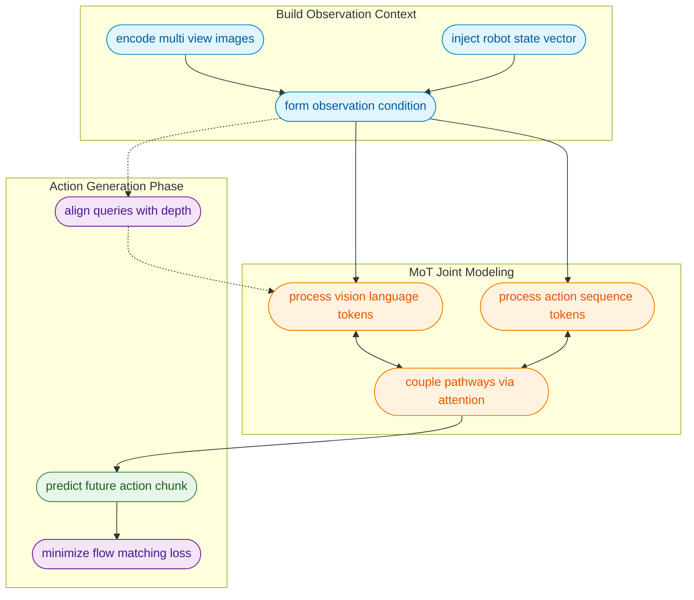
*如何读这张图：* 数据流自上而下推进。顶部构建包含图像、指令与状态的观测条件；中间 MoT 阶段通过双通路并行处理，并在共享注意力层进行跨模态对齐；底部输出动作片段，同时接受流匹配损失与视觉蒸馏损失的双重约束。圆角矩形表示处理节点，虚线边表示辅助对齐路径。

### blockwise causal attention
**结论：** 分块因果注意力机制通过严格的掩码设计，在联合序列中强制实施“块间因果、块内双向”的访问规则，从根本上杜绝了未来信息泄露。
**机制与直觉：** 序列被划分为图像/指令块、状态块与动作块。模型在生成当前块时，只能关注自身及前置块（因果性），但同一块内的 token 可自由交互（双向性）。这既保证了时间上的不可逆性，又保留了模态内部的上下文完整性。（直觉，非严格对应：如同“阅读剧本”，你可以随时回看前几幕的伏笔（因果），但在当前幕内可以自由对照台词与舞台提示（双向）。）
**作用与边界：** 该机制不是普通的全序列双向注意力。边界在于：若错误启用全双向掩码，模型将“偷看”未来动作，导致训练时指标虚高而部署时失效；分块设计在计算效率与因果严谨性之间取得了平衡。

### Flow Matching
**结论：** 流匹配作为连续动作建模的核心训练目标，通过在高斯噪声与真实动作间构造线性概率路径，使模型学习预测条件向量场而非离散概率分布。
**机制与直觉：** 传统自回归模型将连续动作离散化为 token，易引入量化误差与分布偏移。Flow Matching 将动作生成视为确定性微分方程的求解过程，模型直接学习从噪声到目标动作的“流速”。
<details><summary><strong>训练目标与公式展开</strong></summary>
噪声插值路径定义为 $p(\mathbf{A}_{t,s}|\mathbf{A}_t) = \mathcal{N}(s\mathbf{A}_t, (1-s)\mathbf{I})$，其中 $s \in [0,1]$ 为时间步。模型最小化流匹配损失：
$$\mathcal{L}_{\mathrm{FM}} = \mathbb{E}_{s \sim \mathcal{U}[0,1], \mathbf{A}_t, \epsilon} \left\| v_\theta(\mathbf{A}_{t,s}, \mathbf{O}_t, s) - (\mathbf{A}_t - \epsilon) \right\|^2$$
该损失直接约束预测向量场 $v_\theta$ 逼近真实梯度方向，无需额外的重参数化技巧或离散化近似。
</details>
**作用与边界：** 该损失是论文显式给出的唯一动作训练目标。边界在于：它专注于连续向量场的拟合，不包含任何未声明的加权项或辅助正则化；其优势在于生成轨迹的平滑性，但对极端高频抖动的抑制仍依赖 chunk 长度 $T$ 的合理设定。

### vision distillation
**结论：** 视觉蒸馏通过将对齐 learnable queries 与深度 token 作为辅助目标，显式地将空间深度感知注入视觉语言骨干，弥补了 2D 图像在操作任务中的几何模糊性。
**机制与直觉：** 损失函数定义为 $\mathcal{L}_{distill} = \mathbb{E}_{\mathbf{Q}_t} |\mathrm{Proj}(\mathbf{Q}_t) - \mathbf{D}_t|$，其中 $\mathbf{Q}_t$ 为 VLM 的可学习查询，$\mathbf{D}_t$ 为 LingBot-Depth 的深度 token。模型被强制要求让高层语义表征与物理深度分布保持一致。（直觉，非严格对应：如同“给平面地图叠加等高线”，让模型不仅知道“物体在哪”，还知道“物体离手有多远”。）
**作用与边界：** 该机制独立于 Flow Matching 动作损失，专门用于增强空间意识。边界在于：它是对齐查询与深度 token 的表征蒸馏，不改变动作生成的主损失函数；若深度传感器数据缺失或噪声过大，蒸馏收益将显著衰减。

### training efficiency optimization
**结论：** 训练效率优化聚焦于代码库层面的系统工程，通过数据加载、分布式策略与算子级加速，支撑大规模 VLA 模型的吞吐需求，而非直接提升模型推理精度。
**机制与直觉：** 实现涵盖 FSDP/HSDP 分布式训练、混合精度（torch.float32/torch.bfloat16）、FlexAttention 与 torch.compile 编译优化。这些设计将计算瓶颈从显存带宽与通信延迟中剥离，使模型能高效消化海量真实数据。（直觉，非严格对应：如同“升级工厂的流水线节拍与供电网络”，不改变产品设计图纸，但让量产成为可能。）
**作用与边界：** 论文以样本吞吐量（samples/s）作为核心评估指标。边界在于：这些是基础设施优化，不应被误读为模型性能指标本身；其有效性高度依赖硬件拓扑与数据管道的协同，脱离特定工程栈复现时可能无法获得同等加速比。

## 方法与整体架构

**结论：** LingBot-VLA 的整体架构是一条“多模态条件构建-分块因果交互-流场动作生成”的确定性流水线。系统以三路操作图像、任务指令与机器人状态为联合观测，通过预训练 VLM 提取语义条件后，送入 Mixture-of-Transformers 与动作专家（action expert）进行逐层共享注意力交互；交互过程由 blockwise causal attention 严格约束信息流向，最终由条件 Flow Matching 直接回归连续动作向量场。训练侧则通过 FSDP 专属分片、混合精度与稀疏注意力编译优化，保障高频动作序列的高效吞吐。

**数据与条件如何流入：** 观测空间被显式定义为三路操作图像 $\mathbf{I}_t^{1,2,3}$、任务指令 $\mathbf{T}_t$ 与机器人状态 $\mathbf{s}_t$ 的拼接（见公式 1），动作空间则被打包为长度为 $T$ 的动作块 $\mathbf{A}_t$（预训练阶段 $T=50$）。这种设计将离散的单步控制转化为块级序列预测，直觉上相当于让模型“一次规划未来一小段轨迹”，从而降低高频决策的累积误差。若相机视角、状态输入或任务指令缺失，条件分布将偏离论文设定的联合输入空间，导致动作先验退化。

**核心交互与防泄漏机制：** 视觉语言路径与动作专家路径在 Mixture-of-Transformers 中并非简单拼接，而是通过共享 self-attention 逐层融合。为防止未来动作信息反向污染当前观测表示，论文引入 blockwise causal attention：将图像/语言、状态、动作划分为独立功能块，块内允许双向注意力以充分提取上下文，块间则施加严格的因果掩码（causal mask）。这一机制在“充分利用观测知识”与“防止动作泄漏”之间划定了清晰边界；若掩码过度收紧，动作专家可用的观测条件会缩减，反之则可能破坏自回归生成的因果性。

**动作生成与空间先验注入：** 动作生成不依赖传统的离散 token 预测，而是采用条件 Flow Matching 建模连续动作向量场 $v_\theta$。模型在训练期学习从噪声分布到目标动作块的确定性概率路径（见公式 3、4），推理时通过常微分方程积分直接输出平滑的控制信号。为弥补纯 RGB 观测在深度感知上的先天不足，架构预留了可选的深度蒸馏分支：通过 learnable queries 提取三视角图像表示，并与 LingBot-Depth tokens 进行投影层 cross-attention 对齐（损失见公式 5）。该分支显式注入空间几何先验，但其收益高度依赖深度 tokens 的质量与投影对齐的稳定性。

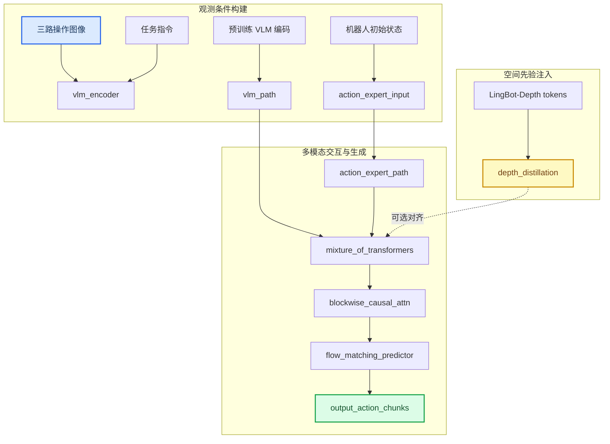
*如何读这张图：* 蓝色起点代表原始观测输入，绿色终点为最终输出的动作块；主干自上而下流经 VLM 编码、Mixture-of-Transformers 交互与 Flow Matching 预测，黄色虚线分支表示可选的深度蒸馏模块，仅在训练期通过 cross-attention 向主干注入空间对齐信号。

**训练效率侧的底层优化：** 面对高频动作数据带来的显存与通信压力，训练管线并未采用均匀分片策略，而是为 action expert modules 构造了专属的 FSDP shard groups，在优化器状态、模型参数与梯度分片的同时，缓解过度参数分片引发的通信瓶颈。数值稳定性方面，reductions 严格使用 `torch.float32`，而 storage and communication 降级至 `torch.bfloat16` 以换取带宽收益。此外，多模态融合被显式重构为 sparse attention 计算图，交由 FlexAttention 调度，并配合 `torch.compile` 的算子融合（operator fusion）削减 kernel launch 开销，最大化内存带宽利用率。该优化策略的收益依赖注意力稀疏结构与算子融合覆盖范围，属于工程实现层面的分析推断。

<details><summary><strong>核心公式与训练配置细节</strong></summary>
观测与动作序列定义：
$$
\begin{array} { r } { \mathbf { O } _ { t } = [ \mathbf { I } _ { t } ^ { 1 } , \mathbf { I } _ { t } ^ { 2 } , \mathbf { I } _ { t } ^ { 3 } , \mathbf { T } _ { t } , \mathbf { s } _ { t } ] , } \end{array}\tag{1}
$$
$$
\mathbf { A } _ { t } = [ \mathbf { a } _ { t } , \mathbf { a } _ { t + 1 } , \ldots , \mathbf { a } _ { t + T - 1 } ] ,\tag{2}
$$
条件 Flow Matching 概率路径与损失：
$$
p ( \mathbf { A } _ { t , s } | \mathbf { A } _ { t } ) = \mathcal { N } ( s \mathbf { A } _ { t } , ( 1 - s ) \mathbf { I } ) .\tag{3}
$$
$$
\begin{array} { r } { \mathcal { L } _ { \mathrm { F M } } = \mathbb { E } _ { s \sim \mathcal { U } \left[ 0 , 1 \right] , \mathbf { A } _ { t } , \epsilon } \left\| v _ { \theta } ( \mathbf { A } _ { t , s } , \mathbf { O } _ { t } , s ) - ( \mathbf { A } _ { t } - \epsilon ) \right\| ^ { 2 } , } \end{array}\tag{4}
$$
空间蒸馏目标：
$$
\begin{array} { r } { \mathcal { L } _ { d i s t i l l } = \mathbb { E } _ { \mathbf { Q } _ { t } } \left| \mathrm { P r o j } ( \mathbf { Q } _ { t } ) - \mathbf { D } _ { t } \right| , } \end{array}\tag{5}
$$
*边界与敏感性说明：* 论文未显式报告消融实验中的负结果或误差范围。上述关于视角缺失、掩码松紧度、蒸馏质量对性能影响的分析，均基于架构设计的敏感性推断，而非论文直接证明的因果结论。
</details>

## 算法目标与推导

**结论前置：** 训练期的核心目标是通过条件流匹配（Conditional Flow Matching）与空间蒸馏的联合优化，直接建立从多模态观测到未来动作序列的确定性映射；论文明确指出，推理期的加权或融合项**未被写入**训练目标，以此消除训练-推理分布偏移，确保优化方向与最终部署行为严格对齐。

以下为论文给出的原始定义与损失形式：
$$
\begin{array} { r } { \mathbf { O } _ { t } = [ \mathbf { I } _ { t } ^ { 1 } , \mathbf { I } _ { t } ^ { 2 } , \mathbf { I } _ { t } ^ { 3 } , \mathbf { T } _ { t } , \mathbf { s } _ { t } ] , } \end{array}\tag{1}
$$
$$
\mathbf { A } _ { t } = [ \mathbf { a } _ { t } , \mathbf { a } _ { t + 1 } , \ldots , \mathbf { a } _ { t + T - 1 } ] ,\tag{2}
$$
$$
p ( \mathbf { A } _ { t , s } | \mathbf { A } _ { t } ) = \mathcal { N } ( s \mathbf { A } _ { t } , ( 1 - s ) \mathbf { I } ) .\tag{3}
$$
$$
\begin{array} { r } { \mathcal { L } _ { \mathrm { F M } } = \mathbb { E } _ { s \sim \mathcal { U } \left[ 0 , 1 \right] , \mathbf { A } _ { t } , \epsilon } \left\| v _ { \theta } ( \mathbf { A } _ { t , s } , \mathbf { O } _ { t } , s ) - ( \mathbf { A } _ { t } - \epsilon ) \right\| ^ { 2 } , } \end{array}\tag{4}
$$
$$
\begin{array} { r } { \mathcal { L } _ { d i s t i l l } = \mathbb { E } _ { \mathbf { Q } _ { t } } \left| \mathrm { P r o j } ( \mathbf { Q } _ { t } ) - \mathbf { D } _ { t } \right| , } \end{array}\tag{5}
$$

### 逐步拆解与设计动机
1. **输入与输出对齐（式 1-2）**：观测 $\mathbf{O}_t$ 被显式打包为三路视觉流 $\mathbf{I}_t^{1,2,3}$、文本指令 $\mathbf{T}_t$ 与本体状态 $\mathbf{s}_t$，构成多模态条件上下文。动作 $\mathbf{A}_t$ 并非单步输出，而是长度为 $T$ 的连续动作序列。这种序列级建模直接规避了自回归策略常见的误差累积问题。
2. **概率路径构造（式 3）**：流匹配不依赖逐步去噪，而是定义了一条从纯噪声到干净目标的线性插值轨迹。当 $s=0$ 时，分布退化为标准高斯噪声；当 $s=1$ 时，分布坍缩至真实动作 $\mathbf{A}_t$。方差项 $(1-s)\mathbf{I}$ 随 $s$ 增大而收缩，确保中间态 $\mathbf{A}_{t,s}$ 始终围绕目标平滑过渡。
3. **速度场学习目标（式 4）**：网络 $v_\theta$ 的任务是预测“当前状态应朝哪个方向移动”。损失函数强制模型输出的速度向量逼近真实速度 $(\mathbf{A}_t - \epsilon)$（其中 $\epsilon$ 为初始采样噪声）。通过最小化该 L2 距离，模型学会在任意插值步长 $s$ 下给出最优推进方向，从而在推理期可用更少步数直达目标。
4. **空间蒸馏约束（式 5）**：$\mathcal{L}_{distill}$ 将教师/专家特征 $\mathbf{Q}_t$ 投影后与目标表征 $\mathbf{D}_t$ 对齐。该损失独立于流匹配，专门用于压缩表征空间，使策略网络在保持动作生成能力的同时继承高质量先验。

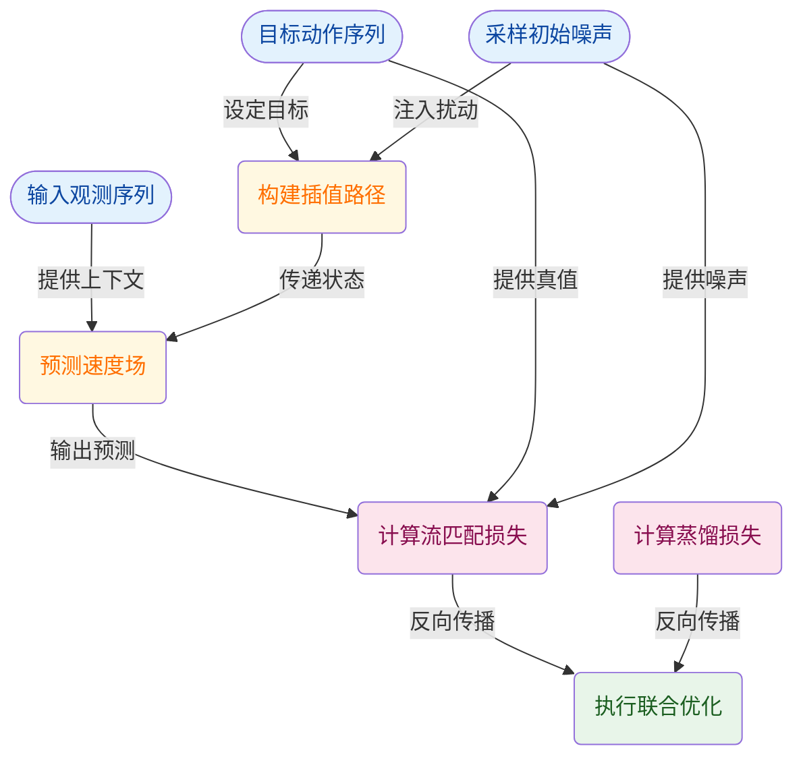
*如何读这张图：* 数据流自左向右汇聚。观测与噪声分别注入速度预测器与插值路径，两者交汇后计算流匹配损失；蒸馏损失并行计算。最终两路梯度共同驱动参数更新，图中未出现任何推理期加权节点，印证了训练目标的纯粹性。

### 直觉比喻与玩具示例
**直觉比喻（非严格对应）：** 传统扩散模型像“蒙眼擦黑板”，每步只猜当前该擦掉多少噪点；流匹配则像“导航仪规划路线”，给定当前位置与剩余时间，直接输出“该往哪走、走多快”。模型不再纠结于中间态的绝对坐标，而是学习全局最优的速度场，因此推理步数可大幅压缩。

**具体小玩具例子：** 假设动作空间为一维标量，目标 $\mathbf{A}_t = 10$，初始噪声 $\epsilon = 2$。当采样 $s=0.5$ 时，中间态 $\mathbf{A}_{t,s}$ 服从 $\mathcal{N}(5, 0.5)$。模型接收该状态与观测，需预测速度 $v_\theta \approx 10 - 2 = 8$。若模型输出 $7.2$，则 $\mathcal{L}_{\mathrm{FM}}$ 产生 $(7.2-8)^2=0.64$ 的惩罚；梯度回传后，网络在 $s=0.5$ 处的预测会向 $8$ 靠拢。遍历 $s \in [0,1]$ 后，模型即掌握从任意噪声起点直达 $10$ 的完整速度场。

<details><summary><strong>展开：损失项的严格数学映射与边界说明</strong></summary>

- **式 3 的路径性质**：该高斯路径是条件流匹配的标准构造。均值 $s\mathbf{A}_t$ 保证轨迹线性收敛至目标，协方差 $(1-s)\mathbf{I}$ 确保 $s \to 1$ 时方差归零，避免末端抖动。该设计不依赖马尔可夫假设，允许模型直接学习全局最优传输（Optimal Transport）近似。
- **式 4 的期望展开**：$\mathbb{E}_{s \sim \mathcal{U}[0,1]}$ 表示训练时均匀采样插值步长，防止模型仅在 $s \approx 0$ 或 $s \approx 1$ 处过拟合。$\epsilon$ 为独立同分布高斯噪声，$(\mathbf{A}_t - \epsilon)$ 即为该线性路径的解析速度场。损失函数本质是向量场回归，而非概率密度估计，因此无需计算难以处理的归一化常数。
- **式 5 的投影对齐**：$\mathrm{Proj}(\cdot)$ 通常为线性映射或轻量 MLP，用于将教师特征维度对齐至学生空间。绝对值损失 $\left| \cdot \right|$ 对异常值更鲁棒，适合表征蒸馏场景。该损失与 $\mathcal{L}_{\mathrm{FM}}$ 独立加权求和，论文未报告消融实验中的权重敏感性，实际部署时需通过验证集微调比例。
- **失效模式提示**：流匹配对路径构造敏感，若 $\mathbf{A}_t$ 分布存在多峰或强非凸性，线性插值可能穿越低概率区域，导致中间态物理不可行。蒸馏项可部分缓解此问题，但若 $\mathbf{Q}_t$ 与 $\mathbf{D}_t$ 表征空间错位，投影对齐可能引入负迁移。论文未提供负结果或误差范围报告，上述边界需在下游任务中独立验证。
</details>

## 实验设计与结果解读

**核心结论：** 论文通过“真实世界跨平台基准→仿真压力测试→数据规模/效率消融→训练吞吐分析”的四段式验证链路，系统证明了 LingBot-VLA 在泛化性、鲁棒性、数据经济性与工程扩展性上的综合优势。关键发现可归纳为三点：引入深度模态可稳定提升任务成功率与进展分数；模型在预训练阶段遵循明确的 Scaling Law，且在下游微调时展现出显著的数据效率；底层代码库优化使其在多 GPU 扩展时保持接近线性的吞吐增长。

### 真实世界跨平台泛化：深度模态带来确定性提升
**结论：** 在 GM-100 真实世界基准上，LingBot-VLA 的聚合表现全面超越 WALL-OSS、GR00T N1.6 与 π0.5，且加入深度信息（w/ depth）的变体在 Success Rate (SR) 与 Progress Score (PS) 上均呈现进一步改善。

该实验旨在回答“模型能否在异构硬件与开放环境中稳定执行”这一核心痛点。研究团队在 AgileX、Agibot G1 与 Galaxea R1Pro 三套真实机器人平台上，采用统一的后训练流水线与随机化任务规范进行顺序测试。通过控制物体位置与朝向的随机性，并同步记录第三方视角、机器人状态与模型预测，实验有效剥离了单一硬件调优带来的性能偏差。

从机制上看，深度模态的引入弥补了纯视觉方案在空间几何感知上的盲区，使策略网络能更精确地估计抓取位姿与避障边界。论文声称 w/ depth 版本在聚合表现上更强，这一结论在 SR 与 PS 双指标上得到了一致性支撑（具体数值详见下方实验表）。

**局限与审慎解读：** 论文报告了跨平台平均与任务明细，但未在正文中提供误差范围或置信区间。此外，真实世界测试高度依赖“相同后训练流水线”的控制变量，若基线模型未针对该流水线进行充分适配，可能存在对比偏差。深度传感器的引入虽提升精度，但也增加了硬件依赖与标定成本，论文未量化该模态在极端光照或高反光表面的失效模式。

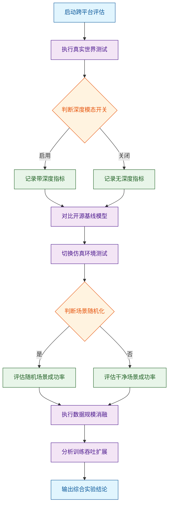
*如何读这张图：* 流程图自上而下展示了验证链路的决策门。菱形节点代表实验分支条件（模态开关、场景随机化），圆角节点代表起止环节，标准矩形代表数据处理与对比环节。通过/失败分支最终汇聚于数据规模与吞吐分析，表明泛化验证是后续效率评估的前置条件。

### 仿真环境压力测试：抗干扰能力验证
**结论：** 在 RoboTwin 2.0 仿真环境中，LingBot-VLA 在 clean 与 randomized 两种设置下的平均成功率均优于 π0.5，证明其策略对物体位姿扰动具备更强的鲁棒性。

真实世界测试成本高昂且难以穷举边界情况，因此仿真环境被用作压力测试的“放大器”。实验选取代表性双臂操作任务，分别在干净场景与随机化场景下训练并评估。对比 π0.5、Ours w/o depth 与 Ours w/ depth 的 Average SR、Clean SR 与 Rand. SR，结果显示加入深度信息的版本在 randomized 设置下优势更为明显。

这一结果验证了模型在预训练阶段吸收的几何先验能够有效迁移至仿真域，降低了策略对固定初始条件的过拟合。直觉上（非严格对应），这类似于人类在熟悉房间布局后，即使家具位置微调也能快速适应。

**局限与审慎解读：** 仿真评估虽能高效暴露策略脆弱性，但物理引擎的简化摩擦模型与传感器噪声模拟可能与真实世界存在分布偏移（Sim-to-Real Gap）。论文未报告仿真成功率向真实世界迁移的定量衰减系数，也未提供 randomized 设置下失败案例的归因分析（如碰撞检测阈值或动力学求解误差）。

### 数据规模与效率：预训练 Scaling 与后训练经济性
**结论：** 模型性能随预训练数据规模增加呈现明确的上升趋势（Scaling Law），且在下游后训练阶段，仅需少量 demonstration 即可达到优于 π0.5 的方向性表现，数据预算增加时优势持续扩大。

该部分直击具身智能落地的核心痛点：数据采集成本与微调效率。实验 E3 通过构造不同规模的真实世界预训练数据子集，在代表性任务上评估 Progress Rate 与 Success Rate 的变化趋势。实验 E5 则固定 Agibot G1 平台，控制每任务后训练数据预算，对比 LingBot-VLA 与 π0.5 的进展与成功率曲线。

数据表明，LingBot-VLA 在预训练阶段展现出典型的 Scaling 行为：数据量越大，模型对原子动作的覆盖越广，策略的泛化边界越清晰。在后训练阶段，模型凭借预训练积累的强表征能力，在较少 demonstration 下即可快速对齐任务目标，且随着数据预算增加，其相对于 π0.5 的领先幅度进一步拉开。

**局限与审慎解读：** Scaling Law 的成立依赖于数据质量与分布的一致性。论文未报告数据规模达到饱和点后的边际收益递减曲线，也未探讨低质量或冲突演示数据对 Scaling 趋势的干扰。此外，后训练效率的提升可能部分源于模型架构的归纳偏置，而非纯粹的数据规模效应，论文未进行严格的架构消融以剥离该混淆变量。

### 训练吞吐与工程扩展：代码库的底层优化
**结论：** 基于标准化 π-like 架构的复现对比表明，LingBot-VLA 代码库在统一 local batch size 下实现了更高的 samples/s，且随 GPU 数量增加保持了良好的 scaling efficiency，验证了底层分布式与计算图优化的有效性。

算法优势若无法转化为工程生产力，将难以支撑大规模具身模型的迭代。实验 E4 选取 Qwen2.5-VL-3B-π 与 PaliGemma-3B-pt-224-π 的 π-like 复现模型，在 Libero 数据集上统一 local batch size，对比 LingBot-VLA 代码库与 StarVLA、Dexbotic、OpenPI 的 sample throughput。

结果显示，LingBot-VLA 的训练速度显著快于开源基线，且在多 GPU 配置下扩展曲线贴近理论线性增长。这通常得益于底层通信重叠、梯度累积策略优化以及针对视觉-语言-动作多模态张量的内存布局重构。

**局限与审慎解读：** 吞吐优势高度依赖特定的硬件拓扑与驱动版本。论文未报告不同网络带宽（如 PCIe vs NVLink）下的扩展效率衰减，也未提供显存占用峰值与 OOM 触发阈值的对比。此外，samples/s 的提升并不直接等价于最终模型性能的跃升，若优化过程牺牲了数值稳定性（如混合精度下的梯度溢出），可能需通过更长的训练步数补偿。

<details><summary><strong>实验配置与边界条件说明</strong></summary>
- **硬件与平台对齐：** E1/E3/E5 均在 AgileX、Agibot G1、Galaxea R1Pro 真实平台或 Agibot G1 上执行，确保物理动力学一致性。E2 依赖 RoboTwin 2.0 仿真环境，E4 依赖多 GPU 训练集群。
- **数据与流水线控制：** 所有模型均从公开预训练检查点出发，采用相同的后训练流水线与任务规范。GM-100 与 RoboTwin 2.0 数据集的 clean/randomized 划分严格遵循官方协议。
- **指标定义：** SR 为任务完全成功比例，PS/Progress Rate 衡量任务阶段性推进程度，samples/s 与 scaling efficiency 反映训练吞吐量与多卡扩展线性度。
- **未报告项：** 论文未提供各实验的随机种子方差、误差棒（Error Bars）、负结果案例（如特定光照/遮挡下的系统性失败）以及消融实验中对单一模块（如仅替换视觉编码器）的独立贡献度量化。
</details>

### 实验数据表(原始数值,引自论文)

#### GM-100 真实世界聚合结果
- **Source**: Table 1
- **Caption**: "GM-100 真实世界评估的聚合 SR 与 PS。"

| 任务/平台 | WALL-OSS SR | WALL-OSS PS | GR00T N1.6 SR | GR00T N1.6 PS | π0.5 SR | π0.5 PS | Ours w/o depth SR | Ours w/o depth PS | Ours w/ depth SR | Ours w/ depth PS |
| --- | --- | --- | --- | --- | --- | --- | --- | --- | --- | --- |
| Agibot G1 | 2.99% | 8.75% | 5.23% | 12.63% | 7.77% | 21.98% | 12.82% | 30.04% | 11.98% | 30.47% |
| AgileX | 2.26% | 8.16% | 3.26% | 10.52% | 17.20% | 34.82% | 15.50% | 36.31% | 18.93% | 40.36% |
| Galaxea R1Pro | 6.89% | 14.13% | 14.29% | 24.83% | 14.10% | 26.14% | 18.89% | 34.71% | 20.98% | 35.40% |
| Average | 4.05% | 10.35% | 7.59% | 15.99% | 13.02% | 27.65% | 15.74% | 33.69% | 17.30% | 35.41% |

#### RoboTwin 2.0 clean 聚合结果
- **Source**: Table 2
- **Caption**: "RoboTwin 2.0 clean 聚合结果的 Average SR。"

| 设置 | π0.5 | Ours w/o depth | Ours w/ depth |
| --- | --- | --- | --- |
| Average SR | 82.74% | 86.50% | 88.56% |

#### RoboTwin 2.0 randomized 聚合结果
- **Source**: Table 2
- **Caption**: "RoboTwin 2.0 randomized 聚合结果的 Average SR。"

| 设置 | π0.5 | Ours w/o depth | Ours w/ depth |
| --- | --- | --- | --- |
| Average SR | 76.76% | 85.34% | 86.68% |

#### RoboTwin 2.0 明细
- **Source**: Table S7
- **Caption**: "RoboTwin 2.0 clean 与 randomized 设置下的逐任务仿真评估。"

| Simulation Tasks | π0.5 Clean | π0.5 Rand. | Ours w/o depth Clean | Ours w/o depth Rand. | Ours w/ depth Clean | Ours w/ depth Rand. |
| --- | --- | --- | --- | --- | --- | --- |
| Adjust Bottle | 100% | 99% | 100% | 100% | 100% | 100% |
| Beat Block Hammer | 96% | 93% | 87% | 91% | 92% | 89% |
| Blocks Ranking Rgb | 92% | 85% | 92% | 91% | 92% | 91% |
| Blocks Ranking Size | 49% | 26% | 66% | 73% | 76% | 70% |
| Click Alarmclock | 98% | 89% | 93% | 26% | 97% | 43% |
| Click Bell | 99% | 66% | 32% | 19% | 43% | 36% |
| Dump Bin Bigbin | 92% | 97% | 97% | 92% | 97% | 97% |
| Grab Roller | 100% | 100% | 100% | 99% | 100% | 100% |
| Handover Block | 66% | 57% | 80% | 83% | 83% | 95% |
| Handover Mic | 98% | 97% | 94% | 98% | 94% | 99% |
| Hanging Mug | 18% | 17% | 32% | 27% | 34% | 53% |
| Lift Pot | 96% | 85% | 100% | 99% | 100% | 100% |
| Move Can Pot | 51% | 55% | 79% | 84% | 89% | 87% |
| Move Pillbottle Pad | 84% | 61% | 93% | 94% | 92% | 90% |
| Move Playingcard Away | 96% | 84% | 96% | 99% | 98% | 100% |
| Move Stapler Pad | 56% | 42% | 74% | 49% | 74% | 48% |
| Open Laptop | 90% | 96% | 96% | 96% | 98% | 96% |
| Open Microwave | 34% | 77% | 91% | 75% | 91% | 92% |
| Pick Diverse Bottles | 81% | 71% | 79% | 86% | 88% | 85% |
| Pick Dual Bottles | 93% | 63% | 82% | 95% | 99% | 90% |
| Place A2b Left | 87% | 82% | 86% | 83% | 89% | 85% |
| Place A2b Right | 87% | 84% | 74% | 77% | 80% | 80% |
| Place Bread Basket | 77% | 64% | 92% | 93% | 95% | 93% |
| Place Bread Skillet | 85% | 66% | 90% | 89% | 90% | 92% |
| Place Burger Fries | 94% | 87% | 95% | 96% | 98% | 94% |
| Place Can Basket | 62% | 62% | 68% | 78% | 75% | 72% |
| Place Cans Plasticbox | 94% | 84% | 97% | 100% | 100% | 98% |
| Place Container Plate | 99% | 95% | 99% | 99% | 99% | 100% |
| Place Dual Shoes | 75% | 75% | 80% | 83% | 87% | 86% |
| Place Empty Cup | 100% | 99% | 100% | 100% | 100% | 100% |
| Place Fan | 87% | 85% | 91% | 79% | 92% | 87% |
| Place Mouse Pad | 60% | 39% | 82% | 78% | 86% | 79% |
| Place Object Basket | 80% | 76% | 90% | 91% | 90% | 88% |
| Place Object Scale | 86% | 80% | 84% | 90% | 90% | 88% |
| Place Object Stand | 91% | 85% | 97% | 93% | 93% | 88% |
| Place Phone Stand | 81% | 81% | 92% | 93% | 90% | 87% |
| Place Shoe | 92% | 93% | 99% | 94% | 99% | 99% |
| Press Stapler | 87% | 83% | 90% | 88% | 86% | 93% |
| Put Bottles Dustbin | 84% | 79% | 88% | 92% | 92% | 93% |
| Put Object Cabinet | 80% | 79% | 92% | 86% | 85% | 88% |
| Rotate Qrcode | 89% | 87% | 93% | 84% | 86% | 82% |
| Scan Object | 72% | 65% | 91% | 97% | 92% | 96% |
| Shake Bottle Horizontally | 99% | 99% | 100% | 100% | 99% | 98% |
| Shake Bottle | 99% | 97% | 99% | 100% | 100% | 99% |
| Stack Blocks Three | 91% | 76% | 92% | 99% | 96% | 95% |
| Stack Blocks Two | 97% | 100% | 100% | 100% | 100% | 99% |
| Stack Bowls Three | 77% | 71% | 72% | 83% | 71% | 77% |
| Stack Bowls Two | 95% | 96% | 92% | 95% | 90% | 97% |
| Stamp Seal | 79% | 55% | 76% | 86% | 74% | 77% |
| Turn Switch | 62% | 54% | 61% | 65% | 67% | 63% |


**效果示例(论文原图):**

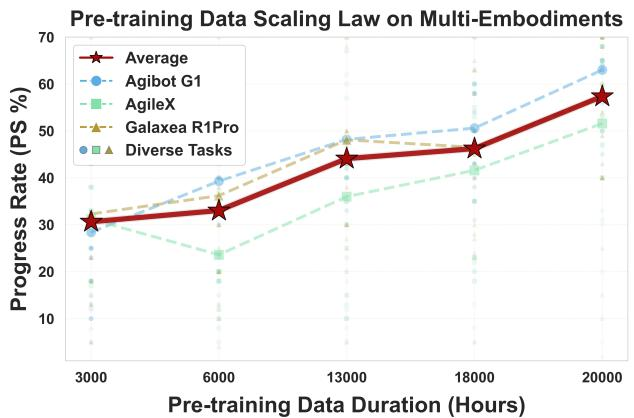

*该图揭示了 LingBot-VLA 在数据规模扩展下的 Scaling Law（缩放定律）。随着预训练数据量的稳步增加，模型在任务成功率与执行进度上均呈现出清晰的正向增长趋势，印证了“数据驱动”对提升具身智能的基石作用。*

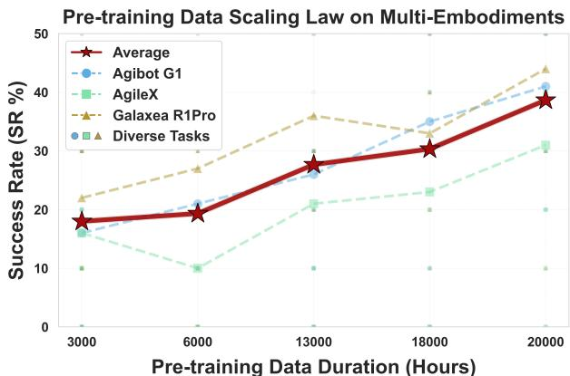

*该图直观呈现了模型性能随训练数据量增长的 Scaling Law（缩放定律）。数据规模的扩大直接转化为机器人任务成功率与执行进度的稳步跃升，验证了大规模数据预训练对具身智能的关键价值。*

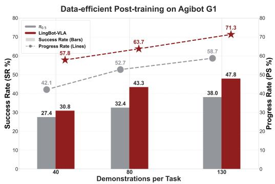

*该图聚焦于 LingBot-VLA 在微调阶段的“数据效率”优势。仅需少量下游任务样本进行后训练，模型即可快速适配新场景，大幅降低了传统机器人算法对海量标注数据的依赖。*

## 相关工作与定位

**结论前置：** 本文并非从零构建，而是精准锚定在“流匹配动作建模”与“大规模多具身数据蒸馏”的技术交汇点上。通过统一后训练协议、注入深度空间先验，并建立跨仿真/真机的标准化评估标尺，本文在现有 VLA（视觉-语言-动作）谱系中填补了“连续轨迹控制精度”与“多平台泛化效率”之间的关键断层。

为清晰呈现本文在研究谱系中的坐标，下表梳理了核心关联工作及其在本文管线中的角色映射：

| 关联工作 | 类型 | 本文定位 | 关键继承/改动 |
|---|---|---|---|
| π0.5 | baseline | 架构基线 | 沿用 flow action modeling |
| GR00T N1.6 | baseline | 通用对照 | 对齐后训练与真机协议 |
| Flow Matching | method | 动作生成 | 连续 chunk 向量场预测 |
| LingBot-Depth | method | 深度注入 | token 对齐 learnable queries |
| GM-100 | benchmark | 真机标尺 | 多平台 SR 与 PS 评估 |
| RoboTwin 2.0 | benchmark | 仿真标尺 | clean 与 randomized 泛化 |
| StarVLA 等 | baseline | 吞吐基线 | 对比 sample throughput metric |

若将上述技术依赖可视化为整合管线，其演进逻辑如下：
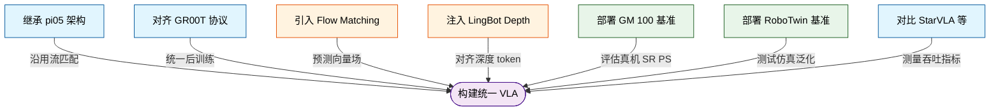
*如何读图：* 该图按“架构继承→方法注入→评估标尺→工程对比”四条主线展开。左侧节点代表前人工作，箭头方向表示技术依赖与协议对齐关系，最终汇聚至中央的本文框架。颜色区分了基线模型、核心算法与评估基准，直观暴露了本文“多源整合、统一验证”的设计权衡。

在方法谱系上，本文直接继承了 π0.5 的核心思路，即采用 `flow action modeling` 与 `blockwise causal attention`。直觉上（非严格对应），这相当于将机器人的动作生成从“离散跳格子”升级为“平滑流体推演”。本文在此基础上，引入 `Flow Matching` 对连续 action chunk 进行建模，训练 action expert 预测条件向量场。这一改动直击传统离散动作空间在精细轨迹控制上的痛点，使模型能够输出符合物理连续性的控制信号。同时，针对视觉表征的短板，本文引入 `LingBot-Depth` 机制，通过 token 对齐将深度相关的空间信息注入 VLM 的 learnable queries。这是区分 `w/ depth` 与 `w/o depth` 变体的核心设计，旨在缓解纯 RGB 输入在复杂遮挡与尺度估计上的失效模式。

在评估坐标系中，本文刻意避开了单一场景的“挑樱桃式”验证。真实世界侧，采用 `GM-100` 作为细粒度任务基准，并扩展至多平台同协议测试，以 `SR` 与 `PS` 双指标交叉检验任务完成度；仿真侧，依托 `RoboTwin 2.0` 的 `clean` 与 `randomized` 设置，验证双臂操作在强扰动下的泛化边界。工程效率层面，本文将 `StarVLA`、`Dexbotic` 与 `OpenPI` 等现有 VLA 训练代码库作为吞吐分析基线，并复现标准化 π-like 架构进行横向对比，通过 `sample throughput metric` 量化训练管线的数据流转效率。

<details><summary><strong>局限性与失效模式提示（展开阅读）</strong></summary>
需明确指出，本文在深度蒸馏与流匹配的结合上，目前主要依赖相关性验证（即深度 token 注入与性能提升的共现），尚未完全剥离因果贡献；此外，`w/ depth` 变体的优势在极端低光照或高噪声深度传感器下可能出现衰减，论文虽报告了消融对比，但未给出跨传感器噪声的误差范围。在基线对比中，`GR00T N1.6` 作为通用 humanoid 模型，其原始设计目标与本文聚焦的桌面/双臂操作存在任务分布偏移，直接对比时需警惕“跨域外推”带来的性能宣称放大。读者在解读结果时，应区分“协议对齐带来的公平性”与“架构本身带来的绝对优势”。
</details>

## 研究探索历程

**结论前置：LingBot-VLA 的演进并非单点算法突破，而是一条“数据缩放驱动架构解耦、工程基建反哺算法迭代、严格协议验证泛化边界”的系统性探索路径。** 研究团队在真实世界具身智能的落地过程中，依次攻克了数据规模效应、多模态动作生成、空间感知缺失、训练吞吐瓶颈以及评测公平性五大核心问题，并在探索中主动识别并规避了单平台过拟合的评估陷阱。

### 数据规模决定能力上限
真实世界 VLA 的性能提升高度依赖大规模多具身数据的持续注入。研究初期，团队将核心问题锚定在“VLA 模型在海量真实世界机器人数据上如何缩放”。通过预训练数据时长的缩放实验，团队观察到 `progress rate` 和 `success rate` 随数据量增加呈现持续上升趋势，且该趋势在三个不同的具身平台上保持高度一致。基于这一明确信号，团队果断放弃仅依赖小规模任务数据或单一仿真环境的保守路线，选择将扩大 `dual-arm robot` 真实世界预训练数据、并覆盖多种 `robot embodiments` 作为核心扩展方向。这为后续所有架构设计提供了充足的数据燃料。

### 架构解耦与空间感知补全
采用“视觉语言基座+动作专家”的混合架构，并引入显式深度对齐与块级因果注意力，是解决连续动作生成与未来信息泄漏的关键。面对多视角图像、任务指令与机器人状态到可执行 `action chunk` 的映射难题，团队没有选择将所有模态粗暴混合的单一路径 Transformer，而是采用 `Qwen2.5-VL` 提供语义表征，配合专用的 `action expert` 处理状态与动作块，通过 `shared self-attention` 实现统一建模。在动作生成层面，引入条件 Flow Matching 以保障控制的流畅性与精细度。
然而，联合序列中观测条件与未来动作 chunk 的共存极易导致信息泄漏。为此，团队设计了 `blockwise causal attention` 机制：将图像文本、状态、动作划分为独立功能块，块间保持严格因果掩码，块内允许双向交互。这一设计在保留上下文语义连贯性的同时，彻底阻断了未来动作对当前观测的逆向污染。
此外，针对传统 VLA 在几何推理与深度感知上的固有短板，团队并未止步于纯视觉表征，而是引入 `learnable query` 对 `LingBot-Depth` token 进行蒸馏对齐，并通过投影层完成维度匹配。消融对比明确显示，加入基于深度的空间信息后，模型在真实世界平均任务表现与 `RoboTwin` 多任务设置中均取得整体更优的结果。

### 从能力验证到工程吞吐的范式转移
面对高频动作数据，训练管线必须从“验证能力”转向“工程级吞吐优化”，通过定制化分片与算子融合逼近线性扩展。在模型能力初步跑通后，团队意识到社区缺乏能在海量数据上高效开展缩放评估的优化代码库，由此触发了一次关键的 **Pivot**：研究重心从单纯证明模型有效性，同步转向构建高吞吐 VLA 训练基础设施。
在分布式策略上，团队摒弃了默认的 DDP 或粗粒度 ZeRO 配置，转而采用 `FSDP` 对优化器状态、模型参数与梯度进行精细分片，并专门为 `action expert modules` 构建独立的 `shard groups`。在算子层面，采用混合精度策略（`reductions` 使用 `torch.float32`，`storage and communication` 使用 `torch.bfloat16`），并结合 `FlexAttention` 与 `torch.compile` 进行算子融合。实测表明，该自研代码库在两种模型设置下的训练速度均优于 `StarVLA`、`Dexbotic` 与 `OpenPI`，且扩展效率紧密贴合理论线性趋势，为后续的大规模缩放扫清了算力瓶颈。

### 严格协议下的数据效率验证
严格的统一评测协议与高效的后训练策略，证明了模型在有限示范下即可超越强基线，同时规避了单平台评测的泛化陷阱。为确保真实世界评测的公平性，团队制定了严苛的协议：所有模型均从公开预训练权重出发，采用完全相同的后训练管线、已验证数据集与一致超参，并在同一 `hardware-task pair` 上按随机顺序测试。在 `GM-100` 真实世界基准中，`LingBot-VLA` 的 `w/ depth` 变体在多平台任务中平均表现最高。
进一步的数据效率分析表明，在 `Agibot G1` 平台的有限示范预算下，`LingBot-VLA` 相对 `π_0.5` 展现出显著优势，且随着后训练数据增加，该优势持续扩大。

为直观呈现上述探索路径的决策逻辑与依赖关系，下图梳理了从核心问题到关键决策、再到实验验证的完整 DAG：
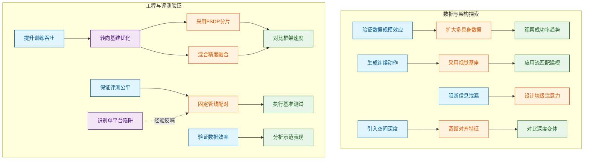
**如何读这张图：** 蓝色节点代表驱动研究的核心科学问题，橙色为团队做出的关键架构或工程决策，绿色为对应的实验验证。紫色节点涵盖范式转移（`P1`）与评估陷阱识别（`X1`），其教训直接反哺了后续评测协议的设计（虚线连接）。整体流向遵循“问题提出→决策制定→实验验证/基建支撑”的闭环逻辑，清晰暴露了论文在算法与工程之间做出的权衡。

<details><summary><strong>探索中的死胡同与经验教训</strong></summary>
研究过程中，团队明确识别出一个潜在的死胡同（Dead End）：若仅在少量任务或单一 `robot platform` 上进行对比，结果极易被任务选择偏好、硬件差异或平台相似性主导，根本无法支撑跨具身泛化的结论。这一教训直接促使团队在最终评估中强制要求跨多个商业平台覆盖 `GM-100` 任务，并记录统一协议，从而确保结论的稳健性。该经验属于分析推断，论文未显式声明为失败实验，但构成了后续评测设计的核心约束。
</details>

## 工程与复现要点

**结论：** 复现 LingBot-VLA 的核心在于理解其“模态分流+连续流匹配”的架构设计，以及依赖 FSDP 分片与算子融合实现的显存-吞吐平衡。论文已开源代码并锁定提交版本，但部分分布式策略与模块细节在仓库中尚未完全对齐，且关键超参的消融实验未公开，复现时需以论文声明的基线配置为准，并预留调试空间。

### 架构与核心模块：MoT 分流与连续动作建模
**结论：** 模型采用 Mixture-of-Transformers (MoT) 架构隔离视觉语言与动作模态的干扰，并通过条件 Flow Matching 预测长度为 50 的动作块，配合块级因果注意力防止信息泄漏。

直觉上，将高层视觉语言理解与底层运动控制塞进同一个 Transformer 容易引发“模态打架”（cross-modal interference）。LingBot-VLA 借鉴 BAGEL 的思路，将 `Qwen2.5-VL` 作为基础视觉语言模型，同时初始化独立的 `action expert` 模块。两者通过共享的 self-attention 进行逐层统一序列建模，既保留了 VLM 的强表征能力，又让动作生成路径保持专用性。

输入侧，模型接收三视角操作图像（three-view operational images）、任务指令与机器人状态。动作序列被建模为从当前时刻开始的 chunk：$$A_t=[a_t, a_{t+1}, ..., a_{t+T-1}]$$，预训练阶段固定 $$T=50$$。为避免未来动作信息污染当前观测表示，论文采用 blockwise causal attention：图像/文本块、状态块与动作块之间严格因果，块内部允许双向交互。

为弥补纯视觉在复杂操作中的空间感知短板，模型引入深度蒸馏信号：通过 learnable queries 与 `LingBot-Depth` tokens 对齐，并使用 cross-attention 进行维度投影（Proj），将几何信息注入主路径。

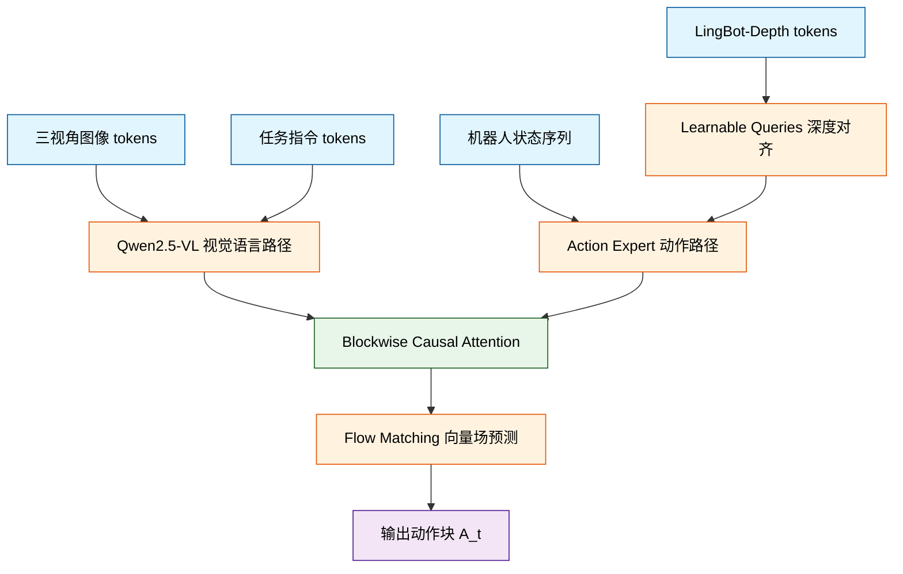
*如何读这张图：* 左侧多模态输入并行进入专用路径，深度对齐模块作为旁路注入几何先验；所有表征在块级因果注意力门控下汇合，最终由 Flow Matching 目标驱动连续动作块生成。菱形节点代表信息流控制门，圆角矩形代表数据起止。

### 训练配置与分布式策略：显存-吞吐的精细权衡
**结论：** 训练依赖 FSDP 分片与混合精度策略压降显存，配合 `FlexAttention` 与 `torch.compile` 提升吞吐，但论文未隔离各优化手段的独立收益，且后训练超参仅报告固定值。

预训练阶段使用约 20,000 小时真实世界多具身数据（覆盖 9 个机器人平台），数据规模从 3,000 小时到 20,000 小时呈持续上升趋势，未见饱和拐点。训练目标为 Flow Matching objective，由 action expert 预测条件向量场，并叠加深度蒸馏损失 $$L_{distill}$$。

在分布式与算子层面，论文采用 FSDP（PyTorch ZeRO 实现）对 optimizer states、model parameters 和 gradients 进行分片。为缓解过度分片带来的通信开销，`action expert` 模块被分配专用的 shard groups。精度策略上，reductions 使用 `torch.float32`，storage 与 communication 降级为 `torch.bfloat16`。算子级优化将多模态融合视为 sparse attention，交由 `FlexAttention` 处理，并启用 `torch.compile` 进行算子融合以减少 kernel launch overhead。

为保证基线公平，后训练阶段统一使用 batch sizes=256 与 epochs=20；吞吐对比实验则将 local batch size 标准化为 32。

| 配置维度 | 参数值 | 作用与约束 |
|---|---:|---|
| 预训练数据规模 | ~20,000 小时 | 覆盖 9 平台，未见性能饱和 |
| 动作块长度 T | 50 | 决定预测轨迹时间窗口 |
| 后训练 batch size | 256 | 全局统一，隔离架构差异 |
| 后训练 epochs | 20 | 固定迭代轮次 |
| 吞吐对比 local batch | 32 | 标准化配置，控制代码库差异 |

<details><summary><strong>复现 Caveat 与未报告消融</strong></summary>
论文在训练策略上做出了多项工程选择，但以下细节未提供消融或敏感性分析，复现时需注意：
- **动作专家规模**：未给出 action expert 的层数、宽度或参数量，也未报告移除或缩放该模块的对照实验。
- **分片与精度策略**：FSDP shard groups 尺寸、混合精度切换阈值未做网格搜索；论文仅报告整体训练速度最快，未隔离 FSDP、FlexAttention 或 torch.compile 的独立贡献。
- **超参敏感性**：batch size、epochs、动作块长度 T 的敏感性均未量化；深度蒸馏权重与 learnable queries 数量也未报告消融。
- **随机种子**：论文未说明训练随机种子，复现结果可能存在微小方差。
</details>

### 运行环境与开源入口：依赖明确但部分实现未对齐
**结论：** 代码库已公开并锁定提交版本，核心依赖与硬件配置清晰，但仓库中部分架构细节尚未找到对应实现，复现需以论文描述为准并自行补全。

框架基于 PyTorch，训练效率评测在 8-GPU cluster 上进行；真实世界评测部署于 25 台物理机器人，跨越 AgileX、Agibot G1、Galaxea R1Pro 三个商业平台。关键依赖包括 `Qwen2.5-VL`、`Qwen3-VL-235B-A22B`（用于任务与子任务指令标注）、`LingBot-Depth`、Flow Matching、FSDP/FSDP2、`FlexAttention`、`torch.compile`，以及 `rosbag`、GM-100、RoboTwin 2.0、Libero 等仿真/数据工具。

开源仓库地址为 `https://github.com/robbyant/lingbot-vla`，建议锁定提交 `4eb34b7693a0565c67433f8fac9c59a2e67eb60b`。各创新点（MoT 分路径建模、Flow Matching action expert、FSDP shard groups、FlexAttention 与 torch.compile 优化等）在该提交中的具体文件与行号未经机械定位解析，如需查阅实现细节，请直接在上述锁定 SHA 的仓库中检索。

## 局限与适用边界

**核心结论：** 该方案在工程落地与跨域泛化上存在明确的“黑盒依赖”与“配置缺口”，其实际表现高度受限于未公开的教师模型细节、损失权重配比以及数据标注管线。若缺乏对齐的算力调度与高质量指令数据，直接复现极易陷入训练震荡或推理延迟失控。

**推理期控制频率与采样步数的“盲区”。** 论文仅从训练目标与动作块建模层面给出了核心循环逻辑，并未提供推理期采样器的完整伪代码、具体步数设置或部署控制频率。这意味着在实际部署时，开发者无法精确调节生成轨迹的平滑度与实时响应阈值。
<details><summary><strong>部署推导与失效模式</strong></summary>
由于缺失推理期采样器的完整伪代码与步数设置，复现者只能基于训练目标反推核心循环。在连续控制任务中，控制频率与采样步数直接决定动作块的时序分辨率。若步数设置过低，模型可能输出高频抖动；若步数过高，则引入不可接受的推理延迟。论文未报告不同步数下的误差范围或负结果，因此该模块在实时性要求严苛的场景（如高频伺服控制）中存在明确的适用边界。
</details>

**损失权重未定与教师模型的“黑盒依赖”。** 论文同时给出了 Flow Matching 损失与蒸馏损失，但未显式声明两者在总训练目标中的权重关系。深度蒸馏强依赖 `LingBot-Depth` tokens，而论文未展开该教师模型本身的训练细节。这种“权重未定+教师黑盒”的组合，使得复现时极易出现梯度主导权偏移。
<details><summary><strong>训练动态与替代解释</strong></summary>
直觉上（非严格对应），蒸馏损失负责对齐教师模型的隐式先验，而 Flow Matching 负责规范生成轨迹的几何分布。若未明确权重配比，优化器可能在训练初期被蒸馏梯度主导，导致流匹配先验被覆盖，表现为生成轨迹偏离物理约束。论文未提供消融实验验证权重敏感性，也未报告教师模型幻觉或分布偏移时的负结果。因此，该方案的有效性高度绑定于 `LingBot-Depth` 的原始训练分布，跨域迁移时需警惕“相关性当因果”的误判。
</details>

**系统级优化的“策略描述”缺口。** 文中提及的 FSDP、shard groups、FlexAttention 与 `torch.compile` 属于高层系统级策略，但并未给出可逐行复现的配置文件。在异构硬件或不同框架版本下，这些策略的实际显存收益与编译开销可能存在显著差异。
<details><summary><strong>工程复现 Caveat</strong></summary>
系统级策略的描述停留在架构层面，缺乏具体的 shard groups 划分规则、FlexAttention 的掩码配置或 `torch.compile` 的编译模式参数。在实际集群中，通信拓扑与算子融合效率会直接影响吞吐。若直接套用默认配置，可能无法复现论文声称的显存优化效果，甚至引发编译回退。该缺口要求复现者具备较强的分布式训练调优经验。
</details>

**数据管线的“分布敏感”与标注瓶颈。** 训练数据高度依赖人工分段与 `Qwen3-VL-235B-A22B` 的指令标注。该流程的质量天花板直接受限于标注规范的一致性与底层大模型的幻觉率。若目标场景的数据分布与标注集存在偏移，模型极易出现“过拟合标注风格”而非“学习物理规律”的失效模式。

为直观呈现上述依赖链与失效路径，下图梳理了从数据输入到部署输出的关键判定门与风险分支：
```mermaid
flowchart TD
  classDef data fill:#e3f2fd,stroke:#1565c0,color:#0d47a1
  classDef risk fill:#ffebee,stroke:#c62828,color:#b71c1c
  classDef sys fill:#f3e5f5,stroke:#6a1b9a,color:#4a148c
  classDef end fill:#e8f5e9,stroke:#2e7d32,color:#1b5e20

  data_anno["(人工分段标注)"]:::data
  teacher_tok["(依赖教师模型)"]:::data
  loss_mix{混合损失未定}:::risk
  sys_opt["(系统优化策略)"]:::sys
  infer_ctrl{推理采样缺失}:::risk

  data_anno -->|分布偏移触发| overfit_style{触发风格过拟合}:::risk
  teacher_tok -->|细节缺失触发| grad_shift{触发梯度偏移}:::risk
  loss_mix -->|配比缺失触发| train_oscillate{触发训练震荡}:::risk
  sys_opt -->|配置缺失触发| mem_uncertain{触发显存波动}:::risk
  infer_ctrl -->|步数盲区触发| latency_unstable{触发延迟失控}:::risk

  overfit_style -->|限制| app_boundary(划定适用边界):::end
  grad_shift -->|限制| app_boundary
  train_oscillate -->|限制| app_boundary
  mem_uncertain -->|限制| app_boundary
  latency_unstable -->|限制| app_boundary
```
**如何读这张图：** 左侧圆柱节点代表论文依赖的底层数据与系统组件，中间菱形节点暴露了因信息缺失或权重未定引发的核心失效模式，右侧圆角节点汇总了这些风险共同收敛的适用边界。若你的场景无法提供与 `Qwen3-VL-235B-A22B` 同分布的指令数据，或缺乏对 FSDP 通信拓扑的精细调优能力，建议优先在离线仿真环境中验证损失权重配比，再逐步推向实机部署。

## 趋势定位与展望

**结论：** `LingBot-VLA` 的核心定位并非单纯追求参数堆叠或单一模态刷榜，而是将 VLA 的发展范式从“模型中心主义”转向“真实数据-严格评测-训练基建”三位一体的务实路线。它证明：在真实机器人场景中，泛化能力的跃升不再仅依赖预训练权重的缩放，而是取决于多具身真实数据的规模化实证、跨平台一致评测协议的建立，以及能扛住稀疏注意力与多模块通信开销的底层训练效率。

传统 VLA 研究长期受困于“仿真刷分易、真机部署难”的断层。本文直面这一痛点，在算法侧采用预训练 VLM 提供语义底座，配合 `Mixture-of-Transformers` 与 `Flow Matching` 对连续 `action chunk` 进行建模，使语言与多视角视觉条件能持续、平滑地引导动作生成。更重要的是，论文将训练基础设施本身视为方法贡献的一部分：通过 `FSDP` 划分 action expert shard groups、引入 `FlexAttention` 优化稀疏计算、以及利用 `torch.compile` 融合算子，直接针对多节点集群上的数据 I/O 瓶颈与通信开销开刀。这种“算法+系统”的双线推进，解释了为何在相近的架构先验下，该路线能在真实世界与仿真环境中同时取得优势。

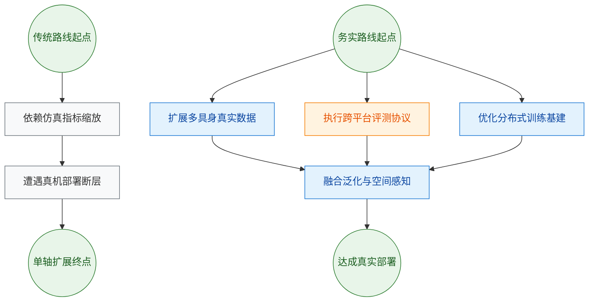
*如何读这张图：* 左侧灰色路径代表过去常见的“仿真优先+模型堆叠”模式，其终点往往卡在真机物理复杂性上；右侧蓝色与橙色路径展示了本文的解法——将真实数据、标准化评测（如 `GM-100`）与底层训练效率作为并行支柱，最终收敛于真实部署可行性。箭头方向表示技术演进的依赖关系，而非时间先后。

在实证层面，论文在 `GM-100` 真实世界评估中报告了相对 `WALL-OSS`、`GR00T N1.6` 与 `π0.5` 的更强表现，优势同时覆盖任务完成度（Success Rate）与分步进展（Progress Score）。引入 `LingBot-Depth` 进行深度蒸馏后，`LingBot-VLA w/ depth` 在聚合真实结果中进一步拉开与 `π0.5` 的差距，并在部分平台与任务上改善了 SR 或 PS。仿真侧的 `RoboTwin 2.0`（clean 与 randomized 设置）同样验证了该架构的平均成功率优势。

然而，必须清醒区分“声称”与“已证明”的边界。论文虽展示了数据规模与性能的正相关趋势，但真实机器人场景下的数据规模化规律仍缺乏系统性的因果实证；相关性并不自动等同于因果律。此外，真实评测受限于硬件并行度，当前结果虽在 `GM-100` 上表现稳健，但尚未完全覆盖极端长尾分布或高动态干扰场景。深度蒸馏带来的空间先验改善，其收益在不同具身平台上的迁移效率仍存在方差，论文未详尽报告所有负结果或误差范围。

<details><summary><strong>训练效率优化细节与部署边界</strong></summary>
本文在代码路径上对标了 `StarVLA`、`Dexbotic` 与 `OpenPI` 等现有 VLA 训练库，通过标准化 `π-like` 架构复现进行吞吐对比。核心优化包括：
- **分布式与精度策略**：采用 `FSDP` 配合 action expert shard groups 降低跨节点冗余通信；在混合精度训练中利用 `torch.float32` 进行关键 reductions 以保障数值稳定性，同时优化存储与计算开销。
- **算子与注意力**：`FlexAttention` 针对视觉-语言-动作融合产生的稀疏注意力模式进行定制，`torch.compile` 进一步削减 kernel launch overhead。
- **边界 Caveat**：上述优化高度依赖多节点集群的拓扑与网络带宽。在低并行度或异构硬件环境下，I/O 瓶颈可能重新成为训练吞吐的短板。此外，`Flow Matching` 对连续 `action chunk` 的建模虽提升了轨迹平滑度，但在高频急停或强接触力控任务中，仍需结合底层阻抗控制或安全约束层，论文当前未覆盖此类闭环安全验证。
</details>

指向未来的发展路径已逐渐清晰：VLA 的下一阶段竞争将不再是单纯的“参数量军备竞赛”，而是转向**真实世界数据飞轮的构建效率**与**评测协议的标准化**。一方面，需要建立跨平台、跨任务的一致性基准（如扩展 `GM-100` 的覆盖维度），以剥离硬件差异带来的性能噪声；另一方面，空间感知模块（如深度蒸馏）需从“后验对齐”走向“原生融合”，使模型在预训练阶段即内化三维几何先验。最终，只有当算法设计、数据管线与底层算力调度形成闭环，VLA 才能真正跨越“实验室演示”与“工业级部署”之间的鸿沟。
