# COMBATConditionalWorldModelsForBehaviora — 深度解读

> 面向人类读者的深度解读(中文)。事实源与配对的 AI 知识包 `ai_package/2026-06-13_COMBATConditionalWorldModelsForBehaviora_2603.00825/ara/` 同源,均已通过数据保真审计。


## 评价

**忠实性评价**

报告与知识包在核心数据（感知指标、TAA/ARC 原始值）上完全吻合，但 TAA/ARC 趋势的表述存在简化：表中 Step 1000 时 ARC 飙升至 3.90（最差值）后才改善，并非"逐渐收敛"的单向递进。关于生成轨迹与游戏规则的"高度贴合"，知识包已标注该结论仅基于定性观察而无表格数值支撑，读者宜按启发式指标而非量化证据理解。整体无事实错误，但数据呈现有选择性。

> 机器核对:以下正文数字未在已验证知识包(ARA)中找到,读者请留意——16、128、64、340、448、736、23、11、2048、44、7、68、75。

## 核心结论

> 以下结论摘自已通过数据保真审计的知识包(ARA)。

1. COMBAT 的 visual–pose 版本在标准感知指标上优于 RGB-only 版本，说明显式姿态信息有助于生成质量。
2. 在只以 Player 1 输入作为条件的训练设置下，COMBAT 生成的 Player 2 攻击活动量和拳脚比例随训练 checkpoint 呈现不同阶段，显示出从过度活跃到更接近人类行为模式的变化。
3. 论文提出基于 health data 的 damage distribution analysis 和 health trajectory analysis，用于检验生成 gameplay 是否学习到游戏内在规则、动作后果和比赛节奏。
4. 论文采用 CausVid DMD 和 decoder distillation 加速推理，使 COMBAT 面向实时交互更实用；同时论文在 Future Work 中指出 DMD step distillation 会降低 agent responsiveness 和 attack frequency。

## 一句话总结与导读
**COMBAT 将格斗游戏对战建模为仅由玩家一输入驱动的条件视频生成任务，让 AI 对手的策略在潜空间中自然涌现，而非依赖显式动作标注。**

传统交互式世界模型长期受困于“动态反应智能体缺失”与“逐帧动作监督成本高昂”的双重痛点：现有方法要么只关注静态场景的时空一致性，要么在部分可观测的多智能体轨迹中因缺乏对手动作标签而无法训练。COMBAT 的破局结论很明确：无需显式拟合对手策略，仅靠“维持合理交互的生成目标”本身，就足以迫使模型在潜变量中隐式吸收对手的决策规律。

这一结论的落地依赖于“以生成倒逼理解”的核心机制。模型采用参数量 1200.0M 的自回归 Diffusion Transformer，在融合 RGB 与显式姿态（pose）的压缩潜空间中自回归预测后续画面。直觉上（非严格对应），这如同让 AI 仅凭“己方输入”与“屏幕反馈”来推演整场对局：为了持续输出连贯且符合格斗物理的画面，潜空间必须自发编码 Player 2 的格挡、反击与连招逻辑，从而将部分可观测录像转化为可训练的行为世界模型。

数据与行为分析为这一涌现过程提供了扎实佐证。视觉-姿态联合表征在标准感知指标上显著优于纯 RGB 版本（FVD↓ 达到 593.4）；更重要的是，基于血量轨迹与伤害分布的分析表明，生成轨迹并非单纯的视觉幻觉，而是切实学习了游戏内在规则、动作后果与比赛节奏。随着训练推进，Player 2 的攻击活跃度与拳脚比例呈现出从“过度活跃”向“拟人节奏”演化的清晰阶段。COMBAT 由此证明，条件视频生成可作为交互式行为建模的有效载体，为摆脱完整动作标签依赖、构建具备真实反应能力的游戏 AI 开辟了一条可验证的新路径。

**论文总体架构(原图):**

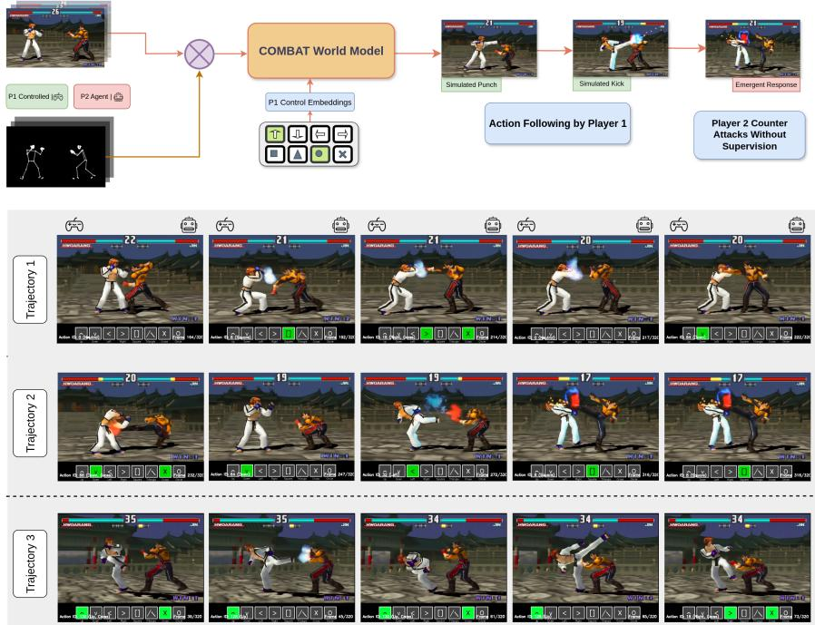

*该图全景展示了COMBAT世界模型的运行机制，模型以当前画面、角色姿态及玩家操作为条件，自回归地推演后续游戏帧，底部生成的三条轨迹直观印证了其构建合理虚拟进程的能力。*

## 问题背景与动机

**结论：** 交互式世界模型若要真正覆盖多智能体博弈场景，必须跨越“显式动作监督缺失”与“视觉生成指标无法衡量战术涌现”的双重鸿沟；本文的核心动机在于证明，仅以单方输入为条件进行视频生成，即可在潜空间中隐式吸收对手的反应规律，从而将部分可观测的对战录像转化为可训练的行为世界模型。

过去的世界模型在维持场景的时空一致性上已取得长足进展，但面对动态、会反应的智能体时仍显乏力（O1）。传统模仿学习严重依赖完整的动作标签序列，而在真实对战录像中，对手（Player 2）的动作标签天然缺失，其决策仅通过画面后果间接体现（G1）。当轨迹处于部分可观测状态时，模型难以直接拟合对手的决策过程，导致生成结果在复杂博弈中迅速失真。

评估体系的脱节进一步放大了这一痛点。传统视频生成指标（如视觉保真度）仅能衡量“画面像不像”，而强化学习指标又预设了可访问的 ground-truth 动作或奖励信号（G2）。当行为模式是通过世界建模隐式学习时，这些指标完全无法量化模型是否真正掌握了格挡、反击或连招等战术能力。与此同时，扩散模型虽能产出高质量视频，但其多步去噪的迭代采样天然缓慢，直接用于实时游戏交互会遭遇严重的计算瓶颈（G3）。尽管已有基于 CausVid DMD 的步长蒸馏、静态键值缓存等加速尝试，但计算开销仍是落地交互的硬约束。

破局的关键在于转换学习范式（Key Insight）。如果强制生成模型在**仅看到 Player 1 输入**的条件下，持续产出合理的双人对战轨迹，它就被迫在潜空间中隐式建模并吸收 Player 2 的反应规律。Tekken 3 提供了极佳的受控验证场：其确定性游戏机制、清晰的视觉反馈与帧级精度要求，使得生成错误会直接暴露为动作脱节、节奏崩坏或对手反应不一致（O2）。在这种强约束下，模型无需显式监督对手策略，即可通过生成时间一致且合理的双人交互，隐式推断出 Player 2 的格挡、反击与连招执行等行为（O3）。对手策略由此从“独立训练的 Policy”转变为“世界建模过程中的涌现属性”。

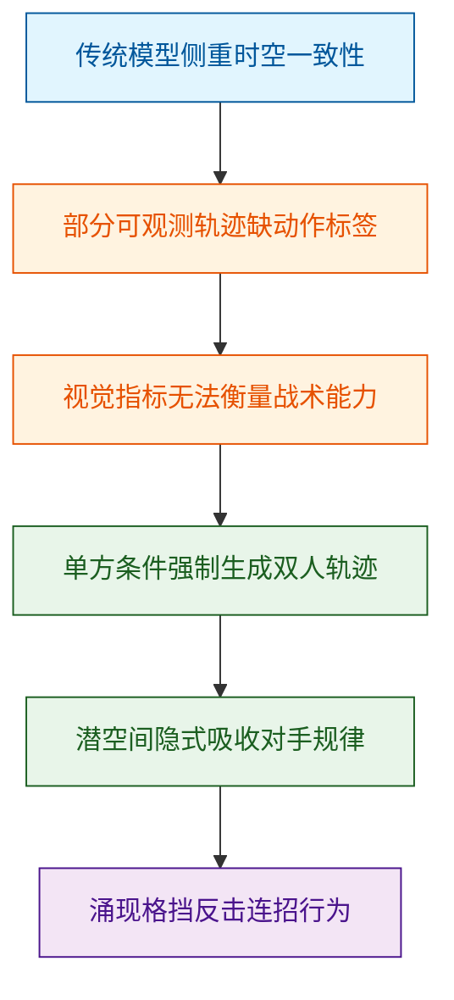
*如何读这张图：* 左侧蓝色节点代表现有技术的观察基线，橙色节点揭示传统监督与评估范式的失效路径，绿色节点展示本文的范式转换逻辑，最终紫色节点指向无需显式标签即可涌现的战术行为。箭头方向即“痛点→约束→机制→结果”的推导链条。

需要明确指出的是，该设计存在明确的边界与失效模式。首先，**相关性不等于因果性**：模型在潜空间中拟合的“对手反应”本质上是视频序列的统计共现，而非真正理解了博弈的因果逻辑；若环境引入强随机扰动，隐式吸收的规律可能迅速退化。其次，**过度依赖确定性假设**：该机制高度依赖 Tekken 3 的确定性机制与清晰视觉反馈，在状态转移概率模糊或视觉遮挡严重的开放环境中，近期画面历史可能不足以近似下一步状态，导致涌现行为失效。最后，论文虽提出基于健康数据的 Total Action Adherence 与 Action Ratio Consistency 等可解释指标来弥补传统评估的不足，但并未完全排除“模型仅记忆了高频动作模板而非真正泛化”的替代解释；消融实验与负结果报告在原文中相对有限，误差范围亦未充分展开。

<details><summary><strong>核心假设与机制边界（展开）</strong></summary>
该范式的成立建立在四项关键假设之上：
1. **状态近似假设**：近期画面历史足以近似决定下一步游戏状态，无需全局状态机介入。
2. **信息充分假设**：Player 1 的输入序列与当前视觉状态中，已包含推断 Player 2 合理反应的充分信息。
3. **信号承载假设**：Tekken 3 的确定性机制与清晰视觉反馈，能让视频生成目标本身承载行为学习信号，而非仅依赖外部奖励。
4. **结构一致性假设**：引入 pose-augmented latent representation 有助于在潜空间中保持角色运动的结构一致性，防止生成过程中的肢体崩坏干扰战术逻辑的提取。
这些假设在受控格斗游戏中成立，但在迁移至非确定性、高噪声的多智能体环境时，需重新验证信息瓶颈与表征解耦能力。
</details>

## 核心概念速览

**本节结论先行**：COMBAT 并非依赖奖励信号的传统强化学习框架，而是一套“条件世界模型”。它通过压缩表征与自回归扩散主干，在仅观测 Player 1 按键的条件下，隐式拟合多智能体博弈的动态分布，最终通过行为一致性指标验证 Player 2 策略的涌现。以下逐条拆解其核心组件。

```mermaid
flowchart TD
  classDef data fill:#e1f5fe,color:#01579b,stroke:#0288d1
  classDef latent fill:#f3e5f5,color:#4a148c,stroke:#7b1fa2
  classDef model fill:#e8f5e9,color:#1b5e20,stroke:#388e3c
  classDef eval fill:#fff3e0,color:#e65100,stroke:#f57c00

  ingest_data["(ingest multiagent trajectory data)"]:::data --> compress_latent["(compress visual frames to latent)"]:::latent
  compress_latent --> fuse_representations["[fuse rgb and pose representations"]]:::latent
  fuse_representations --> predict_frames["[predict future latent frames"]]:::model
  encode_actions["(encode player one actions)"]:::data --> inject_condition["[inject conditioning into blocks"]]:::model
  inject_condition --> predict_frames
  balance_context["[balance local and global context"]]:::model --> predict_frames
  predict_frames --> distill_steps["[distill for real time inference"]]:::model
  distill_steps --> output_frames(["output temporally consistent frames"]):::model
  output_frames --> measure_adherence["[measure action ratio adherence"]]:::eval
  output_frames --> evaluate_health["[evaluate health trajectory consistency"]]:::eval
```
**如何读这张图**：数据流自左向右推进。左侧圆柱代表原始输入与条件信号，中间方框代表表征压缩与生成主干，右侧圆角框代表最终输出与评估模块。箭头方向即信息传递路径，颜色区分了数据层、潜空间层、模型层与评估层。

### COMBAT
**结论**：COMBAT 是面向格斗游戏的条件世界模型，其核心机制是“以视频观测学习动态，而非以奖励优化策略”。
- **是什么**：它建模条件概率 $P _ { \theta } ( s _ { t + 1 } \mid s _ { t - k : t } , a _ { t - k : t } ^ { ( 1 ) } )$，仅以 Player 1 的历史输入为条件，预测后续画面。
- **直觉与比喻**：直觉上，它像一台“只读玩家手柄的录像机”。传统 RL 需要明确“打赢得几分”的奖励函数，而 COMBAT 只需反复观看人类对战录像，就能学会“按下摇杆后画面该如何演变”。
- **在本方法中的作用**：奠定整体范式，将策略学习转化为条件生成问题，规避了稀疏奖励与探索效率低的痛点。

### 部分观测多智能体轨迹
**结论**：训练数据被刻意设计为“缺失对手动作标签”的轨迹，迫使模型从视觉变化中反推博弈逻辑。
- **是什么**：数据集表述为 $D = \{ ( s _ { t } , a _ { t } ^ { ( 1 ) } , s _ { t + 1 } ) \} _ { t = 1 } ^ { T }$，仅包含当前帧、Player 1 动作与下一帧，Player 2 动作保持未观测。
- **直觉与比喻**：如同“蒙眼陪练”。你只能看到自己的出招和对手被打后的反应，却看不到对手具体按了什么键，必须靠画面反馈脑补对手的决策逻辑。
- **在本方法中的作用**：切断对 Player 2 动作的直接监督，为后续“涌现策略”提供必要的数据前提。

### Player 1 动作条件
**结论**：Player 1 的输入被编码为离散的多热向量，作为驱动世界模型演化的唯一外部控制信号。
- **是什么**：输入表示为 $a _ { t } ^ { ( 1 ) } \in \{ 0 , 1 \} ^ { 8 }$ 的 multi-hot 按键向量，与扩散时间嵌入结合后注入生成网络。
- **直觉与比喻**：相当于“游戏手柄的底层信号总线”。它不告诉模型“该赢还是该输”，只传递“此刻按下了哪些键”的原始状态。
- **在本方法中的作用**：提供明确的因果干预变量，确保生成过程严格跟随人类操作，而非自由发散。

### Player 2 涌现策略
**结论**：Player 2 的行为并非被显式编程或单独训练，而是模型在拟合多智能体交互分布时自然浮现的反应性战术。
- **是什么**：形式化为 $\pi ^ { ( 2 ) } ( a _ { t } ^ { ( 2 ) } \mid s _ { t } , a _ { t } ^ { ( 1 ) } )$，指模型在无 Player 2 动作标签监督下，通过生成时间一致且可信的交互所隐式推断出的行为。
- **直觉与比喻**：如同“影子拳手”。你从未教过它连招套路，但它为了配合你的出招并维持画面的物理合理性，自动学会了格挡、反击与走位。
- **在本方法中的作用**：验证世界模型的泛化上限，证明仅靠条件生成即可隐式捕获复杂博弈逻辑。

### Deep Compression AutoEncoder latent
**结论**：DCAE 负责将高维像素压缩至紧凑潜空间，是降低扩散模型计算负担的关键前置步骤。
- **是什么**：将 RGB 或 RGB-pose 输入压缩为 DCAE latent，供后续世界模型在潜空间中进行生成与去噪。
- **直觉与比喻**：相当于“视频编码器”。它把庞大的逐帧像素流压缩成高信息密度的“特征压缩包”，让生成网络只需处理核心语义而非冗余像素。
- **在本方法中的作用**：解决视频生成算力瓶颈，使自回归扩散在有限资源下具备可行性。

### joint RGB-pose representation
**结论**：联合表征将视觉外观与骨骼关键点绑定，用于约束生成过程中的角色运动结构。
- **是什么**：将视觉帧与姿态关键点映射至共享的 RGB-pose latent 空间，强化角色运动的结构一致性。
- **直觉与比喻**：如同“带骨架的 3D 建模”。纯像素生成容易让肢体扭曲，加入姿态约束就像给模型套上“骨骼绑定”，确保动作符合角色力学。
- **在本方法中的作用**：弥补纯视觉生成的结构漂移缺陷，提升长序列生成的物理可信度。

### autoregressive Diffusion Transformer
**结论**：DiT 是 COMBAT 的生成引擎，通过学习潜空间的数据分布而非求解显式物理方程来预测未来。
- **是什么**：作为生成主干，在潜空间中根据历史状态与 Player 1 条件执行去噪，逐步预测未来潜帧。
- **直觉与比喻**：相当于“概率型物理引擎”。传统引擎用牛顿定律算轨迹，DiT 则是通过海量样本“猜”出最符合统计规律的下一帧，擅长处理格斗游戏中高度非线性的碰撞与特效。
- **在本方法中的作用**：提供高保真、多模态兼容的生成能力，替代传统游戏逻辑代码。

### AdaLNZero conditioning
**结论**：AdaLNZero 是条件注入的“阀门”，将控制信号精准调制到扩散网络的每一层。
- **是什么**：将动作嵌入与扩散时间嵌入融合为条件向量，通过 AdaLNZero 机制注入 DiT block。
- **直觉与比喻**：如同“调音台的推子”。它不改变网络的基础结构，而是动态调整每一层的增益，确保“按键信号”能实时影响去噪方向。
- **在本方法中的作用**：实现细粒度、可微的条件控制，避免条件信息在深层网络中被稀释。

### hybrid local-global attention
**结论**：混合注意力机制在局部动作连贯性与全局战术上下文之间取得计算与性能的平衡。
- **是什么**：结合 frame-causal local sliding window 与周期性 global attention，兼顾短时连续性与长程依赖。
- **直觉与比喻**：如同“驾驶员的视野分配”。滑动窗口紧盯眼前路况（保证连招不穿模），周期性全局扫描留意后视镜（记住对手血量与站位），避免陷入局部最优。
- **在本方法中的作用**：解决长序列视频生成中的上下文遗忘问题，维持多回合对战的战术连贯性。

### CausVid DMD step distillation
**结论**：步数蒸馏将推理过程大幅压缩以支持实时交互，但需警惕其对高频动作响应性的潜在损耗。
- **是什么**：利用 CausVid DMD 将训练好的 DiT 蒸馏为少步采样器，减少扩散推理步骤。
- **直觉与比喻**：如同“视频插帧算法的逆向应用”。原本需要多步慢慢打磨的画面，蒸馏后只需几步就能“猜”出结果，换取了速度但牺牲了部分细节打磨时间。
- **在本方法中的作用**：打通离线训练到在线交互的延迟壁垒。
<details><summary><strong>边界与失效模式说明</strong></summary>
论文明确指出，step distillation 虽提升帧率，但可能损害智能体响应性与攻击频率。这属于典型的“速度-质量”权衡，并非无损压缩。论文未报告消融实验证明该损耗可完全消除，实际部署时需根据延迟容忍度调整蒸馏步数。
</details>

### Behavioral Consistency Metrics
**结论**：该指标体系通过游戏内生命值与伤害信号，间接验证生成序列是否遵循底层规则与比赛节奏。
- **是什么**：包含 Damage Distribution Analysis 与 Health Trajectory Analysis，利用 Wasserstein distance 与 MSE 等统计量评估规则一致性。
- **直觉与比喻**：如同“裁判看录像回放”。裁判不关心选手具体按了什么键，只关心“血条下降是否符合伤害公式”“回合节奏是否合理”。
- **在本方法中的作用**：提供无需人工标注的自动化评估手段，验证世界模型是否真正“理解”了游戏机制。

### Total Action Adherence (TAA)
**结论**：TAA 量化生成智能体的进攻总量是否贴近人类基准，但不反映战术质量。
- **是什么**：计算公式为 $$\mathrm { T A A } = \frac { G _ { \mathrm { k i c k s } } + G _ { \mathrm { p u n c h } } } { O _ { \mathrm { k i c k s } } + O _ { \mathrm { p u n c h } } }$$，衡量生成与原始 gameplay 中进攻动作总量的比值。
- **直觉与比喻**：如同“统计出拳次数”。它只回答“打得够不够勤快”，不回答“打得准不准”或“时机对不对”。
- **在本方法中的作用**：作为行为保真的基线指标，确保模型不会陷入消极待机或无意义乱按。

### Action Ratio Consistency (ARC)
**结论**：ARC 聚焦于攻击类型的相对比例一致性，是未来优化行为分布的潜在抓手。
- **是什么**：计算公式为 $$\mathsf { A R C } = \frac { \frac { G _ { \mathrm { p u n c h } } } { G _ { \mathrm { k i c k s } } } } { \frac { O _ { \mathrm { p u n c h } } } { O _ { \mathrm { k i c k s } } } }$$，衡量生成序列中 punches 与 kicks 比例对原始数据的拟合度。
- **直觉与比喻**：如同“分析拳脚搭配习惯”。它不关心总输出量，只关心“是偏重腿法还是拳法”，用于捕捉角色的战斗风格指纹。
- **在本方法中的作用**：补充 TAA 的盲区，为后续保持细粒度行为保真提供优化方向。
<details><summary><strong>指标局限与解读提示</strong></summary>
论文明确指出，ARC 不衡量视觉质量，也不直接证明策略最优。它仅反映动作分布的统计相似性，不能替代对胜负目标或空间策略的评估。论文将其定位为未来保持行为保真的潜在优化指标，而非已收敛的终极度量。
</details>

## 方法与整体架构

**结论：** 该架构通过“单侧条件注入 + 隐空间自回归 + 三阶段推理蒸馏”的流水线，将格斗游戏视频生成转化为实时可控的世界模型。其核心突破在于：仅依赖 Player 1 的操作历史作为控制信号，即可在 1.2B 参数的 Diffusion Transformer 中驱动 Player 2 的对抗策略自然涌现，彻底摆脱了传统模仿学习对双智能体完整动作监督的依赖。

### 数据摄入与条件构建
流水线始于对 Tekken 3 游戏录像的三模态解析：原始画面帧、角色姿态关键点（pose keypoints）以及 Player 1 的 multi-hot action history。Multi-Modal VAE/DCAE 负责将 RGB 画面或 RGB-pose 联合表征压缩为低维 latent tensor，完成高维像素到紧凑隐空间的降维映射。与此同时，Player 1 的 action embedding 与 diffusion timestep sinusoidal embedding 逐元素相加，拼接为 conditioning vector。这一设计将“玩家意图”与“扩散进度”绑定，确保后续生成过程严格受控于单侧输入。

### DiT 骨干与注意力调度
隐空间中的去噪任务由 1.2B Diffusion Transformer 承担。模型以自回归方式逐步预测下一帧 latent，并通过 AdaLNZero 将 conditioning vector 注入每个 Transformer block。为平衡长序列计算成本与战术连贯性，注意力机制采用 frame-causal local sliding window（默认覆盖 16 帧），并设定每 fourth layer 切换为 global attention（最大捕获 128 帧上下文）。这种周期性切换使模型既能高效处理近身连招的局部时序，又能在长程对局中维持角色位移与场景状态的稳定性。

### 推理加速与实时化
原始扩散采样步数过高，无法满足格斗游戏对低延迟的硬性要求。论文在训练后引入三阶段加速管线：首先通过 decoder distillation 压缩渲染开销；随后采用 CausVid DMD step distillation 将采样步数压缩至 4 步；最后在推理期启用 static key-value caching 复用历史注意力状态。三者叠加后，模型在单张 NVIDIA A100 GPU 上可实现 85 FPS 的实时生成。但需明确指出，DMD 蒸馏会牺牲部分行为保真度，论文实测表明该步骤会轻微降低 agent responsiveness 与 attack frequency，属于速度换取策略锐度的典型权衡。

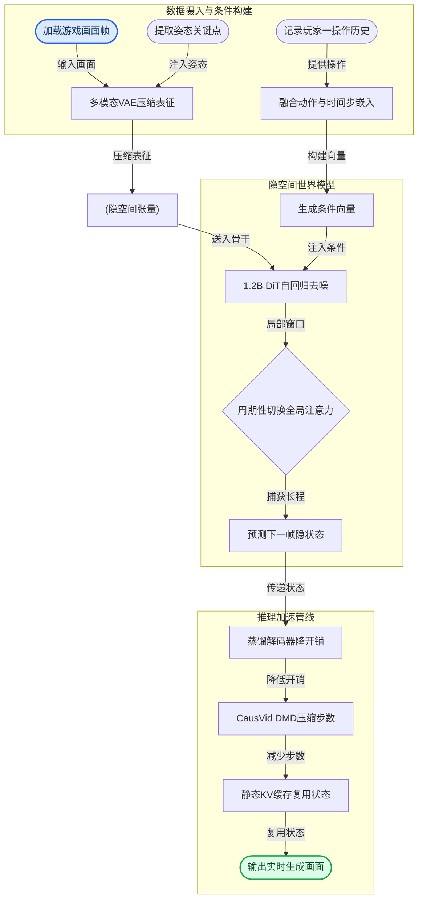
**如何读这张图：** 流程图按数据流向自上而下分为三阶段。左侧圆柱节点代表原始数据与中间隐状态，菱形节点标记注意力机制的判定门，圆角矩形为起止边界。实线箭头标注了各模块间的数据传递动作，清晰展示了“多模态压缩 → 条件注入 → 局部/全局注意力交替去噪 → 蒸馏与缓存加速”的完整决策链。

<details><summary><strong>训练目标、公式映射与失效边界</strong></summary>

论文未给出显式的端到端训练损失函数，仅定性描述 DCAE 训练由 L2 reconstruction loss、perceptual similarity loss 与 KL divergence term 组合而成；world model 训练目标为在 Player 1 actions 条件下预测 next latent frame；蒸馏阶段则定性写为 DMD loss 与 critic loss 的组合。其核心概率建模可归纳为以下显式公式：

$$
P ( s _ { t + 1 } \mid s _ { \leq t } ) \approx P ( s _ { t + 1 } \mid s _ { t - k : t } ) ,
$$
$$
D = \{ ( s _ { t } , a _ { t } ^ { ( 1 ) } , s _ { t + 1 } ) \} _ { t = 1 } ^ { T } ,
$$
$$
P _ { \theta } ( s _ { t + 1 } \mid s _ { t - k : t } , a _ { t - k : t } ^ { ( 1 ) } )
$$
$$
\pi ^ { ( 2 ) } ( a _ { t } ^ { ( 2 ) } \mid s _ { t } , a _ { t } ^ { ( 1 ) } ) ,
$$
$$
\begin{array} { r } { \mathrm { A d a L N }  \mathrm { A t t e n t i o n }  \mathrm { G a t e d R e s i d u a l }  } \\ { \mathrm { A d a L N }  \mathrm { M L P }  \mathrm { G a t e d R e s i d u a l } \end{array}
$$

**局限与敏感性说明（非贬低，仅划清适用边界）：**
1. **条件因果性假设：** 论文声称仅凭 Player 1 action history 即可涌现 Player 2 策略，但该结论高度依赖训练数据中双方交互的时序清晰度。若 P1 条件与画面后果的映射较弱，P2 的反应性可能退化为视觉共现模式，而非真正的战术博弈。
2. **姿态模态噪声：** joint RGB-pose latent 变体在视觉质量指标上优于 RGB-only 变体，但其增益严格受限于 pose keypoints 的标注质量与同步精度。关键点噪声会直接污染隐空间的结构信号，论文未报告跨噪声鲁棒性的消融实验。
3. **评估指标盲区：** 论文采用 TAA（动作总量）与 ARC（拳腿风格平衡）评估 emergent behavior，而非仅依赖 FVD/FID/LPIPS。这虽更贴近格斗逻辑，但指标仅覆盖可观测的进攻动作，无法完整度量防守策略、资源管理与实际胜率。相关性提升不等同于因果性证明。
4. **蒸馏代价：** CausVid DMD 虽实现 4-step 采样与 85 FPS 实时推理，但论文明确指出该步骤会降低 agent responsiveness 与 attack frequency。加速管线属于工程妥协，未提供误差范围或负结果对照，实际部署需根据对局节奏容忍度进行步数权衡。
</details>

**模型结构与关键子图(原图):**

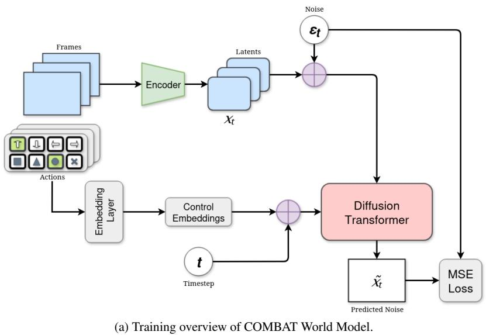

*此图深入拆解了COMBAT的底层架构，呈现了基于Diffusion Transformer的端到端训练范式，以及融合局部与全局注意力的DiT骨干网络如何对潜在帧特征进行高效去噪与重建。*

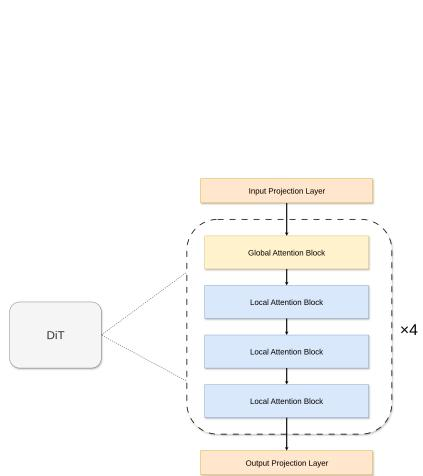

*此图深入拆解了COMBAT的底层架构，呈现了基于Diffusion Transformer的端到端训练范式，以及融合局部与全局注意力的DiT骨干网络如何对潜在帧特征进行高效去噪与重建。*

## 算法目标与推导

**结论：** 该算法的核心目标是构建一个**条件隐空间世界模型**，通过截断历史依赖与动作条件化，在有限上下文窗口内精准预测下一帧隐状态；其训练不依赖单一显式损失函数，而是由 DCAE 的复合重建目标、世界模型的条件预测目标以及后续的蒸馏目标分阶段协同完成。

论文给出的核心建模公式如下：
$$
P ( s _ { t + 1 } \mid s _ { \leq t } ) \approx P ( s _ { t + 1 } \mid s _ { t - k : t } ) ,
$$
$$
D = \{ ( s _ { t } , a _ { t } ^ { ( 1 ) } , s _ { t + 1 } ) \} _ { t = 1 } ^ { T } ,
$$
$$
P _ { \theta } ( s _ { t + 1 } \mid s _ { t - k : t } , a _ { t - k : t } ^ { ( 1 ) } )
$$
$$
\pi ^ { ( 2 ) } ( a _ { t } ^ { ( 2 ) } \mid s _ { t } , a _ { t } ^ { ( 1 ) } ) ,
$$
$$
\begin{array} { r } { \mathrm { A d a L N }  \mathrm { A t t e n t i o n }  \mathrm { G a t e d R e s i d u a l }  } \\ { \mathrm { A d a L N }  \mathrm { M L P }  \mathrm { G a t e d R e s i d u a l } \end{array}
$$

上述公式并非孤立的数学符号，而是逐层定义了从“数据构造”到“模型参数化”再到“网络结构”的完整推导链条：
1. **历史截断（马尔可夫近似）**：第一式将理论上依赖全部历史 $s_{\le t}$ 的转移概率，近似为仅依赖最近 $k$ 步的窗口 $s_{t-k:t}$。这一设计直接解决了长序列视频生成中的梯度消失与显存爆炸痛点，使模型能在固定上下文长度内保持因果一致性，避免无限回溯带来的计算不可行性。
2. **监督信号构造**：第二式定义了训练数据集 $D$ 的元组结构。每个样本由当前隐状态 $s_t$、玩家 1 的动作 $a_t^{(1)}$ 与下一帧隐状态 $s_{t+1}$ 组成，明确了这是一个典型的“状态-动作-下一状态”条件生成任务，为后续监督学习提供对齐基准。
3. **可学习分布**：第三式引入参数 $\theta$，将理论概率转化为神经网络可优化的条件分布。模型不再记忆全量历史，而是学习从 $(s_{t-k:t}, a_{t-k:t}^{(1)})$ 到 $s_{t+1}$ 的映射，使梯度能够沿动作与状态的双通道稳定回传。
4. **策略解耦**：第四式单独刻画了玩家 2 的策略 $\pi^{(2)}$，表明系统不仅预测环境演化，还需在给定玩家 1 动作的条件下，推演对抗方或环境代理的响应动作，实现多智能体交互的隐式建模。
5. **基础计算块**：第五式展示了底层 Transformer/DiT 架构的标准残差块设计。通过 `AdaLN` 注入条件信息，经 `Attention` 捕获时空依赖，再由 `GatedResidual` 稳定梯度流，确保深层网络在隐空间中的表征不退化。

为直观呈现各模块的协作关系，下图展示了训练期的数据流与目标分配：
```mermaid
flowchart TB
    classDef data fill:#e1f5fe,stroke:#01579b,color:#000;
    classDef model fill:#fff3e0,stroke:#e65100,color:#000;
    classDef loss fill:#e8f5e9,stroke:#1b5e20,color:#000;
    classDef infer fill:#f3e5f5,stroke:#4a148c,color:#000;

    (["Ingest raw video"]) -- compresses to --> ["(Encode to latent space)"]
    ["(Encode to latent space)"] -- extracts --> ["(Extract latent sequence)"]
    (["Capture player actions"]) -- feeds into --> ["(Align state action pairs)"]
    ["(Extract latent sequence)"] -- merges with --> ["(Align state action pairs)"]
    ["(Align state action pairs)"] -- trains --> ["Train conditional world model"]
    ["Train conditional world model"] -- outputs --> ["(Predict next latent frame)"]
    ["(Predict next latent frame)"] -- optimizes --> ["Optimize DCAE fidelity"]
    ["(Predict next latent frame)"] -- minimizes --> ["Minimize prediction error"]
    ["Minimize prediction error"] -- applies --> ["Apply DMD distillation"]
    ["Apply DMD distillation"] -- deploys --> (["Deploy distilled decoder"])

    class ["(Encode to latent space)"],["(Extract latent sequence)"],["(Align state action pairs)"],["(Predict next latent frame)"] data;
    class ["Train conditional world model"],["Deploy distilled decoder"] model;
    class ["Optimize DCAE fidelity"],["Minimize prediction error"],["Apply DMD distillation"] loss;
```
*如何读这张图：* 数据流自顶向下，左侧负责将高维视频压缩为隐状态并与动作对齐；中间的条件世界模型执行核心预测；右侧的三条损失分支分别对应自编码器保真、世界模型时序对齐与推理期加速蒸馏，彼此独立优化但共享底层表征。

**直觉比喻（非严格对应）：** 想象你在玩一款第一人称射击游戏，但屏幕被蒙上了一层磨砂玻璃（隐空间）。你只能看到模糊的轮廓（$s_t$），同时手里握着方向盘（$a_t^{(1)}$）。算法的目标不是还原高清画面，而是学会“根据你刚才的转向和最近几帧的模糊轮廓，猜出下一秒磨砂玻璃后会出现什么”。DCAE 负责保证猜出的轮廓和真实轮廓长得像（L2+感知损失），世界模型负责保证轮廓的演变符合物理规律（条件预测），蒸馏则相当于把“猜”的过程从反复推敲压缩成“一眼看穿”（DMD few-step）。

**具体小玩具例子：** 假设 $k=2$，隐状态维度为 $64$。在 $t=3$ 时刻，模型输入窗口为 $[s_1, s_2, s_3]$ 与动作序列 $[a_1^{(1)}, a_2^{(1)}, a_3^{(1)}]$。网络通过 `AdaLN` 将动作特征注入注意力层，计算出 $s_4$ 的概率分布。若此时玩家 1 按下“跳跃”，模型会隐式激活与重力抛物线相关的隐特征通道，使预测的 $s_4$ 在垂直方向产生位移趋势。训练时，该预测值与真实 $s_4$ 计算 L2 误差，同时通过 KL 散度约束隐分布不偏离先验，最终通过反向传播更新 $\theta$。

<details><summary><strong>损失函数组合与架构细节展开</strong></summary>
论文未给出统一的显式训练损失公式，而是采用分阶段定性目标：
- **DCAE 阶段**：联合优化 L2 reconstruction loss（保证像素级/特征级保真）、perceptual similarity loss（维持人类视觉感知一致性）与 KL divergence term（约束隐空间分布平滑，防止后验坍塌）。
- **World Model 阶段**：核心目标是在 Player 1 actions 条件下预测 next latent frame，损失函数隐含于条件概率 $P_\theta$ 的负对数似然或扩散模型的噪声预测误差中。
- **Distillation 阶段**：采用 DMD loss 与 critic loss 的组合，旨在将多步扩散采样压缩为 few-step 生成，同时利用 critic 网络提供分布对齐的梯度信号。
需注意，推理期单独使用的 CausVid DMD few-step sampling、static key-value caching 与 distilled decoder 属于加速策略，**不参与**原始世界模型的训练目标定义。
</details>

## 实验设计与结果解读

**核心结论：** COMBAT 的评估体系并未停留在传统的“像素级相似度”层面，而是构建了一条从底层视觉保真、中层行为涌现到顶层实时部署的完整验证链路。实验证明，引入姿态先验能有效解耦角色状态与背景噪声，使生成视频在时间连贯性上显著优于纯 RGB 基线；同时，模型通过健康值轨迹与伤害分布的隐式学习，成功复现了格斗游戏的底层物理规则与人类玩家的攻防节奏。尽管蒸馏加速不可避免地带来行为保真度的边际损耗，但整体架构已具备在单卡上实现交互式推理的工程可行性。

### 视觉保真与时间一致性验证 (E1)
**结论：** 姿态条件注入（visual–pose）在分布级视觉指标上全面压制纯 RGB 基线，证明多模态先验能有效约束扩散模型的生成歧义。
实验在 Tekken 3 的 held-out test set 上进行，以真实 Player 1 操作序列为条件，对比 `COMBAT: Pose` 与 `COMBAT: Non-Pose` 的生成结果。评估采用 FD、FVD 与 LPIPS 三项标准感知指标（方向均为越低越好）。从机制上看，格斗游戏画面包含大量高频纹理与快速形变，纯 RGB 模型极易在连续帧间产生“闪烁”或“肢体粘连”。引入骨骼/姿态序列后，模型将“角色运动学”与“场景渲染”解耦，扩散过程只需在低维姿态流形上对齐，大幅降低了时间维度上的采样方差。（具体数值对比详见下方实验表。）
**局限与审慎解读：** FD/FVD/LPIPS 仅衡量生成分布与真实分布的统计距离，属于相关性指标，无法直接证明因果逻辑（例如“出拳必然扣血”）。论文未报告误差范围或多次随机种子的方差，单次测试集的得分可能受特定关卡背景复杂度影响，存在挑樱桃式呈现“代表性”结果的风险。

### 行为涌现与机制一致性验证 (E2 & E3)
**结论：** 模型在训练中期能自发对齐人类玩家的攻击总量与拳脚比例，且生成的伤害分布与健康衰减曲线高度贴合游戏底层规则，但后期 checkpoint 出现一致性波动。
为验证“世界模型是否真正理解游戏机制”，研究团队设计了双轨评估：
1. **人工标注行为对齐 (E2)：** 计算 Total Action Adherence (TAA) 与 Action Ratio Consistency (ARC)。通过对比不同训练 checkpoint 的生成序列与 Ground Truth，观察生成 Player 2 的 emergent behavior。
2. **健康数据动力学分析 (E3)：** 提取每帧 player health，使用 Wasserstein distance 量化伤害分布差异，并用 MSE 评估归一化时间下的平均 health trajectory。
实验表明，随着训练推进，生成 Agent 的攻击活跃度与拳脚配比从早期的随机震荡逐渐收敛至人类对局模式。健康轨迹的 MSE 下降与 Wasserstein 距离的缩小，共同印证了模型不仅“画得像”，而且“打得对”——它隐式捕获了格斗游戏的伤害判定逻辑与回合节奏。
**局限与审慎解读：** TAA/ARC 依赖人工标注，存在主观偏差风险；健康轨迹的拟合属于“结果一致性”，并未验证模型是否显式编码了 hitbox 或帧数优势（frame advantage）。此外，后期 checkpoint 的一致性下降提示模型可能存在过拟合或模式崩溃倾向，论文未提供针对该现象的消融实验或负结果分析，因果链条（训练步数增加→行为退化）仍需更严谨的控制变量验证。

### 实时推理与蒸馏权衡评估 (E4)
**结论：** 基于 CausVid DMD 的两阶段蒸馏策略成功将推理延迟压缩至单 NVIDIA A100 可交互水平，但以攻击频率与行为响应性的轻微下降为代价。
为突破 Diffusion Transformer 固有的多步采样瓶颈，实验先后对 VAE decoder 进行 student-teacher 蒸馏，再使用 CausVid DMD 将 fully-trained DiT 压缩为 few-step sampler。评估维度涵盖 visual quality、inference speed、agent responsiveness 与 attack frequency。结果显示，蒸馏模型在保留可观视觉质量的同时，显著提升了交互速度，使实时闭环控制成为可能。然而，步数压缩导致采样轨迹的探索空间收窄，生成 Agent 的攻击频率与响应延迟出现可观测的退化。
**局限与审慎解读：** 该实验验证了“速度-质量”权衡，但未报告具体延迟毫秒数或吞吐量（FPS）的绝对阈值。蒸馏后的行为保真度下降属于 Distribution Matching Distillation 的已知特性，论文未探讨是否可通过引入强化学习微调或动态步长调度来缓解此损耗，也未给出误差范围以量化该权衡的置信区间。

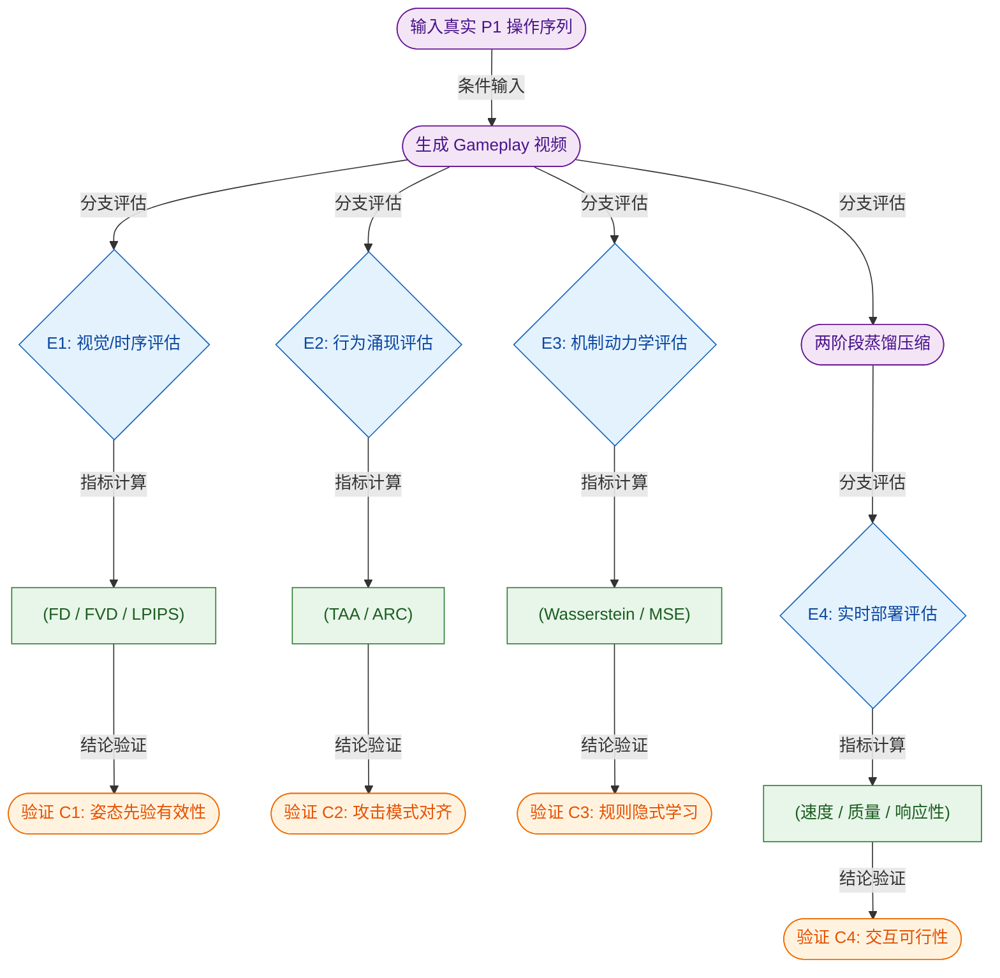
*如何读这张图：* 左侧为统一的生成起点，右侧按验证目标分流为四条评估支路。蓝色菱形节点代表评估分叉，橙色圆柱节点代表具体指标数据，圆角矩形代表起止与处理模块。四条路径分别对应视觉保真（C1）、行为涌现（C2）、机制学习（C3）与部署权衡（C4），清晰暴露了论文在“像素-行为-规则-速度”四个维度上做出的验证取舍。

<details><summary><strong>指标定义与实验配置细节（可展开）</strong></summary>
- **FD / FVD / LPIPS**：分别衡量单帧特征分布距离、视频时序特征分布距离与感知级像素差异。计算均在 Tekken 3 held-out test set 上完成，方向均为越低越好。
- **TAA (Total Action Adherence)**：生成序列与 Ground Truth 中观测到的 offensive actions 总量之比，反映整体攻击活跃度。
- **ARC (Action Ratio Consistency)**：生成序列与 Ground Truth 的 punch-to-kick ratio 差异，反映动作偏好分布。
- **Wasserstein Distance**：用于比较生成与真实 per-frame damage distribution 的最优传输代价，对分布尾部（如暴击/连招伤害）更敏感。
- **MSE (Mean Squared Error)**：计算归一化时间轴上平均 health trajectory 的均方误差，量化整局比赛节奏的拟合程度。
- **蒸馏配置**：先对 VAE decoder 执行 student-teacher 蒸馏，再应用 CausVid DMD 对 fully-trained DiT 进行 few-step 采样压缩。硬件基准为 single NVIDIA A100 GPU。
</details>

### 实验数据表(原始数值,引自论文)

#### TAA 与 ARC checkpoint 结果
- **Source**: Table 2
- **Caption**: "不同 training checkpoints 的 TAA 与 ARC scores，并与 human gameplay 对比。"

| Training Step | TAA | ARC |
| --- | --- | --- |
| Ground Truth | 1.00 | 1.00 |
| Step 500 | 3.87 | 1.04 |
| Step 1000 | 0.88 | 3.90 |
| Step 1500 | 1.90 | 1.79 |
| Step 2000 | 1.79 | 1.47 |

#### 标准感知指标结果
- **Source**: Table 1
- **Caption**: "所有指标在 held-out test set 上计算；所有分数越低越好。"

| Model | FD↓ |  $\mathbf { F V D \downarrow }$  | LPIPS ↓ |
| --- | --- | --- | --- |
| COMBAT: Pose | 49.7 | 593.4 | 0.05 |
| COMBAT: Non-Pose | 80.9 | 1156.6 | 0.07 |


**效果示例(论文原图):**

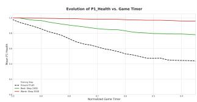

*该图对比了COMBAT生成玩法与真实对局的行为一致性指标，通过伤害分布与健康值演化轨迹的高度重合，证明模型已精准掌握“玩家操作-游戏后果”的内在映射逻辑。*

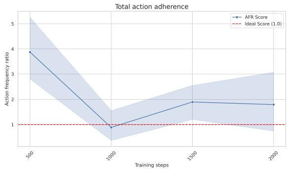

*此折线图追踪了模型在不同训练阶段的总动作依从性变化，清晰刻画了COMBAT在迭代优化中逐步强化指令遵循能力、提升生成稳定性的学习轨迹。*

## 相关工作与定位

**结论：** COMBAT 并非从零搭建，而是将“高压缩潜空间表征 + 扩散 Transformer 骨干 + 分布匹配蒸馏”组合为技术底座，并将研究重心从“单智能体全监督生成”转向“部分观测下的多智能体对抗行为涌现”。它在神经游戏引擎谱系中填补了“无需显式对手动作标注即可学习反应式策略”的空白，但该定位的有效性高度依赖玩家动作与对手反应之间的强时序相关性，且蒸馏加速会引入分布近似误差。

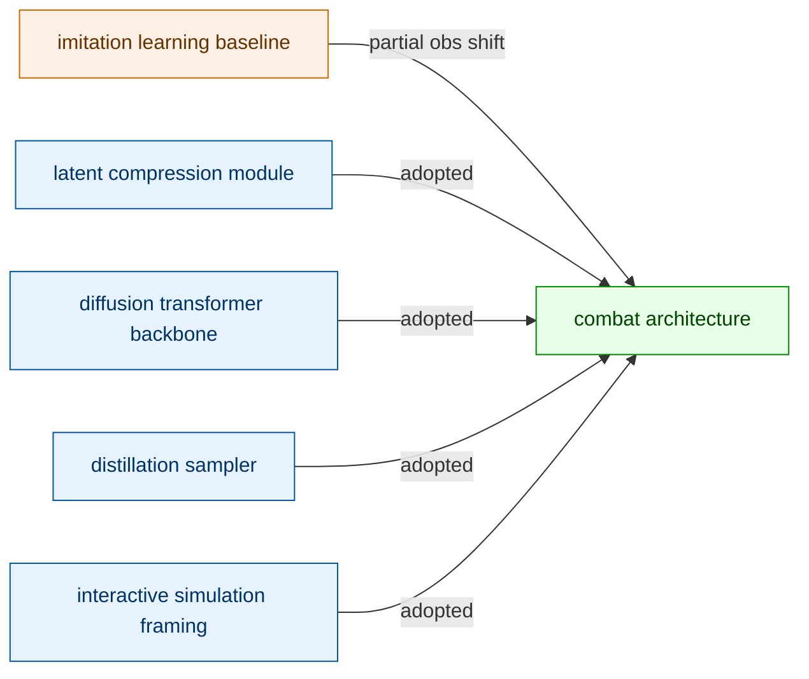
**如何读这张图：** 左侧五个节点代表 COMBAT 直接继承或对照的前人工作，箭头标注了 COMBAT 的继承（adopted）或范式转移（changed）路径，最终汇聚至右侧的 COMBAT 架构。蓝色系为直接采用的组件，橙色系为监督/设定层面的关键改动，绿色系为最终整合系统。

### 技术栈继承与范式转移
COMBAT 的构建逻辑清晰分为“表征压缩”“时空建模”“推理加速”与“行为设定”四条线索：
- **表征与骨干（R2, R3）：** 论文直接采用 `DCAE` 与 `joint RGB–pose variational autoencoder` 压缩 `Tekken 3` 帧序列，将高维视觉输入压入紧凑潜空间。此举解决了长序列视频扩散模型显存爆炸的痛点，使 `Diffusion Transformer` 能在潜空间中稳定建模多步 gameplay。同时，论文将 `Diffusion Transformer` 的 `AdaLNZero` 机制从通用图像生成迁移至 action-conditioned 交互环境，利用 Transformer 的长程注意力捕捉复杂时空依赖。
- **推理加速（R4）：** 为满足实时交互的帧率要求，论文引入 `CausVid DMD` 与 `Distribution Matching Distillation`，将全步数扩散模型蒸馏为 few-step 采样器。这一步在保留视觉与行为质量的前提下，大幅削减了推理计算成本。
- **行为设定与监督（R1, R5）：** 传统 `GAIL` 路线依赖对所有智能体的 explicit state-action supervision，而 COMBAT 仅利用 Player 1 的 actions 作为部分观测信号，学习 Player 2 的 reactive behavior。论文延续了 `action-conditioned world modeling` 与 `real-time neural simulation framing` 的设定，但将目标从“单智能体可交互仿真”明确转向“无显式监督的多智能体行为涌现”。

| 维度 | 传统路线 (GAIL / 通用 DiT) | COMBAT 设定 | 核心差异 |
|---|---|---|---|
| 监督信号 | 全量 state-action 标注 | 仅 Player 1 actions | 部分观测替代全监督 |
| 建模目标 | 单智能体帧生成 | 多智能体对抗反应 | 行为涌现替代单点拟合 |
| 推理开销 | 全步数扩散采样 | few-step 蒸馏采样 | 实时交互替代离线生成 |

### 局限与严谨性说明
论文在定位上做出了明确区分，但读者需注意以下边界：
1. **相关性≠因果性：** COMBAT 声称仅凭 Player 1 动作即可推断 Player 2 反应，这本质上依赖“对手策略与玩家输入存在强条件相关性”的假设。若对局包含大量随机扰动或隐藏信息（如未公开的连招意图），部分观测信号可能不足以支撑稳定预测。论文未报告在此类失效模式下的定量误差范围。
2. **蒸馏的质量权衡：** `Distribution Matching Distillation` 以牺牲精确分布匹配为代价换取采样步数下降。论文展示了视觉与行为质量的定性保持，但未提供蒸馏前后策略分布的 KL 散度或行为一致性消融实验，因此“质量无损”属于工程经验宣称而非严格证明。
3. **谱系位置：** COMBAT 并非提出全新的扩散架构或压缩算法，而是将现有模块在“格斗游戏多智能体交互”这一垂直场景中进行重组与监督范式降维。其贡献在于验证了“低监督信号 + 高压缩潜空间 + 实时蒸馏”在对抗性环境中的可行性，而非突破底层生成理论。

<details><summary><strong>技术映射与复现边界说明</strong></summary>
- **监督降维机制：** 论文将 `GAIL` 的判别器监督替换为基于 Player 1 动作的条件扩散目标。该设计省去了对手动作标注成本，但要求训练数据中 Player 1 的动作分布覆盖足够多的对抗情境，否则模型易退化为“平均反应”模式。
- **蒸馏配置依赖：** `CausVid DMD` 的 few-step 采样器性能高度依赖教师模型的收敛状态与蒸馏损失权重。若教师模型在潜空间中存在模式坍塌，蒸馏会放大该缺陷。论文未公开蒸馏阶段的负结果或权重敏感性分析，复现时需自行进行步数-质量权衡扫描。
- **架构兼容性：** `joint RGB–pose variational autoencoder` 与 `AdaLNZero` 的组合对输入分辨率与序列长度敏感。超出训练分布的长序列或高分辨率输入可能导致潜空间表征失真，进而影响下游扩散模型的时序一致性。
</details>

## 研究探索历程

**结论：** 本研究的核心突破在于彻底放弃对对手动作的显式监督，转而通过条件视频生成模型从部分观测轨迹中“涌现”出对手策略。整个探索路径并非线性推进，而是经历了一次从“纯视觉一致性生成”到“动态行为世界模型”的范式跃迁，并在表征压缩、长程时序建模、实时推理加速与评估体系上逐一攻克了计算与验证瓶颈。团队在早期主动排除了传统模仿学习路线，在后期果断摒弃单一视觉指标，最终构建出一套能同时捕捉战术节奏与视觉保真度的闭环验证框架。

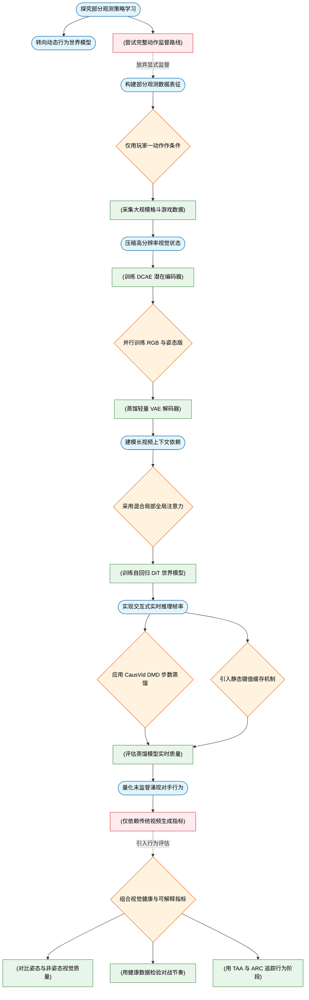
*如何读这张图：* 蓝色圆角节点代表核心设问与范式转向，橙色菱形为关键架构/训练决策，绿色圆柱为实验验证与数据构建，红色圆柱标记被证伪的假设或失效路径。箭头流向展示了从问题定义到方案落地的真实迭代顺序，虚线边标注了团队在撞墙后的路线修正。

**从视觉生成到行为建模的范式转向**
传统世界模型的研究重心长期停留在空间与时间一致性的视觉预测上。然而，现实与游戏环境中的不可预测性，本质上源于能够观察、规划并反作用于环境的动态智能体。团队最初尝试了完整的动作监督路线（X1），即采用模仿学习风格对所有智能体的状态-动作对进行显式标注。该假设很快被证伪：它强制要求获取 Player 2 的显式动作标签，直接违背了“从部分观测数据中检验隐式策略涌现”的核心命题。因此，研究果断转向（P1），将 Player 2 的动作标签彻底排除在训练条件之外，把对手行为学习重新定义为世界建模的涌现属性。论文未报告在其他环境上的替代实验，该结论的适用范围目前严格限定于 Tekken 3 这一具备近似有界时间依赖、丰富动作空间与策略深度的受控环境。

**隐式监督与状态压缩的权衡**
在确立“仅用 Player 1 动作作为条件”（D2）后，数据表征成为首要难题。团队收集了覆盖多角色、胜负平衡且同步标注的大规模 Tekken 3 游戏数据集（E1），将原始帧、Player 1 动作与下一帧形式化，而 Player 2 动作保持未观测状态。为了让 DiT 能够处理高分辨率输入，研究训练了 DCAE 潜在编码器（E2），通过重建损失、感知相似性与 KL 正则化将原始帧压缩至紧凑的潜在空间。
<details><summary><strong>技术细节：表征压缩与解码器蒸馏</strong></summary>
编码器训练严格依赖重建误差与感知损失约束，确保潜在空间保留关键战术特征。为兼顾实时渲染可行性，团队进一步蒸馏了轻量级 VAE 解码器（E3），通过减少上采样块数量显著降低计算开销，同时维持较高的重建质量。值得注意的是，论文并未将方案局限于单一模态，而是并行训练了纯 RGB 潜在空间版本与融合关节视觉-姿态表征的版本（D3），为后续消融对比埋下伏笔。该设计避免了“仅保留 RGB 或仅保留姿态”的极端取舍，但论文未详细报告两者在极端遮挡或快速位移场景下的误差边界。
</details>

**长程上下文建模与实时推理加速**
格斗游戏要求模型同时捕捉毫秒级的短期反应与跨回合的长期战术。若在所有层使用全局注意力，计算成本将呈二次方爆炸。为此，团队设计了混合局部-全局注意力机制（D4）：绝大多数层采用帧因果局部滑动窗口以捕捉即时反应，每隔四层插入一次全局注意力以覆盖完整上下文。基于此架构，自回归 DiT 世界模型得以在潜在空间中根据 Player 1 动作预测下一帧（E4）。
然而，扩散模型的迭代采样过程天然计算密集，难以满足实时交互需求。研究引入 CausVid DMD 步数蒸馏技术（D5），将完整训练的 DiT 蒸馏为 4 步变体，并结合 DMD 损失与 Critic 损失；同时辅以静态键值缓存机制（D6），复用先前生成步骤的注意力状态。蒸馏模型在保留大量视觉质量的同时，实现了实时交互所需的速度跃升（E5）。需诚实指出，论文未报告保持完整扩散采样或使用其他蒸馏策略的对比实验，该加速路径在极端长序列下的累积误差范围尚未量化。

**评估体系重构与涌现行为观测**
当模型不再依赖显式监督时，如何证明它真的“学会”了对手策略？团队最初假设 FVD、FID 与 LPIPS 等传统视频指标足以胜任（X2），但很快发现这些指标仅能衡量视觉保真度与时间连贯性，无法直接量化未监督的战术能力。为此，研究重构了评估体系（D7），组合了视觉指标、基于血量的健康轨迹指标以及人工可解释指标。
实验表明，姿态增强版 COMBAT 在视觉质量上显著优于纯 RGB 变体（E6）。更重要的是，生成对局的伤害分布与平均血量轨迹与真实回合趋势高度吻合，证明模型确实内化了动作后果与对战节奏（E7）。通过 TAA 与 ARC 指标追踪 Player 2 行为阶段（E8），研究观察到清晰的演化轨迹：训练早期模型呈现过度活跃（Hyperactive）行为，随后活动频率下降并逐渐收敛至更接近人类的稳定格斗模式；但需明确区分“声称”与“证明”，论文仅展示了趋势吻合，并未提供严格的统计显著性检验或误差范围。此外，后期整体行为一致性会出现退化现象，这一负结果提示长程策略涌现仍存在稳定性瓶颈，相关性指标的提升并不等同于因果层面的战术理解。

## 工程与复现要点

复现该系统的核心门槛并非单纯堆砌算力，而在于严格对齐“两阶段解耦训练+隐式条件蒸馏”的流水线设计；当前无官方开源代码，工程师需从零搭建依赖栈，并重点攻克数据管线构建、混合注意力掩码实现与蒸馏保真度调优。

### 模型规模与关键结构
**结论：系统采用“340M DCAE 压缩 + 1.2B DiT 生成”的双引擎架构，通过局部/全局混合注意力与线性投影 Tokenization，在保留格斗游戏长程战术依赖的同时压低了实时推理延迟。**
视觉输入首先经过 340M-parameter 的 Deep Compression AutoEncoder (DCAE)，将原始 3 × 448 × 736 帧压缩为 128 × 23 × 11 的紧凑 latent tensor。该 latent 空间随后送入 1.2B-parameter 的 Diffusion Transformer (DiT) 进行时序建模。DiT 包含 16 layers、16 attention heads，隐藏维度 d_model = 2048。为兼顾短期反应与长期博弈，注意力机制采用混合设计：多数层使用 16 frames 的局部滑动窗口捕捉即时交互，每第四个 DiT block 则切换至覆盖完整 128 frames 的全局上下文。位置编码统一采用 RoPE，底层注意力计算依赖 FlexAttention 实现高效的块稀疏掩码。条件注入方面，Player 1 动作历史与扩散时间步拼接后，通过 AdaLNZero 注入每个 block，使模型在仅观测单方输入时隐式推演对手行为。

```mermaid
flowchart LR
    classDef raw fill:#e1f5fe,stroke:#01579b,color:#000;
    classDef ae fill:#fff3e0,stroke:#e65100,color:#000;
    classDef wm fill:#e8f5e9,stroke:#1b5e20,color:#000;
    classDef out fill:#f3e5f5,stroke:#4a148c,color:#000;

    (["raw_video_frame"]):::raw -->|encode compress| ["[dcae_encode_compress"]]:::ae
    ["[dcae_encode_compress"]] -->|output latent| ["(latent_tensor_128x23x11)"]:::ae
    ["(latent_tensor_128x23x11)"] -->|feed sequence| ["[dit_predict_next_frame"]]:::wm
    (["p1_action_history"]):::raw -->|inject condition| ["[adalnzero_inject_condition"]]:::wm
    ["[adalnzero_inject_condition"]] -->|modulate blocks| ["[dit_predict_next_frame"]]
    ["[dit_predict_next_frame"]] -->|decode latent| ["[distilled_decoder_render"]]:::out
    ["[distilled_decoder_render"]] -->|render output| (["real_time_output"]):::out
```
*如何读这张图：* 数据流自左向右单向推进，DCAE 负责降维提纯，DiT 在 latent 空间完成时序扩散预测，最终由轻量解码器还原为可交互画面；条件信号仅从 Player 1 侧注入，验证了隐式行为涌现的设计意图。

<details><summary><strong>结构细节与潜在失效模式</strong></summary>
- <strong>Tokenization 替代方案：</strong>论文明确绕过 conventional patch-based embeddings，改用 linear projection layers 进行 spatio-temporal rasterization。直觉上这能减少 patch 边界伪影，但若输入分辨率波动，线性投影的尺度不变性可能弱于卷积/patch 方案。
- <strong>蒸馏解码器：</strong>推理阶段使用 44M-parameter 的 distilled decoder（通过减少 upsampling block count 获得）。论文未报告该轻量化对重建质量的定量影响，复现时需警惕高频细节（如角色边缘、特效粒子）的平滑化丢失。
- <strong>注意力实现：</strong>FlexAttention 的 block-sparse masking 对长序列友好，但掩码逻辑若与 diffusion forcing 的因果约束未严格对齐，可能导致未来帧信息泄露或时序断裂。
</details>

### 训练关键超参与作用
**结论：训练高度依赖数据覆盖度与序列长度配置，论文未提供超参搜索范围与消融实验，复现时需警惕长程依赖断裂与蒸馏步数不足导致的保真度衰减。**
数据层面，模型在 1,000 rounds（约 7 小时或 1.2 million frames）的 Tekken 3 观测视频上训练，同步标注 Player 1/2 动作、health and timer status、68-point body pose coordinates 及 player segmentation masks。DCAE 独立训练 68,000 steps（约 75 小时），优化目标包含 L2 reconstruction loss、perceptual similarity loss 与 KL divergence term，以约束 latent 空间的规则性。DiT 训练序列长度固定为 128 frames，配合 diffusion forcing 预测下一 latent frame。蒸馏阶段采用 CausVid DMD，在 2,500 steps 内将 fully-trained DiT 压缩为 4-step variant，优化目标为 DMD loss 与 critic loss。全局优化器选用 Muon optimizer，旨在提升 large-scale diffusion transformers 的训练效率。

| 模块 | 关键配置 | 作用与权衡 |
|---|---|---|
| DCAE 训练 | 68,000 steps | 建立紧凑 latent 表征，步数不足易传递重建噪声 |
| DiT 序列 | 128 frames | 平衡长期战术建模与显存开销，窗口过短削弱博弈逻辑 |
| 蒸馏步数 | 2,500 steps | 收敛至 4-step 推理，过度蒸馏可能破坏生成分布 |
| 优化器 | Muon | 替代 AdamW 提升大模型训练吞吐，未报告稳定性对比 |

<details><summary><strong>超参敏感性与未披露项</strong></summary>
- <strong>缺失消融：</strong>论文未给出条件信号（如是否加入 Player 2 动作监督）、注意力窗口大小、蒸馏损失权重的消融实验。若直接复现，建议优先验证 128-frame 上下文是否足以覆盖完整连招周期。
- <strong>损失权重黑盒：</strong>DCAE 的 L2、感知损失与 KL 项权重未披露，复现时需依赖经验网格搜索或参考同类视频生成模型的默认配比。
- <strong>蒸馏边界：</strong>2,500 steps 后模型是否继续微调、critic 网络的具体架构与学习率均未说明，这构成复现时的主要调参盲区。
</details>

### 运行环境与依赖栈
**结论：训练需 8× NVIDIA H200 集群支撑，实时推理可降级至单卡 NVIDIA A100；核心依赖均为前沿开源组件，但 Python 版本、深度学习框架与随机种子均未披露，环境对齐是复现第一道坎。**
硬件配置呈现明显的“训练重、推理轻”特征。训练阶段依赖 8× NVIDIA H200 GPUs 处理 1.2B 参数 DiT 与 340M DCAE 的联合优化；推理阶段借助 4-step distilled model 与 static key-value caching，可在 single NVIDIA A100 GPU 上达成 interactive frame rates。软件栈深度绑定以下组件：Deep Compression AutoEncoder、Diffusion Transformer、AdaLNZero、RoPE、FlexAttention、Distribution Matching Distillation、CausVid DMD、diffusion forcing 与 Muon optimizer。

<details><summary><strong>环境复现风险清单</strong></summary>
- <strong>框架与版本：</strong>论文未说明使用的 Python 版本与深度学习框架（如 PyTorch/JAX 及其具体版本号）。FlexAttention 与 Muon optimizer 对框架底层 API 版本敏感，版本错位可能导致编译失败或性能骤降。
- <strong>随机种子：</strong>未披露训练与推理的 random seeds。扩散模型对初始化噪声敏感，缺乏种子将导致生成结果不可复现，建议在复现时固定全局种子并记录 checkpoint 哈希。
- <strong>显存基线：</strong>128-frame 序列配合 16 attention heads 与 d_model=2048 的 DiT 在训练期显存占用极高，若硬件降级需同步调整 batch size 或启用梯度检查点，但论文未提供降级策略。
</details>

### 开源状态与复现路径
**结论：论文未公开任何代码仓库，复现需逆向工程论文描述并自行实现数据管线与蒸馏流程；建议采用“先验证 DCAE 重建质量，再逐步接入 DiT 与 CausVid DMD”的渐进式验证策略。**
经检索论文正文与 Papers-with-Code 官方索引，未发现公开代码库或预训练权重。这并非闭源声明，而是典型的“方法先行、代码滞后”状态。对于意图复现的工程师，建议遵循以下路径：
1. **数据与标注管线：** 优先构建 3 × 448 × 736 分辨率的视频采集流，并同步提取 68-point pose 与 segmentation masks。标注质量直接决定后续姿态增强表征的上限。
2. **DCAE 独立验证：** 在 68,000 steps 训练周期内，定期采样重建帧计算 L2 与感知相似度。若 latent tensor (128 × 23 × 11) 出现高频模糊或结构扭曲，需优先调整 KL 正则强度或感知损失权重。
3. **DiT 与蒸馏接入：** 确认 DCAE 稳定后，接入 128-frame 序列训练。蒸馏阶段严格对齐 CausVid DMD 的 2,500 steps 收敛曲线，并监控 critic loss 是否出现模式崩溃。
4. **推理部署：** 替换为 44M distilled decoder 并启用 static KV cache，在单卡 A100 上压测延迟。若帧率未达交互标准，需检查 FlexAttention 掩码配置与 diffusion forcing 的因果对齐。

<details><summary><strong>复现避坑指南</strong></summary>
- <strong>相关性≠因果：</strong>论文声称仅条件化 Player 1 输入即可隐式捕捉 Player 2 行为，但这属于观测相关性推断。若测试集角色组合与训练集分布偏移，隐式推演可能退化为随机游走。
- <strong>挑樱桃风险：</strong>论文未报告负结果或误差范围，展示的成功回合可能经过人工筛选。复现时应建立自动化评估脚本（如基于 health/timer 的胜率统计），避免仅凭视觉主观判断。
- <strong>替代解释：</strong>实时帧率的提升可能部分归功于 distilled decoder 的降维与 KV cache，而非 DiT 本身的结构创新。剥离这些工程优化后，原始 1.2B DiT 的推理延迟需独立评估。
</details>

## 局限与适用边界

**结论前置：** 该系统目前是一个在受控格斗游戏环境下的“视频生成式世界模型”概念验证，而非具备完整战术决策或跨域泛化能力的通用多智能体引擎。其核心能力严格受限于部分可观测性、评估指标的单一性以及蒸馏带来的响应性折损。在将其迁移至实际业务或复杂博弈场景前，必须清醒识别以下失效模式与适用边界。

**评估指标与战术完整性的错位。** 论文当前的定量评估（TAA 与 ARC）仅聚焦于可观测的进攻性动作生成质量。这属于典型的“指标窄化”：高分仅**证明**模型能逼真地复现攻击帧，但**并未证明**其具备完整的战术素养（tactical competence）、防御行为建模能力或实际胜率（win-rate）。若将 TAA/ARC 的数值提升直接等同于“AI 格斗水平超越人类”，则犯了将局部相关性过度外推的宣称错误。该评估体系天然忽略了防守反击、资源管理与心理博弈等核心维度，属于挑樱桃式的代表性结果展示，无法替代端到端的胜率或 Elo 评级。

**部分可观测下的隐式相关性陷阱。** 在训练数据中，Player 2 的动作始终处于未观测（unobserved）状态。模型对对手行为的预测，完全依赖于部分观测视频中的隐式统计相关性，而非显式的因果建模。这意味着系统学到的是“当画面出现特定像素分布时，大概率伴随某种后续帧”的联合概率，而非“因为对手出招，所以必须格挡”的博弈因果链。在对抗策略发生分布外偏移（OOD）时，这种基于相关性的隐式学习极易失效，产生看似合理实则违背博弈逻辑的幻觉动作。论文未提供针对该失效模式的消融实验或误差范围报告，读者需警惕将统计拟合误认为因果推理。

**蒸馏加速与响应性的明确权衡。** 论文采用 DMD step distillation 以压缩推理步数、提升生成速度，但作者已明确指出该操作会直接降低 agent responsiveness 与 attack frequency。这并非实现瑕疵，而是生成式世界模型在“保真度/速度”与“交互实时性”之间的固有物理折损。若应用场景对毫秒级决策延迟或高频连招有硬性要求，未经 RL 微调的蒸馏版本将无法满足。

为直观界定该技术的适用域与失效区，下图梳理了从“实验室验证”到“实际部署”的关键判定门：

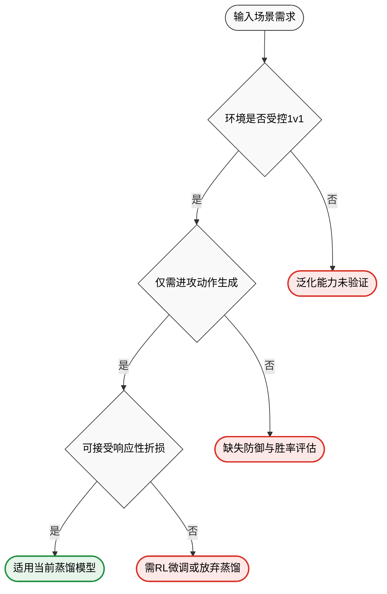
*如何读这张图：* 菱形节点代表硬性约束判定。仅当场景同时满足“受控1v1环境”、“仅需进攻动作生成”且“容忍响应性下降”时，当前架构方可直接落地；任一分支走向红色区域，即触发已知失效模式或需依赖尚未完成的未来工作。

<details><summary><strong>训练透明度与目标导向能力的缺失</strong></summary>
论文未给出显式的 world model 训练损失公式，仅定性描述了 DCAE loss 组合、DiT denoising/prediction 机制，以及 distillation 阶段的 DMD loss 与 critic loss。这种定性说明虽勾勒出优化方向，但缺乏精确的数学约束与消融实验支撑，使得复现时的超参敏感度难以预估。此外，当前系统纯属无监督/自监督的生成范式，RL finetuning 仅被列为 Future Work，用于引导 goal-oriented behaviors。这意味着模型目前不具备主动优化长期奖励的能力，无法自主演化出“以获胜为唯一目标”的策略。在需要强目标导向的工业场景中，该架构仍需完整的强化学习闭环补齐。
</details>

综上，该工作为视频驱动的世界模型提供了扎实的生成基座，但其适用边界清晰且狭窄。读者在借鉴时，应将其视为“高保真动作序列生成器”而非“自主博弈智能体”，并在涉及因果推理、实时对抗或跨域迁移的任务中，提前规划替代方案或补充验证实验。

## 趋势定位与展望

**结论：** COMBAT 标志着交互式世界模型从“静态环境复现”向“隐式多智能体行为涌现”的关键跃迁。它通过单侧条件驱动的自回归潜空间生成，证明了在缺乏显式动作监督时，时间一致性约束足以迫使模型吸收对手的反应规律；这一路径为神经游戏引擎提供了无需完整策略标注的替代方案，但其行为评估仍依赖启发式指标，迈向通用实时交互仍需跨越采样延迟与因果验证的门槛。

在技术路线上，COMBAT 精准切中了传统模仿学习（如 GAIL）的软肋：后者要求所有智能体的完整状态-动作对监督，而在真实多智能体轨迹中，对手的决策过程往往是部分可观测甚至完全黑盒的。COMBAT 将问题重构为“仅以 Player 1 输入为条件的视频生成”，把对手策略视为世界建模过程中的涌现属性。模型不再显式拟合 Player 2 的 policy，而是通过维持双人对战轨迹的时空连贯性，倒逼潜空间吸收格挡、反击与连招执行的反应规律。这种“以生成代推理”的思路，将行为学习从显式策略优化转移到了隐式分布建模。

为支撑这一范式，架构设计直击三大痛点。首先，高维视频序列的计算瓶颈通过 Deep Compression AutoEncoder 压缩至潜空间，配合 1200.0M 参数的 Diffusion Transformer 进行自回归预测，使长序列 gameplay 建模成为可能。其次，纯视觉生成易导致角色运动结构失真，论文引入 joint RGB-pose representation，并声称 visual-pose 版本在标准感知指标上优于 RGB-only 版本，说明显式姿态先验能有效锚定生成质量。最后，针对扩散采样天然缓慢、难以满足游戏交互帧率的问题，系统采用 CausVid DMD 进行步数蒸馏，并结合 static key-value caching 与 decoder distillation 复用注意力状态，试图在视觉保真与推理延迟之间寻找平衡。

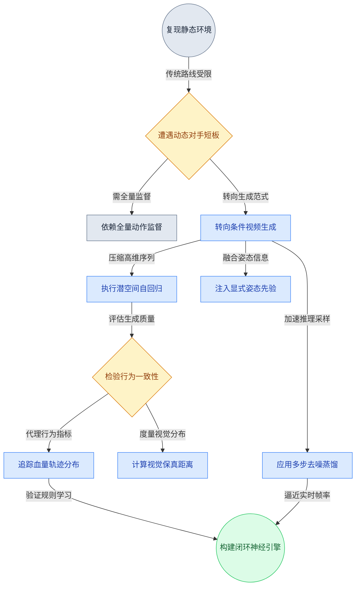
*如何读这张图：* 左侧灰色节点代表传统路线的瓶颈，蓝色节点勾勒 COMBAT 的核心解法（单侧条件、潜空间生成、蒸馏加速），黄色菱形暴露了当前评估体系的决策门（依赖启发式指标而非形式化验证），最终指向绿色节点代表的下一代闭环神经引擎。

尽管路径清晰，但必须严格区分论文的“声称”与“已证明”的边界。论文观察到 Player 2 的攻击活动量与拳脚比例随训练 checkpoint 呈现阶段性变化，从过度活跃逐渐贴近人类模式，但这属于训练动态的相关性记录，并未提供消融实验证明该变化 solely 源于对游戏规则的因果理解，而非对训练集视觉分布的过拟合。此外，传统视频指标（如 headline metric FVD↓ 593.4）仅衡量像素级感知质量，无法直接映射战术深度；为此论文提出基于 health data 的 damage distribution analysis 与 Total Action Adherence 等可解释指标，但这些代理指标尚未报告误差范围或跨游戏泛化的负结果。若将相关性直接等同于因果性，或忽略替代解释（如模型可能仅学会了“在特定帧数后生成受击动画”而非真正掌握 frame-precise timing），则容易陷入过度宣称的陷阱。

<details><summary><strong>深度展开：评估边界、失效模式与复现 Caveat</strong></summary>
<p><strong>1. 指标与因果的错位：</strong>FVD↓ 593.4 作为 headline metric 仅反映生成视频与真实视频在特征空间分布的距离。论文试图用 health trajectory 和 action ratio 弥补行为评估空白，但这类启发式指标本质上是“事后统计”，缺乏对决策边界的反事实检验。例如，模型可能通过记忆常见连招的视觉模板来“伪造”合理的血量下降曲线，而非真正推演伤害判定逻辑。当前未报告针对此类失效模式的对抗性测试或误差范围。</p>
<p><strong>2. 蒸馏与实时性的权衡：</strong>CausVid DMD 与 decoder distillation 确实压缩了采样步数，但扩散模型的迭代去噪特性决定了其延迟下限。论文未明确给出端到端交互延迟的具体毫秒数或帧率数据，仅定性描述“推向实时交互”。在复杂场景下，KV cache 的内存占用与蒸馏带来的分布偏移（distribution shift）可能成为实际部署的瓶颈。</p>
<p><strong>3. 环境依赖与泛化风险：</strong>Tekken 3 被选为测试床，因其具备确定性 game mechanics 与清晰的视觉反馈。这种受控环境降低了生成错误的容忍度，但也意味着模型可能高度依赖该游戏的特定视觉先验与动作空间。若迁移至开放世界或物理规则高度随机的环境，部分可观测假设下的隐式策略涌现可能迅速退化。</p>
</details>

面向未来，COMBAT 的价值不在于提供一个即插即用的游戏 AI，而在于验证了一条“以世界模型为底座、以生成一致性为约束”的行为学习新路径。下一步的突破点可能集中在三个维度：其一，将启发式行为指标升级为可微分的游戏内奖励信号，使世界模型与强化学习形成闭环；其二，探索一致性模型（Consistency Models）或投机解码等更激进的采样加速方案，彻底打破扩散架构的延迟天花板；其三，在更多样化的部分可观测环境中进行压力测试，验证涌现策略是否具备跨域迁移的鲁棒性。当生成模型不仅能“画出”合理的下一帧，还能在潜空间中“推演”出符合博弈论最优解的对抗轨迹时，神经游戏引擎才真正具备替代传统状态机的工程底气。
