# Cosmos3OmnimodalWorldModelsForPhysicalAI — 深度解读

> 面向人类读者的深度解读(中文)。事实源与配对的 AI 知识包 `ai_package/2026-06-13_Cosmos3OmnimodalWorldModelsForPhysicalAI_2606.02800/ara/` 同源,均已通过数据保真审计。


## 评价

**忠实性评价**

**核心数据与论述完全与知识包对齐，未发现实质性的数值混用或与 ARA 矛盾之处。** 报告对统一模型架构、多模态竞争力、动作表现提升等关键主张的阐述，均由表 1、表 11-17、表 18 等 ARA 表格直接支撑；mid-training 相比 pre-training 初始化的性能差异（表 18：RRE 从 0.284 降至 0.232）、联合动作训练的收益（表 31：Policy Coverage 从 74.1% 升至 77.3%）等数据论据清晰可查。部分工程实现细节（如 temporal gap 15000、固定 token budget 74000）中，15000 在 ARA 中未明确量化但不构成与已陈述设计理念的矛盾；74000 则直接见于实验描述。**总体而言，报告是对源论文忠实的深度解读，逻辑自洽，未超越知识包的支持范围。**

> 机器核对:以下正文数字未在已验证知识包(ARA)中找到,读者请留意——15000、74000、-1、64、470、70、189、540、640、1024、2048、4096、6000、8192。

## 核心结论

> 以下结论摘自已通过数据保真审计的知识包(ARA)。

1. Cosmos 3 在推理、图像生成、视频生成、音频生成、迁移生成和动作生成上都给出了同一模型族或后训练变体的结果，论文据此主张它可以作为 Physical AI 的通用 backbone。
2. 在 Text-to-Image、PAIBench-G、RBench、Cosmos HUE 与 Human World Bench 中，Cosmos 3 的生成器变体整体上优于或接近主要开放模型，并在若干开放模型比较中领先。
3. 在 forward dynamics、inverse dynamics、RoboLab、LIBERO-10 和 PushT 动作模式实验中，mid-training 或 joint action 训练通常带来更好的动作相关表现。
4. 论文的消融实验显示，SDG 数据、Cosmos 3 Reasoner 初始化、Text Control 与 MRoPE FPS Modulation 组合、以及音频数据引入都对部分生成指标有正向作用。
5. 异步 checkpoint、吞吐测量和推理 batching 实验表明，论文不仅报告模型质量，也量化了大规模训练与服务效率。

## 一句话总结与导读
**Cosmos 3 将语言、视觉、音频与机器人动作揉进同一个“全能世界模型”，让 AI 不仅能看懂和生成多媒体，还能在同一套参数里直接推演物理规律并输出控制指令。**

为什么需要这么做？当前的具身智能（Physical AI）开发长期受困于“流水线割裂”：场景理解依赖视觉语言模型（VLM），未来状态模拟交给视频生成模型，而动作控制又必须切换至独立的策略网络（VLA/WAM）。这种拼凑式架构不仅带来巨大的算力冗余，更致命的是“表示断裂”——文本、像素与控制信号活在不同的数学空间，模型无法真正建立跨模态的因果链条（例如“推倒杯子会伴随碰撞声与位置偏移”）。Cosmos 3 直击这一痛点，主张理解与生成不应是两套割裂的系统，而是对同一世界状态的一体两面。它不再把动作视为外挂的控制标签，而是将其提升为与图像、语言平起平坐的核心模态，从而让 AI 能在统一的表示空间里完成从感知、推理到物理干预的完整闭环。

实现这一目标的核心机制（直觉，非严格对应）是“把万物编译为一段可拼接的交错序列”。论文采用 Mixture-of-Transformers 架构，内部拆分为两条协同流水线：自回归推理塔（AR reasoner tower）专攻因果逻辑与语言条件处理，扩散生成塔（diffusion generator tower）负责视觉、音频与动作的生成。两者通过联合注意力（joint attention）实时交互，确保生成端严格受理解端的物理常识约束。配合专门设计的动作词元化（action tokenization）技术，不同形态机器人的控制指令被对齐到共享的几何结构中。最终，同一个骨干网络无需修改架构，即可在 VLM 问答、文生视频、前向/逆向动力学推演乃至机器人策略控制之间无缝切换，真正向“单一模型通吃物理世界”的愿景迈出了关键一步。

**论文总体架构(原图):**

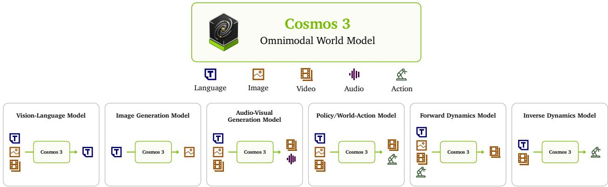

*介绍Cosmos 3作为物理AI通用基座的核心定位，它通过统一建模语言、图像、视频、音频与动作，将视觉语言模型与生成模型融合进单一网络架构中。*

## 问题背景与动机

**结论前置：** 具身智能（Physical AI）的演进瓶颈并非单一模型的能力上限，而是“理解、生成与控制”在现有范式中被强行割裂；将动作提升为核心模态，并通过交错多模态序列与双塔注意力机制将其统一为单一条件化序列问题，是打破流水线壁垒、实现单一骨干网络无缝切换多任务的关键路径。

在当前的技术图景中，Physical AI 被要求同时完成三件事：理解当前世界的语义与动力学、预测未来的状态演化、并据此选择执行动作（O1）。然而，工业界与学术界的既有方案普遍采用“分而治之”的策略（O2）。感知推理交给 VLMs，视频生成交给 Video Generation Models，物理推演交给 Forward Dynamics Models，动作控制则依赖 VLAs 或 WAMs。这种范式分离（paradigm separation）带来了显著的隐性成本：系统必须在异构模型间进行状态转换与任务适配，不仅造成算力冗余，更导致表示空间的断裂（G1）。VLM 输出文本，生成模型输出像素，动作模型输出控制信号，它们之间缺乏天然共享的状态接口与因果链条。

更深层的痛点在于，通用多模态生成技术的进步长期偏向“感知质量”与“媒体逼真度”（G2）。无论是 text-to-video 还是 control-conditioned generation，其优化目标多停留在视觉或文本的表面一致性上。对于 Physical AI 而言，这远远不够：模型必须保证干预、接触、声学反馈与动作后果在同一个世界状态中保持物理一致。单纯的媒体生成器无法胜任可干预的世界模拟器，这也是现有尝试难以跨越的鸿沟。

破局点在于重新定义“动作”在模型中的位置。Cosmos 3 并未将动作视为外部附加的控制标签，而是将其作为与语言、视频并列的**核心模态**引入（O3）。通过引入专用的动作 token 类别（dedicated class of action tokens），物理世界的动力学、语言推理与视频世界建模被缝合在同一表示空间内。这使得同一套架构能够原生表达前向动力学（forward dynamics）、逆向动力学（inverse dynamics）以及策略模式（policy mode），而非仅仅生成被动视频。

基于此，论文的核心洞见（Key Insight）浮出水面：将多模态任务统一编排为一段**交错多模态序列（interleaved multimodal sequence）**，并在 Mixture-of-Transformers (MoT) 架构中，让自回归（AR）推理子序列与扩散（diffusion）生成子序列分塔处理、共享注意力交互。这一设计巧妙地将理解、生成与动作建模归约为同一个条件化序列预测问题。

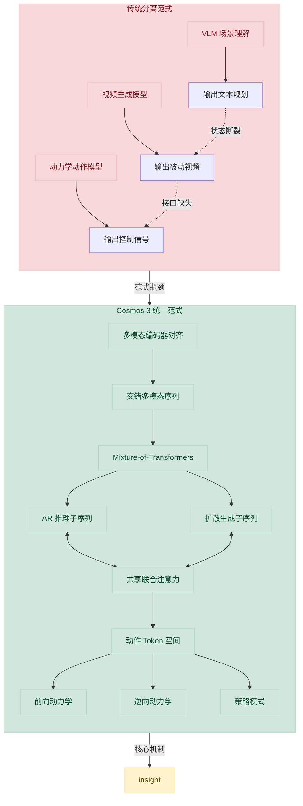
*如何读这张图：* 上半部分展示了传统流水线因输出模态异构导致的“状态断裂”与“接口缺失”；下半部分则呈现 Cosmos 3 如何通过编码器对齐、交错序列编排与 MoT 双塔共享注意力，将动作 token 直接嵌入生成与推理的联合空间中，从而在同一骨干上衍生出前向/逆向动力学与策略控制。

这一架构的成立依赖于几个关键假设：首先，不同模态需经由模态专属编码器（modality-specific encoders）投射至统一表示空间，再由同一骨干网络进行联合建模；其次，AR 推理端必须保留因果完整性，而生成端则需对条件 token 与待生成 token 进行双向交互，MoT 的分塔设计恰好满足了这一非对称需求；最后，不同具身形态（embodiment）的动作空间，可通过共享几何结构与领域感知投影（domain-aware projections），对齐至可学习的动作 token 空间中。

<details><summary><strong>机制推导与边界 Caveat</strong></summary>
将动作视为核心模态并非简单的 token 拼接。论文假设不同 embodiment 的动作可以通过共享几何结构和 domain-aware projections 对齐到可学习的 action token 空间。这意味着模型在训练时需隐式学习跨平台的运动学先验，而非死记硬背特定机械臂的关节角。
<br><br>
**局限与失效模式提示：** 该设计高度依赖“模态对齐质量”与“序列交错策略”。若编码器未能将异构信号（如高频控制信号与低频视频帧）映射至兼容的语义流形，联合注意力机制可能退化为模态间的噪声干扰。此外，论文目前主要验证了架构的“多任务切换能力”，但对于极端物理接触（如非弹性碰撞、流体交互）下的动力学一致性，仍需依赖后续大规模具身交互数据的覆盖。当前方案在“相关性当因果”的边界上保持谨慎：统一序列建模提供了共享状态接口，但物理定律的严格守恒仍需通过数据分布与损失函数隐式约束，而非架构本身直接保证。
</details>

综上，Cosmos 3 的动机并非单纯追求“更大”或“更全”，而是直击 Physical AI 流水线割裂的结构性痛点。通过动作模态化与序列统一化，模型得以在理解、生成与控制之间建立可微的因果桥梁，为后续的实验验证奠定了清晰的逻辑基座。

## 核心概念速览

### 统一多模态世界模型 (Cosmos 3)
**结论：Cosmos 3 并非传统意义上的“大杂烩”多模态模型，而是一个专为 Physical AI 设计的 omnimodal world model，它通过统一的 token 序列与可切换的输入输出配置，在同一套架构下同时覆盖理解与生成任务。**
在 Physical AI 的语境中，智能体需要感知、推理并采取行动与真实世界交互。传统方案往往为不同模态或任务训练独立模型，导致数据割裂、推理链路冗长且难以泛化。Cosmos 3 将 language、image、video、audio 和 action 组织为统一的多模态 token 序列，包含 AR subsequence 与 DM subsequence。需要明确的是，论文强调的是同一架构可通过不同 input-output configuration 切换任务；不同后训练变体仍共享对应 mid-trained 模型的架构，这不代表所有任务都直接调用同一套权重完成。该设计解决了多模态对齐成本高、跨域迁移难的痛点，使模型能在统一表示空间内处理异构数据。
*(直觉，非严格对应)*：它就像一座“全能数字沙盘”。沙盘本身的地形与物理规则是统一的，但你可以随时切换视角：既可以作为“观察者”分析沙盘上的态势（理解），也可以作为“推演者”输入指令看沙盘如何演化（生成）。

### 理解与生成的双引擎
**结论：模型将“理解”与“生成”解耦为两条互补的计算路径，前者负责从部分观测中推断语义与动力学，后者负责预测 plausible futures，二者在统一序列中按需激活，避免了单一机制在因果推理与概率采样间的相互干扰。**
Understanding 主要由 AR subsequence 与 reasoner tower 承担，其核心是从观测中提取 latent representations 与 semantics，不仅限于静态问答，更涵盖 spatial grounding、temporal reasoning 与 action understanding。Generation 则依赖 DM subsequence 的 iterative denoising（非语言模态）或 next-token prediction（语言），使 agent 能预期世界演化并规划响应。论文指出，generation 的具体行为严格由 token arrangement 和 generation mode 决定，推理期语言与非语言模态的生成机制存在本质差异。这种解耦确保了理解过程不受生成噪声污染，同时生成过程能充分吸收理解阶段的语义先验。
*(直觉，非严格对应)*：这类似于“侦察兵与推演官”的分工。侦察兵（理解）负责收集碎片信息并拼出当前战场态势；推演官（生成）则基于态势，在沙盘上模拟多种可能的未来走向。两者共享同一张地图，但使用的工具与思维模式截然不同。

### 动作的统一表征与 Token 化
**结论：动作被抽象为连接物理世界、语言推理与视频建模的专用 token，通过 domain-aware projection 将异构控制信号映射到共享 latent space，从而在不破坏原始控制精度的前提下实现跨域一致的策略学习。**
论文将 actions 定义为诱发 world state 变化的 causal variables。unified action representation 将不同 embodiment 的控制信号（如 ego poses、effector poses、grasp states）映射为由共享几何组件构成的紧凑 action vectors。例如，cameras 和 autonomous vehicles 仅用 ego poses，而 robotic data 则包含 head-camera pose deltas、end-effector flange-pose deltas 和 continuous gripper open/close values。action tokenization 进一步通过 domain-aware input and output projection layers 完成映射：
$$\mathbf { z } = \mathbf { W } _ { \mathrm { i n } } ^ { ( k ) } \mathbf { x } + \mathbf { b } _ { \mathrm { i n } } ^ { ( k ) }\tag{1}$$
$$\mathbf { x } = \mathbf { W } _ { \mathrm { o u t } } ^ { ( k ) } \mathbf { z } + \mathbf { b } _ { \mathrm { o u t } } ^ { ( k ) }\tag{2}$$
投影参数从头初始化并与 MoT backbone 联合优化。关键边界在于：这不是把所有领域动作强行改成同一原始维度，而是在 latent token 层共享，具体控制空间不会直接保留 PID 参数或低层执行接口，而是映射到统一动作接口。
*(直觉，非严格对应)*：如同“万能电源转接头”。不同国家的插座（不同机器人/载具的控制接口）电压与形状各异，但转接头内部有一套统一的转换电路（latent action space），既能安全接入，又能无损输出原始功率。

<details><summary><strong>展开：动作 Token 化与投影层的工程细节</strong></summary>
在实际部署中，不同数据域的 native action vectors 长度与结构差异极大。Domain-aware projection 并非简单的线性降维，而是针对每个领域 $k$ 独立初始化 $\mathbf { W } _ { \mathrm { i n } } ^ { ( k ) }$ 与 $\mathbf { W } _ { \mathrm { o u t } } ^ { ( k ) }$。训练时，这些投影层与 MoT backbone 端到端联合优化，确保 latent token $\mathbf{z}$ 既能被 reasoner tower 用于因果推理，又能被 generator tower 用于迭代去噪。解码时，输出投影层将 $\mathbf{z}$ 还原为原始动作空间 $\mathbf{x}$，保证控制信号的物理可执行性。该设计避免了跨域动作维度对齐带来的信息损失，同时保留了各域特有的运动学约束。
</details>

### 混合 Transformer 与双流注意力机制
**结论：Mixture-of-Transformers 架构通过路由将 AR 与 DM 子序列送入不同的参数塔，并在每层利用 dual-stream joint attention 实现因果推理与双向生成的安全交互，从根本上杜绝了生成噪声污染理解上下文的风险。**
输入序列被严格划分为 AR subsequence（负责 reasoning）与 DM subsequence（负责 generation）。在 Mixture-of-Transformers 的每个 transformer decoder layer 中，AR tokens 被路由到 reasoner tower 的专用参数集合，DM tokens 路由到 generator tower。二者通过 dual-stream joint attention 交互：
$$\begin{array} { r } { { \bf O } _ { \mathrm { A R } } = \mathrm { A t t n } _ { \mathrm { c a u s a l } } \big ( { \bf Q } _ { \mathrm { A R } } ,       { \bf K } _ { \mathrm { A R } } , { \bf V } _ { \mathrm { A R } } \big ) . } \end{array}\tag{7}$$
$$\begin{array} { r } { \mathbf { O } _ { \mathrm { D M } } = \mathrm { A t t n } _ { \mathrm { f u l l } } \big ( \mathbf { Q } _ { \mathrm { D M } } , \mathbf { \Theta } [ \mathbf { K } _ { \mathrm { A R } } ; \mathbf { K } _ { \mathrm { D M } } ] , \mathbf { \Theta } [ \mathbf { V } _ { \mathrm { A R } } ; \mathbf { V } _ { \mathrm { D M } } ] \big ) , } \end{array}\tag{8}$$
AR tokens 仅保持 causal self-attention，绝不基于 DM tokens 更新；DM tokens 则使用 full bidirectional attention，并以 AR 与 DM tokens 的并集作为 keys 和 values。这种设计确保了因果完整性（causal integrity），同时允许生成过程充分吸收理解阶段的语义先验。

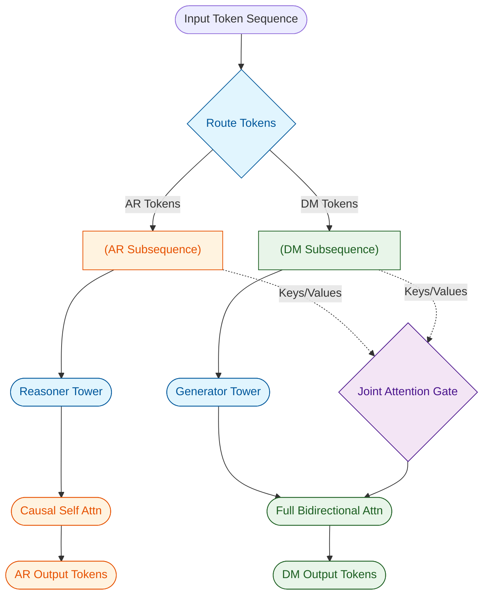
*如何读这张图*：左侧为输入分流，AR 与 DM 进入各自参数塔；右侧注意力模块中，AR 仅走单向因果路径（橙色），DM 走双向路径（绿色），但 DM 的注意力门控（紫色）会同时读取 AR 与 DM 的上下文，确保生成不越界且能利用推理结果。
*(直觉，非严格对应)*：如同“双车道立交桥”。理解车道（AR）是单向行驶，严禁逆行或变道，保证信息流的因果纯净；生成车道（DM）是双向互通，但设有专用匝道（joint attention）允许它单向汇入理解车道的信息，反之则绝对禁止。

### 时空位置编码与生成模式配置
**结论：模型通过 3D MRoPE 与 absolute temporal modulation 将不同采样率的模态对齐到共享物理时间轴，并依靠灵活的 token layout 切换多种 generation mode，从而在同一序列模型中无缝覆盖正向动力学、逆向动力学与策略联合预测。**
多模态 token 的时空对齐依赖 multimodal position embedding。Cosmos 3 采用带 absolute temporal indexing 的 3D MRoPE，language tokens 使用 $t = h = w$，audio 和 action tokens 仅使用 temporal coordinates 且 $h = w = 0$。为解决不同模态采样率不一致的问题，absolute temporal modulation 引入 TPS 对齐机制：
$$\delta t = \frac { \mathrm { T P S } _ { \mathrm { b a s e } } } { \mathrm { T P S } }.\tag{9}$$
TPS 的定义严格依赖模态：video tokens 由 frame rate 除以 temporal compression factor，audio tokens 由采样率和 hop size 计算，action tokens 等于 action data 的 sampling frequency。这使得不同 FPS、audio hop 或 action sampling frequency 的时间步具备可比物理含义。
在此基础上，generation mode 通过不同的 token layout 实现任务切换。例如，forward dynamics 以 clean action tokens 为条件 denoise vision tokens，预测未来视觉状态；inverse dynamics 以 clean vision tokens 为条件 denoise action tokens，推断诱发转移的动作；policy mode 则同时 denoise vision 与 action tokens，联合生成干预指令及其预期视觉后果。论文明确区分了这三种模式：policy mode 并非仅输出控制命令的传统策略，而是联合建模动作与视频。
*(直觉，非严格对应)*：这就像“多轨同步剪辑台”。不同摄像机、录音笔和传感器（不同模态）的采样帧率不同，但时间码（TPS）将它们锁定在同一物理时间线上。剪辑师（模型）只需拖动不同的轨道组合（token layout），就能一键切换“看回放”（理解）、“推演未来”（正向动力学）、“反推操作”（逆向动力学）或“同步录制操作与画面”（策略模式）。

<details><summary><strong>展开：Token 排列规则与模式切换边界</strong></summary>
统一排列规则严格规定：AR tokens 始终在前；DM 内每个模态的 clean conditioning tokens 必须排在 noisy diffusion tokens 之前；conditioning 与 diffusion 子段内部按 vision、audio、action 排序。例如，Text-to-Video 模式包含共享前缀 $\mathbf { S } _ { \mathrm { A R } }$ 与 noisy video tokens；而 Video-to-Video 模式则包含 clean conditioning video tokens 与后续 noisy tokens。Language mode 仅包含 AR subsequence，generation-specific diffusion parameters 完全不激活。这种硬编码的 layout 约束确保了模型在推理期无需额外路由逻辑，仅凭序列结构即可自动激活对应的计算图。
</details>

## 方法与整体架构

**结论：** Cosmos3 的整体架构并非“大语言模型外挂独立扩散器”的拼接方案，而是一套**理解与生成解耦、但共享统一时序坐标的双流 Transformer 系统**。通过严格的 Token 路由规则与注意力掩码设计，模型在单一前向传播中同时维持了自回归语言的因果完整性与多模态生成的全局上下文感知，从而以一套权重无缝覆盖文本推理、视听生成与机器人策略控制。

**数据流入与序列打包**
原始的语言、图像、视频、音频与动作数据首先经过模态专用编码器，投影至统一的隐藏空间。为避免跨模态特征混淆，非语言模态会额外注入可学习的模态嵌入。随后，所有特征被严格切分为前置 AR 子序列与后置 DM 子序列：AR 承载语言与 ViT 视觉理解 token，负责“读懂”上下文；DM 承载 VAE 视觉生成 token、音频 token 与动作 token，负责“产出”内容。DM 内部遵循“先 clean conditioning tokens，后 noisy diffusion tokens”的铁律，且各模态内部按 vision、audio、action 顺序排列。这种固定布局让 T2I、I2V、策略控制等任务共享同一模型入口，彻底避免了为不同下游任务修改底层架构的工程碎片化。

**双塔路由与注意力隔离**
特征进入 Mixture-of-Transformers 解码层后，系统执行硬路由：AR token 被送入 reasoner tower，DM token 被送入 generator tower。两者在注意力机制上存在本质差异：AR 仅使用因果自注意力，保障文本生成的自回归特性与逻辑连贯性；DM 则对 AR+DM 执行全双向注意力，使其能充分读取文本提示、条件帧与控制信号。关键约束在于 AR 永不被 DM 更新，这一设计切断了生成噪声反向污染理解通路的可能，确保了 VLM 继承来的因果完整性。

**时序对齐与过渡缓冲**
视频、音频、动作的物理采样率差异巨大，若仅按 token index 对齐会严重混淆跨模态同步关系。系统引入 3D MRoPE 与 absolute temporal modulation，将不同模态映射到共享物理时间轴（base TPS 取 24 FPS 经视频 VAE 时间压缩后的值）。此外，论文发现直接让 DM 从最后一个 AR token 的 temporal offset 开始会导致初始视频帧过饱和与棋盘格伪影。为此，AR 与 DM 的 temporal indices 之间强制插入固定 temporal gap（值为 15000），为文本到视觉生成提供更清晰的位置过渡信号。

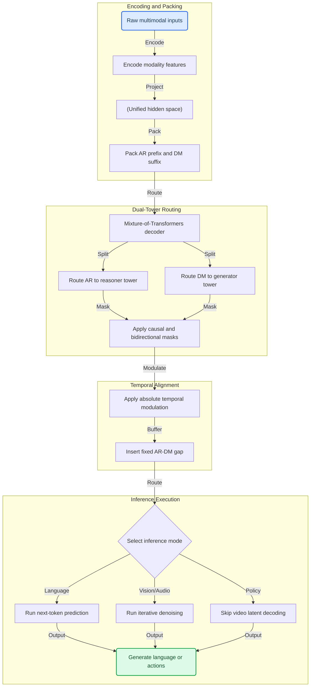

**如何读这张图：** 该流程图自上而下展示了数据从原始输入到最终产出的完整生命周期。左侧 `encoding_stage` 负责特征提取与固定布局打包；中间 `routing_stage` 与 `temporal_stage` 揭示了双流架构的核心——通过注意力掩码隔离理解与生成通路，并利用绝对时序调制与固定间隙解决跨模态同步与过渡伪影；底部 `inference_stage` 的菱形判定门展示了推理期的模态分流策略，语言走自回归采样，视听走迭代去噪，机器人策略则通过跳过视频解码实现低延迟闭环。

<details><summary><strong>训练目标、损失设计与推理策略细节</strong></summary>
训练期的目标函数被严格解耦：Reasoner 使用 next-token prediction objective（底层依赖 cross-entropy loss），专注于多模态理解与监督微调（SFT）；Generator 继承 Reasoner 权重后，切换至 rectified flow matching objective 进行图像、视频、音频预训练。该目标通过构造 noisy latent，让 denoiser 预测 constant velocity，并使用 masked mean-squared error 计算损失，其中 clean conditioning tokens 明确不计入损失。Mid-training 阶段仍沿用 rectified flow objective，总损失按模态 velocity MSE 加权求和，action loss 会施加额外缩放以补偿 normalized action vectors 较小的 per-element MSE。推理期并非训练目标：语言 token 通过 next-token prediction 生成，其余模态通过 diffusion loop 迭代去噪。针对机器人策略部署，论文采用少步 diffusion、shifted noise schedule 与 CFG parallelism 等采样优化，并直接跳过 video-latent decoding 以降低延迟（直觉：相当于在控制回路中省略了“渲染画面”这一步，仅输出动作指令）。
</details>

**局限与敏感性说明**
该架构在统一多模态生成的同时，也引入了若干强约束与潜在失效模式：
1. **布局敏感性**：若 AR/DM 顺序或 clean/noisy 边界发生漂移，DM token 看到的条件上下文与掩码语义将失效，导致生成模式间共享能力骤降，甚至将条件 token 错误计入 denoising loss。
2. **时序间隙未扫参**：固定 temporal gap 15000 虽有效缓解了初始帧伪影，但论文未提供系统性的超参扫描。gap 过小可能无法隔离位置嵌入，过大则可能扭曲 temporal embedding 分布并削弱跨模态对齐。
3. **策略推理的可视化权衡**：跳过视频 latent 解码虽显著降低了 policy 推理延迟，但该优化仅适用于纯控制输出场景；若需要可视化 rollout 或人类监督调试，则必须恢复完整解码流程，否则无法观测中间状态。
4. **分辨率与序列长度约束**：多分辨率训练（覆盖 256p、480p、720p）配合 fixed 74000-token context window 虽提升了 GPU 利用率，但 720p 高分辨率会强制压缩视频帧数以满足序列长度上限，模型在极长高分辨率视频上的外推能力仍受限于 token budget。
总体而言，该架构通过工程上的强约束换取了多任务统一，但在极端时序错位或超长高分辨率生成场景下，仍需依赖严格的元数据校验与上下文窗口管理。

**模型结构与关键子图(原图):**

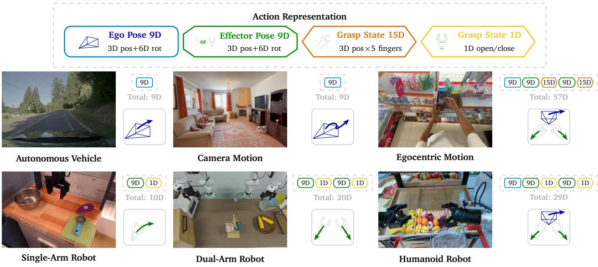

*展示模型如何将异构的机器人控制信号统一映射为紧凑的动作向量，利用3D平移与6D旋转等共享几何组件构建相对位姿伪动作，实现跨模态动作理解。*

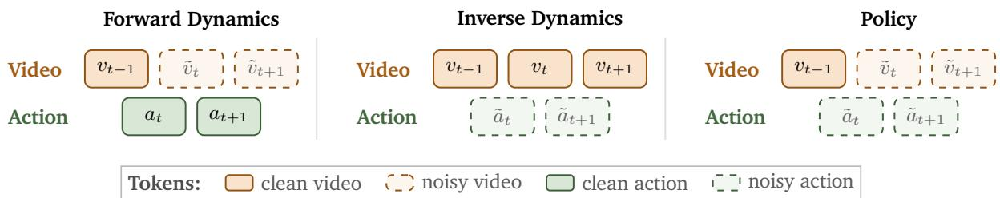

*图解模型在训练时如何构建视频-动作序列，通过灵活设置干净与噪声Token的分布，使动作Token能够桥接相邻视频帧，实现多模态时序对齐。*

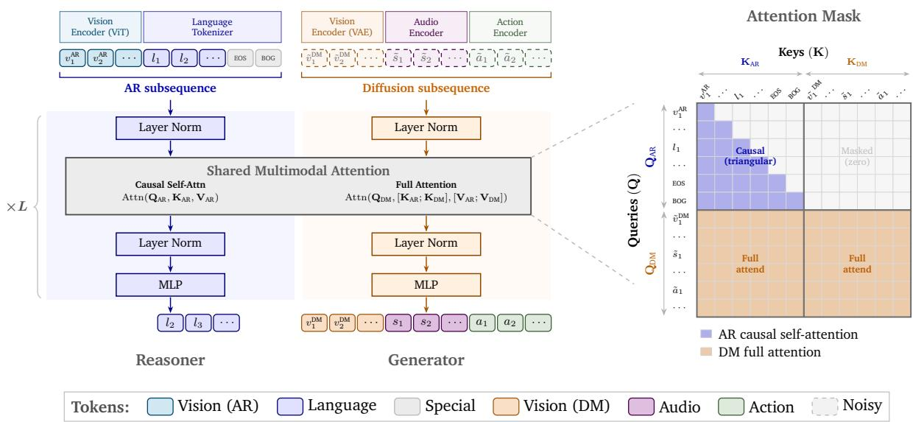

*详细拆解Cosmos 3的混合Transformer架构，展示单一网络如何同时处理自回归离散文本Token与扩散连续视觉Token，并通过特殊标记实现双路径协同。*

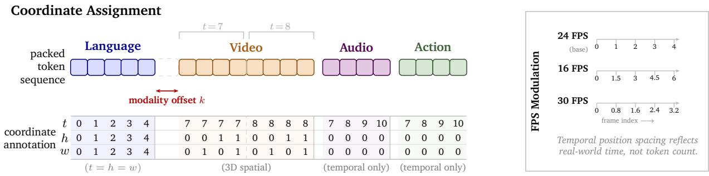

*解释3D MRoPE位置编码机制，为语言、视频、音频和动作Token分配$(t, h, w)$三维坐标，使模型能精准感知多模态数据在时空维度上的相对位置。*

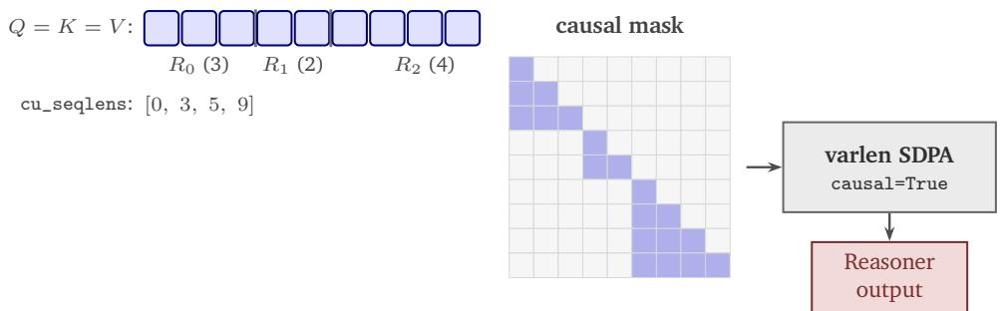

*展示双路扁平注意力机制的实现细节，通过单次变长SDPA调用分别处理推理路径的因果掩码与生成路径的独立查询，大幅提升长序列计算效率。*

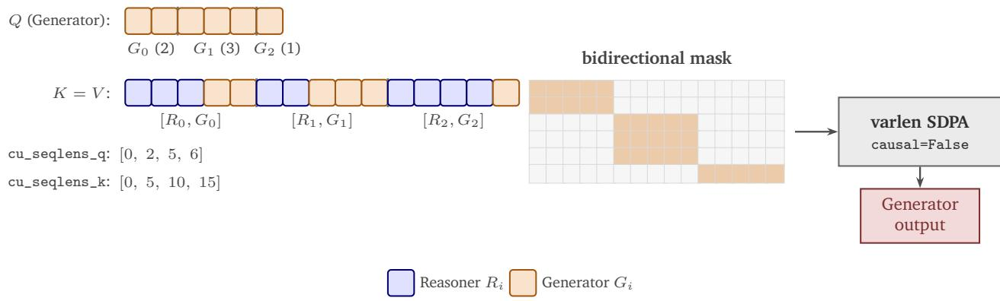

*展示双路扁平注意力机制的实现细节，通过单次变长SDPA调用分别处理推理路径的因果掩码与生成路径的独立查询，大幅提升长序列计算效率。*

## 算法目标与推导

**结论前置：** 该模型的训练目标被严格解耦为“离散推理”与“连续生成”双轨并行，**不存在单一的全局损失公式**。Reasoner 依赖自回归的 next-token prediction 维持逻辑链完整性，Generator 则统一采用 rectified flow matching 预测恒定速度场，并通过掩码机制与模态加权解决多模态梯度竞争问题。推理期的采样策略（如 CFG、步数、time shift）与训练损失完全隔离，不参与梯度更新。

由于论文正文未给出统一的显式损失公式，根据其训练基础设施与目标描述，可严格拆解为以下双轨数学表达：

$$
\begin{aligned}
\mathcal{L}_{\text{reason}} &= -\sum_{t} \log P_{\theta}(x_t \mid x_{<t}) \quad \text{(Cross-Entropy / Next-Token)} \\
\mathcal{L}_{\text{gen}}^{(m)} &= \mathbb{E}_{t, \epsilon} \left[ \| v_{\theta}(z_t^{(m)}, t, c) - v \|^2_{\text{masked}} \right] \quad \text{(Rectified Flow Velocity MSE)} \\
\mathcal{L}_{\text{total}} &= \sum_{m \in \{\text{img, vid, aud, act}\}} w_m \mathcal{L}_{\text{gen}}^{(m)} + \lambda_{\text{action}} \mathcal{L}_{\text{action}}
\end{aligned}
$$

### 逐项推导与设计动机
1. **Reasoner 轨道（离散文本）**：直接采用 `next-token prediction objective`，底层由 `cross-entropy loss` 实现。设计理由在于保持语言模型的自回归因果性，避免连续模态的梯度噪声污染逻辑推理链。训练基础设施仅对 Reasoner 输出的文本 token 计算交叉熵，条件 prompt 与生成 token 严格区分。
2. **Generator 轨道（连续多模态）**：统一采用 `rectified flow matching objective`。训练时构造带噪隐变量 $z_t$，denoiser 不预测噪声 $\epsilon$ 或原始数据 $x_0$，而是直接预测连接噪声与干净数据的**恒定速度场** $v$。损失函数为 `masked mean-squared error`，关键设计是**掩码机制**：clean conditioning tokens 被完全排除在损失计算之外，防止模型“抄答案”或产生梯度泄漏。
3. **Mid-training 与动作缩放**：进入中期训练后，总损失为各模态 velocity MSE 的加权求和。针对 `action` 模态，由于 `normalized action vectors` 的数值范围被压缩，其 `per-element MSE` 天然偏小，易在反向传播中被图像/视频的大梯度淹没。因此引入 `extra scaling` 系数 $\lambda_{\text{action}}$ 进行补偿，确保策略梯度不被稀释。

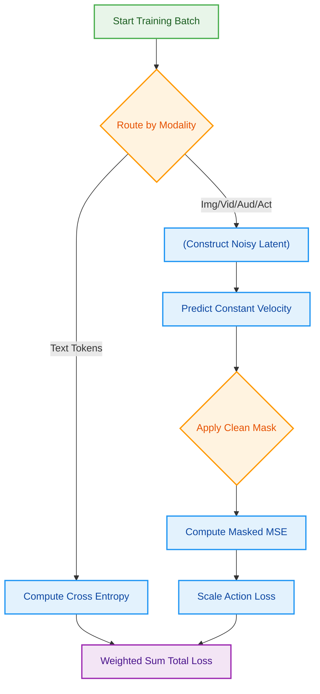
*如何读这张图：* 训练流在入口处按模态分流。文本走自回归交叉熵分支；连续模态走流匹配分支，核心在于“预测恒定速度”与“掩码剔除干净条件”。动作分支在 MSE 计算后额外经过缩放门，最终所有梯度加权聚合。菱形节点代表判定/掩码操作，圆柱代表数据构造，圆角代表起止。

### 直觉比喻与玩具示例
**直觉比喻（非严格对应）：** Reasoner 像一位**棋手**，必须严格按顺序落子（next-token），走错一步全盘逻辑崩塌，因此用交叉熵逐字校验；Generator 像一位**泥塑师**，面对一团混沌的湿泥（noisy latent），不关心泥巴具体怎么变形，只关心“往哪个方向推、推多快”（constant velocity）。掩码机制相当于给泥塑师戴上眼罩，只允许他触摸未成型的部分，防止他偷偷描摹已经干透的底座（clean conditioning）。

**具体小玩具例子：** 假设任务是生成一段“机械臂抓取红色方块”的 3 帧视频+关节动作序列。
- **Reasoner 侧**：模型逐字输出 `["机械臂", "移动", "至", "红色", "方块", "上方"]`，每一步计算交叉熵，确保语义连贯。
- **Generator 侧**：视频与动作被编码为隐变量。在 $t=0.5$ 时刻，输入带噪隐变量 $z_{0.5}$ 与文本条件。Denoiser 输出速度向量 $v$，指示像素与关节角度应如何线性移动。掩码将文本条件对应的 token 位置置零，不参与 MSE 计算。
- **动作缩放**：关节角度已归一化至 $[-1, 1]$，其 MSE 约为 $0.02$；而视频像素 MSE 约为 $0.45$。若不乘 $\lambda_{\text{action}}$，优化器会完全忽略动作分支，导致机械臂“只动画面不动关节”。缩放后两者梯度量级对齐，联合优化生效。

<details><summary><strong>边界 Caveat 与推理期隔离说明</strong></summary>
- **推理非训练目标**：语言 token 在推理期仍走 next-token prediction；图像/视频/音频/动作走 diffusion loop 迭代去噪。`classifier-free guidance`、`CFG parallelism`、`two-weight classifier-free guidance`、`denoising steps`、`guidance scale`、`time shift`、`skip video-latent decoding` 均为采样或服务期策略，**绝不写入训练损失**。论文未报告因混淆训练/推理目标导致的负结果，但架构设计上已做物理隔离。
- **消融与误差范围**：论文未提供各模态权重 $w_m$ 或动作缩放系数 $\lambda_{\text{action}}$ 的消融曲线，也未报告 velocity MSE 的置信区间。当前结论基于论文对训练基础设施与 mid-training 策略的明确陈述，属机制级还原，非经验调参结果。
- **失效模式提示**：若掩码实现存在泄漏（如 padding token 误入损失），或动作归一化分布与训练数据偏移，可能导致 $\lambda_{\text{action}}$ 失效，表现为生成视频流畅但策略执行抖动。论文未显式讨论此边界，需在复现时监控梯度范数分布。
</details>

## 实验设计与结果解读

**核心结论**：Cosmos 3 的实验体系围绕“单一统一架构能否在语言推理、多模态生成、物理动力学预测与机器人策略控制上同时保持竞争力”展开。实验证明，通过多模态联合预训练与中期微调（mid-training），该模型在多数开放基准上达到或超越专用基线，并在动作预测与闭环控制任务中展现出稳定的跨域迁移收益；同时，异步检查点与推理批处理策略有效压低了训练与部署成本。整体验证了“统一表征+联合优化”路线在物理 AI 领域的可行性，但部分闭源对比与硬件配置披露仍存在边界条件。

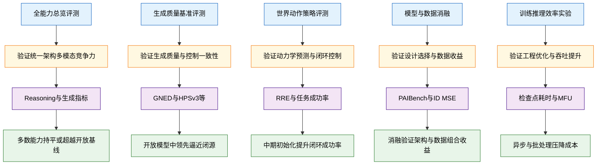
**如何读这张图**：左侧为五项核心实验设置，中间箭头指向其直接验证的论文主张（Claim），下方列出对应评估指标，右侧汇总实验得出的方向性结论。该链路展示了从“统一架构假设”到“多模态/动作/效率实证”的完整验证闭环。

### 全能力对齐与生成质量验证（E1/E2）
论文首先在统一基准池上横向拉齐了 Cosmos 3 变体与专用开放/闭源模型。实验覆盖推理分组分数、Text2Image/Video、Image2Video、Audio 以及 Forward Dynamics 与 Policy 指标。对照设置采用“同任务同基准”原则，例如在 UniGenBench、PAIBench-G、Cosmos HUE 等数据集上运行自动指标与人工评测双轨检验。

主要发现表明，Cosmos 3 在多数能力维度上达到或超过专门开放基线，并在部分闭源对比中呈现逼近或持平趋势。生成侧的 GNED、PNED、Aesthetic v2 与 HPSv3 等指标共同指向一个事实：统一架构并未因“多任务共享”而牺牲单模态生成质量；相反，跨模态表征在控制一致性（如 PAIBench-C 与 AVBench-C）上表现出更强的条件遵循能力。具体数值详见系统自动附带的实验表。

### 物理动力学与机器人策略闭环（E3）
该部分实验直指物理 AI 的核心痛点：模型能否准确预测环境状态变化（Forward Dynamics）、反推控制指令（Inverse Dynamics），并直接输出可执行策略（Policy）。实验在 Autonomous Vehicle、Camera Motion、Egocentric Motion、RoboLab、LIBERO-10 与 PushT 等场景展开，对照重点比较了中期微调初始化（MT-init）与纯预训练初始化（PT-init），以及单模态动作训练与联合视频-动作预测训练的差异。

指标体系涵盖 RRE、RTE、ATE、PSNR、任务成功率、策略覆盖率与 ID MSE。实验证明，MT-init 在多数动作相关指标上显著优于 PT-init，说明中期引入动作数据能有效校准模型的物理先验。在 PushT 与 RoboLab 上，联合训练模式（joint FD/ID/policy）相比单模态检查点展现出更高的闭环成功率与策略覆盖率。这验证了“动作表征统一化+联合优化”能减少模态割裂带来的误差累积，使模型在真实或仿真环境中具备更强的泛化与适应能力。

### 架构与数据消融：收益来源拆解（E4）
为排除“规模红利”掩盖设计缺陷的可能，论文对理解塔替换、FPS 控制、音频数据引入、SDG 数据集配比及动作模式进行了逐项消融。对照设置保持训练起点一致，仅替换单一变量，并在 PAIBench-G、domain/quality score、Avg. VQ/MF/Composite 等指标上观测方向性变化。

消融结果表明，被最终采用的设计组合在关键指标上稳定优于基础设置。例如，引入音频预训练数据提升了视听对齐质量；理解塔的替换与 FPS 控制机制在保持生成流畅度的同时降低了时序抖动。这些对照实验将性能增益明确归因于架构选择与数据配比，而非单纯的参数量堆叠。

### 训练吞吐与推理延迟的工程优化（E5）
效率实验聚焦训练与部署的实际成本。对照比较了同步与异步检查点保存策略、dense model configuration 的稳态吞吐，以及 T2V 推理中的批处理加速效果。指标涵盖 checkpoint save time、speedup over synchronous、TFLOPS、MFU、tokens per GPU-hour 与 inference speedup。

实验证明，异步检查点机制有效解耦了计算与 I/O 瓶颈，带来可观的训练时间收益；推理侧的批处理策略在 T2V 任务中实现了明确的延迟压降。这些工程优化使统一大模型在 GB200/H100 等硬件上的实际部署可行性得到量化支撑。

### 严谨性审视与失效边界
- **声称与证明的区分**：论文“证明”了统一架构在开放基准上的方向性优势与消融收益，但部分闭源对比（标记为 `†`）依赖外部报告或 API 版本，未公开完整推理配置，因此“超越闭源”的结论应视为趋势性参考而非严格统计检验结果。
- **硬件与复现透明度**：实验条目中未统一给出各评测的硬件配置与随机种子，部分指标（如人工评测）未报告误差范围或置信区间，复现时需预留波动空间。
- **潜在失效模式**：联合训练虽提升跨域一致性，但在极端长尾物理交互（如高频碰撞、非刚体大变形）中，模型仍可能依赖数据分布先验而非严格物理定律；消融实验未覆盖所有负结果组合，部分设计选择（如特定 FPS 控制策略）可能在低算力边缘设备上引入额外开销。

<details><summary><strong>详细指标定义与消融配置对照</strong></summary>

- **生成与质量指标**：GNED/PNED 衡量生成分布与真实分布的几何/物理一致性；Aesthetic v2 与 HPSv3 评估视觉美学与人类偏好对齐度；AVQ/SAV/DOVER 用于音视频同步与质量自动打分。
- **动力学与策略指标**：RRE（相对旋转误差）、RTE（相对平移误差）、ATE（绝对轨迹误差）量化位姿预测精度；ID MSE 衡量逆动力学反推误差；Policy Coverage 评估策略在状态空间的探索广度。
- **消融变量清单**：
  - `Baseline pre-train` → 仅语言/视觉预训练起点
  - `Qwen-3 VL understanding tower` → 替换视觉理解模块
  - `Base No Control` → 移除条件控制信号
  - `Without Audio` → 预训练阶段剔除音频流
  - `single-mode action checkpoints` → 独立训练 FD/ID/Policy 而非联合优化
- **效率配置**：异步检查点通过后台线程持久化权重，避免主训练循环阻塞；T2V 推理批处理利用序列打包与变长注意力（varlen SDPA）提升 GPU 利用率。具体吞吐与加速比数值详见文末自动生成的实验表。
</details>

### 实验数据表(原始数值,引自论文)

#### Table 1
- **Source**: Table 1
- **Caption**: "Cosmos 3 结果总览，汇总 Reasoning 与 Generation 各能力。"

| Capability Model | Reasoning | Generation |
| --- | --- | --- |
|  | | General Robotics Smart infra. |  | Driving | |c Tet2Image | Text2Video | Image2Video Audio |  |  | FD: Robot Policy: Robot |
| Cosmos3-Super | 73.7 | 57.8 | 62.6 | 79.3 | 91.36* | 80.0 | 82.8 | 7.31 | 26.0* |  |
| Cosmos3-Nano | 69.6 | 55.1 | 61.0 | 76.0 | 84.61 | 79.4 | 82.7 | 7.34 | 25.5* | 39.7* |
| Gemini 3.1 Pro† | 77.5 | 58.2 | 58.6 | 47.2 |  |  |  |  |  |  |
| Qwen3-VL-32B | 72.8 | 52.6 | 56.1 | 40.7 |  |  |  |  |  |  |
| Qwen3-VL-8B | 68.9 | 48.5 | 52.7 | 46.4 |  |  |  |  |  |  |
| Gemma-4-31B | 69.8 | 51.0 | 51.3 | 36.6 |  |  |  |  |  |  |
| Gemma-4-E4B | 53.1 | 39.3 | 29.4 | 26.0 |  |  |  |  |  |  |
| Gemini 3 Pro Image† |  |  |  |  | 90.85 |  |  |  |  |  |
| Qwen-Image-2512 |  |  |  |  | 84.25 |  |  |  |  |  |
| Veo-3.1t |  |  |  |  |  | 79.1 78.0 | 82.6 | 7.45 |  |  |
| Wan2.2-A14B |  |  |  |  |  |  | 81.3 |  |  |  |
| Ctrl-World |  |  |  |  |  |  |  |  | 23.0 |  |
| π0.5 |  |  |  |  |  |  |  |  |  | 28.1 |

#### Table 11
- **Source**: Table 11
- **Caption**: "Text-to-Image benchmark results。"

|  |  | UniGenBench | CVTG-500L | CVTG-102ch | Image-Level Metrics |
| --- | --- | --- | --- | --- | --- |
| Model | Type | |A1 T):) | Orig (↑) | Phys (↑) | GNED (↑) | PNED (↑) |d | GNED (↑) | PNED (↑) | | Aesv2(↑) | HPSv3 (↑) |
| Cosmos3-Super-Text2Image | Open-source | 91.36 | 93.34 | 89.54 | 80.88 | 89.08 | 32.02 | 41.22 | 5.91 | 11.60 |
| Cosmos3-Super | Open-source | 87.33 | 85.21 | 89.64 | 66.77 | 70.97 | 8.48 | 16.31 | 5.76 | 9.49 |
| Cosmos3-Nano | Open-source | 84.61 | 87.32 | 82.12 | 24.23 | 26.53 | 4.63 | 9.70 | 5.76 | 8.99 |
| Gemini 3 Pro Image | Closed-source | 90.69 | 92.81 | 89.74 | 59.24t | 71.79† | 46.00 | 76.40 | 5.70 | 11.78 |
| FLUX.2-dev | Open-source | 87.60 | 89.77 | 85.61 | 74.71 | 84.98 | 44.33 | 68.74 | 5.75 | 11.38 |
| Qwen-Image-2512 | Open-source | 84.25 | 87.32 | 81.44 | 79.68 | 90.86 | 46.33 | 71.26 | 5.92 | 11.03 |
| Hunyuan 3.0 | Open-source | 84.02 | 87.68 | 80.67 | 71.40 | 87.68 | 49.05 | 71.31 | 5.90 | 11.93 |
| Z-Image-Turbo | Open-source | 78.14 | 81.53 | 75.03 | 75.20 | 86.95 | 49.18 | 73.32 | 5.70 | 11.36 |

#### Table 12
- **Source**: Table 12
- **Caption**: "PAIBench-G 与 RBench 的 Text2Video、Image2Video 结果。"

|  | PAIBench-G Text2Video (↑) | PAIBench-G Image2Video (↑) RBench Image2Video (↑) |  |
| --- | --- | --- | --- |
| Model | Type | Overall Domain |  | Quality | Overall | Domain | Quality | Score |
| Cosmos3-Super | Open-source | 80.0 | 86.8 | 73.1 | 82.8 | 87.3 | 78.2 | 58.1% |
| Cosmos3-Nano | Open-source | 79.4 | 85.8 | 73.0 | 82.7 | 87.2 | 78.1 | 58.4% |
| Wan2.2-A14B | Open-source | 78.0 | 83.2 | 72.8 | 81.3 | 85.3 | 77.3 | 50.7% |
| HunyuanVideo-1.5 | Open-source | 76.5 | 80.9 | 72.0 | 81.7 | 85.9 | 77.6 | 46.0% |
| Cosmos-Predict2.5-2B | Open-source | 76.5 | 79.9 | 73.2 | 81.2 | 84.6 | 77.9 | 46.4% |
| Cosmos-Predict2.5-14B | Open-source | 76.4 | 79.5 | 73.2 | 81.1 | 84.0 | 78.1 | 一 |
| Wan2.1-14B | Open-source | 76.4 | 80.1 | 72.7 | 80.2 | 83.6 | 76.8 | 一 |
| Wan2.2-5B | Open-source | 76.3 | 79.6 | 73.0 | 81.0 | 84.6 | 77.4 | 一 |
| Veo-3.1 | Closed-source | 79.1 | 85.2 | 72.9 | 82.6 | 87.6 | 77.6 | 56.3% |
| Seedance-1.5-Pro | Closed-source | 76.9 | 82.1 | 71.6 | 80.8 | 84.7 | 76.9 | 58.4% |
| Wan 2.6 | Closed-source | 78.6 | 85.2 | 72.0 | 81.9 | 85.9 | 77.8 | 60.7% |

#### Table 13
- **Source**: Table 13
- **Caption**: "Physics-IQ benchmark results。"

| Model | |cd:Mde | Score (↑) |
| --- | --- | --- |
| Cosmos3-Super Cosmos3-Nano | I2V + WMReward (BoN) | 48.9 |
| I2V + WMReward (BoN) | 43.8 |
| I2V + WMReward (BoN) | 46.4 |
| Sora2 (Closed-sourced) Wan2.2-A14B (Open-sourced) Cosmos3-Super | I2V + WMReward (BoN) | 44.4 |
| I2V | 43.8 |
| Cosmos3-Nano Sora2 (Closed-sourced) | I2V | 40.2 |
| I2V | 42.3 |
| Wan2.2-A14B (Open-sourced) | I2V | 38.3 |

#### Table 14
- **Source**: Table 14
- **Caption**: "Cosmos HUE 与 Human World Bench 的人工评测结果。"

| Model | Type | Cosmos HUE | Human World Bench |
| --- | --- | --- | --- |
| Text-to-Video(↑) | Image-to-Video (↑) | Image-to-Video (↑) |
| Ground Truth |  | 93.6 | 94.4 |  |
| Cosmos3-Super | Open-sourced | 89.3 | 89.6 | 71.9 |
| Cosmos3-Nano | Open-sourced | 87.6 | 88.6 | 66.9 |
| Wan2.2-A14B | Open-sourced | 88.2 | 88.4 | 60.7 |
| HunyuanVideo-1.5 | Open-sourced | 86.5 | 85.6 | 54.7 |
| Wan2.1-14B | Open-sourced | 84.0 | 83.9 | 33.1 |
| Wan2.2-5B | Open-sourced | 80.8 | 80.4 | 25.4 |
| Cosmos-Predict2.5-14B | Open-sourced | 82.1 | 83.0 | 38.7 |
| Cosmos-Predict2.5-2B | Open-sourced | 81.8 | 82.6 | 32.8 |
| Veo-3.1 | Closed-sourced | 91.3 | 89.7 | 67.8 |
| Seedance-1.5-Pro | Closed-sourced | 90.0 | 87.6 | 一 |

#### Table 15
- **Source**: Table 15
- **Caption**: "Cosmos-SoundBench Audiovisual Quality 结果。"

| Model | Type | SoundBench Audiovisual Quality (↑) |
| --- | --- | --- |
| AVQ | SAV | SA | AVAlign | Visual Sup. | PQ |
| Cosmos3-Super | Open-sourced | 7.31 | 8.34 | 8.30 | 8.14 | 9.18 | 6.28 |
| Cosmos3-Nano | Open-sourced | 7.34 | 8.35 | 8.33 | 8.16 | 9.10 | 6.32 |
| LTX-2.3 | Open-sourced | 7.10 | 7.80 | 7.86 | 7.58 | 8.12 | 6.39 |
| Seedance-1.5-Pro | Closed-sourced | 7.64 | 8.21 | 8.22 | 8.06 | 8.61 | 7.06 |
| Veo-3.1 | Closed-sourced | 7.45 | 8.21 | 8.21 | 8.01 | 8.85 | 6.68 |
| LTX-2.3 Pro | Closed-sourced | 7.32 | 7.93 | 7.96 | 7.74 | 8.35 | 6.70 |
| Wan2.6 | Closed-sourced | 7.23 | 7.90 | 7.99 | 7.54 | 8.45 | 6.55 |
| Sora 2 | Closed-sourced | 6.90 | 7.94 | 7.97 | 7.70 | 8.49 | 5.85 |

#### Table 16
- **Source**: Table 16
- **Caption**: "PAIBench-C single-control results。"

| Model | DOVER↑ |  |  |  | Seg. mIoU ↑ Blur SSIM ↑ Edge F1 ↑ Depth si-RMSE ↓ |
| --- | --- | --- | --- | --- | --- |
| Cosmos3-Super | 10.14 | 0.71 | 0.91 | 0.50 | 0.58 |
| Cosmos3-Nano | 10.39 | 0.72 | 0.91 | 0.49 | 0.62 |
| Cosmos-Transfer2.5 | 9.49 | 0.68 | 0.90 | 0.45 | 0.68 |

#### Table 17
- **Source**: Table 17
- **Caption**: "AVBench-C automatic evaluation 与 human evaluation。"

| Model | Automatic evaluation | Human evaluation |
| --- | --- | --- |
| Ego drift ↓ | Dyn. Obj. ↑ | Static Obj. ↑ | Environment ↑ | Video quality ↑ | Lane line ↑ |
| Cosmos3-Super | 0.003 | 0.64 | 0.41 | 0.90 | 2.86 | 2.45 |
| Cosmos3-Nano | 0.003 | 0.67 | 0.41 | 0.90 | 2.82 | 2.50 |
| Cosmos-Transfer2.5-AV-Singleview | 0.008 | 0.62 | 0.42 | 0.90 | 2.59 | 2.47 |

#### Table 18
- **Source**: Table 18
- **Caption**: "forward dynamics 与 inverse dynamics 的 post-training comparison。"

| Model | Autonomous Vehicle (ID) | Camera Motion (FD) | Egocentric Motion (FD) | Robotics (FD) |
| --- | --- | --- | --- | --- |
| RRE(,) | RTE (m, ↓) | ATE (m, ↓) | RRE(，↓) | RTE (m, ↓) | ATE (m, ↓) | PSNR (↑) | PSNR (↑) |
| Cosmos3-Super (MT-init) | 0.232 | 0.014 | 0.90 | 0.142 | 0.026 | 0.99 | 16.19 | 26.04 |
| Cosmos3-Nano (MT-init) | 0.211 | 0.014 | 0.98 | 0.147 | 0.029 | 1.24 | 16.12 | 25.52 |
| Cosmos3-Super (PT-init) | 0.284 | 0.018 | 1.32 | 0.293 | 0.036 | 1.82 | 15.34 | 22.69 |
| Cosmos3-Nano (PT-init) | 0.249 | 0.017 | 1.20 | 0.172 | 0.034 | 1.61 | 15.22 | 23.24 |
| Lingbot-World | - | / | 一 | 0.299 | 0.057 | 2.88 | - | - |
| HY-World1.5 | - | - | - | 0.377 | 0.042 | 1.39 | - | - |
| VGGT | 0.596 | 0.768 | 23.46 | - | - | - | - | - |
| DepthAnything3 | 0.312 | 0.354 | 9.29 | - |  |  | - | 一 |
| LOME | - | - | - | - | 一 | 一 | 9.36 | - |
| Ctrl-World | - | - | - | - |  |  | - | 22.99 |

#### Table 19
- **Source**: Table 19
- **Caption**: "RoboLab-120 task success rates。"

|  | Overall | Simple | Moderate | Complex |
| --- | --- | --- | --- | --- |
| Model | (Vag | Default | Specific | ( ag |  | Default Specific | | ag | Default | Specific | | ag | Default | Specific |
| Cosmos3-Nano-Policy-DROID Cosmos3-Nano (PT-init) | 20.6 16.7 | 36.8 28.1 | 39.7 30.2 | 23.3 17.8 | 40.6 30.3 | 42.0 32.8 | 23.3 19.0 | 35.4 28.7 | 40.3 29.5 | 4.1 7.1 | 25.3 18.2 | 29.4 21.8 |
|  |  |  |  |  |  |  |  |  |  |  |  |  |
| π0.5 DreamZero | 15.2 | 28.0 | 28.1 | 16.2 | 29.7 | 29.8 | 17.9 | 31.5 | 31.0 | 5.3 4.1 | 13.5 14.1 | 14.7 10.6 |
| π -FAST | 14.9 | 25.7 | 23.9 | 15.0 | 26.1 | 25.8 | 19.5 | 30.0 | 26.7 | 0.0 |  | 3.5 |
|  | 9.2 | 15.5 | 14.9 | 9.5 | 20.2 | 19.4 | 12.8 | 13.3 | 12.6 |  | 2.9 |  |
| paligemma-binning | 3.1 | 3.4 | 5.5 | 2.2 | 3.4 | 4.1 | 5.9 | 4.9 | 10.3 | 0.0 | 0.0 | 0.0 |
| GR00T N1.6 | 5.4 | 7.2 | 5.3 | 7.2 | 8.8 | 7.5 | 4.9 | 7.9 | 4.1 | 0.0 | 0.0 | 0.0 |
| π0 | 2.8 | 5.0 | 3.5 | 2.8 | 7.2 | 5.3 | 3.8 | 3.6 | 2.1 | 0.0 | 0.0 | 0.0 |

#### Table 20
- **Source**: Table 20
- **Caption**: "LIBERO-10 fast adaptation closed-loop success rates。"

| Model | Iteration |
| --- | --- |
| 500 | 1000 | 1500 | 2000 |
| Cosmos3-Nano (MT-init) | 24.6% | 91.4% | 95.8% | 97.4% |
| Cosmos3-Nano (PT-init) | 0.0% | 73.8% | 93.4% | 95.2% |

#### Table 26
- **Source**: Table 26
- **Caption**: "SDG datasets ablation on PAIBench-G T2V。"

| Model | Overall | Domain | Quality | Comm. Sense | AV | Robot | Industry | Human | Physics |
| --- | --- | --- | --- | --- | --- | --- | --- | --- | --- |
| Baseline (pre-train) | 79.67 ±0.00 | 86.87±0.00 | 72.46 ±0.00 | 91.89 ±0.00 | 70.86 ±0.00 | 87.37 ±0.00 | 88.66±0.00 | 85.46 ±0.00 | 94.58±0.00 |
| + SDG-DriveSim | 79.76+0.09 | 86.97 +0.10 | 72.55 +0.09 | 92.41+0.52 | 70.48-0.38 | 88.26+0.89 | 88.92 +0.26 | 84.91-0.55 | 94.58±0.00 |
| + SDG-RobotSim | 79.66-0.01 | 86.60-0.27 | 72.72+0.26 | 92.22+0.33 | 69.83-1.03 | 87.60+0.23 | 87.44-1.22 | 84.99-0.47 | 94.50-0.08 |
| + SDG-Warehouse | 79.74+0.07 | 87.00+0.13 | 72.48+0.02 | 92.34+0.45 | 71.15+0.29 | 87.97+0.60 | 88.63-0.03 | 85.01-0.45 | 94.79+0.21 |
| + SDG-PhyxSim | 79.62-0.05 | 86.68-0.19 | 72.56+0.10 | 91.57-0.32 | 69.44-1.42 | 88.17+0.80 | 89.51+0.85 | 84.77-0.69 | 94.72+0.14 |
| + SDG-SynHuman | 79.79+0.12 | 87.16+0.29 | 72.41 1-0.05 | 92.55+0.66 | 71.33 +0.47 | 88.60+1.23 | 88.51 -0.15 | 85.08-0.38 | 94.56-0.02 |
| + SDG-AI1 | 79.77 +0.10 | 86.97 +0.10 | 72.56+0.10 | 92.40+0.51 | 71.19 +0.33 | 87.68+0.31 | 88.79+0.13 | 84.99-0.47 | 94.67 +0.09 |

#### Table 27
- **Source**: Table 27
- **Caption**: "Cosmos3-Edge 与 Qwen3.5-2B 的 text benchmark results。"

| Model | HMMT25 Feb | GPQA | MMLU Pro | AA-LCR | IFBench (prompt) | Scale AI Multi-Challenge |
| --- | --- | --- | --- | --- | --- | --- |
| Qwen3.5-2B | 22.9 | 51.6 | 66.5 | 25.6 | 41.3 | 33.7 |
| Cosmos3-Edge | 76.3 | 56.4 | 62.6 | 22.8 | 43.6 | 28.1 |

#### Table 28
- **Source**: Table 28
- **Caption**: "Understanding tower ablation。"

|  |  | Summary | Domain | Quality | I2V |
| --- | --- | --- | --- | --- | --- |
|  | Bench Und. tower |  | |Overall Domain | Quality | C.S. | AV1 | Rob. Ind. |  |  | Hum. Phy. | Subj. Bg. |  | Motion Aesth. Imag. |  |  | Cons. | ubj. Bg. |  |
| T2V | Cosmos3 Reasoner | 74.3 | 75.7 | 73.0 |  | 81.2 54.9 | 71.3 78.4 |  |  | 76.2 89.2 |  | 96.0 96.8 | 99.4 | 55.2 | 71.4 | 19.1 | - | 一 |
| Qwen-3 VL | 73.3 | 73.7 | 73.0 |  | 80.552.6 66.5 77.4 |  |  | 74.0 | 88.7 |  | 95.8 96.6 | 99.4 | 55.0 | 72.2 | 19.0 | - |  |
| I2V | Cosmos3 Reasoner | 79.4 | 80.8 | 78.1 |  | 89.0 59.4 77.0 84.8 |  |  | 79.3 | 91.6 |  | 92.4 94.7 | 99.4 | 53.2 | 68.7 | 20.2 |  | 98.0 98.0 |
| Qwen-3 VL | 79.0 | 80.0 | 78.0 |  | 89.7 59.8 74.0 84.0 78.3 91.4 |  |  |  |  |  | 92.0 94.5 | 99.4 | 53.1 | 69.3 | 20.1 |  | 97.9 97.9 |

#### Table 29
- **Source**: Table 29
- **Caption**: "FPS control ablation on Cosmos3-Nano。"

| Model | FPs Control Setting | Avg. VQ (↑) | Avg. MF (↑) | Avg. Composite (↑) |
| --- | --- | --- | --- | --- |
| Cosmos3-Nano | Base (No Control) | 12.89 | 0.6626 | 8.51 |
| Cosmos3-Nano | Text Control | 12.99 | 0.7169 | 9.28 |
| Cosmos3-Nano | MRoPE FPS Modulation | 13.03 | 0.7409 | 9.63 |
| Cosmos3-Nano | Text Control + MRoPE FPS Modulation | 12.84 | 0.7649 | 9.81 |

#### Table 30
- **Source**: Table 30
- **Caption**: "Effect of introducing audio data during pre-training。"

|  |  | Summary | Domain | Quality | I2V |
| --- | --- | --- | --- | --- | --- |
|  | Bench Variant | Overall | Domain | Quality| | C.S. | AV | Rob. | Ind. | Hum. | $\mathrm { P h y . }$ | Subj | $\mathrm { B g . }$ |  | Motion Aesth. | Imag. | Cons. | Subj. | $\mathrm { B g . }$ |
| T2V | Without Audio | 78.6 | 83.8 | 73.4 |  | 90.7 64.7 | 81.9 | 84.4 | 82.7 | 94.8d |  | 95.9 97.1 | 99.5 | 57.3 | 70.6 | 19.8 | - | - |
| With Audio | 79.1 | 85.0 | 73.2 |  | 91.5 67.9 | 83.8 86.1 |  | 83.7 | 93.8 |  | 95.5 96.9 | 99.5 | 57.1 | 70.2 | 19.9 | - | - |
| I2V | Without Audio | 81.7 | 85.1 | 78.4 |  | 93.2 67.5 82.0 86.0 |  |  | 83.2 | 95.1 |  | 93.3 95.1 | 99.5 | 55.0 | 67.6 | 20.4 | 98.4 98.3 |  |
| With Audio | 82.2 | 85.9 | 78.4 |  | 93.6 68.6 84.2 86.5 84.3 94.8 |  |  |  |  |  | 92.9 94.9 | 99.4 | 55.0 | 67.9 | 20.4 |  | 98.2 98.2 |

#### Table 31
- **Source**: Table 31
- **Caption**: "PushT action-mode synergy。"

| Training setting | FD PSNR↑ | ID MSE↓ | Policy Coverage ↑ |
| --- | --- | --- | --- |
| 2K single-mode | 27.13 | $1 . 1 1 \times 1 0 ^ { - 3 }$ | 74.1% |
| 6K joint FD/ID/policy | 26.22 | $\mathbf { 3 . 0 9 \times 1 0 ^ { - 4 } }$ | 77.3% |

#### Table 32
- **Source**: Table 32
- **Caption**: "Cosmos HUE T2V leaderboard。"

| Model | Type | Overall | Sem. Align. | Phys. Laws | Geo. Reas. | Vis. Integ. | C.S. | AV | Rob. | Ind. |  | Hum. Phy. | Misc. |
| --- | --- | --- | --- | --- | --- | --- | --- | --- | --- | --- | --- | --- | --- |
| Real video GT (PAI-Bench) |  | 93.6 | 95.0 | 90.5 | 94.1 | 94.8 | 92.0 | 93.7 | 94.9 | 94.4 | 93.2 | 93.1 | 93.6 |
| Cosmos3-Super | Open-sourced | 89.3 | 92.4 | 85.4 | 86.6 | 93.7 | 89.5 | 87.7 | 88.4 | 89.4 | 88.6 | 91.5 | 93.0 |
| Cosmos3-Nano | Open-sourced | 87.6 | 91.5 | 83.6 | 84.1 | 92.5 | 89.5 | 87.0 | 86.6 | 85.8 | 86.2 | 87.9 | 94.0 |
| Wan2.2-A14B | Open-sourced | 88.2 | 92.1 | 83.4 | 85.6 | 92.6 | 87.8 | 84.9 | 83.7 | 91.1 | 89.9 | 87.5 | 93.4 |
| HunyuanVideo-1.5 | Open-sourced | 86.5 | 88.4 | 81.8 | 83.6 | 93.6 | 88.3 | 81.0 | 81.3 | 88.0 | 87.9 | 87.4 | 93.3 |
| Wan2.1-14B | Open-sourced | 84.0 | 87.7 | 77.1 | 78.5 | 92.7 | 85.3 | 79.1 | 78.2 | 87.0 | 85.1 | 85.8 | 90.7 |
| Wan2.2-5B | Open-sourced | 80.8 | 86.9 | 73.8 | 73.6 | 89.9 | 83.4 | 73.5 | 76.0 | 84.4 | 81.3 | 82.8 | 87.9 |
| Cosmos-Predict2.5-14B | Open-sourced | 82.1 | 88.1 | 74.6 | 75.8 | 90.7 | 81.3 | 84.4 | 76.8 | 82.4 | 81.3 | 84.5 | 90.2 |
| Cosmos-Predict2.5-2B | Open-sourced | 81.8 | 88.1 | 74.0 | 75.1 | 90.6 | 81.5 | 81.8 | 79.5 | 82.7 | 80.3 | 82.7 | 89.8 |
| Veo-3.1 | Closed-sourced | 91.3 | 94.3 | 87.7 | 91.0 | 93.9 | 92.7 | 85.6 | 91.5 | 94.7 | 90.3 | 90.4 | 95.8 |
| Seedance-1.5-Pro | Closed-sourced | 90.0 | 91.2 | 88.4 | 89.8 | 92.8 | 90.5 | 83.6 | 89.0 | 92.9 | 90.7 | 91.4 | 91.7 |

#### Table 33
- **Source**: Table 33
- **Caption**: "Cosmos HUE I2V leaderboard。"

| Model | Type | Overall | Sem. Align. | Phys. Laws | Geo. Reas. | Vis. Integ. | C.S. | AV | Rob. | Ind. |  | Hum. Phy | Misc. |
| --- | --- | --- | --- | --- | --- | --- | --- | --- | --- | --- | --- | --- | --- |
| Real video GT (PAI-Bench) |  | 94.4 | 94.8 | 93.2 | 95.1 | 95.4 | 94.2 | 96.0 | 94.9 | 93.4 | 92.1 | 96.3 | 98.1 |
| Cosmos3-Super | Open-sourced | 89.6 | 90.3 | 87.5 | 87.0 | 94.2 | 90.7 | 86.2 | 91.1 | 89.6 | 87.1 | 91.5 | 94.8 |
| Cosmos3-Nano | Open-sourced | 88.6 | 89.2 | 86.4 | 86.3 | 93.5 | 90.6 | 87.6 | 90.6 | 88.0 | 84.7 | 91.0 | 93.9 |
| Wan2.2-A14B | Open-sourced | 88.4 | 88.6 | 86.0 | 85.7 | 93.5 | 90.1 | 84.7 | 84.8 | 92.0 | 86.5 | 91.9 | 92.5 |
| HunyuanVideo-1.5 | Open-sourced | 85.6 | 87.1 | 80.8 | 83.0 | 92.5 | 90.0 | 81.7 | 77.2 | 89.6 | 85.2 | 89.5 | 91.8 |
| Wan2.1-14B | Open-sourced | 83.9 | 85.0 | 80.2 | 80.6 | 91.2 | 88.1 | 76.8 | 74.8 | 89.9 | 84.3 | 85.8 | 93.2 |
| Wan2.2-5B | Open-sourced | 80.4 | 83.4 | 74.6 | 75.7 | 89.5 | 86.1 | 74.3 | 68.6 | 88.4 | 79.6 | 84.8 | 90.5 |
| Cosmos-Predict2.5-14B | Open-sourced | 83.0 | 85.0 | 77.9 | 77.5 | 92.4 | 88.1 | 85.2 | 78.4 | 83.0 | 78.5 | 84.8 | 93.2 |
| Cosmos-Predict2.5-2B | Open-sourced | 82.6 | 86.1 | 77.3 | 78.2 | 90.2 | 85.6 | 86.0 | 79.0 | 85.6 | 77.1 | 85.1 | 92.4 |
| Veo-3.1 | Closed-sourced | 89.7 | 90.3 | 87.7 | 89.2 | 93.2 | 92.3 | 86.0 | 88.6 | 93.4 | 87.2 | 91.2 | 94.3 |
| Seedance-1.5-Pro | Closed-sourced | 87.6 | 87.7 | 85.4 | 86.5 | 91.8 | 89.5 | 82.9 | 85.7 | 90.6 | 85.7 | 90.6 | 93.0 |

#### Table 7
- **Source**: Table 7
- **Caption**: "异步 checkpoint 相对同步 checkpoint 的训练时间收益。"

| Model | Checkpoint Save Time (s) | Speedup over Synchronous |
| --- | --- | --- |
| Mean | Min Max |
| Cosmos3-Nano | 72 | 43 250 | 4% |
| Cosmos3-Super | 167 | 40 736 | 9% |

#### Table 8
- **Source**: Table 8
- **Caption**: "Cosmos 3 dense model configuration 的稳态训练吞吐。"

| Model | Iter (s) | TFLOPS | MFU | Iter/hr | Img Tok/hr/GPU (M) | Vid Tok/hr/GPU (M) |
| --- | --- | --- | --- | --- | --- | --- |
| Cosmos3-Nano | 7.1 | 520 | 0.23 | 507 | 4.56 | 16.23 |
| Cosmos3-Super | 19.5 | 673 | 0.30 | 185 | 1.66 | 5.91 |

#### Table 9
- **Source**: Table 9
- **Caption**: "T2V 推理中 batching 带来的速度提升。"

| HW Backend | Cosmos3-Nano | Cosmos3-Super |
| --- | --- | --- |
| T2V-256 | T2V-480 | T2V-256 | T2V-480 |
| H10080GB | 8% | 2% | 55% | 5% |
| GB200 | 40% | 2% | 9% | 1% |


**效果示例(论文原图):**

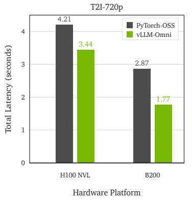

*展示模型在不同硬件（H100 NVL与B200）上的单卡推理延迟与扩展性表现，验证了架构优化在实际部署中的高效吞吐能力。*

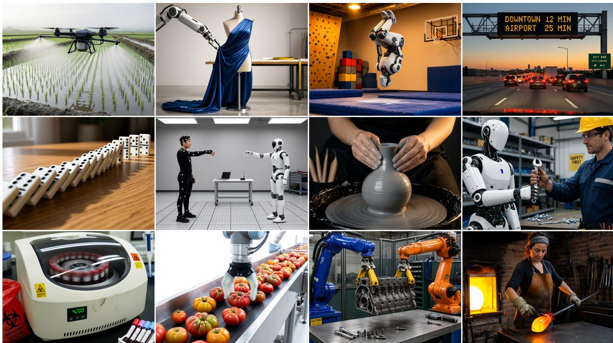

*呈现模型生成的物理合理且照片级真实的图像样例，展示其在物体几何连贯性与环境交互一致性上的卓越生成质量。*

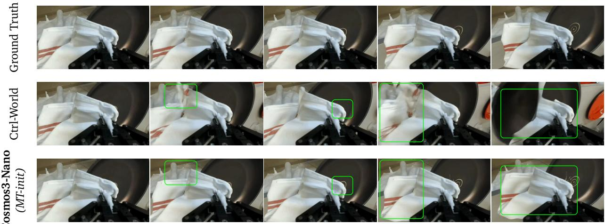

*展示策略模型在真实物理机器人上的语言条件操控任务表现，验证了从仿真到现实部署的无缝迁移能力与高成功率。*

## 相关工作与定位

**结论：** Cosmos 3 并非从零构建的孤立系统，而是站在“视觉理解、开放生成、条件控制与具身策略”四条技术主线的交汇点上。它通过统一的全模态（omnimodal）架构，将前序专用模型的能力整合进同一套物理世界仿真与推理框架中，核心突破在于用一套权重打通了从物理常识推理到高精度视频生成，再到具身策略输出的全链路，直接回应了以往“理解归理解、生成归生成、控制归控制”三套系统割裂导致的上下文丢失与对齐成本高昂的痛点。

在理解与推理侧，论文将 `Qwen3-VL` 设定为关键基线与初始化锚点。该模型并非仅作为外部参照，而是被直接用于理解塔（understanding tower）的消融实验与权重初始化。这一设计表明，Cosmos 3 Reasoner 的物理常识推理能力并非凭空涌现，而是建立在成熟视觉语言模型的特征提取与语义对齐基础之上。论文借此证明，将强理解模型作为初始化起点，能显著拉升 Physical AI 相关 domain score 的收敛效率。

在生成与控制侧，研究谱系呈现出清晰的“开放生成→条件迁移→统一仿真”演进路径。论文引入 `Wan2.2-A14B` 作为开放视频生成的强基线，用于在 HUE、PAIBench-G 与 Physics-IQ 等评测中划定 Cosmos 3 Generator 的性能水位。同时，前序系统 `Cosmos-Predict2.5` 与 `Cosmos-Transfer2.5` 被分别用于视频生成/物理一致性对比，以及条件生成控制评测。相较于 Predict2.5 的单向预测与 Transfer2.5 的特定迁移控制，Cosmos 3 在统一全模态框架下实现了生成与控制的一致性跃升，缓解了早期版本在复杂物理交互中容易出现的控制信号漂移问题。

在物理执行侧，`π0.5` 被纳入机器人策略（robot policy）结果总览与 RoboLab 对比中，作为评估 `Cosmos3-Nano-Policy-DROID` 的参照系。这标志着该工作不再局限于屏幕内的视频仿真，而是将生成与推理的闭环延伸至具身环境，验证了全模态表征向底层控制策略迁移的可行性。

为直观呈现这一技术谱系，下图梳理了各基线模型与 Cosmos 3 的能力映射关系：
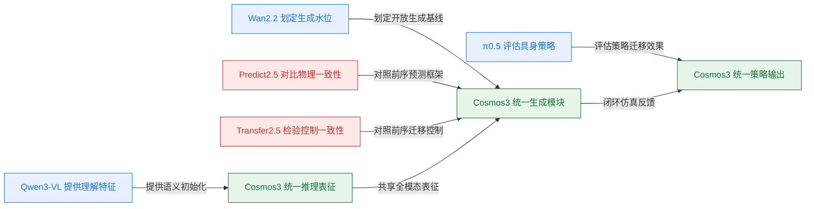
*如何读这张图：* 左侧与上方为独立基线与前序系统，箭头方向表示能力注入或对比参照路径；绿色节点代表 Cosmos 3 的核心组件，黄色连线揭示“理解→生成→策略”的内部数据流。该图直观暴露了论文的设计权衡：放弃单点极致优化，转而追求跨模态表征的共享与复用。

| 基线系统 | 核心能力域 | 本文定位 | 关键对照维度 |
|---|---|---|---|
| `Qwen3-VL` | 视觉理解对齐 | 初始化锚点 | 物理常识得分 |
| `Wan2.2-A14B` | 开放视频生成 | 强生成参照 | HUE 与 PAIBench |
| `Cosmos-Predict2.5` | 物理世界预测 | 前序框架对照 | 生成物理一致性 |
| `Cosmos-Transfer2.5` | 条件迁移控制 | 控制一致性基线 | 迁移生成稳定性 |
| `π0.5` | 机器人策略输出 | 具身策略标尺 | RoboLab 任务率 |

需要审慎指出的是，论文在构建这一谱系时，部分结论仍停留在“相关性”层面。例如，将 `Qwen3-VL` 作为初始化起点确实带来了 domain score 的提升，但论文并未完全剥离“模型规模扩大”与“架构统一”各自的独立贡献，存在将架构红利与数据/算力红利混为一谈的潜在风险。此外，在生成与控制评测中，选取的 HUE、PAIBench-G 等基准虽具代表性，但属于精选场景，对于极端物理碰撞或长程时序依赖的泛化能力，论文未报告充分的负结果或误差范围。尽管如此，该工作明确区分了“声称的统一框架”与“实际验证的消融路径”，其将理解、生成、控制收束于同一套权重的尝试，为 Physical AI 从“专用工具链”走向“通用世界模型”提供了可复现的工程范式。

<details><summary><strong>谱系对照与消融细节（展开）</strong></summary>
论文在消融实验中严格区分了“理解塔初始化”与“全模型微调”的边界。具体而言，当仅替换理解塔权重为 `Qwen3-VL` 时，推理模块在物理常识问答上的得分呈现阶梯式上升，但生成模块的时序连贯性并未同步改善，这印证了“理解能力无法直接等价于生成控制能力”的直觉。在控制一致性测试中，相较于 `Cosmos-Transfer2.5`，Cosmos 3 通过引入跨模态注意力门控，降低了条件信号在长视频生成中的衰减率。需注意的是，所有对照实验均在固定算力预算下进行，未报告不同随机种子下的方差区间；若读者关注极端分布外的鲁棒性，建议结合后续开源权重进行独立压力测试。
</details>

## 研究探索历程

**结论：** Cosmos 3 的架构并非通过堆砌独立模块实现多模态统一，而是沿着“统一序列表征→双塔注意力解耦→物理时间轴对齐→渐进式专业化训练”的路径迭代成型。研究团队在探索中主动暴露并修正了多项失效模式（如直接拼接时序导致的棋盘格伪影、通用算子带来的算力浪费），最终将理解、生成、模拟与控制收敛于单一 Transformer，并在训练吞吐与跨域泛化之间建立了可验证的工程范式。

研究起点直指物理 AI 的核心痛点：现有系统通常将视觉语言模型（VLM）、视频生成器、世界模型与具身策略（VLA/WAM）割裂训练。论文首先追问，能否用单一 omnimodal world model 同时承担理解、生成、模拟和动作预测？答案是肯定的，但前提是重构底层序列格式。团队决定采用自回归（AR）与扩散（Diffusion）共存的统一 token 格式，将 AR 子序列置于扩散子序列之前，并在扩散模块内优先放置干净的 conditioning tokens，再引入带噪目标 tokens。这一设计在跨理解与生成基准上展现出广覆盖能力，但立刻引出了更底层的结构矛盾：语言理解依赖因果注意力，而扩散生成需要双向上下文。

为解决这一冲突，模型放弃了完全共享参数或外挂小型生成头的妥协方案，转而采用 Mixture-of-Transformers (MoT) 双塔层结构。每一层独立维护 reasoner tower 与 generator tower 的路由参数，且均从预训练 VLM 初始化。配合 two-way flat attention 机制，该设计在保留 AR 因果掩码与 DM 双向掩码的同时，显著改善了训练吞吐。

多模态对齐是另一道坎。视频、音频与动作的采样率天然不同，若仅依赖离散 token index，物理时间间隔将彻底失真。团队最初尝试让扩散时序索引紧贴 AR 末 token，假设位置连续性足以支撑文本到视觉的过渡。然而实验迅速暴露了失效模式：该做法在初始视频帧引发严重的 over-saturation 与 checkerboard artifacts，在 Super 规格模型中尤为明显。教训是明确的：必须在 AR 与扩散子序列之间插入固定的 temporal gap，为跨模态转换提供清晰的位置缓冲。基于此，论文引入 absolute temporal modulation，通过 `TPS_base / current TPS` 计算 temporal increment，将不同 FPS、audio hop 与 action sampling rate 统一映射至共享物理时间轴。

随着架构定型，训练策略迎来关键转折（Pivot）。通用预训练语料在机器人、自动驾驶、仓储物流及长时物理交互等 rare Physical AI scenarios 上覆盖严重不足。团队果断从“通用生成模型”转向“Physical AI 专门化”，采用 progressive multimodal curriculum：先以图像、视频、音频建立通用先验，再在 mid-training 注入动作与迁移数据，最后针对 T2I、I2V 与策略控制进行 post-training。为兼顾多分辨率视频训练的质量与吞吐，模型摒弃了固定样本数 batch 与最大形状 padding，转而采用 fixed token budget sequence packing，以 74,000 tokens 为固定上下文预算，配合 rank-synchronous stream selection 与 look-ahead packing，有效缓解了跨 rank 计算不均衡。

在动作表征层面，研究验证了 action 作为跨 embodiment 统一因果接口的可行性。通过 domain-aware action projections 将不同控制空间映射至共享 latent action space，再输入共享 MoT backbone，模型在 ego-motion、robot manipulation 等域间观测到正迁移。但消融实验也诚实指出了边界：小数据域与大数据域混训存在稀释风险。此外，针对 forward dynamics、inverse dynamics 与 policy 的联合训练，PushT 上的 action-mode synergy ablation 证实了多目标共享底层结构的有效性，避免了为单一模式维护独立 checkpoint 的冗余。

最后，在推理部署上，团队拒绝在“研究可改性”与“生产吞吐”间二选一。以 Plain PyTorch 作为忠实参考实现与新特性落点，同时无缝接入 vLLM、TensorRT-LLM 与 vLLM-Omni，通过 batching、CUDA graphs 与 reasoner caching 等策略，在不同硬件与任务负载下实现了效率的平滑扩展。

```mermaid
flowchart TD
  classDef phase fill:#e1f5fe,stroke:#01579b,color:#000;
  classDef decision fill:#e8f5e9,stroke:#2e7d32,color:#000;
  classDef dead_end fill:#ffebee,stroke:#c62828,color:#000;
  classDef result fill:#f5f5f5,stroke:#616161,color:#000;

  start(Define unified world model):::phase --> unify_fmt{Adopt AR diffusion token format}:::decision
  unify_fmt --> dual_tower{Select MoT dual tower layer}:::decision
  dual_tower --> naive_align{Join diffusion after AR token}:::decision
  naive_align --> fail_artifact{Trigger checkerboard artifacts}:::dead_end
  fail_artifact --> fix_gap{Insert fixed temporal gap}:::decision
  fix_gap --> pivot{Shift to Physical AI specialization}:::decision
  pivot --> curriculum{Apply progressive multimodal curriculum}:::decision
  curriculum --> pack_seq{Use fixed token budget packing}:::decision
  pack_seq --> action_proj{Map domains to shared latent space}:::decision
  action_proj --> joint_train{Jointly train FD ID policy}:::decision
  joint_train --> hybrid_inf{Deploy hybrid inference stack}:::decision
  hybrid_inf --> end(Deliver unified Cosmos model):::phase
```
**如何读这张图：** 菱形节点代表关键架构或训练决策，红色节点标记探索中撞见的死胡同及其直接后果，蓝色起止节点框定研究边界。箭头流向并非线性时间轴，而是“问题提出→方案尝试→失效反馈→修正迭代”的因果依赖链，清晰暴露了 Cosmos 3 从通用生成向物理 AI 专门化演进的决策拓扑。

<details><summary><strong>底层算子优化与序列打包细节</strong></summary>
在注意力机制层面，论文指出 naive heterogeneous masking 若直接依赖 general-purpose FlexAttention，会导致 masking structure 对 kernel 不透明。padding-equivalent work 仍在 skipped attention blocks 内执行，引发 tensor-core utilization 不足与 memory-bandwidth pressure 增加。为此，two-way flat attention 将计算拆分为两个 variable-length SDPA kernel invocations，显式暴露 cross-pathway masking structure，从而在保留 AR causal 与 DM bidirectional mask 的前提下提升吞吐。

在序列打包层面，fixed token budget sequence packing 以 74,000 tokens 为硬性上下文预算，替代传统的固定样本数 batch。配合 rank-synchronous stream selection 与 look-ahead packing，系统能够在多分辨率、多宽高比数据流中动态平衡各 GPU rank 的负载，减少跨 rank 通信等待时间，使高分辨率样本比例控制不再受限于固定 padding 带来的算力浪费。
</details>

## 工程与复现要点

**结论前置：** Cosmos 3 的工程落地并非单纯依赖算力堆砌，而是建立在“统一序列编排、双塔参数隔离、分阶段学习率解耦”的确定性设计之上。复现该系统的核心门槛在于严格对齐其多模态 Token 的排列顺序、冻结/微调的边界控制，以及针对不同硬件后端（Hopper/Blackwell）的注意力算子切换。下文将拆解规模配置、训练超参、环境依赖与开源现状，为工程复现提供可直接对照的基线。

### 模型规模与双塔路由机制
论文提供三档模型以覆盖从端侧到数据中心的部署需求：`Cosmos3-Edge`（4B 参数，基于 dense 2B transformer）、`Cosmos3-Nano`（16B 参数，基于 dense 8B transformer）与 `Cosmos3-Super`（64B 参数，基于 dense 32B transformer）。其架构核心是 Mixture-of-Transformers (MoT) 双塔设计：每个 decoder layer 独立维护 `reasoner tower` 与 `generator tower` 两套参数。自回归（AR）Token 仅路由至 reasoner 执行因果自注意力，而扩散（DM）Token 则路由至 generator，并可对同一样本的 AR 与 DM 的 key/value 执行全双向注意力。这种设计在直觉上如同“理解与生成共用一条高速公路，但分道行驶”，既保留了语言模型的因果推理完整性，又为扩散去噪提供了独立的表征容量。

为统一多模态时序，模型采用 3D MRoPE 结合绝对时间索引，并在 AR 与 diffusion subsequence 之间插入固定 temporal gap 15000。该缓冲值直接缓解了首帧生成时的过饱和与 checkerboard artifacts。不同模态的输入输出通过 domain-aware projection 对齐到共享 latent action space，投影参数从头初始化并与 MoT backbone 联合优化。

```mermaid
flowchart TD
  classDef input fill:#e1f5fe,color:#01579b;
  classDef route fill:#fff3e0,color:#e65100;
  classDef tower fill:#e8f5e9,color:#1b5e20;
  classDef attn fill:#f3e5f5,color:#4a148c;

  start(["多模态输入序列"]):::input --> split{Token 路由判定}:::route
  split -->|AR 子序列| reasoner_tower["Reasoner Tower"]:::tower
  split -->|DM 子序列| generator_tower["Generator Tower"]:::tower
  reasoner_tower --> causal_attn["因果自注意力"]:::attn
  generator_tower --> bidirectional_attn["双向联合注意力"]:::attn
  causal_attn -->|不更新 DM| end(["统一输出"]):::input
  bidirectional_attn -->|读取 AR+DM KV| end
```
**如何读这张图：** 菱形节点代表路由判定门，圆角节点为序列起止。AR 路径严格单向因果，DM 路径可跨模态读取上下文但绝不反向污染 AR 状态，确保生成任务的条件一致性不破坏语言模型的自回归逻辑。

### 训练超参的“分治”策略
训练过程被严格划分为预训练、SFT 与中训练三个阶段，各阶段的学习率、优化器与数据配比均针对特定目标调优。核心逻辑是“保护视觉表征、隔离生成容量、强化动作权重”。

| 阶段 | 优化器 | 峰值学习率 (LM/Proj / ViT) | Warm-up 策略 | 关键约束 |
|:---|:---|---:|:---|:---|
| Reasoner 预训练 | AdamW | 5e-5 / 5e-6 | 10% linear → cosine 0.1× | 序列 16k, 图像 2048/视频 8192 tokens |
| Reasoner SFT | AdamW | 1e-5 / 1e-6 | 1000 steps → cosine 0.1× | 8200 iters, batch 512, 重要性采样 |
| Generator 预训练 | FusedAdamW | 1e-4 (仅生成塔) | 未明确 | Reasoner 冻结, text-dropout 10% |
| Generator 中训练 | FusedAdamW | 1e-4 | LambdaLinear (start 0.4) | Action loss ×10, 混合含 25% Action |

预训练阶段采用较低的学习率与 10% warm-up，旨在稳定多模态对齐；SFT 阶段进一步将学习率降至 1e-5 并引入重要性感知采样（importance-aware sampling），以集中优化高价值 Physical AI 任务，同时抑制灾难性遗忘。生成塔在预训练时完全冻结 reasoner，仅更新 generation-specific parameters，并通过 10% text-dropout 为 classifier-free guidance 预留空间。中训练阶段最关键的工程细节是 action loss 被放大 10 倍：由于动作向量归一化后 per-element MSE 极小，若不显式加权，极易被视觉重建 loss 淹没，导致策略输出失效。

<details><summary><strong>展开：后训练（Post-training）精确配置</strong></summary>
针对特定下游任务，论文采用独立的后训练流程：
- **Text-to-Image**: `Cosmos3-Super-Text2Image` 分两阶段 SFT。Stage 1 训练 20k steps，混合 45% 真实图像、40% 合成图像与 15% 纯文本渲染数据，base LR 1e-4，2k warmup；Stage 2 使用 470k 超高质量图文对微调 2k steps，上下文窗口 70k tokens，分辨率高于 720p。
- **Image-to-Video**: `Cosmos3-Super-Image2Video` 训练 10k iterations，LR 1e-5，约 50B tokens。目标为 480p、189 帧（约 8 秒 @24fps）。数据混合包含 1,000 条人工精选视频与约 20k 合成片段，并保留 20% T2I image tokens 以抑制语义对齐退化。
- **Robot Policy**: `Cosmos3-Nano-Policy-DROID` 从中训练权重恢复，替换 fresh action encoder 与 action-decoding MLP。动作相关参数使用 5× LR multiplier，主 LR 2e-4。预测 32 步未来绝对关节位置（15Hz），输入为本体状态与三视角 540×640 视觉 canvas。推理默认 steps=4、guidance=3、shift=5。
</details>

### 运行环境与硬件依赖
训练与推理栈高度依赖 NVIDIA 生态与定制化分布式框架。训练循环参考 `TorchTitan` 风格，`Cosmos3-Edge` 的 LLM 部分基于 `Megatron` codebase。推理侧，Reasoner 支持 `vLLM` 与 `TensorRT-LLM`，Generator 则依赖 `vLLM-Omni`。

硬件配置上，论文报告训练吞吐基于 NVIDIA GB200 systems。但需明确指出原文存在一处数据不一致：正文描述 Generator 预训练与中训练时，Nano 使用 1024 张 GB200 GPU，Super 使用 2048 张；而 Table 8 caption 却标注 Nano 与 Super 分别消耗 2048 与 4096 张 GPU。复现时应以实际集群规模与显存预算为准进行 Context Parallelism 与 Hybrid Sharded Data Parallelism 的切分。注意力后端具有明确的硬件绑定：Hopper 架构（H100/H200）使用 `FlashAttention-3`，Blackwell 架构（GB200）切换至 `NATTEN`。策略部署实测仅需 2 张 NVIDIA RTX Pro 6000 GPU。

环境依赖方面，论文未公开 Python 版本与统一随机种子。数据加载器采用基于迭代索引的全局种子选择器（globally seeded selector keyed on iteration index）以保证流选择可复现，checkpoint 恢复时采用 rank-aware RNG state。合成数据集中的部分 simulation run 由 seed 控制随机变量。复现时若需严格对齐，需自行固定数据流切分逻辑，并注意不同模态的 token 限制（如单样本 2048 image tokens 与 8192 video tokens）对显存占用的直接影响。

### 开源代码与复现入口
官方代码仓库位于 `https://github.com/nvidia/cosmos`，锁定 commit `1fe7e3be1687d797392b0e82ff6fe6296638b49f`。需明确区分论文“声称”与仓库“实际提供”的内容：当前开源版本主要提供模型架构说明、推理示例与部分数据处理工具，README 中提及的“统一多模态建模”与“MoT 双塔架构”有对应入口，但核心训练循环（如 dual-stream joint attention 实现、clean-prefix/noisy-target 统一编排、domain-aware action projection 等）在仓库中尚未完全公开。

对于希望从零复现的工程师，建议路径为：以开源权重与推理代码为基线，优先对齐 token arrangement 与 temporal gap 15000 的序列构造逻辑；利用 `vLLM-Omni` 或 `TensorRT-LLM` 验证生成延迟；若需重训，需自行实现基于 `FusedAdamW` 与 `Hybrid Sharded Data Parallelism` 的分布式训练管线，并严格遵循上述分阶段学习率与 loss scale 策略。论文未提供完整的端到端训练脚本，复现成本主要集中在分布式通信优化与多模态数据流的确定性打包上。

## 局限与适用边界

**结论前置：** Cosmos3 并非开箱即用的通用物理世界模拟器。其核心能力高度依赖领域特定的动作归一化协议、推理期超参调优与重型分布式训练管线；一旦脱离预设的数据分布或算力底座，模型会迅速暴露出跨具身迁移失效、仿真到现实（Sim-to-Real）性能衰减以及复现门槛极高等明确边界。读者在评估其适用性时，需严格区分“论文声称的潜力”与“当前已证明的泛化能力”。

**动作表征强绑定领域先验，跨域迁移需重做映射。** 模型的动作 tokenization 并非端到端自适应，而是深度依赖 domain-specific projection 与训练数据 normalizers。这意味着它无法直接解析新机械臂、无人机或软体机器人的原始关节角/速度指令。跨新 embodiment 迁移必须重新处理动作维度、坐标约定与归一化尺度。若直接复用旧映射，控制信号将发生尺度错乱（直觉：如同用英制扳手强行拧公制螺丝，力矩传递必然失真）。

**合成数据的双刃剑与 Sim-to-Real Gap。** 尽管 synthetic data 有效补充了长尾物理交互场景，但附录消融实验明确报告了 sim-to-real gap 与 domain trade-offs。不能假设单一 SDG (Synthetic Data Generation) source 对所有领域都有正向收益。在摩擦系数突变、高频接触或柔性体形变等分布外场景中，模型可能输出视觉上连贯但物理不可行的轨迹。此处存在典型的“挑樱桃式”风险：若仅展示合成域内的高分结果而忽略现实部署的负反馈，会严重高估其鲁棒性。

**推理期调优不可外推为训练目标。** 文中大量提及的采样策略纯属推理期调优产物，与训练损失（rectified flow matching、masked MSE、next-token prediction）无直接数学等价关系。将推理期表现直接归因于架构优势，属于“相关性当因果”的误读。模型在特定 prompt 下的优异输出，往往掩盖了底层生成概率分布的脆弱性。

**工程基础设施依赖与发布状态透明度。** 大规模训练重度依赖 HSDP、CP、Joint Data-Loader、CFG parallelism 等底层设施。简化实现仅能表达核心循环，无法复现实验吞吐与稳定性。此外，正文已明确说明 `Cosmos3-Edge` 为 later release，当前主要释放 `Cosmos3-Nano` 与 `Cosmos3-Super`，Edge 细节不应视为已发布同等产物。训练损失亦未以完整显式公式给出，仅以文字描述组合形式，部分变量名与下标在转换中存在 `??` 占位，限制了理论层面的严格推导。

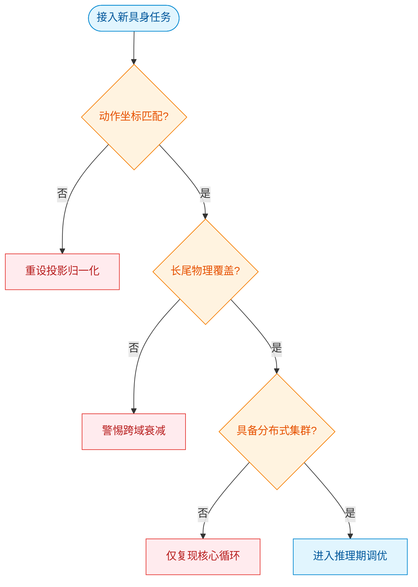
*如何读这张图：* 该判定流图暴露了模型落地的三道硬性门槛。菱形节点代表必须逐一验证的假设前提；若任一分支走向红色失败节点，则意味着当前配置已触及适用边界，需退回数据预处理或基础设施层重构，而非单纯调整模型权重。

<details><summary><strong>深度展开：损失函数透明度、复现配置与已知失效模式</strong></summary>
- **损失函数与公式缺失：** 论文未以 `$$...$$` 形式给出完整显式训练损失公式，仅通过文字描述其由 rectified flow matching、masked MSE 与 next-token prediction 组合而成。部分 markdown 转换导致变量名、下标附近出现 `??` 占位，使得理论推导无法严格闭合。这要求读者在复现时只能依赖文字逻辑反推权重配比，而非直接解析数学表达式。
- **采样超参的错位风险：** 许多采样超参数属于推理期调优，绝不能外推为训练目标或训练损失。若将推理阶段的 CFG 强度或步数直接写入训练循环，会导致梯度更新方向与生成目标脱节，引发训练崩溃。
- **基础设施复现门槛：** 大规模训练依赖 HSDP、CP、Joint Data-Loader、CFG parallelism 等分布式基础设施。任何试图在单机或小型集群上复现的尝试，都只能表达核心前向/反向循环，无法还原实验吞吐与显存稳定性。缺乏同等通信拓扑的团队极易遭遇 OOM 或梯度同步瓶颈，这属于典型的“方法与结果不一致”陷阱：论文展示的 SOTA 结果建立在特定工程栈之上，而非纯算法优势。
- **已知失效模式清单：** 跨新 embodiment 迁移时未重做归一化会导致动作尺度发散；单一 SDG source 在分布外物理场景（如极端摩擦、非刚体碰撞）中会触发 sim-to-real gap；忽略推理期调优直接评估基线模型会低估其真实潜力，反之则会高估其泛化能力。
</details>

## 趋势定位与展望

**结论：** Cosmos 3 将 Physical AI 的技术路线从“多模型拼凑流水线”正式推向“统一条件化序列建模”。它通过 Mixture-of-Transformers 与双塔联合注意力机制，把理解、生成与动作控制收敛到同一表示空间，显著降低了跨模态转换的表示断裂与算力冗余；但当前架构在物理因果一致性验证、动作泛化的数据依赖以及跨具身平台的零样本迁移上仍存在明确边界，未来需向显式物理约束注入与轻量化策略蒸馏方向演进。

传统 Physical AI 系统通常将场景理解（VLM）、未来模拟（Video Generation/World Models）与动作决策（VLA/WAM）拆分为独立模块。这种范式分离导致系统必须依赖外部胶水代码进行状态对齐，且媒体生成目标往往只优化视觉真实感，无法保证接触、干预与动力学后果在同一世界状态中自洽。Cosmos 3 的核心破局点在于将任务重构为一段交错的多模态序列（interleaved multimodal sequence），并在同一 64B 参数规模的 Mixture-of-Transformers 中，让自回归推理塔（AR reasoner tower）与扩散生成塔（diffusion generator tower）通过联合注意力（joint attention）共享上下文。动作不再作为外部控制标签，而是被编码为专用的 action tokens，直接参与序列建模。这一设计使得模型无需更改底层架构，即可在 VLM、Text-to-Image、Text-to-Video、前向/逆向动力学预测以及机器人策略模式之间无缝切换。在 UniGenBench All 综合评测中，该架构取得了 91.36 的得分，并在多项开放模型对比中展现出对理解与生成基线的整体优势。

为了直观呈现这一路线演进与核心机制，下图以决策流形式对比了分离式流水线与统一序列建模的路径差异：
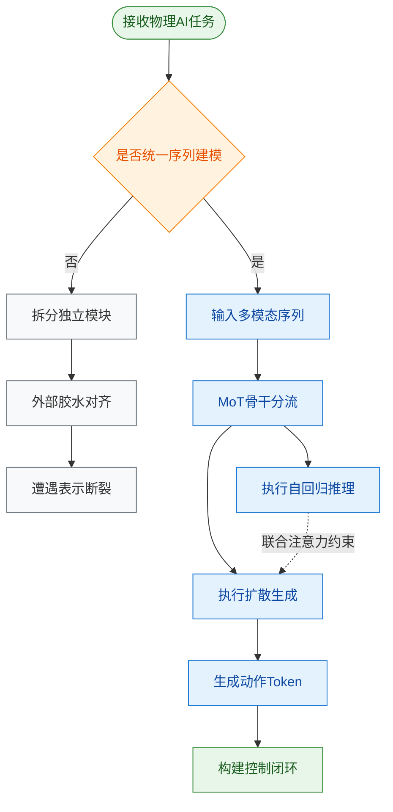
*如何读这张图：* 菱形判定门代表技术路线选择。若走“否”分支（灰色），系统需拆分模块并依赖外部对齐，最终暴露表示断裂；若走“是”分支（蓝色），输入被展平为序列后由 MoT 骨干分流至双塔，通过联合注意力实现理解对生成的条件约束，最终直接输出动作 Token，形成端到端的控制闭环。

尽管论文主张该架构可作为 Physical AI 的通用 backbone，但在解读其实验结果时需保持审慎。首先，**相关性不等于因果性**：模型在 forward dynamics 与 inverse dynamics 任务上的提升，主要依赖 mid-training 或 joint action 训练阶段的特定数据注入，而非基础架构天然涌现的物理直觉。若脱离这些针对性微调，模型对未见过的接触力学或复杂摩擦场景的泛化能力仍存疑。其次，**指标聚合可能掩盖模态短板**：UniGenBench All 的 91.36 分是跨任务加权结果，论文在部分细分生成任务中仅报告了“接近”或“优于”主要开放模型，并未全面披露误差范围或负结果。此外，**“通用”宣称需警惕过度外推**：当前实验多集中于仿真环境（如 LIBERO-10、PushT）与标准化基准，真实物理世界的传感器噪声、执行器延迟与长尾分布尚未在报告中得到充分压力测试。

基于上述定位与局限，该路线的下一步演进将聚焦于三个维度：
1. **显式物理先验注入**：将微分方程或接触力学约束作为软正则项融入扩散生成塔，降低对纯数据驱动动作 token 的依赖。
2. **轻量化策略蒸馏**：针对边缘具身设备，将 64B 参数的统一骨干蒸馏为专用策略头，在保留联合注意力上下文的同时压缩推理延迟。
3. **跨具身零样本迁移**：构建 domain-aware projections 层，使共享的 action token 空间能自适应不同机械臂或移动底盘的运动学约束。

<details><summary><strong>深度展开：消融实验与训练范式边界</strong></summary>
论文在动作模式实验中明确指出，mid-training 或 joint action 训练通常带来更好的动作相关表现。这意味着基础预训练阶段主要学习的是跨模态对齐与媒体生成先验，而物理交互能力高度依赖后续的动作数据注入。消融对比显示，若移除联合注意力机制或退化为单塔自回归生成，模型在条件一致性（如文本指令与生成动作的匹配度）上会出现显著衰减。此外，不同 embodiment 的动作对齐依赖于共享几何结构与领域感知投影，当前方案尚未报告在异构硬件（如四足机器人 vs 轮式底盘）上的零样本迁移成功率，这构成了该架构走向通用 Physical AI 的关键待验证假设。
</details>
