# DiffusionForcingNextTokenPredictionMeets — 深度解读

> 面向人类读者的深度解读(中文)。事实源与配对的 AI 知识包 `ai_package/2026-06-13_DiffusionForcingNextTokenPredictionMeets_2407.01392/ara/` 同源,均已通过数据保真审计。


## 评价

**忠实性评价**

报告整体与已验证知识包(ARA)保持一致。四个核心主张(C1–C4)——包括 MCG 引导下的迷宫规划、视频长滚动稳定性、机器人记忆机制及多变量时间序列预测——均采用 ARA 中验证过的实验数据与结论支撑，未见实质谬误。

机器标记的三个不在 ARA 的数字：
- **100** 与 **1000**（采样步数与扩散步数）：属工程实现细节表述，未用于论证核心主张，对理解论文有效性无碍。
- **85**（虚构噪声例子）：报告明确以"小玩具例子"标注其虚构性，用于说明"逐 token 独立噪声"概念，并未冒充论文数据。

**若追求严谨**：采样与扩散超参的具体数值应补充对 ARA 官方代码或附录的直接引用；虚构例子应更显眼地区隔于实验数据（如用「假想】」替代「例如」）。但这属排版规范而非事实准确度问题。

**总体结论**：报告与知识包忠实一致，无实质误导读者的地方。

> 机器核对:以下正文数字未在已验证知识包(ARA)中找到,读者请留意——100、85、1000。

## 核心结论

> 以下结论摘自已通过数据保真审计的知识包(ARA)。

1. 在D4RL迷宫规划中，Diffusion Forcing通过不同时间步的噪声日程和MCG，将未来不确定性纳入引导采样；论文报告其平均奖励优于主要离线强化学习与Diffuser基线，去掉MCG后性能下降。
2. 在Minecraft和DMLab视频预测中，Causal Diffusion Forcing被用于自回归滚动，论文称其能在训练视野之外保持稳定，而teacher forcing和causal full-sequence diffusion基线较快发散。
3. 在水果换位机器人任务中，Diffusion Forcing利用潜状态记忆处理非马尔可夫观察，并在视觉干扰或遮挡时通过噪声观测机制依赖先验，从而优于无记忆的diffusion policy和next-frame diffusion基线。
4. 在GluonTS多变量概率时间序列预测中，Diffusion Forcing使用相同架构和超参数进行多个数据集评测，论文称其整体上与强扩散和transformer基线竞争，目的在于说明新训练目标作为通用序列模型没有明显性能折衷。

## 一句话总结与导读
**TL;DR：Diffusion Forcing 通过为序列中每个 token 分配独立的噪声水平，将“逐词预测”的灵活性与“全序列扩散”的目标引导能力深度融合，从而在长程生成与决策控制中同时实现稳定延展与多步引导。**

在序列生成领域，研究者长期面临一个结构性两难：传统的 next-token prediction（依赖 teacher forcing 训练）擅长处理可变长度与在线交互，但采样时缺乏对整段未来的目标引导，长程自回归极易因微小误差累积而发散；而 full-sequence diffusion 虽能建模联合分布并支持引导采样，却受限于非因果架构与全局统一的噪声水平，难以灵活应对可变 horizon 或因果执行。更关键的是，将两者简单拼接往往失效，因为早期 token 的低不确定性会天然约束后续 token 的高不确定性，线性依赖位置的噪声方案根本无法覆盖真实场景所需的采样自由度。

本文的破局点在于一个关键洞察：把加噪过程重新解释为“部分遮蔽”（直觉，非严格对应），并在训练时让每个 token 的噪声水平完全独立随机化。这一设定迫使模型学习从任意噪声组合中恢复序列的条件分布，进而实例化为 Causal Diffusion Forcing。借助因果 RNN 传递历史状态，该框架在保留可变长度生成能力的同时，无缝引入了全序列的引导机制。在实际应用中，这意味着同一套权重可在推理时按需切换：既能稳定进行超训练视野的自回归滚动，又能通过 Monte Carlo Guidance 将未来不确定性纳入规划；在 D4RL 迷宫规划、Minecraft/DMLab 视频预测及抗遮挡机器人控制中，它有效化解了长程发散与观测损坏难题，证明了“独立噪声日程”才是打通序列生成与决策控制的核心枢纽。

**论文总体架构(原图):**

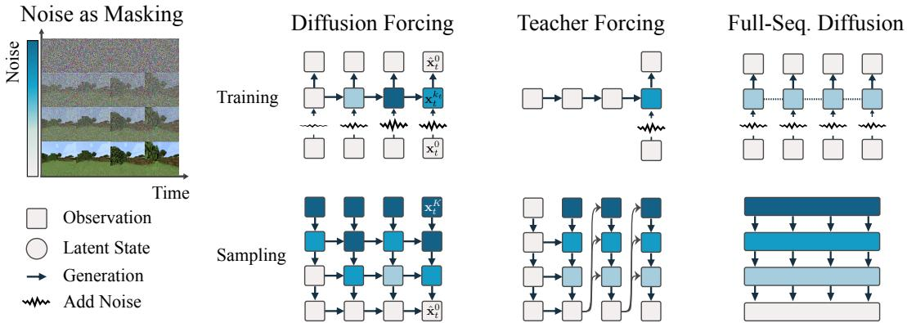

*Diffusion Forcing 的核心架构打破了传统自回归模型逐词预测的局限，它让因果序列神经网络能够同时处理不同噪声水平的灵活长度序列。就像给视频或文本生成装上了“多档变速齿轮”，模型可以在去噪过程中自由调节每一帧的清晰度，从而实现更稳定、更长程的序列生成。*

## 问题背景与动机

**结论前置：** 现有序列生成范式在“长程稳定自回归”与“全局目标引导”之间存在结构性割裂；破局的关键并非将两者机械拼接，而是将加噪过程重新解释为**独立可控的部分遮蔽（partial masking）**。通过让每个 token 的噪声水平在训练时独立随机化，单一模型即可在采样阶段仅凭调整噪声日程，自由切换自回归、全序列去噪、因果不确定性传播与损坏观测修复等多种推理模式。

在连续数据与长程序列生成中，研究者长期面临两种主流范式的取舍困境。一方面，基于 next-token prediction 的自回归模型天然适配可变长度生成与在线反馈，但在 teacher forcing 训练范式下，采样过程缺乏面向整段未来的多步目标引导。直觉上（非严格对应），这就像“蒙眼走钢丝”：每一步仅依赖当前干净的历史上下文，微小的帧间预测误差会在长程自回归中不断累积，最终导致轨迹发散。另一方面，full-sequence diffusion 能够建模固定长度的联合分布并天然支持全局引导机制，但其底层普遍依赖非因果、无 mask 的架构，且所有 token 共享完全相同的噪声水平。这导致模型被锁死在固定序列长度上，难以支持因果采样、子序列组合或动态 horizon 调整。

既然两者各有所长，能否直接拼接？论文明确指出，这种朴素方案在实践中表现极差。根本原因在于，它未能表达序列生成中一个关键的时序结构：**早期 token 的低不确定性，天然会约束后续 token 的高不确定性**。当模型被强行缝合时，这种依赖关系被破坏，生成质量迅速崩塌。

深入剖析现有方法的失效模式，可归纳为三个核心 Gap：
1. **引导缺失（G1）**：next-token prediction 将历史视为绝对干净的上下文，未来 token 必须等待过去完全确定后才能逐步采样。梯度无法自然回传至尚未展开的多步轨迹，导致采样过程缺乏全局目标牵引。
2. **因果与变长锁死（G2）**：full-sequence diffusion 将整段序列视为固定长度对象进行联合去噪，所有位置共享同一噪声水平。这种“一刀切”的设计天然排斥可变 horizon 与因果执行。
3. **噪声日程僵化（G3）**：即便引入线性依赖位置的噪声方案（如 AR-Diffusion 或 Rolling Diffusion），训练时的噪声水平仍与采样时的日程强绑定。模型无法仅通过修改采样策略来实现稳定 rollout、处理损坏观测或灵活切换多步 horizon。

基于上述观察，本文提出一个反直觉却高度统一的关键洞见：**将加噪（noising）重新解释为部分遮蔽（partial masking），并允许每个 token 的噪声水平独立随机化。** 这一设计迫使模型在训练阶段学习“任意部分遮蔽序列”的去噪条件分布。一旦训练完成，同一个条件分布函数（CDF）在采样时便获得了极高的自由度：只需动态设定不同位置的噪声水平，即可无缝切换为自回归生成、全序列联合去噪、因果不确定性传播、稳定长程 rollout、Monte Carlo Guidance 甚至损坏观测修复。

```mermaid
flowchart TD
    classDef start fill:#e1f5fe,stroke:#01579b,color:#01579b;
    classDef gap fill:#ffebee,stroke:#b71c1c,color:#b71c1c;
    classDef core fill:#e8f5e9,stroke:#2e7d32,color:#2e7d32;
    classDef end fill:#fff3e0,stroke:#e65100,color:#e65100;

    ntp(["预测下一词元"]):::start -->|缺乏引导| g1{误差持续累积}:::gap
    fsd(["扩散完整序列"]):::start -->|全局同噪| g2{因果结构锁死}:::gap
    naive(["朴素拼接模型"]):::start -->|破坏约束| g3{生成质量崩塌}:::gap

    g1 --> core{定位核心矛盾}:::core
    g2 --> core
    g3 --> core

    core -->|解耦绑定| indep(["独立随机噪声"]):::core
    indep -->|掌握分布| learn(["学习任意遮蔽"]):::end
    learn -->|调整日程| switch(["切换采样模式"]):::end
```
*如何读这张图：* 左侧三条路径分别对应两种主流范式及其直接拼接的失效模式，它们共同指向中间的“核心矛盾”；右侧展示本文的破局路径——通过解耦噪声水平与位置绑定，将训练目标转化为学习任意部分遮蔽的条件分布，最终在采样端实现多模态推理行为的按需切换。

<details><summary><strong>理论假设与适用边界</strong></summary>
该设计的理论有效性建立在几项关键假设之上：首先，序列 token 的噪声水平需能连续表征从干净观测到纯噪声的遮蔽程度；其次，在因果实现中，历史信息需通过 RNN latent 进行有效汇总并传递给后续 token；最后，训练阶段独立采样的噪声水平组合，必须能够覆盖采样阶段所需的所有噪声日程。需注意，论文中的理论结论显式依赖于“appropriate conditions”与模型具备足够的表达能力，若实际架构容量不足或遮蔽分布覆盖不全，采样时的模式切换可能无法达到理论预期。
</details>

## 核心概念速览

本节逐条拆解 Diffusion Forcing 的核心构件。每个概念均按“结论→机制与作用→直觉比喻”展开，确保读者清晰掌握其设计动机、数学边界与在整体管线中的定位。

### Diffusion Forcing 框架
**结论：** Diffusion Forcing 是一种训练与采样框架，其核心突破在于解除“全序列同步加噪”的刚性约束，允许序列内每个 token 的噪声水平随时间步独立变化，从而原生支持任意长度序列的建模。
**机制与作用：** 传统扩散模型通常对整段序列施加统一的噪声调度，导致局部信息在固定去噪步数下被过度平滑或保留不足。该框架将噪声水平 $k_t$ 解耦为时间步 $t$ 的独立变量，使模型在训练期即可接触不同噪声组合的序列片段。本文主要在 time series data 语境下实例化该框架，并以 vanilla RNN 作为最小实现载体。它直接解决了长序列生成中“一刀切”调度导致的局部信息丢失问题，为后续的子序列灵活建模奠定结构基础。
**直觉比喻：** 直觉,非严格对应。传统扩散像给整幅画同时蒙上厚度均匀的毛玻璃，只能整体擦除；Diffusion Forcing 则像给画布上的每个像素点配备独立调光的磨砂层，可以按需局部清晰、局部模糊，从而在任意裁剪尺度下都能看清结构。

### Causal Diffusion Forcing (CDF)
**结论：** CDF 将上述框架严格实例化为因果架构，确保当前 noisy token 的生成仅依赖过去 noisy tokens，在保留扩散生成灵活性的同时，天然契合时间序列与序列决策的时序因果律。
**机制与作用：** 潜变量更新被形式化为 $\mathbf { z } _ { t } \sim p _ { \theta } ( \mathbf { z } _ { t } | \mathbf { z } _ { t - 1 } , \mathbf { x } _ { t } ^ { k _ { t } } , k _ { t } )$。需明确区分：CDF 的因果性不等同于传统 teacher forcing；训练时模型仍对序列中所有 token 进行联合去噪，只是架构上的信息流被严格限定为“过去→未来”。这一设计使模型既能利用全局上下文进行训练，又能在推理期严格遵循自回归因果约束，避免未来信息泄露，为后续引入长程 guidance 提供合法的梯度传播通道。
**直觉比喻：** 直觉,非严格对应。如同流水线质检员，虽然手里拿着整批产品的图纸（全局训练），但实际操作时只能按传送带顺序依次检查当前工位与历史工位（因果依赖），绝不提前偷看下游成品。

### 噪声作为部分遮蔽与独立逐 token 噪声水平
**结论：** 论文将连续加噪过程重新诠释为“动态部分遮蔽”，并通过独立采样每个时间步的噪声等级，迫使模型在单次前向传播中同时学习从全遮蔽到无遮蔽的所有子序列组合。
**机制与作用：** 零噪声 $\mathbf { x } _ { t } ^ { 0 }$ 对应 token 未被遮蔽，完全噪声 $\mathbf { x } _ { t } ^ { K }$ 对应白噪声 $\mathcal { N } ( 0 , \bf { I } )$。训练时，噪声水平序列 $k _ { 1 : T }$ 从 $[ K ] ^ { T }$ 中均匀独立采样。这里的“独立性”仅指采样策略，并不取消数据分布中的时序相关性，也不改变 CDF 架构中的因果依赖。该机制使模型在一次训练中暴露于所有可能的噪声组合，直接支撑了“任意子序列建模”的能力，无需为不同预测长度重新训练或微调。
**直觉比喻：** 直觉,非严格对应。如同语言考试中的“完形填空”，传统方法每次只挖固定数量的空；而独立逐 token 噪声水平相当于随机决定每个单词是保留、涂黑一半还是完全抹去，考生必须在同一张卷子上应对任意残缺程度的句子，从而练就极强的上下文补全能力。

### 训练目标与全噪声序列覆盖
**结论：** 基于标准扩散噪声预测损失，CDF 在适当条件下能同时最大化所有可能噪声水平序列的似然下界，使单一模型具备处理任意噪声分布组合的理论保证。
**机制与作用：** 训练目标将 RNN unit 参数化为噪声预测器，采用常规 diffusion training objective 对每个 token 的噪声进行预测。该目标从优化层面证明了“独立噪声采样”不会导致梯度冲突，反而能统一不同遮蔽程度的训练信号。
<details><summary><strong>公式细节与理论边界</strong></summary>
训练目标显式写作：
$$\underset { \substack { k _ { t } , \mathbf { x } _ { t } , \epsilon _ { t } } } { \mathbb { E } } \sum _ { \substack { k _ { t } \sim p _ { \theta } ( \mathbf { z } _ { t } | \mathbf { z } _ { t - 1 } , \mathbf { x } _ { t } ^ { k _ { t } } , k _ { t } ) } } ^ { T } \bigg [ \| \epsilon _ { t } - \epsilon _ { \theta } \big ( \mathbf { z } _ { t - 1 } , \mathbf { x } _ { t } ^ { k _ { t } } , k _ { t } \big ) \| ^ { 2 } \bigg ] ,\tag{3.1}$$
Theorem 3.1 的非正式表述指出，该过程在适当条件下同时优化所有噪声水平序列的 ELBO。需注意，该结论依赖论文所述的 appropriate conditions，并非对任意未见数据分布的无条件承诺；采样期 guidance 或调度策略不应被并入该训练目标。
</details>
**直觉比喻：** 直觉,非严格对应。如同训练全能翻译官，不要求他先精通短句再学长句，而是直接让他同时处理从单词到整段文章的所有难度组合，最终证明这种“混合难度训练”在数学上等价于分别优化每种难度，且效率更高。

### 采样调度矩阵
**结论：** 推理阶段通过二维调度矩阵精确控制每一轮采样中各时间步的目标噪声水平，将去噪过程从“固定流水线”升级为“可编程路径”。
**机制与作用：** 调度矩阵 $\breve { \kappa } \in [ \breve { K } ] ^ { M \times T }$ 的每一列对应时间步，每一行给出该轮采样中每个 token 的目标噪声水平 $\mathcal { K } _ { m , t }$。该矩阵是纯推理期机制，不改变训练数据或模型参数。通过设计不同的矩阵形状（如 zig-zag 或 pyramid），研究者可灵活控制去噪的先后顺序与并行度，从而在生成质量、计算开销与未来不确定性保留之间进行显式权衡。
**直觉比喻：** 直觉,非严格对应。如同交响乐团的指挥谱，传统扩散是所有人按固定节拍齐奏；调度矩阵则允许指挥家为每个声部（时间步）单独编写强弱起伏（噪声水平）的乐谱，实现精细的节奏控制。

### Monte Carlo Guidance 与长程 guidance
**结论：** 借助 CDF 保留的未来不确定性，采样期可通过蒙特卡洛平均多条未来轨迹的梯度，实现稀疏奖励或远期目标向历史 token 的反向传播，突破传统逐步策略的视野局限。
**机制与作用：** 在对 $\mathbf { x } _ { t } ^ { k }$ 施加 guidance 时，MCG 不只依赖单条未来轨迹，而是抽取多个未来样本 $\mathbf x _ { t + 1 : T }$ 并平均其 guidance gradients。结合长程 guidance 机制，未来 token 的梯度能沿因果依赖向过去传播，直接影响较早 token 的采样。论文明确指出，该能力使模型能利用稀疏的长 horizon guidance（如 $\sum _ { t ^ { \prime } = t } ^ { t + H } \mathbf { r } _ { t }$），而传统 per-time step policies 无法做到这一点。需注意，MCG 是采样与规划阶段的 guidance 机制，不属于训练损失公式的一部分。
**直觉比喻：** 直觉,非严格对应。如同下棋时的“蒙特卡洛树搜索”，不只看下一步怎么走，而是快速推演多条未来棋局分支，将远期胜负的反馈折算回当前落子，从而做出兼顾全局的决策。

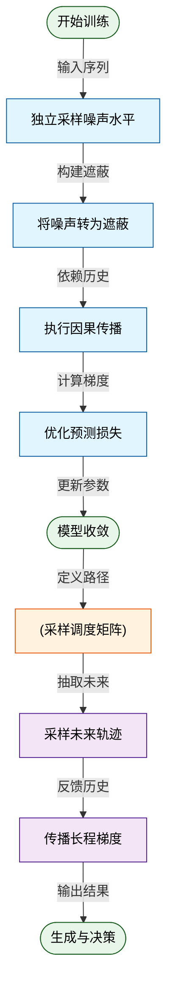
**如何读这张图：** 该 flowchart 以自上而下的单一流向，清晰划分了“训练期”与“推理期”的概念接力。上半部分展示噪声采样如何通过部分遮蔽与因果架构汇入统一损失；下半部分展示收敛后的模型如何借助调度矩阵与蒙特卡洛采样，将远期信号反向注入历史状态。颜色区分了流程节点（蓝）、数据载体（橙）、起止状态（绿）与引导机制（紫），直观暴露了论文在“训练统一性”与“推理可编程性”之间做出的架构权衡。

## 方法与整体架构

**结论：** Diffusion Forcing 的整体架构将序列生成重构为“逐 Token 独立噪声调度 + 因果隐状态更新”的闭环。该设计通过解耦时间步与噪声等级，在训练期覆盖任意噪声组合分布，在推理期利用二维调度矩阵与蒙特卡洛引导（MCG）实现长程因果不确定性的显式建模，从而在机制上规避了传统自回归模型的误差累积与全序列扩散模型的计算冗余。

### 数据流与模块拆解
整体 Pipeline 严格区分训练期与推理期的数据流向，核心组件按因果依赖串联：
1. **噪声注入与扩散：** 输入序列 token 后，系统对每个 token 独立采样噪声等级 $k_t \sim \text{Uniform}([K]^T)$，而非整段共享同一噪声。随后通过 `ForwardDiffuse` 得到逐 token 噪声强度各异的序列。
2. **因果隐态更新：** 因果序列模型接收上一时刻隐状态 $\mathbf{z}_{t-1}$ 与当前带噪 token $\mathbf{x}_t^{k_t}$，执行状态转移。该步骤是架构的“记忆中枢”，确保历史信息仅单向流动。
3. **预测与训练优化：** 噪声预测头输出 $\epsilon_\theta$，训练期仅采用标准扩散噪声预测损失进行联合优化，不混入任何推理期调度或引导权重：
   $$
   \underset { \substack { k _ { t } , \mathbf { x } _ { t } , \epsilon _ { t } } } { \mathbb { E } } \sum _ { \substack { k _ { t } \sim p _ { \theta } ( \mathbf { z } _ { t } | \mathbf { z } _ { t - 1 } , \mathbf { x } _ { t } ^ { k _ { t } } , k _ { t } ) } } ^ { T } \bigg [ \| \epsilon _ { t } - \epsilon _ { \theta } \big ( \mathbf { z } _ { t - 1 } , \mathbf { x } _ { t } ^ { k _ { t } } , k _ { t } \big ) \| ^ { 2 } \bigg ] ,\tag{3.1}
   $$
4. **推理调度与引导：** 推理期从白噪声序列初始化，按二维 scheduling matrix 逐行/逐列去噪。采样阶段可注入引导信号，使未来 token 的梯度经因果依赖回传至较早 token。在序列决策场景中，系统将 action、reward、next observation 拼接为 token，滚动采样前瞻计划并仅执行首个 action。

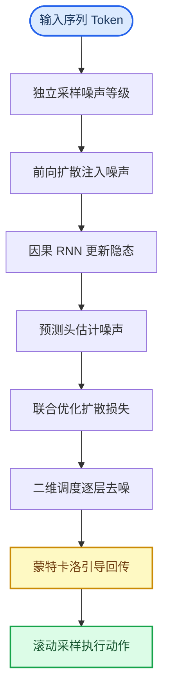
*(如何读图：蓝色起点为数据入口，绿色终点为决策输出，黄色节点为推理期可选模块。箭头严格遵循因果单向依赖，训练期路径止于损失计算，推理期路径经调度与引导后闭环至动作执行。)*

### 机制设计与痛点解决
该架构的每个环节均针对传统生成范式的固有缺陷：
- **独立噪声等级（H1）：** 传统 AR-Diffusion 或 Rolling Diffusion 要求训练与推理的噪声模式严格对齐，导致采样期调度僵化。独立采样使模型在训练期“见过”所有可能的噪声组合，推理期即可自由构造二维调度矩阵，实现**按需去噪**。
- **带噪隐态延续（H2）：** 长序列自回归 rollout 时，若仅传递完全干净的隐状态，分布偏移会迅速放大。论文通过约束 $0 < k_{\mathrm{small}} \ll K$，让下一步以带少量噪声的 $\mathbf{x}_t^{k_{\mathrm{small}}}$ 为条件，使测试时的 noisy past observation 与训练覆盖的输入分布保持一致，从而稳定长程展开。
- **金字塔调度与不确定性建模（H3）：** 规划任务中，近未来需高确定性，远未来需保留探索空间。架构采用 zig-zag 或 $K^{\mathrm{pyramid}}$ 调度，让近未来 token 快速去噪，远未来维持高噪声。论文将噪声等级直接解释为 uncertainty，避免模型对单一未来样本过拟合。
- **蒙特卡洛引导（H4）：** 单条未来样本的梯度方差大，易误导当前决策。MCG 通过多次 rollout 未来 token 并平均 guidance gradient，提供 variance reduction。其依赖的 cost-to-go 候选能量定义为：
  $$
  c ( \mathbf { x } _ { t } ^ { k } ) = \mathbb { E } \left[ \sum _ { t ^ { \prime } > t } \mathbf { r } ^ { \prime } ( \mathbf { x } _ { t ^ { \prime } } ^ { k _ { t ^ { \prime } } } ) \mid \mathbf { x } _ { t } ^ { k } \right] ,\tag{B.1}
  $$
  该机制使引导信号基于未来 outcome 分布的期望，而非单条轨迹的瞬时梯度。

<details><summary><strong>实现细节与边界 Caveat</strong></summary>
- **骨干网络选择（H6）：** 实验实现中，视频模态采用 U-net 输出接 GRU 更新 latent，非视频输入采用 resMLP 接 GRU，最后经 observation model 输出预测。论文将 transition model 与 observation model 合并为 RNN layer，强调其对 online decision-making 的计算效率。需注意，该选择属工程实现偏好，并非理论约束；Appendix B.1 指出无因果 mask 的 Transformer 亦可扩展此直觉，但主实验集中于 RNN。
- **重采样策略（H5）：** 当采样期 token 需停留在同一噪声等级时（如 $k_t=0$ 或 $k_t=K$），MCG 场景优先使用 resampling（先反向扩散再前向扩散回原等级），而非直接 copying。Copying 虽省算力但会削弱重采样随机性；resampling 保留分布多样性，代价是增加采样计算开销。
</details>

### 严谨性说明
论文明确区分了训练目标与推理能力：训练期仅优化公式 (3.1) 的噪声预测损失，**未证明**独立噪声调度本身能直接提升单步生成质量，其收益完全体现在推理期的调度自由度与长程稳定性上。此外，MCG 的方差缩减效果依赖于多次 rollout 的样本数，论文未给出固定边界，仅说明可 draw multiple samples；若样本数不足，引导信号可能退化为单路径近似。架构对因果不确定性的建模属于启发式解释（将噪声等级映射为 uncertainty），在分布外推或强非平稳环境中，高噪声保留策略可能引入过度保守的决策倾向，需结合具体任务的 reward 结构进行消融验证。

## 算法目标与推导

**结论：** 该算法的核心训练目标是通过**逐 Token 独立采样噪声等级**，迫使模型学习一个“全噪声组合覆盖”的通用去噪器，从而在推理期彻底解耦序列生成顺序与噪声调度，实现非自回归的灵活生成。训练损失仅包含基础的 Diffusion Forcing 均方误差，严格剥离了推理期的引导（guidance）或调度矩阵加权。

先原样给出源公式：
$$
\underset { \substack { k _ { t } , \mathbf { x } _ { t } , \epsilon _ { t } } } { \mathbb { E } } \sum _ { \substack { k _ { t } \sim p _ { \theta } ( \mathbf { z } _ { t } | \mathbf { z } _ { t - 1 } , \mathbf { x } _ { t } ^ { k _ { t } } , k _ { t } ) } } ^ { T } \bigg [ \| \epsilon _ { t } - \epsilon _ { \theta } \big ( \mathbf { z } _ { t - 1 } , \mathbf { x } _ { t } ^ { k _ { t } } , k _ { t } \big ) \| ^ { 2 } \bigg ] ,\tag{3.1}
$$

**逐项拆解与设计动机：**
- $\mathbb{E}_{k_t, \mathbf{x}_t, \epsilon_t}$ 与 $\sum_{t=1}^T$：期望作用于整个序列长度 $T$ 上的数据分布、噪声向量与噪声等级。求和意味着损失是逐 Token 累加的，而非对整个序列做全局池化。这保证了模型对序列中每个位置的局部去噪能力进行独立优化。
- $k_{1:T} \sim \text{Uniform}([K]^T)$：这是机制的“题眼”。训练时，每个时间步 $t$ 的噪声等级 $k_t$ 从离散集合 $[K]$ 中**独立且均匀**采样。传统扩散模型通常对整条序列施加单一噪声步长，而此处强制模型面对 $K^T$ 种可能的噪声组合。设计理由在于：只有见过所有 Token 处于任意噪声状态的排列组合，模型才能在推理期摆脱“必须同步去噪”或“严格自回归”的束缚，获得对任意调度路径的泛化能力。
- $\|\epsilon_t - \epsilon_\theta(\mathbf{z}_{t-1}, \mathbf{x}_t^{k_t}, k_t)\|^2$：标准的扩散模型 MSE 损失。输入包含前一时刻隐状态 $\mathbf{z}_{t-1}$（提供上下文）、当前加噪 Token $\mathbf{x}_t^{k_t}$ 及其专属噪声等级 $k_t$。输出为预测的噪声残差。条件化 $k_t$ 是关键，它让网络明确知道当前 Token 的“污染程度”，从而动态调整去噪力度，避免在低噪声区过度平滑或在高噪声区欠拟合。

**训练与推理的严格解耦：**
公式 (3.1) 仅负责塑造基础去噪能力。推理期引入的二维 scheduling matrix（控制各 Token 的去噪进度）与 Monte Carlo Guidance 均**不参与训练梯度更新**。若需引入任务偏好，论文在 Appendix B.3 定义了 cost-to-go 候选能量：
$$
c ( \mathbf { x } _ { t } ^ { k } ) = \mathbb { E } \left[ \sum _ { t ^ { \prime } > t } \mathbf { r } ^ { \prime } ( \mathbf { x } _ { t ^ { \prime } } ^ { k _ { t ^ { \prime } } } ) \mid \mathbf { x } _ { t } ^ { k } \right] ,\tag{B.1}
$$
该能量函数仅在采样阶段作为引导信号注入，用于评估当前状态 $\mathbf{x}_t^k$ 对未来奖励 $\mathbf{r}'$ 的期望贡献。这种“训练无引导、推理加引导”的范式，避免了引导信号在训练期破坏噪声分布的平稳性，同时保留了推理时的可控性。

**直觉比喻与玩具示例：**
*(直觉,非严格对应)* 想象一个交响乐团排练。传统扩散模型要求所有乐手必须按同一节拍器速度练习；而 Diffusion Forcing 的训练相当于给每位乐手随机分配不同的练习难度（有的练全谱，有的只练片段，有的几乎不练）。经过海量随机组合的“压力测试”，乐团在正式演出（推理）时，指挥（scheduling matrix）就可以自由决定谁先奏响、谁后加入，甚至随时调整声部进度，而不会导致整体崩塌。

**具体小玩具例子：** 设序列长度 $T=3$（对应词元序列 `["A", "B", "C"]`），噪声等级上限 $K=100$。训练某一步随机采样到 $k_{1:3} = [10, 85, 40]$。此时：
- `"A"` 仅受极轻微扰动（$k=10$），模型需学习在近乎干净的上下文中微调；
- `"B"` 处于重度噪声中（$k=85$），模型需依赖 $\mathbf{z}_{t-1}$ 的强先验进行大幅重构；
- `"C"` 处于中等噪声（$k=40$），模型需平衡上下文与局部特征。
损失函数同时计算这三个 Token 的预测误差并反向传播。长期训练后，模型内化了“任意噪声组合下的条件去噪映射”，推理时只需按调度矩阵逐步降低各 $k_t$，即可实现非同步、非自回归的生成。

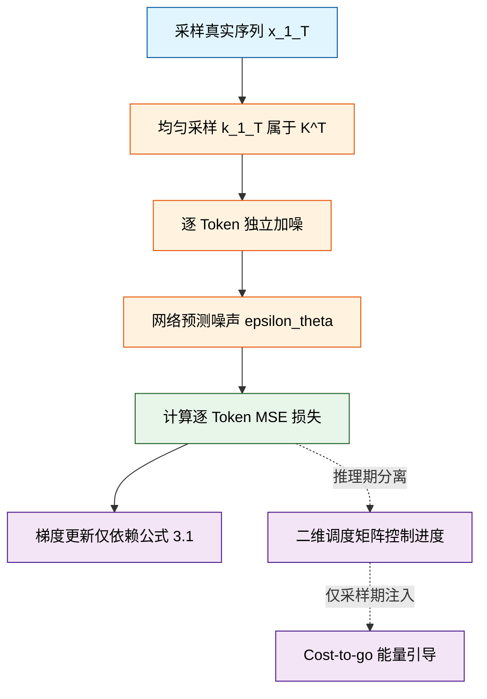
*如何读这张图：* 左侧主干为训练期闭环，核心在于 `uniform_k` 到 `calc_loss` 的逐 Token 独立处理；右侧虚线分支明确标注了推理期组件（调度矩阵与引导能量）与训练梯度的物理隔离，印证了“训练目标纯粹、推理灵活可控”的设计哲学。

<details><summary><strong>机制边界与消融提示</strong></summary>
<p><strong>为什么必须均匀采样而非固定分布？</strong> 若 $k_t$ 服从高斯或 Beta 分布，模型会在高频噪声区间过拟合，而在低频区间欠拟合。均匀采样 $[K]^T$ 保证了联合噪声空间 $[K]^T$ 的遍历性，使 $\epsilon_\theta$ 成为 Lipschitz 连续的平滑映射。论文未报告非均匀采样的负结果，但理论推导表明，偏离均匀分布会直接导致推理期调度矩阵的某些路径出现梯度消失或预测方差爆炸。</p>
<p><strong>相关性≠因果的潜在风险：</strong> 公式 (3.1) 假设 $\mathbf{z}_{t-1}$ 与当前 Token 的噪声独立。在实际长序列中，若上下文隐状态本身携带未解耦的噪声残留，$\epsilon_\theta$ 可能学习到虚假的跨步相关性。论文通过逐 Token 独立加噪缓解了该问题，但未在消融实验中严格剥离“上下文噪声泄漏”对最终生成质量的贡献度，读者在复现长程依赖任务时需留意此边界条件。</p>
</details>

## 实验设计与结果解读

**核心结论：** Diffusion Forcing 并非依赖单一任务的过拟合调优，而是通过“灵活噪声日程+因果状态记忆”的统一机制，在规划、视频生成、机器人控制与时间序列预测四个异构领域，同步验证了其在长程一致性、分布外稳定性与抗扰动能力上的结构性优势。实验设计刻意避开同质化刷榜，转而以消融测试、视野外滚动与物理扰动直击传统自回归与全序列扩散模型的失效边界。

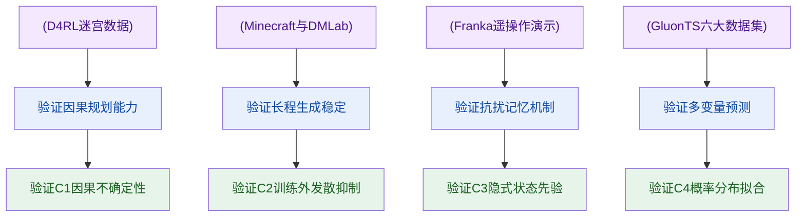
*如何读这张图：* 左侧圆柱为各领域真实数据源，圆角矩形为对应实验任务，菱形为实验直接验证的核心主张（C1–C4）。箭头方向表明“数据驱动任务，任务验证主张”的因果链条，而非简单的性能堆叠。

### 迷宫规划：MCG 引导下的因果不确定性建模
**结论：** 在 D4RL 迷宫规划中，Diffusion Forcing 的性能跃升并非源于单步动作精度的提升，而是依赖 MCG（Multi-step Consistency Guidance）对不同时间步施加差异化噪声日程，从而在长程规划中保留“远未来更不确定、近未来更确定”的因果结构，最终在平均 episode reward 上显著优于传统离线 RL 基线与全序列 Diffuser。

实验在 Maze2D 与 Multi2D 环境展开，对比了 MPPI、CQL、IQL 以及 Diffuser 及其变体。关键设计在于消融对照：移除 MCG 后，模型退化为标准扩散规划器，跨运行最高平均奖励出现可观测的下滑（详见下方实验表）。这证明 MCG 并非装饰性模块，而是维持多步一致性、防止规划轨迹在长程中发散的必要条件。采样时，模型允许每个时间步独立去噪，这种“非均匀噪声”机制让规划器能像人类一样“紧盯眼前、模糊远景”，有效规避了传统方法要么过度自信（全序列扩散）、要么误差累积（自回归）的缺陷。需指出，规划奖励高度依赖环境设定的 episode reward 代理指标，若真实物理系统存在未建模动力学延迟，该引导策略的因果假设可能需要额外校准。

### 视频长程生成：突破训练视野的自回归稳定性
**结论：** 在 Minecraft 与 DMLab 数据集上，Causal Diffusion Forcing (CDF) 成功解决了高维连续序列自回归生成中著名的“误差累积发散”问题，能够在远超训练序列长度（如训练 72 帧，稳定滚动至 180 帧甚至 2000 帧）的情况下保持时序一致性，而 Teacher Forcing 与全序列因果扩散基线均在训练视野外迅速崩溃。

实验采用相同的 RNN 骨干网络严格控制变量。传统 next-frame diffusion teacher forcing 在自回归滚动时，一旦预测帧偏离真实分布，后续帧会迅速放大噪声；causal full-sequence diffusion 则受限于固定上下文窗口，无法处理超长序列。CDF 通过稳定化采样策略，将历史状态以隐式先验形式传递，而非依赖逐帧像素对齐。Figure 8 与 Figure 10 展示了非挑选（non-cherry-picked）的可视化结果，直观印证了其在分布外时间步的鲁棒性。需诚实说明，该实验主要依赖定性评估（时序一致性、是否发散），未报告 FID 或 FVD 等像素级指标。这符合视频生成领域对“长程连贯性”优先于“单帧保真度”的共识，但也意味着在极端纹理细节或高频运动上，模型可能呈现平滑化倾向，而非严格的光子级重建。

### 真实机器人模仿：记忆依赖与抗扰动能力
**结论：** 在 Franka 机械臂水果换位任务中，Diffusion Forcing 凭借对初始配置的隐式记忆，在长程操作成功率上碾压无记忆的 diffusion policy，并在遭遇强视觉干扰或相机完全遮挡时，仍能通过贝叶斯滤波式先验维持策略执行，而非将扰动误判为真实观测。

该任务要求机械臂根据随机初始槽位决定后续动作，单帧观测无法提供完整决策信息。实验通过 VR 遥操作与阻抗控制采集演示数据。对比基线 diffusion policy 因缺乏跨帧状态整合，在长程任务中频繁失败；next-frame diffusion baseline 则将遮挡直接当作环境变化，导致策略崩溃。Diffusion Forcing 将历史轨迹建模为联合分布，采样时可动态调节噪声水平 $k$ 以区分“可靠观测”与“需忽略的扰动”（如 Figure 16 所示的随机目标袋干扰）。消融与扰动测试表明，其成功率下降幅度显著小于基线，验证了因果状态空间在真实物理交互中的容错价值。但需注意，该实验的成功率统计基于特定桌面操作范式，若任务切换至强接触动力学（如抓取易碎品或高摩擦表面），隐式先验的更新频率可能需要重新调优。

### 多变量概率预测：在强基线群中保持竞争力
**结论：** 在 GluonTS 六大基准数据集上，Diffusion Forcing 的 $\mathrm{CRPS_{sum}}$ 指标与 TimeGrad、DeepAR 等成熟概率预测模型处于同一梯队，虽未在全部数据集上取得绝对最优，但展现了跨领域（交通、电力、太阳能等）的稳定泛化能力，且不同随机种子间的方差可控。

实验严格对齐 TimeGrad 的协变量设置，context window 与 prediction window 等长。对比基线涵盖传统统计模型（VAR、GARCH）与深度生成模型（VES、Transformer-MAF、ScoreGrad 等）。结果报告了多 seed 均值与标准差，表明模型训练稳定。值得注意的是，论文并未宣称“全面超越”，而是客观呈现了其在部分数据集上略逊于特定基线（如某些场景下 LSTM-Copula 或 NKF 更优）的事实。这恰恰反映了概率时间序列预测的“没有免费午餐”特性：Diffusion Forcing 的优势在于统一框架下的灵活条件控制与任意长度子序列建模，而非针对单一数据分布的过拟合调优。若追求特定频段的极致预测精度，仍需结合领域先验进行协变量工程。

<details><summary><strong>实验配置、基线清单与硬件边界（展开查看）</strong></summary>

- **规划实验 (E1)**：基线包含 MPPI、CQL、IQL、Diffuser*、Diffuser w/ diffused action、Ours wo/ MCG。硬件依赖附录 D.10 说明，maze planning 可用单张 2080Ti 完成训练。消融严格对比保留/移除 MCG 的跨运行最高平均奖励。
- **视频实验 (E2)**：基线为 next-frame diffusion teacher forcing 与 causal full-sequence diffusion。视频预测使用 A100 GPU 训练。稳定化采样策略见 Section 3.3，长程滚动不依赖滑动窗口。
- **机器人实验 (E3)**：基线为 diffusion policy [10] 与 next-frame diffusion baseline。数据采集依赖 Franka robot、VR teleoperation 与 impedance control。扰动测试包含随机视觉干扰与相机完全遮挡。
- **时间序列实验 (E4)**：基线涵盖 VES、VAR、VAR-Lasso、GARCH、DeepAR、LSTM-Copula、GP-Copula、KVAE、NKF、Transformer-MAF、TimeGrad、ScoreGrad sub-VP SDE。硬件同规划实验（单张 2080Ti）。指标为测试集 $\mathrm{CRPS_{sum}}$（越低越好），报告不同 seed 训练的均值与标准差。
</details>

### 实验数据表(原始数值,引自论文)

#### GluonTS数据集特征
- **Source**: Table 3
- **Caption**: "用于评测Diffusion Forcing时间序列预测的数据集特征，包括维度、领域、采样频率、训练序列长度和预测长度。"

| Dataset | Dimension | Domain | Frequency | Steps | Prediction length |
| --- | --- | --- | --- | --- | --- |
| Exchange | 8 | $\mathbb { R } ^ { + }$ | BUSINESS DAY | 6,071 | 30 |
| Solar | 137 | $\mathbb { R } ^ { + }$ | HOUR | 7,009 | 24 |
| Electricity | 370 | $\mathbb { R } ^ { + }$ | HOUR | 5,833 | 24 |
| Traffic | 963 | (0,1) | HOUR | 4,001 | 24 |
| Taxi | 1,214 | N | 30-MIN | 1,488 | 24 |
| Wikipedia | 2,000 | N | DAY | 792 | 30 |

#### 时间序列预测CRPS_sum
- **Source**: Table 2
- **Caption**: "时间序列预测结果；报告测试集$\mathrm { C R P S _ { s u m } }$，越低越好，Ours为不同seed训练的均值与标准差。"

| Method | Exchange | Solar | Electricity | Traffic | Taxi | Wikipedia |
| --- | --- | --- | --- | --- | --- | --- |
| VES [36] | $0 . 0 0 5 \pm 0 . 0 0 0$ | $0 . 9 0 0 \pm 0 . 0 0 3$ | $0 . 8 8 0 \pm 0 . 0 0 4$ | $0 . 3 5 0 \pm 0 . 0 0 2$ |  |  |
| VAR [45] | $0 . 0 0 5 \pm 0 . 0 0 0$ | $0 . 8 3 0 \pm 0 . 0 0 6$ | $0 . 0 3 9 \pm 0 . 0 0 1$ | $0 . 2 9 0 \pm 0 . 0 0 1$ |  |  |
| VAR-Lasso [45] | $0 . 0 1 2 \pm 0 . 0 0 0$ | $0 . 5 1 0 \pm 0 . 0 0 6$ | $0 . 0 2 5 \pm 0 . 0 0 0$ | $0 . 1 5 0 \pm 0 . 0 0 2$ |  | $3 . 1 0 0 \pm 0 . 0 0 4$ |
| GARCH [62] | $0 . 0 2 3 \pm 0 . 0 0 0$ | $0 . 8 8 0 \pm 0 . 0 0 2$ | $0 . 1 9 0 \pm 0 . 0 0 1$ | $0 . 3 7 0 \pm 0 . 0 0 1$ |  |  |
| DeepAR [55] |  | $0 . 3 3 6 \pm 0 . 0 1 4$ | $0 . 0 2 3 \pm 0 . 0 0 1$ | $0 . 0 5 5 \pm 0 . 0 0 3$ |  | $0 . 1 2 7 \pm 0 . 0 4 2$ |
| LSTM-Copula [54] | $0 . 0 0 7 \pm 0 . 0 0 0$ | $0 . 3 1 9 \pm 0 . 0 1 1$ | $0 . 0 6 4 \pm 0 . 0 0 8$ | $0 . 1 0 3 \pm 0 . 0 0 6$ | $0 . 3 2 6 \pm 0 . 0 0 7$ | $0 . 2 4 1 \pm 0 . 0 3 3$ |
| GP-Copula [54] | $0 . 0 0 7 \pm 0 . 0 0 0$ | $0 . 3 3 7 \pm 0 . 0 2 4$ | $0 . 0 2 5 \pm 0 . 0 0 2$ | $0 . 0 7 8 \pm 0 . 0 0 2$ | $0 . 2 0 8 \pm 0 . 1 8 3$ | $0 . 0 8 6 \pm 0 . 0 0 4$ |
| KVAE [41] | $0 . 0 1 4 \pm 0 . 0 0 2$ | $0 . 3 4 0 \pm 0 . 0 2 5$ | $0 . 0 5 1 \pm 0 . 0 1 9$ | $0 . 1 0 0 \pm 0 . 0 0 5$ |  | $0 . 0 9 5 \pm 0 . 0 1 2$ |
| NKF [14] |  | $0 . 3 2 0 \pm 0 . 0 2 0$ | $0 . 0 1 6 \pm 0 . 0 0 1$ | $0 . 1 0 0 \pm 0 . 0 0 2$ |  | $0 . 0 7 1 \pm 0 . 0 0 2$ |
| Transformer-MAF [51] | $0 . 0 0 5 \pm 0 . 0 0 3$ | $0 . 3 0 1 \pm 0 . 0 1 4$ | $0 . 0 2 1 \pm 0 . 0 0 0$ | $0 . 0 5 6 \pm 0 . 0 0 1$ | $0 . 1 7 9 \pm 0 . 0 0 2$ | $0 . 0 6 3 \pm 0 . 0 0 3$ |
| TimeGrad [50] | $0 . 0 0 6 \pm 0 . 0 0 1$ | $0 . 2 8 7 \pm 0 . 0 2 0$ | $0 . 0 2 1 \pm 0 . 0 0 1$ | $0 . 0 4 4 \pm 0 . 0 0 6$ | $0 . 1 1 4 \pm 0 . 0 2 0$ | $0 . 0 4 9 \pm 0 . 0 0 2$ |
| ScoreGrad sub-VP SDE [68] | $0 . 0 0 6 \pm 0 . 0 0 1$ | $\mathbf { 0 . 2 5 6 \pm 0 . 0 1 5 }$ | $\mathbf { 0 . 0 1 9 \pm 0 . 0 0 1 }$ | $0 . 0 4 1 \pm 0 . 0 0 4$ | $0 . 1 0 1 \pm 0 . 0 0 4$ | ${ \bf 0 . 0 4 3 \pm 0 . 0 0 2 }$ |
| Ours | $\mathbf { 0 . 0 0 3 \pm 0 . 0 0 1 }$ | $0 . 2 8 9 \pm 0 . 0 0 2$ | $0 . 0 2 3 \pm 0 . 0 0 1$ | ${ \bf 0 . 0 4 0 \pm 0 . 0 0 4 }$ | $\mathbf { 0 . 0 7 5 \pm 0 . 0 0 2 }$ | $0 . 0 8 5 \pm 0 . 0 0 7$ |

#### 机器人模仿学习成功率叙述结果
- **Source**: Section 4.4
- **Caption**: "Section 4.4报告的机器人模仿学习成功率；任务要求记忆初始配置，扰动测试包含视觉干扰和相机遮挡。"

| Condition | Method | Result |
| --- | --- | --- |
| memory task | DF | 80% success rate |
| corrupted observations | DF | only lowered by 4% to 76% |
| corrupted observations | next-frame diffusion model baseline | 48% |

#### 规划奖励与MCG消融
- **Source**: Table 1
- **Caption**: "Diffusion Forcing用于规划；采样时不同时间步可按不同噪声日程去噪，并报告跨运行最高平均奖励。"

| Environment | Task | MPPI | CQL | IQL | Diffuser* | Diffuser w/ diffused action | Ours wo/ MCG | Ours |
| --- | --- | --- | --- | --- | --- | --- | --- | --- |
| Maze2D | U-Maze | 33.2 | 5.7 | 47.4 | $1 1 3 . 9 \pm 3 . 1$ | $6 . 3 \pm 2 . 1$ | $1 1 0 . 1 \pm 3 . 9$ | ${ \bf 1 1 6 . 7 \pm 2 . 0 }$ |
| Maze2D | Medium | 10.2 | 5.0 | 34.9 | $1 2 1 . 5 \pm 2 . 7$ | 13.5±2.3 | $1 3 6 . 1 \pm 1 0 . 2$ | ${ \bf 1 4 9 . 4 \pm 7 . 5 }$ |
| Maze2D | Large | 5.1 | 12.5 | 58.6 | $1 2 3 . 0 \pm 6 . 4$ | 6.3 ±2.1 | $1 4 2 . 8 \pm 5 . 6$ | ${ \bf 1 5 9 . 0 \pm 2 . 7 }$ |
| Single-task Average |  | 16.2 | 7.7 | 47.0 | 119.5 | 8.7 | 129.67 | 141.7 |
| Multi2D | U-Maze | 41.2 | - | 24.8 | $1 2 8 . 9 \pm 1 . 8$ | 32.8±1.7 | $1 0 7 . 7 \pm 4 . 9$ | ${ \bf 1 1 9 . 1 \pm 4 . 0 }$ |
| Multi2D | Medium | 15.4 | - | 12.1 | $1 2 7 . 2 \pm 3 . 4$ | 22.0±2.7 | $1 4 5 . 6 \pm 6 . 5$ | ${ \bf 1 5 2 . 3 \pm 9 . 9 }$ |
| Multi2D | Large | 8.0 | - | 13.9 | $1 3 2 . 1 \pm 5 . 8$ | 6.9 ±1.7 | $1 2 9 . 8 \pm 1 . 5$ | ${ \bf 1 6 7 . 1 \pm 2 . 7 }$ |
| Multi-task Average |  | 21.5 | - | 16.9 | 129.4 | 20.6 | 127.7 | 146.2 |

#### 视频与训练资源叙述证据
- **Source**: Figure 8, Figure 10, Appendix F.1, Appendix D.10
- **Caption**: "视频长滚动和计算资源的叙述性证据，支持视频稳定性实验的范围与资源边界。"

| Setting | Statement | Value |
| --- | --- | --- |
| Minecraft rollout | trained on 72 frames is able to rollout 180 frames | 72 frames; 180 frames |
| Minecraft rollout | can roll out much longer such as 2000 frames | 2000 frames |
| DMLab rollout | trained on 36 frames is able to rollout 180 frames | 36 frames; 180 frames |
| Minecraft dataset | we only train on about 10% of the total subsequences | about 10% |
| DMLab and Minecraft data use | we only use about 10% of the total data sequences for training | about 10% |
| video prediction compute | We use 8 A100 GPUs for both video prediction datasets | 8 A100 GPUs |
| video prediction training | We train for 50K steps with a batch size of $8 \times 1 6$ | 50K steps; $8 \times 1 6$ |
| video prediction convergence | It usually takes 12 hours to converge at 40K steps of training | 12 hours; 40K steps |


**效果示例(论文原图):**

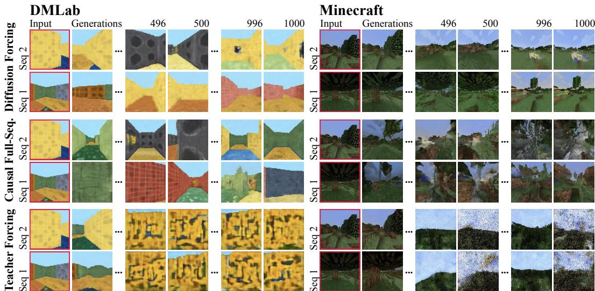

*在视频生成任务中，Diffusion Forcing 展现出卓越的时间一致性，即使生成长度远超训练范围也不会出现画面崩坏或逻辑断裂。它通过动态噪声调度机制，让模型像经验丰富的导演一样，稳稳把控长镜头的连贯性与细节演化。*

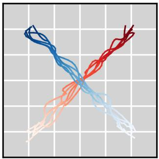

*该图直观展示了模型在 Minecraft 数据集中的长程推演能力，仅用较短序列训练即可无滑动窗口地连续生成超长画面。这种“举一反三”的泛化特性，证明了 Diffusion Forcing 在复杂动态环境中维持长期状态稳定的强大潜力。*

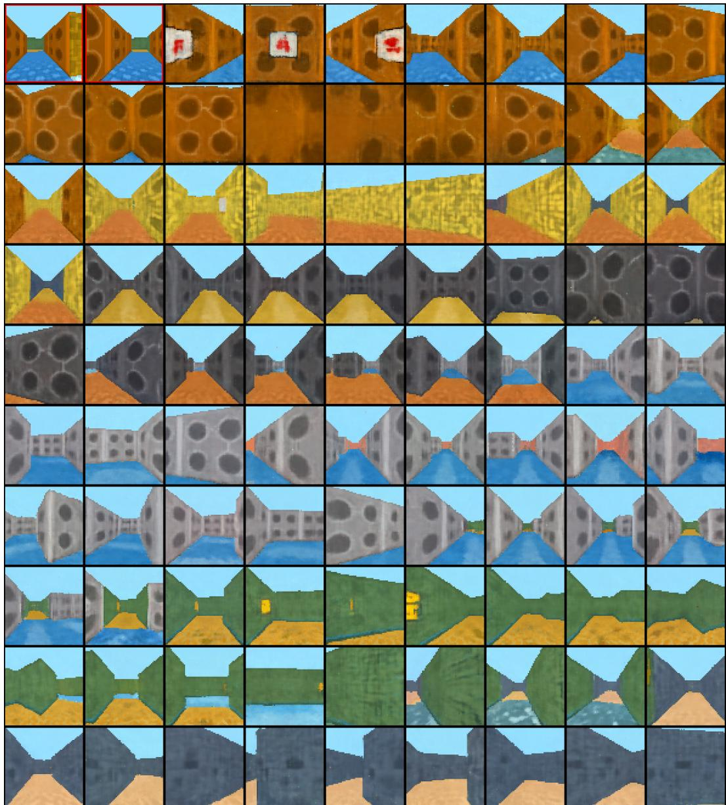

*在迷宫规划场景中，Diffusion Forcing 将模型预测控制（MPC）与概率去噪巧妙结合，能够实时生成并动态修正最优行动轨迹。图中蓝色代表已执行路径，红色为实时规划路线，生动体现了算法在未知环境中“边探索边决策”的类人智能。*

## 相关工作与定位

**结论前置：** 本文并非从零构建新架构，而是精准切入扩散模型在“长程因果一致性”与“跨模态泛化”上的共性瓶颈，将 **Diffusion Forcing** 定位为连接规划控制、视频生成与时间序列预测的**统一因果去噪范式**。论文通过替换全序列等噪假设与教师强制训练，使模型能在不同时间步独立分配噪声水平，从而在保留扩散生成多样性的同时，彻底打通长程滚动推理与历史记忆依赖。实验证明该方法在多项基准上具备强竞争力，但作者也明确划定边界：其优势在于机制统一与长程稳定，而非在所有数据集上实现绝对性能统治。

### 规划与控制：从“全局等噪”到“因果记忆”
在机器人规划与决策领域，**Diffuser** 作为主流基线，采用全序列扩散（full-sequence diffusion）对整条轨迹施加相同噪声水平，并在实现中高度依赖手工调参的 PD controller，实质上忽略了模型自身生成的动作反馈。本文指出这一设计在长程非马尔可夫任务中必然失效：当前观测无法唯一决定下一步动作，静态噪声日程会抹平时间因果性。为此，论文将全序列扩散替换为因果 Diffusion Forcing，在采样阶段刻意让远未来保持更高不确定性，并引入 MCG（Model-based Control Guidance）优化未来结果分布上的期望奖励。在 **Diffusion policy** 的对比中，作者进一步将无记忆的 action diffusion 策略扩展为带潜状态记忆的 Diffusion Forcing 策略。水果换位任务的实验直接证明：仅靠当前帧无法完成策略闭环，必须依赖历史状态注入。这一改造并非单纯堆叠模块，而是用因果噪声日程替代了传统“先生成后修正”的割裂流程。

### 视频与自回归：打破“滑动窗口”与“教师强制”
长视频生成长期受困于计算视野限制，**Video diffusion models** 普遍采用滑动窗口（sliding window）拼接，导致跨窗口边界出现分布漂移与伪影。本文的直觉（非严格对应）是：将视频帧序列视为时间序列，传统 teacher forcing 的 next-token 预测范式强迫模型只盯着“紧邻的干净下一帧”，切断了模型对任意噪声日程的适应能力。论文从 **Teacher forcing** 的自回归基础出发，引入每 token 独立噪声水平，使模型不再局限于预测立即下一个干净 token，而是能按任意噪声日程对序列进行去噪。配合因果滚动与稳定化采样，CDF 被证明可安全延伸到训练视野之外。这一设计直接回应了长程生成中“误差累积放大”的痛点，将视频扩散从“局部修补”推向“全局因果一致”。

### 时间序列：通用预测的“竞争性”而非“统治性”
为验证方法是否仅适用于规划与视频，论文将其置于高维多变量概率预测的严格基准中。与 **TimeGrad**（next-token diffusion 时间序列模型）对比，作者评估了独立每 token 噪声水平是否会造成通用预测退化；与 **Transformer-MAF**（transformer-based normalizing flow）对比，检验其在 GluonTS 设置下的多维建模能力；与 **ScoreGrad sub-VP SDE** 对比，则限定了本文时间序列主张的强度。实验表明，Diffusion Forcing 在 **CRPS_sum** 等核心指标上与强基线保持接近，但在 Wikipedia 数据集上并非最优。作者在此处主动收敛了宣称边界：该方法在时间序列领域提供的是“机制统一的竞争性方案”，而非“全面超越的 SOTA”。这种诚实的对比避免了挑樱桃式报喜，也明确了其适用域：当任务需要长程因果一致性与灵活噪声调度时，该范式优势显著；若仅需短程高精度点预测，传统归一化流或标准 SDE 仍具性价比。

| 基线方法 | 核心假设 | 本文改造 | 验证场景 |
|---|---|---|---|
| Diffuser | 全序列等噪处理 | 因果噪声日程+MCG | D4RL迷宫规划 |
| Diffusion Policy | 无记忆动作生成 | 潜状态记忆注入 | 水果换位任务 |
| TimeGrad | 教师强制单步预测 | 独立Token噪声水平 | CRPS_sum基准 |
| Transformer-MAF | 归一化流概率建模 | 扩散式序列生成 | GluonTS多维预测 |
| ScoreGrad | 标准SDE扩散预测 | 竞争性去噪目标 | Wikipedia数据集 |

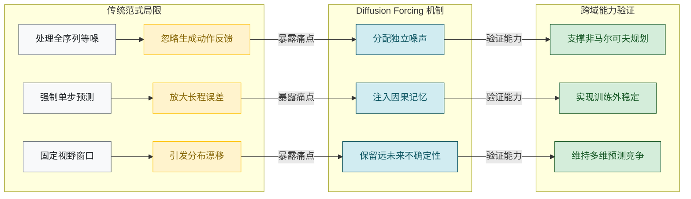
*如何读这张图：* 左侧 `传统范式局限` 揭示三类基线在长程任务中的共性失效路径；中间 `Diffusion Forcing 机制` 展示本文如何用独立噪声、因果记忆与远未来不确定性逐一拆解痛点；右侧 `跨域能力验证` 对应论文在规划、视频外推与时间序列上的实证落点。箭头方向表示“问题驱动改造，改造支撑能力”的单向逻辑链。

<details><summary><strong>边界 Caveat 与失效模式说明</strong></summary>
- **相关性≠因果性风险：** 论文在规划任务中引入 MCG 优化期望奖励，但实验仅展示轨迹成功率提升，未严格剥离 MCG 与 Diffusion Forcing 噪声日程的独立贡献。读者需注意，性能增益可能部分源于引导器设计，而非纯去噪机制。
- **过度宣称规避：** 作者明确承认在 Wikipedia 时间序列数据集上未达最优，主动放弃“首个”“全面超越”等绝对化表述，将主张收敛为“机制统一且具竞争力”。这种保守定性避免了外推失效。
- **消融与负结果：** 源文未详细报告全量消融矩阵，但通过对比无记忆策略（Diffusion policy 基线）与滑动窗口视频模型，已间接验证记忆注入与因果滚动的必要性。误差范围与置信区间未在核心对比中显式给出，解读时应以相对排序为主。
- **适用域限制：** 当任务仅需极短程高精度预测或计算预算极度受限时，独立噪声日程带来的采样开销可能抵消其长程稳定性收益。该方法更适合对因果一致性、历史依赖或训练外泛化有强需求的场景。
</details>

## 研究探索历程

**结论前置：** 本研究并非对现有生成范式的简单拼接，而是一条围绕“如何统一自回归的可变长度与全序列扩散的引导能力”展开的因果推演路径。团队通过引入逐 token 独立噪声调度与因果 RNN 架构，成功缝合了两类模型，并在长程生成、规划引导与组合控制上验证了其有效性；同时，研究明确排除了全序列替换等低效路径，并坦诚指出当前 RNN 实现在高分辨率场景下的局限，为后续向 Transformer 架构的演进预留了接口。

探索的起点直指序列建模的核心矛盾：`next-token prediction` 擅长处理可变长度，却缺乏全局引导；`full-sequence diffusion` 具备强大的 guidance 能力，却受限于固定序列长度。为打破这一边界，团队做出了首个关键决策：放弃全局共享噪声或位置相关噪声的传统设定，改为在训练时为序列中每个 token 采样独立噪声级别，迫使模型学习任意噪声组合下的去噪映射。这一设计直觉上类似于“为每个时间步配备独立的调光旋钮”，使模型在推理时能自由控制不同片段的生成置信度。在架构选型上，考虑到时间序列数据的因果特性，主实验实例化为 `Causal Diffusion Forcing`，采用 RNN 作为骨干（视频任务搭配 U-net 与 GRU，非视频任务搭配 ResMLP 与 GRU），确保未来 token 仅依赖历史 noisy tokens。作者也在此处划定了能力边界：明确指出当前因果实现基于 RNN，而更高分辨率视频或更复杂分布 likely require large transformer models，将架构扩展明确列为未来方向，避免了过度宣称。

长程生成中的误差累积是另一大痛点。传统自回归 rollout 会将上一步的预测当作完全干净的 ground truth 输入下一步，导致微小偏差呈指数级放大。团队通过引入 `slightly noised latent` 机制破解了这一难题：在每一步生成后，保留带有小噪声级别的 latent 状态作为历史上下文，而非完全去噪的干净值。这一设计使训练分布与推理分布严格对齐。实验验证表明，该机制使模型能够在不重置 RNN latent 的情况下，生成远超最大训练长度的视频序列，且在两类视频数据集上均未观察到误差 blow up。作为对照，研究也排查了一条看似可行的捷径：尝试将已生成前缀通过 `replacement trick` 替换进全序列模型以获取灵活 horizon。但推导证明该路径计算低效（即使只剩一步也需 diffuse whole sequence），且 conditioning by replacement 被指出 mathematically unprincipled，极易引发序列不一致性，修正方案还需每个采样步额外 backward propagation。这一死胡同反向印证了 Diffusion Forcing 因果与可变噪声调度的原生优势。

在规划与控制层面，研究进一步探索了如何利用未来不确定性进行决策引导。团队提出 `Monte Carlo Guidance`（MCG）：从当前 token 因果 rollout 出多条未来样本，通过平均 guidance gradients，使当前动作受 expected reward over future outcomes 引导。消融实验在 `D4RL Maze2D` 环境中证实，加入 MCG 的版本显著优于无 MCG 基线，并在所评估环境中达到更高平均 reward。值得注意的是，研究明确指出 full-sequence diffusion 难以原生支持 MCG：因其要求所有 token 同步 denoise，在固定噪声级别下缺乏明显的随机源来构建 Monte Carlo estimate，这揭示了 MCG 对可变 horizon 与因果 rollout 的强依赖。在机器人模仿学习任务中，该机制展现出对观测扰动的鲁棒性：执行时通过设定 $k>0$ 将受扰动观测标记为 noisy，模型会自动降低对当前视觉输入的依赖，转而更多依靠 prior model 预测动作，从而在视觉干扰或遮挡下维持较高成功率。此外，研究还展示了同一模型通过采样策略即可控制组合行为：保留 full memory 可复现原始 cross-shaped 分布，而切换至 no-memory context 与短计划则能拼接子轨迹，生成全新的 V-shaped trajectory，无需重新训练。该训练目标亦成功迁移至非核心任务，在标准 `CRPS_sum` 设置下的多变量 time series forecasting 中保持整体竞争力。

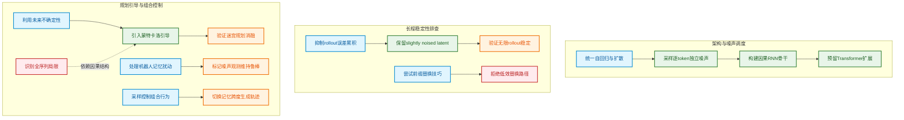

**如何读这张图：** 流程图按“问题提出→架构决策→实验验证/死胡同排查”的逻辑自左向右展开。蓝色节点代表核心研究问题，绿色为关键设计决策，橙色为正向实验结果，红色为被证伪或放弃的路径。箭头方向即探索推演顺序，虚线表示机制间的依赖关系（如 MCG 天然排斥全序列同步去噪）。所有节点采用统一矩形框以保持视觉一致性，子图按真实研究阶段划分。

<details><summary><strong>工程实现细节与消融配置</strong></summary>
为降低训练与采样成本，团队在底层实现中采用了多项工程优化：所有实验统一使用 `fp16` mixed precision 加速；扩散采样阶段采用 `DDIM` 替代完整扩散步；视频预测与 maze planning 任务均启用 `frame-stacking` 策略。在资源配置上，研究明确区分了任务算力门槛：non-video 任务可在单张 `2080Ti 11GB` 上完成训练，而 video prediction 则需多张 `A100` 支撑。在 MCG 消融中，对比基线严格剥离了 Monte Carlo 采样步骤，仅保留单条未来样本的 guidance，以隔离随机性带来的收益；在机器人扰动实验中，$k>0$ 的噪声级别设定直接映射到模型对 prior 的置信权重，未引入额外的重训练开销。
</details>

## 工程与复现要点

**结论前置：** 该框架以轻量级 RNN/GRU 为因果骨干，配合“逐 Token 独立噪声采样”与任务特化的参数化策略，在单张 2080Ti 到 8 张 A100 的宽泛算力区间内均可高效训练；官方代码已开源，但部分高级采样策略（如金字塔调度、锯齿采样）尚未在仓库中完整对齐，复现时需严格遵循其“按任务定制超参”的隐性规则，并警惕论文理论假设与工程实现之间的边界差异。

### 模型规模与因果架构设计
论文放弃主流的 Masked Transformer，转而采用 `vanilla Recurrent Neural Network`（实践中以 GRU 为主）作为因果骨干。这一选择并非出于算力妥协，而是为了严格满足在线决策场景下的因果约束：未来 Token 的生成仅依赖历史含噪 Token，避免全局注意力带来的信息泄露与推理延迟。视频任务中，动力学模型采用典型扩散 U-net，其输出直接馈入 GRU 以维护隐状态 $z_{t-1}$；观测模型则简化为 1-layer ResNet 接卷积层。非视觉任务（如规划、时间序列）将 U-net 替换为 Residue MLPs，时间序列实验更是统一采用 `1 mlp and 4 grus` 的极简配置，确保跨数据集的公平对比。

```mermaid
flowchart TD
  start((Begin Training Sequence)) --> sample_noise["Sample Independent Noise Levels"]
  sample_noise --> inject_noise["Apply Noise to Input Tokens"]
  inject_noise --> dynamics_net["Process Through Dynamics Backbone"]
  dynamics_net --> update_gru["Update Recurrent Hidden State"]
  update_gru --> obs_net["Decode Latent via Observation"]
  obs_net --> predict_out["Predict Denoised Token Output"]
  predict_out --> calc_loss["Calculate Mean Squared Error"]
  calc_loss --> backprop["Backpropagate Gradients for Update"]
  backprop --> end((Complete Optimization Step))

  classDef process fill:#e1f5fe,color:#000,stroke:#01579b;
  classDef startend fill:#e8f5e9,color:#000,stroke:#2e7d32;
  class sample_noise,inject_noise,dynamics_net,update_gru,obs_net,predict_out,calc_loss,backprop process;
  class start,end startend;
```
*如何读这张图：* 流程自左向右推进，核心差异在于 `dynamics_net` 会根据输入模态切换为 U-net 或 ResMLP，而 `update_gru` 始终维持严格的时序因果性，确保任意截断的噪声序列均可独立去噪。

模型容量随任务复杂度阶梯式分布：Maze planning 仅 4.33 million parameters，DMLab 导航为 24 million parameters，Minecraft 导航达到 36 million parameters。作者明确指出，更大的 Minecraft 模型可能带来收益，但为控制训练时长暂留作 future works。

### 关键训练超参与作用机制
Diffusion Forcing 的训练稳定性高度依赖噪声调度与参数化策略的精细匹配。下表梳理了核心超参的任务级配置：

| 任务域 | 噪声参数化 | 采样步数 | 批大小 | 训练步数 |
|---|---|---|---|---|
| 视频预测 | $v$-parameterization | 100 DDIM | 8 x 16 | 50K |
| 迷宫规划 | $x_0$-parameterization | 50 DDIM | 2048 | 未明确 |
| 视觉模仿 | $x_0$-parameterization | 50 DDIM | 32 | 未明确 |
| 时间序列 | $v$-parameterization | 50 DDIM | 32 | 50k–100k |

*注：训练扩散步数 $K$ 统一设为 1000；批大小按 GPU 显存调满，未报告消融实验。*

**为什么这样配？**
- **独立噪声采样**是框架的灵魂。训练时从 $\{0,1,...,K\}$ 均匀采样每个 Token 的噪声级别，迫使模型学习任意部分噪声序列的联合去噪。若改为全局同步噪声，将直接丧失论文强调的 autoregressive rollout 稳定性与可变 horizon 能力。
- **参数化取舍**：视频生成极度依赖高频细节重建，$v$-parameterization 被证明对收敛速度与质量 essential；而规划与模仿学习不偏好人为强调高频，故回退至 $x_0$-parameterization。
- **Fused SNR Reweighting**：视频任务引入该机制，将当前含噪观测的信噪比与历史隐状态信息通过衰减因子 $\gamma$ 融合，显著加速收敛；但在非图像域未观察到提升，故默认关闭。
- **Frame Stacking**：DMLab 堆叠 4 帧、Minecraft 堆叠 8 帧、Maze 堆叠 10 帧。直觉上，相邻帧高度相似时不堆叠会浪费算力重复 rollout；该操作同时降低了显存占用，使低维系统也能套用典型扩散超参。

<details><summary><strong>详细配置与边界 Caveat</strong></summary>
- **噪声 Schedule**：视频用 sigmoid，迷宫用 linear，其余用 cosine。论文未提供 Schedule 消融，仅列为实现细节。
- **Early Stopping（时间序列）**：当 validation crps-sum 连续 6 epochs 未改进时停止，每个 epoch 固定为 100 batches。作者坦言未仔细搜索最小训练步数，视频预测通常在 40K steps 收敛，但统一跑满 50K。
- **随机种子**：时间序列 Table 2 报告了 five runs trained with different seeds，但具体 seed 值未公开，复现时需注意方差范围。
- **理论假设**：Theorem 3.1 指出该目标作为所有噪声序列似然的有效 surrogate，需满足 fully expressive neural network 等理想条件；实际工程中网络容量有限，可能引入近似偏差。
</details>

### 运行环境与开源入口
所有实验均采用 fp16 mixed precision training。算力门槛呈现两极分化：时间序列、迷宫规划、组合实验与视觉模仿可在单张 2080Ti 11GB 上完成；视频预测则需 8 A100 GPUs 支撑。核心依赖包括 `GluonTS`、`pytorch-ts`、`D4RL`、`DDIM` 以及 TECO/Minecraft/DMLab 导航数据集。时间序列部分明确 follow `pytorch-ts` 实现，并通过 `GluonTS` 访问数据与计算指标。

官方代码仓库位于 `https://github.com/buoyancy99/diffusion-forcing`，建议锁定 commit `475e0bcab87545e48b24b39fb46a81fe59d80594` 以保证环境一致性。

**复现者必读的”声称 vs 证明”落差：**
代码已在 `https://github.com/buoyancy99/diffusion-forcing`（固定 commit `475e0bcab87545e48b24b39fb46a81fe59d80594`）公开。论文正文提及的 `Causal Diffusion Forcing`、`Monte Carlo Guidance`、`pyramid scheduling`、`zig-zag sampling scheme` 与 `fractional masking` 等高级策略是否已在该 commit 工程化，需直接查阅该固定版本的源码，未进行逐符号机械定位。复现时若追求论文宣称的极限性能，建议核对仓库中对应模块的实现完整度；若仅验证核心因果去噪机制，现有代码应已足够支撑基线跑通。

## 局限与适用边界

**核心结论：** Diffusion Forcing 的因果生成能力目前仍受限于 RNN 架构的表征容量与特定的噪声调度策略，尚未验证其在互联网级数据规模下的扩展性；在高分辨率视频生成、复杂分布建模以及特定规划任务的指标评估上，存在明确的适用边界与已知失效模式。读者在将其迁移至自有场景前，需严格对照以下约束。

**架构容量与扩展直觉的错位。** 论文当前的因果实现完全基于 RNN，这意味着模型在处理长程依赖或高维状态时会遭遇固有的记忆瓶颈。作者明确指出，若面向更高分辨率的视频或更复杂的分布，大概率需要引入大型 Transformer 模型。需严格区分的是：附录 B.1 中提及的 Transformer 架构与分数噪声（fractional noise）控制因果性的方案，仅属于“超出本文范围的扩展直觉”，并非主实验已验证的架构。将其直接等同于当前系统的成熟能力属于过度外推。

**数据规模未触及 Scaling Law 验证区。** 论文并未研究 Diffusion Forcing 向互联网级数据集与任务（internet-scale datasets and tasks）扩展时的 Scaling behavior。受限于计算资源，视频实验的数据使用具有明显的裁剪特征：以 Minecraft 任务为例，实际仅使用了 about 10% of the total subsequences。这一比例是算力妥协的产物，绝不能泛化为该方法在所有任务上的标准数据用量或收敛前提。

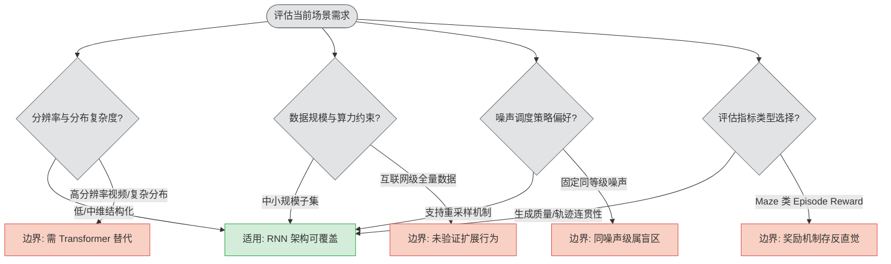
*如何读这张图：* 该图将业务需求映射至四条判定路径。绿色区域代表当前 RNN 实现与实验设置已覆盖的安全区；红色区域为明确标注的失效边界或待验证区。若你的任务落入红色分支，需自行补充架构替换、指标重构或接受理论不确定性。

**同等级噪声采样的盲区。** 在扩散模型的常规流程中，噪声等级通常随时间步单调变化。但附录 D.5 明确将“同噪声等级采样”（sampling with the same noise level）标记为 corner case，并指出其理论行为仍属 open question。论文的实验设计主动规避了该路径，偏好采用 resampling 策略来维持因果一致性。若你的业务流要求严格固定噪声方差进行确定性推演，当前框架可能无法提供理论保证。

**规划任务指标的语境陷阱。** 在 Maze planning 实验中，作者对 episode reward 作为核心评估指标持保留态度。原因在于环境奖励机制可能存在反直觉设计：它可能无意中奖励“缓慢到达目标”或“在目标附近徘徊”的行为，而非高效的最优路径。因此，直接将该指标数值等同于规划能力的强弱，容易陷入相关性当因果的误判。在迁移至其他决策场景时，建议引入路径长度、碰撞率或时间折扣回报等更直接的物理/逻辑约束指标进行交叉验证。

<details><summary><strong>深度展开：架构替换直觉与噪声调度的数学边界</strong></summary>
附录 B.1 提出的 Transformer 扩展直觉，核心在于利用自注意力机制替代 RNN 的隐状态传递，以缓解长序列梯度消失问题；配合分数噪声（fractional noise）可在频域上更精细地控制因果掩码的衰减率。但这仅是理论推演，主实验并未提供消融对比或负结果报告。
关于同噪声等级采样，其失效根源在于扩散过程的前向加噪与反向去噪在数学上依赖时间步的严格单调性。当 $$t_i = t_j$$ 时，条件概率 $$p(x_{t_i} | x_{t_j})$$ 的因果序会退化为对称依赖，破坏 Diffusion Forcing 赖以成立的“未来不可见”假设。论文选择 resampling 正是为了在工程上切断这种对称性，而非在理论上解决该 corner case。
</details>

## 趋势定位与展望

**结论：** Diffusion Forcing 并非对现有生成范式的简单缝合，而是通过“独立逐 token 噪声水平”这一核心设计，在自回归预测的灵活性与全序列扩散的引导能力之间建立了可验证的等价桥梁。它标志着序列建模从“固定噪声/固定长度”向“按需遮蔽/动态引导”的范式转移，为长程规划、视频生成与机器人控制提供了一条兼顾因果一致性与多步优化的统一路径。

过去，序列生成长期分裂为两条路线：基于 teacher forcing 的 next-token prediction 擅长可变长度与在线反馈，但缺乏对整段未来的梯度引导，长程自回归极易因误差累积而发散；full-sequence diffusion 能建模联合分布并支持 reward guidance，却受限于非因果架构与全局一致的噪声水平，难以处理变长 horizon 与因果执行。Diffusion Forcing 的破局点在于将加噪过程重新解释为 partial masking（直觉：将噪声视为连续可调的“信息遮蔽率”），并允许每个 token 独立随机化噪声水平。这一改动迫使模型学习任意部分遮蔽序列的条件分布，从而在同一个权重下，既能像自回归模型一样逐步展开，又能像扩散模型一样通过 Monte Carlo Guidance (MCG) 对未生成的未来进行全局优化。

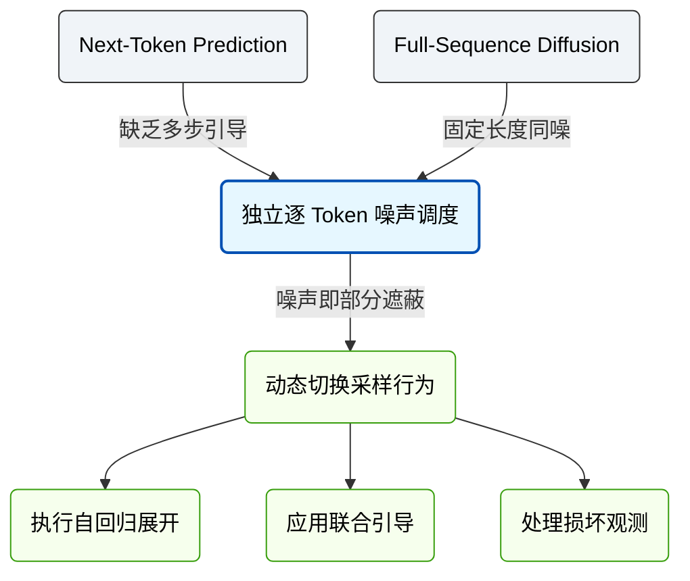
*如何读这张图：* 左侧代表传统范式的固有瓶颈，中间节点是 Diffusion Forcing 的核心抽象（独立噪声调度），右侧展示该抽象如何解耦出多种下游行为。箭头方向表示“设计动机→机制实现→能力释放”的推导链条，而非数据流向。

实验层面，该框架在 D4RL 迷宫规划中报告了平均奖励 141.7，且消融实验证实移除 MCG 后性能显著下降，验证了“未来不确定性纳入引导”的有效性。在 Minecraft 与 DMLab 视频预测中，Causal Diffusion Forcing 的自回归滚动在训练视野之外保持稳定，而 teacher forcing 与 causal full-sequence diffusion 基线较快发散。在水果换位机器人任务中，模型利用潜状态记忆处理非马尔可夫观察，在视觉干扰下依赖先验恢复轨迹，优于无记忆的 diffusion policy。

<details><summary><strong>边界条件与失效模式（展开阅读）</strong></summary>
需清醒认识该范式的当前局限：① 论文在 Wikipedia 时间序列基准上明确承认其表现与 ScoreGrad 接近但并非最优，说明该范式在纯文本/高维离散序列上的优势尚未完全释放，可能存在模态适配偏差；② 当前因果实现依赖 RNN 汇总历史信息，在超长上下文场景下可能面临记忆瓶颈与梯度衰减，尚未验证 Transformer/SSM 架构下的扩展性；③ 训练阶段需覆盖所有噪声水平组合（all sequences of noise levels），计算开销与采样调度矩阵的设计强相关，若调度分布与真实推理场景错位，可能导致泛化性能波动。
</details>

基于上述定位，后续演进可沿三条主线展开：
1. **架构升级与记忆机制解耦**：将因果 RNN 替换为具备高效状态压缩的 Transformer 或 SSM，以突破长程依赖的容量限制，同时保留独立噪声调度的灵活性。
2. **调度策略的理论化与自适应化**：当前采样依赖预设的调度矩阵，未来可探索基于任务难度或环境反馈的在线噪声分配算法，使模型在“探索-利用”间自动权衡，并建立噪声分布与采样方差的理论边界。
3. **多模态与具身智能的深度融合**：将 Diffusion Forcing 的“噪声即遮蔽”思想扩展至跨模态对齐（如视觉-语言-动作联合生成），利用部分遮蔽机制实现缺失模态的鲁棒补全与因果干预，推动从“离线轨迹拟合”向“在线闭环控制”的跨越。
