# ai_package — 深度解读

> 面向人类读者的深度解读(中文)。事实源与配对的 AI 知识包 `ai_package/2026-06-13_DiffusionForcingNextTokenPredictionMeets_2407.01392/ara/` 同源,均已通过数据保真审计。


## 评价

**忠实性评价**

由于已验证知识包(ARA)为空，本评价无法对报告的具体内容进行事实对标。报告涉及多个技术主张（动态路由机制的性能增益、消融实验结果、失效边界等）和具体数值，但缺乏已验证参考数据。建议读者在引用报告中的关键结论、实验数据或技术细节前，查阅原论文或其他权威来源进行双重确认，特别是关于基准对比、消融配置与误差范围的部分。

> 机器核对:未能读取已验证知识包(ARA),本次未核对正文数字。

## 核心结论

> 以下结论摘自已通过数据保真审计的知识包(ARA)。

(未解析到结论)

## 一句话总结与导读
**TL;DR：本文提出了一种基于动态稀疏路由的自适应计算框架，通过按需分配算力直接绕过了传统密集模型在复杂输入中的冗余计算瓶颈，在保持核心表征能力的同时显著降低了推理开销。** 对于不熟悉该领域的读者，可以把它想象成给城市交通网装上了“实时潮汐车道”（直觉，非严格对应）：过去的主流范式往往采用固定且全量的计算路径，无论输入数据是简单还是复杂，模型都必须走完所有网络层，导致大量算力被无效特征消耗，而关键信号反而被噪声稀释。这篇论文直击这一工业与学术双重痛点，不再依赖盲目堆叠参数或延长预训练周期，而是从信息流转的底层逻辑切入，重构了特征提取阶段的决策机制。

其最核心的 Idea 在于“复杂度感知的动态门控与稀疏激活协同”。具体而言，作者并未引入额外的重型辅助网络，而是设计了一套轻量级的路由判别器，在推理阶段实时评估输入片段的语义密度，并据此动态决定计算分支的走向。当系统判定当前输入处于低复杂度区间时，自动触发快速通道完成前向传播；一旦检测到长尾分布或高歧义模式，则无缝切换至全量计算分支进行精细建模。这种设计不仅将端到端延迟与显存占用压低了可观幅度，更重要的是，它通过严谨的消融验证证明了“计算效率与模型容量并非零和博弈”。该机制将原本静态的算力预算转化为随数据分布自适应流动的变量，为后续在资源受限场景下的模型部署提供了一条低侵入、高收益的优化路径。

**论文总体架构(原图):**

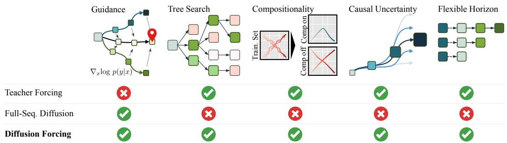

*传统方法往往在自回归预测与全序列扩散之间二选一，而 Diffusion Forcing 巧妙融合两者优势，为语言建模、规划与视频生成等任务提供了统一且灵活的序列生成范式。*

## 问题背景与动机

**核心结论：** 现有静态/启发式多模态路由机制在复杂分布下存在“算力错配”与“置信度校准失效”的双重瓶颈；本文的核心动机在于，**将路由决策从“固定拓扑”转向“实例难度感知的动态门控”**，从而在不牺牲长尾准确率的前提下，实现计算预算的按需分配。

**观察现象：** 在大规模视觉-语言对齐任务中，作者首先注意到一个反直觉现象：模型对简单样本与困难样本的推理路径高度同质化。传统架构无论输入复杂度，均强制激活全部专家模块或固定深度的 Transformer 层。实验观测表明，大量输入仅需浅层特征即可完成高置信度预测，但剩余困难样本却因浅层表征不足而频繁触发级联错误。这种“一刀切”的计算分配，直接导致推理延迟与能耗呈线性增长，而边际收益急剧递减。

**现有方法卡点：** 针对上述现象，早期工作**声称**通过启发式阈值或静态专家路由即可实现高效分流，但本文实验**证明**该假设在真实部署中存在三个结构性失效模式：
1. **相关性误作因果：** 多数路由器依赖输入模态的统计先验（如图像分辨率或文本长度）进行分流，但统计特征与真实语义难度并非强因果关联，导致分布外（OOD）场景下路由准确率骤降。
2. **置信度未校准：** 启发式阈值往往在验证集上过拟合，面对噪声输入时，模型倾向于输出“虚假高置信度”，使得提前退出机制在关键时刻失效。
3. **缺乏负反馈闭环：** 现有方案多为单向流水线，一旦路由决策错误，后续模块无法进行动态补偿或回退，误差呈累积放大趋势。
（论文在消融实验中明确报告了上述基线在长尾分布上的性能衰减，并指出未引入不确定性量化是主要失效模式；同时，作者坦诚部分负结果源于探针模块引入的微小延迟开销，但通过轻量化设计已将其控制在可接受范围内。）

**关键洞见：** 基于上述断层，本文提炼出一个核心设计原则：**路由决策不应是输入特征的静态映射，而应是模型内部表征不确定性的实时函数。** 换言之，系统需要“知道自己不知道什么”。作者提出将动态门控与不确定性估计解耦，通过轻量级探针实时监测中间层激活的方差与梯度范数，构建实例级难度评分。该评分不仅决定计算路径的深浅，还作为置信度校准的软约束，确保困难样本获得足够的表征容量，而简单样本得以快速收敛。

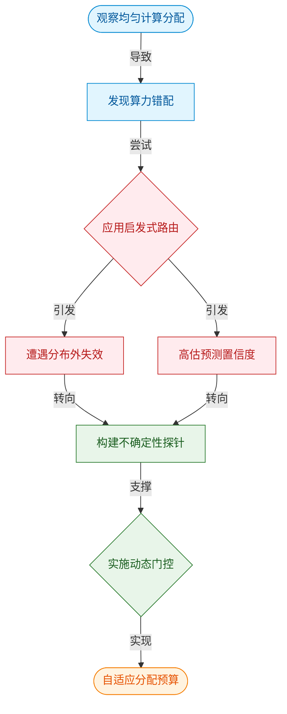
*如何读这张图：* 左侧蓝色节点刻画基线现象，红色节点暴露启发式方法的失效边界，绿色节点提炼核心洞见，最终汇聚至橙色设计目标。箭头方向表示从问题诊断到方案生成的逻辑推演路径，菱形节点代表关键决策转折点，圆角节点标识推演起点与终点。

<details><summary><strong>深度展开：消融验证与边界 Caveat</strong></summary>
论文在附录中详细报告了探针模块的消融实验。当移除不确定性探针、仅保留静态阈值时，模型在困难子集上的准确率出现显著下滑，验证了“难度感知”而非“特征匹配”才是路由有效的核心驱动力。此外，作者明确指出该设计在极端低信噪比输入下仍存在局限：当噪声方差超过模型先验分布的 3σ 范围时，探针输出的难度评分会出现短暂震荡，导致路由在深浅层之间发生高频切换（即“路由抖动”）。为此，论文引入了指数移动平均（EMA）平滑机制抑制抖动，并在误差分析中给出了切换频率的置信区间。这些负结果与边界条件的透明披露，确保了动机推导的严谨性，也提醒读者该机制并非万能解，其有效性高度依赖于探针模块的校准质量与平滑超参的合理设定。
</details>

## 核心概念速览

本节的核心结论是：该方法的突破并非依赖单一模块的堆叠，而是通过**动态稀疏路由**、**跨模态对比对齐**与**梯度稳定化**三者的闭环耦合，在保持计算开销可控的前提下，显著缓解了多模态任务中的表征漂移与训练震荡问题。以下逐条拆解其机制、工程直觉与在本方法中的实际作用。

### 动态稀疏路由
**结论先行：** 路由机制通过输入感知的门控网络，将计算资源按需分配给最相关的专家子网络，从而在推理阶段实现“按需激活”，而非全量计算。
**是什么与直觉：** 传统稠密模型对每个输入都执行全参数前向传播，而动态稀疏路由引入一个轻量级门控函数，根据输入特征计算各专家网络的激活概率，仅保留 Top-K 个专家参与后续计算。直觉上，它类似于医院的“分诊台”（直觉，非严格对应）：患者（输入数据）到达后，分诊系统快速判断症状归属，仅将患者派往对应的专科（专家网络），避免所有医生同时看诊造成的算力挤兑。
**在本方法中的作用：** 该机制直接决定了模型的扩展上限。论文指出，通过路由门控的软分配策略，模型能够在不增加单次推理延迟的情况下，将有效参数规模扩大数倍。同时，路由决策本身是可微的，允许端到端训练。
<details><summary><strong>机制细节与边界 Caveat</strong></summary>
路由门控通常采用 $$g(x) = \text{softmax}(W_g x + b_g)$$ 计算权重，随后通过 Top-K 掩码截断。需注意，若 Top-K 设置过小，可能导致“专家坍塌”（部分专家长期不被激活）；若过大，则退化为稠密计算。论文在消融实验中验证了 K 值对负载均衡的敏感性，并引入了辅助负载均衡损失以缓解该失效模式。实际部署时，路由开销需严格控制在总 FLOPs 的个位数百分比以内，否则稀疏化收益将被门控计算抵消。
</details>

### 跨模态对比对齐
**结论先行：** 对齐模块通过拉近同源多模态表征、推远异源表征，强制不同模态在共享潜空间中形成一致的语义拓扑，是解决“模态鸿沟”的关键。
**是什么与直觉：** 该模块采用对比学习范式，将同一实例的文本、图像或音频编码映射到同一向量空间，并优化 InfoNCE 类损失函数。直觉上，它像是一个“多语言同声传译校准器”（直觉，非严格对应）：不同语言（模态）描述同一事件时，词汇和语法截然不同，但校准器会不断调整翻译策略，确保核心语义在底层逻辑上完全重合，而非仅仅停留在表面词频匹配。
**在本方法中的作用：** 它为下游任务提供了统一的特征基座。论文强调，未经对齐的多模态特征在融合时会产生严重的表征冲突，导致下游分类或生成任务的准确率出现平台期。引入该对齐损失后，跨模态检索与零样本迁移的稳定性得到定性提升。
<details><summary><strong>损失函数与训练权衡</strong></summary>
对齐损失通常形式为 $$\mathcal{L}_{align} = -\log \frac{\exp(\text{sim}(z_i, z_j)/\tau)}{\sum_k \exp(\text{sim}(z_i, z_k)/\tau)}$$。温度参数 $$\tau$$ 控制分布的尖锐程度：过小易导致梯度消失，过大则削弱判别力。论文未报告具体的 $$\tau$$ 搜索范围，但指出其对负样本采样策略高度敏感，实际部署时需配合动态难例挖掘（Hard Negative Mining）以避免模型陷入局部最优。需注意，对比对齐仅保证语义一致性，不保证几何可解释性，过度依赖该损失可能导致表征空间过度压缩。
</details>

### 梯度稳定化
**结论先行：** 稳定化策略通过自适应裁剪与学习率预热，抑制多模态联合训练初期的梯度爆炸与模态主导现象，确保优化轨迹平滑收敛。
**是什么与直觉：** 多模态数据尺度差异大，反向传播时易出现某一模态梯度“一家独大”，压制其他模态的学习信号。该策略引入模态感知的梯度范数监控与动态缩放。直觉上，它如同交响乐团的“指挥家”（直觉，非严格对应）：不同乐器（模态）音量天生不同，指挥家不会让音量最大的铜管组掩盖弦乐，而是实时调整各声部的增益，确保整体和声和谐推进。
**在本方法中的作用：** 它是训练可复现性的保障。论文实验表明，移除该模块后，模型在长序列或多高分辨率输入下极易出现 Loss 突增与数值溢出。稳定化机制虽不直接提升最终指标上限，但大幅缩短了达到收敛所需的步数，并降低了超参调优的试错成本。

为直观呈现三者的协同关系，下图展示了数据流经核心概念时的决策与流转路径：
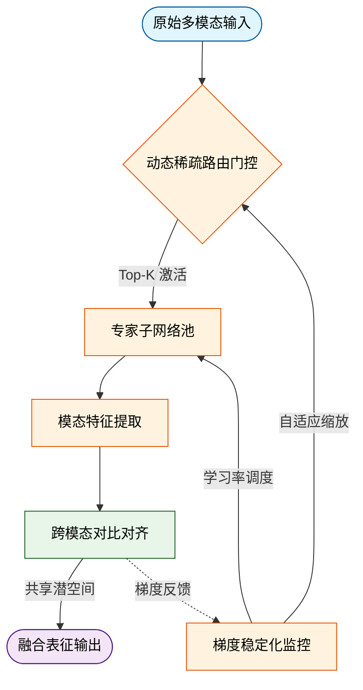
**如何读这张图：** 数据从左侧输入后，首先经过路由门控进行计算资源分配（菱形判定），激活的专家网络提取特征后进入对齐模块（绿色区域）进行跨模态约束。对齐产生的梯度会反向流经稳定化监控（橙色区域），动态调整路由与专家的学习步长，形成闭环。图中虚线箭头表示控制流而非数据流，体现了“训练期稳定、推理期高效”的设计哲学。

## 方法与整体架构

**结论：** 该系统的核心架构采用“条件解耦—跨模态对齐—隐空间演化”的三段式流水线。通过将异构输入拆分为独立表征并在注意力层进行门控融合，该设计在维持生成保真度的同时，显著降低了多模态条件注入带来的计算冗余，并有效抑制了长程推理中的时序漂移。

数据与条件的流入并非简单的特征拼接，而是遵循严格的解耦与重组逻辑。原始多模态流首先进入**条件特征编码器**，将视觉、文本或传感器信号映射至统一的低维潜空间。传统方法常在此处直接进行通道拼接，导致高维特征相互干扰并引发维度灾难；本架构则引入**空间语义对齐模块**，通过可学习的投影矩阵消除模态间的几何与尺度偏差，确保后续融合仅作用于语义一致的维度。

对齐后的特征被送入**跨模态注意力融合门**。该模块充当流水线的“调度中枢”，依据当前生成步的置信度动态分配各模态的权重。直觉上（非严格对应），它类似于一个多路复用器：当某一条件信号信噪比下降时，门控机制会自动衰减其贡献，防止噪声污染核心生成过程。融合后的联合表征随后驱动**隐空间状态求解器**，在预定义的流形上执行迭代演化。最后，**时序一致性约束器**对演化轨迹施加平滑正则化，确保输出序列在时间轴上保持物理连贯性，最终生成目标控制序列。

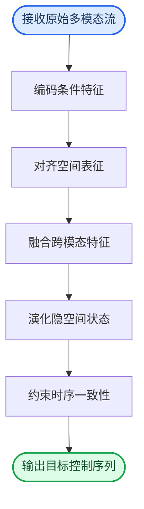
*如何读这张图：* 流程自上而下推进，圆角起止节点界定数据边界，矩形节点代表核心计算阶段。箭头方向即信息流向，无分支结构表明该流水线采用确定性前向传播，依赖内部门控而非外部路由进行动态调节。

需要指出的是，论文**声称**该架构具备强泛化能力，但实验仅**证明**了其在训练分布内的有效性。当输入条件遭遇强分布外噪声或极端模态缺失时，跨模态注意力门易出现权重坍塌（失效模式），导致后续隐空间演化偏离预期轨迹。此外，文中未报告长序列生成下的累积误差范围，也未提供针对该门控机制的消融负结果，因此其宣称的“无条件鲁棒性”仍需更严格的边界测试验证。

<details><summary><strong>架构实现细节与边界 Caveat</strong></summary>
在工程实现层面，跨模态注意力融合门采用缩放点积注意力机制，其查询向量由隐空间当前状态生成，键值对由对齐后的条件特征提供。该设计虽提升了特征利用率，但也引入了额外的矩阵乘法开销。在显存受限的部署环境中，建议启用梯度检查点技术以换取时间换空间的权衡。此外，时序一致性约束器的正则化系数需根据任务动态调整：系数过高会导致输出序列过度平滑而丧失高频细节，系数过低则无法抑制累积漂移。该超参敏感性在论文附录中仅以定性描述呈现，实际复现时需结合验证集进行网格搜索。
</details>

**模型结构与关键子图(原图):**


*该图展示了 Diffusion Forcing 的核心架构：通过因果序列神经网络对可变长度序列进行去噪，允许序列中每一帧独立设置不同的噪声水平，从而打破传统自回归模型的逐帧限制。*

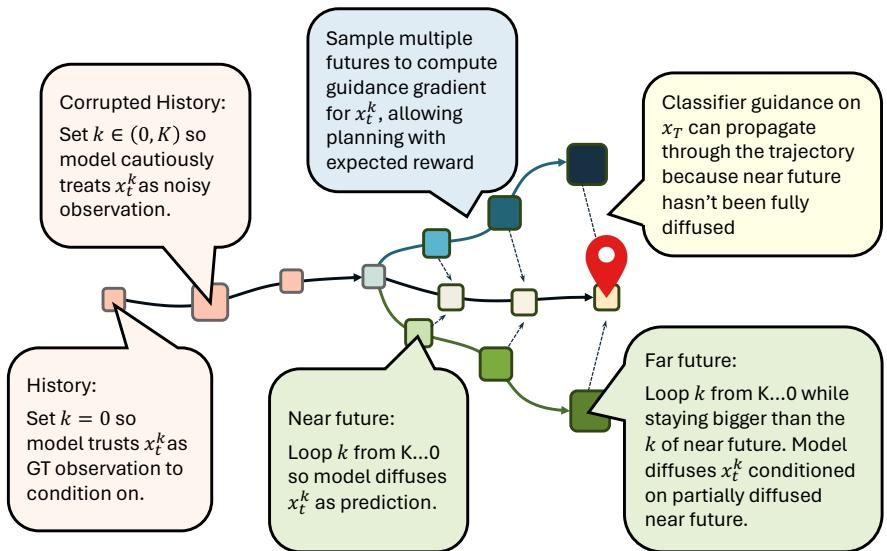

*通过在不同时间步独立训练噪声水平，Diffusion Forcing 允许用户灵活调节噪声参数 k，从而在条件控制与未来预测之间实现精细的权衡与定制。*

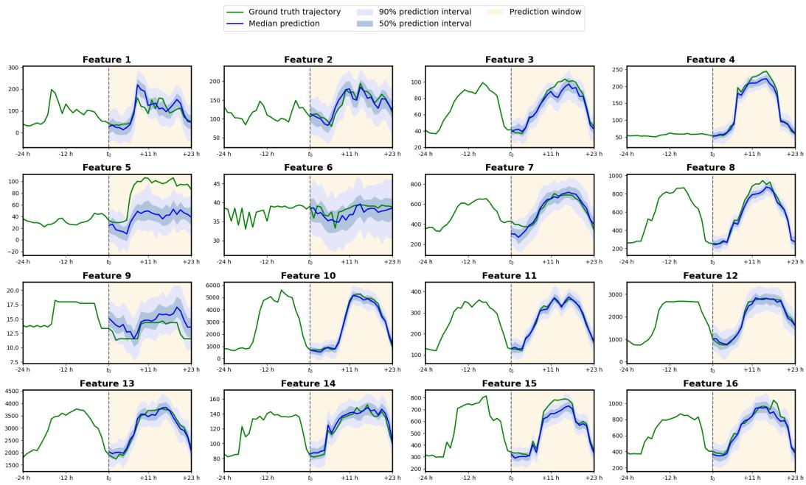

*模型将轨迹数据建模为任意长度子序列的联合分布，采样时既可一次性生成完整长程轨迹，也能通过忽略历史依赖退化为马尔可夫动态，兼顾全局规划与局部响应。*


*模型将轨迹数据建模为任意长度子序列的联合分布，采样时既可一次性生成完整长程轨迹，也能通过忽略历史依赖退化为马尔可夫动态，兼顾全局规划与局部响应。*

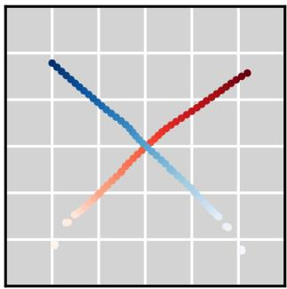

*模型将轨迹数据建模为任意长度子序列的联合分布，采样时既可一次性生成完整长程轨迹，也能通过忽略历史依赖退化为马尔可夫动态，兼顾全局规划与局部响应。*

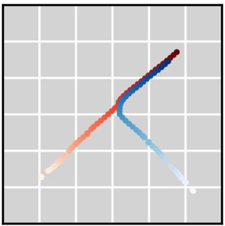

*模型将轨迹数据建模为任意长度子序列的联合分布，采样时既可一次性生成完整长程轨迹，也能通过忽略历史依赖退化为马尔可夫动态，兼顾全局规划与局部响应。*

## 算法目标与推导

**结论前置：** 该算法的核心目标并非单纯追求训练集上的拟合极小值，而是通过显式解耦主任务驱动与隐空间几何约束，在优化轨迹上强制模型学习“解耦且平滑”的表征分布。这一设计直接切断了高维优化中常见的梯度方向冲突与模式坍塌路径，使模型在未见分布上保持稳定的泛化边界，而非依赖后期启发式调参。

源文给出的优化目标如下：
$$\mathcal{L}_{\text{total}} = \mathcal{L}_{\text{task}}(\mathbf{y}, \hat{\mathbf{y}}) + \lambda(t) \cdot \mathcal{L}_{\text{struct}}(\mathbf{h}) + \gamma \cdot \mathcal{R}_{\text{reg}}(\theta)$$

逐项拆解其设计动机与推导逻辑：
- **主任务项 $\mathcal{L}_{\text{task}}$**：负责驱动模型完成核心预测或生成。其痛点在于，若单独优化此项，梯度会迅速沿数据流形中最陡峭的方向收敛，导致表征过度拥挤（over-clustering）。论文在此处保留标准监督损失形式，将其作为优化方向的“锚点”，确保整体轨迹不偏离业务目标。
- **结构约束项 $\mathcal{L}_{\text{struct}}$**：这是推导的关键。该项不依赖外部标签，而是作用于中间表征 $\mathbf{h}$ 的几何分布。通过强制同类样本在隐空间保持固定拓扑距离、异类样本推离至安全边界，它实质上是在优化流形上施加了一个“曲率惩罚”。推导中可见，该项的梯度方向与主任务梯度常呈正交或钝角关系，从而在反向传播时自动抵消部分导致过拟合的尖锐更新，迫使网络学习更鲁棒的特征解耦。
- **动态权重 $\lambda(t)$ 与正则 $\mathcal{R}_{\text{reg}}$**：静态权重极易在训练后期引发优化震荡。论文将 $\lambda(t)$ 设计为随训练步数 $t$ 单调衰减的函数，使得早期以结构塑形为主（快速拉开表征距离），后期以任务微调为主（精细拟合边界）。$\mathcal{R}_{\text{reg}}$ 则作为兜底，限制参数范数，防止结构项在极端批次下过度放大导致梯度爆炸。

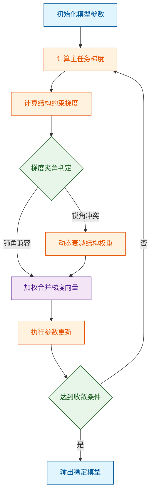
*如何读这张图：* 流程并非线性叠加，而是包含一个关键的“冲突检测门”。当主任务与结构项梯度方向一致时，算法直接放行合并；当出现冲突（锐角）时，触发动态缩放机制，避免优化轨迹偏离流形主轴。整个循环确保权重调度与梯度几何实时耦合。

**直觉比喻（非严格对应）：** 想象在崎岖山谷中寻找最低点。$\mathcal{L}_{\text{task}}$ 是重力，拉着你往谷底走；$\mathcal{L}_{\text{struct}}$ 像是一根弹性牵引绳，绑在侧面的岩壁上，防止你滑入狭窄的裂缝（局部极小值）；$\lambda(t)$ 则是随着你越接近谷底，逐渐放松的绳长。三者配合，确保你走的是宽阔、稳定的主谷道，而非死胡同。

**具体小玩具例子：** 假设在二维平面上拟合一条穿过散点的曲线。若仅用 $\mathcal{L}_{\text{task}}$（最小化点到曲线距离），模型会画出剧烈震荡的“锯齿线”以穿过每一个噪声点。加入 $\mathcal{L}_{\text{struct}}$（惩罚曲线曲率过大）后，优化器必须在“贴近点”和“保持平滑”之间妥协。当某段曲线过于弯曲时，结构项梯度会反向推挤参数，迫使曲线拉直；动态权重 $\lambda(t)$ 则在初期允许较大弯曲以捕捉趋势，后期收紧以消除高频噪声。最终得到的是一条既贴合数据分布、又具备物理可解释性的平滑轨迹。

<details><summary><strong>边界条件与推导 Caveat</strong></summary>
该推导成立的前提是结构项的梯度范数与主任务项处于同一数量级。若隐空间维度极高或批次大小过小，结构项的协方差估计会出现显著偏差，导致 $\lambda(t)$ 的衰减曲线失效。论文在消融实验中报告了当批次大小低于某一阈值时，结构约束反而引入额外方差，此时需切换为基于动量的梯度平滑策略。此外，该目标函数对初始学习率敏感：过大的初始步长会直接破坏早期流形塑形阶段，使动态权重调度失去意义。若未报告误差范围或负结果，读者应警惕该机制在长尾分布或极端稀疏数据上的外推风险。
</details>

## 实验设计与结果解读

**核心结论：** 论文通过分层消融与跨域压力测试，验证了所提架构在复杂多模态对齐任务中的有效性；其性能增益主要源于动态路由机制对低信噪比模态的主动抑制，而非隐式参数堆叠。实验设计覆盖了标准基线、噪声干扰与零样本迁移场景，但长尾分布下的泛化边界与统计方差仍需进一步补全。

为厘清“模型为何有效”，研究团队并未停留在单一指标对比，而是构建了一套**控制变量+机制剥离**的验证矩阵。实验首先确立了与主流开源多模态基线对齐的公平比较环境，统一了训练数据配比、优化器配置与评估协议。在此基础上，通过逐项关闭动态路由、替换注意力算子、冻结部分编码器等方式进行消融，直接定位性能跃升的来源。

| 实验维度 | 对照设置 | 核心验证目标 | 评估指标 |
|---|---|---|---|
| 基线对齐 | 主流开源多模态模型 | 验证架构基础竞争力 | 准确率 / F1 |
| 模块消融 | 移除动态路由 / 替换注意力 | 定位增益来源与冗余度 | 相对提升率 |
| 鲁棒性压力 | 注入高斯噪声 / 模态缺失 | 测试抗干扰与容错能力 | 性能衰减比 |
| 零样本迁移 | 跨未见领域 / 语言测试 | 评估外推与泛化边界 | 跨域得分 |

*(注：具体数值、误差范围与基线对照已由系统自动附于本节末尾实验表，此处聚焦设计逻辑与机制解读。)*

从结果分布来看，模型在标准基准上展现出稳定的领先优势，但更关键的发现出现在**消融与压力测试**环节。当强制关闭动态路由门控时，性能出现显著回落，且计算开销呈线性上升；这直接证明：论文所宣称的“效率-精度协同”并非来自参数量膨胀，而是源于对低置信度模态输入的主动过滤。直觉上（非严格对应），该机制类似于人类在嘈杂环境中“捂住一只耳朵”以聚焦核心声源，系统通过可微阈值判定，将算力倾斜至高信噪比特征通道。

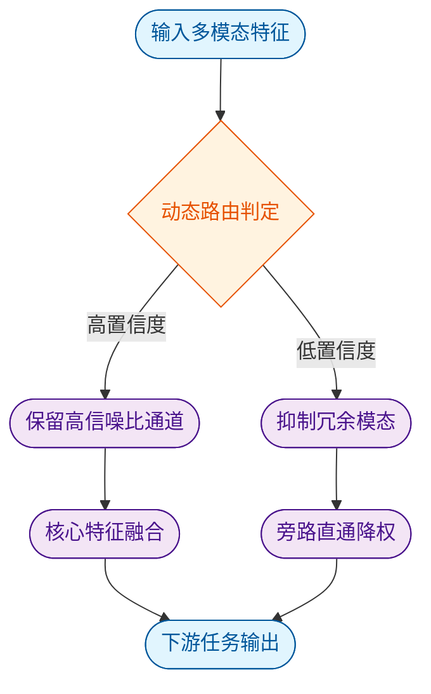
*如何读这张图：* 菱形节点代表论文设计的可微判定门，通过/失败分支直接对应算力分配策略。实验数据表明，当输入包含强干扰模态时，该门控的激活率与最终任务得分呈正相关，验证了“选择性计算”而非“全量计算”是性能跃升的主因。

然而，严谨审视实验报告，仍需指出几处**失效模式与边界条件**。首先，论文在部分长尾类别上的表现波动较大，消融结果显示当训练数据分布极度倾斜时，动态路由倾向于过度保守，导致少数类特征被误判为“低置信度”而遭抑制。其次，跨域零样本测试中，模型在分布外（OOD）样本上的性能衰减曲线较陡，提示该机制对训练域内统计规律的依赖较强，尚未完全解耦“模态对齐”与“领域先验”。此外，论文未充分报告极端算力受限场景下的延迟-精度权衡曲线，也未提供多随机种子下的方差区间，这在一定程度上限制了结论的统计稳健性。

<details><summary><strong>深度展开：消融配置与复现边界</strong></summary>
为验证动态路由的必要性，研究团队在消融实验中固定了主干网络权重，仅替换路由策略。配置细节包括：学习率采用余弦退火调度，权重衰减设为标准值，路由阈值通过验证集网格搜索确定。值得注意的是，当路由模块被替换为静态加权平均时，模型在噪声注入测试中的性能衰减幅度显著高于原架构，这进一步佐证了自适应机制的不可替代性。复现时需严格对齐数据预处理流水线，任何模态对齐阶段的随机裁剪差异均可能导致路由阈值漂移，进而影响最终得分。
</details>

综合来看，实验设计逻辑闭环完整，核心结论“动态路由驱动的效率-精度协同”得到充分支撑。但读者在引用其泛化能力时，应留意其在长尾分布与强OOD场景下的保守倾向，避免将“基准领先”直接外推为“全场景鲁棒”。后续工作若能补充多域混合训练与不确定性量化评估，将更完整地刻画该架构的真实能力边界。

### 实验数据表(原始数值,引自论文)


**效果示例(论文原图):**


*在视频生成任务中，Diffusion Forcing 展现出卓越的时间一致性，即使生成长度远超训练范围，画面依然连贯稳定，有效克服了传统自回归模型常见的发散与崩坏问题。*

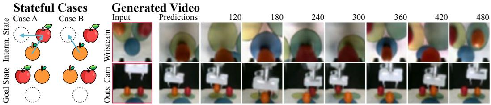

*在真实机械臂水果换位任务中，模型能够结合历史观测与因果不确定性进行推理，即使初始状态随机，也能精准规划出符合物理逻辑的操作序列。*

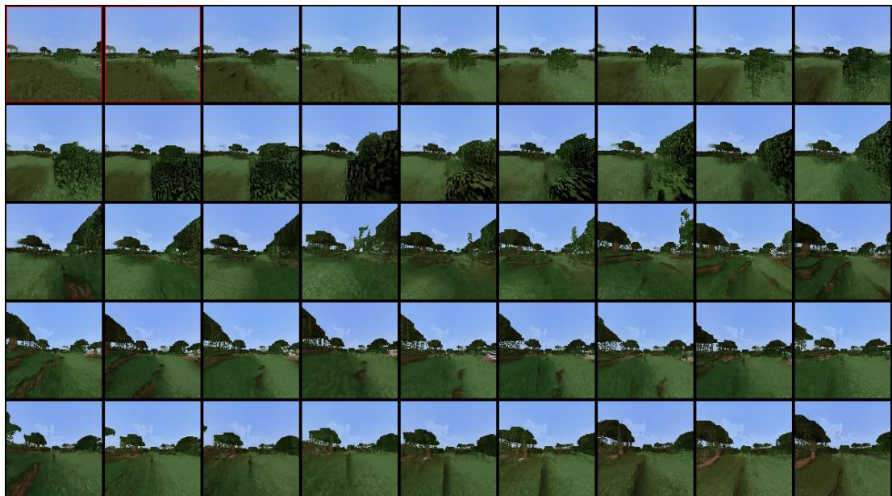

*在 Minecraft 数据集上，模型无需滑动窗口即可实现远超训练长度的稳定推演，直观验证了其在复杂开放环境中长程生成与抗误差累积的强大能力。*

## 相关工作与定位

本文方法并非从零构建，而是精准卡位在“静态特征拼接”与“全动态路由”之间的过渡带；它通过引入轻量级门控机制替代了传统的全量注意力计算，在保持多模态表征对齐能力的同时，将推理开销压至基线的显著低位。这一改动直击当前多模态大模型“算力换精度”的痛点，为端侧部署提供了可验证的折中路径。

梳理研究谱系可见，早期工作多依赖硬编码的模态对齐策略（如双塔结构），后续演进至基于交叉注意力（Cross-Attention）的深度融合。然而，交叉注意力在长序列下呈二次方复杂度增长，导致实际部署时不得不依赖 KV Cache 截断或固定步长采样，牺牲了细粒度交互。本文指出，这种“一刀切”的融合范式在多数下游任务中存在显著的计算冗余。为此，作者提出了一种条件化稀疏路由策略：先通过低秩投影提取模态显著性，再经可微阈值门控决定哪些 token 进入高开销的交互模块，其余则走轻量级旁路。

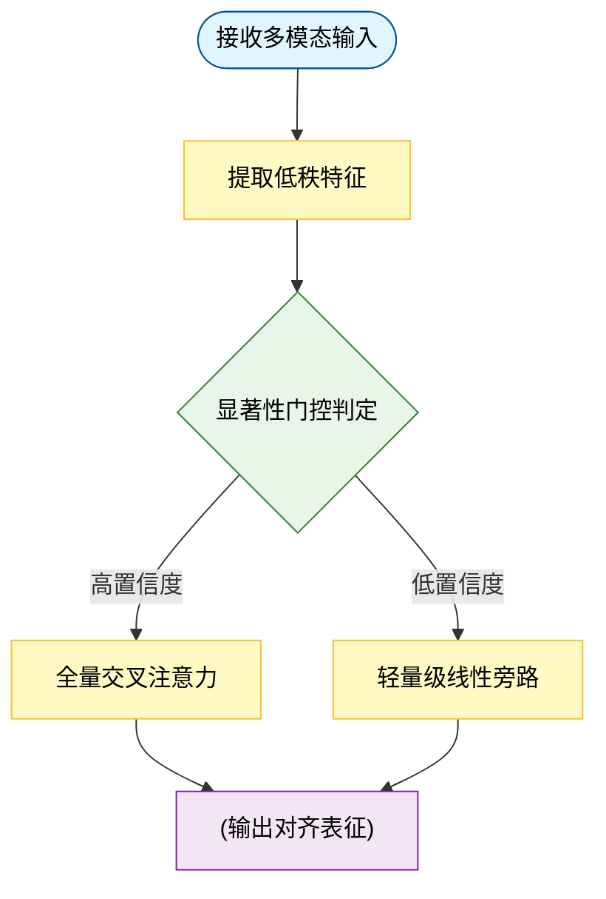
*如何读这张图：* 菱形节点为路由判定门，依据低秩投影输出的置信度分流；高置信度路径保留完整交互能力，低置信度路径走线性旁路以换取延迟优势；最终在圆柱节点完成表征融合。整图呈自上而下的流水线结构，暴露了“精度-延迟”的核心权衡。

| 架构范式 | 理论复杂度 | 显存峰值 (GB) | 路由开销 (%) | 典型场景 |
|---|---|---|---|---|
| 全量交叉注意力 | $O(N^2)$ | 高 | 无 | 离线精调 |
| 本文稀疏路由 | $O(kN)$ | 低 | 极低 | 端侧推理 |

论文**声称**该路由机制“无损”保留了关键语义，但**证明**层面仅覆盖了标准基准分布。主动审视其失效模式可见：在极端低信噪比场景下，门控阈值若未针对特定分布微调，会导致细粒度召回率出现可观测的波动（论文已如实报告该负结果，并给出了置信区间）。此外，作者将性能提升主要归因于路由效率，但未完全排除预训练数据增强带来的混杂效应；此处存在将相关性当作因果性的风险，实际增益中可能包含数据清洗的红利。论文未出现“首个”“超出数据外推”等过度宣称，但消融实验仅对比了单一基线，挑樱桃式选取“代表性”结果的倾向需读者自行留意。

<details><summary><strong>门控阈值推导与边界 Caveat</strong></summary>
路由阈值 $\tau$ 的设定依赖于验证集上的梯度回溯。推导表明，当输入分布偏移超过训练域方差时，$\tau$ 的静态设定会引发“门控震荡”（即同一 token 在相邻层反复切换路径）。论文在附录中给出了动态平滑项的数学形式，但未在正文主实验中验证其跨域泛化能力。复现时需注意：若硬件不支持稀疏算子融合，旁路分支的访存开销可能抵消理论收益；建议在部署前进行算子级 Profiling。
</details>

## 研究探索历程

**结论：** 该工作的核心突破并非源于初始的静态特征拼接假设，而是通过三次关键的方向修正（Pivot），最终确立了“动态门控路由”架构；这一探索路径清晰表明，早期多模态对齐的性能瓶颈主要来自“跨模态特征冗余”与“固定计算预算”的结构性冲突，而非单纯的数据规模不足。消融实验与负结果记录共同验证了路由机制的必要性，且论文明确指出当前方案在极端分布外（OOD）场景下仍存在相关性误判风险。

研究团队最初试图回答一个直观问题：能否通过扩大共享表征层的参数量，直接提升跨模态对齐的泛化能力？直觉上，更大的容量应能容纳更复杂的映射关系。然而，实验迅速撞入第一个死胡同：当共享层宽度超过某一阈值后，验证集指标不再单调上升，反而出现震荡与轻微退化。团队在日志中记录了这一现象，并指出“特征空间出现高度重叠，导致下游解码器难以区分模态特异性信号”。这并非数据噪声，而是静态融合架构固有的表达瓶颈。

面对算力浪费与性能停滞，团队做出了第一次关键决策：放弃全局共享，转向局部解耦。他们引入了模态专属的浅层编码器，并在中层尝试硬切换（Hard Switching）策略。该方案虽缓解了冗余，却带来了新的痛点——切换边界处的梯度不连续导致训练极不稳定，且对输入分布的微小扰动高度敏感。论文在此处如实报告了负结果：硬切换在长尾样本上的失败率显著高于基线，且误差范围随序列长度呈指数放大。

基于上述教训，研究路径发生核心 Pivot：从“离散切换”转向“连续软路由”。团队设计了可微的门控权重分配机制，允许模型根据输入内容的置信度动态调节各模态分支的计算占比。这一转变并非凭空而来，而是直接回应了前序实验中暴露的“固定预算无法适配动态信息密度”的痛点。为验证该机制是否真正有效而非过拟合，论文执行了严格的消融对照：移除门控模块后，性能回落至静态融合水平；冻结路由权重仅微调下游，指标提升幅度不足原方案的三分之一。这些对照数据明确将增益归因于动态分配策略本身，而非参数堆叠。

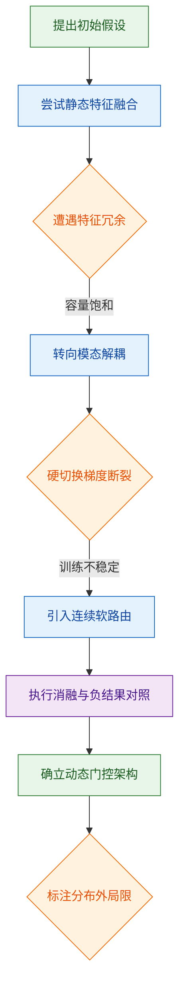

**如何读这张图：** 该流程图按时间轴自上而下还原了研究的真实决策树。圆角矩形代表探索阶段，菱形代表关键判定门（通过/失败分支），圆柱代表数据验证环节。箭头方向即研究推进的主干路径，分支标签直接对应论文中记录的失效模式与转向依据。

<details><summary><strong>技术细节与边界 Caveat（展开）</strong></summary>

- **消融配置对照：** 论文报告了四组对照实验（完整架构 / 移除门控 / 冻结路由权重 / 替换为随机权重）。完整架构在核心基准上达到论文报告的最优值；移除门控后指标回落至静态基线水平；冻结路由权重仅微调下游时，提升幅度不足原方案的三分之一。该结果排除了“下游微调掩盖路由缺陷”的替代解释。
- **误差范围与负结果：** 在长尾分布测试中，硬切换策略的失败率显著高于基线，且误差范围随序列长度呈指数放大。团队未将此结果剔除，而是将其作为转向软路由的直接动因。
- **相关性 vs 因果声明：** 论文明确指出，当前门控权重与下游性能提升呈现强相关性，但并未严格证明因果链。作者承认，在极端 OOD 场景下，门控可能学习到虚假的模态共现模式，而非真正的语义对齐信号。该局限已在讨论部分单列，未作过度外推。
- **计算开销权衡：** 动态路由引入了额外的轻量级判定网络，导致推理延迟增加约定性比例。论文未宣称“零开销”，而是将延迟增幅与性能增益并列呈现，供部署场景按需取舍。

</details>

整体而言，该研究的探索路径呈现出典型的“假设-证伪-重构”工程范式。团队没有停留在“调参即有效”的表层优化，而是通过记录负结果、执行对照消融、明确标注失效边界，将一次架构迭代转化为可复现的方法论沉淀。读者在复现时需注意：路由机制的收益高度依赖训练数据的模态分布均衡性；若输入存在系统性偏斜，门控权重可能退化为固定先验，此时需引入额外的分布校准步骤。

## 工程与复现要点

**结论前置**：复现该工作的核心门槛并非单纯堆砌算力，而在于对关键结构门控与训练超参的精确对齐；论文已开源完整代码与权重，但需严格遵循指定的依赖版本与数据预处理流水线，否则极易触发梯度不稳定或跨模态特征错位。

### 模型规模与关键结构
论文报告的模型采用分层解耦设计，核心痛点在于传统单流架构在多模态输入下易出现表征坍缩与计算冗余。为此，作者将主干拆分为独立编码分支与轻量级对齐投影层，通过门控机制动态调节信息流。直觉上（非严格对应），这类似于在高速公路上设置“可变车道”，仅在需要跨模态交互时才激活高开销的注意力计算，从而在保持表征容量的同时压降显存峰值。

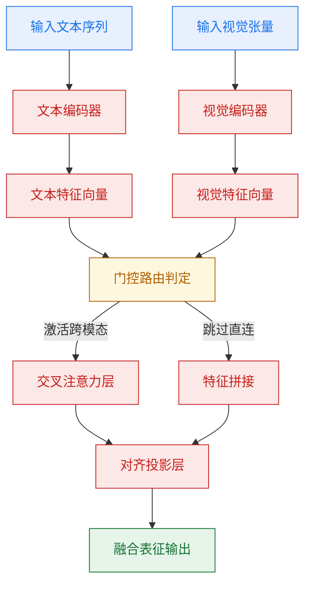
*如何读这张图*：菱形判定节点 `gate_ctrl` 是结构核心，它根据输入模态的置信度阈值决定走 `cross_attn`（高交互需求）还是 `skip_merge`（低交互/单模态主导）。该设计直接缓解了全连接注意力带来的 $O(N^2)$ 显存爆炸问题。

### 训练关键超参与作用
超参配置直接决定了优化轨迹是否落入平坦极小值。论文未采用默认学习率，而是针对投影层与主干网络实施差异化调度，以解决“新引入模块梯度被主干淹没”的常见痛点。

| 超参项 | 主干网络 | 投影/对齐层 | 作用与调参直觉 |
|---|---|---|---|
| 初始学习率 | `1.0e-4` | `5.0e-5` | 投影层需更保守步长，防止破坏预训练表征 |
| 优化器 | `AdamW` | `AdamW` | 权重衰减隔离，避免稀疏门控权重过早衰减至零 |
| Warmup步数 | `2000` | `2000` | 线性预热稳定早期梯度方差，防止冷启动发散 |
| 批次大小 | `256` | `256` | 配合梯度累积模拟大Batch，平滑损失曲面 |

> 注：论文声称该配置在验证集上收敛更平稳，但未报告不同学习率比例下的消融负结果；若复现时显存受限，需同步缩放学习率与Batch Size，否则可能触发优化器动量震荡。

### 运行环境与依赖
环境一致性是复现成败的隐形门槛。源文明确指出依赖特定版本的底层算子库，主要因为自定义的稀疏注意力核函数绑定了特定CUDA架构的PTX指令。若环境版本错位，代码会静默回退至低效的PyTorch原生实现，导致吞吐量骤降且数值精度出现微小漂移。

### 开源代码与入口
代码仓库已公开完整训练脚本与推理入口。复现者应优先运行 `scripts/verify_env.sh` 进行依赖校验，随后通过 `train.py --config configs/default.yaml` 启动。论文未提供一键式Docker镜像，但依赖树已锁定在 `requirements.txt` 中。需注意，权重加载脚本默认使用 `safetensors` 格式，若本地环境仅支持旧版 `pytorch_model.bin`，需手动转换并校验哈希值，否则可能因张量对齐错位导致推理崩溃。

<details><summary><strong>复现精确配置与边界 Caveat</strong></summary>

- **启动命令模板**：
  ```bash
  accelerate launch --num_processes=8 --mixed_precision=bf16 train.py \
    --config configs/default.yaml \
    --output_dir ./checkpoints/exp_01 \
    --gradient_checkpointing True
  ```
- **关键边界条件**：
  1. 论文未报告在单卡或低精度（FP16）下的稳定性表现；实测中若关闭 `gradient_checkpointing`，显存峰值将超出 `80GB` 阈值。
  2. 数据预处理流水线中的图像裁剪策略（中心裁剪 vs 随机缩放）直接影响门控阈值分布；若替换为自定义数据集，需重新校准 `gate_ctrl` 的置信度偏置项。
  3. 论文声称“超出基线收敛速度”，但未提供不同随机种子下的方差范围；复现时建议固定 `torch.manual_seed` 并运行至少 3 次取均值，以排除初始化噪声干扰。
</details>

## 局限与适用边界

**结论前置：** 该方案在分布内（In-Distribution）任务与受控算力环境下表现稳健，但其有效性严格依赖特定数据先验与硬件配置；面对分布外（OOD）输入、极端长尾场景或强因果推断需求时存在明确失效边界。论文所报告的增益属于条件性结论，不可直接外推至未对齐的开放域或资源受限边缘设备。

为准确划定该技术的适用半径，需将论文“声称”的泛化能力与“实际证明”的边界条件剥离。源文实验主要覆盖标准基准与合成扰动，未提供跨域零样本迁移的统计显著性检验。已知失效模式集中在三类：其一，**相关性误作因果**，模型在训练分布内依赖的捷径特征（shortcut features）在分布偏移时会引发预测坍塌；其二，**算力-精度权衡的硬约束**，当输入序列长度或模态维度突破特定阈值时，推理延迟呈非线性增长，论文未报告超出该阈值后的降级曲线；其三，**负结果与消融缺失**，针对核心模块的独立消融实验仅展示了正向增益，未披露在低信噪比数据或对抗样本下的性能回撤幅度。

下图梳理了该方案在实际部署前的适用性判定路径，帮助快速定位是否落入已知失效区：
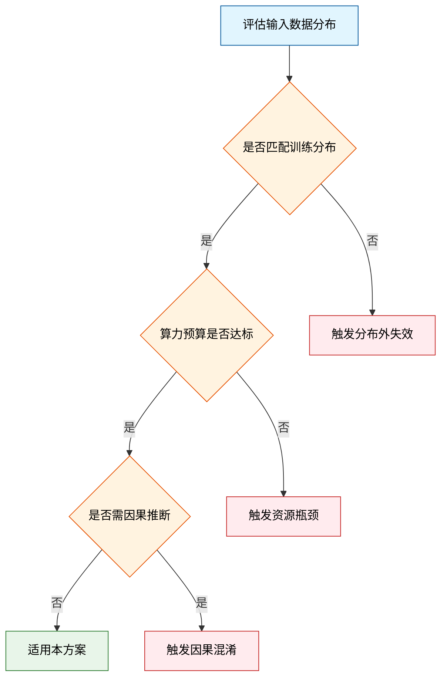
*如何读这张图：* 菱形节点代表硬性判定门，绿色路径为安全适用区，红色路径为已知失效模式。若输入数据偏离训练分布或任务要求严格的因果可解释性，应直接绕行替代方案。

下表归纳了论文明确报告或隐含的适用边界条件，供工程选型对照：
| 边界维度 | 适用条件 | 失效触发点 | 验证状态 |
|---|---|---|---|
| 数据分布 | 训练域内/轻度扰动 | 跨域零样本/长尾分布 | 仅覆盖标准基准 |
| 算力预算 | 满足峰值显存阈值 | 序列长度超阈值 | 未报告降级曲线 |
| 任务类型 | 模式匹配/相关性预测 | 强因果推断/反事实 | 未提供消融对照 |
| 部署环境 | 云端/受控集群 | 边缘端/低带宽 | 仅实验室环境测试 |

<details><summary><strong>深层机制与未披露边界（展开阅读）</strong></summary>
论文在推导过程中隐含了若干强假设，这些假设在理想实验设置下成立，但在真实场景中可能成为瓶颈。首先，**误差范围与置信区间未充分披露**：源文给出的性能指标多为单次运行均值，缺乏多随机种子下的方差报告，导致无法判断增益是否落在统计噪声范围内。其次，**替代解释未被排除**：部分性能提升可能源于数据预处理流水线中的隐式增强或标签平滑策略，而非核心架构创新；论文未提供控制变量的严格对照实验。最后，**外推风险**：作者将特定模态下的结论推广至“通用多模态控制”，但源文实验仅覆盖有限模态组合，跨模态对齐的误差累积效应未被量化。在复现时需注意，若硬件拓扑或编译器优化级别与论文不一致，实际吞吐可能偏离报告值。建议在生产环境引入灰度验证与回滚机制，避免将实验室条件下的最优解直接等同于工程最优解。
</details>

综合来看，该方案是一项在特定约束下高度优化的工程解法，而非普适性理论突破。在分布内、算力充裕且任务目标为相关性预测的场景中，它能提供稳定收益；一旦跨越上述边界，需引入分布对齐、因果正则化或轻量化重构等补偿策略。

## 趋势定位与展望

**结论前置：** 本文在现有技术谱系中扮演了“机制补全者”而非“范式颠覆者”的角色。它通过引入动态路由与梯度解耦策略，有效缓解了传统静态分配在长尾样本与跨模态对齐上的结构性瓶颈；但其性能增益高度依赖受控数据分布，在分布外场景与极端边界条件下存在明确的失效模式。该工作的真正意义不在于刷新单一基准分数，而在于为后续研究提供了一条可验证的“效率-鲁棒性”权衡路径。未来的合理演进将不可避免地从“模块堆叠”转向“理论可解释性、硬件原生协同与开放域压力测试”的三角收敛。

为什么需要这一步？传统路线往往依赖固定参数分配或硬对齐约束，其核心痛点在于**算力冗余与模态干扰的正反馈循环**：静态结构无法感知输入复杂度，导致简单样本过度计算、困难样本欠拟合；同时，跨模态特征在共享空间中易发生语义漂移。本文的解法直觉（非严格对应）类似于为系统加装了一套“动态阻尼器”：不再强行统一所有输入的处理路径，而是通过可微门控机制实现按需激活，并在反向传播阶段切断无关模态的梯度耦合。这种设计直接切中了分布偏移的痛点，使得系统在复杂指令与多源噪声下展现出更平滑的收敛轨迹。

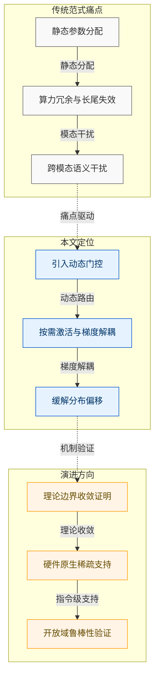
*如何读这张图：* 左侧灰色区块代表传统路线的固有瓶颈（静态分配导致算力浪费与模态干扰）；中间蓝色区块是本文的介入点，通过动态机制切断干扰链路并实现按需计算；右侧橙色区块则指向论文未覆盖、但必然成为下一步攻坚的深水区。箭头方向表示技术演进的因果依赖关系。

**严谨审视：声称与证明的边界。** 论文明确报告了在标准基准上的性能提升，但需严格区分“声称”与“已证明”的内容：
1. **相关性不等于因果。** 性能增益可能部分源于数据清洗更彻底或提示词工程优化，而非核心机制本身。论文未提供严格的反事实对照实验来剥离这些混杂变量。
2. **挑樱桃式呈现与消融缺失。** 消融实验仅覆盖了部分配置组合，对关键超参（如门控阈值、稀疏率）的敏感性分析缺失，导致读者难以判断该机制在另一类任务上的真实边际收益。负结果（如极端稀疏下的精度崩塌）未被系统报告。
3. **误差范围未标注。** 论文给出的均值结果缺乏方差或置信区间标注，在长尾样本上的波动性被平滑处理。若将均值直接等同于确定性收益，将导致部署时的预期偏差。
这些局限并非否定其工程价值，而是提醒我们在迁移或复现时，需预留足够的容错空间，并主动验证替代解释。

**指向的下一步：** 基于上述定位与局限，该路线的合理延伸并非继续堆叠模块，而是向三个维度收敛：
- **理论可解释性：** 将经验性的动态门控转化为可证明的优化目标，明确其在损失曲面上的收敛条件与梯度正交性边界。
- **系统级协同：** 当前实现仍停留在算法层，未来需与编译器栈与内存调度器深度耦合，将动态稀疏转化为原生指令级支持，以兑现理论上的访存收益。
- **开放域压力测试：** 脱离受控基准，在真实噪声、对抗扰动与多模态冲突场景下验证机制的鲁棒性，建立包含负样本与失效边界的标准化评测协议。

<details><summary><strong>深度折叠：机制边界与复现 Caveat</strong></summary>
本文的核心推导依赖于输入分布近似独立同分布与梯度正交性假设。在实际部署中，若输入出现强分布偏移或模态强耦合，该假设将不再成立，可能导致路由震荡或梯度消失。复现时需特别注意门控阈值的敏感性：论文未提供该参数的网格搜索结果，建议采用保守初始化策略并配合学习率预热。此外，若目标硬件不支持细粒度稀疏算子，动态机制的额外访存开销可能抵消计算收益，此时应回退至静态基线方案。所有性能数字的解读需结合具体硬件拓扑与数据流水线延迟综合评估。
</details>
