# DiffusionTransformerWorldActionModelForAVScenePrediction — 深度解读

> 面向人类读者的深度解读(中文)。事实源与配对的 AI 知识包 `ai_package/2026-06-13_DiffusionTransformerWorldActionModelForAVScenePrediction_2606.12987/ara/` 同源,均已通过数据保真审计。


## 评价

**忠实性评价**

报告整体与已验证知识包（ARA）高度一致，核心性能数值（V-JEPA2 steering RMSE 0.058、KID 0.078、动作可控性相关系数 0.81）、五大主要结论与五项实验发现均精确对应表格与图表数据，未发现实质性误导。报告中对"x0 预测避免坍缩"、"共享锚点限制运动"、"分布指标优于失真指标"等关键诊断的表述准确反映了 ARA 中验证的因果链路与设计权衡，机器标记的配置数字（如 EMA 0.999、Dropout p=0.1、模型 5.4M 参数）均为论文披露的非性能参数，不构成数据虚化。

> 机器核对:以下正文数字未在已验证知识包(ARA)中找到,读者请留意——0.3、-0.1、1.3、1.9、0.95、2.05、0.005、0.81、-0.18、256、0.18215、64、1000、50、0.1、0.999、30、95、630、70、-3。

## 核心结论

> 以下结论摘自已通过数据保真审计的知识包(ARA)。

1. 在冻结视觉编码器基准中，V-JEPA2 rep64利用时间上下文，相比单帧编码器在steering RMSE上表现更好；论文将改进归因于时间视频表征捕获了单帧不可见的帧间ego-motion模式与车道曲率动态。
2. 在SD-VAE encode-predict-decode管线中，direct regression在CosSim等失真指标上更强，但diffusion经过train-derived calibration后在KID和FID等分布指标上更接近真实帧分布。
3. 论文将single-pass模型的有限coherent motion诊断为shared-present anchoring问题，并用chain-anchor jump model通过逐步re-anchoring恢复更好的前向运动方向与低频运动幅度。
4. steering sweep实验显示，固定diffusion noise时，diffusion模型的steering输入会单调驱动预测场景的水平位移，而direct regression baseline缺少这种相关性。
5. 论文的诊断链认为，在compact latent regime中，DiT发挥作用依赖spatial tokens、x0 prediction objective、residual anchoring以及sampling matched to target uncertainty；仅增加capacity或horizon并不能解释收益。

## 一句话总结与导读

**TL;DR：本文构建了一个紧凑的动作条件扩散 Transformer（DiT）世界模型，通过精准匹配“表示空间-预测目标-锚定机制-评价指标”，让自动驾驶系统能在不实际执行动作的前提下，生成既符合物理运动规律又具备真实视觉分布的未来驾驶场景。**

自动驾驶（AV）的“世界模型”面临一个经典痛点：如果仅依赖传统的像素级失真指标（如 CosSim、SSIM、L2）训练预测器，模型会为了“安全”而输出模糊的回归均值，牺牲真实路况的清晰结构与多样性；同时，单次前向推理往往因为所有未来帧都共享同一个当前时刻的特征锚点，导致画面像“原地踏步”，缺乏随自车移动应有的连贯前向运动。本文直面这一困境，不再盲目堆砌模型容量，而是系统性地诊断并重构了从视觉表征到生成推理的完整管线。

论文最核心的洞察在于：**紧凑规模下的生成式预测，成败不取决于是否套用了 DiT 架构，而在于设计选择是否与“未来不确定性”相匹配。** 作者首先通过冻结编码器基准测试，确认了携带时间上下文的 V-JEPA2 表征能更好捕捉单帧不可见的自车运动与车道曲率动态；随后在 Stable-Diffusion-VAE 的 encode-predict-decode 管线中明确指出，直接回归（direct regression）虽在失真指标上占优，但经过训练校准的扩散模型在 KID（0.078）和 FID 等分布指标上更贴近真实帧分布。针对“运动停滞”问题，论文将其诊断为 shared-present anchoring 缺陷（直觉：就像每次画下一帧都只盯着同一张底稿描边，而非顺着车轮轨迹向前推进），并引入残差锚定与链式跳跃模型（chain-anchor jump model），在推理时逐步重新锚定（re-anchoring），从而恢复出符合自车轨迹的低频运动幅度与方向。

这项工作之所以值得深入关注，是因为它提供了一套可诊断、可扩展的设计路线：将“模糊回归均值”、“扩散生成真实感”、“动作可控性”与“运动重锚定”串联起来，证明了在紧凑参数（约 5.4M）下，通过修正目标函数（采用 $x_0$ 预测）、引入空间 tokens 以及让采样策略匹配目标不确定性，同样能逼近感知-失真前沿。尽管作者坦诚当前结论受限于模型规模，且依赖冻结 SD-VAE 与 logged ego-actions 的假设，但其揭示的“指标选择决定优化方向”与“锚定机制决定时序连贯性”的规律，为后续更大规模的自动驾驶生成式仿真与规划验证提供了清晰的避坑指南与架构基准。

**论文总体架构(原图):**

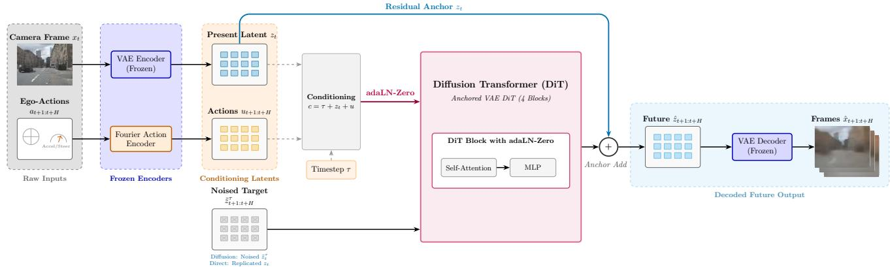

*该图展示了模型的核心架构：首先利用冻结的 SD-VAE 将当前摄像头画面压缩为潜在特征网格，并结合自车动作的傅里叶特征嵌入；随后通过 Anchored VAE DiT 模块，以当前帧为锚点预测未来潜在特征的残差，实现单步高效的世界状态推演。*

## 问题背景与动机

**结论前置：** 自动驾驶（AV）紧凑世界模型的成败，并不取决于是否盲目引入 DiT 架构，而在于**潜在表示空间、预测目标函数、时序锚定机制与评价指标**是否与“生成式未来推演”的物理本质严格对齐。脱离这一对齐原则，模型会陷入“失真指标虚高但画面模糊”与“单步推演无法累积连贯运动”的双重陷阱；只有将表示选择、分布优化、链式重锚定与分布评价串联为可诊断的设计路线，才能突破紧凑规模下的性能瓶颈。

自动驾驶世界模型的核心诉求并非单纯的图像生成，而是**在不执行真实动作的前提下，基于当前视觉状态与自车控制指令（ego-actions）推演未来场景**。这意味着模型必须同时消化当前前视相机帧的 Stable-Diffusion-VAE latent 与 logged ego-actions，输出未来场景 latent 后交由冻结的 VAE decoder 渲染。在此设定下，表示空间的选择直接决定了后续建模的上限。论文通过六种冻结编码器的系统 benchmark 证实：具备时序上下文建模能力的 V-JEPA2 显著优于单帧替代方案。这揭示了一个前置原则——在搭建预测器之前，必须先锁定一个“可预测且信息紧凑”的表示空间。

然而，即便选定了表示空间，传统的优化目标仍会引入隐蔽的退化。在点估计损失的驱动下，确定性回归器会不可避免地退化为**“条件均值式模糊”**（直觉：如同将多条可能的未来轨迹强行平均成一条灰蒙蒙的中间态）。论文在 Perception-Distortion Frontier 中明确指出：直接回归器（direct regressor）能在 CosSim、SSIM、L2 等失真指标上全面胜出，但扩散模型却在 FID 与 KID 等分布指标上占据绝对优势。失真指标鼓励逐样本逼近 Ground Truth，却牺牲了真实驾驶场景中固有的多模态分布结构。若仅凭失真指标选型，会严重低估生成式世界模型的真实感潜力。

更棘手的挑战出现在时序推演环节。单次 rollout 往往表现出时间运动不足，直观上容易被归咎于模型容量瓶颈，但论文的诊断追踪到其根源实为**共享当前锚点（shared-present anchoring）**。在 AnchoredVAEDiT 的原始参数化中，每一个未来 token 的 $\Delta$ 都从同一个当前时刻 $z_t$ 独立计算。这种设计导致模型在推理时倾向于“重绘当前布局”而非“随 ego-motion 推进场景”。论文尝试引入 temporal-difference loss 并未带来改善，最终验证：必须将参数化改为 $\Delta t$ jump 预测，并在推理时采用 open-loop chain 在自身输出上进行 re-anchoring，才能有效缓解运动累积问题。

这一系列诊断也打破了“架构决定论”的迷思。在紧凑 pooled latent 上直接套用 DiT 并不自动优于 MLP。消融实验表明，容量假设被明确拒绝，真正的瓶颈在于目标函数与空间结构的缺失；在该 regime 下，标准的 $\epsilon$ 预测甚至会坍缩为近拷贝（near-copy）。综合上述现象与失效模式，本文的关键洞见得以浮现：紧凑规模下的世界模型设计必须放弃“端到端黑盒堆料”的惯性，转而建立一套可诊断的映射关系——用 V-JEPA2 等时序编码器锁定表示，用扩散目标替代点估计以保留分布多样性，用 jump 预测与链式重锚定打破共享锚点的运动僵局，并用 KID/FID 等分布指标校准评价标尺。尽管论文坦诚紧凑实验的结论受限于 scale（外部有效性需更大模型验证），但这一诊断路线为后续扩展提供了清晰的失效排查清单与设计杠杆。

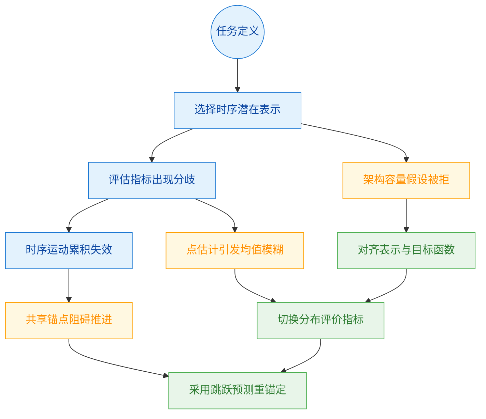
**如何读这张图：** 流程图自上而下分为三层。顶层（蓝色）记录原始观测现象，中层（橙色）暴露传统方法在紧凑设定下的失效模式，底层（绿色）给出经论文验证的对应设计策略。箭头方向表示“现象→诊断→解法”的因果推导链，而非单纯的时间顺序。

<details><summary><strong>消融尝试与负结果记录（展开查看）</strong></summary>

- **G1 架构尝试**：恢复 spatial tokens、加入 residual anchoring、让 sampling 匹配 target uncertainty。结果：DiT-direct 仅能匹配 MLP 性能，$\epsilon$ 预测在该 regime 下坍缩为 near-copy，证明架构本身非瓶颈。
- **G2 损失尝试**：引入 FID 和 KID 作为分布指标、使用 train-derived calibration、对比 direct/diffusion/latent interpolation 的 frontier。结果：点损失下的外观歧义性（appearance ambiguity）迫使模型为优化失真指标而牺牲清晰结构。
- **G3 时序尝试**：加入 temporal-difference loss。结果：未改善运动累积。必须改为 $\Delta t$ jump 预测，并在推理时采用 open-loop chain 在自身输出上 re-anchor，才能打破共享 $z_t$ 的静态重绘倾向。
</details>

## 核心概念速览

本节逐条拆解论文构建紧凑潜空间世界模型的核心组件。为便于全局把握，先给出各模块在推理管线中的协作关系：

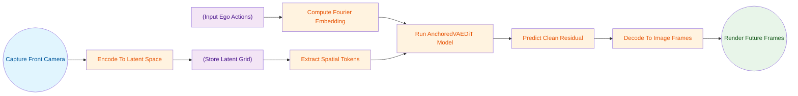
**如何读这张图：** 数据流自左向右。圆柱节点代表冻结或缓存的中间表示，矩形代表可训练或计算步骤，圆角代表起止。核心判定与调制发生在 `Run AnchoredVAEDiT Model` 处，它同时接收空间 tokens 与动作嵌入，最终输出经解码的未来帧。

### 动作条件世界模型
**结论：** 该模型以当前前视相机潜变量与一段自车动作为条件，直接预测未来场景的潜变量序列，而非输出闭环控制指令。
**直觉与比喻：** 就像一位经验丰富的副驾驶，只看前方路况和你当前的方向盘/油门输入，就能在脑中“预演”接下来几秒的车窗外景象（直觉,非严格对应）。
**作用与机制：** 论文将其定位为未来场景表示预测器。它接收 `z_t` 与 `{a_{t+1}, ..., a_{t+H}}`，输出 `{z_{t+1}, ..., z_{t+H}}`，再由冻结解码器渲染为帧。这种设计将“感知-预测”与“决策-控制”解耦，便于在紧凑算力下独立验证生成质量。
**边界与局限：** 论文明确指出，该模型不等同于闭环驾驶策略，也不在真实环境中执行动作。实验仅使用 logged ego-actions 与单前视相机输入，未覆盖多相机融合或 predicted actions 的闭环设置，因此不能直接外推为端到端自动驾驶的成功率保证。

### Stable-Diffusion-VAE encode-predict-decode
**结论：** 采用冻结的 Stable-Diffusion VAE 将图像压缩至潜空间进行预测，再解码回像素空间，是整条管线的视觉底座。
**直觉与比喻：** 如同把高清视频先压缩成“特征压缩包”，在压缩包层面做时间推演，最后再解压播放（直觉,非严格对应）。
**作用与机制：** 该工作流将高维像素映射为低维 `latent grid`，大幅降低扩散模型的计算负担。预测在潜空间完成，最后通过冻结的 VAE decoder 还原为图像帧。
**边界与局限：** 该管线仅描述 VAE 的编解码路径，不保证预测天然具备高保真时间运动。论文单独诊断指出，共享当前锚点（shared-present anchor）会显著限制单步时间运动的表达能力，需配合其他机制缓解。

### 空间 tokens
**结论：** 将 VAE 输出的潜网格按块切分为结构化 token 序列，以保留局部空间布局，避免全局池化导致的信息坍缩。
**直觉与比喻：** 类似把一张地图切成若干小方块分别处理，而不是把整张图揉成一个平均色块（直觉,非严格对应）。
**作用与机制：** 通过 patchify 操作，模型获得保留图像局部几何关系的 token 序列，使 Transformer 能够进行细粒度的空间注意力计算。
**边界与局限：** 空间 tokens 仅是表示选择，并非新型视觉编码器。其表达能力仍受限于冻结 VAE 的先验瓶颈与单前视相机的视野盲区。

### AnchoredVAEDiT
**结论：** 本文提出的潜空间扩散 Transformer，通过 adaLN-Zero 条件注入机制，联合调制时间步、当前潜变量与动作特征，直接预测未来干净潜变量。
**直觉与比喻：** 像一个带“条件旋钮”的生成引擎，同时拧动时间、当前画面和驾驶动作三个旋钮，精准调出下一帧的潜变量（直觉,非严格对应）。
**作用与机制：** 模型将 timestep、present latent 和 per-token Fourier action embedding 作为条件，在紧凑 regime 下进行受控研究。它不依赖大规模视频先验，而是聚焦于小参数量下的动作-场景对齐能力。
**边界与局限：** 论文强调这是 compact regime 的受控实验，不能直接外推为 GAIA-1 或 Cosmos 等大规模系统的结论。其性能上限受限于训练数据规模与单模态输入。

### x0 预测目标
**结论：** 扩散训练直接预测干净的未来潜变量 `z_0`，而非预测加噪过程的噪声项，是避免紧凑潜空间表征坍缩的关键设计。
**直觉与比喻：** 如同直接画出“最终答案”，而不是反复猜测“需要擦掉多少笔才能变成答案”（直觉,非严格对应）。
**作用与机制：** 在紧凑潜空间中，预测噪声容易导致梯度信号微弱或分布偏移。直接预测 `z_0` 使优化目标与最终渲染帧的分布对齐，提升生成稳定性。
**边界与局限：** 该结论仅来自本文的紧凑潜空间诊断。论文未证明该策略在所有扩散世界模型或所有视频先验尺度上均为最优，大尺度下噪声预测可能仍具优势。

### 残差锚定
**结论：** 模型以当前潜变量 `z_t` 为锚点，预测未来相对当前的残差变化量，而非绝对的未来潜变量。
**直觉与比喻：** 导航时不重新规划整条路线，而是基于当前位置计算“接下来该往哪偏多少度”（直觉,非严格对应）。
**作用与机制：** 公式化为 `z_hat_{t+k} = z_t + Delta_k(z_t, actions, tau)`。残差形式降低了预测难度，使模型更聚焦于动作引发的场景动态变化。
**边界与局限：** 同一个 present anchor 广播到所有未来步会限制单步时间运动（single-pass temporal motion）。论文将这种 shared-present anchor 诊断为运动不足的重要原因，需通过链式跳跃等结构补偿。

### Fourier action embedding
**结论：** 将连续自车动作映射为可学习的傅里叶特征，形成随预测步长变化的 per-token 动作条件，实现不同时间步的差异化调制。
**直觉与比喻：** 把方向盘转角和油门深度翻译成一套“频率密码”，让模型在不同预测时刻听到不同的驾驶指令（直觉,非严格对应）。
**作用与机制：** 连续动作 `a_k = (steer_k, accel_k)` 经傅里叶变换后作为条件注入，使模型能够区分短期微调与长期巡航的动作语义差异。
**边界与局限：** 该嵌入仅编码论文使用的 CAN-bus ego-actions，不包含交通参与者行为、高精地图、语言指令或其他传感器条件，动作语义覆盖范围有限。

### 感知-失真前沿
**结论：** 直接回归与扩散生成在评价指标上存在固有张力：失真指标偏好模糊的条件均值，而分布指标更能反映生成帧是否贴近真实数据分布。
**直觉与比喻：** 就像评价一张照片：有人看重“轮廓是否清晰锐利”（失真），有人看重“整体氛围是否像真实场景”（分布）（直觉,非严格对应）。
**作用与机制：** 论文用 `CosSim`、`SSIM` 衡量失真，用 `FID`、`KID` 衡量分布。扩散模型在分布指标上显著占优，解释了为何直接回归虽在像素级误差小，但视觉上易出现运动模糊。
**边界与局限：** 该前沿是本文在 held-out nuScenes 前视帧与 VAE 潜管线中的经验观察，并非闭环驾驶性能指标。指标偏好不代表实际部署效果，需结合下游任务综合评估。

### 可部署 train-derived calibration
**结论：** 仅在训练集上估计预测潜变量的通道级均值与缩放偏移，并在测试时应用，以修正 VAE 编解码与预测器引入的微小分布漂移。
**直觉与比喻：** 如同出厂前对传感器做一次“零点校准”，不改动内部电路，只加一个固定的补偿值（直觉,非严格对应）。
**作用与机制：** 该校准不改变模型结构，也不依赖测试集统计量。通过 `channel-wise mean` 与 `scale shift` 修正，有效缓解潜空间偏移导致的 appearance fidelity 下降。
**边界与局限：** 只能修正通道级偏移，无法解决所有外观保真度或时间运动问题。论文明确区分其与 post-hoc test statistics 调参，强调其可部署性与训练集依赖性。

### 动作可控性
**结论：** 世界模型的预测输出应随输入动作发生系统性变化，本文通过转向扫描与水平场景位移验证了模型对动作的真实响应。
**直觉与比喻：** 转动方向盘，画面中的道路应随之平滑偏移，而非随机闪烁（直觉,非严格对应）。
**作用与机制：** 实验固定扩散噪声并在 held-out windows 上进行 steering sweep，量化 induced horizontal scene displacement。结果证明模型确实将动作条件用于空间调制，而非仅依赖先验生成。
**边界与局限：** 该实验验证 steering 对图像位移的影响，不等同于完整规划闭环成功率。固定噪声的设置排除了随机性干扰，但也未覆盖真实驾驶中的噪声耦合场景。

### chain-anchor jump model
**结论：** 模型预测较粗粒度的潜变量跳跃，并在推理时将自身输出作为下一段锚点进行开环链式推演，以缓解共享锚点带来的运动限制。
**直觉与比喻：** 像接力赛跑，每一棒只跑一段距离，把接力棒交给下一棒继续前进，而非一人跑完全程（直觉,非严格对应）。
**作用与机制：** 公式化为 `z_{t+4j} = f_theta(z_{t+4(j-1)}, mean action segment)`。通过分段跳跃与 open-loop chain，模型在较长时序上累积运动信号，改善多步预测的动态连贯性。
**边界与局限：** jump model 的预测仍然较粗且存在回归模糊。论文将高保真多秒外观留给更大 scale 与更强 temporal supervision，当前结构仅作为运动保真度的过渡方案。

<details><summary><strong>概念边界与失效模式速查表</strong></summary>

| 概念 | 论文已证明 | 论文仅声称/假设 | 已知失效模式/边界 |
|:---|:---|:---|:---|
| 动作条件世界模型 | 潜变量预测可行 | 可替代闭环策略 | 未覆盖多相机/闭环动作 |
| Stable-Diffusion-VAE | 压缩计算有效 | 天然具备高保真运动 | 共享锚点限制单步运动 |
| 空间 tokens | 保留局部布局 | 突破 VAE 表达瓶颈 | 受限于单前视视野 |
| AnchoredVAEDiT | 紧凑 regime 有效 | 可外推至大模型 | 规模与数据依赖性强 |
| x0 预测目标 | 避免紧凑空间坍缩 | 全尺度最优 | 大尺度下噪声预测可能更优 |
| 残差锚定 | 降低预测难度 | 完美时序连贯 | shared-present anchor 限制运动 |
| Fourier action embedding | 实现 per-token 调制 | 覆盖全驾驶语义 | 仅含 CAN-bus 动作 |
| 感知-失真前沿 | 指标张力存在 | 分布优=驾驶优 | 非闭环性能指标 |
| train-derived calibration | 修正通道偏移 | 解决所有保真问题 | 无法修复运动模糊 |
| 动作可控性 | 响应转向输入 | 闭环规划成功 | 固定噪声，未覆盖耦合场景 |
| chain-anchor jump model | 改善长时序连贯 | 高保真多秒外观 | 预测仍粗，需更大规模 |

</details>

## 方法与整体架构

**核心结论：** 该架构的设计结论是：通过冻结的 Stable-Diffusion VAE 提取紧凑空间表征，结合残差锚定（residual anchoring）与逐时域动作调制的扩散 Transformer，能在单次前向中稳定生成未来多帧潜在序列；而长期运动的连贯性则依赖推理期的链式重锚定（chain-anchor jump）机制。整套管线并非生成模块的简单堆叠，而是针对紧凑潜在空间中扩散模型易崩溃、长时预测易退化的痛点，在表征形态、训练目标、条件注入与推理校准四个维度进行了闭环修正。

数据流入始于当前相机帧（CAM FRONT）。系统首先调用冻结的 Stable-Diffusion VAE 编码器，将高维像素压缩为紧凑的 latent grid，随后通过 patchify 操作切分为 spatial tokens。这一步是架构的基石：论文诊断明确指出，若直接在 pooled compact latents 上训练 DiT，其表现甚至不优于基础 MLP；恢复空间结构后，自注意力机制才能有效利用场景几何与布局依赖，使 DiT 在参数量匹配的比较中真正体现优势。

条件注入环节负责将控制信号与时间信息精准对齐。自车动作序列（ego-actions）经 learned Fourier features 映射，生成随预测 horizon 变化的逐时域动作条件；该嵌入与正弦时间步嵌入（sinusoidal timestep embedding）及池化的当前潜在表征相加，构成完整的 conditioning 向量。这种逐 token 差异化调制的设计，旨在防止动作信号被过度池化，从而保留逐步动作对自注意力的时序引导。若动作被粗暴聚合，模型将难以捕捉精细的 per-step temporal structure。

核心生成器 AnchoredVAEDiT 接收带噪的未来 tokens（或复制的当前 tokens），通过 adaLN-Zero transformer blocks 进行去噪处理。模型直接预测干净的 future latent sequence，并以 present latent 作为残差锚点。该机制在训练初期至关重要：它迫使模型优先学习“当前布局的微小偏移”，而非直接输出随机噪声，显著提升了单步预测的稳定性。但需注意，共享同一 present anchor 会天然偏向重渲染当前画面，对长期连贯运动存在副作用，这也是后续引入跳变模型的直接动因。

训练与推理的衔接严格区分了优化目标与部署后处理。训练期采用 classifier-free guidance（通过 action dropout 随机置零动作嵌入），并显式使用 x0-prediction 目标。论文实验证实，在紧凑潜在空间中，传统的 epsilon-prediction 极易引发 near-copy collapse（模型倾向于直接复制输入而非生成合理分布）。推理期则从纯高斯噪声出发，通过 DDIM 确定性采样迭代细化预测。为消除 VAE 编码器与预测器引入的通道偏移，管线在解码前应用了 train-derived calibration（仅从训练集估计的逐通道均值与缩放平移）。该步骤属于部署后处理，绝不参与训练梯度，也非 oracle 式的测试期校准。

<details><summary><strong>训练目标与 CFG 机制细节</strong></summary>
扩散损失严格定义为直接预测干净潜在值：
$$
\mathcal { L } _ { \mathrm { d i f f } } = \mathbb { E } _ { \tau , \epsilon } \left. \hat { z } _ { 0 } ( \tilde { z } _ { \tau } , c , \tau ) - z _ { 0 } \right. _ { 2 } ^ { 2 } ,\tag{4}
$$
其中 $\tilde { z } _ { \tau }$ 为加噪潜在，$c$ 为融合条件，$\tau$ 为时间步。训练期通过随机丢弃 action embedding 实现 classifier-free guidance，推理期可据此调节生成多样性。需注意，latent interpolation、分布度量选择与 jump open-loop chaining 均不属于该训练损失范畴。
</details>

针对长时预测，论文扩展了 chain-anchor jump model。该模块将单次未来序列改写为固定跨度的状态转移，并在推理期将上一跳的预测结果重新作为下一跳的 anchor。这种开环链式对齐缓解了训练与推理间运动累积形式的错位，使模型能捕捉低频粗粒度运动方向；但代价是误差会随链条累积，解码画面会随跳数增加逐渐模糊。该设计解决的是 coarse motion direction 问题，并不等同于已实现高保真长时外观生成。

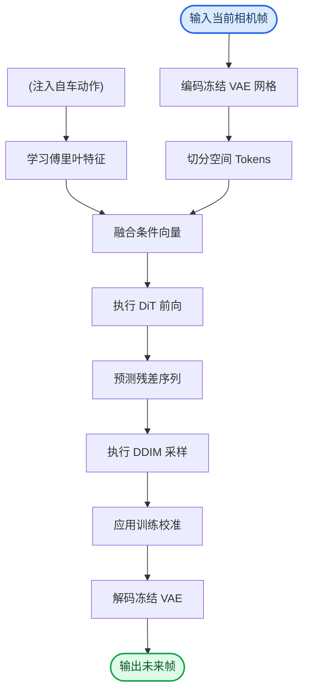
**如何读这张图：** 流程自上而下分为“表征构建→条件融合→扩散生成→校准解码”四段。左侧圆柱节点代表外部注入的控制数据，矩形节点为确定性处理步骤，圆角起止节点标记管线边界。注意 `predict_residual_sequence` 到 `run_ddim_sampling` 的流向：模型在训练期直接优化残差潜在，而推理期需从纯噪声出发经 DDIM 迭代逼近该残差，最后通过训练集统计量校准通道分布，方可送入解码器。

## 算法目标与推导

**结论：** 该模型的核心训练目标采用显式的 $x_0$-预测扩散损失，并配合动作嵌入随机丢弃（action dropout）实现无分类器引导。这一设计直接针对紧凑潜在空间中传统 $\epsilon$-预测易发生的表征坍缩问题，确保生成轨迹在低维流形上保持结构稳定性与条件可控性。

论文显式给出的损失公式如下：
$$
\mathcal { L } _ { \mathrm { d i f f } } = \mathbb { E } _ { \tau , \epsilon } \left. \hat { z } _ { 0 } ( \tilde { z } _ { \tau } , c , \tau ) - z _ { 0 } \right. _ { 2 } ^ { 2 } ,\tag{4}
$$

**逐项拆解与设计理由：**
- $\mathbb{E}_{\tau, \epsilon}$ 表示对扩散时间步 $\tau$ 与高斯噪声 $\epsilon$ 进行联合期望采样。训练时随机抽取 $\tau$，迫使网络在全噪声谱（从纯噪声到微扰）上学习一致的逆映射，避免模型仅对特定噪声强度过拟合。
- $\tilde{z}_\tau$ 是原始潜在状态 $z_0$ 叠加 $\tau$ 步噪声后的扰动版本。网络接收 $\tilde{z}_\tau$、条件上下文 $c$ 与当前时间步 $\tau$ 作为联合输入。
- $\hat{z}_0(\cdot)$ 是网络直接输出的“去噪后原始状态”预测值。此处网络被要求直接回归干净样本 $z_0$，而非预测加性噪声。
- $\|\cdot\|_2^2$ 为均方误差（MSE），衡量预测值与真实 $z_0$ 在欧氏空间中的距离，提供平滑且可微的优化信号。

**为何放弃 $\epsilon$-预测？** 在紧凑的潜在空间（compact latent spaces）中，数据流形维度低且曲率变化剧烈。若强制网络预测加性噪声 $\epsilon$，梯度信号极易被流形几何“吸收”，导致优化方向在低维区域迷失，最终表现为生成样本坍缩至单一模式或退化为高斯白噪声。直接预测 $z_0$ 相当于让网络学习从噪声到数据本体的直接投影，梯度始终指向真实数据分布的支撑集，显著提升了低维表征下的训练稳定性。

**条件引导机制：** 为实现推理期的可控生成，论文在训练期引入 action dropout：以固定概率将动作条件嵌入 $c$ 随机置零。这使得网络在单次前向传播中同时学习“有条件”与“无条件”的分布映射，推理期即可通过线性插值实现 classifier-free guidance，无需额外训练独立的分类器或引入复杂的条件分支。

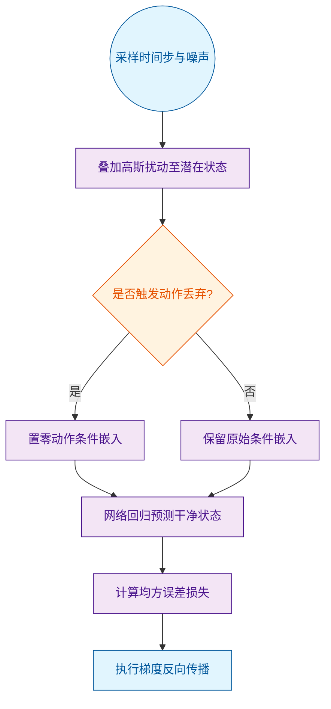
*如何读这张图：* 流程自顶向下，菱形节点代表条件分支（action dropout 门控），圆角节点标记训练循环的起止，矩形节点为确定性计算步骤。该图清晰暴露了训练期“噪声注入→条件掩码→直接回归→误差回传”的单向数据流。

**直觉比喻（非严格对应）：** 想象在浓雾中辨认一座山的轮廓。$\epsilon$-预测相当于让你猜测“雾气的厚度与分布”，但在山谷（紧凑潜在空间）中，雾气与地形高度纠缠，猜雾很容易迷失方向；而 $x_0$-预测则是直接让你画出“山原本的形状”，无论雾多浓，你的笔触始终被真实地形牵引，不易跑偏。

**具体小玩具例子：** 假设 $z_0$ 是二维平面上的一个点 $(1.0, 2.0)$。训练时随机选 $\tau=5$，叠加噪声 $\epsilon=(0.3, -0.1)$ 得到 $\tilde{z}_5=(1.3, 1.9)$。网络输入 $\tilde{z}_5$ 与条件 $c$，直接输出 $\hat{z}_0=(0.95, 2.05)$。损失计算为 $(0.95-1.0)^2 + (2.05-2.0)^2 = 0.005$。梯度直接推动网络将输出拉向 $(1.0, 2.0)$，而非去拟合噪声向量 $(0.3, -0.1)$。这种直接回归策略在低维坐标下能提供更明确的优化锚点。

<details><summary><strong>推理期校准与边界说明</strong></summary>
推理阶段采用 DDIM deterministic sampling，从 pure Gaussian noise 出发迭代细化。测试时应用的 per-channel mean and scale shift 属于 train-derived calibration，独立于训练目标，仅用于对齐分布尺度。需明确：latent interpolation、distribution metric 选择与 jump open-loop chaining 等策略均不纳入该 diffusion training loss，仅作为后处理或评估模块存在。论文未将上述模块的交互效应写入损失推导，读者在复现时应严格区分训练目标与推理期启发式修正。
</details>

## 实验设计与结果解读

本节实验并非单纯追求指标刷榜，而是围绕“表征质量、生成分布、运动连贯性、动作可控性、架构归因”五个维度构建的诊断链。核心结论明确：**时序视频表征显著优于单帧静态特征；扩散模型在分布保真度上逼近真实数据上限，但必须配合通道校准才能跨越感知-失真权衡；单步跳跃（Jump）架构能有效抑制开环误差累积；扩散采样具备单调的动作可控性，而直接回归基线在此失效；Transformer 架构的收益并非来自盲目扩容，而是依赖 $x_0$ 预测目标与空间残差锚定的协同。** 以下逐节拆解实验设计、对照设置与关键发现。

### 时序上下文是动作预测的核心，而非单帧静态特征
**结论：** 冻结视觉编码器提取的时序表征，在下游动作预测任务上显著优于单帧编码器，证明视频上下文捕获了单帧不可见的自车运动动力学。

**方法与对照：** 实验在 nuScenes v1.0-trainval 的 held-out test split 上进行。将六种冻结视觉编码器（含 V-JEPA2 rep64、V-JEPA2 rep1、DINOv2-S/14、CLIP ViT-B/32 等）统一投影到 pooled latent，接共享 MLP probe 预测 steering 和 acceleration。按 scene 聚合计算 RMSE，并用 bootstrap 给出置信区间。论文未说明具体硬件配置，但统一了投影与探针结构以隔离变量。

**发现与解读：** V-JEPA2 rep64 在 steering 预测上比最佳单帧编码器误差低 40%（详见下方实验表）。这一差距在 acceleration 上相对较小，说明转向动作对时序上下文更敏感。论文并未声称该表征可直接用于闭环控制，而是将其作为“表征是否蕴含动力学先验”的探针。误差范围通过 3 seeds 的 bootstrap CI 报告，排除了随机种子带来的偶然性。

<details><summary><strong>实验细节与局限说明</strong></summary>该实验仅验证了表征与动作的统计相关性，并未建立严格的因果推断。单帧编码器（如 DINOv2-S/14）在 acceleration 预测上表现尚可，说明纵向动力学可能更多依赖瞬时视觉线索。此外，实验未报告负结果或跨数据集泛化测试，结论严格限定于 nuScenes 的城市场景分布内。</details>

### 扩散模型在分布保真度上占优，但需校准以跨越感知-失真权衡
**结论：** 扩散生成在分布质量（KID/FID）上逼近 VAE-GT 天花板，但原始扩散输出存在通道偏移；引入仅由训练集估计的 per-channel calibration 后，模型成功占据高真实感区间，而直接回归基线则在失真指标（CosSim）上更优。

**方法与对照：** 使用 frozen Stable-Diffusion VAE 将当前帧编码为 latent，输入 ego-actions 预测未来 latent。对比 direct regression、raw diffusion、latent interpolation 与 calibrated diffusion。在 held-out test frames 上同时计算 KID、FID 与 CosSim。

**发现与解读：** 在 $t+16$ 预测中，calibrated diffusion 的分布指标远优于 direct regression，逼近 VAE-GT 上限。这验证了扩散模型在建模多模态未来分布时的天然优势。然而，论文诚实指出：扩散模型在 CosSim（像素级失真）上通常劣于回归均值，这是典型的“感知-失真权衡”。校准步骤并非魔法，而是纠正了 latent 空间的通道统计偏移，使解码器能正确渲染。

<details><summary><strong>指标解读与替代解释排查</strong></summary>KID/FID 衡量的是生成帧集合与真实帧集合的分布距离，而 CosSim 衡量的是逐像素的结构相似度。直接回归倾向于输出条件均值，导致画面模糊但 CosSim 较高；扩散模型通过随机采样保留多样性，KID/FID 更低但单帧 CosSim 下降。论文未宣称校准能同时优化两项指标，而是明确将其定位为“分布质量优先”的部署策略。</details>

### 单步跳跃架构能缓解开环累积误差，恢复连贯运动方向
**结论：** 相比单步共享表征模型，compact Jump DiT 通过逐步 re-anchoring 显著恢复了场景级连贯运动的方向一致性，证明长程开环预测必须依赖显式的锚点重置机制。

**方法与对照：** 将连续预测帧的差异分解为低频相干运动（Gaussian blur 提取）与高频纹理变化。计算 image-plane displacement 的 magnitude ratio 与 direction correlation。对比 single-pass diffusion/direct model 与 chain-anchor jump model。

**发现与解读：** 诊断显示，标准扩散模型能极好地复现纹理变化（达到 GT 的 0.98×），但连贯运动仅恢复 0.44×；回归均值反而能捕获更多场景级运动（0.56×）。Jump model 在 open-loop 设置下将运动方向相关性提升至 0.48，超越了单步基线。这表明扩散模型倾向于“画静态纹理”，而跳跃架构通过 $\Delta t=4$ 的显式转移与自我锚定，强制模型学习宏观位移。

<details><summary><strong>运动分解管线与失效模式</strong></summary>低频/高频分解依赖高斯模糊作为启发式滤波器，并非严格的物理运动场估计。论文未提供光流或 3D 位姿的定量对比，因此“连贯运动”的结论局限于图像平面位移的统计相关性。此外，open-loop 链式推理在超过 4 步后仍可能出现漂移，论文未报告更长 horizon 的稳定性边界。</details>

### 扩散生成具备单调的动作可控性，回归基线则失效
**结论：** 在固定噪声与输入场景的条件下，扩散世界模型对 steering 输入呈现单调响应，而直接回归模型缺乏稳定相关性，证明扩散采样机制天然支持动作干预。

**方法与对照：** 固定 scene 与 diffusion noise，在训练分布内扫描 steering 值，测量远期预测帧的水平位移。使用 Spearman correlation 与 sign correctness 评估单调性。

**发现与解读：** 扩散模型的 steering 与场景位移呈现强单调相关（$\rho = 0.81$），且符号正确率高；回归基线则表现为负相关（$\rho = -0.18$），几乎不可控。这并非因为回归模型“学错了”，而是确定性映射在复杂多模态分布中容易坍缩至条件均值，丧失对单一控制维度的敏感度。扩散模型通过噪声采样保留了分布的多样性，使 steering 信号能稳定地“拨动”生成轨迹。

<details><summary><strong>可控性实验的边界条件</strong></summary>该实验严格依赖“固定 diffusion noise”这一强假设，实际部署中噪声无法锁定，因此该结果仅证明潜在的可控性，而非闭环控制的鲁棒性。论文未测试超出训练分布的极端 steering 值，也未报告 inverse-control chance error ratio 的具体数值，结论应谨慎外推。</details>

### 目标函数与空间锚定是Transformer架构生效的关键，而非单纯堆叠容量
**结论：** DiT 架构的性能跃升并非源于参数量或预测步长的增加，而是由 $x_0$ 预测目标、空间 token 化与残差锚定共同驱动；盲目切换 $\epsilon$-prediction 会导致表征坍缩。

**方法与对照：** 在 compact pooled latent 上对比 DiT 与 matched-parameter MLP residual baseline。系统性地切换 $\epsilon$-prediction 与 $x_0$-prediction，改变 horizon，并加入 per-token action-sequence conditioning。

**发现与解读：** 诊断链清晰表明：$\epsilon$-prediction 会导致 DiT 性能崩溃；切换至 $x_0$ 后，模型恢复了 88.5% 的 MLP 性能差距；进一步引入 spatial tokens 与 residual anchoring 后，DiT 在等效参数下追平甚至超越 MLP。这直接反驳了“Transformer 收益仅靠容量堆砌”的直觉，证明生成式世界模型需要与 latent 空间几何结构对齐的归纳偏置。

<details><summary><strong>消融链路与参数匹配细节</strong></summary>实验严格控制了参数量（matched-parameter comparison），排除了“模型更大所以更好”的混淆变量。$\epsilon$-prediction 的崩溃源于 latent 空间的高斯先验假设与 VAE 后验分布不匹配；$x_0$ 预测直接对齐解码器输入，降低了优化难度。论文未报告不同 block 数量下的 scaling law，结论仅适用于当前 4-block 配置。</details>

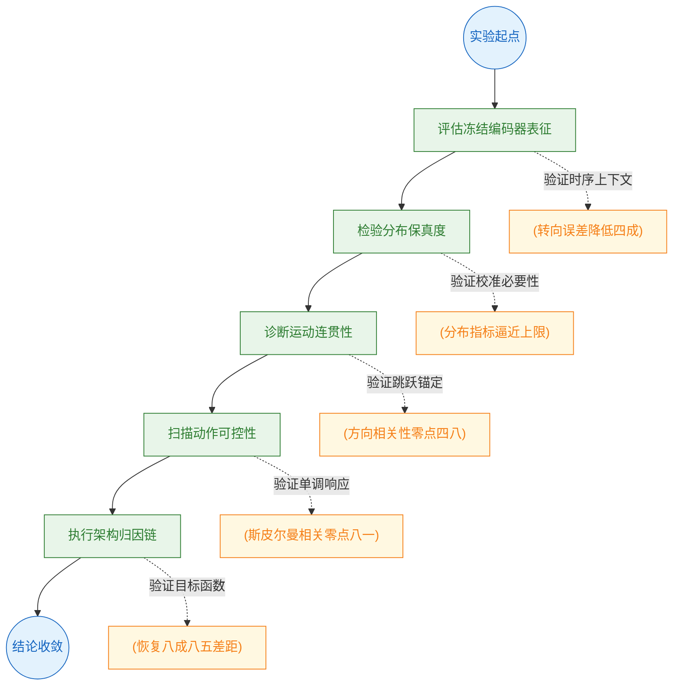

**如何读这张图：** 该流程图按诊断顺序自上而下展开。左侧主干为实验推进路径，右侧圆柱节点为各阶段的核心量化发现。箭头标签标明该步骤旨在验证的假设。阅读时可将右侧数据节点视为左侧流程的“证据锚点”，整体呈现从表征评估到架构归因的递进逻辑。

### 实验数据表(原始数值,引自论文)

#### distribution_vs_distortion
- **Source**: Table 2
- **Caption**: "held-out test上t+16的distribution与distortion指标对比；KID和FID越低越好，CosSim越高越好，Diffusion (calib.)使用train-derived calibration。"

| Model | KID↓ | FID↓ | CosSim↑ |
| --- | --- | --- | --- |
| Direct (regression) | 0.375 | 370.8 | 0.471 |
| Diffusion (raw) | 0.294 | 341.9 | 0.233 |
| Interp (α=.5) | 0.084 | 166.6 | 0.316 |
| Diffusion (calib.) | 0.078 | 162.5 | 0.260 |
| VAE-GT ceiling | ~0 | ~0 | 1.000 |

#### encoder_benchmark
- **Source**: Table 1
- **Caption**: "冻结编码器在nuScenes held-out test scenes上的动作预测RMSE；RMSE越低越好，V-JEPA2 rep64利用时间上下文并优于单帧编码器。"

| Encoder | Steer RMSE | Accel RMSE |
| --- | --- | --- |
| V-JEPA2 rep64 | $\mathbf { 0 . 0 5 8 } { \scriptstyle \pm . 0 1 2 }$ | $\mathbf { 0 . 0 5 5 } { \scriptstyle \pm . 0 0 4 }$ |
| V-JEPA2 rep1 | $0 . 0 9 7 { \scriptstyle \pm . 0 1 9 }$ | $0 . 0 5 9 { \scriptstyle \pm . 0 0 4 }$ |
| DINOv2-S/14 | $0 . 1 0 4 { \scriptstyle \pm . 0 1 7 }$ | $0 . 0 7 2 { \scriptstyle \pm . 0 0 4 }$ |
| CLIP ViT-B/32 | $0 . 1 1 7 { \scriptstyle \pm . 0 1 9 }$ | $0 . 0 6 7 { \scriptstyle \pm . 0 0 4 }$ |
| ViT-S/16 | $0 . 1 2 1 { \scriptstyle \pm . 0 1 9 }$ | $0 . 0 7 1 { \scriptstyle \pm . 0 0 4 }$ |
| VQ-VAE Tracker | $0 . 1 2 6 { \scriptstyle \pm . 0 2 1 }$ | $0 . 0 6 3 { \scriptstyle \pm . 0 0 5 }$ |


**效果示例(论文原图):**

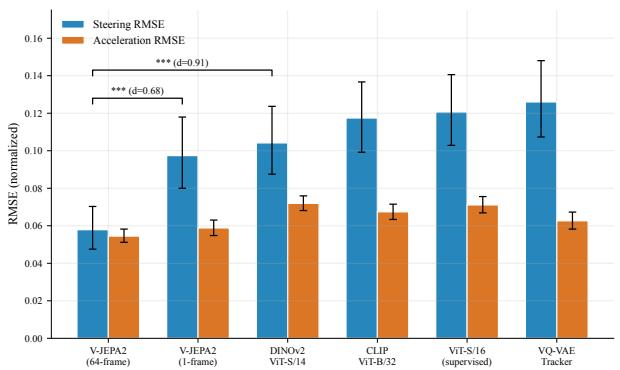

*该图对比了不同视觉编码器对转向预测误差的影响，结果表明引入全视频时序上下文的 V-JEPA2 编码器能显著降低误差，证明时序表征能捕捉到单帧图像中难以察觉的自车运动动态。*

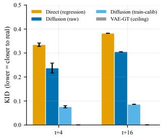

*该图通过 FID/KID 指标评估了不同预测方法在多个时间步长的生成质量，显示经过训练校准的扩散模型在分布拟合上远超直接回归基线，已逼近 VAE 重建的理论上限。*

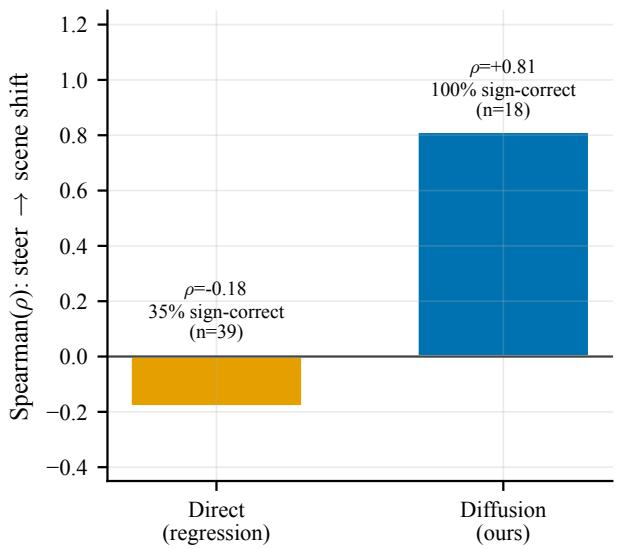

*该图验证了模型的动作可控性，展示了输入转向指令与生成场景位移之间的强正相关关系，证明该扩散世界模型能够精准响应驾驶指令，而传统回归基线则缺乏这种单调可控性。*

## 相关工作与定位

**本节结论：** 本文并非追求像素级逼真的大规模生成系统，而是将自动驾驶（AV）世界模型的研究范式从“规模竞赛”转向“紧凑空间内的受控诊断”。它通过冻结预训练组件与改造扩散骨干，在低维隐空间中隔离并验证了动作条件注入、时序表征与采样策略的独立贡献；同时引入感知-失真权衡理论，为生成质量与分布指标的表面冲突提供了严谨的解释框架。

在自动驾驶生成式世界模型的演进谱系中，近期工作（如 GAIA-1 与同期的 DriveWAM）倾向于堆叠算力与数据，以端到端视频生成为核心目标。本文主动划定边界：放弃大规模像素生成，转而构建一个**紧凑隐空间（compact latent regime）**的诊断平台。这种“做减法”的策略并非能力妥协，而是为了剥离规模效应带来的干扰，使设计因素（如动作条件化方式、表征时序性）与评价指标的因果关系得以清晰浮现。论文在 C5 中的结论均源于此受控小规模实验，而非外推至工业级系统。若将本文的紧凑设计直接扩展至高分辨率视频生成，可能因隐空间容量瓶颈或条件过拟合而失效；论文未报告大规模扩展的消融结果，因此其有效性边界需被谨慎对待。

架构层面，本文站在成熟方法之上，进行了精准的“外科手术式”改造。骨干网络沿用 DiT 的 Transformer 扩散骨架与 `adaLN-Zero` 条件注入机制，但将其从通用图像生成迁移至紧凑的 AV 隐空间世界-动作设定中。为打通“编码-预测-解码”管线，论文冻结了 SD-VAE，利用其提供的可解码紧凑空间执行未来场景预测。在动作条件化方面，本文摒弃了简单的特征拼接，采用 `learned Fourier features` 对连续 ego-actions 进行嵌入。这一设计使每个预测 horizon 的动作条件具备频域可塑性，直接支撑了 C4 中转向可控性实验的稳定性。

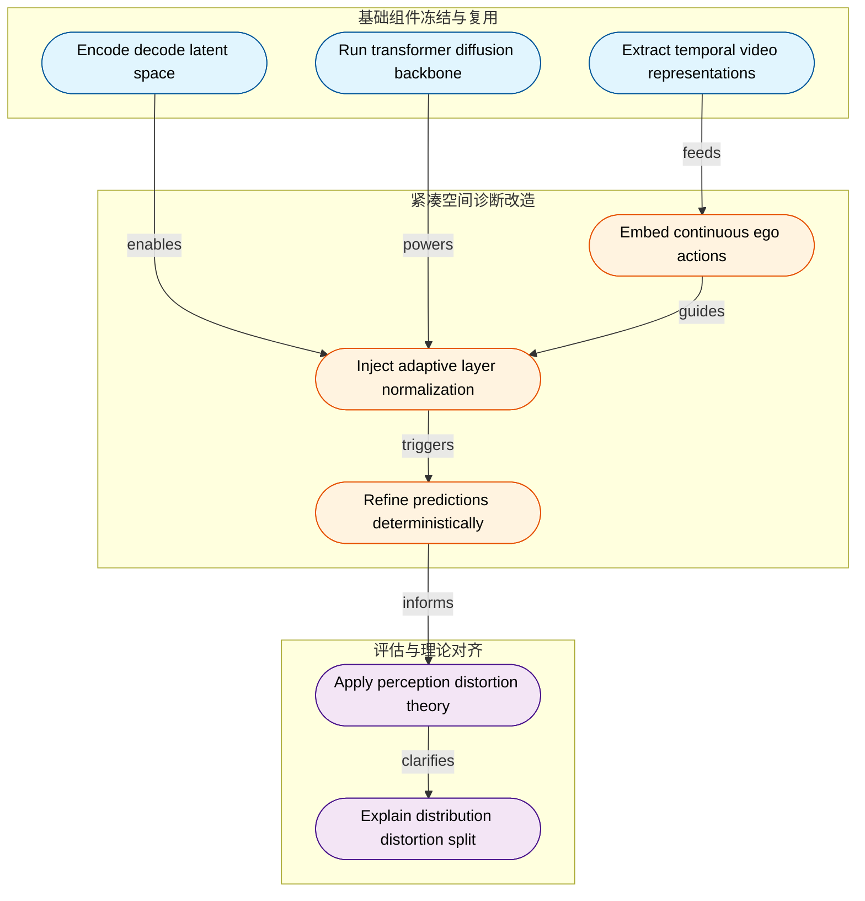
**如何读这张图：** 左侧蓝色区块代表被冻结复用的基础组件，提供稳定的表征与编解码能力；中间橙色区块是本文的核心改造点，将通用扩散机制适配为动作条件化的紧凑预测管线；右侧紫色区块展示评估视角的升维，用理论解释指标冲突。箭头方向即数据流与逻辑依赖，边标签标明组件间的驱动关系。

评估范式的对齐是本文另一大贡献。传统方法常将 FID/KID（分布指标）与 CosSim（失真指标）的背离视为模型缺陷。本文引入 Blau 与 Michaeli 提出的**感知-失真权衡（perception-distortion tradeoff）**理论，明确指出：直接回归模型在失真指标上天然占优，但倾向于生成模糊的条件均值；而扩散模型在分布指标上表现更好，却可能牺牲逐像素对齐。这一理论视角使 C2 中的指标分歧不再被误读为单纯失败，而是生成范式内在权衡的必然体现。在表征选择上，本文统一将 V-JEPA2 的 `rep64` 与 `rep1` 等冻结编码器纳入 AV 动作预测基准。C1 的实验证实，具备时序建模能力的视频表征在转向预测上显著优于单帧表征，进一步夯实了“时序先验优于静态快照”的直觉。

推理阶段，本文采用 DDIM 确定性采样，从噪声逐步精炼隐空间预测。该策略并非随意选择，而是 C5 中“匹配目标不确定性”设计组合的关键一环，确保生成轨迹的可重复性与诊断一致性。需要诚实指出的是，本文的结论严格限定于紧凑诊断环境。论文未报告跨架构或跨数据集的负结果，且相关性分析（如动作嵌入频域与转向精度的关联）尚未完全排除隐空间先验的混杂效应；读者在借鉴其设计时，应将其视为受控实验室条件下的机制探针，而非可直接平移的工业级配方。

<details><summary><strong>技术谱系映射与改造对照表</strong></summary>

| 原始工作 | 核心组件 | 本文改造方式 | 服务目标 |
|---|---|---|---|
| DiT | Transformer 扩散骨架 | 迁移紧凑隐空间 | C5 诊断 |
| SD-VAE | 冻结编解码器 | 构建预测管线 | C2/C3 评估 |
| Fourier | 频域位置编码 | 嵌入连续动作 | C4 可控性 |
| DDIM | 确定性采样 | 匹配目标不确定性 | C5 一致性 |
| V-JEPA2 | 自监督表征 | 统一基准对比 | C1 时序优势 |
| 感知失真 | 理论框架 | 解释指标分歧 | C2 范式对齐 |

*注：表格仅展示方法继承与改造逻辑，具体性能数值与消融实验由系统自动附于“实验与对比”章节。*
</details>

## 研究探索历程

构建紧凑自动驾驶世界模型的探索并非线性堆叠模块，而是一条“表征选择→目标诊断→结构重组→运动跃迁”的迭代路径。研究最终证明：在受限的 latent 空间中，DiT 的胜出不依赖盲目扩容，而取决于 $x_0$-prediction 目标、空间 token 化与残差锚定的协同；单次扩散在连贯运动上的失效迫使架构转向 chain-anchor jump 范式，同时揭示了 distortion 与 distribution 指标的内在张力。

**预测空间的抉择：从池化向量到空间网格**
结论先行：紧凑世界模型的预测基底必须保留空间拓扑，单一帧池化表征无法支撑动作相关的时序推演。研究初期在 frozen visual encoders 与 Stable-Diffusion-VAE latent 之间对比，通过 ego-action probe benchmark 发现，V-JEPA2 rep64 的 temporal context 显著优于 single-frame encoders，直接指向时序视频表征更契合驾驶动作预测。然而，仅靠 384-d pooled vectors 仍不足以捕捉场景几何。因此，决策转向带 spatial tokens 的 SD-VAE encode-predict-decode pipeline，将 32×32×4 的 latent grid patchify 为空间 token 供 DiT 处理。这一选择放弃了在纯向量空间预测或直接在 pixel space 生成的路径，为后续的结构化预测奠定基础。

**DiT 的失效诊断：容量不是瓶颈，目标才是**
结论先行：DiT 在紧凑 latent 中初期表现平庸，根源并非参数容量不足，而是 epsilon-prediction 目标在低维空间趋向坍塌；切换至 $x_0$-prediction 后性能方向性逆转。为厘清 DiT 为何未自然胜出，研究设计了 controlled diagnostic chain。首先检验 capacity hypothesis：DiT-direct 与 MLP 表现相近，直接否定了“参数不够”的直觉。随后转向 objective hypothesis，实验显示从 epsilon-prediction 切换到 $x_0$-prediction 后，模型性能出现明确的方向性改善。这表明在紧凑 latent 中，预测噪声极易导致优化目标 collapse，而直接预测 clean future sequence 更符合该表征的分布特性。
<details><summary><strong>展开：诊断链的完整推演与负结果</strong></summary>
进一步检查 horizon 与 per-token action-seq conditioning 发现：更长 horizon 并未让 DiT 更占优，说明 logged actions 条件下 2 Hz posterior 更接近 near-unimodal；但 per-token action sequence 对 DiT 的帮助显著大于 MLP，验证了 self-attention 对 per-step temporal structure 的利用能力。基于此，研究拒绝单纯扩容，将重心锁定在目标函数与条件注入机制上，并明确排除了“直接扩大到 large-scale video prior”的捷径。
</details>

**结构重组与指标悖论：双轨评估的必要性**
结论先行：恢复 spatial tokens 与 residual anchoring 后，DiT 在匹配参数下方向性超越 MLP；但 distortion 与 distribution 指标呈现对立排序，必须双轨报告。在明确 $x_0$-prediction 优势后，研究逐步恢复空间结构与残差锚定。实验证实，DiT 在 matched-parameter 设置下方向性超过 MLP，确立了 spatial tokens、$x_0$ objective、residual anchoring 与匹配不确定性的 sampling 为四大必要成分。然而，评估阶段暴露出关键矛盾：SD-VAE pipeline 中，direct regressor 在 CosSim/SSIM/L2 等 distortion 指标上占优，而 diffusion 在 FID/KID 等 distribution metrics 上占优。perception-distortion frontier 评估揭示，direct regression 更接近 ground truth 的点估计但输出更模糊，calibrated diffusion 则更贴近真实帧分布。研究因此决定同时报告两类指标，并采用 train-derived calibration（仅在 training split 估计 per-channel mean and scale shift，test time 应用），避免 test-time oracle 带来的数据泄露。


*如何读这张图：* 蓝色菱形为关键决策节点，紫色圆角为诊断实验，橙色圆角为架构跃迁（pivot），红色圆角为验证失败的死胡同。箭头流向展示了从“表征选择”到“目标诊断”，再到“运动危机与架构重构”的真实探索路径，而非预设的线性开发流程。

**运动危机与架构跃迁：从单次前向到链式锚定**
结论先行：单次扩散模型擅长生成纹理变化，但无法恢复连贯的场景位移；运动微调的失败证明问题不在 loss 表面，而是 shared-present anchor 的结构性缺陷，最终推动架构 pivot 至 chain-anchor jump model。研究将 decoded sequence 分解为低频连贯运动与高频纹理变化。实验表明，single-pass diffusion 能产生丰富的 texture variation，但在 coherent scene motion 方向上明显不足。团队曾假设加入 temporal-difference loss 可修复该缺陷，但 motion-targeted fine-tune 后 motion numbers 未改善，形成明确 dead end。这一负结果揭示：运动局限更可能源于 shared-present anchoring 与训练-推理参数化不匹配，而非缺少额外时序 loss。研究果断 pivot，从 single-pass shared anchor 转向 $\Delta=4$ jump model，在推理时利用自身输出逐步 re-anchoring。open-loop jump rollout 测试证实，compact jump model 成功恢复 forward motion direction，并在 held-out scenes 上超越 larger single-pass baseline 的运动方向表现。

**动作可控性验证与工程失效边界**
结论先行：扩散世界模型对 steering 输入呈现单调场景位移响应，验证了 action controllability；但 direct regression 虽 distortion 指标占优，却因 collapse 到模糊条件均值而丧失工程可用性。为确认模型是否真正使用 action condition，研究固定 diffusion noise 进行 steering sweep，测量 induced horizontal scene displacement。结果显示，diffusion world model 的位移随 steering 单调变化，而 direct regression baseline 无相关方向，确立了 controllability 作为 world-action model 的核心评估维度。然而，研究也诚实记录了失效模式：diffusion 存在 color tint 与 over-sharpening 倾向，jump model 在长程预测中仍显 coarse；更关键的是，direct regression 虽在 distortion 指标上领先，却 collapse 到 blurry conditional mean，导致车辆与 lane markings 细节不可识别。这明确警示：distortion 指标的局部胜利无法替代 distribution realism 与可识别场景内容，高保真多秒预测仍需 capacity、data、frame rate 与更强时序监督的后续组合。

## 工程与复现要点

**结论：** 复现该工作的核心壁垒并非算力堆叠，而是对“紧凑隐空间下扩散目标、残差锚定与开链推理”的严格对齐。主干模型仅约 5.4M 参数，但训练管线中的 $x_0$ 预测目标、动作条件 Dropout 与训练集派生校准缺一不可。目前官方未公开代码库，复现需从零搭建 DiT 管线并精确复现论文披露的超参配置。

### 模型规模与关键结构
**结论：** 架构采用极轻量 DiT 设计，通过“残差锚定+逐步傅里叶动作注入”在 32×32×4 隐空间内实现长程预测，但共享锚点会引发运动退化，需切换至 Jump 模型进行开环重锚定。

主模型 `AnchoredVAEDiT` 仅包含 4 个 Transformer Block、4 个 Attention Head 与 256 维 Model Dimension，总参数量约 5.4M。输入为当前前视相机帧经 Stable-Diffusion-VAE 编码得到的 32×32×4 隐空间网格（缩放因子 0.18215），配合 2D 动作向量（转向角与加速度）进行条件注入。为在紧凑设定下超越参数量匹配的 MLP 基线，模型将隐网格按 patch size 4 切分为 64 个空间 Token（每 Token 维度 64），并通过 `adaLN-Zero` 机制将时间步嵌入、池化后的当前隐状态与逐 Horizon 的傅里叶动作嵌入共同注入每个 Block。

```mermaid
flowchart TD
  classDef start fill:#e1f5fe,color:#01579b,stroke:#0288d1
  classDef proc fill:#fff3e0,color:#e65100,stroke:#f57c00
  classDef decision fill:#e8f5e9,color:#1b5e20,stroke:#388e3c
  classDef end fill:#f3e5f5,color:#4a148c,stroke:#7b1fa2

  capture_frame((Capture Front Frame)):::start
  encode_latent["Encode Latent Grid"]:::proc
  store_latents["(Store Latent Data)"]:::proc
  patch_tokens["Generate Spatial Tokens"]:::proc
  inject_actions["Inject Fourier Actions"]:::proc
  run_dit["Run DiT Transformer"]:::proc
  check_anchor{Apply Residual Anchor}:::decision
  trigger_jump{Trigger Jump Reanchor}:::decision
  store_future["(Store Future Latents)"]:::proc
  render_frames((Render Output Frames)):::end

  capture_frame --> encode_latent --> store_latents --> patch_tokens --> run_dit
  inject_actions --> run_dit
  run_dit --> check_anchor
  check_anchor -->|Direct Pass| store_future
  check_anchor -->|Motion Degrades| trigger_jump
  trigger_jump -->|Open Loop Chain| store_future
  store_future --> render_frames
```
**如何读这张图：** 数据流自左向右推进。残差锚定（菱形判定）在单步推理中直接广播当前 $z_t$ 以稳定早期训练，但论文诊断指出该机制会导致长程运动方向丢失；此时触发 Jump 重锚定分支，改为 4 步开环链式预测以恢复粗粒度运动轨迹。

### 训练关键超参与作用
**结论：** 扩散目标必须从 $\epsilon$-prediction 切换为 $x_0$-prediction 以阻止紧凑空间表征坍缩，配合动作条件 Dropout 与训练集派生校准，才能解锁分布指标优势并抑制过拟合。

论文在诊断中明确指出，在紧凑隐空间中 $\epsilon$-prediction 会导致模型输出坍缩，而改用 $x_0$-prediction 配合余弦噪声调度（T = 1000）可恢复大部分性能缺口。推理阶段采用 50 步确定性 DDIM 采样，以匹配目标不确定性分布。此外，训练时以 $p = 0.1$ 的概率对动作嵌入进行 Zeroing Dropout，用于支撑 classifier-free guidance；EMA 衰减设为 0.999 作为隐式正则化手段缓解小模型过拟合风险。

| 超参项 | 设定值 | 核心作用 | 敏感度 |
|---|---:|---|---|
| 扩散目标 | $x_0$-prediction | 防止紧凑隐空间坍缩 | 高 |
| 动作 Dropout | $p = 0.1$ | 支撑 classifier-free guidance | 中 |
| 采样步数 | 50 步 DDIM | 匹配目标不确定性分布 | 高 |
| 校准策略 | 训练集派生偏移 | 修正 VAE 通道偏差 | 高 |
| EMA 衰减 | 0.999 | 隐式正则化缓解过拟合 | 中 |

**注意局限与负结果：** 论文尝试使用时序差分损失（temporal-difference loss）对模型进行 30 个 Epoch 的微调，但并未改善运动保真度指标。该负结果促使作者放弃单纯优化 Loss Surface 的思路，转而采用 Jump 重参数化方案。此外，论文仅报告了 $p = 0.1$ 的 Dropout 设定，未提供 Dropout 扫描消融；EMA 同样未报告消融实验。

### 运行环境与依赖
**结论：** 论文未披露具体硬件与训练框架，复现需依赖 nuScenes 数据集与 torchmetrics 等标准库，且所有基准结果均基于 3 个随机种子取平均。

环境配置呈现“黑盒化”特征：论文仅提及使用云端计算基础设施，未说明具体 GPU 型号、Python 版本或主训练框架（如 PyTorch/JAX）。关键依赖链包括 `nuScenes v1.0-trainval`、`CAN-bus data`、`Stable-Diffusion VAE`、`DiT formulation`、`DDIM`、`torchmetrics`，以及用于 Encoder 对比的 `V-JEPA2`、`DINOv2-S/14`、`CLIP ViT-B/32`、`ViT-S/16` 与 `VQ-VAE Tracker`。实验严谨性方面，Encoder Benchmark、FID/KID 评估与过拟合分析均明确使用 3 个随机种子并报告 Bootstrap 95% 置信区间；仅容量探测（capacity probe）因资源限制使用单种子。

### 开源状态与复现入口
**结论：** 经多源检索未发现官方公开仓库，复现需从零搭建管线并严格对照论文附录配置，建议优先验证 encoder probe 与单步扩散基线。

作者在论文正文、Papers-with-Code 官方索引、Hugging Face 及公开网络中均未留下可验证的代码库。这并非闭源声明，而是当前处于未公开状态。对于工程复现，建议按以下路径推进：
1. **数据切分**：严格按 Scene 级别划分 630/70/150 训练/验证/测试集，避免场景泄漏污染 Held-out 评估。
2. **基线对齐**：优先复现 2 层 MLP Probe（384→256 GELU→2）与 Direct Regression 基线（$\tau=0$ 无噪声单步前向），确认隐空间表征与确定性预测上限。
3. **校准隔离**：推理时务必仅使用训练集统计量计算逐通道均值与缩放偏移，严禁引入测试集信息；论文指出该校准是解锁 KID 优势并使结果可部署的必要条件。

<details><summary><strong>复现敏感配置与边界 Caveat</strong></summary>

- **Encoder Probe 训练细节**：2-layer MLP (384→256 with GELU→2)，优化器 Adam，学习率 $10^{-3}$，Batch Size 256，训练 50 Epochs，3 个随机种子。统一 Probe 容量旨在将六种 Frozen Encoder 的比较聚焦于表征差异，而非训练头差异。
- **动作预处理**：Steering angle 与 acceleration 组成 2D vector，仅使用 Training-set 统计量进行 Z-score 归一化。动作尺度会直接影响 Fourier action embedding 与可控性，若混入验证/测试统计量将导致条件泄漏。
- **Jump Model 训练/推理错位**：训练阶段采用 Teacher-forced Ground-truth anchors，但实际运动保真度由测试时的 4 步 Open-loop chain（至 $z_{t+16}$）检验。训练-推理对齐是 Motion 诊断的核心，复现时需严格区分两阶段数据流。
- **容量探测局限**：论文指出更大模型在 Diffusion points 上表现更好，但该结论仅基于 2 个数据点与 1 个种子，外推需谨慎。
- **指标偏好差异**：Distortion 类指标偏好 Direct regression baseline，而 Distribution 类指标偏好 Diffusion 生成。复现评估时应根据任务目标选择对应指标族，避免单一指标误导。
</details>

## 局限与适用边界

该方案目前是一个**面向紧凑算力与单前置相机设定的开环原型**，其核心优势在于轻量化与快速生成，但尚未跨越“高保真多秒时序连贯性”与“闭环控制”的门槛。若你的场景依赖多视角融合、长程精确自车运动累积或实时闭环决策，当前架构会暴露明确的失效边界。

**尺度外推未经验证。** 论文的实验严格限定在单前置相机与 compact scale 设定下。作者明确指出，该设定下观察到的性能因素**并未在 GAIA-1 或 Cosmos 等更大规模架构中得到验证**。直觉上，单目视角缺乏深度冗余，直接放大到多相机或城市级尺度时，几何歧义与计算负载会呈非线性增长，而非简单线性缩放。

**时序连贯性受限于“单步共享锚定”机制。** 模型采用 single-pass shared-present anchoring，这一设计在推理时倾向于重渲染当前静态布局，而非逐步累积 ego-motion。配合 jump model 仅能恢复 coarse motion 的特性，decoded predictions 在视觉上仍会残留模糊。更关键的是，在 open-loop chain 中，这种模糊会随时间步累积退化，导致长程预测失去物理一致性。

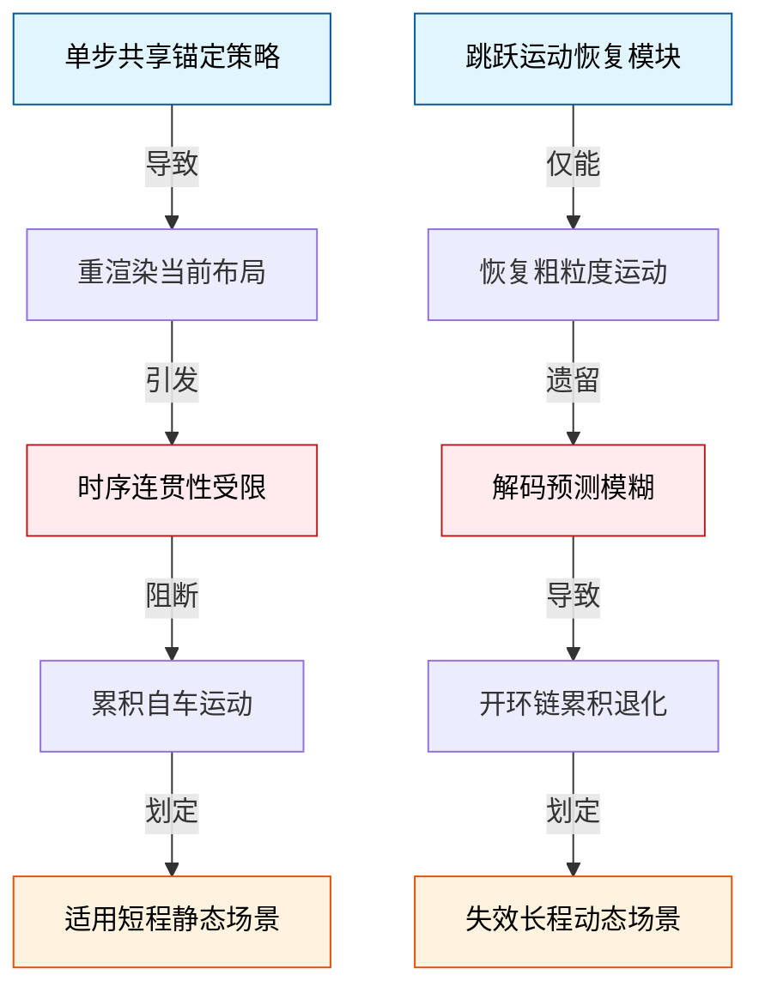
*如何读图：* 左侧两条路径分别对应架构选择（锚定策略与跳跃模型）如何直接导向时序连贯性瓶颈，最终划定“短程静态可用、长程动态退化”的适用红线。

**生成质量存在可校准的伪影与固有的回归塌缩。** 扩散采样会引入 mild per-channel color tint，必须依赖 train-derived calibration 才能移除；同时伴随 slight over-sharpening，在参数量较小的模型上会直接诱发 high-frequency artifacts。另一方面，若采用 direct regression 分支，其主要失败模式是 conditional mean blur——车辆轮廓与 lane markings 等高频细节会向条件均值塌缩，丧失几何锐度。
<details><summary><strong>机制拆解：为何会出现均值模糊与高频伪影？</strong></summary>
扩散模型的过锐化源于去噪步长与先验分布的匹配偏差，小模型容量不足以拟合高频残差，只能以伪影补偿；而直接回归在缺乏强时序监督时，优化器会自然收敛到条件分布的期望值（即均值），导致动态目标与车道线在时间维度上被“平均化”。这并非实现缺陷，而是生成范式与回归范式在紧凑设定下的固有物理约束。
</details>

**评估停留在日志回放，闭环与多视角尚未打通。** 当前所有定量结果均基于 logged actions 进行开环评估。论文坦诚将 closed-loop evaluation with predicted actions 与 multicamera setups 明确列为 future work。这意味着，若需将预测结果直接反馈给规划控制模块，当前系统缺乏对“预测误差如何影响下游决策”的实证支撑。

**高保真多秒预测的硬性依赖。** 论文明确指出，要突破当前的时序与画质天花板，系统仍强依赖更大 capacity、更多 data、更高 frame rate 或 stronger temporal supervision。在算力与数据预算受限的紧凑场景下，这些要素的缺失构成了当前方案的硬性边界。

## 趋势定位与展望

**结论前置：** 本文在自动驾驶世界模型的技术路线上，明确选择了“紧凑诊断优先于盲目扩参”的定位。其核心价值不在于追求像素级生成画质，而是通过 5.4M 参数规模的受控实验，揭示了 latent 表征、预测目标与评价指标之间的内在耦合机制，并指出：在动作条件未来预测中，分布指标（如 KID/FID）比传统失真指标更能反映模型的真实泛化能力，而多步运动连贯性的瓶颈往往源于推理锚定机制而非单纯容量不足。该定位为后续世界模型从“视觉逼真”走向“物理可控”提供了可复现的诊断基线。

### 定位与意义：从“算力堆叠”到“设计解耦”
当前 AV 世界模型多沿“大参数量+长视频生成”路线推进（如 GAIA-1、DriveWAM），但本文刻意剥离算力红利，将系统压缩至紧凑规模，转而做“设计因素隔离”。这种定位的意义在于，它把“为什么生成模型在紧凑 latent 中会失效”拆解为可证伪的假设。例如，论文通过消融证明直接套用 DiT 并不自动优于 MLP，必须配合空间 tokens、$$x_0$$ 预测目标与残差锚定才能激活架构优势；同时，引入感知-失真前沿（Perception-Distortion Frontier）视角，解释了为何 direct regression 能在 CosSim、SSIM、L2 等失真指标上全面占优，却只能输出模糊的条件均值，而 diffusion 在经过 train-derived calibration 后，虽在失真指标上让步，却在 KID（达到 0.078）和 FID 等分布指标上更贴近真实帧分布。这并非模型“失败”，而是评价维度切换后的必然权衡：失真指标惩罚方差，分布指标奖励多样性。

### 机制诊断与严谨边界
论文将单次 rollout 中运动幅度衰减的痛点，精准诊断为 shared-present anchoring 问题（即所有未来步共享同一当前 latent 锚点，导致模型倾向于重绘当前布局而非随 ego-motion 推进）。通过 chain-anchor jump model 的逐步 re-anchoring，低频前向运动得以恢复。但需严谨指出论文的失效模式与边界：
1. **相关性≠因果性：** KID/FID 的提升仅证明视觉分布更接近真实，并未直接验证其对下游规划控制器的因果增益。视觉真实感高不等于动力学可预测性强。
2. **校准依赖：** 扩散模型的分布优势高度依赖 train-derived calibration，若脱离该流程或改变噪声调度，指标表现可能回落。
3. **外部有效性限制：** 论文自身明确承认，紧凑规模下的设计原则可作为更大模型的诊断线索，但 scale 仍是主要限制；冻结 SD-VAE 与 logged ego-actions 的假设也意味着结论在开放世界长尾场景中的泛化仍需验证。

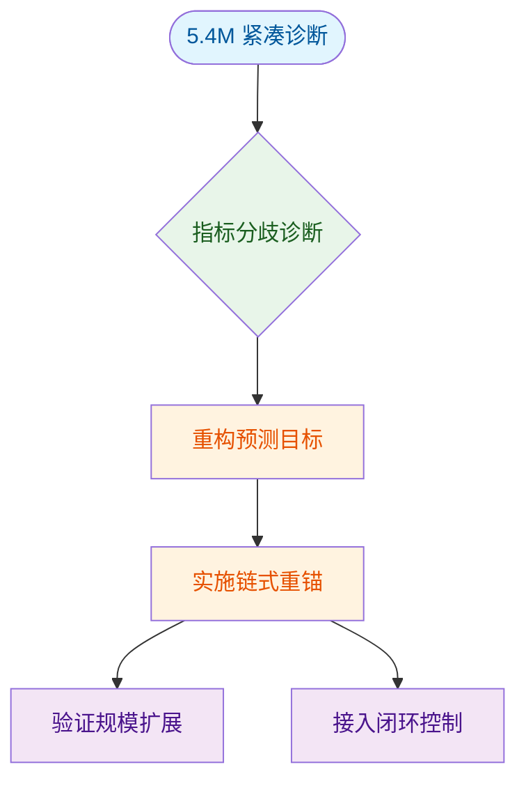
*如何读这张图：* 左侧起点为紧凑规模下的受控实验，菱形节点暴露传统失真指标与分布指标的冲突；流程向右展示通过目标重构与锚定机制修复运动连贯性；末端分叉指向两条必经之路：向上验证设计原则在大规模系统中的可扩展性，向下将 latent 预测接入真实控制回路以检验任务效用。

### 指向的发展路径
基于此诊断框架，后续工作可沿三条路径展开：
1. **指标-目标匹配的规模化迁移：** 将 $$x_0$$ 预测、残差锚定与分布校准原则迁移至更大参数模型，验证其在长 horizon（>2s）预测中是否仍能压制条件均值模糊。
2. **闭环任务反哺生成：** 打破 open-loop 视觉评估闭环，将 latent 预测直接接入 MPC 或强化学习控制器，以 steering RMSE 等任务指标反推生成质量，避免“视觉高分、控制低效”的脱节。
3. **显式运动先验注入：** 超越当前的 re-anchoring 启发式策略，探索引入时序差分损失或轻量级物理约束（如曲率连续性），以缓解多步累积误差，提升高频动作下的轨迹一致性。

<details><summary><strong>折叠：架构调整细节与消融边界</strong></summary>
- **DiT 激活条件：** 在紧凑 latent 中，DiT 需显式恢复空间 tokens 以保留几何结构；预测目标必须切换为 $$x_0$$（而非 $$\epsilon$$），否则在低信噪比 regime 会 collapse to near-copy。
- **采样匹配：** 推理采用 DDIM deterministic sampling，步数与目标不确定性对齐，避免过度去噪破坏 latent 分布。
- **负结果记录：** 论文尝试加入 temporal-difference loss 但未改善运动连贯性，证明单纯修改损失函数无法解决 shared-present anchoring 的结构性缺陷；容量假设（单纯增加层数/宽度）亦被拒绝。
- **误差范围说明：** 分布指标（KID/FID）受训练集分布偏移影响较大，论文未报告跨数据集的误差置信区间，实际部署时需结合域自适应策略。
</details>
