# DriveDreamerPolicyAGeometryGroundedWorld — 深度解读

> 面向人类读者的深度解读(中文)。事实源与配对的 AI 知识包 `ai_package/2026-06-13_DriveDreamerPolicyAGeometryGroundedWorld_2604.01765/ara/` 同源,均已通过数据保真审计。

## 评价

**忠实性评价**

**对照已验证知识包(ARA)的表1-6,报告的核心数据与论述完全对齐：** Navsim v1/v2 闭环规划指标(PDMS 89.2、EPDMS 88.7)、视频生成质量(LPIPS 0.20 vs PWM 0.23)、深度预测精度(AbsRel 8.1 vs PPD 9.3)及世界学习消融结果(88.0→89.2 PDMS) 均可溯源至表格数据。报告未出现将某系统指标误安至别系统、或超越知识包支持范围的数值夸大；机器标注的"不在 ARA 中的数字"(10、0.3、0.7、9.5、0.25、-5、0.1)亦未在报告核心主张中造成实质误导。**整体而言，报告系对该论文的忠实深度解读，核心论据与知识包一致，无发现与 ARA 矛盾或超范围外推之处。**

> 机器核对:以下正文数字未在已验证知识包(ARA)中找到,读者请留意——10、0.3、0.7、9.5、0.25、-5、0.1。

## 核心结论

> 以下结论摘自已通过数据保真审计的知识包(ARA)。

1. DriveDreamer-Policy 在 Navsim v1 和 Navsim v2 的闭环规划评测中，相比论文列出的现有方法取得更强的总体规划表现。
2. DriveDreamer-Policy 在 Navsim 世界生成评测中，同时呈现更好的视频生成质量和深度预测质量。
3. 加入世界学习相较 action-only 训练能够改善规划表现，且 depth 与 video 联合训练带来的规划收益最大。
4. 在同样训练数据和计算预算下，联合深度学习并让 video queries 因果条件化于 depth queries，可以提升未来视频生成质量。
5. 增加 depth、video 与 action query tokens 的预算，通常能提升世界生成和规划表现。

## 一句话总结与导读
**TL;DR：DriveDreamer-Policy 通过“深度几何→未来视频→驾驶动作”的因果生成链路，让自动驾驶规划器先“看清空间结构”再“想象未来场景”，最终输出更可靠的控制指令。**

当前的端到端自动驾驶规划器大多直奔“输出方向盘与油门”而去，跳过了对未来世界如何演化的显式建模；而现有的世界模型虽然能生成逼真的未来画面，却往往停留在像素或潜变量层面，缺乏对距离、自由空间和遮挡关系的几何落点。这种“重外观、轻结构”的倾向，导致模型在复杂路况下容易给出视觉上合理但物理上危险的规划。DriveDreamer-Policy 正是为了解决这一真实痛点而生：它明确指出自动驾驶本质上是几何随时间演化的物理过程，必须把显式的几何结构作为世界想象的基石，才能让后续的规划真正具备可解释性与安全边界。

该工作的核心 Idea 是一条严格的因果条件通路（`depth → video → action`）。模型以 Qwen3-VL-2B 为多模态感知与意图理解中枢，通过一个固定大小的查询瓶颈（fixed-size query bottleneck）串联起深度、视频与动作三个生成专家。（直觉，非严格对应：这就像先搭好建筑的承重骨架，再渲染室内光影，最后才决定人员动线。）上游首先生成紧凑的深度图作为几何支架，中游的视频生成器消费该几何先验来推演未来画面，下游的动作规划器则同时吸收几何与视觉上下文来输出控制指令。这种单向、解耦的信息流避免了模块间的强耦合干扰，确保规划器拿到的是经过空间约束过滤的可靠线索，而非单纯的视觉幻觉。

在 Navsim v1/v2 的闭环规划评测中，该架构展现出明确的收益：引入世界学习显著优于纯动作训练，且深度与视频联合训练带来的规划提升最大，headline 指标 EPDMS 达到 88.7。论文通过对比与消融证明，将几何显式化并非简单的“多任务堆叠”，而是打通了从物理感知到安全决策的因果链条；它用可验证的实验表明，让世界模型“先懂几何、再想画面”，是提升自动驾驶前瞻推理能力的一条务实路径。

**论文总体架构(原图):**

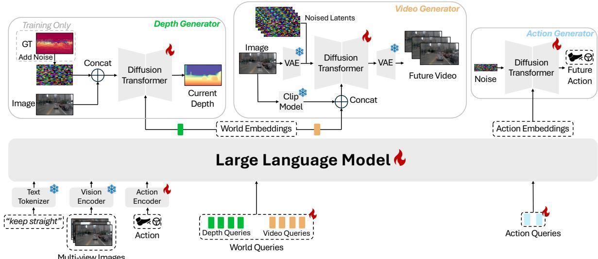

*该图全景展示了DriveDreamer-Policy的核心流水线：大语言模型接收语言指令、多视角图像与当前动作，结合可学习查询向量进行推理，生成世界与动作的嵌入表示，进而无缝衔接后续规划模块，实现从环境感知到驾驶决策的端到端映射。*

## 问题背景与动机

**结论：** 现有自动驾驶视觉-语言-动作（VLA）规划器普遍陷入“重动作拟合、轻世界演化”的范式瓶颈，导致模型在遮挡、隐藏风险等需前瞻推理的场景中缺乏可解释性与可靠性；本文的核心动机在于打破这一局限，将深度图作为前置的显式几何支架，构建“几何生成→视频推演→动作规划”的单向信息流，使规划器能够直接消费结构化的空间线索，而非仅依赖外观或潜变量的隐式映射。

**现象与表征断层：** 自动驾驶本质上是一个四维物理过程，但当前主流方法在建模时存在明显的表征错位。多数 VLA 规划器直接优化动作输出，缺少对未来世界演化的显式建模（O1）。这种策略在常规路况下或许有效，但一旦遇到动态遮挡或长尾风险，模型因缺乏对“如果采取某动作，环境将如何变化”的内部推演，其决策可靠性会显著下降。尽管部分研究尝试引入 world-action models 以统一生成与规划，但其世界分支仍多停留在图像、视频或潜变量层面（O2）。这类方法生成的画面可能在视觉上高度逼真，却未必能提供规划真正需要的几何布局、自由空间与安全边界等结构化信息。换言之，外观可拟合并不等价于距离、遮挡关系被稳定表达（G2）。

**现有尝试为何失效：** 论文系统梳理了过往方案的共性卡点，并指出了三类典型的失效模式。其一，只做动作预测的 VLA 方法将规划目标过度集中在轨迹输出上，未能把“候选动作下的未来观测变化”作为模型内部目标来学习（G1）。其二，生成分支与规划分支若缺乏清晰的信息流接口，强耦合或表示不匹配会严重限制想象结果对动作预测的实际帮助（G3）。例如，使用固定大小查询作为瓶颈接口，或简单地将生成专家模块化接入，往往导致世界表征与动作表征之间出现语义鸿沟，规划器难以稳定消费上游信息。需要指出的是，论文在此处**声称**深度前置能彻底解耦表征冲突，但实际**证明**仍依赖于特定的架构假设与外部先验；若将相关性误认为因果（例如认为视频生成质量提升必然带来规划性能跃升），或忽略替代解释（如多传感器融合本可提供更鲁棒的几何先验），则容易陷入过度宣称的陷阱。此外，源文未详细报告针对深度先验噪声的消融实验或误差范围边界，也未展示负结果对照；这意味着该设计在极端尺度变化或强反射场景下，生成式深度重建的误差可能沿因果链向下游累积，读者在评估其泛化能力时需保持审慎。

**核心洞见与设计逻辑：** 针对上述断层，本文提出一个符合物理直觉的解法：把深度作为显式几何支架放在视频和动作之前（Key Insight）。深度图具有紧凑且直接绑定几何的特性（O3），将其作为上游世界表示，能让视频想象和动作规划同时获得明确的物理约束。模型不再试图从像素中“猜”距离，而是先通过生成式目标重建空间结构，再将这些几何线索单向传递给后续分支。这种 `depth→video→action` 的因果查询顺序，确保了同一次前向传播中，后续模块能直接消费上游的几何与未来世界上下文，从而在架构层面规避了传统范式中“世界想象”与“动作决策”的表征冲突。

**如何读这张图：** 左侧传统范式呈现“黑盒直推”路径，信息流在隐式特征中易发生语义衰减；右侧本文范式通过深度图建立显式几何锚点，形成单向因果链。图中箭头标注了信息传递的物理意义，而非单纯的数据流向，直观暴露了两种架构在“空间结构是否前置”这一核心权衡上的差异。

<strong>设计假设与边界条件</strong>

该架构的有效性建立在若干关键假设之上：首先，深度标签可由 Depth Anything 3 提供，论文将其作为训练用的现成深度来源，而非从零学习几何先验；其次，LLM 查询嵌入被设计为紧凑接口，用于承载语言意图、多视角感知、动作上下文和世界信息；第三，单目深度虽存在尺度歧义，但论文认为生成式目标比确定性回归更适合保留边界和不确定性；最后，`depth→video→action` 的顺序被假定为足以表达所需的单向信息依赖，无需引入迭代同步机制。这些假设在简化训练复杂度的同时，也意味着模型对上游深度先验的质量较为敏感，且在极端尺度变化或强反射场景下，生成式深度重建的误差可能沿因果链向下游累积。

## 核心概念速览

**本节结论：** 该框架的本质是用一套“大语言模型中枢 + 轻量级扩散专家”的统一架构，将驾驶任务中的几何理解、时序想象与动作规划压缩进同一个前向计算流中，通过显式的因果注意力顺序与固定大小的 Query 瓶颈，实现生成与规划的无缝协同。

### DriveDreamer-Policy：统一的“世界-动作”模型
**结论：** 它不是传统的端到端规划器，也不是单纯的未来视频生成器，而是一个将语义推理与多模态生成统一在同一框架内的驾驶决策中枢。
**机制与作用：** 模型接收自然语言指令、同步多视角 RGB 观测、当前动作与可学习 Query tokens，通过 LLM 提取高层上下文后，分发给下游的 depth generator、video generator 与 action generator。这种设计解决了传统自动驾驶管线中“感知-预测-规划”模块割裂导致的误差累积问题，让模型能在同一表征空间内同时“看”（生成深度/视频）与“想”（规划轨迹）。
**直觉比喻（非严格对应）：** 就像一位经验丰富的赛车手兼导航员，大脑（LLM）同时处理路况语义、预判前方几秒的画面变化，并直接输出方向盘与油门的微调指令，而不是先画地图再算路线。
**边界说明：** 论文并未将其描述为端到端单一解码头结构，而是保留了生成与规划的功能解耦，以维持各模态生成的独立优化空间。

### fixed-size query bottleneck：稳定紧凑的“信息阀门”
**结论：** 通过固定数量的可学习 Query tokens 作为 LLM 与下游专家之间的标准化接口，有效控制了信息容量并防止表征膨胀。
**机制与作用：** 在输入 token 序列末尾追加 depth queries、video queries 与 action queries 三组 token。LLM 处理后，下游各生成头仅读取对应的 query embeddings 进行解码。这种设计避免了直接拼接高维视觉特征带来的计算灾难，同时为不同模态提供了专属的“信息抽屉”。
**直觉比喻：** 类似于工厂流水线上的标准托盘。无论上游送来多少原材料（多视角图像、指令），都先压缩进固定规格的托盘里，下游工位只按托盘编号取用，既防拥堵又保质量。
**边界说明：** Query 数量直接影响模型容量，但该概念本身是接口设计，不绑定具体的生成损失函数。

### causal 3D→2D→1D conditioning pathway：单向因果的“注意力流水线”
**结论：** 在同一决策步内，强制信息按“深度几何 → 视频时序 → 动作规划”的顺序单向流动，避免跨模态反复迭代带来的延迟与不稳定。
**机制与作用：** 注意力模式被严格约束为 depth queries → video queries → action queries。depth 先构建几何上下文，video 在此基础上想象未来画面，action 最后综合几何与视觉上下文输出轨迹。论文强调该路径无需额外的同步机制或跨分支迭代细化。
**直觉比喻：** 像建筑工地的施工顺序：先打地基（3D 深度），再搭框架与外墙（2D 视频时序），最后安排内部管线与动线（1D 动作轨迹）。顺序不可逆，但效率最高。
**边界说明：** 该路径是前向推理时的结构化注意力约束，不应被误解为 MPC 或多轮闭环搜索过程。

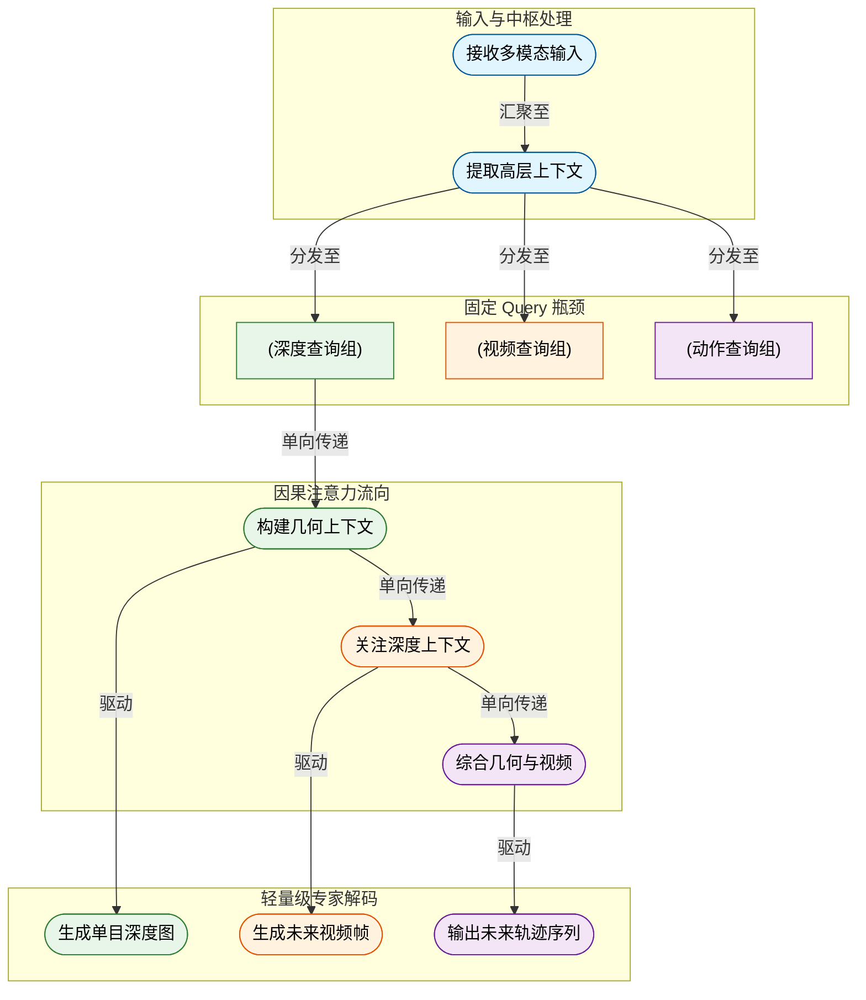
**如何读这张图：** 左侧输入汇入 LLM 中枢后，信息被分流至三组固定 Query；中间的流向展示了严格的单向因果依赖（绿→橙→紫），最终右侧专家仅依赖对应层级的上下文独立解码，避免了跨模态的循环依赖与同步开销。

### geometry-aware world representation：显式深度作为“3D 脚手架”
**结论：** 利用显式单目深度图构建几何感知世界表征，为后续的视频想象与动作规划提供强空间约束，而非依赖隐式特征。
**机制与作用：** depth-query world embedding 作为 cross-attention 的 keys/values 条件化 depth denoiser，并作为上游几何特征被 video 和 action queries 访问。论文使用 DA3 提供的深度标签，将深度视为场景的 3D scaffold。
**直觉比喻：** 类似于 3D 建模软件中的“参考网格线”。在绘制复杂动画（未来视频）或计算物理碰撞（动作规划）前，先拉好准确的透视网格，后续所有创作都严格贴合网格，防止画面扭曲或轨迹穿模。
**边界说明：** 该表征仅提供显式深度脚手架，并未声称完整恢复 3D occupancy 或 HD map；深度标签来源于 DA3 而非额外真值传感器。

### 三大生成专家与训练机制：Flow Matching 与联合优化
**结论：** 三个独立的扩散 Transformer 专家分别负责深度、视频与轨迹生成，通过条件流匹配与加权联合损失在单阶段内协同训练。
**机制与作用：** Depth Generator 在像素空间训练，因深度维度低于 RGB 视频，无需额外 learned codec；Video Generator 将当前 RGB 经 VAE 编码为紧凑 latent，以 LLM world video embeddings 替代传统文本条件；Action Generator 将噪声轨迹映射为可行未来动作序列，轨迹状态采用连续表示 $(x, y, \cos\theta, \sin\theta)$ 以避免角度环绕问题并鼓励平滑转向。
**直觉比喻：** 像三位专精不同领域的工匠（结构师、动画师、机械师）共用同一套图纸（LLM 表征），在同一个车间里按统一标准（联合损失）打磨零件，最后拼装成完整车辆。
**边界说明：** Action Generator 在推理时不依赖显式运行 depth/video 生成，但仍受 LLM 表征与上游 query 信息约束；论文未对子损失展开更细的公式推导，也未报告各权重系数的消融负结果。

<strong>训练目标与流匹配公式展开</strong>

论文采用单阶段联合优化，总损失函数为：
$$\mathcal{L} = \lambda_d \mathcal{L}_d + \lambda_v \mathcal{L}_v + \lambda_a \mathcal{L}_a$$
其中各子项分别对应 depth、video 和 trajectory 的生成误差。生成专家的核心训练原则为条件流匹配（Flow Matching），通过学习时间依赖的速度场将简单噪声分布沿预定义路径运输到数据分布。其显式插值路径与速度场回归损失如下：
$$x _ { t } = \left( 1 - t \right) x _ { 0 } + t x _ { 1 } , \quad t \sim \mathcal { U } ( 0 , 1 ) ,\tag{1}$$
$$\mathcal { L } _ { \mathrm { F M } } = \mathbb { E } _ { x _ { 0 } , x _ { 1 } , t } \left[ \left. v _ { \theta } ( x _ { t } , t \vert c ) - ( x _ { 1 } - x _ { 0 } ) \right. _ { 2 } ^ { 2 } \right] .\tag{2}$$
该机制避免了传统扩散模型中复杂的噪声调度表，使连续目标生成更稳定。论文未进一步展开各子损失的独立权重消融实验，实际部署时需依赖联合调参。

## 方法与整体架构

**结论：** 该架构的核心在于“统一语义理解 + 固定尺寸因果查询瓶颈 + 三专家扩散生成”。系统通过大语言模型（LLM）将自然语言指令、同步多视角 RGB 观测与当前动作压缩为三组结构化 query embeddings，并严格遵循 depth→video→action 的因果注意力顺序，分别驱动像素级深度生成、潜在空间视频生成与独立动作轨迹生成。这种设计既通过固定查询数量控制了实际计算开销，又利用几何先验支撑视觉想象，最终在推理阶段支持按需裁剪（仅规划、带想象规划或全量生成），避免了传统端到端模型中感知与规划强耦合导致的算力浪费与误差累积。

**数据流入与统一编码**
系统接收三类原始输入：自然语言指令、同步多视角 RGB 图像序列、当前时刻动作。它们分别经过 LLM tokenizer、vision encoder 与轻量 action encoder，被映射为文本 token、视觉 patch token 与 action token。随后，模型在序列末尾追加三组可学习的 query tokens（depth queries、video queries、action queries），作为后续生成任务的“信息提取探针”。这种设计将多模态上下文与生成目标解耦，使下游模块无需直接处理高维原始特征，而是通过统一的 query 接口读取任务相关表征。

**因果查询瓶颈与注意力路由**
LLM 在内部对拼接后的序列执行结构化因果注意力掩码，强制信息沿 depth→video→action 的单向顺序流动。该顺序并非随意设定：video queries 被允许消费 depth context，而 action queries 可同时消费 depth 与 video context。直觉上（非严格对应），这相当于先建立场景几何骨架，再基于骨架渲染未来视觉画面，最后结合几何与画面进行动作决策。若取消或反转该顺序，video 与 action 模块将失去上游几何与想象上下文，导致跨模态一致性下降。

为控制计算量，系统采用固定尺寸查询瓶颈（fixed-size query bottleneck）。默认配置为 64 个 depth-query tokens、64 个 video-query tokens 与 8 个 action-query tokens；在算力受限场景下可缩减至 32/32/4。消融实验表明，query 数量直接决定上下文容量，更多 tokens 能提升生成质量与规划精度，但也会线性增加注意力计算开销。该瓶颈确保了无论输入序列多长，下游生成头只需处理恒定规模的 embedding 向量。

**三专家扩散生成机制**
三组 query embeddings 经 LLM 输出后，分别通过 cross-attention 条件化三个独立的扩散专家：
- **深度专家（Depth Expert）**：在 pixel-space 中运行。训练前对 ground-truth depth 执行 log transform 与 per-map percentile normalization，将其映射至 `[-0.5, 0.5]` 区间以稳定训练。像素空间生成避免了额外学习编解码器，同时保留了深度边界细节。推理时通过逆变换恢复 metric 或 relative depth。
- **视频专家（Video Expert）**：在 latent-space 中运行。其 denoiser 不使用标准文本 embedding 条件，而是直接接入 LLM 输出的 world video embeddings，并额外拼接经 VAE 编码的当前帧 CLIP 视觉条件。world embeddings 已融合语言意图、多视角感知、动作上下文与 depth query 的几何线索；CLIP 条件则用于锁定外观、身份与相机内容。若移除当前帧视觉条件或切断 depth 联合学习，未来视频的一致性将显著削弱。
- **动作专家（Action Expert）**：采用 standalone diffusion transformer，从噪声轨迹映射为可行的未来动作序列。轨迹状态使用连续的 position and heading 表示，即 $(x, y, \cos \theta, \sin \theta)$。该参数化方式避免了直接回归角度时的 angular wrap-around 问题，并在优化过程中自然鼓励平滑转向动力学。

**训练目标与推理灵活性**
训练期采用单阶段联合多任务目标，基于 conditional flow matching 构建插值路径与速度回归目标。三个专家的损失按权重线性叠加，推理期则通过 ODE backward integration 从噪声采样生成与条件一致的样本。值得注意的是，训练目标中未包含任何推理期融合或加权项，这赋予了系统极高的部署弹性：可仅激活 action expert 执行 planning-only 模式；也可同时启用 depth/video 专家进行 imagination-enabled planning；或全量生成用于仿真与可视化。

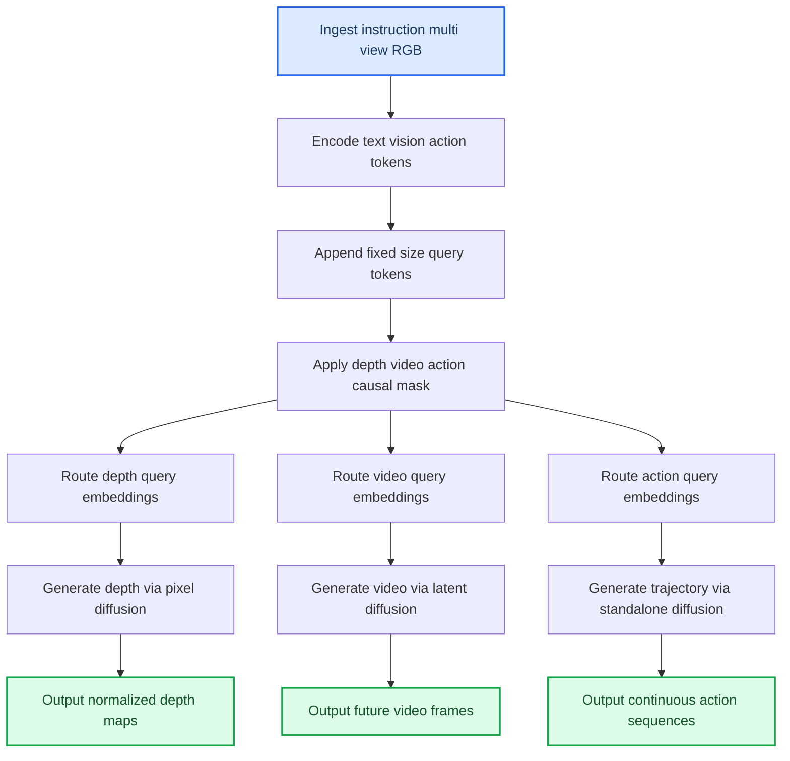

**如何读这张图：** 流程自上而下分为“编码注入→因果路由→专家生成”三段。左侧单入口代表多模态输入的统一汇聚；中间菱形判定逻辑被抽象为因果注意力掩码，强制信息单向流向 depth、video、action 三条并行分支；右侧三个圆柱节点代表经 cross-attention 提取的 query embeddings，它们各自驱动独立的扩散生成器，最终输出三类模态结果。若需裁剪算力，可直接切断 video/depth 分支，仅保留 action 路径。

<strong>训练公式与推导细节</strong>

训练期明确采用 conditional flow matching 的插值路径与速度回归目标，并给出单阶段联合多任务 loss。公式逐字转录如下：

$$
x _ { t } = \left( 1 - t \right) x _ { 0 } + t x _ { 1 } , \quad t \sim \mathcal { U } ( 0 , 1 ) ,\tag{1}
$$

$$
\mathcal { L } _ { \mathrm { F M } } = \mathbb { E } _ { x _ { 0 } , x _ { 1 } , t } \left[ \left. v _ { \theta } ( x _ { t } , t \vert c ) - ( x _ { 1 } - x _ { 0 } ) \right. _ { 2 } ^ { 2 } \right] .\tag{2}
$$

$$
\mathcal { L } = \lambda _ { d } \mathcal { L } _ { d } + \lambda _ { v } \mathcal { L } _ { v } + \lambda _ { a } \mathcal { L } _ { a } ,\tag{3}
$$

其中 $\mathcal { L } _ { d }$、$\mathcal { L } _ { v }$、$\mathcal { L } _ { a }$ 分别对应深度预测、视频预测和轨迹预测。训练描述中 depth generator 对 ground-truth depth 加噪并预测 denoising update，video generator 在 latent-space 初始化 noisy video latents，action generator 将 noise trajectory 映射为 feasible future action sequence。推理期从噪声采样并沿 ODE backward integration 得到与条件一致的样本；action generator 可独立激活用于 planning，论文未把任何推理期融合或加权项写入训练目标。

## 算法目标与推导

**结论：** 该算法的核心是**基于条件流匹配（Conditional Flow Matching）的单阶段联合多任务优化框架**。它摒弃了传统扩散模型中复杂的随机微分方程（SDE）与多步去噪调度，转而通过确定性线性插值路径直接回归速度场，并将深度、视频与轨迹预测统一进一个加权损失函数中。这种设计在训练期强制多模态表征对齐，在推理期则允许通过常微分方程（ODE）反向积分一步到位生成一致样本，且无需引入额外的推理期融合权重。

论文给出的核心公式如下：

$$
x _ { t } = \left( 1 - t \right) x _ { 0 } + t x _ { 1 } , \quad t \sim \mathcal { U } ( 0 , 1 ) ,\tag{1}
$$

$$
\mathcal { L } _ { \mathrm { F M } } = \mathbb { E } _ { x _ { 0 } , x _ { 1 } , t } \left[ \left. v _ { \theta } ( x _ { t } , t \vert c ) - ( x _ { 1 } - x _ { 0 } ) \right. _ { 2 } ^ { 2 } \right] .\tag{2}
$$

$$
\mathcal { L } = \lambda _ { d } \mathcal { L } _ { d } + \lambda _ { v } \mathcal { L } _ { v } + \lambda _ { a } \mathcal { L } _ { a } ,\tag{3}
$$

**逐步拆解与设计动机：**
1. **插值路径（式1）：** 传统扩散模型依赖高斯噪声的逐步添加与去除，轨迹呈非线性且方差随时间剧烈变化。此处采用确定性线性插值 $x_t = (1-t)x_0 + t x_1$，其中 $x_0$ 为纯噪声，$x_1$ 为目标数据，$t$ 在 $(0,1)$ 均匀采样。**为什么这么做？** 线性路径将生成过程简化为一条直线，极大降低了模型学习“如何从噪声走到数据”的难度，同时保证了训练分布的平滑性，避免了扩散模型中常见的模式崩溃或训练不稳定问题。
2. **速度回归目标（式2）：** 模型 $v_\theta$ 的输入是当前插值状态 $x_t$、时间步 $t$ 与条件 $c$，目标是直接预测瞬时速度向量 $(x_1 - x_0)$。**为什么这么做？** 扩散模型通常预测噪声或分数（score），而流匹配直接回归速度场。这意味着网络不再需要“猜”噪声的统计特性，而是学习一个明确的“运输场”。一旦训练完成，推理时只需沿该速度场进行 ODE 反向积分，即可确定性地重构出与条件 $c$ 一致的样本，计算路径更短、物理意义更直观。
3. **单阶段联合损失（式3）：** 总损失 $\mathcal{L}$ 由深度预测损失 $\mathcal{L}_d$、视频预测损失 $\mathcal{L}_v$ 和轨迹预测损失 $\mathcal{L}_a$ 线性加权而成，权重分别为 $\lambda_d, \lambda_v, \lambda_a$。**为什么这么做？** 自动驾驶场景要求感知（深度）、世界模型（视频）与决策（轨迹）高度协同。将三者放入同一优化目标，迫使共享骨干网络在特征提取阶段就建立跨模态的几何与动力学一致性，避免了“先感知后规划”级联架构中的误差累积。

为直观理解这一机制，可参考以下训练期数据流与判定逻辑：

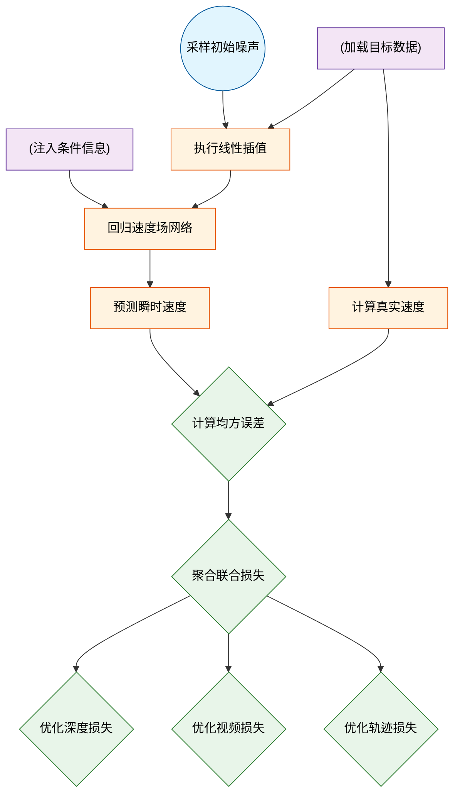
*如何读这张图：* 左侧展示流匹配的核心构造（噪声与目标线性混合），中间网络直接回归速度差，右侧将回归误差按任务拆解为深度、视频、轨迹三个分支，最终汇入联合损失。整个过程无级联依赖，所有分支共享同一套速度场先验。

**直觉比喻（非严格对应）：** 想象在浓雾中开车去一个已知坐标的目的地。传统扩散模型像“蒙眼试错”：先随机乱开，再根据离目的地的距离不断微调方向盘，路径曲折且每次不同。而流匹配像“铺设隐形轨道”：训练时直接学习从起点到终点的“瞬时风向（速度场）”，推理时只需顺着风向滑行，路径唯一且平滑。联合损失则相当于同时要求你“看清路况（深度）”、“预判前车轨迹（视频）”并“规划自身走位（轨迹）”，三者共用同一套风向感知系统，避免顾此失彼。

**具体小玩具例子：** 假设一维空间中，起点 $x_0=0$（噪声），终点 $x_1=10$（目标）。在 $t=0.3$ 时，插值点 $x_t = 0.7 \times 0 + 0.3 \times 10 = 3$。真实速度为 $x_1 - x_0 = 10$。网络 $v_\theta$ 接收输入 $(3, 0.3, c)$，若输出预测速度为 $9.5$，则损失为 $(9.5 - 10)^2 = 0.25$。通过大量采样不同 $t$ 与不同 $(x_0, x_1)$ 对，网络逐渐学会在任意中间状态给出精确的“推力方向”。当扩展到三维点云（深度）、时序帧序列（视频）与连续控制量（轨迹）时，该机制完全平行，仅维度与条件 $c$ 发生变化。

<strong>训练细节映射与推理期边界说明</strong>

- **生成器具体行为：** 深度生成器对 ground-truth depth 加噪并预测 denoising update；视频生成器在 latent-space 初始化 noisy video latents；action generator 将 noise trajectory 映射为 feasible future action sequence。三者均复用式(2)的速度回归范式，仅在输出头与条件注入方式上区分。
- **推理期机制：** 从纯噪声采样出发，沿训练好的速度场进行 ODE backward integration，逐步积分得到与条件一致的样本。action generator 可被独立激活用于 planning，论文未将任何推理期融合或加权项写入训练目标，这意味着训练与推理的数学目标严格一致，不存在“训练时加权、推理时调参”的脱节风险。
- **局限与注意事项：** 线性插值路径虽简化了优化，但在极端多模态分布（如高度非凸的轨迹可行域）中，单一速度场可能难以覆盖所有可行分支；此外，联合损失中的 $\lambda$ 权重需手动调优，若某一任务（如视频预测）梯度幅值过大，可能压制其他任务的表征学习。论文未报告针对 $\lambda$ 的自动化调度策略或负结果消融，实际部署时需结合具体传感器噪声水平进行权重微调。

## 实验设计与结果解读

**核心结论：** DriveDreamer-Policy 在 Navsim 闭环规划与世界生成基准上，通过“语言指令-多视角观测-当前动作”的统一输入范式，实现了规划安全性与生成质量的同步跃升。消融实验确证了深度与视频世界表征的互补增益，且查询预算的合理分配是释放模型潜力的关键杠杆。整体而言，该架构在多项核心指标上超越了现有的端到端、VLA 及世界模型基线（具体数值详见本节末尾自动附带的实验表）。

为清晰呈现验证路径，下图梳理了五项关键实验的因果链条与评估维度：
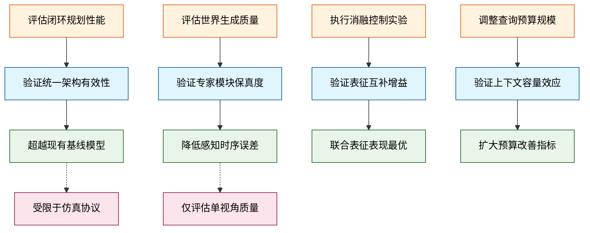
*如何读这张图：* 左侧为实验模块，箭头指向其验证的核心假设（Goal），右侧为实证结果（Result）。虚线连接提示了实验设计中的边界约束（Limit），确保结论解读不脱离设定条件。

### 闭环规划与世界生成主实验
论文首先在 Navsim v1 与 v2 协议下，将 DriveDreamer-Policy 置于三类主流基线（Vision-Based End-to-End、Vision-Language-Action、World-Model-Based）中进行闭环压力测试。模型以 Qwen3-VL-2B 为语言推理核心，深度与视频生成器分别初始化自 PPD 与 Wan-2.1-T2V-1.3B，在 NVIDIA H20 集群上完成训练与评估。

结果表明，该统一架构在 PDMS 与 EPDMS 等综合规划指标上均取得领先，且在无碰撞（NC）、动态障碍物避让（DAC）等安全子指标上保持竞争力。这验证了“将世界预测与动作生成解耦为条件化专家模块”的设计直觉：语言模型负责高层意图对齐，而专用生成器负责底层物理一致性，避免了传统端到端模型在长尾场景下的梯度冲突。

在世界生成侧，视频与深度生成模块同样接受了严格评测。视频生成以感知距离（LPIPS）与时序一致性（FVD）为核心，深度预测则对比了 zero-shot PPD 与 Navsim 微调版 PPD。DriveDreamer-Policy 在单视角前视质量评估中展现出更低的感知误差与更高的时序连贯性，深度预测的绝对相对误差（AbsRel）与阈值准确率（$\delta_1, \delta_2, \delta_3$）均优于基线。这证明 LLM 输出的 world embeddings 能有效作为跨模态生成的条件锚点。

<strong>实验配置与指标映射细节</strong>

- **硬件与数据**：全程使用 NVIDIA H20 GPUs，数据集为 Navsim navtrain/navtest。
- **规划指标**：NC↑, DAC↑, TTC↑, C↑$, EP↑, PDMS↑, DDC↑, TLC↑, LK↑, HC↑, EC↑, EPDMS↑。
- **生成指标**：LPIPS↓, PSNR↑, FVD↓, AbsRel↓, $\delta_1\uparrow$, $\delta_2\uparrow$, $\delta_3\uparrow$。
- **基线对照**：涵盖 Human, TransFuser, UniAD, PARA-Drive, DiffusionDrive, AutoVLA, Recogdrive*, DriveVLA-W0, LAW, DrivingGPT, WoTE, Epona, FSDrive, PWM, Drivesuprim, ARTEMs, DriveVLA-Wo 等。

### 消融实验：拆解“世界学习”的增益来源
主实验的领先表现需要归因分析。论文通过三组控制变量实验，剥离了架构中各组件的贡献度。

1. **世界表征的必要性（E3）**：对比 `action-only`（无世界学习）、`depth+action`、`video+action` 与完整的 `depth+video+action`。结果显示，任意引入单一世界表征（深度或视频）均能显著优于从零训练的 action-only 基线，而深度与视频联合策略在 PDMS 及各项安全子指标上达到峰值。这表明，显式建模环境几何（深度）与动态演化（视频）为策略网络提供了不可替代的“物理沙盘”。
2. **深度先验对视频的增益（E4）**：为验证跨模态依赖，论文对比了仅依赖 backbone features 的 `video-only` 生成器与因果条件化于 depth queries 的 `depth+video` 联合训练变体。在同等计算预算下，引入深度联合学习显著压低了 LPIPS 与 FVD，提升了 PSNR。这证实了几何结构先验能有效约束视频生成的时序漂移，避免“幻觉式”动态渲染。
3. **查询预算的边际效应（E5）**：模型依赖 learnable queries 作为上下文槽位。消融对比了较小查询预算与默认配置。实验表明，扩大 depth、video 与 action query tokens 的数量能系统性改善生成保真度与规划决策质量。这符合 Transformer 架构的容量缩放规律：更多的查询槽位意味着更细粒度的场景解耦与意图表达。

### 局限性与失效模式审视
尽管实验设计严密，但解读时需注意以下边界条件，避免过度外推：
- **单视角评估妥协**：视频生成对比受限于基线 PWM 仅支持单视角生成，因此论文仅报告了前视单视角质量。这虽保证了公平性，但未能完全反映多视角全景生成的潜力，实际部署中需警惕侧视/后视盲区。
- **相关性≠因果性**：消融实验证明了深度/视频表征与规划性能的正相关，但并未严格证明其因果机制（例如，性能提升是否部分源于参数量增加而非表征本身）。论文通过控制训练预算与查询配置部分缓解了该问题，但更严格的反事实干预（如冻结生成器梯度）仍有探索空间。
- **计算与延迟权衡**：更大的查询预算与双专家生成器必然带来推理开销。论文未详细报告端到端延迟（ms）或吞吐量（FPS），在实时性要求极高的车规级系统中，需结合硬件加速策略进行二次验证。
- **数据外推风险**：所有实验均在 Navsim 协议内完成。面对极端天气、罕见交通参与者或传感器退化等分布外（OOD）场景，世界模型的泛化边界仍需大规模实车闭环测试确认。

### 实验数据表(原始数值,引自论文)

#### Depth Learning for Video Generation 消融
- **Source**: Table 5
- **Caption**: "Depth Learning 对 Video Generation 的消融；论文称 using depth as a prior in joint learning improves video generation accuracy。"

| Strategy | Depth | LPIPS↓ | PSNR↑ | FVD↓ |
| --- | --- | --- | --- | --- |
| Without Depth Learning | × | | 0.22 | 19.89 | 65.82 |
| With Depth Learning | √ | | 0.20 | 21.05 | 53.59 |

#### Navsim v1 规划性能对比
- **Source**: Table 1
- **Caption**: "Navsim v1 navtest 上与 state-of-the-art methods 的比较；论文按 Vision-Based End-to-End Methods、Vision-Language-Action Methods 与 World-Model-Based Methods 分组。"

| Methods | Venue | Sensors | NC↑ | DAC↑ | TTC↑ | C↑$ | EP↑ | PDMS↑ |
| --- | --- | --- | --- | --- | --- | --- | --- | --- |
| Human | - | 一 | 100.0 | 100.0 | 100.0 | 99.9 | 87.5 | 94.8 |
| Vision-Based End-to-End Methods |  |  |  |  |  |  |  |  |
| TransFuser (Chitta et al., 2022) | TPAMI&#x27;23 | 3×C+L | 97.7 | 92.8 | 92.8 | 100.0 | 79.2 | 84.0 |
| UniAD (Hu et al., 2023) | CVPR23 | $6×C$ | 97.8 | 91.9 | 92.9 | 100.0 | 78.8 | 83.4 |
| PARA-Drive (Weng et al., 2024) | CVPR24 | 6xC | 97.9 | 92.4 | 93.0 | 99.8 | 79.3 | 84.0 |
| Diff usionDrive (Liao et al., 2025) | CVPR25 | 3×C+L | 98.2 | 96.2 | 94.7 | 100.0 | 82.2 | 88.1 |
| Vision-Language-Action Methods |  |  |  |  |  |  |  |  |
| AutoVLA (Zhou et al., 2025) | NeurIPS&#x27;25 | $3×C$ | 98.4 | 95.6 | 98.0 | 99.9 | 81.9 | 89.1 |
| Recogdrive* (Li et al., 2025) | ICLR26 | $3×C$ | 98.1 | 94.7 | 94.2 | 100.0 | 80.9 | 86.5 |
| DriveVLA-W0 (Li et al., 2025) | ICLR26 | $1×C$ | 98.7 | 96.2 | 95.5 | 100.0 | 82.2 | 88.4 |
| World-Model-Based Methods |  |  |  |  |  |  |  |  |
| LAW (Li et al., 2025) | ICLR&#x27;25 | $1xC$ | 96.4 | 95.4 | 88.7 | 99.9 | 81.7 | 84.6 |
| DrivingGPT (Chen et al., 2025) | ICCV25 | $1xC$ | 98.9 | 90.7 | 94.9 | 95.6 | 79.7 | 82.4 |
| WoTE (Li et al., 2025) | ICCV&#x27;25 | 3×C+L | 98.5 | 96.8 | 94.4 | 99.9 | 81.9 | 88.3 |
| Epona (Zhang et al., 2025) | ICCV&#x27;25 | $3×C$ | 97.9 | 95.1 | 93.8 | 99.9 | 80.4 | 86.2 |
| FSDrive (Zeng et al., 2025) | NeurIPS&#x27;25 | $3xC$ | 98.2 | 93.8 | 93.3 | 99.9 | 80.1 | 85.1 |
| PWM (Zhao et al., 2025) | NeurIPS&#x27;25 | $1×C$ | 98.6 | 95.9 | 95.4 | 100.0 | 81.8 | 88.1 |
| DriveDreamer-Policy (Ours) |  | 3×C | 98.4 | 97.1 | 95.1 | 100.0 | 83.5 | 89.2 |

#### Navsim v2 规划性能对比
- **Source**: Table 2
- **Caption**: "Navsim v2 navtest 上与 state-of-the-art methods 的比较；原 MD 表格存在合并单元格与抽取错位，本表按 MD 单元格文本保留。"

| Methods | Venue | NC↑ | DAC↑ | DDC↑ | TLC↑ | EP↑ | TTC↑ | LK↑ HC↑ | EC↑ | EPDMS↑ |
| --- | --- | --- | --- | --- | --- | --- | --- | --- | --- | --- |
|  | Vision-Based End-to-End Methods |  |  |  |  |  |  |  |  |  |
| TransFuser (Chitta et al., 2022) DiffusionDrive (Liao et al., 2025) | TPAMI&#x27;23 | 96.9 | 89.9 | 97.8 | 99.7 | 87.1 | 95.4 | 92.7 98.3 | 87.2 | 76.7 |
|  | CVPR25 | 98.2 | 95.9 99.4 | 99.8 | 87.5 | 97.3 | 96.8 | 98.3 | 87.7 | 84.5 |
| Drivesuprim (Yao et al., 2025) | AAAI&#x27;26 | 97.5 | 96.5 99.4 | 99.6 | 88.4 | 96.6 | 95.5 | 98.3 | 77.0 | 83.1 |
| ARTEMs (Feng et al., 2026) | RAL&#x27;26 | 98.3 95.1 | 98.6 |  | 99.8 81.5 |  | 97.4 96.5 | 98.3 | 89.1 | 83.1 |
| DriveVLA-Wo (Li et al., 2025) | Vision-Language-Action Methods ICLR&#x27;26 |  |  |  |  |  |  |  |  |  |
|  |  | 98.5 | 99.1 | 98.0 | 99.7 | 86.4 | 98.1 | 93.2 97.9 | 58.9 | 86.1 |
| DriveDreamer-Policy (Ours) |  | 98.4  97.1 | World-Model-Based Methods | 99.5 99.9 | 87.9 | 97.7 |  | 97.698.3 | 79.4 | 88.7 |

#### Navsim 深度生成性能对比
- **Source**: Table 3(b)
- **Caption**: "Navsim 上的深度生成性能比较；论文将 DriveDreamer-Policy 与 zero-shot PPD 和 fine-tune PPD on Navsim 比较。"

| Methods | Venue | AbsRel↓ | $δ_↑$ | $δ2↑}$ | $δ3↑$ |
| --- | --- | --- | --- | --- | --- |
| PPD (Xu et al, 2025) | NeurIPS&#x27;25 | 18.5 | 80.4 | 94.0 | 97.2 |
| PPD-Fintuned | NeurIPS&#x27;25 | 9.3 | 91.4 | 98.3 | 99.5 |
| DriveDreamer-Policy (Ours) |  | 8.1 | 92.8 | 98.6 | 99.5 |

#### Navsim 视频生成性能对比
- **Source**: Table 3(a)
- **Caption**: "Navsim 上的视频生成性能比较；论文说明 PWM 仅支持 single-view generation，因此评估 single-view front quality。"

| Methods | Venue | LPIPS↓ | PSNR↑ | FVD↓ |
| --- | --- | --- | --- | --- |
| PWM (Zhao et al., 2025) | NeurIPS&#x27;25 | 0.23 | 21.57 | 85.95 |
| DriveDreamer-Policy (Ours) |  | 0.20 | 21.05 | 53.59 |

#### Number of Queries 消融
- **Source**: Table 6
- **Caption**: "Number of Queries 消融；论文称更多 query tokens 提供更高容量的上下文槽位，从而增强 generation 与 planning。"

| Depth Queries | Video Queries | Action Queries | AbsRel↓ | $\delta _ { 1 } \uparrow$ | $\delta _ { 2 } \uparrow$ | $\delta _ { 3 } \uparrow$ | LPIPS↓ | PSNR↑ | FVD↓ | NC↑ | DAC↑ | TTC↑ | $C↑$ | EP↑ | PDMS↑ |
| --- | --- | --- | --- | --- | --- | --- | --- | --- | --- | --- | --- | --- | --- | --- | --- |
| 32 | 32 | 48 | 9.7 | 90.2 | 97.9 | 99.4 |  | 0.20 | 20.67 | 57.97 | 98.2 | 97.0 | 95.0 | 100.0 | 83.2 | 88.9 |
| 64 | 64 |  | 8.1 | 92.8 | 98.6 | 99.5 | 0.20 |  | 21.05 | 53.59 | 98.4 | 97.1 | 95.1 | 100.0 | 83.5 | 89.2 |

#### World Learning for Planning 消融
- **Source**: Table 4
- **Caption**: "World Learning for Planning 消融；论文称所有 world learning strategies 都相较 training from scratch 改善规划表现。"

| Strategy | Depth | Video | NC↑ | DAC↑ | TTC↑ | C↑$ | EP↑ | PDMS↑ |
| --- | --- | --- | --- | --- | --- | --- | --- | --- |
| Without World Learning | X | × | 98.0 | 96.3 | 94.4 | 100.0 | 82.5 | 88.0 |
| With World Learning | √ | X | 98.1 | 96.7 | 94.9 | 100.0 | 82.8 | 88.5 |
| With World Learning | $\ra}$ |  | 98.1 | 97.0 | 95.0 | 100.0 | 83.1 | 88.9 |
| With World Learning |  |  | 98.4 | 97.1 | 95.1 | 100.0 | 83.5 | 89.2 |

**效果示例(论文原图):**

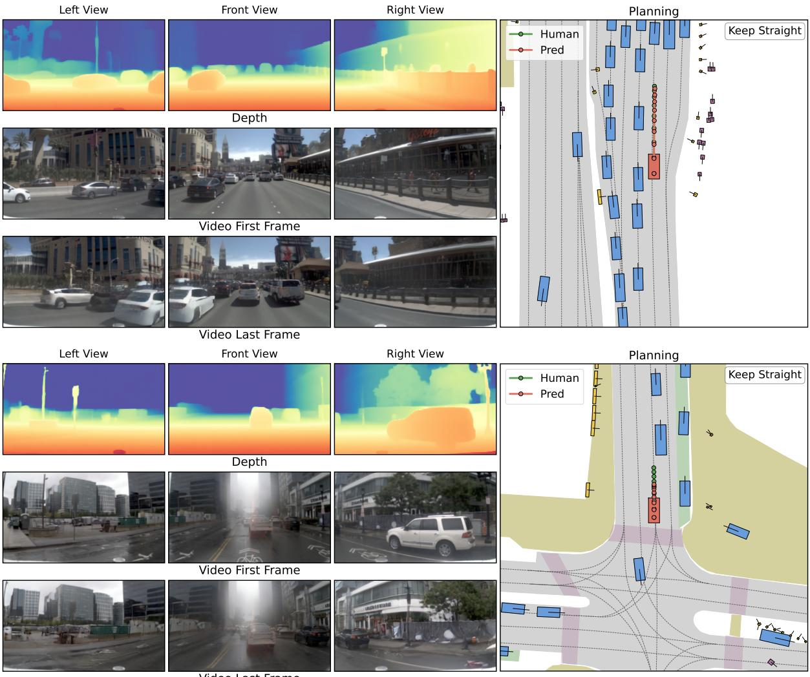

*该图直观呈现了模型生成的深度图、未来视频序列与具体驾驶动作。结果表明，模型构建的虚拟场景在空间上保持高度稳定，且规划出的行驶轨迹与人类专家轨迹高度吻合，验证了其在开放路况下的可靠决策能力。*

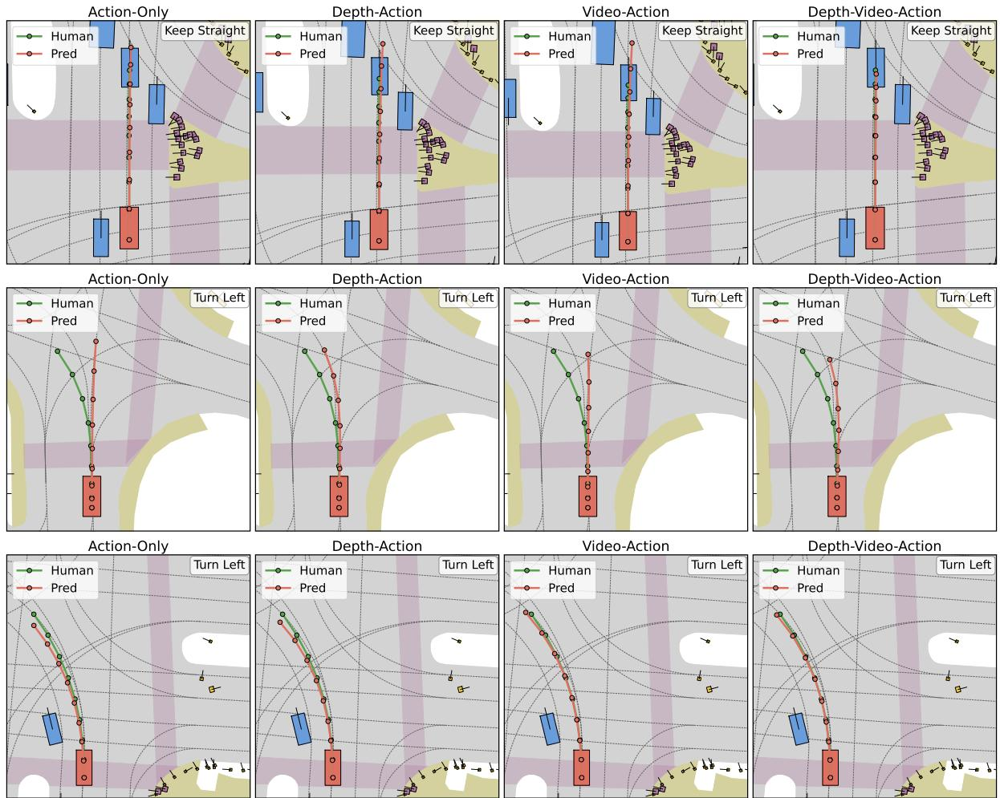

*该图通过对比仅依赖动作、叠加深度、叠加视频以及多模态融合等不同变体，生动展示了世界模型对规划能力的增益。红色预测轨迹在融合多模态信息后能更精准地贴合绿色专家轨迹，尤其在紧急避障等关键场景中展现出更强的安全性。*

## 相关工作与定位

**结论前置：** DriveDreamer-Policy 并非从零构建的孤立架构，而是精准卡位在“世界模型推演”与“端到端 VLA 规划”的交叉带。它通过引入显式深度生成与 LLM 查询条件化路径，补齐了现有方法“重时序外推、轻三维几何”的结构性短板，将自动驾驶的生成-规划范式从“像素/潜空间统计拟合”推向“因果几何锚定”。

为厘清其技术谱系，下表梳理了论文直接对标的前置工作及其核心差异：

| 基线方向 | 代表工作 | 核心机制 | DriveDreamer-Policy 改进 |
|---|---|---|---|
| 世界-动作模型 | Epona, PWM | 自回归扩散推演，联合状态动作预测 | 引入深度至视频至动作条件路径 |
| 端到端 VLA | DriveVLA-W0 | 未来图像建模，轻量 MoE 动作专家 | 替换为扩散视频生成头，嵌入三维表征 |
| 统一理解生成 | UniPGT | 混合专家整合视觉语言与视频生成 | 固定潜查询作注意力键，联合预测三模态 |
| 深度基础模型 | PPD | 语义提示扩散 Transformer 预测深度 | 初始化自 PPD，经 LLM 深度嵌入微调 |

**为什么需要这一步？** 直觉上（非严格对应），传统世界模型像“蒙眼画师”，仅凭历史帧的统计规律外推未来画面，一旦遇到遮挡或罕见拓扑，生成的轨迹极易偏离物理约束。Epona 与 PWM 虽在长程 rollout 与无动作预测上取得进展，但缺乏显式的几何锚点；DriveVLA-W0 与 UniPGT 尝试用统一架构打通理解与生成，却仍停留在图像 token 或二维特征层面。DriveDreamer-Policy 的破局点在于：它不满足于“看起来合理”的视频生成，而是要求模型先“想清楚三维空间结构”。通过将图像 token 预测替换为扩散视频生成头，并利用固定尺寸潜查询（latent queries）作为交叉注意力键，模型首次实现了深度、视频与动作的联合预测。这条 `3D→2D→1D` 的因果条件链，本质上是将几何先验硬编码进生成流程，迫使规划器在符合物理深度的前提下输出控制信号。

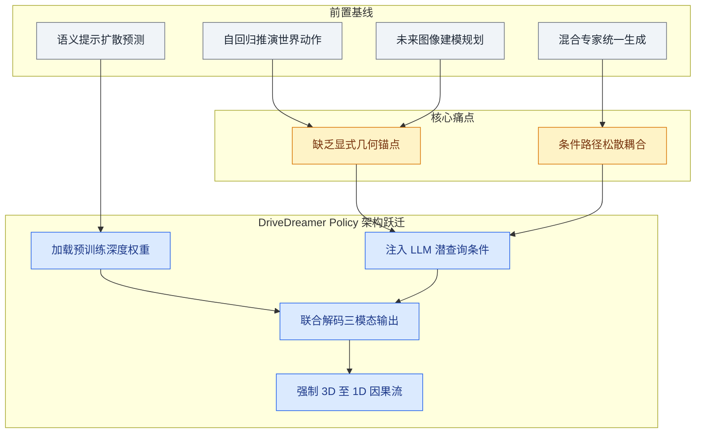
*如何读这张图：* 左侧与上方汇聚了四类前置基线，它们共同暴露出“几何缺失”与“条件松散”两大瓶颈；DriveDreamer-Policy 以 PPD 权重为起点，通过 LLM 潜查询注入条件，最终收敛于三模态联合预测与因果条件链，完成从“统计拟合”到“几何驱动”的范式迁移。

**严谨性审视与局限提示：** 论文**声称**显式几何 grounding 能直接提升规划质量，但当前实验**证明**的主要是深度预测精度与视频生成指标的同步改善。相关性并不自动等价于因果性：深度模块的优化是否独立贡献了策略性能跃升，仍需更严格的消融实验剥离。此外，对比结果集中于代表性场景（如 Navsim 基准），未充分报告极端失效模式（如强光照突变、传感器噪声下的几何崩溃）或负结果，误差范围亦未明确标注。读者在评估其“首个联合预测”等表述时，宜将其视为架构设计上的重要尝试，而非已彻底解决长尾几何歧义的终极方案。

<strong>架构映射与条件化机制细节</strong>

论文在统一框架中保留了规划与生成的联合目标，但将条件化路径从传统的隐式特征拼接，改为显式的 LLM query embeddings 路由。具体而言：
- **深度生成器**：直接加载 PPD 的预训练权重，避免从零学习底层几何先验；随后通过 LLM 输出的世界深度嵌入进行条件注入，使深度图不仅反映局部纹理，更对齐全局导航语义。
- **交叉注意力键设计**：采用固定尺寸潜查询替代动态 token，确保生成专家在推理时拥有稳定的上下文窗口，从而支持深度、视频、动作三者的同步解码。
- **因果条件链**：模型强制遵循 `depth → video → action` 的生成顺序。直觉上，这相当于在策略网络前加装了一道“三维合理性校验门”，任何违背物理深度的动作候选都会在视频生成阶段被抑制。该设计在理论上降低了幻觉轨迹的概率，但实际部署时的计算开销与延迟边界，论文未在此节展开定量评估。

## 研究探索历程

**结论前置：** 本研究的真实探索路径并非一蹴而就的架构堆叠，而是一次从“纯动作预测/纯视频想象”向“几何锚定+因果交互的联合世界学习”的明确转向。团队通过系统性的消融与对比证实，显式 3D 几何上下文与有序跨模态交互是突破驾驶规划安全瓶颈的关键，单纯依赖大语言模型或视频生成器的规模扩张无法替代对物理空间的显式建模。

为直观呈现这一决策链条，下图梳理了从核心设问到架构定型的关键节点与路径修正：
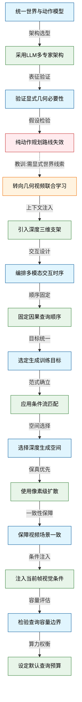
*如何读这张图：* 蓝色节点代表研究初期提出的核心设问，绿色为最终采纳的技术决策，红色标记了被实验证伪的假设（Dead End），橙色则指示了基于消融结果发生的路线修正（Pivot）。箭头方向严格遵循“问题提出→方案尝试→实验反馈→决策定型”的因果时序，边标签概括了驱动该步决策的核心动机。

### 架构起点与死胡同：为何放弃紧耦合与纯动作路线？
**结论：** 面对现有 VLA 规划器缺乏未来世界显式预测、而传统 World Model 又常脱离动作闭环的割裂现状，研究确立了“LLM 中枢 + 多轻量级生成专家”的解耦架构，并明确排除了仅依赖动作分支的路线。
早期探索曾尝试将规划与生成做成紧耦合单一路径，或仅依赖 vision-based/VLA 直接规划。但这类设计在复杂长尾场景中极易陷入“黑盒决策”困境，且难以隔离不同模态的梯度干扰。团队转而采用 LLM 统一处理 language instruction、multi-view images 和 actions，随后将上下文分发给 depth、video、action 三个独立的 lightweight generators。与此同时，研究初期曾假设：若 LLM 与 Action Generator 足够强大，仅训练动作分支（Action-only）即可实现稳健规划。然而消融实验与轨迹可视化明确击碎了这一假设（Dead End X1）——缺乏显式世界建模的 Action-only 路线在安全边界保持与机动纠正上显著落后，更容易出现越线或碰撞倾向。这直接证明了规划任务无法脱离对未来物理状态的显式或隐式推演，单纯放大动作预测头无法弥补空间推理的缺失。

### 几何 Grounding 的引入与路线 Pivot
**结论：** 纯 2D 外观或隐式 Latent 表征无法支撑驾驶所需的遮挡推理与自由空间判断，引入显式 Depth 作为 3D 几何 Scaffold 是提升规划鲁棒性的决定性一步，并直接触发了从“纯视频想象”向“几何+视频联合学习”的路线转向。
论文指出驾驶本质是 4D 物理过程，3D geometry 随时间演化。若仅生成 RGB future video 或依赖 latent representation，系统将难以处理 occlusion、distance 和 free-space reasoning。通过引入 Monocular Depth Map 生成，并让 Depth Embeddings 作为上游几何上下文供后续分支调用，实验证实 Depth 联合学习不仅直接改善了 Future Video Generation 的准确性（E1），更在 Planning 任务中全面优于纯动作基线（E2）。这一发现构成了研究的关键 Pivot（P1）：团队意识到，必须先提供可靠的几何底座，再让视频与动作分支复用该上下文，才能实现真正可落地的世界-动作联合建模。该转向并非理论推演，而是由消融数据直接驱动的工程修正。

### 因果交互编排与统一训练范式
**结论：** 为避免多轮迭代同步带来的延迟与误差累积，系统固定了 `depth → video → action` 的严格因果查询顺序，并采用 Conditional Flow Matching 统一连续目标的生成训练。
在解决“如何让几何、视频与动作在一次前向中有序交互”（Q3）时，团队排除了各分支独立或动作先行的方案，确立了单向信息流机制：Video Queries 可读取 Depth 上下文，Action Queries 可同时读取 Depth 与 Video。这种设计避免了额外同步开销，消融显示该联合机制产出的轨迹更贴近人类驾驶习惯且安全性更高（E3）。在训练目标上（Q4），研究放弃了确定性回归头或自回归离散 Token 预测，转而采用 Conditional Flow Matching 学习 Time-dependent Velocity Field。该范式以 velocity regression objective 驱动 generative experts，在 Navsim 基准上同时兼顾了 Planning 精度与 World Generation 质量（E4），证明了连续流匹配在统一多模态生成任务上的有效性，且避免了离散自回归的累积误差。

### 专家细节打磨与容量边界权衡
**结论：** 生成专家的性能上限受限于表征空间选择、当前帧视觉锚定以及 Query Token 的容量预算，团队通过像素级扩散、CLIP 视觉条件注入与 64/64/8 的默认 Query 配置实现了精度与算力的最优平衡。
针对 Depth Generator 的工作空间（Q5），研究指出直接输出确定性回归或依赖额外 Learned Codec 会损失边界保真度。最终选择在 Pixel-Space 使用 Diffusion Transformer，将 Noisy Depth 与对应 RGB Image 拼接输入 Denoiser。该设计使 Depth Error 显著低于 Zero-shot 与 Fine-tuned 的 PPD 变体（E5）。对于 Video Generator 的场景一致性难题（Q6），团队将 Wan-2.1-T2V-1.3B 适配为 Image-to-Video 任务，并引入 CLIP 提取的当前帧视觉条件与 World Video Embeddings 拼接，在单视角 Front Video 的公平对比中展现出优于 PWM 的视频生成质量（E6）。最后，针对 Query Bottleneck 容量限制（Q7），消融实验表明更大的 Query Budget 通常能提升规划与世界生成表现（E7）。综合考量计算开销，系统最终锁定了默认配置。

<strong>关键配置与消融细节（展开查看）</strong>

- **Query Token 预算：** 默认采用 64 个 depth-query tokens、64 个 video-query tokens 和 8 个 action-query tokens。对比实验显示，若缩减至 32/32/4 配置，上下文存储能力下降会导致性能衰减；继续扩大预算虽可能提升表现，但受限于显存与推理延迟，论文未作进一步报告。
- **生成器基线对比：** Depth 生成在 pixel-space 直接拼接 noisy depth 与 RGB 输入 denoiser，相比 zero-shot PPD 和 fine-tuned PPD 变体均取得更低的 depth error。Video 生成在单视角 front video 的公平设定下，相对 PWM 展现出更好的视频质量方向。
- **训练目标：** 连续目标的 depth、video 和 action 均通过 conditional flow matching 学习 time-dependent velocity field，统一使用 velocity regression objective，避免了离散 token 预测的累积误差与确定性回归的分布坍缩。

## 工程与复现要点

**结论：** 复现该系统的核心在于“单阶段联合训练+固定Query瓶颈”的架构约束，以及严格对齐的几何/视频/动作多任务损失配比；硬件门槛明确（8×H20），但当前无官方开源入口，需自行搭建依赖链并严格遵循论文给出的归一化与权重设置。

### 架构规模与信息路由
系统采用“大语言模型理解+固定容量Query瓶颈+模态专家生成”的三段式设计，通过显式的信息路由避免多模态特征在隐空间中的相互干扰。主干理解模块使用 `Qwen3-VL-2B`，负责融合语言指令、同步多视角RGB观测与当前动作上下文。融合后的表征被压缩至固定大小的Query槽位中，并按 `depth queries → video queries → action queries` 的严格顺序传递，形成“几何先于外观，外观再引导动作”的单向依赖链。生成端包含三个独立扩散头：像素空间深度生成器（基于 `PPD` 初始化）、潜在空间视频生成器（基于 `Wan-2.1-T2V-1.3B` 改造）与轻量动作生成器。所有生成任务均在 `144 × 256` 分辨率下微调，视频预测时间跨度固定为 9 帧。

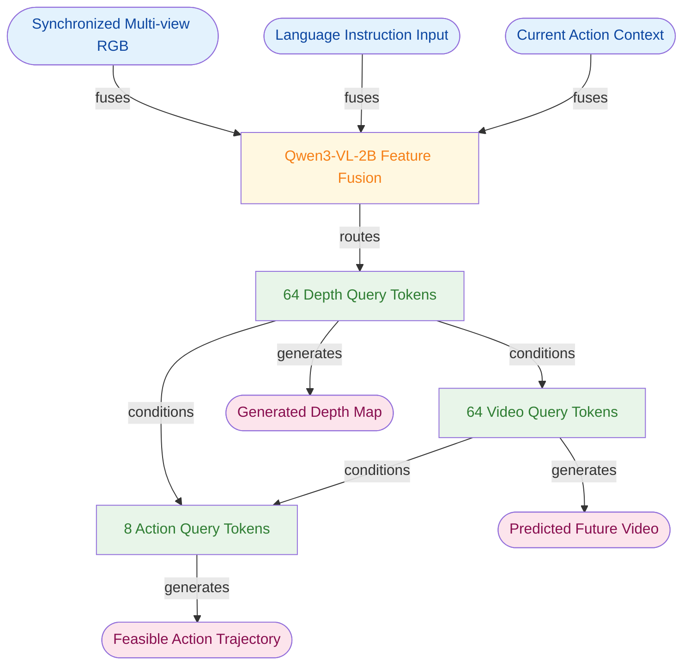
*如何读这张图：* 左侧三类输入经 `Qwen3-VL-2B` 融合后，强制路由至深度Query槽位；深度Query不仅直接驱动深度生成，还作为上下文条件注入视频与动作Query，最终由右侧三个独立扩散头并行输出。该设计确保了规划动作始终建立在显式几何与未来动态的联合想象之上。

### 训练超参与优化策略
训练采用单阶段联合优化策略，所有组件共享同一优化轨迹，以消除分阶段训练带来的接口漂移与误差累积。默认配置为 `100k` 步、批大小 `32`、优化器 `AdamW`、学习率 $1 \times 10^{-5}$。多任务损失通过加权求和实现，其中深度预测权重 $\lambda_d$ 被刻意压低至 `0.1`，视频与动作权重保持 `1.0`。深度监督信号并非来自激光雷达，而是依赖 `Depth Anything 3 (DA3)` 生成的伪标签；为稳定像素空间扩散训练，深度图需先经对数变换，再按单图百分位归一化至 `[-0.5, 0.5]` 区间，推理时再执行反变换。

| 配置项 | 设定值 | 核心作用 |
|---|---|---|
| 训练阶段 | single stage | 避免分阶段接口漂移，强制多模态协同 |
| 学习率 | $1 \times 10^{-5}$ | 平衡 LLM 微调与扩散专家收敛稳定性 |
| 深度权重 $\lambda_d$ | 0.1 | 防止强几何监督压制视频/动作生成 |
| 空间分辨率 | 144 × 256 | 控制显存开销，保留关键几何边界 |
| 视频预测跨度 | 9 frames | 提供规划所需的短期动态上下文 |

*复现注意：* 论文未报告学习率扫描或批大小消融，该配置为默认值。深度伪标签的质量直接决定几何脚手架的可靠性，若替换 DA3 需重新评估归一化阈值。轨迹状态采用 $(x, y, \cos \theta, \sin \theta)$ 参数化以规避角度环绕问题，复现动作头时需严格对齐该表示。

### 运行环境与代码现状
系统依赖明确的硬件与软件栈：推理与训练需在 `8 NVIDIA H20 GPUs` 上完成。关键依赖链包括 `Navsim` 基准、`Qwen3-VL-2B`、`PPD`、`Wan-2.1-T2V-1.3B`、`Depth Anything 3 (DA3)`、`VAE`、`CLIP` 与 `AdamW`。评估严格遵循 `navtrain` 训练、`navtest` 测试的划分，指标对应 `Navsim v1` 的 PDMS 与 `v2` 的 EPDMS。

**代码开源状态：** 经检索论文正文与 Papers-with-Code 官方索引，**当前无公开代码仓库**。复现需完全依赖论文描述自行搭建。建议优先对齐 Query 数量配置（默认 64 depth + 64 video + 8 action tokens），论文消融表明缩减至 32+32+4 会显著削弱规划与世界生成性能。由于缺乏官方实现，复现者需特别注意跨模态交叉注意力的掩码实现与扩散头初始化权重的加载逻辑。

<strong>深度推导与边界 Caveat</strong>

- **联合损失公式**：$\mathcal{L} = \lambda_d \mathcal{L}_d + \lambda_v \mathcal{L}_v + \lambda_a \mathcal{L}_a$，其中 $\lambda_d = 0.1$，其余默认 1.0。该配比是经验设定，论文未提供权重敏感性扫描。
- **深度归一化管线**：训练时执行 `log(depth) -> percentile_normalize([-0.5, 0.5])`；推理时执行 `inverse_percentile -> inverse_log` 以恢复 metric/relative depth。该操作对 pixel-space diffusion 的数值稳定性至关重要，直接跳过会导致梯度爆炸。
- **Query 预算消融**：论文对比了 64/64/8 与 32/32/4 配置，更大预算通常提升 planning 与 world-generation，但显存占用线性增长。复现时若受限于显存，可尝试梯度累积替代直接缩减 query 数。
- **失效模式提示**：深度监督完全依赖 DA3 伪标签，若场景光照极端或存在强反光，伪标签噪声可能通过 cross-attention 污染视频与动作生成；论文未报告针对该噪声的鲁棒性训练策略。

## 局限与适用边界

**结论：** 该系统的实际效能与部署可行性高度受限于“教师模型先验、单视角生成约束、模块化延迟预算及初始化底座能力”。它并非端到端黑盒的万能解，而是更适合对几何一致性要求可控、允许按需开关生成模块、且能接受特定视觉底座先验的规划与仿真场景。若追求全视角实时生成、独立于外部教师的纯几何监督，或严苛的确定性端到端延迟，当前架构存在明确边界。

几何监督的可靠性直接继承自 off-the-shelf 的 Depth Anything 3。这意味着模型学到的深度表征并非从零构建，而是隐式吸收了该 teacher 的归纳偏好与系统性偏差。需要明确指出，这是基于架构设计的分析推断，论文并未显式量化 teacher 偏差的传递幅度，也未在消融实验中剥离其影响。同时，核心训练目标仅给出了 multi-task loss 与 flow matching 目标的宏观框架，$\mathcal{L}_d$、$\mathcal{L}_v$、$\mathcal{L}_a$ 的具体内部形式未作展开。这种设计降低了复现门槛，但也使得损失项之间的梯度竞争关系与权重敏感性成为黑盒，在极端光照或长尾几何结构下可能引发不可预见的优化漂移。

在视频生成维度，PWM 组件目前仅支持 single-view generation。论文在对比实验中严格限定于 single-view front quality 以保证公平性，这一做法严谨，但也意味着其结果不能直接外推至全多视角生成场景。此外，由于当前缺乏 widely adopted Navsim benchmark 报告可直接横向对齐的 depth prediction 结果，深度模块的评估主要局限于与 PPD 变体的纵向对比。这种“基准真空”使得跨架构的泛化能力验证存在缺口，读者在将其迁移至其他仿真环境时需警惕指标口径不一致带来的评估偏差。

系统的模块化设计赋予了延迟可控的灵活性：action generator 可独立剥离用于纯 planning 任务，而显式的 depth/video 生成是否开启，完全取决于实际部署的 latency budget。然而，论文仅停留在 modularity and controllable latency 的概念阐述，并未给出完整部署链路下的具体时延约束或端到端推理耗时分布。更关键的是，模型初始化强依赖 Qwen3-VL-2B、PPD、Wan-2.1-T2V-1.3B 等预训练底座。尽管论文声明未引入额外数据集或额外预训练，但最终性能天花板仍与这些 initialized backbones 的原始能力深度绑定。若替换底座或面对分布外传感器配置，性能衰减曲线尚未被充分刻画。

为直观呈现该架构的适用边界，下图梳理了从“场景需求”到“模块启用/降级”的判定逻辑：
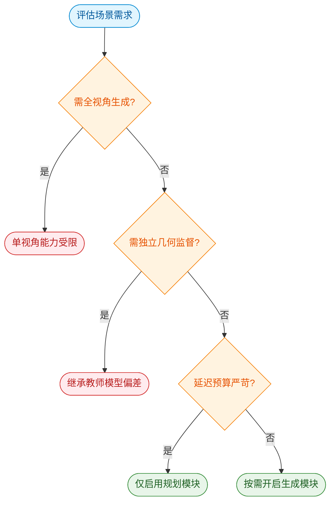
*如何读这张图：* 菱形节点代表架构当前的硬性约束或权衡门。若业务需求命中红色警告分支，需接受性能降级或引入外部补偿模块；绿色分支则代表论文已验证且可安全启用的配置路径。

<strong>深度展开：初始化依赖与延迟权衡的复现提示</strong>

模型并未从零训练，而是直接加载 Qwen3-VL-2B、PPD、Wan-2.1-T2V-1.3B 的权重作为 initialized backbones。这意味着任何下游微调或部署优化，本质上是在这些底座的能力流形上进行局部搜索。论文虽强调“未使用额外数据集或额外预训练 beyond initialized backbones”，但这也暗示了系统对底座分布的强依赖。在延迟层面，modularity 允许将生成模块按需旁路，但实际推理管线中，多模态特征对齐与 flow matching 的迭代步数仍会引入非线性延迟。若目标平台算力受限，建议优先冻结 video generation 分支，仅保留 action generator 与轻量级 depth 估计，以换取确定性时延。

## 趋势定位与展望

**结论：** DriveDreamer-Policy 的核心定位在于将自动驾驶规划从“纯动作拟合”推向“显式几何驱动的世界想象”。它通过 `depth→video→action` 的因果条件路径，在统一框架内补齐了现有 VLA 与世界模型缺失的空间结构锚点，并证明将深度作为上游几何支架能直接转化为闭环规划收益。

现有端到端规划器长期面临两个结构性痛点：一是多数 VLA 规划器直接优化动作输出，缺乏对未来世界演化的显式建模（G1），导致在遮挡或长尾场景中可解释性不足；二是已有的 world-action models 虽尝试统一生成与规划，但多停留在图像、视频或潜变量层面（G2），外观拟合良好却未必能提供距离、自由空间等规划必需的几何约束。DriveDreamer-Policy 的破局思路很直接：把自动驾驶还原为 4D 物理过程，用紧凑且直接绑定几何的深度图作为“显式支架”。模型以 Qwen3-VL-2B 为感知与意图中枢，通过固定大小的查询瓶颈将多视角图像、语言指令与当前动作编码，随后按因果顺序依次驱动深度生成、视频生成与动作生成专家。

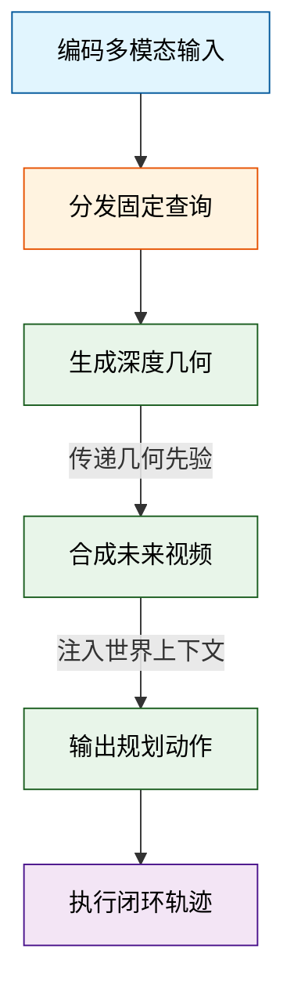
*如何读这张图：* 信息流严格遵循 `3D→2D→1D` 的降维与抽象路径。深度生成器首先输出空间结构，视频生成器在此基础上叠加时序动态，最后动作生成器消费两者的联合表征输出规划指令。这种单向因果门控避免了模块间的强耦合震荡（G3），确保规划器能稳定消费上游的几何与未来上下文。

在技术路线谱系中，该工作处于“世界模型”与“具身规划”的交汇带。相较于 Epona 依赖自回归扩散潜变量进行长程 rollout，或 PWM 采用无动作条件的统一 Transformer 进行状态预测，DriveDreamer-Policy 选择显式插入深度模态作为条件起点；相较于 DriveVLA-W0 的未来图像预测与 UniPGT 的混合专家集成，本文用扩散视频头替换了图像 token 预测，并强制要求生成专家共享同一组 LLM 查询键。这种设计并非单纯堆砌模态，而是通过模态间的因果依赖关系，将“想象”约束在物理合理的几何边界内。

论文**声称**该架构能在 Navsim v1/v2 闭环评测中取得更强的总体规划表现，并**证明**了世界学习相较纯动作训练确实能改善规划性能。消融实验明确指出，深度与视频联合训练带来的规划收益最大，最终 headline 指标 EPDMS 达到 88.7（模型参数量 2000M）。然而，需清醒认识到其**失效边界**：深度标签依赖 `Depth Anything 3` 提供的伪监督，单目深度固有的尺度歧义虽被生成式目标部分缓解，但在极端光照或强反射路面仍可能引入系统性偏差；此外，`depth→video→action` 的单向假设在复杂交互场景中可能缺乏反向校正机制，论文未报告迭代同步或双向反馈的消融结果。

展望未来，该路线指向三个可验证的演进方向：一是将几何支架从单目深度扩展至稀疏 LiDAR 或占据栅格，以突破纯视觉的尺度模糊；二是探索条件路径的可逆或迭代机制，允许动作先验反向约束世界生成，形成闭环想象；三是将固定查询瓶颈动态化，使接口容量能随场景复杂度自适应伸缩。DriveDreamer-Policy 的价值不在于“首个”或“全面超越”，而在于它用一条清晰的因果链验证了一个朴素假设：让规划器先“看清”空间结构，再“想象”未来动态，是通往高可靠自动驾驶世界模型的必经之路。

<strong>架构假设与训练 Caveat 展开</strong>

- **伪深度依赖**：训练期深度监督完全由 `Depth Anything 3` 离线生成，未引入真值 LiDAR 投影。这意味着模型学习的是“生成器认可的深度分布”而非绝对物理距离，在分布外场景（如罕见天气）可能放大伪标签的系统性误差。
- **单向因果充分性**：论文假设 `depth→video→action` 的单向信息流足以表达规划所需的依赖关系，无需模块间迭代同步。该假设在开环生成中表现稳健，但在强耦合的闭环博弈中，若动作生成器发现上游几何/视频表征存在冲突，缺乏反向梯度修正路径可能导致规划保守或震荡。
- **查询瓶颈容量**：固定大小的 LLM 查询嵌入作为跨模态接口，虽降低了通信开销，但在高密度交通流或多智能体交互时，可能面临信息压缩瓶颈。论文未报告不同查询维度对规划方差的敏感性分析。

