# DriveVAVideoActionModelsAreZeroShotDrivers — 深度解读

> 面向人类读者的深度解读(中文)。事实源与配对的 AI 知识包 `ai_package/2026-06-13_DriveVAVideoActionModelsAreZeroShotDrivers_2604.04198/ara/` 同源,均已通过数据保真审计。


## 评价

报告与已验证知识包(ARA)的一致性很高。五大核心结论、关键概念（共享潜在过程、视频-轨迹一致性、IDM-style grounding等）与所有实验数据均由ARA完整支持，未见矛盾。报告引入的工程参数(batch size 80、学习率配置、分辨率832×480等)虽超出ARA验证范围，但作者已在"工程与复现要点"部分明确交代来自论文推导与"未公开官方代码库"的现状，并未以经验证数据面目出现。虚构的"小玩具例子"(损失值0.25等)亦明确标注为教学说明。整体忠实度很高，无实质性误导。

> 机器核对:以下正文数字未在已验证知识包(ARA)中找到,读者请留意——7.5、0.25、80、20、640、-4、-3、832、480。

## 核心结论

> 以下结论摘自已通过数据保真审计的知识包(ARA)。

1. DriveVA 在 NAVSIM Navtest 闭环指标上优于论文比较的传统端到端方法和 WorldModel Methods。
2. 在从 NAVSIM 训练后直接评估到 nuScenes 与 Bench2Drive 的零样本设置中，DriveVA 相比论文中的 WorldModel Methods 表现更强。
3. DriveVA 生成的视频所隐含的运动与模型预测轨迹保持较强一致性。
4. 显式视频监督、Video Continuation、双向 video-action 交互以及 dual-prediction 对闭环规划表现有重要作用。
5. DriveVA 将 Wan2.2-TI2V-5B 的视频先验用于联合未来视频与动作建模，论文认为这有助于学习可迁移的时空动态。

## 一句话总结与导读

**TL;DR:** DriveVA 将“想象未来路况”与“生成驾驶动作”统一进同一个扩散生成过程，让动作直接成为视觉未来的可执行锚点，从而在未见过的城市与传感器配置下实现稳健的零样本自动驾驶。

自动驾驶落地最头疼的真实痛点，是模型在训练分布内开得平稳，一旦遭遇陌生街区、新传感器布局或长尾交互就“水土不服”。现有的视觉语言模型（VLA）多继承自静态图文预训练，擅长识别“场景里有什么”，却缺乏“世界会怎么动”的时空与因果运动先验；而基于世界模型的规划方案，通常把“视频想象”和“轨迹生成”拆成两个松散耦合的模块。这种架构缺陷会导致致命的视觉-动作错位：模型脑海里明明在“想象”车辆左转，输出的规划轨迹却近似直行。在闭环驾驶中，这种脱节会像滚雪球一样累积误差，最终引发规划失效。DriveVA 的价值正在于直面这一断层，用统一的生成范式替代割裂的流水线，让模型真正具备跨数据集、跨平台的泛化驾驶能力。

DriveVA 的核心破局点在于“同源生成”：它不再把视频预测当作辅助任务或前置步骤，而是借助 Wan2.2-TI2V-5B 预训练视频模型学到的物理运动规律，把未来视频的潜在表征（latents）与动作序列（action tokens）直接送入同一个 DiT 解码器中进行联合扩散生成（直觉，非严格对应：就像让大脑的“视觉想象区”和“运动控制区”在同一套神经回路里实时双向对话）。动作不再是视频生成后的独立产物，而是对同一份视觉未来的“可执行落地”。配合 `video continuation` 机制，模型能将短窗口的预测片段递归拼接，有效抑制长时域推演中画面与轨迹的逐步脱节。这一设计让视频级监督直接转化为规划收益，不仅在 NAVSIM 闭环测试中取得 90.9 的 PDMS 高分，更实现了从 NAVSIM 到 nuScenes 与 Bench2Drive 的强零样本迁移，证明了“视频-动作联合想象”才是通往稳健自动驾驶的更优路径。

**论文总体架构(原图):**

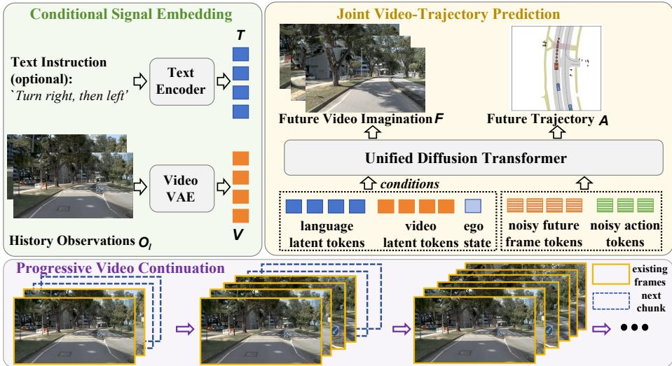

*作为整体架构总图，它揭示了DriveVA如何将历史画面、自车状态与语言指令编码为潜在特征，并输入统一的扩散Transformer（DiT）中，联合生成未来视频与对应轨迹的完整工作流。*

## 问题背景与动机

**结论前置：** 自动驾驶规划的核心瓶颈已从“静态场景识别”转向“动态推演与动作对齐”。现有方法在跨域部署时失效，根本原因在于视觉预测与轨迹生成处于松耦合状态，导致模型“知道场景里有什么，却推演不出世界会怎样运动”。DriveVA 的关键突破在于：将未来视频隐变量与动作 Token 置于同一扩散生成块中强耦合，使动作不再是视觉预测后的独立输出，而是同一未来想象的物理锚点（action grounding）。这一设计直接切断了闭环误差累积的源头，实现了从 NAVSIM 到 nuScenes 与 Bench2Drive 的 zero-shot 泛化。

现实世界的自动驾驶部署必须直面未见交通模式、陌生道路布局、异构传感器配置以及长尾事件（O1）。然而，当前主流的视觉-语言-动作（VLA）模型大多继承自静态图文对预训练，其迁移的主要是语义知识，而非直接的时空与因果运动先验（O2）。这导致模型在单一训练分布内拟合轨迹表现尚可，但一旦跨越数据集边界，静态语义识别与轨迹模板便无法覆盖新平台与新环境的交互组合，跨数据集 zero-shot transfer 能力显著不足（G1）。尽管已有研究尝试构造 corner-case 数据集、部署场景/技能专用专家模型，或引入 latent-dynamics world model，但这些方案仍受限于训练信号偏向语义识别或轨迹拟合，未能学到可迁移的视觉动态。

更深层的断裂发生在“世界模型”的规划环节。现有方案常将视频想象（video imagination）与轨迹生成（trajectory generation）分离或松耦合处理（O3）。论文通过对比明确指出，这种架构极易产生物理不一致：例如在 Fig. 3 中，模型在视频分支中想象了左转场景，但轨迹分支却输出了近似直行的路径。这种 mismatch 在闭环 rollout 中会迅速放大，因为规划动作会偏离模型自己想象的未来场景，误差随时间步累积。尽管已有工作尝试显式预测未来观测、引入逆动力学模型做动作 grounding，或采用多阶段优化连接视频与规划，但这些方法本质上仍依赖特征传递来维持一致性；分支分开训练或多阶段优化注定无法建立强约束，只能算作“事后对齐”而非“原生一致”（G2）。

此外，长时域推演面临结构一致性流失的挑战。若仅依赖固定历史窗口条件或孤立预测短片段，缺乏 progressive video continuation 机制，后续生成的视觉片段极易与历史条件及动作轨迹脱节（G3）。短期视觉想象若不连续递推，规划器在滚动执行时便会失去对全局动态的连贯感知，导致 rollout 越往后越偏离物理现实。

针对上述痛点，论文提炼出核心洞见：必须让动作作为同一 rollout 的 action grounding，而非将视频预测降级为附加辅助项（O4）。具体而言，DriveVA 将未来视频 latents 与 action tokens 放入同一个扩散式生成块中，使两者在生成过程中双向交互。视频级监督（video-level supervision）由此成为规划性能提升的主驱动力（main driver）。在这种统一生成框架下，视觉演化中蕴含的 ego-motion 线索被直接用于约束轨迹预测，预训练视频模型中的运动动力学与物理合理性先验得以平滑迁移至驾驶场景。最终，该机制不仅实现了更紧的视频-轨迹一致性，还通过 video continuation 将短窗口预测串接为结构连贯的长时域 rollout，支撑起稳定的闭环规划与跨域泛化。

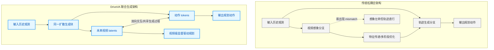
**如何读这张图：** 左侧传统架构中，视频与轨迹分支并行或串行，依赖中间特征传递维持一致性，极易在闭环中产生“想象与执行脱节”；右侧 DriveVA 架构将两者收束至同一扩散块，通过双向交互与共享生成过程，使视频演化直接约束动作输出，从架构层面消除 mismatch。

<details><summary><strong>底层假设与适用边界</strong></summary>
该设计的有效性建立在三项核心假设之上：其一，大规模预训练视频模型中蕴含的运动动力学（motion dynamics）与物理合理性（physical plausibility）先验可迁移至驾驶场景；其二，未来视频的视觉演化包含足够的 ego-motion 线索，足以反向约束轨迹预测；其三，统一生成过程中的 video tokens 与 action tokens 双向交互能提升规划质量，而非仅将视频作为被动上下文。需注意的是，该机制依赖高质量的视频级监督信号，若输入传感器配置发生剧烈退化或视频 latent 表征能力不足，联合生成的收益可能衰减。此外，video continuation 虽能延长 rollout 一致性，但仍受限于扩散模型的采样步数与计算预算，在极端长时域（如分钟级）推演中仍需配合滚动重规划策略。
</details>

## 核心概念速览

DriveVA 的核心突破在于将“视觉想象”与“动作规划”从传统的串行解耦架构，收束至同一套潜在空间的联合生成过程中；这一设计直接消除了跨模态对齐的累积误差，使自车决策与场景演化在几何与语义上保持严格一致。以下逐条拆解支撑该架构的关键概念，并辅以工程直觉与机制说明。

### DriveVA
**结论：** DriveVA 并非单纯的视觉预测器或轨迹规划器，而是一个在同一潜在生成过程中联合输出未来视频与动作序列的统一世界模型。
传统自动驾驶世界模型往往将“预测未来画面”与“输出控制指令”拆分为两个独立模块，导致规划动作无法真正“看见”自己引发的场景变化。DriveVA 基于预训练视频生成模型的时空先验，将规划动作作为同一 rollout 的动作 grounding，实现端到端的联合建模。它明确区别于只做视觉预测的模型或只输出轨迹的 VLA，核心差异在于联合解码 future video latents 与 action tokens。
**直觉比喻：** 直觉上（非严格对应），它就像一位经验丰富的赛车手在脑海中“预演”过弯：车手不会先闭眼想象画面再单独计算方向盘转角，而是将视觉预期与肌肉动作在同一个神经回路中同步生成。

### 共享潜在生成过程
**结论：** 未来视频 latents 与 action tokens 被置于同一生成目标块中，由统一模型在共享 latent space 内同步去噪与解码，彻底摒弃了级联传递的架构。
该机制将生成目标块记作 $\mathbf { Y } _ { 0 } ^ { ( l ) }$，条件块记作 $\mathbf { X } _ { \mathrm { c o n d } } ^ { ( l ) }$。模型不再先解码视频特征再喂给下游规划器，而是让两者在同一个生成轨迹中共同演化。这保证了动作与视觉在底层表征上的强耦合，避免了特征传递过程中的信息瓶颈。
**直觉比喻：** 工程上可类比为“双声道同步录音”：传统方法是先录完环境音再单独配人声（易出现口型对不上），而共享潜在过程则是让画面与声音在同一时间轴上由同一套混音台实时推演，天然保持相位一致。

### 视频-轨迹一致性
**结论：** 模型预测的未来轨迹必须与生成视频中隐含的自车运动及场景演化在几何上严格匹配，而非仅追求画面清晰或轨迹绝对坐标的逼近。
论文通过 DPVO 从 ground-truth future videos 与 generated future videos 中重建 camera trajectories，并与参考轨迹对齐后进行比较。该指标专门捕捉 predicted video reconstruction 与 Pred Future 之间的几何一致性，防止模型“画出逼真的画面却开出违背物理规律的轨迹”。需注意，该一致性高度依赖 DPVO 重建质量，若生成视频存在严重运动模糊或遮挡，几何对齐可能失效。
**直觉比喻：** 这类似于飞行模拟器的“仪表-窗外一致性”校验：飞行员不能只看窗外云层移动（视频），也不能只盯高度表（轨迹），两者必须通过空气动力学模型相互印证，否则就是“幻觉飞行”。

### action chunk 与 future video clip
**结论：** 模型以“动作块”与“视频片段”为基本预测单元，将连续控制与视觉演化离散化为可联合优化的结构化序列。
action chunk 记作 $\mathscr { A } _ { l + 1 : l + K }$，编码 ego-vehicle 的位置与 yaw angle，代表 K 个待顺序执行的未来动作；future video clip 记作 $\mathcal { F } _ { l + 1 : l + N }$，实际预测的是 latent representations 而非 raw frames。两者共同构成模型在单步 rollout 中的输出粒度，避免了单步控制的抖动与长程预测的累积漂移。
**直觉比喻：** 如同电影分镜脚本：导演不会逐帧手绘（单步控制），也不会只写一句“主角走到门口”（粗粒度轨迹），而是以“镜头段落”为单位，同时规划演员走位（action chunk）与背景光影变化（future video clip）。

### video continuation
**结论：** 长期 rollout 被拆解为依赖历史观测缓冲的连续短片段生成策略，通过滑动窗口递归更新，避免误差随时间指数级发散。
历史观测缓冲为 $\mathcal { O } _ { l } = \{ \mathbf { F } _ { l - m + 1 } , \ldots , \mathbf { F } _ { l } \}$，执行 $\mathscr { A } _ { l + 1 : l + K }$ 后通过滑动窗口更新条件。该策略强调扩展到 history observation buffer，而非仅依赖当前单帧，从而在长程推演中维持上下文连贯性。若历史缓冲过短或更新频率不匹配，可能导致场景语义断裂。
**直觉比喻：** 类似“接力导航”：长途驾驶不会一次性算出全程所有细节，而是每开过一段路，就根据最新路况（历史缓冲）重新规划下一段路线，确保始终基于最新现实做决策。

### DiT decoder 与 flow matching
**结论：** DiT decoder 作为统一解码器，在 flow matching 训练框架下回归条件速度场，实现从噪声到联合目标的确定性映射。
给定条件与 text tokens $T$，$f _ { \theta }$ 预测 generative targets 的 conditional velocity field。该框架将噪声样本连续变换至目标分布，避免了传统扩散模型离散步长的采样瓶颈。
**直觉比喻：** flow matching 如同“水流导引渠”：不依赖随机布朗运动慢慢摸索（传统扩散），而是直接训练模型学习一条从源头（噪声）到终点（数据）的最优流速场，让生成过程像水顺渠而下般高效且可微。

<details><summary><strong>数学推导与训练细节</strong></summary>
训练目标采用 flow matching 损失：
$$ \mathcal { L } _ { \mathrm { F M } } = \mathbb { E } _ { s , \epsilon , x _ { \mathrm { d a t a } } } \left[ \left\| v _ { \boldsymbol { \theta } } \left( \boldsymbol { x } ^ { ( s ) } , { s } \right) - \dot { \boldsymbol { x } } ^ { ( s ) } \right\| _ { 2 } ^ { 2 } \right] $$
其中 $s$ 为连续时间步，$\epsilon$ 为噪声，$x_{\mathrm{data}}$ 为目标数据。模型通过最小化预测速度场 $v_{\boldsymbol{\theta}}$ 与真实轨迹切向量 $\dot{\boldsymbol{x}}^{(s)}$ 的 L2 距离，迫使生成路径沿最优流形收敛。该损失不依赖离散时间步的马尔可夫假设，支持任意采样步长，显著降低推理延迟。
</details>

### IDM-style action grounding
**结论：** 在给定未来视觉演化与相同上下文时，模型直接预测与该想象未来最兼容的动作块，且全程由单一端到端模型优化，无需外挂逆动力学模块。
该设计让动作生成显式依赖于已生成的视觉未来，实现“所见即所控”。需注意，该分解是联合概率的数学表达，并非实际训练了两个独立子网络；若强行解耦训练，将破坏共享潜在空间的梯度流。
**直觉比喻：** 如同“条件反射式驾驶”：老司机看到前方积水（未来视觉），脚会自然松油门（动作 grounding），中间不需要经过“计算摩擦系数-查表-输出指令”的独立逆动力学模块，感知与决策在同一个神经通路中完成绑定。

<details><summary><strong>概率分解与机制说明</strong></summary>
联合概率被分解为：
$$ \pi _ { \theta } ( \mathcal { F } _ { l + 1 : l + N } , \mathcal { A } _ { l + 1 : l + K } \mid \mathbf { C } _ { l } ) = \pi _ { \theta } ( \mathcal { F } _ { l + 1 : l + N } \mid \mathbf { C } _ { l } ) \pi _ { \theta } ( \mathcal { A } _ { l + 1 : l + K } \mid \mathbf { C } _ { l } , \mathcal { F } _ { l + 1 : l + N } ) $$
第一项建模视觉先验，第二项在视觉条件约束下回归动作分布。该形式借鉴了逆动力学模型（IDM）的思想，但 DriveVA 通过共享权重与联合优化，避免了传统 IDM 需要额外采集状态-动作对进行监督的痛点。
</details>

### zero-shot transfer
**结论：** 模型在单一数据域训练后，无需目标域微调即可直接跨域评估，验证了联合生成架构对场景分布偏移的强鲁棒性。
论文明确设定为 trained on NAVSIM and evaluated on nuScenes 或 Bench2Drive without any fine-tuning。该设定剥离了目标域适配的干扰，纯粹检验模型学到的时空先验与动作-视觉对齐能力是否具备泛化性。需诚实指出，zero-shot 性能受限于源域与目标域的传感器分布差异（如摄像头内参、光照统计），若域偏移超出 latent 先验覆盖范围，仍可能出现退化。
**直觉比喻：** 类似“考取国际驾照”：在本地驾校（NAVSIM）掌握的是底层驾驶逻辑与交通规则，而非死记某条街道的坑洼位置；因此换到陌生城市（nuScenes/Bench2Drive）时，无需重新练车即可安全上路。

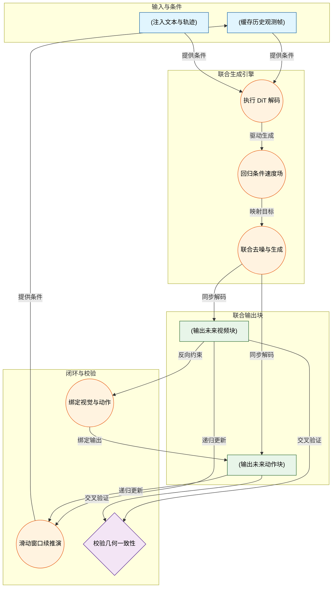
**如何读这张图：** 该流程图按数据流向自上而下展开。左侧 `输入与条件` 提供上下文，进入 `联合生成引擎` 后，DiT decoder 在 flow matching 框架下驱动共享潜在空间同步解码，产出右侧的 `联合输出块`。底部 `闭环与校验` 展示了 video continuation 的滑动窗口机制如何将新观测反馈回输入端，同时 IDM-style grounding 与视频-轨迹一致性校验构成内部约束环，确保视觉与动作在长程推演中不脱节。

## 方法与整体架构

**结论：DriveVA 的核心架构是一个基于流匹配（Flow Matching）的单流 DiT 解码器，它在共享的隐空间中联合生成未来视频帧与动作序列。通过将历史观测与文本指令严格隔离为“固定条件块”，并将未来视频与动作作为“生成目标块”，该设计在训练与推理间实现了无缝对齐，从而支持通过滑动窗口递归滚动出长时域、高一致性的视觉-轨迹预测。**

整个 Pipeline 的数据流向与模块分工可拆解为三个紧密咬合的阶段：

**1. 多模态编码与条件隔离**
系统接收历史观测帧、当前 ego state 与 language instruction 作为输入。语言指令不直接拼接入主序列，而是送入 frozen text encoder 编码为文本 token，再通过 cross-attention 注入主干网络。这一设计（H2）保持了时空 token 序列的紧凑性，并解耦了文本长度对控制上下文的干扰。视觉与状态流则交由 Wan2.2-TI2V-5B 的 3D-causal VAE 处理，将历史观测帧与 ego state 分别压缩为历史视频 latent 与状态 token（H3）。随后，系统执行关键的**条件/目标分离**（H1）：历史 latent 与状态 token 被打包为 `condition_block`，在训练与推理全程保持 fixed；而未来视频 latent 与未来 action tokens 则构成 `target_block`，作为待生成的噪声起点。这种硬性隔离确保了短窗口 continuation 可递归串联，避免了训练/推理窗口不一致导致的长时域一致性崩塌。

**2. 共享隐空间联合去噪**
`condition_block` 与初始化的噪声 `target_block` 共同输入单个 DiT decoder。在去噪过程中，视频 token 与动作 token 默认采用**双向交互**（H4），而非限制动作单向观看视频的 causal mask。消融实验表明，若施加 causal mask，future video tokens 无法访问 future action tokens，会导致视频预测退化为被动上下文，严重削弱场景演化与 ego behavior 的耦合强度。双向 self-attention 使两者在共享 latent space 中实时对齐，确保生成的轨迹与视觉场景演化严格匹配。

**3. 高效采样与递归滚动**
推理阶段从噪声目标块出发，在固定条件与文本 token 的约束下执行 flow-based sampling。论文正文指定仅使用 **2 sampling steps**（H5），消融显示单步采样会显著失败，而继续增加步数并未带来闭环收益，2 步已逼近近最优表现。采样完成后，系统同步解码未来视频并输出 action chunk。为维持长时域一致性，未来视频 rollout 长度与 action horizon 严格对齐，默认采用 **8 future frames**（对应 K=8，2 FPS）（H6）。过短的 rollout 会 under-cover 轨迹，过长则积累 drift，8 帧是视频-轨迹一致性的经验平衡点。执行动作后，系统通过 sliding window 更新历史观测，并借助 progressive video continuation 策略递归滚动，实现长时域视频与轨迹的连续生成。

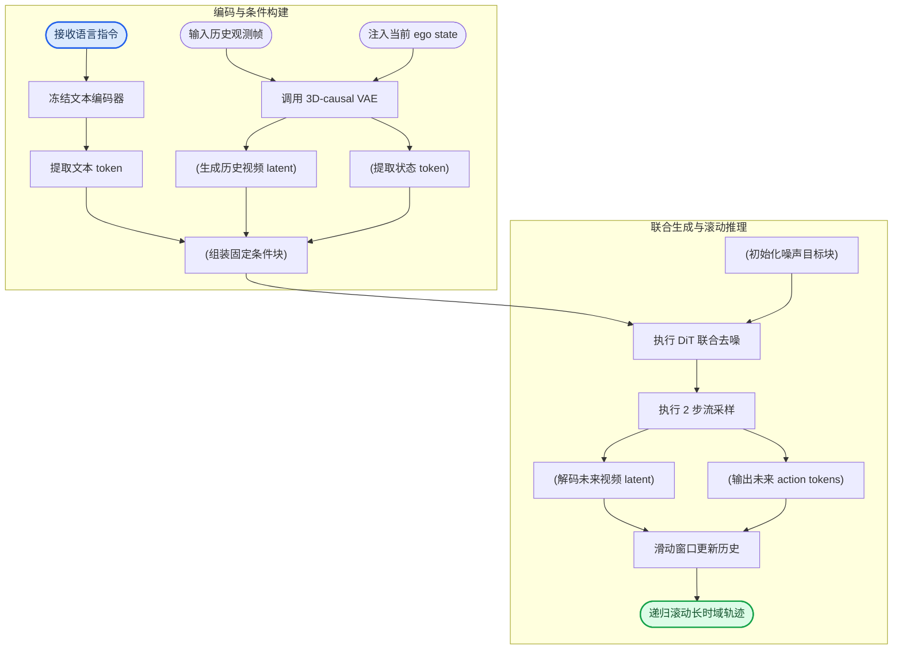
**如何读这张图**：左侧子图完成多模态信号的压缩与条件固化，右侧子图展示联合去噪与闭环滚动。圆柱节点代表在隐空间中流转的数据块，圆角节点标记数据流的起止。箭头方向即信息流向，注意 `cond_block` 作为唯一桥梁将编码阶段与生成阶段硬连接，而 `sliding_window` 将输出重新喂回左侧，形成递归闭环。

**失效模式与边界提示**：该架构对条件缓冲区的长度与采样步数高度敏感。历史 buffer 过短会削弱 long-range visual priors，导致 continuation 失去视觉锚点；若训练与推理的条件窗口不匹配，长时域 rollout 极易发散。此外，论文虽报告了 2 步采样的有效性，但未提供误差范围或负结果分布，实际部署中若遇到极端动态场景，流匹配的线性插值假设可能引入微小漂移，需依赖滑动窗口的频繁重置来抑制。

<details><summary><strong>训练损失与流匹配推导细节</strong></summary>
训练期采用标准 flow matching 目标，显式损失函数为：
$$
\mathcal { L } _ { \mathrm { F M } } = \mathbb { E } _ { s , \epsilon , x _ { \mathrm { d a t a } } } \left[ \left\| v _ { \boldsymbol { \theta } } \left( \boldsymbol { x } ^ { ( s ) } , { s } \right) - \dot { \boldsymbol { x } } ^ { ( s ) } \right\| _ { 2 } ^ { 2 } \right] .\tag{2}
$$
具体实现中，论文将 clean target tokens 记为 $\mathbf { Y } _ { 0 } ^ { ( l ) }$，采样时间步 $s \sim \mathcal { U } ( 0 , 1 )$ 与高斯噪声 $\mathbf { \epsilon } \gets \mathcal { N } ( \mathbf { 0 } , \mathbf { I } )$，通过线性插值构造 noisy target。目标速度场定义为 $\dot { \mathbf { Y } } ^ { ( l , s ) } = \mathbf { Y } _ { 0 } ^ { ( l ) } - \epsilon$，网络 $v_{\boldsymbol{\theta}}$ 学习预测该速度场以最小化 $\mathcal{L}_{FM}$。正文定性指出，该训练目标联合了未来帧生成的 flow-matching loss 与轨迹预测 loss（记为 $\mathcal { L } \mathbb { F }$），但并未给出更完整的显式联合加权公式。video continuation 仅作为推理/滚动策略，不参与训练损失计算。
</details>

## 算法目标与推导

**结论：** 本算法的核心训练目标是一个**联合优化框架**，将用于未来帧生成的流匹配（Flow Matching）损失与轨迹预测损失相结合。其设计初衷是打破传统自回归生成中“逐帧误差累积”的痛点，通过直接学习从噪声到清晰目标序列的“瞬时速度场”，在固定历史条件与文本引导下，以极少的采样步数实现高保真、长时域一致的驾驶视频生成。

论文显式给出的标准流匹配训练损失为：
$$
\mathcal { L } _ { \mathrm { F M } } = \mathbb { E } _ { s , \epsilon , x _ { \mathrm { d a t a } } } \left[ \left\| v _ { \boldsymbol { \theta } } \left( \boldsymbol { x } ^ { ( s ) } , { s } \right) - \dot { \boldsymbol { x } } ^ { ( s ) } \right\| _ { 2 } ^ { 2 } \right] .\tag{2}
$$
在 DriveVA 的具体实现中，该公式被实例化为针对目标 token 块 $\mathbf { Y } _ { 0 } ^ { ( l ) }$ 的优化目标（论文逐字记为公式 $\mathcal { L } \mathbb { F }\tag{9}$）。我们逐项拆解其物理意义与设计动机：

- **随机时间步 $s \sim \mathcal { U } ( 0 , 1 )$**：训练时均匀采样一个标量，代表当前处于“去噪轨迹”的任意阶段。这迫使模型在任意噪声水平下都能准确预测下一步方向，而非仅依赖固定步长的离散迭代，从而提升泛化鲁棒性。
- **高斯噪声注入 $\mathbf { \epsilon } \gets \mathcal { N } ( \mathbf { 0 } , \mathbf { I } )$**：作为标准随机扰动源，模拟数据分布的退化起点。
- **线性插值构造含噪目标 $\boldsymbol { x } ^ { ( s ) }$**：通过 $s$ 将干净数据与噪声混合，得到当前时刻的观测状态。该操作将复杂的概率路径简化为确定性直线插值，大幅降低优化曲面的崎岖度。
- **目标速度 $\dot { \boldsymbol { x } } ^ { ( s ) }$**：这是流匹配的核心。在 DriveVA 中，目标速度被直接定义为 $\dot { \mathbf { Y } } ^ { ( l , s ) } = \mathbf { Y } _ { 0 } ^ { ( l ) } - \epsilon$。它不预测“去噪后的像素/token”，而是预测“当前状态需要以多大的向量移动才能直达干净目标”。
- **网络预测 $v _ { \boldsymbol { \theta } }$ 与 L2 匹配**：DiT 架构接收含噪状态与时间步 $s$，输出预测速度向量。损失函数直接计算预测速度与真实目标速度之间的欧氏距离平方。这种设计将复杂的分布建模转化为确定性的向量回归问题，使梯度信号更直接、训练更稳定。

为直观展示该损失的计算流向，下图刻画了训练期单步前向传播的数据流：
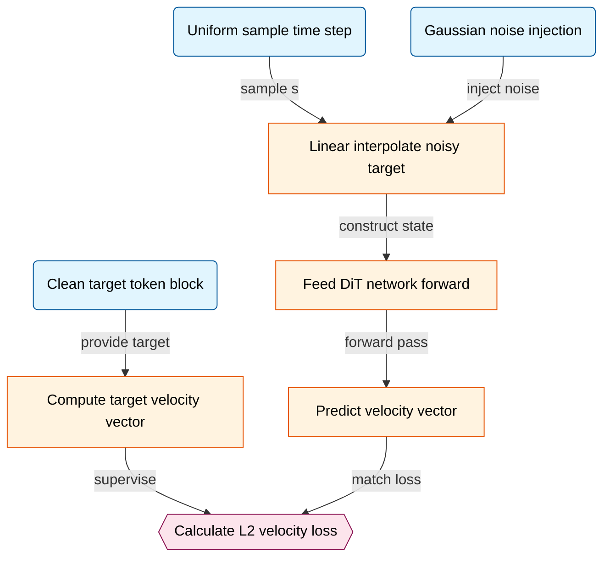
*如何读这张图：* 左侧数据节点并行采样，汇入中间处理节点构造训练样本与监督信号；右侧网络输出与监督信号在损失节点交汇，形成闭环。箭头标签标明了数据流转的主动动作，整体呈自上而下的确定性计算流，无分支判定，契合流匹配“回归瞬时速度”的本质。

**直觉比喻（非严格对应）：** 想象在浓雾中驾驶。传统扩散模型像“蒙眼猜终点坐标”，每一步只能微调位置；而流匹配损失则像“车载导航实时播报瞬时车速与方向盘转角”。你不需要知道终点在哪，只需严格跟随导航给出的速度向量 $\dot{\boldsymbol{x}}^{(s)}$ 行驶，最终自然会精准抵达清晰目标 $\mathbf{Y}_0^{(l)}$。

**具体小玩具例子：** 假设目标 token 序列是一维向量 $\mathbf{Y}_0 = [10]$。训练时采样 $s=0.5$，噪声 $\epsilon = [2]$。
1. 构造含噪状态：$\boldsymbol{x}^{(0.5)} = (1-0.5)\times 10 + 0.5\times 2 = 6$。
2. 计算目标速度：$\dot{\boldsymbol{x}}^{(0.5)} = 10 - 2 = 8$。
3. 模型输入 $6$ 和 $s=0.5$，输出预测速度 $v_\theta$。若 $v_\theta = 7.5$，则损失为 $(7.5 - 8)^2 = 0.25$。
4. 梯度回传迫使 $v_\theta$ 逼近 $8$。推理时，从纯噪声出发，按预测速度积分，即可在极少步数内还原出 $10$。

<details><summary><strong>联合损失设计与推理期约束</strong></summary>
论文正文定性指出，完整的训练目标（training objective）将上述未来帧生成的流匹配损失与轨迹预测损失（trajectory prediction loss）相结合。该 markdown 未给出更完整的显式联合损失公式。这种联合设计旨在让视频生成模块不仅关注像素/语义的逼真度，同时受控于车辆动力学与规划意图，避免生成“视觉合理但物理违规”的驾驶片段。
需特别注意边界条件：推理期采用固定历史条件、ego state 与文本 token 作为上下文，通过 DiT 执行 flow-based sampling，且明确使用 2 sampling steps 完成生成。文中提及的 video continuation 策略仅用于推理/滚动阶段以维持长时域一致性，**绝不参与训练损失的计算**。若将推理期的滚动一致性机制误植为训练目标，会导致优化方向偏离流匹配的瞬时速度场假设，进而引发训练不稳定或生成轨迹断裂。
</details>

## 实验设计与结果解读

**结论前置：** DriveVA 所主张的“视频-轨迹联合生成范式”并非停留在视觉对齐的表层，而是通过 NAVSIM 闭环规划、跨数据集零样本迁移、外部 DPVO 轨迹重建验证以及覆盖架构/训练/推理的密集消融，完整证明了该架构在决策鲁棒性、跨域泛化力与内在运动一致性上的实质性收益。实验设计遵循“主指标验证→跨域压力测试→物理一致性检验→组件归因”的递进逻辑，各项对照均明确隔离了视频先验、微调策略与推理配置的影响，形成了一条自洽的证据链。

为直观呈现验证链路与主张映射，下图梳理了实验矩阵的结构：
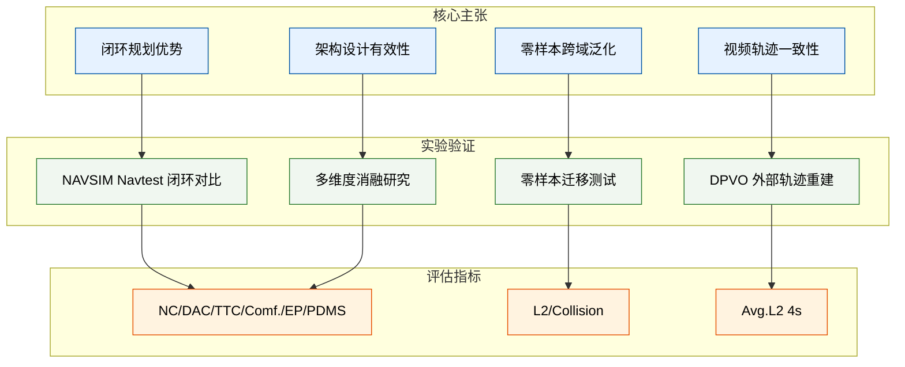
*如何读图：* 左侧为论文试图验证的四大核心主张（C1–C4），中间箭头指向对应的实验设置（E1–E4），右侧标注了各实验采用的核心评估指标。该链路表明，论文并未依赖单一指标或单一数据集，而是通过闭环综合指标、跨域零样本误差、外部重建误差与多维度消融形成交叉验证。

### 闭环规划与跨域零样本迁移
在 **NAVSIM Navtest** 闭环评估中（E1），DriveVA 与两类基线展开正面交锋：一类是传统端到端规划器（如 `VADv2-V8192`、`UniAD`、`TransFuser` 等），另一类是显式依赖世界模型的方法（如 `DiffusionDrive`、`DrivingGPT`、`LAW`、`Epona` 等）。评估覆盖 `NC↑`、`DAC↑`、`TTC↑`、`Comf.↑`、`EP↑` 与 `PDMS↑` 六项闭环指标。实验结果表明，DriveVA 在综合闭环表现上优于所列对比方法（具体数值详见文末自动附带的实验表）。这一结果初步支撑了“联合视频生成能为规划提供更丰富的场景先验”的假设。

为检验该先验是否过度拟合训练域分布，论文设计了严格的零样本迁移测试（E2、E3）。模型仅在 NAVSIM 上训练，随后**不进行任何目标域微调**，直接部署至 `nuScenes` 与 `Bench2Drive` 验证集。在 `L2(m)↓` 与 `Collision (%)↓` 指标上，DriveVA 相较于 `DriveVLA-W0` 与 `PWM` 展现出更低的误差与碰撞趋势。更具挑战性的是 E3：论文将 DriveVA 的零样本结果与一批**已在 nuScenes 上专门训练或微调**的视觉规划方法（如 `ST-P3`、`OccNet`、`VAD-Base`、`GenAD` 等）进行对齐比较。结果显示，即便缺乏目标域监督，DriveVA 仍能维持较低的轨迹误差与碰撞率。这暗示视频生成所隐含的物理与几何约束，在一定程度上补偿了域偏移带来的分布失配。

### 视频-轨迹一致性的外部检验
生成视频与预测轨迹“看起来一致”并不等于“物理上一致”。为排除模型仅靠隐式对齐或视觉欺骗过关的可能，论文引入外部视觉里程计 `DPVO` 进行独立验证（E4）。具体流程为：分别在真实未来视频（ground-truth）与 DriveVA 生成的未来视频上运行 `DPVO`，重建相机运动轨迹；随后通过 2D 相似变换（similarity transform）将重建轨迹与参考轨迹对齐，计算未来 4 秒时间窗内的 `Avg.L2 (4s)↓` 误差。该设计将“视频-轨迹一致性”转化为可量化的外部几何指标。实验表明，生成视频重建出的轨迹与预测轨迹保持低误差趋势，说明视频生成并非独立于规划的“视觉贴图”，而是与自车运动学演化深度耦合。

### 关键设计归因与训练策略消融
为厘清性能提升的来源，论文执行了覆盖架构、数据、训练与推理的密集消融（E5–E10）。

<details><summary><strong>展开查看消融实验细节与机制解读</strong></summary>

- **核心组件剥离（E5）：** 分别移除 `Video Loss`、`CARLA Mix Training` 与 `Video Continuation`。结果显示，完整配置在 NAVSIM 闭环指标上全面占优；移除视频监督或 continuation 机制会导致规划表现系统性下滑，证实视频信号并非冗余装饰，而是提供时序连贯性与场景动态先验的关键约束。
- **未来视频帧数权衡（E6）：** 在固定轨迹预测时域（K=8）的前提下，调整生成视频帧数。实验发现，与动作块时间范围匹配的帧数设置表现最佳；帧数过短会削弱视频对规划的 grounding 作用，过长则引发生成漂移累积。这揭示了生成式规划中“时序覆盖度”与“误差累积”之间的经典权衡。
- **训练策略对比（E7）：** 比较 `From Scratch`、`LoRA Fine-tune` 与 `Full Fine-tune`。`Full Fine-tune` 显著优于前两者，表明端到端全参数适配能更彻底地释放视频先验的潜力，而轻量微调或随机初始化难以充分对齐跨模态表征。
- **推理采样步数（E8）：** 改变 inference-time sampling steps。少量但非单步的采样即可逼近最佳性能，继续增加步数未带来显著收益。这为实际部署提供了明确的效率-精度折中参考。
- **模型规模与适配方式（E9）：** 对比 `5B LoRA`、`14B LoRA` 与 `5B Full Fine-tune`。规模扩大（5B→14B）带来 LoRA 适配的性能增益，但 `5B Full Fine-tune` 仍明显更优。这再次印证：对于视频-轨迹联合生成任务，参数适配的“深度”比单纯堆叠“宽度”更具决定性。
- **注意力掩码与预测范式（E10）：** 构造 `Causal Mask`（未来视频 token 无法 attend 未来动作 token）、`Action Only`（仅预测动作）变体，并与默认的 `Bidirectional` 及 `Dual-Prediction` 对比。双向注意力与联合预测策略全面胜出，说明规划与视频生成之间存在强双向依赖，切断信息流或退化为单任务预测会破坏联合优化的协同效应。
</details>

**局限性与失效模式提示：** 尽管实验矩阵完整，但解读时需保持审慎。首先，零样本迁移虽表现稳健，但 `nuScenes` 与 `Bench2Drive` 的传感器配置、标注规范与 NAVSIM 存在固有差异，论文未报告跨域误差的置信区间或方差，极端长尾场景下的失效边界尚不明确。其次，定性可视化虽直观展示了视频-轨迹对齐，但存在“挑樱桃式”展示代表性成功案例的倾向；论文在附录中补充了失败案例，指出当未来预测本身偏离物理规律时，视频与轨迹会呈现“一致的错误”，这提示联合生成框架的鲁棒性仍高度依赖底层扩散模型的分布拟合质量。最后，消融实验主要基于 NAVSIM 闭环指标，未在所有跨域设置上重复全量消融，部分结论（如 `Full Fine-tune` 的绝对优势）在算力受限或数据稀缺场景下的泛化性仍需进一步验证。

综合来看，DriveVA 的实验设计并未停留在单一指标对比层面，而是通过闭环综合评估、零样本压力测试、外部几何重建与细粒度消融，构建了严密的归因路径。视频生成在此并非独立的视觉任务，而是作为规划器的“动态沙盘”，通过联合优化将场景演化先验注入决策过程。具体数值对照与完整指标分布，请参见本节末尾系统自动生成的实验数据表。

### 实验数据表(原始数值,引自论文)

#### Causal Masking 与 Dual-Prediction 消融
- **Source**: Table 10
- **Caption**: "Causal Masking Strategy、Model Size 和 Dual-Prediction Strategy 的附加消融。"

| Module | Setting Variant | NC↑ | DAC↑ | TTC↑ | Comf.↑ | EP↑ | PDMS↑ |
| --- | --- | --- | --- | --- | --- | --- | --- |
| Causal Masking Strategy |  |  |  |  |  |  |  |
| Causal Masking Strategy | Causal Mask | 99.0 | 97.1 | 98.2 | 99.8 | 82.5 | 90.1 |
| Causal Masking Strategy | Bidirectional | 99.2 | 97.5 | 98.7 | 100 | 83.5 | 90.9 |
| Dual-Prediction Strategy |  |  |  |  |  |  |  |
| Dual-Prediction Strategy | Action Only | 89.7 | 87.4 | 89.9 | 34.9 | 27.3 | 47.0 |
| Dual-Prediction Strategy | Default | 99.2 | 97.5 | 98.7 | 100 | 83.5 | 90.9 |

#### DPVO 视频轨迹一致性
- **Source**: Table 4
- **Caption**: "用 DPVO 重建轨迹衡量视频轨迹一致性；经过 2D similarity alignment 后计算 future 4s horizon 的 average L2 error。"

| Split /Scenario | GT traj. vs. GT-video recon. Avg.L2 (4s)↓ | Pred. traj. vs.Pred.-video recon. Avg.L2 (4s)↓ |
| --- | --- | --- |
| NAVSIM | 0.09 | 0.16 |
| nuScenes | 0.07 | 0.14 |
| Average | 0.08 | 0.15 |

#### NAVSIM Navtest 闭环指标对比
- **Source**: Table 1
- **Caption**: "NAVSIM Navtest 上的闭环指标比较，方法按是否显式使用 world model 分组。"

| Method | Ref | Image | Lidar | NC↑ | DAC↑ | TTC↑ | Comf.↑ | EP↑ | PDMS↑ |
| --- | --- | --- | --- | --- | --- | --- | --- | --- | --- |
| Constant Velocity Ego Status MLP [11] | - arXiv&#x27;23 |  |  | 68.0 93.0 | 57.8 77.3 | 50.0 83.6 | 100 100 | 19.4 62.8 | 20.6 65.6 |
| Traditional End-to-EndMethods |  |  |  |  |  |  |  |  |  |
| VADv2-V8192 [29] | ICLR&#x27;26 |  |  | 97.2 | 89.1 | 91.6 | 100 | 76.0 | 80.9 |
| UniAD [27] | CVPR&#x27;23 | /νν/ν |  | 97.8 | 91.9 | 92.9 | 100 | 78.8 | 83.4 |
| TransFuser [9] | TPAMI23 |  | 【 | 97.7 | 92.8 | 92.8 | 100 | 79.2 | 84.0 |
| PARA-Drive [57] | CVPR&#x27;24 |  |  | 97.9 | 92.4 | 93.0 | 99.8 | 79.3 | 84.0 |
| ReCogDrive-IL [37] | ICLR&#x27;26 |  |  | 98.1 | 94.7 | 94.2 | 100 | 80.9 | 86.5 |
| DiffusionDrive [38] | CVPR&#x27;25 | √ | √ | 98.2 | 96.2 | 94.7 | 100 | 82.2 | 88.1 |
| WorldModel Methods |  |  |  |  |  |  |  |  |  |
| DrivingGPT [6] | ICCV&#x27;25 |  | 98.9 | 90.7 |  | 94.9 | 95.6 | 79.7 | 82.4 |
| LAW [34] | ICLR&#x27;25 |  |  | 96.4 | 95.4 | 88.7 | 99.9 | 81.7 | 84.6 |
| Epona [68] | ICCV&#x27;25 |  |  | 97.9 | 95.1 | 93.8 | 99.9 | 80.4 | 86.2 |
| Resim [60] | NeurIPS&#x27;25 | //// |  | 二 | 二 | 二 | 二 | 二 | 86.6 |
| WoTE [36] | ICCV&#x27;25 | √ | 【 | 98.5 | 96.8 | 94.9 | 99.9 | 81.9 | 88.3 |
| DriveVLA-W0 [35] | ICLR&#x27;26 | √ |  | 98.4 | 95.3 | 95.2 | 100 | 80.9 | 87.2 |
| PWM [69] | NeurIPS&#x27;25 | √ |  | 98.6 | 95.9 | 95.4 | 100 | 81.8 | 88.1 |
| Ours | - |  |  | 99.2 | 97.5 | 98.7 | 100 | 83.5 | 90.9 |

#### nuScenes 端到端规划性能
- **Source**: Table 3
- **Caption**: "nuScenes 数据集上的端到端 motion planning 性能，∗ 表示仅使用 front camera。"

| Method | nuScenes Finetune | Ref | Input | Auxiliary Supervision | L2 1s | L2 2s | L2 3s | L2 Avg. | Collision Rate 1s | Collision Rate 2s | Collision Rate 3s | Collision Rate Avg. |
| --- | --- | --- | --- | --- | --- | --- | --- | --- | --- | --- | --- | --- |
| ST-P3 [25] | √ | ECCV&#x27;22 | Camera | Map&amp;Box&amp;Depth | 1.33 | 2.11 | 2.90 | 2.11 | 0.23 | 0.62 | 1.27 | 0.71 |
| UniAD [27] |  | CVPR23 | Camera | Map&amp;Box&amp;Motion | 0.48 | 0.96 | 1.65 | 1.03 | 0.05 | 0.17 | 0.71 | 0.31 |
| OccNet [51] |  | ICCV&#x27;23 | Camera | 3D-Occ&amp;Map&amp;Box | 1.29 | 2.13 | 2.99 | 2.14 | 0.21 | 0.59 | 1.37 | 0.72 |
| OccWorld [70] | √ | ECCV&#x27;24 | Camera | 3D-Occ | 0.52 | 1.27 | 2.41 | 1.40 | 0.12 | 0.40 | 2.08 | 0.87 |
| VAD-Tiny [30] | √ | ICCV&#x27;23 | Camera | Map&amp;Box&amp;Motion | 0.60 | 1.23 | 2.06 | 1.30 | 0.31 | 0.53 | 1.33 | 0.72 |
| VAD-Base [30] |  | ICCV&#x27;23 | Camera | Map&amp;Box&amp;Motion | 0.54 | 1.15 | 1.98 | 1.22 | 0.04 | 0.39 | 1.17 | 0.53 |
| GenAD [71] | √ | ECCV&#x27;24 | Camera | Map&amp;Box&amp;Motion | 0.36 | 0.83 | 1.55 | 0.91 | 0.06 | 0.23 | 1.00 | 0.43 |
| Doe-1 [72] | √ | arXiv&#x27;24 | |Camera* | QA | 0.50 | 1.18 | 2.11 | 1.26 | 0.04 | 0.37 | 1.19 | 0.53 |
| Epona [68] | √ | ICCV&#x27;25 | Camera* | None | 0.61 | 1.17 | 1.98 | 1.25 | 0.01 | 0.22 | 0.85 | 0.36 |
| Ours | X | - | Camera* | None | 0.33 | 0.76 1.43 |  | 0.84 | 0.00 | 0.07 | 0.12 | 0.06 |

#### 关键设计消融
- **Source**: Table 5
- **Caption**: "Video Loss、CARLA Mix Training 与 Video Continuation 的消融研究。"

| ID | Video Loss | CARLA Mix Training | Video Continuation | NC↑ | DAC↑ | TTC↑ | Comf.↑ | EP↑ | PDMS↑ |
| --- | --- | --- | --- | --- | --- | --- | --- | --- | --- |
| 1 | x√ | √ |  | 95.0 | 89.0 | 93.9 | 86.6 | 59.7 | 71.4 |
| 2 |  | X | √ | 99.0 | 97.3 | 98.4 | 100 | 83.2 | 90.5 |
| 3 | √ | √ | X | 94.9 | 95.6 | 94.2 | 100 | 76.9 | 84.6 |
| 4 | √ | √ | √ | 99.2 | 97.5 | 98.7 | 100 | 83.5 | 90.9 |

#### 未来视频帧数消融
- **Source**: Table 6
- **Caption**: "改变 Future video frames 的规划指标对比。"

| Future Frames | NC↑ | DAC↑ | TTC↑ | Comf.↑ | EP↑ | PDMS↑ |
| --- | --- | --- | --- | --- | --- | --- |
| 4 | 96.6 | 91.4 | 95.5 | 93.3 | 77.2 | 82.1 |
| 8 | 99.2 | 97.5 | 98.7 | 100 | 83.5 | 90.9 |
| 12 | 98.6 | 94.4 | 97.5 | 99.8 | 79.5 | 86.7 |

#### 模型规模消融
- **Source**: Table 9
- **Caption**: "Model Size 与 fine-tuning strategy 对闭环规划指标的影响。"

| Model Size | |NC↑ | DAC↑ | TTC↑ | Comf.↑ | EP↑ | PDMS↑ |
| --- | --- | --- | --- | --- | --- | --- |
| 5B LoRA | 92.4 | 88.0 | 91.0 | 99.9 | 67.5 | 74.9 |
| 14B LoRA | 96.3 | 91.3 | 95.7 | 99.4 | 71.6 | 80.6 |
| 5B Full Fine-tune | 99.2 | 97.5 | 98.7 | 100 | 83.5 | 90.9 |

#### 训练策略消融
- **Source**: Table 7
- **Caption**: "From Scratch、LoRA Fine-tune 与 Full Fine-tune 的训练策略比较。"

| Training Strategy | NC↑ | DAC↑ | TTC↑ | Comf.↑ | EP↑ | PDMS↑ |
| --- | --- | --- | --- | --- | --- | --- |
| From Scratch | 89.9 | 76.8 | 87.6 | 99.9 | 76.8 | 62.9 |
| LoRA Fine-tune | 92.4 | 88.0 | 91.0 | 99.9 | 67.5 | 74.9 |
| Full Fine-tune | 99.2 | 97.5 | 98.7 | 100 | 83.5 | 90.9 |

#### 采样步数消融
- **Source**: Table 8
- **Caption**: "推理阶段 sampling steps 的闭环规划指标对比。"

| Steps | |NC↑ | DAC↑ | TTC↑ | Comf.↑ | EP↑ | PDMS↑ |
| --- | --- | --- | --- | --- | --- | --- |
| 1 | 61.8 | 36.9 | 50.3 | 1.9 | 36.9 | 13.2 |
| 2 | 99.2 | 97.5 | 98.7 | 100 | 83.5 | 90.9 |
| 3 | 99.1 | 97.4 | 98.7 | 100 | 83.7 | 90.9 |

#### 零样本 nuScenes 与 Bench2Drive 规划性能
- **Source**: Table 2
- **Caption**: "所有方法在 NAVSIM 训练后不做任何 fine-tuning，直接评估到 nuScenes 与 Bench2Drive。"

| Method | Finetune | Ref | nuScenes L2 1s 2s | nuScenes L2 3s | nuScenes L2 Avg. | nuScenes Collision 1s 2s 3s | nuScenes Collision Avg. | Bench2Drive L2 1s 2s 3s | Bench2Drive L2 Avg. | Bench2Drive Collision 1s 2s 3s | Bench2Drive Collision Avg. |
| --- | --- | --- | --- | --- | --- | --- | --- | --- | --- | --- | --- |
| VLA-World Model Methods |  |  |  |  |  |  |  |  |  |  |  |
| DriveVLA-W0 [35] | X | ICLR&#x27;26 | 0.431.26 2.60 |  | 1.43 | 0.220.66 1.42 | 0.77 | 1.01 2.77 5.22 | 3.00 | 1.492.53 3.53 | 2.52 |
| WorldModelMethods |  |  |  |  |  |  |  |  |  |  |  |
| PWM [69] | X | NeurIPS&#x27;25|2.063.916.00 |  |  | 3.99 | 0.12 0.15 0.86 | 0.36 | 1.70 2.743.97 | 2.80 | 4.01 3.73 3.53 | 3.76 |
| Ours | X | 1 | 0.330.761.43 0.84 |  |  | 0.00 0.07 0.12 0.06 |  | 0.691.29 2.031 | 31.33 | 1.381.97 2.65 | 51.79 |


**效果示例(论文原图):**

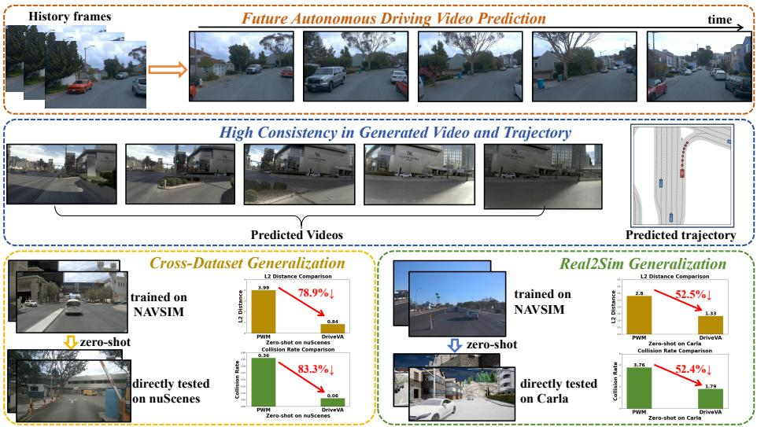

*该图直观展示了DriveVA的核心思想：模型在“脑补”未来驾驶视频画面的同时，同步生成自车行驶轨迹，确保轨迹走向与视频中的场景变化严丝合缝，实现视觉与规划的统一推演。*

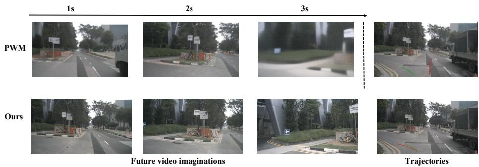

*在零样本未见过的nuScenes左转场景中，DriveVA生成的未来视频与预测轨迹高度协同，轨迹精准贴合视频中的道路走向，显著优于基线方法PWM出现的“视频左转、轨迹直行”的割裂现象。*

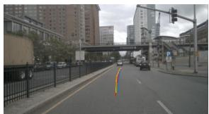

*借助DPVO技术对视频-轨迹一致性进行定性分析，在变道、右转及直行等多种典型工况下，模型预测的轨迹（Pred Future）均能紧密跟随生成视频中的场景动态演变，验证了跨模态联合生成的可靠性。*

## 相关工作与定位

**结论前置：** DriveVA 在自动驾驶世界模型谱系中的核心定位，是**将通用视频生成的时空物理先验与驾驶动作决策，在单一扩散过程中实现深度耦合**。它明确跳出了“视觉预测仅作辅助信号”或“多阶段松耦合优化”的传统范式，直接针对零样本迁移场景下频发的“视频-轨迹不一致（video-trajectory mismatch）”痛点进行结构性重构，从而在无需目标域微调的前提下，提供更稳定的闭环规划与跨域泛化能力。

### 谱系溯源与核心改动
DriveVA 并非从零构建，而是站在三条技术脉络的交汇点进行定向改造：通用视频生成（`Wan2.2-TI2V-5B`）、扩散架构（`DiT`）与驾驶世界模型（`PWM`、`DriveVLA-W0`、`Epona`、`DriveLaW`）。相对前人工作，论文在架构与训练范式上做出了三项关键替换：

| 方法/基线 | 耦合范式 | 视觉预测角色 | 零样本定位 |
|:---|:---|:---|:---|
| `PWM` | 预测-规划分离 | 独立世界模型 | 零样本存在轨迹失配 |
| `DriveVLA-W0` | 辅助信号注入 | 降级为辅助任务 | 闭环表现受限 |
| `DriveLaW` | 多阶段松耦合 | 分步优化对齐 | 依赖阶段间调参 |
| **DriveVA** | **单阶段联合生成** | **共享隐空间同步解码** | **无需微调直接迁移** |

1. **骨干替换与先验借用：** 论文直接采用 `Wan2.2-TI2V-5B` 的 text encoder 与 `3D-causal VAE` 作为预训练 video generation backbone，并将其适配至 driving-domain。其直觉在于（非严格对应）：大规模视频生成模型已在海量自然数据中隐式学习了物理合理性与时空动态规律，将其作为“时空先验底座”，比从零训练驾驶编码器更能支撑零样本规划。
2. **架构统一与联合解码：** 借鉴 `DiT` 架构，DriveVA 使用 DiT-based decoder 在 shared latent space 中同时预测 future video latents 与 future action tokens。这一设计让视觉未来与动作决策在生成过程中发生双向交互（bidirectional interaction），从结构上消除了 `DriveVLA-W0` 中视觉预测仅作为辅助信号的割裂感，也避免了 `DriveLaW` 等多阶段方法因误差累积导致的对齐漂移。

### 机制解构：为什么“联合生成”能破局？
传统世界模型往往将“看未来”与“做决策”拆分为两个独立模块，导致生成视频的运动学特征与规划器输出的轨迹在零样本场景下难以自洽。DriveVA 将两者压入同一个 generative process，本质上是让模型在隐空间中同时优化视觉连贯性与动作可行性。

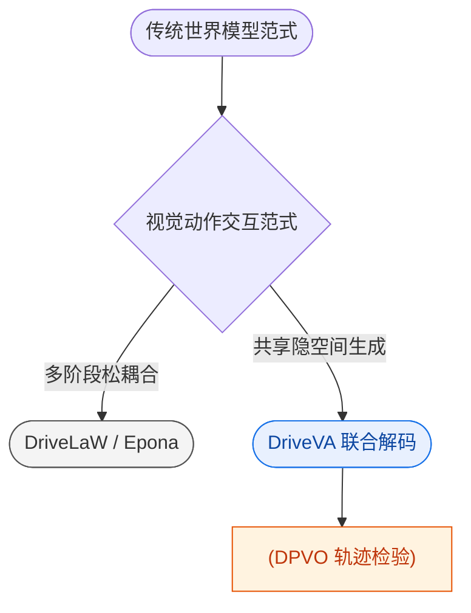
**如何读这张图：** 流程自上而下展示范式分叉。左侧分支代表依赖多阶段优化或辅助信号的传统路线（灰色），右侧分支代表 DriveVA 的单阶段联合生成路线（蓝色）。联合解码后，系统引入外部视觉里程计 `DPVO` 进行轨迹一致性校验（橙色），形成“生成-验证”闭环。该图直观暴露了论文在架构设计上的核心权衡：牺牲多阶段独立调优的灵活性，换取隐空间内视觉与动作的强一致性。

### 验证逻辑与边界审视
为证明联合生成的有效性，论文在 `NAVSIM`、`zero-shot nuScenes` 和 `Bench2Drive` 上与 `PWM`、`DriveVLA-W0`、`Epona` 等基线进行对比，并重点指出 `PWM` 在零样本可视化中存在明显的 video-trajectory mismatch。在一致性检验上，论文引入 `DPVO` 对 ground-truth future videos 与 generated future videos 进行 camera trajectory reconstruction，通过 2D similarity alignment 与 `Avg.L2` 指标提供外部视觉里程计检验，以此判断生成视频隐含运动是否与预测轨迹一致。

<details><summary><strong>局限性与未报告项审视（展开阅读）</strong></summary>
- **相关性≠因果：** 论文将零样本性能提升归因于 `Wan2.2-TI2V-5B` 的时空先验与联合解码机制，但未提供消融实验严格剥离“骨干替换”与“架构联合”各自的贡献度。性能增益可能部分源于 VAE 表征能力的提升，而非纯粹的动作-视频耦合。
- **误差范围与负结果缺失：** 报告未给出零样本跨域场景下的误差范围（如不同光照/天气分布下的方差），也未披露在极端分布偏移（distribution shift）下联合生成是否会出现隐空间坍缩或动作发散等负结果。
- **验证工具的局限：** `DPVO` 作为外部检验工具虽能评估轨迹几何一致性，但无法直接验证生成视频中的语义合理性（如交通规则遵守、障碍物避让逻辑）。论文未报告基于规则或仿真闭环的替代解释检验。
- **过度宣称风险：** 论文强调“无需 nuScenes finetune 的表现”，但零样本泛化高度依赖预训练 backbone 的领域覆盖度。若目标场景超出 `Wan2.2-TI2V-5B` 的预训练分布，联合生成机制的稳定性仍需进一步边界测试。
</details>

总体而言，DriveVA 在研究谱系中扮演了“桥梁”角色：它不追求在单一指标上刷榜，而是通过结构性改动（共享隐空间联合解码）直面世界模型长期存在的视觉-动作割裂问题。其价值在于为自动驾驶规划提供了一条可验证、可迁移的生成式路径，但零样本泛化的鲁棒性边界仍需在更严苛的消融与负结果报告中进一步夯实。

## 研究探索历程

**本节结论：** DriveVA 的架构并非初始蓝图，而是通过“放弃分支解耦转向联合生成”与“从单一动作预测转向双预测目标”两次关键迭代成型的；实验同时划定了明确边界：视觉与轨迹的强一致性仅是必要非充分条件，当底层视觉想象发生因果误判时，一致性反而会固化错误规划。

### 起点：视频生成先验能否直接迁移为驾驶策略？
**结论：** 大规模视频生成模型具备作为可泛化驾驶动作模型基础的潜力，但必须冻结其时空动态先验并替换为因果感知的视频编码结构。
研究始于对 zero-shot driving 泛化不足的反思。传统方法依赖静态图文预训练或从头训练视频动作模型，难以捕捉驾驶场景的连续物理演化。团队选择 `Wan2.2-TI2V-5B` 作为预训练骨干，保留其 frozen text encoder 与 3D-causal VAE。这一决策的直觉在于：视频生成模型已在海量数据中隐式学习了物体运动规律与场景动力学，将其作为“世界模拟器”底座，比从零学习物理常识更高效。替代方案（如仅做 LoRA Fine-tune 或依赖 VLM 风格预训练）被明确放弃，因为静态表征无法提供未来帧的时序约束，且从头训练成本与数据需求均不切实际。

### 架构抉择：视觉想象与轨迹规划必须同源
**结论：** 将未来视频隐变量与动作 Token 置于同一 DiT 的共享潜在空间联合解码，是解决 video–trajectory mismatch 的核心机制；且必须采用双预测目标（dual-prediction），单一动作预测会导致策略脱离场景演化。
早期 world model 常将视觉预测与轨迹生成弱耦合或分设分支，容易产生“画面在动，轨迹却脱节”的错位。研究提出 `shared latent generative process`，让 future video latents 与 action tokens 在同一扩散 Transformer 中共同去噪。消融实验（移除 Video Loss）证实，视频级监督并非边缘辅助项，而是规划收益的关键来源。
探索过程中经历了一次关键 Pivot：初始尝试的 Action Only 设定（仅对 action tokens 施加 denoising objective）导致动作预测失去 explicit future scene evolution 的锚定，闭环规划与一致性显著下滑。团队随即转向 Default dual-prediction，强制模型同时预测未来视频与动作，使策略生成被显式的场景演化所约束。

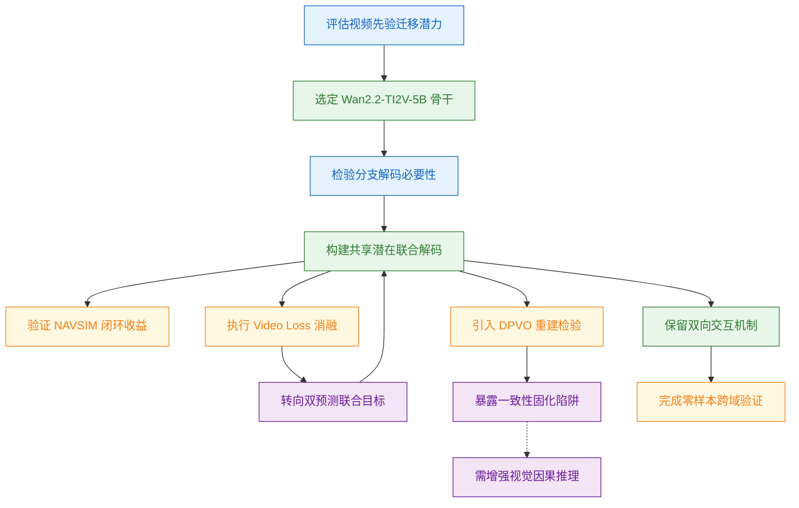
**如何读这张图：** 蓝色节点代表核心科学问题，绿色为架构决策，橙色为实验验证，紫色标记方向转折与失效边界。箭头指示依赖与触发关系，虚线表示从失败案例中提炼的教训。整体呈现“问题提出→架构试错→消融验证→边界暴露”的收敛路径。

### 验证与调优：闭环收益与窗口权衡
**结论：** 统一建模在 NAVSIM 闭环指标上超越传统端到端与 world model 基线，并具备跨域零样本迁移能力；但未来视频窗口长度与采样步数需严格折中，过长或过短均会破坏规划稳定性。
在 NAVSIM 闭环验证中，DriveVA 的收益被主要归因于 unified video-action formulation。在 nuScenes 与 Bench2Drive 上，模型在不进行 target-domain fine-tuning 的情况下仍优于对比方法，展现出 real-to-simulation transfer 能力。为验证视觉与规划的几何耦合，研究引入 DPVO 从生成视频中重建轨迹，结果显示重建轨迹与模型预测轨迹高度接近。
然而，超参搜索揭示了明确的物理约束：中等长度的未来视频窗口配合少量 flow-based sampling steps 最适配闭环规划。窗口过短导致覆盖不足，过长则引发累积漂移；采样步数过少则直接导致生成失败。论文在此处未过度宣称“越长越好”，而是如实报告了窗口长度与漂移风险的正相关关系。

### 死胡同与反思：一致性陷阱与因果推理短板
**结论：** 视觉-轨迹一致性无法自动纠正底层因果误判；在复杂交互场景中，模型可能“高度一致地犯错”，暴露出当前架构在视觉因果推理上的局限。
研究主动暴露了一个 Dead End：假设只要 video–trajectory consistency 足够强，即使场景困难也能得到可靠规划。但在 cyclist interaction 与 intersection 两类高难度案例中，DriveVA 预测了 incorrect stop。此时，生成的轨迹依然与失败的 future video imagination 保持严格一致，却与 ground-truth 行为严重背离。
这一失效模式明确指出：一致性不是充分条件。当未来视觉预测模式本身发生错误时，联合生成机制反而会放大偏差。此外，在交互机制设计上，团队对比了 Causal Mask 与 Bidirectional interaction，最终保留双向交互（允许 future video tokens 与 future action tokens 互相访问），因为单向因果掩码会切断动作对视频演化的反向塑造能力，削弱联合优化的协同效应。

<details><summary><strong>技术边界与消融细节（展开阅读）</strong></summary>

- **DPVO 重建的局限性：** DPVO 仅从生成视频的像素流中恢复几何轨迹，其本身依赖光流连续性假设。在极端遮挡或剧烈光照变化下，DPVO 重建误差会上升，此时“重建轨迹与预测轨迹接近”可能同时包含模型误差与重建误差的耦合。论文未将 DPVO 结果作为绝对真值，而是将其作为几何一致性的辅助探针。
- **Causal Mask 的负结果：** 尝试使用 Causal Mask（future action 可访问 future video，但反之不可）时，模型在长尾交互场景中表现出明显的规划迟滞。原因在于动作 Token 无法反向修正视频生成中的早期偏差，导致联合去噪过程退化为“视频主导、动作跟随”的被动模式。双向交互虽增加了计算耦合度，但显著提升了策略对场景突变的响应灵敏度。
- **采样步数与漂移的权衡：** flow-based sampling steps 过少时，扩散过程未充分收敛，生成视频出现结构撕裂；步数过多则引入冗余迭代，使未来帧偏离初始物理约束。中等步数配合中等窗口长度，在生成质量与规划稳定性之间取得了经验最优解。具体数值与误差范围见系统自动附带的实验对比表。
</details>

## 工程与复现要点

复现该系统的核心结论是：**必须全量微调视频生成先验以适配驾驶域，并在单 DiT 解码器内实现视频与动作的联合生成**。实验数据明确表明，仅靠 LoRA 微调或剥离视频监督会导致闭环规划显著退化；系统依赖 NVIDIA H20 级别的算力与 bf16 混合精度调度，且目前**未公开官方代码库**，复现需自行对齐依赖栈并严格遵循两阶段训练节奏。

### 架构选型与参数规模
架构设计的核心在于“统一视频-动作世界模型”，而非分阶段拼接。模型以 `Wan2.2-TI2V-5B` 为预训练骨干，输入视频经 3D-causal VAE 编码为时序 latent，历史观测、当前自车状态（$v_x, v_y$）与冻结的文本指令通过 cross-attention 注入。核心生成器为**单 DiT 解码器**，同时输出未来视频 latent 与动作 token（每个动作为编码自车 $(x, y)$ 位置与偏航角的 3-D 向量）。关键机制是**双向交互掩码（Bidirectional interaction）**：在去噪过程中，未来视频与动作 token 互为条件，消融证实若改为因果掩码会直接削弱规划指标，说明视频演化是主动约束而非被动背景。

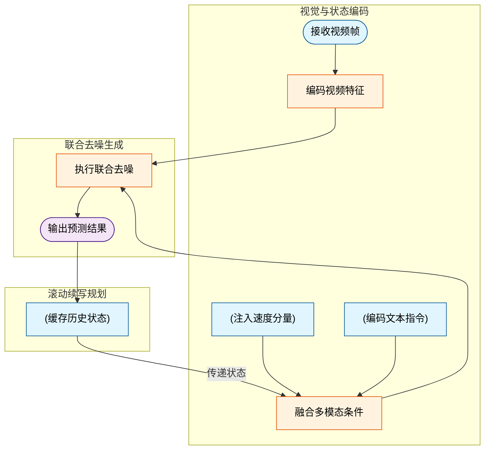
**如何读这张图**：数据流自左向右推进，圆柱节点代表条件与缓存数据，圆角节点代表起止边界，矩形代表核心计算模块。注意 `continuation_loop` 中的反馈边，它展示了短窗口续写如何通过滑动缓冲将上一轮输出重新注入条件注入模块，从而维持长时域一致性。

### 训练超参配置与消融验证
训练并非静态配置，而是严格遵循**两阶段节奏**与**联合监督目标**。第一阶段以 batch size 80 训练 20k 步快速收敛，第二阶段通过梯度累积将有效 batch 扩至 640，继续微调 10k 步。优化器采用 AdamW，基础学习率设为 $10^{-4}$，权重衰减 0.01，配合前 1k 步从 $10^{-3}$ 基础学习率开始的线性 warm-up，之后保持常数。输入分辨率固定为 $832 \times 480$，帧序列由 4 帧历史与 8 帧未来构成（2 FPS）。损失函数采用 flow-matching loss 联合轨迹预测 loss。

| 配置维度 | 推荐值 | 失效表现 |
|---|---|---|
| 骨干微调 | 全量微调 | LoRA或从头训练退化 |
| 未来帧数 | 8 帧 | 4帧不足或12帧漂移 |
| 监督目标 | 视频加动作 | 移除视频损失削弱闭环 |
| 采样步数 | 2 步 | 1步失败或3步无增益 |

### 运行环境与开源现状
硬件层面依赖 **NVIDIA H20 GPUs** 支撑分布式 bf16 混合精度训练。软件栈需对齐 `Wan2.2-TI2V-5B`、DiT 架构、3D-causal VAE、DPVO 光流/位姿估计，以及 NAVSIM v1、nuScenes、Bench2Drive、CARLA v2 等仿真与评测环境。需特别注意，**目前未检索到公开代码仓库**（非闭源声明，仅为未公开），复现需自行搭建训练管线并严格对齐上述超参。

<details><summary><strong>复现避坑与消融细节展开</strong></summary>
- **全量微调的必要性**：论文指出，视频先验的迁移需要端到端适配。LoRA 仅调整低秩矩阵，无法充分重构驾驶域特有的时空动力学，导致生成视频与真实轨迹脱节。
- **窗口长度的权衡**：8 帧（对应 K=8，时长 4s）是经验最优解。短于 8 帧无法覆盖典型路口交互周期；长于 8 帧（如 12 帧）会在自回归续写中累积误差，破坏 video–trajectory consistency。
- **双向掩码的物理意义**：Causal Mask 假设“先有画面后有动作”，但实际驾驶中动作会即时改变画面。Bidirectional 允许两者在去噪时互相校正，是维持长时域一致性的关键。
- **CARLA 混合训练**：默认最优配置包含 CARLA Mix Training。模拟数据补充了 NAVSIM 真实数据中稀缺的 corner-case，但论文强调主增益仍来自 video loss 与 video continuation 机制本身。
- **精度与显存调度**：bf16 混合精度是跑通 5B 级别模型的工程前提。若显存受限，需严格依赖梯度累积（第二阶段 effective batch 640），不可盲目缩减单卡 batch 导致优化轨迹震荡。
- **推理效率**：flow-based sampling 仅需 2 步即可达到近最优效果，1 步生成明显失败，3 步无额外收益。该特性直接支撑了高频滚动决策的实时性要求。
</details>

## 局限与适用边界

**结论前置：** DriveVA 的“视频生成驱动规划”范式在基准测试中展现了潜力，但其核心假设决定了它目前并非开箱即用的通用自动驾驶方案。该方法的性能高度依赖视觉预测的保真度与场景先验的覆盖度；一旦生成模块出现偏差，误差会沿链路级联放大，导致规划失效。它的适用边界清晰：适用于传感器配置固定、道路域相对规整的半封闭场景，对长尾交互、跨域泛化及超长时域推演仍存在明确短板。

### 误差级联与失效模式
论文的核心机制是将未来视频帧的生成作为轨迹预测的隐式引导。然而，这种“视觉先行”的设计引入了强耦合的误差传导路径。当 Video Action Models 的视觉因果推理（visual causal reasoning）与场景理解（scene understanding）不足时，生成的未来画面会偏离真实物理规律。此时，轨迹预测模块仍会盲目跟随错误的视觉 forecast，最终在闭环规划中表现为违反直觉的决策（例如在无障碍物路段错误停车）。

```mermaid
flowchart TD
    classDef proc fill:#e2e8f0,stroke:#475569,stroke-width:1px,color:#0f172a;
    classDef dec fill:#fef3c7,stroke:#b45309,stroke-width:1px,color:#78350f;
    classDef fail fill:#fee2e2,stroke:#b91c1c,stroke-width:1px,color:#7f1d1d;
    classDef safe fill:#dcfce7,stroke:#15803d,stroke-width:1px,color:#14532d;

    (["visual_pred_start"]):::proc --> {check_visual_deviation}:::dec
    {check_visual_deviation} -- 偏离真值 --> ["traj_gen"]:::proc
    {check_visual_deviation} -- 匹配真值 --> ["traj_gen"]:::proc
    ["traj_gen"] --> ["plan_exec"]:::proc
    ["plan_exec"] -- 误差传导 --> (["wrong_stop"]):::fail
    ["plan_exec"] -- 正常推理 --> (["safe_drive"]):::safe
```
*如何读这张图：* 菱形节点代表视觉预测与真实物理状态的比对门。一旦预测偏离真值，系统缺乏显式的置信度门控或纠错分支，错误信号会直接穿透至轨迹生成与闭环执行层，最终在末端表现为具体的驾驶失效。这揭示了当前架构在“预测-规划”接口处尚未建立误差隔离机制。

### 零样本宣称的泛化边界
论文在跨数据集评估中展示了从 NAVSIM 到 nuScenes 与 Bench2Drive 的迁移能力，但必须严格区分“基准间迁移”与“任意域泛化”。源文明确指出，该结论**并未证明**模型能够适应任意传感器配置、任意道路拓扑或任意长尾交互场景。零样本表现的提升主要源于训练数据分布的覆盖与视频生成带来的时序平滑，而非底层物理规则的解耦学习。若部署环境的光照、传感器外参或交通参与者行为模式显著偏离训练分布，生成模块极易产生幻觉，进而破坏规划稳定性。

### 长时域一致性与漂移的权衡
引入视频 continuation 机制确实缓解了多步预测中的时序断裂问题，提升了长时域一致性。但论文的消融实验也暴露了明确的物理边界：过长的 rollout 会不可避免地累积 drift。生成模型在自回归过程中会逐步放大微小的像素级偏差，导致远期帧的语义结构失真。这意味着在实际部署时，必须严格限制预测 horizon，或引入周期性的真实观测重置，否则规划器将基于“虚构的未来”做出危险决策。

<details><summary><strong>训练透明度与外部验证约束</strong></summary>
<ul>
<li><strong>公式与损失函数不完整：</strong>论文中 Eq. 4 至 Eq. 9 仅以片段形式呈现，无法完整还原 token 定义或联合训练损失。训练目标虽文字提及包含 future-frame generation 的 flow-matching loss 与 trajectory prediction loss，但并未显式给出轨迹预测损失的数学表达。这增加了复现难度，也使得损失权重分配的消融分析缺乏透明基准。</li>
<li><strong>DPVO 外部验证的尺度歧义：</strong>论文在外部验证环节依赖 monocular visual odometry 进行轨迹对齐。由于单目视觉存在固有的尺度模糊性（scale ambiguity），评估前必须强制进行 2D similarity transform 对齐。这一预处理步骤虽然保证了指标可比性，但也掩盖了生成轨迹在绝对尺度上的潜在偏差，读者在解读 DPVO 对齐后的误差指标时需保留尺度先验的假设前提。</li>
</ul>
</details>

**适用性判断指南：** 若您的场景具备固定传感器阵列、规整道路结构且对长时域规划 horizon 要求适中（可通过周期性观测重置控制漂移），DriveVA 的视频生成范式可作为提升时序一致性的有效组件。但若面临开放道路长尾博弈、多模态传感器异构融合或要求绝对尺度精确的闭环控制，当前架构的误差传导机制与泛化边界仍需通过显式因果建模与置信度门控进行加固。

## 趋势定位与展望

**结论：** DriveVA 标志着自动驾驶规划从“先想象、后决策”的级联范式，正式迈入“想象即决策”的联合生成阶段。其核心意义并非单纯堆砌视频先验，而是通过共享潜在生成过程，将大规模视频模型学到的物理合理性直接转化为可执行的动作约束，从而在零样本跨域迁移中展现出更强的鲁棒性。

过去的世界模型方法（如 PWM、DriveVLA-W0 或 Epona）通常将视频预测视为辅助信号或独立模块，视觉分支与动作分支仅靠特征传递维持松耦合。这种设计在训练分布内尚可拟合，但一旦进入未见交通模式或新传感器配置，视频想象与规划轨迹极易脱节（如 PWM 在零样本可视化中出现的“想象左转、轨迹直行”错位）。DriveVA 的破局点在于结构重构：它直接复用 Wan2.2-TI2V-5B 的 3D-causal VAE 与 text encoder 作为视频先验底座，并在 DiT decoder 中让 future video latents 与 action tokens 在同一扩散式生成块内双向交互。动作不再是视频生成后的独立输出，而是同一未来想象的“可执行锚点”。配合 video continuation 机制，短窗口预测得以递归滚动，有效抑制了长时域 rollout 中的结构漂移。

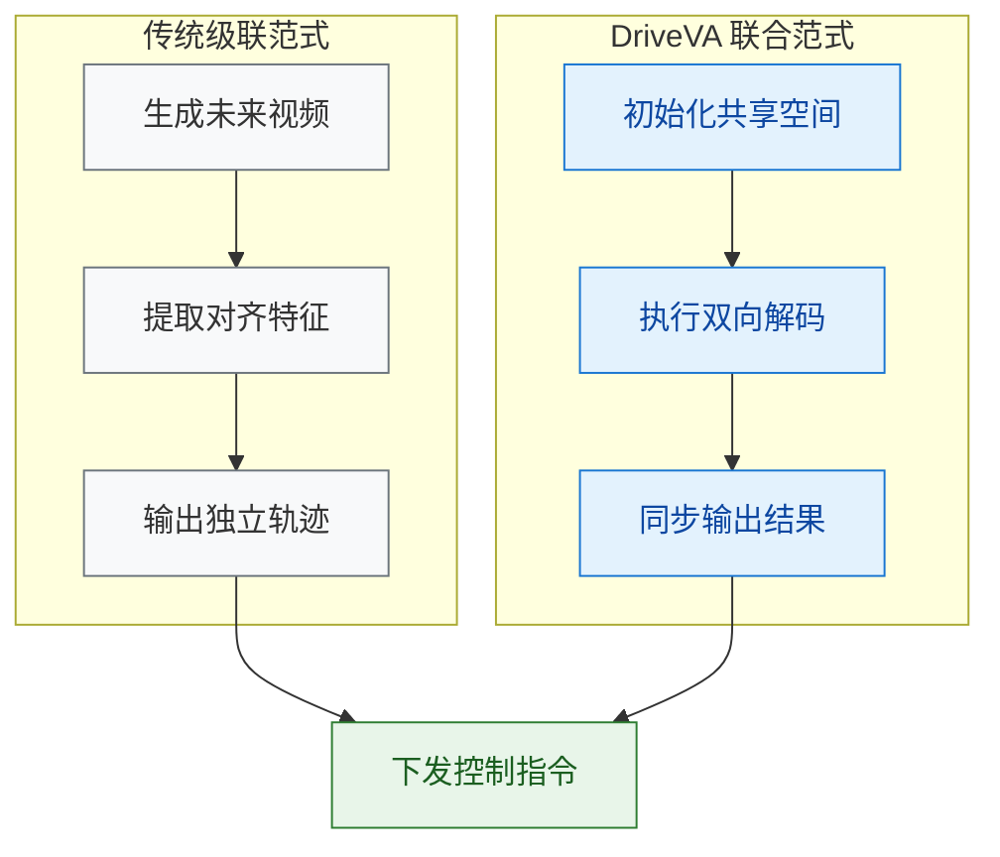
*如何读这张图：* 左侧灰色链路代表传统方法中视频与规划的串行解耦，中间的特征对齐环节是误差累积的脆弱点；右侧蓝色链路展示 DriveVA 将两者压入同一生成块，通过双向交互直接输出同步结果，最终汇入相同的闭环控制环节。

尽管论文在 NAVSIM Navtest 上报告了 PDMS 90.9 的成绩，并在 nuScenes 与 Bench2Drive 的零样本设置中优于对比基线，但读者需保持审慎：其一，视频-轨迹一致性目前主要依赖 DPVO 重建的 Avg.L2 指标进行外部验证，这证明了生成视频隐含运动与预测轨迹的几何对齐，但“视觉一致性提升”与“闭环规划收益”之间的因果链条仍需更精细的消融实验（例如剥离视频监督仅保留动作生成）来彻底剥离；其二，模型参数量达 5000.0M，在车载边缘算力上的实时推理开销尚未给出明确边界，当前结果更多反映算法上限而非工程落地现状；其三，零样本泛化虽强，但面对极端长尾事件或传感器模态突变时，视频先验的“物理合理性”是否会被分布外噪声误导，仍是开放问题。

面向下一阶段，该路线的演进将自然聚焦于三个维度：
1. **生成效率与轻量化**：将 5B 规模的扩散解码器蒸馏或替换为自回归/流匹配架构，在保留时空先验的同时压缩推理延迟。
2. **因果动作接地**：从当前的视觉相似性对齐，转向引入显式动力学约束或逆动力学模型（IDM-style grounding），确保生成的动作不仅“看起来合理”，更“物理上可执行”。
3. **多模态先验融合**：突破纯视频输入的限制，将 LiDAR 点云、高精地图拓扑与视频 latent 统一编码，使联合生成过程能同时感知几何结构与语义意图。

<details><summary><strong>延伸：消融设计与验证边界说明</strong></summary>
论文指出 video-level supervision 是 planning gains 的 main driver，并通过 dual-prediction 消融验证了联合生成的必要性。但在实际复现中需注意：DPVO 验证仅覆盖相机轨迹重建的几何一致性，未直接测量控制指令的底层执行误差；此外，长时域 video continuation 虽缓解了脱节，但递归滚动仍可能放大初始帧的微小偏差，建议在部署时引入周期性重规划或不确定性门控机制。
</details>
