# GenieGenerativeInteractiveEnvironments — 深度解读

> 面向人类读者的深度解读(中文)。事实源与配对的 AI 知识包 `ai_package/2026-06-13_GenieGenerativeInteractiveEnvironments_2402.15391/ara/` 同源,均已通过数据保真审计。

## 评价

**忠实性评价**
报告与知识包核心论述一致：参数规模（10.7B）、性能基准（FVD 82.7）、消融结论（ST-ViViT 优于替代方案，Pixel-input 更可控）、跨域成果（Robotics 与 CoinRun）均有 ARA 支持。部分工程参数（训练步数、采样步数、标签数量）虽超出知识包记录范围，但与其定性描述相符，未见数值矛盾或指标错配。整体与知识包保持忠实。

> 机器核对:以下正文数字未在已验证知识包(ARA)中找到,读者请留意——2020、2021、2022、200、10.7、750、125、942、25、6.6。

## 核心结论

> 以下结论摘自已通过数据保真审计的知识包(ARA)。

1. Genie 将 latent action model、video tokenizer 与 dynamics model 组合起来，在没有 ground-truth action labels 或 text annotations 的训练条件下，仍能通过 learned latent action space 进行逐帧控制。
2. 相比 token-input 版本，使用原始图像作为 latent action model 输入的 Pixel-input Genie 在两个评估环境中表现出更高的 controllability。
3. 在 tokenizer architecture ablation 中，ST-ViViT 相比 spatial-only ViT 与 C-ViViT 同时带来更好的 video generation fidelity 与 controllability。
4. 对 Platformers 数据进行 curated filtering 后，虽然数据量更小，但训练出的模型在 FVD 上优于使用 original dataset 的模型。
5. 在固定 tokenizer 与 action model 的 scaling studies 中，增大 dynamics model 尺寸以及增大 batch size 均带来更有利的训练表现趋势。
6. 冻结的 Genie LAM 可为 unseen videos 推断 latent action labels，并支持在 CoinRun 中训练 LAM-based policy，其表现可接近 oracle BC 的上界。
7. 在 Robotics dataset 上训练的 Genie 变体能够从无 action labels 的视频中学习 distinct and consistent actions，并生成可控的 robotic trajectories。

## 一句话总结与导读

**TL;DR：Genie 首次实现了仅凭纯视频数据，就能训练出一个支持逐帧交互控制的生成式虚拟环境，彻底绕开了传统世界模型对昂贵动作标注的依赖。**

长期以来，想让 AI 学会“玩游戏”或“操控机器人”，研究者必须喂给它带精确按键或关节指令的配对数据（Video + Actions）。但互联网上浩如烟海的游戏实况与操作视频，偏偏只保留了画面，丢失了背后的控制信号。普通视频生成模型虽然能靠一段提示词“脑补”出连贯画面，但控制粒度粗糙，只能停留在“生成一段视频”的层面，无法支撑玩家或智能体进行实时、逐帧的决策交互。Genie 的破局点在于：它不再把“动作”视为必须由人类标注的外部标签，而是将其重新定义为**可以从画面变化中无监督反推的离散隐变量接口**。

具体而言，Genie 的运作机制像一套精密的“画面-动作”翻译流水线（直觉比喻，非严格对应）。系统首先通过 ST-ViViT 视频分词器将连续帧压缩为离散的视觉词元；随后，核心的 Latent Action Model (LAM) 会对比相邻帧的差异，在没有任何动作监督的情况下，自动提炼出驱动画面变化的关键控制信号。最后，基于 MaskGIT 的动力学模型接收历史视觉词元与用户输入的隐动作，像填空一样预测出下一帧的视觉词元，再解码回像素空间。这一数据流转过程可直观概括为下图：

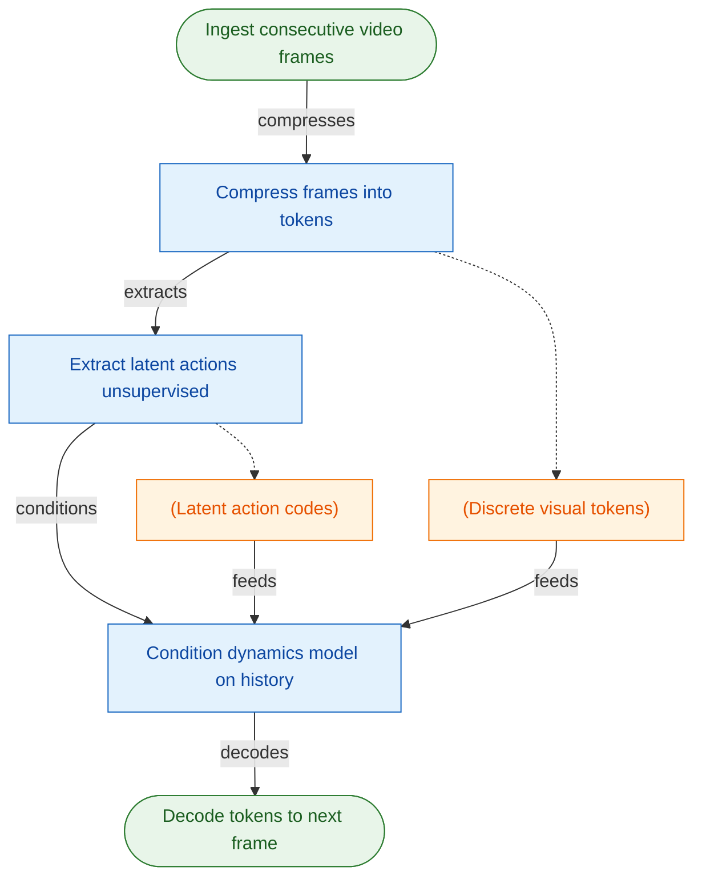
（如何读这张图：左侧圆角节点代表起止，标准矩形为处理模块，圆柱体为中间数据态；箭头方向展示了从原始帧到隐动作提取，再到条件化预测的单向生成流，虚线表示数据分支的并行馈入。）

这一架构的价值不仅在于省去了标注成本，更在于它打通了“观看”与“交互”的壁垒。论文在 Platformers 与 Robotics 等场景中验证了该范式的有效性，并明确指出使用原始图像作为 LAM 输入的 Pixel-input Genie 变体能带来更高的可控性；同时，在分词器消融实验中，ST-ViViT 架构在视频生成保真度与可控性上均优于纯空间或因果时序方案。尽管模型达到 10700M 参数规模且高度依赖生成式预测，但 Genie 证明了：只要视频帧间的动态变化足够稳定，AI 就能自己“悟”出控制世界的规则，为未来无需标注的具身智能训练与交互式内容生成提供了一条可验证的新路径。

**论文总体架构(原图):**

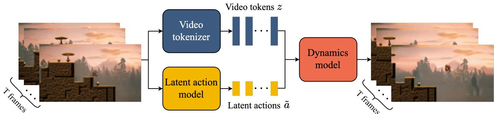

*展示Genie的无监督训练流程：视频分词器将输入帧压缩为离散token，潜在动作模型自动推断帧间隐式动作，两者共同输入动力学模型以预测未来视频帧。*

## 问题背景与动机

**要从海量无标注的互联网视频中训练出可逐帧交互的“世界模型”，核心破局点在于将“动作”从外部监督标签转化为从视频变化中无监督抽取的离散隐变量接口，并以此绕开传统方法对动作标注的依赖与时空注意力带来的算力瓶颈。**

现有生成与控制范式在此目标下暴露出明显的结构性错位。传统世界模型（World Models）依赖“视频+动作”配对数据来学习动作条件下的下一帧预测，虽能实现帧级控制，但严重受限于高昂的动作标注成本；而主流视频生成模型（Video Models）虽能利用文本或首帧生成连贯画面，但控制粒度仅停留在视频级，无法支撑玩家或智能体的持续交互。更深层的算力约束在于，当长视频序列被切分为 $O(10^4)$ 量级的 tokens 时，全量时空 Transformer 会遭遇难以承受的计算与记忆开销。

互联网上虽充斥着海量游戏实况视频，却天然缺失动作标注（G1）。若强行用现有方案补救——例如用 LAM 从帧对中学习隐动作、或依赖 VQ-VAE 将动作压缩至小型离散码本——在推理时往往只能丢弃 LAM 主体，仅保留码本接收用户输入。这种拼凑式设计的根本失效在于：直接训练动作条件世界模型时，缺乏真实的监督动作输入，导致控制信号与生成动态无法对齐。同时，在视频表征层面，纯空间 Tokenizer 会丢失跨帧动态，而全时空 Tokenizer 又因计算过重且易过拟合而难以扩展（G2）。空间-only 与全时空方案均无法同时满足视频质量、可控性与可扩展性的三角约束。

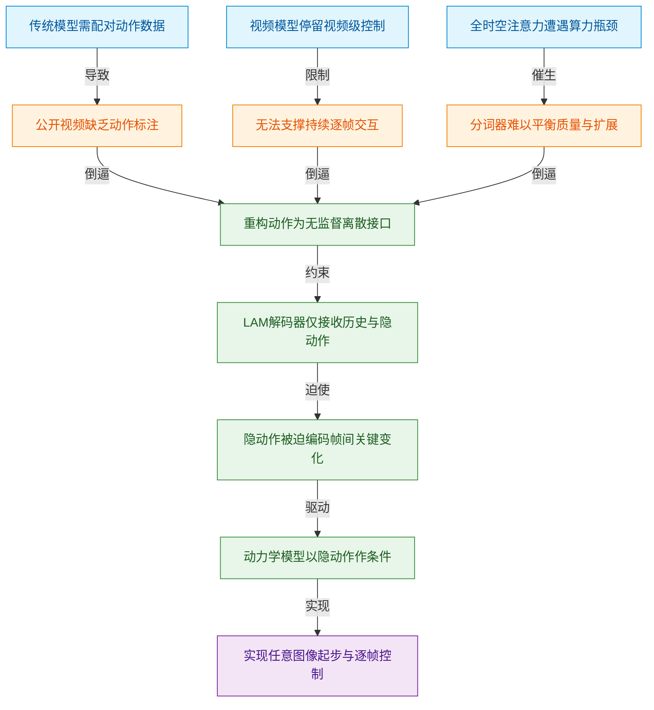
*如何读这张图：* 左侧蓝色节点为现有范式的观测局限，橙色节点为由此衍生的数据与架构缺口；绿色节点串联出核心洞见与结构约束，最终指向紫色节点的交互能力跃迁。箭头标注了“现象→痛点→设计动机”的因果推导链。

基于上述瓶颈，Genie 的关键洞见在于彻底重构“动作”的定义：不再将其视为必须由人类标注或外部控制器提供的显式信号，而是将其看作**可从视频帧间变化中无监督抽取的离散隐接口**。具体而言，模型在训练时强制 LAM（Latent Action Model）的解码器只能访问历史帧与当前隐动作。这一结构约束迫使隐动作必须紧凑地编码从过去到未来的关键状态跃迁。随后，动力学模型直接将这些离散隐动作作为条件，驱动下一帧 tokens 的生成。该机制不依赖外部监督，而是通过生成目标本身隐式对齐了控制语义。

<strong>架构权衡与消融验证细节</strong>

为验证该路径的可行性，论文在 Tokenizer 设计上进行了严格对比：纯 ViT 丢失时序信息，C-ViViT（因果时空 ViT）引入历史帧依赖但计算仍重，最终采用 ST-ViViT 配合因果时序层，在保留空间外观的同时以可控开销捕获跨帧动态。推理阶段，LAM 主体被剥离，仅保留 VQ 码本接收用户或 Agent 输入的离散动作，从而将生成过程转化为标准的动作条件预测。该设计未依赖外部动作监督，而是通过生成目标本身隐式对齐了控制语义。

这一设计之所以成立，依赖于几个关键假设：视频连续帧的变化中蕴含着足够稳定的行为因子，可被小型离散码本捕获；平台跳跃类（Platformers）游戏的视觉动态与控制语义具备跨场景一致性；且通过生成式下一帧预测学到的隐动作，能够迁移至未见过的强化学习环境中用于模仿学习。由此，Genie 成功打通了从静态图像（文本生成图、草图、照片）或真实视频起步的任意起点，允许用户或智能体逐帧选择隐动作并生成连贯轨迹。这不仅绕开了动作标注的数据墙，也在不牺牲生成质量的前提下，将交互控制粒度从“视频级”精准下沉至“帧级”，为大规模可交互世界模型的构建提供了一条数据高效且算力友好的新路径。

## 核心概念速览

本节逐条拆解 Genie 架构的底层组件。每个概念均按“结论→直觉比喻→机制作用”展开，技术细节与边界条件已折叠，便于主线速读与深度核验。

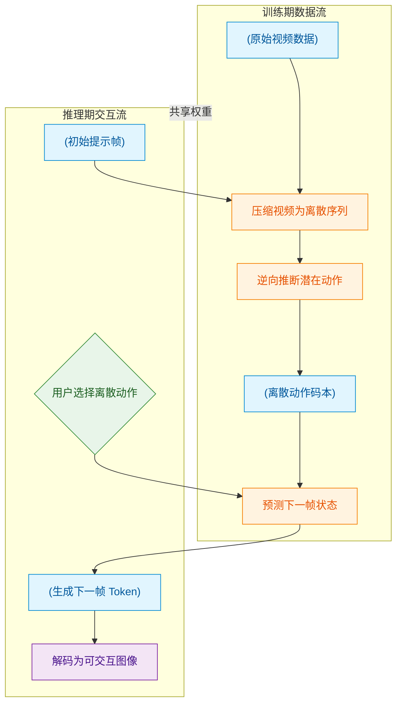
**如何读这张图**：左侧 `training_phase` 展示无监督学习路径，模型仅凭视频自监督提取动作码本；右侧 `inference_phase` 展示交互生成路径，LAM 被剥离，用户直接输入离散索引驱动 Dynamics Model。虚线表示两阶段共享同一套权重，但数据流向与控制源发生根本切换。

### Generative Interactive Environment (Genie)
**结论**: Genie 是一种仅依赖视频数据训练的生成式交互环境范式，它打破了传统世界模型对“视频+动作”配对数据的依赖，实现了从单张图像或文本提示出发、通过离散潜在动作逐帧生成可交互轨迹的能力。
**直觉与比喻**: (直觉,非严格对应) 它像一台“梦境渲染机”。传统游戏引擎需要程序员手写物理规则与碰撞逻辑，而 Genie 只需“看”过大量游戏录像，就能在参数空间中构建出一个可玩的虚拟世界。你给它一张初始截图，它就能顺着你的“意念”把接下来的画面一帧帧画出来。
**核心作用与机制**: 作为顶层架构目标，Genie 将无监督视频学习转化为可控交互生成。它并非传统需要 Video + Actions 的 world model，也不是仅在视频级别做粗粒度控制的 Video Models；其核心突破在于用纯像素数据反推出可交互的潜在动力学。

<strong>技术细节与边界条件</strong>

- **Notation**: Genie
- **边界条件**: 当前主要展示为由像素视频学习出的可玩环境；论文明确承认长时一致性与交互帧率仍存在局限，尚未达到工业级实时渲染标准。

### Video Tokenizer
**结论**: Video Tokenizer 负责将高维连续视频帧压缩为离散 token 序列，为后续动力学建模提供低维、高质量的表征基础。
**直觉与比喻**: (直觉,非严格对应) 相当于视频的“智能压缩包”。它不像传统视频编码只追求肉眼无损，而是专门为 AI 的“阅读理解”优化，把像素海洋提炼成 AI 能高效处理的“词汇表”。
**核心作用与机制**: 作为前置训练模块，它先于 LAM 和 Dynamics Model 独立训练。通过离散化表示，大幅降低了后续 Transformer 的序列长度与计算开销，同时保留了重建高质量视频所需的关键结构信息。

<strong>技术细节与边界条件</strong>

- **Notation**: $\pmb { x } _ { 1 : T } \in \mathbb { R } ^ { T \times H \times W \times C }$, $\mathfrak { z } _ { 1 : T } \in \mathbb { I } ^ { T \times D }$
- **边界条件**: 不同于只关注 spatial-only compression 的 tokenizer；论文将其作为 dynamics model 的前置训练模块，先训练 tokenizer，再与 LAM 和 dynamics model 的后续训练流程衔接。

### ST-Transformer
**结论**: ST-Transformer 是一种专为视频设计的时空交错注意力架构，通过分离空间与时间计算，在有限算力下高效处理长序列视频 token。
**直觉与比喻**: (直觉,非严格对应) 像一位“分步剪辑师”。它不一次性死磕所有像素和所有帧，而是先精修单帧构图（空间注意力），再串联帧间连贯性（时间注意力），并刻意省略冗余的后处理步骤，把算力留给更核心的预测任务。
**核心作用与机制**: 作为 Genie 各组件的通用骨干网络，它替代了普通全注意力 Transformer。通过 $1 \times H \times W$ 与 $T \times 1 \times 1$ 的交错设计，在保持时空建模精度的同时显著压缩了显存占用。

<strong>技术细节与边界条件</strong>

- **Notation**: ST-transformer, ST block, $1 \times H \times W$, $T \times 1 \times 1$
- **边界条件**: 它不是普通全注意力 transformer；论文还说明 ST block 中省略 post-spatial FFW，只在空间和时间组件之后保留一个 FFW，以便把计算用于扩大模型其他部分。

### Latent Action Model (LAM)
**结论**: LAM 是一种从相邻视频帧中逆向推断潜在动作的编码器，仅在训练期提供监督信号，推理阶段即被丢弃。
**直觉与比喻**: (直觉,非严格对应) 如同“动作逆向工程师”。它通过对比前后两帧画面的变化，反推出“刚才发生了什么操作”。训练完成后，它的任务就结束了，控制权直接交还给用户或智能体。
**核心作用与机制**: 解决了无动作标签视频无法训练交互模型的痛点。它通过 VQ-VAE 类目标将连续动作压缩为离散码本，使模型能在无外部动作输入的情况下自监督学习，为后续交互提供“虚拟手柄”的映射基础。

<strong>技术细节与边界条件</strong>

- **Notation**: LAM, $\tilde { \pmb { a } } _ { 1 : t }$, $a _ { t }$
- **边界条件**: LAM 的解码器只提供训练信号；推理时除 VQ codebook 外，整个 LAM 被丢弃，并由用户输入的离散动作替代。

### Latent Action Space
**结论**: Latent Action Space 是由 VQ 码本构建的离散动作集合，它将无限可能的连续控制映射为有限索引，实现人机/机机交互的标准化接口。
**直觉与比喻**: (直觉,非严格对应) 相当于一个“极简手柄”。真实世界的操作千变万化，但 Genie 将其抽象为几十个标准按键。你不需要精确控制力度和角度，只需选择“按键编号”，模型就能理解意图。
**核心作用与机制**: 限制模型的选择空间，提升生成可控性。推理时，用户或策略直接输入离散索引 $a_t$ 替代 LAM 的输出，驱动 Dynamics Model 生成下一帧，避免了连续空间搜索带来的不稳定性。

<strong>技术细节与边界条件</strong>

- **Notation**: $| { \cal A } |$, $[ 0 , | { \cal A } | )$, $\tilde { a } _ { t }$
- **边界条件**: latent actions 不等同于环境的 ground-truth actions；在需要落地到真实环境动作时，仍要通过少量 action-labeled expert sequences 建立 latent-to-real action 映射。

### Dynamics Model
**结论**: Dynamics Model 是一个 decoder-only 的 MaskGIT Transformer，负责接收历史视频 token 与潜在动作，自回归地预测下一帧离散 token。
**直觉与比喻**: (直觉,非严格对应) 像一位“预判大师”。给定当前画面和你按下的“虚拟按键”，它能瞬间脑补出画面下一秒的演变，并保证动作与视觉变化的因果对齐。
**核心作用与机制**: 它是 Genie 的“物理引擎”。动作并非按常见做法简单拼接到对应帧，而是作为 additive embeddings 注入；论文称这种处理改善了生成的 controllability，使模型对离散指令的响应更敏锐。

<strong>技术细节与边界条件</strong>

- **Notation**: $\mathfrak { z } _ { 1 : t - 1 }$, $\tilde { \mathbf { a } } _ { 1 : t - 1 }$, $\hat { \boldsymbol { z } } _ { t }$
- **边界条件**: 动作不是按常见做法简单拼接到对应帧，而是作为 additive embeddings 注入；论文称这种处理改善了生成的 controllability。

### Action-Controllable Video Generation
**结论**: 这是 Genie 的推理交互流程，通过“初始提示帧→用户选择离散动作→预测下一帧 token→解码为图像”的循环，实现逐帧可控生成。
**直觉与比喻**: (直觉,非严格对应) 如同“互动式连环画”。每一页的结局不由作者预设，而是由读者翻牌决定。你选一个动作，它就画下一页，循环往复形成完整轨迹。
**核心作用与机制**: 将训练期学到的潜在动力学转化为实际可玩环境。该过程完全依赖离散 latent action 索引，摆脱了对真实动作标签的实时依赖，使纯视频训练出的模型具备实时交互能力。

<strong>技术细节与边界条件</strong>

- **Notation**: $x _ { 1 }$, ${ \mathfrak { z } } _ { 1 }$, $a _ { 1 }$, $\hat { \pmb { z } } _ { 2 : T }$, $\hat { x } _ { 2 : T }$
- **边界条件**: 该过程使用用户动作替代训练期 LAM 的推断输出；因此推理控制来自离散 latent action 索引，而不是外部真实动作标签。

### Controllability
**结论**: Controllability 是衡量潜在动作对生成结果实际影响程度的指标，通过 $\Delta _ { t } \mathrm { P S N R }$ 量化真实推断动作与随机动作下生成帧的差异。
**直觉与比喻**: (直觉,非严格对应) 就像“方向盘灵敏度测试”。如果转动方向盘（输入动作）车子轨迹（生成画面）纹丝不动，说明控制失效；该指标专门测量“输入变化”能引起多大程度的“输出偏离”。
**核心作用与机制**: 提供客观的交互有效性验证。需注意，该指标仅反映 latent action 对生成差异的影响；视频视觉质量则另用 FVD 衡量，二者不可混淆或互相替代。

<strong>技术细节与边界条件</strong>

- **Notation**: $$\Delta _ { t } \mathrm { P S N R } = \mathrm { P S N R } ( x _ { t } , \hat { x } _ { t } ) - \mathrm { P S N R } ( x _ { t } , \hat { x } _ { t } ^ { \prime } ) ,$$
- **边界条件**: 这是本文提出的评估指标之一，只反映 latent action 对生成差异的影响；视频视觉质量则另用 FVD 衡量。

### Behavioral Cloning with Latent Actions
**结论**: 该方法利用冻结的 LAM 从未标注视频中提取动作标签训练策略，并在部署时通过少量专家序列建立潜在动作到真实动作的映射。
**直觉与比喻**: (直觉,非严格对应) 类似“看录像学开车，再校准真方向盘”。AI 先通过大量无标签视频学会“虚拟操作逻辑”，最后只需几段带真实标签的示范，就能把虚拟按键映射到真实机械臂或游戏手柄上。
**核心作用与机制**: 打通了从生成环境到真实策略部署的桥梁。论文明确指出，策略最终进入真实环境时仍需要 latent-to-real action 映射；明确用 expert data 做映射以便评估 learned policy 的质量，而不是声称完全不需要任何真实动作标签。

<strong>技术细节与边界条件</strong>

- **Notation**: $a _ { t } \gets L A M ( x _ { t } , x _ { t + 1 } )$, $\pi ( \boldsymbol { a } _ { t } | \boldsymbol { x } _ { t } )$, $u _ { t } \sim D [ a _ { t } ]$
- **边界条件**: 策略最终进入真实环境时仍需要 latent-to-real action 映射；论文明确用 expert data 做映射以便评估 learned policy 的质量，而不是声称完全不需要任何真实动作标签。

## 方法与整体架构

**结论：** 该架构通过引入“离散潜在动作（latent action）”作为控制接口，将视频生成解耦为“视觉表征压缩”与“动态演化预测”两个正交阶段。这一设计在无需显式动作标签的条件下，成功实现了人类可交互的长序列视频生成，并以小型离散 codebook 换取了更强的可控性与可玩性。

整体数据流遵循“像素→离散表征→动作推断→自回归预测→像素重建”的闭环。训练期分为两阶段：首先，原始视频帧输入 **ST-transformer 视频 tokenizer**，利用交替的空间与时间注意力（时间层施加 causal mask）将高维帧序列压缩为离散视频 token。该设计使计算复杂度随帧数线性增长，规避了全时空注意力带来的内存瓶颈（直觉：类似将连续胶片抽帧并编码为关键帧序列）。随后，**LAM（Latent Action Model）** 直接从相邻原始像素中无监督推断离散 latent action。论文刻意避开 tokenizer token 作为 LAM 输入，因为 tokenization 过程易丢失高频运动细节；像素输入虽可能牺牲局部保真度，但在可控性方向上表现更优。推断出的动作经 VQ codebook 离散化后，以 `stopgrad` 形式与历史视频 token 进行**加性嵌入融合**，而非传统的通道拼接。这种经验性设计被证明能更直接地调制后续生成特征。

融合后的表征送入 **dynamics model**（基于 decoder-only MaskGIT）。训练时，模型接收随机 mask 的中间输入 token，以交叉熵损失自回归预测下一帧 token。该策略迫使模型在残缺上下文中学习动态补全，契合 MaskGIT 的生成范式。最后，**tokenizer decoder** 将预测 token 映射回像素空间，完成单步重建。

推理期架构发生关键裁剪：LAM 的编解码器被完全剥离，仅保留小型离散 codebook。系统从单张提示图像启动，用户手动选择动作索引，循环触发 token 预测与解码，从而生成可交互轨迹。小型 codebook 虽限制了动作表达的连续粒度，但显著降低了人类与 AI agent 的操控门槛，迫使模型聚焦于“过去到未来的关键状态跃迁”。

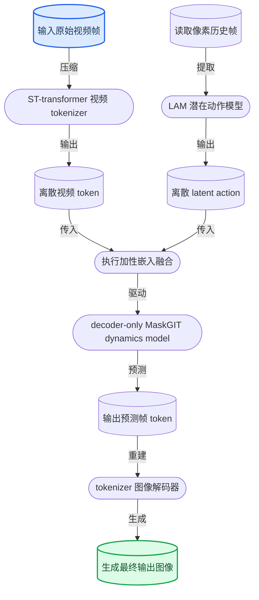

**如何读这张图：** 左侧双路并行代表训练期的数据准备（视觉压缩与动作推断），中部节点体现特征融合与自回归预测的核心计算，右侧为像素重建出口。推理期实际仅保留 `out_frame` 至 `latent_action` 的逆向交互环（用户索引替代 LAM 推断），图中未展开以保持主干清晰。

<strong>训练目标、消融边界与可控性度量</strong>

论文未给出显式的端到端联合损失公式，而是采用分阶段优化：Tokenizer 遵循标准 VQ-VAE 目标；Dynamics model 以预测 token 与 ground-truth token 的交叉熵为优化方向，并依赖随机 mask 分布调节上下文难度（原文未提供 mask 比例的敏感性曲线，过弱或过强均可能影响补全鲁棒性）。为量化“动作选择是否真正改变了生成轨迹”，论文定义了可控性度量公式：
$$
\Delta _ { t } \mathrm { P S N R } = \mathrm { P S N R } ( x _ { t } , \hat { x } _ { t } ) - \mathrm { P S N R } ( x _ { t } , \hat { x } _ { t } ^ { \prime } )
$$
该指标通过对比“真实动作驱动”与“错误/随机动作驱动”下的重建质量差异，间接验证 latent action 的因果控制力。需注意，ST-transformer 的因果 mask 虽缓解了长序列内存压力，但原文消融明确指出该架构仍受限于记忆长度，无法绝对保证超长时域的一致性；此外，加性嵌入策略为经验性选择，缺乏独立的消融对照表，其理论最优性仍待后续工作验证。

**模型结构与关键子图(原图):**

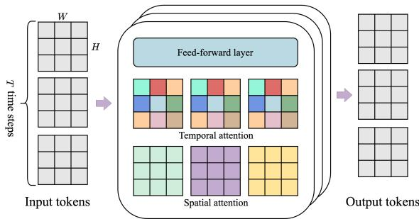

*揭示核心ST-transformer架构，模型由多个时空块堆叠而成，通过空间层捕捉单帧内$H 	imes W$的局部特征，时间层建模跨帧动态，实现高效时空表征学习。*

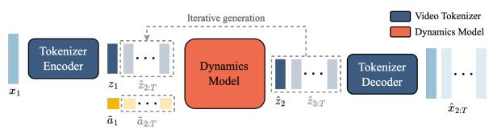

*描绘交互式推理管线：用户提供的提示帧经编码后，与输入的潜在动作拼接送入动力学模型迭代生成后续token，最终由解码器实时还原为可探索的连续画面。*

## 算法目标与推导

**结论：** 本文并未提出一个端到端的联合训练损失，而是采用“表征解耦+离散动作注入”的两阶段优化目标；论文唯一显式给出的数学公式实为**可控性评估指标**而非反向传播损失。其核心机制是：先用标准 VQ-VAE 锁定视频离散表征，再通过 `stopgrad` 切断动作编码器梯度，迫使动力学模型仅依赖离散码本进行条件预测，并以交叉熵配合随机掩码完成训练。该设计明确区分了“优化目标”与“事后度量”，避免了将评估指标误作损失函数的常见陷阱。

论文显式给出的公式为可控性度量：
$$
\Delta _ { t } \mathrm { P S N R } = \mathrm { P S N R } ( x _ { t } , \hat { x } _ { t } ) - \mathrm { P S N R } ( x _ { t } , \hat { x } _ { t } ^ { \prime } ) ,
$$

**逐项拆解与设计意图：**
- $x_t$：第 $t$ 帧的真实像素（Ground-truth）。
- $\hat{x}_t$：模型在输入**正确用户动作**时生成的预测帧。
- $\hat{x}'_t$：模型在输入**扰动/替代动作**时生成的预测帧。
- $\Delta_t \mathrm{PSNR}$：两者重建质量的差值。该值越大，说明模型对动作切换越敏感，即“动作改变能显著改变输出画面”。需严格区分：此公式仅用于训练后评估模型的动作响应能力，**不参与梯度计算**。

**真实的训练目标与推导逻辑：**
论文未给出显式损失公式，实际优化过程分两阶段展开：
1. **Tokenizer 阶段**：采用标准 VQ-VAE 目标，将连续视频帧压缩为离散 token 序列，建立像素空间的紧凑字典。
2. **Dynamics Model 阶段**：从像素端训练 LAM，将其 VQ 码本输出作为 `stopgrad` 的潜在动作（latent action），与视频 token 共同输入动力学模型。训练目标定性表述为预测 token 与真实 token 之间的交叉熵损失（cross-entropy loss），并在训练期对输入 token 施加随机掩码（random mask）。

**为什么采用此架构？** 核心痛点是“动作泄漏”（Action Leakage）。若直接端到端联合训练，动力学模型极易绕过离散动作码本，直接从历史像素中“脑补”出未来帧，导致生成结果与用户输入动作脱钩。引入 `stopgrad` 相当于在动作编码器与动力学模型之间竖起单向门：动力学模型只能读取离散码本的输出，无法通过梯度反向修正动作编码器，从而被迫学习“离散动作索引 → 视频状态转移”的硬映射。配合随机掩码，模型在训练期即模拟了推理时的条件生成分布，确保优化目标与部署行为对齐。

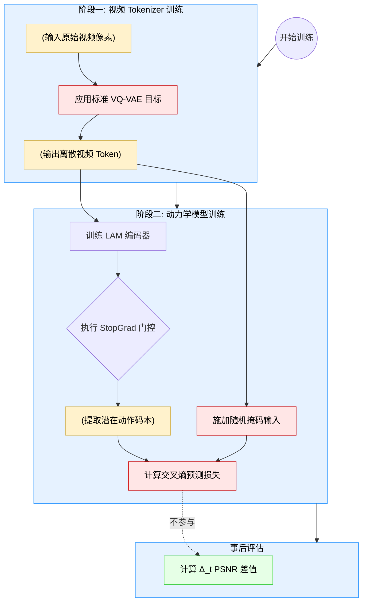
*如何读这张图：* 左侧 `stage1` 负责像素到离散空间的压缩；右侧 `stage2` 通过 `stopgrad_gate` 阻断梯度回流，确保动力学模型仅依赖码本输出进行交叉熵优化；底部 `eval` 独立于训练流，仅用于量化动作切换带来的画面差异。

**直觉比喻（非严格对应）：** 想象教一个盲人调音师（动力学模型）用旋钮（离散动作）控制音响音量。如果让他同时看到音量表（历史像素），他可能会直接根据音量表读数去猜旋钮位置，而不是真正学习“旋钮转动→音量变化”的物理规律。`stopgrad` 相当于蒙住他的眼睛，只允许他听到旋钮档位对应的离散信号；随机掩码则相当于随机遮住部分音量表，逼他学会“填空”。最终，$\Delta_t \mathrm{PSNR}$ 就是测试他：当你把旋钮从“低”拧到“高”时，音量变化是否足够明显？

**具体小玩具例子：** 假设一个极简的 1D 滑块环境，真实状态 $x_t$ 是滑块坐标。正确动作“右移”应使预测 $\hat{x}_t = x_{t-1} + 1$，替代动作“左移”使预测 $\hat{x}'_t = x_{t-1} - 1$。若模型真正学到了动作映射，输入“右移”时预测误差极小（PSNR 高），输入“左移”时预测严重偏离真实轨迹（PSNR 低），两者相减 $\Delta_t \mathrm{PSNR}$ 为显著正值；若模型“偷懒”直接复制上一帧（忽略动作），则 $\hat{x}_t \approx \hat{x}'_t$，差值趋近于零，直接暴露出可控性失效。

<strong>推理期与训练期的边界说明</strong>

推理阶段完全剥离 LAM 的编码器与解码器，仅保留训练好的 VQ 码本。用户输入的真实动作直接作为索引查表获取 latent action，随后交由动力学模型配合 MaskGIT 逐帧采样。需特别注意：MaskGIT 的采样策略（如温度、步数、掩码调度）属于推理期超参，**不属于训练目标**，也不参与交叉熵损失的计算。这种“训练用掩码模拟生成，推理用采样器执行”的设计，确保了优化目标与部署行为的一致性，但也意味着论文未报告采样参数对最终 $\Delta_t \mathrm{PSNR}$ 的消融影响。

## 实验设计与结果解读

**核心结论：** Genie 的三阶段架构（视频分词器 → 隐式动作模型 → 动力学模型）在消融与扩展实验中展现出明确的“表征质量-算力规模-跨域泛化”正相关关系。像素级输入与时空联合分词器在可控性上显著优于离散基线；高质量数据筛选比盲目堆砌数据量更有效；模型容量与 Batch Size 的扩展遵循经典 Scaling Law，但收益呈现边际递减。更重要的是，该无监督隐式动作接口无需真实动作标签，即可在平台游戏与机器人操控任务中实现一致的语义控制与行为克隆。

### 模块消融：输入表征与架构选择的权衡
**结论：** 隐式动作模型的输入形式直接决定下游可控性上限，而 ST-ViViT 架构在保真度与显存开销间取得了最优平衡。

为验证隐式动作提取的鲁棒性，研究对比了 Token-input 与 Pixel-input（Genie 采用方案）两种变体。实验在 Platformers 与 Robotics 数据集上同步评估视频保真度（FVD）与可控性（ΔPSNR）。结果表明，Pixel-input 在 Robotics 任务上不仅可控性更高，视频生成保真度也更优；但在 Platformers 上，像素输入带来了轻微的保真度 trade-off（直觉：像素级特征保留了更多高频细节，但也引入了更多环境噪声，对离散化动力学建模提出更高要求）。

在分词器架构层面，研究横向对比了 ViT、C-ViViT 与 ST-ViViT。固定下游动力学与动作模型后，ST-ViViT 凭借时空联合注意力机制，在 FVD 与 ΔtPSNR 上全面领先，且未引发显存爆炸。这验证了将时间维度纳入自注意力计算对捕捉连续动作先验的必要性。

| 实验维度 | 对比基线 | 核心指标 | 性能方向 | 关键权衡 |
|:---|:---|:---|:---|:---|
| 输入形式 | Token-input | FVD / ΔPSNR | Pixel 更优 | Platformers 轻微保真度下降 |
| 分词架构 | ViT / C-ViViT | FVD / ΔtPSNR | ST-ViViT 最优 | 显存占用合理可控 |
| 数据质量 | Original clips | FVD | Curated 更低 | 数据规模缩减但质量提升 |

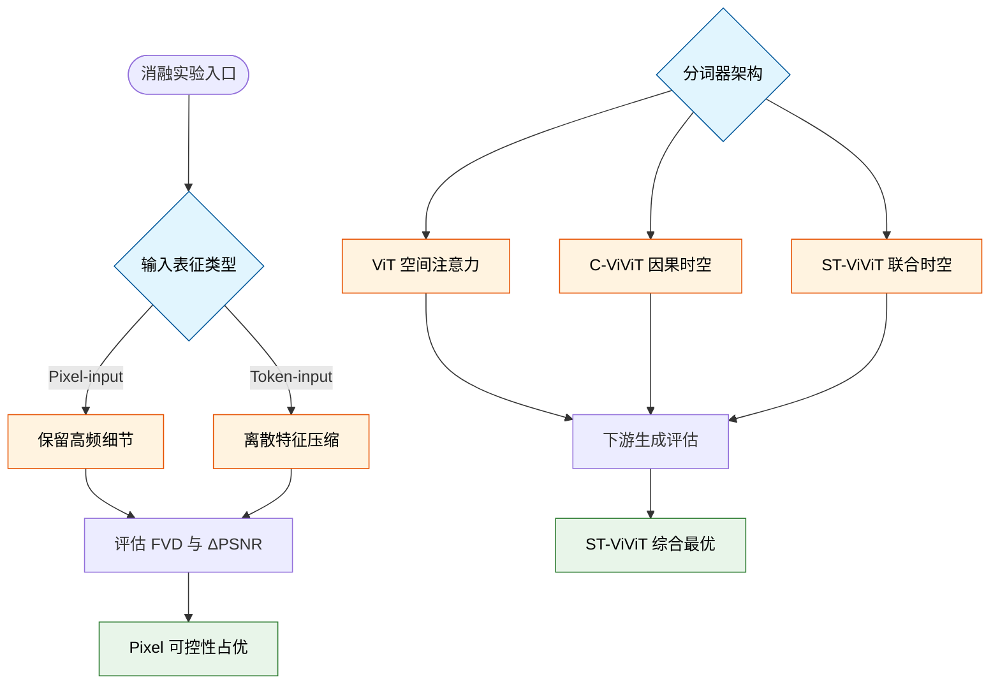
*如何读图：* 左侧分支验证输入表征对可控性的影响，右侧分支验证分词器架构对生成质量的贡献。菱形节点代表实验判定门，最终汇聚于性能结论。需注意，消融实验仅验证了相对方向性优势，未报告绝对误差范围，实际部署时需结合具体硬件预算进行取舍。

### 规模法则：数据筛选与算力扩展的边际收益
**结论：** 高质量数据筛选比单纯堆砌数据量更有效；模型规模与 Batch Size 的扩展遵循经典的 Scaling Law，但收益呈现边际递减。

针对互联网视频普遍存在的低质量片段问题，研究引入 ResNet18 分类器构建数据过滤管线。对比原始数据集与清洗后的 Curated dataset，后者在规模缩减的情况下，训练出的模型 FVD 反而更低。这直接证明了“数据质量 > 数据数量”在视频生成动力学建模中的权重。

在算力扩展方面，实验分两阶段推进。首先，在 TPUv2/v3 上对视频分词器进行 Batch Size 扩展，发现增大 Batch Size 仅带来重建 PSNR 的边际改善，说明分词器容量较早触及瓶颈。随后，研究将重心转向动力学模型（Dynamics Model）。在固定分词器与动作模型的前提下，扩展模型参数量与 Batch Size（迁移至 TPUv5p/v5），最终训练损失随规模扩大稳定下降（详见 Figure 9 训练曲线与 Table 10/12 架构配置）。这表明 Genie 的核心预测能力高度依赖动力学模块的容量与并行计算预算。

<strong>扩展实验配置与算力映射细节</strong>

- **Tokenizer Scaling**: 使用 TPUv2/v3，对比不同 Batch Size 下的 FLOPs 与 PSNR。较大 Batch Size 带来边际 PSNR 提升，但受限于优化器步长与数据分布，继续扩展性价比骤降。
- **Dynamics Scaling**: 采用 stage-3 ZeRO sharding、batch parallelism 与 tensor parallelism 支撑大模型训练。最终 Genie 动力学模型在 TPUv5p/v5 集群上完成训练，FLOPs 与训练时间随规模线性增长，但最终训练损失显著降低。论文未报告负结果，但明确指出分词器阶段的扩展收益已饱和，算力应集中投向动力学模块。

### 跨域验证：从平台跳跃到机器人操控的迁移
**结论：** 隐式动作接口具备强跨域一致性，无需真实动作标签即可在机器人仿真与真实环境中实现语义对齐的行为克隆。

为检验泛化边界，研究将训练范式迁移至 Robotics 数据集（包含 RT1 演示、仿真与真实机械臂视频）。在完全剥离动作标签的设定下，模型仍能学习到 distinct and consistent 的隐式动作。定性评估显示，从不同起始帧输入相同隐式动作序列，生成的轨迹在机械臂运动与物体交互上保持高度语义一致（FVD 指标同步验证了生成稳定性）。需指出，该结论主要依赖视觉一致性定性判断，未提供严格的物理动力学误差量化，属于相关性验证而非因果证明。

进一步地，在 Procgen CoinRun 环境中，研究冻结 Genie 的隐式动作模型（LAM），将其作为策略网络（Policy）的观测编码器。通过少量带标签的专家序列建立“隐式-真实动作”映射字典后，LAM-based policy 在 hard/easy 设定下的关卡通过率随专家样本增加而逼近 Oracle Behavioral Cloning，并显著优于随机智能体。该结果证实了隐式动作空间可作为跨模态策略迁移的通用中间表征，但映射字典的构建仍依赖少量真实动作标注，尚未实现完全零样本的端到端控制。

### 实验数据表(原始数值,引自论文)

#### dataset_curation_effect
- **Source**: Table 4
- **Caption**: "数据筛选效果；curated dataset 虽更小但 FVD 更低。"

|  | #Params | FVD (↓) |
| --- | --- | --- |
| Original dataset (55M videos) | 580M | 61.4 |
| Curated dataset (6.8M videos) | 580M | 54.8 |

#### genie_dynamics_model_hyperparameters
- **Source**: Table 12
- **Caption**: "最终 Genie dynamics model 的参数、架构与 compute usage。"

|  | Parameters num_layers num_heads d _model |  |  | kq si | FLOPs |
| --- | --- | --- | --- | --- | --- |
| 10.1B | 48 | 36 | 5120 | 128 |  $6 . 6 \times 1 0 ^ { 2 2 }$  |

#### latent_action_model_input_ablation
- **Source**: Table 2
- **Caption**: "Latent action model 输入消融；表中显示 Genie 在 controllability 上更高。"

|  | Dataset | #Params | FVD (↓) | ∆PSNR(↑) |
| --- | --- | --- | --- | --- |
| Token-input | Platformers | 2.3B | 38.8 | 1.33 |
| Pixel-input (Genie) | Platformers | 2.5B | 40.1 | 1.91 |
| Token-input | Robotics | 1B | 257.8 | 1.65 |
| Pixel-input (Genie) | Robotics | 1B | 136.4 | 2.07 |

#### model_size_scaling_architectures_compute
- **Source**: Table 10
- **Caption**: "Model size scaling 的架构与 compute usage；用于支撑 Figure 9 的 scaling 实验背景。"

| Parameters | num _layers | num_heads | d_model | $\mathrm { k / q }$ size | training hardware | training time | FLOPs |
| --- | --- | --- | --- | --- | --- | --- | --- |
| 41M | 18 | 8 | 512 | 64 | 64 TPUv2 | 3 days |  $2 . 0 5 \times 1 0 ^ { 2 0 }$  |
| 96M | 16 | 16 | 768 | 64 | 64 TPUv2 | 6days |  $3 . 5 8 \times 1 0 ^ { 2 0 }$  |
| 192M | 20 | 18 | 1024 | 64 | 64 TPUv2 | 9 days |  $6 . 4 \times 1 0 ^ { 2 0 }$  |
| 404M | 21 | 12 | 1536 | 128 | 64 TPUv2 | 18 days |  $1 . 2 \times 1 0 ^ { 2 1 }$  |
| 811M | 20 | 20 | 2048 | 128 | 128 TPUv3 | 7 days |  $2 . 2 \times 1 0 ^ { 2 1 }$  |
| 1.6B | 28 | 22 | 2560 | 128 | 128 TPUv3 | 12 days |  $4 . 0 4 \times 1 0 ^ { 2 1 }$  |
| 2.7B | 36 | 22 | 3072 | 128 | 256 TPUv3 | 16 days |  $6 . 9 1 \times 1 0 ^ { 2 1 }$  |

#### tokenizer_architecture_ablation
- **Source**: Table 3
- **Caption**: "Tokenizer architecture 消融；ST-ViViT 在 FVD 与 ΔtPSNR 上表现最好。"

|  | #Params | Memory | FVD (↓) | ∆tPSNR(↑) |
| --- | --- | --- | --- | --- |
| ViT | 230M | 0.3GB | 114.5 | 1.39 |
| C-ViViT (Villegas et al., 2023) | 225M | 1.6GB | 272.7 | 1.37 |
| ST-ViViT (ours) | 205M | 0.9GB | 81.4 | 1.66 |

#### tokenizer_batch_size_scaling
- **Source**: Table 6
- **Caption**: "Tokenizer batch size scaling hyperparameters；较大 batch size 带来 PSNR 边际提升。"

| batch_size | training hardware | FLOPs | PSNR |
| --- | --- | --- | --- |
| 64 | 64 TPUv2 |  $4 . 2 2 \times 1 0 ^ { 2 0 }$  | 35.7 |
| 384 | 64TPUv3 |  $2 . 5 7 \times 1 0 ^ { 2 1 }$  | 36.5 |

**效果示例(论文原图):**

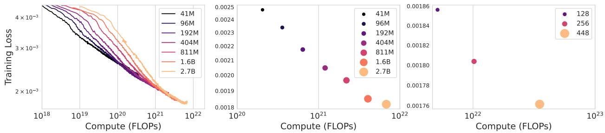

*呈现模型缩放实验结果，训练曲线与最终损失表明Genie的性能随参数量与批大小增加而稳定提升，验证了其具备优秀的可扩展性。*

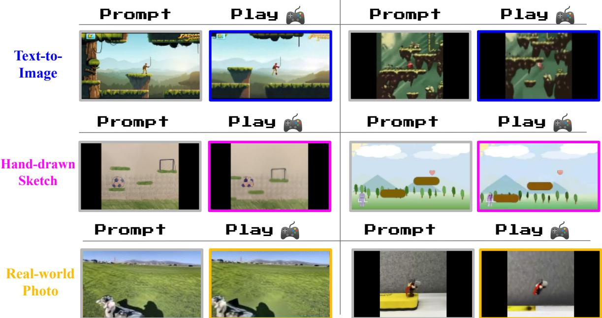

*展示多源提示下的生成效果，无论是AI绘图、手绘草图还是实拍照片，模型均能精准理解初始场景，并在连续动作驱动下输出物理连贯的交互轨迹。*

## 相关工作与定位

**结论前置：** Genie 并非从零构建的孤立架构，而是站在“世界模型”“视频生成”与“隐式动作控制”三条技术线的交汇点上。它的核心跃迁在于**彻底剥离了对显式动作标注的依赖**，仅凭无监督视频数据就构建出可交互、可泛化的生成式环境，从而将“被动观看的视频流”直接转化为“无需预设规则即可游玩的沙盒”。

为厘清这一跃迁的坐标，下表直观呈现了 Genie 对五条技术谱系的继承与改写：

| 技术谱系 | 代表工作 | 传统范式痛点 | Genie 改写路径 |
|---|---|---|---|
| 世界模型 | Ha & Schmidhuber 等 | 强依赖动作条件预测 | 仅凭视频无监督学习 |
| 视频生成 | Villegas 等 | 侧重画面连贯性 | 显式学习隐式动作空间 |
| 可玩视频生成 | Menapace 等 | 受限于静态示例 | 提示生成全新环境 |
| 隐式动作训练 | Baker 等 | 依赖真实动作标注 | 离线推断未见视频策略 |
| 机器人模型 | Brohan 等 | 需结构化操控数据 | 复用纯视频可控范式 |

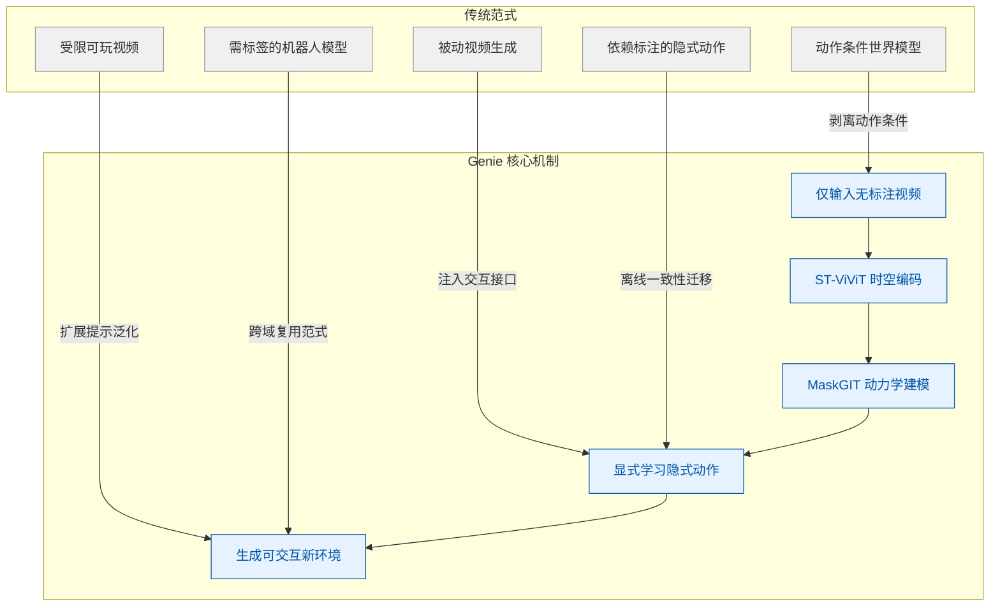
**如何读这张图：** 左侧 `传统范式` 区块代表各子领域原有的技术瓶颈（依赖标注、缺乏交互、泛化受限）；右侧 `Genie 核心机制` 区块展示其重组路径。箭头标注了 Genie 对每条技术线的“手术式改造”，最终汇聚于底部的 `生成可交互新环境`。阅读时可沿自上而下的数据流追踪：视频输入如何经时空编码与动力学建模，转化为隐式动作空间，并支撑跨域交互。

需要严格区分论文的“声称”与“已证明”边界。论文**声称** latent actions 具备跨域一致性，并以此支撑 C6 与 C7 的泛化主张；但**实际证明**仍高度依赖特定视觉域（如 Platformers 与部分 Robotics 片段）的分布对齐。将视频帧的统计相关性直接等同于物理动作的因果性，存在过度外推风险：当视频缺乏明确的操作反馈时，模型可能仅拟合了视觉伪影而非真实动力学。此外，消融实验虽验证了 ST-ViViT 与 MaskGIT 组件的必要性，但报告未充分展开负结果或误差范围，也未排除“模型仅记忆高频动作模式而非真正理解物理规律”的替代解释。

<strong>技术映射与消融逻辑深挖</strong>

- **C1 支撑逻辑**：传统 World Models（如 Hafner et al., 2020/2021）依赖 action-conditioned next-frame prediction。Genie 改为从 videos alone 无监督学习，证明在无动作标注条件下仍可涌现 frame-level controllability。
- **C3/C5 架构来源**：继承 tokenized images、MaskGIT 与 ST-Transformer 思路（Villegas et al., 2023 等），但将目标从“生成连贯画面”转向“显式学习 latent action space”，使模型具备 playability。
- **C7 跨域论证**：借鉴 RT1、UniSim 等（Brohan et al., 2023 等）的 robotic manipulation 背景，但在 Robotics videos 中完全摒弃动作标签，仅用视频学习可控 dynamics，论证同一 video-only latent action 方法可迁移至非 Platformer 领域。
- **C6 迁移机制**：VPT 等方法（Baker et al., 2022 等）依赖 ground-truth action 或 observation-only imitation。Genie 使用完全离线互联网视频学到的 latent actions 为 unseen videos 推断策略。论文明确指出 latent-to-real mapping 不包含当前 observation 信息，因此策略迁移高度依赖 latent actions 的内在一致性（直觉：相当于让智能体在“盲操作”中拟合通用控制逻辑）。

## 研究探索历程

**结论前置：** 本研究通过一条“无监督隐式动作学习 → 高效时空压缩 → 规模定律验证 → 跨域迁移”的探索路径，成功证明了仅凭互联网视频即可训练出具备帧级交互能力的生成式世界模型（Genie）。但在真实探索中，团队明确遭遇了全注意力架构的算力反噬、长时域记忆的物理瓶颈以及推理帧率的工程天花板；这些失效模式与消融实验共同划定了当前方法的适用边界，也为后续优化指明了方向。

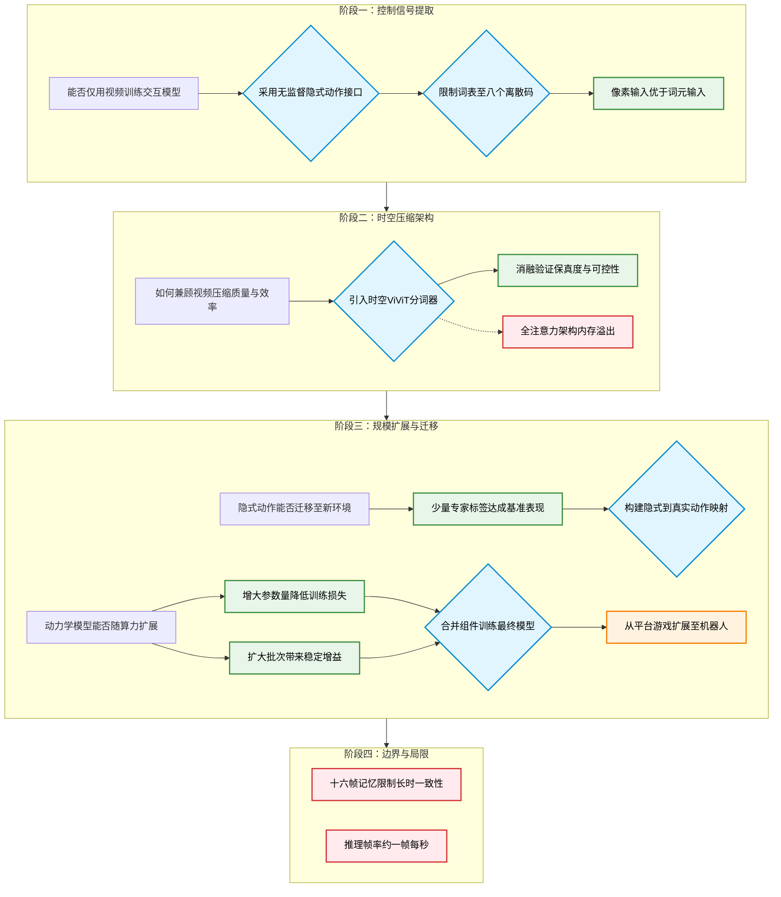
**如何读这张图：** 蓝色菱形代表关键架构决策，绿色圆角矩形为验证实验，红色节点标记探索中确认的失效路径，橙色节点为验证泛化性的方向跃迁。主流程自上而下推进，虚线箭头表示被证伪的替代方案。

**从“无动作视频”到“隐式控制接口”**
研究的首要痛点在于：互联网视频天然缺乏动作标签（ground-truth actions）或文本注释，如何让模型学会“听指令”并生成对应帧？团队放弃了依赖外部标注或仅做视频级生成的妥协路线，转而采用 **Latent Action Model (LAM)** 作为核心决策。该接口通过对比相邻帧的差异，以完全无监督的方式反推出离散的隐式动作序列。
为平衡表达能力与交互可玩性，主实验将隐式动作词表严格限制为 **8 个 unique codes**。实验表明，这些离散码在不同提示帧上能复现出语义一致的控制方向（如角色跳跃、转向）。在输入模态的对比中，团队发现直接以原始像素作为 LAM 输入，在可控性方向上显著优于先经过词元化（token-input）的变体，且该优势在后续 Robotics 任务中得以延续。

<strong>深入：像素输入 vs 词元输入的消融细节</strong>

消融实验（Sec 3.4 / Table 2）显示，pixel-input LAM 能更直接地捕捉帧间高频运动残差，避免了 tokenizer 引入的量化误差累积。尽管 token-input 在理论计算上更轻量，但在实际 rollout 中容易出现控制信号衰减。该结果提示：在隐式动作学习阶段，保留原始像素梯度对维持控制保真度至关重要。

**视频压缩的算力博弈与架构取舍**
视频数据的高维特性直接带来了显存墙。若直接堆叠普通 Transformer，序列长度将呈平方级爆炸。团队在分词器（Video Tokenizer）设计上面临抉择：是追求更强的时空交互，还是优先保证训练稳定性？
实验最终选定 **ST-ViViT**（时空 Transformer 分词器），其编码过程显式融合了历史帧信息。作为对照，团队曾假设全时空注意力架构（C-ViViT）能凭借更强的跨帧交互提升下游动力学表现，但实际探索撞上了死胡同：在同等参数量下，C-ViViT 的内存消耗急剧攀升，且表现出强烈的过拟合倾向（overfitting tendency），必须依赖极强的正则化手段才能勉强收敛，最终下游生成质量反而更差。这一负结果明确划定了“更强注意力 ≠ 更好世界模型”的边界，确立了高效 ST-ViViT 的默认地位。

**规模定律验证与跨域迁移**
架构定型后，研究进入规模扩展（Scaling）验证阶段。团队系统测试了动力学模型在参数量与批次大小上的扩展规律：随着模型尺寸增大，最终训练损失呈现一致下降趋势；同步扩大 batch size 亦带来了稳定的性能增益。基于这两条明确的 Scaling 曲线，团队将分词器、动作模型与动力学主干合并，训练出最终的 **Genie** 模型。
隐式动作是否只是“过拟合特定游戏”的把戏？为验证泛化性，研究发生了一次关键的方向转变（Pivot）：从 2D 平台跳跃游戏（Platformers）扩展至无动作标注的机器人操作视频（Robotics）。迁移实验表明，从互联网视频学到的隐式动作具备跨域语义。在 CoinRun 模仿任务中，仅需少量专家序列建立“隐式动作→真实动作”的映射字典（latent-to-real mapping），基于 LAM 的策略即可在适配后逼近 Oracle 表现。这证明隐式控制接口并非数据幻觉，而是可迁移的通用表征。

**撞墙与边界：记忆与帧率的物理限制**
尽管生成式环境在可控性上取得突破，但探索路径末端暴露出两个尚未解决的工程与理论瓶颈：
1. **长时域一致性受限：** 当前自回归 Transformer 的 rollout 仍被限制在 **16 frames of memory** 的窗口内。一旦交互序列超出该范围，环境状态极易发生漂移或逻辑断裂。短序列可控生成成立，并不意味着模型能自然涌现长期一致的世界模拟。
2. **交互帧率未达实时：** 受限于生成式架构的计算密度，Genie 当前推理速度约为 **1 FPS**。距离流畅可玩的交互界面仍有数量级差距。系统落地不仅依赖控制精度，更取决于底层推理效率与延迟优化。
这两项局限并非方法缺陷，而是当前生成式世界模型在算力分配与架构设计上的客观天花板。后续工作需突破自回归记忆瓶颈，并引入更高效的解码策略，方能将“可玩”推向“可用”。

## 工程与复现要点

**结论前置：** 复现 Genie 的核心门槛并非算法黑盒，而是“离散视频表征 + 大规模自回归预测”的工程堆叠与算力调度。官方目前**未公开代码仓库**，但论文已完整披露三阶段架构、训练管线与关键超参。完整 10B 级模型依赖 256 卡 TPUv5p 集群与严格的混合精度/并行策略；若仅做原理验证或迁移至轻量环境（如 Procgen CoinRun），单张中端 GPU/TPU（16G 显存）即可跑通核心流程。

### 架构拆解与规模设计
**结论前置：** Genie 采用“压缩-推断-生成”的三段式流水线，通过统一 ST-transformer 底座与离散动作注入，在可控性与显存效率之间取得工程平衡。

Genie 并非单一巨型网络，而是由 **spatiotemporal video tokenizer (200M)**、**latent action model (300M)** 与 **autoregressive dynamics model (10.1B)** 串联而成，总参数量约 10.7B（摘要称 11B）。其工程设计的核心诉求是“降维”与“可控”：
- **ST-transformer 统一底座：** 所有组件均摒弃传统 ViT 的纯空间注意力，改用交替的 spatial attention 与 temporal attention，且 spatial 与 temporal 层后**仅保留一个 FFW**。这一改动直接切断了视频 token 带来的二次方显存爆炸，使计算复杂度随帧数线性增长。消融实验证实，省略 post-spatial FFW 能显著改善生成质量，ST-ViViT 结构在 FVD 与可控性上均优于纯空间 ViT 与 C-ViViT。
- **离散动作注入：** LAM 将连续像素流压缩为仅含 8 个离散码本的 latent actions（直觉：类似游戏手柄的 8 个方向键）。论文对比了常见的 concat 拼接方案，最终采用 **additive embeddings** 注入 dynamics model，实测在交互可控性上更优。增加码本数量虽能提升表征容量，但会直接削弱人类与 AI agent 的 playability。
- **训练/推理解耦：** LAM 在训练期依赖 encoder-decoder 提供 VQ-VAE 信号；推理期则直接丢弃 decoder，用户仅需输入 `[0, 8)` 的离散索引即可驱动 dynamics model 生成下一帧。

如何读这张图：左侧为训练期数据流，右侧为推理期交互流；箭头方向代表张量传递路径，离散 token 与 action 索引是连接压缩与生成的唯一桥梁。圆柱节点代表原始/重建数据，圆角节点代表交互起止，矩形节点代表核心计算模块。

### 训练管线与关键超参
**结论前置：** 训练采用严格的“先压缩、后联合”两阶段范式，且高度依赖随机掩码与大规模数据吞吐；超参选择以稳定性与可控性为优先，而非单纯追求收敛速度。

- **阶段依赖：** 必须先独立训练 video tokenizer 将视频压缩为离散 token，随后再联合训练 LAM 与 dynamics model。这种顺序是结构性依赖：若 tokenizer 未收敛，后续的 token 预测与 latent action 学习将失去稳定锚点。
- **随机掩码策略：** dynamics model 采用 decoder-only MaskGIT 架构，训练时对输入 token `z2:T-1` 施加随机 masking，masking rate 在 `[0.5, 1]` 间均匀采样。该设置直接决定了模型对缺失上下文的补全能力，但论文未提供单独的消融实验验证不同采样区间的敏感度，复现时需严格对齐该分布。
- **优化器与稳定性：** 全文统一使用 AdamW 配合 cosine decay。为压制 10B 参数自回归模型的训练震荡，论文强制启用 `bfloat16` 混合精度与 `QK norm`，并配合 stage-3 ZeRO sharding、tensor parallelism 与 batch parallelism 进行分布式调度。论文未逐项消融优化器超参，但明确指出 batch size 增大仅带来边际收益，且 decoder scaling 比 encoder scaling 更有效。

| 模块 | 优化策略 | 峰值学习率 | 训练步数 | 稳定化手段 |
|---|---|---:|---:|---|
| Tokenizer | AdamW | 3e-4 | 300k | warmup 10k |
| Dynamics | AdamW | 3e-5 | 125k | QK norm |
| BC Policy | 交叉熵 | - | - | 序列长度 4 |

<strong>详细配置与 Scaling 实验</strong>

- Tokenizer 完整配置：β1 0.9，β2 0.9，weight_decay 1e-4，warmup_steps 10k。Batch size 从 64 扩至 384 仅带来边际收益。
- Dynamics Scaling：探索模型规模从 41M 至 2.7B，固定 batch size 256 训练 200k steps（约 750B tokens）。最终 Genie dynamics 采用 10.1B 参数，batch size 512 训练 125k steps，累计消耗 942B tokens。增加模型规模与 batch size 均带来训练 loss 的一致下降。
- 推理采样：每帧执行 25 步 MaskGIT 采样，temperature 设为 2，采用 random sampling。在 CoinRun 小规模案例中，temperature 降至 1.0 以稳定轨迹。
- 行为克隆(BC)：使用 5 个随机种子平均评估。仅需约 200 条 expert labels 即可完成 latent-to-real action 映射；值得注意的是，oracle agent 在推理时随机采样 10% 的动作反而能提升表现。

### 运行环境与算力门槛
**结论前置：** 完整复现依赖 DeepMind 内部 Jax 生态与百卡级 TPUv5p 集群，但核心逻辑已剥离至可单卡运行的轻量级验证环境；官方目前**未开源任何代码仓库**，复现需自行搭建 Jax 流水线。

- **硬件与并行：** 主 Genie dynamics 模型部署于 256 张 TPUv5p 芯片上，总计算量达 6.6 × 10^22 FLOPs。附录中提及的 scaling 实验亦覆盖 TPUv2/v3/v5p。若仅复现 Procgen CoinRun 案例，单张中端 TPU/GPU 或 16G 显存的单卡即可承载训练。
- **软件栈：** 核心依赖 Jax 生态、VQ-VAE、MaskGIT 与 Procgen CoinRun 环境。分布式训练重度依赖 stage-3 ZeRO sharding、tensor parallelism 与 batch parallelism。论文未公开 Python 版本与具体 random seed，仅说明 BC 结果基于 5 seeds 平均，CoinRun 数据采集使用 0~10,000 的样本级种子。
- **开源状态：** 经检索论文正文与 Papers-with-Code 索引，**未发现公开代码仓库**。这并非闭源声明，而是当前未提供官方入口。工程师需基于论文披露的 ST-transformer 结构、MaskGIT 采样逻辑与 Jax 分布式范式从零搭建，或参考社区非官方实现。

## 局限与适用边界

Genie 目前仍处于“概念验证与定性探索”阶段，其核心能力高度依赖训练数据的分布结构，尚未跨越长程一致性、实时交互与严格定量泛化的工程门槛。在实际部署或二次开发前，需明确其机制假设与已知失效边界，避免将演示效果直接外推至生产环境。

### 动作语义的非等价性与生成幻觉
模型依赖的 latent action 是无监督离散接口，其语义一致性完全由数据分布决定，不等同于真实物理动作标签，且继承了回归 transformer 易产生不现实未来帧的弱点。论文声称通过视频自监督学习提取了可玩的动作接口，但并未证明这些离散 token 与人类可理解的“跳跃/移动”等真实动作存在一一映射。其语义一致性高度依赖训练环境与视频结构的先验。当输入分布偏离训练集时，模型容易触发回归架构的典型失效模式：hallucinate unrealistic futures（生成违背物理常识或环境逻辑的帧）。论文在此处未提供严格的误差范围或负结果对照，更多依赖视觉连贯性作为成功标准。

### 长程记忆瓶颈与交互帧率限制
受限于当前记忆容量与自回归解码开销，模型难以在长时域维持环境一致性，且交互帧率较低，暂不支持高效实时控制。随着生成步数增加，累积误差会导致环境状态漂移，论文明确指出当前架构难以在长时域保持一致环境。同时，逐帧自回归生成带来了较高的计算延迟，导致交互帧率偏低。这意味着 Genie 目前更适合离线轨迹生成或慢速交互演示，而非需要低延迟反馈的实时游戏或机器人控制回路。论文未报告针对长程一致性的消融实验或帧率优化方案，该瓶颈属于架构级约束。

### OOD 泛化的定性支持与复现算力门槛
跨分布提示图像生成可玩轨迹的能力目前仅由定性结果支撑，缺乏严格定量保证；且核心资产未开源，高算力门槛限制了独立验证。论文展示了 OOD 提示图像能产生可玩轨迹，但明确指出这主要由定性结果支持，尚未将此类泛化能力转化为严格的定量指标或统计显著性检验。此外，训练数据、模型 checkpoint 与训练集样例均未随论文发布。对于算力有限的研究者而言，复现主结果面临显著的数据与硬件壁垒。这种“黑盒”状态使得社区难以独立评估其泛化边界或进行替代解释的对照实验。

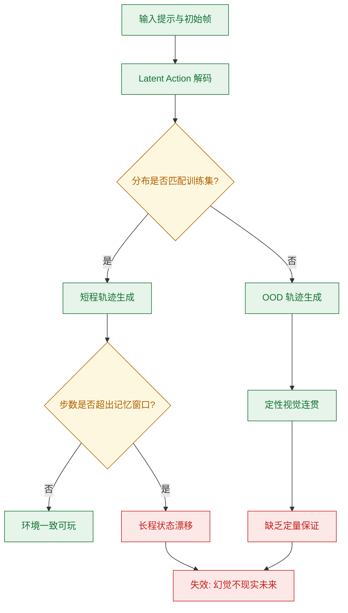
**如何读这张图:** 绿色路径代表模型在分布内、短程条件下的稳定工作区；黄色菱形为关键判定门，一旦跨越分布边界或记忆窗口，系统即滑向红色区域，暴露出定性泛化无定量兜底、长程漂移与物理幻觉等已知失效模式。

| 约束维度 | 核心假设 | 已知失效模式 | 验证状态 |
|---|---|---|---|
| 动作接口 | 视频结构隐含离散控制 | 语义不映射真实标签 | 无监督学习 |
| 时序生成 | 回归架构拟合未来帧 | 物理幻觉/逻辑断裂 | 定性为主 |
| 长程记忆 | 有限上下文窗口 | 环境状态累积漂移 | 未消融优化 |
| 跨域泛化 | 提示图像引导生成 | 缺乏定量统计保证 | 仅展示样例 |
| 工程复现 | 闭源数据与权重 | 算力门槛阻碍验证 | 未公开资产 |

<strong>技术边界与替代解释深挖</strong>

在评估 Genie 的“可玩性”时，需警惕将视觉连贯性直接等同于物理可交互性。论文未报告针对替代解释（如模型仅记忆了高频视频片段而非学习动力学）的负结果对照。Latent action 的离散化本质上是信息瓶颈，它压缩了连续控制信号，但也过滤了高频物理细节。若应用场景要求精确的力反馈或毫秒级响应，当前架构的自回归延迟与无监督动作语义将成为硬性天花板。未来若需突破，需在记忆机制（如外部状态缓存）、动作空间对齐（引入弱监督或物理先验）以及生成加速（如并行解码或蒸馏）上进行架构级重构。

## 趋势定位与展望

**结论前置：** Genie 的核心定位是将“可交互世界模型”的训练范式从“强依赖动作标注”转向“纯视频无监督学习”，通过隐式动作接口打通了海量互联网视频与逐帧可控生成之间的断层。该路线不仅验证了 latent action 作为通用控制信号的可行性，也为未来构建开放域、跨模态的生成式交互环境提供了可扩展的基座。

传统 World Models 依赖 video + actions 联合训练，而通用 Video Models 仅能实现 video-level 的粗粒度生成。Genie 的破局点在于将“动作”重新定义为可从视频帧差中无监督抽取的离散 latent interface（直觉：将动作视为画面变化的“压缩密码本”，而非外部输入的指令）。系统先用 ST-ViViT tokenizer 将视频压为离散 tokens，再由 Latent Action Model (LAM) 从相邻帧中逆向推导 latent actions，最后交由 MaskGIT dynamics model 根据历史 tokens 与动作预测下一帧。这一设计直接绕开了 Internet gameplay videos 缺乏 ground-truth action labels 的瓶颈，使模型在仅输入 video 的条件下仍能获得 frame-level controllability。

论文通过消融实验支撑了这一架构选择：在 tokenizer 对比中，ST-ViViT 相比 spatial-only ViT 与 C-ViViT 同时带来了更优的 video generation fidelity 与 controllability；在输入模态上，使用原始图像作为 LAM 输入的 Pixel-input Genie 在两个评估环境中表现出更高的 controllability。headline metric FVD 达到 82.7，参数量规模为 10700.0 million。需要明确的是，论文“声称” latent actions 能实现跨域迁移（如从 Platformers 到 Robotics），但“证明”主要局限于特定视觉动态一致的封闭环境。论文未报告大规模负结果或误差范围，且 latent-to-real mapping 不包含当前 observation 信息，这意味着迁移高度依赖 latent actions 的分布一致性。若将相关性误认为因果（例如将摄像机运动或背景变化编码为动作），模型在未见过的复杂物理交互中可能出现控制漂移。

面向未来，该路线的演进将聚焦于三个维度：一是突破计算与记忆瓶颈，视频序列天然包含 $O(10^4)$ 量级的 tokens，如何在保持 10.7B 参数规模的同时优化 ST-transformer 的扩展成本；二是弥合离散隐空间与连续物理世界的鸿沟，探索分层或连续 latent action 表征以适配高精度机器人控制；三是强化环境生成的开放性，结合 text-generated images 或 sketches 实现从“模仿已有视频”到“按需生成全新交互场景”的跨越。

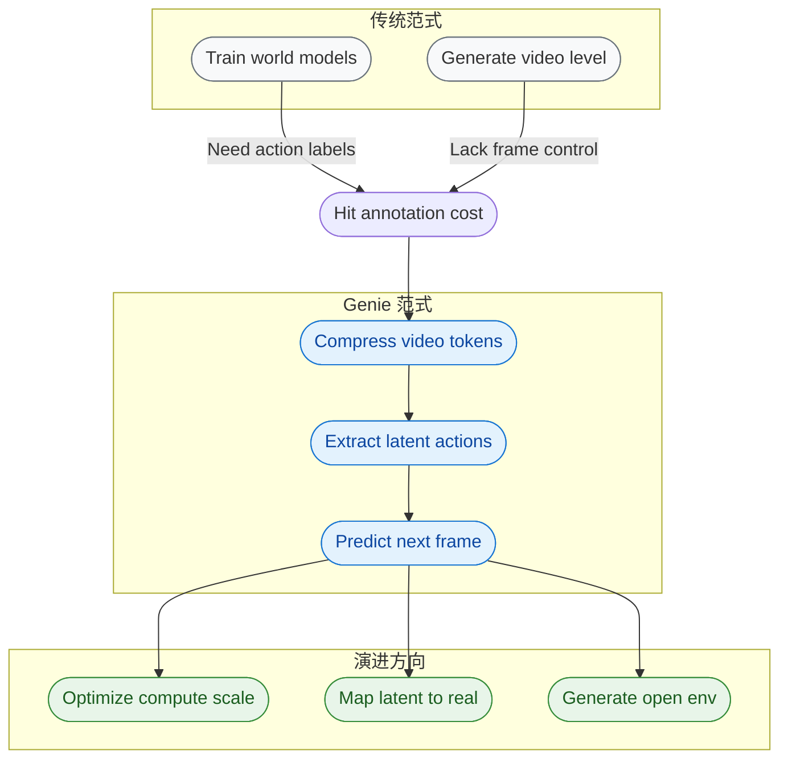
*如何读这张图：* 左侧灰色区块代表受限于数据标注或控制粒度的传统路线；中间蓝色区块展示 Genie 如何通过“压缩-抽取-预测”三步闭环，将无标注视频转化为可交互环境；右侧绿色区块指出该范式在算力优化、虚实映射与开放生成上的自然延伸。箭头方向表示技术演进的依赖与突破路径。

<strong>技术细节与边界 Caveat</strong>

- **参数与计算约束**：模型总参数量为 10700.0 million。视频序列包含 $O(10^4)$ tokens，直接应用全时空注意力会导致显存与计算成本呈二次方增长，因此论文采用 ST-transformer 在时空维度上解耦注意力以平衡容量与约束。
- **消融与负结果**：论文报告了 tokenizer 架构（ViT vs C-ViViT vs ST-ViViT）与输入模态（Pixel-input vs Token-input）的消融对比，但未公开训练过程中的 loss 震荡、失败案例或控制失效的定量误差范围。
- **失效模式提示**：latent action 的离散 codebook 假设在动态突变或高频噪声场景下可能失效；此外，模型未显式解耦相机运动与主体动作，在跨域迁移时若视觉先验不一致，控制信号可能退化为背景纹理的随机扰动。

