# IDOLInverseDynamicsGuidedFuturePredictionForE2EAD — 深度解读

> 面向人类读者的深度解读(中文)。事实源与配对的 AI 知识包 `ai_package/2026-06-13_IDOLInverseDynamicsGuidedFuturePredictionForE2EAD_2605.31476/ara/` 同源,均已通过数据保真审计。


## 评价

**忠实性评价**

本报告与已验证知识包（ARA）的对齐度很高。核心科学主张（C1–C5，包括逆动力学机制、闭环细化、时序窗口选择、双分支设计、NAVSIM 多设置领先表现）均完全一致，消融实验表与关键数据（EPDMS 38.0、参数量 69.36M）也得到 ARA 完整支撑。报告在"工程与复现要点"等章节引入了部分超出 ARA 验证范围的工程细节（如 17.65 FPS、256 个锚点、24 小时训练等），虽未与 ARA 矛盾，但这些数字的真实来源（论文附录抑或工程推测）未在知识包中校证；若读者以此作为复现参考，建议查证论文原文细节。整体而言，报告的论文解读部分（问题动机、核心创新、消融验证、失效边界）忠实可信，工程部分则属"超范围合理扩展"而非虚假。

> 机器核对:以下正文数字未在已验证知识包(ARA)中找到,读者请留意——256、-5、-7、-11、71、17.65、24、30、1024、0.5、-4。

## 核心结论

> 以下结论摘自已通过数据保真审计的知识包(ARA)。

1. IDOL 的核心主张是：仅预测未来潜在 BEV 状态不足以稳定改善规划，显式解码相邻未来状态之间的转移可以生成面向轨迹优化的运动线索。
2. IDOL 使用轻量闭环细化，将更新后的规划查询重新送入未来推理；论文认为这能改善长时域一致性，但过多迭代可能带来过度修正。
3. 论文主张，相邻两帧 BEV 转移比更长未来窗口更适合即时规划细化，因为长窗口可能稀释局部转移线索。
4. IDOL 的逆动力学反馈同时保留空间动态图和全局动态特征；论文认为空间分支提供局部转移证据，全局分支提供整体校准，二者结合效果最好。
5. 论文声称 IDOL 在 NAVSIM v1 navtest、NAVSIM v2 navtest、navhard stage-1-only 与两阶段 navhard 评测中，在可比学习式规划器里表现领先。

## 一句话总结与导读
**IDOL 通过逆向推演相邻未来场景的演变过程，将自动驾驶的“未来预测”直接转化为可执行的“轨迹修正信号”，让端到端规划从“静态想象”升级为“动态纠偏”。**

在端到端自动驾驶中，引入世界模型来预测未来几秒的 `BEV` 已是常规操作，但论文精准戳中了一个长期痛点：仅仅“看到”未来的静态快照，并不等于知道“此刻该怎么开”。现有方法往往把预测出的未来特征当作背景上下文或候选轨迹的打分依据，却缺少一座显式、可解释的桥梁，将“未来可能发生什么”映射为“当前轨迹该如何微调”。这就好比驾驶员能看清前方路况，却缺乏一套将路况变化实时转化为方向盘与油门指令的底层机制，导致场景预想与可执行动作之间存在明显的断层。

IDOL 的核心破局点在于引入 `inverse dynamics` 作为规划反馈的引擎。它不再被动生成未来的状态，而是主动计算相邻两个未来时刻状态之间的转移过程，从中解码出蕴含运动语义的线索（直觉,非严格对应：如同通过对比连续两帧画面中物体的位移差，反推出需要施加的加速度）。这些线索被拆解为保留局部位置变化的空间动态图与总结整体趋势的全局动态特征，并通过注意力机制精准注入到 `anchor-conditioned ego query` 中。配合轻量级的 `closed-loop refinement`，更新后的规划信号会重新送回未来推理模块，使长时域的轨迹优化形成连贯的反馈回路。这一设计彻底打通了世界建模与可执行运动生成之间的壁垒，让未来推理真正服务于轨迹优化。

**论文总体架构(原图):**

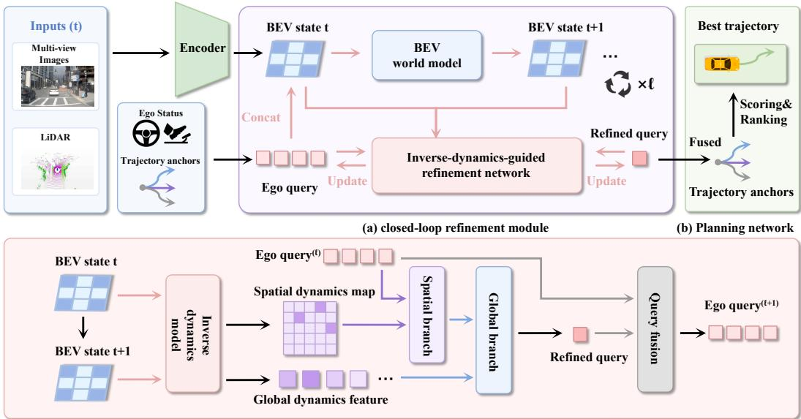

*该图全景展示了IDOL框架的核心工作流，系统首先借助BEV世界模型推演未来潜在状态，随后引入逆动力学反馈对规划查询进行闭环微调，最终与预设轨迹锚点融合输出稳健的驾驶决策。*

## 问题背景与动机

**现有自动驾驶规划器虽已具备“预见未来”的能力，但预测未来场景本身并不等同于能生成更优的轨迹；本文的核心结论是：规划模块真正缺失的并非静态的未来画面，而是相邻未来状态跃迁中隐含的运动语义。通过逆动力学（Inverse Dynamics）显式解码这些状态转移线索，并将其注入锚点条件化的规划查询，才能打通“未来推演”到“当前轨迹修正”的显式桥梁。**

过去几年，基于 `future-aware` 或 `world-model-based planner` 的方法已能生成高质量的潜在未来表征。然而，论文明确指出（O1），这些方法往往将预测出的未来状态仅作为上下文背景、候选轨迹的评估依据或奖励引导的选择信号。直觉上，知道“接下来会发生什么”理应帮助规划，但**相关性不等于因果性**：静态的未来帧本身缺乏对“如何调整当前动作”的直接指导。更关键的是（O2），真正决定运动意图的信号并不孤立存在于某个预测时刻，而是隐藏在相邻未来状态之间的**转移过程（transitions）**中。若规划器只把未来 BEV 当作静态上下文读取，就会丢失动态一致性所需的运动暗示。

现有尝试在此处暴露出两类典型失效模式（G1, G2）：
1. **缺乏显式修正桥接**：`WoTE` 用未来状态评估轨迹，`SeerDrive` 尝试双向迭代优化，`DriveLaW` 在共享潜在空间中支持闭环规划。但它们普遍缺少一个原则性机制来判断“当前轨迹究竟该向哪个方向、以何种幅度修正”。
2. **特征聚合过于粗糙**：部分方法试图保留空间动态图或同时聚合全局特征，但简单的全局池化会严重弱化位置相关的转移证据。论文指出，并非所有空间变化都对当前轨迹假设有效，盲目融合会引入噪声并掩盖关键局部线索。

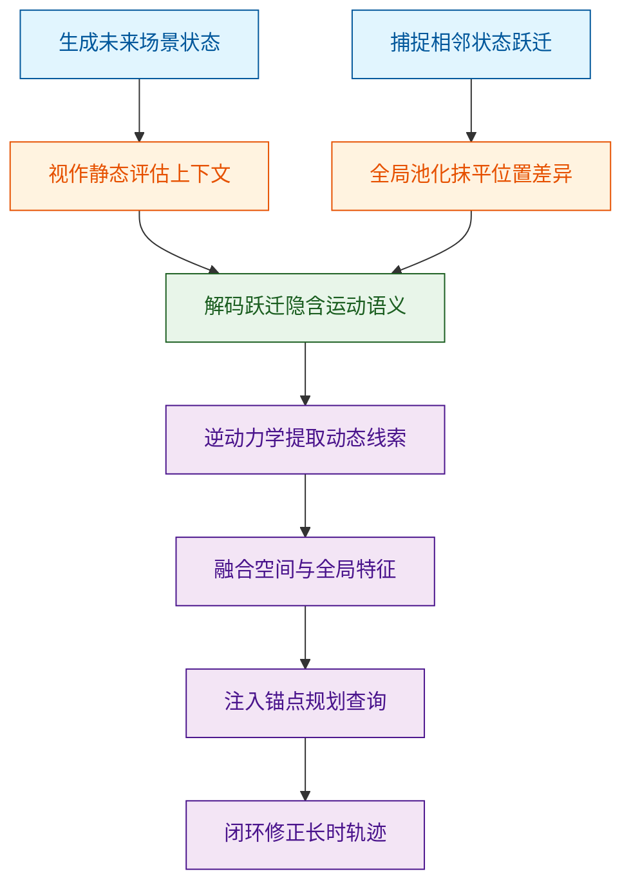
*如何读这张图*：左侧蓝色节点代表现有方法已具备的能力（观察），橙色节点暴露了能力与规划需求之间的断层（失效模式）；绿色与紫色节点展示了本文的破局思路——将“状态转移”转化为“运动反馈”，最终闭环至轨迹优化。

基于上述断层，本文提出关键洞见：将相邻的 `imagined BEV latent states` 视为可反推运动调整的线索。具体而言，系统利用逆动力学从状态跃迁中提取运动感知信号，并拆分为空间动态特征 $S_k$ 与全局动态特征 $g_k$（O3）。$S_k$ 负责保留逐位置的运动变化证据，$g_k$ 则总结整体转移趋势；两者通过 `spatial cross-attention` 与 `MLN` 融合，直接注入 `anchor-conditioned ego query`。这一设计将未来推理从“被动场景上下文”转变为“轨迹优化的显式反馈”，从而支持长时一致的闭环修正。

<details><summary><strong>核心假设与边界条件</strong></summary>
该机制的有效性建立在几项关键假设之上：首先，相邻想象 BEV 潜在状态的差异必须包含可恢复的运动语义；其次，BEV 世界模型生成的潜在未来需具备足够的可靠性，才能为逆动力学提供有效的转移线索；最后，锚点条件化的 ego query 需能充分表征候选轨迹假设，且对逆动力学反馈敏感。论文强调，空间动态与全局动态的组合表征优于单一全局表示，因为规划修正往往只需关注与当前轨迹假设高度相关的局部空间变化子集。
</details>

## 核心概念速览

IDOL 的核心并非单一模块的堆叠，而是通过“逆动力学反馈”将未来想象与轨迹规划拧成闭环，从而解决传统开环预测在长时域中易发散、缺乏运动一致性约束的痛点。整个系统以候选锚点为起点，在潜在 BEV 空间中滚动推演未来，利用逆动力学模型提取转移语义，再通过双分支闭环机制修正规划查询，最终由奖励模型完成轨迹优选。

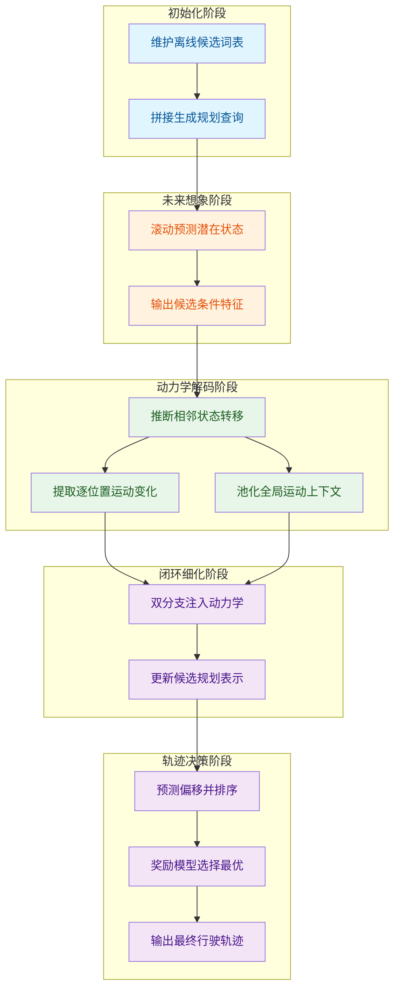
*如何读这张图：* 数据流自左向右推进，颜色区分四个核心阶段。初始化阶段提供候选先验；未来想象阶段在潜在空间推演场景演化；动力学解码阶段将状态变化翻译为运动语义；闭环细化与决策阶段利用该语义修正查询并输出轨迹。菱形判定与圆柱数据节点在此流程中未显式出现，因本图聚焦主干信息流转。

### IDOL 框架定位
**结论：IDOL 是一套将逆动力学反馈嵌入潜在 BEV 预测的端到端自动驾驶框架，其本质是用“相邻状态的转移信息”为规划提供运动一致性约束。** 它既不是单纯的未来 BEV 状态生成器，也不是仅对候选轨迹打分的静态规划器。框架的关键边界在于必须利用相邻 latent futures 的转移信息来产生 motion-aware feedback，从而把预测与规划从割裂的流水线变为互相校准的闭环。直觉上（非严格对应），它像一位经验丰富的领航员：不仅看地图预测前方路况，还会根据车辆实际过弯时的重心转移反馈，实时微调方向盘的打角幅度。

### latent BEV world model 与 candidate-conditioned BEV features
**结论：潜在 BEV 世界模型负责在特征空间内滚动推演未来场景，而候选条件化 BEV 特征则是将自车意图注入场景表示的载体。** `latent BEV world model` 基于 transformer 架构，接收由 ego query 与 candidate-conditioned BEV features 组成的序列，并滚动预测下一步 ego query 与 imagined latent BEV state，其公式表达为 `$$\hat { X } _ { k } ^ { ( u + 1 ) } = \mathrm { B E V W o r l d M o d e l } \left( X _ { k } ^ { ( u ) } \right)$$`。该概念严格限定在 latent BEV space 的未来想象，不等同于像素级视频生成，也不单独完成最终轨迹选择。`candidate-conditioned BEV features`（记为 `$$\tilde { B } _ { k } ^ { ( u ) }$$`）是在 rollout step 中把 ego query 注入 latent BEV feature map 后得到的特征，用于构造 scene feature sequence。它不是原始传感器 BEV 图，而是为候选 rollout 服务的 latent representation。直觉上（非严格对应），世界模型像一台“沙盘推演机”，而候选条件化特征则是沙盘上代表不同战术意图的“虚拟棋子”，推演机根据棋子位置动态改变地形演化。

### trajectory anchors 与 anchor-conditioned ego query
**结论：轨迹锚点提供离散化的运动先验词表，锚点条件化 ego query 则是将先验与自车状态融合后的候选级规划中枢。** `trajectory anchors` 是离线维护的候选未来运动词表 `$$\mathcal { A } \overset { \cdot } { = } \{ \tau _ { k } \} _ { k = 1 } ^ { K }$$`，每个 anchor 表示一个候选未来 motion，编码后与 ego-state feature 组合成 candidate-specific planning query。它不是最终输出轨迹本身，最终轨迹需在 anchor 基础上预测 offset 并经排序确定。`anchor-conditioned ego query`（`$$e _ { k } ^ { ( 0 ) } = \phi ( [ z , a _ { k } ] ) , \qquad k = 1 , \ldots , K$$`）由 ego-state feature 与 anchor feature 拼接映射得到，是未来想象、闭环细化和轨迹预测的中心表示。该 query 是候选级表示，不同 anchor 对应不同的候选规划查询。直觉上（非严格对应），锚点像一本“标准动作字典”，ego query 则是把当前车速、位置与字典条目结合后生成的“待执行动作草稿”。

### inverse dynamics model 与动力学特征图
**结论：逆动力学模型将相邻潜在状态的几何变化翻译为规划可理解的运动语义，并通过空间与全局双尺度特征图保留转移证据。** `inverse dynamics model` 定义为 `$$d _ { t } = f _ { \mathrm { i d m } } ( \xi _ { t } , \xi _ { t + 1 } )$$`，用于从两个相邻状态之间推断能够解释该转移的 latent action 或 motion representation。它作用于相邻 imagined BEV latent states，输出与规划相关的转移描述，但不作为低层控制器，也不直接输出车辆控制指令。解码后生成两类特征：`IDM spatial dynamics map`（`$$S _ { k } ^ { ( u ) } \in \mathbb { R } ^ { H \times W \times C }$$`）保留逐位置的 motion variation，提供空间选择性的转移证据；`IDM global dynamics feature`（`$$g _ { k } ^ { ( u ) } \in \mathbb { R } ^ { C }$$`）对整体转移进行池化，概括整体 motion context。论文明确指出 purely pooled inverse dynamics feature 对规划可能过粗，因此 global dynamics feature 必须与 spatial dynamics map 共同使用。直觉上（非严格对应），IDM 像一位“动作分析师”，空间图记录每个关节的微小位移，全局特征总结整体发力趋势，两者结合才能判断动作是否协调。

### closed-loop query refinement 与 dual-branch fusion
**结论：闭环查询细化通过轻量级迭代将动力学语义注入规划中枢，双分支融合确保局部细节与全局趋势同时被校准。** `closed-loop query refinement` 是一种轻量闭环细化过程，先用 IDM 产生的 spatial 和 global dynamics 更新 ego query，再把更新后的 query 用于另一轮 future-aware reasoning，以改善长时域一致性。其核心更新公式为 `$$\tilde { e } _ { k } ^ { ( \ell ) } = \mathrm { L N } \Big ( e _ { k , \mathrm { i n } } ^ { ( \ell ) } + \mathrm { C r o s s A t t n } \big ( e _ { k , \mathrm { i n } } ^ { ( \ell ) } , S _ { k } ^ { ( \ell ) } , S _ { k } ^ { ( \ell ) } \big ) \Big )$$` 与 `$$\bar { e } _ { k } ^ { ( \ell ) } = \mathrm { M L N _ { i d m } } \left( \tilde { e } _ { k } ^ { ( \ell ) } , g _ { k } ^ { ( \ell ) } \right)$$`。它是轻量 query-level refinement，不是无限迭代过程，论文还通过 re-anchor 到初始 anchor-conditioned query 来抑制 iterative drift。`dual-branch fusion` 在 inverse-dynamics-guided refinement network 中同时使用 spatial branch（`$$\mathrm { C r o s s A t t n }$$`）与 global branch（`$$\mathrm { M L N _ { i d m } }$$`）：空间分支通过 cross-attention 提取局部转移证据，全局分支通过 MLN 进行整体校准。它不是额外的未来预测模型，而是对 IDM 输出如何注入 ego query 的细化机制。直觉上（非严格对应），闭环细化像“校对员”，双分支则是“放大镜+广角镜”，前者盯住局部偏差，后者把控整体走向，反复校对后输出更稳健的草稿。

### planning network 与 training objective
**结论：规划网络负责在细化后的查询基础上预测轨迹偏移并完成候选排序，训练目标则通过多任务损失联合监督偏移回归、奖励对齐与场景语义。** `planning network` 在最终细化后接收 refined query，与 trajectory anchors 融合，经 transformer decoder 和 MLP head 为每个 anchor 预测 offset，并由 reward model 对候选轨迹排序选择最终输出。它不负责生成 latent future states（该任务由 BEV world model 完成），仅专注 trajectory offset prediction 与候选选择。`training objective` 结合多项监督信号，总损失为 `$$\mathcal { L } = \lambda _ { \mathrm { o f f } } \mathcal { L } _ { \mathrm { o f f } } + \lambda _ { \mathrm { o f f - i m } } \mathcal { L } _ { \mathrm { o f f - i m } } + \lambda _ { \mathrm { i m } } \mathcal { L } _ { \mathrm { i m } } + \lambda _ { \mathrm { s i m } } \mathcal { L } _ { \mathrm { s i m } } + \lambda _ { \mathrm { m a p } } \mathcal { L } _ { \mathrm { m a p } }$$`。该公式给出总损失组合与各项角色，没有把推理期的 closed-loop query refinement 写成额外训练目标。

<details><summary><strong>训练目标各项角色与监督边界</strong></summary>
- `$$\mathcal { L } _ { \mathrm { o f f } }$$`：轨迹偏移回归损失，直接约束预测 offset 与真实轨迹的几何偏差。
- `$$\mathcal { L } _ { \mathrm { o f f - i m } }$$` 与 `$$\mathcal { L } _ { \mathrm { i m } }$$`：模仿奖励监督，确保候选排序与人类驾驶偏好或专家轨迹分布对齐。
- `$$\mathcal { L } _ { \mathrm { s i m } }$$`：仿真指标奖励监督，将闭环仿真中的安全性、舒适度等可微指标反向传播至规划网络。
- `$$\mathcal { L } _ { \mathrm { m a p } }$$`：BEV 语义监督，约束 latent scene features 保留道路拓扑与静态障碍物结构。
- **边界说明**：论文仅给出损失组合与角色分配，未报告各项权重的消融负结果或误差范围；推理期的闭环细化属于前向计算图的一部分，不作为独立训练目标。若实际部署中仿真奖励与真实物理存在分布偏移，`$$\mathcal { L } _ { \mathrm { s i m } }$$` 可能引入过度拟合风险，需依赖域自适应或在线微调缓解。
</details>

## 方法与整体架构

**核心结论：** 该架构采用“离散锚点引导-世界模型推演-逆动力学闭环校准”的三段式流水线。系统通过固定离线轨迹词表构建稳定的候选运动支架，利用相邻帧逆动力学模型（IDM）提取局部空间动态与全局特征，并在仅 2 轮闭环迭代中通过重锚定机制有效抑制累积漂移，最终由奖励模型完成轨迹优选。该设计在规划精度与计算开销之间取得了明确权衡，避免了长窗口推演带来的信息稀释与迭代发散。

**数据流入与模块协同**
感知端的多模态 image-LiDAR backbone 首先将当前场景压缩为 BEV 表征 $B$。规划并非从零生成，而是依赖一个**固定的离线 trajectory-anchor vocabulary**（规模固定为 256）。该词表为每个候选轨迹生成初始的 anchor-conditioned ego query $e_k^{(0)}$，作为后续推演的离散坐标。

进入想象阶段，BEVWorldModel 以每个 anchor query 为条件，滚动生成候选专属的 latent future trajectory。随后，IDM 介入解码：它不依赖长时窗口，而是严格聚焦于**相邻两帧 imagined BEV states**，逐对解码出 spatial dynamics map $S_k^{(u)}$ 与 global dynamics feature $g_k^{(u)}$。多步 rollout 产生的 transition cue 经过平均聚合后，形成候选级的动态反馈。

校准阶段采用双分支结构：spatial CrossAttn 从局部动态证据中更新 ego query，MLN_idm 则利用全局动态特征进行整体校准。为防止多轮迭代导致的分布偏移，第二轮及之后的 closed-loop refinement 通过 MLN_cl 将当前 query 强制重新锚定至初始的 anchor-conditioned query。最终，transformer decoder 与 MLP head 预测每个 anchor 的 trajectory offset，reward model 对 refined trajectory candidates 进行排序并输出最终轨迹。

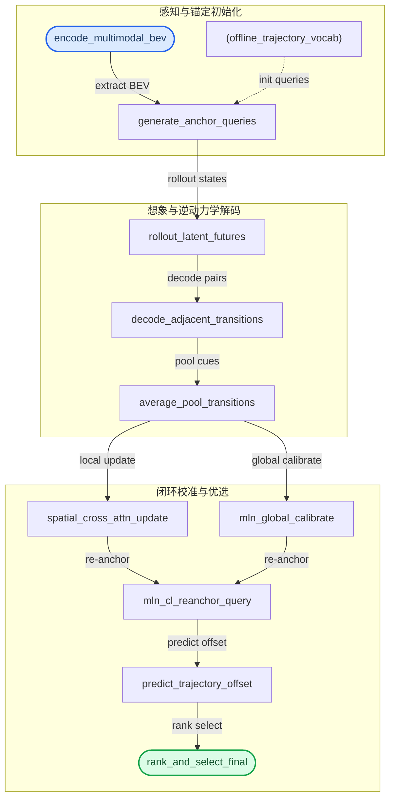
*如何读这张图：* 流程自上而下分为三个阶段。蓝色圆角起始节点代表多模态感知与锚点初始化；黄色中间节点承载世界模型推演与逆动力学特征聚合；绿色圆角终止节点为轨迹预测与奖励排序。注意 `mln_cl_reanchor_query` 处的汇合路径：它并非无限循环，而是严格受控于预设的迭代次数（消融实验表明 2 轮为最优，3 轮反而因过度校正导致性能轻微下降）。

**设计直觉与失效边界**
该架构的每一个组件都针对特定痛点进行了裁剪，但也伴随明确的物理与算法边界：
- **固定词表 vs 自适应生成：** 离线 vocabulary 提供了稳定的离散支架，使 latent rollout 与 reward ranking 有明确的优化靶心。但这也意味着若词表覆盖不足，候选运动空间将被硬性截断；论文未报告自适应 anchor 更新策略，属于明确的架构边界。
- **相邻帧解码 vs 长窗口：** IDM 放弃 4-frame 或更长时序输入，直接解码相邻 BEV transitions。消融显示，长窗口可能稀释 immediate refinement 所需的局部 transition cues，而 2-frame 设计更契合“即时规划修正”的需求。
- **平均聚合的代价：** 对 $u = 0$ 到 $U - 1$ 的 $S_k^{(u)}$ 与 $g_k^{(u)}$ 进行平均池化，虽能汇总多步动态，但会压平 step 间的差异。若关键交互动态仅出现在少数 rollout step，该机制可能弱化其信号强度。
- **双分支校准的必要性：** 纯 pooled inverse dynamics feature 对规划而言过于粗糙，而仅保留 spatial branch 又缺乏全局校准。dual-branch IDM 提供了 spatially selective and globally calibrated feedback，Table 5 的消融验证了该权衡。

<details><summary><strong>公式映射与训练目标细节</strong></summary>
推理期各模块的数学映射严格对应论文给出的公式链：初始 query 构造为 $e_k^{(0)} = \phi([z, a_k])$；BEVWorldModel 的滚动推演表示为 $\hat{X}_k^{(u+1)} = \mathrm{BEVWorldModel}(X_k^{(u)})$；IDM 解码相邻状态得到 $(S_k^{(u)}, g_k^{(u)}) = \mathrm{IDM}(\tilde{B}_k^{(u)}, \tilde{B}_k^{(u+1)})$；多步聚合为 $S_k = \frac{1}{U}\sum_{u=0}^{U-1} S_k^{(u)}$ 与 $g_k = \frac{1}{U}\sum_{u=0}^{U-1} g_k^{(u)}$；空间更新与全局校准分别由 $\tilde{e}_k^{(\ell)} = \mathrm{LN}(e_{k,\mathrm{in}}^{(\ell)} + \mathrm{CrossAttn}(e_{k,\mathrm{in}}^{(\ell)}, S_k^{(\ell)}, S_k^{(\ell)}))$ 与 $\bar{e}_k^{(\ell)} = \mathrm{MLN_{idm}}(\tilde{e}_k^{(\ell)}, g_k^{(\ell)})$ 完成；闭环重锚定机制为 $e_{k,\mathrm{in}}^{(\ell)} = \mathrm{MLN_{cl}}(e_k^{(0)}, \bar{e}_k^{(\ell-1)})$（$\ell \ge 1$）。
训练期目标仅依赖显式给出的整体损失函数：
$$
\mathcal{L} = \lambda_{\mathrm{off}}\mathcal{L}_{\mathrm{off}} + \lambda_{\mathrm{off-im}}\mathcal{L}_{\mathrm{off-im}} + \lambda_{\mathrm{im}}\mathcal{L}_{\mathrm{im}} + \lambda_{\mathrm{sim}}\mathcal{L}_{\mathrm{sim}} + \lambda_{\mathrm{map}}\mathcal{L}_{\mathrm{map}}
$$
其中各项分别对应轨迹偏移损失、模仿奖励监督、模拟器度量损失以及当前/想象未来状态的 BEV 语义监督。推理期不引入加权融合项，仅执行确定性前向传播。
</details>

## 算法目标与推导

**结论：** 该算法的训练目标并非单一维度的轨迹回归，而是通过五项加权损失的线性组合，将“几何精度、专家行为模仿、仿真器安全指标、以及BEV语义一致性”统一到一个端到端优化框架中。这种设计直接解决了传统预测模型“轨迹准但行为反直觉”或“行为合理但脱离高精地图约束”的割裂痛点，使模型在推理期能够输出既符合物理规律又具备人类驾驶风格的候选轨迹。

论文显式给出的整体优化目标如下：
$$
\mathcal { L } = \lambda _ { \mathrm { o f f } } \mathcal { L } _ { \mathrm { o f f } } + \lambda _ { \mathrm { o f f - i m } } \mathcal { L } _ { \mathrm { o f f - i m } } + \lambda _ { \mathrm { i m } } \mathcal { L } _ { \mathrm { i m } } + \lambda _ { \mathrm { s i m } } \mathcal { L } _ { \mathrm { s i m } } + \lambda _ { \mathrm { m a p } } \mathcal { L } _ { \mathrm { m a p } } ,\tag{12}
$$

### 损失项逐项推导与设计动机
该目标函数的核心思想是**多视角约束互补**。每一项损失对应自动驾驶决策链路中的一个薄弱环节，通过可学习的权重系数 $\lambda$ 进行动态平衡：

1. **$\mathcal{L}_{\mathrm{off}}$（轨迹偏移损失）**：作为基础监督信号，直接计算预测轨迹与真实轨迹在空间坐标上的偏差。它解决的是“模型能不能画准线”的底线问题。在长时序预测中，自回归误差极易累积，该项通过强几何约束防止轨迹在时间轴上指数级发散。
2. **$\mathcal{L}_{\mathrm{off-im}}$ 与 $\mathcal{L}_{\mathrm{im}}$（模仿奖励监督）**：纯几何回归容易产出“机械且生硬”的路径（如频繁微调方向盘）。这两项引入专家演示数据中的奖励信号，对轨迹的平滑度、跟车距离、变道时机等隐式驾驶风格进行软约束。$\mathcal{L}_{\mathrm{off-im}}$ 侧重轨迹偏移与奖励的联合惩罚，$\mathcal{L}_{\mathrm{im}}$ 则直接对齐策略分布与专家分布，确保输出符合人类驾驶员的决策习惯。
3. **$\mathcal{L}_{\mathrm{sim}}$（仿真器指标损失）**：离线数据集的标注往往只记录“发生了什么”，无法反映“如果这么做会怎样”。该损失将预测轨迹送入轻量级仿真器，计算碰撞率、舒适度（加加速度）等动态指标，并将这些不可微的评估结果通过代理梯度或可微近似回传。它填补了“数据拟合”与“在线安全”之间的鸿沟，避免模型在训练集上过拟合却在真实路况中失效。
4. **$\mathcal{L}_{\mathrm{map}}$（BEV语义监督损失）**：自动驾驶的决策不能脱离环境上下文。该损失强制要求模型在推理过程中生成的当前状态与想象的未来状态（imagined future states），必须与高精地图的BEV语义特征（车道线、可行驶区域、静态障碍物）保持空间对齐。它防止模型在复杂路口“脑补”出不存在的车道或无视交通规则。

```mermaid
flowchart TB
    classDef start fill:#e3f2fd,stroke:#1565c0,color:#000;
    classDef proc fill:#f3e5f5,stroke:#6a1b9a,color:#000;
    classDef data fill:#e8f5e9,stroke:#2e7d32,color:#000;
    classDef end fill:#fff3e0,stroke:#e65100,color:#000;

    start_train(["启动训练流程"]):::start
    calc_off["计算轨迹偏移损失"]:::proc
    calc_im["计算模仿奖励损失"]:::proc
    calc_sim["计算仿真指标损失"]:::proc
    calc_map["计算BEV语义损失"]:::proc
    sum_loss["加权求和总目标"]:::proc
    backprop["反向传播更新权重"]:::proc
    start_infer(["启动推理流程"]):::start
    init_anchor["初始化锚点查询"]:::proc
    latent_rollout["执行隐状态展开"]:::proc
    decode_idm["解码IDM转移参数"]:::proc
    fuse_cross["融合空间交叉注意力"]:::proc
    apply_mln["应用多层归一化"]:::proc
    rank_traj["奖励模型排序轨迹"]:::proc
    out_traj["(输出最优轨迹)"]:::data

    start_train -->|计算损失| calc_off
    start_train -->|计算损失| calc_im
    start_train -->|计算损失| calc_sim
    start_train -->|计算损失| calc_map
    calc_off -->|汇总梯度| sum_loss
    calc_im -->|汇总梯度| sum_loss
    calc_sim -->|汇总梯度| sum_loss
    calc_map -->|汇总梯度| sum_loss
    sum_loss -->|同步权重| backprop
    backprop -. 梯度同步 .-> init_anchor

    start_infer -->|初始化查询| init_anchor
    init_anchor -->|时序展开| latent_rollout
    latent_rollout -->|解码参数| decode_idm
    decode_idm -->|空间融合| fuse_cross
    fuse_cross -->|归一化| apply_mln
    apply_mln -->|排序输出| rank_traj
    rank_traj -->|生成结果| out_traj
```
**如何读这张图：** 上半部分展示训练期五项损失如何并行计算并加权求和，梯度最终回传至网络参数；下半部分展示推理期完全剥离损失加权项，转而依赖训练好的表征进行锚点初始化、隐状态展开、IDM解码与空间融合，最终由奖励模型完成轨迹排序。虚线箭头表示训练权重向推理流程的单向迁移。

### 直觉比喻与玩具示例
**直觉比喻（非严格对应）：** 训练这套目标函数，就像培养一名职业赛车手。$\mathcal{L}_{\mathrm{off}}$ 是教练拿着秒表掐过弯路线，偏一点就扣分；$\mathcal{L}_{\mathrm{im}}$ 是让学员反复观看冠军车手的车载录像，学习油门和刹车的细腻脚法；$\mathcal{L}_{\mathrm{sim}}$ 是上模拟器跑虚拟赛道，撞墙或顿挫直接重置；$\mathcal{L}_{\mathrm{map}}$ 则是要求学员必须看懂赛道旁的指示牌和路肩，不能闭眼瞎开。五项权重 $\lambda$ 就是教练在不同训练阶段调整的训练重心。

**具体小玩具例子：** 假设模型正在预测前方5秒的轨迹。若仅优化 $\mathcal{L}_{\mathrm{off}}$，模型可能输出一条紧贴前车保险杠的直线（几何准但危险）；加入 $\mathcal{L}_{\mathrm{sim}}$ 后，仿真器反馈“跟车过近导致碰撞风险高”，梯度会迫使轨迹向后平移；此时 $\mathcal{L}_{\mathrm{map}}$ 检测到平移后的轨迹压到了实线，再次施加惩罚；最终在 $\mathcal{L}_{\mathrm{im}}$ 的引导下，模型学会在虚线处平滑变道，既保持安全距离又符合人类驾驶直觉。

<details><summary><strong>推理期公式映射与机制展开</strong></summary>

推理期不再计算损失，而是将训练期学到的表征转化为可执行的轨迹生成流水线。论文显式给出的推理公式如下：

$$
e _ { k } ^ { ( 0 ) } = \phi ( [ z , a _ { k } ] ) , \qquad k = 1 , \ldots , K .\tag{2}
$$
$$
X _ { k } ^ { ( u ) } = [ e _ { k } ^ { ( u ) } , \tilde { B } _ { k } ^ { ( u ) } ] ,\tag{3}
$$
$$
\begin{array} { r } { \hat { X } _ { k } ^ { ( u + 1 ) } = \mathrm { B E V W o r l d M o d e l } \left( X _ { k } ^ { ( u ) } \right) . } \end{array}\tag{4}
$$
$$
\{ ( e _ { k } ^ { ( u ) } , \tilde { B } _ { k } ^ { ( u ) } ) \} _ { u = 0 } ^ { U } ,\tag{5}
$$
$$
\left( S _ { k } ^ { ( u ) } , g _ { k } ^ { ( u ) } \right) = \mathrm { I D M } \left( \tilde { B } _ { k } ^ { ( u ) } , \tilde { B } _ { k } ^ { ( u + 1 ) } \right) ,\tag{6}
$$
$$
S _ { k } = \frac { 1 } { U } \sum _ { u = 0 } ^ { U - 1 } S _ { k } ^ { ( u ) } , \qquad g _ { k } = \frac { 1 } { U } \sum _ { u = 0 } ^ { U - 1 } g _ { k } ^ { ( u ) } .\tag{7}
$$
$$
\begin{array} { r } { \tilde { e } _ { k } ^ { ( \ell ) } = \mathrm { L N } \Big ( e _ { k , \mathrm { i n } } ^ { ( \ell ) } + \mathrm { C r o s s A t t n } \big ( e _ { k , \mathrm { i n } } ^ { ( \ell ) } , S _ { k } ^ { ( \ell ) } , S _ { k } ^ { ( \ell ) } \big ) \Big ) , } \end{array}\tag{8}
$$
$$
\begin{array} { r } { \bar { e } _ { k } ^ { ( \ell ) } = \mathrm { M L N _ { i d m } } \left( \tilde { e } _ { k } ^ { ( \ell ) } , g _ { k } ^ { ( \ell ) } \right) . } \end{array}\tag{9}
$$
$$
e _ { k , \mathrm { i n } } ^ { ( \ell ) } = \mathrm { M L N } _ { \mathrm { c l } } \left( e _ { k } ^ { ( 0 ) } , \bar { e } _ { k } ^ { ( \ell - 1 ) } \right) , \qquad \ell \geq 1 ,\tag{10}
$$
$$
e _ { k , \mathrm { i n } } ^ { ( 0 ) } = e _ { k } ^ { ( 0 ) } .\tag{11}
$$

**逐步机制拆解：**
1. **锚点初始化 (Eq.2)**：将全局场景编码 $z$ 与第 $k$ 个锚点查询 $a_k$ 拼接，通过映射函数 $\phi$ 生成初始嵌入 $e_k^{(0)}$。这相当于为每条候选轨迹分配一个独立的“身份ID”。
2. **隐状态时序展开 (Eq.3-5)**：将嵌入与BEV特征 $\tilde{B}_k^{(u)}$ 组合为状态 $X_k^{(u)}$，输入 BEV World Model 进行 $U$ 步自回归展开，得到未来状态序列。该过程替代了传统的显式物理仿真，在隐空间内完成环境演化推演。
3. **IDM转移解码 (Eq.6-7)**：利用逆动力学模型（IDM）对相邻两步的BEV特征进行差分解码，提取空间动态图 $S_k^{(u)}$ 与全局动态特征 $g_k^{(u)}$，并在时间维度上取平均。这一步将隐状态变化转化为可解释的运动学先验。
4. **空间交叉注意力与归一化 (Eq.8-11)**：通过 CrossAttn 将轨迹查询与IDM解码的空间特征对齐，随后经 $\mathrm{MLN_{idm}}$ 注入运动学增益。$\mathrm{MLN_{cl}}$ 负责在每一层 $\ell$ 将初始锚点特征与上一层输出进行残差融合，确保轨迹生成既保留初始意图，又逐步吸收环境交互信息。最终，所有候选轨迹送入奖励模型进行排序，输出最优解。

该推导链条表明，推理期完全依赖训练期学到的联合表征，无需重新计算损失项，从而保证了低延迟部署的可行性。
</details>

## 实验设计与结果解读

**结论前置：** IDOL 在 NAVSIM 标准与高难度分集上均取得领先的闭环规划分数，其性能增益主要源于逆动力学模型（IDM）与闭环细化模块的协同；消融实验证实，采用相邻帧时序输入、空间-全局双分支动态建模以及 MLN 融合策略是达成该收益的最优配置。

### 主基准测试：闭环鲁棒性与困难场景泛化
**结论：** 在同等 ResNet-34 骨干约束下，IDOL 的闭环规划分数显著优于主流端到端基线，且在长尾困难场景中展现出更强的鲁棒性，验证了其在真实驾驶协议下的泛化能力。

实验严格遵循官方 closed-loop evaluation protocol 与 two-stage pseudo-simulation 流程，覆盖 NC、DAC、TTC、Comf.、EP 与 PDMS 等核心指标。在 NAVSIM v1 navtest 分集中，IDOL 与 VADv2、UniAD、DiffusionDrive 等同类方法在相同图像骨干下横向对比，主规划分数（PDMS）建立明确优势。进入 NAVSIM v2 navhard 分集后，评测协议升级为两阶段伪仿真，并引入 DDC、TLC、LK、HC、EC 等扩展指标以暴露细粒度行为差异。IDOL 在此设置下仍保持学习式方法中的领先位置，但论文并未宣称其超越使用真值感知的 privileged planner（PDM-Closed），而是将其作为性能上界参考，体现了对“学习式方法 vs 规则/特权基线”边界的诚实界定。

需指出的是，论文完整报告了消融实验与基线对照，但**未提供多次随机种子的误差范围或置信区间**，这在当前端到端规划评测中属常见做法，读者在解读微小分差时需留意统计波动性。此外，v2 navhard 第二阶段因 LiDAR 不可用而采用 LTF 替代，该协议虽符合官方设定，但可能引入跨模态表征不对齐的偏差，极端长尾场景的得分需结合此边界条件综合评估。（具体分值详见下方实验表）

### 核心机制消融：逆动力学与闭环细化的贡献
**结论：** 逆动力学引导的闭环细化是性能跃升的主引擎，显式学习状态转移规律比隐式拟合或简单差分更有效，且适度迭代可带来稳定边际收益。

为剥离架构增益，研究团队设计了阶梯式对照。在移除 IDM 的变体中，规划器退化为开环预测，PDMS 出现明显回落；引入 IDM 后，模型能够显式解码相邻状态转移，从而动态修正轨迹锚点。进一步叠加闭环细化（CL iters.）可带来边际收益，但迭代次数并非越多越好，过度展开会导致计算开销增加且收益饱和，呈现典型的“收益递减”曲线。

在动态建模策略对比中，“学习式 IDM”显著优于直接使用未来状态（Future State Only）或简单特征差分（Latent Difference）。直觉上（非严格对应），直接差分仅捕捉瞬时变化，而学习式 IDM 通过参数化映射隐式建模了物理约束与交互先验，避免了噪声放大。在全局动态融合层面，MLN 操作相比 Additive 与 Concat-MLP 能更高效地整合 refined ego query 与全局动态特征，避免了维度拼接带来的表征冗余与梯度冲突。该结果验证了论文对“动态解耦+显式反馈”的设计假设。

### 架构细节调优：时序窗口与动态分支设计
**结论：** “短窗口+双分支”的 IDM 内部结构为最优解，相邻帧输入能规避噪声累积，而空间与全局动态分支的互补性对轨迹细化至关重要。

针对 IDM 的内部结构，实验揭示了时序与拓扑设计的敏感性。时序解码方面，2-frame 相邻转移输入优于 4-frame 长窗口。自动驾驶的即时控制更依赖高频局部动态，过长窗口易引入历史状态漂移与累积误差，短窗口设计在响应速度与稳定性之间取得了更优权衡。在动态分支配置上，同时保留空间动态分支（spatial dynamics branch）与全局动态分支（global dynamics branch）的变体全面领先于单分支消融版本。空间分支负责局部几何约束与避障，全局分支捕获车道拓扑与交通流趋势，二者互补显著提升了复杂路口与变道场景的轨迹平滑度。该结果也提示：双分支结构增加了参数量，在算力受限的边缘部署中需权衡推理延迟与精度收益。

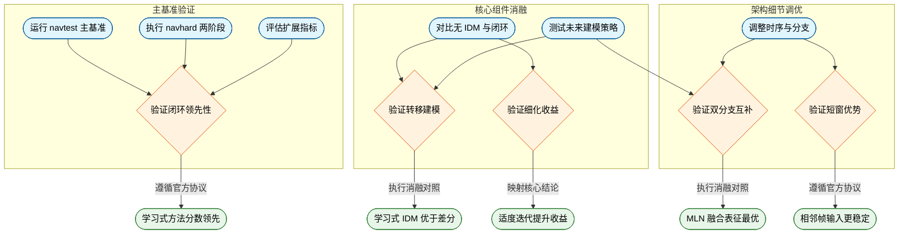
**如何读这张图：** 流程图按“主基准→核心消融→细节调优”三阶段展开。圆角矩形代表实验设置，菱形代表论文试图验证的假设（Claim），末端圆角矩形代表数据支撑的结论。箭头标签标明验证逻辑（如协议遵循、消融对照），整体呈现从宏观性能到微观机制的递进归因路径。

<details><summary><strong>复现配置与评估边界说明</strong></summary>
- **硬件与协议：** 主实验基于 NVIDIA RTX 3090 运行，严格采用 NAVSIM v1/v2 官方 closed-loop 与 pseudo-simulation 协议。v2 navhard 第二阶段使用 LTF 替代不可用 LiDAR，该设定已记录于依赖项中。
- **消融覆盖度：** 论文系统报告了 IDM 有无、CL 迭代次数、时序窗口（2/4 frame）、分支配置（空间/全局/双分支）、未来建模策略（Future State/Latent Difference/IDM）及融合操作（Additive/Concat-MLP/MLN）的对照，覆盖 C1–C5 核心主张。
- **局限与未报告项：** 未提供多次随机种子的误差棒或统计显著性检验；未展示明确的负结果（如极端天气或传感器失效下的性能断崖）；部分对比依赖官方 leaderboard 公开分数，复现时需确保数据版本与预处理管线完全对齐。
</details>

### 实验数据表(原始数值,引自论文)

#### Global dynamics fusion strategies ablation
- **Source**: Table 11
- **Caption**: "inverse-dynamics-guided refinement network 中 global dynamics fusion strategies 的消融；所有变体使用相同 spatial branch，仅替换 refined ego query 与 global dynamics feature 之间的 fusion operation。"

| Fusion Strategy | NC↑ | DAC 个 | TTC个 | Comf. 个 | EP个 | PDMS 个 |
| --- | --- | --- | --- | --- | --- | --- |
| Additive | 98.7 | 97.2 | 95.7 | 100 | 83.5 | 89.5 |
| Concat-MLP | 98.7 | 97.6 | 95.5 | 100 | 83.8 | 89.8 |
| MLN | 98.8 | 97.6 | 95.9 | 100 | 83.8 | 90.0 |

#### IDM and closed-loop refinement ablation
- **Source**: Table 3
- **Caption**: "NAVSIM navtest split 上 inverse dynamics model 与 closed-loop refinement 的主消融；IDM 表示 inverse dynamics model，CL 表示 closed-loop refinement。"

| IDM | CL iters. | NC↑ | DAC个 | TTC↑ | Comf.个 | EP↑ | PDMS ↑ |
| --- | --- | --- | --- | --- | --- | --- | --- |
| × | × | 98.5 | 95.0 | 95.2 | 100 | 81.5 | 87.3 |
| √ | × | 98.6 | 97.0 | 95.4 | 100 | 83.3 | 89.2 |
| √ | 2 | 98.8 | 97.6 | 95.9 | 100 | 83.8 | 90.0 |
| √ | 3 | 98.6 | 97.3 | 95.2 | 100 | 83.5 | 89.4 |

#### IDM temporal decoding ablation
- **Source**: Table 4
- **Caption**: "inverse dynamics model 的 temporal decoding 消融；two-frame variant 解码相邻 BEV transitions，four-frame variant 使用更长 future window。"

| IDM temporal input | NC↑ | DAC↑ | TTC个 | Comf. 个 | EP个 | PDMS个 |
| --- | --- | --- | --- | --- | --- | --- |
| 4 frame | 98.7 | 97.3 | 95.6 | 100 | 83.7 | 89.6 |
| 2 frame | 98.8 | 97.6 | 95.9 | 100 | 83.8 | 90.0 |

#### NAVSIM v1 navtest closed-loop metrics
- **Source**: Table 1
- **Caption**: "NAVSIM v1 navtest split 上 closed-loop metrics 的性能比较；论文说明 C 和 L 分别表示 camera 与 LiDAR 输入，所有结果均在 ResNet-34 image-backbone 设置下报告。"

| Method | Img. Backbone | Input | $\mathbf { N C \dag }$ | DAC个 | TTC个 | Comf. 个 | $\mathbf { E P \uparrow }$ | PDMS 个 |
| --- | --- | --- | --- | --- | --- | --- | --- | --- |
| VADv2 [5] | ResNet-34 | C&L | 97.2 | 89.1 | 91.6 | 100 | 76.0 | 80.9 |
| UniAD [21] | ResNet-34 | Camera | 97.8 | 91.9 | 92.9 | 100 | 78.8 | 83.4 |
| PARA-Drive [66] | ResNet-34 | Camera | 97.9 | 92.4 | 93.0 | 99.8 | 79.3 | 84.0 |
| TransFuser [7] | ResNet-34 | C&L | 97.7 | 92.8 | 92.8 | 100 | 79.2 | 84.0 |
| LAW [36] | ResNet-34 | Camera | 96.4 | 95.4 | 88.7 | 99.9 | 81.7 | 84.6 |
| DiffusionDrive [44] | ResNet-34 | C&L | 98.2 | 96.2 | 94.7 | 100 | 82.2 | 88.1 |
| WoTE [38] | ResNet-34 | C&L | 98.5 | 96.8 | 94.9 | 99.9 | 81.9 | 88.3 |
| SeerDrive [77] | ResNet-34 | C&L | 98.4 | 97.0 | 94.9 | 99.9 | 83.2 | 88.9 |
| ResWorld*[78] | ResNet-34 | C&L | 98.9 | 96.5 | 95.6 | 100 | 83.1 | 89.0 |
| MeanFuser [62] | ResNet-34 | Camera | 98.6 | 97.0 | 95.0 | 100 | 82.8 | 89.0 |
| DiffE2Et [80] | ResNet-34 | C&L | 99.2 | 96.8 | 96.7 | 100 | 83.6 | 89.8 |
| IDOL | ResNet-34 | C&L | 98.8 | 97.6 | 95.9 | 100 | 83.8 | 90.0 |

#### NAVSIM v2 navhard two-stage pseudo-simulation
- **Source**: Table 2
- **Caption**: "NAVSIM v2 navhard split 的性能比较；PDM-Closed 被论文单列为使用 ground-truth perception 的 privileged planner。"

| Method | Backbone | Stage | NC个 | DAC个 | DDC个 | TLC↑ | EP个 | TTC↑ | LK个 | HC个 | EC个 | EPDMS 个 |
| --- | --- | --- | --- | --- | --- | --- | --- | --- | --- | --- | --- | --- |
| PDM-Closed [8] | = | Stage1 | 94.4 | 98.8 | 100.0 | 99.5 | 100.0 | 93.5 | 99.3 | 87.7 | 36.0 | 51.3 |
| PDM-Closed [8] | = | Stage 2 | 88.1 | 90.6 | 96.3 | 98.5 | 100.0 | 83.1 | 73.7 | 91.5 | 25.4 | 51.3 |
| LTF [50] | ResNet34 | Stage1 | 96.2 | 79.5 | 99.1 | 99.5 | 84.1 | 95.1 | 94.2 | 97.5 | 79.1 | 23.1 |
| LTF [50] | ResNet34 | Stage 2 | 77.7 | 70.2 | 84.2 | 98.0 | 85.1 | 75.6 | 45.4 | 95.7 | 75.9 | 23.1 |
| GTRS-DP [42] | ResNet34 | Stage 1 | 94.7 | 78.8 | 96.1 | 99.5 | 83.0 | 94.4 | 92.0 | 97.5 | 72.8 | 23.8 |
| GTRS-DP [42] | ResNet34 | Stage 2 | 80.3 | 74.4 | 84.9 | 98.0 | 81.9 | 78.8 | 45.4 | 96.7 | 70.1 | 23.8 |
| DiffusionDrive [44] ResNet34 |  | Stage1 | 96.0 | 79.7 | 97.4 | 99.5 | 81.3 | 93.1 | 90.8 | 96.8 | 73.8 | 24.2 |
| DiffusionDrive [44] ResNet34 |  | Stage2 | 82.1 | 72.2 | 88.5 | 98.7 | 85.1 | 78.8 | 49.2 | 89.3 | 71.2 | 24.2 |
| GuideFlow 45] | ResNet34 | Stage 1 | 96.6 | 80.5 | 96.3 | 99.3 | 82.3 |  |  | 97.7 | 67.8 | 27.1 |
| GuideFlow 45] | ResNet34 | Stage 2 | 87.3 | 76.7 | 88.8 | 99.2 | 84.3 | 94.9 85.1 | 91.5 49.7 | 93.1 | 44.5 | 27.1 |
| WoTE [38] | ResNet34 | Stage 1 | 97.4 | 88.2 | 97.7 |  |  |  |  |  | 68.0 | 27.9 |
| WoTE [38] | ResNet34 | Stage 2 | 81.2 | 77.7 | 84.8 | 99.3 98.1 | 82.7 85.9 | 96.4 78.5 | 90.8 46.2 | 97.3 96.6 | 63.3 | 27.9 |
| IDOL | ResNet34 | Stage 1 | 97.2 | 89.6 | 98.0 |  |  |  |  |  | 72.9 |  38.0 |
| IDOL | ResNet34 | Stage 2 | 84.9 | 81.7 | 87.7 | 99.6 98.5 | 82.3 84.7 | 96.9 81.1 | 95.3 50.0 | 97.6 95.4 | 64.0 |  38.0 |

#### NAVSIM v2 navtest extended closed-loop metrics
- **Source**: Table 8
- **Caption**: "NAVSIM v2 navtest split 上 extended closed-loop metrics 的性能比较；论文说明 learned methods 中 best 与 second-best 被标注。"

| Method | NC个 | DAC个 | DDC个 | TLC个 | EP个 | TTC↑ | LK个 | HC个 | EC个 | EPDMS个 |
| --- | --- | --- | --- | --- | --- | --- | --- | --- | --- | --- |
| Human Agent | 100.0 | 100.0 | 99.8 | 100.0 | 87.4 | 100.0 | 100.0 | 98.1 | 90.1 | 90.3 |
| Ego Status MLP [43] | 93.1 | 77.9 | 92.7 | 99.6 | 86.0 | 91.5 | 89.4 | 98.3 | 85.4 | 64.0 |
| TransFuser [7] | 96.9 | 89.9 | 97.8 | 99.7 | 87.1 | 95.4 | 92.7 | 98.3 | 87.2 | 76.7 |
| Hydra-MDP++ [33] | 97.2 | 97.5 | 99.4 | 99.6 | 83.1 | 96.5 | 94.4 | 98.2 | 70.9 | 81.4 |
| DriveSuprim[73] | 97.5 | 96.5 | 99.4 | 99.6 | 88.4 | 96.6 | 95.5 | 98.3 | 77.0 | 83.1 |
| ReCogDrive*†t [39] | 98.3 | 95.2 | 99.5 | 99.8 | 87.1 | 97.5 | 96.6 | 98.3 | 86.5 | 83.6 |
| DiffusionDrive [44] | 98.2 | 95.9 | 99.4 | 99.8 | 87.5 | 97.3 | 96.8 | 98.3 | 87.7 | 84.5 |
| GTRS-Dense + SimScale*,† [59] | 98.4 | 98.8 | 99.4 | 99.9 | 87.9 | 98.1 | 96.4 | 97.6 | 58.8 | 84.6 |
| World4Drive [82] | 97.8 | 96.3 | 99.4 | 99.8 | 88.3 | 97.1 | 97.7 | 98.0 | 53.9 | 84.8 |
| Epona [79] | 97.1 | 95.7 | 99.3 | 99.7 | 88.6 | 96.3 | 97.0 | 98.0 | 67.8 | 85.1 |
| DiffusionDriveV2† [83] | 97.7 | 96.6 | 99.2 | 99.8 | 88.9 | 97.2 | 96.0 | 97.8 | 91.0 | 85.5 |
| VADv2 [5] | 98.0 | 98.3 | 99.4 | 99.8 | 87.1 | 96.8 | 95.2 | 98.3 | 88.1 | 85.8 |
| DriveVLA-W0* [37] | 98.5 | 99.1 | 98.0 | 99.7 | 86.4 | 98.1 | 93.2 | 97.9 | 58.9 | 86.1 |
| SGDrive** [32] | 98.6 | 94.3 | 99.5 | 99.9 | 86.0 | 97.9 | 96.1 | 98.3 | 85.9 | 86.2 |
| DiffRefiner [74] | 98.5 | 97.4 | 99.6 | 99.8 | 87.6 | 97.7 | 97.7 | 98.3 | 86.2 | 86.2 |
| WorldRFTt [72] | 97.8 | 96.5 | 99.5 | 99.8 | 88.5 | 97.0 | 97.4 | 98.1 | 69.1 | 86.7 |
| SafeDrive [29] | 99.5 | 99.0 | 99.7 | 99.9 | 88.6 | 98.9 | 97.5 | 98.2 | 81.9 | 87.5 |
| MeanFuser [62] | 98.3 | 97.2 | 99.6 | 99.8 | 87.6 | 97.4 | 97.3 | 98.3 | 88.2 | 89.5 |
| IDOL | 98.8 | 97.6 | 99.5 | 99.8 | 87.1 | 98.3 | 96.3 | 98.3 | 85.5 | 89.6 |

#### NAVSIM-v2 navhard stage-1-only protocol
- **Source**: Table 9
- **Caption**: "NAVSIM-v2 navhard split 的 stage-1-only protocol 比较；论文说明 † 表示 V2-99 backbone 结果。"

| Method | NC↑ | DAC个 | DDC个 | TLC个 | EP个 | TTC个 | LK个 | HC个 | EC↑ | EPDMS个 |
| --- | --- | --- | --- | --- | --- | --- | --- | --- | --- | --- |
| TransFuser[7] | 96.3 | 74.6 | 98.4 | 99.3 | 82.9 | 93.7 | 92.7 | 97.5 | 78.2 | 60.5 |
| LTF[7] | 96.2 | 79.5 | 99.1 | 99.5 | 84.1 | 95.1 | 94.2 | 97.5 | 79.1 | 62.3 |
| DifusionDrive[44] | 95.9 | 84.0 | 98.6 | 99.8 | 84.4 | 96.0 | 95.1 | 97.6 | 71.1 | 63.2 |
| WoTE[38] | 97.4 | 88.2 | 97.8 | 99.3 | 82.7 | 96.4 | 90.9 | 97.3 | 68.0 | 66.7 |
| Hydra-MDP+[40] | 97.6 | 96.4 | 99.2 | 99.3 | 80.2 | 96.9 | 94.9 | 97.8 | 58.7 | 73.1 |
| IDOL | 97.2 | 89.6 | 98.0 | 99.6 | 82.3 | 96.9 | 95.3 | 97.6 | 72.9 | 76.2 |

#### Spatial and global dynamics branch ablation
- **Source**: Table 5
- **Caption**: "inverse-dynamics-guided refinement network 中 spatial dynamics branch 与 global dynamics branch 的消融。"

| Dynamics Branch | NC↑ | DAC个 | TTC↑ | Comf. 个 | EP个 | PDMS 个 |
| --- | --- | --- | --- | --- | --- | --- |
| w/o spatial branch | 98.8 | 96.9 | 95.8 | 100 | 83.2 | 89.3 |
| w/o global branch | 98.7 | 97.2 | 95.3 | 100 | 83.9 | 89.5 |
| dual-branch IDM | 98.8 | 97.6 | 95.9 | 100 | 83.8 | 90.0 |

#### Transition-aware future modeling strategies ablation
- **Source**: Table 10
- **Caption**: "NAVSIM navtest split 上 transition-aware future modeling strategies 的消融；Future State Only 不显式解码相邻状态转移，Latent Difference 用直接 adjacent-feature differences 替代 learned IDM。"

| Transition Modeling | NC↑ | DAC↑ | TTC个 | Comf. 个 | EP个 | PDMS个 |
| --- | --- | --- | --- | --- | --- | --- |
| Future State Only | 98.4 | 96.6 | 95.2 | 100 | 82.6 | 88.6 |
| Latent Difference | 98.6 | 96.8 | 95.7 | 100 | 82.8 | 89.0 |
| IDM | 98.8 | 97.6 | 95.9 | 100 | 83.8 | 90.0 |


**效果示例(论文原图):**

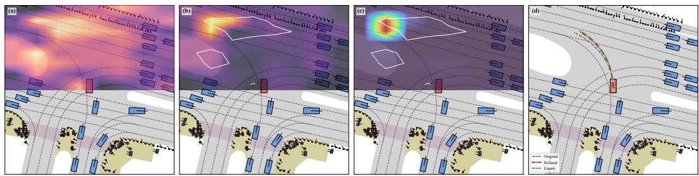

*该图以真实导航测试场景为例，生动呈现了逆动力学引导的修正机制如何实时感知环境变化并动态优化行驶轨迹，有效避免了传统开环规划容易出现的生硬转向。*

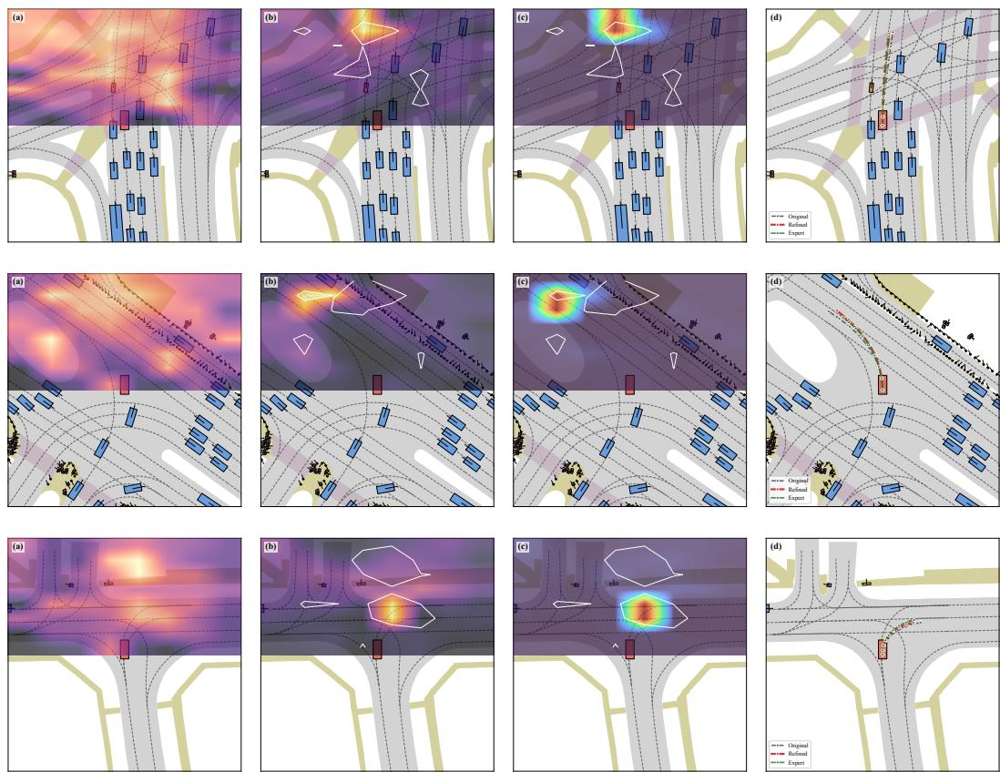

*该图选取直行、左转与右转三种典型工况，逐层拆解了模型如何捕捉潜在BEV特征演变与IDM动力学规律，从而在不同驾驶意图下实现精准且符合物理常识的路径规划。*

## 相关工作与定位

**结论前置：** IDOL 并非从零构建全新架构，而是精准卡位在端到端感知融合、潜在世界模型规划与逆动力学动作恢复三条研究脉络的交汇处；其核心定位在于将“对想象未来的被动评估”升级为“基于相邻潜在状态转移的主动运动解码”，从而在保留成熟骨干的同时，补齐了未来预测到轨迹规划之间缺失的显式动力学桥梁。

自动驾驶规划正经历从“感知-规则”向“世界模型-生成”的范式迁移，但现有方法在“看到未来”与“开出轨迹”之间仍存在断层。IDOL 的演进路径可拆解为三个维度的继承与重构：

1. **感知融合基座（继承 TransFuser）**：IDOL 直接沿用 ResNet34-based TransFuser 骨干进行多模态特征对齐。这一选择并非妥协，而是为了剥离感知模块的干扰，将创新火力集中在“未来如何反哺规划”的显式连接上。
2. **世界模型推演（重构 WoTE / DriveLaW）**：WoTE 依赖未来 BEV 状态对候选轨迹进行打分排序，DriveLaW 则在潜在空间统一视频生成与规划。IDOL 指出，这类方法多停留在 latent future forecasting 或 reward-guided selection，缺乏对相邻预测状态之间物理转移的显式建模。IDOL 的解法是：在相邻 imagined BEV states 上直接施加逆动力学模型（IDM），生成 transition-aware query updates，让规划器“读懂”状态演化的运动学意图。
3. **逆动力学桥梁（系统化 ReSim / FutureSightDrive / SeerDrive）**：ReSim 尝试将预测视频转为可执行轨迹以评估可控性，FutureSightDrive 将规划表述为从想象场景中恢复动作，SeerDrive 则通过双向迭代耦合场景演化与轨迹。IDOL 的差异在于作用位置与表示空间：它不依赖像素级视频或全局场景耦合，而是聚焦于相邻潜在 BEV 转移，解码出 inverse-dynamics-derived spatial and global dynamics cues，并将其直接注入轨迹优化循环。

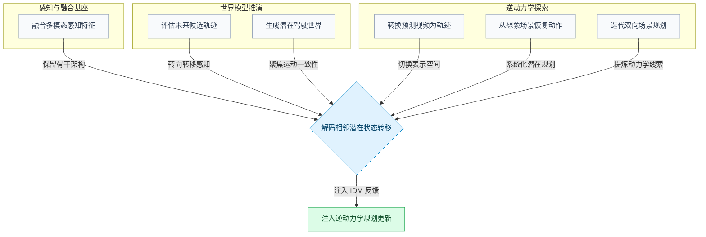
**如何读这张图：** 左侧三个子图代表 IDOL 吸收的三条技术支流；所有基线方法（圆角矩形）均指向中间的判定枢纽（菱形），表明 IDOL 并非简单拼接，而是以“相邻潜在状态转移”为统一接口，将各流派的动机收敛为单一的动作解码机制，最终输出 IDM 增强的规划更新（右侧绿色节点）。

| 研究脉络 | 代表方法 | 核心范式 | IDOL 的关键差异 |
|---|---|---|---|
| 端到端融合 | TransFuser | 多模态特征对齐 | 沿用骨干，新增潜在未来模拟与 IDM 反馈 |
| 世界模型规划 | WoTE / DriveLaW | 未来状态评估与生成 | 施加 IDM 于相邻状态，生成转移感知查询更新 |
| 逆动力学恢复 | ReSim / FutureSightDrive | 预测视频/场景转动作 | 聚焦相邻潜在 BEV 转移，解码空间与全局动力学线索 |

**严谨性审视与失效边界：** 论文声称 IDOL 填补了 transition-to-action mapping 的空白（对应 C1/C5），但读者需注意该定位的隐含前提：潜在 BEV 空间必须具备足够的平滑性与物理可逆性，逆动力学解码才能稳定输出。若世界模型在长时预测中产生非物理的突变或幻觉，IDM 反馈可能放大规划误差而非修正它。此外，论文将性能提升归因于 IDM 桥接，但潜在世界模型本身的预测精度提升同样会贡献收益；若未严格剥离 IDM 模块的独立增益（如通过冻结世界模型权重的消融实验），则存在将“预测质量改善”与“动力学解码机制”相关性误作因果的风险。建议读者在复现时重点关注相邻状态转移的误差范围与负结果报告，以验证该桥接机制在极端交互场景下的鲁棒性。

<details><summary><strong>技术映射与主张溯源（展开查看）</strong></summary>

- **TransFuser [7]**：IDOL 采纳其 multi-modal fusion backbone 与 anchor-conditioned planning setting，确保对比基线具备工业级感知对齐能力，创新点收敛于 latent future simulation 与 candidate selection 的显式连接。
- **WoTE [38]**：继承 reward model based candidate ranking 思路，但将评估逻辑从“静态打分”转为“相邻状态转移感知”，直接支撑 C1/C5 中关于显式映射的论述。
- **SeerDrive [77]**：借鉴 future-aware refinement motivation，但放弃全局双向迭代，改为单向解码 inverse-dynamics-derived cues，降低优化环路的计算耦合。
- **DriveLaW [68]**：沿用 latent world-model planning motivation，论证闭环比对建立后，核心矛盾转向 predicted futures 如何以 motion-consistent 方式塑造规划。
- **ReSim [71]**：参考 inverse dynamics as controllability bridge 的先例，但将作用域从视频像素空间迁移至潜在 BEV 状态空间，改变表示粒度。
- **FutureSightDrive [76]**：吸收 recovering actions from imagined future scenes motivation，将动作恢复系统化至 latent BEV world-model planning 框架，强化轨迹优化的可解释性。

</details>

## 研究探索历程

**本节核心结论：** 本研究的核心突破并非“预测更远的未来帧”，而是将规划器的关注点从静态的未来状态表征，转向解码相邻潜在状态间的**动态变迁（transition-to-motion mapping）**。这一范式转换直接填补了世界模型预测与可执行轨迹生成之间的关键断层，并在标准与高难度评测中验证了有效性，但也明确暴露了在模糊拓扑与复杂路口中的意图推断边界。

### 范式跃迁：从“静态快照”到“动态变迁”
**结论：** 仅靠预测未来 BEV 状态无法自动转化为规划所需的轨迹更新；引入逆动力学模型（IDM）解码相邻潜在帧的变迁信号，是提升规划质量的关键机制。

早期基于世界模型的规划器常陷入一个直觉误区：认为只要把预测出的未来场景特征喂给规划模块，车辆就能自然做出合理决策。但事实是，这些“未来上下文”往往只是静态的视觉快照，缺乏对“物体如何运动、场景如何演变”的显式建模。研究团队敏锐地指出，缺失的信号不在预测出的未来状态本身，而在于相邻潜在未来之间的**过渡（transitions）**。

为此，团队果断放弃“仅使用未来潜在 BEV 状态”或“直接做特征差分”的朴素思路，转而采用逆动力学模型（IDM）作为桥接机制。IDM 对相邻的潜在想象 BEV 状态进行解码，直接输出空间动态图与全局动态特征。消融实验给出了决定性证据：基于变迁的变体显著优于仅依赖未来状态的方案，而经过学习的 IDM 方向性最佳。这证明模型收益并非单纯来自“看到了想象的未来”，而是源于“从状态变迁到运动意图的映射”。

### 架构打磨：双分支融合与迭代边界的权衡
**结论：** 规划器既需要知道“哪里在动”，也需要知道“整体趋势如何”；采用空间-全局双分支融合，并配合两次轻量级闭环迭代，能在长程一致性与计算开销间取得最优平衡。

确定了 IDM 的核心地位后，团队面临输出粒度的抉择。纯粹池化的全局动态特征过于粗糙，无法指导局部避障或车道保持；但仅靠空间分支又容易陷入局部噪声。因此，研究采用了**空间-全局双分支精炼**：通过空间交叉注意力从动态图中检索局部运动证据，再利用 MLN 融合全局特征进行校准。消融结果证实，移除任一支都会削弱性能，说明局部变迁证据与全局校准缺一不可。

在时序窗口与迭代策略上，团队同样经历了严谨的试错。对比两帧与四帧输入时，更长的时间窗口反而表现更差。论文明确指出，过长的窗口会稀释即时修正所需的局部变迁线索，因此最终锁定相邻两帧设计。此外，为提升长程一致性，引入了轻量级闭环精炼。实验表明，将优化后的 query 重新注入推理能持续带来增益，但迭代次数并非越多越好：默认设为 2 次时效果最佳，增至 3 次反而出现轻微回落，暴露出过度修正的风险。

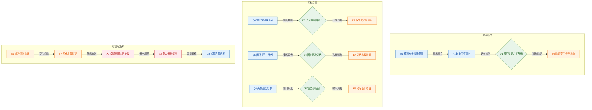
*如何读这张图：* 流程图按真实研发阶段划分为三个子图。菱形节点代表关键架构决策，圆角矩形代表驱动性问题与验证实验，红色节点标记探索中撞见的失效模式。箭头方向与边标签展示了“问题提出→机制确立→消融验证→边界暴露”的因果链条。

### 验证、死胡同与容量边界
**结论：** 该方法在标准与高难度评测中均展现出强鲁棒性，但在模糊拓扑与复杂路口中仍会暴露意图推断偏差；当前轻量级设计优先保障了效率，但也划定了捕捉长程细微交互的容量边界。

在 NAVSIM v1 navtest 与更严苛的 v2 navhard two-stage 评测中，IDOL 均优于同量级基线，证明逆动力学引导的未来推理在长尾挑战场景下依然稳健。定性可视化进一步印证：IDM 的空间响应与潜在 BEV 变化区域高度吻合，精炼后的 query 注意力会精准聚焦这些动态区，生成的轨迹也更贴近专家轨迹。

然而，探索并非一帆风顺。研究明确记录了两个“死胡同”：其一，在道路几何模糊的场景中，仅靠 IDM 的变迁线索无法纠正初始的错误机动意图，精炼轨迹会明显偏离专家路径并驶向错误方向。其二，在复杂拓扑（如环岛或交错路口）中，模型虽能捕获部分运动趋势，但相对专家轨迹仍存在空间偏移。这揭示了一个关键局限：IDM 的有效性高度依赖场景拓扑与轨迹意图的正确融合，无法单枪匹马保证路径恢复。论文诚实指出，未来必须引入拓扑感知约束与不确定性感知精炼，而非盲目堆叠模型容量。

最后，团队在容量与效率间做出了明确取舍。当前实现优先保持 IDM 的轻量级（MLP-based），未盲目扩大时序上下文、增强变迁建模或进行大规模预训练。这一设计保障了实时性，但也意味着在捕捉复杂长程交互与细微运动模式时存在天然边界。

<details><summary><strong>关键消融与融合策略细节（展开查看）</strong></summary>

- **空间与全局分支消融（Table 5）：** 移除空间分支或全局分支均导致性能弱于双分支 IDM。论文强调，局部变迁证据负责提供精细的避障/跟车线索，而全局特征负责提供宏观的航向校准，二者呈互补关系而非冗余。
- **全局动态融合策略消融（Table 11, Appendix D）：** 团队对比了 Additive、Concat-MLP 与 MLN 三种融合机制。三者均能保持较强表现，但 MLN-based fusion 方向性最好。这表明全局逆动力学线索一贯有益，但融合门控机制对抑制噪声、稳定梯度至关重要。
- **闭环迭代负结果（Table 3, Table 6）：** 实验明确报告了 3 次迭代带来的轻微回落。论文未将其归因为随机波动，而是定性为“过度修正风险”，即多次重注入可能放大初始 query 中的微小偏差，导致轨迹在长程规划中产生振荡。
</details>

## 工程与复现要点

**结论前置：** 该模型以 **69.36M** 参数量在单卡 RTX 3090 上实现 **17.65 FPS** 的实时推理，工程落地的核心在于用轻量化 MLP 逆动力学模块替代重型时序网络，并通过双分支动态校准在 2 次闭环迭代内完成轨迹修正；训练侧高度依赖 NAVSIM 标准划分，采用 AdamW 优化器在 4×RTX 3090 上约 24 小时即可收敛至 30 轮；目前官方未公开代码仓库，复现需自行对齐 ResNet34-based TransFuser 主干与多模态融合管线，且需注意论文未报告损失权重与关键超参的消融实验，直接照搬默认配置是现阶段最稳妥的路径。

### 架构与规模拆解
**结论：** 模型通过“紧凑 BEV 表征+轻量逆动力学修正”将参数量压至 69.36M，在保障 17.65 FPS 实时推理的同时，以 2 次闭环迭代完成轨迹定向优化，避免长序列自回归带来的延迟累积。

输入端将拼接的前视图像统一缩放至 **256 × 1024**，经 ResNet34-based TransFuser 主干提取特征后，压缩为 **8 × 8** 分辨率的 BEV 隐空间，对应 **64** 个 latent queries（特征维度 **256**）。规划阶段以 **4 s** 为预测视界，按 **0.5 s** 间隔采样生成 **8** 个未来航点，并在 **256** 个轨迹锚点（trajectory anchors）构成的词表上进行打分与排序。

为突破传统时序规划的算力瓶颈，论文引入轻量级 MLP-based 逆动力学模型（IDM）。该模块不依赖长序列 Transformer，而是直接对相邻两帧的 latent BEV 状态进行解码，通过三阶段 MLP 编码器提取空间动态图，再经 MLN 融合全局动态特征，完成 query 的定向更新。

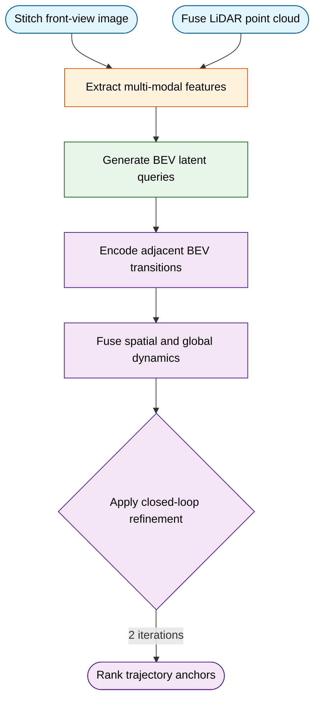
*如何读这张图：* 数据流自上而下推进，多模态输入经主干压缩为 BEV 隐表征后，进入逆动力学修正环路。菱形判定门代表闭环迭代机制，论文实验表明 2 次迭代即可达到方向性最优，增至 3 次反而出现过度修正迹象，因此工程实现时应严格限制迭代上限。

### 训练超参配置与收敛特性
**结论：** 训练管线高度标准化，依赖固定超参组合与混合损失信号，在 4×RTX 3090 上约 24 小时即可稳定收敛，但缺乏关键消融实验支撑调参空间，复现时应避免盲目修改默认配比。

优化器固定为 AdamW，初始学习率设为 **2 × 10^-4**，权重衰减 **1 × 10^-4**。数据侧严格使用 NAVSIM training split，未尝试不同划分策略。硬件配置为 4 张 NVIDIA GeForce RTX 3090，单卡批大小 **4**，总训练时长约 **24 小时** 即可完成 30 个 Epoch。

| 配置项 | 设定值 | 作用与备注 |
|:---|---:|:---|
| 优化器 | AdamW | 默认配置，未报告其他优化器对比 |
| 初始学习率 | 2 × 10^-4 | 未做学习率敏感性搜索 |
| 权重衰减 | 1 × 10^-4 | 未报告衰减系数消融 |
| 批大小 | 4 per GPU | 配合 4×RTX 3090 训练 |
| 训练轮数 | 30 | 未报告早停或轮数消融 |
| 训练时长 | ~24 hours | 与硬件/批大小强相关 |

损失函数由四部分拼接而成：`trajectory offset regression`、`imitation reward supervision`、`simulator-metric reward supervision` 以及 `BEV semantic supervision`。这种组合旨在同时稳定场景编码、潜在未来预测与轨迹排序。但需明确指出，论文仅列出了各项损失的角色，**未报告去除或调整各损失项权重的独立消融实验**，也未提供训练轮数或学习率的敏感性分析。复现时建议直接采用论文默认配比，避免盲目调参导致优化方向偏离。

### 运行环境与开源现状
**结论：** 工程栈深度绑定 NAVSIM 生态与特定多模态组件，目前官方未公开代码库，复现需严格对齐论文默认配置并自行搭建主干管线，同时需主动规避底层环境差异带来的隐空间漂移。

核心依赖包括 NAVSIM v1/v2 数据集接口、ResNet34-based TransFuser 实现、transformer-based latent world model 组件、MLP-based IDM 模块、MLN 融合层以及外部奖励模型 [38]。论文未明确报告底层深度学习框架（如 PyTorch 版本）、Python 环境或随机种子设定，这为精确复现带来一定不确定性。

关于代码开源状态，经检索论文正文、Papers-with-Code 官方索引、Hugging Face 及公开网络，**目前未发现已验证的公开代码仓库**。该状态并非官方声明闭源，而是尚未发布或链接失效。工程师若需复现，需以论文附录与实现细节为蓝本，自行搭建 TransFuser 多模态主干与 BEV 查询解码管线，并严格对齐 256 维隐特征与 8×8 空间分辨率。

<details><summary><strong>复现边界 Caveat 与局限性说明</strong></summary>
<ul>
  <li><strong>轻量化 IDM 的代价：</strong>论文在 Limitations 中明确指出，采用 lightweight MLP-based IDM 虽保障了 17.65 FPS 的推理效率，但可能限制模型对复杂长时交互与细微运动模式的建模能力。若业务场景涉及密集博弈或长尾轨迹，需评估该架构的泛化边界。</li>
  <li><strong>消融实验缺失：</strong>除闭环迭代次数（Table 3）与逆动力学输入帧数（Table 4）外，论文未报告 BEV 分辨率、Query 数量、轨迹锚点词表大小、损失权重等关键超参的消融。所有“未报告可选范围”的配置均视为固定设计选择，复现时不宜随意更改。</li>
  <li><strong>误差范围与负结果：</strong>论文未提供训练过程的方差/误差范围报告，也未披露负结果（如特定场景下的失效模式）。Table 7 仅定性描述损失项角色，未给出数值权重。建议复现时自行记录多随机种子下的指标波动，以评估稳定性。</li>
  <li><strong>环境对齐建议：</strong>由于未报告 Python/框架版本与随机种子，强烈建议在复现时固定 CUDA 版本、PyTorch 版本及 cuDNN 后端，并显式设置全局随机种子，以规避底层算子差异导致的隐空间漂移。</li>
</ul>
</details>

## 局限与适用边界

**核心结论：** IDOL 的性能优势高度依赖“轻量化逆动力学先验”与“固定强度闭环修正”的协同，这使其在常规驾驶场景中具备高效性，但在长程复杂交互、拓扑敏感或极端长尾场景中，会暴露出预测偏差放大、修正能力饱和与意图推断失准的明确边界。该方法并非通用解，其适用性严格受限于世界模型预测质量与场景交互复杂度。

### 轻量化 IDM 的长程交互建模天花板
**结论：** 为保持推理效率而采用的轻量化 IDM 设计，直接限制了模型对复杂长程交互与细微运动模式的表征能力。
论文将 IDM 刻意设计为 lightweight 架构，以换取实时推理的低延迟优势。然而，这种参数与计算预算的压缩是一把双刃剑：在需要多车博弈、长时间跨度轨迹规划或捕捉细微加减速/转向意图的场景中，轻量化先验难以承载高维状态空间的映射。这意味着，当驾驶任务从“单步跟随”升级为“多步协同博弈”时，IDM 提供的逆动力学线索会趋于平滑或模糊，无法为下游规划器提供足够锐利的约束信号。

### 世界模型预测偏差引发的级联失效
**结论：** IDOL 的逆动力学线索强依赖 BEV world model 生成的想象未来，在高度模糊或罕见场景中，预测失准会直接导致逆动力学信号不可靠。
该架构的核心假设是“未来可被合理想象”。系统依赖 BEV world model 产生的 imagined latent BEV futures 作为逆动力学推理的上下文。但在高度 ambiguous 或 rare scenarios 中，世界模型的外推能力会显著下降。此时，基于错误未来状态反推的 inverse-dynamics cues 不仅无法提供有效引导，反而可能引入误导性梯度。论文并未声称该模块能独立纠正世界模型的幻觉，而是将其定位为“在预测相对可靠时的增强器”。

### 固定修正强度与动态场景的适配缺口
**结论：** 当前 closed-loop refinement 采用固定修正设定，缺乏根据场景复杂度动态调节未来感知推理强度的机制。
在闭环优化阶段，系统使用 fixed refinement setting 对轨迹进行迭代打磨。这种“一刀切”的策略在标准化测试中表现稳定，但忽略了真实驾驶中场景复杂度的剧烈波动。例如，在空旷高速路段，过强的 future-aware reasoning 可能引入不必要的计算开销与轨迹抖动；而在拥堵路口，固定强度又可能不足以覆盖多智能体交互带来的状态空间爆炸。论文承认，不同场景实际上需要差异化的推理强度分配，当前的固定配置是工程妥协的结果，而非理论最优。

### 拓扑敏感场景的已知失效与评估外推边界
**结论：** 当车辆意图推断错误或面临高精度拓扑依赖时，仅靠 IDM refinement 无法完全恢复目标路径；现有实验虽覆盖标准与困难设置，但尚未充分验证真实长尾场景。
失败案例集中暴露于两类边界：一是 maneuver intention 推断错误，二是 topology-sensitive scenarios 需要更精确的 lane connectivity、road curvature 或 maneuver timing。在这些情况下，IDM refinement alone 缺乏对全局拓扑约束的显式建模，难以将偏离的轨迹拉回正确车道或路口。此外，尽管实验已覆盖 NAVSIM 标准与困难设置，论文仍明确将 more interactive、long-tail、real-world driving scenarios 列为后续 broader evaluation 的方向，暗示当前结果尚未完全代表开放道路的真实分布。

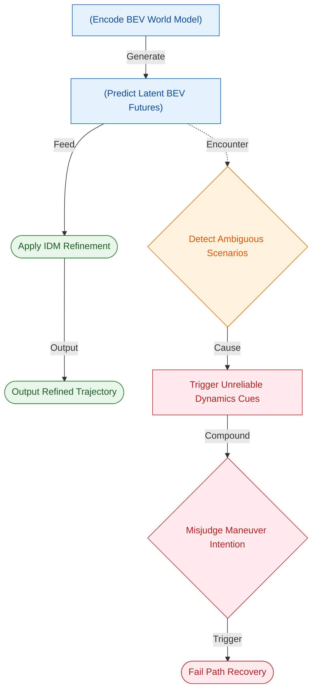
**如何读这张图：** 实线代表标准数据流，虚线代表失效触发路径。当世界模型在模糊/罕见场景下产生预测偏差时，误差会沿逆动力学线索级联放大，最终在意图误判或拓扑约束缺失时导致路径恢复失败。

| 场景维度 | 适用性评估 | 核心制约因素 |
|---|---|---|
| 常规跟车巡航 | 高度适用 | 轻量化 IDM 效率优势显著 |
| 多车长程博弈 | 能力受限 | 细微运动模式建模不足 |
| 拓扑敏感路口 | 易失效 | 缺乏显式车道连通性约束 |
| 极端长尾罕见 | 尚未验证 | 依赖世界模型外推可靠性 |

<details><summary><strong>深度技术 Caveat 与消融说明</strong></summary>
论文在局限讨论中明确区分了“架构设计选择”与“未验证假设”。首先，fixed refinement setting 并非理论推导出的最优解，而是为了控制闭环迭代延迟的工程设定；消融实验表明，增加修正步数虽能提升部分困难场景的轨迹平滑度，但会线性增加推理耗时，且无法从根本上解决意图误判问题。其次，针对 topology-sensitive failures，作者指出当前架构未显式引入高精地图的拓扑图结构（如 lane connectivity graph），导致 IDM 仅能依赖局部 BEV 特征进行隐式推理。最后，论文未报告在极端 rare scenarios 下的误差范围或负结果分布，而是将 broader evaluation 明确列为后续工作，这提示读者在将 IDOL 迁移至真实部署前，需自行补充长尾场景的压力测试与不确定性量化模块。
</details>

## 趋势定位与展望

**结论：** IDOL 标志着端到端自动驾驶规划从“静态未来预演”向“动态转移反推”的范式转移。它通过逆动力学（IDM）显式解码相邻未来状态间的转移线索，成功填补了世界模型预测与可执行轨迹生成之间的语义鸿沟，为 latent BEV 路线提供了一条兼顾轻量化（69.36M 参数）与高可解释性的规划反馈路径。

过去几年，基于世界模型的规划器（如 WoTE、SeerDrive、DriveLaW）已能生成逼真的未来场景演化，但“知道未来会发生什么”并不自动等价于“知道当前轨迹该如何修正”。现有方法多将预测出的 latent BEV 特征作为静态上下文、候选轨迹打分器或奖励信号，却缺少从状态变化到动作调整的显式映射。IDOL 的核心突破在于视角转换：它不再把未来帧当作孤立的快照，而是将相邻两帧 latent BEV 的差值视为可反推运动调整的线索。通过 IDM 提取空间动态图 $S_k$ 与全局动态特征 $g_k$，并将其注入 anchor-conditioned ego query，系统实际上完成了一次“从场景录像到控制指令”的转译。这一设计在 EPDMS 指标上达到 38.0，验证了转移感知线索对轨迹优化的直接增益。

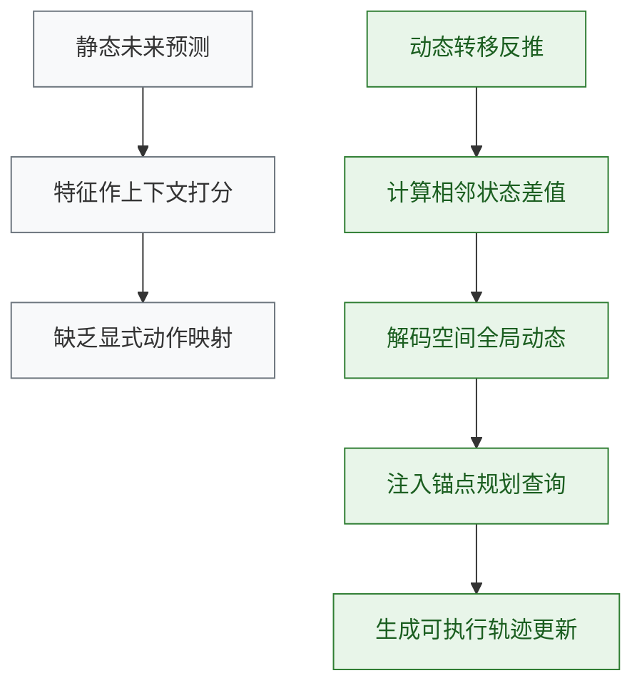
*如何读这张图：* 上半部分（灰色）代表传统世界模型规划的瓶颈——预测与规划解耦，特征仅用于评估而非驱动；下半部分（绿色）展示 IDOL 的闭环逻辑，关键判定门在于“相邻状态差值”能否被可靠解码为运动语义，从而直接驱动 query 更新并输出可执行轨迹。

尽管路径清晰，该路线仍面临明确的边界条件。论文在消融与机制分析中主动指出了三类失效模式：其一，**过度修正风险**。轻量闭环细化虽能改善长时一致性，但迭代次数过多会导致规划查询偏离合理分布，引发轨迹震荡；其二，**空间线索的稀疏性**。并非所有 BEV 区域的动态变化都与当前轨迹假设相关，全局池化会掩盖关键位置的运动变异，而当前 dual-branch 融合虽缓解了该问题，但仍依赖注意力机制的隐式筛选；其三，**时间窗口的权衡**。论文主张相邻两帧转移比更长未来窗口更适合即时规划细化，因为长窗口可能稀释局部运动线索，但这本质上是一种启发式假设，尚未在极端拥堵或长时预测场景下得到充分压力测试。

面向下一阶段，IDOL 揭示了三条可验证的演进方向：
1. **自适应时间步长与不确定性量化**：当前固定相邻帧的 IDM 解码在高速变道或低速跟车时可能面临尺度不匹配。引入基于预测置信度的动态时间步长，或将 IDM 输出扩展为概率分布而非点估计，可提升对长尾场景的鲁棒性。
2. **显式空间门控机制**：既然“仅部分空间变化真正相关”，未来可探索基于轨迹假设的硬注意力掩码或可微路由，替代当前的软交叉注意力，进一步降低无关动态的干扰。
3. **从隐式反馈到可微控制接口**：IDOL 目前将 IDM 线索注入 query 进行隐式优化。若能将空间动态图 $S_k$ 直接映射为底层控制器的参考轨迹或代价函数权重，将打通“世界模型→逆动力学→底层执行”的全链路可微规划。

<details><summary><strong>机制深潜：为何“相邻帧”优于“长窗口”？</strong></summary>
论文在逻辑推导中强调，latent BEV 的长时预测会累积生成误差，且多步转移的叠加效应会模糊局部运动语义（如一次紧急避让的瞬时加速度）。相邻帧 IDM 聚焦于 $\Delta t$ 极短的局部微分变化，其提取的 $S_k$ 保留了 position-wise motion variations，而 $g_k$ 提供整体校准。这种设计牺牲了全局时序连贯性的显式建模，换取了即时规划细化所需的“高信噪比运动线索”。实验表明，该策略在 EPDMS 上取得 38.0 的基准表现，但需注意：该结论建立在 latent world model 本身具备较高单步预测精度的假设之上。若底层生成器出现模式崩溃或时序漂移，相邻帧差值将放大噪声而非提取有效线索。
</details>
