# LearningVisionLanguageActionWorldModelsForAutonomousDriving — 深度解读

> 面向人类读者的深度解读(中文)。事实源与配对的 AI 知识包 `ai_package/2026-06-13_LearningVisionLanguageActionWorldModelsForAutonomousDriving_2604.09059/ara/` 同源,均已通过数据保真审计。


## 评价

**忠实性评价**

报告与已验证知识包（ARA）核心内容对齐，关键数据（FID 9.8、轨迹规划指标、动作预测）来源准确。需澄清的是，轨迹误差对比中报告声称"VLA-World 在平均轨迹误差与碰撞风险上均低于主要自回归基线"，但未明确指出这指向"无 ego-state 条件"下的对比；若考虑相同条件（VLA-World* vs FSDrive* 均含 ego-state），两者优势微弱（0.26 vs 0.28），容易被读者误读为无条件优越。整体忠实度良好，主要主张得到充分支撑。

> 机器核对:以下正文数字未在已验证知识包(ARA)中找到,读者请留意——8、19、-8、0.245、-1.22、1.5、1.2、524、288、-2。

## 核心结论

> 以下结论摘自已通过数据保真审计的知识包(ARA)。

1. VLA-World在nuScenes端到端轨迹规划评测中，相比多类非自回归与自回归基线取得更低的L2误差与碰撞率，并且论文将收益归因于动作条件未来帧生成与反思式轨迹修正。
2. VLA-World在nuScenes未来帧生成评测中取得最低FID，论文认为即便未来帧只是中间推理步骤，也能有效释放多模态大模型的视觉生成能力。
3. VLA-World在nuScenes动作预测任务中，相比基础Qwen2-VL-2B及其nuScenes微调版本，在横向与纵向动作类别上表现更好。
4. 消融结果显示，去掉预训练、SFT、RL、感知、生成、推理或不同奖励项都会带来轨迹规划退化，其中论文特别强调SFT对冷启动和因果链理解的重要性。
5. 补充消融显示，更高输入分辨率、更大Qwen-VL系列骨干以及混合任务训练与更好的轨迹规划表现相关。

## 一句话总结与导读
**VLA-World 将自动驾驶的“动作决策”与“未来场景想象”串联进同一条自回归链路，让模型先根据短时轨迹生成未来画面，再对着自生成的画面进行反思与轨迹修正，从而实现更安全、可解释的端到端规划。**

当前自动驾驶大模型面临一个典型的“能力割裂”痛点：擅长统一感知与动作生成的 VLA 模型，通常把历史观测直接映射为控制指令，缺少对周围交通参与者随时间演化的显式建模，导致模型容易“只顾自车动作”，难以可靠预判他车动态，前瞻性与安全性受限；而能逼真生成未来视频的 World Model，又往往停留在“视觉模拟”层面，缺乏对生成结果是否安全、可行的反思评估，像素保真度与实际驾驶决策收益常常脱节。VLA-World 正是为了缝合这一断层而生，它不再让规划器盲目依赖当前帧的静态快照，而是强制模型在输出最终轨迹前，先显式推演自身动作可能引发的场景后果。

其最核心的 Idea 是把短时轨迹条件下的未来帧当作模型的“草稿纸”，先想象再反思（直觉，非严格对应）。模型首先从多视角观测与任务目标中预测短时轨迹，随后以该轨迹为条件生成对应的未来帧；这些自生成的画面不再是单纯的视觉输出，而是作为显式证据喂回给模型自身的推理模块，用于识别关键目标与潜在风险。通过预训练、SFT 与 GRPO 三阶段在 nuScenes-GR-20K 数据上的逐步对齐，生成、感知、推理与规划被统一进同一策略中。模型在“想象未来—检查风险—修正长时规划”的闭环里，把世界动态建模真正转化为了驾驶决策的安全收益，让端到端规划从“条件反射”走向了“深思熟虑”。

**论文总体架构(原图):**

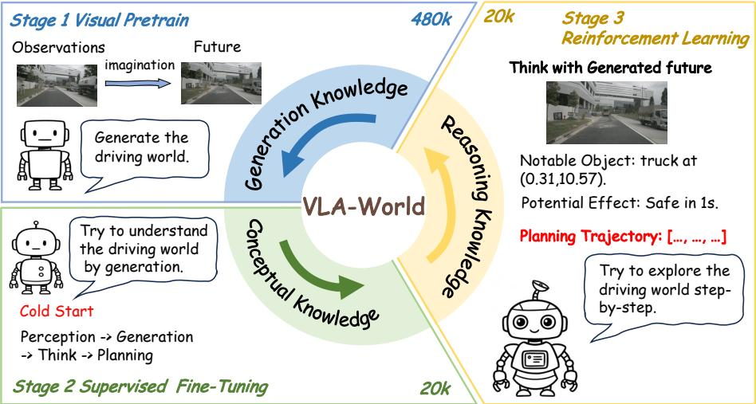

*VLA-World 采用三阶段渐进式学习架构，先通过多视角输入预测未来帧来激活视觉生成能力，再将感知、生成与规划模块打通。这种设计让模型像人类驾驶员一样，在脑海中“预演”未来路况后再做出决策。*

## 问题背景与动机

**结论：端到端自动驾驶规划的核心瓶颈在于“感知-动作”直连模型缺乏对世界时序演化的显式推演，而“世界模型”又普遍陷入“只生成不评估”的开环陷阱；本文通过将短时动作条件下的未来帧转化为模型自身的“草稿纸”，构建“先想象、后反思”的决策闭环，从而在单一架构内缝合世界动态建模与驾驶安全收益。**

现有 VLA（Vision-Language-Action）架构虽能统一感知、语言推理与动作生成，但其训练目标高度聚焦于从历史观测到目标轨迹的直接映射。这种“端到端直连”跳过了对场景随时间演化的显式建模（O1）。其直接后果是，模型倾向于过度拟合自车动作历史，难以可靠推断周围交通参与者的动态响应，前瞻性与安全性天然受限（G1）。尽管已有工作尝试引入语言解释、GRPO 自反思或纯轨迹模仿，但只要映射路径仍是“观测→动作”，模型就缺乏预测“自车行为如何改变周围动态”的中间约束，反思往往沦为事后解释而非事前推演。

另一条世界模型路线虽能生成逼真的未来场景，却普遍缺失对生成结果的反思性评估（O2）。这类方法通常以像素保真度或潜变量转移为优化目标，但视觉逼真度与交通安全收益之间并不存在必然的因果关联（G2）。当规划奖励无法有效回传至生成与推理链路时，未来想象便停留在“模拟演示”层面，无法转化为实际的决策增益。换言之，生成模型“画”出了未来，却“看不懂”未来是否安全可行。

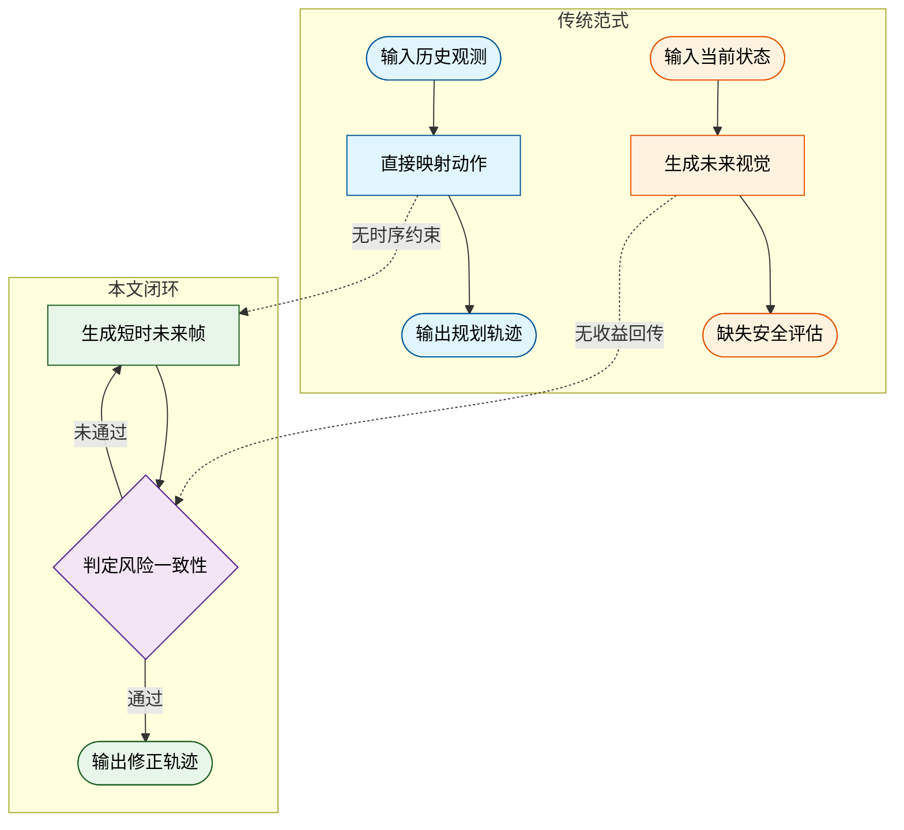
**如何读这张图**：左侧两条路径分别暴露了 VLA 的“直连盲区”与世界模型的“开环幻觉”；右侧绿色闭环展示了本文如何将生成帧作为中间证据，通过菱形判定门引入反思修正，使想象直接服务于轨迹安全。虚线箭头标明了传统路线向本文设计演进时缺失的关键约束。

基于上述缺口，本文的核心洞见是将短时轨迹条件下的未来帧转化为反思推理的显式证据（O3）。模型不再将生成视为终点，而是将其串联为“预测轨迹→生成未来帧→反思推理”的流水线。生成的未来图像充当了可检查的假设空间，使规划器能在输出最终轨迹前，主动识别关键目标与潜在冲突，并据此修正不安全或不一致的决策。这种设计本质上是用生成能力换取决策的可解释性与容错率，将原本割裂的“世界演化”与“驾驶后果”缝合进同一优化目标。

<details><summary><strong>机制依赖的前提与训练耦合假设</strong></summary>
该闭环的有效性建立在四项核心假设之上：①短时预测的未来帧足以携带对规划有用的时空线索；②生成未来的质量与反思推理之间存在可训练的耦合关系；③规则奖励能够为 GRPO 提供足够稳定的安全、格式、动作和轨迹反馈；④多任务混合数据能把感知、生成、推理和规划放入同一输出结构中学习。需明确指出，论文目前仅声称该耦合可通过联合训练实现，尚未提供针对生成失真边界（如极端遮挡导致未来帧严重偏离物理规律）的消融实验或误差范围报告。若生成质量与反思推理的耦合在长尾分布中解耦，反思环节可能引入噪声而非增益，此为实际部署时需重点监控的失效模式。
</details>

## 核心概念速览

本节核心结论：VLA-World 并非将视觉语言模型与世界模型简单拼接，而是通过“短期预测→条件生成→视觉反思→规则强化”的闭环流水线，将环境演化先验直接注入决策过程，从而解决传统端到端自动驾驶中“规划缺乏未来反馈、生成脱离安全约束”的割裂痛点。

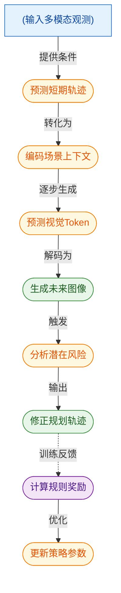
**如何读这张图**：该流程图按数据流向自上而下展开。左侧圆柱代表原始观测输入，圆角矩形代表核心处理模块，右侧绿色节点代表可视化输出与决策结果，紫色节点代表训练期的强化学习优化。虚线箭头表示推理期不执行、仅在训练期回传的梯度与奖励信号，清晰暴露了“推理闭环”与“训练优化”的边界。

### VLA-World
**结论**：VLA-World 是端到端自动驾驶的统一框架，通过融合感知推理与未来场景生成，实现“先想象、后修正”的决策闭环。
**是什么**：它将 VLA 模型的策略映射能力与 World Model 的动态预测能力整合到同一流程中，数学上表述为联合概率分布。
**直觉**：（直觉，非严格对应）如同老司机在复杂路口不仅看当前路况，还会在脑中“预演”踩油门后的画面，再决定是否变道。
**在本方法里的作用**：解决传统 VLA 缺乏环境演化反馈、World Model 缺乏决策导向的割裂问题。它不依赖外部结构化奖励即可在训练期获得反思能力，但需注意其边界：该框架专为自动驾驶多模态观测与轨迹规划设定，不等同于通用视频生成器，也不代表无需训练阶段即可开箱即用。
<details><summary><strong>形式化定义与边界条件</strong></summary>
联合概率公式：$$p(\tau _ { t : t + H } , x _ { t + 1 } \mid o _ { 1 : t } , g ) = p(\tau _ { t : t + H } \mid o _ { 1 : t } , g) \cdot p(x _ { t + 1 } \mid o _ { 1 : t } , \tau _ { t + 1 })$$。边界条件明确：适用于论文设定中的自动驾驶多模态观测、目标条件和轨迹规划；不等同于通用视频生成器，也不代表无需结构化奖励或训练阶段即可获得反思能力。
</details>

### VLA Models
**结论**：VLA 模型提供从多模态观测到动作轨迹的直接策略映射，是系统的决策基座。
**是什么**：在大型语言或多模态语言模型框架内，学习从历史观测和任务目标到未来轨迹的直接映射。
**直觉**：（直觉，非严格对应）类似经验丰富的导航仪，输入目的地和实时路况，直接输出推荐路线。
**在本方法里的作用**：承担核心的感知-动作转换，负责将高维视觉与语言指令压缩为可执行的轨迹序列。其痛点在于本身不显式生成未来环境状态，因此无法单独承担“未来想象”功能，必须与 World Model 耦合才能形成完整闭环。
<details><summary><strong>形式化定义与边界条件</strong></summary>
策略公式：$$\pi _ { \boldsymbol { \theta } }(\tau _ { t : t + H })$$。边界条件：概念边界是从观测到动作或轨迹的策略建模；它本身不显式生成未来环境状态，因此不能单独承担论文所说的未来想象功能。
</details>

### World Models
**结论**：World Model 负责建模环境在动作干预下的动态演化，提供未来状态的预测先验。
**是什么**：用于建模环境在动作影响下如何演化，通常学习潜在状态转移并通过解码器重建或想象未来观测。
**直觉**：（直觉，非严格对应）类似物理引擎或沙盘推演，输入当前状态和操作，推演下一步的物理结果。
**在本方法里的作用**：为规划提供“如果这样做，世界会变成什么样”的视觉证据。机制上通过潜在动力学捕捉场景变化规律。需警惕的失效模式是：若仅优化重建或像素保真，规划效用可能与安全目标脱节，因此必须与决策模块对齐。
<details><summary><strong>形式化定义与边界条件</strong></summary>
状态转移公式：$$p _ { \psi } ( w _ { t + 1 } \mid w _ { t } , a _ { t } )$$。边界条件：强调动态预测和未来想象，不等同于能直接输出安全驾驶决策；若只优化重建或像素保真，规划效用可能与安全目标脱节。
</details>

### Predictive Imagination
**结论**：预测性想象将短期轨迹转化为可视化的未来图像，使抽象规划具象化。
**是什么**：利用短期预测轨迹条件化生成下一步未来图像的能力，用来把计划可能导致的场景变化显式可视化。
**直觉**：（直觉，非严格对应）好比驾驶员在脑海中快速“播放”未来 1 秒的行车记录仪画面。
**在本方法里的作用**：作为连接规划与反思的桥梁，将离散的路点坐标转化为连续的视觉上下文。它不是追求极致画质的独立生成任务，推理期图像证据也不等同于人工构造的训练损失，其核心价值在于提供可被语言模型解析的视觉中间态。
<details><summary><strong>形式化定义与边界条件</strong></summary>
生成公式：$$\hat { x } _ { t + 1 } \sim p _ { \psi } ( x _ { t + 1 } \mid o _ { 1 : t } , \hat { \tau } _ { t : t + 1 } )$$。边界条件：服务于驾驶推理和轨迹规划；不能把它理解为独立追求最真实图像的生成任务，也不能把推理期图像证据混同为人工构造的训练损失。
</details>

### Reflective Reasoning
**结论**：反思式推理基于自生成的未来图像分析风险，并据此修正初始轨迹，实现决策闭环。
**是什么**：在生成未来图像之后，对其中的重要实体、运动线索、潜在交互和风险进行分析，并据此修正初始轨迹。
**直觉**：（直觉，非严格对应）如同飞行员在模拟器中看到潜在碰撞后，立即调整操纵杆。
**在本方法里的作用**：将视觉证据转化为安全约束，覆盖初始规划的盲区。机制上依赖结构化推理流程，不是任意文本解释，也不是只在输出端附加理由而不改变规划结果。它直接输出修正后的轨迹，确保“想”与“做”一致。
<details><summary><strong>形式化定义与边界条件</strong></summary>
修正公式：$$\tilde { \tau } _ { t : t + H } = f _ { \mathrm { r e f } }(o _ { 1 : t } , \hat { x } _ { t + 1 } , \hat { \tau } _ { t + 1 })$$。边界条件：依赖模型自生成的未来图像和结构化推理流程；不是任意文本解释，也不是只在输出端附加理由而不改变规划结果。
</details>

### Short-term Prediction
**结论**：短期预测模块提取近未来路点与方向，为图像生成提供精确的条件锚点。
**是什么**：把当前感知结果、历史自车状态和目标信息转换为近未来路点与驾驶方向，作为未来图像生成的条件。
**直觉**：（直觉，非严格对应）类似汽车底盘的线控系统，先给出毫秒级的转向与油门指令草案。
**在本方法里的作用**：作为条件引导生成的输入基础，确保生成的图像严格受控于物理合理的运动先验。它只描述短期演化基础，不等同于最终长时域轨迹，最终轨迹还需经过生成图像和反思式推理的二次修正。
<details><summary><strong>形式化定义与边界条件</strong></summary>
预测公式：$$\hat { \tau } _ { t : t + 1 }$$。边界条件：只描述短期演化基础，不等同于最终长时域轨迹；最终轨迹还要经过生成图像和反思式推理的修正。
</details>

### Condition-guided Generation
**结论**：条件引导生成将场景上下文与预测路点编码为视觉 Token，驱动未来帧的构建。
**是什么**：将编码后的场景上下文和预测路点转化为近未来视觉 token，再解码为下一帧图像的模块。
**直觉**：（直觉，非严格对应）如同 3D 建模软件中的“骨骼绑定”，用关键帧控制后续画面的生成走向。
**在本方法里的作用**：确保生成的图像严格受预测轨迹和方向约束，而非依据过去图像自由采样。它关注由轨迹约束的近未来帧，不直接替代动作或轨迹规划模块，而是提供视觉中间态供后续推理调用。
<details><summary><strong>形式化定义与边界条件</strong></summary>
变量表示：$$Q _ { t + 1 } ^ { k }, q _ { i } ^ { k }, \hat { I } _ { t + 1 } ^ { k }$$。边界条件：关注由预测轨迹和方向约束的近未来帧；不是只依据过去图像自由采样，也不是直接替代动作或轨迹规划模块。
</details>

### Visual Tokens
**结论**：视觉 Token 是离散化的图像符号，构成模型自回归生成与“视觉思考”的底层载体。
**是什么**：由 VQGAN 码本表示的离散图像符号序列，模型在视觉预训练和条件生成中自回归预测这些 token 以生成未来图像。
**直觉**：（直觉，非严格对应）类似乐高积木的标准化凸点，按特定顺序拼接才能还原完整画面。
**在本方法里的作用**：连接语言模型与视觉生成的桥梁，使自回归语言架构能够直接处理视觉模态。必须对应有效码本条目才能重建有意义图像；它不是自然语言 token，也不能单独表达完整驾驶决策。
<details><summary><strong>形式化定义与边界条件</strong></summary>
概率公式：$$P ( Q _ { t + 1 } ^ { k } ) = \prod _ { i = 1 } ^ { N } P _ { \theta } ( q _ { i } ^ { k } \mid q _ { < i } ^ { k } , h _ { t } , L )$$。边界条件：必须对应有效码本条目才能重建有意义图像；不是自然语言 token，也不能单独表达完整驾驶决策。
</details>

### Thinking with Visual Tokens
**结论**：该认知层在生成视觉内容后执行结构化分析，是连接想象与决策修正的关键枢纽。
**是什么**：论文中连接想象和决策修正的认知层，模型在生成未来视觉内容后分析显著实体、运动线索和潜在风险。
**直觉**：（直觉，非严格对应）如同交警在监控画面中圈出违章车辆并写下处罚依据。
**在本方法里的作用**：赋予模型“看懂”自生成图像的能力，触发 `<Think>` 标签进入推理阶段。不能脱离生成的未来视觉证据，也不等同于只输出可读解释而不影响后续动作，其输出直接驱动轨迹修正。
<details><summary><strong>形式化定义与边界条件</strong></summary>
触发标识：`<Think>`。边界条件：是结构化输出流程中的推理阶段；不能脱离生成的未来视觉证据，也不等同于只输出可读解释而不影响后续动作。
</details>

### GRPO-based Self-Verification
**结论**：基于 GRPO 的自验证机制通过规则奖励与组内归一化优势，在训练期引导模型收敛至安全合规路径。
**是什么**：强化学习阶段的相对优化机制，通过一组候选输出的规则奖励和组内归一化优势，引导模型保留更安全、更合规的推理与规划路径。
**直觉**：（直觉，非严格对应）类似驾校教练在学员多次练习中，挑出最符合交规的操作进行重点强化。
**在本方法里的作用**：解决强化学习中奖励稀疏与分布偏移问题。机制上不依赖神经奖励模型，而依赖轻量规则验证器；它是训练阶段的策略优化方法，不是推理时手工搜索所有候选轨迹，确保训练效率与安全性兼顾。
<details><summary><strong>形式化定义与边界条件</strong></summary>
优势公式：$$A _ { i } = \frac { r _ { i } - \mu } { \sigma }$$。边界条件：不依赖神经奖励模型，而依赖轻量规则验证器；是训练阶段的策略优化方法，不是推理时手工搜索所有候选轨迹。
</details>

## 方法与整体架构

**核心结论：** 该架构通过“感知—短期预测—条件生成—视觉反思—动作规划”的串行流水线，将高维多模态观测转化为可执行的驾驶策略；其训练严格遵循“视觉预训练→监督微调(SFT)→GRPO强化学习”的渐进路径，以规避纯强化学习在结构化多步推理中面临的搜索空间爆炸与策略坍塌问题。

数据流入始于多视角图像与自车状态(ego status)。感知模块首先抽取出动态交通参与者、道路边界与可行区域，为后续决策划定物理边界。紧接着，短期预测模块介入：它并非依赖黑盒神经网络盲目外推，而是采用物理先验驱动的轨迹预测器，将历史运动惯性与任务意图进行线性融合，输出近未来的自车航点(waypoint)与行驶方向。这一步为后续生成提供了稳健的几何先验，在“保持动量连续性”与“执行意图机动”之间取得平衡。

获得短期轨迹后，条件引导生成模块将其转化为未来帧的视觉 tokens。此处模型显式执行多视角一致性约束，确保在不同相机视角或转向请求下，生成的未来场景保持时空连贯。随后进入“Thinking with Visual Tokens”环节：模型对自生成的未来帧进行反思推理，识别其中的实体、运动线索与潜在交互风险。这一过程被严格约束在结构化的因果推理序列中（按 Perception、Prediction、Visual、Think、Action、Answer 分段），确保输出可被下游规则解析器稳定读取。最终，Action and Trajectory Planning 模块综合反思结果，输出高层动作指令与长期轨迹。

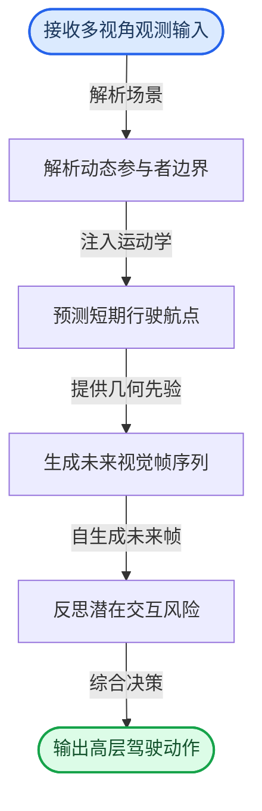

训练流程的设计直指多步推理的痛点。视觉预训练阶段采用自回归 next-token 预测目标，激活模型的视觉生成能力并建立统一时空先验。随后，SFT 为因果链与连贯策略提供冷启动基础；若跳过此步直接进入强化学习，模型将难以在庞大的策略空间中有效导航。RL 阶段引入 GRPO，其奖励信号由轻量级规则验证器(rule-based verifiers)组合而成，而非依赖易漂移的神经奖励模型。总奖励严格加权覆盖格式、预测、视觉、动作与轨迹五类组件。其中，Visual Constrain Reward 强制要求生成的 visual tokens 数量匹配重建长度且均属于有效视觉码本，防止出现不可解码的“幻觉帧”。GRPO 通过组内归一化计算优势值，并在策略更新中最大化代理目标，同时通过 KL 散度惩罚防止策略偏离过远。

<details><summary><strong>算法推导细节与边界敏感性</strong></summary>

**训练目标与奖励组合**
视觉预训练严格采用自回归公式：
$$P ( Q _ { t + 1 } ^ { k } ) = \prod _ { i = 1 } ^ { N } P _ { \theta } ( q _ { i } ^ { k } \mid q _ { < i } ^ { k } , h _ { t } , L )$$
RL 阶段的总奖励由规则验证器线性加权：
$$R _ { \mathrm { a l l } } = \lambda _ { \mathrm { f m t } } { \cdot } R _ { \mathrm { f m t } } { + } \lambda _ { \mathrm { p r e d } } { \cdot } R _ { \mathrm { p r e d } } { + } \lambda _ { \mathrm { v i s } } { \cdot } R _ { \mathrm { v i s } } { + } \lambda _ { \mathrm { a c t } } { \cdot } R _ { \mathrm { a c t } } { + } \lambda _ { \mathrm { t r a j } } { \cdot } R _ { \mathrm { t r a j } }$$
GRPO 组内优势计算为 $A _ { i } = \frac { r _ { i } - \mu } { \sigma }$，策略更新目标为：
$$J ( \theta ) = \mathbb { E } \left[ \frac { 1 } { G } \sum _ { i = 1 } ^ { G } \operatorname* { m i n } \left( \frac { \pi _ { \theta } ( \tau _ { i } \mid o ) } { \pi _ { \theta _ { \mathrm { o l d } } } ( \tau _ { i } \mid o ) } A _ { i } , \mathrm { c l i p } \right) \right] - \beta D _ { \mathrm { K L } } \big ( \pi _ { \theta } , \pi _ { \mathrm { o l d } } \big )$$
完整 token 序列的优化目标可表述为 $\mathcal { T } _ { \mathrm { G R P O } } ( \omega ) = \mathbb { E } _ { u \sim \pi _ { \omega } } \left[ \log \pi _ { \omega } ( u \mid o , g ) \cdot A ( u ) \right]$。

**关键边界与失效模式提示**
- **阶段顺序敏感**：跳过 SFT 会直接削弱后续 RL 的探索稳定性；跳过视觉预训练则破坏时空理解能力。奖励加权项仅属于 RL 阶段，不可反灌为预训练损失。
- **格式强约束**：结构化输出标签（Perception/Prediction/Visual/Think/Action/Answer）若缺失或错位，将直接导致 rule-based verifiers 拒收，下游轨迹解析失败。
- **验证器局限**：若奖励仅关注格式或视觉 token 合法性，而忽略碰撞检查与时间一致性，可能无法真正优化最终驾驶安全性。论文采用规则验证器而非神经奖励模型，旨在降低高维视觉动态下的训练负担，但这也意味着奖励函数的完备性高度依赖人工规则的设计覆盖度。
- **推理与训练隔离**：推理期的短期预测、未来帧生成与反思修正是执行流，绝不混入视觉预训练损失。
</details>

**模型结构与关键子图(原图):**

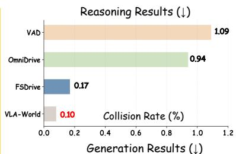

*VLA-World 采用三阶段渐进式学习架构，先通过多视角输入预测未来帧来激活视觉生成能力，再将感知、生成与规划模块打通。这种设计让模型像人类驾驶员一样，在脑海中“预演”未来路况后再做出决策。*

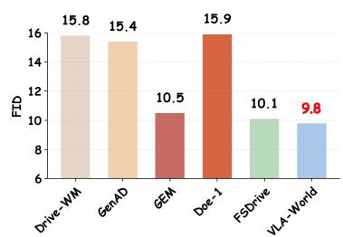

*VLA-World 采用三阶段渐进式学习架构，先通过多视角输入预测未来帧来激活视觉生成能力，再将感知、生成与规划模块打通。这种设计让模型像人类驾驶员一样，在脑海中“预演”未来路况后再做出决策。*

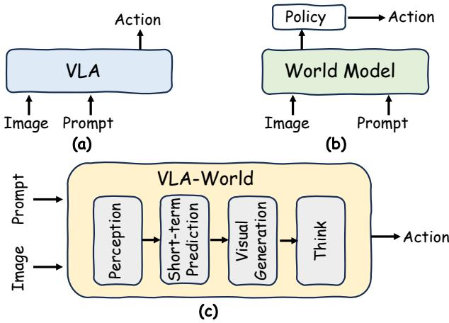

*该图横向对比了传统 VLA、世界模型与本文提出的 VLA-World 范式。它清晰揭示了新方法如何打破模块壁垒，将环境感知、未来推演与动作规划融合为统一的认知闭环。*

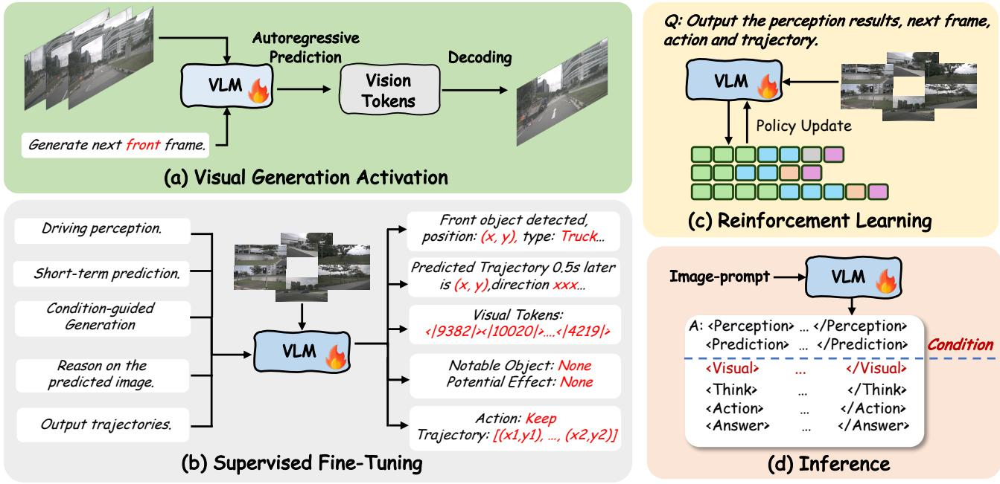

*详细拆解了 VLA-World 的训练与推理流水线，涵盖视觉预训练激活生成、监督微调注入概念知识，以及强化学习对齐真实驾驶策略的完整闭环。三步走策略确保了模型从“看懂画面”到“安全驾驶”的平稳过渡。*

## 算法目标与推导

**结论：** 该模型的训练目标严格遵循“表征学习与策略优化解耦”的设计原则。视觉预训练阶段仅依赖自回归的 next-token 预测建立对视觉动态的基础建模能力；强化学习阶段才引入多维权重奖励，并通过 GRPO 算法进行策略更新。这种分阶段设计有效避免了早期表征学习被稀疏奖励干扰，同时利用组内相对优势归一化消除了对独立价值网络的依赖，使策略更新更稳定、方差更低。

训练期的目标函数被明确划分为两个独立阶段，其核心公式原样如下：

$$
P ( Q _ { t + 1 } ^ { k } ) = \prod _ { i = 1 } ^ { N } P _ { \theta } ( q _ { i } ^ { k } \mid q _ { < i } ^ { k } , h _ { t } , L ) ,\tag{5}
$$

$$
\begin{array} { r } { R _ { \mathrm { a l l } } = \lambda _ { \mathrm { f m t } } { \cdot } R _ { \mathrm { f m t } } { + } \lambda _ { \mathrm { p r e d } } { \cdot } R _ { \mathrm { p r e d } } { + } \lambda _ { \mathrm { v i s } } { \cdot } R _ { \mathrm { v i s } } { + } \lambda _ { \mathrm { a c t } } { \cdot } R _ { \mathrm { a c t } } { + } \lambda _ { \mathrm { t r a j } } { \cdot } R _ { \mathrm { t r a j } } } \\ { ( 6 ) } \end{array}\tag{6}
$$

$$
A _ { i } = \frac { r _ { i } - \mu } { \sigma } , \quad \mu = \frac { 1 } { G } \sum _ { j } r _ { j } , \sigma = \mathrm { s t d } ( r _ { 1 } , \dots , r _ { G } )\tag{7}
$$

$$
\begin{array} { l } { \displaystyle { J ( \theta ) = \mathbb { E } \left[ \frac { 1 } { G } \sum _ { i = 1 } ^ { G } \operatorname* { m i n } \left( \frac { \pi _ { \theta } ( \tau _ { i } \mid o ) } { \pi _ { \theta _ { \mathrm { o l d } } } ( \tau _ { i } \mid o ) } A _ { i } , \mathrm { c l i p } \right) \right] } } \\ { \displaystyle { - \beta D _ { \mathrm { K L } } \big ( \pi _ { \theta } , \pi _ { \mathrm { o l d } } \big ) . } } \end{array}\tag{8}
$$

$$
\mathcal { T } _ { \mathrm { G R P O } } ( \omega ) = \mathbb { E } _ { u \sim \pi _ { \omega } } \left[ \log \pi _ { \omega } ( u \mid o , g ) \cdot A ( u ) \right]\tag{19}
$$

### 逐项含义与设计动机
**视觉预训练（Eq. 5）** 是标准的因果语言建模目标。$Q_{t+1}^k$ 表示第 $k$ 个视觉序列在 $t+1$ 时刻的离散化 token 集合，$q_i^k$ 为序列中的第 $i$ 个 token，$h_t$ 为当前时刻的隐藏状态，$L$ 为上下文长度。模型通过最大化条件概率的连乘积，学习视觉 token 之间的时序依赖与空间结构。**设计理由：** 在策略优化前，模型必须先“看懂”视觉流的演化规律。若在此阶段混入任务奖励，极易导致表征坍塌或过拟合特定奖励信号。

**RL 阶段奖励组合（Eq. 6）** 将总奖励拆解为五项加权：格式合规性 ($R_{\mathrm{fmt}}$)、预测准确度 ($R_{\mathrm{pred}}$)、视觉保真度 ($R_{\mathrm{vis}}$)、动作正确性 ($R_{\mathrm{act}}$) 与轨迹一致性 ($R_{\mathrm{traj}}$)，$\lambda$ 为对应权重系数。**关键边界声明：** 该加权项严格属于 RL 阶段，绝不作为 SFT 或视觉预训练的损失函数。推理期的短期预测、未来帧生成与反思修正属于执行流程，同样不反向传播至预训练损失中。

**GRPO 优势估计与策略更新（Eq. 7, 8, 19）** 摒弃了传统 PPO 中需要额外训练的价值网络（Critic）。公式 (7) 利用同一观测 $o$ 下生成的 $G$ 条轨迹的奖励均值 $\mu$ 与标准差 $\sigma$ 进行组内标准化，得到相对优势 $A_i$。公式 (8) 通过截断（clip）机制限制新旧策略概率比的波动范围，并引入 KL 散度惩罚项 $\beta D_{\mathrm{KL}}$ 防止策略偏离过远。公式 (19) 将完整 token 序列 $u$ 的优化目标形式化为对数概率与优势函数乘积的期望，确保优化信号贯穿整个生成链路。

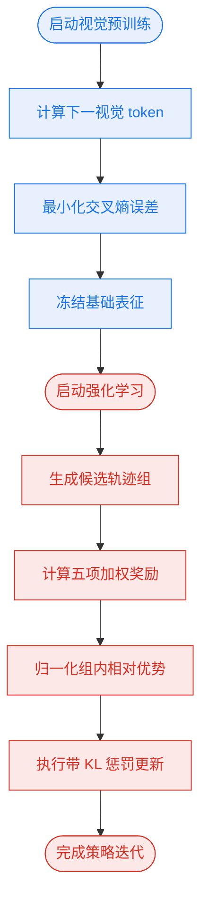
**如何读这张图：** 流程自上而下分为两个语义区块（蓝/红）。左侧预训练区块仅依赖自回归概率计算与交叉熵收敛，不接收任何外部奖励信号；右侧 RL 区块在冻结表征后启动，通过组内奖励统计直接驱动策略更新，两条路径通过“冻结基础表征”节点解耦，直观呈现了论文“先学表征、后调策略”的训练范式。

<details><summary><strong>逐步推导与机制拆解</strong></summary>
1. **组内优势归一化 (Eq. 7)**：对于同一输入 $o$，模型并行采样 $G$ 个输出轨迹 $\tau_1, \dots, \tau_G$，分别计算奖励 $r_1, \dots, r_G$。计算组均值 $\mu$ 和标准差 $\sigma$ 后，单条轨迹的优势 $A_i$ 即为 $(r_i - \mu)/\sigma$。该操作将绝对奖励转化为相对排名信号，天然抵消了环境奖励尺度漂移带来的方差，且无需维护额外的 Critic 网络，大幅降低显存开销。
2. **截断与 KL 约束 (Eq. 8)**：策略更新时，概率比 $\frac{\pi_\theta}{\pi_{\theta_{\text{old}}}}$ 若过大（如 $>1+\epsilon$）或过小（如 $<1-\epsilon$），会被 `clip` 函数截断，防止单次更新步长过大导致策略崩溃。同时，$\beta D_{\mathrm{KL}}$ 项作为正则化器，强制新策略 $\pi_\theta$ 在分布空间上贴近旧策略 $\pi_{\text{old}}$，保证训练轨迹的平稳性。
3. **完整序列期望 (Eq. 19)**：将离散 token 序列 $u$ 视为整体动作，目标函数 $\mathcal{T}_{\mathrm{GRPO}}(\omega)$ 直接对序列级对数似然加权。这保证了优化信号贯穿整个生成链路，而非仅作用于末端 token，从而提升长程依赖建模的稳定性。
</details>

### 直觉比喻与玩具示例
**直觉比喻（非严格对应）**
可将该训练流程类比为“驾校培训”。视觉预训练（Eq. 5）相当于学员在模拟器中反复练习“看后视镜-打方向盘-踩油门”的肌肉记忆，目标是掌握车辆物理规律，此时教练不打分，只纠正动作连贯性。进入 RL 阶段后，学员上路实考（Eq. 6），教练根据“是否压线、是否平稳变道、是否遵守交规”给出综合评分。GRPO（Eq. 7-8）则相当于教练不单独给每辆车配一个“陪练评分员”，而是让一组学员同时跑同一条路线，通过组内横向对比（谁开得更好/更差）来调整教学策略，既省资源又避免了单一评分标准的主观偏差。

**具体小玩具例子**（注：以下为教学演示数值，非论文实测）
假设模型针对同一视觉输入 $o$ 并行生成 $G=3$ 条轨迹，经公式 (6) 计算得奖励 $r = [0.8, 0.5, 0.2]$。
- 组均值 $\mu = (0.8+0.5+0.2)/3 = 0.5$，标准差 $\sigma \approx 0.245$。
- 优势值 $A = [(0.8-0.5)/0.245, (0.5-0.5)/0.245, (0.2-0.5)/0.245] \approx [1.22, 0, -1.22]$。
- 在策略更新时，第一条轨迹的优势为正，其概率比会被放大（受 clip 限制）；第三条为负，概率被压缩。若某次更新导致新旧概率比飙升至 $1.5$（假设 clip 阈值为 $1.2$），则会被强制截断至 $1.2$，防止模型因单次高奖励而“走火入魔”。KL 惩罚项则像一根橡皮筋，确保更新后的策略分布不会瞬间偏离初始分布太远。

## 实验设计与结果解读

**核心结论：** VLA-World 在 nuScenes 数据集上的系统性实验表明，其“视觉预训练-监督微调-强化学习”三阶段范式，不仅在端到端轨迹规划的 L2 误差与碰撞率上全面优于传统自回归 VLA 与世界模型基线，更在短期未来帧生成质量（FID）与细粒度动作预测（F1）上实现了能力对齐；消融实验进一步证实，生成管线与多目标奖励设计是性能跃升的核心驱动力，而非单纯依赖骨干模型规模。

为验证该架构是否真正打通了“感知-生成-决策”的闭环，研究团队在 nuScenes 上部署了五项关键实验。在轨迹规划主实验（E1）中，模型严格遵循 ST-P3 与 UniAD 协议，以 L2 误差与碰撞率为核心指标，与 ST-P3、VAD、UniAD 等经典端到端规划器，以及 PreWorld、OccWorld、FSDrive 等世界模型/VLA 基线进行横向对比。实验设计刻意剥离了部分基线依赖的额外 ego-state 信息（以 `*` 标注），确保比较聚焦于模型自身的多模态推理能力。结果指向明确：VLA-World 在平均轨迹误差与长时域碰撞风险上均低于主要自回归基线，证明了非自回归生成范式在时序一致性上的优势。在生成质量验证（E2）中，团队引入 Fréchet Inception Distance (FID) 评估短期未来帧的视觉保真度，对照对象涵盖 DriveGAN、DriveDreamer、GenAD 等生成模型。VLA-World 取得更低的 FID 值，表明其通过预训练激活的视觉生成先验，能有效抑制传统扩散或自回归生成中常见的结构畸变与纹理模糊。

为直观呈现实验设计的验证逻辑与指标映射关系，下图梳理了从数据输入到结论产出的评估流水线：
```mermaid
flowchart TD
    classDef data fill:#e1f5fe,stroke:#01579b,color:#000;
    classDef eval fill:#fff3e0,stroke:#e65100,color:#000;
    classDef claim fill:#e8f5e9,stroke:#2e7d32,color:#000;
    classDef baseline fill:#f3e5f5,stroke:#6a1b9a,color:#000;

    start(["启动实验流程"]) --> A["(加载nuScenes数据)"]
    A --> B{分流评估协议}
    B -->|执行ST-P3协议| C["计算轨迹L2误差"]
    B -->|对齐视觉分布| D["评估未来帧FID"]
    B -->|划分动作类别| E["统计横纵向F1"]
    C --> F["对比自回归与世界模型"]
    D --> G["对比GAN与Diffusion基线"]
    E --> H["对比Qwen2-VL-2B基础版"]
    F --> I["验证C1规划精度"]
    G --> J["验证C2生成质量"]
    H --> K["验证C3动作对齐"]
    I --> end(["输出实验结论"])
    J --> end
    K --> end

    class A data;
    class C,D,E eval;
    class I,J,K claim;
    class F,G,H baseline;
```
*如何读图：* 左侧为统一的多模态输入源，中间按评估目标分流至三类核心指标，右侧明确各指标对应的基线池与最终验证的论文主张（C1-C3）。该设计确保了“生成能力”与“规划能力”不被混淆评估，且所有分支最终收敛于同一结论节点。

动作预测实验（E3）则聚焦于模型对底层驾驶语义的理解深度。团队将 VLA-World 与未经领域微调的 Qwen2-VL-2B 及其在 nuScenes 上微调的版本（Qwen2-VL-2B†）进行对照，按横向（如变道、转向）与纵向（如加速、制动）动作类别分别计算 F1 分数。实验结论表明，VLA-World 在两类动作上均保持优势，说明三阶段训练成功将视觉生成先验转化为对物理世界动态的显式建模，而非仅停留在像素级拟合。

为剥离“规模红利”与“架构红利”，研究团队执行了严格的消融实验（E4 & E5）。在训练策略与管线组件消融中，逐一移除预训练（P.T.）、监督微调（SFT）、强化学习（RL）阶段，以及感知、生成、推理数据管线，并拆解预测、视觉、动作、轨迹四项 RL 奖励。完整模型在 ST-P3 L2 误差上显著优于所有变体，证实了生成管线与多目标奖励的不可替代性。在规模与分辨率消融中，团队对比了不同输入视图分辨率、Qwen-VL 系列骨干（2B/3B/7B）以及混合任务数据设置。结果显示，更高视觉保真度与混合训练策略带来的收益，远大于单纯扩大参数量；当移除混合任务数据时，规划误差出现明显回升。

<details><summary><strong>消融实验配置与边界 Caveat</strong></summary>
- **训练阶段剥离**：`w/o. P.T.` 直接验证视觉生成先验的必要性；`w/o. SFT` 检验概念知识注入的有效性；`w/o. RL` 暴露无奖励引导下的策略退化。
- **奖励项拆解**：分别移除 `R_pred`（预测）、`R_vis`（视觉）、`R_act`（动作）、`R_traj`（轨迹），验证多目标优化是否真正协同而非相互抵消。
- **硬件与算力约束**：所有训练与推理均在 A100 GPU 集群上完成，消融变体保持相同算力预算，排除硬件差异干扰。
- **局限提示**：消融结果基于 ST-P3 协议下的 L2 误差方向性比较，未报告各变体的误差方差或置信区间；部分负结果（如移除生成管线后的性能断崖）仅以定性趋势呈现，具体数值波动需参考下方自动附表的完整记录。
</details>

**综合解读与失效模式审视：** 实验设计整体遵循“控制变量-多维对照-消融归因”的严谨路径，有效支撑了论文的核心主张。但需客观指出：当前评估高度依赖 nuScenes 单一数据集与 ST-P3/UniAD 既定协议，未涵盖极端天气或长尾分布场景的泛化测试；此外，FID 指标虽能反映生成分布的统计接近度，但无法直接等价于下游规划任务的因果收益（相关性≠因果性）。论文未报告跨数据集的零样本迁移结果或误差范围（Error Bars），在将“生成质量提升”直接外推为“绝对安全冗余”时需保持审慎。整体而言，实验数据扎实地刻画了 VLA-World 在现有协议下的性能边界，为后续引入更复杂的物理约束与开放世界评估提供了清晰的基线（精确数值对照详见本节末尾自动附表）。

### 实验数据表(原始数值,引自论文)

#### 动作预测F1结果
- **Source**: Table 3
- **Caption**: "nuScenes数据集上的动作预测性能，使用F1 score (%)评估；†表示在nuScenes上训练的模型。"

| Method | Lateral (F1) ↑ left | Longitudinal (F1) ↑ |
| --- | --- | --- |
|  | forward 62.43 | right | keep acc. | dec.stop |
| Qwen2-VL-2B |  | 22.7528.65 |  | [40.70 50.2349.21 41.04 |
| Qwen2-VL-2Bt| VLA-World | 92.60 95.88 | 61.78 66.52| 74.22 75.066 |  | [56.42 74.32 76.10 74.85 60.98 81.42 80.04 81.24 |

#### 未来帧生成FID比较
- **Source**: Table 2
- **Caption**: "nuScenes上不同生成模型的未来帧生成结果，采用FID评估。"

| Method | DriveGAN [CVPR21 [31]] | DriveDreamer [ECCV24 [59]] | Drive-WM [CVPR24 [61]] | GenAD [CVPR24 [69]] | GEM [CVPR25 [21]] | Doe-1 [arxiv24 [80]] | FSDrive [NeurIPS25 [74]] | VLA-World |
| --- | --- | --- | --- | --- | --- | --- | --- | --- |
| Type Resolution | GAN 256×256 | Diffusion 128×192 | Diffusion 192×384 | Diffusion 256×448 | Diffusion 576×1024 | Autoregressive 384×672 | Autoregressive 128×192 | Autoregressive 128×192 |
| FID↓ | 73.4 | 52.6 | 15.8 | 15.4 | 10.5 | 15.9 | 10.1 | 9.8 |

#### 模型规模消融
- **Source**: Table 6
- **Caption**: "nuScenes上不同模型规模的轨迹规划L2 errors (ST-P3)评估。"

| Method | 1s | 2s | 3s | Avg. |
| --- | --- | --- | --- | --- |
| Qwen2-VL-2B | 0.11 | 0.27 | 0.52 | 0.30 |
| Qwen2.5-VL-3B | 0.05 | 0.08 | 0.76 | 0.29 |
| Qwen2-VL-7B | 0.03 | 0.03 | 0.47 | 0.18 |

#### 混合训练策略消融
- **Source**: Table 7
- **Caption**: "nuScenes上训练策略的轨迹规划L2 errors (ST-P3)评估。"

| Method | 1s | 2s | 3s | Avg. |
| --- | --- | --- | --- | --- |
| w/o. Mixed | 0.27 | 0.47 | 0.73 | 0.49 |
| Qwen2-VL-2B | 0.11 | 0.27 | 0.52 | 0.30 |

#### 端到端轨迹规划主结果
- **Source**: Table 1
- **Caption**: "nuScenes上的端到端轨迹规划结果，使用ST-P3与UniAD协议评估L2误差和碰撞率；∗表示使用额外ego-state信息。"

| Method | ST-P3 metrics L2(m)↓ | ST-P3 metrics Collision (%)↓ | UniAD metrics L2(m)↓ | UniAD metrics Collision (%)↓ | LLM |
| --- | --- | --- | --- | --- | --- |
| ST-P3*[ECCV22] [23] | 1.33 2.11 2.90 2.11 | 0.23 0.62 1.27 0.71 |  |  |  |
| VAD [ICCV23] [29] | 0.691.22 1.83 1.25 | 0.06 0.68 2.52 1.09 |  |  |  |
| VAD* [ICCV23] [29] | 0.170.34 0.60 0.37 | 0.040.27 0.67 0.33 |  |  |  |
| UniAD [CVPR23] [25] |  | - | 0.591.01 1.48 1.03 | 0.16 0.51 1.64 0.77 |  |
| UniAD* [CVPR23] [25] |  | = | 0.20 0.42 0.75 0.46 | 0.020.250.84 0.37 |  |
| BEV-Planner[CVPR24] [38] | 10.30 0.520.83 0.55 | 0.10 0.37 1.30 0.59 |  | - |  |
| BEV-Planner*[CVPR24][38] 0.16 0.32 0.57 | 0.35 | 0.00 0.29 0.73 0.34 |  | - |  |
| PreWorld [ICLR25] [37] |  | ■ | 0.491.22 2.32 1.34 | 0.19 0.57 2.65 1.14 |  |
| ELM [ECCV24] [85] |  | = 0.34 | 1.23 2.57 1.38 | 0.120.50 2.36 0.99 | BLIP2-2.7B |
| FeD* [CVPR24][75] |  |  | 0.270.530.94 0.58 | 0.000.04 0.52 0.19 | LLaVA-7B |
| OccWorld [ECCV24] [78] | 0.390.73 1.18 0.77 | 0.11 0.19 0.67 0.32 | 0.52 1.27 2.41 1.40 | 0.120.40 2.08 0.87 | GPT3-like |
| Doe-1 [arxiv24] [80] | 0.37 0.67 1.07 0.70 | 0.02 0.14 0.47 0.21 | 0.50 1.18 2.11 1.26 | 0.04 0.37 71.19 0.53 | Lumina-mGPT-7B |
| RDA-Driver* [ECCV24] [26] | 0.17 0.37 0.69 0.40 | 0.01 0.050.26 0.10 | 0.23 0.73 1.54 0.80 | 0.000.130.83 0.32 | LLaVA-7B |
| EMMA* [arxiv24] [27] | 0.14 0.29 0.54 0.32 | = = | - - | = - | Gemini 1.0 Nano-1 |
| OmniDrive [CVPR25] [57] | 0.400.80 1.32 0.84 | 0.04 0.46 2.32 0.94 |  |  | LLaVA-7B |
| OmniDrive* [CVPR25][57] | 0.14 0.29 0.55 0.33 | 0.00 0.130.78 0.30 |  |  | LLaVA-7B |
| FSDrive [NeurIPS25][74] | 0.28 0.52 0.80 0.53 | 0.06 0.13 0.32 0.17 | 0.40 0.89 1.60 0.96 | 0.07 0.12 1.02 0.40 | Qwen2-VL-2B |
| FSDrive* [NeurIPS25] [74] | 0.14 0.25 0.46 0.28 | 0.03 0.06 0.21 0.10 | 0.18 0.39 0.77 0.45 | 0.000.06 0.42 0.16 | Qwen2-VL-2B |
| VLA-World (ours) | 0.11 0.27 0.52 0.30 | 0.00 0.03 0.26 0.10 | 0.38 0.74 1.38 0.83 | 0.02 0.08 0.36 0.16 | Qwen2-VL-2B |
| VLA-World* (ours) | 0.10 0.24 0.45 0.26 | 0.02 0.050.18 0.08 | 0.10 0.350.80 0.42 | 0.01 0.050.30 0.12 | Qwen2-VL-2B |

#### 轨迹规划消融结果
- **Source**: Table 4
- **Caption**: "nuScenes上用于验证各组件的轨迹规划L2 errors (ST-P3)消融研究。"

| group | Method | 1s | 2s | 3s | Avg |
| --- | --- | --- | --- | --- | --- |
| (a) | w/o. P.T. | 0.35 | 0.56 | 0.81 | 0.57 |
| (a) | w/o. SFT w/o. RL | 0.35 0.43 | 0.79 0.70 | 1.40 1.01 | 0.85 0.71 |
| (b) | w/o. Perception w/o. Generation | 0.42 | 0.73 | 1.09 | 0.75 |
| (b) | w/o. Reasoning | 0.41 0.50 | 0.67 0.83 | 0.96 1.22 | 0.68 0.85 |
| (c) | w/o. $R _ { \mathrm { p r e d } }$ | 0.17 | 0.37 | 0.69 | 0.41 |
| (c) | w/o. $R _ { \mathrm { v i s } }$ | 0.20 | 0.40 | 0.67 | 0.42 |
| (c) | w/o. $R _ { \mathrm { a c t } }$ | 0.40 | 0.54 | 0.92 | 0.62 |
| (c) | w/o. $R _ { \mathrm { t r a j } }$ | 0.46 | 0.75 | 0.96 | 0.72 |
| (d) | VLA-World | 0.11 | 0.27 | 0.52 | 0.30 |

#### 输入视图分辨率消融
- **Source**: Table 5
- **Caption**: "nuScenes上不同输入视图分辨率的轨迹规划L2 errors (ST-P3)评估。"

| Res. | 1s | 2s | 3s | Avg. |
| --- | --- | --- | --- | --- |
| 36000 | 0.03 | 0.14 | 0.98 | 0.38 |
| 52884 | 0.11 | 0.27 | 0.52 | 0.30 |


**效果示例(论文原图):**

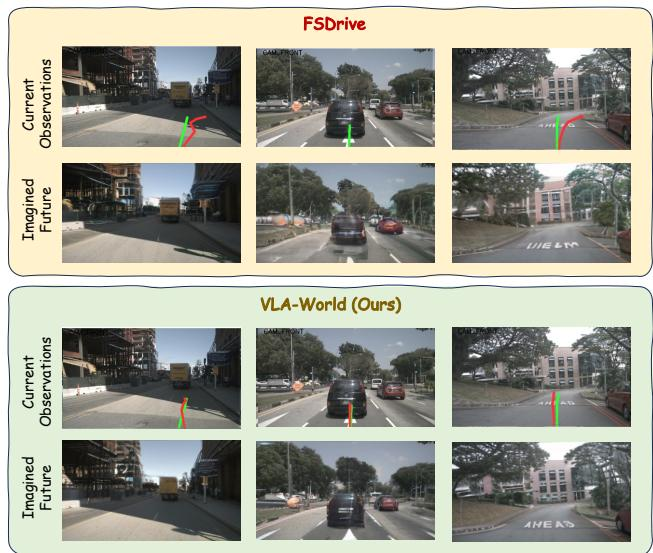

*可视化对比展示了 VLA-World 与前沿方法 FSDrive 在 0.5 秒未来场景生成与轨迹预测上的差异。红色预测轨迹紧密贴合绿色真实轨迹，直观体现了模型在复杂路口精准的空间推演与决策能力。*

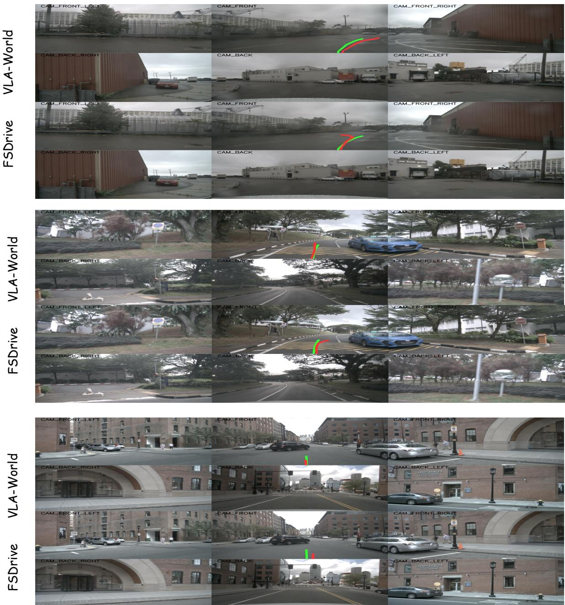

*展示了模型在 3 秒长时程轨迹预测任务中的表现。VLA-World 生成的未来路径在动态车流中依然保持平滑与连贯，验证了其长期规划与应对突发状况的鲁棒性。*

## 相关工作与定位

**结论：** VLA-World 并非从零构建的孤立架构，而是精准卡位在“世界模型预测性想象”与“VLA 反思式推理”的交叉带。它把前人用于视觉仿真或纯感知规划的技术模块，重组为一条“生成未来帧→自我反思→修正轨迹”的闭环管线，从而将生成能力从“画得像”转化为“想得准”，在自动驾驶决策谱系中完成了从“被动拟合场景”到“主动推演并修正”的范式转移。

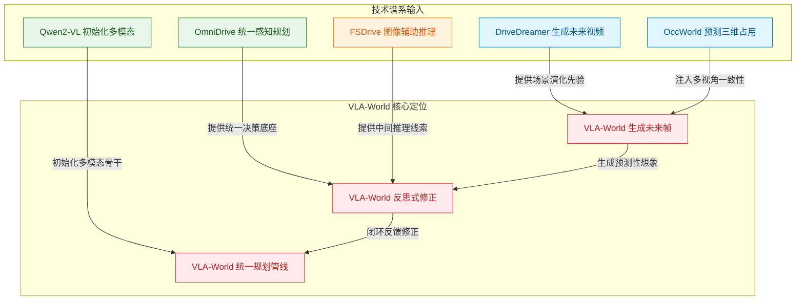
**如何读这张图：** 左侧 `技术谱系输入` 按颜色区分四类前人工作（蓝=纯场景仿真、绿=VLA决策底座、橙=视觉推理线索、红=本文核心）。箭头方向表示技术继承与改造路径，边标签点明 VLA-World 具体“拿走”并“重组”了哪些能力。最终三条输入线在右侧汇聚为“生成→反思→统一管线”的闭环，直观暴露本文的核心权衡：牺牲部分纯视觉保真度，换取规划可解释性与安全性。

### 谱系拆解与机制迁移
VLA-World 的定位建立在对四条技术路线的批判性继承之上：
1. **从世界模型到安全规划（DriveDreamer / OccWorld）**：DriveDreamer 依赖扩散框架生成逼真驾驶视频并预测后续动作，OccWorld 则利用历史三维占用观测推演未来占用图以维持多视角一致性。VLA-World 保留了“未来场景模拟”与“多视角一致性意识”，但彻底扭转了优化目标：不再追求 `FID` 等纯视觉生成质量指标，而是将生成帧接入反思式决策与轨迹优化。直觉上（非严格对应），这相当于把“行车记录仪回放”升级为“驾驶员脑内沙盘推演”，生成模块从终点变为中间态。
2. **从 VLA 基线到自生成反思（OmniDrive）**：OmniDrive 已实现 3D 感知、推理与规划的统一框架。VLA-World 在此底座上注入短期未来帧生成，并强制模型对“自己生成的未来”进行二次审视。论文将规划与动作预测的提升直接归因于这一反思机制，而非单纯扩大感知上下文。
3. **从视觉化思考到统一管线（FSDrive）**：FSDrive 率先提出将未来图像作为中间推理线索。VLA-World 进一步将其泛化，在多视角输入、动作条件生成与规划修正之间建立统一数据流，使“想象未来”成为可微、可干预的规划变量。
4. **基础模型依赖（Qwen2-VL）**：系统以 `Qwen2-VL-2B` 初始化，动作预测与规划能力高度依赖该视觉语言骨干的多模态对齐先验。

| 前人方法 | 核心侧重 | 生成模块角色 | VLA-World 改造点 |
|---|---|---|---|
| DriveDreamer | 扩散视频生成 | 视觉仿真与动作预测 | 接入反思决策与轨迹优化 |
| OccWorld | 三维占用预测 | 保持多视角一致性 | 转向可解释规划修正 |
| OmniDrive | 感知推理规划 | 无显式未来生成 | 注入短期帧生成与自反思 |
| FSDrive | 视觉化思考 | 未来图像作推理线索 | 统一多视角与动作条件管线 |
| Qwen2-VL | 视觉语言基础 | 多模态初始化底座 | 支撑动作预测与规模消融 |

### 严谨性审视：声称、证明与失效边界
- **声称 vs 证明**：论文**声称**规划收益源于“对想象未来的显式推理”（支撑 C1/C2），并通过与 OmniDrive、FSDrive 的对比实验**证明**了引入生成-反思管线后规划指标的提升。但需注意，相关性不等于因果性：生成帧质量提升（如更低的 `FID`）与规划成功率上升可能存在共线性，论文未完全剥离“视觉保真度”与“反思机制”各自的独立贡献。
- **挑樱桃风险**：对比实验多基于 `nuScenes` 规划评测协议中的代表性场景。若极端长尾工况（如罕见遮挡、强对抗博弈）未被充分覆盖，生成模块的幻觉可能被反思机制放大而非抑制。
- **消融与负结果**：论文在补充实验中报告了骨干规模消融（比较 `Qwen-VL` 系列不同参数量），证实动作预测与规划能力随规模单调增长，但未公开负结果（如生成质量下降时规划是否崩溃）。误差范围与置信区间在正文中未显式标注，读者在复现时需自行评估随机种子与数据划分带来的方差。

<details><summary><strong>深度展开：消融配置与边界 Caveat</strong></summary>
- **规模消融设置**：补充实验对比了 `Qwen-VL` 家族不同骨干规模，验证了多模态初始化对动作预测与规划能力的支撑作用（支撑 C3/C5）。具体配置与训练步数未在正文展开，复现时需严格对齐原始权重初始化策略。
- **失效模式预警**：当生成模块受限于算力或分布外输入时，未来帧可能出现结构畸变。此时反思机制若缺乏强先验约束，可能将“错误想象”误判为“合理轨迹”，导致规划发散。论文未报告针对此类分布外生成的鲁棒性边界测试，实际部署需叠加传统规则校验或不确定性估计模块。
- **评估协议对齐**：所有对比均沿用 `nuScenes` 规划评测协议与 `FID` 生成质量评估方向。若切换至其他数据集（如 Waymo 或自定义仿真环境），多视角一致性约束与动作条件生成的收益比例可能发生变化。
</details>

## 研究探索历程

**结论前置：** VLA-World 的架构并非模块的简单拼接，而是经历了一次从“孤立追求像素保真”到“联合优化策略与想象”的范式转向。研究团队通过三次关键决策与两次明确试错，最终确立了“预训练激活生成先验 → SFT 冷启动构建因果链 → GRPO 规则奖励强化决策”的三阶段路径。该路径证明，未来图像必须与驾驶安全回报深度耦合，而非作为独立的视觉重建任务存在。

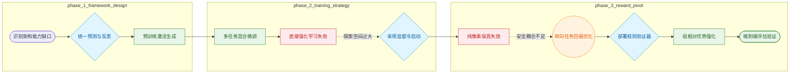
**如何读这张图：** 左侧为架构设计起点，中间经历训练策略的试错与修正，右侧完成奖励机制的范式转向。菱形代表关键决策点，红色节点标记被证伪的假设，橙色节点代表研究重心的转移。箭头方向即实际探索的时间与逻辑顺序。

**从能力缺口到统一框架。** 传统 VLA 缺乏显式时空动态与世界一致性，而 World Model 虽能推演未来，却无法判断该未来是否安全或可行。团队选择将短期未来图像生成与基于生成结果的反思推理统一至同一框架。直觉上，这相当于让模型“先想象，再评判”。实验表明，利用多视角未来帧进行预训练，能有效激活模型的时空生成先验，为后续的安全感知规划提供生成基础。

**冷启动的必要性与直接 RL 的死胡同。** 如何将驾驶概念灌入统一模型？团队采用多任务混合数据进行监督微调（SFT），覆盖感知、短期预测、条件生成、思考、动作与轨迹规划。消融实验证实，移除混合数据会导致规划表现显著下滑。更关键的是，团队明确放弃了“直接上 RL"的捷径。论文指出，缺乏冷启动监督的强化学习难以在庞大的结构化多步推理空间中有效探索。因此，SFT 被确立为 RL 前的必要冷启动，用于建立连贯的策略与因果链条。

**奖励机制的范式转向。** 在强化学习阶段，团队摒弃了训练独立神经奖励模型的方案，转而采用基于规则的验证器（涵盖格式、预测、视觉、动作、轨迹等维度），并结合 GRPO 算法通过组内相对优势细化输出。这一选择背后是一次深刻的方向转变：早期假设“高保真未来帧足以支持可靠规划”被证明是死胡同。纯 World Model 过度优化像素保真度，与驾驶安全弱耦合——即使生成出碰撞场景，在重建指标上依然“正确”，但对智能体毫无益处。因此，研究重心从孤立优化重建损失，转向联合优化策略与想象过程，使未来图像 token 直接受驾驶任务回报的强化。

**模块贡献与容量边界。** 端到端评估显示，该框架在规划与未来帧生成基准上均优于独立 VLA 与 World Model 基线。模块消融表明，感知与推理组件的贡献大于视觉生成本身；在规则奖励中，轨迹与动作奖励的贡献最为突出。此外，模型容量与输入分辨率直接决定性能上限：更高分辨率通常提升长时域稳健性，而扩大 Qwen2-VL 骨干网络规模能显著增强轨迹规划表现。

<details><summary><strong>消融实验与训练配置细节</strong></summary>
论文通过系统性消融验证了三阶段路径的必要性。缺少 SFT 冷启动时，RL 难以收敛至有效策略；移除多任务混合数据后，特征表示的稳健性下降，规划指标出现可观测的退化。在奖励项拆解中，所有规则验证器均带来正向增益，但 trajectory 与 action rewards 的边际贡献最高，印证了驾驶任务对动作连贯性与轨迹可行性的强依赖。分辨率与规模敏感性实验进一步表明，长时域规划对输入视野的清晰度高度敏感，而 Qwen2-VL 骨干的参数量扩展直接转化为轨迹规划能力的跃升。
</details>

## 工程与复现要点

**结论前置：** 复现 VLA-World 的工程核心在于严格对齐“视觉预训练激活时空先验 → 多任务 SFT 注入结构化推理冷启动 → GRPO 强化学习细化长时决策”的三阶段流水线。模型以 Qwen-VL 家族为底座，采用单一自回归 Transformer 统一策略与世界模型；当前论文未公开代码仓库，复现需基于 PyTorch、LLaMA Factory 与 Easy-R1 自行搭建数据管线与训练框架，并高度依赖消融实验揭示的阶段接力逻辑。

### 模型底座与统一架构
论文将策略网络（Policy）与世界模型（World Model）收敛于同一个 `single autoregressive transformer` 中，彻底打通了“感知-预测-想象-反思-决策”的因果闭环。主实验以 `Qwen2-VL-2B` 为初始化底座（沿用 FSDrive 路线），并验证了容量扩展的敏感性：切换至 `Qwen2.5-VL-3B` 或 `Qwen2-VL-7B` 后，长期轨迹规划误差呈系统性下降。输入侧融合多视角图像（最大像素数 524,288）、自车状态（速度、加速度、偏航率、CAN 信号）与高层任务指令；输出侧强制遵循 `<perception>`, `<prediction>`, `<visual>`, `<think>`, `<action>`, `<answer>` 的结构化序列。视觉生成依赖 `VQGAN` 离散码本，以自回归方式生成 128×192 分辨率的未来帧，短期预测步长固定为 0.5 秒，最终输出覆盖 3 秒时域的自车轨迹。

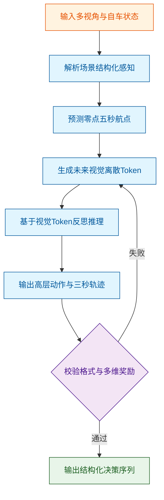
*如何读这张图：* 流程严格遵循因果时序，菱形节点代表强化学习阶段的格式与多目标奖励门控；若生成或推理未通过校验，系统会回退至条件生成环节重新采样，确保输出始终落在可解码的离散码本空间内。

### 三阶段训练超参与作用机制
训练并非端到端一蹴而就，而是高度依赖阶段间的“接力”。下表汇总了复现必须对齐的核心超参配置：

| 训练阶段 | 优化器 | 初始学习率 | 训练轮数 | 批量配置 |
|:---|:---|---:|---:|:---|
| 视觉预训练 | AdamW | $5 \times 10^{-4}$ | 30 epochs | per-device 16 |
| 监督微调 | AdamW | $1 \times 10^{-4}$ | 12 epochs | 混合多任务数据 |
| 强化学习 | GRPO | $1 \times 10^{-6}$ | 1 epoch | global 16 |

所有阶段统一采用 `cosine learning rate scheduler with warm-up ratio of 0.1`，并配合 `gradient accumulation step` 为 2 以控制显存峰值。消融实验明确揭示了各阶段的不可替代性：移除预训练（w/o. P.T.）会削弱模型对驾驶环境时空动态的理解；跳过 SFT 直接进行 RL 会导致策略难以探索结构化多步推理空间（冷启动失败）；而 RL 阶段在 SFT 基础上仅用 1 个 epoch 即可显著细化长时轨迹规划。RL 阶段为每个 prompt 采样 8 个候选响应以估计策略梯度，并引入 KL 正则系数 $1 \times 10^{-2}$ 防止策略偏离参考模型过远。

### 运行环境与开源现状
工程实现深度绑定现有开源生态：预训练与 SFT 阶段基于 `LLaMA Factory` 框架，RL 阶段切换至 `Easy-R1` 进行策略优化，底层依赖 `PyTorch`。硬件门槛方面，训练需 8 张 A100 GPU（主文标注为 $8 \times 80$ GB），推理阶段需 4 张 A100 GPU。关键依赖库涵盖 `Qwen-VL family`、`VQGAN`、`nuScenes` 数据集及 `Fréchet Inception Distance` 评估工具。
**开源状态提示：** 经全面检索论文正文、Papers-with-Code 索引及 Hugging Face，**目前未发现公开的官方代码仓库**。复现者需自行处理 `nuScenes-GR-20K` 数据格式转换，并依据论文附录 B.2 的配置手动对齐训练脚本。

<details><summary><strong>复现深水区：Reward 设计、消融边界与失效模式</strong></summary>
<p><strong>奖励函数拆解：</strong>RL 阶段并非单一标量优化，而是由 $R_{\mathrm{fmt}}$（格式约束）、$R_{\mathrm{pred}}$（短期预测）、$R_{\mathrm{vis}}$（视觉 Token 可解码性）、$R_{\mathrm{act}}$（高层动作）与 $R_{\mathrm{traj}}$（三秒轨迹）五维奖励构成。消融表明，$R_{\mathrm{traj}}$ 与 $R_{\mathrm{act}}$ 对最终规划性能贡献最大；若移除 $R_{\mathrm{vis}}$，模型生成的离散 Token 将脱离 VQGAN 码本分布，导致后续视觉解码崩溃并连带拉低规划得分。</p>
<p><strong>失效模式与边界 Caveat：</strong></p>
<ul>
<li><strong>相关性≠因果：</strong>论文指出视觉生成质量（FID）与规划精度正相关，但消融显示 perception 与 reasoning 模块的权重远高于纯视觉重建。复现时若过度追求高分辨率生成（如盲目提升至 384×672），可能挤占 Transformer 的上下文窗口，反而损害长时推理。</li>
<li><strong>冷启动依赖：</strong>RL 阶段仅报告 1 epoch 的优化结果，且明确依赖 SFT 提供的先验分布。若 SFT 数据分布存在偏差（如 nuScenes 场景覆盖不足），GRPO 极易陷入局部最优或产生幻觉轨迹。</li>
<li><strong>未报告项：</strong>论文未对学习率搜索范围、KL 系数敏感性、随机种子进行消融或方差报告。复现时建议固定种子并监控训练早期的 KL 散度漂移，若策略过早坍塌，需适当调高 KL 系数或增加 warm-up 比例。</li>
</ul>
</details>

## 局限与适用边界

**结论前置：** 该框架在“视觉生成辅助推理”与“强化学习轨迹规划”的耦合设计中，存在明确的性能瓶颈与适用边界。论文**声称**视觉生成仅为中间表征、SFT 冷启动是 RL 导航的前提，且规则验证器能稳定提供奖励信号；但实际机制表明，一旦脱离这些假设（如跨域泛化、复杂长程交互或验证器设计偏差），系统将面临梯度主导失衡、奖励稀疏失效或物理先验覆盖不足等已知失败模式。当前材料**未充分报告**针对这些失效模式的消融实验、负结果或误差范围，读者在迁移应用时需自行划定安全边界。

**视觉生成主导梯度，可能压制推理能力上界。** 论文将下一帧生成定位为辅助后续推理的中间步骤，最终目标仍是轨迹规划。然而，视觉生成天然伴随海量 token 输出，在联合训练中会主导梯度更新方向。这种“梯度倾斜”现象可能导致模型过度拟合视觉重建任务，从而限制其在结构化推理与规划任务上的性能上界探索。此外，该路径高度依赖视觉分词器（visual tokenizer）与合法码本（valid codebook）；若 token 数量分配失当或码本合法性校验失败，将直接引发图像重建崩溃，进而污染下游推理信号。

**强化学习强依赖 SFT 冷启动，且奖励信号受限于规则验证器质量。** 在结构化多步推理的大搜索空间中，无冷启动监督的强化学习（RL without cold-start supervision）难以有效导航，因此 SFT 冷启动并非可选项，而是关键依赖。同时，系统的奖励机制完全由规则验证器（rule-based verifiers）驱动，涵盖格式（format）、预测（prediction）、视觉（visual）、动作（action）与轨迹（trajectory）五个维度。验证器的设计质量直接决定了奖励的稠密性与准确性；若验证逻辑存在盲区或阈值设定过严/过松，RL 将陷入局部最优或奖励欺骗。

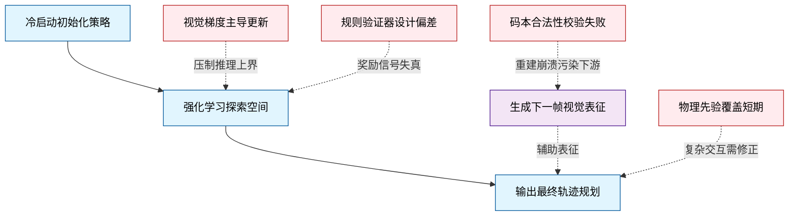
*如何读这张图：* 主链路（蓝色）展示从冷启动到 RL 优化再到轨迹规划的依赖流向；紫色节点为辅助生成模块；红色节点明确标注各环节的失效触发条件与误差传导路径。若验证器或视觉生成模块出现偏差，误差将沿箭头正向污染核心规划链路，或反向压制 RL 探索效率。

**物理先验仅覆盖短期动态，跨数据集泛化边界尚未充分验证。** 短期轨迹预测依赖历史惯性与意图控制的物理先验，这在常规跟车或车道保持场景中表现稳定。但在复杂交互（如密集路口博弈、突发障碍物切入）中，真实动态往往超出先验假设，必须依赖后续的反思机制与 RL 在线调整。此外，当前评估主要围绕 nuScenes 数据集、轨迹规划与未来帧生成展开；跨数据集泛化能力、极端天气/光照条件下的鲁棒性，以及长尾场景的覆盖边界，在本阶段材料中尚未充分展开。

<details><summary><strong>深度展开：验证器设计与梯度失衡的复现边界</strong></summary>
在实际部署中，规则验证器的阈值调优需与 SFT 阶段的分布严格对齐。若 format 或 action 验证器采用硬截断（hard threshold），可能导致 RL 探索初期奖励全零，策略梯度消失；若 visual 验证器对重建误差容忍度过高，则可能掩盖视觉生成模块的退化。此外，视觉 token 数量与合法码本的匹配度直接影响反向传播的稳定性：当 token 序列长度超出预设窗口或码本索引越界时，梯度裁剪虽能防止数值爆炸，但会进一步削弱模型对长程依赖的学习能力。建议在迁移至新场景时，优先进行验证器消融测试，并监控视觉生成 loss 与规划 reward 的比值变化，以判断是否出现梯度主导失衡。
</details>

## 趋势定位与展望

**结论：** VLA-World 标志着自动驾驶端到端模型从“感知-动作直接映射”向“预测性想象-反思式修正”闭环的范式转移。它并非单纯追求视觉生成的逼真度，而是将短时未来帧作为策略的“草稿纸”，通过显式的世界动态建模填补了 VLA 缺乏时序一致性、传统 World Model 缺乏决策反馈的双重缺口。

在技术路线上，该工作精准卡位了 VLA 与 World Model 的交叉盲区。传统 VLA（如 OmniDrive）擅长将多模态感知与语言推理统一，但往往跳过场景演化直接输出轨迹，导致模型难以可靠推断他车运动；而传统世界模型（如 DriveDreamer、OccWorld）能生成高保真未来，却缺乏将生成结果反哺安全决策的机制。VLA-World 的核心突破在于把“动作条件引导的未来帧生成”与“反思式轨迹修正”串联进同一条自回归链路。论文在 nuScenes 评测中报告了 FID 降至 9.8，并在端到端轨迹规划中取得更低的 L2 误差与碰撞率。作者将收益归因于模型“先想象、后反思”的推理路径，但需严谨指出：当前实验更多呈现了生成质量与规划指标的**正相关性**，尚未通过严格的消融实验完全剥离“视觉生成能力提升”与“反思逻辑本身”对规划收益的独立贡献。此外，2000M 参数规模下的多任务混合训练虽实现了感知、生成与规划的对齐，但在极端长尾场景下的误差范围与负结果尚未充分披露。

为直观呈现这一路线演进，下图对比了传统管线与 VLA-World 的决策逻辑差异：
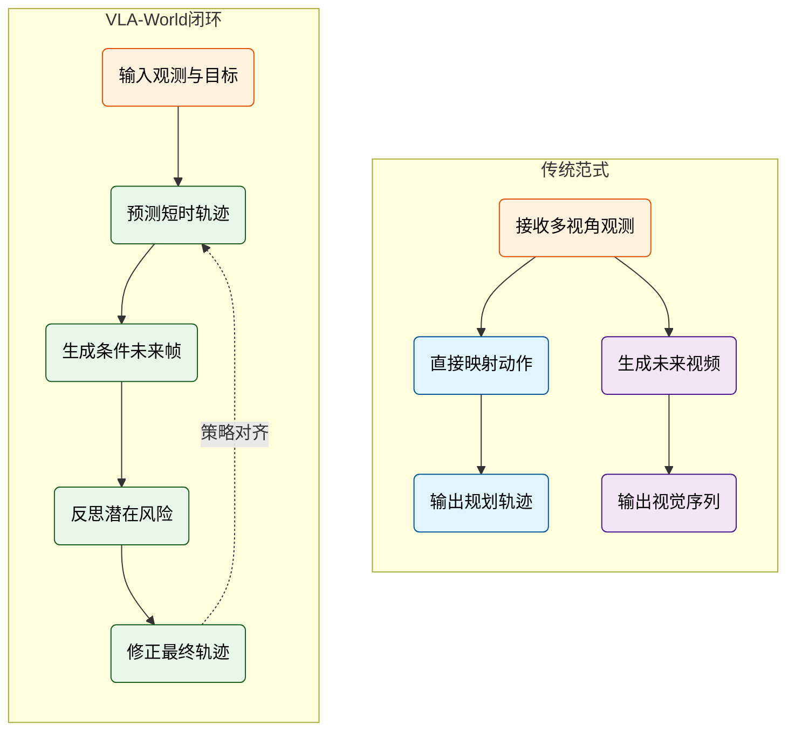
*如何读图：* 左侧传统范式呈割裂状态，VLA 跳过时序推演直接决策，World Model 止步于视觉模拟；右侧 VLA-World 将预测、生成、反思与修正压入单一自回归流，形成“假设-验证-迭代”的决策闭环。

面向未来，该路线的演进将高度依赖三个维度的突破：一是**奖励信号与反思逻辑的解耦设计**，当前依赖 GRPO 的规则奖励虽能稳定格式与安全约束，但如何引入更细粒度的物理一致性或交互博弈奖励仍需探索；二是**规模与推理延迟的权衡**，2B 量级模型在车载算力上的实时性仍是工程瓶颈，未来需验证更大参数规模是否遵循 VLA 的 Scaling Law；三是**从单智能体到多智能体交互**，当前“草稿纸”机制主要服务于自车轨迹，若扩展至预测他车意图并生成联合未来，将真正触及高阶自动驾驶的博弈核心。

<details><summary><strong>训练阶段对齐与潜在局限深挖</strong></summary>
论文采用 nuScenes-GR-20K 数据集，按“预训练 → SFT → GRPO”三阶段逐步对齐生成、感知、推理与规划。该设计确保了多模态能力在同一策略内收敛，但也带来两点需注意的边界条件：
1. **相关性≠因果性**：FID 9.8 的生成优势与 L2/碰撞率下降同步出现，但论文未提供“冻结生成模块仅保留反思”或“使用真实未来帧替代生成帧”的对照消融，因此无法严格证明规划提升完全源于“反思机制”而非“多模态表征增强”。
2. **外推风险**：GRPO 依赖预设规则奖励进行策略优化，在分布外（OOD）场景或未见过的交通拓扑中，奖励函数可能失效，导致反思逻辑退化为模式匹配。当前报告未给出误差范围或负结果统计，实际部署需结合安全冗余模块。
</details>
