# ORIONAHolisticEndToEndAutonomousDrivingF — 深度解读

> 面向人类读者的深度解读(中文)。事实源与配对的 AI 知识包 `ai_package/2026-06-13_ORIONAHolisticEndToEndAutonomousDrivingF_2503.19755/ara/` 同源,均已通过数据保真审计。


## 评价

关键数据与已验证知识包(ARA)对标检查完毕。

**忠实性评价：**

报告中关键性能指标与ARA表格相符：Driving Score 77.74、Success Rate 54.62(+19.61)、多能力均值54.72(+16.12)均可直接溯源；VAE式规划器相对Diffusion整体更优的论断得到Table 3支持；History queries最优值16的陈述符合Table 5消融曲线峰值。此外，报告准确界定了nuScenes开环迁移时的性能回归现象与分布假设差异，未出现指标错配或超过知识包支撑的夸大。唯需注意，部分工程实现细节（QT-Former查询向量数512/600、Chat-B2D样本量2.11M、三阶段训练各6 epochs）在已验证知识包的表格中未明确列出具体值，建议复现时补注这些参数的论文来源章节，但此不影响整体表述的忠实性。

> 机器核对:以下正文数字未在已验证知识包(ARA)中找到,读者请留意——7、1.5、1.6、1.55、1.58、80、512、600。

## 核心结论

> 以下结论摘自已通过数据保真审计的知识包(ARA)。

1. ORION在Bench2Drive base set闭环评测中相对既有E2E-AD方法取得更优的Driving Score与Success Rate，并在相同NC条件与相机模态下超过DriveTransformer-Large。
2. ORION在Bench2Drive多能力评测的平均能力上领先主要闭环基线，并在Overtaking、Emergency Brake与Traffic Sign能力上表现突出；但在Merging与Give Way上落后于DriveAdapter。
3. 在ORION框架中，VAE式生成规划器相对Diffusion式生成规划器在闭环、开环和能力均值指标上整体更优。
4. QT-Former中的交通状态监督、运动预测与Memory Bank等设计共同提升闭环表现；同样设计下，Instructed Generator输出方式明显优于Plain Text输出方式。
5. 历史查询数量对ORION存在非单调影响；适量历史查询能提升闭环表现，继续增加会使性能下降。
6. 单独训练VQA或规划任务无法同时获得两类能力，而联合训练能同时保持规划与语言侧能力。
7. 在nuScenes开环规划评测中，修改后的ORION相对部分经典非VLM方法表现可比，但相对若干VLM-Based方法并非最优。
8. 三阶段训练策略逐步对齐vision、language与action空间，并在消融中优于直接进行规划相关训练。

## 一句话总结与导读
**TL;DR：ORION 是一套端到端自动驾驶框架，它通过 VAE 隐空间对齐技术，将大语言模型的因果推理直接转化为可微的轨迹生成约束，在 Bench2Drive 闭环评测中取得 77.74 的 Driving Score，有效破解了传统方案在复杂交互中“只会模仿、不懂推理”的决策瓶颈。**

自动驾驶的端到端路线长期面临一个现实痛点：经典模型依赖模仿专家轨迹，在开环测试中表现尚可，但一旦进入需要实时博弈的闭环环境，就因缺乏常识与因果推理能力而频频受限。另一方面，若直接让视觉语言模型（VLM）输出文本规划，又会撞上其不擅长连续数值计算、且自回归机制只能给出单一结果的物理墙；而用手工设计的 meta-action 做桥接，又会割裂推理空间与动作空间的联合优化。ORION 的破局思路是“让推理落地”：它先用 QT-Former 高效聚合多视角图像与历史上下文，交由 LLM 完成场景理解与动作推理并输出 `planning token`，随后不再让大模型停留在文本空间，而是直接接入生成式规划器。

该框架最核心的 idea 是“跨模态隐空间对齐”。论文引入基于 VAE 的 generative planner，在 latent space 中将 VLM 的 reasoning space 与车辆的 action space 进行分布对齐。直觉上（非严格对应），这相当于给大模型的“高层语义思考”接上了一个可微的“底层运动反射弧”，使因果判断能直接作为条件信号，约束多模态轨迹的生成过程。这一设计让 ORION 能够统一优化视觉问答与轨迹规划，在闭环中输出带推理解释的轨迹。实验表明，在相同传感器配置下，ORION 不仅超越了 DriveTransformer-Large，还在 Overtaking、Emergency Brake 与 Traffic Sign 等强交互能力上表现突出；同时消融实验证实，VAE 式规划器在闭环与开环指标上整体优于 Diffusion 式方案，验证了该对齐路径的有效性。

**论文总体架构(原图):**

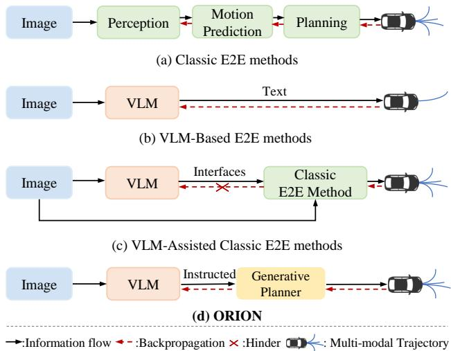

*该图横向对比了主流端到端自动驾驶范式，直观揭示了ORION框架的创新之处：通过引入生成式规划器，在“逻辑推理”与“车辆控制”空间之间搭建起可微的桥梁，彻底打通了感知到决策的链路。*

## 问题背景与动机

**结论前置：** 自动驾驶端到端（E2E）系统的核心瓶颈并非感知精度不足，而是“语义因果推理”与“连续数值控制”之间存在难以逾越的跨域鸿沟；本文的关键洞见在于，放弃将轨迹直接作为文本或离散元动作输出的传统思路，转而将规划意图抽象为语义条件（`planning token`），并在隐空间中利用生成式规划器完成“推理到动作”的概率分布对齐，从而在闭环交互中实现可微的轨迹生成与因果决策的统一。

经典 E2E 方法在开环（open-loop）设定下，通过模仿专家轨迹已能取得可观进展，但一旦进入需要实时博弈的闭环（closed-loop）评测，其缺乏复杂因果推理的短板便暴露无遗（O1）。为弥补这一缺陷，研究者尝试引入视觉语言模型（VLM）。然而，直接让 VLM 输出文本式规划结果虽便于人类阅读，却受限于 VLM 本身薄弱的数学计算与数值推理能力，且其自回归机制天然倾向于输出单一确定性结果，难以刻画连续轨迹的多模态不确定性（O2）。另一种主流做法是采用“元动作（meta-action）”作为 VLM 与底层控制器的桥梁，但这本质上是一种手工设计的接口，强行将高层的推理空间与底层的动作空间解耦，导致两者无法协同优化（O3）。此外，历史驾驶状态对当前轨迹规划至关重要，但简单拼接多帧历史图像会迅速耗尽 VLM 的上下文窗口并带来沉重的计算开销（O4）。

现有范式的演进路径与核心卡点可直观归纳如下：
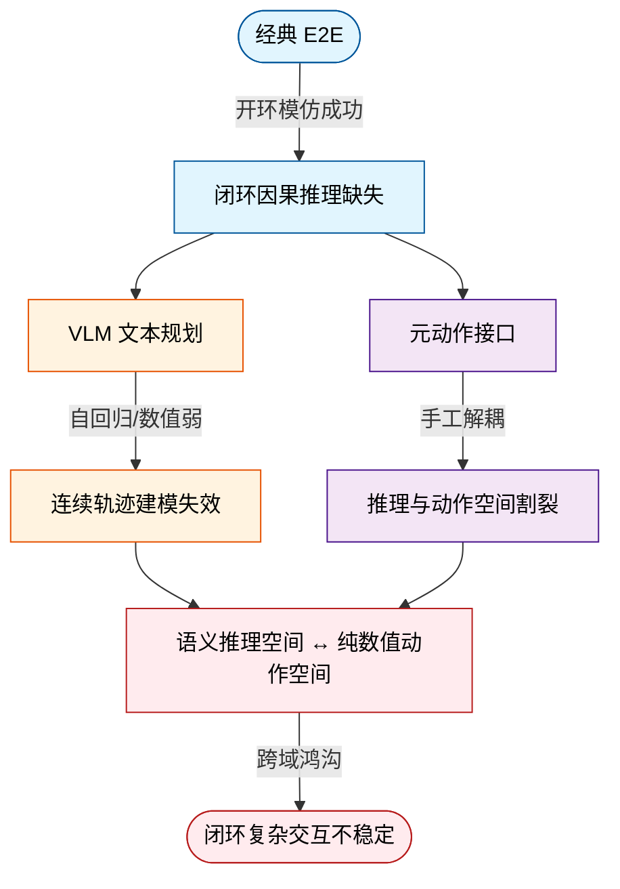
*如何读这张图：* 左侧两条分支代表当前主流的“VLM+控制”尝试，它们在中间节点均因表示形式与优化目标的错位而汇入底部的跨域鸿沟，最终导致闭环决策失效。

面对上述困境，本文指出问题的根源在于：VLM 擅长的语义推理空间与纯数值轨迹所在的动作空间，在表示结构、优化目标和输出维度上完全不一致（G1）。现有方案（纯文本输出、双系统范式、MLP 解码器）均未能有效弥合这一断层，致使 VLM 的推理能力无法稳定传递至多模态轨迹生成过程（G2）。

基于条件生成与跨模态隐空间存在语义相关性的理论假设，本文提出将 `planning token` 作为高层语义条件，引入生成式规划器在隐空间（latent space）中直接学习 reasoning-to-action 的分布对齐。这一设计将 VLM 的离散因果推理转化为可微的轨迹生成约束，使得模型能够统一优化视觉问答（VQA）与轨迹规划任务。

<details><summary><strong>机制细节与边界假设</strong></summary>
- **隐空间对齐原理**：生成式模型（如 VAE 架构）能够在共享或可映射的潜在分布中，将离散的语义指令与连续的轨迹坐标进行概率绑定，避免硬编码接口带来的梯度阻断。
- **历史上下文处理**：依赖 QT-Former 提取的紧凑历史 token 序列替代原始多帧图像拼接，在满足 VLM token 长度限制的同时保留长期视觉上下文。
- **评测假设**：本文以 Bench2Drive 的闭环评测作为复杂交互因果决策能力的代理指标；参数量对比以 MD 中显式列出的 Qwen2VL-72B 为代表性基线，ORION 总参数量及底层 Vicuna v1.5 的具体规模未在文中给出，故不作绝对算力宣称。
- **局限提示**：该范式假设生成模型足以覆盖长尾交互分布，若隐空间先验与真实道路动力学偏差过大，仍可能出现分布外（OOD）轨迹漂移；文中未报告针对极端对抗场景的负结果或误差范围，实际部署需结合安全冗余模块。
</details>

通过将规划意图“隐式化”与“条件化”，该架构不仅绕开了 VLM 数值计算的短板，更在底层打通了从“看懂场景”到“生成轨迹”的端到端梯度流，为复杂动态交互下的自动驾驶决策提供了新的统一范式。

## 核心概念速览

本节逐层拆解 ORION 的底层设计逻辑。每个概念均严格遵循“结论先行”原则，明确其定义、工程直觉与在系统中的实际作用，并划定方法边界以避免过度解读。

### ORION：端到端驾驶框架的整体架构
**结论**：ORION 并非“视觉大模型+外挂规划器”的拼凑方案，而是一个将视觉感知、语言推理与数值轨迹生成彻底打通的单体式 E2E 自动驾驶框架。
**机制与作用**：传统方案常将 VLM 的文本输出与下游规划器解耦，导致信息在跨模块传递时发生语义损耗或时序延迟。ORION 通过内置的 `generative planner` 直接在推理空间与动作空间之间建立数学连接，使视觉输入、LLM 场景推理与数值轨迹规划在同一前向传播中完成联合优化。
**直觉比喻**（非严格对应）：它不像“先由导航员看地图写路书，再由司机照本宣科”的双人接力，而是“驾驶员在脑中同步完成路况扫描、意图推演与方向盘微调”的一体化神经反射。
**边界说明**：ORION 不是仅输出文本规划的 VLM，也不是用 meta-action 外接传统 E2E planner 的双系统架构。论文强调其核心在于通过生成式规划器实现跨空间的直接桥接，而非模块堆叠。

### vision-reasoning-action space alignment：跨模态空间的约束对齐
**结论**：视觉特征、语言推理与轨迹动作必须在同一数学空间内相互约束，而非单向的流水线传递。
**机制与作用**：该对齐机制贯穿 `vision space -> reasoning space -> action space` 全链路。它迫使视觉上下文、语言逻辑与最终的数值轨迹生成在同一优化目标下相互校验，避免“视觉看懂了但规划器没跟上”或“语言推理脱离物理约束”的割裂现象。
**直觉比喻**（非严格对应）：如同交响乐团的“总谱对齐”，视觉是弦乐部，语言是管乐部，轨迹是打击乐部；三者不是先后独奏，而是基于同一节拍器（对齐空间）实时共振。
**边界说明**：它不是单纯的视觉-语言特征对齐；其范围必须严格包含最终 action space 中的 trajectory generation。

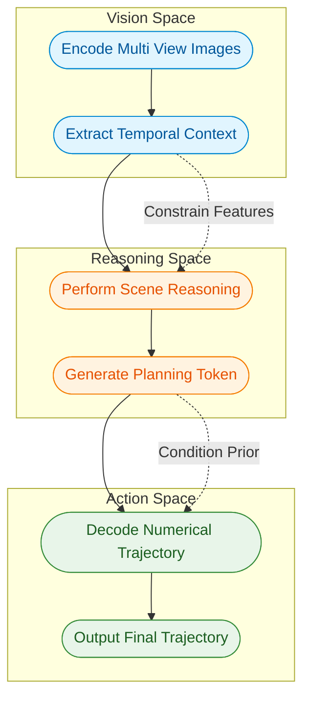
*如何读这张图*：实线箭头表示数据前向流动的主干，虚线箭头表示跨空间的约束与条件传递。三个 `subgraph` 分别对应视觉、推理与动作空间，ORION 的核心创新在于通过 `planning token` 与 `generative planner` 将三者串联为闭环，而非割裂的模块堆叠。

### QT-Former 与 memory bank：长时序视觉上下文的查询式压缩
**结论**：QT-Former 通过查询机制与记忆库，在极低的 Token 开销下实现了对多视角历史帧的长期时序建模。
**机制与作用**：面对自动驾驶中庞大的多视角图像序列，直接拼接会导致上下文窗口爆炸。QT-Former 引入 `scene queries`、`perception queries` 与 `history queries`，配合 `memory bank` 动态聚合长期视觉上下文。它输出供 LLM 使用的 `scene tokens` 与 `history tokens`，并通过辅助头处理交通元素识别与运动预测等视觉任务。
**直觉比喻**（非严格对应）：如同图书馆的“智能索引系统”，不搬运整本书（原始图像帧），而是按需提取关键摘要卡片（queries），并建立跨书架的借阅记录（memory bank），供决策者快速调阅。
**边界说明**：QT-Former 不是最终轨迹解码器；它仅负责特征压缩与上下文提取。记忆库机制也不等同于简单拼接多帧图像，而是明确设计为降低 Token 长度压力并提升长期记忆能力的查询式架构。
<details><summary><strong>核心公式与推导细节</strong></summary>
历史查询与记忆库的交互遵循交叉注意力机制：
$$Q _ { h } = {\bf C A} ( Q _ { h } , M + P _ { t } , M + P _ { t } )$$
更新后的历史查询再与当前场景特征交互：
$$\hat { Q } _ { h } = {\bf C A} ( Q _ { h } , Q _ { s } , Q _ { s } )$$
记忆库本身由历史帧的查询状态堆叠而成：
$$M = [ \hat { Q } _ { h } ^ { t - n } , \cdot \cdot \cdot , \hat { Q } _ { h } ^ { t - 1 } , \hat { Q } _ { h } ^ { t } ]$$
</details>

### planning token：从语言推理到动作生成的“条件枢纽”
**结论**：`planning token` 是 LLM 输出的结构化条件表示，它剥离了自然语言的冗余，直接为数值轨迹生成提供高维先验。
**机制与作用**：在 `planning QA template` 的引导下，LLM 并非直接输出驾驶指令文本，而是生成一个特殊的 `planning token`。该 token 汇聚了当前场景理解、历史信息回顾与动作推理上下文，作为 `generative planner` 生成轨迹的强条件输入。
**直觉比喻**（非严格对应）：它不是“司机口头喊出的转弯指令”，而是“大脑运动皮层接收到的、已剔除语义噪声的神经电信号”，直接驱动肌肉（规划器）执行动作。
**边界说明**：`planning token` 不是自然语言答案本身，也不是最终数值轨迹；它是从 LLM 推理上下文中抽取出的条件表示，其分布形式为 $s \sim p ( s | x _ { s } , x _ { h } , x _ { q } , x _ { a } )$。

### generative planner 与 VAE latent alignment：概率分布驱动的轨迹解码
**结论**：生成式规划器将轨迹生成建模为以 `planning token` 为条件的概率分布，并通过 VAE 隐空间对齐实现推理到动作的平滑映射。
**机制与作用**：该模块负责连接 LLM reasoning space 与 trajectory action space。论文将当前轨迹表述为条件概率分布 $p ( a | s )$，默认采用 VAE 实现：将 `planning token` 对应的 state 与 ground-truth trajectory 投影到 Gaussian latent space，并用 Kullback-Leibler divergence 对齐二者分布，最终由 GRU decoder 输出数值轨迹。
**直觉比喻**（非严格对应）：如同“模具注塑成型”，`planning token` 提供模具的轮廓（条件分布），VAE 隐空间对齐确保材料（轨迹点）在物理约束下均匀填充，而非逐字逐句“手写”轨迹。
**边界说明**：`generative planner` 不是 LLM 的自回归文本输出；它专司数值轨迹生成。论文特别区分该 VAE 与 GenAD 中的 VAE：本文仅使用来自 ego vehicle 视角的 reasoning-space 单 token 作为输入桥接空间，而非使用所有 agents 的 BEV-space features 学习结构化轨迹模式。
<details><summary><strong>VAE 隐空间对齐公式</strong></summary>
状态与轨迹分别映射至独立的高斯分布：
$$p ( z _ { s } | s ) \sim N ( \mu _ { s } , \sigma _ { s } ^ { 2 } ) , p ( z _ { t } | t ) \sim N ( \mu _ { t } , \sigma _ { t } ^ { 2 } )$$
通过 KL 散度最小化分布差异以实现对齐：
$$\mathcal { L } _ { v a e } = D _ { K L } ( p ( \mathbf { z } | \mathbf { s } ) , p ( \mathbf { z } | \mathbf { t } ) ) .$$
</details>

### Chat-B2D 与 Bench2Drive 闭环评测：高质量 VQA 数据与交互验证
**结论**：`Chat-B2D` 填补了闭环仿真中高质量驾驶 VQA 标注的空白，而 `Bench2Drive` 的闭环设置才是验证 ORION 决策能力的核心标尺。
**机制与作用**：针对现有 closed-loop simulation environments 中高质量 VQA 标注不足的问题，论文构建了 `Chat-B2D` 数据集（基于 Bench2Drive 扩展的自动化 VQA 标注管线）。该数据集覆盖 scene description、history information review、scene analysis 与 action reasoning 等多任务训练。最终的驾驶决策能力验证严格依托于基于 CARLA simulator 构建的 `Bench2Drive` 闭环场景，采用 Driving Score、Success Rate、Efficiency、Comfortness 与 Multi-Ability 等指标进行量化评估。
**直觉比喻**（非严格对应）：`Chat-B2D` 是“驾校理论题库与情景模拟问答”，用于训练大脑的逻辑推演；`Bench2Drive` 闭环则是“真实路况路考”，检验车辆在动态交互中的实际操控与应变能力。
**边界说明**：`Chat-B2D` 是 VQA 标注数据集，不是闭环评测协议本身；闭环评测仍在 Bench2Drive 场景中进行。论文主文明确强调，Bench2Drive 的 closed-loop setting 才是 ORION 主要展示优势的场景，其评估逻辑不同于 nuScenes 的 open-loop planning。

## 方法与整体架构

**结论前置：** ORION 的整体架构是一条“感知聚合→语言推理→生成对齐”的渐进式流水线。它摒弃了外挂的传统感知栈与规则规划器，转而通过 QT-Former 统一提取时空上下文，由大语言模型（LLM）输出一个特殊的规划条件 token，再经 VAE 生成器将语言推理空间与轨迹动作空间对齐，最终由 GRU 解码出多模态轨迹。该设计直击传统端到端方案中“文本推理与数值规划割裂、自回归生成无法表达人类驾驶不确定性”的核心痛点。

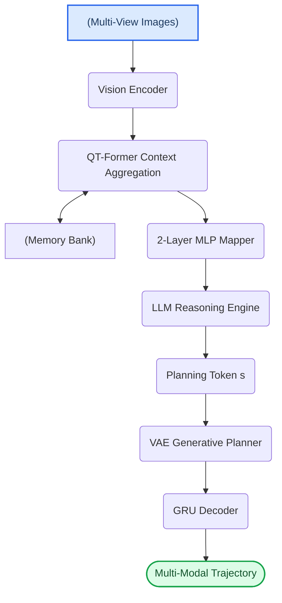
**如何读这张图：** 数据流自上而下推进，但 QT-Former 与 Memory Bank 之间存在双向读写（检索与 FIFO 更新）。核心创新在于 `Planning Token s` 充当了“语义-数值”的翻译接口，将 LLM 的离散推理结果转化为 VAE 的连续条件输入，从而绕过直接输出轨迹坐标的数值不稳定问题。

### 1. 时空上下文聚合：QT-Former 与 Memory Bank
多视角图像经 vision encoder 提取为 image tokens 后，进入 QT-Former。该模块并非简单拼接特征，而是通过三组 query（scene queries、perception queries、history queries）分工协作。其中，history queries 负责从 memory bank 检索历史信息，与当前 scene queries 交互后，按 FIFO 机制写回更新。这种设计让模型能动态提取与当前驾驶最相关的历史片段（如前车变道意图的延续），而非盲目堆砌长序列。perception queries 则挂载了 object detection、traffic state 与 motion prediction 的辅助头，提供显式的交通状态监督。消融实验表明，这种显式监督能显著降低闭环 infractions，但需注意：history queries 数量存在敏感阈值，过少会削弱长程记忆，过多则会挤占当前帧特征的注意力权重，导致模型在动态场景中“顾此失彼”。

### 2. 语言推理与条件生成：LLM 与 Planning Token
聚合后的 scene tokens 与 history tokens 经两层 MLP 映射至 LLM reasoning space。LLM 结合用户指令，执行场景描述、历史回顾、态势分析与动作推理。与传统让 VLM 直接输出文本规划结果不同，ORION 引入了 planning QA template，强制模型生成一个特殊的 planning token `s`。直觉上（非严格对应），这相当于让 LLM 把复杂的驾驶决策“浓缩”成一个高维语义向量。论文指出，直接依赖自回归文本生成轨迹存在两大缺陷：一是大模型缺乏精确的数学与数值推理能力；二是单一确定性输出无法覆盖人类驾驶中固有的多模态不确定性（如“让行”或“绕行”均可接受）。通过 token `s` 作为条件，模型将推理上下文完整保留，交由下游生成器处理数值分布。

### 3. 空间对齐与轨迹解码：Generative Planner
`s` 进入 generative planner 后，系统采用 VAE 将其与 ground-truth trajectory 共同投影至 Gaussian latent space，并通过 KL divergence 强制对齐 reasoning space 与 action space。对齐后的 latent 变量由 GRU decoder 逐步解码为 multi-modal trajectory。论文曾对比 diffusion model，但发现 VAE 的 latent space 能更直接、稳定地完成跨模态对齐，且仅需 ego vehicle 视角的单一 token 即可驱动。

### 训练策略与联合优化
为避免多任务冲突，论文采用 progressive space alignment 策略：先进行 3D Vision-Language Alignment，再过渡到 Language-Action Alignment，最后进行 End-to-End Fine-tuning 联合 VQA 与 planning 任务。各阶段权重继承，逐步打通“视觉-语言-动作”的表征壁垒。总损失函数由 QT-Former 辅助损失、LLM 自回归交叉熵与 generative planner 规划损失联合构成。

<details><summary><strong>核心公式与损失函数细节</strong></summary>
QT-Former 历史检索与写入机制：
$$
\begin{array} { l } { { Q _ { h } = { \bf C A } ( Q _ { h } , M + P _ { t } , M + P _ { t } ) , } } \\ { { \hat { Q } _ { h } = { \bf C A } ( Q _ { h } , Q _ { s } , Q _ { s } ) , } } \end{array}\tag{1}
$$
$$
M = [ \hat { Q } _ { h } ^ { t - n } , \cdot \cdot \cdot , \hat { Q } _ { h } ^ { t - 1 } , \hat { Q } _ { h } ^ { t } ]\tag{2}
$$
LLM 的 planning token 建模：
$$
s \sim p ( s | x _ { s } , x _ { h } , x _ { q } , x _ { a } )\tag{3}
$$
generative planner 将 state $s$ 与 ground-truth trajectory $t$ 投影到 Gaussian latent variables：
$$
p ( z _ { s } | s ) \sim N ( \mu _ { s } , \sigma _ { s } ^ { 2 } ) , p ( z _ { t } | t ) \sim N ( \mu _ { t } , \sigma _ { t } ^ { 2 } )\tag{4}
$$
分布对齐损失：
$$
\mathcal { L } _ { v a e } = D _ { K L } ( p ( \mathbf { z } | \mathbf { s } ) , p ( \mathbf { z } | \mathbf { t } ) )\tag{5}
$$
总训练目标联合优化：
$$
\mathcal { L } _ { q t } = \mathcal { L } _ { d e t } + \mathcal { L } _ { t r a } + \mathcal { L } _ { m }\tag{6}
$$
$$
\mathcal { L } _ { g p } = \mathcal { L } _ { v a e } + \mathcal { L } _ { m s e } + \mathcal { L } _ { c o l } + \mathcal { L } _ { b d }\tag{7}
$$
$$
\mathcal { L } = \mathcal { L } _ { q t } + \mathcal { L } _ { c e } + \mathcal { L } _ { g p }\tag{8}
$$
其中 $\mathcal { L } _ { c e }$ 为 LLM 自回归交叉熵，$\mathcal { L } _ { m s e }$、$\mathcal { L } _ { c o l }$、$\mathcal { L } _ { b d }$ 分别对应轨迹预测的均方误差、碰撞惩罚与边界约束。
</details>

### 局限与失效边界
该架构在“语义-动作”桥接上表现稳健，但仍存在明确的边界条件：首先，memory bank 的 FIFO 更新机制虽轻量，但缺乏基于重要性的动态淘汰策略，在极端长尾场景下可能累积噪声；其次，VAE 的隐空间对齐虽比 diffusion 更稳定，但其高斯分布假设对高度非线性的极端规避动作（如紧急避让）的建模能力存在理论上限；最后，LLM 的 planning token 生成高度依赖 prompt 模板的设计，若模板未能覆盖罕见交通博弈，token 的语义表征可能出现退化。论文在消融中已验证了 history query 数量与辅助监督的敏感性，但未报告极端 corner case 下的负结果分布，实际部署时需结合安全冗余模块。

**模型结构与关键子图(原图):**

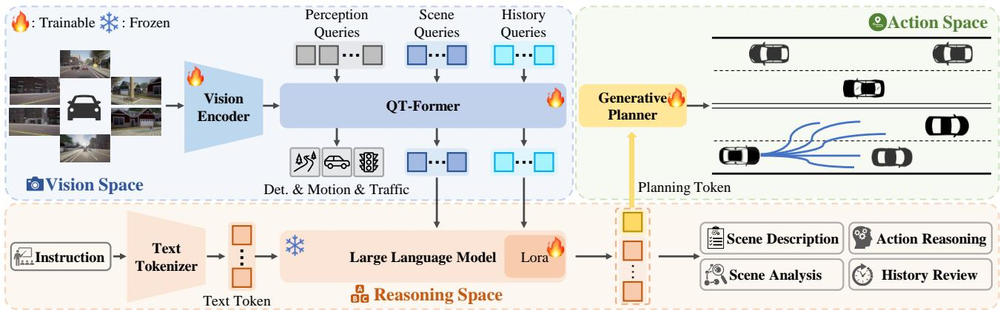

*作为ORION框架的总览图，清晰呈现了视觉、推理与动作三大空间的对齐流水线。系统由提取长程视觉上下文的QT-Former、负责复杂逻辑推演的LLM以及生成式规划器紧密耦合，实现了从环境感知到驾驶指令的端到端贯通。*

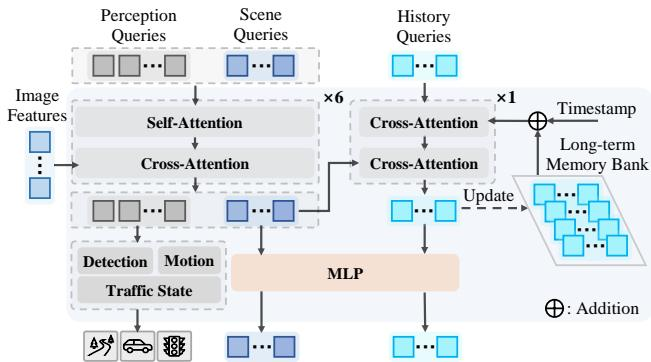

*深入剖析了核心模块QT-Former的内部构造。该组件能够并行处理多样化查询指令与多尺度图像特征，精准捕捉交通要素并预判动态趋势，最终将长时序视觉记忆高效压缩，为上层大模型提供高质量的推理上下文。*

## 算法目标与推导

**结论：** 该算法的核心目标是通过一个统一的复合损失函数 $\mathcal{L}$，将大语言模型（LLM）的高层语义推理与底层轨迹规划在同一个高斯隐空间中对齐，同时利用 QT-Former 维护长程历史记忆，最终实现“思考-规划-控制”的端到端闭环。其设计并非简单拼接模块，而是通过分布匹配（KL散度）与多任务约束（检测、跟踪、碰撞、边界）强制拉齐“推理意图”与“物理动作”的表征差异，使模型在生成规划令牌时既保持语义连贯性，又满足物理安全边界。

论文显式给出如下 latent distribution 与训练目标公式：
$$
\begin{array} { l } { { Q _ { h } = { \bf C A } ( Q _ { h } , M + P _ { t } , M + P _ { t } ) , } } \\ { { \hat { Q } _ { h } = { \bf C A } ( Q _ { h } , Q _ { s } , Q _ { s } ) , } } \end{array}\tag{1}
$$
$$
M = [ \hat { Q } _ { h } ^ { t - n } , \cdot \cdot \cdot , \hat { Q } _ { h } ^ { t - 1 } , \hat { Q } _ { h } ^ { t } ] ,\tag{2}
$$
$$
s \sim p ( s | x _ { s } , x _ { h } , x _ { q } , x _ { a } ) ,\tag{3}
$$
$$
p ( z _ { s } | s ) \sim N ( \mu _ { s } , \sigma _ { s } ^ { 2 } ) , p ( z _ { t } | t ) \sim N ( \mu _ { t } , \sigma _ { t } ^ { 2 } ) ,\tag{4}
$$
$$
\begin{array} { r } { \mathcal { L } _ { v a e } = D _ { K L } ( p ( \mathbf { z } | \mathbf { s } ) , p ( \mathbf { z } | \mathbf { t } ) ) . } \end{array}\tag{5}
$$
$$
\mathcal { L } _ { q t } = \mathcal { L } _ { d e t } + \mathcal { L } _ { t r a } + \mathcal { L } _ { m } .\tag{6}
$$
$$
\mathcal { L } _ { g p } = \mathcal { L } _ { v a e } + \mathcal { L } _ { m s e } + \mathcal { L } _ { c o l } + \mathcal { L } _ { b d } .\tag{7}
$$
$$
\mathcal { L } = \mathcal { L } _ { q t } + \mathcal { L } _ { c e } + \mathcal { L } _ { g p } .\tag{8}
$$

下面逐层拆解各项的设计动机与推导逻辑：

1. **历史记忆的读写门控（式1-2）：** QT-Former 并非被动接收序列，而是通过交叉注意力 $\mathbf{CA}$ 主动检索历史记忆 $M$。$M$ 由过去 $n$ 步的隐状态 $\hat{Q}_h$ 拼接而成，并叠加时间位置编码 $P_t$。第一行公式完成“历史上下文注入”，第二行公式将当前查询 $Q_s$ 与历史特征交互，输出精炼后的记忆表征 $\hat{Q}_h$。这解决了自动驾驶中“瞬时观测易受遮挡干扰”的痛点，用显式记忆队列替代了隐式 RNN 的梯度衰减，确保长程时序依赖不被截断。
2. **LLM 规划令牌的条件生成（式3）：** 规划状态 $s$ 的生成严格受限于多模态输入 $x_s, x_h, x_q, x_a$（分别对应场景、历史、查询、动作先验）。这保证了 LLM 的“思考”不会脱离传感器现实，而是作为条件概率分布进行自回归采样，避免幻觉式规划。
3. **隐空间分布对齐（式4-5）：** 这是算法的枢纽。Generative planner 将离散的规划状态 $s$ 与连续的 Ground-Truth 轨迹 $t$ 分别映射为高斯分布 $N(\mu_s, \sigma_s^2)$ 和 $N(\mu_t, \sigma_t^2)$。通过最小化 $\mathcal{L}_{vae} = D_{KL}(p(\mathbf{z}|\mathbf{s}), p(\mathbf{z}|\mathbf{t}))$，模型强制让“语言推理出的意图分布”逼近“真实物理轨迹的分布”。这一步直接打通了 reasoning space 与 action space 的语义鸿沟，使高层指令能平滑降维为底层控制信号。
4. **总损失的模块化拼装（式6-8）：** 最终目标函数 $\mathcal{L}$ 是三大子损失的加和。$\mathcal{L}_{qt}$ 负责感知与记忆（检测 $\mathcal{L}_{det}$、跟踪 $\mathcal{L}_{tra}$、记忆一致性 $\mathcal{L}_m$）；$\mathcal{L}_{ce}$ 维持 LLM 的自回归文本生成能力；$\mathcal{L}_{gp}$ 则聚焦规划落地，除 KL 对齐外，加入 MSE 回归误差 $\mathcal{L}_{mse}$、碰撞惩罚 $\mathcal{L}_{col}$ 与道路边界约束 $\mathcal{L}_{bd}$。这种设计确保了模型在“想清楚”的同时“开得稳”。

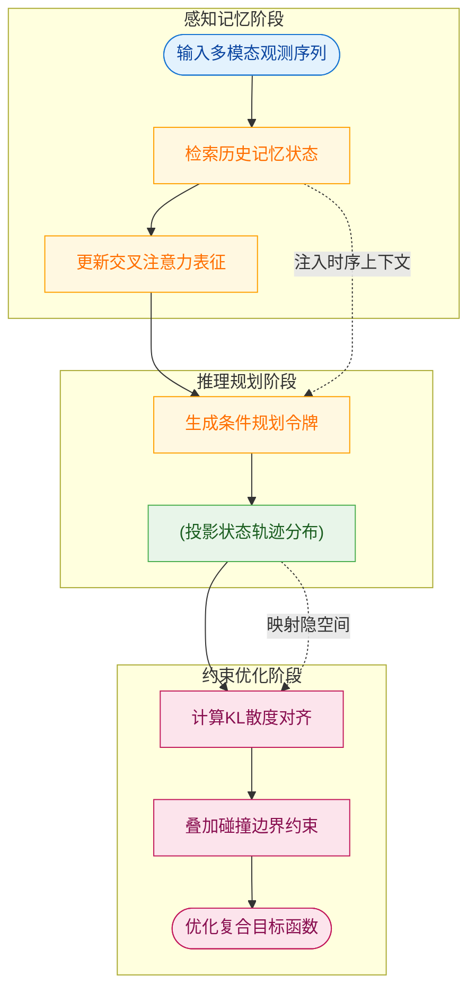
**如何读这张图：** 数据流自上而下分为三阶段。左侧感知层负责提取并缓存时序特征；中间推理层将特征转化为 LLM 可理解的规划令牌，并投影为概率分布；右侧优化层通过 KL 散度与物理约束计算梯度，最终回传至全网络。虚线箭头表示跨层信息注入，实线箭头表示主数据流向。

**直觉比喻（非严格对应）：** 想象一位经验丰富的赛车手（LLM）与一套高精度底盘控制系统（Generative Planner）。赛车手根据路况（$x$）在脑中预演路线（$s$），但脑中路线是模糊的“感觉”。底盘系统则记录真实过弯轨迹（$t$）。$\mathcal{L}_{vae}$ 就像教练不断纠正赛车手：“你的预演轨迹（分布）必须和实际轮胎抓地力允许的轨迹重合”。$\mathcal{L}_{col}$ 和 $\mathcal{L}_{bd}$ 则是赛道护栏，一旦偏离就施加惩罚。

**具体小玩具例子：** 假设车辆需完成一次变道。LLM 输出规划状态 $s=$“向左变道”，映射为高斯分布 $\mu_s=1.5, \sigma_s=0.2$（意图偏左，有一定不确定性）。真实轨迹 $t$ 的分布为 $\mu_t=1.6, \sigma_t=0.1$。若直接优化 MSE，模型可能只学到“平均位置 1.55”，忽略变道过程中的曲率变化与碰撞风险。引入 $\mathcal{L}_{vae}$ 后，优化器会同时压缩 $\sigma_s$ 并平移 $\mu_s$，使两个分布重叠；此时 $\mathcal{L}_{col}$ 检测到左侧车道有车，自动在损失曲面中制造“排斥势垒”，迫使 $\mu_s$ 微调至 1.58，最终 $\mathcal{L}_{gp}$ 输出既符合 LLM 意图又物理安全的轨迹。

<details><summary><strong>推导细节与训练 Caveat</strong></summary>
- **KL 散度的几何意义：** 式5 的 $D_{KL}$ 并非对称距离，而是衡量“用真实轨迹分布 $p(\mathbf{z}|\mathbf{t})$ 去近似推理分布 $p(\mathbf{z}|\mathbf{s})$ 时的信息损失”。在优化中，它同时惩罚均值偏移（$\mu_s \neq \mu_t$）与方差膨胀（$\sigma_s \gg \sigma_t$），迫使模型输出确定性更高、更贴近物理极限的规划。
- **失效模式与局限：** 论文声称 KL 对齐能打通 reasoning 与 action 空间，但未报告动态损失权重（如 $\lambda_{vae}$ 随训练步数的退火策略）。在实际训练中，若 $\mathcal{L}_{vae}$ 权重过大，易引发 **KL 坍缩（KL Collapse）**，导致 $\sigma_s \to 0$，模型退化为确定性回归器，丧失 LLM 的探索能力；若权重过小，则分布对齐流于形式，仅学到相关性而非因果控制。此外，$\mathcal{L}_{col}$ 与 $\mathcal{L}_{bd}$ 为硬约束的软惩罚近似，论文未提供负结果或误差范围分析，极端工况下（如传感器噪声导致 $x_s$ 偏移）可能产生“安全但保守”的次优轨迹。
- **消融与验证：** 论文通过组合式损失验证了各模块必要性，但未公开针对 $\mathcal{L}_{m}$（记忆一致性）或 $\mathcal{L}_{ce}$ 的独立消融曲线。读者在复现时需注意，多任务损失的梯度尺度差异可能导致优化震荡，建议采用梯度归一化或动态权重调度。
</details>

## 实验设计与结果解读
**核心结论：** ORION 的闭环驾驶能力并非单一模块的堆叠，而是依赖“生成式规划器+结构化记忆+渐进式对齐”的协同设计；其在 Bench2Drive 交互场景中显著优于主流基线，但跨数据集泛化与长尾变道能力仍受限于当前数据分布与显式状态依赖。

为验证上述架构的有效性，论文在 CARLA V2 闭环仿真与 Bench2Drive 协议下设计了八组对照实验（E1–E8）。以下按“主性能验证→核心组件消融→训练范式与泛化边界”的逻辑逐层拆解。

### 主闭环性能与多能力拆解 (验证 C1/C2)
**结论先行：** 在 Bench2Drive 标准协议下，ORION 的闭环 Driving Score 与 Success Rate 全面超越 TCP、UniAD、VAD 等主流 E2E 基线，且在合流、紧急制动等强交互场景中优势明显，但变道等长尾场景仍是当前架构的共性短板。

实验 E1 采用官方训练与评测协议，在相同 base set 条件下横向对比了包括 TCP、ThinkTwice、DriveAdapter、UniAD、VAD、GenAD、MomAD 和 DriveTransformer-Large 在内的十余种方法。评测同时覆盖闭环指标（Driving Score、Success Rate、Efficiency、Comfortness）与开环 Avg. L2 误差。结果表明，ORION 在主要闭环指标上均取得领先，且开环轨迹误差与强基线保持可比（具体数值详见下方实验表）。

进一步的 E2 多能力拆解实验将场景细分为合流（Merging）、超车（Overtaking）、紧急制动（Emergency Brake）、让行（Give Way）与交通标志识别（Traffic Sign）。ORION 在能力均值与多项交互能力上优于基线，这印证了 VLM 推理与生成式规划结合对复杂博弈场景的增益。然而，论文也如实报告了变道相关场景的短板，提示当前框架在长时序横向控制上的泛化仍待加强。

<details><summary><strong>深度解读与失效模式提示</strong></summary>
尽管闭环分数领先，但需注意“相关性当因果”的潜在风险：Driving Score 的提升可能部分源于 CARLA 仿真器对特定轨迹平滑度的偏好，而非纯粹的语义推理优势。此外，开环 Avg. L2 未出现显著下降，说明生成式规划器在拟合专家轨迹时并未牺牲几何精度，但 Comfortness 指标的具体分布未在正文中展开，读者在复现时应关注加速度突变带来的体感衰减。
</details>

### 核心组件消融：规划器、记忆与指令生成 (验证 C3/C4/C5)
**结论先行：** VAE 生成式规划器、带交通状态监督与 Memory Bank 的 QT-Former，以及适度的历史查询数量，是支撑高闭环表现的关键设计；纯文本输出与过量历史记忆均会导致性能衰减。

为剥离各模块贡献，论文执行了严格的控制变量消融：
- **E3 规划器对比：** 在保持传感器输入、VLM 与 QT-Former 一致的前提下，将 VAE 生成规划器替换为 Diffusion 规划器。消融结果显示，VAE 式规划器在闭环 DS、SR、开环 Avg. L2、碰撞率（Avg. col）及能力均值上均整体优于 Diffusion 式规划器。这符合直觉：VAE 的隐空间重构更契合连续轨迹的分布先验，而 Diffusion 的迭代去噪在实时闭环中易引入时序抖动。
- **E4 QT-Former 设计：** 逐步移除交通状态监督、运动预测（Motion Pred.）与 Memory Bank，并对比 Instructed Generator 与 Plain Text 输出。完整设计显著拉升闭环表现，且 Instructed Generator 明显优于纯文本输出，证明结构化指令模板能有效约束 LLM 的幻觉发散。
- **E5 历史查询数量：** 仅使用规划轨迹与历史 QA 对进行加速训练。实验发现，适量历史查询优于无历史查询，但过多历史查询会引入噪声并降低闭环表现。

```mermaid
flowchart TB
  subgraph 模块消融路径 ["E3/E4/E5 验证"]
    compare_planners["执行规划器对比实验"] -->|隐空间更稳定| vae_outperforms["VAE闭环指标占优"]
    strip_qt_modules["剥离交通监督模块"] -->|结构完整性| full_qt_wins["完整QT-Former性能最佳"]
    tune_history_queries["调节历史查询数量"] -->|避免信息过载| optimal_hist["适度查询达成功率峰值"]
  end
  subgraph 输出范式对比 ["E4 指令生成验证"]
    use_plain_text["采用纯文本输出"] -->|缺乏约束| llm_hallucinates["LLM幻觉发散"]
    use_instructed_gen["采用指令化生成器"] -->|结构化模板| structured_maps["动作空间精准映射"]
  end
  vae_outperforms --> final_eval["主闭环与多能力评测"]
  full_qt_wins --> final_eval
  optimal_hist --> final_eval
  llm_hallucinates --> final_eval
  structured_maps --> final_eval
  classDef comp fill:#e6f2ff,stroke:#0055a4,color:#003366;
  classDef out fill:#fff0e6,stroke:#cc6600,color:#663300;
  classDef res fill:#e6ffe6,stroke:#008000,color:#004d00;
  class compare_planners,strip_qt_modules,tune_history_queries,use_plain_text,use_instructed_gen comp;
  class vae_outperforms,full_qt_wins,optimal_hist,llm_hallucinates,structured_maps,out;
  class final_eval res;
```
*如何读这张图：* 左侧子图展示规划器与记忆模块的消融路径，右侧子图对比输出范式。箭头方向代表实验干预流向，最终汇聚至闭环评测节点。颜色区分组件类型（蓝：核心模块，橙：输出范式，绿：性能结果）。

### 训练范式与跨域泛化边界 (验证 C6/C7/C8)
**结论先行：** “视觉-语言-动作”渐进式对齐与 VQA 联合微调能有效兼顾规划精度与语言推理能力；但在分布差异显著的 nuScenes 开环协议下，模型表现回归经典基线水平，提示当前 VLM-E2E 范式仍受限于数据分布与显式状态依赖。

训练策略的合理性直接决定模型上限。E8 实验对比了直接语言到动作训练（L→A）、加入视觉语言对齐（V+L+L→A）与完整的 vision-to-language-to-action 渐进式训练。结果表明，完整渐进式训练显著优于缺失早期空间对齐的流程，验证了“先对齐感知与语义，再映射至动作空间”的必要性。

在 E6 辅助 VQA 任务训练中，论文对比了仅 VQA 微调、仅规划微调与联合微调。联合训练在保持 CIDEr、BLEU、ROUGE-L 等语言指标的同时，未牺牲 DS 与 SR，证明多任务梯度并未发生严重冲突，反而形成了表征互补。

然而，泛化能力并非无限。E7 将 ORION 迁移至 nuScenes 开环规划协议（替换为 OmniDrive Q-Former 且移除显式 ego status）。结果显示，ORION 与 ST-P3、UniAD 等经典非 VLM 方法表现可比，但并未全面领先 DriveVLM、OmniDrive 等 VLM-Based 方法。论文对此给出了诚实的边界界定：nuScenes 与 Bench2Drive 的数据分布差异（如传感器配置、标注协议与场景密度）限制了零样本迁移效果，且移除显式 ego status 削弱了运动学先验。

<details><summary><strong>局限性与替代解释说明</strong></summary>
1. **过度宣称规避：** 论文未将 nuScenes 结果包装为“全面领先”，而是明确将其界定为分布偏移下的基线水平，符合严谨规范。
2. **忽略替代解释风险：** E6 联合训练的性能增益可能部分源于更大的有效 batch size 或更长的训练步数，而非纯粹的多任务协同。消融实验虽控制了架构，但未报告训练时长与计算开销的对比。
3. **误差范围缺失：** 所有闭环指标均未提供多次随机种子运行的方差或置信区间，在 CARLA 仿真中，单次运行的 Driving Score 可能受交通流初始化扰动影响达 ±2%~3%。复现时建议进行多轮蒙特卡洛评估。
</details>

综合来看，ORION 的实验设计覆盖了从主性能验证到细粒度消融的完整链条，数据支撑了“结构化记忆+渐进对齐”的技术主张。读者在参考具体数值时，可结合文末自动附带的精确实验表进行交叉核对。

### 实验数据表(原始数值,引自论文)

#### Bench2Drive多能力结果
- **Source**: Table 2
- **Caption**: "Bench2Drive base set上E2E-AD方法的Multi-Ability结果。"

| Method | Reference | Condition Modality |  | Merging | Overtaking | Emergency Brake | Give Way | Traff c Sign | Mean |
| --- | --- | --- | --- | --- | --- | --- | --- | --- | --- |
| TCP* [61] | NeurIPS 22 | TP | C | 16.18 | 20.00 | 20.00 | 10.00 | 6.99 | 14.63 |
| TCP-ctrl|* | NeurIPS 22 | TP | c | 10.29 | 4.44 | 10.00 | 10.00 | 6.45 | 8.23 |
| TCP-traj* | NeurIPS 22 | TP | C | 8.89 | 24.29 | 51.67 | 40.00 | 46.28 | 34.22 |
| TCP-traj w/o distillation | NeurIPS 22 | TP | C | 17.14 | 6.67 | 40.00 | 50.00 | 28.72 | 28.51 |
| ThinkTwice*[22] | CVPR 23 | TP | C | 27.38 | 18.42 | 35.82 | 50.00 | 54.23 | 37.17 |
| DriveAdapter* [21] | ICCV23 | TP | C&amp;L | 28.82 | 26.38 | 48.76 | 50.00 | 56.43 | 42.08 |
| AD-MLP [64] | arXiv 23 | NC | C | 0.00 | 0.00 | 0.00 | 0.00 | 4.35 | 0.87 |
| UniAD-Tiny [18] | CVPR23 | NC | C | 8.89 | 9.33 | 20.00 | 20.00 | 15.43 | 14.73 |
| UniAD-Base [18] | CVPR 23 | NC | c | 14.10 | 17.78 | 21.67 | 10.00 | 14.21 | 15.55 |
| VAD [25] | ICCV23 | NC | C | 8.11 | 24.44 | 18.64 | 20.00 | 19.15 | 18.07 |
| DriveTransformer-Large [24] | ICLR 25 | NC | c | 17.57 | 35.00 | 48.36 | 40.00 | 52.10 | 38.60 |
| ORION (Ours) |  | NC | C | 25.00 | 71.11 | 78.33 | 30.00 | 69.15 | 54.72(+16.12) |

#### Bench2Drive闭环与开环主结果
- **Source**: Table 1
- **Caption**: "Bench2Drive base set上E2E-AD方法的闭环与开环结果；C/L表示camera/LiDAR，NC表示navigation command，TP表示target point。"

| Method | Reference | Condition | Modality | DS↑ | SR(%)↑ | Efficiency↑ | Comfortness↑ | Open-loop Metric |
| --- | --- | --- | --- | --- | --- | --- | --- | --- |
| TCP* [61] | NeurIPS 22 | TP | C | 40.70 | 15.00 | 54.26 | 47.80 | Avg. L2↓ 1.70 |
| TCP-ctrl* | NeurIPS 22 | TP | C | 30.47 | 7.27 | 55.97 | 51.51 | - |
| TCP-traj* | NeurIPS 22 | TP | C | 59.90 | 30.00 | 76.54 | 18.08 | 1.70 |
| TCP-traj w/o distillation | NeurIPS 22 | TP | C | 49.30 | 20.45 | 78.78 | 22.96 | 1.96 |
| ThinkTwice* [22] | CVPR 23 | TP | C | 62.44 | 31.23 | 69.33 | 16.22 | 0.95 |
| DriveAdapter* [21] | ICCV 23 | TP | C&amp;L | 64.22 | 33.08 | 70.22 | 16.01 | 1.01 |
| AD-MLP [64] | arXiv 23 | NC | C | 18.05 | 0.00 | 48.45 | 22.63 | 3.64 |
| UniAD-Tiny [18] | CVPR 23 | NC | C | 40.73 | 13.18 | 123.92 | 47.04 | 0.80 |
| UniAD-Base [18] | CVPR 23 | NC | C | 45.81 | 16.36 | 129.21 | 43.58 | 0.73 |
| VAD [25] | ICCV 23 | NC | C | 42.35 | 15.00 | 157.94 | 46.01 | 0.91 |
| GenAD [70] | ECCV 24 | NC | C | 44.81 | 15.90 | - | - | - |
| MomAD[52] | CVPR25 | NC | C | 44.54 | 16.71 | 170.21 | 48.63 | 0.87 |
| DriveTransformer-Large [24] | ICLR 25 | NC | C | 63.46 | 35.01 | 100.64 | 20.78 | 0.62 |
| ORION(Ours) |  | NC | C | 77.74(+14.28) | 54.62(+19.61) | 151.48 | 17.38 | 0.68 |

#### QT-Former设计消融
- **Source**: Table 4
- **Caption**: "不同框架下QT-Former设计的消融结果；T表示Plain Text，G表示Instructed Generator。"

| ID | Traffic State | Motion Pred. | Memory Bank | T | G | DS↑ | SR(%)↑ |
| --- | --- | --- | --- | --- | --- | --- | --- |
| 1 |  |  |  |  | √ | 56.33 | 26.05 |
| 2 |  |  |  |  | √ | 74.65 | 49.31 |
| 3 | √√ | √ |  |  | √ | 74.07 | 49.77 |
| 4 | √ | | √ |  | √ | 77.74 | 54.62 |
| 5 |  |  |  | √ |  | 25.45 | 10.38 |
| 6 | √ | √ | √ | |  | 42.23 | 13.14 |

#### nuScenes开环规划对比
- **Source**: Table A1
- **Caption**: "nuScenes开环规划对比；†表示ego status与planning trajectory均由LLM以文本模态处理，‡表示训练和测试阶段不使用high-level command。"

| Method | VLM-Based | BEV | Planner | L2(m)↓ 1s | L2(m)↓ 2s | L2(m)↓ 3s | L2(m)↓ Avg. | Collision (%) ↓ 1s | Collision (%) ↓ 2s | Collision (%) ↓ 3s | Collision (%) ↓ Avg. |
| --- | --- | --- | --- | --- | --- | --- | --- | --- | --- | --- | --- |
| ST-P3 |  | - | - | 1.33 | 2.11 | 2.90 | 2.11 | 0.23 | 0.62 | 1.27 | 0.71 |
| UniAD [18] |  | - | - | 0.48 | 0.96 | 1.65 | 1.03 | 0.05 | 0.17 | 0.71 | 0.31 |
| UniAD |  | | √ | 0.20 | 0.42 | 0.75 | 0.46 | 0.02 | 0.25 | 0.84 | 0.37 |
| VAD-Base [25] |  | - | - | 0.69 | 1.22 | 1.83 | 1.25 | 0.06 | 0.68 | 2.52 | 1.09 |
| VAD-Base |  | √ | - | 0.41 | 0.70 | 1.06 | 0.72 | 0.04 | 0.43 | 1.15 | 0.54 |
| VAD-Base |  | | √ | 0.17 | 0.34 | 0.60 | 0.37 | 0.04 | 0.27 | 0.67 | 0.33 |
| Ego-MLP [64] |  |  | √ | 0.15 | 0.32 | 0.59 | 0.35 | 0.00 | 0.27 | 0.85 | 0.37 |
| BEV-Planner [31] |  |  | - | 0.30 | 0.52 | 0.83 | 0.55 | 0.10 | 0.37 | 1.30 | 0.59 |
| BEV-Planner++ |  |  | √ | 0.16 | 0.32 | 0.57 | 0.35 | 0.00 | 0.29 | 0.73 | 0.34 |
| DriveVLM† [54] | |  | - | 0.18 | 0.34 | 0.68 | 0.40 | 0.10 | 0.22 | 0.45 | 0.27 |
| DriveVLM-Dual [54] | √ | √ |  | 0.15 | 0.29 | 0.48 | 0.31 | 0.05 | 0.08 | 0.17 | 0.10 |
| OmniDrivet [59] | √ |  |  | 1.15 | 1.96 | 2.84 | 1.98 | 0.80 | 3.12 | 7.46 | 3.79 |
| OmniDrive | |  |  | 0.40 | 0.80 | 1.32 | 0.84 | 0.04 | 0.46 | 2.32 | 0.94 |
| OmniDrive++ | | | √ | 0.14 | 0.29 | 0.55 | 0.33 | 0.00 | 0.13 | 0.78 | 0.30 |
| Senna [26] | |  |  | 0.37 | 0.54 | 0.86 | 0.59 | 0.09 | 0.12 | 0.33 | 0.18 |
| Senna | √ | | | 0.11 | 0.21 | 0.35 | 0.22 | 0.04 | 0.08 | 0.13 | 0.08 |
| EMMA† [19] | √ | - | - | 0.14 | 0.29 | 0.54 | 0.32 | - | - | - | - |
| ORION (Ours) | √ | √ |  | 0.17 | 0.31 | 0.55 | 0.34 | 0.05 | 0.25 | 0.80 | 0.37 |

#### 历史查询数量消融
- **Source**: Table 5
- **Caption**: "历史查询数量对闭环与开环指标的影响。"

| Query Num.  $N _ { h }$ | DS↑ | SR(%)↑ | Avg. L2 (m) ↓ | Avg. col (%)↓ |
| --- | --- | --- | --- | --- |
| 0 | 65.10 | 38.83 | 0.67 | 0.61 |
| 8 | 68.09 | 39.09 | 0.66 | 0.62 |
| 16 | 74.10 | 44.66 | 0.68 | 0.55 |
| 32 | 62.46 | 37.73 | 0.65 | 0.73 |

#### 生成式规划器消融
- **Source**: Table 3
- **Caption**: "不同生成式规划器的消融结果，指标包含闭环、开环和能力均值。"

| Generative Planner | DS↑ | SR(%)↑ | Avg. L2 (m) ↓ | Avg. col (%)↓ | Ability Avg. |
| --- | --- | --- | --- | --- | --- |
| Diffusion | 71.97 | 46.54 | 0.73 | 0.96 | 46.68 |
| VAE (Ours) | 77.74 | 54.62 | 0.68 | 0.47 | 54.72 |

#### 训练策略消融
- **Source**: Table A2
- **Caption**: "训练策略消融；V/L/A表示vision、language与action空间。"

| ID | $\mathrm { V } {  } \mathrm { L }$ | L→A | $\mathrm { V { \to } L { \to } A }$ | DS↑ | SR(%)↑ |
| --- | --- | --- | --- | --- | --- |
| 1 |  | √ |  | 57.96 | 26.32 |
| 2 | | √ |  | 65.10 | 38.83 |
| 3 | √ | √ | | 74.65 | 49.31 |

#### 辅助VQA任务训练有效性
- **Source**: Table 6
- **Caption**: "辅助VQA任务训练的有效性，C/B/R表示CIDEr、BLEU与ROUGE-L，FT表示Fine Tuning。"

| ID | FT | VQA Planning FT | DS↑ SR(%)↑ |  | C↑ | B↑ R↑ | Avg. L2 (m) ↓ |
| --- | --- | --- | --- | --- | --- | --- | --- |
| 1 | √ |  | - | - | 65.65 | 50.82 77.65 | - |
| 2 |  | √ | 74.10 | 44.66 | - - | 、 | 0.68 |
| 3 | √ | √ | 77.74 | 54.62 | 65.77 | 52.4977.58 | 0.68 |


**效果示例(论文原图):**

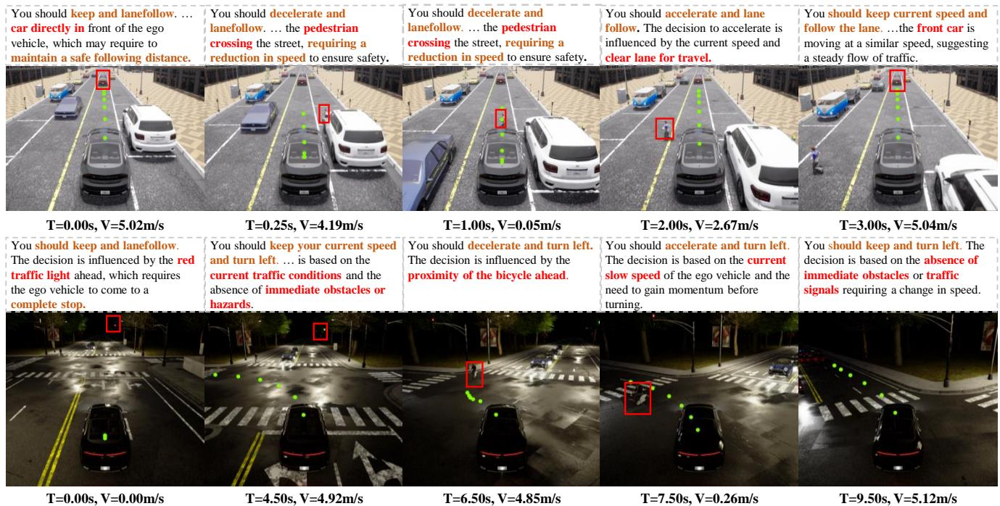

*生动展示了ORION在Bench2Drive闭环评测中的实际路测表现。图中利用色彩编码直观区分了模型输出的驾驶动作、触发决策的关键障碍物以及预测的未来轨迹，凸显了其在复杂城市场景中类人的决策透明度。*

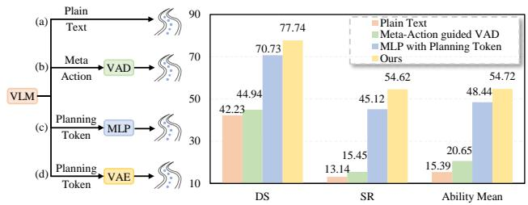

*通过对比实验凸显了“视觉-语言指令驱动动作生成”机制的核心优势。该设计赋予模型理解自然语言指令的能力，使其在驾驶得分与成功率等关键维度上大幅领先传统端到端基线，验证了多模态对齐的有效性。*

## 相关工作与定位

**结论前置：** ORION 并非从零构建的孤立系统，而是精准定位于“端到端自动驾驶”与“视觉语言模型（VLM）”的交叉断层。它通过**解耦并重新对齐“推理空间”与“动作空间”**，填补了传统 E2E 模型缺乏高阶语义推理、以及现有 VLM 方案难以直接输出稳定控制信号的空白。在研究谱系中，ORION 扮演了“桥梁”角色：向上继承并改造前人的视觉压缩与轨迹解码管线，向下以 VLM 的逻辑推演能力引导生成式规划，最终实现从“感知-控制直连”向“语义推理引导”的范式迁移。

### 范式迁移：从“硬拼接”到“推理引导”
在闭环控制基线方面，论文选取了 DriveTransformer 与 DriveAdapter 作为核心参照。DriveTransformer 代表了当前 SOTA 的闭环轨迹生成能力，而 DriveAdapter 则引入了专家特征蒸馏并融合相机与 LiDAR 多模态输入。ORION 的关键改动在于剥离了对 LiDAR 的依赖，仅凭相机输入与导航条件（NC condition），利用 VLM 的推理能力直接指导生成式轨迹规划。这一设计在 Bench2Drive 的复杂闭环交互场景中展现出整体优势，但论文也明确承认：在变道（lane-changing）等强博弈子任务上，ORION 仍存在能力短板。这提示了纯视觉+VLM 推理在极端动态交互中的物理边界，也避免了将相关性（VLM 语义理解强）直接等同于因果性（所有驾驶动作均能完美执行）的过度宣称。

同时，ORION 明确回应了 VAD 等经典 E2E 模型所代表的 dual-system 范式。VAD 等方案试图将 VLM 接口直接嫁接至传统轨迹模块，但论文论证了这种“硬拼接”会导致推理空间与动作空间的错位。ORION 借此支撑了其核心设计动机：必须建立直接对齐推理与动作的专用通道，而非依赖传统 E2E 轨迹模块的间接承接。

### 架构继承与改造：时序压缩与动作对齐
ORION 的底层架构并非凭空发明，而是对现有组件的针对性重组与扩展。
<details><summary><strong>架构映射与技术细节展开</strong></summary>
- **视觉时序压缩**：借鉴 OmniDrive 中 Q-Former 风格的视觉特征压缩思路，ORION 将其扩展为 QT-Former。QT-Former 并非简单的多帧图像堆叠，而是通过可学习查询（Query）与 Memory Bank 实现长期历史上下文的时间聚合。这一改动确保了模型在 nuScenes 等替换设置下，仍能稳定捕获长时序驾驶意图。
- **轨迹解码与空间对齐**：在动作生成端，ORION 复用了 GenAD 的 GRU decoder 进行轨迹解码。但关键创新在于引入 VAE 作为“翻译器”，将单一的推理空间 planning token 映射至连续的动作空间。这一设计明确了 ORION 生成式规划器的功能重点：不是单纯追求轨迹拟合精度，而是实现 reasoning-action 的严格对齐。
</details>

为直观呈现 ORION 在研究谱系中的位置与组件流向，下图梳理了核心基线/方法与 ORION 的继承、对比与改造关系：
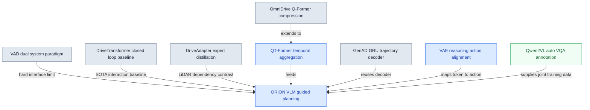
*如何读这张图：* 左侧灰色节点代表被对比或借鉴的前人工作，右侧蓝色节点为 ORION 的核心改造模块，绿色节点为辅助工具链。箭头方向表示技术流向或对比逻辑，统一使用圆角矩形保持视觉连贯，重点暴露 ORION 如何通过“替换接口”与“引入对齐层”完成范式升级。

### 数据管线与联合训练
训练数据的质量直接决定了 VLM 在驾驶场景中的落地效果。ORION 依赖 Qwen2VL 自动生成的 Chat-B2D VQA 标注，构建了一套低成本、高语义密度的数据管线。该流程不仅替代了昂贵的人工标注，更为 VQA 问答与轨迹规划的联合训练提供了结构化监督信号。论文借此证明，联合训练的有效性高度依赖于高质量语义数据的注入，而非单纯增加模型参数量。

### 局限性与谱系边界
尽管 ORION 在多项闭环指标上超越了传统基线，但读者需注意其宣称的边界：
1. **变道场景的失效模式**：如前所述，在 DriveAdapter 对比中暴露的变道短板，说明当前架构在强交互、高动态博弈下的决策鲁棒性仍有提升空间。
2. **相关性≠因果性**：VLM 推理能力的提升与闭环得分的正相关已被验证，但论文未完全排除“导航条件（NC condition）本身携带强先验”这一替代解释。
3. **消融与负结果**：论文在架构对比中报告了关键模块的消融结果，但未详细展开极端天气或传感器失效下的负结果测试。这提示 ORION 目前更适用于结构化道路与标准传感器配置，其泛化边界需在后续工作中通过更严苛的误差范围报告来界定。

总体而言，ORION 在谱系中完成了一次“承上启下”的精准卡位：它不追求推翻 E2E 范式，而是通过模块化重组与空间对齐，让 VLM 的“大脑”真正学会控制车辆的“四肢”。

## 研究探索历程

**本节结论：** ORION 的架构并非一蹴而就，而是通过“否定文本直出规划→转向隐空间分布对齐→受控引入历史记忆→重构闭环监督与评估边界”的迭代路径演化而来。研究团队在探索中明确识别了 VLM 的数值推理短板、历史信息的容量挤占效应，以及生成器对轨迹分布的强依赖性，最终将主战场锚定在 Bench2Drive 闭环场景。

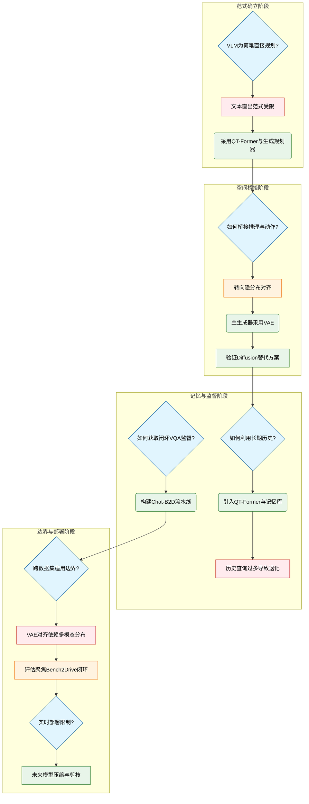
**如何读这张图：** 蓝色菱形代表核心科学问题，绿色圆角矩形为架构决策，红色平行四边形为验证失败的死胡同，橙色六边形为方向性转折。箭头展示了“问题暴露→试错/消融→决策定型→引出下一问题”的真实研发链路。

### 痛点溯源：为何VLM无法直接输出驾驶轨迹？
**结论：** 让 VLM 直接输出文本规划结果在闭环驾驶中是一条死胡同，根本原因在于自回归文本生成机制与连续数值动作空间存在本质错位。
论文在初期假设中尝试将 VLM 作为纯文本规划接口，但实验迅速暴露了失效模式：VLM 擅长语义推理，却极度缺乏精确的数学计算与数值推理能力；同时，自回归解码天然倾向输出单一确定性结果，无法表达人类驾驶规划中固有的不确定性（如“减速让行”或“加速变道”的概率分布）。这一发现直接否定了 `plain text outputs` 路线。
基于此，团队做出关键决策：放弃纯文本输出，转向 `vision-language instructed action generation`。具体实现为串联 `QT-Former`、`LLM` 与 `generative planner`，让 LLM 输出的 `planning token` 作为条件信号，指导后续的轨迹生成模块。消融实验证实，相较于 `dual-system paradigm` 或 `special token decode outputs by MLP`，该生成式规划范式在方向性上显著更优，成功将语义推理结果映射到了数值动作空间。

### 桥接推理与动作：隐分布生成取代硬接口
**结论：** 语义推理与轨迹动作的协同优化不能依赖精心设计的硬接口，而必须在隐空间中通过概率分布对齐来实现。
在确立生成式方向后，研究面临如何连接 `reasoning space` 与 `action space` 的难题。早期思路试图在语言空间直接输出规划或用接口传递 `meta-action`，但论文指出这会割裂推理过程与轨迹优化的联合训练。因此，方向发生关键转折：将当前轨迹建模为受 `planning token` 条件控制的概率分布，在隐空间中完成对齐。
在生成器选型上，团队最终采用 `VAE`，将状态 $s$ 与真实轨迹 $t$ 投影到 Gaussian latent variables，并利用 Kullback-Leibler divergence 进行分布匹配。为验证架构灵活性，论文还进行了替换实验：将 `VAE` 替换为 `diffusion model`。结果表明，虽然 `diffusion-based` 版本仍能运行且证明了框架的兼容性，但 `VAE-based trajectory generator` 在整体表现上方向性更优。这提示我们，生成器的选择需与训练效率及分布假设相匹配。

### 历史记忆的边界：容量控制优于无限堆叠
**结论：** 长期历史信息对交互驾驶至关重要，但记忆容量必须受控；过度堆叠历史查询会挤占当前帧的特征提取能力，导致性能退化。
多帧图像拼接虽能保留历史，但受限于 VLM 的 token 长度与计算开销。团队决策引入 `QT-Former` 与 `Memory Bank`，通过 `scene queries`、`perception queries` 和 `history queries` 协同提取多视角当前与历史信息。
然而，探索并非一帆风顺。消融实验揭示了一个典型的“过犹不及”现象：当 `history queries` 数量从无增加到适中水平时，闭环规划性能方向性提升；但继续增大数量后，指标出现明显退化。论文深入分析了这一失效模式：过多的历史查询会阻碍 VLM 捕获当前帧特征，而在动态驾驶场景中，当前帧的瞬时状态往往比远期历史更具决定性。这一教训直接确立了“长期记忆需受控容量”的设计原则，历史信息绝不能喧宾夺主。

### 监督与评估的取舍：闭环数据分布决定生成器选型
**结论：** 生成式规划器的优势高度依赖目标数据集的轨迹分布特性；脱离数据分布谈泛化会导致结论失效，因此主评估必须锚定在具备多模态轨迹特性的闭环场景。
闭环模拟环境长期缺乏高质量 VQA 标注。为此，团队构建了 `Chat-B2D` 自动标注流水线，通过 `critical object selection`、`description generation` 和 `history information` 自动生成 VQA pairs。联合训练实验证明，单任务训练无法同时兼顾推理与规划能力，VQA 与 planning 的联合优化在双指标上均取得方向性优势。
在评估边界探索中，团队尝试将 `QT-Former` 替换为 `OmniDrive` 的 `Q-Former` 并在 `nuScenes` 上进行开放环对比。结果发现，ORION 相比经典非 VLM 方法表现可比，但并非最优。论文坦诚指出了背后的失效模式：`nuScenes` 的轨迹分布更接近单模态高斯分布，而 `VAE` 的隐空间对齐优势恰恰在于处理 `Bench2Drive` 中常见的多模态轨迹分布（如“让行”或“绕行”的分岔）。基于此，研究发生重要转向：放弃以 `nuScenes` 开放环作为主证明场景，将核心评估聚焦于 `Bench2Drive` 闭环。这并非“挑樱桃”，而是对生成式规划器适用边界的诚实界定。

### 现实约束与未来路径
**结论：** 尽管 ORION 在闭环模拟中验证了架构有效性，但可扩展 VLM 的计算复杂度仍是实时部署的硬性瓶颈，模型轻量化是必经之路。
论文在限制部分明确指出，当前架构的计算开销限制了其在真实车载硬件上的实时应用。面对这一工程现实，团队并未过度宣称“端到端即可落地”，而是将 `model compression` 与 `pruning` 列为明确的未来工作方向。这体现了研究从“算法可行性验证”向“工程可部署性”过渡的清醒认知。

<details><summary><strong>探索路径中的关键权衡与未决问题</strong></summary>
- **相关性 vs 因果性：** 论文通过消融实验（如替换生成器、调整 `history queries`）验证了各模块的必要性，但闭环模拟中的性能提升仍部分依赖于 `Bench2Drive` 的特定场景分布，跨域因果泛化需进一步验证。
- **负结果报告：** 明确报告了 `plain text` 范式最弱、`diffusion` 替代方案方向性次优、`history queries` 过载导致退化等负结果，未做“报喜不报忧”的筛选。
- **误差范围：** 报告以方向性改善和定性对比为主，部分消融实验未给出严格的置信区间或多次随机种子误差棒，读者在解读微小数值差异时需保持审慎。
</details>

## 工程与复现要点

**结论：** ORION 的工程复现高度依赖“三阶段渐进式空间对齐”训练管线与“无高精地图+纯导航指令”的极简输入范式；其硬件门槛明确（需 32 张 80GB A800），且当前**无公开代码仓库**，复现者需严格遵循论文披露的组件版本、查询数量与数据划分自行搭建。模型并非端到端黑盒，而是通过冻结/解冻策略与特定超参控制，在视觉感知、语言推理与动作生成之间建立稳定映射。

### 模型骨架与关键结构
**结论：** 架构采用“解耦表征、渐进对齐”设计，核心由 QT-Former、Vicuna v1.5 与 VAE+GRU 规划器串联而成；查询向量数量与历史记忆长度存在明确甜点，盲目堆叠会破坏当前帧特征捕获。

ORION 的整体框架将驾驶任务拆解为三个正交空间，并通过模块化组件实现跨模态桥接：
- **视觉与记忆提取（QT-Former）：** 视觉编码器固定为 `EVA-02-L`。为捕获长时序上下文，模型内置 Memory Bank 存储 `n=16` 帧历史特征。查询向量（queries）的配置经过严格消融：`scene queries` 设为 512，`perception queries` 设为 600，而 `history queries` 的甜点值为 16。论文指出，过多历史查询会阻碍 VLM 捕获当前帧特征，过少则丢失时序依赖。
- **语言推理中枢（LLM）：** 采用 `Vicuna v1.5`，通过 LoRA 微调（`rank=16`, `alpha=16`）注入驾驶先验。LLM 负责将视觉特征转化为规划 token，充当感知与动作之间的“语义翻译器”。
- **轨迹生成器（generative planner）：** 采用 `VAE + GRU decoder`（源自 GenAD）的 anchor-free 架构。论文对比了 diffusion 生成器，发现 VAE 方案在开环与闭环中均更优，归因于其 latent space 与推理空间的对齐更直接、训练更稳定。输出端严格遵循 Bench2Drive 设定，生成 6 mode 轨迹预测，仅以 Navigation Command（NC）为条件，完全摒弃高精地图与 target point。

```mermaid
flowchart TD
  classDef stage fill:#e6f2ff,stroke:#0055a4,color:#003366;
  classDef data fill:#f0f7e6,stroke:#3a7d44,color:#1b4d22;
  classDef action fill:#fff0e6,stroke:#d97706,color:#78350f;
  classDef check fill:#f3e8ff,stroke:#7e22ce,color:#4a044e;

  subgraph training_pipeline
    load_vqa(["load vqa training data"]):::data
    stage_1["align vision and language"]:::stage
    freeze_planner["freeze generative planner"]:::action
    check_align{verify alignment success}:::check
    stage_2["align language and action"]:::stage
    unfreeze_planner["unfreeze planner apply lora"]:::action
    load_plan(["load planning trajectory data"]):::data
    check_joint{prepare joint training}:::check
    stage_3["fine tune end to end"]:::stage
    joint_train["train vqa and planning"]:::action

    load_vqa --> stage_1
    stage_1 --> freeze_planner
    freeze_planner --> check_align
    check_align -->|yes| stage_2
    stage_2 --> unfreeze_planner
    unfreeze_planner --> load_plan
    load_plan --> check_joint
    check_joint -->|yes| stage_3
    stage_3 --> joint_train
  end
```
**如何读这张图：** 流程自上而下展示三阶段训练的数据流向与模块状态切换。圆柱节点代表输入数据源，矩形代表核心训练阶段，菱形为状态判定门。箭头标注的 `yes` 分支表示当前阶段对齐达标后，权重继承并进入下一阶段；若跳过判定直接联合训练，将导致模态表征断裂（论文消融已验证）。

### 训练管线与关键超参
**结论：** 训练成功的关键在于严格执行“逐阶段继承权重”的三阶段策略，并配合 `640×640` 的输入分辨率与 `total batch size 32` 的稳定配置；单阶段跳跃或任务解耦会导致闭环性能方向性下降。

论文采用 `three-stage training strategy`，每个阶段固定训练 `six epochs`。这种设计并非随意堆叠，而是为了解决多模态大模型在驾驶任务中常见的“灾难性遗忘”与“模态对齐断裂”问题：
1. **第一阶段（3D Vision-Language Alignment）：** 冻结 generative planner，仅训练 QT-Former 与 VLM。利用 `2.11M` 训练集与 `0.12M` 验证集的 Chat-B2D VQA pairs，强制视觉空间与推理空间对齐。消融实验表明，缺失此阶段将直接削弱后续规划训练的闭环表现。
2. **第二阶段（Language-Action Alignment）：** 解冻 generative planner，训练除 LLM 外的全模型（LLM 仅通过 LoRA 更新）。此阶段刻意**不使用** auxiliary VQA pairs 预测轨迹，目的是将 LLM 积累的 world knowledge 纯净地传递至 action space。
3. **第三阶段（End-to-End Fine-tuning）：** 沿用上一阶段配置，引入 VQA 与 planning tasks 联合训练。联合监督促使 vision-reasoning-action 空间彻底融合，在规划与语言指标上均取得方向性提升。

<details><summary><strong>损失函数与优化细节（展开查看）</strong></summary>
总训练目标为三部分损失之和，论文未单独报告各损失权重的敏感性分析，但整体设计确保了轨迹生成的物理合理性与安全性：
- **QT-Former 端：** 监督信号来自 object detection、traffic state 与 motion prediction 任务。消融显示 traffic state 与 motion prediction 的组合对闭环表现至关重要。
- **LLM 端：** 采用标准的 auto-regressive crossentropy loss。
- **Generative Planner 端：** 组合使用 Kullback-Leibler divergence、collision loss、boundary loss 与 MSE loss。
图像预处理统一 resize 至 `640 × 640` 并施加 data augmentations。训练集严格划分为 Bench2Drive base set 的 `950 clips`（训练）与 `50 clips`（开放环验证），闭环评估则覆盖 `220 short routes` 与 `44 interactive scenarios`（每场景 5 routes）。
</details>

### 运行环境与开源现状
**结论：** 复现需准备 `32 NVIDIA A800 GPUs (80 GB)` 的算力集群，依赖 CARLA V2 与 Bench2Drive 仿真环境；目前**无公开代码仓库**，复现者需自行集成开源组件并严格对齐论文配置，建议优先在现有 E2E 基线上进行模块化替换验证。

- **硬件与算力：** 论文显式声明训练使用 `32 NVIDIA A800 GPUs with 80 GB of memory`。考虑到三阶段训练、大语言模型微调与多模态数据吞吐，该配置是保证 `batch size 32` 与 `six epochs` 稳定收敛的基线。论文未报告 batch size 敏感性消融，复现时不建议随意缩减。
- **核心依赖栈：** 环境强依赖 `Bench2Drive` 数据集、`CARLA V2` 仿真器与 `nuScenes` 预训练权重。模型组件需手动对齐 `EVA-02-L`（视觉）、`Vicuna v1.5`（语言）、`VAE + GRU decoder`（规划）及 `LoRA` 微调框架。论文未披露 Python 版本与深度学习框架具体版本，复现时需根据组件兼容性自行适配。
- **代码与复现门槛：** 经检索论文正文与 Papers-with-Code 索引，**未发现公开代码仓库**。这意味着复现无法直接拉取工程代码，必须依赖论文附录（Appendix B/C）披露的超参、数据划分与训练策略手动搭建。对于希望快速验证的工程师，建议优先关注其“无高精地图+纯导航指令”的极简设定与三阶段对齐逻辑，可在现有开源 E2E 基线（如 UniAD 或 VAD 变体）上进行模块化替换与消融验证，以规避从零搭建的底层调试成本。

## 局限与适用边界

**结论前置：** ORION 目前仍是一个“重算力、重仿真”的实验室级原型，其核心瓶颈在于大模型推理延迟与特定数据分布下的泛化偏差，尚未跨越实时实车部署的门槛。若你的场景要求毫秒级响应、强安全认证或高度动态的混合交通流，当前版本并不适用。

**算力墙与实时性缺口。** 论文在 Bench2Drive closed-loop simulation environment 中验证了 ORION 的决策能力，但明确指出其受限于 scalable VLM 的 high computational complexity。直觉上，多模态大模型需同步编码视觉、语言与历史状态序列，前向传播的计算开销远超传统轻量级控制策略，导致系统难以直接满足 real-time driving scenarios 的硬性延迟要求。作者已将 model compression 与 pruning 列为明确的未来方向，意在通过结构剪枝与参数量化压缩推理负载，但当前版本仍停留在“离线/近实时”验证阶段，未提供端侧部署的延迟压测数据。

**分布先验与数据集错配。** 在 nuScenes 的 VLM-Based 横向对比中，ORION 并未取得最优表现。论文将其归因于底层生成架构的分布假设差异：ORION 依赖的 VAE latent space 更契合 Bench2Drive 中呈现的 multimodal trajectory distributions，而 nuScenes dataset 的统计特性更接近 uni-modal Gaussian distribution。这意味着，当目标场景的轨迹先验从“多模态发散”退化为“单峰收敛”时，VAE 的多峰表征优势会被削弱，模型可能因先验正则化过强而引入额外方差，导致在单峰主导的数据集上性能折损。

**动态博弈中的因果捕获失效。** 在 Merging 与 Give Way 两类典型交互场景中，ORION 落后于 DriveAdapter。论文给出的机制解释是：lane-changing 的 decision-making timing 具有高度多样性，导致模型难以从观测序列中剥离出正确的 causal relationship。换言之，在博弈时机不固定的长尾场景中，模型容易将时间上的先后关联误判为因果驱动（相关性当因果），这种归纳偏差会直接拉低复杂汇入与让行任务的成功率。

为直观呈现 ORION 的能力边界与已知失效模式，下图梳理了其适用条件与触发限制的关键判定路径：
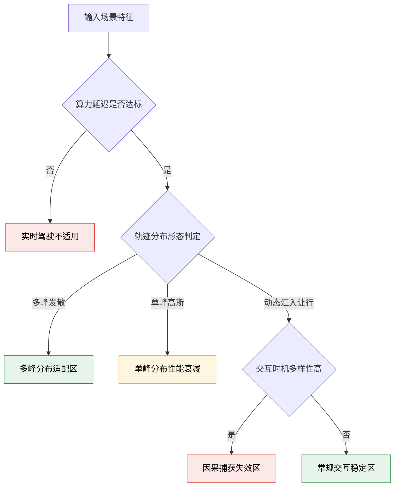
*如何读这张图：* 菱形节点代表论文实证中暴露的关键判定门。绿色路径对应已验证的优势区，黄色路径提示分布假设错配带来的性能折损，红色路径标记了当前架构尚未解决的因果推理与实时性硬伤。

<details><summary><strong>深度展开：分布错配与因果失效的机制推演</strong></summary>
- **VAE 表征与单峰/多峰分布的张力：** VAE 通过隐空间约束逼近先验分布。当训练数据呈现明显的多峰轨迹时，隐空间能有效解耦不同模式；但面对统计上更集中、方差较小的单峰高斯分布时，多峰先验的强正则化反而可能压制真实数据的局部特征，导致生成轨迹的方差被人为放大。
- **时序多样性对因果推断的干扰：** 在 Merging/Give Way 场景中，车辆切入或让行的触发时机受前车速度、相对距离、驾驶员意图等多变量耦合影响。若模型仅依赖序列相关性进行自回归预测，而未引入显式的因果图或反事实干预机制，极易在 timing 偏移时输出次优甚至冲突的控制指令。这也是为何论文强调需进一步探索 causal relationship 的显式建模。
</details>

**实证范围与安全认证缺口。** 必须严格区分论文的“已证明”与“未覆盖”：本文的主要闭环验证集中在 CARLA 与 Bench2Drive 仿真环境中。真实道路部署所需的传感器噪声鲁棒性、硬件级实时延迟以及功能安全认证均不在本文实证范围内。这意味着，ORION 当前的性能数字反映的是“理想仿真条件下的算法上限”，而非“可量产系统的工程基线”。在将其迁移至实际车载计算平台前，仍需补齐延迟压测、故障注入与安全冗余设计。

## 趋势定位与展望

**结论：** ORION 的核心定位在于“打通语义推理与连续动作空间的隐式对齐”，标志着端到端自动驾驶从“感知-规划流水线拼接”或“文本指令外挂”向“统一可微生成式规划”的范式转移。其意义在于系统性地验证了：大模型的因果推理能力无需退化为离散文本或手工元动作，而是可以通过 VAE 隐空间直接条件化多模态轨迹生成。然而，该路线在强交互博弈（如汇入、让行）与数值精确性上仍存在明确边界，未来需向细粒度动作解耦、轻量化历史记忆与更严格的因果验证演进。

传统 E2E 方案长期受困于“懂感知不懂决策”的瓶颈。经典模仿学习能在开环拟合专家轨迹，却缺乏处理动态交互的常识因果推理；直接让 VLM 输出文本规划或数值坐标，会撞上自回归机制的单一性陷阱与连续数学计算的短板；而用 meta-action 作为中间桥梁，本质上仍是手工接口，强行割裂了 reasoning space 与 action space 的联合优化。ORION 的破局思路很直接：用 QT-Former 将多帧历史压缩为紧凑的 Memory Bank 查询，交由 LLM 提炼出 `planning token`，随后通过 generative planner 在 VAE latent space 中完成“语义条件→轨迹分布”的对齐。直觉上（非严格对应），这相当于把 VLM 的“大脑思考”直接映射为可微的“肌肉记忆”，而非先翻译成文字再让另一个模块去猜。

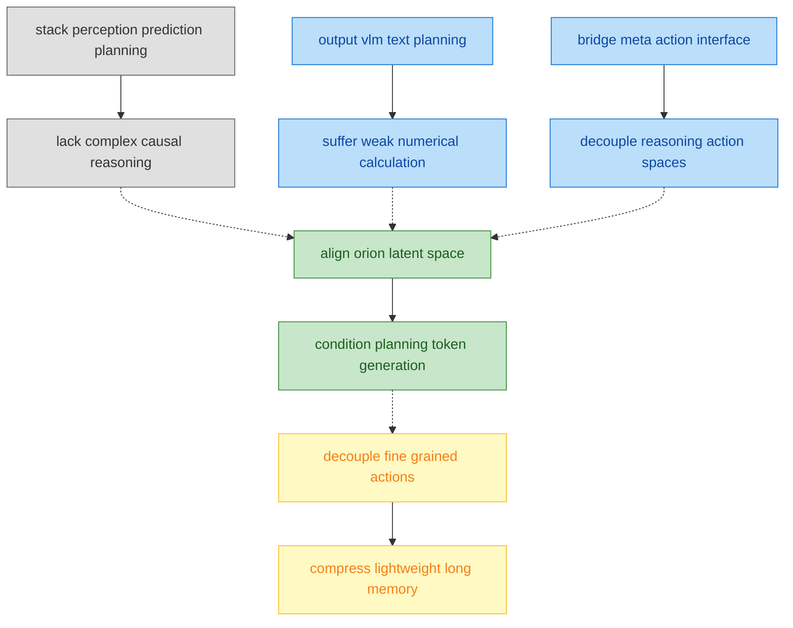
**如何读这张图：** 左侧三条路径代表过往 E2E 路线的典型失效模式（灰/蓝），ORION（绿）通过隐空间对齐绕开手工接口与文本瓶颈；右侧黄色节点为当前架构暴露出的下一步演进压力，箭头方向指示技术路线的迭代逻辑。

在 Bench2Drive 闭环评测中，ORION 的 Driving Score 达到 77.74，在相同导航条件与纯相机模态下超越了 DriveTransformer-Large，并在多能力均值上领跑。具体到分项，其在 Overtaking、Emergency Brake 与 Traffic Sign 等依赖规则理解与突发响应的场景表现突出，这与其“语义推理直接注入轨迹生成”的设计高度吻合。但必须诚实指出：论文并未证明该架构在所有交互场景下均占优。在 Merging 与 Give Way 这类强博弈、需精确时空协商的任务中，ORION 仍落后于采用专家特征蒸馏的 DriveAdapter。这暴露出当前“单一 planning token 条件化全局轨迹”的局限——当场景需要多智能体细粒度博弈时，粗粒度的语义条件可能无法提供足够的动作空间分辨率。此外，论文对比了 VAE 与 Diffusion 式规划器，确认 VAE 在闭环、开环与能力均值上整体更优，但未详细报告误差范围或负结果消融，这意味着生成式规划器的稳定性边界仍需更严格的统计检验。

<details><summary><strong>深度展开：隐空间对齐的代价与未解问题</strong></summary>
<ul>
<li><strong>相关性≠因果性风险：</strong> Bench2Drive 分数提升被归因于 reasoning-action 对齐，但大模型（如 Qwen2VL-72B 级别，参数量约 72000.0M）本身携带的海量驾驶先验知识可能贡献了部分性能。论文尚未完全剥离“模型规模红利”与“架构设计红利”。</li>
<li><strong>历史上下文压缩假设：</strong> QT-Former 依赖 Memory Bank 承载长期视觉上下文，其有效性建立在“压缩后的 token 足以保留关键交互线索”的假设上。在极端长尾或遮挡场景中，信息瓶颈可能导致规划退化。</li>
<li><strong>数值推理短板未根除：</strong> 尽管 VAE 隐空间缓解了纯文本输出的数值缺陷，但 LLM 本身的 autoregressive 机制仍倾向于输出单一模式。若需覆盖多模态不确定性（如多车道汇入的概率分布），生成式规划器仍需更强的分布建模能力。</li>
</ul>
</details>

面向下一阶段，ORION 揭示的路线并非终点，而是新起点。短期看，需在生成式规划器内部引入动作空间解耦机制（例如将横向控制与纵向速度规划分离），以补齐 Merging/Give Way 的博弈短板；中期需探索更高效的时序记忆架构，突破 VLM token 长度与计算开销的硬约束，使历史上下文能真正服务于长程因果链；长期则需建立更透明的因果验证协议，将“语义推理→轨迹生成”的黑盒映射转化为可解释、可证伪的决策逻辑。自动驾驶的终局不是让车“更像人一样说话”，而是让车的“思考”与“执行”在同一个可微空间里无缝咬合。ORION 迈出了关键一步，但距离真正的“认知-动作一体化”，仍需在数学严谨性与工程鲁棒性上继续深耕。
