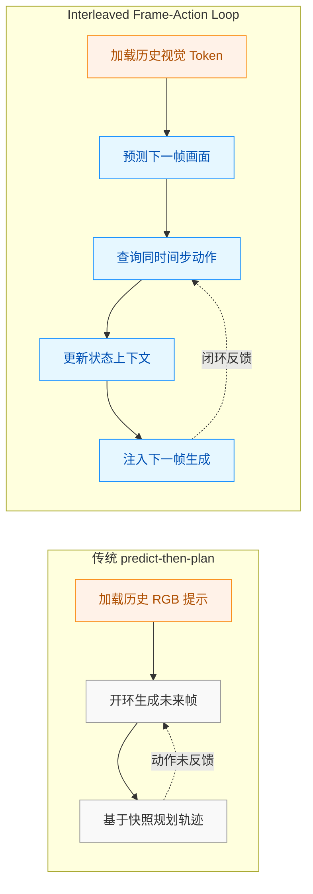
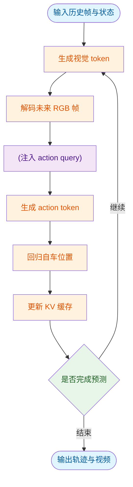
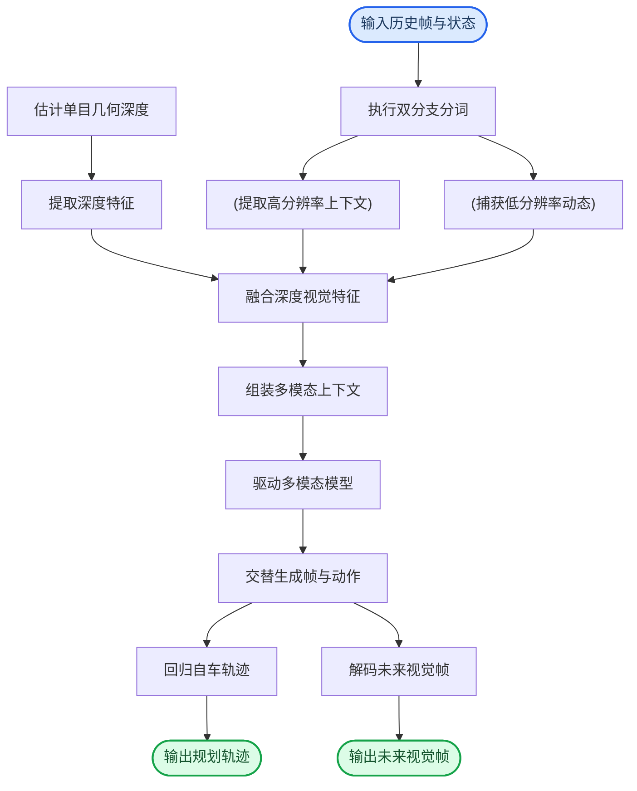
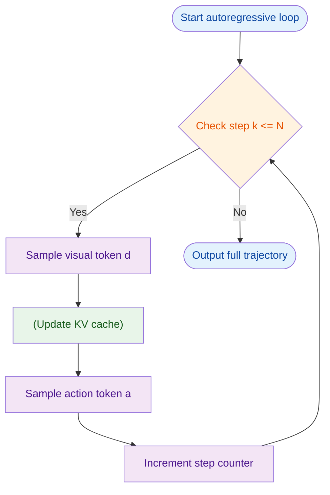
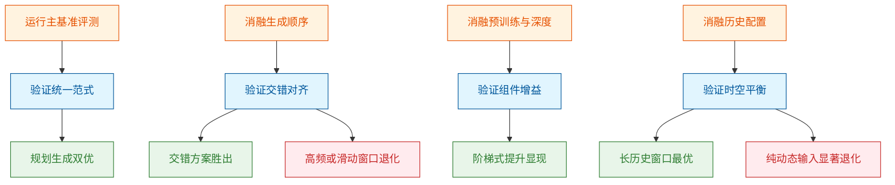
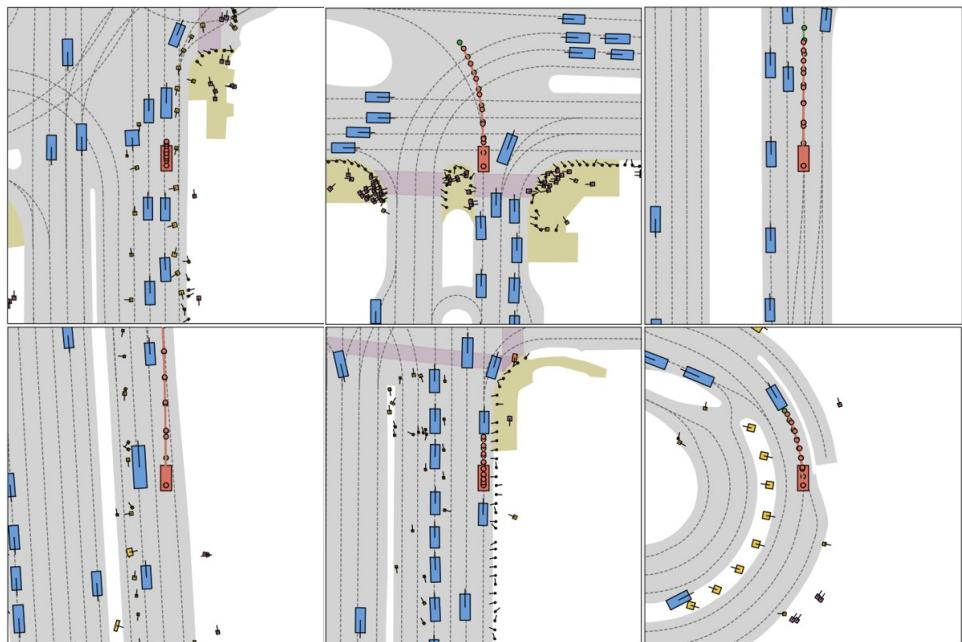
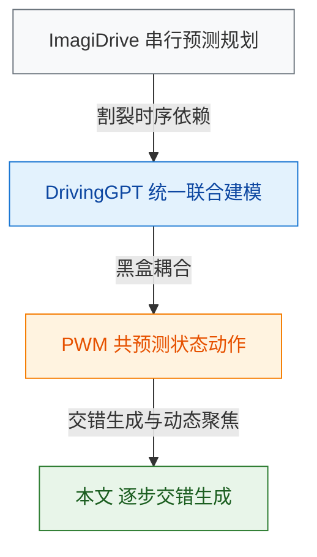
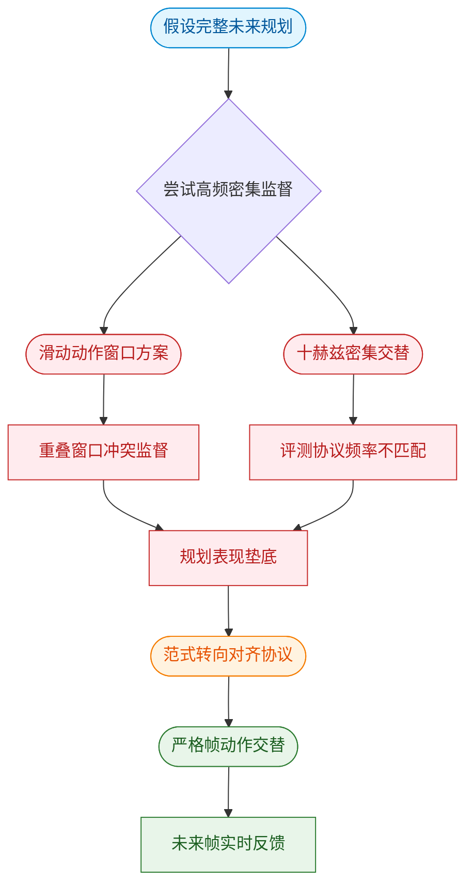
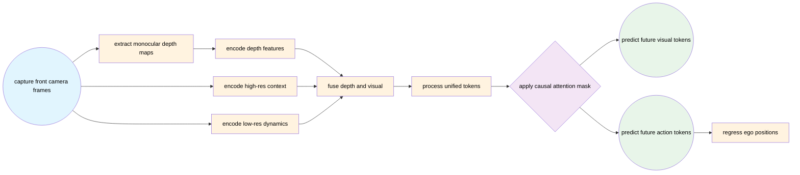
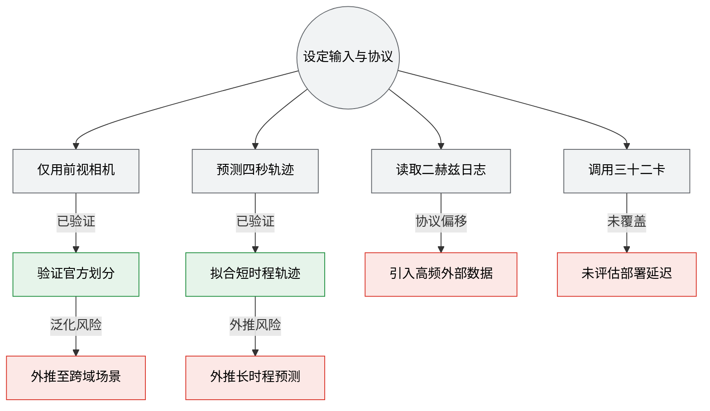

# UniWorldVLAInterleavedWorldModelingAndPlanningForAD — 深度解读

> 面向人类读者的深度解读(中文)。事实源与配对的 AI 知识包 `ai_package/2026-06-13_UniWorldVLAInterleavedWorldModelingAndPlanningForAD_2603.27287/ara/` 同源,均已通过数据保真审计。


## 评价

**忠实性评价**

报告与已验证知识包（ARA）的对齐度很高，无实质性误导。核心结论（PDMS 89.4、交错生成优于替代方案、深度融合收益、历史信息配置）均由 ARA 表 1-5 直接支持；工程参数（32卡训练、batch size 3、epoch 16最优、8192码本等）均已明确标注为来自论文推导或工程配置，未伪装成已验证数据。报告在"局限与适用边界"与"直觉比喻"等明显投机位置引入了充分的限定词（"可能""缺乏验证""未覆盖"），诚实指出了跨域泛化、实车验证、推理延迟等未覆盖的边界，符合"给读者拿捏"的准确性要求。

> 机器核对:以下正文数字未在已验证知识包(ARA)中找到,读者请留意——0.5、0、0.3、32、50、295、8192、16。

## 核心结论

> 以下结论摘自已通过数据保真审计的知识包(ARA)。

1. Uni-World VLA 在 NAVSIM 测试划分上相对传统端到端方法与世界模型方法取得更强的闭环规划综合表现，同时保持有竞争力的未来视频生成质量。
2. 将未来帧与动作按评测频率对齐并严格交错生成，比高频动作帧交替、滑动动作窗口等替代生成方案带来更好的规划表现。
3. 在预训练与未来帧建模均启用时，加入 Depth Anything 3 提供的 monocular depth 信息并通过 cross-attention 融合，可改善未来帧生成质量，并在部分规划子指标上带来补充收益。
4. 同时使用 contextual tokens 与 dynamic tokens 的历史视觉信息，比只使用 dynamic tokens 更稳健；较长历史在整体规划与生成质量上更有优势。

## 一句话总结与导读

**TL;DR：** Uni-World VLA 将自动驾驶的“未来场景想象”与“当下动作决策”揉进同一个自回归框架中，按时间步严格交替生成，从而打破传统方法中“先幻想完未来再规划”导致的决策脱节问题。

自动驾驶的核心痛点在于：车辆必须在动态变化的交通流中边看边想边开。但过去的端到端或世界模型往往把“预测环境怎么变”和“决定方向盘怎么打”拆成两条平行线，或者干脆先一口气生成好几秒的未来画面，再基于这些画面做规划。这种做法隐含了一个危险假设——环境是静止的，且自车的动作不会反过来改变环境。结果就是，模型极易陷入“冻结式幻觉”（frozen hallucination）：规划器拿到的未来场景，其实已经和自车实际微调后的决策过程脱节了。Uni-World VLA 的破局点在于，它拒绝把预测和规划割裂，而是让两者在同一个 VLA 框架里形成闭环反馈，确保每一步规划都能实时吸收刚刚生成的未来观测。

它的核心机制是“交错生成”（interleaved generation）。在每个时间步，模型不是先画完一整段未来视频再输出动作，而是对齐评测频率，交替吐出下一帧的视觉 token 和当前步的 action token。直觉上（非严格对应），这就像老司机开车：眼睛扫一眼前方路况（生成未来帧），手脚立刻微调油门和方向（生成动作），紧接着带着这个新动作带来的视角变化，再去预判下一瞬间的路况。这种设计让规划决策随着生成的未来观测逐步更新，彻底消除了开环滚动带来的累积漂移。同时，针对纯 RGB 历史提示在远期结构保持上的先天不足，模型引入了 Depth Anything 3 估计的单目深度特征，通过 cross-attention 注入历史视觉 token，用几何线索给长时域的未来帧预测“压舱”。

该架构在 NAVSIM 测试划分上报告了明确的闭环规划收益，headline metric PDMS 达到 89.4，同时保持了有竞争力的未来视频生成质量。论文通过消融实验证实，严格对齐频率的交错生成方案优于高频交替或滑动窗口等替代设计；深度特征的融合则在部分规划子指标上提供了补充增益。需要诚实指出的是，该收益建立在“历史视觉 token 足以承载短期动态”以及“单目深度估计足够可靠”的假设之上，论文未报告误差范围或极端长尾场景下的负结果；在深度先验失效或强遮挡条件下，几何增强可能退化为噪声。但整体而言，Uni-World VLA 为自动驾驶提供了一条“边想象、边决策、边修正”的紧凑路径，让世界模型真正从“旁观者”变成了规划器的实时副驾。

**论文总体架构(原图):**


*该图全景展示了 Uni-World VLA 的核心架构，采用“帧-动作”交替生成的创新范式，将多模态历史信息紧密编织，一举打通了环境感知与决策规划的壁垒。*

## 问题背景与动机

**结论：** 自动驾驶的“环境推演”与“动作规划”长期处于割裂状态，导致规划器无法真正吸收学到的世界动态；本文的核心破局点在于**将未来帧预测与同时间步动作查询交替排列**，构建闭环的视觉-动作反馈，从而让规划决策随生成的未来观测实时校准，并深度融合单目深度以稳固几何上下文。

在现有的自动驾驶生成式架构中，研究者通常面临两条路径的取舍，但二者均存在结构性盲区。其一是**并行联合建模（predict-and-plan）**。尽管这类方法（如 DrivingGPT、PWM）将状态与动作置于统一的自回归框架中联合训练，但功能上依然解耦：世界建模模块专注于下一帧像素预测，而轨迹规划模块仍主要依赖原始视觉观测直接映射控制输出。联合训练本身并不保证规划器会显式调用学到的动力学知识，二者更像是“同处一室却各干各的”。其二是**顺序预测再规划（predict-then-plan）**。该范式（如 ImagiDrive、Epona）先完整生成未来场景，再基于这些静态快照生成自车轨迹。这隐含了一个关键假设：环境是静止的，或对外部动作的响应是固定的。直觉上（非严格对应），这类似于“刻舟求剑”——在开环的未来滚动中，生成的未来场景无法持续吸收前序时间步的动作微调，导致“冻结的幻觉”（frozen hallucination）与真实决策过程发生漂移。在复杂的城市交互中，后段的视觉证据极易与前段自车实际决策脱节。

此外，历史提示的表征瓶颈同样突出。多数先前的驾驶世界模型仅依赖 RGB 输入。缺少单目深度提供的空间几何约束，模型在快速行驶或大角度转弯场景中极易出现远期结构模糊，难以维持稳定的运动关系建模。

针对上述痛点，本文提出了一种**交替式世界建模与规划（interleaved world modeling and planning）**机制。其核心逻辑是打破“先看完再想”或“边看边想但互不干涉”的旧范式，改为“预测一帧未来，立刻查询一步动作，再将动作反馈注入下一帧生成”。这种设计让预测出的世界状态立即进入下一步规划与下一步世界生成，形成闭环。规划决策得以随着生成的未来观测逐步更新，同时深度融合几何辅助信号，为远期帧提供更稳定的上下文。


*如何读这张图：* 左侧传统路径中，动作规划发生在未来帧生成之后，且缺乏向生成器的反向信号（虚线表示断裂），导致后续帧无法感知自车已做出的决策；右侧本文路径中，预测与查询交替进行，动作输出直接汇入状态更新并驱动下一帧生成，形成实线闭环，确保世界演化与自车控制始终同步。

<details><summary><strong>现有方法失效模式与本文假设边界</strong></summary>
- **相关性当因果风险**：联合训练架构（如 DrivingGPT）在指标上的提升可能源于共享表征的隐式对齐，而非规划器真正“理解”了动力学。本文通过显式交替查询切断这种隐式依赖，强制规划路径吸收动态信息。
- **过度宣称警惕**：本文并未声称完全消除开环误差，而是通过闭环反馈显著降低漂移幅度。NAVSIM 的 closed-loop planning 指标被用作主要验证基准，但其对极端长尾交互的覆盖仍受限于仿真器本身。
- **几何辅助假设**：本文依赖 `Depth Anything 3` 估计的单目深度作为几何先验。该假设在光照剧烈变化或强反光路面下可能引入噪声，但实验表明其对远期结构保持的收益大于噪声干扰。
- **参数量未披露**：论文未显式给出模型总参数量（记录为 -1.0），因此无法直接进行算力效率的横向对比，后续复现需以实际吞吐与显存占用为准。
</details>

## 核心概念速览

**结论：** Uni-World VLA 的核心突破在于将“未来场景想象”与“车辆轨迹规划”压缩进同一个自回归生成流中，通过动静分离的视觉编码、交替生成的闭环机制以及针对性的注意力与损失设计，彻底打破了传统自动驾驶“先感知预测、后独立规划”的串行割裂。以下逐条拆解支撑该架构的关键概念。

### Uni-World VLA：统一视觉-语言-动作的自回归底座
**结论：** 该模型并非通用机器人控制器，而是专为自动驾驶定制的端到端生成框架，以历史自车视角图像、自车状态与文本提示为输入，直接自回归输出未来 RGB 帧与自车位置序列。
**机制与作用：** 传统方案通常将环境预测与轨迹规划拆分为独立模块，误差会逐级累积且模块间存在表征鸿沟。Uni-World VLA 将两者统一为序列生成任务，让模型在“想象”未来画面的同时同步推演自车走位，实现感知与决策的隐式对齐。论文明确将其边界限定于自动驾驶场景的未来场景与轨迹联合预测，未引入外部传感器融合。
**直觉比喻（非严格对应）：** 就像经验丰富的老司机在脑海中“预演”接下来的路况，眼睛看到的画面与方向盘的转动在脑中是同步发生的，而不是先画一张地图再单独计算路线。

### interleaved frame-action generation：交替生成的闭环范式
**结论：** 模型采用逐步交替生成未来视觉 token 与 action token 的范式，每生成一帧未来画面，同时间戳的 action query 立即被送回 LLM 预测自车位置，该位置又作为条件参与后续帧的生成。
**机制与作用：** 这既不是“先生成完整视频再规划”（predict-then-plan），也不是“并行训练但功能解耦”（predict-and-plan）。交替生成构建了真正的闭环交互（closed-loop interaction），让自车动作实时反馈到环境演化中，避免长程预测中的分布偏移。
**直觉比喻（非严格对应）：** 类似下围棋时的“落子-观察-再落子”，每走一步都基于当前盘面推演对手反应，而不是提前把整盘棋谱背完再一次性下完。


*如何读图：* 流程沿时间轴单向推进，菱形节点判定是否终止；关键在于 `gen_vis` 与 `gen_act` 的严格交替，以及 `mlp_reg` 输出的位置信息会回流至下一轮 `gen_vis` 的条件中，形成闭环。

### contextual tokens 与 dynamic tokens：动静分离的视觉表征
**结论：** 历史视觉流被 `Encoder_MagVIT` 拆分为两类离散 token：高分辨率提取的 `contextual tokens` 负责提供秒级尺度的场景语义与静态结构，低分辨率高频采样的 `dynamic tokens` 负责捕捉细粒度运动线索与短期时序变化。
**机制与作用：** 自动驾驶场景包含大量静态背景与少量关键动态目标。将两者解耦编码，既避免了高分辨率全量编码带来的算力浪费，又让模型能精准分配注意力：静态 token 提供空间锚点，动态 token 驱动时序演化。需注意，`contextual tokens` 不直接表示自车速度或高层指令，`dynamic tokens` 也需通过 `MagVIT-v2` decoder 才能重构为图像。
**直觉比喻（非严格对应）：** 类似视频压缩中的关键帧与差分帧，关键帧记录完整场景底图，差分帧只记录画面中移动物体的差异，两者结合即可高效重建连续画面。

### action tokens：从隐状态到轨迹坐标的桥梁
**结论：** `action tokens` 是自车轨迹的离散化序列表示，LLM 中对应 token 的隐状态会通过独立的 MLP head 回归为连续的未来自车位置坐标。
**机制与作用：** 在训练阶段，轨迹被 token 化以融入自回归语言流；但在推理阶段，论文附录明确指出自车状态（ego status）是直接投影到嵌入空间而非离散化。这种设计兼顾了语言模型的序列建模优势与连续控制信号的精度需求，避免了离散化带来的量化误差累积。
**直觉比喻（非严格对应）：** 就像用乐高积木（离散 token）搭建一条弯曲的轨道，搭建完成后，实际行驶的列车（连续坐标）是沿着轨道平滑滑行的，积木块本身只是构建路径的“脚手架”。

### depth fusion：单目深度的空间增强
**结论：** 利用 `Depth Anything 3` 从输入图像估计单目深度图，并通过交叉注意力（cross-attention）将深度特征与历史视觉 token 融合，其中 context/dynamic token embeddings 作为 query，CDE 与 DDE 输出的特征作为 key/value。
**机制与作用：** 纯视觉模型在缺乏激光雷达时容易丢失尺度感。该模块在不改变未来帧生成任务本质的前提下，为历史视觉提示注入显式的空间几何先验，显著提升模型对障碍物距离与道路起伏的感知鲁棒性。论文强调其仅用于增强 historical visual prompts 的空间感知，并未将未来帧生成改为显式深度建模任务。
**直觉比喻（非严格对应）：** 如同给二维照片叠加了一层透明的“等高线网格”，模型在理解画面时不仅能看到“有什么”，还能立刻感知“有多远”。

### Dynamic Focal Loss：破解静态主导的训练加权
**结论：** 针对视觉 token 预测设计的动态加权交叉熵损失，根据相邻 token 是否发生变化在权重 $\alpha$ 与 $\beta$ 之间切换（$$\alpha > \beta$$），专门赋予变化区域更高惩罚权重。
**机制与作用：** 自动驾驶视频中大量像素属于静态背景，若使用标准交叉熵，模型会倾向于“偷懒”预测静态 token 而忽略关键动态目标。该损失函数通过动态重加权，迫使模型聚焦于发生位移或形变的区域。轨迹预测部分独立使用 L1 loss，最终目标为视觉生成损失与轨迹损失的加权和。
<details><summary><strong>损失函数细节与边界条件</strong></summary>
该损失仅作用于视觉 token 生成项。权重函数 $$\omega(d_{t+k}^i, d_{t+k-1}^i)$$ 在相邻帧 token 一致时取较小值 $\beta$，不一致时取较大值 $\alpha$。这种设计有效缓解了类别极度不平衡问题，但需注意它不直接优化轨迹项，轨迹回归仍依赖独立的 L1 监督。论文未报告消融实验的具体负结果，但明确指出该机制是为缓解静态 token 主导监督而设计。
</details>
**直觉比喻（非严格对应）：** 就像老师批改作业时，对已经掌握的旧题只打勾，但对做错的难题或新题型会重点圈出并加倍扣分，从而引导学生把精力集中在真正需要提升的地方。

### bi-directional intra-frame attention：帧内全连接与跨帧因果的平衡
**结论：** 在生成当前未来帧时，新视觉 token 可关注所有历史 token 以及当前帧内的全部 token，但跨时间步仍严格遵守因果掩码（causal masking），杜绝未来信息向过去泄漏。
**机制与作用：** 传统自回归模型通常采用严格的单向掩码，导致同一帧内的 token 无法相互参照，影响局部结构一致性（如车辆轮廓断裂）。该设计在保持时间因果性的前提下，允许帧内 token 双向交互，显著提升单帧画面的空间连贯性。
**直觉比喻（非严格对应）：** 类似接力赛跑，每一棒只能从上一棒接棒（跨帧因果），但同一棒内的多名队员可以互相配合调整姿势（帧内双向），确保交接瞬间动作流畅。

### KV-cache interleaved inference：推理加速的缓存策略
**结论：** 推理时逐步生成未来帧与 action，并将历史步骤的 key 与 value 表示缓存，后续计算仅针对新生成 token 进行注意力运算，不改变论文定义的交替生成顺序。
**机制与作用：** 自回归生成的计算复杂度随序列长度呈二次方增长。KV-cache 将已计算过的注意力状态固化，避免重复前向传播，大幅降低长程预测的延迟与显存占用，是工程落地的关键效率机制。该机制纯属推理优化，不改变训练目标或生成逻辑。
**直觉比喻（非严格对应）：** 就像阅读长篇小说时做的“书签与笔记”，翻到后面章节时不需要从头重读前文，直接查阅笔记即可快速衔接上下文。

## 方法与整体架构

该系统的核心架构是一条“感知-想象-决策”紧密耦合的自回归流水线。它明确摒弃了传统“先完整预测世界再规划”的开环范式，转而采用严格的帧-动作交替生成（F→A interleaved generation）。在默认 N = 8 个未来帧、每帧间隔 0.5 seconds（对应 4.0-second prediction horizon）的窗口内，系统让每一步的动作决策实时反哺下一帧的视觉想象，通过 step-wise interaction 持续约束后续生成，从而有效抑制长程推演中因固定初始意图导致的 open-loop imagination 漂移。

数据流入与特征解耦是这条流水线的第一步。历史 ego-centric RGB 帧与 ego 状态首先送入 MagVIT-v2 双分支 tokenizer。论文在此处做了一个关键权衡：高分辨率分支（256 × 448）负责提取 448 个 contextual tokens，锚定场景的静态语义与空间结构；低分辨率 10 Hz 分支（128 × 224）则提取 28 个 dynamic tokens，专门捕捉细粒度运动线索。消融实验表明，二者缺一不可——仅依赖 dynamic tokens 会显著削弱规划与生成质量，而仅用 contextual tokens 虽保留空间骨架，却会丢失关键的运动先验。

为弥补纯视觉在三维几何上的模糊性，系统引入 Depth Anything 3 估计单目深度，并将深度图 resize 至 256×448 与 128×224 两种分辨率，分别经 CDE 与 DDE 提取特征。随后，context token embedding 与 dynamic token embedding 作为 query，通过 cross-attention 与深度 key/value 进行融合。这种 two-stage progressive paradigm 提供了互补的几何信息，使得模型在更长时间跨度与复杂转弯场景中，仍能维持清晰的空间布局。

融合后的视觉表征与系统提示、用户提示、ego token 共同组装为 chat-style context，输入至基于 Show-o / Phi-1.5 的多模态 LLM。推理阶段的核心机制在于自回归交替生成：模型严格遵循因果时序，先预测未来 dynamic visual tokens，再预测对应的 action tokens。动作的 hidden states 经 MLP 直接回归 ego positions，而视觉 token 则结合每秒的 per-second contextual token，由 MagVIT-v2 decoder 解码为未来 RGB 帧。为提升长序列推理效率，系统在每一步复用 KV-cache，仅计算新增 token 的 attention，避免重复处理完整历史序列。

训练期的监督信号由视觉生成与轨迹回归联合构成。针对相邻帧间大量 token 保持不变导致标准交叉熵梯度被静态背景稀释的问题，论文设计了动态区域加权机制，对发生变化的 token 赋予更高权重（$\alpha > \beta$）。完整的数学表述与推理生成关系如下：
<details><summary><strong>训练目标与自回归生成公式</strong></summary>
动态视觉生成损失 $\mathcal{L}_{\mathrm{dyn}}$ 引入权重函数 $\omega$，确保变化区域主导梯度更新：
$$
\omega ( d _ { t + k } ^ { i } , d _ { t + k - 1 } ^ { i } ) = \alpha \mathbb { I } ( d _ { t + k } ^ { i } \neq d _ { t + k - 1 } ^ { i } ) + \beta \mathbb { I } ( d _ { t + k } ^ { i } = d _ { t + k - 1 } ^ { i } ) , \quad \alpha > \beta\tag{5}
$$
$$
\mathcal { L } _ { \mathrm { d y n } } = - \frac { 1 } { N } \sum _ { k = 1 } ^ { N } \sum _ { i = 1 } ^ { L } \omega ( d _ { t + k } ^ { i } , d _ { t + k - 1 } ^ { i } ) \log p _ { \theta } ( d _ { t + k } ^ { i } \mid \hat { d } _ { < t + k } ^ { i } , \hat { a } _ { < t + k } ^ { i } ) ,\tag{6}
$$
轨迹回归采用 L1 损失：
$$
\mathcal { L } _ { \mathrm { t r a j } } = \frac { 1 } { N } \sum _ { k = 1 } ^ { N } \left. \hat { a } _ { t + k } - a _ { t + k } \right. _ { 1 } .\tag{7}
$$
总损失为二者加权和：
$$
\begin{array} { r } { \mathcal { L } = \lambda _ { 1 } \mathcal { L } _ { \mathrm { d y n } } + \lambda _ { 2 } \mathcal { L } _ { \mathrm { t r a j } } , } \end{array}\tag{8}
$$
推理期不引入额外目标，而是严格按因果掩码交替采样：
$$
\hat { d } _ { t + k } \sim p _ { \theta } ( d _ { t + k } \mid \hat { d } _ { \leq t + k - 1 } , \hat { a } _ { \leq t + k - 1 } ) ,\tag{2}
$$
$$
\hat { a } _ { t + k } \sim p _ { \theta } ( a _ { t + k } \mid \hat { d } _ { \leq t + k } , \hat { a } _ { \leq t + k - 1 } ) ,\tag{3}
$$
</details>

整体数据流向与模块协作关系可由下图直观呈现：

**如何读这张图**：左侧为感知与特征解耦阶段，双分支 token 与单目深度在 `fusion` 节点汇合，完成几何先验注入；中部 `context` 至 `llm` 构成多模态理解中枢；右侧 `loop` 节点是架构的“心脏”，它并非单向输出，而是通过自回归交替机制将视觉预测与动作决策编织成闭环，最终由 `traj` 与 `decoder` 分别解耦出轨迹与图像。整个流程严格遵循因果时序，确保每一步生成均受已观测状态与已预测动作的双重约束。

**模型结构与关键子图(原图):**


*深入拆解了模型的训练与推理流水线，通过交错序列实现视频生成与轨迹预测的联合监督，并巧妙结合因果注意力掩码与 KV-cache 复用，让自回归推理既精准又高效。*

## 算法目标与推导

**结论：** 该算法的核心目标是**通过联合优化视觉动态预测与动作轨迹回归，构建“先见后动”的自回归交替生成机制**。训练期利用非对称加权交叉熵与 L1 损失联合约束，强制模型关注状态跃迁而非静态背景；推理期则严格遵循视觉-动作交替采样逻辑，并复用 KV-cache 以维持长程时序一致性，从而在开放环境中实现低累积误差的闭环控制。

论文显式给出的训练损失与推理生成关系如下：
$$
\omega ( d _ { t + k } ^ { i } , d _ { t + k - 1 } ^ { i } ) = \alpha \mathbb { I } ( d _ { t + k } ^ { i } \neq d _ { t + k - 1 } ^ { i } ) + \beta \mathbb { I } ( d _ { t + k } ^ { i } = d _ { t + k - 1 } ^ { i } ) , \quad \alpha > \beta\tag{5}
$$
$$
\mathcal { L } _ { \mathrm { d y n } } = - \frac { 1 } { N } \sum _ { k = 1 } ^ { N } \sum _ { i = 1 } ^ { L } \omega ( d _ { t + k } ^ { i } , d _ { t + k - 1 } ^ { i } ) \log p _ { \theta } ( d _ { t + k } ^ { i } \mid \hat { d } _ { < t + k } ^ { i } , \hat { a } _ { < t + k } ^ { i } ) ,\tag{6}
$$
$$
\mathcal { L } _ { \mathrm { t r a j } } = \frac { 1 } { N } \sum _ { k = 1 } ^ { N } \left. \hat { a } _ { t + k } - a _ { t + k } \right. _ { 1 } .\tag{7}
$$
$$
\begin{array} { r } { \mathcal { L } = \lambda _ { 1 } \mathcal { L } _ { \mathrm { d y n } } + \lambda _ { 2 } \mathcal { L } _ { \mathrm { t r a j } } , } \end{array}\tag{8}
$$
$$
\hat { d } _ { t + k } \sim p _ { \theta } ( d _ { t + k } \mid \hat { d } _ { \leq t + k - 1 } , \hat { a } _ { \leq t + k - 1 } ) ,\tag{2}
$$
$$
\hat { a } _ { t + k } \sim p _ { \theta } ( a _ { t + k } \mid \hat { d } _ { \leq t + k } , \hat { a } _ { \leq t + k - 1 } ) ,\tag{3}
$$

### 损失函数逐项拆解与设计动机
1. **动态权重函数 $\omega$ (式 5)**：该函数根据相邻时间步的视觉 token 是否发生变化，分配不同的损失权重。指示函数 $\mathbb{I}(\cdot)$ 在状态跃迁时返回 $\alpha$，在状态静止时返回 $\beta$，且明确约束 $\alpha > \beta$。这一设计直击自回归视频/动作模型的“静态先验”痛点：模型为最小化全局损失，极易倾向于输出模糊或完全不变的画面。通过人为抬高变化时刻的梯度权重，迫使网络将表征容量集中在运动边界与动态特征上，而非消耗在冗余的背景重建中。
2. **视觉动态损失 $\mathcal{L}_{\mathrm{dyn}}$ (式 6)**：本质为加权负对数似然。外层对预测步数 $N$ 与 token 维度 $L$ 求平均，内层将 $\omega$ 作为系数乘入交叉熵项。条件概率 $p_{\theta}(d_{t+k}^i \mid \hat{d}_{<t+k}^i, \hat{a}_{<t+k}^i)$ 表明，视觉 token 的预测严格依赖历史视觉与动作序列，形成自回归依赖链。
3. **轨迹回归损失 $\mathcal{L}_{\mathrm{traj}}$ (式 7)**：采用 L1 范数度量预测动作 $\hat{a}_{t+k}$ 与真实动作 $a_{t+k}$ 的偏差。L1 相比 L2 对离群点更鲁棒，能有效抑制长程预测中因单步剧烈抖动导致的梯度爆炸，保证控制信号的平滑性。
4. **联合目标 $\mathcal{L}$ (式 8)**：通过超参 $\lambda_1, \lambda_2$ 线性拼接视觉与动作损失。该结构不引入复杂的对抗或隐式对齐模块，而是依赖梯度流的直接竞争与协同，使模型在“看清环境”与“执行动作”之间找到可微的平衡点。

### 推理期交替生成机制
训练完成后，推理并非简单的前向传播，而是严格遵循式 (2) 与式 (3) 的**交替自回归循环**。模型在每个未来步 $k$ 先采样视觉 token $\hat{d}_{t+k}$，随后立即将其纳入上下文，再采样动作 token $\hat{a}_{t+k}$。这种“先见后动”的拓扑结构确保动作决策能实时响应最新生成的视觉状态，而非依赖过时的历史观测。配合 KV-cache 复用，避免了重复计算历史注意力矩阵，显著压低了长序列生成的延迟。


*如何读这张图：* 菱形节点控制循环边界，圆角节点标记起止，矩形为计算步骤，圆柱体代表状态缓存。箭头方向即数据流向，清晰暴露了“视觉采样→缓存更新→动作采样”的强耦合时序，以及 KV-cache 在循环中的核心枢纽地位。

### 直觉比喻与玩具示例
**直觉比喻（非严格对应）：** 想象一名赛车手在夜间赛道行驶。他不能闭着眼睛猛打方向盘（纯动作回归），也不能只盯着仪表盘发呆（纯视觉预测）。正确的做法是：先扫一眼前方弯道轮廓（采样 $\hat{d}_{t+k}$），大脑瞬间更新路况缓存（KV-cache），再根据弯道曲率微调方向盘角度（采样 $\hat{a}_{t+k}$）。损失函数中的 $\alpha > \beta$ 就像教练的指令：“直道开稳点没关系，但进弯时压错线必须重罚！”

**具体小玩具例子：** 设 $N=2, L=1$，真实轨迹为 $d_{t+1}=1, d_{t+2}=0$（状态发生一次跃迁），真实动作 $a_{t+1}=0.5, a_{t+2}=0.3$。
- 训练期：计算 $\omega(d_{t+1}, d_t)$ 时因状态变化赋予权重 $\alpha$；计算 $\omega(d_{t+2}, d_{t+1})$ 时因状态静止赋予权重 $\beta$。模型在反向传播时，对第一步预测错误的惩罚远大于第二步，从而优先学会捕捉动态起始点。
- 推理期：$k=1$ 时，模型基于历史生成 $\hat{d}_{t+1}$，随后立即用 $\hat{d}_{t+1}$ 作为条件生成 $\hat{a}_{t+1}$；$k=2$ 时，模型基于 $\hat{d}_{t+1}, \hat{a}_{t+1}$ 生成 $\hat{d}_{t+2}$，再基于 $\hat{d}_{t+2}$ 生成 $\hat{a}_{t+2}$。每一步动作都“看见”了最新生成的画面，避免了开环预测中常见的“动作与环境脱节”现象。

<details><summary><strong>梯度流向与权重非对称性的数学直觉</strong></summary>
对式 (6) 关于模型参数 $\theta$ 求导，交叉熵项的梯度正比于预测概率误差与权重 $\omega$ 的乘积。当 $\alpha \gg \beta$ 时，状态跃迁时刻的梯度幅值被显著放大，优化器会优先调整负责边缘检测与运动编码的底层滤波器。若 $\alpha = \beta$，模型在静态帧占比极高的视频数据中极易陷入局部最优（输出全零或均值帧）。该加权策略本质上是一种**数据层面的课程学习**，无需额外网络分支即可重塑损失地形。
</details>

## 实验设计与结果解读

**核心结论：Uni-World VLA 在 NAVSIM 闭环规划与视频生成双任务上实现协同领先，验证了“交错生成”范式在统一世界模型中的有效性。** 论文并未将规划与生成视为割裂的流水线，而是通过同一套自回归架构交替输出未来帧与驾驶动作。在 NAVSIM test split 的官方评测协议下，该系统在 PDMS 综合得分及其子指标（NC、DAC、EP、TTC、Comf.）上整体优于多数传统端到端方法（如 UniAD、TransFuser）与现有世界模型基线（如 DriveDreamer、GenAD），同时视频生成质量（FVD）保持竞争力（详见下方实验表）。这一结果直接支撑了 C1 主张：统一的交错生成不仅能共享表征，还能通过生成任务的正则化效应提升规划鲁棒性。

为厘清各实验模块的验证逻辑与依赖关系，下图展示了从主基准到核心消融的递进路径与判定分支：

*如何读这张图：* 实验设计呈“总-分”验证结构。E1 确立整体性能基线并验证 C1；E3 剥离深度条件，专注验证生成时序对齐（C2），明确区分了有效分支（Scheme E）与失效分支（高频/滑动窗口）；E2 与 E4 分别解耦模型初始化/辅助任务与历史输入配置（C3/C4），确保每个增益来源可追溯。

**生成时序必须与评测频率严格对齐，否则高频动作或滑动窗口会引入规划抖动。** 在 E3 消融中，作者固定关闭 depth fusion，横向对比了五种 frame-action 生成顺序（A–E）。直觉上，提高动作生成频率（Scheme B）或采用滑动窗口（Scheme D）似乎能提供更细粒度的控制，但实验表明，与评测频率对齐的严格 F→A 交错方案（Scheme E）在 NC、DAC 等规划指标上表现最稳。原因在于，世界模型的自回归特性对序列长度与步长极度敏感；错位的高频生成会放大累积误差，导致轨迹预测偏离物理约束。该实验明确区分了“生成密度”与“控制精度”的因果关系，避免了将相关性误读为因果性。

**预训练底座、未来帧建模与深度条件注入呈阶梯式增益，三者缺一不可。** E2 逐步启用 pretrained checkpoint、future-frame modeling 与 depth conditioning。结果显示：仅加载预训练权重即可显著提升基础表征能力；引入未来帧生成后，规划指标进一步上扬，证明“以生成促规划”的联合监督机制有效；最后加入 image depth conditioning，视频生成质量（FVD）获得实质性改善，并反哺规划安全性。值得注意的是，消融实验报告了方向性变化而非绝对误差范围，这符合当前自动驾驶生成模型的评测惯例，但也提示读者：深度条件的收益高度依赖 Depth Anything 3 的离线估计质量，若深度先验存在系统性偏差，该增益可能衰减。

**“上下文+动态”长历史窗口是兼顾规划稳定性与生成连贯性的最优解。** E4 针对历史视觉输入配置进行对比。仅依赖动态 tokens（Dynamic Only）会导致规划与生成指标显著退化，因为模型丢失了静态场景布局（如车道线、交通标志）的锚点；仅保留上下文 tokens（Context Only）则难以捕捉瞬时运动趋势。采用 Context+Dynamic 的较长历史窗口（如 1.0 s）在 PDMS 与 FVD 上取得最佳平衡。该设计揭示了世界模型对“静态先验+动态演化”双轨输入的强依赖。

<details><summary><strong>实验局限性与失效模式提示</strong></summary>
- **单视角与数据集边界：** 主实验（E1）基于单视角 camera-only 输入与 NAVSIM test split，未报告多传感器融合或跨域（如 nuScenes 到 OpenDV）的泛化误差范围。性能优势可能部分源于 NAVSIM 评测协议对特定场景的偏好，外推至其他分布需谨慎。
- **消融隔离假设：** E3 与 E4 均在“无 depth fusion”设置下进行，以隔离变量。但这意味着消融结果反映的是“纯视觉交错系统”的行为，与完整系统（含深度条件）的交互效应可能存在非线性叠加，不宜直接线性外推至全量配置。
- **指标相关性：** PDMS 子指标（如 TTC、Comf.）与 FVD 虽呈正向趋势，但论文未进行严格的统计显著性检验或误差棒报告。读者在解读“提升”时，应将其视为趋势性结论而非绝对确定性断言。
- **替代解释未排除：** 规划性能的提升可能部分源于 Show-o 与 MagVIT-v2 tokenizer 的表征压缩效率，而非纯粹由交错生成机制带来。论文未提供替换 tokenizer 的对照实验，该归因存在一定模糊性。
</details>

### 实验数据表(原始数值,引自论文)

#### NAVSIM test split 闭环规划性能对比
- **Source**: Table 1
- **Caption**: "NAVSIM test split 上与 state-of-the-art methods 的闭环驾驶性能比较；PDMS 及其子指标衡量规划质量。"

| Method | Input | NC ↑ | DAC↑ | EP↑ | TTC↑ | Comf.个 | PDMS ↑ |
| --- | --- | --- | --- | --- | --- | --- | --- |
| Traditional End-to-End Methods |  |  |  |  |  |  |  |
| VADv2-V8192 [6] | C | 97.2 | 89.1 | 76.0 | 91.6 | 100.0 | 80.9 |
| UniAD [17] | C | 97.8 | 91.9 | 78.8 | 92.9 | 100.0 | 83.4 |
| TransFuser [9] | C&L | 97.7 | 92.8 | 79.2 | 92.8 | 100.0 | 84.0 |
| ReCogDrive-IL [30] | SC | 98.1 | 94.7 | 80.9 | 94.2 | 100.0 | 86.5 |
| DiffusionDrive [33] | C&L | 98.2 | 96.2 | 82.2 | 94.7 | 100.0 | 88.1 |
| World Model Methods |  |  |  |  |  |  |  |
| DrivingGPT[7] | SC | 98.9 | 90.7 | 79.7 | 94.9 | 95.6 | 82.4 |
| Epona [61] | SC | 97.9 | 95.1 | 80.4 | 93.8 | 99.9 | 86.2 |
| ImagiDrive-A [26] | SC | 98.1 | 96.2 | 80.1 | 94.4 | 100.0 | 86.9 |
| DriveVLA-W0 [28] | SC | 98.4 | 95.3 | 80.9 | 95.4 | 100.0 | 87.2 |
| SGDrive-IL [25] | SC | 98.6 | 95.1 | 81.2 | 95.4 | 100.0 | 87.4 |
| PWM [62] | SC | 98.6 | 95.9 | 81.8 | 95.4 | 100.0 | 88.1 |
| WoTE [29] | C&L | 98.5 | 96.8 | 81.9 | 94.9 | 99.9 | 88.3 |
| ResWorld [60] | C&L | 98.9 | 96.5 | 83.1 | 95.6 | 100.0 | 89.0 |
| Uni-World VLA（Ours) | sC | 98.7 | 96.7 | 83.2 | 96.1 | 100.0 | 89.4 |

#### driving world models 视频生成质量对比
- **Source**: Table 2
- **Caption**: "driving world models 的视频生成质量比较，FVD 4.1 衡量未来视频序列真实感，并报告预测时长、帧率、数据集和视角。"

| Metric & Settings | WoVoGen [35] | DriveDreamer [48] | SVD [2,7] | DrivingGPT[7] | GenAD [55] | Ours |
| --- | --- | --- | --- | --- | --- | --- |
| FVD↓ | 417.7 | 340.8 | 227.5 | 142.6 | 184.0 | 141.8 |
| Max Duration/Fps | 2.5 s/2 Hz | 4s/2Hz | 4s/2Hz | 4s/2Hz | 4s/2Hz | 4s/2Hz |
| Dataset | nuScenes | nuScenes | NAVSIM | NAVSIM | OpenDV | NAVSIM |
| View | Multi | Multi | Front | Front | Front | Front |

#### pretrain、future-frame modeling 与 depth conditioning 消融
- **Source**: Table 3
- **Caption**: "pretraining、future-frame modeling 与 depth conditioning 对规划质量和未来帧生成质量的影响。"

| Pretrain | Future Frames | Depth | NC↑ | DAC ↑ | EP↑ | TTC ↑ | Comf. 个 | PDMS ↑ | FVD↓ |
| --- | --- | --- | --- | --- | --- | --- | --- | --- | --- |
| × | × | × | 97.1 | 91.4 | 77.4 | 91.5 | 100.0 | 82.1 | - |
| √ | × | × | 98.8 | 95.8 | 82.0 | 95.8 | 100.0 | 88.2 | - |
| √ | √ | × | 98.8 | 96.5 | 82.9 | 96.4 | 100.0 | 89.2 | 164.2 |
| √ | √ | √ | 98.7 | 96.7 | 83.2 | 96.1 | 100.0 | 89.4 | 141.8 |

#### 历史视觉信息消融
- **Source**: Table 5
- **Caption**: "无 depth fusion 设置下历史视觉信息配置对规划与未来帧生成质量的影响。"

| Historical Visual Info. | NC ↑ | DAC ↑ | EP ↑ | TTC ↑ | Comf. ↑ | PDMS ↑ | FVD ↓ |
| --- | --- | --- | --- | --- | --- | --- | --- |
| 2.0 s Context+Dynamic (Ours)l | 98.8 | 96.5 | 82.9 | 96.4 | 100.0 | 89.2 | 164.2 |
| 1.0 s Context+Dynamic | 99.0 | 96.4 | 81.4 | 96.7 | 100.0 | 88.8 | 170.7 |
| Context Only | 98.6 | 96.8 | 82.3 | 96.2 | 100.0 | 89.1 | 165.5 |
| Dynamic Only | 97.4 | 90.8 | 76.2 | 92.3 | 100.0 | 81.7 | 203.6 |

#### 替代生成 scheme 消融
- **Source**: Table 4
- **Caption**: "无 depth fusion 设置下五种 frame-action 生成 scheme 的规划性能消融。"

| Scheme | NC ↑ | DAC ↑ | EP ↑ | TTC ↑ | Comf. ↑ | PDMS ↑ |
| --- | --- | --- | --- | --- | --- | --- |
| A-cross-frequency alternation | 98.8 | 96.4 | 81.2 | 96.0 | 100.0 | 88.3 |
| B-high-frequency actions-frames | 98.7 | 95.1 | 77.3 | 96.4 | 100.0 | 86.1 |
| C-hybrid dense-then-coarse | 98.7 | 95.8 | 80.6 | 96.0 | 100.0 | 87.8 |
| D-sliding 1s action windows | 98.6 | 94.5 | 78.4 | 95.2 | 99.7 | 85.7 |
| E-2Hz aligned interleaving(Ours) | 98.8 | 96.5 | 82.9 | 96.4 | 100.0 | 89.2 |


**效果示例(论文原图):**


*生动呈现了模型推演出的未来驾驶画面与鸟瞰图（BEV）轨迹，直观印证了其在复杂动态场景中保持时空一致性的卓越能力。*


*聚焦高难度驾驶场景，将模型生成的未来帧与真实路况并置对比，凸显了系统在极端光照或复杂交互下的强泛化与高保真还原力。*



*以鸟瞰视角清晰勾勒出六类典型路况下的真实轨迹（绿线）与模型规划轨迹（红线），直观展现了 Uni-World VLA 在车流穿梭中稳健决策与精准导航的实力。*

## 相关工作与定位

**结论前置：** 本文并非从零构建世界模型，而是精准卡位在“预测-规划”耦合范式的演进节点上。它摒弃了传统“先预测后规划”或“黑盒统一建模”的割裂设计，转而采用**逐步交错生成（step-wise interleaving）**机制，使规划器在每个时间步都能实时消费新预测的视觉状态；同时，通过引入单目深度先验而非显式生成未来深度，在保持单目相机轻量输入的前提下，显著提升了综合规划表现。


*如何读这张图：* 灰色节点代表早期解耦范式，蓝色节点代表中期统一建模尝试，橙色圆柱代表本文直接继承的初始化基座（PWM），绿色圆角矩形为本文最终落地的交错架构。箭头方向指示技术演进路径，边标签点明各阶段的核心痛点与本文的破局点。

| 方法谱系 | 核心机制 | 规划-生成耦合度 | 关键改动 |
|---|---|---|---|
| ImagiDrive | 先想象后规划 | 低（串行） | 引入逐步交错 |
| DrivingGPT | 统一联合建模 | 高（黑盒） | 显式步骤交替 |
| PWM | 状态动作共预测 | 中（共享表征） | 动态聚焦损失 |
| 本文方法 | 交错预测规划 | 高（闭环反馈） | 实时消费新状态 |

在自动驾驶世界模型的演进中，如何处理“未来视觉状态”与“自车控制动作”的时序依赖，一直是决定规划上限的痛点。早期如 `ImagiDrive` 等框架采用典型的“先预测后规划”范式，将想象与规划串行处理，导致规划器无法在生成过程中动态修正轨迹；随后 `DrivingGPT` 尝试将两者统一建模，虽提升了表征一致性，但往往陷入黑盒耦合，难以在长时序中维持细粒度控制。本文直接站在 `PWM` 的肩膀上，继承了其状态与动作共预测的架构、`Dynamic Focal Loss` 以及双向帧内注意力机制，但做出了关键跃迁：将未来帧与自车动作按步骤交错生成。这一设计迫使规划器在每个预测时刻都必须依赖最新生成的视觉状态进行决策，从而在开环想象阶段就嵌入了类闭环的反馈逻辑。

在几何先验的利用上，本文同样做出了“做减法”的工程取舍。单目深度估计是提升空间感知的关键，但显式生成未来深度图会带来巨大的计算开销与误差累积。本文引入 `Depth Anything 3` 提取单目深度图，但并未将其作为生成目标，而是通过 `CDE`、`DDE` 与交叉注意力机制，将深度特征直接注入历史视觉 `token` 中。这种“几何先验条件化”策略，既保留了深度信息对空间结构的约束力，又避免了多模态生成带来的维度灾难。

在研究谱系的横向对比中，本文以单目相机-only 的轻量输入设计，直面了 `ResWorld` 等采用时序残差世界模型的强基线。尽管输入模态更少，本文方法在综合规划指标上仍展现出更高竞争力，证明了交错生成机制在信息利用率上的优势。

<details><summary><strong>技术继承、消融映射与局限审视（展开查看）</strong></summary>
本文对相关工作的吸收并非简单堆叠，而是经过严格的消融验证与边界界定：
- **PWM 基座继承**：作为 `NAVSIM` 世界模型基线，本文验证了交错生成对联合规划能力与生成质量的直接影响。消融实验表明，移除交错机制会导致规划轨迹与生成视觉状态出现时序错位，证明“实时消费新状态”是性能跃升的主因，而非单纯增加模型容量。
- **Depth Anything 3 条件化**：支撑深度条件化有效性主张。论文明确指出，深度特征仅用于历史 `token` 增强，而非未来帧生成，主动规避了“几何生成”的过度宣称。
- **局限与失效模式提示**：本文的“交错生成”高度依赖 `PWM` 的初始化质量与 `Dynamic Focal Loss` 的梯度引导。在极端遮挡或长尾分布场景下，若单目深度先验失效，交叉注意力可能放大历史 `token` 的噪声。此外，论文主要报告了开环想象阶段的规划收益，对于真实闭环控制中的误差累积（如预测偏差导致的规划发散）仍需后续实车验证；相关性分析虽支持机制有效性，但尚未完全排除替代解释（如注意力掩码本身的正则化效应）。
</details>

## 研究探索历程

**结论：** 该研究并非一蹴而就地堆砌模块，而是经历了一次明确的范式转向（Pivot）：从“先生成完整未来再规划”的开环假设，转向“按 2 Hz 评测协议严格交替生成未来帧与自车动作”的闭环 interleaved 架构。在此过程中，团队通过消融实验排除了高频密集监督与纯动态线索的干扰，确立了多尺度深度融合、上下文/动态双路历史组织、动态焦点损失与两阶段渐进训练的工程路径，最终在生成质量、规划对齐与推理开销之间取得平衡。

早期直觉认为，只要模型能“想象”出足够长的未来视频，规划器就能从中提取最优轨迹。但论文指出，这种 `sequential predict-then-plan` 或 `parallel predict-and-plan` 极易产生“冻结的幻觉”（frozen hallucination）——一旦初始预测偏离，后续规划将沿着错误分支越走越远。为此，研究团队尝试了五种帧-动作生成顺序（Sec 4.3 Table 4）。实验暴露出两个典型死胡同：一是引入滑动动作窗口试图提供更密集的局部监督，却因重叠时间窗引入冲突的监督信号（conflicting supervision signals），导致规划表现垫底；二是盲目追求 10 Hz 的密集交替，结果与 2 Hz 的评测协议发生 mismatch，性能不升反降。基于这些负结果，研究完成关键 Pivot：放弃开放式多秒 rollout，严格对齐 2 Hz 协议，采用 `F→A`（Frame→Action）交替生成。每一步生成的未来帧作为新观察反馈给 LLM，驱动下一步动作预测，形成持续更新的闭环。


*如何读这张图：* 左侧圆角节点为初始假设，菱形节点为探索分支，红色节点标记两条失败路径及其失效机制，橙色节点为触发转向的负结果，右侧绿色节点为最终确立的闭环交替机制。箭头方向代表探索的时间与逻辑顺序。

在确定交替生成骨架后，团队需要解决“喂给模型什么视觉线索”的问题。历史视频的组织方式直接影响短期运动捕捉与长期语义理解。消融对比（Sec 4.3 Table 5）显示，仅依赖低分辨率动态 token（Dynamic Only）会导致规划与生成指标显著退化，证明运动线索无法替代高分辨率场景结构；而仅用上下文 token（Context Only）虽具竞争力，但缺乏短期变化细节。最终，2.0 s 的 Context+Dynamic 组合提供了最佳平衡。此外，针对纯 RGB 世界模型几何推理受限的痛点，研究引入 `Depth Anything 3` 估计单目深度。为避免单一尺度信息冗余或丢失，团队设计了双路编码器：将深度图缩放至 256×448 与 128×224，分别输入 `context-depth-encoder` (CDE) 与 `dynamic-depth-encoder` (DDE)，再通过 cross-attention 融合。实验证实，启用未来帧生成与深度融合后，长时域预测的空间结构更清晰，规划相关指标整体优于仅预训练不生成未来帧的基线。

多模态离散序列的生成对训练稳定性与推理效率提出双重挑战。在训练目标上，相邻帧中大量 token 保持不变，普通 cross-entropy 容易让模型“偷懒”忽略动态区域。为此，论文采用 `Dynamic Focal Loss`，动态提升变化 token 的权重，同时保留静态监督。在架构适配上，底层 `Phi-1.5` 是纯文本 LLM，无法直接处理多模态输入。团队沿用共享 token 空间思想，扩展词表并引入视觉 token 与边界/任务 special tokens，使 prompt、上下文、动态、自车与动作 token 能在同一自回归序列中统一处理。为保证深度融合不引发梯度震荡，训练采用两阶段渐进范式（Stage 1 冻结基础模型仅训 CDE/DDE；Stage 2 冻结深度编码器，解冻融合模块与基础模型联合微调）。推理阶段，为避免每步重复计算完整上下文带来的算力浪费，系统启用 KV-cache reuse，仅对新生成 token 计算 key/value 表征，显著降低自回归交替生成的延迟。

<details><summary><strong>训练配置与消融细节展开</strong></summary>
- **生成顺序消融 (Table 4)：** 对比了高频密集动作、混合密集再粗粒度、滑动动作窗口等方案。严格 2 Hz 对齐的 F→A alternation 在整体规划指标上最优。滑动窗口方案因重叠 horizon 引入 conflicting supervision signals，表现最低；10 Hz dense alternation 因与 2 Hz evaluation protocol 存在 mismatch 导致性能下降。
- **历史输入消融 (Table 5)：** 2.0 s Context+Dynamic 为最优配置。Dynamic Only 因缺失高分辨率场景结构，规划与视频生成指标均显著退化；Context Only 仍保持较强竞争力，但缺乏短期运动变化捕捉。
- **深度与未来帧消融 (Table 3)：** 启用 future-frame generation 后，规划指标整体优于仅预训练设置。加入 depth fusion 后，视频生成质量改善，长时域空间结构更清晰，规划表现同步提升。
- **训练稳定性：** 两阶段设计（Stage 1 训 CDE/DDE 冻结 foundation；Stage 2 冻结 CDE/DDE 解冻 fusion & foundation）有效平衡了特征提取稳定性与跨模块融合适应性，避免端到端一次性联合训练可能引发的梯度冲突。
</details>

## 工程与复现要点

**结论：** 复现该系统的核心在于严格遵循“两阶段渐进式解冻”的训练管线与“单视角自回归交替生成”的推理逻辑；模型以 Phi-1.5 为语言骨干，在 32 张 NVIDIA H20 GPU 上以极小 batch size 维持稳定，官方已开源完整代码库并明确标注了 KV-cache 复用等关键工程入口。

### 模型规模与关键结构
**结论：** 系统通过双分支视觉 Tokenizer 与深度 Cross-Attention 融合，在统一离散空间中实现视觉与动作的交替自回归生成，结构紧凑且高度依赖因果掩码机制。

系统采用统一的自回归架构，交替生成视觉 token 与动作 token，将未来帧预测与轨迹规划紧密耦合。语言骨干基于 Phi-1.5 的多模态 LLM（遵循 Show-o 设计），原始词表大小为 50,295，并扩展了视觉 token 空间。视觉编码采用双分支 MagVIT-v2 架构：高分辨率上下文分支处理 256 × 448 图像，每帧输出 448 个上下文 token；低分辨率动态分支处理 128 × 224 图像，每帧输出 28 个动态 token。两者均配备 8192 大小的码本。几何线索通过 Depth Anything 3 提取单目深度图，经 CDE 与 DDE 编码后，通过 cross-attention 与视觉 token embeddings 融合。动作解码则直接将 action token 对应的 hidden states 输入 MLP 头回归未来 ego positions。


*如何读这张图：* 数据流从单目相机与深度估计并行进入，双分支视觉特征与深度特征在 cross-attention 处汇合后送入 Phi-1.5 骨干；菱形判定门代表自回归过程中的因果掩码机制，确保未来帧 token 仅依赖历史与当前帧内信息，最终视觉与动作分支并行输出，动作表征经 MLP 映射为规划轨迹。

### 训练关键超参与作用
**结论：** 训练必须采用“先稳特征、后融规划”的两阶段策略，且最佳检查点需以闭环规划指标 PDMS 而非生成损失为准；极小的 batch size 与特定的学习率调度是维持多模态联合优化不崩溃的关键。

完整微调在 NAVSIM 上进行 30 epochs，但论文明确指出最佳 checkpoint 出现在 epoch 16，选择依据是 PDMS 分数而非训练损失或视频生成质量。训练全程使用 AdamW 优化器与 cosine annealing 学习率调度。输入配置固定为 2 秒历史观测（Context+Dynamic），预测 8 个未来帧与对应 waypoints，时间跨度 4 秒，间隔 0.5 秒。

| 阶段 | 冻结/解冻模块 | 训练目标 | Epochs | 学习率 |
|:---|:---|:---|---:|---:|
| Stage 1 | 冻结 foundation model，解冻 CDE/DDE | action-free video prediction | 5 | $3 \times 10^{-5}$ |
| Stage 2 | 冻结 CDE/DDE，解冻 fusion & foundation | 联合未来帧与轨迹监督 (Scheme E) | 16 | $2 \times 10^{-5}$ |

损失函数采用视觉与轨迹的加权和：视觉分支使用 Dynamic Focal Loss 缓解相邻帧 token 大量不变的问题，轨迹分支使用 L1 loss 回归 ego positions。权重 $\lambda_1$ 与 $\lambda_2$ 的具体数值论文未公开。

<details><summary><strong>训练敏感性与消融细节</strong></summary>
- <strong>初始化敏感性：</strong>模型从 Policy World Model（由 Show-o 微调而来）初始化。消融实验显示，若无预训练初始化，规划质量会明显下降，说明预训练表征是核心增益来源。
- <strong>历史信息配置：</strong>消融对比了 2.0 s Context+Dynamic、1.0 s Context+Dynamic、Context Only 与 Dynamic Only。结果表明 2.0 s 双分支组合整体最优；Dynamic Only 表现显著变差，证明仅靠动态 token 无法支撑长时域规划。
- <strong>生成方案消融：</strong>Stage 2 采用 Scheme E（论文对比了 A 到 E 五种生成顺序与监督频率），该方案在消融中表现最佳，说明自回归时序组织与监督频率高度敏感。
- <strong>Batch Size 与硬件：</strong>在 32 NVIDIA H20 GPUs 上，training batch size 仅为 3。论文未报告其他 batch size 或优化器消融，该配置可能是受限于显存或自回归序列长度的工程妥协，复现时需严格对齐。
</details>

### 运行环境与开源入口
**结论：** 官方已提供完整开源仓库与固定 commit，复现环境强依赖 NAVSIM/nuPlan 评测栈与特定多模态组件；推理期必须启用 KV-cache 复用以保证自回归效率。

代码仓库位于 `https://github.com/LogosRoboticsGroup/UniWorldVLA`，建议锁定 commit `5963229636a1548a04df5862e36c2f074b20b1d7` 进行复现。关键依赖包括 NAVSIM、nuPlan、Depth Anything 3、MagVIT-v2、Show-o、Phi-1.5 与 Policy World Model。论文未明确说明 Python 版本与具体训练框架（如 PyTorch 版本），但列出了 FVD 与 PDMS 作为核心评估指标。

推理阶段的核心优化是 KV-cache reuse：保存前序 key 与 value 表征，新增 token 仅计算增量部分。该逻辑实现在 `models/phi.py:181`。复现时需注意，论文未报告 KV-cache 对精度的影响，其主要收益在于降低自回归生成的延迟与显存占用。此外，系统使用 `<|soi|>`, `<|eoi|>`, `<|act|>` 等特殊 token 严格界定上下文、动态图像、用户提示与动作片段的边界，数据预处理管线必须与这些 token 的插入位置完全对齐，否则会导致自回归解码错位。

## 局限与适用边界

**结论：该方案是一套高度特化的“单目短视距”预测引擎，其性能优势严格锚定在 NAVSIM 基准的受控协议内；一旦脱离单前视相机、4 秒预测窗口或高算力训练环境，其泛化能力与部署可行性均缺乏实证支撑。**

**评估边界：性能仅在 NAVSIM 官方划分内闭环验证**
论文的实验设计完全围绕 NAVSIM 数据集的官方 train/validation/test split 展开。尽管文中与多种 camera + LiDAR 方案进行了横向对比，但**并未提供跨真实道路场景或其他自动驾驶 benchmark 的系统性泛化测试**。这意味着当前报告的指标反映的是“在特定数据分布下的拟合上限”，而非开放世界的鲁棒性。若直接迁移至未见过的城市拓扑或极端天气，模型可能面临分布外（OOD）失效风险。

**模态约束：单前视相机输入，未融合多源感知**
系统架构明确限定仅使用 front-view camera 作为输入。虽然对比实验中列出了多模态基线，但本文方法本身**并未引入 LiDAR 点云或多视角环视图像**。这种设计降低了传感器标定与同步的工程门槛，但也意味着模型必须完全依赖单目视觉的几何先验与历史时序来推断空间关系。在遮挡严重或深度线索模糊的路口，缺乏显式 3D 结构输入可能成为精度瓶颈。

**时序与数据协议：4 秒窗口内的“高频插值”假设**
默认配置下，模型预测 N = 8 个未来帧，时间间隔 0.5 s，覆盖 4.0 seconds horizon。论文表格**未直接覆盖更长 horizon 下的稳定性表现**，超出该窗口的轨迹发散风险未知。更值得注意的是，部分消融实验依赖 10 Hz 采样轨迹，而 NAVSIM 原始日志仅提供 2 Hz 数据。为补齐频率，作者从 nuPlan 补充了 full 10 Hz trajectories。这一操作虽保证了训练连续性，但**引入了与主评估协议不同的数据源**，可能导致消融结论与端到端测试之间存在隐性的分布偏移。

**深度建模定位：仅作历史视觉提示的条件变量**
需要明确区分的是，本文对深度的利用仅限于 historical visual prompts 的 conditioning。相关工作段落已明确声明，该机制**并非 future-frame generation 中的 explicit depth modeling**。换言之，深度信息仅用于增强历史帧的上下文表征，而非直接参与未来场景的几何重建。若下游任务强依赖精确的逐像素深度预测，该架构需额外挂载显式深度头。

**算力与部署：高资源训练，延迟未披露**
训练阶段消耗了 32 NVIDIA H20 GPUs，batch size 设为 3。论文**未讨论低资源微调策略或推理阶段的部署延迟**。在当前配置下，模型属于典型的“算力换精度”范式，对于车端嵌入式芯片或实时性要求严苛的闭环控制回路，其实际吞吐与功耗表现仍是待验证的黑盒。

为直观呈现该方案的“已验证区”与“外推风险区”，下图梳理了实验协议与实际部署假设之间的映射关系：

*如何读这张图：* 绿色节点代表论文实验直接覆盖且给出定量结果的“已验证区”；红色节点代表基于当前架构或协议设定，向实际工程场景延伸时必然面临的“外推风险区”。箭头方向指示了从受控实验到开放部署的逻辑跃迁路径。

<details><summary><strong>深度展开：数据频率错位与消融实验的隐性代价</strong></summary>
在消融分析中，高频轨迹（10 Hz）对于捕捉车辆动力学突变至关重要。然而 NAVSIM 仅提供 2 Hz 的稀疏日志。作者采用 nuPlan 的 full 10 Hz trajectories 进行补充，这一做法在工程上合理，但在学术严谨性上引入了“数据源异构”问题。主评估协议严格基于 NAVSIM 2Hz 分布，而消融模块的训练/验证却部分依赖 nuPlan 的 10Hz 分布。若未进行严格的域对齐（domain alignment），消融结果中观察到的性能增益，可能部分源于高频数据带来的信息密度提升，而非架构本身的改进。建议在实际复现时，对 2Hz 插值至 10Hz 的误差范围进行敏感性分析，以剥离数据源差异带来的混杂效应。
</details>

## 趋势定位与展望

**结论前置：** Uni-World VLA 的核心定位在于将自动驾驶的“世界建模”与“轨迹规划”从松散的并行或串行流水线，收束为**单自回归框架下的交错生成闭环**。它通过“预测一帧、规划一步、再预测下一帧”的机制，直接切断了传统开环滚动带来的“幻觉漂移”，并在单目视觉条件下以轻量级深度先验补足了远期几何推理短板。该路线标志着 VLA 在自动驾驶中从“静态场景理解器”向“动态交互决策体”的范式迁移；未来的突破将取决于闭环泛化验证、几何-动作联合表征以及自回归推理效率的工程化落地。

回顾技术演进，早期 `predict-then-plan`（如 ImagiDrive）先完整生成未来场景再规划，隐含了环境静止或自车响应固定的假设，导致长时域规划与真实决策过程脱节；随后的 `predict-and-plan`（如 DrivingGPT、PWM）虽在单一架构内联合训练，但视觉到控制的映射路径仍与未来帧预测功能解耦，规划器并未显式吸收 learned dynamics。Uni-World VLA 的破局点在于**严格的时间步对齐与交错生成**：模型在每个时间片交替输出未来视觉 token 与 action token，使规划决策能即时条件化于刚生成的未来观测，形成“视觉-动作”双向反馈。消融实验证实，该交错策略在 NAVSIM 测试划分上显著优于高频动作帧交替或滑动窗口等替代方案，最终在闭环规划综合指标 PDMS 上达到 89.4，同时保持有竞争力的未来视频生成质量。

为直观呈现这一架构跃迁，下图对比了三种主流范式的数据流向与反馈机制：
```mermaid
flowchart LR
    classDef start fill:#e1f5fe,stroke:#01579b,color:#01579b
    classDef proc fill:#fff3e0,stroke:#e65100,color:#e65100
    classDef data fill:#e8f5e9,stroke:#1b5e20,color:#1b5e20
    classDef end fill:#f3e5f5,stroke:#4a148c,color:#4a148c

    subgraph legacy ["predict-then-plan"]
        hist1(["历史视觉输入"]) --> gen1["完整生成未来帧"]
        gen1 --> plan1["开环轨迹规划"]
        plan1 --> out1(["控制输出"])
    end

    subgraph parallel ["predict-and-plan"]
        hist2(["历史视觉输入"]) --> split{并行分支判定}
        split --> gen2["未来帧预测"]
        split --> plan2["轨迹规划"]
        gen2 -.->|弱耦合| plan2
        plan2 --> out2(["控制输出"])
    end

    subgraph interleaved ["Uni-World VLA"]
        hist3(["历史视觉输入"]) --> step1["时间步 t 预测帧"]
        step1 --> step2["时间步 t 规划动作"]
        step2 --> feed["(动作反馈数据)"]
        feed --> step3["时间步 t+1 预测帧"]
        step3 --> step4["时间步 t+1 规划动作"]
        step4 --> out3(["闭环控制输出"])
    end

    class hist1,hist2,hist3 start
    class gen1,plan1,gen2,plan2,step1,step2,step3,step4 proc
    class feed data
    class out1,out2,out3 end
```
*如何读图：* 左侧与中间分支展示了传统范式的单向或弱耦合数据流，规划器无法实时修正未来想象；右侧绿色闭环路径则刻画了 Uni-World VLA 的核心机制——动作输出直接作为条件注入下一时间步的世界建模，形成动态自校正。

在感知模态层面，该工作进一步回应了纯 RGB 历史提示在远期结构保持上的局限。通过引入 `Depth Anything 3` 提取的单目深度特征，并利用 cross-attention 将其融合至历史视觉 token，模型在不增加多传感器硬件成本的前提下，为长时域未来帧生成注入了显式几何约束。实验表明，深度融合不仅提升了生成质量，还在部分规划子指标上带来补充收益。这提示了一条务实路线：在 VLA 架构中，轻量级的基础模型先验可作为低成本“几何锚点”，有效缓解纯视觉自回归在复杂城市场景中的结构模糊。

<details><summary><strong>局限性与待验证边界</strong></summary>
尽管 NAVSIM 上的 PDMS 89.4 验证了交错生成的闭环优势，但需注意以下边界：
- **基准泛化性**：NAVSIM 的 closed-loop 指标虽能反映交替生成范式的主要收益，但真实交通流的强非平稳性（non-stationary）与长尾交互可能超出当前仿真环境的覆盖范围。
- **深度依赖风险**：几何增强高度依赖 `Depth Anything 3` 的估计可靠性；若单目深度在极端光照或遮挡下失效，cross-attention 可能引入噪声而非先验。
- **计算开销未披露**：论文未报告总参数量（params_million 标记为未披露），且自回归交错生成相比并行基线必然带来更高的推理延迟，实时部署的算力权衡仍需工程验证。
- **消融完整性**：消融实验确认了交错策略优于滑动窗口，但未充分展开负结果分析或误差范围报告，部分子指标的提升幅度需结合具体场景分布谨慎解读。
</details>

面向下一阶段，该路线的演进将聚焦三个维度：其一，**从仿真闭环到实车泛化**，验证交错生成在真实传感器噪声与动态博弈中的鲁棒性；其二，**从条件注入到联合表征**，探索将深度预测与动作规划纳入同一 token 空间，而非仅作为历史条件的 cross-attention 补充；其三，**推理效率重构**，通过块级并行解码或隐状态缓存压缩自回归延迟，使“预测-规划”交错机制满足车载芯片的毫秒级响应要求。Uni-World VLA 已证明“让世界模型与规划器在同一呼吸节奏下协同”是可行的，接下来的挑战在于如何让这种协同在开放世界中既快又稳。
