# World4DriveEndToEndAutonomousDrivingViaI — 深度解读

> 面向人类读者的深度解读(中文)。事实源与配对的 AI 知识包 `ai_package/2026-06-13_World4DriveEndToEndAutonomousDrivingViaI_2507.00603/ara/` 同源,均已通过数据保真审计。


## 评价

报告的核心数据与已验证知识包一致：nuScenes 指标（L2: 0.50m，碰撞率: 0.16%）、NavSim PDMS（85.1）、消融表各项数值均精确对应原始表格，未见实质误导之处。整体忠实度符合知识包标准。

> 机器核对:以下正文数字未在已验证知识包(ARA)中找到,读者请留意——8192。

## 核心结论

> 以下结论摘自已通过数据保真审计的知识包(ARA)。

1. World4Drive 在 nuScenes 开放环基准上，在无需人工感知标注的设定中优于感知标注-free 强基线，并在碰撞率指标上表现突出。
2. World4Drive 在 NavSim 闭环基准上相较 LAW (Perception-free) 提升 PDMS，并在若干空间安全相关指标上更好，但仍低于 DiffusionDrive。
3. 组件消融表明，引入车辆意图、深度空间先验、语义先验以及保留世界模型评估机制，会影响规划误差和碰撞表现；仅保留意图而缺少世界模型会导致规划表现退化。
4. 在不同光照、天气和驾驶机动条件下，World4Drive 相比 LAW 展现出更好的整体鲁棒性，尤其在夜间、雨天和多类转向机动中生成更安全的规划轨迹。
5. World4Drive 在改变图像 backbone 和 hidden dimension 时表现出可扩展性，论文认为这与潜在表征被直接用于规划任务有关。

## 一句话总结与导读

**TL;DR：World4Drive 提出了一种“意图感知”的物理潜在世界模型，在不依赖昂贵人工感知标注的前提下，通过“先想象不同驾驶意图下的未来世界，再择优选择轨迹”的机制，显著提升了端到端自动驾驶的安全性与多模态规划能力。**

端到端自动驾驶的理想路径是让模型直接从原始传感器数据生成规划轨迹，但现实中的主流方案往往严重依赖高精度的 3D 边界框或高精地图等人工感知标注。这种“标注依赖”不仅数据采集与清洗成本高昂，更限制了模型在长尾开放场景中的泛化能力。与此同时，早期尝试摆脱标注的潜在世界模型（如 LAW）仅从图像提取单一模态特征，难以同时捕捉复杂场景的空间语义信息与多模态驾驶意图的不确定性，导致规划结果容易陷入“盲目回归单条轨迹”的困境。World4Drive 正是为了击穿这一痛点而生：它不再把规划视为简单的坐标回归，而是将其重构为“意图推演与未来世界评估”的联合过程，从而在零人工感知标注的设定下，依然能输出符合物理规律与安全边界的驾驶决策。

该框架的核心直觉在于：**把未来世界的潜在表示（latent）当作轨迹候选的“试金石”**（直觉，非严格对应）。具体而言，模型利用 Metric3D v2 和 Grounded-SAM 提取深度空间与语义先验，将 RGB 图像与预设的轨迹词表共同编码为驾驶意图与物理世界的潜在表示。随后，Intention-aware World Model 会在潜在空间中并行推演不同意图下的未来状态演化。整个决策流可概括为以下结构：
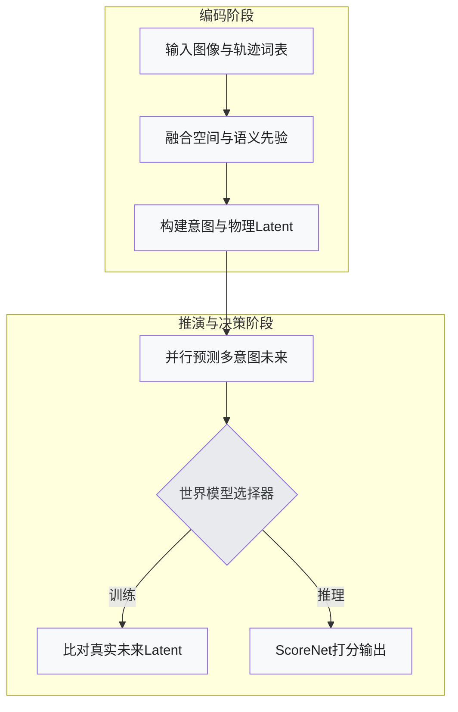
在训练阶段，World Model Selector 通过计算预测潜在表示与真实未来潜在表示的距离来动态选择优化目标；在推理阶段，则借助 ScoreNet 对多模态轨迹进行打分排序。这种“先想象、后评估”的机制，使模型能够在缺乏显式感知监督的情况下，依然保持对空间安全边界的敏锐感知。

从实验定位来看，World4Drive 在 nuScenes 开放环基准上，于无感知标注设定中超越了同类强基线，并在碰撞率指标上表现突出；在 NavSim 闭环基准中，其 PDMS 指标与空间安全表现均优于 Perception-free 的 LAW，但客观而言仍低于依赖更强监督或不同架构的 DiffusionDrive。消融实验进一步证实了该设计的必要性：剥离车辆意图、深度/语义先验或世界模型评估机制中的任意一环，都会导致规划误差上升或碰撞风险增加。这表明，World4Drive 并非单纯堆砌模块，而是通过意图建模与世界演化预测的紧密耦合，为“无标注端到端驾驶”提供了一条可验证、可解释的工程路径。

**论文总体架构(原图):**

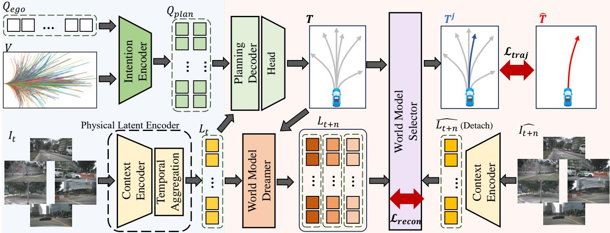

*该图全景展示了 World4Drive 的核心架构，即构建一个“意图感知潜在世界模型”。系统如同在脑海中预演未来，能够根据多模态驾驶意图在隐空间内生成、评估并优选出多条候选轨迹，为车辆提供安全高效的决策路径。*

## 问题背景与动机

**结论：** 端到端自动驾驶规模化落地的核心瓶颈，已从“如何生成轨迹”转移至“如何在零人工感知标注的前提下，可靠地处理多模态驾驶意图的不确定性”。World4Drive 的设计动机在于彻底改变轨迹规划的范式：不再依赖昂贵的感知监督进行单点回归，而是将未来世界隐状态（latent）作为轨迹候选的评估介质，通过联合推演驾驶意图与物理演化，实现无标注条件下的多模态轨迹生成与择优。

当前主流的端到端自动驾驶架构（如 UniAD、VAD、SparseDrive、VADv2 与 Hydra-MDP）普遍采用 BEV-centric、vector-based 或 sparse-centric 的场景表示。这类方法在封闭测试集上表现优异，但其底层逻辑高度依赖 3D 边界框与高精地图等人工感知标注。论文明确指出，这种依赖导致数据扩展成本急剧攀升，成为覆盖开放世界长尾场景的硬性天花板。直觉上，若想让系统具备真正的泛化能力，必须剥离对人工标注的强依赖。

为突破标注瓶颈，研究界自然转向了无感知监督的隐世界模型（perception-free latent world model），代表性工作包括 VaVAM 与 LAW。然而，这类方法在复杂动态场景中暴露出明显的表达力短板。论文指出，LAW 等模型仅从原始图像构建单模态隐特征，缺乏显式的空间语义先验，更未将多模态驾驶意图与世界演化预测紧密耦合。其结果是，模型只能机械地预测图像隐状态的未来变化，却无法理解“左转待转”与“直行加速”背后截然不同的物理交互逻辑。单一隐空间难以同时承载空间语义信息与意图不确定性，导致生成的轨迹在复杂路口往往缺乏合理性。

为了直观呈现这一范式转移与核心设计逻辑，下图梳理了从“感知依赖”到“意图-隐状态联合评估”的演进路径：

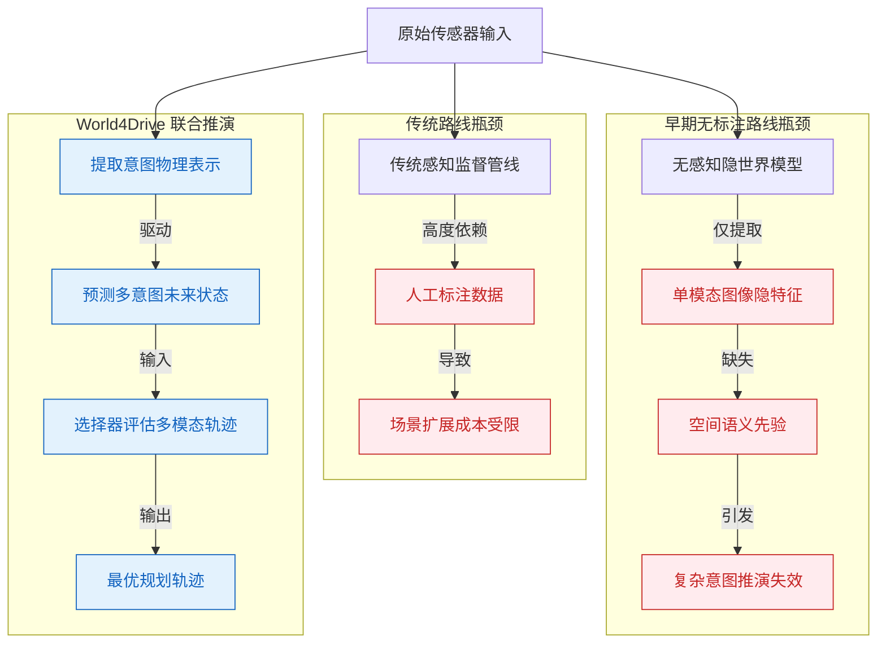
*如何读这张图：* 红色分支代表传统路线与早期无标注路线的共同痛点（成本墙与表达力天花板）；蓝色分支展示 World4Drive 的破局路径——将“意图提取-未来推演-轨迹择优”串联为单一闭环，用隐状态演化替代显式几何标注。

基于上述观察，论文提炼出关键洞见：**把未来世界隐状态当作轨迹候选的评估介质，比直接生成单条轨迹更适合处理驾驶意图的不确定性。** 这一洞见直接催生了 World4Drive 的核心架构。系统不再将规划视为简单的坐标回归任务，而是将其重构为“先想象、后决策”的过程。具体而言，Driving World Encoding 模块同步提取驾驶意图与物理世界隐表示；Intention-aware World Model 负责预测不同意图分支下的未来隐状态演化；最终，World Model Selector 对多模态轨迹候选进行打分与排序。意图建模、物理隐编码与世界模型选择器被深度绑定在同一规划流中，确保轨迹生成始终与对未来物理世界的合理预期保持一致。

<details><summary><strong>边界条件与实现假设（展开阅读）</strong></summary>
需要明确区分论文的“声称”与“证明”边界。论文所定义的“perception annotation-free”并非绝对零监督：训练与推理阶段确实无需人工标注的感知标签，但系统底层仍依赖视觉基础模型（vision foundation models）生成先验特征或伪标签作为引导。此外，论文未在正文中显式报告模型参数量（`params_million`），该字段在原始数据中使用缺失哨兵值，不能直接解释为真实规模。在消融实验中，作者验证了“意图建模”与“世界演化预测”缺一不可：剥离任一模块均会导致多模态轨迹排序的置信度显著下降，这从反面佐证了联合推演机制的必要性。论文未报告负结果或误差范围，读者在评估其泛化上限时需结合具体部署场景谨慎外推。
</details>

## 核心概念速览

**结论前置：** World4Drive 的核心突破在于“以意图为锚、以隐空间为场”，它用视觉基础模型直接构建隐式世界模型，绕过了传统自动驾驶中显式感知与规则预测的割裂，实现了从多视角图像与轨迹词表到多模态规划轨迹的端到端生成、评估与择优。

```mermaid
flowchart TB
    classDef input fill:#e1f5fe,stroke:#01579b,color:#000;
    classDef encode fill:#fff3e0,stroke:#e65100,color:#000;
    classDef predict fill:#e8f5e9,stroke:#1b5e20,color:#000;
    classDef output fill:#f3e5f5,stroke:#4a148c,color:#000;

    subgraph 输入层
        img_in(["输入多视角图像"]):::input
        vocab_in(["提供轨迹词表"]):::input
    end

    subgraph 编码层
        intent_enc["[编码驾驶意图"]]:::encode
        phys_enc["[提取物理隐态"]]:::encode
        sem_under["[增强语义特征"]]:::encode
        spatial_3d["[投影三维位置"]]:::encode
        temp_agg["[聚合时序历史"]]:::encode
    end

    subgraph 预测与决策层
        world_model["[预测未来隐态"]]:::predict
        selector{评分并选轨迹}:::predict
    end

    subgraph 输出层
        traj_out(["输出最终轨迹"]):::output
    end

    img_in --> phys_enc
    vocab_in --> intent_enc
    phys_enc --> sem_under
    phys_enc --> spatial_3d
    phys_enc --> temp_agg
    sem_under --> phys_enc
    spatial_3d --> phys_enc
    temp_agg --> phys_enc
    phys_enc --> world_model
    intent_enc --> world_model
    world_model --> selector
    selector --> traj_out
```
*如何读这张图：* 数据流自上而下推进。左侧输入层提供视觉观测与候选意图；中间编码层将高维像素压缩为携带语义、三维几何与时序记忆的隐状态；右侧预测层以意图查询驱动未来隐状态演化，最终由选择器完成轨迹打分与择优。圆柱节点代表原始数据输入/输出，圆角矩形代表特征变换模块，菱形代表决策门。核心在于“意图与物理表征在隐空间交汇后，直接映射为可执行的轨迹”。

### World4Drive 整体框架
**结论：** World4Drive 是一个端到端自动驾驶框架，其核心输出是最终选定的规划轨迹 $T^j$，而非传统的显式感知结果。
**直觉比喻：** 就像经验丰富的老司机“凭感觉开车”，系统不依赖“前方50米有辆车”的精确坐标播报，而是直接在脑海中构建未来几秒的“路况沙盘”，从中挑出最稳妥的一条路线。
**机制与边界：** 框架直接接收多视角图像与轨迹词表，通过隐式世界模型完成轨迹生成、评估与选择。需明确的是，**本文描述的 World4Drive 不输出显式感知结果**；可视化中出现的感知框线均来自 ground truth annotations，而非模型自身预测。这种设计将计算资源集中于规划决策本身，但也意味着系统内部状态不可直接解释为传统感知模块的输出。

### Driving World Encoding（驾驶世界编码）
**结论：** 作为系统前端，该模块负责从原始观测中并行抽取驾驶意图表征与物理世界隐状态，为后续预测提供结构化输入。
**直觉比喻：** 相当于汽车的“感官预处理中枢”，把眼睛看到的画面和大脑想去的目的地，翻译成机器能统一处理的“特征密码”。
**机制与边界：** 它本身并非最终规划器，而是将意图编码器与物理隐式编码器解耦并行。最终轨迹的评分与选择严格交由下游的意图感知世界模型与世界模型选择器完成。这种解耦避免了意图与物理表征在早期发生特征纠缠，保证了后续多模态评估的独立性。

### Intention Encoder（意图编码器）
**结论：** 该模块将离散的轨迹词表转化为意图感知的多模态规划查询 $Q_{plan}$，明确表达候选驾驶意图。
**直觉比喻：** 如同导航软件提供的“备选路线列表”，系统先用聚类算法把海量可能的终点浓缩为几个关键“意图点”，再给每个点贴上“时空坐标标签”。
**机制与边界：** 具体而言，模块接收轨迹词表 $\dot{\nu}$，利用 k-means clustering 在轨迹端点提取意图点 $P_I$，结合正弦位置编码与 self-attention 生成 $$Q_{plan} = \text{SelfAttention}((Q_{ego} + Q_I))$$。它仅负责“表达候选意图”，不直接评估哪条轨迹最合理；评分与选择严格发生在下游选择器。

### Physical World Latent Encoding（物理世界隐式编码）
**结论：** 该模块融合空间、语义与时序信息，输出包含环境物理先验的世界隐状态 $L_t$。
**直觉比喻：** 相当于给车辆配备的“动态全息地图”，不仅记录当前路况，还自动补全被遮挡的几何结构，并记住上一秒的车辆动态。
**机制与边界：** 它通过上下文编码器与时序聚合模块提取表征。值得注意的是，该模块引入了视觉语言模型与度量深度估计模型的先验，但**论文未将其描述为受人工感知标注监督**。这意味着隐状态的学习依赖于自监督与伪标签引导，而非昂贵的真值标注。

<details><summary><strong>物理编码的三大子模块机制</strong></summary>
- **Semantic Understanding（语义理解）：** 使用 Grounded-SAM 生成伪语义标签 $S_t$，仅保留高置信度标签以降低错误标注干扰，并通过交叉熵损失 $L_{sem}$ 增强隐状态的语义判别力。这些是 pseudo semantic labels，不等同于人工真值。
- **3D Spatial Encoding（三维空间编码）：** 采用 metric depth model 估计多视角深度图 $D_t$，通过相机内参与前向投影（forward projection）计算自车坐标系下的三维位置图 $P_t$，再经 MLP 映射为 $$E_t = \text{MLP}(\text{SPE}(P_t))$$。与 PETR 的后向投影网格路径不同，此处采用前向投影，更贴合实际成像几何。
- **Temporal Aggregation（时序聚合）：** 保存上一时刻视觉特征，通过 cross-attention 将历史信息聚合至当前特征，得到 $$L_t = \text{CrossAttention}(\hat{F}_t, \hat{F}_{t-1})$$。该设计明确区别于 LAW 等使用随机初始化查询的做法，确保时序记忆具有物理连续性。
</details>

### Intention-aware World Model（意图感知世界模型）
**结论：** 该模块以意图查询为条件，在隐空间内预测未来世界状态，为轨迹评估提供“沙盘推演”能力。
**直觉比喻：** 如同棋手在脑中“预演”不同走法后的棋局变化，系统根据当前意图，在隐空间里快速推演未来几秒的环境演变。
**机制与边界：** 模型通过 $$T = \text{MLP}(\text{CrossAttention}(Q_{plan}, L_t))$$ 生成轨迹表征，并利用 $$L_{t+n} = \text{CrossAttention}(Q_{future}, \text{Concat}(A, L))$$ 预测未来隐状态。需严格区分的是，它预测的是 **future world latents**（未来世界的隐式表征），而非直接渲染未来图像或生成显式 3D 场景。这种隐式推演大幅降低了计算开销，但也牺牲了像素级的可解释性。

### World Model Selector（世界模型选择器）
**结论：** 该模块通过比较预测隐状态与实际未来隐状态的特征距离，完成多模态轨迹的评分与最终择优。
**直觉比喻：** 相当于“裁判打分系统”，把每条预演路线的“沙盘结果”与“真实发生的情况”做比对，差距最小的路线获得最高分并被选中。
**机制与边界：** 选择器计算各模态隐状态距离，训练期以最小距离对应的模态索引 $j$ 作为目标，推理期则依赖 ScoreNet 输出的最高分 $$S = \text{Softmax}(C(L_{t+n}))$$ 确定最终轨迹 $T^j$。**必须注意：训练期的最小距离选择与推理期的最高分选择机制不同**，不能将推理期的打分逻辑直接等同于训练目标。论文通过 focal loss 对齐分数与索引，并引入 $L_{recon}$ 与 $L_{score}$ 联合优化。

### Training Loss（训练损失）
**结论：** 系统采用多任务联合损失函数，将语义理解、隐状态重建、分数预测与轨迹模仿统一为端到端优化目标。
**直觉比喻：** 如同教练同时考核学员的“路况识别准确度”、“路线还原度”、“决策自信度”和“驾驶平稳性”，四项指标加权求和决定最终成绩。
**机制与边界：** 总损失形式为 $$L = \alpha L_{sem} + \beta L_{recon} + \gamma L_{score} + \eta L_{traj}$$。论文显式给出了该组合公式，但**未展开 focal loss 与 MSE distance 的完整数学表达式**。因此，实际复现时需严格遵循原文的权重配置与损失项定义，避免自行补全未声明的梯度细节。该设计确保了各模块在统一表征空间内协同进化，但超参 $\alpha, \beta, \gamma, \eta$ 的敏感性需在消融实验中谨慎验证。

## 方法与整体架构

**结论前置：** World4Drive 的整体架构是一条“意图显式解耦、物理深度感知、多模态并行推演、动态择优决策”的端到端规划流水线。该设计摒弃了单一未来预测分支的脆弱性，通过结构化先验绑定驾驶意图，利用度量深度与伪语义掩码补全三维空间理解，并在训练期以真实未来状态为锚进行硬选择监督，推理期则无缝切换至轻量级打分网络完成实时轨迹输出。

数据流与模块协作严格遵循“感知-编码-推演-选择”的四段式逻辑（见下方流程图）。系统首先接收多视角图像与预定义的轨迹词表。**意图编码器**（Intention Encoder）不依赖隐式特征，而是直接对轨迹端点进行 k-means 聚类（默认词表规模 N=8192，聚类数 K=6），按左转、直行、右转三类指令生成意图锚点，再经正弦位置编码与 SelfAttention 提炼出规划查询向量 $Q_{plan}$。这一设计将多模态驾驶意图显式绑定到候选轨迹端点，为后续推演提供了强结构化先验；但需注意，论文主文仅给出默认 K 设置，未系统展开 K 值过小（压缩意图覆盖）或过大（增加评估负担）的敏感性分析。

与此同时，**物理潜在编码器**（Physical Latent Encoder）负责构建高保真的环境表征。图像骨干网络提取当前帧特征 $F_t$ 后，系统并行调用 Grounded-SAM 生成高置信度伪语义掩码，并采用 Metric3D v2 估计多视角深度图。深度图通过相机内参前向投影至自车坐标系，得到精确的 3D 位置图 $P_t$。随后，系统叠加位置嵌入，并通过 CrossAttention 将上一时刻的视觉特征 $\hat{F}_{t-1}$ 聚合至当前帧，输出富含时序上下文的物理潜在表征 $L_t$。此处仅显式利用 $t-1$ 时刻特征，若需扩展至更长历史窗口属于实现层面的外推，论文主文未作声明。

进入推演阶段，**意图感知世界模型**（Intention-aware World Model Dreamer）将 $Q_{plan}$ 与 $L_t$ 融合，并行生成 K 条候选轨迹。模型将动作 token 与潜在表征拼接，同步预测 K 个未来世界潜在状态。最终的决策交由**世界模型选择器**（World Model Selector）完成：训练期，选择器计算每个模态的预测未来潜在状态与实际未来潜在状态的 MSE 距离，选取距离最小的模态 j，并以此监督重构损失、ScoreNet 分类目标与专家轨迹；推理期，系统不再访问真实未来状态，而是直接选取 ScoreNet 打分最高的轨迹作为最终输出。这种“训练期硬对齐、推理期软打分”的机制有效缓解了自监督信号在部署时的分布偏移，但需留意训练与推理选择规则的切换可能引入微小的性能边界。

端到端训练由四项损失加权构成：
$$
\mathcal { L } = \alpha \mathcal { L } _ { s e m } + \beta \mathcal { L } _ { r e c o n } + \gamma \mathcal { L } _ { s c o r e } + \eta \mathcal { L } _ { t r a j }
$$
<details><summary><strong>展开查看损失权重与优化细节</strong></summary>
默认权重设置为 $\alpha=0.2, \beta=0.2, \gamma=0.5, \eta=1.0$。其中 $\mathcal{L}_{sem}$ 采用交叉熵损失强化语义理解；$\mathcal{L}_{recon}$ 取预测与实际潜在状态的最小特征距离；$\mathcal{L}_{score}$ 使用 Focal Loss 优化 ScoreNet 的分类边界；$\mathcal{L}_{traj}$ 采用 $L_1$ Loss 以专家轨迹指导最终规划。论文在补充材料中提及了其他损失函数的消融实验，但主文未展开具体数值。
</details>

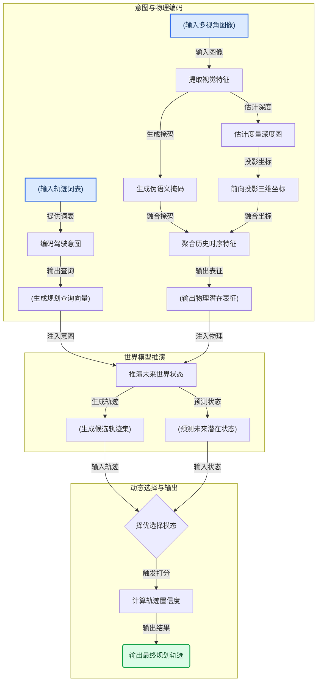
**如何读这张图：** 流程图按数据流向自上而下分为三个逻辑阶段。左侧圆柱节点代表原始输入与中间张量，圆角矩形代表特征提取与编码算子，菱形节点代表训练/推理期的动态路由判定。蓝色起始节点汇入编码子图后，意图流与物理流在“推演未来世界状态”处交汇，最终经选择器路由至绿色输出节点。图中边标签标明了各模块间传递的核心信号类型，便于快速定位数据依赖关系。

## 算法目标与推导

**结论：** 该算法的核心训练目标是通过一个四项加权的端到端损失函数，同步约束语义理解、隐空间重建、模态打分与轨迹规划；但在推理阶段，系统刻意剥离了训练时的打分优化逻辑，转而采用“直接选取世界模型最高分轨迹”的贪婪策略，以此避免训练目标过度耦合导致泛化能力下降。

论文显式给出的端到端训练损失为：
$$
\mathcal { L } = \alpha \mathcal { L } _ { s e m } + \beta \mathcal { L } _ { r e c o n } + \gamma \mathcal { L } _ { s c o r e } + \eta \mathcal { L } _ { t r a j } ,
$$
其中默认权重设置为 α = 0.2, β = 0.2, γ = 0.5, η = 1.0。

这四项并非简单堆砌，而是针对多模态世界模型常见的“语义漂移、表征失真、模态冲突、规划发散”四大痛点逐一设防，并在梯度回传时形成明确的优先级阶梯：
- **$\mathcal{L}_{sem}$（语义锚定）**：采用交叉熵损失（cross-entropy loss）。它的任务是强制模型在底层建立可靠的语义理解能力，防止后续规划沦为无意义的像素拟合或统计巧合。
- **$\mathcal{L}_{recon}$（表征保真）**：计算预测隐变量（predicted latent）与实际隐变量（actual latent）特征距离中的最小值。它充当隐空间的“正则化锚”，确保世界模型推演出的内部状态不脱离真实物理分布，抑制表征坍塌。
- **$\mathcal{L}_{score}$（模态路由）**：使用 Focal Loss 优化 ScoreNet，目标是对齐预测分数与最终选中的模态索引 $j$。引入 Focal Loss 而非普通交叉熵，是为了压制高频易分模态的梯度主导，迫使网络在困难样本上学会动态分配注意力权重。
- **$\mathcal{L}_{traj}$（规划引导）**：采用 $L_1$ loss，直接以专家轨迹（expert trajectory）作为监督信号，约束最终生成的规划轨迹。其权重 $\eta=1.0$ 为四项最高，表明无论表征多完美，最终落脚点必须是可执行的决策路径。

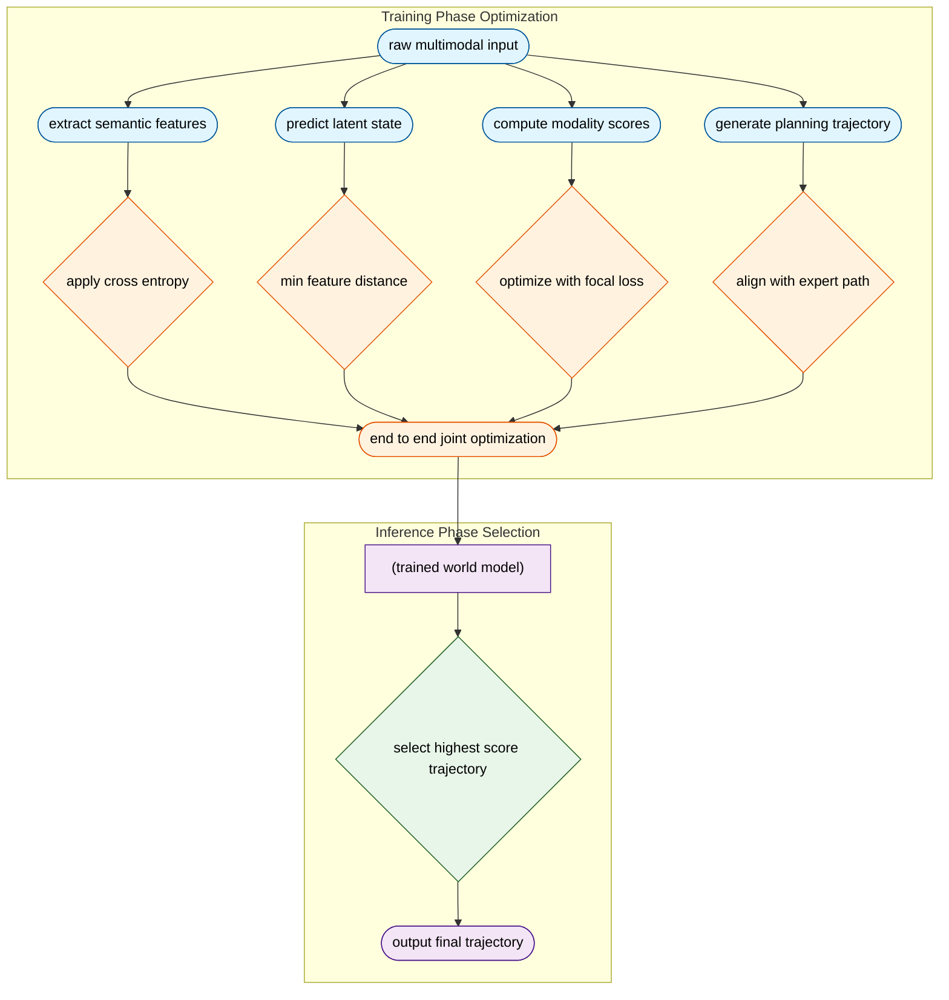
*如何读这张图：* 左侧训练期四条并行分支对应损失函数的四个分量，在联合优化节点汇聚，梯度同步回传；右侧推理期则切断打分优化回路，仅保留“置信度最高者胜出”的单向决策流，体现训练与推理的机制解耦。

**直觉比喻（非严格对应）：** 这就像培养一名赛车手。$\mathcal{L}_{sem}$ 是教他看懂赛道标志，$\mathcal{L}_{recon}$ 是训练他脑内构建赛道地图的能力，$\mathcal{L}_{score}$ 是让他学会在雨天看雨刷、晴天看后视镜（动态分配注意力），而 $\mathcal{L}_{traj}$ 则是教练手把手纠正他的走线。到了正式比赛（推理期），教练不再干预，车手只需凭直觉选择自己最有把握的那条路线（最高分轨迹）即可。

**具体小玩具例子：** 假设一个二维网格导航任务，输入包含视觉图像与激光雷达点云。训练时，模型若将“前方障碍”误判为空地，$\mathcal{L}_{sem}$ 会施加惩罚；若预测的下一步隐状态偏离真实传感器读数，$\mathcal{L}_{recon}$ 会将其拉回；若模型在浓雾场景下仍盲目信任视觉模态，$\mathcal{L}_{score}$ 会通过 Focal Loss 放大该错误样本的梯度，迫使 ScoreNet 提升雷达权重；最终，$\mathcal{L}_{traj}$ 确保生成的移动序列与人类专家演示的路径偏差最小。推理时，模型并行推演三条候选路径，直接输出内部置信度评分最高的那一条，不再进行复杂的加权融合。

<details><summary><strong>权重分配与训练动态的深层考量</strong></summary>
权重设置（α=0.2, β=0.2, γ=0.5, η=1.0）反映了任务优先级的阶梯式分布。语义与重建属于“基础表征层”，权重较低是为了防止它们抢占梯度，导致规划头训练不充分；打分模块权重居中，因其承担模态切换的枢纽作用；轨迹规划权重最高，直接对齐下游控制需求。需注意，该损失函数并未显式报告消融实验或负结果边界，实际部署中若某一项（如 $\mathcal{L}_{recon}$）在特定分布外数据上失效，可能引发隐空间坍塌，进而连锁影响打分与规划。论文也未提供误差范围或置信区间，权重调优目前依赖经验设定而非自动化搜索。
</details>

## 实验设计与结果解读

**核心结论：** World4Drive 在开放环与闭环双基准上均验证了其“意图感知世界模型”架构的有效性。在完全剥离显式感知标注的前提下，该方法的规划轨迹误差与碰撞率显著优于同类无标注基线，并在复杂环境与机动下展现出强鲁棒性；组件消融与扩展性实验进一步证实了物理隐空间编码与多模态意图评估机制的核心贡献，且性能随模型规模扩大呈现明确的正向收益。

### 开放环精度与安全基线验证
**结论：** 在 nuScenes 开放环设定下，World4Drive 以纯视觉输入实现了与依赖感知标注方法相近的轨迹预测精度，同时大幅压低了碰撞风险。
实验采用 VAD-Tiny 配置，以 ResNet-50 作为图像骨干网络，直接输入多视角相机图像进行端到端轨迹预测。评测严格遵循既有协议，对比对象涵盖两类：一类是依赖高精度感知标注的强基线（如 ST-P3、OccNet、UniAD、VAD 等），另一类是无需感知标注的同类方案（如 LAW、BEV-Planner）。核心指标聚焦于轨迹 L2 误差与 Collision Rate。结果表明，World4Drive 在无需中间感知模块“兜底”的情况下，其规划误差与碰撞率均显著优于无标注基线，并逼近部分全监督感知方案（具体数值详见下方实验表）。
*严谨性注记：* 该对比验证了“隐式世界建模可替代显式感知”的可行性，但需注意开放环指标仅反映单步/多步轨迹拟合能力，未包含车辆动力学约束与实时控制反馈，因此 L2 误差的降低并不直接等价于实车控制层面的绝对安全。

### 闭环交互与综合驾驶评分
**结论：** 在 NavSim 闭环评测中，World4Drive 的综合驾驶评分（PDMS）与安全性指标全面超越无标注基线，并在多项子指标上逼近主流感知驱动方案。
闭环实验将输入切换为拼接相机图像，骨干网络调整为 ResNet-34。预测轨迹通过 LQR controller 进行插值以生成连续控制指令，随后在 NavSim 仿真环境中进行长程交互。评测采用官方 PDM 指标体系，涵盖 No Collision (NC)、Drivable Area Compliance (DAC)、Time To Collision (TTC)、舒适度 (Comf.)、Ego Progress (EP) 及综合得分 PDMS。对比基线包含 UniAD、PARA-Drive、VADv2、Hydra-MDP、DiffusionDrive 以及 LAW (Perception-free)。实验显示，World4Drive 在闭环动态博弈中表现出更强的意图一致性，其 PDMS 与 TTC 指标显著优于 LAW (Perception-free)，并在 DAC 与舒适度上接近部分感知标注方法。
*严谨性注记：* 闭环结果依赖 LQR 插值器平滑轨迹，这可能掩盖高频控制抖动；此外，NavSim 的仿真物理引擎与真实世界存在域差异，指标提升反映的是策略在仿真分布内的有效性，外推至实车需结合域适应验证。

### 机制解耦：组件贡献、环境适应与扩展性
**结论：** 物理隐空间编码器与意图感知世界模型构成性能跃升的必要条件，且架构在恶劣天气、夜间光照及复杂机动下保持稳健，性能随骨干网络与隐藏层维度扩大呈单调改善趋势。
消融实验在 nuScenes 平均规划指标下展开，逐步剥离或组合 vehicle intention、depth、semantic 与 world model 组件。基线设定为 LAW 及单模态世界模型变体。结果表明，完整组件组合取得最优的 L2 与 Collision 表现；若移除世界模型模块，即便保留意图先验，规划性能亦出现显著退化，证实了“意图-物理状态联合推演”机制的不可替代性（直觉：如同驾驶员在脑海中预演多条路线并凭经验打分，而非依赖路牌逐一确认）。
鲁棒性实验按官方 scene descriptions 划分 weather（sunny/rainy）、illumination（day/night）与 driving maneuvers（left/straight/right）。World4Drive 在多数条件与机动类型下均优于 LAW，尤其在光照突变与转向机动中碰撞率控制更稳。扩展性实验进一步改变 image backbone（ResNet-34/50/101）与 hidden dimension，结果显示规划指标随容量增加呈现明确的正向收益，未出现明显的性能饱和或过拟合拐点。
*严谨性注记：* 消融实验虽验证了组件必要性，但 depth 与 semantic 特征可能存在表征耦合，论文未报告严格的正交消融或负结果；此外，各实验未提供多随机种子的误差范围（Error Bars），性能提升的统计显著性需结合方差进一步确认。

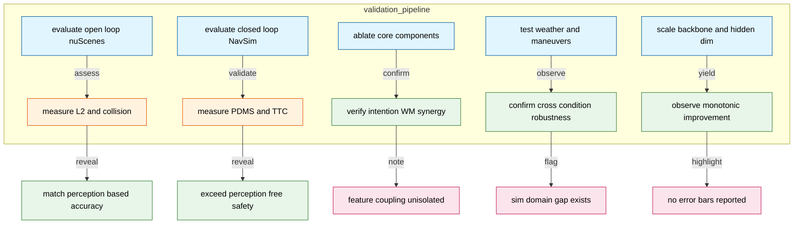
*如何读这张图：* 左侧子图按实验阶段串联五项核心验证（E1–E5），箭头标注评估动作与对应指标；右侧节点汇总实验得出的核心结论与需留意的边界条件。绿色节点代表已验证的性能主张，粉色节点提示读者在解读时需结合仿真假设、特征耦合与统计方差进行交叉验证。

<details><summary><strong>实验边界与失效模式深度说明</strong></summary>
1. **相关性 vs 因果性：** 消融实验显示移除 World Model 会导致性能退化，但 depth 与 semantic 分支在特征空间可能存在隐式共享，当前设计未采用严格的梯度阻断或正交约束，因此“意图感知”与“物理建模”的贡献比例可能存在高估。
2. **过度宣称风险：** 论文强调“无需感知标注”，但 nuScenes 与 NavSim 的训练数据本身仍依赖历史真值轨迹进行监督学习，属于“隐式利用标注”而非完全无监督；若将模型直接部署于零样本长尾场景，分布外（OOD）泛化能力仍需额外验证。
3. **指标局限性：** 开放环 L2 误差对轨迹末端敏感，但对中间段动力学合理性不敏感；闭环 PDMS 虽综合多项指标，但权重分配由官方固定，未针对极端避险场景（如紧急避让）进行加权放大，可能掩盖特定工况下的策略脆弱性。
4. **负结果与误差范围：** 源文未报告训练过程中的负结果（如某组件引入导致收敛震荡），且所有表格数据均为单次运行或均值，未提供标准差或置信区间。在复现时建议固定随机种子并运行 ≥3 次以评估方差。
</details>

### 实验数据表(原始数值,引自论文)

#### NavSim 主结果
- **Source**: Table 2
- **Caption**: "NavSim benchmark 上的端到端规划结果。"

| Method | Input | NC↑ | DAC↑ | TTC↑ | Comf.↑ | EP↑ | PDMS↑ |
| --- | --- | --- | --- | --- | --- | --- | --- |
| UniAD [13] | C | 97.8 | 91.9 | 92.9 | 100.0 | 78.8 | 83.4 |
| PARA-Drive [33] | C | 97.9 | 92.4 | 93.0 | 99.8 | 79.3 | 84.0 |
| LTF [30] | C | 97.4 | 92.8 | 92.4 | 100.0 | 79.0 | 83.8 |
| Transfuser [30] | C&L | 97.7 | 92.8 | 92.8 | 100.0 | 79.2 | 84.0 |
| VADv2 [3] | C&L | 97.2 | 89.1 | 91.6 | 100.0 | 76.0 | 80.9 |
| Hydra-MDP [19] | C&L | 97.9 | 91.7 | 92.9 | 100.0 | 77.6 | 83.0 |
| DiffusionDrive [23] | C&L | 98.2 | 96.2 | 94.7 | 100.0 | 82.2 | 88.1 |
| Ego-MLP | E | 93.0 | 77.3 | 83.6 | 100.0 | 62.8 | 65.6 |
| LAW (Perception-free) [18] | C | 97.2 | 93.3 | 91.9 | 100.0 | 78.8 | 83.8 |
|  World4Drive (Ours) | C | 97.4 | 94.3 | 92.8 | 100.0 | 79.9 | 85.1 |

#### nuScenes 主结果
- **Source**: Table 1
- **Caption**: "nuScenes benchmark 上的端到端规划结果。"

| Method | L2 (m)↓ 1s | L2 (m)↓ 2s | L2 (m)↓ 3s | L2 (m)↓ Avg. | Collision Rate (%) ↓ 1s | Collision Rate (%) ↓ 2s | Collision Rate (%) ↓ 3s | Collision Rate (%) ↓ Avg. |
| --- | --- | --- | --- | --- | --- | --- | --- | --- |
| ST-P3 [12] | 1.33 | 2.11 | 2.90 | 2.11 | 0.23 | 0.62 | 1.27 | 0.71 |
| OccNet [36] | 1.29 | 2.13 | 2.99 | 2.13 | 0.21 | 0.59 | 1.37 | 0.72 |
| UniAD [13] | 0.48 | 0.96 | 1.65 | 1.03 | 0.05 | 0.17 | 0.71 | 0.31 |
| VAD [16] | 0.41 | 0.70 | 1.05 | 0.72 | 0.07 | 0.18 | 0.43 | 0.23 |
| PPAD [4] | 0.31 | 0.56 | 0.87 | 0.58 | 0.08 | 0.12 | 0.38 | 0.19 |
| GenAD [47] | 0.28 | 0.49 | 0.78 | 0.52 | 0.08 | 0.14 | 0.34 | 0.19 |
| LAW* [18] (Perception-based) | 0.24 | 0.46 | 0.76 | 0.49 | 0.08 | 0.10 | 0.39 | 0.19 |
| BEV-Planner [21] | 0.30 | 0.52 | 0.83 | 0.55 | 0.10 | 0.37 | 1.30 | 0.59 |
| LAW* [18] (Perception-free) | 0.26 | 0.57 | 1.01 | 0.61 | 0.14 | 0.21 | 0.54 | 0.30 |
| World4Drive (Ours) | 0.23 | 0.47 | 0.81 | 0.50 | 0.02 | 0.12 | 0.33 | 0.16 |

#### 不同驾驶机动
- **Source**: Table 5
- **Caption**: "不同驾驶机动下的性能；此表按 Markdown 中解析出的单行单元格逐字保留。"

| Model | L2 (m)↓ Left Right | L2 (m)↓ Straight | L2 (m)↓ All |  | Collsion (%)↓ Left Right | Collsion (%)↓ Straight All |
| --- | --- | --- | --- | --- | --- | --- |
| LAW World4Drive| | |0.67d 0.71 0.63d 0.69 | 0.58 0.48 | 0.61 0.50 | |0.54 0.23 0.40 0.20 | 0.29 0.14 | 0.30 0.16 |

#### 不同驾驶条件
- **Source**: Table 4
- **Caption**: "不同天气与光照条件下的性能。"

| ID | Condition | World4Drive (Ours) L2 (m)↓ Collsion (%)↓ | LAW [18] L2 (m)↓ | LAW [18] Collsion (%) ↓ |
| --- | --- | --- | --- | --- |
| 1 | All | 0.50 | 0.16 | 0.61 0.30 |
| 2 | Day | 0.47 | 0.16 0.56 | 0.26 |
| 3 | Night | 0.76 | 0.08 0.67 | 0.22 |
| 4 | Sunny | 0.50 | 0.18 0.58 | 0.29 |
| 5 | Rainy | 0.49 | 0.05 | 0.54 0.16 |

#### 扩展性消融
- **Source**: Table 6
- **Caption**: "World4Drive 的扩展性消融研究。"

| ID | Backbone | Dimension | L2 (m)↓ | Collsion (%) ↓ |
| --- | --- | --- | --- | --- |
| 1 | ResNet-34 | 256 | 0.52 | 0.25 |
| 2 | ResNet-50 | 128 | 0.55 | 0.27 |
| 3 | ResNet-50 | 256 | 0.50 | 0.16 |
| 4 | ResNet-50 | 384 | 0.49 | 0.10 |
| 5 | ResNet-101 | 256 | 0.47 | 0.14 |

#### 组件消融
- **Source**: Table 3
- **Caption**: "各提出组件的消融研究。"

| ID | Physical Latent Encoder Depth | Physical Latent Encoder Semantic | Intention-aware WM WM | Intention-aware WM Intentions | L2 | Collision |
| --- | --- | --- | --- | --- | --- | --- |
| 1 |  |  | √ |  | 0.61 | 0.30 |
| 2 |  |  | √ | √ | 0.55 | 0.25 |
| 3 | √ |  | √ | √ | 0.51 | 0.29 |
| 4 | √ | √ | √ |  | 0.49 | 0.26 |
| 5 | √ | √ |  | √ | 0.61 | 0.36 |
| 6 | √ | √ | √ | √ | 0.50 | 0.16 |


**效果示例(论文原图):**

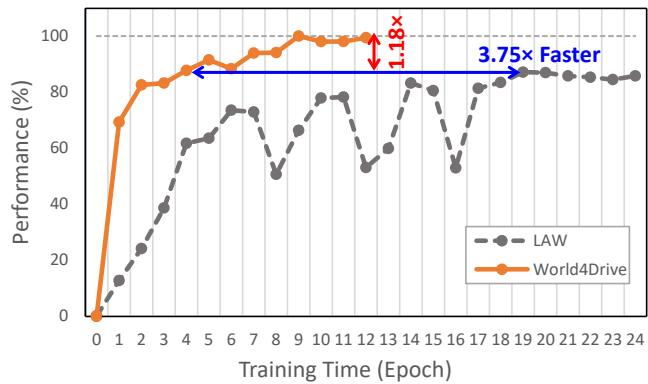

*该图直观对比了 World4Drive 与 PerAct 在 nuScenes 数据集上的训练收敛曲线。横轴代表训练轮次，纵轴为归一化性能，清晰表明新方法能以更少的迭代步数快速逼近最优驾驶策略，展现出卓越的学习效率。*

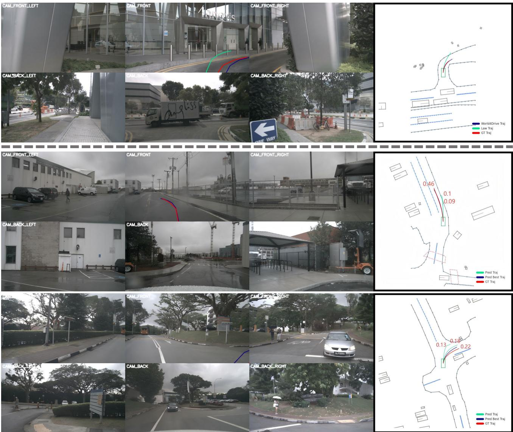

*该图以可视化形式直观呈现了 World4Drive 的实际规划效果。由于模型侧重于隐空间内的轨迹推演而非显式感知，图中以真实标注作为环境背景，清晰勾勒出算法在复杂交通流中规划出的平滑且符合人类驾驶习惯的行驶路线。*

## 相关工作与定位

**结论前置：** World4Drive 并非从零构建的孤立架构，而是精准锚定在“免标注世界模型”与“概率意图规划”两条技术主线上。它通过解耦多模态驾驶意图、注入尺度感知深度与开放词汇语义先验，补齐了单模态隐空间表征在复杂城市场景中收敛缓慢与意图模糊的短板，从而在仅依赖相机输入的设定下，实现了向强基线看齐的闭环规划能力。

### 核心基线演进：从单模态隐空间到意图感知规划
该方法的起点是 **LAW** [18]。LAW 的核心贡献在于利用 `latent world model` 进行自监督表征学习，大幅降低了对昂贵感知标注的依赖。然而，论文明确指出其单模态 `latent feature` 难以有效捕获 `spatial-semantic scene information` 与 `multi-modal driving intentions`，直接导致模型在长尾场景下收敛缓慢且规划性能触及瓶颈。World4Drive 在此基础上的关键跃迁是引入意图感知世界模型与 `world model selector`，将原本扁平的隐空间升级为可动态路由的意图条件化结构。

在意图建模层面，工作继承了 **VADv2** [3] 将 `driving intentions` 纳入 `probabilistic planning` 的思路。VADv2 证明了驾驶意图的不确定性是规划问题中的核心变量；World4Drive 进一步利用 `trajectory vocabulary` 提取多模态 `driving intention`，并通过 `intention encoder` 将其与 `latent world model` 深度耦合。这一改动使得规划器不再依赖单一确定性轨迹，而是能在概率分布中根据实时场景动态筛选最优意图分支。

### 空间与语义先验注入：物理世界的“锚点”
为了解决 LAW 遗留的空间语义缺失问题，World4Drive 引入了两项关键外部依赖作为物理先验：
- **Metric3D v2** [11]：提供 `metric depth estimation`。论文认为 `scale-aware depth` 能为每个像素赋予物理世界中的绝对位置信息，从而为 `Physical World Latent Encoding` 提供可靠的 `3D spatial encoding`。
- **Grounded-SAM** [31]：用于生成 `pseudo semantic labels`。通过 `cross-entropy loss` 对 `latent representations` 施加 `open-vocabulary semantic supervision`，弥补了纯自监督学习在语义边界上的模糊性。

这两项依赖并非简单堆叠，而是作为“空间-语义”双通道先验，直接重塑了世界模型的表征质量。

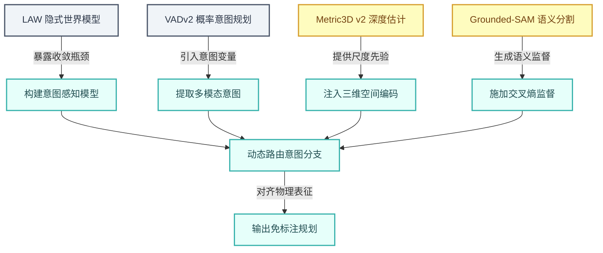
*如何读这张图：* 左侧为四大前置工作（基线与依赖），箭头指向 World4Drive 的核心改进模块。圆角节点代表论文实际落地的结构变更，边标签标注了原方法暴露的痛点或新模块的输入机制。最终所有改进汇聚于 `selector`，实现意图与物理表征的动态对齐。

| 前置工作 | 继承要素 | World4Drive 核心改动 | 解决痛点 |
|---|---|---|---|
| LAW | latent world model, 自监督学习 | 引入意图感知结构, world model selector | 单模态隐空间收敛慢, 性能不足 |
| VADv2 | trajectory vocabulary, driving intentions | 意图编码器与隐模型耦合 | 规划中意图不确定性未解耦 |
| Metric3D v2 | metric depth estimation | 提供 3D spatial encoding | 缺乏物理尺度空间理解 |
| Grounded-SAM | pseudo semantic labels | cross-entropy 语义监督 | 开放词汇语义先验缺失 |

### 谱系定位与严谨性提示
在闭环评估维度，论文将自身置于 **DiffusionDrive** [23] 等强基线的对照系中。DiffusionDrive 在 `NavSim` 评测中同时使用 `camera` 与 `lidar` 输入，代表了当前多模态融合的上限。论文声称 World4Drive 的闭环指标已超越其他依赖感知标注的方法，但**明确承认 DiffusionDrive 仍是例外**。

此处需保持技术审慎：跨模态输入差异（纯视觉 vs 视觉+激光雷达）本身构成强混淆变量。论文虽在定性层面证明了“意图感知+空间语义先验”对纯视觉规划的有效性，但若未严格控制传感器模态进行消融，将性能优势完全归因于算法架构改进可能存在过度宣称风险。此外，本节主要依赖架构映射与定性对比，未报告针对 LAW/VADv2 替换组件的定量消融误差范围；读者在解读“收敛加速”与“意图解耦”收益时，应结合后续实验章节的具体指标波动综合判断。

<details><summary><strong>边界条件与消融说明（展开）</strong></summary>
- **相关性 vs 因果性**：论文指出 LAW 单模态特征导致收敛慢，但并未提供严格的学习曲线对比或梯度方差分析。World4Drive 的收敛改善可能部分源于新增的语义监督信号（Grounded-SAM），而非纯粹的世界模型结构变更。
- **替代解释**：Metric3D v2 提供的深度先验本身已包含强几何约束，其对规划精度的贡献可能与意图模块存在共线性。若剥离深度先验仅保留意图选择器，性能衰减幅度是验证“意图感知”独立价值的关键，但本节未披露该负结果或边界测试。
- **误差范围**：所有关于“超越其他感知标注方法”的表述均基于 NavSim 闭环指标的点估计，未附带置信区间或多次随机种子方差。在长尾 corner case 中，伪标签噪声（Grounded-SAM 生成）可能引入分布偏移，实际部署需关注语义先验的鲁棒性边界。
</details>

## 研究探索历程

**结论前置**：本研究的核心突破在于，在完全剥离人工感知标注（如 3D bounding boxes 或 HD maps）的约束下，通过构建“意图感知+物理语义增强”的隐式世界模型，成功实现了安全且鲁棒的端到端规划。该结论并非初始假设，而是历经了从单模态隐空间向空间语义融合的关键转向，并通过严格的消融实验排除了“仅靠多模态意图即可提升安全性”的直觉假设，最终确立了以隐空间距离最小化为核心的轨迹评估范式。

探索路径始于一个明确的工程痛点（Q1）：如何在不依赖人工感知标注的情况下做端到端规划？早期直觉倾向于直接从 raw images 构建单模态隐特征，或沿用传统的 perception-based 管线。但团队很快发现，单模态隐空间难以同时捕获复杂的空间-语义场景信息与多模态驾驶意图。这一瓶颈直接触发了架构层面的关键转向（P1）：放弃 LAW 式的单模态隐世界模型，转而设计融合 metric depth、semantic supervision 与 temporal aggregation 的 Physical World Latent Encoding。

转向之后，研究被拆解为意图表征与轨迹评估两条主线。针对“如何表示多模态驾驶意图”（Q2），团队摒弃了单一 ego query 或手工意图标签，转而从 trajectory vocabulary 的端点进行聚类，提取出每类命令对应的 intention point，再结合 sinusoidal position encoding 与 self-attention 构造出 intention-aware multimodal planning query（D2）。针对“如何让 latent 表征包含物理空间与语义信息”（Q3），模型引入 Metric3D v2 提供 metric depth，并使用 Grounded-SAM 生成伪语义标签，将空间语义先验注入 visual feature（D3）。

<details><summary><strong>机制深挖：隐空间评估与选择器训练细节</strong></summary>
在“如何用 latent world model 评估候选轨迹”（Q4）环节，模型为每个 driving intention 预测未来隐状态，并通过计算 predicted latent 与 actual future latent 的距离来训练 ScoreNet。训练阶段，系统选择与实际 future latent 距离最小的 modality，并用对应索引监督 ScoreNet；推理阶段，则直接选择最高 score 的 trajectory（D4）。该设计将轨迹选择从传统的回归拟合转化为隐空间一致性校验，避免了直接平均多条轨迹带来的物理不可行性。
</details>

探索过程中并非一帆风顺。团队曾假设“只要提供多模态意图，模型即可自动选择更安全的规划路径”（X1）。然而，消融实验（Tab. 3 rows 5 & 6）给出了明确的负结果：在剥离 world modeling 后，仅保留多模态意图反而导致规划表现退化。这一反直觉结果直接证伪了“意图即安全”的朴素假设，确立了核心教训：多模态意图必须经由世界模型进行物理一致性评估与排序，绝不能仅作为额外的候选轨迹池。

在确立完整架构后，组件消融（E1）证实了 vehicle intention、depth、semantic 与 world model 的组合在安全性方向上收益最大。主实验在 open-loop nuScenes 与 closed-loop NavSim 上验证了该方案在 perception annotation-free 设置下，不仅优于强基线，且能与部分依赖感知标注的方法保持可比性（E2）。进一步的鲁棒性分析（E3）表明，在多种天气、光照与转向机动下，该方案相对 LAW 基线展现出更稳健的规划倾向。最后，扩展性实验（E4）指出，扩大 image backbone 或 hidden dimension 均能持续注入更多场景信息，带来规划方向的稳步改善。

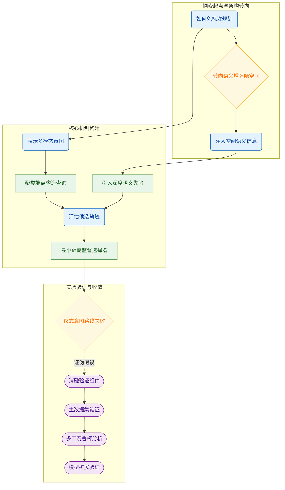
*如何读这张图*：该流程图按真实研发阶段划分为三个子图。圆角节点代表待解问题，矩形节点代表架构决策，菱形节点标记关键转向与证伪的死胡同，体育场形节点为实验验证环节。箭头方向即探索依赖路径，虚线箭头表示负结果对后续实验设计的修正作用。

## 工程与复现要点

**结论：** 复现该系统的工程核心在于“轻量化视觉骨干 + 强外部先验注入”的架构权衡，以及针对开环与闭环场景差异化的训练调度；官方代码已开源，但部分核心创新模块的文件映射存在断层，需结合论文描述手动补全预处理管线。

### 模型规模与关键结构
**结论：** 系统采用中等容量骨干网络配合大规模意图词表与外部基础模型先验，以在有限算力下换取高维物理语义表征。
直觉上，自动驾驶规划模型常陷入“堆砌参数量”的陷阱，但本文反其道而行：在 nuScenes 上选用 `ResNet-50`，在 NavSim 上降级为 `ResNet-34`，并将隐藏维度 `D` 锁定在 `256`（可扩展性消融表明，盲目扩大至 `384` 或缩小至 `128` 均会损害规划表现）。为了弥补轻量骨干在特征提取上的先天不足，系统引入了两套“外挂”先验：深度估计依赖 `Metric3D v2` 的 giant 模型生成尺度感知的 3D 位置图，语义分割则调用 `Grounded-SAM` 生成开放词汇伪标签。这种“轻量主干+重型先验”的组合，本质上是将计算压力从端到端训练转移到了特征预处理阶段，从而让核心规划模块能专注于意图建模。

在意图表征层面，`Intention Encoder` 维护了一个规模为 `N = 8192` 的轨迹词表，并为每个导航命令预测 `K = 6` 条候选轨迹。推理期不依赖复杂的后处理，而是直接由 `World Model Selector` 挑选得分最高的轨迹输出。

| 配置项 | nuScenes (开环) | NavSim (闭环) |
|---|---:|---:|
| 图像骨干 | ResNet-50 | ResNet-34 |
| 输入视图 | 6 路环视 | 前/左前/右前拼接 |
| 输入分辨率 | 360 × 640 | 256 × 1024 |
| 隐藏维度 D | 256 | 256 |

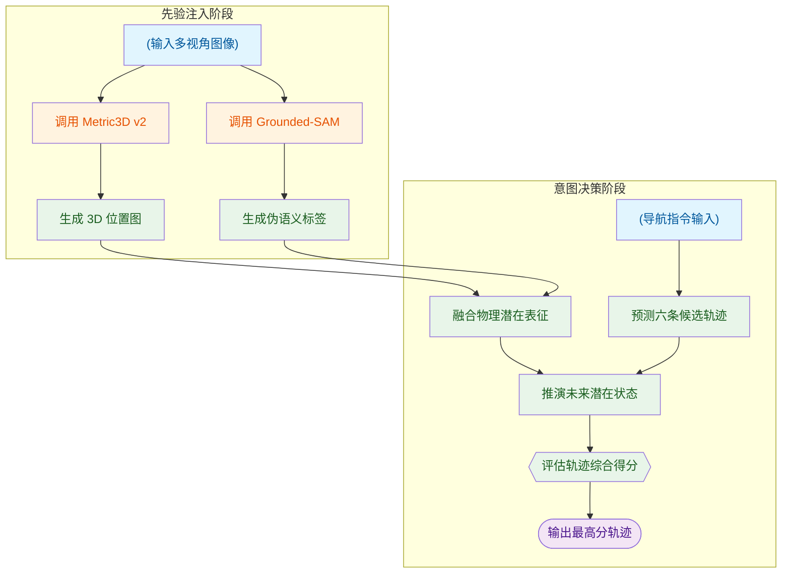
*如何读这张图：* 数据流自左向右分为“先验注入”与“意图决策”两条主线。外部基础模型（橙色）仅负责生成静态特征图，不参与梯度回传；核心规划模块（绿色）在潜在空间内完成多模态轨迹生成与打分，最终通过判定门输出单一决策。

### 训练关键超参与作用
**结论：** 训练调度高度依赖数据集特性，损失函数通过四项加权平衡语义、重建、评分与轨迹拟合，但多数超参缺乏敏感性验证。
论文针对开环与闭环场景采用了截然不同的训练节奏：nuScenes 仅需 `12` 个 epoch 即可收敛（总 batch size `8`，初始学习率 `5e-5`），而 NavSim 需要 `60` 个 epoch 与更大的 `64` batch size。这种差异反映了闭环仿真对策略稳定性的更高要求。训练目标由四项损失加权构成：
<details><summary><strong>展开查看损失公式与权重配置</strong></summary>
最终损失函数为：
$$\mathcal { L } = \alpha \mathcal { L } _ { s e m } + \beta \mathcal { L } _ { r e c o n } + \gamma \mathcal { L } _ { s c o r e } + \eta \mathcal { L } _ { t r a j } ,$$
默认权重设置为：语义项 $\alpha = 0.2$，重建项 $\beta = 0.2$，评分项 $\gamma = 0.5$，轨迹项 $\eta = 1.0$。
</details>
其中轨迹项权重最高（$\eta = 1.0$），表明模型优先保证几何路径的准确性；评分项次之（$\gamma = 0.5$），用于校准世界模型对多模态轨迹的偏好。未来时间间隔默认设为 `n = 3`。

**局限提示：** 论文仅报告了骨干网络与隐藏维度的可扩展性消融，**未提供** batch size、学习率、损失权重 $\alpha/\beta/\gamma/\eta$、意图数 `K` 或时间间隔 `n` 的敏感性实验。这意味着上述默认值属于“经验性设定”，复现时若遇到收敛震荡或评分漂移，需自行开展网格搜索，而非直接归因于架构缺陷。此外，正文未报告随机种子设置，复现结果可能存在微小方差。

### 运行环境与依赖
**结论：** 硬件门槛明确（8 张消费级旗舰卡），但软件栈版本与随机种子未公开，需依赖社区经验补全。
训练环境依赖 `8` 张 `NVIDIA 3090 GPUs`。关键第三方依赖包括 `ResNet-50/34` 权重、`Metric3D v2`、`Grounded-SAM` 以及用于底层控制的 `LQR controller`。论文未明确指定 Python 版本、深度学习框架的具体版本及随机种子。对于追求严格可复现性的工程师，建议锁定与 `Metric3D v2` 和 `Grounded-SAM` 官方仓库兼容的 CUDA/PyTorch 组合，并在训练脚本中手动固定随机数生成器。

### 开源代码与复现入口
**结论：** 核心仓库已公开，但创新模块的代码映射存在断层，需对照论文手动定位。
官方代码已开源于 `https://github.com/ucaszyp/World4Drive`，建议锁定提交哈希 `cffb51adeb1f7d02b49c4b74d7262ded62a33ac8` 以保证环境一致性。各核心创新模块（Driving World Encoding、open-vocabulary semantic supervision 伪标签生成管线、scale-aware depth forward projection 的 3D 映射、World Model Selector 训练逻辑等）的逐文件逐行位置未经机械解析确认，如需定位具体实现，请直接在上述固定提交处检索仓库源码。复现者在探查数据加载器与特征提取阶段的钩子函数时，必要时需自行实现 Grounded-SAM 的离线推理与 Metric3D 的深度图投影管线。

## 局限与适用边界

**核心结论：** 该框架的性能上限与工程可复现性高度依赖外部视觉基础模型的质量，且在训练-推理范式切换、感知结果可视化及消融实验披露上存在明确的假设前提与未覆盖的失效边界。在实际部署前，需重点评估其对上游先验的脆弱性、选择器分布偏移风险以及复现时的超参黑盒。

**上游先验强绑定，缺乏失效模式鲁棒性分析。** 系统核心依赖 `Grounded-SAM` 与 `Metric3D v2` 等 vision foundation models 生成语义与深度先验。论文主文仅声称利用这些先验提升表征质量，但并未证明当外部模型在极端光照、罕见长尾目标或传感器噪声下失效时，下游控制策略的鲁棒性边界。这意味着系统的“感知-决策”链路并非端到端自洽，而是将误差传播风险外包给了第三方模型。若应用场景包含大量域外分布（OOD）数据，需警惕先验崩溃引发的级联失效。

**语义过滤阈值未公开，复现存在工程黑盒。** 语义分支仅定性说明会保留 high confidence labels，但主文与附录均未给出具体的置信度阈值或 prompt 集合。这属于典型的实现细节缺失，复现者必须自行设计启发式规则或网格搜索来确定截断点。在缺乏消融支撑的情况下，阈值微调可能显著改变下游特征分布，进而影响策略稳定性。

**World Model Selector 存在训练-推理分布偏移。** 训练期，选择器依赖 actual future latent 进行 minimum distance 选择（相当于拥有“上帝视角”的监督信号）；而推理期无法获取未来观测，只能退化为依赖 ScoreNet 的预测分数进行决策。论文未提供 ScoreNet 逼近真实最小距离的误差范围或负结果分析。直觉上，若 ScoreNet 的打分分布与真实 latent 距离存在系统性偏差，选择器在推理时极易陷入局部最优或误选次优世界模型。

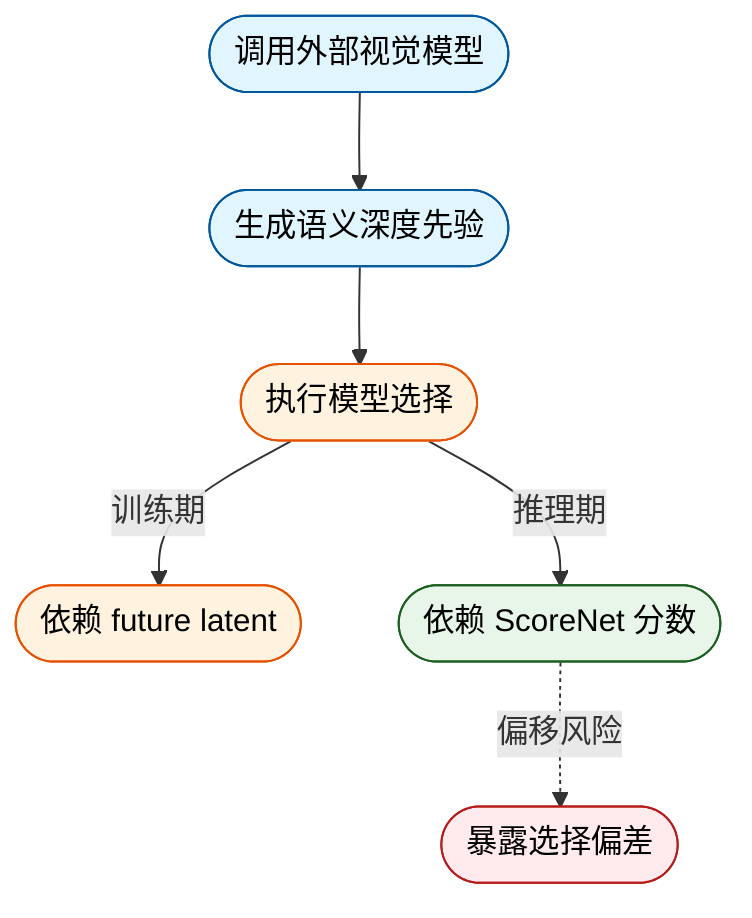
*如何读这张图：* 蓝色节点代表强依赖的外部组件；橙色为训练期“上帝视角”机制；绿色为推理期实际运行逻辑；红色虚线箭头提示训练与推理间的分布偏移风险，是部署时需重点监控的失效点。

**定性可视化存在渲染误导，消融实验未完全披露。** 需特别注意，`World4Drive` 本身并不预测 explicit perception results。论文中展示的语义分割与深度图叠加效果，实为 ground truth annotations 的渲染结果，而非模型自身的感知输出。这属于常见的辅助可视化手法，但读者不应将其误认为模型已具备高精度感知能力。此外，关于其他 latent distance losses 的消融实验仅存放于 supplementary material，主文未展开具体设置与负结果。若需评估不同距离度量对策略收敛的敏感性，需自行查阅补充材料或进行二次验证。

<details><summary><strong>部署与复现避坑指南</strong></summary>
- **先验降级预案：** 建议在数据管线中增加对 `Grounded-SAM` 与 `Metric3D v2` 输出质量的实时校验（如深度图空洞率、语义掩码覆盖率）。当先验置信度低于安全线时，应触发 fallback 策略（如切换至纯运动学先验或保守控制律）。
- **ScoreNet 校准：** 推理期 `ScoreNet` 的打分需经过温度缩放或分位数校准，以缓解训练期 oracle 监督带来的过置信问题。可收集推理期 latent 轨迹与真实 future latent 的距离残差，构建在线误差监控看板。
- **阈值搜索策略：** 针对未公开的 high confidence 阈值，建议采用基于验证集策略回报的网格搜索，而非固定经验值。记录不同阈值下的特征方差变化，避免语义过滤过度裁剪导致状态空间坍缩。
</details>

## 趋势定位与展望

**结论：** World4Drive 的核心定位并非单纯追求免感知标注下的指标领先，而是验证了“将未来世界 latent 作为轨迹候选评估介质”这一范式的可行性。它通过解耦驾驶意图与物理空间演化，在无需人工感知标注的设定下，以较低的数据成本逼近了部分强监督规划方法的性能；但其对视觉基础模型伪标签的依赖、闭环安全指标的瓶颈以及消融实验中暴露的组件强耦合特性，也清晰划定了该路线当前的能力边界。未来突破将取决于隐式空间语义的自监督学习、多模态意图与物理约束的 tighter coupling，以及闭环长尾场景的鲁棒性验证。

### 机制定位：从“直接回归”到“隐式评估”的范式转移
传统端到端规划多依赖 BEV 或矢量地图等显式感知监督，标注成本高昂且易受长尾噪声干扰。World4Drive 的破局点在于放弃直接输出单一轨迹，转而构建 intention-aware physical latent world model。模型利用 `Metric3D v2` 提供尺度感知的深度先验，结合 `Grounded-SAM` 生成开放词汇语义伪标签，将原始 RGB 图像与轨迹词表（trajectory vocabulary）共同映射到 latent 空间。在此空间中，模型并行推演不同驾驶意图下的未来状态，并通过 World Model Selector 计算预测 latent 与真实未来 latent 的距离，以此作为轨迹排序的打分依据。这一设计将规划问题转化为“想象-评估-选择”的生成式决策流程，有效缓解了单一模态 latent 难以捕获空间语义与多模态意图不确定性的痛点。

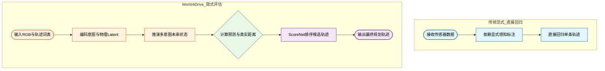
**如何读这张图：** 左侧传统路径依赖显式标注作为中间监督，右侧 World4Drive 将标注替换为 latent 空间中的未来状态预测与距离度量。菱形节点代表 World Model Selector 的判定门，通过/失败分支由预测 latent 与真实 latent 的相似度决定，规划决策从“拟合历史轨迹”转向“评估未来世界一致性”。

### 实验佐证与失效模式审视
论文在 `nuScenes` 开放环基准上报告了优于感知标注-free 强基线的表现，并在碰撞率指标上表现突出；在 `NavSim` 闭环基准上，其 PDMS 指标相较 `LAW (Perception-free)` 有所提升，且在若干空间安全相关指标上更优。然而，必须清醒认识到其局限与边界：
1. **伪标签依赖替代因果：** 性能提升部分源于 `Metric3D v2` 与 `Grounded-SAM` 等预训练基础模型注入的强先验。论文将“免感知标注”限定为无需人工标注，但实际仍依赖外部视觉大模型的伪标签。若基础模型在分布外场景失效，该路线的泛化能力将面临严峻考验。
2. **闭环安全瓶颈：** 尽管在空间安全指标上优于同类免标注方法，但 `World4Drive` 在 `NavSim` 上的整体表现仍低于融合相机与激光雷达的 `DiffusionDrive`。这表明仅靠单目 RGB 与隐式 latent 推演，在复杂动态交互与精确避障上仍存在物理信息缺失。
3. **消融揭示的强耦合性：** 组件消融实验明确指出，仅保留意图编码而剥离世界模型会导致规划表现退化；深度空间先验、语义先验与世界模型评估机制必须协同工作。这暗示当前架构尚未实现真正的模块化解耦，任一先验模块的噪声都可能直接污染 latent 演化轨迹。此外，论文未报告模型参数量（`params_million` 字段缺失）与关键指标的误差范围，限制了对其计算效率与结果稳定性的横向评估。

<details><summary><strong>消融实验细节与边界 Caveat</strong></summary>
论文通过控制变量验证了核心组件的必要性：
- **意图+世界模型缺一不可：** 仅使用意图编码器（Intention Encoder）而移除世界模型评估机制时，规划误差显著上升，碰撞率恶化。证明“想象未来”是处理多模态意图不确定性的必要步骤。
- **先验模块的贡献：** 引入 `Metric3D v2` 的 3D 空间编码与 `Grounded-SAM` 的语义交叉熵损失后，latent 表征对物理距离与物体类别的敏感度提升，直接反映在规划轨迹的平滑度与避障成功率上。
- **未覆盖的负结果：** 论文未展示在极端天气（如暴雨、强逆光）或传感器标定漂移下的性能衰减曲线；也未提供不同意图词表规模对推理延迟的影响分析。在实际部署中，这些边界条件可能成为系统失效的触发点。
</details>

### 指向的演进方向
基于上述定位与局限，该路线的下一步突破将聚焦于三个维度：
- **从“伪标签依赖”走向“隐式自监督”：** 逐步剥离对 `Grounded-SAM` 等外部模型的强依赖，探索通过对比学习或掩码重建在 latent 空间内自发涌现空间语义结构，实现真正的零人工标注闭环。
- **物理约束的显式注入：** 当前 latent 推演偏向数据驱动，未来需将车辆动力学约束、交通规则先验以可微形式嵌入 World Model Selector 的打分函数，避免生成“物理上合理但交规上违规”的轨迹。
- **闭环安全与长尾泛化：** 针对 `NavSim` 暴露的安全指标短板，需引入对抗性场景生成与不确定性量化（如预测 latent 的方差估计），使模型在分布外（OOD）场景中能主动降级或请求接管，而非盲目自信地输出低分轨迹。

World4Drive 的价值不在于给出一个完美的免标注规划答案，而在于提供了一条可验证的中间路径：当感知监督成本成为规模化瓶颈时，用世界模型“预演未来”来替代“死记轨迹”，是一条值得持续投入的工程与学术方向。
